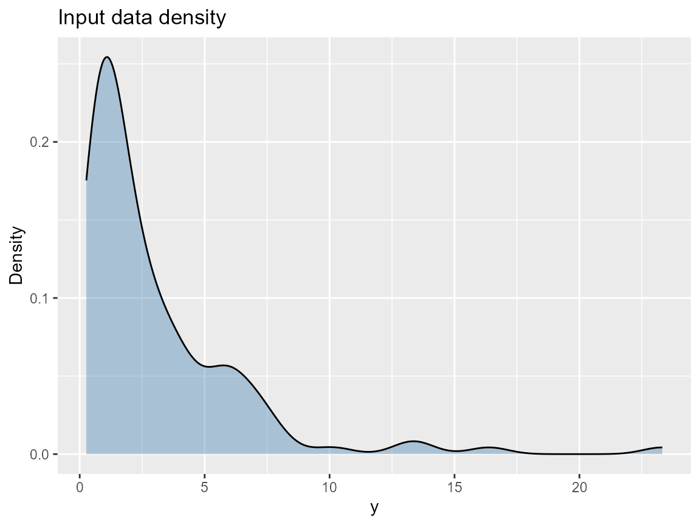

# Installation, Reproducibility, and Package Structure

What you’ll learn: how to install DPmixGPD consistently, reproduce MCMC
draws via seeds and thinning, and locate the bundle/prediction/engine
pieces inside the package.

## Installation options

- **CRAN** (preferred for most users): run
  `install.packages("DPmixGPD")` after the package appears.
- **GitHub** (latest features):

``` r
if (!requireNamespace("remotes", quietly = TRUE)) remotes::install.packages("remotes")
remotes::install_github("fsu-dpmixgpd/DPmixGPD")  # placeholder repo URL
```

- **Nimble note:** DPmixGPD relies on Nimble’s code generation.
  [`nimble::nimbleOptions`](https://rdrr.io/pkg/nimble/man/nimbleOptions.html)
  can control compilation flags, so set reproducible values before
  running
  [`run_mcmc_bundle_manual()`](https://example.com/DPmixGPD/reference/run_mcmc_bundle_manual.md).

## Reproducibility checklist

- Pass `seed` values for
  [`build_nimble_bundle()`](https://example.com/DPmixGPD/reference/build_nimble_bundle.md)
  and
  [`run_mcmc_bundle_manual()`](https://example.com/DPmixGPD/reference/run_mcmc_bundle_manual.md)
  chains (`mcmc$niter`, `nburnin`, `nchains`, `thin` as deterministic
  lists).
- Fix `plan()` for futures if using
  [`future::plan()`](https://future.futureverse.org/reference/plan.html)
  in parallel chains; the package uses `future.apply` under the hood.
- Save the returned object (`mixgpd_fit`) and rerun summaries/predict
  using the same seed list to avoid jitter.

## Package architecture map

| Area | Key functions | Purpose |
|----|----|----|
| Bundle builder | [`build_nimble_bundle()`](https://example.com/DPmixGPD/reference/build_nimble_bundle.md), [`build_causal_bundle()`](https://example.com/DPmixGPD/reference/build_causal_bundle.md) | Creates Nimble nodes and mixture layout (SB or CRP) with J components, a kernel, and optional GPD tail. |
| Prediction + diagnostics | [`predict.mixgpd_fit()`](https://example.com/DPmixGPD/reference/predict.mixgpd_fit.md), [`cqte()`](https://example.com/DPmixGPD/reference/cqte.md), [`summary.mixgpd_fit()`](https://example.com/DPmixGPD/reference/summary.mixgpd_fit.md) | Compute quantiles, plotting data, and tail comparisons using the same mixture weights as estimation. |
| Kernel registry | [`get_kernel_registry()`](https://example.com/DPmixGPD/reference/get_kernel_registry.md), [`init_kernel_registry()`](https://example.com/DPmixGPD/reference/init_kernel_registry.md) | Lists the supported kernels (e.g., `gamma`, `lognormal`, `normal`) and their parameter shapes. |
| Backend engine | [`run_mcmc_bundle_manual()`](https://example.com/DPmixGPD/reference/run_mcmc_bundle_manual.md), [`run_mcmc_causal()`](https://example.com/DPmixGPD/reference/run_mcmc_causal.md) | Executes Nimble MCMC with SB or CRP latent structures plus any causal stacking. |
| Utilities | `sim_*()` helpers, [`get_tail_registry()`](https://example.com/DPmixGPD/reference/get_tail_registry.md) | Simulated datasets for tutorials and tail-specific metadata. |

## Common pitfalls

| Symptom | Likely cause | Fix |
|----|----|----|
| “Model not fully initialized” | Some latent nodes were left `NULL` | Supply explicit `components`/`J`, `GPD`, and kernel priors in the bundle call before running MCMC. |
| Dimension mismatch in newdata | Covariate names differ or missing | Always pass a `data.frame` whose column names match the ones used in [`build_nimble_bundle()`](https://example.com/DPmixGPD/reference/build_nimble_bundle.md) (case sensitive). |
| Positivity warning in causal | Overlap poor for treated vs control | Check propensity scores and consider trimming rare regions before drawing CQTE curves. |

## Quick reproducible example

``` r
y <- sim_bulk_tail(n = 120, seed = 42)
if (use_cached_fit) {
  fit <- fit_small
} else {
  bundle <- build_nimble_bundle(
    y = y,
    backend = "sb",
    kernel = "gamma",
    GPD = TRUE,
    J = 5,
    mcmc = list(niter = 200, nburnin = 50, thin = 2, nchains = 2, seed = c(1, 2))
  )
  fit <- run_mcmc_bundle_manual(bundle)
}
print(fit)
#> MixGPD fit | backend: Stick-Breaking Process | kernel: Normal Distribution | GPD tail: FALSE
#> n = 80 | components = 3 | epsilon = 0.025
#> MCMC: niter=60, nburnin=20, thin=1, nchains=1 
#> Fit
#> Use summary() for posterior summaries; plot() for diagnostics; predict() for predictions.
```

The [`print()`](https://rdrr.io/r/base/print.html) output reiterates the
backend, kernel, J components, and the `GPD` flag (TRUE/FALSE). The
bundle bundler never leaves the latent parameter initialization to
chance.

## Diagnostic plot

``` r
data.frame(y = y) |>
  ggplot(aes(x = y)) +
  geom_density(fill = "steelblue", alpha = 0.4) +
  labs(title = "Input data density", x = "y", y = "Density")
```



## Prediction snippet

``` r
preds <- predict(fit, type = "quantile", p = c(0.5, 0.9, 0.95))
print(preds)
#> $fit
#>          [,1]     [,2]     [,3]
#> [1,] 2.444721 9.102755 9.279874
#> 
#> $lower
#> NULL
#> 
#> $upper
#> NULL
#> 
#> $type
#> [1] "quantile"
#> 
#> $grid
#> [1] 0.50 0.90 0.95
```

## Troubleshooting checklist

1.  Confirm the target data fit the kernel domain (e.g., positive for
    `gamma`, `lognormal`).
2.  Inspect `fit$threshold` and `fit$tail_shape` for GPD instabilities.
3.  Re-run with more burn-in and thinning when chains mix poorly.

## Session info

``` r
sessionInfo()
#> R version 4.5.2 (2025-10-31 ucrt)
#> Platform: x86_64-w64-mingw32/x64
#> Running under: Windows 11 x64 (build 26100)
#> 
#> Matrix products: default
#>   LAPACK version 3.12.1
#> 
#> locale:
#> [1] LC_COLLATE=English_United States.utf8 
#> [2] LC_CTYPE=English_United States.utf8   
#> [3] LC_MONETARY=English_United States.utf8
#> [4] LC_NUMERIC=C                          
#> [5] LC_TIME=English_United States.utf8    
#> 
#> time zone: America/New_York
#> tzcode source: internal
#> 
#> attached base packages:
#> [1] stats     graphics  grDevices datasets  utils     methods   base     
#> 
#> other attached packages:
#> [1] ggplot2_4.0.1  nimble_1.4.0   DPmixGPD_0.0.8
#> 
#> loaded via a namespace (and not attached):
#>  [1] sass_0.4.10         future_1.68.0       generics_0.1.4     
#>  [4] renv_1.1.5          lattice_0.22-7      listenv_0.10.0     
#>  [7] pracma_2.4.6        digest_0.6.39       magrittr_2.0.4     
#> [10] evaluate_1.0.5      grid_4.5.2          RColorBrewer_1.1-3 
#> [13] fastmap_1.2.0       jsonlite_2.0.0      scales_1.4.0       
#> [16] codetools_0.2-20    numDeriv_2016.8-1.1 textshaping_1.0.4  
#> [19] jquerylib_0.1.4     cli_3.6.5           rlang_1.1.6        
#> [22] parallelly_1.46.0   future.apply_1.20.1 withr_3.0.2        
#> [25] cachem_1.1.0        yaml_2.3.12         otel_0.2.0         
#> [28] tools_4.5.2         parallel_4.5.2      coda_0.19-4.1      
#> [31] dplyr_1.1.4         globals_0.18.0      vctrs_0.6.5        
#> [34] R6_2.6.1            lifecycle_1.0.4     fs_1.6.6           
#> [37] htmlwidgets_1.6.4   ragg_1.5.0          pkgconfig_2.0.3    
#> [40] desc_1.4.3          pillar_1.11.1       pkgdown_2.2.0      
#> [43] bslib_0.9.0         gtable_0.3.6        glue_1.8.0         
#> [46] systemfonts_1.3.1   tidyselect_1.2.1    tibble_3.3.0       
#> [49] xfun_0.55           rstudioapi_0.17.1   knitr_1.51         
#> [52] farver_2.1.2        htmltools_0.5.9     igraph_2.2.1       
#> [55] labeling_0.4.3      rmarkdown_2.30      compiler_4.5.2     
#> [58] S7_0.2.1
```
