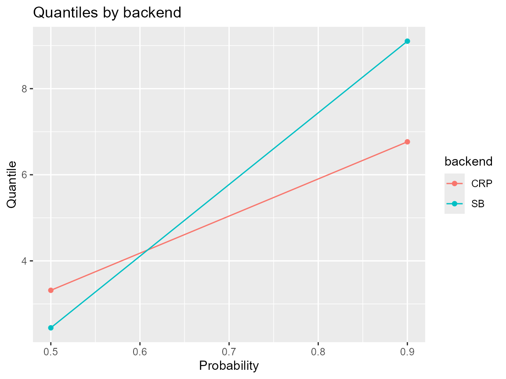

# Backends: CRP vs Stick-Breaking

What you’ll learn: what SB and CRP backends control, what stays common,
and how to compare the two on the same data with a shared prediction
interface.

## What the backend controls

- **SB** rewrites the mixture as stick-breaking variables `v_j` and
  clusters with deterministic weights.
- **CRP** draws latent labels `z_i` and lets a Chinese Restaurant
  Process allocate points to `j` components.
- Both use the same kernel, threshold, and tail flags
  (`GPD = TRUE/FALSE`), so the estimated mixture weights stay aligned
  with prediction.

## What stays the same

- Kernel families, tail configuration, and
  [`predict.mixgpd_fit()`](https://example.com/DPmixGPD/reference/predict.mixgpd_fit.md)
  logic.
- The output `mixgpd_fit` object contains the same fields even when one
  backend uses cluster labels and the other uses sticks.
- Diagnostics (trace plots, tail index, q/j grid) can be computed
  identically from either backend.

## Practical differences and example

``` r
y <- sim_bulk_tail(n = 150, tail_prob = 0.08, seed = 101)
common_args <- list(
  y = y,
  kernel = "lognormal",
  GPD = TRUE,
  J = 6,
  mcmc = list(niter = 200, nburnin = 50, thin = 2, nchains = 2, seed = c(1, 2))
)

if (use_cached_fit) {
  fit_sb <- fit_small
  fit_crp <- fit_small_crp
  sb_time <- c(elapsed = NA_real_)
  crp_time <- c(elapsed = NA_real_)
} else {
  sb_time <- system.time({
    bundle_sb <- do.call(build_nimble_bundle, c(list(backend = "sb"), common_args))
    fit_sb <- run_mcmc_bundle_manual(bundle_sb)
  })
  crp_time <- system.time({
    bundle_crp <- do.call(build_nimble_bundle, c(list(backend = "crp"), common_args))
    fit_crp <- run_mcmc_bundle_manual(bundle_crp)
  })
}

system_time <- data.frame(
  backend = c("SB", "CRP"),
  elapsed = c(sb_time[["elapsed"]], crp_time[["elapsed"]])
)
system_time
#>   backend elapsed
#> 1      SB      NA
#> 2     CRP      NA
```

CRP draws latent labels directly and tends to show slightly higher
variance in weights, while SB trades variance for deterministic mixture
stick lengths. The prediction stage honors whichever weights estimation
produced.

## Diagnostic plot

``` r
q_sb <- predict(fit_sb, type = "quantile", p = c(0.5, 0.9))
q_crp <- predict(fit_crp, type = "quantile", p = c(0.5, 0.9))

data.frame(
  backend = rep(c("SB", "CRP"), each = 2),
  prob = rep(c(0.5, 0.9), 2),
  quantile = c(as.numeric(q_sb$fit), as.numeric(q_crp$fit))
) |>
  ggplot(aes(x = prob, y = quantile, color = backend)) +
  geom_point() +
  geom_line() +
  labs(title = "Quantiles by backend", y = "Quantile", x = "Probability")
```



## Prediction example

``` r
quantiles_sb <- predict(fit_sb, type = "quantile", p = c(.95, .99))
quantiles_crp <- predict(fit_crp, type = "quantile", p = c(.95, .99))
list(sb = quantiles_sb, crp = quantiles_crp)
#> $sb
#> $sb$fit
#>          [,1]    [,2]
#> [1,] 9.279874 10.1547
#> 
#> $sb$lower
#> NULL
#> 
#> $sb$upper
#> NULL
#> 
#> $sb$type
#> [1] "quantile"
#> 
#> $sb$grid
#> [1] 0.95 0.99
#> 
#> 
#> $crp
#> $crp$fit
#>          [,1]     [,2]
#> [1,] 6.813156 7.436865
#> 
#> $crp$lower
#> NULL
#> 
#> $crp$upper
#> NULL
#> 
#> $crp$type
#> [1] "quantile"
#> 
#> $crp$grid
#> [1] 0.95 0.99
```

## Benchmark summary

1.  SB tends to be faster in larger datasets because stick lengths
    converge deterministically.
2.  CRP is easier to debug thanks to explicit `z` assignments when
    cluster rebalancing is needed.
3.  Use the same `J` and `kernel` choices to make runtime comparisons
    fair.

## Session info

``` r
sessionInfo()
#> R version 4.5.2 (2025-10-31 ucrt)
#> Platform: x86_64-w64-mingw32/x64
#> Running under: Windows 11 x64 (build 26100)
#> 
#> Matrix products: default
#>   LAPACK version 3.12.1
#> 
#> locale:
#> [1] LC_COLLATE=English_United States.utf8 
#> [2] LC_CTYPE=English_United States.utf8   
#> [3] LC_MONETARY=English_United States.utf8
#> [4] LC_NUMERIC=C                          
#> [5] LC_TIME=English_United States.utf8    
#> 
#> time zone: America/New_York
#> tzcode source: internal
#> 
#> attached base packages:
#> [1] stats     graphics  grDevices datasets  utils     methods   base     
#> 
#> other attached packages:
#> [1] ggplot2_4.0.1  nimble_1.4.0   DPmixGPD_0.0.8
#> 
#> loaded via a namespace (and not attached):
#>  [1] sass_0.4.10         future_1.68.0       generics_0.1.4     
#>  [4] renv_1.1.5          lattice_0.22-7      listenv_0.10.0     
#>  [7] pracma_2.4.6        digest_0.6.39       magrittr_2.0.4     
#> [10] evaluate_1.0.5      grid_4.5.2          RColorBrewer_1.1-3 
#> [13] fastmap_1.2.0       jsonlite_2.0.0      scales_1.4.0       
#> [16] codetools_0.2-20    numDeriv_2016.8-1.1 textshaping_1.0.4  
#> [19] jquerylib_0.1.4     cli_3.6.5           rlang_1.1.6        
#> [22] parallelly_1.46.0   future.apply_1.20.1 withr_3.0.2        
#> [25] cachem_1.1.0        yaml_2.3.12         otel_0.2.0         
#> [28] tools_4.5.2         parallel_4.5.2      coda_0.19-4.1      
#> [31] dplyr_1.1.4         globals_0.18.0      vctrs_0.6.5        
#> [34] R6_2.6.1            lifecycle_1.0.4     fs_1.6.6           
#> [37] htmlwidgets_1.6.4   ragg_1.5.0          pkgconfig_2.0.3    
#> [40] desc_1.4.3          pillar_1.11.1       pkgdown_2.2.0      
#> [43] bslib_0.9.0         gtable_0.3.6        glue_1.8.0         
#> [46] systemfonts_1.3.1   tidyselect_1.2.1    tibble_3.3.0       
#> [49] xfun_0.55           rstudioapi_0.17.1   knitr_1.51         
#> [52] farver_2.1.2        htmltools_0.5.9     igraph_2.2.1       
#> [55] labeling_0.4.3      rmarkdown_2.30      compiler_4.5.2     
#> [58] S7_0.2.1
```
