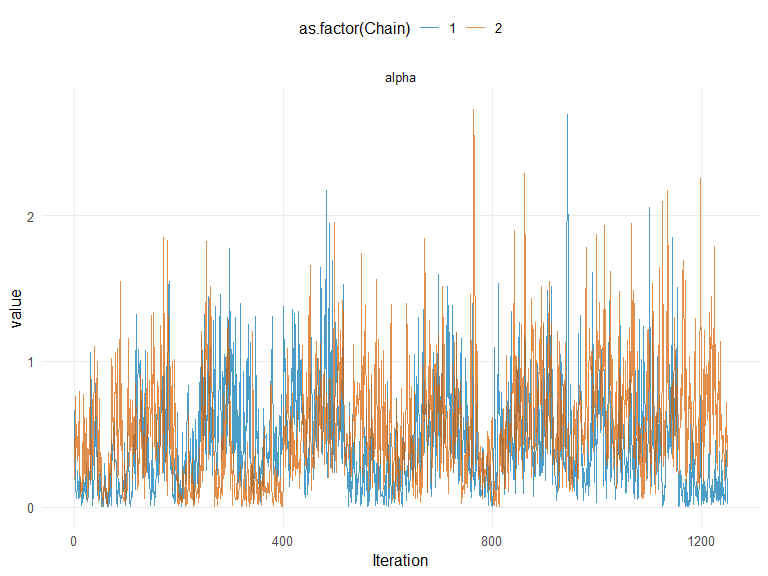
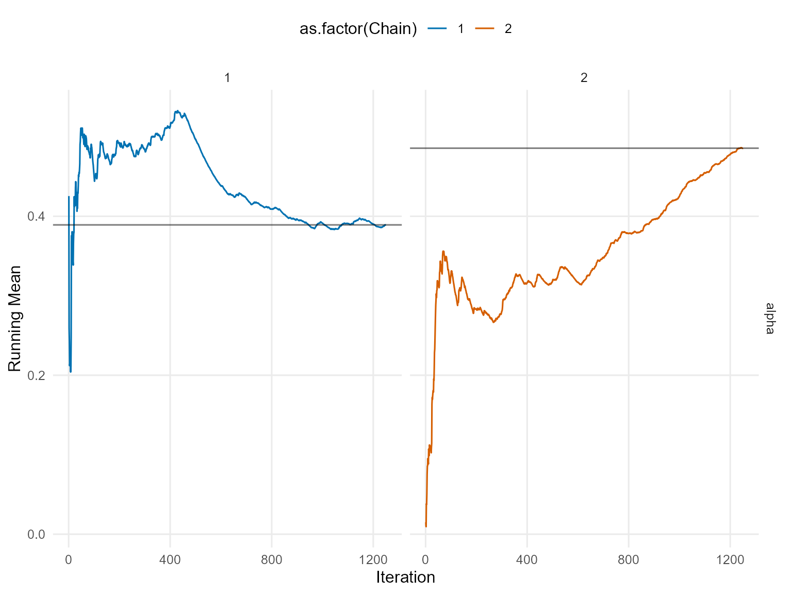
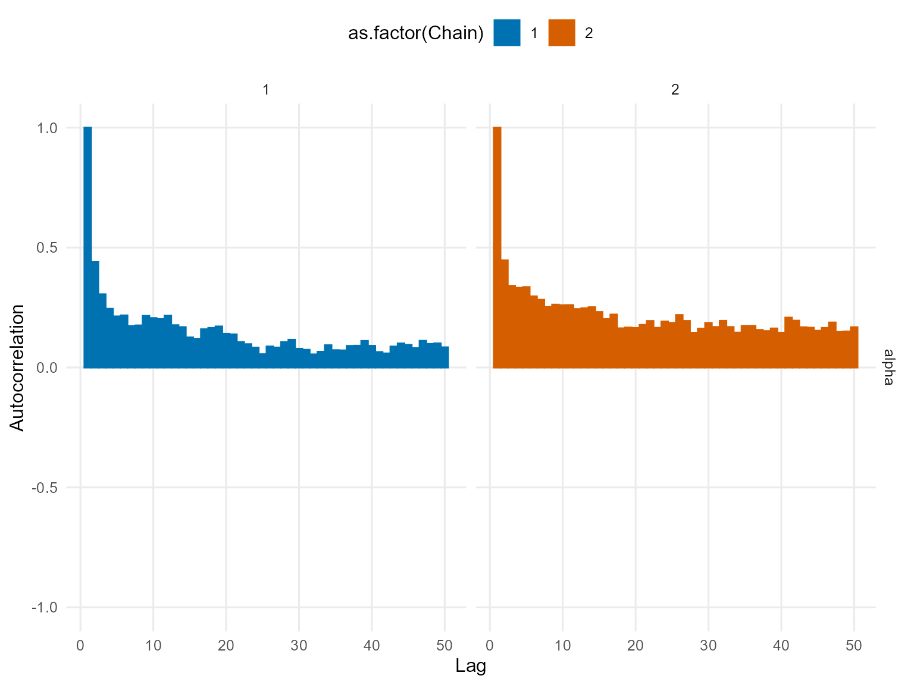

# 3. Basic Workflow: Model Specification, Bundle, & MCMC

## Workflow Overview

DPmixGPD uses a direct two-step workflow:

1.  **Bundle** (`build_nimble_bundle`): Generate NIMBLE code and compile
    the sampler.
2.  **MCMC** (`run_mcmc_bundle_manual`): Execute posterior sampling.

------------------------------------------------------------------------

### Phase 1: Bundle (NIMBLE Code Generation & Compilation)

**Purpose**: Generate NIMBLE model code, compile sampler, prepare for
MCMC execution.

#### Building Directly

``` r
# Load packaged data
data("nc_pos200_k3")
y <- nc_pos200_k3$y

# Direct call
bundle_direct <- build_nimble_bundle(
  y = y,
  kernel = "gamma",
  backend = "crp",
  GPD = FALSE,
  components = 5,
  mcmc = list(niter = 200, nburnin = 50, nchains = 1)
)

print("Direct bundle creation successful.\n")
[1] "Direct bundle creation successful.\n"
```

#### Inspecting Bundle Contents

``` r
# Bundle is an S3 object with structure
cat("Bundle class:", class(bundle_direct), "\n")
Bundle class: dpmixgpd_bundle 
cat("Bundle contains:\n")
Bundle contains:
print(names(bundle_direct))
[1] "spec"       "code"       "constants"  "dimensions" "data"      
[6] "inits"      "monitors"   "mcmc"       "epsilon"   

# Access key components
cat("\nMCMC settings:\n")

MCMC settings:
print(bundle_direct$mcmc_settings)
NULL
```

------------------------------------------------------------------------

### Phase 3: MCMC Execution

**Purpose**: Run posterior sampling from the compiled bundle.

#### Basic MCMC Run

``` r
# Run MCMC
fit <- run_mcmc_bundle_manual(bundle_direct, show_progress = FALSE)
[MCMC] Creating NIMBLE model...
[MCMC] NIMBLE model created successfully.
[MCMC] Configuring MCMC...
===== Monitors =====
thin = 1: alpha, scale, shape, z
===== Samplers =====
CRP_concentration sampler (1)
  - alpha
CRP_cluster_wrapper sampler (10)
  - scale[]  (5 elements)
  - shape[]  (5 elements)
CRP sampler (1)
  - z[1:200] 
[MCMC] MCMC configured.
[MCMC] Building MCMC object...
[MCMC] MCMC object built.
[MCMC] Attempting NIMBLE compilation (this may take a minute)...
[MCMC] Compiling model...
[MCMC] Compiling MCMC sampler...
[MCMC] Compilation successful.
  [Warning] CRP_sampler: This MCMC is not for a proper model. The MCMC attempted to use more components than the number of cluster parameters. Please increase the number of cluster parameters.
[MCMC] MCMC execution complete. Processing results...

cat("Fit object class:", class(fit), "\n")
Fit object class: mixgpd_fit list 
cat("MCMC execution complete. Posterior samples collected.\n")
MCMC execution complete. Posterior samples collected.
```

#### Accessing Posterior Samples

``` r
# Posterior summary
print("\n--- POSTERIOR SUMMARY ---\n")
[1] "\n--- POSTERIOR SUMMARY ---\n"
summary(fit)
MixGPD summary | backend: Chinese Restaurant Process | kernel: Gamma Distribution | GPD tail: FALSE | epsilon: 0.025
n = 200 | components = 5
Summary
Initial components: 5 | Components after truncation: 1

WAIC: 966.404
lppd: -466.261 | pWAIC: 16.941

Summary table
  parameter  mean    sd q0.025 q0.500 q0.975    ess
 weights[1] 0.910 0.096  0.699  0.935  1.000  5.676
      alpha 0.452 0.402  0.025  0.336  1.404 25.060
   shape[1] 1.086 0.057  0.999  1.112  1.150  3.473
   scale[1] 0.244 0.023  0.197  0.244  0.288 30.138

# Posterior mean parameters in original form
params_fit <- params(fit)
params_fit
Posterior mean parameters

$alpha
[1] 0.4517

$w
[1] 0.91

$shape
[1] 1.086

$scale
[1] 0.2438
```

#### Diagnostic Plots

``` r
# Trace plots
plot(fit, params = "alpha|beta", family = c("traceplot", "running", "autocorrelation"))

=== traceplot ===
```



    === running ===



    === autocorrelation ===



------------------------------------------------------------------------

### Complete Workflow: End-to-End Example

``` r
# Load packaged data
data("nc_pos200_k3")
y_data <- nc_pos200_k3$y

# PHASE 1: Bundle
bundle_final <- build_nimble_bundle(
  y = y_data,
  kernel = "gamma",
  backend = "crp",
  GPD = FALSE,
  components = 5,
  mcmc = list(
    niter = 120,
    nburnin = 20,
    nchains = 1,
    thin = 1
  )
)

# PHASE 2: MCMC
fit_final <- run_mcmc_bundle_manual(bundle_final, show_progress = FALSE)
[MCMC] Creating NIMBLE model...
[MCMC] NIMBLE model created successfully.
[MCMC] Configuring MCMC...
===== Monitors =====
thin = 1: alpha, scale, shape, z
===== Samplers =====
CRP_concentration sampler (1)
  - alpha
CRP_cluster_wrapper sampler (10)
  - scale[]  (5 elements)
  - shape[]  (5 elements)
CRP sampler (1)
  - z[1:200] 
[MCMC] MCMC configured.
[MCMC] Building MCMC object...
[MCMC] MCMC object built.
[MCMC] Attempting NIMBLE compilation (this may take a minute)...
[MCMC] Compiling model...
[MCMC] Compiling MCMC sampler...
[MCMC] Compilation successful.
  [Warning] CRP_sampler: This MCMC is not for a proper model. The MCMC attempted to use more components than the number of cluster parameters. Please increase the number of cluster parameters.
[MCMC] MCMC execution complete. Processing results...

print("\n=== THREE-PHASE WORKFLOW COMPLETE ===\n")
[1] "\n=== THREE-PHASE WORKFLOW COMPLETE ===\n"
summary(fit_final)
MixGPD summary | backend: Chinese Restaurant Process | kernel: Gamma Distribution | GPD tail: FALSE | epsilon: 0.025
n = 200 | components = 5
Summary
Initial components: 5 | Components after truncation: 2

WAIC: 958.155
lppd: -433.249 | pWAIC: 45.829

Summary table
  parameter  mean    sd q0.025 q0.500 q0.975    ess
 weights[1] 0.591 0.122  0.357  0.610  0.826  6.950
 weights[2] 0.252 0.094  0.084  0.260  0.415  6.023
      alpha 0.649 0.379  0.123  0.573  1.439 65.231
   shape[1] 1.383 0.204  1.104  1.377  1.686  3.767
   shape[2] 1.699 0.668  0.910  1.597  3.533 16.036
   scale[1] 0.263 0.035  0.194  0.261  0.335  9.909
   scale[2] 0.934 0.510  0.210  1.015  1.905  5.509
```

------------------------------------------------------------------------

### Backend Comparison: CRP vs Stick-Breaking

#### CRP Backend

``` r
# Chinese Restaurant Process
bundle_crp <- build_nimble_bundle(
  y = y_data,
  kernel = "gamma",
  backend = "crp",
  components = 5,
  mcmc = list(niter = 200, nburnin = 50, nchains = 1)
)

fit_crp <- run_mcmc_bundle_manual(bundle_crp, show_progress = FALSE)
[MCMC] Creating NIMBLE model...
[MCMC] NIMBLE model created successfully.
[MCMC] Configuring MCMC...
===== Monitors =====
thin = 1: alpha, scale, shape, z
===== Samplers =====
CRP_concentration sampler (1)
  - alpha
CRP_cluster_wrapper sampler (10)
  - scale[]  (5 elements)
  - shape[]  (5 elements)
CRP sampler (1)
  - z[1:200] 
[MCMC] MCMC configured.
[MCMC] Building MCMC object...
[MCMC] MCMC object built.
[MCMC] Attempting NIMBLE compilation (this may take a minute)...
[MCMC] Compiling model...
[MCMC] Compiling MCMC sampler...
[MCMC] Compilation successful.
  [Warning] CRP_sampler: This MCMC is not for a proper model. The MCMC attempted to use more components than the number of cluster parameters. Please increase the number of cluster parameters.
[MCMC] MCMC execution complete. Processing results...
print("CRP execution complete.\n")
[1] "CRP execution complete.\n"
```

#### Stick-Breaking Backend

``` r
# Stick-Breaking Process
bundle_sb <- build_nimble_bundle(
  y = y_data,
  kernel = "gamma",
  backend = "sb",
  components = 5,
  mcmc = list(niter = 120, nburnin = 20, nchains = 1)
)

fit_sb <- run_mcmc_bundle_manual(bundle_sb, show_progress = FALSE)
[MCMC] Creating NIMBLE model...
[MCMC] NIMBLE model created successfully.
[MCMC] Configuring MCMC...
===== Monitors =====
thin = 1: alpha, scale, shape, w, z
===== Samplers =====
RW sampler (10)
  - alpha
  - shape[]  (5 elements)
  - v[]  (4 elements)
conjugate sampler (5)
  - scale[]  (5 elements)
categorical sampler (200)
  - z[]  (200 elements)
[MCMC] MCMC configured.
[MCMC] Building MCMC object...
[MCMC] MCMC object built.
[MCMC] Attempting NIMBLE compilation (this may take a minute)...
[MCMC] Compiling model...
[MCMC] Compiling MCMC sampler...
[MCMC] Compilation successful.
[MCMC] MCMC execution complete. Processing results...
print("SB execution complete.\n")
[1] "SB execution complete.\n"
```

------------------------------------------------------------------------

### Kernel Selection Guide

``` r
kernels_available <- c("gamma", "lognormal", "normal", "laplace", "invgauss", "amoroso", "cauchy")

cat("Available kernels:\n")
Available kernels:
for (k in kernels_available) {
  cat("  -", k, "\n")
}
  - gamma 
  - lognormal 
  - normal 
  - laplace 
  - invgauss 
  - amoroso 
  - cauchy 

print("\nChoose kernel based on:\n")
[1] "\nChoose kernel based on:\n"
print("  gamma:     Right-skewed, positive support\n")
[1] "  gamma:     Right-skewed, positive support\n"
print("  lognormal: Log-transformed normality\n")
[1] "  lognormal: Log-transformed normality\n"
print("  normal:    Symmetric, unbounded\n")
[1] "  normal:    Symmetric, unbounded\n"
print("  laplace:   Sharp peak, exponential tails\n")
[1] "  laplace:   Sharp peak, exponential tails\n"
print("  invgauss:  Positive, near-normal shape\n")
[1] "  invgauss:  Positive, near-normal shape\n"
print("  amoroso:   Generalized, maximum flexibility\n")
[1] "  amoroso:   Generalized, maximum flexibility\n"
print("  cauchy:    Heavy-tailed, rare cases\n")
[1] "  cauchy:    Heavy-tailed, rare cases\n"
```

------------------------------------------------------------------------

### GPD Tail Augmentation

#### Unconditional with GPD

``` r
# Data with tail behavior
data("nc_pos_tail200_k4")
y_tail <- nc_pos_tail200_k4$y

# Build with GPD
bundle_gpd <- build_nimble_bundle(
  y = y_tail,
  kernel = "gamma",
  backend = "sb",
  GPD = TRUE,
  components = 6,
  mcmc = list(niter = 200, nburnin = 50, nchains = 1, waic = FALSE)
)

fit_gpd <- run_mcmc_bundle_manual(bundle_gpd, show_progress = FALSE)
print("\nGPD augmentation applied to tail region.\n")
summary(fit_gpd)
```

------------------------------------------------------------------------

### Summary of Key Functions

| Phase | Function | Input | Output |
|----|----|----|----|
| **1. Bundle** | [`build_nimble_bundle()`](https://arnabaich96.github.io/DPmixGPD/reference/build_nimble_bundle.md) | y, X (optional), kernel, backend, GPD, components | `dpmixgpd_bundle` |
| **2. MCMC** | [`run_mcmc_bundle_manual()`](https://arnabaich96.github.io/DPmixGPD/reference/run_mcmc_bundle_manual.md) | bundle | `mixgpd_fit` |

------------------------------------------------------------------------

### Common Parameter Settings

``` r
print("=== Recommended MCMC Parameters ===\n")
[1] "=== Recommended MCMC Parameters ===\n"
print("Quick test:     niter=500,  nburnin=100, nchains=1\n")
[1] "Quick test:     niter=500,  nburnin=100, nchains=1\n"
print("Standard:       niter=1000, nburnin=250, nchains=2\n")
[1] "Standard:       niter=1000, nburnin=250, nchains=2\n"
print("Production:     niter=1000, nburnin=250, nchains=3\n")
[1] "Production:     niter=1000, nburnin=250, nchains=3\n"
print("\n=== Backend Parameters ===\n")
[1] "\n=== Backend Parameters ===\n"
print("Use components=3-5 for both backends in this implementation.\n")
[1] "Use components=3-5 for both backends in this implementation.\n"
print("\n=== Kernel Selection ===\n")
[1] "\n=== Kernel Selection ===\n"
print("Positive data:     gamma, lognormal, invgauss\n")
[1] "Positive data:     gamma, lognormal, invgauss\n"
print("Any real data:     normal\n")
[1] "Any real data:     normal\n"
print("Symmetric tails:   laplace\n")
[1] "Symmetric tails:   laplace\n"
print("Extreme outliers:  cauchy\n")
[1] "Extreme outliers:  cauchy\n"
```

------------------------------------------------------------------------

### Next Steps

- Move to **vignette 6-7** for unconditional models (CRP vs SB backends)
- Move to **vignette 8-9** for tail modeling with GPD
- Move to **vignette 10-13** for conditional models with covariates
- Move to **vignette 14-19** for causal inference workflows
