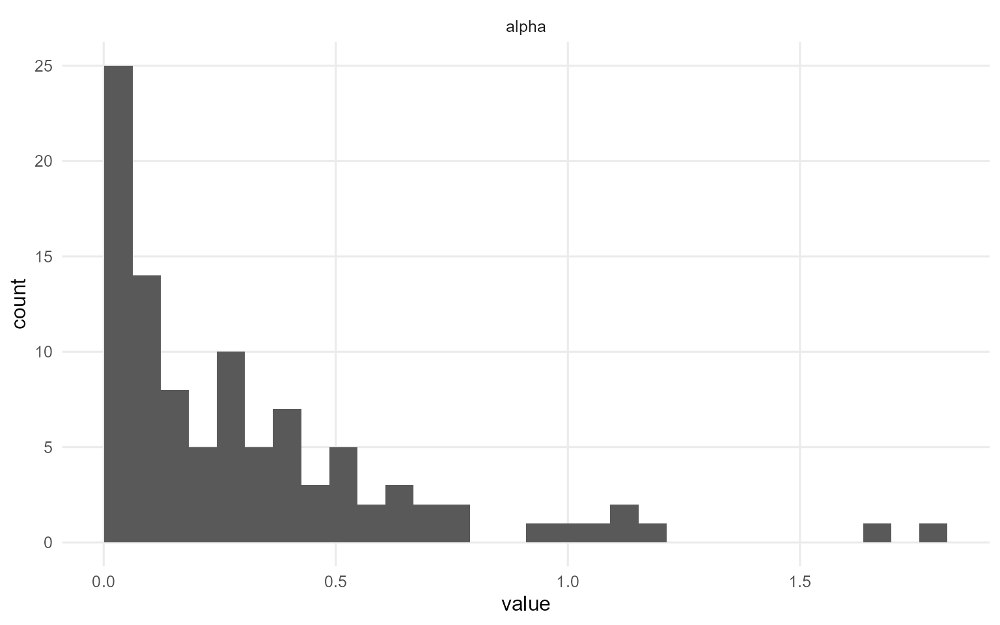
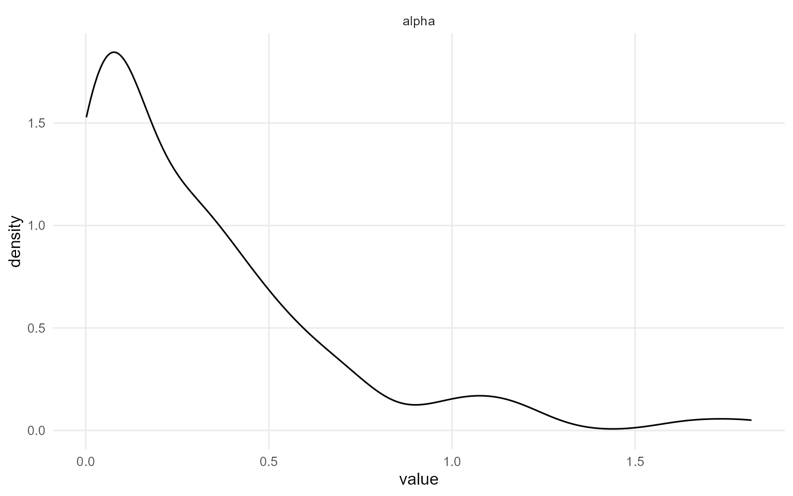
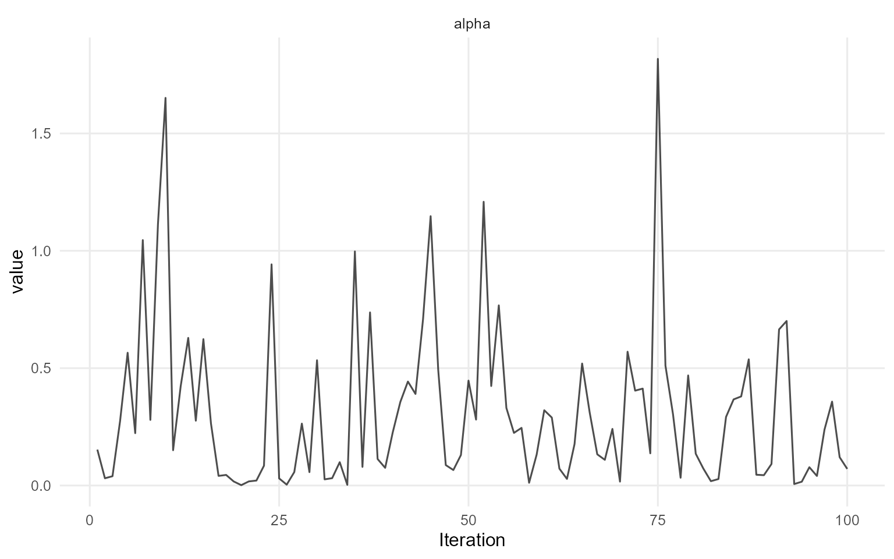
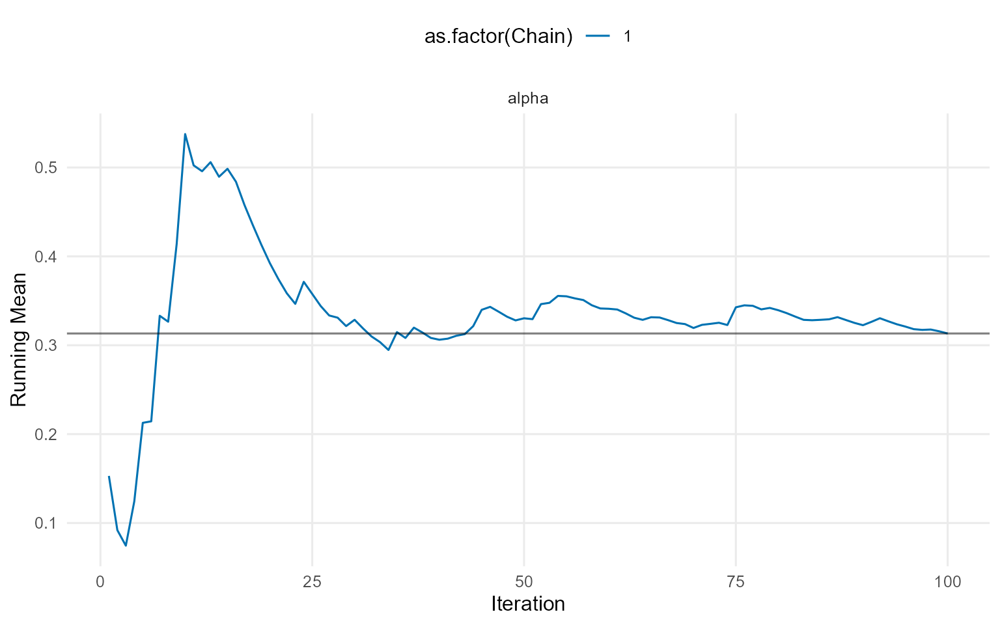
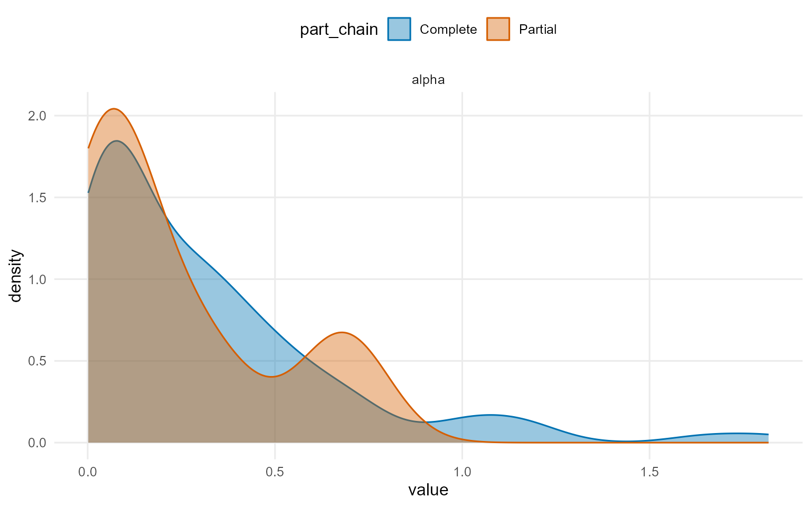
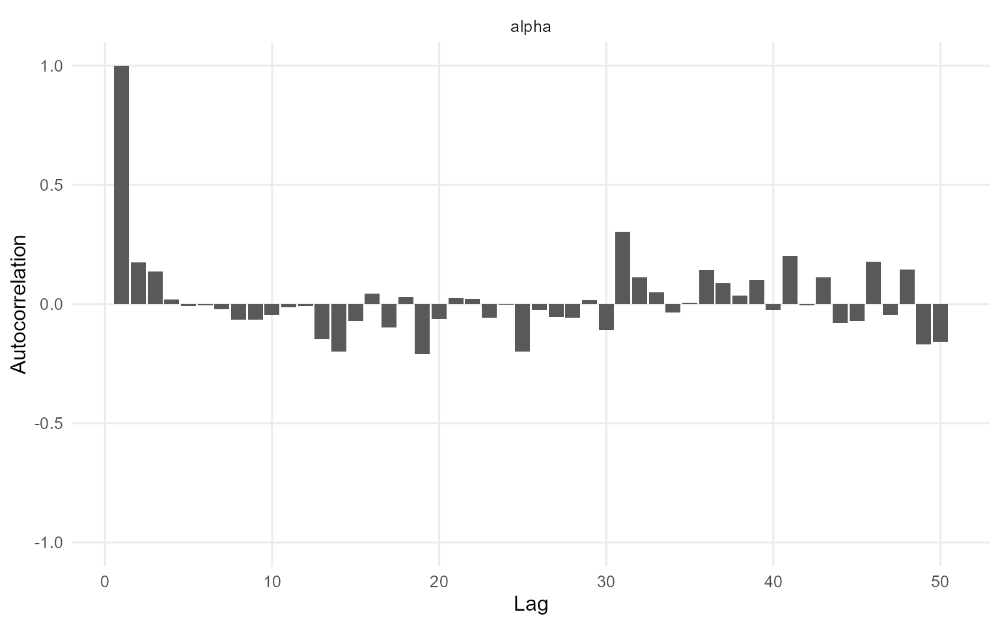
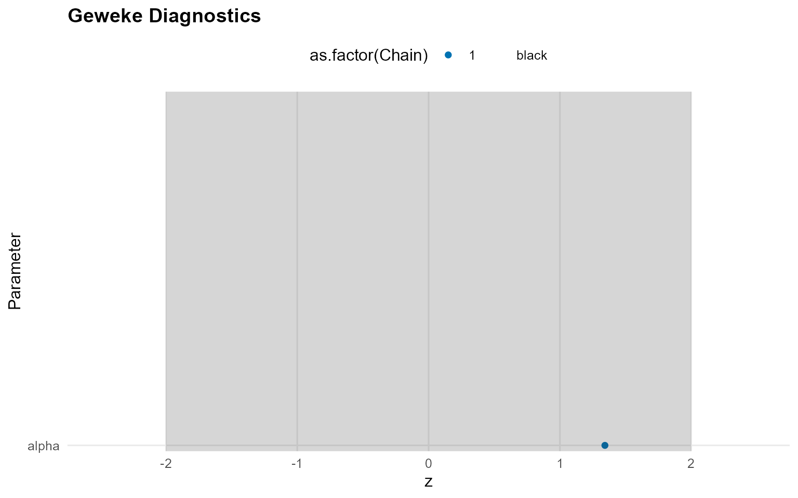
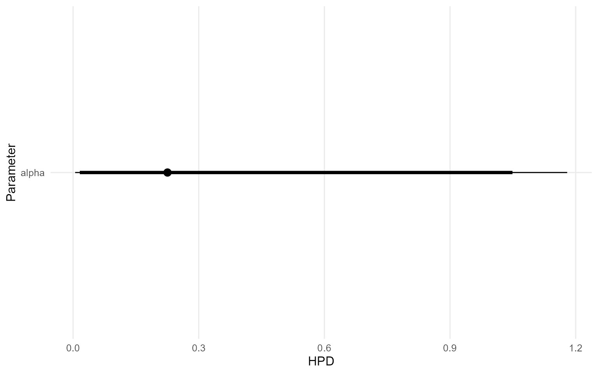
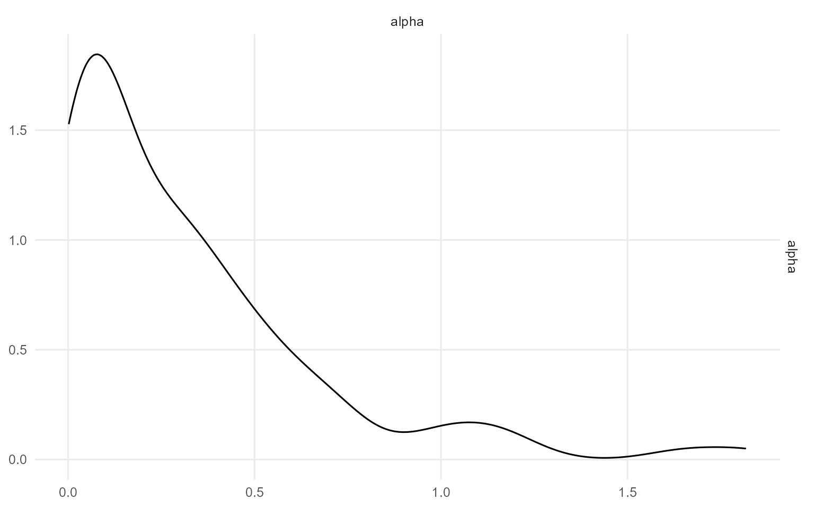

# 4. Backends, Kernels, and Workflow Map

## Big picture

DPmixGPD has two orthogonal dials you turn when building models:

- **Backend** (how the mixture weights / clustering are represented)
  - **CRP**: Chinese Restaurant Process representation.
  - **SB**: stick-breaking truncation with a fixed number of components.
- **Kernel / family** (what distribution models the bulk of the data)
  - Examples: normal, lognormal, gamma, inverse-Gaussian, Laplace,
    Cauchy, Amoroso, etc.

Optionally, you can also turn on:

- **GPD = TRUE/FALSE** to splice a Generalized Pareto tail beyond a
  threshold.

## What changes between CRP and SB?

Both backends target the same posterior over densities. The difference
is representation:

- **CRP** learns a random number of occupied clusters within a finite
  `components` cap.
- **SB** uses the same finite `components` cap and learns stick-breaking
  weights.

Practical rule of thumb:

- **CRP** is convenient when you want adaptive complexity while still
  using a finite `components` cap.
- **SB** is convenient when you want predictable memory/time and easy
  vectorization.

## What does the workflow look like?

DPmixGPD uses a consistent build -\> run -\> summarize loop:

1.  **Build a bundle** using
    [`build_nimble_bundle()`](https://arnabaich96.github.io/DPmixGPD/reference/build_nimble_bundle.md)
    (or causal builders if you are doing TE work).
2.  **Run MCMC** using
    [`run_mcmc_bundle_manual()`](https://arnabaich96.github.io/DPmixGPD/reference/run_mcmc_bundle_manual.md).
3.  **Inspect and summarize** using
    [`print()`](https://rdrr.io/r/base/print.html),
    [`summary()`](https://rdrr.io/r/base/summary.html),
    [`plot()`](https://rdrr.io/r/graphics/plot.default.html).
4.  **Predict** using
    [`predict()`](https://rdrr.io/r/stats/predict.html) (and optionally
    [`fitted()`](https://rdrr.io/r/stats/fitted.values.html)).

``` r
# Build
bundle <- build_nimble_bundle(
  y = rnorm(50),
  backend = "crp",
  kernel = "normal",
  GPD = FALSE,
  components = 5,
  mcmc = list(niter = 200, nburnin = 100, thin = 1, nchains = 1, seed = 1)
)

# Run
fit <- run_mcmc_bundle_manual(bundle)
[MCMC] Creating NIMBLE model...
[MCMC] NIMBLE model created successfully.
[MCMC] Configuring MCMC...
===== Monitors =====
thin = 1: alpha, mean, sd, z
===== Samplers =====
CRP_concentration sampler (1)
  - alpha
CRP_cluster_wrapper sampler (10)
  - sd[]  (5 elements)
  - mean[]  (5 elements)
CRP sampler (1)
  - z[1:50] 
[MCMC] MCMC configured.
[MCMC] Building MCMC object...
[MCMC] MCMC object built.
[MCMC] Attempting NIMBLE compilation (this may take a minute)...
[MCMC] Compiling model...
[MCMC] Compiling MCMC sampler...
[MCMC] Compilation successful.
|-------------|-------------|-------------|-------------|
|  [Warning] CRP_sampler: This MCMC is not for a proper model. The MCMC attempted to use more components than the number of cluster parameters. Please increase the number of cluster parameters.
-------------------------------------------------------|
[MCMC] MCMC execution complete. Processing results...

# Summarize
print(fit)
MixGPD fit | backend: Chinese Restaurant Process | kernel: Normal Distribution | GPD tail: FALSE
n = 50 | components = 5 | epsilon = 0.025
MCMC: niter=200, nburnin=100, thin=1, nchains=1 
Fit
Use summary() for posterior summaries; plot() for diagnostics; predict() for predictions.
summary(fit)
MixGPD summary | backend: Chinese Restaurant Process | kernel: Normal Distribution | GPD tail: FALSE | epsilon: 0.025
n = 50 | components = 5
Summary
Initial components: 5 | Components after truncation: 1

WAIC: 151.097
lppd: -71.454 | pWAIC: 4.095

Summary table
  parameter   mean    sd q0.025 q0.500 q0.975     ess
 weights[1]  0.993 0.020  0.940  1.000  1.000  46.158
      alpha  0.313 0.351  0.005  0.225  1.180  69.702
    mean[1] -0.094 0.155 -0.375 -0.097  0.180 100.000
      sd[1]  0.931 0.173  0.631  0.921  1.308 100.000
plot(fit)

=== histogram ===
```



    === density ===



    === traceplot ===



    === running ===



    === compare_partial ===



    === autocorrelation ===



    === geweke ===



    === caterpillar ===



    === pairs ===



## Kernel support quick check

Use
[`kernel_support_table()`](https://arnabaich96.github.io/DPmixGPD/reference/kernel_support_table.md)
and the kernel registry helpers to confirm what is available.

``` r
kernel_support_table()
             kernel gpd covariates sb crp
normal       normal   ✔          ✔  ✔   ✔
lognormal lognormal   ✔          ✔  ✔   ✔
invgauss   invgauss   ✔          ✔  ✔   ✔
gamma         gamma   ✔          ✔  ✔   ✔
laplace     laplace   ✔          ✔  ✔   ✔
amoroso     amoroso   ✔          ✔  ✔   ✔
cauchy       cauchy  ❌          ✔  ✔   ✔
```

## Where to go next

- **Available distributions**: see **v02** for the `d/p/q/r` functions
  and examples.
- **Basic build/compile/run**: see **v03**.
- **Unconditional / Conditional / Causal**: continue through v06+.
