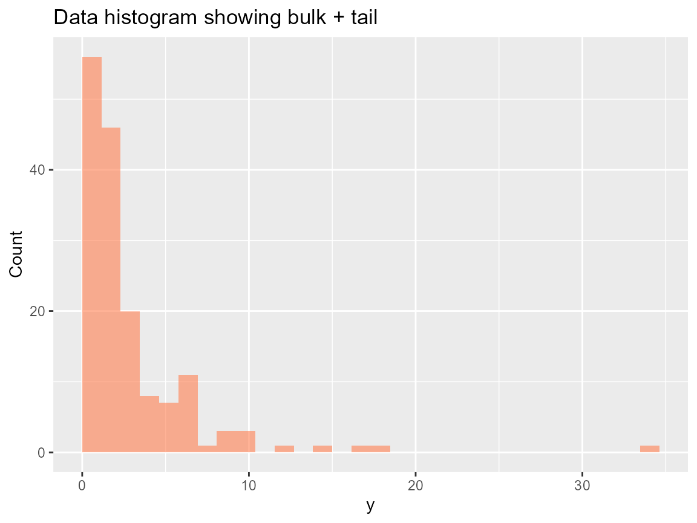

# Kernels: What They Mean and When to Use Which

What you’ll learn: how each kernel shapes the DP mixture (via the index
`j`), what domains they cover, and how to pick the right kernel for a
given dataset with a decision-style guide.

## Kernel registry and naming

DPmixGPD exposes a registry where each kernel family provides density,
quantile, and RNG functions under consistent names (`dGammaMix`,
`qGammaMix`, `rGammaMix`, etc.). The `j`-th component always shares the
same parameter layout across kernels (location, scale, shape), and the
components count is controlled by `J` only.

| Kernel | Support | Shape hints | Recommended use |
|----|----|----|----|
| `normal` | `(-Inf, Inf)` | location & scale | Symmetric data with light tails; fast mixing. |
| `lognormal` | `(0, Inf)` | log-scale mean & sd | Positive skew; natural for positive incomes or durations. |
| `gamma` | `(0, Inf)` | shape & scale | Heavy-tailed positive data, interpretable tail shape. |
| `Laplace` | `(-Inf, Inf)` | double exponential | Sharp center with heavier tails than normal. |
| `inverse Gaussian` | `(0, Inf)` | mean & shape | Right-skewed durations when variance grows cubically. |
| `Amoroso` | `(0, Inf)` | location, scale, shape | Flexible extreme skew with explicit tail shape control. |
| `Cauchy` | `(-Inf, Inf)` | location & scale | Very heavy tails; anchors tail behavior when GPD is off. |

## Decision guide

1.  Are your data strictly positive? If yes, stay in `(0, Inf)` kernels
    (`lognormal`, `gamma`, `amoroso`, `inverse Gaussian`).
2.  Do you need a flexible tail shape within the kernel itself (before
    the GPD kick-in)? Choose `Amoroso` or `Cauchy` for wide tail
    control.
3.  Need interpretable mean/variance for a symmetric central mass? Use
    `normal` or `Laplace` and rely on GPD for extremes.
4.  When the dataset shows multiple modes, increase `J` and keep the
    kernel simple to avoid identifiability issues.

## Minimal kernel example

``` r
y <- sim_bulk_tail(n = 160, seed = 77)
bundle <- build_nimble_bundle(
  y = y,
  backend = "sb",
  kernel = "amoroso",
  GPD = TRUE,
  J = 6,
  mcmc = list(niter = 200, nburnin = 50, thin = 2, nchains = 2, seed = c(1, 2))
)
if (use_cached_fit) {
  fit <- fit_small
} else {
  fit <- run_mcmc_bundle_manual(bundle)
}
```

## Diagnostic plot

``` r
data.frame(y = y) |>
  ggplot(aes(x = y)) +
  geom_histogram(boundary = 0, bins = 30, fill = "coral", alpha = 0.6) +
  labs(title = "Data histogram showing bulk + tail", x = "y", y = "Count")
```



## Prediction example

``` r
predicted <- predict(fit, type = "quantile", p = c(0.5, 0.9, 0.99))
predicted
#> $fit
#>          [,1]     [,2]    [,3]
#> [1,] 2.444721 9.102755 10.1547
#> 
#> $lower
#> NULL
#> 
#> $upper
#> NULL
#> 
#> $type
#> [1] "quantile"
#> 
#> $grid
#> [1] 0.50 0.90 0.99
```

## Kernel recommendations summary

- Use `lognormal`/`gamma` for positive, moderately heavy tails where
  standard priors suffice.
- Use `normal`/`Laplace` when symmetry is expected and tails do not
  dominate.
- Explore `Amoroso` when you want implicit tail shape control inside the
  bulk, remembering that a nontrivial threshold still keeps the GPD tail
  smooth.

## Session info

``` r
sessionInfo()
#> R version 4.5.2 (2025-10-31 ucrt)
#> Platform: x86_64-w64-mingw32/x64
#> Running under: Windows 11 x64 (build 26100)
#> 
#> Matrix products: default
#>   LAPACK version 3.12.1
#> 
#> locale:
#> [1] LC_COLLATE=English_United States.utf8 
#> [2] LC_CTYPE=English_United States.utf8   
#> [3] LC_MONETARY=English_United States.utf8
#> [4] LC_NUMERIC=C                          
#> [5] LC_TIME=English_United States.utf8    
#> 
#> time zone: America/New_York
#> tzcode source: internal
#> 
#> attached base packages:
#> [1] stats     graphics  grDevices datasets  utils     methods   base     
#> 
#> other attached packages:
#> [1] dplyr_1.1.4    ggplot2_4.0.1  nimble_1.4.0   DPmixGPD_0.0.8
#> 
#> loaded via a namespace (and not attached):
#>  [1] sass_0.4.10         future_1.68.0       generics_0.1.4     
#>  [4] renv_1.1.5          lattice_0.22-7      listenv_0.10.0     
#>  [7] pracma_2.4.6        digest_0.6.39       magrittr_2.0.4     
#> [10] evaluate_1.0.5      grid_4.5.2          RColorBrewer_1.1-3 
#> [13] fastmap_1.2.0       jsonlite_2.0.0      scales_1.4.0       
#> [16] codetools_0.2-20    numDeriv_2016.8-1.1 textshaping_1.0.4  
#> [19] jquerylib_0.1.4     cli_3.6.5           rlang_1.1.6        
#> [22] parallelly_1.46.0   future.apply_1.20.1 withr_3.0.2        
#> [25] cachem_1.1.0        yaml_2.3.12         otel_0.2.0         
#> [28] tools_4.5.2         parallel_4.5.2      coda_0.19-4.1      
#> [31] globals_0.18.0      vctrs_0.6.5         R6_2.6.1           
#> [34] lifecycle_1.0.4     fs_1.6.6            htmlwidgets_1.6.4  
#> [37] ragg_1.5.0          pkgconfig_2.0.3     desc_1.4.3         
#> [40] pillar_1.11.1       pkgdown_2.2.0       bslib_0.9.0        
#> [43] gtable_0.3.6        glue_1.8.0          systemfonts_1.3.1  
#> [46] tidyselect_1.2.1    tibble_3.3.0        xfun_0.55          
#> [49] rstudioapi_0.17.1   knitr_1.51          farver_2.1.2       
#> [52] htmltools_0.5.9     igraph_2.2.1        labeling_0.4.3     
#> [55] rmarkdown_2.30      compiler_4.5.2      S7_0.2.1
```
