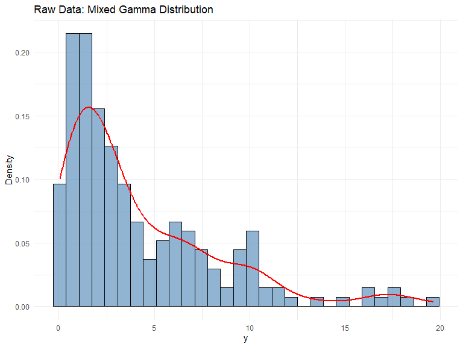
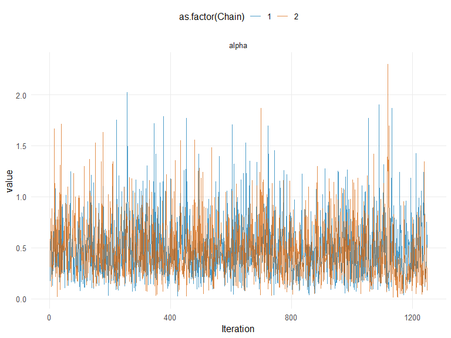
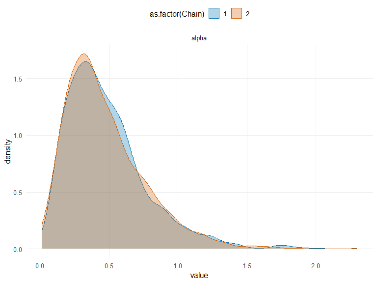
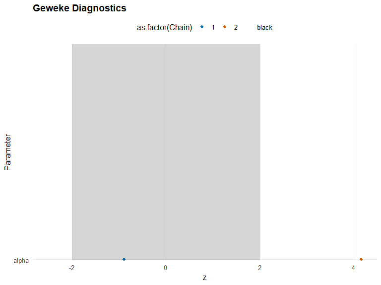
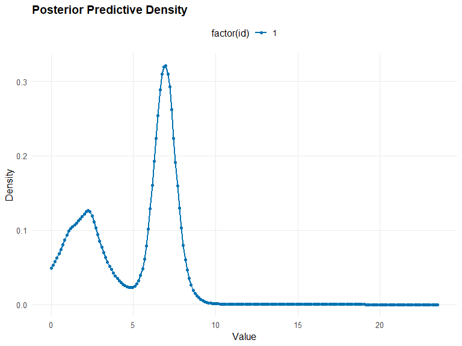
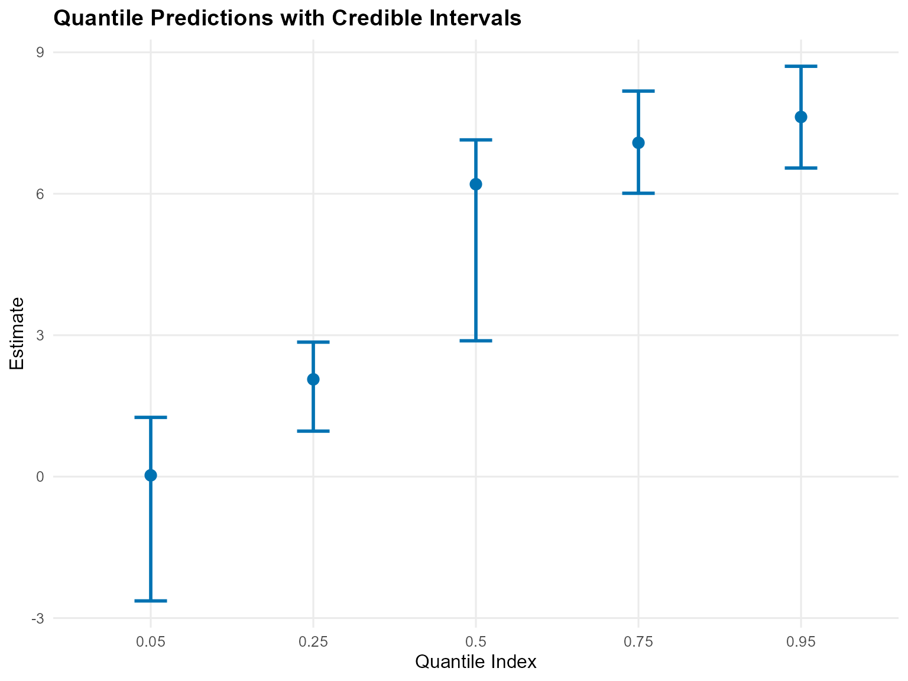
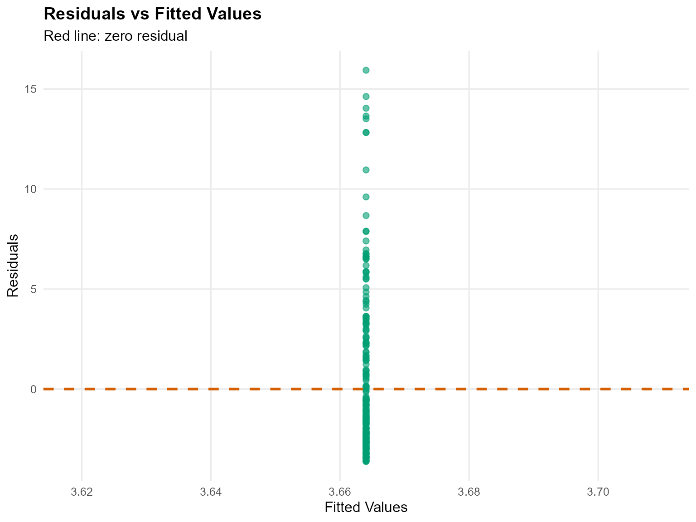
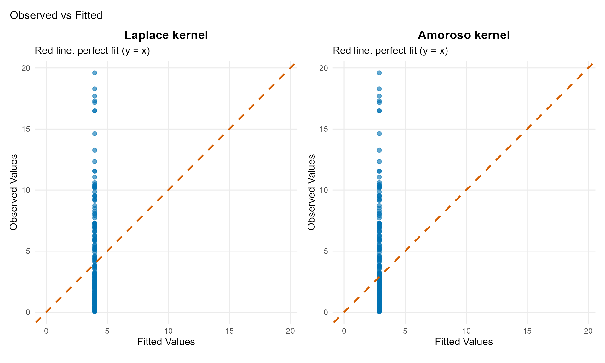

# 4. Unconditional DPmix with CRP Backend

## Unconditional DPmix: Chinese Restaurant Process (CRP)

**Goal**: Estimate density of univariate outcome $`y`$ using
**nonparametric Dirichlet Process mixture** with **Chinese Restaurant
Process** backend.

**Model**: $`y_i | G \sim \int K(y_i; \theta) dG(\theta)`$ where
$`G \sim \text{DP}(\alpha, G_0)`$

**Backend**: CRP with **truncation at max components**

------------------------------------------------------------------------

### Data Setup

``` r
# Load pre-generated dataset: 200 observations from mixture of 3 gamma components
data(nc_pos200_k3)
y_mixed <- nc_pos200_k3$y

paste("Sample size:", length(y_mixed))
[1] "Sample size: 200"
paste("Mean:", mean(y_mixed))
[1] "Mean: 4.21476750434594"
paste("SD:", sd(y_mixed))
[1] "SD: 4.10835046697183"
paste("Range:", paste(range(y_mixed), collapse = " to "))
[1] "Range: 0.0403111680208858 to 19.6013451514889"

# Visualization
df_data <- data.frame(y = y_mixed)
p_raw <- ggplot(df_data, aes(x = y)) +
  geom_histogram(aes(y = after_stat(density)), bins = 30, alpha = 0.6, fill = "steelblue",color = "black") +
  geom_density(color = "red", linewidth = 1) +
  labs(title = "Raw Data: Mixed Gamma Distribution", x = "y", y = "Density") +
  theme_minimal()

print(p_raw)
```



------------------------------------------------------------------------

### Model Specification & Bundle

We’ll use the `build_nimble_bundle` function directly which handles both
specification and bundle creation.

``` r
bundle_crp <- build_nimble_bundle(
  y = y_mixed,
  kernel = "laplace",         # Use laplace kernel
  backend = "crp",            # CRP backend
  GPD = FALSE,                # No tail augmentation
  components = 3,             # Minimal for testing
  alpha_random = TRUE,        # Random DP concentration
  mcmc = list(
    niter = 50,             # Minimal for testing
    nburnin = 10,           # Minimal burnin
    nchains = 2,            # Two chains for diagnostics
    thin = 1                # No thinning
  )
)
```

------------------------------------------------------------------------

#### Building MCMC bundle

``` r
bundle_crp <- build_nimble_bundle(
  y_mixed,
  kernel = "laplace",
  backend = "crp",
  GPD = FALSE,
  components = 3,
  alpha_random = TRUE,
  mcmc = list(niter = 1500, nburnin = 250, nchains = 2, thin = 1)
)
```

#### Summary of MCMC Bundle

``` r
summary(bundle_crp)
DPmixGPD bundle summary
      Field                      Value
    Backend Chinese Restaurant Process
     Kernel       Laplace Distribution
 Components                          3
          N                        200
          X                         NO
        GPD                      FALSE
    Epsilon                      0.025

Parameter specification
         block  parameter mode           level                  prior link
          meta    backend info           model                    crp     
          meta     kernel info           model                laplace     
          meta components info           model                      3     
          meta          N info           model                    200     
          meta          P info           model                      0     
 concentration      alpha dist          scalar gamma(shape=1, rate=1)     
          bulk   location dist component (1:3)   normal(mean=0, sd=5)     
          bulk      scale dist component (1:3) gamma(shape=2, rate=1)     
                    notes
                         
                         
                         
                         
                         
 stochastic concentration
    iid across components
    iid across components

Monitors
  n = 4 
  alpha, z[1:200], location[1:3], scale[1:3]
```

#### Running MCMC

``` r
fit_crp <- run_mcmc_bundle_manual(bundle_crp)
```

#### Summary of Fitted MCMC model

``` r
summary(fit_crp)
MixGPD summary | backend: Chinese Restaurant Process | kernel: Laplace Distribution | GPD tail: FALSE | epsilon: 0.025
n = 200 | components = 3
Summary
Initial components: 3 | Components after truncation: 2

WAIC: 916.817
lppd: -348.144 | pWAIC: 110.265

Summary table
   parameter  mean    sd q0.025 q0.500 q0.975      ess
  weights[1] 0.427 0.046  0.360  0.420  0.550  105.309
  weights[2] 0.348 0.038  0.280  0.345  0.425  179.815
       alpha 0.487 0.300  0.094  0.429  1.235 2104.322
 location[1] 5.579 2.291  1.080  6.760  7.778  193.589
 location[2] 3.196 2.585  0.814  2.244  8.133  185.334
    scale[1] 0.543 0.394  0.260  0.340  1.554  229.616
    scale[2] 1.217 0.661  0.282  1.226  2.434  235.022
```

``` r
params_crp <- params(fit_crp)
params_crp
Posterior mean parameters

$alpha
[1] 0.4872

$w
[1] 0.4269 0.3484

$location
[1] 5.579 3.196

$scale
[1] 0.5431 1.2170
```

------------------------------------------------------------------------

### MCMC Diagnostics Plots

``` r
# Trace plots for key parameters
plot(fit_crp, params = "alpha", family = c("traceplot", "density", "geweke"))
$traceplot
```



    $density



    $geweke



    attr(,"class")
    [1] "mixgpd_fit_plots" "list"            

------------------------------------------------------------------------

### Posterior Predictions

#### Predictive Density

``` r
# Generate prediction grid
y_grid <- seq(0, max(y_mixed) * 1.2, length.out = 200)

# Posterior predictive density
pred_density <- predict(fit_crp, y = y_grid, type = "density")

# Use S3 plot method
plot(pred_density)
```



#### Quantile Predictions

``` r
# Posterior predictive quantiles with credible intervals
quantiles_pred <- predict(fit_crp, type = "quantile", 
                          index = c(0.05, 0.25, 0.5, 0.75, 0.95),
                          interval = "credible")

# Display table
quantiles_pred$fit %>%
 kbl(caption = "Posterior Predictive Quantiles with Credible Intervals",
   align = "c",
                  digits = 3) %>%
 kable_styling(bootstrap_options = "striped", full_width = FALSE, position = "center")
```

| index | estimate | lower  | upper |
|:-----:|:--------:|:------:|:-----:|
| 0.05  |  0.028   | -2.636 | 1.257 |
| 0.25  |  2.063   | 0.965  | 2.853 |
| 0.50  |  6.202   | 2.881  | 7.142 |
| 0.75  |  7.081   | 6.010  | 8.177 |
| 0.95  |  7.629   | 6.545  | 8.704 |

Posterior Predictive Quantiles with Credible Intervals

``` r

# Use S3 plot method
plot(quantiles_pred)
```



------------------------------------------------------------------------

### Varying Truncation Level (components)

``` r
# Demonstrate with one value
bundle_components <- build_nimble_bundle(
  y = y_mixed,
  kernel = "laplace",
  backend = "crp",
  components = 5,
  mcmc = list(niter = 2500, nburnin = 500, nchains = 1)
)
fit_components <- run_mcmc_bundle_manual(bundle_components)
[MCMC] Creating NIMBLE model...
[MCMC] NIMBLE model created successfully.
[MCMC] Configuring MCMC...
===== Monitors =====
thin = 1: alpha, location, scale, z
===== Samplers =====
CRP_concentration sampler (1)
  - alpha
CRP_cluster_wrapper sampler (10)
  - scale[]  (5 elements)
  - location[]  (5 elements)
CRP sampler (1)
  - z[1:200] 
[MCMC] MCMC configured.
[MCMC] Building MCMC object...
[MCMC] MCMC object built.
[MCMC] Attempting NIMBLE compilation (this may take a minute)...
[MCMC] Compiling model...
[MCMC] Compiling MCMC sampler...
[MCMC] Compilation successful.
|-------------|-------------|-------------|-------------|
|  [Warning] CRP_sampler: This MCMC is not for a proper model. The MCMC attempted to use more components than the number of cluster parameters. Please increase the number of cluster parameters.
-------------------------------------------------------|
[MCMC] MCMC execution complete. Processing results...
```

``` r
summary(fit_components)
MixGPD summary | backend: Chinese Restaurant Process | kernel: Laplace Distribution | GPD tail: FALSE | epsilon: 0.025
n = 200 | components = 5
Summary
Initial components: 5 | Components after truncation: 3

WAIC: 896.086
lppd: -318.309 | pWAIC: 129.734

Summary table
   parameter  mean    sd q0.025 q0.500 q0.975     ess
  weights[1] 0.405 0.042  0.320  0.405  0.490 155.033
  weights[2] 0.314 0.050  0.210  0.320  0.400  52.901
  weights[3] 0.217 0.052  0.115  0.215  0.310 129.164
       alpha 0.709 0.386  0.168  0.644  1.617 877.436
 location[1] 5.182 2.480  0.959  6.595  7.922  32.225
 location[2] 3.121 2.669  0.771  2.251  9.198 199.885
 location[3] 2.544 2.603  0.505  2.086 10.050  44.541
    scale[1] 0.659 0.510  0.263  0.350  1.920  38.977
    scale[2] 1.324 0.706  0.277  1.333  2.584 193.555
    scale[3] 1.847 0.936  0.288  1.812  3.818  85.920
```

------------------------------------------------------------------------

### Residual Analysis

``` r
# Extract fitted values with diagnostics
Fit <- fitted(fit_components)

# Display table
kableExtra::kbl(head(Fit), caption = "Fitted Values, Residuals and Credible Interval", digits = 3, align = "c") %>%
 kable_styling(bootstrap_options = "striped", full_width = FALSE, position = "center")
```

|  fit  | lower | upper | residuals |
|:-----:|:-----:|:-----:|:---------:|
| 3.664 | 2.428 | 6.234 |  -3.019   |
| 3.664 | 2.428 | 6.234 |  -0.792   |
| 3.664 | 2.428 | 6.234 |   6.178   |
| 3.664 | 2.428 | 6.234 |  -0.480   |
| 3.664 | 2.428 | 6.234 |   3.631   |
| 3.664 | 2.428 | 6.234 |   3.424   |

Fitted Values, Residuals and Credible Interval

``` r

# Use S3 plot method for diagnostic plots
fit.plots <- plot(Fit)
fit.plots$residual_plot
```



------------------------------------------------------------------------

### Model Comparison: Different Kernels

#### Laplace Kernel (Current)

``` r
bundle_laplace <- build_nimble_bundle(
  y = y_mixed,
  kernel = "laplace",
  backend = "crp",
  components = 5,
  mcmc = list(niter = 2500, nburnin = 500, nchains = 1)
)
fit_laplace <- run_mcmc_bundle_manual(bundle_laplace)
[MCMC] Creating NIMBLE model...
[MCMC] NIMBLE model created successfully.
[MCMC] Configuring MCMC...
===== Monitors =====
thin = 1: alpha, location, scale, z
===== Samplers =====
CRP_concentration sampler (1)
  - alpha
CRP_cluster_wrapper sampler (10)
  - scale[]  (5 elements)
  - location[]  (5 elements)
CRP sampler (1)
  - z[1:200] 
[MCMC] MCMC configured.
[MCMC] Building MCMC object...
[MCMC] MCMC object built.
[MCMC] Attempting NIMBLE compilation (this may take a minute)...
[MCMC] Compiling model...
[MCMC] Compiling MCMC sampler...
[MCMC] Compilation successful.
|-------------|-------------|-------------|-------------|
|  [Warning] CRP_sampler: This MCMC is not for a proper model. The MCMC attempted to use more components than the number of cluster parameters. Please increase the number of cluster parameters.
-------------------------------------------------------|
[MCMC] MCMC execution complete. Processing results...
```

``` r
summary(fit_laplace)
MixGPD summary | backend: Chinese Restaurant Process | kernel: Laplace Distribution | GPD tail: FALSE | epsilon: 0.025
n = 200 | components = 5
Summary
Initial components: 5 | Components after truncation: 3

WAIC: 899.641
lppd: -316.795 | pWAIC: 133.026

Summary table
   parameter  mean    sd q0.025 q0.500 q0.975     ess
  weights[1] 0.402 0.043  0.290  0.405  0.475  83.077
  weights[2] 0.309 0.052  0.205  0.310  0.400  72.896
  weights[3] 0.212 0.050  0.115  0.210  0.300 122.162
       alpha 0.701 0.394  0.151  0.635  1.631 251.443
 location[1] 5.793 2.154  1.057  6.827  7.842  40.789
 location[2] 2.896 2.398  0.768  2.203  9.210 245.387
 location[3] 1.917 1.940  0.456  1.139  9.542  28.563
    scale[1] 0.546 0.432  0.264  0.340  1.820  47.116
    scale[2] 1.349 0.676  0.286  1.318  2.768 282.866
    scale[3] 2.067 0.911  0.340  2.073  3.877  99.221
```

#### Amoroso Kernel (Alternative)

``` r
bundle_amoroso <- build_nimble_bundle(
  y = y_mixed,
  kernel = "amoroso",
  backend = "crp",
  components = 5,
  mcmc = list(niter = 2500, nburnin = 500, nchains = 1)
)
fit_amoroso <- run_mcmc_bundle_manual(bundle_amoroso)
[MCMC] Creating NIMBLE model...
[MCMC] NIMBLE model created successfully.
[MCMC] Configuring MCMC...
===== Monitors =====
thin = 1: alpha, loc, scale, shape1, shape2, z
===== Samplers =====
CRP_concentration sampler (1)
  - alpha
CRP_cluster_wrapper sampler (20)
  - loc[]  (5 elements)
  - scale[]  (5 elements)
  - shape1[]  (5 elements)
  - shape2[]  (5 elements)
CRP sampler (1)
  - z[1:200] 
[MCMC] MCMC configured.
[MCMC] Building MCMC object...
[MCMC] MCMC object built.
[MCMC] Attempting NIMBLE compilation (this may take a minute)...
[MCMC] Compiling model...
[MCMC] Compiling MCMC sampler...
[MCMC] Compilation successful.
|-------------|-------------|-------------|-------------|
|  [Warning] CRP_sampler: This MCMC is not for a proper model. The MCMC attempted to use more components than the number of cluster parameters. Please increase the number of cluster parameters.
-------------------------------------------------------|
[MCMC] MCMC execution complete. Processing results...
```

``` r
summary(fit_amoroso)
MixGPD summary | backend: Chinese Restaurant Process | kernel: Amoroso Distribution | GPD tail: FALSE | epsilon: 0.025
n = 200 | components = 5
Summary
Initial components: 5 | Components after truncation: 1

WAIC: 962.960
lppd: -471.504 | pWAIC: 9.976

Summary table
  parameter  mean    sd q0.025 q0.500 q0.975     ess
 weights[1] 0.993 0.022  0.920  1.000  1.000 117.162
      alpha 0.227 0.230  0.006  0.155  0.843 471.065
     loc[1] 0.013 0.027 -0.059  0.021  0.039 115.030
   scale[1] 3.358 1.289  1.733  3.085  6.169   5.773
  shape1[1] 1.247 0.318  0.700  1.252  1.770   6.514
  shape2[1] 0.922 0.159  0.706  0.878  1.268  11.632
```

#### Model Comparison via Predictions

``` r
# Compare fitted values using S3 plot method
fitted_laplace <- fitted(fit_laplace)
fitted_amoroso <- fitted(fit_amoroso)
# Plot diagnostics for both models
g.plot <- plot(fitted_laplace)
l.plot <- plot(fitted_amoroso)
```

``` r
p_gamma <- g.plot$observed_fitted_plot +
  ggtitle("Laplace kernel") +
  theme(plot.title = element_text(hjust = 0.5))

p_lognormal <- l.plot$observed_fitted_plot +
  ggtitle("Amoroso kernel") +
  theme(plot.title = element_text(hjust = 0.5))

p_gamma + p_lognormal +
  plot_layout(ncol = 2) +
  plot_annotation(
    title = "Observed vs Fitted"
  ) +
  theme(plot.title = element_text(hjust = 0.5))
```



### Key Takeaways

- **CRP Backend**: Flexible component allocation, ideal for unknown
  mixture complexity
- **components Parameter**: Higher components allows more components but
  increases computation
- **Kernel Choice**: Gamma suitable for positive, skewed data
- **Diagnostics**: Check convergence (Rhat, ESS) and posterior
  predictive fit
- **Next**: Compare with **Stick-Breaking (SB)** backend in vignette 5
