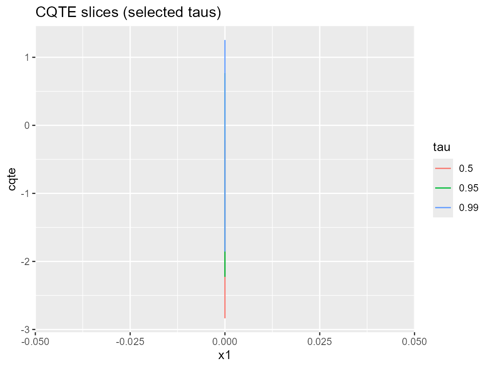

# Causal Inference with DPmixGPD: CQTE End-to-End

What you’ll learn: how to encode causal assumptions, build a causal
bundle, diagnose overlap, and compute conditional quantile treatment
effects (CQTEs) that spotlight tail differences.

## 5.1 Setup and assumptions

- We model treated (`T=1`) and control (`T=0`) potential outcomes
  separately and adjust for covariates via a propensity score.
- Overlap (positivity) is essential: each arm needs support across the
  covariate space.
- Causality still rests on no unmeasured confounding; the DP mixture /
  GPD tail machinery simply learns flexible outcome distributions.

## 5.2 Data format

Requires:

- `y` outcome.
- `T` binary treatment indicator.
- `X` covariate matrix/data frame (columns `x1`, `x2`, `x3` in our
  examples).

## 5.3 Workflow overview

1.  Propensity score stage (`T | X`).
2.  Outcome model for `Y | X, T=0` and `Y | X, T=1`, each a DP mixture +
    optional GPD.
3.  Predictions per arm at new covariate grids.
4.  CQTE = quantile(trt) - quantile(con) for each probability and
    covariate slice.

## 5.4 Minimal causal example

``` r
set.seed(101)
dat <- sim_causal_cqte(220)
J <- 6
bundle <- build_causal_bundle(
  y = dat$y,
  X = dat$X,
  T = dat$t,
  backend = c("sb", "sb"),
  kernel = c("normal", "normal"),
  GPD = c(FALSE, FALSE),
  J = c(J, J),
  mcmc_outcome = list(niter = 200, nburnin = 50, thin = 1, nchains = 2, seed = c(1, 2)),
  mcmc_ps = list(niter = 200, nburnin = 50, thin = 1, nchains = 2, seed = c(3, 4))
)
if (use_cached_fit) {
  cf <- fit_causal_small
} else {
  cf <- run_mcmc_causal(bundle, show_progress = FALSE)
}
print(cf)
#> DPmixGPD causal fit
#> PS model: Bayesian logit (T | X)
#> Outcome (treated): backend = sb | kernel = normal 
#> Outcome (control): backend = sb | kernel = normal 
#> GPD tail (treated/control): FALSE / FALSE
summary(cf$outcome_fit$trt)
#> MixGPD summary | backend: Stick-Breaking Process | kernel: Normal Distribution | GPD tail: FALSE | epsilon: 0.025
#> n = 64 | components = 4
#> Summary
#> Initial components: 4 | Components after truncation: 4
#> 
#> Summary table
#>        parameter   mean    sd q0.025 q0.500 q0.975    ess
#>       weights[1]  0.908 0.156  0.504  0.984  1.000  2.877
#>       weights[2]  0.158 0.158  0.031  0.062  0.425  1.488
#>       weights[3]  0.044 0.012  0.031  0.047  0.062 10.000
#>       weights[4]  0.038 0.009  0.031  0.031  0.047  5.000
#>            alpha  0.825 0.711  0.196  0.490  2.698  7.769
#>  beta_mean[1, 1]  2.259 0.685  1.010  2.237  3.620 19.662
#>  beta_mean[2, 1]  0.141 2.026 -2.592 -0.101  4.693  6.047
#>  beta_mean[3, 1] -0.537 1.546 -3.474 -0.353  2.075 12.519
#>  beta_mean[4, 1]  0.426 2.224 -3.552  0.618  4.758  2.862
#>  beta_mean[1, 2]  1.516 0.849  0.061  1.462  3.589 14.244
#>  beta_mean[2, 2] -0.192 1.535 -2.666 -0.188  3.065  8.873
#>  beta_mean[3, 2] -0.194 2.500 -4.215 -0.040  4.058  3.244
#>  beta_mean[4, 2] -1.316 1.797 -3.658 -1.749  2.432  8.851
#>  beta_mean[1, 3]  1.826 1.000 -0.333  1.777  3.633  9.688
#>  beta_mean[2, 3] -0.953 1.234 -3.041 -0.904  1.439  7.933
#>  beta_mean[3, 3] -0.424 1.497 -2.574 -0.764  2.667  9.761
#>  beta_mean[4, 3] -1.307 1.520 -3.185 -1.678  1.943  6.690
#>            sd[1]  0.030 0.007  0.022  0.029  0.041 73.257
#>            sd[2]  0.832 1.005  0.033  0.425  3.162  5.904
#>            sd[3]  2.131 1.367  0.881  1.714  4.999 10.000
#>            sd[4]  1.714 2.131  0.418  0.668  5.052  5.000
```

For vignette speed the cached fit uses a normal kernel with
`GPD = FALSE`. In practice, switch `kernel` and `GPD` to match your
outcome support and tail goals.

## 5.5 Diagnostics

### Overlap / positivity

``` r
ps_df <- data.frame(dat$X, T = dat$t)
ps_fit <- glm(T ~ x1 + x2 + x3, data = ps_df, family = binomial())
ps_df$propensity <- predict(ps_fit, type = "response")
ggplot(ps_df, aes(x = propensity, fill = factor(T, labels = c("con", "trt")))) +
  geom_density(alpha = 0.4) +
  labs(title = "Propensity score overlap", fill = "Arm")
```


Propensity score distributions by arm (logistic GLM proxy).

### Trace plots (arm-specific mixture weights)

``` r
plot(cf$outcome_fit$trt, family = "traceplot", params = c("alpha", "w[1]"))
```


Trace plots for tail_scale and tail_shape (treated arm).

## 5.6 CQTE estimation and plotting

``` r
grid <- expand.grid(
  x1 = seq(-1.2, 1.2, length.out = 15),
  x2 = seq(-0.8, 0.8, length.out = 5),
  x3 = 0
)
taus <- c(.1, .5, .9, .95, .99)
pr_trt <- predict(cf$outcome_fit$trt, newdata = grid, type = "quantile", p = taus)
pr_con <- predict(cf$outcome_fit$con, newdata = grid, type = "quantile", p = taus)
cqte_df <- data.frame(
  x1 = rep(grid$x1, each = length(taus)),
  tau = rep(taus, times = nrow(grid)),
  cqte = c(pr_trt$fit - pr_con$fit)
)
slice_df <- cqte_df[cqte_df$tau %in% c(.5, .95, .99) & cqte_df$x1 %in% c(-1, 0, 1), ]
ggplot(slice_df, aes(x = x1, y = cqte, color = factor(tau))) +
  geom_line() +
  labs(title = "CQTE slices (selected taus)", color = "tau")
```



``` r
surf_grid <- expand.grid(x1 = seq(-1, 1, length.out = 25), x2 = seq(-1, 1, length.out = 25), x3 = 0)
tau_surface <- 0.95
surf_trt <- predict(cf$outcome_fit$trt, newdata = surf_grid, type = "quantile", p = tau_surface)
surf_con <- predict(cf$outcome_fit$con, newdata = surf_grid, type = "quantile", p = tau_surface)
surf_grid$cqte <- as.numeric(surf_trt$fit - surf_con$fit)
ggplot(surf_grid, aes(x = x1, y = x2, fill = cqte)) +
  geom_raster() +
  scale_fill_viridis_c(option = "C") +
  labs(title = "CQTE surface (tau = 0.95)", fill = "CQTE")
```


CQTE surface for tau=0.95 varying x1 / x2 at x3=0.

``` r
tail_cqte <- predict(cf$outcome_fit$trt, newdata = data.frame(x1 = 0, x2 = 0, x3 = 0), type = "quantile", p = c(.95, .99, .995))
control_tail <- predict(cf$outcome_fit$con, newdata = data.frame(x1 = 0, x2 = 0, x3 = 0), type = "quantile", p = c(.95, .99, .995))
data.frame(
  tau = c(.95, .99, .995),
  cqte = tail_cqte$fit - control_tail$fit
)
#>     tau     cqte.1    cqte.2   cqte.3
#> 1 0.950 -0.9250932 -2.533016 -3.05655
#> 2 0.990 -0.9250932 -2.533016 -3.05655
#> 3 0.995 -0.9250932 -2.533016 -3.05655
```

## 5.7 Interpretation guidance

- Differences near the median (`tau ~ 0.5`) reflect central CFTE; tail
  differences (`tau >= 0.95`) highlight extreme treatment effects.
- Credible intervals widen where data are sparse???this is expected and
  flags caution, not failure.
- Try alternative kernels or toggle `GPD` per arm (e.g.,
  `GPD = c(TRUE, FALSE)`) when shape estimates blow up.

## Summary table of CQTE

``` r
summary_points <- data.frame(
  x1 = c(-1, 0, 1),
  x2 = c(0, 0, 0),
  label = c("x1 = -1, x2 = 0", "x1 = 0, x2 = 0", "x1 = 1, x2 = 0"),
  cqte_median = NA_real_,
  cqte_tail = NA_real_
)
for (i in seq_len(nrow(summary_points))) {
  newdata <- data.frame(x1 = summary_points$x1[i], x2 = summary_points$x2[i], x3 = 0)
  med <- predict(cf$outcome_fit$trt, newdata = newdata, type = "quantile", p = 0.5)$fit
  med_con <- predict(cf$outcome_fit$con, newdata = newdata, type = "quantile", p = 0.5)$fit
  tail <- predict(cf$outcome_fit$trt, newdata = newdata, type = "quantile", p = 0.95)$fit
  tail_con <- predict(cf$outcome_fit$con, newdata = newdata, type = "quantile", p = 0.95)$fit
  summary_points$cqte_median[i] <- med - med_con
  summary_points$cqte_tail[i] <- tail - tail_con
}
knitr::kable(summary_points[, c("label", "cqte_median", "cqte_tail")], digits = 3)
```

| label           | cqte_median | cqte_tail |
|:----------------|------------:|----------:|
| x1 = -1, x2 = 0 |      -2.112 |    -4.072 |
| x1 = 0, x2 = 0  |       0.000 |    -0.925 |
| x1 = 1, x2 = 0  |       2.112 |     1.591 |

## Session info

``` r
sessionInfo()
#> R version 4.5.2 (2025-10-31 ucrt)
#> Platform: x86_64-w64-mingw32/x64
#> Running under: Windows 11 x64 (build 26100)
#> 
#> Matrix products: default
#>   LAPACK version 3.12.1
#> 
#> locale:
#> [1] LC_COLLATE=English_United States.utf8 
#> [2] LC_CTYPE=English_United States.utf8   
#> [3] LC_MONETARY=English_United States.utf8
#> [4] LC_NUMERIC=C                          
#> [5] LC_TIME=English_United States.utf8    
#> 
#> time zone: America/New_York
#> tzcode source: internal
#> 
#> attached base packages:
#> [1] stats     graphics  grDevices datasets  utils     methods   base     
#> 
#> other attached packages:
#> [1] dplyr_1.1.4    ggplot2_4.0.1  nimble_1.4.0   DPmixGPD_0.0.8
#> 
#> loaded via a namespace (and not attached):
#>  [1] tidyr_1.3.2         sass_0.4.10         future_1.68.0      
#>  [4] generics_0.1.4      renv_1.1.5          lattice_0.22-7     
#>  [7] listenv_0.10.0      pracma_2.4.6        digest_0.6.39      
#> [10] magrittr_2.0.4      evaluate_1.0.5      grid_4.5.2         
#> [13] RColorBrewer_1.1-3  fastmap_1.2.0       jsonlite_2.0.0     
#> [16] GGally_2.4.0        purrr_1.2.0         viridisLite_0.4.2  
#> [19] scales_1.4.0        codetools_0.2-20    numDeriv_2016.8-1.1
#> [22] textshaping_1.0.4   jquerylib_0.1.4     cli_3.6.5          
#> [25] rlang_1.1.6         parallelly_1.46.0   future.apply_1.20.1
#> [28] withr_3.0.2         cachem_1.1.0        yaml_2.3.12        
#> [31] otel_0.2.0          tools_4.5.2         parallel_4.5.2     
#> [34] coda_0.19-4.1       globals_0.18.0      ggstats_0.11.0     
#> [37] vctrs_0.6.5         R6_2.6.1            lifecycle_1.0.4    
#> [40] fs_1.6.6            htmlwidgets_1.6.4   MASS_7.3-65        
#> [43] ragg_1.5.0          pkgconfig_2.0.3     desc_1.4.3         
#> [46] pillar_1.11.1       pkgdown_2.2.0       bslib_0.9.0        
#> [49] gtable_0.3.6        glue_1.8.0          systemfonts_1.3.1  
#> [52] tidyselect_1.2.1    tibble_3.3.0        xfun_0.55          
#> [55] rstudioapi_0.17.1   knitr_1.51          farver_2.1.2       
#> [58] htmltools_0.5.9     igraph_2.2.1        labeling_0.4.3     
#> [61] rmarkdown_2.30      compiler_4.5.2      S7_0.2.1           
#> [64] ggmcmc_1.5.1.2
```
