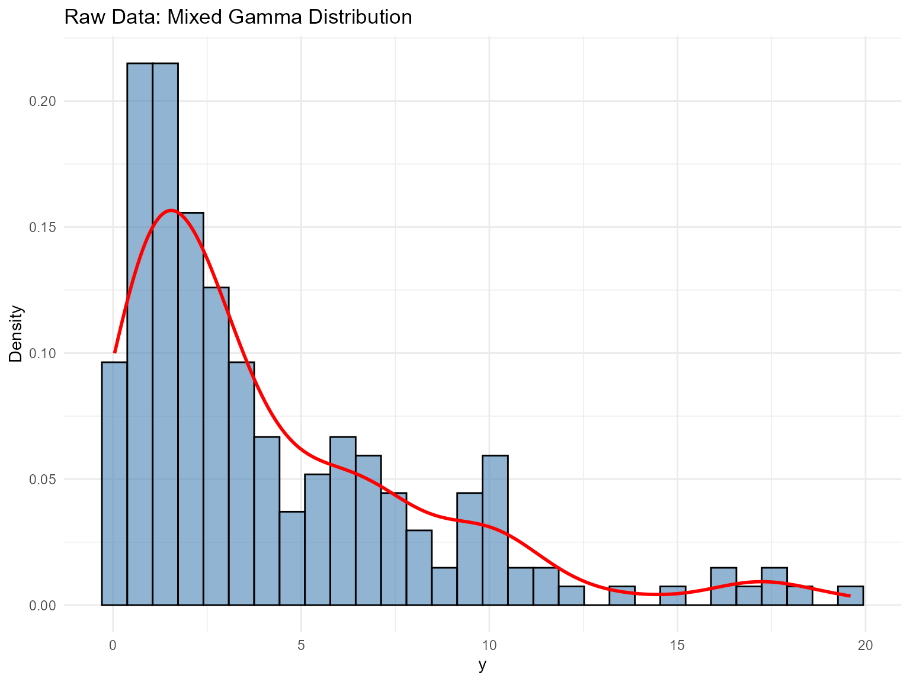
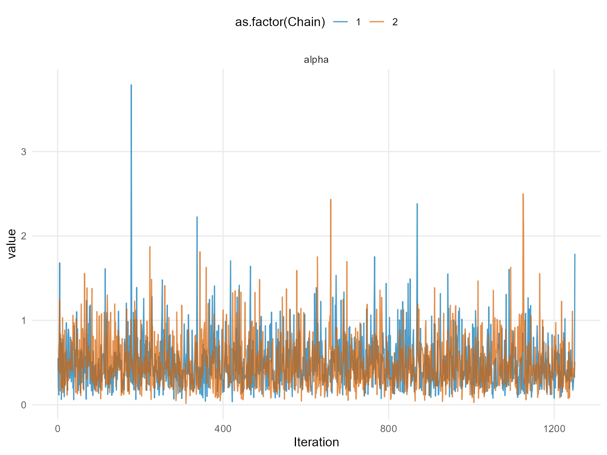
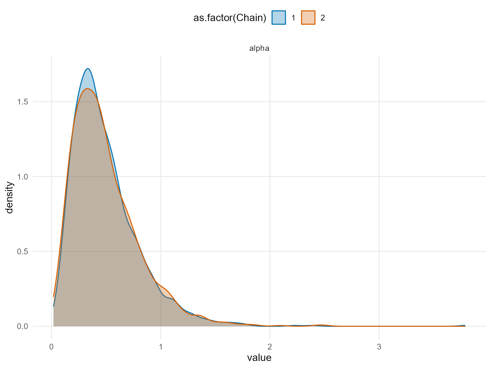
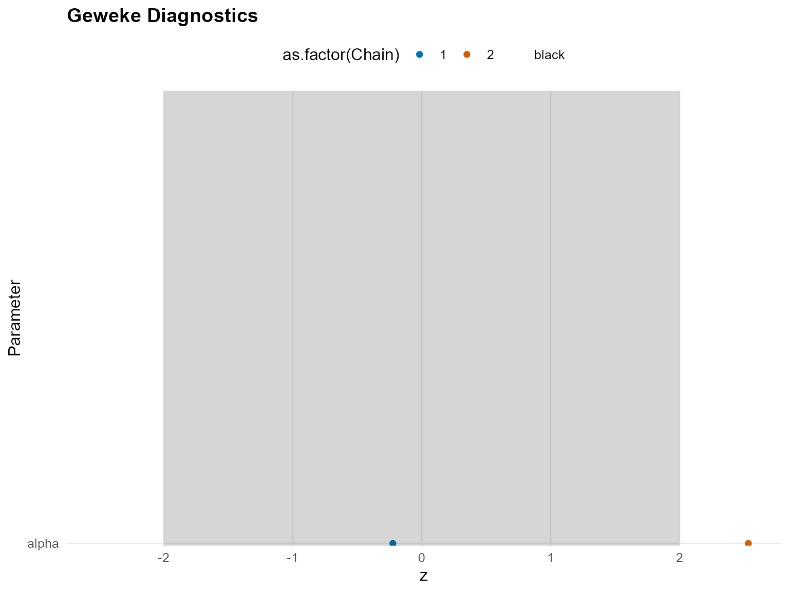
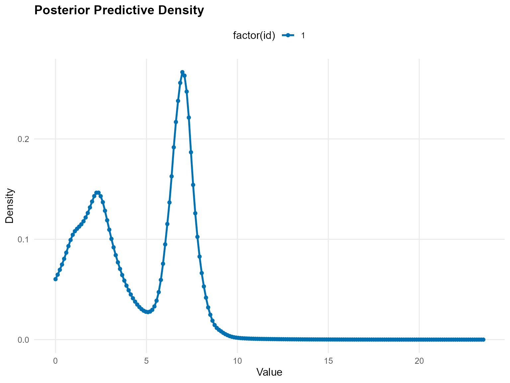

# 5. Unconditional DPmix (CRP Backend)

## Overview

This vignette demonstrates an **unconditional DPmix model** using the
**CRP backend** on a positive dataset. We use a Laplace kernel for the
bulk distribution and no GPD tail augmentation.

## Data Setup

``` r
# Load pre-generated dataset: 200 observations from mixture of 3 gamma components
data(nc_pos200_k3)
y_mixed <- nc_pos200_k3$y

paste("Sample size:", length(y_mixed))
[1] "Sample size: 200"
paste("Mean:", mean(y_mixed))
[1] "Mean: 4.21476750434594"
paste("SD:", sd(y_mixed))
[1] "SD: 4.10835046697183"
paste("Range:", paste(range(y_mixed), collapse = " to "))
[1] "Range: 0.0403111680208858 to 19.6013451514889"

# Visualization
df_data <- data.frame(y = y_mixed)
p_raw <- ggplot(df_data, aes(x = y)) +
  geom_histogram(aes(y = after_stat(density)), bins = 30, alpha = 0.6,
                 fill = "steelblue", color = "black") +
  geom_density(color = "red", linewidth = 1) +
  labs(title = "Raw Data: Mixed Gamma Distribution", x = "y", y = "Density") +
  theme_minimal()

print(p_raw)
```



## Build Bundle (CRP)

``` r
bundle_crp <- build_nimble_bundle(
  y = y_mixed,
  kernel = "laplace",         # Use laplace kernel
  backend = "crp",            # CRP backend
  GPD = FALSE,                # No tail augmentation
  components = 3,             # Minimal for testing
  alpha_random = TRUE,        # Random DP concentration
  mcmc = list(
    niter = 50,             # Minimal for testing
    nburnin = 10,           # Minimal burnin
    nchains = 2,            # Two chains for diagnostics
    thin = 1                # No thinning
  )
)
```

## Run MCMC (Longer Run)

``` r
bundle_crp <- build_nimble_bundle(
  y_mixed,
  kernel = "laplace",
  backend = "crp",
  GPD = FALSE,
  components = 3,
  alpha_random = TRUE,
  mcmc = list(niter = 1500, nburnin = 250, nchains = 2, thin = 1)
)
```

``` r
summary(bundle_crp)
DPmixGPD bundle summary
      Field                      Value
    Backend Chinese Restaurant Process
     Kernel       Laplace Distribution
 Components                          3
          N                        200
          X                         NO
        GPD                      FALSE
    Epsilon                      0.025

Parameter specification
         block  parameter mode           level                  prior link
          meta    backend info           model                    crp     
          meta     kernel info           model                laplace     
          meta components info           model                      3     
          meta          N info           model                    200     
          meta          P info           model                      0     
 concentration      alpha dist          scalar gamma(shape=1, rate=1)     
          bulk   location dist component (1:3)   normal(mean=0, sd=5)     
          bulk      scale dist component (1:3) gamma(shape=2, rate=1)     
                    notes
                         
                         
                         
                         
                         
 stochastic concentration
    iid across components
    iid across components

Monitors
  n = 4 
  alpha, z[1:200], location[1:3], scale[1:3]
```

``` r
fit_crp <- run_mcmc_bundle_manual(bundle_crp)
```

``` r
summary(fit_crp)
MixGPD summary | backend: Chinese Restaurant Process | kernel: Laplace Distribution | GPD tail: FALSE | epsilon: 0.025
n = 200 | components = 3
Summary
Initial components: 3 | Components after truncation: 3

WAIC: 913.691
lppd: -347.069 | pWAIC: 109.776

Summary table
   parameter  mean    sd q0.025 q0.500 q0.975      ess
  weights[1] 0.421 0.036  0.355  0.420  0.500  246.931
  weights[2] 0.344 0.037  0.280  0.340  0.420  189.547
  weights[3] 0.235 0.051  0.110  0.245  0.310  132.656
       alpha 0.494 0.310  0.103  0.426  1.245 2130.870
 location[1] 5.659 2.234  1.081  6.735  7.826  284.329
 location[2] 3.070 2.488  0.809  2.245  8.076  301.609
 location[3] 1.639 1.201  0.535  0.941  3.412   93.338
    scale[1] 0.539 0.410  0.260  0.338  1.695  149.747
    scale[2] 1.246 0.653  0.276  1.249  2.457  272.562
    scale[3] 2.001 0.815  0.717  2.003  3.826  105.834
```

## Posterior Parameters

``` r
params_crp <- params(fit_crp)
params_crp
Posterior mean parameters

$alpha
[1] 0.4935

$w
[1] 0.4209 0.3441 0.2350

$location
[1] 5.659 3.070 1.639

$scale
[1] 0.5389 1.2460 2.0010
```

## Diagnostics

``` r
# Trace plots for key parameters
plot(fit_crp, params = "alpha", family = c("traceplot", "density", "geweke"))

=== traceplot ===
```



    === density ===



    === geweke ===



## Posterior Predictive Density

``` r
# Generate prediction grid
y_grid <- seq(0, max(y_mixed) * 1.2, length.out = 200)

# Posterior predictive density
pred_density <- predict(fit_crp, y = y_grid, type = "density")

# Use S3 plot method
plot(pred_density)
```


