# 5. Unconditional DPmix with Stick-Breaking Backend

## Unconditional DPmix: Stick-Breaking (SB) Backend

**Purpose**: Showcase the stick-breaking backend that uses a fixed
number of mixture components (`components = J`) and contrast it with the
CRP backend from `v04`. In this vignette we fit **two** bulk kernels
(**Gamma** and **Cauchy**) on the same dataset to highlight how heavier
tails in the bulk can change the fit even without a GPD tail.

------------------------------------------------------------------------

### Data Setup

``` r
# Load benchmark dataset
data("nc_pos200_k3")
y_mixed <- nc_pos200_k3$y

df_data <- data.frame(y = y_mixed)

summary_tbl <- tibble(
  statistic = c("N", "Mean", "SD", "Min", "Max"),
  value = c(length(y_mixed), mean(y_mixed), sd(y_mixed), min(y_mixed), max(y_mixed))
)

p_raw <- ggplot(df_data, aes(x = y)) +
  geom_histogram(aes(y = after_stat(density)), bins = 30, fill = "darkorange", alpha = 0.7, color = "black") +
  geom_density(color = "darkred", linewidth = 1.2) +
  labs(title = "Raw Data: Mixed Gamma Distribution", x = "y", y = "Density") +
  theme_minimal()

grid.arrange(p_raw, ncol = 1)
```


| statistic |   value   |
|:---------:|:---------:|
|     N     | 200.00000 |
|   Mean    |  4.21500  |
|    SD     |  4.10800  |
|    Min    |  0.04031  |
|    Max    | 19.60000  |

Summary of the SB Dataset

------------------------------------------------------------------------

### Model Specification & Bundle

We build the stick-breaking mixture explicitly with `components = 5` so
that there is room for weight decay while keeping the MCMC runtime
manageable for a vignette. We then refit the same SB model with a
**Cauchy** kernel for comparison.

``` r
# --- Gamma kernel ---
bundle_sb_gamma <- build_nimble_bundle(
  y = y_mixed,
  kernel = "gamma",
  backend = "sb",
  components = 5,            # fixed truncation level for SB
  GPD = FALSE,               # bulk-only scenario
  mcmc = list(
    niter = 60,
    nburnin = 10,
    nchains = 2,
    thin = 1
  )
)

# --- Cauchy kernel ---
bundle_sb_cauchy <- build_nimble_bundle(
  y = y_mixed,
  kernel = "cauchy",
  backend = "sb",
  components = 5,
  GPD = FALSE,
  mcmc = list(
    niter = 60,
    nburnin = 10,
    nchains = 1,
    thin = 1
  )
)
```

------------------------------------------------------------------------

### Running MCMC & Summary

``` r
fit_sb_gamma <- run_mcmc_bundle_manual(bundle_sb_gamma)
[MCMC] Creating NIMBLE model...
[MCMC] NIMBLE model created successfully.
[MCMC] Configuring MCMC...
===== Monitors =====
thin = 1: alpha, scale, shape, w, z
===== Samplers =====
RW sampler (10)
  - alpha
  - shape[]  (5 elements)
  - v[]  (4 elements)
conjugate sampler (5)
  - scale[]  (5 elements)
categorical sampler (200)
  - z[]  (200 elements)
[MCMC] MCMC configured.
[MCMC] Building MCMC object...
[MCMC] MCMC object built.
[MCMC] Attempting NIMBLE compilation (this may take a minute)...
[MCMC] Compiling model...
[MCMC] Compiling MCMC sampler...
[MCMC] Compilation successful.
|-------------|-------------|-------------|-------------|
|-------------------------------------------------------|
|-------------|-------------|-------------|-------------|
|-------------------------------------------------------|
[MCMC] MCMC execution complete. Processing results...
fit_sb_cauchy <- run_mcmc_bundle_manual(bundle_sb_cauchy)
[MCMC] Creating NIMBLE model...
[MCMC] NIMBLE model created successfully.
[MCMC] Configuring MCMC...
===== Monitors =====
thin = 1: alpha, location, scale, w, z
===== Samplers =====
RW sampler (15)
  - alpha
  - location[]  (5 elements)
  - scale[]  (5 elements)
  - v[]  (4 elements)
categorical sampler (200)
  - z[]  (200 elements)
[MCMC] MCMC configured.
[MCMC] Building MCMC object...
[MCMC] MCMC object built.
[MCMC] Attempting NIMBLE compilation (this may take a minute)...
[MCMC] Compiling model...
[MCMC] Compiling MCMC sampler...
[MCMC] Compilation successful.
|-------------|-------------|-------------|-------------|
|-------------------------------------------------------|
[MCMC] MCMC execution complete. Processing results...
```

``` r
summary(fit_sb_gamma)
MixGPD summary | backend: Stick-Breaking Process | kernel: Gamma Distribution | GPD tail: FALSE | epsilon: 0.025
n = 200 | components = 5
Summary
Initial components: 5 | Components after truncation: 4

WAIC: 950.401
lppd: -411.171 | pWAIC: 64.030

Summary table
  parameter  mean    sd q0.025 q0.500 q0.975     ess
 weights[1] 0.456 0.039  0.390  0.450  0.530  11.581
 weights[2] 0.343 0.037  0.280  0.340  0.410  12.625
 weights[3] 0.105 0.022  0.062  0.105  0.160  34.221
 weights[4] 0.075 0.024  0.040  0.070  0.130  16.080
      alpha 1.316 0.739  0.406  1.126  3.022  10.488
   shape[1] 1.532 0.183  1.000  1.571  1.731   8.152
   shape[2] 1.499 0.176  1.205  1.479  1.985   8.272
   shape[3] 2.040 0.744  0.877  2.159  3.473   5.092
   shape[4] 2.247 0.917  0.919  2.398  3.722   9.494
   scale[1] 0.286 0.133  0.163  0.259  0.724 100.000
   scale[2] 0.736 0.339  0.227  0.706  1.365   5.589
   scale[3] 1.061 0.883  0.211  0.795  3.328   2.811
   scale[4] 1.148 1.020  0.168  0.777  3.615   8.444
summary(fit_sb_cauchy)
MixGPD summary | backend: Stick-Breaking Process | kernel: Cauchy Distribution | GPD tail: FALSE | epsilon: 0.025
n = 200 | components = 5
Summary
Initial components: 5 | Components after truncation: 4

WAIC: 1075.839
lppd: -384.745 | pWAIC: 153.174

Summary table
   parameter  mean    sd q0.025 q0.500 q0.975    ess
  weights[1] 0.563 0.053  0.466  0.565  0.660  4.154
  weights[2] 0.212 0.032  0.150  0.210  0.268 15.461
  weights[3] 0.107 0.022  0.070  0.105  0.148 14.179
  weights[4] 0.085 0.017  0.051  0.090  0.115 26.747
       alpha 1.435 0.580  0.410  1.447  2.408 15.341
 location[1] 4.753 0.721  3.362  4.804  6.089 10.096
 location[2] 1.224 0.144  0.987  1.252  1.517  3.784
 location[3] 1.040 0.841  0.205  0.819  2.555 50.000
 location[4] 1.656 0.849  0.205  1.729  2.555 50.000
    scale[1] 2.290 0.215  1.900  2.209  2.746 13.947
    scale[2] 0.481 0.173  0.293  0.442  0.808  3.340
    scale[3] 0.358 0.091  0.212  0.313  0.500 19.491
    scale[4] 0.399 0.136  0.176  0.392  0.531  8.985
```

``` r
params_gamma <- params(fit_sb_gamma)
params_gamma
Posterior mean parameters

$alpha
[1] 1.316

$w
[1] 0.4562 0.3434 0.1048 0.0754

$shape
[1] 1.532 1.499 2.040 2.247

$scale
[1] 0.2862 0.7363 1.0610 1.1480
```

------------------------------------------------------------------------

### MCMC Diagnostics (S3 Plot Methods)

``` r
# Default diagnostics for each fit
plot(fit_sb_gamma, family = c("traceplot", "autocorrelation", "running"))

=== traceplot ===
```

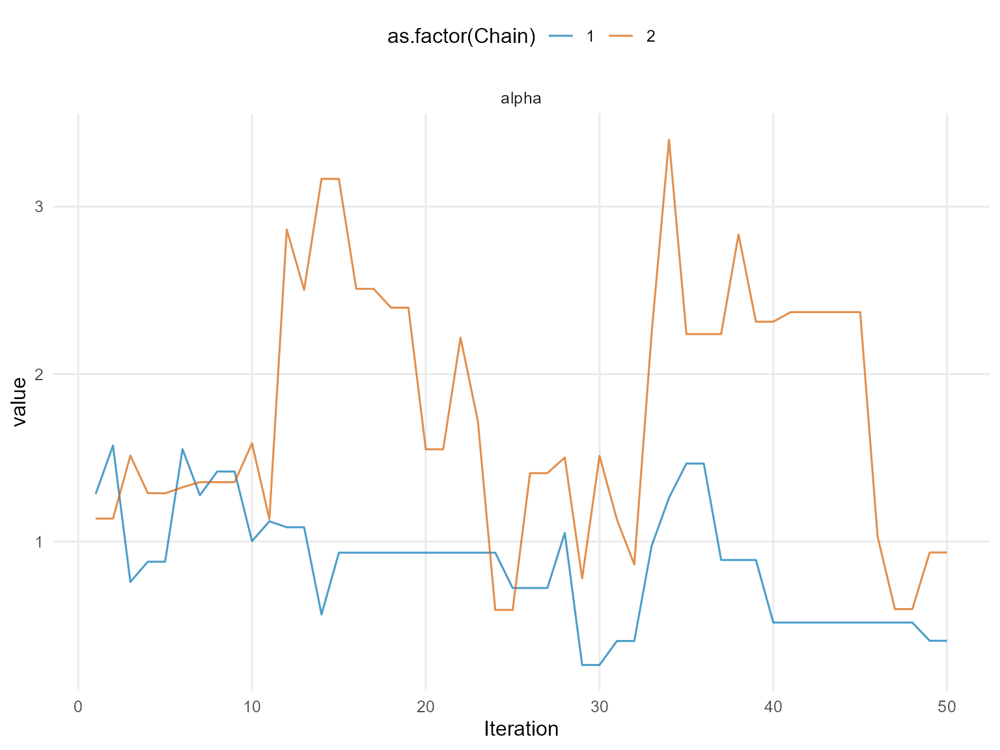

    === autocorrelation ===

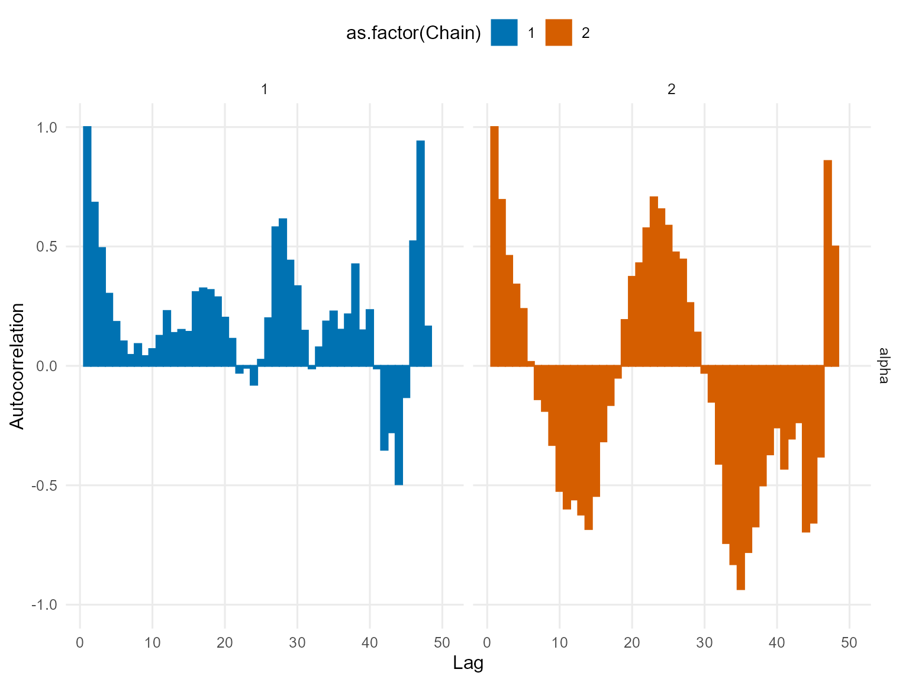

    === running ===

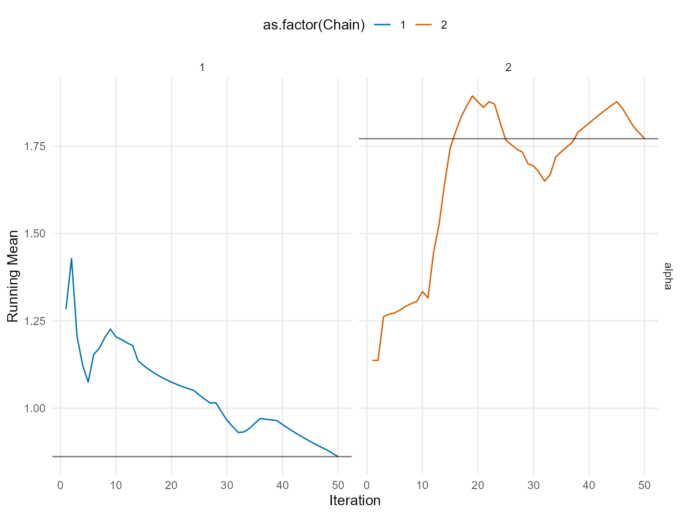

``` r
plot(fit_sb_cauchy, family = c("density", "geweke", "caterpillar"))

=== density ===
```

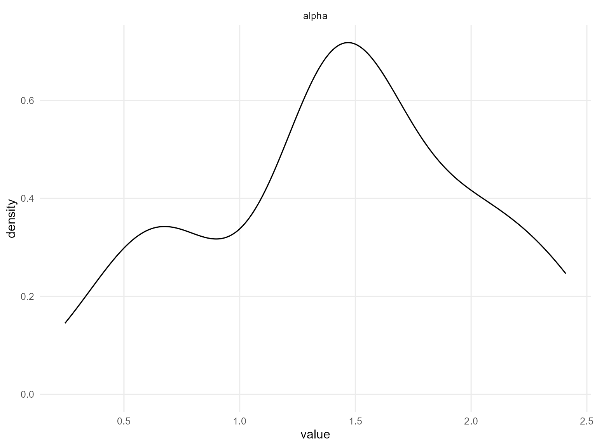

    === geweke ===

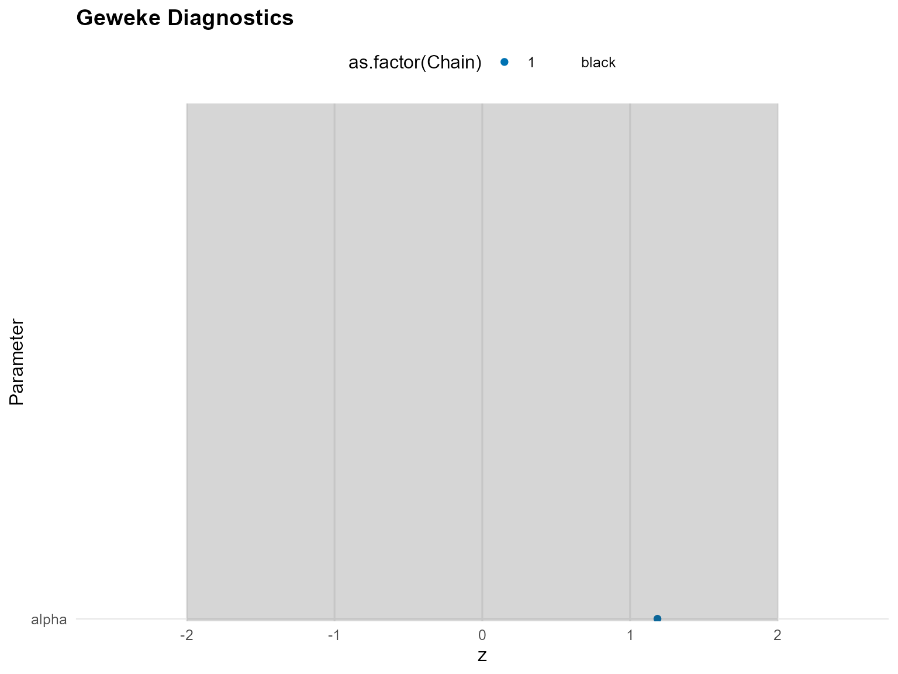

    === caterpillar ===

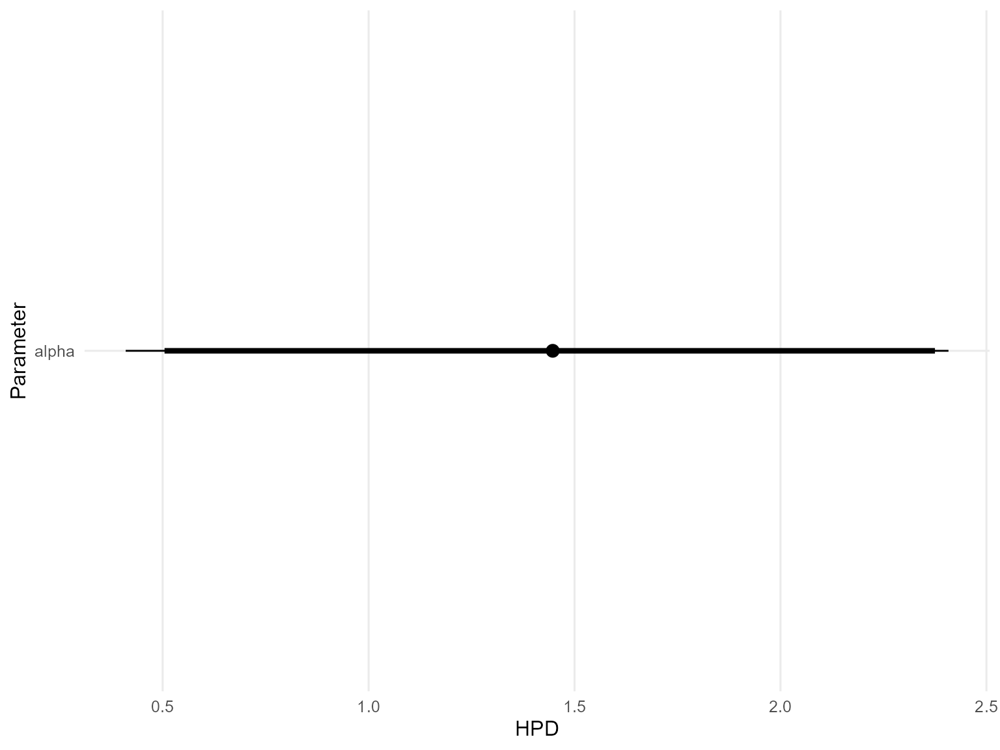

Use `summary(fit_sb_gamma)` and `summary(fit_sb_cauchy)` to inspect
effective sample size, R-hat, and other convergence diagnostics; the
[`plot()`](https://rdrr.io/r/graphics/plot.default.html) calls above
show the trace/density pairs for both global and stick-breaking weight
parameters.

------------------------------------------------------------------------

### Stick-Breaking Weights & Component Activity

The stick-breaking weights are exposed via the
[`plot()`](https://rdrr.io/r/graphics/plot.default.html) diagnostics
above, and you can refer to the raw `fit_sb_gamma` / `fit_sb_cauchy`
objects (or their [`summary()`](https://rdrr.io/r/base/summary.html)
output) for posterior summaries of each component weight.

------------------------------------------------------------------------

### Posterior Predictions

``` r
y_grid <- seq(min(y_mixed), max(y_mixed) * 1.3, length.out = 250)

pred_density_gamma <- predict(fit_sb_gamma, y = y_grid, type = "density")
pred_density_cauchy <- predict(fit_sb_cauchy, y = y_grid, type = "density")

plot(pred_density_gamma)
```

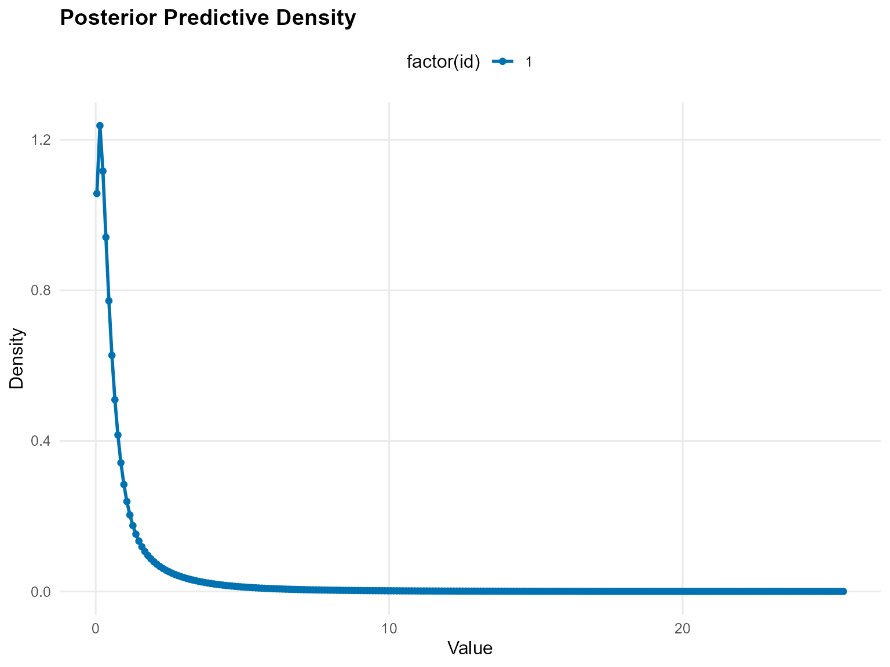

``` r
plot(pred_density_cauchy)
```

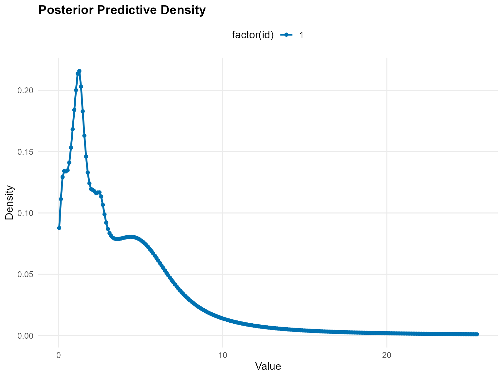

``` r
quant_probs <- c(0.05, 0.25, 0.5, 0.75, 0.95)

pred_q_gamma <- predict(fit_sb_gamma, type = "quantile", index = quant_probs, interval = "credible")
pred_q_cauchy <- predict(fit_sb_cauchy, type = "quantile", index = quant_probs, interval = "credible")

plot(pred_q_gamma)
```


``` r
plot(pred_q_cauchy)
```

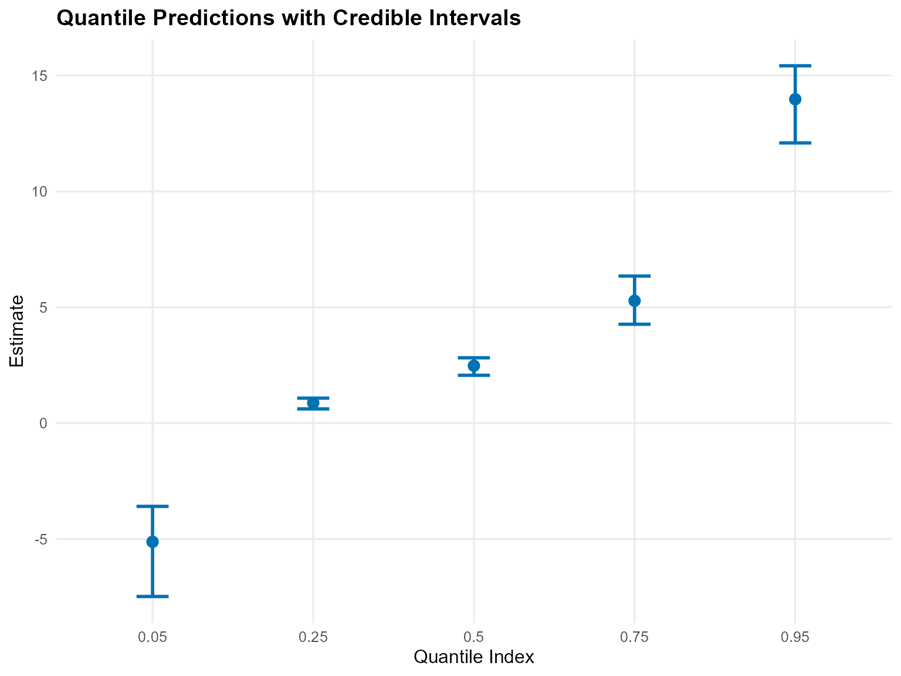

``` r
pred_mean_gamma <- predict(fit_sb_gamma, type = "mean")
pred_mean_cauchy <- predict(fit_sb_cauchy, type = "mean")

plot(pred_mean_gamma)
```

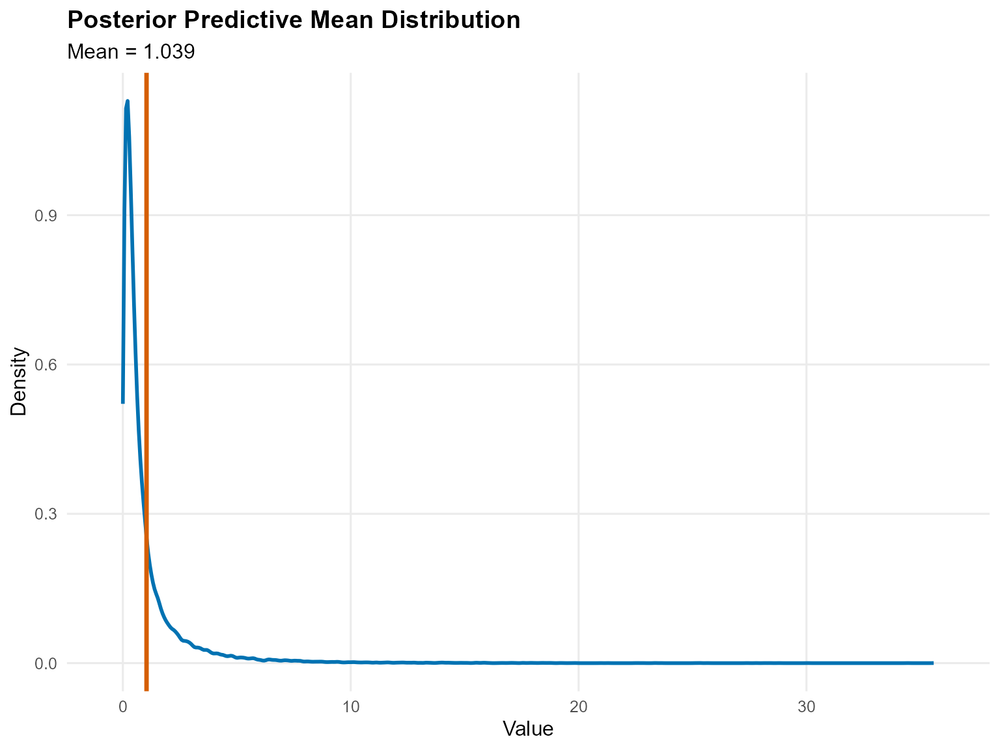

``` r
plot(pred_mean_cauchy)
```

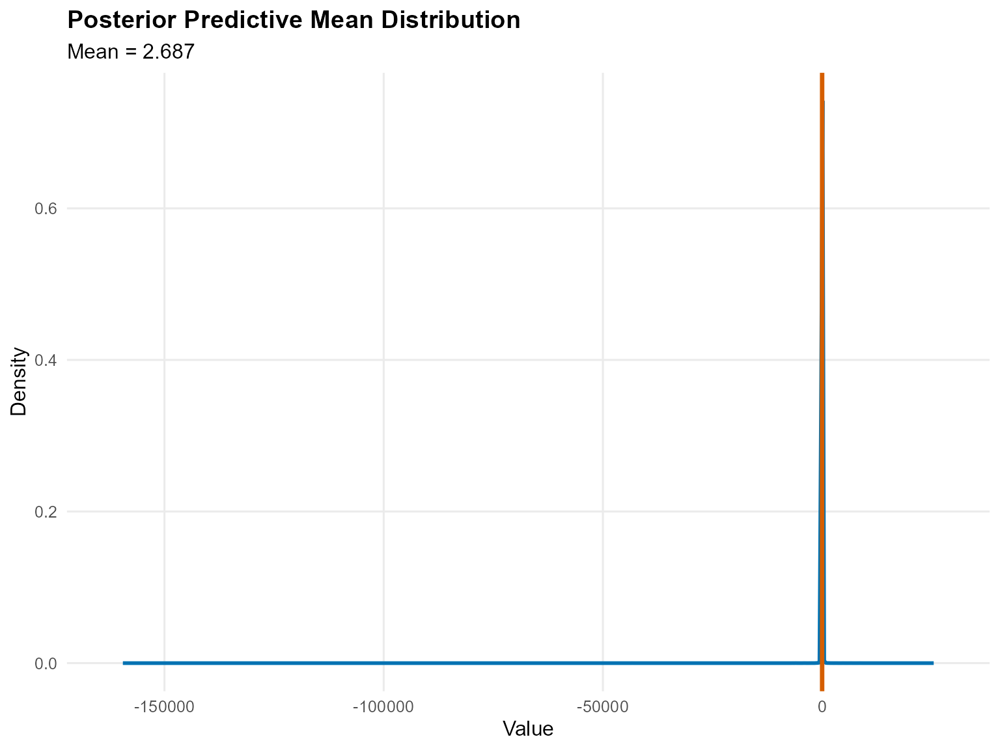

------------------------------------------------------------------------

### Bulk-only vs CRP Backends

``` r
bundle_crp_small <- build_nimble_bundle(
  y = y_mixed,
  kernel = "gamma",
  backend = "crp",
  components = 5,
  GPD = FALSE,
  mcmc = list(niter = 2500, nburnin = 500, nchains = 1)
)
fit_crp_small <- run_mcmc_bundle_manual(bundle_crp_small)
[MCMC] Creating NIMBLE model...
[MCMC] NIMBLE model created successfully.
[MCMC] Configuring MCMC...
===== Monitors =====
thin = 1: alpha, scale, shape, z
===== Samplers =====
CRP_concentration sampler (1)
  - alpha
CRP_cluster_wrapper sampler (10)
  - scale[]  (5 elements)
  - shape[]  (5 elements)
CRP sampler (1)
  - z[1:200] 
[MCMC] MCMC configured.
[MCMC] Building MCMC object...
[MCMC] MCMC object built.
[MCMC] Attempting NIMBLE compilation (this may take a minute)...
[MCMC] Compiling model...
[MCMC] Compiling MCMC sampler...
[MCMC] Compilation successful.
|-------------|-------------|-------------|-------------|
|  [Warning] CRP_sampler: This MCMC is not for a proper model. The MCMC attempted to use more components than the number of cluster parameters. Please increase the number of cluster parameters.
-------------------------------------------------------|
[MCMC] MCMC execution complete. Processing results...

crp_quant <- predict(fit_crp_small, type = "quantile", index = quant_probs, interval = "credible")
sb_quant <- predict(fit_sb_gamma, type = "quantile", index = quant_probs, interval = "credible")

bind_rows(
  crp_quant$fit %>% mutate(model = "CRP"),
  sb_quant$fit %>% mutate(model = "SB")
) %>%
  select(any_of(c("model", "index", "estimate", "lower", "upper"))) %>%
  mutate(across(where(is.numeric), ~ round(.x, 3))) %>%
  kable(caption = "Quantile Comparison: CRP vs SB", align = "c") %>%
  kable_styling(bootstrap_options = c("striped", "hover"), full_width = FALSE, position = "center")
```

| model | index | estimate | lower | upper |
|:-----:|:-----:|:--------:|:-----:|:-----:|
|  CRP  | 0.05  |  0.047   | 0.008 | 0.864 |
|  CRP  | 0.25  |  0.167   | 0.051 | 1.982 |
|  CRP  | 0.50  |  0.332   | 0.130 | 3.174 |
|  CRP  | 0.75  |  0.592   | 0.269 | 4.677 |
|  CRP  | 0.95  |  1.140   | 0.600 | 7.582 |
|  SB   | 0.05  |  0.058   | 0.018 | 0.091 |
|  SB   | 0.25  |  0.226   | 0.109 | 0.305 |
|  SB   | 0.50  |  0.490   | 0.309 | 0.705 |
|  SB   | 0.75  |  1.056   | 0.731 | 2.095 |
|  SB   | 0.95  |  3.877   | 2.050 | 9.583 |

Quantile Comparison: CRP vs SB

``` r
plot(crp_quant)
```

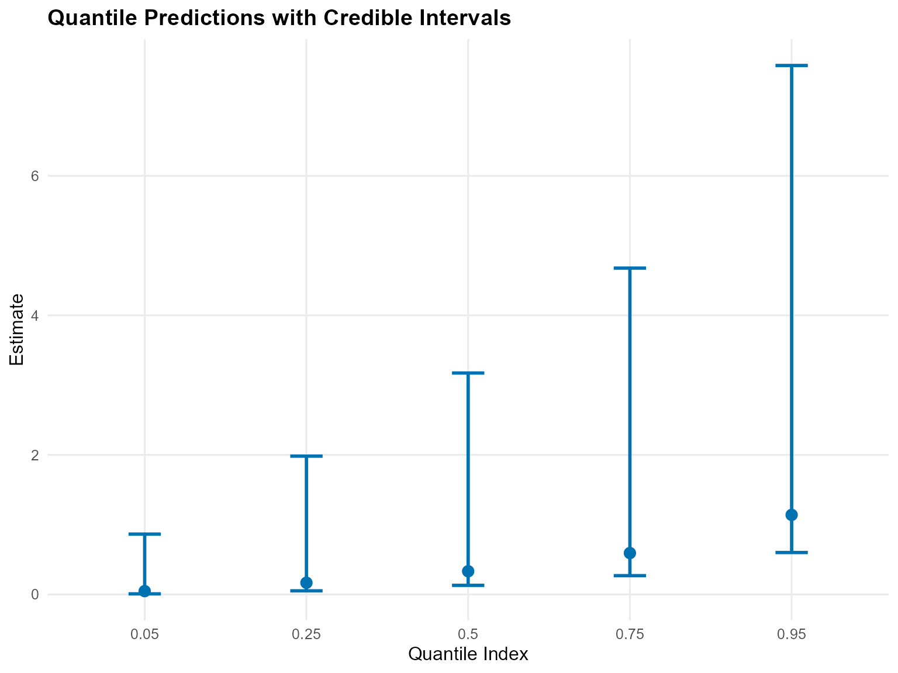

``` r
plot(sb_quant)
```

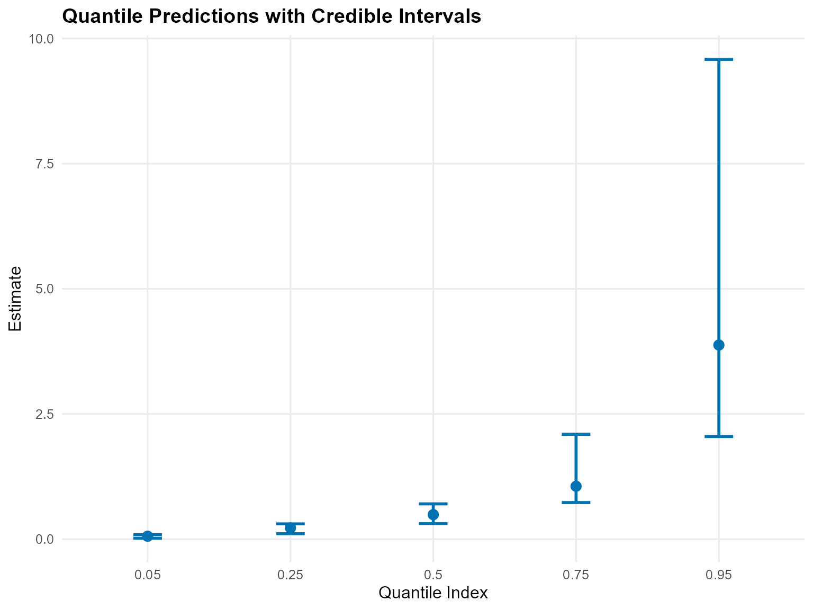

------------------------------------------------------------------------

### Residuals & Fitted Values

``` r
fit_vals <- fitted(fit_sb_gamma)
plot(fit_vals)
```

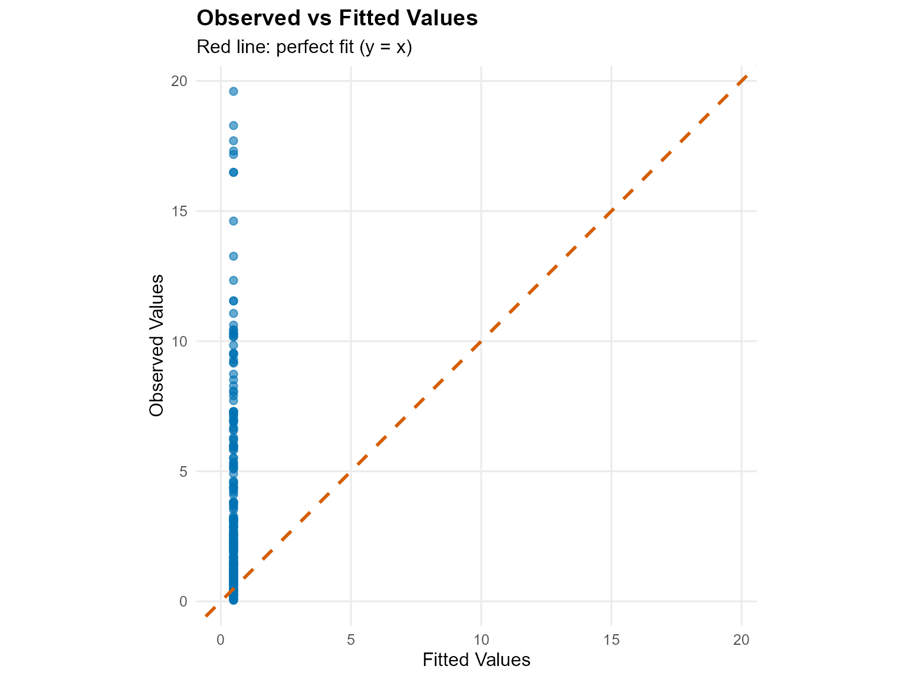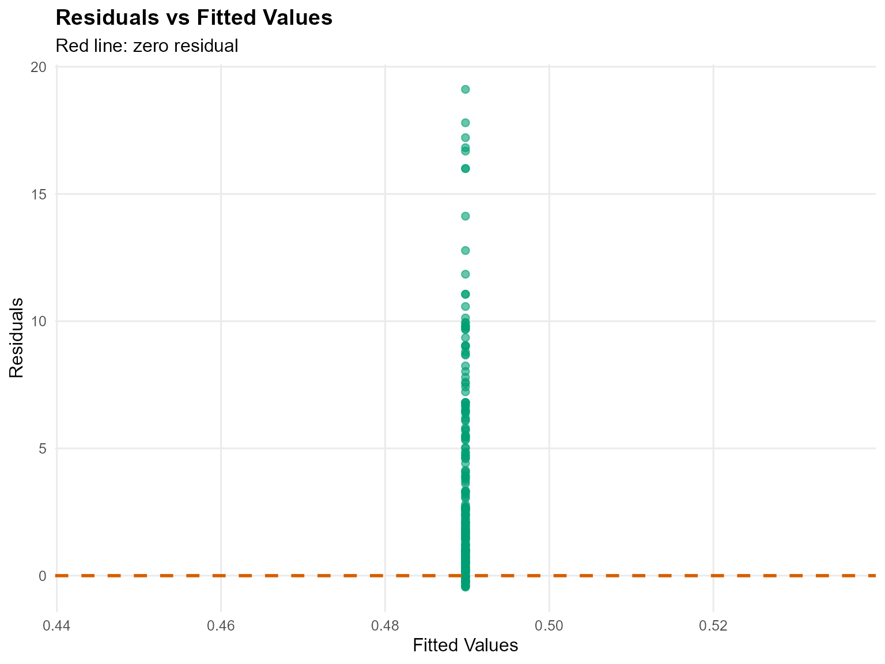

------------------------------------------------------------------------

### Takeaways

- **SB Backend**: Fixed `components` keeps label-switching manageable,
  and the diagnostic plots via the S3
  [`plot()`](https://rdrr.io/r/graphics/plot.default.html) method show
  weight dynamics.
- **Kernels matter**: Gamma vs Cauchy can behave very differently in the
  shoulders/tails, even without a GPD tail.
- **Predictions**: Posterior density, quantiles, and mean are all
  accessible via [`predict()`](https://rdrr.io/r/stats/predict.html) and
  display credible bands for each summary.
- **Backend comparison**: The CRP fit (`v04`) and the SB-gamma fit
  deliver similar central quantiles while SB offers more control over
  truncation.
- **Next**: Explore tail augmentation (`GPD = TRUE`) with the CRP
  backend in `v06` or SB backend in `v07`.
