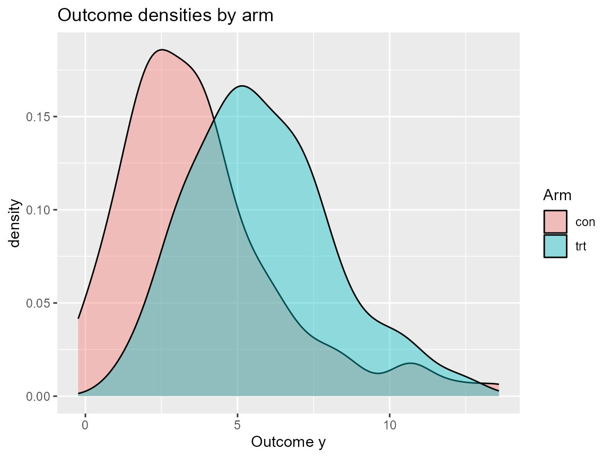

# Causal extras

``` r
library(DPmixGPD)
library(nimble)
use_cached_fit <- FALSE
.fit_path <- function(name) {
  path <- system.file("extdata", name, package = "DPmixGPD")
  if (path == "") path <- file.path("inst", "extdata", name)
  path
}
fit_causal_con <- readRDS(.fit_path("fit_causal_con.rds"))
fit_causal_trt <- readRDS(.fit_path("fit_causal_trt.rds"))
fit_causal_meta <- readRDS(.fit_path("fit_causal_meta.rds"))
fit_causal_small <- list(
  ps_fit = NULL,
  outcome_fit = list(con = fit_causal_con, trt = fit_causal_trt),
  bundle = fit_causal_meta,
  call = NULL
)
class(fit_causal_small) <- "dpmixgpd_causal_fit"
library(ggplot2)
library(dplyr)
```

``` r
set.seed(10)
data <- sim_causal_qte(n = 200)
X <- data$X
bundle <- build_causal_bundle(
  y = data$y,
  X = X,
  T = data$t,
  backend = "sb",
  kernel = "normal",
  GPD = FALSE,
  J = 5,
  mcmc_outcome = list(niter = 200, nburnin = 50, thin = 3, nchains = 2, seed = c(1, 2)),
  mcmc_ps = list(niter = 200, nburnin = 50, thin = 3, nchains = 2, seed = c(3, 4))
)
if (use_cached_fit) {
  fit <- fit_causal_small
} else {
  fit <- run_mcmc_causal(bundle)
}
#> ===== Monitors =====
#> thin = 1: beta
#> ===== Samplers =====
#> RW sampler (4)
#>   - beta[]  (4 elements)
#> |-------------|-------------|-------------|-------------|
#> |-------------------------------------------------------|
#> |-------------|-------------|-------------|-------------|
#> |-------------------------------------------------------|
#> ===== Monitors =====
#> thin = 1: alpha, beta_mean, beta_ps_mean, sd, w, z
#> ===== Samplers =====
#> RW sampler (25)
#>   - alpha
#>   - beta_mean[]  (15 elements)
#>   - beta_ps_mean[]  (5 elements)
#>   - v[]  (4 elements)
#> conjugate sampler (5)
#>   - sd[]  (5 elements)
#> categorical sampler (99)
#>   - z[]  (99 elements)
#> |-------------|-------------|-------------|-------------|
#> |-------------------------------------------------------|
#> |-------------|-------------|-------------|-------------|
#> |-------------------------------------------------------|
#>   [Warning] There are 10 individual pWAIC values that are greater than 0.4. This may indicate that the WAIC estimate is unstable (Vehtari et al., 2017), at least in cases without grouping of data nodes or multivariate data nodes.
#> ===== Monitors =====
#> thin = 1: alpha, beta_mean, beta_ps_mean, sd, w, z
#> ===== Samplers =====
#> RW sampler (25)
#>   - alpha
#>   - beta_mean[]  (15 elements)
#>   - beta_ps_mean[]  (5 elements)
#>   - v[]  (4 elements)
#> conjugate sampler (5)
#>   - sd[]  (5 elements)
#> categorical sampler (101)
#>   - z[]  (101 elements)
#> |-------------|-------------|-------------|-------------|
#> |-------------------------------------------------------|
#> |-------------|-------------|-------------|-------------|
#> |-------------------------------------------------------|
#>   [Warning] There are 15 individual pWAIC values that are greater than 0.4. This may indicate that the WAIC estimate is unstable (Vehtari et al., 2017), at least in cases without grouping of data nodes or multivariate data nodes.
cq <- qte(fit, probs = c(0.5, 0.9, 0.99), newdata = head(X, 3))
cq
#> $fit
#>          [,1]     [,2]     [,3]
#> [1,] 6.443294 5.545184 4.138546
#> [2,] 4.906652 4.413276 3.328724
#> [3,] 2.272434 2.194315 2.201691
#> 
#> $lower
#> NULL
#> 
#> $upper
#> NULL
#> 
#> $grid
#> [1] 0.50 0.90 0.99
#> 
#> $trt
#> $trt$fit
#>          [,1]     [,2]     [,3]
#> [1,] 8.232998 8.810592 9.594179
#> [2,] 6.581475 7.105783 7.996816
#> [3,] 4.419605 5.040193 6.444749
#> 
#> $trt$lower
#> NULL
#> 
#> $trt$upper
#> NULL
#> 
#> $trt$type
#> [1] "quantile"
#> 
#> $trt$grid
#> [1] 0.50 0.90 0.99
#> 
#> 
#> $con
#> $con$fit
#>          [,1]     [,2]     [,3]
#> [1,] 1.789703 3.265408 5.455632
#> [2,] 1.674822 2.692506 4.668092
#> [3,] 2.147171 2.845878 4.243058
#> 
#> $con$lower
#> NULL
#> 
#> $con$upper
#> NULL
#> 
#> $con$type
#> [1] "quantile"
#> 
#> $con$grid
#> [1] 0.50 0.90 0.99
#> 
#> 
#> $type
#> [1] "qte"
#> 
#> attr(,"class")
#> [1] "dpmixgpd_qte"
```

``` r
df_plot <- data.frame(y = data$y, arm = ifelse(data$t == 1, "trt", "con"))
ggplot(df_plot, aes(x = y, fill = arm)) +
  geom_density(alpha = 0.4) +
  labs(title = "Outcome densities by arm", x = "Outcome y", fill = "Arm")
```



``` r
arm_tbl <- data.frame(y = data$y, treatment = ifelse(data$t == 1, "trt", "con"))
ipw_q <- arm_tbl |>
  group_by(treatment) |>
  summarize(median = quantile(y, 0.5), `90%` = quantile(y, 0.9))
ipw_q
#> # A tibble: 2 × 3
#>   treatment median `90%`
#>   <chr>      <dbl> <dbl>
#> 1 con         3.35  7.04
#> 2 trt         5.44  9.02
```

``` r
pred_grid <- data.frame(x1 = seq(-1, 1, length.out = 5), x2 = rep(0, 5), x3 = 0)
cq_pred <- qte(fit, probs = c(0.9, 0.99), newdata = pred_grid)
cq_pred
#> $fit
#>          [,1]     [,2]
#> [1,] 2.774312 2.380129
#> [2,] 3.293220 2.610084
#> [3,] 3.805295 2.923851
#> [4,] 4.278417 3.276837
#> [5,] 4.707379 3.610628
#> 
#> $lower
#> NULL
#> 
#> $upper
#> NULL
#> 
#> $grid
#> [1] 0.90 0.99
#> 
#> $trt
#> $trt$fit
#>          [,1]     [,2]
#> [1,] 5.383370 6.650663
#> [2,] 5.736618 6.804223
#> [3,] 6.133445 7.070378
#> [4,] 6.539683 7.386865
#> [5,] 6.929453 7.706779
#> 
#> $trt$lower
#> NULL
#> 
#> $trt$upper
#> NULL
#> 
#> $trt$type
#> [1] "quantile"
#> 
#> $trt$grid
#> [1] 0.90 0.99
#> 
#> 
#> $con
#> $con$fit
#>          [,1]     [,2]
#> [1,] 2.609058 4.270534
#> [2,] 2.443398 4.194138
#> [3,] 2.328150 4.146527
#> [4,] 2.261266 4.110028
#> [5,] 2.222074 4.096151
#> 
#> $con$lower
#> NULL
#> 
#> $con$upper
#> NULL
#> 
#> $con$type
#> [1] "quantile"
#> 
#> $con$grid
#> [1] 0.90 0.99
#> 
#> 
#> $type
#> [1] "qte"
#> 
#> attr(,"class")
#> [1] "dpmixgpd_qte"
```

``` r
sessionInfo()
#> R version 4.5.1 (2025-06-13 ucrt)
#> Platform: x86_64-w64-mingw32/x64
#> Running under: Windows 11 x64 (build 26100)
#> 
#> Matrix products: default
#>   LAPACK version 3.12.1
#> 
#> locale:
#> [1] LC_COLLATE=English_United States.utf8 
#> [2] LC_CTYPE=English_United States.utf8   
#> [3] LC_MONETARY=English_United States.utf8
#> [4] LC_NUMERIC=C                          
#> [5] LC_TIME=English_United States.utf8    
#> 
#> time zone: America/New_York
#> tzcode source: internal
#> 
#> attached base packages:
#> [1] stats     graphics  grDevices datasets  utils     methods   base     
#> 
#> other attached packages:
#> [1] dplyr_1.1.4    ggplot2_4.0.1  nimble_1.4.0   DPmixGPD_0.0.8
#> 
#> loaded via a namespace (and not attached):
#>  [1] utf8_1.2.6          sass_0.4.10         future_1.68.0      
#>  [4] generics_0.1.4      renv_1.1.5          lattice_0.22-7     
#>  [7] listenv_0.10.0      pracma_2.4.6        digest_0.6.39      
#> [10] magrittr_2.0.3      evaluate_1.0.5      grid_4.5.1         
#> [13] RColorBrewer_1.1-3  fastmap_1.2.0       jsonlite_2.0.0     
#> [16] scales_1.4.0        codetools_0.2-20    numDeriv_2016.8-1.1
#> [19] textshaping_1.0.1   jquerylib_0.1.4     cli_3.6.5          
#> [22] rlang_1.1.6         parallelly_1.46.1   future.apply_1.20.1
#> [25] withr_3.0.2         cachem_1.1.0        yaml_2.3.10        
#> [28] tools_4.5.1         parallel_4.5.1      coda_0.19-4.1      
#> [31] globals_0.18.0      vctrs_0.6.5         R6_2.6.1           
#> [34] lifecycle_1.0.5     fs_1.6.6            htmlwidgets_1.6.4  
#> [37] ragg_1.5.0          pkgconfig_2.0.3     desc_1.4.3         
#> [40] pkgdown_2.1.3       bslib_0.9.0         pillar_1.11.1      
#> [43] gtable_0.3.6        glue_1.8.0          systemfonts_1.2.3  
#> [46] xfun_0.52           tibble_3.3.0        tidyselect_1.2.1   
#> [49] knitr_1.50          farver_2.1.2        htmltools_0.5.8.1  
#> [52] igraph_2.2.1        labeling_0.4.3      rmarkdown_2.30     
#> [55] compiler_4.5.1      S7_0.2.1
```
