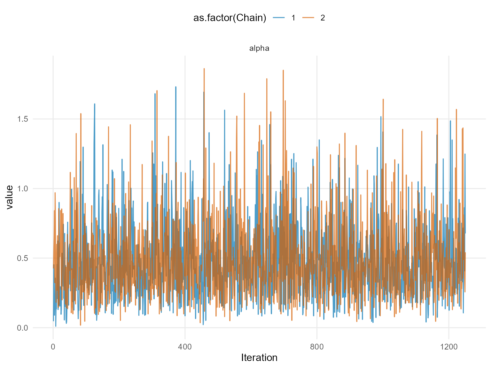
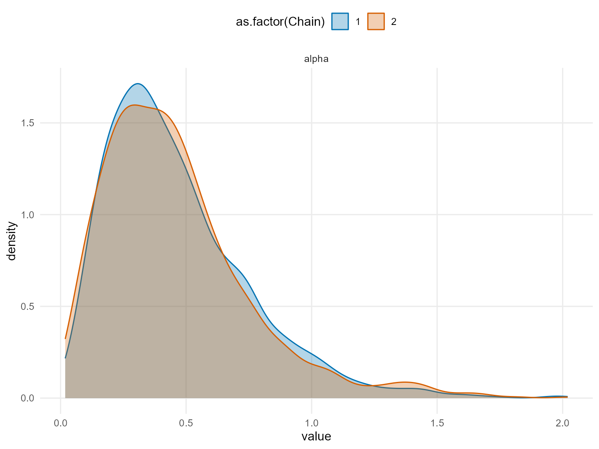
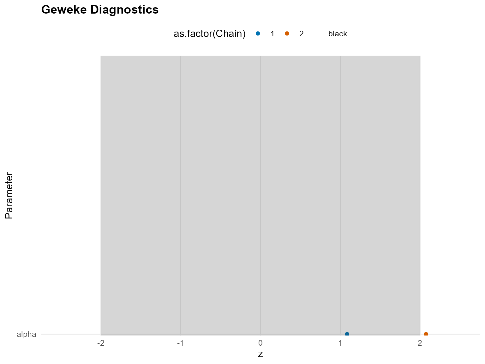
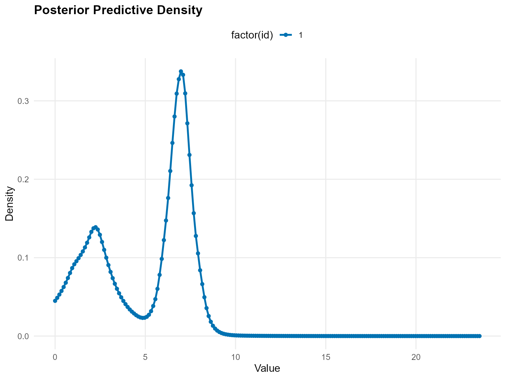
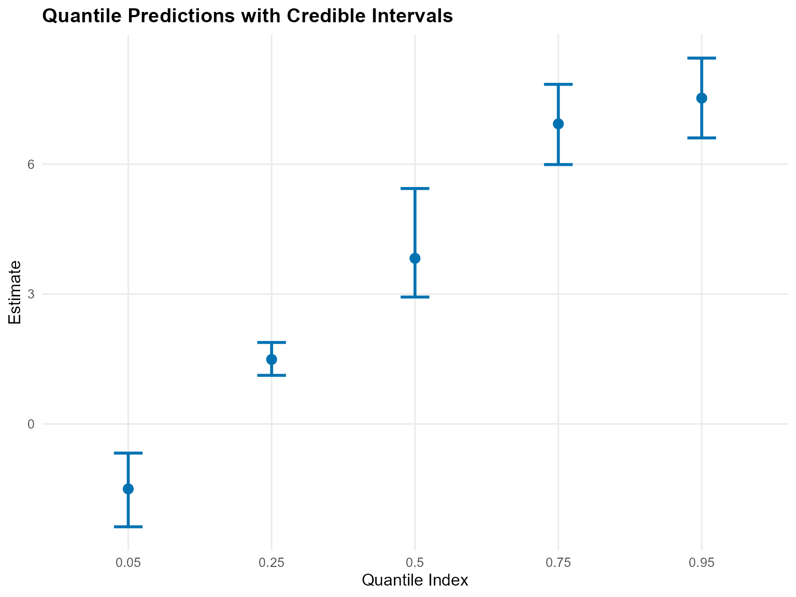
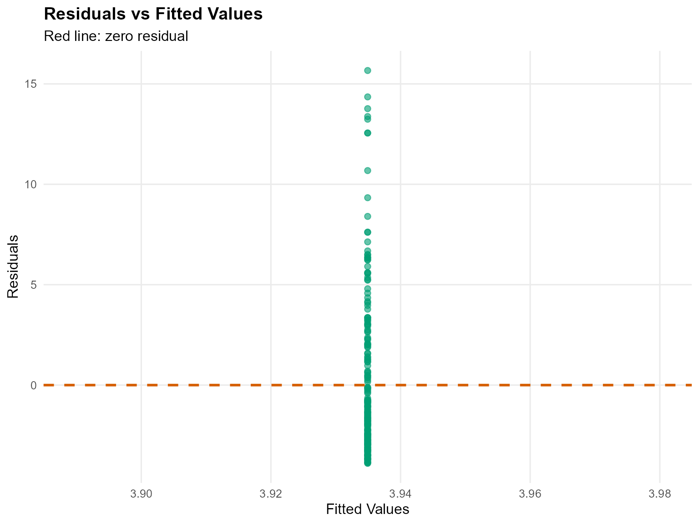
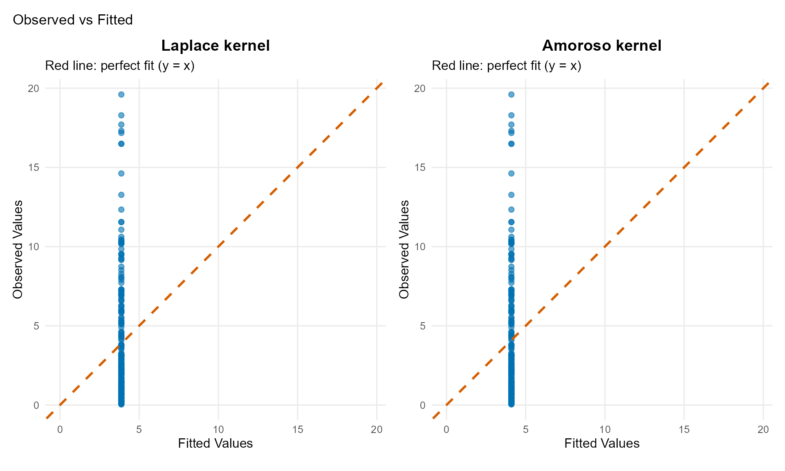

# 6. Unconditional DPmix with CRP Backend

## Unconditional DPmix: Chinese Restaurant Process (CRP)

**Goal**: Estimate density of univariate outcome $`y`$ using
**nonparametric Dirichlet Process mixture** with **Chinese Restaurant
Process** backend.

**Model**: $`y_i | G \sim \int K(y_i; \theta) dG(\theta)`$ where
$`G \sim \text{DP}(\alpha, G_0)`$

**Backend**: CRP with **truncation at max components**

------------------------------------------------------------------------

### Data Setup

``` r
# Load pre-generated dataset: 200 observations from mixture of 3 gamma components
data(nc_pos200_k3)
y_mixed <- nc_pos200_k3$y

paste("Sample size:", length(y_mixed))
[1] "Sample size: 200"
paste("Mean:", mean(y_mixed))
[1] "Mean: 4.21476750434594"
paste("SD:", sd(y_mixed))
[1] "SD: 4.10835046697183"
paste("Range:", paste(range(y_mixed), collapse = " to "))
[1] "Range: 0.0403111680208858 to 19.6013451514889"

# Visualization
df_data <- data.frame(y = y_mixed)
p_raw <- ggplot(df_data, aes(x = y)) +
  geom_histogram(aes(y = after_stat(density)), bins = 30, alpha = 0.6, fill = "steelblue",color = "black") +
  geom_density(color = "red", linewidth = 1) +
  labs(title = "Raw Data: Mixed Gamma Distribution", x = "y", y = "Density") +
  theme_minimal()

print(p_raw)
```


------------------------------------------------------------------------

### Model Specification & Bundle

We’ll use the `build_nimble_bundle` function directly which handles both
specification and bundle creation.

``` r
bundle_crp <- build_nimble_bundle(
  y = y_mixed,
  kernel = "laplace",         # Use laplace kernel
  backend = "crp",            # CRP backend
  GPD = FALSE,                # No tail augmentation
  components = 3,             # Minimal for testing
  alpha_random = TRUE,        # Random DP concentration
  mcmc = list(
    niter = 50,             # Minimal for testing
    nburnin = 10,           # Minimal burnin
    nchains = 2,            # Two chains for diagnostics
    thin = 1                # No thinning
  )
)
```

------------------------------------------------------------------------

#### Building MCMC bundle

``` r
bundle_crp <- build_nimble_bundle(
  y_mixed,
  kernel = "laplace",
  backend = "crp",
  GPD = FALSE,
  components = 3,
  alpha_random = TRUE,
  mcmc = list(niter = 1500, nburnin = 250, nchains = 2, thin = 1)
)
```

#### Summary of MCMC Bundle

``` r
summary(bundle_crp)
DPmixGPD bundle summary
      Field                      Value
    Backend Chinese Restaurant Process
     Kernel       Laplace Distribution
 Components                          3
          N                        200
          X                         NO
        GPD                      FALSE
    Epsilon                      0.025

Parameter specification
         block  parameter mode           level                  prior link
          meta    backend info           model                    crp     
          meta     kernel info           model                laplace     
          meta components info           model                      3     
          meta          N info           model                    200     
          meta          P info           model                      0     
 concentration      alpha dist          scalar gamma(shape=1, rate=1)     
          bulk   location dist component (1:3)   normal(mean=0, sd=5)     
          bulk      scale dist component (1:3) gamma(shape=2, rate=1)     
                    notes
                         
                         
                         
                         
                         
 stochastic concentration
    iid across components
    iid across components

Monitors
  n = 4 
  alpha, z[1:200], location[1:3], scale[1:3]
```

#### Running MCMC

``` r
fit_crp <- run_mcmc_bundle_manual(bundle_crp)
```

#### Summary of Fitted MCMC model

``` r
summary(fit_crp)
MixGPD summary | backend: Chinese Restaurant Process | kernel: Laplace Distribution | GPD tail: FALSE | epsilon: 0.025
n = 200 | components = 3
Summary
Initial components: 3 | Components after truncation: 2

WAIC: 911.761
lppd: -346.984 | pWAIC: 108.897

Summary table
   parameter  mean    sd q0.025 q0.500 q0.975      ess
  weights[1] 0.428 0.041  0.365  0.425  0.520  199.747
  weights[2] 0.350 0.041  0.280  0.350  0.448  133.217
       alpha 0.485 0.286  0.099  0.435  1.211 2100.391
 location[1] 5.485 2.231  1.211  6.659  7.684  299.048
 location[2] 3.232 2.606  0.803  2.245  8.018  221.482
    scale[1] 0.544 0.374  0.264  0.340  1.426  253.372
    scale[2] 1.212 0.679  0.276  1.208  2.426  213.255
```

``` r
params_crp <- params(fit_crp)
params_crp
Posterior mean parameters

$alpha
[1] 0.4853

$w
[1] 0.4285 0.3500

$location
[1] 5.485 3.232

$scale
[1] 0.5443 1.2120
```

------------------------------------------------------------------------

### MCMC Diagnostics Plots

``` r
# Trace plots for key parameters
plot(fit_crp, params = "alpha", family = c("traceplot", "density", "geweke"))

=== traceplot ===
```



    === density ===



    === geweke ===



------------------------------------------------------------------------

### Posterior Predictions

#### Predictive Density

``` r
# Generate prediction grid
y_grid <- seq(0, max(y_mixed) * 1.2, length.out = 200)

# Posterior predictive density
pred_density <- predict(fit_crp, y = y_grid, type = "density")

# Use S3 plot method
plot(pred_density)
```



#### Quantile Predictions

``` r
# Posterior predictive quantiles with credible intervals
quantiles_pred <- predict(fit_crp, type = "quantile", 
                          index = c(0.05, 0.25, 0.5, 0.75, 0.95),
                          interval = "credible")

# Display table
quantiles_pred$fit %>%
 kbl(caption = "Posterior Predictive Quantiles with Credible Intervals",
   align = "c",
                  digits = 3) %>%
 kable_styling(bootstrap_options = "striped", full_width = FALSE, position = "center")
```

| estimate | index | lower  | upper |
|:--------:|:-----:|:------:|:-----:|
|  -0.414  | 0.05  | -2.592 | 1.206 |
|  1.919   | 0.25  | 0.979  | 2.849 |
|  5.812   | 0.50  | 3.137  | 7.117 |
|  6.983   | 0.75  | 5.905  | 8.047 |
|  7.539   | 0.95  | 6.446  | 8.598 |

Posterior Predictive Quantiles with Credible Intervals

``` r

# Use S3 plot method
plot(quantiles_pred)
```



------------------------------------------------------------------------

### Varying Truncation Level (components)

``` r
# Demonstrate with one value
bundle_components <- build_nimble_bundle(
  y = y_mixed,
  kernel = "laplace",
  backend = "crp",
  components = 5,
  mcmc = list(niter = 2500, nburnin = 500, nchains = 1)
)
fit_components <- run_mcmc_bundle_manual(bundle_components)
[MCMC] Creating NIMBLE model...
[MCMC] NIMBLE model created successfully.
[MCMC] Configuring MCMC...
===== Monitors =====
thin = 1: alpha, location, scale, z
===== Samplers =====
CRP_concentration sampler (1)
  - alpha
CRP_cluster_wrapper sampler (10)
  - scale[]  (5 elements)
  - location[]  (5 elements)
CRP sampler (1)
  - z[1:200] 
[MCMC] MCMC configured.
[MCMC] Building MCMC object...
[MCMC] MCMC object built.
[MCMC] Attempting NIMBLE compilation (this may take a minute)...
[MCMC] Compiling model...
[MCMC] Compiling MCMC sampler...
[MCMC] Compilation successful.
|-------------|-------------|-------------|-------------|
|  [Warning] CRP_sampler: This MCMC is not for a proper model. The MCMC attempted to use more components than the number of cluster parameters. Please increase the number of cluster parameters.
-------------------------------------------------------|
[MCMC] MCMC execution complete. Processing results...
```

``` r
summary(fit_components)
MixGPD summary | backend: Chinese Restaurant Process | kernel: Laplace Distribution | GPD tail: FALSE | epsilon: 0.025
n = 200 | components = 5
Summary
Initial components: 5 | Components after truncation: 3

WAIC: 890.592
lppd: -308.048 | pWAIC: 137.248

Summary table
   parameter  mean    sd q0.025 q0.500 q0.975     ess
  weights[1] 0.398 0.047  0.295  0.400  0.480  55.737
  weights[2] 0.301 0.049  0.210  0.305  0.390  58.364
  weights[3] 0.219 0.047  0.130  0.220  0.300  70.572
       alpha 0.728 0.397  0.172  0.658  1.649 635.817
 location[1] 5.637 2.282  0.993  6.704  7.957  60.333
 location[2] 2.845 2.412  0.711  2.206  8.702 170.124
 location[3] 2.030 1.866  0.498  1.286  8.855  56.331
    scale[1] 0.592 0.497  0.258  0.343  1.956  62.426
    scale[2] 1.376 0.673  0.288  1.344  2.740 259.570
    scale[3] 1.946 0.856  0.357  1.898  3.686 133.804
```

------------------------------------------------------------------------

### Residual Analysis

``` r
# Extract fitted values with diagnostics
Fit <- fitted(fit_components)

# Display table
kableExtra::kbl(head(Fit), caption = "Fitted Values, Residuals and Credible Interval", digits = 3, align = "c") %>%
 kable_styling(bootstrap_options = "striped", full_width = FALSE, position = "center")
```

| fit | lower | upper | residuals | mean | mean_lower | mean_upper | median | median_lower | median_upper |
|:--:|:--:|:--:|:--:|:--:|:--:|:--:|:--:|:--:|:--:|
| 3.935 | 2.895 | 4.872 | -3.290 | 3.935 | 2.895 | 4.872 | 4.186 | 2.574 | 6.471 |
| 3.935 | 2.895 | 4.872 | -1.063 | 3.935 | 2.895 | 4.872 | 4.186 | 2.574 | 6.471 |
| 3.935 | 2.895 | 4.872 | 5.908 | 3.935 | 2.895 | 4.872 | 4.186 | 2.574 | 6.471 |
| 3.935 | 2.895 | 4.872 | -0.751 | 3.935 | 2.895 | 4.872 | 4.186 | 2.574 | 6.471 |
| 3.935 | 2.895 | 4.872 | 3.360 | 3.935 | 2.895 | 4.872 | 4.186 | 2.574 | 6.471 |
| 3.935 | 2.895 | 4.872 | 3.153 | 3.935 | 2.895 | 4.872 | 4.186 | 2.574 | 6.471 |

Fitted Values, Residuals and Credible Interval

``` r

# Use S3 plot method for diagnostic plots
fit.plots <- plot(Fit)
fit.plots$residual_plot
```



------------------------------------------------------------------------

### Model Comparison: Different Kernels

#### Laplace Kernel (Current)

``` r
bundle_laplace <- build_nimble_bundle(
  y = y_mixed,
  kernel = "laplace",
  backend = "crp",
  components = 5,
  mcmc = list(niter = 2500, nburnin = 500, nchains = 1)
)
fit_laplace <- run_mcmc_bundle_manual(bundle_laplace)
[MCMC] Creating NIMBLE model...
[MCMC] NIMBLE model created successfully.
[MCMC] Configuring MCMC...
===== Monitors =====
thin = 1: alpha, location, scale, z
===== Samplers =====
CRP_concentration sampler (1)
  - alpha
CRP_cluster_wrapper sampler (10)
  - scale[]  (5 elements)
  - location[]  (5 elements)
CRP sampler (1)
  - z[1:200] 
[MCMC] MCMC configured.
[MCMC] Building MCMC object...
[MCMC] MCMC object built.
[MCMC] Attempting NIMBLE compilation (this may take a minute)...
[MCMC] Compiling model...
[MCMC] Compiling MCMC sampler...
[MCMC] Compilation successful.
|-------------|-------------|-------------|-------------|
|  [Warning] CRP_sampler: This MCMC is not for a proper model. The MCMC attempted to use more components than the number of cluster parameters. Please increase the number of cluster parameters.
-------------------------------------------------------|
[MCMC] MCMC execution complete. Processing results...
```

``` r
summary(fit_laplace)
MixGPD summary | backend: Chinese Restaurant Process | kernel: Laplace Distribution | GPD tail: FALSE | epsilon: 0.025
n = 200 | components = 5
Summary
Initial components: 5 | Components after truncation: 3

WAIC: 888.037
lppd: -304.017 | pWAIC: 140.002

Summary table
   parameter  mean    sd q0.025 q0.500 q0.975     ess
  weights[1] 0.384 0.056  0.250  0.390  0.485  62.558
  weights[2] 0.305 0.053  0.205  0.310  0.400  29.395
  weights[3] 0.217 0.048  0.120  0.215  0.305 120.935
       alpha 0.727 0.387  0.178  0.660  1.635 766.435
 location[1] 4.740 2.608  0.954  6.389  7.987  55.122
 location[2] 3.806 2.966  0.716  2.376  9.714 100.123
 location[3] 2.354 2.485  0.468  1.128  9.767  48.811
    scale[1] 0.791 0.569  0.266  0.409  2.079  32.379
    scale[2] 1.180 0.721  0.272  1.177  2.629 219.167
    scale[3] 1.950 0.986  0.293  1.986  3.905 101.449
```

#### Amoroso Kernel (Alternative)

``` r
bundle_amoroso <- build_nimble_bundle(
  y = y_mixed,
  kernel = "amoroso",
  backend = "crp",
  components = 5,
  mcmc = list(niter = 2500, nburnin = 500, nchains = 1)
)
fit_amoroso <- run_mcmc_bundle_manual(bundle_amoroso)
[MCMC] Creating NIMBLE model...
[MCMC] NIMBLE model created successfully.
[MCMC] Configuring MCMC...
===== Monitors =====
thin = 1: alpha, loc, scale, shape1, shape2, z
===== Samplers =====
CRP_concentration sampler (1)
  - alpha
CRP_cluster_wrapper sampler (20)
  - loc[]  (5 elements)
  - scale[]  (5 elements)
  - shape1[]  (5 elements)
  - shape2[]  (5 elements)
CRP sampler (1)
  - z[1:200] 
[MCMC] MCMC configured.
[MCMC] Building MCMC object...
[MCMC] MCMC object built.
[MCMC] Attempting NIMBLE compilation (this may take a minute)...
[MCMC] Compiling model...
[MCMC] Compiling MCMC sampler...
[MCMC] Compilation successful.
|-------------|-------------|-------------|-------------|
|  [Warning] CRP_sampler: This MCMC is not for a proper model. The MCMC attempted to use more components than the number of cluster parameters. Please increase the number of cluster parameters.
-------------------------------------------------------|
[MCMC] MCMC execution complete. Processing results...
```

``` r
summary(fit_amoroso)
MixGPD summary | backend: Chinese Restaurant Process | kernel: Amoroso Distribution | GPD tail: FALSE | epsilon: 0.025
n = 200 | components = 5
Summary
Initial components: 5 | Components after truncation: 1

WAIC: 958.951
lppd: -461.518 | pWAIC: 17.958

Summary table
  parameter   mean    sd q0.025 q0.500 q0.975     ess
 weights[1]  0.975 0.070  0.755  1.000  1.000  34.818
      alpha  0.242 0.260  0.006  0.158  0.962 215.223
     loc[1] -0.004 0.041 -0.120  0.010  0.039 181.321
   scale[1]  1.953 0.852  0.768  1.780  4.114   6.280
  shape1[1]  1.721 0.381  1.006  1.714  2.508   8.182
  shape2[1]  0.769 0.104  0.601  0.751  1.009  16.045
```

#### Model Comparison via Predictions

``` r
# Compare fitted values using S3 plot method
fitted_laplace <- fitted(fit_laplace)
fitted_amoroso <- fitted(fit_amoroso)
# Plot diagnostics for both models
g.plot <- plot(fitted_laplace)
l.plot <- plot(fitted_amoroso)
```

``` r
p_gamma <- g.plot$observed_fitted_plot +
  ggtitle("Laplace kernel") +
  theme(plot.title = element_text(hjust = 0.5))

p_lognormal <- l.plot$observed_fitted_plot +
  ggtitle("Amoroso kernel") +
  theme(plot.title = element_text(hjust = 0.5))

p_gamma + p_lognormal +
  plot_layout(ncol = 2) +
  plot_annotation(
    title = "Observed vs Fitted"
  ) +
  theme(plot.title = element_text(hjust = 0.5))
```



### Key Takeaways

- **CRP Backend**: Flexible component allocation, ideal for unknown
  mixture complexity
- **components Parameter**: Higher components allows more components but
  increases computation
- **Kernel Choice**: Gamma suitable for positive, skewed data
- **Diagnostics**: Check convergence (Rhat, ESS) and posterior
  predictive fit
- **Next**: Compare with **Stick-Breaking (SB)** backend in vignette 5
