# 7. Unconditional DPmix with Stick-Breaking Backend

## Unconditional DPmix: Stick-Breaking (SB) Backend

**Purpose**: Showcase the stick-breaking backend that uses a fixed
number of mixture components (`components = J`) and contrast it with the
CRP backend from `v04`. In this vignette we fit **two** bulk kernels
(**Gamma** and **Cauchy**) on the same dataset to highlight how heavier
tails in the bulk can change the fit even without a GPD tail.

------------------------------------------------------------------------

### Data Setup

``` r
# Load benchmark dataset
data("nc_pos200_k3")
y_mixed <- nc_pos200_k3$y

df_data <- data.frame(y = y_mixed)

summary_tbl <- tibble(
  statistic = c("N", "Mean", "SD", "Min", "Max"),
  value = c(length(y_mixed), mean(y_mixed), sd(y_mixed), min(y_mixed), max(y_mixed))
)

p_raw <- ggplot(df_data, aes(x = y)) +
  geom_histogram(aes(y = after_stat(density)), bins = 30, fill = "darkorange", alpha = 0.7, color = "black") +
  geom_density(color = "darkred", linewidth = 1.2) +
  labs(title = "Raw Data: Mixed Gamma Distribution", x = "y", y = "Density") +
  theme_minimal()

grid.arrange(p_raw, ncol = 1)
```

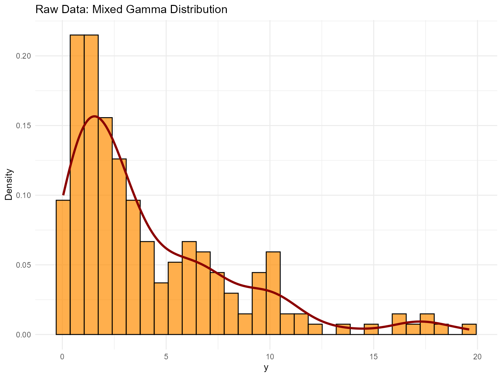

| statistic |   value   |
|:---------:|:---------:|
|     N     | 200.00000 |
|   Mean    |  4.21500  |
|    SD     |  4.10800  |
|    Min    |  0.04031  |
|    Max    | 19.60000  |

Summary of the SB Dataset

------------------------------------------------------------------------

### Model Specification & Bundle

We build the stick-breaking mixture explicitly with `components = 5` so
that there is room for weight decay while keeping the MCMC runtime
manageable for a vignette. We then refit the same SB model with a
**Cauchy** kernel for comparison.

``` r
# --- Gamma kernel ---
bundle_sb_gamma <- build_nimble_bundle(
  y = y_mixed,
  kernel = "gamma",
  backend = "sb",
  components = 5,            # fixed truncation level for SB
  GPD = FALSE,               # bulk-only scenario
  mcmc = list(
    niter = 60,
    nburnin = 10,
    nchains = 2,
    thin = 1
  )
)

# --- Cauchy kernel ---
bundle_sb_cauchy <- build_nimble_bundle(
  y = y_mixed,
  kernel = "cauchy",
  backend = "sb",
  components = 5,
  GPD = FALSE,
  mcmc = list(
    niter = 60,
    nburnin = 10,
    nchains = 1,
    thin = 1
  )
)
```

------------------------------------------------------------------------

### Running MCMC & Summary

``` r
fit_sb_gamma <- run_mcmc_bundle_manual(bundle_sb_gamma)
[MCMC] Creating NIMBLE model...
[MCMC] NIMBLE model created successfully.
[MCMC] Configuring MCMC...
===== Monitors =====
thin = 1: alpha, scale, shape, w, z
===== Samplers =====
RW sampler (10)
  - alpha
  - shape[]  (5 elements)
  - v[]  (4 elements)
conjugate sampler (5)
  - scale[]  (5 elements)
categorical sampler (200)
  - z[]  (200 elements)
[MCMC] MCMC configured.
[MCMC] Building MCMC object...
[MCMC] MCMC object built.
[MCMC] Attempting NIMBLE compilation (this may take a minute)...
[MCMC] Compiling model...
[MCMC] Compiling MCMC sampler...
[MCMC] Compilation successful.
|-------------|-------------|-------------|-------------|
|-------------------------------------------------------|
|-------------|-------------|-------------|-------------|
|-------------------------------------------------------|
[MCMC] MCMC execution complete. Processing results...
fit_sb_cauchy <- run_mcmc_bundle_manual(bundle_sb_cauchy)
[MCMC] Creating NIMBLE model...
[MCMC] NIMBLE model created successfully.
[MCMC] Configuring MCMC...
===== Monitors =====
thin = 1: alpha, location, scale, w, z
===== Samplers =====
RW sampler (15)
  - alpha
  - location[]  (5 elements)
  - scale[]  (5 elements)
  - v[]  (4 elements)
categorical sampler (200)
  - z[]  (200 elements)
[MCMC] MCMC configured.
[MCMC] Building MCMC object...
[MCMC] MCMC object built.
[MCMC] Attempting NIMBLE compilation (this may take a minute)...
[MCMC] Compiling model...
[MCMC] Compiling MCMC sampler...
[MCMC] Compilation successful.
|-------------|-------------|-------------|-------------|
|-------------------------------------------------------|
[MCMC] MCMC execution complete. Processing results...
```

``` r
summary(fit_sb_gamma)
MixGPD summary | backend: Stick-Breaking Process | kernel: Gamma Distribution | GPD tail: FALSE | epsilon: 0.025
n = 200 | components = 5
Summary
Initial components: 5 | Components after truncation: 4

WAIC: 945.879
lppd: -419.444 | pWAIC: 53.495

Summary table
  parameter  mean    sd q0.025 q0.500 q0.975    ess
 weights[1] 0.482 0.127  0.322  0.430  0.683  1.388
 weights[2] 0.254 0.061  0.140  0.260  0.368  4.081
 weights[3] 0.160 0.072  0.065  0.158  0.258  2.027
 weights[4] 0.073 0.017  0.042  0.070  0.113 64.878
      alpha 1.266 0.555  0.635  1.030  2.413 35.511
   shape[1] 1.250 0.239  0.954  1.295  1.623  4.568
   shape[2] 1.427 0.324  1.000  1.364  2.087 14.651
   shape[3] 2.262 0.900  1.065  2.148  5.232 16.390
   shape[4] 2.402 1.409  0.685  1.984  6.052  3.192
   scale[1] 0.279 0.061  0.178  0.273  0.391 29.538
   scale[2] 0.690 0.496  0.213  0.607  1.891  5.877
   scale[3] 0.783 0.734  0.207  0.412  2.516 13.592
   scale[4] 1.484 1.368  0.199  0.802  4.672  4.314
summary(fit_sb_cauchy)
MixGPD summary | backend: Stick-Breaking Process | kernel: Cauchy Distribution | GPD tail: FALSE | epsilon: 0.025
n = 200 | components = 5
Summary
Initial components: 5 | Components after truncation: 4

WAIC: 1063.189
lppd: -391.938 | pWAIC: 139.657

Summary table
   parameter  mean    sd q0.025 q0.500 q0.975    ess
  weights[1] 0.539 0.042  0.475  0.535  0.629  5.734
  weights[2] 0.230 0.033  0.180  0.228  0.297 14.481
  weights[3] 0.113 0.030  0.065  0.110  0.169  4.740
  weights[4] 0.087 0.028  0.040  0.090  0.145  1.856
       alpha 1.498 0.579  0.788  1.417  3.013 13.515
 location[1] 5.096 0.687  3.836  5.192  5.887  3.853
 location[2] 1.260 0.299  1.009  1.179  1.775 15.869
 location[3] 0.895 0.607  0.383  0.631  2.144 12.095
 location[4] 1.786 0.922  0.383  2.110  2.758  4.847
    scale[1] 2.404 0.192  2.002  2.370  2.868 21.820
    scale[2] 0.536 0.299  0.292  0.386  1.295  4.487
    scale[3] 0.407 0.251  0.253  0.308  1.080 15.727
    scale[4] 0.632 0.526  0.240  0.403  1.994 12.528
```

``` r
params_gamma <- params(fit_sb_gamma)
params_gamma
Posterior mean parameters

$alpha
[1] 1.266

$w
[1] 0.4821 0.2539 0.1601 0.0730

$shape
[1] 1.250 1.427 2.262 2.402

$scale
[1] 0.2786 0.6896 0.7831 1.4840
```

------------------------------------------------------------------------

### MCMC Diagnostics (S3 Plot Methods)

``` r
# Default diagnostics for each fit
plot(fit_sb_gamma, family = c("traceplot", "autocorrelation", "running"))

=== traceplot ===
```

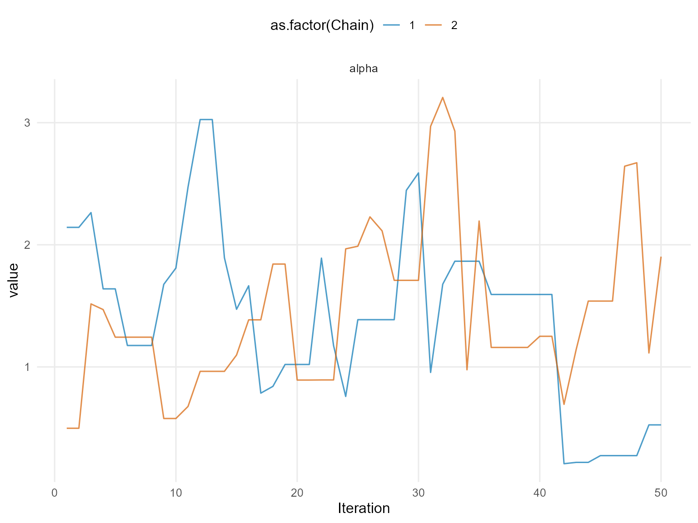

    === autocorrelation ===

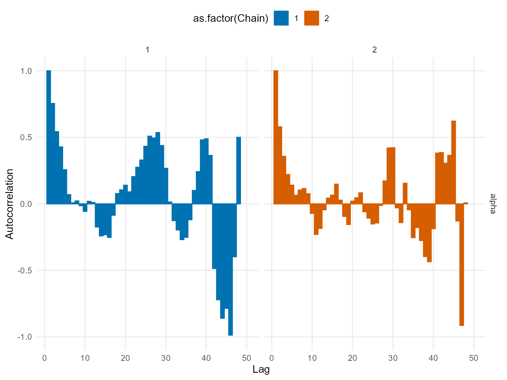

    === running ===

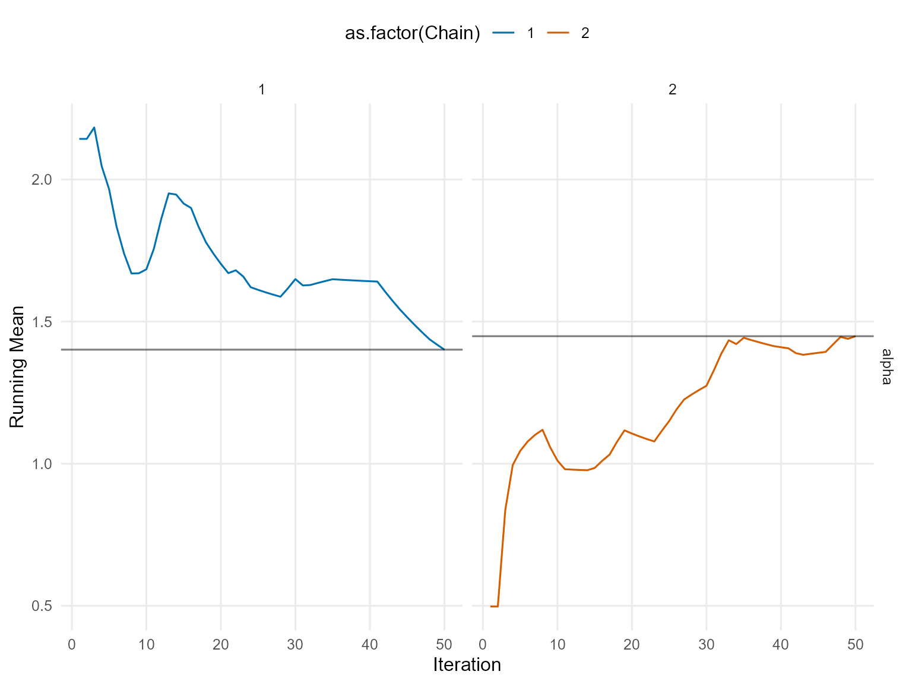

``` r
plot(fit_sb_cauchy, family = c("density", "geweke", "caterpillar"))

=== density ===
```

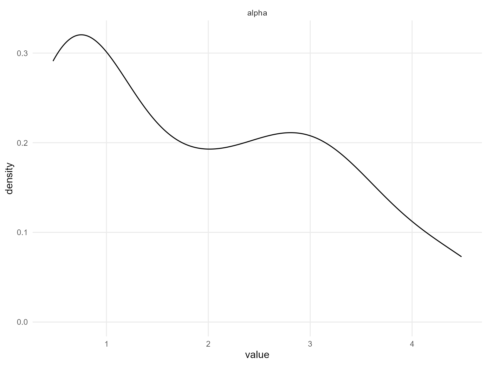

    === geweke ===

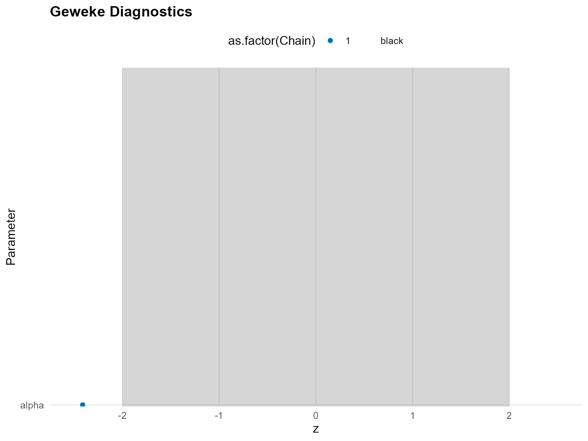

    === caterpillar ===

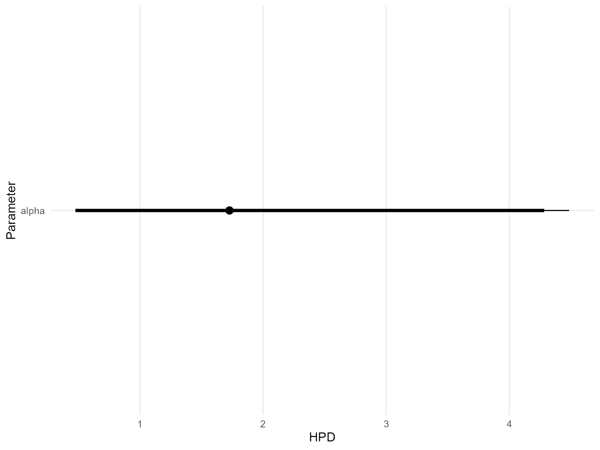

Use `summary(fit_sb_gamma)` and `summary(fit_sb_cauchy)` to inspect
effective sample size, R-hat, and other convergence diagnostics; the
[`plot()`](https://rdrr.io/r/graphics/plot.default.html) calls above
show the trace/density pairs for both global and stick-breaking weight
parameters.

------------------------------------------------------------------------

### Stick-Breaking Weights & Component Activity

The stick-breaking weights are exposed via the
[`plot()`](https://rdrr.io/r/graphics/plot.default.html) diagnostics
above, and you can refer to the raw `fit_sb_gamma` / `fit_sb_cauchy`
objects (or their [`summary()`](https://rdrr.io/r/base/summary.html)
output) for posterior summaries of each component weight.

------------------------------------------------------------------------

### Posterior Predictions

``` r
y_grid <- seq(min(y_mixed), max(y_mixed) * 1.3, length.out = 250)

pred_density_gamma <- predict(fit_sb_gamma, y = y_grid, type = "density")
pred_density_cauchy <- predict(fit_sb_cauchy, y = y_grid, type = "density")

plot(pred_density_gamma)
```

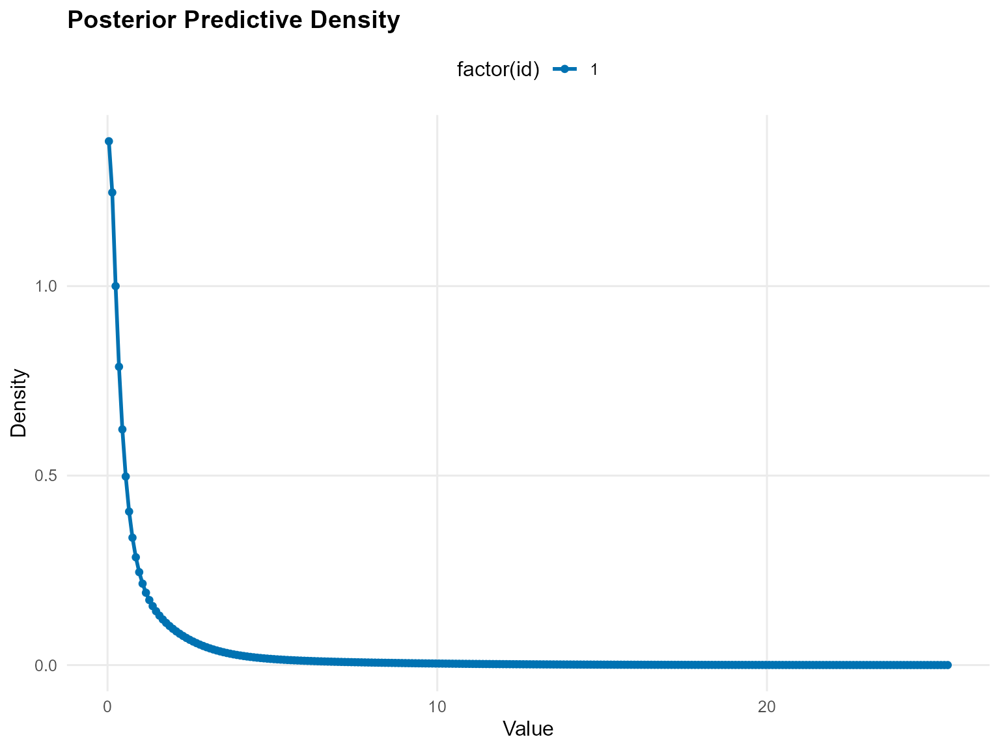

``` r
plot(pred_density_cauchy)
```

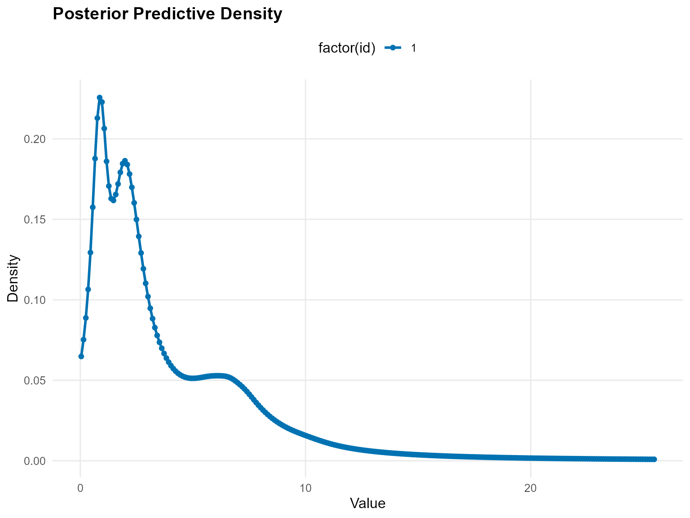

``` r
quant_probs <- c(0.05, 0.25, 0.5, 0.75, 0.95)

pred_q_gamma <- predict(fit_sb_gamma, type = "quantile", index = quant_probs, interval = "credible")
pred_q_cauchy <- predict(fit_sb_cauchy, type = "quantile", index = quant_probs, interval = "credible")

plot(pred_q_gamma)
```

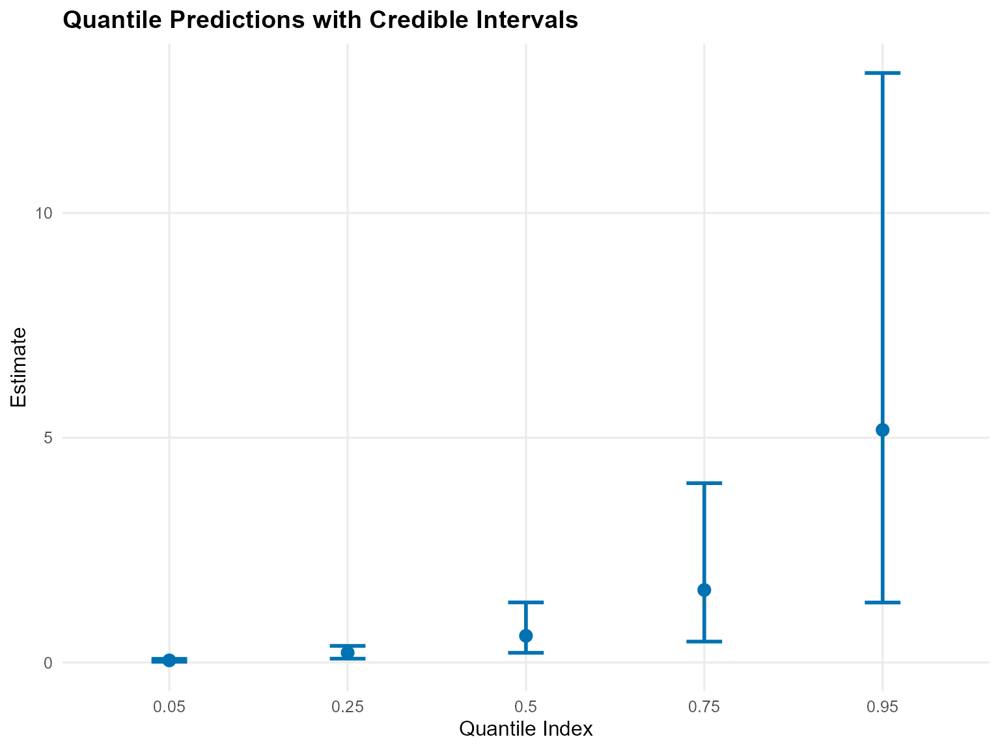

``` r
plot(pred_q_cauchy)
```

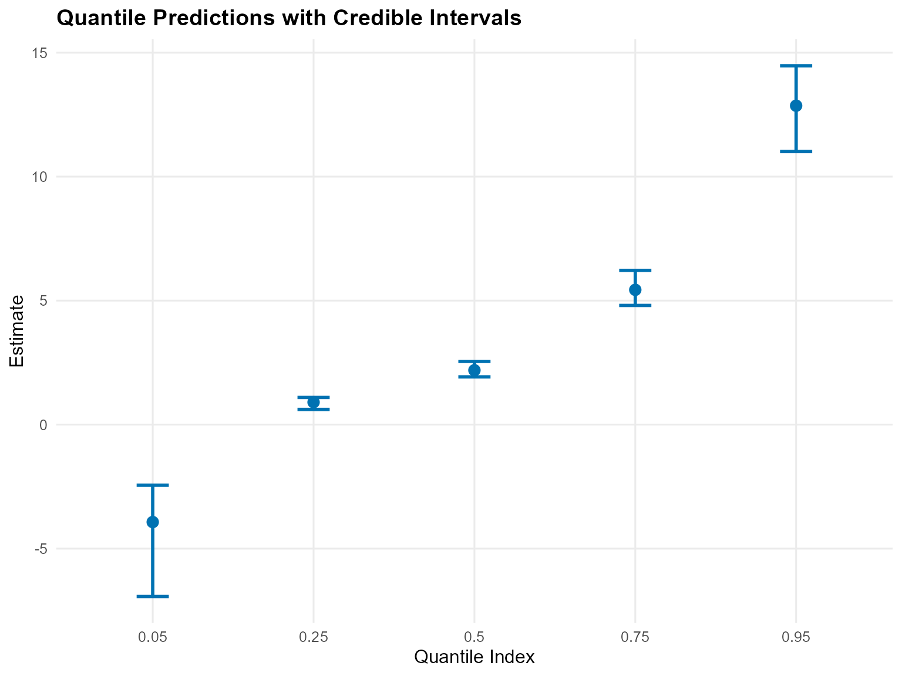

``` r
pred_mean_gamma <- predict(fit_sb_gamma, type = "mean")
pred_mean_cauchy <- predict(fit_sb_cauchy, type = "mean")

plot(pred_mean_gamma)
```

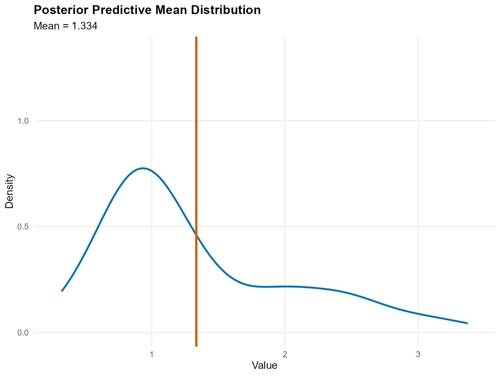

``` r
plot(pred_mean_cauchy)
```

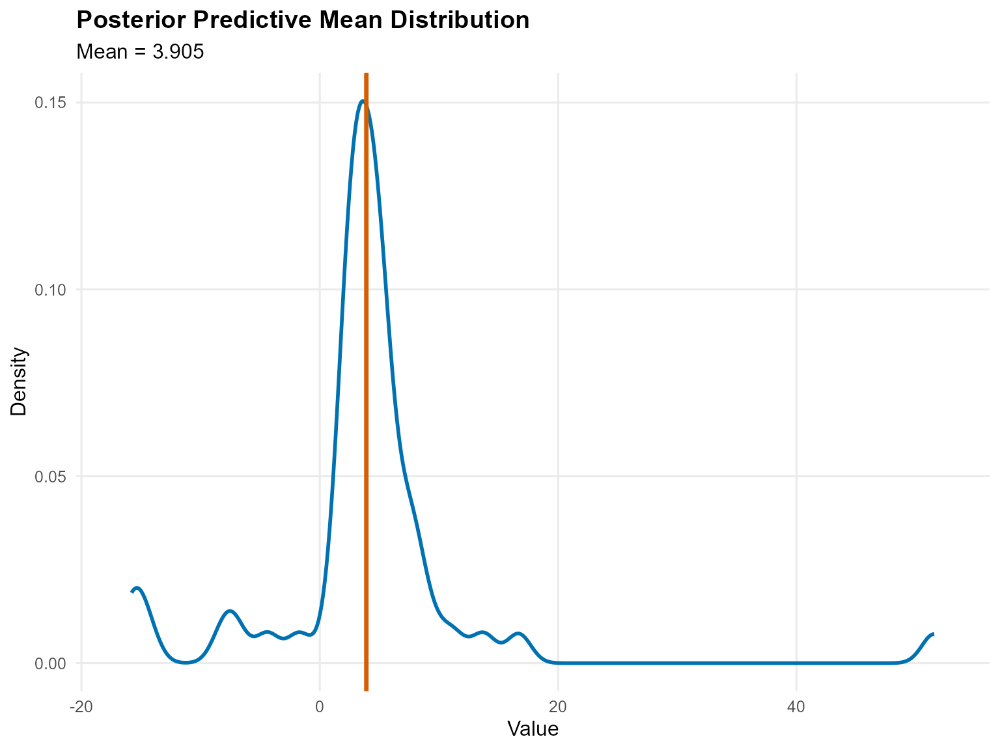

------------------------------------------------------------------------

### Bulk-only vs CRP Backends

``` r
bundle_crp_small <- build_nimble_bundle(
  y = y_mixed,
  kernel = "gamma",
  backend = "crp",
  components = 5,
  GPD = FALSE,
  mcmc = list(niter = 2500, nburnin = 500, nchains = 1)
)
fit_crp_small <- run_mcmc_bundle_manual(bundle_crp_small)
[MCMC] Creating NIMBLE model...
[MCMC] NIMBLE model created successfully.
[MCMC] Configuring MCMC...
===== Monitors =====
thin = 1: alpha, scale, shape, z
===== Samplers =====
CRP_concentration sampler (1)
  - alpha
CRP_cluster_wrapper sampler (10)
  - scale[]  (5 elements)
  - shape[]  (5 elements)
CRP sampler (1)
  - z[1:200] 
[MCMC] MCMC configured.
[MCMC] Building MCMC object...
[MCMC] MCMC object built.
[MCMC] Attempting NIMBLE compilation (this may take a minute)...
[MCMC] Compiling model...
[MCMC] Compiling MCMC sampler...
[MCMC] Compilation successful.
|-------------|-------------|-------------|-------------|
|  [Warning] CRP_sampler: This MCMC is not for a proper model. The MCMC attempted to use more components than the number of cluster parameters. Please increase the number of cluster parameters.
-------------------------------------------------------|
[MCMC] MCMC execution complete. Processing results...

crp_quant <- predict(fit_crp_small, type = "quantile", index = quant_probs, interval = "credible")
sb_quant <- predict(fit_sb_gamma, type = "quantile", index = quant_probs, interval = "credible")

bind_rows(
  crp_quant$fit %>% mutate(model = "CRP"),
  sb_quant$fit %>% mutate(model = "SB")
) %>%
  select(any_of(c("model", "index", "estimate", "lower", "upper"))) %>%
  mutate(across(where(is.numeric), ~ round(.x, 3))) %>%
  kable(caption = "Quantile Comparison: CRP vs SB", align = "c") %>%
  kable_styling(bootstrap_options = c("striped", "hover"), full_width = FALSE, position = "center")
```

| model | index | estimate | lower | upper  |
|:-----:|:-----:|:--------:|:-----:|:------:|
|  CRP  | 0.05  |  0.045   | 0.009 | 0.173  |
|  CRP  | 0.25  |  0.167   | 0.054 | 0.513  |
|  CRP  | 0.50  |  0.342   | 0.135 | 0.973  |
|  CRP  | 0.75  |  0.615   | 0.279 | 1.651  |
|  CRP  | 0.95  |  1.212   | 0.614 | 3.112  |
|  SB   | 0.05  |  0.043   | 0.018 | 0.078  |
|  SB   | 0.25  |  0.179   | 0.107 | 0.274  |
|  SB   | 0.50  |  0.404   | 0.257 | 0.570  |
|  SB   | 0.75  |  0.940   | 0.493 | 1.510  |
|  SB   | 0.95  |  5.647   | 1.060 | 19.039 |

Quantile Comparison: CRP vs SB

``` r
plot(crp_quant)
```

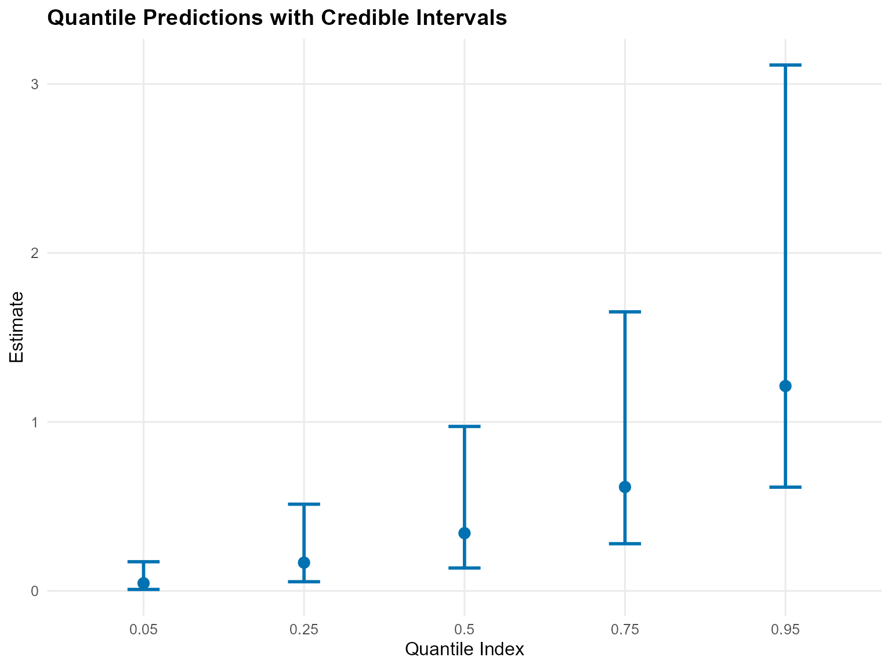

``` r
plot(sb_quant)
```

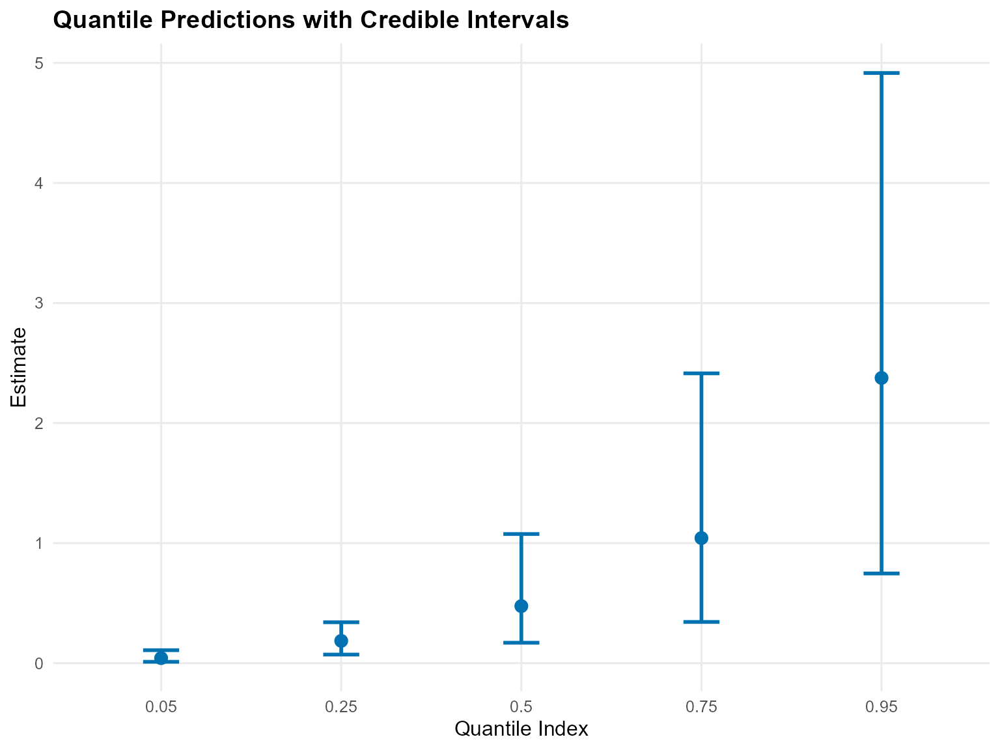

------------------------------------------------------------------------

### Residuals & Fitted Values

``` r
fit_vals <- fitted(fit_sb_gamma)
plot(fit_vals)
```

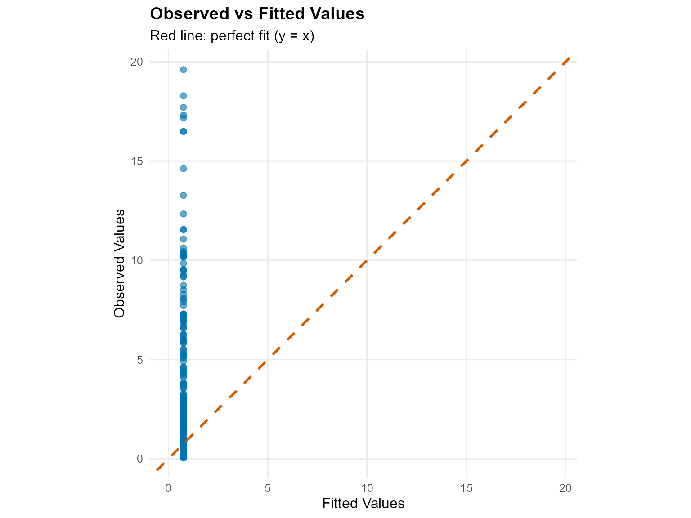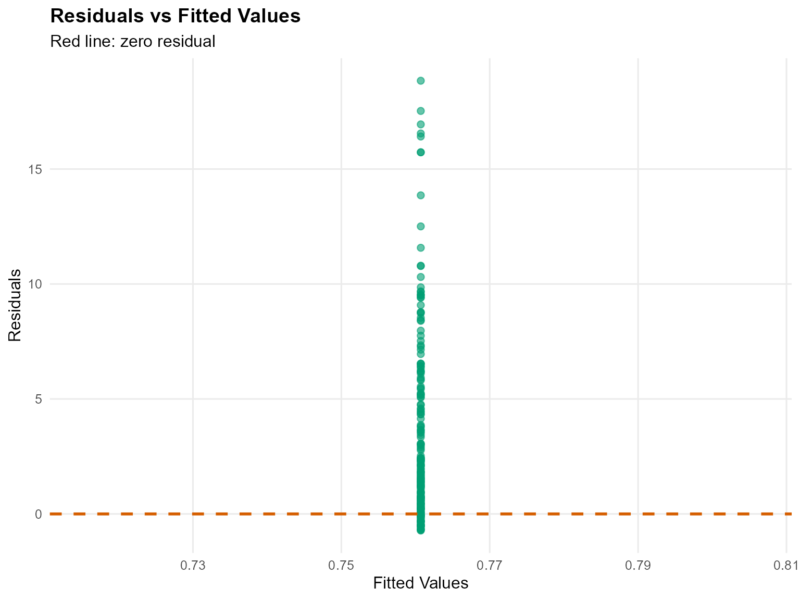

------------------------------------------------------------------------

### Takeaways

- **SB Backend**: Fixed `components` keeps label-switching manageable,
  and the diagnostic plots via the S3
  [`plot()`](https://rdrr.io/r/graphics/plot.default.html) method show
  weight dynamics.
- **Kernels matter**: Gamma vs Cauchy can behave very differently in the
  shoulders/tails, even without a GPD tail.
- **Predictions**: Posterior density, posterior-mean quantiles, and mean
  (via predictive sampling) are accessible via
  [`predict()`](https://rdrr.io/r/stats/predict.html) with credible
  bands.
- **Backend comparison**: The CRP fit (`v04`) and the SB-gamma fit
  deliver similar central quantiles while SB offers more control over
  truncation.
- **Next**: Explore tail augmentation (`GPD = TRUE`) with the CRP
  backend in `v06` or SB backend in `v07`.
