# 8. Unconditional DPmixGPD with CRP Backend

## Unconditional DPmixGPD: CRP Backend with Tail Augmentation

**Purpose**: Model the **bulk** of the distribution with a DP mixture
(the “kernel” or bulk family) and let a **GPD tail** capture extreme
values beyond a threshold. The CRP backend handles partitioning and we
toggle `GPD = TRUE` to augment the tail.

------------------------------------------------------------------------

### Data Setup

``` r
# Load data with an obvious tail
data("nc_pos_tail200_k4")
y_tail <- nc_pos_tail200_k4$y
y_tail <- y_tail[is.finite(y_tail) & y_tail > 0]

# Summaries and table
summary_tbl <- tibble(
  statistic = c("N", "Mean", "SD", "Min", "Max"),
  value = c(length(y_tail), mean(y_tail), sd(y_tail), min(y_tail), max(y_tail))
)

df_data <- data.frame(y = y_tail)

ggplot(df_data, aes(x = y)) +
  geom_histogram(aes(y = after_stat(density)), bins = 40, fill = "steelblue", color = "black", alpha = 0.6) +
  geom_density(color = "red", linewidth = 1) +
  labs(title = "Raw Data: Mix of Bulk and Tail", x = "y", y = "Density") +
  theme_minimal()
```

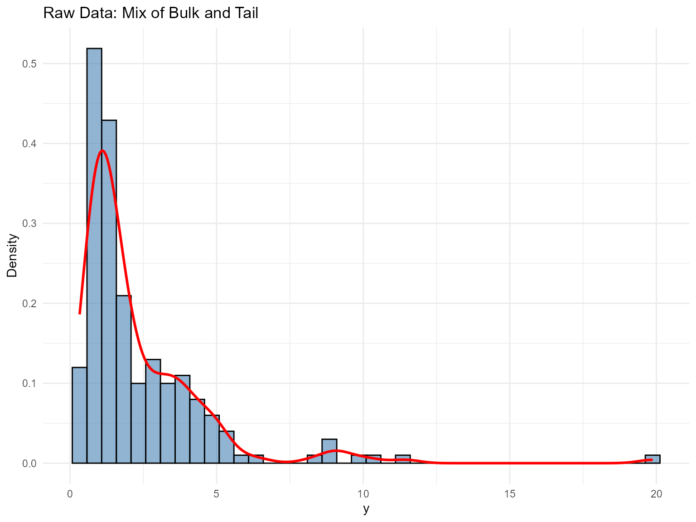

| statistic |  value   |
|:---------:|:--------:|
|     N     | 200.0000 |
|   Mean    |  2.3340  |
|    SD     |  2.3000  |
|    Min    |  0.3283  |
|    Max    | 19.8700  |

Summary of the Tail Dataset

------------------------------------------------------------------------

### Threshold & Tail Partition

``` r
thresholds <- quantile(y_tail, c(0.70, 0.75, 0.80, 0.85, 0.90))
u_threshold <- thresholds["80%"]

df_tail <- tibble(
  y = y_tail,
  region = ifelse(y_tail > u_threshold, "Tail", "Bulk")
)

ggplot(df_tail, aes(x = y, fill = region)) +
  geom_histogram(aes(y = after_stat(density)), bins = 40, alpha = 0.7, color = "black") +
  geom_vline(xintercept = u_threshold, linetype = "dashed", color = "black") +
  scale_fill_manual(values = c("Bulk" = "steelblue", "Tail" = "red")) +
  labs(title = "Threshold Partition", x = "y", y = "Density") +
  theme_minimal()
```

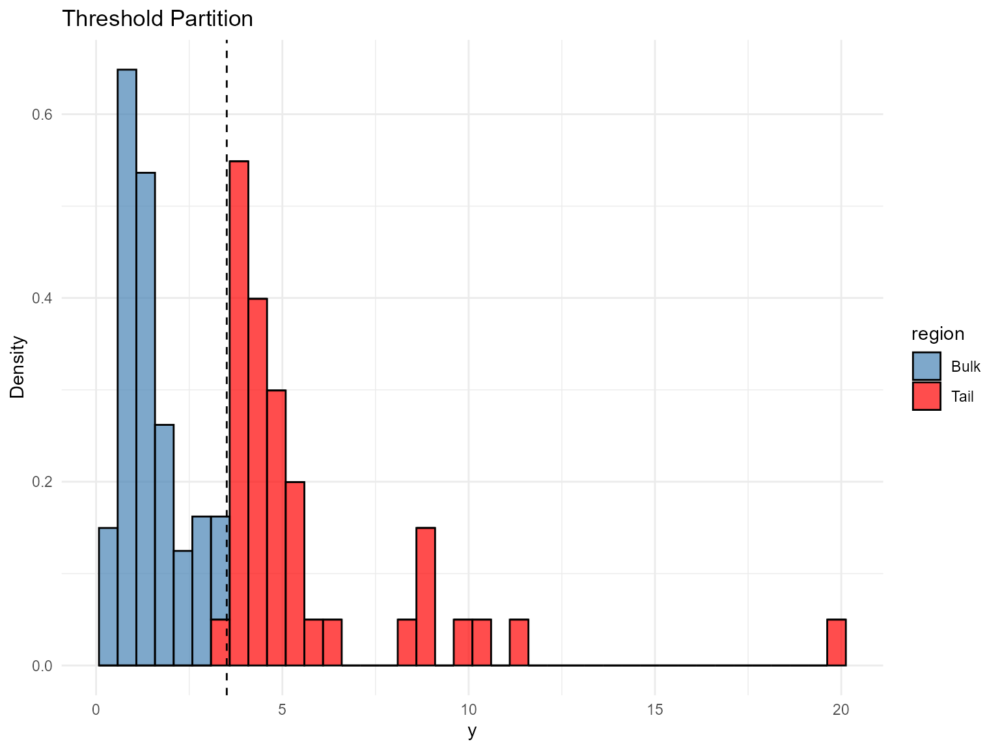

------------------------------------------------------------------------

### Model Specification & Bundle

This mirrors the direct
[`build_nimble_bundle()`](https://arnabaich96.github.io/DPmixGPD/reference/build_nimble_bundle.md)
workflow in `v04`, but with **tail augmentation** turned on
(`GPD = TRUE`). Here we use an **Inverse Gaussian** bulk kernel and
estimate the GPD threshold with a lognormal prior centered at the
empirical 80th percentile.

``` r
bundle_gpd <- build_nimble_bundle(
  y = y_tail,
  kernel = "invgauss",
  backend = "crp",
  GPD = TRUE,
  components = 5,
  alpha_random = TRUE,
  param_specs = list(
    gpd = list(
      threshold = list(
        mode = "dist",
        dist = "lognormal",
        args = list(meanlog = log(max(u_threshold, .Machine$double.eps)), sdlog = 0.25)
      )
    )
  ),
  mcmc = list(
    niter = 60,
    nburnin = 10,
    nchains = 2,
    thin = 1
  )
)
```

------------------------------------------------------------------------

### Running MCMC & Diagnostics

``` r
fit_gpd <- run_mcmc_bundle_manual(bundle_gpd)
[MCMC] Creating NIMBLE model...
[MCMC] NIMBLE model created successfully.
[MCMC] Configuring MCMC...
===== Monitors =====
thin = 1: alpha, mean, shape, tail_scale, tail_shape, threshold, z
===== Samplers =====
RW sampler (3)
  - threshold
  - tail_scale
  - tail_shape
CRP_concentration sampler (1)
  - alpha
CRP_cluster_wrapper sampler (10)
  - mean[]  (5 elements)
  - shape[]  (5 elements)
CRP sampler (1)
  - z[1:200] 
[MCMC] MCMC configured.
[MCMC] Building MCMC object...
[MCMC] MCMC object built.
[MCMC] Attempting NIMBLE compilation (this may take a minute)...
[MCMC] Compiling model...
[MCMC] Compiling MCMC sampler...
[MCMC] Compilation successful.
|-------------|-------------|-------------|-------------|
|  [Warning] CRP_sampler: This MCMC is not for a proper model. The MCMC attempted to use more components than the number of cluster parameters. Please increase the number of cluster parameters.
-------------------------------------------------------|
|-------------|-------------|-------------|-------------|
|  [Warning] CRP_sampler: This MCMC is not for a proper model. The MCMC attempted to use more components than the number of cluster parameters. Please increase the number of cluster parameters.
-------------------------------------------------------|
[MCMC] MCMC execution complete. Processing results...
```

``` r
summary(fit_gpd)
MixGPD summary | backend: Chinese Restaurant Process | kernel: Inverse Gaussian Distribution | GPD tail: TRUE | epsilon: 0.025
n = 200 | components = 5
Summary
Initial components: 5 | Components after truncation: 1

WAIC: 660.780
lppd: -299.833 | pWAIC: 30.557

Summary table
  parameter  mean    sd q0.025 q0.500 q0.975    ess
 weights[1] 0.703 0.215  0.350  0.692  1.000  3.516
      alpha 0.579 0.371  0.060  0.519  1.405 13.469
 tail_scale 1.619 0.458  1.055  1.598  3.070 13.057
 tail_shape 0.298 0.079  0.218  0.253  0.432  3.346
  threshold 3.490 0.701  1.981  3.487  5.087 11.722
    mean[1] 2.201 0.328  1.611  2.208  2.882 11.388
   shape[1] 3.125 0.649  2.248  2.979  4.913  9.014
```

``` r
params_gpd <- params(fit_gpd)
params_gpd
Posterior mean parameters

$alpha
[1] 0.5795

$w
[1] 0.703

$mean
[1] 2.201

$shape
[1] 3.125

$tail_scale
[1] 1.619

$tail_shape
[1] 0.2976
```

``` r
# S3 plot methods highlight trace + density diagnostics
plot(fit_gpd, family = c("traceplot", "density", "running"))

=== traceplot ===
```

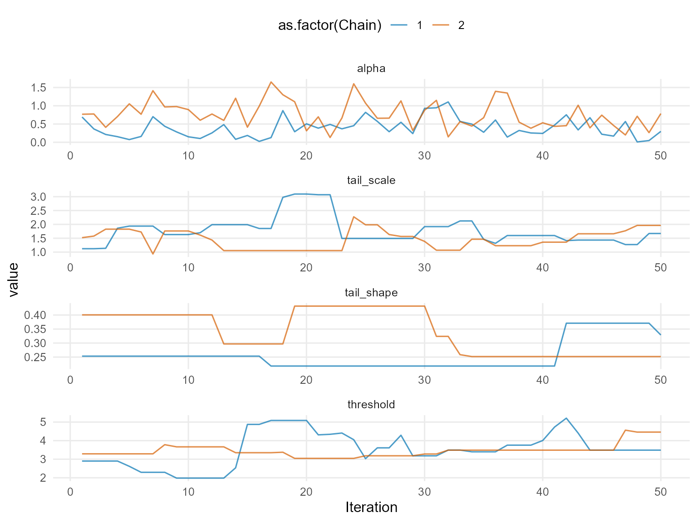

    === density ===

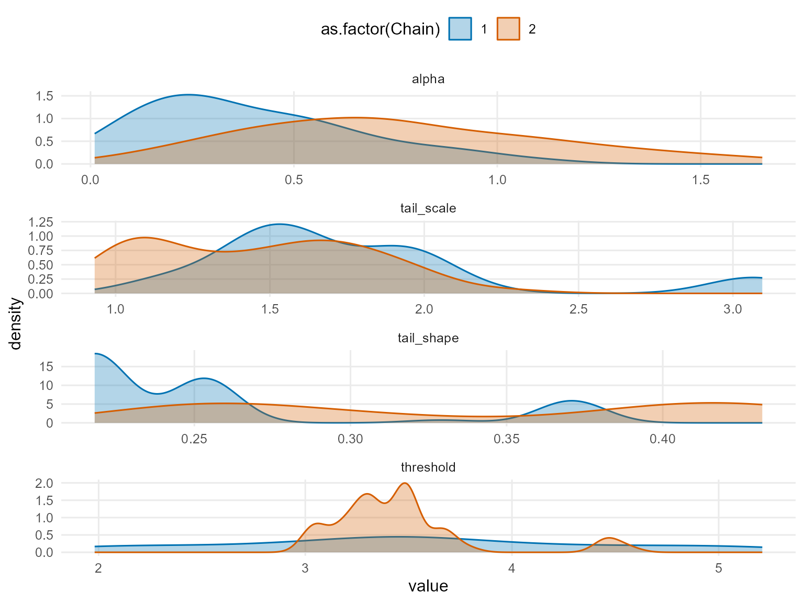

    === running ===

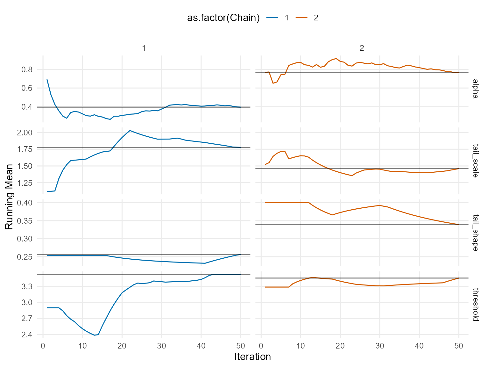

``` r
plot(fit_gpd, params = "alpha", family = c("traceplot", "autocorrelation", "geweke"))

=== traceplot ===
```

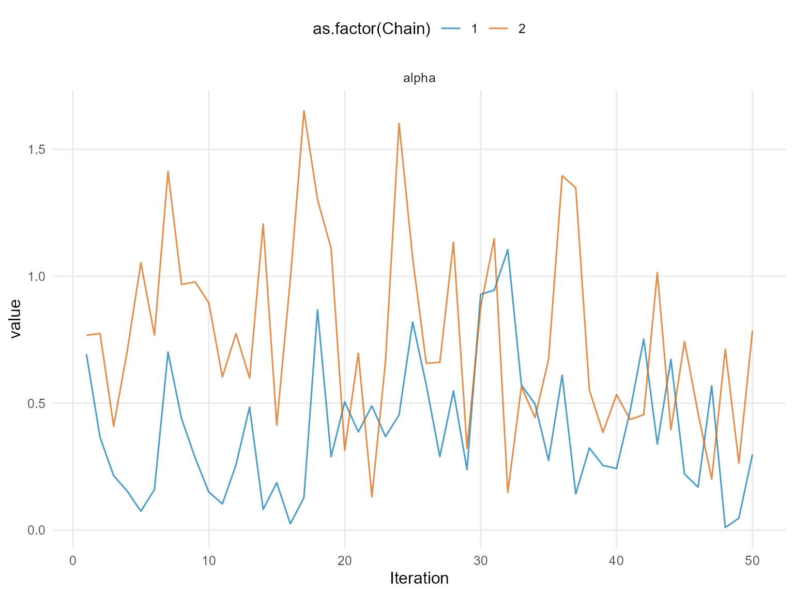

    === autocorrelation ===

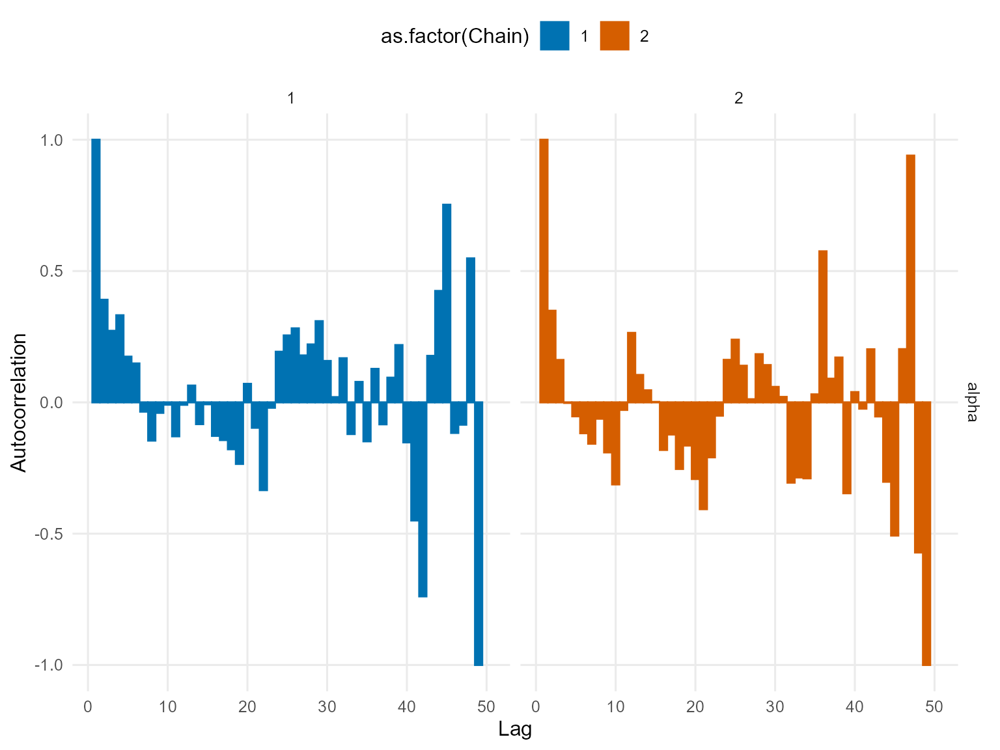

    === geweke ===

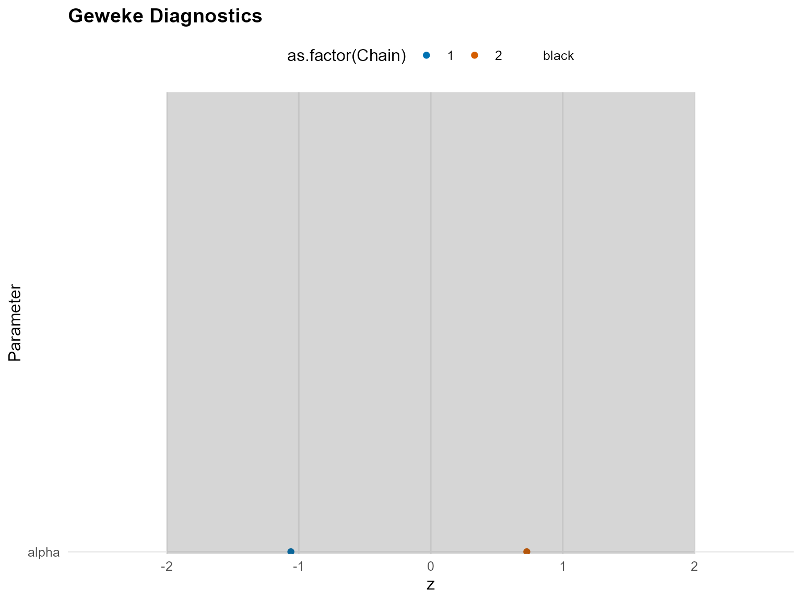

------------------------------------------------------------------------

### Posterior Predictions: Bulk and Tail

We use the **S3 [`predict()`](https://rdrr.io/r/stats/predict.html)
objects** and their dedicated
[`plot()`](https://rdrr.io/r/graphics/plot.default.html) methods to
visualize densities, survival curves, and posterior-mean quantiles
(i.e., averages of q(p \| θ) over draws).

``` r
y_min <- max(min(y_tail), .Machine$double.eps)
y_grid <- seq(y_min, max(y_tail) * 1.3, length.out = 300)
pred_density <- predict(fit_gpd, y = y_grid, type = "density")
plot(pred_density)
```

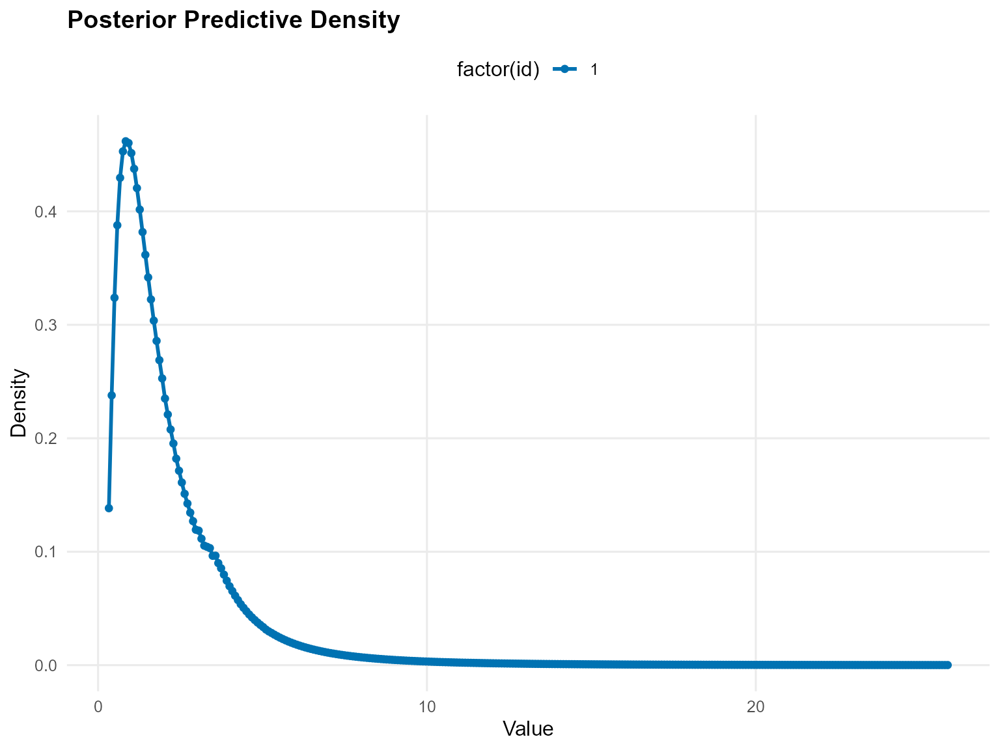

``` r
y_surv <- seq(max(u_threshold, y_min), max(y_tail) * 1.1, length.out = 60)
pred_surv <- predict(fit_gpd, y = y_surv, type = "survival")
plot(pred_surv)
```

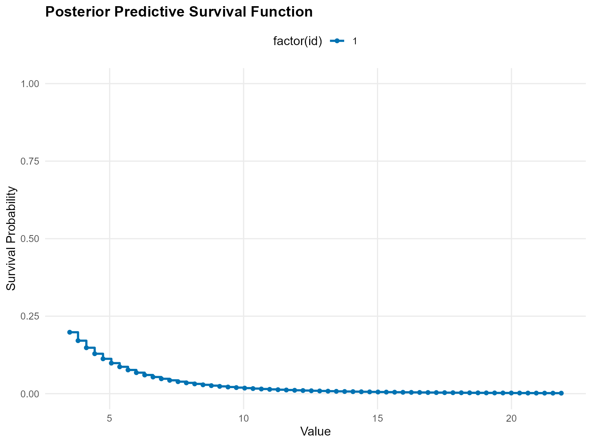

``` r
quantile_probs <- c(0.90, 0.95, 0.99)
pred_quantiles <- predict(fit_gpd, type = "quantile", index = quantile_probs, interval = "credible")
plot(pred_quantiles)
```

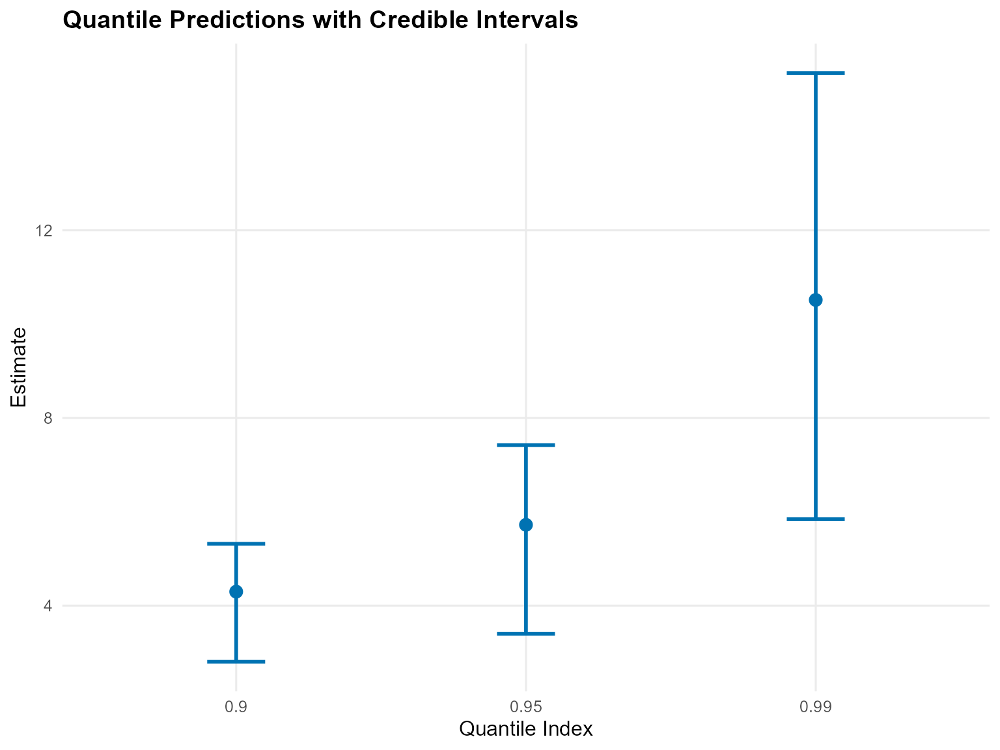

------------------------------------------------------------------------

### Bulk-Only Baseline Comparison

To demonstrate the value of tail augmentation, we fit a bulk-only
lognormal DP mixture and compare posterior summaries against the
InvGauss+GPD fit.

``` r
bundle_bulk_only <- build_nimble_bundle(
  y = y_tail,
  kernel = "lognormal",
  backend = "crp",
  GPD = FALSE,
  components = 5,
  mcmc = list(niter = 2500, nburnin = 500, nchains = 1)
)
fit_bulk_only <- run_mcmc_bundle_manual(bundle_bulk_only)
[MCMC] Creating NIMBLE model...
[MCMC] NIMBLE model created successfully.
[MCMC] Configuring MCMC...
===== Monitors =====
thin = 1: alpha, meanlog, sdlog, z
===== Samplers =====
CRP_concentration sampler (1)
  - alpha
CRP_cluster_wrapper sampler (10)
  - sdlog[]  (5 elements)
  - meanlog[]  (5 elements)
CRP sampler (1)
  - z[1:200] 
[MCMC] MCMC configured.
[MCMC] Building MCMC object...
[MCMC] MCMC object built.
[MCMC] Attempting NIMBLE compilation (this may take a minute)...
[MCMC] Compiling model...
[MCMC] Compiling MCMC sampler...
[MCMC] Compilation successful.
|-------------|-------------|-------------|-------------|
|  [Warning] CRP_sampler: This MCMC is not for a proper model. The MCMC attempted to use more components than the number of cluster parameters. Please increase the number of cluster parameters.
-------------------------------------------------------|
[MCMC] MCMC execution complete. Processing results...
```

``` r
bulk_quantiles <- predict(fit_bulk_only, type = "quantile", index = quantile_probs)
tail_quantiles <- predict(fit_gpd, type = "quantile", index = quantile_probs)

compare_tbl <- bind_rows(
  bulk_quantiles$fit %>% mutate(model = "Bulk only"),
  tail_quantiles$fit %>% mutate(model = "Bulk + GPD")
) %>%
  select(any_of(c("model", "index", "estimate", "lwr", "upr", "lower", "upper")))

compare_tbl %>%
  mutate(across(where(is.numeric), ~ round(.x, 3))) %>%
  kable(caption = "Posterior-Mean Quantiles for Bulk-Only vs GPD Models", align = "c") %>%
  kable_styling(bootstrap_options = c("striped", "hover"), full_width = FALSE, position = "center")
```

|   model    | index |  estimate  | lower | upper |
|:----------:|:-----:|:----------:|:-----:|:-----:|
| Bulk only  | 0.90  |  194.170   |  NA   |  NA   |
| Bulk only  | 0.95  |  1532.542  |  NA   |  NA   |
| Bulk only  | 0.99  | 135689.903 |  NA   |  NA   |
| Bulk + GPD | 0.90  |   4.298    |  NA   |  NA   |
| Bulk + GPD | 0.95  |   5.722    |  NA   |  NA   |
| Bulk + GPD | 0.99  |   10.515   |  NA   |  NA   |

Posterior-Mean Quantiles for Bulk-Only vs GPD Models

``` r
plot(bulk_quantiles)
```

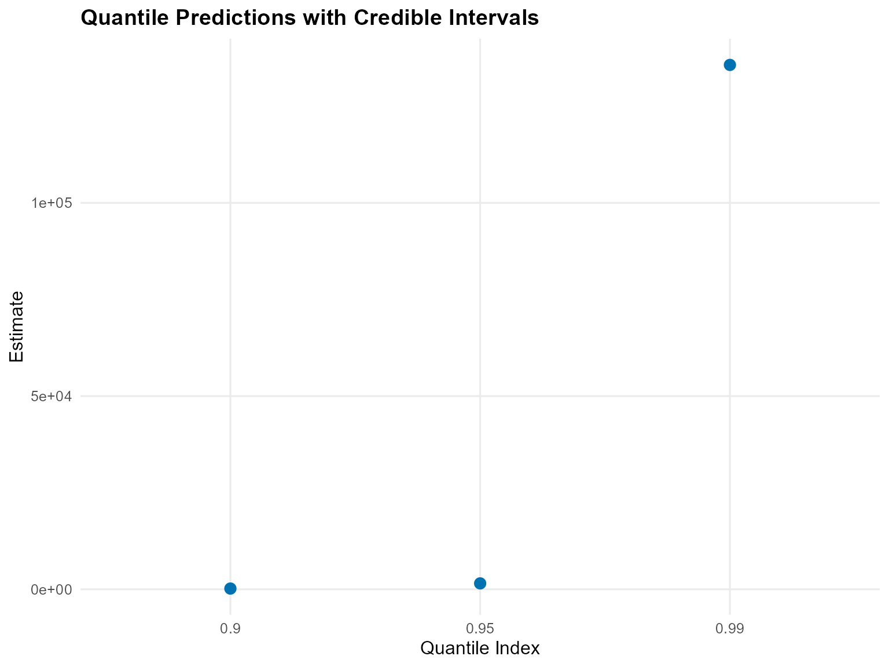

``` r
plot(tail_quantiles)
```

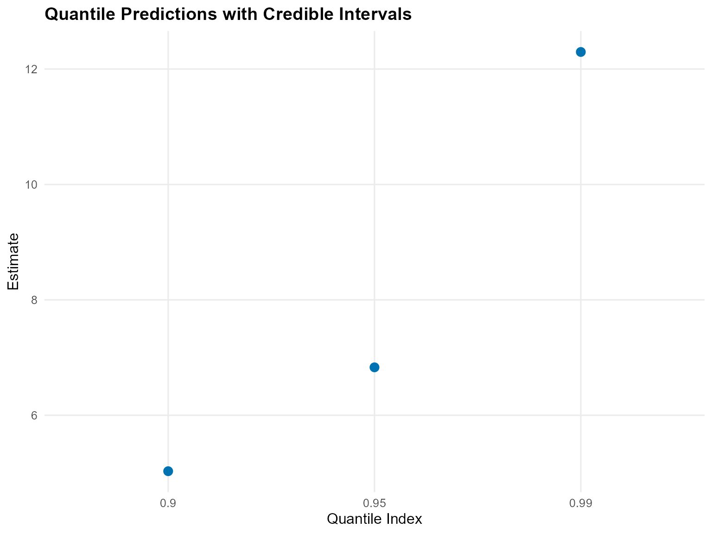

------------------------------------------------------------------------

### Extreme Value Diagnostics & Residuals

``` r
probs <- c(0.995, 0.99, 0.975)
return_levels <- predict(fit_gpd, type = "quantile", index = probs)

return_levels$fit %>%
  mutate(across(where(is.numeric), ~ round(.x, 3))) %>%
  kable(caption = "Extreme Quantile Estimates (Posterior Mean and Credible Intervals)", align = "c") %>%
  kable_styling(bootstrap_options = c("striped", "hover"), full_width = FALSE, position = "center")
```

| estimate | index | lower | upper |
|:--------:|:-----:|:-----:|:-----:|
|  13.472  | 0.995 |  NA   |  NA   |
|  10.515  | 0.990 |  NA   |  NA   |
|  7.494   | 0.975 |  NA   |  NA   |

Extreme Quantile Estimates (Posterior Mean and Credible Intervals)

``` r
fit_vals <- fitted(fit_gpd)
plot(fit_vals)
```

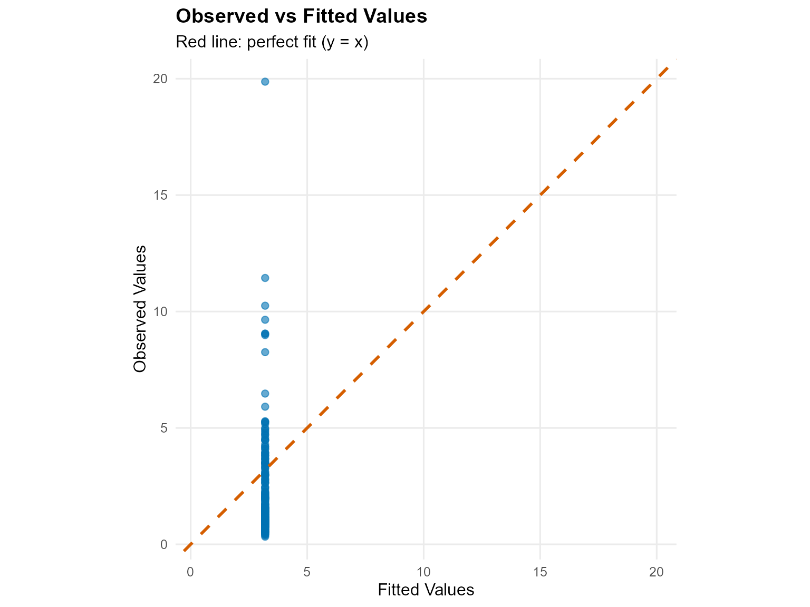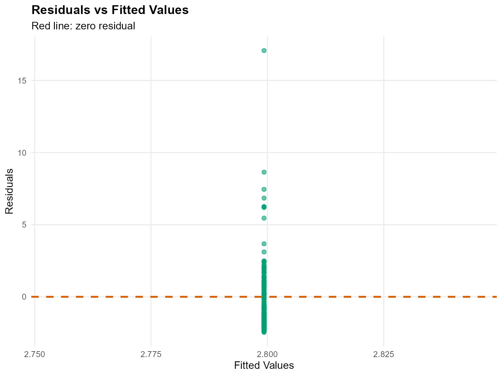

------------------------------------------------------------------------

### Threshold Sensitivity

``` r
sensitivity_fits <- lapply(thresholds, function(u) {
  bundle <- build_nimble_bundle(
    y = y_tail,
    kernel = "invgauss",
    backend = "crp",
    GPD = TRUE,
    param_specs = list(
      gpd = list(
        threshold = list(mode = "fixed", value = u)
      )
    ),
    components = 5,
    mcmc = list(niter = 2500, nburnin = 500, nchains = 1)
  )
  fit <- run_mcmc_bundle_manual(bundle)
  list(threshold = u, fit = fit)
})
[MCMC] Creating NIMBLE model...
[MCMC] NIMBLE model created successfully.
[MCMC] Configuring MCMC...
===== Monitors =====
thin = 1: alpha, mean, shape, tail_scale, tail_shape, threshold, z
===== Samplers =====
RW sampler (2)
  - tail_scale
  - tail_shape
CRP_concentration sampler (1)
  - alpha
CRP_cluster_wrapper sampler (10)
  - mean[]  (5 elements)
  - shape[]  (5 elements)
CRP sampler (1)
  - z[1:200] 
[MCMC] MCMC configured.
[MCMC] Building MCMC object...
[MCMC] MCMC object built.
[MCMC] Attempting NIMBLE compilation (this may take a minute)...
[MCMC] Compiling model...
[MCMC] Compiling MCMC sampler...
[MCMC] Compilation successful.
|-------------|-------------|-------------|-------------|
|  [Warning] CRP_sampler: This MCMC is not for a proper model. The MCMC attempted to use more components than the number of cluster parameters. Please increase the number of cluster parameters.
-------------------------------------------------------|
[MCMC] MCMC execution complete. Processing results...
[MCMC] Creating NIMBLE model...
[MCMC] NIMBLE model created successfully.
[MCMC] Configuring MCMC...
===== Monitors =====
thin = 1: alpha, mean, shape, tail_scale, tail_shape, threshold, z
===== Samplers =====
RW sampler (2)
  - tail_scale
  - tail_shape
CRP_concentration sampler (1)
  - alpha
CRP_cluster_wrapper sampler (10)
  - mean[]  (5 elements)
  - shape[]  (5 elements)
CRP sampler (1)
  - z[1:200] 
[MCMC] MCMC configured.
[MCMC] Building MCMC object...
[MCMC] MCMC object built.
[MCMC] Attempting NIMBLE compilation (this may take a minute)...
[MCMC] Compiling model...
[MCMC] Compiling MCMC sampler...
[MCMC] Compilation successful.
|-------------|-------------|-------------|-------------|
|  [Warning] CRP_sampler: This MCMC is not for a proper model. The MCMC attempted to use more components than the number of cluster parameters. Please increase the number of cluster parameters.
-------------------------------------------------------|
[MCMC] MCMC execution complete. Processing results...
[MCMC] Creating NIMBLE model...
[MCMC] NIMBLE model created successfully.
[MCMC] Configuring MCMC...
===== Monitors =====
thin = 1: alpha, mean, shape, tail_scale, tail_shape, threshold, z
===== Samplers =====
RW sampler (2)
  - tail_scale
  - tail_shape
CRP_concentration sampler (1)
  - alpha
CRP_cluster_wrapper sampler (10)
  - mean[]  (5 elements)
  - shape[]  (5 elements)
CRP sampler (1)
  - z[1:200] 
[MCMC] MCMC configured.
[MCMC] Building MCMC object...
[MCMC] MCMC object built.
[MCMC] Attempting NIMBLE compilation (this may take a minute)...
[MCMC] Compiling model...
[MCMC] Compiling MCMC sampler...
[MCMC] Compilation successful.
|-------------|-------------|-------------|-------------|
|  [Warning] CRP_sampler: This MCMC is not for a proper model. The MCMC attempted to use more components than the number of cluster parameters. Please increase the number of cluster parameters.
-------------------------------------------------------|
[MCMC] MCMC execution complete. Processing results...
[MCMC] Creating NIMBLE model...
[MCMC] NIMBLE model created successfully.
[MCMC] Configuring MCMC...
===== Monitors =====
thin = 1: alpha, mean, shape, tail_scale, tail_shape, threshold, z
===== Samplers =====
RW sampler (2)
  - tail_scale
  - tail_shape
CRP_concentration sampler (1)
  - alpha
CRP_cluster_wrapper sampler (10)
  - mean[]  (5 elements)
  - shape[]  (5 elements)
CRP sampler (1)
  - z[1:200] 
[MCMC] MCMC configured.
[MCMC] Building MCMC object...
[MCMC] MCMC object built.
[MCMC] Attempting NIMBLE compilation (this may take a minute)...
[MCMC] Compiling model...
[MCMC] Compiling MCMC sampler...
[MCMC] Compilation successful.
|-------------|-------------|-------------|-------------|
|  [Warning] CRP_sampler: This MCMC is not for a proper model. The MCMC attempted to use more components than the number of cluster parameters. Please increase the number of cluster parameters.
-------------------------------------------------------|
[MCMC] MCMC execution complete. Processing results...
[MCMC] Creating NIMBLE model...
[MCMC] NIMBLE model created successfully.
[MCMC] Configuring MCMC...
===== Monitors =====
thin = 1: alpha, mean, shape, tail_scale, tail_shape, threshold, z
===== Samplers =====
RW sampler (2)
  - tail_scale
  - tail_shape
CRP_concentration sampler (1)
  - alpha
CRP_cluster_wrapper sampler (10)
  - mean[]  (5 elements)
  - shape[]  (5 elements)
CRP sampler (1)
  - z[1:200] 
[MCMC] MCMC configured.
[MCMC] Building MCMC object...
[MCMC] MCMC object built.
[MCMC] Attempting NIMBLE compilation (this may take a minute)...
[MCMC] Compiling model...
[MCMC] Compiling MCMC sampler...
[MCMC] Compilation successful.
|-------------|-------------|-------------|-------------|
|  [Warning] CRP_sampler: This MCMC is not for a proper model. The MCMC attempted to use more components than the number of cluster parameters. Please increase the number of cluster parameters.
-------------------------------------------------------|
[MCMC] MCMC execution complete. Processing results...

sensitivity_tbl <- bind_rows(lapply(sensitivity_fits, function(entry) {
  quant <- predict(entry$fit, type = "quantile", index = 0.99, interval = "credible")
  qfit <- as.data.frame(quant$fit)
  qfit$threshold <- entry$threshold

  # Keep the usual columns if present
  keep <- intersect(names(qfit), c("threshold", "index", "estimate", "lower", "upper", "lwr", "upr"))
  qfit <- qfit[, keep, drop = FALSE]

  # Standardize to one set of CI column names
  if (!"lower" %in% names(qfit) && "lwr" %in% names(qfit)) qfit$lower <- qfit$lwr
  if (!"upper" %in% names(qfit) && "upr" %in% names(qfit)) qfit$upper <- qfit$upr

  # If estimate isn't present for some reason, fall back to the first numeric column
  if (!"estimate" %in% names(qfit)) {
    num_cols <- names(qfit)[vapply(qfit, is.numeric, logical(1))]
    if (length(num_cols) > 0) qfit$estimate <- qfit[[num_cols[1]]]
  }

  out <- data.frame(
    threshold = qfit$threshold[1],
    q_99 = qfit$estimate[1],
    q_99_lwr = if ("lower" %in% names(qfit)) qfit$lower[1] else NA_real_,
    q_99_upr = if ("upper" %in% names(qfit)) qfit$upper[1] else NA_real_
  )
  tibble::as_tibble(out)
}))

sensitivity_tbl %>%
  mutate(across(where(is.numeric), ~ round(.x, 3))) %>%
  kable(caption = "Threshold Sensitivity: 99th Quantile", align = "c") %>%
  kable_styling(bootstrap_options = c("striped", "hover"), full_width = FALSE, position = "center")
```

| threshold |  q_99  | q_99_lwr | q_99_upr |
|:---------:|:------:|:--------:|:--------:|
|   2.652   | 11.286 |  5.298   |  16.823  |
|   3.044   | 11.057 |  4.335   |  15.995  |
|   3.507   | 10.585 |  3.258   |  16.796  |
|   3.938   | 10.883 |  7.646   |  15.077  |
|   4.597   | 11.226 |  8.388   |  15.895  |

Threshold Sensitivity: 99th Quantile

------------------------------------------------------------------------

### Key Takeaways

- **Bulk + Tail**: DPmix explains the bulk, and GPD captures the
  extremes.
- **Threshold**: 0.8 quantile is our running default, but sensitivity
  checks guide the choice.
- **S3 workflows**: [`predict()`](https://rdrr.io/r/stats/predict.html)
  and its [`plot()`](https://rdrr.io/r/graphics/plot.default.html)
  method make it easy to compare density, survival, and quantiles.
- **Comparison**: Bulk-only fits under-estimate extreme quantiles
  without a GPD component.
- **Next**: Explore Stick-Breaking (`v07`) for another backend with tail
  augmentation.
