# 9. Conditional DPmix with Stick-Breaking Backend

## Conditional DPmix: Stick-Breaking Backend

**Purpose**: Replace the CRP backend with stick-breaking truncation
while keeping the covariate-dependent bulk structure. This demonstrates
how fixed `components` interplay with covariates.

------------------------------------------------------------------------

### Data Setup

``` r
data("nc_posX100_p3_k2")
y <- nc_posX100_p3_k2$y
X <- as.matrix(nc_posX100_p3_k2$X)
if (is.null(colnames(X))) {
  colnames(X) <- paste0("x", seq_len(ncol(X)))
}

summary_tbl <- tibble(
  statistic = c("N", "Mean", "SD", "Min", "Max"),
  value = c(length(y), mean(y), sd(y), min(y), max(y))
)

ggplot(data.frame(y = y, x1 = X[, 1]), aes(x = x1, y = y)) +
  geom_point(alpha = 0.6, color = "darkorange") +
  geom_smooth(method = "loess", color = "navy", fill = NA) +
  labs(title = "y vs X1 (SB)", x = "X1", y = "y") +
  theme_minimal()
```

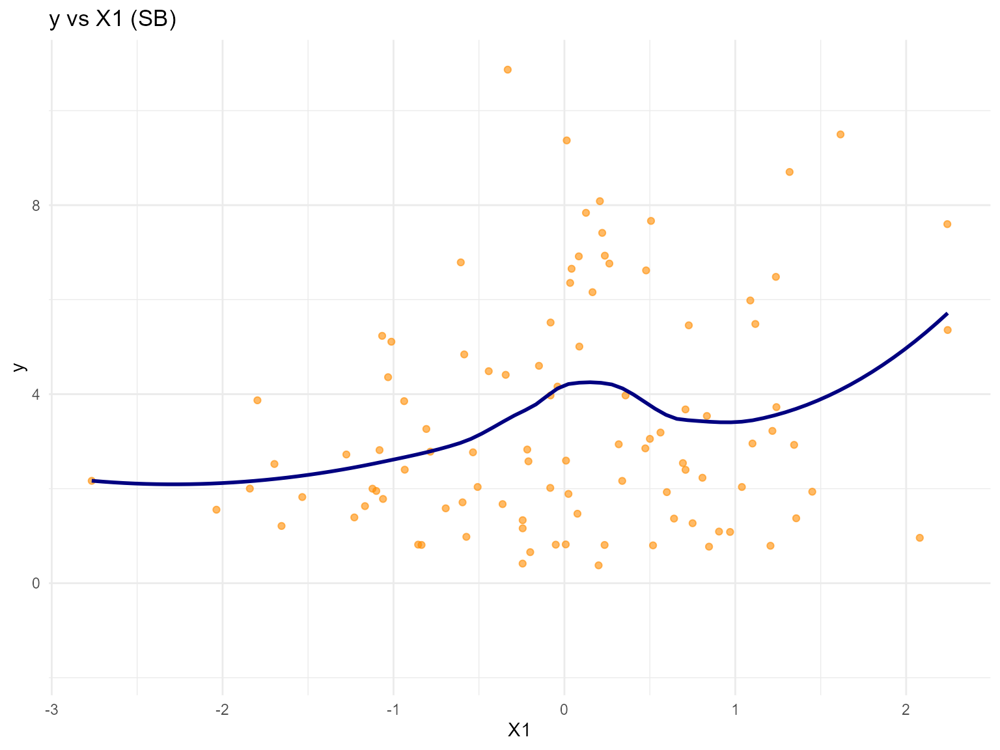

| statistic |  value   |
|:---------:|:--------:|
|     N     | 100.0000 |
|   Mean    |  3.4540  |
|    SD     |  2.4060  |
|    Min    |  0.3772  |
|    Max    | 10.8700  |

Conditional Dataset Summary (SB)

------------------------------------------------------------------------

### Model Specification

``` r
bundle_sb_normal <- build_nimble_bundle(
  y = y,
  X = X,
  kernel = "normal",
  backend = "sb",
  GPD = FALSE,
  components = 5,
  mcmc = list(
    niter = 60,
    nburnin = 10,
    nchains = 2,
    thin = 1
  )
)

bundle_sb_cauchy <- build_nimble_bundle(
  y = y,
  X = X,
  kernel = "cauchy",
  backend = "sb",
  GPD = FALSE,
  components = 5,
  mcmc = list(
    niter = 60,
    nburnin = 10,
    nchains = 1,
    thin = 1
  )
)
```

------------------------------------------------------------------------

### Running MCMC

``` r
fit_sb_normal <- run_mcmc_bundle_manual(bundle_sb_normal)
[MCMC] Creating NIMBLE model...
[MCMC] NIMBLE model created successfully.
[MCMC] Configuring MCMC...
===== Monitors =====
thin = 1: alpha, beta_mean, sd, w, z
===== Samplers =====
RW sampler (20)
  - alpha
  - beta_mean[]  (15 elements)
  - v[]  (4 elements)
conjugate sampler (5)
  - sd[]  (5 elements)
categorical sampler (100)
  - z[]  (100 elements)
[MCMC] MCMC configured.
[MCMC] Building MCMC object...
[MCMC] MCMC object built.
[MCMC] Attempting NIMBLE compilation (this may take a minute)...
[MCMC] Compiling model...
[MCMC] Compiling MCMC sampler...
[MCMC] Compilation successful.
|-------------|-------------|-------------|-------------|
|-------------------------------------------------------|
|-------------|-------------|-------------|-------------|
|-------------------------------------------------------|
[MCMC] MCMC execution complete. Processing results...
fit_sb_cauchy <- run_mcmc_bundle_manual(bundle_sb_cauchy)
[MCMC] Creating NIMBLE model...
[MCMC] NIMBLE model created successfully.
[MCMC] Configuring MCMC...
===== Monitors =====
thin = 1: alpha, beta_location, scale, w, z
===== Samplers =====
RW sampler (25)
  - alpha
  - scale[]  (5 elements)
  - beta_location[]  (15 elements)
  - v[]  (4 elements)
categorical sampler (100)
  - z[]  (100 elements)
[MCMC] MCMC configured.
[MCMC] Building MCMC object...
[MCMC] MCMC object built.
[MCMC] Attempting NIMBLE compilation (this may take a minute)...
[MCMC] Compiling model...
[MCMC] Compiling MCMC sampler...
[MCMC] Compilation successful.
|-------------|-------------|-------------|-------------|
|-------------------------------------------------------|
[MCMC] MCMC execution complete. Processing results...
summary(fit_sb_normal)
MixGPD summary | backend: Stick-Breaking Process | kernel: Normal Distribution | GPD tail: FALSE | epsilon: 0.025
n = 100 | components = 5
Summary
Initial components: 5 | Components after truncation: 2

WAIC: 553.393
lppd: -230.756 | pWAIC: 45.941

Summary table
       parameter   mean    sd q0.025 q0.500 q0.975    ess
      weights[1]  0.525 0.067  0.415  0.515  0.675 11.546
      weights[2]  0.339 0.057  0.225  0.340  0.440 13.358
           alpha  1.357 0.761  0.558  1.041  3.164 11.236
 beta_mean[1, 1]  1.176 1.562 -1.390  1.212  4.434  5.392
 beta_mean[2, 1]  0.592 0.708 -1.151  0.665  1.547 13.027
 beta_mean[3, 1] -0.184 1.454 -2.656  0.007  2.435  3.695
 beta_mean[4, 1]  1.054 2.445 -2.943  0.966  4.378  2.172
 beta_mean[5, 1] -0.582 1.266 -2.713 -0.587  2.821  2.731
 beta_mean[1, 2]  0.793 1.511 -2.118  1.074  2.910  6.478
 beta_mean[2, 2] -1.036 1.005 -3.058 -0.898  0.887 11.382
 beta_mean[3, 2]  0.026 1.897 -3.363 -0.206  3.410  3.028
 beta_mean[4, 2]  0.175 1.559 -2.685  0.204  2.696  4.685
 beta_mean[5, 2] -1.153 1.713 -3.690 -1.581  2.786  5.498
 beta_mean[1, 3]  1.102 1.634 -1.795  1.467  2.973  3.342
 beta_mean[2, 3] -0.318 1.145 -2.216 -0.465  1.826  6.890
 beta_mean[3, 3]  0.385 1.317 -2.076  0.342  2.537  4.865
 beta_mean[4, 3]  0.891 1.203 -1.802  1.034  2.376  5.593
 beta_mean[5, 3] -0.640 1.393 -3.323 -0.341  2.244  6.694
           sd[1]  0.063 0.018  0.038  0.060  0.104 29.134
           sd[2]  0.095 0.054  0.041  0.081  0.240 14.075
summary(fit_sb_cauchy)
MixGPD summary | backend: Stick-Breaking Process | kernel: Cauchy Distribution | GPD tail: FALSE | epsilon: 0.025
n = 100 | components = 5
Summary
Initial components: 5 | Components after truncation: 5

WAIC: 609.911
lppd: -263.991 | pWAIC: 40.965

Summary table
           parameter   mean    sd q0.025 q0.500 q0.975    ess
          weights[1]  0.366 0.041  0.302  0.365  0.446 50.000
          weights[2]  0.252 0.032  0.200  0.255  0.316 65.020
          weights[3]  0.164 0.028  0.120  0.160  0.225 11.187
          weights[4]  0.125 0.021  0.080  0.120  0.168 27.985
          weights[5]  0.093 0.024  0.050  0.100  0.130 28.977
               alpha  1.503 0.621  0.791  1.413  2.734 11.137
 beta_location[1, 1]  0.257 0.720 -1.206  0.321  1.546  3.024
 beta_location[2, 1]  1.439 1.298 -0.577  1.866  3.150  1.947
 beta_location[3, 1] -0.318 0.897 -1.656 -0.424  1.006  5.109
 beta_location[4, 1] -1.034 0.891 -2.618 -1.330  0.859  6.517
 beta_location[5, 1] -0.077 0.839 -1.170 -0.097  1.814  6.779
 beta_location[1, 2] -2.066 1.166 -4.232 -1.716  0.732  8.733
 beta_location[2, 2] -1.112 1.525 -3.572 -1.351  1.770 11.682
 beta_location[3, 2] -0.286 1.495 -2.776 -0.293  1.912  4.208
 beta_location[4, 2]  0.343 1.694 -2.836  0.657  2.831  3.327
 beta_location[5, 2]  0.636 1.328 -2.220  0.662  2.629  3.440
 beta_location[1, 3] -0.831 0.647 -1.801 -0.965  0.776  7.536
 beta_location[2, 3]  0.621 1.133 -1.196  0.872  2.170  3.506
 beta_location[3, 3] -1.121 1.821 -3.187 -1.686  1.659  2.385
 beta_location[4, 3]  1.343 1.011 -0.615  1.743  2.390  2.317
 beta_location[5, 3] -0.154 1.196 -2.721  0.294  1.926  3.733
            scale[1]  2.232 0.620  1.384  2.412  3.533  5.426
            scale[2]  2.224 0.785  1.236  2.071  3.786 10.268
            scale[3]  2.455 1.161  0.672  2.333  4.097 17.451
            scale[4]  1.903 1.293  0.378  1.469  5.251 50.000
            scale[5]  1.955 1.161  0.705  1.441  5.117 50.000
```

``` r
params_sb <- params(fit_sb_normal)
params_sb
Posterior mean parameters

$alpha
[1] 1.357

$w
[1] 0.5249 0.3388

$beta_mean
           x1      x2      x3
comp1  1.1758  0.7929  1.1017
comp2  0.5920 -1.0365 -0.3179
comp3 -0.1842  0.0256  0.3851
comp4  1.0542  0.1749  0.8915
comp5 -0.5821 -1.1530 -0.6398

$sd
[1] 0.06258 0.09471
```

------------------------------------------------------------------------

### Conditional Predictive Density

``` r
X_new <- expand.grid(x1 = seq(-2, 2, length.out = 3), x2 = c(-1, 1), x3 = 0)
colnames(X_new) <- colnames(X)
y_min <- max(min(y), .Machine$double.eps)
y_grid <- seq(y_min, max(y) * 1.1, length.out = 200)

densities_normal <- lapply(seq_len(nrow(X_new)), function(i) {
  pred <- predict(fit_sb_normal, x = as.matrix(X_new[i, , drop = FALSE]), y = y_grid, type = "density")
  data.frame(
    y = pred$fit$y,
    density = pred$fit$density,
    label = paste0("x1=", round(X_new[i, "x1"], 1), ", x2=", X_new[i, "x2"]),
    model = "Normal"
  )
})

densities_cauchy <- lapply(seq_len(nrow(X_new)), function(i) {
  pred <- predict(fit_sb_cauchy, x = as.matrix(X_new[i, , drop = FALSE]), y = y_grid, type = "density")
  data.frame(
    y = pred$fit$y,
    density = pred$fit$density,
    label = paste0("x1=", round(X_new[i, "x1"], 1), ", x2=", X_new[i, "x2"]),
    model = "Cauchy"
  )
})

df_cond <- bind_rows(densities_normal, densities_cauchy)

ggplot(df_cond, aes(x = y, y = density, color = label)) +
  geom_line(linewidth = 1) +
  facet_wrap(~ model) +
  labs(title = "SB Conditional Predictive Densities", x = "y", y = "Density") +
  theme_minimal() +
  theme(legend.position = "bottom")
```

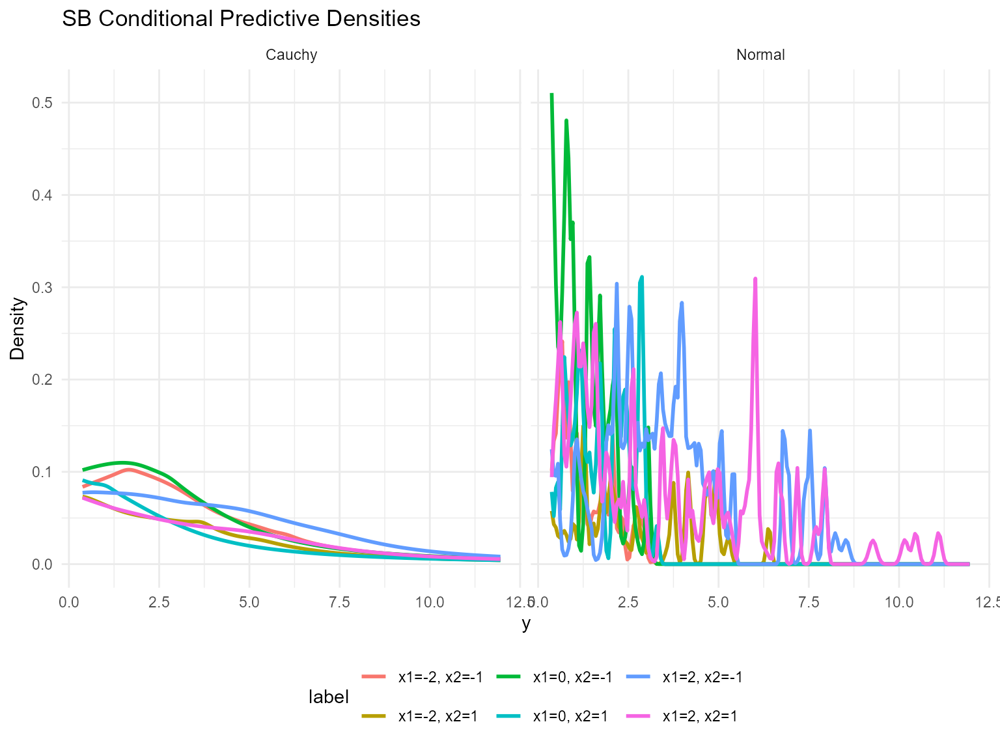

------------------------------------------------------------------------

### Quantile Drift with Covariates

``` r
X_eval <- cbind(x1 = seq(-2, 2, length.out = 5), x2 = 0, x3 = 0)
colnames(X_eval) <- colnames(X)
quant_probs <- c(0.25, 0.5, 0.75)

pred_q_normal <- predict(fit_sb_normal, x = as.matrix(X_eval), type = "quantile", index = quant_probs)
pred_q_cauchy <- predict(fit_sb_cauchy, x = as.matrix(X_eval), type = "quantile", index = quant_probs)

quant_df_normal <- pred_q_normal$fit
quant_df_normal$x1 <- X_eval[quant_df_normal$id, "x1"]
quant_df_normal$model <- "Normal"

quant_df_cauchy <- pred_q_cauchy$fit
quant_df_cauchy$x1 <- X_eval[quant_df_cauchy$id, "x1"]
quant_df_cauchy$model <- "Cauchy"

bind_rows(quant_df_normal, quant_df_cauchy) %>%
  ggplot(aes(x = x1, y = estimate, color = factor(index), group = index)) +
  geom_line(linewidth = 1) +
  geom_point(size = 2) +
  facet_wrap(~ model) +
  labs(title = "SB Conditional Quantiles vs x1", x = "x1", y = "y", color = "Quantile") +
  theme_minimal()
```

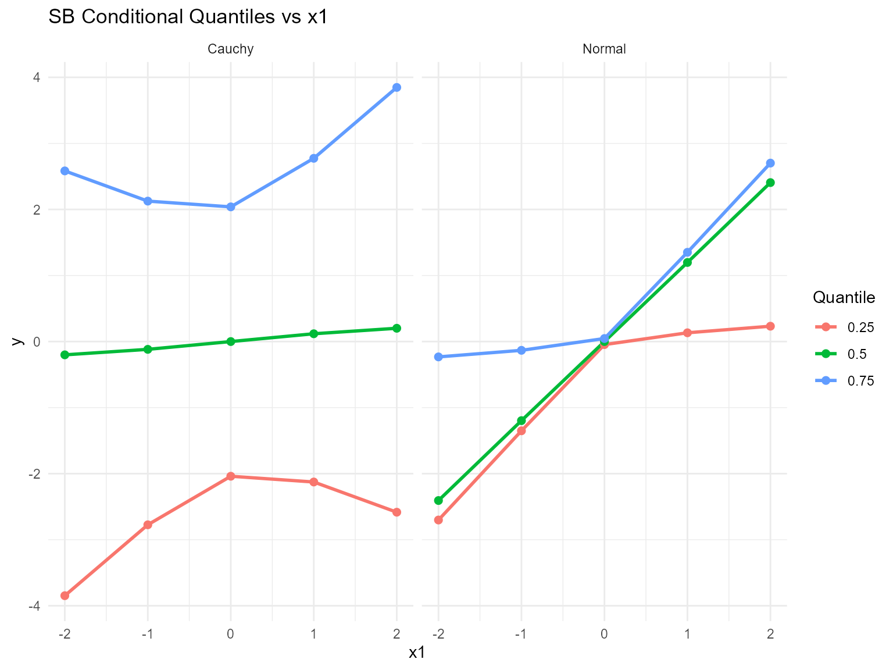

------------------------------------------------------------------------

### Residuals & Diagnostics

``` r
plot(fitted(fit_sb_cauchy))
```

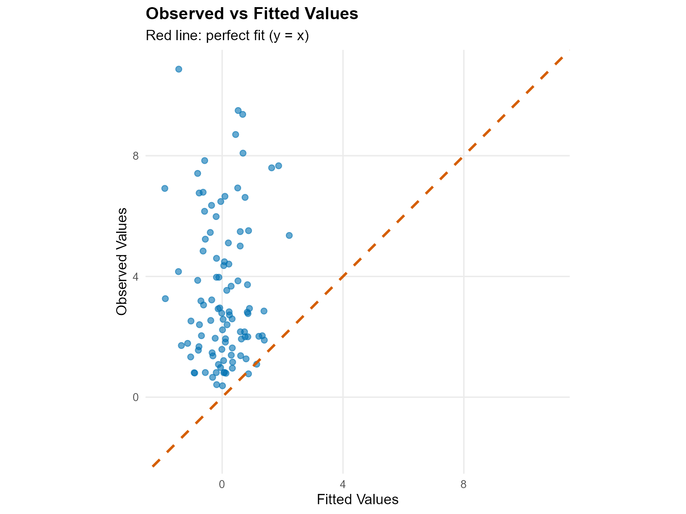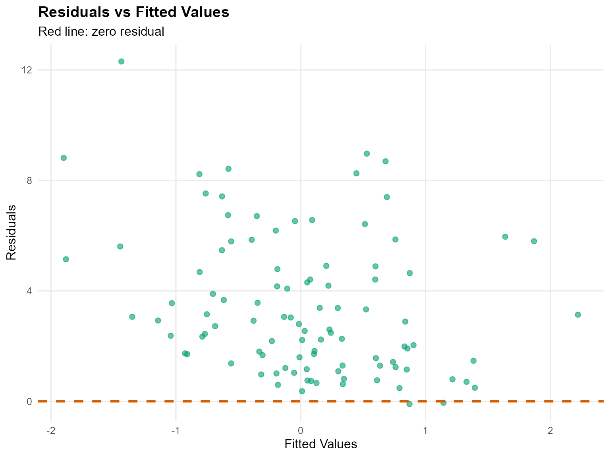

``` r
plot(fit_sb_normal, family = c("traceplot", "autocorrelation", "geweke"))

=== traceplot ===
```

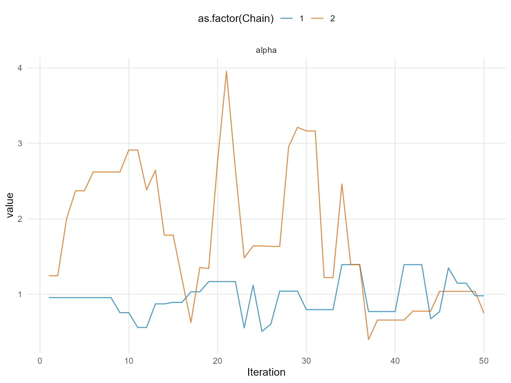

    === autocorrelation ===

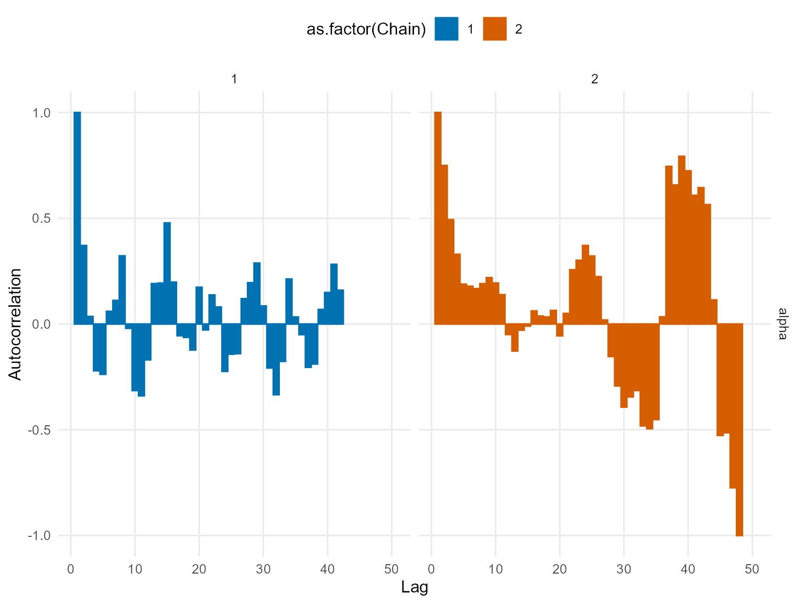

    === geweke ===

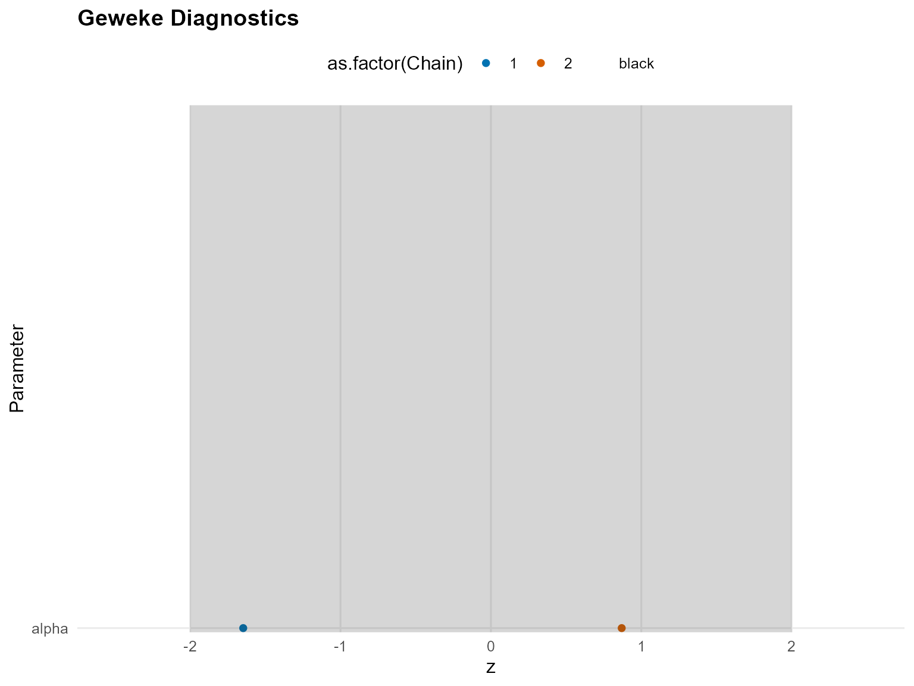

``` r
plot(fit_sb_cauchy, family = c("density", "running", "caterpillar"))

=== density ===
```

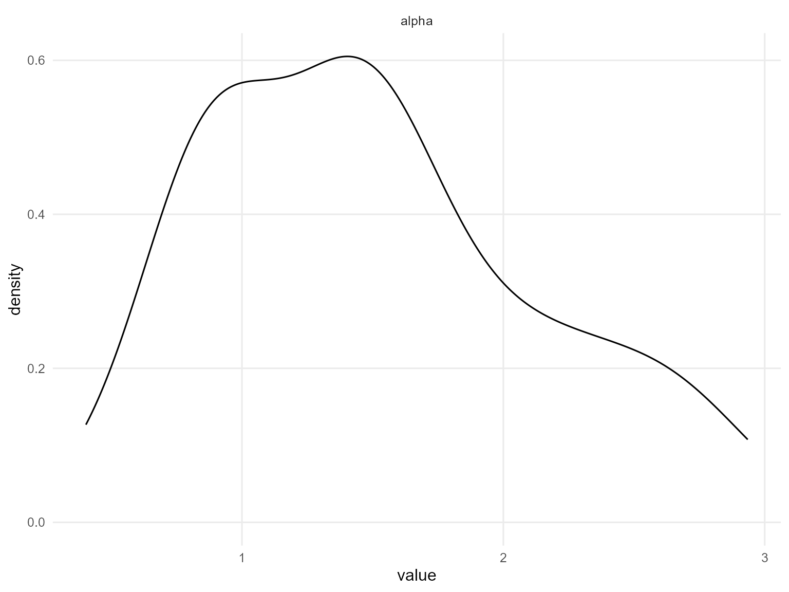

    === running ===

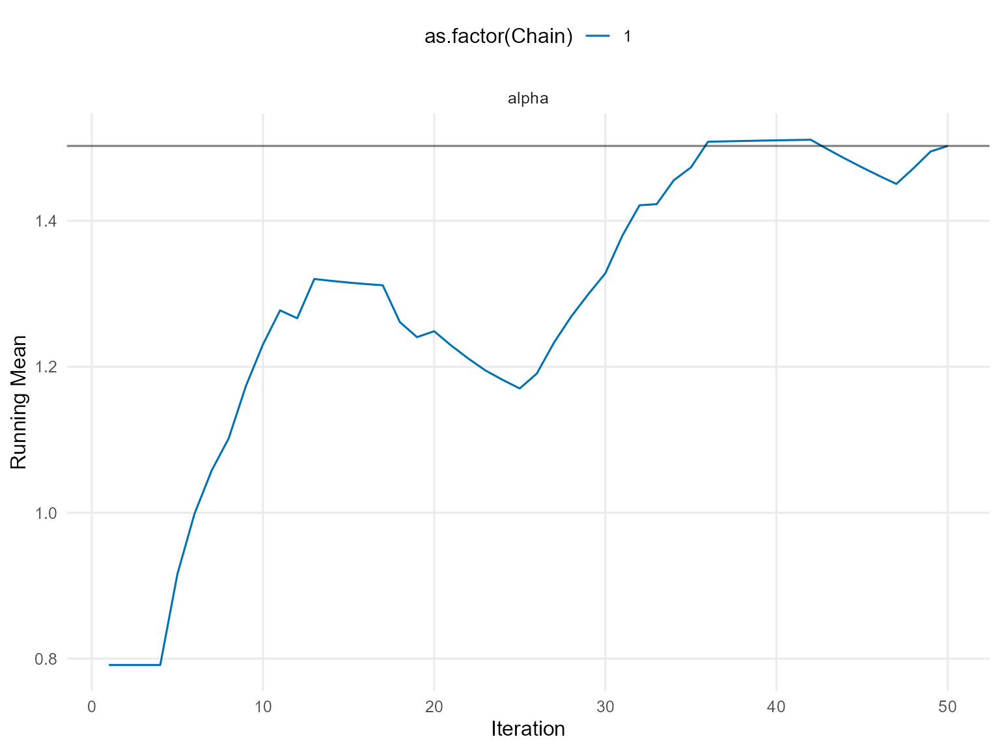

    === caterpillar ===

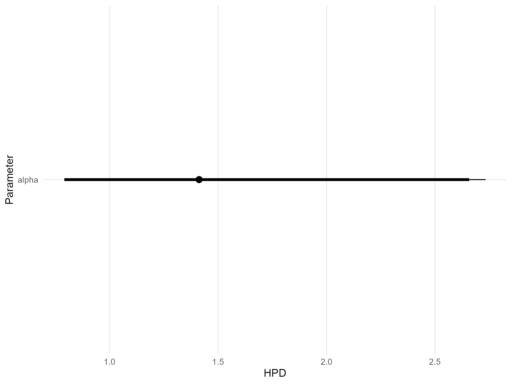

------------------------------------------------------------------------

### Takeaways

- Stick-breaking component count is fixed but still supports
  covariate-dependent mixtures.
- `predict(..., type = "density")` returns group-specific densities for
  each `X`.
- `predict(..., type = "quantile")` shows how median and 75% quantiles
  shift with `x1`.
- Diagnoses rely on the same S3
  [`plot()`](https://rdrr.io/r/graphics/plot.default.html)/[`fitted()`](https://rdrr.io/r/stats/fitted.values.html)
  pipeline available in other vignettes.
