# 9. Unconditional DPmixGPD with Stick-Breaking Backend

## Unconditional DPmixGPD: Stick-Breaking (SB) Backend with Tail Augmentation

**Purpose**: Demonstrate the stick-breaking backend (`components = J`)
while augmenting the extreme tail with a GPD. This mirrors the CRP+GPD
pipeline (v06) but highlights the fixed-truncation behavior for bulk
components.

------------------------------------------------------------------------

### Data Setup

``` r
# Tail-heavy data
data("nc_pos_tail200_k4")
y_tail <- nc_pos_tail200_k4$y

summary_tbl <- tibble(
  statistic = c("N", "Mean", "SD", "Min", "Max"),
  value = c(length(y_tail), mean(y_tail), sd(y_tail), min(y_tail), max(y_tail))
)

df_data <- data.frame(y = y_tail)

p_raw <- ggplot(df_data, aes(x = y)) +
  geom_histogram(aes(y = after_stat(density)), bins = 40, fill = "darkorange", alpha = 0.6, color = "black") +
  geom_density(color = "darkred", linewidth = 1) +
  labs(title = "Tail-Designed Data", x = "y", y = "Density") +
  theme_minimal()

grid.arrange(p_raw, ncol = 1)
```

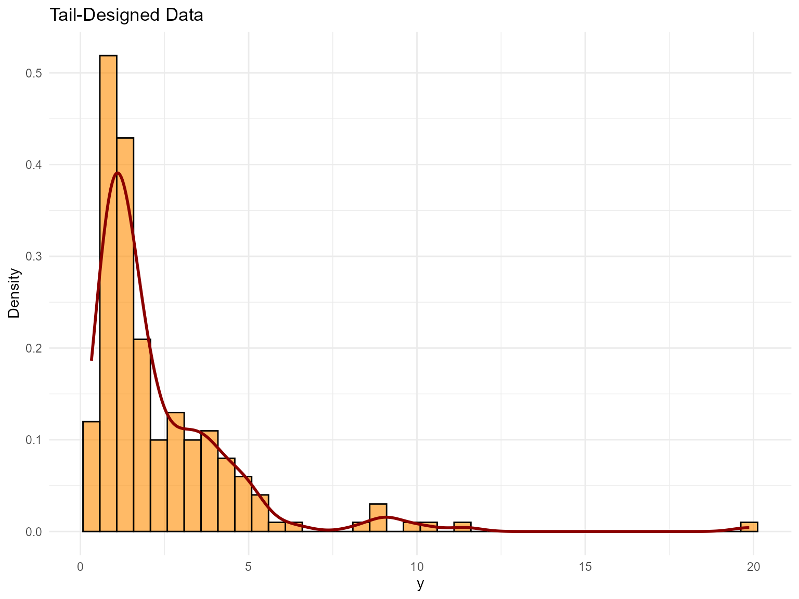

| statistic |  value   |
|:---------:|:--------:|
|     N     | 200.0000 |
|   Mean    |  2.3340  |
|    SD     |  2.3000  |
|    Min    |  0.3283  |
|    Max    | 19.8700  |

Tail Dataset Summaries

------------------------------------------------------------------------

### Threshold Selection

``` r
thresholds <- quantile(y_tail, c(0.70, 0.75, 0.80, 0.85))
u_threshold <- thresholds["80%"]

ggplot(df_data, aes(x = y)) +
  geom_histogram(aes(y = after_stat(density)), bins = 40, fill = "skyblue", alpha = 0.6, color = "black") +
  geom_vline(xintercept = u_threshold, linetype = "dashed", color = "black") +
  labs(title = paste("Threshold at", round(u_threshold, 2)), x = "y", y = "Density") +
  theme_minimal()
```


------------------------------------------------------------------------

### Model Specification & Bundle

This follows the same structure as the SB bulk-only vignette (`v05`):
build a bundle with
[`build_nimble_bundle()`](https://arnabaich96.github.io/DPmixGPD/reference/build_nimble_bundle.md),
run MCMC, then use the S3
[`predict()`](https://rdrr.io/r/stats/predict.html) +
[`plot()`](https://rdrr.io/r/graphics/plot.default.html) helpers.
Compared with `v06` (CRP+GPD), here we keep the **stick-breaking**
backend and use a **Gamma** bulk kernel with a lognormal threshold
prior, then contrast it with a bulk-only **Laplace** fit.

``` r
bundle_sb_gpd <- build_nimble_bundle(
  y = y_tail,
  kernel = "gamma",
  backend = "sb",
  GPD = TRUE,
  components = 5,
  param_specs = list(
    gpd = list(
      threshold = list(
        mode = "dist",
        dist = "lognormal",
        args = list(meanlog = log(max(u_threshold, .Machine$double.eps)), sdlog = 0.25)
      )
    )
  ),
  mcmc = list(
    niter = 60,
    nburnin = 10,
    nchains = 2,
    thin = 1
  )
)
```

------------------------------------------------------------------------

### Running MCMC

``` r
fit_sb_gpd <- run_mcmc_bundle_manual(bundle_sb_gpd)
[MCMC] Creating NIMBLE model...
[MCMC] NIMBLE model created successfully.
[MCMC] Configuring MCMC...
===== Monitors =====
thin = 1: alpha, scale, shape, tail_scale, tail_shape, threshold, w, z
===== Samplers =====
RW sampler (18)
  - alpha
  - shape[]  (5 elements)
  - scale[]  (5 elements)
  - threshold
  - tail_scale
  - tail_shape
  - v[]  (4 elements)
categorical sampler (200)
  - z[]  (200 elements)
[MCMC] MCMC configured.
[MCMC] Building MCMC object...
[MCMC] MCMC object built.
[MCMC] Attempting NIMBLE compilation (this may take a minute)...
[MCMC] Compiling model...
[MCMC] Compiling MCMC sampler...
[MCMC] Compilation successful.
|-------------|-------------|-------------|-------------|
|-------------------------------------------------------|
|-------------|-------------|-------------|-------------|
|-------------------------------------------------------|
[MCMC] MCMC execution complete. Processing results...
summary(fit_sb_gpd)
MixGPD summary | backend: Stick-Breaking Process | kernel: Gamma Distribution | GPD tail: TRUE | epsilon: 0.025
n = 200 | components = 5
Summary
Initial components: 5 | Components after truncation: 3

WAIC: 692.890
lppd: -313.925 | pWAIC: 32.521

Summary table
  parameter  mean    sd q0.025 q0.500 q0.975    ess
 weights[1] 0.452 0.044  0.360  0.455  0.535 12.242
 weights[2] 0.359 0.046  0.275  0.365  0.438 14.954
 weights[3] 0.119 0.029  0.065  0.115  0.173 26.363
      alpha 0.953 0.392  0.292  1.087  1.621 20.078
 tail_scale 1.592 0.312  1.030  1.650  2.060 14.104
 tail_shape 0.257 0.101  0.115  0.280  0.437  9.552
  threshold 3.206 0.772  0.754  3.427  4.877  7.964
   shape[1] 1.883 0.355  1.323  1.913  2.464  5.668
   shape[2] 1.706 0.385  1.171  1.472  2.355  4.506
   shape[3] 1.796 0.550  0.935  1.623  3.055  6.882
   scale[1] 1.161 0.386  0.683  1.014  1.780 15.132
   scale[2] 1.631 0.413  0.729  1.682  2.324 19.322
   scale[3] 1.676 1.040  0.669  1.513  4.381 24.289
```

``` r
params_sb_gpd <- params(fit_sb_gpd)
params_sb_gpd
Posterior mean parameters

$alpha
[1] 0.9528

$w
[1] 0.4518 0.3592 0.1192

$shape
[1] 1.883 1.706 1.796

$scale
[1] 1.161 1.631 1.676

$tail_scale
[1] 1.592

$tail_shape
[1] 0.2573
```

------------------------------------------------------------------------

### Posterior Predictions

``` r
y_grid <- seq(0, max(y_tail) * 1.3, length.out = 300)
pred_density <- predict(fit_sb_gpd, y = y_grid, type = "density")
plot(pred_density)
```

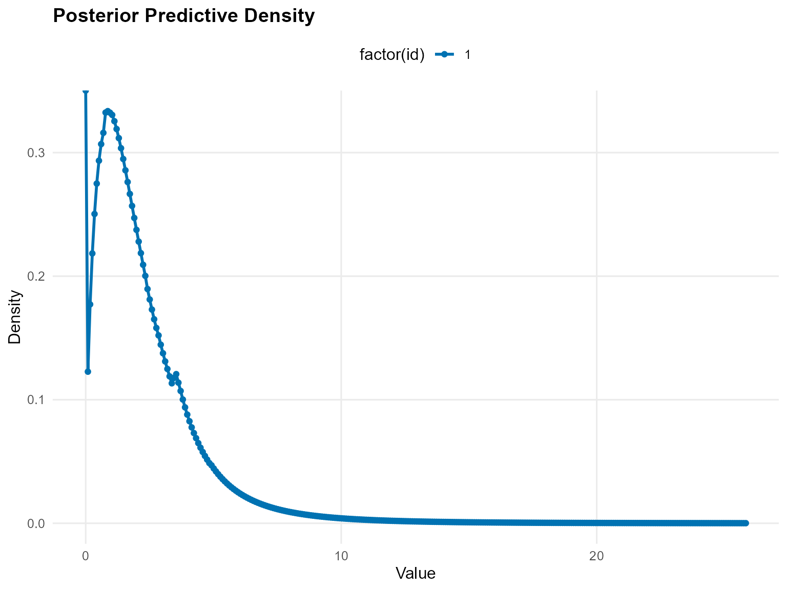

``` r
y_surv <- seq(u_threshold, max(y_tail) * 1.1, length.out = 60)
pred_surv <- predict(fit_sb_gpd, y = y_surv, type = "survival")
plot(pred_surv)
```

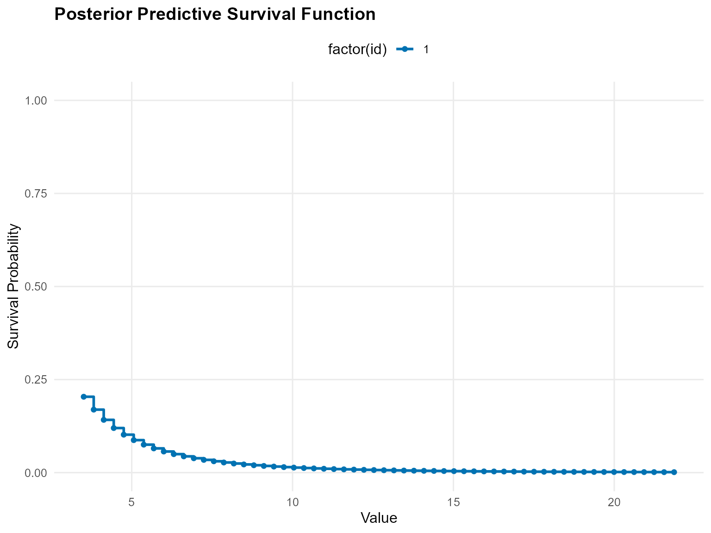

``` r
quant_probs <- c(0.90, 0.95, 0.99)
pred_quant <- predict(fit_sb_gpd, type = "quantile", index = quant_probs, interval = "credible")
plot(pred_quant)
```

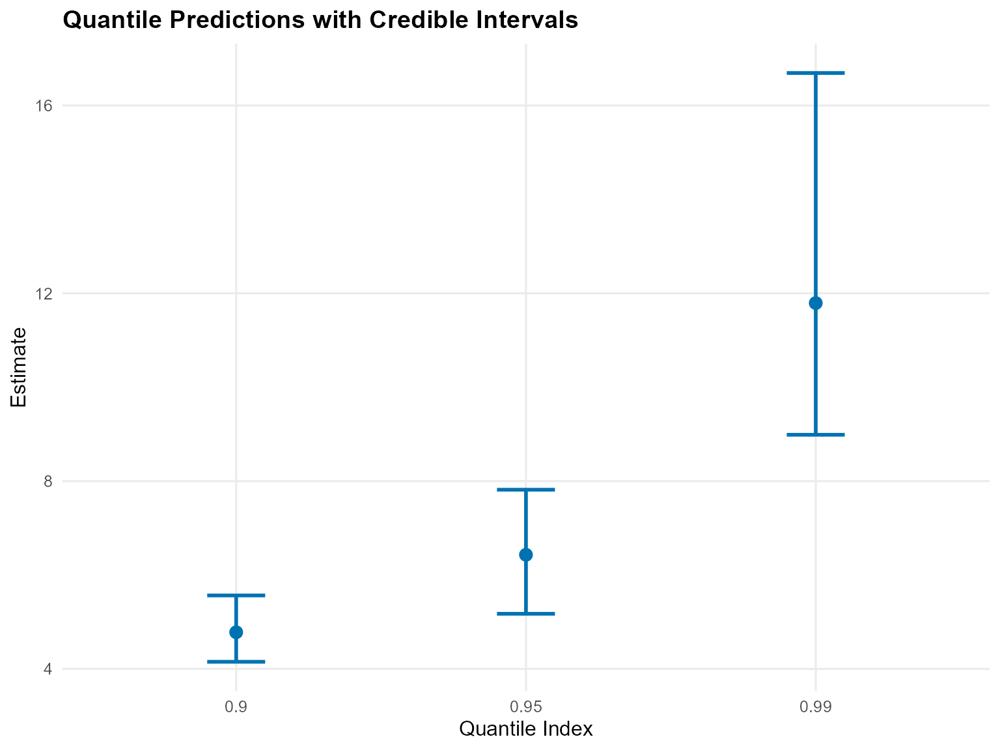

------------------------------------------------------------------------

### Tail vs Bulk Comparison

``` r
bundle_sb_bulk <- build_nimble_bundle(
  y = y_tail,
  kernel = "laplace",
  backend = "sb",
  GPD = FALSE,
  components = 5,
  mcmc = list(niter = 2500, nburnin = 500, nchains = 1)
)
fit_sb_bulk <- run_mcmc_bundle_manual(bundle_sb_bulk)
[MCMC] Creating NIMBLE model...
[MCMC] NIMBLE model created successfully.
[MCMC] Configuring MCMC...
===== Monitors =====
thin = 1: alpha, location, scale, w, z
===== Samplers =====
RW sampler (10)
  - alpha
  - location[]  (5 elements)
  - v[]  (4 elements)
conjugate sampler (5)
  - scale[]  (5 elements)
categorical sampler (200)
  - z[]  (200 elements)
[MCMC] MCMC configured.
[MCMC] Building MCMC object...
[MCMC] MCMC object built.
[MCMC] Attempting NIMBLE compilation (this may take a minute)...
[MCMC] Compiling model...
[MCMC] Compiling MCMC sampler...
[MCMC] Compilation successful.
|-------------|-------------|-------------|-------------|
|-------------------------------------------------------|
[MCMC] MCMC execution complete. Processing results...

bulk_quant <- predict(fit_sb_bulk, type = "quantile", index = quant_probs)
t_quant <- predict(fit_sb_gpd, type = "quantile", index = quant_probs)

bind_rows(
  bulk_quant$fit %>% mutate(model = "Bulk-only"),
  t_quant$fit %>% mutate(model = "Bulk + GPD")
) %>%
  select(any_of(c("model", "index", "estimate", "lwr", "upr", "lower", "upper"))) %>%
  mutate(across(where(is.numeric), ~ round(.x, 3))) %>%
  kable(caption = "Quantiles: Bulk-only vs GPD-augmented", align = "c") %>%
  kable_styling(bootstrap_options = c("striped", "hover"), full_width = FALSE, position = "center")
```

|   model    | index | estimate | lower | upper |
|:----------:|:-----:|:--------:|:-----:|:-----:|
| Bulk-only  | 0.90  |  6.039   |  NA   |  NA   |
| Bulk-only  | 0.95  |  8.011   |  NA   |  NA   |
| Bulk-only  | 0.99  |  13.514  |  NA   |  NA   |
| Bulk + GPD | 0.90  |  4.812   |  NA   |  NA   |
| Bulk + GPD | 0.95  |  6.302   |  NA   |  NA   |
| Bulk + GPD | 0.99  |  11.018  |  NA   |  NA   |

Quantiles: Bulk-only vs GPD-augmented

``` r
plot(bulk_quant)
```

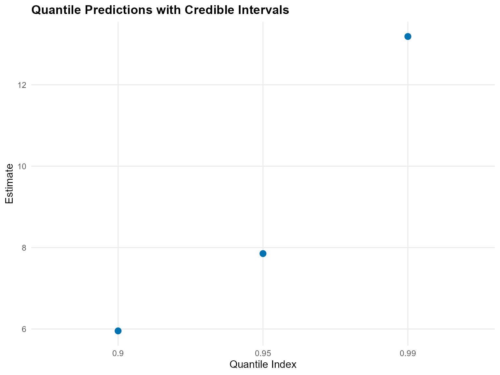

``` r
plot(t_quant)
```

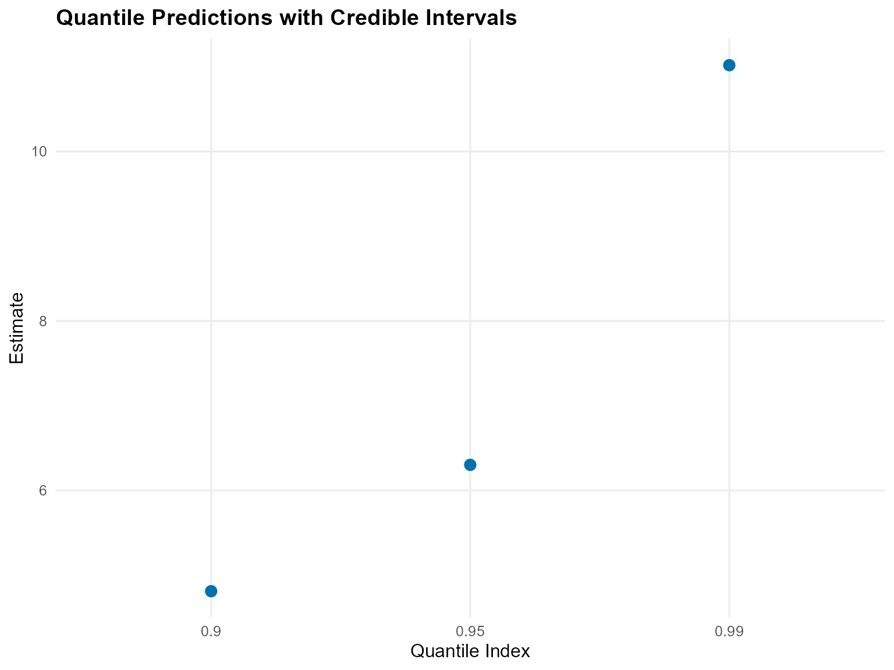

------------------------------------------------------------------------

### Residuals & Diagnostics

``` r
fit_vals <- fitted(fit_sb_gpd)
plot(fit_vals)
```

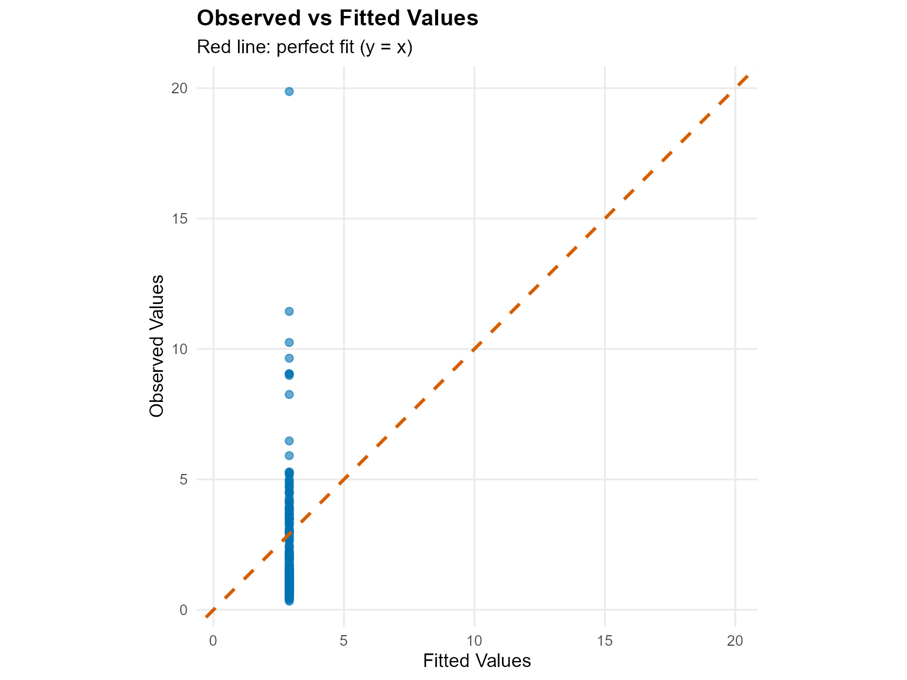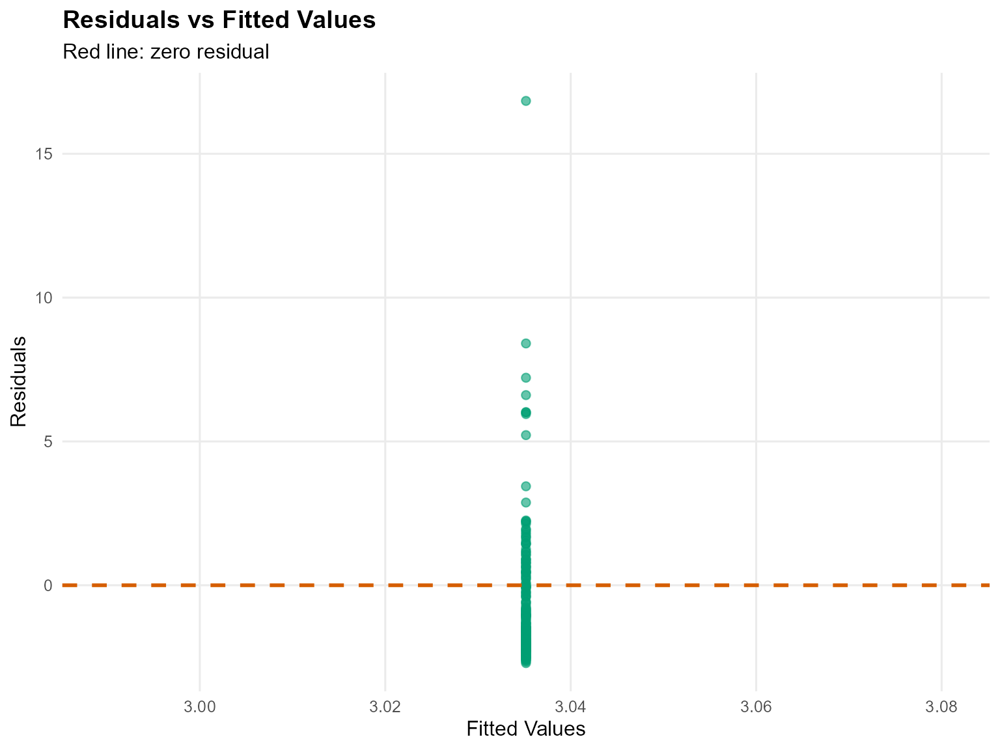

``` r
plot(fit_sb_gpd, family = c("histogram", "autocorrelation", "running"))

=== histogram ===
```

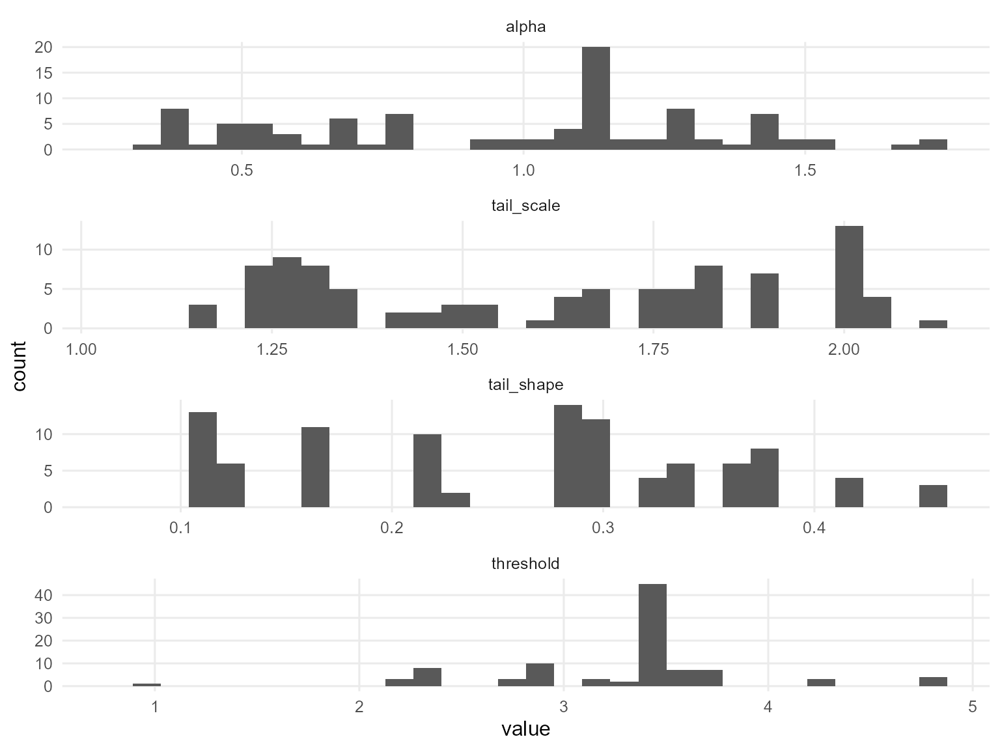

    === autocorrelation ===

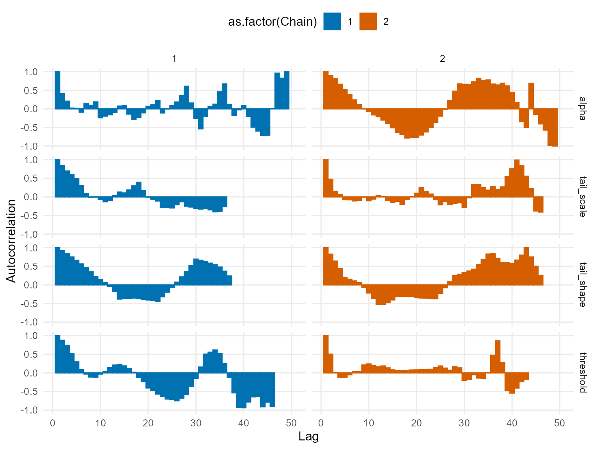

    === running ===

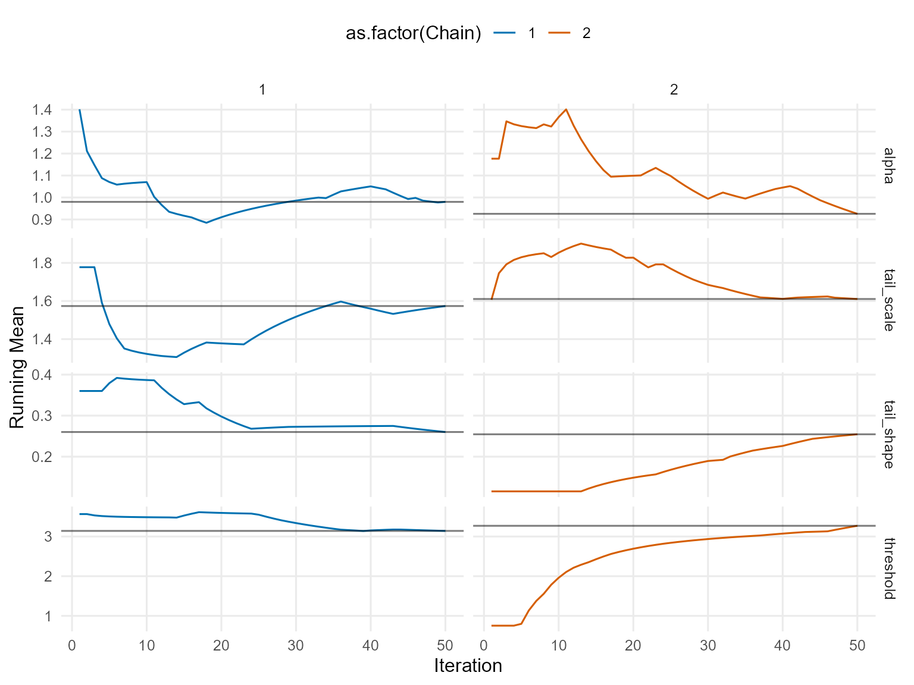

------------------------------------------------------------------------

### Key Takeaways

- Stick-breaking truncation fixes the number of bulk components but
  still flexibly models the tail via GPD.
- Posterior [`predict()`](https://rdrr.io/r/stats/predict.html) +
  [`plot()`](https://rdrr.io/r/graphics/plot.default.html) workflows
  visualize densities, survival probabilities, and posterior-mean
  extreme quantiles.
- Comparing bulk-only vs GPD-augmented quantiles reveals how tail
  augmentation shifts the 95–99% levels.
- Next: conditional DPmix (v08–v11) to explore covariate effects before
  moving to causal regimes.
