# 10. Conditional DPmix with CRP Backend

## Conditional DPmix: CRP Backend with Covariates

**Purpose**: Show how the CRP backend can model $`y | X`$ via a
covariate-dependent Dirichlet Process mixture. This vignette parallels
`v04` but includes $`X`$ so we can explore conditional predictions.

------------------------------------------------------------------------

### Data Setup

``` r
data("nc_posX100_p3_k2")
y <- nc_posX100_p3_k2$y
X <- as.matrix(nc_posX100_p3_k2$X)
if (is.null(colnames(X))) {
  colnames(X) <- paste0("x", seq_len(ncol(X)))
}

summary_tbl <- tibble(
  statistic = c("N", "Mean", "SD", "Min", "Max"),
  value = c(length(y), mean(y), sd(y), min(y), max(y))
)

df_cov <- data.frame(y = y, x1 = X[, 1], x2 = X[, 2])

p_cov <- ggplot(df_cov, aes(x = x1, y = y)) +
  geom_point(alpha = 0.6, color = "steelblue") +
  geom_smooth(method = "loess", color = "firebrick", fill = NA) +
  labs(title = "y vs X1 (loess smoother)", x = "X1", y = "y") +
  theme_minimal()

grid.arrange(p_cov, ncol = 1)
```

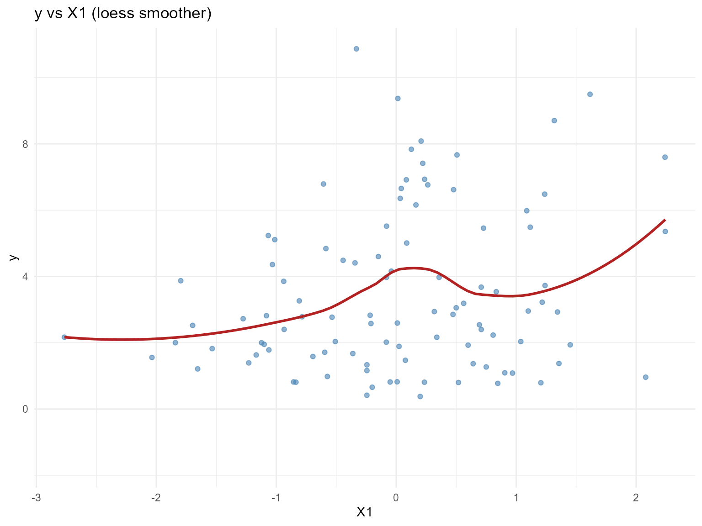

| statistic |  value   |
|:---------:|:--------:|
|     N     | 100.0000 |
|   Mean    |  3.4540  |
|    SD     |  2.4060  |
|    Min    |  0.3772  |
|    Max    | 10.8700  |

Summary of Conditional Dataset

------------------------------------------------------------------------

### Model Specification & Bundle

``` r
bundle_cond_normal <- build_nimble_bundle(
  y = y,
  X = X,
  kernel = "normal",
  backend = "crp",
  GPD = FALSE,
  components = 5,
  mcmc = list(
    niter = 60,
    nburnin = 10,
    nchains = 2,
    thin = 1
  )
)

bundle_cond_amoroso <- build_nimble_bundle(
  y = y,
  X = X,
  kernel = "amoroso",
  backend = "crp",
  GPD = FALSE,
  components = 5,
  mcmc = list(
    niter = 60,
    nburnin = 10,
    nchains = 1,
    thin = 1
  )
)
```

------------------------------------------------------------------------

### Running MCMC

``` r
fit_cond_normal <- run_mcmc_bundle_manual(bundle_cond_normal)
[MCMC] Creating NIMBLE model...
[MCMC] NIMBLE model created successfully.
[MCMC] Configuring MCMC...
===== Monitors =====
thin = 1: alpha, mean, sd, z
===== Samplers =====
CRP_concentration sampler (1)
  - alpha
CRP_cluster_wrapper sampler (10)
  - sd[]  (5 elements)
  - mean[]  (5 elements)
CRP sampler (1)
  - z[1:100] 
[MCMC] MCMC configured.
[MCMC] Building MCMC object...
[MCMC] MCMC object built.
[MCMC] Attempting NIMBLE compilation (this may take a minute)...
[MCMC] Compiling model...
[MCMC] Compiling MCMC sampler...
[MCMC] Compilation successful.
|-------------|-------------|-------------|-------------|
|  [Warning] CRP_sampler: This MCMC is not for a proper model. The MCMC attempted to use more components than the number of cluster parameters. Please increase the number of cluster parameters.
-------------------------------------------------------|
|-------------|-------------|-------------|-------------|
|  [Warning] CRP_sampler: This MCMC is not for a proper model. The MCMC attempted to use more components than the number of cluster parameters. Please increase the number of cluster parameters.
-------------------------------------------------------|
[MCMC] MCMC execution complete. Processing results...
fit_cond_amoroso <- run_mcmc_bundle_manual(bundle_cond_amoroso)
[MCMC] Creating NIMBLE model...
[MCMC] NIMBLE model created successfully.
[MCMC] Configuring MCMC...
===== Monitors =====
thin = 1: alpha, loc, scale, shape1, shape2, z
===== Samplers =====
CRP_concentration sampler (1)
  - alpha
CRP_cluster_wrapper sampler (20)
  - loc[]  (5 elements)
  - scale[]  (5 elements)
  - shape1[]  (5 elements)
  - shape2[]  (5 elements)
CRP sampler (1)
  - z[1:100] 
[MCMC] MCMC configured.
[MCMC] Building MCMC object...
[MCMC] MCMC object built.
[MCMC] Attempting NIMBLE compilation (this may take a minute)...
[MCMC] Compiling model...
[MCMC] Compiling MCMC sampler...
[MCMC] Compilation successful.
|-------------|-------------|-------------|-------------|
|  [Warning] CRP_sampler: This MCMC is not for a proper model. The MCMC attempted to use more components than the number of cluster parameters. Please increase the number of cluster parameters.
-------------------------------------------------------|
[MCMC] MCMC execution complete. Processing results...
summary(fit_cond_normal)
MixGPD summary | backend: Chinese Restaurant Process | kernel: Normal Distribution | GPD tail: FALSE | epsilon: 0.025
n = 100 | components = 5
Summary
Initial components: 5 | Components after truncation: 2

WAIC: 379.855
lppd: -157.486 | pWAIC: 32.441

Summary table
  parameter  mean    sd q0.025 q0.500 q0.975    ess
 weights[1] 0.527 0.089  0.350  0.530  0.685  9.610
 weights[2] 0.343 0.096  0.184  0.340  0.490  1.577
      alpha 0.756 0.435  0.171  0.710  1.756 10.579
    mean[1] 2.421 1.167  1.556  1.995  5.349 16.350
    mean[2] 4.268 1.785  1.330  4.568  6.772  9.714
      sd[1] 1.119 0.520  0.182  1.157  1.973 27.212
      sd[2] 0.833 0.756  0.166  0.441  2.412 13.076
summary(fit_cond_amoroso)
MixGPD summary | backend: Chinese Restaurant Process | kernel: Amoroso Distribution | GPD tail: FALSE | epsilon: 0.025
n = 100 | components = 5
Summary
Initial components: 5 | Components after truncation: 1

WAIC: 415.497
lppd: -193.312 | pWAIC: 14.436

Summary table
  parameter  mean    sd q0.025 q0.500 q0.975    ess
 weights[1] 0.760 0.225  0.457  0.745  1.000  1.307
      alpha 0.419 0.313  0.010  0.376  1.089 11.922
     loc[1] 0.357 0.179 -0.030  0.314  0.699 15.655
   scale[1] 2.654 0.272  2.252  2.725  3.090  4.819
  shape1[1] 1.363 0.159  0.924  1.361  1.570 15.521
  shape2[1] 1.169 0.105  0.969  1.190  1.454 10.092
```

``` r
params_cond <- params(fit_cond_normal)
params_cond
Posterior mean parameters

$alpha
[1] 0.7557

$w
[1] 0.5274 0.3428

$mean
[1] 2.421 4.268

$sd
[1] 1.1190 0.8328
```

------------------------------------------------------------------------

### Conditional Predictions

``` r
X_new <- expand.grid(
  x1 = seq(-2, 2, length.out = 3),
  x2 = c(0, 1),
  x3 = 0
)
colnames(X_new) <- colnames(X)

y_grid <- seq(-1, 10, length.out = 200)
densities_normal <- lapply(seq_len(nrow(X_new)), function(i) {
  pred <- predict(fit_cond_normal, x = as.matrix(X_new[i, , drop = FALSE]), y = y_grid, type = "density")
  data.frame(
    y = pred$fit$y,
    density = pred$fit$density,
    group = paste0("x1=", round(X_new[i, "x1"], 1), ", x2=", X_new[i, "x2"]),
    model = "Normal"
  )
})

densities_amoroso <- lapply(seq_len(nrow(X_new)), function(i) {
  pred <- predict(fit_cond_amoroso, x = as.matrix(X_new[i, , drop = FALSE]), y = y_grid, type = "density")
  data.frame(
    y = pred$fit$y,
    density = pred$fit$density,
    group = paste0("x1=", round(X_new[i, "x1"], 1), ", x2=", X_new[i, "x2"]),
    model = "Amoroso (shape1=1)"
  )
})

df_dens <- bind_rows(densities_normal, densities_amoroso)

ggplot(df_dens, aes(x = y, y = density, color = group)) +
  geom_line(linewidth = 1) +
  facet_wrap(~ model) +
  labs(title = "Conditional Predictive Densities", x = "y", y = "Density") +
  theme_minimal() +
  theme(legend.position = "bottom")
```

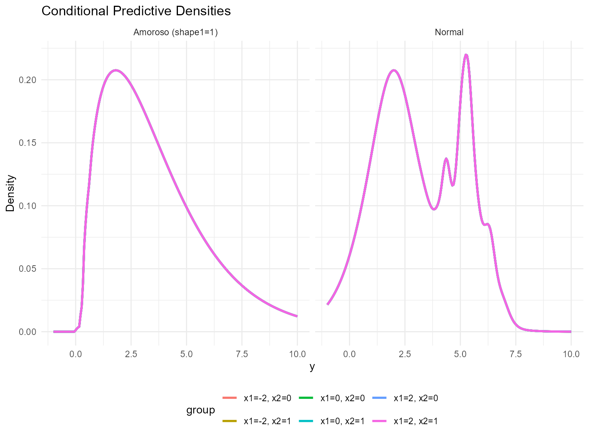

------------------------------------------------------------------------

### Covariate Effect on Conditional Quantiles

``` r
X_grid <- cbind(
  x1 = seq(-2, 2, length.out = 5),
  x2 = 0,
  x3 = 0
)
colnames(X_grid) <- colnames(X)

quant_probs <- c(0.25, 0.5, 0.75)
pred_q_normal <- predict(fit_cond_normal, x = as.matrix(X_grid), type = "quantile", index = quant_probs)
pred_q_amoroso <- predict(fit_cond_amoroso, x = as.matrix(X_grid), type = "quantile", index = quant_probs)

quant_df_normal <- pred_q_normal$fit
quant_df_normal$x1 <- X_grid[quant_df_normal$id, "x1"]
quant_df_normal$model <- "Normal"

quant_df_amoroso <- pred_q_amoroso$fit
quant_df_amoroso$x1 <- X_grid[quant_df_amoroso$id, "x1"]
quant_df_amoroso$model <- "Amoroso (shape1=1)"

bind_rows(quant_df_normal, quant_df_amoroso) %>%
  ggplot(aes(x = x1, y = estimate, color = factor(index), group = index)) +
  geom_line(linewidth = 1) +
  geom_point(size = 2) +
  facet_wrap(~ model) +
  labs(title = "Conditional Quantiles vs x1 (x2=0)", x = "x1", y = "y", color = "Quantile") +
  theme_minimal()
```

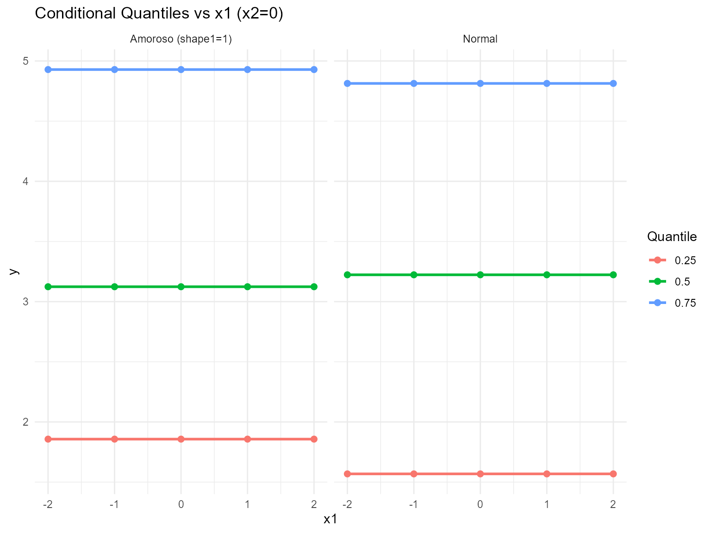

------------------------------------------------------------------------

### Residuals & Diagnostics

``` r
fit_vals <- fitted(fit_cond_normal)
plot(fit_vals)
```

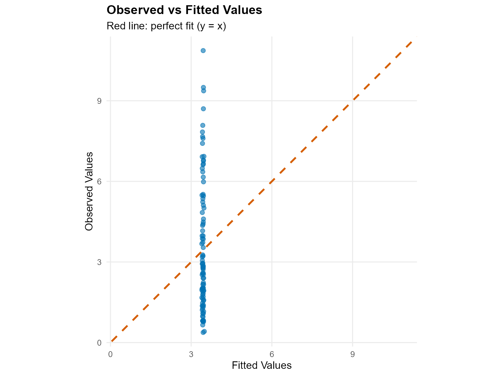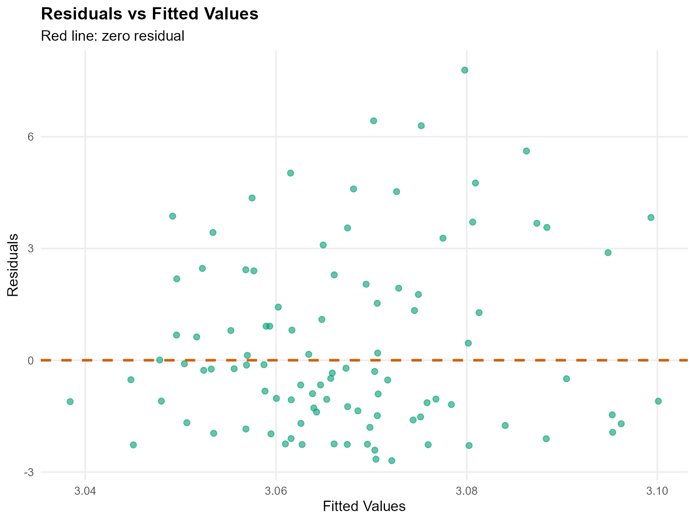

``` r
plot(fit_cond_normal, family = c("traceplot", "autocorrelation", "geweke"))

=== traceplot ===
```

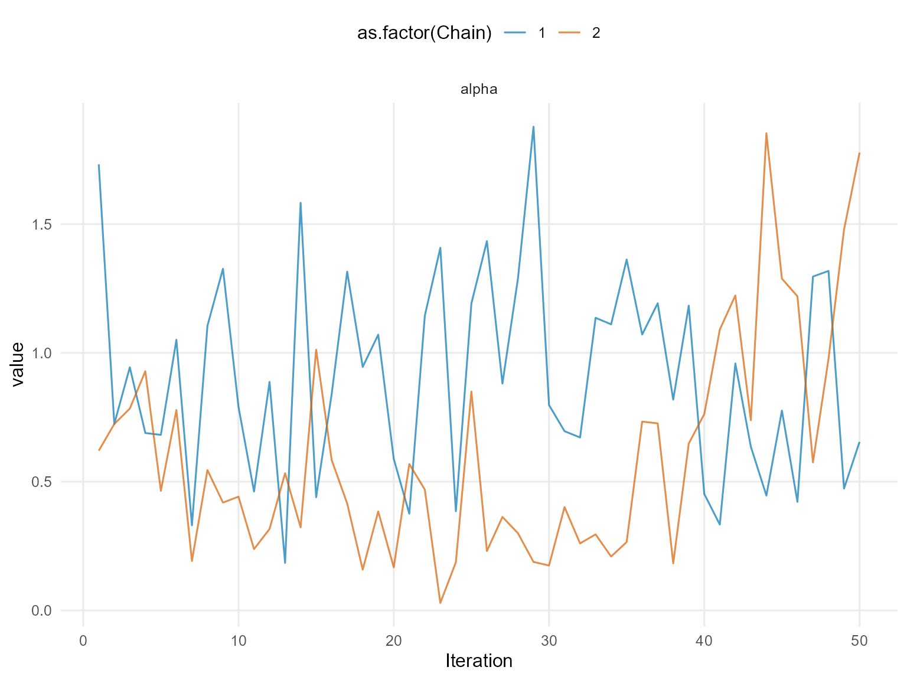

    === autocorrelation ===

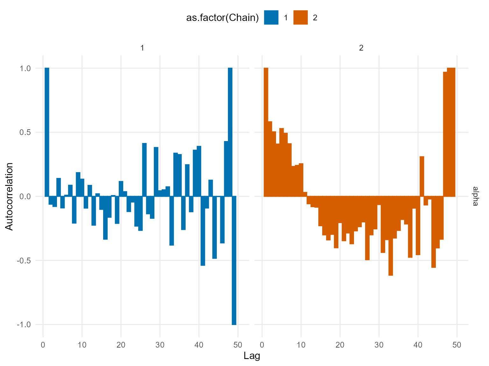

    === geweke ===

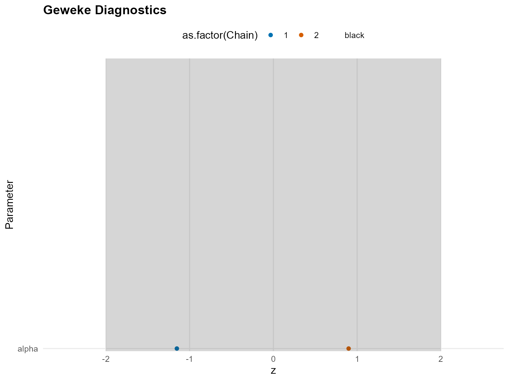

``` r
plot(fit_cond_amoroso, family = c("density", "running", "caterpillar"))

=== density ===
```

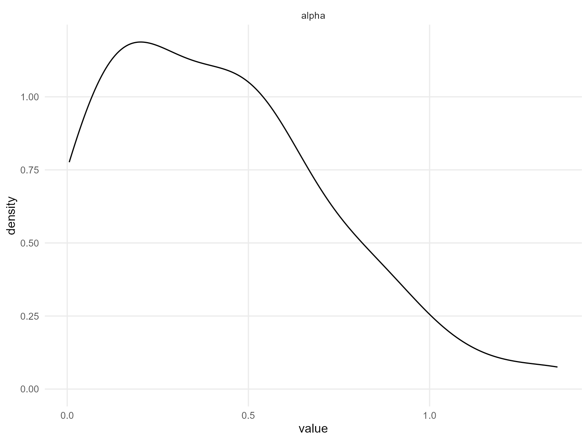

    === running ===

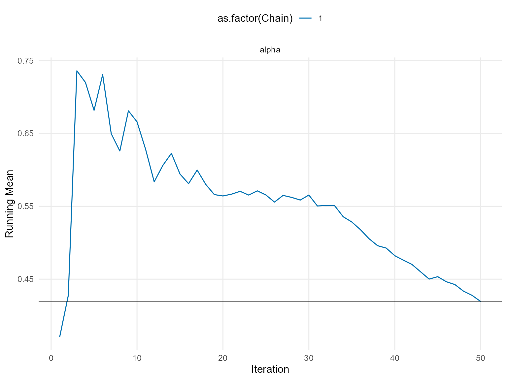

    === caterpillar ===

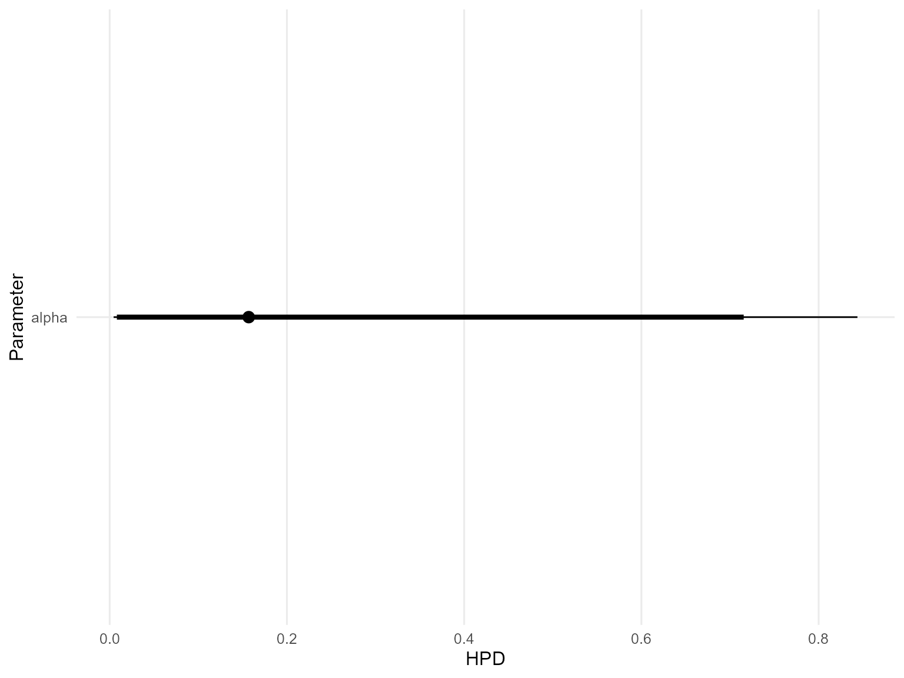

------------------------------------------------------------------------

### Takeaways

- Covariate-informed DP mixtures predict outcome distributions that
  shift with `x1` (and other covariates).
- Use `predict(..., type = "density")` to visualize conditional
  densities and `type = "quantile"` for posterior-mean location shifts.
- Diagnostics (`plot(fit_cond_normal)`, `fitted(fit_cond_normal)`)
  ensure the chains mix before relying on predictions.
- Next vignette extends the same idea to the SB backend before adding
  tails.
