# 10. Conditional DPmixGPD with CRP Backend

## Conditional DPmixGPD: CRP Backend with Tail Augmentation

**Purpose**: Combine conditional modeling with GPD tail augmentation so
each covariate slice inherits both mixture bulk and tail behavior. This
extends the unconditional GPD (v06) and conditional DP (v08).

------------------------------------------------------------------------

### Data Setup

``` r
data("nc_posX100_p5_k4")
y <- nc_posX100_p5_k4$y
X <- as.matrix(nc_posX100_p5_k4$X)
if (is.null(colnames(X))) {
  colnames(X) <- paste0("x", seq_len(ncol(X)))
}

summary_tbl <- tibble(
  statistic = c("N", "Mean", "SD", "Min", "Max"),
  value = c(length(y), mean(y), sd(y), min(y), max(y))
)

ggplot(data.frame(y = y, x1 = X[, 1]), aes(x = x1, y = y)) +
  geom_point(alpha = 0.5, color = "darkgreen") +
  geom_smooth(method = "loess", color = "steelblue", fill = NA) +
  labs(title = "Outcome vs X1 (Tail dataset)", x = "X1", y = "y") +
  theme_minimal()
```

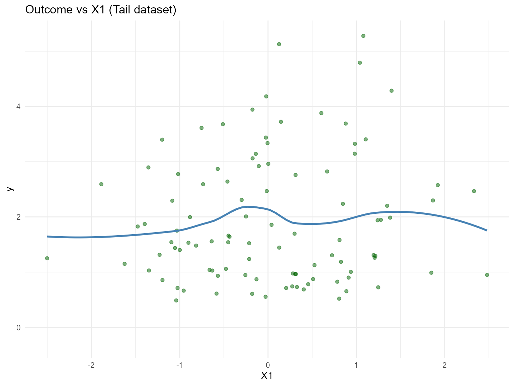

| statistic |  value   |
|:---------:|:--------:|
|     N     | 100.0000 |
|   Mean    |  1.9420  |
|    SD     |  1.1460  |
|    Min    |  0.4877  |
|    Max    |  5.2780  |

Conditional Tail Dataset Summary

------------------------------------------------------------------------

### Threshold Selection

``` r
u_threshold <- quantile(y, 0.85)

ggplot(data.frame(y = y), aes(x = y)) +
  geom_histogram(aes(y = after_stat(density)), bins = 40, fill = "magenta", alpha = 0.6, color = "black") +
  geom_vline(xintercept = u_threshold, linetype = "dashed", color = "black") +
  labs(title = paste("Threshold at", signif(u_threshold, 3)), x = "y", y = "Density") +
  theme_minimal()
```


------------------------------------------------------------------------

### Model Specification & Bundle

``` r
bundle_cond_gpd_lognormal <- build_nimble_bundle(
  y = y,
  X = X,
  kernel = "lognormal",
  backend = "crp",
  GPD = TRUE,
  components = 5,
  param_specs = list(
    gpd = list(
      threshold = list(mode = "link", link = "exp")
    )
  ),
  mcmc = list(
    niter = 60,
    nburnin = 10,
    nchains = 2,
    thin = 1
  )
)

bundle_cond_gpd_normal <- build_nimble_bundle(
  y = y,
  X = X,
  kernel = "normal",
  backend = "crp",
  GPD = TRUE,
  components = 5,
  param_specs = list(
    gpd = list(
      threshold = list(mode = "link", link = "exp")
    )
  ),
  mcmc = list(
    niter = 60,
    nburnin = 10,
    nchains = 1,
    thin = 1
  )
)
```

------------------------------------------------------------------------

### Running MCMC

``` r
fit_cond_gpd_lognormal <- run_mcmc_bundle_manual(bundle_cond_gpd_lognormal)
[MCMC] Creating NIMBLE model...
[MCMC] NIMBLE model created successfully.
[MCMC] Configuring MCMC...
===== Monitors =====
thin = 1: alpha, beta_tail_scale, beta_threshold, meanlog, sdlog, tail_shape, threshold, z
===== Samplers =====
RW sampler (11)
  - beta_threshold[]  (5 elements)
  - beta_tail_scale[]  (5 elements)
  - tail_shape
CRP_concentration sampler (1)
  - alpha
CRP_cluster_wrapper sampler (10)
  - meanlog[]  (5 elements)
  - sdlog[]  (5 elements)
CRP sampler (1)
  - z[1:100] 
[MCMC] MCMC configured.
[MCMC] Building MCMC object...
[MCMC] MCMC object built.
[MCMC] Attempting NIMBLE compilation (this may take a minute)...
[MCMC] Compiling model...
[MCMC] Compiling MCMC sampler...
[MCMC] Compilation successful.
|-------------|-------------|-------------|-------------|
|  [Warning] CRP_sampler: This MCMC is not for a proper model. The MCMC attempted to use more components than the number of cluster parameters. Please increase the number of cluster parameters.
-------------------------------------------------------|
|-------------|-------------|-------------|-------------|
|  [Warning] CRP_sampler: This MCMC is not for a proper model. The MCMC attempted to use more components than the number of cluster parameters. Please increase the number of cluster parameters.
-------------------------------------------------------|
[MCMC] MCMC execution complete. Processing results...
fit_cond_gpd_normal <- run_mcmc_bundle_manual(bundle_cond_gpd_normal)
[MCMC] Creating NIMBLE model...
[MCMC] NIMBLE model created successfully.
[MCMC] Configuring MCMC...
===== Monitors =====
thin = 1: alpha, beta_tail_scale, beta_threshold, mean, sd, tail_shape, threshold, z
===== Samplers =====
RW sampler (11)
  - beta_threshold[]  (5 elements)
  - beta_tail_scale[]  (5 elements)
  - tail_shape
CRP_concentration sampler (1)
  - alpha
CRP_cluster_wrapper sampler (10)
  - mean[]  (5 elements)
  - sd[]  (5 elements)
CRP sampler (1)
  - z[1:100] 
[MCMC] MCMC configured.
[MCMC] Building MCMC object...
[MCMC] MCMC object built.
[MCMC] Attempting NIMBLE compilation (this may take a minute)...
[MCMC] Compiling model...
[MCMC] Compiling MCMC sampler...
[MCMC] Compilation successful.
|-------------|-------------|-------------|-------------|
|  [Warning] CRP_sampler: This MCMC is not for a proper model. The MCMC attempted to use more components than the number of cluster parameters. Please increase the number of cluster parameters.
-------------------------------------------------------|
[MCMC] MCMC execution complete. Processing results...
summary(fit_cond_gpd_lognormal)
MixGPD summary | backend: Chinese Restaurant Process | kernel: Lognormal Distribution | GPD tail: TRUE | epsilon: 0.025
n = 100 | components = 5
Summary
Initial components: 5 | Components after truncation: 1

WAIC: 276.912
lppd: -119.317 | pWAIC: 19.139

Summary table
          parameter   mean    sd q0.025 q0.500 q0.975     ess
         weights[1]  0.687 0.224  0.385  0.605  1.000   3.390
              alpha  0.561 0.458  0.025  0.446  1.507  23.014
 beta_tail_scale[1]  0.228 0.103 -0.017  0.282  0.322   6.158
 beta_tail_scale[2]  0.058 0.177 -0.290  0.133  0.296   9.768
 beta_tail_scale[3] -0.012 0.111 -0.192  0.000  0.211   9.463
 beta_tail_scale[4]  0.449 0.131  0.175  0.477  0.762   9.831
 beta_tail_scale[5] -0.005 0.095 -0.150  0.000  0.215   3.960
  beta_threshold[1] -0.149 0.085 -0.288 -0.141 -0.017   4.002
  beta_threshold[2] -0.044 0.237 -0.266 -0.132  0.473   2.190
  beta_threshold[3]  0.134 0.169 -0.206  0.125  0.313   2.031
  beta_threshold[4] -0.117 0.124 -0.385 -0.101  0.125   8.285
  beta_threshold[5] -0.078 0.074 -0.266 -0.074  0.000   3.968
         tail_shape -0.062 0.055 -0.149 -0.089  0.102  14.102
         meanlog[1]  1.068 1.838 -0.160  0.715  6.882 100.000
           sdlog[1]  0.780 0.500  0.234  0.664  2.189  45.122
summary(fit_cond_gpd_normal)
MixGPD summary | backend: Chinese Restaurant Process | kernel: Normal Distribution | GPD tail: TRUE | epsilon: 0.025
n = 100 | components = 5
Summary
Initial components: 5 | Components after truncation: 2

WAIC: 273.848
lppd: -117.164 | pWAIC: 19.760

Summary table
          parameter   mean    sd q0.025 q0.500 q0.975    ess
         weights[1]  0.695 0.084  0.502  0.710  0.828  6.667
         weights[2]  0.246 0.087  0.132  0.225  0.436  9.063
              alpha  0.540 0.352  0.118  0.439  1.297  6.263
 beta_tail_scale[1]  0.353 0.112  0.168  0.347  0.566 32.533
 beta_tail_scale[2] -0.281 0.178 -0.570 -0.245 -0.054  7.923
 beta_tail_scale[3] -0.140 0.088 -0.247 -0.155 -0.019  5.022
 beta_tail_scale[4]  0.467 0.304 -0.089  0.617  0.901  5.830
 beta_tail_scale[5] -0.079 0.135 -0.282 -0.049  0.267  6.802
  beta_threshold[1] -0.564 0.074 -0.651 -0.503 -0.498  1.614
  beta_threshold[2]  0.059 0.101 -0.112  0.086  0.229  4.336
  beta_threshold[3]  0.134 0.017  0.095  0.141  0.141  3.372
  beta_threshold[4]  0.159 0.129 -0.089  0.226  0.226  3.607
  beta_threshold[5]  0.182 0.000  0.182  0.182  0.182  0.000
         tail_shape -0.140 0.075 -0.240 -0.166 -0.022  2.629
            mean[1]  1.284 0.141  1.214  1.268  1.268 50.000
            mean[2]  5.354 2.250  2.254  5.057  9.198  3.923
              sd[1]  0.534 0.086  0.493  0.493  0.574 28.346
              sd[2]  1.572 0.986  0.530  1.280  3.337 50.000
```

``` r
params_cond_gpd <- params(fit_cond_gpd_lognormal)
params_cond_gpd
Posterior mean parameters

$alpha
[1] 0.5611

$w
[1] 0.6871

$meanlog
[1] 1.068

$sdlog
[1] 0.7797

$beta_threshold
[1] -0.14940 -0.04431  0.13360 -0.11720 -0.07783

$beta_tail_scale
[1]  0.228200  0.057710 -0.011530  0.449000 -0.005421

$tail_shape
[1] -0.06226
```

------------------------------------------------------------------------

### Conditional Tail-aware Predictions

``` r
X_new <- rbind(
  c(-1, 0, 0, 0, 0),
  c(0, 0, 0, 0, 0),
  c(1, 1, 0, 0, 0)
)
colnames(X_new) <- colnames(X)
y_grid <- seq(0, max(y) * 1.2, length.out = 200)

df_pred_lognormal <- lapply(seq_len(nrow(X_new)), function(i) {
  pred <- predict(fit_cond_gpd_lognormal, x = as.matrix(X_new[i, , drop = FALSE]), y = y_grid, type = "density")
  data.frame(
    y = pred$fit$y,
    density = pred$fit$density,
    label = paste("x1=", X_new[i, 1], ", x2=", X_new[i, 2], sep = ""),
    model = "Lognormal"
  )
})

df_pred_normal <- lapply(seq_len(nrow(X_new)), function(i) {
  pred <- predict(fit_cond_gpd_normal, x = as.matrix(X_new[i, , drop = FALSE]), y = y_grid, type = "density")
  data.frame(
    y = pred$fit$y,
    density = pred$fit$density,
    label = paste("x1=", X_new[i, 1], ", x2=", X_new[i, 2], sep = ""),
    model = "Normal"
  )
})

bind_rows(df_pred_lognormal, df_pred_normal) %>%
  ggplot(aes(x = y, y = density, color = label)) +
  geom_line(linewidth = 1) +
  facet_wrap(~ model) +
  labs(title = "Conditional Density with GPD Tail", x = "y", y = "Density") +
  theme_minimal() +
  theme(legend.position = "bottom")
```

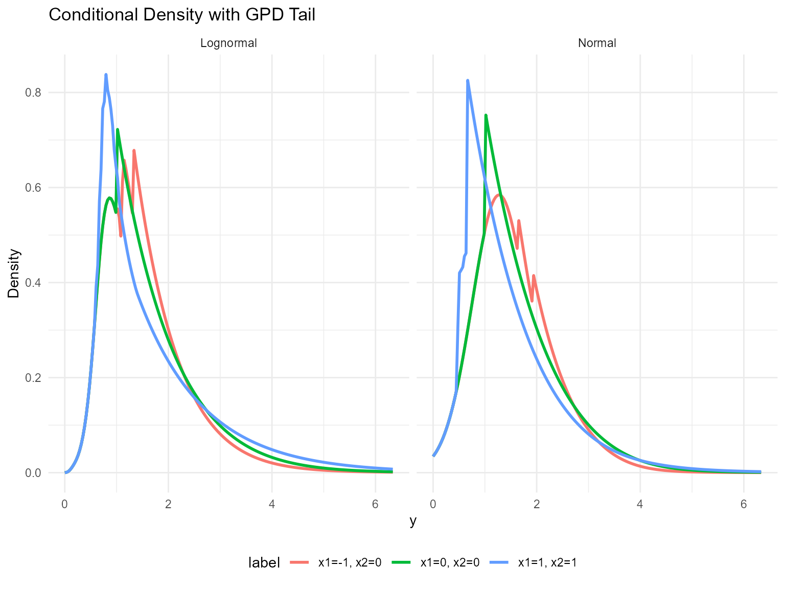

------------------------------------------------------------------------

### Tail Quantiles vs Covariates

``` r
X_grid <- cbind(x1 = seq(-1, 1, length.out = 5), x2 = 0, x3 = 0, x4 = 0, x5 = 0)
colnames(X_grid) <- colnames(X)
quant_probs <- c(0.90, 0.95)

pred_q_lognormal <- predict(fit_cond_gpd_lognormal, x = as.matrix(X_grid), type = "quantile", index = quant_probs)
pred_q_normal <- predict(fit_cond_gpd_normal, x = as.matrix(X_grid), type = "quantile", index = quant_probs)

quant_df_lognormal <- pred_q_lognormal$fit
quant_df_lognormal$x1 <- X_grid[quant_df_lognormal$id, "x1"]
quant_df_lognormal$model <- "Lognormal"

quant_df_normal <- pred_q_normal$fit
quant_df_normal$x1 <- X_grid[quant_df_normal$id, "x1"]
quant_df_normal$model <- "Normal"

bind_rows(quant_df_lognormal, quant_df_normal) %>%
  ggplot(aes(x = x1, y = estimate, color = factor(index), group = index)) +
  geom_line(linewidth = 1) +
  geom_point(size = 2) +
  facet_wrap(~ model) +
  labs(title = "Tail Quantiles vs x1 (CRP)", x = "x1", y = "Quantile", color = "Probability") +
  theme_minimal()
```

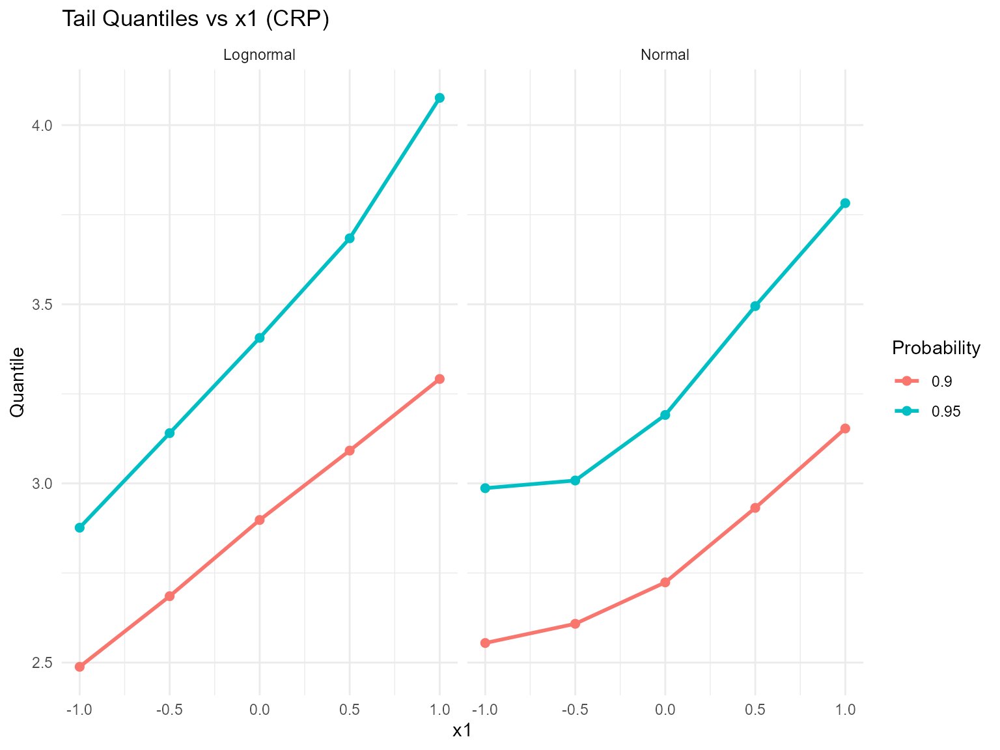

------------------------------------------------------------------------

### Residuals & Diagnostics

``` r
plot(fitted(fit_cond_gpd_lognormal))
```

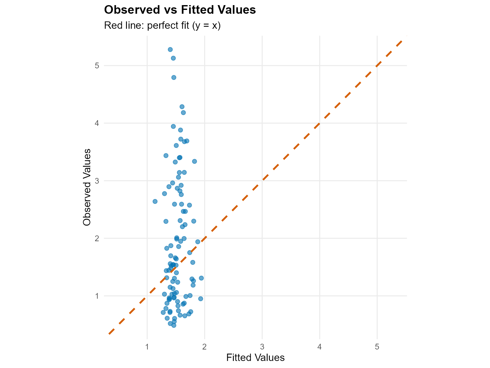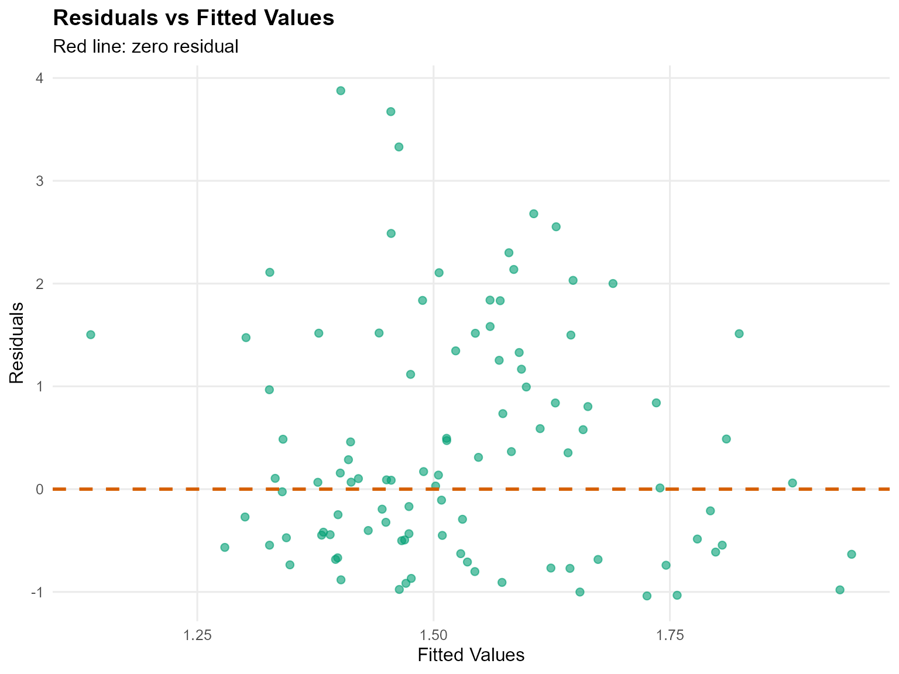

``` r
plot(fit_cond_gpd_lognormal, family = c("traceplot", "density", "autocorrelation"))

=== traceplot ===
```

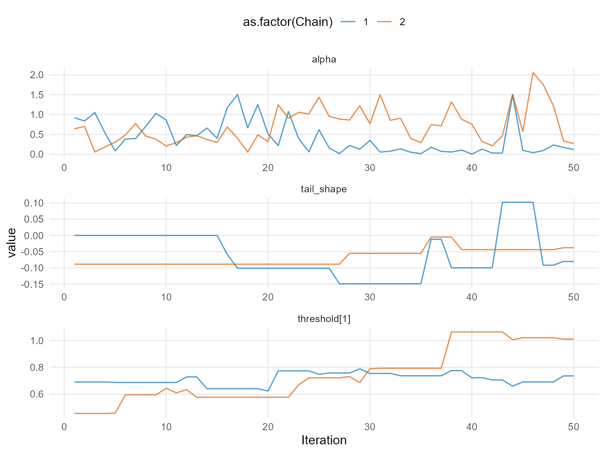

    === density ===

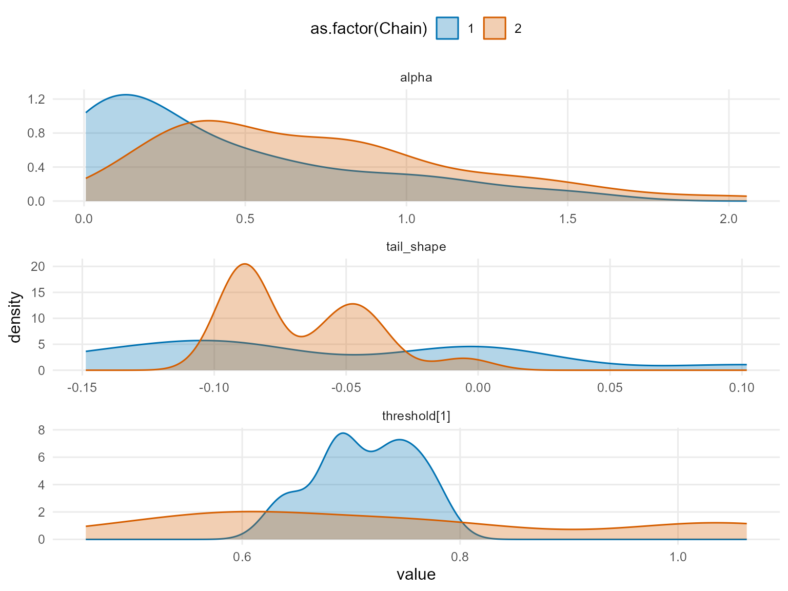

    === autocorrelation ===

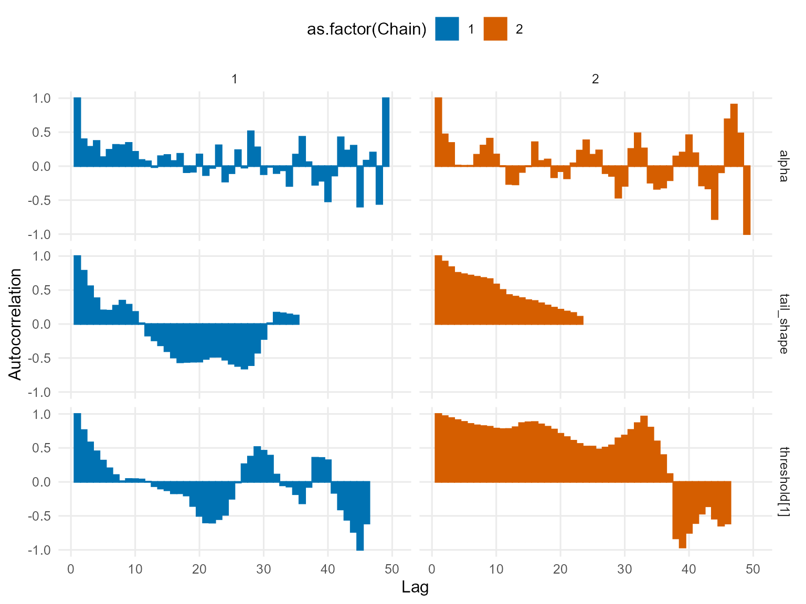

``` r
plot(fit_cond_gpd_normal, family = c("running", "geweke", "caterpillar"))

=== running ===
```

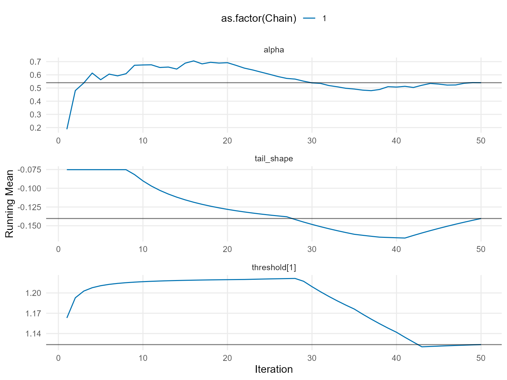

    === geweke ===

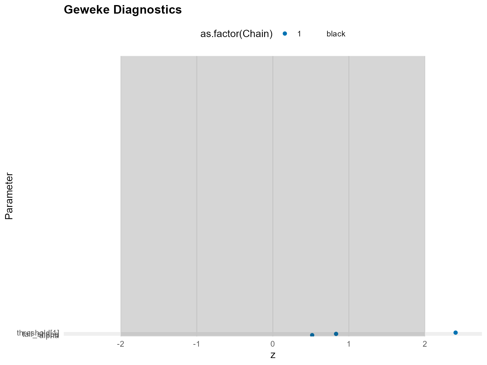

    === caterpillar ===

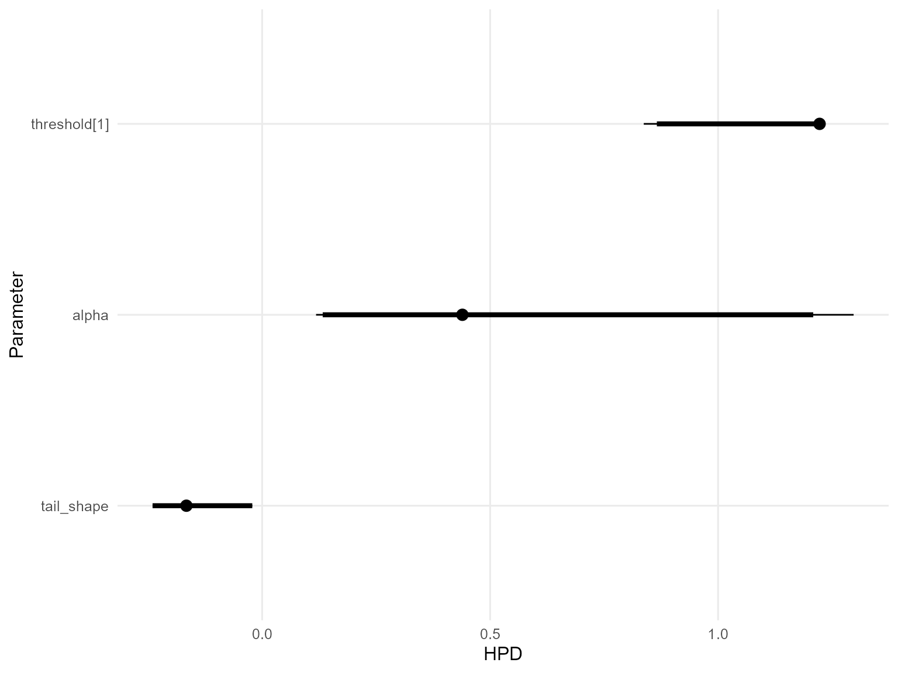

------------------------------------------------------------------------

### Takeaways

- Conditional DPmix with a GPD tail lets extreme quantiles vary with
  covariates.
- The CRP backend samples the bulk and tail jointly while thresholding
  at the 85th percentile.
- [`predict()`](https://rdrr.io/r/stats/predict.html) +
  [`plot()`](https://rdrr.io/r/graphics/plot.default.html) remain the
  main tools for densities, survival curves, and quantiles; residual
  diagnostics check fit quality.
- Next: Mirror this workflow with the SB backend in `v11`.
