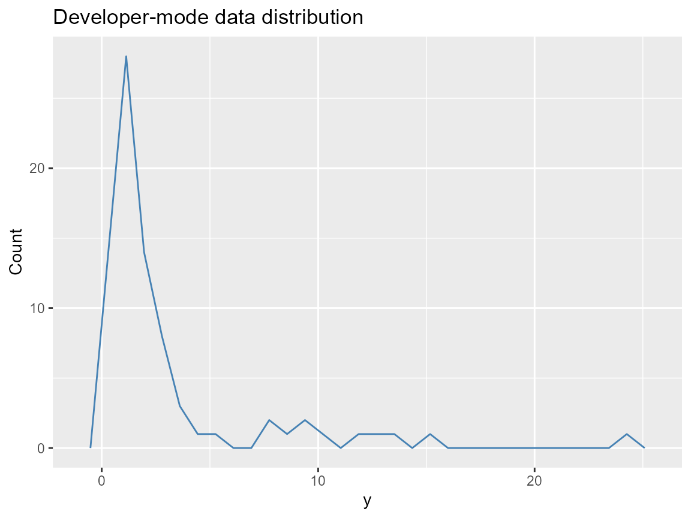

# Developer Guide: Adding a Kernel / Extending the Engine

What you’ll learn: how to register a new kernel, the Nimble hooks
needed, and the minimal regression suite for keeping the engine stable.

## Kernel registry steps

1.  Call
    [`init_kernel_registry()`](https://example.com/DPmixGPD/reference/init_kernel_registry.md)
    to inspect current labels and slot names.
2.  Each entry needs `density`, `quantile`, `rng`, and `nimble` stubs
    following the naming pattern `d<Name>Mix`, `q<Name>Mix`,
    `r<Name>Mix`, `d<Name>`. The mixture index `j` is always the
    component number.
3.  Add the kernel to
    [`get_kernel_registry()`](https://example.com/DPmixGPD/reference/get_kernel_registry.md)
    in `R/00-kernel-registry.R`, providing:
    - `support`: e.g., `(0, Inf)` or `(-Inf, Inf)`,
    - `params`: names of location/scale/shape,
    - `nimble`: the generated Nimble code snippet for the kernel
      density.

## Nimble density/rng hooks

``` r
# Dummy skeleton (copy into R/0-base-kernels.R and register)
nimbleFunction(
  run = function(y = double(1), mu = double(0), sigma = double(0)) {
    returnType(double(0))
    dnorm(y, mu, sigma, log = 1)
  }
)
```

Register the kernel using
[`init_kernel_registry()`](https://example.com/DPmixGPD/reference/init_kernel_registry.md)
for the lazy-loaded metadata; the backend generator picks up names
automatically from
[`get_kernel_registry()`](https://example.com/DPmixGPD/reference/get_kernel_registry.md).

## Adding a kernel entry

``` r
init_kernel_registry("custom", list(
  density = "dCustomMix",
  quantile = "qCustomMix",
  rng = "rCustomMix",
  support = "(0, Inf)",
  params = c("mu", "sigma")
))
```

## Prediction sanity check (one snippet)

``` r
y <- sim_bulk_tail(n = 80, seed = 123)
bundle <- build_nimble_bundle(
  y = y,
  backend = "sb",
  kernel = "lognormal",
  GPD = FALSE,
  J = 4,
  mcmc = list(niter = 200, nburnin = 50, thin = 2, nchains = 2, seed = c(1, 2))
)
if (use_cached_fit) {
  fit <- fit_small
} else {
  fit <- run_mcmc_bundle_manual(bundle)
}
predict(fit, type = "quantile", p = c(0.5, 0.9))
#> $fit
#>          [,1]     [,2]
#> [1,] 2.444721 9.102755
#> 
#> $lower
#> NULL
#> 
#> $upper
#> NULL
#> 
#> $type
#> [1] "quantile"
#> 
#> $grid
#> [1] 0.5 0.9
```

## Diagnostic plot

``` r
data.frame(y = y) |>
  ggplot(aes(x = y)) +
  geom_freqpoly(color = "steelblue") +
  labs(title = "Developer-mode data distribution", x = "y", y = "Count")
```



## Diagnostics to keep in the test checklist

1.  [`build_nimble_bundle()`](https://example.com/DPmixGPD/reference/build_nimble_bundle.md)
    with explicit `components`/`GPD` values for each kernel.
2.  [`run_mcmc_bundle_manual()`](https://example.com/DPmixGPD/reference/run_mcmc_bundle_manual.md)
    for at least 500 iterations on `seed`-locked data.
3.  `predict(..., type = "quantile"/"density"/"draws")` to ensure a
    shared interface.
4.  `validate_fit()` (or any internal helper) to assert thresholds and
    tail shapes obey the `GPD` flag.
5.  Pre-run plotting scripts such as `plot(fit)` to verify mixture
    weights are accessible via `j` components.

## Session info

``` r
sessionInfo()
#> R version 4.5.2 (2025-10-31 ucrt)
#> Platform: x86_64-w64-mingw32/x64
#> Running under: Windows 11 x64 (build 26100)
#> 
#> Matrix products: default
#>   LAPACK version 3.12.1
#> 
#> locale:
#> [1] LC_COLLATE=English_United States.utf8 
#> [2] LC_CTYPE=English_United States.utf8   
#> [3] LC_MONETARY=English_United States.utf8
#> [4] LC_NUMERIC=C                          
#> [5] LC_TIME=English_United States.utf8    
#> 
#> time zone: America/New_York
#> tzcode source: internal
#> 
#> attached base packages:
#> [1] stats     graphics  grDevices datasets  utils     methods   base     
#> 
#> other attached packages:
#> [1] dplyr_1.1.4    ggplot2_4.0.1  nimble_1.4.0   DPmixGPD_0.0.8
#> 
#> loaded via a namespace (and not attached):
#>  [1] sass_0.4.10         future_1.68.0       generics_0.1.4     
#>  [4] renv_1.1.5          lattice_0.22-7      listenv_0.10.0     
#>  [7] pracma_2.4.6        digest_0.6.39       magrittr_2.0.4     
#> [10] evaluate_1.0.5      grid_4.5.2          RColorBrewer_1.1-3 
#> [13] fastmap_1.2.0       jsonlite_2.0.0      scales_1.4.0       
#> [16] codetools_0.2-20    numDeriv_2016.8-1.1 textshaping_1.0.4  
#> [19] jquerylib_0.1.4     cli_3.6.5           rlang_1.1.6        
#> [22] parallelly_1.46.0   future.apply_1.20.1 withr_3.0.2        
#> [25] cachem_1.1.0        yaml_2.3.12         otel_0.2.0         
#> [28] tools_4.5.2         parallel_4.5.2      coda_0.19-4.1      
#> [31] globals_0.18.0      vctrs_0.6.5         R6_2.6.1           
#> [34] lifecycle_1.0.4     fs_1.6.6            htmlwidgets_1.6.4  
#> [37] ragg_1.5.0          pkgconfig_2.0.3     desc_1.4.3         
#> [40] pillar_1.11.1       pkgdown_2.2.0       bslib_0.9.0        
#> [43] gtable_0.3.6        glue_1.8.0          systemfonts_1.3.1  
#> [46] tidyselect_1.2.1    tibble_3.3.0        xfun_0.55          
#> [49] rstudioapi_0.17.1   knitr_1.51          farver_2.1.2       
#> [52] htmltools_0.5.9     igraph_2.2.1        labeling_0.4.3     
#> [55] rmarkdown_2.30      compiler_4.5.2      S7_0.2.1
```
