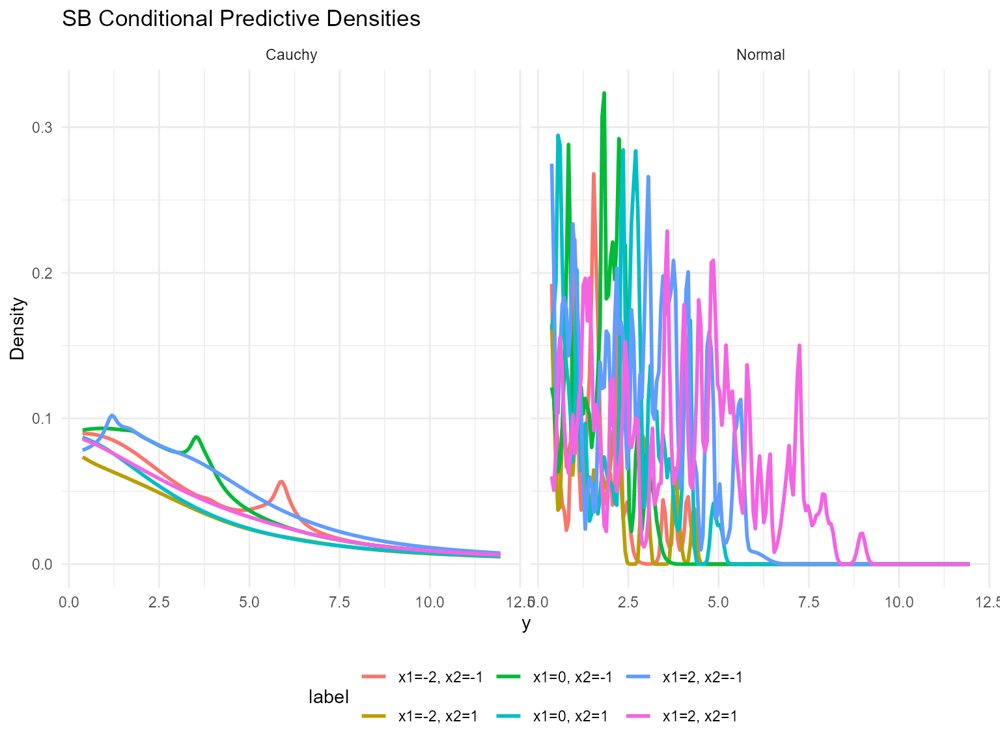
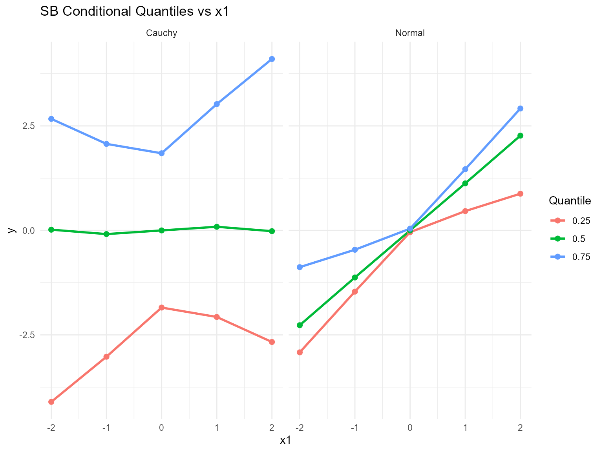
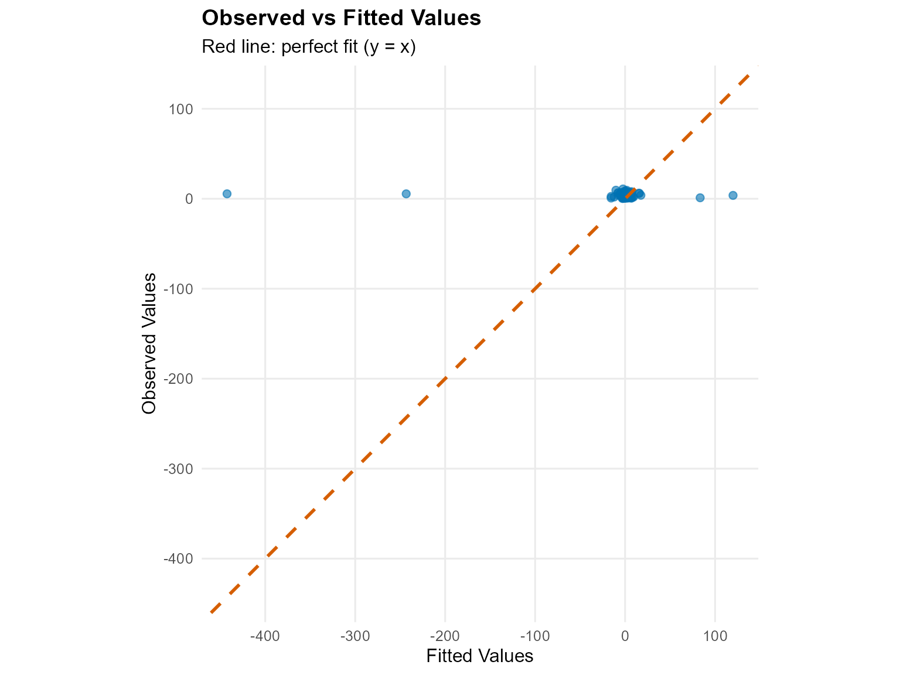
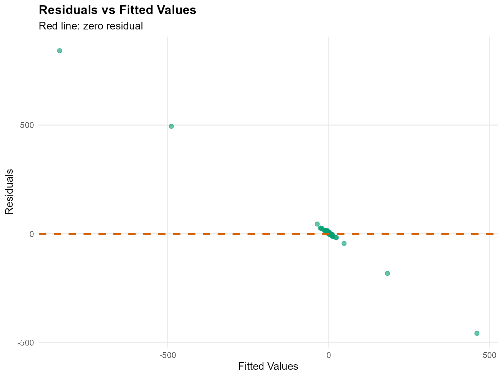
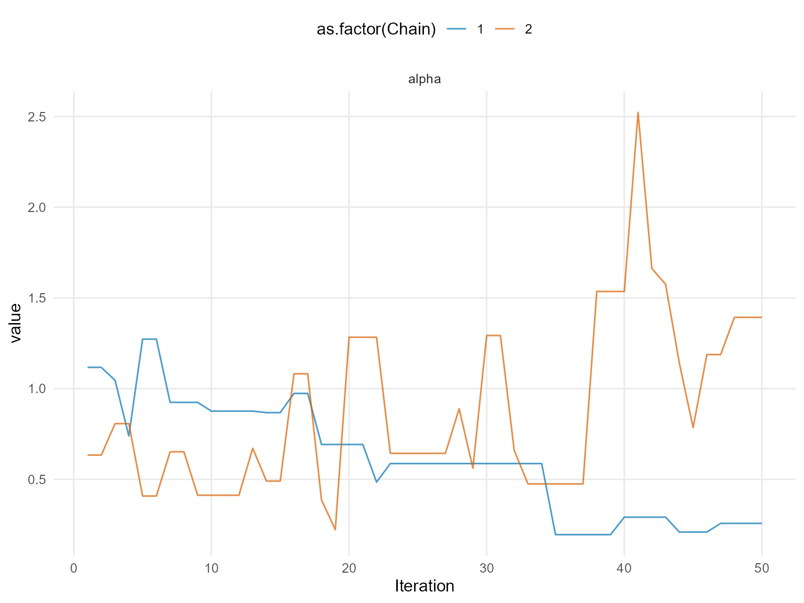
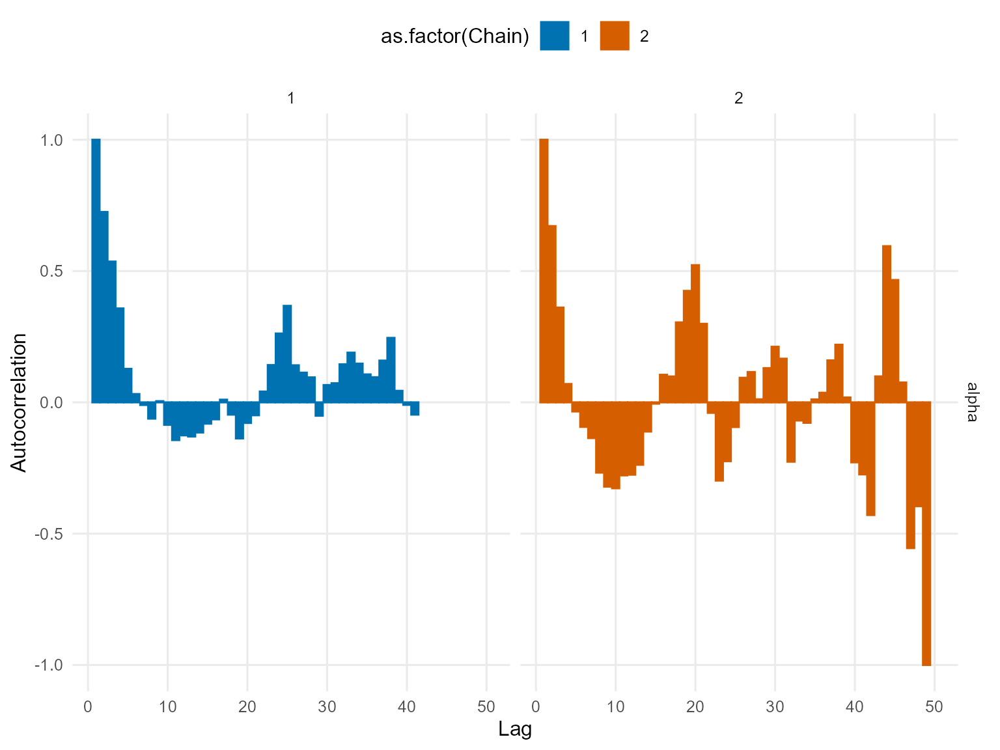
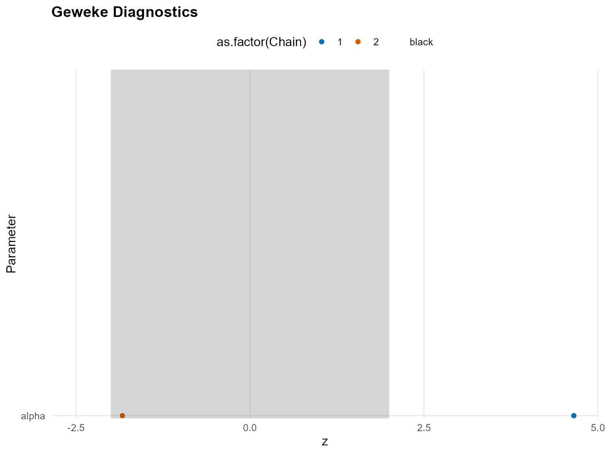
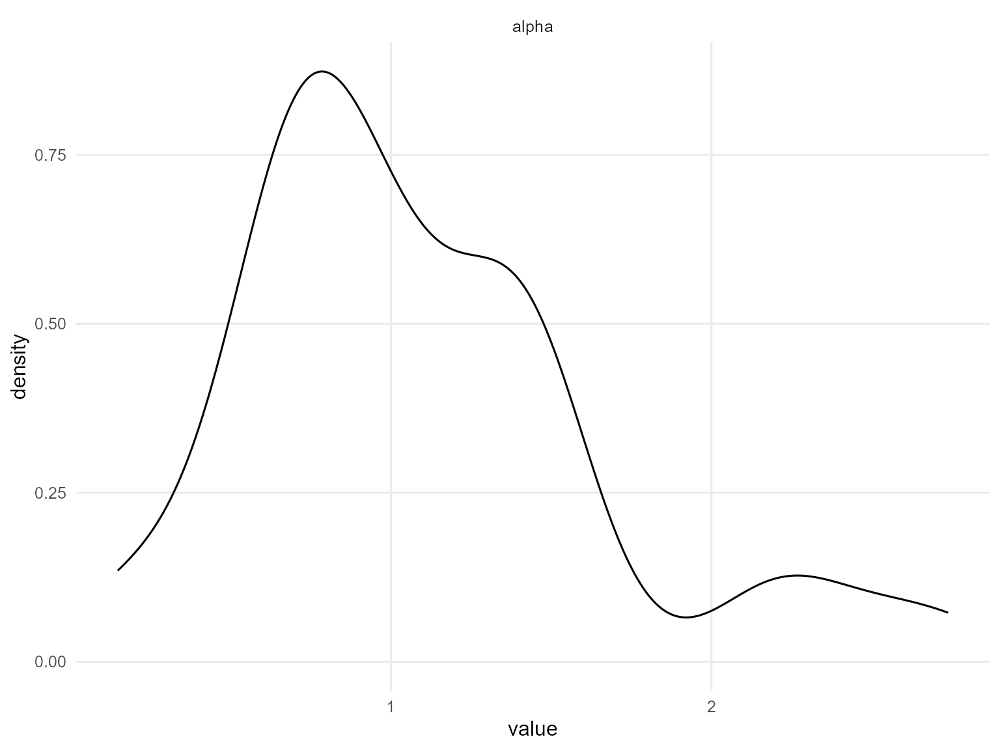
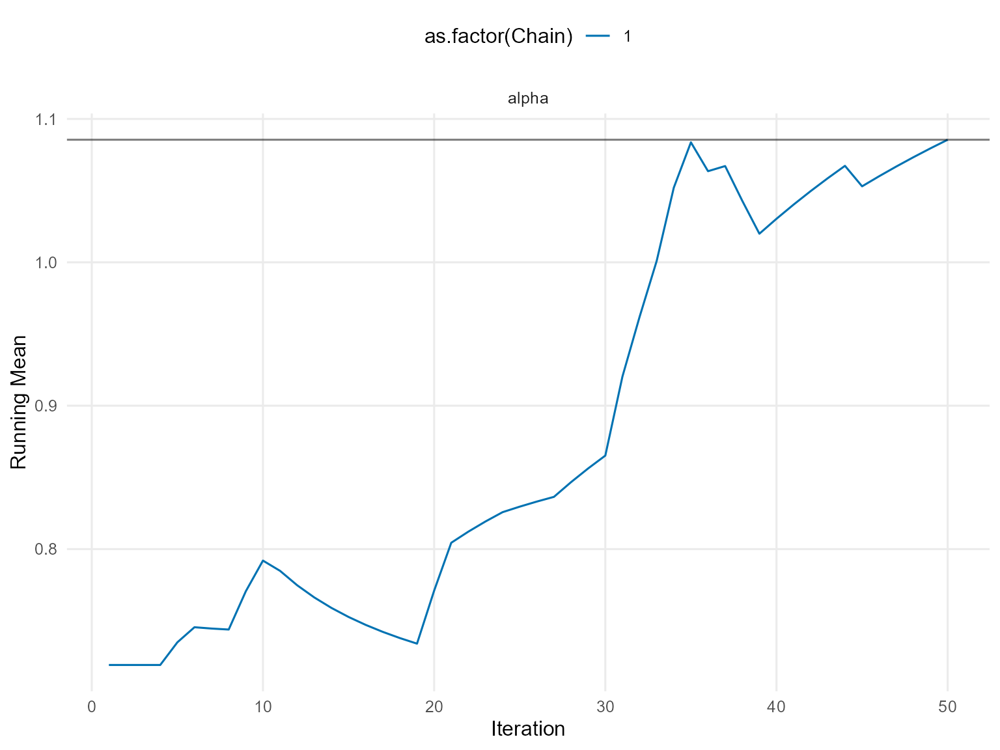
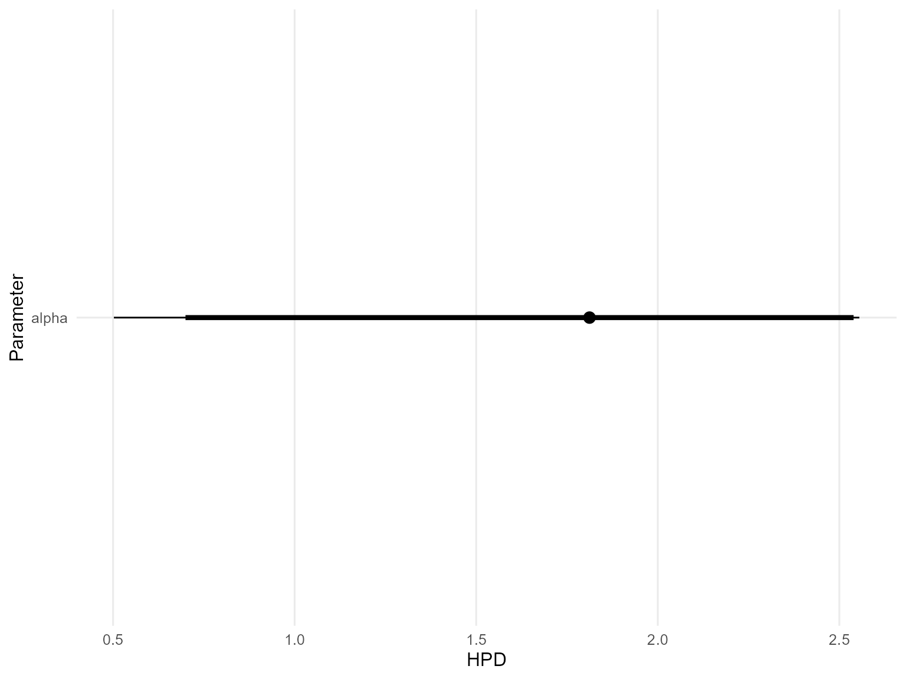

# 11. Conditional DPmix with Stick-Breaking Backend

## Conditional DPmix: Stick-Breaking Backend

**Purpose**: Replace the CRP backend with stick-breaking truncation
while keeping the covariate-dependent bulk structure. This demonstrates
how fixed `components` interplay with covariates.

------------------------------------------------------------------------

### Data Setup

``` r
data("nc_posX100_p3_k2")
y <- nc_posX100_p3_k2$y
X <- as.matrix(nc_posX100_p3_k2$X)
if (is.null(colnames(X))) {
  colnames(X) <- paste0("x", seq_len(ncol(X)))
}

summary_tbl <- tibble(
  statistic = c("N", "Mean", "SD", "Min", "Max"),
  value = c(length(y), mean(y), sd(y), min(y), max(y))
)

ggplot(data.frame(y = y, x1 = X[, 1]), aes(x = x1, y = y)) +
  geom_point(alpha = 0.6, color = "darkorange") +
  geom_smooth(method = "loess", color = "navy", fill = NA) +
  labs(title = "y vs X1 (SB)", x = "X1", y = "y") +
  theme_minimal()
```


| statistic |  value   |
|:---------:|:--------:|
|     N     | 100.0000 |
|   Mean    |  3.4540  |
|    SD     |  2.4060  |
|    Min    |  0.3772  |
|    Max    | 10.8700  |

Conditional Dataset Summary (SB)

------------------------------------------------------------------------

### Model Specification

``` r
bundle_sb_normal <- build_nimble_bundle(
  y = y,
  X = X,
  kernel = "normal",
  backend = "sb",
  GPD = FALSE,
  components = 5,
  mcmc = list(
    niter = 60,
    nburnin = 10,
    nchains = 2,
    thin = 1
  )
)

bundle_sb_cauchy <- build_nimble_bundle(
  y = y,
  X = X,
  kernel = "cauchy",
  backend = "sb",
  GPD = FALSE,
  components = 5,
  mcmc = list(
    niter = 60,
    nburnin = 10,
    nchains = 1,
    thin = 1
  )
)
```

------------------------------------------------------------------------

### Running MCMC

``` r
fit_sb_normal <- run_mcmc_bundle_manual(bundle_sb_normal)
[MCMC] Creating NIMBLE model...
[MCMC] NIMBLE model created successfully.
[MCMC] Configuring MCMC...
===== Monitors =====
thin = 1: alpha, beta_mean, sd, w, z
===== Samplers =====
RW sampler (20)
  - alpha
  - beta_mean[]  (15 elements)
  - v[]  (4 elements)
conjugate sampler (5)
  - sd[]  (5 elements)
categorical sampler (100)
  - z[]  (100 elements)
[MCMC] MCMC configured.
[MCMC] Building MCMC object...
[MCMC] MCMC object built.
[MCMC] Attempting NIMBLE compilation (this may take a minute)...
[MCMC] Compiling model...
[MCMC] Compiling MCMC sampler...
[MCMC] Compilation successful.
|-------------|-------------|-------------|-------------|
|-------------------------------------------------------|
|-------------|-------------|-------------|-------------|
|-------------------------------------------------------|
[MCMC] MCMC execution complete. Processing results...
fit_sb_cauchy <- run_mcmc_bundle_manual(bundle_sb_cauchy)
[MCMC] Creating NIMBLE model...
[MCMC] NIMBLE model created successfully.
[MCMC] Configuring MCMC...
===== Monitors =====
thin = 1: alpha, beta_location, scale, w, z
===== Samplers =====
RW sampler (25)
  - alpha
  - scale[]  (5 elements)
  - beta_location[]  (15 elements)
  - v[]  (4 elements)
categorical sampler (100)
  - z[]  (100 elements)
[MCMC] MCMC configured.
[MCMC] Building MCMC object...
[MCMC] MCMC object built.
[MCMC] Attempting NIMBLE compilation (this may take a minute)...
[MCMC] Compiling model...
[MCMC] Compiling MCMC sampler...
[MCMC] Compilation successful.
|-------------|-------------|-------------|-------------|
|-------------------------------------------------------|
[MCMC] MCMC execution complete. Processing results...
summary(fit_sb_normal)
MixGPD summary | backend: Stick-Breaking Process | kernel: Normal Distribution | GPD tail: FALSE | epsilon: 0.025
n = 100 | components = 5
Summary
Initial components: 5 | Components after truncation: 2

WAIC: 561.590
lppd: -249.605 | pWAIC: 31.189

Summary table
       parameter   mean    sd q0.025 q0.500 q0.975    ess
      weights[1]  0.580 0.133  0.410  0.530  0.810  4.038
      weights[2]  0.290 0.105  0.130  0.305  0.475  3.388
           alpha  1.050 0.570  0.444  0.906  2.782 15.072
 beta_mean[1, 1]  1.128 0.899 -0.987  1.446  2.621 10.470
 beta_mean[2, 1] -0.093 1.053 -1.626 -0.138  1.565  1.827
 beta_mean[3, 1]  0.088 2.106 -3.447  0.963  2.594  2.083
 beta_mean[4, 1]  0.337 1.045 -1.935  0.358  2.055 10.602
 beta_mean[5, 1] -0.108 1.088 -2.340 -0.386  1.761  6.852
 beta_mean[1, 2] -0.218 0.858 -1.851 -0.268  1.854 24.184
 beta_mean[2, 2] -0.325 1.175 -2.643 -0.269  1.510  9.284
 beta_mean[3, 2]  0.367 1.316 -2.593  0.722  2.302  4.977
 beta_mean[4, 2] -0.004 1.768 -3.751  0.597  2.216  6.103
 beta_mean[5, 2] -1.204 2.158 -5.982 -0.936  2.950  3.493
 beta_mean[1, 3]  0.141 0.726 -1.143  0.199  1.479  9.696
 beta_mean[2, 3]  0.132 0.591 -1.192  0.154  0.976 32.244
 beta_mean[3, 3] -0.108 2.820 -3.980  1.329  3.276  1.320
 beta_mean[4, 3]  0.644 1.098 -1.406  0.736  2.411  9.135
 beta_mean[5, 3]  0.362 1.789 -1.900 -0.157  4.398  3.263
           sd[1]  0.056 0.018  0.037  0.051  0.093 32.629
           sd[2]  0.402 0.526  0.040  0.124  1.729  3.728
summary(fit_sb_cauchy)
MixGPD summary | backend: Stick-Breaking Process | kernel: Cauchy Distribution | GPD tail: FALSE | epsilon: 0.025
n = 100 | components = 5
Summary
Initial components: 5 | Components after truncation: 4

WAIC: 608.329
lppd: -252.024 | pWAIC: 52.140

Summary table
           parameter   mean    sd q0.025 q0.500 q0.975    ess
          weights[1]  0.491 0.091  0.340  0.470  0.630  3.641
          weights[2]  0.200 0.042  0.130  0.190  0.290 10.317
          weights[3]  0.146 0.025  0.092  0.150  0.190 15.121
          weights[4]  0.098 0.032  0.050  0.100  0.150 16.367
               alpha  1.736 0.602  0.502  1.812  2.555 15.670
 beta_location[1, 1] -0.070 0.498 -0.659 -0.141  1.215  7.689
 beta_location[2, 1] -0.778 0.593 -1.818 -0.744  0.195  4.893
 beta_location[3, 1]  3.669 1.387  0.890  4.089  5.365  3.130
 beta_location[4, 1]  0.131 2.035 -3.151  0.460  3.408  2.035
 beta_location[5, 1]  0.182 0.924 -1.242  0.286  1.846  5.550
 beta_location[1, 2] -0.633 0.929 -2.346 -0.804  1.328  9.627
 beta_location[2, 2] -1.374 1.320 -3.059 -1.881  0.983  3.583
 beta_location[3, 2]  1.570 1.990 -1.431  1.460  4.388  1.408
 beta_location[4, 2] -1.300 1.023 -2.875 -1.595  0.890 14.398
 beta_location[5, 2] -1.679 1.151 -3.450 -1.642  0.722  5.710
 beta_location[1, 3] -1.567 0.430 -2.159 -1.722 -0.803 11.299
 beta_location[2, 3]  1.534 0.866 -0.047  1.684  2.507  3.721
 beta_location[3, 3]  1.481 0.863 -0.197  1.579  3.005 17.156
 beta_location[4, 3]  0.412 1.057 -1.479  0.428  2.705  4.097
 beta_location[5, 3]  2.540 0.843  1.192  2.458  3.982  8.550
            scale[1]  2.109 0.587  1.000  2.061  3.165 10.315
            scale[2]  1.638 0.638  0.295  1.757  2.536 15.681
            scale[3]  1.530 0.814  0.295  1.462  3.189 22.320
            scale[4]  2.216 0.932  0.928  2.158  4.390  5.896
```

``` r
params_sb <- params(fit_sb_normal)
params_sb
Posterior mean parameters

$alpha
[1] 1.05

$w
[1] 0.5799 0.2896

$beta_mean
           x1      x2      x3
comp1  1.1276 -0.2176  0.1411
comp2 -0.0927 -0.3253  0.1317
comp3  0.0880  0.3671 -0.1076
comp4  0.3370 -0.0036  0.6443
comp5 -0.1080 -1.2039  0.3622

$sd
[1] 0.05554 0.40190
```

------------------------------------------------------------------------

### Conditional Predictive Density

``` r
X_new <- expand.grid(x1 = seq(-2, 2, length.out = 3), x2 = c(-1, 1), x3 = 0)
colnames(X_new) <- colnames(X)
y_min <- max(min(y), .Machine$double.eps)
y_grid <- seq(y_min, max(y) * 1.1, length.out = 200)

densities_normal <- lapply(seq_len(nrow(X_new)), function(i) {
  pred <- predict(fit_sb_normal, x = as.matrix(X_new[i, , drop = FALSE]), y = y_grid, type = "density")
  data.frame(
    y = pred$fit$y,
    density = pred$fit$density,
    label = paste0("x1=", round(X_new[i, "x1"], 1), ", x2=", X_new[i, "x2"]),
    model = "Normal"
  )
})

densities_cauchy <- lapply(seq_len(nrow(X_new)), function(i) {
  pred <- predict(fit_sb_cauchy, x = as.matrix(X_new[i, , drop = FALSE]), y = y_grid, type = "density")
  data.frame(
    y = pred$fit$y,
    density = pred$fit$density,
    label = paste0("x1=", round(X_new[i, "x1"], 1), ", x2=", X_new[i, "x2"]),
    model = "Cauchy"
  )
})

df_cond <- bind_rows(densities_normal, densities_cauchy)

ggplot(df_cond, aes(x = y, y = density, color = label)) +
  geom_line(linewidth = 1) +
  facet_wrap(~ model) +
  labs(title = "SB Conditional Predictive Densities", x = "y", y = "Density") +
  theme_minimal() +
  theme(legend.position = "bottom")
```



------------------------------------------------------------------------

### Quantile Drift with Covariates

``` r
X_eval <- cbind(x1 = seq(-2, 2, length.out = 5), x2 = 0, x3 = 0)
colnames(X_eval) <- colnames(X)
quant_probs <- c(0.25, 0.5, 0.75)

pred_q_normal <- predict(fit_sb_normal, x = as.matrix(X_eval), type = "quantile", index = quant_probs)
pred_q_cauchy <- predict(fit_sb_cauchy, x = as.matrix(X_eval), type = "quantile", index = quant_probs)

quant_df_normal <- pred_q_normal$fit
quant_df_normal$x1 <- X_eval[quant_df_normal$id, "x1"]
quant_df_normal$model <- "Normal"

quant_df_cauchy <- pred_q_cauchy$fit
quant_df_cauchy$x1 <- X_eval[quant_df_cauchy$id, "x1"]
quant_df_cauchy$model <- "Cauchy"

bind_rows(quant_df_normal, quant_df_cauchy) %>%
  ggplot(aes(x = x1, y = estimate, color = factor(index), group = index)) +
  geom_line(linewidth = 1) +
  geom_point(size = 2) +
  facet_wrap(~ model) +
  labs(title = "SB Conditional Quantiles vs x1", x = "x1", y = "y", color = "Quantile") +
  theme_minimal()
```



------------------------------------------------------------------------

### Residuals & Diagnostics

``` r
plot(fitted(fit_sb_cauchy))
```



``` r
plot(fit_sb_normal, family = c("traceplot", "autocorrelation", "geweke"))

=== traceplot ===
```



    === autocorrelation ===



    === geweke ===



``` r
plot(fit_sb_cauchy, family = c("density", "running", "caterpillar"))

=== density ===
```



    === running ===



    === caterpillar ===



------------------------------------------------------------------------

### Takeaways

- Stick-breaking component count is fixed but still supports
  covariate-dependent mixtures.
- `predict(..., type = "density")` returns group-specific densities for
  each `X`.
- `predict(..., type = "quantile")` reports posterior-mean quantiles;
  the median is the 0.5 quantile and shifts with `x1`.
- Diagnoses rely on the same S3
  [`plot()`](https://rdrr.io/r/graphics/plot.default.html)/[`fitted()`](https://rdrr.io/r/stats/fitted.values.html)
  pipeline available in other vignettes.
