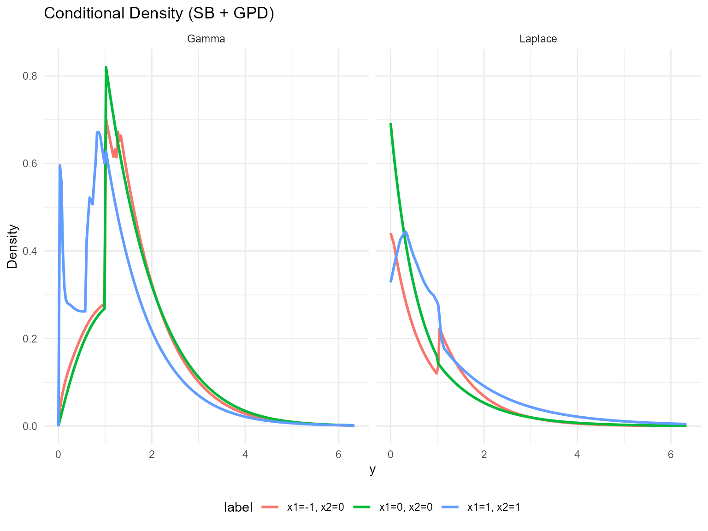
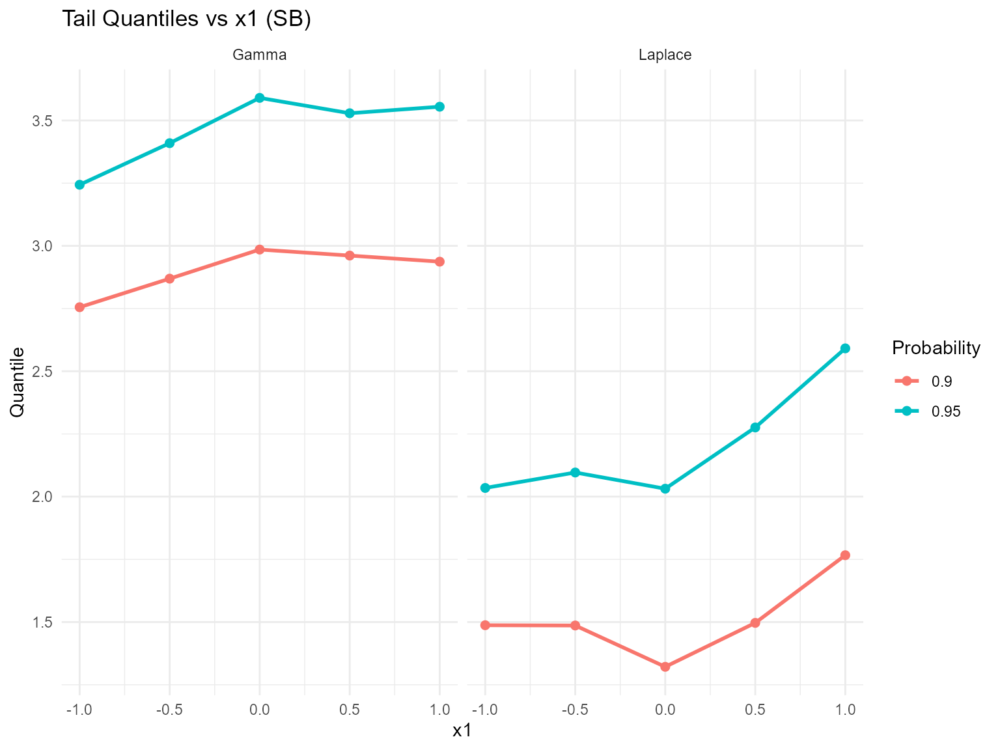
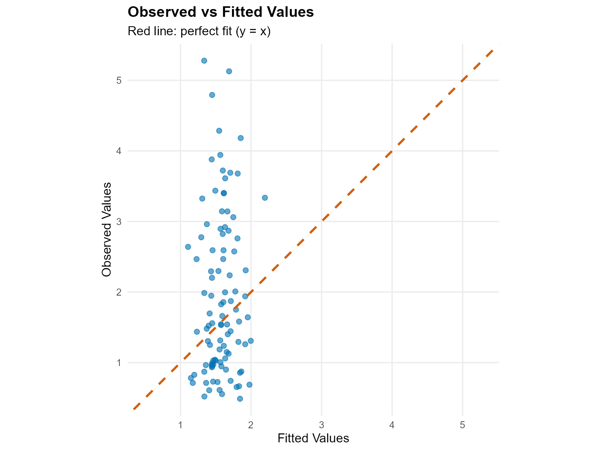
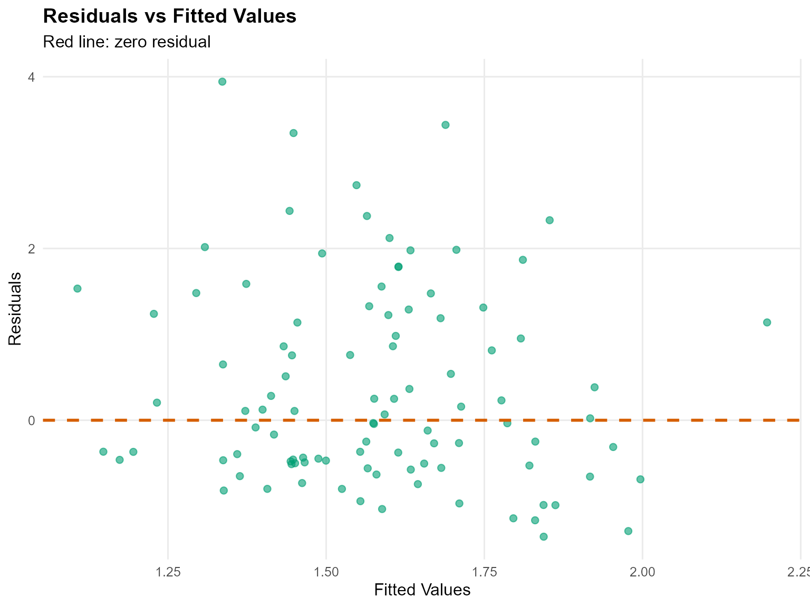
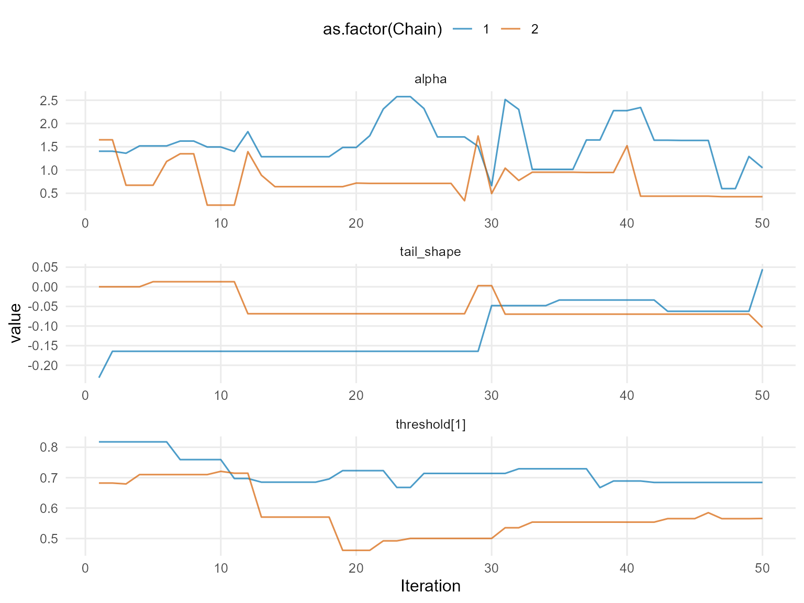
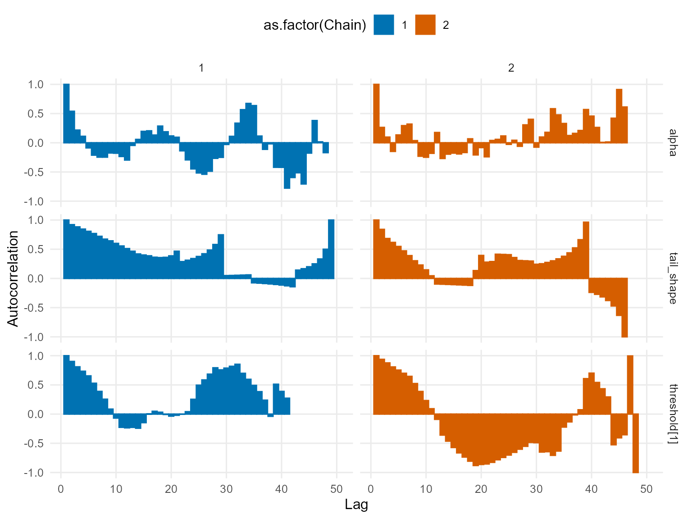
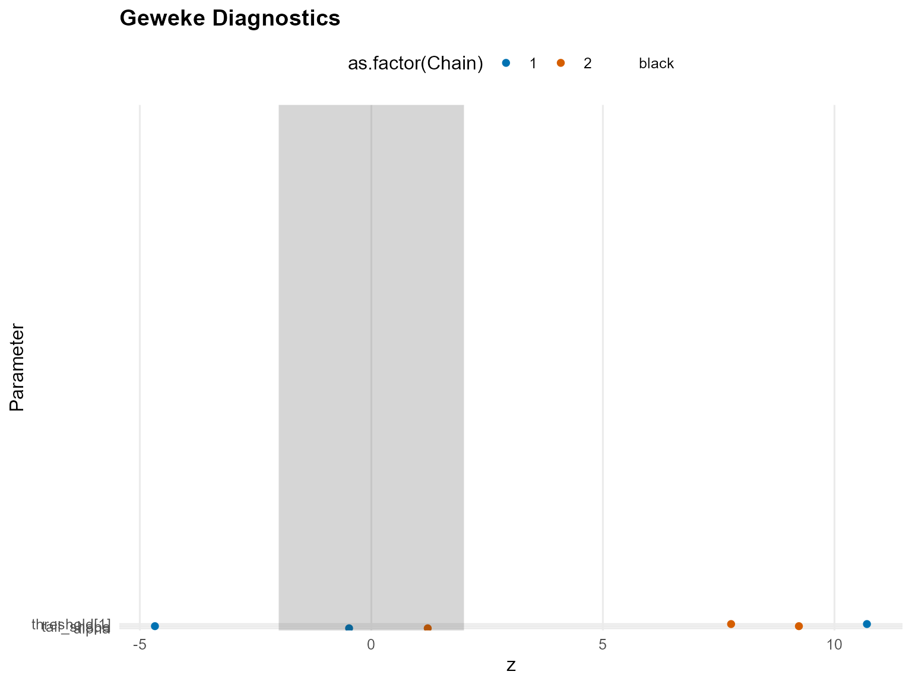
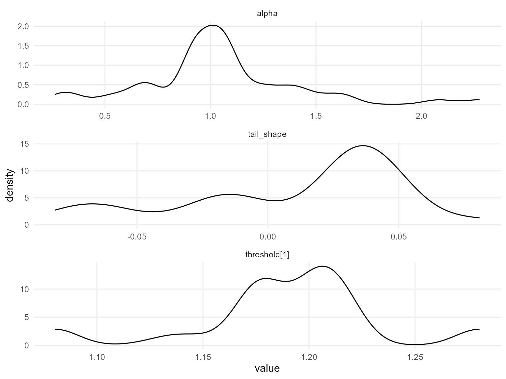
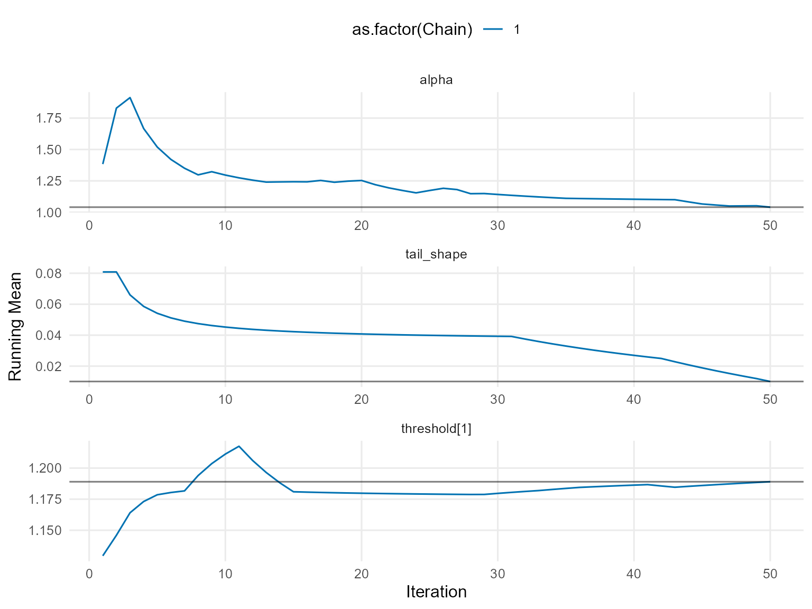
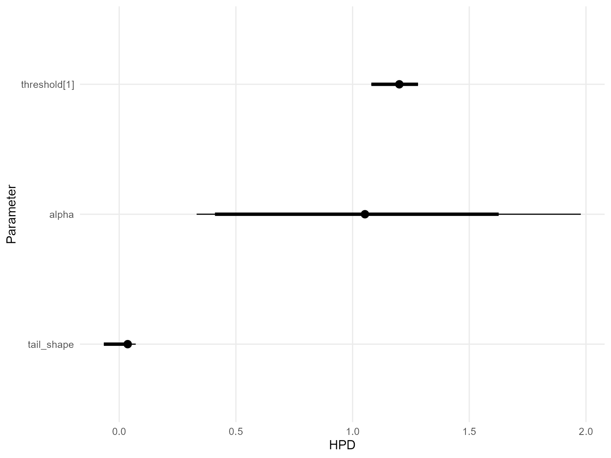

# 11. Conditional DPmixGPD with Stick-Breaking Backend

## Conditional DPmixGPD: Stick-Breaking Backend

**Purpose**: Apply fixed-component stick-breaking truncation to
covariate-dependent mixtures while keeping the GPD tail. This vignette
mirrors `v10` but with the SB backend.

------------------------------------------------------------------------

### Data Setup

``` r
data("nc_posX100_p5_k4")
y <- nc_posX100_p5_k4$y
X <- as.matrix(nc_posX100_p5_k4$X)
if (is.null(colnames(X))) {
  colnames(X) <- paste0("x", seq_len(ncol(X)))
}

summary_tbl <- tibble(
  statistic = c("N", "Mean", "SD", "Min", "Max"),
  value = c(length(y), mean(y), sd(y), min(y), max(y))
)

ggplot(data.frame(y = y, x1 = X[, 1]), aes(x = x1, y = y)) +
  geom_point(alpha = 0.6, color = "purple") +
  geom_smooth(method = "loess", color = "orange", fill = NA) +
  labs(title = "Tail Outcome vs x1 (SB)", x = "x1", y = "y") +
  theme_minimal()
```


| statistic |  value   |
|:---------:|:--------:|
|     N     | 100.0000 |
|   Mean    |  1.9420  |
|    SD     |  1.1460  |
|    Min    |  0.4877  |
|    Max    |  5.2780  |

Conditional Tail Summary (SB)

------------------------------------------------------------------------

### Threshold

``` r
u_threshold <- quantile(y, 0.85)

ggplot(data.frame(y = y), aes(x = y)) +
  geom_histogram(aes(y = after_stat(density)), bins = 40, fill = "lightgreen", alpha = 0.6, color = "black") +
  geom_vline(xintercept = u_threshold, linetype = "dashed", color = "black") +
  labs(title = "Threshold for SB tail (85%)", x = "y", y = "Density") +
  theme_minimal()
```


------------------------------------------------------------------------

### Model Specification

``` r
bundle_sb_cond_gpd_gamma <- build_nimble_bundle(
  y = y,
  X = X,
  kernel = "gamma",
  backend = "sb",
  GPD = TRUE,
  components = 5,
  param_specs = list(
    gpd = list(
      threshold = list(mode = "link", link = "exp")
    )
  ),
  mcmc = list(
    niter = 60,
    nburnin = 10,
    nchains = 2,
    thin = 1
  )
)

bundle_sb_cond_gpd_laplace <- build_nimble_bundle(
  y = y,
  X = X,
  kernel = "laplace",
  backend = "sb",
  GPD = TRUE,
  components = 5,
  param_specs = list(
    gpd = list(
      threshold = list(mode = "link", link = "exp")
    )
  ),
  mcmc = list(
    niter = 60,
    nburnin = 10,
    nchains = 1,
    thin = 1
  )
)
```

------------------------------------------------------------------------

### MCMC Execution

``` r
fit_sb_cond_gpd_gamma <- run_mcmc_bundle_manual(bundle_sb_cond_gpd_gamma)
[MCMC] Creating NIMBLE model...
[MCMC] NIMBLE model created successfully.
[MCMC] Configuring MCMC...
===== Monitors =====
thin = 1: alpha, beta_scale, beta_tail_scale, beta_threshold, shape, tail_shape, threshold, w, z
===== Samplers =====
RW sampler (46)
  - alpha
  - shape[]  (5 elements)
  - beta_scale[]  (25 elements)
  - beta_threshold[]  (5 elements)
  - beta_tail_scale[]  (5 elements)
  - tail_shape
  - v[]  (4 elements)
categorical sampler (100)
  - z[]  (100 elements)
[MCMC] MCMC configured.
[MCMC] Building MCMC object...
[MCMC] MCMC object built.
[MCMC] Attempting NIMBLE compilation (this may take a minute)...
[MCMC] Compiling model...
[MCMC] Compiling MCMC sampler...
[MCMC] Compilation successful.
|-------------|-------------|-------------|-------------|
|-------------------------------------------------------|
|-------------|-------------|-------------|-------------|
|-------------------------------------------------------|
[MCMC] MCMC execution complete. Processing results...
fit_sb_cond_gpd_laplace <- run_mcmc_bundle_manual(bundle_sb_cond_gpd_laplace)
[MCMC] Creating NIMBLE model...
[MCMC] NIMBLE model created successfully.
[MCMC] Configuring MCMC...
===== Monitors =====
thin = 1: alpha, beta_location, beta_tail_scale, beta_threshold, scale, tail_shape, threshold, w, z
===== Samplers =====
RW sampler (46)
  - alpha
  - scale[]  (5 elements)
  - beta_location[]  (25 elements)
  - beta_threshold[]  (5 elements)
  - beta_tail_scale[]  (5 elements)
  - tail_shape
  - v[]  (4 elements)
categorical sampler (100)
  - z[]  (100 elements)
[MCMC] MCMC configured.
[MCMC] Building MCMC object...
[MCMC] MCMC object built.
[MCMC] Attempting NIMBLE compilation (this may take a minute)...
[MCMC] Compiling model...
[MCMC] Compiling MCMC sampler...
[MCMC] Compilation successful.
|-------------|-------------|-------------|-------------|
|-------------------------------------------------------|
[MCMC] MCMC execution complete. Processing results...
summary(fit_sb_cond_gpd_gamma)
MixGPD summary | backend: Stick-Breaking Process | kernel: Gamma Distribution | GPD tail: TRUE | epsilon: 0.025
n = 100 | components = 5
Summary
Initial components: 5 | Components after truncation: 2

WAIC: 305.690
lppd: -129.826 | pWAIC: 23.019

Summary table
          parameter   mean    sd q0.025 q0.500 q0.975    ess
         weights[1]  0.549 0.046  0.465  0.550  0.645 58.547
         weights[2]  0.308 0.120  0.150  0.310  0.495  1.688
              alpha  1.171 0.587  0.290  1.116  2.434 13.116
   beta_scale[1, 1] -0.014 0.229 -0.540 -0.089  0.449  6.922
   beta_scale[2, 1] -0.565 1.626 -3.787  0.032  2.133  3.265
   beta_scale[3, 1] -1.599 1.131 -3.982 -1.297  0.108  9.612
   beta_scale[4, 1]  0.300 1.033 -1.172  0.104  2.421  7.332
   beta_scale[5, 1] -1.037 1.820 -4.129 -1.128  1.733  4.002
   beta_scale[1, 2] -0.148 0.536 -0.987 -0.129  1.114  7.671
   beta_scale[2, 2] -0.115 0.983 -2.906  0.097  1.074  8.020
   beta_scale[3, 2] -0.730 0.868 -2.336 -0.730  0.724 34.349
   beta_scale[4, 2]  1.505 1.878 -2.311  1.711  4.185  4.542
   beta_scale[5, 2] -0.570 1.283 -2.985 -0.477  2.191  6.122
   beta_scale[1, 3]  0.247 0.203 -0.212  0.327  0.543 30.663
   beta_scale[2, 3]  0.404 1.001 -0.794  0.191  2.226  9.173
   beta_scale[3, 3]  0.929 0.784 -0.785  1.045  2.012 11.749
   beta_scale[4, 3] -0.300 1.896 -3.943  0.034  2.997  7.237
   beta_scale[5, 3] -1.304 1.262 -3.204 -1.231  1.142  5.778
   beta_scale[1, 4]  0.136 0.503 -0.780  0.027  1.498  9.473
   beta_scale[2, 4]  0.618 1.243 -1.279  0.132  3.221  4.510
   beta_scale[3, 4]  0.216 2.060 -4.246  0.528  2.907  3.143
   beta_scale[4, 4]  0.628 1.738 -2.923  0.397  4.190  3.570
   beta_scale[5, 4]  2.261 2.111 -2.265  2.602  5.264  5.020
   beta_scale[1, 5] -0.007 0.204 -0.202 -0.063  0.513 11.462
   beta_scale[2, 5]  0.764 0.874 -0.415  0.453  2.869 14.252
   beta_scale[3, 5] -0.096 0.996 -2.457 -0.345  2.141 17.212
   beta_scale[4, 5]  0.998 1.024 -1.423  1.152  2.392 22.619
   beta_scale[5, 5]  1.060 1.113 -1.216  1.296  2.668 18.766
 beta_tail_scale[1]  0.090 0.117 -0.120  0.111  0.261  7.123
 beta_tail_scale[2] -0.154 0.207 -0.425 -0.181  0.294 76.877
 beta_tail_scale[3] -0.141 0.162 -0.423 -0.144  0.089  3.218
 beta_tail_scale[4]  0.488 0.226  0.092  0.508  0.729  3.009
 beta_tail_scale[5]  0.017 0.077 -0.123 -0.004  0.167  4.071
  beta_threshold[1] -0.077 0.114 -0.271  0.000  0.000  1.861
  beta_threshold[2] -0.207 0.088 -0.309 -0.235  0.000  6.404
  beta_threshold[3]  0.113 0.108 -0.018  0.110  0.263  3.017
  beta_threshold[4]  0.162 0.128 -0.099  0.198  0.264  3.694
  beta_threshold[5] -0.109 0.047 -0.164 -0.105 -0.035  1.929
         tail_shape -0.082 0.061 -0.164 -0.069  0.013  3.685
           shape[1]  2.327 0.329  1.812  2.270  3.149 19.322
           shape[2]  3.271 1.162  1.587  3.159  6.169 11.201
summary(fit_sb_cond_gpd_laplace)
MixGPD summary | backend: Stick-Breaking Process | kernel: Laplace Distribution | GPD tail: TRUE | epsilon: 0.025
n = 100 | components = 5
Summary
Initial components: 5 | Components after truncation: 3

WAIC: 346.655
lppd: -144.509 | pWAIC: 28.819

Summary table
           parameter   mean    sd q0.025 q0.500 q0.975    ess
          weights[1]  0.722 0.079  0.567  0.740  0.845  2.933
          weights[2]  0.117 0.031  0.070  0.110  0.186 50.000
          weights[3]  0.079 0.025  0.040  0.080  0.128  8.484
               alpha  1.041 0.380  0.332  1.053  1.978 30.903
 beta_location[1, 1]  0.270 0.262 -0.070  0.241  0.791  3.180
 beta_location[2, 1] -1.640 1.786 -4.059 -1.856  1.253  2.552
 beta_location[3, 1] -0.363 1.867 -3.921 -0.124  1.636  2.726
 beta_location[4, 1]  2.217 0.956  0.268  2.261  4.073  9.530
 beta_location[5, 1] -1.785 0.694 -3.073 -1.854 -0.611  9.296
 beta_location[1, 2]  0.324 0.268 -0.179  0.276  0.759  5.409
 beta_location[2, 2] -0.198 2.129 -3.664  0.423  2.516  2.197
 beta_location[3, 2] -0.685 1.206 -3.110 -0.649  1.375 10.043
 beta_location[4, 2] -0.170 1.199 -2.332 -0.048  2.273 11.226
 beta_location[5, 2]  1.403 1.362 -0.565  1.375  3.836  4.036
 beta_location[1, 3]  0.121 0.456 -0.574 -0.068  1.083  4.250
 beta_location[2, 3] -0.774 1.203 -2.971 -0.766  1.295 10.802
 beta_location[3, 3]  0.276 0.859 -1.477  0.234  1.726  3.515
 beta_location[4, 3]  0.235 1.526 -2.815  0.902  2.060  4.201
 beta_location[5, 3] -0.664 1.377 -2.984 -0.730  1.661  5.230
 beta_location[1, 4]  5.070 1.180  2.746  5.343  6.848  4.201
 beta_location[2, 4] -1.358 1.146 -3.175 -1.408  1.339  6.966
 beta_location[3, 4]  0.878 1.402 -1.407  0.748  3.433  2.476
 beta_location[4, 4]  1.612 2.253 -1.888  0.717  5.804  2.087
 beta_location[5, 4]  1.723 1.119 -0.436  1.923  4.027 12.323
 beta_location[1, 5]  0.236 0.200 -0.080  0.171  0.671  4.910
 beta_location[2, 5]  1.010 1.710 -1.620  1.569  3.264  1.834
 beta_location[3, 5]  3.604 1.725  1.487  3.365  6.357  1.731
 beta_location[4, 5] -0.111 0.660 -1.204  0.121  1.149 15.585
 beta_location[5, 5]  0.263 0.827 -1.080  0.246  1.845 16.751
  beta_tail_scale[1]  0.220 0.072  0.087  0.269  0.292  2.662
  beta_tail_scale[2]  0.050 0.188 -0.283  0.014  0.361 12.590
  beta_tail_scale[3] -0.045 0.076 -0.132 -0.018  0.075  2.883
  beta_tail_scale[4]  0.408 0.120  0.204  0.440  0.639 18.228
  beta_tail_scale[5] -0.015 0.110 -0.216 -0.010  0.207  6.801
   beta_threshold[1] -0.041 0.016 -0.047 -0.047  0.000  3.479
   beta_threshold[2]  0.108 0.018  0.066  0.117  0.128  9.667
   beta_threshold[3]  0.206 0.087 -0.057  0.234  0.267  8.983
   beta_threshold[4] -0.431 0.117 -0.497 -0.485 -0.245  3.786
   beta_threshold[5]  0.067 0.017  0.030  0.074  0.074  7.022
          tail_shape  0.010 0.042 -0.066  0.036  0.071  3.156
            scale[1]  0.747 0.304  0.443  0.642  1.715 21.018
            scale[2]  1.299 0.785  0.476  1.115  3.139  8.559
            scale[3]  1.774 0.922  0.476  1.687  3.372 20.475
```

``` r
params_sb_cond <- params(fit_sb_cond_gpd_gamma)
params_sb_cond
Posterior mean parameters

$alpha
[1] 1.171

$w
[1] 0.5486 0.3084

$shape
[1] 2.327 3.271

$beta_scale
           x1      x2      x3     x4      x5
comp1 -0.0138 -0.1480  0.2472 0.1364 -0.0069
comp2 -0.5647 -0.1148  0.4037 0.6177  0.7644
comp3 -1.5989 -0.7296  0.9287 0.2161 -0.0962
comp4  0.3001  1.5048 -0.3004 0.6282  0.9980
comp5 -1.0374 -0.5700 -1.3039 2.2614  1.0596

$beta_threshold
[1] -0.07676 -0.20650  0.11320  0.16240 -0.10860

$beta_tail_scale
[1]  0.09030 -0.15370 -0.14120  0.48790  0.01695

$tail_shape
[1] -0.08236
```

------------------------------------------------------------------------

### Conditional Predictions

``` r
X_new <- rbind(
  c(-1, 0, 0, 0, 0),
  c(0, 0, 0, 0, 0),
  c(1, 1, 0, 0, 0)
)
colnames(X_new) <- colnames(X)
y_grid <- seq(0, max(y) * 1.2, length.out = 200)

df_pred_gamma <- lapply(seq_len(nrow(X_new)), function(i) {
  pred <- predict(fit_sb_cond_gpd_gamma, x = as.matrix(X_new[i, , drop = FALSE]), y = y_grid, type = "density")
  data.frame(
    y = pred$fit$y,
    density = pred$fit$density,
    label = paste("x1=", X_new[i, 1], ", x2=", X_new[i, 2], sep = ""),
    model = "Gamma"
  )
})

df_pred_laplace <- lapply(seq_len(nrow(X_new)), function(i) {
  pred <- predict(fit_sb_cond_gpd_laplace, x = as.matrix(X_new[i, , drop = FALSE]), y = y_grid, type = "density")
  data.frame(
    y = pred$fit$y,
    density = pred$fit$density,
    label = paste("x1=", X_new[i, 1], ", x2=", X_new[i, 2], sep = ""),
    model = "Laplace"
  )
})

bind_rows(df_pred_gamma, df_pred_laplace) %>%
  ggplot(aes(x = y, y = density, color = label)) +
  geom_line(linewidth = 1) +
  facet_wrap(~ model) +
  labs(title = "Conditional Density (SB + GPD)", x = "y", y = "Density") +
  theme_minimal() +
  theme(legend.position = "bottom")
```



------------------------------------------------------------------------

### Tail Quantiles

``` r
X_grid <- cbind(x1 = seq(-1, 1, length.out = 5), x2 = 0, x3 = 0, x4 = 0, x5 = 0)
colnames(X_grid) <- colnames(X)
quant_probs <- c(0.90, 0.95)

pred_q_gamma <- predict(fit_sb_cond_gpd_gamma, x = as.matrix(X_grid), type = "quantile", index = quant_probs)
pred_q_laplace <- predict(fit_sb_cond_gpd_laplace, x = as.matrix(X_grid), type = "quantile", index = quant_probs)

quant_df_gamma <- pred_q_gamma$fit
quant_df_gamma$x1 <- X_grid[quant_df_gamma$id, "x1"]
quant_df_gamma$model <- "Gamma"

quant_df_laplace <- pred_q_laplace$fit
quant_df_laplace$x1 <- X_grid[quant_df_laplace$id, "x1"]
quant_df_laplace$model <- "Laplace"

bind_rows(quant_df_gamma, quant_df_laplace) %>%
  ggplot(aes(x = x1, y = estimate, color = factor(index), group = index)) +
  geom_line(linewidth = 1) +
  geom_point(size = 2) +
  facet_wrap(~ model) +
  labs(title = "Tail Quantiles vs x1 (SB)", x = "x1", y = "Quantile", color = "Probability") +
  theme_minimal()
```



------------------------------------------------------------------------

### Residuals & Diagnostics

``` r
plot(fitted(fit_sb_cond_gpd_gamma))
```



``` r
plot(fit_sb_cond_gpd_gamma, family = c("traceplot", "autocorrelation", "geweke"))

=== traceplot ===
```



    === autocorrelation ===



    === geweke ===



``` r
plot(fit_sb_cond_gpd_laplace, family = c("density", "running", "caterpillar"))

=== density ===
```



    === running ===



    === caterpillar ===



------------------------------------------------------------------------

### Takeaways

- Conditional stick-breaking mixtures capture covariate-dependent bulk
  structure while the GPD handles extremes.
- [`predict()`](https://rdrr.io/r/stats/predict.html) and
  [`plot()`](https://rdrr.io/r/graphics/plot.default.html) remain
  consistent for densities, quantiles, and residuals.
- Expect threshold-selected tail quantiles to shift with `x1` even when
  `components` is fixed.
- Next: move into causal models starting with same-backend CRP (v12).
