# 12. Conditional DPmixGPD with CRP Backend

## Conditional DPmixGPD: CRP Backend with Tail Augmentation

**Purpose**: Combine conditional modeling with GPD tail augmentation so
each covariate slice inherits both mixture bulk and tail behavior. This
extends the unconditional GPD (v06) and conditional DP (v08).

------------------------------------------------------------------------

### Data Setup

``` r
data("nc_posX100_p5_k4")
y <- nc_posX100_p5_k4$y
X <- as.matrix(nc_posX100_p5_k4$X)
if (is.null(colnames(X))) {
  colnames(X) <- paste0("x", seq_len(ncol(X)))
}

summary_tbl <- tibble(
  statistic = c("N", "Mean", "SD", "Min", "Max"),
  value = c(length(y), mean(y), sd(y), min(y), max(y))
)

ggplot(data.frame(y = y, x1 = X[, 1]), aes(x = x1, y = y)) +
  geom_point(alpha = 0.5, color = "darkgreen") +
  geom_smooth(method = "loess", color = "steelblue", fill = NA) +
  labs(title = "Outcome vs X1 (Tail dataset)", x = "X1", y = "y") +
  theme_minimal()
```


| statistic |  value   |
|:---------:|:--------:|
|     N     | 100.0000 |
|   Mean    |  1.9420  |
|    SD     |  1.1460  |
|    Min    |  0.4877  |
|    Max    |  5.2780  |

Conditional Tail Dataset Summary

------------------------------------------------------------------------

### Threshold Selection

``` r
u_threshold <- quantile(y, 0.85)

ggplot(data.frame(y = y), aes(x = y)) +
  geom_histogram(aes(y = after_stat(density)), bins = 40, fill = "magenta", alpha = 0.6, color = "black") +
  geom_vline(xintercept = u_threshold, linetype = "dashed", color = "black") +
  labs(title = paste("Threshold at", signif(u_threshold, 3)), x = "y", y = "Density") +
  theme_minimal()
```

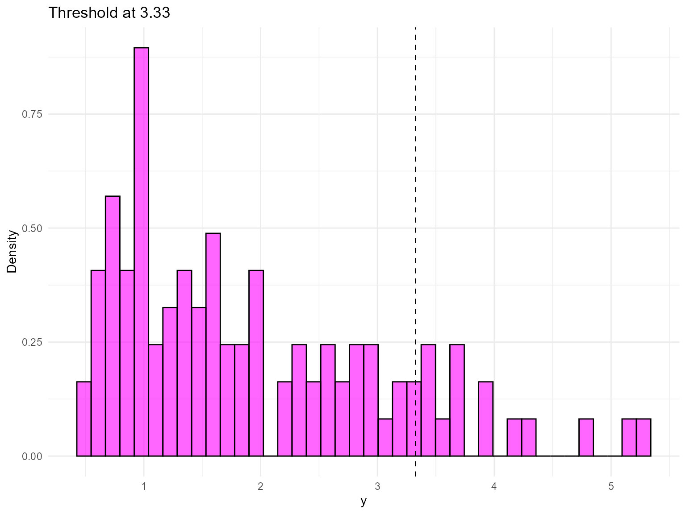

------------------------------------------------------------------------

### Model Specification & Bundle

``` r
bundle_cond_gpd_lognormal <- build_nimble_bundle(
  y = y,
  X = X,
  kernel = "lognormal",
  backend = "crp",
  GPD = TRUE,
  components = 5,
  param_specs = list(
    gpd = list(
      threshold = list(mode = "link", link = "exp")
    )
  ),
  mcmc = list(
    niter = 60,
    nburnin = 10,
    nchains = 2,
    thin = 1
  )
)

bundle_cond_gpd_normal <- build_nimble_bundle(
  y = y,
  X = X,
  kernel = "normal",
  backend = "crp",
  GPD = TRUE,
  components = 5,
  param_specs = list(
    gpd = list(
      threshold = list(mode = "link", link = "exp")
    )
  ),
  mcmc = list(
    niter = 60,
    nburnin = 10,
    nchains = 1,
    thin = 1
  )
)
```

------------------------------------------------------------------------

### Running MCMC

``` r
fit_cond_gpd_lognormal <- run_mcmc_bundle_manual(bundle_cond_gpd_lognormal)
[MCMC] Creating NIMBLE model...
[MCMC] NIMBLE model created successfully.
[MCMC] Configuring MCMC...
===== Monitors =====
thin = 1: alpha, beta_tail_scale, beta_threshold, meanlog, sdlog, tail_shape, threshold, z
===== Samplers =====
RW sampler (11)
  - beta_threshold[]  (5 elements)
  - beta_tail_scale[]  (5 elements)
  - tail_shape
CRP_concentration sampler (1)
  - alpha
CRP_cluster_wrapper sampler (10)
  - meanlog[]  (5 elements)
  - sdlog[]  (5 elements)
CRP sampler (1)
  - z[1:100] 
[MCMC] MCMC configured.
[MCMC] Building MCMC object...
[MCMC] MCMC object built.
[MCMC] Attempting NIMBLE compilation (this may take a minute)...
[MCMC] Compiling model...
[MCMC] Compiling MCMC sampler...
[MCMC] Compilation successful.
|-------------|-------------|-------------|-------------|
|  [Warning] CRP_sampler: This MCMC is not for a proper model. The MCMC attempted to use more components than the number of cluster parameters. Please increase the number of cluster parameters.
-------------------------------------------------------|
|-------------|-------------|-------------|-------------|
|  [Warning] CRP_sampler: This MCMC is not for a proper model. The MCMC attempted to use more components than the number of cluster parameters. Please increase the number of cluster parameters.
-------------------------------------------------------|
[MCMC] MCMC execution complete. Processing results...
fit_cond_gpd_normal <- run_mcmc_bundle_manual(bundle_cond_gpd_normal)
[MCMC] Creating NIMBLE model...
[MCMC] NIMBLE model created successfully.
[MCMC] Configuring MCMC...
===== Monitors =====
thin = 1: alpha, beta_tail_scale, beta_threshold, mean, sd, tail_shape, threshold, z
===== Samplers =====
RW sampler (11)
  - beta_threshold[]  (5 elements)
  - beta_tail_scale[]  (5 elements)
  - tail_shape
CRP_concentration sampler (1)
  - alpha
CRP_cluster_wrapper sampler (10)
  - mean[]  (5 elements)
  - sd[]  (5 elements)
CRP sampler (1)
  - z[1:100] 
[MCMC] MCMC configured.
[MCMC] Building MCMC object...
[MCMC] MCMC object built.
[MCMC] Attempting NIMBLE compilation (this may take a minute)...
[MCMC] Compiling model...
[MCMC] Compiling MCMC sampler...
[MCMC] Compilation successful.
|-------------|-------------|-------------|-------------|
|  [Warning] CRP_sampler: This MCMC is not for a proper model. The MCMC attempted to use more components than the number of cluster parameters. Please increase the number of cluster parameters.
-------------------------------------------------------|
[MCMC] MCMC execution complete. Processing results...
summary(fit_cond_gpd_lognormal)
MixGPD summary | backend: Chinese Restaurant Process | kernel: Lognormal Distribution | GPD tail: TRUE | epsilon: 0.025
n = 100 | components = 5
Summary
Initial components: 5 | Components after truncation: 1

WAIC: 280.821
lppd: -129.907 | pWAIC: 10.503

Summary table
          parameter   mean    sd q0.025 q0.500 q0.975    ess
         weights[1]  0.854 0.165  0.530  0.920  1.000  7.194
              alpha  0.357 0.325  0.004  0.255  1.176 26.812
 beta_tail_scale[1]  0.141 0.142 -0.054  0.119  0.387  5.815
 beta_tail_scale[2] -0.130 0.160 -0.462 -0.084  0.096 12.968
 beta_tail_scale[3] -0.062 0.114 -0.297 -0.042  0.090  6.482
 beta_tail_scale[4]  0.535 0.300  0.002  0.661  0.983  7.368
 beta_tail_scale[5] -0.019 0.096 -0.128 -0.068  0.120  2.050
  beta_threshold[1] -0.090 0.082 -0.267 -0.102  0.066 16.049
  beta_threshold[2] -0.183 0.195 -0.496 -0.251  0.187 10.149
  beta_threshold[3]  0.003 0.103 -0.277  0.000  0.198  7.372
  beta_threshold[4] -0.063 0.165 -0.313 -0.074  0.279 15.436
  beta_threshold[5]  0.215 0.108  0.000  0.207  0.424  6.183
         tail_shape -0.054 0.151 -0.233 -0.099  0.203  8.284
         meanlog[1]  0.340 0.094  0.185  0.373  0.468  5.732
           sdlog[1]  0.475 0.066  0.384  0.475  0.549  2.585
summary(fit_cond_gpd_normal)
MixGPD summary | backend: Chinese Restaurant Process | kernel: Normal Distribution | GPD tail: TRUE | epsilon: 0.025
n = 100 | components = 5
Summary
Initial components: 5 | Components after truncation: 1

WAIC: 299.774
lppd: -142.616 | pWAIC: 7.271

Summary table
          parameter   mean    sd q0.025 q0.500 q0.975    ess
         weights[1]  0.972 0.054  0.806  1.000  1.000  6.603
              alpha  0.306 0.267  0.030  0.213  0.910 50.000
 beta_tail_scale[1]  0.046 0.101 -0.175  0.114  0.114  4.138
 beta_tail_scale[2] -0.109 0.221 -0.489 -0.087  0.397 37.483
 beta_tail_scale[3]  0.001 0.098 -0.180  0.009  0.146  4.940
 beta_tail_scale[4]  0.478 0.223  0.002  0.365  0.801  8.102
 beta_tail_scale[5]  0.030 0.100 -0.067 -0.001  0.199  2.723
  beta_threshold[1] -0.028 0.035 -0.078 -0.017  0.030  4.266
  beta_threshold[2] -0.369 0.135 -0.600 -0.273 -0.273  2.785
  beta_threshold[3]  0.094 0.034  0.040  0.082  0.140  3.437
  beta_threshold[4] -0.013 0.070 -0.153  0.022  0.045  2.918
  beta_threshold[5] -0.363 0.036 -0.388 -0.380 -0.268  3.443
         tail_shape  0.037 0.045 -0.007  0.022  0.137  2.212
            mean[1]  2.152 0.242  1.729  2.157  2.539  6.466
              sd[1]  0.994 0.185  0.768  0.954  1.387  5.172
```

``` r
params_cond_gpd <- params(fit_cond_gpd_lognormal)
params_cond_gpd
Posterior mean parameters

$alpha
[1] 0.3566

$w
[1] 0.854

$meanlog
[1] 0.3403

$sdlog
[1] 0.4748

$beta_threshold
[1] -0.09036 -0.18320  0.00305 -0.06328  0.21510

$beta_tail_scale
[1]  0.14060 -0.12980 -0.06193  0.53510 -0.01877

$tail_shape
[1] -0.05416
```

------------------------------------------------------------------------

### Conditional Tail-aware Predictions

``` r
X_new <- rbind(
  c(-1, 0, 0, 0, 0),
  c(0, 0, 0, 0, 0),
  c(1, 1, 0, 0, 0)
)
colnames(X_new) <- colnames(X)
y_grid <- seq(0, max(y) * 1.2, length.out = 200)

df_pred_lognormal <- lapply(seq_len(nrow(X_new)), function(i) {
  pred <- predict(fit_cond_gpd_lognormal, x = as.matrix(X_new[i, , drop = FALSE]), y = y_grid, type = "density")
  data.frame(
    y = pred$fit$y,
    density = pred$fit$density,
    label = paste("x1=", X_new[i, 1], ", x2=", X_new[i, 2], sep = ""),
    model = "Lognormal"
  )
})

df_pred_normal <- lapply(seq_len(nrow(X_new)), function(i) {
  pred <- predict(fit_cond_gpd_normal, x = as.matrix(X_new[i, , drop = FALSE]), y = y_grid, type = "density")
  data.frame(
    y = pred$fit$y,
    density = pred$fit$density,
    label = paste("x1=", X_new[i, 1], ", x2=", X_new[i, 2], sep = ""),
    model = "Normal"
  )
})

bind_rows(df_pred_lognormal, df_pred_normal) %>%
  ggplot(aes(x = y, y = density, color = label)) +
  geom_line(linewidth = 1) +
  facet_wrap(~ model) +
  labs(title = "Conditional Density with GPD Tail", x = "y", y = "Density") +
  theme_minimal() +
  theme(legend.position = "bottom")
```

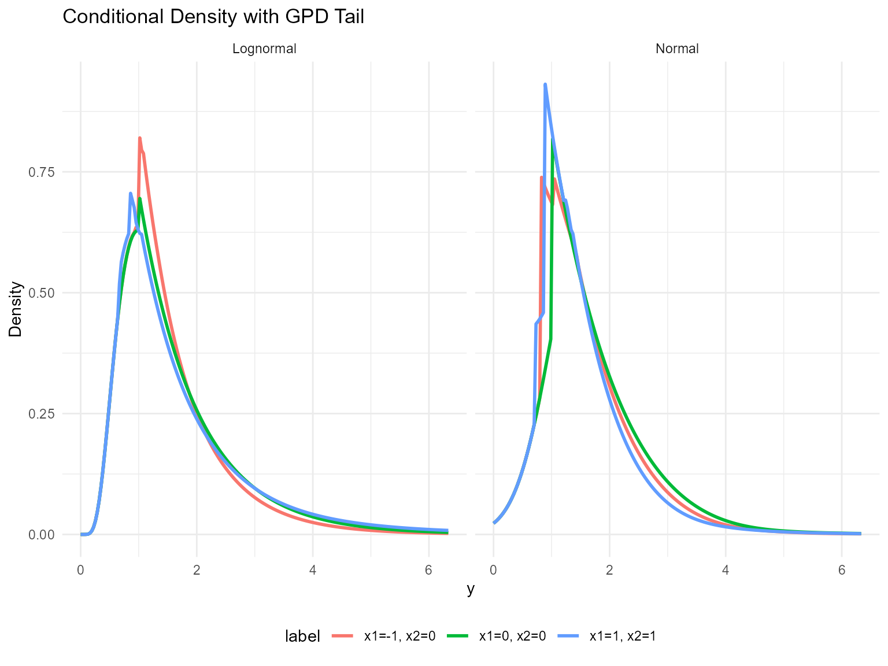

------------------------------------------------------------------------

### Tail Quantiles vs Covariates

``` r
X_grid <- cbind(x1 = seq(-1, 1, length.out = 5), x2 = 0, x3 = 0, x4 = 0, x5 = 0)
colnames(X_grid) <- colnames(X)
quant_probs <- c(0.90, 0.95)

pred_q_lognormal <- predict(fit_cond_gpd_lognormal, x = as.matrix(X_grid), type = "quantile", index = quant_probs)
pred_q_normal <- predict(fit_cond_gpd_normal, x = as.matrix(X_grid), type = "quantile", index = quant_probs)

quant_df_lognormal <- pred_q_lognormal$fit
quant_df_lognormal$x1 <- X_grid[quant_df_lognormal$id, "x1"]
quant_df_lognormal$model <- "Lognormal"

quant_df_normal <- pred_q_normal$fit
quant_df_normal$x1 <- X_grid[quant_df_normal$id, "x1"]
quant_df_normal$model <- "Normal"

bind_rows(quant_df_lognormal, quant_df_normal) %>%
  ggplot(aes(x = x1, y = estimate, color = factor(index), group = index)) +
  geom_line(linewidth = 1) +
  geom_point(size = 2) +
  facet_wrap(~ model) +
  labs(title = "Tail Quantiles vs x1 (CRP)", x = "x1", y = "Quantile", color = "Probability") +
  theme_minimal()
```

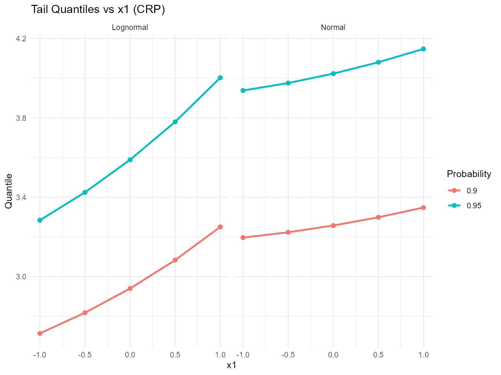

------------------------------------------------------------------------

### Residuals & Diagnostics

``` r
plot(fitted(fit_cond_gpd_lognormal))
```

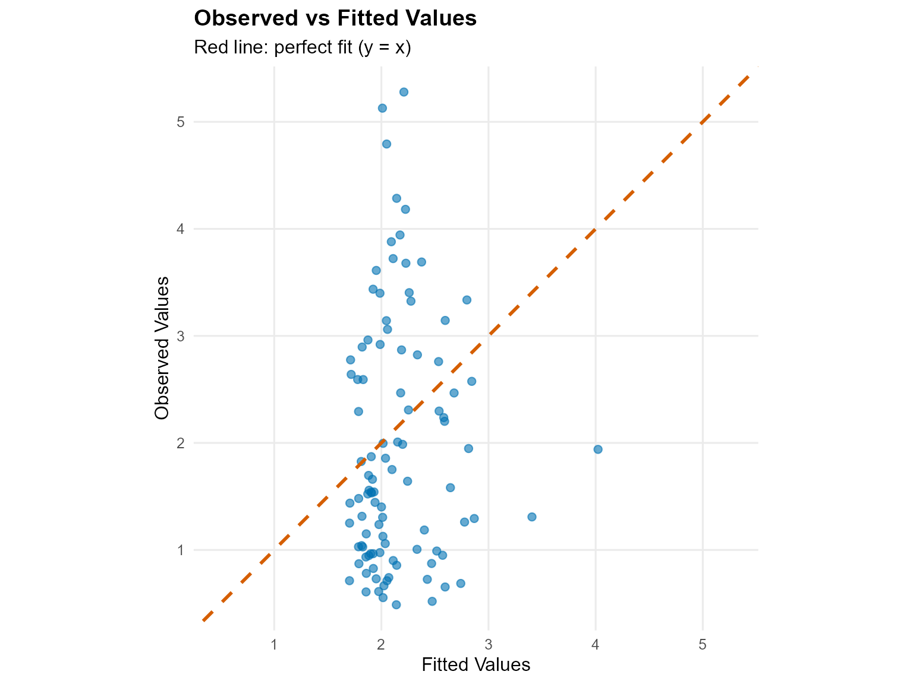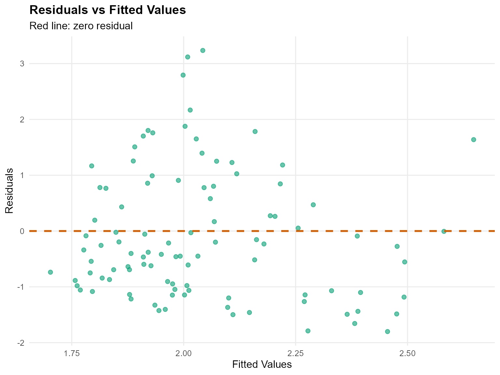

``` r
plot(fit_cond_gpd_lognormal, family = c("traceplot", "density", "autocorrelation"))

=== traceplot ===
```

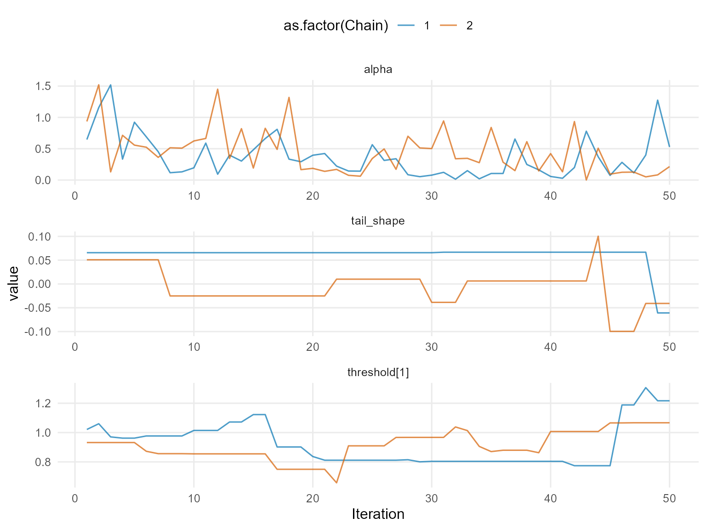

    === density ===

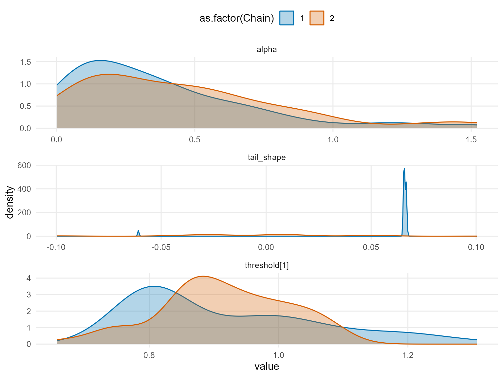

    === autocorrelation ===

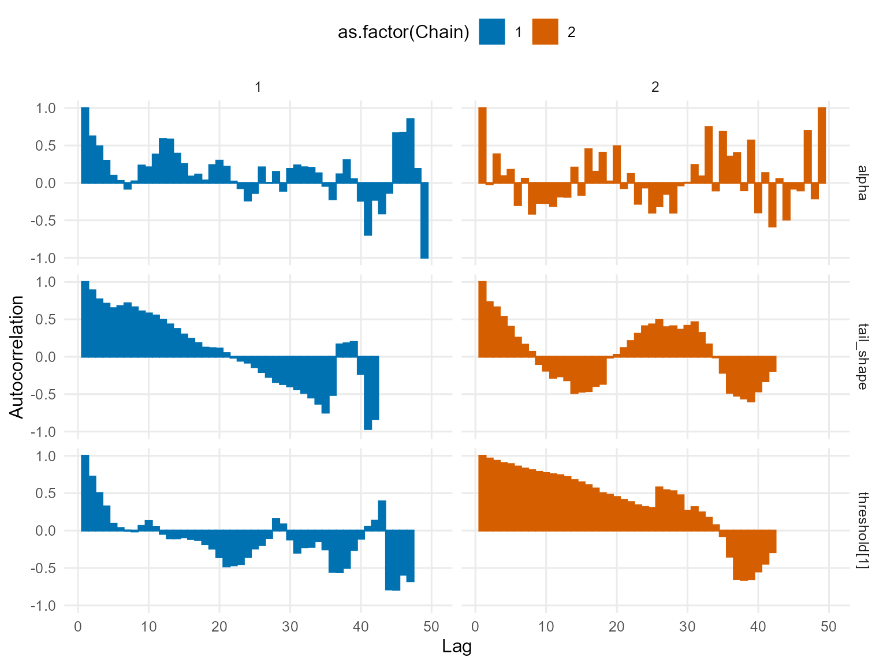

``` r
plot(fit_cond_gpd_normal, family = c("running", "geweke", "caterpillar"))

=== running ===
```

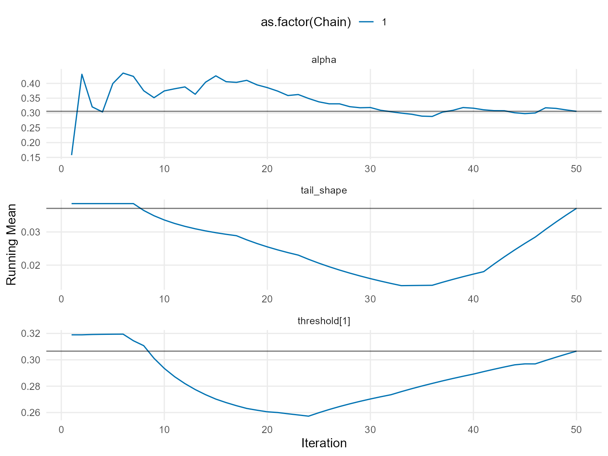

    === geweke ===

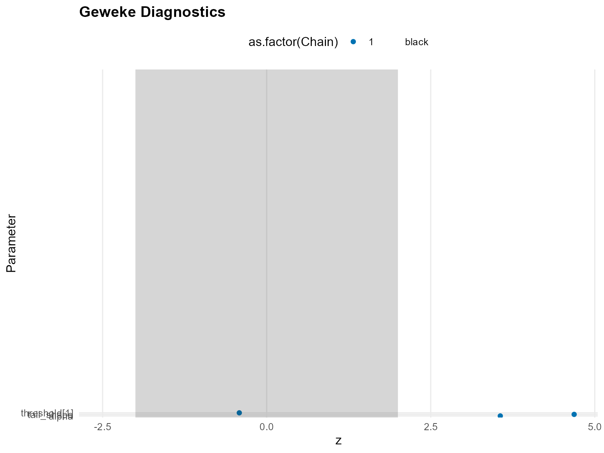

    === caterpillar ===

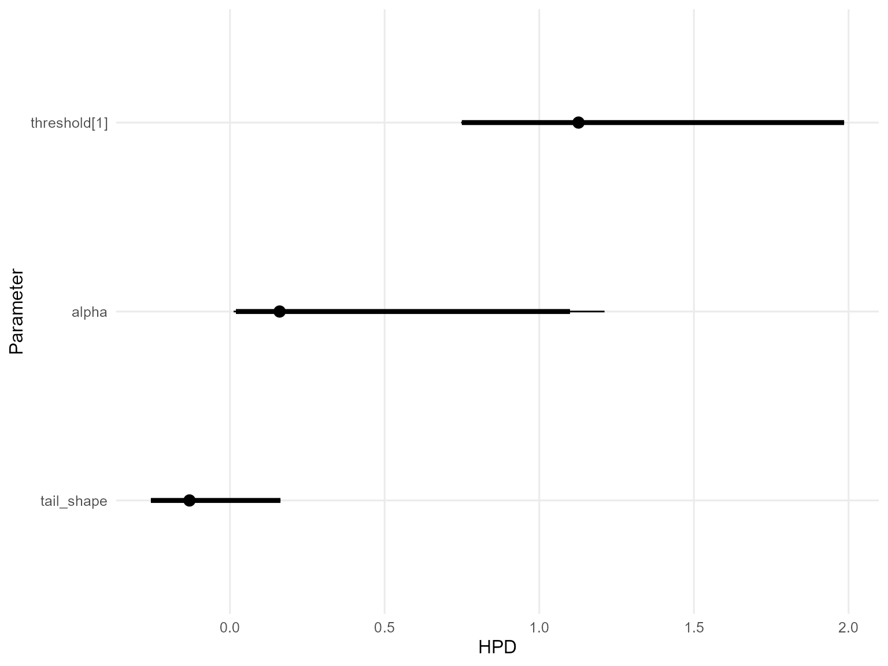

------------------------------------------------------------------------

### Takeaways

- Conditional DPmix with a GPD tail lets posterior-mean extreme
  quantiles vary with covariates.
- The CRP backend samples the bulk and tail jointly while thresholding
  at the 85th percentile.
- [`predict()`](https://rdrr.io/r/stats/predict.html) +
  [`plot()`](https://rdrr.io/r/graphics/plot.default.html) remain the
  main tools for densities, survival curves, and quantiles; residual
  diagnostics check fit quality.
- Next: Mirror this workflow with the SB backend in `v11`.
