# 13. Conditional DPmixGPD with Stick-Breaking Backend

## Conditional DPmixGPD: Stick-Breaking Backend

**Purpose**: Apply fixed-component stick-breaking truncation to
covariate-dependent mixtures while keeping the GPD tail. This vignette
mirrors `v10` but with the SB backend.

------------------------------------------------------------------------

### Data Setup

``` r
data("nc_posX100_p5_k4")
y <- nc_posX100_p5_k4$y
X <- as.matrix(nc_posX100_p5_k4$X)
if (is.null(colnames(X))) {
  colnames(X) <- paste0("x", seq_len(ncol(X)))
}

summary_tbl <- tibble(
  statistic = c("N", "Mean", "SD", "Min", "Max"),
  value = c(length(y), mean(y), sd(y), min(y), max(y))
)

ggplot(data.frame(y = y, x1 = X[, 1]), aes(x = x1, y = y)) +
  geom_point(alpha = 0.6, color = "purple") +
  geom_smooth(method = "loess", color = "orange", fill = NA) +
  labs(title = "Tail Outcome vs x1 (SB)", x = "x1", y = "y") +
  theme_minimal()
```

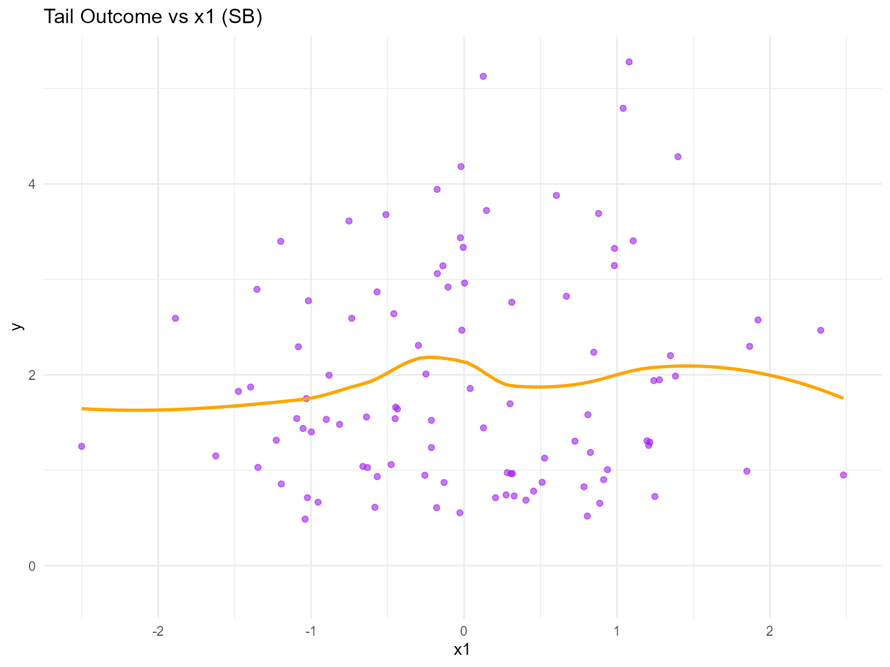

| statistic |  value   |
|:---------:|:--------:|
|     N     | 100.0000 |
|   Mean    |  1.9420  |
|    SD     |  1.1460  |
|    Min    |  0.4877  |
|    Max    |  5.2780  |

Conditional Tail Summary (SB)

------------------------------------------------------------------------

### Threshold

``` r
u_threshold <- quantile(y, 0.85)

ggplot(data.frame(y = y), aes(x = y)) +
  geom_histogram(aes(y = after_stat(density)), bins = 40, fill = "lightgreen", alpha = 0.6, color = "black") +
  geom_vline(xintercept = u_threshold, linetype = "dashed", color = "black") +
  labs(title = "Threshold for SB tail (85%)", x = "y", y = "Density") +
  theme_minimal()
```

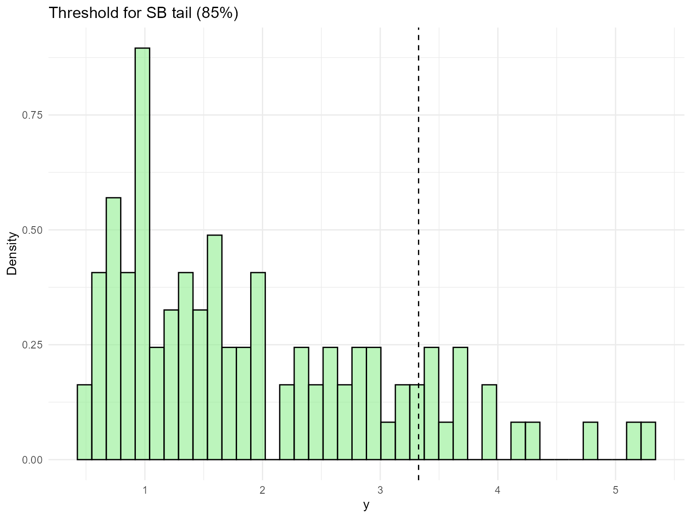

------------------------------------------------------------------------

### Model Specification

``` r
bundle_sb_cond_gpd_gamma <- build_nimble_bundle(
  y = y,
  X = X,
  kernel = "gamma",
  backend = "sb",
  GPD = TRUE,
  components = 5,
  param_specs = list(
    gpd = list(
      threshold = list(mode = "link", link = "exp")
    )
  ),
  mcmc = list(
    niter = 60,
    nburnin = 10,
    nchains = 2,
    thin = 1
  )
)

bundle_sb_cond_gpd_laplace <- build_nimble_bundle(
  y = y,
  X = X,
  kernel = "laplace",
  backend = "sb",
  GPD = TRUE,
  components = 5,
  param_specs = list(
    gpd = list(
      threshold = list(mode = "link", link = "exp")
    )
  ),
  mcmc = list(
    niter = 60,
    nburnin = 10,
    nchains = 1,
    thin = 1
  )
)
```

------------------------------------------------------------------------

### MCMC Execution

``` r
fit_sb_cond_gpd_gamma <- run_mcmc_bundle_manual(bundle_sb_cond_gpd_gamma)
[MCMC] Creating NIMBLE model...
[MCMC] NIMBLE model created successfully.
[MCMC] Configuring MCMC...
===== Monitors =====
thin = 1: alpha, beta_scale, beta_tail_scale, beta_threshold, shape, tail_shape, threshold, w, z
===== Samplers =====
RW sampler (46)
  - alpha
  - shape[]  (5 elements)
  - beta_scale[]  (25 elements)
  - beta_threshold[]  (5 elements)
  - beta_tail_scale[]  (5 elements)
  - tail_shape
  - v[]  (4 elements)
categorical sampler (100)
  - z[]  (100 elements)
[MCMC] MCMC configured.
[MCMC] Building MCMC object...
[MCMC] MCMC object built.
[MCMC] Attempting NIMBLE compilation (this may take a minute)...
[MCMC] Compiling model...
[MCMC] Compiling MCMC sampler...
[MCMC] Compilation successful.
|-------------|-------------|-------------|-------------|
|-------------------------------------------------------|
|-------------|-------------|-------------|-------------|
|-------------------------------------------------------|
[MCMC] MCMC execution complete. Processing results...
fit_sb_cond_gpd_laplace <- run_mcmc_bundle_manual(bundle_sb_cond_gpd_laplace)
[MCMC] Creating NIMBLE model...
[MCMC] NIMBLE model created successfully.
[MCMC] Configuring MCMC...
===== Monitors =====
thin = 1: alpha, beta_location, beta_tail_scale, beta_threshold, scale, tail_shape, threshold, w, z
===== Samplers =====
RW sampler (46)
  - alpha
  - scale[]  (5 elements)
  - beta_location[]  (25 elements)
  - beta_threshold[]  (5 elements)
  - beta_tail_scale[]  (5 elements)
  - tail_shape
  - v[]  (4 elements)
categorical sampler (100)
  - z[]  (100 elements)
[MCMC] MCMC configured.
[MCMC] Building MCMC object...
[MCMC] MCMC object built.
[MCMC] Attempting NIMBLE compilation (this may take a minute)...
[MCMC] Compiling model...
[MCMC] Compiling MCMC sampler...
[MCMC] Compilation successful.
|-------------|-------------|-------------|-------------|
|-------------------------------------------------------|
[MCMC] MCMC execution complete. Processing results...
summary(fit_sb_cond_gpd_gamma)
MixGPD summary | backend: Stick-Breaking Process | kernel: Gamma Distribution | GPD tail: TRUE | epsilon: 0.025
n = 100 | components = 5
Summary
Initial components: 5 | Components after truncation: 2

WAIC: 290.229
lppd: -125.028 | pWAIC: 20.087

Summary table
          parameter   mean    sd q0.025 q0.500 q0.975    ess
         weights[1]  0.595 0.071  0.480  0.590  0.715  9.123
         weights[2]  0.338 0.091  0.170  0.320  0.500  4.489
              alpha  0.952 0.622  0.135  0.859  2.292  9.679
   beta_scale[1, 1] -0.090 0.344 -0.697 -0.013  0.503  8.951
   beta_scale[2, 1]  0.177 0.351 -0.331  0.088  1.001  5.614
   beta_scale[3, 1]  0.341 1.245 -2.016  0.122  2.995  8.987
   beta_scale[4, 1]  0.000 1.752 -2.982  0.043  3.328  4.598
   beta_scale[5, 1]  0.179 1.306 -1.948  0.246  2.847  9.174
   beta_scale[1, 2] -0.330 0.688 -1.241 -0.453  1.055  8.269
   beta_scale[2, 2]  1.113 0.632 -0.209  1.273  1.927  5.144
   beta_scale[3, 2]  1.031 2.456 -2.492  0.692  6.652  6.562
   beta_scale[4, 2]  0.550 1.674 -3.603  0.370  3.396  8.257
   beta_scale[5, 2]  0.819 2.241 -2.502  0.479  5.535  3.941
   beta_scale[1, 3]  0.374 0.317 -0.340  0.515  0.828 32.790
   beta_scale[2, 3] -0.096 0.294 -0.563 -0.124  0.540 13.312
   beta_scale[3, 3]  0.594 1.349 -1.711  0.669  2.940  8.583
   beta_scale[4, 3] -0.272 2.069 -3.487 -0.301  3.703  5.721
   beta_scale[5, 3]  0.123 1.688 -3.213 -0.290  3.705  4.301
   beta_scale[1, 4]  0.095 0.946 -2.030  0.041  1.918  4.029
   beta_scale[2, 4]  0.298 1.309 -2.026 -0.211  2.643  4.121
   beta_scale[3, 4]  0.499 2.348 -5.240  0.895  4.465  4.541
   beta_scale[4, 4] -0.990 1.131 -2.777 -0.915  1.091 12.853
   beta_scale[5, 4] -0.535 1.954 -4.184 -0.487  3.085  5.162
   beta_scale[1, 5]  0.350 0.300 -0.218  0.268  0.956 17.102
   beta_scale[2, 5]  0.104 0.300 -0.259 -0.018  0.775  7.429
   beta_scale[3, 5] -1.964 1.658 -5.188 -1.765  0.352  6.723
   beta_scale[4, 5]  1.238 1.094 -1.032  1.316  3.062 11.753
   beta_scale[5, 5]  0.618 1.276 -1.833  0.577  3.126 28.451
 beta_tail_scale[1]  0.120 0.111 -0.031  0.139  0.440 18.377
 beta_tail_scale[2] -0.107 0.267 -0.508 -0.128  0.372  8.324
 beta_tail_scale[3] -0.016 0.076 -0.160 -0.033  0.075 15.493
 beta_tail_scale[4]  0.465 0.228  0.058  0.437  0.855  9.806
 beta_tail_scale[5]  0.034 0.137 -0.221  0.045  0.234  9.612
  beta_threshold[1]  0.037 0.042 -0.007  0.023  0.097  2.837
  beta_threshold[2] -0.311 0.052 -0.366 -0.314 -0.209  2.207
  beta_threshold[3] -0.033 0.073 -0.208 -0.077  0.061  3.481
  beta_threshold[4]  0.105 0.198 -0.062  0.000  0.434  2.254
  beta_threshold[5] -0.121 0.082 -0.213 -0.071  0.000  2.387
         tail_shape -0.054 0.079 -0.228 -0.037  0.150 13.606
           shape[1]  2.839 0.951  2.167  2.410  5.663 16.409
           shape[2]  3.889 1.312  1.986  3.596  6.142 10.085
summary(fit_sb_cond_gpd_laplace)
MixGPD summary | backend: Stick-Breaking Process | kernel: Laplace Distribution | GPD tail: TRUE | epsilon: 0.025
n = 100 | components = 5
Summary
Initial components: 5 | Components after truncation: 2

WAIC: 362.926
lppd: -152.707 | pWAIC: 28.757

Summary table
           parameter   mean    sd q0.025 q0.500 q0.975    ess
          weights[1]  0.797 0.075  0.640  0.820  0.880  5.867
          weights[2]  0.141 0.047  0.070  0.140  0.236 18.057
               alpha  1.143 0.509  0.402  1.077  2.014 15.726
 beta_location[1, 1]  0.888 0.273  0.325  0.887  1.247  5.249
 beta_location[2, 1]  0.333 1.384 -1.403  0.161  2.896  2.320
 beta_location[3, 1]  1.774 1.727 -1.061  1.837  4.554  3.040
 beta_location[4, 1]  1.880 1.860 -1.284  1.568  4.918  4.976
 beta_location[5, 1] -0.839 1.191 -2.225 -1.123  2.293 24.311
 beta_location[1, 2]  0.927 1.022 -0.965  1.440  2.498  3.226
 beta_location[2, 2] -0.230 0.933 -2.114 -0.304  1.320  9.106
 beta_location[3, 2] -0.880 1.852 -4.307 -0.096  1.430  2.674
 beta_location[4, 2] -0.200 1.353 -2.947  0.062  1.604  4.442
 beta_location[5, 2] -2.168 1.430 -4.809 -2.164  0.515  6.019
 beta_location[1, 3]  0.270 0.652 -0.626  0.336  1.777  5.426
 beta_location[2, 3] -0.659 1.463 -3.890 -0.715  1.756  2.593
 beta_location[3, 3] -1.721 1.020 -3.377 -1.788  0.055  3.786
 beta_location[4, 3]  2.738 1.426 -0.295  2.621  4.924  4.744
 beta_location[5, 3] -0.867 1.361 -3.054 -0.987  1.005  5.497
 beta_location[1, 4]  5.135 0.845  3.656  5.072  6.679  7.584
 beta_location[2, 4]  2.527 1.315  0.298  2.697  4.468  5.184
 beta_location[3, 4]  0.643 0.968 -0.804  0.522  2.192  5.644
 beta_location[4, 4] -0.591 1.645 -3.843 -0.205  1.705  3.888
 beta_location[5, 4]  0.706 1.231 -2.047  1.037  2.431  5.889
 beta_location[1, 5]  1.064 0.468  0.149  1.178  1.649  5.125
 beta_location[2, 5]  0.299 1.413 -1.814 -0.075  3.091  2.143
 beta_location[3, 5]  0.421 1.059 -1.252  0.231  2.513  6.817
 beta_location[4, 5]  0.207 1.569 -2.336  0.216  2.765  6.242
 beta_location[5, 5] -0.581 1.278 -2.701 -0.770  1.387  3.309
  beta_tail_scale[1]  0.102 0.082  0.041  0.052  0.196  3.711
  beta_tail_scale[2] -0.023 0.161 -0.392 -0.077  0.242 18.375
  beta_tail_scale[3] -0.114 0.133 -0.288 -0.079  0.086  7.458
  beta_tail_scale[4]  0.294 0.215 -0.166  0.333  0.724 13.914
  beta_tail_scale[5]  0.042 0.089 -0.112  0.084  0.128  9.043
   beta_threshold[1] -0.178 0.038 -0.206 -0.206 -0.128  1.693
   beta_threshold[2] -0.311 0.009 -0.321 -0.303 -0.303  1.545
   beta_threshold[3]  0.105 0.072  0.000  0.114  0.258  2.997
   beta_threshold[4] -0.119 0.071 -0.186 -0.134 -0.013  3.856
   beta_threshold[5]  0.001 0.003  0.000  0.000  0.008  3.372
          tail_shape  0.022 0.096 -0.091 -0.016  0.224  5.407
            scale[1]  1.457 0.267  0.967  1.407  2.108 12.148
            scale[2]  1.889 0.792  0.600  1.792  3.494 17.727
```

``` r
params_sb_cond <- params(fit_sb_cond_gpd_gamma)
params_sb_cond
Posterior mean parameters

$alpha
[1] 0.952

$w
[1] 0.5950 0.3377

$shape
[1] 2.839 3.889

$beta_scale
           x1      x2      x3      x4      x5
comp1 -0.0904 -0.3302  0.3740  0.0952  0.3498
comp2  0.1770  1.1129 -0.0955  0.2980  0.1043
comp3  0.3410  1.0307  0.5937  0.4991 -1.9644
comp4  0.0003  0.5503 -0.2722 -0.9904  1.2376
comp5  0.1788  0.8190  0.1233 -0.5352  0.6183

$beta_threshold
[1]  0.03720 -0.31130 -0.03259  0.10460 -0.12140

$beta_tail_scale
[1]  0.12010 -0.10680 -0.01645  0.46500  0.03372

$tail_shape
[1] -0.05363
```

------------------------------------------------------------------------

### Conditional Predictions

``` r
X_new <- rbind(
  c(-1, 0, 0, 0, 0),
  c(0, 0, 0, 0, 0),
  c(1, 1, 0, 0, 0)
)
colnames(X_new) <- colnames(X)
y_grid <- seq(0, max(y) * 1.2, length.out = 200)

df_pred_gamma <- lapply(seq_len(nrow(X_new)), function(i) {
  pred <- predict(fit_sb_cond_gpd_gamma, x = as.matrix(X_new[i, , drop = FALSE]), y = y_grid, type = "density")
  data.frame(
    y = pred$fit$y,
    density = pred$fit$density,
    label = paste("x1=", X_new[i, 1], ", x2=", X_new[i, 2], sep = ""),
    model = "Gamma"
  )
})

df_pred_laplace <- lapply(seq_len(nrow(X_new)), function(i) {
  pred <- predict(fit_sb_cond_gpd_laplace, x = as.matrix(X_new[i, , drop = FALSE]), y = y_grid, type = "density")
  data.frame(
    y = pred$fit$y,
    density = pred$fit$density,
    label = paste("x1=", X_new[i, 1], ", x2=", X_new[i, 2], sep = ""),
    model = "Laplace"
  )
})

bind_rows(df_pred_gamma, df_pred_laplace) %>%
  ggplot(aes(x = y, y = density, color = label)) +
  geom_line(linewidth = 1) +
  facet_wrap(~ model) +
  labs(title = "Conditional Density (SB + GPD)", x = "y", y = "Density") +
  theme_minimal() +
  theme(legend.position = "bottom")
```

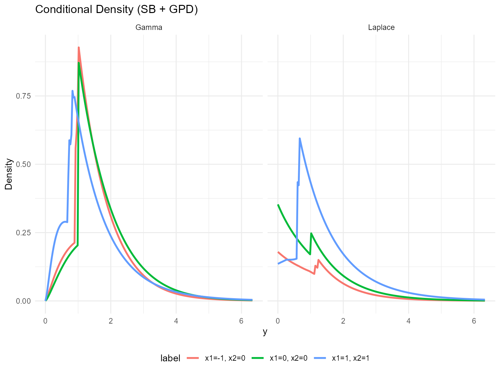

------------------------------------------------------------------------

### Tail Quantiles

``` r
X_grid <- cbind(x1 = seq(-1, 1, length.out = 5), x2 = 0, x3 = 0, x4 = 0, x5 = 0)
colnames(X_grid) <- colnames(X)
quant_probs <- c(0.90, 0.95)

pred_q_gamma <- predict(fit_sb_cond_gpd_gamma, x = as.matrix(X_grid), type = "quantile", index = quant_probs)
pred_q_laplace <- predict(fit_sb_cond_gpd_laplace, x = as.matrix(X_grid), type = "quantile", index = quant_probs)

quant_df_gamma <- pred_q_gamma$fit
quant_df_gamma$x1 <- X_grid[quant_df_gamma$id, "x1"]
quant_df_gamma$model <- "Gamma"

quant_df_laplace <- pred_q_laplace$fit
quant_df_laplace$x1 <- X_grid[quant_df_laplace$id, "x1"]
quant_df_laplace$model <- "Laplace"

bind_rows(quant_df_gamma, quant_df_laplace) %>%
  ggplot(aes(x = x1, y = estimate, color = factor(index), group = index)) +
  geom_line(linewidth = 1) +
  geom_point(size = 2) +
  facet_wrap(~ model) +
  labs(title = "Tail Quantiles vs x1 (SB)", x = "x1", y = "Quantile", color = "Probability") +
  theme_minimal()
```

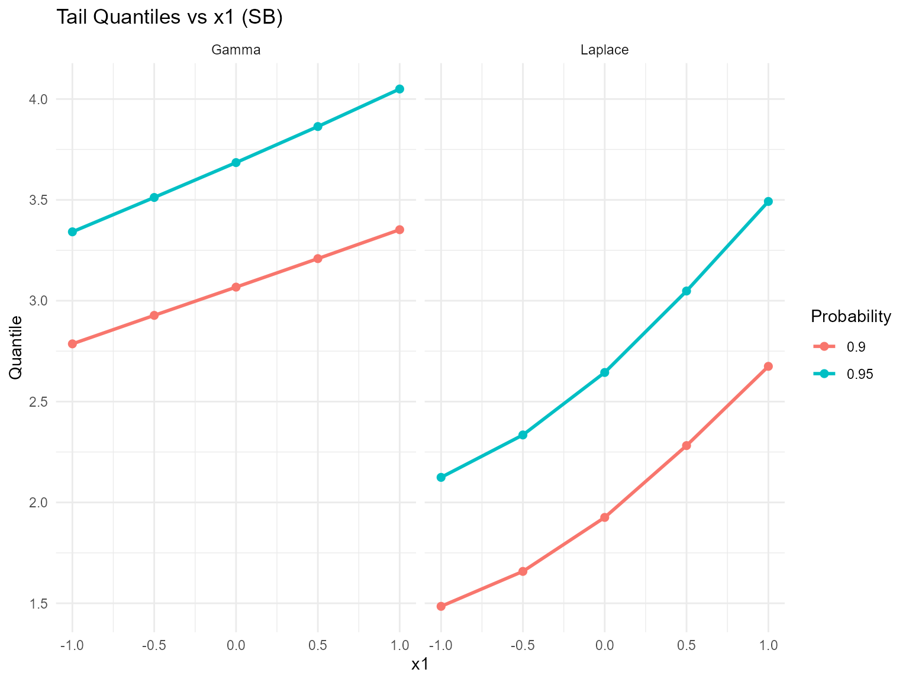

------------------------------------------------------------------------

### Residuals & Diagnostics

``` r
plot(fitted(fit_sb_cond_gpd_gamma))
```

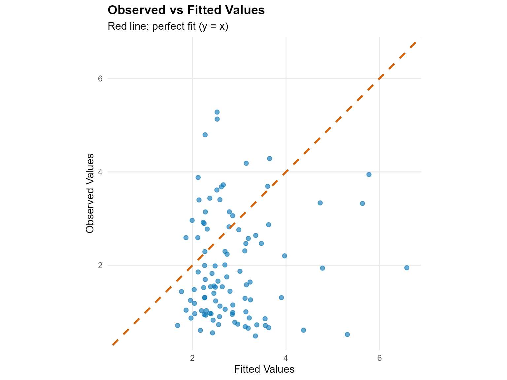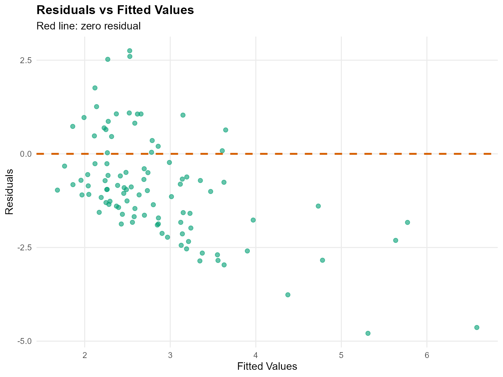

``` r
plot(fit_sb_cond_gpd_gamma, family = c("traceplot", "autocorrelation", "geweke"))

=== traceplot ===
```

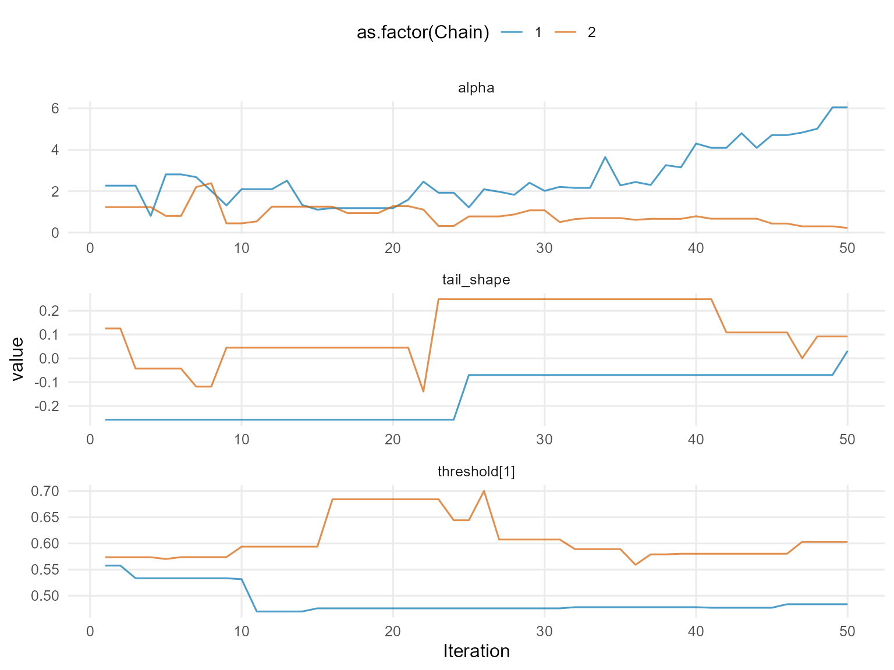

    === autocorrelation ===

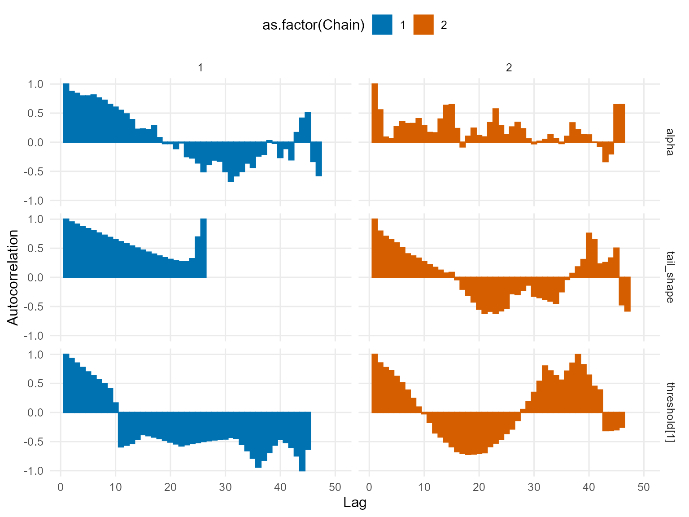

    === geweke ===

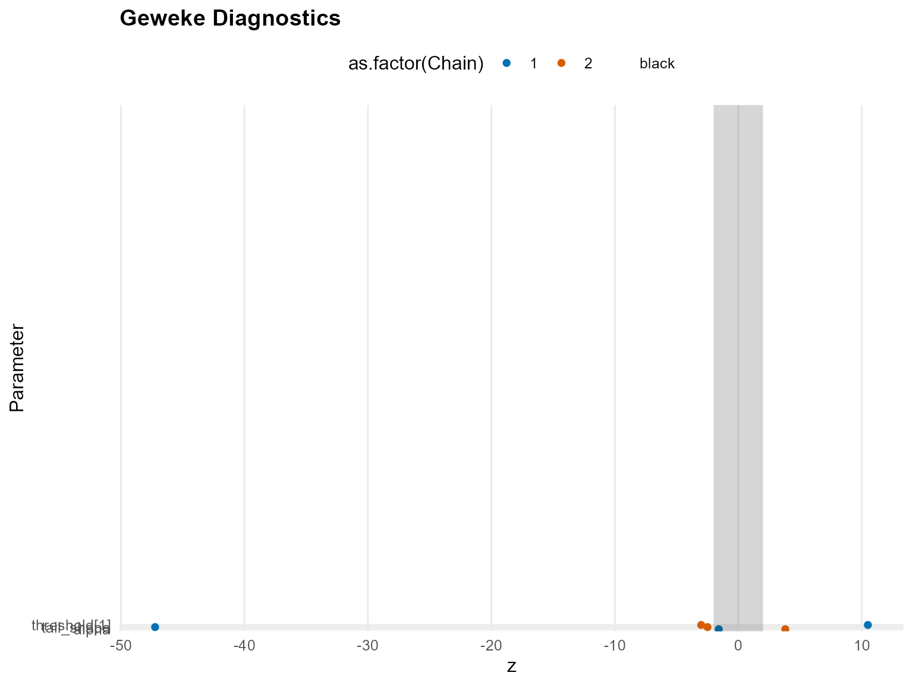

``` r
plot(fit_sb_cond_gpd_laplace, family = c("density", "running", "caterpillar"))

=== density ===
```

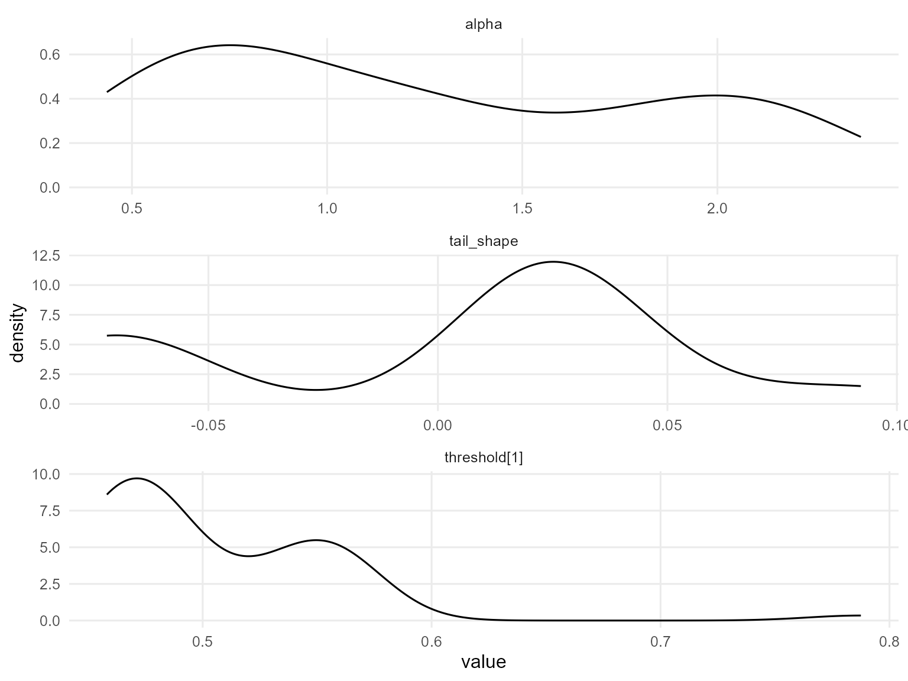

    === running ===

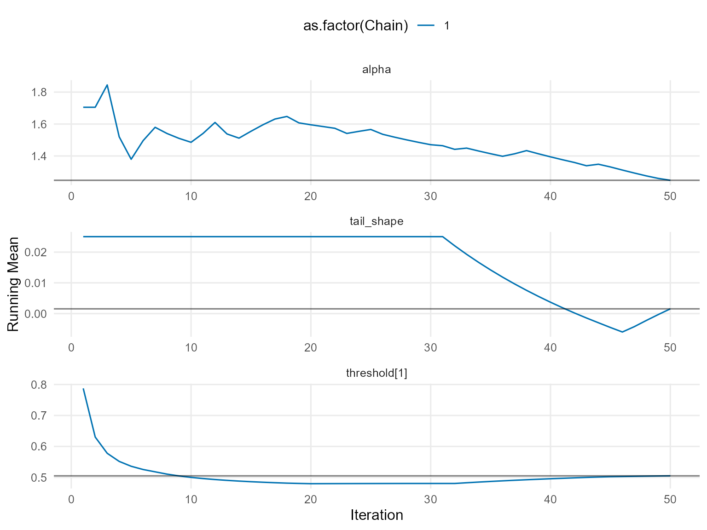

    === caterpillar ===

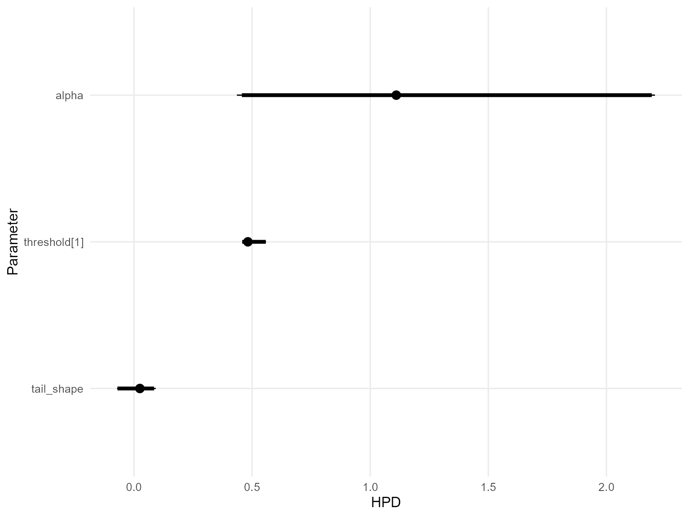

------------------------------------------------------------------------

### Takeaways

- Conditional stick-breaking mixtures capture covariate-dependent bulk
  structure while the GPD handles extremes.
- [`predict()`](https://rdrr.io/r/stats/predict.html) and
  [`plot()`](https://rdrr.io/r/graphics/plot.default.html) remain
  consistent for densities, posterior-mean quantiles, and residuals.
- Expect threshold-selected posterior-mean tail quantiles to shift with
  `x1` even when `components` is fixed.
- Next: move into causal models starting with same-backend CRP (v12).
