# 14. Causal Inference: Mixed Backends (Bulk-only) - Cauchy Kernel

## Causal Inference: Mixed Backends (Bulk-only) - Cauchy Kernel

This vignette fits two mixed-backend causal models with a shared Cauchy
kernel:

- Model A: Treated = SB, Control = CRP
- Model B: Treated = CRP, Control = SB

------------------------------------------------------------------------

### Data Setup

``` r
data("causal_alt_real500_p4_k2")
y <- causal_alt_real500_p4_k2$y
T <- causal_alt_real500_p4_k2$T
X <- as.matrix(causal_alt_real500_p4_k2$X)

summary_tbl <- tibble(
  statistic = c("N", "Mean", "SD", "Min", "Max"),
  value = c(length(y), mean(y), sd(y), min(y), max(y))
)

summary_tbl %>%
  mutate(value = signif(value, 4)) %>%
  kable(caption = "Outcome Summary (Cauchy)", align = "c") %>%
  kable_styling(bootstrap_options = c("striped", "hover"), full_width = FALSE, position = "center")
```

| statistic |  value   |
|:---------:|:--------:|
|     N     | 500.0000 |
|   Mean    |  0.2737  |
|    SD     |  1.7640  |
|    Min    | -8.0890  |
|    Max    |  5.2750  |

Outcome Summary (Cauchy)

``` r

x_eval <- X[1:40, , drop = FALSE]
y_eval <- y[1:40]
```

``` r
df_causal <- data.frame(y = y, T = as.factor(T), x1 = X[, 1])

p_scatter <- ggplot(df_causal, aes(x = x1, y = y, color = T)) +
  geom_point(alpha = 0.5) +
  labs(title = "Outcome vs X1", x = "X1", y = "y", color = "Treatment") +
  theme_minimal()

p_scatter
```

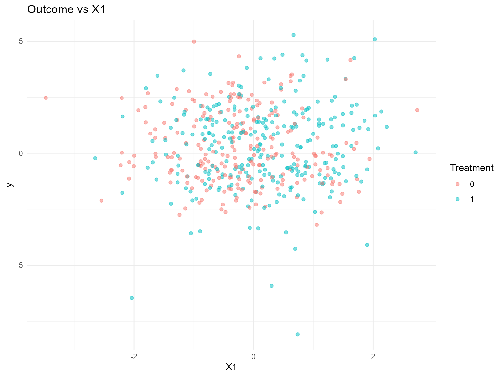

------------------------------------------------------------------------

### Model A: Treated SB, Control CRP (Cauchy)

``` r
bundle_sb_crp <- build_causal_bundle(
  y = y,
  T = T,
  X = X,
  kernel = c("cauchy", "cauchy"),
  backend = c("sb", "crp"),
  PS = "logit",
  GPD = c(FALSE, FALSE),
  J = c(5, 5),
  mcmc_outcome = list(niter = 2500, nburnin = 500, nchains = 1, thin = 1, seed = 1),
  mcmc_ps = list(niter = 2500, nburnin = 500, nchains = 1, thin = 1, seed = 1)
)

bundle_sb_crp
DPmixGPD causal bundle
PS model: disabled 
Outcome (treated): backend = sb | kernel = cauchy 
Outcome (control): backend = crp | kernel = cauchy 
GPD tail (treated/control): FALSE / FALSE 
components (treated/control): 5 / 5 
Outcome PS included: FALSE 
epsilon (treated/control): 0.025 / 0.025 
n (control) = 232 | n (treated) = 268 
summary(bundle_sb_crp)
DPmixGPD causal bundle summary
DPmixGPD causal bundle
PS model: disabled 
Outcome (treated): backend = sb | kernel = cauchy 
Outcome (control): backend = crp | kernel = cauchy 
GPD tail (treated/control): FALSE / FALSE 
components (treated/control): 5 / 5 
Outcome PS included: FALSE 
epsilon (treated/control): 0.025 / 0.025 
n (control) = 232 | n (treated) = 268 
```

``` r
fit_sb_crp <- run_mcmc_causal(bundle_sb_crp)
[MCMC] Creating NIMBLE model...
[MCMC] NIMBLE model created successfully.
[MCMC] Configuring MCMC...
===== Monitors =====
thin = 1: alpha, location, scale, z
===== Samplers =====
CRP_concentration sampler (1)
  - alpha
CRP_cluster_wrapper sampler (10)
  - location[]  (5 elements)
  - scale[]  (5 elements)
CRP sampler (1)
  - z[1:232] 
[MCMC] MCMC configured.
[MCMC] Building MCMC object...
[MCMC] MCMC object built.
[MCMC] Attempting NIMBLE compilation (this may take a minute)...
[MCMC] Compiling model...
[MCMC] Compiling MCMC sampler...
[MCMC] Compilation successful.
|-------------|-------------|-------------|-------------|
|  [Warning] CRP_sampler: This MCMC is not for a proper model. The MCMC attempted to use more components than the number of cluster parameters. Please increase the number of cluster parameters.
-------------------------------------------------------|
[MCMC] MCMC execution complete. Processing results...
[MCMC] Creating NIMBLE model...
[MCMC] NIMBLE model created successfully.
[MCMC] Configuring MCMC...
===== Monitors =====
thin = 1: alpha, beta_location, scale, w, z
===== Samplers =====
RW sampler (30)
  - alpha
  - scale[]  (5 elements)
  - beta_location[]  (20 elements)
  - v[]  (4 elements)
categorical sampler (268)
  - z[]  (268 elements)
[MCMC] MCMC configured.
[MCMC] Building MCMC object...
[MCMC] MCMC object built.
[MCMC] Attempting NIMBLE compilation (this may take a minute)...
[MCMC] Compiling model...
[MCMC] Compiling MCMC sampler...
[MCMC] Compilation successful.
|-------------|-------------|-------------|-------------|
|-------------------------------------------------------|
[MCMC] MCMC execution complete. Processing results...
summary(fit_sb_crp)

-- Outcome fits --
[control]
MixGPD fit | backend: Chinese Restaurant Process | kernel: Cauchy Distribution | GPD tail: FALSE
n = 232 | components = 5 | epsilon = 0.025
MCMC: niter=2500, nburnin=500, thin=1, nchains=1 
Fit
Use summary() for posterior summaries; plot() for diagnostics; predict() for predictions.

[treated]
MixGPD fit | backend: Stick-Breaking Process | kernel: Cauchy Distribution | GPD tail: FALSE
n = 268 | components = 5 | epsilon = 0.025
MCMC: niter=2500, nburnin=500, thin=1, nchains=1 
Fit
Use summary() for posterior summaries; plot() for diagnostics; predict() for predictions.
params(fit_sb_crp)
Posterior mean parameters (causal)

[treated]
Posterior mean parameters

$alpha
[1] 0.9307

$w
[1] 0.3999 0.2989 0.1919

$beta_location
           x1      x2      x3      x4
comp1  0.3315  1.0015  0.3338  1.1553
comp2 -0.2983  0.2807 -0.1729 -0.8121
comp3  0.5352 -1.2261  0.2349  1.0335
comp4  0.1344 -0.2589 -0.3181  0.3939
comp5 -0.0104 -0.2997  0.1655 -0.0957

$scale
[1] 0.7268 0.6205 0.5591

[control]
Posterior mean parameters

$alpha
[1] 0.6607

$w
[1] 0.3993 0.2986 0.2311

$location
[1] -0.07782  0.58160 -0.04901

$scale
[1] 0.5128 0.5099 0.4178
```

``` r
plot(fit_sb_crp, family = c("traceplot", "autocorrelation", "running"))

=== treated ===

=== traceplot ===
```

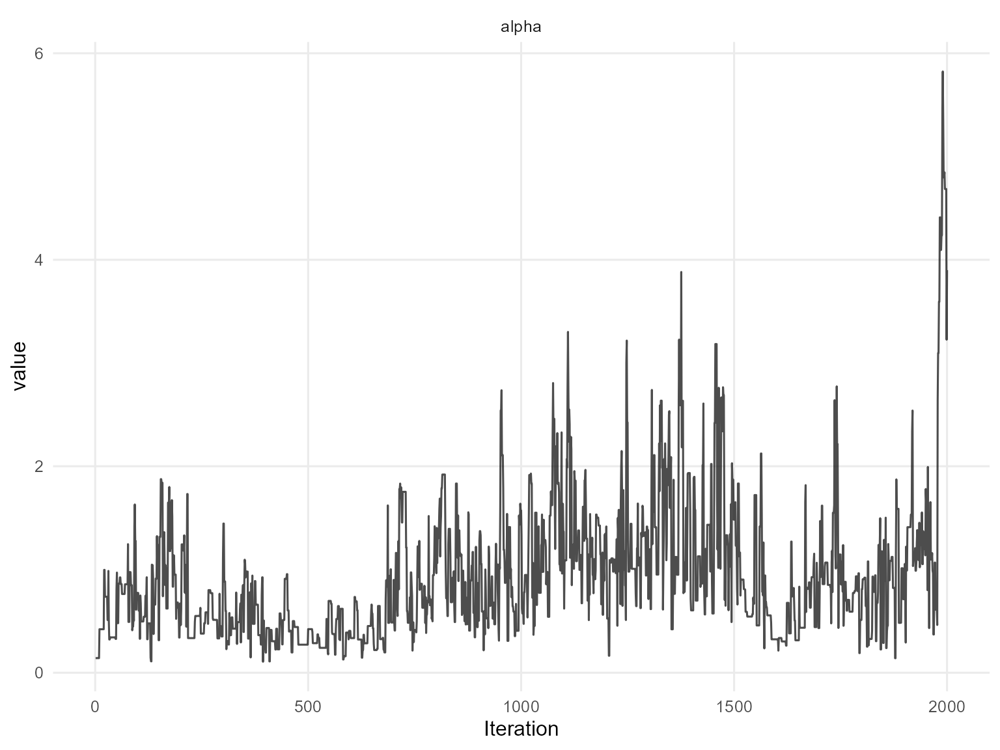

    === autocorrelation ===

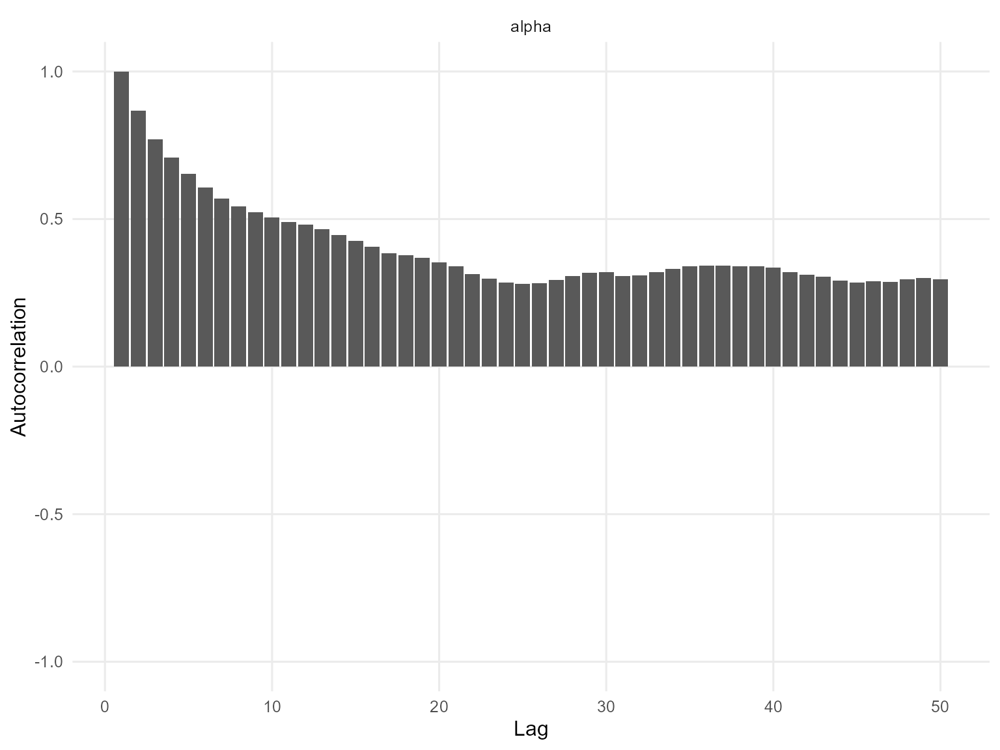

    === running ===

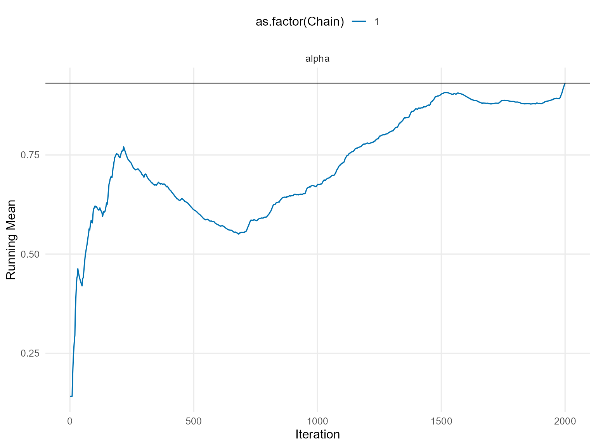

    === control ===

    === traceplot ===

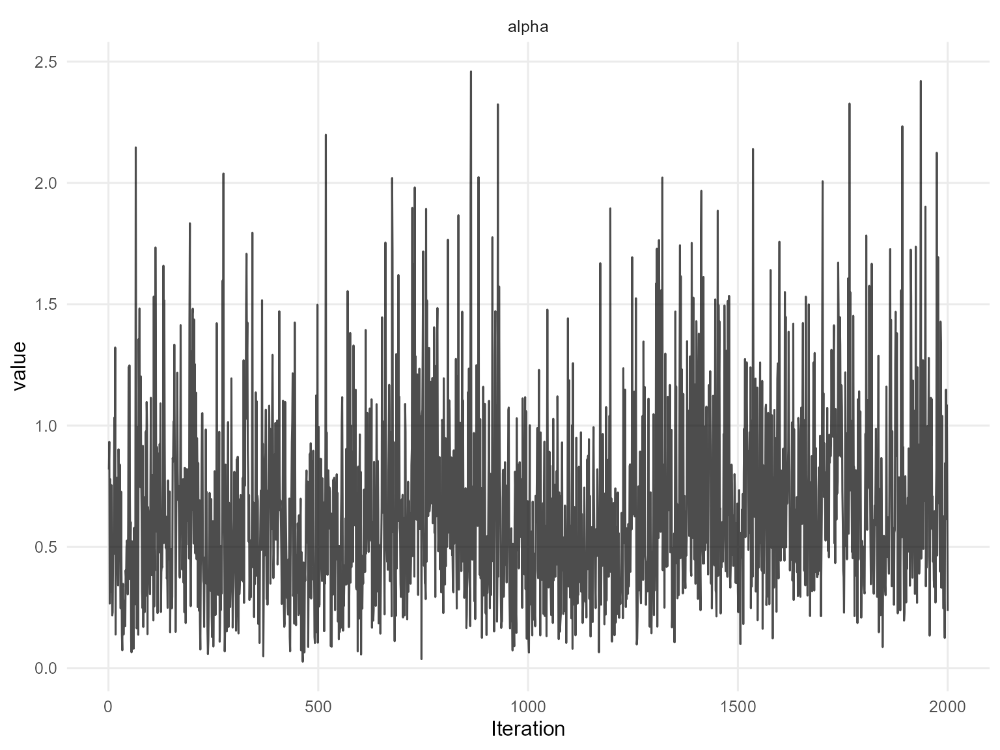

    === autocorrelation ===

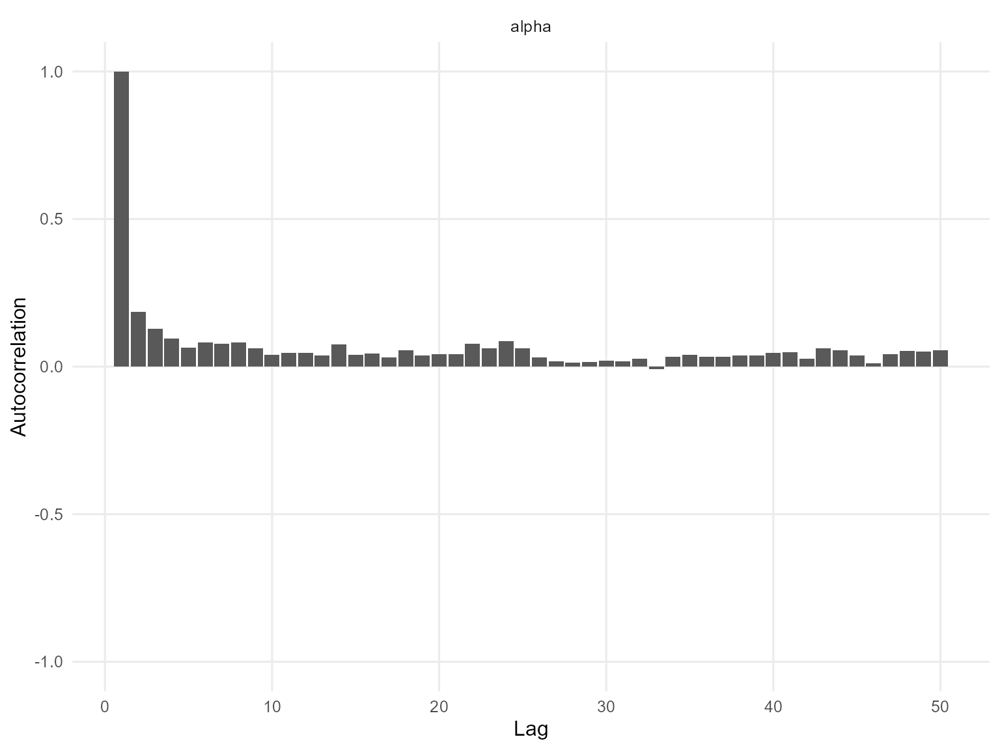

    === running ===

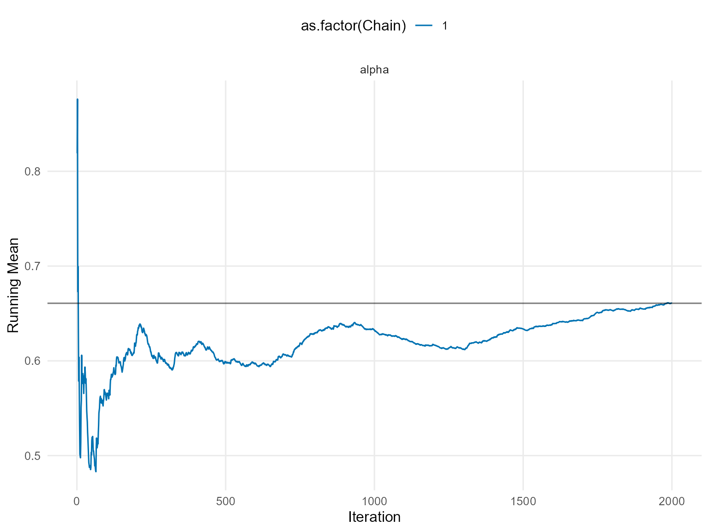

``` r
pred_mean_sb_crp <- predict(fit_sb_crp, x = x_eval, type = "mean",
                            interval = "credible", nsim_mean = 100)
plot(pred_mean_sb_crp)
```

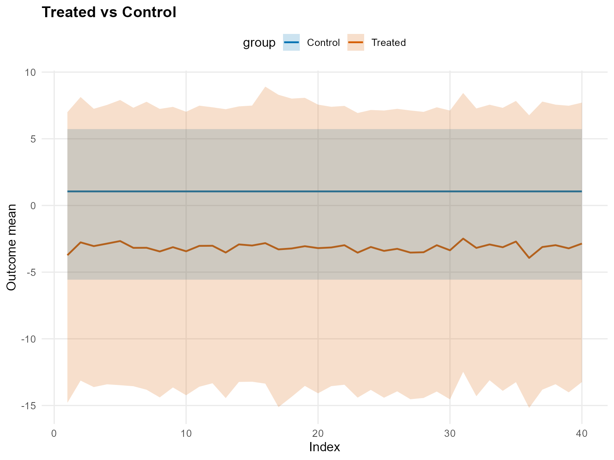

``` r
pred_q_sb_crp <- predict(fit_sb_crp, x = x_eval, type = "quantile",
                         p = 0.5, interval = "credible")
plot(pred_q_sb_crp)
```

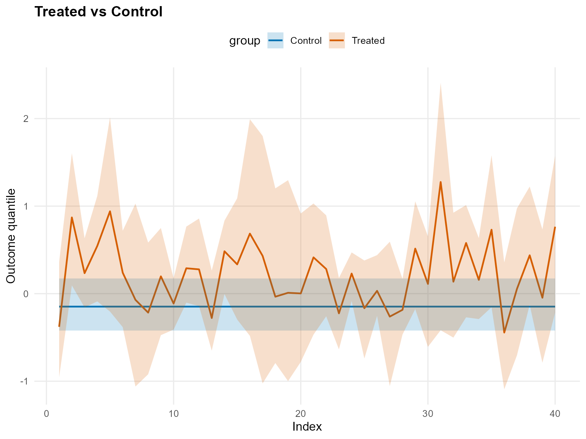

``` r
pred_d_sb_crp <- predict(fit_sb_crp, x = x_eval, y = y_eval,
                         type = "density", interval = "credible")
plot(pred_d_sb_crp)
```

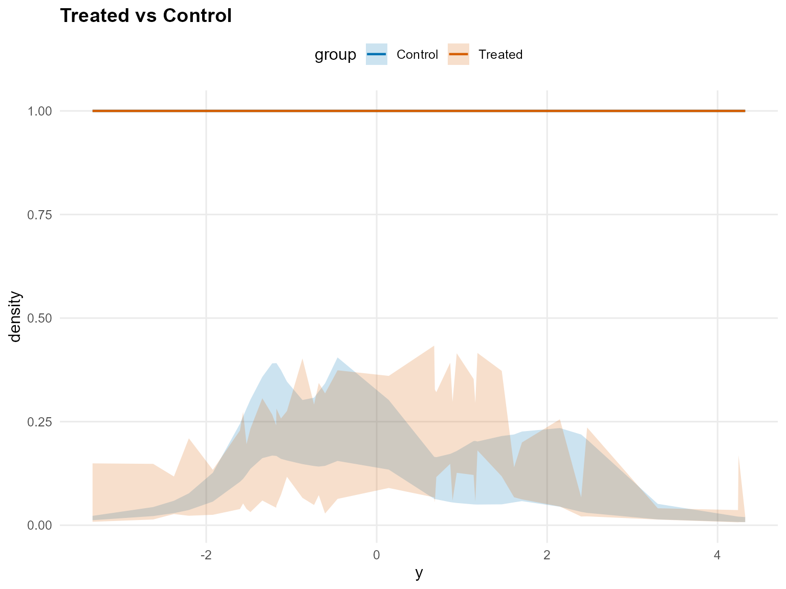

``` r
pred_p_sb_crp <- predict(fit_sb_crp, x = x_eval, y = y_eval,
                         type = "prob", interval = "credible")
plot(pred_p_sb_crp)
```

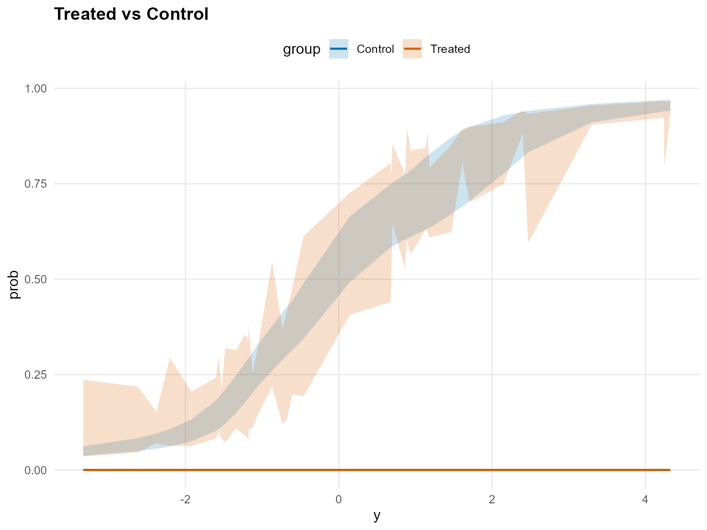

``` r
ate_sb_crp <- ate(fit_sb_crp, newdata = x_eval,
                  interval = "credible", nsim_mean = 100)
plot(ate_sb_crp)
```

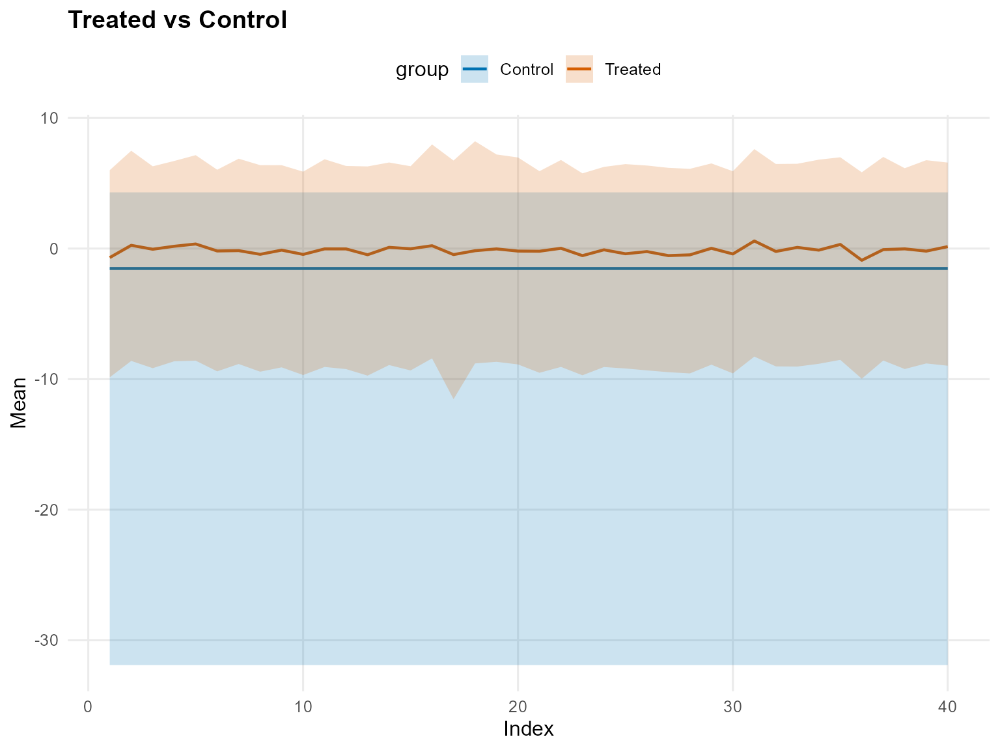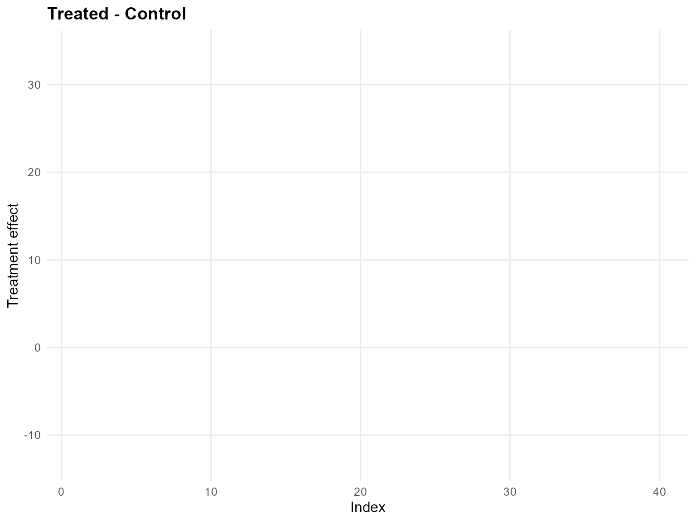

``` r
qte_sb_crp <- qte(fit_sb_crp, probs = c(0.25, 0.5, 0.75),
                  newdata = x_eval, interval = "credible")
plot(qte_sb_crp)
```

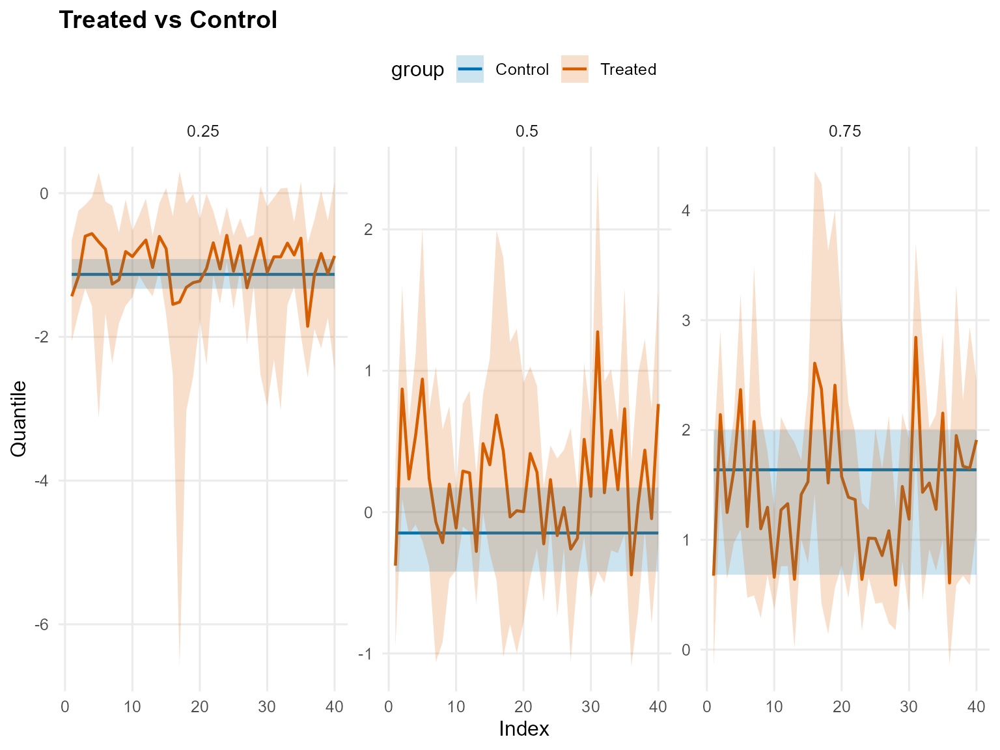

------------------------------------------------------------------------

### Model B: Treated CRP, Control SB (Cauchy)

``` r
bundle_crp_sb <- build_causal_bundle(
  y = y,
  T = T,
  X = X,
  kernel = c("cauchy", "cauchy"),
  backend = c("crp", "sb"),
  PS = "logit",
  GPD = c(FALSE, FALSE),
  J = c(5, 5),
  mcmc_outcome = list(niter = 2500, nburnin = 500, nchains = 1, thin = 1, seed = 2),
  mcmc_ps = list(niter = 2500, nburnin = 500, nchains = 1, thin = 1, seed = 2)
)

bundle_crp_sb
DPmixGPD causal bundle
PS model: disabled 
Outcome (treated): backend = crp | kernel = cauchy 
Outcome (control): backend = sb | kernel = cauchy 
GPD tail (treated/control): FALSE / FALSE 
components (treated/control): 5 / 5 
Outcome PS included: FALSE 
epsilon (treated/control): 0.025 / 0.025 
n (control) = 232 | n (treated) = 268 
summary(bundle_crp_sb)
DPmixGPD causal bundle summary
DPmixGPD causal bundle
PS model: disabled 
Outcome (treated): backend = crp | kernel = cauchy 
Outcome (control): backend = sb | kernel = cauchy 
GPD tail (treated/control): FALSE / FALSE 
components (treated/control): 5 / 5 
Outcome PS included: FALSE 
epsilon (treated/control): 0.025 / 0.025 
n (control) = 232 | n (treated) = 268 
```

``` r
fit_crp_sb <- run_mcmc_causal(bundle_crp_sb)
[MCMC] Creating NIMBLE model...
[MCMC] NIMBLE model created successfully.
[MCMC] Configuring MCMC...
===== Monitors =====
thin = 1: alpha, beta_location, scale, w, z
===== Samplers =====
RW sampler (30)
  - alpha
  - scale[]  (5 elements)
  - beta_location[]  (20 elements)
  - v[]  (4 elements)
categorical sampler (232)
  - z[]  (232 elements)
[MCMC] MCMC configured.
[MCMC] Building MCMC object...
[MCMC] MCMC object built.
[MCMC] Attempting NIMBLE compilation (this may take a minute)...
[MCMC] Compiling model...
[MCMC] Compiling MCMC sampler...
[MCMC] Compilation successful.
|-------------|-------------|-------------|-------------|
|-------------------------------------------------------|
[MCMC] MCMC execution complete. Processing results...
[MCMC] Creating NIMBLE model...
[MCMC] NIMBLE model created successfully.
[MCMC] Configuring MCMC...
===== Monitors =====
thin = 1: alpha, location, scale, z
===== Samplers =====
CRP_concentration sampler (1)
  - alpha
CRP_cluster_wrapper sampler (10)
  - location[]  (5 elements)
  - scale[]  (5 elements)
CRP sampler (1)
  - z[1:268] 
[MCMC] MCMC configured.
[MCMC] Building MCMC object...
[MCMC] MCMC object built.
[MCMC] Attempting NIMBLE compilation (this may take a minute)...
[MCMC] Compiling model...
[MCMC] Compiling MCMC sampler...
[MCMC] Compilation successful.
|-------------|-------------|-------------|-------------|
|  [Warning] CRP_sampler: This MCMC is not for a proper model. The MCMC attempted to use more components than the number of cluster parameters. Please increase the number of cluster parameters.
-------------------------------------------------------|
[MCMC] MCMC execution complete. Processing results...
summary(fit_crp_sb)

-- Outcome fits --
[control]
MixGPD fit | backend: Stick-Breaking Process | kernel: Cauchy Distribution | GPD tail: FALSE
n = 232 | components = 5 | epsilon = 0.025
MCMC: niter=2500, nburnin=500, thin=1, nchains=1 
Fit
Use summary() for posterior summaries; plot() for diagnostics; predict() for predictions.

[treated]
MixGPD fit | backend: Chinese Restaurant Process | kernel: Cauchy Distribution | GPD tail: FALSE
n = 268 | components = 5 | epsilon = 0.025
MCMC: niter=2500, nburnin=500, thin=1, nchains=1 
Fit
Use summary() for posterior summaries; plot() for diagnostics; predict() for predictions.
params(fit_crp_sb)
Posterior mean parameters (causal)

[treated]
Posterior mean parameters

$alpha
[1] 0.4183

$w
[1] 0.5311 0.4463

$location
[1]  0.7007 -0.1826

$scale
[1] 0.6343 0.5296

[control]
Posterior mean parameters

$alpha
[1] 1.741

$w
[1] 0.3527 0.2469 0.1919

$beta_location
           x1      x2      x3      x4
comp1 -0.4192  0.5513 -0.0888  0.7257
comp2 -0.2335  0.3216 -0.4059  0.3986
comp3 -0.1961 -0.4568 -0.4554  1.1278
comp4 -0.0049 -0.5091 -0.2464 -0.8384
comp5 -0.1989 -0.1570 -0.0917  1.6898

$scale
[1] 0.6041 0.5649 0.4992
```

``` r
plot(fit_crp_sb, family = c("density", "geweke", "caterpillar"))

=== treated ===

=== density ===
```

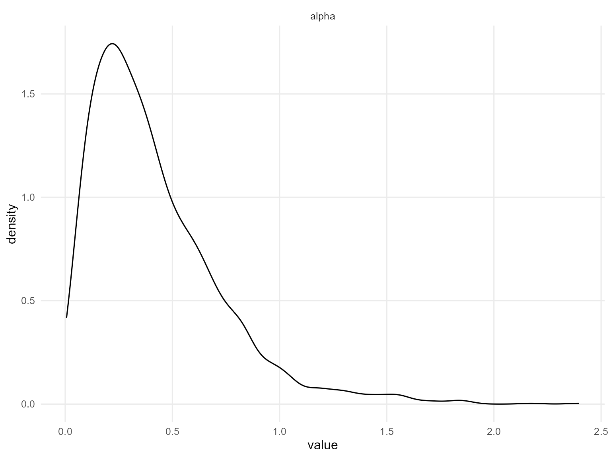

    === geweke ===


    === caterpillar ===

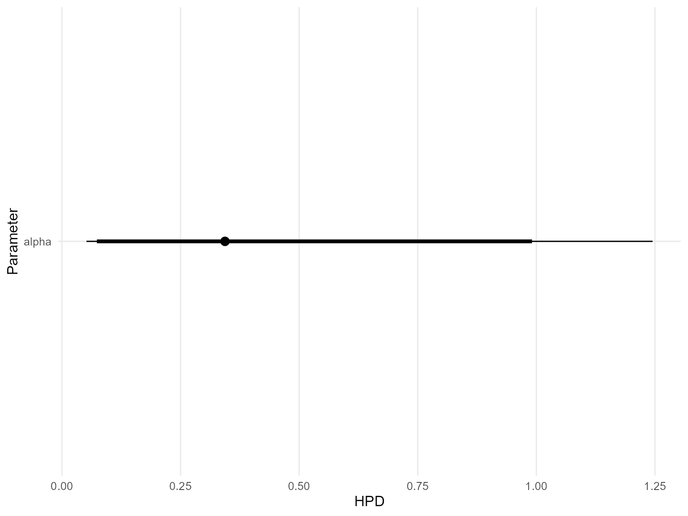

    === control ===

    === density ===

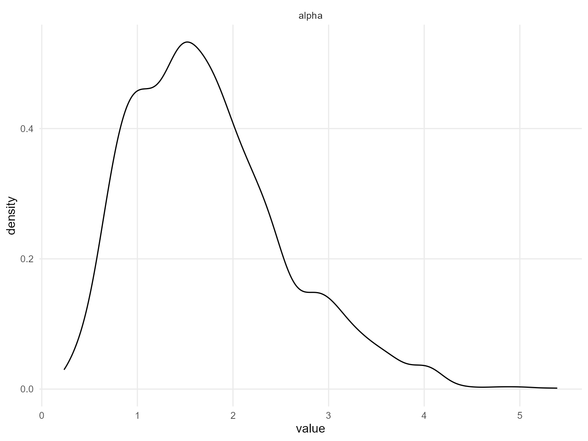

    === geweke ===

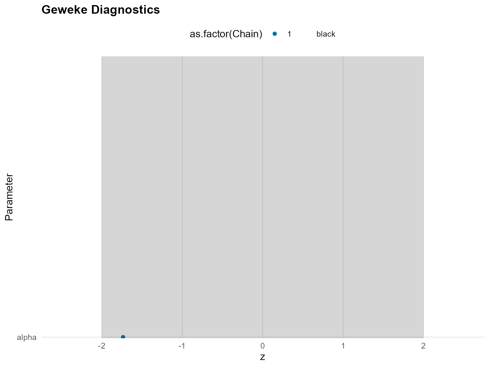

    === caterpillar ===

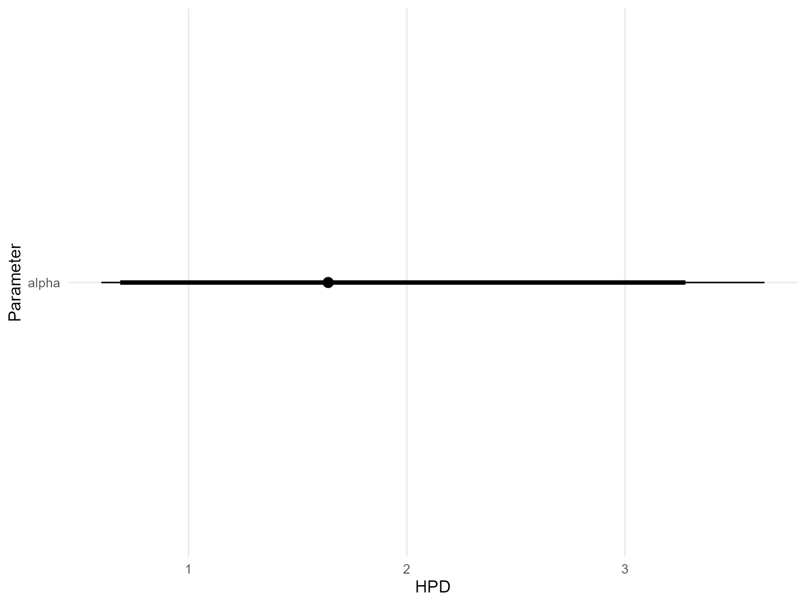

``` r
pred_mean_crp_sb <- predict(fit_crp_sb, x = x_eval, type = "mean",
                            interval = "credible", nsim_mean = 100)
plot(pred_mean_crp_sb)
```

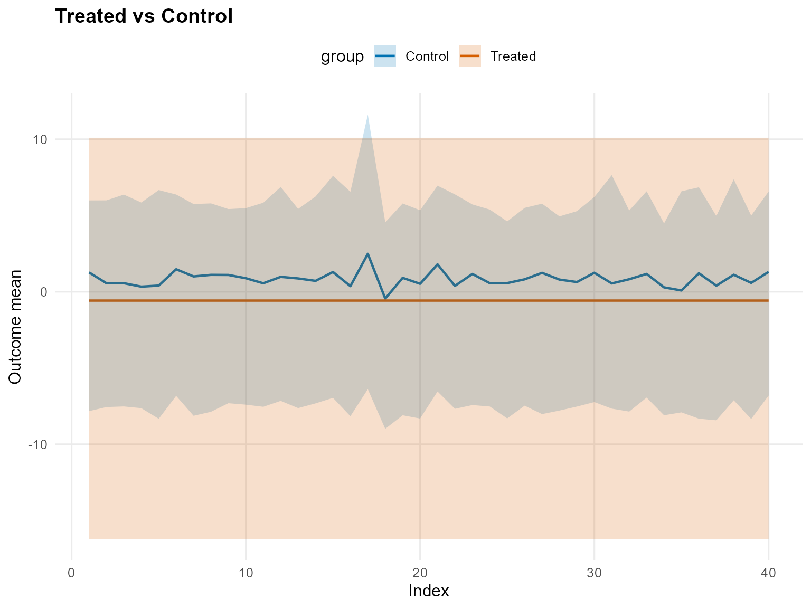

``` r
pred_q_crp_sb <- predict(fit_crp_sb, x = x_eval, type = "quantile",
                         p = 0.5, interval = "credible")
plot(pred_q_crp_sb)
```

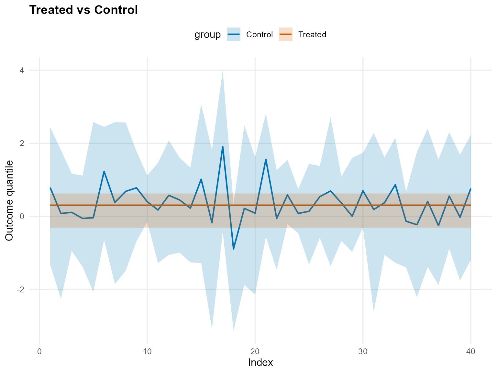

``` r
pred_d_crp_sb <- predict(fit_crp_sb, x = x_eval, y = y_eval,
                         type = "density", interval = "credible")
plot(pred_d_crp_sb)
```

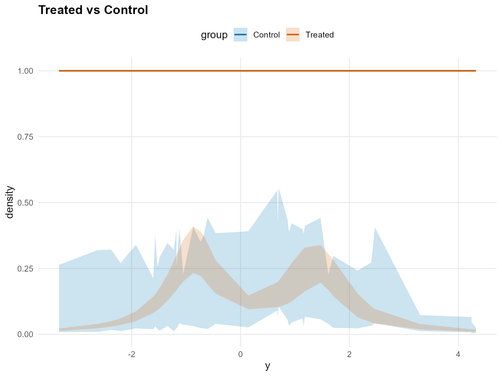

``` r
pred_p_crp_sb <- predict(fit_crp_sb, x = x_eval, y = y_eval,
                         type = "prob", interval = "credible")
plot(pred_p_crp_sb)
```

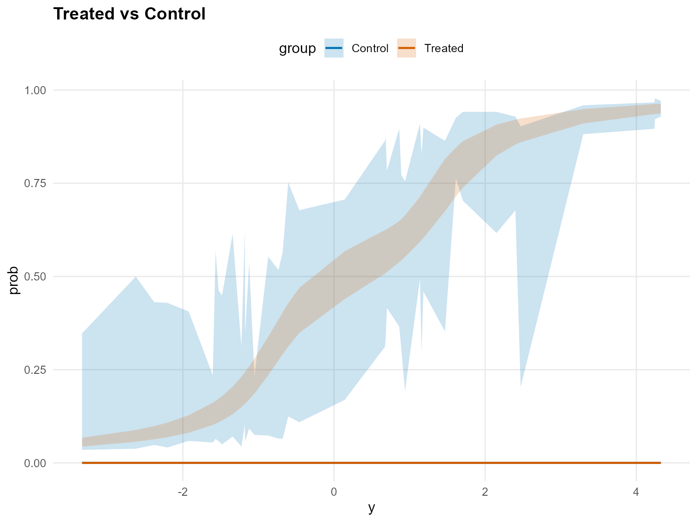

``` r
ate_crp_sb <- ate(fit_crp_sb, newdata = x_eval,
                  interval = "credible", nsim_mean = 100)
plot(ate_crp_sb)
```

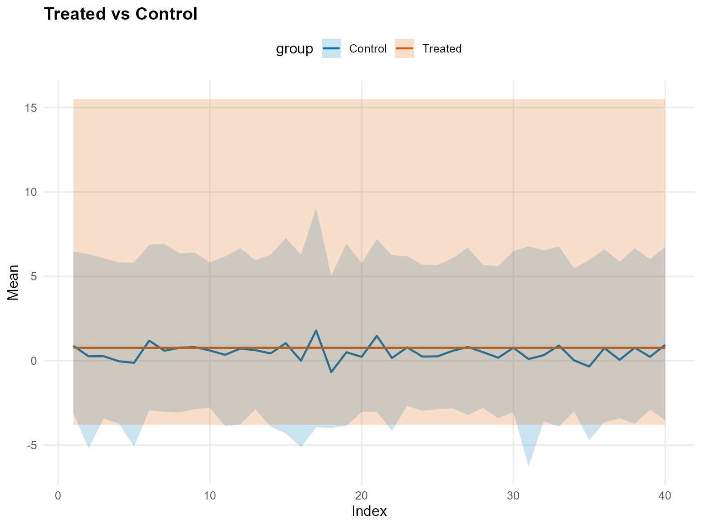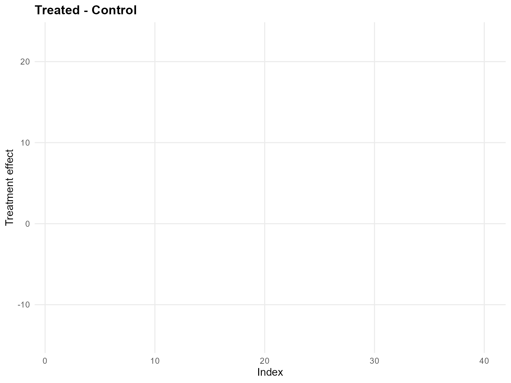

``` r
qte_crp_sb <- qte(fit_crp_sb, probs = c(0.25, 0.5, 0.75),
                  newdata = x_eval, interval = "credible")
plot(qte_crp_sb)
```

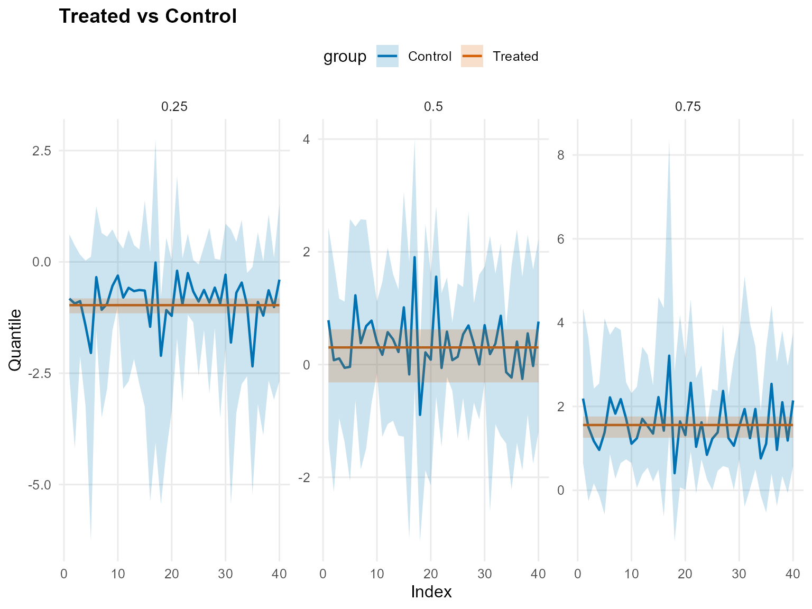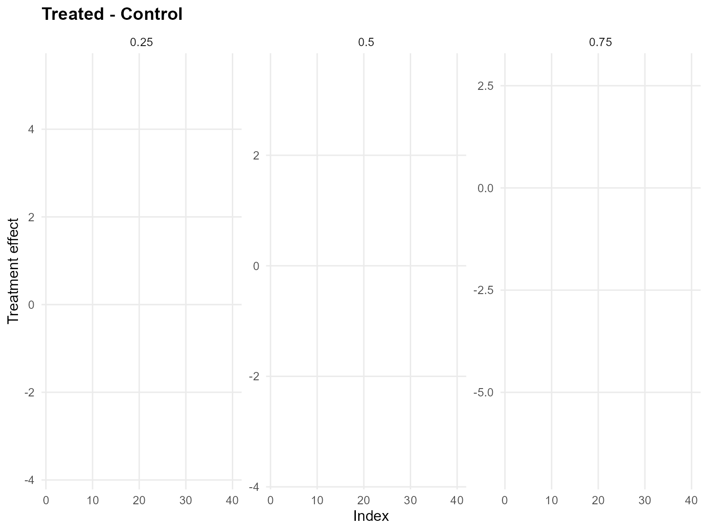
