# 14. Causal Inference: No X (CRP) - Gamma Kernel

## Causal Inference: No Covariates (CRP)

This vignette fits **two no-X causal models** where the treatment arms
are modeled independently using **unconditional** outcome models.

- Model A: CRP bulk-only (GPD = FALSE)
- Model B: CRP with GPD tail (GPD = TRUE)

------------------------------------------------------------------------

### Data Setup (No X)

``` r
data("causal_alt_real500_p4_k2")
y <- abs(causal_alt_real500_p4_k2$y) + 0.01
T <- causal_alt_real500_p4_k2$T

summary_tbl <- tibble(
  statistic = c("N", "Mean", "SD", "Min", "Max"),
  value = c(length(y), mean(y), sd(y), min(y), max(y))
)

summary_tbl %>%
  mutate(value = signif(value, 4)) %>%
  print()
```

    
[38;5;246m# A tibble: 5 × 2
[39m
      statistic    value
      
[3m
[38;5;246m<chr>
[39m
[23m        
[3m
[38;5;246m<dbl>
[39m
[23m
    
[38;5;250m1
[39m N         500     
    
[38;5;250m2
[39m Mean        1.43  
    
[38;5;250m3
[39m SD          1.08  
    
[38;5;250m4
[39m Min         0.012
[4m6
[24m
    
[38;5;250m5
[39m Max         8.10  

``` r
u_threshold <- as.numeric(stats::quantile(y, 0.8, names = FALSE))
y_eval <- y[1:40]
```

------------------------------------------------------------------------

### Model A: CRP Bulk-only (Gamma)

``` r
bundle_crp_bulk <- build_causal_bundle(
  y = y,
  T = T,
  X = NULL,
  kernel = "gamma",
  backend = "crp",
  PS = FALSE,
  GPD = FALSE,
  components = 6,
  mcmc_outcome = list(niter = 300, nburnin = 80, nchains = 1, thin = 1, seed = 1)
)

bundle_crp_bulk
```

    DPmixGPD causal bundle
    PS model: disabled 
    Outcome (treated): backend = crp | kernel = gamma 
    Outcome (control): backend = crp | kernel = gamma 
    GPD tail (treated/control): FALSE / FALSE 
    components (treated/control): 6 / 6 
    Outcome PS included: FALSE 
    epsilon (treated/control): 0.025 / 0.025 
    n (control) = 232 | n (treated) = 268 

``` r
fit_crp_bulk <- quiet_mcmc(run_mcmc_causal(bundle_crp_bulk))
summary(fit_crp_bulk)
```

    -- Outcome fits --
    [control]
    MixGPD fit | backend: Chinese Restaurant Process | kernel: Gamma Distribution | GPD tail: FALSE
    n = 232 | components = 6 | epsilon = 0.025
    MCMC: niter=300, nburnin=80, thin=1, nchains=1 
    Fit
    Use summary() for posterior summaries; plot() for diagnostics; predict() for predictions.

    [treated]
    MixGPD fit | backend: Chinese Restaurant Process | kernel: Gamma Distribution | GPD tail: FALSE
    n = 268 | components = 6 | epsilon = 0.025
    MCMC: niter=300, nburnin=80, thin=1, nchains=1 
    Fit
    Use summary() for posterior summaries; plot() for diagnostics; predict() for predictions.

``` r
pred_mean_bulk <- predict(fit_crp_bulk, type = "mean", interval = "credible", nsim_mean = 150)
head(pred_mean_bulk)
```

         ps  estimate     lower   upper
    [1,] NA -2.430051 -3.270563 3.38875

``` r
plot(pred_mean_bulk)
```

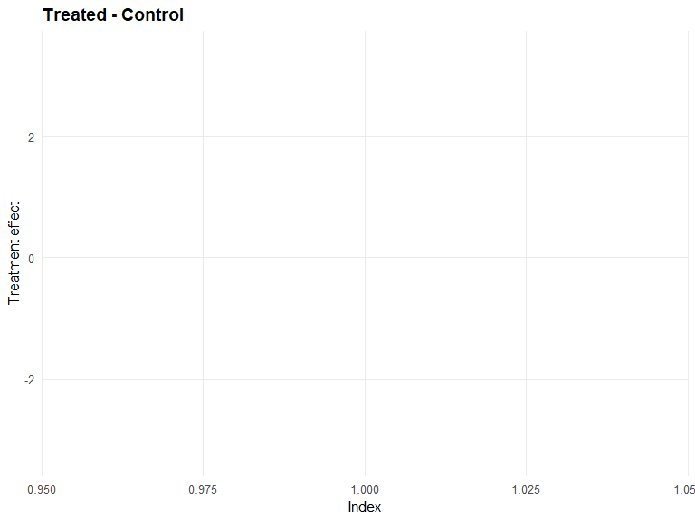

``` r
pred_q_bulk <- predict(fit_crp_bulk, type = "quantile", p = 0.5, interval = "credible")
head(pred_q_bulk)
```

         ps  estimate     lower    upper
    [1,] NA -2.124192 -2.531996 2.916562

``` r
plot(pred_q_bulk)
```


``` r
pred_d_bulk <- predict(fit_crp_bulk, y = y_eval, type = "density", interval = "credible")
head(pred_d_bulk)
```

              y ps trt_estimate    trt_lower trt_upper con_estimate  con_lower
    1 0.9001906 NA            1 0.0002570700 0.4789627            1 0.02434051
    2 1.3517565 NA            1 0.0009441854 0.3435760            1 0.02905138
    3 1.1475287 NA            1 0.0005631923 0.3939381            1 0.02664277
    4 1.9323578 NA            1 0.0027864436 0.2594785            1 0.03719981
    5 3.3439817 NA            1 0.0123323318 0.1808683            1 0.04530760
    6 0.9493979 NA            1 0.0003058099 0.4594757            1 0.02480848
      con_upper
    1 0.1785828
    2 0.1706259
    3 0.1669592
    4 0.1638348
    5 0.1375891
    6 0.1716600

``` r
plot(pred_d_bulk)
```

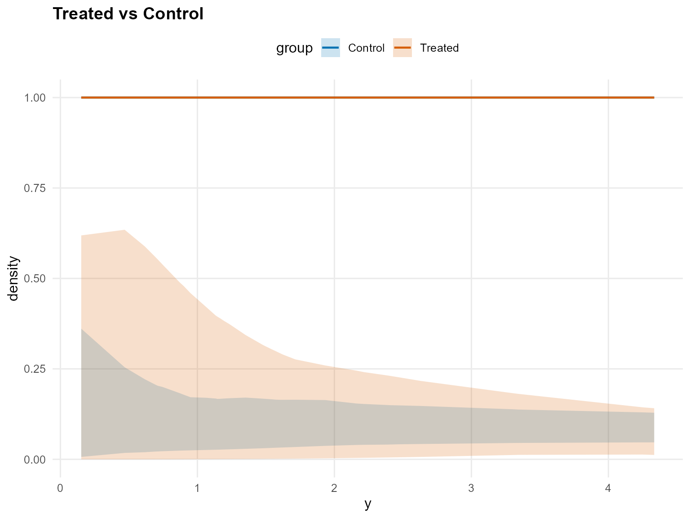

``` r
pred_surv_bulk <- predict(fit_crp_bulk, y = y_eval, type = "survival", interval = "credible")
head(pred_surv_bulk)
```

              y ps trt_estimate  trt_lower trt_upper con_estimate con_lower
    1 0.9001906 NA            1 0.47713271 0.9999465            1 0.7504423
    2 1.3517565 NA            1 0.30090265 0.9996965            1 0.6845086
    3 1.1475287 NA            1 0.37179143 0.9998483            1 0.7116209
    4 1.9323578 NA            1 0.16184493 0.9986710            1 0.6234423
    5 3.3439817 NA            1 0.03283322 0.9888131            1 0.5053442
    6 0.9493979 NA            1 0.45435907 0.9999327            1 0.7421046
      con_upper
    1 0.9850020
    2 0.9718377
    3 0.9783357
    4 0.9525906
    5 0.8839550
    6 0.9839376

``` r
plot(pred_surv_bulk)
```

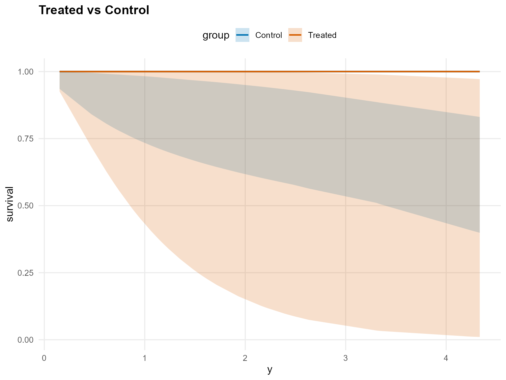

``` r
ate_bulk <- ate(fit_crp_bulk, interval = "credible", nsim_mean = 150)
head(ate_bulk)
```

    $fit
    [1] -2.482686

    $lower
         2.5% 
    -7.919057 

    $upper
       97.5% 
    3.803377 

    $grid
    NULL

    $trt
    $fit
      estimate    lower    upper
    1  4.43572 1.023971 14.30093

    $type
    [1] "mean"

    $draws
                 [,1]
      [1,]  3.7228444
      [2,]  3.3982062
      [3,]  3.1362102
      [4,]  3.2451196
      [5,]  2.9628302
      [6,]  2.7924196
      [7,]  2.5605873
      [8,]  2.6004573
      [9,]  2.8500708
     [10,]  2.8950093
     [11,]  2.7355750
     [12,]  2.9568635
     [13,]  2.8815225
     [14,]  3.0225617
     [15,]  3.1559206
     [16,]  2.8523763
     [17,]  3.0925584
     [18,]  3.0188139
     [19,]  2.9161762
     [20,]  3.2245188
     [21,]  2.9493076
     [22,]  2.7857204
     [23,]  3.1894820
     [24,]  2.4392959
     [25,]  2.6193953
     [26,]  2.5444741
     [27,]  3.1597697
     [28,]  2.5541321
     [29,]  2.9520599
     [30,]  3.2998133
     [31,]  2.8159942
     [32,]  3.3726301
     [33,]  2.8721360
     [34,]  2.5807318
     [35,]  2.4768350
     [36,]  2.4911987
     [37,]  3.5102189
     [38,]  3.4391367
     [39,]  3.7779278
     [40,]  3.2034714
     [41,]  3.7279891
     [42,]  2.9337688
     [43,]  3.2090599
     [44,]  3.2068417
     [45,]  3.8477479
     [46,]  3.5156462
     [47,]  3.1346617
     [48,]  2.9960940
     [49,]  3.2972448
     [50,]  3.3254278
     [51,]  3.5710443
     [52,]  3.4768330
     [53,]  3.6396292
     [54,]  3.1514340
     [55,]  3.4725215
     [56,]  3.1074677
     [57,]  3.5148710
     [58,]  3.9785529
     [59,]  4.0941223
     [60,]  4.0137015
     [61,]  3.6925841
     [62,]  4.0833969
     [63,]  3.8218114
     [64,]  5.0240308
     [65,]  5.3141292
     [66,]  5.5850154
     [67,]  5.1562481
     [68,]  6.1335881
     [69,]  1.2060906
     [70,]  1.2739111
     [71,]  1.1856998
     [72,]  1.1554361
     [73,]  0.9333588
     [74,]  1.1431759
     [75,]  1.3467047
     [76,]  0.9397287
     [77,]  0.9674823
     [78,]  1.1915456
     [79,]  1.2556809
     [80,]  1.6613632
     [81,]  1.0509364
     [82,]  1.4085452
     [83,]  5.0880123
     [84,]  5.1874005
     [85,]  5.2412968
     [86,]  1.2076865
     [87,]  1.3999960
     [88,]  1.6123422
     [89,]  1.4496466
     [90,]  1.4581277
     [91,]  4.9903534
     [92,]  5.2017616
     [93,]  5.3468597
     [94,]  1.5441844
     [95,]  5.3021873
     [96,]  5.2826659
     [97,]  1.0824298
     [98,]  6.2049871
     [99,]  6.0090674
    [100,]  1.1589199
    [101,]  1.1931283
    [102,]  1.0210745
    [103,]  1.3272913
    [104,]  1.3741991
    [105,]  1.0081569
    [106,]  1.0922088
    [107,]  1.1414718
    [108,]  1.1456422
    [109,]  1.1292880
    [110,]  1.1388931
    [111,]  1.2295257
    [112,]  1.1620619
    [113,]  4.2203904
    [114,]  1.2937867
    [115,]  1.3347833
    [116,]  0.9822581
    [117,]  1.3249306
    [118,]  1.1504220
    [119,]  1.2907966
    [120,]  1.0271723
    [121,]  1.2732563
    [122,]  1.0849071
    [123,]  1.2314592
    [124,]  1.4379829
    [125,]  1.4247069
    [126,]  1.4007619
    [127,]  1.6927981
    [128,]  1.7675497
    [129,]  1.6123763
    [130,]  1.5712141
    [131,]  1.5753376
    [132,] 12.2481315
    [133,] 16.6673387
    [134,] 14.7501469
    [135,] 16.3660987
    [136,] 14.6152198
    [137,] 14.6132684
    [138,] 15.6515063
    [139,] 12.3665917
    [140,] 11.6824307
    [141,] 13.0329561
    [142,] 11.3601127
    [143,] 10.6617169
    [144,] 13.9557047
    [145,] 13.4038185
    [146,] 12.2598032
    [147,]  1.5833839
    [148,] 12.5096288
    [149,]  2.5100454
    [150,]  9.2739236
    [151,]  8.8018913
    [152,]  7.4612942
    [153,]  8.5673046
    [154,]  1.6212787
    [155,]  1.5004004
    [156,]  1.1947465
    [157,]  1.8065599
    [158,]  1.9100973
    [159,]  7.6298246
    [160,]  7.6990241
    [161,]  7.2507266
    [162,]  6.9899614
    [163,]  7.5337469
    [164,]  7.9270226
    [165,]  9.2903931
    [166,]  8.8891349
    [167,]  9.6410748
    [168,]  7.4741262
    [169,]  7.8244855
    [170,]  7.0122833
    [171,]  6.9237583
    [172,]  6.0501123
    [173,]  6.7160439
    [174,]  7.2485180
    [175,]  7.5227930
    [176,]  7.2405939
    [177,]  7.6610197
    [178,]  8.1874419
    [179,]  8.3545665
    [180,]  2.3489373
    [181,]  8.8512334
    [182,]  8.9791114
    [183,]  9.1483324
    [184,]  8.3657898
    [185,]  9.0552755
    [186,]  9.1365674
    [187,]  7.9439444
    [188,]  5.9190471
    [189,]  6.6456759
    [190,]  6.1784179
    [191,]  5.8659624
    [192,]  5.7383928
    [193,]  5.2486885
    [194,]  4.9348593
    [195,]  5.4460923
    [196,]  4.4480670
    [197,]  4.1901224
    [198,]  3.9542425
    [199,]  4.4384935
    [200,]  4.0128791
    [201,]  4.0949403
    [202,]  3.4935685
    [203,]  3.7777930
    [204,]  3.7197103
    [205,]  3.5862089
    [206,]  3.7190965
    [207,]  3.8189380
    [208,]  3.5449212
    [209,]  3.6916583
    [210,]  3.2392655
    [211,]  3.1691391
    [212,]  3.3447515
    [213,]  3.3140705
    [214,]  3.4912307
    [215,]  3.2738073
    [216,]  2.8811147
    [217,]  3.3417183
    [218,]  3.4433406
    [219,]  3.4446774
    [220,]  3.9489405

    attr(,"class")
    [1] "mixgpd_predict"

    $con
    $fit
      estimate    lower   upper
    1 6.918405 4.172591 10.7401

    $type
    [1] "mean"

    $draws
                [,1]
      [1,]  4.637895
      [2,]  4.889493
      [3,]  4.668545
      [4,]  4.108228
      [5,]  4.415432
      [6,]  5.797000
      [7,]  5.053089
      [8,]  4.330227
      [9,]  4.047878
     [10,]  4.781611
     [11,]  4.275544
     [12,]  3.839675
     [13,]  4.924435
     [14,]  5.311084
     [15,]  4.711558
     [16,]  4.314820
     [17,]  4.263202
     [18,]  4.719485
     [19,]  5.296421
     [20,]  4.676650
     [21,]  6.665694
     [22,]  6.543997
     [23,]  6.210840
     [24,]  5.621045
     [25,]  5.339229
     [26,]  5.576406
     [27,]  6.040616
     [28,]  6.974650
     [29,]  5.803177
     [30,]  6.298091
     [31,]  6.711973
     [32,]  6.028623
     [33,]  5.513811
     [34,]  4.949477
     [35,]  4.707647
     [36,]  4.051855
     [37,]  4.534301
     [38,]  4.146890
     [39,]  4.801906
     [40,]  5.605747
     [41,]  4.932957
     [42,]  5.213594
     [43,]  4.901372
     [44,]  4.413533
     [45,]  4.757710
     [46,]  4.672701
     [47,]  4.467478
     [48,]  5.205435
     [49,]  5.471804
     [50,]  5.640289
     [51,]  5.825168
     [52,]  5.700402
     [53,]  5.422928
     [54,]  5.076516
     [55,]  5.388256
     [56,]  4.958679
     [57,]  6.323715
     [58,]  6.757541
     [59,]  6.271542
     [60,]  5.989399
     [61,]  6.595354
     [62,]  5.390631
     [63,]  6.089767
     [64,]  5.098098
     [65,]  6.014057
     [66,]  5.530423
     [67,]  6.559377
     [68,]  6.234823
     [69,]  6.788277
     [70,]  5.586118
     [71,]  5.777235
     [72,]  5.731713
     [73,]  5.813578
     [74,]  4.465530
     [75,]  4.158107
     [76,]  4.639710
     [77,]  4.188599
     [78,]  4.908391
     [79,]  5.254539
     [80,]  6.126744
     [81,]  7.729412
     [82,]  8.402158
     [83,]  7.663955
     [84,]  6.890801
     [85,]  6.801893
     [86,]  7.625811
     [87,]  7.855839
     [88,]  7.250539
     [89,]  8.672425
     [90,]  8.181625
     [91,]  9.203799
     [92,]  8.990069
     [93,] 10.412720
     [94,]  9.715646
     [95,]  9.978276
     [96,]  8.824340
     [97,]  7.297271
     [98,]  7.625007
     [99,]  5.891042
    [100,]  7.741109
    [101,]  7.441134
    [102,]  6.465311
    [103,]  7.138611
    [104,]  7.353049
    [105,]  6.529528
    [106,]  7.335490
    [107,]  7.298574
    [108,]  6.517276
    [109,]  6.513058
    [110,]  7.190949
    [111,]  6.565288
    [112,]  6.335750
    [113,]  7.172475
    [114,]  8.004373
    [115,]  6.716317
    [116,]  8.655189
    [117,]  6.868148
    [118,]  8.527396
    [119,]  9.164858
    [120,]  8.175575
    [121,]  8.028575
    [122,]  9.044674
    [123,]  8.468280
    [124,]  8.882348
    [125,]  9.187341
    [126,]  8.581695
    [127,]  9.427762
    [128,]  8.812364
    [129,]  8.713824
    [130,] 10.239135
    [131,]  9.371784
    [132,]  9.702396
    [133,] 11.147099
    [134,] 10.632258
    [135,] 10.139280
    [136,] 10.672452
    [137,] 11.790789
    [138,] 10.380827
    [139,]  9.062815
    [140,]  8.791833
    [141,]  9.858983
    [142,]  9.495778
    [143,]  9.596912
    [144,]  9.221586
    [145,] 10.271280
    [146,] 10.019472
    [147,] 10.073863
    [148,]  8.860316
    [149,]  9.526171
    [150,]  9.427567
    [151,] 10.801299
    [152,]  9.782124
    [153,] 11.285478
    [154,] 10.996823
    [155,]  9.284663
    [156,]  9.185341
    [157,]  8.081791
    [158,]  8.458698
    [159,]  9.000720
    [160,]  8.710308
    [161,] 11.315787
    [162,]  8.574631
    [163,]  8.947483
    [164,]  7.818422
    [165,]  9.411989
    [166,]  9.048816
    [167,]  8.125898
    [168,]  8.831306
    [169,]  6.842284
    [170,]  7.248908
    [171,]  8.475716
    [172,]  7.312912
    [173,]  7.515696
    [174,]  6.630746
    [175,]  7.346520
    [176,]  7.441208
    [177,]  6.941077
    [178,]  6.882493
    [179,]  7.486689
    [180,]  6.794994
    [181,]  7.015617
    [182,]  6.896022
    [183,]  7.075304
    [184,]  6.385557
    [185,]  7.091436
    [186,]  7.032196
    [187,]  6.999067
    [188,]  6.033348
    [189,]  6.944815
    [190,]  5.542577
    [191,]  5.888708
    [192,]  5.556048
    [193,]  5.056602
    [194,]  6.104553
    [195,]  4.945216
    [196,]  6.280372
    [197,]  6.486163
    [198,]  6.091677
    [199,]  5.895761
    [200,]  5.530075
    [201,]  5.096406
    [202,]  5.296974
    [203,]  5.367809
    [204,]  4.778690
    [205,]  4.578296
    [206,]  4.587452
    [207,]  5.384757
    [208,]  6.081640
    [209,]  6.532813
    [210,]  5.814566
    [211,]  6.230021
    [212,]  7.203703
    [213,]  7.204341
    [214,]  7.254145
    [215,]  6.999084
    [216,]  6.838461
    [217,]  6.236024
    [218,]  6.581065
    [219,]  7.579971
    [220,]  7.289160

    attr(,"class")
    [1] "mixgpd_predict"

``` r
plot(ate_bulk)
```


``` r
qte_bulk <- qte(fit_crp_bulk, probs = c(0.25, 0.5, 0.75), interval = "credible")
head(qte_bulk)
```

    $fit
               [,1]      [,2]     [,3]
    [1,] -0.6441032 -2.124192 -3.84283

    $lower
              [,1]      [,2]     [,3]
    [1,] -4.487055 -7.460031 -11.3293

    $upper
             [,1]     [,2]     [,3]
    [1,] 3.721666 3.406913 3.732748

    $grid
    [1] 0.25 0.50 0.75

    $trt
    $fit
      estimate index     lower     upper
    1 2.515365  0.25 0.4197648  9.114381
    2 3.922197  0.50 0.8527897 12.915207
    3 5.805834  0.75 1.5277102 17.657870

    $lower
    NULL

    $upper
    NULL

    $type
    [1] "quantile"

    $grid
    [1] 0.25 0.50 0.75

    $draws
    , , 1

                 [,1]
      [1,]  1.7357192
      [2,]  1.5816711
      [3,]  1.4665126
      [4,]  1.5280281
      [5,]  1.4707533
      [6,]  1.4890047
      [7,]  1.3548379
      [8,]  1.3679254
      [9,]  1.3301356
     [10,]  1.4310223
     [11,]  1.3063179
     [12,]  1.3848115
     [13,]  1.4189536
     [14,]  1.5772148
     [15,]  1.5838579
     [16,]  1.5151642
     [17,]  1.5502850
     [18,]  1.4218536
     [19,]  1.5218316
     [20,]  1.5293308
     [21,]  1.5143125
     [22,]  1.4614111
     [23,]  1.5173871
     [24,]  1.3076210
     [25,]  1.4302040
     [26,]  1.3206851
     [27,]  1.4662343
     [28,]  1.2736837
     [29,]  1.4653991
     [30,]  1.5342427
     [31,]  1.3212503
     [32,]  1.5513928
     [33,]  1.3734631
     [34,]  1.3399347
     [35,]  1.2249042
     [36,]  1.3784835
     [37,]  1.8409525
     [38,]  1.9499611
     [39,]  1.9097050
     [40,]  1.6922474
     [41,]  1.9002302
     [42,]  1.7175244
     [43,]  1.8210483
     [44,]  1.7997209
     [45,]  1.9512653
     [46,]  1.8539113
     [47,]  1.7424285
     [48,]  1.6657393
     [49,]  1.6857240
     [50,]  1.7513772
     [51,]  1.9540657
     [52,]  1.8049619
     [53,]  1.8641370
     [54,]  1.7864564
     [55,]  1.7827817
     [56,]  1.6766515
     [57,]  1.7791601
     [58,]  2.0725790
     [59,]  2.2140171
     [60,]  2.1477456
     [61,]  2.1491945
     [62,]  2.1026339
     [63,]  2.1678407
     [64,]  2.8941692
     [65,]  2.9552950
     [66,]  3.0530819
     [67,]  2.9457142
     [68,]  3.2298063
     [69,]  0.4816260
     [70,]  0.4189444
     [71,]  0.4334976
     [72,]  0.4475241
     [73,]  0.3832089
     [74,]  0.4141635
     [75,]  0.4789495
     [76,]  0.3550470
     [77,]  0.3989375
     [78,]  0.4966740
     [79,]  0.5499718
     [80,]  0.5989266
     [81,]  0.4846989
     [82,]  0.5520662
     [83,]  2.9164829
     [84,]  2.8212414
     [85,]  2.9186740
     [86,]  0.5113607
     [87,]  0.5848187
     [88,]  0.6467051
     [89,]  0.5892408
     [90,]  0.5775223
     [91,]  2.9329310
     [92,]  2.8212613
     [93,]  3.0171520
     [94,]  0.6401626
     [95,]  3.0391266
     [96,]  2.9730591
     [97,]  0.4576040
     [98,]  3.0945372
     [99,]  3.2532357
    [100,]  0.4419238
    [101,]  0.4548504
    [102,]  0.4193043
    [103,]  0.5001715
    [104,]  0.5472273
    [105,]  0.4335454
    [106,]  0.4337875
    [107,]  0.4647315
    [108,]  0.4643239
    [109,]  0.4481729
    [110,]  0.4709084
    [111,]  0.4774290
    [112,]  0.4209406
    [113,]  2.4104649
    [114,]  0.4886574
    [115,]  0.4611481
    [116,]  0.4202738
    [117,]  0.4983355
    [118,]  0.4521926
    [119,]  0.4680554
    [120,]  0.4260607
    [121,]  0.4516086
    [122,]  0.4433971
    [123,]  0.4611744
    [124,]  0.5329149
    [125,]  0.5069467
    [126,]  0.5182459
    [127,]  0.6309026
    [128,]  0.6793336
    [129,]  0.6526695
    [130,]  0.6312049
    [131,]  0.5875865
    [132,]  7.8684188
    [133,] 10.4537839
    [134,] 10.1326514
    [135,] 10.3506513
    [136,]  9.9564777
    [137,]  9.8204609
    [138,]  9.5162042
    [139,]  8.6643242
    [140,]  7.5214513
    [141,]  7.9289260
    [142,]  7.5067567
    [143,]  7.1631133
    [144,]  8.6702606
    [145,]  8.5395277
    [146,]  7.9802987
    [147,]  0.7187027
    [148,]  7.9279301
    [149,]  1.0307269
    [150,]  5.7929800
    [151,]  5.1400121
    [152,]  4.0469090
    [153,]  4.7108299
    [154,]  0.6936633
    [155,]  0.6280107
    [156,]  0.6023994
    [157,]  0.7148047
    [158,]  0.7830543
    [159,]  4.3778520
    [160,]  4.6489724
    [161,]  4.6634246
    [162,]  4.5172090
    [163,]  4.5707276
    [164,]  4.7306900
    [165,]  5.5938736
    [166,]  5.6714860
    [167,]  5.7233289
    [168,]  4.8958044
    [169,]  4.8098438
    [170,]  4.5685604
    [171,]  4.3591141
    [172,]  3.7361942
    [173,]  4.1352249
    [174,]  4.2603691
    [175,]  4.5074746
    [176,]  4.8408175
    [177,]  4.8686685
    [178,]  5.0766914
    [179,]  5.2549763
    [180,]  0.9234098
    [181,]  5.5643297
    [182,]  5.5593447
    [183,]  5.8906183
    [184,]  5.3721328
    [185,]  5.3379469
    [186,]  5.6572788
    [187,]  4.4297313
    [188,]  3.5096611
    [189,]  3.5628236
    [190,]  3.4636687
    [191,]  3.4072638
    [192,]  3.1440618
    [193,]  3.0865678
    [194,]  2.8563022
    [195,]  2.8464372
    [196,]  2.4550361
    [197,]  2.2105224
    [198,]  2.2513947
    [199,]  2.3407735
    [200,]  2.1391845
    [201,]  2.1719483
    [202,]  1.9300904
    [203,]  1.9797881
    [204,]  1.8995876
    [205,]  1.9120335
    [206,]  1.9716489
    [207,]  1.8723029
    [208,]  1.8347596
    [209,]  1.8399214
    [210,]  1.7542251
    [211,]  1.7373954
    [212,]  1.7052617
    [213,]  1.7178162
    [214,]  1.7336329
    [215,]  1.7536388
    [216,]  1.6941999
    [217,]  1.8352274
    [218,]  1.7842875
    [219,]  1.7583549
    [220,]  1.9151631

    , , 2

                 [,1]
      [1,]  2.9696812
      [2,]  2.7061168
      [3,]  2.5331240
      [4,]  2.6393805
      [5,]  2.5404490
      [6,]  2.5719750
      [7,]  2.3402271
      [8,]  2.3628332
      [9,]  2.2975585
     [10,]  2.4718213
     [11,]  2.2564179
     [12,]  2.3920009
     [13,]  2.4509747
     [14,]  2.6937570
     [15,]  2.7051028
     [16,]  2.5877794
     [17,]  2.6477629
     [18,]  2.4284124
     [19,]  2.5991669
     [20,]  2.6119749
     [21,]  2.5863249
     [22,]  2.4959735
     [23,]  2.5915760
     [24,]  2.2333123
     [25,]  2.4426742
     [26,]  2.2556247
     [27,]  2.5042112
     [28,]  2.1753501
     [29,]  2.4931454
     [30,]  2.6102718
     [31,]  2.2478989
     [32,]  2.6394501
     [33,]  2.3663619
     [34,]  2.3085952
     [35,]  2.1290104
     [36,]  2.3380740
     [37,]  3.0135819
     [38,]  3.1920255
     [39,]  3.1261274
     [40,]  2.7701562
     [41,]  3.1106175
     [42,]  2.8115339
     [43,]  2.9809993
     [44,]  2.9460869
     [45,]  3.1941604
     [46,]  3.0347949
     [47,]  2.8523011
     [48,]  2.7267633
     [49,]  2.7594775
     [50,]  2.8669499
     [51,]  3.1987446
     [52,]  2.9546663
     [53,]  3.0515340
     [54,]  2.9243733
     [55,]  2.9183579
     [56,]  2.7446262
     [57,]  2.9007721
     [58,]  3.3791671
     [59,]  3.6097700
     [60,]  3.5017200
     [61,]  3.5040822
     [62,]  3.4281690
     [63,]  3.5344833
     [64,]  4.5732614
     [65,]  4.6698501
     [66,]  4.8243694
     [67,]  4.6547108
     [68,]  5.1036228
     [69,]  0.9665795
     [70,]  0.8618106
     [71,]  0.8917479
     [72,]  0.9206019
     [73,]  0.7882992
     [74,]  0.8519757
     [75,]  0.9852471
     [76,]  0.7303672
     [77,]  0.8206544
     [78,]  0.9784594
     [79,]  1.0834575
     [80,]  1.1798996
     [81,]  0.9406012
     [82,]  1.0713336
     [83,]  4.7097690
     [84,]  4.5559654
     [85,]  4.6559516
     [86,]  0.9923409
     [87,]  1.1348927
     [88,]  1.2549886
     [89,]  1.1434741
     [90,]  1.1207333
     [91,]  4.6786949
     [92,]  4.5053756
     [93,]  4.7893119
     [94,]  1.2182768
     [95,]  4.8711407
     [96,]  4.7652471
     [97,]  0.9116949
     [98,]  4.9599534
     [99,]  5.2143169
    [100,]  0.8804549
    [101,]  0.9062089
    [102,]  0.8353895
    [103,]  0.9965030
    [104,]  1.0902534
    [105,]  0.8790571
    [106,]  0.8795480
    [107,]  0.9422900
    [108,]  0.9414636
    [109,]  0.9087159
    [110,]  0.9548143
    [111,]  0.9680356
    [112,]  0.8534995
    [113,]  3.9120350
    [114,]  0.9908023
    [115,]  0.9350243
    [116,]  0.8521476
    [117,]  1.0104255
    [118,]  0.9168662
    [119,]  0.9490296
    [120,]  0.8638811
    [121,]  0.9156820
    [122,]  0.8990323
    [123,]  0.9350777
    [124,]  1.0805387
    [125,]  1.0278855
    [126,]  1.0507959
    [127,]  1.2792188
    [128,]  1.3774175
    [129,]  1.2852141
    [130,]  1.2429467
    [131,]  1.1570548
    [132,] 11.2686706
    [133,] 14.6443348
    [134,] 14.1944717
    [135,] 14.4998600
    [136,] 13.9476763
    [137,] 13.8656439
    [138,] 13.4183297
    [139,] 12.2171357
    [140,] 10.7658038
    [141,] 11.2981082
    [142,] 10.6965495
    [143,] 10.3517417
    [144,] 12.3591248
    [145,] 12.1727700
    [146,] 11.3756104
    [147,]  1.3703882
    [148,] 11.5100259
    [149,]  1.9462807
    [150,]  8.6246461
    [151,]  7.7851476
    [152,]  6.3559147
    [153,]  7.2200666
    [154,]  1.3226444
    [155,]  1.1974610
    [156,]  1.1486266
    [157,]  1.3629557
    [158,]  1.4930908
    [159,]  6.4988302
    [160,]  6.9013027
    [161,]  6.9227567
    [162,]  6.7057028
    [163,]  6.7851499
    [164,]  7.0226109
    [165,]  8.1986853
    [166,]  8.3124382
    [167,]  8.3884220
    [168,]  7.2705725
    [169,]  7.1429158
    [170,]  6.7845950
    [171,]  6.5163180
    [172,]  5.5851324
    [173,]  6.1816323
    [174,]  6.3687069
    [175,]  6.7380979
    [176,]  7.1039443
    [177,]  7.1448160
    [178,]  7.4003903
    [179,]  7.6602797
    [180,]  1.7436380
    [181,]  8.1932355
    [182,]  8.1607028
    [183,]  8.6469878
    [184,]  7.9672172
    [185,]  7.9165173
    [186,]  8.3901070
    [187,]  6.7520987
    [188,]  5.5155364
    [189,]  5.5990830
    [190,]  5.4351532
    [191,]  5.3466433
    [192,]  4.9336294
    [193,]  4.8434103
    [194,]  4.4820799
    [195,]  4.5261335
    [196,]  3.9840541
    [197,]  3.5872550
    [198,]  3.6535830
    [199,]  3.7986277
    [200,]  3.4714872
    [201,]  3.5246566
    [202,]  3.1321675
    [203,]  3.2128173
    [204,]  3.0826673
    [205,]  3.1028646
    [206,]  3.1996091
    [207,]  3.0623230
    [208,]  3.0009175
    [209,]  3.0476285
    [210,]  2.9056819
    [211,]  2.8778052
    [212,]  2.8245793
    [213,]  2.8453744
    [214,]  2.8715731
    [215,]  2.9047107
    [216,]  2.8175154
    [217,]  3.0520491
    [218,]  2.9673342
    [219,]  2.9242074
    [220,]  3.1765109

    , , 3

                [,1]
      [1,]  4.694215
      [2,]  4.277595
      [3,]  4.032249
      [4,]  4.201389
      [5,]  4.043909
      [6,]  4.094092
      [7,]  3.725194
      [8,]  3.761178
      [9,]  3.657273
     [10,]  3.934666
     [11,]  3.591785
     [12,]  3.807608
     [13,]  3.901483
     [14,]  4.252560
     [15,]  4.270471
     [16,]  4.085256
     [17,]  4.179950
     [18,]  3.833668
     [19,]  4.103233
     [20,]  4.123453
     [21,]  4.082960
     [22,]  3.940324
     [23,]  4.091249
     [24,]  3.525668
     [25,]  3.856182
     [26,]  3.560892
     [27,]  3.953329
     [28,]  3.434165
     [29,]  3.924689
     [30,]  4.109069
     [31,]  3.538624
     [32,]  4.155001
     [33,]  3.759772
     [34,]  3.667990
     [35,]  3.404445
     [36,]  3.672241
     [37,]  4.609792
     [38,]  4.882752
     [39,]  4.781949
     [40,]  4.237430
     [41,]  4.758224
     [42,]  4.300724
     [43,]  4.559951
     [44,]  4.506546
     [45,]  4.886017
     [46,]  4.642241
     [47,]  4.363085
     [48,]  4.171053
     [49,]  4.221095
     [50,]  4.385493
     [51,]  4.893030
     [52,]  4.519670
     [53,]  4.667846
     [54,]  4.473332
     [55,]  4.464130
     [56,]  4.198378
     [57,]  4.423880
     [58,]  5.153466
     [59,]  5.505151
     [60,]  5.340368
     [61,]  5.343970
     [62,]  5.228197
     [63,]  5.390334
     [64,]  6.811048
     [65,]  6.954899
     [66,]  7.185028
     [67,]  6.932352
     [68,]  7.600926
     [69,]  1.711368
     [70,]  1.551909
     [71,]  1.605819
     [72,]  1.657778
     [73,]  1.419533
     [74,]  1.534199
     [75,]  1.774188
     [76,]  1.315212
     [77,]  1.477797
     [78,]  1.710349
     [79,]  1.893886
     [80,]  2.062467
     [81,]  1.627058
     [82,]  1.853200
     [83,]  7.131077
     [84,]  6.898203
     [85,]  6.984498
     [86,]  1.716558
     [87,]  1.963145
     [88,]  2.170888
     [89,]  1.977989
     [90,]  1.938652
     [91,]  7.018616
     [92,]  6.764113
     [93,]  7.157582
     [94,]  2.078789
     [95,]  7.333653
     [96,]  7.174227
     [97,]  1.606098
     [98,]  7.467363
     [99,]  7.850315
    [100,]  1.551064
    [101,]  1.596434
    [102,]  1.471674
    [103,]  1.755501
    [104,]  1.920658
    [105,]  1.567410
    [106,]  1.568285
    [107,]  1.680158
    [108,]  1.678685
    [109,]  1.620293
    [110,]  1.702490
    [111,]  1.726064
    [112,]  1.521839
    [113,]  5.945514
    [114,]  1.766658
    [115,]  1.667203
    [116,]  1.519429
    [117,]  1.801648
    [118,]  1.634826
    [119,]  1.692175
    [120,]  1.540350
    [121,]  1.632714
    [122,]  1.603027
    [123,]  1.667298
    [124,]  1.926664
    [125,]  1.832780
    [126,]  1.873630
    [127,]  2.280922
    [128,]  2.456016
    [129,]  2.245878
    [130,]  2.172017
    [131,]  2.021923
    [132,] 15.538803
    [133,] 19.836533
    [134,] 19.227170
    [135,] 19.640834
    [136,] 18.892872
    [137,] 18.901839
    [138,] 18.272506
    [139,] 16.636771
    [140,] 14.838781
    [141,] 15.516223
    [142,] 14.690074
    [143,] 14.378201
    [144,] 16.978536
    [145,] 16.722528
    [146,] 15.627418
    [147,]  2.341516
    [148,] 16.046047
    [149,]  3.302797
    [150,] 12.265494
    [151,] 11.221669
    [152,]  9.421968
    [153,] 10.503386
    [154,]  2.259938
    [155,]  2.046043
    [156,]  1.962602
    [157,]  2.328816
    [158,]  2.551172
    [159,]  9.221099
    [160,]  9.792162
    [161,]  9.822602
    [162,]  9.514628
    [163,]  9.627354
    [164,]  9.964284
    [165,] 11.516196
    [166,] 11.675978
    [167,] 11.782708
    [168,] 10.319304
    [169,] 10.138118
    [170,]  9.629544
    [171,]  9.296795
    [172,]  7.968278
    [173,]  8.819301
    [174,]  9.086199
    [175,]  9.613207
    [176,]  9.988494
    [177,] 10.045962
    [178,] 10.350139
    [179,] 10.713619
    [180,]  2.958916
    [181,] 11.550847
    [182,] 11.476928
    [183,] 12.160822
    [184,] 11.296077
    [185,] 11.224194
    [186,] 11.895659
    [187,]  9.780869
    [188,]  8.180060
    [189,]  8.303968
    [190,]  8.051651
    [191,]  7.920532
    [192,]  7.308692
    [193,]  7.175041
    [194,]  6.639765
    [195,]  6.773163
    [196,]  6.054605
    [197,]  5.451586
    [198,]  5.552385
    [199,]  5.772811
    [200,]  5.275652
    [201,]  5.356454
    [202,]  4.759985
    [203,]  4.882549
    [204,]  4.684759
    [205,]  4.715453
    [206,]  4.862476
    [207,]  4.681391
    [208,]  4.587520
    [209,]  4.703207
    [210,]  4.484150
    [211,]  4.441130
    [212,]  4.358990
    [213,]  4.391082
    [214,]  4.431512
    [215,]  4.482652
    [216,]  4.361090
    [217,]  4.724113
    [218,]  4.592987
    [219,]  4.526233
    [220,]  4.907006


    attr(,"class")
    [1] "mixgpd_predict"

    $con
    $fit
      estimate index     lower     upper
    1 3.159468  0.25 0.9027595  5.776336
    2 6.046388  0.50 3.3847858  9.998646
    3 9.648664  0.75 6.2319271 14.821628

    $lower
    NULL

    $upper
    NULL

    $type
    [1] "quantile"

    $grid
    [1] 0.25 0.50 0.75

    $draws
    , , 1

                [,1]
      [1,] 0.9030112
      [2,] 1.2495405
      [3,] 1.0743941
      [4,] 1.1875083
      [5,] 1.2144347
      [6,] 1.2682570
      [7,] 0.9598629
      [8,] 0.6538660
      [9,] 0.8398804
     [10,] 0.7245864
     [11,] 0.4196330
     [12,] 0.4613079
     [13,] 0.9025317
     [14,] 1.0857819
     [15,] 1.3440936
     [16,] 1.1531842
     [17,] 1.2110549
     [18,] 1.7306984
     [19,] 1.8867666
     [20,] 1.5240359
     [21,] 2.5763295
     [22,] 2.7682809
     [23,] 2.0945843
     [24,] 2.1846844
     [25,] 2.6667626
     [26,] 2.4136274
     [27,] 2.5266619
     [28,] 2.3057548
     [29,] 3.0055893
     [30,] 2.8845532
     [31,] 2.6850321
     [32,] 2.2972043
     [33,] 1.8661044
     [34,] 1.8083584
     [35,] 1.6771385
     [36,] 1.8409246
     [37,] 2.0428768
     [38,] 1.8957967
     [39,] 2.2339350
     [40,] 2.6627707
     [41,] 2.6693705
     [42,] 2.7181424
     [43,] 2.2932997
     [44,] 1.7712183
     [45,] 1.7031340
     [46,] 1.5503021
     [47,] 1.8296414
     [48,] 2.3257611
     [49,] 2.6427403
     [50,] 2.8072408
     [51,] 2.3331759
     [52,] 2.6293602
     [53,] 2.3467277
     [54,] 2.5945427
     [55,] 2.8301848
     [56,] 2.2136987
     [57,] 3.0681561
     [58,] 3.0872524
     [59,] 3.1504797
     [60,] 2.8989999
     [61,] 3.1503382
     [62,] 2.6691138
     [63,] 2.7112337
     [64,] 2.4143847
     [65,] 2.5759300
     [66,] 2.6488387
     [67,] 3.2939360
     [68,] 2.9694757
     [69,] 3.1000716
     [70,] 2.9590221
     [71,] 2.7024278
     [72,] 2.5234956
     [73,] 2.1763679
     [74,] 2.2532561
     [75,] 1.8217820
     [76,] 1.7777671
     [77,] 1.8099994
     [78,] 1.9016575
     [79,] 1.8030450
     [80,] 1.4585241
     [81,] 1.5671052
     [82,] 2.5617649
     [83,] 2.4348376
     [84,] 2.2036701
     [85,] 2.6927402
     [86,] 3.1905278
     [87,] 3.2297142
     [88,] 3.0935962
     [89,] 3.4736114
     [90,] 3.3067154
     [91,] 3.5828164
     [92,] 4.6517708
     [93,] 5.3767423
     [94,] 5.6389518
     [95,] 4.9627959
     [96,] 4.2273606
     [97,] 3.6502567
     [98,] 3.4215240
     [99,] 3.0126847
    [100,] 3.2225269
    [101,] 2.6354186
    [102,] 2.4746368
    [103,] 2.6191309
    [104,] 3.0729847
    [105,] 2.7620127
    [106,] 3.4437583
    [107,] 2.9233303
    [108,] 2.2761673
    [109,] 2.1578319
    [110,] 2.5110764
    [111,] 2.5310001
    [112,] 2.8356182
    [113,] 2.7087375
    [114,] 2.8128884
    [115,] 2.2247445
    [116,] 2.2093030
    [117,] 2.9113879
    [118,] 3.2621475
    [119,] 3.2206558
    [120,] 2.7943382
    [121,] 2.7257968
    [122,] 3.2591182
    [123,] 3.6564379
    [124,] 4.1440495
    [125,] 4.6040301
    [126,] 4.2768510
    [127,] 3.7626001
    [128,] 3.9585164
    [129,] 4.2773468
    [130,] 5.1965143
    [131,] 5.4141323
    [132,] 4.8938932
    [133,] 5.0007289
    [134,] 5.5370215
    [135,] 5.7086549
    [136,] 5.9867891
    [137,] 5.9685132
    [138,] 5.6261976
    [139,] 5.7858981
    [140,] 5.2652777
    [141,] 5.2123922
    [142,] 3.9290859
    [143,] 4.7273833
    [144,] 5.2744900
    [145,] 5.4247712
    [146,] 5.0161935
    [147,] 5.1192658
    [148,] 4.6012086
    [149,] 5.0365277
    [150,] 4.7177291
    [151,] 5.6667460
    [152,] 5.7985895
    [153,] 6.5811305
    [154,] 6.7202230
    [155,] 5.4912811
    [156,] 5.3970852
    [157,] 4.8328030
    [158,] 4.9306857
    [159,] 5.2019065
    [160,] 4.7991771
    [161,] 5.7657682
    [162,] 4.9785147
    [163,] 4.5183648
    [164,] 4.7254159
    [165,] 5.1770176
    [166,] 5.0319761
    [167,] 4.8111363
    [168,] 4.7258092
    [169,] 3.8836973
    [170,] 4.3959134
    [171,] 4.4129369
    [172,] 3.7998667
    [173,] 4.1884337
    [174,] 3.6021196
    [175,] 3.9376685
    [176,] 4.1775706
    [177,] 3.9455799
    [178,] 4.1133418
    [179,] 4.0420030
    [180,] 4.2112611
    [181,] 4.0275943
    [182,] 3.9135692
    [183,] 3.5752073
    [184,] 3.3932930
    [185,] 3.7382558
    [186,] 3.3637737
    [187,] 3.2343654
    [188,] 3.2283963
    [189,] 3.1631465
    [190,] 2.8940483
    [191,] 3.1685304
    [192,] 2.8740566
    [193,] 2.8741582
    [194,] 3.1908930
    [195,] 2.6042925
    [196,] 3.0498161
    [197,] 3.0654786
    [198,] 2.9682981
    [199,] 2.7778770
    [200,] 2.1584348
    [201,] 1.5710272
    [202,] 2.1460864
    [203,] 2.3785254
    [204,] 1.9797643
    [205,] 2.0979397
    [206,] 2.2859152
    [207,] 2.0935848
    [208,] 2.3248439
    [209,] 2.0641542
    [210,] 1.9528109
    [211,] 2.3359488
    [212,] 3.4583623
    [213,] 3.5547832
    [214,] 3.4308971
    [215,] 3.2397545
    [216,] 3.1761029
    [217,] 2.9642136
    [218,] 3.2004099
    [219,] 3.6173861
    [220,] 3.6710989

    , , 2

                [,1]
      [1,]  3.613661
      [2,]  4.417349
      [3,]  3.988568
      [4,]  3.601489
      [5,]  4.102366
      [6,]  4.307177
      [7,]  3.499867
      [8,]  2.718506
      [9,]  3.299624
     [10,]  3.768422
     [11,]  1.627359
     [12,]  1.794777
     [13,]  3.497530
     [14,]  4.262903
     [15,]  4.270288
     [16,]  3.827751
     [17,]  3.698982
     [18,]  4.341429
     [19,]  4.707581
     [20,]  4.042187
     [21,]  5.367291
     [22,]  5.747550
     [23,]  4.732619
     [24,]  4.942235
     [25,]  5.518916
     [26,]  4.991977
     [27,]  5.201892
     [28,]  5.247832
     [29,]  5.654479
     [30,]  5.591612
     [31,]  5.702016
     [32,]  5.287412
     [33,]  4.528761
     [34,]  4.142662
     [35,]  3.640717
     [36,]  3.751920
     [37,]  3.777043
     [38,]  3.438429
     [39,]  4.186298
     [40,]  4.638056
     [41,]  4.747830
     [42,]  4.750620
     [43,]  4.125921
     [44,]  3.787825
     [45,]  3.741397
     [46,]  3.455641
     [47,]  3.839725
     [48,]  4.383638
     [49,]  4.855598
     [50,]  5.014685
     [51,]  4.858294
     [52,]  5.107991
     [53,]  4.739125
     [54,]  4.784821
     [55,]  4.933396
     [56,]  4.284213
     [57,]  5.287049
     [58,]  5.388020
     [59,]  5.533792
     [60,]  5.135520
     [61,]  5.670420
     [62,]  5.158584
     [63,]  5.250697
     [64,]  4.746708
     [65,]  5.208911
     [66,]  4.947028
     [67,]  6.044639
     [68,]  5.686660
     [69,]  5.888187
     [70,]  5.315737
     [71,]  4.910298
     [72,]  4.664603
     [73,]  4.101638
     [74,]  4.050495
     [75,]  3.501238
     [76,]  3.405759
     [77,]  3.365810
     [78,]  3.739773
     [79,]  3.523369
     [80,]  3.212576
     [81,]  4.199199
     [82,]  6.816613
     [83,]  6.349081
     [84,]  5.739905
     [85,]  5.780976
     [86,]  6.599473
     [87,]  7.052103
     [88,]  7.038694
     [89,]  7.225241
     [90,]  6.991107
     [91,]  7.817604
     [92,]  8.559311
     [93,]  9.667473
     [94,]  9.991799
     [95,]  8.559238
     [96,]  7.969133
     [97,]  6.710349
     [98,]  6.257668
     [99,]  5.754282
    [100,]  6.808851
    [101,]  6.349684
    [102,]  5.811637
    [103,]  6.094454
    [104,]  6.580478
    [105,]  6.206434
    [106,]  6.696321
    [107,]  6.316680
    [108,]  5.216534
    [109,]  5.337032
    [110,]  5.633274
    [111,]  5.404385
    [112,]  6.032914
    [113,]  6.153309
    [114,]  6.768977
    [115,]  6.132849
    [116,]  6.004603
    [117,]  6.438414
    [118,]  7.736922
    [119,]  7.579625
    [120,]  6.560751
    [121,]  6.637807
    [122,]  7.231186
    [123,]  7.684713
    [124,]  8.505490
    [125,]  8.436803
    [126,]  8.461361
    [127,]  8.098019
    [128,]  8.334879
    [129,]  8.351938
    [130,]  9.671661
    [131,]  9.595742
    [132,]  9.167994
    [133,]  9.060087
    [134,] 10.004840
    [135,] 10.173501
    [136,] 10.238307
    [137,] 10.510781
    [138,]  9.677052
    [139,]  9.748581
    [140,]  9.003900
    [141,]  8.798545
    [142,]  7.988420
    [143,]  8.618904
    [144,]  8.905118
    [145,]  9.032343
    [146,]  8.641441
    [147,]  9.341608
    [148,]  8.291901
    [149,]  9.084390
    [150,]  8.702179
    [151,]  9.372151
    [152,]  9.516316
    [153,] 10.495382
    [154,] 10.394532
    [155,]  8.689231
    [156,]  8.361564
    [157,]  7.502723
    [158,]  7.666195
    [159,]  8.121479
    [160,]  7.662294
    [161,]  8.976141
    [162,]  7.949434
    [163,]  7.334854
    [164,]  7.389318
    [165,]  8.082907
    [166,]  7.819346
    [167,]  7.560394
    [168,]  7.570885
    [169,]  6.767421
    [170,]  7.108634
    [171,]  7.204359
    [172,]  6.526812
    [173,]  6.942593
    [174,]  6.026924
    [175,]  6.410311
    [176,]  6.613358
    [177,]  6.278721
    [178,]  6.541327
    [179,]  6.331243
    [180,]  6.553704
    [181,]  6.364804
    [182,]  6.178680
    [183,]  5.690201
    [184,]  5.387640
    [185,]  5.905238
    [186,]  5.426591
    [187,]  5.194684
    [188,]  5.159953
    [189,]  5.090468
    [190,]  4.664953
    [191,]  5.117200
    [192,]  4.677212
    [193,]  4.640975
    [194,]  5.096385
    [195,]  4.562761
    [196,]  5.301598
    [197,]  5.470903
    [198,]  5.221845
    [199,]  5.348373
    [200,]  4.656976
    [201,]  4.327270
    [202,]  4.793591
    [203,]  4.526473
    [204,]  3.978160
    [205,]  4.091358
    [206,]  4.231975
    [207,]  4.790652
    [208,]  5.328080
    [209,]  5.284568
    [210,]  4.807246
    [211,]  5.223068
    [212,]  6.145072
    [213,]  6.394756
    [214,]  6.565179
    [215,]  6.456146
    [216,]  6.116852
    [217,]  6.004377
    [218,]  5.680732
    [219,]  6.518242
    [220,]  6.445017

    , , 3

                [,1]
      [1,]  7.197061
      [2,]  8.135397
      [3,]  7.582655
      [4,]  6.630981
      [5,]  7.541801
      [6,]  7.740870
      [7,]  6.827415
      [8,]  6.383395
      [9,]  6.987973
     [10,]  7.877676
     [11,]  6.315643
     [12,]  6.500480
     [13,]  7.391288
     [14,]  7.905245
     [15,]  7.661090
     [16,]  7.269014
     [17,]  6.856095
     [18,]  7.363699
     [19,]  7.902096
     [20,]  7.048112
     [21,]  8.624462
     [22,]  9.235951
     [23,]  7.852500
     [24,]  8.203120
     [25,]  8.868721
     [26,]  8.066101
     [27,]  8.358447
     [28,]  8.793065
     [29,]  8.802817
     [30,]  8.777137
     [31,]  9.160305
     [32,]  8.654252
     [33,]  7.836516
     [34,]  7.108958
     [35,]  6.264619
     [36,]  6.222487
     [37,]  6.083375
     [38,]  5.488545
     [39,]  6.730726
     [40,]  7.173183
     [41,]  7.422862
     [42,]  7.353999
     [43,]  6.484482
     [44,]  6.412680
     [45,]  6.455125
     [46,]  6.084825
     [47,]  6.500941
     [48,]  7.015239
     [49,]  7.609360
     [50,]  7.763396
     [51,]  7.892510
     [52,]  8.120273
     [53,]  7.613938
     [54,]  7.473736
     [55,]  7.539447
     [56,]  6.836802
     [57,]  8.048340
     [58,]  8.238643
     [59,]  8.479716
     [60,]  7.891920
     [61,]  8.752720
     [62,]  8.140888
     [63,]  8.278442
     [64,]  7.536629
     [65,]  8.328016
     [66,]  7.719496
     [67,]  9.263677
     [68,]  8.886154
     [69,]  9.141262
     [70,]  8.464639
     [71,]  7.868906
     [72,]  7.594959
     [73,]  7.108735
     [74,]  6.666477
     [75,]  6.242360
     [76,]  6.080344
     [77,]  5.821015
     [78,]  7.092007
     [79,]  7.005578
     [80,]  8.663862
     [81,] 11.861343
     [82,] 12.623247
     [83,] 11.744725
     [84,] 10.662278
     [85,]  9.921120
     [86,] 10.908860
     [87,] 11.726070
     [88,] 11.791883
     [89,] 11.651154
     [90,] 11.440306
     [91,] 12.921384
     [92,] 13.076200
     [93,] 14.500272
     [94,] 14.857182
     [95,] 12.678349
     [96,] 12.289938
     [97,] 10.488079
     [98,]  9.721390
     [99,]  9.145743
    [100,] 11.113649
    [101,] 10.989847
    [102,]  9.959996
    [103,] 10.356539
    [104,] 10.521481
    [105,] 10.123756
    [106,] 10.426447
    [107,] 10.338486
    [108,]  9.295526
    [109,]  9.598427
    [110,]  9.800684
    [111,]  9.080274
    [112,]  9.819588
    [113,] 10.193007
    [114,] 11.710804
    [115,] 11.439200
    [116,] 11.653033
    [117,] 10.660575
    [118,] 12.761857
    [119,] 12.602249
    [120,] 10.948557
    [121,] 11.491368
    [122,] 12.070017
    [123,] 12.387805
    [124,] 13.385056
    [125,] 12.752490
    [126,] 13.060243
    [127,] 12.807122
    [128,] 13.256288
    [129,] 12.879451
    [130,] 14.554409
    [131,] 14.228214
    [132,] 13.844408
    [133,] 13.607404
    [134,] 14.881746
    [135,] 15.132908
    [136,] 14.966356
    [137,] 15.527093
    [138,] 14.192931
    [139,] 14.317715
    [140,] 13.281978
    [141,] 12.933407
    [142,] 12.498281
    [143,] 13.079472
    [144,] 13.127636
    [145,] 13.255573
    [146,] 12.826273
    [147,] 14.059045
    [148,] 12.483654
    [149,] 13.624852
    [150,] 13.176851
    [151,] 13.657901
    [152,] 13.821163
    [153,] 15.126227
    [154,] 14.782332
    [155,] 12.638550
    [156,] 12.080906
    [157,] 10.844289
    [158,] 11.094871
    [159,] 11.706307
    [160,] 11.154650
    [161,] 12.927012
    [162,] 11.614501
    [163,] 10.781872
    [164,] 10.731220
    [165,] 11.767570
    [166,] 11.349729
    [167,] 10.982884
    [168,] 11.067022
    [169,] 10.237359
    [170,] 10.441760
    [171,] 10.612442
    [172,]  9.824429
    [173,] 10.308385
    [174,]  9.078295
    [175,]  9.539441
    [176,]  9.733959
    [177,]  9.267114
    [178,]  9.643370
    [179,]  9.281479
    [180,]  9.585969
    [181,]  9.423781
    [182,]  9.142366
    [183,]  8.558662
    [184,]  8.069735
    [185,]  8.886852
    [186,]  8.339536
    [187,]  8.057533
    [188,]  7.905781
    [189,]  7.862961
    [190,]  7.235808
    [191,]  7.931242
    [192,]  7.287843
    [193,]  7.136015
    [194,]  7.742471
    [195,]  7.042431
    [196,]  8.066863
    [197,]  8.387295
    [198,]  7.972855
    [199,]  8.368047
    [200,]  7.498631
    [201,]  7.272454
    [202,]  7.749480
    [203,]  7.229488
    [204,]  6.583165
    [205,]  6.662328
    [206,]  6.713276
    [207,]  7.978746
    [208,]  8.759073
    [209,]  8.867116
    [210,]  8.094032
    [211,]  8.712712
    [212,]  9.378320
    [213,]  9.770031
    [214,] 10.223787
    [215,] 10.174558
    [216,]  9.534617
    [217,]  9.556497
    [218,]  8.756087
    [219,]  9.939912
    [220,]  9.739375


    attr(,"class")
    [1] "mixgpd_predict"

``` r
plot(qte_bulk)
```

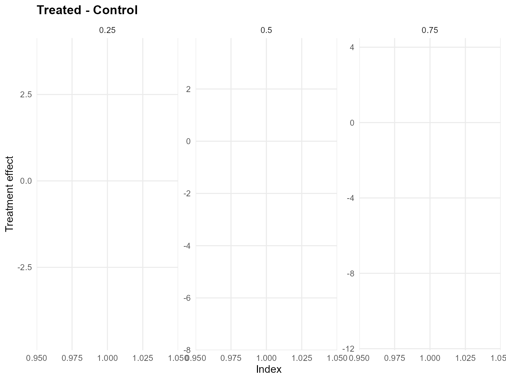

------------------------------------------------------------------------

### Model B: SB with GPD Tail (Gamma)

``` r
param_specs_gpd <- list(
  gpd = list(
    threshold = list(
      mode = "dist",
      dist = "lognormal",
      args = list(meanlog = log(max(u_threshold, .Machine$double.eps)), sdlog = 0.25)
    )
  )
)

bundle_crp_gpd <- build_causal_bundle(
  y = y,
  T = T,
  X = NULL,
  kernel = "gamma",
  backend = "sb",
  PS = FALSE,
  GPD = TRUE,
  components = 6,
  param_specs = param_specs_gpd,
  mcmc_outcome = list(niter = 300, nburnin = 80, nchains = 1, thin = 1, seed = 2)
)

bundle_crp_gpd
```

    DPmixGPD causal bundle
    PS model: disabled 
    Outcome (treated): backend = sb | kernel = gamma 
    Outcome (control): backend = sb | kernel = gamma 
    GPD tail (treated/control): TRUE / TRUE 
    components (treated/control): 6 / 6 
    Outcome PS included: FALSE 
    epsilon (treated/control): 0.025 / 0.025 
    n (control) = 232 | n (treated) = 268 

``` r
fit_crp_gpd <- quiet_mcmc(run_mcmc_causal(bundle_crp_gpd))
summary(fit_crp_gpd)
```

    -- Outcome fits --
    [control]
    MixGPD fit | backend: Stick-Breaking Process | kernel: Gamma Distribution | GPD tail: TRUE
    n = 232 | components = 6 | epsilon = 0.025
    MCMC: niter=300, nburnin=80, thin=1, nchains=1 
    Fit
    Use summary() for posterior summaries; plot() for diagnostics; predict() for predictions.

    [treated]
    MixGPD fit | backend: Stick-Breaking Process | kernel: Gamma Distribution | GPD tail: TRUE
    n = 268 | components = 6 | epsilon = 0.025
    MCMC: niter=300, nburnin=80, thin=1, nchains=1 
    Fit
    Use summary() for posterior summaries; plot() for diagnostics; predict() for predictions.

``` r
pred_mean_gpd <- predict(fit_crp_gpd, type = "mean", interval = "credible", nsim_mean = 150)
head(pred_mean_gpd)
```

         ps  estimate     lower    upper
    [1,] NA 0.2070627 0.1689763 0.501794

``` r
plot(pred_mean_gpd)
```

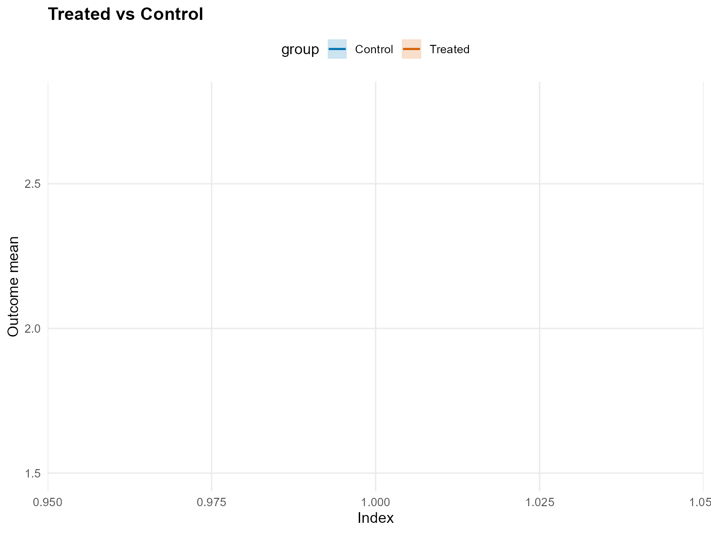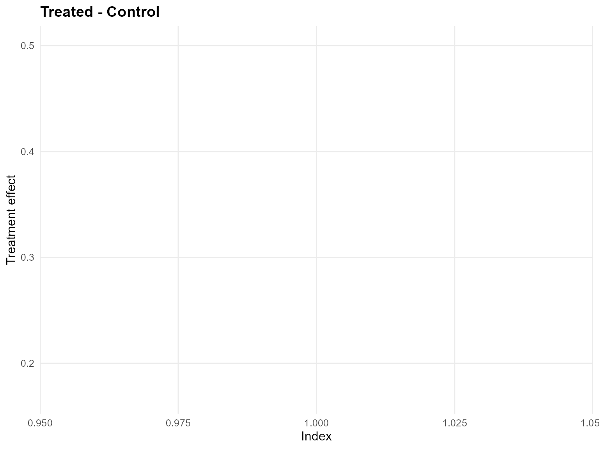

``` r
pred_q_gpd <- predict(fit_crp_gpd, type = "quantile", p = 0.5, interval = "credible")
head(pred_q_gpd)
```

         ps  estimate     lower      upper
    [1,] NA 0.1345179 0.1465536 0.07282363

``` r
plot(pred_q_gpd)
```

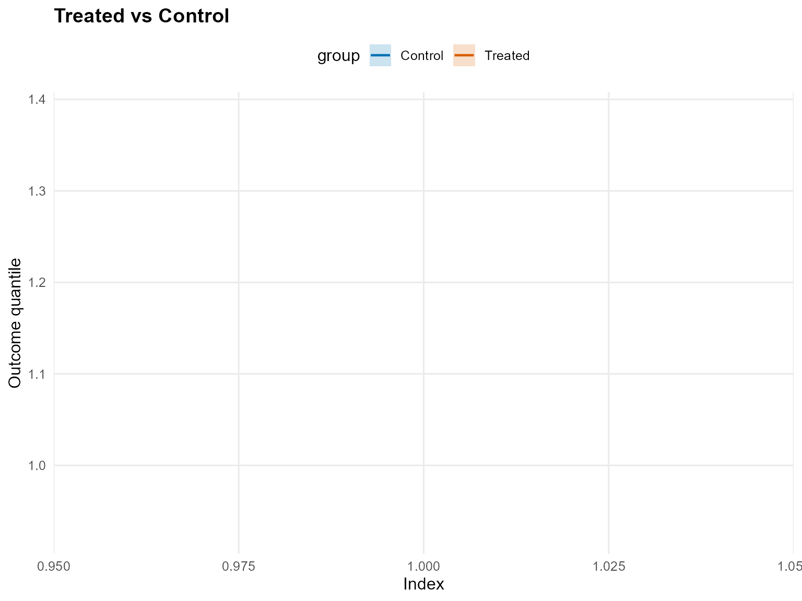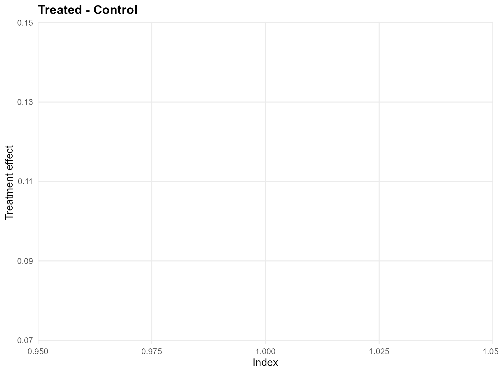

``` r
pred_d_gpd <- predict(fit_crp_gpd, y = y_eval, type = "density", interval = "credible")
head(pred_d_gpd)
```

              y ps trt_estimate  trt_lower  trt_upper con_estimate  con_lower
    1 0.9001906 NA            1 0.37360380 0.52949912            1 0.33611519
    2 1.3517565 NA            1 0.30075376 0.53061910            1 0.26287555
    3 1.1475287 NA            1 0.33437160 0.57357073            1 0.28827119
    4 1.9323578 NA            1 0.21431004 0.29105187            1 0.17138727
    5 3.3439817 NA            1 0.03989301 0.07725643            1 0.04114444
    6 0.9493979 NA            1 0.36721568 0.50755658            1 0.32540011
       con_upper
    1 0.42120428
    2 0.53174055
    3 0.36369579
    4 0.37490260
    5 0.09187914
    6 0.40841441

``` r
plot(pred_d_gpd)
```

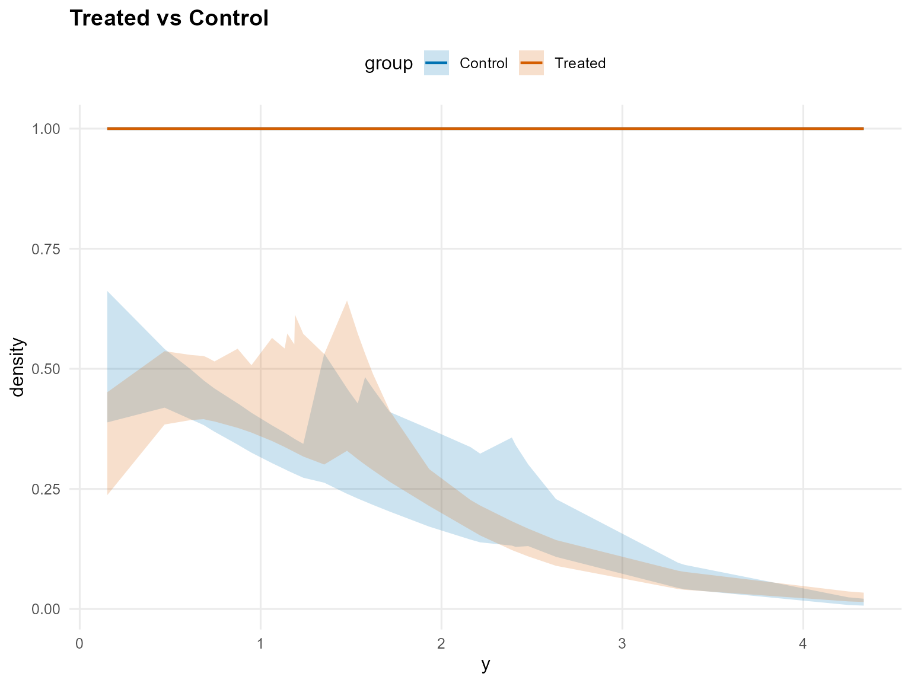

``` r
pred_surv_gpd <- predict(fit_crp_gpd, y = y_eval, type = "survival", interval = "credible")
head(pred_surv_gpd)
```

              y ps trt_estimate  trt_lower  trt_upper con_estimate  con_lower
    1 0.9001906 NA            1 0.57463751 0.69691850            1 0.50982826
    2 1.3517565 NA            1 0.39185183 0.51129386            1 0.36340604
    3 1.1475287 NA            1 0.47101165 0.59797950            1 0.42390989
    4 1.9323578 NA            1 0.19562337 0.30763247            1 0.20625676
    5 3.3439817 NA            1 0.04414139 0.09366977            1 0.02334124
    6 0.9493979 NA            1 0.55227400 0.67724113            1 0.49140465
       con_upper
    1 0.63270430
    2 0.48235424
    3 0.55043472
    4 0.32589234
    5 0.05827122
    6 0.61569178

``` r
plot(pred_surv_gpd)
```

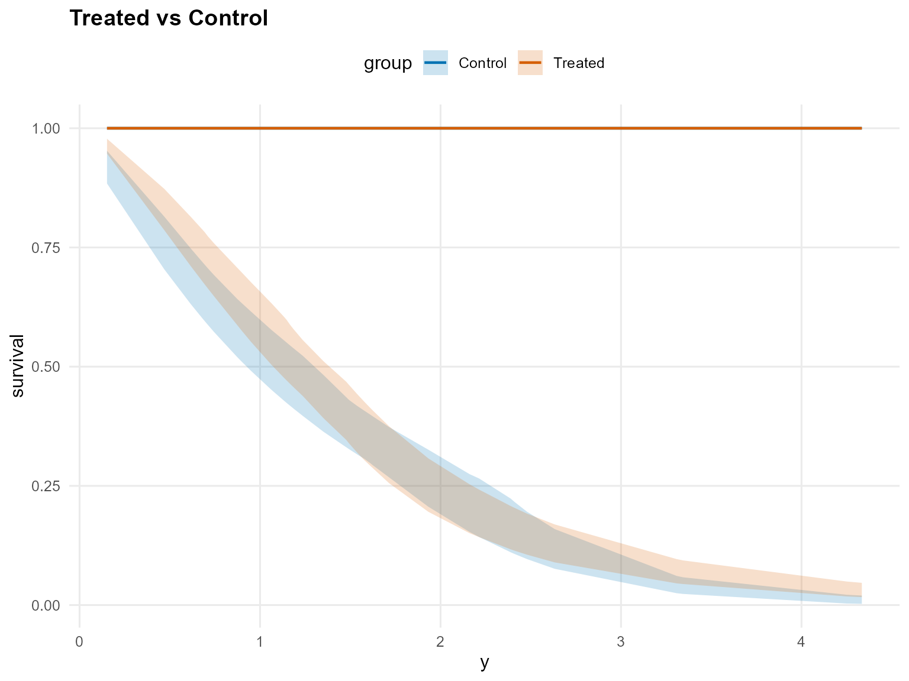

``` r
ate_gpd <- ate(fit_crp_gpd, interval = "credible", nsim_mean = 150)
head(ate_gpd)
```

    $fit
    [1] 0.2467733

    $lower
          2.5% 
    -0.3546628 

    $upper
       97.5% 
    1.181243 

    $grid
    NULL

    $trt
    $fit
      estimate    lower    upper
    1 2.111577 1.712272 3.012457

    $type
    [1] "mean"

    $draws
               [,1]
      [1,] 2.019627
      [2,] 1.842650
      [3,] 1.922857
      [4,] 2.091499
      [5,] 1.906650
      [6,] 1.893248
      [7,] 1.911174
      [8,] 1.987199
      [9,] 2.072329
     [10,] 1.971172
     [11,] 1.977756
     [12,] 2.093294
     [13,] 1.906534
     [14,] 1.921974
     [15,] 1.906375
     [16,] 1.958821
     [17,] 2.068799
     [18,] 2.030969
     [19,] 2.282064
     [20,] 2.054185
     [21,] 2.020229
     [22,] 2.312553
     [23,] 2.004066
     [24,] 1.774386
     [25,] 1.940576
     [26,] 2.362509
     [27,] 2.101051
     [28,] 2.113721
     [29,] 1.944578
     [30,] 2.176159
     [31,] 2.506261
     [32,] 2.038720
     [33,] 1.850739
     [34,] 2.273602
     [35,] 1.748480
     [36,] 1.735280
     [37,] 2.406045
     [38,] 2.238873
     [39,] 2.697608
     [40,] 2.685183
     [41,] 3.016989
     [42,] 2.345970
     [43,] 2.115529
     [44,] 1.884719
     [45,] 3.147961
     [46,] 3.055083
     [47,] 1.851056
     [48,] 1.732388
     [49,] 2.486959
     [50,] 1.924995
     [51,] 2.097337
     [52,] 2.360479
     [53,] 2.141825
     [54,] 2.141124
     [55,] 1.994805
     [56,] 2.415319
     [57,] 1.719654
     [58,] 1.986900
     [59,] 1.656007
     [60,] 1.738052
     [61,] 1.888529
     [62,] 1.807237
     [63,] 1.693867
     [64,] 1.717688
     [65,] 1.834540
     [66,] 1.813188
     [67,] 1.713103
     [68,] 2.054061
     [69,] 2.110658
     [70,] 1.673990
     [71,] 1.930914
     [72,] 2.194712
     [73,] 2.110984
     [74,] 1.711519
     [75,] 1.884355
     [76,] 1.929123
     [77,] 1.977501
     [78,] 2.781542
     [79,] 1.789558
     [80,] 1.771769
     [81,] 1.803535
     [82,] 2.043389
     [83,] 1.945642
     [84,] 1.973496
     [85,] 2.031170
     [86,] 2.154768
     [87,] 1.882899
     [88,] 2.248096
     [89,] 1.864495
     [90,] 2.029818
     [91,] 1.904536
     [92,] 1.994345
     [93,] 1.813863
     [94,] 1.830969
     [95,] 1.950867
     [96,] 2.375883
     [97,] 1.884962
     [98,] 2.256767
     [99,] 2.078866
    [100,] 1.985838
    [101,] 2.005986
    [102,] 2.363010
    [103,] 2.076066
    [104,] 2.210845
    [105,] 2.150599
    [106,] 2.215718
    [107,] 2.690735
    [108,] 2.289664
    [109,] 2.365806
    [110,] 2.208983
    [111,] 2.110603
    [112,] 2.436853
    [113,] 2.022039
    [114,] 2.108509
    [115,] 2.516953
    [116,] 2.270381
    [117,] 2.532854
    [118,] 2.501279
    [119,] 2.164498
    [120,] 2.122346
    [121,] 2.027154
    [122,] 1.989642
    [123,] 1.905669
    [124,] 2.442127
    [125,] 2.211445
    [126,] 2.201113
    [127,] 2.377429
    [128,] 2.213725
    [129,] 2.462065
    [130,] 2.836597
    [131,] 3.007448
    [132,] 2.265362
    [133,] 1.934207
    [134,] 2.206927
    [135,] 2.035170
    [136,] 3.261400
    [137,] 2.064325
    [138,] 1.938180
    [139,] 3.541910
    [140,] 3.772579
    [141,] 1.765484
    [142,] 1.832416
    [143,] 1.880182
    [144,] 2.181061
    [145,] 1.802641
    [146,] 2.054160
    [147,] 1.788690
    [148,] 1.674006
    [149,] 1.744646
    [150,] 1.943573
    [151,] 1.992698
    [152,] 2.210978
    [153,] 2.132517
    [154,] 2.141831
    [155,] 2.123104
    [156,] 2.288785
    [157,] 2.282356
    [158,] 2.312128
    [159,] 2.145476
    [160,] 2.290537
    [161,] 2.571361
    [162,] 2.140689
    [163,] 2.167575
    [164,] 1.925201
    [165,] 2.358558
    [166,] 2.328129
    [167,] 2.516659
    [168,] 2.565949
    [169,] 2.140750
    [170,] 2.263422
    [171,] 2.238252
    [172,] 1.836945
    [173,] 2.096015
    [174,] 2.145081
    [175,] 1.886804
    [176,] 1.921521
    [177,] 2.749415
    [178,] 2.516401
    [179,] 2.108968
    [180,] 2.566162
    [181,] 2.109881
    [182,] 1.936160
    [183,] 2.088696
    [184,] 1.785497
    [185,] 1.893926
    [186,] 2.220810
    [187,] 1.945745
    [188,] 2.085017
    [189,] 1.921090
    [190,] 1.988792
    [191,] 1.960121
    [192,] 2.035245
    [193,] 2.082497
    [194,] 1.941110
    [195,] 1.969047
    [196,] 2.145736
    [197,] 2.078165
    [198,] 2.148127
    [199,] 1.943835
    [200,] 2.185369
    [201,] 2.030430
    [202,] 1.961129
    [203,] 1.828090
    [204,] 1.836521
    [205,] 1.799016
    [206,] 1.996823
    [207,] 2.157709
    [208,] 2.178951
    [209,] 2.289632
    [210,] 1.941556
    [211,] 1.981124
    [212,] 1.840760
    [213,] 1.852621
    [214,] 1.860640
    [215,] 2.007347
    [216,] 1.796780
    [217,] 2.020194
    [218,] 1.707835
    [219,] 2.135248
    [220,] 2.164345

    attr(,"class")
    [1] "mixgpd_predict"

    $con
    $fit
      estimate    lower    upper
    1 1.864804 1.526817 2.309375

    $type
    [1] "mean"

    $draws
               [,1]
      [1,] 1.411043
      [2,] 2.001928
      [3,] 1.819252
      [4,] 2.319522
      [5,] 2.080634
      [6,] 1.782501
      [7,] 1.600262
      [8,] 1.792924
      [9,] 1.570594
     [10,] 1.366883
     [11,] 1.813701
     [12,] 1.746674
     [13,] 1.575953
     [14,] 1.550609
     [15,] 1.751667
     [16,] 1.531693
     [17,] 1.759387
     [18,] 1.626333
     [19,] 1.560072
     [20,] 1.718323
     [21,] 1.777015
     [22,] 1.615194
     [23,] 1.746161
     [24,] 1.964371
     [25,] 1.938948
     [26,] 1.713109
     [27,] 1.706666
     [28,] 1.678786
     [29,] 1.992631
     [30,] 1.780437
     [31,] 1.906136
     [32,] 1.861466
     [33,] 1.825814
     [34,] 1.928316
     [35,] 1.965344
     [36,] 2.058083
     [37,] 1.790315
     [38,] 1.729319
     [39,] 1.526924
     [40,] 1.646404
     [41,] 1.885779
     [42,] 1.841526
     [43,] 1.859940
     [44,] 2.040877
     [45,] 1.736343
     [46,] 1.984172
     [47,] 1.740914
     [48,] 1.807389
     [49,] 1.767965
     [50,] 2.091181
     [51,] 1.925685
     [52,] 1.743822
     [53,] 1.526720
     [54,] 1.600218
     [55,] 1.835868
     [56,] 1.734748
     [57,] 1.754969
     [58,] 1.935735
     [59,] 1.654693
     [60,] 1.789439
     [61,] 1.800879
     [62,] 1.973752
     [63,] 2.060427
     [64,] 1.613262
     [65,] 2.135169
     [66,] 1.905357
     [67,] 2.139713
     [68,] 1.967919
     [69,] 1.869310
     [70,] 2.005643
     [71,] 1.367972
     [72,] 1.733951
     [73,] 1.799965
     [74,] 1.773974
     [75,] 1.639090
     [76,] 1.907583
     [77,] 1.879864
     [78,] 1.803654
     [79,] 1.727231
     [80,] 2.079165
     [81,] 1.738658
     [82,] 1.572783
     [83,] 1.746949
     [84,] 1.853023
     [85,] 2.215880
     [86,] 2.235826
     [87,] 1.968785
     [88,] 1.952370
     [89,] 2.125804
     [90,] 1.839447
     [91,] 1.988362
     [92,] 2.213633
     [93,] 2.140518
     [94,] 2.067898
     [95,] 1.838095
     [96,] 1.836980
     [97,] 1.865963
     [98,] 1.774788
     [99,] 1.835120
    [100,] 1.805956
    [101,] 2.023610
    [102,] 1.655714
    [103,] 1.613240
    [104,] 1.921933
    [105,] 1.781234
    [106,] 1.945118
    [107,] 1.928100
    [108,] 1.808896
    [109,] 2.023678
    [110,] 2.398951
    [111,] 1.992784
    [112,] 1.989124
    [113,] 2.006193
    [114,] 1.865247
    [115,] 1.505009
    [116,] 1.956768
    [117,] 1.700100
    [118,] 1.913346
    [119,] 1.684656
    [120,] 1.710950
    [121,] 1.628596
    [122,] 1.461248
    [123,] 1.551870
    [124,] 1.743036
    [125,] 1.704743
    [126,] 1.646104
    [127,] 1.843627
    [128,] 1.650105
    [129,] 1.786516
    [130,] 1.635176
    [131,] 1.816651
    [132,] 1.647570
    [133,] 1.871926
    [134,] 1.631392
    [135,] 1.874050
    [136,] 2.023728
    [137,] 1.907993
    [138,] 1.937186
    [139,] 1.568586
    [140,] 1.766958
    [141,] 1.822674
    [142,] 1.583332
    [143,] 1.802788
    [144,] 1.691446
    [145,] 2.011198
    [146,] 1.951057
    [147,] 2.128985
    [148,] 1.886405
    [149,] 1.756010
    [150,] 1.941625
    [151,] 2.350755
    [152,] 1.923223
    [153,] 1.924847
    [154,] 1.837371
    [155,] 2.055448
    [156,] 1.890617
    [157,] 1.997866
    [158,] 2.362490
    [159,] 1.967335
    [160,] 2.270074
    [161,] 2.277650
    [162,] 2.070650
    [163,] 2.104700
    [164,] 2.033467
    [165,] 2.066000
    [166,] 2.055841
    [167,] 2.732340
    [168,] 2.365841
    [169,] 1.992144
    [170,] 1.949701
    [171,] 1.946775
    [172,] 2.187855
    [173,] 1.875470
    [174,] 1.973749
    [175,] 2.298161
    [176,] 2.290894
    [177,] 1.713756
    [178,] 1.873761
    [179,] 1.864152
    [180,] 1.786298
    [181,] 1.720514
    [182,] 1.945649
    [183,] 1.878171
    [184,] 1.958566
    [185,] 1.997312
    [186,] 1.902003
    [187,] 1.875103
    [188,] 1.748360
    [189,] 1.874247
    [190,] 1.928875
    [191,] 2.034039
    [192,] 1.576579
    [193,] 1.754403
    [194,] 1.852004
    [195,] 2.040895
    [196,] 1.615088
    [197,] 1.774658
    [198,] 1.845398
    [199,] 1.994038
    [200,] 2.178389
    [201,] 1.879234
    [202,] 1.871503
    [203,] 1.746986
    [204,] 2.027632
    [205,] 1.691088
    [206,] 1.658429
    [207,] 1.627029
    [208,] 2.052815
    [209,] 1.911664
    [210,] 1.945159
    [211,] 2.048912
    [212,] 2.234403
    [213,] 2.039326
    [214,] 1.877852
    [215,] 2.096409
    [216,] 1.770615
    [217,] 1.807246
    [218,] 1.723437
    [219,] 1.797692
    [220,] 1.628537

    attr(,"class")
    [1] "mixgpd_predict"

``` r
plot(ate_gpd)
```

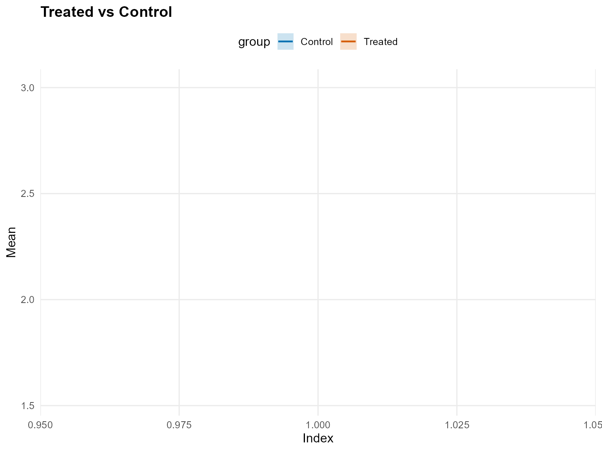

``` r
qte_gpd <- qte(fit_crp_gpd, probs = c(0.25, 0.5, 0.75), interval = "credible")
head(qte_gpd)
```

    $fit
              [,1]      [,2]        [,3]
    [1,] 0.1636269 0.1345179 -0.03653648

    $lower
                [,1]        [,2]       [,3]
    [1,] -0.01649607 -0.09880901 -0.4066462

    $upper
            [,1]      [,2]      [,3]
    [1,] 0.35258 0.3584856 0.3173492

    $grid
    [1] 0.25 0.50 0.75

    $trt
    $fit
       estimate index    lower     upper
    1 0.6434291  0.25 0.539146 0.7664086
    2 1.2276368  0.50 1.072763 1.3849125
    3 1.9518749  0.75 1.732094 2.1760837

    $lower
    NULL

    $upper
    NULL

    $type
    [1] "quantile"

    $grid
    [1] 0.25 0.50 0.75

    $draws
    , , 1

                [,1]
      [1,] 0.7072198
      [2,] 0.7108345
      [3,] 0.7145810
      [4,] 0.7176285
      [5,] 0.6592535
      [6,] 0.7212649
      [7,] 0.7230580
      [8,] 0.6911948
      [9,] 0.7158035
     [10,] 0.7268676
     [11,] 0.6308401
     [12,] 0.6483715
     [13,] 0.5872392
     [14,] 0.5972343
     [15,] 0.5939689
     [16,] 0.6067006
     [17,] 0.6067549
     [18,] 0.5909583
     [19,] 0.6332615
     [20,] 0.6245773
     [21,] 0.6259336
     [22,] 0.6379986
     [23,] 0.6570069
     [24,] 0.6020310
     [25,] 0.6335720
     [26,] 0.6485479
     [27,] 0.6176858
     [28,] 0.6180422
     [29,] 0.5736786
     [30,] 0.6269714
     [31,] 0.5873103
     [32,] 0.5963635
     [33,] 0.5909722
     [34,] 0.5736572
     [35,] 0.5718753
     [36,] 0.5359884
     [37,] 0.5364273
     [38,] 0.5465326
     [39,] 0.5598870
     [40,] 0.5493591
     [41,] 0.5556055
     [42,] 0.6164877
     [43,] 0.6393882
     [44,] 0.6168140
     [45,] 0.5985710
     [46,] 0.5960473
     [47,] 0.5420536
     [48,] 0.5614477
     [49,] 0.5337721
     [50,] 0.6285369
     [51,] 0.6662160
     [52,] 0.6650191
     [53,] 0.6792290
     [54,] 0.6580612
     [55,] 0.6766272
     [56,] 0.6509590
     [57,] 0.6549700
     [58,] 0.6345948
     [59,] 0.6344190
     [60,] 0.6316266
     [61,] 0.6019948
     [62,] 0.5913373
     [63,] 0.6304955
     [64,] 0.6396481
     [65,] 0.6240781
     [66,] 0.6228931
     [67,] 0.5937343
     [68,] 0.6398354
     [69,] 0.6288108
     [70,] 0.6015608
     [71,] 0.6946322
     [72,] 0.6838989
     [73,] 0.7028563
     [74,] 0.6131568
     [75,] 0.5905179
     [76,] 0.5831992
     [77,] 0.6035734
     [78,] 0.6058999
     [79,] 0.5614732
     [80,] 0.5635161
     [81,] 0.5644667
     [82,] 0.5887372
     [83,] 0.6285458
     [84,] 0.6145649
     [85,] 0.6277704
     [86,] 0.6224876
     [87,] 0.6404447
     [88,] 0.6404324
     [89,] 0.5390341
     [90,] 0.5608896
     [91,] 0.5392697
     [92,] 0.5359279
     [93,] 0.5395222
     [94,] 0.5399428
     [95,] 0.5376811
     [96,] 0.6028788
     [97,] 0.5839452
     [98,] 0.5771570
     [99,] 0.5945709
    [100,] 0.5949939
    [101,] 0.5611257
    [102,] 0.6154364
    [103,] 0.6172875
    [104,] 0.6169207
    [105,] 0.7027714
    [106,] 0.6931718
    [107,] 0.7040635
    [108,] 0.6900741
    [109,] 0.6848439
    [110,] 0.6947071
    [111,] 0.6877355
    [112,] 0.6942579
    [113,] 0.6907068
    [114,] 0.6946766
    [115,] 0.6874843
    [116,] 0.6883236
    [117,] 0.6357372
    [118,] 0.6271047
    [119,] 0.6201128
    [120,] 0.6227515
    [121,] 0.6430951
    [122,] 0.6207783
    [123,] 0.6062094
    [124,] 0.5829908
    [125,] 0.5570133
    [126,] 0.6705541
    [127,] 0.6846516
    [128,] 0.6890299
    [129,] 0.6846732
    [130,] 0.6064187
    [131,] 0.6106003
    [132,] 0.6349862
    [133,] 0.6532287
    [134,] 0.6827639
    [135,] 0.6631290
    [136,] 0.6978234
    [137,] 0.7483573
    [138,] 0.5937828
    [139,] 0.6242175
    [140,] 0.5504336
    [141,] 0.5624166
    [142,] 0.5941098
    [143,] 0.6161040
    [144,] 0.6220606
    [145,] 0.6182722
    [146,] 0.7004429
    [147,] 0.6353046
    [148,] 0.6258624
    [149,] 0.6572457
    [150,] 0.6664544
    [151,] 0.6740497
    [152,] 0.6769869
    [153,] 0.6876018
    [154,] 0.7068221
    [155,] 0.6871425
    [156,] 0.7623085
    [157,] 0.7351216
    [158,] 0.7175199
    [159,] 0.7293436
    [160,] 0.6732611
    [161,] 0.6311133
    [162,] 0.5609070
    [163,] 0.5657304
    [164,] 0.5732848
    [165,] 0.5983196
    [166,] 0.6401324
    [167,] 0.6890366
    [168,] 0.6953535
    [169,] 0.5990410
    [170,] 0.5895906
    [171,] 0.5900332
    [172,] 0.5816893
    [173,] 0.5843595
    [174,] 0.6596453
    [175,] 0.7287678
    [176,] 0.6819204
    [177,] 0.7701183
    [178,] 0.7708815
    [179,] 0.6999993
    [180,] 0.6698060
    [181,] 0.6659431
    [182,] 0.6334415
    [183,] 0.6746713
    [184,] 0.6489638
    [185,] 0.5473340
    [186,] 0.6930877
    [187,] 0.6763875
    [188,] 0.7324231
    [189,] 0.7310339
    [190,] 0.6945893
    [191,] 0.7200915
    [192,] 0.6475330
    [193,] 0.8013266
    [194,] 0.7960955
    [195,] 0.7591876
    [196,] 0.8054073
    [197,] 0.7558153
    [198,] 0.7182153
    [199,] 0.6548514
    [200,] 0.7075587
    [201,] 0.6744282
    [202,] 0.6785210
    [203,] 0.6552921
    [204,] 0.6311402
    [205,] 0.6639341
    [206,] 0.6170585
    [207,] 0.5667322
    [208,] 0.6631491
    [209,] 0.8006170
    [210,] 0.6811986
    [211,] 0.7513294
    [212,] 0.7458656
    [213,] 0.6805290
    [214,] 0.6819539
    [215,] 0.7445626
    [216,] 0.6809618
    [217,] 0.7199837
    [218,] 0.7064639
    [219,] 0.6572786
    [220,] 0.6389871

    , , 2

               [,1]
      [1,] 1.280258
      [2,] 1.286444
      [3,] 1.289098
      [4,] 1.293092
      [5,] 1.218692
      [6,] 1.277473
      [7,] 1.283539
      [8,] 1.253014
      [9,] 1.327915
     [10,] 1.334798
     [11,] 1.239464
     [12,] 1.264862
     [13,] 1.133402
     [14,] 1.147773
     [15,] 1.149331
     [16,] 1.182955
     [17,] 1.187051
     [18,] 1.154584
     [19,] 1.226765
     [20,] 1.202683
     [21,] 1.214991
     [22,] 1.254114
     [23,] 1.301201
     [24,] 1.160304
     [25,] 1.248803
     [26,] 1.300738
     [27,] 1.232297
     [28,] 1.233345
     [29,] 1.116076
     [30,] 1.242272
     [31,] 1.185709
     [32,] 1.200921
     [33,] 1.192688
     [34,] 1.142730
     [35,] 1.131714
     [36,] 1.057355
     [37,] 1.073780
     [38,] 1.085946
     [39,] 1.123742
     [40,] 1.095076
     [41,] 1.110161
     [42,] 1.200209
     [43,] 1.250491
     [44,] 1.187364
     [45,] 1.202701
     [46,] 1.201867
     [47,] 1.086705
     [48,] 1.094439
     [49,] 1.071644
     [50,] 1.192981
     [51,] 1.244687
     [52,] 1.245701
     [53,] 1.271426
     [54,] 1.236443
     [55,] 1.252759
     [56,] 1.229140
     [57,] 1.223557
     [58,] 1.188464
     [59,] 1.169190
     [60,] 1.178854
     [61,] 1.122626
     [62,] 1.103267
     [63,] 1.152740
     [64,] 1.171321
     [65,] 1.147354
     [66,] 1.138557
     [67,] 1.103182
     [68,] 1.185902
     [69,] 1.179776
     [70,] 1.107365
     [71,] 1.233346
     [72,] 1.234386
     [73,] 1.272826
     [74,] 1.149121
     [75,] 1.120555
     [76,] 1.104458
     [77,] 1.143040
     [78,] 1.157284
     [79,] 1.063289
     [80,] 1.068217
     [81,] 1.071842
     [82,] 1.139153
     [83,] 1.218643
     [84,] 1.192062
     [85,] 1.222375
     [86,] 1.207121
     [87,] 1.242182
     [88,] 1.242651
     [89,] 1.091814
     [90,] 1.148904
     [91,] 1.090231
     [92,] 1.075585
     [93,] 1.086908
     [94,] 1.086590
     [95,] 1.090876
     [96,] 1.216088
     [97,] 1.191991
     [98,] 1.195179
     [99,] 1.220727
    [100,] 1.236270
    [101,] 1.157370
    [102,] 1.251974
    [103,] 1.240755
    [104,] 1.251284
    [105,] 1.382150
    [106,] 1.371877
    [107,] 1.397096
    [108,] 1.364666
    [109,] 1.351256
    [110,] 1.374166
    [111,] 1.343364
    [112,] 1.376150
    [113,] 1.350550
    [114,] 1.365848
    [115,] 1.350864
    [116,] 1.357855
    [117,] 1.317242
    [118,] 1.273184
    [119,] 1.280628
    [120,] 1.271026
    [121,] 1.318600
    [122,] 1.267059
    [123,] 1.214666
    [124,] 1.270003
    [125,] 1.248348
    [126,] 1.361565
    [127,] 1.364928
    [128,] 1.383908
    [129,] 1.386232
    [130,] 1.268619
    [131,] 1.291094
    [132,] 1.275621
    [133,] 1.242627
    [134,] 1.289777
    [135,] 1.257751
    [136,] 1.382322
    [137,] 1.382343
    [138,] 1.113671
    [139,] 1.223329
    [140,] 1.114665
    [141,] 1.056631
    [142,] 1.114580
    [143,] 1.140123
    [144,] 1.195297
    [145,] 1.182188
    [146,] 1.269981
    [147,] 1.177093
    [148,] 1.172121
    [149,] 1.226209
    [150,] 1.242585
    [151,] 1.284883
    [152,] 1.294893
    [153,] 1.308442
    [154,] 1.331121
    [155,] 1.311794
    [156,] 1.406724
    [157,] 1.385821
    [158,] 1.373850
    [159,] 1.395900
    [160,] 1.336650
    [161,] 1.301935
    [162,] 1.149009
    [163,] 1.181576
    [164,] 1.171211
    [165,] 1.235733
    [166,] 1.237548
    [167,] 1.294535
    [168,] 1.304417
    [169,] 1.149653
    [170,] 1.176701
    [171,] 1.163110
    [172,] 1.134418
    [173,] 1.125380
    [174,] 1.238205
    [175,] 1.281481
    [176,] 1.228821
    [177,] 1.351674
    [178,] 1.334567
    [179,] 1.272792
    [180,] 1.245618
    [181,] 1.238495
    [182,] 1.184376
    [183,] 1.230577
    [184,] 1.186450
    [185,] 1.074377
    [186,] 1.281562
    [187,] 1.259686
    [188,] 1.347976
    [189,] 1.308995
    [190,] 1.268572
    [191,] 1.294494
    [192,] 1.161360
    [193,] 1.318476
    [194,] 1.312172
    [195,] 1.302565
    [196,] 1.339981
    [197,] 1.306243
    [198,] 1.269852
    [199,] 1.185071
    [200,] 1.261959
    [201,] 1.242973
    [202,] 1.251150
    [203,] 1.230673
    [204,] 1.234967
    [205,] 1.240086
    [206,] 1.188610
    [207,] 1.128295
    [208,] 1.309411
    [209,] 1.415996
    [210,] 1.277309
    [211,] 1.327987
    [212,] 1.291746
    [213,] 1.232942
    [214,] 1.180593
    [215,] 1.224973
    [216,] 1.160942
    [217,] 1.213327
    [218,] 1.204606
    [219,] 1.171114
    [220,] 1.155861

    , , 3

               [,1]
      [1,] 2.007476
      [2,] 2.013980
      [3,] 2.016771
      [4,] 2.020971
      [5,] 1.890710
      [6,] 1.952520
      [7,] 1.958898
      [8,] 1.934989
      [9,] 2.007549
     [10,] 2.014916
     [11,] 2.036840
     [12,] 2.062196
     [13,] 1.936036
     [14,] 1.950135
     [15,] 1.952769
     [16,] 2.011765
     [17,] 2.017763
     [18,] 1.979467
     [19,] 2.056749
     [20,] 2.028680
     [21,] 2.059981
     [22,] 2.188538
     [23,] 1.886211
     [24,] 1.804061
     [25,] 1.881428
     [26,] 1.920547
     [27,] 1.874863
     [28,] 1.875649
     [29,] 1.770398
     [30,] 1.878880
     [31,] 1.846942
     [32,] 1.857996
     [33,] 1.852871
     [34,] 1.810252
     [35,] 1.812997
     [36,] 1.811463
     [37,] 1.849070
     [38,] 1.857689
     [39,] 1.907232
     [40,] 1.870832
     [41,] 1.889494
     [42,] 1.904938
     [43,] 1.948628
     [44,] 1.801913
     [45,] 1.824930
     [46,] 1.828155
     [47,] 1.741362
     [48,] 1.731366
     [49,] 1.729364
     [50,] 1.804565
     [51,] 1.834884
     [52,] 1.837195
     [53,] 1.855037
     [54,] 1.832123
     [55,] 1.842702
     [56,] 1.824997
     [57,] 1.815508
     [58,] 1.790675
     [59,] 1.769698
     [60,] 1.783328
     [61,] 1.770672
     [62,] 1.758594
     [63,] 1.799952
     [64,] 1.817917
     [65,] 1.797806
     [66,] 1.785381
     [67,] 1.756731
     [68,] 1.835871
     [69,] 1.838220
     [70,] 1.757397
     [71,] 1.865439
     [72,] 1.971326
     [73,] 2.013499
     [74,] 1.798480
     [75,] 1.778555
     [76,] 1.761688
     [77,] 1.796858
     [78,] 1.817178
     [79,] 1.721678
     [80,] 1.727608
     [81,] 1.732900
     [82,] 1.810807
     [83,] 1.867180
     [84,] 1.847212
     [85,] 1.872566
     [86,] 1.859650
     [87,] 1.886293
     [88,] 1.988976
     [89,] 1.834931
     [90,] 1.892422
     [91,] 1.886738
     [92,] 1.864794
     [93,] 1.879693
     [94,] 1.879082
     [95,] 1.887400
     [96,] 2.012459
     [97,] 1.992486
     [98,] 2.001798
     [99,] 2.023040
    [100,] 2.040139
    [101,] 1.964319
    [102,] 2.047873
    [103,] 2.034070
    [104,] 2.046424
    [105,] 2.147712
    [106,] 2.160526
    [107,] 2.179783
    [108,] 2.154738
    [109,] 2.143672
    [110,] 2.162187
    [111,] 2.135549
    [112,] 2.163351
    [113,] 2.141497
    [114,] 2.154742
    [115,] 2.142659
    [116,] 2.148881
    [117,] 2.124727
    [118,] 2.003793
    [119,] 2.013312
    [120,] 2.003227
    [121,] 2.038503
    [122,] 1.992169
    [123,] 1.943600
    [124,] 1.985589
    [125,] 1.977206
    [126,] 2.115316
    [127,] 2.091974
    [128,] 2.191367
    [129,] 2.179834
    [130,] 2.045163
    [131,] 2.063307
    [132,] 2.041264
    [133,] 1.997282
    [134,] 2.043894
    [135,] 2.015844
    [136,] 2.082368
    [137,] 2.075322
    [138,] 1.821322
    [139,] 1.961600
    [140,] 1.882374
    [141,] 1.757352
    [142,] 1.826321
    [143,] 1.849265
    [144,] 1.931522
    [145,] 1.880538
    [146,] 1.907747
    [147,] 1.835220
    [148,] 1.829056
    [149,] 2.065859
    [150,] 2.084879
    [151,] 2.138896
    [152,] 2.033712
    [153,] 2.047583
    [154,] 2.072111
    [155,] 1.999178
    [156,] 2.096365
    [157,] 2.049431
    [158,] 2.037175
    [159,] 2.107900
    [160,] 2.054409
    [161,] 2.017592
    [162,] 1.935362
    [163,] 1.966397
    [164,] 1.950156
    [165,] 2.017135
    [166,] 2.015557
    [167,] 2.078386
    [168,] 2.089415
    [169,] 1.925999
    [170,] 1.742234
    [171,] 1.733547
    [172,] 1.714108
    [173,] 1.716254
    [174,] 1.817274
    [175,] 1.857550
    [176,] 1.799383
    [177,] 2.111753
    [178,] 2.066157
    [179,] 1.984431
    [180,] 1.963167
    [181,] 1.955968
    [182,] 1.901277
    [183,] 1.920105
    [184,] 1.878234
    [185,] 1.913757
    [186,] 2.111169
    [187,] 2.135060
    [188,] 2.225964
    [189,] 2.031563
    [190,] 1.989943
    [191,] 2.016632
    [192,] 1.884967
    [193,] 2.044581
    [194,] 2.038090
    [195,] 2.052040
    [196,] 2.089141
    [197,] 2.055845
    [198,] 2.019759
    [199,] 1.935689
    [200,] 2.011932
    [201,] 1.947698
    [202,] 1.954276
    [203,] 1.938266
    [204,] 1.942972
    [205,] 1.946393
    [206,] 1.892933
    [207,] 2.015901
    [208,] 2.171995
    [209,] 2.277489
    [210,] 2.140495
    [211,] 2.059868
    [212,] 2.023120
    [213,] 1.981754
    [214,] 2.011663
    [215,] 2.058048
    [216,] 1.992854
    [217,] 2.044768
    [218,] 2.035889
    [219,] 2.001789
    [220,] 1.946517


    attr(,"class")
    [1] "mixgpd_predict"

    $con
    $fit
       estimate index     lower     upper
    1 0.4798022  0.25 0.3837826 0.6114004
    2 1.0931189  0.50 0.9262089 1.3120888
    3 1.9884114  0.75 1.7743577 2.3036104

    $lower
    NULL

    $upper
    NULL

    $type
    [1] "quantile"

    $grid
    [1] 0.25 0.50 0.75

    $draws
    , , 1

                [,1]
      [1,] 0.3329327
      [2,] 0.4924230
      [3,] 0.4881976
      [4,] 0.5797973
      [5,] 0.4303074
      [6,] 0.3860351
      [7,] 0.3879691
      [8,] 0.4171513
      [9,] 0.3948992
     [10,] 0.3396305
     [11,] 0.3581520
     [12,] 0.3877602
     [13,] 0.4138435
     [14,] 0.4023164
     [15,] 0.3919488
     [16,] 0.3833817
     [17,] 0.3863277
     [18,] 0.3857294
     [19,] 0.3849209
     [20,] 0.3789508
     [21,] 0.3842256
     [22,] 0.4209332
     [23,] 0.4161195
     [24,] 0.4682076
     [25,] 0.4810695
     [26,] 0.4804058
     [27,] 0.4958057
     [28,] 0.5145120
     [29,] 0.5173918
     [30,] 0.5011909
     [31,] 0.4980335
     [32,] 0.4729521
     [33,] 0.5023457
     [34,] 0.5584006
     [35,] 0.5771478
     [36,] 0.5715211
     [37,] 0.5084106
     [38,] 0.4224448
     [39,] 0.4092479
     [40,] 0.4227787
     [41,] 0.4670831
     [42,] 0.4729663
     [43,] 0.5558879
     [44,] 0.5216809
     [45,] 0.5003342
     [46,] 0.5272640
     [47,] 0.5397327
     [48,] 0.5528565
     [49,] 0.5516375
     [50,] 0.5422716
     [51,] 0.5288417
     [52,] 0.4896242
     [53,] 0.4909505
     [54,] 0.4947856
     [55,] 0.5081036
     [56,] 0.5024163
     [57,] 0.4867565
     [58,] 0.4971806
     [59,] 0.5069326
     [60,] 0.4759987
     [61,] 0.4818088
     [62,] 0.5332262
     [63,] 0.5542971
     [64,] 0.3979960
     [65,] 0.5048225
     [66,] 0.5377900
     [67,] 0.5338101
     [68,] 0.5221291
     [69,] 0.5026008
     [70,] 0.5102599
     [71,] 0.4100083
     [72,] 0.4005469
     [73,] 0.4330989
     [74,] 0.4387624
     [75,] 0.3887252
     [76,] 0.4151102
     [77,] 0.4122791
     [78,] 0.4341049
     [79,] 0.4886345
     [80,] 0.5003649
     [81,] 0.4687351
     [82,] 0.3884345
     [83,] 0.3923729
     [84,] 0.4677379
     [85,] 0.5018699
     [86,] 0.5920977
     [87,] 0.5790672
     [88,] 0.5537932
     [89,] 0.5633087
     [90,] 0.5047058
     [91,] 0.5112862
     [92,] 0.5080793
     [93,] 0.4985622
     [94,] 0.5070438
     [95,] 0.4886042
     [96,] 0.4668098
     [97,] 0.5062486
     [98,] 0.5146944
     [99,] 0.4948061
    [100,] 0.4911422
    [101,] 0.4032893
    [102,] 0.4962273
    [103,] 0.4319997
    [104,] 0.4412097
    [105,] 0.5937283
    [106,] 0.5678958
    [107,] 0.5591201
    [108,] 0.5717220
    [109,] 0.5449846
    [110,] 0.6368787
    [111,] 0.6211835
    [112,] 0.5819156
    [113,] 0.5821146
    [114,] 0.5379859
    [115,] 0.4653284
    [116,] 0.5158198
    [117,] 0.4733203
    [118,] 0.4743694
    [119,] 0.4754177
    [120,] 0.4405768
    [121,] 0.4396569
    [122,] 0.4634670
    [123,] 0.4567448
    [124,] 0.4805663
    [125,] 0.4564558
    [126,] 0.4406994
    [127,] 0.4927118
    [128,] 0.4921921
    [129,] 0.4999241
    [130,] 0.4356681
    [131,] 0.4513997
    [132,] 0.4576555
    [133,] 0.5293356
    [134,] 0.4005769
    [135,] 0.4421521
    [136,] 0.4688922
    [137,] 0.4269263
    [138,] 0.4578209
    [139,] 0.4052549
    [140,] 0.3872730
    [141,] 0.4176946
    [142,] 0.4182652
    [143,] 0.4318632
    [144,] 0.4043628
    [145,] 0.4984647
    [146,] 0.4420582
    [147,] 0.4917033
    [148,] 0.4326440
    [149,] 0.4802057
    [150,] 0.4899007
    [151,] 0.5528643
    [152,] 0.5167462
    [153,] 0.5210474
    [154,] 0.4785777
    [155,] 0.4820212
    [156,] 0.3994522
    [157,] 0.4074915
    [158,] 0.4181967
    [159,] 0.4467021
    [160,] 0.4899244
    [161,] 0.6613265
    [162,] 0.6776291
    [163,] 0.6140397
    [164,] 0.5882674
    [165,] 0.6084833
    [166,] 0.5854420
    [167,] 0.6173641
    [168,] 0.5343944
    [169,] 0.4726195
    [170,] 0.4704505
    [171,] 0.4672376
    [172,] 0.4763278
    [173,] 0.4663229
    [174,] 0.5552670
    [175,] 0.4844167
    [176,] 0.4543892
    [177,] 0.4431300
    [178,] 0.4185502
    [179,] 0.4497544
    [180,] 0.4944469
    [181,] 0.4355944
    [182,] 0.4830313
    [183,] 0.4317164
    [184,] 0.4436413
    [185,] 0.4859804
    [186,] 0.5074762
    [187,] 0.5131317
    [188,] 0.4821179
    [189,] 0.5136054
    [190,] 0.4715227
    [191,] 0.4538944
    [192,] 0.4558213
    [193,] 0.4356877
    [194,] 0.4432906
    [195,] 0.4429456
    [196,] 0.4335871
    [197,] 0.4505182
    [198,] 0.4654103
    [199,] 0.5322072
    [200,] 0.5532738
    [201,] 0.4971862
    [202,] 0.4894720
    [203,] 0.4691124
    [204,] 0.4798938
    [205,] 0.3950716
    [206,] 0.4137117
    [207,] 0.4048532
    [208,] 0.5199567
    [209,] 0.5251372
    [210,] 0.5070823
    [211,] 0.5109200
    [212,] 0.5160135
    [213,] 0.5240383
    [214,] 0.5186628
    [215,] 0.5081766
    [216,] 0.4442788
    [217,] 0.5052695
    [218,] 0.3793823
    [219,] 0.4237665
    [220,] 0.4706411

    , , 2

                [,1]
      [1,] 0.8115120
      [2,] 1.1683419
      [3,] 1.1597002
      [4,] 1.3256994
      [5,] 1.0908972
      [6,] 0.9596229
      [7,] 0.9585551
      [8,] 1.0321523
      [9,] 0.9720138
     [10,] 0.8477976
     [11,] 0.9034493
     [12,] 0.9374891
     [13,] 0.9760777
     [14,] 0.9608148
     [15,] 0.9373770
     [16,] 0.9253786
     [17,] 0.9232608
     [18,] 0.9376362
     [19,] 0.9371071
     [20,] 0.9601549
     [21,] 0.9762948
     [22,] 0.9705446
     [23,] 0.9706709
     [24,] 1.1048412
     [25,] 1.1263899
     [26,] 1.1109972
     [27,] 1.0954970
     [28,] 1.1105773
     [29,] 1.1599667
     [30,] 1.0824526
     [31,] 1.0815280
     [32,] 1.0613063
     [33,] 1.1675954
     [34,] 1.1532331
     [35,] 1.1871971
     [36,] 1.2494712
     [37,] 1.0906446
     [38,] 1.0204921
     [39,] 0.9522149
     [40,] 0.9795008
     [41,] 1.0681513
     [42,] 1.0549271
     [43,] 1.1772047
     [44,] 1.1271399
     [45,] 1.0959475
     [46,] 1.1121455
     [47,] 1.1148760
     [48,] 1.1654489
     [49,] 1.1757702
     [50,] 1.1761769
     [51,] 1.1237942
     [52,] 1.0444178
     [53,] 1.0452418
     [54,] 1.0583142
     [55,] 1.0999128
     [56,] 1.0853213
     [57,] 1.0386767
     [58,] 1.0902485
     [59,] 1.1252589
     [60,] 1.0665601
     [61,] 1.0659643
     [62,] 1.1480868
     [63,] 1.2398686
     [64,] 0.9925303
     [65,] 1.2109643
     [66,] 1.2188491
     [67,] 1.2036543
     [68,] 1.2176761
     [69,] 1.1444725
     [70,] 1.1554121
     [71,] 0.9619489
     [72,] 1.0032837
     [73,] 1.0528569
     [74,] 1.0463004
     [75,] 0.9735163
     [76,] 1.0501869
     [77,] 1.0455658
     [78,] 1.0774400
     [79,] 1.1372230
     [80,] 1.1324675
     [81,] 1.0846916
     [82,] 0.9409190
     [83,] 0.9481022
     [84,] 1.1256606
     [85,] 1.1520519
     [86,] 1.3132804
     [87,] 1.2951168
     [88,] 1.2133417
     [89,] 1.2096861
     [90,] 1.1026887
     [91,] 1.1761618
     [92,] 1.1431952
     [93,] 1.1473579
     [94,] 1.1389447
     [95,] 1.0837134
     [96,] 1.0431495
     [97,] 1.0986126
     [98,] 1.1052651
     [99,] 1.1066794
    [100,] 1.1416321
    [101,] 0.9921623
    [102,] 1.1027928
    [103,] 1.0023184
    [104,] 1.0181541
    [105,] 1.1959609
    [106,] 1.1842185
    [107,] 1.1622721
    [108,] 1.2149430
    [109,] 1.2035660
    [110,] 1.3216291
    [111,] 1.2777764
    [112,] 1.2234651
    [113,] 1.2163816
    [114,] 1.1434146
    [115,] 0.9977545
    [116,] 1.0992642
    [117,] 1.0198296
    [118,] 1.0214131
    [119,] 1.0216962
    [120,] 0.9651386
    [121,] 0.9567672
    [122,] 1.0053661
    [123,] 0.9889000
    [124,] 1.0466381
    [125,] 0.9989989
    [126,] 0.9701002
    [127,] 1.0668167
    [128,] 1.0589995
    [129,] 1.0796538
    [130,] 0.9912688
    [131,] 1.0245233
    [132,] 1.0368424
    [133,] 1.1584429
    [134,] 0.9726918
    [135,] 1.0211524
    [136,] 1.1064959
    [137,] 1.0369269
    [138,] 1.0856061
    [139,] 0.9682766
    [140,] 0.9271267
    [141,] 1.0055303
    [142,] 0.9885659
    [143,] 0.9972603
    [144,] 0.9805525
    [145,] 1.1834959
    [146,] 1.0686527
    [147,] 1.2083670
    [148,] 1.0555141
    [149,] 1.1169222
    [150,] 1.1648965
    [151,] 1.3205986
    [152,] 1.2549616
    [153,] 1.2636580
    [154,] 1.1879308
    [155,] 1.2229667
    [156,] 1.0086016
    [157,] 1.0298991
    [158,] 1.0746860
    [159,] 1.0360123
    [160,] 1.1224014
    [161,] 1.3247663
    [162,] 1.3562288
    [163,] 1.2785470
    [164,] 1.2081224
    [165,] 1.2604999
    [166,] 1.2193247
    [167,] 1.3107719
    [168,] 1.1281320
    [169,] 1.1403693
    [170,] 1.1385973
    [171,] 1.1180166
    [172,] 1.1473522
    [173,] 1.1217615
    [174,] 1.2138440
    [175,] 1.1517814
    [176,] 1.1190126
    [177,] 1.1000528
    [178,] 1.0850203
    [179,] 1.0685508
    [180,] 1.1592572
    [181,] 1.0030010
    [182,] 1.1485958
    [183,] 1.0363548
    [184,] 1.0248452
    [185,] 1.1221339
    [186,] 1.1567762
    [187,] 1.1409241
    [188,] 1.0932433
    [189,] 1.1679716
    [190,] 1.0739926
    [191,] 1.0327064
    [192,] 1.0267343
    [193,] 1.0158507
    [194,] 1.0024570
    [195,] 1.0231860
    [196,] 0.9830443
    [197,] 1.0179393
    [198,] 1.0352107
    [199,] 1.1947427
    [200,] 1.2304334
    [201,] 1.1434023
    [202,] 1.1454402
    [203,] 1.0897246
    [204,] 1.1034082
    [205,] 0.9816440
    [206,] 0.9967524
    [207,] 0.9860229
    [208,] 1.2012863
    [209,] 1.2004492
    [210,] 1.1800673
    [211,] 1.1865290
    [212,] 1.1785280
    [213,] 1.2141615
    [214,] 1.1965007
    [215,] 1.1573232
    [216,] 1.0191125
    [217,] 1.1263694
    [218,] 0.8990658
    [219,] 0.9832892
    [220,] 1.0692045

    , , 3

               [,1]
      [1,] 1.627294
      [2,] 2.314856
      [3,] 2.277898
      [4,] 2.351735
      [5,] 2.237204
      [6,] 1.966351
      [7,] 1.958095
      [8,] 2.110465
      [9,] 1.986241
     [10,] 1.732309
     [11,] 1.896891
     [12,] 1.869960
     [13,] 1.926283
     [14,] 1.925096
     [15,] 1.884453
     [16,] 1.867001
     [17,] 1.848763
     [18,] 1.889636
     [19,] 1.890719
     [20,] 2.006003
     [21,] 2.039770
     [22,] 1.875554
     [23,] 1.919355
     [24,] 2.115516
     [25,] 2.144234
     [26,] 2.090958
     [27,] 2.001474
     [28,] 1.998430
     [29,] 2.176169
     [30,] 1.958709
     [31,] 1.964048
     [32,] 1.970422
     [33,] 2.265919
     [34,] 2.063289
     [35,] 2.130629
     [36,] 2.326882
     [37,] 2.040167
     [38,] 2.070941
     [39,] 1.887911
     [40,] 1.882284
     [41,] 2.100279
     [42,] 2.006088
     [43,] 2.117701
     [44,] 2.087669
     [45,] 2.057084
     [46,] 2.031676
     [47,] 2.007211
     [48,] 2.115301
     [49,] 2.020605
     [50,] 2.029463
     [51,] 1.972137
     [52,] 1.869975
     [53,] 1.862260
     [54,] 1.923517
     [55,] 1.991197
     [56,] 1.971111
     [57,] 1.896559
     [58,] 2.008952
     [59,] 2.046352
     [60,] 2.000438
     [61,] 1.984857
     [62,] 2.043942
     [63,] 2.165105
     [64,] 1.945415
     [65,] 2.136030
     [66,] 2.112839
     [67,] 2.160776
     [68,] 2.186691
     [69,] 2.116693
     [70,] 2.122657
     [71,] 1.848323
     [72,] 1.967414
     [73,] 2.041091
     [74,] 2.017755
     [75,] 1.939070
     [76,] 1.988930
     [77,] 1.986954
     [78,] 2.086246
     [79,] 2.129116
     [80,] 2.110492
     [81,] 2.044569
     [82,] 1.849601
     [83,] 1.859774
     [84,] 2.241521
     [85,] 2.264571
     [86,] 2.377050
     [87,] 2.366233
     [88,] 2.280244
     [89,] 2.255472
     [90,] 2.076342
     [91,] 2.291181
     [92,] 2.212357
     [93,] 2.252828
     [94,] 2.200741
     [95,] 2.072307
     [96,] 2.019369
     [97,] 2.064092
     [98,] 2.056720
     [99,] 2.120507
    [100,] 2.255191
    [101,] 1.985509
    [102,] 2.112900
    [103,] 1.938915
    [104,] 2.009990
    [105,] 2.169957
    [106,] 2.210680
    [107,] 2.150051
    [108,] 2.251810
    [109,] 2.251190
    [110,] 2.333861
    [111,] 2.248592
    [112,] 2.228693
    [113,] 2.214163
    [114,] 2.148360
    [115,] 1.839020
    [116,] 2.075590
    [117,] 1.915512
    [118,] 1.910211
    [119,] 1.909210
    [120,] 1.815359
    [121,] 1.792416
    [122,] 1.901157
    [123,] 1.848817
    [124,] 1.972755
    [125,] 1.916835
    [126,] 1.878199
    [127,] 1.958928
    [128,] 1.786575
    [129,] 1.800802
    [130,] 1.771966
    [131,] 1.840376
    [132,] 1.832958
    [133,] 1.928954
    [134,] 1.805927
    [135,] 1.833788
    [136,] 1.866020
    [137,] 1.822001
    [138,] 2.040440
    [139,] 1.923659
    [140,] 1.867565
    [141,] 1.945847
    [142,] 1.940729
    [143,] 1.810696
    [144,] 1.796241
    [145,] 1.973149
    [146,] 1.902807
    [147,] 1.896826
    [148,] 1.794696
    [149,] 1.831680
    [150,] 1.864662
    [151,] 1.856939
    [152,] 1.822412
    [153,] 1.864926
    [154,] 1.827432
    [155,] 1.911824
    [156,] 1.775066
    [157,] 1.792055
    [158,] 1.823945
    [159,] 1.766954
    [160,] 1.825138
    [161,] 1.940563
    [162,] 1.972947
    [163,] 1.909208
    [164,] 1.867402
    [165,] 1.898997
    [166,] 1.883431
    [167,] 1.936766
    [168,] 1.823499
    [169,] 1.841429
    [170,] 1.840503
    [171,] 1.773717
    [172,] 1.791496
    [173,] 1.898449
    [174,] 1.946546
    [175,] 1.920749
    [176,] 1.904290
    [177,] 1.889866
    [178,] 1.890807
    [179,] 1.833495
    [180,] 1.958156
    [181,] 1.833114
    [182,] 1.891664
    [183,] 1.816087
    [184,] 1.807906
    [185,] 1.886338
    [186,] 1.906189
    [187,] 1.888660
    [188,] 1.864271
    [189,] 1.917266
    [190,] 1.842762
    [191,] 1.839642
    [192,] 1.771062
    [193,] 1.804064
    [194,] 1.825831
    [195,] 1.855479
    [196,] 1.805741
    [197,] 1.896731
    [198,] 1.917603
    [199,] 2.033009
    [200,] 2.207489
    [201,] 2.145580
    [202,] 2.066292
    [203,] 2.021149
    [204,] 2.166237
    [205,] 2.013378
    [206,] 1.989132
    [207,] 1.982768
    [208,] 2.134475
    [209,] 2.153949
    [210,] 2.143844
    [211,] 2.148866
    [212,] 2.027866
    [213,] 2.058269
    [214,] 2.044508
    [215,] 2.216897
    [216,] 1.982614
    [217,] 2.193610
    [218,] 1.791204
    [219,] 1.911359
    [220,] 1.934997


    attr(,"class")
    [1] "mixgpd_predict"

``` r
plot(qte_gpd)
```

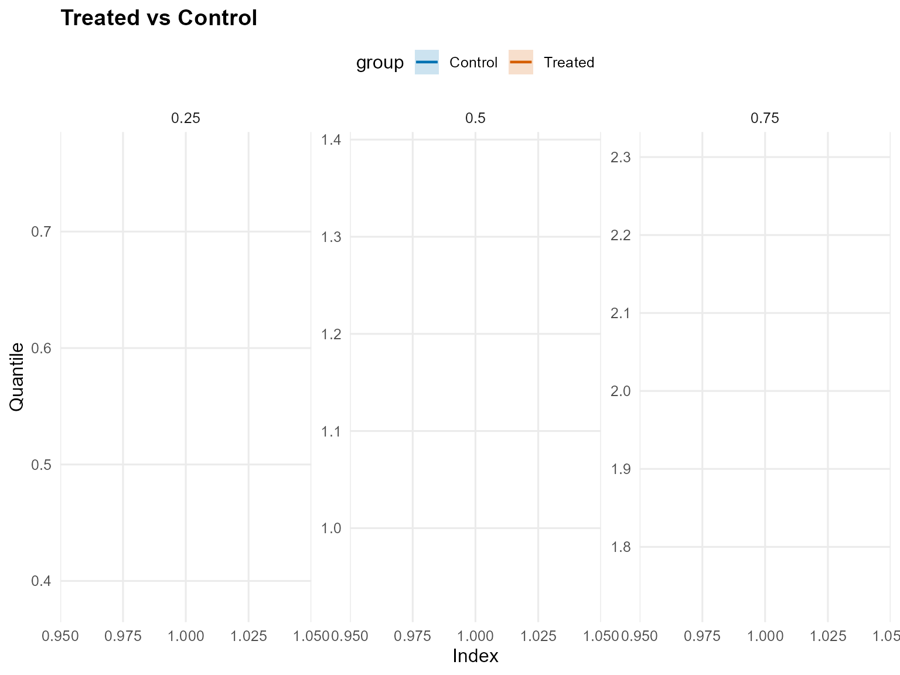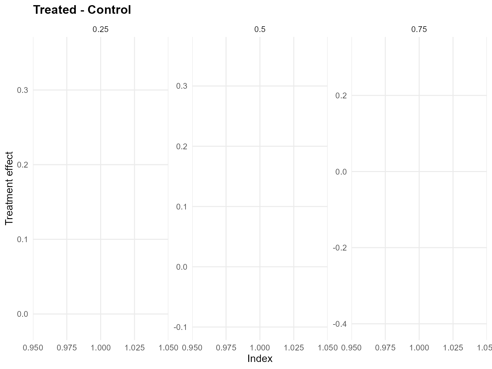
