# 15. Causal Inference: Mixed Backends with GPD - Amoroso Kernel

## Causal Inference: Mixed Backends with GPD - Amoroso Kernel

This vignette fits two mixed-backend causal models with GPD tails and an
Amoroso kernel:

- Model A: Treated = SB, Control = CRP
- Model B: Treated = CRP, Control = SB

We shift y to keep outcomes in a stable positive range.

------------------------------------------------------------------------

### Data Setup

``` r
data("causal_alt_real500_p4_k2")
y_raw <- causal_alt_real500_p4_k2$y
T <- causal_alt_real500_p4_k2$T
X <- as.matrix(causal_alt_real500_p4_k2$X)

shift <- abs(min(y_raw)) + 0.1
y <- y_raw + shift

summary_tbl <- tibble(
  statistic = c("N", "Mean", "SD", "Min", "Max"),
  value = c(length(y), mean(y), sd(y), min(y), max(y))
)

summary_tbl %>%
  mutate(value = signif(value, 4)) %>%
  kable(caption = "Shifted Outcome Summary (Amoroso)", align = "c") %>%
  kable_styling(bootstrap_options = c("striped", "hover"), full_width = FALSE, position = "center")
```

| statistic |  value  |
|:---------:|:-------:|
|     N     | 500.000 |
|   Mean    |  8.463  |
|    SD     |  1.764  |
|    Min    |  0.100  |
|    Max    | 13.460  |

Shifted Outcome Summary (Amoroso)

``` r

x_eval <- X[1:40, , drop = FALSE]
y_eval <- y[1:40]
u_threshold <- as.numeric(stats::quantile(y, 0.8, names = FALSE))
```

``` r
df_causal <- data.frame(y = y, T = as.factor(T), x1 = X[, 1])

p_scatter <- ggplot(df_causal, aes(x = x1, y = y, color = T)) +
  geom_point(alpha = 0.5) +
  labs(title = "Shifted Outcome vs X1", x = "X1", y = "y (shifted)", color = "Treatment") +
  theme_minimal()

p_scatter
```

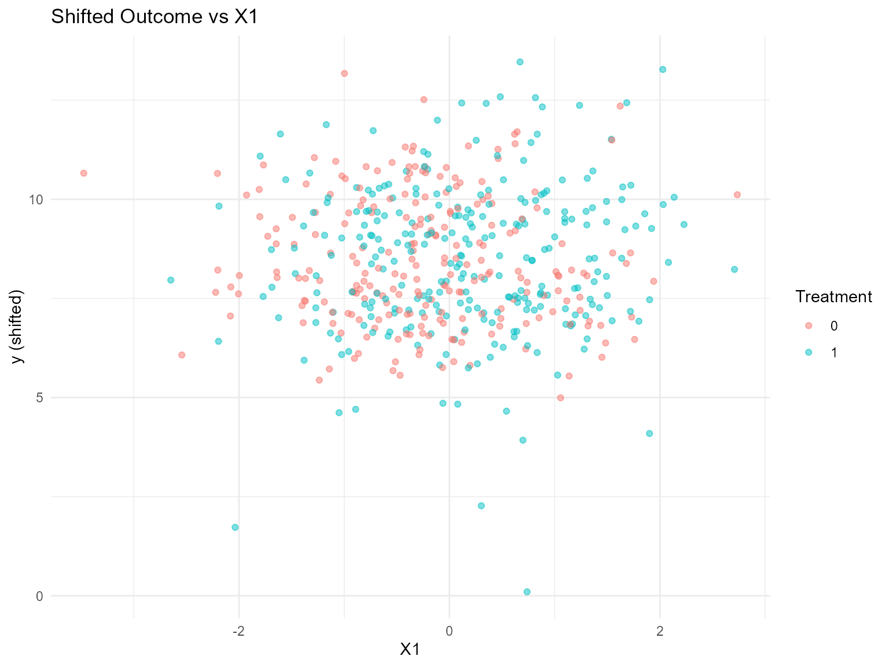

------------------------------------------------------------------------

### Model A: Treated SB, Control CRP (Amoroso + GPD)

``` r
param_specs_gpd <- list(
  gpd = list(
    threshold = list(
      mode = "dist",
      dist = "lognormal",
      args = list(meanlog = log(max(u_threshold, .Machine$double.eps)), sdlog = 0.25)
    )
  )
)

bundle_sb_crp <- build_causal_bundle(
  y = y,
  T = T,
  X = X,
  kernel = c("amoroso", "amoroso"),
  backend = c("sb", "crp"),
  PS = "logit",
  GPD = c(TRUE, TRUE),
  J = c(5, 5),
  param_specs = param_specs_gpd,
  mcmc_outcome = list(niter = 2500, nburnin = 500, nchains = 1, thin = 1, seed = 1),
  mcmc_ps = list(niter = 2500, nburnin = 500, nchains = 1, thin = 1, seed = 1)
)

bundle_sb_crp
DPmixGPD causal bundle
PS model: disabled 
Outcome (treated): backend = sb | kernel = amoroso 
Outcome (control): backend = crp | kernel = amoroso 
GPD tail (treated/control): TRUE / TRUE 
components (treated/control): 5 / 5 
Outcome PS included: FALSE 
epsilon (treated/control): 0.025 / 0.025 
n (control) = 232 | n (treated) = 268 
summary(bundle_sb_crp)
DPmixGPD causal bundle summary
DPmixGPD causal bundle
PS model: disabled 
Outcome (treated): backend = sb | kernel = amoroso 
Outcome (control): backend = crp | kernel = amoroso 
GPD tail (treated/control): TRUE / TRUE 
components (treated/control): 5 / 5 
Outcome PS included: FALSE 
epsilon (treated/control): 0.025 / 0.025 
n (control) = 232 | n (treated) = 268 
```

``` r
fit_sb_crp <- run_mcmc_causal(bundle_sb_crp)
[MCMC] Creating NIMBLE model...
[MCMC] NIMBLE model created successfully.
[MCMC] Configuring MCMC...
===== Monitors =====
thin = 1: alpha, beta_tail_scale, loc, scale, shape1, shape2, tail_shape, threshold, z
===== Samplers =====
RW sampler (6)
  - threshold
  - beta_tail_scale[]  (4 elements)
  - tail_shape
CRP_concentration sampler (1)
  - alpha
CRP_cluster_wrapper sampler (20)
  - loc[]  (5 elements)
  - scale[]  (5 elements)
  - shape1[]  (5 elements)
  - shape2[]  (5 elements)
CRP sampler (1)
  - z[1:232] 
[MCMC] MCMC configured.
[MCMC] Building MCMC object...
[MCMC] MCMC object built.
[MCMC] Attempting NIMBLE compilation (this may take a minute)...
[MCMC] Compiling model...
[MCMC] Compiling MCMC sampler...
[MCMC] Compilation successful.
|-------------|-------------|-------------|-------------|
|  [Warning] CRP_sampler: This MCMC is not for a proper model. The MCMC attempted to use more components than the number of cluster parameters. Please increase the number of cluster parameters.
-------------------------------------------------------|
[MCMC] MCMC execution complete. Processing results...
[MCMC] Creating NIMBLE model...
[MCMC] NIMBLE model created successfully.
[MCMC] Configuring MCMC...
===== Monitors =====
thin = 1: alpha, beta_loc, beta_scale, beta_tail_scale, shape1, shape2, tail_shape, threshold, w, z
===== Samplers =====
RW sampler (61)
  - alpha
  - shape1[]  (5 elements)
  - shape2[]  (5 elements)
  - beta_loc[]  (20 elements)
  - beta_scale[]  (20 elements)
  - threshold
  - beta_tail_scale[]  (4 elements)
  - tail_shape
  - v[]  (4 elements)
categorical sampler (268)
  - z[]  (268 elements)
[MCMC] MCMC configured.
[MCMC] Building MCMC object...
[MCMC] MCMC object built.
[MCMC] Attempting NIMBLE compilation (this may take a minute)...
[MCMC] Compiling model...
[MCMC] Compiling MCMC sampler...
[MCMC] Compilation successful.
|-------------|-------------|-------------|-------------|
|-------------------------------------------------------|
[MCMC] MCMC execution complete. Processing results...
summary(fit_sb_crp)

-- Outcome fits --
[control]
MixGPD fit | backend: Chinese Restaurant Process | kernel: Amoroso Distribution | GPD tail: TRUE
n = 232 | components = 5 | epsilon = 0.025
MCMC: niter=2500, nburnin=500, thin=1, nchains=1 
Fit
Use summary() for posterior summaries; plot() for diagnostics; predict() for predictions.

[treated]
MixGPD fit | backend: Stick-Breaking Process | kernel: Amoroso Distribution | GPD tail: TRUE
n = 268 | components = 5 | epsilon = 0.025
MCMC: niter=2500, nburnin=500, thin=1, nchains=1 
Fit
Use summary() for posterior summaries; plot() for diagnostics; predict() for predictions.
params(fit_sb_crp)
Posterior mean parameters (causal)

[treated]
Posterior mean parameters

$alpha
[1] 0.4342

$w
[1] 0.9909

$beta_loc
           x1      x2      x3      x4
comp1  0.8926 -1.2122 -0.2078  1.3160
comp2  0.3570  0.3247  0.0911  0.0079
comp3  0.7368  0.8992 -0.3726  0.0902
comp4 -0.0387  0.0886 -0.0007 -0.0617
comp5 -0.0765 -0.0634 -0.1204 -0.0553

$beta_scale
           x1      x2      x3      x4
comp1 -0.1049  0.1885  0.0294 -0.1993
comp2  0.4101  0.4860 -0.4253  0.1788
comp3 -0.3881  0.3239  0.2227 -0.3873
comp4 -0.0329 -0.0063  0.1365  0.1718
comp5  0.1362  0.0026 -0.1013  0.0676

$shape1
[1] 11.43

$shape2
[1] 1.106

$beta_tail_scale
[1]  0.05912 -0.10270  0.13030  0.35420

$tail_shape
[1] 0.007562

[control]
Posterior mean parameters

$alpha
[1] 0.2675

$w
[1] 0.8977

$loc
[1] 4.731

$scale
[1] 3.073

$shape1
[1] 1.787

$shape2
[1] 1.869

$beta_tail_scale
[1]  0.145800  0.055310  0.008794 -0.116000

$tail_shape
[1] -0.006654
```

``` r
plot(fit_sb_crp, family = c("traceplot", "autocorrelation", "running"))

=== treated ===

=== traceplot ===
```

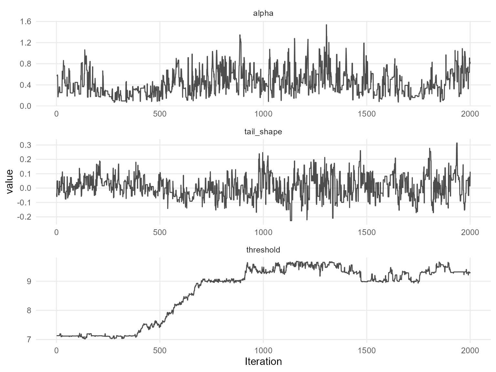

    === autocorrelation ===

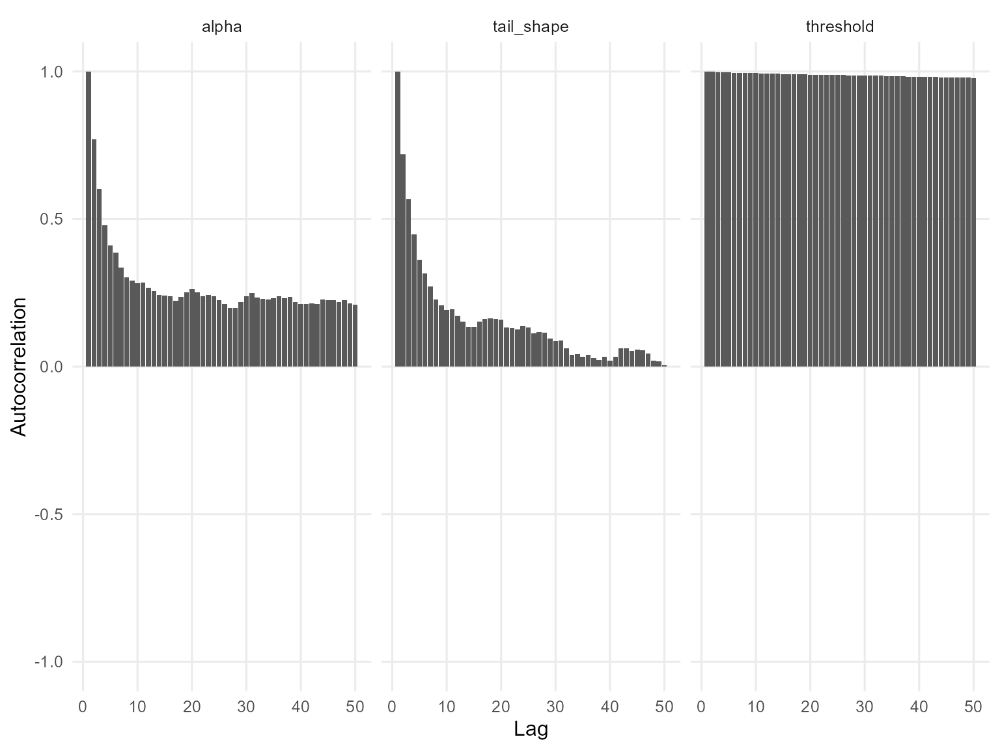

    === running ===

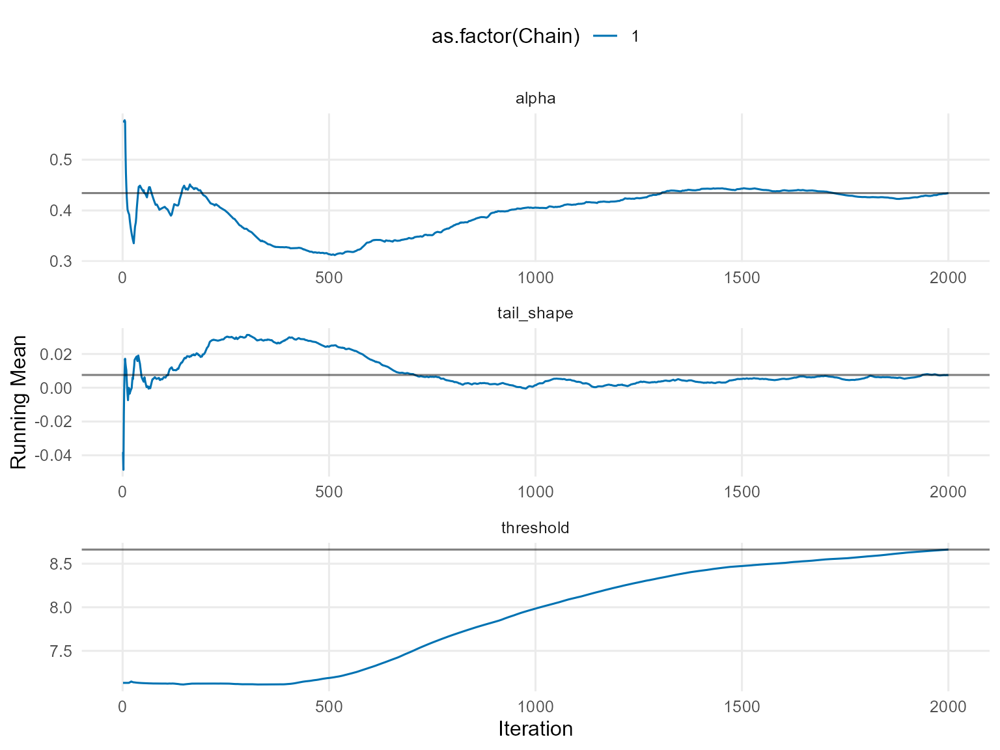

    === control ===

    === traceplot ===

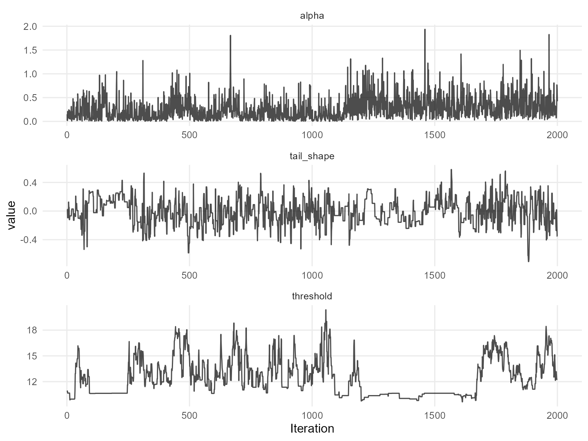

    === autocorrelation ===

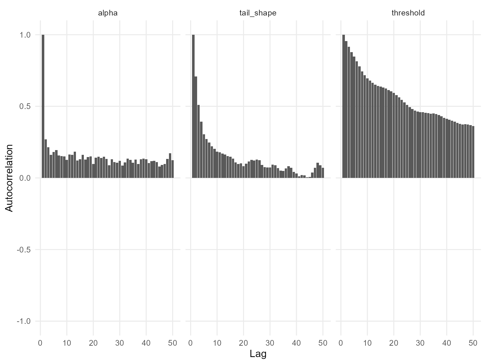

    === running ===

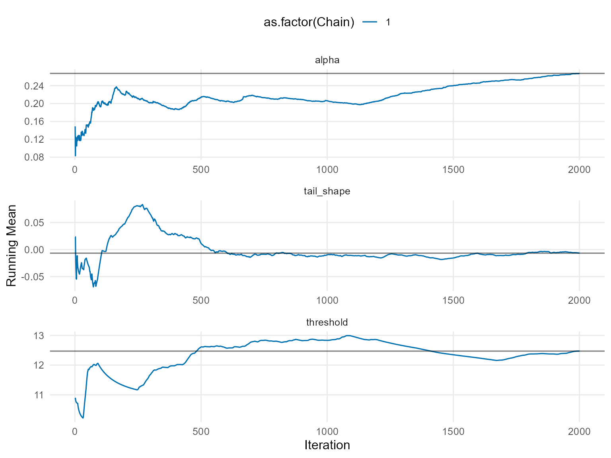

``` r
pred_mean_sb_crp <- predict(fit_sb_crp, x = x_eval, type = "mean",
                            interval = "credible", nsim_mean = 100)
plot(pred_mean_sb_crp)
```

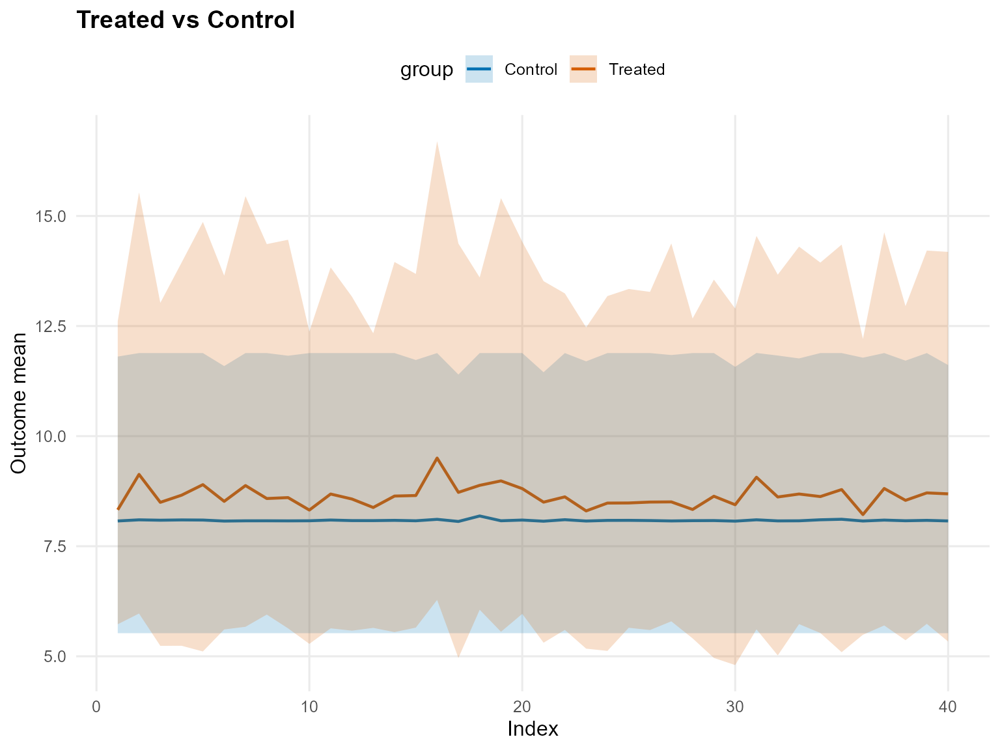

``` r
pred_q_sb_crp <- predict(fit_sb_crp, x = x_eval, type = "quantile",
                         p = 0.5, interval = "credible")
plot(pred_q_sb_crp)
```

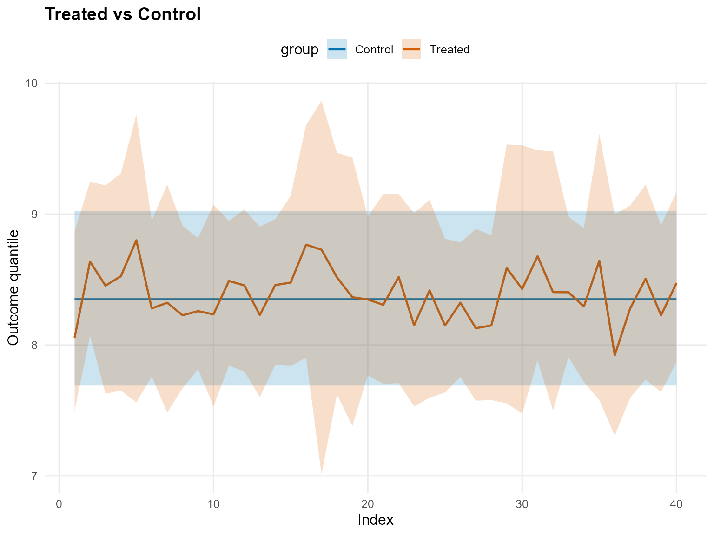

``` r
pred_d_sb_crp <- predict(fit_sb_crp, x = x_eval, y = y_eval,
                         type = "density", interval = "credible")
plot(pred_d_sb_crp)
```

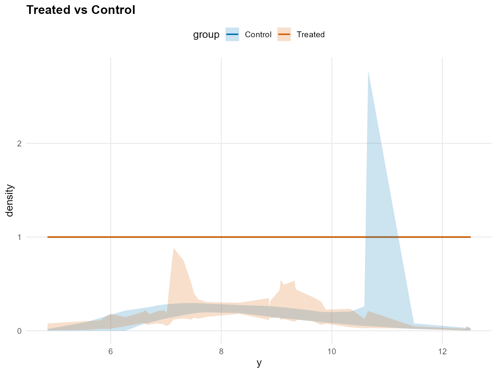

``` r
pred_p_sb_crp <- predict(fit_sb_crp, x = x_eval, y = y_eval,
                         type = "prob", interval = "credible")
plot(pred_p_sb_crp)
```

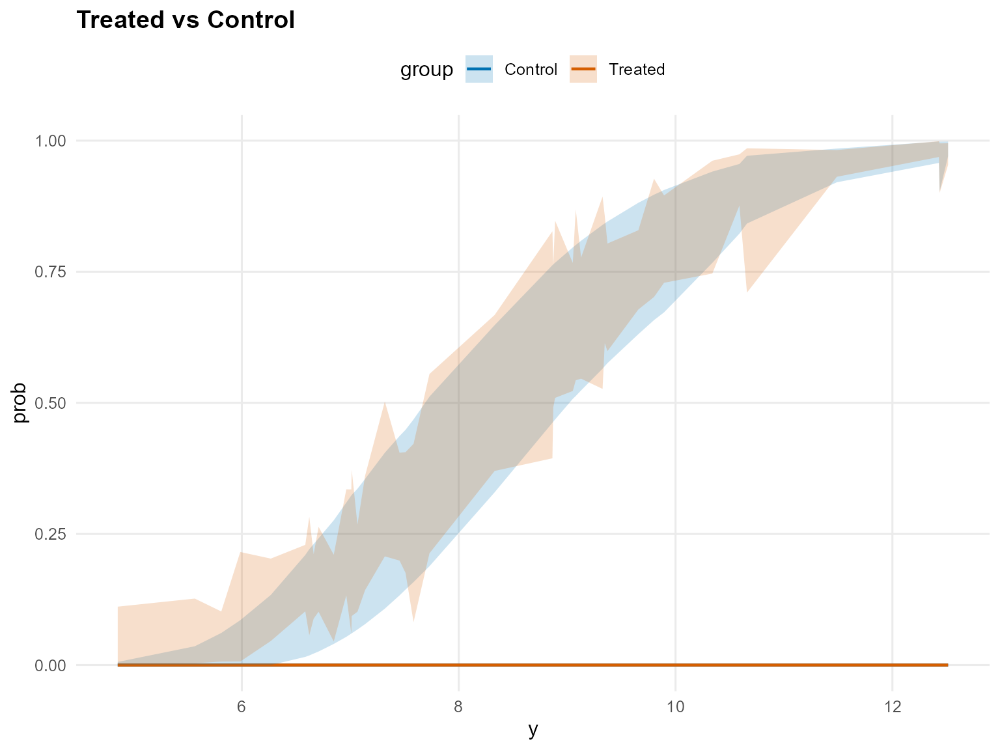

``` r
ate_sb_crp <- ate(fit_sb_crp, newdata = x_eval,
                  interval = "credible", nsim_mean = 100)
plot(ate_sb_crp)
```

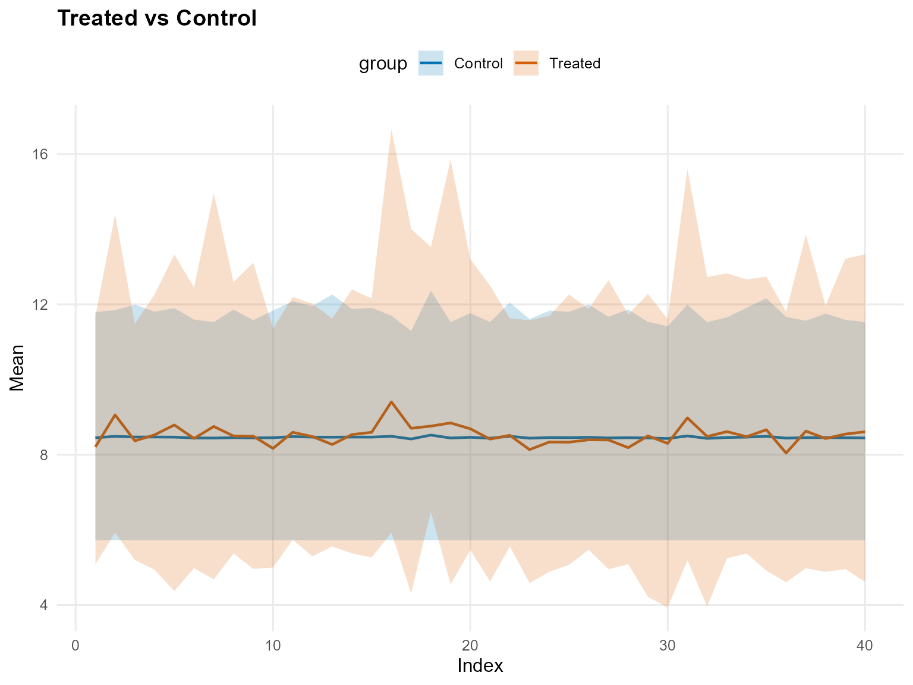

``` r
qte_sb_crp <- qte(fit_sb_crp, probs = c(0.25, 0.5, 0.75),
                  newdata = x_eval, interval = "credible")
plot(qte_sb_crp)
```

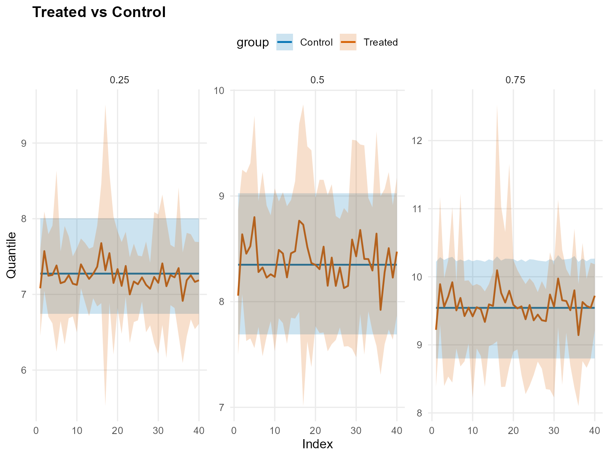

------------------------------------------------------------------------

### Model B: Treated CRP, Control SB (Amoroso + GPD)

``` r
bundle_crp_sb <- build_causal_bundle(
  y = y,
  T = T,
  X = X,
  kernel = c("amoroso", "amoroso"),
  backend = c("crp", "sb"),
  PS = "logit",
  GPD = c(TRUE, TRUE),
  J = c(5, 5),
  param_specs = param_specs_gpd,
  mcmc_outcome = list(niter = 2500, nburnin = 500, nchains = 1, thin = 1, seed = 2),
  mcmc_ps = list(niter = 2500, nburnin = 500, nchains = 1, thin = 1, seed = 2)
)

bundle_crp_sb
DPmixGPD causal bundle
PS model: disabled 
Outcome (treated): backend = crp | kernel = amoroso 
Outcome (control): backend = sb | kernel = amoroso 
GPD tail (treated/control): TRUE / TRUE 
components (treated/control): 5 / 5 
Outcome PS included: FALSE 
epsilon (treated/control): 0.025 / 0.025 
n (control) = 232 | n (treated) = 268 
summary(bundle_crp_sb)
DPmixGPD causal bundle summary
DPmixGPD causal bundle
PS model: disabled 
Outcome (treated): backend = crp | kernel = amoroso 
Outcome (control): backend = sb | kernel = amoroso 
GPD tail (treated/control): TRUE / TRUE 
components (treated/control): 5 / 5 
Outcome PS included: FALSE 
epsilon (treated/control): 0.025 / 0.025 
n (control) = 232 | n (treated) = 268 
```

``` r
fit_crp_sb <- run_mcmc_causal(bundle_crp_sb)
[MCMC] Creating NIMBLE model...
[MCMC] NIMBLE model created successfully.
[MCMC] Configuring MCMC...
===== Monitors =====
thin = 1: alpha, beta_loc, beta_scale, beta_tail_scale, shape1, shape2, tail_shape, threshold, w, z
===== Samplers =====
RW sampler (61)
  - alpha
  - shape1[]  (5 elements)
  - shape2[]  (5 elements)
  - beta_loc[]  (20 elements)
  - beta_scale[]  (20 elements)
  - threshold
  - beta_tail_scale[]  (4 elements)
  - tail_shape
  - v[]  (4 elements)
categorical sampler (232)
  - z[]  (232 elements)
[MCMC] MCMC configured.
[MCMC] Building MCMC object...
[MCMC] MCMC object built.
[MCMC] Attempting NIMBLE compilation (this may take a minute)...
[MCMC] Compiling model...
[MCMC] Compiling MCMC sampler...
[MCMC] Compilation successful.
|-------------|-------------|-------------|-------------|
|-------------------------------------------------------|
[MCMC] MCMC execution complete. Processing results...
[MCMC] Creating NIMBLE model...
[MCMC] NIMBLE model created successfully.
[MCMC] Configuring MCMC...
===== Monitors =====
thin = 1: alpha, beta_tail_scale, loc, scale, shape1, shape2, tail_shape, threshold, z
===== Samplers =====
RW sampler (6)
  - threshold
  - beta_tail_scale[]  (4 elements)
  - tail_shape
CRP_concentration sampler (1)
  - alpha
CRP_cluster_wrapper sampler (20)
  - loc[]  (5 elements)
  - scale[]  (5 elements)
  - shape1[]  (5 elements)
  - shape2[]  (5 elements)
CRP sampler (1)
  - z[1:268] 
[MCMC] MCMC configured.
[MCMC] Building MCMC object...
[MCMC] MCMC object built.
[MCMC] Attempting NIMBLE compilation (this may take a minute)...
[MCMC] Compiling model...
[MCMC] Compiling MCMC sampler...
[MCMC] Compilation successful.
|-------------|-------------|-------------|-------------|
|  [Warning] CRP_sampler: This MCMC is not for a proper model. The MCMC attempted to use more components than the number of cluster parameters. Please increase the number of cluster parameters.
-------------------------------------------------------|
[MCMC] MCMC execution complete. Processing results...
summary(fit_crp_sb)

-- Outcome fits --
[control]
MixGPD fit | backend: Stick-Breaking Process | kernel: Amoroso Distribution | GPD tail: TRUE
n = 232 | components = 5 | epsilon = 0.025
MCMC: niter=2500, nburnin=500, thin=1, nchains=1 
Fit
Use summary() for posterior summaries; plot() for diagnostics; predict() for predictions.

[treated]
MixGPD fit | backend: Chinese Restaurant Process | kernel: Amoroso Distribution | GPD tail: TRUE
n = 268 | components = 5 | epsilon = 0.025
MCMC: niter=2500, nburnin=500, thin=1, nchains=1 
Fit
Use summary() for posterior summaries; plot() for diagnostics; predict() for predictions.
params(fit_crp_sb)
Posterior mean parameters (causal)

[treated]
Posterior mean parameters

$alpha
[1] 0.4607

$w
[1] 0.9193

$loc
[1] -0.1788

$scale
[1] 4.229

$shape1
[1] 5.333

$shape2
[1] 2.177

$beta_tail_scale
[1]  0.02910 -0.06206  0.06712 -0.09090

$tail_shape
[1] -0.02209

[control]
Posterior mean parameters

$alpha
[1] 0.4705

$w
[1] 0.886

$beta_loc
           x1      x2      x3     x4
comp1  0.9508  0.6959  3.0224 0.6455
comp2 -0.0045 -0.1416  0.3622 0.3446
comp3 -1.1582 -1.4495  2.5281 2.0552
comp4  0.1502 -0.0142 -0.0319 0.0474
comp5 -0.1815  0.0191  0.1001 0.1327

$beta_scale
           x1      x2      x3      x4
comp1 -0.5531  0.2429 -1.6386  0.2977
comp2 -0.2853 -0.0637  0.2732  0.4241
comp3  0.4604  0.1240 -0.9365 -0.6300
comp4  0.0465  0.0571 -0.2109  0.2404
comp5 -0.1817  0.0688 -0.0129  0.3033

$shape1
[1] 7.439

$shape2
[1] 0.582

$beta_tail_scale
[1] -0.100600 -0.009107 -0.018040  1.226000

$tail_shape
[1] 0.005687
```

``` r
plot(fit_crp_sb, family = c("density", "geweke", "caterpillar"))

=== treated ===

=== density ===
```

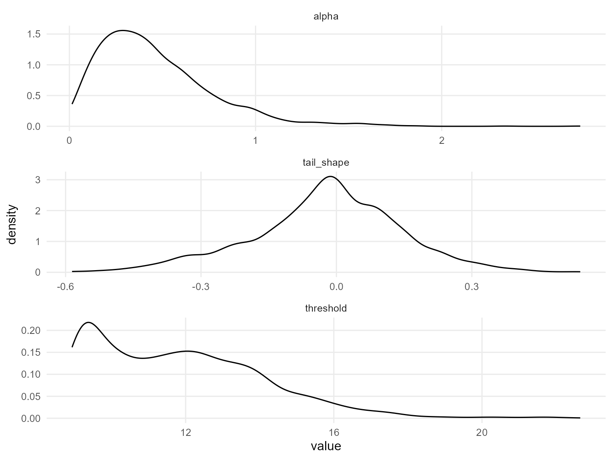

    === geweke ===

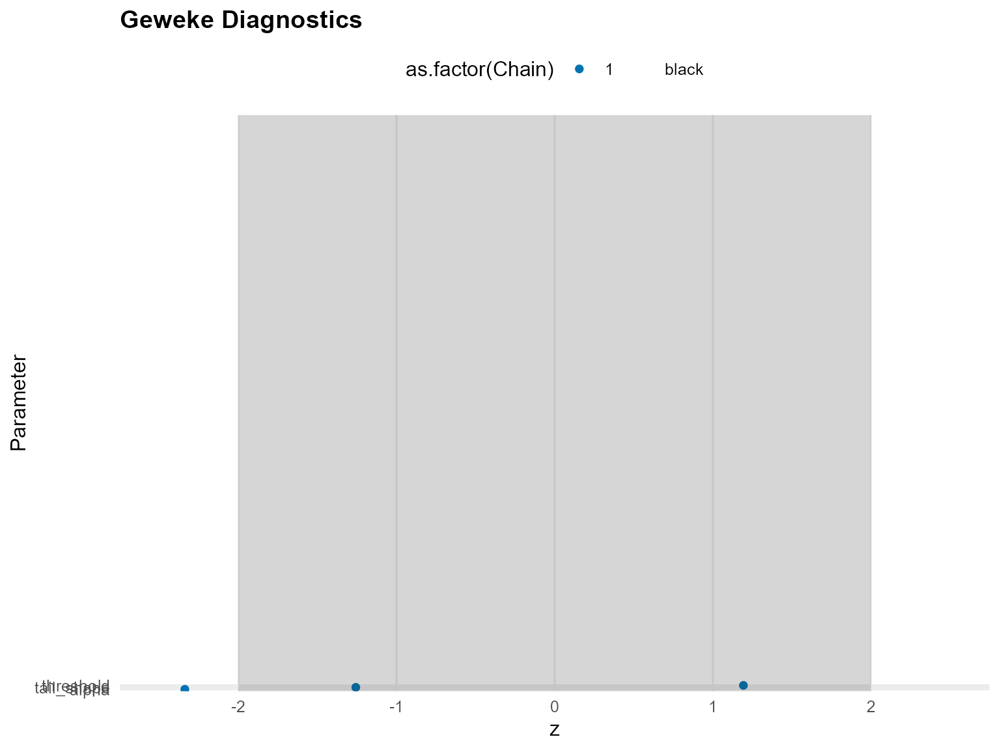

    === caterpillar ===

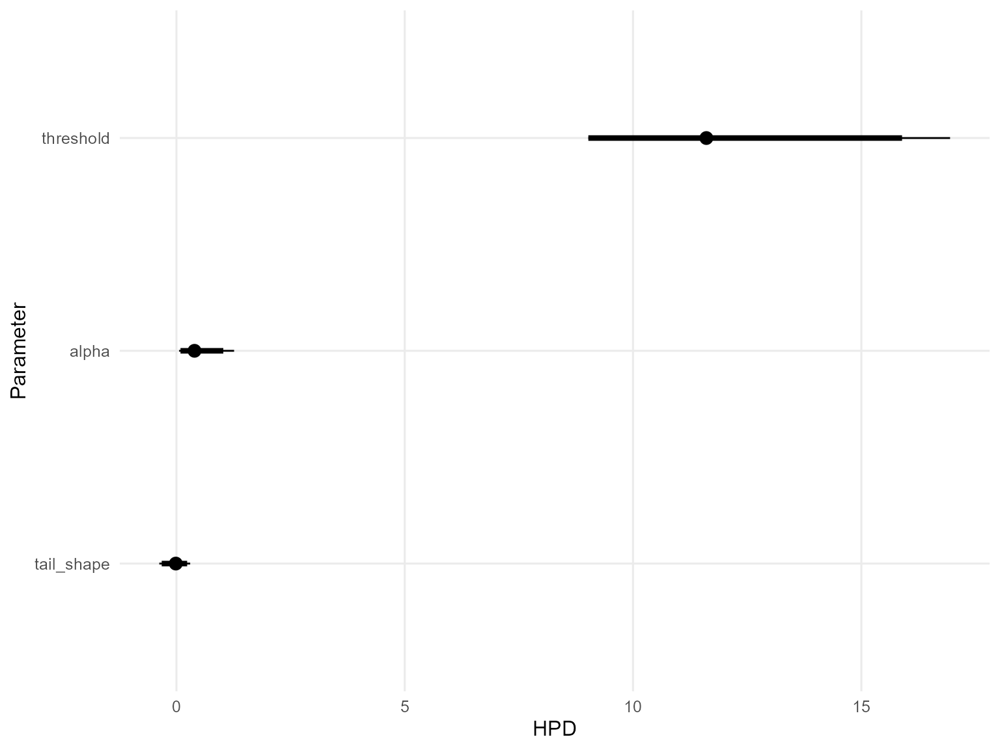

    === control ===

    === density ===

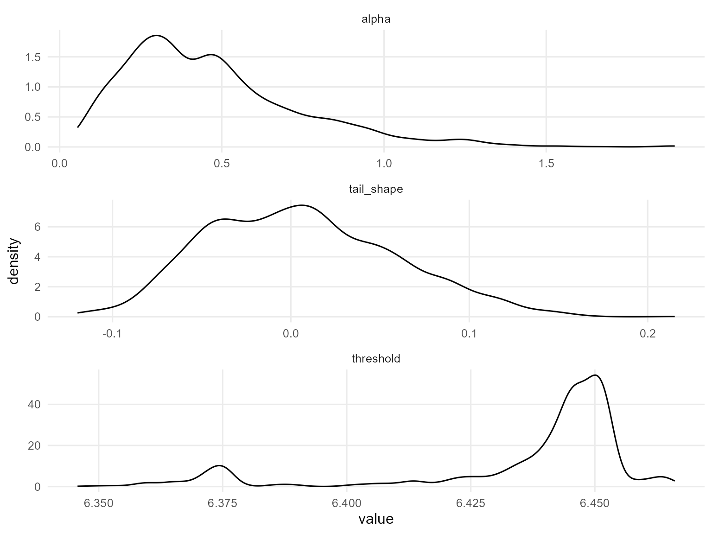

    === geweke ===

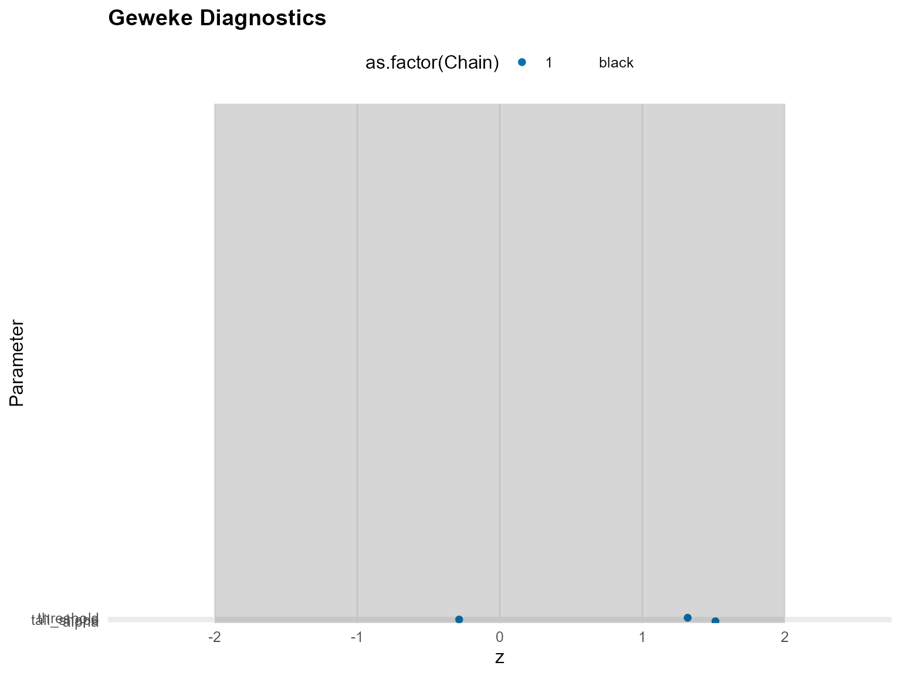

    === caterpillar ===

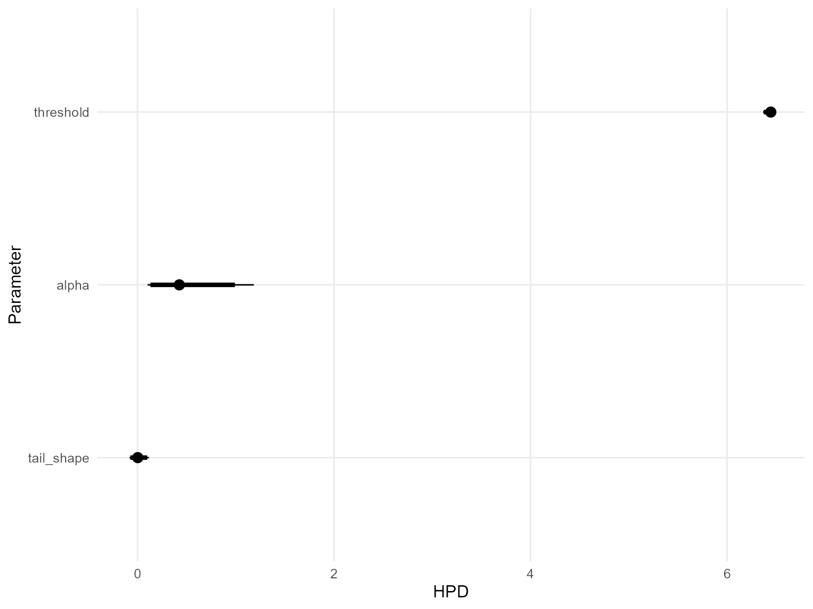

``` r
pred_mean_crp_sb <- predict(fit_crp_sb, x = x_eval, type = "mean",
                            interval = "credible", nsim_mean = 100)
plot(pred_mean_crp_sb)
```

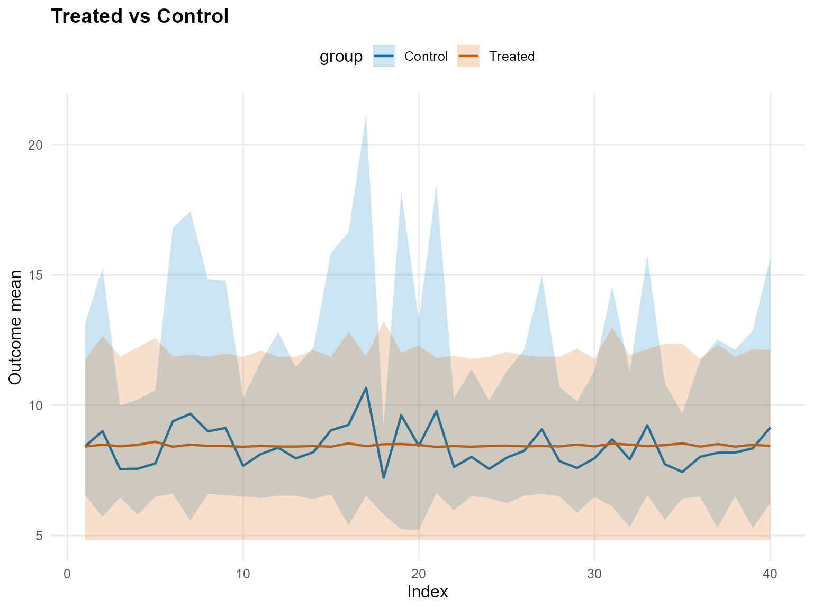

``` r
pred_q_crp_sb <- predict(fit_crp_sb, x = x_eval, type = "quantile",
                         p = 0.5, interval = "credible")
plot(pred_q_crp_sb)
```

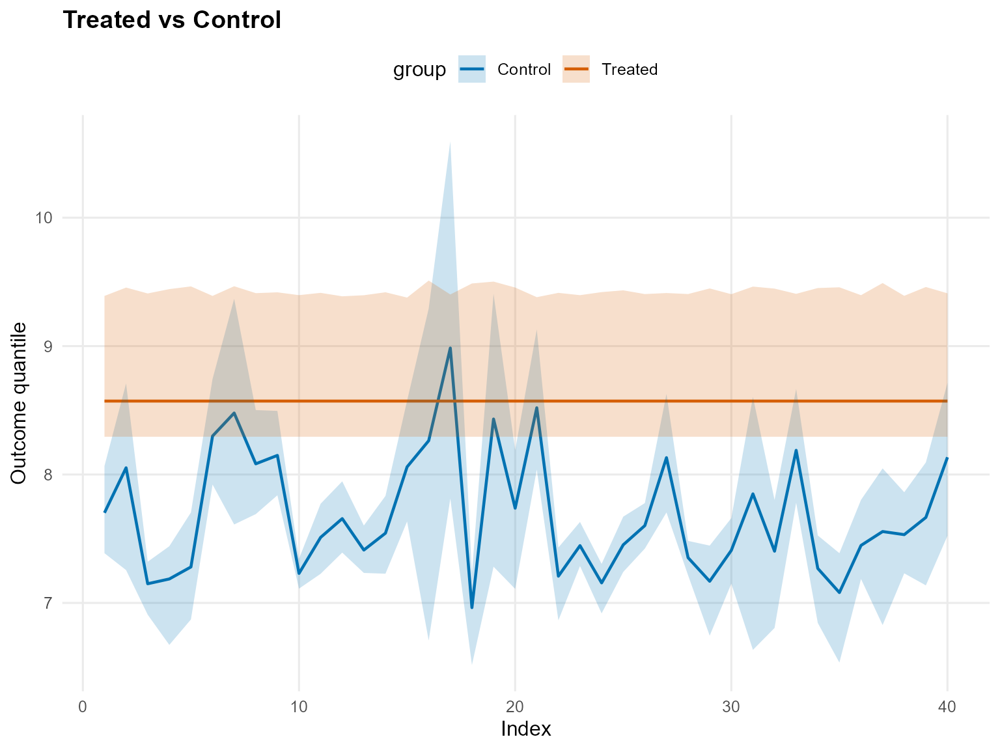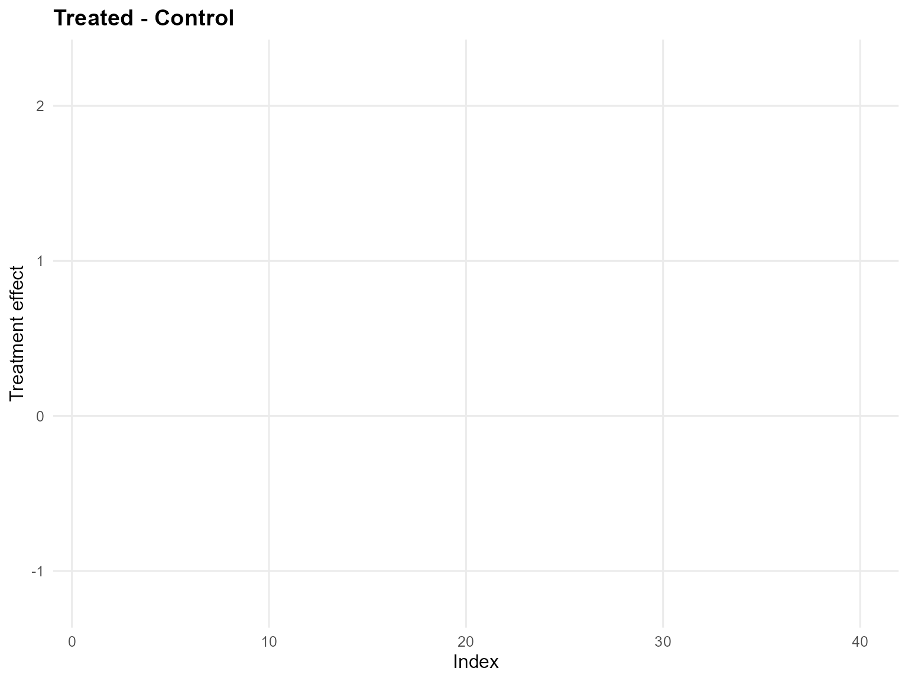

``` r
pred_d_crp_sb <- predict(fit_crp_sb, x = x_eval, y = y_eval,
                         type = "density", interval = "credible")
plot(pred_d_crp_sb)
```

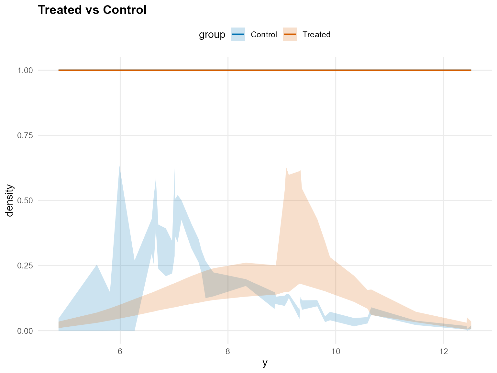

``` r
pred_p_crp_sb <- predict(fit_crp_sb, x = x_eval, y = y_eval,
                         type = "prob", interval = "credible")
plot(pred_p_crp_sb)
```

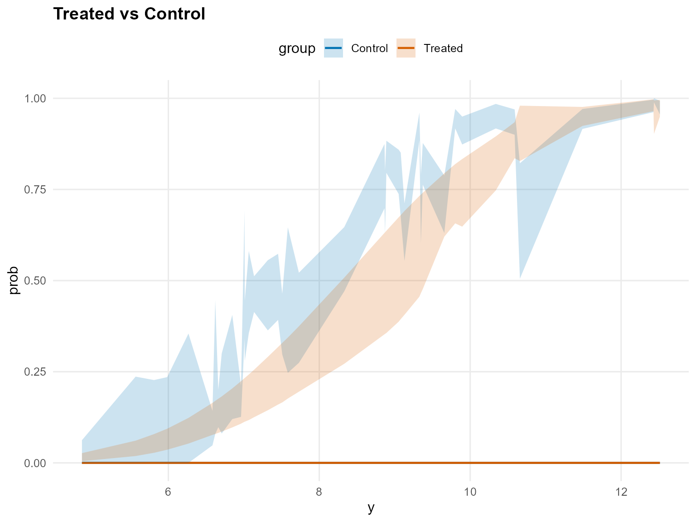

``` r
ate_crp_sb <- ate(fit_crp_sb, newdata = x_eval,
                  interval = "credible", nsim_mean = 100)
plot(ate_crp_sb)
```

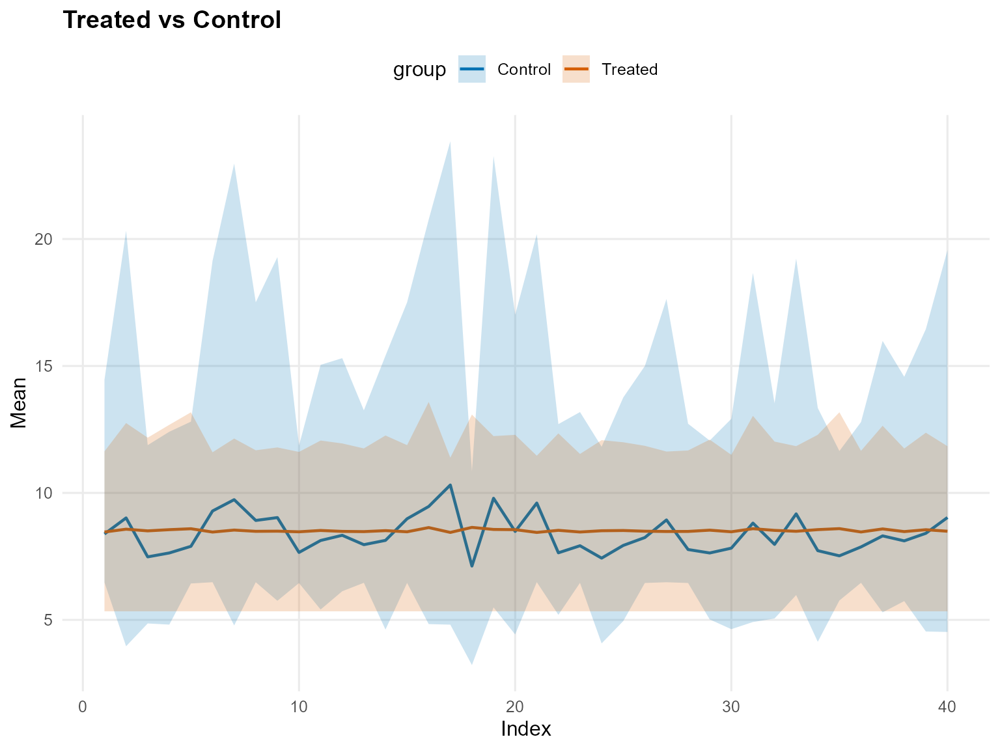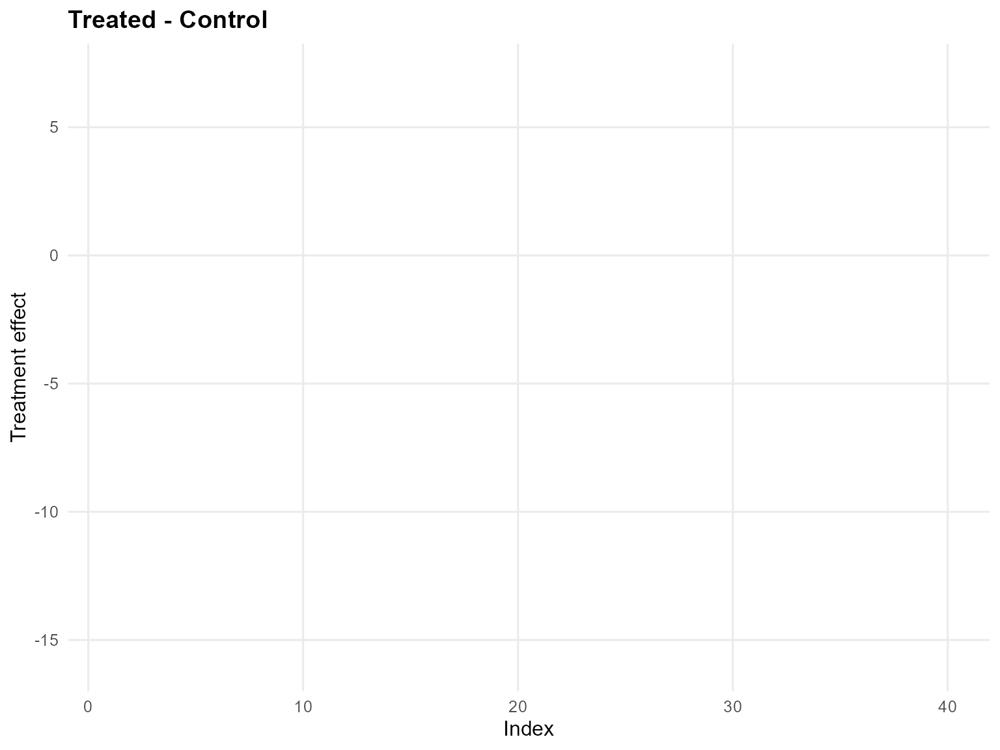

``` r
qte_crp_sb <- qte(fit_crp_sb, probs = c(0.25, 0.5, 0.75),
                  newdata = x_eval, interval = "credible")
plot(qte_crp_sb)
```

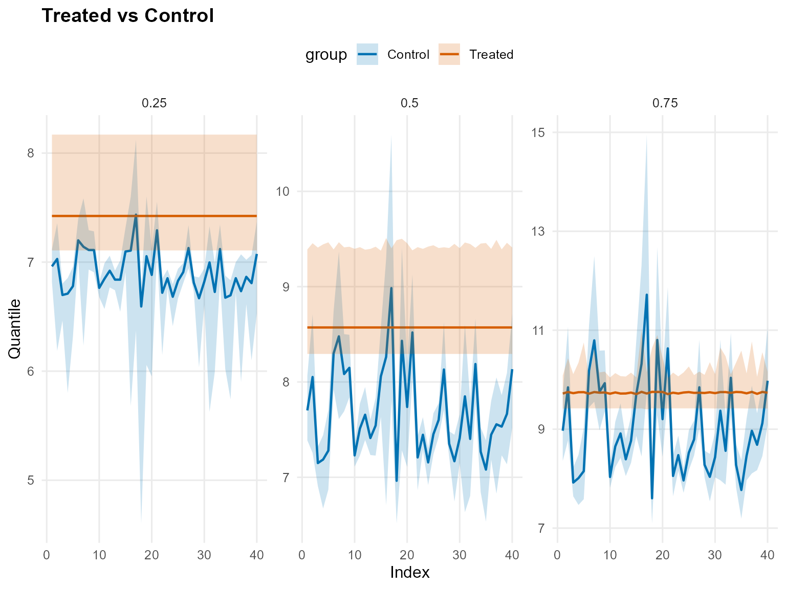
