# 15. Causal Inference: X Without PS (CRP+SB) - InvGauss/Amoroso

## Causal Inference: X Without PS (CRP+SB)

This vignette uses **covariates X** but disables PS estimation. Outcome
models are conditional on X only.

- Model A: CRP with GPD tail (InvGauss)
- Model B: SB bulk-only (Amoroso)

------------------------------------------------------------------------

### Data Setup

``` r
data("causal_alt_real500_p4_k2")
y <- abs(causal_alt_real500_p4_k2$y) + 0.01
T <- causal_alt_real500_p4_k2$T
X <- as.matrix(causal_alt_real500_p4_k2$X)

summary_tbl <- tibble(
  statistic = c("N", "Mean", "SD", "Min", "Max"),
  value = c(length(y), mean(y), sd(y), min(y), max(y))
)

summary_tbl %>%
  mutate(value = signif(value, 4)) %>%
  print()
```

    
[38;5;246m# A tibble: 5 × 2
[39m
      statistic    value
      
[3m
[38;5;246m<chr>
[39m
[23m        
[3m
[38;5;246m<dbl>
[39m
[23m
    
[38;5;250m1
[39m N         500     
    
[38;5;250m2
[39m Mean        1.43  
    
[38;5;250m3
[39m SD          1.08  
    
[38;5;250m4
[39m Min         0.012
[4m6
[24m
    
[38;5;250m5
[39m Max         8.10  

``` r
x_eval <- X[1:40, , drop = FALSE]
y_eval <- y[1:40]
u_threshold <- as.numeric(stats::quantile(y, 0.8, names = FALSE))
```

------------------------------------------------------------------------

### Model A: CRP with GPD Tail (InvGauss)

``` r
param_specs_gpd <- list(
  gpd = list(
    threshold = list(
      mode = "dist",
      dist = "lognormal",
      args = list(meanlog = log(max(u_threshold, .Machine$double.eps)), sdlog = 0.25)
    )
  )
)

bundle_crp_gpd <- build_causal_bundle(
  y = y,
  T = T,
  X = X,
  kernel = "invgauss",
  backend = "crp",
  PS = FALSE,
  GPD = TRUE,
  components = 6,
  param_specs = param_specs_gpd,
  mcmc_outcome = list(niter = 300, nburnin = 80, nchains = 1, thin = 1, seed = 3)
)

bundle_crp_gpd
```

    DPmixGPD causal bundle
    PS model: disabled 
    Outcome (treated): backend = crp | kernel = invgauss 
    Outcome (control): backend = crp | kernel = invgauss 
    GPD tail (treated/control): TRUE / TRUE 
    components (treated/control): 6 / 6 
    Outcome PS included: FALSE 
    epsilon (treated/control): 0.025 / 0.025 
    n (control) = 232 | n (treated) = 268 

``` r
fit_crp_gpd <- quiet_mcmc(run_mcmc_causal(bundle_crp_gpd))
summary(fit_crp_gpd)
```

    -- Outcome fits --
    [control]
    MixGPD fit | backend: Chinese Restaurant Process | kernel: Inverse Gaussian Distribution | GPD tail: TRUE
    n = 232 | components = 6 | epsilon = 0.025
    MCMC: niter=300, nburnin=80, thin=1, nchains=1 
    Fit
    Use summary() for posterior summaries; plot() for diagnostics; predict() for predictions.

    [treated]
    MixGPD fit | backend: Chinese Restaurant Process | kernel: Inverse Gaussian Distribution | GPD tail: TRUE
    n = 268 | components = 6 | epsilon = 0.025
    MCMC: niter=300, nburnin=80, thin=1, nchains=1 
    Fit
    Use summary() for posterior summaries; plot() for diagnostics; predict() for predictions.

``` r
pred_mean_gpd <- predict(fit_crp_gpd, x = x_eval, type = "mean", interval = "credible", nsim_mean = 150)
head(pred_mean_gpd)
```

         ps    estimate       lower         upper
    [1,] NA -0.16932500 -0.10738310 -0.5836802235
    [2,] NA -0.18138393 -0.10909340 -0.5791509596
    [3,] NA -0.27211394 -0.23292719 -0.7593899288
    [4,] NA -0.10488863 -0.10842980  0.0003166933
    [5,] NA -0.06878256 -0.03898452 -0.1834278510
    [6,] NA -0.27224732 -0.12413149 -0.9015322156

``` r
plot(pred_mean_gpd)
```

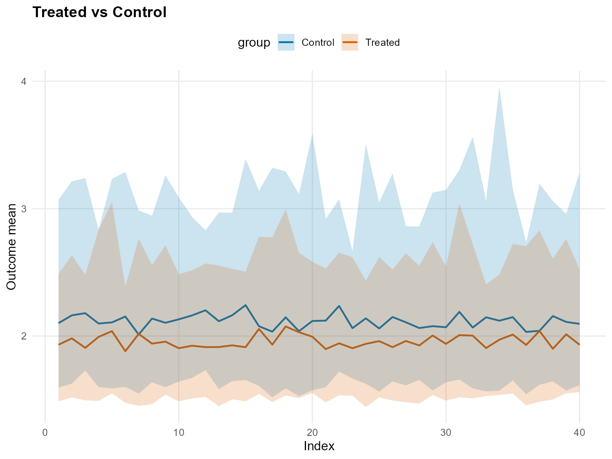

``` r
pred_q_gpd <- predict(fit_crp_gpd, x = x_eval, type = "quantile", p = 0.5, interval = "credible")
head(pred_q_gpd)
```

         ps    estimate     lower      upper
    [1,] NA 0.005837400 0.1286255 -0.1574834
    [2,] NA 0.005499384 0.1286255 -0.1617305
    [3,] NA 0.005792633 0.1286255 -0.1574834
    [4,] NA 0.006001549 0.1286255 -0.1539044
    [5,] NA 0.006361661 0.1286255 -0.1539044
    [6,] NA 0.005635680 0.1286255 -0.1574834

``` r
plot(pred_q_gpd)
```


``` r
pred_d_gpd <- predict(fit_crp_gpd, x = x_eval, y = y_eval, type = "density", interval = "credible")
head(pred_d_gpd)
```

              y ps trt_estimate trt_lower trt_upper con_estimate   con_lower
    1 0.9001906 NA            1 0.4810287 0.6352094            1 0.314725718
    2 1.3517565 NA            1 0.3695228 0.5469411            1 0.249637153
    3 1.1475287 NA            1 0.4426913 0.6213915            1 0.296367984
    4 1.9323578 NA            1 0.2099957 0.3058368            1 0.174308322
    5 3.3439817 NA            1 0.0189089 0.1266915            1 0.008338657
    6 0.9493979 NA            1 0.4864549 0.6401849            1 0.328795835
       con_upper
    1 0.52787503
    2 0.48584170
    3 0.51453356
    4 0.38219561
    5 0.09954047
    6 0.53008756

``` r
plot(pred_d_gpd)
```

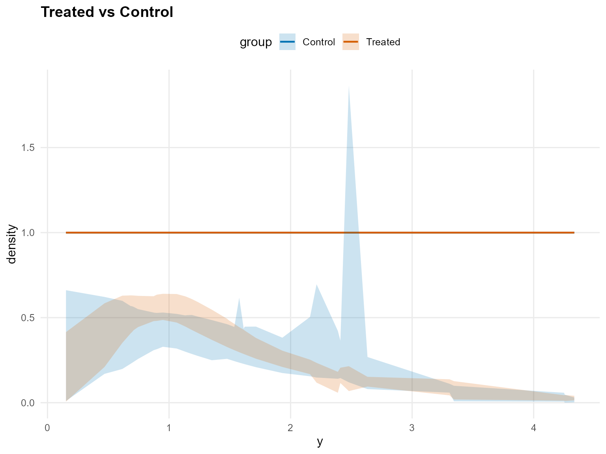

``` r
pred_surv_gpd <- predict(fit_crp_gpd, x = x_eval, y = y_eval, type = "survival", interval = "credible")
head(pred_surv_gpd)
```

              y ps trt_estimate  trt_lower trt_upper con_estimate   con_lower
    1 0.9001906 NA            1 0.62635767 0.7712858            1 0.551097523
    2 1.3517565 NA            1 0.40275130 0.5271976            1 0.375175043
    3 1.1475287 NA            1 0.49953718 0.6277632            1 0.446327418
    4 1.9323578 NA            1 0.20498279 0.3151522            1 0.230845642
    5 3.3439817 NA            1 0.02953094 0.1213559            1 0.001000441
    6 0.9493979 NA            1 0.59968876 0.7415279            1 0.530982327
      con_upper
    1 0.7872046
    2 0.5839711
    3 0.6793855
    4 0.3722232
    5 0.1240534
    6 0.7661596

``` r
plot(pred_surv_gpd)
```

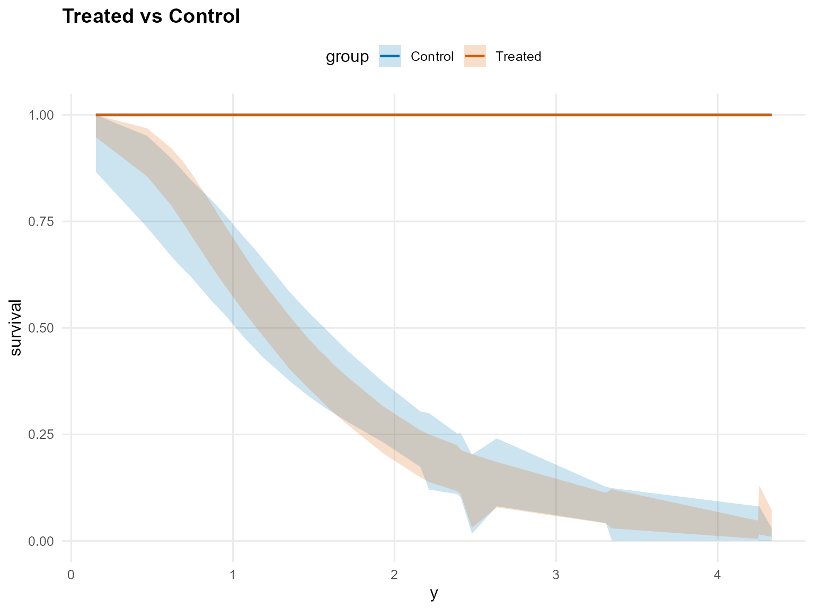

``` r
ate_gpd <- ate(fit_crp_gpd, newdata = x_eval, interval = "credible", nsim_mean = 150)
head(ate_gpd)
```

    $fit
     [1] -0.269606803 -0.146460265 -0.256772782 -0.183021153  0.006431975
     [6] -0.242664679 -0.003829385 -0.182371277 -0.150917875 -0.193875877
    [11] -0.211023897 -0.320920046 -0.231902199 -0.266380298 -0.332742030
    [16] -0.066020696 -0.085783509 -0.120146355 -0.015451578 -0.072345165
    [21] -0.198760406 -0.282444805 -0.187624479 -0.159802808 -0.074998382
    [26] -0.177219347 -0.105003829 -0.180249053 -0.071111925 -0.118228755
    [31] -0.143289181 -0.042913829 -0.227701774 -0.099597337 -0.112628615
    [36] -0.187340625  0.011469002 -0.239563746 -0.040793612 -0.210317775

    $lower
     [1] -1.5382796 -1.0150080 -1.2212241 -1.3662184 -0.8813198 -1.2506984
     [7] -1.3060507 -1.2532111 -1.1819965 -1.5410695 -1.1579850 -1.5520913
    [13] -1.2362663 -1.5635411 -1.3328143 -1.2229108 -1.3672273 -1.2693536
    [19] -1.4004898 -1.3653364 -1.3299525 -1.4655763 -1.2766740 -0.9829831
    [25] -0.9370518 -1.0599780 -1.2159020 -1.0040234 -1.0884113 -1.0223671
    [31] -1.1100091 -1.4039589 -1.3089490 -1.0079106 -1.0116602 -1.6823823
    [37] -1.5739767 -1.3018178 -1.0779709 -1.1838143

    $upper
     [1] 0.9984458 0.5026687 0.6175020 0.4982728 1.3270765 0.4767007 1.2225451
     [8] 0.7053589 0.8131230 0.8545912 0.5187874 0.5377299 0.4038726 0.4740565
    [15] 0.4866554 0.9243906 0.6758984 0.8237115 0.9983257 0.7354021 0.5974666
    [22] 0.5034594 0.5956203 0.5773179 0.8768337 0.8117967 0.8616650 0.4764959
    [29] 0.9352152 0.6428460 0.8309824 0.7742645 0.7331824 0.5753223 0.6250302
    [36] 0.9317984 1.1808812 0.6191920 0.6172952 0.4808524

    $grid
    NULL

    $trt
    $fit
       estimate    lower    upper
    1  1.944768 1.446122 2.799757
    2  1.968112 1.475769 2.623461
    3  1.938540 1.423523 2.609164
    4  1.939533 1.521720 2.440560
    5  2.045972 1.566977 3.298096
    6  1.878674 1.486147 2.507999
    7  2.022125 1.523516 2.963186
    8  1.943144 1.523767 2.522395
    9  1.960369 1.494902 2.577495
    10 1.933187 1.503335 2.864869
    11 1.953155 1.520905 2.580865
    12 1.903482 1.483764 2.720546
    13 1.913079 1.486097 2.479316
    14 1.924290 1.474135 2.575157
    15 1.894822 1.477320 2.609689
    16 2.035817 1.535965 2.804595
    17 1.920418 1.504052 2.636745
    18 2.065042 1.493321 3.070675
    19 2.023916 1.524326 2.738138
    20 1.996143 1.489297 2.642744
    21 1.905846 1.476090 2.546043
    22 1.926098 1.467073 2.549170
    23 1.895942 1.492021 2.420207
    24 1.924574 1.498079 2.614112
    25 1.986031 1.501115 2.763489
    26 1.957441 1.469280 2.778796
    27 1.954404 1.493914 2.619330
    28 1.906867 1.535723 2.426592
    29 1.989902 1.520188 2.777449
    30 1.932322 1.454922 2.555706
    31 2.016957 1.539500 2.945320
    32 1.966658 1.478480 2.665819
    33 1.925891 1.498833 2.563158
    34 1.981089 1.571403 2.567584
    35 1.997174 1.535694 2.704729
    36 1.929343 1.459306 2.603588
    37 2.060319 1.547581 3.052955
    38 1.913449 1.450447 2.721167
    39 1.984563 1.520834 2.460751
    40 1.883266 1.472460 2.363378

    $type
    [1] "mean"

    $draws
               [,1]     [,2]     [,3]     [,4]     [,5]     [,6]     [,7]     [,8]
      [1,] 2.340325 2.635384 2.143144 2.423572 2.195204 2.092317 2.018429 2.388084
      [2,] 2.200495 2.470950 2.234981 2.437314 2.093046 1.821816 2.345658 2.320225
      [3,] 2.351376 2.337638 2.130373 2.295228 2.211855 2.102892 2.320341 2.434917
      [4,] 1.986366 2.086162 2.403888 2.161428 2.215200 1.934722 1.952471 2.227588
      [5,] 2.019253 2.060833 2.069538 2.186138 1.932771 1.877552 2.168399 2.457648
      [6,] 1.825612 2.055690 2.157824 2.171527 2.134974 1.925874 1.830818 2.085939
      [7,] 2.164549 2.102495 2.306525 2.311425 2.207409 1.907195 1.978868 1.747512
      [8,] 1.750088 2.359877 2.344450 2.267178 2.311227 1.939263 1.843465 2.022594
      [9,] 1.891348 1.865339 2.073309 2.168132 2.139823 1.965365 2.079134 1.732685
     [10,] 1.890972 1.623710 2.361923 1.807447 1.797790 1.973761 1.913394 1.872068
     [11,] 1.882886 1.788609 1.996745 1.818123 2.183361 1.913641 1.953453 1.979946
     [12,] 2.057080 1.955786 2.006824 2.022499 1.938184 1.796262 1.897905 1.687926
     [13,] 1.683951 1.857193 2.069001 2.026224 2.296402 1.753571 1.957179 1.920375
     [14,] 1.793736 1.423871 1.926167 2.092498 2.101873 1.506658 1.735497 1.681101
     [15,] 2.024666 1.677746 1.938817 1.849098 1.735520 1.730602 1.811277 1.732764
     [16,] 1.853320 1.880449 1.698267 1.921899 2.184096 1.726695 1.940743 1.877899
     [17,] 1.729862 1.669277 1.807305 1.702629 1.795158 1.952328 1.540952 1.731005
     [18,] 1.989963 1.933925 1.630919 1.999816 2.150623 1.734590 1.881781 1.637501
     [19,] 1.846870 1.874267 2.261302 1.888468 1.771305 1.797571 1.844987 1.812201
     [20,] 1.753211 1.648891 1.690356 2.074903 2.168410 1.754458 1.789733 1.613057
     [21,] 1.832474 2.092367 1.955092 1.632831 1.860302 1.877005 1.877580 1.852457
     [22,] 1.816302 2.203679 2.092502 1.667800 2.085372 1.691735 1.901021 1.623956
     [23,] 1.990134 1.842724 1.959700 1.821635 1.680489 1.928655 1.807193 1.832689
     [24,] 1.716787 2.036807 1.815016 2.100418 1.867554 1.742109 1.897672 1.796130
     [25,] 1.783930 1.993391 2.136835 1.814173 1.806390 1.896734 2.136415 1.788873
     [26,] 2.049515 2.262043 1.769196 2.047263 1.837168 1.936812 1.989653 2.038371
     [27,] 1.999880 1.588979 1.935440 1.786216 1.977459 1.784346 1.797756 1.857729
     [28,] 2.282709 1.806112 1.960809 1.973195 2.047497 1.919259 2.008177 1.824589
     [29,] 1.906007 2.007919 2.175410 1.872530 1.818647 1.869885 1.886466 1.803949
     [30,] 2.014135 1.891762 1.817688 1.613390 1.817396 1.705369 1.913973 1.752111
     [31,] 2.069669 1.909619 1.982216 1.849106 2.137481 1.880514 1.775386 2.546150
     [32,] 1.679976 1.740175 1.741650 1.801839 1.775008 1.781438 2.034876 1.686330
     [33,] 1.667226 1.783512 1.691454 1.607853 1.720826 1.675593 1.782797 1.789872
     [34,] 1.600056 1.717380 1.632495 1.850271 1.971213 1.740774 2.008088 1.647984
     [35,] 1.684825 1.601818 1.715615 1.714461 1.763482 1.555871 1.863277 1.533123
     [36,] 1.675261 1.965199 1.738033 1.724426 1.814178 1.648523 1.644376 1.729304
     [37,] 2.043529 2.213787 2.346156 2.085796 2.543089 1.991918 2.291463 2.002751
     [38,] 2.031344 2.183358 2.094793 2.073198 2.020402 2.197995 1.954696 1.819026
     [39,] 1.815211 2.314179 1.941429 2.153945 2.184182 2.096889 2.135617 2.131735
     [40,] 1.809931 2.185672 1.836014 2.461915 2.306046 2.071403 2.350071 1.929383
     [41,] 1.961703 1.900198 2.136980 2.097454 2.265403 1.939525 1.784468 1.988260
     [42,] 1.772309 1.856814 1.668219 1.737190 1.993931 1.733242 1.759469 1.666566
     [43,] 1.854623 1.925246 1.861002 2.141972 2.067740 1.680959 1.838252 1.640930
     [44,] 1.754034 2.057306 2.080421 1.924549 1.958076 1.624032 1.845946 1.927213
     [45,] 1.852038 2.586558 2.083398 2.177036 2.202391 1.940154 2.065943 2.099104
     [46,] 1.928303 2.428841 1.997490 2.120468 2.304780 1.800276 2.063952 1.999237
     [47,] 1.923307 1.981541 2.143032 2.019852 1.939058 2.071016 2.119952 1.995293
     [48,] 2.033794 2.153909 1.933182 1.966972 1.994205 2.062105 2.561286 2.325946
     [49,] 2.448650 2.080921 2.147437 1.907410 1.961374 1.862545 2.355581 2.005350
     [50,] 2.002152 1.825614 1.907556 2.049937 1.961996 2.150550 2.687879 2.198302
     [51,] 1.790678 1.988825 1.870051 1.800012 1.795799 2.120674 2.345201 2.033464
     [52,] 2.035608 2.168053 2.058734 1.744340 1.743319 1.989012 2.187027 2.383188
     [53,] 1.907771 2.433861 1.865024 2.315685 2.086495 2.004625 2.322960 2.217188
     [54,] 2.116823 1.992784 1.813180 2.054983 1.984842 1.980012 2.336937 2.212915
     [55,] 2.361642 2.150068 2.146249 2.069659 1.839890 1.852228 2.039697 1.957811
     [56,] 2.026596 2.078683 2.033647 2.109555 2.063741 1.851880 2.320772 1.882125
     [57,] 2.076804 2.056241 2.067867 1.839071 2.060802 1.842872 2.036653 2.111623
     [58,] 2.025140 2.050545 1.934917 1.905432 1.675028 1.753329 2.121958 2.054586
     [59,] 1.952950 1.929224 1.985773 1.953825 1.818016 1.718623 2.024674 2.019646
     [60,] 2.001365 1.781736 1.839891 1.667636 1.906994 1.758686 1.934544 1.933131
     [61,] 2.174023 2.214903 1.964119 2.056536 2.254556 1.957113 2.225540 2.401182
     [62,] 1.935662 2.346244 2.261509 2.075857 2.330335 1.937671 1.900168 1.840256
     [63,] 1.951470 1.974435 2.030881 2.248482 2.181653 2.027426 2.076026 1.916272
     [64,] 1.869815 1.824293 1.795727 2.072818 2.273872 2.039035 1.958197 2.058401
     [65,] 2.008183 2.009463 1.898393 2.105140 2.136226 1.854970 1.886684 1.881293
     [66,] 1.916547 2.072399 2.082892 2.140905 2.008329 2.090801 2.025271 1.923235
     [67,] 2.074514 1.958823 1.747324 1.877274 2.122206 1.938562 2.029859 1.858867
     [68,] 1.783442 2.247414 1.960098 2.045393 2.062054 1.987554 1.887151 1.791616
     [69,] 1.776833 2.064701 1.774088 2.139122 2.077776 1.679480 1.856223 1.777535
     [70,] 1.910914 1.834832 1.830082 2.118133 2.174217 1.806347 1.926540 1.741039
     [71,] 1.753740 1.951954 1.777568 1.823892 1.882563 1.882202 1.983231 1.960501
     [72,] 1.851554 2.001617 1.915292 2.031022 2.252565 2.009788 2.091219 1.777454
     [73,] 1.740640 2.052086 2.034295 2.046024 2.039118 1.850630 1.989711 1.905517
     [74,] 1.934405 2.088554 2.065590 2.313801 2.533743 1.871574 2.063444 1.885696
     [75,] 2.074544 2.025280 1.869782 1.888502 2.197976 2.012515 2.021555 1.921900
     [76,] 1.867767 2.143460 1.963066 2.114672 1.935131 1.818320 2.289238 1.939618
     [77,] 2.025772 2.008142 1.842305 1.709041 2.025902 1.669947 2.028167 1.890370
     [78,] 2.047704 1.830433 1.810321 1.817786 1.909361 1.985559 2.072970 1.902015
     [79,] 1.855593 1.931979 1.771076 1.788673 1.889641 1.823247 2.261778 2.088954
     [80,] 1.726584 1.770131 1.354950 1.545321 1.594883 1.575615 1.966459 1.869018
     [81,] 1.794233 1.760398 1.811092 1.463246 1.961088 1.890556 2.005635 1.856532
     [82,] 1.829354 1.982498 1.706213 1.768952 1.706679 1.604103 1.670952 1.865277
     [83,] 1.793964 1.644359 1.620901 1.682060 1.664725 1.584193 1.872358 1.730723
     [84,] 1.556425 1.781273 1.670446 1.648614 1.694728 1.745184 1.631634 1.926075
     [85,] 1.575263 1.558230 1.466302 1.659448 1.597940 1.733695 1.831871 1.890974
     [86,] 1.673657 1.627218 1.610704 1.698833 1.531570 1.610323 2.058968 1.808858
     [87,] 1.760564 1.492296 1.432697 1.660508 1.458813 1.609462 1.726715 1.878704
     [88,] 2.071323 1.602075 1.728356 1.661895 1.906521 1.938725 1.939888 2.148043
     [89,] 1.988734 1.711257 1.732902 1.772939 1.633882 1.717056 2.288931 1.810434
     [90,] 1.884945 2.016984 1.777366 1.924001 1.859684 1.712131 1.863799 1.897048
     [91,] 1.834641 2.065846 1.782010 1.875979 1.858971 1.803316 1.946636 1.900548
     [92,] 1.823496 1.870388 1.712466 1.640779 1.703176 1.856836 1.719377 1.596656
     [93,] 1.657154 1.907155 2.173968 2.256403 1.818342 1.728985 1.571221 1.815858
     [94,] 1.716520 2.016807 2.498805 1.949850 2.360351 1.749136 1.948761 2.278431
     [95,] 2.367287 2.164840 1.886314 1.852255 1.732869 1.854309 1.985561 2.115581
     [96,] 1.804592 2.064938 1.976227 1.762060 1.783418 1.926582 1.827585 1.734167
     [97,] 1.924034 1.769960 1.675860 1.811982 1.853397 1.909518 1.855413 1.985545
     [98,] 1.564836 1.756556 1.796708 1.980821 1.749846 1.667080 1.879070 1.551890
     [99,] 1.950002 1.766099 1.833908 1.741235 1.711907 1.837988 1.838739 1.840339
    [100,] 1.871735 1.962733 1.754188 1.975356 1.868267 1.945310 1.863226 1.731854
    [101,] 1.643302 1.805475 1.823634 1.776392 1.775752 1.732647 1.630323 1.846338
    [102,] 1.518439 1.588551 1.748411 1.594439 1.491690 1.637722 1.799440 1.836524
    [103,] 1.551436 1.753607 1.532362 1.635660 1.628475 1.640592 1.823895 1.662534
    [104,] 1.880597 1.597857 1.684053 1.496093 1.566237 1.660140 1.718199 1.627255
    [105,] 1.606203 1.792147 1.593671 1.800748 1.675922 1.666007 1.621551 1.710047
    [106,] 1.732692 1.761643 1.800119 1.704603 1.600830 1.669648 1.795762 1.734763
    [107,] 1.690119 1.757398 1.800549 1.893831 1.640179 1.617366 1.558470 1.712125
    [108,] 1.722203 1.840920 1.581601 1.656832 1.762640 1.644895 1.875799 1.882759
    [109,] 1.743728 1.896134 1.784697 1.875920 1.863714 1.855193 1.910779 1.995993
    [110,] 1.726318 1.756675 2.334435 1.535988 2.447304 2.336621 3.239187 2.553490
    [111,] 1.989458 1.807277 1.911495 2.156508 2.119652 1.725253 2.655600 2.123975
    [112,] 3.730569 1.777963 2.709014 1.830780 3.071475 1.820126 4.240132 2.268555
    [113,] 1.798154 1.563077 1.575459 1.658252 1.585725 1.731635 1.824682 1.571077
    [114,] 2.887472 1.883513 2.058393 1.858761 1.913981 2.248449 1.816003 2.198386
    [115,] 2.068481 2.162637 2.316628 2.093607 3.038605 1.927784 2.915411 2.238426
    [116,] 2.419469 3.087017 2.079773 1.647118 2.085322 2.247251 2.113316 1.984507
    [117,] 3.471854 2.201541 2.788460 2.378888 3.467289 3.011652 3.049340 2.049459
    [118,] 3.952254 1.872964 1.481463 1.608644 1.711934 2.776466 2.135169 2.488477
    [119,] 2.552856 2.187255 1.819518 1.565536 2.080895 2.306786 2.280022 1.836194
    [120,] 1.705931 1.650766 1.631394 2.230585 2.876847 1.609327 1.751183 1.959171
    [121,] 1.964356 1.770622 1.849914 2.058584 2.196091 1.706224 2.004909 1.583035
    [122,] 1.710776 1.650210 1.780848 1.615245 2.039542 1.716439 1.964931 1.752184
    [123,] 1.863098 1.733974 1.949081 2.003780 1.923933 1.831742 2.077811 1.794217
    [124,] 1.549485 1.816758 1.859575 1.897324 1.735749 1.852924 1.704367 1.836088
    [125,] 1.789700 1.639192 1.765792 1.939538 1.893204 1.774798 1.829042 1.653541
    [126,] 1.786898 1.740048 1.867916 1.792472 2.083892 1.696503 1.917071 1.974760
    [127,] 1.506149 1.854335 1.751105 1.788037 1.676994 1.732018 1.587340 1.615646
    [128,] 1.505277 1.826047 1.649412 1.602153 1.602997 1.499755 1.506335 1.676614
    [129,] 1.744342 2.039618 1.804168 1.713061 1.656622 1.610820 1.723145 1.737311
    [130,] 2.094695 1.954356 2.005191 1.886078 1.925455 1.847961 2.143369 2.091130
    [131,] 1.875061 1.683698 1.830348 1.798100 1.625931 2.024817 1.699962 1.916243
    [132,] 1.972421 2.096573 1.935302 1.952858 1.846666 2.078504 2.840140 1.877283
    [133,] 2.188077 2.040613 2.019360 1.913109 1.818552 2.217261 2.396702 2.022206
    [134,] 2.000616 1.940513 2.036212 1.845339 1.778866 1.895024 2.256839 2.318729
    [135,] 2.588342 1.983874 2.086413 2.355104 1.858541 2.057046 3.006411 2.735859
    [136,] 2.347400 2.125867 1.922031 2.256256 2.111909 1.931948 2.744152 2.104613
    [137,] 1.700016 2.101020 1.769031 1.837528 2.011209 2.102531 2.088261 1.940842
    [138,] 2.030375 1.736734 1.834718 2.152687 2.097027 1.878939 1.883556 2.002282
    [139,] 1.957264 1.979573 2.126999 1.840003 2.400331 1.796416 1.934521 1.689958
    [140,] 2.372155 2.610283 2.399155 2.059604 2.698436 2.061598 2.275070 2.367876
    [141,] 1.861040 1.933827 1.734517 1.985932 1.929277 1.988236 1.914592 2.111059
    [142,] 2.017043 1.831485 1.908653 1.633252 2.140746 1.920112 2.254058 1.968065
    [143,] 2.158296 1.734512 1.844368 1.641910 1.608558 1.646268 2.654923 1.589311
    [144,] 1.620953 1.738093 1.892170 1.865476 1.850963 1.846763 1.741217 1.952605
    [145,] 1.508687 1.882366 1.607679 1.516577 1.737957 1.751633 1.855919 1.740857
    [146,] 1.750049 2.063595 2.147274 1.843946 1.963506 1.987012 2.343402 2.239874
    [147,] 1.939267 2.663901 2.088095 2.122073 3.477786 1.925209 1.904706 2.142779
    [148,] 1.948842 1.886969 1.999349 1.938236 2.247324 1.962900 1.916181 1.657254
    [149,] 2.023527 2.289338 1.745293 2.019749 2.666739 1.778556 2.000236 2.556506
    [150,] 1.308299 1.467738 1.478207 1.547950 1.897471 1.781324 1.587872 1.670827
    [151,] 1.511070 1.370686 1.561704 1.666203 2.004700 1.585888 1.907958 1.598052
    [152,] 1.461996 1.566735 1.699162 1.538781 1.547841 1.450802 1.477855 1.623956
    [153,] 2.257308 2.190542 2.269931 2.124983 2.040330 1.717619 1.924930 2.105712
    [154,] 1.915953 2.278384 1.824937 1.927364 1.999831 1.894068 2.361229 2.014471
    [155,] 1.895806 2.079596 2.047896 2.241602 2.130694 2.029974 2.206971 2.019102
    [156,] 1.993610 2.264418 1.942626 2.147942 2.611080 2.240515 2.468017 2.038125
    [157,] 1.937115 1.746667 1.837017 1.662776 1.970702 1.834015 2.241879 1.965851
    [158,] 1.864675 1.794855 1.820284 1.980223 1.964569 1.854626 2.236331 2.065355
    [159,] 2.086262 2.106730 2.128572 2.199486 1.847633 1.948834 2.266744 1.884115
    [160,] 2.730723 1.969337 2.192125 2.358687 2.353412 2.209414 2.277706 2.278316
    [161,] 2.551208 2.149083 2.076982 2.002040 2.028593 2.077584 2.431541 2.387920
    [162,] 2.320199 1.963628 1.827187 1.760074 1.993133 2.099168 2.329290 2.137534
    [163,] 2.052762 2.161402 2.261786 1.969329 2.216243 1.862720 2.143312 1.926072
    [164,] 2.211271 2.552421 2.438185 2.443498 2.040790 2.153517 2.385780 2.208348
    [165,] 2.032644 1.987306 2.188248 1.928550 2.207272 2.113817 1.828177 2.061282
    [166,] 1.584458 2.049690 1.759660 1.605032 1.820412 2.121917 2.013973 1.765048
    [167,] 1.969195 2.338227 1.574205 1.804273 2.246999 1.809688 1.527776 1.721594
    [168,] 1.894247 1.998101 1.780074 2.005638 1.695127 1.668192 1.735776 1.976855
    [169,] 1.977729 1.896495 2.105245 2.219027 2.030964 1.749851 2.002831 2.242341
    [170,] 2.016220 1.937840 2.371699 1.768578 1.640718 2.239648 1.896793 2.180354
    [171,] 2.210514 2.333102 2.185277 2.401447 2.278183 2.451318 2.613219 2.327958
    [172,] 2.208710 2.136606 2.117265 2.412518 2.322435 1.932524 2.290396 2.153415
    [173,] 2.184686 1.867214 2.057318 3.414244 3.705574 2.064489 2.411583 2.494408
    [174,] 1.948772 2.248068 2.020918 2.294437 2.269711 2.642832 2.032340 2.341847
    [175,] 1.953258 2.513686 2.433162 2.770952 2.520625 1.958787 2.378361 1.803383
    [176,] 2.528475 2.166310 2.104234 1.909230 1.653642 2.411572 2.797320 2.291432
    [177,] 2.120955 2.276153 2.192215 1.962056 2.742106 2.075555 2.384930 2.048070
    [178,] 2.062825 2.385959 2.212309 2.093810 1.769166 1.726082 1.983821 1.935656
    [179,] 2.068088 2.049149 2.042276 2.048048 2.349519 2.213967 3.023942 2.001336
    [180,] 1.937680 2.657879 2.833744 2.341936 2.825880 1.914455 2.117777 2.213300
    [181,] 2.106570 2.391329 2.267600 2.767487 3.362109 2.559282 3.188042 2.496139
    [182,] 2.195444 2.601833 2.163535 2.324163 2.246827 2.884007 2.162259 2.156000
    [183,] 2.255708 2.700629 2.262688 2.308403 2.441609 2.575346 2.886843 2.429903
    [184,] 2.455774 2.239792 2.228834 2.303508 2.549990 1.913445 2.434670 2.172177
    [185,] 1.801004 2.038990 1.740732 2.055161 1.710576 1.977463 1.880741 1.991580
    [186,] 1.338464 1.580273 1.408276 1.803617 1.666778 1.442979 1.504211 1.529215
    [187,] 1.601675 1.805445 1.995932 1.835696 1.886105 1.633155 1.585001 2.072060
    [188,] 1.607136 1.699826 1.499816 1.527405 1.629602 1.890982 1.638684 1.520190
    [189,] 1.373287 1.477323 1.522619 1.433260 1.567795 1.436224 1.521003 1.503880
    [190,] 1.879274 2.055917 1.983602 2.139682 2.226871 2.049803 1.805493 1.846856
    [191,] 1.910172 1.982126 1.977653 2.075323 2.375606 2.122928 1.848730 1.751304
    [192,] 1.985830 2.303278 2.218848 2.330003 3.353599 1.909447 1.917851 1.861182
    [193,] 1.348193 1.360497 1.365174 1.459705 1.633473 1.346107 1.273617 1.433143
    [194,] 1.332736 1.343051 1.416369 1.475339 1.492315 1.318973 1.530690 1.513137
    [195,] 1.990550 2.333300 1.925419 2.260543 2.701047 1.963851 2.316528 1.939305
    [196,] 1.616922 1.683081 1.758734 1.738847 1.707897 1.562801 1.812625 1.774795
    [197,] 2.868437 1.509090 2.826697 1.902024 1.826941 2.124266 1.826526 1.540521
    [198,] 2.862216 2.912097 3.081259 1.892506 1.714031 1.572404 2.039863 1.808892
    [199,] 1.990443 2.235233 1.810342 2.153792 2.422877 1.826699 1.781507 2.320571
    [200,] 2.084852 2.205377 2.829262 2.447849 3.395130 1.797968 1.930138 2.019933
    [201,] 2.196515 1.999174 2.062430 1.803319 3.236750 2.217588 2.227625 1.703183
    [202,] 2.576765 1.824603 2.280350 2.220422 1.733216 1.965957 1.526293 2.818264
    [203,] 2.146461 1.474362 1.549426 1.779476 1.839608 1.720040 1.864893 1.810051
    [204,] 1.942642 1.958052 1.813420 2.036012 2.492156 1.682523 1.913904 2.018418
    [205,] 1.698696 2.130422 1.917433 1.897962 1.978797 2.074092 1.779846 2.013247
    [206,] 2.049250 1.905241 2.492302 1.782988 2.764924 2.031491 2.278626 4.117414
    [207,] 1.727889 1.856823 1.615036 1.877581 2.211576 1.626599 1.806494 1.632857
    [208,] 1.885179 1.768568 1.801240 1.687550 2.372138 1.636681 1.942953 1.843133
    [209,] 1.655485 1.878713 2.022874 1.626895 1.714484 1.483635 1.586842 1.786840
    [210,] 1.778296 1.799363 1.426659 1.700306 1.741563 1.488923 1.671234 1.586848
    [211,] 1.431760 1.806032 1.651157 1.745607 1.603169 1.608819 1.724785 1.370633
    [212,] 1.490909 1.887412 1.786414 1.800881 1.842605 1.753596 1.419596 1.596363
    [213,] 1.513462 1.773377 1.759694 1.687561 2.098946 1.519509 1.749778 1.514725
    [214,] 1.723989 1.620452 1.420686 1.799871 1.738449 1.560060 1.673110 1.527720
    [215,] 1.466377 1.595159 1.853589 1.559145 1.782282 1.525767 1.596203 1.575537
    [216,] 1.900769 1.696647 1.413770 1.658820 1.752608 1.805234 1.708832 1.577418
    [217,] 1.520175 1.807097 1.893120 1.797354 1.918069 1.885875 1.869620 1.738875
    [218,] 1.966769 2.050956 2.026040 1.668841 2.263937 1.862979 1.992446 1.932283
    [219,] 1.878180 2.132658 2.180397 2.227450 2.478402 1.868440 1.861930 2.046172
    [220,] 2.078632 2.016025 2.019831 2.054527 2.343754 2.082960 2.097630 1.894463
               [,9]    [,10]    [,11]    [,12]    [,13]    [,14]    [,15]    [,16]
      [1,] 2.274446 2.310663 2.216724 2.170207 2.060080 2.254663 2.023450 2.728869
      [2,] 2.142777 2.018447 2.262893 2.299190 2.057180 2.039929 2.082333 2.643837
      [3,] 2.115978 2.125449 2.465301 2.189506 2.628976 2.334954 2.122982 2.697321
      [4,] 1.999837 1.818944 2.363388 2.001207 2.469243 1.876066 2.015870 2.369217
      [5,] 1.918804 2.116040 1.913780 2.099705 2.074070 2.240446 2.015660 2.337663
      [6,] 1.884642 1.982324 2.009315 2.190126 2.166291 2.161804 1.990153 2.121906
      [7,] 2.076817 2.090229 2.514162 2.072240 1.874808 2.008460 1.888992 2.359335
      [8,] 2.045325 1.932942 2.066571 2.071833 2.200942 2.169848 2.021985 2.444517
      [9,] 1.911060 2.027948 1.872210 1.934551 2.052160 2.411209 1.932082 2.137553
     [10,] 1.769260 2.113525 1.997761 2.040103 1.949530 1.830179 1.883445 1.756452
     [11,] 1.976133 1.922616 2.076127 1.860866 1.835666 2.118200 1.802102 1.904142
     [12,] 2.137821 1.698702 2.092026 1.949229 1.897006 1.899443 1.749838 1.902820
     [13,] 1.844037 1.937010 1.873351 1.920975 2.030225 2.028375 1.906584 1.850202
     [14,] 1.890675 1.742273 1.769326 1.839641 1.815427 2.050904 1.797641 1.590331
     [15,] 1.734195 1.692403 1.746328 1.966187 1.701317 1.961816 1.652749 1.719438
     [16,] 1.727903 1.792559 1.904723 1.886733 1.817253 1.900502 2.016011 1.600981
     [17,] 1.808150 1.775653 1.714423 1.942828 1.854011 1.676413 1.724779 1.962734
     [18,] 1.806639 1.777326 1.773953 1.964637 1.789929 1.801521 2.045732 2.007908
     [19,] 1.825791 1.722412 1.999213 1.934363 1.851721 1.902881 1.924843 1.720553
     [20,] 1.978528 1.747832 1.701091 2.109395 1.727682 1.791630 1.883762 1.738016
     [21,] 1.624964 1.729937 2.019290 1.745263 2.095094 1.852630 1.866080 1.943322
     [22,] 1.675290 1.900935 1.986384 1.894736 1.884306 2.102567 1.722803 1.885307
     [23,] 1.801078 1.722729 1.846935 1.795463 2.010329 1.995412 1.902811 1.855607
     [24,] 1.774757 1.855077 1.842981 1.702397 2.110846 2.031164 1.714966 1.943120
     [25,] 1.664382 1.967468 1.876777 1.718548 2.061723 1.887612 2.097765 1.974089
     [26,] 1.938151 2.054674 2.060664 2.067298 1.913817 1.697402 2.054432 2.120568
     [27,] 1.916974 1.734820 1.758260 2.217054 1.927821 1.877666 2.190582 1.862448
     [28,] 1.980345 2.004140 1.926610 1.715777 2.002240 1.668050 1.823055 1.871092
     [29,] 2.064671 1.832830 1.750800 1.657174 1.859894 2.009759 1.671054 1.821529
     [30,] 1.648009 1.655996 1.768110 1.940876 2.187685 1.747007 1.729879 1.832252
     [31,] 1.832521 1.813072 1.787647 1.892447 2.095250 2.060045 2.077506 1.877384
     [32,] 1.954144 1.712589 2.011698 1.808999 1.817844 1.875338 1.917402 2.239460
     [33,] 1.854420 1.741911 1.756731 1.604379 1.817544 1.715945 1.609047 1.837981
     [34,] 1.844092 1.632949 1.780516 1.483058 1.861402 1.847939 1.809769 1.909441
     [35,] 1.977491 1.799752 1.583465 1.646667 1.605255 1.716232 1.786048 1.772995
     [36,] 1.827403 1.674636 1.730248 1.676214 1.704463 1.767512 1.678898 1.868557
     [37,] 2.234617 1.977513 2.038394 2.095611 1.738428 1.983604 1.795624 2.049151
     [38,] 2.214598 1.804733 2.073141 1.702638 2.022528 1.848755 1.821164 2.135649
     [39,] 2.143237 2.051361 2.152698 1.968848 2.115663 2.092207 1.872244 1.860035
     [40,] 2.081025 2.089142 1.788190 1.980337 2.065261 1.942836 2.034433 2.178498
     [41,] 2.327462 2.224269 1.983282 1.908724 2.045183 1.982303 1.991381 1.934477
     [42,] 1.852680 1.821281 1.943813 1.678581 1.723437 1.831692 1.670772 1.953219
     [43,] 1.844678 1.824552 1.681535 1.642415 1.796437 1.772826 1.877970 1.751802
     [44,] 1.787506 1.798911 2.057391 2.219872 1.790745 2.036574 2.002508 2.300922
     [45,] 1.941527 1.892521 2.091657 2.113426 2.093750 2.504084 2.138324 3.059110
     [46,] 2.056524 1.778207 2.295834 2.226703 2.219780 2.215196 2.310373 2.416383
     [47,] 2.017322 1.812569 2.198098 1.952657 1.901752 2.356130 1.945138 2.564123
     [48,] 2.455130 2.005133 2.192682 2.030008 1.888759 1.949932 2.018144 2.807239
     [49,] 1.933498 1.828624 1.915020 1.979894 1.935592 1.893671 2.041809 2.466372
     [50,] 2.105513 1.913096 2.009917 2.055718 2.107880 2.082765 1.802009 2.672852
     [51,] 2.103847 1.855265 1.971437 1.784665 2.059299 1.970266 1.913568 2.322691
     [52,] 1.985590 1.800595 2.010026 1.871708 2.095733 1.965613 1.845901 2.043261
     [53,] 2.408960 1.948320 2.243990 1.925564 2.194986 2.277762 2.014436 2.323487
     [54,] 2.241963 2.189007 1.859251 1.924069 2.136428 1.998023 1.845794 2.249755
     [55,] 1.876572 1.988121 1.918249 1.923394 2.173190 2.078234 1.847320 2.522362
     [56,] 2.158640 1.977371 2.059642 1.930494 1.921356 1.942718 1.841468 2.564771
     [57,] 2.032225 2.222493 2.167629 1.786497 1.981950 2.056061 1.929993 2.073116
     [58,] 1.976237 1.884743 1.869843 1.877895 1.948660 1.586748 1.635166 2.372305
     [59,] 1.891820 1.905783 1.981244 1.773163 1.635116 1.883012 1.770145 2.197768
     [60,] 1.662950 1.694218 1.749060 1.632236 1.800879 1.729725 2.027185 2.063893
     [61,] 2.113618 2.041256 2.039353 1.923639 1.966376 2.143854 1.966262 2.245679
     [62,] 1.888408 2.051356 2.032787 2.143377 2.257341 2.125781 2.049014 2.040933
     [63,] 1.951341 2.245014 2.100259 2.055741 2.073183 1.952566 1.999970 2.136756
     [64,] 1.892690 1.765563 1.897662 1.999646 2.092863 1.924607 1.794464 2.009961
     [65,] 1.885726 1.917853 2.016084 1.855130 2.026725 2.024471 1.797276 2.245598
     [66,] 2.075596 1.868934 1.904846 1.998055 1.952988 2.061842 1.905284 2.130955
     [67,] 2.038073 1.997059 1.922151 1.805713 1.772469 1.884223 1.851526 2.118043
     [68,] 1.904672 1.902518 1.964852 1.873227 1.738102 2.002859 1.837148 2.107792
     [69,] 1.893112 1.724732 1.942842 1.906530 1.693209 1.947858 1.648947 1.914710
     [70,] 1.816601 1.873063 2.108037 1.713512 1.880889 1.859857 1.736586 1.992958
     [71,] 1.709977 1.802326 2.012041 1.886644 1.821617 1.727694 1.840834 1.936236
     [72,] 1.726340 1.758257 1.808832 1.903305 1.803010 1.803804 1.640577 2.156713
     [73,] 2.210273 1.733951 1.999738 1.757516 1.857555 1.931613 2.038021 2.056285
     [74,] 1.897656 1.994380 1.896847 1.930304 1.919311 2.004054 1.939756 2.267482
     [75,] 1.934725 2.012478 2.117327 1.965230 1.965247 1.959407 2.046635 2.049391
     [76,] 2.007201 1.752878 1.980198 1.724041 1.740543 1.953696 1.748060 2.222049
     [77,] 1.838788 1.815558 1.857957 1.775085 1.713913 1.689123 1.819940 2.219704
     [78,] 2.020629 1.738215 1.782502 1.901422 1.948461 1.783336 1.732388 2.277636
     [79,] 1.734209 1.664015 1.815266 1.928025 1.828927 1.891587 1.878826 1.965253
     [80,] 1.543486 1.631544 1.632624 1.528353 1.677326 1.652871 1.516465 1.490823
     [81,] 1.880495 1.645359 1.792217 1.850879 1.748528 1.698953 1.763308 1.833248
     [82,] 1.611713 1.643166 1.887259 1.839845 1.605931 1.770031 1.758707 2.050251
     [83,] 1.713818 1.554908 1.778611 1.595174 1.528515 1.579324 1.476753 1.790888
     [84,] 1.539333 1.793020 1.818977 1.609823 1.654842 1.421878 1.526821 1.833234
     [85,] 1.719620 1.569318 1.712068 1.658519 1.675755 1.742230 1.569494 1.723418
     [86,] 1.847201 1.656774 1.472215 1.530905 1.803106 1.728822 1.598502 2.156808
     [87,] 1.732234 1.556679 1.671582 1.593236 1.764535 1.600913 1.555396 1.599472
     [88,] 1.919812 1.784494 1.954631 1.791325 1.716645 1.720653 1.713693 1.614370
     [89,] 1.739585 1.924675 1.932834 1.716512 1.836114 1.820335 1.858641 2.006383
     [90,] 1.743560 1.604917 2.042401 1.957801 1.843048 1.735543 1.931572 1.836500
     [91,] 1.734684 1.847904 1.769324 1.842472 1.805489 1.544371 1.603983 1.977529
     [92,] 1.858054 1.727056 1.763043 1.791951 1.675862 1.831628 1.761390 1.767501
     [93,] 1.791704 1.813621 1.816533 1.705570 1.715839 1.946205 1.714199 1.762865
     [94,] 2.153949 1.902126 1.714543 2.074933 2.078881 1.989931 1.639388 1.982877
     [95,] 2.174666 1.783175 2.107936 1.890347 2.070862 1.762188 2.221211 2.014357
     [96,] 2.177134 1.855099 1.832455 1.927358 1.831032 1.888155 2.163617 1.889193
     [97,] 1.769601 1.816328 1.873441 1.638104 1.746800 1.742583 1.882631 1.816291
     [98,] 1.689368 1.878652 1.817548 1.590999 1.606674 1.875374 1.830881 1.824864
     [99,] 1.745500 1.753474 1.624603 1.840252 1.670430 1.964829 1.752525 1.866022
    [100,] 1.758901 1.879822 1.694929 1.871879 1.841198 1.763435 1.632262 1.872592
    [101,] 1.648718 1.611932 1.708354 1.783324 1.739540 1.759135 1.542664 1.852814
    [102,] 1.792611 1.745008 1.808839 1.653917 1.824474 1.648474 1.811801 1.559602
    [103,] 1.541575 1.625025 1.596723 1.560307 1.670106 1.695696 1.589710 1.500054
    [104,] 1.791910 1.702269 1.764475 1.458097 1.626195 1.502386 1.891920 1.736017
    [105,] 1.569275 1.841028 1.558084 1.719461 1.785105 1.830022 1.545032 1.543151
    [106,] 1.721184 1.645259 1.779594 1.766804 1.581140 1.830041 1.641773 1.860769
    [107,] 1.606100 1.778281 1.528113 1.529361 1.672152 1.763316 1.811236 1.647738
    [108,] 1.879602 1.842781 1.802755 1.982369 1.794206 1.814107 1.682046 2.009067
    [109,] 1.750305 1.899420 1.741297 1.853884 1.836625 1.930340 1.897937 1.978113
    [110,] 2.061100 3.619947 6.259830 2.102746 2.226077 1.912441 2.525831 1.806623
    [111,] 1.930094 3.584421 1.597442 3.222323 1.852424 1.757908 1.600280 2.679643
    [112,] 1.589471 1.989817 1.917307 1.578486 1.765496 2.000021 1.965182 2.328564
    [113,] 1.498072 1.800462 1.536890 1.484544 1.597609 1.525140 1.554140 1.519437
    [114,] 2.315769 4.056505 1.875525 2.055779 2.005395 1.817049 2.506702 1.875135
    [115,] 2.565838 1.925001 2.164534 1.862821 2.280037 1.653096 1.973543 2.077321
    [116,] 3.165907 2.243144 2.228756 1.788821 1.902156 2.090804 3.853625 1.808103
    [117,] 2.448828 2.376489 3.489689 2.033423 1.996031 2.621855 1.812243 2.467069
    [118,] 5.536696 2.378152 1.859989 2.954526 2.142226 1.728540 2.045597 2.531357
    [119,] 1.776535 2.266438 2.134711 1.905528 1.611440 1.921879 1.736271 1.582990
    [120,] 2.207702 1.723297 1.753360 2.809600 1.866661 1.664592 1.671511 1.870746
    [121,] 1.838290 1.664129 1.970205 1.814600 1.762962 1.610507 1.799830 1.616079
    [122,] 1.801242 1.896510 1.818310 1.774617 1.940890 1.910797 1.861011 1.831726
    [123,] 1.896806 2.005599 1.727247 1.871450 1.611615 1.670838 1.906305 1.988933
    [124,] 1.799105 1.754260 1.900281 1.750438 1.857908 1.862108 1.856168 1.870284
    [125,] 1.792372 2.080390 1.927273 1.824106 1.941759 2.138695 1.721890 1.779264
    [126,] 1.779314 1.912584 1.659725 1.720339 1.882953 1.588508 1.726427 1.975627
    [127,] 1.556443 1.659460 1.720425 1.597405 1.615808 1.534237 1.625056 1.797799
    [128,] 1.600578 1.654482 1.781716 1.503665 1.464361 1.747939 1.625565 1.730090
    [129,] 1.561796 1.697743 1.686157 1.535587 1.747236 1.667117 1.693355 1.645767
    [130,] 1.814647 2.054863 2.258206 2.040805 1.952589 1.668909 1.795636 1.963259
    [131,] 1.993300 1.923441 1.760735 1.875185 1.844056 1.693971 1.818307 1.769367
    [132,] 2.323864 1.831170 2.007065 2.048079 2.037436 1.848783 2.098750 2.309171
    [133,] 2.080310 2.085405 1.937529 1.829796 2.045350 1.989853 1.794267 2.095093
    [134,] 1.997305 2.024772 1.767539 2.005140 2.056839 1.863999 1.813642 2.011774
    [135,] 2.455649 1.997971 2.165716 1.833153 1.950719 1.861303 2.047886 1.996434
    [136,] 2.121311 2.077946 2.121549 1.828913 2.176854 2.067852 2.436185 2.083934
    [137,] 2.414878 1.619771 1.896262 1.895514 1.760612 1.981788 2.012484 1.850170
    [138,] 1.955879 1.845264 1.958076 1.799128 1.845015 1.940430 1.878612 1.823369
    [139,] 2.003677 2.014777 1.909106 2.071935 1.778131 1.841788 2.072342 1.955220
    [140,] 2.046941 2.309571 2.103617 2.214145 2.135859 2.155077 2.406512 2.058797
    [141,] 1.844202 1.783822 1.871165 1.874755 1.831966 2.023555 2.019709 1.777115
    [142,] 2.088182 2.026178 1.963473 1.877518 1.900360 1.979767 1.932615 1.954929
    [143,] 2.331513 1.561420 1.873880 2.128663 1.989448 1.803268 1.774884 2.135993
    [144,] 1.682326 1.626027 1.673343 1.795052 1.990453 1.994758 1.587733 1.919136
    [145,] 1.785333 1.974515 1.759833 1.814731 1.683064 1.980447 1.664554 1.809830
    [146,] 1.899624 1.904825 2.069648 1.968415 1.888994 1.962048 2.003659 2.373103
    [147,] 2.116634 2.003866 1.961923 1.730747 1.869592 1.954148 1.804867 2.168755
    [148,] 1.984015 1.899498 1.965973 2.022220 2.194665 1.823536 2.060821 1.848066
    [149,] 1.993255 1.816119 2.215756 2.281169 1.559645 1.961033 2.280791 2.849190
    [150,] 1.727294 1.505481 1.699801 1.490417 1.544250 1.619988 2.074968 1.770916
    [151,] 1.807897 1.465993 1.513738 1.587479 1.501318 1.529587 1.364458 1.828918
    [152,] 1.518049 1.646886 1.511919 1.573577 1.472326 1.538431 1.682466 1.727834
    [153,] 2.024206 2.037908 1.860213 2.337655 2.129176 1.952475 2.033595 2.083568
    [154,] 2.195218 2.078534 2.023414 2.139392 2.257840 2.468590 1.924662 2.327472
    [155,] 2.000297 2.006619 2.028126 1.966283 2.056129 2.099029 2.144861 2.191496
    [156,] 2.151997 2.038274 2.159731 2.123180 2.043689 2.317093 2.014057 2.310319
    [157,] 1.877340 1.570226 1.739093 1.917250 1.844778 1.716013 1.716669 2.463379
    [158,] 1.884087 1.575234 1.836063 1.717660 1.978698 1.832052 1.834557 1.940767
    [159,] 2.079026 2.258179 2.162020 1.989539 2.134889 2.383416 1.985299 1.914822
    [160,] 1.821638 2.196041 2.510792 2.211903 2.321230 1.680741 2.204313 2.801673
    [161,] 2.076496 1.775760 2.139569 2.115106 2.168943 2.251422 1.829597 3.196707
    [162,] 2.025289 2.283563 2.084203 2.243316 2.420732 2.238969 1.998839 2.014507
    [163,] 1.897197 2.204057 1.896069 1.905399 2.141328 2.117199 2.025961 2.150505
    [164,] 2.564686 2.060839 2.228168 2.068618 1.845639 2.172599 2.180512 2.177017
    [165,] 1.846966 1.797456 1.942545 1.754556 1.700525 2.070609 1.696232 1.731830
    [166,] 1.837395 1.891448 1.704524 1.892209 1.995127 1.959513 2.041477 1.970526
    [167,] 1.730321 2.231102 1.952982 1.946825 1.752821 2.667354 2.024683 2.115730
    [168,] 1.694768 1.926061 1.793893 1.709134 1.933431 1.746472 1.734915 2.003107
    [169,] 1.930056 2.115801 2.211175 1.884435 1.857636 2.296950 2.180723 1.880985
    [170,] 1.799903 1.892032 2.113266 1.990890 1.823249 1.678274 1.800328 2.003615
    [171,] 2.457395 2.533437 2.217182 2.969941 2.037412 1.886444 2.831599 2.497635
    [172,] 1.945616 2.200770 2.014035 2.171567 2.045077 2.065513 2.238421 1.905135
    [173,] 2.475417 2.696714 2.472836 1.835925 2.265414 1.945277 1.926597 2.226527
    [174,] 1.809607 1.891797 2.431398 2.254449 2.175803 2.450237 1.679894 2.487379
    [175,] 2.298616 2.069911 3.634087 1.963706 2.488429 2.923733 2.667156 1.985675
    [176,] 2.529299 2.321290 2.027705 2.042897 2.582724 2.675772 2.334263 2.333702
    [177,] 1.991989 2.374335 2.030468 1.937189 2.036579 1.863877 1.931975 2.304117
    [178,] 1.981497 2.081963 1.906143 1.777814 2.199448 2.290691 2.201945 1.901388
    [179,] 2.419950 3.042387 1.987533 1.728918 1.939789 2.116935 2.249287 2.376860
    [180,] 2.560960 2.371612 2.316999 2.891545 2.624486 2.171838 2.686972 3.241751
    [181,] 2.588043 3.017009 2.641216 2.806056 3.167332 2.758027 2.504471 2.351222
    [182,] 3.004569 3.649907 2.244893 2.533646 2.291660 2.171227 3.316254 2.475018
    [183,] 2.495052 2.444422 2.329538 2.519379 2.241910 2.324929 1.787452 2.355197
    [184,] 2.129401 2.125807 2.643634 2.176345 2.445963 2.288306 2.400080 2.269049
    [185,] 1.886656 1.751939 1.841807 2.033112 1.769084 2.264272 2.091355 1.777276
    [186,] 1.471624 1.448551 1.536744 1.585481 2.151030 1.470433 1.456422 1.678339
    [187,] 1.492034 2.157939 1.652265 1.621025 2.215074 2.523544 1.727460 1.551732
    [188,] 1.516864 1.566700 1.585691 1.533946 1.530305 1.458257 1.651331 1.600690
    [189,] 1.491048 1.292752 1.514384 1.370252 1.441966 1.369946 1.477947 1.536792
    [190,] 2.181963 2.112269 1.900254 2.356667 2.236286 2.091596 1.811268 1.933403
    [191,] 1.906040 1.745178 2.075916 2.006029 1.932348 1.969437 1.762554 2.009901
    [192,] 1.974942 2.194378 1.704046 2.119360 1.860925 1.922807 1.995809 2.505476
    [193,] 1.334478 1.356531 1.292491 1.324375 1.277015 1.348048 1.248255 1.615908
    [194,] 1.427798 1.313425 1.366109 1.247004 1.303254 1.306823 1.406564 1.535216
    [195,] 1.717278 1.913260 2.104396 2.064056 1.841301 2.002732 2.221035 3.147823
    [196,] 1.543126 1.749833 1.896135 1.798705 1.721482 1.817213 1.554917 1.869884
    [197,] 1.807213 1.571866 1.876348 1.664757 1.771563 1.731393 2.725969 2.470587
    [198,] 3.248964 2.205354 1.862939 1.976980 1.996115 1.728512 1.751863 2.248235
    [199,] 2.223763 2.200132 2.157645 1.940160 2.976899 2.103474 2.028562 1.793779
    [200,] 2.071114 2.287199 2.280970 1.691622 1.965358 1.706119 2.546173 2.026446
    [201,] 2.176555 1.784380 1.921047 2.365130 1.887706 2.189808 1.827824 1.980123
    [202,] 1.750925 1.696992 1.947099 1.836778 1.594441 3.238073 1.917089 2.198167
    [203,] 1.819268 2.310538 1.800311 1.803620 2.140998 1.717567 1.738177 1.749217
    [204,] 1.999939 1.861305 1.884389 1.772231 1.851849 2.089604 1.973337 1.892487
    [205,] 1.966210 2.085265 1.758245 1.961567 1.897354 2.012598 1.904297 1.880643
    [206,] 3.011635 2.669641 2.783433 2.626035 2.033169 1.724801 1.598896 1.843712
    [207,] 2.014587 1.979906 2.180485 2.063038 1.798379 1.846330 1.763449 1.743724
    [208,] 2.011651 1.799081 1.875366 2.081490 1.755651 1.714412 1.698336 1.848274
    [209,] 1.577540 1.657035 1.725707 1.581303 1.586144 1.709503 1.554233 1.964250
    [210,] 1.571589 1.725008 1.563003 1.537370 1.471243 1.478227 1.478722 1.709813
    [211,] 1.706496 1.535399 1.577894 1.667650 1.626054 1.583587 1.564321 1.630349
    [212,] 1.562110 1.527618 1.589302 1.815180 1.576928 1.688866 1.443066 1.744848
    [213,] 1.692351 1.672911 1.753130 1.651204 1.545102 1.628787 1.705335 1.514620
    [214,] 1.478403 1.501394 1.603260 1.731349 1.668832 2.027888 1.580697 1.938504
    [215,] 1.611533 1.591603 1.584375 1.490941 1.637769 1.698590 1.552405 1.503189
    [216,] 1.885297 1.653008 1.595113 1.341811 1.541698 1.704055 1.611768 2.106198
    [217,] 1.992542 1.809295 1.616519 1.651352 1.631965 1.824974 1.670239 1.811506
    [218,] 1.900308 2.017872 1.819255 2.048130 1.886585 1.999447 1.869194 2.341234
    [219,] 2.035038 2.091667 1.924382 2.074603 1.930304 2.065150 2.114774 2.572680
    [220,] 2.123081 1.975933 2.015515 1.836732 2.115330 1.978681 1.939755 2.169995
              [,17]    [,18]    [,19]    [,20]    [,21]    [,22]    [,23]    [,24]
      [1,] 1.767742 3.139872 1.964106 2.347850 2.045952 2.160433 1.998073 2.156315
      [2,] 1.663564 2.631866 2.009403 2.639127 1.858706 2.375511 2.107865 2.298337
      [3,] 1.854062 3.148358 2.201282 2.390563 1.822597 2.505734 1.991977 2.037491
      [4,] 1.674557 2.921373 2.214515 2.328719 1.773579 2.134554 2.047924 1.880855
      [5,] 1.846257 3.327443 2.383000 2.437587 1.899810 2.238999 1.746130 2.261705
      [6,] 1.716361 2.395222 2.030276 2.079488 2.078843 2.134842 1.975046 2.063519
      [7,] 1.623071 2.415816 2.066149 2.309307 1.988697 2.306439 2.015153 1.876440
      [8,] 1.821943 2.595426 1.958164 2.017767 1.771356 2.063788 2.027133 1.990469
      [9,] 1.977208 2.275896 2.060135 1.900182 1.932116 2.058200 1.952508 1.949418
     [10,] 1.902485 1.983979 1.695786 1.786676 1.757451 2.006595 1.709642 1.978897
     [11,] 1.697751 1.921446 1.678038 1.877761 2.029710 1.893136 1.865137 1.817061
     [12,] 1.774847 1.842325 1.866065 1.833963 1.697690 1.789370 2.006419 1.893920
     [13,] 2.111258 1.891214 1.742301 1.984453 1.838964 2.015547 1.912420 1.823534
     [14,] 1.696895 1.885094 1.758356 1.728771 1.931943 1.638040 1.790280 1.928089
     [15,] 1.762096 1.983774 1.580031 1.870071 1.937636 1.757748 1.726565 1.736572
     [16,] 1.884317 1.771917 1.946505 1.922161 1.867135 1.958135 1.822183 1.862171
     [17,] 1.948801 1.562536 1.791751 1.733398 2.108234 1.786552 1.892920 1.797573
     [18,] 1.987294 1.867774 1.792735 1.706918 1.904121 1.867414 1.708177 2.229174
     [19,] 1.957460 2.131676 2.087572 1.824433 1.781232 1.664726 1.960386 2.001182
     [20,] 1.812723 1.965941 2.056974 1.706872 1.772863 1.684596 1.936560 1.902219
     [21,] 1.931453 2.096835 1.531434 2.089504 1.794173 2.032866 1.778462 1.949221
     [22,] 2.036818 2.208440 1.772938 1.927291 1.955788 1.726756 1.937547 1.779596
     [23,] 1.804158 1.973904 1.925261 1.711591 1.681208 1.948166 1.569333 1.977042
     [24,] 1.656918 2.042061 2.141218 1.730297 1.831435 2.070569 2.257424 1.816455
     [25,] 1.708802 1.864238 1.882383 1.860450 1.742684 2.063043 1.781438 2.075849
     [26,] 1.714813 2.503570 1.707515 1.960959 1.849109 1.754857 1.959585 2.158748
     [27,] 1.727071 1.920243 2.045884 2.278077 1.873500 1.723736 1.931938 2.003914
     [28,] 1.811202 2.399312 1.769187 2.071701 1.814883 1.708776 1.761922 1.989891
     [29,] 2.039647 2.156511 1.937346 2.161031 2.100189 1.839028 1.635734 1.672091
     [30,] 1.648911 2.351499 1.914823 2.114080 1.653224 1.826128 1.884760 1.989150
     [31,] 1.806087 1.814046 2.149311 2.164110 1.834695 1.924021 1.864418 1.795379
     [32,] 1.990296 1.862905 1.694506 1.918305 1.857427 1.849943 1.739574 1.923249
     [33,] 1.522221 1.712046 1.581397 1.846495 1.725633 1.741824 1.524594 1.747357
     [34,] 1.871771 1.735203 1.784218 1.649778 1.668336 1.672372 1.573703 1.582025
     [35,] 1.987784 1.694682 1.768234 1.730854 1.820718 1.763168 1.694910 1.728002
     [36,] 1.655901 1.801465 1.874633 1.751065 1.820010 1.631376 1.786807 1.799487
     [37,] 2.179046 2.171056 2.358207 1.974554 2.061968 2.135372 1.823379 2.017508
     [38,] 2.219532 2.076356 2.053991 2.089791 1.865500 2.188314 2.031663 1.930124
     [39,] 1.832747 1.897531 2.048214 1.937200 1.984230 1.734933 1.947587 1.863947
     [40,] 2.004242 1.868162 2.096171 2.082844 1.931734 2.126357 1.878949 1.935868
     [41,] 2.062420 2.197055 2.327820 1.920665 1.855915 1.862392 1.776092 1.932821
     [42,] 1.964907 1.925212 1.931006 1.847938 1.757527 1.947101 1.788816 1.991590
     [43,] 1.769447 1.852083 1.673481 1.746766 1.827850 1.711317 2.141845 1.909857
     [44,] 1.769553 2.839757 1.930321 2.123419 1.761066 2.067206 1.816047 1.859431
     [45,] 1.992884 2.790273 2.147920 2.105915 1.969727 2.337197 1.977690 1.651759
     [46,] 1.824388 2.800500 1.860110 2.050389 1.932616 2.511078 1.864154 1.986060
     [47,] 1.805789 2.320833 2.015368 2.221918 1.844618 2.090848 1.815427 2.017836
     [48,] 2.014535 2.158121 2.645699 2.318412 1.704177 2.005640 2.027490 1.826780
     [49,] 1.914989 2.994194 2.494020 2.046496 1.942343 1.946270 1.909530 1.775020
     [50,] 1.957555 2.374617 2.481515 2.399388 1.990508 2.050288 1.967417 1.943356
     [51,] 1.898540 2.237685 2.485587 2.164145 1.877591 1.802544 2.103644 2.019809
     [52,] 1.838313 2.312086 2.157432 2.264116 1.833788 1.940520 1.957251 1.846388
     [53,] 1.981285 2.459497 2.373006 2.006869 2.001705 1.995278 2.173908 1.978705
     [54,] 2.214811 2.211829 2.423025 2.245573 1.920881 1.839115 1.870103 1.945900
     [55,] 2.010359 1.928802 2.079763 1.958654 1.878131 1.886760 2.206319 2.008439
     [56,] 1.930193 2.264599 2.181192 2.283021 2.016745 2.041354 2.111491 1.901115
     [57,] 1.960301 2.257424 1.991009 2.432957 2.039865 1.875642 2.126253 1.813532
     [58,] 1.876849 2.141670 2.017260 2.106660 1.740663 2.019536 2.122369 1.800927
     [59,] 1.601949 2.168176 2.257935 1.785633 1.654161 1.684863 1.749949 1.910371
     [60,] 1.808040 2.092015 2.113250 1.805054 1.637578 1.854876 1.837924 1.857330
     [61,] 2.004817 2.421028 2.816518 2.320230 1.847395 1.838411 2.083478 2.163842
     [62,] 2.026176 1.813286 2.012588 2.022004 1.876441 1.953688 1.887178 2.159926
     [63,] 2.198299 1.948457 2.075528 2.055084 1.885790 1.906154 2.025286 2.008054
     [64,] 1.993381 1.993825 1.936447 2.061841 1.826650 1.948690 2.001058 2.061616
     [65,] 2.126905 2.332566 2.181839 1.898029 1.845712 1.801055 2.159034 2.165692
     [66,] 1.860529 1.944605 2.042199 2.163924 1.629874 2.184668 1.983603 2.273908
     [67,] 1.893402 2.120319 1.979526 2.058788 1.758121 2.050340 1.882670 1.873572
     [68,] 1.887050 2.078295 2.097067 1.806260 2.022496 1.873454 1.762894 2.278808
     [69,] 2.138862 1.870016 1.922261 1.908689 1.904573 1.871923 1.829046 2.019261
     [70,] 1.800125 1.700648 1.816215 2.073144 1.826973 1.983535 1.852098 1.832962
     [71,] 1.815071 1.832870 2.067213 1.871483 1.912556 1.758491 1.668915 1.960686
     [72,] 1.801582 1.774143 2.145233 1.691318 1.787188 1.761749 1.770881 2.105418
     [73,] 1.921344 2.010183 2.163305 1.962894 1.723388 1.768803 2.091669 1.851571
     [74,] 2.308506 2.040541 2.282029 2.106135 1.867165 1.867875 2.041628 1.869121
     [75,] 1.751231 2.133985 1.995358 1.912443 2.006673 2.022232 1.940263 2.284043
     [76,] 1.657208 2.769317 2.145865 2.057099 1.701415 1.918369 1.820497 1.783794
     [77,] 1.854722 1.848766 2.077652 1.983022 1.889173 1.848169 1.933690 1.963140
     [78,] 1.776057 1.814340 1.986898 2.066307 1.695044 1.881724 1.926026 1.855535
     [79,] 1.798563 2.258603 2.181491 2.450253 1.891151 1.823542 1.744839 1.717422
     [80,] 1.774683 1.763394 1.816217 2.028730 1.767339 1.566625 1.746259 1.646609
     [81,] 1.741738 1.752124 2.107661 2.343627 1.860003 1.978378 1.599307 1.995291
     [82,] 1.637387 1.823617 1.848658 1.750397 1.622780 1.750823 1.721965 1.873046
     [83,] 1.537328 1.729535 1.785919 1.853033 1.679538 1.661734 1.629948 1.519397
     [84,] 1.706923 1.716358 2.050745 1.701707 1.747888 1.611102 1.765585 1.680329
     [85,] 1.785570 1.756964 1.920560 1.780527 1.639631 1.608891 1.554956 1.565176
     [86,] 1.794614 1.765679 1.741503 1.701355 1.612577 1.601384 1.724582 1.867822
     [87,] 1.614221 1.603817 1.932661 1.582874 1.672653 1.626948 1.645344 1.691840
     [88,] 2.087443 1.729979 2.296048 2.233761 1.812053 1.631095 1.643816 1.670316
     [89,] 1.960587 1.990201 2.047785 1.765830 1.841070 1.796199 1.997250 1.875519
     [90,] 1.900176 1.779995 1.914223 1.902550 1.940068 1.731668 1.787830 1.688760
     [91,] 1.549168 1.989243 1.889872 1.921408 1.546606 1.707774 1.753298 1.747743
     [92,] 1.732922 1.808103 1.703234 1.777215 1.591968 1.770596 1.733759 1.592231
     [93,] 2.039793 1.744788 1.881631 2.099806 1.634477 1.677273 1.830531 1.816894
     [94,] 1.799744 1.711982 1.992215 1.830473 1.872189 2.311316 1.985660 1.688229
     [95,] 2.009106 1.970592 1.989552 2.041265 1.778796 1.809598 1.930618 1.941638
     [96,] 1.842072 1.937752 1.745524 1.797966 2.089968 2.475139 1.746289 1.692242
     [97,] 1.894620 1.943538 1.722011 1.789757 1.744135 1.769483 1.860086 1.819620
     [98,] 2.004326 1.869727 2.131798 1.769528 1.760386 1.962775 1.726630 1.830304
     [99,] 1.668195 1.820770 1.740516 1.722237 1.867403 2.025373 1.947963 1.979241
    [100,] 1.852812 1.795863 1.593226 1.731562 1.649243 2.047957 1.818184 1.918560
    [101,] 1.874506 1.569768 1.827755 1.675391 1.616754 1.818844 1.768315 1.786542
    [102,] 1.724515 2.375694 1.594414 2.005723 1.731211 1.713408 1.515142 1.687209
    [103,] 1.647182 1.727228 1.887177 1.693195 1.718988 1.689158 1.724471 1.492132
    [104,] 1.554512 1.721591 1.677460 1.639335 1.653546 1.700317 1.540071 1.572877
    [105,] 1.518972 1.779888 1.740289 1.820376 1.527914 1.725769 1.606240 1.673363
    [106,] 1.348733 1.636034 1.808295 1.590351 1.600819 1.625258 1.582641 1.586558
    [107,] 1.878313 1.932993 1.660281 1.928904 1.557098 1.666953 1.537383 1.557254
    [108,] 1.987143 1.686128 2.024307 1.890261 1.658480 1.874789 1.823031 1.752012
    [109,] 1.750427 1.823933 1.895435 1.915511 1.854064 1.694870 1.653376 1.790117
    [110,] 3.389024 1.937504 3.456002 1.691671 5.283549 1.920337 2.135279 2.215437
    [111,] 1.911385 4.077552 1.956222 1.847885 1.637932 1.701830 2.187724 1.872589
    [112,] 1.809851 2.039208 2.545168 2.798619 3.795904 4.322401 2.327474 2.299011
    [113,] 1.821176 1.495855 1.527159 1.507174 1.745626 1.762981 1.903494 1.734073
    [114,] 3.230997 1.850526 2.932410 1.861866 2.334577 1.903440 1.938190 1.853571
    [115,] 2.723043 2.098609 2.302759 2.680898 2.191847 1.717934 1.734877 1.775311
    [116,] 2.824934 2.038752 2.999825 1.737621 1.778949 1.842488 2.147410 2.831779
    [117,] 2.093932 2.411485 2.691603 2.098271 1.961263 2.057366 2.380256 2.714933
    [118,] 1.921876 3.246768 1.534280 2.203136 1.814281 1.927305 2.547418 1.576051
    [119,] 1.581618 2.271596 2.587698 2.462985 1.613079 1.655306 1.894947 2.373987
    [120,] 1.753760 1.841091 2.147143 1.707738 1.735283 2.586254 1.786633 1.501503
    [121,] 1.823427 2.007124 2.037780 1.996047 1.696713 1.722538 1.728141 1.971252
    [122,] 1.739464 1.714646 2.293061 1.967321 1.585580 1.693918 1.844670 1.809652
    [123,] 1.980067 1.849012 2.025902 1.693940 1.783706 1.715254 1.920170 1.658500
    [124,] 1.909223 2.176142 1.737352 1.994604 1.690823 2.035197 1.841999 1.854917
    [125,] 1.745768 2.001516 2.133257 1.877071 1.848752 1.609350 1.708212 1.936920
    [126,] 1.887445 1.863715 1.699090 1.885688 1.840415 1.936021 1.923497 1.872913
    [127,] 1.576540 1.670924 1.662269 1.485739 1.712068 1.636677 1.594170 1.855423
    [128,] 1.777196 1.481748 1.668895 1.729098 1.681083 1.837129 1.604222 1.656793
    [129,] 1.738210 1.819883 1.663937 1.763853 1.700577 1.978116 1.560978 1.581929
    [130,] 2.197585 1.805947 1.859534 1.988139 2.013847 1.845000 1.875662 1.973200
    [131,] 2.073368 1.983958 1.983400 1.729010 1.797649 1.835371 1.810034 1.875000
    [132,] 2.232277 2.173657 2.092804 2.129671 2.188183 1.790061 2.143399 1.931967
    [133,] 1.913807 2.194611 2.374011 2.094488 1.886962 1.942530 1.990998 1.926836
    [134,] 1.957040 1.985919 2.313164 2.083861 1.919553 1.902210 2.186851 1.750661
    [135,] 3.544066 2.175467 2.051384 2.048484 1.999962 2.264245 2.036586 1.934600
    [136,] 2.103576 1.908888 2.213826 2.584529 2.038923 1.761411 2.191840 2.227575
    [137,] 2.145771 2.028912 1.873906 1.980508 2.069299 1.816040 1.988238 1.812608
    [138,] 1.915752 1.852021 1.808811 2.051050 1.969569 1.817066 1.644978 1.844992
    [139,] 1.934882 2.018573 2.118202 1.780911 1.904181 1.987021 2.152836 2.012799
    [140,] 2.413445 2.060520 2.351378 2.121003 2.244019 2.225973 2.003799 2.146984
    [141,] 1.864341 1.942144 1.987347 2.307194 2.051855 1.845956 2.082204 1.758712
    [142,] 2.050436 2.129156 1.913167 1.960776 1.890735 1.903346 2.109482 2.159499
    [143,] 2.024771 1.865616 2.114390 1.990807 1.741204 1.724571 2.397864 1.789407
    [144,] 1.881910 1.789808 1.893421 1.979818 1.868815 1.755139 1.603360 2.652990
    [145,] 2.190448 1.727973 1.575778 1.678016 2.105620 1.716437 1.676895 1.724390
    [146,] 2.161198 2.145233 2.561956 2.176438 1.992143 1.662706 1.808235 1.902553
    [147,] 2.158119 2.017448 2.166608 1.812893 2.240194 1.892738 1.736654 2.354388
    [148,] 1.720930 2.027885 2.417777 1.798222 2.052438 1.830811 1.852188 1.811200
    [149,] 1.668998 2.140596 2.036047 2.161950 1.958081 1.842394 2.279536 2.238926
    [150,] 1.868323 1.558175 1.453209 1.828909 1.584256 1.509306 1.405704 1.494981
    [151,] 1.617736 1.726351 1.461559 1.688525 1.778751 1.434483 1.481117 1.580318
    [152,] 1.578532 1.664048 1.563244 1.707009 1.671104 1.416826 1.504279 1.384744
    [153,] 2.287035 2.363992 2.214760 2.372373 1.992706 2.029787 1.986033 2.203221
    [154,] 2.167580 2.076388 2.129722 2.050868 1.885851 2.184826 2.319261 2.069274
    [155,] 2.026605 2.343752 2.780240 1.988979 1.943091 2.242238 1.712393 1.866938
    [156,] 2.535151 2.262122 2.123847 2.056756 1.995529 1.772985 2.282108 2.070481
    [157,] 1.881406 1.953313 2.063495 1.994759 1.702022 1.763877 1.760726 1.821050
    [158,] 1.652266 2.020855 1.796730 1.863392 1.795593 1.860553 1.887848 1.778053
    [159,] 1.994752 1.975989 2.286900 2.278858 2.058063 1.924874 2.061540 1.932635
    [160,] 2.058610 2.590526 2.430750 2.839887 2.517503 2.168986 2.191599 2.034508
    [161,] 2.101040 2.364441 2.687576 2.188365 2.434695 2.334346 2.080451 1.915804
    [162,] 1.938889 2.523627 2.137815 2.482344 1.876347 2.132182 1.882702 2.111365
    [163,] 1.988051 1.980463 2.227168 2.034808 2.085205 2.144952 2.067981 2.306709
    [164,] 2.062173 2.535939 2.170685 2.148965 2.302803 2.072361 1.926262 2.157918
    [165,] 1.759866 1.912820 1.892639 1.751670 2.162360 2.389871 2.160745 1.925051
    [166,] 2.106021 2.099450 1.903868 2.136243 1.667327 1.971258 1.985150 2.412790
    [167,] 1.767875 2.234765 1.980914 2.434884 2.010150 1.747197 1.746838 1.852266
    [168,] 2.019497 1.934406 1.841249 1.895113 1.825357 1.844347 1.831436 2.059919
    [169,] 1.717242 2.054162 1.987780 1.870144 1.815757 1.999295 1.885644 2.006649
    [170,] 1.866446 2.415865 2.261007 1.996709 2.454536 1.927025 1.790828 2.002992
    [171,] 2.067710 2.268317 2.148096 2.239067 2.072868 2.773123 2.167761 2.571142
    [172,] 2.077324 1.780858 2.269226 2.205553 1.951824 2.216035 2.704169 2.983742
    [173,] 1.882110 2.765262 2.535834 2.646016 1.795516 2.109589 2.165397 2.406143
    [174,] 2.096183 2.456474 1.697250 2.397934 2.549182 2.521959 2.345283 2.253723
    [175,] 2.245415 2.523177 2.517953 2.735078 2.239086 2.501869 2.073823 1.873655
    [176,] 2.274258 3.243584 2.569562 2.604263 2.088841 3.056971 2.294521 2.273699
    [177,] 2.323268 2.070213 2.316772 1.988423 2.542574 2.016347 1.913815 2.105305
    [178,] 2.055505 2.214331 2.214501 2.028321 2.171502 1.870807 1.860898 1.797494
    [179,] 2.350042 2.174252 2.033315 2.307641 2.022595 2.323851 2.540777 2.083489
    [180,] 2.541363 1.768372 2.300734 2.278790 2.325067 3.175891 1.817637 1.999997
    [181,] 2.380391 2.533593 3.462452 2.565289 2.235193 2.136767 3.047604 2.691930
    [182,] 2.023250 2.389687 2.283487 2.504494 3.547620 2.167808 2.525144 2.513088
    [183,] 2.264058 2.616719 2.537323 2.205217 2.102448 2.351286 2.200182 2.343928
    [184,] 2.033795 2.190002 2.386796 2.335591 2.064237 2.147138 2.232063 2.720383
    [185,] 2.104486 2.168454 2.029824 2.220727 2.135346 1.963459 2.076535 1.871094
    [186,] 1.373467 1.491028 1.422591 1.836373 1.487818 1.385997 1.658915 1.525160
    [187,] 1.572516 1.457428 1.575245 1.889118 1.454683 1.769713 1.604298 1.624581
    [188,] 1.507505 1.367028 1.791926 1.481835 1.571153 1.483293 1.585144 1.713155
    [189,] 1.572043 1.533884 1.476940 1.457887 1.426959 1.452398 1.363518 1.518381
    [190,] 1.924222 2.338475 2.144212 1.907342 1.768338 2.017208 1.914131 2.169049
    [191,] 2.151665 1.853459 1.871760 1.838481 1.752917 2.335121 1.807213 1.876012
    [192,] 2.182057 1.931376 2.100215 1.917765 1.806059 2.185473 1.940217 2.129815
    [193,] 1.337198 1.241189 1.526672 1.532953 1.311748 1.523459 1.322511 1.381767
    [194,] 1.415063 1.271268 1.357693 1.326435 1.275392 1.372484 1.241839 1.464459
    [195,] 2.244734 2.603443 2.172922 2.354856 2.342880 2.121268 1.824824 1.917894
    [196,] 1.736694 1.556152 1.755573 1.784249 1.509729 1.445953 1.701858 1.707604
    [197,] 1.500927 1.995410 2.172051 2.230357 1.927261 1.928579 2.056585 1.816791
    [198,] 1.889575 1.922511 2.239856 2.886379 2.015222 2.048395 2.043517 1.688015
    [199,] 1.894768 2.261480 1.661730 2.265800 3.577815 2.573789 1.971313 1.959754
    [200,] 2.843198 2.669907 2.288999 2.066260 2.578865 1.985021 2.440422 1.934724
    [201,] 2.047438 2.229641 2.116215 2.098798 2.092937 2.095476 2.067926 1.977033
    [202,] 2.168960 1.752696 1.955966 1.869454 1.983641 2.070842 1.710104 1.719607
    [203,] 2.254734 2.353026 1.767659 2.259247 1.835837 1.946471 1.947652 2.147783
    [204,] 1.746473 1.740168 2.158272 2.102464 2.049578 1.982074 2.026226 2.289479
    [205,] 2.011885 2.228179 1.782380 1.937746 1.855314 1.940929 2.083698 1.854318
    [206,] 1.786680 1.858753 1.884185 2.204445 2.112438 2.143594 1.773493 2.001008
    [207,] 1.799214 2.008654 1.762963 1.437350 1.956472 1.751116 1.949377 1.873570
    [208,] 1.559918 1.985228 1.632254 1.771629 1.560712 1.569241 1.606228 1.769021
    [209,] 1.627459 1.823136 1.522203 1.726991 1.465480 1.574687 1.783936 1.699649
    [210,] 1.448479 1.740989 1.662835 1.394919 1.743725 1.541663 1.487206 1.462616
    [211,] 1.775803 1.849527 1.675335 1.783777 1.523267 1.589754 1.710508 1.639477
    [212,] 1.595937 2.048504 2.091513 1.598013 1.672199 1.518098 1.560767 1.717902
    [213,] 1.605335 2.115434 1.589788 1.502476 1.604658 1.596826 1.586806 1.713055
    [214,] 1.559052 1.914553 1.672672 1.693161 1.376392 1.683119 1.741402 1.873150
    [215,] 1.652446 1.748811 1.843295 1.493230 1.604259 1.552554 1.724606 1.710088
    [216,] 1.616207 1.887449 1.580448 1.617098 1.695628 1.796630 1.884624 1.860678
    [217,] 1.963430 2.217033 2.041984 1.927426 1.865164 1.508471 1.497344 1.823370
    [218,] 1.925553 2.197290 1.867018 2.199584 2.100344 2.289884 2.133250 2.204271
    [219,] 2.227129 2.267830 2.147156 2.284990 2.126797 2.040945 2.033493 2.008035
    [220,] 2.209449 2.127046 2.543153 2.087882 2.086434 2.127446 1.919479 1.958515
              [,25]    [,26]    [,27]    [,28]    [,29]    [,30]    [,31]    [,32]
      [1,] 2.426830 2.100544 1.973127 2.132926 2.113419 2.058400 2.413898 1.985939
      [2,] 2.655868 2.287300 2.083159 2.035433 2.090267 2.146916 2.039686 1.982934
      [3,] 2.335444 2.244438 2.200335 2.028312 2.085455 1.963166 2.032159 2.165493
      [4,] 2.211001 2.248098 1.884085 2.239621 2.121372 1.997736 1.986551 2.043568
      [5,] 2.233748 2.197666 2.024679 2.370643 1.991853 1.929758 1.981569 2.194969
      [6,] 1.947711 1.943589 1.897573 2.077840 2.128363 1.991832 2.147021 2.013445
      [7,] 2.048091 2.158427 2.005042 2.057354 1.929664 1.968317 2.311193 1.875949
      [8,] 2.301587 2.144298 1.933721 2.047444 2.186297 1.866528 2.430882 2.095649
      [9,] 2.098693 2.050112 1.875419 1.963209 2.089343 2.012573 1.970286 1.981349
     [10,] 2.047964 1.833988 1.841098 1.715920 1.894072 1.834926 1.892520 1.879366
     [11,] 1.880681 1.846460 1.942418 2.015859 1.879366 1.820041 1.975039 1.939625
     [12,] 1.775413 1.852370 1.654404 1.801463 2.176048 2.017212 1.804833 1.650160
     [13,] 1.692792 1.897049 1.921173 2.080467 2.141532 2.007600 1.930165 2.012985
     [14,] 1.832622 1.892991 1.732978 1.947640 1.763507 1.738257 1.807447 1.792892
     [15,] 1.646554 1.652067 1.680131 1.886268 1.776580 1.778272 1.801536 1.826833
     [16,] 1.868892 1.815409 1.801024 1.804470 2.109306 1.787821 1.995735 1.832680
     [17,] 1.673661 1.732606 1.714606 1.658883 1.784749 1.734815 1.798972 1.951656
     [18,] 1.942836 1.975771 1.925949 1.671429 1.743196 1.900574 1.935290 1.937644
     [19,] 1.989255 2.009626 2.340199 1.666153 2.121169 2.320108 1.898939 2.065302
     [20,] 1.909781 1.996416 1.695489 2.191922 1.961512 1.846195 2.042463 1.935009
     [21,] 2.118390 1.997581 1.612805 1.862298 1.959308 1.962803 1.896743 2.038980
     [22,] 1.964081 1.702031 2.120529 1.880033 1.987466 2.134950 1.798638 1.715828
     [23,] 2.064371 1.945227 1.913451 1.743653 2.017316 1.870860 2.177457 1.812351
     [24,] 1.847420 1.817685 2.227378 1.931887 2.086100 1.882831 2.150065 1.876814
     [25,] 2.094819 2.269390 2.148754 1.749544 2.037398 1.833504 2.034433 1.736200
     [26,] 1.751175 1.916114 1.897683 2.522067 1.782770 1.931134 2.278476 1.932296
     [27,] 1.758568 1.805129 1.914006 1.827018 1.806033 2.144700 2.122770 1.678872
     [28,] 1.843390 1.757108 1.758349 1.657444 1.922054 1.938786 1.862880 1.898625
     [29,] 2.112831 1.758786 1.890468 1.835486 1.693033 1.903577 1.918325 2.062241
     [30,] 1.778951 1.571226 1.857733 1.791439 1.788575 1.804989 1.797594 1.986693
     [31,] 1.932798 1.788053 1.902249 1.959270 2.294151 1.898174 2.096223 1.860909
     [32,] 1.936939 1.780156 1.871998 1.895287 2.054008 1.661518 1.973860 1.919813
     [33,] 1.878653 1.707204 1.827350 1.625287 1.700375 1.628576 1.544278 1.651140
     [34,] 1.610469 1.683428 1.739571 1.634645 1.640846 1.689596 1.768182 1.755584
     [35,] 1.819015 1.601835 1.557316 1.590467 1.994554 1.785506 2.076831 1.899082
     [36,] 1.838587 1.786849 1.790641 1.913484 1.841517 1.840370 1.906532 1.588049
     [37,] 2.284069 1.999553 2.120887 2.198203 2.104779 1.949034 2.531575 2.671863
     [38,] 2.026386 1.995479 1.983244 2.323780 2.007247 2.124690 2.230050 2.328993
     [39,] 1.912629 2.134407 1.715907 2.054781 2.128315 1.968266 2.034342 2.233963
     [40,] 2.041299 1.811794 2.210658 2.146011 2.120178 1.936927 2.134232 2.177349
     [41,] 2.062201 2.099902 1.910216 1.960605 2.171277 1.879610 1.880483 1.870306
     [42,] 1.895399 1.723667 1.801080 1.990927 1.678792 1.663126 2.066930 1.800790
     [43,] 1.839096 1.974076 1.726111 1.680542 1.916378 1.850166 2.123633 1.615919
     [44,] 1.779049 1.887942 1.811943 1.954398 1.773336 1.740619 2.082764 1.791297
     [45,] 2.056501 1.988721 2.081387 1.800754 1.944208 1.943973 2.625668 1.913356
     [46,] 2.056135 1.834946 1.967122 1.914313 1.941695 1.946477 2.248347 1.907440
     [47,] 1.941895 1.942274 1.965811 1.999480 1.983435 1.748009 2.280362 1.847511
     [48,] 2.487436 1.897466 2.456472 1.954794 1.852870 1.842664 1.973873 2.256715
     [49,] 2.123988 1.839879 2.143801 2.134983 1.967485 1.680854 1.813635 2.144683
     [50,] 2.493268 2.015612 2.337720 2.136968 1.889789 1.997042 1.902862 2.207700
     [51,] 2.254815 2.061489 2.154744 2.013771 1.775370 1.924982 1.923068 2.259821
     [52,] 2.073839 1.876064 1.946989 2.128016 1.733986 2.043245 1.824424 1.845395
     [53,] 2.172116 2.185405 1.979825 1.870659 2.044315 1.938030 1.991694 2.056049
     [54,] 2.234155 2.156068 2.112471 2.223448 2.070893 2.051337 2.112147 2.036367
     [55,] 2.216061 1.835116 1.968561 1.832881 2.073528 1.912705 1.775853 2.083260
     [56,] 2.257832 2.059737 2.411837 2.052347 1.939132 2.048603 2.012217 2.100703
     [57,] 2.077101 2.050398 2.594337 1.856942 2.142745 1.932017 1.914681 1.870397
     [58,] 2.033239 2.152340 2.202017 1.965573 1.871440 1.963914 1.799073 2.148147
     [59,] 1.755851 2.161106 1.825359 1.738543 1.861703 1.914210 1.853019 1.903188
     [60,] 1.936934 1.752764 2.023119 1.815269 1.735468 1.833852 1.700630 1.982939
     [61,] 1.969657 2.250825 2.158507 2.257906 1.978729 2.113039 2.113305 2.458196
     [62,] 2.198218 1.922797 2.295362 1.852574 2.340973 2.058134 2.037914 2.092589
     [63,] 2.173932 1.969587 1.949679 2.146106 2.019698 1.957647 2.001916 1.984205
     [64,] 1.998426 1.892435 1.992662 2.044717 2.084980 1.918947 2.244534 2.016795
     [65,] 2.026513 2.009613 2.033261 2.074917 2.204046 1.954315 2.316602 2.007683
     [66,] 2.260017 1.875831 1.889162 1.978515 2.097923 2.092177 2.300615 2.129462
     [67,] 1.806832 1.968720 1.998329 1.858148 2.174706 1.982811 2.126509 2.130151
     [68,] 1.881448 1.910632 1.995941 2.006193 2.229813 1.810653 2.086026 2.212350
     [69,] 1.707028 1.681814 1.633302 1.783545 2.143379 1.880991 2.088478 1.886952
     [70,] 1.825585 1.968600 2.005253 1.947456 2.058698 1.668679 2.199633 2.065757
     [71,] 1.750077 1.823836 1.813339 1.814220 1.950290 2.019171 2.058880 1.722873
     [72,] 1.886646 1.701432 1.939000 1.821861 1.884451 2.134054 2.056032 1.954072
     [73,] 1.966782 2.017182 2.053506 1.859004 2.306774 2.076285 1.956956 2.080134
     [74,] 2.047454 2.167648 1.945176 2.048441 2.152356 2.323266 2.488135 2.237065
     [75,] 2.004356 2.170703 2.017031 1.983075 2.335367 1.808792 2.210446 2.103683
     [76,] 2.025977 1.884233 1.971462 2.119242 1.842726 2.052742 1.861775 1.717438
     [77,] 2.139906 1.880542 2.154107 1.848657 1.732402 1.761540 1.976432 2.127002
     [78,] 1.903201 1.572844 2.112263 1.931350 2.168252 1.848965 1.843358 1.951226
     [79,] 1.960889 1.866949 1.909244 2.070756 1.753537 1.705028 1.764887 1.683276
     [80,] 1.715201 1.797908 1.646191 1.600871 1.625023 1.580951 1.561733 1.748907
     [81,] 1.802331 1.827141 2.082811 2.150844 1.887367 1.738773 1.695420 1.768310
     [82,] 1.604457 1.679122 1.893569 1.865469 1.821370 1.789238 1.693012 1.561450
     [83,] 1.760510 1.737559 1.991148 1.721154 1.773819 1.785327 1.785860 1.801656
     [84,] 1.788091 1.746500 1.715615 1.873203 1.723675 1.546587 1.618673 1.790643
     [85,] 1.705899 1.692050 1.892429 1.661038 1.646488 1.714629 1.591978 1.850853
     [86,] 1.746489 1.687624 1.700967 1.656289 1.583569 1.722571 1.502515 1.767907
     [87,] 1.700612 1.565254 1.764535 1.699763 1.712304 1.428568 1.528064 1.749966
     [88,] 2.029351 1.942796 2.233176 1.953331 1.710002 1.854872 1.529557 1.790337
     [89,] 1.872513 1.829887 2.039714 1.914565 1.940760 1.838396 1.814453 1.889935
     [90,] 1.672827 1.749740 2.113229 1.631445 1.635443 1.787927 1.800945 1.901683
     [91,] 1.663262 1.729452 1.783649 1.789052 1.700732 1.849693 1.805809 1.696417
     [92,] 1.754320 1.875489 1.811324 1.638631 1.600806 1.702193 1.744199 1.641713
     [93,] 1.968816 2.139541 1.719929 1.890710 1.883324 1.705155 1.767678 1.678977
     [94,] 2.621395 2.167703 3.170539 2.105805 2.558574 2.047097 1.956448 1.875751
     [95,] 2.270110 1.793477 1.792392 1.835836 2.085462 1.825456 2.425458 1.902088
     [96,] 2.022445 1.778186 1.983066 1.816593 1.782071 1.883028 1.805905 1.831249
     [97,] 1.849112 1.609766 1.706110 1.886935 1.780410 1.968842 1.923753 1.620045
     [98,] 1.750102 1.646972 1.798384 1.891166 1.666343 1.812338 1.759764 1.419738
     [99,] 1.562548 1.875548 1.926358 1.766043 1.727511 1.724959 2.038756 1.791706
    [100,] 1.669462 1.719237 1.701463 1.757106 1.867925 1.785977 1.722985 1.711495
    [101,] 1.662966 1.617472 1.618619 1.831391 1.942637 1.742275 1.845182 1.819820
    [102,] 1.952280 1.836367 1.536925 1.713290 1.787726 1.830972 1.764888 1.739577
    [103,] 1.721559 1.517364 1.736995 1.755781 1.561661 1.447623 1.610582 1.476473
    [104,] 1.778430 1.734367 1.635220 1.667862 1.704649 1.625657 1.649040 1.581535
    [105,] 1.832613 1.740378 1.700357 1.550610 1.575537 1.564252 1.620932 1.597749
    [106,] 1.776452 1.806709 1.653507 1.693857 1.734368 1.729166 1.677719 1.644037
    [107,] 1.823445 2.099197 1.763061 1.657358 1.708744 1.593591 1.570874 1.727158
    [108,] 1.933363 1.661618 1.858911 1.887432 1.848057 1.651454 1.772949 1.702365
    [109,] 1.745330 1.872083 1.726811 1.691235 1.831980 1.973170 1.739061 1.829475
    [110,] 1.924943 2.458848 2.270419 1.704122 3.727036 3.160923 3.191176 2.327063
    [111,] 1.923536 2.316757 1.763952 2.264508 1.485811 8.537161 4.069034 2.555191
    [112,] 1.717133 6.478657 2.024801 1.925078 1.837984 2.223702 1.993504 2.134196
    [113,] 1.716366 1.437228 1.588833 1.628894 1.578196 1.628449 1.535176 1.745593
    [114,] 2.081751 1.951080 2.056765 1.849423 1.640386 1.787578 1.719841 1.916045
    [115,] 2.957192 2.214605 1.881049 2.104790 2.207295 1.979725 1.823458 1.895929
    [116,] 1.811743 1.595932 1.948614 1.822237 2.304191 1.825681 3.098043 2.149688
    [117,] 3.074317 2.759466 2.212620 1.707560 2.420545 1.861469 2.182030 1.905468
    [118,] 2.927223 3.595750 2.374015 1.850223 3.132558 1.458471 1.591254 2.896159
    [119,] 3.306375 1.681135 1.668308 1.800900 1.841947 1.847461 2.150352 1.747274
    [120,] 2.536934 1.946960 2.667204 1.692554 2.810173 1.674936 3.255572 1.779180
    [121,] 1.655033 1.869800 1.722770 1.749690 1.950986 1.648383 1.940974 2.019020
    [122,] 1.967767 1.715029 2.044139 1.842535 1.859512 1.786757 1.638474 1.820631
    [123,] 1.729939 1.624067 1.942767 1.959442 1.693403 1.739959 1.793802 1.915454
    [124,] 2.018271 1.851564 1.799708 1.825995 1.871489 1.665646 1.816429 2.083752
    [125,] 1.823233 1.848540 1.640882 1.774841 1.728305 1.660792 1.820439 1.943539
    [126,] 1.901589 1.575207 1.732326 1.710511 1.893873 1.817536 1.927449 1.930167
    [127,] 1.638024 1.478660 1.659479 1.604291 1.648138 1.830120 1.589874 1.752204
    [128,] 1.655026 1.538218 1.591316 1.690210 1.714395 1.571568 1.883779 1.505816
    [129,] 1.667156 1.778918 1.704967 1.706057 1.612836 1.597463 2.085588 1.807408
    [130,] 2.019546 1.589424 1.894426 2.009689 2.167890 1.873101 1.880786 2.340877
    [131,] 1.983515 1.733810 2.038647 1.977724 1.833640 1.984760 1.791819 1.791401
    [132,] 1.934264 1.854433 2.004961 2.037480 1.992636 1.829996 2.039343 1.919864
    [133,] 1.991124 2.050563 2.629168 1.972327 2.106070 2.372090 1.986602 2.155030
    [134,] 1.946255 1.999491 2.255884 1.947247 2.070216 1.939115 1.945702 2.113684
    [135,] 1.996192 2.005366 2.872831 2.029724 2.036352 2.023986 2.248652 2.302814
    [136,] 2.433346 2.005632 2.296021 1.833335 2.145865 1.914367 2.218366 2.295446
    [137,] 1.675566 1.900813 1.771261 1.949693 2.233047 1.862720 1.875158 1.863147
    [138,] 2.232510 2.077432 1.915340 1.890527 2.013061 1.938877 2.065126 1.749008
    [139,] 1.804957 1.763931 2.104027 1.880536 2.700391 2.034827 1.915955 2.385920
    [140,] 1.965827 2.024752 2.141685 2.280153 2.219818 1.978169 1.955674 2.335866
    [141,] 2.092327 1.920477 1.791992 1.926661 2.011437 2.064036 2.057019 1.950038
    [142,] 1.830329 1.940000 2.008970 1.719273 2.021371 2.019977 1.992091 1.745316
    [143,] 2.103797 1.955049 2.157122 1.924917 1.794199 1.724113 1.856099 2.519232
    [144,] 2.225442 1.744074 2.081227 2.102217 1.841508 1.843166 1.923317 2.387465
    [145,] 1.703397 1.662946 1.936978 1.583355 1.941408 2.153003 1.659738 1.833180
    [146,] 1.904132 2.103040 2.091863 2.124602 2.258728 2.050097 2.084940 1.913060
    [147,] 2.109055 2.027854 2.276121 2.024195 2.099922 1.892603 2.768219 2.049108
    [148,] 1.996187 1.982675 1.874564 1.960242 2.077907 1.837727 1.956701 1.818999
    [149,] 2.221894 1.903026 1.901921 2.431282 4.005822 1.937374 2.156668 1.749201
    [150,] 1.432892 1.659996 1.452363 1.729390 1.922581 1.644596 1.563355 1.583971
    [151,] 1.942971 1.664717 1.660562 1.880955 1.595867 1.509956 1.810166 1.839951
    [152,] 1.560289 1.460792 1.632029 1.470271 1.563052 1.488975 1.639310 1.615909
    [153,] 2.368696 2.207890 2.309778 1.981118 1.940013 2.259847 2.021182 2.255996
    [154,] 1.962241 2.223757 1.817939 2.055498 2.264121 2.169232 2.333207 2.271533
    [155,] 2.034251 2.084819 2.081489 2.098628 2.741279 1.748448 1.924065 2.118029
    [156,] 2.144116 2.075208 2.306971 1.858982 2.442620 2.275104 2.481416 2.194332
    [157,] 1.937626 1.944171 1.826356 1.906225 1.790164 1.811505 1.716464 2.032031
    [158,] 1.719769 1.728150 2.071146 1.954580 1.894572 1.662057 1.676280 1.818256
    [159,] 1.837757 2.502514 2.235115 2.152043 2.019371 2.035106 2.031029 2.329469
    [160,] 2.278625 2.151923 2.686091 2.294015 1.870280 2.101776 1.859958 2.055254
    [161,] 1.970611 2.019108 2.197415 2.197676 2.041171 2.190783 2.204237 2.054884
    [162,] 1.976574 2.064657 2.555042 2.366936 1.897015 2.006840 1.966890 2.249800
    [163,] 2.327923 2.011604 1.920270 2.421407 2.152172 1.985477 1.985232 2.194823
    [164,] 2.054378 2.199267 2.202199 2.336877 2.345477 2.097277 2.289244 2.286247
    [165,] 1.992344 1.996755 1.644053 2.011009 1.816460 1.669535 1.944930 1.942306
    [166,] 2.089548 2.085361 2.227214 1.878373 1.801406 1.784958 2.048666 1.932299
    [167,] 2.207244 1.912679 1.916685 1.773551 1.628471 1.771236 1.700881 1.874982
    [168,] 1.869097 1.969494 1.955158 1.907980 1.891682 1.871068 1.594216 1.672580
    [169,] 2.094286 2.120091 1.910285 1.989723 1.928531 1.899415 1.799677 1.971840
    [170,] 2.014545 2.137825 1.945371 2.119288 2.328032 1.705576 1.978846 1.787953
    [171,] 2.224840 2.310728 2.116127 1.995805 2.348436 2.018300 2.639957 2.511069
    [172,] 2.745103 3.185799 2.299564 1.918301 2.103946 1.916176 1.907287 2.281376
    [173,] 1.871384 2.217805 2.350122 1.899892 2.538926 1.908759 2.326040 2.257458
    [174,] 1.886535 2.210929 2.361175 1.916711 2.448714 2.144282 2.065324 2.650233
    [175,] 2.125518 2.284432 2.621961 2.103273 2.101434 2.939219 2.672646 3.456155
    [176,] 2.103046 1.905931 2.031905 1.784996 2.540461 2.090775 2.776521 2.659139
    [177,] 2.520538 2.621014 2.164082 1.909211 1.992652 2.252809 2.681150 1.915411
    [178,] 1.798145 1.712620 1.894140 1.949785 2.413658 1.886061 2.085194 1.785651
    [179,] 2.508432 2.144775 2.080637 2.463249 2.115743 2.377716 1.856708 2.203459
    [180,] 2.280146 2.200486 2.247907 2.585360 2.619741 2.519265 2.668341 2.029311
    [181,] 2.780123 2.967749 2.349054 2.363630 2.854618 2.564170 2.238656 3.242258
    [182,] 2.809236 3.232854 2.319223 2.093926 2.294493 3.000941 2.232480 2.694269
    [183,] 2.191331 2.149676 2.086578 2.485209 2.546890 2.032442 2.628094 2.024151
    [184,] 2.268720 2.441801 2.108573 2.276779 2.649903 2.315586 2.349423 2.439915
    [185,] 1.758252 1.931270 2.226829 1.754456 2.140674 1.971171 1.991425 1.976343
    [186,] 1.620038 1.524117 1.477630 1.679968 1.484549 1.437046 1.644960 1.732549
    [187,] 2.643633 1.786925 1.777213 1.623905 1.626113 2.087668 1.784752 1.460083
    [188,] 1.511041 1.518654 1.629182 1.538072 1.808080 1.475125 1.911590 1.858964
    [189,] 1.387921 1.416406 1.508063 1.465338 1.428250 1.451711 1.656962 1.401564
    [190,] 1.958339 2.202236 1.847376 2.045758 2.445751 2.292448 2.671480 2.257178
    [191,] 1.961699 2.107199 1.919226 1.837423 2.239357 1.946703 1.932432 1.978682
    [192,] 1.927572 1.982462 1.865186 2.092652 2.095981 2.257811 3.330277 2.132269
    [193,] 1.522585 1.426091 1.256793 1.385875 1.417432 1.257212 1.717941 1.426090
    [194,] 1.458616 1.322756 1.271043 1.291507 1.395689 1.485306 1.392775 1.444690
    [195,] 2.232007 1.828673 1.864578 1.956527 1.929047 2.380732 3.175021 2.056394
    [196,] 1.639951 1.781245 1.720839 1.694596 1.593422 1.583474 1.690805 1.644402
    [197,] 2.256202 2.240862 2.616422 1.791741 1.681859 1.586537 1.569058 2.208639
    [198,] 1.593600 2.058773 1.833350 1.915297 2.171188 1.661679 1.997087 1.693150
    [199,] 2.357467 1.658793 2.243228 1.988825 2.310409 1.903888 2.252679 1.612478
    [200,] 1.755051 1.989073 1.958055 1.658179 2.208278 2.325731 1.990311 2.184671
    [201,] 2.028269 2.696049 2.473350 2.500875 2.893310 1.942220 1.834730 2.123753
    [202,] 1.638807 2.796286 1.557540 1.971847 1.881603 1.867028 2.359907 2.027994
    [203,] 2.586963 2.170878 1.732889 1.942826 1.936629 1.697691 2.603876 1.938396
    [204,] 1.988825 2.103010 1.844306 1.764647 2.247240 1.914717 2.262353 1.982832
    [205,] 2.169211 1.753152 1.663261 1.847734 2.254552 1.970493 2.058032 1.963401
    [206,] 2.003210 2.687190 1.975881 1.667195 1.626164 2.997576 2.111443 2.842942
    [207,] 1.600040 1.716927 1.657741 2.037570 1.934737 2.546352 2.626195 1.837910
    [208,] 2.393951 1.724604 1.824701 1.678283 1.598547 1.597842 1.596809 1.954650
    [209,] 1.757374 1.617663 1.658904 1.533599 1.561191 1.548657 2.124459 1.480697
    [210,] 1.492134 1.549453 1.653178 1.785725 1.668504 1.724572 1.797941 1.816762
    [211,] 1.587841 1.458380 1.566078 1.596509 1.558184 1.824518 1.509221 1.696210
    [212,] 2.287333 1.518893 1.481343 1.686345 1.363655 1.429320 1.650907 1.877277
    [213,] 1.728730 1.635038 1.507809 1.788640 1.658945 1.683879 2.502275 1.584826
    [214,] 1.485545 1.574217 1.888691 1.513244 1.803963 1.664677 1.913177 1.603395
    [215,] 1.485141 1.761282 1.718683 1.608988 1.612612 1.847929 1.918318 1.599108
    [216,] 1.714877 1.571906 1.432868 1.684891 1.700062 1.604431 1.604194 1.622012
    [217,] 1.815229 1.655680 2.016121 1.707824 1.763841 1.837393 1.978870 1.834264
    [218,] 2.010382 2.036843 2.028284 1.955466 2.120137 1.897345 2.457979 2.102602
    [219,] 2.116273 1.995258 1.959671 2.098317 2.108437 2.196503 2.448406 2.250949
    [220,] 2.150237 1.854273 2.215950 1.908447 2.247396 2.094975 1.988890 2.074898
              [,33]    [,34]    [,35]    [,36]    [,37]    [,38]    [,39]    [,40]
      [1,] 2.154044 2.415877 2.228215 2.049109 2.222705 2.084885 2.310074 1.927581
      [2,] 2.013643 2.704051 2.210754 2.045952 2.189540 1.805563 2.366921 1.753024
      [3,] 2.276999 2.642691 2.329408 2.063456 2.487048 2.088010 2.433552 1.979782
      [4,] 2.025315 2.374241 2.245235 2.299574 2.155363 1.883594 2.043237 1.928283
      [5,] 1.930224 2.326929 2.127153 2.273205 2.154622 2.239008 1.988145 1.907713
      [6,] 2.054546 2.149582 2.702134 2.185503 2.155204 2.099250 2.266862 1.933038
      [7,] 1.935420 2.238476 2.386935 2.090699 2.183235 2.225876 1.918697 2.021935
      [8,] 1.883214 2.074393 2.159517 1.779264 1.978993 1.820332 2.180593 1.849939
      [9,] 1.949995 2.086719 2.011462 1.852415 2.194288 1.887793 1.947766 2.028503
     [10,] 1.876397 1.958135 1.874243 2.029300 1.961226 1.827149 2.069242 2.093640
     [11,] 1.917178 1.984390 2.233017 1.611710 2.084139 1.956962 2.031089 1.951948
     [12,] 1.814295 2.290736 1.825125 2.059066 1.808991 2.150536 1.645379 1.815559
     [13,] 1.814831 2.182267 2.168965 1.818446 1.965502 1.784818 1.894182 1.894702
     [14,] 1.761219 1.830635 2.045176 1.898111 1.671937 1.775848 1.941462 1.771117
     [15,] 1.827164 1.764517 2.106901 1.925555 1.672018 1.797975 1.821177 1.880400
     [16,] 1.763818 2.021927 1.737423 1.803058 1.647690 1.922571 1.870925 1.674953
     [17,] 1.992722 1.975300 1.960371 1.692197 1.976788 1.924169 1.918421 1.677369
     [18,] 1.571604 1.902703 1.958876 1.448216 1.661972 1.831920 2.055430 1.671095
     [19,] 2.080165 1.955025 2.242309 1.761135 1.714792 1.857616 2.173634 2.165922
     [20,] 1.886042 2.000233 1.977161 1.777554 1.716199 2.150148 1.660661 2.039012
     [21,] 2.009040 1.845860 2.187286 1.760054 1.899320 1.884160 1.969917 1.881661
     [22,] 1.763192 1.734955 2.081065 2.070220 1.941664 1.683721 1.813424 1.718994
     [23,] 1.772271 1.835808 1.712845 1.649419 1.779285 1.756123 2.024041 2.036056
     [24,] 1.821897 1.977104 1.822885 1.789627 1.638436 1.972695 1.917262 1.831953
     [25,] 2.240278 2.020460 1.710274 1.748390 2.039447 1.927476 1.781188 1.852717
     [26,] 1.839904 1.898169 2.043367 1.845862 1.881270 2.005482 2.125691 1.860029
     [27,] 2.100441 2.247944 1.796156 1.800780 2.015721 1.796422 1.920360 1.777154
     [28,] 1.672542 1.757832 1.826902 1.800455 2.066317 1.930006 1.822662 1.714108
     [29,] 1.798349 1.685793 1.842960 1.885437 2.077448 1.824585 1.975519 1.813526
     [30,] 2.025003 1.797357 1.950138 1.670754 1.879329 1.854999 1.644397 1.610163
     [31,] 1.924494 1.727654 1.802435 2.243859 1.850890 1.829352 1.831913 1.670455
     [32,] 1.666725 1.866964 2.070399 1.822435 2.191718 1.876696 1.944990 1.978851
     [33,] 1.741238 1.694984 1.579821 1.653377 1.945559 1.797657 1.794059 1.687250
     [34,] 1.859125 2.067838 1.899512 1.939964 1.755889 1.836017 1.839355 1.758513
     [35,] 1.808523 1.749939 1.762422 1.640473 1.901374 1.740673 1.661770 1.704944
     [36,] 1.969028 1.852769 1.951629 1.738235 1.831590 1.557187 2.001422 1.827472
     [37,] 1.851752 2.244490 2.285549 1.854637 1.957759 1.921915 2.407478 2.072377
     [38,] 1.848529 2.017059 1.990859 1.980229 2.071360 2.263588 1.927362 1.907133
     [39,] 2.024689 2.119192 2.441309 1.853343 2.196263 2.069909 2.040511 1.785338
     [40,] 1.787382 2.025860 2.042025 1.932409 2.056213 1.942073 1.852850 2.013050
     [41,] 2.123084 2.520656 2.423233 1.816491 1.745987 1.970980 1.926122 1.859875
     [42,] 1.856581 1.886438 1.877412 1.639991 1.678482 2.009550 1.768343 1.774336
     [43,] 1.703824 1.959743 2.090305 1.985619 1.807176 1.958114 1.948042 1.653973
     [44,] 1.850617 2.183208 1.959520 1.944268 2.086859 1.910612 2.012253 1.912851
     [45,] 2.109792 2.105977 2.409864 1.901571 2.033354 2.149821 2.215402 1.892933
     [46,] 1.986429 2.152098 2.294792 1.873965 2.263302 1.893730 2.306530 2.175381
     [47,] 2.167316 2.071311 2.334885 1.724129 1.951686 1.989501 1.816988 1.879112
     [48,] 1.917428 2.118820 2.002071 1.970912 2.901596 1.937297 2.419979 1.971974
     [49,] 2.031485 2.207782 1.737659 2.502885 2.349669 1.823646 2.101073 1.866667
     [50,] 1.946940 2.444323 1.857096 1.942722 2.435477 1.853267 2.263191 2.014596
     [51,] 1.989269 2.235336 2.037248 2.022085 2.142345 1.923964 2.132601 2.117026
     [52,] 1.940440 2.382715 1.847299 2.166158 2.263589 1.928650 2.118571 1.839817
     [53,] 1.983291 2.056068 2.215428 2.207873 3.083407 1.995422 2.215466 1.910709
     [54,] 2.086438 2.171783 1.829617 1.930329 2.298275 2.105067 2.403234 1.877891
     [55,] 2.039217 2.111529 1.989353 2.190304 2.253718 1.973191 2.300363 1.867710
     [56,] 2.040623 2.322417 1.997814 1.904161 2.099738 1.955060 2.370540 1.902602
     [57,] 2.062983 2.343823 2.102083 2.095074 2.363105 1.848629 2.051440 2.012407
     [58,] 1.905849 2.030409 2.081796 2.061024 2.053774 1.841126 1.903871 1.874826
     [59,] 1.790040 2.092005 1.842062 1.861166 1.943474 1.625588 2.069980 1.670022
     [60,] 1.755058 1.915728 1.728685 1.846905 1.941321 1.664869 1.955184 1.687501
     [61,] 2.057436 2.379984 2.018366 2.249875 2.550648 1.925605 2.032684 2.195581
     [62,] 1.970616 1.996268 2.209941 2.019581 2.281704 2.224482 1.951013 1.855490
     [63,] 1.890514 2.052991 2.136849 1.868635 2.052719 2.085992 2.021566 1.901965
     [64,] 2.043746 2.106004 2.120345 1.959978 2.112185 1.838660 2.046506 1.635759
     [65,] 1.938823 1.967413 2.455696 1.966680 1.983971 1.859682 2.229240 2.082831
     [66,] 2.003049 2.011761 1.980193 2.058624 2.243325 2.144253 2.018380 2.262519
     [67,] 2.115651 1.818768 2.482809 1.970655 2.319251 1.842330 2.060895 1.934646
     [68,] 1.914060 1.970703 2.160188 1.929442 2.057910 1.903025 2.031425 1.924991
     [69,] 1.885385 1.948504 1.897054 1.889529 2.181853 1.815512 2.226949 1.905172
     [70,] 1.797473 1.792917 2.068467 1.667261 1.783307 2.073347 2.015247 1.906831
     [71,] 1.679079 1.617047 1.929012 1.655662 1.919961 1.934442 1.970468 1.918167
     [72,] 1.938216 1.845038 1.936156 1.862934 2.026709 1.750655 2.118231 1.920672
     [73,] 1.976093 1.855945 2.308119 1.755892 2.072394 1.860562 2.013183 1.995414
     [74,] 1.936701 2.055099 2.205183 2.060683 2.158872 2.003994 2.047689 2.220817
     [75,] 2.114335 1.834485 2.283820 1.993833 2.189836 2.059100 2.176505 1.948039
     [76,] 1.787281 2.040913 1.974301 1.771243 2.082982 1.890929 2.274979 1.850728
     [77,] 1.834761 1.770772 1.821486 2.011397 2.121232 1.741405 2.085033 1.860384
     [78,] 1.725489 1.792888 1.848291 2.021607 2.223718 1.743054 2.131600 1.687480
     [79,] 1.834282 1.989054 1.700427 1.969516 2.090766 1.706500 2.177895 1.947770
     [80,] 1.710557 1.709365 1.665953 1.571262 1.669737 1.475546 1.680378 1.582665
     [81,] 1.721313 1.590346 1.849048 1.945712 1.570755 1.566263 2.184740 1.819067
     [82,] 1.670675 1.661806 1.783672 1.832814 1.794287 1.823381 1.820925 1.763133
     [83,] 1.644072 1.805163 1.707552 1.688848 1.715059 1.590189 1.673557 1.619150
     [84,] 1.693602 1.697024 1.572201 1.797232 1.692405 1.514332 1.694021 1.684120
     [85,] 1.700187 1.852771 1.640117 1.866751 1.875054 1.509875 1.731133 1.699135
     [86,] 1.822770 1.594802 1.518793 1.665227 1.923659 1.469848 1.878997 1.465697
     [87,] 1.648053 1.620171 1.557211 1.631416 1.750714 1.674607 1.694661 1.555454
     [88,] 1.809464 2.175804 1.526817 2.082516 2.094716 1.776626 1.846155 1.820701
     [89,] 1.851168 1.985367 1.649856 1.861283 1.808507 1.770134 1.826413 1.698823
     [90,] 1.728109 1.906923 1.871409 1.961666 1.789424 1.826372 1.962202 1.985610
     [91,] 1.692540 1.646497 1.710229 1.705837 1.882478 1.792556 1.988663 2.045772
     [92,] 1.859662 1.944815 1.622145 1.598827 1.655810 1.641563 1.564842 1.608794
     [93,] 1.752268 1.939156 1.959445 2.035313 1.813788 1.728658 1.799977 1.557613
     [94,] 2.120625 1.997593 2.152145 1.854260 2.077839 1.774879 2.030241 1.933265
     [95,] 2.212809 1.805136 1.794814 1.949451 2.146207 1.852922 1.699675 1.856054
     [96,] 1.984090 1.831629 1.892751 1.737171 1.893919 2.025271 2.037693 1.947171
     [97,] 1.748272 1.719304 1.832336 1.775170 1.670202 1.696876 1.797923 1.969425
     [98,] 2.175134 1.650066 1.876158 1.708329 1.735428 1.775659 1.863868 1.687817
     [99,] 1.789122 1.818765 2.114532 1.615943 1.871530 1.602614 1.843225 1.774169
    [100,] 1.684969 1.917127 1.899549 1.749065 1.974768 1.746952 1.755048 1.731422
    [101,] 1.763134 1.685792 1.652415 1.727543 1.739250 1.690382 1.594364 1.736089
    [102,] 1.523147 1.786671 1.704167 1.864051 1.831021 1.693128 1.983958 1.779055
    [103,] 1.575481 1.651852 1.428069 1.568604 1.685759 1.650977 1.811984 1.370941
    [104,] 1.628348 1.892048 1.637209 1.613887 1.859122 1.382018 1.759372 1.784711
    [105,] 1.740489 1.689717 1.539328 1.606065 1.702201 1.716373 1.732908 1.662053
    [106,] 1.565018 1.807548 1.666077 1.911231 1.789100 1.896030 1.864401 1.776365
    [107,] 1.618926 2.024832 1.631743 1.714345 1.712730 1.641806 1.807980 1.667858
    [108,] 1.867277 1.970877 1.678836 1.938794 1.696052 1.853977 1.816161 1.634754
    [109,] 1.872862 1.743423 1.729359 1.842839 1.707618 1.647015 2.052569 1.969800
    [110,] 1.828508 2.078754 1.695720 2.520681 2.194451 1.661420 1.877996 1.587905
    [111,] 1.896727 2.028784 2.707077 1.709623 1.602490 2.026529 1.751306 2.405890
    [112,] 3.041473 1.586010 1.613906 1.650837 5.659409 1.698908 1.750613 1.697705
    [113,] 1.713717 1.621780 1.630987 1.731541 1.635222 1.566743 1.802222 1.717287
    [114,] 1.671188 1.583850 2.120230 1.581380 2.094835 2.264493 2.160662 2.396463
    [115,] 1.685996 1.750018 3.263364 2.573800 1.930289 2.964011 1.708419 1.926668
    [116,] 3.127357 2.393769 1.873511 4.067665 3.357131 4.123753 2.338196 2.023167
    [117,] 2.034485 1.888973 2.044087 2.598078 1.889156 2.280025 2.365663 2.304194
    [118,] 2.428771 2.233957 2.089706 2.166622 1.814867 2.355837 2.513129 2.011139
    [119,] 2.799167 1.667648 2.227213 2.693575 2.412755 2.380874 2.101108 1.612120
    [120,] 1.579549 1.652291 1.777738 1.752202 1.672768 2.263429 1.709267 1.727526
    [121,] 1.522393 1.988179 1.860354 1.892711 1.735139 1.949692 1.881799 1.847604
    [122,] 1.631645 1.878929 1.999157 1.867375 2.279301 1.794147 2.122392 1.745133
    [123,] 1.734362 1.924146 1.897895 1.944331 2.322843 1.866042 1.738967 1.846444
    [124,] 1.776016 1.830088 1.791700 1.868238 2.358931 1.665019 2.240640 1.863620
    [125,] 1.814620 1.783152 1.942693 1.731545 2.137722 1.901496 1.978408 1.659399
    [126,] 1.920185 1.863614 2.198687 1.826827 1.986223 1.900437 2.107710 1.891783
    [127,] 1.469373 1.513078 1.702893 1.449022 1.678514 1.703876 1.735827 1.528888
    [128,] 1.670734 1.630333 1.792303 1.505787 1.408951 1.703923 1.636920 1.608250
    [129,] 1.858660 1.912995 1.544311 1.624718 1.790933 1.767983 1.731225 1.675597
    [130,] 1.986977 1.865266 1.872945 1.986985 2.123072 1.618984 2.133279 1.973284
    [131,] 1.870443 1.783366 1.594972 1.837223 1.955263 1.675829 2.243395 1.563729
    [132,] 2.210221 1.857053 2.181945 2.290927 2.408797 2.015229 2.176011 2.081354
    [133,] 2.019654 2.031014 1.964141 2.415764 2.119376 1.958261 2.133228 2.039661
    [134,] 1.878885 2.159151 2.068923 2.628321 2.073442 2.025328 2.256259 1.818315
    [135,] 2.241340 1.912135 1.715184 2.285758 2.911480 2.060380 2.146413 2.093263
    [136,] 1.893004 1.894159 2.025971 2.048750 1.991075 2.029052 2.164891 1.979310
    [137,] 2.126436 1.737598 1.749038 1.857008 2.148957 2.007990 1.957101 2.128122
    [138,] 1.815990 1.867401 1.847520 1.873060 2.141416 1.704666 1.919834 2.049724
    [139,] 2.132711 1.929764 1.928878 1.681347 1.816354 2.049854 1.823396 1.872248
    [140,] 2.318679 2.292928 2.219093 2.069213 2.379862 1.956807 2.441899 2.332335
    [141,] 2.008918 2.095659 1.991867 2.047651 2.000907 2.254026 2.109115 1.877587
    [142,] 2.092146 2.137558 2.006124 2.108746 2.272695 1.875679 2.088660 2.146018
    [143,] 1.753671 1.972178 1.637533 2.273387 2.088660 1.736159 2.204833 1.706578
    [144,] 1.786138 1.817065 1.950062 1.835407 1.921834 1.719924 1.786458 2.041073
    [145,] 1.596452 1.786588 1.744738 2.109206 1.810821 1.553280 1.815045 1.934221
    [146,] 2.141870 2.080102 2.234302 1.830953 2.277135 1.830599 1.962722 1.853746
    [147,] 2.453741 2.211168 2.285160 2.056909 2.274583 2.284642 2.152879 2.142273
    [148,] 1.721610 2.114643 2.342804 1.773236 2.121436 1.940558 1.954893 1.841007
    [149,] 1.937922 2.153015 2.714390 1.764410 1.972273 1.994324 1.829179 2.081597
    [150,] 1.625845 1.830551 1.866184 1.883283 1.491165 1.576582 1.599024 1.510815
    [151,] 1.992116 2.041019 1.737442 1.550807 1.546897 1.454631 1.516891 1.661496
    [152,] 1.518947 1.936415 1.545448 1.768911 1.820993 1.556865 1.558584 1.690850
    [153,] 2.079305 1.942575 1.877978 2.149073 2.362058 2.095887 2.147253 2.056528
    [154,] 2.280801 2.291541 2.235015 2.088957 2.447995 1.984155 2.147206 2.010141
    [155,] 2.034528 2.324027 2.518677 1.809083 2.554724 1.741505 2.074798 2.139951
    [156,] 2.300611 2.032507 2.594559 2.171461 1.877823 1.892092 2.379481 2.033316
    [157,] 1.734698 1.993107 1.921638 1.754679 2.543883 1.648905 2.301091 1.883505
    [158,] 1.840332 1.898594 1.655600 1.941405 2.279396 1.838111 2.203368 1.615831
    [159,] 1.829173 2.117781 2.397050 2.132241 2.107224 1.810170 2.354181 1.870411
    [160,] 1.992686 2.425760 1.926592 2.222209 3.111848 1.821752 2.468126 1.995204
    [161,] 1.862645 2.173508 2.060536 2.460686 2.996480 2.170671 2.367835 1.995761
    [162,] 2.019613 2.211794 1.984498 2.253616 2.234733 1.961013 2.268866 1.872288
    [163,] 2.172871 2.556300 1.918438 2.128206 2.150626 2.087569 2.129593 1.956311
    [164,] 2.098636 2.138861 2.225895 2.608574 2.235150 2.086613 2.451943 1.914112
    [165,] 2.042462 2.210810 1.952361 1.961171 2.577387 1.883054 2.015182 2.089656
    [166,] 2.070610 2.290260 2.060741 1.994831 1.834415 1.685297 1.816569 2.086313
    [167,] 1.552239 1.962982 1.856491 1.829833 2.177238 1.773177 1.708042 1.764373
    [168,] 1.801965 1.880262 1.943876 1.870570 2.024724 1.979329 1.857002 1.823920
    [169,] 2.119722 1.923940 2.175010 2.289863 1.957757 1.963113 1.749192 2.072503
    [170,] 1.896184 1.924711 2.034906 2.209985 1.850380 1.936024 2.523992 2.376329
    [171,] 2.190589 2.174520 2.474989 1.890250 2.796806 2.446634 2.045067 1.847156
    [172,] 2.662153 1.737822 2.354482 2.201727 1.924154 2.347848 2.362295 2.140804
    [173,] 2.031904 2.401523 2.372329 2.199716 3.398683 2.333117 2.002665 2.234936
    [174,] 2.082335 2.577794 2.514642 1.786688 2.069062 2.603168 1.696001 2.039863
    [175,] 2.393201 2.578157 2.110609 2.437856 2.915604 2.378843 1.857777 2.161546
    [176,] 2.376255 2.389763 2.325851 2.282163 2.440523 3.134634 2.052645 1.961224
    [177,] 2.077870 2.295799 2.014595 2.158414 2.230081 2.254202 2.128898 1.838666
    [178,] 2.297656 1.865849 2.007579 1.748200 2.178117 1.849651 2.703600 2.243162
    [179,] 1.890509 2.206788 2.750864 2.039364 2.273306 1.881844 2.139025 2.445352
    [180,] 2.146204 2.025891 2.122687 2.138411 2.879646 2.757682 2.238752 1.893598
    [181,] 2.218722 2.975433 2.561172 3.391084 3.019298 2.935886 2.165627 2.338234
    [182,] 2.283898 3.009398 2.262625 2.311279 2.358429 3.066653 2.021195 4.025869
    [183,] 2.920835 2.323482 2.041100 2.022150 2.458199 2.680808 2.882270 2.349064
    [184,] 2.408465 2.494295 2.278136 2.529938 2.456170 2.500365 2.167203 2.003350
    [185,] 1.954799 1.963361 2.063593 2.112617 2.132937 1.954126 2.315873 1.894812
    [186,] 1.440384 1.472312 1.462306 1.458290 1.841049 1.746835 1.653945 1.575026
    [187,] 1.627456 1.723169 1.532406 1.548331 1.616632 1.549988 1.658218 2.012362
    [188,] 1.605436 1.588939 1.648148 1.555530 1.414633 1.444856 2.042848 1.447129
    [189,] 1.300805 1.530095 1.633534 1.446110 1.353974 1.438211 1.433878 1.538625
    [190,] 2.214938 2.087702 2.317950 1.832987 2.187653 1.817219 1.895096 1.830184
    [191,] 1.769293 1.951101 2.018102 1.907666 1.900993 1.891392 1.838109 1.959222
    [192,] 2.430802 2.089399 2.940937 2.103479 2.074455 2.090724 2.052938 1.718445
    [193,] 1.301387 1.464527 1.189456 1.300524 1.386383 1.367834 1.319847 1.554740
    [194,] 1.279132 1.449341 1.730240 1.310394 1.590375 1.300508 1.242333 1.369580
    [195,] 1.850044 2.002123 1.945056 1.863777 2.289932 1.869327 1.856079 1.793610
    [196,] 1.709288 1.795326 1.548983 1.753856 1.582953 1.702735 1.776130 1.595472
    [197,] 3.315228 1.564055 1.541164 1.742935 2.072398 1.489723 2.619868 2.426738
    [198,] 2.074390 1.894663 1.614621 1.740408 1.911326 1.934251 1.596124 1.864314
    [199,] 2.159036 2.314969 1.722959 3.153314 1.753667 2.560482 2.406765 2.043525
    [200,] 1.985457 2.160380 2.248630 1.887015 2.078916 1.893906 1.853545 1.805755
    [201,] 2.263519 1.890353 2.462988 1.736700 2.123608 1.987554 2.148262 1.791132
    [202,] 1.623379 1.819573 2.369284 1.936911 1.573281 1.682230 1.966379 2.208055
    [203,] 2.048860 2.257889 2.870195 1.840727 3.492369 1.769045 2.452600 1.837492
    [204,] 2.171439 2.125661 2.426505 1.672383 1.977027 1.919627 1.938236 2.065817
    [205,] 2.042173 1.953157 2.047867 1.907427 1.942379 2.243788 1.894323 2.020992
    [206,] 2.051729 1.969745 2.408623 2.170939 1.722206 1.880893 1.906989 2.212418
    [207,] 1.986010 2.287381 2.131635 1.802993 1.986291 1.606716 1.788338 1.684116
    [208,] 1.604693 1.659717 2.213471 1.633242 1.834081 1.860712 1.859608 1.911295
    [209,] 1.508702 1.667236 1.623421 1.548048 1.692642 1.710052 1.780376 1.606889
    [210,] 1.616638 1.597578 1.876709 1.460429 1.670765 1.723109 1.445898 1.817061
    [211,] 1.492263 1.888559 1.550162 1.674631 1.727908 1.564274 1.694628 1.477516
    [212,] 1.771424 1.591212 1.826980 1.616007 1.548336 1.446661 1.525193 1.458937
    [213,] 1.652720 1.720492 1.928691 1.486154 1.604403 1.666830 1.492100 1.624641
    [214,] 1.506094 1.629884 1.835037 1.548051 1.791338 1.879053 1.667856 1.467885
    [215,] 1.692216 1.579524 2.120312 1.571118 1.692651 1.874447 1.648843 1.541084
    [216,] 1.645237 1.777600 1.884172 2.024297 1.901694 1.647295 1.641210 1.683210
    [217,] 1.909553 1.706013 1.845263 1.752501 1.891942 1.746426 1.791993 1.617628
    [218,] 2.011394 2.259395 2.528112 1.746569 2.013399 2.120934 2.073027 1.935368
    [219,] 2.061286 2.062279 2.069211 2.012872 2.369258 2.182204 2.068818 2.078633
    [220,] 2.023333 2.344946 2.282719 2.013138 2.316142 1.993479 2.044063 1.902674

    attr(,"class")
    [1] "mixgpd_predict"

    $con
    $fit
       estimate    lower    upper
    1  2.214375 1.586737 3.539112
    2  2.114572 1.654859 2.858984
    3  2.195313 1.752829 3.086679
    4  2.122554 1.604154 3.233538
    5  2.039540 1.615687 2.733841
    6  2.121339 1.580364 2.983065
    7  2.025954 1.564580 3.167741
    8  2.125516 1.579390 3.009964
    9  2.111287 1.588298 3.157859
    10 2.127063 1.589597 3.433322
    11 2.164179 1.689878 3.081039
    12 2.224402 1.643846 3.407389
    13 2.144982 1.623905 3.000193
    14 2.190670 1.615582 3.462285
    15 2.227564 1.687641 3.065797
    16 2.101838 1.597796 3.145776
    17 2.006201 1.492981 3.065061
    18 2.185188 1.700644 3.325549
    19 2.039368 1.537711 3.180242
    20 2.068488 1.597885 3.242523
    21 2.104607 1.605982 3.071692
    22 2.208542 1.665716 3.344124
    23 2.083567 1.571116 2.866642
    24 2.084376 1.607565 2.681966
    25 2.061030 1.604253 2.873773
    26 2.134661 1.646004 2.948170
    27 2.059408 1.528764 2.981217
    28 2.087116 1.595895 2.728112
    29 2.061014 1.614152 3.021474
    30 2.050550 1.585133 2.966568
    31 2.160246 1.642930 2.938930
    32 2.009572 1.516765 3.378544
    33 2.153592 1.586154 2.965511
    34 2.080686 1.618623 2.952258
    35 2.109802 1.653377 3.036157
    36 2.116684 1.550964 3.275153
    37 2.048850 1.575540 3.297711
    38 2.153012 1.647048 3.122899
    39 2.025357 1.559445 2.855957
    40 2.093583 1.584713 3.252068

    $type
    [1] "mean"

    $draws
                [,1]     [,2]     [,3]     [,4]     [,5]     [,6]     [,7]
      [1,]  2.046848 2.180357 2.221983 2.194899 2.263098 1.993927 2.213346
      [2,]  2.459177 2.271905 2.540044 2.157935 2.040797 2.165777 2.263590
      [3,]  2.291531 2.894387 2.165338 2.374624 2.355918 2.368297 2.078953
      [4,]  2.287379 2.222076 2.351091 2.143980 2.638777 2.830559 2.388349
      [5,]  2.520335 2.376364 2.275232 2.249574 2.267210 2.563151 2.450438
      [6,]  2.531751 2.139483 2.303215 2.286759 2.167135 2.442075 2.481172
      [7,]  2.337857 2.353713 2.570965 2.264085 1.961890 2.293546 2.158834
      [8,] 24.484645 2.566653 2.383936 3.897316 2.354200 2.248684 3.159209
      [9,]  4.869892 4.719506 2.511379 3.701603 2.717286 2.690149 2.534000
     [10,]  2.139849 2.837311 2.251079 2.393291 2.210157 2.331192 2.585495
     [11,]  2.148735 2.159316 1.997524 2.169243 2.120828 2.035907 2.017191
     [12,]  1.992256 2.131054 2.248292 2.154305 2.164527 2.136497 2.131142
     [13,]  3.768172 2.035779 3.290105 3.464836 3.757530 2.506833 3.255582
     [14,]  3.254494 2.148809 2.232162 2.772349 4.106424 3.247919 2.355229
     [15,]  1.879663 2.126467 3.050921 2.481396 2.490141 2.110475 2.132841
     [16,]  2.751364 2.456048 5.246192 2.285394 2.230310 2.636655 3.175461
     [17,]  4.145790 1.981755 4.380186 2.082050 1.791198 3.033761 1.895861
     [18,]  3.598381 2.599678 2.330566 2.772031 2.019209 2.613687 2.054673
     [19,]  3.089275 2.236548 2.893878 2.581340 2.255889 2.108668 3.747924
     [20,]  2.529490 2.420937 3.192556 2.623449 2.149549 2.279093 2.376133
     [21,]  1.962001 2.729491 2.364221 3.434143 2.286398 2.186376 3.191741
     [22,]  2.459898 2.382726 2.431778 2.954004 2.736927 2.330825 2.542425
     [23,]  2.145632 1.959772 2.338026 2.758328 1.939286 2.250762 1.870570
     [24,]  2.009431 2.227904 2.052029 2.494073 2.089596 1.887771 2.104296
     [25,]  1.652523 1.986679 2.365943 1.718868 2.001957 1.928573 1.828142
     [26,]  2.180940 2.289096 2.200584 1.899409 2.146095 2.142783 2.153971
     [27,]  2.292754 2.305056 2.160716 2.315282 2.442731 2.204500 2.193936
     [28,]  2.203578 2.463513 2.374505 2.225548 2.209139 2.588432 2.234030
     [29,]  1.917911 2.526298 1.663770 1.681232 1.908245 1.788933 1.897636
     [30,]  2.302823 2.080943 2.295679 2.299111 2.269582 2.126498 2.082162
     [31,]  2.342416 2.351995 2.225702 2.166094 2.073103 2.236636 2.097488
     [32,]  1.918261 2.121742 1.925153 2.121819 1.983873 2.086474 1.972281
     [33,]  1.993595 2.181049 2.002827 2.036645 1.971876 1.828051 2.111142
     [34,]  2.206584 2.007097 2.218583 2.223200 1.951695 2.343561 1.954995
     [35,]  2.102529 2.007302 1.913413 2.129060 2.024195 2.639983 2.068215
     [36,]  2.375756 2.087888 1.908330 1.984365 1.977582 2.047015 2.291664
     [37,]  2.087217 1.932925 2.095100 2.180333 1.846393 1.988723 2.128673
     [38,]  2.211306 1.877551 1.892935 1.805481 1.644944 1.757961 1.653739
     [39,]  1.967723 1.749476 2.146298 1.717912 2.076835 1.916373 1.835858
     [40,]  1.888707 1.879570 1.962046 1.543464 1.817847 1.704869 1.776013
     [41,]  1.788834 2.018365 1.838862 2.243009 1.790432 1.681799 2.408801
     [42,]  2.283022 2.603279 2.228328 2.245035 1.825909 1.950726 1.846595
     [43,]  2.348846 1.900129 2.060213 1.993405 1.876814 2.055045 2.108661
     [44,]  2.577071 2.514467 2.389371 1.991185 1.993149 2.146714 2.324717
     [45,]  2.391711 2.310434 2.097387 2.330619 2.097353 2.229364 2.492884
     [46,]  2.177733 2.216146 2.022038 2.178373 1.903966 2.598533 2.156675
     [47,]  2.046753 2.357772 2.348905 2.105371 2.184990 2.207117 1.964263
     [48,]  1.918496 1.912428 2.066913 1.945706 1.894609 2.150772 1.972729
     [49,]  1.948918 2.215449 2.127057 2.082406 1.975877 2.927033 1.713395
     [50,]  1.872488 2.221114 2.264779 2.581060 2.342615 2.281745 1.905014
     [51,]  1.911183 2.461073 1.925174 2.128798 1.736556 2.246506 1.715880
     [52,]  2.021597 2.205770 2.179131 1.804696 1.836950 1.970688 1.795103
     [53,]  1.928091 2.230544 2.150106 2.019745 1.863785 1.915976 1.847579
     [54,]  1.840720 2.036619 2.237825 1.958737 2.047423 2.014587 1.740686
     [55,]  1.877633 1.938358 1.966677 2.063807 1.978175 1.872647 1.876190
     [56,]  1.930409 1.906362 1.966489 1.916343 1.903578 2.142024 1.774063
     [57,]  1.799902 1.769661 1.872061 1.868826 1.845272 1.788545 1.767829
     [58,]  1.771669 1.732580 2.059561 1.621005 1.818445 1.763202 1.616514
     [59,]  2.060085 2.050781 1.903031 1.894882 1.799055 2.286475 1.776865
     [60,]  1.973383 1.969057 1.923415 2.110943 1.921525 1.963271 1.892390
     [61,]  1.926895 1.969964 2.013730 1.888864 1.785554 2.015244 1.747934
     [62,]  2.319842 2.033283 2.135285 1.836961 1.980938 2.275876 1.939085
     [63,]  2.152331 1.884566 2.040022 2.085502 1.821312 2.188009 1.916096
     [64,]  2.054808 2.101497 2.048466 1.948318 2.058636 2.278724 1.942247
     [65,]  2.241316 2.221658 2.194899 1.971599 2.043503 2.232206 1.909034
     [66,]  1.912534 2.147729 2.087605 1.965688 1.952268 2.185501 1.871047
     [67,]  2.146056 1.862612 2.182263 2.030167 2.121083 1.997298 1.854605
     [68,]  2.211808 2.077622 2.359030 2.145379 2.097109 2.273161 1.801962
     [69,]  2.040165 2.022898 2.339835 2.106918 2.040706 2.050671 2.038501
     [70,]  1.930646 2.000552 2.086284 2.081463 1.877388 2.345373 2.089479
     [71,]  2.147970 1.941091 1.902774 2.064921 1.952608 2.191932 1.944480
     [72,]  2.155783 2.141099 1.959959 1.920802 1.865850 2.059582 2.231128
     [73,]  2.011808 2.086383 2.165896 2.040730 2.305207 2.053870 1.952285
     [74,]  2.276798 1.970435 2.017659 1.803908 1.961867 2.012164 1.781748
     [75,]  1.885101 1.942424 1.826655 1.810956 2.064771 1.645823 1.917798
     [76,]  2.037543 2.137596 2.053911 2.116188 1.843793 1.876272 1.933362
     [77,]  2.256591 1.916605 2.009835 2.219047 1.884022 1.996192 1.618755
     [78,]  2.075819 1.853732 1.798284 1.890343 2.068862 1.755918 1.805128
     [79,]  2.364839 2.332849 2.276360 2.171263 2.012610 2.279664 2.222094
     [80,]  1.950989 1.834572 1.969518 2.024112 2.005068 2.044089 1.803879
     [81,]  2.106256 1.902477 2.119974 1.994071 1.848967 1.727305 1.815312
     [82,]  2.303879 2.143294 2.545579 2.214845 2.127875 2.642627 3.099727
     [83,]  2.023355 2.473615 2.320185 2.331340 2.346320 2.080390 1.855655
     [84,]  1.890436 1.926203 1.992874 1.953347 1.950459 2.791110 1.915594
     [85,]  2.053901 1.867671 2.043397 1.889764 1.917626 2.296793 2.022593
     [86,]  1.827801 1.829587 2.002384 1.784299 2.006628 1.793880 1.954413
     [87,]  2.298784 2.149575 1.751825 2.130509 1.907520 1.908641 1.851746
     [88,]  1.954074 2.061129 2.042845 1.931318 1.895185 2.153940 2.143938
     [89,]  2.081776 2.208851 2.392113 2.134306 2.459022 2.035256 1.957223
     [90,]  2.116492 2.156307 2.234812 1.976419 2.049973 2.145045 2.178340
     [91,]  1.777995 2.145317 2.007635 2.169510 2.037434 1.953598 1.943778
     [92,]  1.701378 2.020780 2.102295 1.945922 2.146334 1.834130 1.758242
     [93,]  1.688202 2.290868 1.930918 1.938883 1.879088 1.938677 1.874189
     [94,]  1.767074 2.040566 1.863130 2.210807 2.200021 1.825414 1.948065
     [95,]  1.957276 1.676120 2.013130 2.110336 1.633248 2.004462 1.697363
     [96,]  1.824556 2.257198 1.916646 1.931437 2.178904 1.783073 2.068129
     [97,]  2.052774 2.326068 1.754688 2.286881 2.051182 2.133596 2.001712
     [98,]  2.083734 1.976118 2.129458 1.978486 1.950312 1.898629 1.902553
     [99,]  1.758141 1.810053 1.982456 1.588908 2.057742 1.851019 1.738615
    [100,]  1.558507 1.677130 1.633336 1.782484 1.511349 1.555351 1.542655
    [101,]  1.619980 1.727166 1.813932 1.680967 1.803845 1.659995 1.554686
    [102,]  1.719318 1.670217 1.758942 1.775497 1.840294 1.791974 1.473807
    [103,]  1.565512 1.648079 1.637319 1.666132 1.810692 1.743135 1.792613
    [104,]  1.716682 1.877318 1.924849 2.116385 1.933592 1.972691 1.722016
    [105,]  1.825958 1.827438 2.032572 2.090966 1.964734 1.904758 1.781688
    [106,]  1.912924 1.792497 1.821666 2.094679 1.792037 1.971682 1.644703
    [107,]  1.907503 1.835279 2.160013 1.766176 1.737831 1.519261 1.811286
    [108,]  2.000126 1.937658 2.090768 1.858520 1.859332 1.795633 1.787858
    [109,]  1.840677 1.762816 2.113955 1.893991 1.918944 2.229863 1.922337
    [110,]  1.970994 1.856144 1.835056 1.943373 2.198446 1.864673 1.616064
    [111,]  1.875111 1.788593 2.046555 1.773434 2.077797 1.768448 1.782698
    [112,]  1.739427 1.901046 1.970225 1.919010 1.716701 1.894357 1.752255
    [113,]  1.880459 1.965059 1.757123 1.771496 1.761401 1.975024 1.771057
    [114,]  1.671217 1.933207 1.786302 1.944028 1.535597 1.606800 1.586824
    [115,]  1.806205 1.877487 1.796514 1.679145 1.699577 1.841883 1.576467
    [116,]  1.679883 1.875998 1.931211 1.899527 1.549395 1.810104 1.637998
    [117,]  1.742355 1.744308 1.812013 1.893459 1.814886 1.681059 1.703539
    [118,]  1.723697 1.556247 1.793959 1.734697 1.660258 1.544469 1.667142
    [119,]  1.544432 1.512057 1.777276 1.548688 1.626263 1.591288 1.481453
    [120,]  1.443881 1.753543 1.854583 1.850500 1.680324 1.715688 1.577648
    [121,]  1.602621 1.756304 1.672285 1.691485 1.679779 1.626477 1.629032
    [122,]  1.592169 2.023664 1.841498 1.727444 1.812104 1.452239 1.599756
    [123,]  1.581822 1.868674 1.790205 1.571292 1.793440 1.756398 1.610383
    [124,]  2.056436 1.959617 2.313804 2.136560 2.120921 1.944204 2.158746
    [125,]  1.990972 2.158038 2.219145 2.110724 2.041110 2.289538 2.033072
    [126,]  1.961376 2.132145 2.288846 2.152586 2.025997 1.979287 2.005722
    [127,]  1.836886 1.567236 1.994679 2.053459 1.922698 1.684165 1.695989
    [128,]  1.802586 1.692271 1.927635 1.699845 1.612889 1.711507 1.631581
    [129,]  1.784715 1.974016 1.901823 2.182128 1.904987 1.683447 1.615023
    [130,]  1.734513 1.636232 2.004371 1.932859 1.710604 1.570480 1.590874
    [131,]  1.808840 1.820106 2.071429 1.800084 1.638968 2.010293 1.550061
    [132,]  1.709218 1.662352 1.703960 1.515009 1.709664 1.732204 1.677102
    [133,]  1.938525 1.615130 1.942726 1.845280 1.604720 1.869865 1.720031
    [134,]  1.740364 1.899824 1.961727 1.435071 1.708152 1.426595 1.573752
    [135,]  2.508369 1.928337 2.791279 1.906981 1.891559 1.837273 1.730026
    [136,]  2.757584 3.836870 2.478075 2.804300 2.573676 2.218747 3.966366
    [137,]  2.214506 2.128258 2.229098 1.818088 1.875762 2.216575 3.320276
    [138,]  1.791138 2.392659 3.056051 2.276184 4.369418 2.417930 2.140433
    [139,]  1.936677 3.100382 2.253587 2.025466 2.274318 2.118133 3.132252
    [140,]  4.730625 2.642414 2.963233 2.059868 2.484438 2.164114 2.697495
    [141,]  2.412503 2.345038 3.114391 2.020710 2.838677 3.108474 2.151358
    [142,]  2.913050 2.878592 5.051560 1.943550 2.140846 2.410015 2.780439
    [143,]  2.483057 2.075070 2.915664 2.387350 1.886227 2.865280 2.756272
    [144,]  2.091590 1.810087 1.753938 2.414837 1.704585 3.837033 2.444073
    [145,]  2.008667 2.194835 2.032498 2.028583 1.938998 2.019526 1.727654
    [146,]  1.925458 1.952475 1.787237 1.924491 1.916458 1.932069 1.885596
    [147,]  1.666734 1.800550 1.790059 1.983818 1.912055 2.065254 2.066673
    [148,]  1.763797 2.325116 2.175837 1.756612 2.032246 2.073275 1.928656
    [149,]  2.081842 2.187210 1.856231 1.879559 1.636865 1.980105 1.871650
    [150,]  2.373985 2.036296 2.086940 1.909366 2.003749 2.048652 1.907433
    [151,]  1.978684 2.164189 2.069519 1.720556 1.928641 2.167434 1.662803
    [152,]  2.070357 2.085975 1.992950 2.112021 2.011849 1.912856 1.760549
    [153,]  2.479168 1.733862 1.958728 1.688962 2.074912 2.124853 2.051359
    [154,]  1.931028 1.775966 2.509404 2.651549 1.764625 2.399577 3.019813
    [155,]  2.297700 2.001604 1.758662 1.772456 1.648349 1.919639 2.093823
    [156,]  1.779610 2.004222 2.313163 2.593461 1.836787 2.094299 1.982112
    [157,]  2.382491 2.726198 2.035924 2.187480 1.789138 1.785956 2.031210
    [158,]  2.189800 1.730469 1.774612 1.794720 1.737659 1.688977 1.961853
    [159,]  1.778640 1.860858 1.974383 1.926003 1.758123 1.646905 1.880759
    [160,]  1.743307 1.893039 1.788350 2.189794 1.873630 1.841932 1.694811
    [161,]  1.536221 1.750073 1.932814 2.202816 1.881733 1.868330 1.909866
    [162,]  1.701769 1.763230 1.945079 1.954204 1.618779 1.887682 1.556280
    [163,]  2.180960 1.816927 1.948568 1.807602 1.587685 1.751784 1.761761
    [164,]  1.904058 2.049525 1.892469 2.046550 1.920128 1.832549 1.953234
    [165,]  1.852694 2.007902 1.988072 1.904943 1.818902 2.209824 1.924341
    [166,]  2.198467 2.256544 2.084010 2.277481 1.928286 2.202926 2.152791
    [167,]  2.550643 2.483930 2.495102 2.524077 2.000303 2.523333 3.065935
    [168,]  2.063593 2.032292 2.977293 4.383310 2.545411 1.783306 2.199736
    [169,]  2.051840 1.744188 2.776333 2.364196 2.730431 2.306542 2.054870
    [170,]  1.796333 1.913845 2.178721 4.422322 2.342669 2.571407 2.013518
    [171,]  2.136733 2.314141 2.175157 2.012751 2.050755 2.074150 1.993799
    [172,]  2.098765 2.233939 2.593925 2.235626 2.048280 2.062646 1.983252
    [173,]  1.988938 2.188017 2.399260 2.486009 2.115748 2.455500 1.880456
    [174,]  2.582307 2.603648 2.684141 2.368312 2.098163 2.161830 2.003977
    [175,]  2.347950 2.298142 2.255901 1.853763 2.024850 4.705338 2.174337
    [176,]  2.463341 1.955630 2.462807 1.911240 2.092488 2.589373 1.836873
    [177,]  1.771744 2.071950 2.038856 2.107243 2.933761 2.198197 2.177743
    [178,]  1.813366 2.099099 2.039221 2.154911 1.866989 2.011003 1.876282
    [179,]  1.835227 2.314100 2.137653 2.526884 1.717571 1.879155 2.136641
    [180,]  1.893394 2.160009 2.187965 1.915092 1.928653 2.301357 1.893285
    [181,]  2.056439 1.895220 2.027165 2.120366 2.084280 2.451238 1.842157
    [182,]  3.473604 2.505880 3.034460 3.011817 2.214775 2.353051 1.993706
    [183,]  2.384248 3.112133 2.262867 2.995263 2.209126 2.626025 2.033329
    [184,]  2.342969 2.392176 2.856161 2.830956 1.897139 3.452582 2.155095
    [185,]  2.321395 1.863989 2.395837 2.108743 1.986967 2.312984 1.865286
    [186,]  2.171048 2.079767 2.148411 2.218580 2.010563 2.370163 2.034872
    [187,]  2.364445 2.262760 2.061220 1.936124 1.983650 2.134912 2.897972
    [188,]  2.430000 2.394167 2.249202 1.915485 1.970420 2.343549 1.753878
    [189,]  2.260981 2.768116 2.348633 2.242149 2.714352 1.989636 2.156355
    [190,]  2.360242 2.373727 2.417781 2.199016 2.459176 2.433890 2.136618
    [191,]  2.212019 2.527960 2.502922 2.147205 2.091026 2.288002 2.273170
    [192,]  2.403331 2.468137 2.509390 2.217885 2.434635 2.666111 2.361990
    [193,]  2.398620 2.150684 2.196849 2.123371 1.984687 2.386765 1.993213
    [194,]  2.321167 2.263645 2.329231 2.170738 2.243128 2.669845 2.175475
    [195,]  2.465422 2.410804 2.456047 2.197250 2.112948 2.519130 2.108733
    [196,]  2.219390 2.050155 2.389492 2.116727 2.006968 2.331139 1.994937
    [197,]  2.072230 2.216357 2.229280 2.165133 1.940594 2.185656 1.995208
    [198,]  1.950827 2.306870 2.319953 1.947799 2.171043 2.149453 2.044701
    [199,]  2.056348 2.145414 2.174676 2.202568 2.307662 2.234914 2.032878
    [200,]  1.808026 2.151280 2.041197 1.842894 1.932800 1.881587 2.078433
    [201,]  2.132429 2.000440 2.092146 2.040570 1.922883 1.977272 1.792510
    [202,]  2.034422 1.941344 1.999655 2.078354 1.934190 2.021631 1.885727
    [203,]  2.092679 1.851102 2.249378 1.885739 2.046033 1.939612 1.807124
    [204,]  1.854738 2.055966 1.908980 1.711994 2.092667 2.084367 1.940660
    [205,]  1.917632 1.887996 2.137451 1.968799 2.095982 2.054522 2.068559
    [206,]  2.588933 1.911587 2.067950 2.064605 1.990140 2.030400 1.913013
    [207,]  1.844542 1.915561 2.267128 1.972965 2.148434 1.793794 1.758146
    [208,]  1.984438 2.309282 2.077238 1.891137 2.065843 2.214434 1.970609
    [209,]  2.131726 2.056715 2.153880 2.111706 1.725178 2.005699 1.968193
    [210,]  1.746771 2.478658 2.156224 2.122644 2.174046 1.784382 1.949900
    [211,]  1.996233 1.825129 2.346898 1.877425 2.022835 1.692696 1.701636
    [212,]  1.968311 2.213215 2.113757 2.140080 1.938444 1.939013 1.888476
    [213,]  1.881700 2.006689 2.508654 2.199684 1.862787 2.061457 1.933997
    [214,]  2.062421 2.068668 2.207120 2.164566 2.012335 2.052038 2.060963
    [215,]  2.392622 2.345922 2.367856 2.537709 2.338443 2.805135 2.102163
    [216,]  2.486362 2.342689 2.515983 2.513151 2.713876 2.556628 2.585059
    [217,]  1.842200 2.089935 2.107917 2.084701 2.007073 1.808079 1.949397
    [218,]  2.079719 2.039960 2.321294 2.120847 1.887068 2.056999 1.834944
    [219,]  1.912227 2.058128 2.242461 2.081788 2.222045 2.194000 1.987007
    [220,]  2.010419 2.197503 2.272867 2.462980 2.324183 2.025941 2.022144
                [,8]     [,9]    [,10]    [,11]    [,12]    [,13]    [,14]    [,15]
      [1,]  2.053520 2.410831 2.401525 2.355383 2.405187 2.253067 2.252069 2.481134
      [2,]  1.861173 2.107299 2.106567 2.190542 2.305104 2.146348 2.182032 2.247222
      [3,]  2.282819 2.469718 2.234182 2.461612 2.380085 2.237824 2.531157 2.547576
      [4,]  2.457157 2.308727 2.487614 2.418817 2.688820 2.327231 2.351609 2.827988
      [5,]  2.205332 2.426436 2.449280 2.348838 2.623968 2.456494 2.326450 2.660418
      [6,]  2.357946 2.489869 2.170566 2.171313 2.377202 2.399170 2.490335 2.961724
      [7,]  2.223185 2.197151 2.414922 2.280522 2.528904 2.152845 2.474920 2.325740
      [8,]  2.400932 7.382763 4.639644 3.230442 2.920648 2.318254 5.299420 2.578141
      [9,] 13.904115 2.143935 3.627703 2.164037 2.314460 2.115105 9.143582 2.469859
     [10,]  2.261224 2.305912 2.625103 2.526018 2.553412 2.134136 2.813072 2.324194
     [11,]  2.186613 2.019927 1.880885 2.231600 2.094347 1.917357 2.326310 2.150862
     [12,]  1.853673 2.355278 1.948561 2.127490 1.975446 1.942118 1.978492 1.989765
     [13,]  3.104599 3.306490 2.215516 2.847313 2.655098 2.811891 3.989782 6.406405
     [14,]  2.315886 2.452144 3.218479 2.155152 3.388173 4.125828 2.129199 2.104518
     [15,]  2.259026 2.709999 2.680645 2.053407 2.123291 2.076236 2.197000 2.233695
     [16,]  2.654699 3.293723 2.752949 2.651582 2.714605 5.366769 2.606423 4.309531
     [17,]  3.090233 1.984722 2.815123 1.745593 2.113113 2.151352 2.871211 2.221457
     [18,]  4.169880 3.026938 1.869267 2.536466 2.487258 2.332058 2.454359 3.125167
     [19,]  2.921245 2.565406 1.967351 2.821109 2.201038 2.185516 2.099800 4.352933
     [20,]  3.153253 3.276311 2.367506 2.360465 2.692043 2.191488 2.764707 2.340134
     [21,]  2.214342 2.237021 3.710203 2.300041 2.379719 2.061770 2.282229 2.286129
     [22,]  2.285718 2.111041 1.986966 2.440804 3.424774 2.828330 2.326294 2.970835
     [23,]  2.047188 2.095416 1.547456 2.031076 2.171597 1.730190 1.744030 2.038000
     [24,]  2.073017 1.884437 2.089292 2.117864 1.915865 1.815255 2.047979 1.789200
     [25,]  1.968852 2.245248 2.176876 2.026489 2.048035 2.446799 2.573122 2.831162
     [26,]  2.230303 2.403911 2.415469 2.146747 2.519886 2.631711 2.232035 2.433138
     [27,]  2.279311 2.306475 2.344839 2.131432 2.580954 2.275893 2.502345 2.258440
     [28,]  2.159742 2.492462 2.315290 2.324828 2.556287 2.316739 2.162193 2.533604
     [29,]  1.946392 1.988127 1.885555 2.399995 2.257799 2.595719 1.980339 1.589302
     [30,]  2.079097 2.104730 2.342345 2.153475 2.177563 2.192948 2.338317 2.224658
     [31,]  2.360227 2.281290 2.046729 2.180440 2.399052 2.208796 2.416522 2.430835
     [32,]  1.870602 1.788865 1.957743 2.097157 2.186014 2.131863 2.125882 2.234270
     [33,]  2.126617 2.306526 2.253139 2.157451 2.044304 2.037088 2.088691 2.269667
     [34,]  1.998691 2.162489 1.953149 2.020296 2.184699 2.112730 2.131308 2.061895
     [35,]  1.909055 1.989883 2.045165 2.252340 2.078059 1.868521 2.172029 2.337031
     [36,]  2.038564 1.953599 2.081433 1.969944 2.119508 2.068271 2.047138 2.097087
     [37,]  2.072239 2.109547 2.009689 1.985851 2.225932 1.840431 2.061182 2.076970
     [38,]  1.990294 1.871613 1.723364 1.733088 1.955331 1.940787 1.803384 1.847284
     [39,]  2.016155 2.027024 1.881671 1.782271 1.824659 1.865930 1.816528 1.995763
     [40,]  1.993713 1.997533 1.824117 1.867292 1.847980 1.953537 1.781358 1.839144
     [41,]  1.951237 2.119523 2.118840 1.993201 2.666926 1.808940 1.947083 1.874191
     [42,]  2.239765 2.455185 1.767088 1.903316 1.943028 2.723136 3.030477 1.925224
     [43,]  2.215605 2.262603 2.062136 2.266464 2.230563 2.081980 2.112601 2.120691
     [44,]  2.483291 2.515478 2.285745 2.202534 2.228146 2.278568 2.095824 2.504610
     [45,]  2.559120 2.320424 2.206509 2.294435 2.477294 2.285108 2.118643 2.556248
     [46,]  2.029414 2.318199 2.275243 2.234237 2.527046 2.100311 2.327931 2.251022
     [47,]  2.210365 2.148106 2.139326 2.488924 2.462800 2.230655 2.300268 2.595156
     [48,]  1.722495 1.644572 1.849129 2.112007 1.804784 2.276923 2.058823 2.230113
     [49,]  1.703462 2.019912 1.727693 1.964883 2.195487 1.938729 2.024556 1.909085
     [50,]  2.295014 2.292800 2.168784 2.138397 2.296615 1.984203 2.384988 2.689147
     [51,]  2.265526 1.932173 2.367861 2.350857 2.188548 2.470558 2.053029 2.374117
     [52,]  1.670040 1.899245 2.012885 2.172188 2.141803 1.955794 1.814415 2.305607
     [53,]  1.886497 2.032479 1.869009 2.017480 2.270853 1.868463 2.053050 2.182177
     [54,]  1.920087 1.820334 1.949595 2.153648 1.935342 2.041155 2.071122 2.454144
     [55,]  1.879400 1.971459 1.833882 1.865731 1.871840 1.943834 2.016698 2.152023
     [56,]  1.884999 1.963727 2.048832 1.863801 2.072489 2.030697 1.816025 2.086738
     [57,]  1.728819 1.828491 1.868994 1.756397 1.830299 1.720361 1.894870 1.869807
     [58,]  1.939293 1.971008 1.853264 1.686231 1.804227 1.702168 1.783637 1.836482
     [59,]  1.848522 1.937664 2.111518 1.867403 1.901950 1.869833 1.831661 2.056767
     [60,]  2.028794 1.897173 2.116639 1.906507 2.124207 1.922709 2.047350 1.954845
     [61,]  1.918028 1.903216 2.016171 1.853452 1.912859 2.043874 1.828895 2.171998
     [62,]  2.143559 2.143826 2.006717 2.049219 2.060151 2.212695 2.076334 2.078540
     [63,]  2.212555 2.270522 2.018019 2.133993 2.211923 2.179548 2.064839 2.506943
     [64,]  2.099304 2.050127 2.294714 2.183539 2.124474 2.256770 2.140818 2.227086
     [65,]  2.166102 1.974863 2.085377 2.205456 2.254918 2.083097 1.868259 2.155968
     [66,]  1.932160 1.999037 2.247419 2.111629 2.164993 2.112698 2.043544 2.118751
     [67,]  2.042802 2.211157 2.339311 2.088039 2.300160 2.286097 2.160049 2.370648
     [68,]  2.150494 2.114268 2.238051 2.109935 2.264185 2.360035 2.119982 2.199052
     [69,]  2.108190 1.963435 2.164246 1.914621 2.098303 2.207637 2.097055 2.411981
     [70,]  2.197249 2.193944 2.062249 2.328320 2.242760 2.306408 2.244525 2.265392
     [71,]  2.216818 2.114901 2.113541 2.022291 2.204800 2.128318 2.183597 2.139233
     [72,]  1.938502 1.807830 1.898653 2.007818 2.286241 2.099840 2.019398 2.170775
     [73,]  2.029490 1.984321 2.223012 1.852872 2.167790 2.072556 2.259271 2.093968
     [74,]  2.150825 2.081047 2.024029 2.059475 2.032988 2.257004 1.966953 2.035902
     [75,]  2.057107 2.114250 1.702028 2.189589 2.227481 2.138317 1.840103 1.789411
     [76,]  1.714586 2.011513 2.107314 1.852058 2.007382 2.021341 2.133092 1.896658
     [77,]  2.076845 1.902574 1.987575 2.217862 1.985606 2.185084 2.116293 2.001142
     [78,]  1.881300 1.917500 1.917621 1.787817 2.174780 2.006850 2.086325 1.831038
     [79,]  2.243033 2.105433 2.454022 2.231403 2.625142 2.275872 2.270315 2.169077
     [80,]  1.811248 1.997861 1.894936 1.821745 2.084106 2.310652 1.956085 2.179358
     [81,]  2.014563 2.012822 1.980036 1.746653 1.886558 1.911141 1.724905 2.106216
     [82,]  2.380994 2.261736 2.246112 2.609200 2.043002 2.063674 1.927105 2.231832
     [83,]  2.340400 2.453644 2.765378 3.565469 4.092534 2.430701 3.510659 2.172590
     [84,]  1.969125 1.781681 2.097597 1.954748 2.073611 1.990779 2.338442 2.006373
     [85,]  1.979559 2.829982 2.223622 1.842504 2.188836 2.039497 1.928670 1.713318
     [86,]  2.010234 2.135091 2.179125 1.973478 1.845852 2.470870 2.001225 1.999039
     [87,]  2.075714 2.024566 2.071512 2.136546 1.742645 1.859297 1.688682 1.883238
     [88,]  1.838236 1.964083 2.315330 2.290598 2.253909 1.968380 2.197044 2.133478
     [89,]  2.064635 2.167170 2.166202 2.397046 2.393880 2.207896 2.077674 2.405640
     [90,]  2.178607 2.344601 2.400361 2.621625 2.344906 2.404111 2.049243 2.515955
     [91,]  1.809325 1.966858 1.898249 1.880343 1.966730 1.954258 2.014452 2.073481
     [92,]  1.800032 1.736652 1.776607 1.830135 1.895898 1.700921 1.924538 1.790251
     [93,]  1.788870 1.893283 1.862704 1.899313 2.131566 1.965188 1.965082 2.014828
     [94,]  1.834745 1.772833 1.669151 1.944270 1.824488 1.921354 1.895070 1.838225
     [95,]  1.957968 2.089674 1.580375 1.782914 1.997229 1.770391 1.815453 1.924070
     [96,]  1.945798 1.951591 1.811670 2.112809 2.077235 1.980149 2.070630 1.864578
     [97,]  1.953399 2.019776 2.076299 2.224792 2.312033 2.148957 1.963946 2.187841
     [98,]  1.963948 2.071593 1.871302 2.029156 2.218963 1.920011 1.939819 1.877224
     [99,]  1.812358 1.844803 1.873202 1.890637 1.846766 2.006490 2.036566 1.728667
    [100,]  1.504532 1.689112 1.752223 1.613187 1.713837 1.442171 1.529189 1.552814
    [101,]  1.696061 1.498055 1.708611 1.775446 1.652540 1.626407 1.621622 1.742456
    [102,]  1.701173 1.581033 1.520343 1.739346 1.559841 1.781516 1.636619 1.665428
    [103,]  1.499606 1.485214 1.715643 1.853122 1.496920 1.614222 1.679195 1.628929
    [104,]  1.907582 1.830016 1.978592 1.999932 2.097766 1.874042 2.000351 1.701286
    [105,]  1.892074 1.876209 1.724377 1.769213 1.660415 2.095595 1.633392 1.865860
    [106,]  1.884362 1.737659 1.903727 1.900849 1.923525 1.958750 2.172248 1.981510
    [107,]  1.754959 1.819557 1.914443 1.860644 1.778668 1.870884 1.860978 1.962099
    [108,]  2.186542 1.934535 2.176841 2.140372 1.933956 1.928793 2.002319 1.878609
    [109,]  1.769408 1.815643 1.659567 2.054780 1.703290 1.791870 1.783310 1.907380
    [110,]  1.968686 1.665223 1.903333 1.948264 1.724525 2.180778 1.780791 1.769203
    [111,]  1.743629 1.782355 1.872083 2.071811 1.864554 1.953428 1.941482 1.834493
    [112,]  2.039341 1.725698 2.091579 1.974964 1.979510 1.771979 1.634302 1.988084
    [113,]  1.769116 1.879362 1.865742 1.994884 1.665414 1.839967 1.737822 1.893544
    [114,]  1.481349 1.683917 1.753279 1.927581 1.836364 1.846175 1.752600 1.675297
    [115,]  1.680556 1.725119 1.771764 2.069242 1.603868 1.579085 1.880238 1.946438
    [116,]  1.745545 1.802924 1.804379 1.894596 1.962807 1.544502 1.703349 1.712158
    [117,]  1.750574 1.737298 1.571257 1.776510 1.944206 1.657449 1.775457 2.024148
    [118,]  1.657092 1.668032 1.730590 1.698520 1.790297 1.733970 1.658391 1.917945
    [119,]  1.677065 1.477845 1.716250 1.609759 1.683783 1.391578 1.402026 1.704884
    [120,]  1.455797 1.678548 1.588846 1.766824 1.973643 1.695628 1.900956 2.002298
    [121,]  1.778961 1.596327 1.910584 1.956812 1.638884 2.012236 1.581746 1.822969
    [122,]  1.554108 1.631258 2.047958 1.627123 1.826350 1.898349 1.806978 1.809873
    [123,]  1.630276 1.717853 1.590426 1.825311 1.865197 1.824080 1.573048 1.859259
    [124,]  2.167483 1.965042 2.123356 2.111879 2.128366 2.481426 2.148174 2.531133
    [125,]  1.949865 2.029846 1.930361 2.538607 2.324189 2.281993 2.124166 2.490773
    [126,]  1.947633 1.934620 1.973420 2.259153 2.292415 2.183011 2.418531 2.582348
    [127,]  1.607332 1.502201 1.838416 1.965539 1.710071 1.855483 1.765121 2.033400
    [128,]  1.814897 1.621299 1.817792 1.898137 1.704467 1.887110 1.916864 1.984140
    [129,]  1.786411 1.775645 2.005527 1.741756 1.931944 1.811186 1.779762 1.952785
    [130,]  1.750501 1.601116 1.686798 1.932331 1.805373 1.791648 1.929429 1.800326
    [131,]  1.819364 1.690439 1.846763 1.667274 1.673975 1.621641 1.911504 1.848277
    [132,]  1.930096 1.607942 1.579171 1.860219 1.687641 1.904939 1.707269 1.802795
    [133,]  1.653583 1.619130 1.676875 1.749914 1.862182 1.821171 1.610117 1.874051
    [134,]  1.527021 1.572076 1.630441 2.007800 1.609132 2.163767 1.865558 1.562943
    [135,]  2.442029 2.557591 2.098787 2.458087 1.840092 2.830550 3.265837 1.952437
    [136,]  2.209248 2.586417 1.836891 2.037247 2.391787 3.681569 2.877343 2.230456
    [137,]  2.216492 1.599434 2.326202 7.248192 7.341783 1.814174 3.689193 2.142920
    [138,]  2.229511 2.344759 2.016318 3.081804 2.378559 3.161383 2.806041 3.557984
    [139,]  2.414503 5.445868 2.148557 3.055850 5.477067 1.790564 2.188490 2.432168
    [140,]  2.194103 2.626685 4.784568 2.974177 2.416414 1.979258 1.872257 2.688045
    [141,]  2.239093 2.501928 2.168372 2.385477 4.703846 4.401211 1.952254 2.551338
    [142,]  3.283692 2.385056 2.344476 1.871811 2.042291 2.947069 4.671073 2.244761
    [143,]  2.351915 2.032879 1.984143 3.237902 4.003254 2.104540 2.111147 2.953689
    [144,]  2.400167 1.856489 2.108017 3.204824 3.136900 2.169953 2.520707 2.404067
    [145,]  1.877385 2.058584 1.816568 1.878603 2.191060 2.083998 1.714691 1.993420
    [146,]  2.098113 1.793522 1.895096 2.114900 1.987196 1.895378 1.949437 1.812540
    [147,]  1.702548 1.960718 2.214428 1.727868 2.008749 2.044655 1.661608 1.929474
    [148,]  1.944953 1.827918 1.756516 2.136667 1.934289 1.938244 1.911056 1.886787
    [149,]  1.859756 1.821066 1.594763 2.040896 2.128998 2.015193 1.548723 2.093365
    [150,]  2.040063 1.837883 1.915876 1.873359 2.013543 2.009140 1.879525 2.204056
    [151,]  2.181188 2.382635 2.623117 2.097009 1.991415 2.199061 2.133038 2.063425
    [152,]  1.777452 1.720680 1.742498 2.056996 1.930844 2.180051 1.930601 2.199693
    [153,]  1.751122 2.214889 1.946494 2.010849 2.073545 2.267425 1.752721 1.752517
    [154,]  1.852380 2.418259 1.868036 2.196780 1.979084 2.427924 2.623511 3.161622
    [155,]  2.360336 2.161393 2.231820 2.178699 2.024249 2.156558 2.100498 1.873939
    [156,]  1.911635 2.152852 1.977301 2.018735 1.859035 2.297471 1.897623 2.132598
    [157,]  1.920299 1.637740 1.933617 1.893001 1.934967 1.781069 2.045288 2.104291
    [158,]  1.678929 2.422729 1.704294 2.040243 1.657654 1.701471 1.784542 1.769231
    [159,]  1.753900 1.991204 1.884917 2.052722 1.649331 2.218992 1.829322 2.007112
    [160,]  1.679273 2.017927 1.948596 2.347653 1.864256 1.673324 2.033368 1.982308
    [161,]  2.503880 1.864580 1.688489 1.693909 1.590901 1.865684 1.870766 1.701501
    [162,]  1.947329 1.913393 1.957601 1.926347 2.052723 2.186346 1.822177 1.936485
    [163,]  2.406333 2.035932 2.067627 2.087301 2.015479 2.259535 2.008616 2.566455
    [164,]  1.903394 1.909682 1.832254 1.671536 1.949264 2.047043 1.855175 1.948651
    [165,]  2.112924 1.984484 1.908696 1.886014 2.002043 2.197111 1.872411 2.268050
    [166,]  2.393851 2.162687 2.445810 2.182774 2.598468 2.368972 2.346926 2.528436
    [167,]  2.478281 2.188158 2.536276 2.934451 2.603628 2.993483 2.471547 2.720632
    [168,]  2.877175 2.292112 2.147876 2.059680 2.398295 1.849382 2.206957 2.461848
    [169,]  1.738183 2.211597 1.920801 1.862606 1.849724 2.210586 2.076591 2.149899
    [170,]  2.365047 1.820009 2.272848 2.197542 2.319941 1.989390 2.442534 1.964176
    [171,]  2.145661 2.103867 2.628104 2.701431 2.444134 2.497449 2.365639 2.138543
    [172,]  2.177733 2.171359 2.226605 2.037263 2.465530 2.210934 2.548165 2.410467
    [173,]  2.293639 2.147268 2.449879 2.428922 2.416652 2.324486 2.299806 2.265466
    [174,]  2.047641 2.277213 2.465877 2.518264 2.734196 2.345587 2.421546 2.621809
    [175,]  2.161764 2.519570 3.990487 2.855290 2.304718 2.240079 2.693883 2.717489
    [176,]  2.424426 1.892868 2.605246 2.507416 2.630081 2.250071 1.960741 1.811071
    [177,]  2.427424 1.753266 2.037609 2.356396 2.231633 2.053218 2.240896 1.940164
    [178,]  2.028819 2.212606 1.980544 1.909625 2.032097 2.125121 2.565352 2.280661
    [179,]  2.291099 1.914861 1.844075 2.317220 2.299444 2.075109 2.036918 2.105849
    [180,]  2.066031 2.046300 2.599159 2.036266 2.010750 2.051792 2.735734 2.621708
    [181,]  2.311557 2.132929 2.574541 2.435024 2.257539 2.121806 2.158017 2.283955
    [182,]  2.291513 3.668041 2.347718 2.449665 2.691808 2.367357 2.886874 2.570369
    [183,]  2.916786 1.932110 2.211515 2.025127 2.541667 2.231833 2.238667 2.344172
    [184,]  2.338845 2.236007 2.411387 2.131660 2.066519 3.006265 3.408819 2.256836
    [185,]  1.890130 2.449287 2.224160 2.252529 2.441795 2.228908 2.966270 2.253118
    [186,]  2.388320 2.213341 1.875449 2.373262 2.340077 2.260002 2.020272 2.231035
    [187,]  1.899509 2.631695 2.219474 2.363739 2.790859 2.201351 2.100105 2.669273
    [188,]  2.862903 2.024065 2.180756 2.179101 2.545307 2.544178 2.829665 2.859987
    [189,]  2.088844 2.122798 4.412194 2.380259 2.641891 2.219684 2.095653 2.634622
    [190,]  2.097148 2.444767 2.332597 2.439924 2.466848 2.529172 2.417242 2.430870
    [191,]  2.286821 2.224102 2.476098 2.714347 2.515319 2.440049 2.422401 2.758940
    [192,]  1.974314 2.315269 2.662598 3.080193 2.787989 2.489095 2.349469 3.000177
    [193,]  2.294595 2.229171 2.544395 2.443970 2.470701 2.508424 2.229695 2.904680
    [194,]  2.484945 2.282584 2.517381 2.489444 2.802315 2.361861 2.550207 2.727907
    [195,]  2.672774 2.453414 2.454144 2.389582 2.703492 2.400162 2.429610 2.889137
    [196,]  2.114452 2.095235 2.290148 2.195620 2.452580 2.112342 2.122816 2.614573
    [197,]  1.881862 2.204777 2.294549 2.346505 2.313670 2.199404 2.201004 2.393512
    [198,]  2.041711 2.138763 2.006037 2.122041 2.014418 2.076874 2.342926 2.265813
    [199,]  2.146292 2.019698 2.309691 2.361152 2.076346 2.040983 2.270930 2.351912
    [200,]  1.926719 1.895139 1.957752 2.073244 2.012912 1.986311 1.944027 2.099900
    [201,]  1.867008 2.033465 2.148068 2.142068 2.086936 1.839688 2.090620 2.014582
    [202,]  1.824956 2.039268 2.163565 2.059463 2.143812 1.947341 2.178239 2.012002
    [203,]  2.002120 2.042600 1.942998 1.868827 2.093472 1.933813 1.954776 2.183225
    [204,]  2.064648 1.988163 1.808310 1.968284 2.224875 1.968389 2.053785 2.193534
    [205,]  1.928543 2.039037 2.065431 1.952796 2.030850 1.917078 2.121053 2.103878
    [206,]  1.736453 1.765989 1.770391 1.961448 1.828795 2.308531 2.301260 2.073842
    [207,]  1.879148 1.858751 1.802863 2.013741 2.196664 1.870371 1.950594 1.915774
    [208,]  1.868650 2.113069 1.744617 2.034412 2.027365 2.107196 1.966283 2.234485
    [209,]  1.993194 1.700533 2.105585 2.184544 2.333001 2.225857 2.069956 2.053598
    [210,]  1.873593 2.030692 2.023038 2.108731 2.131713 2.016017 2.077159 2.236524
    [211,]  1.758585 1.885449 1.973905 1.887629 2.020987 1.899344 2.322189 2.263410
    [212,]  1.906528 2.097504 1.810051 1.932907 2.164382 1.950493 2.016429 2.134001
    [213,]  2.033367 1.933994 1.834755 2.072174 2.112992 1.949995 2.345164 2.025027
    [214,]  2.065469 1.855004 2.155691 2.015537 2.028825 2.085033 1.897611 2.604942
    [215,]  2.278383 2.051661 2.875584 2.359865 2.198639 2.190516 2.298912 2.895599
    [216,]  2.447592 2.307370 2.278193 2.454106 2.737762 2.655662 2.489716 2.562612
    [217,]  1.882696 1.991090 2.184828 2.047676 2.111719 2.122420 2.133172 1.964130
    [218,]  1.889779 2.000641 2.121431 1.943902 2.000638 1.976056 2.188593 2.202629
    [219,]  1.950930 2.123124 1.994735 2.020328 2.400656 1.921152 2.262751 2.149212
    [220,]  1.961361 2.050108 2.233119 2.083636 2.058307 1.999242 2.184521 2.095845
              [,16]    [,17]    [,18]    [,19]    [,20]    [,21]    [,22]    [,23]
      [1,] 2.210379 1.919352 2.384972 2.017722 2.104982 2.138789 2.390536 2.093165
      [2,] 2.381152 1.898323 2.159102 2.037888 1.893620 2.023050 2.263866 2.131291
      [3,] 2.527502 2.040254 2.280350 2.177180 2.206887 2.362902 2.465773 2.306767
      [4,] 2.427932 2.378996 2.475850 2.805927 2.361173 2.390945 2.508371 2.699118
      [5,] 2.399292 2.450349 2.348365 2.448105 2.399161 2.754634 2.244086 2.390382
      [6,] 2.302329 2.031190 2.124578 2.337619 2.622982 2.403852 2.388713 2.155456
      [7,] 2.303204 2.337606 2.423897 2.297329 2.266109 2.282593 2.476067 2.251711
      [8,] 3.140481 2.626381 2.427964 5.457154 5.395128 3.337837 4.717323 4.000485
      [9,] 3.692395 2.670758 3.338477 4.144675 3.283306 5.199555 5.285859 2.408575
     [10,] 2.572490 2.084482 2.410059 2.669110 2.592499 2.085522 2.307333 2.307125
     [11,] 2.489282 2.130992 2.262891 2.520188 2.270831 2.170481 2.163735 2.014653
     [12,] 2.129254 1.864737 2.077342 2.214561 1.974552 2.022815 2.177884 1.822597
     [13,] 3.414287 1.994552 3.883529 3.576424 3.445350 3.926365 3.502207 2.593351
     [14,] 2.837918 1.979117 1.951941 2.709357 2.509168 2.209085 3.080314 2.534390
     [15,] 1.900776 2.757825 2.011344 2.133287 2.366537 2.608983 3.530690 2.757140
     [16,] 2.470021 1.913065 2.694924 2.551366 2.968141 2.361794 2.167259 2.471871
     [17,] 2.954515 2.139342 3.422381 4.235858 3.197448 2.484068 2.105529 4.387816
     [18,] 3.919221 1.943456 1.914219 2.800634 2.124977 2.222908 2.588580 1.788802
     [19,] 2.412434 2.883140 2.759809 2.132918 2.789121 1.935137 2.205136 2.207839
     [20,] 2.687939 2.612778 2.156942 5.519338 3.772503 2.107358 5.854921 2.471921
     [21,] 2.433191 3.614633 2.204317 2.741879 1.998911 2.212739 2.120210 5.547516
     [22,] 3.011091 2.617471 2.268622 3.001521 2.414609 2.737558 2.483296 2.377005
     [23,] 1.960172 1.652019 2.004952 2.737448 2.395652 2.392927 1.996762 1.901800
     [24,] 2.239055 1.591102 2.169418 1.808342 2.224993 2.257909 2.207898 1.879881
     [25,] 1.901288 1.705651 2.007652 1.546515 1.989475 2.153247 1.984028 1.709906
     [26,] 2.126976 2.049593 2.224874 2.057255 2.320640 2.430820 2.166400 2.330088
     [27,] 2.387076 2.133341 2.337918 2.094180 2.239699 2.476855 2.295509 2.141003
     [28,] 2.185218 2.169100 2.367531 2.251065 2.289064 2.320154 2.496057 2.227451
     [29,] 1.922827 1.588098 1.846184 1.992974 1.697528 1.798255 1.832981 1.976228
     [30,] 2.263125 2.159846 2.192581 2.348248 2.259672 2.210133 2.253387 1.978941
     [31,] 2.211036 2.101872 2.213561 2.118336 2.209932 2.163876 2.295091 2.092594
     [32,] 2.183988 1.919457 2.069598 2.030469 2.188732 1.944473 2.217533 2.125298
     [33,] 2.050247 2.054464 2.051431 2.077356 1.922187 2.057574 2.158681 2.111593
     [34,] 1.863863 1.989136 1.909390 2.157268 2.063185 2.335182 1.998016 2.042622
     [35,] 1.872973 2.208142 1.874741 2.148602 1.937007 2.084201 2.137842 1.971132
     [36,] 2.061608 2.252582 1.975484 2.010966 2.028778 1.970222 2.105849 1.962439
     [37,] 2.281331 2.082604 2.019687 2.223728 2.013753 2.031845 1.933123 2.116617
     [38,] 1.785109 1.989273 1.710372 2.227725 1.739371 2.000451 1.809480 1.955231
     [39,] 1.838327 1.970774 1.855627 2.046341 1.737509 2.485703 1.765799 1.911083
     [40,] 2.038089 1.811638 1.713247 2.049114 1.946298 1.888797 1.871023 1.822196
     [41,] 2.187177 2.269779 2.147938 2.279455 2.008646 1.954903 2.237220 3.323144
     [42,] 2.497193 2.096715 2.684912 2.102731 2.504859 1.970275 2.273314 2.109227
     [43,] 1.947718 2.017797 2.247823 2.147063 2.109278 2.128849 1.984184 1.903052
     [44,] 1.983279 2.202055 2.223347 2.205100 2.495394 2.351697 2.187100 2.373908
     [45,] 2.098917 2.249276 2.168856 2.118910 2.183055 2.197062 2.415907 2.438748
     [46,] 2.117584 2.256295 2.256710 2.305511 2.171402 2.223386 2.187301 2.239280
     [47,] 1.945522 1.999107 2.173081 2.054397 2.046250 2.016789 2.352578 2.248120
     [48,] 1.982556 1.593567 2.159981 1.887898 2.219167 1.963814 2.134601 2.517103
     [49,] 1.726607 1.647210 1.764690 1.759120 1.738218 1.915177 2.465639 1.694493
     [50,] 2.056801 1.916026 2.400499 1.982647 1.801830 1.896253 2.642466 2.102034
     [51,] 2.183312 2.007227 2.137330 2.027695 2.265073 2.242934 2.617249 2.105263
     [52,] 1.829403 1.905299 1.943265 1.764484 1.891099 1.843668 2.517264 1.830357
     [53,] 1.963031 1.891021 1.945485 1.685065 2.009091 1.831754 2.347763 1.860720
     [54,] 1.866972 1.778159 2.041591 1.763509 1.723928 1.866402 1.979866 1.971754
     [55,] 1.896167 1.830869 1.875795 2.012550 1.822095 2.077760 1.994301 2.019386
     [56,] 1.908552 1.847181 1.789725 1.813439 1.833996 2.019530 1.965546 2.122250
     [57,] 1.790304 1.905590 1.564444 1.967181 1.670767 1.906648 1.857207 1.846985
     [58,] 1.947813 1.818838 1.753828 1.681827 1.794684 1.873975 1.909822 1.787895
     [59,] 1.742785 2.140189 1.842460 1.796630 1.719149 1.769675 1.935940 1.846542
     [60,] 1.775461 1.969988 1.710755 1.848635 1.713700 1.960228 1.938936 2.149854
     [61,] 1.691267 1.925400 1.925090 1.774221 1.865267 2.084830 1.839766 1.969547
     [62,] 2.097755 2.021241 1.800515 1.870076 2.036843 2.238219 2.024990 2.190083
     [63,] 1.906754 2.104989 1.834070 1.954000 2.110674 2.339310 2.128458 2.205930
     [64,] 1.856200 2.217378 1.990164 1.837208 1.940976 2.113385 2.205846 2.027992
     [65,] 1.872735 2.157903 1.868866 1.954823 1.905932 2.201050 2.062846 2.239730
     [66,] 2.006139 1.914362 2.227589 1.819296 1.959545 2.229042 2.267086 2.092104
     [67,] 2.084294 2.073459 2.131524 1.938916 1.763117 2.250438 2.314321 2.090285
     [68,] 1.989349 1.999746 2.072543 1.890123 1.898267 2.235591 2.190452 1.883408
     [69,] 2.064585 2.135417 2.168400 2.021565 2.066520 2.246765 2.030971 2.096299
     [70,] 1.895218 2.069922 2.125734 2.024786 2.258724 2.070201 2.058669 2.006740
     [71,] 2.074436 2.022321 1.890609 2.205012 2.045664 1.979751 1.977095 2.050455
     [72,] 2.108993 1.875492 2.292382 2.057744 1.913799 2.131380 2.226572 2.202634
     [73,] 2.022350 1.949340 1.896792 1.973171 1.904082 2.148882 2.115237 1.950234
     [74,] 2.022963 1.777809 1.821332 2.064660 2.265606 1.906851 1.864275 2.175529
     [75,] 1.700050 2.080421 1.842053 2.120587 1.999210 1.815344 2.160736 2.078811
     [76,] 2.127101 1.853415 1.911401 1.619811 2.318881 2.112640 1.802775 1.986720
     [77,] 1.664940 1.895194 2.162950 1.834382 1.808691 1.903402 2.098800 2.462970
     [78,] 1.843340 1.866161 1.852932 1.921273 1.841090 2.041770 2.016592 1.930813
     [79,] 2.245520 2.380839 2.211247 2.184287 1.998932 2.196986 2.214948 2.079160
     [80,] 1.825734 1.852660 2.183522 1.960156 1.949961 1.883380 1.684119 1.939412
     [81,] 1.903438 2.150992 2.071823 1.710661 1.815153 1.896567 1.791996 2.004282
     [82,] 2.322961 2.066748 2.299028 1.900163 2.096466 2.595763 1.965156 2.760080
     [83,] 1.981123 2.996240 2.395594 3.341942 2.836675 2.540868 2.215173 2.129897
     [84,] 1.916774 2.171245 2.268278 2.048390 1.667166 1.846329 2.270962 2.149651
     [85,] 1.878776 1.962548 1.849662 2.012801 2.013074 2.034847 1.871377 1.636376
     [86,] 1.822362 2.115266 1.843342 1.943067 2.091091 1.846910 2.106019 1.998358
     [87,] 2.070813 3.212706 1.814817 1.876733 2.139104 1.549736 1.939724 1.764893
     [88,] 1.978943 1.887410 2.077055 1.891817 2.209367 1.849129 2.492322 2.085298
     [89,] 1.821514 1.972514 2.491977 1.725946 1.998877 1.956506 2.458488 2.266020
     [90,] 2.114526 1.865699 2.164557 1.963209 2.219950 2.586518 2.409351 2.110408
     [91,] 1.887935 1.791209 1.885878 1.737904 1.818604 1.743849 2.011556 2.083355
     [92,] 1.870061 1.811038 2.145098 2.179056 1.908652 1.718890 2.099375 1.764638
     [93,] 2.013680 1.712318 2.240177 1.909965 1.566171 1.810786 2.043090 1.857371
     [94,] 2.090843 1.675217 2.074546 1.725970 2.092273 1.990282 2.180793 1.795319
     [95,] 1.872315 1.958820 1.988613 1.792080 1.752137 2.119521 1.930673 1.762386
     [96,] 2.202143 1.831878 1.923060 1.943059 1.844382 2.014069 1.918961 1.831688
     [97,] 2.124465 1.964561 1.807837 1.977900 2.037251 1.827463 2.056915 1.879286
     [98,] 1.993206 1.894949 1.867178 2.155431 1.941293 1.979154 2.000806 2.072494
     [99,] 1.767244 1.908331 1.894504 1.886741 2.060525 1.742656 1.813715 2.056315
    [100,] 1.635002 1.598309 1.667435 1.594938 1.721060 1.564407 1.627977 1.702496
    [101,] 1.634584 1.386243 1.811766 1.712472 1.526520 1.596832 1.665653 1.496690
    [102,] 1.556855 1.743730 1.660875 1.574767 1.684946 1.733730 1.778327 1.634292
    [103,] 1.666510 1.616711 1.821433 1.584364 1.678683 1.806852 1.597765 1.526262
    [104,] 2.000304 1.847695 2.107657 1.765207 1.734536 1.884154 1.931558 1.789918
    [105,] 1.593898 1.786178 2.015221 1.812943 1.913987 1.853356 2.152043 1.863030
    [106,] 2.049688 1.830055 2.014985 1.704488 1.981300 1.806445 1.948047 1.519555
    [107,] 1.813293 1.473991 2.198153 1.747820 1.949620 1.679573 1.890240 1.936710
    [108,] 1.897638 1.689185 2.129800 1.900273 1.777084 1.683232 2.184745 2.044853
    [109,] 2.031336 1.802154 2.085551 2.157947 1.837547 1.861124 2.035638 1.857451
    [110,] 1.784593 1.769649 2.075126 1.640560 1.764042 1.526902 1.762003 1.833481
    [111,] 1.733719 1.923890 2.018801 1.800463 1.780627 1.863016 1.835105 1.652441
    [112,] 2.094969 1.786069 1.879161 1.936809 1.940186 1.939020 1.969568 1.712460
    [113,] 1.978242 1.567917 2.143855 1.572997 2.053944 1.860442 2.010720 1.795894
    [114,] 1.745206 1.520574 1.854449 1.593035 1.861011 1.641323 1.774756 1.701849
    [115,] 1.670916 1.801260 2.034580 1.662111 1.821854 1.730355 1.999219 1.670457
    [116,] 1.631214 1.572922 1.827284 1.465737 1.828074 1.771522 2.268920 1.573224
    [117,] 1.602104 1.633624 1.899695 1.741877 1.538467 1.801287 1.995724 1.705648
    [118,] 1.555149 1.528785 1.860635 1.511660 1.678805 1.583547 1.931353 1.739761
    [119,] 1.613884 1.490156 1.696643 1.310890 1.597528 1.670060 2.044391 1.559628
    [120,] 1.687151 1.496103 1.844637 1.589607 1.709391 1.668640 1.802510 1.602827
    [121,] 1.588526 1.507821 2.016833 1.531018 1.522275 1.695798 1.697091 1.462795
    [122,] 1.507509 1.692686 1.845036 1.653428 1.814321 1.812890 2.177425 1.666361
    [123,] 1.441009 1.605076 1.956419 1.545109 1.689475 1.745786 1.852447 1.671410
    [124,] 2.175928 1.698992 2.151210 1.799757 2.318598 2.114581 3.056280 2.044588
    [125,] 2.179146 1.760606 2.623378 1.934196 1.806232 1.917365 2.697758 2.086557
    [126,] 1.934237 1.864708 1.942439 1.992620 2.053074 2.029443 2.400311 1.810691
    [127,] 1.773882 1.866095 2.051014 1.841878 1.558485 1.988430 2.132598 1.832624
    [128,] 1.824731 1.673832 1.856638 1.414092 1.705854 1.619545 2.464408 1.625663
    [129,] 1.891811 1.482394 1.859717 1.643338 1.791045 1.755036 1.663427 1.850186
    [130,] 1.611616 1.723989 1.902954 1.679545 1.842925 1.791946 1.802576 1.741942
    [131,] 1.861342 1.816819 1.792466 1.693962 1.718386 1.575589 1.879092 1.769938
    [132,] 1.669131 1.821949 2.148534 1.394943 1.707159 1.616096 1.828577 1.592267
    [133,] 1.658654 1.564424 2.019002 1.672428 1.684894 1.652365 1.849597 1.804792
    [134,] 1.979938 1.618819 1.658650 1.581102 1.790598 1.648516 1.740230 1.838728
    [135,] 2.043265 3.127328 2.119705 1.832911 1.916855 1.712528 2.136843 2.255804
    [136,] 6.318250 3.525592 3.311260 1.943432 1.973411 1.905501 3.057402 1.975021
    [137,] 1.845465 3.586029 5.115580 1.967715 1.662496 2.538661 3.022624 2.340836
    [138,] 2.711261 1.550538 2.544151 2.275710 1.913741 5.601947 1.989843 3.421405
    [139,] 2.018512 2.101579 4.254867 1.775120 2.508951 2.116890 3.498341 2.317247
    [140,] 3.123272 2.197613 3.102041 2.274874 3.466680 2.426445 2.378361 2.089340
    [141,] 2.122607 2.152952 1.881799 2.371030 3.707612 2.881449 2.365023 2.059958
    [142,] 3.150566 4.402502 2.006091 1.834469 1.955151 3.273209 1.867978 2.932698
    [143,] 5.258824 2.612614 2.987949 1.676329 1.899590 3.144982 2.761464 1.913421
    [144,] 2.094103 2.136241 9.244520 2.877228 1.802901 2.043023 1.940351 2.279635
    [145,] 1.771560 1.619447 1.896412 1.771692 1.795735 2.094813 1.994443 2.072612
    [146,] 1.762211 2.204701 1.811329 1.697548 2.028524 1.873279 1.778606 1.938744
    [147,] 1.722838 1.660327 1.859736 1.936407 2.061281 1.974298 1.843141 1.708665
    [148,] 2.235092 1.890545 2.084500 1.817283 1.872369 1.978009 2.153355 1.717096
    [149,] 1.943074 2.038652 1.705066 1.791124 1.920064 1.838215 1.965806 1.730191
    [150,] 1.876297 1.662158 1.783899 1.671643 1.753691 2.036286 1.657595 1.864404
    [151,] 2.181587 1.801782 2.236646 1.896987 1.983594 2.206934 2.176019 1.864974
    [152,] 2.358394 1.683233 1.753214 1.716365 1.886108 2.061299 2.227631 1.810070
    [153,] 1.889702 1.832365 2.546644 1.914692 2.052594 1.967474 2.057639 1.776937
    [154,] 2.455330 1.602764 1.950246 1.951443 2.607439 2.232774 2.351736 1.889130
    [155,] 2.271540 1.753255 2.147989 2.030560 2.039898 2.028564 2.359731 2.527539
    [156,] 1.959554 2.116848 2.053156 1.872837 2.093696 1.824849 2.178275 2.050935
    [157,] 1.921474 1.837341 1.696069 1.689154 1.770249 1.743914 1.705092 2.075056
    [158,] 2.030628 1.966114 1.918380 1.685863 1.598280 1.725110 1.665786 1.569208
    [159,] 2.084720 1.824190 1.828769 1.910308 1.951139 1.792798 1.868750 1.822951
    [160,] 1.860748 1.676938 2.120204 1.863692 1.983945 2.092436 1.723794 1.903563
    [161,] 1.799172 1.808111 2.095598 1.813265 1.747012 1.859912 1.578571 1.936417
    [162,] 1.854039 1.479122 2.138885 1.768504 1.816269 1.776065 1.987483 1.936431
    [163,] 1.860736 1.691944 1.907589 1.670875 2.057041 1.996597 2.053992 2.294990
    [164,] 2.000029 1.734938 2.061647 1.884020 2.008499 1.684813 1.897058 1.686012
    [165,] 2.006486 1.534427 2.408146 1.981260 1.942631 1.844216 2.197609 1.870578
    [166,] 1.804893 1.930159 2.273633 1.859539 2.237215 2.157284 2.052785 1.854348
    [167,] 2.202409 2.223078 2.706141 2.375724 2.536259 2.274848 2.507970 2.547380
    [168,] 2.324022 2.115806 1.850236 2.012831 2.151658 2.990687 1.735085 1.810582
    [169,] 2.356162 1.934198 1.787600 1.942057 2.395744 2.172037 2.010718 2.449774
    [170,] 1.929608 2.231539 2.234094 1.857615 1.802444 2.034962 2.145834 1.990650
    [171,] 2.110327 1.913472 2.201008 1.870059 2.200947 1.747255 2.580419 2.311069
    [172,] 2.003724 1.756441 2.294656 2.114591 2.131585 2.096626 2.359682 1.870411
    [173,] 2.072994 1.991229 2.318696 1.831467 2.054443 2.092602 2.633391 2.131773
    [174,] 2.246792 2.099113 3.029561 2.310555 2.176782 2.198798 3.121435 2.484964
    [175,] 2.035312 2.178696 2.847325 2.502489 2.057728 1.859193 2.375392 2.440549
    [176,] 2.284050 1.947329 2.457678 2.192417 2.311704 1.991815 2.301975 1.873576
    [177,] 2.339018 1.872212 2.476344 2.177476 2.057330 2.141376 2.091975 1.847043
    [178,] 1.938762 2.060178 2.179902 1.963379 2.315114 1.924853 2.009592 2.364401
    [179,] 2.172105 1.692765 2.017379 2.077058 2.085106 1.948875 1.996328 1.886438
    [180,] 1.911578 2.101749 2.254694 1.900118 1.999167 2.043866 2.388274 2.222107
    [181,] 2.144100 1.687645 2.110444 1.851723 2.126435 2.258721 2.273487 2.316356
    [182,] 2.457401 1.897329 1.979805 1.806471 2.828053 2.327288 2.245125 2.676328
    [183,] 2.104235 2.314502 2.851813 2.339168 1.920822 2.850071 2.265727 2.096593
    [184,] 2.630095 2.562137 3.253330 2.470969 2.363620 1.980832 2.160766 2.337942
    [185,] 2.068969 2.508110 2.172520 2.213811 2.086611 2.176123 1.949188 2.006156
    [186,] 1.889767 2.514670 1.968529 2.321080 2.154825 2.039504 2.413121 2.405731
    [187,] 1.819205 2.879187 2.253495 1.957604 2.462382 2.209458 2.304272 2.008506
    [188,] 1.978485 2.177982 2.207178 2.118689 1.946513 1.989872 2.155008 2.793632
    [189,] 2.084693 2.503146 2.625614 2.154680 2.122802 2.503586 2.176751 2.449753
    [190,] 2.155939 2.313658 2.342811 2.149203 2.371531 2.177292 2.444894 2.368317
    [191,] 2.351875 2.163681 2.347052 2.335961 2.264550 2.281235 2.461057 2.453160
    [192,] 2.348685 2.309500 2.280511 2.050373 2.179877 2.043872 3.173675 2.373580
    [193,] 2.074872 2.402904 2.159394 2.279341 1.967168 2.467008 2.396115 2.179972
    [194,] 2.419748 2.258280 2.263323 2.112212 1.957280 2.547295 2.626863 2.580205
    [195,] 2.390316 2.082616 2.190960 2.293092 2.278935 2.529306 2.637723 2.188942
    [196,] 2.089290 1.823272 2.249019 1.856895 2.153105 2.217138 2.444763 2.216950
    [197,] 2.117728 1.859772 2.079999 1.974738 1.917806 2.271297 2.360191 2.177645
    [198,] 1.944943 1.995898 2.039676 1.874905 2.162146 2.091044 2.137919 2.160910
    [199,] 2.233673 2.123434 2.194198 1.904709 2.100926 2.044866 2.443652 2.123999
    [200,] 1.879763 1.978057 2.078969 1.877143 1.958524 2.064459 2.161742 1.974716
    [201,] 2.043188 1.863487 1.894588 1.887575 2.101812 1.953749 2.151084 1.908185
    [202,] 2.058963 1.991519 1.933616 1.830816 2.041212 2.109170 1.988952 1.866847
    [203,] 2.000432 1.787890 1.954389 1.782419 1.837272 1.896304 2.062940 1.885441
    [204,] 2.108273 1.802781 1.963988 1.806657 1.895786 2.098838 2.028312 1.819477
    [205,] 2.104695 1.957539 2.086062 1.838478 1.907699 2.055370 2.129703 1.876694
    [206,] 2.044426 1.489020 1.892100 2.268307 1.762031 1.858435 1.750871 2.015446
    [207,] 1.982613 1.737812 1.990908 1.951947 1.846803 2.046003 1.979392 1.780293
    [208,] 1.869437 1.752877 2.258807 1.992323 1.920935 2.125628 2.094974 2.049530
    [209,] 1.669030 2.236106 2.235410 1.818728 1.940309 2.181289 2.346064 2.195895
    [210,] 1.865013 1.861663 2.226158 2.184853 1.923120 1.953188 2.413614 2.211559
    [211,] 1.748766 1.737238 2.431779 2.059214 1.883454 1.772153 2.086619 1.871062
    [212,] 2.157372 1.955142 2.307513 1.959887 1.880549 2.280949 2.009852 2.018651
    [213,] 1.850665 1.718049 2.215231 1.705378 1.922435 2.016701 2.088460 1.745300
    [214,] 1.981075 2.055010 2.072996 1.893590 1.877901 1.987089 2.060094 2.019215
    [215,] 2.652044 2.269501 2.169484 2.176922 2.147077 2.869852 2.403168 2.404664
    [216,] 2.466699 2.553549 2.683521 2.195360 2.600504 2.338617 2.722055 2.621373
    [217,] 2.007058 2.110561 1.873514 2.000231 1.871234 2.229521 2.144333 1.898833
    [218,] 2.154489 2.012619 2.050813 1.907828 2.091329 2.016456 2.200780 1.923690
    [219,] 2.087082 1.920300 1.969891 2.058597 1.847059 1.947832 2.018696 1.847943
    [220,] 2.063021 1.989428 2.237579 2.080249 1.928516 1.993084 2.409698 1.968632
              [,24]    [,25]    [,26]    [,27]    [,28]    [,29]    [,30]    [,31]
      [1,] 2.095557 2.065870 1.968175 2.460662 2.216789 1.920916 2.176670 2.396187
      [2,] 2.099916 1.951037 2.039090 2.042889 1.941244 1.897794 2.330144 2.144789
      [3,] 2.605864 2.251381 2.666952 2.193586 2.073127 2.440584 2.166913 2.870010
      [4,] 2.560050 2.356820 2.481135 2.315734 2.226920 2.177809 2.509076 2.568035
      [5,] 2.416443 2.362918 2.293322 2.686070 2.405588 2.240573 2.317205 2.394588
      [6,] 2.175995 2.093259 2.380801 2.113661 2.120153 2.108219 2.264498 2.372121
      [7,] 2.300435 2.164441 2.482502 2.444317 2.378940 2.158024 2.324024 2.608771
      [8,] 2.389353 2.449867 3.655399 4.003459 2.738407 2.583947 7.320491 2.953228
      [9,] 1.824353 3.836837 2.744819 2.499301 2.517475 2.306146 2.751601 3.931611
     [10,] 2.428149 2.369136 2.306497 2.122305 2.282312 2.283596 2.037228 2.874769
     [11,] 2.083814 2.179600 2.128440 2.008057 2.115140 2.298905 1.875548 2.282381
     [12,] 1.929762 2.294565 2.086182 1.965137 2.063885 2.085157 1.939943 2.407795
     [13,] 4.189985 4.405161 2.132768 2.415954 5.670585 5.118888 2.029425 2.644064
     [14,] 2.724293 2.146154 3.827103 2.207567 2.029121 2.862857 2.701942 2.808672
     [15,] 2.431612 2.148775 1.888220 2.608774 2.975936 1.772207 3.797538 2.868755
     [16,] 3.277325 2.210159 2.727722 2.130384 2.289088 2.659685 2.717966 2.565218
     [17,] 2.635185 2.167708 2.797365 1.872836 2.007392 3.740655 1.952438 4.075512
     [18,] 2.150524 2.686840 1.823408 5.433435 2.088280 2.297408 2.256975 2.509862
     [19,] 2.271861 2.207938 2.905158 2.381911 1.718823 2.579898 2.099182 2.402629
     [20,] 2.398927 2.207924 4.606403 2.460861 2.042853 3.472409 1.917181 2.648743
     [21,] 3.611452 2.146208 2.846278 2.889330 2.495842 2.237086 2.204381 2.495355
     [22,] 2.410724 3.705486 2.073160 3.064352 1.922496 2.202161 2.337232 2.732245
     [23,] 1.859608 1.972099 1.739029 1.740554 1.930253 2.042575 1.835903 2.319005
     [24,] 1.823151 1.913275 1.834655 1.649886 1.889409 1.656448 1.882197 2.490115
     [25,] 1.690657 1.760621 2.418355 2.467239 1.554266 2.279961 1.956348 1.883790
     [26,] 2.165991 2.211528 1.991615 2.073427 2.144117 2.081039 2.110418 2.411938
     [27,] 2.363128 2.183729 2.274694 2.236358 2.176419 2.079642 2.279277 2.506270
     [28,] 2.161034 2.167822 2.274276 2.421217 2.048661 2.209598 2.252561 2.299613
     [29,] 1.681158 1.662928 1.837818 2.216388 1.977751 1.841482 1.702839 2.034347
     [30,] 2.164578 2.019340 2.295232 2.322591 2.155660 2.230745 1.904605 2.284218
     [31,] 2.296677 1.964349 2.245562 2.079342 2.029872 2.136052 2.137669 2.299286
     [32,] 2.014568 1.843570 2.096968 2.214201 1.899692 2.076580 2.178338 2.257067
     [33,] 2.124453 2.149803 2.130444 2.239127 2.201113 2.001204 2.079909 1.970117
     [34,] 2.091325 2.164378 2.052389 1.897059 1.964649 2.020469 2.242450 2.007241
     [35,] 2.024598 1.995437 2.057199 2.165167 1.799339 1.924841 2.245682 2.044785
     [36,] 2.194075 2.092957 2.123761 2.092822 1.847578 1.948595 2.069283 2.017026
     [37,] 2.095539 2.098801 1.936715 2.032659 2.179699 1.984982 2.102463 2.074153
     [38,] 1.781396 1.674243 1.881368 2.132882 2.075310 2.106353 1.806747 1.689046
     [39,] 1.596756 1.856154 2.394939 1.918466 1.983453 1.812716 2.246492 2.146916
     [40,] 1.651468 2.000837 2.665430 2.059261 1.865760 1.869506 1.675872 2.004370
     [41,] 1.944664 2.739286 2.143632 1.830918 2.389040 2.567577 2.071752 2.316688
     [42,] 2.204961 2.269909 2.181938 3.240970 2.248051 2.158890 1.789440 1.741045
     [43,] 1.937939 2.120213 2.216936 2.475368 2.182777 1.942115 2.158709 2.056788
     [44,] 2.046175 2.233713 2.097067 2.356955 2.158389 1.949592 2.155370 2.128020
     [45,] 2.277564 2.074390 2.006709 2.407415 2.069123 1.936199 2.310746 2.271208
     [46,] 2.288159 2.319006 2.417724 2.288660 1.974613 2.410450 2.124941 2.317863
     [47,] 2.057169 2.005278 2.283706 2.055845 2.209604 2.121161 1.891426 2.391377
     [48,] 1.768859 1.717123 1.913237 1.787718 1.923448 1.629796 1.873494 1.771047
     [49,] 1.857706 1.858420 1.896607 2.064620 1.639017 1.601689 1.554195 1.970901
     [50,] 2.130738 2.043817 2.219364 1.930646 1.983682 2.147481 1.839656 2.699869
     [51,] 2.000696 2.116204 1.962485 2.072648 2.155986 1.909842 2.224201 2.328144
     [52,] 1.861619 1.984465 2.130790 1.704280 2.023623 1.802591 1.882168 1.786723
     [53,] 1.845878 1.928510 1.993751 2.118394 1.897575 1.861167 1.853182 2.404618
     [54,] 1.918255 2.033157 1.876931 1.960248 1.861515 1.824929 1.886619 1.968782
     [55,] 2.023616 1.913779 2.316936 1.857305 1.942191 1.776122 1.897750 1.897495
     [56,] 1.828215 1.947828 2.104324 1.956344 2.011208 1.865138 1.948657 1.832844
     [57,] 1.794856 1.723022 1.916066 1.661060 1.948631 1.687371 1.812539 1.601275
     [58,] 1.828083 1.837980 1.765770 1.922057 1.951859 1.753707 1.820486 1.939541
     [59,] 1.830253 1.888290 1.799759 1.848075 1.887904 1.877525 1.852645 1.786933
     [60,] 1.762351 1.766415 1.977968 1.827831 2.158800 1.899273 1.832980 1.936356
     [61,] 2.042951 1.764445 2.051926 1.985212 2.068889 2.003627 1.915247 1.853032
     [62,] 1.887710 1.993933 2.230639 2.083656 2.095801 2.004062 1.830972 1.905766
     [63,] 2.025160 1.971098 2.081236 2.120960 2.004349 1.880023 2.163447 1.758975
     [64,] 1.984947 1.894508 2.220384 1.948621 2.259150 1.855158 2.028084 1.973173
     [65,] 1.948305 1.926074 2.182207 2.088914 1.729455 2.073152 2.148549 1.990703
     [66,] 2.022315 1.977822 2.183894 1.987075 2.133073 1.952581 2.114945 2.104214
     [67,] 2.217743 1.974449 1.957453 1.948883 1.961015 1.998297 2.170150 2.097347
     [68,] 2.292553 2.138890 2.189905 1.982061 2.367627 2.245933 2.160183 2.287079
     [69,] 2.034301 2.039399 2.133621 1.905075 2.118102 2.120931 1.988049 2.074168
     [70,] 1.994716 2.109173 2.169692 1.973029 2.418306 2.098140 2.026608 2.083619
     [71,] 1.976121 1.994796 2.114820 2.075346 1.952934 1.991598 2.010582 1.913437
     [72,] 1.942100 2.016312 2.194827 1.992199 2.153496 2.116501 2.011012 2.234562
     [73,] 2.136528 2.116589 2.025881 1.915837 1.920336 1.965773 1.974037 1.926635
     [74,] 1.894079 1.913774 2.212647 1.933664 2.007769 2.173596 1.890165 2.089123
     [75,] 1.979990 1.788782 1.793250 1.863099 2.141213 1.870655 1.884961 1.767535
     [76,] 1.959762 1.879199 2.040948 2.059852 1.961296 2.056497 1.928240 2.211295
     [77,] 2.060453 1.947984 2.264273 1.971377 2.195094 2.222304 2.082934 1.939924
     [78,] 2.348702 2.024320 2.017878 1.827882 1.947971 1.874434 1.933946 1.933080
     [79,] 2.118702 2.297714 2.261568 2.086859 2.385361 2.124907 2.231383 2.284773
     [80,] 1.899275 1.760133 1.760178 1.988264 1.956042 2.128553 1.991086 1.965089
     [81,] 1.825806 1.990022 1.862215 1.616319 1.893251 1.886625 1.890818 2.385224
     [82,] 2.218315 1.975275 2.447458 2.070508 2.329617 2.156432 2.100802 2.451605
     [83,] 2.090023 2.409911 2.177113 2.381760 1.993703 2.527861 2.404130 2.269667
     [84,] 2.101446 1.760528 1.941234 2.059973 1.818263 1.938620 1.972816 1.712139
     [85,] 1.943736 1.742725 1.943159 2.108666 1.821175 2.339238 2.056698 2.159740
     [86,] 2.018536 2.551996 2.017141 1.946690 1.827964 2.659891 2.140102 1.813844
     [87,] 1.844300 1.643023 2.148142 2.172402 2.214400 2.064766 2.102502 1.915848
     [88,] 2.095795 1.958759 2.070637 2.113442 1.933946 1.955117 1.862954 1.958823
     [89,] 2.112115 2.126918 2.116784 1.793822 2.273172 2.126768 1.969673 2.133490
     [90,] 2.295922 2.200646 2.317197 1.789321 2.187626 2.240065 1.920081 2.177307
     [91,] 1.937884 2.125523 2.033837 1.796360 1.919419 2.110735 1.853627 2.152186
     [92,] 2.117250 1.955758 1.926998 1.795301 1.905755 1.952488 1.919604 2.392428
     [93,] 2.052997 1.835840 1.975258 1.857295 1.626710 1.738643 1.836098 2.183883
     [94,] 2.033876 1.916955 1.928268 1.721822 1.783849 2.017987 1.819553 2.055046
     [95,] 1.942943 1.926490 1.913602 1.748993 1.810479 1.943480 1.947557 2.059516
     [96,] 2.019035 1.953189 1.912639 1.703937 1.916983 1.885083 1.837905 1.993940
     [97,] 2.003561 1.953983 1.958973 1.809038 2.069907 2.207318 2.098190 2.019654
     [98,] 1.787510 1.975231 2.001637 1.927240 1.703041 1.948896 1.948328 2.314344
     [99,] 1.777293 1.952210 1.648898 1.859298 2.050567 1.889268 1.904981 2.030371
    [100,] 1.911673 1.564523 1.643385 1.660606 1.593866 1.702922 1.572931 1.622694
    [101,] 1.487032 1.515774 1.704324 1.454260 1.598138 1.612840 1.721125 1.723852
    [102,] 1.752617 1.746366 1.867652 1.535153 1.563545 1.491589 1.597818 1.750846
    [103,] 1.838210 1.721125 1.574012 1.599900 1.601697 1.558019 1.707586 1.733459
    [104,] 1.870903 2.036091 1.955159 1.604995 1.871508 1.833420 1.793008 1.946875
    [105,] 1.964886 1.736962 2.047453 2.042997 1.760578 1.653843 2.074703 1.799048
    [106,] 1.919537 1.874205 1.843644 1.945930 1.898741 1.800939 1.745589 1.868629
    [107,] 1.777445 1.932659 1.834025 1.859153 1.952845 1.947362 1.911665 1.724793
    [108,] 2.179173 1.787742 2.066993 1.843515 2.124606 1.850394 2.018270 2.234192
    [109,] 1.833656 1.796170 1.847681 1.822662 1.892847 2.104886 1.831396 1.840102
    [110,] 2.070204 1.850435 1.821659 1.549778 1.912024 1.837639 1.763214 2.040223
    [111,] 1.923355 1.875389 1.822462 1.792615 1.804406 1.765953 1.578336 1.915928
    [112,] 2.000919 1.831864 2.025055 1.826529 1.930752 1.863421 1.575273 1.873542
    [113,] 1.988457 1.917780 2.056101 1.870623 1.870136 1.843428 1.846385 1.695871
    [114,] 1.895519 1.756087 1.568627 1.781036 1.727936 1.749464 1.794346 1.738185
    [115,] 1.604600 1.728860 1.766278 1.522983 1.772876 1.615603 1.806199 1.739413
    [116,] 1.835053 1.661591 1.902072 1.742413 1.711101 1.768131 1.731582 1.737603
    [117,] 1.878467 1.637104 1.619723 1.500678 1.659886 1.714720 1.586108 1.688635
    [118,] 1.525817 1.730247 1.790436 1.591500 1.714686 1.804918 1.631482 2.016116
    [119,] 1.598697 1.666672 1.626907 1.428471 1.456945 1.760542 1.596508 1.579354
    [120,] 1.695872 1.563724 1.815143 1.599009 1.705466 1.637550 1.596939 1.801787
    [121,] 1.670222 1.523926 1.793161 1.551323 1.591335 1.730419 1.678045 1.653534
    [122,] 1.610842 1.663448 1.714134 1.663044 1.730079 1.552117 1.591720 1.904556
    [123,] 1.611124 1.604815 1.719297 1.826009 1.766597 1.558127 1.512876 1.735699
    [124,] 2.111490 1.945667 2.050224 2.051270 2.084157 1.930760 2.063238 1.995771
    [125,] 2.076219 2.123681 2.003397 1.762338 2.064590 1.912037 1.941595 2.170870
    [126,] 2.229308 2.077856 2.110956 1.984127 2.236713 1.966947 2.009319 2.099924
    [127,] 1.828778 1.686726 1.852335 1.611638 1.712929 1.711710 1.671634 1.658362
    [128,] 1.770606 1.542894 1.830242 1.549102 1.706419 1.791294 1.694180 1.906054
    [129,] 1.950307 1.977634 1.617622 1.663943 1.629606 1.681913 1.884689 1.933866
    [130,] 2.068093 1.943161 1.710576 1.699316 1.863310 1.648148 1.888127 1.571366
    [131,] 1.665455 1.647245 1.793116 1.663342 1.737150 1.723843 1.808912 1.812129
    [132,] 1.641616 1.644807 1.927043 1.707496 1.788671 1.682428 1.584250 1.562029
    [133,] 1.874092 1.882193 1.912538 1.453526 2.015554 1.700155 1.657310 1.687534
    [134,] 1.566727 1.797138 1.780155 1.796228 1.603862 1.629102 1.760706 1.633337
    [135,] 2.037337 2.183122 1.948243 1.854294 1.733330 2.188926 1.707650 2.591403
    [136,] 2.118609 2.715082 2.559428 4.004649 4.515932 2.744481 2.636981 1.905625
    [137,] 2.548785 1.843127 1.991415 1.856312 1.893454 2.148941 1.774218 1.934836
    [138,] 1.811986 1.954861 2.259017 2.024911 1.947885 1.852575 3.014338 2.120050
    [139,] 1.993066 3.369613 2.621254 1.708461 7.133125 2.045814 3.308322 2.378805
    [140,] 1.900475 1.937713 2.987085 2.834551 1.928217 3.164985 3.612091 4.171987
    [141,] 1.964435 3.484851 3.711231 4.794083 1.914148 2.060221 2.679842 2.894812
    [142,] 5.797467 2.528242 2.319627 2.615258 2.279595 1.856873 2.031522 1.842696
    [143,] 1.979855 2.357327 1.798153 2.065358 1.970439 6.066172 2.006555 3.121965
    [144,] 1.721986 2.145357 2.596338 2.013923 2.356099 2.225882 2.085948 2.719802
    [145,] 1.903431 1.733416 2.104015 1.755298 2.046541 1.664348 1.842687 1.964581
    [146,] 2.009985 1.961088 1.909587 2.113849 2.154141 1.802401 2.011079 2.120052
    [147,] 1.956171 1.864288 1.914106 2.265421 2.075357 1.803482 1.799421 1.927238
    [148,] 2.012532 2.582901 1.976356 1.589967 1.699632 1.821079 1.826605 1.856261
    [149,] 2.279300 2.008628 2.185775 1.829328 1.703779 1.758820 1.831335 2.054210
    [150,] 1.886151 1.809500 2.424768 1.833735 1.986303 2.241996 1.771094 1.885397
    [151,] 1.822426 1.879287 2.080313 2.423231 2.028724 1.693625 1.724405 2.010774
    [152,] 2.198701 2.546357 1.902241 2.098795 2.491135 2.134762 1.941745 1.784656
    [153,] 2.058217 2.184355 2.179056 2.075919 2.148219 1.740673 1.754044 1.961075
    [154,] 1.907875 1.910954 2.110149 2.180427 2.088531 2.046686 1.918346 1.947978
    [155,] 1.865658 2.185607 1.909493 2.110896 2.005264 1.799806 1.915077 1.828857
    [156,] 2.316396 2.036353 1.875839 1.901328 2.152262 1.797162 1.864940 1.987787
    [157,] 1.788796 1.930174 2.035663 2.693987 2.065662 1.768431 2.267924 2.241939
    [158,] 1.826602 1.619121 1.681727 1.452611 1.584087 1.870917 1.764434 1.966074
    [159,] 1.689064 1.603745 1.759376 1.741422 2.037144 1.743528 1.747061 2.110261
    [160,] 1.938257 1.852255 1.854566 1.728210 2.024331 1.861243 1.806209 2.357502
    [161,] 1.766545 1.788378 1.798618 1.732554 1.739046 1.871715 1.797508 1.991427
    [162,] 1.842193 1.873696 2.081686 1.986505 1.831099 1.754713 1.677145 1.913244
    [163,] 1.966576 2.009762 1.927743 1.905233 2.166855 1.812754 1.872479 1.851712
    [164,] 1.990054 1.926990 2.239694 1.761026 2.114710 1.813928 1.776275 2.072269
    [165,] 1.796691 2.076875 2.310317 2.057426 2.017267 1.645419 1.701442 1.894695
    [166,] 2.490185 1.876659 2.361897 2.104441 2.087673 2.200553 1.855248 2.187809
    [167,] 2.105720 2.600418 2.694694 2.546482 2.600907 2.168373 2.330950 2.297535
    [168,] 2.470939 2.733660 2.175390 2.129810 2.643297 4.010372 2.387923 2.431359
    [169,] 2.181189 1.665231 1.825851 2.159223 1.782905 1.962907 1.948618 2.522159
    [170,] 2.093190 2.060336 1.792658 1.916811 2.184723 1.920997 1.884107 2.278080
    [171,] 2.152702 2.387829 2.747598 2.107625 2.433015 1.951271 1.947719 2.184367
    [172,] 2.020180 2.067993 2.341026 1.962176 1.906105 2.579354 2.119736 2.008455
    [173,] 2.488509 2.166248 2.304598 2.117940 2.353738 2.053684 2.075013 2.214708
    [174,] 2.574982 1.985348 2.294208 1.980987 2.066266 2.089207 2.571492 2.686420
    [175,] 2.084613 2.026048 3.415012 2.126208 2.539484 2.124990 2.930666 2.529166
    [176,] 2.433807 2.416611 2.162130 1.886868 2.145222 2.177101 2.187697 2.134510
    [177,] 2.367754 2.207919 2.320429 2.135265 2.247572 1.672753 2.075495 2.031133
    [178,] 1.983783 1.980777 1.998792 2.598984 2.537399 1.775986 2.131588 2.923128
    [179,] 2.277630 1.882653 2.402175 2.016150 1.971921 1.897726 2.723959 2.048846
    [180,] 1.866195 2.279299 2.442146 2.040880 1.788454 2.118134 1.759143 2.091415
    [181,] 1.970865 1.766476 2.262556 2.048714 2.214891 1.836753 1.927494 2.018164
    [182,] 2.531851 2.995452 2.204890 2.341226 2.087629 2.210068 2.407436 4.936314
    [183,] 3.554915 2.430555 2.419959 2.552863 2.211480 2.282451 2.163939 2.109137
    [184,] 2.445227 2.072524 2.284623 2.293910 2.191988 2.510008 2.512311 1.929140
    [185,] 2.086900 2.497873 2.192458 2.238205 2.172342 2.047417 2.273142 1.722274
    [186,] 2.149952 2.313634 2.326353 2.011633 2.043601 1.844588 2.999051 2.143164
    [187,] 2.386698 2.413078 2.106649 1.947473 2.528263 1.948746 1.992913 2.195892
    [188,] 2.208459 2.049871 2.349726 2.389748 3.029867 2.386502 2.054836 1.933776
    [189,] 2.005174 2.020666 2.123898 1.958465 2.228120 2.161204 2.213040 1.990595
    [190,] 2.450940 2.279182 2.665777 2.348407 2.251433 2.180586 2.172321 2.272239
    [191,] 2.100349 2.220655 2.415616 2.399972 2.716733 2.161233 2.345960 2.469212
    [192,] 2.559337 2.526802 2.345604 2.316510 2.068478 2.019219 2.168835 2.288800
    [193,] 2.344005 2.070747 2.409291 2.230134 2.254504 2.411037 2.173687 2.148493
    [194,] 2.466212 2.077762 2.377449 2.340822 2.276916 2.267701 2.101443 2.156845
    [195,] 2.317700 2.121461 2.471826 2.371475 2.452657 2.259705 2.201339 2.355090
    [196,] 2.136351 2.123715 2.113243 1.975498 2.254911 1.942316 1.997480 2.113248
    [197,] 2.078159 1.965212 2.303719 1.918621 1.980671 2.151020 2.110488 2.231227
    [198,] 2.052261 1.901248 2.184263 1.986239 2.089577 2.042253 2.152259 2.322878
    [199,] 2.205533 2.133196 2.274028 2.102306 2.207644 1.955412 1.955899 2.148614
    [200,] 1.851937 1.856968 1.904858 1.842523 1.953968 2.031495 1.826684 1.927706
    [201,] 2.048595 1.855069 1.920700 1.938065 1.924908 1.965012 1.996257 2.154167
    [202,] 1.922833 1.958506 1.879349 1.938112 2.060879 1.957840 2.074205 1.975294
    [203,] 1.978850 1.912499 2.012902 1.729933 1.954243 1.920030 1.946276 2.008163
    [204,] 2.069126 1.911098 1.795393 1.908530 2.000676 2.045026 1.912348 2.083252
    [205,] 2.044117 1.863157 2.031474 1.820640 1.888979 2.122096 1.919236 2.341009
    [206,] 1.890409 2.460450 2.112573 1.977080 1.898218 2.213241 2.409075 2.183395
    [207,] 2.087439 1.880072 1.867663 1.827029 1.814541 1.905270 1.828295 2.204592
    [208,] 2.064212 2.181197 2.026718 1.681474 1.895155 1.921449 1.855598 2.200972
    [209,] 2.266108 2.500044 2.116248 2.129791 2.012990 1.841734 1.847272 1.966301
    [210,] 1.818174 1.991839 1.878758 2.072490 2.137501 2.097148 1.950477 2.429537
    [211,] 2.115711 1.823459 1.822028 1.723102 1.975282 1.888066 2.141821 2.203871
    [212,] 1.737775 1.998214 2.004762 2.044663 2.115614 2.210368 1.933507 2.422340
    [213,] 2.041446 2.004162 2.050860 1.896471 2.075604 1.983213 1.658706 1.759121
    [214,] 2.121379 2.004451 2.011438 1.904084 1.805858 2.131383 1.950557 2.105686
    [215,] 2.242584 2.368016 2.455634 2.589170 2.496076 2.176021 2.218146 2.615893
    [216,] 2.570764 2.336068 2.576867 2.581766 2.415771 2.481459 2.537694 2.752918
    [217,] 2.068614 1.977133 1.930672 2.051539 2.153627 2.139392 2.152671 2.215649
    [218,] 2.090871 2.066848 2.171196 1.720333 1.921549 2.103060 1.985148 2.360792
    [219,] 1.919108 2.069471 1.954827 1.897202 1.896111 2.040959 1.949471 2.266065
    [220,] 2.063664 2.049916 2.161941 1.970545 2.212126 2.171927 1.890014 2.202293
              [,32]    [,33]    [,34]    [,35]    [,36]    [,37]    [,38]    [,39]
      [1,] 2.012463 2.239568 2.088414 2.182786 2.124994 2.156020 2.178674 2.061517
      [2,] 1.995653 2.333674 2.331399 2.082802 1.784556 2.060862 2.327951 1.844739
      [3,] 2.157028 2.655085 2.265263 2.488680 2.014840 2.419572 2.493815 2.216419
      [4,] 2.157255 2.648124 2.345537 2.275496 2.037874 2.706806 2.199223 2.286996
      [5,] 2.363731 2.310529 2.580393 2.294902 2.318398 2.064751 2.242198 2.240900
      [6,] 2.070815 2.688979 2.150404 2.362322 2.089036 2.033342 2.170950 2.070340
      [7,] 2.061115 2.605959 2.236730 2.160436 2.163446 2.167466 2.444477 2.266112
      [8,] 3.321756 2.922362 2.771365 2.032638 3.788757 2.663136 2.599095 4.996338
      [9,] 4.627442 5.968500 2.780573 2.114100 5.622745 5.727134 2.089221 2.454665
     [10,] 2.176001 2.353154 2.390240 2.621644 2.176031 2.707220 2.148747 2.509468
     [11,] 2.168353 2.283321 2.204538 2.281149 1.950165 2.296982 2.244235 2.215595
     [12,] 1.915239 2.064870 2.125202 2.051702 2.116849 2.148441 2.075306 2.137233
     [13,] 2.493696 3.848516 3.105148 2.159033 1.890801 2.277619 2.471633 2.846636
     [14,] 2.365892 2.306766 2.382446 2.765428 1.571872 3.223344 2.606411 1.963797
     [15,] 2.285089 2.008585 2.014955 3.040727 2.514460 2.424358 1.800639 2.628151
     [16,] 3.881239 2.847058 4.081924 2.410875 2.535050 2.148691 5.883644 2.380155
     [17,] 1.874760 4.038456 2.264287 3.056012 3.151526 3.615162 2.442035 2.202649
     [18,] 4.404080 2.678865 2.554690 2.608808 2.387407 3.348385 1.761800 3.881621
     [19,] 2.103324 2.693426 2.279634 2.176855 2.204427 3.422557 2.758316 2.707068
     [20,] 2.149222 2.810596 2.290441 2.294416 1.885767 2.810230 2.156931 2.493714
     [21,] 2.314504 2.854945 2.176999 2.409843 2.203759 2.339530 2.110742 2.187374
     [22,] 2.558520 2.106465 3.075798 2.308799 1.931492 2.782922 2.620009 2.153534
     [23,] 1.831619 2.185668 2.141649 2.443163 1.509092 2.539863 1.649743 2.830635
     [24,] 2.122260 2.222638 1.741548 2.579364 2.175422 2.095071 2.110397 1.906999
     [25,] 2.186302 1.877129 1.767874 1.801077 2.177624 2.077667 1.960561 2.391080
     [26,] 2.077872 2.311395 1.940967 1.906956 2.122030 1.951311 2.437701 2.072479
     [27,] 1.909806 2.389334 2.249180 2.372811 2.375427 2.112645 2.433102 2.246260
     [28,] 2.076885 2.437924 2.315313 2.128081 2.142910 2.296811 2.238441 2.082117
     [29,] 1.723378 2.547384 2.188808 1.654957 1.960428 2.146149 1.861621 2.225833
     [30,] 2.074103 2.174488 2.252960 2.191954 2.206807 2.016819 2.429643 2.093485
     [31,] 2.155636 2.337458 2.312813 2.242121 2.067465 1.981374 2.378022 1.989713
     [32,] 2.018390 2.166125 2.162031 2.196816 1.971752 1.968815 2.120884 2.072120
     [33,] 2.138692 2.013451 1.955264 2.003316 1.955559 1.858970 2.195823 1.892875
     [34,] 2.063022 2.149959 1.972697 2.134564 1.979063 2.025232 1.950537 2.123473
     [35,] 2.095913 2.125257 2.119883 2.001639 2.032884 2.024471 2.081053 1.800298
     [36,] 2.038613 1.871049 2.008241 1.930721 1.979898 1.980528 2.021828 2.057325
     [37,] 2.053092 2.206059 2.047657 1.786930 2.293587 1.970036 2.133892 2.012020
     [38,] 1.694740 1.674617 1.858208 1.722324 1.931073 1.785807 1.953258 2.104666
     [39,] 1.995841 1.897492 2.134901 2.038463 1.968056 1.695002 1.858969 1.960547
     [40,] 2.067532 2.071098 1.835597 1.997566 2.054718 1.619310 2.178585 1.659426
     [41,] 2.406857 2.647635 2.007131 2.802640 2.828330 1.810309 2.119586 2.284628
     [42,] 2.109380 2.090000 1.853290 1.671534 1.973310 1.816746 2.377296 1.921053
     [43,] 1.865754 2.026353 2.170681 2.060387 2.187972 1.878875 1.977549 2.131553
     [44,] 2.117692 1.998359 2.371823 2.063667 2.500327 2.051395 2.249869 2.232790
     [45,] 2.280214 2.160132 1.974021 2.096120 2.355330 2.076963 2.238995 2.411603
     [46,] 2.366171 2.377481 2.212152 2.251777 2.190057 2.098635 2.427982 2.239442
     [47,] 2.005854 2.474450 2.134547 2.199391 2.035755 1.843602 2.237893 1.799731
     [48,] 1.757868 2.070906 2.077816 1.786233 1.555096 1.687903 1.819811 1.952104
     [49,] 1.484285 2.065475 1.733533 1.931598 1.883789 2.138950 2.357614 1.835163
     [50,] 1.959040 2.305808 1.993116 2.319376 1.840067 1.874200 2.442986 1.792947
     [51,] 2.131721 2.042347 2.107816 2.322185 2.077636 2.036711 1.882897 2.306784
     [52,] 1.857332 2.219116 1.805567 2.018444 1.908561 1.864825 2.010099 1.871106
     [53,] 1.818701 2.139293 2.024095 2.118770 1.717044 2.013976 2.050648 1.777422
     [54,] 1.649955 1.817100 1.935865 2.142872 1.809069 1.687463 2.081361 1.791542
     [55,] 1.928184 2.089803 1.874415 1.774229 2.004495 1.795529 2.064155 1.741048
     [56,] 1.809151 1.971447 1.749112 1.896001 1.976533 1.818782 1.966663 1.861735
     [57,] 1.852327 1.990135 1.765140 1.949438 1.882259 1.628019 1.881502 1.640076
     [58,] 1.832470 1.949549 1.814263 1.770888 1.896139 1.618895 2.096074 1.773822
     [59,] 1.928826 1.930428 1.907264 1.822608 1.981649 1.717003 2.063430 1.862360
     [60,] 1.582338 1.749494 1.751106 1.651948 1.875909 1.781550 2.073985 1.949388
     [61,] 1.892935 2.060333 1.855978 1.882426 2.104134 1.752053 2.035549 1.802435
     [62,] 1.956261 1.915310 1.955602 1.916615 2.001467 1.975980 1.948934 1.860627
     [63,] 2.038630 1.975040 1.820916 1.952231 2.180358 1.997631 1.954496 1.885683
     [64,] 1.763066 2.185337 1.896132 1.952982 2.114197 1.893763 2.052119 1.938860
     [65,] 2.064104 2.231550 1.853617 2.111654 2.351278 1.974326 2.116376 1.937065
     [66,] 1.922982 2.221568 2.242798 1.902256 2.045770 2.145823 2.249059 1.895130
     [67,] 2.005592 2.033198 2.135568 1.971326 2.001477 1.857582 1.940831 2.001391
     [68,] 2.037742 2.125876 1.964317 2.282240 1.984613 1.922088 2.161384 2.119393
     [69,] 1.868627 2.354552 2.039827 1.923935 2.058053 2.027988 2.176289 1.928644
     [70,] 1.878757 2.094593 2.085827 2.302972 2.228997 2.053538 2.262911 2.164736
     [71,] 1.946449 2.121932 2.106198 1.879841 2.277487 1.832164 2.152490 2.133694
     [72,] 1.881876 2.110236 2.012737 2.074639 2.100493 1.966564 2.324109 2.004623
     [73,] 1.892071 1.943138 2.039550 2.099890 2.057366 1.959368 2.048094 2.019263
     [74,] 1.752126 2.175103 2.064137 1.957447 1.873170 1.964403 2.212163 2.138448
     [75,] 2.042923 2.036179 2.048102 2.031523 2.082289 1.990689 2.045569 2.010477
     [76,] 1.803771 2.152300 1.700955 2.121606 1.966025 1.795413 1.709798 1.981843
     [77,] 2.190445 2.455712 1.909833 2.075852 1.931893 1.744347 2.123023 2.183491
     [78,] 1.770865 1.920722 1.849370 2.087950 1.805528 1.905989 1.799246 2.166308
     [79,] 2.095024 2.211082 2.198216 2.167843 2.449682 2.163941 2.619534 2.147983
     [80,] 1.842014 1.955052 1.755620 2.048030 1.952661 2.043713 1.926466 1.641612
     [81,] 1.835562 1.858675 1.939651 2.360787 1.887054 1.978528 1.899334 2.139891
     [82,] 2.720494 3.004551 2.121636 1.973967 2.560059 2.761546 1.988596 2.640182
     [83,] 2.384412 2.382220 2.539267 2.074493 2.845766 2.164988 2.797520 2.372296
     [84,] 2.072607 2.071749 1.650243 1.963919 1.789768 2.185144 1.986605 1.796052
     [85,] 1.898178 1.986342 1.813997 1.891464 2.199365 2.167250 1.918923 1.979430
     [86,] 2.056860 1.899918 1.959740 1.840601 1.869219 1.888439 2.256365 1.935294
     [87,] 1.814248 1.750228 2.308205 2.147704 1.607353 1.873326 1.955267 1.868862
     [88,] 1.928266 2.004961 2.034571 1.993465 1.973311 1.909405 2.093882 1.990974
     [89,] 1.876513 2.013038 1.975637 2.098277 2.061452 1.984975 2.303998 2.181277
     [90,] 2.052078 2.240116 2.307286 2.142168 2.005001 1.984254 2.531716 1.799004
     [91,] 1.808257 1.829030 2.143105 2.350142 1.892875 1.780064 1.996774 1.932403
     [92,] 1.911900 1.907833 1.908717 2.294422 1.733318 2.043832 1.869163 1.782975
     [93,] 1.649537 2.011998 1.880387 2.188587 2.053951 1.872448 1.850386 2.048423
     [94,] 1.948014 1.881729 2.170485 2.203189 1.952863 2.096662 1.909051 1.785716
     [95,] 1.797284 1.593338 1.997666 1.750032 1.802580 1.526552 1.874680 1.850540
     [96,] 1.741298 1.913611 1.763427 1.994250 1.957788 2.047631 2.022109 1.851021
     [97,] 2.137784 2.035090 2.257303 1.857915 1.909785 1.893412 1.863055 1.956457
     [98,] 1.741142 1.987785 1.922183 2.137122 1.820625 1.936792 2.004696 1.881109
     [99,] 1.874710 1.705439 1.919515 2.058810 1.878404 2.011136 1.744866 1.647803
    [100,] 1.468370 1.579654 1.722686 1.556655 1.522324 1.682193 1.505757 1.546737
    [101,] 1.576722 1.424257 1.496408 1.777570 1.755761 1.520772 1.479517 1.655917
    [102,] 1.543363 1.707469 1.622025 1.603688 1.551570 1.623482 1.483500 1.499605
    [103,] 1.510633 1.783876 1.515275 1.765647 1.562842 1.464088 2.012740 1.795479
    [104,] 1.974602 1.866754 2.021586 1.890184 1.897056 1.834438 1.979315 1.864977
    [105,] 1.656806 1.789037 1.800352 1.902236 1.895828 1.767392 1.850139 1.837629
    [106,] 1.857888 1.803941 1.943452 1.827408 1.986151 1.872438 1.672586 1.724877
    [107,] 1.714366 1.880435 1.710130 1.992789 1.902251 1.876284 1.830605 1.710956
    [108,] 2.034580 2.062253 2.108084 2.012474 1.905329 2.026235 1.881064 2.023500
    [109,] 2.135472 1.858205 1.810514 2.016002 1.802772 1.821960 1.729189 2.012302
    [110,] 1.725290 1.980997 1.835504 1.736249 1.802072 1.898546 1.894705 1.968704
    [111,] 1.764383 2.116538 1.723336 1.850952 1.686398 1.856920 1.945647 1.779299
    [112,] 1.766177 1.833095 2.050426 2.064835 1.877948 2.015009 1.748502 1.752216
    [113,] 1.787653 1.709292 1.797719 1.808540 1.738788 1.866307 1.669107 1.808793
    [114,] 1.563127 1.652484 1.908763 1.663694 1.712485 1.675404 1.765694 1.766727
    [115,] 1.601478 1.564537 1.942096 1.745085 1.636181 1.650228 1.873810 1.789336
    [116,] 1.518374 1.695358 1.634000 1.925189 1.681884 1.805602 1.966394 1.760444
    [117,] 1.454138 1.674833 1.819587 1.908200 1.517875 1.785539 1.644609 1.757913
    [118,] 1.615163 1.654223 1.704375 1.857434 1.471027 1.788048 1.685941 1.483479
    [119,] 1.548658 1.557644 1.572200 1.688353 1.548019 1.492952 1.863650 1.545289
    [120,] 1.766305 1.638697 1.735740 1.931924 1.653524 1.573726 1.787350 1.607864
    [121,] 1.607753 1.605502 1.587374 1.624771 1.918894 1.579312 1.591826 1.520494
    [122,] 1.555313 1.856366 1.705642 1.700475 1.661248 1.650511 1.882683 1.573490
    [123,] 1.512318 1.652858 1.759853 1.615802 1.550416 1.799905 1.856301 1.672422
    [124,] 1.893343 2.258156 1.990120 2.117359 1.796977 2.019343 2.230601 1.897263
    [125,] 1.837741 2.184094 2.292750 1.994450 1.855616 2.191061 2.247687 1.838757
    [126,] 2.103124 2.185776 1.984310 2.129372 2.119799 2.068291 2.389432 1.985101
    [127,] 1.800678 1.495477 1.954933 1.960235 1.666805 1.728935 1.978064 1.742621
    [128,] 1.575369 1.865368 1.674241 1.722200 1.878302 1.643585 1.804088 1.719406
    [129,] 1.751162 1.620458 1.740619 1.749411 1.722479 1.679136 1.780049 1.592546
    [130,] 1.725809 1.653293 1.850188 1.888160 1.647563 1.674444 1.905436 2.052339
    [131,] 1.674116 1.690642 1.867788 1.666092 1.761244 1.767600 1.912179 1.618139
    [132,] 1.645436 1.522759 1.832826 1.703099 1.847783 1.587404 1.785026 1.714105
    [133,] 1.515308 1.643619 1.615545 1.832937 1.783771 1.588035 1.629785 1.523396
    [134,] 1.643091 1.665069 1.736301 1.666295 1.702956 1.753049 1.894781 1.687650
    [135,] 1.614527 2.177252 2.117174 2.475269 2.633240 2.114853 1.907657 1.848654
    [136,] 3.860319 2.185066 5.060093 2.130470 1.982834 2.619113 2.457987 1.631725
    [137,] 1.972191 2.293840 2.266774 5.215450 2.824070 2.211004 3.323395 1.994409
    [138,] 4.456346 6.257976 2.360420 2.220000 1.869095 4.208879 2.083789 2.115658
    [139,] 1.629940 2.684872 2.080761 2.101301 1.934660 1.577545 2.075854 2.567970
    [140,] 2.077987 2.270431 1.872832 2.901645 8.215850 1.710053 2.425024 3.689498
    [141,] 2.763667 2.539393 2.842118 1.928421 2.118384 3.595303 2.185458 1.805639
    [142,] 1.963068 2.023204 1.914694 3.328615 3.214198 1.919083 2.885481 1.802887
    [143,] 2.207400 1.966470 2.070741 2.367772 9.017381 2.077659 5.045556 1.926797
    [144,] 1.890262 2.359320 2.029209 1.803825 2.279436 2.347080 3.455347 2.067556
    [145,] 1.734634 1.883035 2.075348 1.862036 1.772606 1.648135 1.954887 1.660511
    [146,] 2.086507 1.736294 1.839886 1.993506 2.086710 2.012080 2.024832 1.846236
    [147,] 1.810049 1.787751 1.849127 1.925995 1.822702 1.973345 1.955629 2.369887
    [148,] 1.860525 2.332817 1.738885 1.799582 1.658918 1.961672 1.911845 2.017411
    [149,] 2.215282 2.193910 2.169011 1.680941 1.846485 1.741172 1.917994 1.974342
    [150,] 1.849394 1.769556 2.271638 1.997114 2.055240 1.724756 2.167294 1.985661
    [151,] 1.920288 2.404272 1.822693 2.320613 1.819068 2.025153 1.786479 1.896312
    [152,] 1.698458 1.880411 1.834936 1.829275 2.416130 1.750361 2.029308 1.813675
    [153,] 1.963081 2.061111 2.095118 2.254373 2.021421 2.365187 2.097289 1.820524
    [154,] 2.150416 2.606463 2.768798 1.984242 1.861461 2.049931 1.937431 2.525386
    [155,] 2.218307 1.773200 2.117121 1.722134 1.946518 2.077302 1.789240 1.852295
    [156,] 1.739196 1.657801 2.047648 2.065461 1.979509 1.855098 2.483644 1.937048
    [157,] 1.878818 2.071441 2.059876 2.186352 1.763105 1.840285 2.030051 1.796322
    [158,] 1.678007 2.182698 1.593334 1.681742 1.781811 1.850203 1.882784 1.593694
    [159,] 1.708147 1.814993 2.022387 2.122418 1.747821 1.982623 2.124669 1.752274
    [160,] 1.861431 1.864476 1.905876 1.962709 1.631838 1.951372 1.884034 1.940895
    [161,] 1.838719 1.755480 1.638279 1.606055 2.229065 1.829536 1.692521 1.754513
    [162,] 1.889179 1.907034 1.761196 1.707460 1.867817 1.979383 1.685701 2.056466
    [163,] 1.850852 1.974799 1.864280 1.968608 1.898644 2.020906 1.768826 2.009321
    [164,] 1.968244 2.038441 1.684361 1.678092 1.723218 1.838755 1.899450 1.839001
    [165,] 1.869307 2.091217 1.748281 1.924416 1.720135 1.800720 1.921847 1.627546
    [166,] 1.934725 2.146264 2.382253 2.045757 2.119489 2.212928 1.970349 2.107332
    [167,] 2.418118 2.646491 2.644993 2.103563 2.270559 1.882437 2.085838 2.460531
    [168,] 3.429925 2.033184 1.815453 1.928786 3.800739 3.031702 3.266130 3.285822
    [169,] 1.793453 2.322359 3.692483 2.526070 2.356752 1.855970 1.866116 1.774381
    [170,] 2.246739 1.810486 2.812026 2.628846 1.986817 2.140660 1.812642 1.903103
    [171,] 2.032052 1.969702 2.146282 2.214126 2.172514 1.949301 2.253740 2.161962
    [172,] 1.843355 2.138545 1.978285 2.296557 1.956439 2.051815 2.163981 1.905858
    [173,] 2.281146 2.204878 2.228916 2.481242 2.213036 2.019746 2.402159 2.189733
    [174,] 2.107628 2.359807 2.179195 2.451664 2.350055 1.899509 2.793001 2.028823
    [175,] 1.943843 2.104660 2.492776 2.192197 2.338235 2.299701 1.961452 1.794448
    [176,] 1.754453 2.707601 2.963766 3.348781 2.266314 1.827843 2.197326 1.999472
    [177,] 1.892770 2.754465 2.072412 2.203480 2.089826 1.843011 1.955361 2.480943
    [178,] 2.465861 1.807127 1.963206 2.953287 2.275264 1.821946 1.829424 1.938451
    [179,] 2.140708 2.354929 2.178107 2.070395 1.972891 2.013070 2.015128 2.070024
    [180,] 1.958511 1.896282 1.808225 1.994587 2.110005 1.770016 2.156422 1.919678
    [181,] 1.992773 2.165014 2.213583 2.054606 1.900238 1.825806 2.188992 2.094718
    [182,] 2.058585 2.466177 2.400370 3.031106 2.798165 3.241703 4.047831 2.003058
    [183,] 2.067229 2.043431 2.939538 3.052347 2.167236 2.085631 2.964590 2.129589
    [184,] 2.025764 2.050744 1.988980 1.893326 2.037444 2.490471 2.619045 2.095231
    [185,] 1.876753 2.325670 1.943427 1.936958 2.083285 2.179775 2.031222 1.983883
    [186,] 2.021246 3.372754 2.440045 2.224769 2.285631 1.916994 2.299809 1.942513
    [187,] 2.373446 1.965374 1.871751 2.318941 1.958573 1.921115 2.388134 2.026673
    [188,] 1.896326 2.204777 2.078498 1.925377 2.916365 1.981052 2.003080 2.253499
    [189,] 2.011097 2.003985 2.844467 2.578592 3.330302 2.061141 2.479319 2.227025
    [190,] 2.360103 2.448899 2.492233 2.335921 2.348375 2.243648 2.389751 2.224416
    [191,] 2.340892 2.638525 2.326106 2.391508 2.481764 2.503712 2.727062 2.185419
    [192,] 2.098525 2.399076 2.090251 2.523280 2.198652 2.245584 2.744700 2.075100
    [193,] 2.213717 2.412124 2.508789 2.348011 2.479276 2.021786 2.760506 2.362849
    [194,] 1.942796 2.560530 2.301285 2.411091 2.362162 2.303886 2.893378 2.100222
    [195,] 2.031932 2.428062 2.187788 2.265823 2.175030 1.987165 2.598286 2.252732
    [196,] 1.983778 2.201076 1.907174 1.945899 1.928365 1.869874 2.373253 2.070253
    [197,] 1.870795 2.153880 1.966911 2.043674 2.110030 2.192263 2.231356 1.991249
    [198,] 1.801037 2.156106 2.046921 2.245604 2.067417 1.908935 2.622438 1.913485
    [199,] 2.037276 2.184561 2.158509 2.119951 2.100652 2.112451 2.286486 2.120277
    [200,] 1.811612 2.006775 2.133478 2.057771 1.918739 1.889720 1.950230 1.930250
    [201,] 1.954438 1.883843 1.921728 1.967031 1.972862 1.951637 2.218695 1.917317
    [202,] 1.912842 1.910135 1.822309 2.075671 1.928976 2.025524 1.943424 1.905461
    [203,] 1.764082 1.975184 1.920349 1.925478 1.770885 2.017244 2.073499 1.905117
    [204,] 1.933482 2.095034 1.816833 1.953719 1.851075 1.860346 2.064524 1.772803
    [205,] 1.823049 2.249478 1.889815 2.229538 1.929427 1.840247 2.197937 1.836190
    [206,] 1.711782 1.949041 2.348447 2.219543 2.380734 3.184531 2.145819 3.016599
    [207,] 1.829893 1.983629 1.877030 2.215005 1.846759 1.810330 1.940291 1.818513
    [208,] 1.843031 2.012517 1.898371 2.028232 2.035707 2.025027 2.083548 1.920338
    [209,] 1.823295 2.231176 2.178175 1.839012 2.387638 2.149926 1.926223 2.066173
    [210,] 1.927735 2.329618 2.066996 2.004412 1.995334 1.936768 2.097844 1.932847
    [211,] 2.032052 1.886632 1.766943 1.988874 1.897460 1.481845 2.000959 1.684193
    [212,] 1.973248 2.242223 1.865087 2.278559 1.892166 1.970094 2.103552 1.839593
    [213,] 1.919457 1.972331 2.075512 2.006573 1.767274 1.847413 2.007967 1.840629
    [214,] 1.714692 1.972884 2.024264 1.778677 1.735973 2.095662 1.951170 2.117639
    [215,] 2.229833 2.507433 2.294517 2.205713 2.302922 2.501041 2.308402 2.042129
    [216,] 2.413085 2.376934 2.167332 2.896206 2.412990 2.407376 2.532717 2.864390
    [217,] 2.138112 1.952645 2.185080 2.121939 2.091215 1.861882 2.162258 1.934723
    [218,] 1.895592 2.009953 1.883323 1.964355 1.794941 1.960772 2.322733 2.047652
    [219,] 1.971822 2.080248 2.048115 2.166975 1.831588 1.820152 2.006253 1.882801
    [220,] 2.166262 2.048921 1.999613 2.478510 1.941686 2.105690 2.331373 2.036362
              [,40]
      [1,] 2.054341
      [2,] 2.453928
      [3,] 2.300068
      [4,] 2.953911
      [5,] 2.789137
      [6,] 2.194969
      [7,] 2.535577
      [8,] 2.277401
      [9,] 2.863810
     [10,] 2.553996
     [11,] 2.315371
     [12,] 2.169912
     [13,] 3.707003
     [14,] 2.231427
     [15,] 2.110008
     [16,] 4.660702
     [17,] 2.482200
     [18,] 2.234432
     [19,] 3.371472
     [20,] 2.144515
     [21,] 2.677059
     [22,] 3.354278
     [23,] 2.367326
     [24,] 2.026003
     [25,] 2.162181
     [26,] 2.315372
     [27,] 2.570701
     [28,] 2.146314
     [29,] 2.402459
     [30,] 2.115563
     [31,] 2.291658
     [32,] 2.166255
     [33,] 2.163724
     [34,] 2.190688
     [35,] 2.003491
     [36,] 1.919622
     [37,] 1.961322
     [38,] 2.114495
     [39,] 2.002834
     [40,] 2.098542
     [41,] 2.264096
     [42,] 3.615456
     [43,] 2.094298
     [44,] 2.043618
     [45,] 2.274569
     [46,] 2.412964
     [47,] 2.099126
     [48,] 1.959844
     [49,] 2.179697
     [50,] 1.933252
     [51,] 1.915526
     [52,] 1.961150
     [53,] 1.960341
     [54,] 1.949525
     [55,] 1.975378
     [56,] 2.018564
     [57,] 1.769538
     [58,] 1.880751
     [59,] 1.974649
     [60,] 1.909433
     [61,] 1.884959
     [62,] 2.093164
     [63,] 1.976186
     [64,] 2.228826
     [65,] 2.164891
     [66,] 1.992574
     [67,] 2.012882
     [68,] 2.308933
     [69,] 2.052187
     [70,] 2.113484
     [71,] 2.032768
     [72,] 2.052389
     [73,] 1.948621
     [74,] 2.105942
     [75,] 1.885714
     [76,] 2.206497
     [77,] 1.883363
     [78,] 1.935232
     [79,] 2.362940
     [80,] 1.907480
     [81,] 1.877439
     [82,] 2.278393
     [83,] 1.914888
     [84,] 2.151482
     [85,] 1.850881
     [86,] 2.082694
     [87,] 2.362565
     [88,] 2.152221
     [89,] 1.793730
     [90,] 2.188304
     [91,] 1.995773
     [92,] 1.875572
     [93,] 1.964153
     [94,] 1.980336
     [95,] 1.867019
     [96,] 2.203959
     [97,] 2.114713
     [98,] 2.130836
     [99,] 1.716783
    [100,] 1.434069
    [101,] 1.532426
    [102,] 1.747676
    [103,] 1.817632
    [104,] 1.775194
    [105,] 1.714226
    [106,] 1.750479
    [107,] 1.734369
    [108,] 2.064497
    [109,] 1.882681
    [110,] 1.845480
    [111,] 1.581808
    [112,] 1.767886
    [113,] 1.697449
    [114,] 1.643093
    [115,] 1.701871
    [116,] 1.761422
    [117,] 1.783617
    [118,] 1.580944
    [119,] 1.572623
    [120,] 1.615298
    [121,] 1.686749
    [122,] 1.515606
    [123,] 1.634713
    [124,] 1.914290
    [125,] 2.182760
    [126,] 1.624935
    [127,] 1.697940
    [128,] 1.600343
    [129,] 1.855348
    [130,] 1.761579
    [131,] 1.725005
    [132,] 1.595675
    [133,] 1.776412
    [134,] 1.587924
    [135,] 1.999264
    [136,] 3.139100
    [137,] 1.696268
    [138,] 4.547585
    [139,] 2.220676
    [140,] 2.627944
    [141,] 2.512919
    [142,] 2.495225
    [143,] 2.241906
    [144,] 2.028670
    [145,] 1.811562
    [146,] 1.850121
    [147,] 1.851054
    [148,] 2.186860
    [149,] 1.983503
    [150,] 1.738509
    [151,] 1.922874
    [152,] 1.733761
    [153,] 1.904204
    [154,] 2.021346
    [155,] 1.873264
    [156,] 1.785317
    [157,] 2.045545
    [158,] 1.938126
    [159,] 1.888397
    [160,] 1.949533
    [161,] 1.781808
    [162,] 1.732610
    [163,] 1.931850
    [164,] 1.908305
    [165,] 1.856214
    [166,] 2.109726
    [167,] 2.255085
    [168,] 2.582698
    [169,] 2.097279
    [170,] 2.108140
    [171,] 2.035991
    [172,] 1.874061
    [173,] 1.987065
    [174,] 2.180975
    [175,] 1.931642
    [176,] 2.229743
    [177,] 1.989642
    [178,] 1.767644
    [179,] 1.809373
    [180,] 1.760086
    [181,] 2.034189
    [182,] 2.460613
    [183,] 2.083421
    [184,] 2.082959
    [185,] 2.274518
    [186,] 2.118736
    [187,] 1.942600
    [188,] 2.558265
    [189,] 2.383898
    [190,] 2.384204
    [191,] 2.200320
    [192,] 2.142821
    [193,] 2.393406
    [194,] 2.332437
    [195,] 2.249421
    [196,] 2.084060
    [197,] 2.083854
    [198,] 2.209792
    [199,] 2.216939
    [200,] 2.029263
    [201,] 2.021555
    [202,] 1.942748
    [203,] 1.872467
    [204,] 1.951548
    [205,] 2.051762
    [206,] 1.774586
    [207,] 1.886673
    [208,] 1.936436
    [209,] 2.006593
    [210,] 2.185314
    [211,] 1.966221
    [212,] 1.978115
    [213,] 1.910999
    [214,] 1.941350
    [215,] 2.382338
    [216,] 2.699647
    [217,] 1.949350
    [218,] 2.183630
    [219,] 2.230707
    [220,] 2.066502

    attr(,"class")
    [1] "mixgpd_predict"

``` r
plot(ate_gpd)
```

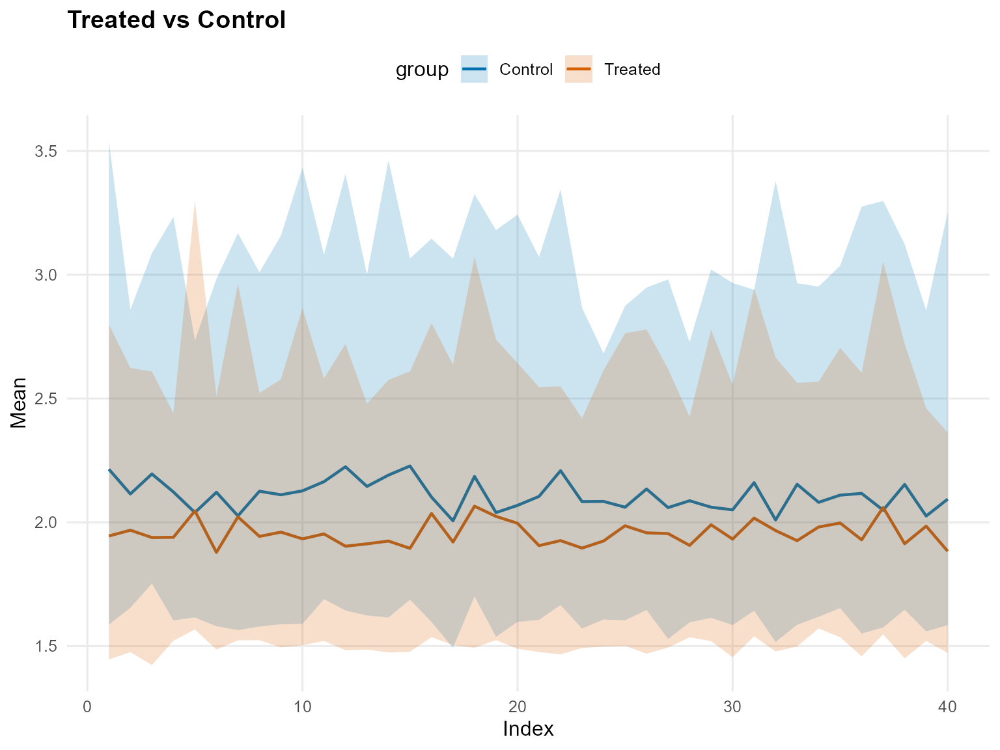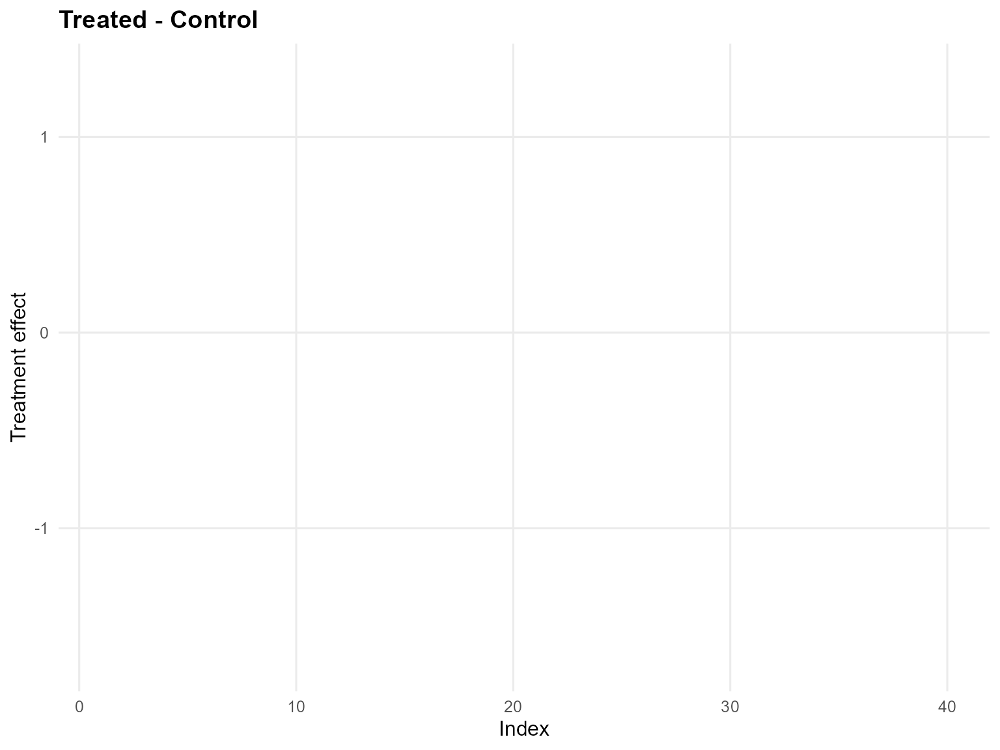

``` r
qte_gpd <- qte(fit_crp_gpd, probs = c(0.25, 0.5, 0.75), newdata = x_eval, interval = "credible")
head(qte_gpd)
```

    $fit
               [,1]        [,2]        [,3]
     [1,] 0.1188577 0.005837400 -0.10962594
     [2,] 0.1188577 0.005499384 -0.13634354
     [3,] 0.1188577 0.005792633 -0.12967337
     [4,] 0.1188577 0.006001549 -0.10680974
     [5,] 0.1188577 0.006361661 -0.09139860
     [6,] 0.1188577 0.005635680 -0.13789284
     [7,] 0.1188577 0.005990490 -0.08895265
     [8,] 0.1188577 0.005739953 -0.11114869
     [9,] 0.1188577 0.005786882 -0.11314873
    [10,] 0.1188577 0.005902151 -0.11585424
    [11,] 0.1188577 0.005582656 -0.13749192
    [12,] 0.1188577 0.005551497 -0.15390878
    [13,] 0.1188577 0.005747933 -0.12428662
    [14,] 0.1188577 0.005670985 -0.13357199
    [15,] 0.1188577 0.005358370 -0.18026775
    [16,] 0.1188577 0.005659370 -0.11367461
    [17,] 0.1188577 0.006353649 -0.08355128
    [18,] 0.1188577 0.005861150 -0.08313325
    [19,] 0.1188577 0.006110365 -0.08555541
    [20,] 0.1188577 0.005845515 -0.09500272
    [21,] 0.1188577 0.005660525 -0.14077380
    [22,] 0.1188577 0.005616773 -0.14288209
    [23,] 0.1188577 0.006002626 -0.10052285
    [24,] 0.1188577 0.005986078 -0.10489843
    [25,] 0.1188577 0.005985579 -0.08672458
    [26,] 0.1188577 0.005714703 -0.12413884
    [27,] 0.1188577 0.005851060 -0.10009426
    [28,] 0.1188577 0.005928047 -0.10167841
    [29,] 0.1188577 0.006301097 -0.08318262
    [30,] 0.1188577 0.006230448 -0.08535680
    [31,] 0.1188577 0.005676904 -0.14380737
    [32,] 0.1188577 0.006429899 -0.06825979
    [33,] 0.1188577 0.005560319 -0.14402165
    [34,] 0.1188577 0.005939402 -0.09336944
    [35,] 0.1188577 0.006094095 -0.10647480
    [36,] 0.1188577 0.006062022 -0.08590308
    [37,] 0.1188577 0.006137249 -0.07815686
    [38,] 0.1188577 0.005687604 -0.14630103
    [39,] 0.1188577 0.006039885 -0.08286938
    [40,] 0.1188577 0.005786493 -0.12644113

    $lower
                [,1]      [,2]       [,3]
     [1,] -0.1778338 -0.257109 -0.5257138
     [2,] -0.1778338 -0.257109 -0.5395919
     [3,] -0.1778338 -0.257109 -0.5463165
     [4,] -0.1778338 -0.257109 -0.5301442
     [5,] -0.1778338 -0.257109 -0.5292107
     [6,] -0.1778338 -0.257109 -0.5422337
     [7,] -0.1778338 -0.257109 -0.5120154
     [8,] -0.1778338 -0.257109 -0.5249223
     [9,] -0.1778338 -0.257109 -0.5206989
    [10,] -0.1778338 -0.257109 -0.5449917
    [11,] -0.1778338 -0.257109 -0.5411809
    [12,] -0.1778338 -0.257109 -0.5743497
    [13,] -0.1778338 -0.257109 -0.5600642
    [14,] -0.1778338 -0.257109 -0.5318426
    [15,] -0.1778338 -0.257109 -0.6582686
    [16,] -0.1778338 -0.257109 -0.5471596
    [17,] -0.1778338 -0.257109 -0.5174808
    [18,] -0.1778338 -0.257109 -0.5208543
    [19,] -0.1778338 -0.257109 -0.5086450
    [20,] -0.1778338 -0.257109 -0.5189552
    [21,] -0.1778338 -0.257109 -0.5473009
    [22,] -0.1778338 -0.257109 -0.5728341
    [23,] -0.1778338 -0.257109 -0.5247455
    [24,] -0.1778338 -0.257109 -0.5279962
    [25,] -0.1778338 -0.257109 -0.5201633
    [26,] -0.1778338 -0.257109 -0.5288228
    [27,] -0.1778338 -0.257109 -0.5225741
    [28,] -0.1778338 -0.257109 -0.5273987
    [29,] -0.1778338 -0.257109 -0.5279933
    [30,] -0.1778338 -0.257109 -0.5212654
    [31,] -0.1778338 -0.257109 -0.6062873
    [32,] -0.1778338 -0.257109 -0.5075040
    [33,] -0.1778338 -0.257109 -0.5335600
    [34,] -0.1778338 -0.257109 -0.5208220
    [35,] -0.1778338 -0.257109 -0.5549027
    [36,] -0.1778338 -0.257109 -0.5229891
    [37,] -0.1778338 -0.257109 -0.5078337
    [38,] -0.1778338 -0.257109 -0.5709732
    [39,] -0.1778338 -0.257109 -0.5176326
    [40,] -0.1778338 -0.257109 -0.5274414

    $upper
               [,1]      [,2]      [,3]
     [1,] 0.3923489 0.2578236 0.2207365
     [2,] 0.3923489 0.2578236 0.2402519
     [3,] 0.3923489 0.2578236 0.2448500
     [4,] 0.3923489 0.2578236 0.2537147
     [5,] 0.3923489 0.2578236 0.2654821
     [6,] 0.3923489 0.2578236 0.2193105
     [7,] 0.3923489 0.2578236 0.2564197
     [8,] 0.3923489 0.2578236 0.2255188
     [9,] 0.3923489 0.2578236 0.2303454
    [10,] 0.3923489 0.2578236 0.2494198
    [11,] 0.3923489 0.2578236 0.2353718
    [12,] 0.3923489 0.2578236 0.2289852
    [13,] 0.3923489 0.2578236 0.2337342
    [14,] 0.3923489 0.2578236 0.2397895
    [15,] 0.3923489 0.2578236 0.2183171
    [16,] 0.3923489 0.2578236 0.2718754
    [17,] 0.3923489 0.2578236 0.2485655
    [18,] 0.3923489 0.2578236 0.3714302
    [19,] 0.3923489 0.2578236 0.2706509
    [20,] 0.3923489 0.2578236 0.2661871
    [21,] 0.3923489 0.2578236 0.2177326
    [22,] 0.3923489 0.2578236 0.2419883
    [23,] 0.3923489 0.2578236 0.2457751
    [24,] 0.3923489 0.2578236 0.2492681
    [25,] 0.3923489 0.2578236 0.2606532
    [26,] 0.3923489 0.2578236 0.2314495
    [27,] 0.3923489 0.2578236 0.2278027
    [28,] 0.3923489 0.2578236 0.2487582
    [29,] 0.3923489 0.2578236 0.2650418
    [30,] 0.3923489 0.2578236 0.2537147
    [31,] 0.3923489 0.2578236 0.2537147
    [32,] 0.3923489 0.2578236 0.2790714
    [33,] 0.3923489 0.2578236 0.2279164
    [34,] 0.3923489 0.2578236 0.2576827
    [35,] 0.3923489 0.2578236 0.2654821
    [36,] 0.3923489 0.2578236 0.2537147
    [37,] 0.3923489 0.2578236 0.3020543
    [38,] 0.3923489 0.2578236 0.2353817
    [39,] 0.3923489 0.2578236 0.2774046
    [40,] 0.3923489 0.2578236 0.2374289

    $grid
    [1] 0.25 0.50 0.75

    $trt
    $fit
         estimate index id     lower    upper
    1   0.8003906  0.25  1 0.6855621 0.934339
    2   0.8003906  0.25  2 0.6855621 0.934339
    3   0.8003906  0.25  3 0.6855621 0.934339
    4   0.8003906  0.25  4 0.6855621 0.934339
    5   0.8003906  0.25  5 0.6855621 0.934339
    6   0.8003906  0.25  6 0.6855621 0.934339
    7   0.8003906  0.25  7 0.6855621 0.934339
    8   0.8003906  0.25  8 0.6855621 0.934339
    9   0.8003906  0.25  9 0.6855621 0.934339
    10  0.8003906  0.25 10 0.6855621 0.934339
    11  0.8003906  0.25 11 0.6855621 0.934339
    12  0.8003906  0.25 12 0.6855621 0.934339
    13  0.8003906  0.25 13 0.6855621 0.934339
    14  0.8003906  0.25 14 0.6855621 0.934339
    15  0.8003906  0.25 15 0.6855621 0.934339
    16  0.8003906  0.25 16 0.6855621 0.934339
    17  0.8003906  0.25 17 0.6855621 0.934339
    18  0.8003906  0.25 18 0.6855621 0.934339
    19  0.8003906  0.25 19 0.6855621 0.934339
    20  0.8003906  0.25 20 0.6855621 0.934339
    21  0.8003906  0.25 21 0.6855621 0.934339
    22  0.8003906  0.25 22 0.6855621 0.934339
    23  0.8003906  0.25 23 0.6855621 0.934339
    24  0.8003906  0.25 24 0.6855621 0.934339
    25  0.8003906  0.25 25 0.6855621 0.934339
    26  0.8003906  0.25 26 0.6855621 0.934339
    27  0.8003906  0.25 27 0.6855621 0.934339
    28  0.8003906  0.25 28 0.6855621 0.934339
    29  0.8003906  0.25 29 0.6855621 0.934339
    30  0.8003906  0.25 30 0.6855621 0.934339
    31  0.8003906  0.25 31 0.6855621 0.934339
    32  0.8003906  0.25 32 0.6855621 0.934339
    33  0.8003906  0.25 33 0.6855621 0.934339
    34  0.8003906  0.25 34 0.6855621 0.934339
    35  0.8003906  0.25 35 0.6855621 0.934339
    36  0.8003906  0.25 36 0.6855621 0.934339
    37  0.8003906  0.25 37 0.6855621 0.934339
    38  0.8003906  0.25 38 0.6855621 0.934339
    39  0.8003906  0.25 39 0.6855621 0.934339
    40  0.8003906  0.25 40 0.6855621 0.934339
    41  1.2735846  0.50  1 1.1465599 1.408650
    42  1.2737458  0.50  2 1.1465599 1.409511
    43  1.2736855  0.50  3 1.1465599 1.408650
    44  1.2738869  0.50  4 1.1465599 1.412229
    45  1.2741859  0.50  5 1.1465599 1.412229
    46  1.2736109  0.50  6 1.1465599 1.408650
    47  1.2738888  0.50  7 1.1465599 1.412229
    48  1.2736234  0.50  8 1.1465599 1.408650
    49  1.2737147  0.50  9 1.1465599 1.408650
    50  1.2736379  0.50 10 1.1465599 1.408650
    51  1.2736363  0.50 11 1.1465599 1.408650
    52  1.2736042  0.50 12 1.1465599 1.408650
    53  1.2735741  0.50 13 1.1465599 1.408650
    54  1.2736975  0.50 14 1.1465599 1.408650
    55  1.2735460  0.50 15 1.1465599 1.408650
    56  1.2738911  0.50 16 1.1465599 1.412229
    57  1.2739710  0.50 17 1.1465599 1.412229
    58  1.2737796  0.50 18 1.1465599 1.412229
    59  1.2740184  0.50 19 1.1465599 1.412229
    60  1.2737737  0.50 20 1.1465599 1.412229
    61  1.2736171  0.50 21 1.1465599 1.408650
    62  1.2736443  0.50 22 1.1465599 1.408650
    63  1.2736772  0.50 23 1.1465599 1.408650
    64  1.2737767  0.50 24 1.1465599 1.412229
    65  1.2737473  0.50 25 1.1465599 1.409663
    66  1.2736283  0.50 26 1.1465599 1.408650
    67  1.2736555  0.50 27 1.1465599 1.408650
    68  1.2736597  0.50 28 1.1465599 1.408650
    69  1.2740127  0.50 29 1.1465599 1.412229
    70  1.2738408  0.50 30 1.1465599 1.412229
    71  1.2739231  0.50 31 1.1465599 1.412229
    72  1.2740722  0.50 32 1.1465599 1.412229
    73  1.2736584  0.50 33 1.1465599 1.408650
    74  1.2738040  0.50 34 1.1465599 1.412229
    75  1.2740002  0.50 35 1.1465599 1.412229
    76  1.2736534  0.50 36 1.1465599 1.408650
    77  1.2739860  0.50 37 1.1465599 1.412229
    78  1.2736565  0.50 38 1.1465599 1.408650
    79  1.2738758  0.50 39 1.1465599 1.412229
    80  1.2737791  0.50 40 1.1465599 1.412229
    81  1.9877183  0.75  1 1.7806272 2.205515
    82  1.9955622  0.75  2 1.7806272 2.214367
    83  1.9901985  0.75  3 1.7806272 2.205515
    84  1.9950878  0.75  4 1.7806272 2.210871
    85  1.9974357  0.75  5 1.7806272 2.212722
    86  1.9841249  0.75  6 1.7806272 2.205515
    87  1.9947042  0.75  7 1.7806272 2.212836
    88  1.9901145  0.75  8 1.7806272 2.205515
    89  1.9889191  0.75  9 1.7806272 2.205515
    90  1.9876272  0.75 10 1.7806272 2.205515
    91  1.9921247  0.75 11 1.7806272 2.210871
    92  1.9864811  0.75 12 1.7806272 2.205515
    93  1.9889982  0.75 13 1.7806272 2.205515
    94  1.9900958  0.75 14 1.7806272 2.205515
    95  1.9837501  0.75 15 1.7806272 2.205515
    96  2.0038405  0.75 16 1.7806272 2.263650
    97  1.9838883  0.75 17 1.7806272 2.210871
    98  2.0171529  0.75 18 1.7806272 2.393272
    99  1.9965561  0.75 19 1.7806272 2.213360
    100 1.9985686  0.75 20 1.7806272 2.226589
    101 1.9820903  0.75 21 1.7806272 2.205515
    102 1.9926788  0.75 22 1.7806272 2.210871
    103 1.9870449  0.75 23 1.7806272 2.205515
    104 1.9917191  0.75 24 1.7806272 2.205515
    105 1.9959110  0.75 25 1.7806272 2.214367
    106 1.9896277  0.75 26 1.7806272 2.205515
    107 1.9898455  0.75 27 1.7806272 2.205515
    108 1.9905795  0.75 28 1.7806272 2.205515
    109 1.9939462  0.75 29 1.7806272 2.210871
    110 1.9875264  0.75 30 1.7806272 2.210871
    111 1.9937003  0.75 31 1.7806272 2.210871
    112 1.9944293  0.75 32 1.7806272 2.210871
    113 1.9863033  0.75 33 1.7806272 2.205515
    114 1.9989174  0.75 34 1.7806272 2.229928
    115 1.9986122  0.75 35 1.7806272 2.214367
    116 1.9893233  0.75 36 1.7806272 2.205515
    117 2.0014244  0.75 37 1.7806272 2.235653
    118 1.9851657  0.75 38 1.7806272 2.205515
    119 1.9981064  0.75 39 1.7806272 2.226376
    120 1.9862812  0.75 40 1.7806272 2.205515

    $lower
    NULL

    $upper
    NULL

    $type
    [1] "quantile"

    $grid
    [1] 0.25 0.50 0.75

    $draws
    , , 1

                [,1]      [,2]      [,3]      [,4]      [,5]      [,6]      [,7]
      [1,] 0.8991695 0.8991695 0.8991695 0.8991695 0.8991695 0.8991695 0.8991695
      [2,] 0.8651753 0.8651753 0.8651753 0.8651753 0.8651753 0.8651753 0.8651753
      [3,] 0.8612853 0.8612853 0.8612853 0.8612853 0.8612853 0.8612853 0.8612853
      [4,] 0.8986244 0.8986244 0.8986244 0.8986244 0.8986244 0.8986244 0.8986244
      [5,] 0.8971133 0.8971133 0.8971133 0.8971133 0.8971133 0.8971133 0.8971133
      [6,] 0.8600246 0.8600246 0.8600246 0.8600246 0.8600246 0.8600246 0.8600246
      [7,] 0.8110216 0.8110216 0.8110216 0.8110216 0.8110216 0.8110216 0.8110216
      [8,] 0.8227150 0.8227150 0.8227150 0.8227150 0.8227150 0.8227150 0.8227150
      [9,] 0.8780044 0.8780044 0.8780044 0.8780044 0.8780044 0.8780044 0.8780044
     [10,] 0.8639385 0.8639385 0.8639385 0.8639385 0.8639385 0.8639385 0.8639385
     [11,] 0.8904634 0.8904634 0.8904634 0.8904634 0.8904634 0.8904634 0.8904634
     [12,] 0.8305158 0.8305158 0.8305158 0.8305158 0.8305158 0.8305158 0.8305158
     [13,] 0.7930677 0.7930677 0.7930677 0.7930677 0.7930677 0.7930677 0.7930677
     [14,] 0.7940836 0.7940836 0.7940836 0.7940836 0.7940836 0.7940836 0.7940836
     [15,] 0.7802497 0.7802497 0.7802497 0.7802497 0.7802497 0.7802497 0.7802497
     [16,] 0.7967536 0.7967536 0.7967536 0.7967536 0.7967536 0.7967536 0.7967536
     [17,] 0.8004347 0.8004347 0.8004347 0.8004347 0.8004347 0.8004347 0.8004347
     [18,] 0.7443937 0.7443937 0.7443937 0.7443937 0.7443937 0.7443937 0.7443937
     [19,] 0.8138076 0.8138076 0.8138076 0.8138076 0.8138076 0.8138076 0.8138076
     [20,] 0.7915490 0.7915490 0.7915490 0.7915490 0.7915490 0.7915490 0.7915490
     [21,] 0.8125964 0.8125964 0.8125964 0.8125964 0.8125964 0.8125964 0.8125964
     [22,] 0.8014995 0.8014995 0.8014995 0.8014995 0.8014995 0.8014995 0.8014995
     [23,] 0.8051368 0.8051368 0.8051368 0.8051368 0.8051368 0.8051368 0.8051368
     [24,] 0.8333829 0.8333829 0.8333829 0.8333829 0.8333829 0.8333829 0.8333829
     [25,] 0.7930601 0.7930601 0.7930601 0.7930601 0.7930601 0.7930601 0.7930601
     [26,] 0.8162711 0.8162711 0.8162711 0.8162711 0.8162711 0.8162711 0.8162711
     [27,] 0.7752592 0.7752592 0.7752592 0.7752592 0.7752592 0.7752592 0.7752592
     [28,] 0.7886794 0.7886794 0.7886794 0.7886794 0.7886794 0.7886794 0.7886794
     [29,] 0.6938736 0.6938736 0.6938736 0.6938736 0.6938736 0.6938736 0.6938736
     [30,] 0.7113906 0.7113906 0.7113906 0.7113906 0.7113906 0.7113906 0.7113906
     [31,] 0.7740806 0.7740806 0.7740806 0.7740806 0.7740806 0.7740806 0.7740806
     [32,] 0.7302563 0.7302563 0.7302563 0.7302563 0.7302563 0.7302563 0.7302563
     [33,] 0.7665721 0.7665721 0.7665721 0.7665721 0.7665721 0.7665721 0.7665721
     [34,] 0.7516596 0.7516596 0.7516596 0.7516596 0.7516596 0.7516596 0.7516596
     [35,] 0.7856206 0.7856206 0.7856206 0.7856206 0.7856206 0.7856206 0.7856206
     [36,] 0.7494253 0.7494253 0.7494253 0.7494253 0.7494253 0.7494253 0.7494253
     [37,] 0.7557788 0.7557788 0.7557788 0.7557788 0.7557788 0.7557788 0.7557788
     [38,] 0.7966735 0.7966735 0.7966735 0.7966735 0.7966735 0.7966735 0.7966735
     [39,] 0.7902508 0.7902508 0.7902508 0.7902508 0.7902508 0.7902508 0.7902508
     [40,] 0.7689026 0.7689026 0.7689026 0.7689026 0.7689026 0.7689026 0.7689026
     [41,] 0.7915214 0.7915214 0.7915214 0.7915214 0.7915214 0.7915214 0.7915214
     [42,] 0.7577182 0.7577182 0.7577182 0.7577182 0.7577182 0.7577182 0.7577182
     [43,] 0.7525918 0.7525918 0.7525918 0.7525918 0.7525918 0.7525918 0.7525918
     [44,] 0.8042208 0.8042208 0.8042208 0.8042208 0.8042208 0.8042208 0.8042208
     [45,] 0.7651133 0.7651133 0.7651133 0.7651133 0.7651133 0.7651133 0.7651133
     [46,] 0.8331596 0.8331596 0.8331596 0.8331596 0.8331596 0.8331596 0.8331596
     [47,] 0.8146672 0.8146672 0.8146672 0.8146672 0.8146672 0.8146672 0.8146672
     [48,] 0.8442660 0.8442660 0.8442660 0.8442660 0.8442660 0.8442660 0.8442660
     [49,] 0.8299263 0.8299263 0.8299263 0.8299263 0.8299263 0.8299263 0.8299263
     [50,] 0.8636208 0.8636208 0.8636208 0.8636208 0.8636208 0.8636208 0.8636208
     [51,] 0.8643185 0.8643185 0.8643185 0.8643185 0.8643185 0.8643185 0.8643185
     [52,] 0.8432972 0.8432972 0.8432972 0.8432972 0.8432972 0.8432972 0.8432972
     [53,] 0.8545508 0.8545508 0.8545508 0.8545508 0.8545508 0.8545508 0.8545508
     [54,] 0.8236542 0.8236542 0.8236542 0.8236542 0.8236542 0.8236542 0.8236542
     [55,] 0.8167229 0.8167229 0.8167229 0.8167229 0.8167229 0.8167229 0.8167229
     [56,] 0.7721891 0.7721891 0.7721891 0.7721891 0.7721891 0.7721891 0.7721891
     [57,] 0.8170769 0.8170769 0.8170769 0.8170769 0.8170769 0.8170769 0.8170769
     [58,] 0.7608152 0.7608152 0.7608152 0.7608152 0.7608152 0.7608152 0.7608152
     [59,] 0.7469388 0.7469388 0.7469388 0.7469388 0.7469388 0.7469388 0.7469388
     [60,] 0.7286137 0.7286137 0.7286137 0.7286137 0.7286137 0.7286137 0.7286137
     [61,] 0.7816109 0.7816109 0.7816109 0.7816109 0.7816109 0.7816109 0.7816109
     [62,] 0.7772878 0.7772878 0.7772878 0.7772878 0.7772878 0.7772878 0.7772878
     [63,] 0.7935493 0.7935493 0.7935493 0.7935493 0.7935493 0.7935493 0.7935493
     [64,] 0.7846230 0.7846230 0.7846230 0.7846230 0.7846230 0.7846230 0.7846230
     [65,] 0.7899445 0.7899445 0.7899445 0.7899445 0.7899445 0.7899445 0.7899445
     [66,] 0.8263610 0.8263610 0.8263610 0.8263610 0.8263610 0.8263610 0.8263610
     [67,] 0.8011019 0.8011019 0.8011019 0.8011019 0.8011019 0.8011019 0.8011019
     [68,] 0.7960330 0.7960330 0.7960330 0.7960330 0.7960330 0.7960330 0.7960330
     [69,] 0.7773336 0.7773336 0.7773336 0.7773336 0.7773336 0.7773336 0.7773336
     [70,] 0.7559345 0.7559345 0.7559345 0.7559345 0.7559345 0.7559345 0.7559345
     [71,] 0.7601939 0.7601939 0.7601939 0.7601939 0.7601939 0.7601939 0.7601939
     [72,] 0.7698438 0.7698438 0.7698438 0.7698438 0.7698438 0.7698438 0.7698438
     [73,] 0.8918227 0.8918227 0.8918227 0.8918227 0.8918227 0.8918227 0.8918227
     [74,] 0.9138224 0.9138224 0.9138224 0.9138224 0.9138224 0.9138224 0.9138224
     [75,] 0.9280956 0.9280956 0.9280956 0.9280956 0.9280956 0.9280956 0.9280956
     [76,] 0.8940849 0.8940849 0.8940849 0.8940849 0.8940849 0.8940849 0.8940849
     [77,] 0.8726419 0.8726419 0.8726419 0.8726419 0.8726419 0.8726419 0.8726419
     [78,] 0.7623269 0.7623269 0.7623269 0.7623269 0.7623269 0.7623269 0.7623269
     [79,] 0.7974868 0.7974868 0.7974868 0.7974868 0.7974868 0.7974868 0.7974868
     [80,] 0.7937359 0.7937359 0.7937359 0.7937359 0.7937359 0.7937359 0.7937359
     [81,] 0.8369279 0.8369279 0.8369279 0.8369279 0.8369279 0.8369279 0.8369279
     [82,] 0.7732083 0.7732083 0.7732083 0.7732083 0.7732083 0.7732083 0.7732083
     [83,] 0.8461086 0.8461086 0.8461086 0.8461086 0.8461086 0.8461086 0.8461086
     [84,] 0.8528577 0.8528577 0.8528577 0.8528577 0.8528577 0.8528577 0.8528577
     [85,] 0.8565620 0.8565620 0.8565620 0.8565620 0.8565620 0.8565620 0.8565620
     [86,] 0.8386229 0.8386229 0.8386229 0.8386229 0.8386229 0.8386229 0.8386229
     [87,] 0.7971574 0.7971574 0.7971574 0.7971574 0.7971574 0.7971574 0.7971574
     [88,] 0.7446069 0.7446069 0.7446069 0.7446069 0.7446069 0.7446069 0.7446069
     [89,] 0.8107577 0.8107577 0.8107577 0.8107577 0.8107577 0.8107577 0.8107577
     [90,] 0.8563906 0.8563906 0.8563906 0.8563906 0.8563906 0.8563906 0.8563906
     [91,] 0.8473361 0.8473361 0.8473361 0.8473361 0.8473361 0.8473361 0.8473361
     [92,] 0.8033623 0.8033623 0.8033623 0.8033623 0.8033623 0.8033623 0.8033623
     [93,] 0.7970324 0.7970324 0.7970324 0.7970324 0.7970324 0.7970324 0.7970324
     [94,] 0.8093804 0.8093804 0.8093804 0.8093804 0.8093804 0.8093804 0.8093804
     [95,] 0.8101466 0.8101466 0.8101466 0.8101466 0.8101466 0.8101466 0.8101466
     [96,] 0.7735656 0.7735656 0.7735656 0.7735656 0.7735656 0.7735656 0.7735656
     [97,] 0.8069077 0.8069077 0.8069077 0.8069077 0.8069077 0.8069077 0.8069077
     [98,] 0.7257693 0.7257693 0.7257693 0.7257693 0.7257693 0.7257693 0.7257693
     [99,] 0.7188705 0.7188705 0.7188705 0.7188705 0.7188705 0.7188705 0.7188705
    [100,] 0.7441921 0.7441921 0.7441921 0.7441921 0.7441921 0.7441921 0.7441921
    [101,] 0.7300967 0.7300967 0.7300967 0.7300967 0.7300967 0.7300967 0.7300967
    [102,] 0.7263732 0.7263732 0.7263732 0.7263732 0.7263732 0.7263732 0.7263732
    [103,] 0.7162596 0.7162596 0.7162596 0.7162596 0.7162596 0.7162596 0.7162596
    [104,] 0.7090870 0.7090870 0.7090870 0.7090870 0.7090870 0.7090870 0.7090870
    [105,] 0.7144723 0.7144723 0.7144723 0.7144723 0.7144723 0.7144723 0.7144723
    [106,] 0.7543435 0.7543435 0.7543435 0.7543435 0.7543435 0.7543435 0.7543435
    [107,] 0.7472858 0.7472858 0.7472858 0.7472858 0.7472858 0.7472858 0.7472858
    [108,] 0.7675597 0.7675597 0.7675597 0.7675597 0.7675597 0.7675597 0.7675597
    [109,] 0.7682574 0.7682574 0.7682574 0.7682574 0.7682574 0.7682574 0.7682574
    [110,] 0.7513808 0.7513808 0.7513808 0.7513808 0.7513808 0.7513808 0.7513808
    [111,] 0.7299682 0.7299682 0.7299682 0.7299682 0.7299682 0.7299682 0.7299682
    [112,] 0.7547126 0.7547126 0.7547126 0.7547126 0.7547126 0.7547126 0.7547126
    [113,] 0.7401880 0.7401880 0.7401880 0.7401880 0.7401880 0.7401880 0.7401880
    [114,] 0.7673567 0.7673567 0.7673567 0.7673567 0.7673567 0.7673567 0.7673567
    [115,] 0.7262661 0.7262661 0.7262661 0.7262661 0.7262661 0.7262661 0.7262661
    [116,] 0.7065418 0.7065418 0.7065418 0.7065418 0.7065418 0.7065418 0.7065418
    [117,] 0.6815053 0.6815053 0.6815053 0.6815053 0.6815053 0.6815053 0.6815053
    [118,] 0.6111077 0.6111077 0.6111077 0.6111077 0.6111077 0.6111077 0.6111077
    [119,] 0.6764605 0.6764605 0.6764605 0.6764605 0.6764605 0.6764605 0.6764605
    [120,] 0.6837532 0.6837532 0.6837532 0.6837532 0.6837532 0.6837532 0.6837532
    [121,] 0.7737690 0.7737690 0.7737690 0.7737690 0.7737690 0.7737690 0.7737690
    [122,] 0.7603044 0.7603044 0.7603044 0.7603044 0.7603044 0.7603044 0.7603044
    [123,] 0.6982929 0.6982929 0.6982929 0.6982929 0.6982929 0.6982929 0.6982929
    [124,] 0.6941970 0.6941970 0.6941970 0.6941970 0.6941970 0.6941970 0.6941970
    [125,] 0.6902422 0.6902422 0.6902422 0.6902422 0.6902422 0.6902422 0.6902422
    [126,] 0.7460530 0.7460530 0.7460530 0.7460530 0.7460530 0.7460530 0.7460530
    [127,] 0.7029066 0.7029066 0.7029066 0.7029066 0.7029066 0.7029066 0.7029066
    [128,] 0.6922203 0.6922203 0.6922203 0.6922203 0.6922203 0.6922203 0.6922203
    [129,] 0.6761171 0.6761171 0.6761171 0.6761171 0.6761171 0.6761171 0.6761171
    [130,] 0.7133466 0.7133466 0.7133466 0.7133466 0.7133466 0.7133466 0.7133466
    [131,] 0.7026504 0.7026504 0.7026504 0.7026504 0.7026504 0.7026504 0.7026504
    [132,] 0.7340613 0.7340613 0.7340613 0.7340613 0.7340613 0.7340613 0.7340613
    [133,] 0.7906605 0.7906605 0.7906605 0.7906605 0.7906605 0.7906605 0.7906605
    [134,] 0.7860032 0.7860032 0.7860032 0.7860032 0.7860032 0.7860032 0.7860032
    [135,] 0.8201672 0.8201672 0.8201672 0.8201672 0.8201672 0.8201672 0.8201672
    [136,] 0.8004931 0.8004931 0.8004931 0.8004931 0.8004931 0.8004931 0.8004931
    [137,] 0.6887757 0.6887757 0.6887757 0.6887757 0.6887757 0.6887757 0.6887757
    [138,] 0.6891808 0.6891808 0.6891808 0.6891808 0.6891808 0.6891808 0.6891808
    [139,] 0.7243269 0.7243269 0.7243269 0.7243269 0.7243269 0.7243269 0.7243269
    [140,] 0.8083279 0.8083279 0.8083279 0.8083279 0.8083279 0.8083279 0.8083279
    [141,] 0.8171793 0.8171793 0.8171793 0.8171793 0.8171793 0.8171793 0.8171793
    [142,] 0.8062494 0.8062494 0.8062494 0.8062494 0.8062494 0.8062494 0.8062494
    [143,] 0.7483170 0.7483170 0.7483170 0.7483170 0.7483170 0.7483170 0.7483170
    [144,] 0.7857154 0.7857154 0.7857154 0.7857154 0.7857154 0.7857154 0.7857154
    [145,] 0.7467210 0.7467210 0.7467210 0.7467210 0.7467210 0.7467210 0.7467210
    [146,] 0.8058590 0.8058590 0.8058590 0.8058590 0.8058590 0.8058590 0.8058590
    [147,] 0.8068274 0.8068274 0.8068274 0.8068274 0.8068274 0.8068274 0.8068274
    [148,] 0.7753202 0.7753202 0.7753202 0.7753202 0.7753202 0.7753202 0.7753202
    [149,] 0.7787135 0.7787135 0.7787135 0.7787135 0.7787135 0.7787135 0.7787135
    [150,] 0.7776206 0.7776206 0.7776206 0.7776206 0.7776206 0.7776206 0.7776206
    [151,] 0.7810444 0.7810444 0.7810444 0.7810444 0.7810444 0.7810444 0.7810444
    [152,] 0.7748514 0.7748514 0.7748514 0.7748514 0.7748514 0.7748514 0.7748514
    [153,] 0.9145935 0.9145935 0.9145935 0.9145935 0.9145935 0.9145935 0.9145935
    [154,] 0.8921433 0.8921433 0.8921433 0.8921433 0.8921433 0.8921433 0.8921433
    [155,] 0.9183536 0.9183536 0.9183536 0.9183536 0.9183536 0.9183536 0.9183536
    [156,] 0.8955089 0.8955089 0.8955089 0.8955089 0.8955089 0.8955089 0.8955089
    [157,] 0.8759330 0.8759330 0.8759330 0.8759330 0.8759330 0.8759330 0.8759330
    [158,] 0.8546846 0.8546846 0.8546846 0.8546846 0.8546846 0.8546846 0.8546846
    [159,] 0.8434275 0.8434275 0.8434275 0.8434275 0.8434275 0.8434275 0.8434275
    [160,] 0.8266517 0.8266517 0.8266517 0.8266517 0.8266517 0.8266517 0.8266517
    [161,] 0.8436363 0.8436363 0.8436363 0.8436363 0.8436363 0.8436363 0.8436363
    [162,] 0.8741881 0.8741881 0.8741881 0.8741881 0.8741881 0.8741881 0.8741881
    [163,] 0.9073871 0.9073871 0.9073871 0.9073871 0.9073871 0.9073871 0.9073871
    [164,] 0.7871176 0.7871176 0.7871176 0.7871176 0.7871176 0.7871176 0.7871176
    [165,] 0.7536269 0.7536269 0.7536269 0.7536269 0.7536269 0.7536269 0.7536269
    [166,] 0.7941630 0.7941630 0.7941630 0.7941630 0.7941630 0.7941630 0.7941630
    [167,] 0.8221263 0.8221263 0.8221263 0.8221263 0.8221263 0.8221263 0.8221263
    [168,] 0.8432676 0.8432676 0.8432676 0.8432676 0.8432676 0.8432676 0.8432676
    [169,] 0.8417154 0.8417154 0.8417154 0.8417154 0.8417154 0.8417154 0.8417154
    [170,] 0.8540530 0.8540530 0.8540530 0.8540530 0.8540530 0.8540530 0.8540530
    [171,] 0.9007370 0.9007370 0.9007370 0.9007370 0.9007370 0.9007370 0.9007370
    [172,] 0.8427470 0.8427470 0.8427470 0.8427470 0.8427470 0.8427470 0.8427470
    [173,] 0.8493135 0.8493135 0.8493135 0.8493135 0.8493135 0.8493135 0.8493135
    [174,] 0.8171833 0.8171833 0.8171833 0.8171833 0.8171833 0.8171833 0.8171833
    [175,] 0.8316321 0.8316321 0.8316321 0.8316321 0.8316321 0.8316321 0.8316321
    [176,] 0.8322059 0.8322059 0.8322059 0.8322059 0.8322059 0.8322059 0.8322059
    [177,] 0.9008689 0.9008689 0.9008689 0.9008689 0.9008689 0.9008689 0.9008689
    [178,] 0.8627202 0.8627202 0.8627202 0.8627202 0.8627202 0.8627202 0.8627202
    [179,] 0.8582108 0.8582108 0.8582108 0.8582108 0.8582108 0.8582108 0.8582108
    [180,] 0.8318908 0.8318908 0.8318908 0.8318908 0.8318908 0.8318908 0.8318908
    [181,] 0.8786987 0.8786987 0.8786987 0.8786987 0.8786987 0.8786987 0.8786987
    [182,] 0.8638694 0.8638694 0.8638694 0.8638694 0.8638694 0.8638694 0.8638694
    [183,] 0.9452345 0.9452345 0.9452345 0.9452345 0.9452345 0.9452345 0.9452345
    [184,] 0.9441898 0.9441898 0.9441898 0.9441898 0.9441898 0.9441898 0.9441898
    [185,] 0.9225528 0.9225528 0.9225528 0.9225528 0.9225528 0.9225528 0.9225528
    [186,] 0.8432160 0.8432160 0.8432160 0.8432160 0.8432160 0.8432160 0.8432160
    [187,] 0.8812507 0.8812507 0.8812507 0.8812507 0.8812507 0.8812507 0.8812507
    [188,] 0.8708008 0.8708008 0.8708008 0.8708008 0.8708008 0.8708008 0.8708008
    [189,] 0.8413180 0.8413180 0.8413180 0.8413180 0.8413180 0.8413180 0.8413180
    [190,] 0.9480752 0.9480752 0.9480752 0.9480752 0.9480752 0.9480752 0.9480752
    [191,] 0.9294650 0.9294650 0.9294650 0.9294650 0.9294650 0.9294650 0.9294650
    [192,] 0.9717512 0.9717512 0.9717512 0.9717512 0.9717512 0.9717512 0.9717512
    [193,] 0.7348740 0.7348740 0.7348740 0.7348740 0.7348740 0.7348740 0.7348740
    [194,] 0.7433913 0.7433913 0.7433913 0.7433913 0.7433913 0.7433913 0.7433913
    [195,] 0.9558300 0.9558300 0.9558300 0.9558300 0.9558300 0.9558300 0.9558300
    [196,] 0.9387488 0.9387488 0.9387488 0.9387488 0.9387488 0.9387488 0.9387488
    [197,] 0.7708650 0.7708650 0.7708650 0.7708650 0.7708650 0.7708650 0.7708650
    [198,] 0.8280583 0.8280583 0.8280583 0.8280583 0.8280583 0.8280583 0.8280583
    [199,] 0.8164207 0.8164207 0.8164207 0.8164207 0.8164207 0.8164207 0.8164207
    [200,] 0.7730822 0.7730822 0.7730822 0.7730822 0.7730822 0.7730822 0.7730822
    [201,] 0.8038616 0.8038616 0.8038616 0.8038616 0.8038616 0.8038616 0.8038616
    [202,] 0.8498404 0.8498404 0.8498404 0.8498404 0.8498404 0.8498404 0.8498404
    [203,] 0.8080643 0.8080643 0.8080643 0.8080643 0.8080643 0.8080643 0.8080643
    [204,] 0.8936563 0.8936563 0.8936563 0.8936563 0.8936563 0.8936563 0.8936563
    [205,] 0.8992635 0.8992635 0.8992635 0.8992635 0.8992635 0.8992635 0.8992635
    [206,] 0.7863323 0.7863323 0.7863323 0.7863323 0.7863323 0.7863323 0.7863323
    [207,] 0.7738053 0.7738053 0.7738053 0.7738053 0.7738053 0.7738053 0.7738053
    [208,] 0.7739243 0.7739243 0.7739243 0.7739243 0.7739243 0.7739243 0.7739243
    [209,] 0.7289285 0.7289285 0.7289285 0.7289285 0.7289285 0.7289285 0.7289285
    [210,] 0.7051406 0.7051406 0.7051406 0.7051406 0.7051406 0.7051406 0.7051406
    [211,] 0.6775551 0.6775551 0.6775551 0.6775551 0.6775551 0.6775551 0.6775551
    [212,] 0.6875615 0.6875615 0.6875615 0.6875615 0.6875615 0.6875615 0.6875615
    [213,] 0.7135900 0.7135900 0.7135900 0.7135900 0.7135900 0.7135900 0.7135900
    [214,] 0.7369520 0.7369520 0.7369520 0.7369520 0.7369520 0.7369520 0.7369520
    [215,] 0.7303779 0.7303779 0.7303779 0.7303779 0.7303779 0.7303779 0.7303779
    [216,] 0.7276261 0.7276261 0.7276261 0.7276261 0.7276261 0.7276261 0.7276261
    [217,] 0.7388127 0.7388127 0.7388127 0.7388127 0.7388127 0.7388127 0.7388127
    [218,] 0.8628816 0.8628816 0.8628816 0.8628816 0.8628816 0.8628816 0.8628816
    [219,] 0.8628816 0.8628816 0.8628816 0.8628816 0.8628816 0.8628816 0.8628816
    [220,] 0.8982636 0.8982636 0.8982636 0.8982636 0.8982636 0.8982636 0.8982636
                [,8]      [,9]     [,10]     [,11]     [,12]     [,13]     [,14]
      [1,] 0.8991695 0.8991695 0.8991695 0.8991695 0.8991695 0.8991695 0.8991695
      [2,] 0.8651753 0.8651753 0.8651753 0.8651753 0.8651753 0.8651753 0.8651753
      [3,] 0.8612853 0.8612853 0.8612853 0.8612853 0.8612853 0.8612853 0.8612853
      [4,] 0.8986244 0.8986244 0.8986244 0.8986244 0.8986244 0.8986244 0.8986244
      [5,] 0.8971133 0.8971133 0.8971133 0.8971133 0.8971133 0.8971133 0.8971133
      [6,] 0.8600246 0.8600246 0.8600246 0.8600246 0.8600246 0.8600246 0.8600246
      [7,] 0.8110216 0.8110216 0.8110216 0.8110216 0.8110216 0.8110216 0.8110216
      [8,] 0.8227150 0.8227150 0.8227150 0.8227150 0.8227150 0.8227150 0.8227150
      [9,] 0.8780044 0.8780044 0.8780044 0.8780044 0.8780044 0.8780044 0.8780044
     [10,] 0.8639385 0.8639385 0.8639385 0.8639385 0.8639385 0.8639385 0.8639385
     [11,] 0.8904634 0.8904634 0.8904634 0.8904634 0.8904634 0.8904634 0.8904634
     [12,] 0.8305158 0.8305158 0.8305158 0.8305158 0.8305158 0.8305158 0.8305158
     [13,] 0.7930677 0.7930677 0.7930677 0.7930677 0.7930677 0.7930677 0.7930677
     [14,] 0.7940836 0.7940836 0.7940836 0.7940836 0.7940836 0.7940836 0.7940836
     [15,] 0.7802497 0.7802497 0.7802497 0.7802497 0.7802497 0.7802497 0.7802497
     [16,] 0.7967536 0.7967536 0.7967536 0.7967536 0.7967536 0.7967536 0.7967536
     [17,] 0.8004347 0.8004347 0.8004347 0.8004347 0.8004347 0.8004347 0.8004347
     [18,] 0.7443937 0.7443937 0.7443937 0.7443937 0.7443937 0.7443937 0.7443937
     [19,] 0.8138076 0.8138076 0.8138076 0.8138076 0.8138076 0.8138076 0.8138076
     [20,] 0.7915490 0.7915490 0.7915490 0.7915490 0.7915490 0.7915490 0.7915490
     [21,] 0.8125964 0.8125964 0.8125964 0.8125964 0.8125964 0.8125964 0.8125964
     [22,] 0.8014995 0.8014995 0.8014995 0.8014995 0.8014995 0.8014995 0.8014995
     [23,] 0.8051368 0.8051368 0.8051368 0.8051368 0.8051368 0.8051368 0.8051368
     [24,] 0.8333829 0.8333829 0.8333829 0.8333829 0.8333829 0.8333829 0.8333829
     [25,] 0.7930601 0.7930601 0.7930601 0.7930601 0.7930601 0.7930601 0.7930601
     [26,] 0.8162711 0.8162711 0.8162711 0.8162711 0.8162711 0.8162711 0.8162711
     [27,] 0.7752592 0.7752592 0.7752592 0.7752592 0.7752592 0.7752592 0.7752592
     [28,] 0.7886794 0.7886794 0.7886794 0.7886794 0.7886794 0.7886794 0.7886794
     [29,] 0.6938736 0.6938736 0.6938736 0.6938736 0.6938736 0.6938736 0.6938736
     [30,] 0.7113906 0.7113906 0.7113906 0.7113906 0.7113906 0.7113906 0.7113906
     [31,] 0.7740806 0.7740806 0.7740806 0.7740806 0.7740806 0.7740806 0.7740806
     [32,] 0.7302563 0.7302563 0.7302563 0.7302563 0.7302563 0.7302563 0.7302563
     [33,] 0.7665721 0.7665721 0.7665721 0.7665721 0.7665721 0.7665721 0.7665721
     [34,] 0.7516596 0.7516596 0.7516596 0.7516596 0.7516596 0.7516596 0.7516596
     [35,] 0.7856206 0.7856206 0.7856206 0.7856206 0.7856206 0.7856206 0.7856206
     [36,] 0.7494253 0.7494253 0.7494253 0.7494253 0.7494253 0.7494253 0.7494253
     [37,] 0.7557788 0.7557788 0.7557788 0.7557788 0.7557788 0.7557788 0.7557788
     [38,] 0.7966735 0.7966735 0.7966735 0.7966735 0.7966735 0.7966735 0.7966735
     [39,] 0.7902508 0.7902508 0.7902508 0.7902508 0.7902508 0.7902508 0.7902508
     [40,] 0.7689026 0.7689026 0.7689026 0.7689026 0.7689026 0.7689026 0.7689026
     [41,] 0.7915214 0.7915214 0.7915214 0.7915214 0.7915214 0.7915214 0.7915214
     [42,] 0.7577182 0.7577182 0.7577182 0.7577182 0.7577182 0.7577182 0.7577182
     [43,] 0.7525918 0.7525918 0.7525918 0.7525918 0.7525918 0.7525918 0.7525918
     [44,] 0.8042208 0.8042208 0.8042208 0.8042208 0.8042208 0.8042208 0.8042208
     [45,] 0.7651133 0.7651133 0.7651133 0.7651133 0.7651133 0.7651133 0.7651133
     [46,] 0.8331596 0.8331596 0.8331596 0.8331596 0.8331596 0.8331596 0.8331596
     [47,] 0.8146672 0.8146672 0.8146672 0.8146672 0.8146672 0.8146672 0.8146672
     [48,] 0.8442660 0.8442660 0.8442660 0.8442660 0.8442660 0.8442660 0.8442660
     [49,] 0.8299263 0.8299263 0.8299263 0.8299263 0.8299263 0.8299263 0.8299263
     [50,] 0.8636208 0.8636208 0.8636208 0.8636208 0.8636208 0.8636208 0.8636208
     [51,] 0.8643185 0.8643185 0.8643185 0.8643185 0.8643185 0.8643185 0.8643185
     [52,] 0.8432972 0.8432972 0.8432972 0.8432972 0.8432972 0.8432972 0.8432972
     [53,] 0.8545508 0.8545508 0.8545508 0.8545508 0.8545508 0.8545508 0.8545508
     [54,] 0.8236542 0.8236542 0.8236542 0.8236542 0.8236542 0.8236542 0.8236542
     [55,] 0.8167229 0.8167229 0.8167229 0.8167229 0.8167229 0.8167229 0.8167229
     [56,] 0.7721891 0.7721891 0.7721891 0.7721891 0.7721891 0.7721891 0.7721891
     [57,] 0.8170769 0.8170769 0.8170769 0.8170769 0.8170769 0.8170769 0.8170769
     [58,] 0.7608152 0.7608152 0.7608152 0.7608152 0.7608152 0.7608152 0.7608152
     [59,] 0.7469388 0.7469388 0.7469388 0.7469388 0.7469388 0.7469388 0.7469388
     [60,] 0.7286137 0.7286137 0.7286137 0.7286137 0.7286137 0.7286137 0.7286137
     [61,] 0.7816109 0.7816109 0.7816109 0.7816109 0.7816109 0.7816109 0.7816109
     [62,] 0.7772878 0.7772878 0.7772878 0.7772878 0.7772878 0.7772878 0.7772878
     [63,] 0.7935493 0.7935493 0.7935493 0.7935493 0.7935493 0.7935493 0.7935493
     [64,] 0.7846230 0.7846230 0.7846230 0.7846230 0.7846230 0.7846230 0.7846230
     [65,] 0.7899445 0.7899445 0.7899445 0.7899445 0.7899445 0.7899445 0.7899445
     [66,] 0.8263610 0.8263610 0.8263610 0.8263610 0.8263610 0.8263610 0.8263610
     [67,] 0.8011019 0.8011019 0.8011019 0.8011019 0.8011019 0.8011019 0.8011019
     [68,] 0.7960330 0.7960330 0.7960330 0.7960330 0.7960330 0.7960330 0.7960330
     [69,] 0.7773336 0.7773336 0.7773336 0.7773336 0.7773336 0.7773336 0.7773336
     [70,] 0.7559345 0.7559345 0.7559345 0.7559345 0.7559345 0.7559345 0.7559345
     [71,] 0.7601939 0.7601939 0.7601939 0.7601939 0.7601939 0.7601939 0.7601939
     [72,] 0.7698438 0.7698438 0.7698438 0.7698438 0.7698438 0.7698438 0.7698438
     [73,] 0.8918227 0.8918227 0.8918227 0.8918227 0.8918227 0.8918227 0.8918227
     [74,] 0.9138224 0.9138224 0.9138224 0.9138224 0.9138224 0.9138224 0.9138224
     [75,] 0.9280956 0.9280956 0.9280956 0.9280956 0.9280956 0.9280956 0.9280956
     [76,] 0.8940849 0.8940849 0.8940849 0.8940849 0.8940849 0.8940849 0.8940849
     [77,] 0.8726419 0.8726419 0.8726419 0.8726419 0.8726419 0.8726419 0.8726419
     [78,] 0.7623269 0.7623269 0.7623269 0.7623269 0.7623269 0.7623269 0.7623269
     [79,] 0.7974868 0.7974868 0.7974868 0.7974868 0.7974868 0.7974868 0.7974868
     [80,] 0.7937359 0.7937359 0.7937359 0.7937359 0.7937359 0.7937359 0.7937359
     [81,] 0.8369279 0.8369279 0.8369279 0.8369279 0.8369279 0.8369279 0.8369279
     [82,] 0.7732083 0.7732083 0.7732083 0.7732083 0.7732083 0.7732083 0.7732083
     [83,] 0.8461086 0.8461086 0.8461086 0.8461086 0.8461086 0.8461086 0.8461086
     [84,] 0.8528577 0.8528577 0.8528577 0.8528577 0.8528577 0.8528577 0.8528577
     [85,] 0.8565620 0.8565620 0.8565620 0.8565620 0.8565620 0.8565620 0.8565620
     [86,] 0.8386229 0.8386229 0.8386229 0.8386229 0.8386229 0.8386229 0.8386229
     [87,] 0.7971574 0.7971574 0.7971574 0.7971574 0.7971574 0.7971574 0.7971574
     [88,] 0.7446069 0.7446069 0.7446069 0.7446069 0.7446069 0.7446069 0.7446069
     [89,] 0.8107577 0.8107577 0.8107577 0.8107577 0.8107577 0.8107577 0.8107577
     [90,] 0.8563906 0.8563906 0.8563906 0.8563906 0.8563906 0.8563906 0.8563906
     [91,] 0.8473361 0.8473361 0.8473361 0.8473361 0.8473361 0.8473361 0.8473361
     [92,] 0.8033623 0.8033623 0.8033623 0.8033623 0.8033623 0.8033623 0.8033623
     [93,] 0.7970324 0.7970324 0.7970324 0.7970324 0.7970324 0.7970324 0.7970324
     [94,] 0.8093804 0.8093804 0.8093804 0.8093804 0.8093804 0.8093804 0.8093804
     [95,] 0.8101466 0.8101466 0.8101466 0.8101466 0.8101466 0.8101466 0.8101466
     [96,] 0.7735656 0.7735656 0.7735656 0.7735656 0.7735656 0.7735656 0.7735656
     [97,] 0.8069077 0.8069077 0.8069077 0.8069077 0.8069077 0.8069077 0.8069077
     [98,] 0.7257693 0.7257693 0.7257693 0.7257693 0.7257693 0.7257693 0.7257693
     [99,] 0.7188705 0.7188705 0.7188705 0.7188705 0.7188705 0.7188705 0.7188705
    [100,] 0.7441921 0.7441921 0.7441921 0.7441921 0.7441921 0.7441921 0.7441921
    [101,] 0.7300967 0.7300967 0.7300967 0.7300967 0.7300967 0.7300967 0.7300967
    [102,] 0.7263732 0.7263732 0.7263732 0.7263732 0.7263732 0.7263732 0.7263732
    [103,] 0.7162596 0.7162596 0.7162596 0.7162596 0.7162596 0.7162596 0.7162596
    [104,] 0.7090870 0.7090870 0.7090870 0.7090870 0.7090870 0.7090870 0.7090870
    [105,] 0.7144723 0.7144723 0.7144723 0.7144723 0.7144723 0.7144723 0.7144723
    [106,] 0.7543435 0.7543435 0.7543435 0.7543435 0.7543435 0.7543435 0.7543435
    [107,] 0.7472858 0.7472858 0.7472858 0.7472858 0.7472858 0.7472858 0.7472858
    [108,] 0.7675597 0.7675597 0.7675597 0.7675597 0.7675597 0.7675597 0.7675597
    [109,] 0.7682574 0.7682574 0.7682574 0.7682574 0.7682574 0.7682574 0.7682574
    [110,] 0.7513808 0.7513808 0.7513808 0.7513808 0.7513808 0.7513808 0.7513808
    [111,] 0.7299682 0.7299682 0.7299682 0.7299682 0.7299682 0.7299682 0.7299682
    [112,] 0.7547126 0.7547126 0.7547126 0.7547126 0.7547126 0.7547126 0.7547126
    [113,] 0.7401880 0.7401880 0.7401880 0.7401880 0.7401880 0.7401880 0.7401880
    [114,] 0.7673567 0.7673567 0.7673567 0.7673567 0.7673567 0.7673567 0.7673567
    [115,] 0.7262661 0.7262661 0.7262661 0.7262661 0.7262661 0.7262661 0.7262661
    [116,] 0.7065418 0.7065418 0.7065418 0.7065418 0.7065418 0.7065418 0.7065418
    [117,] 0.6815053 0.6815053 0.6815053 0.6815053 0.6815053 0.6815053 0.6815053
    [118,] 0.6111077 0.6111077 0.6111077 0.6111077 0.6111077 0.6111077 0.6111077
    [119,] 0.6764605 0.6764605 0.6764605 0.6764605 0.6764605 0.6764605 0.6764605
    [120,] 0.6837532 0.6837532 0.6837532 0.6837532 0.6837532 0.6837532 0.6837532
    [121,] 0.7737690 0.7737690 0.7737690 0.7737690 0.7737690 0.7737690 0.7737690
    [122,] 0.7603044 0.7603044 0.7603044 0.7603044 0.7603044 0.7603044 0.7603044
    [123,] 0.6982929 0.6982929 0.6982929 0.6982929 0.6982929 0.6982929 0.6982929
    [124,] 0.6941970 0.6941970 0.6941970 0.6941970 0.6941970 0.6941970 0.6941970
    [125,] 0.6902422 0.6902422 0.6902422 0.6902422 0.6902422 0.6902422 0.6902422
    [126,] 0.7460530 0.7460530 0.7460530 0.7460530 0.7460530 0.7460530 0.7460530
    [127,] 0.7029066 0.7029066 0.7029066 0.7029066 0.7029066 0.7029066 0.7029066
    [128,] 0.6922203 0.6922203 0.6922203 0.6922203 0.6922203 0.6922203 0.6922203
    [129,] 0.6761171 0.6761171 0.6761171 0.6761171 0.6761171 0.6761171 0.6761171
    [130,] 0.7133466 0.7133466 0.7133466 0.7133466 0.7133466 0.7133466 0.7133466
    [131,] 0.7026504 0.7026504 0.7026504 0.7026504 0.7026504 0.7026504 0.7026504
    [132,] 0.7340613 0.7340613 0.7340613 0.7340613 0.7340613 0.7340613 0.7340613
    [133,] 0.7906605 0.7906605 0.7906605 0.7906605 0.7906605 0.7906605 0.7906605
    [134,] 0.7860032 0.7860032 0.7860032 0.7860032 0.7860032 0.7860032 0.7860032
    [135,] 0.8201672 0.8201672 0.8201672 0.8201672 0.8201672 0.8201672 0.8201672
    [136,] 0.8004931 0.8004931 0.8004931 0.8004931 0.8004931 0.8004931 0.8004931
    [137,] 0.6887757 0.6887757 0.6887757 0.6887757 0.6887757 0.6887757 0.6887757
    [138,] 0.6891808 0.6891808 0.6891808 0.6891808 0.6891808 0.6891808 0.6891808
    [139,] 0.7243269 0.7243269 0.7243269 0.7243269 0.7243269 0.7243269 0.7243269
    [140,] 0.8083279 0.8083279 0.8083279 0.8083279 0.8083279 0.8083279 0.8083279
    [141,] 0.8171793 0.8171793 0.8171793 0.8171793 0.8171793 0.8171793 0.8171793
    [142,] 0.8062494 0.8062494 0.8062494 0.8062494 0.8062494 0.8062494 0.8062494
    [143,] 0.7483170 0.7483170 0.7483170 0.7483170 0.7483170 0.7483170 0.7483170
    [144,] 0.7857154 0.7857154 0.7857154 0.7857154 0.7857154 0.7857154 0.7857154
    [145,] 0.7467210 0.7467210 0.7467210 0.7467210 0.7467210 0.7467210 0.7467210
    [146,] 0.8058590 0.8058590 0.8058590 0.8058590 0.8058590 0.8058590 0.8058590
    [147,] 0.8068274 0.8068274 0.8068274 0.8068274 0.8068274 0.8068274 0.8068274
    [148,] 0.7753202 0.7753202 0.7753202 0.7753202 0.7753202 0.7753202 0.7753202
    [149,] 0.7787135 0.7787135 0.7787135 0.7787135 0.7787135 0.7787135 0.7787135
    [150,] 0.7776206 0.7776206 0.7776206 0.7776206 0.7776206 0.7776206 0.7776206
    [151,] 0.7810444 0.7810444 0.7810444 0.7810444 0.7810444 0.7810444 0.7810444
    [152,] 0.7748514 0.7748514 0.7748514 0.7748514 0.7748514 0.7748514 0.7748514
    [153,] 0.9145935 0.9145935 0.9145935 0.9145935 0.9145935 0.9145935 0.9145935
    [154,] 0.8921433 0.8921433 0.8921433 0.8921433 0.8921433 0.8921433 0.8921433
    [155,] 0.9183536 0.9183536 0.9183536 0.9183536 0.9183536 0.9183536 0.9183536
    [156,] 0.8955089 0.8955089 0.8955089 0.8955089 0.8955089 0.8955089 0.8955089
    [157,] 0.8759330 0.8759330 0.8759330 0.8759330 0.8759330 0.8759330 0.8759330
    [158,] 0.8546846 0.8546846 0.8546846 0.8546846 0.8546846 0.8546846 0.8546846
    [159,] 0.8434275 0.8434275 0.8434275 0.8434275 0.8434275 0.8434275 0.8434275
    [160,] 0.8266517 0.8266517 0.8266517 0.8266517 0.8266517 0.8266517 0.8266517
    [161,] 0.8436363 0.8436363 0.8436363 0.8436363 0.8436363 0.8436363 0.8436363
    [162,] 0.8741881 0.8741881 0.8741881 0.8741881 0.8741881 0.8741881 0.8741881
    [163,] 0.9073871 0.9073871 0.9073871 0.9073871 0.9073871 0.9073871 0.9073871
    [164,] 0.7871176 0.7871176 0.7871176 0.7871176 0.7871176 0.7871176 0.7871176
    [165,] 0.7536269 0.7536269 0.7536269 0.7536269 0.7536269 0.7536269 0.7536269
    [166,] 0.7941630 0.7941630 0.7941630 0.7941630 0.7941630 0.7941630 0.7941630
    [167,] 0.8221263 0.8221263 0.8221263 0.8221263 0.8221263 0.8221263 0.8221263
    [168,] 0.8432676 0.8432676 0.8432676 0.8432676 0.8432676 0.8432676 0.8432676
    [169,] 0.8417154 0.8417154 0.8417154 0.8417154 0.8417154 0.8417154 0.8417154
    [170,] 0.8540530 0.8540530 0.8540530 0.8540530 0.8540530 0.8540530 0.8540530
    [171,] 0.9007370 0.9007370 0.9007370 0.9007370 0.9007370 0.9007370 0.9007370
    [172,] 0.8427470 0.8427470 0.8427470 0.8427470 0.8427470 0.8427470 0.8427470
    [173,] 0.8493135 0.8493135 0.8493135 0.8493135 0.8493135 0.8493135 0.8493135
    [174,] 0.8171833 0.8171833 0.8171833 0.8171833 0.8171833 0.8171833 0.8171833
    [175,] 0.8316321 0.8316321 0.8316321 0.8316321 0.8316321 0.8316321 0.8316321
    [176,] 0.8322059 0.8322059 0.8322059 0.8322059 0.8322059 0.8322059 0.8322059
    [177,] 0.9008689 0.9008689 0.9008689 0.9008689 0.9008689 0.9008689 0.9008689
    [178,] 0.8627202 0.8627202 0.8627202 0.8627202 0.8627202 0.8627202 0.8627202
    [179,] 0.8582108 0.8582108 0.8582108 0.8582108 0.8582108 0.8582108 0.8582108
    [180,] 0.8318908 0.8318908 0.8318908 0.8318908 0.8318908 0.8318908 0.8318908
    [181,] 0.8786987 0.8786987 0.8786987 0.8786987 0.8786987 0.8786987 0.8786987
    [182,] 0.8638694 0.8638694 0.8638694 0.8638694 0.8638694 0.8638694 0.8638694
    [183,] 0.9452345 0.9452345 0.9452345 0.9452345 0.9452345 0.9452345 0.9452345
    [184,] 0.9441898 0.9441898 0.9441898 0.9441898 0.9441898 0.9441898 0.9441898
    [185,] 0.9225528 0.9225528 0.9225528 0.9225528 0.9225528 0.9225528 0.9225528
    [186,] 0.8432160 0.8432160 0.8432160 0.8432160 0.8432160 0.8432160 0.8432160
    [187,] 0.8812507 0.8812507 0.8812507 0.8812507 0.8812507 0.8812507 0.8812507
    [188,] 0.8708008 0.8708008 0.8708008 0.8708008 0.8708008 0.8708008 0.8708008
    [189,] 0.8413180 0.8413180 0.8413180 0.8413180 0.8413180 0.8413180 0.8413180
    [190,] 0.9480752 0.9480752 0.9480752 0.9480752 0.9480752 0.9480752 0.9480752
    [191,] 0.9294650 0.9294650 0.9294650 0.9294650 0.9294650 0.9294650 0.9294650
    [192,] 0.9717512 0.9717512 0.9717512 0.9717512 0.9717512 0.9717512 0.9717512
    [193,] 0.7348740 0.7348740 0.7348740 0.7348740 0.7348740 0.7348740 0.7348740
    [194,] 0.7433913 0.7433913 0.7433913 0.7433913 0.7433913 0.7433913 0.7433913
    [195,] 0.9558300 0.9558300 0.9558300 0.9558300 0.9558300 0.9558300 0.9558300
    [196,] 0.9387488 0.9387488 0.9387488 0.9387488 0.9387488 0.9387488 0.9387488
    [197,] 0.7708650 0.7708650 0.7708650 0.7708650 0.7708650 0.7708650 0.7708650
    [198,] 0.8280583 0.8280583 0.8280583 0.8280583 0.8280583 0.8280583 0.8280583
    [199,] 0.8164207 0.8164207 0.8164207 0.8164207 0.8164207 0.8164207 0.8164207
    [200,] 0.7730822 0.7730822 0.7730822 0.7730822 0.7730822 0.7730822 0.7730822
    [201,] 0.8038616 0.8038616 0.8038616 0.8038616 0.8038616 0.8038616 0.8038616
    [202,] 0.8498404 0.8498404 0.8498404 0.8498404 0.8498404 0.8498404 0.8498404
    [203,] 0.8080643 0.8080643 0.8080643 0.8080643 0.8080643 0.8080643 0.8080643
    [204,] 0.8936563 0.8936563 0.8936563 0.8936563 0.8936563 0.8936563 0.8936563
    [205,] 0.8992635 0.8992635 0.8992635 0.8992635 0.8992635 0.8992635 0.8992635
    [206,] 0.7863323 0.7863323 0.7863323 0.7863323 0.7863323 0.7863323 0.7863323
    [207,] 0.7738053 0.7738053 0.7738053 0.7738053 0.7738053 0.7738053 0.7738053
    [208,] 0.7739243 0.7739243 0.7739243 0.7739243 0.7739243 0.7739243 0.7739243
    [209,] 0.7289285 0.7289285 0.7289285 0.7289285 0.7289285 0.7289285 0.7289285
    [210,] 0.7051406 0.7051406 0.7051406 0.7051406 0.7051406 0.7051406 0.7051406
    [211,] 0.6775551 0.6775551 0.6775551 0.6775551 0.6775551 0.6775551 0.6775551
    [212,] 0.6875615 0.6875615 0.6875615 0.6875615 0.6875615 0.6875615 0.6875615
    [213,] 0.7135900 0.7135900 0.7135900 0.7135900 0.7135900 0.7135900 0.7135900
    [214,] 0.7369520 0.7369520 0.7369520 0.7369520 0.7369520 0.7369520 0.7369520
    [215,] 0.7303779 0.7303779 0.7303779 0.7303779 0.7303779 0.7303779 0.7303779
    [216,] 0.7276261 0.7276261 0.7276261 0.7276261 0.7276261 0.7276261 0.7276261
    [217,] 0.7388127 0.7388127 0.7388127 0.7388127 0.7388127 0.7388127 0.7388127
    [218,] 0.8628816 0.8628816 0.8628816 0.8628816 0.8628816 0.8628816 0.8628816
    [219,] 0.8628816 0.8628816 0.8628816 0.8628816 0.8628816 0.8628816 0.8628816
    [220,] 0.8982636 0.8982636 0.8982636 0.8982636 0.8982636 0.8982636 0.8982636
               [,15]     [,16]     [,17]     [,18]     [,19]     [,20]     [,21]
      [1,] 0.8991695 0.8991695 0.8991695 0.8991695 0.8991695 0.8991695 0.8991695
      [2,] 0.8651753 0.8651753 0.8651753 0.8651753 0.8651753 0.8651753 0.8651753
      [3,] 0.8612853 0.8612853 0.8612853 0.8612853 0.8612853 0.8612853 0.8612853
      [4,] 0.8986244 0.8986244 0.8986244 0.8986244 0.8986244 0.8986244 0.8986244
      [5,] 0.8971133 0.8971133 0.8971133 0.8971133 0.8971133 0.8971133 0.8971133
      [6,] 0.8600246 0.8600246 0.8600246 0.8600246 0.8600246 0.8600246 0.8600246
      [7,] 0.8110216 0.8110216 0.8110216 0.8110216 0.8110216 0.8110216 0.8110216
      [8,] 0.8227150 0.8227150 0.8227150 0.8227150 0.8227150 0.8227150 0.8227150
      [9,] 0.8780044 0.8780044 0.8780044 0.8780044 0.8780044 0.8780044 0.8780044
     [10,] 0.8639385 0.8639385 0.8639385 0.8639385 0.8639385 0.8639385 0.8639385
     [11,] 0.8904634 0.8904634 0.8904634 0.8904634 0.8904634 0.8904634 0.8904634
     [12,] 0.8305158 0.8305158 0.8305158 0.8305158 0.8305158 0.8305158 0.8305158
     [13,] 0.7930677 0.7930677 0.7930677 0.7930677 0.7930677 0.7930677 0.7930677
     [14,] 0.7940836 0.7940836 0.7940836 0.7940836 0.7940836 0.7940836 0.7940836
     [15,] 0.7802497 0.7802497 0.7802497 0.7802497 0.7802497 0.7802497 0.7802497
     [16,] 0.7967536 0.7967536 0.7967536 0.7967536 0.7967536 0.7967536 0.7967536
     [17,] 0.8004347 0.8004347 0.8004347 0.8004347 0.8004347 0.8004347 0.8004347
     [18,] 0.7443937 0.7443937 0.7443937 0.7443937 0.7443937 0.7443937 0.7443937
     [19,] 0.8138076 0.8138076 0.8138076 0.8138076 0.8138076 0.8138076 0.8138076
     [20,] 0.7915490 0.7915490 0.7915490 0.7915490 0.7915490 0.7915490 0.7915490
     [21,] 0.8125964 0.8125964 0.8125964 0.8125964 0.8125964 0.8125964 0.8125964
     [22,] 0.8014995 0.8014995 0.8014995 0.8014995 0.8014995 0.8014995 0.8014995
     [23,] 0.8051368 0.8051368 0.8051368 0.8051368 0.8051368 0.8051368 0.8051368
     [24,] 0.8333829 0.8333829 0.8333829 0.8333829 0.8333829 0.8333829 0.8333829
     [25,] 0.7930601 0.7930601 0.7930601 0.7930601 0.7930601 0.7930601 0.7930601
     [26,] 0.8162711 0.8162711 0.8162711 0.8162711 0.8162711 0.8162711 0.8162711
     [27,] 0.7752592 0.7752592 0.7752592 0.7752592 0.7752592 0.7752592 0.7752592
     [28,] 0.7886794 0.7886794 0.7886794 0.7886794 0.7886794 0.7886794 0.7886794
     [29,] 0.6938736 0.6938736 0.6938736 0.6938736 0.6938736 0.6938736 0.6938736
     [30,] 0.7113906 0.7113906 0.7113906 0.7113906 0.7113906 0.7113906 0.7113906
     [31,] 0.7740806 0.7740806 0.7740806 0.7740806 0.7740806 0.7740806 0.7740806
     [32,] 0.7302563 0.7302563 0.7302563 0.7302563 0.7302563 0.7302563 0.7302563
     [33,] 0.7665721 0.7665721 0.7665721 0.7665721 0.7665721 0.7665721 0.7665721
     [34,] 0.7516596 0.7516596 0.7516596 0.7516596 0.7516596 0.7516596 0.7516596
     [35,] 0.7856206 0.7856206 0.7856206 0.7856206 0.7856206 0.7856206 0.7856206
     [36,] 0.7494253 0.7494253 0.7494253 0.7494253 0.7494253 0.7494253 0.7494253
     [37,] 0.7557788 0.7557788 0.7557788 0.7557788 0.7557788 0.7557788 0.7557788
     [38,] 0.7966735 0.7966735 0.7966735 0.7966735 0.7966735 0.7966735 0.7966735
     [39,] 0.7902508 0.7902508 0.7902508 0.7902508 0.7902508 0.7902508 0.7902508
     [40,] 0.7689026 0.7689026 0.7689026 0.7689026 0.7689026 0.7689026 0.7689026
     [41,] 0.7915214 0.7915214 0.7915214 0.7915214 0.7915214 0.7915214 0.7915214
     [42,] 0.7577182 0.7577182 0.7577182 0.7577182 0.7577182 0.7577182 0.7577182
     [43,] 0.7525918 0.7525918 0.7525918 0.7525918 0.7525918 0.7525918 0.7525918
     [44,] 0.8042208 0.8042208 0.8042208 0.8042208 0.8042208 0.8042208 0.8042208
     [45,] 0.7651133 0.7651133 0.7651133 0.7651133 0.7651133 0.7651133 0.7651133
     [46,] 0.8331596 0.8331596 0.8331596 0.8331596 0.8331596 0.8331596 0.8331596
     [47,] 0.8146672 0.8146672 0.8146672 0.8146672 0.8146672 0.8146672 0.8146672
     [48,] 0.8442660 0.8442660 0.8442660 0.8442660 0.8442660 0.8442660 0.8442660
     [49,] 0.8299263 0.8299263 0.8299263 0.8299263 0.8299263 0.8299263 0.8299263
     [50,] 0.8636208 0.8636208 0.8636208 0.8636208 0.8636208 0.8636208 0.8636208
     [51,] 0.8643185 0.8643185 0.8643185 0.8643185 0.8643185 0.8643185 0.8643185
     [52,] 0.8432972 0.8432972 0.8432972 0.8432972 0.8432972 0.8432972 0.8432972
     [53,] 0.8545508 0.8545508 0.8545508 0.8545508 0.8545508 0.8545508 0.8545508
     [54,] 0.8236542 0.8236542 0.8236542 0.8236542 0.8236542 0.8236542 0.8236542
     [55,] 0.8167229 0.8167229 0.8167229 0.8167229 0.8167229 0.8167229 0.8167229
     [56,] 0.7721891 0.7721891 0.7721891 0.7721891 0.7721891 0.7721891 0.7721891
     [57,] 0.8170769 0.8170769 0.8170769 0.8170769 0.8170769 0.8170769 0.8170769
     [58,] 0.7608152 0.7608152 0.7608152 0.7608152 0.7608152 0.7608152 0.7608152
     [59,] 0.7469388 0.7469388 0.7469388 0.7469388 0.7469388 0.7469388 0.7469388
     [60,] 0.7286137 0.7286137 0.7286137 0.7286137 0.7286137 0.7286137 0.7286137
     [61,] 0.7816109 0.7816109 0.7816109 0.7816109 0.7816109 0.7816109 0.7816109
     [62,] 0.7772878 0.7772878 0.7772878 0.7772878 0.7772878 0.7772878 0.7772878
     [63,] 0.7935493 0.7935493 0.7935493 0.7935493 0.7935493 0.7935493 0.7935493
     [64,] 0.7846230 0.7846230 0.7846230 0.7846230 0.7846230 0.7846230 0.7846230
     [65,] 0.7899445 0.7899445 0.7899445 0.7899445 0.7899445 0.7899445 0.7899445
     [66,] 0.8263610 0.8263610 0.8263610 0.8263610 0.8263610 0.8263610 0.8263610
     [67,] 0.8011019 0.8011019 0.8011019 0.8011019 0.8011019 0.8011019 0.8011019
     [68,] 0.7960330 0.7960330 0.7960330 0.7960330 0.7960330 0.7960330 0.7960330
     [69,] 0.7773336 0.7773336 0.7773336 0.7773336 0.7773336 0.7773336 0.7773336
     [70,] 0.7559345 0.7559345 0.7559345 0.7559345 0.7559345 0.7559345 0.7559345
     [71,] 0.7601939 0.7601939 0.7601939 0.7601939 0.7601939 0.7601939 0.7601939
     [72,] 0.7698438 0.7698438 0.7698438 0.7698438 0.7698438 0.7698438 0.7698438
     [73,] 0.8918227 0.8918227 0.8918227 0.8918227 0.8918227 0.8918227 0.8918227
     [74,] 0.9138224 0.9138224 0.9138224 0.9138224 0.9138224 0.9138224 0.9138224
     [75,] 0.9280956 0.9280956 0.9280956 0.9280956 0.9280956 0.9280956 0.9280956
     [76,] 0.8940849 0.8940849 0.8940849 0.8940849 0.8940849 0.8940849 0.8940849
     [77,] 0.8726419 0.8726419 0.8726419 0.8726419 0.8726419 0.8726419 0.8726419
     [78,] 0.7623269 0.7623269 0.7623269 0.7623269 0.7623269 0.7623269 0.7623269
     [79,] 0.7974868 0.7974868 0.7974868 0.7974868 0.7974868 0.7974868 0.7974868
     [80,] 0.7937359 0.7937359 0.7937359 0.7937359 0.7937359 0.7937359 0.7937359
     [81,] 0.8369279 0.8369279 0.8369279 0.8369279 0.8369279 0.8369279 0.8369279
     [82,] 0.7732083 0.7732083 0.7732083 0.7732083 0.7732083 0.7732083 0.7732083
     [83,] 0.8461086 0.8461086 0.8461086 0.8461086 0.8461086 0.8461086 0.8461086
     [84,] 0.8528577 0.8528577 0.8528577 0.8528577 0.8528577 0.8528577 0.8528577
     [85,] 0.8565620 0.8565620 0.8565620 0.8565620 0.8565620 0.8565620 0.8565620
     [86,] 0.8386229 0.8386229 0.8386229 0.8386229 0.8386229 0.8386229 0.8386229
     [87,] 0.7971574 0.7971574 0.7971574 0.7971574 0.7971574 0.7971574 0.7971574
     [88,] 0.7446069 0.7446069 0.7446069 0.7446069 0.7446069 0.7446069 0.7446069
     [89,] 0.8107577 0.8107577 0.8107577 0.8107577 0.8107577 0.8107577 0.8107577
     [90,] 0.8563906 0.8563906 0.8563906 0.8563906 0.8563906 0.8563906 0.8563906
     [91,] 0.8473361 0.8473361 0.8473361 0.8473361 0.8473361 0.8473361 0.8473361
     [92,] 0.8033623 0.8033623 0.8033623 0.8033623 0.8033623 0.8033623 0.8033623
     [93,] 0.7970324 0.7970324 0.7970324 0.7970324 0.7970324 0.7970324 0.7970324
     [94,] 0.8093804 0.8093804 0.8093804 0.8093804 0.8093804 0.8093804 0.8093804
     [95,] 0.8101466 0.8101466 0.8101466 0.8101466 0.8101466 0.8101466 0.8101466
     [96,] 0.7735656 0.7735656 0.7735656 0.7735656 0.7735656 0.7735656 0.7735656
     [97,] 0.8069077 0.8069077 0.8069077 0.8069077 0.8069077 0.8069077 0.8069077
     [98,] 0.7257693 0.7257693 0.7257693 0.7257693 0.7257693 0.7257693 0.7257693
     [99,] 0.7188705 0.7188705 0.7188705 0.7188705 0.7188705 0.7188705 0.7188705
    [100,] 0.7441921 0.7441921 0.7441921 0.7441921 0.7441921 0.7441921 0.7441921
    [101,] 0.7300967 0.7300967 0.7300967 0.7300967 0.7300967 0.7300967 0.7300967
    [102,] 0.7263732 0.7263732 0.7263732 0.7263732 0.7263732 0.7263732 0.7263732
    [103,] 0.7162596 0.7162596 0.7162596 0.7162596 0.7162596 0.7162596 0.7162596
    [104,] 0.7090870 0.7090870 0.7090870 0.7090870 0.7090870 0.7090870 0.7090870
    [105,] 0.7144723 0.7144723 0.7144723 0.7144723 0.7144723 0.7144723 0.7144723
    [106,] 0.7543435 0.7543435 0.7543435 0.7543435 0.7543435 0.7543435 0.7543435
    [107,] 0.7472858 0.7472858 0.7472858 0.7472858 0.7472858 0.7472858 0.7472858
    [108,] 0.7675597 0.7675597 0.7675597 0.7675597 0.7675597 0.7675597 0.7675597
    [109,] 0.7682574 0.7682574 0.7682574 0.7682574 0.7682574 0.7682574 0.7682574
    [110,] 0.7513808 0.7513808 0.7513808 0.7513808 0.7513808 0.7513808 0.7513808
    [111,] 0.7299682 0.7299682 0.7299682 0.7299682 0.7299682 0.7299682 0.7299682
    [112,] 0.7547126 0.7547126 0.7547126 0.7547126 0.7547126 0.7547126 0.7547126
    [113,] 0.7401880 0.7401880 0.7401880 0.7401880 0.7401880 0.7401880 0.7401880
    [114,] 0.7673567 0.7673567 0.7673567 0.7673567 0.7673567 0.7673567 0.7673567
    [115,] 0.7262661 0.7262661 0.7262661 0.7262661 0.7262661 0.7262661 0.7262661
    [116,] 0.7065418 0.7065418 0.7065418 0.7065418 0.7065418 0.7065418 0.7065418
    [117,] 0.6815053 0.6815053 0.6815053 0.6815053 0.6815053 0.6815053 0.6815053
    [118,] 0.6111077 0.6111077 0.6111077 0.6111077 0.6111077 0.6111077 0.6111077
    [119,] 0.6764605 0.6764605 0.6764605 0.6764605 0.6764605 0.6764605 0.6764605
    [120,] 0.6837532 0.6837532 0.6837532 0.6837532 0.6837532 0.6837532 0.6837532
    [121,] 0.7737690 0.7737690 0.7737690 0.7737690 0.7737690 0.7737690 0.7737690
    [122,] 0.7603044 0.7603044 0.7603044 0.7603044 0.7603044 0.7603044 0.7603044
    [123,] 0.6982929 0.6982929 0.6982929 0.6982929 0.6982929 0.6982929 0.6982929
    [124,] 0.6941970 0.6941970 0.6941970 0.6941970 0.6941970 0.6941970 0.6941970
    [125,] 0.6902422 0.6902422 0.6902422 0.6902422 0.6902422 0.6902422 0.6902422
    [126,] 0.7460530 0.7460530 0.7460530 0.7460530 0.7460530 0.7460530 0.7460530
    [127,] 0.7029066 0.7029066 0.7029066 0.7029066 0.7029066 0.7029066 0.7029066
    [128,] 0.6922203 0.6922203 0.6922203 0.6922203 0.6922203 0.6922203 0.6922203
    [129,] 0.6761171 0.6761171 0.6761171 0.6761171 0.6761171 0.6761171 0.6761171
    [130,] 0.7133466 0.7133466 0.7133466 0.7133466 0.7133466 0.7133466 0.7133466
    [131,] 0.7026504 0.7026504 0.7026504 0.7026504 0.7026504 0.7026504 0.7026504
    [132,] 0.7340613 0.7340613 0.7340613 0.7340613 0.7340613 0.7340613 0.7340613
    [133,] 0.7906605 0.7906605 0.7906605 0.7906605 0.7906605 0.7906605 0.7906605
    [134,] 0.7860032 0.7860032 0.7860032 0.7860032 0.7860032 0.7860032 0.7860032
    [135,] 0.8201672 0.8201672 0.8201672 0.8201672 0.8201672 0.8201672 0.8201672
    [136,] 0.8004931 0.8004931 0.8004931 0.8004931 0.8004931 0.8004931 0.8004931
    [137,] 0.6887757 0.6887757 0.6887757 0.6887757 0.6887757 0.6887757 0.6887757
    [138,] 0.6891808 0.6891808 0.6891808 0.6891808 0.6891808 0.6891808 0.6891808
    [139,] 0.7243269 0.7243269 0.7243269 0.7243269 0.7243269 0.7243269 0.7243269
    [140,] 0.8083279 0.8083279 0.8083279 0.8083279 0.8083279 0.8083279 0.8083279
    [141,] 0.8171793 0.8171793 0.8171793 0.8171793 0.8171793 0.8171793 0.8171793
    [142,] 0.8062494 0.8062494 0.8062494 0.8062494 0.8062494 0.8062494 0.8062494
    [143,] 0.7483170 0.7483170 0.7483170 0.7483170 0.7483170 0.7483170 0.7483170
    [144,] 0.7857154 0.7857154 0.7857154 0.7857154 0.7857154 0.7857154 0.7857154
    [145,] 0.7467210 0.7467210 0.7467210 0.7467210 0.7467210 0.7467210 0.7467210
    [146,] 0.8058590 0.8058590 0.8058590 0.8058590 0.8058590 0.8058590 0.8058590
    [147,] 0.8068274 0.8068274 0.8068274 0.8068274 0.8068274 0.8068274 0.8068274
    [148,] 0.7753202 0.7753202 0.7753202 0.7753202 0.7753202 0.7753202 0.7753202
    [149,] 0.7787135 0.7787135 0.7787135 0.7787135 0.7787135 0.7787135 0.7787135
    [150,] 0.7776206 0.7776206 0.7776206 0.7776206 0.7776206 0.7776206 0.7776206
    [151,] 0.7810444 0.7810444 0.7810444 0.7810444 0.7810444 0.7810444 0.7810444
    [152,] 0.7748514 0.7748514 0.7748514 0.7748514 0.7748514 0.7748514 0.7748514
    [153,] 0.9145935 0.9145935 0.9145935 0.9145935 0.9145935 0.9145935 0.9145935
    [154,] 0.8921433 0.8921433 0.8921433 0.8921433 0.8921433 0.8921433 0.8921433
    [155,] 0.9183536 0.9183536 0.9183536 0.9183536 0.9183536 0.9183536 0.9183536
    [156,] 0.8955089 0.8955089 0.8955089 0.8955089 0.8955089 0.8955089 0.8955089
    [157,] 0.8759330 0.8759330 0.8759330 0.8759330 0.8759330 0.8759330 0.8759330
    [158,] 0.8546846 0.8546846 0.8546846 0.8546846 0.8546846 0.8546846 0.8546846
    [159,] 0.8434275 0.8434275 0.8434275 0.8434275 0.8434275 0.8434275 0.8434275
    [160,] 0.8266517 0.8266517 0.8266517 0.8266517 0.8266517 0.8266517 0.8266517
    [161,] 0.8436363 0.8436363 0.8436363 0.8436363 0.8436363 0.8436363 0.8436363
    [162,] 0.8741881 0.8741881 0.8741881 0.8741881 0.8741881 0.8741881 0.8741881
    [163,] 0.9073871 0.9073871 0.9073871 0.9073871 0.9073871 0.9073871 0.9073871
    [164,] 0.7871176 0.7871176 0.7871176 0.7871176 0.7871176 0.7871176 0.7871176
    [165,] 0.7536269 0.7536269 0.7536269 0.7536269 0.7536269 0.7536269 0.7536269
    [166,] 0.7941630 0.7941630 0.7941630 0.7941630 0.7941630 0.7941630 0.7941630
    [167,] 0.8221263 0.8221263 0.8221263 0.8221263 0.8221263 0.8221263 0.8221263
    [168,] 0.8432676 0.8432676 0.8432676 0.8432676 0.8432676 0.8432676 0.8432676
    [169,] 0.8417154 0.8417154 0.8417154 0.8417154 0.8417154 0.8417154 0.8417154
    [170,] 0.8540530 0.8540530 0.8540530 0.8540530 0.8540530 0.8540530 0.8540530
    [171,] 0.9007370 0.9007370 0.9007370 0.9007370 0.9007370 0.9007370 0.9007370
    [172,] 0.8427470 0.8427470 0.8427470 0.8427470 0.8427470 0.8427470 0.8427470
    [173,] 0.8493135 0.8493135 0.8493135 0.8493135 0.8493135 0.8493135 0.8493135
    [174,] 0.8171833 0.8171833 0.8171833 0.8171833 0.8171833 0.8171833 0.8171833
    [175,] 0.8316321 0.8316321 0.8316321 0.8316321 0.8316321 0.8316321 0.8316321
    [176,] 0.8322059 0.8322059 0.8322059 0.8322059 0.8322059 0.8322059 0.8322059
    [177,] 0.9008689 0.9008689 0.9008689 0.9008689 0.9008689 0.9008689 0.9008689
    [178,] 0.8627202 0.8627202 0.8627202 0.8627202 0.8627202 0.8627202 0.8627202
    [179,] 0.8582108 0.8582108 0.8582108 0.8582108 0.8582108 0.8582108 0.8582108
    [180,] 0.8318908 0.8318908 0.8318908 0.8318908 0.8318908 0.8318908 0.8318908
    [181,] 0.8786987 0.8786987 0.8786987 0.8786987 0.8786987 0.8786987 0.8786987
    [182,] 0.8638694 0.8638694 0.8638694 0.8638694 0.8638694 0.8638694 0.8638694
    [183,] 0.9452345 0.9452345 0.9452345 0.9452345 0.9452345 0.9452345 0.9452345
    [184,] 0.9441898 0.9441898 0.9441898 0.9441898 0.9441898 0.9441898 0.9441898
    [185,] 0.9225528 0.9225528 0.9225528 0.9225528 0.9225528 0.9225528 0.9225528
    [186,] 0.8432160 0.8432160 0.8432160 0.8432160 0.8432160 0.8432160 0.8432160
    [187,] 0.8812507 0.8812507 0.8812507 0.8812507 0.8812507 0.8812507 0.8812507
    [188,] 0.8708008 0.8708008 0.8708008 0.8708008 0.8708008 0.8708008 0.8708008
    [189,] 0.8413180 0.8413180 0.8413180 0.8413180 0.8413180 0.8413180 0.8413180
    [190,] 0.9480752 0.9480752 0.9480752 0.9480752 0.9480752 0.9480752 0.9480752
    [191,] 0.9294650 0.9294650 0.9294650 0.9294650 0.9294650 0.9294650 0.9294650
    [192,] 0.9717512 0.9717512 0.9717512 0.9717512 0.9717512 0.9717512 0.9717512
    [193,] 0.7348740 0.7348740 0.7348740 0.7348740 0.7348740 0.7348740 0.7348740
    [194,] 0.7433913 0.7433913 0.7433913 0.7433913 0.7433913 0.7433913 0.7433913
    [195,] 0.9558300 0.9558300 0.9558300 0.9558300 0.9558300 0.9558300 0.9558300
    [196,] 0.9387488 0.9387488 0.9387488 0.9387488 0.9387488 0.9387488 0.9387488
    [197,] 0.7708650 0.7708650 0.7708650 0.7708650 0.7708650 0.7708650 0.7708650
    [198,] 0.8280583 0.8280583 0.8280583 0.8280583 0.8280583 0.8280583 0.8280583
    [199,] 0.8164207 0.8164207 0.8164207 0.8164207 0.8164207 0.8164207 0.8164207
    [200,] 0.7730822 0.7730822 0.7730822 0.7730822 0.7730822 0.7730822 0.7730822
    [201,] 0.8038616 0.8038616 0.8038616 0.8038616 0.8038616 0.8038616 0.8038616
    [202,] 0.8498404 0.8498404 0.8498404 0.8498404 0.8498404 0.8498404 0.8498404
    [203,] 0.8080643 0.8080643 0.8080643 0.8080643 0.8080643 0.8080643 0.8080643
    [204,] 0.8936563 0.8936563 0.8936563 0.8936563 0.8936563 0.8936563 0.8936563
    [205,] 0.8992635 0.8992635 0.8992635 0.8992635 0.8992635 0.8992635 0.8992635
    [206,] 0.7863323 0.7863323 0.7863323 0.7863323 0.7863323 0.7863323 0.7863323
    [207,] 0.7738053 0.7738053 0.7738053 0.7738053 0.7738053 0.7738053 0.7738053
    [208,] 0.7739243 0.7739243 0.7739243 0.7739243 0.7739243 0.7739243 0.7739243
    [209,] 0.7289285 0.7289285 0.7289285 0.7289285 0.7289285 0.7289285 0.7289285
    [210,] 0.7051406 0.7051406 0.7051406 0.7051406 0.7051406 0.7051406 0.7051406
    [211,] 0.6775551 0.6775551 0.6775551 0.6775551 0.6775551 0.6775551 0.6775551
    [212,] 0.6875615 0.6875615 0.6875615 0.6875615 0.6875615 0.6875615 0.6875615
    [213,] 0.7135900 0.7135900 0.7135900 0.7135900 0.7135900 0.7135900 0.7135900
    [214,] 0.7369520 0.7369520 0.7369520 0.7369520 0.7369520 0.7369520 0.7369520
    [215,] 0.7303779 0.7303779 0.7303779 0.7303779 0.7303779 0.7303779 0.7303779
    [216,] 0.7276261 0.7276261 0.7276261 0.7276261 0.7276261 0.7276261 0.7276261
    [217,] 0.7388127 0.7388127 0.7388127 0.7388127 0.7388127 0.7388127 0.7388127
    [218,] 0.8628816 0.8628816 0.8628816 0.8628816 0.8628816 0.8628816 0.8628816
    [219,] 0.8628816 0.8628816 0.8628816 0.8628816 0.8628816 0.8628816 0.8628816
    [220,] 0.8982636 0.8982636 0.8982636 0.8982636 0.8982636 0.8982636 0.8982636
               [,22]     [,23]     [,24]     [,25]     [,26]     [,27]     [,28]
      [1,] 0.8991695 0.8991695 0.8991695 0.8991695 0.8991695 0.8991695 0.8991695
      [2,] 0.8651753 0.8651753 0.8651753 0.8651753 0.8651753 0.8651753 0.8651753
      [3,] 0.8612853 0.8612853 0.8612853 0.8612853 0.8612853 0.8612853 0.8612853
      [4,] 0.8986244 0.8986244 0.8986244 0.8986244 0.8986244 0.8986244 0.8986244
      [5,] 0.8971133 0.8971133 0.8971133 0.8971133 0.8971133 0.8971133 0.8971133
      [6,] 0.8600246 0.8600246 0.8600246 0.8600246 0.8600246 0.8600246 0.8600246
      [7,] 0.8110216 0.8110216 0.8110216 0.8110216 0.8110216 0.8110216 0.8110216
      [8,] 0.8227150 0.8227150 0.8227150 0.8227150 0.8227150 0.8227150 0.8227150
      [9,] 0.8780044 0.8780044 0.8780044 0.8780044 0.8780044 0.8780044 0.8780044
     [10,] 0.8639385 0.8639385 0.8639385 0.8639385 0.8639385 0.8639385 0.8639385
     [11,] 0.8904634 0.8904634 0.8904634 0.8904634 0.8904634 0.8904634 0.8904634
     [12,] 0.8305158 0.8305158 0.8305158 0.8305158 0.8305158 0.8305158 0.8305158
     [13,] 0.7930677 0.7930677 0.7930677 0.7930677 0.7930677 0.7930677 0.7930677
     [14,] 0.7940836 0.7940836 0.7940836 0.7940836 0.7940836 0.7940836 0.7940836
     [15,] 0.7802497 0.7802497 0.7802497 0.7802497 0.7802497 0.7802497 0.7802497
     [16,] 0.7967536 0.7967536 0.7967536 0.7967536 0.7967536 0.7967536 0.7967536
     [17,] 0.8004347 0.8004347 0.8004347 0.8004347 0.8004347 0.8004347 0.8004347
     [18,] 0.7443937 0.7443937 0.7443937 0.7443937 0.7443937 0.7443937 0.7443937
     [19,] 0.8138076 0.8138076 0.8138076 0.8138076 0.8138076 0.8138076 0.8138076
     [20,] 0.7915490 0.7915490 0.7915490 0.7915490 0.7915490 0.7915490 0.7915490
     [21,] 0.8125964 0.8125964 0.8125964 0.8125964 0.8125964 0.8125964 0.8125964
     [22,] 0.8014995 0.8014995 0.8014995 0.8014995 0.8014995 0.8014995 0.8014995
     [23,] 0.8051368 0.8051368 0.8051368 0.8051368 0.8051368 0.8051368 0.8051368
     [24,] 0.8333829 0.8333829 0.8333829 0.8333829 0.8333829 0.8333829 0.8333829
     [25,] 0.7930601 0.7930601 0.7930601 0.7930601 0.7930601 0.7930601 0.7930601
     [26,] 0.8162711 0.8162711 0.8162711 0.8162711 0.8162711 0.8162711 0.8162711
     [27,] 0.7752592 0.7752592 0.7752592 0.7752592 0.7752592 0.7752592 0.7752592
     [28,] 0.7886794 0.7886794 0.7886794 0.7886794 0.7886794 0.7886794 0.7886794
     [29,] 0.6938736 0.6938736 0.6938736 0.6938736 0.6938736 0.6938736 0.6938736
     [30,] 0.7113906 0.7113906 0.7113906 0.7113906 0.7113906 0.7113906 0.7113906
     [31,] 0.7740806 0.7740806 0.7740806 0.7740806 0.7740806 0.7740806 0.7740806
     [32,] 0.7302563 0.7302563 0.7302563 0.7302563 0.7302563 0.7302563 0.7302563
     [33,] 0.7665721 0.7665721 0.7665721 0.7665721 0.7665721 0.7665721 0.7665721
     [34,] 0.7516596 0.7516596 0.7516596 0.7516596 0.7516596 0.7516596 0.7516596
     [35,] 0.7856206 0.7856206 0.7856206 0.7856206 0.7856206 0.7856206 0.7856206
     [36,] 0.7494253 0.7494253 0.7494253 0.7494253 0.7494253 0.7494253 0.7494253
     [37,] 0.7557788 0.7557788 0.7557788 0.7557788 0.7557788 0.7557788 0.7557788
     [38,] 0.7966735 0.7966735 0.7966735 0.7966735 0.7966735 0.7966735 0.7966735
     [39,] 0.7902508 0.7902508 0.7902508 0.7902508 0.7902508 0.7902508 0.7902508
     [40,] 0.7689026 0.7689026 0.7689026 0.7689026 0.7689026 0.7689026 0.7689026
     [41,] 0.7915214 0.7915214 0.7915214 0.7915214 0.7915214 0.7915214 0.7915214
     [42,] 0.7577182 0.7577182 0.7577182 0.7577182 0.7577182 0.7577182 0.7577182
     [43,] 0.7525918 0.7525918 0.7525918 0.7525918 0.7525918 0.7525918 0.7525918
     [44,] 0.8042208 0.8042208 0.8042208 0.8042208 0.8042208 0.8042208 0.8042208
     [45,] 0.7651133 0.7651133 0.7651133 0.7651133 0.7651133 0.7651133 0.7651133
     [46,] 0.8331596 0.8331596 0.8331596 0.8331596 0.8331596 0.8331596 0.8331596
     [47,] 0.8146672 0.8146672 0.8146672 0.8146672 0.8146672 0.8146672 0.8146672
     [48,] 0.8442660 0.8442660 0.8442660 0.8442660 0.8442660 0.8442660 0.8442660
     [49,] 0.8299263 0.8299263 0.8299263 0.8299263 0.8299263 0.8299263 0.8299263
     [50,] 0.8636208 0.8636208 0.8636208 0.8636208 0.8636208 0.8636208 0.8636208
     [51,] 0.8643185 0.8643185 0.8643185 0.8643185 0.8643185 0.8643185 0.8643185
     [52,] 0.8432972 0.8432972 0.8432972 0.8432972 0.8432972 0.8432972 0.8432972
     [53,] 0.8545508 0.8545508 0.8545508 0.8545508 0.8545508 0.8545508 0.8545508
     [54,] 0.8236542 0.8236542 0.8236542 0.8236542 0.8236542 0.8236542 0.8236542
     [55,] 0.8167229 0.8167229 0.8167229 0.8167229 0.8167229 0.8167229 0.8167229
     [56,] 0.7721891 0.7721891 0.7721891 0.7721891 0.7721891 0.7721891 0.7721891
     [57,] 0.8170769 0.8170769 0.8170769 0.8170769 0.8170769 0.8170769 0.8170769
     [58,] 0.7608152 0.7608152 0.7608152 0.7608152 0.7608152 0.7608152 0.7608152
     [59,] 0.7469388 0.7469388 0.7469388 0.7469388 0.7469388 0.7469388 0.7469388
     [60,] 0.7286137 0.7286137 0.7286137 0.7286137 0.7286137 0.7286137 0.7286137
     [61,] 0.7816109 0.7816109 0.7816109 0.7816109 0.7816109 0.7816109 0.7816109
     [62,] 0.7772878 0.7772878 0.7772878 0.7772878 0.7772878 0.7772878 0.7772878
     [63,] 0.7935493 0.7935493 0.7935493 0.7935493 0.7935493 0.7935493 0.7935493
     [64,] 0.7846230 0.7846230 0.7846230 0.7846230 0.7846230 0.7846230 0.7846230
     [65,] 0.7899445 0.7899445 0.7899445 0.7899445 0.7899445 0.7899445 0.7899445
     [66,] 0.8263610 0.8263610 0.8263610 0.8263610 0.8263610 0.8263610 0.8263610
     [67,] 0.8011019 0.8011019 0.8011019 0.8011019 0.8011019 0.8011019 0.8011019
     [68,] 0.7960330 0.7960330 0.7960330 0.7960330 0.7960330 0.7960330 0.7960330
     [69,] 0.7773336 0.7773336 0.7773336 0.7773336 0.7773336 0.7773336 0.7773336
     [70,] 0.7559345 0.7559345 0.7559345 0.7559345 0.7559345 0.7559345 0.7559345
     [71,] 0.7601939 0.7601939 0.7601939 0.7601939 0.7601939 0.7601939 0.7601939
     [72,] 0.7698438 0.7698438 0.7698438 0.7698438 0.7698438 0.7698438 0.7698438
     [73,] 0.8918227 0.8918227 0.8918227 0.8918227 0.8918227 0.8918227 0.8918227
     [74,] 0.9138224 0.9138224 0.9138224 0.9138224 0.9138224 0.9138224 0.9138224
     [75,] 0.9280956 0.9280956 0.9280956 0.9280956 0.9280956 0.9280956 0.9280956
     [76,] 0.8940849 0.8940849 0.8940849 0.8940849 0.8940849 0.8940849 0.8940849
     [77,] 0.8726419 0.8726419 0.8726419 0.8726419 0.8726419 0.8726419 0.8726419
     [78,] 0.7623269 0.7623269 0.7623269 0.7623269 0.7623269 0.7623269 0.7623269
     [79,] 0.7974868 0.7974868 0.7974868 0.7974868 0.7974868 0.7974868 0.7974868
     [80,] 0.7937359 0.7937359 0.7937359 0.7937359 0.7937359 0.7937359 0.7937359
     [81,] 0.8369279 0.8369279 0.8369279 0.8369279 0.8369279 0.8369279 0.8369279
     [82,] 0.7732083 0.7732083 0.7732083 0.7732083 0.7732083 0.7732083 0.7732083
     [83,] 0.8461086 0.8461086 0.8461086 0.8461086 0.8461086 0.8461086 0.8461086
     [84,] 0.8528577 0.8528577 0.8528577 0.8528577 0.8528577 0.8528577 0.8528577
     [85,] 0.8565620 0.8565620 0.8565620 0.8565620 0.8565620 0.8565620 0.8565620
     [86,] 0.8386229 0.8386229 0.8386229 0.8386229 0.8386229 0.8386229 0.8386229
     [87,] 0.7971574 0.7971574 0.7971574 0.7971574 0.7971574 0.7971574 0.7971574
     [88,] 0.7446069 0.7446069 0.7446069 0.7446069 0.7446069 0.7446069 0.7446069
     [89,] 0.8107577 0.8107577 0.8107577 0.8107577 0.8107577 0.8107577 0.8107577
     [90,] 0.8563906 0.8563906 0.8563906 0.8563906 0.8563906 0.8563906 0.8563906
     [91,] 0.8473361 0.8473361 0.8473361 0.8473361 0.8473361 0.8473361 0.8473361
     [92,] 0.8033623 0.8033623 0.8033623 0.8033623 0.8033623 0.8033623 0.8033623
     [93,] 0.7970324 0.7970324 0.7970324 0.7970324 0.7970324 0.7970324 0.7970324
     [94,] 0.8093804 0.8093804 0.8093804 0.8093804 0.8093804 0.8093804 0.8093804
     [95,] 0.8101466 0.8101466 0.8101466 0.8101466 0.8101466 0.8101466 0.8101466
     [96,] 0.7735656 0.7735656 0.7735656 0.7735656 0.7735656 0.7735656 0.7735656
     [97,] 0.8069077 0.8069077 0.8069077 0.8069077 0.8069077 0.8069077 0.8069077
     [98,] 0.7257693 0.7257693 0.7257693 0.7257693 0.7257693 0.7257693 0.7257693
     [99,] 0.7188705 0.7188705 0.7188705 0.7188705 0.7188705 0.7188705 0.7188705
    [100,] 0.7441921 0.7441921 0.7441921 0.7441921 0.7441921 0.7441921 0.7441921
    [101,] 0.7300967 0.7300967 0.7300967 0.7300967 0.7300967 0.7300967 0.7300967
    [102,] 0.7263732 0.7263732 0.7263732 0.7263732 0.7263732 0.7263732 0.7263732
    [103,] 0.7162596 0.7162596 0.7162596 0.7162596 0.7162596 0.7162596 0.7162596
    [104,] 0.7090870 0.7090870 0.7090870 0.7090870 0.7090870 0.7090870 0.7090870
    [105,] 0.7144723 0.7144723 0.7144723 0.7144723 0.7144723 0.7144723 0.7144723
    [106,] 0.7543435 0.7543435 0.7543435 0.7543435 0.7543435 0.7543435 0.7543435
    [107,] 0.7472858 0.7472858 0.7472858 0.7472858 0.7472858 0.7472858 0.7472858
    [108,] 0.7675597 0.7675597 0.7675597 0.7675597 0.7675597 0.7675597 0.7675597
    [109,] 0.7682574 0.7682574 0.7682574 0.7682574 0.7682574 0.7682574 0.7682574
    [110,] 0.7513808 0.7513808 0.7513808 0.7513808 0.7513808 0.7513808 0.7513808
    [111,] 0.7299682 0.7299682 0.7299682 0.7299682 0.7299682 0.7299682 0.7299682
    [112,] 0.7547126 0.7547126 0.7547126 0.7547126 0.7547126 0.7547126 0.7547126
    [113,] 0.7401880 0.7401880 0.7401880 0.7401880 0.7401880 0.7401880 0.7401880
    [114,] 0.7673567 0.7673567 0.7673567 0.7673567 0.7673567 0.7673567 0.7673567
    [115,] 0.7262661 0.7262661 0.7262661 0.7262661 0.7262661 0.7262661 0.7262661
    [116,] 0.7065418 0.7065418 0.7065418 0.7065418 0.7065418 0.7065418 0.7065418
    [117,] 0.6815053 0.6815053 0.6815053 0.6815053 0.6815053 0.6815053 0.6815053
    [118,] 0.6111077 0.6111077 0.6111077 0.6111077 0.6111077 0.6111077 0.6111077
    [119,] 0.6764605 0.6764605 0.6764605 0.6764605 0.6764605 0.6764605 0.6764605
    [120,] 0.6837532 0.6837532 0.6837532 0.6837532 0.6837532 0.6837532 0.6837532
    [121,] 0.7737690 0.7737690 0.7737690 0.7737690 0.7737690 0.7737690 0.7737690
    [122,] 0.7603044 0.7603044 0.7603044 0.7603044 0.7603044 0.7603044 0.7603044
    [123,] 0.6982929 0.6982929 0.6982929 0.6982929 0.6982929 0.6982929 0.6982929
    [124,] 0.6941970 0.6941970 0.6941970 0.6941970 0.6941970 0.6941970 0.6941970
    [125,] 0.6902422 0.6902422 0.6902422 0.6902422 0.6902422 0.6902422 0.6902422
    [126,] 0.7460530 0.7460530 0.7460530 0.7460530 0.7460530 0.7460530 0.7460530
    [127,] 0.7029066 0.7029066 0.7029066 0.7029066 0.7029066 0.7029066 0.7029066
    [128,] 0.6922203 0.6922203 0.6922203 0.6922203 0.6922203 0.6922203 0.6922203
    [129,] 0.6761171 0.6761171 0.6761171 0.6761171 0.6761171 0.6761171 0.6761171
    [130,] 0.7133466 0.7133466 0.7133466 0.7133466 0.7133466 0.7133466 0.7133466
    [131,] 0.7026504 0.7026504 0.7026504 0.7026504 0.7026504 0.7026504 0.7026504
    [132,] 0.7340613 0.7340613 0.7340613 0.7340613 0.7340613 0.7340613 0.7340613
    [133,] 0.7906605 0.7906605 0.7906605 0.7906605 0.7906605 0.7906605 0.7906605
    [134,] 0.7860032 0.7860032 0.7860032 0.7860032 0.7860032 0.7860032 0.7860032
    [135,] 0.8201672 0.8201672 0.8201672 0.8201672 0.8201672 0.8201672 0.8201672
    [136,] 0.8004931 0.8004931 0.8004931 0.8004931 0.8004931 0.8004931 0.8004931
    [137,] 0.6887757 0.6887757 0.6887757 0.6887757 0.6887757 0.6887757 0.6887757
    [138,] 0.6891808 0.6891808 0.6891808 0.6891808 0.6891808 0.6891808 0.6891808
    [139,] 0.7243269 0.7243269 0.7243269 0.7243269 0.7243269 0.7243269 0.7243269
    [140,] 0.8083279 0.8083279 0.8083279 0.8083279 0.8083279 0.8083279 0.8083279
    [141,] 0.8171793 0.8171793 0.8171793 0.8171793 0.8171793 0.8171793 0.8171793
    [142,] 0.8062494 0.8062494 0.8062494 0.8062494 0.8062494 0.8062494 0.8062494
    [143,] 0.7483170 0.7483170 0.7483170 0.7483170 0.7483170 0.7483170 0.7483170
    [144,] 0.7857154 0.7857154 0.7857154 0.7857154 0.7857154 0.7857154 0.7857154
    [145,] 0.7467210 0.7467210 0.7467210 0.7467210 0.7467210 0.7467210 0.7467210
    [146,] 0.8058590 0.8058590 0.8058590 0.8058590 0.8058590 0.8058590 0.8058590
    [147,] 0.8068274 0.8068274 0.8068274 0.8068274 0.8068274 0.8068274 0.8068274
    [148,] 0.7753202 0.7753202 0.7753202 0.7753202 0.7753202 0.7753202 0.7753202
    [149,] 0.7787135 0.7787135 0.7787135 0.7787135 0.7787135 0.7787135 0.7787135
    [150,] 0.7776206 0.7776206 0.7776206 0.7776206 0.7776206 0.7776206 0.7776206
    [151,] 0.7810444 0.7810444 0.7810444 0.7810444 0.7810444 0.7810444 0.7810444
    [152,] 0.7748514 0.7748514 0.7748514 0.7748514 0.7748514 0.7748514 0.7748514
    [153,] 0.9145935 0.9145935 0.9145935 0.9145935 0.9145935 0.9145935 0.9145935
    [154,] 0.8921433 0.8921433 0.8921433 0.8921433 0.8921433 0.8921433 0.8921433
    [155,] 0.9183536 0.9183536 0.9183536 0.9183536 0.9183536 0.9183536 0.9183536
    [156,] 0.8955089 0.8955089 0.8955089 0.8955089 0.8955089 0.8955089 0.8955089
    [157,] 0.8759330 0.8759330 0.8759330 0.8759330 0.8759330 0.8759330 0.8759330
    [158,] 0.8546846 0.8546846 0.8546846 0.8546846 0.8546846 0.8546846 0.8546846
    [159,] 0.8434275 0.8434275 0.8434275 0.8434275 0.8434275 0.8434275 0.8434275
    [160,] 0.8266517 0.8266517 0.8266517 0.8266517 0.8266517 0.8266517 0.8266517
    [161,] 0.8436363 0.8436363 0.8436363 0.8436363 0.8436363 0.8436363 0.8436363
    [162,] 0.8741881 0.8741881 0.8741881 0.8741881 0.8741881 0.8741881 0.8741881
    [163,] 0.9073871 0.9073871 0.9073871 0.9073871 0.9073871 0.9073871 0.9073871
    [164,] 0.7871176 0.7871176 0.7871176 0.7871176 0.7871176 0.7871176 0.7871176
    [165,] 0.7536269 0.7536269 0.7536269 0.7536269 0.7536269 0.7536269 0.7536269
    [166,] 0.7941630 0.7941630 0.7941630 0.7941630 0.7941630 0.7941630 0.7941630
    [167,] 0.8221263 0.8221263 0.8221263 0.8221263 0.8221263 0.8221263 0.8221263
    [168,] 0.8432676 0.8432676 0.8432676 0.8432676 0.8432676 0.8432676 0.8432676
    [169,] 0.8417154 0.8417154 0.8417154 0.8417154 0.8417154 0.8417154 0.8417154
    [170,] 0.8540530 0.8540530 0.8540530 0.8540530 0.8540530 0.8540530 0.8540530
    [171,] 0.9007370 0.9007370 0.9007370 0.9007370 0.9007370 0.9007370 0.9007370
    [172,] 0.8427470 0.8427470 0.8427470 0.8427470 0.8427470 0.8427470 0.8427470
    [173,] 0.8493135 0.8493135 0.8493135 0.8493135 0.8493135 0.8493135 0.8493135
    [174,] 0.8171833 0.8171833 0.8171833 0.8171833 0.8171833 0.8171833 0.8171833
    [175,] 0.8316321 0.8316321 0.8316321 0.8316321 0.8316321 0.8316321 0.8316321
    [176,] 0.8322059 0.8322059 0.8322059 0.8322059 0.8322059 0.8322059 0.8322059
    [177,] 0.9008689 0.9008689 0.9008689 0.9008689 0.9008689 0.9008689 0.9008689
    [178,] 0.8627202 0.8627202 0.8627202 0.8627202 0.8627202 0.8627202 0.8627202
    [179,] 0.8582108 0.8582108 0.8582108 0.8582108 0.8582108 0.8582108 0.8582108
    [180,] 0.8318908 0.8318908 0.8318908 0.8318908 0.8318908 0.8318908 0.8318908
    [181,] 0.8786987 0.8786987 0.8786987 0.8786987 0.8786987 0.8786987 0.8786987
    [182,] 0.8638694 0.8638694 0.8638694 0.8638694 0.8638694 0.8638694 0.8638694
    [183,] 0.9452345 0.9452345 0.9452345 0.9452345 0.9452345 0.9452345 0.9452345
    [184,] 0.9441898 0.9441898 0.9441898 0.9441898 0.9441898 0.9441898 0.9441898
    [185,] 0.9225528 0.9225528 0.9225528 0.9225528 0.9225528 0.9225528 0.9225528
    [186,] 0.8432160 0.8432160 0.8432160 0.8432160 0.8432160 0.8432160 0.8432160
    [187,] 0.8812507 0.8812507 0.8812507 0.8812507 0.8812507 0.8812507 0.8812507
    [188,] 0.8708008 0.8708008 0.8708008 0.8708008 0.8708008 0.8708008 0.8708008
    [189,] 0.8413180 0.8413180 0.8413180 0.8413180 0.8413180 0.8413180 0.8413180
    [190,] 0.9480752 0.9480752 0.9480752 0.9480752 0.9480752 0.9480752 0.9480752
    [191,] 0.9294650 0.9294650 0.9294650 0.9294650 0.9294650 0.9294650 0.9294650
    [192,] 0.9717512 0.9717512 0.9717512 0.9717512 0.9717512 0.9717512 0.9717512
    [193,] 0.7348740 0.7348740 0.7348740 0.7348740 0.7348740 0.7348740 0.7348740
    [194,] 0.7433913 0.7433913 0.7433913 0.7433913 0.7433913 0.7433913 0.7433913
    [195,] 0.9558300 0.9558300 0.9558300 0.9558300 0.9558300 0.9558300 0.9558300
    [196,] 0.9387488 0.9387488 0.9387488 0.9387488 0.9387488 0.9387488 0.9387488
    [197,] 0.7708650 0.7708650 0.7708650 0.7708650 0.7708650 0.7708650 0.7708650
    [198,] 0.8280583 0.8280583 0.8280583 0.8280583 0.8280583 0.8280583 0.8280583
    [199,] 0.8164207 0.8164207 0.8164207 0.8164207 0.8164207 0.8164207 0.8164207
    [200,] 0.7730822 0.7730822 0.7730822 0.7730822 0.7730822 0.7730822 0.7730822
    [201,] 0.8038616 0.8038616 0.8038616 0.8038616 0.8038616 0.8038616 0.8038616
    [202,] 0.8498404 0.8498404 0.8498404 0.8498404 0.8498404 0.8498404 0.8498404
    [203,] 0.8080643 0.8080643 0.8080643 0.8080643 0.8080643 0.8080643 0.8080643
    [204,] 0.8936563 0.8936563 0.8936563 0.8936563 0.8936563 0.8936563 0.8936563
    [205,] 0.8992635 0.8992635 0.8992635 0.8992635 0.8992635 0.8992635 0.8992635
    [206,] 0.7863323 0.7863323 0.7863323 0.7863323 0.7863323 0.7863323 0.7863323
    [207,] 0.7738053 0.7738053 0.7738053 0.7738053 0.7738053 0.7738053 0.7738053
    [208,] 0.7739243 0.7739243 0.7739243 0.7739243 0.7739243 0.7739243 0.7739243
    [209,] 0.7289285 0.7289285 0.7289285 0.7289285 0.7289285 0.7289285 0.7289285
    [210,] 0.7051406 0.7051406 0.7051406 0.7051406 0.7051406 0.7051406 0.7051406
    [211,] 0.6775551 0.6775551 0.6775551 0.6775551 0.6775551 0.6775551 0.6775551
    [212,] 0.6875615 0.6875615 0.6875615 0.6875615 0.6875615 0.6875615 0.6875615
    [213,] 0.7135900 0.7135900 0.7135900 0.7135900 0.7135900 0.7135900 0.7135900
    [214,] 0.7369520 0.7369520 0.7369520 0.7369520 0.7369520 0.7369520 0.7369520
    [215,] 0.7303779 0.7303779 0.7303779 0.7303779 0.7303779 0.7303779 0.7303779
    [216,] 0.7276261 0.7276261 0.7276261 0.7276261 0.7276261 0.7276261 0.7276261
    [217,] 0.7388127 0.7388127 0.7388127 0.7388127 0.7388127 0.7388127 0.7388127
    [218,] 0.8628816 0.8628816 0.8628816 0.8628816 0.8628816 0.8628816 0.8628816
    [219,] 0.8628816 0.8628816 0.8628816 0.8628816 0.8628816 0.8628816 0.8628816
    [220,] 0.8982636 0.8982636 0.8982636 0.8982636 0.8982636 0.8982636 0.8982636
               [,29]     [,30]     [,31]     [,32]     [,33]     [,34]     [,35]
      [1,] 0.8991695 0.8991695 0.8991695 0.8991695 0.8991695 0.8991695 0.8991695
      [2,] 0.8651753 0.8651753 0.8651753 0.8651753 0.8651753 0.8651753 0.8651753
      [3,] 0.8612853 0.8612853 0.8612853 0.8612853 0.8612853 0.8612853 0.8612853
      [4,] 0.8986244 0.8986244 0.8986244 0.8986244 0.8986244 0.8986244 0.8986244
      [5,] 0.8971133 0.8971133 0.8971133 0.8971133 0.8971133 0.8971133 0.8971133
      [6,] 0.8600246 0.8600246 0.8600246 0.8600246 0.8600246 0.8600246 0.8600246
      [7,] 0.8110216 0.8110216 0.8110216 0.8110216 0.8110216 0.8110216 0.8110216
      [8,] 0.8227150 0.8227150 0.8227150 0.8227150 0.8227150 0.8227150 0.8227150
      [9,] 0.8780044 0.8780044 0.8780044 0.8780044 0.8780044 0.8780044 0.8780044
     [10,] 0.8639385 0.8639385 0.8639385 0.8639385 0.8639385 0.8639385 0.8639385
     [11,] 0.8904634 0.8904634 0.8904634 0.8904634 0.8904634 0.8904634 0.8904634
     [12,] 0.8305158 0.8305158 0.8305158 0.8305158 0.8305158 0.8305158 0.8305158
     [13,] 0.7930677 0.7930677 0.7930677 0.7930677 0.7930677 0.7930677 0.7930677
     [14,] 0.7940836 0.7940836 0.7940836 0.7940836 0.7940836 0.7940836 0.7940836
     [15,] 0.7802497 0.7802497 0.7802497 0.7802497 0.7802497 0.7802497 0.7802497
     [16,] 0.7967536 0.7967536 0.7967536 0.7967536 0.7967536 0.7967536 0.7967536
     [17,] 0.8004347 0.8004347 0.8004347 0.8004347 0.8004347 0.8004347 0.8004347
     [18,] 0.7443937 0.7443937 0.7443937 0.7443937 0.7443937 0.7443937 0.7443937
     [19,] 0.8138076 0.8138076 0.8138076 0.8138076 0.8138076 0.8138076 0.8138076
     [20,] 0.7915490 0.7915490 0.7915490 0.7915490 0.7915490 0.7915490 0.7915490
     [21,] 0.8125964 0.8125964 0.8125964 0.8125964 0.8125964 0.8125964 0.8125964
     [22,] 0.8014995 0.8014995 0.8014995 0.8014995 0.8014995 0.8014995 0.8014995
     [23,] 0.8051368 0.8051368 0.8051368 0.8051368 0.8051368 0.8051368 0.8051368
     [24,] 0.8333829 0.8333829 0.8333829 0.8333829 0.8333829 0.8333829 0.8333829
     [25,] 0.7930601 0.7930601 0.7930601 0.7930601 0.7930601 0.7930601 0.7930601
     [26,] 0.8162711 0.8162711 0.8162711 0.8162711 0.8162711 0.8162711 0.8162711
     [27,] 0.7752592 0.7752592 0.7752592 0.7752592 0.7752592 0.7752592 0.7752592
     [28,] 0.7886794 0.7886794 0.7886794 0.7886794 0.7886794 0.7886794 0.7886794
     [29,] 0.6938736 0.6938736 0.6938736 0.6938736 0.6938736 0.6938736 0.6938736
     [30,] 0.7113906 0.7113906 0.7113906 0.7113906 0.7113906 0.7113906 0.7113906
     [31,] 0.7740806 0.7740806 0.7740806 0.7740806 0.7740806 0.7740806 0.7740806
     [32,] 0.7302563 0.7302563 0.7302563 0.7302563 0.7302563 0.7302563 0.7302563
     [33,] 0.7665721 0.7665721 0.7665721 0.7665721 0.7665721 0.7665721 0.7665721
     [34,] 0.7516596 0.7516596 0.7516596 0.7516596 0.7516596 0.7516596 0.7516596
     [35,] 0.7856206 0.7856206 0.7856206 0.7856206 0.7856206 0.7856206 0.7856206
     [36,] 0.7494253 0.7494253 0.7494253 0.7494253 0.7494253 0.7494253 0.7494253
     [37,] 0.7557788 0.7557788 0.7557788 0.7557788 0.7557788 0.7557788 0.7557788
     [38,] 0.7966735 0.7966735 0.7966735 0.7966735 0.7966735 0.7966735 0.7966735
     [39,] 0.7902508 0.7902508 0.7902508 0.7902508 0.7902508 0.7902508 0.7902508
     [40,] 0.7689026 0.7689026 0.7689026 0.7689026 0.7689026 0.7689026 0.7689026
     [41,] 0.7915214 0.7915214 0.7915214 0.7915214 0.7915214 0.7915214 0.7915214
     [42,] 0.7577182 0.7577182 0.7577182 0.7577182 0.7577182 0.7577182 0.7577182
     [43,] 0.7525918 0.7525918 0.7525918 0.7525918 0.7525918 0.7525918 0.7525918
     [44,] 0.8042208 0.8042208 0.8042208 0.8042208 0.8042208 0.8042208 0.8042208
     [45,] 0.7651133 0.7651133 0.7651133 0.7651133 0.7651133 0.7651133 0.7651133
     [46,] 0.8331596 0.8331596 0.8331596 0.8331596 0.8331596 0.8331596 0.8331596
     [47,] 0.8146672 0.8146672 0.8146672 0.8146672 0.8146672 0.8146672 0.8146672
     [48,] 0.8442660 0.8442660 0.8442660 0.8442660 0.8442660 0.8442660 0.8442660
     [49,] 0.8299263 0.8299263 0.8299263 0.8299263 0.8299263 0.8299263 0.8299263
     [50,] 0.8636208 0.8636208 0.8636208 0.8636208 0.8636208 0.8636208 0.8636208
     [51,] 0.8643185 0.8643185 0.8643185 0.8643185 0.8643185 0.8643185 0.8643185
     [52,] 0.8432972 0.8432972 0.8432972 0.8432972 0.8432972 0.8432972 0.8432972
     [53,] 0.8545508 0.8545508 0.8545508 0.8545508 0.8545508 0.8545508 0.8545508
     [54,] 0.8236542 0.8236542 0.8236542 0.8236542 0.8236542 0.8236542 0.8236542
     [55,] 0.8167229 0.8167229 0.8167229 0.8167229 0.8167229 0.8167229 0.8167229
     [56,] 0.7721891 0.7721891 0.7721891 0.7721891 0.7721891 0.7721891 0.7721891
     [57,] 0.8170769 0.8170769 0.8170769 0.8170769 0.8170769 0.8170769 0.8170769
     [58,] 0.7608152 0.7608152 0.7608152 0.7608152 0.7608152 0.7608152 0.7608152
     [59,] 0.7469388 0.7469388 0.7469388 0.7469388 0.7469388 0.7469388 0.7469388
     [60,] 0.7286137 0.7286137 0.7286137 0.7286137 0.7286137 0.7286137 0.7286137
     [61,] 0.7816109 0.7816109 0.7816109 0.7816109 0.7816109 0.7816109 0.7816109
     [62,] 0.7772878 0.7772878 0.7772878 0.7772878 0.7772878 0.7772878 0.7772878
     [63,] 0.7935493 0.7935493 0.7935493 0.7935493 0.7935493 0.7935493 0.7935493
     [64,] 0.7846230 0.7846230 0.7846230 0.7846230 0.7846230 0.7846230 0.7846230
     [65,] 0.7899445 0.7899445 0.7899445 0.7899445 0.7899445 0.7899445 0.7899445
     [66,] 0.8263610 0.8263610 0.8263610 0.8263610 0.8263610 0.8263610 0.8263610
     [67,] 0.8011019 0.8011019 0.8011019 0.8011019 0.8011019 0.8011019 0.8011019
     [68,] 0.7960330 0.7960330 0.7960330 0.7960330 0.7960330 0.7960330 0.7960330
     [69,] 0.7773336 0.7773336 0.7773336 0.7773336 0.7773336 0.7773336 0.7773336
     [70,] 0.7559345 0.7559345 0.7559345 0.7559345 0.7559345 0.7559345 0.7559345
     [71,] 0.7601939 0.7601939 0.7601939 0.7601939 0.7601939 0.7601939 0.7601939
     [72,] 0.7698438 0.7698438 0.7698438 0.7698438 0.7698438 0.7698438 0.7698438
     [73,] 0.8918227 0.8918227 0.8918227 0.8918227 0.8918227 0.8918227 0.8918227
     [74,] 0.9138224 0.9138224 0.9138224 0.9138224 0.9138224 0.9138224 0.9138224
     [75,] 0.9280956 0.9280956 0.9280956 0.9280956 0.9280956 0.9280956 0.9280956
     [76,] 0.8940849 0.8940849 0.8940849 0.8940849 0.8940849 0.8940849 0.8940849
     [77,] 0.8726419 0.8726419 0.8726419 0.8726419 0.8726419 0.8726419 0.8726419
     [78,] 0.7623269 0.7623269 0.7623269 0.7623269 0.7623269 0.7623269 0.7623269
     [79,] 0.7974868 0.7974868 0.7974868 0.7974868 0.7974868 0.7974868 0.7974868
     [80,] 0.7937359 0.7937359 0.7937359 0.7937359 0.7937359 0.7937359 0.7937359
     [81,] 0.8369279 0.8369279 0.8369279 0.8369279 0.8369279 0.8369279 0.8369279
     [82,] 0.7732083 0.7732083 0.7732083 0.7732083 0.7732083 0.7732083 0.7732083
     [83,] 0.8461086 0.8461086 0.8461086 0.8461086 0.8461086 0.8461086 0.8461086
     [84,] 0.8528577 0.8528577 0.8528577 0.8528577 0.8528577 0.8528577 0.8528577
     [85,] 0.8565620 0.8565620 0.8565620 0.8565620 0.8565620 0.8565620 0.8565620
     [86,] 0.8386229 0.8386229 0.8386229 0.8386229 0.8386229 0.8386229 0.8386229
     [87,] 0.7971574 0.7971574 0.7971574 0.7971574 0.7971574 0.7971574 0.7971574
     [88,] 0.7446069 0.7446069 0.7446069 0.7446069 0.7446069 0.7446069 0.7446069
     [89,] 0.8107577 0.8107577 0.8107577 0.8107577 0.8107577 0.8107577 0.8107577
     [90,] 0.8563906 0.8563906 0.8563906 0.8563906 0.8563906 0.8563906 0.8563906
     [91,] 0.8473361 0.8473361 0.8473361 0.8473361 0.8473361 0.8473361 0.8473361
     [92,] 0.8033623 0.8033623 0.8033623 0.8033623 0.8033623 0.8033623 0.8033623
     [93,] 0.7970324 0.7970324 0.7970324 0.7970324 0.7970324 0.7970324 0.7970324
     [94,] 0.8093804 0.8093804 0.8093804 0.8093804 0.8093804 0.8093804 0.8093804
     [95,] 0.8101466 0.8101466 0.8101466 0.8101466 0.8101466 0.8101466 0.8101466
     [96,] 0.7735656 0.7735656 0.7735656 0.7735656 0.7735656 0.7735656 0.7735656
     [97,] 0.8069077 0.8069077 0.8069077 0.8069077 0.8069077 0.8069077 0.8069077
     [98,] 0.7257693 0.7257693 0.7257693 0.7257693 0.7257693 0.7257693 0.7257693
     [99,] 0.7188705 0.7188705 0.7188705 0.7188705 0.7188705 0.7188705 0.7188705
    [100,] 0.7441921 0.7441921 0.7441921 0.7441921 0.7441921 0.7441921 0.7441921
    [101,] 0.7300967 0.7300967 0.7300967 0.7300967 0.7300967 0.7300967 0.7300967
    [102,] 0.7263732 0.7263732 0.7263732 0.7263732 0.7263732 0.7263732 0.7263732
    [103,] 0.7162596 0.7162596 0.7162596 0.7162596 0.7162596 0.7162596 0.7162596
    [104,] 0.7090870 0.7090870 0.7090870 0.7090870 0.7090870 0.7090870 0.7090870
    [105,] 0.7144723 0.7144723 0.7144723 0.7144723 0.7144723 0.7144723 0.7144723
    [106,] 0.7543435 0.7543435 0.7543435 0.7543435 0.7543435 0.7543435 0.7543435
    [107,] 0.7472858 0.7472858 0.7472858 0.7472858 0.7472858 0.7472858 0.7472858
    [108,] 0.7675597 0.7675597 0.7675597 0.7675597 0.7675597 0.7675597 0.7675597
    [109,] 0.7682574 0.7682574 0.7682574 0.7682574 0.7682574 0.7682574 0.7682574
    [110,] 0.7513808 0.7513808 0.7513808 0.7513808 0.7513808 0.7513808 0.7513808
    [111,] 0.7299682 0.7299682 0.7299682 0.7299682 0.7299682 0.7299682 0.7299682
    [112,] 0.7547126 0.7547126 0.7547126 0.7547126 0.7547126 0.7547126 0.7547126
    [113,] 0.7401880 0.7401880 0.7401880 0.7401880 0.7401880 0.7401880 0.7401880
    [114,] 0.7673567 0.7673567 0.7673567 0.7673567 0.7673567 0.7673567 0.7673567
    [115,] 0.7262661 0.7262661 0.7262661 0.7262661 0.7262661 0.7262661 0.7262661
    [116,] 0.7065418 0.7065418 0.7065418 0.7065418 0.7065418 0.7065418 0.7065418
    [117,] 0.6815053 0.6815053 0.6815053 0.6815053 0.6815053 0.6815053 0.6815053
    [118,] 0.6111077 0.6111077 0.6111077 0.6111077 0.6111077 0.6111077 0.6111077
    [119,] 0.6764605 0.6764605 0.6764605 0.6764605 0.6764605 0.6764605 0.6764605
    [120,] 0.6837532 0.6837532 0.6837532 0.6837532 0.6837532 0.6837532 0.6837532
    [121,] 0.7737690 0.7737690 0.7737690 0.7737690 0.7737690 0.7737690 0.7737690
    [122,] 0.7603044 0.7603044 0.7603044 0.7603044 0.7603044 0.7603044 0.7603044
    [123,] 0.6982929 0.6982929 0.6982929 0.6982929 0.6982929 0.6982929 0.6982929
    [124,] 0.6941970 0.6941970 0.6941970 0.6941970 0.6941970 0.6941970 0.6941970
    [125,] 0.6902422 0.6902422 0.6902422 0.6902422 0.6902422 0.6902422 0.6902422
    [126,] 0.7460530 0.7460530 0.7460530 0.7460530 0.7460530 0.7460530 0.7460530
    [127,] 0.7029066 0.7029066 0.7029066 0.7029066 0.7029066 0.7029066 0.7029066
    [128,] 0.6922203 0.6922203 0.6922203 0.6922203 0.6922203 0.6922203 0.6922203
    [129,] 0.6761171 0.6761171 0.6761171 0.6761171 0.6761171 0.6761171 0.6761171
    [130,] 0.7133466 0.7133466 0.7133466 0.7133466 0.7133466 0.7133466 0.7133466
    [131,] 0.7026504 0.7026504 0.7026504 0.7026504 0.7026504 0.7026504 0.7026504
    [132,] 0.7340613 0.7340613 0.7340613 0.7340613 0.7340613 0.7340613 0.7340613
    [133,] 0.7906605 0.7906605 0.7906605 0.7906605 0.7906605 0.7906605 0.7906605
    [134,] 0.7860032 0.7860032 0.7860032 0.7860032 0.7860032 0.7860032 0.7860032
    [135,] 0.8201672 0.8201672 0.8201672 0.8201672 0.8201672 0.8201672 0.8201672
    [136,] 0.8004931 0.8004931 0.8004931 0.8004931 0.8004931 0.8004931 0.8004931
    [137,] 0.6887757 0.6887757 0.6887757 0.6887757 0.6887757 0.6887757 0.6887757
    [138,] 0.6891808 0.6891808 0.6891808 0.6891808 0.6891808 0.6891808 0.6891808
    [139,] 0.7243269 0.7243269 0.7243269 0.7243269 0.7243269 0.7243269 0.7243269
    [140,] 0.8083279 0.8083279 0.8083279 0.8083279 0.8083279 0.8083279 0.8083279
    [141,] 0.8171793 0.8171793 0.8171793 0.8171793 0.8171793 0.8171793 0.8171793
    [142,] 0.8062494 0.8062494 0.8062494 0.8062494 0.8062494 0.8062494 0.8062494
    [143,] 0.7483170 0.7483170 0.7483170 0.7483170 0.7483170 0.7483170 0.7483170
    [144,] 0.7857154 0.7857154 0.7857154 0.7857154 0.7857154 0.7857154 0.7857154
    [145,] 0.7467210 0.7467210 0.7467210 0.7467210 0.7467210 0.7467210 0.7467210
    [146,] 0.8058590 0.8058590 0.8058590 0.8058590 0.8058590 0.8058590 0.8058590
    [147,] 0.8068274 0.8068274 0.8068274 0.8068274 0.8068274 0.8068274 0.8068274
    [148,] 0.7753202 0.7753202 0.7753202 0.7753202 0.7753202 0.7753202 0.7753202
    [149,] 0.7787135 0.7787135 0.7787135 0.7787135 0.7787135 0.7787135 0.7787135
    [150,] 0.7776206 0.7776206 0.7776206 0.7776206 0.7776206 0.7776206 0.7776206
    [151,] 0.7810444 0.7810444 0.7810444 0.7810444 0.7810444 0.7810444 0.7810444
    [152,] 0.7748514 0.7748514 0.7748514 0.7748514 0.7748514 0.7748514 0.7748514
    [153,] 0.9145935 0.9145935 0.9145935 0.9145935 0.9145935 0.9145935 0.9145935
    [154,] 0.8921433 0.8921433 0.8921433 0.8921433 0.8921433 0.8921433 0.8921433
    [155,] 0.9183536 0.9183536 0.9183536 0.9183536 0.9183536 0.9183536 0.9183536
    [156,] 0.8955089 0.8955089 0.8955089 0.8955089 0.8955089 0.8955089 0.8955089
    [157,] 0.8759330 0.8759330 0.8759330 0.8759330 0.8759330 0.8759330 0.8759330
    [158,] 0.8546846 0.8546846 0.8546846 0.8546846 0.8546846 0.8546846 0.8546846
    [159,] 0.8434275 0.8434275 0.8434275 0.8434275 0.8434275 0.8434275 0.8434275
    [160,] 0.8266517 0.8266517 0.8266517 0.8266517 0.8266517 0.8266517 0.8266517
    [161,] 0.8436363 0.8436363 0.8436363 0.8436363 0.8436363 0.8436363 0.8436363
    [162,] 0.8741881 0.8741881 0.8741881 0.8741881 0.8741881 0.8741881 0.8741881
    [163,] 0.9073871 0.9073871 0.9073871 0.9073871 0.9073871 0.9073871 0.9073871
    [164,] 0.7871176 0.7871176 0.7871176 0.7871176 0.7871176 0.7871176 0.7871176
    [165,] 0.7536269 0.7536269 0.7536269 0.7536269 0.7536269 0.7536269 0.7536269
    [166,] 0.7941630 0.7941630 0.7941630 0.7941630 0.7941630 0.7941630 0.7941630
    [167,] 0.8221263 0.8221263 0.8221263 0.8221263 0.8221263 0.8221263 0.8221263
    [168,] 0.8432676 0.8432676 0.8432676 0.8432676 0.8432676 0.8432676 0.8432676
    [169,] 0.8417154 0.8417154 0.8417154 0.8417154 0.8417154 0.8417154 0.8417154
    [170,] 0.8540530 0.8540530 0.8540530 0.8540530 0.8540530 0.8540530 0.8540530
    [171,] 0.9007370 0.9007370 0.9007370 0.9007370 0.9007370 0.9007370 0.9007370
    [172,] 0.8427470 0.8427470 0.8427470 0.8427470 0.8427470 0.8427470 0.8427470
    [173,] 0.8493135 0.8493135 0.8493135 0.8493135 0.8493135 0.8493135 0.8493135
    [174,] 0.8171833 0.8171833 0.8171833 0.8171833 0.8171833 0.8171833 0.8171833
    [175,] 0.8316321 0.8316321 0.8316321 0.8316321 0.8316321 0.8316321 0.8316321
    [176,] 0.8322059 0.8322059 0.8322059 0.8322059 0.8322059 0.8322059 0.8322059
    [177,] 0.9008689 0.9008689 0.9008689 0.9008689 0.9008689 0.9008689 0.9008689
    [178,] 0.8627202 0.8627202 0.8627202 0.8627202 0.8627202 0.8627202 0.8627202
    [179,] 0.8582108 0.8582108 0.8582108 0.8582108 0.8582108 0.8582108 0.8582108
    [180,] 0.8318908 0.8318908 0.8318908 0.8318908 0.8318908 0.8318908 0.8318908
    [181,] 0.8786987 0.8786987 0.8786987 0.8786987 0.8786987 0.8786987 0.8786987
    [182,] 0.8638694 0.8638694 0.8638694 0.8638694 0.8638694 0.8638694 0.8638694
    [183,] 0.9452345 0.9452345 0.9452345 0.9452345 0.9452345 0.9452345 0.9452345
    [184,] 0.9441898 0.9441898 0.9441898 0.9441898 0.9441898 0.9441898 0.9441898
    [185,] 0.9225528 0.9225528 0.9225528 0.9225528 0.9225528 0.9225528 0.9225528
    [186,] 0.8432160 0.8432160 0.8432160 0.8432160 0.8432160 0.8432160 0.8432160
    [187,] 0.8812507 0.8812507 0.8812507 0.8812507 0.8812507 0.8812507 0.8812507
    [188,] 0.8708008 0.8708008 0.8708008 0.8708008 0.8708008 0.8708008 0.8708008
    [189,] 0.8413180 0.8413180 0.8413180 0.8413180 0.8413180 0.8413180 0.8413180
    [190,] 0.9480752 0.9480752 0.9480752 0.9480752 0.9480752 0.9480752 0.9480752
    [191,] 0.9294650 0.9294650 0.9294650 0.9294650 0.9294650 0.9294650 0.9294650
    [192,] 0.9717512 0.9717512 0.9717512 0.9717512 0.9717512 0.9717512 0.9717512
    [193,] 0.7348740 0.7348740 0.7348740 0.7348740 0.7348740 0.7348740 0.7348740
    [194,] 0.7433913 0.7433913 0.7433913 0.7433913 0.7433913 0.7433913 0.7433913
    [195,] 0.9558300 0.9558300 0.9558300 0.9558300 0.9558300 0.9558300 0.9558300
    [196,] 0.9387488 0.9387488 0.9387488 0.9387488 0.9387488 0.9387488 0.9387488
    [197,] 0.7708650 0.7708650 0.7708650 0.7708650 0.7708650 0.7708650 0.7708650
    [198,] 0.8280583 0.8280583 0.8280583 0.8280583 0.8280583 0.8280583 0.8280583
    [199,] 0.8164207 0.8164207 0.8164207 0.8164207 0.8164207 0.8164207 0.8164207
    [200,] 0.7730822 0.7730822 0.7730822 0.7730822 0.7730822 0.7730822 0.7730822
    [201,] 0.8038616 0.8038616 0.8038616 0.8038616 0.8038616 0.8038616 0.8038616
    [202,] 0.8498404 0.8498404 0.8498404 0.8498404 0.8498404 0.8498404 0.8498404
    [203,] 0.8080643 0.8080643 0.8080643 0.8080643 0.8080643 0.8080643 0.8080643
    [204,] 0.8936563 0.8936563 0.8936563 0.8936563 0.8936563 0.8936563 0.8936563
    [205,] 0.8992635 0.8992635 0.8992635 0.8992635 0.8992635 0.8992635 0.8992635
    [206,] 0.7863323 0.7863323 0.7863323 0.7863323 0.7863323 0.7863323 0.7863323
    [207,] 0.7738053 0.7738053 0.7738053 0.7738053 0.7738053 0.7738053 0.7738053
    [208,] 0.7739243 0.7739243 0.7739243 0.7739243 0.7739243 0.7739243 0.7739243
    [209,] 0.7289285 0.7289285 0.7289285 0.7289285 0.7289285 0.7289285 0.7289285
    [210,] 0.7051406 0.7051406 0.7051406 0.7051406 0.7051406 0.7051406 0.7051406
    [211,] 0.6775551 0.6775551 0.6775551 0.6775551 0.6775551 0.6775551 0.6775551
    [212,] 0.6875615 0.6875615 0.6875615 0.6875615 0.6875615 0.6875615 0.6875615
    [213,] 0.7135900 0.7135900 0.7135900 0.7135900 0.7135900 0.7135900 0.7135900
    [214,] 0.7369520 0.7369520 0.7369520 0.7369520 0.7369520 0.7369520 0.7369520
    [215,] 0.7303779 0.7303779 0.7303779 0.7303779 0.7303779 0.7303779 0.7303779
    [216,] 0.7276261 0.7276261 0.7276261 0.7276261 0.7276261 0.7276261 0.7276261
    [217,] 0.7388127 0.7388127 0.7388127 0.7388127 0.7388127 0.7388127 0.7388127
    [218,] 0.8628816 0.8628816 0.8628816 0.8628816 0.8628816 0.8628816 0.8628816
    [219,] 0.8628816 0.8628816 0.8628816 0.8628816 0.8628816 0.8628816 0.8628816
    [220,] 0.8982636 0.8982636 0.8982636 0.8982636 0.8982636 0.8982636 0.8982636
               [,36]     [,37]     [,38]     [,39]     [,40]
      [1,] 0.8991695 0.8991695 0.8991695 0.8991695 0.8991695
      [2,] 0.8651753 0.8651753 0.8651753 0.8651753 0.8651753
      [3,] 0.8612853 0.8612853 0.8612853 0.8612853 0.8612853
      [4,] 0.8986244 0.8986244 0.8986244 0.8986244 0.8986244
      [5,] 0.8971133 0.8971133 0.8971133 0.8971133 0.8971133
      [6,] 0.8600246 0.8600246 0.8600246 0.8600246 0.8600246
      [7,] 0.8110216 0.8110216 0.8110216 0.8110216 0.8110216
      [8,] 0.8227150 0.8227150 0.8227150 0.8227150 0.8227150
      [9,] 0.8780044 0.8780044 0.8780044 0.8780044 0.8780044
     [10,] 0.8639385 0.8639385 0.8639385 0.8639385 0.8639385
     [11,] 0.8904634 0.8904634 0.8904634 0.8904634 0.8904634
     [12,] 0.8305158 0.8305158 0.8305158 0.8305158 0.8305158
     [13,] 0.7930677 0.7930677 0.7930677 0.7930677 0.7930677
     [14,] 0.7940836 0.7940836 0.7940836 0.7940836 0.7940836
     [15,] 0.7802497 0.7802497 0.7802497 0.7802497 0.7802497
     [16,] 0.7967536 0.7967536 0.7967536 0.7967536 0.7967536
     [17,] 0.8004347 0.8004347 0.8004347 0.8004347 0.8004347
     [18,] 0.7443937 0.7443937 0.7443937 0.7443937 0.7443937
     [19,] 0.8138076 0.8138076 0.8138076 0.8138076 0.8138076
     [20,] 0.7915490 0.7915490 0.7915490 0.7915490 0.7915490
     [21,] 0.8125964 0.8125964 0.8125964 0.8125964 0.8125964
     [22,] 0.8014995 0.8014995 0.8014995 0.8014995 0.8014995
     [23,] 0.8051368 0.8051368 0.8051368 0.8051368 0.8051368
     [24,] 0.8333829 0.8333829 0.8333829 0.8333829 0.8333829
     [25,] 0.7930601 0.7930601 0.7930601 0.7930601 0.7930601
     [26,] 0.8162711 0.8162711 0.8162711 0.8162711 0.8162711
     [27,] 0.7752592 0.7752592 0.7752592 0.7752592 0.7752592
     [28,] 0.7886794 0.7886794 0.7886794 0.7886794 0.7886794
     [29,] 0.6938736 0.6938736 0.6938736 0.6938736 0.6938736
     [30,] 0.7113906 0.7113906 0.7113906 0.7113906 0.7113906
     [31,] 0.7740806 0.7740806 0.7740806 0.7740806 0.7740806
     [32,] 0.7302563 0.7302563 0.7302563 0.7302563 0.7302563
     [33,] 0.7665721 0.7665721 0.7665721 0.7665721 0.7665721
     [34,] 0.7516596 0.7516596 0.7516596 0.7516596 0.7516596
     [35,] 0.7856206 0.7856206 0.7856206 0.7856206 0.7856206
     [36,] 0.7494253 0.7494253 0.7494253 0.7494253 0.7494253
     [37,] 0.7557788 0.7557788 0.7557788 0.7557788 0.7557788
     [38,] 0.7966735 0.7966735 0.7966735 0.7966735 0.7966735
     [39,] 0.7902508 0.7902508 0.7902508 0.7902508 0.7902508
     [40,] 0.7689026 0.7689026 0.7689026 0.7689026 0.7689026
     [41,] 0.7915214 0.7915214 0.7915214 0.7915214 0.7915214
     [42,] 0.7577182 0.7577182 0.7577182 0.7577182 0.7577182
     [43,] 0.7525918 0.7525918 0.7525918 0.7525918 0.7525918
     [44,] 0.8042208 0.8042208 0.8042208 0.8042208 0.8042208
     [45,] 0.7651133 0.7651133 0.7651133 0.7651133 0.7651133
     [46,] 0.8331596 0.8331596 0.8331596 0.8331596 0.8331596
     [47,] 0.8146672 0.8146672 0.8146672 0.8146672 0.8146672
     [48,] 0.8442660 0.8442660 0.8442660 0.8442660 0.8442660
     [49,] 0.8299263 0.8299263 0.8299263 0.8299263 0.8299263
     [50,] 0.8636208 0.8636208 0.8636208 0.8636208 0.8636208
     [51,] 0.8643185 0.8643185 0.8643185 0.8643185 0.8643185
     [52,] 0.8432972 0.8432972 0.8432972 0.8432972 0.8432972
     [53,] 0.8545508 0.8545508 0.8545508 0.8545508 0.8545508
     [54,] 0.8236542 0.8236542 0.8236542 0.8236542 0.8236542
     [55,] 0.8167229 0.8167229 0.8167229 0.8167229 0.8167229
     [56,] 0.7721891 0.7721891 0.7721891 0.7721891 0.7721891
     [57,] 0.8170769 0.8170769 0.8170769 0.8170769 0.8170769
     [58,] 0.7608152 0.7608152 0.7608152 0.7608152 0.7608152
     [59,] 0.7469388 0.7469388 0.7469388 0.7469388 0.7469388
     [60,] 0.7286137 0.7286137 0.7286137 0.7286137 0.7286137
     [61,] 0.7816109 0.7816109 0.7816109 0.7816109 0.7816109
     [62,] 0.7772878 0.7772878 0.7772878 0.7772878 0.7772878
     [63,] 0.7935493 0.7935493 0.7935493 0.7935493 0.7935493
     [64,] 0.7846230 0.7846230 0.7846230 0.7846230 0.7846230
     [65,] 0.7899445 0.7899445 0.7899445 0.7899445 0.7899445
     [66,] 0.8263610 0.8263610 0.8263610 0.8263610 0.8263610
     [67,] 0.8011019 0.8011019 0.8011019 0.8011019 0.8011019
     [68,] 0.7960330 0.7960330 0.7960330 0.7960330 0.7960330
     [69,] 0.7773336 0.7773336 0.7773336 0.7773336 0.7773336
     [70,] 0.7559345 0.7559345 0.7559345 0.7559345 0.7559345
     [71,] 0.7601939 0.7601939 0.7601939 0.7601939 0.7601939
     [72,] 0.7698438 0.7698438 0.7698438 0.7698438 0.7698438
     [73,] 0.8918227 0.8918227 0.8918227 0.8918227 0.8918227
     [74,] 0.9138224 0.9138224 0.9138224 0.9138224 0.9138224
     [75,] 0.9280956 0.9280956 0.9280956 0.9280956 0.9280956
     [76,] 0.8940849 0.8940849 0.8940849 0.8940849 0.8940849
     [77,] 0.8726419 0.8726419 0.8726419 0.8726419 0.8726419
     [78,] 0.7623269 0.7623269 0.7623269 0.7623269 0.7623269
     [79,] 0.7974868 0.7974868 0.7974868 0.7974868 0.7974868
     [80,] 0.7937359 0.7937359 0.7937359 0.7937359 0.7937359
     [81,] 0.8369279 0.8369279 0.8369279 0.8369279 0.8369279
     [82,] 0.7732083 0.7732083 0.7732083 0.7732083 0.7732083
     [83,] 0.8461086 0.8461086 0.8461086 0.8461086 0.8461086
     [84,] 0.8528577 0.8528577 0.8528577 0.8528577 0.8528577
     [85,] 0.8565620 0.8565620 0.8565620 0.8565620 0.8565620
     [86,] 0.8386229 0.8386229 0.8386229 0.8386229 0.8386229
     [87,] 0.7971574 0.7971574 0.7971574 0.7971574 0.7971574
     [88,] 0.7446069 0.7446069 0.7446069 0.7446069 0.7446069
     [89,] 0.8107577 0.8107577 0.8107577 0.8107577 0.8107577
     [90,] 0.8563906 0.8563906 0.8563906 0.8563906 0.8563906
     [91,] 0.8473361 0.8473361 0.8473361 0.8473361 0.8473361
     [92,] 0.8033623 0.8033623 0.8033623 0.8033623 0.8033623
     [93,] 0.7970324 0.7970324 0.7970324 0.7970324 0.7970324
     [94,] 0.8093804 0.8093804 0.8093804 0.8093804 0.8093804
     [95,] 0.8101466 0.8101466 0.8101466 0.8101466 0.8101466
     [96,] 0.7735656 0.7735656 0.7735656 0.7735656 0.7735656
     [97,] 0.8069077 0.8069077 0.8069077 0.8069077 0.8069077
     [98,] 0.7257693 0.7257693 0.7257693 0.7257693 0.7257693
     [99,] 0.7188705 0.7188705 0.7188705 0.7188705 0.7188705
    [100,] 0.7441921 0.7441921 0.7441921 0.7441921 0.7441921
    [101,] 0.7300967 0.7300967 0.7300967 0.7300967 0.7300967
    [102,] 0.7263732 0.7263732 0.7263732 0.7263732 0.7263732
    [103,] 0.7162596 0.7162596 0.7162596 0.7162596 0.7162596
    [104,] 0.7090870 0.7090870 0.7090870 0.7090870 0.7090870
    [105,] 0.7144723 0.7144723 0.7144723 0.7144723 0.7144723
    [106,] 0.7543435 0.7543435 0.7543435 0.7543435 0.7543435
    [107,] 0.7472858 0.7472858 0.7472858 0.7472858 0.7472858
    [108,] 0.7675597 0.7675597 0.7675597 0.7675597 0.7675597
    [109,] 0.7682574 0.7682574 0.7682574 0.7682574 0.7682574
    [110,] 0.7513808 0.7513808 0.7513808 0.7513808 0.7513808
    [111,] 0.7299682 0.7299682 0.7299682 0.7299682 0.7299682
    [112,] 0.7547126 0.7547126 0.7547126 0.7547126 0.7547126
    [113,] 0.7401880 0.7401880 0.7401880 0.7401880 0.7401880
    [114,] 0.7673567 0.7673567 0.7673567 0.7673567 0.7673567
    [115,] 0.7262661 0.7262661 0.7262661 0.7262661 0.7262661
    [116,] 0.7065418 0.7065418 0.7065418 0.7065418 0.7065418
    [117,] 0.6815053 0.6815053 0.6815053 0.6815053 0.6815053
    [118,] 0.6111077 0.6111077 0.6111077 0.6111077 0.6111077
    [119,] 0.6764605 0.6764605 0.6764605 0.6764605 0.6764605
    [120,] 0.6837532 0.6837532 0.6837532 0.6837532 0.6837532
    [121,] 0.7737690 0.7737690 0.7737690 0.7737690 0.7737690
    [122,] 0.7603044 0.7603044 0.7603044 0.7603044 0.7603044
    [123,] 0.6982929 0.6982929 0.6982929 0.6982929 0.6982929
    [124,] 0.6941970 0.6941970 0.6941970 0.6941970 0.6941970
    [125,] 0.6902422 0.6902422 0.6902422 0.6902422 0.6902422
    [126,] 0.7460530 0.7460530 0.7460530 0.7460530 0.7460530
    [127,] 0.7029066 0.7029066 0.7029066 0.7029066 0.7029066
    [128,] 0.6922203 0.6922203 0.6922203 0.6922203 0.6922203
    [129,] 0.6761171 0.6761171 0.6761171 0.6761171 0.6761171
    [130,] 0.7133466 0.7133466 0.7133466 0.7133466 0.7133466
    [131,] 0.7026504 0.7026504 0.7026504 0.7026504 0.7026504
    [132,] 0.7340613 0.7340613 0.7340613 0.7340613 0.7340613
    [133,] 0.7906605 0.7906605 0.7906605 0.7906605 0.7906605
    [134,] 0.7860032 0.7860032 0.7860032 0.7860032 0.7860032
    [135,] 0.8201672 0.8201672 0.8201672 0.8201672 0.8201672
    [136,] 0.8004931 0.8004931 0.8004931 0.8004931 0.8004931
    [137,] 0.6887757 0.6887757 0.6887757 0.6887757 0.6887757
    [138,] 0.6891808 0.6891808 0.6891808 0.6891808 0.6891808
    [139,] 0.7243269 0.7243269 0.7243269 0.7243269 0.7243269
    [140,] 0.8083279 0.8083279 0.8083279 0.8083279 0.8083279
    [141,] 0.8171793 0.8171793 0.8171793 0.8171793 0.8171793
    [142,] 0.8062494 0.8062494 0.8062494 0.8062494 0.8062494
    [143,] 0.7483170 0.7483170 0.7483170 0.7483170 0.7483170
    [144,] 0.7857154 0.7857154 0.7857154 0.7857154 0.7857154
    [145,] 0.7467210 0.7467210 0.7467210 0.7467210 0.7467210
    [146,] 0.8058590 0.8058590 0.8058590 0.8058590 0.8058590
    [147,] 0.8068274 0.8068274 0.8068274 0.8068274 0.8068274
    [148,] 0.7753202 0.7753202 0.7753202 0.7753202 0.7753202
    [149,] 0.7787135 0.7787135 0.7787135 0.7787135 0.7787135
    [150,] 0.7776206 0.7776206 0.7776206 0.7776206 0.7776206
    [151,] 0.7810444 0.7810444 0.7810444 0.7810444 0.7810444
    [152,] 0.7748514 0.7748514 0.7748514 0.7748514 0.7748514
    [153,] 0.9145935 0.9145935 0.9145935 0.9145935 0.9145935
    [154,] 0.8921433 0.8921433 0.8921433 0.8921433 0.8921433
    [155,] 0.9183536 0.9183536 0.9183536 0.9183536 0.9183536
    [156,] 0.8955089 0.8955089 0.8955089 0.8955089 0.8955089
    [157,] 0.8759330 0.8759330 0.8759330 0.8759330 0.8759330
    [158,] 0.8546846 0.8546846 0.8546846 0.8546846 0.8546846
    [159,] 0.8434275 0.8434275 0.8434275 0.8434275 0.8434275
    [160,] 0.8266517 0.8266517 0.8266517 0.8266517 0.8266517
    [161,] 0.8436363 0.8436363 0.8436363 0.8436363 0.8436363
    [162,] 0.8741881 0.8741881 0.8741881 0.8741881 0.8741881
    [163,] 0.9073871 0.9073871 0.9073871 0.9073871 0.9073871
    [164,] 0.7871176 0.7871176 0.7871176 0.7871176 0.7871176
    [165,] 0.7536269 0.7536269 0.7536269 0.7536269 0.7536269
    [166,] 0.7941630 0.7941630 0.7941630 0.7941630 0.7941630
    [167,] 0.8221263 0.8221263 0.8221263 0.8221263 0.8221263
    [168,] 0.8432676 0.8432676 0.8432676 0.8432676 0.8432676
    [169,] 0.8417154 0.8417154 0.8417154 0.8417154 0.8417154
    [170,] 0.8540530 0.8540530 0.8540530 0.8540530 0.8540530
    [171,] 0.9007370 0.9007370 0.9007370 0.9007370 0.9007370
    [172,] 0.8427470 0.8427470 0.8427470 0.8427470 0.8427470
    [173,] 0.8493135 0.8493135 0.8493135 0.8493135 0.8493135
    [174,] 0.8171833 0.8171833 0.8171833 0.8171833 0.8171833
    [175,] 0.8316321 0.8316321 0.8316321 0.8316321 0.8316321
    [176,] 0.8322059 0.8322059 0.8322059 0.8322059 0.8322059
    [177,] 0.9008689 0.9008689 0.9008689 0.9008689 0.9008689
    [178,] 0.8627202 0.8627202 0.8627202 0.8627202 0.8627202
    [179,] 0.8582108 0.8582108 0.8582108 0.8582108 0.8582108
    [180,] 0.8318908 0.8318908 0.8318908 0.8318908 0.8318908
    [181,] 0.8786987 0.8786987 0.8786987 0.8786987 0.8786987
    [182,] 0.8638694 0.8638694 0.8638694 0.8638694 0.8638694
    [183,] 0.9452345 0.9452345 0.9452345 0.9452345 0.9452345
    [184,] 0.9441898 0.9441898 0.9441898 0.9441898 0.9441898
    [185,] 0.9225528 0.9225528 0.9225528 0.9225528 0.9225528
    [186,] 0.8432160 0.8432160 0.8432160 0.8432160 0.8432160
    [187,] 0.8812507 0.8812507 0.8812507 0.8812507 0.8812507
    [188,] 0.8708008 0.8708008 0.8708008 0.8708008 0.8708008
    [189,] 0.8413180 0.8413180 0.8413180 0.8413180 0.8413180
    [190,] 0.9480752 0.9480752 0.9480752 0.9480752 0.9480752
    [191,] 0.9294650 0.9294650 0.9294650 0.9294650 0.9294650
    [192,] 0.9717512 0.9717512 0.9717512 0.9717512 0.9717512
    [193,] 0.7348740 0.7348740 0.7348740 0.7348740 0.7348740
    [194,] 0.7433913 0.7433913 0.7433913 0.7433913 0.7433913
    [195,] 0.9558300 0.9558300 0.9558300 0.9558300 0.9558300
    [196,] 0.9387488 0.9387488 0.9387488 0.9387488 0.9387488
    [197,] 0.7708650 0.7708650 0.7708650 0.7708650 0.7708650
    [198,] 0.8280583 0.8280583 0.8280583 0.8280583 0.8280583
    [199,] 0.8164207 0.8164207 0.8164207 0.8164207 0.8164207
    [200,] 0.7730822 0.7730822 0.7730822 0.7730822 0.7730822
    [201,] 0.8038616 0.8038616 0.8038616 0.8038616 0.8038616
    [202,] 0.8498404 0.8498404 0.8498404 0.8498404 0.8498404
    [203,] 0.8080643 0.8080643 0.8080643 0.8080643 0.8080643
    [204,] 0.8936563 0.8936563 0.8936563 0.8936563 0.8936563
    [205,] 0.8992635 0.8992635 0.8992635 0.8992635 0.8992635
    [206,] 0.7863323 0.7863323 0.7863323 0.7863323 0.7863323
    [207,] 0.7738053 0.7738053 0.7738053 0.7738053 0.7738053
    [208,] 0.7739243 0.7739243 0.7739243 0.7739243 0.7739243
    [209,] 0.7289285 0.7289285 0.7289285 0.7289285 0.7289285
    [210,] 0.7051406 0.7051406 0.7051406 0.7051406 0.7051406
    [211,] 0.6775551 0.6775551 0.6775551 0.6775551 0.6775551
    [212,] 0.6875615 0.6875615 0.6875615 0.6875615 0.6875615
    [213,] 0.7135900 0.7135900 0.7135900 0.7135900 0.7135900
    [214,] 0.7369520 0.7369520 0.7369520 0.7369520 0.7369520
    [215,] 0.7303779 0.7303779 0.7303779 0.7303779 0.7303779
    [216,] 0.7276261 0.7276261 0.7276261 0.7276261 0.7276261
    [217,] 0.7388127 0.7388127 0.7388127 0.7388127 0.7388127
    [218,] 0.8628816 0.8628816 0.8628816 0.8628816 0.8628816
    [219,] 0.8628816 0.8628816 0.8628816 0.8628816 0.8628816
    [220,] 0.8982636 0.8982636 0.8982636 0.8982636 0.8982636

    , , 2

               [,1]     [,2]     [,3]     [,4]     [,5]     [,6]     [,7]     [,8]
      [1,] 1.414351 1.414351 1.414351 1.414351 1.414351 1.414351 1.414351 1.414351
      [2,] 1.389505 1.389505 1.389505 1.389505 1.389505 1.389505 1.389505 1.389505
      [3,] 1.393045 1.393045 1.393045 1.393045 1.393045 1.393045 1.393045 1.393045
      [4,] 1.384632 1.384632 1.384632 1.384632 1.384632 1.384632 1.384632 1.384632
      [5,] 1.396693 1.396693 1.396693 1.396693 1.396693 1.396693 1.396693 1.396693
      [6,] 1.358846 1.358846 1.358846 1.358846 1.358846 1.358846 1.358846 1.358846
      [7,] 1.321432 1.321432 1.321432 1.321432 1.321432 1.321432 1.321432 1.321432
      [8,] 1.330403 1.330403 1.330403 1.330403 1.330403 1.330403 1.330403 1.330403
      [9,] 1.369670 1.369670 1.369670 1.369670 1.369670 1.369670 1.369670 1.369670
     [10,] 1.359232 1.359232 1.359232 1.359232 1.359232 1.359232 1.359232 1.359232
     [11,] 1.376917 1.376917 1.376917 1.376917 1.376917 1.376917 1.376917 1.376917
     [12,] 1.344917 1.344917 1.344917 1.344917 1.344917 1.344917 1.344917 1.344917
     [13,] 1.308014 1.308014 1.308014 1.308014 1.308014 1.308014 1.308014 1.308014
     [14,] 1.271290 1.271290 1.271290 1.271290 1.271290 1.271290 1.271290 1.271290
     [15,] 1.261526 1.261526 1.261526 1.261526 1.261526 1.261526 1.261526 1.261526
     [16,] 1.272641 1.272641 1.272641 1.272641 1.272641 1.272641 1.272641 1.272641
     [17,] 1.276218 1.276218 1.276218 1.276218 1.276218 1.276218 1.276218 1.276218
     [18,] 1.241010 1.241010 1.241010 1.241010 1.241010 1.241010 1.241010 1.241010
     [19,] 1.292984 1.292984 1.292984 1.292984 1.292984 1.292984 1.292984 1.292984
     [20,] 1.281204 1.281204 1.281204 1.281204 1.281204 1.281204 1.281204 1.281204
     [21,] 1.295512 1.295512 1.295512 1.295512 1.295512 1.295512 1.295512 1.295512
     [22,] 1.286961 1.286961 1.286961 1.286961 1.286961 1.286961 1.286961 1.286961
     [23,] 1.287073 1.287073 1.287073 1.287073 1.287073 1.287073 1.287073 1.287073
     [24,] 1.304159 1.304159 1.304159 1.304159 1.304159 1.304159 1.304159 1.304159
     [25,] 1.279728 1.279728 1.279728 1.279728 1.279728 1.279728 1.279728 1.279728
     [26,] 1.293822 1.293822 1.293822 1.293822 1.293822 1.293822 1.293822 1.293822
     [27,] 1.264263 1.264263 1.264263 1.264263 1.264263 1.264263 1.264263 1.264263
     [28,] 1.267150 1.267150 1.267150 1.267150 1.267150 1.267150 1.267150 1.267150
     [29,] 1.183188 1.183188 1.183188 1.183188 1.183188 1.183188 1.183188 1.183188
     [30,] 1.195717 1.195717 1.195717 1.195717 1.195717 1.195717 1.195717 1.195717
     [31,] 1.257383 1.257383 1.257383 1.257383 1.257383 1.257383 1.257383 1.257383
     [32,] 1.210237 1.210237 1.210237 1.210237 1.210237 1.210237 1.210237 1.210237
     [33,] 1.210422 1.210422 1.210422 1.210422 1.210422 1.210422 1.210422 1.210422
     [34,] 1.199720 1.199720 1.199720 1.199720 1.199720 1.199720 1.199720 1.199720
     [35,] 1.224018 1.224018 1.224018 1.224018 1.224018 1.224018 1.224018 1.224018
     [36,] 1.195621 1.195621 1.195621 1.195621 1.195621 1.195621 1.195621 1.195621
     [37,] 1.289304 1.289304 1.289304 1.289304 1.289304 1.289304 1.289304 1.289304
     [38,] 1.325952 1.325952 1.325952 1.325952 1.325952 1.325952 1.325952 1.325952
     [39,] 1.320108 1.320108 1.320108 1.320108 1.320108 1.320108 1.320108 1.320108
     [40,] 1.300550 1.300550 1.300550 1.300550 1.300550 1.300550 1.300550 1.300550
     [41,] 1.321266 1.321266 1.321266 1.321266 1.321266 1.321266 1.321266 1.321266
     [42,] 1.245512 1.245512 1.245512 1.245512 1.245512 1.245512 1.245512 1.245512
     [43,] 1.240670 1.240670 1.240670 1.240670 1.240670 1.240670 1.240670 1.240670
     [44,] 1.276364 1.276364 1.276364 1.276364 1.276364 1.276364 1.276364 1.276364
     [45,] 1.273394 1.273394 1.273394 1.273394 1.273394 1.273394 1.273394 1.273394
     [46,] 1.329618 1.329618 1.329618 1.329618 1.329618 1.329618 1.329618 1.329618
     [47,] 1.313943 1.313943 1.313943 1.313943 1.313943 1.313943 1.313943 1.313943
     [48,] 1.331808 1.331808 1.331808 1.331808 1.331808 1.331808 1.331808 1.331808
     [49,] 1.319435 1.319435 1.319435 1.319435 1.319435 1.319435 1.319435 1.319435
     [50,] 1.348525 1.348525 1.348525 1.348525 1.348525 1.348525 1.348525 1.348525
     [51,] 1.349128 1.349128 1.349128 1.349128 1.349128 1.349128 1.349128 1.349128
     [52,] 1.330972 1.330972 1.330972 1.330972 1.330972 1.330972 1.330972 1.330972
     [53,] 1.351492 1.351492 1.351492 1.351492 1.351492 1.351492 1.351492 1.351492
     [54,] 1.324292 1.324292 1.324292 1.324292 1.324292 1.324292 1.324292 1.324292
     [55,] 1.318941 1.318941 1.318941 1.318941 1.318941 1.318941 1.318941 1.318941
     [56,] 1.258253 1.258253 1.258253 1.258253 1.258253 1.258253 1.258253 1.258253
     [57,] 1.297290 1.297290 1.297290 1.297290 1.297290 1.297290 1.297290 1.297290
     [58,] 1.238753 1.238753 1.238753 1.238753 1.238753 1.238753 1.238753 1.238753
     [59,] 1.200849 1.200849 1.200849 1.200849 1.200849 1.200849 1.200849 1.200849
     [60,] 1.181711 1.181711 1.181711 1.181711 1.181711 1.181711 1.181711 1.181711
     [61,] 1.317928 1.317928 1.317928 1.317928 1.317928 1.317928 1.317928 1.317928
     [62,] 1.318220 1.318220 1.318220 1.318220 1.318220 1.318220 1.318220 1.318220
     [63,] 1.332320 1.332320 1.332320 1.332320 1.332320 1.332320 1.332320 1.332320
     [64,] 1.292738 1.292738 1.292738 1.292738 1.292738 1.292738 1.292738 1.292738
     [65,] 1.304084 1.304084 1.304084 1.304084 1.304084 1.304084 1.304084 1.304084
     [66,] 1.338030 1.338030 1.338030 1.338030 1.338030 1.338030 1.338030 1.338030
     [67,] 1.316942 1.316942 1.316942 1.316942 1.316942 1.316942 1.316942 1.316942
     [68,] 1.312168 1.312168 1.312168 1.312168 1.312168 1.312168 1.312168 1.312168
     [69,] 1.296571 1.296571 1.296571 1.296571 1.296571 1.296571 1.296571 1.296571
     [70,] 1.273576 1.273576 1.273576 1.273576 1.273576 1.273576 1.273576 1.273576
     [71,] 1.295545 1.295545 1.295545 1.295545 1.295545 1.295545 1.295545 1.295545
     [72,] 1.304137 1.304137 1.304137 1.304137 1.304137 1.304137 1.304137 1.304137
     [73,] 1.409885 1.409885 1.409885 1.409885 1.409885 1.409885 1.409885 1.409885
     [74,] 1.373622 1.409098 1.395817 1.440138 1.505913 1.379407 1.440550 1.382172
     [75,] 1.436823 1.436823 1.436823 1.436823 1.436823 1.436823 1.436823 1.436823
     [76,] 1.356554 1.356554 1.356554 1.356554 1.356554 1.356554 1.356554 1.356554
     [77,] 1.339587 1.339587 1.339587 1.339587 1.339587 1.339587 1.339587 1.339587
     [78,] 1.241776 1.241776 1.241776 1.241776 1.241776 1.241776 1.241776 1.241776
     [79,] 1.276101 1.276101 1.276101 1.276101 1.276101 1.276101 1.276101 1.276101
     [80,] 1.202558 1.202558 1.202558 1.202558 1.202558 1.202558 1.202558 1.202558
     [81,] 1.252254 1.252254 1.252254 1.252254 1.252254 1.252254 1.252254 1.252254
     [82,] 1.204095 1.204095 1.204095 1.204095 1.204095 1.204095 1.204095 1.204095
     [83,] 1.243189 1.243189 1.243189 1.243189 1.243189 1.243189 1.243189 1.243189
     [84,] 1.254160 1.254160 1.254160 1.254160 1.254160 1.254160 1.254160 1.254160
     [85,] 1.254704 1.254704 1.254704 1.254704 1.254704 1.254704 1.254704 1.254704
     [86,] 1.241321 1.241321 1.241321 1.241321 1.241321 1.241321 1.241321 1.241321
     [87,] 1.207491 1.207491 1.207491 1.207491 1.207491 1.207491 1.207491 1.207491
     [88,] 1.184754 1.184754 1.184754 1.184754 1.184754 1.184754 1.184754 1.184754
     [89,] 1.268482 1.268482 1.268482 1.268482 1.268482 1.268482 1.268482 1.268482
     [90,] 1.302420 1.302420 1.302420 1.302420 1.302420 1.302420 1.302420 1.302420
     [91,] 1.296146 1.296146 1.296146 1.296146 1.296146 1.296146 1.296146 1.296146
     [92,] 1.249183 1.249183 1.249183 1.249183 1.249183 1.249183 1.249183 1.249183
     [93,] 1.264039 1.264039 1.264039 1.264039 1.264039 1.264039 1.264039 1.264039
     [94,] 1.274611 1.274611 1.274611 1.274611 1.274611 1.274611 1.274611 1.274611
     [95,] 1.311528 1.311528 1.311528 1.311528 1.311528 1.311528 1.311528 1.311528
     [96,] 1.281878 1.281878 1.281878 1.281878 1.281878 1.281878 1.281878 1.281878
     [97,] 1.281038 1.281038 1.281038 1.281038 1.281038 1.281038 1.281038 1.281038
     [98,] 1.204528 1.204528 1.204528 1.204528 1.204528 1.204528 1.204528 1.204528
     [99,] 1.199646 1.199646 1.199646 1.199646 1.199646 1.199646 1.199646 1.199646
    [100,] 1.224985 1.224985 1.224985 1.224985 1.224985 1.224985 1.224985 1.224985
    [101,] 1.203616 1.203616 1.203616 1.203616 1.203616 1.203616 1.203616 1.203616
    [102,] 1.200788 1.200788 1.200788 1.200788 1.200788 1.200788 1.200788 1.200788
    [103,] 1.149879 1.149879 1.149879 1.149879 1.149879 1.149879 1.149879 1.149879
    [104,] 1.146513 1.146513 1.146513 1.146513 1.146513 1.146513 1.146513 1.146513
    [105,] 1.152068 1.152068 1.152068 1.152068 1.152068 1.152068 1.152068 1.152068
    [106,] 1.196529 1.196529 1.196529 1.196529 1.196529 1.196529 1.196529 1.196529
    [107,] 1.190400 1.190400 1.190400 1.190400 1.190400 1.190400 1.190400 1.190400
    [108,] 1.201315 1.201315 1.201315 1.201315 1.201315 1.201315 1.201315 1.201315
    [109,] 1.199809 1.199809 1.199809 1.199809 1.199809 1.199809 1.199809 1.199809
    [110,] 1.203724 1.203724 1.203724 1.203724 1.203724 1.203724 1.203724 1.203724
    [111,] 1.189453 1.189453 1.189453 1.189453 1.189453 1.189453 1.189453 1.189453
    [112,] 1.207706 1.207706 1.207706 1.207706 1.207706 1.207706 1.207706 1.207706
    [113,] 1.185346 1.185346 1.185346 1.185346 1.185346 1.185346 1.185346 1.185346
    [114,] 1.219169 1.219169 1.219169 1.219169 1.219169 1.219169 1.219169 1.219169
    [115,] 1.187779 1.187779 1.187779 1.187779 1.187779 1.187779 1.187779 1.187779
    [116,] 1.176536 1.176536 1.176536 1.176536 1.176536 1.176536 1.176536 1.176536
    [117,] 1.160277 1.160277 1.160277 1.160277 1.160277 1.160277 1.160277 1.160277
    [118,] 1.094022 1.094022 1.094022 1.094022 1.094022 1.094022 1.094022 1.094022
    [119,] 1.141210 1.141210 1.141210 1.141210 1.141210 1.141210 1.141210 1.141210
    [120,] 1.146611 1.146611 1.146611 1.146611 1.146611 1.146611 1.146611 1.146611
    [121,] 1.229044 1.229044 1.229044 1.229044 1.229044 1.229044 1.229044 1.229044
    [122,] 1.211958 1.211958 1.211958 1.211958 1.211958 1.211958 1.211958 1.211958
    [123,] 1.164296 1.164296 1.164296 1.164296 1.164296 1.164296 1.164296 1.164296
    [124,] 1.163228 1.163228 1.163228 1.163228 1.163228 1.163228 1.163228 1.163228
    [125,] 1.156867 1.156867 1.156867 1.156867 1.156867 1.156867 1.156867 1.156867
    [126,] 1.216231 1.216231 1.216231 1.216231 1.216231 1.216231 1.216231 1.216231
    [127,] 1.126339 1.126339 1.126339 1.126339 1.126339 1.126339 1.126339 1.126339
    [128,] 1.112710 1.112710 1.112710 1.112710 1.112710 1.112710 1.112710 1.112710
    [129,] 1.098190 1.098190 1.098190 1.098190 1.098190 1.098190 1.098190 1.098190
    [130,] 1.176332 1.176332 1.176332 1.176332 1.176332 1.176332 1.176332 1.176332
    [131,] 1.148764 1.148764 1.148764 1.148764 1.148764 1.148764 1.148764 1.148764
    [132,] 1.220486 1.220486 1.220486 1.220486 1.220486 1.220486 1.220486 1.220486
    [133,] 1.273464 1.273464 1.273464 1.273464 1.273464 1.273464 1.273464 1.273464
    [134,] 1.262765 1.262765 1.262765 1.262765 1.262765 1.262765 1.262765 1.262765
    [135,] 1.321037 1.321037 1.321037 1.321037 1.321037 1.321037 1.321037 1.321037
    [136,] 1.301915 1.301915 1.301915 1.301915 1.301915 1.301915 1.301915 1.301915
    [137,] 1.162851 1.162851 1.162851 1.162851 1.162851 1.162851 1.162851 1.162851
    [138,] 1.162938 1.162938 1.162938 1.162938 1.162938 1.162938 1.162938 1.162938
    [139,] 1.205112 1.205112 1.205112 1.205112 1.205112 1.205112 1.205112 1.205112
    [140,] 1.338955 1.338955 1.338955 1.338955 1.338955 1.338955 1.338955 1.338955
    [141,] 1.311762 1.311762 1.311762 1.311762 1.311762 1.311762 1.311762 1.311762
    [142,] 1.303733 1.303733 1.303733 1.303733 1.303733 1.303733 1.303733 1.303733
    [143,] 1.192846 1.192846 1.192846 1.192846 1.192846 1.192846 1.192846 1.192846
    [144,] 1.219845 1.219845 1.219845 1.219845 1.219845 1.219845 1.219845 1.219845
    [145,] 1.193096 1.193096 1.193096 1.193096 1.193096 1.193096 1.193096 1.193096
    [146,] 1.315038 1.315038 1.315038 1.315038 1.315038 1.315038 1.315038 1.315038
    [147,] 1.315047 1.315047 1.315047 1.315047 1.315047 1.315047 1.315047 1.315047
    [148,] 1.270562 1.270562 1.270562 1.270562 1.270562 1.270562 1.270562 1.270562
    [149,] 1.279150 1.279150 1.279150 1.279150 1.279150 1.279150 1.279150 1.279150
    [150,] 1.198852 1.198852 1.198852 1.198852 1.198852 1.198852 1.198852 1.198852
    [151,] 1.198442 1.198442 1.198442 1.198442 1.198442 1.198442 1.198442 1.198442
    [152,] 1.192293 1.192293 1.192293 1.192293 1.192293 1.192293 1.192293 1.192293
    [153,] 1.417587 1.417587 1.417587 1.417587 1.417587 1.417587 1.417587 1.417587
    [154,] 1.405183 1.405183 1.405183 1.405183 1.405183 1.405183 1.405183 1.405183
    [155,] 1.422346 1.422346 1.422346 1.422346 1.422346 1.422346 1.422346 1.422346
    [156,] 1.407286 1.407286 1.407286 1.407286 1.407286 1.407286 1.407286 1.407286
    [157,] 1.374602 1.374602 1.374602 1.374602 1.374602 1.374602 1.374602 1.374602
    [158,] 1.356605 1.356605 1.356605 1.356605 1.356605 1.356605 1.356605 1.356605
    [159,] 1.372547 1.372547 1.372547 1.372547 1.372547 1.372547 1.372547 1.372547
    [160,] 1.355574 1.355574 1.355574 1.355574 1.355574 1.355574 1.355574 1.355574
    [161,] 1.366790 1.366790 1.366790 1.366790 1.366790 1.366790 1.366790 1.366790
    [162,] 1.388210 1.388210 1.388210 1.388210 1.388210 1.388210 1.388210 1.388210
    [163,] 1.418883 1.418883 1.418883 1.418883 1.418883 1.418883 1.418883 1.418883
    [164,] 1.329298 1.329298 1.329298 1.329298 1.329298 1.329298 1.329298 1.329298
    [165,] 1.227468 1.227468 1.227468 1.227468 1.227468 1.227468 1.227468 1.227468
    [166,] 1.254938 1.254938 1.254938 1.254938 1.254938 1.254938 1.254938 1.254938
    [167,] 1.279679 1.279679 1.279679 1.279679 1.279679 1.279679 1.279679 1.279679
    [168,] 1.300989 1.300989 1.300989 1.300989 1.300989 1.300989 1.300989 1.300989
    [169,] 1.319733 1.319733 1.319733 1.319733 1.319733 1.319733 1.319733 1.319733
    [170,] 1.325830 1.325830 1.325830 1.325830 1.325830 1.325830 1.325830 1.325830
    [171,] 1.375638 1.375638 1.375638 1.375638 1.375638 1.375638 1.375638 1.375638
    [172,] 1.279990 1.279990 1.279990 1.279990 1.279990 1.279990 1.279990 1.279990
    [173,] 1.285627 1.285627 1.285627 1.285627 1.285627 1.285627 1.285627 1.285627
    [174,] 1.266978 1.266978 1.266978 1.266978 1.266978 1.266978 1.266978 1.266978
    [175,] 1.274950 1.274950 1.274950 1.274950 1.274950 1.274950 1.274950 1.274950
    [176,] 1.275217 1.275217 1.275217 1.275217 1.275217 1.275217 1.275217 1.275217
    [177,] 1.323214 1.323214 1.323214 1.323214 1.323214 1.323214 1.323214 1.323214
    [178,] 1.291968 1.291968 1.291968 1.291968 1.291968 1.291968 1.291968 1.291968
    [179,] 1.299611 1.299611 1.299611 1.299611 1.299611 1.299611 1.299611 1.299611
    [180,] 1.246198 1.246198 1.246198 1.246198 1.246198 1.246198 1.246198 1.246198
    [181,] 1.346862 1.346862 1.346862 1.346862 1.346862 1.346862 1.346862 1.346862
    [182,] 1.312915 1.312915 1.312915 1.312915 1.312915 1.312915 1.312915 1.312915
    [183,] 1.374471 1.374471 1.374471 1.374471 1.374471 1.374471 1.374471 1.374471
    [184,] 1.363174 1.363174 1.363174 1.363174 1.363174 1.363174 1.363174 1.363174
    [185,] 1.324529 1.324529 1.324529 1.324529 1.324529 1.324529 1.324529 1.324529
    [186,] 1.231195 1.231195 1.231195 1.231195 1.231195 1.231195 1.231195 1.231195
    [187,] 1.287104 1.287104 1.287104 1.287104 1.287104 1.287104 1.287104 1.287104
    [188,] 1.269337 1.269337 1.269337 1.269337 1.269337 1.269337 1.269337 1.269337
    [189,] 1.236131 1.236131 1.236131 1.236131 1.236131 1.236131 1.236131 1.236131
    [190,] 1.361803 1.361803 1.361803 1.361803 1.361803 1.361803 1.361803 1.361803
    [191,] 1.360163 1.360163 1.360163 1.360163 1.360163 1.360163 1.360163 1.360163
    [192,] 1.394172 1.394172 1.394172 1.394172 1.394172 1.394172 1.394172 1.394172
    [193,] 1.159031 1.159031 1.159031 1.159031 1.159031 1.159031 1.159031 1.159031
    [194,] 1.165216 1.165216 1.165216 1.165216 1.165216 1.165216 1.165216 1.165216
    [195,] 1.374234 1.374234 1.374234 1.374234 1.374234 1.374234 1.374234 1.374234
    [196,] 1.337538 1.337538 1.337538 1.337538 1.337538 1.337538 1.337538 1.337538
    [197,] 1.227892 1.227892 1.227892 1.227892 1.227892 1.227892 1.227892 1.227892
    [198,] 1.268743 1.268743 1.268743 1.268743 1.268743 1.268743 1.268743 1.268743
    [199,] 1.309346 1.309346 1.309346 1.309346 1.309346 1.309346 1.309346 1.309346
    [200,] 1.284412 1.284412 1.284412 1.284412 1.284412 1.284412 1.284412 1.284412
    [201,] 1.300648 1.300648 1.300648 1.300648 1.300648 1.300648 1.300648 1.300648
    [202,] 1.311751 1.311751 1.311751 1.311751 1.311751 1.311751 1.311751 1.311751
    [203,] 1.287176 1.287176 1.287176 1.287176 1.287176 1.287176 1.287176 1.287176
    [204,] 1.348262 1.348262 1.348262 1.348262 1.348262 1.348262 1.348262 1.348262
    [205,] 1.346086 1.346086 1.346086 1.346086 1.346086 1.346086 1.346086 1.346086
    [206,] 1.267641 1.267641 1.267641 1.267641 1.267641 1.267641 1.267641 1.267641
    [207,] 1.255703 1.255703 1.255703 1.255703 1.255703 1.255703 1.255703 1.255703
    [208,] 1.248714 1.248714 1.248714 1.248714 1.248714 1.248714 1.248714 1.248714
    [209,] 1.213377 1.213377 1.213377 1.213377 1.213377 1.213377 1.213377 1.213377
    [210,] 1.197717 1.197717 1.197717 1.197717 1.197717 1.197717 1.197717 1.197717
    [211,] 1.178878 1.178878 1.178878 1.178878 1.178878 1.178878 1.178878 1.178878
    [212,] 1.179600 1.179600 1.179600 1.179600 1.179600 1.179600 1.179600 1.179600
    [213,] 1.196925 1.196925 1.196925 1.196925 1.196925 1.196925 1.196925 1.196925
    [214,] 1.213661 1.213661 1.213661 1.213661 1.213661 1.213661 1.213661 1.213661
    [215,] 1.210332 1.210332 1.210332 1.210332 1.210332 1.210332 1.210332 1.210332
    [216,] 1.223381 1.223381 1.223381 1.223381 1.223381 1.223381 1.223381 1.223381
    [217,] 1.237207 1.237207 1.237207 1.237207 1.237207 1.237207 1.237207 1.237207
    [218,] 1.361435 1.361435 1.361435 1.361435 1.361435 1.361435 1.361435 1.361435
    [219,] 1.361435 1.361435 1.361435 1.361435 1.361435 1.361435 1.361435 1.361435
    [220,] 1.393326 1.393326 1.393326 1.393326 1.393326 1.393326 1.393326 1.393326
               [,9]    [,10]    [,11]    [,12]    [,13]    [,14]    [,15]    [,16]
      [1,] 1.414351 1.414351 1.414351 1.414351 1.414351 1.414351 1.414351 1.414351
      [2,] 1.389505 1.389505 1.389505 1.389505 1.389505 1.389505 1.389505 1.389505
      [3,] 1.393045 1.393045 1.393045 1.393045 1.393045 1.393045 1.393045 1.393045
      [4,] 1.384632 1.384632 1.384632 1.384632 1.384632 1.384632 1.384632 1.384632
      [5,] 1.396693 1.396693 1.396693 1.396693 1.396693 1.396693 1.396693 1.396693
      [6,] 1.358846 1.358846 1.358846 1.358846 1.358846 1.358846 1.358846 1.358846
      [7,] 1.321432 1.321432 1.321432 1.321432 1.321432 1.321432 1.321432 1.321432
      [8,] 1.330403 1.330403 1.330403 1.330403 1.330403 1.330403 1.330403 1.330403
      [9,] 1.369670 1.369670 1.369670 1.369670 1.369670 1.369670 1.369670 1.369670
     [10,] 1.359232 1.359232 1.359232 1.359232 1.359232 1.359232 1.359232 1.359232
     [11,] 1.376917 1.376917 1.376917 1.376917 1.376917 1.376917 1.376917 1.376917
     [12,] 1.344917 1.344917 1.344917 1.344917 1.344917 1.344917 1.344917 1.344917
     [13,] 1.308014 1.308014 1.308014 1.308014 1.308014 1.308014 1.308014 1.308014
     [14,] 1.271290 1.271290 1.271290 1.271290 1.271290 1.271290 1.271290 1.271290
     [15,] 1.261526 1.261526 1.261526 1.261526 1.261526 1.261526 1.261526 1.261526
     [16,] 1.272641 1.272641 1.272641 1.272641 1.272641 1.272641 1.272641 1.272641
     [17,] 1.276218 1.276218 1.276218 1.276218 1.276218 1.276218 1.276218 1.276218
     [18,] 1.241010 1.241010 1.241010 1.241010 1.241010 1.241010 1.241010 1.241010
     [19,] 1.292984 1.292984 1.292984 1.292984 1.292984 1.292984 1.292984 1.292984
     [20,] 1.281204 1.281204 1.281204 1.281204 1.281204 1.281204 1.281204 1.281204
     [21,] 1.295512 1.295512 1.295512 1.295512 1.295512 1.295512 1.295512 1.295512
     [22,] 1.286961 1.286961 1.286961 1.286961 1.286961 1.286961 1.286961 1.286961
     [23,] 1.287073 1.287073 1.287073 1.287073 1.287073 1.287073 1.287073 1.287073
     [24,] 1.304159 1.304159 1.304159 1.304159 1.304159 1.304159 1.304159 1.304159
     [25,] 1.279728 1.279728 1.279728 1.279728 1.279728 1.279728 1.279728 1.279728
     [26,] 1.293822 1.293822 1.293822 1.293822 1.293822 1.293822 1.293822 1.293822
     [27,] 1.264263 1.264263 1.264263 1.264263 1.264263 1.264263 1.264263 1.264263
     [28,] 1.267150 1.267150 1.267150 1.267150 1.267150 1.267150 1.267150 1.267150
     [29,] 1.183188 1.183188 1.183188 1.183188 1.183188 1.183188 1.183188 1.183188
     [30,] 1.195717 1.195717 1.195717 1.195717 1.195717 1.195717 1.195717 1.195717
     [31,] 1.257383 1.257383 1.257383 1.257383 1.257383 1.257383 1.257383 1.257383
     [32,] 1.210237 1.210237 1.210237 1.210237 1.210237 1.210237 1.210237 1.210237
     [33,] 1.210422 1.210422 1.210422 1.210422 1.210422 1.210422 1.210422 1.210422
     [34,] 1.199720 1.199720 1.199720 1.199720 1.199720 1.199720 1.199720 1.199720
     [35,] 1.224018 1.224018 1.224018 1.224018 1.224018 1.224018 1.224018 1.224018
     [36,] 1.195621 1.195621 1.195621 1.195621 1.195621 1.195621 1.195621 1.195621
     [37,] 1.289304 1.289304 1.289304 1.289304 1.289304 1.289304 1.289304 1.289304
     [38,] 1.325952 1.325952 1.325952 1.325952 1.325952 1.325952 1.325952 1.325952
     [39,] 1.320108 1.320108 1.320108 1.320108 1.320108 1.320108 1.320108 1.320108
     [40,] 1.300550 1.300550 1.300550 1.300550 1.300550 1.300550 1.300550 1.300550
     [41,] 1.321266 1.321266 1.321266 1.321266 1.321266 1.321266 1.321266 1.321266
     [42,] 1.245512 1.245512 1.245512 1.245512 1.245512 1.245512 1.245512 1.245512
     [43,] 1.240670 1.240670 1.240670 1.240670 1.240670 1.240670 1.240670 1.240670
     [44,] 1.276364 1.276364 1.276364 1.276364 1.276364 1.276364 1.276364 1.276364
     [45,] 1.273394 1.273394 1.273394 1.273394 1.273394 1.273394 1.273394 1.273394
     [46,] 1.329618 1.329618 1.329618 1.329618 1.329618 1.329618 1.329618 1.329618
     [47,] 1.313943 1.313943 1.313943 1.313943 1.313943 1.313943 1.313943 1.313943
     [48,] 1.331808 1.331808 1.331808 1.331808 1.331808 1.331808 1.331808 1.331808
     [49,] 1.319435 1.319435 1.319435 1.319435 1.319435 1.319435 1.319435 1.319435
     [50,] 1.348525 1.348525 1.348525 1.348525 1.348525 1.348525 1.348525 1.348525
     [51,] 1.349128 1.349128 1.349128 1.349128 1.349128 1.349128 1.349128 1.349128
     [52,] 1.330972 1.330972 1.330972 1.330972 1.330972 1.330972 1.330972 1.330972
     [53,] 1.351492 1.351492 1.351492 1.351492 1.351492 1.351492 1.351492 1.351492
     [54,] 1.324292 1.324292 1.324292 1.324292 1.324292 1.324292 1.324292 1.324292
     [55,] 1.318941 1.318941 1.318941 1.318941 1.318941 1.318941 1.318941 1.318941
     [56,] 1.258253 1.258253 1.258253 1.258253 1.258253 1.258253 1.258253 1.258253
     [57,] 1.297290 1.297290 1.297290 1.297290 1.297290 1.297290 1.297290 1.297290
     [58,] 1.238753 1.238753 1.238753 1.238753 1.238753 1.238753 1.238753 1.238753
     [59,] 1.200849 1.200849 1.200849 1.200849 1.200849 1.200849 1.200849 1.200849
     [60,] 1.181711 1.181711 1.181711 1.181711 1.181711 1.181711 1.181711 1.181711
     [61,] 1.317928 1.317928 1.317928 1.317928 1.317928 1.317928 1.317928 1.317928
     [62,] 1.318220 1.318220 1.318220 1.318220 1.318220 1.318220 1.318220 1.318220
     [63,] 1.332320 1.332320 1.332320 1.332320 1.332320 1.332320 1.332320 1.332320
     [64,] 1.292738 1.292738 1.292738 1.292738 1.292738 1.292738 1.292738 1.292738
     [65,] 1.304084 1.304084 1.304084 1.304084 1.304084 1.304084 1.304084 1.304084
     [66,] 1.338030 1.338030 1.338030 1.338030 1.338030 1.338030 1.338030 1.338030
     [67,] 1.316942 1.316942 1.316942 1.316942 1.316942 1.316942 1.316942 1.316942
     [68,] 1.312168 1.312168 1.312168 1.312168 1.312168 1.312168 1.312168 1.312168
     [69,] 1.296571 1.296571 1.296571 1.296571 1.296571 1.296571 1.296571 1.296571
     [70,] 1.273576 1.273576 1.273576 1.273576 1.273576 1.273576 1.273576 1.273576
     [71,] 1.295545 1.295545 1.295545 1.295545 1.295545 1.295545 1.295545 1.295545
     [72,] 1.304137 1.304137 1.304137 1.304137 1.304137 1.304137 1.304137 1.304137
     [73,] 1.409885 1.409885 1.409885 1.409885 1.409885 1.409885 1.409885 1.409885
     [74,] 1.402253 1.385345 1.384995 1.377938 1.371317 1.398463 1.365129 1.441059
     [75,] 1.436823 1.436823 1.436823 1.436823 1.436823 1.436823 1.436823 1.436823
     [76,] 1.356554 1.356554 1.356554 1.356554 1.356554 1.356554 1.356554 1.356554
     [77,] 1.339587 1.339587 1.339587 1.339587 1.339587 1.339587 1.339587 1.339587
     [78,] 1.241776 1.241776 1.241776 1.241776 1.241776 1.241776 1.241776 1.241776
     [79,] 1.276101 1.276101 1.276101 1.276101 1.276101 1.276101 1.276101 1.276101
     [80,] 1.202558 1.202558 1.202558 1.202558 1.202558 1.202558 1.202558 1.202558
     [81,] 1.252254 1.252254 1.252254 1.252254 1.252254 1.252254 1.252254 1.252254
     [82,] 1.204095 1.204095 1.204095 1.204095 1.204095 1.204095 1.204095 1.204095
     [83,] 1.243189 1.243189 1.243189 1.243189 1.243189 1.243189 1.243189 1.243189
     [84,] 1.254160 1.254160 1.254160 1.254160 1.254160 1.254160 1.254160 1.254160
     [85,] 1.254704 1.254704 1.254704 1.254704 1.254704 1.254704 1.254704 1.254704
     [86,] 1.241321 1.241321 1.241321 1.241321 1.241321 1.241321 1.241321 1.241321
     [87,] 1.207491 1.207491 1.207491 1.207491 1.207491 1.207491 1.207491 1.207491
     [88,] 1.184754 1.184754 1.184754 1.184754 1.184754 1.184754 1.184754 1.184754
     [89,] 1.268482 1.268482 1.268482 1.268482 1.268482 1.268482 1.268482 1.268482
     [90,] 1.302420 1.302420 1.302420 1.302420 1.302420 1.302420 1.302420 1.302420
     [91,] 1.296146 1.296146 1.296146 1.296146 1.296146 1.296146 1.296146 1.296146
     [92,] 1.249183 1.249183 1.249183 1.249183 1.249183 1.249183 1.249183 1.249183
     [93,] 1.264039 1.264039 1.264039 1.264039 1.264039 1.264039 1.264039 1.264039
     [94,] 1.274611 1.274611 1.274611 1.274611 1.274611 1.274611 1.274611 1.274611
     [95,] 1.311528 1.311528 1.311528 1.311528 1.311528 1.311528 1.311528 1.311528
     [96,] 1.281878 1.281878 1.281878 1.281878 1.281878 1.281878 1.281878 1.281878
     [97,] 1.281038 1.281038 1.281038 1.281038 1.281038 1.281038 1.281038 1.281038
     [98,] 1.204528 1.204528 1.204528 1.204528 1.204528 1.204528 1.204528 1.204528
     [99,] 1.199646 1.199646 1.199646 1.199646 1.199646 1.199646 1.199646 1.199646
    [100,] 1.224985 1.224985 1.224985 1.224985 1.224985 1.224985 1.224985 1.224985
    [101,] 1.203616 1.203616 1.203616 1.203616 1.203616 1.203616 1.203616 1.203616
    [102,] 1.200788 1.200788 1.200788 1.200788 1.200788 1.200788 1.200788 1.200788
    [103,] 1.149879 1.149879 1.149879 1.149879 1.149879 1.149879 1.149879 1.149879
    [104,] 1.146513 1.146513 1.146513 1.146513 1.146513 1.146513 1.146513 1.146513
    [105,] 1.152068 1.152068 1.152068 1.152068 1.152068 1.152068 1.152068 1.152068
    [106,] 1.196529 1.196529 1.196529 1.196529 1.196529 1.196529 1.196529 1.196529
    [107,] 1.190400 1.190400 1.190400 1.190400 1.190400 1.190400 1.190400 1.190400
    [108,] 1.201315 1.201315 1.201315 1.201315 1.201315 1.201315 1.201315 1.201315
    [109,] 1.199809 1.199809 1.199809 1.199809 1.199809 1.199809 1.199809 1.199809
    [110,] 1.203724 1.203724 1.203724 1.203724 1.203724 1.203724 1.203724 1.203724
    [111,] 1.189453 1.189453 1.189453 1.189453 1.189453 1.189453 1.189453 1.189453
    [112,] 1.207706 1.207706 1.207706 1.207706 1.207706 1.207706 1.207706 1.207706
    [113,] 1.185346 1.185346 1.185346 1.185346 1.185346 1.185346 1.185346 1.185346
    [114,] 1.219169 1.219169 1.219169 1.219169 1.219169 1.219169 1.219169 1.219169
    [115,] 1.187779 1.187779 1.187779 1.187779 1.187779 1.187779 1.187779 1.187779
    [116,] 1.176536 1.176536 1.176536 1.176536 1.176536 1.176536 1.176536 1.176536
    [117,] 1.160277 1.160277 1.160277 1.160277 1.160277 1.160277 1.160277 1.160277
    [118,] 1.094022 1.094022 1.094022 1.094022 1.094022 1.094022 1.094022 1.094022
    [119,] 1.141210 1.141210 1.141210 1.141210 1.141210 1.141210 1.141210 1.141210
    [120,] 1.146611 1.146611 1.146611 1.146611 1.146611 1.146611 1.146611 1.146611
    [121,] 1.229044 1.229044 1.229044 1.229044 1.229044 1.229044 1.229044 1.229044
    [122,] 1.211958 1.211958 1.211958 1.211958 1.211958 1.211958 1.211958 1.211958
    [123,] 1.164296 1.164296 1.164296 1.164296 1.164296 1.164296 1.164296 1.164296
    [124,] 1.163228 1.163228 1.163228 1.163228 1.163228 1.163228 1.163228 1.163228
    [125,] 1.156867 1.156867 1.156867 1.156867 1.156867 1.156867 1.156867 1.156867
    [126,] 1.216231 1.216231 1.216231 1.216231 1.216231 1.216231 1.216231 1.216231
    [127,] 1.126339 1.126339 1.126339 1.126339 1.126339 1.126339 1.126339 1.126339
    [128,] 1.112710 1.112710 1.112710 1.112710 1.112710 1.112710 1.112710 1.112710
    [129,] 1.098190 1.098190 1.098190 1.098190 1.098190 1.098190 1.098190 1.098190
    [130,] 1.176332 1.176332 1.176332 1.176332 1.176332 1.176332 1.176332 1.176332
    [131,] 1.148764 1.148764 1.148764 1.148764 1.148764 1.148764 1.148764 1.148764
    [132,] 1.220486 1.220486 1.220486 1.220486 1.220486 1.220486 1.220486 1.220486
    [133,] 1.273464 1.273464 1.273464 1.273464 1.273464 1.273464 1.273464 1.273464
    [134,] 1.262765 1.262765 1.262765 1.262765 1.262765 1.262765 1.262765 1.262765
    [135,] 1.321037 1.321037 1.321037 1.321037 1.321037 1.321037 1.321037 1.321037
    [136,] 1.301915 1.301915 1.301915 1.301915 1.301915 1.301915 1.301915 1.301915
    [137,] 1.162851 1.162851 1.162851 1.162851 1.162851 1.162851 1.162851 1.162851
    [138,] 1.162938 1.162938 1.162938 1.162938 1.162938 1.162938 1.162938 1.162938
    [139,] 1.205112 1.205112 1.205112 1.205112 1.205112 1.205112 1.205112 1.205112
    [140,] 1.338955 1.338955 1.338955 1.338955 1.338955 1.338955 1.338955 1.338955
    [141,] 1.311762 1.311762 1.311762 1.311762 1.311762 1.311762 1.311762 1.311762
    [142,] 1.303733 1.303733 1.303733 1.303733 1.303733 1.303733 1.303733 1.303733
    [143,] 1.192846 1.192846 1.192846 1.192846 1.192846 1.192846 1.192846 1.192846
    [144,] 1.219845 1.219845 1.219845 1.219845 1.219845 1.219845 1.219845 1.219845
    [145,] 1.193096 1.193096 1.193096 1.193096 1.193096 1.193096 1.193096 1.193096
    [146,] 1.315038 1.315038 1.315038 1.315038 1.315038 1.315038 1.315038 1.315038
    [147,] 1.315047 1.315047 1.315047 1.315047 1.315047 1.315047 1.315047 1.315047
    [148,] 1.270562 1.270562 1.270562 1.270562 1.270562 1.270562 1.270562 1.270562
    [149,] 1.279150 1.279150 1.279150 1.279150 1.279150 1.279150 1.279150 1.279150
    [150,] 1.198852 1.198852 1.198852 1.198852 1.198852 1.198852 1.198852 1.198852
    [151,] 1.198442 1.198442 1.198442 1.198442 1.198442 1.198442 1.198442 1.198442
    [152,] 1.192293 1.192293 1.192293 1.192293 1.192293 1.192293 1.192293 1.192293
    [153,] 1.417587 1.417587 1.417587 1.417587 1.417587 1.417587 1.417587 1.417587
    [154,] 1.405183 1.405183 1.405183 1.405183 1.405183 1.405183 1.405183 1.405183
    [155,] 1.422346 1.422346 1.422346 1.422346 1.422346 1.422346 1.422346 1.422346
    [156,] 1.407286 1.407286 1.407286 1.407286 1.407286 1.407286 1.407286 1.407286
    [157,] 1.374602 1.374602 1.374602 1.374602 1.374602 1.374602 1.374602 1.374602
    [158,] 1.356605 1.356605 1.356605 1.356605 1.356605 1.356605 1.356605 1.356605
    [159,] 1.372547 1.372547 1.372547 1.372547 1.372547 1.372547 1.372547 1.372547
    [160,] 1.355574 1.355574 1.355574 1.355574 1.355574 1.355574 1.355574 1.355574
    [161,] 1.366790 1.366790 1.366790 1.366790 1.366790 1.366790 1.366790 1.366790
    [162,] 1.388210 1.388210 1.388210 1.388210 1.388210 1.388210 1.388210 1.388210
    [163,] 1.418883 1.418883 1.418883 1.418883 1.418883 1.418883 1.418883 1.418883
    [164,] 1.329298 1.329298 1.329298 1.329298 1.329298 1.329298 1.329298 1.329298
    [165,] 1.227468 1.227468 1.227468 1.227468 1.227468 1.227468 1.227468 1.227468
    [166,] 1.254938 1.254938 1.254938 1.254938 1.254938 1.254938 1.254938 1.254938
    [167,] 1.279679 1.279679 1.279679 1.279679 1.279679 1.279679 1.279679 1.279679
    [168,] 1.300989 1.300989 1.300989 1.300989 1.300989 1.300989 1.300989 1.300989
    [169,] 1.319733 1.319733 1.319733 1.319733 1.319733 1.319733 1.319733 1.319733
    [170,] 1.325830 1.325830 1.325830 1.325830 1.325830 1.325830 1.325830 1.325830
    [171,] 1.375638 1.375638 1.375638 1.375638 1.375638 1.375638 1.375638 1.375638
    [172,] 1.279990 1.279990 1.279990 1.279990 1.279990 1.279990 1.279990 1.279990
    [173,] 1.285627 1.285627 1.285627 1.285627 1.285627 1.285627 1.285627 1.285627
    [174,] 1.266978 1.266978 1.266978 1.266978 1.266978 1.266978 1.266978 1.266978
    [175,] 1.274950 1.274950 1.274950 1.274950 1.274950 1.274950 1.274950 1.274950
    [176,] 1.275217 1.275217 1.275217 1.275217 1.275217 1.275217 1.275217 1.275217
    [177,] 1.323214 1.323214 1.323214 1.323214 1.323214 1.323214 1.323214 1.323214
    [178,] 1.291968 1.291968 1.291968 1.291968 1.291968 1.291968 1.291968 1.291968
    [179,] 1.299611 1.299611 1.299611 1.299611 1.299611 1.299611 1.299611 1.299611
    [180,] 1.246198 1.246198 1.246198 1.246198 1.246198 1.246198 1.246198 1.246198
    [181,] 1.346862 1.346862 1.346862 1.346862 1.346862 1.346862 1.346862 1.346862
    [182,] 1.312915 1.312915 1.312915 1.312915 1.312915 1.312915 1.312915 1.312915
    [183,] 1.374471 1.374471 1.374471 1.374471 1.374471 1.374471 1.374471 1.374471
    [184,] 1.363174 1.363174 1.363174 1.363174 1.363174 1.363174 1.363174 1.363174
    [185,] 1.324529 1.324529 1.324529 1.324529 1.324529 1.324529 1.324529 1.324529
    [186,] 1.231195 1.231195 1.231195 1.231195 1.231195 1.231195 1.231195 1.231195
    [187,] 1.287104 1.287104 1.287104 1.287104 1.287104 1.287104 1.287104 1.287104
    [188,] 1.269337 1.269337 1.269337 1.269337 1.269337 1.269337 1.269337 1.269337
    [189,] 1.236131 1.236131 1.236131 1.236131 1.236131 1.236131 1.236131 1.236131
    [190,] 1.361803 1.361803 1.361803 1.361803 1.361803 1.361803 1.361803 1.361803
    [191,] 1.360163 1.360163 1.360163 1.360163 1.360163 1.360163 1.360163 1.360163
    [192,] 1.394172 1.394172 1.394172 1.394172 1.394172 1.394172 1.394172 1.394172
    [193,] 1.159031 1.159031 1.159031 1.159031 1.159031 1.159031 1.159031 1.159031
    [194,] 1.165216 1.165216 1.165216 1.165216 1.165216 1.165216 1.165216 1.165216
    [195,] 1.374234 1.374234 1.374234 1.374234 1.374234 1.374234 1.374234 1.374234
    [196,] 1.337538 1.337538 1.337538 1.337538 1.337538 1.337538 1.337538 1.337538
    [197,] 1.227892 1.227892 1.227892 1.227892 1.227892 1.227892 1.227892 1.227892
    [198,] 1.268743 1.268743 1.268743 1.268743 1.268743 1.268743 1.268743 1.268743
    [199,] 1.309346 1.309346 1.309346 1.309346 1.309346 1.309346 1.309346 1.309346
    [200,] 1.284412 1.284412 1.284412 1.284412 1.284412 1.284412 1.284412 1.284412
    [201,] 1.300648 1.300648 1.300648 1.300648 1.300648 1.300648 1.300648 1.300648
    [202,] 1.311751 1.311751 1.311751 1.311751 1.311751 1.311751 1.311751 1.311751
    [203,] 1.287176 1.287176 1.287176 1.287176 1.287176 1.287176 1.287176 1.287176
    [204,] 1.348262 1.348262 1.348262 1.348262 1.348262 1.348262 1.348262 1.348262
    [205,] 1.346086 1.346086 1.346086 1.346086 1.346086 1.346086 1.346086 1.346086
    [206,] 1.267641 1.267641 1.267641 1.267641 1.267641 1.267641 1.267641 1.267641
    [207,] 1.255703 1.255703 1.255703 1.255703 1.255703 1.255703 1.255703 1.255703
    [208,] 1.248714 1.248714 1.248714 1.248714 1.248714 1.248714 1.248714 1.248714
    [209,] 1.213377 1.213377 1.213377 1.213377 1.213377 1.213377 1.213377 1.213377
    [210,] 1.197717 1.197717 1.197717 1.197717 1.197717 1.197717 1.197717 1.197717
    [211,] 1.178878 1.178878 1.178878 1.178878 1.178878 1.178878 1.178878 1.178878
    [212,] 1.179600 1.179600 1.179600 1.179600 1.179600 1.179600 1.179600 1.179600
    [213,] 1.196925 1.196925 1.196925 1.196925 1.196925 1.196925 1.196925 1.196925
    [214,] 1.213661 1.213661 1.213661 1.213661 1.213661 1.213661 1.213661 1.213661
    [215,] 1.210332 1.210332 1.210332 1.210332 1.210332 1.210332 1.210332 1.210332
    [216,] 1.223381 1.223381 1.223381 1.223381 1.223381 1.223381 1.223381 1.223381
    [217,] 1.237207 1.237207 1.237207 1.237207 1.237207 1.237207 1.237207 1.237207
    [218,] 1.361435 1.361435 1.361435 1.361435 1.361435 1.361435 1.361435 1.361435
    [219,] 1.361435 1.361435 1.361435 1.361435 1.361435 1.361435 1.361435 1.361435
    [220,] 1.393326 1.393326 1.393326 1.393326 1.393326 1.393326 1.393326 1.393326
              [,17]    [,18]    [,19]    [,20]    [,21]    [,22]    [,23]    [,24]
      [1,] 1.414351 1.414351 1.414351 1.414351 1.414351 1.414351 1.414351 1.414351
      [2,] 1.389505 1.389505 1.389505 1.389505 1.389505 1.389505 1.389505 1.389505
      [3,] 1.393045 1.393045 1.393045 1.393045 1.393045 1.393045 1.393045 1.393045
      [4,] 1.384632 1.384632 1.384632 1.384632 1.384632 1.384632 1.384632 1.384632
      [5,] 1.396693 1.396693 1.396693 1.396693 1.396693 1.396693 1.396693 1.396693
      [6,] 1.358846 1.358846 1.358846 1.358846 1.358846 1.358846 1.358846 1.358846
      [7,] 1.321432 1.321432 1.321432 1.321432 1.321432 1.321432 1.321432 1.321432
      [8,] 1.330403 1.330403 1.330403 1.330403 1.330403 1.330403 1.330403 1.330403
      [9,] 1.369670 1.369670 1.369670 1.369670 1.369670 1.369670 1.369670 1.369670
     [10,] 1.359232 1.359232 1.359232 1.359232 1.359232 1.359232 1.359232 1.359232
     [11,] 1.376917 1.376917 1.376917 1.376917 1.376917 1.376917 1.376917 1.376917
     [12,] 1.344917 1.344917 1.344917 1.344917 1.344917 1.344917 1.344917 1.344917
     [13,] 1.308014 1.308014 1.308014 1.308014 1.308014 1.308014 1.308014 1.308014
     [14,] 1.271290 1.271290 1.271290 1.271290 1.271290 1.271290 1.271290 1.271290
     [15,] 1.261526 1.261526 1.261526 1.261526 1.261526 1.261526 1.261526 1.261526
     [16,] 1.272641 1.272641 1.272641 1.272641 1.272641 1.272641 1.272641 1.272641
     [17,] 1.276218 1.276218 1.276218 1.276218 1.276218 1.276218 1.276218 1.276218
     [18,] 1.241010 1.241010 1.241010 1.241010 1.241010 1.241010 1.241010 1.241010
     [19,] 1.292984 1.292984 1.292984 1.292984 1.292984 1.292984 1.292984 1.292984
     [20,] 1.281204 1.281204 1.281204 1.281204 1.281204 1.281204 1.281204 1.281204
     [21,] 1.295512 1.295512 1.295512 1.295512 1.295512 1.295512 1.295512 1.295512
     [22,] 1.286961 1.286961 1.286961 1.286961 1.286961 1.286961 1.286961 1.286961
     [23,] 1.287073 1.287073 1.287073 1.287073 1.287073 1.287073 1.287073 1.287073
     [24,] 1.304159 1.304159 1.304159 1.304159 1.304159 1.304159 1.304159 1.304159
     [25,] 1.279728 1.279728 1.279728 1.279728 1.279728 1.279728 1.279728 1.279728
     [26,] 1.293822 1.293822 1.293822 1.293822 1.293822 1.293822 1.293822 1.293822
     [27,] 1.264263 1.264263 1.264263 1.264263 1.264263 1.264263 1.264263 1.264263
     [28,] 1.267150 1.267150 1.267150 1.267150 1.267150 1.267150 1.267150 1.267150
     [29,] 1.183188 1.183188 1.183188 1.183188 1.183188 1.183188 1.183188 1.183188
     [30,] 1.195717 1.195717 1.195717 1.195717 1.195717 1.195717 1.195717 1.195717
     [31,] 1.257383 1.257383 1.257383 1.257383 1.257383 1.257383 1.257383 1.257383
     [32,] 1.210237 1.210237 1.210237 1.210237 1.210237 1.210237 1.210237 1.210237
     [33,] 1.210422 1.210422 1.210422 1.210422 1.210422 1.210422 1.210422 1.210422
     [34,] 1.199720 1.199720 1.199720 1.199720 1.199720 1.199720 1.199720 1.199720
     [35,] 1.224018 1.224018 1.224018 1.224018 1.224018 1.224018 1.224018 1.224018
     [36,] 1.195621 1.195621 1.195621 1.195621 1.195621 1.195621 1.195621 1.195621
     [37,] 1.289304 1.289304 1.289304 1.289304 1.289304 1.289304 1.289304 1.289304
     [38,] 1.325952 1.325952 1.325952 1.325952 1.325952 1.325952 1.325952 1.325952
     [39,] 1.320108 1.320108 1.320108 1.320108 1.320108 1.320108 1.320108 1.320108
     [40,] 1.300550 1.300550 1.300550 1.300550 1.300550 1.300550 1.300550 1.300550
     [41,] 1.321266 1.321266 1.321266 1.321266 1.321266 1.321266 1.321266 1.321266
     [42,] 1.245512 1.245512 1.245512 1.245512 1.245512 1.245512 1.245512 1.245512
     [43,] 1.240670 1.240670 1.240670 1.240670 1.240670 1.240670 1.240670 1.240670
     [44,] 1.276364 1.276364 1.276364 1.276364 1.276364 1.276364 1.276364 1.276364
     [45,] 1.273394 1.273394 1.273394 1.273394 1.273394 1.273394 1.273394 1.273394
     [46,] 1.329618 1.329618 1.329618 1.329618 1.329618 1.329618 1.329618 1.329618
     [47,] 1.313943 1.313943 1.313943 1.313943 1.313943 1.313943 1.313943 1.313943
     [48,] 1.331808 1.331808 1.331808 1.331808 1.331808 1.331808 1.331808 1.331808
     [49,] 1.319435 1.319435 1.319435 1.319435 1.319435 1.319435 1.319435 1.319435
     [50,] 1.348525 1.348525 1.348525 1.348525 1.348525 1.348525 1.348525 1.348525
     [51,] 1.349128 1.349128 1.349128 1.349128 1.349128 1.349128 1.349128 1.349128
     [52,] 1.330972 1.330972 1.330972 1.330972 1.330972 1.330972 1.330972 1.330972
     [53,] 1.351492 1.351492 1.351492 1.351492 1.351492 1.351492 1.351492 1.351492
     [54,] 1.324292 1.324292 1.324292 1.324292 1.324292 1.324292 1.324292 1.324292
     [55,] 1.318941 1.318941 1.318941 1.318941 1.318941 1.318941 1.318941 1.318941
     [56,] 1.258253 1.258253 1.258253 1.258253 1.258253 1.258253 1.258253 1.258253
     [57,] 1.297290 1.297290 1.297290 1.297290 1.297290 1.297290 1.297290 1.297290
     [58,] 1.238753 1.238753 1.238753 1.238753 1.238753 1.238753 1.238753 1.238753
     [59,] 1.200849 1.200849 1.200849 1.200849 1.200849 1.200849 1.200849 1.200849
     [60,] 1.181711 1.181711 1.181711 1.181711 1.181711 1.181711 1.181711 1.181711
     [61,] 1.317928 1.317928 1.317928 1.317928 1.317928 1.317928 1.317928 1.317928
     [62,] 1.318220 1.318220 1.318220 1.318220 1.318220 1.318220 1.318220 1.318220
     [63,] 1.332320 1.332320 1.332320 1.332320 1.332320 1.332320 1.332320 1.332320
     [64,] 1.292738 1.292738 1.292738 1.292738 1.292738 1.292738 1.292738 1.292738
     [65,] 1.304084 1.304084 1.304084 1.304084 1.304084 1.304084 1.304084 1.304084
     [66,] 1.338030 1.338030 1.338030 1.338030 1.338030 1.338030 1.338030 1.338030
     [67,] 1.316942 1.316942 1.316942 1.316942 1.316942 1.316942 1.316942 1.316942
     [68,] 1.312168 1.312168 1.312168 1.312168 1.312168 1.312168 1.312168 1.312168
     [69,] 1.296571 1.296571 1.296571 1.296571 1.296571 1.296571 1.296571 1.296571
     [70,] 1.273576 1.273576 1.273576 1.273576 1.273576 1.273576 1.273576 1.273576
     [71,] 1.295545 1.295545 1.295545 1.295545 1.295545 1.295545 1.295545 1.295545
     [72,] 1.304137 1.304137 1.304137 1.304137 1.304137 1.304137 1.304137 1.304137
     [73,] 1.409885 1.409885 1.409885 1.409885 1.409885 1.409885 1.409885 1.409885
     [74,] 1.458630 1.416523 1.469057 1.415218 1.380782 1.386768 1.393996 1.415892
     [75,] 1.436823 1.436823 1.436823 1.436823 1.436823 1.436823 1.436823 1.436823
     [76,] 1.356554 1.356554 1.356554 1.356554 1.356554 1.356554 1.356554 1.356554
     [77,] 1.339587 1.339587 1.339587 1.339587 1.339587 1.339587 1.339587 1.339587
     [78,] 1.241776 1.241776 1.241776 1.241776 1.241776 1.241776 1.241776 1.241776
     [79,] 1.276101 1.276101 1.276101 1.276101 1.276101 1.276101 1.276101 1.276101
     [80,] 1.202558 1.202558 1.202558 1.202558 1.202558 1.202558 1.202558 1.202558
     [81,] 1.252254 1.252254 1.252254 1.252254 1.252254 1.252254 1.252254 1.252254
     [82,] 1.204095 1.204095 1.204095 1.204095 1.204095 1.204095 1.204095 1.204095
     [83,] 1.243189 1.243189 1.243189 1.243189 1.243189 1.243189 1.243189 1.243189
     [84,] 1.254160 1.254160 1.254160 1.254160 1.254160 1.254160 1.254160 1.254160
     [85,] 1.254704 1.254704 1.254704 1.254704 1.254704 1.254704 1.254704 1.254704
     [86,] 1.241321 1.241321 1.241321 1.241321 1.241321 1.241321 1.241321 1.241321
     [87,] 1.207491 1.207491 1.207491 1.207491 1.207491 1.207491 1.207491 1.207491
     [88,] 1.184754 1.184754 1.184754 1.184754 1.184754 1.184754 1.184754 1.184754
     [89,] 1.268482 1.268482 1.268482 1.268482 1.268482 1.268482 1.268482 1.268482
     [90,] 1.302420 1.302420 1.302420 1.302420 1.302420 1.302420 1.302420 1.302420
     [91,] 1.296146 1.296146 1.296146 1.296146 1.296146 1.296146 1.296146 1.296146
     [92,] 1.249183 1.249183 1.249183 1.249183 1.249183 1.249183 1.249183 1.249183
     [93,] 1.264039 1.264039 1.264039 1.264039 1.264039 1.264039 1.264039 1.264039
     [94,] 1.274611 1.274611 1.274611 1.274611 1.274611 1.274611 1.274611 1.274611
     [95,] 1.311528 1.311528 1.311528 1.311528 1.311528 1.311528 1.311528 1.311528
     [96,] 1.281878 1.281878 1.281878 1.281878 1.281878 1.281878 1.281878 1.281878
     [97,] 1.281038 1.281038 1.281038 1.281038 1.281038 1.281038 1.281038 1.281038
     [98,] 1.204528 1.204528 1.204528 1.204528 1.204528 1.204528 1.204528 1.204528
     [99,] 1.199646 1.199646 1.199646 1.199646 1.199646 1.199646 1.199646 1.199646
    [100,] 1.224985 1.224985 1.224985 1.224985 1.224985 1.224985 1.224985 1.224985
    [101,] 1.203616 1.203616 1.203616 1.203616 1.203616 1.203616 1.203616 1.203616
    [102,] 1.200788 1.200788 1.200788 1.200788 1.200788 1.200788 1.200788 1.200788
    [103,] 1.149879 1.149879 1.149879 1.149879 1.149879 1.149879 1.149879 1.149879
    [104,] 1.146513 1.146513 1.146513 1.146513 1.146513 1.146513 1.146513 1.146513
    [105,] 1.152068 1.152068 1.152068 1.152068 1.152068 1.152068 1.152068 1.152068
    [106,] 1.196529 1.196529 1.196529 1.196529 1.196529 1.196529 1.196529 1.196529
    [107,] 1.190400 1.190400 1.190400 1.190400 1.190400 1.190400 1.190400 1.190400
    [108,] 1.201315 1.201315 1.201315 1.201315 1.201315 1.201315 1.201315 1.201315
    [109,] 1.199809 1.199809 1.199809 1.199809 1.199809 1.199809 1.199809 1.199809
    [110,] 1.203724 1.203724 1.203724 1.203724 1.203724 1.203724 1.203724 1.203724
    [111,] 1.189453 1.189453 1.189453 1.189453 1.189453 1.189453 1.189453 1.189453
    [112,] 1.207706 1.207706 1.207706 1.207706 1.207706 1.207706 1.207706 1.207706
    [113,] 1.185346 1.185346 1.185346 1.185346 1.185346 1.185346 1.185346 1.185346
    [114,] 1.219169 1.219169 1.219169 1.219169 1.219169 1.219169 1.219169 1.219169
    [115,] 1.187779 1.187779 1.187779 1.187779 1.187779 1.187779 1.187779 1.187779
    [116,] 1.176536 1.176536 1.176536 1.176536 1.176536 1.176536 1.176536 1.176536
    [117,] 1.160277 1.160277 1.160277 1.160277 1.160277 1.160277 1.160277 1.160277
    [118,] 1.094022 1.094022 1.094022 1.094022 1.094022 1.094022 1.094022 1.094022
    [119,] 1.141210 1.141210 1.141210 1.141210 1.141210 1.141210 1.141210 1.141210
    [120,] 1.146611 1.146611 1.146611 1.146611 1.146611 1.146611 1.146611 1.146611
    [121,] 1.229044 1.229044 1.229044 1.229044 1.229044 1.229044 1.229044 1.229044
    [122,] 1.211958 1.211958 1.211958 1.211958 1.211958 1.211958 1.211958 1.211958
    [123,] 1.164296 1.164296 1.164296 1.164296 1.164296 1.164296 1.164296 1.164296
    [124,] 1.163228 1.163228 1.163228 1.163228 1.163228 1.163228 1.163228 1.163228
    [125,] 1.156867 1.156867 1.156867 1.156867 1.156867 1.156867 1.156867 1.156867
    [126,] 1.216231 1.216231 1.216231 1.216231 1.216231 1.216231 1.216231 1.216231
    [127,] 1.126339 1.126339 1.126339 1.126339 1.126339 1.126339 1.126339 1.126339
    [128,] 1.112710 1.112710 1.112710 1.112710 1.112710 1.112710 1.112710 1.112710
    [129,] 1.098190 1.098190 1.098190 1.098190 1.098190 1.098190 1.098190 1.098190
    [130,] 1.176332 1.176332 1.176332 1.176332 1.176332 1.176332 1.176332 1.176332
    [131,] 1.148764 1.148764 1.148764 1.148764 1.148764 1.148764 1.148764 1.148764
    [132,] 1.220486 1.220486 1.220486 1.220486 1.220486 1.220486 1.220486 1.220486
    [133,] 1.273464 1.273464 1.273464 1.273464 1.273464 1.273464 1.273464 1.273464
    [134,] 1.262765 1.262765 1.262765 1.262765 1.262765 1.262765 1.262765 1.262765
    [135,] 1.321037 1.321037 1.321037 1.321037 1.321037 1.321037 1.321037 1.321037
    [136,] 1.301915 1.301915 1.301915 1.301915 1.301915 1.301915 1.301915 1.301915
    [137,] 1.162851 1.162851 1.162851 1.162851 1.162851 1.162851 1.162851 1.162851
    [138,] 1.162938 1.162938 1.162938 1.162938 1.162938 1.162938 1.162938 1.162938
    [139,] 1.205112 1.205112 1.205112 1.205112 1.205112 1.205112 1.205112 1.205112
    [140,] 1.338955 1.338955 1.338955 1.338955 1.338955 1.338955 1.338955 1.338955
    [141,] 1.311762 1.311762 1.311762 1.311762 1.311762 1.311762 1.311762 1.311762
    [142,] 1.303733 1.303733 1.303733 1.303733 1.303733 1.303733 1.303733 1.303733
    [143,] 1.192846 1.192846 1.192846 1.192846 1.192846 1.192846 1.192846 1.192846
    [144,] 1.219845 1.219845 1.219845 1.219845 1.219845 1.219845 1.219845 1.219845
    [145,] 1.193096 1.193096 1.193096 1.193096 1.193096 1.193096 1.193096 1.193096
    [146,] 1.315038 1.315038 1.315038 1.315038 1.315038 1.315038 1.315038 1.315038
    [147,] 1.315047 1.315047 1.315047 1.315047 1.315047 1.315047 1.315047 1.315047
    [148,] 1.270562 1.270562 1.270562 1.270562 1.270562 1.270562 1.270562 1.270562
    [149,] 1.279150 1.279150 1.279150 1.279150 1.279150 1.279150 1.279150 1.279150
    [150,] 1.198852 1.198852 1.198852 1.198852 1.198852 1.198852 1.198852 1.198852
    [151,] 1.198442 1.198442 1.198442 1.198442 1.198442 1.198442 1.198442 1.198442
    [152,] 1.192293 1.192293 1.192293 1.192293 1.192293 1.192293 1.192293 1.192293
    [153,] 1.417587 1.417587 1.417587 1.417587 1.417587 1.417587 1.417587 1.417587
    [154,] 1.405183 1.405183 1.405183 1.405183 1.405183 1.405183 1.405183 1.405183
    [155,] 1.422346 1.422346 1.422346 1.422346 1.422346 1.422346 1.422346 1.422346
    [156,] 1.407286 1.407286 1.407286 1.407286 1.407286 1.407286 1.407286 1.407286
    [157,] 1.374602 1.374602 1.374602 1.374602 1.374602 1.374602 1.374602 1.374602
    [158,] 1.356605 1.356605 1.356605 1.356605 1.356605 1.356605 1.356605 1.356605
    [159,] 1.372547 1.372547 1.372547 1.372547 1.372547 1.372547 1.372547 1.372547
    [160,] 1.355574 1.355574 1.355574 1.355574 1.355574 1.355574 1.355574 1.355574
    [161,] 1.366790 1.366790 1.366790 1.366790 1.366790 1.366790 1.366790 1.366790
    [162,] 1.388210 1.388210 1.388210 1.388210 1.388210 1.388210 1.388210 1.388210
    [163,] 1.418883 1.418883 1.418883 1.418883 1.418883 1.418883 1.418883 1.418883
    [164,] 1.329298 1.329298 1.329298 1.329298 1.329298 1.329298 1.329298 1.329298
    [165,] 1.227468 1.227468 1.227468 1.227468 1.227468 1.227468 1.227468 1.227468
    [166,] 1.254938 1.254938 1.254938 1.254938 1.254938 1.254938 1.254938 1.254938
    [167,] 1.279679 1.279679 1.279679 1.279679 1.279679 1.279679 1.279679 1.279679
    [168,] 1.300989 1.300989 1.300989 1.300989 1.300989 1.300989 1.300989 1.300989
    [169,] 1.319733 1.319733 1.319733 1.319733 1.319733 1.319733 1.319733 1.319733
    [170,] 1.325830 1.325830 1.325830 1.325830 1.325830 1.325830 1.325830 1.325830
    [171,] 1.375638 1.375638 1.375638 1.375638 1.375638 1.375638 1.375638 1.375638
    [172,] 1.279990 1.279990 1.279990 1.279990 1.279990 1.279990 1.279990 1.279990
    [173,] 1.285627 1.285627 1.285627 1.285627 1.285627 1.285627 1.285627 1.285627
    [174,] 1.266978 1.266978 1.266978 1.266978 1.266978 1.266978 1.266978 1.266978
    [175,] 1.274950 1.274950 1.274950 1.274950 1.274950 1.274950 1.274950 1.274950
    [176,] 1.275217 1.275217 1.275217 1.275217 1.275217 1.275217 1.275217 1.275217
    [177,] 1.323214 1.323214 1.323214 1.323214 1.323214 1.323214 1.323214 1.323214
    [178,] 1.291968 1.291968 1.291968 1.291968 1.291968 1.291968 1.291968 1.291968
    [179,] 1.299611 1.299611 1.299611 1.299611 1.299611 1.299611 1.299611 1.299611
    [180,] 1.246198 1.246198 1.246198 1.246198 1.246198 1.246198 1.246198 1.246198
    [181,] 1.346862 1.346862 1.346862 1.346862 1.346862 1.346862 1.346862 1.346862
    [182,] 1.312915 1.312915 1.312915 1.312915 1.312915 1.312915 1.312915 1.312915
    [183,] 1.374471 1.374471 1.374471 1.374471 1.374471 1.374471 1.374471 1.374471
    [184,] 1.363174 1.363174 1.363174 1.363174 1.363174 1.363174 1.363174 1.363174
    [185,] 1.324529 1.324529 1.324529 1.324529 1.324529 1.324529 1.324529 1.324529
    [186,] 1.231195 1.231195 1.231195 1.231195 1.231195 1.231195 1.231195 1.231195
    [187,] 1.287104 1.287104 1.287104 1.287104 1.287104 1.287104 1.287104 1.287104
    [188,] 1.269337 1.269337 1.269337 1.269337 1.269337 1.269337 1.269337 1.269337
    [189,] 1.236131 1.236131 1.236131 1.236131 1.236131 1.236131 1.236131 1.236131
    [190,] 1.361803 1.361803 1.361803 1.361803 1.361803 1.361803 1.361803 1.361803
    [191,] 1.360163 1.360163 1.360163 1.360163 1.360163 1.360163 1.360163 1.360163
    [192,] 1.394172 1.394172 1.394172 1.394172 1.394172 1.394172 1.394172 1.394172
    [193,] 1.159031 1.159031 1.159031 1.159031 1.159031 1.159031 1.159031 1.159031
    [194,] 1.165216 1.165216 1.165216 1.165216 1.165216 1.165216 1.165216 1.165216
    [195,] 1.374234 1.374234 1.374234 1.374234 1.374234 1.374234 1.374234 1.374234
    [196,] 1.337538 1.337538 1.337538 1.337538 1.337538 1.337538 1.337538 1.337538
    [197,] 1.227892 1.227892 1.227892 1.227892 1.227892 1.227892 1.227892 1.227892
    [198,] 1.268743 1.268743 1.268743 1.268743 1.268743 1.268743 1.268743 1.268743
    [199,] 1.309346 1.309346 1.309346 1.309346 1.309346 1.309346 1.309346 1.309346
    [200,] 1.284412 1.284412 1.284412 1.284412 1.284412 1.284412 1.284412 1.284412
    [201,] 1.300648 1.300648 1.300648 1.300648 1.300648 1.300648 1.300648 1.300648
    [202,] 1.311751 1.311751 1.311751 1.311751 1.311751 1.311751 1.311751 1.311751
    [203,] 1.287176 1.287176 1.287176 1.287176 1.287176 1.287176 1.287176 1.287176
    [204,] 1.348262 1.348262 1.348262 1.348262 1.348262 1.348262 1.348262 1.348262
    [205,] 1.346086 1.346086 1.346086 1.346086 1.346086 1.346086 1.346086 1.346086
    [206,] 1.267641 1.267641 1.267641 1.267641 1.267641 1.267641 1.267641 1.267641
    [207,] 1.255703 1.255703 1.255703 1.255703 1.255703 1.255703 1.255703 1.255703
    [208,] 1.248714 1.248714 1.248714 1.248714 1.248714 1.248714 1.248714 1.248714
    [209,] 1.213377 1.213377 1.213377 1.213377 1.213377 1.213377 1.213377 1.213377
    [210,] 1.197717 1.197717 1.197717 1.197717 1.197717 1.197717 1.197717 1.197717
    [211,] 1.178878 1.178878 1.178878 1.178878 1.178878 1.178878 1.178878 1.178878
    [212,] 1.179600 1.179600 1.179600 1.179600 1.179600 1.179600 1.179600 1.179600
    [213,] 1.196925 1.196925 1.196925 1.196925 1.196925 1.196925 1.196925 1.196925
    [214,] 1.213661 1.213661 1.213661 1.213661 1.213661 1.213661 1.213661 1.213661
    [215,] 1.210332 1.210332 1.210332 1.210332 1.210332 1.210332 1.210332 1.210332
    [216,] 1.223381 1.223381 1.223381 1.223381 1.223381 1.223381 1.223381 1.223381
    [217,] 1.237207 1.237207 1.237207 1.237207 1.237207 1.237207 1.237207 1.237207
    [218,] 1.361435 1.361435 1.361435 1.361435 1.361435 1.361435 1.361435 1.361435
    [219,] 1.361435 1.361435 1.361435 1.361435 1.361435 1.361435 1.361435 1.361435
    [220,] 1.393326 1.393326 1.393326 1.393326 1.393326 1.393326 1.393326 1.393326
              [,25]    [,26]    [,27]    [,28]    [,29]    [,30]    [,31]    [,32]
      [1,] 1.414351 1.414351 1.414351 1.414351 1.414351 1.414351 1.414351 1.414351
      [2,] 1.389505 1.389505 1.389505 1.389505 1.389505 1.389505 1.389505 1.389505
      [3,] 1.393045 1.393045 1.393045 1.393045 1.393045 1.393045 1.393045 1.393045
      [4,] 1.384632 1.384632 1.384632 1.384632 1.384632 1.384632 1.384632 1.384632
      [5,] 1.396693 1.396693 1.396693 1.396693 1.396693 1.396693 1.396693 1.396693
      [6,] 1.358846 1.358846 1.358846 1.358846 1.358846 1.358846 1.358846 1.358846
      [7,] 1.321432 1.321432 1.321432 1.321432 1.321432 1.321432 1.321432 1.321432
      [8,] 1.330403 1.330403 1.330403 1.330403 1.330403 1.330403 1.330403 1.330403
      [9,] 1.369670 1.369670 1.369670 1.369670 1.369670 1.369670 1.369670 1.369670
     [10,] 1.359232 1.359232 1.359232 1.359232 1.359232 1.359232 1.359232 1.359232
     [11,] 1.376917 1.376917 1.376917 1.376917 1.376917 1.376917 1.376917 1.376917
     [12,] 1.344917 1.344917 1.344917 1.344917 1.344917 1.344917 1.344917 1.344917
     [13,] 1.308014 1.308014 1.308014 1.308014 1.308014 1.308014 1.308014 1.308014
     [14,] 1.271290 1.271290 1.271290 1.271290 1.271290 1.271290 1.271290 1.271290
     [15,] 1.261526 1.261526 1.261526 1.261526 1.261526 1.261526 1.261526 1.261526
     [16,] 1.272641 1.272641 1.272641 1.272641 1.272641 1.272641 1.272641 1.272641
     [17,] 1.276218 1.276218 1.276218 1.276218 1.276218 1.276218 1.276218 1.276218
     [18,] 1.241010 1.241010 1.241010 1.241010 1.241010 1.241010 1.241010 1.241010
     [19,] 1.292984 1.292984 1.292984 1.292984 1.292984 1.292984 1.292984 1.292984
     [20,] 1.281204 1.281204 1.281204 1.281204 1.281204 1.281204 1.281204 1.281204
     [21,] 1.295512 1.295512 1.295512 1.295512 1.295512 1.295512 1.295512 1.295512
     [22,] 1.286961 1.286961 1.286961 1.286961 1.286961 1.286961 1.286961 1.286961
     [23,] 1.287073 1.287073 1.287073 1.287073 1.287073 1.287073 1.287073 1.287073
     [24,] 1.304159 1.304159 1.304159 1.304159 1.304159 1.304159 1.304159 1.304159
     [25,] 1.279728 1.279728 1.279728 1.279728 1.279728 1.279728 1.279728 1.279728
     [26,] 1.293822 1.293822 1.293822 1.293822 1.293822 1.293822 1.293822 1.293822
     [27,] 1.264263 1.264263 1.264263 1.264263 1.264263 1.264263 1.264263 1.264263
     [28,] 1.267150 1.267150 1.267150 1.267150 1.267150 1.267150 1.267150 1.267150
     [29,] 1.183188 1.183188 1.183188 1.183188 1.183188 1.183188 1.183188 1.183188
     [30,] 1.195717 1.195717 1.195717 1.195717 1.195717 1.195717 1.195717 1.195717
     [31,] 1.257383 1.257383 1.257383 1.257383 1.257383 1.257383 1.257383 1.257383
     [32,] 1.210237 1.210237 1.210237 1.210237 1.210237 1.210237 1.210237 1.210237
     [33,] 1.210422 1.210422 1.210422 1.210422 1.210422 1.210422 1.210422 1.210422
     [34,] 1.199720 1.199720 1.199720 1.199720 1.199720 1.199720 1.199720 1.199720
     [35,] 1.224018 1.224018 1.224018 1.224018 1.224018 1.224018 1.224018 1.224018
     [36,] 1.195621 1.195621 1.195621 1.195621 1.195621 1.195621 1.195621 1.195621
     [37,] 1.289304 1.289304 1.289304 1.289304 1.289304 1.289304 1.289304 1.289304
     [38,] 1.325952 1.325952 1.325952 1.325952 1.325952 1.325952 1.325952 1.325952
     [39,] 1.320108 1.320108 1.320108 1.320108 1.320108 1.320108 1.320108 1.320108
     [40,] 1.300550 1.300550 1.300550 1.300550 1.300550 1.300550 1.300550 1.300550
     [41,] 1.321266 1.321266 1.321266 1.321266 1.321266 1.321266 1.321266 1.321266
     [42,] 1.245512 1.245512 1.245512 1.245512 1.245512 1.245512 1.245512 1.245512
     [43,] 1.240670 1.240670 1.240670 1.240670 1.240670 1.240670 1.240670 1.240670
     [44,] 1.276364 1.276364 1.276364 1.276364 1.276364 1.276364 1.276364 1.276364
     [45,] 1.273394 1.273394 1.273394 1.273394 1.273394 1.273394 1.273394 1.273394
     [46,] 1.329618 1.329618 1.329618 1.329618 1.329618 1.329618 1.329618 1.329618
     [47,] 1.313943 1.313943 1.313943 1.313943 1.313943 1.313943 1.313943 1.313943
     [48,] 1.331808 1.331808 1.331808 1.331808 1.331808 1.331808 1.331808 1.331808
     [49,] 1.319435 1.319435 1.319435 1.319435 1.319435 1.319435 1.319435 1.319435
     [50,] 1.348525 1.348525 1.348525 1.348525 1.348525 1.348525 1.348525 1.348525
     [51,] 1.349128 1.349128 1.349128 1.349128 1.349128 1.349128 1.349128 1.349128
     [52,] 1.330972 1.330972 1.330972 1.330972 1.330972 1.330972 1.330972 1.330972
     [53,] 1.351492 1.351492 1.351492 1.351492 1.351492 1.351492 1.351492 1.351492
     [54,] 1.324292 1.324292 1.324292 1.324292 1.324292 1.324292 1.324292 1.324292
     [55,] 1.318941 1.318941 1.318941 1.318941 1.318941 1.318941 1.318941 1.318941
     [56,] 1.258253 1.258253 1.258253 1.258253 1.258253 1.258253 1.258253 1.258253
     [57,] 1.297290 1.297290 1.297290 1.297290 1.297290 1.297290 1.297290 1.297290
     [58,] 1.238753 1.238753 1.238753 1.238753 1.238753 1.238753 1.238753 1.238753
     [59,] 1.200849 1.200849 1.200849 1.200849 1.200849 1.200849 1.200849 1.200849
     [60,] 1.181711 1.181711 1.181711 1.181711 1.181711 1.181711 1.181711 1.181711
     [61,] 1.317928 1.317928 1.317928 1.317928 1.317928 1.317928 1.317928 1.317928
     [62,] 1.318220 1.318220 1.318220 1.318220 1.318220 1.318220 1.318220 1.318220
     [63,] 1.332320 1.332320 1.332320 1.332320 1.332320 1.332320 1.332320 1.332320
     [64,] 1.292738 1.292738 1.292738 1.292738 1.292738 1.292738 1.292738 1.292738
     [65,] 1.304084 1.304084 1.304084 1.304084 1.304084 1.304084 1.304084 1.304084
     [66,] 1.338030 1.338030 1.338030 1.338030 1.338030 1.338030 1.338030 1.338030
     [67,] 1.316942 1.316942 1.316942 1.316942 1.316942 1.316942 1.316942 1.316942
     [68,] 1.312168 1.312168 1.312168 1.312168 1.312168 1.312168 1.312168 1.312168
     [69,] 1.296571 1.296571 1.296571 1.296571 1.296571 1.296571 1.296571 1.296571
     [70,] 1.273576 1.273576 1.273576 1.273576 1.273576 1.273576 1.273576 1.273576
     [71,] 1.295545 1.295545 1.295545 1.295545 1.295545 1.295545 1.295545 1.295545
     [72,] 1.304137 1.304137 1.304137 1.304137 1.304137 1.304137 1.304137 1.304137
     [73,] 1.409885 1.409885 1.409885 1.409885 1.409885 1.409885 1.409885 1.409885
     [74,] 1.409417 1.383233 1.389227 1.390152 1.467811 1.429982 1.448091 1.480895
     [75,] 1.436823 1.436823 1.436823 1.436823 1.436823 1.436823 1.436823 1.436823
     [76,] 1.356554 1.356554 1.356554 1.356554 1.356554 1.356554 1.356554 1.356554
     [77,] 1.339587 1.339587 1.339587 1.339587 1.339587 1.339587 1.339587 1.339587
     [78,] 1.241776 1.241776 1.241776 1.241776 1.241776 1.241776 1.241776 1.241776
     [79,] 1.276101 1.276101 1.276101 1.276101 1.276101 1.276101 1.276101 1.276101
     [80,] 1.202558 1.202558 1.202558 1.202558 1.202558 1.202558 1.202558 1.202558
     [81,] 1.252254 1.252254 1.252254 1.252254 1.252254 1.252254 1.252254 1.252254
     [82,] 1.204095 1.204095 1.204095 1.204095 1.204095 1.204095 1.204095 1.204095
     [83,] 1.243189 1.243189 1.243189 1.243189 1.243189 1.243189 1.243189 1.243189
     [84,] 1.254160 1.254160 1.254160 1.254160 1.254160 1.254160 1.254160 1.254160
     [85,] 1.254704 1.254704 1.254704 1.254704 1.254704 1.254704 1.254704 1.254704
     [86,] 1.241321 1.241321 1.241321 1.241321 1.241321 1.241321 1.241321 1.241321
     [87,] 1.207491 1.207491 1.207491 1.207491 1.207491 1.207491 1.207491 1.207491
     [88,] 1.184754 1.184754 1.184754 1.184754 1.184754 1.184754 1.184754 1.184754
     [89,] 1.268482 1.268482 1.268482 1.268482 1.268482 1.268482 1.268482 1.268482
     [90,] 1.302420 1.302420 1.302420 1.302420 1.302420 1.302420 1.302420 1.302420
     [91,] 1.296146 1.296146 1.296146 1.296146 1.296146 1.296146 1.296146 1.296146
     [92,] 1.249183 1.249183 1.249183 1.249183 1.249183 1.249183 1.249183 1.249183
     [93,] 1.264039 1.264039 1.264039 1.264039 1.264039 1.264039 1.264039 1.264039
     [94,] 1.274611 1.274611 1.274611 1.274611 1.274611 1.274611 1.274611 1.274611
     [95,] 1.311528 1.311528 1.311528 1.311528 1.311528 1.311528 1.311528 1.311528
     [96,] 1.281878 1.281878 1.281878 1.281878 1.281878 1.281878 1.281878 1.281878
     [97,] 1.281038 1.281038 1.281038 1.281038 1.281038 1.281038 1.281038 1.281038
     [98,] 1.204528 1.204528 1.204528 1.204528 1.204528 1.204528 1.204528 1.204528
     [99,] 1.199646 1.199646 1.199646 1.199646 1.199646 1.199646 1.199646 1.199646
    [100,] 1.224985 1.224985 1.224985 1.224985 1.224985 1.224985 1.224985 1.224985
    [101,] 1.203616 1.203616 1.203616 1.203616 1.203616 1.203616 1.203616 1.203616
    [102,] 1.200788 1.200788 1.200788 1.200788 1.200788 1.200788 1.200788 1.200788
    [103,] 1.149879 1.149879 1.149879 1.149879 1.149879 1.149879 1.149879 1.149879
    [104,] 1.146513 1.146513 1.146513 1.146513 1.146513 1.146513 1.146513 1.146513
    [105,] 1.152068 1.152068 1.152068 1.152068 1.152068 1.152068 1.152068 1.152068
    [106,] 1.196529 1.196529 1.196529 1.196529 1.196529 1.196529 1.196529 1.196529
    [107,] 1.190400 1.190400 1.190400 1.190400 1.190400 1.190400 1.190400 1.190400
    [108,] 1.201315 1.201315 1.201315 1.201315 1.201315 1.201315 1.201315 1.201315
    [109,] 1.199809 1.199809 1.199809 1.199809 1.199809 1.199809 1.199809 1.199809
    [110,] 1.203724 1.203724 1.203724 1.203724 1.203724 1.203724 1.203724 1.203724
    [111,] 1.189453 1.189453 1.189453 1.189453 1.189453 1.189453 1.189453 1.189453
    [112,] 1.207706 1.207706 1.207706 1.207706 1.207706 1.207706 1.207706 1.207706
    [113,] 1.185346 1.185346 1.185346 1.185346 1.185346 1.185346 1.185346 1.185346
    [114,] 1.219169 1.219169 1.219169 1.219169 1.219169 1.219169 1.219169 1.219169
    [115,] 1.187779 1.187779 1.187779 1.187779 1.187779 1.187779 1.187779 1.187779
    [116,] 1.176536 1.176536 1.176536 1.176536 1.176536 1.176536 1.176536 1.176536
    [117,] 1.160277 1.160277 1.160277 1.160277 1.160277 1.160277 1.160277 1.160277
    [118,] 1.094022 1.094022 1.094022 1.094022 1.094022 1.094022 1.094022 1.094022
    [119,] 1.141210 1.141210 1.141210 1.141210 1.141210 1.141210 1.141210 1.141210
    [120,] 1.146611 1.146611 1.146611 1.146611 1.146611 1.146611 1.146611 1.146611
    [121,] 1.229044 1.229044 1.229044 1.229044 1.229044 1.229044 1.229044 1.229044
    [122,] 1.211958 1.211958 1.211958 1.211958 1.211958 1.211958 1.211958 1.211958
    [123,] 1.164296 1.164296 1.164296 1.164296 1.164296 1.164296 1.164296 1.164296
    [124,] 1.163228 1.163228 1.163228 1.163228 1.163228 1.163228 1.163228 1.163228
    [125,] 1.156867 1.156867 1.156867 1.156867 1.156867 1.156867 1.156867 1.156867
    [126,] 1.216231 1.216231 1.216231 1.216231 1.216231 1.216231 1.216231 1.216231
    [127,] 1.126339 1.126339 1.126339 1.126339 1.126339 1.126339 1.126339 1.126339
    [128,] 1.112710 1.112710 1.112710 1.112710 1.112710 1.112710 1.112710 1.112710
    [129,] 1.098190 1.098190 1.098190 1.098190 1.098190 1.098190 1.098190 1.098190
    [130,] 1.176332 1.176332 1.176332 1.176332 1.176332 1.176332 1.176332 1.176332
    [131,] 1.148764 1.148764 1.148764 1.148764 1.148764 1.148764 1.148764 1.148764
    [132,] 1.220486 1.220486 1.220486 1.220486 1.220486 1.220486 1.220486 1.220486
    [133,] 1.273464 1.273464 1.273464 1.273464 1.273464 1.273464 1.273464 1.273464
    [134,] 1.262765 1.262765 1.262765 1.262765 1.262765 1.262765 1.262765 1.262765
    [135,] 1.321037 1.321037 1.321037 1.321037 1.321037 1.321037 1.321037 1.321037
    [136,] 1.301915 1.301915 1.301915 1.301915 1.301915 1.301915 1.301915 1.301915
    [137,] 1.162851 1.162851 1.162851 1.162851 1.162851 1.162851 1.162851 1.162851
    [138,] 1.162938 1.162938 1.162938 1.162938 1.162938 1.162938 1.162938 1.162938
    [139,] 1.205112 1.205112 1.205112 1.205112 1.205112 1.205112 1.205112 1.205112
    [140,] 1.338955 1.338955 1.338955 1.338955 1.338955 1.338955 1.338955 1.338955
    [141,] 1.311762 1.311762 1.311762 1.311762 1.311762 1.311762 1.311762 1.311762
    [142,] 1.303733 1.303733 1.303733 1.303733 1.303733 1.303733 1.303733 1.303733
    [143,] 1.192846 1.192846 1.192846 1.192846 1.192846 1.192846 1.192846 1.192846
    [144,] 1.219845 1.219845 1.219845 1.219845 1.219845 1.219845 1.219845 1.219845
    [145,] 1.193096 1.193096 1.193096 1.193096 1.193096 1.193096 1.193096 1.193096
    [146,] 1.315038 1.315038 1.315038 1.315038 1.315038 1.315038 1.315038 1.315038
    [147,] 1.315047 1.315047 1.315047 1.315047 1.315047 1.315047 1.315047 1.315047
    [148,] 1.270562 1.270562 1.270562 1.270562 1.270562 1.270562 1.270562 1.270562
    [149,] 1.279150 1.279150 1.279150 1.279150 1.279150 1.279150 1.279150 1.279150
    [150,] 1.198852 1.198852 1.198852 1.198852 1.198852 1.198852 1.198852 1.198852
    [151,] 1.198442 1.198442 1.198442 1.198442 1.198442 1.198442 1.198442 1.198442
    [152,] 1.192293 1.192293 1.192293 1.192293 1.192293 1.192293 1.192293 1.192293
    [153,] 1.417587 1.417587 1.417587 1.417587 1.417587 1.417587 1.417587 1.417587
    [154,] 1.405183 1.405183 1.405183 1.405183 1.405183 1.405183 1.405183 1.405183
    [155,] 1.422346 1.422346 1.422346 1.422346 1.422346 1.422346 1.422346 1.422346
    [156,] 1.407286 1.407286 1.407286 1.407286 1.407286 1.407286 1.407286 1.407286
    [157,] 1.374602 1.374602 1.374602 1.374602 1.374602 1.374602 1.374602 1.374602
    [158,] 1.356605 1.356605 1.356605 1.356605 1.356605 1.356605 1.356605 1.356605
    [159,] 1.372547 1.372547 1.372547 1.372547 1.372547 1.372547 1.372547 1.372547
    [160,] 1.355574 1.355574 1.355574 1.355574 1.355574 1.355574 1.355574 1.355574
    [161,] 1.366790 1.366790 1.366790 1.366790 1.366790 1.366790 1.366790 1.366790
    [162,] 1.388210 1.388210 1.388210 1.388210 1.388210 1.388210 1.388210 1.388210
    [163,] 1.418883 1.418883 1.418883 1.418883 1.418883 1.418883 1.418883 1.418883
    [164,] 1.329298 1.329298 1.329298 1.329298 1.329298 1.329298 1.329298 1.329298
    [165,] 1.227468 1.227468 1.227468 1.227468 1.227468 1.227468 1.227468 1.227468
    [166,] 1.254938 1.254938 1.254938 1.254938 1.254938 1.254938 1.254938 1.254938
    [167,] 1.279679 1.279679 1.279679 1.279679 1.279679 1.279679 1.279679 1.279679
    [168,] 1.300989 1.300989 1.300989 1.300989 1.300989 1.300989 1.300989 1.300989
    [169,] 1.319733 1.319733 1.319733 1.319733 1.319733 1.319733 1.319733 1.319733
    [170,] 1.325830 1.325830 1.325830 1.325830 1.325830 1.325830 1.325830 1.325830
    [171,] 1.375638 1.375638 1.375638 1.375638 1.375638 1.375638 1.375638 1.375638
    [172,] 1.279990 1.279990 1.279990 1.279990 1.279990 1.279990 1.279990 1.279990
    [173,] 1.285627 1.285627 1.285627 1.285627 1.285627 1.285627 1.285627 1.285627
    [174,] 1.266978 1.266978 1.266978 1.266978 1.266978 1.266978 1.266978 1.266978
    [175,] 1.274950 1.274950 1.274950 1.274950 1.274950 1.274950 1.274950 1.274950
    [176,] 1.275217 1.275217 1.275217 1.275217 1.275217 1.275217 1.275217 1.275217
    [177,] 1.323214 1.323214 1.323214 1.323214 1.323214 1.323214 1.323214 1.323214
    [178,] 1.291968 1.291968 1.291968 1.291968 1.291968 1.291968 1.291968 1.291968
    [179,] 1.299611 1.299611 1.299611 1.299611 1.299611 1.299611 1.299611 1.299611
    [180,] 1.246198 1.246198 1.246198 1.246198 1.246198 1.246198 1.246198 1.246198
    [181,] 1.346862 1.346862 1.346862 1.346862 1.346862 1.346862 1.346862 1.346862
    [182,] 1.312915 1.312915 1.312915 1.312915 1.312915 1.312915 1.312915 1.312915
    [183,] 1.374471 1.374471 1.374471 1.374471 1.374471 1.374471 1.374471 1.374471
    [184,] 1.363174 1.363174 1.363174 1.363174 1.363174 1.363174 1.363174 1.363174
    [185,] 1.324529 1.324529 1.324529 1.324529 1.324529 1.324529 1.324529 1.324529
    [186,] 1.231195 1.231195 1.231195 1.231195 1.231195 1.231195 1.231195 1.231195
    [187,] 1.287104 1.287104 1.287104 1.287104 1.287104 1.287104 1.287104 1.287104
    [188,] 1.269337 1.269337 1.269337 1.269337 1.269337 1.269337 1.269337 1.269337
    [189,] 1.236131 1.236131 1.236131 1.236131 1.236131 1.236131 1.236131 1.236131
    [190,] 1.361803 1.361803 1.361803 1.361803 1.361803 1.361803 1.361803 1.361803
    [191,] 1.360163 1.360163 1.360163 1.360163 1.360163 1.360163 1.360163 1.360163
    [192,] 1.394172 1.394172 1.394172 1.394172 1.394172 1.394172 1.394172 1.394172
    [193,] 1.159031 1.159031 1.159031 1.159031 1.159031 1.159031 1.159031 1.159031
    [194,] 1.165216 1.165216 1.165216 1.165216 1.165216 1.165216 1.165216 1.165216
    [195,] 1.374234 1.374234 1.374234 1.374234 1.374234 1.374234 1.374234 1.374234
    [196,] 1.337538 1.337538 1.337538 1.337538 1.337538 1.337538 1.337538 1.337538
    [197,] 1.227892 1.227892 1.227892 1.227892 1.227892 1.227892 1.227892 1.227892
    [198,] 1.268743 1.268743 1.268743 1.268743 1.268743 1.268743 1.268743 1.268743
    [199,] 1.309346 1.309346 1.309346 1.309346 1.309346 1.309346 1.309346 1.309346
    [200,] 1.284412 1.284412 1.284412 1.284412 1.284412 1.284412 1.284412 1.284412
    [201,] 1.300648 1.300648 1.300648 1.300648 1.300648 1.300648 1.300648 1.300648
    [202,] 1.311751 1.311751 1.311751 1.311751 1.311751 1.311751 1.311751 1.311751
    [203,] 1.287176 1.287176 1.287176 1.287176 1.287176 1.287176 1.287176 1.287176
    [204,] 1.348262 1.348262 1.348262 1.348262 1.348262 1.348262 1.348262 1.348262
    [205,] 1.346086 1.346086 1.346086 1.346086 1.346086 1.346086 1.346086 1.346086
    [206,] 1.267641 1.267641 1.267641 1.267641 1.267641 1.267641 1.267641 1.267641
    [207,] 1.255703 1.255703 1.255703 1.255703 1.255703 1.255703 1.255703 1.255703
    [208,] 1.248714 1.248714 1.248714 1.248714 1.248714 1.248714 1.248714 1.248714
    [209,] 1.213377 1.213377 1.213377 1.213377 1.213377 1.213377 1.213377 1.213377
    [210,] 1.197717 1.197717 1.197717 1.197717 1.197717 1.197717 1.197717 1.197717
    [211,] 1.178878 1.178878 1.178878 1.178878 1.178878 1.178878 1.178878 1.178878
    [212,] 1.179600 1.179600 1.179600 1.179600 1.179600 1.179600 1.179600 1.179600
    [213,] 1.196925 1.196925 1.196925 1.196925 1.196925 1.196925 1.196925 1.196925
    [214,] 1.213661 1.213661 1.213661 1.213661 1.213661 1.213661 1.213661 1.213661
    [215,] 1.210332 1.210332 1.210332 1.210332 1.210332 1.210332 1.210332 1.210332
    [216,] 1.223381 1.223381 1.223381 1.223381 1.223381 1.223381 1.223381 1.223381
    [217,] 1.237207 1.237207 1.237207 1.237207 1.237207 1.237207 1.237207 1.237207
    [218,] 1.361435 1.361435 1.361435 1.361435 1.361435 1.361435 1.361435 1.361435
    [219,] 1.361435 1.361435 1.361435 1.361435 1.361435 1.361435 1.361435 1.361435
    [220,] 1.393326 1.393326 1.393326 1.393326 1.393326 1.393326 1.393326 1.393326
              [,33]    [,34]    [,35]    [,36]    [,37]    [,38]    [,39]    [,40]
      [1,] 1.414351 1.414351 1.414351 1.414351 1.414351 1.414351 1.414351 1.414351
      [2,] 1.389505 1.389505 1.389505 1.389505 1.389505 1.389505 1.389505 1.389505
      [3,] 1.393045 1.393045 1.393045 1.393045 1.393045 1.393045 1.393045 1.393045
      [4,] 1.384632 1.384632 1.384632 1.384632 1.384632 1.384632 1.384632 1.384632
      [5,] 1.396693 1.396693 1.396693 1.396693 1.396693 1.396693 1.396693 1.396693
      [6,] 1.358846 1.358846 1.358846 1.358846 1.358846 1.358846 1.358846 1.358846
      [7,] 1.321432 1.321432 1.321432 1.321432 1.321432 1.321432 1.321432 1.321432
      [8,] 1.330403 1.330403 1.330403 1.330403 1.330403 1.330403 1.330403 1.330403
      [9,] 1.369670 1.369670 1.369670 1.369670 1.369670 1.369670 1.369670 1.369670
     [10,] 1.359232 1.359232 1.359232 1.359232 1.359232 1.359232 1.359232 1.359232
     [11,] 1.376917 1.376917 1.376917 1.376917 1.376917 1.376917 1.376917 1.376917
     [12,] 1.344917 1.344917 1.344917 1.344917 1.344917 1.344917 1.344917 1.344917
     [13,] 1.308014 1.308014 1.308014 1.308014 1.308014 1.308014 1.308014 1.308014
     [14,] 1.271290 1.271290 1.271290 1.271290 1.271290 1.271290 1.271290 1.271290
     [15,] 1.261526 1.261526 1.261526 1.261526 1.261526 1.261526 1.261526 1.261526
     [16,] 1.272641 1.272641 1.272641 1.272641 1.272641 1.272641 1.272641 1.272641
     [17,] 1.276218 1.276218 1.276218 1.276218 1.276218 1.276218 1.276218 1.276218
     [18,] 1.241010 1.241010 1.241010 1.241010 1.241010 1.241010 1.241010 1.241010
     [19,] 1.292984 1.292984 1.292984 1.292984 1.292984 1.292984 1.292984 1.292984
     [20,] 1.281204 1.281204 1.281204 1.281204 1.281204 1.281204 1.281204 1.281204
     [21,] 1.295512 1.295512 1.295512 1.295512 1.295512 1.295512 1.295512 1.295512
     [22,] 1.286961 1.286961 1.286961 1.286961 1.286961 1.286961 1.286961 1.286961
     [23,] 1.287073 1.287073 1.287073 1.287073 1.287073 1.287073 1.287073 1.287073
     [24,] 1.304159 1.304159 1.304159 1.304159 1.304159 1.304159 1.304159 1.304159
     [25,] 1.279728 1.279728 1.279728 1.279728 1.279728 1.279728 1.279728 1.279728
     [26,] 1.293822 1.293822 1.293822 1.293822 1.293822 1.293822 1.293822 1.293822
     [27,] 1.264263 1.264263 1.264263 1.264263 1.264263 1.264263 1.264263 1.264263
     [28,] 1.267150 1.267150 1.267150 1.267150 1.267150 1.267150 1.267150 1.267150
     [29,] 1.183188 1.183188 1.183188 1.183188 1.183188 1.183188 1.183188 1.183188
     [30,] 1.195717 1.195717 1.195717 1.195717 1.195717 1.195717 1.195717 1.195717
     [31,] 1.257383 1.257383 1.257383 1.257383 1.257383 1.257383 1.257383 1.257383
     [32,] 1.210237 1.210237 1.210237 1.210237 1.210237 1.210237 1.210237 1.210237
     [33,] 1.210422 1.210422 1.210422 1.210422 1.210422 1.210422 1.210422 1.210422
     [34,] 1.199720 1.199720 1.199720 1.199720 1.199720 1.199720 1.199720 1.199720
     [35,] 1.224018 1.224018 1.224018 1.224018 1.224018 1.224018 1.224018 1.224018
     [36,] 1.195621 1.195621 1.195621 1.195621 1.195621 1.195621 1.195621 1.195621
     [37,] 1.289304 1.289304 1.289304 1.289304 1.289304 1.289304 1.289304 1.289304
     [38,] 1.325952 1.325952 1.325952 1.325952 1.325952 1.325952 1.325952 1.325952
     [39,] 1.320108 1.320108 1.320108 1.320108 1.320108 1.320108 1.320108 1.320108
     [40,] 1.300550 1.300550 1.300550 1.300550 1.300550 1.300550 1.300550 1.300550
     [41,] 1.321266 1.321266 1.321266 1.321266 1.321266 1.321266 1.321266 1.321266
     [42,] 1.245512 1.245512 1.245512 1.245512 1.245512 1.245512 1.245512 1.245512
     [43,] 1.240670 1.240670 1.240670 1.240670 1.240670 1.240670 1.240670 1.240670
     [44,] 1.276364 1.276364 1.276364 1.276364 1.276364 1.276364 1.276364 1.276364
     [45,] 1.273394 1.273394 1.273394 1.273394 1.273394 1.273394 1.273394 1.273394
     [46,] 1.329618 1.329618 1.329618 1.329618 1.329618 1.329618 1.329618 1.329618
     [47,] 1.313943 1.313943 1.313943 1.313943 1.313943 1.313943 1.313943 1.313943
     [48,] 1.331808 1.331808 1.331808 1.331808 1.331808 1.331808 1.331808 1.331808
     [49,] 1.319435 1.319435 1.319435 1.319435 1.319435 1.319435 1.319435 1.319435
     [50,] 1.348525 1.348525 1.348525 1.348525 1.348525 1.348525 1.348525 1.348525
     [51,] 1.349128 1.349128 1.349128 1.349128 1.349128 1.349128 1.349128 1.349128
     [52,] 1.330972 1.330972 1.330972 1.330972 1.330972 1.330972 1.330972 1.330972
     [53,] 1.351492 1.351492 1.351492 1.351492 1.351492 1.351492 1.351492 1.351492
     [54,] 1.324292 1.324292 1.324292 1.324292 1.324292 1.324292 1.324292 1.324292
     [55,] 1.318941 1.318941 1.318941 1.318941 1.318941 1.318941 1.318941 1.318941
     [56,] 1.258253 1.258253 1.258253 1.258253 1.258253 1.258253 1.258253 1.258253
     [57,] 1.297290 1.297290 1.297290 1.297290 1.297290 1.297290 1.297290 1.297290
     [58,] 1.238753 1.238753 1.238753 1.238753 1.238753 1.238753 1.238753 1.238753
     [59,] 1.200849 1.200849 1.200849 1.200849 1.200849 1.200849 1.200849 1.200849
     [60,] 1.181711 1.181711 1.181711 1.181711 1.181711 1.181711 1.181711 1.181711
     [61,] 1.317928 1.317928 1.317928 1.317928 1.317928 1.317928 1.317928 1.317928
     [62,] 1.318220 1.318220 1.318220 1.318220 1.318220 1.318220 1.318220 1.318220
     [63,] 1.332320 1.332320 1.332320 1.332320 1.332320 1.332320 1.332320 1.332320
     [64,] 1.292738 1.292738 1.292738 1.292738 1.292738 1.292738 1.292738 1.292738
     [65,] 1.304084 1.304084 1.304084 1.304084 1.304084 1.304084 1.304084 1.304084
     [66,] 1.338030 1.338030 1.338030 1.338030 1.338030 1.338030 1.338030 1.338030
     [67,] 1.316942 1.316942 1.316942 1.316942 1.316942 1.316942 1.316942 1.316942
     [68,] 1.312168 1.312168 1.312168 1.312168 1.312168 1.312168 1.312168 1.312168
     [69,] 1.296571 1.296571 1.296571 1.296571 1.296571 1.296571 1.296571 1.296571
     [70,] 1.273576 1.273576 1.273576 1.273576 1.273576 1.273576 1.273576 1.273576
     [71,] 1.295545 1.295545 1.295545 1.295545 1.295545 1.295545 1.295545 1.295545
     [72,] 1.304137 1.304137 1.304137 1.304137 1.304137 1.304137 1.304137 1.304137
     [73,] 1.409885 1.409885 1.409885 1.409885 1.409885 1.409885 1.409885 1.409885
     [74,] 1.389852 1.421903 1.465068 1.388762 1.461930 1.389456 1.437692 1.416421
     [75,] 1.436823 1.436823 1.436823 1.436823 1.436823 1.436823 1.436823 1.436823
     [76,] 1.356554 1.356554 1.356554 1.356554 1.356554 1.356554 1.356554 1.356554
     [77,] 1.339587 1.339587 1.339587 1.339587 1.339587 1.339587 1.339587 1.339587
     [78,] 1.241776 1.241776 1.241776 1.241776 1.241776 1.241776 1.241776 1.241776
     [79,] 1.276101 1.276101 1.276101 1.276101 1.276101 1.276101 1.276101 1.276101
     [80,] 1.202558 1.202558 1.202558 1.202558 1.202558 1.202558 1.202558 1.202558
     [81,] 1.252254 1.252254 1.252254 1.252254 1.252254 1.252254 1.252254 1.252254
     [82,] 1.204095 1.204095 1.204095 1.204095 1.204095 1.204095 1.204095 1.204095
     [83,] 1.243189 1.243189 1.243189 1.243189 1.243189 1.243189 1.243189 1.243189
     [84,] 1.254160 1.254160 1.254160 1.254160 1.254160 1.254160 1.254160 1.254160
     [85,] 1.254704 1.254704 1.254704 1.254704 1.254704 1.254704 1.254704 1.254704
     [86,] 1.241321 1.241321 1.241321 1.241321 1.241321 1.241321 1.241321 1.241321
     [87,] 1.207491 1.207491 1.207491 1.207491 1.207491 1.207491 1.207491 1.207491
     [88,] 1.184754 1.184754 1.184754 1.184754 1.184754 1.184754 1.184754 1.184754
     [89,] 1.268482 1.268482 1.268482 1.268482 1.268482 1.268482 1.268482 1.268482
     [90,] 1.302420 1.302420 1.302420 1.302420 1.302420 1.302420 1.302420 1.302420
     [91,] 1.296146 1.296146 1.296146 1.296146 1.296146 1.296146 1.296146 1.296146
     [92,] 1.249183 1.249183 1.249183 1.249183 1.249183 1.249183 1.249183 1.249183
     [93,] 1.264039 1.264039 1.264039 1.264039 1.264039 1.264039 1.264039 1.264039
     [94,] 1.274611 1.274611 1.274611 1.274611 1.274611 1.274611 1.274611 1.274611
     [95,] 1.311528 1.311528 1.311528 1.311528 1.311528 1.311528 1.311528 1.311528
     [96,] 1.281878 1.281878 1.281878 1.281878 1.281878 1.281878 1.281878 1.281878
     [97,] 1.281038 1.281038 1.281038 1.281038 1.281038 1.281038 1.281038 1.281038
     [98,] 1.204528 1.204528 1.204528 1.204528 1.204528 1.204528 1.204528 1.204528
     [99,] 1.199646 1.199646 1.199646 1.199646 1.199646 1.199646 1.199646 1.199646
    [100,] 1.224985 1.224985 1.224985 1.224985 1.224985 1.224985 1.224985 1.224985
    [101,] 1.203616 1.203616 1.203616 1.203616 1.203616 1.203616 1.203616 1.203616
    [102,] 1.200788 1.200788 1.200788 1.200788 1.200788 1.200788 1.200788 1.200788
    [103,] 1.149879 1.149879 1.149879 1.149879 1.149879 1.149879 1.149879 1.149879
    [104,] 1.146513 1.146513 1.146513 1.146513 1.146513 1.146513 1.146513 1.146513
    [105,] 1.152068 1.152068 1.152068 1.152068 1.152068 1.152068 1.152068 1.152068
    [106,] 1.196529 1.196529 1.196529 1.196529 1.196529 1.196529 1.196529 1.196529
    [107,] 1.190400 1.190400 1.190400 1.190400 1.190400 1.190400 1.190400 1.190400
    [108,] 1.201315 1.201315 1.201315 1.201315 1.201315 1.201315 1.201315 1.201315
    [109,] 1.199809 1.199809 1.199809 1.199809 1.199809 1.199809 1.199809 1.199809
    [110,] 1.203724 1.203724 1.203724 1.203724 1.203724 1.203724 1.203724 1.203724
    [111,] 1.189453 1.189453 1.189453 1.189453 1.189453 1.189453 1.189453 1.189453
    [112,] 1.207706 1.207706 1.207706 1.207706 1.207706 1.207706 1.207706 1.207706
    [113,] 1.185346 1.185346 1.185346 1.185346 1.185346 1.185346 1.185346 1.185346
    [114,] 1.219169 1.219169 1.219169 1.219169 1.219169 1.219169 1.219169 1.219169
    [115,] 1.187779 1.187779 1.187779 1.187779 1.187779 1.187779 1.187779 1.187779
    [116,] 1.176536 1.176536 1.176536 1.176536 1.176536 1.176536 1.176536 1.176536
    [117,] 1.160277 1.160277 1.160277 1.160277 1.160277 1.160277 1.160277 1.160277
    [118,] 1.094022 1.094022 1.094022 1.094022 1.094022 1.094022 1.094022 1.094022
    [119,] 1.141210 1.141210 1.141210 1.141210 1.141210 1.141210 1.141210 1.141210
    [120,] 1.146611 1.146611 1.146611 1.146611 1.146611 1.146611 1.146611 1.146611
    [121,] 1.229044 1.229044 1.229044 1.229044 1.229044 1.229044 1.229044 1.229044
    [122,] 1.211958 1.211958 1.211958 1.211958 1.211958 1.211958 1.211958 1.211958
    [123,] 1.164296 1.164296 1.164296 1.164296 1.164296 1.164296 1.164296 1.164296
    [124,] 1.163228 1.163228 1.163228 1.163228 1.163228 1.163228 1.163228 1.163228
    [125,] 1.156867 1.156867 1.156867 1.156867 1.156867 1.156867 1.156867 1.156867
    [126,] 1.216231 1.216231 1.216231 1.216231 1.216231 1.216231 1.216231 1.216231
    [127,] 1.126339 1.126339 1.126339 1.126339 1.126339 1.126339 1.126339 1.126339
    [128,] 1.112710 1.112710 1.112710 1.112710 1.112710 1.112710 1.112710 1.112710
    [129,] 1.098190 1.098190 1.098190 1.098190 1.098190 1.098190 1.098190 1.098190
    [130,] 1.176332 1.176332 1.176332 1.176332 1.176332 1.176332 1.176332 1.176332
    [131,] 1.148764 1.148764 1.148764 1.148764 1.148764 1.148764 1.148764 1.148764
    [132,] 1.220486 1.220486 1.220486 1.220486 1.220486 1.220486 1.220486 1.220486
    [133,] 1.273464 1.273464 1.273464 1.273464 1.273464 1.273464 1.273464 1.273464
    [134,] 1.262765 1.262765 1.262765 1.262765 1.262765 1.262765 1.262765 1.262765
    [135,] 1.321037 1.321037 1.321037 1.321037 1.321037 1.321037 1.321037 1.321037
    [136,] 1.301915 1.301915 1.301915 1.301915 1.301915 1.301915 1.301915 1.301915
    [137,] 1.162851 1.162851 1.162851 1.162851 1.162851 1.162851 1.162851 1.162851
    [138,] 1.162938 1.162938 1.162938 1.162938 1.162938 1.162938 1.162938 1.162938
    [139,] 1.205112 1.205112 1.205112 1.205112 1.205112 1.205112 1.205112 1.205112
    [140,] 1.338955 1.338955 1.338955 1.338955 1.338955 1.338955 1.338955 1.338955
    [141,] 1.311762 1.311762 1.311762 1.311762 1.311762 1.311762 1.311762 1.311762
    [142,] 1.303733 1.303733 1.303733 1.303733 1.303733 1.303733 1.303733 1.303733
    [143,] 1.192846 1.192846 1.192846 1.192846 1.192846 1.192846 1.192846 1.192846
    [144,] 1.219845 1.219845 1.219845 1.219845 1.219845 1.219845 1.219845 1.219845
    [145,] 1.193096 1.193096 1.193096 1.193096 1.193096 1.193096 1.193096 1.193096
    [146,] 1.315038 1.315038 1.315038 1.315038 1.315038 1.315038 1.315038 1.315038
    [147,] 1.315047 1.315047 1.315047 1.315047 1.315047 1.315047 1.315047 1.315047
    [148,] 1.270562 1.270562 1.270562 1.270562 1.270562 1.270562 1.270562 1.270562
    [149,] 1.279150 1.279150 1.279150 1.279150 1.279150 1.279150 1.279150 1.279150
    [150,] 1.198852 1.198852 1.198852 1.198852 1.198852 1.198852 1.198852 1.198852
    [151,] 1.198442 1.198442 1.198442 1.198442 1.198442 1.198442 1.198442 1.198442
    [152,] 1.192293 1.192293 1.192293 1.192293 1.192293 1.192293 1.192293 1.192293
    [153,] 1.417587 1.417587 1.417587 1.417587 1.417587 1.417587 1.417587 1.417587
    [154,] 1.405183 1.405183 1.405183 1.405183 1.405183 1.405183 1.405183 1.405183
    [155,] 1.422346 1.422346 1.422346 1.422346 1.422346 1.422346 1.422346 1.422346
    [156,] 1.407286 1.407286 1.407286 1.407286 1.407286 1.407286 1.407286 1.407286
    [157,] 1.374602 1.374602 1.374602 1.374602 1.374602 1.374602 1.374602 1.374602
    [158,] 1.356605 1.356605 1.356605 1.356605 1.356605 1.356605 1.356605 1.356605
    [159,] 1.372547 1.372547 1.372547 1.372547 1.372547 1.372547 1.372547 1.372547
    [160,] 1.355574 1.355574 1.355574 1.355574 1.355574 1.355574 1.355574 1.355574
    [161,] 1.366790 1.366790 1.366790 1.366790 1.366790 1.366790 1.366790 1.366790
    [162,] 1.388210 1.388210 1.388210 1.388210 1.388210 1.388210 1.388210 1.388210
    [163,] 1.418883 1.418883 1.418883 1.418883 1.418883 1.418883 1.418883 1.418883
    [164,] 1.329298 1.329298 1.329298 1.329298 1.329298 1.329298 1.329298 1.329298
    [165,] 1.227468 1.227468 1.227468 1.227468 1.227468 1.227468 1.227468 1.227468
    [166,] 1.254938 1.254938 1.254938 1.254938 1.254938 1.254938 1.254938 1.254938
    [167,] 1.279679 1.279679 1.279679 1.279679 1.279679 1.279679 1.279679 1.279679
    [168,] 1.300989 1.300989 1.300989 1.300989 1.300989 1.300989 1.300989 1.300989
    [169,] 1.319733 1.319733 1.319733 1.319733 1.319733 1.319733 1.319733 1.319733
    [170,] 1.325830 1.325830 1.325830 1.325830 1.325830 1.325830 1.325830 1.325830
    [171,] 1.375638 1.375638 1.375638 1.375638 1.375638 1.375638 1.375638 1.375638
    [172,] 1.279990 1.279990 1.279990 1.279990 1.279990 1.279990 1.279990 1.279990
    [173,] 1.285627 1.285627 1.285627 1.285627 1.285627 1.285627 1.285627 1.285627
    [174,] 1.266978 1.266978 1.266978 1.266978 1.266978 1.266978 1.266978 1.266978
    [175,] 1.274950 1.274950 1.274950 1.274950 1.274950 1.274950 1.274950 1.274950
    [176,] 1.275217 1.275217 1.275217 1.275217 1.275217 1.275217 1.275217 1.275217
    [177,] 1.323214 1.323214 1.323214 1.323214 1.323214 1.323214 1.323214 1.323214
    [178,] 1.291968 1.291968 1.291968 1.291968 1.291968 1.291968 1.291968 1.291968
    [179,] 1.299611 1.299611 1.299611 1.299611 1.299611 1.299611 1.299611 1.299611
    [180,] 1.246198 1.246198 1.246198 1.246198 1.246198 1.246198 1.246198 1.246198
    [181,] 1.346862 1.346862 1.346862 1.346862 1.346862 1.346862 1.346862 1.346862
    [182,] 1.312915 1.312915 1.312915 1.312915 1.312915 1.312915 1.312915 1.312915
    [183,] 1.374471 1.374471 1.374471 1.374471 1.374471 1.374471 1.374471 1.374471
    [184,] 1.363174 1.363174 1.363174 1.363174 1.363174 1.363174 1.363174 1.363174
    [185,] 1.324529 1.324529 1.324529 1.324529 1.324529 1.324529 1.324529 1.324529
    [186,] 1.231195 1.231195 1.231195 1.231195 1.231195 1.231195 1.231195 1.231195
    [187,] 1.287104 1.287104 1.287104 1.287104 1.287104 1.287104 1.287104 1.287104
    [188,] 1.269337 1.269337 1.269337 1.269337 1.269337 1.269337 1.269337 1.269337
    [189,] 1.236131 1.236131 1.236131 1.236131 1.236131 1.236131 1.236131 1.236131
    [190,] 1.361803 1.361803 1.361803 1.361803 1.361803 1.361803 1.361803 1.361803
    [191,] 1.360163 1.360163 1.360163 1.360163 1.360163 1.360163 1.360163 1.360163
    [192,] 1.394172 1.394172 1.394172 1.394172 1.394172 1.394172 1.394172 1.394172
    [193,] 1.159031 1.159031 1.159031 1.159031 1.159031 1.159031 1.159031 1.159031
    [194,] 1.165216 1.165216 1.165216 1.165216 1.165216 1.165216 1.165216 1.165216
    [195,] 1.374234 1.374234 1.374234 1.374234 1.374234 1.374234 1.374234 1.374234
    [196,] 1.337538 1.337538 1.337538 1.337538 1.337538 1.337538 1.337538 1.337538
    [197,] 1.227892 1.227892 1.227892 1.227892 1.227892 1.227892 1.227892 1.227892
    [198,] 1.268743 1.268743 1.268743 1.268743 1.268743 1.268743 1.268743 1.268743
    [199,] 1.309346 1.309346 1.309346 1.309346 1.309346 1.309346 1.309346 1.309346
    [200,] 1.284412 1.284412 1.284412 1.284412 1.284412 1.284412 1.284412 1.284412
    [201,] 1.300648 1.300648 1.300648 1.300648 1.300648 1.300648 1.300648 1.300648
    [202,] 1.311751 1.311751 1.311751 1.311751 1.311751 1.311751 1.311751 1.311751
    [203,] 1.287176 1.287176 1.287176 1.287176 1.287176 1.287176 1.287176 1.287176
    [204,] 1.348262 1.348262 1.348262 1.348262 1.348262 1.348262 1.348262 1.348262
    [205,] 1.346086 1.346086 1.346086 1.346086 1.346086 1.346086 1.346086 1.346086
    [206,] 1.267641 1.267641 1.267641 1.267641 1.267641 1.267641 1.267641 1.267641
    [207,] 1.255703 1.255703 1.255703 1.255703 1.255703 1.255703 1.255703 1.255703
    [208,] 1.248714 1.248714 1.248714 1.248714 1.248714 1.248714 1.248714 1.248714
    [209,] 1.213377 1.213377 1.213377 1.213377 1.213377 1.213377 1.213377 1.213377
    [210,] 1.197717 1.197717 1.197717 1.197717 1.197717 1.197717 1.197717 1.197717
    [211,] 1.178878 1.178878 1.178878 1.178878 1.178878 1.178878 1.178878 1.178878
    [212,] 1.179600 1.179600 1.179600 1.179600 1.179600 1.179600 1.179600 1.179600
    [213,] 1.196925 1.196925 1.196925 1.196925 1.196925 1.196925 1.196925 1.196925
    [214,] 1.213661 1.213661 1.213661 1.213661 1.213661 1.213661 1.213661 1.213661
    [215,] 1.210332 1.210332 1.210332 1.210332 1.210332 1.210332 1.210332 1.210332
    [216,] 1.223381 1.223381 1.223381 1.223381 1.223381 1.223381 1.223381 1.223381
    [217,] 1.237207 1.237207 1.237207 1.237207 1.237207 1.237207 1.237207 1.237207
    [218,] 1.361435 1.361435 1.361435 1.361435 1.361435 1.361435 1.361435 1.361435
    [219,] 1.361435 1.361435 1.361435 1.361435 1.361435 1.361435 1.361435 1.361435
    [220,] 1.393326 1.393326 1.393326 1.393326 1.393326 1.393326 1.393326 1.393326

    , , 3

               [,1]     [,2]     [,3]     [,4]     [,5]     [,6]     [,7]     [,8]
      [1,] 2.119249 2.234607 2.126829 2.165856 2.132105 2.043789 2.169170 2.158114
      [2,] 2.077062 2.241577 2.087872 2.143529 2.095396 1.969448 2.148256 2.132488
      [3,] 2.108383 2.343710 2.102511 2.166833 2.115912 2.006371 2.235041 2.191649
      [4,] 2.023112 2.126502 2.032324 2.074753 2.032779 1.922440 2.058598 2.058038
      [5,] 2.045189 2.157717 2.055216 2.101394 2.055711 1.935620 2.083811 2.083202
      [6,] 2.048773 2.092055 2.095426 2.110320 2.109770 2.043710 2.053590 2.053918
      [7,] 1.931936 2.070113 2.080877 2.128424 2.126668 1.915772 1.947315 1.948360
      [8,] 1.934539 2.075052 2.085998 2.134348 2.132562 1.918102 1.950178 1.951241
      [9,] 2.104284 2.104284 2.104284 2.104284 2.104284 2.104284 2.104284 2.104284
     [10,] 2.102954 2.102954 2.102954 2.102954 2.102954 2.102954 2.102954 2.102954
     [11,] 2.108030 2.108030 2.108030 2.108030 2.108030 2.108030 2.108030 2.108030
     [12,] 2.074715 2.074715 2.074715 2.074715 2.074715 2.074715 2.074715 2.074715
     [13,] 2.089882 2.089882 2.089882 2.089882 2.089882 2.089882 2.089882 2.089882
     [14,] 1.988567 1.988567 1.988567 1.988567 1.988567 1.988567 1.988567 1.988567
     [15,] 1.976421 1.976421 1.976421 1.976421 1.976421 1.976421 1.976421 1.976421
     [16,] 1.978161 1.978161 1.978161 1.978161 1.978161 1.978161 1.978161 1.978161
     [17,] 1.973061 1.973061 1.973061 1.973061 1.973061 1.973061 1.973061 1.973061
     [18,] 1.957926 1.957926 1.957926 1.957926 1.957926 1.957926 1.957926 1.957926
     [19,] 1.993562 1.993562 1.993562 1.993562 1.993562 1.993562 1.993562 1.993562
     [20,] 1.991967 1.991967 1.991967 1.991967 1.991967 1.991967 1.991967 1.991967
     [21,] 1.988495 1.988495 1.988495 1.988495 1.988495 1.988495 1.988495 1.988495
     [22,] 1.991905 1.991905 1.991905 1.991905 1.991905 1.991905 1.991905 1.991905
     [23,] 1.983899 1.983899 1.983899 1.983899 1.983899 1.983899 1.983899 1.983899
     [24,] 1.984226 1.984226 1.984226 1.984226 1.984226 1.984226 1.984226 1.984226
     [25,] 1.983757 1.983757 1.983757 1.983757 1.983757 1.983757 1.983757 1.983757
     [26,] 1.984029 1.984029 1.984029 1.984029 1.984029 1.984029 1.984029 1.984029
     [27,] 1.990225 1.990225 1.990225 1.990225 1.990225 1.990225 1.990225 1.990225
     [28,] 1.968992 1.968992 1.968992 1.968992 1.968992 1.968992 1.968992 1.968992
     [29,] 1.982069 1.982069 1.982069 1.982069 1.982069 1.982069 1.982069 1.982069
     [30,] 1.981322 1.981322 1.981322 1.981322 1.981322 1.981322 1.981322 1.981322
     [31,] 2.003412 2.003412 2.003412 2.003412 2.003412 2.003412 2.003412 2.003412
     [32,] 1.961491 1.961491 1.961491 1.961491 1.961491 1.961491 1.961491 1.961491
     [33,] 1.885503 1.885503 1.885503 1.885503 1.885503 1.885503 1.885503 1.885503
     [34,] 1.881969 1.881969 1.881969 1.881969 1.881969 1.881969 1.881969 1.881969
     [35,] 1.889969 1.889969 1.889969 1.889969 1.889969 1.889969 1.889969 1.889969
     [36,] 1.892080 1.892080 1.892080 1.892080 1.892080 1.892080 1.892080 1.892080
     [37,] 2.188546 2.188546 2.188546 2.188546 2.188546 2.188546 2.188546 2.188546
     [38,] 2.214668 2.214668 2.214668 2.214668 2.214668 2.214668 2.214668 2.214668
     [39,] 2.210430 2.210430 2.210430 2.210430 2.210430 2.210430 2.210430 2.210430
     [40,] 2.196186 2.196186 2.196186 2.196186 2.196186 2.196186 2.196186 2.196186
     [41,] 2.211270 2.211270 2.211270 2.211270 2.211270 2.211270 2.211270 2.211270
     [42,] 2.048198 2.048198 2.048198 2.048198 2.048198 2.048198 2.048198 2.048198
     [43,] 2.050208 2.050208 2.050208 2.050208 2.050208 2.050208 2.050208 2.050208
     [44,] 1.986568 2.001667 1.996335 1.999867 1.998843 1.986988 1.989176 1.988704
     [45,] 2.055329 2.055329 2.055329 2.055329 2.055329 2.055329 2.055329 2.055329
     [46,] 2.099649 2.099649 2.099649 2.099649 2.099649 2.099649 2.099649 2.099649
     [47,] 2.045783 2.045783 2.045783 2.045783 2.045783 2.045783 2.045783 2.045783
     [48,] 2.064325 2.064325 2.064325 2.064325 2.064325 2.064325 2.064325 2.064325
     [49,] 2.052742 2.052742 2.052742 2.052742 2.052742 2.052742 2.052742 2.052742
     [50,] 2.079965 2.079965 2.079965 2.079965 2.079965 2.079965 2.079965 2.079965
     [51,] 2.080529 2.080529 2.080529 2.080529 2.080529 2.080529 2.080529 2.080529
     [52,] 2.063542 2.063542 2.063542 2.063542 2.063542 2.063542 2.063542 2.063542
     [53,] 2.118466 2.118466 2.118466 2.118466 2.118466 2.118466 2.118466 2.118466
     [54,] 2.088771 2.088695 2.087306 2.087769 2.087682 2.087368 2.090138 2.089201
     [55,] 2.077789 2.077789 2.077789 2.077789 2.077789 2.077789 2.077789 2.077789
     [56,] 2.050924 2.048773 2.008996 2.022230 2.019762 2.010746 2.090099 2.063239
     [57,] 2.048221 2.046123 2.007318 2.020229 2.017821 2.009025 2.086439 2.060235
     [58,] 1.978062 1.977328 1.963757 1.968272 1.967430 1.964353 1.991427 1.982263
     [59,] 1.892298 1.892298 1.892298 1.892298 1.892298 1.892298 1.892298 1.892298
     [60,] 1.871278 1.871278 1.871278 1.871278 1.871278 1.871278 1.871278 1.871278
     [61,] 2.140580 2.136685 2.064662 2.088625 2.084156 2.067830 2.211511 2.162877
     [62,] 2.060946 2.092263 2.081877 2.108947 2.135136 2.057498 2.097828 2.068324
     [63,] 2.070919 2.104825 2.093581 2.122890 2.151243 2.067186 2.110851 2.078907
     [64,] 2.020926 2.039368 2.036164 2.054049 2.071689 2.017181 2.042716 2.024703
     [65,] 1.916304 2.008448 2.004291 2.090009 2.181433 1.908418 2.015699 1.932608
     [66,] 1.946429 2.040999 2.038736 2.127181 2.220938 1.937087 2.048052 1.962828
     [67,] 1.998631 2.019214 2.013444 2.032213 2.055056 1.999521 2.021932 2.002804
     [68,] 1.995497 2.014341 2.009058 2.026241 2.047154 1.996312 2.016829 1.999317
     [69,] 1.989231 1.989231 1.989231 1.989231 1.989231 1.989231 1.989231 1.989231
     [70,] 1.973272 1.973272 1.973272 1.973272 1.973272 1.973272 1.973272 1.973272
     [71,] 2.006851 2.006851 2.006851 2.006851 2.006851 2.006851 2.006851 2.006851
     [72,] 2.014597 2.014597 2.014597 2.014597 2.014597 2.014597 2.014597 2.014597
     [73,] 2.087539 2.087539 2.087539 2.087539 2.087539 2.087539 2.087539 2.087539
     [74,] 1.897596 2.137902 2.047942 2.348156 2.793698 1.936788 2.350948 1.955517
     [75,] 2.133728 2.133728 2.133728 2.133728 2.133728 2.133728 2.133728 2.133728
     [76,] 1.959296 2.060221 1.965529 1.993282 1.984334 1.938991 2.019336 1.989524
     [77,] 1.979178 1.993813 1.941295 1.965963 1.976222 1.943819 2.061330 1.997935
     [78,] 1.932821 1.940823 1.912109 1.925596 1.931205 1.913489 1.977737 1.943077
     [79,] 1.952545 1.945301 1.918653 1.926767 1.925571 1.924067 1.981347 1.960545
     [80,] 1.750381 1.750381 1.750381 1.750381 1.750381 1.750381 1.750381 1.750381
     [81,] 1.831670 1.831670 1.831670 1.831670 1.831670 1.831670 1.831670 1.831670
     [82,] 1.802684 1.802684 1.802684 1.802684 1.802684 1.802684 1.802684 1.802684
     [83,] 1.788728 1.788728 1.788728 1.788728 1.788728 1.788728 1.788728 1.788728
     [84,] 1.811811 1.811811 1.811811 1.811811 1.811811 1.811811 1.811811 1.811811
     [85,] 1.809599 1.809599 1.809599 1.809599 1.809599 1.809599 1.809599 1.809599
     [86,] 1.803116 1.803116 1.803116 1.803116 1.803116 1.803116 1.803116 1.803116
     [87,] 1.778099 1.778099 1.778099 1.778099 1.778099 1.778099 1.778099 1.778099
     [88,] 1.881751 1.881751 1.881751 1.881751 1.881751 1.881751 1.881751 1.881751
     [89,] 1.969365 1.969365 1.969365 1.969365 1.969365 1.969365 1.969365 1.969365
     [90,] 1.966702 1.966702 1.966702 1.966702 1.966702 1.966702 1.966702 1.966702
     [91,] 1.965707 1.965707 1.965707 1.965707 1.965707 1.965707 1.965707 1.965707
     [92,] 1.922203 1.922203 1.922203 1.922203 1.922203 1.922203 1.922203 1.922203
     [93,] 1.939920 1.939920 1.939920 1.939920 1.939920 1.939920 1.939920 1.939920
     [94,] 1.953070 1.953070 1.953070 1.953070 1.953070 1.953070 1.953070 1.953070
     [95,] 2.040978 2.040978 2.040978 2.040978 2.040978 2.040978 2.040978 2.040978
     [96,] 2.007674 2.007674 2.007674 2.007674 2.007674 2.007674 2.007674 2.007674
     [97,] 1.983712 1.983712 1.983712 1.983712 1.983712 1.983712 1.983712 1.983712
     [98,] 1.974658 1.974658 1.974658 1.974658 1.974658 1.974658 1.974658 1.974658
     [99,] 1.972463 1.972463 1.972463 1.972463 1.972463 1.972463 1.972463 1.972463
    [100,] 1.986143 1.986143 1.986143 1.986143 1.986143 1.986143 1.986143 1.986143
    [101,] 1.937219 1.937219 1.937219 1.937219 1.937219 1.937219 1.937219 1.937219
    [102,] 1.936987 1.936987 1.936987 1.936987 1.936987 1.936987 1.936987 1.936987
    [103,] 1.810913 1.810913 1.810913 1.810913 1.810913 1.810913 1.810913 1.810913
    [104,] 1.853000 1.853000 1.853000 1.853000 1.853000 1.853000 1.853000 1.853000
    [105,] 1.858519 1.858519 1.858519 1.858519 1.858519 1.858519 1.858519 1.858519
    [106,] 1.852587 1.852587 1.852587 1.852587 1.852587 1.852587 1.852587 1.852587
    [107,] 1.862395 1.862395 1.862395 1.862395 1.862395 1.862395 1.862395 1.862395
    [108,] 1.885601 1.885601 1.885601 1.885601 1.885601 1.885601 1.885601 1.885601
    [109,] 1.881074 1.881074 1.881074 1.881074 1.881074 1.881074 1.881074 1.881074
    [110,] 1.922233 1.922233 1.922233 1.922233 1.922233 1.922233 1.922233 1.922233
    [111,] 1.920591 1.920591 1.920591 1.920591 1.920591 1.920591 1.920591 1.920591
    [112,] 1.917922 1.917922 1.917922 1.917922 1.917922 1.917922 1.917922 1.917922
    [113,] 1.868846 1.868846 1.868846 1.868846 1.868846 1.868846 1.868846 1.868846
    [114,] 1.941050 1.941050 1.941050 1.941050 1.941050 1.941050 1.941050 1.941050
    [115,] 1.948838 1.948838 1.948838 1.948838 1.948838 1.948838 1.948838 1.948838
    [116,] 1.958756 1.958756 1.958756 1.958756 1.958756 1.958756 1.958756 1.958756
    [117,] 1.963446 1.963446 1.963446 1.963446 1.963446 1.963446 1.963446 1.963446
    [118,] 1.860615 1.860615 1.860615 1.860615 1.860615 1.860615 1.860615 1.860615
    [119,] 1.885132 1.885132 1.885132 1.885132 1.885132 1.885132 1.885132 1.885132
    [120,] 1.888095 1.888095 1.888095 1.888095 1.888095 1.888095 1.888095 1.888095
    [121,] 1.983546 1.983546 1.983546 1.983546 1.983546 1.983546 1.983546 1.983546
    [122,] 1.957264 1.957264 1.957264 1.957264 1.957264 1.957264 1.957264 1.957264
    [123,] 1.981727 1.981727 1.981727 1.981727 1.981727 1.981727 1.981727 1.981727
    [124,] 1.991194 1.991194 1.991194 1.991194 1.991194 1.991194 1.991194 1.991194
    [125,] 1.978719 1.978719 1.978719 1.978719 1.978719 1.978719 1.978719 1.978719
    [126,] 2.016241 2.016241 2.016241 2.016241 2.016241 2.016241 2.016241 2.016241
    [127,] 1.830924 1.830924 1.830924 1.830924 1.830924 1.830924 1.830924 1.830924
    [128,] 1.819428 1.819428 1.819428 1.819428 1.819428 1.819428 1.819428 1.819428
    [129,] 1.821678 1.821678 1.821678 1.821678 1.821678 1.821678 1.821678 1.821678
    [130,] 2.005256 2.005256 2.005256 2.005256 2.005256 2.005256 2.005256 2.005256
    [131,] 1.928005 1.928005 1.928005 1.928005 1.928005 1.928005 1.928005 1.928005
    [132,] 2.095156 2.095156 2.095156 2.095156 2.095156 2.095156 2.095156 2.095156
    [133,] 2.111057 2.111057 2.111057 2.111057 2.111057 2.111057 2.111057 2.111057
    [134,] 2.085523 2.085523 2.085523 2.085523 2.085523 2.085523 2.085523 2.085523
    [135,] 2.173478 2.173478 2.173478 2.173478 2.173478 2.173478 2.173478 2.173478
    [136,] 2.162456 2.162456 2.162456 2.162456 2.162456 2.162456 2.162456 2.162456
    [137,] 2.008012 2.008012 2.008012 2.008012 2.008012 2.008012 2.008012 2.008012
    [138,] 2.006981 2.006981 2.006981 2.006981 2.006981 2.006981 2.006981 2.006981
    [139,] 2.042463 2.042463 2.042463 2.042463 2.042463 2.042463 2.042463 2.042463
    [140,] 2.260323 2.260323 2.260323 2.260323 2.260323 2.260323 2.260323 2.260323
    [141,] 2.100757 2.100757 2.100757 2.100757 2.100757 2.100757 2.100757 2.100757
    [142,] 2.098746 2.098746 2.098746 2.098746 2.098746 2.098746 2.098746 2.098746
    [143,] 1.874858 1.874858 1.874858 1.874858 1.874858 1.874858 1.874858 1.874858
    [144,] 1.871068 1.871068 1.871068 1.871068 1.871068 1.871068 1.871068 1.871068
    [145,] 1.858358 1.858358 1.858358 1.858358 1.858358 1.858358 1.858358 1.858358
    [146,] 2.113904 2.113904 2.113904 2.113904 2.113904 2.113904 2.113904 2.113904
    [147,] 2.111504 2.111504 2.111504 2.111504 2.111504 2.111504 2.111504 2.111504
    [148,] 2.033749 2.033749 2.033749 2.033749 2.033749 2.033749 2.033749 2.033749
    [149,] 2.059192 2.059192 2.059192 2.059192 2.059192 2.059192 2.059192 2.059192
    [150,] 1.804103 1.804103 1.804103 1.804103 1.804103 1.804103 1.804103 1.804103
    [151,] 1.793071 1.793071 1.793071 1.793071 1.793071 1.793071 1.793071 1.793071
    [152,] 1.783422 1.783422 1.783422 1.783422 1.783422 1.783422 1.783422 1.783422
    [153,] 2.188581 2.188581 2.188581 2.188581 2.188581 2.188581 2.188581 2.188581
    [154,] 2.197407 2.197407 2.197407 2.197407 2.197407 2.197407 2.197407 2.197407
    [155,] 2.191671 2.191671 2.191671 2.191671 2.191671 2.191671 2.191671 2.191671
    [156,] 2.189272 2.189272 2.189272 2.189272 2.189272 2.189272 2.189272 2.189272
    [157,] 2.089372 2.089372 2.089372 2.089372 2.089372 2.089372 2.089372 2.089372
    [158,] 2.103091 2.103091 2.103091 2.103091 2.103091 2.103091 2.103091 2.103091
    [159,] 2.214035 2.214035 2.214035 2.214035 2.214035 2.214035 2.214035 2.214035
    [160,] 2.198648 2.198648 2.198648 2.198648 2.198648 2.198648 2.198648 2.198648
    [161,] 2.196891 2.196891 2.196891 2.196891 2.196891 2.196891 2.196891 2.196891
    [162,] 2.199578 2.199578 2.199578 2.199578 2.199578 2.199578 2.199578 2.199578
    [163,] 2.200082 2.200082 2.200082 2.200082 2.200082 2.200082 2.200082 2.200082
    [164,] 2.234712 2.234712 2.234712 2.234712 2.234712 2.234712 2.234712 2.234712
    [165,] 2.000001 2.000001 2.000001 2.000001 2.000001 2.000001 2.000001 2.000001
    [166,] 1.980272 1.980272 1.980272 1.980272 1.980272 1.980272 1.980272 1.980272
    [167,] 1.969978 1.969978 1.969978 1.969978 1.969978 1.969978 1.969978 1.969978
    [168,] 1.991409 1.991409 1.991409 1.991409 1.991409 1.991409 1.991409 1.991409
    [169,] 2.050509 2.050509 2.050509 2.050509 2.050509 2.050509 2.050509 2.050509
    [170,] 2.059047 2.059047 2.059047 2.059047 2.059047 2.059047 2.059047 2.059047
    [171,] 2.108334 2.108334 2.108334 2.108334 2.108334 2.108334 2.108334 2.108334
    [172,] 1.958296 1.958296 1.958296 1.958296 1.958296 1.958296 1.958296 1.958296
    [173,] 1.961806 1.961806 1.961806 1.961806 1.961806 1.961806 1.961806 1.961806
    [174,] 1.976258 1.976258 1.976258 1.976258 1.976258 1.976258 1.976258 1.976258
    [175,] 1.951448 1.951448 1.951448 1.951448 1.951448 1.951448 1.951448 1.951448
    [176,] 1.946433 1.946433 1.946433 1.946433 1.946433 1.946433 1.946433 1.946433
    [177,] 1.962496 1.962496 1.962496 1.962496 1.962496 1.962496 1.962496 1.962496
    [178,] 1.956452 1.956452 1.956452 1.956452 1.956452 1.956452 1.956452 1.956452
    [179,] 1.998897 1.998897 1.998897 1.998897 1.998897 1.998897 1.998897 1.998897
    [180,] 1.913741 1.913741 1.913741 1.913741 1.913741 1.913741 1.913741 1.913741
    [181,] 2.160503 2.160503 2.160503 2.160503 2.160503 2.160503 2.160503 2.160503
    [182,] 2.067528 2.067528 2.067528 2.067528 2.067528 2.067528 2.067528 2.067528
    [183,] 2.080822 2.080822 2.080822 2.080822 2.080822 2.080822 2.080822 2.080822
    [184,] 2.036942 2.036942 2.036942 2.036942 2.036942 2.036942 2.036942 2.036942
    [185,] 1.940267 1.940267 1.940267 1.940267 1.940267 1.940267 1.940267 1.940267
    [186,] 1.742015 1.742015 1.742015 1.742015 1.742015 1.742015 1.742015 1.742015
    [187,] 1.825258 1.825258 1.825258 1.825258 1.825258 1.825258 1.825258 1.825258
    [188,] 1.791112 1.791112 1.791112 1.791112 1.791112 1.791112 1.791112 1.791112
    [189,] 1.745954 1.745954 1.745954 1.745954 1.745954 1.745954 1.745954 1.745954
    [190,] 1.981187 1.981187 1.981187 1.981187 1.981187 1.981187 1.981187 1.981187
    [191,] 2.026854 2.026854 2.026854 2.026854 2.026854 2.026854 2.026854 2.026854
    [192,] 2.050721 2.050721 2.050721 2.050721 2.050721 2.050721 2.050721 2.050721
    [193,] 1.697823 1.697823 1.697823 1.697823 1.697823 1.697823 1.697823 1.697823
    [194,] 1.702778 1.702778 1.702778 1.702778 1.702778 1.702778 1.702778 1.702778
    [195,] 1.998702 1.998702 1.998702 1.998702 1.998702 1.998702 1.998702 1.998702
    [196,] 1.903717 1.903717 1.903717 1.903717 1.903717 1.903717 1.903717 1.903717
    [197,] 1.851278 1.851278 1.851278 1.851278 1.851278 1.851278 1.851278 1.851278
    [198,] 1.894296 1.894296 1.894296 1.894296 1.894296 1.894296 1.894296 1.894296
    [199,] 2.005104 2.005104 2.005104 2.005104 2.005104 2.005104 2.005104 2.005104
    [200,] 1.999600 1.999600 1.999600 1.999600 1.999600 1.999600 1.999600 1.999600
    [201,] 1.998119 1.998119 1.998119 1.998119 1.998119 1.998119 1.998119 1.998119
    [202,] 1.965484 1.965484 1.965484 1.965484 1.965484 1.965484 1.965484 1.965484
    [203,] 1.959691 1.959691 1.959691 1.959691 1.959691 1.959691 1.959691 1.959691
    [204,] 2.032847 2.032847 2.032847 2.032847 2.032847 2.032847 2.032847 2.032847
    [205,] 2.011183 2.011183 2.011183 2.011183 2.011183 2.011183 2.011183 2.011183
    [206,] 1.946359 1.946359 1.946359 1.946359 1.946359 1.946359 1.946359 1.946359
    [207,] 1.924673 1.924673 1.924673 1.924673 1.924673 1.924673 1.924673 1.924673
    [208,] 1.913223 1.913223 1.913223 1.913223 1.913223 1.913223 1.913223 1.913223
    [209,] 1.872373 1.872373 1.872373 1.872373 1.872373 1.872373 1.872373 1.872373
    [210,] 1.860979 1.860979 1.860979 1.860979 1.860979 1.860979 1.860979 1.860979
    [211,] 1.853482 1.853482 1.853482 1.853482 1.853482 1.853482 1.853482 1.853482
    [212,] 1.866666 1.866666 1.866666 1.866666 1.866666 1.866666 1.866666 1.866666
    [213,] 1.877204 1.877204 1.877204 1.877204 1.877204 1.877204 1.877204 1.877204
    [214,] 1.881588 1.881588 1.881588 1.881588 1.881588 1.881588 1.881588 1.881588
    [215,] 1.906311 1.906311 1.906311 1.906311 1.906311 1.906311 1.906311 1.906311
    [216,] 1.943427 1.943427 1.943427 1.943427 1.943427 1.943427 1.943427 1.943427
    [217,] 1.970993 1.970993 1.970993 1.970993 1.970993 1.970993 1.970993 1.970993
    [218,] 2.171813 2.171813 2.171813 2.171813 2.171813 2.171813 2.171813 2.171813
    [219,] 2.171813 2.171813 2.171813 2.171813 2.171813 2.171813 2.171813 2.171813
    [220,] 2.190450 2.190450 2.190450 2.190450 2.190450 2.190450 2.190450 2.190450
               [,9]    [,10]    [,11]    [,12]    [,13]    [,14]    [,15]    [,16]
      [1,] 2.107207 2.096484 2.193132 2.086130 2.149503 2.130023 2.052586 2.365923
      [2,] 2.059889 2.044597 2.182428 2.029831 2.120209 2.092427 1.981993 2.428848
      [3,] 2.111858 2.053338 2.232591 2.063443 2.145374 2.133631 2.020032 2.590376
      [4,] 1.994454 2.001536 2.099236 1.973710 2.061508 2.023787 1.930854 2.266659
      [5,] 2.013999 2.021707 2.128041 1.991421 2.086979 2.045924 1.944778 2.310262
      [6,] 2.054623 2.068010 2.091076 2.069561 2.068001 2.082183 2.056699 2.101274
      [7,] 1.950613 1.993350 2.066990 1.998300 1.993322 2.038597 1.957238 2.099544
      [8,] 1.953532 1.996991 2.071875 2.002025 1.996963 2.043003 1.960269 2.104980
      [9,] 2.104284 2.104284 2.104284 2.104284 2.104284 2.104284 2.104284 2.104284
     [10,] 2.102954 2.102954 2.102954 2.102954 2.102954 2.102954 2.102954 2.102954
     [11,] 2.108030 2.108030 2.108030 2.108030 2.108030 2.108030 2.108030 2.108030
     [12,] 2.074715 2.074715 2.074715 2.074715 2.074715 2.074715 2.074715 2.074715
     [13,] 2.089882 2.089882 2.089882 2.089882 2.089882 2.089882 2.089882 2.089882
     [14,] 1.988567 1.988567 1.988567 1.988567 1.988567 1.988567 1.988567 1.988567
     [15,] 1.976421 1.976421 1.976421 1.976421 1.976421 1.976421 1.976421 1.976421
     [16,] 1.978161 1.978161 1.978161 1.978161 1.978161 1.978161 1.978161 1.978161
     [17,] 1.973061 1.973061 1.973061 1.973061 1.973061 1.973061 1.973061 1.973061
     [18,] 1.957926 1.957926 1.957926 1.957926 1.957926 1.957926 1.957926 1.957926
     [19,] 1.993562 1.993562 1.993562 1.993562 1.993562 1.993562 1.993562 1.993562
     [20,] 1.991967 1.991967 1.991967 1.991967 1.991967 1.991967 1.991967 1.991967
     [21,] 1.988495 1.988495 1.988495 1.988495 1.988495 1.988495 1.988495 1.988495
     [22,] 1.991905 1.991905 1.991905 1.991905 1.991905 1.991905 1.991905 1.991905
     [23,] 1.983899 1.983899 1.983899 1.983899 1.983899 1.983899 1.983899 1.983899
     [24,] 1.984226 1.984226 1.984226 1.984226 1.984226 1.984226 1.984226 1.984226
     [25,] 1.983757 1.983757 1.983757 1.983757 1.983757 1.983757 1.983757 1.983757
     [26,] 1.984029 1.984029 1.984029 1.984029 1.984029 1.984029 1.984029 1.984029
     [27,] 1.990225 1.990225 1.990225 1.990225 1.990225 1.990225 1.990225 1.990225
     [28,] 1.968992 1.968992 1.968992 1.968992 1.968992 1.968992 1.968992 1.968992
     [29,] 1.982069 1.982069 1.982069 1.982069 1.982069 1.982069 1.982069 1.982069
     [30,] 1.981322 1.981322 1.981322 1.981322 1.981322 1.981322 1.981322 1.981322
     [31,] 2.003412 2.003412 2.003412 2.003412 2.003412 2.003412 2.003412 2.003412
     [32,] 1.961491 1.961491 1.961491 1.961491 1.961491 1.961491 1.961491 1.961491
     [33,] 1.885503 1.885503 1.885503 1.885503 1.885503 1.885503 1.885503 1.885503
     [34,] 1.881969 1.881969 1.881969 1.881969 1.881969 1.881969 1.881969 1.881969
     [35,] 1.889969 1.889969 1.889969 1.889969 1.889969 1.889969 1.889969 1.889969
     [36,] 1.892080 1.892080 1.892080 1.892080 1.892080 1.892080 1.892080 1.892080
     [37,] 2.188546 2.188546 2.188546 2.188546 2.188546 2.188546 2.188546 2.188546
     [38,] 2.214668 2.214668 2.214668 2.214668 2.214668 2.214668 2.214668 2.214668
     [39,] 2.210430 2.210430 2.210430 2.210430 2.210430 2.210430 2.210430 2.210430
     [40,] 2.196186 2.196186 2.196186 2.196186 2.196186 2.196186 2.196186 2.196186
     [41,] 2.211270 2.211270 2.211270 2.211270 2.211270 2.211270 2.211270 2.211270
     [42,] 2.048198 2.048198 2.048198 2.048198 2.048198 2.048198 2.048198 2.048198
     [43,] 2.050208 2.050208 2.050208 2.050208 2.050208 2.050208 2.050208 2.050208
     [44,] 1.989170 1.989410 1.998077 1.992760 1.990433 1.995657 1.990839 2.004801
     [45,] 2.055329 2.055329 2.055329 2.055329 2.055329 2.055329 2.055329 2.055329
     [46,] 2.099649 2.099649 2.099649 2.099649 2.099649 2.099649 2.099649 2.099649
     [47,] 2.045783 2.045783 2.045783 2.045783 2.045783 2.045783 2.045783 2.045783
     [48,] 2.064325 2.064325 2.064325 2.064325 2.064325 2.064325 2.064325 2.064325
     [49,] 2.052742 2.052742 2.052742 2.052742 2.052742 2.052742 2.052742 2.052742
     [50,] 2.079965 2.079965 2.079965 2.079965 2.079965 2.079965 2.079965 2.079965
     [51,] 2.080529 2.080529 2.080529 2.080529 2.080529 2.080529 2.080529 2.080529
     [52,] 2.063542 2.063542 2.063542 2.063542 2.063542 2.063542 2.063542 2.063542
     [53,] 2.118466 2.118466 2.118466 2.118466 2.118466 2.118466 2.118466 2.118466
     [54,] 2.088336 2.087597 2.088072 2.087156 2.088244 2.087605 2.086861 2.090491
     [55,] 2.077789 2.077789 2.077789 2.077789 2.077789 2.077789 2.077789 2.077789
     [56,] 2.038487 2.017306 2.030916 2.004676 2.035854 2.017532 1.996230 2.100195
     [57,] 2.036088 2.015425 2.028703 2.003103 2.033520 2.015646 1.994864 2.096288
     [58,] 1.973818 1.966592 1.971235 1.962283 1.972920 1.966669 1.959401 1.994872
     [59,] 1.892298 1.892298 1.892298 1.892298 1.892298 1.892298 1.892298 1.892298
     [60,] 1.871278 1.871278 1.871278 1.871278 1.871278 1.871278 1.871278 1.871278
     [61,] 2.118060 2.079709 2.104352 2.056839 2.113293 2.080118 2.041547 2.229792
     [62,] 2.076462 2.070561 2.077563 2.064706 2.064589 2.080886 2.052287 2.114951
     [63,] 2.087718 2.081329 2.088910 2.074990 2.074864 2.092508 2.061544 2.129389
     [64,] 2.029750 2.028806 2.031629 2.022921 2.023945 2.033705 2.013855 2.053506
     [65,] 1.963154 1.963858 1.974286 1.939214 1.934448 1.989071 1.896690 2.066550
     [66,] 1.994214 1.996797 2.006761 1.969939 1.965814 2.021831 1.925012 2.100696
     [67,] 2.009492 2.005522 2.009422 2.003530 2.000904 2.012984 1.997102 2.033051
     [68,] 2.005440 2.001806 2.005376 1.999982 1.997578 2.008637 1.994097 2.027008
     [69,] 1.989231 1.989231 1.989231 1.989231 1.989231 1.989231 1.989231 1.989231
     [70,] 1.973272 1.973272 1.973272 1.973272 1.973272 1.973272 1.973272 1.973272
     [71,] 2.006851 2.006851 2.006851 2.006851 2.006851 2.006851 2.006851 2.006851
     [72,] 2.014597 2.014597 2.014597 2.014597 2.014597 2.014597 2.014597 2.014597
     [73,] 2.087539 2.087539 2.087539 2.087539 2.087539 2.087539 2.087539 2.087539
     [74,] 2.091536 1.977009 1.974636 1.926833 1.881986 2.065867 1.840070 2.354395
     [75,] 2.133728 2.133728 2.133728 2.133728 2.133728 2.133728 2.133728 2.133728
     [76,] 1.972804 1.946003 2.007020 1.955614 1.970183 1.980244 1.943424 2.159804
     [77,] 1.979977 1.947171 1.962567 1.935275 1.961612 1.953228 1.925424 2.072132
     [78,] 1.933258 1.915322 1.923739 1.908817 1.923217 1.918633 1.903432 1.983643
     [79,] 1.942703 1.926177 1.933229 1.917218 1.938769 1.925100 1.912328 1.979903
     [80,] 1.750381 1.750381 1.750381 1.750381 1.750381 1.750381 1.750381 1.750381
     [81,] 1.831670 1.831670 1.831670 1.831670 1.831670 1.831670 1.831670 1.831670
     [82,] 1.802684 1.802684 1.802684 1.802684 1.802684 1.802684 1.802684 1.802684
     [83,] 1.788728 1.788728 1.788728 1.788728 1.788728 1.788728 1.788728 1.788728
     [84,] 1.811811 1.811811 1.811811 1.811811 1.811811 1.811811 1.811811 1.811811
     [85,] 1.809599 1.809599 1.809599 1.809599 1.809599 1.809599 1.809599 1.809599
     [86,] 1.803116 1.803116 1.803116 1.803116 1.803116 1.803116 1.803116 1.803116
     [87,] 1.778099 1.778099 1.778099 1.778099 1.778099 1.778099 1.778099 1.778099
     [88,] 1.881751 1.881751 1.881751 1.881751 1.881751 1.881751 1.881751 1.881751
     [89,] 1.969365 1.969365 1.969365 1.969365 1.969365 1.969365 1.969365 1.969365
     [90,] 1.966702 1.966702 1.966702 1.966702 1.966702 1.966702 1.966702 1.966702
     [91,] 1.965707 1.965707 1.965707 1.965707 1.965707 1.965707 1.965707 1.965707
     [92,] 1.922203 1.922203 1.922203 1.922203 1.922203 1.922203 1.922203 1.922203
     [93,] 1.939920 1.939920 1.939920 1.939920 1.939920 1.939920 1.939920 1.939920
     [94,] 1.953070 1.953070 1.953070 1.953070 1.953070 1.953070 1.953070 1.953070
     [95,] 2.040978 2.040978 2.040978 2.040978 2.040978 2.040978 2.040978 2.040978
     [96,] 2.007674 2.007674 2.007674 2.007674 2.007674 2.007674 2.007674 2.007674
     [97,] 1.983712 1.983712 1.983712 1.983712 1.983712 1.983712 1.983712 1.983712
     [98,] 1.974658 1.974658 1.974658 1.974658 1.974658 1.974658 1.974658 1.974658
     [99,] 1.972463 1.972463 1.972463 1.972463 1.972463 1.972463 1.972463 1.972463
    [100,] 1.986143 1.986143 1.986143 1.986143 1.986143 1.986143 1.986143 1.986143
    [101,] 1.937219 1.937219 1.937219 1.937219 1.937219 1.937219 1.937219 1.937219
    [102,] 1.936987 1.936987 1.936987 1.936987 1.936987 1.936987 1.936987 1.936987
    [103,] 1.810913 1.810913 1.810913 1.810913 1.810913 1.810913 1.810913 1.810913
    [104,] 1.853000 1.853000 1.853000 1.853000 1.853000 1.853000 1.853000 1.853000
    [105,] 1.858519 1.858519 1.858519 1.858519 1.858519 1.858519 1.858519 1.858519
    [106,] 1.852587 1.852587 1.852587 1.852587 1.852587 1.852587 1.852587 1.852587
    [107,] 1.862395 1.862395 1.862395 1.862395 1.862395 1.862395 1.862395 1.862395
    [108,] 1.885601 1.885601 1.885601 1.885601 1.885601 1.885601 1.885601 1.885601
    [109,] 1.881074 1.881074 1.881074 1.881074 1.881074 1.881074 1.881074 1.881074
    [110,] 1.922233 1.922233 1.922233 1.922233 1.922233 1.922233 1.922233 1.922233
    [111,] 1.920591 1.920591 1.920591 1.920591 1.920591 1.920591 1.920591 1.920591
    [112,] 1.917922 1.917922 1.917922 1.917922 1.917922 1.917922 1.917922 1.917922
    [113,] 1.868846 1.868846 1.868846 1.868846 1.868846 1.868846 1.868846 1.868846
    [114,] 1.941050 1.941050 1.941050 1.941050 1.941050 1.941050 1.941050 1.941050
    [115,] 1.948838 1.948838 1.948838 1.948838 1.948838 1.948838 1.948838 1.948838
    [116,] 1.958756 1.958756 1.958756 1.958756 1.958756 1.958756 1.958756 1.958756
    [117,] 1.963446 1.963446 1.963446 1.963446 1.963446 1.963446 1.963446 1.963446
    [118,] 1.860615 1.860615 1.860615 1.860615 1.860615 1.860615 1.860615 1.860615
    [119,] 1.885132 1.885132 1.885132 1.885132 1.885132 1.885132 1.885132 1.885132
    [120,] 1.888095 1.888095 1.888095 1.888095 1.888095 1.888095 1.888095 1.888095
    [121,] 1.983546 1.983546 1.983546 1.983546 1.983546 1.983546 1.983546 1.983546
    [122,] 1.957264 1.957264 1.957264 1.957264 1.957264 1.957264 1.957264 1.957264
    [123,] 1.981727 1.981727 1.981727 1.981727 1.981727 1.981727 1.981727 1.981727
    [124,] 1.991194 1.991194 1.991194 1.991194 1.991194 1.991194 1.991194 1.991194
    [125,] 1.978719 1.978719 1.978719 1.978719 1.978719 1.978719 1.978719 1.978719
    [126,] 2.016241 2.016241 2.016241 2.016241 2.016241 2.016241 2.016241 2.016241
    [127,] 1.830924 1.830924 1.830924 1.830924 1.830924 1.830924 1.830924 1.830924
    [128,] 1.819428 1.819428 1.819428 1.819428 1.819428 1.819428 1.819428 1.819428
    [129,] 1.821678 1.821678 1.821678 1.821678 1.821678 1.821678 1.821678 1.821678
    [130,] 2.005256 2.005256 2.005256 2.005256 2.005256 2.005256 2.005256 2.005256
    [131,] 1.928005 1.928005 1.928005 1.928005 1.928005 1.928005 1.928005 1.928005
    [132,] 2.095156 2.095156 2.095156 2.095156 2.095156 2.095156 2.095156 2.095156
    [133,] 2.111057 2.111057 2.111057 2.111057 2.111057 2.111057 2.111057 2.111057
    [134,] 2.085523 2.085523 2.085523 2.085523 2.085523 2.085523 2.085523 2.085523
    [135,] 2.173478 2.173478 2.173478 2.173478 2.173478 2.173478 2.173478 2.173478
    [136,] 2.162456 2.162456 2.162456 2.162456 2.162456 2.162456 2.162456 2.162456
    [137,] 2.008012 2.008012 2.008012 2.008012 2.008012 2.008012 2.008012 2.008012
    [138,] 2.006981 2.006981 2.006981 2.006981 2.006981 2.006981 2.006981 2.006981
    [139,] 2.042463 2.042463 2.042463 2.042463 2.042463 2.042463 2.042463 2.042463
    [140,] 2.260323 2.260323 2.260323 2.260323 2.260323 2.260323 2.260323 2.260323
    [141,] 2.100757 2.100757 2.100757 2.100757 2.100757 2.100757 2.100757 2.100757
    [142,] 2.098746 2.098746 2.098746 2.098746 2.098746 2.098746 2.098746 2.098746
    [143,] 1.874858 1.874858 1.874858 1.874858 1.874858 1.874858 1.874858 1.874858
    [144,] 1.871068 1.871068 1.871068 1.871068 1.871068 1.871068 1.871068 1.871068
    [145,] 1.858358 1.858358 1.858358 1.858358 1.858358 1.858358 1.858358 1.858358
    [146,] 2.113904 2.113904 2.113904 2.113904 2.113904 2.113904 2.113904 2.113904
    [147,] 2.111504 2.111504 2.111504 2.111504 2.111504 2.111504 2.111504 2.111504
    [148,] 2.033749 2.033749 2.033749 2.033749 2.033749 2.033749 2.033749 2.033749
    [149,] 2.059192 2.059192 2.059192 2.059192 2.059192 2.059192 2.059192 2.059192
    [150,] 1.804103 1.804103 1.804103 1.804103 1.804103 1.804103 1.804103 1.804103
    [151,] 1.793071 1.793071 1.793071 1.793071 1.793071 1.793071 1.793071 1.793071
    [152,] 1.783422 1.783422 1.783422 1.783422 1.783422 1.783422 1.783422 1.783422
    [153,] 2.188581 2.188581 2.188581 2.188581 2.188581 2.188581 2.188581 2.188581
    [154,] 2.197407 2.197407 2.197407 2.197407 2.197407 2.197407 2.197407 2.197407
    [155,] 2.191671 2.191671 2.191671 2.191671 2.191671 2.191671 2.191671 2.191671
    [156,] 2.189272 2.189272 2.189272 2.189272 2.189272 2.189272 2.189272 2.189272
    [157,] 2.089372 2.089372 2.089372 2.089372 2.089372 2.089372 2.089372 2.089372
    [158,] 2.103091 2.103091 2.103091 2.103091 2.103091 2.103091 2.103091 2.103091
    [159,] 2.214035 2.214035 2.214035 2.214035 2.214035 2.214035 2.214035 2.214035
    [160,] 2.198648 2.198648 2.198648 2.198648 2.198648 2.198648 2.198648 2.198648
    [161,] 2.196891 2.196891 2.196891 2.196891 2.196891 2.196891 2.196891 2.196891
    [162,] 2.199578 2.199578 2.199578 2.199578 2.199578 2.199578 2.199578 2.199578
    [163,] 2.200082 2.200082 2.200082 2.200082 2.200082 2.200082 2.200082 2.200082
    [164,] 2.234712 2.234712 2.234712 2.234712 2.234712 2.234712 2.234712 2.234712
    [165,] 2.000001 2.000001 2.000001 2.000001 2.000001 2.000001 2.000001 2.000001
    [166,] 1.980272 1.980272 1.980272 1.980272 1.980272 1.980272 1.980272 1.980272
    [167,] 1.969978 1.969978 1.969978 1.969978 1.969978 1.969978 1.969978 1.969978
    [168,] 1.991409 1.991409 1.991409 1.991409 1.991409 1.991409 1.991409 1.991409
    [169,] 2.050509 2.050509 2.050509 2.050509 2.050509 2.050509 2.050509 2.050509
    [170,] 2.059047 2.059047 2.059047 2.059047 2.059047 2.059047 2.059047 2.059047
    [171,] 2.108334 2.108334 2.108334 2.108334 2.108334 2.108334 2.108334 2.108334
    [172,] 1.958296 1.958296 1.958296 1.958296 1.958296 1.958296 1.958296 1.958296
    [173,] 1.961806 1.961806 1.961806 1.961806 1.961806 1.961806 1.961806 1.961806
    [174,] 1.976258 1.976258 1.976258 1.976258 1.976258 1.976258 1.976258 1.976258
    [175,] 1.951448 1.951448 1.951448 1.951448 1.951448 1.951448 1.951448 1.951448
    [176,] 1.946433 1.946433 1.946433 1.946433 1.946433 1.946433 1.946433 1.946433
    [177,] 1.962496 1.962496 1.962496 1.962496 1.962496 1.962496 1.962496 1.962496
    [178,] 1.956452 1.956452 1.956452 1.956452 1.956452 1.956452 1.956452 1.956452
    [179,] 1.998897 1.998897 1.998897 1.998897 1.998897 1.998897 1.998897 1.998897
    [180,] 1.913741 1.913741 1.913741 1.913741 1.913741 1.913741 1.913741 1.913741
    [181,] 2.160503 2.160503 2.160503 2.160503 2.160503 2.160503 2.160503 2.160503
    [182,] 2.067528 2.067528 2.067528 2.067528 2.067528 2.067528 2.067528 2.067528
    [183,] 2.080822 2.080822 2.080822 2.080822 2.080822 2.080822 2.080822 2.080822
    [184,] 2.036942 2.036942 2.036942 2.036942 2.036942 2.036942 2.036942 2.036942
    [185,] 1.940267 1.940267 1.940267 1.940267 1.940267 1.940267 1.940267 1.940267
    [186,] 1.742015 1.742015 1.742015 1.742015 1.742015 1.742015 1.742015 1.742015
    [187,] 1.825258 1.825258 1.825258 1.825258 1.825258 1.825258 1.825258 1.825258
    [188,] 1.791112 1.791112 1.791112 1.791112 1.791112 1.791112 1.791112 1.791112
    [189,] 1.745954 1.745954 1.745954 1.745954 1.745954 1.745954 1.745954 1.745954
    [190,] 1.981187 1.981187 1.981187 1.981187 1.981187 1.981187 1.981187 1.981187
    [191,] 2.026854 2.026854 2.026854 2.026854 2.026854 2.026854 2.026854 2.026854
    [192,] 2.050721 2.050721 2.050721 2.050721 2.050721 2.050721 2.050721 2.050721
    [193,] 1.697823 1.697823 1.697823 1.697823 1.697823 1.697823 1.697823 1.697823
    [194,] 1.702778 1.702778 1.702778 1.702778 1.702778 1.702778 1.702778 1.702778
    [195,] 1.998702 1.998702 1.998702 1.998702 1.998702 1.998702 1.998702 1.998702
    [196,] 1.903717 1.903717 1.903717 1.903717 1.903717 1.903717 1.903717 1.903717
    [197,] 1.851278 1.851278 1.851278 1.851278 1.851278 1.851278 1.851278 1.851278
    [198,] 1.894296 1.894296 1.894296 1.894296 1.894296 1.894296 1.894296 1.894296
    [199,] 2.005104 2.005104 2.005104 2.005104 2.005104 2.005104 2.005104 2.005104
    [200,] 1.999600 1.999600 1.999600 1.999600 1.999600 1.999600 1.999600 1.999600
    [201,] 1.998119 1.998119 1.998119 1.998119 1.998119 1.998119 1.998119 1.998119
    [202,] 1.965484 1.965484 1.965484 1.965484 1.965484 1.965484 1.965484 1.965484
    [203,] 1.959691 1.959691 1.959691 1.959691 1.959691 1.959691 1.959691 1.959691
    [204,] 2.032847 2.032847 2.032847 2.032847 2.032847 2.032847 2.032847 2.032847
    [205,] 2.011183 2.011183 2.011183 2.011183 2.011183 2.011183 2.011183 2.011183
    [206,] 1.946359 1.946359 1.946359 1.946359 1.946359 1.946359 1.946359 1.946359
    [207,] 1.924673 1.924673 1.924673 1.924673 1.924673 1.924673 1.924673 1.924673
    [208,] 1.913223 1.913223 1.913223 1.913223 1.913223 1.913223 1.913223 1.913223
    [209,] 1.872373 1.872373 1.872373 1.872373 1.872373 1.872373 1.872373 1.872373
    [210,] 1.860979 1.860979 1.860979 1.860979 1.860979 1.860979 1.860979 1.860979
    [211,] 1.853482 1.853482 1.853482 1.853482 1.853482 1.853482 1.853482 1.853482
    [212,] 1.866666 1.866666 1.866666 1.866666 1.866666 1.866666 1.866666 1.866666
    [213,] 1.877204 1.877204 1.877204 1.877204 1.877204 1.877204 1.877204 1.877204
    [214,] 1.881588 1.881588 1.881588 1.881588 1.881588 1.881588 1.881588 1.881588
    [215,] 1.906311 1.906311 1.906311 1.906311 1.906311 1.906311 1.906311 1.906311
    [216,] 1.943427 1.943427 1.943427 1.943427 1.943427 1.943427 1.943427 1.943427
    [217,] 1.970993 1.970993 1.970993 1.970993 1.970993 1.970993 1.970993 1.970993
    [218,] 2.171813 2.171813 2.171813 2.171813 2.171813 2.171813 2.171813 2.171813
    [219,] 2.171813 2.171813 2.171813 2.171813 2.171813 2.171813 2.171813 2.171813
    [220,] 2.190450 2.190450 2.190450 2.190450 2.190450 2.190450 2.190450 2.190450
              [,17]    [,18]    [,19]    [,20]    [,21]    [,22]    [,23]    [,24]
      [1,] 1.962108 2.694759 2.171506 2.287874 2.004833 2.192526 2.076436 2.134244
      [2,] 1.852960 2.897807 2.151588 2.317541 1.913891 2.181564 2.016006 2.098447
      [3,] 1.869614 2.934947 2.241321 2.403331 1.942308 2.211686 2.030942 2.112956
      [4,] 1.832349 2.746986 2.058881 2.207078 1.878347 2.105785 1.974905 2.042990
      [5,] 1.837567 2.833040 2.084119 2.245415 1.887630 2.135170 1.992722 2.066824
      [6,] 2.019555 2.191584 2.057509 2.081916 2.035210 2.110529 2.051968 2.088620
      [7,] 1.838657 2.387860 1.959826 2.037746 1.888635 2.129094 1.942137 2.059148
      [8,] 1.839685 2.398168 1.962901 2.042138 1.890507 2.135029 1.944913 2.063901
      [9,] 2.104284 2.104284 2.104284 2.104284 2.104284 2.104284 2.104284 2.104284
     [10,] 2.102954 2.102954 2.102954 2.102954 2.102954 2.102954 2.102954 2.102954
     [11,] 2.108030 2.108030 2.108030 2.108030 2.108030 2.108030 2.108030 2.108030
     [12,] 2.074715 2.074715 2.074715 2.074715 2.074715 2.074715 2.074715 2.074715
     [13,] 2.089882 2.089882 2.089882 2.089882 2.089882 2.089882 2.089882 2.089882
     [14,] 1.988567 1.988567 1.988567 1.988567 1.988567 1.988567 1.988567 1.988567
     [15,] 1.976421 1.976421 1.976421 1.976421 1.976421 1.976421 1.976421 1.976421
     [16,] 1.978161 1.978161 1.978161 1.978161 1.978161 1.978161 1.978161 1.978161
     [17,] 1.973061 1.973061 1.973061 1.973061 1.973061 1.973061 1.973061 1.973061
     [18,] 1.957926 1.957926 1.957926 1.957926 1.957926 1.957926 1.957926 1.957926
     [19,] 1.993562 1.993562 1.993562 1.993562 1.993562 1.993562 1.993562 1.993562
     [20,] 1.991967 1.991967 1.991967 1.991967 1.991967 1.991967 1.991967 1.991967
     [21,] 1.988495 1.988495 1.988495 1.988495 1.988495 1.988495 1.988495 1.988495
     [22,] 1.991905 1.991905 1.991905 1.991905 1.991905 1.991905 1.991905 1.991905
     [23,] 1.983899 1.983899 1.983899 1.983899 1.983899 1.983899 1.983899 1.983899
     [24,] 1.984226 1.984226 1.984226 1.984226 1.984226 1.984226 1.984226 1.984226
     [25,] 1.983757 1.983757 1.983757 1.983757 1.983757 1.983757 1.983757 1.983757
     [26,] 1.984029 1.984029 1.984029 1.984029 1.984029 1.984029 1.984029 1.984029
     [27,] 1.990225 1.990225 1.990225 1.990225 1.990225 1.990225 1.990225 1.990225
     [28,] 1.968992 1.968992 1.968992 1.968992 1.968992 1.968992 1.968992 1.968992
     [29,] 1.982069 1.982069 1.982069 1.982069 1.982069 1.982069 1.982069 1.982069
     [30,] 1.981322 1.981322 1.981322 1.981322 1.981322 1.981322 1.981322 1.981322
     [31,] 2.003412 2.003412 2.003412 2.003412 2.003412 2.003412 2.003412 2.003412
     [32,] 1.961491 1.961491 1.961491 1.961491 1.961491 1.961491 1.961491 1.961491
     [33,] 1.885503 1.885503 1.885503 1.885503 1.885503 1.885503 1.885503 1.885503
     [34,] 1.881969 1.881969 1.881969 1.881969 1.881969 1.881969 1.881969 1.881969
     [35,] 1.889969 1.889969 1.889969 1.889969 1.889969 1.889969 1.889969 1.889969
     [36,] 1.892080 1.892080 1.892080 1.892080 1.892080 1.892080 1.892080 1.892080
     [37,] 2.188546 2.188546 2.188546 2.188546 2.188546 2.188546 2.188546 2.188546
     [38,] 2.214668 2.214668 2.214668 2.214668 2.214668 2.214668 2.214668 2.214668
     [39,] 2.210430 2.210430 2.210430 2.210430 2.210430 2.210430 2.210430 2.210430
     [40,] 2.196186 2.196186 2.196186 2.196186 2.196186 2.196186 2.196186 2.196186
     [41,] 2.211270 2.211270 2.211270 2.211270 2.211270 2.211270 2.211270 2.211270
     [42,] 2.048198 2.048198 2.048198 2.048198 2.048198 2.048198 2.048198 2.048198
     [43,] 2.050208 2.050208 2.050208 2.050208 2.050208 2.050208 2.050208 2.050208
     [44,] 1.981678 2.020115 1.990113 1.995315 1.985183 2.001800 1.986487 1.993965
     [45,] 2.055329 2.055329 2.055329 2.055329 2.055329 2.055329 2.055329 2.055329
     [46,] 2.099649 2.099649 2.099649 2.099649 2.099649 2.099649 2.099649 2.099649
     [47,] 2.045783 2.045783 2.045783 2.045783 2.045783 2.045783 2.045783 2.045783
     [48,] 2.064325 2.064325 2.064325 2.064325 2.064325 2.064325 2.064325 2.064325
     [49,] 2.052742 2.052742 2.052742 2.052742 2.052742 2.052742 2.052742 2.052742
     [50,] 2.079965 2.079965 2.079965 2.079965 2.079965 2.079965 2.079965 2.079965
     [51,] 2.080529 2.080529 2.080529 2.080529 2.080529 2.080529 2.080529 2.080529
     [52,] 2.063542 2.063542 2.063542 2.063542 2.063542 2.063542 2.063542 2.063542
     [53,] 2.118466 2.118466 2.118466 2.118466 2.118466 2.118466 2.118466 2.118466
     [54,] 2.087131 2.091148 2.090160 2.090256 2.086924 2.087632 2.087980 2.087763
     [55,] 2.077789 2.077789 2.077789 2.077789 2.077789 2.077789 2.077789 2.077789
     [56,] 2.003974 2.119015 2.090707 2.093468 1.998033 2.018319 2.028289 2.022059
     [57,] 2.002419 2.114648 2.087032 2.089725 1.996622 2.016413 2.026139 2.020062
     [58,] 1.962043 2.001293 1.991635 1.992577 1.960016 1.966937 1.970339 1.968213
     [59,] 1.892298 1.892298 1.892298 1.892298 1.892298 1.892298 1.892298 1.892298
     [60,] 1.871278 1.871278 1.871278 1.871278 1.871278 1.871278 1.871278 1.871278
     [61,] 2.055569 2.263868 2.212613 2.217611 2.044811 2.081543 2.099594 2.088315
     [62,] 2.072455 2.122508 2.111135 2.097079 2.052535 2.081313 2.070859 2.092360
     [63,] 2.083380 2.137571 2.125258 2.110039 2.061812 2.092970 2.081652 2.104931
     [64,] 2.026616 2.064075 2.051237 2.043815 2.013712 2.035171 2.028391 2.043309
     [65,] 1.958685 2.112850 2.057328 2.019958 1.895364 1.995852 1.958523 2.035424
     [66,] 1.988356 2.152204 2.090828 2.053724 1.923172 2.029800 1.990755 2.070999
     [67,] 2.011502 2.033544 2.031905 2.019628 1.997806 2.012184 2.005578 2.019783
     [68,] 2.007280 2.027459 2.025959 2.014719 1.994741 2.007904 2.001857 2.014861
     [69,] 1.989231 1.989231 1.989231 1.989231 1.989231 1.989231 1.989231 1.989231
     [70,] 1.973272 1.973272 1.973272 1.973272 1.973272 1.973272 1.973272 1.973272
     [71,] 2.006851 2.006851 2.006851 2.006851 2.006851 2.006851 2.006851 2.006851
     [72,] 2.014597 2.014597 2.014597 2.014597 2.014597 2.014597 2.014597 2.014597
     [73,] 2.087539 2.087539 2.087539 2.087539 2.087539 2.087539 2.087539 2.087539
     [74,] 2.473419 2.188196 2.544045 2.179360 1.946096 1.986648 2.035607 2.183920
     [75,] 2.133728 2.133728 2.133728 2.133728 2.133728 2.133728 2.133728 2.133728
     [76,] 1.902296 2.227841 2.027801 2.065486 1.921139 1.999360 1.940481 1.969407
     [77,] 1.955873 2.063626 2.074964 2.046319 1.931912 1.948669 1.962288 1.959902
     [78,] 1.920080 1.978993 1.985192 1.969530 1.906979 1.916141 1.923587 1.922282
     [79,] 1.924608 1.983973 1.981211 1.977873 1.916076 1.923735 1.935885 1.927942
     [80,] 1.750381 1.750381 1.750381 1.750381 1.750381 1.750381 1.750381 1.750381
     [81,] 1.831670 1.831670 1.831670 1.831670 1.831670 1.831670 1.831670 1.831670
     [82,] 1.802684 1.802684 1.802684 1.802684 1.802684 1.802684 1.802684 1.802684
     [83,] 1.788728 1.788728 1.788728 1.788728 1.788728 1.788728 1.788728 1.788728
     [84,] 1.811811 1.811811 1.811811 1.811811 1.811811 1.811811 1.811811 1.811811
     [85,] 1.809599 1.809599 1.809599 1.809599 1.809599 1.809599 1.809599 1.809599
     [86,] 1.803116 1.803116 1.803116 1.803116 1.803116 1.803116 1.803116 1.803116
     [87,] 1.778099 1.778099 1.778099 1.778099 1.778099 1.778099 1.778099 1.778099
     [88,] 1.881751 1.881751 1.881751 1.881751 1.881751 1.881751 1.881751 1.881751
     [89,] 1.969365 1.969365 1.969365 1.969365 1.969365 1.969365 1.969365 1.969365
     [90,] 1.966702 1.966702 1.966702 1.966702 1.966702 1.966702 1.966702 1.966702
     [91,] 1.965707 1.965707 1.965707 1.965707 1.965707 1.965707 1.965707 1.965707
     [92,] 1.922203 1.922203 1.922203 1.922203 1.922203 1.922203 1.922203 1.922203
     [93,] 1.939920 1.939920 1.939920 1.939920 1.939920 1.939920 1.939920 1.939920
     [94,] 1.953070 1.953070 1.953070 1.953070 1.953070 1.953070 1.953070 1.953070
     [95,] 2.040978 2.040978 2.040978 2.040978 2.040978 2.040978 2.040978 2.040978
     [96,] 2.007674 2.007674 2.007674 2.007674 2.007674 2.007674 2.007674 2.007674
     [97,] 1.983712 1.983712 1.983712 1.983712 1.983712 1.983712 1.983712 1.983712
     [98,] 1.974658 1.974658 1.974658 1.974658 1.974658 1.974658 1.974658 1.974658
     [99,] 1.972463 1.972463 1.972463 1.972463 1.972463 1.972463 1.972463 1.972463
    [100,] 1.986143 1.986143 1.986143 1.986143 1.986143 1.986143 1.986143 1.986143
    [101,] 1.937219 1.937219 1.937219 1.937219 1.937219 1.937219 1.937219 1.937219
    [102,] 1.936987 1.936987 1.936987 1.936987 1.936987 1.936987 1.936987 1.936987
    [103,] 1.810913 1.810913 1.810913 1.810913 1.810913 1.810913 1.810913 1.810913
    [104,] 1.853000 1.853000 1.853000 1.853000 1.853000 1.853000 1.853000 1.853000
    [105,] 1.858519 1.858519 1.858519 1.858519 1.858519 1.858519 1.858519 1.858519
    [106,] 1.852587 1.852587 1.852587 1.852587 1.852587 1.852587 1.852587 1.852587
    [107,] 1.862395 1.862395 1.862395 1.862395 1.862395 1.862395 1.862395 1.862395
    [108,] 1.885601 1.885601 1.885601 1.885601 1.885601 1.885601 1.885601 1.885601
    [109,] 1.881074 1.881074 1.881074 1.881074 1.881074 1.881074 1.881074 1.881074
    [110,] 1.922233 1.922233 1.922233 1.922233 1.922233 1.922233 1.922233 1.922233
    [111,] 1.920591 1.920591 1.920591 1.920591 1.920591 1.920591 1.920591 1.920591
    [112,] 1.917922 1.917922 1.917922 1.917922 1.917922 1.917922 1.917922 1.917922
    [113,] 1.868846 1.868846 1.868846 1.868846 1.868846 1.868846 1.868846 1.868846
    [114,] 1.941050 1.941050 1.941050 1.941050 1.941050 1.941050 1.941050 1.941050
    [115,] 1.948838 1.948838 1.948838 1.948838 1.948838 1.948838 1.948838 1.948838
    [116,] 1.958756 1.958756 1.958756 1.958756 1.958756 1.958756 1.958756 1.958756
    [117,] 1.963446 1.963446 1.963446 1.963446 1.963446 1.963446 1.963446 1.963446
    [118,] 1.860615 1.860615 1.860615 1.860615 1.860615 1.860615 1.860615 1.860615
    [119,] 1.885132 1.885132 1.885132 1.885132 1.885132 1.885132 1.885132 1.885132
    [120,] 1.888095 1.888095 1.888095 1.888095 1.888095 1.888095 1.888095 1.888095
    [121,] 1.983546 1.983546 1.983546 1.983546 1.983546 1.983546 1.983546 1.983546
    [122,] 1.957264 1.957264 1.957264 1.957264 1.957264 1.957264 1.957264 1.957264
    [123,] 1.981727 1.981727 1.981727 1.981727 1.981727 1.981727 1.981727 1.981727
    [124,] 1.991194 1.991194 1.991194 1.991194 1.991194 1.991194 1.991194 1.991194
    [125,] 1.978719 1.978719 1.978719 1.978719 1.978719 1.978719 1.978719 1.978719
    [126,] 2.016241 2.016241 2.016241 2.016241 2.016241 2.016241 2.016241 2.016241
    [127,] 1.830924 1.830924 1.830924 1.830924 1.830924 1.830924 1.830924 1.830924
    [128,] 1.819428 1.819428 1.819428 1.819428 1.819428 1.819428 1.819428 1.819428
    [129,] 1.821678 1.821678 1.821678 1.821678 1.821678 1.821678 1.821678 1.821678
    [130,] 2.005256 2.005256 2.005256 2.005256 2.005256 2.005256 2.005256 2.005256
    [131,] 1.928005 1.928005 1.928005 1.928005 1.928005 1.928005 1.928005 1.928005
    [132,] 2.095156 2.095156 2.095156 2.095156 2.095156 2.095156 2.095156 2.095156
    [133,] 2.111057 2.111057 2.111057 2.111057 2.111057 2.111057 2.111057 2.111057
    [134,] 2.085523 2.085523 2.085523 2.085523 2.085523 2.085523 2.085523 2.085523
    [135,] 2.173478 2.173478 2.173478 2.173478 2.173478 2.173478 2.173478 2.173478
    [136,] 2.162456 2.162456 2.162456 2.162456 2.162456 2.162456 2.162456 2.162456
    [137,] 2.008012 2.008012 2.008012 2.008012 2.008012 2.008012 2.008012 2.008012
    [138,] 2.006981 2.006981 2.006981 2.006981 2.006981 2.006981 2.006981 2.006981
    [139,] 2.042463 2.042463 2.042463 2.042463 2.042463 2.042463 2.042463 2.042463
    [140,] 2.260323 2.260323 2.260323 2.260323 2.260323 2.260323 2.260323 2.260323
    [141,] 2.100757 2.100757 2.100757 2.100757 2.100757 2.100757 2.100757 2.100757
    [142,] 2.098746 2.098746 2.098746 2.098746 2.098746 2.098746 2.098746 2.098746
    [143,] 1.874858 1.874858 1.874858 1.874858 1.874858 1.874858 1.874858 1.874858
    [144,] 1.871068 1.871068 1.871068 1.871068 1.871068 1.871068 1.871068 1.871068
    [145,] 1.858358 1.858358 1.858358 1.858358 1.858358 1.858358 1.858358 1.858358
    [146,] 2.113904 2.113904 2.113904 2.113904 2.113904 2.113904 2.113904 2.113904
    [147,] 2.111504 2.111504 2.111504 2.111504 2.111504 2.111504 2.111504 2.111504
    [148,] 2.033749 2.033749 2.033749 2.033749 2.033749 2.033749 2.033749 2.033749
    [149,] 2.059192 2.059192 2.059192 2.059192 2.059192 2.059192 2.059192 2.059192
    [150,] 1.804103 1.804103 1.804103 1.804103 1.804103 1.804103 1.804103 1.804103
    [151,] 1.793071 1.793071 1.793071 1.793071 1.793071 1.793071 1.793071 1.793071
    [152,] 1.783422 1.783422 1.783422 1.783422 1.783422 1.783422 1.783422 1.783422
    [153,] 2.188581 2.188581 2.188581 2.188581 2.188581 2.188581 2.188581 2.188581
    [154,] 2.197407 2.197407 2.197407 2.197407 2.197407 2.197407 2.197407 2.197407
    [155,] 2.191671 2.191671 2.191671 2.191671 2.191671 2.191671 2.191671 2.191671
    [156,] 2.189272 2.189272 2.189272 2.189272 2.189272 2.189272 2.189272 2.189272
    [157,] 2.089372 2.089372 2.089372 2.089372 2.089372 2.089372 2.089372 2.089372
    [158,] 2.103091 2.103091 2.103091 2.103091 2.103091 2.103091 2.103091 2.103091
    [159,] 2.214035 2.214035 2.214035 2.214035 2.214035 2.214035 2.214035 2.214035
    [160,] 2.198648 2.198648 2.198648 2.198648 2.198648 2.198648 2.198648 2.198648
    [161,] 2.196891 2.196891 2.196891 2.196891 2.196891 2.196891 2.196891 2.196891
    [162,] 2.199578 2.199578 2.199578 2.199578 2.199578 2.199578 2.199578 2.199578
    [163,] 2.200082 2.200082 2.200082 2.200082 2.200082 2.200082 2.200082 2.200082
    [164,] 2.234712 2.234712 2.234712 2.234712 2.234712 2.234712 2.234712 2.234712
    [165,] 2.000001 2.000001 2.000001 2.000001 2.000001 2.000001 2.000001 2.000001
    [166,] 1.980272 1.980272 1.980272 1.980272 1.980272 1.980272 1.980272 1.980272
    [167,] 1.969978 1.969978 1.969978 1.969978 1.969978 1.969978 1.969978 1.969978
    [168,] 1.991409 1.991409 1.991409 1.991409 1.991409 1.991409 1.991409 1.991409
    [169,] 2.050509 2.050509 2.050509 2.050509 2.050509 2.050509 2.050509 2.050509
    [170,] 2.059047 2.059047 2.059047 2.059047 2.059047 2.059047 2.059047 2.059047
    [171,] 2.108334 2.108334 2.108334 2.108334 2.108334 2.108334 2.108334 2.108334
    [172,] 1.958296 1.958296 1.958296 1.958296 1.958296 1.958296 1.958296 1.958296
    [173,] 1.961806 1.961806 1.961806 1.961806 1.961806 1.961806 1.961806 1.961806
    [174,] 1.976258 1.976258 1.976258 1.976258 1.976258 1.976258 1.976258 1.976258
    [175,] 1.951448 1.951448 1.951448 1.951448 1.951448 1.951448 1.951448 1.951448
    [176,] 1.946433 1.946433 1.946433 1.946433 1.946433 1.946433 1.946433 1.946433
    [177,] 1.962496 1.962496 1.962496 1.962496 1.962496 1.962496 1.962496 1.962496
    [178,] 1.956452 1.956452 1.956452 1.956452 1.956452 1.956452 1.956452 1.956452
    [179,] 1.998897 1.998897 1.998897 1.998897 1.998897 1.998897 1.998897 1.998897
    [180,] 1.913741 1.913741 1.913741 1.913741 1.913741 1.913741 1.913741 1.913741
    [181,] 2.160503 2.160503 2.160503 2.160503 2.160503 2.160503 2.160503 2.160503
    [182,] 2.067528 2.067528 2.067528 2.067528 2.067528 2.067528 2.067528 2.067528
    [183,] 2.080822 2.080822 2.080822 2.080822 2.080822 2.080822 2.080822 2.080822
    [184,] 2.036942 2.036942 2.036942 2.036942 2.036942 2.036942 2.036942 2.036942
    [185,] 1.940267 1.940267 1.940267 1.940267 1.940267 1.940267 1.940267 1.940267
    [186,] 1.742015 1.742015 1.742015 1.742015 1.742015 1.742015 1.742015 1.742015
    [187,] 1.825258 1.825258 1.825258 1.825258 1.825258 1.825258 1.825258 1.825258
    [188,] 1.791112 1.791112 1.791112 1.791112 1.791112 1.791112 1.791112 1.791112
    [189,] 1.745954 1.745954 1.745954 1.745954 1.745954 1.745954 1.745954 1.745954
    [190,] 1.981187 1.981187 1.981187 1.981187 1.981187 1.981187 1.981187 1.981187
    [191,] 2.026854 2.026854 2.026854 2.026854 2.026854 2.026854 2.026854 2.026854
    [192,] 2.050721 2.050721 2.050721 2.050721 2.050721 2.050721 2.050721 2.050721
    [193,] 1.697823 1.697823 1.697823 1.697823 1.697823 1.697823 1.697823 1.697823
    [194,] 1.702778 1.702778 1.702778 1.702778 1.702778 1.702778 1.702778 1.702778
    [195,] 1.998702 1.998702 1.998702 1.998702 1.998702 1.998702 1.998702 1.998702
    [196,] 1.903717 1.903717 1.903717 1.903717 1.903717 1.903717 1.903717 1.903717
    [197,] 1.851278 1.851278 1.851278 1.851278 1.851278 1.851278 1.851278 1.851278
    [198,] 1.894296 1.894296 1.894296 1.894296 1.894296 1.894296 1.894296 1.894296
    [199,] 2.005104 2.005104 2.005104 2.005104 2.005104 2.005104 2.005104 2.005104
    [200,] 1.999600 1.999600 1.999600 1.999600 1.999600 1.999600 1.999600 1.999600
    [201,] 1.998119 1.998119 1.998119 1.998119 1.998119 1.998119 1.998119 1.998119
    [202,] 1.965484 1.965484 1.965484 1.965484 1.965484 1.965484 1.965484 1.965484
    [203,] 1.959691 1.959691 1.959691 1.959691 1.959691 1.959691 1.959691 1.959691
    [204,] 2.032847 2.032847 2.032847 2.032847 2.032847 2.032847 2.032847 2.032847
    [205,] 2.011183 2.011183 2.011183 2.011183 2.011183 2.011183 2.011183 2.011183
    [206,] 1.946359 1.946359 1.946359 1.946359 1.946359 1.946359 1.946359 1.946359
    [207,] 1.924673 1.924673 1.924673 1.924673 1.924673 1.924673 1.924673 1.924673
    [208,] 1.913223 1.913223 1.913223 1.913223 1.913223 1.913223 1.913223 1.913223
    [209,] 1.872373 1.872373 1.872373 1.872373 1.872373 1.872373 1.872373 1.872373
    [210,] 1.860979 1.860979 1.860979 1.860979 1.860979 1.860979 1.860979 1.860979
    [211,] 1.853482 1.853482 1.853482 1.853482 1.853482 1.853482 1.853482 1.853482
    [212,] 1.866666 1.866666 1.866666 1.866666 1.866666 1.866666 1.866666 1.866666
    [213,] 1.877204 1.877204 1.877204 1.877204 1.877204 1.877204 1.877204 1.877204
    [214,] 1.881588 1.881588 1.881588 1.881588 1.881588 1.881588 1.881588 1.881588
    [215,] 1.906311 1.906311 1.906311 1.906311 1.906311 1.906311 1.906311 1.906311
    [216,] 1.943427 1.943427 1.943427 1.943427 1.943427 1.943427 1.943427 1.943427
    [217,] 1.970993 1.970993 1.970993 1.970993 1.970993 1.970993 1.970993 1.970993
    [218,] 2.171813 2.171813 2.171813 2.171813 2.171813 2.171813 2.171813 2.171813
    [219,] 2.171813 2.171813 2.171813 2.171813 2.171813 2.171813 2.171813 2.171813
    [220,] 2.190450 2.190450 2.190450 2.190450 2.190450 2.190450 2.190450 2.190450
              [,25]    [,26]    [,27]    [,28]    [,29]    [,30]    [,31]    [,32]
      [1,] 2.236815 2.145550 2.139725 2.152707 2.115233 2.042214 2.132795 2.114245
      [2,] 2.244725 2.114570 2.106263 2.124777 2.071335 1.967201 2.096381 2.069925
      [3,] 2.285692 2.152980 2.159920 2.144650 2.086123 1.977954 2.157485 2.095572
      [4,] 2.165224 2.048042 2.038392 2.068558 2.018669 1.933097 2.013784 2.015328
      [5,] 2.199861 2.072323 2.061820 2.094652 2.040354 1.947219 2.035037 2.036717
      [6,] 2.077314 2.070431 2.047818 2.068455 2.084074 2.049092 2.102423 2.062407
      [7,] 2.023053 2.001080 1.928887 1.994772 2.044636 1.932954 2.103215 1.975462
      [8,] 2.027196 2.004852 1.931439 1.998438 2.049144 1.935575 2.108713 1.978801
      [9,] 2.104284 2.104284 2.104284 2.104284 2.104284 2.104284 2.104284 2.104284
     [10,] 2.102954 2.102954 2.102954 2.102954 2.102954 2.102954 2.102954 2.102954
     [11,] 2.108030 2.108030 2.108030 2.108030 2.108030 2.108030 2.108030 2.108030
     [12,] 2.074715 2.074715 2.074715 2.074715 2.074715 2.074715 2.074715 2.074715
     [13,] 2.089882 2.089882 2.089882 2.089882 2.089882 2.089882 2.089882 2.089882
     [14,] 1.988567 1.988567 1.988567 1.988567 1.988567 1.988567 1.988567 1.988567
     [15,] 1.976421 1.976421 1.976421 1.976421 1.976421 1.976421 1.976421 1.976421
     [16,] 1.978161 1.978161 1.978161 1.978161 1.978161 1.978161 1.978161 1.978161
     [17,] 1.973061 1.973061 1.973061 1.973061 1.973061 1.973061 1.973061 1.973061
     [18,] 1.957926 1.957926 1.957926 1.957926 1.957926 1.957926 1.957926 1.957926
     [19,] 1.993562 1.993562 1.993562 1.993562 1.993562 1.993562 1.993562 1.993562
     [20,] 1.991967 1.991967 1.991967 1.991967 1.991967 1.991967 1.991967 1.991967
     [21,] 1.988495 1.988495 1.988495 1.988495 1.988495 1.988495 1.988495 1.988495
     [22,] 1.991905 1.991905 1.991905 1.991905 1.991905 1.991905 1.991905 1.991905
     [23,] 1.983899 1.983899 1.983899 1.983899 1.983899 1.983899 1.983899 1.983899
     [24,] 1.984226 1.984226 1.984226 1.984226 1.984226 1.984226 1.984226 1.984226
     [25,] 1.983757 1.983757 1.983757 1.983757 1.983757 1.983757 1.983757 1.983757
     [26,] 1.984029 1.984029 1.984029 1.984029 1.984029 1.984029 1.984029 1.984029
     [27,] 1.990225 1.990225 1.990225 1.990225 1.990225 1.990225 1.990225 1.990225
     [28,] 1.968992 1.968992 1.968992 1.968992 1.968992 1.968992 1.968992 1.968992
     [29,] 1.982069 1.982069 1.982069 1.982069 1.982069 1.982069 1.982069 1.982069
     [30,] 1.981322 1.981322 1.981322 1.981322 1.981322 1.981322 1.981322 1.981322
     [31,] 2.003412 2.003412 2.003412 2.003412 2.003412 2.003412 2.003412 2.003412
     [32,] 1.961491 1.961491 1.961491 1.961491 1.961491 1.961491 1.961491 1.961491
     [33,] 1.885503 1.885503 1.885503 1.885503 1.885503 1.885503 1.885503 1.885503
     [34,] 1.881969 1.881969 1.881969 1.881969 1.881969 1.881969 1.881969 1.881969
     [35,] 1.889969 1.889969 1.889969 1.889969 1.889969 1.889969 1.889969 1.889969
     [36,] 1.892080 1.892080 1.892080 1.892080 1.892080 1.892080 1.892080 1.892080
     [37,] 2.188546 2.188546 2.188546 2.188546 2.188546 2.188546 2.188546 2.188546
     [38,] 2.214668 2.214668 2.214668 2.214668 2.214668 2.214668 2.214668 2.214668
     [39,] 2.210430 2.210430 2.210430 2.210430 2.210430 2.210430 2.210430 2.210430
     [40,] 2.196186 2.196186 2.196186 2.196186 2.196186 2.196186 2.196186 2.196186
     [41,] 2.211270 2.211270 2.211270 2.211270 2.211270 2.211270 2.211270 2.211270
     [42,] 2.048198 2.048198 2.048198 2.048198 2.048198 2.048198 2.048198 2.048198
     [43,] 2.050208 2.050208 2.050208 2.050208 2.050208 2.050208 2.050208 2.050208
     [44,] 1.992065 1.991944 1.987040 1.989760 1.992363 1.985644 2.003915 1.988242
     [45,] 2.055329 2.055329 2.055329 2.055329 2.055329 2.055329 2.055329 2.055329
     [46,] 2.099649 2.099649 2.099649 2.099649 2.099649 2.099649 2.099649 2.099649
     [47,] 2.045783 2.045783 2.045783 2.045783 2.045783 2.045783 2.045783 2.045783
     [48,] 2.064325 2.064325 2.064325 2.064325 2.064325 2.064325 2.064325 2.064325
     [49,] 2.052742 2.052742 2.052742 2.052742 2.052742 2.052742 2.052742 2.052742
     [50,] 2.079965 2.079965 2.079965 2.079965 2.079965 2.079965 2.079965 2.079965
     [51,] 2.080529 2.080529 2.080529 2.080529 2.080529 2.080529 2.080529 2.080529
     [52,] 2.063542 2.063542 2.063542 2.063542 2.063542 2.063542 2.063542 2.063542
     [53,] 2.118466 2.118466 2.118466 2.118466 2.118466 2.118466 2.118466 2.118466
     [54,] 2.089776 2.088148 2.089425 2.088571 2.087962 2.087670 2.087368 2.088951
     [55,] 2.077789 2.077789 2.077789 2.077789 2.077789 2.077789 2.077789 2.077789
     [56,] 2.079725 2.033092 2.069658 2.045223 2.027770 2.019411 2.010760 2.056081
     [57,] 2.076318 2.030825 2.066497 2.042659 2.025633 2.017478 2.009038 2.053252
     [58,] 1.987888 1.971978 1.984453 1.976116 1.970162 1.967310 1.964358 1.979821
     [59,] 1.892298 1.892298 1.892298 1.892298 1.892298 1.892298 1.892298 1.892298
     [60,] 1.871278 1.871278 1.871278 1.871278 1.871278 1.871278 1.871278 1.871278
     [61,] 2.192727 2.108292 2.174499 2.130256 2.098655 2.083520 2.067855 2.149917
     [62,] 2.092069 2.071606 2.070216 2.076354 2.114540 2.084829 2.107788 2.115198
     [63,] 2.104616 2.082461 2.080956 2.087601 2.128945 2.096777 2.121634 2.129657
     [64,] 2.042098 2.027863 2.026016 2.032206 2.058192 2.037955 2.050146 2.057622
     [65,] 2.013855 1.954836 1.937762 1.972865 2.108727 2.009402 2.076001 2.096478
     [66,] 2.048276 1.986542 1.968160 2.005987 2.146441 2.043454 2.110708 2.133140
     [67,] 2.016245 2.005699 2.003835 2.007594 2.036603 2.015825 2.034507 2.035607
     [68,] 2.011622 2.001967 2.000261 2.003702 2.030260 2.011238 2.028341 2.029348
     [69,] 1.989231 1.989231 1.989231 1.989231 1.989231 1.989231 1.989231 1.989231
     [70,] 1.973272 1.973272 1.973272 1.973272 1.973272 1.973272 1.973272 1.973272
     [71,] 2.006851 2.006851 2.006851 2.006851 2.006851 2.006851 2.006851 2.006851
     [72,] 2.014597 2.014597 2.014597 2.014597 2.014597 2.014597 2.014597 2.014597
     [73,] 2.087539 2.087539 2.087539 2.087539 2.087539 2.087539 2.087539 2.087539
     [74,] 2.140062 1.962704 2.003302 2.009571 2.535607 2.279364 2.402026 2.624235
     [75,] 2.133728 2.133728 2.133728 2.133728 2.133728 2.133728 2.133728 2.133728
     [76,] 2.017635 1.978769 1.979759 1.971461 1.966567 1.929063 2.005365 1.969190
     [77,] 2.023806 1.964505 2.008614 1.977490 1.979195 1.962207 1.958009 2.022140
     [78,] 1.957221 1.924799 1.948915 1.931898 1.932830 1.923542 1.921247 1.956310
     [79,] 1.968962 1.936668 1.966815 1.945599 1.932580 1.930255 1.919593 1.955233
     [80,] 1.750381 1.750381 1.750381 1.750381 1.750381 1.750381 1.750381 1.750381
     [81,] 1.831670 1.831670 1.831670 1.831670 1.831670 1.831670 1.831670 1.831670
     [82,] 1.802684 1.802684 1.802684 1.802684 1.802684 1.802684 1.802684 1.802684
     [83,] 1.788728 1.788728 1.788728 1.788728 1.788728 1.788728 1.788728 1.788728
     [84,] 1.811811 1.811811 1.811811 1.811811 1.811811 1.811811 1.811811 1.811811
     [85,] 1.809599 1.809599 1.809599 1.809599 1.809599 1.809599 1.809599 1.809599
     [86,] 1.803116 1.803116 1.803116 1.803116 1.803116 1.803116 1.803116 1.803116
     [87,] 1.778099 1.778099 1.778099 1.778099 1.778099 1.778099 1.778099 1.778099
     [88,] 1.881751 1.881751 1.881751 1.881751 1.881751 1.881751 1.881751 1.881751
     [89,] 1.969365 1.969365 1.969365 1.969365 1.969365 1.969365 1.969365 1.969365
     [90,] 1.966702 1.966702 1.966702 1.966702 1.966702 1.966702 1.966702 1.966702
     [91,] 1.965707 1.965707 1.965707 1.965707 1.965707 1.965707 1.965707 1.965707
     [92,] 1.922203 1.922203 1.922203 1.922203 1.922203 1.922203 1.922203 1.922203
     [93,] 1.939920 1.939920 1.939920 1.939920 1.939920 1.939920 1.939920 1.939920
     [94,] 1.953070 1.953070 1.953070 1.953070 1.953070 1.953070 1.953070 1.953070
     [95,] 2.040978 2.040978 2.040978 2.040978 2.040978 2.040978 2.040978 2.040978
     [96,] 2.007674 2.007674 2.007674 2.007674 2.007674 2.007674 2.007674 2.007674
     [97,] 1.983712 1.983712 1.983712 1.983712 1.983712 1.983712 1.983712 1.983712
     [98,] 1.974658 1.974658 1.974658 1.974658 1.974658 1.974658 1.974658 1.974658
     [99,] 1.972463 1.972463 1.972463 1.972463 1.972463 1.972463 1.972463 1.972463
    [100,] 1.986143 1.986143 1.986143 1.986143 1.986143 1.986143 1.986143 1.986143
    [101,] 1.937219 1.937219 1.937219 1.937219 1.937219 1.937219 1.937219 1.937219
    [102,] 1.936987 1.936987 1.936987 1.936987 1.936987 1.936987 1.936987 1.936987
    [103,] 1.810913 1.810913 1.810913 1.810913 1.810913 1.810913 1.810913 1.810913
    [104,] 1.853000 1.853000 1.853000 1.853000 1.853000 1.853000 1.853000 1.853000
    [105,] 1.858519 1.858519 1.858519 1.858519 1.858519 1.858519 1.858519 1.858519
    [106,] 1.852587 1.852587 1.852587 1.852587 1.852587 1.852587 1.852587 1.852587
    [107,] 1.862395 1.862395 1.862395 1.862395 1.862395 1.862395 1.862395 1.862395
    [108,] 1.885601 1.885601 1.885601 1.885601 1.885601 1.885601 1.885601 1.885601
    [109,] 1.881074 1.881074 1.881074 1.881074 1.881074 1.881074 1.881074 1.881074
    [110,] 1.922233 1.922233 1.922233 1.922233 1.922233 1.922233 1.922233 1.922233
    [111,] 1.920591 1.920591 1.920591 1.920591 1.920591 1.920591 1.920591 1.920591
    [112,] 1.917922 1.917922 1.917922 1.917922 1.917922 1.917922 1.917922 1.917922
    [113,] 1.868846 1.868846 1.868846 1.868846 1.868846 1.868846 1.868846 1.868846
    [114,] 1.941050 1.941050 1.941050 1.941050 1.941050 1.941050 1.941050 1.941050
    [115,] 1.948838 1.948838 1.948838 1.948838 1.948838 1.948838 1.948838 1.948838
    [116,] 1.958756 1.958756 1.958756 1.958756 1.958756 1.958756 1.958756 1.958756
    [117,] 1.963446 1.963446 1.963446 1.963446 1.963446 1.963446 1.963446 1.963446
    [118,] 1.860615 1.860615 1.860615 1.860615 1.860615 1.860615 1.860615 1.860615
    [119,] 1.885132 1.885132 1.885132 1.885132 1.885132 1.885132 1.885132 1.885132
    [120,] 1.888095 1.888095 1.888095 1.888095 1.888095 1.888095 1.888095 1.888095
    [121,] 1.983546 1.983546 1.983546 1.983546 1.983546 1.983546 1.983546 1.983546
    [122,] 1.957264 1.957264 1.957264 1.957264 1.957264 1.957264 1.957264 1.957264
    [123,] 1.981727 1.981727 1.981727 1.981727 1.981727 1.981727 1.981727 1.981727
    [124,] 1.991194 1.991194 1.991194 1.991194 1.991194 1.991194 1.991194 1.991194
    [125,] 1.978719 1.978719 1.978719 1.978719 1.978719 1.978719 1.978719 1.978719
    [126,] 2.016241 2.016241 2.016241 2.016241 2.016241 2.016241 2.016241 2.016241
    [127,] 1.830924 1.830924 1.830924 1.830924 1.830924 1.830924 1.830924 1.830924
    [128,] 1.819428 1.819428 1.819428 1.819428 1.819428 1.819428 1.819428 1.819428
    [129,] 1.821678 1.821678 1.821678 1.821678 1.821678 1.821678 1.821678 1.821678
    [130,] 2.005256 2.005256 2.005256 2.005256 2.005256 2.005256 2.005256 2.005256
    [131,] 1.928005 1.928005 1.928005 1.928005 1.928005 1.928005 1.928005 1.928005
    [132,] 2.095156 2.095156 2.095156 2.095156 2.095156 2.095156 2.095156 2.095156
    [133,] 2.111057 2.111057 2.111057 2.111057 2.111057 2.111057 2.111057 2.111057
    [134,] 2.085523 2.085523 2.085523 2.085523 2.085523 2.085523 2.085523 2.085523
    [135,] 2.173478 2.173478 2.173478 2.173478 2.173478 2.173478 2.173478 2.173478
    [136,] 2.162456 2.162456 2.162456 2.162456 2.162456 2.162456 2.162456 2.162456
    [137,] 2.008012 2.008012 2.008012 2.008012 2.008012 2.008012 2.008012 2.008012
    [138,] 2.006981 2.006981 2.006981 2.006981 2.006981 2.006981 2.006981 2.006981
    [139,] 2.042463 2.042463 2.042463 2.042463 2.042463 2.042463 2.042463 2.042463
    [140,] 2.260323 2.260323 2.260323 2.260323 2.260323 2.260323 2.260323 2.260323
    [141,] 2.100757 2.100757 2.100757 2.100757 2.100757 2.100757 2.100757 2.100757
    [142,] 2.098746 2.098746 2.098746 2.098746 2.098746 2.098746 2.098746 2.098746
    [143,] 1.874858 1.874858 1.874858 1.874858 1.874858 1.874858 1.874858 1.874858
    [144,] 1.871068 1.871068 1.871068 1.871068 1.871068 1.871068 1.871068 1.871068
    [145,] 1.858358 1.858358 1.858358 1.858358 1.858358 1.858358 1.858358 1.858358
    [146,] 2.113904 2.113904 2.113904 2.113904 2.113904 2.113904 2.113904 2.113904
    [147,] 2.111504 2.111504 2.111504 2.111504 2.111504 2.111504 2.111504 2.111504
    [148,] 2.033749 2.033749 2.033749 2.033749 2.033749 2.033749 2.033749 2.033749
    [149,] 2.059192 2.059192 2.059192 2.059192 2.059192 2.059192 2.059192 2.059192
    [150,] 1.804103 1.804103 1.804103 1.804103 1.804103 1.804103 1.804103 1.804103
    [151,] 1.793071 1.793071 1.793071 1.793071 1.793071 1.793071 1.793071 1.793071
    [152,] 1.783422 1.783422 1.783422 1.783422 1.783422 1.783422 1.783422 1.783422
    [153,] 2.188581 2.188581 2.188581 2.188581 2.188581 2.188581 2.188581 2.188581
    [154,] 2.197407 2.197407 2.197407 2.197407 2.197407 2.197407 2.197407 2.197407
    [155,] 2.191671 2.191671 2.191671 2.191671 2.191671 2.191671 2.191671 2.191671
    [156,] 2.189272 2.189272 2.189272 2.189272 2.189272 2.189272 2.189272 2.189272
    [157,] 2.089372 2.089372 2.089372 2.089372 2.089372 2.089372 2.089372 2.089372
    [158,] 2.103091 2.103091 2.103091 2.103091 2.103091 2.103091 2.103091 2.103091
    [159,] 2.214035 2.214035 2.214035 2.214035 2.214035 2.214035 2.214035 2.214035
    [160,] 2.198648 2.198648 2.198648 2.198648 2.198648 2.198648 2.198648 2.198648
    [161,] 2.196891 2.196891 2.196891 2.196891 2.196891 2.196891 2.196891 2.196891
    [162,] 2.199578 2.199578 2.199578 2.199578 2.199578 2.199578 2.199578 2.199578
    [163,] 2.200082 2.200082 2.200082 2.200082 2.200082 2.200082 2.200082 2.200082
    [164,] 2.234712 2.234712 2.234712 2.234712 2.234712 2.234712 2.234712 2.234712
    [165,] 2.000001 2.000001 2.000001 2.000001 2.000001 2.000001 2.000001 2.000001
    [166,] 1.980272 1.980272 1.980272 1.980272 1.980272 1.980272 1.980272 1.980272
    [167,] 1.969978 1.969978 1.969978 1.969978 1.969978 1.969978 1.969978 1.969978
    [168,] 1.991409 1.991409 1.991409 1.991409 1.991409 1.991409 1.991409 1.991409
    [169,] 2.050509 2.050509 2.050509 2.050509 2.050509 2.050509 2.050509 2.050509
    [170,] 2.059047 2.059047 2.059047 2.059047 2.059047 2.059047 2.059047 2.059047
    [171,] 2.108334 2.108334 2.108334 2.108334 2.108334 2.108334 2.108334 2.108334
    [172,] 1.958296 1.958296 1.958296 1.958296 1.958296 1.958296 1.958296 1.958296
    [173,] 1.961806 1.961806 1.961806 1.961806 1.961806 1.961806 1.961806 1.961806
    [174,] 1.976258 1.976258 1.976258 1.976258 1.976258 1.976258 1.976258 1.976258
    [175,] 1.951448 1.951448 1.951448 1.951448 1.951448 1.951448 1.951448 1.951448
    [176,] 1.946433 1.946433 1.946433 1.946433 1.946433 1.946433 1.946433 1.946433
    [177,] 1.962496 1.962496 1.962496 1.962496 1.962496 1.962496 1.962496 1.962496
    [178,] 1.956452 1.956452 1.956452 1.956452 1.956452 1.956452 1.956452 1.956452
    [179,] 1.998897 1.998897 1.998897 1.998897 1.998897 1.998897 1.998897 1.998897
    [180,] 1.913741 1.913741 1.913741 1.913741 1.913741 1.913741 1.913741 1.913741
    [181,] 2.160503 2.160503 2.160503 2.160503 2.160503 2.160503 2.160503 2.160503
    [182,] 2.067528 2.067528 2.067528 2.067528 2.067528 2.067528 2.067528 2.067528
    [183,] 2.080822 2.080822 2.080822 2.080822 2.080822 2.080822 2.080822 2.080822
    [184,] 2.036942 2.036942 2.036942 2.036942 2.036942 2.036942 2.036942 2.036942
    [185,] 1.940267 1.940267 1.940267 1.940267 1.940267 1.940267 1.940267 1.940267
    [186,] 1.742015 1.742015 1.742015 1.742015 1.742015 1.742015 1.742015 1.742015
    [187,] 1.825258 1.825258 1.825258 1.825258 1.825258 1.825258 1.825258 1.825258
    [188,] 1.791112 1.791112 1.791112 1.791112 1.791112 1.791112 1.791112 1.791112
    [189,] 1.745954 1.745954 1.745954 1.745954 1.745954 1.745954 1.745954 1.745954
    [190,] 1.981187 1.981187 1.981187 1.981187 1.981187 1.981187 1.981187 1.981187
    [191,] 2.026854 2.026854 2.026854 2.026854 2.026854 2.026854 2.026854 2.026854
    [192,] 2.050721 2.050721 2.050721 2.050721 2.050721 2.050721 2.050721 2.050721
    [193,] 1.697823 1.697823 1.697823 1.697823 1.697823 1.697823 1.697823 1.697823
    [194,] 1.702778 1.702778 1.702778 1.702778 1.702778 1.702778 1.702778 1.702778
    [195,] 1.998702 1.998702 1.998702 1.998702 1.998702 1.998702 1.998702 1.998702
    [196,] 1.903717 1.903717 1.903717 1.903717 1.903717 1.903717 1.903717 1.903717
    [197,] 1.851278 1.851278 1.851278 1.851278 1.851278 1.851278 1.851278 1.851278
    [198,] 1.894296 1.894296 1.894296 1.894296 1.894296 1.894296 1.894296 1.894296
    [199,] 2.005104 2.005104 2.005104 2.005104 2.005104 2.005104 2.005104 2.005104
    [200,] 1.999600 1.999600 1.999600 1.999600 1.999600 1.999600 1.999600 1.999600
    [201,] 1.998119 1.998119 1.998119 1.998119 1.998119 1.998119 1.998119 1.998119
    [202,] 1.965484 1.965484 1.965484 1.965484 1.965484 1.965484 1.965484 1.965484
    [203,] 1.959691 1.959691 1.959691 1.959691 1.959691 1.959691 1.959691 1.959691
    [204,] 2.032847 2.032847 2.032847 2.032847 2.032847 2.032847 2.032847 2.032847
    [205,] 2.011183 2.011183 2.011183 2.011183 2.011183 2.011183 2.011183 2.011183
    [206,] 1.946359 1.946359 1.946359 1.946359 1.946359 1.946359 1.946359 1.946359
    [207,] 1.924673 1.924673 1.924673 1.924673 1.924673 1.924673 1.924673 1.924673
    [208,] 1.913223 1.913223 1.913223 1.913223 1.913223 1.913223 1.913223 1.913223
    [209,] 1.872373 1.872373 1.872373 1.872373 1.872373 1.872373 1.872373 1.872373
    [210,] 1.860979 1.860979 1.860979 1.860979 1.860979 1.860979 1.860979 1.860979
    [211,] 1.853482 1.853482 1.853482 1.853482 1.853482 1.853482 1.853482 1.853482
    [212,] 1.866666 1.866666 1.866666 1.866666 1.866666 1.866666 1.866666 1.866666
    [213,] 1.877204 1.877204 1.877204 1.877204 1.877204 1.877204 1.877204 1.877204
    [214,] 1.881588 1.881588 1.881588 1.881588 1.881588 1.881588 1.881588 1.881588
    [215,] 1.906311 1.906311 1.906311 1.906311 1.906311 1.906311 1.906311 1.906311
    [216,] 1.943427 1.943427 1.943427 1.943427 1.943427 1.943427 1.943427 1.943427
    [217,] 1.970993 1.970993 1.970993 1.970993 1.970993 1.970993 1.970993 1.970993
    [218,] 2.171813 2.171813 2.171813 2.171813 2.171813 2.171813 2.171813 2.171813
    [219,] 2.171813 2.171813 2.171813 2.171813 2.171813 2.171813 2.171813 2.171813
    [220,] 2.190450 2.190450 2.190450 2.190450 2.190450 2.190450 2.190450 2.190450
              [,33]    [,34]    [,35]    [,36]    [,37]    [,38]    [,39]    [,40]
      [1,] 2.071599 2.282209 2.192049 2.125348 2.279551 2.042687 2.243442 2.038816
      [2,] 2.009108 2.309462 2.180884 2.085760 2.305671 1.967875 2.254176 1.962355
      [3,] 2.056122 2.358089 2.196948 2.102007 2.382372 1.989050 2.325034 1.998598
      [4,] 1.950523 2.214210 2.107632 2.040188 2.198891 1.925512 2.157836 1.914712
      [5,] 1.966185 2.253177 2.137180 2.063775 2.236504 1.938964 2.191821 1.927208
      [6,] 2.057156 2.101484 2.142492 2.048229 2.086581 2.064333 2.075117 2.052064
      [7,] 1.958700 2.100215 2.231136 1.930199 2.052637 1.981611 2.016041 1.942442
      [8,] 1.961756 2.105662 2.238796 1.932773 2.057280 1.985054 2.020065 1.945223
      [9,] 2.104284 2.104284 2.104284 2.104284 2.104284 2.104284 2.104284 2.104284
     [10,] 2.102954 2.102954 2.102954 2.102954 2.102954 2.102954 2.102954 2.102954
     [11,] 2.108030 2.108030 2.108030 2.108030 2.108030 2.108030 2.108030 2.108030
     [12,] 2.074715 2.074715 2.074715 2.074715 2.074715 2.074715 2.074715 2.074715
     [13,] 2.089882 2.089882 2.089882 2.089882 2.089882 2.089882 2.089882 2.089882
     [14,] 1.988567 1.988567 1.988567 1.988567 1.988567 1.988567 1.988567 1.988567
     [15,] 1.976421 1.976421 1.976421 1.976421 1.976421 1.976421 1.976421 1.976421
     [16,] 1.978161 1.978161 1.978161 1.978161 1.978161 1.978161 1.978161 1.978161
     [17,] 1.973061 1.973061 1.973061 1.973061 1.973061 1.973061 1.973061 1.973061
     [18,] 1.957926 1.957926 1.957926 1.957926 1.957926 1.957926 1.957926 1.957926
     [19,] 1.993562 1.993562 1.993562 1.993562 1.993562 1.993562 1.993562 1.993562
     [20,] 1.991967 1.991967 1.991967 1.991967 1.991967 1.991967 1.991967 1.991967
     [21,] 1.988495 1.988495 1.988495 1.988495 1.988495 1.988495 1.988495 1.988495
     [22,] 1.991905 1.991905 1.991905 1.991905 1.991905 1.991905 1.991905 1.991905
     [23,] 1.983899 1.983899 1.983899 1.983899 1.983899 1.983899 1.983899 1.983899
     [24,] 1.984226 1.984226 1.984226 1.984226 1.984226 1.984226 1.984226 1.984226
     [25,] 1.983757 1.983757 1.983757 1.983757 1.983757 1.983757 1.983757 1.983757
     [26,] 1.984029 1.984029 1.984029 1.984029 1.984029 1.984029 1.984029 1.984029
     [27,] 1.990225 1.990225 1.990225 1.990225 1.990225 1.990225 1.990225 1.990225
     [28,] 1.968992 1.968992 1.968992 1.968992 1.968992 1.968992 1.968992 1.968992
     [29,] 1.982069 1.982069 1.982069 1.982069 1.982069 1.982069 1.982069 1.982069
     [30,] 1.981322 1.981322 1.981322 1.981322 1.981322 1.981322 1.981322 1.981322
     [31,] 2.003412 2.003412 2.003412 2.003412 2.003412 2.003412 2.003412 2.003412
     [32,] 1.961491 1.961491 1.961491 1.961491 1.961491 1.961491 1.961491 1.961491
     [33,] 1.885503 1.885503 1.885503 1.885503 1.885503 1.885503 1.885503 1.885503
     [34,] 1.881969 1.881969 1.881969 1.881969 1.881969 1.881969 1.881969 1.881969
     [35,] 1.889969 1.889969 1.889969 1.889969 1.889969 1.889969 1.889969 1.889969
     [36,] 1.892080 1.892080 1.892080 1.892080 1.892080 1.892080 1.892080 1.892080
     [37,] 2.188546 2.188546 2.188546 2.188546 2.188546 2.188546 2.188546 2.188546
     [38,] 2.214668 2.214668 2.214668 2.214668 2.214668 2.214668 2.214668 2.214668
     [39,] 2.210430 2.210430 2.210430 2.210430 2.210430 2.210430 2.210430 2.210430
     [40,] 2.196186 2.196186 2.196186 2.196186 2.196186 2.196186 2.196186 2.196186
     [41,] 2.211270 2.211270 2.211270 2.211270 2.211270 2.211270 2.211270 2.211270
     [42,] 2.048198 2.048198 2.048198 2.048198 2.048198 2.048198 2.048198 2.048198
     [43,] 2.050208 2.050208 2.050208 2.050208 2.050208 2.050208 2.050208 2.050208
     [44,] 1.990737 1.998276 2.007077 1.985459 1.995402 1.990763 1.992818 1.988913
     [45,] 2.055329 2.055329 2.055329 2.055329 2.055329 2.055329 2.055329 2.055329
     [46,] 2.099649 2.099649 2.099649 2.099649 2.099649 2.099649 2.099649 2.099649
     [47,] 2.045783 2.045783 2.045783 2.045783 2.045783 2.045783 2.045783 2.045783
     [48,] 2.064325 2.064325 2.064325 2.064325 2.064325 2.064325 2.064325 2.064325
     [49,] 2.052742 2.052742 2.052742 2.052742 2.052742 2.052742 2.052742 2.052742
     [50,] 2.079965 2.079965 2.079965 2.079965 2.079965 2.079965 2.079965 2.079965
     [51,] 2.080529 2.080529 2.080529 2.080529 2.080529 2.080529 2.080529 2.080529
     [52,] 2.063542 2.063542 2.063542 2.063542 2.063542 2.063542 2.063542 2.063542
     [53,] 2.118466 2.118466 2.118466 2.118466 2.118466 2.118466 2.118466 2.118466
     [54,] 2.087369 2.089454 2.087617 2.089332 2.090499 2.086742 2.090247 2.087158
     [55,] 2.077789 2.077789 2.077789 2.077789 2.077789 2.077789 2.077789 2.077789
     [56,] 2.010784 2.070493 2.017879 2.067010 2.100423 1.992826 2.093220 2.004748
     [57,] 2.009062 2.067311 2.015984 2.063914 2.096510 1.991543 2.089483 2.003173
     [58,] 1.964366 1.984738 1.966787 1.983550 1.994950 1.958240 1.992492 1.962307
     [59,] 1.892298 1.892298 1.892298 1.892298 1.892298 1.892298 1.892298 1.892298
     [60,] 1.871278 1.871278 1.871278 1.871278 1.871278 1.871278 1.871278 1.871278
     [61,] 2.067899 2.176011 2.080747 2.169706 2.230205 2.035384 2.217162 2.056969
     [62,] 2.067785 2.104012 2.126270 2.070468 2.120643 2.067383 2.105650 2.077390
     [63,] 2.078324 2.117546 2.141645 2.081229 2.135552 2.077888 2.119319 2.088723
     [64,] 2.023734 2.050012 2.066436 2.028326 2.059723 2.025117 2.049717 2.030163
     [65,] 1.941471 2.054865 2.155120 1.948921 2.096257 1.955373 2.048767 1.976358
     [66,] 1.971443 2.090750 2.194693 1.981014 2.132511 1.986817 2.083484 2.007509
     [67,] 2.005813 2.024797 2.046225 2.003268 2.036666 2.006425 2.025933 2.013114
     [68,] 2.002072 2.019452 2.039069 1.999742 2.030318 2.002632 2.020491 2.008756
     [69,] 1.989231 1.989231 1.989231 1.989231 1.989231 1.989231 1.989231 1.989231
     [70,] 1.973272 1.973272 1.973272 1.973272 1.973272 1.973272 1.973272 1.973272
     [71,] 2.006851 2.006851 2.006851 2.006851 2.006851 2.006851 2.006851 2.006851
     [72,] 2.014597 2.014597 2.014597 2.014597 2.014597 2.014597 2.014597 2.014597
     [73,] 2.087539 2.087539 2.087539 2.087539 2.087539 2.087539 2.087539 2.087539
     [74,] 2.007538 2.224640 2.517028 2.000154 2.495767 2.004852 2.331588 2.187503
     [75,] 2.133728 2.133728 2.133728 2.133728 2.133728 2.133728 2.133728 2.133728
     [76,] 1.957766 2.048120 2.007449 1.955314 2.067740 1.934649 2.042435 1.942341
     [77,] 1.946402 2.017773 1.964584 2.000412 2.076372 1.925801 2.056915 1.945994
     [78,] 1.914901 1.953923 1.924842 1.944431 1.985961 1.903638 1.975323 1.914678
     [79,] 1.922545 1.959583 1.922559 1.965030 1.982821 1.909733 1.979251 1.919089
     [80,] 1.750381 1.750381 1.750381 1.750381 1.750381 1.750381 1.750381 1.750381
     [81,] 1.831670 1.831670 1.831670 1.831670 1.831670 1.831670 1.831670 1.831670
     [82,] 1.802684 1.802684 1.802684 1.802684 1.802684 1.802684 1.802684 1.802684
     [83,] 1.788728 1.788728 1.788728 1.788728 1.788728 1.788728 1.788728 1.788728
     [84,] 1.811811 1.811811 1.811811 1.811811 1.811811 1.811811 1.811811 1.811811
     [85,] 1.809599 1.809599 1.809599 1.809599 1.809599 1.809599 1.809599 1.809599
     [86,] 1.803116 1.803116 1.803116 1.803116 1.803116 1.803116 1.803116 1.803116
     [87,] 1.778099 1.778099 1.778099 1.778099 1.778099 1.778099 1.778099 1.778099
     [88,] 1.881751 1.881751 1.881751 1.881751 1.881751 1.881751 1.881751 1.881751
     [89,] 1.969365 1.969365 1.969365 1.969365 1.969365 1.969365 1.969365 1.969365
     [90,] 1.966702 1.966702 1.966702 1.966702 1.966702 1.966702 1.966702 1.966702
     [91,] 1.965707 1.965707 1.965707 1.965707 1.965707 1.965707 1.965707 1.965707
     [92,] 1.922203 1.922203 1.922203 1.922203 1.922203 1.922203 1.922203 1.922203
     [93,] 1.939920 1.939920 1.939920 1.939920 1.939920 1.939920 1.939920 1.939920
     [94,] 1.953070 1.953070 1.953070 1.953070 1.953070 1.953070 1.953070 1.953070
     [95,] 2.040978 2.040978 2.040978 2.040978 2.040978 2.040978 2.040978 2.040978
     [96,] 2.007674 2.007674 2.007674 2.007674 2.007674 2.007674 2.007674 2.007674
     [97,] 1.983712 1.983712 1.983712 1.983712 1.983712 1.983712 1.983712 1.983712
     [98,] 1.974658 1.974658 1.974658 1.974658 1.974658 1.974658 1.974658 1.974658
     [99,] 1.972463 1.972463 1.972463 1.972463 1.972463 1.972463 1.972463 1.972463
    [100,] 1.986143 1.986143 1.986143 1.986143 1.986143 1.986143 1.986143 1.986143
    [101,] 1.937219 1.937219 1.937219 1.937219 1.937219 1.937219 1.937219 1.937219
    [102,] 1.936987 1.936987 1.936987 1.936987 1.936987 1.936987 1.936987 1.936987
    [103,] 1.810913 1.810913 1.810913 1.810913 1.810913 1.810913 1.810913 1.810913
    [104,] 1.853000 1.853000 1.853000 1.853000 1.853000 1.853000 1.853000 1.853000
    [105,] 1.858519 1.858519 1.858519 1.858519 1.858519 1.858519 1.858519 1.858519
    [106,] 1.852587 1.852587 1.852587 1.852587 1.852587 1.852587 1.852587 1.852587
    [107,] 1.862395 1.862395 1.862395 1.862395 1.862395 1.862395 1.862395 1.862395
    [108,] 1.885601 1.885601 1.885601 1.885601 1.885601 1.885601 1.885601 1.885601
    [109,] 1.881074 1.881074 1.881074 1.881074 1.881074 1.881074 1.881074 1.881074
    [110,] 1.922233 1.922233 1.922233 1.922233 1.922233 1.922233 1.922233 1.922233
    [111,] 1.920591 1.920591 1.920591 1.920591 1.920591 1.920591 1.920591 1.920591
    [112,] 1.917922 1.917922 1.917922 1.917922 1.917922 1.917922 1.917922 1.917922
    [113,] 1.868846 1.868846 1.868846 1.868846 1.868846 1.868846 1.868846 1.868846
    [114,] 1.941050 1.941050 1.941050 1.941050 1.941050 1.941050 1.941050 1.941050
    [115,] 1.948838 1.948838 1.948838 1.948838 1.948838 1.948838 1.948838 1.948838
    [116,] 1.958756 1.958756 1.958756 1.958756 1.958756 1.958756 1.958756 1.958756
    [117,] 1.963446 1.963446 1.963446 1.963446 1.963446 1.963446 1.963446 1.963446
    [118,] 1.860615 1.860615 1.860615 1.860615 1.860615 1.860615 1.860615 1.860615
    [119,] 1.885132 1.885132 1.885132 1.885132 1.885132 1.885132 1.885132 1.885132
    [120,] 1.888095 1.888095 1.888095 1.888095 1.888095 1.888095 1.888095 1.888095
    [121,] 1.983546 1.983546 1.983546 1.983546 1.983546 1.983546 1.983546 1.983546
    [122,] 1.957264 1.957264 1.957264 1.957264 1.957264 1.957264 1.957264 1.957264
    [123,] 1.981727 1.981727 1.981727 1.981727 1.981727 1.981727 1.981727 1.981727
    [124,] 1.991194 1.991194 1.991194 1.991194 1.991194 1.991194 1.991194 1.991194
    [125,] 1.978719 1.978719 1.978719 1.978719 1.978719 1.978719 1.978719 1.978719
    [126,] 2.016241 2.016241 2.016241 2.016241 2.016241 2.016241 2.016241 2.016241
    [127,] 1.830924 1.830924 1.830924 1.830924 1.830924 1.830924 1.830924 1.830924
    [128,] 1.819428 1.819428 1.819428 1.819428 1.819428 1.819428 1.819428 1.819428
    [129,] 1.821678 1.821678 1.821678 1.821678 1.821678 1.821678 1.821678 1.821678
    [130,] 2.005256 2.005256 2.005256 2.005256 2.005256 2.005256 2.005256 2.005256
    [131,] 1.928005 1.928005 1.928005 1.928005 1.928005 1.928005 1.928005 1.928005
    [132,] 2.095156 2.095156 2.095156 2.095156 2.095156 2.095156 2.095156 2.095156
    [133,] 2.111057 2.111057 2.111057 2.111057 2.111057 2.111057 2.111057 2.111057
    [134,] 2.085523 2.085523 2.085523 2.085523 2.085523 2.085523 2.085523 2.085523
    [135,] 2.173478 2.173478 2.173478 2.173478 2.173478 2.173478 2.173478 2.173478
    [136,] 2.162456 2.162456 2.162456 2.162456 2.162456 2.162456 2.162456 2.162456
    [137,] 2.008012 2.008012 2.008012 2.008012 2.008012 2.008012 2.008012 2.008012
    [138,] 2.006981 2.006981 2.006981 2.006981 2.006981 2.006981 2.006981 2.006981
    [139,] 2.042463 2.042463 2.042463 2.042463 2.042463 2.042463 2.042463 2.042463
    [140,] 2.260323 2.260323 2.260323 2.260323 2.260323 2.260323 2.260323 2.260323
    [141,] 2.100757 2.100757 2.100757 2.100757 2.100757 2.100757 2.100757 2.100757
    [142,] 2.098746 2.098746 2.098746 2.098746 2.098746 2.098746 2.098746 2.098746
    [143,] 1.874858 1.874858 1.874858 1.874858 1.874858 1.874858 1.874858 1.874858
    [144,] 1.871068 1.871068 1.871068 1.871068 1.871068 1.871068 1.871068 1.871068
    [145,] 1.858358 1.858358 1.858358 1.858358 1.858358 1.858358 1.858358 1.858358
    [146,] 2.113904 2.113904 2.113904 2.113904 2.113904 2.113904 2.113904 2.113904
    [147,] 2.111504 2.111504 2.111504 2.111504 2.111504 2.111504 2.111504 2.111504
    [148,] 2.033749 2.033749 2.033749 2.033749 2.033749 2.033749 2.033749 2.033749
    [149,] 2.059192 2.059192 2.059192 2.059192 2.059192 2.059192 2.059192 2.059192
    [150,] 1.804103 1.804103 1.804103 1.804103 1.804103 1.804103 1.804103 1.804103
    [151,] 1.793071 1.793071 1.793071 1.793071 1.793071 1.793071 1.793071 1.793071
    [152,] 1.783422 1.783422 1.783422 1.783422 1.783422 1.783422 1.783422 1.783422
    [153,] 2.188581 2.188581 2.188581 2.188581 2.188581 2.188581 2.188581 2.188581
    [154,] 2.197407 2.197407 2.197407 2.197407 2.197407 2.197407 2.197407 2.197407
    [155,] 2.191671 2.191671 2.191671 2.191671 2.191671 2.191671 2.191671 2.191671
    [156,] 2.189272 2.189272 2.189272 2.189272 2.189272 2.189272 2.189272 2.189272
    [157,] 2.089372 2.089372 2.089372 2.089372 2.089372 2.089372 2.089372 2.089372
    [158,] 2.103091 2.103091 2.103091 2.103091 2.103091 2.103091 2.103091 2.103091
    [159,] 2.214035 2.214035 2.214035 2.214035 2.214035 2.214035 2.214035 2.214035
    [160,] 2.198648 2.198648 2.198648 2.198648 2.198648 2.198648 2.198648 2.198648
    [161,] 2.196891 2.196891 2.196891 2.196891 2.196891 2.196891 2.196891 2.196891
    [162,] 2.199578 2.199578 2.199578 2.199578 2.199578 2.199578 2.199578 2.199578
    [163,] 2.200082 2.200082 2.200082 2.200082 2.200082 2.200082 2.200082 2.200082
    [164,] 2.234712 2.234712 2.234712 2.234712 2.234712 2.234712 2.234712 2.234712
    [165,] 2.000001 2.000001 2.000001 2.000001 2.000001 2.000001 2.000001 2.000001
    [166,] 1.980272 1.980272 1.980272 1.980272 1.980272 1.980272 1.980272 1.980272
    [167,] 1.969978 1.969978 1.969978 1.969978 1.969978 1.969978 1.969978 1.969978
    [168,] 1.991409 1.991409 1.991409 1.991409 1.991409 1.991409 1.991409 1.991409
    [169,] 2.050509 2.050509 2.050509 2.050509 2.050509 2.050509 2.050509 2.050509
    [170,] 2.059047 2.059047 2.059047 2.059047 2.059047 2.059047 2.059047 2.059047
    [171,] 2.108334 2.108334 2.108334 2.108334 2.108334 2.108334 2.108334 2.108334
    [172,] 1.958296 1.958296 1.958296 1.958296 1.958296 1.958296 1.958296 1.958296
    [173,] 1.961806 1.961806 1.961806 1.961806 1.961806 1.961806 1.961806 1.961806
    [174,] 1.976258 1.976258 1.976258 1.976258 1.976258 1.976258 1.976258 1.976258
    [175,] 1.951448 1.951448 1.951448 1.951448 1.951448 1.951448 1.951448 1.951448
    [176,] 1.946433 1.946433 1.946433 1.946433 1.946433 1.946433 1.946433 1.946433
    [177,] 1.962496 1.962496 1.962496 1.962496 1.962496 1.962496 1.962496 1.962496
    [178,] 1.956452 1.956452 1.956452 1.956452 1.956452 1.956452 1.956452 1.956452
    [179,] 1.998897 1.998897 1.998897 1.998897 1.998897 1.998897 1.998897 1.998897
    [180,] 1.913741 1.913741 1.913741 1.913741 1.913741 1.913741 1.913741 1.913741
    [181,] 2.160503 2.160503 2.160503 2.160503 2.160503 2.160503 2.160503 2.160503
    [182,] 2.067528 2.067528 2.067528 2.067528 2.067528 2.067528 2.067528 2.067528
    [183,] 2.080822 2.080822 2.080822 2.080822 2.080822 2.080822 2.080822 2.080822
    [184,] 2.036942 2.036942 2.036942 2.036942 2.036942 2.036942 2.036942 2.036942
    [185,] 1.940267 1.940267 1.940267 1.940267 1.940267 1.940267 1.940267 1.940267
    [186,] 1.742015 1.742015 1.742015 1.742015 1.742015 1.742015 1.742015 1.742015
    [187,] 1.825258 1.825258 1.825258 1.825258 1.825258 1.825258 1.825258 1.825258
    [188,] 1.791112 1.791112 1.791112 1.791112 1.791112 1.791112 1.791112 1.791112
    [189,] 1.745954 1.745954 1.745954 1.745954 1.745954 1.745954 1.745954 1.745954
    [190,] 1.981187 1.981187 1.981187 1.981187 1.981187 1.981187 1.981187 1.981187
    [191,] 2.026854 2.026854 2.026854 2.026854 2.026854 2.026854 2.026854 2.026854
    [192,] 2.050721 2.050721 2.050721 2.050721 2.050721 2.050721 2.050721 2.050721
    [193,] 1.697823 1.697823 1.697823 1.697823 1.697823 1.697823 1.697823 1.697823
    [194,] 1.702778 1.702778 1.702778 1.702778 1.702778 1.702778 1.702778 1.702778
    [195,] 1.998702 1.998702 1.998702 1.998702 1.998702 1.998702 1.998702 1.998702
    [196,] 1.903717 1.903717 1.903717 1.903717 1.903717 1.903717 1.903717 1.903717
    [197,] 1.851278 1.851278 1.851278 1.851278 1.851278 1.851278 1.851278 1.851278
    [198,] 1.894296 1.894296 1.894296 1.894296 1.894296 1.894296 1.894296 1.894296
    [199,] 2.005104 2.005104 2.005104 2.005104 2.005104 2.005104 2.005104 2.005104
    [200,] 1.999600 1.999600 1.999600 1.999600 1.999600 1.999600 1.999600 1.999600
    [201,] 1.998119 1.998119 1.998119 1.998119 1.998119 1.998119 1.998119 1.998119
    [202,] 1.965484 1.965484 1.965484 1.965484 1.965484 1.965484 1.965484 1.965484
    [203,] 1.959691 1.959691 1.959691 1.959691 1.959691 1.959691 1.959691 1.959691
    [204,] 2.032847 2.032847 2.032847 2.032847 2.032847 2.032847 2.032847 2.032847
    [205,] 2.011183 2.011183 2.011183 2.011183 2.011183 2.011183 2.011183 2.011183
    [206,] 1.946359 1.946359 1.946359 1.946359 1.946359 1.946359 1.946359 1.946359
    [207,] 1.924673 1.924673 1.924673 1.924673 1.924673 1.924673 1.924673 1.924673
    [208,] 1.913223 1.913223 1.913223 1.913223 1.913223 1.913223 1.913223 1.913223
    [209,] 1.872373 1.872373 1.872373 1.872373 1.872373 1.872373 1.872373 1.872373
    [210,] 1.860979 1.860979 1.860979 1.860979 1.860979 1.860979 1.860979 1.860979
    [211,] 1.853482 1.853482 1.853482 1.853482 1.853482 1.853482 1.853482 1.853482
    [212,] 1.866666 1.866666 1.866666 1.866666 1.866666 1.866666 1.866666 1.866666
    [213,] 1.877204 1.877204 1.877204 1.877204 1.877204 1.877204 1.877204 1.877204
    [214,] 1.881588 1.881588 1.881588 1.881588 1.881588 1.881588 1.881588 1.881588
    [215,] 1.906311 1.906311 1.906311 1.906311 1.906311 1.906311 1.906311 1.906311
    [216,] 1.943427 1.943427 1.943427 1.943427 1.943427 1.943427 1.943427 1.943427
    [217,] 1.970993 1.970993 1.970993 1.970993 1.970993 1.970993 1.970993 1.970993
    [218,] 2.171813 2.171813 2.171813 2.171813 2.171813 2.171813 2.171813 2.171813
    [219,] 2.171813 2.171813 2.171813 2.171813 2.171813 2.171813 2.171813 2.171813
    [220,] 2.190450 2.190450 2.190450 2.190450 2.190450 2.190450 2.190450 2.190450


    attr(,"class")
    [1] "mixgpd_predict"

    $con
    $fit
         estimate index id     lower     upper
    1   0.6815329  0.25  1 0.4332984 0.9866073
    2   0.6815329  0.25  2 0.4332984 0.9866073
    3   0.6815329  0.25  3 0.4332984 0.9866073
    4   0.6815329  0.25  4 0.4332984 0.9866073
    5   0.6815329  0.25  5 0.4332984 0.9866073
    6   0.6815329  0.25  6 0.4332984 0.9866073
    7   0.6815329  0.25  7 0.4332984 0.9866073
    8   0.6815329  0.25  8 0.4332984 0.9866073
    9   0.6815329  0.25  9 0.4332984 0.9866073
    10  0.6815329  0.25 10 0.4332984 0.9866073
    11  0.6815329  0.25 11 0.4332984 0.9866073
    12  0.6815329  0.25 12 0.4332984 0.9866073
    13  0.6815329  0.25 13 0.4332984 0.9866073
    14  0.6815329  0.25 14 0.4332984 0.9866073
    15  0.6815329  0.25 15 0.4332984 0.9866073
    16  0.6815329  0.25 16 0.4332984 0.9866073
    17  0.6815329  0.25 17 0.4332984 0.9866073
    18  0.6815329  0.25 18 0.4332984 0.9866073
    19  0.6815329  0.25 19 0.4332984 0.9866073
    20  0.6815329  0.25 20 0.4332984 0.9866073
    21  0.6815329  0.25 21 0.4332984 0.9866073
    22  0.6815329  0.25 22 0.4332984 0.9866073
    23  0.6815329  0.25 23 0.4332984 0.9866073
    24  0.6815329  0.25 24 0.4332984 0.9866073
    25  0.6815329  0.25 25 0.4332984 0.9866073
    26  0.6815329  0.25 26 0.4332984 0.9866073
    27  0.6815329  0.25 27 0.4332984 0.9866073
    28  0.6815329  0.25 28 0.4332984 0.9866073
    29  0.6815329  0.25 29 0.4332984 0.9866073
    30  0.6815329  0.25 30 0.4332984 0.9866073
    31  0.6815329  0.25 31 0.4332984 0.9866073
    32  0.6815329  0.25 32 0.4332984 0.9866073
    33  0.6815329  0.25 33 0.4332984 0.9866073
    34  0.6815329  0.25 34 0.4332984 0.9866073
    35  0.6815329  0.25 35 0.4332984 0.9866073
    36  0.6815329  0.25 36 0.4332984 0.9866073
    37  0.6815329  0.25 37 0.4332984 0.9866073
    38  0.6815329  0.25 38 0.4332984 0.9866073
    39  0.6815329  0.25 39 0.4332984 0.9866073
    40  0.6815329  0.25 40 0.4332984 0.9866073
    41  1.2677472  0.50  1 1.0179344 1.5661338
    42  1.2682464  0.50  2 1.0179344 1.5712416
    43  1.2678928  0.50  3 1.0179344 1.5661338
    44  1.2678854  0.50  4 1.0179344 1.5661338
    45  1.2678242  0.50  5 1.0179344 1.5661338
    46  1.2679752  0.50  6 1.0179344 1.5661338
    47  1.2678983  0.50  7 1.0179344 1.5661338
    48  1.2678835  0.50  8 1.0179344 1.5661338
    49  1.2679278  0.50  9 1.0179344 1.5661338
    50  1.2677357  0.50 10 1.0179344 1.5661338
    51  1.2680536  0.50 11 1.0179344 1.5661338
    52  1.2680527  0.50 12 1.0179344 1.5661338
    53  1.2678262  0.50 13 1.0179344 1.5661338
    54  1.2680265  0.50 14 1.0179344 1.5661338
    55  1.2681876  0.50 15 1.0179344 1.5661338
    56  1.2682317  0.50 16 1.0179344 1.5712416
    57  1.2676173  0.50 17 1.0179344 1.5661338
    58  1.2679184  0.50 18 1.0179344 1.5661338
    59  1.2679080  0.50 19 1.0179344 1.5661338
    60  1.2679281  0.50 20 1.0179344 1.5661338
    61  1.2679566  0.50 21 1.0179344 1.5661338
    62  1.2680276  0.50 22 1.0179344 1.5661338
    63  1.2676746  0.50 23 1.0179344 1.5661338
    64  1.2677906  0.50 24 1.0179344 1.5661338
    65  1.2677617  0.50 25 1.0179344 1.5661338
    66  1.2679136  0.50 26 1.0179344 1.5661338
    67  1.2678044  0.50 27 1.0179344 1.5661338
    68  1.2677317  0.50 28 1.0179344 1.5661338
    69  1.2677116  0.50 29 1.0179344 1.5661338
    70  1.2676103  0.50 30 1.0179344 1.5661338
    71  1.2682462  0.50 31 1.0179344 1.5712416
    72  1.2676423  0.50 32 1.0179344 1.5661338
    73  1.2680980  0.50 33 1.0179344 1.5661338
    74  1.2678646  0.50 34 1.0179344 1.5661338
    75  1.2679061  0.50 35 1.0179344 1.5661338
    76  1.2675914  0.50 36 1.0179344 1.5661338
    77  1.2678487  0.50 37 1.0179344 1.5661338
    78  1.2679689  0.50 38 1.0179344 1.5661338
    79  1.2678359  0.50 39 1.0179344 1.5661338
    80  1.2679926  0.50 40 1.0179344 1.5661338
    81  2.0973442  0.75  1 1.7985045 2.4482052
    82  2.1319058  0.75  2 1.8361966 2.4867577
    83  2.1198719  0.75  3 1.8482644 2.4780376
    84  2.1018975  0.75  4 1.8443577 2.4033016
    85  2.0888343  0.75  5 1.8290220 2.3815150
    86  2.1220178  0.75  6 1.8482644 2.4657811
    87  2.0836568  0.75  7 1.8133534 2.3669645
    88  2.1012632  0.75  8 1.8415827 2.4134748
    89  2.1020679  0.75  9 1.8442656 2.3985076
    90  2.1034814  0.75 10 1.7972303 2.4669126
    91  2.1296166  0.75 11 1.8482644 2.4596184
    92  2.1403899  0.75 12 1.8482644 2.5263504
    93  2.1132848  0.75 13 1.8180879 2.4787012
    94  2.1236677  0.75 14 1.8482644 2.4606533
    95  2.1640179  0.75 15 1.8482644 2.6417549
    96  2.1175151  0.75 16 1.7967363 2.4981988
    97  2.0674396  0.75 17 1.7862712 2.3463256
    98  2.1002862  0.75 18 1.8010053 2.4013380
    99  2.0821115  0.75 19 1.7970555 2.3630296
    100 2.0935713  0.75 20 1.8270406 2.3943606
    101 2.1228641  0.75 21 1.8440970 2.4576496
    102 2.1355609  0.75 22 1.8482644 2.4950138
    103 2.0875678  0.75 23 1.7967363 2.4189999
    104 2.0966175  0.75 24 1.8394213 2.4132460
    105 2.0826355  0.75 25 1.8339220 2.3812858
    106 2.1137665  0.75 26 1.8470354 2.4541942
    107 2.0899398  0.75 27 1.8349942 2.3859825
    108 2.0922579  0.75 28 1.8065088 2.4286584
    109 2.0771288  0.75 29 1.8320538 2.3782670
    110 2.0728832  0.75 30 1.7959776 2.3786755
    111 2.1375076  0.75 31 1.8399280 2.5670449
    112 2.0626891  0.75 32 1.7967363 2.3516998
    113 2.1303250  0.75 33 1.8482644 2.4688680
    114 2.0922868  0.75 34 1.8351584 2.3797013
    115 2.1050870  0.75 35 1.8396037 2.4135356
    116 2.0752264  0.75 36 1.7814645 2.3927203
    117 2.0795813  0.75 37 1.7967363 2.3689494
    118 2.1314668  0.75 38 1.8482644 2.5093573
    119 2.0809757  0.75 39 1.8148279 2.3647340
    120 2.1127224  0.75 40 1.8482644 2.4179968

    $lower
    NULL

    $upper
    NULL

    $type
    [1] "quantile"

    $grid
    [1] 0.25 0.50 0.75

    $draws
    , , 1

                [,1]      [,2]      [,3]      [,4]      [,5]      [,6]      [,7]
      [1,] 0.7310879 0.7310879 0.7310879 0.7310879 0.7310879 0.7310879 0.7310879
      [2,] 0.7247536 0.7247536 0.7247536 0.7247536 0.7247536 0.7247536 0.7247536
      [3,] 0.7550948 0.7550948 0.7550948 0.7550948 0.7550948 0.7550948 0.7550948
      [4,] 0.7991336 0.7991336 0.7991336 0.7991336 0.7991336 0.7991336 0.7991336
      [5,] 0.7870100 0.7870100 0.7870100 0.7870100 0.7870100 0.7870100 0.7870100
      [6,] 0.8352984 0.8352984 0.8352984 0.8352984 0.8352984 0.8352984 0.8352984
      [7,] 0.8476467 0.8476467 0.8476467 0.8476467 0.8476467 0.8476467 0.8476467
      [8,] 0.3803376 0.3803376 0.3803376 0.3803376 0.3803376 0.3803376 0.3803376
      [9,] 0.4659072 0.4659072 0.4659072 0.4659072 0.4659072 0.4659072 0.4659072
     [10,] 0.8974079 0.8974079 0.8974079 0.8974079 0.8974079 0.8974079 0.8974079
     [11,] 0.8169820 0.8169820 0.8169820 0.8169820 0.8169820 0.8169820 0.8169820
     [12,] 0.7811682 0.7811682 0.7811682 0.7811682 0.7811682 0.7811682 0.7811682
     [13,] 0.3320801 0.3320801 0.3320801 0.3320801 0.3320801 0.3320801 0.3320801
     [14,] 0.3838303 0.3838303 0.3838303 0.3838303 0.3838303 0.3838303 0.3838303
     [15,] 0.4449938 0.4449938 0.4449938 0.4449938 0.4449938 0.4449938 0.4449938
     [16,] 0.4382365 0.4382365 0.4382365 0.4382365 0.4382365 0.4382365 0.4382365
     [17,] 0.4288306 0.4288306 0.4288306 0.4288306 0.4288306 0.4288306 0.4288306
     [18,] 0.5678309 0.5678309 0.5678309 0.5678309 0.5678309 0.5678309 0.5678309
     [19,] 0.6198341 0.6198341 0.6198341 0.6198341 0.6198341 0.6198341 0.6198341
     [20,] 0.6392456 0.6392456 0.6392456 0.6392456 0.6392456 0.6392456 0.6392456
     [21,] 0.6384918 0.6384918 0.6384918 0.6384918 0.6384918 0.6384918 0.6384918
     [22,] 0.6328876 0.6328876 0.6328876 0.6328876 0.6328876 0.6328876 0.6328876
     [23,] 0.4993711 0.4993711 0.4993711 0.4993711 0.4993711 0.4993711 0.4993711
     [24,] 0.5053902 0.5053902 0.5053902 0.5053902 0.5053902 0.5053902 0.5053902
     [25,] 0.4616199 0.4616199 0.4616199 0.4616199 0.4616199 0.4616199 0.4616199
     [26,] 0.7859371 0.7859371 0.7859371 0.7859371 0.7859371 0.7859371 0.7859371
     [27,] 0.8120487 0.8120487 0.8120487 0.8120487 0.8120487 0.8120487 0.8120487
     [28,] 0.9138148 0.9138148 0.9138148 0.9138148 0.9138148 0.9138148 0.9138148
     [29,] 0.3592740 0.3592740 0.3592740 0.3592740 0.3592740 0.3592740 0.3592740
     [30,] 0.9075008 0.9075008 0.9075008 0.9075008 0.9075008 0.9075008 0.9075008
     [31,] 0.9031717 0.9031717 0.9031717 0.9031717 0.9031717 0.9031717 0.9031717
     [32,] 0.8665431 0.8665431 0.8665431 0.8665431 0.8665431 0.8665431 0.8665431
     [33,] 0.7627160 0.7627160 0.7627160 0.7627160 0.7627160 0.7627160 0.7627160
     [34,] 0.7908378 0.7908378 0.7908378 0.7908378 0.7908378 0.7908378 0.7908378
     [35,] 0.8741065 0.8741065 0.8741065 0.8741065 0.8741065 0.8741065 0.8741065
     [36,] 0.8752960 0.8752960 0.8752960 0.8752960 0.8752960 0.8752960 0.8752960
     [37,] 0.8852221 0.8852221 0.8852221 0.8852221 0.8852221 0.8852221 0.8852221
     [38,] 0.4815947 0.4815947 0.4815947 0.4815947 0.4815947 0.4815947 0.4815947
     [39,] 0.5975655 0.5975655 0.5975655 0.5975655 0.5975655 0.5975655 0.5975655
     [40,] 0.5732361 0.5732361 0.5732361 0.5732361 0.5732361 0.5732361 0.5732361
     [41,] 0.6422599 0.6422599 0.6422599 0.6422599 0.6422599 0.6422599 0.6422599
     [42,] 0.6676939 0.6676939 0.6676939 0.6676939 0.6676939 0.6676939 0.6676939
     [43,] 0.9121272 0.9121272 0.9121272 0.9121272 0.9121272 0.9121272 0.9121272
     [44,] 0.8899439 0.8899439 0.8899439 0.8899439 0.8899439 0.8899439 0.8899439
     [45,] 0.9006618 0.9006618 0.9006618 0.9006618 0.9006618 0.9006618 0.9006618
     [46,] 0.8891931 0.8891931 0.8891931 0.8891931 0.8891931 0.8891931 0.8891931
     [47,] 0.8882656 0.8882656 0.8882656 0.8882656 0.8882656 0.8882656 0.8882656
     [48,] 0.5385114 0.5385114 0.5385114 0.5385114 0.5385114 0.5385114 0.5385114
     [49,] 0.5492069 0.5492069 0.5492069 0.5492069 0.5492069 0.5492069 0.5492069
     [50,] 0.8378775 0.8378775 0.8378775 0.8378775 0.8378775 0.8378775 0.8378775
     [51,] 0.8070116 0.8070116 0.8070116 0.8070116 0.8070116 0.8070116 0.8070116
     [52,] 0.8060371 0.8060371 0.8060371 0.8060371 0.8060371 0.8060371 0.8060371
     [53,] 0.8332449 0.8332449 0.8332449 0.8332449 0.8332449 0.8332449 0.8332449
     [54,] 0.8345871 0.8345871 0.8345871 0.8345871 0.8345871 0.8345871 0.8345871
     [55,] 0.8329534 0.8329534 0.8329534 0.8329534 0.8329534 0.8329534 0.8329534
     [56,] 0.8114338 0.8114338 0.8114338 0.8114338 0.8114338 0.8114338 0.8114338
     [57,] 0.7050769 0.7050769 0.7050769 0.7050769 0.7050769 0.7050769 0.7050769
     [58,] 0.7345125 0.7345125 0.7345125 0.7345125 0.7345125 0.7345125 0.7345125
     [59,] 0.7991052 0.7991052 0.7991052 0.7991052 0.7991052 0.7991052 0.7991052
     [60,] 0.7957586 0.7957586 0.7957586 0.7957586 0.7957586 0.7957586 0.7957586
     [61,] 0.8690063 0.8690063 0.8690063 0.8690063 0.8690063 0.8690063 0.8690063
     [62,] 0.9144673 0.9144673 0.9144673 0.9144673 0.9144673 0.9144673 0.9144673
     [63,] 0.8760750 0.8760750 0.8760750 0.8760750 0.8760750 0.8760750 0.8760750
     [64,] 0.9237094 0.9237094 0.9237094 0.9237094 0.9237094 0.9237094 0.9237094
     [65,] 0.8046188 0.8046188 0.8046188 0.8046188 0.8046188 0.8046188 0.8046188
     [66,] 0.8851725 0.8851725 0.8851725 0.8851725 0.8851725 0.8851725 0.8851725
     [67,] 0.8873506 0.8873506 0.8873506 0.8873506 0.8873506 0.8873506 0.8873506
     [68,] 0.8242487 0.8242487 0.8242487 0.8242487 0.8242487 0.8242487 0.8242487
     [69,] 0.7866479 0.7866479 0.7866479 0.7866479 0.7866479 0.7866479 0.7866479
     [70,] 0.7999831 0.7999831 0.7999831 0.7999831 0.7999831 0.7999831 0.7999831
     [71,] 0.7891701 0.7891701 0.7891701 0.7891701 0.7891701 0.7891701 0.7891701
     [72,] 0.7839229 0.7839229 0.7839229 0.7839229 0.7839229 0.7839229 0.7839229
     [73,] 0.8270012 0.8270012 0.8270012 0.8270012 0.8270012 0.8270012 0.8270012
     [74,] 0.8174916 0.8174916 0.8174916 0.8174916 0.8174916 0.8174916 0.8174916
     [75,] 0.4678917 0.4678917 0.4678917 0.4678917 0.4678917 0.4678917 0.4678917
     [76,] 0.5050802 0.5050802 0.5050802 0.5050802 0.5050802 0.5050802 0.5050802
     [77,] 0.6005801 0.6005801 0.6005801 0.6005801 0.6005801 0.6005801 0.6005801
     [78,] 0.7565140 0.7565140 0.7565140 0.7565140 0.7565140 0.7565140 0.7565140
     [79,] 0.8626072 0.8626072 0.8626072 0.8626072 0.8626072 0.8626072 0.8626072
     [80,] 0.4630119 0.4630119 0.4630119 0.4630119 0.4630119 0.4630119 0.4630119
     [81,] 0.4662451 0.4662451 0.4662451 0.4662451 0.4662451 0.4662451 0.4662451
     [82,] 0.6098911 0.6098911 0.6098911 0.6098911 0.6098911 0.6098911 0.6098911
     [83,] 0.5052262 0.5052262 0.5052262 0.5052262 0.5052262 0.5052262 0.5052262
     [84,] 0.4914314 0.4914314 0.4914314 0.4914314 0.4914314 0.4914314 0.4914314
     [85,] 0.5283179 0.5283179 0.5283179 0.5283179 0.5283179 0.5283179 0.5283179
     [86,] 0.4929590 0.4929590 0.4929590 0.4929590 0.4929590 0.4929590 0.4929590
     [87,] 0.4761659 0.4761659 0.4761659 0.4761659 0.4761659 0.4761659 0.4761659
     [88,] 0.6276173 0.6276173 0.6276173 0.6276173 0.6276173 0.6276173 0.6276173
     [89,] 0.6681792 0.6681792 0.6681792 0.6681792 0.6681792 0.6681792 0.6681792
     [90,] 0.6820309 0.6820309 0.6820309 0.6820309 0.6820309 0.6820309 0.6820309
     [91,] 0.5673308 0.5673308 0.5673308 0.5673308 0.5673308 0.5673308 0.5673308
     [92,] 0.5257021 0.5257021 0.5257021 0.5257021 0.5257021 0.5257021 0.5257021
     [93,] 0.5039225 0.5039225 0.5039225 0.5039225 0.5039225 0.5039225 0.5039225
     [94,] 0.5255055 0.5255055 0.5255055 0.5255055 0.5255055 0.5255055 0.5255055
     [95,] 0.5125912 0.5125912 0.5125912 0.5125912 0.5125912 0.5125912 0.5125912
     [96,] 0.5516792 0.5516792 0.5516792 0.5516792 0.5516792 0.5516792 0.5516792
     [97,] 0.5803584 0.5803584 0.5803584 0.5803584 0.5803584 0.5803584 0.5803584
     [98,] 0.5489261 0.5489261 0.5489261 0.5489261 0.5489261 0.5489261 0.5489261
     [99,] 0.4926769 0.4926769 0.4926769 0.4926769 0.4926769 0.4926769 0.4926769
    [100,] 0.5144223 0.5144223 0.5144223 0.5144223 0.5144223 0.5144223 0.5144223
    [101,] 0.5089910 0.5089910 0.5089910 0.5089910 0.5089910 0.5089910 0.5089910
    [102,] 0.5435621 0.5435621 0.5435621 0.5435621 0.5435621 0.5435621 0.5435621
    [103,] 0.5487262 0.5487262 0.5487262 0.5487262 0.5487262 0.5487262 0.5487262
    [104,] 0.5801242 0.5801242 0.5801242 0.5801242 0.5801242 0.5801242 0.5801242
    [105,] 0.5309686 0.5309686 0.5309686 0.5309686 0.5309686 0.5309686 0.5309686
    [106,] 0.5120644 0.5120644 0.5120644 0.5120644 0.5120644 0.5120644 0.5120644
    [107,] 0.5117314 0.5117314 0.5117314 0.5117314 0.5117314 0.5117314 0.5117314
    [108,] 0.4730241 0.4730241 0.4730241 0.4730241 0.4730241 0.4730241 0.4730241
    [109,] 0.5090564 0.5090564 0.5090564 0.5090564 0.5090564 0.5090564 0.5090564
    [110,] 0.5090564 0.5090564 0.5090564 0.5090564 0.5090564 0.5090564 0.5090564
    [111,] 0.4961779 0.4961779 0.4961779 0.4961779 0.4961779 0.4961779 0.4961779
    [112,] 0.5801027 0.5801027 0.5801027 0.5801027 0.5801027 0.5801027 0.5801027
    [113,] 0.6070521 0.6070521 0.6070521 0.6070521 0.6070521 0.6070521 0.6070521
    [114,] 0.6178085 0.6178085 0.6178085 0.6178085 0.6178085 0.6178085 0.6178085
    [115,] 0.6264624 0.6264624 0.6264624 0.6264624 0.6264624 0.6264624 0.6264624
    [116,] 0.6418613 0.6418613 0.6418613 0.6418613 0.6418613 0.6418613 0.6418613
    [117,] 0.6455476 0.6455476 0.6455476 0.6455476 0.6455476 0.6455476 0.6455476
    [118,] 0.5874847 0.5874847 0.5874847 0.5874847 0.5874847 0.5874847 0.5874847
    [119,] 0.4994436 0.4994436 0.4994436 0.4994436 0.4994436 0.4994436 0.4994436
    [120,] 0.5925965 0.5925965 0.5925965 0.5925965 0.5925965 0.5925965 0.5925965
    [121,] 0.5845803 0.5845803 0.5845803 0.5845803 0.5845803 0.5845803 0.5845803
    [122,] 0.6042172 0.6042172 0.6042172 0.6042172 0.6042172 0.6042172 0.6042172
    [123,] 0.5224404 0.5224404 0.5224404 0.5224404 0.5224404 0.5224404 0.5224404
    [124,] 0.6806332 0.6806332 0.6806332 0.6806332 0.6806332 0.6806332 0.6806332
    [125,] 0.7151161 0.7151161 0.7151161 0.7151161 0.7151161 0.7151161 0.7151161
    [126,] 0.6745696 0.6745696 0.6745696 0.6745696 0.6745696 0.6745696 0.6745696
    [127,] 0.5842293 0.5842293 0.5842293 0.5842293 0.5842293 0.5842293 0.5842293
    [128,] 0.5430067 0.5430067 0.5430067 0.5430067 0.5430067 0.5430067 0.5430067
    [129,] 0.6643329 0.6643329 0.6643329 0.6643329 0.6643329 0.6643329 0.6643329
    [130,] 0.6704365 0.6704365 0.6704365 0.6704365 0.6704365 0.6704365 0.6704365
    [131,] 0.5957617 0.5957617 0.5957617 0.5957617 0.5957617 0.5957617 0.5957617
    [132,] 0.5179894 0.5179894 0.5179894 0.5179894 0.5179894 0.5179894 0.5179894
    [133,] 0.4417307 0.4417307 0.4417307 0.4417307 0.4417307 0.4417307 0.4417307
    [134,] 0.4810131 0.4810131 0.4810131 0.4810131 0.4810131 0.4810131 0.4810131
    [135,] 0.5539316 0.5539316 0.5539316 0.5539316 0.5539316 0.5539316 0.5539316
    [136,] 0.5461999 0.5461999 0.5461999 0.5461999 0.5461999 0.5461999 0.5461999
    [137,] 0.5602745 0.5602745 0.5602745 0.5602745 0.5602745 0.5602745 0.5602745
    [138,] 0.6263798 0.6263798 0.6263798 0.6263798 0.6263798 0.6263798 0.6263798
    [139,] 0.6125322 0.6125322 0.6125322 0.6125322 0.6125322 0.6125322 0.6125322
    [140,] 0.6234046 0.6234046 0.6234046 0.6234046 0.6234046 0.6234046 0.6234046
    [141,] 0.6822698 0.6822698 0.6822698 0.6822698 0.6822698 0.6822698 0.6822698
    [142,] 0.5776162 0.5776162 0.5776162 0.5776162 0.5776162 0.5776162 0.5776162
    [143,] 0.5812501 0.5812501 0.5812501 0.5812501 0.5812501 0.5812501 0.5812501
    [144,] 0.5952717 0.5952717 0.5952717 0.5952717 0.5952717 0.5952717 0.5952717
    [145,] 0.5888968 0.5888968 0.5888968 0.5888968 0.5888968 0.5888968 0.5888968
    [146,] 0.5957623 0.5957623 0.5957623 0.5957623 0.5957623 0.5957623 0.5957623
    [147,] 0.5169755 0.5169755 0.5169755 0.5169755 0.5169755 0.5169755 0.5169755
    [148,] 0.5906987 0.5906987 0.5906987 0.5906987 0.5906987 0.5906987 0.5906987
    [149,] 0.5233158 0.5233158 0.5233158 0.5233158 0.5233158 0.5233158 0.5233158
    [150,] 0.5824496 0.5824496 0.5824496 0.5824496 0.5824496 0.5824496 0.5824496
    [151,] 0.5171818 0.5171818 0.5171818 0.5171818 0.5171818 0.5171818 0.5171818
    [152,] 0.5681141 0.5681141 0.5681141 0.5681141 0.5681141 0.5681141 0.5681141
    [153,] 0.5667085 0.5667085 0.5667085 0.5667085 0.5667085 0.5667085 0.5667085
    [154,] 0.5836122 0.5836122 0.5836122 0.5836122 0.5836122 0.5836122 0.5836122
    [155,] 0.6359819 0.6359819 0.6359819 0.6359819 0.6359819 0.6359819 0.6359819
    [156,] 0.6499085 0.6499085 0.6499085 0.6499085 0.6499085 0.6499085 0.6499085
    [157,] 0.5991854 0.5991854 0.5991854 0.5991854 0.5991854 0.5991854 0.5991854
    [158,] 0.4883937 0.4883937 0.4883937 0.4883937 0.4883937 0.4883937 0.4883937
    [159,] 0.5782908 0.5782908 0.5782908 0.5782908 0.5782908 0.5782908 0.5782908
    [160,] 0.6402293 0.6402293 0.6402293 0.6402293 0.6402293 0.6402293 0.6402293
    [161,] 0.4957951 0.4957951 0.4957951 0.4957951 0.4957951 0.4957951 0.4957951
    [162,] 0.5439481 0.5439481 0.5439481 0.5439481 0.5439481 0.5439481 0.5439481
    [163,] 0.7352796 0.7352796 0.7352796 0.7352796 0.7352796 0.7352796 0.7352796
    [164,] 0.6917061 0.6917061 0.6917061 0.6917061 0.6917061 0.6917061 0.6917061
    [165,] 0.6864062 0.6864062 0.6864062 0.6864062 0.6864062 0.6864062 0.6864062
    [166,] 0.7783557 0.7783557 0.7783557 0.7783557 0.7783557 0.7783557 0.7783557
    [167,] 0.8888822 0.8888822 0.8888822 0.8888822 0.8888822 0.8888822 0.8888822
    [168,] 0.6143482 0.6143482 0.6143482 0.6143482 0.6143482 0.6143482 0.6143482
    [169,] 0.5664709 0.5664709 0.5664709 0.5664709 0.5664709 0.5664709 0.5664709
    [170,] 0.5943720 0.5943720 0.5943720 0.5943720 0.5943720 0.5943720 0.5943720
    [171,] 0.9129585 0.9129585 0.9129585 0.9129585 0.9129585 0.9129585 0.9129585
    [172,] 0.8832711 0.8832711 0.8832711 0.8832711 0.8832711 0.8832711 0.8832711
    [173,] 0.8863180 0.8863180 0.8863180 0.8863180 0.8863180 0.8863180 0.8863180
    [174,] 0.8975534 0.8975534 0.8975534 0.8975534 0.8975534 0.8975534 0.8975534
    [175,] 0.6022330 0.6022330 0.6022330 0.6022330 0.6022330 0.6022330 0.6022330
    [176,] 0.6510842 0.6510842 0.6510842 0.6510842 0.6510842 0.6510842 0.6510842
    [177,] 0.7154742 0.7154742 0.7154742 0.7154742 0.7154742 0.7154742 0.7154742
    [178,] 0.5569552 0.5569552 0.5569552 0.5569552 0.5569552 0.5569552 0.5569552
    [179,] 0.7570046 0.7570046 0.7570046 0.7570046 0.7570046 0.7570046 0.7570046
    [180,] 0.6936465 0.6936465 0.6936465 0.6936465 0.6936465 0.6936465 0.6936465
    [181,] 0.8810437 0.8810437 0.8810437 0.8810437 0.8810437 0.8810437 0.8810437
    [182,] 0.7107846 0.7107846 0.7107846 0.7107846 0.7107846 0.7107846 0.7107846
    [183,] 0.7576999 0.7576999 0.7576999 0.7576999 0.7576999 0.7576999 0.7576999
    [184,] 0.7370897 0.7370897 0.7370897 0.7370897 0.7370897 0.7370897 0.7370897
    [185,] 0.6021826 0.6021826 0.6021826 0.6021826 0.6021826 0.6021826 0.6021826
    [186,] 0.6541216 0.6541216 0.6541216 0.6541216 0.6541216 0.6541216 0.6541216
    [187,] 0.6541996 0.6541996 0.6541996 0.6541996 0.6541996 0.6541996 0.6541996
    [188,] 0.6798294 0.6798294 0.6798294 0.6798294 0.6798294 0.6798294 0.6798294
    [189,] 0.7770975 0.7770975 0.7770975 0.7770975 0.7770975 0.7770975 0.7770975
    [190,] 0.9901059 0.9901059 0.9901059 0.9901059 0.9901059 0.9901059 0.9901059
    [191,] 0.9642324 0.9642324 0.9642324 0.9642324 0.9642324 0.9642324 0.9642324
    [192,] 0.9247686 0.9247686 0.9247686 0.9247686 0.9247686 0.9247686 0.9247686
    [193,] 0.9291701 0.9291701 0.9291701 0.9291701 0.9291701 0.9291701 0.9291701
    [194,] 1.0082060 1.0082060 1.0082060 1.0082060 1.0082060 1.0082060 1.0082060
    [195,] 1.0188208 1.0188208 1.0188208 1.0188208 1.0188208 1.0188208 1.0188208
    [196,] 0.9210678 0.9210678 0.9210678 0.9210678 0.9210678 0.9210678 0.9210678
    [197,] 0.9252585 0.9252585 0.9252585 0.9252585 0.9252585 0.9252585 0.9252585
    [198,] 0.8821978 0.8821978 0.8821978 0.8821978 0.8821978 0.8821978 0.8821978
    [199,] 0.9974053 0.9974053 0.9974053 0.9974053 0.9974053 0.9974053 0.9974053
    [200,] 0.9475002 0.9475002 0.9475002 0.9475002 0.9475002 0.9475002 0.9475002
    [201,] 1.0093940 1.0093940 1.0093940 1.0093940 1.0093940 1.0093940 1.0093940
    [202,] 1.0307646 1.0307646 1.0307646 1.0307646 1.0307646 1.0307646 1.0307646
    [203,] 0.8983786 0.8983786 0.8983786 0.8983786 0.8983786 0.8983786 0.8983786
    [204,] 0.9007761 0.9007761 0.9007761 0.9007761 0.9007761 0.9007761 0.9007761
    [205,] 0.9827404 0.9827404 0.9827404 0.9827404 0.9827404 0.9827404 0.9827404
    [206,] 0.3909577 0.3909577 0.3909577 0.3909577 0.3909577 0.3909577 0.3909577
    [207,] 0.9303121 0.9303121 0.9303121 0.9303121 0.9303121 0.9303121 0.9303121
    [208,] 0.6262023 0.6262023 0.6262023 0.6262023 0.6262023 0.6262023 0.6262023
    [209,] 0.5765408 0.5765408 0.5765408 0.5765408 0.5765408 0.5765408 0.5765408
    [210,] 0.5648787 0.5648787 0.5648787 0.5648787 0.5648787 0.5648787 0.5648787
    [211,] 0.5542626 0.5542626 0.5542626 0.5542626 0.5542626 0.5542626 0.5542626
    [212,] 0.6055724 0.6055724 0.6055724 0.6055724 0.6055724 0.6055724 0.6055724
    [213,] 0.6141848 0.6141848 0.6141848 0.6141848 0.6141848 0.6141848 0.6141848
    [214,] 0.5642699 0.5642699 0.5642699 0.5642699 0.5642699 0.5642699 0.5642699
    [215,] 0.6364006 0.6364006 0.6364006 0.6364006 0.6364006 0.6364006 0.6364006
    [216,] 0.8858801 0.8858801 0.8858801 0.8858801 0.8858801 0.8858801 0.8858801
    [217,] 0.8296418 0.8296418 0.8296418 0.8296418 0.8296418 0.8296418 0.8296418
    [218,] 0.9525089 0.9525089 0.9525089 0.9525089 0.9525089 0.9525089 0.9525089
    [219,] 0.9289752 0.9289752 0.9289752 0.9289752 0.9289752 0.9289752 0.9289752
    [220,] 0.9584891 0.9584891 0.9584891 0.9584891 0.9584891 0.9584891 0.9584891
                [,8]      [,9]     [,10]     [,11]     [,12]     [,13]     [,14]
      [1,] 0.7310879 0.7310879 0.7310879 0.7310879 0.7310879 0.7310879 0.7310879
      [2,] 0.7247536 0.7247536 0.7247536 0.7247536 0.7247536 0.7247536 0.7247536
      [3,] 0.7550948 0.7550948 0.7550948 0.7550948 0.7550948 0.7550948 0.7550948
      [4,] 0.7991336 0.7991336 0.7991336 0.7991336 0.7991336 0.7991336 0.7991336
      [5,] 0.7870100 0.7870100 0.7870100 0.7870100 0.7870100 0.7870100 0.7870100
      [6,] 0.8352984 0.8352984 0.8352984 0.8352984 0.8352984 0.8352984 0.8352984
      [7,] 0.8476467 0.8476467 0.8476467 0.8476467 0.8476467 0.8476467 0.8476467
      [8,] 0.3803376 0.3803376 0.3803376 0.3803376 0.3803376 0.3803376 0.3803376
      [9,] 0.4659072 0.4659072 0.4659072 0.4659072 0.4659072 0.4659072 0.4659072
     [10,] 0.8974079 0.8974079 0.8974079 0.8974079 0.8974079 0.8974079 0.8974079
     [11,] 0.8169820 0.8169820 0.8169820 0.8169820 0.8169820 0.8169820 0.8169820
     [12,] 0.7811682 0.7811682 0.7811682 0.7811682 0.7811682 0.7811682 0.7811682
     [13,] 0.3320801 0.3320801 0.3320801 0.3320801 0.3320801 0.3320801 0.3320801
     [14,] 0.3838303 0.3838303 0.3838303 0.3838303 0.3838303 0.3838303 0.3838303
     [15,] 0.4449938 0.4449938 0.4449938 0.4449938 0.4449938 0.4449938 0.4449938
     [16,] 0.4382365 0.4382365 0.4382365 0.4382365 0.4382365 0.4382365 0.4382365
     [17,] 0.4288306 0.4288306 0.4288306 0.4288306 0.4288306 0.4288306 0.4288306
     [18,] 0.5678309 0.5678309 0.5678309 0.5678309 0.5678309 0.5678309 0.5678309
     [19,] 0.6198341 0.6198341 0.6198341 0.6198341 0.6198341 0.6198341 0.6198341
     [20,] 0.6392456 0.6392456 0.6392456 0.6392456 0.6392456 0.6392456 0.6392456
     [21,] 0.6384918 0.6384918 0.6384918 0.6384918 0.6384918 0.6384918 0.6384918
     [22,] 0.6328876 0.6328876 0.6328876 0.6328876 0.6328876 0.6328876 0.6328876
     [23,] 0.4993711 0.4993711 0.4993711 0.4993711 0.4993711 0.4993711 0.4993711
     [24,] 0.5053902 0.5053902 0.5053902 0.5053902 0.5053902 0.5053902 0.5053902
     [25,] 0.4616199 0.4616199 0.4616199 0.4616199 0.4616199 0.4616199 0.4616199
     [26,] 0.7859371 0.7859371 0.7859371 0.7859371 0.7859371 0.7859371 0.7859371
     [27,] 0.8120487 0.8120487 0.8120487 0.8120487 0.8120487 0.8120487 0.8120487
     [28,] 0.9138148 0.9138148 0.9138148 0.9138148 0.9138148 0.9138148 0.9138148
     [29,] 0.3592740 0.3592740 0.3592740 0.3592740 0.3592740 0.3592740 0.3592740
     [30,] 0.9075008 0.9075008 0.9075008 0.9075008 0.9075008 0.9075008 0.9075008
     [31,] 0.9031717 0.9031717 0.9031717 0.9031717 0.9031717 0.9031717 0.9031717
     [32,] 0.8665431 0.8665431 0.8665431 0.8665431 0.8665431 0.8665431 0.8665431
     [33,] 0.7627160 0.7627160 0.7627160 0.7627160 0.7627160 0.7627160 0.7627160
     [34,] 0.7908378 0.7908378 0.7908378 0.7908378 0.7908378 0.7908378 0.7908378
     [35,] 0.8741065 0.8741065 0.8741065 0.8741065 0.8741065 0.8741065 0.8741065
     [36,] 0.8752960 0.8752960 0.8752960 0.8752960 0.8752960 0.8752960 0.8752960
     [37,] 0.8852221 0.8852221 0.8852221 0.8852221 0.8852221 0.8852221 0.8852221
     [38,] 0.4815947 0.4815947 0.4815947 0.4815947 0.4815947 0.4815947 0.4815947
     [39,] 0.5975655 0.5975655 0.5975655 0.5975655 0.5975655 0.5975655 0.5975655
     [40,] 0.5732361 0.5732361 0.5732361 0.5732361 0.5732361 0.5732361 0.5732361
     [41,] 0.6422599 0.6422599 0.6422599 0.6422599 0.6422599 0.6422599 0.6422599
     [42,] 0.6676939 0.6676939 0.6676939 0.6676939 0.6676939 0.6676939 0.6676939
     [43,] 0.9121272 0.9121272 0.9121272 0.9121272 0.9121272 0.9121272 0.9121272
     [44,] 0.8899439 0.8899439 0.8899439 0.8899439 0.8899439 0.8899439 0.8899439
     [45,] 0.9006618 0.9006618 0.9006618 0.9006618 0.9006618 0.9006618 0.9006618
     [46,] 0.8891931 0.8891931 0.8891931 0.8891931 0.8891931 0.8891931 0.8891931
     [47,] 0.8882656 0.8882656 0.8882656 0.8882656 0.8882656 0.8882656 0.8882656
     [48,] 0.5385114 0.5385114 0.5385114 0.5385114 0.5385114 0.5385114 0.5385114
     [49,] 0.5492069 0.5492069 0.5492069 0.5492069 0.5492069 0.5492069 0.5492069
     [50,] 0.8378775 0.8378775 0.8378775 0.8378775 0.8378775 0.8378775 0.8378775
     [51,] 0.8070116 0.8070116 0.8070116 0.8070116 0.8070116 0.8070116 0.8070116
     [52,] 0.8060371 0.8060371 0.8060371 0.8060371 0.8060371 0.8060371 0.8060371
     [53,] 0.8332449 0.8332449 0.8332449 0.8332449 0.8332449 0.8332449 0.8332449
     [54,] 0.8345871 0.8345871 0.8345871 0.8345871 0.8345871 0.8345871 0.8345871
     [55,] 0.8329534 0.8329534 0.8329534 0.8329534 0.8329534 0.8329534 0.8329534
     [56,] 0.8114338 0.8114338 0.8114338 0.8114338 0.8114338 0.8114338 0.8114338
     [57,] 0.7050769 0.7050769 0.7050769 0.7050769 0.7050769 0.7050769 0.7050769
     [58,] 0.7345125 0.7345125 0.7345125 0.7345125 0.7345125 0.7345125 0.7345125
     [59,] 0.7991052 0.7991052 0.7991052 0.7991052 0.7991052 0.7991052 0.7991052
     [60,] 0.7957586 0.7957586 0.7957586 0.7957586 0.7957586 0.7957586 0.7957586
     [61,] 0.8690063 0.8690063 0.8690063 0.8690063 0.8690063 0.8690063 0.8690063
     [62,] 0.9144673 0.9144673 0.9144673 0.9144673 0.9144673 0.9144673 0.9144673
     [63,] 0.8760750 0.8760750 0.8760750 0.8760750 0.8760750 0.8760750 0.8760750
     [64,] 0.9237094 0.9237094 0.9237094 0.9237094 0.9237094 0.9237094 0.9237094
     [65,] 0.8046188 0.8046188 0.8046188 0.8046188 0.8046188 0.8046188 0.8046188
     [66,] 0.8851725 0.8851725 0.8851725 0.8851725 0.8851725 0.8851725 0.8851725
     [67,] 0.8873506 0.8873506 0.8873506 0.8873506 0.8873506 0.8873506 0.8873506
     [68,] 0.8242487 0.8242487 0.8242487 0.8242487 0.8242487 0.8242487 0.8242487
     [69,] 0.7866479 0.7866479 0.7866479 0.7866479 0.7866479 0.7866479 0.7866479
     [70,] 0.7999831 0.7999831 0.7999831 0.7999831 0.7999831 0.7999831 0.7999831
     [71,] 0.7891701 0.7891701 0.7891701 0.7891701 0.7891701 0.7891701 0.7891701
     [72,] 0.7839229 0.7839229 0.7839229 0.7839229 0.7839229 0.7839229 0.7839229
     [73,] 0.8270012 0.8270012 0.8270012 0.8270012 0.8270012 0.8270012 0.8270012
     [74,] 0.8174916 0.8174916 0.8174916 0.8174916 0.8174916 0.8174916 0.8174916
     [75,] 0.4678917 0.4678917 0.4678917 0.4678917 0.4678917 0.4678917 0.4678917
     [76,] 0.5050802 0.5050802 0.5050802 0.5050802 0.5050802 0.5050802 0.5050802
     [77,] 0.6005801 0.6005801 0.6005801 0.6005801 0.6005801 0.6005801 0.6005801
     [78,] 0.7565140 0.7565140 0.7565140 0.7565140 0.7565140 0.7565140 0.7565140
     [79,] 0.8626072 0.8626072 0.8626072 0.8626072 0.8626072 0.8626072 0.8626072
     [80,] 0.4630119 0.4630119 0.4630119 0.4630119 0.4630119 0.4630119 0.4630119
     [81,] 0.4662451 0.4662451 0.4662451 0.4662451 0.4662451 0.4662451 0.4662451
     [82,] 0.6098911 0.6098911 0.6098911 0.6098911 0.6098911 0.6098911 0.6098911
     [83,] 0.5052262 0.5052262 0.5052262 0.5052262 0.5052262 0.5052262 0.5052262
     [84,] 0.4914314 0.4914314 0.4914314 0.4914314 0.4914314 0.4914314 0.4914314
     [85,] 0.5283179 0.5283179 0.5283179 0.5283179 0.5283179 0.5283179 0.5283179
     [86,] 0.4929590 0.4929590 0.4929590 0.4929590 0.4929590 0.4929590 0.4929590
     [87,] 0.4761659 0.4761659 0.4761659 0.4761659 0.4761659 0.4761659 0.4761659
     [88,] 0.6276173 0.6276173 0.6276173 0.6276173 0.6276173 0.6276173 0.6276173
     [89,] 0.6681792 0.6681792 0.6681792 0.6681792 0.6681792 0.6681792 0.6681792
     [90,] 0.6820309 0.6820309 0.6820309 0.6820309 0.6820309 0.6820309 0.6820309
     [91,] 0.5673308 0.5673308 0.5673308 0.5673308 0.5673308 0.5673308 0.5673308
     [92,] 0.5257021 0.5257021 0.5257021 0.5257021 0.5257021 0.5257021 0.5257021
     [93,] 0.5039225 0.5039225 0.5039225 0.5039225 0.5039225 0.5039225 0.5039225
     [94,] 0.5255055 0.5255055 0.5255055 0.5255055 0.5255055 0.5255055 0.5255055
     [95,] 0.5125912 0.5125912 0.5125912 0.5125912 0.5125912 0.5125912 0.5125912
     [96,] 0.5516792 0.5516792 0.5516792 0.5516792 0.5516792 0.5516792 0.5516792
     [97,] 0.5803584 0.5803584 0.5803584 0.5803584 0.5803584 0.5803584 0.5803584
     [98,] 0.5489261 0.5489261 0.5489261 0.5489261 0.5489261 0.5489261 0.5489261
     [99,] 0.4926769 0.4926769 0.4926769 0.4926769 0.4926769 0.4926769 0.4926769
    [100,] 0.5144223 0.5144223 0.5144223 0.5144223 0.5144223 0.5144223 0.5144223
    [101,] 0.5089910 0.5089910 0.5089910 0.5089910 0.5089910 0.5089910 0.5089910
    [102,] 0.5435621 0.5435621 0.5435621 0.5435621 0.5435621 0.5435621 0.5435621
    [103,] 0.5487262 0.5487262 0.5487262 0.5487262 0.5487262 0.5487262 0.5487262
    [104,] 0.5801242 0.5801242 0.5801242 0.5801242 0.5801242 0.5801242 0.5801242
    [105,] 0.5309686 0.5309686 0.5309686 0.5309686 0.5309686 0.5309686 0.5309686
    [106,] 0.5120644 0.5120644 0.5120644 0.5120644 0.5120644 0.5120644 0.5120644
    [107,] 0.5117314 0.5117314 0.5117314 0.5117314 0.5117314 0.5117314 0.5117314
    [108,] 0.4730241 0.4730241 0.4730241 0.4730241 0.4730241 0.4730241 0.4730241
    [109,] 0.5090564 0.5090564 0.5090564 0.5090564 0.5090564 0.5090564 0.5090564
    [110,] 0.5090564 0.5090564 0.5090564 0.5090564 0.5090564 0.5090564 0.5090564
    [111,] 0.4961779 0.4961779 0.4961779 0.4961779 0.4961779 0.4961779 0.4961779
    [112,] 0.5801027 0.5801027 0.5801027 0.5801027 0.5801027 0.5801027 0.5801027
    [113,] 0.6070521 0.6070521 0.6070521 0.6070521 0.6070521 0.6070521 0.6070521
    [114,] 0.6178085 0.6178085 0.6178085 0.6178085 0.6178085 0.6178085 0.6178085
    [115,] 0.6264624 0.6264624 0.6264624 0.6264624 0.6264624 0.6264624 0.6264624
    [116,] 0.6418613 0.6418613 0.6418613 0.6418613 0.6418613 0.6418613 0.6418613
    [117,] 0.6455476 0.6455476 0.6455476 0.6455476 0.6455476 0.6455476 0.6455476
    [118,] 0.5874847 0.5874847 0.5874847 0.5874847 0.5874847 0.5874847 0.5874847
    [119,] 0.4994436 0.4994436 0.4994436 0.4994436 0.4994436 0.4994436 0.4994436
    [120,] 0.5925965 0.5925965 0.5925965 0.5925965 0.5925965 0.5925965 0.5925965
    [121,] 0.5845803 0.5845803 0.5845803 0.5845803 0.5845803 0.5845803 0.5845803
    [122,] 0.6042172 0.6042172 0.6042172 0.6042172 0.6042172 0.6042172 0.6042172
    [123,] 0.5224404 0.5224404 0.5224404 0.5224404 0.5224404 0.5224404 0.5224404
    [124,] 0.6806332 0.6806332 0.6806332 0.6806332 0.6806332 0.6806332 0.6806332
    [125,] 0.7151161 0.7151161 0.7151161 0.7151161 0.7151161 0.7151161 0.7151161
    [126,] 0.6745696 0.6745696 0.6745696 0.6745696 0.6745696 0.6745696 0.6745696
    [127,] 0.5842293 0.5842293 0.5842293 0.5842293 0.5842293 0.5842293 0.5842293
    [128,] 0.5430067 0.5430067 0.5430067 0.5430067 0.5430067 0.5430067 0.5430067
    [129,] 0.6643329 0.6643329 0.6643329 0.6643329 0.6643329 0.6643329 0.6643329
    [130,] 0.6704365 0.6704365 0.6704365 0.6704365 0.6704365 0.6704365 0.6704365
    [131,] 0.5957617 0.5957617 0.5957617 0.5957617 0.5957617 0.5957617 0.5957617
    [132,] 0.5179894 0.5179894 0.5179894 0.5179894 0.5179894 0.5179894 0.5179894
    [133,] 0.4417307 0.4417307 0.4417307 0.4417307 0.4417307 0.4417307 0.4417307
    [134,] 0.4810131 0.4810131 0.4810131 0.4810131 0.4810131 0.4810131 0.4810131
    [135,] 0.5539316 0.5539316 0.5539316 0.5539316 0.5539316 0.5539316 0.5539316
    [136,] 0.5461999 0.5461999 0.5461999 0.5461999 0.5461999 0.5461999 0.5461999
    [137,] 0.5602745 0.5602745 0.5602745 0.5602745 0.5602745 0.5602745 0.5602745
    [138,] 0.6263798 0.6263798 0.6263798 0.6263798 0.6263798 0.6263798 0.6263798
    [139,] 0.6125322 0.6125322 0.6125322 0.6125322 0.6125322 0.6125322 0.6125322
    [140,] 0.6234046 0.6234046 0.6234046 0.6234046 0.6234046 0.6234046 0.6234046
    [141,] 0.6822698 0.6822698 0.6822698 0.6822698 0.6822698 0.6822698 0.6822698
    [142,] 0.5776162 0.5776162 0.5776162 0.5776162 0.5776162 0.5776162 0.5776162
    [143,] 0.5812501 0.5812501 0.5812501 0.5812501 0.5812501 0.5812501 0.5812501
    [144,] 0.5952717 0.5952717 0.5952717 0.5952717 0.5952717 0.5952717 0.5952717
    [145,] 0.5888968 0.5888968 0.5888968 0.5888968 0.5888968 0.5888968 0.5888968
    [146,] 0.5957623 0.5957623 0.5957623 0.5957623 0.5957623 0.5957623 0.5957623
    [147,] 0.5169755 0.5169755 0.5169755 0.5169755 0.5169755 0.5169755 0.5169755
    [148,] 0.5906987 0.5906987 0.5906987 0.5906987 0.5906987 0.5906987 0.5906987
    [149,] 0.5233158 0.5233158 0.5233158 0.5233158 0.5233158 0.5233158 0.5233158
    [150,] 0.5824496 0.5824496 0.5824496 0.5824496 0.5824496 0.5824496 0.5824496
    [151,] 0.5171818 0.5171818 0.5171818 0.5171818 0.5171818 0.5171818 0.5171818
    [152,] 0.5681141 0.5681141 0.5681141 0.5681141 0.5681141 0.5681141 0.5681141
    [153,] 0.5667085 0.5667085 0.5667085 0.5667085 0.5667085 0.5667085 0.5667085
    [154,] 0.5836122 0.5836122 0.5836122 0.5836122 0.5836122 0.5836122 0.5836122
    [155,] 0.6359819 0.6359819 0.6359819 0.6359819 0.6359819 0.6359819 0.6359819
    [156,] 0.6499085 0.6499085 0.6499085 0.6499085 0.6499085 0.6499085 0.6499085
    [157,] 0.5991854 0.5991854 0.5991854 0.5991854 0.5991854 0.5991854 0.5991854
    [158,] 0.4883937 0.4883937 0.4883937 0.4883937 0.4883937 0.4883937 0.4883937
    [159,] 0.5782908 0.5782908 0.5782908 0.5782908 0.5782908 0.5782908 0.5782908
    [160,] 0.6402293 0.6402293 0.6402293 0.6402293 0.6402293 0.6402293 0.6402293
    [161,] 0.4957951 0.4957951 0.4957951 0.4957951 0.4957951 0.4957951 0.4957951
    [162,] 0.5439481 0.5439481 0.5439481 0.5439481 0.5439481 0.5439481 0.5439481
    [163,] 0.7352796 0.7352796 0.7352796 0.7352796 0.7352796 0.7352796 0.7352796
    [164,] 0.6917061 0.6917061 0.6917061 0.6917061 0.6917061 0.6917061 0.6917061
    [165,] 0.6864062 0.6864062 0.6864062 0.6864062 0.6864062 0.6864062 0.6864062
    [166,] 0.7783557 0.7783557 0.7783557 0.7783557 0.7783557 0.7783557 0.7783557
    [167,] 0.8888822 0.8888822 0.8888822 0.8888822 0.8888822 0.8888822 0.8888822
    [168,] 0.6143482 0.6143482 0.6143482 0.6143482 0.6143482 0.6143482 0.6143482
    [169,] 0.5664709 0.5664709 0.5664709 0.5664709 0.5664709 0.5664709 0.5664709
    [170,] 0.5943720 0.5943720 0.5943720 0.5943720 0.5943720 0.5943720 0.5943720
    [171,] 0.9129585 0.9129585 0.9129585 0.9129585 0.9129585 0.9129585 0.9129585
    [172,] 0.8832711 0.8832711 0.8832711 0.8832711 0.8832711 0.8832711 0.8832711
    [173,] 0.8863180 0.8863180 0.8863180 0.8863180 0.8863180 0.8863180 0.8863180
    [174,] 0.8975534 0.8975534 0.8975534 0.8975534 0.8975534 0.8975534 0.8975534
    [175,] 0.6022330 0.6022330 0.6022330 0.6022330 0.6022330 0.6022330 0.6022330
    [176,] 0.6510842 0.6510842 0.6510842 0.6510842 0.6510842 0.6510842 0.6510842
    [177,] 0.7154742 0.7154742 0.7154742 0.7154742 0.7154742 0.7154742 0.7154742
    [178,] 0.5569552 0.5569552 0.5569552 0.5569552 0.5569552 0.5569552 0.5569552
    [179,] 0.7570046 0.7570046 0.7570046 0.7570046 0.7570046 0.7570046 0.7570046
    [180,] 0.6936465 0.6936465 0.6936465 0.6936465 0.6936465 0.6936465 0.6936465
    [181,] 0.8810437 0.8810437 0.8810437 0.8810437 0.8810437 0.8810437 0.8810437
    [182,] 0.7107846 0.7107846 0.7107846 0.7107846 0.7107846 0.7107846 0.7107846
    [183,] 0.7576999 0.7576999 0.7576999 0.7576999 0.7576999 0.7576999 0.7576999
    [184,] 0.7370897 0.7370897 0.7370897 0.7370897 0.7370897 0.7370897 0.7370897
    [185,] 0.6021826 0.6021826 0.6021826 0.6021826 0.6021826 0.6021826 0.6021826
    [186,] 0.6541216 0.6541216 0.6541216 0.6541216 0.6541216 0.6541216 0.6541216
    [187,] 0.6541996 0.6541996 0.6541996 0.6541996 0.6541996 0.6541996 0.6541996
    [188,] 0.6798294 0.6798294 0.6798294 0.6798294 0.6798294 0.6798294 0.6798294
    [189,] 0.7770975 0.7770975 0.7770975 0.7770975 0.7770975 0.7770975 0.7770975
    [190,] 0.9901059 0.9901059 0.9901059 0.9901059 0.9901059 0.9901059 0.9901059
    [191,] 0.9642324 0.9642324 0.9642324 0.9642324 0.9642324 0.9642324 0.9642324
    [192,] 0.9247686 0.9247686 0.9247686 0.9247686 0.9247686 0.9247686 0.9247686
    [193,] 0.9291701 0.9291701 0.9291701 0.9291701 0.9291701 0.9291701 0.9291701
    [194,] 1.0082060 1.0082060 1.0082060 1.0082060 1.0082060 1.0082060 1.0082060
    [195,] 1.0188208 1.0188208 1.0188208 1.0188208 1.0188208 1.0188208 1.0188208
    [196,] 0.9210678 0.9210678 0.9210678 0.9210678 0.9210678 0.9210678 0.9210678
    [197,] 0.9252585 0.9252585 0.9252585 0.9252585 0.9252585 0.9252585 0.9252585
    [198,] 0.8821978 0.8821978 0.8821978 0.8821978 0.8821978 0.8821978 0.8821978
    [199,] 0.9974053 0.9974053 0.9974053 0.9974053 0.9974053 0.9974053 0.9974053
    [200,] 0.9475002 0.9475002 0.9475002 0.9475002 0.9475002 0.9475002 0.9475002
    [201,] 1.0093940 1.0093940 1.0093940 1.0093940 1.0093940 1.0093940 1.0093940
    [202,] 1.0307646 1.0307646 1.0307646 1.0307646 1.0307646 1.0307646 1.0307646
    [203,] 0.8983786 0.8983786 0.8983786 0.8983786 0.8983786 0.8983786 0.8983786
    [204,] 0.9007761 0.9007761 0.9007761 0.9007761 0.9007761 0.9007761 0.9007761
    [205,] 0.9827404 0.9827404 0.9827404 0.9827404 0.9827404 0.9827404 0.9827404
    [206,] 0.3909577 0.3909577 0.3909577 0.3909577 0.3909577 0.3909577 0.3909577
    [207,] 0.9303121 0.9303121 0.9303121 0.9303121 0.9303121 0.9303121 0.9303121
    [208,] 0.6262023 0.6262023 0.6262023 0.6262023 0.6262023 0.6262023 0.6262023
    [209,] 0.5765408 0.5765408 0.5765408 0.5765408 0.5765408 0.5765408 0.5765408
    [210,] 0.5648787 0.5648787 0.5648787 0.5648787 0.5648787 0.5648787 0.5648787
    [211,] 0.5542626 0.5542626 0.5542626 0.5542626 0.5542626 0.5542626 0.5542626
    [212,] 0.6055724 0.6055724 0.6055724 0.6055724 0.6055724 0.6055724 0.6055724
    [213,] 0.6141848 0.6141848 0.6141848 0.6141848 0.6141848 0.6141848 0.6141848
    [214,] 0.5642699 0.5642699 0.5642699 0.5642699 0.5642699 0.5642699 0.5642699
    [215,] 0.6364006 0.6364006 0.6364006 0.6364006 0.6364006 0.6364006 0.6364006
    [216,] 0.8858801 0.8858801 0.8858801 0.8858801 0.8858801 0.8858801 0.8858801
    [217,] 0.8296418 0.8296418 0.8296418 0.8296418 0.8296418 0.8296418 0.8296418
    [218,] 0.9525089 0.9525089 0.9525089 0.9525089 0.9525089 0.9525089 0.9525089
    [219,] 0.9289752 0.9289752 0.9289752 0.9289752 0.9289752 0.9289752 0.9289752
    [220,] 0.9584891 0.9584891 0.9584891 0.9584891 0.9584891 0.9584891 0.9584891
               [,15]     [,16]     [,17]     [,18]     [,19]     [,20]     [,21]
      [1,] 0.7310879 0.7310879 0.7310879 0.7310879 0.7310879 0.7310879 0.7310879
      [2,] 0.7247536 0.7247536 0.7247536 0.7247536 0.7247536 0.7247536 0.7247536
      [3,] 0.7550948 0.7550948 0.7550948 0.7550948 0.7550948 0.7550948 0.7550948
      [4,] 0.7991336 0.7991336 0.7991336 0.7991336 0.7991336 0.7991336 0.7991336
      [5,] 0.7870100 0.7870100 0.7870100 0.7870100 0.7870100 0.7870100 0.7870100
      [6,] 0.8352984 0.8352984 0.8352984 0.8352984 0.8352984 0.8352984 0.8352984
      [7,] 0.8476467 0.8476467 0.8476467 0.8476467 0.8476467 0.8476467 0.8476467
      [8,] 0.3803376 0.3803376 0.3803376 0.3803376 0.3803376 0.3803376 0.3803376
      [9,] 0.4659072 0.4659072 0.4659072 0.4659072 0.4659072 0.4659072 0.4659072
     [10,] 0.8974079 0.8974079 0.8974079 0.8974079 0.8974079 0.8974079 0.8974079
     [11,] 0.8169820 0.8169820 0.8169820 0.8169820 0.8169820 0.8169820 0.8169820
     [12,] 0.7811682 0.7811682 0.7811682 0.7811682 0.7811682 0.7811682 0.7811682
     [13,] 0.3320801 0.3320801 0.3320801 0.3320801 0.3320801 0.3320801 0.3320801
     [14,] 0.3838303 0.3838303 0.3838303 0.3838303 0.3838303 0.3838303 0.3838303
     [15,] 0.4449938 0.4449938 0.4449938 0.4449938 0.4449938 0.4449938 0.4449938
     [16,] 0.4382365 0.4382365 0.4382365 0.4382365 0.4382365 0.4382365 0.4382365
     [17,] 0.4288306 0.4288306 0.4288306 0.4288306 0.4288306 0.4288306 0.4288306
     [18,] 0.5678309 0.5678309 0.5678309 0.5678309 0.5678309 0.5678309 0.5678309
     [19,] 0.6198341 0.6198341 0.6198341 0.6198341 0.6198341 0.6198341 0.6198341
     [20,] 0.6392456 0.6392456 0.6392456 0.6392456 0.6392456 0.6392456 0.6392456
     [21,] 0.6384918 0.6384918 0.6384918 0.6384918 0.6384918 0.6384918 0.6384918
     [22,] 0.6328876 0.6328876 0.6328876 0.6328876 0.6328876 0.6328876 0.6328876
     [23,] 0.4993711 0.4993711 0.4993711 0.4993711 0.4993711 0.4993711 0.4993711
     [24,] 0.5053902 0.5053902 0.5053902 0.5053902 0.5053902 0.5053902 0.5053902
     [25,] 0.4616199 0.4616199 0.4616199 0.4616199 0.4616199 0.4616199 0.4616199
     [26,] 0.7859371 0.7859371 0.7859371 0.7859371 0.7859371 0.7859371 0.7859371
     [27,] 0.8120487 0.8120487 0.8120487 0.8120487 0.8120487 0.8120487 0.8120487
     [28,] 0.9138148 0.9138148 0.9138148 0.9138148 0.9138148 0.9138148 0.9138148
     [29,] 0.3592740 0.3592740 0.3592740 0.3592740 0.3592740 0.3592740 0.3592740
     [30,] 0.9075008 0.9075008 0.9075008 0.9075008 0.9075008 0.9075008 0.9075008
     [31,] 0.9031717 0.9031717 0.9031717 0.9031717 0.9031717 0.9031717 0.9031717
     [32,] 0.8665431 0.8665431 0.8665431 0.8665431 0.8665431 0.8665431 0.8665431
     [33,] 0.7627160 0.7627160 0.7627160 0.7627160 0.7627160 0.7627160 0.7627160
     [34,] 0.7908378 0.7908378 0.7908378 0.7908378 0.7908378 0.7908378 0.7908378
     [35,] 0.8741065 0.8741065 0.8741065 0.8741065 0.8741065 0.8741065 0.8741065
     [36,] 0.8752960 0.8752960 0.8752960 0.8752960 0.8752960 0.8752960 0.8752960
     [37,] 0.8852221 0.8852221 0.8852221 0.8852221 0.8852221 0.8852221 0.8852221
     [38,] 0.4815947 0.4815947 0.4815947 0.4815947 0.4815947 0.4815947 0.4815947
     [39,] 0.5975655 0.5975655 0.5975655 0.5975655 0.5975655 0.5975655 0.5975655
     [40,] 0.5732361 0.5732361 0.5732361 0.5732361 0.5732361 0.5732361 0.5732361
     [41,] 0.6422599 0.6422599 0.6422599 0.6422599 0.6422599 0.6422599 0.6422599
     [42,] 0.6676939 0.6676939 0.6676939 0.6676939 0.6676939 0.6676939 0.6676939
     [43,] 0.9121272 0.9121272 0.9121272 0.9121272 0.9121272 0.9121272 0.9121272
     [44,] 0.8899439 0.8899439 0.8899439 0.8899439 0.8899439 0.8899439 0.8899439
     [45,] 0.9006618 0.9006618 0.9006618 0.9006618 0.9006618 0.9006618 0.9006618
     [46,] 0.8891931 0.8891931 0.8891931 0.8891931 0.8891931 0.8891931 0.8891931
     [47,] 0.8882656 0.8882656 0.8882656 0.8882656 0.8882656 0.8882656 0.8882656
     [48,] 0.5385114 0.5385114 0.5385114 0.5385114 0.5385114 0.5385114 0.5385114
     [49,] 0.5492069 0.5492069 0.5492069 0.5492069 0.5492069 0.5492069 0.5492069
     [50,] 0.8378775 0.8378775 0.8378775 0.8378775 0.8378775 0.8378775 0.8378775
     [51,] 0.8070116 0.8070116 0.8070116 0.8070116 0.8070116 0.8070116 0.8070116
     [52,] 0.8060371 0.8060371 0.8060371 0.8060371 0.8060371 0.8060371 0.8060371
     [53,] 0.8332449 0.8332449 0.8332449 0.8332449 0.8332449 0.8332449 0.8332449
     [54,] 0.8345871 0.8345871 0.8345871 0.8345871 0.8345871 0.8345871 0.8345871
     [55,] 0.8329534 0.8329534 0.8329534 0.8329534 0.8329534 0.8329534 0.8329534
     [56,] 0.8114338 0.8114338 0.8114338 0.8114338 0.8114338 0.8114338 0.8114338
     [57,] 0.7050769 0.7050769 0.7050769 0.7050769 0.7050769 0.7050769 0.7050769
     [58,] 0.7345125 0.7345125 0.7345125 0.7345125 0.7345125 0.7345125 0.7345125
     [59,] 0.7991052 0.7991052 0.7991052 0.7991052 0.7991052 0.7991052 0.7991052
     [60,] 0.7957586 0.7957586 0.7957586 0.7957586 0.7957586 0.7957586 0.7957586
     [61,] 0.8690063 0.8690063 0.8690063 0.8690063 0.8690063 0.8690063 0.8690063
     [62,] 0.9144673 0.9144673 0.9144673 0.9144673 0.9144673 0.9144673 0.9144673
     [63,] 0.8760750 0.8760750 0.8760750 0.8760750 0.8760750 0.8760750 0.8760750
     [64,] 0.9237094 0.9237094 0.9237094 0.9237094 0.9237094 0.9237094 0.9237094
     [65,] 0.8046188 0.8046188 0.8046188 0.8046188 0.8046188 0.8046188 0.8046188
     [66,] 0.8851725 0.8851725 0.8851725 0.8851725 0.8851725 0.8851725 0.8851725
     [67,] 0.8873506 0.8873506 0.8873506 0.8873506 0.8873506 0.8873506 0.8873506
     [68,] 0.8242487 0.8242487 0.8242487 0.8242487 0.8242487 0.8242487 0.8242487
     [69,] 0.7866479 0.7866479 0.7866479 0.7866479 0.7866479 0.7866479 0.7866479
     [70,] 0.7999831 0.7999831 0.7999831 0.7999831 0.7999831 0.7999831 0.7999831
     [71,] 0.7891701 0.7891701 0.7891701 0.7891701 0.7891701 0.7891701 0.7891701
     [72,] 0.7839229 0.7839229 0.7839229 0.7839229 0.7839229 0.7839229 0.7839229
     [73,] 0.8270012 0.8270012 0.8270012 0.8270012 0.8270012 0.8270012 0.8270012
     [74,] 0.8174916 0.8174916 0.8174916 0.8174916 0.8174916 0.8174916 0.8174916
     [75,] 0.4678917 0.4678917 0.4678917 0.4678917 0.4678917 0.4678917 0.4678917
     [76,] 0.5050802 0.5050802 0.5050802 0.5050802 0.5050802 0.5050802 0.5050802
     [77,] 0.6005801 0.6005801 0.6005801 0.6005801 0.6005801 0.6005801 0.6005801
     [78,] 0.7565140 0.7565140 0.7565140 0.7565140 0.7565140 0.7565140 0.7565140
     [79,] 0.8626072 0.8626072 0.8626072 0.8626072 0.8626072 0.8626072 0.8626072
     [80,] 0.4630119 0.4630119 0.4630119 0.4630119 0.4630119 0.4630119 0.4630119
     [81,] 0.4662451 0.4662451 0.4662451 0.4662451 0.4662451 0.4662451 0.4662451
     [82,] 0.6098911 0.6098911 0.6098911 0.6098911 0.6098911 0.6098911 0.6098911
     [83,] 0.5052262 0.5052262 0.5052262 0.5052262 0.5052262 0.5052262 0.5052262
     [84,] 0.4914314 0.4914314 0.4914314 0.4914314 0.4914314 0.4914314 0.4914314
     [85,] 0.5283179 0.5283179 0.5283179 0.5283179 0.5283179 0.5283179 0.5283179
     [86,] 0.4929590 0.4929590 0.4929590 0.4929590 0.4929590 0.4929590 0.4929590
     [87,] 0.4761659 0.4761659 0.4761659 0.4761659 0.4761659 0.4761659 0.4761659
     [88,] 0.6276173 0.6276173 0.6276173 0.6276173 0.6276173 0.6276173 0.6276173
     [89,] 0.6681792 0.6681792 0.6681792 0.6681792 0.6681792 0.6681792 0.6681792
     [90,] 0.6820309 0.6820309 0.6820309 0.6820309 0.6820309 0.6820309 0.6820309
     [91,] 0.5673308 0.5673308 0.5673308 0.5673308 0.5673308 0.5673308 0.5673308
     [92,] 0.5257021 0.5257021 0.5257021 0.5257021 0.5257021 0.5257021 0.5257021
     [93,] 0.5039225 0.5039225 0.5039225 0.5039225 0.5039225 0.5039225 0.5039225
     [94,] 0.5255055 0.5255055 0.5255055 0.5255055 0.5255055 0.5255055 0.5255055
     [95,] 0.5125912 0.5125912 0.5125912 0.5125912 0.5125912 0.5125912 0.5125912
     [96,] 0.5516792 0.5516792 0.5516792 0.5516792 0.5516792 0.5516792 0.5516792
     [97,] 0.5803584 0.5803584 0.5803584 0.5803584 0.5803584 0.5803584 0.5803584
     [98,] 0.5489261 0.5489261 0.5489261 0.5489261 0.5489261 0.5489261 0.5489261
     [99,] 0.4926769 0.4926769 0.4926769 0.4926769 0.4926769 0.4926769 0.4926769
    [100,] 0.5144223 0.5144223 0.5144223 0.5144223 0.5144223 0.5144223 0.5144223
    [101,] 0.5089910 0.5089910 0.5089910 0.5089910 0.5089910 0.5089910 0.5089910
    [102,] 0.5435621 0.5435621 0.5435621 0.5435621 0.5435621 0.5435621 0.5435621
    [103,] 0.5487262 0.5487262 0.5487262 0.5487262 0.5487262 0.5487262 0.5487262
    [104,] 0.5801242 0.5801242 0.5801242 0.5801242 0.5801242 0.5801242 0.5801242
    [105,] 0.5309686 0.5309686 0.5309686 0.5309686 0.5309686 0.5309686 0.5309686
    [106,] 0.5120644 0.5120644 0.5120644 0.5120644 0.5120644 0.5120644 0.5120644
    [107,] 0.5117314 0.5117314 0.5117314 0.5117314 0.5117314 0.5117314 0.5117314
    [108,] 0.4730241 0.4730241 0.4730241 0.4730241 0.4730241 0.4730241 0.4730241
    [109,] 0.5090564 0.5090564 0.5090564 0.5090564 0.5090564 0.5090564 0.5090564
    [110,] 0.5090564 0.5090564 0.5090564 0.5090564 0.5090564 0.5090564 0.5090564
    [111,] 0.4961779 0.4961779 0.4961779 0.4961779 0.4961779 0.4961779 0.4961779
    [112,] 0.5801027 0.5801027 0.5801027 0.5801027 0.5801027 0.5801027 0.5801027
    [113,] 0.6070521 0.6070521 0.6070521 0.6070521 0.6070521 0.6070521 0.6070521
    [114,] 0.6178085 0.6178085 0.6178085 0.6178085 0.6178085 0.6178085 0.6178085
    [115,] 0.6264624 0.6264624 0.6264624 0.6264624 0.6264624 0.6264624 0.6264624
    [116,] 0.6418613 0.6418613 0.6418613 0.6418613 0.6418613 0.6418613 0.6418613
    [117,] 0.6455476 0.6455476 0.6455476 0.6455476 0.6455476 0.6455476 0.6455476
    [118,] 0.5874847 0.5874847 0.5874847 0.5874847 0.5874847 0.5874847 0.5874847
    [119,] 0.4994436 0.4994436 0.4994436 0.4994436 0.4994436 0.4994436 0.4994436
    [120,] 0.5925965 0.5925965 0.5925965 0.5925965 0.5925965 0.5925965 0.5925965
    [121,] 0.5845803 0.5845803 0.5845803 0.5845803 0.5845803 0.5845803 0.5845803
    [122,] 0.6042172 0.6042172 0.6042172 0.6042172 0.6042172 0.6042172 0.6042172
    [123,] 0.5224404 0.5224404 0.5224404 0.5224404 0.5224404 0.5224404 0.5224404
    [124,] 0.6806332 0.6806332 0.6806332 0.6806332 0.6806332 0.6806332 0.6806332
    [125,] 0.7151161 0.7151161 0.7151161 0.7151161 0.7151161 0.7151161 0.7151161
    [126,] 0.6745696 0.6745696 0.6745696 0.6745696 0.6745696 0.6745696 0.6745696
    [127,] 0.5842293 0.5842293 0.5842293 0.5842293 0.5842293 0.5842293 0.5842293
    [128,] 0.5430067 0.5430067 0.5430067 0.5430067 0.5430067 0.5430067 0.5430067
    [129,] 0.6643329 0.6643329 0.6643329 0.6643329 0.6643329 0.6643329 0.6643329
    [130,] 0.6704365 0.6704365 0.6704365 0.6704365 0.6704365 0.6704365 0.6704365
    [131,] 0.5957617 0.5957617 0.5957617 0.5957617 0.5957617 0.5957617 0.5957617
    [132,] 0.5179894 0.5179894 0.5179894 0.5179894 0.5179894 0.5179894 0.5179894
    [133,] 0.4417307 0.4417307 0.4417307 0.4417307 0.4417307 0.4417307 0.4417307
    [134,] 0.4810131 0.4810131 0.4810131 0.4810131 0.4810131 0.4810131 0.4810131
    [135,] 0.5539316 0.5539316 0.5539316 0.5539316 0.5539316 0.5539316 0.5539316
    [136,] 0.5461999 0.5461999 0.5461999 0.5461999 0.5461999 0.5461999 0.5461999
    [137,] 0.5602745 0.5602745 0.5602745 0.5602745 0.5602745 0.5602745 0.5602745
    [138,] 0.6263798 0.6263798 0.6263798 0.6263798 0.6263798 0.6263798 0.6263798
    [139,] 0.6125322 0.6125322 0.6125322 0.6125322 0.6125322 0.6125322 0.6125322
    [140,] 0.6234046 0.6234046 0.6234046 0.6234046 0.6234046 0.6234046 0.6234046
    [141,] 0.6822698 0.6822698 0.6822698 0.6822698 0.6822698 0.6822698 0.6822698
    [142,] 0.5776162 0.5776162 0.5776162 0.5776162 0.5776162 0.5776162 0.5776162
    [143,] 0.5812501 0.5812501 0.5812501 0.5812501 0.5812501 0.5812501 0.5812501
    [144,] 0.5952717 0.5952717 0.5952717 0.5952717 0.5952717 0.5952717 0.5952717
    [145,] 0.5888968 0.5888968 0.5888968 0.5888968 0.5888968 0.5888968 0.5888968
    [146,] 0.5957623 0.5957623 0.5957623 0.5957623 0.5957623 0.5957623 0.5957623
    [147,] 0.5169755 0.5169755 0.5169755 0.5169755 0.5169755 0.5169755 0.5169755
    [148,] 0.5906987 0.5906987 0.5906987 0.5906987 0.5906987 0.5906987 0.5906987
    [149,] 0.5233158 0.5233158 0.5233158 0.5233158 0.5233158 0.5233158 0.5233158
    [150,] 0.5824496 0.5824496 0.5824496 0.5824496 0.5824496 0.5824496 0.5824496
    [151,] 0.5171818 0.5171818 0.5171818 0.5171818 0.5171818 0.5171818 0.5171818
    [152,] 0.5681141 0.5681141 0.5681141 0.5681141 0.5681141 0.5681141 0.5681141
    [153,] 0.5667085 0.5667085 0.5667085 0.5667085 0.5667085 0.5667085 0.5667085
    [154,] 0.5836122 0.5836122 0.5836122 0.5836122 0.5836122 0.5836122 0.5836122
    [155,] 0.6359819 0.6359819 0.6359819 0.6359819 0.6359819 0.6359819 0.6359819
    [156,] 0.6499085 0.6499085 0.6499085 0.6499085 0.6499085 0.6499085 0.6499085
    [157,] 0.5991854 0.5991854 0.5991854 0.5991854 0.5991854 0.5991854 0.5991854
    [158,] 0.4883937 0.4883937 0.4883937 0.4883937 0.4883937 0.4883937 0.4883937
    [159,] 0.5782908 0.5782908 0.5782908 0.5782908 0.5782908 0.5782908 0.5782908
    [160,] 0.6402293 0.6402293 0.6402293 0.6402293 0.6402293 0.6402293 0.6402293
    [161,] 0.4957951 0.4957951 0.4957951 0.4957951 0.4957951 0.4957951 0.4957951
    [162,] 0.5439481 0.5439481 0.5439481 0.5439481 0.5439481 0.5439481 0.5439481
    [163,] 0.7352796 0.7352796 0.7352796 0.7352796 0.7352796 0.7352796 0.7352796
    [164,] 0.6917061 0.6917061 0.6917061 0.6917061 0.6917061 0.6917061 0.6917061
    [165,] 0.6864062 0.6864062 0.6864062 0.6864062 0.6864062 0.6864062 0.6864062
    [166,] 0.7783557 0.7783557 0.7783557 0.7783557 0.7783557 0.7783557 0.7783557
    [167,] 0.8888822 0.8888822 0.8888822 0.8888822 0.8888822 0.8888822 0.8888822
    [168,] 0.6143482 0.6143482 0.6143482 0.6143482 0.6143482 0.6143482 0.6143482
    [169,] 0.5664709 0.5664709 0.5664709 0.5664709 0.5664709 0.5664709 0.5664709
    [170,] 0.5943720 0.5943720 0.5943720 0.5943720 0.5943720 0.5943720 0.5943720
    [171,] 0.9129585 0.9129585 0.9129585 0.9129585 0.9129585 0.9129585 0.9129585
    [172,] 0.8832711 0.8832711 0.8832711 0.8832711 0.8832711 0.8832711 0.8832711
    [173,] 0.8863180 0.8863180 0.8863180 0.8863180 0.8863180 0.8863180 0.8863180
    [174,] 0.8975534 0.8975534 0.8975534 0.8975534 0.8975534 0.8975534 0.8975534
    [175,] 0.6022330 0.6022330 0.6022330 0.6022330 0.6022330 0.6022330 0.6022330
    [176,] 0.6510842 0.6510842 0.6510842 0.6510842 0.6510842 0.6510842 0.6510842
    [177,] 0.7154742 0.7154742 0.7154742 0.7154742 0.7154742 0.7154742 0.7154742
    [178,] 0.5569552 0.5569552 0.5569552 0.5569552 0.5569552 0.5569552 0.5569552
    [179,] 0.7570046 0.7570046 0.7570046 0.7570046 0.7570046 0.7570046 0.7570046
    [180,] 0.6936465 0.6936465 0.6936465 0.6936465 0.6936465 0.6936465 0.6936465
    [181,] 0.8810437 0.8810437 0.8810437 0.8810437 0.8810437 0.8810437 0.8810437
    [182,] 0.7107846 0.7107846 0.7107846 0.7107846 0.7107846 0.7107846 0.7107846
    [183,] 0.7576999 0.7576999 0.7576999 0.7576999 0.7576999 0.7576999 0.7576999
    [184,] 0.7370897 0.7370897 0.7370897 0.7370897 0.7370897 0.7370897 0.7370897
    [185,] 0.6021826 0.6021826 0.6021826 0.6021826 0.6021826 0.6021826 0.6021826
    [186,] 0.6541216 0.6541216 0.6541216 0.6541216 0.6541216 0.6541216 0.6541216
    [187,] 0.6541996 0.6541996 0.6541996 0.6541996 0.6541996 0.6541996 0.6541996
    [188,] 0.6798294 0.6798294 0.6798294 0.6798294 0.6798294 0.6798294 0.6798294
    [189,] 0.7770975 0.7770975 0.7770975 0.7770975 0.7770975 0.7770975 0.7770975
    [190,] 0.9901059 0.9901059 0.9901059 0.9901059 0.9901059 0.9901059 0.9901059
    [191,] 0.9642324 0.9642324 0.9642324 0.9642324 0.9642324 0.9642324 0.9642324
    [192,] 0.9247686 0.9247686 0.9247686 0.9247686 0.9247686 0.9247686 0.9247686
    [193,] 0.9291701 0.9291701 0.9291701 0.9291701 0.9291701 0.9291701 0.9291701
    [194,] 1.0082060 1.0082060 1.0082060 1.0082060 1.0082060 1.0082060 1.0082060
    [195,] 1.0188208 1.0188208 1.0188208 1.0188208 1.0188208 1.0188208 1.0188208
    [196,] 0.9210678 0.9210678 0.9210678 0.9210678 0.9210678 0.9210678 0.9210678
    [197,] 0.9252585 0.9252585 0.9252585 0.9252585 0.9252585 0.9252585 0.9252585
    [198,] 0.8821978 0.8821978 0.8821978 0.8821978 0.8821978 0.8821978 0.8821978
    [199,] 0.9974053 0.9974053 0.9974053 0.9974053 0.9974053 0.9974053 0.9974053
    [200,] 0.9475002 0.9475002 0.9475002 0.9475002 0.9475002 0.9475002 0.9475002
    [201,] 1.0093940 1.0093940 1.0093940 1.0093940 1.0093940 1.0093940 1.0093940
    [202,] 1.0307646 1.0307646 1.0307646 1.0307646 1.0307646 1.0307646 1.0307646
    [203,] 0.8983786 0.8983786 0.8983786 0.8983786 0.8983786 0.8983786 0.8983786
    [204,] 0.9007761 0.9007761 0.9007761 0.9007761 0.9007761 0.9007761 0.9007761
    [205,] 0.9827404 0.9827404 0.9827404 0.9827404 0.9827404 0.9827404 0.9827404
    [206,] 0.3909577 0.3909577 0.3909577 0.3909577 0.3909577 0.3909577 0.3909577
    [207,] 0.9303121 0.9303121 0.9303121 0.9303121 0.9303121 0.9303121 0.9303121
    [208,] 0.6262023 0.6262023 0.6262023 0.6262023 0.6262023 0.6262023 0.6262023
    [209,] 0.5765408 0.5765408 0.5765408 0.5765408 0.5765408 0.5765408 0.5765408
    [210,] 0.5648787 0.5648787 0.5648787 0.5648787 0.5648787 0.5648787 0.5648787
    [211,] 0.5542626 0.5542626 0.5542626 0.5542626 0.5542626 0.5542626 0.5542626
    [212,] 0.6055724 0.6055724 0.6055724 0.6055724 0.6055724 0.6055724 0.6055724
    [213,] 0.6141848 0.6141848 0.6141848 0.6141848 0.6141848 0.6141848 0.6141848
    [214,] 0.5642699 0.5642699 0.5642699 0.5642699 0.5642699 0.5642699 0.5642699
    [215,] 0.6364006 0.6364006 0.6364006 0.6364006 0.6364006 0.6364006 0.6364006
    [216,] 0.8858801 0.8858801 0.8858801 0.8858801 0.8858801 0.8858801 0.8858801
    [217,] 0.8296418 0.8296418 0.8296418 0.8296418 0.8296418 0.8296418 0.8296418
    [218,] 0.9525089 0.9525089 0.9525089 0.9525089 0.9525089 0.9525089 0.9525089
    [219,] 0.9289752 0.9289752 0.9289752 0.9289752 0.9289752 0.9289752 0.9289752
    [220,] 0.9584891 0.9584891 0.9584891 0.9584891 0.9584891 0.9584891 0.9584891
               [,22]     [,23]     [,24]     [,25]     [,26]     [,27]     [,28]
      [1,] 0.7310879 0.7310879 0.7310879 0.7310879 0.7310879 0.7310879 0.7310879
      [2,] 0.7247536 0.7247536 0.7247536 0.7247536 0.7247536 0.7247536 0.7247536
      [3,] 0.7550948 0.7550948 0.7550948 0.7550948 0.7550948 0.7550948 0.7550948
      [4,] 0.7991336 0.7991336 0.7991336 0.7991336 0.7991336 0.7991336 0.7991336
      [5,] 0.7870100 0.7870100 0.7870100 0.7870100 0.7870100 0.7870100 0.7870100
      [6,] 0.8352984 0.8352984 0.8352984 0.8352984 0.8352984 0.8352984 0.8352984
      [7,] 0.8476467 0.8476467 0.8476467 0.8476467 0.8476467 0.8476467 0.8476467
      [8,] 0.3803376 0.3803376 0.3803376 0.3803376 0.3803376 0.3803376 0.3803376
      [9,] 0.4659072 0.4659072 0.4659072 0.4659072 0.4659072 0.4659072 0.4659072
     [10,] 0.8974079 0.8974079 0.8974079 0.8974079 0.8974079 0.8974079 0.8974079
     [11,] 0.8169820 0.8169820 0.8169820 0.8169820 0.8169820 0.8169820 0.8169820
     [12,] 0.7811682 0.7811682 0.7811682 0.7811682 0.7811682 0.7811682 0.7811682
     [13,] 0.3320801 0.3320801 0.3320801 0.3320801 0.3320801 0.3320801 0.3320801
     [14,] 0.3838303 0.3838303 0.3838303 0.3838303 0.3838303 0.3838303 0.3838303
     [15,] 0.4449938 0.4449938 0.4449938 0.4449938 0.4449938 0.4449938 0.4449938
     [16,] 0.4382365 0.4382365 0.4382365 0.4382365 0.4382365 0.4382365 0.4382365
     [17,] 0.4288306 0.4288306 0.4288306 0.4288306 0.4288306 0.4288306 0.4288306
     [18,] 0.5678309 0.5678309 0.5678309 0.5678309 0.5678309 0.5678309 0.5678309
     [19,] 0.6198341 0.6198341 0.6198341 0.6198341 0.6198341 0.6198341 0.6198341
     [20,] 0.6392456 0.6392456 0.6392456 0.6392456 0.6392456 0.6392456 0.6392456
     [21,] 0.6384918 0.6384918 0.6384918 0.6384918 0.6384918 0.6384918 0.6384918
     [22,] 0.6328876 0.6328876 0.6328876 0.6328876 0.6328876 0.6328876 0.6328876
     [23,] 0.4993711 0.4993711 0.4993711 0.4993711 0.4993711 0.4993711 0.4993711
     [24,] 0.5053902 0.5053902 0.5053902 0.5053902 0.5053902 0.5053902 0.5053902
     [25,] 0.4616199 0.4616199 0.4616199 0.4616199 0.4616199 0.4616199 0.4616199
     [26,] 0.7859371 0.7859371 0.7859371 0.7859371 0.7859371 0.7859371 0.7859371
     [27,] 0.8120487 0.8120487 0.8120487 0.8120487 0.8120487 0.8120487 0.8120487
     [28,] 0.9138148 0.9138148 0.9138148 0.9138148 0.9138148 0.9138148 0.9138148
     [29,] 0.3592740 0.3592740 0.3592740 0.3592740 0.3592740 0.3592740 0.3592740
     [30,] 0.9075008 0.9075008 0.9075008 0.9075008 0.9075008 0.9075008 0.9075008
     [31,] 0.9031717 0.9031717 0.9031717 0.9031717 0.9031717 0.9031717 0.9031717
     [32,] 0.8665431 0.8665431 0.8665431 0.8665431 0.8665431 0.8665431 0.8665431
     [33,] 0.7627160 0.7627160 0.7627160 0.7627160 0.7627160 0.7627160 0.7627160
     [34,] 0.7908378 0.7908378 0.7908378 0.7908378 0.7908378 0.7908378 0.7908378
     [35,] 0.8741065 0.8741065 0.8741065 0.8741065 0.8741065 0.8741065 0.8741065
     [36,] 0.8752960 0.8752960 0.8752960 0.8752960 0.8752960 0.8752960 0.8752960
     [37,] 0.8852221 0.8852221 0.8852221 0.8852221 0.8852221 0.8852221 0.8852221
     [38,] 0.4815947 0.4815947 0.4815947 0.4815947 0.4815947 0.4815947 0.4815947
     [39,] 0.5975655 0.5975655 0.5975655 0.5975655 0.5975655 0.5975655 0.5975655
     [40,] 0.5732361 0.5732361 0.5732361 0.5732361 0.5732361 0.5732361 0.5732361
     [41,] 0.6422599 0.6422599 0.6422599 0.6422599 0.6422599 0.6422599 0.6422599
     [42,] 0.6676939 0.6676939 0.6676939 0.6676939 0.6676939 0.6676939 0.6676939
     [43,] 0.9121272 0.9121272 0.9121272 0.9121272 0.9121272 0.9121272 0.9121272
     [44,] 0.8899439 0.8899439 0.8899439 0.8899439 0.8899439 0.8899439 0.8899439
     [45,] 0.9006618 0.9006618 0.9006618 0.9006618 0.9006618 0.9006618 0.9006618
     [46,] 0.8891931 0.8891931 0.8891931 0.8891931 0.8891931 0.8891931 0.8891931
     [47,] 0.8882656 0.8882656 0.8882656 0.8882656 0.8882656 0.8882656 0.8882656
     [48,] 0.5385114 0.5385114 0.5385114 0.5385114 0.5385114 0.5385114 0.5385114
     [49,] 0.5492069 0.5492069 0.5492069 0.5492069 0.5492069 0.5492069 0.5492069
     [50,] 0.8378775 0.8378775 0.8378775 0.8378775 0.8378775 0.8378775 0.8378775
     [51,] 0.8070116 0.8070116 0.8070116 0.8070116 0.8070116 0.8070116 0.8070116
     [52,] 0.8060371 0.8060371 0.8060371 0.8060371 0.8060371 0.8060371 0.8060371
     [53,] 0.8332449 0.8332449 0.8332449 0.8332449 0.8332449 0.8332449 0.8332449
     [54,] 0.8345871 0.8345871 0.8345871 0.8345871 0.8345871 0.8345871 0.8345871
     [55,] 0.8329534 0.8329534 0.8329534 0.8329534 0.8329534 0.8329534 0.8329534
     [56,] 0.8114338 0.8114338 0.8114338 0.8114338 0.8114338 0.8114338 0.8114338
     [57,] 0.7050769 0.7050769 0.7050769 0.7050769 0.7050769 0.7050769 0.7050769
     [58,] 0.7345125 0.7345125 0.7345125 0.7345125 0.7345125 0.7345125 0.7345125
     [59,] 0.7991052 0.7991052 0.7991052 0.7991052 0.7991052 0.7991052 0.7991052
     [60,] 0.7957586 0.7957586 0.7957586 0.7957586 0.7957586 0.7957586 0.7957586
     [61,] 0.8690063 0.8690063 0.8690063 0.8690063 0.8690063 0.8690063 0.8690063
     [62,] 0.9144673 0.9144673 0.9144673 0.9144673 0.9144673 0.9144673 0.9144673
     [63,] 0.8760750 0.8760750 0.8760750 0.8760750 0.8760750 0.8760750 0.8760750
     [64,] 0.9237094 0.9237094 0.9237094 0.9237094 0.9237094 0.9237094 0.9237094
     [65,] 0.8046188 0.8046188 0.8046188 0.8046188 0.8046188 0.8046188 0.8046188
     [66,] 0.8851725 0.8851725 0.8851725 0.8851725 0.8851725 0.8851725 0.8851725
     [67,] 0.8873506 0.8873506 0.8873506 0.8873506 0.8873506 0.8873506 0.8873506
     [68,] 0.8242487 0.8242487 0.8242487 0.8242487 0.8242487 0.8242487 0.8242487
     [69,] 0.7866479 0.7866479 0.7866479 0.7866479 0.7866479 0.7866479 0.7866479
     [70,] 0.7999831 0.7999831 0.7999831 0.7999831 0.7999831 0.7999831 0.7999831
     [71,] 0.7891701 0.7891701 0.7891701 0.7891701 0.7891701 0.7891701 0.7891701
     [72,] 0.7839229 0.7839229 0.7839229 0.7839229 0.7839229 0.7839229 0.7839229
     [73,] 0.8270012 0.8270012 0.8270012 0.8270012 0.8270012 0.8270012 0.8270012
     [74,] 0.8174916 0.8174916 0.8174916 0.8174916 0.8174916 0.8174916 0.8174916
     [75,] 0.4678917 0.4678917 0.4678917 0.4678917 0.4678917 0.4678917 0.4678917
     [76,] 0.5050802 0.5050802 0.5050802 0.5050802 0.5050802 0.5050802 0.5050802
     [77,] 0.6005801 0.6005801 0.6005801 0.6005801 0.6005801 0.6005801 0.6005801
     [78,] 0.7565140 0.7565140 0.7565140 0.7565140 0.7565140 0.7565140 0.7565140
     [79,] 0.8626072 0.8626072 0.8626072 0.8626072 0.8626072 0.8626072 0.8626072
     [80,] 0.4630119 0.4630119 0.4630119 0.4630119 0.4630119 0.4630119 0.4630119
     [81,] 0.4662451 0.4662451 0.4662451 0.4662451 0.4662451 0.4662451 0.4662451
     [82,] 0.6098911 0.6098911 0.6098911 0.6098911 0.6098911 0.6098911 0.6098911
     [83,] 0.5052262 0.5052262 0.5052262 0.5052262 0.5052262 0.5052262 0.5052262
     [84,] 0.4914314 0.4914314 0.4914314 0.4914314 0.4914314 0.4914314 0.4914314
     [85,] 0.5283179 0.5283179 0.5283179 0.5283179 0.5283179 0.5283179 0.5283179
     [86,] 0.4929590 0.4929590 0.4929590 0.4929590 0.4929590 0.4929590 0.4929590
     [87,] 0.4761659 0.4761659 0.4761659 0.4761659 0.4761659 0.4761659 0.4761659
     [88,] 0.6276173 0.6276173 0.6276173 0.6276173 0.6276173 0.6276173 0.6276173
     [89,] 0.6681792 0.6681792 0.6681792 0.6681792 0.6681792 0.6681792 0.6681792
     [90,] 0.6820309 0.6820309 0.6820309 0.6820309 0.6820309 0.6820309 0.6820309
     [91,] 0.5673308 0.5673308 0.5673308 0.5673308 0.5673308 0.5673308 0.5673308
     [92,] 0.5257021 0.5257021 0.5257021 0.5257021 0.5257021 0.5257021 0.5257021
     [93,] 0.5039225 0.5039225 0.5039225 0.5039225 0.5039225 0.5039225 0.5039225
     [94,] 0.5255055 0.5255055 0.5255055 0.5255055 0.5255055 0.5255055 0.5255055
     [95,] 0.5125912 0.5125912 0.5125912 0.5125912 0.5125912 0.5125912 0.5125912
     [96,] 0.5516792 0.5516792 0.5516792 0.5516792 0.5516792 0.5516792 0.5516792
     [97,] 0.5803584 0.5803584 0.5803584 0.5803584 0.5803584 0.5803584 0.5803584
     [98,] 0.5489261 0.5489261 0.5489261 0.5489261 0.5489261 0.5489261 0.5489261
     [99,] 0.4926769 0.4926769 0.4926769 0.4926769 0.4926769 0.4926769 0.4926769
    [100,] 0.5144223 0.5144223 0.5144223 0.5144223 0.5144223 0.5144223 0.5144223
    [101,] 0.5089910 0.5089910 0.5089910 0.5089910 0.5089910 0.5089910 0.5089910
    [102,] 0.5435621 0.5435621 0.5435621 0.5435621 0.5435621 0.5435621 0.5435621
    [103,] 0.5487262 0.5487262 0.5487262 0.5487262 0.5487262 0.5487262 0.5487262
    [104,] 0.5801242 0.5801242 0.5801242 0.5801242 0.5801242 0.5801242 0.5801242
    [105,] 0.5309686 0.5309686 0.5309686 0.5309686 0.5309686 0.5309686 0.5309686
    [106,] 0.5120644 0.5120644 0.5120644 0.5120644 0.5120644 0.5120644 0.5120644
    [107,] 0.5117314 0.5117314 0.5117314 0.5117314 0.5117314 0.5117314 0.5117314
    [108,] 0.4730241 0.4730241 0.4730241 0.4730241 0.4730241 0.4730241 0.4730241
    [109,] 0.5090564 0.5090564 0.5090564 0.5090564 0.5090564 0.5090564 0.5090564
    [110,] 0.5090564 0.5090564 0.5090564 0.5090564 0.5090564 0.5090564 0.5090564
    [111,] 0.4961779 0.4961779 0.4961779 0.4961779 0.4961779 0.4961779 0.4961779
    [112,] 0.5801027 0.5801027 0.5801027 0.5801027 0.5801027 0.5801027 0.5801027
    [113,] 0.6070521 0.6070521 0.6070521 0.6070521 0.6070521 0.6070521 0.6070521
    [114,] 0.6178085 0.6178085 0.6178085 0.6178085 0.6178085 0.6178085 0.6178085
    [115,] 0.6264624 0.6264624 0.6264624 0.6264624 0.6264624 0.6264624 0.6264624
    [116,] 0.6418613 0.6418613 0.6418613 0.6418613 0.6418613 0.6418613 0.6418613
    [117,] 0.6455476 0.6455476 0.6455476 0.6455476 0.6455476 0.6455476 0.6455476
    [118,] 0.5874847 0.5874847 0.5874847 0.5874847 0.5874847 0.5874847 0.5874847
    [119,] 0.4994436 0.4994436 0.4994436 0.4994436 0.4994436 0.4994436 0.4994436
    [120,] 0.5925965 0.5925965 0.5925965 0.5925965 0.5925965 0.5925965 0.5925965
    [121,] 0.5845803 0.5845803 0.5845803 0.5845803 0.5845803 0.5845803 0.5845803
    [122,] 0.6042172 0.6042172 0.6042172 0.6042172 0.6042172 0.6042172 0.6042172
    [123,] 0.5224404 0.5224404 0.5224404 0.5224404 0.5224404 0.5224404 0.5224404
    [124,] 0.6806332 0.6806332 0.6806332 0.6806332 0.6806332 0.6806332 0.6806332
    [125,] 0.7151161 0.7151161 0.7151161 0.7151161 0.7151161 0.7151161 0.7151161
    [126,] 0.6745696 0.6745696 0.6745696 0.6745696 0.6745696 0.6745696 0.6745696
    [127,] 0.5842293 0.5842293 0.5842293 0.5842293 0.5842293 0.5842293 0.5842293
    [128,] 0.5430067 0.5430067 0.5430067 0.5430067 0.5430067 0.5430067 0.5430067
    [129,] 0.6643329 0.6643329 0.6643329 0.6643329 0.6643329 0.6643329 0.6643329
    [130,] 0.6704365 0.6704365 0.6704365 0.6704365 0.6704365 0.6704365 0.6704365
    [131,] 0.5957617 0.5957617 0.5957617 0.5957617 0.5957617 0.5957617 0.5957617
    [132,] 0.5179894 0.5179894 0.5179894 0.5179894 0.5179894 0.5179894 0.5179894
    [133,] 0.4417307 0.4417307 0.4417307 0.4417307 0.4417307 0.4417307 0.4417307
    [134,] 0.4810131 0.4810131 0.4810131 0.4810131 0.4810131 0.4810131 0.4810131
    [135,] 0.5539316 0.5539316 0.5539316 0.5539316 0.5539316 0.5539316 0.5539316
    [136,] 0.5461999 0.5461999 0.5461999 0.5461999 0.5461999 0.5461999 0.5461999
    [137,] 0.5602745 0.5602745 0.5602745 0.5602745 0.5602745 0.5602745 0.5602745
    [138,] 0.6263798 0.6263798 0.6263798 0.6263798 0.6263798 0.6263798 0.6263798
    [139,] 0.6125322 0.6125322 0.6125322 0.6125322 0.6125322 0.6125322 0.6125322
    [140,] 0.6234046 0.6234046 0.6234046 0.6234046 0.6234046 0.6234046 0.6234046
    [141,] 0.6822698 0.6822698 0.6822698 0.6822698 0.6822698 0.6822698 0.6822698
    [142,] 0.5776162 0.5776162 0.5776162 0.5776162 0.5776162 0.5776162 0.5776162
    [143,] 0.5812501 0.5812501 0.5812501 0.5812501 0.5812501 0.5812501 0.5812501
    [144,] 0.5952717 0.5952717 0.5952717 0.5952717 0.5952717 0.5952717 0.5952717
    [145,] 0.5888968 0.5888968 0.5888968 0.5888968 0.5888968 0.5888968 0.5888968
    [146,] 0.5957623 0.5957623 0.5957623 0.5957623 0.5957623 0.5957623 0.5957623
    [147,] 0.5169755 0.5169755 0.5169755 0.5169755 0.5169755 0.5169755 0.5169755
    [148,] 0.5906987 0.5906987 0.5906987 0.5906987 0.5906987 0.5906987 0.5906987
    [149,] 0.5233158 0.5233158 0.5233158 0.5233158 0.5233158 0.5233158 0.5233158
    [150,] 0.5824496 0.5824496 0.5824496 0.5824496 0.5824496 0.5824496 0.5824496
    [151,] 0.5171818 0.5171818 0.5171818 0.5171818 0.5171818 0.5171818 0.5171818
    [152,] 0.5681141 0.5681141 0.5681141 0.5681141 0.5681141 0.5681141 0.5681141
    [153,] 0.5667085 0.5667085 0.5667085 0.5667085 0.5667085 0.5667085 0.5667085
    [154,] 0.5836122 0.5836122 0.5836122 0.5836122 0.5836122 0.5836122 0.5836122
    [155,] 0.6359819 0.6359819 0.6359819 0.6359819 0.6359819 0.6359819 0.6359819
    [156,] 0.6499085 0.6499085 0.6499085 0.6499085 0.6499085 0.6499085 0.6499085
    [157,] 0.5991854 0.5991854 0.5991854 0.5991854 0.5991854 0.5991854 0.5991854
    [158,] 0.4883937 0.4883937 0.4883937 0.4883937 0.4883937 0.4883937 0.4883937
    [159,] 0.5782908 0.5782908 0.5782908 0.5782908 0.5782908 0.5782908 0.5782908
    [160,] 0.6402293 0.6402293 0.6402293 0.6402293 0.6402293 0.6402293 0.6402293
    [161,] 0.4957951 0.4957951 0.4957951 0.4957951 0.4957951 0.4957951 0.4957951
    [162,] 0.5439481 0.5439481 0.5439481 0.5439481 0.5439481 0.5439481 0.5439481
    [163,] 0.7352796 0.7352796 0.7352796 0.7352796 0.7352796 0.7352796 0.7352796
    [164,] 0.6917061 0.6917061 0.6917061 0.6917061 0.6917061 0.6917061 0.6917061
    [165,] 0.6864062 0.6864062 0.6864062 0.6864062 0.6864062 0.6864062 0.6864062
    [166,] 0.7783557 0.7783557 0.7783557 0.7783557 0.7783557 0.7783557 0.7783557
    [167,] 0.8888822 0.8888822 0.8888822 0.8888822 0.8888822 0.8888822 0.8888822
    [168,] 0.6143482 0.6143482 0.6143482 0.6143482 0.6143482 0.6143482 0.6143482
    [169,] 0.5664709 0.5664709 0.5664709 0.5664709 0.5664709 0.5664709 0.5664709
    [170,] 0.5943720 0.5943720 0.5943720 0.5943720 0.5943720 0.5943720 0.5943720
    [171,] 0.9129585 0.9129585 0.9129585 0.9129585 0.9129585 0.9129585 0.9129585
    [172,] 0.8832711 0.8832711 0.8832711 0.8832711 0.8832711 0.8832711 0.8832711
    [173,] 0.8863180 0.8863180 0.8863180 0.8863180 0.8863180 0.8863180 0.8863180
    [174,] 0.8975534 0.8975534 0.8975534 0.8975534 0.8975534 0.8975534 0.8975534
    [175,] 0.6022330 0.6022330 0.6022330 0.6022330 0.6022330 0.6022330 0.6022330
    [176,] 0.6510842 0.6510842 0.6510842 0.6510842 0.6510842 0.6510842 0.6510842
    [177,] 0.7154742 0.7154742 0.7154742 0.7154742 0.7154742 0.7154742 0.7154742
    [178,] 0.5569552 0.5569552 0.5569552 0.5569552 0.5569552 0.5569552 0.5569552
    [179,] 0.7570046 0.7570046 0.7570046 0.7570046 0.7570046 0.7570046 0.7570046
    [180,] 0.6936465 0.6936465 0.6936465 0.6936465 0.6936465 0.6936465 0.6936465
    [181,] 0.8810437 0.8810437 0.8810437 0.8810437 0.8810437 0.8810437 0.8810437
    [182,] 0.7107846 0.7107846 0.7107846 0.7107846 0.7107846 0.7107846 0.7107846
    [183,] 0.7576999 0.7576999 0.7576999 0.7576999 0.7576999 0.7576999 0.7576999
    [184,] 0.7370897 0.7370897 0.7370897 0.7370897 0.7370897 0.7370897 0.7370897
    [185,] 0.6021826 0.6021826 0.6021826 0.6021826 0.6021826 0.6021826 0.6021826
    [186,] 0.6541216 0.6541216 0.6541216 0.6541216 0.6541216 0.6541216 0.6541216
    [187,] 0.6541996 0.6541996 0.6541996 0.6541996 0.6541996 0.6541996 0.6541996
    [188,] 0.6798294 0.6798294 0.6798294 0.6798294 0.6798294 0.6798294 0.6798294
    [189,] 0.7770975 0.7770975 0.7770975 0.7770975 0.7770975 0.7770975 0.7770975
    [190,] 0.9901059 0.9901059 0.9901059 0.9901059 0.9901059 0.9901059 0.9901059
    [191,] 0.9642324 0.9642324 0.9642324 0.9642324 0.9642324 0.9642324 0.9642324
    [192,] 0.9247686 0.9247686 0.9247686 0.9247686 0.9247686 0.9247686 0.9247686
    [193,] 0.9291701 0.9291701 0.9291701 0.9291701 0.9291701 0.9291701 0.9291701
    [194,] 1.0082060 1.0082060 1.0082060 1.0082060 1.0082060 1.0082060 1.0082060
    [195,] 1.0188208 1.0188208 1.0188208 1.0188208 1.0188208 1.0188208 1.0188208
    [196,] 0.9210678 0.9210678 0.9210678 0.9210678 0.9210678 0.9210678 0.9210678
    [197,] 0.9252585 0.9252585 0.9252585 0.9252585 0.9252585 0.9252585 0.9252585
    [198,] 0.8821978 0.8821978 0.8821978 0.8821978 0.8821978 0.8821978 0.8821978
    [199,] 0.9974053 0.9974053 0.9974053 0.9974053 0.9974053 0.9974053 0.9974053
    [200,] 0.9475002 0.9475002 0.9475002 0.9475002 0.9475002 0.9475002 0.9475002
    [201,] 1.0093940 1.0093940 1.0093940 1.0093940 1.0093940 1.0093940 1.0093940
    [202,] 1.0307646 1.0307646 1.0307646 1.0307646 1.0307646 1.0307646 1.0307646
    [203,] 0.8983786 0.8983786 0.8983786 0.8983786 0.8983786 0.8983786 0.8983786
    [204,] 0.9007761 0.9007761 0.9007761 0.9007761 0.9007761 0.9007761 0.9007761
    [205,] 0.9827404 0.9827404 0.9827404 0.9827404 0.9827404 0.9827404 0.9827404
    [206,] 0.3909577 0.3909577 0.3909577 0.3909577 0.3909577 0.3909577 0.3909577
    [207,] 0.9303121 0.9303121 0.9303121 0.9303121 0.9303121 0.9303121 0.9303121
    [208,] 0.6262023 0.6262023 0.6262023 0.6262023 0.6262023 0.6262023 0.6262023
    [209,] 0.5765408 0.5765408 0.5765408 0.5765408 0.5765408 0.5765408 0.5765408
    [210,] 0.5648787 0.5648787 0.5648787 0.5648787 0.5648787 0.5648787 0.5648787
    [211,] 0.5542626 0.5542626 0.5542626 0.5542626 0.5542626 0.5542626 0.5542626
    [212,] 0.6055724 0.6055724 0.6055724 0.6055724 0.6055724 0.6055724 0.6055724
    [213,] 0.6141848 0.6141848 0.6141848 0.6141848 0.6141848 0.6141848 0.6141848
    [214,] 0.5642699 0.5642699 0.5642699 0.5642699 0.5642699 0.5642699 0.5642699
    [215,] 0.6364006 0.6364006 0.6364006 0.6364006 0.6364006 0.6364006 0.6364006
    [216,] 0.8858801 0.8858801 0.8858801 0.8858801 0.8858801 0.8858801 0.8858801
    [217,] 0.8296418 0.8296418 0.8296418 0.8296418 0.8296418 0.8296418 0.8296418
    [218,] 0.9525089 0.9525089 0.9525089 0.9525089 0.9525089 0.9525089 0.9525089
    [219,] 0.9289752 0.9289752 0.9289752 0.9289752 0.9289752 0.9289752 0.9289752
    [220,] 0.9584891 0.9584891 0.9584891 0.9584891 0.9584891 0.9584891 0.9584891
               [,29]     [,30]     [,31]     [,32]     [,33]     [,34]     [,35]
      [1,] 0.7310879 0.7310879 0.7310879 0.7310879 0.7310879 0.7310879 0.7310879
      [2,] 0.7247536 0.7247536 0.7247536 0.7247536 0.7247536 0.7247536 0.7247536
      [3,] 0.7550948 0.7550948 0.7550948 0.7550948 0.7550948 0.7550948 0.7550948
      [4,] 0.7991336 0.7991336 0.7991336 0.7991336 0.7991336 0.7991336 0.7991336
      [5,] 0.7870100 0.7870100 0.7870100 0.7870100 0.7870100 0.7870100 0.7870100
      [6,] 0.8352984 0.8352984 0.8352984 0.8352984 0.8352984 0.8352984 0.8352984
      [7,] 0.8476467 0.8476467 0.8476467 0.8476467 0.8476467 0.8476467 0.8476467
      [8,] 0.3803376 0.3803376 0.3803376 0.3803376 0.3803376 0.3803376 0.3803376
      [9,] 0.4659072 0.4659072 0.4659072 0.4659072 0.4659072 0.4659072 0.4659072
     [10,] 0.8974079 0.8974079 0.8974079 0.8974079 0.8974079 0.8974079 0.8974079
     [11,] 0.8169820 0.8169820 0.8169820 0.8169820 0.8169820 0.8169820 0.8169820
     [12,] 0.7811682 0.7811682 0.7811682 0.7811682 0.7811682 0.7811682 0.7811682
     [13,] 0.3320801 0.3320801 0.3320801 0.3320801 0.3320801 0.3320801 0.3320801
     [14,] 0.3838303 0.3838303 0.3838303 0.3838303 0.3838303 0.3838303 0.3838303
     [15,] 0.4449938 0.4449938 0.4449938 0.4449938 0.4449938 0.4449938 0.4449938
     [16,] 0.4382365 0.4382365 0.4382365 0.4382365 0.4382365 0.4382365 0.4382365
     [17,] 0.4288306 0.4288306 0.4288306 0.4288306 0.4288306 0.4288306 0.4288306
     [18,] 0.5678309 0.5678309 0.5678309 0.5678309 0.5678309 0.5678309 0.5678309
     [19,] 0.6198341 0.6198341 0.6198341 0.6198341 0.6198341 0.6198341 0.6198341
     [20,] 0.6392456 0.6392456 0.6392456 0.6392456 0.6392456 0.6392456 0.6392456
     [21,] 0.6384918 0.6384918 0.6384918 0.6384918 0.6384918 0.6384918 0.6384918
     [22,] 0.6328876 0.6328876 0.6328876 0.6328876 0.6328876 0.6328876 0.6328876
     [23,] 0.4993711 0.4993711 0.4993711 0.4993711 0.4993711 0.4993711 0.4993711
     [24,] 0.5053902 0.5053902 0.5053902 0.5053902 0.5053902 0.5053902 0.5053902
     [25,] 0.4616199 0.4616199 0.4616199 0.4616199 0.4616199 0.4616199 0.4616199
     [26,] 0.7859371 0.7859371 0.7859371 0.7859371 0.7859371 0.7859371 0.7859371
     [27,] 0.8120487 0.8120487 0.8120487 0.8120487 0.8120487 0.8120487 0.8120487
     [28,] 0.9138148 0.9138148 0.9138148 0.9138148 0.9138148 0.9138148 0.9138148
     [29,] 0.3592740 0.3592740 0.3592740 0.3592740 0.3592740 0.3592740 0.3592740
     [30,] 0.9075008 0.9075008 0.9075008 0.9075008 0.9075008 0.9075008 0.9075008
     [31,] 0.9031717 0.9031717 0.9031717 0.9031717 0.9031717 0.9031717 0.9031717
     [32,] 0.8665431 0.8665431 0.8665431 0.8665431 0.8665431 0.8665431 0.8665431
     [33,] 0.7627160 0.7627160 0.7627160 0.7627160 0.7627160 0.7627160 0.7627160
     [34,] 0.7908378 0.7908378 0.7908378 0.7908378 0.7908378 0.7908378 0.7908378
     [35,] 0.8741065 0.8741065 0.8741065 0.8741065 0.8741065 0.8741065 0.8741065
     [36,] 0.8752960 0.8752960 0.8752960 0.8752960 0.8752960 0.8752960 0.8752960
     [37,] 0.8852221 0.8852221 0.8852221 0.8852221 0.8852221 0.8852221 0.8852221
     [38,] 0.4815947 0.4815947 0.4815947 0.4815947 0.4815947 0.4815947 0.4815947
     [39,] 0.5975655 0.5975655 0.5975655 0.5975655 0.5975655 0.5975655 0.5975655
     [40,] 0.5732361 0.5732361 0.5732361 0.5732361 0.5732361 0.5732361 0.5732361
     [41,] 0.6422599 0.6422599 0.6422599 0.6422599 0.6422599 0.6422599 0.6422599
     [42,] 0.6676939 0.6676939 0.6676939 0.6676939 0.6676939 0.6676939 0.6676939
     [43,] 0.9121272 0.9121272 0.9121272 0.9121272 0.9121272 0.9121272 0.9121272
     [44,] 0.8899439 0.8899439 0.8899439 0.8899439 0.8899439 0.8899439 0.8899439
     [45,] 0.9006618 0.9006618 0.9006618 0.9006618 0.9006618 0.9006618 0.9006618
     [46,] 0.8891931 0.8891931 0.8891931 0.8891931 0.8891931 0.8891931 0.8891931
     [47,] 0.8882656 0.8882656 0.8882656 0.8882656 0.8882656 0.8882656 0.8882656
     [48,] 0.5385114 0.5385114 0.5385114 0.5385114 0.5385114 0.5385114 0.5385114
     [49,] 0.5492069 0.5492069 0.5492069 0.5492069 0.5492069 0.5492069 0.5492069
     [50,] 0.8378775 0.8378775 0.8378775 0.8378775 0.8378775 0.8378775 0.8378775
     [51,] 0.8070116 0.8070116 0.8070116 0.8070116 0.8070116 0.8070116 0.8070116
     [52,] 0.8060371 0.8060371 0.8060371 0.8060371 0.8060371 0.8060371 0.8060371
     [53,] 0.8332449 0.8332449 0.8332449 0.8332449 0.8332449 0.8332449 0.8332449
     [54,] 0.8345871 0.8345871 0.8345871 0.8345871 0.8345871 0.8345871 0.8345871
     [55,] 0.8329534 0.8329534 0.8329534 0.8329534 0.8329534 0.8329534 0.8329534
     [56,] 0.8114338 0.8114338 0.8114338 0.8114338 0.8114338 0.8114338 0.8114338
     [57,] 0.7050769 0.7050769 0.7050769 0.7050769 0.7050769 0.7050769 0.7050769
     [58,] 0.7345125 0.7345125 0.7345125 0.7345125 0.7345125 0.7345125 0.7345125
     [59,] 0.7991052 0.7991052 0.7991052 0.7991052 0.7991052 0.7991052 0.7991052
     [60,] 0.7957586 0.7957586 0.7957586 0.7957586 0.7957586 0.7957586 0.7957586
     [61,] 0.8690063 0.8690063 0.8690063 0.8690063 0.8690063 0.8690063 0.8690063
     [62,] 0.9144673 0.9144673 0.9144673 0.9144673 0.9144673 0.9144673 0.9144673
     [63,] 0.8760750 0.8760750 0.8760750 0.8760750 0.8760750 0.8760750 0.8760750
     [64,] 0.9237094 0.9237094 0.9237094 0.9237094 0.9237094 0.9237094 0.9237094
     [65,] 0.8046188 0.8046188 0.8046188 0.8046188 0.8046188 0.8046188 0.8046188
     [66,] 0.8851725 0.8851725 0.8851725 0.8851725 0.8851725 0.8851725 0.8851725
     [67,] 0.8873506 0.8873506 0.8873506 0.8873506 0.8873506 0.8873506 0.8873506
     [68,] 0.8242487 0.8242487 0.8242487 0.8242487 0.8242487 0.8242487 0.8242487
     [69,] 0.7866479 0.7866479 0.7866479 0.7866479 0.7866479 0.7866479 0.7866479
     [70,] 0.7999831 0.7999831 0.7999831 0.7999831 0.7999831 0.7999831 0.7999831
     [71,] 0.7891701 0.7891701 0.7891701 0.7891701 0.7891701 0.7891701 0.7891701
     [72,] 0.7839229 0.7839229 0.7839229 0.7839229 0.7839229 0.7839229 0.7839229
     [73,] 0.8270012 0.8270012 0.8270012 0.8270012 0.8270012 0.8270012 0.8270012
     [74,] 0.8174916 0.8174916 0.8174916 0.8174916 0.8174916 0.8174916 0.8174916
     [75,] 0.4678917 0.4678917 0.4678917 0.4678917 0.4678917 0.4678917 0.4678917
     [76,] 0.5050802 0.5050802 0.5050802 0.5050802 0.5050802 0.5050802 0.5050802
     [77,] 0.6005801 0.6005801 0.6005801 0.6005801 0.6005801 0.6005801 0.6005801
     [78,] 0.7565140 0.7565140 0.7565140 0.7565140 0.7565140 0.7565140 0.7565140
     [79,] 0.8626072 0.8626072 0.8626072 0.8626072 0.8626072 0.8626072 0.8626072
     [80,] 0.4630119 0.4630119 0.4630119 0.4630119 0.4630119 0.4630119 0.4630119
     [81,] 0.4662451 0.4662451 0.4662451 0.4662451 0.4662451 0.4662451 0.4662451
     [82,] 0.6098911 0.6098911 0.6098911 0.6098911 0.6098911 0.6098911 0.6098911
     [83,] 0.5052262 0.5052262 0.5052262 0.5052262 0.5052262 0.5052262 0.5052262
     [84,] 0.4914314 0.4914314 0.4914314 0.4914314 0.4914314 0.4914314 0.4914314
     [85,] 0.5283179 0.5283179 0.5283179 0.5283179 0.5283179 0.5283179 0.5283179
     [86,] 0.4929590 0.4929590 0.4929590 0.4929590 0.4929590 0.4929590 0.4929590
     [87,] 0.4761659 0.4761659 0.4761659 0.4761659 0.4761659 0.4761659 0.4761659
     [88,] 0.6276173 0.6276173 0.6276173 0.6276173 0.6276173 0.6276173 0.6276173
     [89,] 0.6681792 0.6681792 0.6681792 0.6681792 0.6681792 0.6681792 0.6681792
     [90,] 0.6820309 0.6820309 0.6820309 0.6820309 0.6820309 0.6820309 0.6820309
     [91,] 0.5673308 0.5673308 0.5673308 0.5673308 0.5673308 0.5673308 0.5673308
     [92,] 0.5257021 0.5257021 0.5257021 0.5257021 0.5257021 0.5257021 0.5257021
     [93,] 0.5039225 0.5039225 0.5039225 0.5039225 0.5039225 0.5039225 0.5039225
     [94,] 0.5255055 0.5255055 0.5255055 0.5255055 0.5255055 0.5255055 0.5255055
     [95,] 0.5125912 0.5125912 0.5125912 0.5125912 0.5125912 0.5125912 0.5125912
     [96,] 0.5516792 0.5516792 0.5516792 0.5516792 0.5516792 0.5516792 0.5516792
     [97,] 0.5803584 0.5803584 0.5803584 0.5803584 0.5803584 0.5803584 0.5803584
     [98,] 0.5489261 0.5489261 0.5489261 0.5489261 0.5489261 0.5489261 0.5489261
     [99,] 0.4926769 0.4926769 0.4926769 0.4926769 0.4926769 0.4926769 0.4926769
    [100,] 0.5144223 0.5144223 0.5144223 0.5144223 0.5144223 0.5144223 0.5144223
    [101,] 0.5089910 0.5089910 0.5089910 0.5089910 0.5089910 0.5089910 0.5089910
    [102,] 0.5435621 0.5435621 0.5435621 0.5435621 0.5435621 0.5435621 0.5435621
    [103,] 0.5487262 0.5487262 0.5487262 0.5487262 0.5487262 0.5487262 0.5487262
    [104,] 0.5801242 0.5801242 0.5801242 0.5801242 0.5801242 0.5801242 0.5801242
    [105,] 0.5309686 0.5309686 0.5309686 0.5309686 0.5309686 0.5309686 0.5309686
    [106,] 0.5120644 0.5120644 0.5120644 0.5120644 0.5120644 0.5120644 0.5120644
    [107,] 0.5117314 0.5117314 0.5117314 0.5117314 0.5117314 0.5117314 0.5117314
    [108,] 0.4730241 0.4730241 0.4730241 0.4730241 0.4730241 0.4730241 0.4730241
    [109,] 0.5090564 0.5090564 0.5090564 0.5090564 0.5090564 0.5090564 0.5090564
    [110,] 0.5090564 0.5090564 0.5090564 0.5090564 0.5090564 0.5090564 0.5090564
    [111,] 0.4961779 0.4961779 0.4961779 0.4961779 0.4961779 0.4961779 0.4961779
    [112,] 0.5801027 0.5801027 0.5801027 0.5801027 0.5801027 0.5801027 0.5801027
    [113,] 0.6070521 0.6070521 0.6070521 0.6070521 0.6070521 0.6070521 0.6070521
    [114,] 0.6178085 0.6178085 0.6178085 0.6178085 0.6178085 0.6178085 0.6178085
    [115,] 0.6264624 0.6264624 0.6264624 0.6264624 0.6264624 0.6264624 0.6264624
    [116,] 0.6418613 0.6418613 0.6418613 0.6418613 0.6418613 0.6418613 0.6418613
    [117,] 0.6455476 0.6455476 0.6455476 0.6455476 0.6455476 0.6455476 0.6455476
    [118,] 0.5874847 0.5874847 0.5874847 0.5874847 0.5874847 0.5874847 0.5874847
    [119,] 0.4994436 0.4994436 0.4994436 0.4994436 0.4994436 0.4994436 0.4994436
    [120,] 0.5925965 0.5925965 0.5925965 0.5925965 0.5925965 0.5925965 0.5925965
    [121,] 0.5845803 0.5845803 0.5845803 0.5845803 0.5845803 0.5845803 0.5845803
    [122,] 0.6042172 0.6042172 0.6042172 0.6042172 0.6042172 0.6042172 0.6042172
    [123,] 0.5224404 0.5224404 0.5224404 0.5224404 0.5224404 0.5224404 0.5224404
    [124,] 0.6806332 0.6806332 0.6806332 0.6806332 0.6806332 0.6806332 0.6806332
    [125,] 0.7151161 0.7151161 0.7151161 0.7151161 0.7151161 0.7151161 0.7151161
    [126,] 0.6745696 0.6745696 0.6745696 0.6745696 0.6745696 0.6745696 0.6745696
    [127,] 0.5842293 0.5842293 0.5842293 0.5842293 0.5842293 0.5842293 0.5842293
    [128,] 0.5430067 0.5430067 0.5430067 0.5430067 0.5430067 0.5430067 0.5430067
    [129,] 0.6643329 0.6643329 0.6643329 0.6643329 0.6643329 0.6643329 0.6643329
    [130,] 0.6704365 0.6704365 0.6704365 0.6704365 0.6704365 0.6704365 0.6704365
    [131,] 0.5957617 0.5957617 0.5957617 0.5957617 0.5957617 0.5957617 0.5957617
    [132,] 0.5179894 0.5179894 0.5179894 0.5179894 0.5179894 0.5179894 0.5179894
    [133,] 0.4417307 0.4417307 0.4417307 0.4417307 0.4417307 0.4417307 0.4417307
    [134,] 0.4810131 0.4810131 0.4810131 0.4810131 0.4810131 0.4810131 0.4810131
    [135,] 0.5539316 0.5539316 0.5539316 0.5539316 0.5539316 0.5539316 0.5539316
    [136,] 0.5461999 0.5461999 0.5461999 0.5461999 0.5461999 0.5461999 0.5461999
    [137,] 0.5602745 0.5602745 0.5602745 0.5602745 0.5602745 0.5602745 0.5602745
    [138,] 0.6263798 0.6263798 0.6263798 0.6263798 0.6263798 0.6263798 0.6263798
    [139,] 0.6125322 0.6125322 0.6125322 0.6125322 0.6125322 0.6125322 0.6125322
    [140,] 0.6234046 0.6234046 0.6234046 0.6234046 0.6234046 0.6234046 0.6234046
    [141,] 0.6822698 0.6822698 0.6822698 0.6822698 0.6822698 0.6822698 0.6822698
    [142,] 0.5776162 0.5776162 0.5776162 0.5776162 0.5776162 0.5776162 0.5776162
    [143,] 0.5812501 0.5812501 0.5812501 0.5812501 0.5812501 0.5812501 0.5812501
    [144,] 0.5952717 0.5952717 0.5952717 0.5952717 0.5952717 0.5952717 0.5952717
    [145,] 0.5888968 0.5888968 0.5888968 0.5888968 0.5888968 0.5888968 0.5888968
    [146,] 0.5957623 0.5957623 0.5957623 0.5957623 0.5957623 0.5957623 0.5957623
    [147,] 0.5169755 0.5169755 0.5169755 0.5169755 0.5169755 0.5169755 0.5169755
    [148,] 0.5906987 0.5906987 0.5906987 0.5906987 0.5906987 0.5906987 0.5906987
    [149,] 0.5233158 0.5233158 0.5233158 0.5233158 0.5233158 0.5233158 0.5233158
    [150,] 0.5824496 0.5824496 0.5824496 0.5824496 0.5824496 0.5824496 0.5824496
    [151,] 0.5171818 0.5171818 0.5171818 0.5171818 0.5171818 0.5171818 0.5171818
    [152,] 0.5681141 0.5681141 0.5681141 0.5681141 0.5681141 0.5681141 0.5681141
    [153,] 0.5667085 0.5667085 0.5667085 0.5667085 0.5667085 0.5667085 0.5667085
    [154,] 0.5836122 0.5836122 0.5836122 0.5836122 0.5836122 0.5836122 0.5836122
    [155,] 0.6359819 0.6359819 0.6359819 0.6359819 0.6359819 0.6359819 0.6359819
    [156,] 0.6499085 0.6499085 0.6499085 0.6499085 0.6499085 0.6499085 0.6499085
    [157,] 0.5991854 0.5991854 0.5991854 0.5991854 0.5991854 0.5991854 0.5991854
    [158,] 0.4883937 0.4883937 0.4883937 0.4883937 0.4883937 0.4883937 0.4883937
    [159,] 0.5782908 0.5782908 0.5782908 0.5782908 0.5782908 0.5782908 0.5782908
    [160,] 0.6402293 0.6402293 0.6402293 0.6402293 0.6402293 0.6402293 0.6402293
    [161,] 0.4957951 0.4957951 0.4957951 0.4957951 0.4957951 0.4957951 0.4957951
    [162,] 0.5439481 0.5439481 0.5439481 0.5439481 0.5439481 0.5439481 0.5439481
    [163,] 0.7352796 0.7352796 0.7352796 0.7352796 0.7352796 0.7352796 0.7352796
    [164,] 0.6917061 0.6917061 0.6917061 0.6917061 0.6917061 0.6917061 0.6917061
    [165,] 0.6864062 0.6864062 0.6864062 0.6864062 0.6864062 0.6864062 0.6864062
    [166,] 0.7783557 0.7783557 0.7783557 0.7783557 0.7783557 0.7783557 0.7783557
    [167,] 0.8888822 0.8888822 0.8888822 0.8888822 0.8888822 0.8888822 0.8888822
    [168,] 0.6143482 0.6143482 0.6143482 0.6143482 0.6143482 0.6143482 0.6143482
    [169,] 0.5664709 0.5664709 0.5664709 0.5664709 0.5664709 0.5664709 0.5664709
    [170,] 0.5943720 0.5943720 0.5943720 0.5943720 0.5943720 0.5943720 0.5943720
    [171,] 0.9129585 0.9129585 0.9129585 0.9129585 0.9129585 0.9129585 0.9129585
    [172,] 0.8832711 0.8832711 0.8832711 0.8832711 0.8832711 0.8832711 0.8832711
    [173,] 0.8863180 0.8863180 0.8863180 0.8863180 0.8863180 0.8863180 0.8863180
    [174,] 0.8975534 0.8975534 0.8975534 0.8975534 0.8975534 0.8975534 0.8975534
    [175,] 0.6022330 0.6022330 0.6022330 0.6022330 0.6022330 0.6022330 0.6022330
    [176,] 0.6510842 0.6510842 0.6510842 0.6510842 0.6510842 0.6510842 0.6510842
    [177,] 0.7154742 0.7154742 0.7154742 0.7154742 0.7154742 0.7154742 0.7154742
    [178,] 0.5569552 0.5569552 0.5569552 0.5569552 0.5569552 0.5569552 0.5569552
    [179,] 0.7570046 0.7570046 0.7570046 0.7570046 0.7570046 0.7570046 0.7570046
    [180,] 0.6936465 0.6936465 0.6936465 0.6936465 0.6936465 0.6936465 0.6936465
    [181,] 0.8810437 0.8810437 0.8810437 0.8810437 0.8810437 0.8810437 0.8810437
    [182,] 0.7107846 0.7107846 0.7107846 0.7107846 0.7107846 0.7107846 0.7107846
    [183,] 0.7576999 0.7576999 0.7576999 0.7576999 0.7576999 0.7576999 0.7576999
    [184,] 0.7370897 0.7370897 0.7370897 0.7370897 0.7370897 0.7370897 0.7370897
    [185,] 0.6021826 0.6021826 0.6021826 0.6021826 0.6021826 0.6021826 0.6021826
    [186,] 0.6541216 0.6541216 0.6541216 0.6541216 0.6541216 0.6541216 0.6541216
    [187,] 0.6541996 0.6541996 0.6541996 0.6541996 0.6541996 0.6541996 0.6541996
    [188,] 0.6798294 0.6798294 0.6798294 0.6798294 0.6798294 0.6798294 0.6798294
    [189,] 0.7770975 0.7770975 0.7770975 0.7770975 0.7770975 0.7770975 0.7770975
    [190,] 0.9901059 0.9901059 0.9901059 0.9901059 0.9901059 0.9901059 0.9901059
    [191,] 0.9642324 0.9642324 0.9642324 0.9642324 0.9642324 0.9642324 0.9642324
    [192,] 0.9247686 0.9247686 0.9247686 0.9247686 0.9247686 0.9247686 0.9247686
    [193,] 0.9291701 0.9291701 0.9291701 0.9291701 0.9291701 0.9291701 0.9291701
    [194,] 1.0082060 1.0082060 1.0082060 1.0082060 1.0082060 1.0082060 1.0082060
    [195,] 1.0188208 1.0188208 1.0188208 1.0188208 1.0188208 1.0188208 1.0188208
    [196,] 0.9210678 0.9210678 0.9210678 0.9210678 0.9210678 0.9210678 0.9210678
    [197,] 0.9252585 0.9252585 0.9252585 0.9252585 0.9252585 0.9252585 0.9252585
    [198,] 0.8821978 0.8821978 0.8821978 0.8821978 0.8821978 0.8821978 0.8821978
    [199,] 0.9974053 0.9974053 0.9974053 0.9974053 0.9974053 0.9974053 0.9974053
    [200,] 0.9475002 0.9475002 0.9475002 0.9475002 0.9475002 0.9475002 0.9475002
    [201,] 1.0093940 1.0093940 1.0093940 1.0093940 1.0093940 1.0093940 1.0093940
    [202,] 1.0307646 1.0307646 1.0307646 1.0307646 1.0307646 1.0307646 1.0307646
    [203,] 0.8983786 0.8983786 0.8983786 0.8983786 0.8983786 0.8983786 0.8983786
    [204,] 0.9007761 0.9007761 0.9007761 0.9007761 0.9007761 0.9007761 0.9007761
    [205,] 0.9827404 0.9827404 0.9827404 0.9827404 0.9827404 0.9827404 0.9827404
    [206,] 0.3909577 0.3909577 0.3909577 0.3909577 0.3909577 0.3909577 0.3909577
    [207,] 0.9303121 0.9303121 0.9303121 0.9303121 0.9303121 0.9303121 0.9303121
    [208,] 0.6262023 0.6262023 0.6262023 0.6262023 0.6262023 0.6262023 0.6262023
    [209,] 0.5765408 0.5765408 0.5765408 0.5765408 0.5765408 0.5765408 0.5765408
    [210,] 0.5648787 0.5648787 0.5648787 0.5648787 0.5648787 0.5648787 0.5648787
    [211,] 0.5542626 0.5542626 0.5542626 0.5542626 0.5542626 0.5542626 0.5542626
    [212,] 0.6055724 0.6055724 0.6055724 0.6055724 0.6055724 0.6055724 0.6055724
    [213,] 0.6141848 0.6141848 0.6141848 0.6141848 0.6141848 0.6141848 0.6141848
    [214,] 0.5642699 0.5642699 0.5642699 0.5642699 0.5642699 0.5642699 0.5642699
    [215,] 0.6364006 0.6364006 0.6364006 0.6364006 0.6364006 0.6364006 0.6364006
    [216,] 0.8858801 0.8858801 0.8858801 0.8858801 0.8858801 0.8858801 0.8858801
    [217,] 0.8296418 0.8296418 0.8296418 0.8296418 0.8296418 0.8296418 0.8296418
    [218,] 0.9525089 0.9525089 0.9525089 0.9525089 0.9525089 0.9525089 0.9525089
    [219,] 0.9289752 0.9289752 0.9289752 0.9289752 0.9289752 0.9289752 0.9289752
    [220,] 0.9584891 0.9584891 0.9584891 0.9584891 0.9584891 0.9584891 0.9584891
               [,36]     [,37]     [,38]     [,39]     [,40]
      [1,] 0.7310879 0.7310879 0.7310879 0.7310879 0.7310879
      [2,] 0.7247536 0.7247536 0.7247536 0.7247536 0.7247536
      [3,] 0.7550948 0.7550948 0.7550948 0.7550948 0.7550948
      [4,] 0.7991336 0.7991336 0.7991336 0.7991336 0.7991336
      [5,] 0.7870100 0.7870100 0.7870100 0.7870100 0.7870100
      [6,] 0.8352984 0.8352984 0.8352984 0.8352984 0.8352984
      [7,] 0.8476467 0.8476467 0.8476467 0.8476467 0.8476467
      [8,] 0.3803376 0.3803376 0.3803376 0.3803376 0.3803376
      [9,] 0.4659072 0.4659072 0.4659072 0.4659072 0.4659072
     [10,] 0.8974079 0.8974079 0.8974079 0.8974079 0.8974079
     [11,] 0.8169820 0.8169820 0.8169820 0.8169820 0.8169820
     [12,] 0.7811682 0.7811682 0.7811682 0.7811682 0.7811682
     [13,] 0.3320801 0.3320801 0.3320801 0.3320801 0.3320801
     [14,] 0.3838303 0.3838303 0.3838303 0.3838303 0.3838303
     [15,] 0.4449938 0.4449938 0.4449938 0.4449938 0.4449938
     [16,] 0.4382365 0.4382365 0.4382365 0.4382365 0.4382365
     [17,] 0.4288306 0.4288306 0.4288306 0.4288306 0.4288306
     [18,] 0.5678309 0.5678309 0.5678309 0.5678309 0.5678309
     [19,] 0.6198341 0.6198341 0.6198341 0.6198341 0.6198341
     [20,] 0.6392456 0.6392456 0.6392456 0.6392456 0.6392456
     [21,] 0.6384918 0.6384918 0.6384918 0.6384918 0.6384918
     [22,] 0.6328876 0.6328876 0.6328876 0.6328876 0.6328876
     [23,] 0.4993711 0.4993711 0.4993711 0.4993711 0.4993711
     [24,] 0.5053902 0.5053902 0.5053902 0.5053902 0.5053902
     [25,] 0.4616199 0.4616199 0.4616199 0.4616199 0.4616199
     [26,] 0.7859371 0.7859371 0.7859371 0.7859371 0.7859371
     [27,] 0.8120487 0.8120487 0.8120487 0.8120487 0.8120487
     [28,] 0.9138148 0.9138148 0.9138148 0.9138148 0.9138148
     [29,] 0.3592740 0.3592740 0.3592740 0.3592740 0.3592740
     [30,] 0.9075008 0.9075008 0.9075008 0.9075008 0.9075008
     [31,] 0.9031717 0.9031717 0.9031717 0.9031717 0.9031717
     [32,] 0.8665431 0.8665431 0.8665431 0.8665431 0.8665431
     [33,] 0.7627160 0.7627160 0.7627160 0.7627160 0.7627160
     [34,] 0.7908378 0.7908378 0.7908378 0.7908378 0.7908378
     [35,] 0.8741065 0.8741065 0.8741065 0.8741065 0.8741065
     [36,] 0.8752960 0.8752960 0.8752960 0.8752960 0.8752960
     [37,] 0.8852221 0.8852221 0.8852221 0.8852221 0.8852221
     [38,] 0.4815947 0.4815947 0.4815947 0.4815947 0.4815947
     [39,] 0.5975655 0.5975655 0.5975655 0.5975655 0.5975655
     [40,] 0.5732361 0.5732361 0.5732361 0.5732361 0.5732361
     [41,] 0.6422599 0.6422599 0.6422599 0.6422599 0.6422599
     [42,] 0.6676939 0.6676939 0.6676939 0.6676939 0.6676939
     [43,] 0.9121272 0.9121272 0.9121272 0.9121272 0.9121272
     [44,] 0.8899439 0.8899439 0.8899439 0.8899439 0.8899439
     [45,] 0.9006618 0.9006618 0.9006618 0.9006618 0.9006618
     [46,] 0.8891931 0.8891931 0.8891931 0.8891931 0.8891931
     [47,] 0.8882656 0.8882656 0.8882656 0.8882656 0.8882656
     [48,] 0.5385114 0.5385114 0.5385114 0.5385114 0.5385114
     [49,] 0.5492069 0.5492069 0.5492069 0.5492069 0.5492069
     [50,] 0.8378775 0.8378775 0.8378775 0.8378775 0.8378775
     [51,] 0.8070116 0.8070116 0.8070116 0.8070116 0.8070116
     [52,] 0.8060371 0.8060371 0.8060371 0.8060371 0.8060371
     [53,] 0.8332449 0.8332449 0.8332449 0.8332449 0.8332449
     [54,] 0.8345871 0.8345871 0.8345871 0.8345871 0.8345871
     [55,] 0.8329534 0.8329534 0.8329534 0.8329534 0.8329534
     [56,] 0.8114338 0.8114338 0.8114338 0.8114338 0.8114338
     [57,] 0.7050769 0.7050769 0.7050769 0.7050769 0.7050769
     [58,] 0.7345125 0.7345125 0.7345125 0.7345125 0.7345125
     [59,] 0.7991052 0.7991052 0.7991052 0.7991052 0.7991052
     [60,] 0.7957586 0.7957586 0.7957586 0.7957586 0.7957586
     [61,] 0.8690063 0.8690063 0.8690063 0.8690063 0.8690063
     [62,] 0.9144673 0.9144673 0.9144673 0.9144673 0.9144673
     [63,] 0.8760750 0.8760750 0.8760750 0.8760750 0.8760750
     [64,] 0.9237094 0.9237094 0.9237094 0.9237094 0.9237094
     [65,] 0.8046188 0.8046188 0.8046188 0.8046188 0.8046188
     [66,] 0.8851725 0.8851725 0.8851725 0.8851725 0.8851725
     [67,] 0.8873506 0.8873506 0.8873506 0.8873506 0.8873506
     [68,] 0.8242487 0.8242487 0.8242487 0.8242487 0.8242487
     [69,] 0.7866479 0.7866479 0.7866479 0.7866479 0.7866479
     [70,] 0.7999831 0.7999831 0.7999831 0.7999831 0.7999831
     [71,] 0.7891701 0.7891701 0.7891701 0.7891701 0.7891701
     [72,] 0.7839229 0.7839229 0.7839229 0.7839229 0.7839229
     [73,] 0.8270012 0.8270012 0.8270012 0.8270012 0.8270012
     [74,] 0.8174916 0.8174916 0.8174916 0.8174916 0.8174916
     [75,] 0.4678917 0.4678917 0.4678917 0.4678917 0.4678917
     [76,] 0.5050802 0.5050802 0.5050802 0.5050802 0.5050802
     [77,] 0.6005801 0.6005801 0.6005801 0.6005801 0.6005801
     [78,] 0.7565140 0.7565140 0.7565140 0.7565140 0.7565140
     [79,] 0.8626072 0.8626072 0.8626072 0.8626072 0.8626072
     [80,] 0.4630119 0.4630119 0.4630119 0.4630119 0.4630119
     [81,] 0.4662451 0.4662451 0.4662451 0.4662451 0.4662451
     [82,] 0.6098911 0.6098911 0.6098911 0.6098911 0.6098911
     [83,] 0.5052262 0.5052262 0.5052262 0.5052262 0.5052262
     [84,] 0.4914314 0.4914314 0.4914314 0.4914314 0.4914314
     [85,] 0.5283179 0.5283179 0.5283179 0.5283179 0.5283179
     [86,] 0.4929590 0.4929590 0.4929590 0.4929590 0.4929590
     [87,] 0.4761659 0.4761659 0.4761659 0.4761659 0.4761659
     [88,] 0.6276173 0.6276173 0.6276173 0.6276173 0.6276173
     [89,] 0.6681792 0.6681792 0.6681792 0.6681792 0.6681792
     [90,] 0.6820309 0.6820309 0.6820309 0.6820309 0.6820309
     [91,] 0.5673308 0.5673308 0.5673308 0.5673308 0.5673308
     [92,] 0.5257021 0.5257021 0.5257021 0.5257021 0.5257021
     [93,] 0.5039225 0.5039225 0.5039225 0.5039225 0.5039225
     [94,] 0.5255055 0.5255055 0.5255055 0.5255055 0.5255055
     [95,] 0.5125912 0.5125912 0.5125912 0.5125912 0.5125912
     [96,] 0.5516792 0.5516792 0.5516792 0.5516792 0.5516792
     [97,] 0.5803584 0.5803584 0.5803584 0.5803584 0.5803584
     [98,] 0.5489261 0.5489261 0.5489261 0.5489261 0.5489261
     [99,] 0.4926769 0.4926769 0.4926769 0.4926769 0.4926769
    [100,] 0.5144223 0.5144223 0.5144223 0.5144223 0.5144223
    [101,] 0.5089910 0.5089910 0.5089910 0.5089910 0.5089910
    [102,] 0.5435621 0.5435621 0.5435621 0.5435621 0.5435621
    [103,] 0.5487262 0.5487262 0.5487262 0.5487262 0.5487262
    [104,] 0.5801242 0.5801242 0.5801242 0.5801242 0.5801242
    [105,] 0.5309686 0.5309686 0.5309686 0.5309686 0.5309686
    [106,] 0.5120644 0.5120644 0.5120644 0.5120644 0.5120644
    [107,] 0.5117314 0.5117314 0.5117314 0.5117314 0.5117314
    [108,] 0.4730241 0.4730241 0.4730241 0.4730241 0.4730241
    [109,] 0.5090564 0.5090564 0.5090564 0.5090564 0.5090564
    [110,] 0.5090564 0.5090564 0.5090564 0.5090564 0.5090564
    [111,] 0.4961779 0.4961779 0.4961779 0.4961779 0.4961779
    [112,] 0.5801027 0.5801027 0.5801027 0.5801027 0.5801027
    [113,] 0.6070521 0.6070521 0.6070521 0.6070521 0.6070521
    [114,] 0.6178085 0.6178085 0.6178085 0.6178085 0.6178085
    [115,] 0.6264624 0.6264624 0.6264624 0.6264624 0.6264624
    [116,] 0.6418613 0.6418613 0.6418613 0.6418613 0.6418613
    [117,] 0.6455476 0.6455476 0.6455476 0.6455476 0.6455476
    [118,] 0.5874847 0.5874847 0.5874847 0.5874847 0.5874847
    [119,] 0.4994436 0.4994436 0.4994436 0.4994436 0.4994436
    [120,] 0.5925965 0.5925965 0.5925965 0.5925965 0.5925965
    [121,] 0.5845803 0.5845803 0.5845803 0.5845803 0.5845803
    [122,] 0.6042172 0.6042172 0.6042172 0.6042172 0.6042172
    [123,] 0.5224404 0.5224404 0.5224404 0.5224404 0.5224404
    [124,] 0.6806332 0.6806332 0.6806332 0.6806332 0.6806332
    [125,] 0.7151161 0.7151161 0.7151161 0.7151161 0.7151161
    [126,] 0.6745696 0.6745696 0.6745696 0.6745696 0.6745696
    [127,] 0.5842293 0.5842293 0.5842293 0.5842293 0.5842293
    [128,] 0.5430067 0.5430067 0.5430067 0.5430067 0.5430067
    [129,] 0.6643329 0.6643329 0.6643329 0.6643329 0.6643329
    [130,] 0.6704365 0.6704365 0.6704365 0.6704365 0.6704365
    [131,] 0.5957617 0.5957617 0.5957617 0.5957617 0.5957617
    [132,] 0.5179894 0.5179894 0.5179894 0.5179894 0.5179894
    [133,] 0.4417307 0.4417307 0.4417307 0.4417307 0.4417307
    [134,] 0.4810131 0.4810131 0.4810131 0.4810131 0.4810131
    [135,] 0.5539316 0.5539316 0.5539316 0.5539316 0.5539316
    [136,] 0.5461999 0.5461999 0.5461999 0.5461999 0.5461999
    [137,] 0.5602745 0.5602745 0.5602745 0.5602745 0.5602745
    [138,] 0.6263798 0.6263798 0.6263798 0.6263798 0.6263798
    [139,] 0.6125322 0.6125322 0.6125322 0.6125322 0.6125322
    [140,] 0.6234046 0.6234046 0.6234046 0.6234046 0.6234046
    [141,] 0.6822698 0.6822698 0.6822698 0.6822698 0.6822698
    [142,] 0.5776162 0.5776162 0.5776162 0.5776162 0.5776162
    [143,] 0.5812501 0.5812501 0.5812501 0.5812501 0.5812501
    [144,] 0.5952717 0.5952717 0.5952717 0.5952717 0.5952717
    [145,] 0.5888968 0.5888968 0.5888968 0.5888968 0.5888968
    [146,] 0.5957623 0.5957623 0.5957623 0.5957623 0.5957623
    [147,] 0.5169755 0.5169755 0.5169755 0.5169755 0.5169755
    [148,] 0.5906987 0.5906987 0.5906987 0.5906987 0.5906987
    [149,] 0.5233158 0.5233158 0.5233158 0.5233158 0.5233158
    [150,] 0.5824496 0.5824496 0.5824496 0.5824496 0.5824496
    [151,] 0.5171818 0.5171818 0.5171818 0.5171818 0.5171818
    [152,] 0.5681141 0.5681141 0.5681141 0.5681141 0.5681141
    [153,] 0.5667085 0.5667085 0.5667085 0.5667085 0.5667085
    [154,] 0.5836122 0.5836122 0.5836122 0.5836122 0.5836122
    [155,] 0.6359819 0.6359819 0.6359819 0.6359819 0.6359819
    [156,] 0.6499085 0.6499085 0.6499085 0.6499085 0.6499085
    [157,] 0.5991854 0.5991854 0.5991854 0.5991854 0.5991854
    [158,] 0.4883937 0.4883937 0.4883937 0.4883937 0.4883937
    [159,] 0.5782908 0.5782908 0.5782908 0.5782908 0.5782908
    [160,] 0.6402293 0.6402293 0.6402293 0.6402293 0.6402293
    [161,] 0.4957951 0.4957951 0.4957951 0.4957951 0.4957951
    [162,] 0.5439481 0.5439481 0.5439481 0.5439481 0.5439481
    [163,] 0.7352796 0.7352796 0.7352796 0.7352796 0.7352796
    [164,] 0.6917061 0.6917061 0.6917061 0.6917061 0.6917061
    [165,] 0.6864062 0.6864062 0.6864062 0.6864062 0.6864062
    [166,] 0.7783557 0.7783557 0.7783557 0.7783557 0.7783557
    [167,] 0.8888822 0.8888822 0.8888822 0.8888822 0.8888822
    [168,] 0.6143482 0.6143482 0.6143482 0.6143482 0.6143482
    [169,] 0.5664709 0.5664709 0.5664709 0.5664709 0.5664709
    [170,] 0.5943720 0.5943720 0.5943720 0.5943720 0.5943720
    [171,] 0.9129585 0.9129585 0.9129585 0.9129585 0.9129585
    [172,] 0.8832711 0.8832711 0.8832711 0.8832711 0.8832711
    [173,] 0.8863180 0.8863180 0.8863180 0.8863180 0.8863180
    [174,] 0.8975534 0.8975534 0.8975534 0.8975534 0.8975534
    [175,] 0.6022330 0.6022330 0.6022330 0.6022330 0.6022330
    [176,] 0.6510842 0.6510842 0.6510842 0.6510842 0.6510842
    [177,] 0.7154742 0.7154742 0.7154742 0.7154742 0.7154742
    [178,] 0.5569552 0.5569552 0.5569552 0.5569552 0.5569552
    [179,] 0.7570046 0.7570046 0.7570046 0.7570046 0.7570046
    [180,] 0.6936465 0.6936465 0.6936465 0.6936465 0.6936465
    [181,] 0.8810437 0.8810437 0.8810437 0.8810437 0.8810437
    [182,] 0.7107846 0.7107846 0.7107846 0.7107846 0.7107846
    [183,] 0.7576999 0.7576999 0.7576999 0.7576999 0.7576999
    [184,] 0.7370897 0.7370897 0.7370897 0.7370897 0.7370897
    [185,] 0.6021826 0.6021826 0.6021826 0.6021826 0.6021826
    [186,] 0.6541216 0.6541216 0.6541216 0.6541216 0.6541216
    [187,] 0.6541996 0.6541996 0.6541996 0.6541996 0.6541996
    [188,] 0.6798294 0.6798294 0.6798294 0.6798294 0.6798294
    [189,] 0.7770975 0.7770975 0.7770975 0.7770975 0.7770975
    [190,] 0.9901059 0.9901059 0.9901059 0.9901059 0.9901059
    [191,] 0.9642324 0.9642324 0.9642324 0.9642324 0.9642324
    [192,] 0.9247686 0.9247686 0.9247686 0.9247686 0.9247686
    [193,] 0.9291701 0.9291701 0.9291701 0.9291701 0.9291701
    [194,] 1.0082060 1.0082060 1.0082060 1.0082060 1.0082060
    [195,] 1.0188208 1.0188208 1.0188208 1.0188208 1.0188208
    [196,] 0.9210678 0.9210678 0.9210678 0.9210678 0.9210678
    [197,] 0.9252585 0.9252585 0.9252585 0.9252585 0.9252585
    [198,] 0.8821978 0.8821978 0.8821978 0.8821978 0.8821978
    [199,] 0.9974053 0.9974053 0.9974053 0.9974053 0.9974053
    [200,] 0.9475002 0.9475002 0.9475002 0.9475002 0.9475002
    [201,] 1.0093940 1.0093940 1.0093940 1.0093940 1.0093940
    [202,] 1.0307646 1.0307646 1.0307646 1.0307646 1.0307646
    [203,] 0.8983786 0.8983786 0.8983786 0.8983786 0.8983786
    [204,] 0.9007761 0.9007761 0.9007761 0.9007761 0.9007761
    [205,] 0.9827404 0.9827404 0.9827404 0.9827404 0.9827404
    [206,] 0.3909577 0.3909577 0.3909577 0.3909577 0.3909577
    [207,] 0.9303121 0.9303121 0.9303121 0.9303121 0.9303121
    [208,] 0.6262023 0.6262023 0.6262023 0.6262023 0.6262023
    [209,] 0.5765408 0.5765408 0.5765408 0.5765408 0.5765408
    [210,] 0.5648787 0.5648787 0.5648787 0.5648787 0.5648787
    [211,] 0.5542626 0.5542626 0.5542626 0.5542626 0.5542626
    [212,] 0.6055724 0.6055724 0.6055724 0.6055724 0.6055724
    [213,] 0.6141848 0.6141848 0.6141848 0.6141848 0.6141848
    [214,] 0.5642699 0.5642699 0.5642699 0.5642699 0.5642699
    [215,] 0.6364006 0.6364006 0.6364006 0.6364006 0.6364006
    [216,] 0.8858801 0.8858801 0.8858801 0.8858801 0.8858801
    [217,] 0.8296418 0.8296418 0.8296418 0.8296418 0.8296418
    [218,] 0.9525089 0.9525089 0.9525089 0.9525089 0.9525089
    [219,] 0.9289752 0.9289752 0.9289752 0.9289752 0.9289752
    [220,] 0.9584891 0.9584891 0.9584891 0.9584891 0.9584891

    , , 2

                [,1]      [,2]      [,3]      [,4]      [,5]      [,6]      [,7]
      [1,] 1.3101309 1.3101309 1.3101309 1.3101309 1.3101309 1.3101309 1.3101309
      [2,] 1.2938065 1.2938065 1.2938065 1.2938065 1.2938065 1.2938065 1.2938065
      [3,] 1.3775085 1.3775085 1.3775085 1.3775085 1.3775085 1.3775085 1.3775085
      [4,] 1.4782755 1.4902052 1.4841260 1.4804106 1.4763909 1.4876736 1.4773503
      [5,] 1.4575109 1.4606036 1.4590276 1.4580644 1.4570223 1.4599473 1.4572710
      [6,] 1.4792582 1.4916061 1.4853138 1.4814681 1.4773075 1.4889858 1.4783006
      [7,] 1.4978689 1.5135517 1.4984349 1.4931653 1.4856724 1.5067612 1.4967677
      [8,] 1.1588129 1.1588129 1.1588129 1.1588129 1.1588129 1.1588129 1.1588129
      [9,] 1.2638103 1.2638103 1.2638103 1.2638103 1.2638103 1.2638103 1.2638103
     [10,] 1.5189423 1.5857288 1.5369976 1.5491507 1.5524166 1.5386520 1.5554146
     [11,] 1.3762764 1.3762764 1.3762764 1.3762764 1.3762764 1.3762764 1.3762764
     [12,] 1.3083304 1.3083304 1.3083304 1.3083304 1.3083304 1.3083304 1.3083304
     [13,] 0.9359756 0.9359756 0.9359756 0.9359756 0.9359756 0.9359756 0.9359756
     [14,] 0.9930723 0.9930723 0.9930723 0.9930723 0.9930723 0.9930723 0.9930723
     [15,] 1.0599930 1.0599930 1.0599930 1.0599930 1.0599930 1.0599930 1.0599930
     [16,] 1.0572293 1.0572293 1.0572293 1.0572293 1.0572293 1.0572293 1.0572293
     [17,] 1.0459204 1.0459204 1.0459204 1.0459204 1.0459204 1.0459204 1.0459204
     [18,] 1.2718505 1.2718505 1.2718505 1.2718505 1.2718505 1.2718505 1.2718505
     [19,] 1.2683236 1.2683236 1.2683236 1.2683236 1.2683236 1.2683236 1.2683236
     [20,] 1.2792211 1.2792211 1.2792211 1.2792211 1.2792211 1.2792211 1.2792211
     [21,] 1.2771569 1.2771569 1.2771569 1.2771569 1.2771569 1.2771569 1.2771569
     [22,] 1.2723060 1.2723060 1.2723060 1.2723060 1.2723060 1.2723060 1.2723060
     [23,] 1.0468734 1.0468734 1.0468734 1.0468734 1.0468734 1.0468734 1.0468734
     [24,] 1.0515455 1.0515455 1.0515455 1.0515455 1.0515455 1.0515455 1.0515455
     [25,] 1.0359688 1.0359688 1.0359688 1.0359688 1.0359688 1.0359688 1.0359688
     [26,] 1.3229964 1.3229964 1.3229964 1.3229964 1.3229964 1.3229964 1.3229964
     [27,] 1.3852081 1.3852081 1.3852081 1.3852081 1.3852081 1.3852081 1.3852081
     [28,] 1.4764511 1.4764511 1.4764511 1.4764511 1.4764511 1.4764511 1.4764511
     [29,] 0.9624395 0.9624395 0.9624395 0.9624395 0.9624395 0.9624395 0.9624395
     [30,] 1.4578112 1.4578112 1.4578112 1.4578112 1.4578112 1.4578112 1.4578112
     [31,] 1.4598707 1.4598707 1.4598707 1.4598707 1.4598707 1.4598707 1.4598707
     [32,] 1.3792864 1.3792864 1.3792864 1.3792864 1.3792864 1.3792864 1.3792864
     [33,] 1.2910231 1.2910231 1.2910231 1.2910231 1.2910231 1.2910231 1.2910231
     [34,] 1.3145049 1.3145049 1.3145049 1.3145049 1.3145049 1.3145049 1.3145049
     [35,] 1.3760633 1.3760633 1.3760633 1.3760633 1.3760633 1.3760633 1.3760633
     [36,] 1.3748580 1.3748580 1.3748580 1.3748580 1.3748580 1.3748580 1.3748580
     [37,] 1.3837840 1.3837840 1.3837840 1.3837840 1.3837840 1.3837840 1.3837840
     [38,] 1.1010401 1.1010401 1.1010401 1.1010401 1.1010401 1.1010401 1.1010401
     [39,] 1.1612784 1.1612784 1.1612784 1.1612784 1.1612784 1.1612784 1.1612784
     [40,] 1.1542794 1.1542794 1.1542794 1.1542794 1.1542794 1.1542794 1.1542794
     [41,] 1.2156600 1.2156600 1.2156600 1.2156600 1.2156600 1.2156600 1.2156600
     [42,] 1.2687483 1.2687483 1.2687483 1.2687483 1.2687483 1.2687483 1.2687483
     [43,] 1.4077402 1.4077402 1.4077402 1.4077402 1.4077402 1.4077402 1.4077402
     [44,] 1.4358086 1.4358086 1.4358086 1.4358086 1.4358086 1.4358086 1.4358086
     [45,] 1.4359529 1.4359529 1.4359529 1.4359529 1.4359529 1.4359529 1.4359529
     [46,] 1.4142323 1.4142323 1.4142323 1.4142323 1.4142323 1.4142323 1.4142323
     [47,] 1.4093201 1.4093201 1.4093201 1.4093201 1.4093201 1.4093201 1.4093201
     [48,] 1.1819723 1.1819723 1.1819723 1.1819723 1.1819723 1.1819723 1.1819723
     [49,] 1.1961700 1.1961700 1.1961700 1.1961700 1.1961700 1.1961700 1.1961700
     [50,] 1.3601329 1.3601329 1.3601329 1.3601329 1.3601329 1.3601329 1.3601329
     [51,] 1.3335380 1.3335380 1.3335380 1.3335380 1.3335380 1.3335380 1.3335380
     [52,] 1.3101040 1.3101040 1.3101040 1.3101040 1.3101040 1.3101040 1.3101040
     [53,] 1.3296755 1.3296755 1.3296755 1.3296755 1.3296755 1.3296755 1.3296755
     [54,] 1.3300962 1.3300962 1.3300962 1.3300962 1.3300962 1.3300962 1.3300962
     [55,] 1.3289360 1.3289360 1.3289360 1.3289360 1.3289360 1.3289360 1.3289360
     [56,] 1.3134126 1.3134126 1.3134126 1.3134126 1.3134126 1.3134126 1.3134126
     [57,] 1.2222646 1.2222646 1.2222646 1.2222646 1.2222646 1.2222646 1.2222646
     [58,] 1.2452329 1.2452329 1.2452329 1.2452329 1.2452329 1.2452329 1.2452329
     [59,] 1.3167645 1.3167645 1.3167645 1.3167645 1.3167645 1.3167645 1.3167645
     [60,] 1.3140424 1.3140424 1.3140424 1.3140424 1.3140424 1.3140424 1.3140424
     [61,] 1.3553956 1.3553956 1.3553956 1.3553956 1.3553956 1.3553956 1.3553956
     [62,] 1.4892012 1.4892012 1.4892012 1.4892012 1.4892012 1.4892012 1.4892012
     [63,] 1.4666787 1.4666787 1.4666787 1.4666787 1.4666787 1.4666787 1.4666787
     [64,] 1.4999992 1.4999992 1.4999992 1.4999992 1.4999992 1.4999992 1.4999992
     [65,] 1.4146322 1.4146322 1.4146322 1.4146322 1.4146322 1.4146322 1.4146322
     [66,] 1.4633442 1.4633442 1.4633442 1.4633442 1.4633442 1.4633442 1.4633442
     [67,] 1.4520416 1.4520416 1.4520416 1.4520416 1.4520416 1.4520416 1.4520416
     [68,] 1.4223319 1.4223319 1.4223319 1.4223319 1.4223319 1.4223319 1.4223319
     [69,] 1.3840679 1.3840679 1.3840679 1.3840679 1.3840679 1.3840679 1.3840679
     [70,] 1.3938098 1.3938098 1.3938098 1.3938098 1.3938098 1.3938098 1.3938098
     [71,] 1.3593165 1.3593165 1.3593165 1.3593165 1.3593165 1.3593165 1.3593165
     [72,] 1.3544250 1.3544250 1.3544250 1.3544250 1.3544250 1.3544250 1.3544250
     [73,] 1.3807053 1.3807053 1.3807053 1.3807053 1.3807053 1.3807053 1.3807053
     [74,] 1.3691837 1.3691837 1.3691837 1.3691837 1.3691837 1.3691837 1.3691837
     [75,] 1.1742854 1.1742854 1.1742854 1.1742854 1.1742854 1.1742854 1.1742854
     [76,] 1.2448847 1.2448847 1.2448847 1.2448847 1.2448847 1.2448847 1.2448847
     [77,] 1.2987419 1.2987419 1.2987419 1.2987419 1.2987419 1.2987419 1.2987419
     [78,] 1.2593125 1.2593125 1.2593125 1.2593125 1.2593125 1.2593125 1.2593125
     [79,] 1.4619235 1.4619235 1.4619235 1.4619235 1.4619235 1.4619235 1.4619235
     [80,] 1.1709468 1.1709468 1.1709468 1.1709468 1.1709468 1.1709468 1.1709468
     [81,] 1.1374498 1.1374498 1.1374498 1.1374498 1.1374498 1.1374498 1.1374498
     [82,] 1.2757901 1.2757901 1.2757901 1.2757901 1.2757901 1.2757901 1.2757901
     [83,] 1.1982922 1.1982922 1.1982922 1.1982922 1.1982922 1.1982922 1.1982922
     [84,] 1.1370700 1.1370700 1.1370700 1.1370700 1.1370700 1.1370700 1.1370700
     [85,] 1.1659309 1.1659309 1.1659309 1.1659309 1.1659309 1.1659309 1.1659309
     [86,] 1.1297847 1.1297847 1.1297847 1.1297847 1.1297847 1.1297847 1.1297847
     [87,] 1.0882552 1.0882552 1.0882552 1.0882552 1.0882552 1.0882552 1.0882552
     [88,] 1.2368199 1.2368199 1.2368199 1.2368199 1.2368199 1.2368199 1.2368199
     [89,] 1.3080060 1.3080060 1.3080060 1.3080060 1.3080060 1.3080060 1.3080060
     [90,] 1.3038821 1.3038821 1.3038821 1.3038821 1.3038821 1.3038821 1.3038821
     [91,] 1.1981023 1.1981023 1.1981023 1.1981023 1.1981023 1.1981023 1.1981023
     [92,] 1.1312282 1.1312282 1.1312282 1.1312282 1.1312282 1.1312282 1.1312282
     [93,] 1.1173931 1.1173931 1.1173931 1.1173931 1.1173931 1.1173931 1.1173931
     [94,] 1.1346971 1.1346971 1.1346971 1.1346971 1.1346971 1.1346971 1.1346971
     [95,] 1.1143561 1.1143561 1.1143561 1.1143561 1.1143561 1.1143561 1.1143561
     [96,] 1.1440640 1.1440640 1.1440640 1.1440640 1.1440640 1.1440640 1.1440640
     [97,] 1.1518138 1.1518138 1.1518138 1.1518138 1.1518138 1.1518138 1.1518138
     [98,] 1.1215925 1.1215925 1.1215925 1.1215925 1.1215925 1.1215925 1.1215925
     [99,] 1.0754173 1.0754173 1.0754173 1.0754173 1.0754173 1.0754173 1.0754173
    [100,] 0.9998116 0.9998116 0.9998116 0.9998116 0.9998116 0.9998116 0.9998116
    [101,] 0.9949522 0.9949522 0.9949522 0.9949522 0.9949522 0.9949522 0.9949522
    [102,] 1.0199274 1.0199274 1.0199274 1.0199274 1.0199274 1.0199274 1.0199274
    [103,] 1.0245875 1.0245875 1.0245875 1.0245875 1.0245875 1.0245875 1.0245875
    [104,] 1.1362943 1.1362943 1.1362943 1.1362943 1.1362943 1.1362943 1.1362943
    [105,] 1.0895762 1.0895762 1.0895762 1.0895762 1.0895762 1.0895762 1.0895762
    [106,] 1.0717487 1.0717487 1.0717487 1.0717487 1.0717487 1.0717487 1.0717487
    [107,] 1.0653740 1.0653740 1.0653740 1.0653740 1.0653740 1.0653740 1.0653740
    [108,] 1.0970421 1.0970421 1.0970421 1.0970421 1.0970421 1.0970421 1.0970421
    [109,] 1.0732201 1.0732201 1.0732201 1.0732201 1.0732201 1.0732201 1.0732201
    [110,] 1.0732201 1.0732201 1.0732201 1.0732201 1.0732201 1.0732201 1.0732201
    [111,] 1.0592847 1.0592847 1.0592847 1.0592847 1.0592847 1.0592847 1.0592847
    [112,] 1.1634893 1.1634893 1.1634893 1.1634893 1.1634893 1.1634893 1.1634893
    [113,] 1.1684686 1.1684686 1.1684686 1.1684686 1.1684686 1.1684686 1.1684686
    [114,] 1.1134788 1.1134788 1.1134788 1.1134788 1.1134788 1.1134788 1.1134788
    [115,] 1.1208556 1.1208556 1.1208556 1.1208556 1.1208556 1.1208556 1.1208556
    [116,] 1.1340626 1.1340626 1.1340626 1.1340626 1.1340626 1.1340626 1.1340626
    [117,] 1.1394434 1.1394434 1.1394434 1.1394434 1.1394434 1.1394434 1.1394434
    [118,] 1.0880184 1.0880184 1.0880184 1.0880184 1.0880184 1.0880184 1.0880184
    [119,] 1.0161311 1.0161311 1.0161311 1.0161311 1.0161311 1.0161311 1.0161311
    [120,] 1.0922979 1.0922979 1.0922979 1.0922979 1.0922979 1.0922979 1.0922979
    [121,] 1.0801025 1.0801025 1.0801025 1.0801025 1.0801025 1.0801025 1.0801025
    [122,] 1.0973869 1.0973869 1.0973869 1.0973869 1.0973869 1.0973869 1.0973869
    [123,] 1.0326986 1.0326986 1.0326986 1.0326986 1.0326986 1.0326986 1.0326986
    [124,] 1.2720559 1.2720559 1.2720559 1.2720559 1.2720559 1.2720559 1.2720559
    [125,] 1.3158942 1.3158942 1.3158942 1.3158942 1.3158942 1.3158942 1.3158942
    [126,] 1.2820140 1.2820140 1.2820140 1.2820140 1.2820140 1.2820140 1.2820140
    [127,] 1.1388652 1.1388652 1.1388652 1.1388652 1.1388652 1.1388652 1.1388652
    [128,] 1.1447802 1.1447802 1.1447802 1.1447802 1.1447802 1.1447802 1.1447802
    [129,] 1.2258649 1.2258649 1.2258649 1.2258649 1.2258649 1.2258649 1.2258649
    [130,] 1.2298995 1.2298995 1.2298995 1.2298995 1.2298995 1.2298995 1.2298995
    [131,] 1.1767358 1.1767358 1.1767358 1.1767358 1.1767358 1.1767358 1.1767358
    [132,] 1.1352699 1.1352699 1.1352699 1.1352699 1.1352699 1.1352699 1.1352699
    [133,] 1.0568803 1.0568803 1.0568803 1.0568803 1.0568803 1.0568803 1.0568803
    [134,] 1.0873116 1.0873116 1.0873116 1.0873116 1.0873116 1.0873116 1.0873116
    [135,] 1.1617662 1.1617662 1.1617662 1.1617662 1.1617662 1.1617662 1.1617662
    [136,] 1.1629601 1.1629601 1.1629601 1.1629601 1.1629601 1.1629601 1.1629601
    [137,] 1.1717448 1.1717448 1.1717448 1.1717448 1.1717448 1.1717448 1.1717448
    [138,] 1.2376906 1.2376906 1.2376906 1.2376906 1.2376906 1.2376906 1.2376906
    [139,] 1.2305178 1.2305178 1.2305178 1.2305178 1.2305178 1.2305178 1.2305178
    [140,] 1.2424092 1.2424092 1.2424092 1.2424092 1.2424092 1.2424092 1.2424092
    [141,] 1.2753146 1.2753146 1.2753146 1.2753146 1.2753146 1.2753146 1.2753146
    [142,] 1.1669893 1.1669893 1.1669893 1.1669893 1.1669893 1.1669893 1.1669893
    [143,] 1.1744191 1.1744191 1.1744191 1.1744191 1.1744191 1.1744191 1.1744191
    [144,] 1.1887526 1.1887526 1.1887526 1.1887526 1.1887526 1.1887526 1.1887526
    [145,] 1.1684779 1.1684779 1.1684779 1.1684779 1.1684779 1.1684779 1.1684779
    [146,] 1.1708273 1.1708273 1.1708273 1.1708273 1.1708273 1.1708273 1.1708273
    [147,] 1.1104840 1.1104840 1.1104840 1.1104840 1.1104840 1.1104840 1.1104840
    [148,] 1.1646742 1.1646742 1.1646742 1.1646742 1.1646742 1.1646742 1.1646742
    [149,] 1.1151329 1.1151329 1.1151329 1.1151329 1.1151329 1.1151329 1.1151329
    [150,] 1.1659402 1.1659402 1.1659402 1.1659402 1.1659402 1.1659402 1.1659402
    [151,] 1.1047842 1.1047842 1.1047842 1.1047842 1.1047842 1.1047842 1.1047842
    [152,] 1.1623671 1.1623671 1.1623671 1.1623671 1.1623671 1.1623671 1.1623671
    [153,] 1.1530222 1.1530222 1.1530222 1.1530222 1.1530222 1.1530222 1.1530222
    [154,] 1.1947090 1.1947090 1.1947090 1.1947090 1.1947090 1.1947090 1.1947090
    [155,] 1.2170914 1.2170914 1.2170914 1.2170914 1.2170914 1.2170914 1.2170914
    [156,] 1.2358677 1.2358677 1.2358677 1.2358677 1.2358677 1.2358677 1.2358677
    [157,] 1.2043611 1.2043611 1.2043611 1.2043611 1.2043611 1.2043611 1.2043611
    [158,] 1.1041663 1.1041663 1.1041663 1.1041663 1.1041663 1.1041663 1.1041663
    [159,] 1.1676619 1.1676619 1.1676619 1.1676619 1.1676619 1.1676619 1.1676619
    [160,] 1.1913960 1.1913960 1.1913960 1.1913960 1.1913960 1.1913960 1.1913960
    [161,] 1.0498641 1.0498641 1.0498641 1.0498641 1.0498641 1.0498641 1.0498641
    [162,] 1.1170028 1.1170028 1.1170028 1.1170028 1.1170028 1.1170028 1.1170028
    [163,] 1.2318504 1.2318504 1.2318504 1.2318504 1.2318504 1.2318504 1.2318504
    [164,] 1.1866489 1.1866489 1.1866489 1.1866489 1.1866489 1.1866489 1.1866489
    [165,] 1.1869558 1.1869558 1.1869558 1.1869558 1.1869558 1.1869558 1.1869558
    [166,] 1.3169446 1.3169446 1.3169446 1.3169446 1.3169446 1.3169446 1.3169446
    [167,] 1.4348977 1.4348977 1.4348977 1.4348977 1.4348977 1.4348977 1.4348977
    [168,] 1.2342943 1.2342943 1.2342943 1.2342943 1.2342943 1.2342943 1.2342943
    [169,] 1.2255774 1.2255774 1.2255774 1.2255774 1.2255774 1.2255774 1.2255774
    [170,] 1.3280989 1.3280989 1.3280989 1.3280989 1.3280989 1.3280989 1.3280989
    [171,] 1.4629305 1.4629305 1.4629305 1.4629305 1.4629305 1.4629305 1.4629305
    [172,] 1.4413728 1.4413728 1.4413728 1.4413728 1.4413728 1.4413728 1.4413728
    [173,] 1.4642219 1.4642219 1.4642219 1.4642219 1.4642219 1.4642219 1.4642219
    [174,] 1.4850719 1.4850719 1.4850719 1.4850719 1.4850719 1.4850719 1.4850719
    [175,] 1.3461965 1.3461965 1.3461965 1.3461965 1.3461965 1.3461965 1.3461965
    [176,] 1.3542735 1.3542735 1.3542735 1.3542735 1.3542735 1.3542735 1.3542735
    [177,] 1.3809423 1.3809423 1.3809423 1.3809423 1.3809423 1.3809423 1.3809423
    [178,] 1.3284953 1.3284953 1.3284953 1.3284953 1.3284953 1.3284953 1.3284953
    [179,] 1.4036813 1.4036813 1.4036813 1.4036813 1.4036813 1.4036813 1.4036813
    [180,] 1.3986948 1.3986948 1.3986948 1.3986948 1.3986948 1.3986948 1.3986948
    [181,] 1.4613287 1.4613287 1.4613287 1.4613287 1.4613287 1.4613287 1.4613287
    [182,] 1.4607465 1.4607465 1.4607465 1.4607465 1.4607465 1.4607465 1.4607465
    [183,] 1.4789164 1.4789164 1.4789164 1.4789164 1.4789164 1.4789164 1.4789164
    [184,] 1.4695168 1.4695168 1.4695168 1.4695168 1.4695168 1.4695168 1.4695168
    [185,] 1.3779759 1.3779759 1.3779759 1.3779759 1.3779759 1.3779759 1.3779759
    [186,] 1.4023639 1.4023639 1.4023639 1.4023639 1.4023639 1.4023639 1.4023639
    [187,] 1.4031446 1.4031446 1.4031446 1.4031446 1.4031446 1.4031446 1.4031446
    [188,] 1.4213092 1.4213092 1.4213092 1.4213092 1.4213092 1.4213092 1.4213092
    [189,] 1.4839288 1.4839288 1.4839288 1.4839288 1.4839288 1.4839288 1.4839288
    [190,] 1.6020326 1.6020326 1.6020326 1.6020326 1.6020326 1.6020326 1.6020326
    [191,] 1.5955333 1.5955333 1.5955333 1.5955333 1.5955333 1.5955333 1.5955333
    [192,] 1.5689526 1.5689526 1.5689526 1.5689526 1.5689526 1.5689526 1.5689526
    [193,] 1.5630183 1.5630183 1.5630183 1.5630183 1.5630183 1.5630183 1.5630183
    [194,] 1.6189903 1.6189903 1.6189903 1.6189903 1.6189903 1.6189903 1.6189903
    [195,] 1.6258324 1.6258324 1.6258324 1.6258324 1.6258324 1.6258324 1.6258324
    [196,] 1.5431887 1.5431887 1.5431887 1.5431887 1.5431887 1.5431887 1.5431887
    [197,] 1.5313216 1.5313216 1.5313216 1.5313216 1.5313216 1.5313216 1.5313216
    [198,] 1.4879053 1.4879053 1.4879053 1.4879053 1.4879053 1.4879053 1.4879053
    [199,] 1.5733126 1.5733126 1.5733126 1.5733126 1.5733126 1.5733126 1.5733126
    [200,] 1.4560574 1.4560574 1.4560574 1.4560574 1.4560574 1.4560574 1.4560574
    [201,] 1.5003303 1.5003303 1.5003303 1.5003303 1.5003303 1.5003303 1.5003303
    [202,] 1.5166863 1.5166863 1.5166863 1.5166863 1.5166863 1.5166863 1.5166863
    [203,] 1.4317394 1.4317394 1.4317394 1.4317394 1.4317394 1.4317394 1.4317394
    [204,] 1.4262940 1.4262940 1.4262940 1.4262940 1.4262940 1.4262940 1.4262940
    [205,] 1.4724382 1.4724382 1.4724382 1.4724382 1.4724382 1.4724382 1.4724382
    [206,] 1.3250773 1.3250773 1.3250773 1.3250773 1.3250773 1.3250773 1.3250773
    [207,] 1.4044443 1.4044443 1.4044443 1.4044443 1.4044443 1.4044443 1.4044443
    [208,] 1.1091335 1.1091335 1.1091335 1.1091335 1.1091335 1.1091335 1.1091335
    [209,] 1.0857567 1.0857567 1.0857567 1.0857567 1.0857567 1.0857567 1.0857567
    [210,] 1.0681789 1.0681789 1.0681789 1.0681789 1.0681789 1.0681789 1.0681789
    [211,] 1.0367172 1.0367172 1.0367172 1.0367172 1.0367172 1.0367172 1.0367172
    [212,] 1.1026342 1.1026342 1.1026342 1.1026342 1.1026342 1.1026342 1.1026342
    [213,] 1.1127520 1.1127520 1.1127520 1.1127520 1.1127520 1.1127520 1.1127520
    [214,] 1.0510586 1.0510586 1.0510586 1.0510586 1.0510586 1.0510586 1.0510586
    [215,] 1.2302158 1.2302158 1.2302158 1.2302158 1.2302158 1.2302158 1.2302158
    [216,] 1.4954828 1.4954828 1.4954828 1.4954828 1.4954828 1.4954828 1.4954828
    [217,] 1.3661803 1.3661803 1.3661803 1.3661803 1.3661803 1.3661803 1.3661803
    [218,] 1.4591613 1.4591613 1.4591613 1.4591613 1.4591613 1.4591613 1.4591613
    [219,] 1.4176898 1.4176898 1.4176898 1.4176898 1.4176898 1.4176898 1.4176898
    [220,] 1.4566043 1.4566043 1.4566043 1.4566043 1.4566043 1.4566043 1.4566043
                [,8]      [,9]     [,10]     [,11]     [,12]     [,13]     [,14]
      [1,] 1.3101309 1.3101309 1.3101309 1.3101309 1.3101309 1.3101309 1.3101309
      [2,] 1.2938065 1.2938065 1.2938065 1.2938065 1.2938065 1.2938065 1.2938065
      [3,] 1.3775085 1.3775085 1.3775085 1.3775085 1.3775085 1.3775085 1.3775085
      [4,] 1.4812261 1.4825632 1.4791180 1.4880010 1.4909663 1.4817008 1.4872713
      [5,] 1.4582758 1.4586224 1.4577293 1.4600321 1.4608009 1.4583989 1.4598430
      [6,] 1.4823122 1.4836963 1.4801303 1.4893247 1.4923939 1.4828036 1.4885694
      [7,] 1.5035653 1.5015905 1.4936409 1.5087686 1.5092138 1.5011224 1.5047668
      [8,] 1.1588129 1.1588129 1.1588129 1.1588129 1.1588129 1.1588129 1.1588129
      [9,] 1.2638103 1.2638103 1.2638103 1.2638103 1.2638103 1.2638103 1.2638103
     [10,] 1.5364655 1.5451285 1.5187155 1.5531462 1.5456956 1.5252082 1.5528583
     [11,] 1.3762764 1.3762764 1.3762764 1.3762764 1.3762764 1.3762764 1.3762764
     [12,] 1.3083304 1.3083304 1.3083304 1.3083304 1.3083304 1.3083304 1.3083304
     [13,] 0.9359756 0.9359756 0.9359756 0.9359756 0.9359756 0.9359756 0.9359756
     [14,] 0.9930723 0.9930723 0.9930723 0.9930723 0.9930723 0.9930723 0.9930723
     [15,] 1.0599930 1.0599930 1.0599930 1.0599930 1.0599930 1.0599930 1.0599930
     [16,] 1.0572293 1.0572293 1.0572293 1.0572293 1.0572293 1.0572293 1.0572293
     [17,] 1.0459204 1.0459204 1.0459204 1.0459204 1.0459204 1.0459204 1.0459204
     [18,] 1.2718505 1.2718505 1.2718505 1.2718505 1.2718505 1.2718505 1.2718505
     [19,] 1.2683236 1.2683236 1.2683236 1.2683236 1.2683236 1.2683236 1.2683236
     [20,] 1.2792211 1.2792211 1.2792211 1.2792211 1.2792211 1.2792211 1.2792211
     [21,] 1.2771569 1.2771569 1.2771569 1.2771569 1.2771569 1.2771569 1.2771569
     [22,] 1.2723060 1.2723060 1.2723060 1.2723060 1.2723060 1.2723060 1.2723060
     [23,] 1.0468734 1.0468734 1.0468734 1.0468734 1.0468734 1.0468734 1.0468734
     [24,] 1.0515455 1.0515455 1.0515455 1.0515455 1.0515455 1.0515455 1.0515455
     [25,] 1.0359688 1.0359688 1.0359688 1.0359688 1.0359688 1.0359688 1.0359688
     [26,] 1.3229964 1.3229964 1.3229964 1.3229964 1.3229964 1.3229964 1.3229964
     [27,] 1.3852081 1.3852081 1.3852081 1.3852081 1.3852081 1.3852081 1.3852081
     [28,] 1.4764511 1.4764511 1.4764511 1.4764511 1.4764511 1.4764511 1.4764511
     [29,] 0.9624395 0.9624395 0.9624395 0.9624395 0.9624395 0.9624395 0.9624395
     [30,] 1.4578112 1.4578112 1.4578112 1.4578112 1.4578112 1.4578112 1.4578112
     [31,] 1.4598707 1.4598707 1.4598707 1.4598707 1.4598707 1.4598707 1.4598707
     [32,] 1.3792864 1.3792864 1.3792864 1.3792864 1.3792864 1.3792864 1.3792864
     [33,] 1.2910231 1.2910231 1.2910231 1.2910231 1.2910231 1.2910231 1.2910231
     [34,] 1.3145049 1.3145049 1.3145049 1.3145049 1.3145049 1.3145049 1.3145049
     [35,] 1.3760633 1.3760633 1.3760633 1.3760633 1.3760633 1.3760633 1.3760633
     [36,] 1.3748580 1.3748580 1.3748580 1.3748580 1.3748580 1.3748580 1.3748580
     [37,] 1.3837840 1.3837840 1.3837840 1.3837840 1.3837840 1.3837840 1.3837840
     [38,] 1.1010401 1.1010401 1.1010401 1.1010401 1.1010401 1.1010401 1.1010401
     [39,] 1.1612784 1.1612784 1.1612784 1.1612784 1.1612784 1.1612784 1.1612784
     [40,] 1.1542794 1.1542794 1.1542794 1.1542794 1.1542794 1.1542794 1.1542794
     [41,] 1.2156600 1.2156600 1.2156600 1.2156600 1.2156600 1.2156600 1.2156600
     [42,] 1.2687483 1.2687483 1.2687483 1.2687483 1.2687483 1.2687483 1.2687483
     [43,] 1.4077402 1.4077402 1.4077402 1.4077402 1.4077402 1.4077402 1.4077402
     [44,] 1.4358086 1.4358086 1.4358086 1.4358086 1.4358086 1.4358086 1.4358086
     [45,] 1.4359529 1.4359529 1.4359529 1.4359529 1.4359529 1.4359529 1.4359529
     [46,] 1.4142323 1.4142323 1.4142323 1.4142323 1.4142323 1.4142323 1.4142323
     [47,] 1.4093201 1.4093201 1.4093201 1.4093201 1.4093201 1.4093201 1.4093201
     [48,] 1.1819723 1.1819723 1.1819723 1.1819723 1.1819723 1.1819723 1.1819723
     [49,] 1.1961700 1.1961700 1.1961700 1.1961700 1.1961700 1.1961700 1.1961700
     [50,] 1.3601329 1.3601329 1.3601329 1.3601329 1.3601329 1.3601329 1.3601329
     [51,] 1.3335380 1.3335380 1.3335380 1.3335380 1.3335380 1.3335380 1.3335380
     [52,] 1.3101040 1.3101040 1.3101040 1.3101040 1.3101040 1.3101040 1.3101040
     [53,] 1.3296755 1.3296755 1.3296755 1.3296755 1.3296755 1.3296755 1.3296755
     [54,] 1.3300962 1.3300962 1.3300962 1.3300962 1.3300962 1.3300962 1.3300962
     [55,] 1.3289360 1.3289360 1.3289360 1.3289360 1.3289360 1.3289360 1.3289360
     [56,] 1.3134126 1.3134126 1.3134126 1.3134126 1.3134126 1.3134126 1.3134126
     [57,] 1.2222646 1.2222646 1.2222646 1.2222646 1.2222646 1.2222646 1.2222646
     [58,] 1.2452329 1.2452329 1.2452329 1.2452329 1.2452329 1.2452329 1.2452329
     [59,] 1.3167645 1.3167645 1.3167645 1.3167645 1.3167645 1.3167645 1.3167645
     [60,] 1.3140424 1.3140424 1.3140424 1.3140424 1.3140424 1.3140424 1.3140424
     [61,] 1.3553956 1.3553956 1.3553956 1.3553956 1.3553956 1.3553956 1.3553956
     [62,] 1.4892012 1.4892012 1.4892012 1.4892012 1.4892012 1.4892012 1.4892012
     [63,] 1.4666787 1.4666787 1.4666787 1.4666787 1.4666787 1.4666787 1.4666787
     [64,] 1.4999992 1.4999992 1.4999992 1.4999992 1.4999992 1.4999992 1.4999992
     [65,] 1.4146322 1.4146322 1.4146322 1.4146322 1.4146322 1.4146322 1.4146322
     [66,] 1.4633442 1.4633442 1.4633442 1.4633442 1.4633442 1.4633442 1.4633442
     [67,] 1.4520416 1.4520416 1.4520416 1.4520416 1.4520416 1.4520416 1.4520416
     [68,] 1.4223319 1.4223319 1.4223319 1.4223319 1.4223319 1.4223319 1.4223319
     [69,] 1.3840679 1.3840679 1.3840679 1.3840679 1.3840679 1.3840679 1.3840679
     [70,] 1.3938098 1.3938098 1.3938098 1.3938098 1.3938098 1.3938098 1.3938098
     [71,] 1.3593165 1.3593165 1.3593165 1.3593165 1.3593165 1.3593165 1.3593165
     [72,] 1.3544250 1.3544250 1.3544250 1.3544250 1.3544250 1.3544250 1.3544250
     [73,] 1.3807053 1.3807053 1.3807053 1.3807053 1.3807053 1.3807053 1.3807053
     [74,] 1.3691837 1.3691837 1.3691837 1.3691837 1.3691837 1.3691837 1.3691837
     [75,] 1.1742854 1.1742854 1.1742854 1.1742854 1.1742854 1.1742854 1.1742854
     [76,] 1.2448847 1.2448847 1.2448847 1.2448847 1.2448847 1.2448847 1.2448847
     [77,] 1.2987419 1.2987419 1.2987419 1.2987419 1.2987419 1.2987419 1.2987419
     [78,] 1.2593125 1.2593125 1.2593125 1.2593125 1.2593125 1.2593125 1.2593125
     [79,] 1.4619235 1.4619235 1.4619235 1.4619235 1.4619235 1.4619235 1.4619235
     [80,] 1.1709468 1.1709468 1.1709468 1.1709468 1.1709468 1.1709468 1.1709468
     [81,] 1.1374498 1.1374498 1.1374498 1.1374498 1.1374498 1.1374498 1.1374498
     [82,] 1.2757901 1.2757901 1.2757901 1.2757901 1.2757901 1.2757901 1.2757901
     [83,] 1.1982922 1.1982922 1.1982922 1.1982922 1.1982922 1.1982922 1.1982922
     [84,] 1.1370700 1.1370700 1.1370700 1.1370700 1.1370700 1.1370700 1.1370700
     [85,] 1.1659309 1.1659309 1.1659309 1.1659309 1.1659309 1.1659309 1.1659309
     [86,] 1.1297847 1.1297847 1.1297847 1.1297847 1.1297847 1.1297847 1.1297847
     [87,] 1.0882552 1.0882552 1.0882552 1.0882552 1.0882552 1.0882552 1.0882552
     [88,] 1.2368199 1.2368199 1.2368199 1.2368199 1.2368199 1.2368199 1.2368199
     [89,] 1.3080060 1.3080060 1.3080060 1.3080060 1.3080060 1.3080060 1.3080060
     [90,] 1.3038821 1.3038821 1.3038821 1.3038821 1.3038821 1.3038821 1.3038821
     [91,] 1.1981023 1.1981023 1.1981023 1.1981023 1.1981023 1.1981023 1.1981023
     [92,] 1.1312282 1.1312282 1.1312282 1.1312282 1.1312282 1.1312282 1.1312282
     [93,] 1.1173931 1.1173931 1.1173931 1.1173931 1.1173931 1.1173931 1.1173931
     [94,] 1.1346971 1.1346971 1.1346971 1.1346971 1.1346971 1.1346971 1.1346971
     [95,] 1.1143561 1.1143561 1.1143561 1.1143561 1.1143561 1.1143561 1.1143561
     [96,] 1.1440640 1.1440640 1.1440640 1.1440640 1.1440640 1.1440640 1.1440640
     [97,] 1.1518138 1.1518138 1.1518138 1.1518138 1.1518138 1.1518138 1.1518138
     [98,] 1.1215925 1.1215925 1.1215925 1.1215925 1.1215925 1.1215925 1.1215925
     [99,] 1.0754173 1.0754173 1.0754173 1.0754173 1.0754173 1.0754173 1.0754173
    [100,] 0.9998116 0.9998116 0.9998116 0.9998116 0.9998116 0.9998116 0.9998116
    [101,] 0.9949522 0.9949522 0.9949522 0.9949522 0.9949522 0.9949522 0.9949522
    [102,] 1.0199274 1.0199274 1.0199274 1.0199274 1.0199274 1.0199274 1.0199274
    [103,] 1.0245875 1.0245875 1.0245875 1.0245875 1.0245875 1.0245875 1.0245875
    [104,] 1.1362943 1.1362943 1.1362943 1.1362943 1.1362943 1.1362943 1.1362943
    [105,] 1.0895762 1.0895762 1.0895762 1.0895762 1.0895762 1.0895762 1.0895762
    [106,] 1.0717487 1.0717487 1.0717487 1.0717487 1.0717487 1.0717487 1.0717487
    [107,] 1.0653740 1.0653740 1.0653740 1.0653740 1.0653740 1.0653740 1.0653740
    [108,] 1.0970421 1.0970421 1.0970421 1.0970421 1.0970421 1.0970421 1.0970421
    [109,] 1.0732201 1.0732201 1.0732201 1.0732201 1.0732201 1.0732201 1.0732201
    [110,] 1.0732201 1.0732201 1.0732201 1.0732201 1.0732201 1.0732201 1.0732201
    [111,] 1.0592847 1.0592847 1.0592847 1.0592847 1.0592847 1.0592847 1.0592847
    [112,] 1.1634893 1.1634893 1.1634893 1.1634893 1.1634893 1.1634893 1.1634893
    [113,] 1.1684686 1.1684686 1.1684686 1.1684686 1.1684686 1.1684686 1.1684686
    [114,] 1.1134788 1.1134788 1.1134788 1.1134788 1.1134788 1.1134788 1.1134788
    [115,] 1.1208556 1.1208556 1.1208556 1.1208556 1.1208556 1.1208556 1.1208556
    [116,] 1.1340626 1.1340626 1.1340626 1.1340626 1.1340626 1.1340626 1.1340626
    [117,] 1.1394434 1.1394434 1.1394434 1.1394434 1.1394434 1.1394434 1.1394434
    [118,] 1.0880184 1.0880184 1.0880184 1.0880184 1.0880184 1.0880184 1.0880184
    [119,] 1.0161311 1.0161311 1.0161311 1.0161311 1.0161311 1.0161311 1.0161311
    [120,] 1.0922979 1.0922979 1.0922979 1.0922979 1.0922979 1.0922979 1.0922979
    [121,] 1.0801025 1.0801025 1.0801025 1.0801025 1.0801025 1.0801025 1.0801025
    [122,] 1.0973869 1.0973869 1.0973869 1.0973869 1.0973869 1.0973869 1.0973869
    [123,] 1.0326986 1.0326986 1.0326986 1.0326986 1.0326986 1.0326986 1.0326986
    [124,] 1.2720559 1.2720559 1.2720559 1.2720559 1.2720559 1.2720559 1.2720559
    [125,] 1.3158942 1.3158942 1.3158942 1.3158942 1.3158942 1.3158942 1.3158942
    [126,] 1.2820140 1.2820140 1.2820140 1.2820140 1.2820140 1.2820140 1.2820140
    [127,] 1.1388652 1.1388652 1.1388652 1.1388652 1.1388652 1.1388652 1.1388652
    [128,] 1.1447802 1.1447802 1.1447802 1.1447802 1.1447802 1.1447802 1.1447802
    [129,] 1.2258649 1.2258649 1.2258649 1.2258649 1.2258649 1.2258649 1.2258649
    [130,] 1.2298995 1.2298995 1.2298995 1.2298995 1.2298995 1.2298995 1.2298995
    [131,] 1.1767358 1.1767358 1.1767358 1.1767358 1.1767358 1.1767358 1.1767358
    [132,] 1.1352699 1.1352699 1.1352699 1.1352699 1.1352699 1.1352699 1.1352699
    [133,] 1.0568803 1.0568803 1.0568803 1.0568803 1.0568803 1.0568803 1.0568803
    [134,] 1.0873116 1.0873116 1.0873116 1.0873116 1.0873116 1.0873116 1.0873116
    [135,] 1.1617662 1.1617662 1.1617662 1.1617662 1.1617662 1.1617662 1.1617662
    [136,] 1.1629601 1.1629601 1.1629601 1.1629601 1.1629601 1.1629601 1.1629601
    [137,] 1.1717448 1.1717448 1.1717448 1.1717448 1.1717448 1.1717448 1.1717448
    [138,] 1.2376906 1.2376906 1.2376906 1.2376906 1.2376906 1.2376906 1.2376906
    [139,] 1.2305178 1.2305178 1.2305178 1.2305178 1.2305178 1.2305178 1.2305178
    [140,] 1.2424092 1.2424092 1.2424092 1.2424092 1.2424092 1.2424092 1.2424092
    [141,] 1.2753146 1.2753146 1.2753146 1.2753146 1.2753146 1.2753146 1.2753146
    [142,] 1.1669893 1.1669893 1.1669893 1.1669893 1.1669893 1.1669893 1.1669893
    [143,] 1.1744191 1.1744191 1.1744191 1.1744191 1.1744191 1.1744191 1.1744191
    [144,] 1.1887526 1.1887526 1.1887526 1.1887526 1.1887526 1.1887526 1.1887526
    [145,] 1.1684779 1.1684779 1.1684779 1.1684779 1.1684779 1.1684779 1.1684779
    [146,] 1.1708273 1.1708273 1.1708273 1.1708273 1.1708273 1.1708273 1.1708273
    [147,] 1.1104840 1.1104840 1.1104840 1.1104840 1.1104840 1.1104840 1.1104840
    [148,] 1.1646742 1.1646742 1.1646742 1.1646742 1.1646742 1.1646742 1.1646742
    [149,] 1.1151329 1.1151329 1.1151329 1.1151329 1.1151329 1.1151329 1.1151329
    [150,] 1.1659402 1.1659402 1.1659402 1.1659402 1.1659402 1.1659402 1.1659402
    [151,] 1.1047842 1.1047842 1.1047842 1.1047842 1.1047842 1.1047842 1.1047842
    [152,] 1.1623671 1.1623671 1.1623671 1.1623671 1.1623671 1.1623671 1.1623671
    [153,] 1.1530222 1.1530222 1.1530222 1.1530222 1.1530222 1.1530222 1.1530222
    [154,] 1.1947090 1.1947090 1.1947090 1.1947090 1.1947090 1.1947090 1.1947090
    [155,] 1.2170914 1.2170914 1.2170914 1.2170914 1.2170914 1.2170914 1.2170914
    [156,] 1.2358677 1.2358677 1.2358677 1.2358677 1.2358677 1.2358677 1.2358677
    [157,] 1.2043611 1.2043611 1.2043611 1.2043611 1.2043611 1.2043611 1.2043611
    [158,] 1.1041663 1.1041663 1.1041663 1.1041663 1.1041663 1.1041663 1.1041663
    [159,] 1.1676619 1.1676619 1.1676619 1.1676619 1.1676619 1.1676619 1.1676619
    [160,] 1.1913960 1.1913960 1.1913960 1.1913960 1.1913960 1.1913960 1.1913960
    [161,] 1.0498641 1.0498641 1.0498641 1.0498641 1.0498641 1.0498641 1.0498641
    [162,] 1.1170028 1.1170028 1.1170028 1.1170028 1.1170028 1.1170028 1.1170028
    [163,] 1.2318504 1.2318504 1.2318504 1.2318504 1.2318504 1.2318504 1.2318504
    [164,] 1.1866489 1.1866489 1.1866489 1.1866489 1.1866489 1.1866489 1.1866489
    [165,] 1.1869558 1.1869558 1.1869558 1.1869558 1.1869558 1.1869558 1.1869558
    [166,] 1.3169446 1.3169446 1.3169446 1.3169446 1.3169446 1.3169446 1.3169446
    [167,] 1.4348977 1.4348977 1.4348977 1.4348977 1.4348977 1.4348977 1.4348977
    [168,] 1.2342943 1.2342943 1.2342943 1.2342943 1.2342943 1.2342943 1.2342943
    [169,] 1.2255774 1.2255774 1.2255774 1.2255774 1.2255774 1.2255774 1.2255774
    [170,] 1.3280989 1.3280989 1.3280989 1.3280989 1.3280989 1.3280989 1.3280989
    [171,] 1.4629305 1.4629305 1.4629305 1.4629305 1.4629305 1.4629305 1.4629305
    [172,] 1.4413728 1.4413728 1.4413728 1.4413728 1.4413728 1.4413728 1.4413728
    [173,] 1.4642219 1.4642219 1.4642219 1.4642219 1.4642219 1.4642219 1.4642219
    [174,] 1.4850719 1.4850719 1.4850719 1.4850719 1.4850719 1.4850719 1.4850719
    [175,] 1.3461965 1.3461965 1.3461965 1.3461965 1.3461965 1.3461965 1.3461965
    [176,] 1.3542735 1.3542735 1.3542735 1.3542735 1.3542735 1.3542735 1.3542735
    [177,] 1.3809423 1.3809423 1.3809423 1.3809423 1.3809423 1.3809423 1.3809423
    [178,] 1.3284953 1.3284953 1.3284953 1.3284953 1.3284953 1.3284953 1.3284953
    [179,] 1.4036813 1.4036813 1.4036813 1.4036813 1.4036813 1.4036813 1.4036813
    [180,] 1.3986948 1.3986948 1.3986948 1.3986948 1.3986948 1.3986948 1.3986948
    [181,] 1.4613287 1.4613287 1.4613287 1.4613287 1.4613287 1.4613287 1.4613287
    [182,] 1.4607465 1.4607465 1.4607465 1.4607465 1.4607465 1.4607465 1.4607465
    [183,] 1.4789164 1.4789164 1.4789164 1.4789164 1.4789164 1.4789164 1.4789164
    [184,] 1.4695168 1.4695168 1.4695168 1.4695168 1.4695168 1.4695168 1.4695168
    [185,] 1.3779759 1.3779759 1.3779759 1.3779759 1.3779759 1.3779759 1.3779759
    [186,] 1.4023639 1.4023639 1.4023639 1.4023639 1.4023639 1.4023639 1.4023639
    [187,] 1.4031446 1.4031446 1.4031446 1.4031446 1.4031446 1.4031446 1.4031446
    [188,] 1.4213092 1.4213092 1.4213092 1.4213092 1.4213092 1.4213092 1.4213092
    [189,] 1.4839288 1.4839288 1.4839288 1.4839288 1.4839288 1.4839288 1.4839288
    [190,] 1.6020326 1.6020326 1.6020326 1.6020326 1.6020326 1.6020326 1.6020326
    [191,] 1.5955333 1.5955333 1.5955333 1.5955333 1.5955333 1.5955333 1.5955333
    [192,] 1.5689526 1.5689526 1.5689526 1.5689526 1.5689526 1.5689526 1.5689526
    [193,] 1.5630183 1.5630183 1.5630183 1.5630183 1.5630183 1.5630183 1.5630183
    [194,] 1.6189903 1.6189903 1.6189903 1.6189903 1.6189903 1.6189903 1.6189903
    [195,] 1.6258324 1.6258324 1.6258324 1.6258324 1.6258324 1.6258324 1.6258324
    [196,] 1.5431887 1.5431887 1.5431887 1.5431887 1.5431887 1.5431887 1.5431887
    [197,] 1.5313216 1.5313216 1.5313216 1.5313216 1.5313216 1.5313216 1.5313216
    [198,] 1.4879053 1.4879053 1.4879053 1.4879053 1.4879053 1.4879053 1.4879053
    [199,] 1.5733126 1.5733126 1.5733126 1.5733126 1.5733126 1.5733126 1.5733126
    [200,] 1.4560574 1.4560574 1.4560574 1.4560574 1.4560574 1.4560574 1.4560574
    [201,] 1.5003303 1.5003303 1.5003303 1.5003303 1.5003303 1.5003303 1.5003303
    [202,] 1.5166863 1.5166863 1.5166863 1.5166863 1.5166863 1.5166863 1.5166863
    [203,] 1.4317394 1.4317394 1.4317394 1.4317394 1.4317394 1.4317394 1.4317394
    [204,] 1.4262940 1.4262940 1.4262940 1.4262940 1.4262940 1.4262940 1.4262940
    [205,] 1.4724382 1.4724382 1.4724382 1.4724382 1.4724382 1.4724382 1.4724382
    [206,] 1.3250773 1.3250773 1.3250773 1.3250773 1.3250773 1.3250773 1.3250773
    [207,] 1.4044443 1.4044443 1.4044443 1.4044443 1.4044443 1.4044443 1.4044443
    [208,] 1.1091335 1.1091335 1.1091335 1.1091335 1.1091335 1.1091335 1.1091335
    [209,] 1.0857567 1.0857567 1.0857567 1.0857567 1.0857567 1.0857567 1.0857567
    [210,] 1.0681789 1.0681789 1.0681789 1.0681789 1.0681789 1.0681789 1.0681789
    [211,] 1.0367172 1.0367172 1.0367172 1.0367172 1.0367172 1.0367172 1.0367172
    [212,] 1.1026342 1.1026342 1.1026342 1.1026342 1.1026342 1.1026342 1.1026342
    [213,] 1.1127520 1.1127520 1.1127520 1.1127520 1.1127520 1.1127520 1.1127520
    [214,] 1.0510586 1.0510586 1.0510586 1.0510586 1.0510586 1.0510586 1.0510586
    [215,] 1.2302158 1.2302158 1.2302158 1.2302158 1.2302158 1.2302158 1.2302158
    [216,] 1.4954828 1.4954828 1.4954828 1.4954828 1.4954828 1.4954828 1.4954828
    [217,] 1.3661803 1.3661803 1.3661803 1.3661803 1.3661803 1.3661803 1.3661803
    [218,] 1.4591613 1.4591613 1.4591613 1.4591613 1.4591613 1.4591613 1.4591613
    [219,] 1.4176898 1.4176898 1.4176898 1.4176898 1.4176898 1.4176898 1.4176898
    [220,] 1.4566043 1.4566043 1.4566043 1.4566043 1.4566043 1.4566043 1.4566043
               [,15]     [,16]     [,17]     [,18]     [,19]     [,20]     [,21]
      [1,] 1.3101309 1.3101309 1.3101309 1.3101309 1.3101309 1.3101309 1.3101309
      [2,] 1.2938065 1.2938065 1.2938065 1.2938065 1.2938065 1.2938065 1.2938065
      [3,] 1.3775085 1.3775085 1.3775085 1.3775085 1.3775085 1.3775085 1.3775085
      [4,] 1.4977511 1.4847778 1.4733115 1.4780263 1.4763802 1.4792083 1.4882660
      [5,] 1.4625598 1.4591966 1.4562240 1.4574463 1.4570195 1.4577527 1.4601008
      [6,] 1.4994166 1.4859885 1.4741202 1.4790003 1.4772964 1.4802237 1.4895990
      [7,] 1.5183601 1.5088909 1.4829887 1.4983419 1.4941479 1.5003329 1.5052116
      [8,] 1.1588129 1.1588129 1.1588129 1.1588129 1.1588129 1.1588129 1.1588129
      [9,] 1.2638103 1.2638103 1.2638103 1.2638103 1.2638103 1.2638103 1.2638103
     [10,] 1.5506621 1.5996058 1.5166452 1.5567170 1.5623945 1.5541495 1.5347509
     [11,] 1.3762764 1.3762764 1.3762764 1.3762764 1.3762764 1.3762764 1.3762764
     [12,] 1.3083304 1.3083304 1.3083304 1.3083304 1.3083304 1.3083304 1.3083304
     [13,] 0.9359756 0.9359756 0.9359756 0.9359756 0.9359756 0.9359756 0.9359756
     [14,] 0.9930723 0.9930723 0.9930723 0.9930723 0.9930723 0.9930723 0.9930723
     [15,] 1.0599930 1.0599930 1.0599930 1.0599930 1.0599930 1.0599930 1.0599930
     [16,] 1.0572293 1.0572293 1.0572293 1.0572293 1.0572293 1.0572293 1.0572293
     [17,] 1.0459204 1.0459204 1.0459204 1.0459204 1.0459204 1.0459204 1.0459204
     [18,] 1.2718505 1.2718505 1.2718505 1.2718505 1.2718505 1.2718505 1.2718505
     [19,] 1.2683236 1.2683236 1.2683236 1.2683236 1.2683236 1.2683236 1.2683236
     [20,] 1.2792211 1.2792211 1.2792211 1.2792211 1.2792211 1.2792211 1.2792211
     [21,] 1.2771569 1.2771569 1.2771569 1.2771569 1.2771569 1.2771569 1.2771569
     [22,] 1.2723060 1.2723060 1.2723060 1.2723060 1.2723060 1.2723060 1.2723060
     [23,] 1.0468734 1.0468734 1.0468734 1.0468734 1.0468734 1.0468734 1.0468734
     [24,] 1.0515455 1.0515455 1.0515455 1.0515455 1.0515455 1.0515455 1.0515455
     [25,] 1.0359688 1.0359688 1.0359688 1.0359688 1.0359688 1.0359688 1.0359688
     [26,] 1.3229964 1.3229964 1.3229964 1.3229964 1.3229964 1.3229964 1.3229964
     [27,] 1.3852081 1.3852081 1.3852081 1.3852081 1.3852081 1.3852081 1.3852081
     [28,] 1.4764511 1.4764511 1.4764511 1.4764511 1.4764511 1.4764511 1.4764511
     [29,] 0.9624395 0.9624395 0.9624395 0.9624395 0.9624395 0.9624395 0.9624395
     [30,] 1.4578112 1.4578112 1.4578112 1.4578112 1.4578112 1.4578112 1.4578112
     [31,] 1.4598707 1.4598707 1.4598707 1.4598707 1.4598707 1.4598707 1.4598707
     [32,] 1.3792864 1.3792864 1.3792864 1.3792864 1.3792864 1.3792864 1.3792864
     [33,] 1.2910231 1.2910231 1.2910231 1.2910231 1.2910231 1.2910231 1.2910231
     [34,] 1.3145049 1.3145049 1.3145049 1.3145049 1.3145049 1.3145049 1.3145049
     [35,] 1.3760633 1.3760633 1.3760633 1.3760633 1.3760633 1.3760633 1.3760633
     [36,] 1.3748580 1.3748580 1.3748580 1.3748580 1.3748580 1.3748580 1.3748580
     [37,] 1.3837840 1.3837840 1.3837840 1.3837840 1.3837840 1.3837840 1.3837840
     [38,] 1.1010401 1.1010401 1.1010401 1.1010401 1.1010401 1.1010401 1.1010401
     [39,] 1.1612784 1.1612784 1.1612784 1.1612784 1.1612784 1.1612784 1.1612784
     [40,] 1.1542794 1.1542794 1.1542794 1.1542794 1.1542794 1.1542794 1.1542794
     [41,] 1.2156600 1.2156600 1.2156600 1.2156600 1.2156600 1.2156600 1.2156600
     [42,] 1.2687483 1.2687483 1.2687483 1.2687483 1.2687483 1.2687483 1.2687483
     [43,] 1.4077402 1.4077402 1.4077402 1.4077402 1.4077402 1.4077402 1.4077402
     [44,] 1.4358086 1.4358086 1.4358086 1.4358086 1.4358086 1.4358086 1.4358086
     [45,] 1.4359529 1.4359529 1.4359529 1.4359529 1.4359529 1.4359529 1.4359529
     [46,] 1.4142323 1.4142323 1.4142323 1.4142323 1.4142323 1.4142323 1.4142323
     [47,] 1.4093201 1.4093201 1.4093201 1.4093201 1.4093201 1.4093201 1.4093201
     [48,] 1.1819723 1.1819723 1.1819723 1.1819723 1.1819723 1.1819723 1.1819723
     [49,] 1.1961700 1.1961700 1.1961700 1.1961700 1.1961700 1.1961700 1.1961700
     [50,] 1.3601329 1.3601329 1.3601329 1.3601329 1.3601329 1.3601329 1.3601329
     [51,] 1.3335380 1.3335380 1.3335380 1.3335380 1.3335380 1.3335380 1.3335380
     [52,] 1.3101040 1.3101040 1.3101040 1.3101040 1.3101040 1.3101040 1.3101040
     [53,] 1.3296755 1.3296755 1.3296755 1.3296755 1.3296755 1.3296755 1.3296755
     [54,] 1.3300962 1.3300962 1.3300962 1.3300962 1.3300962 1.3300962 1.3300962
     [55,] 1.3289360 1.3289360 1.3289360 1.3289360 1.3289360 1.3289360 1.3289360
     [56,] 1.3134126 1.3134126 1.3134126 1.3134126 1.3134126 1.3134126 1.3134126
     [57,] 1.2222646 1.2222646 1.2222646 1.2222646 1.2222646 1.2222646 1.2222646
     [58,] 1.2452329 1.2452329 1.2452329 1.2452329 1.2452329 1.2452329 1.2452329
     [59,] 1.3167645 1.3167645 1.3167645 1.3167645 1.3167645 1.3167645 1.3167645
     [60,] 1.3140424 1.3140424 1.3140424 1.3140424 1.3140424 1.3140424 1.3140424
     [61,] 1.3553956 1.3553956 1.3553956 1.3553956 1.3553956 1.3553956 1.3553956
     [62,] 1.4892012 1.4892012 1.4892012 1.4892012 1.4892012 1.4892012 1.4892012
     [63,] 1.4666787 1.4666787 1.4666787 1.4666787 1.4666787 1.4666787 1.4666787
     [64,] 1.4999992 1.4999992 1.4999992 1.4999992 1.4999992 1.4999992 1.4999992
     [65,] 1.4146322 1.4146322 1.4146322 1.4146322 1.4146322 1.4146322 1.4146322
     [66,] 1.4633442 1.4633442 1.4633442 1.4633442 1.4633442 1.4633442 1.4633442
     [67,] 1.4520416 1.4520416 1.4520416 1.4520416 1.4520416 1.4520416 1.4520416
     [68,] 1.4223319 1.4223319 1.4223319 1.4223319 1.4223319 1.4223319 1.4223319
     [69,] 1.3840679 1.3840679 1.3840679 1.3840679 1.3840679 1.3840679 1.3840679
     [70,] 1.3938098 1.3938098 1.3938098 1.3938098 1.3938098 1.3938098 1.3938098
     [71,] 1.3593165 1.3593165 1.3593165 1.3593165 1.3593165 1.3593165 1.3593165
     [72,] 1.3544250 1.3544250 1.3544250 1.3544250 1.3544250 1.3544250 1.3544250
     [73,] 1.3807053 1.3807053 1.3807053 1.3807053 1.3807053 1.3807053 1.3807053
     [74,] 1.3691837 1.3691837 1.3691837 1.3691837 1.3691837 1.3691837 1.3691837
     [75,] 1.1742854 1.1742854 1.1742854 1.1742854 1.1742854 1.1742854 1.1742854
     [76,] 1.2448847 1.2448847 1.2448847 1.2448847 1.2448847 1.2448847 1.2448847
     [77,] 1.2987419 1.2987419 1.2987419 1.2987419 1.2987419 1.2987419 1.2987419
     [78,] 1.2593125 1.2593125 1.2593125 1.2593125 1.2593125 1.2593125 1.2593125
     [79,] 1.4619235 1.4619235 1.4619235 1.4619235 1.4619235 1.4619235 1.4619235
     [80,] 1.1709468 1.1709468 1.1709468 1.1709468 1.1709468 1.1709468 1.1709468
     [81,] 1.1374498 1.1374498 1.1374498 1.1374498 1.1374498 1.1374498 1.1374498
     [82,] 1.2757901 1.2757901 1.2757901 1.2757901 1.2757901 1.2757901 1.2757901
     [83,] 1.1982922 1.1982922 1.1982922 1.1982922 1.1982922 1.1982922 1.1982922
     [84,] 1.1370700 1.1370700 1.1370700 1.1370700 1.1370700 1.1370700 1.1370700
     [85,] 1.1659309 1.1659309 1.1659309 1.1659309 1.1659309 1.1659309 1.1659309
     [86,] 1.1297847 1.1297847 1.1297847 1.1297847 1.1297847 1.1297847 1.1297847
     [87,] 1.0882552 1.0882552 1.0882552 1.0882552 1.0882552 1.0882552 1.0882552
     [88,] 1.2368199 1.2368199 1.2368199 1.2368199 1.2368199 1.2368199 1.2368199
     [89,] 1.3080060 1.3080060 1.3080060 1.3080060 1.3080060 1.3080060 1.3080060
     [90,] 1.3038821 1.3038821 1.3038821 1.3038821 1.3038821 1.3038821 1.3038821
     [91,] 1.1981023 1.1981023 1.1981023 1.1981023 1.1981023 1.1981023 1.1981023
     [92,] 1.1312282 1.1312282 1.1312282 1.1312282 1.1312282 1.1312282 1.1312282
     [93,] 1.1173931 1.1173931 1.1173931 1.1173931 1.1173931 1.1173931 1.1173931
     [94,] 1.1346971 1.1346971 1.1346971 1.1346971 1.1346971 1.1346971 1.1346971
     [95,] 1.1143561 1.1143561 1.1143561 1.1143561 1.1143561 1.1143561 1.1143561
     [96,] 1.1440640 1.1440640 1.1440640 1.1440640 1.1440640 1.1440640 1.1440640
     [97,] 1.1518138 1.1518138 1.1518138 1.1518138 1.1518138 1.1518138 1.1518138
     [98,] 1.1215925 1.1215925 1.1215925 1.1215925 1.1215925 1.1215925 1.1215925
     [99,] 1.0754173 1.0754173 1.0754173 1.0754173 1.0754173 1.0754173 1.0754173
    [100,] 0.9998116 0.9998116 0.9998116 0.9998116 0.9998116 0.9998116 0.9998116
    [101,] 0.9949522 0.9949522 0.9949522 0.9949522 0.9949522 0.9949522 0.9949522
    [102,] 1.0199274 1.0199274 1.0199274 1.0199274 1.0199274 1.0199274 1.0199274
    [103,] 1.0245875 1.0245875 1.0245875 1.0245875 1.0245875 1.0245875 1.0245875
    [104,] 1.1362943 1.1362943 1.1362943 1.1362943 1.1362943 1.1362943 1.1362943
    [105,] 1.0895762 1.0895762 1.0895762 1.0895762 1.0895762 1.0895762 1.0895762
    [106,] 1.0717487 1.0717487 1.0717487 1.0717487 1.0717487 1.0717487 1.0717487
    [107,] 1.0653740 1.0653740 1.0653740 1.0653740 1.0653740 1.0653740 1.0653740
    [108,] 1.0970421 1.0970421 1.0970421 1.0970421 1.0970421 1.0970421 1.0970421
    [109,] 1.0732201 1.0732201 1.0732201 1.0732201 1.0732201 1.0732201 1.0732201
    [110,] 1.0732201 1.0732201 1.0732201 1.0732201 1.0732201 1.0732201 1.0732201
    [111,] 1.0592847 1.0592847 1.0592847 1.0592847 1.0592847 1.0592847 1.0592847
    [112,] 1.1634893 1.1634893 1.1634893 1.1634893 1.1634893 1.1634893 1.1634893
    [113,] 1.1684686 1.1684686 1.1684686 1.1684686 1.1684686 1.1684686 1.1684686
    [114,] 1.1134788 1.1134788 1.1134788 1.1134788 1.1134788 1.1134788 1.1134788
    [115,] 1.1208556 1.1208556 1.1208556 1.1208556 1.1208556 1.1208556 1.1208556
    [116,] 1.1340626 1.1340626 1.1340626 1.1340626 1.1340626 1.1340626 1.1340626
    [117,] 1.1394434 1.1394434 1.1394434 1.1394434 1.1394434 1.1394434 1.1394434
    [118,] 1.0880184 1.0880184 1.0880184 1.0880184 1.0880184 1.0880184 1.0880184
    [119,] 1.0161311 1.0161311 1.0161311 1.0161311 1.0161311 1.0161311 1.0161311
    [120,] 1.0922979 1.0922979 1.0922979 1.0922979 1.0922979 1.0922979 1.0922979
    [121,] 1.0801025 1.0801025 1.0801025 1.0801025 1.0801025 1.0801025 1.0801025
    [122,] 1.0973869 1.0973869 1.0973869 1.0973869 1.0973869 1.0973869 1.0973869
    [123,] 1.0326986 1.0326986 1.0326986 1.0326986 1.0326986 1.0326986 1.0326986
    [124,] 1.2720559 1.2720559 1.2720559 1.2720559 1.2720559 1.2720559 1.2720559
    [125,] 1.3158942 1.3158942 1.3158942 1.3158942 1.3158942 1.3158942 1.3158942
    [126,] 1.2820140 1.2820140 1.2820140 1.2820140 1.2820140 1.2820140 1.2820140
    [127,] 1.1388652 1.1388652 1.1388652 1.1388652 1.1388652 1.1388652 1.1388652
    [128,] 1.1447802 1.1447802 1.1447802 1.1447802 1.1447802 1.1447802 1.1447802
    [129,] 1.2258649 1.2258649 1.2258649 1.2258649 1.2258649 1.2258649 1.2258649
    [130,] 1.2298995 1.2298995 1.2298995 1.2298995 1.2298995 1.2298995 1.2298995
    [131,] 1.1767358 1.1767358 1.1767358 1.1767358 1.1767358 1.1767358 1.1767358
    [132,] 1.1352699 1.1352699 1.1352699 1.1352699 1.1352699 1.1352699 1.1352699
    [133,] 1.0568803 1.0568803 1.0568803 1.0568803 1.0568803 1.0568803 1.0568803
    [134,] 1.0873116 1.0873116 1.0873116 1.0873116 1.0873116 1.0873116 1.0873116
    [135,] 1.1617662 1.1617662 1.1617662 1.1617662 1.1617662 1.1617662 1.1617662
    [136,] 1.1629601 1.1629601 1.1629601 1.1629601 1.1629601 1.1629601 1.1629601
    [137,] 1.1717448 1.1717448 1.1717448 1.1717448 1.1717448 1.1717448 1.1717448
    [138,] 1.2376906 1.2376906 1.2376906 1.2376906 1.2376906 1.2376906 1.2376906
    [139,] 1.2305178 1.2305178 1.2305178 1.2305178 1.2305178 1.2305178 1.2305178
    [140,] 1.2424092 1.2424092 1.2424092 1.2424092 1.2424092 1.2424092 1.2424092
    [141,] 1.2753146 1.2753146 1.2753146 1.2753146 1.2753146 1.2753146 1.2753146
    [142,] 1.1669893 1.1669893 1.1669893 1.1669893 1.1669893 1.1669893 1.1669893
    [143,] 1.1744191 1.1744191 1.1744191 1.1744191 1.1744191 1.1744191 1.1744191
    [144,] 1.1887526 1.1887526 1.1887526 1.1887526 1.1887526 1.1887526 1.1887526
    [145,] 1.1684779 1.1684779 1.1684779 1.1684779 1.1684779 1.1684779 1.1684779
    [146,] 1.1708273 1.1708273 1.1708273 1.1708273 1.1708273 1.1708273 1.1708273
    [147,] 1.1104840 1.1104840 1.1104840 1.1104840 1.1104840 1.1104840 1.1104840
    [148,] 1.1646742 1.1646742 1.1646742 1.1646742 1.1646742 1.1646742 1.1646742
    [149,] 1.1151329 1.1151329 1.1151329 1.1151329 1.1151329 1.1151329 1.1151329
    [150,] 1.1659402 1.1659402 1.1659402 1.1659402 1.1659402 1.1659402 1.1659402
    [151,] 1.1047842 1.1047842 1.1047842 1.1047842 1.1047842 1.1047842 1.1047842
    [152,] 1.1623671 1.1623671 1.1623671 1.1623671 1.1623671 1.1623671 1.1623671
    [153,] 1.1530222 1.1530222 1.1530222 1.1530222 1.1530222 1.1530222 1.1530222
    [154,] 1.1947090 1.1947090 1.1947090 1.1947090 1.1947090 1.1947090 1.1947090
    [155,] 1.2170914 1.2170914 1.2170914 1.2170914 1.2170914 1.2170914 1.2170914
    [156,] 1.2358677 1.2358677 1.2358677 1.2358677 1.2358677 1.2358677 1.2358677
    [157,] 1.2043611 1.2043611 1.2043611 1.2043611 1.2043611 1.2043611 1.2043611
    [158,] 1.1041663 1.1041663 1.1041663 1.1041663 1.1041663 1.1041663 1.1041663
    [159,] 1.1676619 1.1676619 1.1676619 1.1676619 1.1676619 1.1676619 1.1676619
    [160,] 1.1913960 1.1913960 1.1913960 1.1913960 1.1913960 1.1913960 1.1913960
    [161,] 1.0498641 1.0498641 1.0498641 1.0498641 1.0498641 1.0498641 1.0498641
    [162,] 1.1170028 1.1170028 1.1170028 1.1170028 1.1170028 1.1170028 1.1170028
    [163,] 1.2318504 1.2318504 1.2318504 1.2318504 1.2318504 1.2318504 1.2318504
    [164,] 1.1866489 1.1866489 1.1866489 1.1866489 1.1866489 1.1866489 1.1866489
    [165,] 1.1869558 1.1869558 1.1869558 1.1869558 1.1869558 1.1869558 1.1869558
    [166,] 1.3169446 1.3169446 1.3169446 1.3169446 1.3169446 1.3169446 1.3169446
    [167,] 1.4348977 1.4348977 1.4348977 1.4348977 1.4348977 1.4348977 1.4348977
    [168,] 1.2342943 1.2342943 1.2342943 1.2342943 1.2342943 1.2342943 1.2342943
    [169,] 1.2255774 1.2255774 1.2255774 1.2255774 1.2255774 1.2255774 1.2255774
    [170,] 1.3280989 1.3280989 1.3280989 1.3280989 1.3280989 1.3280989 1.3280989
    [171,] 1.4629305 1.4629305 1.4629305 1.4629305 1.4629305 1.4629305 1.4629305
    [172,] 1.4413728 1.4413728 1.4413728 1.4413728 1.4413728 1.4413728 1.4413728
    [173,] 1.4642219 1.4642219 1.4642219 1.4642219 1.4642219 1.4642219 1.4642219
    [174,] 1.4850719 1.4850719 1.4850719 1.4850719 1.4850719 1.4850719 1.4850719
    [175,] 1.3461965 1.3461965 1.3461965 1.3461965 1.3461965 1.3461965 1.3461965
    [176,] 1.3542735 1.3542735 1.3542735 1.3542735 1.3542735 1.3542735 1.3542735
    [177,] 1.3809423 1.3809423 1.3809423 1.3809423 1.3809423 1.3809423 1.3809423
    [178,] 1.3284953 1.3284953 1.3284953 1.3284953 1.3284953 1.3284953 1.3284953
    [179,] 1.4036813 1.4036813 1.4036813 1.4036813 1.4036813 1.4036813 1.4036813
    [180,] 1.3986948 1.3986948 1.3986948 1.3986948 1.3986948 1.3986948 1.3986948
    [181,] 1.4613287 1.4613287 1.4613287 1.4613287 1.4613287 1.4613287 1.4613287
    [182,] 1.4607465 1.4607465 1.4607465 1.4607465 1.4607465 1.4607465 1.4607465
    [183,] 1.4789164 1.4789164 1.4789164 1.4789164 1.4789164 1.4789164 1.4789164
    [184,] 1.4695168 1.4695168 1.4695168 1.4695168 1.4695168 1.4695168 1.4695168
    [185,] 1.3779759 1.3779759 1.3779759 1.3779759 1.3779759 1.3779759 1.3779759
    [186,] 1.4023639 1.4023639 1.4023639 1.4023639 1.4023639 1.4023639 1.4023639
    [187,] 1.4031446 1.4031446 1.4031446 1.4031446 1.4031446 1.4031446 1.4031446
    [188,] 1.4213092 1.4213092 1.4213092 1.4213092 1.4213092 1.4213092 1.4213092
    [189,] 1.4839288 1.4839288 1.4839288 1.4839288 1.4839288 1.4839288 1.4839288
    [190,] 1.6020326 1.6020326 1.6020326 1.6020326 1.6020326 1.6020326 1.6020326
    [191,] 1.5955333 1.5955333 1.5955333 1.5955333 1.5955333 1.5955333 1.5955333
    [192,] 1.5689526 1.5689526 1.5689526 1.5689526 1.5689526 1.5689526 1.5689526
    [193,] 1.5630183 1.5630183 1.5630183 1.5630183 1.5630183 1.5630183 1.5630183
    [194,] 1.6189903 1.6189903 1.6189903 1.6189903 1.6189903 1.6189903 1.6189903
    [195,] 1.6258324 1.6258324 1.6258324 1.6258324 1.6258324 1.6258324 1.6258324
    [196,] 1.5431887 1.5431887 1.5431887 1.5431887 1.5431887 1.5431887 1.5431887
    [197,] 1.5313216 1.5313216 1.5313216 1.5313216 1.5313216 1.5313216 1.5313216
    [198,] 1.4879053 1.4879053 1.4879053 1.4879053 1.4879053 1.4879053 1.4879053
    [199,] 1.5733126 1.5733126 1.5733126 1.5733126 1.5733126 1.5733126 1.5733126
    [200,] 1.4560574 1.4560574 1.4560574 1.4560574 1.4560574 1.4560574 1.4560574
    [201,] 1.5003303 1.5003303 1.5003303 1.5003303 1.5003303 1.5003303 1.5003303
    [202,] 1.5166863 1.5166863 1.5166863 1.5166863 1.5166863 1.5166863 1.5166863
    [203,] 1.4317394 1.4317394 1.4317394 1.4317394 1.4317394 1.4317394 1.4317394
    [204,] 1.4262940 1.4262940 1.4262940 1.4262940 1.4262940 1.4262940 1.4262940
    [205,] 1.4724382 1.4724382 1.4724382 1.4724382 1.4724382 1.4724382 1.4724382
    [206,] 1.3250773 1.3250773 1.3250773 1.3250773 1.3250773 1.3250773 1.3250773
    [207,] 1.4044443 1.4044443 1.4044443 1.4044443 1.4044443 1.4044443 1.4044443
    [208,] 1.1091335 1.1091335 1.1091335 1.1091335 1.1091335 1.1091335 1.1091335
    [209,] 1.0857567 1.0857567 1.0857567 1.0857567 1.0857567 1.0857567 1.0857567
    [210,] 1.0681789 1.0681789 1.0681789 1.0681789 1.0681789 1.0681789 1.0681789
    [211,] 1.0367172 1.0367172 1.0367172 1.0367172 1.0367172 1.0367172 1.0367172
    [212,] 1.1026342 1.1026342 1.1026342 1.1026342 1.1026342 1.1026342 1.1026342
    [213,] 1.1127520 1.1127520 1.1127520 1.1127520 1.1127520 1.1127520 1.1127520
    [214,] 1.0510586 1.0510586 1.0510586 1.0510586 1.0510586 1.0510586 1.0510586
    [215,] 1.2302158 1.2302158 1.2302158 1.2302158 1.2302158 1.2302158 1.2302158
    [216,] 1.4954828 1.4954828 1.4954828 1.4954828 1.4954828 1.4954828 1.4954828
    [217,] 1.3661803 1.3661803 1.3661803 1.3661803 1.3661803 1.3661803 1.3661803
    [218,] 1.4591613 1.4591613 1.4591613 1.4591613 1.4591613 1.4591613 1.4591613
    [219,] 1.4176898 1.4176898 1.4176898 1.4176898 1.4176898 1.4176898 1.4176898
    [220,] 1.4566043 1.4566043 1.4566043 1.4566043 1.4566043 1.4566043 1.4566043
               [,22]     [,23]     [,24]     [,25]     [,26]     [,27]     [,28]
      [1,] 1.3101309 1.3101309 1.3101309 1.3101309 1.3101309 1.3101309 1.3101309
      [2,] 1.2938065 1.2938065 1.2938065 1.2938065 1.2938065 1.2938065 1.2938065
      [3,] 1.3775085 1.3775085 1.3775085 1.3775085 1.3775085 1.3775085 1.3775085
      [4,] 1.4881234 1.4760691 1.4788945 1.4756532 1.4837450 1.4782384 1.4771643
      [5,] 1.4600639 1.4569389 1.4576714 1.4568311 1.4589288 1.4575013 1.4572228
      [6,] 1.4894513 1.4769744 1.4798989 1.4765440 1.4849194 1.4792199 1.4781080
      [7,] 1.5061322 1.4905051 1.4921794 1.4934365 1.5031685 1.4989132 1.4938226
      [8,] 1.1588129 1.1588129 1.1588129 1.1588129 1.1588129 1.1588129 1.1588129
      [9,] 1.2638103 1.2638103 1.2638103 1.2638103 1.2638103 1.2638103 1.2638103
     [10,] 1.5497697 1.5153929 1.5327723 1.5325867 1.5376990 1.5305830 1.5221264
     [11,] 1.3762764 1.3762764 1.3762764 1.3762764 1.3762764 1.3762764 1.3762764
     [12,] 1.3083304 1.3083304 1.3083304 1.3083304 1.3083304 1.3083304 1.3083304
     [13,] 0.9359756 0.9359756 0.9359756 0.9359756 0.9359756 0.9359756 0.9359756
     [14,] 0.9930723 0.9930723 0.9930723 0.9930723 0.9930723 0.9930723 0.9930723
     [15,] 1.0599930 1.0599930 1.0599930 1.0599930 1.0599930 1.0599930 1.0599930
     [16,] 1.0572293 1.0572293 1.0572293 1.0572293 1.0572293 1.0572293 1.0572293
     [17,] 1.0459204 1.0459204 1.0459204 1.0459204 1.0459204 1.0459204 1.0459204
     [18,] 1.2718505 1.2718505 1.2718505 1.2718505 1.2718505 1.2718505 1.2718505
     [19,] 1.2683236 1.2683236 1.2683236 1.2683236 1.2683236 1.2683236 1.2683236
     [20,] 1.2792211 1.2792211 1.2792211 1.2792211 1.2792211 1.2792211 1.2792211
     [21,] 1.2771569 1.2771569 1.2771569 1.2771569 1.2771569 1.2771569 1.2771569
     [22,] 1.2723060 1.2723060 1.2723060 1.2723060 1.2723060 1.2723060 1.2723060
     [23,] 1.0468734 1.0468734 1.0468734 1.0468734 1.0468734 1.0468734 1.0468734
     [24,] 1.0515455 1.0515455 1.0515455 1.0515455 1.0515455 1.0515455 1.0515455
     [25,] 1.0359688 1.0359688 1.0359688 1.0359688 1.0359688 1.0359688 1.0359688
     [26,] 1.3229964 1.3229964 1.3229964 1.3229964 1.3229964 1.3229964 1.3229964
     [27,] 1.3852081 1.3852081 1.3852081 1.3852081 1.3852081 1.3852081 1.3852081
     [28,] 1.4764511 1.4764511 1.4764511 1.4764511 1.4764511 1.4764511 1.4764511
     [29,] 0.9624395 0.9624395 0.9624395 0.9624395 0.9624395 0.9624395 0.9624395
     [30,] 1.4578112 1.4578112 1.4578112 1.4578112 1.4578112 1.4578112 1.4578112
     [31,] 1.4598707 1.4598707 1.4598707 1.4598707 1.4598707 1.4598707 1.4598707
     [32,] 1.3792864 1.3792864 1.3792864 1.3792864 1.3792864 1.3792864 1.3792864
     [33,] 1.2910231 1.2910231 1.2910231 1.2910231 1.2910231 1.2910231 1.2910231
     [34,] 1.3145049 1.3145049 1.3145049 1.3145049 1.3145049 1.3145049 1.3145049
     [35,] 1.3760633 1.3760633 1.3760633 1.3760633 1.3760633 1.3760633 1.3760633
     [36,] 1.3748580 1.3748580 1.3748580 1.3748580 1.3748580 1.3748580 1.3748580
     [37,] 1.3837840 1.3837840 1.3837840 1.3837840 1.3837840 1.3837840 1.3837840
     [38,] 1.1010401 1.1010401 1.1010401 1.1010401 1.1010401 1.1010401 1.1010401
     [39,] 1.1612784 1.1612784 1.1612784 1.1612784 1.1612784 1.1612784 1.1612784
     [40,] 1.1542794 1.1542794 1.1542794 1.1542794 1.1542794 1.1542794 1.1542794
     [41,] 1.2156600 1.2156600 1.2156600 1.2156600 1.2156600 1.2156600 1.2156600
     [42,] 1.2687483 1.2687483 1.2687483 1.2687483 1.2687483 1.2687483 1.2687483
     [43,] 1.4077402 1.4077402 1.4077402 1.4077402 1.4077402 1.4077402 1.4077402
     [44,] 1.4358086 1.4358086 1.4358086 1.4358086 1.4358086 1.4358086 1.4358086
     [45,] 1.4359529 1.4359529 1.4359529 1.4359529 1.4359529 1.4359529 1.4359529
     [46,] 1.4142323 1.4142323 1.4142323 1.4142323 1.4142323 1.4142323 1.4142323
     [47,] 1.4093201 1.4093201 1.4093201 1.4093201 1.4093201 1.4093201 1.4093201
     [48,] 1.1819723 1.1819723 1.1819723 1.1819723 1.1819723 1.1819723 1.1819723
     [49,] 1.1961700 1.1961700 1.1961700 1.1961700 1.1961700 1.1961700 1.1961700
     [50,] 1.3601329 1.3601329 1.3601329 1.3601329 1.3601329 1.3601329 1.3601329
     [51,] 1.3335380 1.3335380 1.3335380 1.3335380 1.3335380 1.3335380 1.3335380
     [52,] 1.3101040 1.3101040 1.3101040 1.3101040 1.3101040 1.3101040 1.3101040
     [53,] 1.3296755 1.3296755 1.3296755 1.3296755 1.3296755 1.3296755 1.3296755
     [54,] 1.3300962 1.3300962 1.3300962 1.3300962 1.3300962 1.3300962 1.3300962
     [55,] 1.3289360 1.3289360 1.3289360 1.3289360 1.3289360 1.3289360 1.3289360
     [56,] 1.3134126 1.3134126 1.3134126 1.3134126 1.3134126 1.3134126 1.3134126
     [57,] 1.2222646 1.2222646 1.2222646 1.2222646 1.2222646 1.2222646 1.2222646
     [58,] 1.2452329 1.2452329 1.2452329 1.2452329 1.2452329 1.2452329 1.2452329
     [59,] 1.3167645 1.3167645 1.3167645 1.3167645 1.3167645 1.3167645 1.3167645
     [60,] 1.3140424 1.3140424 1.3140424 1.3140424 1.3140424 1.3140424 1.3140424
     [61,] 1.3553956 1.3553956 1.3553956 1.3553956 1.3553956 1.3553956 1.3553956
     [62,] 1.4892012 1.4892012 1.4892012 1.4892012 1.4892012 1.4892012 1.4892012
     [63,] 1.4666787 1.4666787 1.4666787 1.4666787 1.4666787 1.4666787 1.4666787
     [64,] 1.4999992 1.4999992 1.4999992 1.4999992 1.4999992 1.4999992 1.4999992
     [65,] 1.4146322 1.4146322 1.4146322 1.4146322 1.4146322 1.4146322 1.4146322
     [66,] 1.4633442 1.4633442 1.4633442 1.4633442 1.4633442 1.4633442 1.4633442
     [67,] 1.4520416 1.4520416 1.4520416 1.4520416 1.4520416 1.4520416 1.4520416
     [68,] 1.4223319 1.4223319 1.4223319 1.4223319 1.4223319 1.4223319 1.4223319
     [69,] 1.3840679 1.3840679 1.3840679 1.3840679 1.3840679 1.3840679 1.3840679
     [70,] 1.3938098 1.3938098 1.3938098 1.3938098 1.3938098 1.3938098 1.3938098
     [71,] 1.3593165 1.3593165 1.3593165 1.3593165 1.3593165 1.3593165 1.3593165
     [72,] 1.3544250 1.3544250 1.3544250 1.3544250 1.3544250 1.3544250 1.3544250
     [73,] 1.3807053 1.3807053 1.3807053 1.3807053 1.3807053 1.3807053 1.3807053
     [74,] 1.3691837 1.3691837 1.3691837 1.3691837 1.3691837 1.3691837 1.3691837
     [75,] 1.1742854 1.1742854 1.1742854 1.1742854 1.1742854 1.1742854 1.1742854
     [76,] 1.2448847 1.2448847 1.2448847 1.2448847 1.2448847 1.2448847 1.2448847
     [77,] 1.2987419 1.2987419 1.2987419 1.2987419 1.2987419 1.2987419 1.2987419
     [78,] 1.2593125 1.2593125 1.2593125 1.2593125 1.2593125 1.2593125 1.2593125
     [79,] 1.4619235 1.4619235 1.4619235 1.4619235 1.4619235 1.4619235 1.4619235
     [80,] 1.1709468 1.1709468 1.1709468 1.1709468 1.1709468 1.1709468 1.1709468
     [81,] 1.1374498 1.1374498 1.1374498 1.1374498 1.1374498 1.1374498 1.1374498
     [82,] 1.2757901 1.2757901 1.2757901 1.2757901 1.2757901 1.2757901 1.2757901
     [83,] 1.1982922 1.1982922 1.1982922 1.1982922 1.1982922 1.1982922 1.1982922
     [84,] 1.1370700 1.1370700 1.1370700 1.1370700 1.1370700 1.1370700 1.1370700
     [85,] 1.1659309 1.1659309 1.1659309 1.1659309 1.1659309 1.1659309 1.1659309
     [86,] 1.1297847 1.1297847 1.1297847 1.1297847 1.1297847 1.1297847 1.1297847
     [87,] 1.0882552 1.0882552 1.0882552 1.0882552 1.0882552 1.0882552 1.0882552
     [88,] 1.2368199 1.2368199 1.2368199 1.2368199 1.2368199 1.2368199 1.2368199
     [89,] 1.3080060 1.3080060 1.3080060 1.3080060 1.3080060 1.3080060 1.3080060
     [90,] 1.3038821 1.3038821 1.3038821 1.3038821 1.3038821 1.3038821 1.3038821
     [91,] 1.1981023 1.1981023 1.1981023 1.1981023 1.1981023 1.1981023 1.1981023
     [92,] 1.1312282 1.1312282 1.1312282 1.1312282 1.1312282 1.1312282 1.1312282
     [93,] 1.1173931 1.1173931 1.1173931 1.1173931 1.1173931 1.1173931 1.1173931
     [94,] 1.1346971 1.1346971 1.1346971 1.1346971 1.1346971 1.1346971 1.1346971
     [95,] 1.1143561 1.1143561 1.1143561 1.1143561 1.1143561 1.1143561 1.1143561
     [96,] 1.1440640 1.1440640 1.1440640 1.1440640 1.1440640 1.1440640 1.1440640
     [97,] 1.1518138 1.1518138 1.1518138 1.1518138 1.1518138 1.1518138 1.1518138
     [98,] 1.1215925 1.1215925 1.1215925 1.1215925 1.1215925 1.1215925 1.1215925
     [99,] 1.0754173 1.0754173 1.0754173 1.0754173 1.0754173 1.0754173 1.0754173
    [100,] 0.9998116 0.9998116 0.9998116 0.9998116 0.9998116 0.9998116 0.9998116
    [101,] 0.9949522 0.9949522 0.9949522 0.9949522 0.9949522 0.9949522 0.9949522
    [102,] 1.0199274 1.0199274 1.0199274 1.0199274 1.0199274 1.0199274 1.0199274
    [103,] 1.0245875 1.0245875 1.0245875 1.0245875 1.0245875 1.0245875 1.0245875
    [104,] 1.1362943 1.1362943 1.1362943 1.1362943 1.1362943 1.1362943 1.1362943
    [105,] 1.0895762 1.0895762 1.0895762 1.0895762 1.0895762 1.0895762 1.0895762
    [106,] 1.0717487 1.0717487 1.0717487 1.0717487 1.0717487 1.0717487 1.0717487
    [107,] 1.0653740 1.0653740 1.0653740 1.0653740 1.0653740 1.0653740 1.0653740
    [108,] 1.0970421 1.0970421 1.0970421 1.0970421 1.0970421 1.0970421 1.0970421
    [109,] 1.0732201 1.0732201 1.0732201 1.0732201 1.0732201 1.0732201 1.0732201
    [110,] 1.0732201 1.0732201 1.0732201 1.0732201 1.0732201 1.0732201 1.0732201
    [111,] 1.0592847 1.0592847 1.0592847 1.0592847 1.0592847 1.0592847 1.0592847
    [112,] 1.1634893 1.1634893 1.1634893 1.1634893 1.1634893 1.1634893 1.1634893
    [113,] 1.1684686 1.1684686 1.1684686 1.1684686 1.1684686 1.1684686 1.1684686
    [114,] 1.1134788 1.1134788 1.1134788 1.1134788 1.1134788 1.1134788 1.1134788
    [115,] 1.1208556 1.1208556 1.1208556 1.1208556 1.1208556 1.1208556 1.1208556
    [116,] 1.1340626 1.1340626 1.1340626 1.1340626 1.1340626 1.1340626 1.1340626
    [117,] 1.1394434 1.1394434 1.1394434 1.1394434 1.1394434 1.1394434 1.1394434
    [118,] 1.0880184 1.0880184 1.0880184 1.0880184 1.0880184 1.0880184 1.0880184
    [119,] 1.0161311 1.0161311 1.0161311 1.0161311 1.0161311 1.0161311 1.0161311
    [120,] 1.0922979 1.0922979 1.0922979 1.0922979 1.0922979 1.0922979 1.0922979
    [121,] 1.0801025 1.0801025 1.0801025 1.0801025 1.0801025 1.0801025 1.0801025
    [122,] 1.0973869 1.0973869 1.0973869 1.0973869 1.0973869 1.0973869 1.0973869
    [123,] 1.0326986 1.0326986 1.0326986 1.0326986 1.0326986 1.0326986 1.0326986
    [124,] 1.2720559 1.2720559 1.2720559 1.2720559 1.2720559 1.2720559 1.2720559
    [125,] 1.3158942 1.3158942 1.3158942 1.3158942 1.3158942 1.3158942 1.3158942
    [126,] 1.2820140 1.2820140 1.2820140 1.2820140 1.2820140 1.2820140 1.2820140
    [127,] 1.1388652 1.1388652 1.1388652 1.1388652 1.1388652 1.1388652 1.1388652
    [128,] 1.1447802 1.1447802 1.1447802 1.1447802 1.1447802 1.1447802 1.1447802
    [129,] 1.2258649 1.2258649 1.2258649 1.2258649 1.2258649 1.2258649 1.2258649
    [130,] 1.2298995 1.2298995 1.2298995 1.2298995 1.2298995 1.2298995 1.2298995
    [131,] 1.1767358 1.1767358 1.1767358 1.1767358 1.1767358 1.1767358 1.1767358
    [132,] 1.1352699 1.1352699 1.1352699 1.1352699 1.1352699 1.1352699 1.1352699
    [133,] 1.0568803 1.0568803 1.0568803 1.0568803 1.0568803 1.0568803 1.0568803
    [134,] 1.0873116 1.0873116 1.0873116 1.0873116 1.0873116 1.0873116 1.0873116
    [135,] 1.1617662 1.1617662 1.1617662 1.1617662 1.1617662 1.1617662 1.1617662
    [136,] 1.1629601 1.1629601 1.1629601 1.1629601 1.1629601 1.1629601 1.1629601
    [137,] 1.1717448 1.1717448 1.1717448 1.1717448 1.1717448 1.1717448 1.1717448
    [138,] 1.2376906 1.2376906 1.2376906 1.2376906 1.2376906 1.2376906 1.2376906
    [139,] 1.2305178 1.2305178 1.2305178 1.2305178 1.2305178 1.2305178 1.2305178
    [140,] 1.2424092 1.2424092 1.2424092 1.2424092 1.2424092 1.2424092 1.2424092
    [141,] 1.2753146 1.2753146 1.2753146 1.2753146 1.2753146 1.2753146 1.2753146
    [142,] 1.1669893 1.1669893 1.1669893 1.1669893 1.1669893 1.1669893 1.1669893
    [143,] 1.1744191 1.1744191 1.1744191 1.1744191 1.1744191 1.1744191 1.1744191
    [144,] 1.1887526 1.1887526 1.1887526 1.1887526 1.1887526 1.1887526 1.1887526
    [145,] 1.1684779 1.1684779 1.1684779 1.1684779 1.1684779 1.1684779 1.1684779
    [146,] 1.1708273 1.1708273 1.1708273 1.1708273 1.1708273 1.1708273 1.1708273
    [147,] 1.1104840 1.1104840 1.1104840 1.1104840 1.1104840 1.1104840 1.1104840
    [148,] 1.1646742 1.1646742 1.1646742 1.1646742 1.1646742 1.1646742 1.1646742
    [149,] 1.1151329 1.1151329 1.1151329 1.1151329 1.1151329 1.1151329 1.1151329
    [150,] 1.1659402 1.1659402 1.1659402 1.1659402 1.1659402 1.1659402 1.1659402
    [151,] 1.1047842 1.1047842 1.1047842 1.1047842 1.1047842 1.1047842 1.1047842
    [152,] 1.1623671 1.1623671 1.1623671 1.1623671 1.1623671 1.1623671 1.1623671
    [153,] 1.1530222 1.1530222 1.1530222 1.1530222 1.1530222 1.1530222 1.1530222
    [154,] 1.1947090 1.1947090 1.1947090 1.1947090 1.1947090 1.1947090 1.1947090
    [155,] 1.2170914 1.2170914 1.2170914 1.2170914 1.2170914 1.2170914 1.2170914
    [156,] 1.2358677 1.2358677 1.2358677 1.2358677 1.2358677 1.2358677 1.2358677
    [157,] 1.2043611 1.2043611 1.2043611 1.2043611 1.2043611 1.2043611 1.2043611
    [158,] 1.1041663 1.1041663 1.1041663 1.1041663 1.1041663 1.1041663 1.1041663
    [159,] 1.1676619 1.1676619 1.1676619 1.1676619 1.1676619 1.1676619 1.1676619
    [160,] 1.1913960 1.1913960 1.1913960 1.1913960 1.1913960 1.1913960 1.1913960
    [161,] 1.0498641 1.0498641 1.0498641 1.0498641 1.0498641 1.0498641 1.0498641
    [162,] 1.1170028 1.1170028 1.1170028 1.1170028 1.1170028 1.1170028 1.1170028
    [163,] 1.2318504 1.2318504 1.2318504 1.2318504 1.2318504 1.2318504 1.2318504
    [164,] 1.1866489 1.1866489 1.1866489 1.1866489 1.1866489 1.1866489 1.1866489
    [165,] 1.1869558 1.1869558 1.1869558 1.1869558 1.1869558 1.1869558 1.1869558
    [166,] 1.3169446 1.3169446 1.3169446 1.3169446 1.3169446 1.3169446 1.3169446
    [167,] 1.4348977 1.4348977 1.4348977 1.4348977 1.4348977 1.4348977 1.4348977
    [168,] 1.2342943 1.2342943 1.2342943 1.2342943 1.2342943 1.2342943 1.2342943
    [169,] 1.2255774 1.2255774 1.2255774 1.2255774 1.2255774 1.2255774 1.2255774
    [170,] 1.3280989 1.3280989 1.3280989 1.3280989 1.3280989 1.3280989 1.3280989
    [171,] 1.4629305 1.4629305 1.4629305 1.4629305 1.4629305 1.4629305 1.4629305
    [172,] 1.4413728 1.4413728 1.4413728 1.4413728 1.4413728 1.4413728 1.4413728
    [173,] 1.4642219 1.4642219 1.4642219 1.4642219 1.4642219 1.4642219 1.4642219
    [174,] 1.4850719 1.4850719 1.4850719 1.4850719 1.4850719 1.4850719 1.4850719
    [175,] 1.3461965 1.3461965 1.3461965 1.3461965 1.3461965 1.3461965 1.3461965
    [176,] 1.3542735 1.3542735 1.3542735 1.3542735 1.3542735 1.3542735 1.3542735
    [177,] 1.3809423 1.3809423 1.3809423 1.3809423 1.3809423 1.3809423 1.3809423
    [178,] 1.3284953 1.3284953 1.3284953 1.3284953 1.3284953 1.3284953 1.3284953
    [179,] 1.4036813 1.4036813 1.4036813 1.4036813 1.4036813 1.4036813 1.4036813
    [180,] 1.3986948 1.3986948 1.3986948 1.3986948 1.3986948 1.3986948 1.3986948
    [181,] 1.4613287 1.4613287 1.4613287 1.4613287 1.4613287 1.4613287 1.4613287
    [182,] 1.4607465 1.4607465 1.4607465 1.4607465 1.4607465 1.4607465 1.4607465
    [183,] 1.4789164 1.4789164 1.4789164 1.4789164 1.4789164 1.4789164 1.4789164
    [184,] 1.4695168 1.4695168 1.4695168 1.4695168 1.4695168 1.4695168 1.4695168
    [185,] 1.3779759 1.3779759 1.3779759 1.3779759 1.3779759 1.3779759 1.3779759
    [186,] 1.4023639 1.4023639 1.4023639 1.4023639 1.4023639 1.4023639 1.4023639
    [187,] 1.4031446 1.4031446 1.4031446 1.4031446 1.4031446 1.4031446 1.4031446
    [188,] 1.4213092 1.4213092 1.4213092 1.4213092 1.4213092 1.4213092 1.4213092
    [189,] 1.4839288 1.4839288 1.4839288 1.4839288 1.4839288 1.4839288 1.4839288
    [190,] 1.6020326 1.6020326 1.6020326 1.6020326 1.6020326 1.6020326 1.6020326
    [191,] 1.5955333 1.5955333 1.5955333 1.5955333 1.5955333 1.5955333 1.5955333
    [192,] 1.5689526 1.5689526 1.5689526 1.5689526 1.5689526 1.5689526 1.5689526
    [193,] 1.5630183 1.5630183 1.5630183 1.5630183 1.5630183 1.5630183 1.5630183
    [194,] 1.6189903 1.6189903 1.6189903 1.6189903 1.6189903 1.6189903 1.6189903
    [195,] 1.6258324 1.6258324 1.6258324 1.6258324 1.6258324 1.6258324 1.6258324
    [196,] 1.5431887 1.5431887 1.5431887 1.5431887 1.5431887 1.5431887 1.5431887
    [197,] 1.5313216 1.5313216 1.5313216 1.5313216 1.5313216 1.5313216 1.5313216
    [198,] 1.4879053 1.4879053 1.4879053 1.4879053 1.4879053 1.4879053 1.4879053
    [199,] 1.5733126 1.5733126 1.5733126 1.5733126 1.5733126 1.5733126 1.5733126
    [200,] 1.4560574 1.4560574 1.4560574 1.4560574 1.4560574 1.4560574 1.4560574
    [201,] 1.5003303 1.5003303 1.5003303 1.5003303 1.5003303 1.5003303 1.5003303
    [202,] 1.5166863 1.5166863 1.5166863 1.5166863 1.5166863 1.5166863 1.5166863
    [203,] 1.4317394 1.4317394 1.4317394 1.4317394 1.4317394 1.4317394 1.4317394
    [204,] 1.4262940 1.4262940 1.4262940 1.4262940 1.4262940 1.4262940 1.4262940
    [205,] 1.4724382 1.4724382 1.4724382 1.4724382 1.4724382 1.4724382 1.4724382
    [206,] 1.3250773 1.3250773 1.3250773 1.3250773 1.3250773 1.3250773 1.3250773
    [207,] 1.4044443 1.4044443 1.4044443 1.4044443 1.4044443 1.4044443 1.4044443
    [208,] 1.1091335 1.1091335 1.1091335 1.1091335 1.1091335 1.1091335 1.1091335
    [209,] 1.0857567 1.0857567 1.0857567 1.0857567 1.0857567 1.0857567 1.0857567
    [210,] 1.0681789 1.0681789 1.0681789 1.0681789 1.0681789 1.0681789 1.0681789
    [211,] 1.0367172 1.0367172 1.0367172 1.0367172 1.0367172 1.0367172 1.0367172
    [212,] 1.1026342 1.1026342 1.1026342 1.1026342 1.1026342 1.1026342 1.1026342
    [213,] 1.1127520 1.1127520 1.1127520 1.1127520 1.1127520 1.1127520 1.1127520
    [214,] 1.0510586 1.0510586 1.0510586 1.0510586 1.0510586 1.0510586 1.0510586
    [215,] 1.2302158 1.2302158 1.2302158 1.2302158 1.2302158 1.2302158 1.2302158
    [216,] 1.4954828 1.4954828 1.4954828 1.4954828 1.4954828 1.4954828 1.4954828
    [217,] 1.3661803 1.3661803 1.3661803 1.3661803 1.3661803 1.3661803 1.3661803
    [218,] 1.4591613 1.4591613 1.4591613 1.4591613 1.4591613 1.4591613 1.4591613
    [219,] 1.4176898 1.4176898 1.4176898 1.4176898 1.4176898 1.4176898 1.4176898
    [220,] 1.4566043 1.4566043 1.4566043 1.4566043 1.4566043 1.4566043 1.4566043
               [,29]     [,30]     [,31]     [,32]     [,33]     [,34]     [,35]
      [1,] 1.3101309 1.3101309 1.3101309 1.3101309 1.3101309 1.3101309 1.3101309
      [2,] 1.2938065 1.2938065 1.2938065 1.2938065 1.2938065 1.2938065 1.2938065
      [3,] 1.3775085 1.3775085 1.3775085 1.3775085 1.3775085 1.3775085 1.3775085
      [4,] 1.4742448 1.4731239 1.4908292 1.4708331 1.4907296 1.4781366 1.4801564
      [5,] 1.4564660 1.4561754 1.4607653 1.4555815 1.4607395 1.4574749 1.4579985
      [6,] 1.4750863 1.4739260 1.4922520 1.4715549 1.4921489 1.4791144 1.4812050
      [7,] 1.4847070 1.4839006 1.5057137 1.4821826 1.5099651 1.4957859 1.4910310
      [8,] 1.1588129 1.1588129 1.1588129 1.1588129 1.1588129 1.1588129 1.1588129
      [9,] 1.2638103 1.2638103 1.2638103 1.2638103 1.2638103 1.2638103 1.2638103
     [10,] 1.5335280 1.5146196 1.5920736 1.5286274 1.5554610 1.5471848 1.5564386
     [11,] 1.3762764 1.3762764 1.3762764 1.3762764 1.3762764 1.3762764 1.3762764
     [12,] 1.3083304 1.3083304 1.3083304 1.3083304 1.3083304 1.3083304 1.3083304
     [13,] 0.9359756 0.9359756 0.9359756 0.9359756 0.9359756 0.9359756 0.9359756
     [14,] 0.9930723 0.9930723 0.9930723 0.9930723 0.9930723 0.9930723 0.9930723
     [15,] 1.0599930 1.0599930 1.0599930 1.0599930 1.0599930 1.0599930 1.0599930
     [16,] 1.0572293 1.0572293 1.0572293 1.0572293 1.0572293 1.0572293 1.0572293
     [17,] 1.0459204 1.0459204 1.0459204 1.0459204 1.0459204 1.0459204 1.0459204
     [18,] 1.2718505 1.2718505 1.2718505 1.2718505 1.2718505 1.2718505 1.2718505
     [19,] 1.2683236 1.2683236 1.2683236 1.2683236 1.2683236 1.2683236 1.2683236
     [20,] 1.2792211 1.2792211 1.2792211 1.2792211 1.2792211 1.2792211 1.2792211
     [21,] 1.2771569 1.2771569 1.2771569 1.2771569 1.2771569 1.2771569 1.2771569
     [22,] 1.2723060 1.2723060 1.2723060 1.2723060 1.2723060 1.2723060 1.2723060
     [23,] 1.0468734 1.0468734 1.0468734 1.0468734 1.0468734 1.0468734 1.0468734
     [24,] 1.0515455 1.0515455 1.0515455 1.0515455 1.0515455 1.0515455 1.0515455
     [25,] 1.0359688 1.0359688 1.0359688 1.0359688 1.0359688 1.0359688 1.0359688
     [26,] 1.3229964 1.3229964 1.3229964 1.3229964 1.3229964 1.3229964 1.3229964
     [27,] 1.3852081 1.3852081 1.3852081 1.3852081 1.3852081 1.3852081 1.3852081
     [28,] 1.4764511 1.4764511 1.4764511 1.4764511 1.4764511 1.4764511 1.4764511
     [29,] 0.9624395 0.9624395 0.9624395 0.9624395 0.9624395 0.9624395 0.9624395
     [30,] 1.4578112 1.4578112 1.4578112 1.4578112 1.4578112 1.4578112 1.4578112
     [31,] 1.4598707 1.4598707 1.4598707 1.4598707 1.4598707 1.4598707 1.4598707
     [32,] 1.3792864 1.3792864 1.3792864 1.3792864 1.3792864 1.3792864 1.3792864
     [33,] 1.2910231 1.2910231 1.2910231 1.2910231 1.2910231 1.2910231 1.2910231
     [34,] 1.3145049 1.3145049 1.3145049 1.3145049 1.3145049 1.3145049 1.3145049
     [35,] 1.3760633 1.3760633 1.3760633 1.3760633 1.3760633 1.3760633 1.3760633
     [36,] 1.3748580 1.3748580 1.3748580 1.3748580 1.3748580 1.3748580 1.3748580
     [37,] 1.3837840 1.3837840 1.3837840 1.3837840 1.3837840 1.3837840 1.3837840
     [38,] 1.1010401 1.1010401 1.1010401 1.1010401 1.1010401 1.1010401 1.1010401
     [39,] 1.1612784 1.1612784 1.1612784 1.1612784 1.1612784 1.1612784 1.1612784
     [40,] 1.1542794 1.1542794 1.1542794 1.1542794 1.1542794 1.1542794 1.1542794
     [41,] 1.2156600 1.2156600 1.2156600 1.2156600 1.2156600 1.2156600 1.2156600
     [42,] 1.2687483 1.2687483 1.2687483 1.2687483 1.2687483 1.2687483 1.2687483
     [43,] 1.4077402 1.4077402 1.4077402 1.4077402 1.4077402 1.4077402 1.4077402
     [44,] 1.4358086 1.4358086 1.4358086 1.4358086 1.4358086 1.4358086 1.4358086
     [45,] 1.4359529 1.4359529 1.4359529 1.4359529 1.4359529 1.4359529 1.4359529
     [46,] 1.4142323 1.4142323 1.4142323 1.4142323 1.4142323 1.4142323 1.4142323
     [47,] 1.4093201 1.4093201 1.4093201 1.4093201 1.4093201 1.4093201 1.4093201
     [48,] 1.1819723 1.1819723 1.1819723 1.1819723 1.1819723 1.1819723 1.1819723
     [49,] 1.1961700 1.1961700 1.1961700 1.1961700 1.1961700 1.1961700 1.1961700
     [50,] 1.3601329 1.3601329 1.3601329 1.3601329 1.3601329 1.3601329 1.3601329
     [51,] 1.3335380 1.3335380 1.3335380 1.3335380 1.3335380 1.3335380 1.3335380
     [52,] 1.3101040 1.3101040 1.3101040 1.3101040 1.3101040 1.3101040 1.3101040
     [53,] 1.3296755 1.3296755 1.3296755 1.3296755 1.3296755 1.3296755 1.3296755
     [54,] 1.3300962 1.3300962 1.3300962 1.3300962 1.3300962 1.3300962 1.3300962
     [55,] 1.3289360 1.3289360 1.3289360 1.3289360 1.3289360 1.3289360 1.3289360
     [56,] 1.3134126 1.3134126 1.3134126 1.3134126 1.3134126 1.3134126 1.3134126
     [57,] 1.2222646 1.2222646 1.2222646 1.2222646 1.2222646 1.2222646 1.2222646
     [58,] 1.2452329 1.2452329 1.2452329 1.2452329 1.2452329 1.2452329 1.2452329
     [59,] 1.3167645 1.3167645 1.3167645 1.3167645 1.3167645 1.3167645 1.3167645
     [60,] 1.3140424 1.3140424 1.3140424 1.3140424 1.3140424 1.3140424 1.3140424
     [61,] 1.3553956 1.3553956 1.3553956 1.3553956 1.3553956 1.3553956 1.3553956
     [62,] 1.4892012 1.4892012 1.4892012 1.4892012 1.4892012 1.4892012 1.4892012
     [63,] 1.4666787 1.4666787 1.4666787 1.4666787 1.4666787 1.4666787 1.4666787
     [64,] 1.4999992 1.4999992 1.4999992 1.4999992 1.4999992 1.4999992 1.4999992
     [65,] 1.4146322 1.4146322 1.4146322 1.4146322 1.4146322 1.4146322 1.4146322
     [66,] 1.4633442 1.4633442 1.4633442 1.4633442 1.4633442 1.4633442 1.4633442
     [67,] 1.4520416 1.4520416 1.4520416 1.4520416 1.4520416 1.4520416 1.4520416
     [68,] 1.4223319 1.4223319 1.4223319 1.4223319 1.4223319 1.4223319 1.4223319
     [69,] 1.3840679 1.3840679 1.3840679 1.3840679 1.3840679 1.3840679 1.3840679
     [70,] 1.3938098 1.3938098 1.3938098 1.3938098 1.3938098 1.3938098 1.3938098
     [71,] 1.3593165 1.3593165 1.3593165 1.3593165 1.3593165 1.3593165 1.3593165
     [72,] 1.3544250 1.3544250 1.3544250 1.3544250 1.3544250 1.3544250 1.3544250
     [73,] 1.3807053 1.3807053 1.3807053 1.3807053 1.3807053 1.3807053 1.3807053
     [74,] 1.3691837 1.3691837 1.3691837 1.3691837 1.3691837 1.3691837 1.3691837
     [75,] 1.1742854 1.1742854 1.1742854 1.1742854 1.1742854 1.1742854 1.1742854
     [76,] 1.2448847 1.2448847 1.2448847 1.2448847 1.2448847 1.2448847 1.2448847
     [77,] 1.2987419 1.2987419 1.2987419 1.2987419 1.2987419 1.2987419 1.2987419
     [78,] 1.2593125 1.2593125 1.2593125 1.2593125 1.2593125 1.2593125 1.2593125
     [79,] 1.4619235 1.4619235 1.4619235 1.4619235 1.4619235 1.4619235 1.4619235
     [80,] 1.1709468 1.1709468 1.1709468 1.1709468 1.1709468 1.1709468 1.1709468
     [81,] 1.1374498 1.1374498 1.1374498 1.1374498 1.1374498 1.1374498 1.1374498
     [82,] 1.2757901 1.2757901 1.2757901 1.2757901 1.2757901 1.2757901 1.2757901
     [83,] 1.1982922 1.1982922 1.1982922 1.1982922 1.1982922 1.1982922 1.1982922
     [84,] 1.1370700 1.1370700 1.1370700 1.1370700 1.1370700 1.1370700 1.1370700
     [85,] 1.1659309 1.1659309 1.1659309 1.1659309 1.1659309 1.1659309 1.1659309
     [86,] 1.1297847 1.1297847 1.1297847 1.1297847 1.1297847 1.1297847 1.1297847
     [87,] 1.0882552 1.0882552 1.0882552 1.0882552 1.0882552 1.0882552 1.0882552
     [88,] 1.2368199 1.2368199 1.2368199 1.2368199 1.2368199 1.2368199 1.2368199
     [89,] 1.3080060 1.3080060 1.3080060 1.3080060 1.3080060 1.3080060 1.3080060
     [90,] 1.3038821 1.3038821 1.3038821 1.3038821 1.3038821 1.3038821 1.3038821
     [91,] 1.1981023 1.1981023 1.1981023 1.1981023 1.1981023 1.1981023 1.1981023
     [92,] 1.1312282 1.1312282 1.1312282 1.1312282 1.1312282 1.1312282 1.1312282
     [93,] 1.1173931 1.1173931 1.1173931 1.1173931 1.1173931 1.1173931 1.1173931
     [94,] 1.1346971 1.1346971 1.1346971 1.1346971 1.1346971 1.1346971 1.1346971
     [95,] 1.1143561 1.1143561 1.1143561 1.1143561 1.1143561 1.1143561 1.1143561
     [96,] 1.1440640 1.1440640 1.1440640 1.1440640 1.1440640 1.1440640 1.1440640
     [97,] 1.1518138 1.1518138 1.1518138 1.1518138 1.1518138 1.1518138 1.1518138
     [98,] 1.1215925 1.1215925 1.1215925 1.1215925 1.1215925 1.1215925 1.1215925
     [99,] 1.0754173 1.0754173 1.0754173 1.0754173 1.0754173 1.0754173 1.0754173
    [100,] 0.9998116 0.9998116 0.9998116 0.9998116 0.9998116 0.9998116 0.9998116
    [101,] 0.9949522 0.9949522 0.9949522 0.9949522 0.9949522 0.9949522 0.9949522
    [102,] 1.0199274 1.0199274 1.0199274 1.0199274 1.0199274 1.0199274 1.0199274
    [103,] 1.0245875 1.0245875 1.0245875 1.0245875 1.0245875 1.0245875 1.0245875
    [104,] 1.1362943 1.1362943 1.1362943 1.1362943 1.1362943 1.1362943 1.1362943
    [105,] 1.0895762 1.0895762 1.0895762 1.0895762 1.0895762 1.0895762 1.0895762
    [106,] 1.0717487 1.0717487 1.0717487 1.0717487 1.0717487 1.0717487 1.0717487
    [107,] 1.0653740 1.0653740 1.0653740 1.0653740 1.0653740 1.0653740 1.0653740
    [108,] 1.0970421 1.0970421 1.0970421 1.0970421 1.0970421 1.0970421 1.0970421
    [109,] 1.0732201 1.0732201 1.0732201 1.0732201 1.0732201 1.0732201 1.0732201
    [110,] 1.0732201 1.0732201 1.0732201 1.0732201 1.0732201 1.0732201 1.0732201
    [111,] 1.0592847 1.0592847 1.0592847 1.0592847 1.0592847 1.0592847 1.0592847
    [112,] 1.1634893 1.1634893 1.1634893 1.1634893 1.1634893 1.1634893 1.1634893
    [113,] 1.1684686 1.1684686 1.1684686 1.1684686 1.1684686 1.1684686 1.1684686
    [114,] 1.1134788 1.1134788 1.1134788 1.1134788 1.1134788 1.1134788 1.1134788
    [115,] 1.1208556 1.1208556 1.1208556 1.1208556 1.1208556 1.1208556 1.1208556
    [116,] 1.1340626 1.1340626 1.1340626 1.1340626 1.1340626 1.1340626 1.1340626
    [117,] 1.1394434 1.1394434 1.1394434 1.1394434 1.1394434 1.1394434 1.1394434
    [118,] 1.0880184 1.0880184 1.0880184 1.0880184 1.0880184 1.0880184 1.0880184
    [119,] 1.0161311 1.0161311 1.0161311 1.0161311 1.0161311 1.0161311 1.0161311
    [120,] 1.0922979 1.0922979 1.0922979 1.0922979 1.0922979 1.0922979 1.0922979
    [121,] 1.0801025 1.0801025 1.0801025 1.0801025 1.0801025 1.0801025 1.0801025
    [122,] 1.0973869 1.0973869 1.0973869 1.0973869 1.0973869 1.0973869 1.0973869
    [123,] 1.0326986 1.0326986 1.0326986 1.0326986 1.0326986 1.0326986 1.0326986
    [124,] 1.2720559 1.2720559 1.2720559 1.2720559 1.2720559 1.2720559 1.2720559
    [125,] 1.3158942 1.3158942 1.3158942 1.3158942 1.3158942 1.3158942 1.3158942
    [126,] 1.2820140 1.2820140 1.2820140 1.2820140 1.2820140 1.2820140 1.2820140
    [127,] 1.1388652 1.1388652 1.1388652 1.1388652 1.1388652 1.1388652 1.1388652
    [128,] 1.1447802 1.1447802 1.1447802 1.1447802 1.1447802 1.1447802 1.1447802
    [129,] 1.2258649 1.2258649 1.2258649 1.2258649 1.2258649 1.2258649 1.2258649
    [130,] 1.2298995 1.2298995 1.2298995 1.2298995 1.2298995 1.2298995 1.2298995
    [131,] 1.1767358 1.1767358 1.1767358 1.1767358 1.1767358 1.1767358 1.1767358
    [132,] 1.1352699 1.1352699 1.1352699 1.1352699 1.1352699 1.1352699 1.1352699
    [133,] 1.0568803 1.0568803 1.0568803 1.0568803 1.0568803 1.0568803 1.0568803
    [134,] 1.0873116 1.0873116 1.0873116 1.0873116 1.0873116 1.0873116 1.0873116
    [135,] 1.1617662 1.1617662 1.1617662 1.1617662 1.1617662 1.1617662 1.1617662
    [136,] 1.1629601 1.1629601 1.1629601 1.1629601 1.1629601 1.1629601 1.1629601
    [137,] 1.1717448 1.1717448 1.1717448 1.1717448 1.1717448 1.1717448 1.1717448
    [138,] 1.2376906 1.2376906 1.2376906 1.2376906 1.2376906 1.2376906 1.2376906
    [139,] 1.2305178 1.2305178 1.2305178 1.2305178 1.2305178 1.2305178 1.2305178
    [140,] 1.2424092 1.2424092 1.2424092 1.2424092 1.2424092 1.2424092 1.2424092
    [141,] 1.2753146 1.2753146 1.2753146 1.2753146 1.2753146 1.2753146 1.2753146
    [142,] 1.1669893 1.1669893 1.1669893 1.1669893 1.1669893 1.1669893 1.1669893
    [143,] 1.1744191 1.1744191 1.1744191 1.1744191 1.1744191 1.1744191 1.1744191
    [144,] 1.1887526 1.1887526 1.1887526 1.1887526 1.1887526 1.1887526 1.1887526
    [145,] 1.1684779 1.1684779 1.1684779 1.1684779 1.1684779 1.1684779 1.1684779
    [146,] 1.1708273 1.1708273 1.1708273 1.1708273 1.1708273 1.1708273 1.1708273
    [147,] 1.1104840 1.1104840 1.1104840 1.1104840 1.1104840 1.1104840 1.1104840
    [148,] 1.1646742 1.1646742 1.1646742 1.1646742 1.1646742 1.1646742 1.1646742
    [149,] 1.1151329 1.1151329 1.1151329 1.1151329 1.1151329 1.1151329 1.1151329
    [150,] 1.1659402 1.1659402 1.1659402 1.1659402 1.1659402 1.1659402 1.1659402
    [151,] 1.1047842 1.1047842 1.1047842 1.1047842 1.1047842 1.1047842 1.1047842
    [152,] 1.1623671 1.1623671 1.1623671 1.1623671 1.1623671 1.1623671 1.1623671
    [153,] 1.1530222 1.1530222 1.1530222 1.1530222 1.1530222 1.1530222 1.1530222
    [154,] 1.1947090 1.1947090 1.1947090 1.1947090 1.1947090 1.1947090 1.1947090
    [155,] 1.2170914 1.2170914 1.2170914 1.2170914 1.2170914 1.2170914 1.2170914
    [156,] 1.2358677 1.2358677 1.2358677 1.2358677 1.2358677 1.2358677 1.2358677
    [157,] 1.2043611 1.2043611 1.2043611 1.2043611 1.2043611 1.2043611 1.2043611
    [158,] 1.1041663 1.1041663 1.1041663 1.1041663 1.1041663 1.1041663 1.1041663
    [159,] 1.1676619 1.1676619 1.1676619 1.1676619 1.1676619 1.1676619 1.1676619
    [160,] 1.1913960 1.1913960 1.1913960 1.1913960 1.1913960 1.1913960 1.1913960
    [161,] 1.0498641 1.0498641 1.0498641 1.0498641 1.0498641 1.0498641 1.0498641
    [162,] 1.1170028 1.1170028 1.1170028 1.1170028 1.1170028 1.1170028 1.1170028
    [163,] 1.2318504 1.2318504 1.2318504 1.2318504 1.2318504 1.2318504 1.2318504
    [164,] 1.1866489 1.1866489 1.1866489 1.1866489 1.1866489 1.1866489 1.1866489
    [165,] 1.1869558 1.1869558 1.1869558 1.1869558 1.1869558 1.1869558 1.1869558
    [166,] 1.3169446 1.3169446 1.3169446 1.3169446 1.3169446 1.3169446 1.3169446
    [167,] 1.4348977 1.4348977 1.4348977 1.4348977 1.4348977 1.4348977 1.4348977
    [168,] 1.2342943 1.2342943 1.2342943 1.2342943 1.2342943 1.2342943 1.2342943
    [169,] 1.2255774 1.2255774 1.2255774 1.2255774 1.2255774 1.2255774 1.2255774
    [170,] 1.3280989 1.3280989 1.3280989 1.3280989 1.3280989 1.3280989 1.3280989
    [171,] 1.4629305 1.4629305 1.4629305 1.4629305 1.4629305 1.4629305 1.4629305
    [172,] 1.4413728 1.4413728 1.4413728 1.4413728 1.4413728 1.4413728 1.4413728
    [173,] 1.4642219 1.4642219 1.4642219 1.4642219 1.4642219 1.4642219 1.4642219
    [174,] 1.4850719 1.4850719 1.4850719 1.4850719 1.4850719 1.4850719 1.4850719
    [175,] 1.3461965 1.3461965 1.3461965 1.3461965 1.3461965 1.3461965 1.3461965
    [176,] 1.3542735 1.3542735 1.3542735 1.3542735 1.3542735 1.3542735 1.3542735
    [177,] 1.3809423 1.3809423 1.3809423 1.3809423 1.3809423 1.3809423 1.3809423
    [178,] 1.3284953 1.3284953 1.3284953 1.3284953 1.3284953 1.3284953 1.3284953
    [179,] 1.4036813 1.4036813 1.4036813 1.4036813 1.4036813 1.4036813 1.4036813
    [180,] 1.3986948 1.3986948 1.3986948 1.3986948 1.3986948 1.3986948 1.3986948
    [181,] 1.4613287 1.4613287 1.4613287 1.4613287 1.4613287 1.4613287 1.4613287
    [182,] 1.4607465 1.4607465 1.4607465 1.4607465 1.4607465 1.4607465 1.4607465
    [183,] 1.4789164 1.4789164 1.4789164 1.4789164 1.4789164 1.4789164 1.4789164
    [184,] 1.4695168 1.4695168 1.4695168 1.4695168 1.4695168 1.4695168 1.4695168
    [185,] 1.3779759 1.3779759 1.3779759 1.3779759 1.3779759 1.3779759 1.3779759
    [186,] 1.4023639 1.4023639 1.4023639 1.4023639 1.4023639 1.4023639 1.4023639
    [187,] 1.4031446 1.4031446 1.4031446 1.4031446 1.4031446 1.4031446 1.4031446
    [188,] 1.4213092 1.4213092 1.4213092 1.4213092 1.4213092 1.4213092 1.4213092
    [189,] 1.4839288 1.4839288 1.4839288 1.4839288 1.4839288 1.4839288 1.4839288
    [190,] 1.6020326 1.6020326 1.6020326 1.6020326 1.6020326 1.6020326 1.6020326
    [191,] 1.5955333 1.5955333 1.5955333 1.5955333 1.5955333 1.5955333 1.5955333
    [192,] 1.5689526 1.5689526 1.5689526 1.5689526 1.5689526 1.5689526 1.5689526
    [193,] 1.5630183 1.5630183 1.5630183 1.5630183 1.5630183 1.5630183 1.5630183
    [194,] 1.6189903 1.6189903 1.6189903 1.6189903 1.6189903 1.6189903 1.6189903
    [195,] 1.6258324 1.6258324 1.6258324 1.6258324 1.6258324 1.6258324 1.6258324
    [196,] 1.5431887 1.5431887 1.5431887 1.5431887 1.5431887 1.5431887 1.5431887
    [197,] 1.5313216 1.5313216 1.5313216 1.5313216 1.5313216 1.5313216 1.5313216
    [198,] 1.4879053 1.4879053 1.4879053 1.4879053 1.4879053 1.4879053 1.4879053
    [199,] 1.5733126 1.5733126 1.5733126 1.5733126 1.5733126 1.5733126 1.5733126
    [200,] 1.4560574 1.4560574 1.4560574 1.4560574 1.4560574 1.4560574 1.4560574
    [201,] 1.5003303 1.5003303 1.5003303 1.5003303 1.5003303 1.5003303 1.5003303
    [202,] 1.5166863 1.5166863 1.5166863 1.5166863 1.5166863 1.5166863 1.5166863
    [203,] 1.4317394 1.4317394 1.4317394 1.4317394 1.4317394 1.4317394 1.4317394
    [204,] 1.4262940 1.4262940 1.4262940 1.4262940 1.4262940 1.4262940 1.4262940
    [205,] 1.4724382 1.4724382 1.4724382 1.4724382 1.4724382 1.4724382 1.4724382
    [206,] 1.3250773 1.3250773 1.3250773 1.3250773 1.3250773 1.3250773 1.3250773
    [207,] 1.4044443 1.4044443 1.4044443 1.4044443 1.4044443 1.4044443 1.4044443
    [208,] 1.1091335 1.1091335 1.1091335 1.1091335 1.1091335 1.1091335 1.1091335
    [209,] 1.0857567 1.0857567 1.0857567 1.0857567 1.0857567 1.0857567 1.0857567
    [210,] 1.0681789 1.0681789 1.0681789 1.0681789 1.0681789 1.0681789 1.0681789
    [211,] 1.0367172 1.0367172 1.0367172 1.0367172 1.0367172 1.0367172 1.0367172
    [212,] 1.1026342 1.1026342 1.1026342 1.1026342 1.1026342 1.1026342 1.1026342
    [213,] 1.1127520 1.1127520 1.1127520 1.1127520 1.1127520 1.1127520 1.1127520
    [214,] 1.0510586 1.0510586 1.0510586 1.0510586 1.0510586 1.0510586 1.0510586
    [215,] 1.2302158 1.2302158 1.2302158 1.2302158 1.2302158 1.2302158 1.2302158
    [216,] 1.4954828 1.4954828 1.4954828 1.4954828 1.4954828 1.4954828 1.4954828
    [217,] 1.3661803 1.3661803 1.3661803 1.3661803 1.3661803 1.3661803 1.3661803
    [218,] 1.4591613 1.4591613 1.4591613 1.4591613 1.4591613 1.4591613 1.4591613
    [219,] 1.4176898 1.4176898 1.4176898 1.4176898 1.4176898 1.4176898 1.4176898
    [220,] 1.4566043 1.4566043 1.4566043 1.4566043 1.4566043 1.4566043 1.4566043
               [,36]     [,37]     [,38]     [,39]     [,40]
      [1,] 1.3101309 1.3101309 1.3101309 1.3101309 1.3101309
      [2,] 1.2938065 1.2938065 1.2938065 1.2938065 1.2938065
      [3,] 1.3775085 1.3775085 1.3775085 1.3775085 1.3775085
      [4,] 1.4721900 1.4749370 1.4887195 1.4758344 1.4862754
      [5,] 1.4559333 1.4566454 1.4602184 1.4568781 1.4595848
      [6,] 1.4729594 1.4758027 1.4900683 1.4767316 1.4875386
      [7,] 1.4881577 1.4918215 1.5025705 1.4938259 1.5010410
      [8,] 1.1588129 1.1588129 1.1588129 1.1588129 1.1588129
      [9,] 1.2638103 1.2638103 1.2638103 1.2638103 1.2638103
     [10,] 1.5083389 1.5549902 1.5390683 1.5481092 1.5514144
     [11,] 1.3762764 1.3762764 1.3762764 1.3762764 1.3762764
     [12,] 1.3083304 1.3083304 1.3083304 1.3083304 1.3083304
     [13,] 0.9359756 0.9359756 0.9359756 0.9359756 0.9359756
     [14,] 0.9930723 0.9930723 0.9930723 0.9930723 0.9930723
     [15,] 1.0599930 1.0599930 1.0599930 1.0599930 1.0599930
     [16,] 1.0572293 1.0572293 1.0572293 1.0572293 1.0572293
     [17,] 1.0459204 1.0459204 1.0459204 1.0459204 1.0459204
     [18,] 1.2718505 1.2718505 1.2718505 1.2718505 1.2718505
     [19,] 1.2683236 1.2683236 1.2683236 1.2683236 1.2683236
     [20,] 1.2792211 1.2792211 1.2792211 1.2792211 1.2792211
     [21,] 1.2771569 1.2771569 1.2771569 1.2771569 1.2771569
     [22,] 1.2723060 1.2723060 1.2723060 1.2723060 1.2723060
     [23,] 1.0468734 1.0468734 1.0468734 1.0468734 1.0468734
     [24,] 1.0515455 1.0515455 1.0515455 1.0515455 1.0515455
     [25,] 1.0359688 1.0359688 1.0359688 1.0359688 1.0359688
     [26,] 1.3229964 1.3229964 1.3229964 1.3229964 1.3229964
     [27,] 1.3852081 1.3852081 1.3852081 1.3852081 1.3852081
     [28,] 1.4764511 1.4764511 1.4764511 1.4764511 1.4764511
     [29,] 0.9624395 0.9624395 0.9624395 0.9624395 0.9624395
     [30,] 1.4578112 1.4578112 1.4578112 1.4578112 1.4578112
     [31,] 1.4598707 1.4598707 1.4598707 1.4598707 1.4598707
     [32,] 1.3792864 1.3792864 1.3792864 1.3792864 1.3792864
     [33,] 1.2910231 1.2910231 1.2910231 1.2910231 1.2910231
     [34,] 1.3145049 1.3145049 1.3145049 1.3145049 1.3145049
     [35,] 1.3760633 1.3760633 1.3760633 1.3760633 1.3760633
     [36,] 1.3748580 1.3748580 1.3748580 1.3748580 1.3748580
     [37,] 1.3837840 1.3837840 1.3837840 1.3837840 1.3837840
     [38,] 1.1010401 1.1010401 1.1010401 1.1010401 1.1010401
     [39,] 1.1612784 1.1612784 1.1612784 1.1612784 1.1612784
     [40,] 1.1542794 1.1542794 1.1542794 1.1542794 1.1542794
     [41,] 1.2156600 1.2156600 1.2156600 1.2156600 1.2156600
     [42,] 1.2687483 1.2687483 1.2687483 1.2687483 1.2687483
     [43,] 1.4077402 1.4077402 1.4077402 1.4077402 1.4077402
     [44,] 1.4358086 1.4358086 1.4358086 1.4358086 1.4358086
     [45,] 1.4359529 1.4359529 1.4359529 1.4359529 1.4359529
     [46,] 1.4142323 1.4142323 1.4142323 1.4142323 1.4142323
     [47,] 1.4093201 1.4093201 1.4093201 1.4093201 1.4093201
     [48,] 1.1819723 1.1819723 1.1819723 1.1819723 1.1819723
     [49,] 1.1961700 1.1961700 1.1961700 1.1961700 1.1961700
     [50,] 1.3601329 1.3601329 1.3601329 1.3601329 1.3601329
     [51,] 1.3335380 1.3335380 1.3335380 1.3335380 1.3335380
     [52,] 1.3101040 1.3101040 1.3101040 1.3101040 1.3101040
     [53,] 1.3296755 1.3296755 1.3296755 1.3296755 1.3296755
     [54,] 1.3300962 1.3300962 1.3300962 1.3300962 1.3300962
     [55,] 1.3289360 1.3289360 1.3289360 1.3289360 1.3289360
     [56,] 1.3134126 1.3134126 1.3134126 1.3134126 1.3134126
     [57,] 1.2222646 1.2222646 1.2222646 1.2222646 1.2222646
     [58,] 1.2452329 1.2452329 1.2452329 1.2452329 1.2452329
     [59,] 1.3167645 1.3167645 1.3167645 1.3167645 1.3167645
     [60,] 1.3140424 1.3140424 1.3140424 1.3140424 1.3140424
     [61,] 1.3553956 1.3553956 1.3553956 1.3553956 1.3553956
     [62,] 1.4892012 1.4892012 1.4892012 1.4892012 1.4892012
     [63,] 1.4666787 1.4666787 1.4666787 1.4666787 1.4666787
     [64,] 1.4999992 1.4999992 1.4999992 1.4999992 1.4999992
     [65,] 1.4146322 1.4146322 1.4146322 1.4146322 1.4146322
     [66,] 1.4633442 1.4633442 1.4633442 1.4633442 1.4633442
     [67,] 1.4520416 1.4520416 1.4520416 1.4520416 1.4520416
     [68,] 1.4223319 1.4223319 1.4223319 1.4223319 1.4223319
     [69,] 1.3840679 1.3840679 1.3840679 1.3840679 1.3840679
     [70,] 1.3938098 1.3938098 1.3938098 1.3938098 1.3938098
     [71,] 1.3593165 1.3593165 1.3593165 1.3593165 1.3593165
     [72,] 1.3544250 1.3544250 1.3544250 1.3544250 1.3544250
     [73,] 1.3807053 1.3807053 1.3807053 1.3807053 1.3807053
     [74,] 1.3691837 1.3691837 1.3691837 1.3691837 1.3691837
     [75,] 1.1742854 1.1742854 1.1742854 1.1742854 1.1742854
     [76,] 1.2448847 1.2448847 1.2448847 1.2448847 1.2448847
     [77,] 1.2987419 1.2987419 1.2987419 1.2987419 1.2987419
     [78,] 1.2593125 1.2593125 1.2593125 1.2593125 1.2593125
     [79,] 1.4619235 1.4619235 1.4619235 1.4619235 1.4619235
     [80,] 1.1709468 1.1709468 1.1709468 1.1709468 1.1709468
     [81,] 1.1374498 1.1374498 1.1374498 1.1374498 1.1374498
     [82,] 1.2757901 1.2757901 1.2757901 1.2757901 1.2757901
     [83,] 1.1982922 1.1982922 1.1982922 1.1982922 1.1982922
     [84,] 1.1370700 1.1370700 1.1370700 1.1370700 1.1370700
     [85,] 1.1659309 1.1659309 1.1659309 1.1659309 1.1659309
     [86,] 1.1297847 1.1297847 1.1297847 1.1297847 1.1297847
     [87,] 1.0882552 1.0882552 1.0882552 1.0882552 1.0882552
     [88,] 1.2368199 1.2368199 1.2368199 1.2368199 1.2368199
     [89,] 1.3080060 1.3080060 1.3080060 1.3080060 1.3080060
     [90,] 1.3038821 1.3038821 1.3038821 1.3038821 1.3038821
     [91,] 1.1981023 1.1981023 1.1981023 1.1981023 1.1981023
     [92,] 1.1312282 1.1312282 1.1312282 1.1312282 1.1312282
     [93,] 1.1173931 1.1173931 1.1173931 1.1173931 1.1173931
     [94,] 1.1346971 1.1346971 1.1346971 1.1346971 1.1346971
     [95,] 1.1143561 1.1143561 1.1143561 1.1143561 1.1143561
     [96,] 1.1440640 1.1440640 1.1440640 1.1440640 1.1440640
     [97,] 1.1518138 1.1518138 1.1518138 1.1518138 1.1518138
     [98,] 1.1215925 1.1215925 1.1215925 1.1215925 1.1215925
     [99,] 1.0754173 1.0754173 1.0754173 1.0754173 1.0754173
    [100,] 0.9998116 0.9998116 0.9998116 0.9998116 0.9998116
    [101,] 0.9949522 0.9949522 0.9949522 0.9949522 0.9949522
    [102,] 1.0199274 1.0199274 1.0199274 1.0199274 1.0199274
    [103,] 1.0245875 1.0245875 1.0245875 1.0245875 1.0245875
    [104,] 1.1362943 1.1362943 1.1362943 1.1362943 1.1362943
    [105,] 1.0895762 1.0895762 1.0895762 1.0895762 1.0895762
    [106,] 1.0717487 1.0717487 1.0717487 1.0717487 1.0717487
    [107,] 1.0653740 1.0653740 1.0653740 1.0653740 1.0653740
    [108,] 1.0970421 1.0970421 1.0970421 1.0970421 1.0970421
    [109,] 1.0732201 1.0732201 1.0732201 1.0732201 1.0732201
    [110,] 1.0732201 1.0732201 1.0732201 1.0732201 1.0732201
    [111,] 1.0592847 1.0592847 1.0592847 1.0592847 1.0592847
    [112,] 1.1634893 1.1634893 1.1634893 1.1634893 1.1634893
    [113,] 1.1684686 1.1684686 1.1684686 1.1684686 1.1684686
    [114,] 1.1134788 1.1134788 1.1134788 1.1134788 1.1134788
    [115,] 1.1208556 1.1208556 1.1208556 1.1208556 1.1208556
    [116,] 1.1340626 1.1340626 1.1340626 1.1340626 1.1340626
    [117,] 1.1394434 1.1394434 1.1394434 1.1394434 1.1394434
    [118,] 1.0880184 1.0880184 1.0880184 1.0880184 1.0880184
    [119,] 1.0161311 1.0161311 1.0161311 1.0161311 1.0161311
    [120,] 1.0922979 1.0922979 1.0922979 1.0922979 1.0922979
    [121,] 1.0801025 1.0801025 1.0801025 1.0801025 1.0801025
    [122,] 1.0973869 1.0973869 1.0973869 1.0973869 1.0973869
    [123,] 1.0326986 1.0326986 1.0326986 1.0326986 1.0326986
    [124,] 1.2720559 1.2720559 1.2720559 1.2720559 1.2720559
    [125,] 1.3158942 1.3158942 1.3158942 1.3158942 1.3158942
    [126,] 1.2820140 1.2820140 1.2820140 1.2820140 1.2820140
    [127,] 1.1388652 1.1388652 1.1388652 1.1388652 1.1388652
    [128,] 1.1447802 1.1447802 1.1447802 1.1447802 1.1447802
    [129,] 1.2258649 1.2258649 1.2258649 1.2258649 1.2258649
    [130,] 1.2298995 1.2298995 1.2298995 1.2298995 1.2298995
    [131,] 1.1767358 1.1767358 1.1767358 1.1767358 1.1767358
    [132,] 1.1352699 1.1352699 1.1352699 1.1352699 1.1352699
    [133,] 1.0568803 1.0568803 1.0568803 1.0568803 1.0568803
    [134,] 1.0873116 1.0873116 1.0873116 1.0873116 1.0873116
    [135,] 1.1617662 1.1617662 1.1617662 1.1617662 1.1617662
    [136,] 1.1629601 1.1629601 1.1629601 1.1629601 1.1629601
    [137,] 1.1717448 1.1717448 1.1717448 1.1717448 1.1717448
    [138,] 1.2376906 1.2376906 1.2376906 1.2376906 1.2376906
    [139,] 1.2305178 1.2305178 1.2305178 1.2305178 1.2305178
    [140,] 1.2424092 1.2424092 1.2424092 1.2424092 1.2424092
    [141,] 1.2753146 1.2753146 1.2753146 1.2753146 1.2753146
    [142,] 1.1669893 1.1669893 1.1669893 1.1669893 1.1669893
    [143,] 1.1744191 1.1744191 1.1744191 1.1744191 1.1744191
    [144,] 1.1887526 1.1887526 1.1887526 1.1887526 1.1887526
    [145,] 1.1684779 1.1684779 1.1684779 1.1684779 1.1684779
    [146,] 1.1708273 1.1708273 1.1708273 1.1708273 1.1708273
    [147,] 1.1104840 1.1104840 1.1104840 1.1104840 1.1104840
    [148,] 1.1646742 1.1646742 1.1646742 1.1646742 1.1646742
    [149,] 1.1151329 1.1151329 1.1151329 1.1151329 1.1151329
    [150,] 1.1659402 1.1659402 1.1659402 1.1659402 1.1659402
    [151,] 1.1047842 1.1047842 1.1047842 1.1047842 1.1047842
    [152,] 1.1623671 1.1623671 1.1623671 1.1623671 1.1623671
    [153,] 1.1530222 1.1530222 1.1530222 1.1530222 1.1530222
    [154,] 1.1947090 1.1947090 1.1947090 1.1947090 1.1947090
    [155,] 1.2170914 1.2170914 1.2170914 1.2170914 1.2170914
    [156,] 1.2358677 1.2358677 1.2358677 1.2358677 1.2358677
    [157,] 1.2043611 1.2043611 1.2043611 1.2043611 1.2043611
    [158,] 1.1041663 1.1041663 1.1041663 1.1041663 1.1041663
    [159,] 1.1676619 1.1676619 1.1676619 1.1676619 1.1676619
    [160,] 1.1913960 1.1913960 1.1913960 1.1913960 1.1913960
    [161,] 1.0498641 1.0498641 1.0498641 1.0498641 1.0498641
    [162,] 1.1170028 1.1170028 1.1170028 1.1170028 1.1170028
    [163,] 1.2318504 1.2318504 1.2318504 1.2318504 1.2318504
    [164,] 1.1866489 1.1866489 1.1866489 1.1866489 1.1866489
    [165,] 1.1869558 1.1869558 1.1869558 1.1869558 1.1869558
    [166,] 1.3169446 1.3169446 1.3169446 1.3169446 1.3169446
    [167,] 1.4348977 1.4348977 1.4348977 1.4348977 1.4348977
    [168,] 1.2342943 1.2342943 1.2342943 1.2342943 1.2342943
    [169,] 1.2255774 1.2255774 1.2255774 1.2255774 1.2255774
    [170,] 1.3280989 1.3280989 1.3280989 1.3280989 1.3280989
    [171,] 1.4629305 1.4629305 1.4629305 1.4629305 1.4629305
    [172,] 1.4413728 1.4413728 1.4413728 1.4413728 1.4413728
    [173,] 1.4642219 1.4642219 1.4642219 1.4642219 1.4642219
    [174,] 1.4850719 1.4850719 1.4850719 1.4850719 1.4850719
    [175,] 1.3461965 1.3461965 1.3461965 1.3461965 1.3461965
    [176,] 1.3542735 1.3542735 1.3542735 1.3542735 1.3542735
    [177,] 1.3809423 1.3809423 1.3809423 1.3809423 1.3809423
    [178,] 1.3284953 1.3284953 1.3284953 1.3284953 1.3284953
    [179,] 1.4036813 1.4036813 1.4036813 1.4036813 1.4036813
    [180,] 1.3986948 1.3986948 1.3986948 1.3986948 1.3986948
    [181,] 1.4613287 1.4613287 1.4613287 1.4613287 1.4613287
    [182,] 1.4607465 1.4607465 1.4607465 1.4607465 1.4607465
    [183,] 1.4789164 1.4789164 1.4789164 1.4789164 1.4789164
    [184,] 1.4695168 1.4695168 1.4695168 1.4695168 1.4695168
    [185,] 1.3779759 1.3779759 1.3779759 1.3779759 1.3779759
    [186,] 1.4023639 1.4023639 1.4023639 1.4023639 1.4023639
    [187,] 1.4031446 1.4031446 1.4031446 1.4031446 1.4031446
    [188,] 1.4213092 1.4213092 1.4213092 1.4213092 1.4213092
    [189,] 1.4839288 1.4839288 1.4839288 1.4839288 1.4839288
    [190,] 1.6020326 1.6020326 1.6020326 1.6020326 1.6020326
    [191,] 1.5955333 1.5955333 1.5955333 1.5955333 1.5955333
    [192,] 1.5689526 1.5689526 1.5689526 1.5689526 1.5689526
    [193,] 1.5630183 1.5630183 1.5630183 1.5630183 1.5630183
    [194,] 1.6189903 1.6189903 1.6189903 1.6189903 1.6189903
    [195,] 1.6258324 1.6258324 1.6258324 1.6258324 1.6258324
    [196,] 1.5431887 1.5431887 1.5431887 1.5431887 1.5431887
    [197,] 1.5313216 1.5313216 1.5313216 1.5313216 1.5313216
    [198,] 1.4879053 1.4879053 1.4879053 1.4879053 1.4879053
    [199,] 1.5733126 1.5733126 1.5733126 1.5733126 1.5733126
    [200,] 1.4560574 1.4560574 1.4560574 1.4560574 1.4560574
    [201,] 1.5003303 1.5003303 1.5003303 1.5003303 1.5003303
    [202,] 1.5166863 1.5166863 1.5166863 1.5166863 1.5166863
    [203,] 1.4317394 1.4317394 1.4317394 1.4317394 1.4317394
    [204,] 1.4262940 1.4262940 1.4262940 1.4262940 1.4262940
    [205,] 1.4724382 1.4724382 1.4724382 1.4724382 1.4724382
    [206,] 1.3250773 1.3250773 1.3250773 1.3250773 1.3250773
    [207,] 1.4044443 1.4044443 1.4044443 1.4044443 1.4044443
    [208,] 1.1091335 1.1091335 1.1091335 1.1091335 1.1091335
    [209,] 1.0857567 1.0857567 1.0857567 1.0857567 1.0857567
    [210,] 1.0681789 1.0681789 1.0681789 1.0681789 1.0681789
    [211,] 1.0367172 1.0367172 1.0367172 1.0367172 1.0367172
    [212,] 1.1026342 1.1026342 1.1026342 1.1026342 1.1026342
    [213,] 1.1127520 1.1127520 1.1127520 1.1127520 1.1127520
    [214,] 1.0510586 1.0510586 1.0510586 1.0510586 1.0510586
    [215,] 1.2302158 1.2302158 1.2302158 1.2302158 1.2302158
    [216,] 1.4954828 1.4954828 1.4954828 1.4954828 1.4954828
    [217,] 1.3661803 1.3661803 1.3661803 1.3661803 1.3661803
    [218,] 1.4591613 1.4591613 1.4591613 1.4591613 1.4591613
    [219,] 1.4176898 1.4176898 1.4176898 1.4176898 1.4176898
    [220,] 1.4566043 1.4566043 1.4566043 1.4566043 1.4566043

    , , 3

               [,1]     [,2]     [,3]     [,4]     [,5]     [,6]     [,7]     [,8]
      [1,] 1.965569 2.415664 2.213296 2.109346 1.971266 2.191036 1.938851 2.059671
      [2,] 1.955655 2.398112 2.199178 2.096992 1.961255 2.177297 1.929390 2.048160
      [3,] 2.037090 2.489170 2.285909 2.181501 2.042812 2.263552 2.010254 2.131607
      [4,] 2.152871 2.451897 2.299518 2.206389 2.105633 2.388441 2.129681 2.226830
      [5,] 2.135876 2.427668 2.278975 2.188099 2.089780 2.365747 2.113247 2.208046
      [6,] 2.153676 2.453044 2.300490 2.207255 2.106383 2.389515 2.130459 2.227719
      [7,] 2.241814 2.502477 2.251221 2.163636 2.039098 2.389612 2.223511 2.336493
      [8,] 1.915420 2.367650 2.037678 2.119969 2.142084 2.048880 2.162384 2.034074
      [9,] 1.957586 2.450809 2.090926 2.180677 2.204796 2.103143 2.226937 2.086996
     [10,] 2.083869 2.699860 2.250398 2.362490 2.392612 2.265657 2.420264 2.245490
     [11,] 1.986985 2.508789 2.128052 2.223004 2.248520 2.140977 2.271944 2.123894
     [12,] 1.945780 2.425708 2.073063 2.160318 2.182812 2.085951 2.209068 2.072392
     [13,] 1.775165 2.112240 1.864562 1.925845 1.941643 1.873614 1.960084 1.864091
     [14,] 1.797721 2.156642 1.892911 1.958167 1.974989 1.902550 1.994625 1.892410
     [15,] 1.829321 2.218847 1.932628 2.003448 2.021704 1.943089 2.043015 1.932084
     [16,] 1.830084 2.220348 1.933587 2.004540 2.022831 1.944067 2.044182 1.933041
     [17,] 1.824181 2.208728 1.926168 1.996082 2.014105 1.936494 2.035143 1.925630
     [18,] 1.930503 2.418022 2.059799 2.148434 2.171284 2.072891 2.197955 2.059117
     [19,] 1.856500 2.361952 2.118826 2.234315 2.346877 2.080010 2.101921 1.957552
     [20,] 2.041828 2.392755 2.223957 2.304139 2.382288 2.197008 2.212220 2.111987
     [21,] 2.046021 2.415599 2.215918 2.292778 2.349232 2.187183 2.219252 2.122965
     [22,] 1.962294 2.523395 2.189034 2.439962 2.748594 2.097089 2.333009 2.058181
     [23,] 1.837408 2.060182 1.927431 2.027057 2.149593 1.890926 1.984593 1.875478
     [24,] 1.844442 2.055497 1.932017 2.018157 2.116818 1.899422 1.978090 1.882005
     [25,] 1.950583 1.950882 1.953265 1.886127 1.839378 1.998997 1.866319 1.948826
     [26,] 2.245875 2.246614 2.252518 2.086231 1.970444 2.365786 2.037171 2.241523
     [27,] 2.168191 2.432104 2.307311 2.255948 2.187554 2.324031 2.171951 2.227381
     [28,] 2.214326 2.507398 2.368818 2.311779 2.235829 2.387384 2.218502 2.280056
     [29,] 1.836020 1.889991 1.864471 1.853967 1.839980 1.867890 1.836789 1.848125
     [30,] 2.160373 2.345384 2.322014 2.260306 2.189248 2.263254 2.116198 2.191162
     [31,] 2.164497 2.351370 2.327765 2.265435 2.193663 2.268413 2.119878 2.195596
     [32,] 2.089868 2.243044 2.223695 2.172605 2.113775 2.175046 2.053294 2.115359
     [33,] 2.096030 2.089723 2.108910 2.080364 2.071051 2.154676 2.066250 2.090389
     [34,] 2.101865 2.095452 2.114962 2.085935 2.076464 2.161502 2.071582 2.096129
     [35,] 2.120343 2.113593 2.134130 2.103575 2.093606 2.183118 2.088467 2.114306
     [36,] 2.168991 2.127288 2.098868 2.071261 2.043918 2.173532 2.137764 2.168784
     [37,] 2.178607 2.135944 2.106872 2.078630 2.050659 2.183251 2.146662 2.178395
     [38,] 1.933250 1.902238 1.895873 1.877740 1.861660 1.932181 1.904711 1.928924
     [39,] 1.988910 1.948447 1.940141 1.916482 1.895500 1.987517 1.951673 1.983266
     [40,] 1.976314 1.937990 1.930123 1.907714 1.887842 1.974994 1.941046 1.970968
     [41,] 2.028338 1.981179 1.971499 1.943924 1.919472 2.026713 1.984939 2.021759
     [42,] 2.044652 1.994723 1.984474 1.955280 1.929390 2.042932 1.998704 2.037687
     [43,] 2.264019 2.153658 2.158189 2.060123 1.979855 2.252621 2.089524 2.239187
     [44,] 2.347615 2.219284 2.224553 2.110518 2.017180 2.334361 2.144707 2.318740
     [45,] 2.359638 2.247844 2.224135 2.112420 2.018663 2.363886 2.170529 2.342770
     [46,] 2.303293 2.276055 2.258002 2.225189 2.196810 2.311241 2.251789 2.302757
     [47,] 2.185189 2.277003 2.346730 2.275129 2.220903 2.228528 2.152198 2.188969
     [48,] 1.925207 1.925207 1.925207 1.925207 1.925207 1.925207 1.925207 1.925207
     [49,] 1.925797 1.925797 1.925797 1.925797 1.925797 1.925797 1.925797 1.925797
     [50,] 2.121195 2.130374 2.134109 2.128585 2.124291 2.125794 2.118897 2.121836
     [51,] 2.119661 2.124323 2.124527 2.121851 2.119364 2.121128 2.117983 2.120175
     [52,] 2.021948 2.021948 2.021948 2.021948 2.021948 2.021948 2.021948 2.021948
     [53,] 2.032051 2.032051 2.032051 2.032051 2.032051 2.032051 2.032051 2.032051
     [54,] 2.034843 2.034843 2.034843 2.034843 2.034843 2.034843 2.034843 2.034843
     [55,] 2.034240 2.034240 2.034240 2.034240 2.034240 2.034240 2.034240 2.034240
     [56,] 2.070467 1.909717 2.072683 1.945633 1.883103 2.113030 1.856951 1.994731
     [57,] 1.983407 1.836786 1.971123 1.869889 1.823013 2.015346 1.806313 1.916694
     [58,] 2.004719 1.852724 1.991985 1.887040 1.838447 2.037828 1.821135 1.935561
     [59,] 2.077726 1.901012 2.062920 1.940909 1.884413 2.116219 1.864286 1.997321
     [60,] 2.075676 1.899657 2.060928 1.939397 1.883122 2.114018 1.863074 1.995587
     [61,] 2.107778 1.920890 2.092120 1.963084 1.903334 2.148487 1.882049 2.022743
     [62,] 2.405015 2.051280 2.155688 2.011642 1.912140 2.293789 2.066972 2.291005
     [63,] 2.325319 2.027595 2.172374 2.024206 1.934862 2.282840 2.015673 2.215945
     [64,] 2.356709 2.050956 2.199639 2.047475 1.955721 2.313084 2.038713 2.244385
     [65,] 2.279772 2.052059 2.162793 2.049467 1.981132 2.247282 2.042941 2.196118
     [66,] 2.234604 2.174742 2.268379 2.116817 1.997994 2.238539 2.008633 2.198575
     [67,] 2.261176 2.262428 2.279981 2.266368 2.258848 2.271253 2.247059 2.258132
     [68,] 2.306244 2.309210 2.350789 2.318543 2.300729 2.330114 2.272803 2.299033
     [69,] 2.279613 2.278528 2.311502 2.289032 2.277020 2.292445 2.255741 2.273390
     [70,] 2.316295 2.302066 2.319018 2.294776 2.275525 2.311485 2.277618 2.308993
     [71,] 2.246611 2.241536 2.245182 2.240808 2.237592 2.245174 2.238639 2.244533
     [72,] 2.243638 2.239385 2.242441 2.238775 2.236080 2.242434 2.236957 2.241897
     [73,] 2.219553 2.219553 2.219553 2.219553 2.219553 2.219553 2.219553 2.219553
     [74,] 2.218087 2.218087 2.218087 2.218087 2.218087 2.218087 2.218087 2.218087
     [75,] 2.181861 2.181861 2.181861 2.181861 2.181861 2.181861 2.181861 2.181861
     [76,] 2.211599 2.211599 2.211599 2.211599 2.211599 2.211599 2.211599 2.211599
     [77,] 2.252878 2.251756 2.259634 2.255479 2.253133 2.254568 2.246543 2.251040
     [78,] 2.116372 2.116372 2.116372 2.116372 2.116372 2.116372 2.116372 2.116372
     [79,] 2.375572 2.367599 2.423573 2.394054 2.377380 2.387576 2.330561 2.362516
     [80,] 2.171166 2.171166 2.171166 2.171166 2.171166 2.171166 2.171166 2.171166
     [81,] 2.148221 2.148221 2.148221 2.148221 2.148221 2.148221 2.148221 2.148221
     [82,] 2.328029 2.329978 2.340066 2.336535 2.334757 2.330631 2.321658 2.326363
     [83,] 2.303780 2.303444 2.305865 2.305158 2.305045 2.304257 2.302293 2.303211
     [84,] 2.132343 2.132343 2.132343 2.132343 2.132343 2.132343 2.132343 2.132343
     [85,] 2.031968 2.018466 2.080234 2.063825 2.061367 2.036475 1.994873 2.016617
     [86,] 2.016904 2.004677 2.060609 2.045750 2.043525 2.020985 1.983314 2.003003
     [87,] 1.969791 1.961554 1.999234 1.989224 1.987725 1.972540 1.947162 1.960427
     [88,] 2.100069 2.080503 2.201267 2.079990 2.000443 2.102266 1.964340 2.071364
     [89,] 2.160691 2.135912 2.288851 2.135263 2.034522 2.163473 1.988801 2.124338
     [90,] 2.198548 2.139997 2.305178 2.129697 2.021404 2.188672 1.990693 2.150255
     [91,] 1.987028 2.132581 2.141707 2.175159 2.185144 2.009397 2.004863 2.003512
     [92,] 1.944474 2.035930 2.041664 2.062683 2.068957 1.958529 1.955680 1.954831
     [93,] 2.039779 2.039779 2.039779 2.039779 2.039779 2.039779 2.039779 2.039779
     [94,] 2.050610 2.058333 2.057641 2.059319 2.060064 2.052301 2.051949 2.051576
     [95,] 2.047607 2.048461 2.049451 2.048567 2.047877 2.048170 2.046847 2.047579
     [96,] 2.064144 2.090893 2.085663 2.091550 2.097448 2.074458 2.071689 2.067971
     [97,] 2.090227 2.133506 2.127320 2.128672 2.128275 2.109874 2.096176 2.096733
     [98,] 2.072929 2.099420 2.095634 2.096461 2.096218 2.084955 2.076570 2.076911
     [99,] 2.051294 2.052718 2.058830 2.058126 2.058026 2.051436 2.049510 2.050691
    [100,] 1.784227 1.784227 1.784227 1.784227 1.784227 1.784227 1.784227 1.784227
    [101,] 1.778965 1.778965 1.778965 1.778965 1.778965 1.778965 1.778965 1.778965
    [102,] 1.794353 1.794353 1.794353 1.794353 1.794353 1.794353 1.794353 1.794353
    [103,] 1.799370 1.799370 1.799370 1.799370 1.799370 1.799370 1.799370 1.799370
    [104,] 2.086074 2.086074 2.086074 2.086074 2.086074 2.086074 2.086074 2.086074
    [105,] 2.032510 2.032510 2.032510 2.032510 2.032510 2.032510 2.032510 2.032510
    [106,] 2.012030 2.012030 2.012030 2.012030 2.012030 2.012030 2.012030 2.012030
    [107,] 2.016270 2.016270 2.016270 2.016270 2.016270 2.016270 2.016270 2.016270
    [108,] 2.128819 2.143053 2.158822 2.157549 2.151225 2.123933 2.120039 2.128215
    [109,] 2.047747 2.047747 2.047747 2.047747 2.047747 2.047747 2.047747 2.047747
    [110,] 2.047747 2.047747 2.047747 2.047747 2.047747 2.047747 2.047747 2.047747
    [111,] 2.028367 2.028367 2.028367 2.028367 2.028367 2.028367 2.028367 2.028367
    [112,] 2.087987 2.086882 2.091218 2.088391 2.085779 2.086283 2.083354 2.086832
    [113,] 2.065349 2.065349 2.065349 2.065349 2.065349 2.065349 2.065349 2.065349
    [114,] 1.888740 1.888740 1.888740 1.888740 1.888740 1.888740 1.888740 1.888740
    [115,] 1.896319 1.896319 1.896319 1.896319 1.896319 1.896319 1.896319 1.896319
    [116,] 1.909894 1.909894 1.909894 1.909894 1.909894 1.909894 1.909894 1.909894
    [117,] 1.903251 1.903251 1.903251 1.903251 1.903251 1.903251 1.903251 1.903251
    [118,] 1.862191 1.862191 1.862191 1.862191 1.862191 1.862191 1.862191 1.862191
    [119,] 1.788531 1.788531 1.788531 1.788531 1.788531 1.788531 1.788531 1.788531
    [120,] 1.866582 1.866582 1.866582 1.866582 1.866582 1.866582 1.866582 1.866582
    [121,] 1.866264 1.866264 1.866264 1.866264 1.866264 1.866264 1.866264 1.866264
    [122,] 1.884514 1.884514 1.884514 1.884514 1.884514 1.884514 1.884514 1.884514
    [123,] 1.835664 1.835664 1.835664 1.835664 1.835664 1.835664 1.835664 1.835664
    [124,] 2.279819 2.279819 2.279819 2.279819 2.279819 2.279819 2.279819 2.279819
    [125,] 2.272609 2.272609 2.272609 2.272609 2.272609 2.272609 2.272609 2.272609
    [126,] 2.239949 2.239949 2.239949 2.239949 2.239949 2.239949 2.239949 2.239949
    [127,] 1.972349 1.972349 1.972349 1.972349 1.972349 1.972349 1.972349 1.972349
    [128,] 1.930169 1.930169 1.930169 1.930169 1.930169 1.930169 1.930169 1.930169
    [129,] 1.991594 1.991594 1.991594 1.991594 1.991594 1.991594 1.991594 1.991594
    [130,] 1.994894 1.994894 1.994894 1.994894 1.994894 1.994894 1.994894 1.994894
    [131,] 1.958346 1.958346 1.958346 1.958346 1.958346 1.958346 1.958346 1.958346
    [132,] 1.937570 1.937570 1.937570 1.937570 1.937570 1.937570 1.937570 1.937570
    [133,] 1.893826 1.893826 1.893826 1.893826 1.893826 1.893826 1.893826 1.893826
    [134,] 1.927942 1.927942 1.927942 1.927942 1.927942 1.927942 1.927942 1.927942
    [135,] 2.043657 2.043657 2.043657 2.043657 2.043657 2.043657 2.043657 2.043657
    [136,] 2.066057 2.066057 2.066057 2.066057 2.066057 2.066057 2.066057 2.066057
    [137,] 2.071328 2.071328 2.071328 2.071328 2.071328 2.071328 2.071328 2.071328
    [138,] 2.081813 2.081813 2.081813 2.081813 2.081813 2.081813 2.081813 2.081813
    [139,] 2.079858 2.079858 2.079858 2.079858 2.079858 2.079858 2.079858 2.079858
    [140,] 2.085505 2.085505 2.085505 2.085505 2.085505 2.085505 2.085505 2.085505
    [141,] 2.102834 2.102834 2.102834 2.102834 2.102834 2.102834 2.102834 2.102834
    [142,] 2.097790 2.097790 2.097790 2.097790 2.097790 2.097790 2.097790 2.097790
    [143,] 2.090480 2.090480 2.090480 2.090480 2.090480 2.090480 2.090480 2.090480
    [144,] 2.080728 2.080728 2.080728 2.080728 2.080728 2.080728 2.080728 2.080728
    [145,] 2.028480 2.028480 2.028480 2.028480 2.028480 2.028480 2.028480 2.028480
    [146,] 2.035086 2.034066 2.033945 2.033264 2.032784 2.035118 2.033733 2.034902
    [147,] 1.990411 1.990411 1.990411 1.990411 1.990411 1.990411 1.990411 1.990411
    [148,] 2.032908 2.033122 2.032795 2.032759 2.032678 2.033046 2.033019 2.033023
    [149,] 1.994068 1.994068 1.994068 1.994068 1.994068 1.994068 1.994068 1.994068
    [150,] 2.023699 2.023699 2.023699 2.023699 2.023699 2.023699 2.023699 2.023699
    [151,] 2.004937 2.004937 2.004937 2.004937 2.004937 2.004937 2.004937 2.004937
    [152,] 2.034791 2.034791 2.034791 2.034791 2.034791 2.034791 2.034791 2.034791
    [153,] 2.038095 2.038095 2.038095 2.038095 2.038095 2.038095 2.038095 2.038095
    [154,] 2.063580 2.063580 2.063580 2.063580 2.063580 2.063580 2.063580 2.063580
    [155,] 2.058422 2.058422 2.058422 2.058422 2.058422 2.058422 2.058422 2.058422
    [156,] 2.056743 2.056743 2.056743 2.056743 2.056743 2.056743 2.056743 2.056743
    [157,] 2.034392 2.034392 2.034392 2.034392 2.034392 2.034392 2.034392 2.034392
    [158,] 1.949900 1.949900 1.949900 1.949900 1.949900 1.949900 1.949900 1.949900
    [159,] 2.003522 2.003522 2.003522 2.003522 2.003522 2.003522 2.003522 2.003522
    [160,] 1.990428 1.990428 1.990428 1.990428 1.990428 1.990428 1.990428 1.990428
    [161,] 1.924257 1.924257 1.924257 1.924257 1.924257 1.924257 1.924257 1.924257
    [162,] 1.942001 1.942001 1.942001 1.942001 1.942001 1.942001 1.942001 1.942001
    [163,] 2.027953 2.027953 2.027953 2.027953 2.027953 2.027953 2.027953 2.027953
    [164,] 1.985266 1.985266 1.985266 1.985266 1.985266 1.985266 1.985266 1.985266
    [165,] 1.998282 1.998282 1.998282 1.998282 1.998282 1.998282 1.998282 1.998282
    [166,] 2.221865 2.221865 2.221865 2.221865 2.221865 2.221865 2.221865 2.221865
    [167,] 2.309343 2.309343 2.309343 2.309343 2.309343 2.309343 2.309343 2.309343
    [168,] 2.036010 2.036010 2.036010 2.036010 2.036010 2.036010 2.036010 2.036010
    [169,] 2.009280 2.009280 2.009280 2.009280 2.009280 2.009280 2.009280 2.009280
    [170,] 2.129846 2.129846 2.129846 2.129846 2.129846 2.129846 2.129846 2.129846
    [171,] 2.226101 2.226101 2.226101 2.226101 2.226101 2.226101 2.226101 2.226101
    [172,] 2.212879 2.212879 2.212879 2.212879 2.212879 2.212879 2.212879 2.212879
    [173,] 2.308239 2.308239 2.308239 2.308239 2.308239 2.308239 2.308239 2.308239
    [174,] 2.343422 2.363215 2.385300 2.365210 2.350570 2.351439 2.334443 2.343666
    [175,] 2.142817 2.142817 2.142817 2.142817 2.142817 2.142817 2.142817 2.142817
    [176,] 2.159393 2.159393 2.159393 2.159393 2.159393 2.159393 2.159393 2.159393
    [177,] 2.171044 2.171044 2.171044 2.171044 2.171044 2.171044 2.171044 2.171044
    [178,] 2.124465 2.124465 2.124465 2.124465 2.124465 2.124465 2.124465 2.124465
    [179,] 2.156093 2.156093 2.156093 2.156093 2.156093 2.156093 2.156093 2.156093
    [180,] 2.141975 2.141975 2.141975 2.141975 2.141975 2.141975 2.141975 2.141975
    [181,] 2.242742 2.213009 2.240184 2.178659 2.146354 2.251239 2.157591 2.228584
    [182,] 2.365431 2.346083 2.387721 2.269067 2.196960 2.392810 2.215830 2.349817
    [183,] 2.343409 2.289576 2.387900 2.264901 2.194822 2.335642 2.190528 2.308519
    [184,] 2.396773 2.224648 2.323727 2.235487 2.193406 2.353316 2.208559 2.317714
    [185,] 2.302554 2.280809 2.293326 2.282178 2.276862 2.297064 2.278776 2.292566
    [186,] 2.313315 2.313315 2.313315 2.313315 2.313315 2.313315 2.313315 2.313315
    [187,] 2.313143 2.313143 2.313143 2.313143 2.313143 2.313143 2.313143 2.313143
    [188,] 2.317159 2.317159 2.317159 2.317159 2.317159 2.317159 2.317159 2.317159
    [189,] 2.344095 2.344095 2.344095 2.344095 2.344095 2.344095 2.344095 2.344095
    [190,] 2.499137 2.435649 2.519993 2.436912 2.400283 2.518881 2.393794 2.463633
    [191,] 2.467909 2.445324 2.539028 2.433723 2.383621 2.496505 2.370125 2.444579
    [192,] 2.445971 2.462778 2.553027 2.437836 2.380660 2.477659 2.363471 2.433537
    [193,] 2.468600 2.401196 2.464840 2.401315 2.374620 2.493239 2.374848 2.434813
    [194,] 2.520818 2.333848 2.555914 2.322527 2.220307 2.614674 2.213080 2.421204
    [195,] 2.450227 2.380659 2.628861 2.350782 2.221232 2.557485 2.185355 2.385456
    [196,] 2.337099 2.280036 2.449774 2.262515 2.175966 2.409494 2.152660 2.289939
    [197,] 2.282421 2.287231 2.334102 2.285680 2.258727 2.308053 2.240562 2.274873
    [198,] 2.253717 2.277536 2.313843 2.287127 2.271943 2.279775 2.236179 2.252391
    [199,] 2.314892 2.348508 2.376581 2.333707 2.298767 2.338201 2.273854 2.314728
    [200,] 2.120788 2.120788 2.120788 2.120788 2.120788 2.120788 2.120788 2.120788
    [201,] 2.137072 2.137072 2.137072 2.137072 2.137072 2.137072 2.137072 2.137072
    [202,] 2.133218 2.132289 2.159861 2.134227 2.114944 2.136417 2.100927 2.127230
    [203,] 2.078487 2.078267 2.084778 2.078725 2.074172 2.079242 2.070862 2.077073
    [204,] 2.090627 2.096227 2.097620 2.089022 2.081763 2.096553 2.081263 2.091109
    [205,] 2.085867 2.118029 2.125602 2.128406 2.136043 2.104747 2.089564 2.088936
    [206,] 2.014127 2.014127 2.014127 2.014127 2.014127 2.014127 2.014127 2.014127
    [207,] 2.053716 2.062617 2.064251 2.064574 2.064958 2.057525 2.054174 2.054601
    [208,] 2.023264 2.023264 2.023264 2.023264 2.023264 2.023264 2.023264 2.023264
    [209,] 2.100893 2.106196 2.112755 2.093323 2.077240 2.104234 2.077180 2.100028
    [210,] 2.065264 2.094971 2.096476 2.101504 2.106587 2.076217 2.069601 2.068490
    [211,] 2.012583 2.012583 2.012583 2.012583 2.012583 2.012583 2.012583 2.012583
    [212,] 2.049572 2.049572 2.049572 2.049572 2.049572 2.049572 2.049572 2.049572
    [213,] 2.056737 2.056737 2.056737 2.056737 2.056737 2.056737 2.056737 2.056737
    [214,] 2.039212 2.039212 2.039212 2.039212 2.039212 2.039212 2.039212 2.039212
    [215,] 2.454467 2.424477 2.444524 2.405099 2.378912 2.452653 2.390997 2.442330
    [216,] 2.395038 2.484092 2.489979 2.522281 2.571848 2.434004 2.421838 2.404932
    [217,] 2.162127 2.162127 2.162127 2.162127 2.162127 2.162127 2.162127 2.162127
    [218,] 2.197522 2.197522 2.197522 2.197522 2.197522 2.197522 2.197522 2.197522
    [219,] 2.133871 2.133871 2.133871 2.133871 2.133871 2.133871 2.133871 2.133871
    [220,] 2.201302 2.201302 2.201302 2.201302 2.201302 2.201302 2.201302 2.201302
               [,9]    [,10]    [,11]    [,12]    [,13]    [,14]    [,15]    [,16]
      [1,] 2.084148 2.017951 2.346491 2.375949 2.106113 2.288218 2.547130 2.257064
      [2,] 2.072222 2.007148 2.330113 2.359071 2.093814 2.272829 2.527347 2.242204
      [3,] 2.156192 2.089703 2.419692 2.449280 2.178254 2.361162 2.621215 2.329871
      [4,] 2.260347 2.173991 2.396648 2.470975 2.238730 2.378358 2.641039 2.315857
      [5,] 2.240751 2.156485 2.373755 2.446285 2.219658 2.355908 2.612235 2.294919
      [6,] 2.261274 2.174820 2.397731 2.472143 2.239633 2.379421 2.642402 2.316848
      [7,] 2.303671 2.171541 2.422977 2.430377 2.295890 2.356463 2.582396 2.425010
      [8,] 2.092734 1.913884 2.147024 2.096574 1.957848 2.145075 2.130204 2.461615
      [9,] 2.150973 1.955911 2.210184 2.155161 2.003860 2.208059 2.191839 2.553292
     [10,] 2.325391 2.081777 2.399341 2.330622 2.141661 2.396686 2.376430 2.827851
     [11,] 2.191578 1.985213 2.254221 2.196009 2.035941 2.251972 2.234813 2.617210
     [12,] 2.133445 1.942535 2.190689 2.135835 1.990269 2.187610 2.171317 2.527610
     [13,] 1.906971 1.772886 1.947176 1.908649 1.806412 1.945013 1.933570 2.183811
     [14,] 1.938069 1.795294 1.980880 1.939856 1.830993 1.978577 1.966392 2.232851
     [15,] 1.981636 1.826687 2.028098 1.983576 1.865430 2.025599 2.012375 2.301554
     [16,] 1.982688 1.827445 2.029237 1.984631 1.866261 2.026733 2.013484 2.303212
     [17,] 1.974549 1.821581 2.020417 1.976464 1.859828 2.017949 2.004895 2.290378
     [18,] 2.121136 1.927206 2.179286 2.123564 1.975695 2.176158 2.159607 2.521537
     [19,] 2.088411 1.934984 2.148378 2.163097 1.922447 2.209689 2.205425 2.378907
     [20,] 2.202840 2.096318 2.244475 2.254693 2.087614 2.287042 2.284081 2.404527
     [21,] 2.201986 2.089495 2.256527 2.248930 2.093597 2.284589 2.276557 2.442620
     [22,] 2.189669 2.022108 2.213851 2.163135 2.003208 2.281729 2.139164 2.742930
     [23,] 1.927683 1.861156 1.937284 1.917148 1.853652 1.964233 1.907631 2.147344
     [24,] 1.931156 1.867611 1.943195 1.925812 1.861447 1.967484 1.919487 2.125606
     [25,] 1.928373 1.941913 1.985826 2.024500 1.979437 1.960769 2.106537 1.891270
     [26,] 2.190865 2.224402 2.333165 2.428953 2.317340 2.271104 2.632141 2.098969
     [27,] 2.255000 2.196976 2.378183 2.410234 2.241154 2.360589 2.514160 2.344266
     [28,] 2.310727 2.246292 2.447520 2.483112 2.295351 2.427982 2.598521 2.409856
     [29,] 1.853773 1.841907 1.878964 1.885518 1.850941 1.875366 1.906771 1.872028
     [30,] 2.206368 2.217988 2.349975 2.371904 2.245477 2.327015 2.434258 2.258335
     [31,] 2.210955 2.222691 2.356007 2.378157 2.250457 2.332816 2.441139 2.263445
     [32,] 2.127948 2.137569 2.246845 2.265001 2.160328 2.227836 2.316626 2.170974
     [33,] 2.106463 2.106557 2.100127 2.143959 2.098701 2.113712 2.179782 2.050994
     [34,] 2.112474 2.112570 2.106031 2.150604 2.104581 2.119846 2.187032 2.056068
     [35,] 2.131511 2.131611 2.124728 2.171646 2.123202 2.139270 2.209991 2.072137
     [36,] 2.147271 2.121033 2.128494 2.141534 2.147308 2.119017 2.171932 2.114248
     [37,] 2.156388 2.129546 2.137179 2.150518 2.156425 2.127484 2.181615 2.122605
     [38,] 1.915173 1.909362 1.908994 1.917270 1.923032 1.902879 1.933713 1.891847
     [39,] 1.965325 1.957743 1.957262 1.968060 1.975578 1.949282 1.989514 1.934889
     [40,] 1.953975 1.946794 1.946339 1.956566 1.963687 1.938781 1.976887 1.925149
     [41,] 2.000849 1.992013 1.991453 2.004037 2.012799 1.982153 2.029042 1.965378
     [42,] 2.015549 2.006193 2.005600 2.018924 2.028201 1.995754 2.045397 1.977993
     [43,] 2.168962 2.193397 2.213378 2.243266 2.264727 2.167237 2.321001 2.088356
     [44,] 2.237080 2.265493 2.288729 2.323483 2.348438 2.235074 2.413876 2.143348
     [45,] 2.260506 2.262245 2.303383 2.340825 2.353737 2.249405 2.446037 2.171081
     [46,] 2.277817 2.268484 2.287345 2.299618 2.299064 2.270988 2.336934 2.252734
     [47,] 2.196033 2.245909 2.325281 2.348439 2.249352 2.303421 2.386214 2.208820
     [48,] 1.925207 1.925207 1.925207 1.925207 1.925207 1.925207 1.925207 1.925207
     [49,] 1.925797 1.925797 1.925797 1.925797 1.925797 1.925797 1.925797 1.925797
     [50,] 2.122705 2.125711 2.133281 2.135782 2.126197 2.131769 2.140285 2.124168
     [51,] 2.119929 2.121209 2.125752 2.125553 2.122454 2.123883 2.127366 2.121504
     [52,] 2.021948 2.021948 2.021948 2.021948 2.021948 2.021948 2.021948 2.021948
     [53,] 2.032051 2.032051 2.032051 2.032051 2.032051 2.032051 2.032051 2.032051
     [54,] 2.034843 2.034843 2.034843 2.034843 2.034843 2.034843 2.034843 2.034843
     [55,] 2.034240 2.034240 2.034240 2.034240 2.034240 2.034240 2.034240 2.034240
     [56,] 1.981723 2.115113 2.017152 2.121217 2.092414 2.019612 2.192402 1.816250
     [57,] 1.906459 2.015281 1.923355 2.010714 1.992653 1.928565 2.067630 1.763164
     [58,] 1.924951 2.037761 1.942466 2.033027 2.014304 1.947867 2.092029 1.776404
     [59,] 1.984985 2.116141 2.005349 2.110637 2.088870 2.011628 2.179234 1.812281
     [60,] 1.983299 2.113940 2.003583 2.108458 2.086776 2.009837 2.176786 1.811273
     [61,] 2.009697 2.148405 2.031233 2.142584 2.119563 2.037874 2.215131 1.827049
     [62,] 2.174945 2.287573 2.176264 2.233624 2.349880 2.129613 2.304002 1.972795
     [63,] 2.144165 2.279090 2.155815 2.243664 2.300897 2.131255 2.320439 1.933776
     [64,] 2.170670 2.309233 2.182634 2.272852 2.331628 2.157411 2.351698 1.954607
     [65,] 2.141217 2.244414 2.150128 2.217318 2.261093 2.131343 2.276040 1.980302
     [66,] 2.138144 2.253832 2.293095 2.329238 2.316374 2.227533 2.406203 2.065186
     [67,] 2.259645 2.272908 2.272888 2.283217 2.270467 2.272785 2.291207 2.250933
     [68,] 2.302616 2.334035 2.333987 2.358455 2.328252 2.333744 2.377382 2.281980
     [69,] 2.275278 2.300707 2.297165 2.312737 2.295211 2.296772 2.322514 2.261167
     [70,] 2.297375 2.318632 2.322584 2.326029 2.329254 2.310893 2.335599 2.285958
     [71,] 2.242255 2.246391 2.245373 2.246556 2.247925 2.243693 2.248283 2.238783
     [72,] 2.239988 2.243454 2.242601 2.243593 2.244740 2.241193 2.245040 2.237078
     [73,] 2.219553 2.219553 2.219553 2.219553 2.219553 2.219553 2.219553 2.219553
     [74,] 2.218087 2.218087 2.218087 2.218087 2.218087 2.218087 2.218087 2.218087
     [75,] 2.181861 2.181861 2.181861 2.181861 2.181861 2.181861 2.181861 2.181861
     [76,] 2.211599 2.211599 2.211599 2.211599 2.211599 2.211599 2.211599 2.211599
     [77,] 2.251386 2.257858 2.256110 2.258648 2.256252 2.256042 2.259473 2.247817
     [78,] 2.116372 2.116372 2.116372 2.116372 2.116372 2.116372 2.116372 2.116372
     [79,] 2.364971 2.410951 2.398534 2.416563 2.399543 2.398048 2.422426 2.339616
     [80,] 2.171166 2.171166 2.171166 2.171166 2.171166 2.171166 2.171166 2.171166
     [81,] 2.148221 2.148221 2.148221 2.148221 2.148221 2.148221 2.148221 2.148221
     [82,] 2.327721 2.335909 2.334831 2.337132 2.333187 2.335112 2.337010 2.325100
     [83,] 2.303553 2.305413 2.304542 2.305239 2.304597 2.304779 2.305191 2.302453
     [84,] 2.132343 2.132343 2.132343 2.132343 2.132343 2.132343 2.132343 2.132343
     [85,] 2.022651 2.071782 2.046527 2.060345 2.051220 2.050984 2.055763 1.997399
     [86,] 2.008467 2.052956 2.030087 2.042600 2.034337 2.034123 2.038450 1.985601
     [87,] 1.964107 1.994078 1.978672 1.987102 1.981535 1.981391 1.984306 1.948703
     [88,] 2.042467 2.161758 2.186526 2.211471 2.189831 2.136759 2.252327 2.006113
     [89,] 2.087743 2.238816 2.270182 2.301774 2.274368 2.207156 2.353515 2.041703
     [90,] 2.099123 2.269387 2.294466 2.331716 2.320937 2.218646 2.397961 2.039242
     [91,] 2.023356 2.048202 2.119547 2.089658 2.038870 2.114055 2.067723 2.126508
     [92,] 1.967300 1.982911 2.027740 2.008960 1.977048 2.024289 1.995177 2.032114
     [93,] 2.039779 2.039779 2.039779 2.039779 2.039779 2.039779 2.039779 2.039779
     [94,] 2.052793 2.053203 2.056955 2.055933 2.052829 2.056996 2.055303 2.057938
     [95,] 2.047644 2.048483 2.049139 2.049461 2.048495 2.048913 2.049835 2.047605
     [96,] 2.074469 2.072110 2.083487 2.084087 2.070054 2.086571 2.084622 2.088484
     [97,] 2.105845 2.104304 2.125981 2.128780 2.102938 2.128297 2.133602 2.123771
     [98,] 2.082489 2.081546 2.094814 2.096527 2.080710 2.096232 2.099479 2.093462
     [99,] 2.051219 2.055728 2.055047 2.055047 2.053907 2.055066 2.053764 2.051304
    [100,] 1.784227 1.784227 1.784227 1.784227 1.784227 1.784227 1.784227 1.784227
    [101,] 1.778965 1.778965 1.778965 1.778965 1.778965 1.778965 1.778965 1.778965
    [102,] 1.794353 1.794353 1.794353 1.794353 1.794353 1.794353 1.794353 1.794353
    [103,] 1.799370 1.799370 1.799370 1.799370 1.799370 1.799370 1.799370 1.799370
    [104,] 2.086074 2.086074 2.086074 2.086074 2.086074 2.086074 2.086074 2.086074
    [105,] 2.032510 2.032510 2.032510 2.032510 2.032510 2.032510 2.032510 2.032510
    [106,] 2.012030 2.012030 2.012030 2.012030 2.012030 2.012030 2.012030 2.012030
    [107,] 2.016270 2.016270 2.016270 2.016270 2.016270 2.016270 2.016270 2.016270
    [108,] 2.126990 2.144729 2.151867 2.143078 2.143555 2.145964 2.135821 2.139930
    [109,] 2.047747 2.047747 2.047747 2.047747 2.047747 2.047747 2.047747 2.047747
    [110,] 2.047747 2.047747 2.047747 2.047747 2.047747 2.047747 2.047747 2.047747
    [111,] 2.028367 2.028367 2.028367 2.028367 2.028367 2.028367 2.028367 2.028367
    [112,] 2.085608 2.090266 2.090210 2.089549 2.090749 2.088539 2.089074 2.085179
    [113,] 2.065349 2.065349 2.065349 2.065349 2.065349 2.065349 2.065349 2.065349
    [114,] 1.888740 1.888740 1.888740 1.888740 1.888740 1.888740 1.888740 1.888740
    [115,] 1.896319 1.896319 1.896319 1.896319 1.896319 1.896319 1.896319 1.896319
    [116,] 1.909894 1.909894 1.909894 1.909894 1.909894 1.909894 1.909894 1.909894
    [117,] 1.903251 1.903251 1.903251 1.903251 1.903251 1.903251 1.903251 1.903251
    [118,] 1.862191 1.862191 1.862191 1.862191 1.862191 1.862191 1.862191 1.862191
    [119,] 1.788531 1.788531 1.788531 1.788531 1.788531 1.788531 1.788531 1.788531
    [120,] 1.866582 1.866582 1.866582 1.866582 1.866582 1.866582 1.866582 1.866582
    [121,] 1.866264 1.866264 1.866264 1.866264 1.866264 1.866264 1.866264 1.866264
    [122,] 1.884514 1.884514 1.884514 1.884514 1.884514 1.884514 1.884514 1.884514
    [123,] 1.835664 1.835664 1.835664 1.835664 1.835664 1.835664 1.835664 1.835664
    [124,] 2.279819 2.279819 2.279819 2.279819 2.279819 2.279819 2.279819 2.279819
    [125,] 2.272609 2.272609 2.272609 2.272609 2.272609 2.272609 2.272609 2.272609
    [126,] 2.239949 2.239949 2.239949 2.239949 2.239949 2.239949 2.239949 2.239949
    [127,] 1.972349 1.972349 1.972349 1.972349 1.972349 1.972349 1.972349 1.972349
    [128,] 1.930169 1.930169 1.930169 1.930169 1.930169 1.930169 1.930169 1.930169
    [129,] 1.991594 1.991594 1.991594 1.991594 1.991594 1.991594 1.991594 1.991594
    [130,] 1.994894 1.994894 1.994894 1.994894 1.994894 1.994894 1.994894 1.994894
    [131,] 1.958346 1.958346 1.958346 1.958346 1.958346 1.958346 1.958346 1.958346
    [132,] 1.937570 1.937570 1.937570 1.937570 1.937570 1.937570 1.937570 1.937570
    [133,] 1.893826 1.893826 1.893826 1.893826 1.893826 1.893826 1.893826 1.893826
    [134,] 1.927942 1.927942 1.927942 1.927942 1.927942 1.927942 1.927942 1.927942
    [135,] 2.043657 2.043657 2.043657 2.043657 2.043657 2.043657 2.043657 2.043657
    [136,] 2.066057 2.066057 2.066057 2.066057 2.066057 2.066057 2.066057 2.066057
    [137,] 2.071328 2.071328 2.071328 2.071328 2.071328 2.071328 2.071328 2.071328
    [138,] 2.081813 2.081813 2.081813 2.081813 2.081813 2.081813 2.081813 2.081813
    [139,] 2.079858 2.079858 2.079858 2.079858 2.079858 2.079858 2.079858 2.079858
    [140,] 2.085505 2.085505 2.085505 2.085505 2.085505 2.085505 2.085505 2.085505
    [141,] 2.102834 2.102834 2.102834 2.102834 2.102834 2.102834 2.102834 2.102834
    [142,] 2.097790 2.097790 2.097790 2.097790 2.097790 2.097790 2.097790 2.097790
    [143,] 2.090480 2.090480 2.090480 2.090480 2.090480 2.090480 2.090480 2.090480
    [144,] 2.080728 2.080728 2.080728 2.080728 2.080728 2.080728 2.080728 2.080728
    [145,] 2.028480 2.028480 2.028480 2.028480 2.028480 2.028480 2.028480 2.028480
    [146,] 2.034314 2.034295 2.034446 2.034783 2.034914 2.034125 2.035608 2.033584
    [147,] 1.990411 1.990411 1.990411 1.990411 1.990411 1.990411 1.990411 1.990411
    [148,] 2.032997 2.032763 2.032977 2.032981 2.032885 2.032940 2.033113 2.033127
    [149,] 1.994068 1.994068 1.994068 1.994068 1.994068 1.994068 1.994068 1.994068
    [150,] 2.023699 2.023699 2.023699 2.023699 2.023699 2.023699 2.023699 2.023699
    [151,] 2.004937 2.004937 2.004937 2.004937 2.004937 2.004937 2.004937 2.004937
    [152,] 2.034791 2.034791 2.034791 2.034791 2.034791 2.034791 2.034791 2.034791
    [153,] 2.038095 2.038095 2.038095 2.038095 2.038095 2.038095 2.038095 2.038095
    [154,] 2.063580 2.063580 2.063580 2.063580 2.063580 2.063580 2.063580 2.063580
    [155,] 2.058422 2.058422 2.058422 2.058422 2.058422 2.058422 2.058422 2.058422
    [156,] 2.056743 2.056743 2.056743 2.056743 2.056743 2.056743 2.056743 2.056743
    [157,] 2.034392 2.034392 2.034392 2.034392 2.034392 2.034392 2.034392 2.034392
    [158,] 1.949900 1.949900 1.949900 1.949900 1.949900 1.949900 1.949900 1.949900
    [159,] 2.003522 2.003522 2.003522 2.003522 2.003522 2.003522 2.003522 2.003522
    [160,] 1.990428 1.990428 1.990428 1.990428 1.990428 1.990428 1.990428 1.990428
    [161,] 1.924257 1.924257 1.924257 1.924257 1.924257 1.924257 1.924257 1.924257
    [162,] 1.942001 1.942001 1.942001 1.942001 1.942001 1.942001 1.942001 1.942001
    [163,] 2.027953 2.027953 2.027953 2.027953 2.027953 2.027953 2.027953 2.027953
    [164,] 1.985266 1.985266 1.985266 1.985266 1.985266 1.985266 1.985266 1.985266
    [165,] 1.998282 1.998282 1.998282 1.998282 1.998282 1.998282 1.998282 1.998282
    [166,] 2.221865 2.221865 2.221865 2.221865 2.221865 2.221865 2.221865 2.221865
    [167,] 2.309343 2.309343 2.309343 2.309343 2.309343 2.309343 2.309343 2.309343
    [168,] 2.036010 2.036010 2.036010 2.036010 2.036010 2.036010 2.036010 2.036010
    [169,] 2.009280 2.009280 2.009280 2.009280 2.009280 2.009280 2.009280 2.009280
    [170,] 2.129846 2.129846 2.129846 2.129846 2.129846 2.129846 2.129846 2.129846
    [171,] 2.226101 2.226101 2.226101 2.226101 2.226101 2.226101 2.226101 2.226101
    [172,] 2.212879 2.212879 2.212879 2.212879 2.212879 2.212879 2.212879 2.212879
    [173,] 2.308239 2.308239 2.308239 2.308239 2.308239 2.308239 2.308239 2.308239
    [174,] 2.344415 2.359428 2.378455 2.382295 2.360528 2.371100 2.389331 2.347166
    [175,] 2.142817 2.142817 2.142817 2.142817 2.142817 2.142817 2.142817 2.142817
    [176,] 2.159393 2.159393 2.159393 2.159393 2.159393 2.159393 2.159393 2.159393
    [177,] 2.171044 2.171044 2.171044 2.171044 2.171044 2.171044 2.171044 2.171044
    [178,] 2.124465 2.124465 2.124465 2.124465 2.124465 2.124465 2.124465 2.124465
    [179,] 2.156093 2.156093 2.156093 2.156093 2.156093 2.156093 2.156093 2.156093
    [180,] 2.141975 2.141975 2.141975 2.141975 2.141975 2.141975 2.141975 2.141975
    [181,] 2.200206 2.237863 2.263918 2.288540 2.277875 2.230771 2.352411 2.171995
    [182,] 2.301890 2.366283 2.436407 2.475512 2.438303 2.372370 2.587628 2.259178
    [183,] 2.265193 2.373691 2.397141 2.427473 2.424685 2.338862 2.492174 2.219765
    [184,] 2.274898 2.389544 2.302534 2.352524 2.399776 2.284021 2.394046 2.184852
    [185,] 2.287157 2.301641 2.290649 2.296964 2.302934 2.288310 2.302210 2.275781
    [186,] 2.313315 2.313315 2.313315 2.313315 2.313315 2.313315 2.313315 2.313315
    [187,] 2.313143 2.313143 2.313143 2.313143 2.313143 2.313143 2.313143 2.313143
    [188,] 2.317159 2.317159 2.317159 2.317159 2.317159 2.317159 2.317159 2.317159
    [189,] 2.344095 2.344095 2.344095 2.344095 2.344095 2.344095 2.344095 2.344095
    [190,] 2.447165 2.528454 2.501139 2.558296 2.536833 2.485298 2.621591 2.394680
    [191,] 2.426910 2.511842 2.529347 2.583750 2.535556 2.495628 2.663593 2.387984
    [192,] 2.416743 2.495768 2.555663 2.598688 2.529863 2.506040 2.685729 2.394640
    [193,] 2.422506 2.483311 2.449684 2.504729 2.486236 2.443053 2.564313 2.368421
    [194,] 2.378353 2.586516 2.512370 2.699354 2.611579 2.476577 2.918314 2.208766
    [195,] 2.346685 2.566061 2.594832 2.770456 2.615900 2.523201 3.011648 2.224884
    [196,] 2.263408 2.414203 2.424110 2.545912 2.445465 2.378537 2.708462 2.176233
    [197,] 2.273237 2.311131 2.322875 2.352308 2.314231 2.313637 2.386903 2.253755
    [198,] 2.259220 2.282729 2.295974 2.317670 2.276560 2.297201 2.335236 2.251400
    [199,] 2.311387 2.342240 2.377909 2.390012 2.353140 2.361391 2.414742 2.309179
    [200,] 2.120788 2.120788 2.120788 2.120788 2.120788 2.120788 2.120788 2.120788
    [201,] 2.137072 2.137072 2.137072 2.137072 2.137072 2.137072 2.137072 2.137072
    [202,] 2.122217 2.149329 2.154763 2.160917 2.153124 2.145683 2.168742 2.113321
    [203,] 2.075889 2.082291 2.083574 2.085027 2.083187 2.081430 2.086875 2.073789
    [204,] 2.089602 2.092922 2.100650 2.103829 2.096760 2.097234 2.111183 2.088068
    [205,] 2.099321 2.102469 2.114747 2.122934 2.096091 2.121915 2.126371 2.106609
    [206,] 2.014127 2.014127 2.014127 2.014127 2.014127 2.014127 2.014127 2.014127
    [207,] 2.056646 2.057959 2.062131 2.062982 2.056886 2.062941 2.063354 2.059838
    [208,] 2.023264 2.023264 2.023264 2.023264 2.023264 2.023264 2.023264 2.023264
    [209,] 2.092875 2.104773 2.119976 2.121749 2.115429 2.108773 2.133227 2.090993
    [210,] 2.075300 2.077268 2.090463 2.091566 2.073900 2.093647 2.091361 2.088887
    [211,] 2.012583 2.012583 2.012583 2.012583 2.012583 2.012583 2.012583 2.012583
    [212,] 2.049572 2.049572 2.049572 2.049572 2.049572 2.049572 2.049572 2.049572
    [213,] 2.056737 2.056737 2.056737 2.056737 2.056737 2.056737 2.056737 2.056737
    [214,] 2.039212 2.039212 2.039212 2.039212 2.039212 2.039212 2.039212 2.039212
    [215,] 2.422215 2.448788 2.455666 2.468309 2.470373 2.437507 2.495914 2.398284
    [216,] 2.433718 2.434102 2.463194 2.471712 2.416554 2.483529 2.467989 2.472404
    [217,] 2.162127 2.162127 2.162127 2.162127 2.162127 2.162127 2.162127 2.162127
    [218,] 2.197522 2.197522 2.197522 2.197522 2.197522 2.197522 2.197522 2.197522
    [219,] 2.133871 2.133871 2.133871 2.133871 2.133871 2.133871 2.133871 2.133871
    [220,] 2.201302 2.201302 2.201302 2.201302 2.201302 2.201302 2.201302 2.201302
              [,17]    [,18]    [,19]    [,20]    [,21]    [,22]    [,23]    [,24]
      [1,] 1.729707 2.151059 1.915487 2.054897 2.162579 2.383806 1.901799 2.038528
      [2,] 1.723795 2.137998 1.906423 2.043468 2.149323 2.366796 1.892967 2.027376
      [3,] 1.800187 2.223398 1.986787 2.126812 2.234969 2.457172 1.973039 2.110371
      [4,] 2.028447 2.146626 2.105364 2.176252 2.403290 2.399715 2.097566 2.168387
      [5,] 2.014461 2.129781 2.089518 2.158691 2.380237 2.376748 2.081908 2.151016
      [6,] 2.029109 2.147423 2.106114 2.177083 2.404381 2.400802 2.098307 2.169209
      [7,] 1.994492 2.249675 2.179968 2.282769 2.363857 2.379157 2.119421 2.147250
      [8,] 1.899866 2.171203 2.209647 2.153818 2.022464 2.124161 1.891386 2.009067
      [9,] 1.940622 2.236555 2.278484 2.217594 2.074334 2.185249 1.931374 2.059722
     [10,] 2.062682 2.432276 2.484641 2.408595 2.229676 2.368199 2.051132 2.211427
     [11,] 1.969038 2.282120 2.326478 2.262060 2.110498 2.227840 1.959254 2.095039
     [12,] 1.926925 2.218642 2.258966 2.200091 2.057196 2.165453 1.919103 2.043181
     [13,] 1.761922 1.966808 1.995130 1.953779 1.853418 1.929452 1.756429 1.843574
     [14,] 1.783620 2.001785 2.031942 1.987911 1.881045 1.962007 1.777770 1.870564
     [15,] 1.814018 2.050785 2.083514 2.035728 1.919751 2.007615 1.807669 1.908375
     [16,] 1.814751 2.051967 2.084758 2.036882 1.920684 2.008716 1.808391 1.909288
     [17,] 1.809073 2.042814 2.075124 2.027950 1.913454 2.000196 1.802806 1.902225
     [18,] 1.911349 2.207681 2.248643 2.188836 2.043681 2.153651 1.903403 2.029444
     [19,] 2.004752 2.070888 2.177300 2.069790 2.094743 2.171595 1.893486 2.070669
     [20,] 2.144757 2.190674 2.264554 2.189912 2.207236 2.260594 2.067507 2.190523
     [21,] 2.098595 2.229002 2.267437 2.210052 2.184987 2.267303 2.059428 2.181293
     [22,] 2.129763 2.330157 2.495173 2.265014 2.088107 2.231116 2.005718 2.202923
     [23,] 1.903898 1.983461 2.048977 1.957597 1.887360 1.944139 1.854649 1.932945
     [24,] 1.903512 1.978113 2.032429 1.955971 1.896235 1.949667 1.860069 1.933777
     [25,] 1.849052 1.888112 1.847595 1.893999 2.002787 1.986985 1.910585 1.901077
     [26,] 1.994404 2.091147 1.990795 2.105729 2.375174 2.336034 2.146809 2.123259
     [27,] 2.063961 2.238487 2.161441 2.220062 2.320427 2.391292 2.135731 2.212142
     [28,] 2.098580 2.292390 2.206831 2.271929 2.383382 2.462077 2.178280 2.263134
     [29,] 1.814705 1.850396 1.834640 1.846628 1.867153 1.881645 1.829382 1.845008
     [30,] 2.023961 2.266836 2.104601 2.187554 2.251659 2.391350 2.142498 2.226402
     [31,] 2.026711 2.272032 2.108164 2.191952 2.256702 2.397799 2.146442 2.231190
     [32,] 1.976928 2.178012 2.043693 2.112372 2.165447 2.281101 2.075069 2.144535
     [33,] 2.162763 2.010918 2.059767 2.052857 2.183999 2.101567 2.101614 2.087975
     [34,] 2.169725 2.015315 2.064990 2.057962 2.191321 2.107496 2.107544 2.093674
     [35,] 2.191773 2.029240 2.081528 2.074131 2.214505 2.126270 2.126321 2.111721
     [36,] 2.150235 2.073329 2.119846 2.124814 2.180437 2.107571 2.132821 2.090370
     [37,] 2.159420 2.080746 2.128332 2.133414 2.190315 2.115775 2.141605 2.098179
     [38,] 1.913267 1.879620 1.893933 1.902211 1.935804 1.899834 1.913566 1.889756
     [39,] 1.962837 1.918935 1.937611 1.948411 1.992244 1.945311 1.963227 1.932161
     [40,] 1.951619 1.910038 1.927727 1.937956 1.979472 1.935019 1.951989 1.922564
     [41,] 1.997950 1.946784 1.968550 1.981137 2.032222 1.977524 1.998404 1.962198
     [42,] 2.012479 1.958307 1.981352 1.994679 2.048765 1.990853 2.012960 1.974626
     [43,] 2.055811 2.103906 2.044895 2.130699 2.249057 2.194340 2.171822 2.105843
     [44,] 2.105504 2.161431 2.092811 2.192587 2.330217 2.266590 2.240405 2.163683
     [45,] 2.126026 2.158965 2.115905 2.210172 2.362336 2.271401 2.242736 2.163021
     [46,] 2.236321 2.237661 2.234327 2.260431 2.311802 2.274099 2.264579 2.239514
     [47,] 2.133171 2.283028 2.148861 2.189084 2.219231 2.411324 2.186402 2.250599
     [48,] 1.925207 1.925207 1.925207 1.925207 1.925207 1.925207 1.925207 1.925207
     [49,] 1.925797 1.925797 1.925797 1.925797 1.925797 1.925797 1.925797 1.925797
     [50,] 2.117228 2.128096 2.118629 2.121796 2.125190 2.139705 2.121195 2.126293
     [51,] 2.116383 2.124947 2.117682 2.120174 2.120319 2.128064 2.118979 2.121144
     [52,] 2.021948 2.021948 2.021948 2.021948 2.021948 2.021948 2.021948 2.021948
     [53,] 2.032051 2.032051 2.032051 2.032051 2.032051 2.032051 2.032051 2.032051
     [54,] 2.034843 2.034843 2.034843 2.034843 2.034843 2.034843 2.034843 2.034843
     [55,] 2.034240 2.034240 2.034240 2.034240 2.034240 2.034240 2.034240 2.034240
     [56,] 2.029183 1.853438 1.826354 1.881150 2.166337 2.045663 2.073847 2.005974
     [57,] 1.975767 1.788638 1.781065 1.819766 2.064707 1.943379 1.989181 1.922455
     [58,] 1.996799 1.802812 1.794961 1.835081 2.088998 1.963224 2.010705 1.941533
     [59,] 2.068518 1.842984 1.833856 1.880500 2.175711 2.029482 2.084685 2.004264
     [60,] 2.066504 1.841856 1.832764 1.879225 2.173276 2.027622 2.082608 2.002502
     [61,] 2.098039 1.859520 1.849866 1.899196 2.211404 2.056756 2.115138 2.030086
     [62,] 2.160168 2.039109 1.999110 2.101167 2.310856 2.154215 2.293350 2.114299
     [63,] 2.177847 1.987951 1.960749 2.043820 2.322948 2.155084 2.266133 2.118285
     [64,] 2.205260 2.010242 1.982307 2.067619 2.354274 2.181883 2.295927 2.144091
     [65,] 2.166979 2.021737 2.000932 2.064469 2.277959 2.149568 2.234504 2.121423
     [66,] 1.943646 2.189095 1.967681 2.107259 2.219802 2.329325 2.164655 2.159569
     [67,] 2.250976 2.257195 2.245428 2.252496 2.273957 2.281006 2.262920 2.267660
     [68,] 2.282081 2.296812 2.268938 2.285683 2.336520 2.353218 2.310375 2.321602
     [69,] 2.261828 2.275190 2.253287 2.265008 2.296015 2.311871 2.283577 2.291741
     [70,] 2.265708 2.311509 2.270906 2.294714 2.307274 2.328625 2.304254 2.302567
     [71,] 2.237975 2.242558 2.237266 2.241116 2.244890 2.246045 2.244466 2.242771
     [72,] 2.236401 2.240242 2.235806 2.239033 2.242196 2.243164 2.241841 2.240420
     [73,] 2.219553 2.219553 2.219553 2.219553 2.219553 2.219553 2.219553 2.219553
     [74,] 2.218087 2.218087 2.218087 2.218087 2.218087 2.218087 2.218087 2.218087
     [75,] 2.181861 2.181861 2.181861 2.181861 2.181861 2.181861 2.181861 2.181861
     [76,] 2.211599 2.211599 2.211599 2.211599 2.211599 2.211599 2.211599 2.211599
     [77,] 2.248309 2.252766 2.245893 2.249305 2.255082 2.259269 2.254229 2.256143
     [78,] 2.116372 2.116372 2.116372 2.116372 2.116372 2.116372 2.116372 2.116372
     [79,] 2.343111 2.374773 2.325945 2.350188 2.391229 2.420977 2.385169 2.398767
     [80,] 2.171166 2.171166 2.171166 2.171166 2.171166 2.171166 2.171166 2.171166
     [81,] 2.148221 2.148221 2.148221 2.148221 2.148221 2.148221 2.148221 2.148221
     [82,] 2.322581 2.333012 2.321350 2.325952 2.330852 2.339712 2.330769 2.335822
     [83,] 2.303537 2.303843 2.302237 2.302916 2.304513 2.305445 2.304571 2.305218
     [84,] 2.132343 2.132343 2.132343 2.132343 2.132343 2.132343 2.132343 2.132343
     [85,] 2.020808 2.037977 1.993519 2.010964 2.040803 2.069032 2.051481 2.066572
     [86,] 2.006798 2.022345 1.982088 1.997884 2.024904 2.050466 2.034573 2.048238
     [87,] 1.962983 1.973457 1.946336 1.956978 1.975180 1.992401 1.981694 1.990900
     [88,] 1.932732 2.138888 1.948242 2.030573 2.085156 2.252205 2.073640 2.102572
     [89,] 1.948771 2.209853 1.968413 2.072680 2.141804 2.353361 2.127221 2.163861
     [90,] 1.949476 2.217615 1.966768 2.080501 2.164127 2.376768 2.148557 2.170301
     [91,] 1.937629 2.238636 2.017215 2.059102 1.993248 2.177591 2.002948 2.105704
     [92,] 1.913435 2.102568 1.963441 1.989761 1.948382 2.064211 1.954477 2.019042
     [93,] 2.039779 2.039779 2.039779 2.039779 2.039779 2.039779 2.039779 2.039779
     [94,] 2.048936 2.060534 2.052628 2.054037 2.051682 2.059349 2.051308 2.055898
     [95,] 2.046503 2.048576 2.046758 2.047476 2.048077 2.049950 2.047631 2.048404
     [96,] 2.065842 2.082674 2.074874 2.074377 2.074387 2.088944 2.067271 2.080671
     [97,] 2.084513 2.118429 2.098687 2.103928 2.109359 2.135545 2.093558 2.114719
     [98,] 2.069431 2.090192 2.078108 2.081315 2.084640 2.100669 2.074968 2.087920
     [99,] 2.048876 2.058114 2.049616 2.051567 2.051091 2.058546 2.052887 2.056888
    [100,] 1.784227 1.784227 1.784227 1.784227 1.784227 1.784227 1.784227 1.784227
    [101,] 1.778965 1.778965 1.778965 1.778965 1.778965 1.778965 1.778965 1.778965
    [102,] 1.794353 1.794353 1.794353 1.794353 1.794353 1.794353 1.794353 1.794353
    [103,] 1.799370 1.799370 1.799370 1.799370 1.799370 1.799370 1.799370 1.799370
    [104,] 2.086074 2.086074 2.086074 2.086074 2.086074 2.086074 2.086074 2.086074
    [105,] 2.032510 2.032510 2.032510 2.032510 2.032510 2.032510 2.032510 2.032510
    [106,] 2.012030 2.012030 2.012030 2.012030 2.012030 2.012030 2.012030 2.012030
    [107,] 2.016270 2.016270 2.016270 2.016270 2.016270 2.016270 2.016270 2.016270
    [108,] 2.101623 2.189060 2.120107 2.138217 2.118263 2.165481 2.131235 2.151077
    [109,] 2.047747 2.047747 2.047747 2.047747 2.047747 2.047747 2.047747 2.047747
    [110,] 2.047747 2.047747 2.047747 2.047747 2.047747 2.047747 2.047747 2.047747
    [111,] 2.028367 2.028367 2.028367 2.028367 2.028367 2.028367 2.028367 2.028367
    [112,] 2.081209 2.093194 2.082779 2.086494 2.085334 2.092418 2.087484 2.089011
    [113,] 2.065349 2.065349 2.065349 2.065349 2.065349 2.065349 2.065349 2.065349
    [114,] 1.888740 1.888740 1.888740 1.888740 1.888740 1.888740 1.888740 1.888740
    [115,] 1.896319 1.896319 1.896319 1.896319 1.896319 1.896319 1.896319 1.896319
    [116,] 1.909894 1.909894 1.909894 1.909894 1.909894 1.909894 1.909894 1.909894
    [117,] 1.903251 1.903251 1.903251 1.903251 1.903251 1.903251 1.903251 1.903251
    [118,] 1.862191 1.862191 1.862191 1.862191 1.862191 1.862191 1.862191 1.862191
    [119,] 1.788531 1.788531 1.788531 1.788531 1.788531 1.788531 1.788531 1.788531
    [120,] 1.866582 1.866582 1.866582 1.866582 1.866582 1.866582 1.866582 1.866582
    [121,] 1.866264 1.866264 1.866264 1.866264 1.866264 1.866264 1.866264 1.866264
    [122,] 1.884514 1.884514 1.884514 1.884514 1.884514 1.884514 1.884514 1.884514
    [123,] 1.835664 1.835664 1.835664 1.835664 1.835664 1.835664 1.835664 1.835664
    [124,] 2.279819 2.279819 2.279819 2.279819 2.279819 2.279819 2.279819 2.279819
    [125,] 2.272609 2.272609 2.272609 2.272609 2.272609 2.272609 2.272609 2.272609
    [126,] 2.239949 2.239949 2.239949 2.239949 2.239949 2.239949 2.239949 2.239949
    [127,] 1.972349 1.972349 1.972349 1.972349 1.972349 1.972349 1.972349 1.972349
    [128,] 1.930169 1.930169 1.930169 1.930169 1.930169 1.930169 1.930169 1.930169
    [129,] 1.991594 1.991594 1.991594 1.991594 1.991594 1.991594 1.991594 1.991594
    [130,] 1.994894 1.994894 1.994894 1.994894 1.994894 1.994894 1.994894 1.994894
    [131,] 1.958346 1.958346 1.958346 1.958346 1.958346 1.958346 1.958346 1.958346
    [132,] 1.937570 1.937570 1.937570 1.937570 1.937570 1.937570 1.937570 1.937570
    [133,] 1.893826 1.893826 1.893826 1.893826 1.893826 1.893826 1.893826 1.893826
    [134,] 1.927942 1.927942 1.927942 1.927942 1.927942 1.927942 1.927942 1.927942
    [135,] 2.043657 2.043657 2.043657 2.043657 2.043657 2.043657 2.043657 2.043657
    [136,] 2.066057 2.066057 2.066057 2.066057 2.066057 2.066057 2.066057 2.066057
    [137,] 2.071328 2.071328 2.071328 2.071328 2.071328 2.071328 2.071328 2.071328
    [138,] 2.081813 2.081813 2.081813 2.081813 2.081813 2.081813 2.081813 2.081813
    [139,] 2.079858 2.079858 2.079858 2.079858 2.079858 2.079858 2.079858 2.079858
    [140,] 2.085505 2.085505 2.085505 2.085505 2.085505 2.085505 2.085505 2.085505
    [141,] 2.102834 2.102834 2.102834 2.102834 2.102834 2.102834 2.102834 2.102834
    [142,] 2.097790 2.097790 2.097790 2.097790 2.097790 2.097790 2.097790 2.097790
    [143,] 2.090480 2.090480 2.090480 2.090480 2.090480 2.090480 2.090480 2.090480
    [144,] 2.080728 2.080728 2.080728 2.080728 2.080728 2.080728 2.080728 2.080728
    [145,] 2.028480 2.028480 2.028480 2.028480 2.028480 2.028480 2.028480 2.028480
    [146,] 2.033680 2.033424 2.033386 2.033887 2.035189 2.034191 2.034243 2.033599
    [147,] 1.990411 1.990411 1.990411 1.990411 1.990411 1.990411 1.990411 1.990411
    [148,] 2.032823 2.032806 2.032986 2.032971 2.033042 2.032888 2.032776 2.032747
    [149,] 1.994068 1.994068 1.994068 1.994068 1.994068 1.994068 1.994068 1.994068
    [150,] 2.023699 2.023699 2.023699 2.023699 2.023699 2.023699 2.023699 2.023699
    [151,] 2.004937 2.004937 2.004937 2.004937 2.004937 2.004937 2.004937 2.004937
    [152,] 2.034791 2.034791 2.034791 2.034791 2.034791 2.034791 2.034791 2.034791
    [153,] 2.038095 2.038095 2.038095 2.038095 2.038095 2.038095 2.038095 2.038095
    [154,] 2.063580 2.063580 2.063580 2.063580 2.063580 2.063580 2.063580 2.063580
    [155,] 2.058422 2.058422 2.058422 2.058422 2.058422 2.058422 2.058422 2.058422
    [156,] 2.056743 2.056743 2.056743 2.056743 2.056743 2.056743 2.056743 2.056743
    [157,] 2.034392 2.034392 2.034392 2.034392 2.034392 2.034392 2.034392 2.034392
    [158,] 1.949900 1.949900 1.949900 1.949900 1.949900 1.949900 1.949900 1.949900
    [159,] 2.003522 2.003522 2.003522 2.003522 2.003522 2.003522 2.003522 2.003522
    [160,] 1.990428 1.990428 1.990428 1.990428 1.990428 1.990428 1.990428 1.990428
    [161,] 1.924257 1.924257 1.924257 1.924257 1.924257 1.924257 1.924257 1.924257
    [162,] 1.942001 1.942001 1.942001 1.942001 1.942001 1.942001 1.942001 1.942001
    [163,] 2.027953 2.027953 2.027953 2.027953 2.027953 2.027953 2.027953 2.027953
    [164,] 1.985266 1.985266 1.985266 1.985266 1.985266 1.985266 1.985266 1.985266
    [165,] 1.998282 1.998282 1.998282 1.998282 1.998282 1.998282 1.998282 1.998282
    [166,] 2.221865 2.221865 2.221865 2.221865 2.221865 2.221865 2.221865 2.221865
    [167,] 2.309343 2.309343 2.309343 2.309343 2.309343 2.309343 2.309343 2.309343
    [168,] 2.036010 2.036010 2.036010 2.036010 2.036010 2.036010 2.036010 2.036010
    [169,] 2.009280 2.009280 2.009280 2.009280 2.009280 2.009280 2.009280 2.009280
    [170,] 2.129846 2.129846 2.129846 2.129846 2.129846 2.129846 2.129846 2.129846
    [171,] 2.226101 2.226101 2.226101 2.226101 2.226101 2.226101 2.226101 2.226101
    [172,] 2.212879 2.212879 2.212879 2.212879 2.212879 2.212879 2.212879 2.212879
    [173,] 2.308239 2.308239 2.308239 2.308239 2.308239 2.308239 2.308239 2.308239
    [174,] 2.330162 2.372981 2.333612 2.343813 2.348506 2.403176 2.343542 2.359842
    [175,] 2.142817 2.142817 2.142817 2.142817 2.142817 2.142817 2.142817 2.142817
    [176,] 2.159393 2.159393 2.159393 2.159393 2.159393 2.159393 2.159393 2.159393
    [177,] 2.171044 2.171044 2.171044 2.171044 2.171044 2.171044 2.171044 2.171044
    [178,] 2.124465 2.124465 2.124465 2.124465 2.124465 2.124465 2.124465 2.124465
    [179,] 2.156093 2.156093 2.156093 2.156093 2.156093 2.156093 2.156093 2.156093
    [180,] 2.141975 2.141975 2.141975 2.141975 2.141975 2.141975 2.141975 2.141975
    [181,] 2.142875 2.200986 2.146568 2.184674 2.244221 2.273556 2.203964 2.194789
    [182,] 2.176459 2.320548 2.193015 2.275784 2.376183 2.459506 2.298336 2.295098
    [183,] 2.163217 2.324971 2.173122 2.248927 2.318361 2.443029 2.294681 2.296160
    [184,] 2.263655 2.227595 2.188100 2.232414 2.370552 2.313802 2.362710 2.285155
    [185,] 2.285737 2.281181 2.276192 2.281790 2.299242 2.292072 2.298251 2.288453
    [186,] 2.313315 2.313315 2.313315 2.313315 2.313315 2.313315 2.313315 2.313315
    [187,] 2.313143 2.313143 2.313143 2.313143 2.313143 2.313143 2.313143 2.313143
    [188,] 2.317159 2.317159 2.317159 2.317159 2.317159 2.317159 2.317159 2.317159
    [189,] 2.344095 2.344095 2.344095 2.344095 2.344095 2.344095 2.344095 2.344095
    [190,] 2.409594 2.422430 2.383726 2.414661 2.532479 2.526589 2.482382 2.463477
    [191,] 2.362663 2.439592 2.360763 2.402469 2.494446 2.577534 2.445590 2.454010
    [192,] 2.348344 2.469306 2.355567 2.401467 2.465294 2.624942 2.422661 2.449801
    [193,] 2.412220 2.379901 2.365081 2.386506 2.518021 2.462184 2.455487 2.425567
    [194,] 2.288243 2.261115 2.180918 2.265043 2.677784 2.569514 2.469157 2.398926
    [195,] 2.182076 2.328092 2.159070 2.263245 2.572399 2.710326 2.397136 2.407196
    [196,] 2.154832 2.242709 2.134362 2.204076 2.423201 2.498741 2.301527 2.302934
    [197,] 2.238869 2.275679 2.235715 2.257619 2.310567 2.348823 2.278850 2.291142
    [198,] 2.236812 2.264600 2.234695 2.247756 2.283341 2.321422 2.259061 2.281197
    [199,] 2.252486 2.347056 2.267296 2.304187 2.331990 2.404477 2.306779 2.331817
    [200,] 2.120788 2.120788 2.120788 2.120788 2.120788 2.120788 2.120788 2.120788
    [201,] 2.137072 2.137072 2.137072 2.137072 2.137072 2.137072 2.137072 2.137072
    [202,] 2.092017 2.143693 2.096482 2.118505 2.133168 2.169263 2.129234 2.138158
    [203,] 2.068759 2.080960 2.069813 2.075013 2.078475 2.086997 2.077546 2.079653
    [204,] 2.076281 2.090952 2.079195 2.086887 2.095785 2.103055 2.087071 2.089562
    [205,] 2.091210 2.102970 2.092548 2.093605 2.107595 2.127338 2.092673 2.113451
    [206,] 2.014127 2.014127 2.014127 2.014127 2.014127 2.014127 2.014127 2.014127
    [207,] 2.052438 2.061245 2.054725 2.056256 2.057411 2.065816 2.055004 2.060753
    [208,] 2.023264 2.023264 2.023264 2.023264 2.023264 2.023264 2.023264 2.023264
    [209,] 2.064478 2.109306 2.072751 2.091863 2.099654 2.126335 2.091296 2.095985
    [210,] 2.063390 2.091079 2.072257 2.075272 2.075690 2.100957 2.069391 2.087647
    [211,] 2.012583 2.012583 2.012583 2.012583 2.012583 2.012583 2.012583 2.012583
    [212,] 2.049572 2.049572 2.049572 2.049572 2.049572 2.049572 2.049572 2.049572
    [213,] 2.056737 2.056737 2.056737 2.056737 2.056737 2.056737 2.056737 2.056737
    [214,] 2.039212 2.039212 2.039212 2.039212 2.039212 2.039212 2.039212 2.039212
    [215,] 2.379800 2.420734 2.380451 2.411353 2.449201 2.459725 2.429618 2.418719
    [216,] 2.421043 2.458473 2.436880 2.428222 2.437988 2.490894 2.414954 2.473187
    [217,] 2.162127 2.162127 2.162127 2.162127 2.162127 2.162127 2.162127 2.162127
    [218,] 2.197522 2.197522 2.197522 2.197522 2.197522 2.197522 2.197522 2.197522
    [219,] 2.133871 2.133871 2.133871 2.133871 2.133871 2.133871 2.133871 2.133871
    [220,] 2.201302 2.201302 2.201302 2.201302 2.201302 2.201302 2.201302 2.201302
              [,25]    [,26]    [,27]    [,28]    [,29]    [,30]    [,31]    [,32]
      [1,] 1.942500 2.165824 1.959889 1.969693 1.888587 1.810946 2.422252 1.774691
      [2,] 1.932978 2.152512 1.950072 1.959709 1.879979 1.803655 2.404589 1.768016
      [3,] 2.013919 2.238228 2.031385 2.041232 1.959768 1.881784 2.495787 1.845370
      [4,] 2.087143 2.289968 2.151943 2.125019 2.051841 2.023744 2.467537 1.966323
      [5,] 2.071737 2.269656 2.134970 2.108697 2.037289 2.009872 2.442930 1.953840
      [6,] 2.087872 2.290929 2.152746 2.125791 2.052530 2.024401 2.468702 1.966914
      [7,] 2.168143 2.329899 2.259172 2.174561 2.023051 2.009648 2.372202 1.981094
      [8,] 2.007810 2.042427 1.994242 1.936980 2.014184 1.886150 2.410612 1.981001
      [9,] 2.058351 2.096106 2.043554 1.981101 2.065303 1.925663 2.497666 2.029112
     [10,] 2.209715 2.256867 2.191234 2.113236 2.218397 2.044000 2.758380 2.173198
     [11,] 2.093589 2.133532 2.077934 2.011862 2.100944 1.953212 2.558361 2.062655
     [12,] 2.044208 2.079856 2.030102 1.968080 2.048305 1.912822 2.467382 2.014273
     [13,] 1.844296 1.869333 1.834388 1.790828 1.847174 1.752017 2.141510 1.823271
     [14,] 1.871332 1.897992 1.860783 1.814399 1.874396 1.773073 2.187809 1.848945
     [15,] 1.909209 1.938142 1.897760 1.847421 1.912534 1.802572 2.252671 1.884913
     [16,] 1.910123 1.939110 1.898652 1.848218 1.913455 1.803283 2.254236 1.885780
     [17,] 1.903048 1.931610 1.891745 1.842049 1.906330 1.797773 2.242120 1.879062
     [18,] 2.030488 2.066699 2.016158 1.953156 2.034650 1.897023 2.460356 2.000079
     [19,] 1.949193 2.028790 1.919574 1.909991 2.114646 1.939823 2.651342 2.017476
     [20,] 2.106183 2.161446 2.085620 2.078966 2.221055 2.099678 2.593674 2.153591
     [21,] 2.115969 2.166481 2.092775 2.081052 2.199759 2.078237 2.574902 2.138061
     [22,] 2.119757 2.103494 2.040395 2.030176 2.355954 2.082982 2.937698 2.283008
     [23,] 1.899926 1.893469 1.868417 1.864359 1.993703 1.885325 2.224673 1.964741
     [24,] 1.901738 1.900169 1.873972 1.869744 1.983249 1.886853 2.198279 1.954787
     [25,] 1.886120 1.966297 1.921363 1.919218 1.847252 1.864728 1.917100 1.828528
     [26,] 2.086214 2.284796 2.173504 2.168190 1.989945 2.033230 2.162944 1.943569
     [27,] 2.150224 2.283514 2.171941 2.166264 2.132823 2.088512 2.456738 2.064700
     [28,] 2.194374 2.342391 2.218491 2.212186 2.175051 2.125844 2.534754 2.099401
     [29,] 1.832346 1.859604 1.836787 1.835626 1.828788 1.819726 1.895029 1.814856
     [30,] 2.149347 2.265529 2.141594 2.177109 2.141920 2.095069 2.376337 2.061856
     [31,] 2.153360 2.270711 2.145529 2.181401 2.145859 2.098536 2.382634 2.064988
     [32,] 2.080739 2.176929 2.074320 2.103724 2.074591 2.035801 2.268671 2.008303
     [33,] 2.053358 2.102363 2.085264 2.080604 2.072269 2.101161 2.113309 2.057598
     [34,] 2.058472 2.108305 2.090917 2.086179 2.077703 2.107082 2.119437 2.062784
     [35,] 2.074667 2.127122 2.108820 2.103831 2.094909 2.125835 2.138839 2.079206
     [36,] 2.117544 2.139972 2.167666 2.127086 2.066957 2.105837 2.086173 2.082833
     [37,] 2.125977 2.148920 2.177251 2.135739 2.074227 2.114001 2.093885 2.090468
     [38,] 1.901869 1.915900 1.927695 1.910490 1.874813 1.896944 1.880838 1.880633
     [39,] 1.947966 1.966273 1.981662 1.959213 1.912663 1.941540 1.920525 1.920257
     [40,] 1.937534 1.954874 1.969449 1.948187 1.904098 1.931448 1.911544 1.911290
     [41,] 1.980618 2.001955 2.019890 1.993727 1.939474 1.973129 1.948636 1.948324
     [42,] 1.994129 2.016719 2.035708 2.008008 1.950568 1.986200 1.960269 1.959938
     [43,] 2.133009 2.219916 2.211611 2.183585 2.019412 2.080309 2.063852 2.010716
     [44,] 2.195273 2.296331 2.286674 2.254083 2.063179 2.133991 2.114855 2.053066
     [45,] 2.201580 2.309201 2.308672 2.255536 2.063266 2.134942 2.133390 2.057308
     [46,] 2.253622 2.288429 2.291728 2.268119 2.209743 2.231630 2.237742 2.209440
     [47,] 2.183399 2.252335 2.167641 2.206399 2.191829 2.166321 2.328977 2.149894
     [48,] 1.925207 1.925207 1.925207 1.925207 1.925207 1.925207 1.925207 1.925207
     [49,] 1.925797 1.925797 1.925797 1.925797 1.925797 1.925797 1.925797 1.925797
     [50,] 2.120963 2.126949 2.119990 2.122669 2.121693 2.119644 2.135451 2.118373
     [51,] 2.119487 2.122481 2.118917 2.120221 2.118642 2.117754 2.124028 2.117251
     [52,] 2.021948 2.021948 2.021948 2.021948 2.021948 2.021948 2.021948 2.021948
     [53,] 2.032051 2.032051 2.032051 2.032051 2.032051 2.032051 2.032051 2.032051
     [54,] 2.034843 2.034843 2.034843 2.034843 2.034843 2.034843 2.034843 2.034843
     [55,] 2.034240 2.034240 2.034240 2.034240 2.034240 2.034240 2.034240 2.034240
     [56,] 1.927455 2.041828 1.980678 2.030042 1.925477 2.027423 1.918893 1.881203
     [57,] 1.860690 1.950070 1.909258 1.945946 1.861809 1.956007 1.844641 1.830695
     [58,] 1.877504 1.970161 1.927853 1.965885 1.878665 1.976315 1.860868 1.846410
     [59,] 1.929823 2.037547 1.988359 2.032577 1.931172 2.044702 1.910480 1.893672
     [60,] 1.928353 2.035655 1.986660 2.030704 1.929697 2.042782 1.909087 1.892344
     [61,] 1.951358 2.065285 2.013265 2.060029 1.952785 2.072853 1.930903 1.913126
     [62,] 2.164942 2.243774 2.289268 2.267126 2.007478 2.170132 1.946420 2.022781
     [63,] 2.107569 2.212192 2.209680 2.222839 2.016923 2.172332 1.968788 2.007141
     [64,] 2.133087 2.240531 2.237951 2.251465 2.039996 2.199596 1.990563 2.029950
     [65,] 2.113227 2.193247 2.191326 2.201391 2.043896 2.162761 2.007080 2.036414
     [66,] 2.121659 2.257512 2.146287 2.202314 2.024739 2.055063 2.107867 1.965636
     [67,] 2.254303 2.268526 2.254463 2.262699 2.257526 2.258532 2.269021 2.248569
     [68,] 2.289962 2.323655 2.290340 2.309852 2.297596 2.299981 2.324828 2.276380
     [69,] 2.269248 2.290763 2.267918 2.283378 2.275281 2.276739 2.289087 2.260233
     [70,] 2.298420 2.317812 2.300970 2.311344 2.280785 2.285831 2.289815 2.271838
     [71,] 2.242318 2.245505 2.243502 2.245028 2.239103 2.241141 2.239400 2.237894
     [72,] 2.240041 2.242712 2.241033 2.242312 2.237346 2.239054 2.237595 2.236333
     [73,] 2.219553 2.219553 2.219553 2.219553 2.219553 2.219553 2.219553 2.219553
     [74,] 2.218087 2.218087 2.218087 2.218087 2.218087 2.218087 2.218087 2.218087
     [75,] 2.181861 2.181861 2.181861 2.181861 2.181861 2.181861 2.181861 2.181861
     [76,] 2.211599 2.211599 2.211599 2.211599 2.211599 2.211599 2.211599 2.211599
     [77,] 2.250878 2.255036 2.249885 2.254214 2.252802 2.252975 2.254195 2.248819
     [78,] 2.116372 2.116372 2.116372 2.116372 2.116372 2.116372 2.116372 2.116372
     [79,] 2.361366 2.390903 2.354310 2.385061 2.375033 2.376259 2.384926 2.346736
     [80,] 2.171166 2.171166 2.171166 2.171166 2.171166 2.171166 2.171166 2.171166
     [81,] 2.148221 2.148221 2.148221 2.148221 2.148221 2.148221 2.148221 2.148221
     [82,] 2.327725 2.332451 2.324724 2.331305 2.332438 2.330152 2.335224 2.325950
     [83,] 2.303499 2.304365 2.303016 2.304374 2.304778 2.304708 2.304614 2.303587
     [84,] 2.132343 2.132343 2.132343 2.132343 2.132343 2.132343 2.132343 2.132343
     [85,] 2.027108 2.043538 2.012832 2.047662 2.056774 2.054845 2.043632 2.028986
     [86,] 2.012503 2.027380 1.999576 2.031114 2.039366 2.037619 2.027466 2.014203
     [87,] 1.966826 1.976849 1.958118 1.979364 1.984923 1.983746 1.976906 1.967972
     [88,] 2.046794 2.142993 2.035817 2.106741 2.007574 2.009651 2.059753 1.960076
     [89,] 2.093223 2.215052 2.079321 2.169140 2.043553 2.046183 2.109634 1.983400
     [90,] 2.105893 2.242720 2.099869 2.194615 2.038274 2.051410 2.097235 1.981036
     [91,] 2.040873 2.057166 1.985611 2.032432 2.093053 2.002675 2.218370 2.022762
     [92,] 1.978306 1.988544 1.943584 1.973002 2.011093 1.954305 2.089834 1.966927
     [93,] 2.039779 2.039779 2.039779 2.039779 2.039779 2.039779 2.039779 2.039779
     [94,] 2.052854 2.053964 2.050729 2.052457 2.055458 2.051403 2.063194 2.052320
     [95,] 2.047468 2.048441 2.047235 2.047898 2.047572 2.047257 2.048920 2.046849
     [96,] 2.069814 2.075091 2.065473 2.069019 2.081470 2.069358 2.112235 2.071944
     [97,] 2.096461 2.110487 2.090710 2.097572 2.109139 2.093147 2.158624 2.093079
     [98,] 2.076745 2.085330 2.073225 2.077425 2.084505 2.074716 2.114795 2.074675
     [99,] 2.052538 2.053551 2.050158 2.053666 2.055755 2.053016 2.055804 2.052091
    [100,] 1.784227 1.784227 1.784227 1.784227 1.784227 1.784227 1.784227 1.784227
    [101,] 1.778965 1.778965 1.778965 1.778965 1.778965 1.778965 1.778965 1.778965
    [102,] 1.794353 1.794353 1.794353 1.794353 1.794353 1.794353 1.794353 1.794353
    [103,] 1.799370 1.799370 1.799370 1.799370 1.799370 1.799370 1.799370 1.799370
    [104,] 2.086074 2.086074 2.086074 2.086074 2.086074 2.086074 2.086074 2.086074
    [105,] 2.032510 2.032510 2.032510 2.032510 2.032510 2.032510 2.032510 2.032510
    [106,] 2.012030 2.012030 2.012030 2.012030 2.012030 2.012030 2.012030 2.012030
    [107,] 2.016270 2.016270 2.016270 2.016270 2.016270 2.016270 2.016270 2.016270
    [108,] 2.140326 2.141338 2.123655 2.141108 2.142731 2.126786 2.147490 2.127870
    [109,] 2.047747 2.047747 2.047747 2.047747 2.047747 2.047747 2.047747 2.047747
    [110,] 2.047747 2.047747 2.047747 2.047747 2.047747 2.047747 2.047747 2.047747
    [111,] 2.028367 2.028367 2.028367 2.028367 2.028367 2.028367 2.028367 2.028367
    [112,] 2.087580 2.089050 2.085861 2.089101 2.086063 2.085448 2.086108 2.084033
    [113,] 2.065349 2.065349 2.065349 2.065349 2.065349 2.065349 2.065349 2.065349
    [114,] 1.888740 1.888740 1.888740 1.888740 1.888740 1.888740 1.888740 1.888740
    [115,] 1.896319 1.896319 1.896319 1.896319 1.896319 1.896319 1.896319 1.896319
    [116,] 1.909894 1.909894 1.909894 1.909894 1.909894 1.909894 1.909894 1.909894
    [117,] 1.903251 1.903251 1.903251 1.903251 1.903251 1.903251 1.903251 1.903251
    [118,] 1.862191 1.862191 1.862191 1.862191 1.862191 1.862191 1.862191 1.862191
    [119,] 1.788531 1.788531 1.788531 1.788531 1.788531 1.788531 1.788531 1.788531
    [120,] 1.866582 1.866582 1.866582 1.866582 1.866582 1.866582 1.866582 1.866582
    [121,] 1.866264 1.866264 1.866264 1.866264 1.866264 1.866264 1.866264 1.866264
    [122,] 1.884514 1.884514 1.884514 1.884514 1.884514 1.884514 1.884514 1.884514
    [123,] 1.835664 1.835664 1.835664 1.835664 1.835664 1.835664 1.835664 1.835664
    [124,] 2.279819 2.279819 2.279819 2.279819 2.279819 2.279819 2.279819 2.279819
    [125,] 2.272609 2.272609 2.272609 2.272609 2.272609 2.272609 2.272609 2.272609
    [126,] 2.239949 2.239949 2.239949 2.239949 2.239949 2.239949 2.239949 2.239949
    [127,] 1.972349 1.972349 1.972349 1.972349 1.972349 1.972349 1.972349 1.972349
    [128,] 1.930169 1.930169 1.930169 1.930169 1.930169 1.930169 1.930169 1.930169
    [129,] 1.991594 1.991594 1.991594 1.991594 1.991594 1.991594 1.991594 1.991594
    [130,] 1.994894 1.994894 1.994894 1.994894 1.994894 1.994894 1.994894 1.994894
    [131,] 1.958346 1.958346 1.958346 1.958346 1.958346 1.958346 1.958346 1.958346
    [132,] 1.937570 1.937570 1.937570 1.937570 1.937570 1.937570 1.937570 1.937570
    [133,] 1.893826 1.893826 1.893826 1.893826 1.893826 1.893826 1.893826 1.893826
    [134,] 1.927942 1.927942 1.927942 1.927942 1.927942 1.927942 1.927942 1.927942
    [135,] 2.043657 2.043657 2.043657 2.043657 2.043657 2.043657 2.043657 2.043657
    [136,] 2.066057 2.066057 2.066057 2.066057 2.066057 2.066057 2.066057 2.066057
    [137,] 2.071328 2.071328 2.071328 2.071328 2.071328 2.071328 2.071328 2.071328
    [138,] 2.081813 2.081813 2.081813 2.081813 2.081813 2.081813 2.081813 2.081813
    [139,] 2.079858 2.079858 2.079858 2.079858 2.079858 2.079858 2.079858 2.079858
    [140,] 2.085505 2.085505 2.085505 2.085505 2.085505 2.085505 2.085505 2.085505
    [141,] 2.102834 2.102834 2.102834 2.102834 2.102834 2.102834 2.102834 2.102834
    [142,] 2.097790 2.097790 2.097790 2.097790 2.097790 2.097790 2.097790 2.097790
    [143,] 2.090480 2.090480 2.090480 2.090480 2.090480 2.090480 2.090480 2.090480
    [144,] 2.080728 2.080728 2.080728 2.080728 2.080728 2.080728 2.080728 2.080728
    [145,] 2.028480 2.028480 2.028480 2.028480 2.028480 2.028480 2.028480 2.028480
    [146,] 2.033864 2.034577 2.034707 2.034248 2.033049 2.033560 2.033369 2.033061
    [147,] 1.990411 1.990411 1.990411 1.990411 1.990411 1.990411 1.990411 1.990411
    [148,] 2.032835 2.032934 2.032981 2.032803 2.032676 2.032692 2.032977 2.032701
    [149,] 1.994068 1.994068 1.994068 1.994068 1.994068 1.994068 1.994068 1.994068
    [150,] 2.023699 2.023699 2.023699 2.023699 2.023699 2.023699 2.023699 2.023699
    [151,] 2.004937 2.004937 2.004937 2.004937 2.004937 2.004937 2.004937 2.004937
    [152,] 2.034791 2.034791 2.034791 2.034791 2.034791 2.034791 2.034791 2.034791
    [153,] 2.038095 2.038095 2.038095 2.038095 2.038095 2.038095 2.038095 2.038095
    [154,] 2.063580 2.063580 2.063580 2.063580 2.063580 2.063580 2.063580 2.063580
    [155,] 2.058422 2.058422 2.058422 2.058422 2.058422 2.058422 2.058422 2.058422
    [156,] 2.056743 2.056743 2.056743 2.056743 2.056743 2.056743 2.056743 2.056743
    [157,] 2.034392 2.034392 2.034392 2.034392 2.034392 2.034392 2.034392 2.034392
    [158,] 1.949900 1.949900 1.949900 1.949900 1.949900 1.949900 1.949900 1.949900
    [159,] 2.003522 2.003522 2.003522 2.003522 2.003522 2.003522 2.003522 2.003522
    [160,] 1.990428 1.990428 1.990428 1.990428 1.990428 1.990428 1.990428 1.990428
    [161,] 1.924257 1.924257 1.924257 1.924257 1.924257 1.924257 1.924257 1.924257
    [162,] 1.942001 1.942001 1.942001 1.942001 1.942001 1.942001 1.942001 1.942001
    [163,] 2.027953 2.027953 2.027953 2.027953 2.027953 2.027953 2.027953 2.027953
    [164,] 1.985266 1.985266 1.985266 1.985266 1.985266 1.985266 1.985266 1.985266
    [165,] 1.998282 1.998282 1.998282 1.998282 1.998282 1.998282 1.998282 1.998282
    [166,] 2.221865 2.221865 2.221865 2.221865 2.221865 2.221865 2.221865 2.221865
    [167,] 2.309343 2.309343 2.309343 2.309343 2.309343 2.309343 2.309343 2.309343
    [168,] 2.036010 2.036010 2.036010 2.036010 2.036010 2.036010 2.036010 2.036010
    [169,] 2.009280 2.009280 2.009280 2.009280 2.009280 2.009280 2.009280 2.009280
    [170,] 2.129846 2.129846 2.129846 2.129846 2.129846 2.129846 2.129846 2.129846
    [171,] 2.226101 2.226101 2.226101 2.226101 2.226101 2.226101 2.226101 2.226101
    [172,] 2.212879 2.212879 2.212879 2.212879 2.212879 2.212879 2.212879 2.212879
    [173,] 2.308239 2.308239 2.308239 2.308239 2.308239 2.308239 2.308239 2.308239
    [174,] 2.343165 2.359785 2.338566 2.349239 2.344305 2.338211 2.373421 2.334359
    [175,] 2.142817 2.142817 2.142817 2.142817 2.142817 2.142817 2.142817 2.142817
    [176,] 2.159393 2.159393 2.159393 2.159393 2.159393 2.159393 2.159393 2.159393
    [177,] 2.171044 2.171044 2.171044 2.171044 2.171044 2.171044 2.171044 2.171044
    [178,] 2.124465 2.124465 2.124465 2.124465 2.124465 2.124465 2.124465 2.124465
    [179,] 2.156093 2.156093 2.156093 2.156093 2.156093 2.156093 2.156093 2.156093
    [180,] 2.141975 2.141975 2.141975 2.141975 2.141975 2.141975 2.141975 2.141975
    [181,] 2.186600 2.248315 2.205411 2.217603 2.153480 2.164555 2.181431 2.142532
    [182,] 2.273839 2.393997 2.303140 2.328842 2.208594 2.224044 2.284086 2.181244
    [183,] 2.263712 2.364663 2.271266 2.325933 2.208533 2.223223 2.248709 2.177407
    [184,] 2.269716 2.331480 2.309696 2.343303 2.226872 2.299129 2.202094 2.214282
    [185,] 2.286503 2.294305 2.291553 2.295799 2.281090 2.290218 2.277960 2.279499
    [186,] 2.313315 2.313315 2.313315 2.313315 2.313315 2.313315 2.313315 2.313315
    [187,] 2.313143 2.313143 2.313143 2.313143 2.313143 2.313143 2.313143 2.313143
    [188,] 2.317159 2.317159 2.317159 2.317159 2.317159 2.317159 2.317159 2.317159
    [189,] 2.344095 2.344095 2.344095 2.344095 2.344095 2.344095 2.344095 2.344095
    [190,] 2.429074 2.499168 2.446609 2.479055 2.412295 2.439847 2.428047 2.392504
    [191,] 2.411083 2.498872 2.418303 2.459660 2.389406 2.399796 2.433422 2.364552
    [192,] 2.404266 2.498130 2.403539 2.446806 2.381193 2.380862 2.447410 2.356191
    [193,] 2.399309 2.456857 2.423695 2.442383 2.387290 2.421671 2.396105 2.373424
    [194,] 2.302228 2.513842 2.372487 2.445853 2.256206 2.348307 2.313210 2.202152
    [195,] 2.286181 2.526480 2.317599 2.419296 2.237954 2.276437 2.361100 2.170014
    [196,] 2.221147 2.383366 2.244920 2.313387 2.188835 2.218754 2.267285 2.142862
    [197,] 2.260616 2.304928 2.262190 2.283591 2.257767 2.260024 2.293689 2.238749
    [198,] 2.248119 2.277790 2.244437 2.261472 2.260225 2.252868 2.305897 2.238659
    [199,] 2.301436 2.348139 2.296854 2.320717 2.292102 2.283973 2.350360 2.265596
    [200,] 2.120788 2.120788 2.120788 2.120788 2.120788 2.120788 2.120788 2.120788
    [201,] 2.137072 2.137072 2.137072 2.137072 2.137072 2.137072 2.137072 2.137072
    [202,] 2.122296 2.144738 2.118740 2.136235 2.115469 2.114773 2.130606 2.100727
    [203,] 2.075908 2.081207 2.075068 2.079199 2.074296 2.074132 2.077870 2.070815
    [204,] 2.085511 2.095852 2.087139 2.089457 2.081450 2.081402 2.093883 2.076995
    [205,] 2.090358 2.102657 2.085296 2.093274 2.112002 2.096463 2.158784 2.094079
    [206,] 2.014127 2.014127 2.014127 2.014127 2.014127 2.014127 2.014127 2.014127
    [207,] 2.055277 2.058357 2.053429 2.055867 2.059441 2.055196 2.070822 2.054892
    [208,] 2.023264 2.023264 2.023264 2.023264 2.023264 2.023264 2.023264 2.023264
    [209,] 2.090673 2.109818 2.091545 2.098910 2.078185 2.077896 2.096283 2.070137
    [210,] 2.071528 2.079040 2.065319 2.071992 2.086197 2.071073 2.123557 2.072190
    [211,] 2.012583 2.012583 2.012583 2.012583 2.012583 2.012583 2.012583 2.012583
    [212,] 2.049572 2.049572 2.049572 2.049572 2.049572 2.049572 2.049572 2.049572
    [213,] 2.056737 2.056737 2.056737 2.056737 2.056737 2.056737 2.056737 2.056737
    [214,] 2.039212 2.039212 2.039212 2.039212 2.039212 2.039212 2.039212 2.039212
    [215,] 2.415292 2.451251 2.429368 2.437129 2.387420 2.399888 2.402863 2.378192
    [216,] 2.417515 2.435107 2.398193 2.417161 2.489015 2.433054 2.598911 2.442464
    [217,] 2.162127 2.162127 2.162127 2.162127 2.162127 2.162127 2.162127 2.162127
    [218,] 2.197522 2.197522 2.197522 2.197522 2.197522 2.197522 2.197522 2.197522
    [219,] 2.133871 2.133871 2.133871 2.133871 2.133871 2.133871 2.133871 2.133871
    [220,] 2.201302 2.201302 2.201302 2.201302 2.201302 2.201302 2.201302 2.201302
              [,33]    [,34]    [,35]    [,36]    [,37]    [,38]    [,39]    [,40]
      [1,] 2.324090 2.046069 2.132670 1.804333 1.926003 2.275570 1.938912 2.161616
      [2,] 2.308093 2.034789 2.119921 1.797155 1.916760 2.260396 1.929451 2.148375
      [3,] 2.397192 2.117944 2.204928 1.875143 1.997349 2.348458 2.010316 2.234002
      [4,] 2.465042 2.149390 2.200017 2.000336 2.069192 2.414657 2.091686 2.353394
      [5,] 2.440495 2.132479 2.181881 1.987030 2.054220 2.391329 2.076170 2.331548
      [6,] 2.466204 2.150191 2.200876 2.000966 2.069900 2.415761 2.092420 2.354428
      [7,] 2.442864 2.207193 2.128162 2.080405 2.141302 2.319959 2.174615 2.294538
      [8,] 2.162698 2.106658 2.169318 1.843621 2.159510 2.051699 2.112917 2.135298
      [9,] 2.227279 2.166159 2.234499 1.879280 2.223802 2.106218 2.172986 2.197395
     [10,] 2.420691 2.344358 2.429708 1.986071 2.416349 2.269497 2.352884 2.383369
     [11,] 2.272306 2.207645 2.279944 1.904141 2.268628 2.144230 2.214867 2.240690
     [12,] 2.206348 2.148760 2.211777 1.869482 2.205620 2.087168 2.156212 2.176393
     [13,] 1.958174 1.917727 1.961987 1.721578 1.957663 1.874469 1.922961 1.937135
     [14,] 1.992590 1.949522 1.996651 1.740661 1.992046 1.903460 1.955096 1.970188
     [15,] 2.040807 1.994067 2.045213 1.767395 2.040216 1.944077 2.000115 2.016494
     [16,] 2.041970 1.995141 2.046385 1.768040 2.041378 1.945057 2.001201 2.017611
     [17,] 2.032963 1.986820 2.037314 1.763046 2.032380 1.937470 1.992792 2.008961
     [18,] 2.195192 2.136693 2.200707 1.852997 2.194453 2.074128 2.144264 2.164763
     [19,] 2.229182 2.076094 2.351144 1.787933 2.116558 2.183845 2.056018 2.266890
     [20,] 2.300575 2.194289 2.385251 1.994224 2.222382 2.269099 2.180350 2.326755
     [21,] 2.292428 2.207102 2.367725 1.995063 2.233435 2.245784 2.191145 2.299859
     [22,] 2.247977 2.277985 2.659786 1.939101 2.434802 2.184990 2.293760 2.335780
     [23,] 1.950833 1.962747 2.114334 1.828199 2.025008 1.925825 1.969010 1.985693
     [24,] 1.957075 1.959802 2.092616 1.833299 2.010639 1.932881 1.963275 1.986100
     [25,] 1.993011 1.886357 1.869800 1.892069 1.846696 1.991290 1.863389 1.933075
     [26,] 2.350961 2.086799 2.045792 2.100949 1.988568 2.346697 2.029912 2.202511
     [27,] 2.398963 2.209453 2.267578 2.068928 2.150708 2.365400 2.157901 2.318644
     [28,] 2.470596 2.260147 2.324695 2.104096 2.194912 2.433325 2.202899 2.381402
     [29,] 1.883214 1.844458 1.856345 1.815721 1.832445 1.876350 1.833916 1.866788
     [30,] 2.323118 2.205180 2.283515 2.080541 2.127164 2.339761 2.133051 2.253992
     [31,] 2.328879 2.209755 2.288878 2.083862 2.130954 2.345690 2.136899 2.259058
     [32,] 2.224609 2.126965 2.191821 2.023773 2.062373 2.238389 2.067247 2.167378
     [33,] 2.145680 2.051441 2.071363 2.070886 2.037160 2.158569 2.048160 2.146616
     [34,] 2.152354 2.056523 2.076781 2.076296 2.042001 2.165461 2.053186 2.153306
     [35,] 2.173488 2.072615 2.093940 2.093429 2.057330 2.187285 2.069103 2.174491
     [36,] 2.152336 2.097482 2.046505 2.146639 2.093845 2.125739 2.112079 2.131330
     [37,] 2.161568 2.105454 2.053305 2.155741 2.101733 2.134361 2.120386 2.140079
     [38,] 1.918917 1.890396 1.865018 1.921360 1.884221 1.908981 1.894685 1.906147
     [39,] 1.970209 1.932996 1.899882 1.973397 1.924939 1.957245 1.938592 1.953547
     [40,] 1.958602 1.923355 1.891993 1.961621 1.915725 1.946323 1.928656 1.942820
     [41,] 2.006542 1.963171 1.924579 2.010257 1.953781 1.991432 1.969693 1.987122
     [42,] 2.021576 1.975657 1.934797 2.025509 1.965715 2.005579 1.982563 2.001015
     [43,] 2.210846 2.102332 2.019240 2.190864 2.042098 2.191631 2.081667 2.129640
     [44,] 2.285784 2.159601 2.062979 2.262549 2.089559 2.263441 2.135570 2.191356
     [45,] 2.314930 2.165974 2.061861 2.263151 2.101407 2.274839 2.149477 2.214181
     [46,] 2.296402 2.242928 2.208896 2.270110 2.225544 2.277543 2.240780 2.263677
     [47,] 2.269428 2.215973 2.313577 2.157828 2.165651 2.332044 2.167100 2.225429
     [48,] 1.925207 1.925207 1.925207 1.925207 1.925207 1.925207 1.925207 1.925207
     [49,] 1.925797 1.925797 1.925797 1.925797 1.925797 1.925797 1.925797 1.925797
     [50,] 2.129729 2.123671 2.131524 2.118801 2.119792 2.134291 2.119913 2.125742
     [51,] 2.122794 2.120891 2.122569 2.118061 2.118534 2.123668 2.118701 2.120296
     [52,] 2.021948 2.021948 2.021948 2.021948 2.021948 2.021948 2.021948 2.021948
     [53,] 2.032051 2.032051 2.032051 2.032051 2.032051 2.032051 2.032051 2.032051
     [54,] 2.034843 2.034843 2.034843 2.034843 2.034843 2.034843 2.034843 2.034843
     [55,] 2.034240 2.034240 2.034240 2.034240 2.034240 2.034240 2.034240 2.034240
     [56,] 2.055579 1.901216 1.916495 2.029444 1.828693 2.149321 1.862290 2.025397
     [57,] 1.961718 1.834701 1.843958 1.955584 1.779470 2.038232 1.807762 1.942842
     [58,] 1.982235 1.850563 1.860160 1.975876 1.793308 2.061554 1.822637 1.962668
     [59,] 2.051585 1.898500 1.909658 2.044192 1.831934 2.143803 1.866033 2.028836
     [60,] 2.049638 1.897154 1.908268 2.042274 1.830849 2.141493 1.864814 2.026978
     [61,] 2.080132 1.918233 1.930032 2.072313 1.847834 2.177659 1.883896 2.056072
     [62,] 2.181905 2.075027 1.943878 2.374613 1.997909 2.197657 2.062749 2.106568
     [63,] 2.182907 2.039746 1.966783 2.289040 1.958979 2.236798 2.014394 2.125445
     [64,] 2.210456 2.063434 1.988504 2.319452 1.980489 2.265800 2.037398 2.151445
     [65,] 2.170848 2.061352 2.005547 2.252024 1.999578 2.212067 2.041962 2.126899
     [66,] 2.227056 2.121546 2.091231 2.143855 2.005065 2.271196 2.040747 2.120833
     [67,] 2.272572 2.256713 2.267596 2.254688 2.247649 2.285625 2.249320 2.267514
     [68,] 2.333239 2.295670 2.321452 2.290873 2.274201 2.364159 2.278157 2.321258
     [69,] 2.294050 2.272948 2.291827 2.270665 2.257865 2.317479 2.260361 2.286763
     [70,] 2.308896 2.297501 2.290575 2.303351 2.278242 2.316246 2.284043 2.292241
     [71,] 2.243847 2.241434 2.239699 2.244766 2.238282 2.245290 2.239540 2.241252
     [72,] 2.241322 2.239300 2.237846 2.242093 2.236658 2.242532 2.237712 2.239147
     [73,] 2.219553 2.219553 2.219553 2.219553 2.219553 2.219553 2.219553 2.219553
     [74,] 2.218087 2.218087 2.218087 2.218087 2.218087 2.218087 2.218087 2.218087
     [75,] 2.181861 2.181861 2.181861 2.181861 2.181861 2.181861 2.181861 2.181861
     [76,] 2.211599 2.211599 2.211599 2.211599 2.211599 2.211599 2.211599 2.211599
     [77,] 2.254792 2.251731 2.256385 2.251467 2.247710 2.259775 2.248292 2.253645
     [78,] 2.116372 2.116372 2.116372 2.116372 2.116372 2.116372 2.116372 2.116372
     [79,] 2.389169 2.367423 2.400490 2.365547 2.338854 2.424571 2.342990 2.381019
     [80,] 2.171166 2.171166 2.171166 2.171166 2.171166 2.171166 2.171166 2.171166
     [81,] 2.148221 2.148221 2.148221 2.148221 2.148221 2.148221 2.148221 2.148221
     [82,] 2.332214 2.330131 2.339463 2.326536 2.324725 2.338931 2.324780 2.331387
     [83,] 2.304333 2.303775 2.305627 2.303702 2.302804 2.305868 2.302857 2.304430
     [84,] 2.132343 2.132343 2.132343 2.132343 2.132343 2.132343 2.132343 2.132343
     [85,] 2.037349 2.032651 2.075766 2.033651 2.009393 2.075083 2.010294 2.039768
     [86,] 2.021776 2.017522 2.056563 2.018428 1.996461 2.055945 1.997278 2.023967
     [87,] 1.973073 1.970208 1.996508 1.970818 1.956020 1.996092 1.956569 1.974549
     [88,] 2.108198 2.060042 2.078624 2.047214 1.977873 2.175720 1.992798 2.041784
     [89,] 2.170986 2.110000 2.133533 2.093754 2.005939 2.256498 2.024840 2.086878
     [90,] 2.186319 2.115280 2.118697 2.119897 2.004147 2.274120 2.027359 2.089548
     [91,] 2.057188 2.105291 2.269546 1.974063 2.067501 2.087229 2.042965 2.047797
     [92,] 1.988557 2.018783 2.121990 1.936327 1.995038 2.007434 1.979621 1.982657
     [93,] 2.039779 2.039779 2.039779 2.039779 2.039779 2.039779 2.039779 2.039779
     [94,] 2.054791 2.055814 2.063543 2.049836 2.054419 2.055900 2.053297 2.054437
     [95,] 2.048566 2.047869 2.048895 2.047128 2.047075 2.049340 2.047131 2.048031
     [96,] 2.083394 2.078262 2.102848 2.060966 2.076447 2.086160 2.073058 2.084650
     [97,] 2.124433 2.109773 2.141768 2.081689 2.101966 2.129523 2.098871 2.121193
     [98,] 2.093867 2.084893 2.104477 2.067703 2.080115 2.096982 2.078220 2.091884
     [99,] 2.052453 2.054209 2.061657 2.051321 2.051685 2.056034 2.051278 2.052368
    [100,] 1.784227 1.784227 1.784227 1.784227 1.784227 1.784227 1.784227 1.784227
    [101,] 1.778965 1.778965 1.778965 1.778965 1.778965 1.778965 1.778965 1.778965
    [102,] 1.794353 1.794353 1.794353 1.794353 1.794353 1.794353 1.794353 1.794353
    [103,] 1.799370 1.799370 1.799370 1.799370 1.799370 1.799370 1.799370 1.799370
    [104,] 2.086074 2.086074 2.086074 2.086074 2.086074 2.086074 2.086074 2.086074
    [105,] 2.032510 2.032510 2.032510 2.032510 2.032510 2.032510 2.032510 2.032510
    [106,] 2.012030 2.012030 2.012030 2.012030 2.012030 2.012030 2.012030 2.012030
    [107,] 2.016270 2.016270 2.016270 2.016270 2.016270 2.016270 2.016270 2.016270
    [108,] 2.130790 2.150704 2.170477 2.127910 2.136395 2.140496 2.133341 2.125877
    [109,] 2.047747 2.047747 2.047747 2.047747 2.047747 2.047747 2.047747 2.047747
    [110,] 2.047747 2.047747 2.047747 2.047747 2.047747 2.047747 2.047747 2.047747
    [111,] 2.028367 2.028367 2.028367 2.028367 2.028367 2.028367 2.028367 2.028367
    [112,] 2.086567 2.088148 2.088888 2.087339 2.084897 2.088643 2.085248 2.084927
    [113,] 2.065349 2.065349 2.065349 2.065349 2.065349 2.065349 2.065349 2.065349
    [114,] 1.888740 1.888740 1.888740 1.888740 1.888740 1.888740 1.888740 1.888740
    [115,] 1.896319 1.896319 1.896319 1.896319 1.896319 1.896319 1.896319 1.896319
    [116,] 1.909894 1.909894 1.909894 1.909894 1.909894 1.909894 1.909894 1.909894
    [117,] 1.903251 1.903251 1.903251 1.903251 1.903251 1.903251 1.903251 1.903251
    [118,] 1.862191 1.862191 1.862191 1.862191 1.862191 1.862191 1.862191 1.862191
    [119,] 1.788531 1.788531 1.788531 1.788531 1.788531 1.788531 1.788531 1.788531
    [120,] 1.866582 1.866582 1.866582 1.866582 1.866582 1.866582 1.866582 1.866582
    [121,] 1.866264 1.866264 1.866264 1.866264 1.866264 1.866264 1.866264 1.866264
    [122,] 1.884514 1.884514 1.884514 1.884514 1.884514 1.884514 1.884514 1.884514
    [123,] 1.835664 1.835664 1.835664 1.835664 1.835664 1.835664 1.835664 1.835664
    [124,] 2.279819 2.279819 2.279819 2.279819 2.279819 2.279819 2.279819 2.279819
    [125,] 2.272609 2.272609 2.272609 2.272609 2.272609 2.272609 2.272609 2.272609
    [126,] 2.239949 2.239949 2.239949 2.239949 2.239949 2.239949 2.239949 2.239949
    [127,] 1.972349 1.972349 1.972349 1.972349 1.972349 1.972349 1.972349 1.972349
    [128,] 1.930169 1.930169 1.930169 1.930169 1.930169 1.930169 1.930169 1.930169
    [129,] 1.991594 1.991594 1.991594 1.991594 1.991594 1.991594 1.991594 1.991594
    [130,] 1.994894 1.994894 1.994894 1.994894 1.994894 1.994894 1.994894 1.994894
    [131,] 1.958346 1.958346 1.958346 1.958346 1.958346 1.958346 1.958346 1.958346
    [132,] 1.937570 1.937570 1.937570 1.937570 1.937570 1.937570 1.937570 1.937570
    [133,] 1.893826 1.893826 1.893826 1.893826 1.893826 1.893826 1.893826 1.893826
    [134,] 1.927942 1.927942 1.927942 1.927942 1.927942 1.927942 1.927942 1.927942
    [135,] 2.043657 2.043657 2.043657 2.043657 2.043657 2.043657 2.043657 2.043657
    [136,] 2.066057 2.066057 2.066057 2.066057 2.066057 2.066057 2.066057 2.066057
    [137,] 2.071328 2.071328 2.071328 2.071328 2.071328 2.071328 2.071328 2.071328
    [138,] 2.081813 2.081813 2.081813 2.081813 2.081813 2.081813 2.081813 2.081813
    [139,] 2.079858 2.079858 2.079858 2.079858 2.079858 2.079858 2.079858 2.079858
    [140,] 2.085505 2.085505 2.085505 2.085505 2.085505 2.085505 2.085505 2.085505
    [141,] 2.102834 2.102834 2.102834 2.102834 2.102834 2.102834 2.102834 2.102834
    [142,] 2.097790 2.097790 2.097790 2.097790 2.097790 2.097790 2.097790 2.097790
    [143,] 2.090480 2.090480 2.090480 2.090480 2.090480 2.090480 2.090480 2.090480
    [144,] 2.080728 2.080728 2.080728 2.080728 2.080728 2.080728 2.080728 2.080728
    [145,] 2.028480 2.028480 2.028480 2.028480 2.028480 2.028480 2.028480 2.028480
    [146,] 2.034657 2.033583 2.032964 2.034419 2.033243 2.034364 2.033544 2.034011
    [147,] 1.990411 1.990411 1.990411 1.990411 1.990411 1.990411 1.990411 1.990411
    [148,] 2.033069 2.032842 2.032703 2.032769 2.032863 2.032889 2.032895 2.032970
    [149,] 1.994068 1.994068 1.994068 1.994068 1.994068 1.994068 1.994068 1.994068
    [150,] 2.023699 2.023699 2.023699 2.023699 2.023699 2.023699 2.023699 2.023699
    [151,] 2.004937 2.004937 2.004937 2.004937 2.004937 2.004937 2.004937 2.004937
    [152,] 2.034791 2.034791 2.034791 2.034791 2.034791 2.034791 2.034791 2.034791
    [153,] 2.038095 2.038095 2.038095 2.038095 2.038095 2.038095 2.038095 2.038095
    [154,] 2.063580 2.063580 2.063580 2.063580 2.063580 2.063580 2.063580 2.063580
    [155,] 2.058422 2.058422 2.058422 2.058422 2.058422 2.058422 2.058422 2.058422
    [156,] 2.056743 2.056743 2.056743 2.056743 2.056743 2.056743 2.056743 2.056743
    [157,] 2.034392 2.034392 2.034392 2.034392 2.034392 2.034392 2.034392 2.034392
    [158,] 1.949900 1.949900 1.949900 1.949900 1.949900 1.949900 1.949900 1.949900
    [159,] 2.003522 2.003522 2.003522 2.003522 2.003522 2.003522 2.003522 2.003522
    [160,] 1.990428 1.990428 1.990428 1.990428 1.990428 1.990428 1.990428 1.990428
    [161,] 1.924257 1.924257 1.924257 1.924257 1.924257 1.924257 1.924257 1.924257
    [162,] 1.942001 1.942001 1.942001 1.942001 1.942001 1.942001 1.942001 1.942001
    [163,] 2.027953 2.027953 2.027953 2.027953 2.027953 2.027953 2.027953 2.027953
    [164,] 1.985266 1.985266 1.985266 1.985266 1.985266 1.985266 1.985266 1.985266
    [165,] 1.998282 1.998282 1.998282 1.998282 1.998282 1.998282 1.998282 1.998282
    [166,] 2.221865 2.221865 2.221865 2.221865 2.221865 2.221865 2.221865 2.221865
    [167,] 2.309343 2.309343 2.309343 2.309343 2.309343 2.309343 2.309343 2.309343
    [168,] 2.036010 2.036010 2.036010 2.036010 2.036010 2.036010 2.036010 2.036010
    [169,] 2.009280 2.009280 2.009280 2.009280 2.009280 2.009280 2.009280 2.009280
    [170,] 2.129846 2.129846 2.129846 2.129846 2.129846 2.129846 2.129846 2.129846
    [171,] 2.226101 2.226101 2.226101 2.226101 2.226101 2.226101 2.226101 2.226101
    [172,] 2.212879 2.212879 2.212879 2.212879 2.212879 2.212879 2.212879 2.212879
    [173,] 2.308239 2.308239 2.308239 2.308239 2.308239 2.308239 2.308239 2.308239
    [174,] 2.360559 2.351193 2.375295 2.337053 2.338028 2.377225 2.338419 2.349765
    [175,] 2.142817 2.142817 2.142817 2.142817 2.142817 2.142817 2.142817 2.142817
    [176,] 2.159393 2.159393 2.159393 2.159393 2.159393 2.159393 2.159393 2.159393
    [177,] 2.171044 2.171044 2.171044 2.171044 2.171044 2.171044 2.171044 2.171044
    [178,] 2.124465 2.124465 2.124465 2.124465 2.124465 2.124465 2.124465 2.124465
    [179,] 2.156093 2.156093 2.156093 2.156093 2.156093 2.156093 2.156093 2.156093
    [180,] 2.141975 2.141975 2.141975 2.141975 2.141975 2.141975 2.141975 2.141975
    [181,] 2.241419 2.184073 2.167709 2.197363 2.152181 2.252351 2.162704 2.192172
    [182,] 2.387622 2.276325 2.249401 2.280183 2.207068 2.406256 2.228056 2.290066
    [183,] 2.327411 2.264764 2.251095 2.279804 2.193647 2.377293 2.211015 2.253505
    [184,] 2.298455 2.239063 2.212823 2.375345 2.195924 2.347825 2.217384 2.263924
    [185,] 2.290133 2.282630 2.279315 2.299847 2.277180 2.296370 2.279891 2.285771
    [186,] 2.313315 2.313315 2.313315 2.313315 2.313315 2.313315 2.313315 2.313315
    [187,] 2.313143 2.313143 2.313143 2.313143 2.313143 2.313143 2.313143 2.313143
    [188,] 2.317159 2.317159 2.317159 2.317159 2.317159 2.317159 2.317159 2.317159
    [189,] 2.344095 2.344095 2.344095 2.344095 2.344095 2.344095 2.344095 2.344095
    [190,] 2.496131 2.423545 2.425339 2.460353 2.389377 2.551798 2.400165 2.457399
    [191,] 2.493832 2.415916 2.426309 2.419392 2.370539 2.555395 2.380466 2.436292
    [192,] 2.491752 2.417739 2.436058 2.397398 2.367193 2.551844 2.375455 2.424509
    [193,] 2.463446 2.390810 2.389274 2.436438 2.366260 2.506806 2.376487 2.435436
    [194,] 2.535926 2.283199 2.284454 2.398815 2.190009 2.687001 2.223581 2.420997
    [195,] 2.540584 2.295363 2.327453 2.317445 2.180411 2.713760 2.208089 2.388352
    [196,] 2.393320 2.225305 2.245411 2.247062 2.148246 2.511666 2.167544 2.292389
    [197,] 2.312616 2.266832 2.285972 2.260145 2.241566 2.347322 2.246402 2.287411
    [198,] 2.291839 2.258284 2.298514 2.241412 2.239892 2.324066 2.241184 2.280896
    [199,] 2.352628 2.315867 2.338833 2.287992 2.279939 2.375130 2.284928 2.321309
    [200,] 2.120788 2.120788 2.120788 2.120788 2.120788 2.120788 2.120788 2.120788
    [201,] 2.137072 2.137072 2.137072 2.137072 2.137072 2.137072 2.137072 2.137072
    [202,] 2.138916 2.126669 2.135298 2.121107 2.105380 2.155204 2.109075 2.124220
    [203,] 2.079832 2.076940 2.078978 2.075627 2.071914 2.083678 2.072786 2.076362
    [204,] 2.098370 2.087407 2.088261 2.083624 2.080618 2.099920 2.082337 2.091015
    [205,] 2.117691 2.101261 2.146870 2.080889 2.094849 2.131419 2.091914 2.120752
    [206,] 2.014127 2.014127 2.014127 2.014127 2.014127 2.014127 2.014127 2.014127
    [207,] 2.060898 2.058491 2.069394 2.052313 2.056141 2.063928 2.055357 2.060525
    [208,] 2.023264 2.023264 2.023264 2.023264 2.023264 2.023264 2.023264 2.023264
    [209,] 2.106915 2.093812 2.091535 2.087434 2.078124 2.110826 2.081729 2.090742
    [210,] 2.086978 2.082128 2.118869 2.061725 2.076613 2.094687 2.073145 2.087316
    [211,] 2.012583 2.012583 2.012583 2.012583 2.012583 2.012583 2.012583 2.012583
    [212,] 2.049572 2.049572 2.049572 2.049572 2.049572 2.049572 2.049572 2.049572
    [213,] 2.056737 2.056737 2.056737 2.056737 2.056737 2.056737 2.056737 2.056737
    [214,] 2.039212 2.039212 2.039212 2.039212 2.039212 2.039212 2.039212 2.039212
    [215,] 2.443518 2.410779 2.395869 2.428347 2.385791 2.450496 2.395489 2.414681
    [216,] 2.466958 2.449929 2.584244 2.387550 2.444361 2.492942 2.429158 2.484651
    [217,] 2.162127 2.162127 2.162127 2.162127 2.162127 2.162127 2.162127 2.162127
    [218,] 2.197522 2.197522 2.197522 2.197522 2.197522 2.197522 2.197522 2.197522
    [219,] 2.133871 2.133871 2.133871 2.133871 2.133871 2.133871 2.133871 2.133871
    [220,] 2.201302 2.201302 2.201302 2.201302 2.201302 2.201302 2.201302 2.201302


    attr(,"class")
    [1] "mixgpd_predict"

``` r
plot(qte_gpd)
```

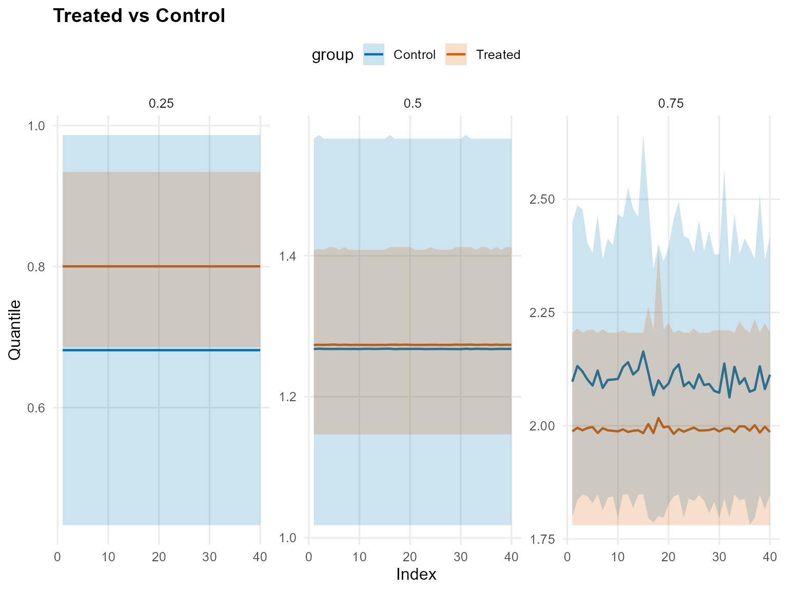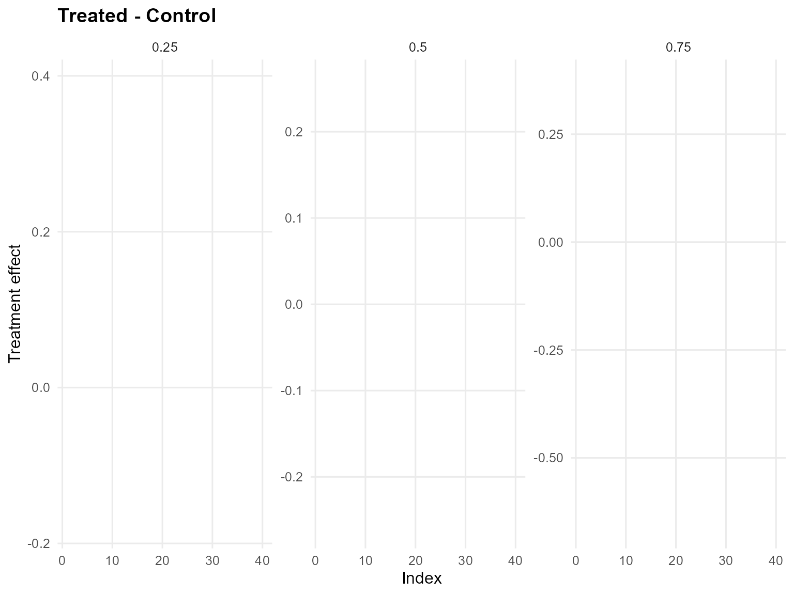

------------------------------------------------------------------------

### Model B: SB Bulk-only (Amoroso)

``` r
bundle_sb_bulk <- build_causal_bundle(
  y = y,
  T = T,
  X = X,
  kernel = "amoroso",
  backend = "sb",
  PS = FALSE,
  GPD = FALSE,
  components = 6,
  mcmc_outcome = list(niter = 300, nburnin = 80, nchains = 1, thin = 1, seed = 4)
)

bundle_sb_bulk
```

    DPmixGPD causal bundle
    PS model: disabled 
    Outcome (treated): backend = sb | kernel = amoroso 
    Outcome (control): backend = sb | kernel = amoroso 
    GPD tail (treated/control): FALSE / FALSE 
    components (treated/control): 6 / 6 
    Outcome PS included: FALSE 
    epsilon (treated/control): 0.025 / 0.025 
    n (control) = 232 | n (treated) = 268 

``` r
fit_sb_bulk <- quiet_mcmc(run_mcmc_causal(bundle_sb_bulk))
summary(fit_sb_bulk)
```

    -- Outcome fits --
    [control]
    MixGPD fit | backend: Stick-Breaking Process | kernel: Amoroso Distribution | GPD tail: FALSE
    n = 232 | components = 6 | epsilon = 0.025
    MCMC: niter=300, nburnin=80, thin=1, nchains=1 
    Fit
    Use summary() for posterior summaries; plot() for diagnostics; predict() for predictions.

    [treated]
    MixGPD fit | backend: Stick-Breaking Process | kernel: Amoroso Distribution | GPD tail: FALSE
    n = 268 | components = 6 | epsilon = 0.025
    MCMC: niter=300, nburnin=80, thin=1, nchains=1 
    Fit
    Use summary() for posterior summaries; plot() for diagnostics; predict() for predictions.

``` r
pred_mean_bulk <- predict(fit_sb_bulk, x = x_eval, type = "mean", interval = "credible", nsim_mean = 150)
head(pred_mean_bulk)
```

         ps   estimate      lower     upper
    [1,] NA  1.7745198 -0.7892633 3.7913568
    [2,] NA -0.6239568 -0.9873477 0.2791287
    [3,] NA  0.5315379  0.6199574 0.7478289
    [4,] NA -0.0374332 -0.2642775 0.3263771
    [5,] NA -0.2211069 -0.6434389 0.1877532
    [6,] NA  0.3127254 -1.1803169 1.5806257

``` r
plot(pred_mean_bulk)
```

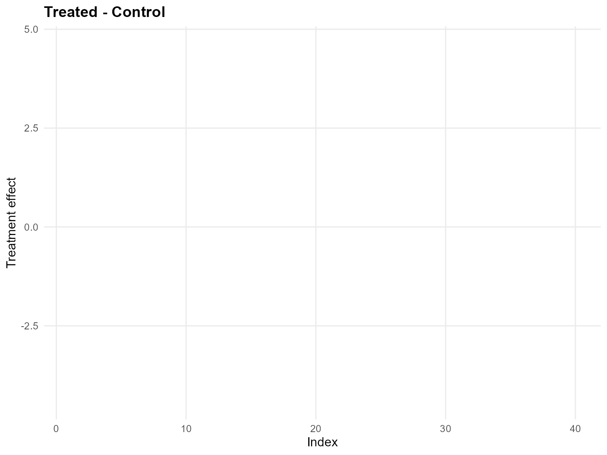

``` r
pred_q_bulk <- predict(fit_sb_bulk, x = x_eval, type = "quantile", p = 0.5, interval = "credible")
head(pred_q_bulk)
```

         ps     estimate      lower     upper
    [1,] NA  1.359060347 -0.7803804 3.0832062
    [2,] NA -0.503076940 -1.0670516 0.8070280
    [3,] NA  0.565135054  0.6673246 0.9119460
    [4,] NA  0.001837627 -0.2233720 0.5681448
    [5,] NA -0.263902204 -0.5722393 0.5007504
    [6,] NA  0.211203180 -1.3554662 1.2294692

``` r
plot(pred_q_bulk)
```

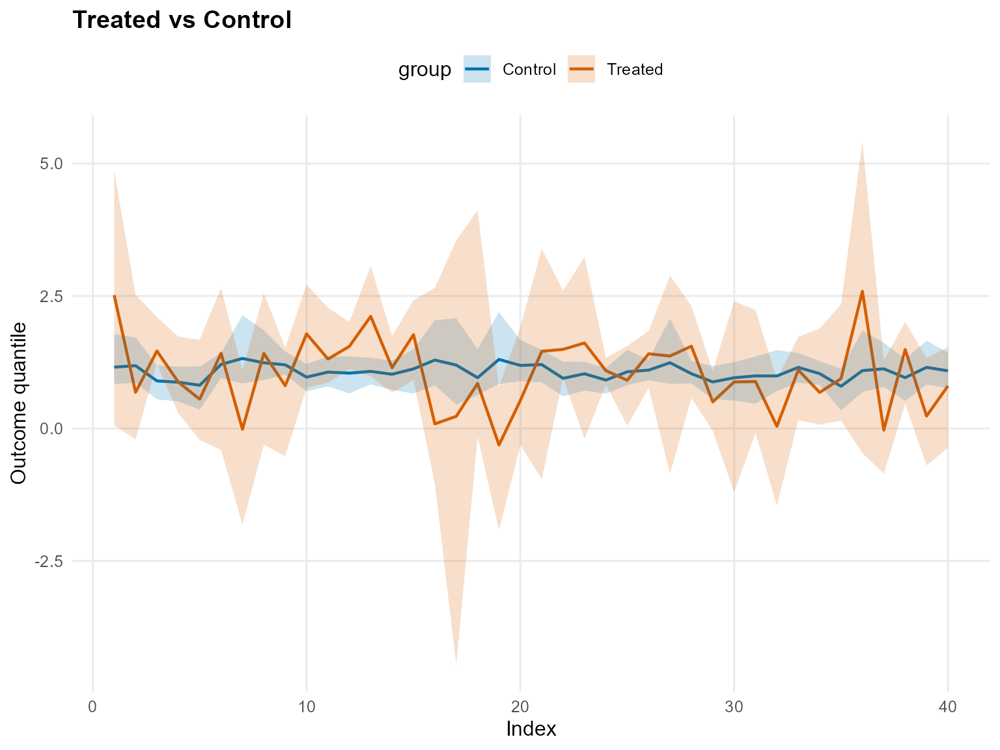

``` r
pred_d_bulk <- predict(fit_sb_bulk, x = x_eval, y = y_eval, type = "density", interval = "credible")
head(pred_d_bulk)
```

              y ps trt_estimate    trt_lower  trt_upper con_estimate    con_lower
    1 0.9001906 NA            1 1.624882e-01 0.44461349            1 2.526123e-01
    2 1.3517565 NA            1 1.558792e-02 0.68889166            1 2.493820e-01
    3 1.1475287 NA            1 5.610643e-03 0.82483400            1 2.891752e-01
    4 1.9323578 NA            1 4.038416e-02 0.69635215            1 1.052208e-01
    5 3.3439817 NA            1 8.364191e-11 0.06845548            1 8.679867e-05
    6 0.9493979 NA            1 8.994041e-02 0.60049390            1 2.965264e-01
       con_upper
    1 0.67473180
    2 0.44759038
    3 0.55999341
    4 0.30581039
    5 0.07930029
    6 0.47744825

``` r
plot(pred_d_bulk)
```


``` r
pred_surv_bulk <- predict(fit_sb_bulk, x = x_eval, y = y_eval, type = "survival", interval = "credible")
head(pred_surv_bulk)
```

              y ps trt_estimate    trt_lower trt_upper con_estimate    con_lower
    1 0.9001906 NA            1 2.863726e-01 0.9404906            1 4.723365e-01
    2 1.3517565 NA            1 2.700239e-02 0.9948376            1 2.979968e-01
    3 1.1475287 NA            1 5.467704e-01 0.9995826            1 2.466968e-01
    4 1.9323578 NA            1 5.301970e-03 0.3434096            1 2.527469e-02
    5 3.3439817 NA            1 2.210812e-12 0.1038322            1 1.576121e-05
    6 0.9493979 NA            1 1.216684e-01 0.9454567            1 4.997934e-01
      con_upper
    1 0.7612002
    2 0.5928011
    3 0.5237533
    4 0.2867762
    5 0.1411782
    6 0.6600952

``` r
plot(pred_surv_bulk)
```


``` r
ate_bulk <- ate(fit_sb_bulk, newdata = x_eval, interval = "credible", nsim_mean = 150)
head(ate_bulk)
```

    $fit
     [1]  1.80114441 -0.63811453  0.52734551 -0.03694753 -0.23148442  0.33882055
     [7] -1.37199194  0.37465363 -0.34499976  1.03983331  0.22226528  0.48783313
    [13]  1.38373712  0.06377186  0.61903284 -1.27335514 -0.82449968 -0.14931490
    [19] -1.58619235 -0.69653414  0.37591556  0.48287693  0.82331156  0.15633082
    [25] -0.13127410  0.42007291  0.31010924  0.73951873 -0.32946119  0.02039456
    [31] -0.31816354 -0.90758235 -0.08095821 -0.35776212  0.08622117  1.96937628
    [37] -1.12800692  0.48501700 -0.93652512 -0.31051997

    $lower
     [1] -1.00022430 -1.47983668  0.03565368 -0.82871341 -1.14261486 -1.33956214
     [7] -2.75037448 -1.33795788 -1.47519617 -0.33116686 -0.41863714 -0.18222839
    [13] -0.13014297 -0.56273210 -0.36667418 -2.36051208 -5.07661965 -1.50524877
    [19] -2.79764804 -1.43721958 -1.85472149 -0.19588088 -1.21282966 -0.34188303
    [25] -0.97060005 -0.32995459 -1.71364708 -0.51476432 -0.98116811 -2.06606911
    [31] -1.29938478 -2.12692288 -0.98154095 -1.09320012 -0.90490989 -1.34563470
    [37] -1.93719053 -0.53797442 -1.70621365 -1.40001270

    $upper
     [1]  4.29472938  0.83577844  1.07774550  0.69521565  0.75159010  1.99686435
     [7]  0.01040839  1.78885412  0.48512527  2.38268972  0.96661171  1.28683790
    [13]  2.69880652  0.54428817  1.96322035  0.86374257  2.60095734  2.54336753
    [19] -0.10886118  0.82267045  3.04313969  1.48156939  3.05789057  0.62475573
    [25]  0.62005881  1.15844779  2.15801535  1.80071868  0.27250340  1.85558214
    [31]  0.89521351 -0.01564673  0.81980878  0.80461573  1.31553390  4.84620748
    [37]  0.31364763  1.43371213  0.37054560  0.55476493

    $grid
    NULL

    $trt
    $fit
          estimate       lower    upper
    1   3.16494572  0.26423145 5.982674
    2   0.83240408 -0.03811023 2.556380
    3   1.59546025  1.32510771 2.210404
    4   1.02801817  0.43430948 1.886198
    5   0.81241718 -0.03342143 1.883957
    6   1.69502759 -0.05847419 3.110824
    7   0.19925387 -1.34335776 1.227960
    8   1.82769884 -0.02379745 3.356867
    9   1.01532231 -0.16741817 1.805858
    10  2.14282807  0.89593744 3.360446
    11  1.45536511  0.99499451 2.370070
    12  1.71848498  1.21459633 2.218247
    13  2.59776189  1.16593539 3.789358
    14  1.27591130  0.79041604 1.840359
    15  1.96868383  1.02980951 2.799614
    16  0.32506301 -0.75865963 2.723593
    17  0.63961232 -3.58134363 4.063559
    18  0.98771148 -0.02708417 3.901716
    19 -0.04030624 -1.41337898 1.082305
    20  0.69636868 -0.06866467 2.058293
    21  1.73906697 -0.53839948 4.119708
    22  1.62448174  1.06431041 2.665662
    23  2.02255253  0.08034237 4.147171
    24  1.22486790  0.92479564 1.509025
    25  1.13002368  0.29250109 1.746729
    26  1.65868343  0.97921276 2.256553
    27  1.79154822 -0.38563977 3.841844
    28  1.92467204  0.75937777 2.969821
    29  0.70520675  0.18366531 1.193476
    30  1.15556000 -0.85149245 2.919745
    31  1.08867095  0.08495559 2.424914
    32  0.27712370 -0.95718291 1.073872
    33  1.27093183  0.43332924 1.942671
    34  0.82182152  0.22178861 1.963356
    35  1.12961037  0.30244311 2.514032
    36  3.31082060 -0.18478497 6.626158
    37  0.19219594 -0.62560058 1.446571
    38  1.64104577  0.71417516 2.280224
    39  0.41768531 -0.38954540 1.475184
    40  0.98478451 -0.01107248 1.656294

    $type
    [1] "mean"

    $draws
                  [,1]         [,2]     [,3]      [,4]         [,5]          [,6]
      [1,]  5.20924744  0.643777217 1.437754 0.8110323  0.725008862  3.0739576448
      [2,]  4.44886187  0.651487809 1.366040 0.8291187  0.760766337  2.5744356723
      [3,]  4.81082279  0.677819495 1.488230 0.8103386  0.729729131  3.0179416221
      [4,]  4.42643420  0.618320994 1.362011 0.7916702  0.662476425  2.9605096625
      [5,]  4.75041966  0.479992162 1.408265 0.7305961  0.655154709  2.6539556464
      [6,]  4.05410070  0.487097486 1.457276 0.7698767  0.722110183  2.4454702844
      [7,]  4.63888570  0.569945702 1.551614 0.7357214  0.766049577  2.3170708345
      [8,]  4.20449813  0.511542996 1.394864 0.8181802  0.727797844  2.7476897452
      [9,]  4.99030304  0.437516413 1.500803 0.7397226  0.676528945  2.6661343769
     [10,]  5.16577691  0.534668166 1.375211 0.8358379  0.749259986  3.0466979371
     [11,]  4.73698426  0.520112414 1.598972 1.0078333  0.985411320  3.1441801170
     [12,]  5.48028269  0.707003324 1.744166 0.9845110  1.126979590  3.8125300711
     [13,]  7.10476796  0.598528829 1.575724 0.9540664  1.022388547  3.9005527165
     [14,]  6.04245453  0.707295857 1.734033 0.9618486  0.979374001  3.8803343863
     [15,]  6.40434920  0.808993480 1.705513 0.9566369  0.939805039  3.6758166441
     [16,]  7.34384153  0.729583407 1.598017 0.8821767  0.883292698  3.5632195047
     [17,]  5.05810479  0.833614082 1.518784 1.0203465  1.055042857  3.0359727356
     [18,]  4.78059523  0.747152894 1.679017 0.9264089  0.943300982  3.0505935808
     [19,]  4.05588747  0.626154724 1.438600 0.9197195  0.919075156  2.0998833223
     [20,]  5.03007427  0.635894615 1.557225 1.0210320  1.050165225  2.6561536688
     [21,]  3.87855473  0.732142014 1.485130 1.0022486  1.008575723  2.2477589563
     [22,]  3.63252045  0.652439933 1.361292 0.9576071  0.898274303  2.5501143316
     [23,]  4.32548786  0.484523866 1.583965 0.8735467  0.890433925  2.5381181257
     [24,]  4.16023592  0.510930632 1.707668 1.0222443  1.175862885  2.1167410013
     [25,]  3.53707572  0.528291953 1.761691 1.0824087  1.026761000  2.3487395833
     [26,]  4.53185527  0.384955451 1.607833 1.0471717  1.022212455  2.2821348074
     [27,]  4.53618466  0.455971467 1.506370 1.0401363  1.033022272  2.2992557673
     [28,]  5.13113349  0.269673025 1.498583 0.7879544  0.761180137  2.2767575437
     [29,]  5.50222541  0.309786393 1.578185 0.7932801  0.737145625  2.3815470756
     [30,]  5.91660036  0.304935350 1.557994 0.7682861  0.685220552  2.4913300940
     [31,]  5.84677930  0.278381184 1.573313 0.8692940  0.781036017  2.6568713677
     [32,]  5.16421049  0.341669048 1.553340 0.7784788  0.675190598  2.4938618457
     [33,]  5.11597354  0.294659029 1.496256 0.7766355  0.716752643  2.3761680103
     [34,]  6.20295385  0.530175755 1.591216 0.9027224  0.745341307  2.6186136057
     [35,]  5.44328086  0.515143469 1.528431 0.8513086  0.759328140  2.4770409166
     [36,]  5.48163167  0.565513913 1.533825 0.8531514  0.672260801  3.0027352802
     [37,]  4.97770890  0.524342481 1.563252 0.8748866  0.837438142  2.5287799124
     [38,]  4.72754616  0.466986507 1.677057 0.9096097  0.789047208  2.5370514567
     [39,]  4.90062953  0.614572612 1.612698 0.9047743  0.743426245  2.6663587938
     [40,]  5.03795383  0.678756020 1.580021 1.0168221  0.770842606  2.9309181300
     [41,]  4.18661065  0.732451345 1.628490 0.9292187  0.785842118  2.5883322198
     [42,]  4.76443265  0.766055987 1.608253 0.9338334  0.757825821  2.4764735098
     [43,]  5.13999872  0.767168625 1.659703 0.9505435  0.786315270  2.6176486178
     [44,]  5.04599850  0.798293809 1.558644 0.8932906  0.832895295  2.8948822604
     [45,]  4.71758111  0.681018445 1.769082 0.9141755  0.705389695  2.9740034881
     [46,]  4.96553309  0.784435049 1.646538 1.0318492  0.957976608  2.5829852488
     [47,]  4.45022136  0.706839853 1.741770 0.9714370  0.836308389  2.7860477766
     [48,]  4.38672142  0.714439411 1.745979 0.8817251  0.696868281  2.7290233662
     [49,]  4.17544689  0.691649145 1.607101 0.8999154  0.817715322  2.4315388557
     [50,]  4.60694455  0.674663897 1.670384 0.8842154  0.765034578  2.6013178504
     [51,]  4.19444624  0.744545425 1.667088 0.9084414  0.738642635  2.6711959082
     [52,]  4.59415825  0.757601011 1.569253 0.8971717  0.767747508  2.3368935061
     [53,]  4.76946038  0.673409583 1.565719 0.9398333  0.658815356  2.6433936029
     [54,]  5.50248013  0.745166323 1.558837 0.9195194  0.768213096  2.6206710260
     [55,]  5.13446428  0.706865393 1.607123 0.8263197  0.726688505  2.6344444080
     [56,]  4.90789134  0.710380032 1.650402 0.9232745  0.762878658  2.7047617131
     [57,]  4.64286018  0.732320814 1.476678 0.9630881  0.661319973  2.7371807224
     [58,]  5.39402246  0.713432053 1.592688 0.8386567  0.717389236  2.9020693191
     [59,]  5.01855748  0.679406926 1.575105 0.8709675  0.798364595  2.8043972791
     [60,]  5.39982232  0.775381006 1.667438 0.8974642  0.708246033  2.8028928444
     [61,]  5.51931756  0.700777347 1.518631 0.9252966  0.741473735  2.6625501158
     [62,]  5.41519772  0.635284490 1.602727 0.8399751  0.664027280  2.8016915396
     [63,]  4.78253179  0.686550128 1.575148 0.9066760  0.806462065  2.4404840216
     [64,]  5.19524542  0.676455522 1.592778 0.8690624  0.793347711  2.6579054107
     [65,]  4.95489041  0.695285429 1.483674 0.9035155  0.756236438  2.3913255587
     [66,]  4.78835014  0.797210889 1.418095 0.8517449  0.851564706  2.5379873068
     [67,]  5.65548357  0.717960431 1.531868 0.8143134  0.700481156  2.4738311260
     [68,]  5.53893538  0.687349222 1.534265 0.8535698  0.729608748  2.6804290607
     [69,]  6.15666485  0.746964125 1.488804 0.7838370  0.702937129  2.9628711453
     [70,]  5.60602189  0.651349212 1.450655 0.8338228  0.709625586  2.2157794839
     [71,]  5.00657705  0.694513370 1.315476 0.8095180  0.721596767  2.4568416349
     [72,]  5.18170856  0.762324557 1.416938 0.8097047  0.689416599  2.5914292382
     [73,]  4.94164200  0.706243782 1.431902 0.8189294  0.834525478  2.4453723265
     [74,]  4.98039691  0.648821277 1.446869 0.8594561  0.653921015  2.2953381575
     [75,]  4.99926688  0.778182399 1.506114 0.8333156  0.722249701  2.5284047860
     [76,]  4.94848089  0.767814034 1.358677 0.9417071  0.869089972  2.3850574041
     [77,]  4.51388286  0.985458421 1.512762 0.9719133  0.942758757  2.3761063239
     [78,]  3.85058287  0.685606113 1.446884 0.8824827  0.851662278  1.9142812440
     [79,]  4.44119523  0.545234052 1.503223 0.7853230  0.597589216  1.6860514056
     [80,]  4.00535294  0.541201295 1.491657 0.8078555  0.808166329  1.7488719840
     [81,]  4.00887006  0.495115436 1.455803 0.7936106  0.849291375  1.7327937950
     [82,]  3.74723961  0.542343114 1.346883 0.9051510  0.729786115  1.6781098909
     [83,]  4.39033141  0.444780689 1.328072 0.7937997  0.626424889  1.8128180808
     [84,]  3.54758985  0.494201642 1.280729 0.8088627  0.741250568  1.7764289118
     [85,]  3.67978579  0.687841941 1.474667 0.7871505  0.792568936  1.5465866542
     [86,]  3.80019643  0.453697952 1.330050 0.7790764  0.556789729  1.6280729476
     [87,]  4.16616838  0.521600732 1.258909 0.8539929  0.501264929  1.5191576352
     [88,]  3.69477999  0.469925364 1.344188 0.7812177  0.697341572  1.4609370823
     [89,]  3.33327423  0.546839288 1.401246 0.8065694  0.577124422  1.4990784428
     [90,]  3.59503729  0.509876979 1.395639 0.6644133  0.435446786  1.5273840207
     [91,]  3.87697293  0.401267537 1.361753 0.7502933  0.409195532  1.4076277149
     [92,]  4.26711618  0.473795178 1.357061 0.7377328  0.510120486  1.5459930796
     [93,]  3.20276289  0.622320256 1.458253 0.8000513  0.466558701  1.7274362088
     [94,]  3.34014511  0.576998883 1.449534 0.8290778  0.571354955  1.6578413150
     [95,]  3.27226554  0.513177373 1.421516 0.8825926  0.528088312  1.5206842180
     [96,]  3.89066654  0.577274343 1.440559 0.7664107  0.528397701  1.6927842648
     [97,]  4.01884830  0.586868288 1.397060 0.7460157  0.420939848  1.7333832908
     [98,]  3.66573430  0.473737065 1.518104 0.7232651  0.511672729  1.6256890166
     [99,]  3.81110084  0.517906325 1.504275 0.7186443  0.423386540  1.6938834869
    [100,]  3.04466567  0.570811250 1.640329 0.8365381  0.536225331  1.6838191106
    [101,]  3.13829628  0.529378158 1.661341 0.8538032  0.593704661  1.7597208758
    [102,]  3.31352618  0.557247161 1.642945 0.8487259  0.519785535  1.8766503359
    [103,]  3.56582187  0.486973519 1.626041 0.8297169  0.481835738  1.7741456394
    [104,]  3.13883978  0.518395245 1.637543 0.7394745  0.542455196  1.6677893939
    [105,]  3.52108981  0.438300978 1.531015 0.7761513  0.511600962  1.6270047601
    [106,]  3.13215002  0.432516603 1.558212 0.7266584  0.492296593  1.8284525751
    [107,]  3.01830906  0.515370776 1.569597 0.7361746  0.459064415  1.6289977981
    [108,]  3.02179773  0.449226913 1.435824 0.7352107  0.394490116  1.4506703562
    [109,]  2.52159850  0.021009179 1.368148 0.6374806  0.248676791  1.0961477127
    [110,]  2.97016873 -0.032869121 1.337377 0.5873618  0.279793766  1.1905033339
    [111,]  2.45710863  0.218166696 1.442423 0.6776293  0.477599537  1.2860664788
    [112,]  2.72726921  0.418010490 1.442553 0.6925574  0.428732102  1.4806595713
    [113,]  2.49059340  0.242535808 1.440050 0.6217013  0.384277624  1.2637555139
    [114,]  2.68340179  0.073602314 1.421754 0.5533736  0.456784417  1.1995488866
    [115,]  2.49091412  0.134977313 1.384215 0.5965019  0.202199034  1.1932827262
    [116,]  2.88763303  0.170241984 1.361978 0.6730366  0.305672893  1.1490076853
    [117,]  2.73065553  0.105113818 1.373109 0.5262663  0.336960829  1.3264325792
    [118,]  2.93388683  0.152024116 1.367846 0.6238776  0.329672510  1.1405839482
    [119,]  3.34285895  0.051106961 1.322426 0.4823758  0.285557185  1.2451908096
    [120,]  3.40557195  0.120601290 1.372663 0.3902016 -0.086987002  1.4132167805
    [121,]  2.67721178  0.119642700 1.387621 0.4502520 -0.164082613  1.4024750385
    [122,]  2.36162184 -0.180023784 1.422667 0.4473953 -0.058659863  1.0423068589
    [123,]  2.97335986 -0.052224671 1.380960 0.3792875 -0.096761862  1.2818903327
    [124,]  2.35752508 -0.092007155 1.398644 0.4485083  0.148750309  1.4134145202
    [125,]  2.72032100 -0.061049808 1.553133 0.5259412  0.153092789  1.4260100173
    [126,]  2.65107863  0.020934599 1.504414 0.5746121  0.175647023  1.4698870019
    [127,]  2.72625878  0.093114628 1.667369 0.5932761  0.350191807  1.6010645033
    [128,]  2.69879181 -0.004632260 1.573077 0.6947481 -0.007525092  1.3609872862
    [129,]  2.68368963  0.022815799 1.498939 0.6213055  0.043149361  1.3921709271
    [130,]  2.51469742 -0.035408344 1.507520 0.4728349 -0.013201645  1.3319070040
    [131,]  2.45015955  0.117877463 1.517383 0.6390837  0.172505262  1.5460196488
    [132,]  2.94011015  0.144880319 1.528193 0.5297509  0.082586028  1.5728971571
    [133,]  2.70711131 -0.040554803 1.409541 0.4065937  0.069085375  1.2759933247
    [134,]  3.08955753 -0.029426261 1.363777 0.4672542 -0.007812073  1.3674876159
    [135,]  3.08756088 -0.042697800 1.393976 0.4392806 -0.051715524  1.5355947790
    [136,]  2.77530242 -0.008171124 1.383614 0.3562731 -0.059172062  1.4069929875
    [137,]  2.57275940  0.043081042 1.350237 0.4736541  0.035235153  1.3978715866
    [138,]  2.63844110  0.185123128 1.344948 0.4298118  0.078391264  1.4546940452
    [139,]  2.78852765  0.113466072 1.384983 0.5908054  0.211962596  1.3288750972
    [140,]  2.77095382  0.032728884 1.392940 0.5398008  0.186109613  1.3854666359
    [141,]  2.29811322  0.092047106 1.353036 0.5698906  0.209155762  1.2643584161
    [142,]  2.21857813  0.312979420 1.474414 0.6679682  0.535584179  1.3314373710
    [143,]  2.61868321  0.264147682 1.533842 0.6478755  0.351952435  1.2016120404
    [144,]  2.50295654  0.347711068 1.452270 0.6548727  0.294301281  1.5308300388
    [145,]  3.07356523  0.254840194 1.428165 0.4970119  0.214655613  1.6019443973
    [146,]  2.94174173  0.020763072 1.468701 0.4573266  0.036513770  1.3487914423
    [147,]  3.29328690  0.243790487 1.461269 0.4980136  0.136948023  1.4005487223
    [148,]  2.96483576  0.223619142 1.461948 0.5077433  0.046814405  1.6700381752
    [149,]  2.45172405  0.074570835 1.488265 0.4758290  0.027781931  1.6067360708
    [150,]  2.91846900  0.156776159 1.466361 0.4117000  0.094045888  1.7206162968
    [151,]  2.55021175  0.572759123 1.479227 1.0088881  1.062641067  1.4377725082
    [152,]  3.39669505  0.442264599 1.274926 0.8828817  1.066401002  1.3828806806
    [153,]  2.31185222  0.558164070 1.271411 0.9742298  1.085042316  1.4164702484
    [154,]  1.82727159  0.662338734 1.345134 0.9893760  0.934512514  1.0503234169
    [155,]  1.78851359  0.691601488 1.575474 0.9953542  1.018068822  1.1130691428
    [156,]  1.40690825  0.770929231 1.573926 1.2008099  1.126636786  1.1621617938
    [157,]  1.52715756  1.034176086 1.632269 1.2562675  1.502932443  1.3058243981
    [158,]  0.43116960  0.973625288 1.834891 1.7574468  2.052155781  0.9688104358
    [159,]  0.41063663  0.954227040 1.787064 1.7802995  2.034674494  0.9874806820
    [160,]  0.30545300  1.156031431 1.994107 1.8015401  1.941566376  0.8542555889
    [161,]  0.37938687  1.335313285 2.062131 1.8672028  2.000014326  0.9917326099
    [162,]  0.60753084  1.153171702 2.064533 1.7786372  1.998579447  0.9769619080
    [163,]  0.47096133  1.269854486 1.686226 1.5958745  1.708547808  1.0252791260
    [164,]  0.66296326  1.183405178 1.686501 1.6421544  1.723052171  1.0639697911
    [165,]  0.63997726  1.102692367 1.738188 1.6073789  1.836150328  0.9198847672
    [166,]  0.62305625  1.182205222 1.696460 1.6300418  1.677474069  0.8118439942
    [167,]  0.81978306  1.341192386 1.893997 1.7384452  1.835299609  0.9562045488
    [168,]  0.23468647  1.598351012 2.148033 1.9504842  1.842219109  0.8034912147
    [169,]  0.53711520  1.476516038 2.102186 1.9210733  1.697741592  0.5113110559
    [170,]  0.45568120  1.428562252 2.053356 1.8102290  1.719636830  0.7171736211
    [171,]  0.70525584  1.480539940 2.207487 1.7628670  1.296988385  1.0559078044
    [172,]  1.09151197  1.188242442 1.867979 1.3274137  0.757978357  0.7213606873
    [173,]  0.72845001  1.617509479 1.691701 1.7326281  1.058788774  0.6352300530
    [174,]  0.64173864  1.287221955 1.491902 1.0539770  0.514590120  0.0008485883
    [175,]  0.69247103  1.231506640 1.457668 1.3435868  0.555192869 -0.1949854036
    [176,]  0.56047870  1.209065456 1.437156 1.2025937  0.476795228 -0.2326491760
    [177,]  0.29688642  1.217808354 1.604307 1.4716126  0.861528433 -0.0565590916
    [178,] -0.04245725  0.766629490 1.760417 1.4509051  1.167246871 -0.0602068939
    [179,]  0.04241274  0.909966632 2.058524 1.7298275  1.482243169 -0.0945798953
    [180,]  0.17395015  1.052423608 1.948045 1.7250455  1.706386442  0.0651265438
    [181,]  0.03940666  0.765223675 2.067296 1.6853989  1.582996634 -0.1908608837
    [182,]  0.55758010  0.754464432 2.079240 1.3641298  1.134456937  0.1299728076
    [183,]  0.50352697  0.752398686 2.284769 1.6660711  1.153638259  0.2800860992
    [184,] -0.03664120  1.025379562 2.182919 1.8383534  1.624406785 -0.0657102119
    [185,]  0.82182666  1.459034404 2.115207 1.8348738  1.702252968  0.4422341790
    [186,]  0.79352914  1.530859855 2.280335 1.7600364  1.425260725  0.4821407501
    [187,]  0.86560317  1.703606056 2.254795 1.8008641  1.336904433  0.5059949336
    [188,]  1.18248442  1.438076842 2.243258 1.6181117  0.942062949  0.4069825933
    [189,]  0.45147010  1.345358335 2.286713 1.9003060  1.491771529  0.1296297806
    [190,]  0.56622415  1.596101121 2.151426 1.9377354  1.478194967  0.3764809447
    [191,]  0.92716135  1.681590147 2.213043 1.6946208  1.454003366  0.7041028442
    [192,]  1.30883784  1.408055948 2.175249 1.8525403  1.366957254  0.8998673234
    [193,]  1.16161517  1.671551309 2.127598 1.7777562  1.308627856  0.9422013330
    [194,]  1.34356219  1.718437750 1.615561 1.5813424  1.921720142  1.3092883104
    [195,]  1.60837642  1.904559761 1.751909 1.4533364  1.193462102  1.3539175925
    [196,]  1.48222954  2.129704992 1.853608 1.5891831  1.405472107  1.4749493533
    [197,]  2.09018251  2.366290548 1.700843 1.6051790  1.084670862  1.6220867225
    [198,]  2.08443903  2.191745660 1.573320 1.4897375  1.224100338  1.6581682464
    [199,]  2.32414248  2.130634936 1.560203 1.3951597  1.111511268  1.4484024739
    [200,]  1.59605335  2.092497635 1.765328 1.4689956  1.245301773  1.4919207425
    [201,]  1.66040720  2.334730873 1.713129 1.5306996  1.305706582  1.5635795414
    [202,]  1.92769512  2.285131249 1.914767 1.5789656  1.097626479  1.6849023004
    [203,]  2.43947023  2.331683524 1.470517 1.2041265  0.747174556  1.6367396335
    [204,]  2.06873006  2.195372384 1.565641 1.2759262  0.802926780  1.5042978587
    [205,]  1.71264606  2.048482915 1.449865 1.3847538  1.107287745  1.2038188987
    [206,]  1.74551395  2.390353791 1.640512 1.5134964  0.804526248  1.1531753564
    [207,]  1.70024957  2.459494215 1.708886 1.5898970  1.070338490  1.1367260793
    [208,]  1.64654667  2.391858261 1.666977 1.6398998  1.385542694  0.9939450588
    [209,]  1.51967073  2.555662319 1.848158 1.7838866  1.212430936  1.1277225159
    [210,]  1.26240379  2.600134775 1.905298 1.8729736  1.482426402  1.2759478222
    [211,]  1.04242393  2.736740993 1.884621 1.8981632  1.709428532  1.1805627985
    [212,]  1.16880371  2.681924555 1.912589 1.9018492  1.500532557  1.0732054133
    [213,]  2.87669308  2.820072922 1.504070 1.5175463  1.201525487  1.0435047647
    [214,]  2.29122038  2.689182572 1.454348 1.5874106  1.056825159  0.6726402470
    [215,]  1.81744748  2.471829812 1.526014 1.5385959  0.955755991  0.6974702520
    [216,]  1.36810081  2.483205102 1.695976 1.7501364  1.103305388  0.2870218882
    [217,]  1.66463005  2.468193185 1.645440 1.7308003  1.172425630  0.3647016923
    [218,]  1.72768683  2.522967371 1.712027 1.6637386  1.092073708  0.6136281906
    [219,]  1.86530461  2.533495291 1.548292 1.7048336  1.318434181  0.2585313652
    [220,]  2.25444719  2.557029868 1.468726 1.6558461  1.217407856  0.0596822521
                  [,7]        [,8]         [,9]     [,10]     [,11]    [,12]
      [1,]  0.75754873  2.11287619  1.408330493 3.0966663 1.0485980 1.714571
      [2,]  0.81432547  2.20933213  1.399492653 2.9137829 1.0015250 1.698233
      [3,]  0.71064894  2.22246581  1.525850974 3.5172031 1.1243873 1.974149
      [4,]  0.78832637  2.13981869  1.527426176 3.1397952 1.1820879 1.813751
      [5,]  0.57250943  2.11417014  1.425187721 3.0450111 1.1151660 1.765710
      [6,]  0.60372989  2.24212165  1.419788478 3.4302446 1.0021639 1.720303
      [7,]  0.62986080  2.10875954  1.222040118 3.1351203 1.0199432 1.839265
      [8,]  0.57276865  2.08060849  1.274196673 3.2304229 1.0169909 1.713132
      [9,]  0.69607320  2.15791855  1.304079208 3.4091143 1.0156121 1.745878
     [10,]  0.78497335  2.51554133  1.608498825 2.9907326 1.1378467 2.003955
     [11,]  0.58424797  2.24580112  1.562427556 3.3530084 1.1607308 2.106842
     [12,]  0.80353773  2.51433619  1.910459196 3.2775994 1.1986601 2.431214
     [13,]  0.84369999  2.94445580  1.868685512 3.3963285 1.3108610 2.475435
     [14,]  0.73428548  2.70240276  1.830530000 3.4263166 1.3776442 2.627833
     [15,]  0.81606021  3.53561649  1.854903818 3.3671744 1.5816810 2.268539
     [16,]  0.84569757  3.35467774  2.091730338 3.3333228 1.4187159 2.447775
     [17,]  1.05068767  3.35975405  1.977013846 3.0814590 1.5164661 1.979714
     [18,]  1.01190100  2.24386639  1.618290489 2.9047882 1.3410903 1.924414
     [19,]  0.68918395  2.21902590  1.433141581 2.5995761 1.2674711 1.896768
     [20,]  0.76543300  2.20495634  1.724225071 3.1381627 1.2130588 1.899379
     [21,]  0.68376541  2.40416992  1.432103668 2.6813848 1.2621125 1.779166
     [22,]  0.77015813  2.22603059  1.491724439 2.9577164 1.2759559 1.790288
     [23,]  0.61489760  2.25488945  1.476655004 2.7942271 1.0984567 1.728870
     [24,]  0.41206028  1.94817925  1.274510730 2.6958752 1.1071109 1.899052
     [25,]  0.29467426  1.84737450  1.368723978 2.4965641 1.1375780 1.805477
     [26,]  0.32883443  1.78734165  1.267746521 3.0630665 1.1935478 1.705783
     [27,]  0.57954191  2.75955494  1.299417704 3.0239448 1.0825305 1.748752
     [28,]  0.50579374  2.79672962  1.380189066 2.5926150 1.1175328 1.614106
     [29,]  0.49649500  2.51655855  1.561806744 2.8203492 1.1655942 1.666689
     [30,]  0.54145121  2.84898598  1.431067715 2.8986014 1.0932919 1.720127
     [31,]  0.43790741  2.59273178  1.401115404 3.0702041 1.2298378 1.779741
     [32,]  0.56501876  2.43065296  1.420259174 2.7132464 1.3379557 1.780946
     [33,]  0.41547729  2.65795017  1.456044422 2.9498794 1.2064507 1.919683
     [34,]  0.79929638  2.64274947  1.778589207 2.9634095 1.2190670 2.060067
     [35,]  0.75712278  2.92852113  1.722043805 2.8755083 1.3763972 1.767754
     [36,]  0.65892585  3.20833074  1.598117241 2.9771081 1.2763710 1.957386
     [37,]  0.65056838  2.60235334  1.648861728 2.9068790 1.3275876 2.004357
     [38,]  0.59813822  2.67188843  1.541324873 2.9237367 1.2167228 1.959410
     [39,]  0.58719816  2.68159512  1.479851426 2.8207203 1.3882991 1.958023
     [40,]  0.70786528  2.93898955  1.709555688 2.8146237 1.4409470 2.120177
     [41,]  0.61060401  2.83604324  1.537155955 2.7609069 1.4952647 2.006465
     [42,]  0.59007223  2.78942969  1.446278614 2.6974641 1.3714871 2.088781
     [43,]  0.54630584  2.50792921  1.657933596 2.9855025 1.5287916 2.204466
     [44,]  0.55641431  2.68769229  1.571192668 2.8551391 1.5382794 2.133275
     [45,]  0.58845508  2.93615452  1.519662639 2.8025529 1.6747024 1.951528
     [46,]  0.72999340  2.70271266  1.684790480 2.8521814 1.5372959 2.192662
     [47,]  0.59686973  2.82745336  1.758169595 2.7555764 1.6469746 2.112553
     [48,]  0.58158542  2.93523076  1.696965166 2.9530359 1.4857608 2.031166
     [49,]  0.59983568  2.60159930  1.643625693 2.6473266 1.5370477 2.030695
     [50,]  0.45295074  2.80490249  1.522716083 2.5005091 1.3889675 2.118527
     [51,]  0.58226435  2.73147391  1.499380712 2.6708858 1.5137395 2.120930
     [52,]  0.62189085  2.79021494  1.543328174 2.5735663 1.5071468 2.011683
     [53,]  0.74703831  3.03499278  1.625375269 2.7914173 1.4815020 1.978356
     [54,]  0.74508907  2.90399997  1.529830746 2.6335040 1.4785242 1.910375
     [55,]  0.71091222  2.93100882  1.614265209 2.6051306 1.4659042 1.986659
     [56,]  0.72850878  3.11550311  1.677672837 2.6733670 1.4900840 2.003688
     [57,]  0.62745357  3.13675887  1.669631720 2.9083009 1.4667134 1.941322
     [58,]  0.59561485  2.91843567  1.464283426 2.6973005 1.4995544 2.137068
     [59,]  0.61790039  3.19710266  1.387464732 2.7100257 1.3911182 2.021199
     [60,]  0.67776752  3.20052069  1.644320281 2.6122231 1.5510813 1.948133
     [61,]  0.72202965  2.94874610  1.663164662 2.5526934 1.4052277 1.968309
     [62,]  0.58097885  3.29969387  1.504615127 2.5640217 1.5002825 1.966492
     [63,]  0.55569578  3.34688450  1.546216467 2.6502769 1.5030260 2.087431
     [64,]  0.63198085  3.15413161  1.668253624 2.4162173 1.5455377 2.068511
     [65,]  0.61387040  2.94553975  1.674321246 2.8409648 1.4886846 2.100813
     [66,]  0.82516070  3.16691784  1.616740768 2.7521409 1.4575358 1.893459
     [67,]  0.84987622  3.63010487  1.598046932 2.6078615 1.4402736 1.807647
     [68,]  0.84014036  3.52151300  1.694172036 2.5508398 1.5655057 1.838538
     [69,]  0.78429331  3.35884772  1.665653593 2.8416085 1.5487130 2.058023
     [70,]  0.77316833  3.33777942  1.480226895 2.3585703 1.3720825 1.779755
     [71,]  0.63943084  3.23219710  1.515215224 2.4698600 1.2746461 1.825421
     [72,]  0.77851941  2.54127534  1.697090025 2.3789916 1.3425806 1.709988
     [73,]  0.78184412  2.77456588  1.443568235 2.4351454 1.3957786 1.738109
     [74,]  0.78119074  3.00042755  1.465949606 2.2530318 1.4966837 1.682580
     [75,]  0.96860122  2.92640999  1.678090044 2.5132730 1.3897899 1.765169
     [76,]  0.93128796  2.90615901  1.560356002 2.3721054 1.3433703 1.745722
     [77,]  0.79785468  2.64096627  1.565981811 2.2906839 1.6156979 1.802940
     [78,]  0.50443340  2.63645238  1.407390713 2.2788996 1.3375522 1.634246
     [79,]  0.30191086  2.18311441  1.047353518 2.1948325 1.1911622 1.558619
     [80,]  0.24690900  1.97302443  1.071231113 2.2148331 1.1732284 1.618481
     [81,]  0.26272493  2.26331593  1.158334060 2.4091468 1.2062346 1.588750
     [82,]  0.34967068  2.15911294  1.138034136 2.0847663 1.1914006 1.529729
     [83,]  0.32825885  2.36233266  1.040647431 2.2316214 1.2134325 1.514355
     [84,]  0.36608038  2.00022381  1.157138679 2.0151666 1.0845184 1.491057
     [85,]  0.19059620  2.05145826  0.924194991 2.0480014 1.3581159 1.599263
     [86,]  0.25159757  2.13648991  1.067429016 2.1255781 1.2067920 1.417114
     [87,]  0.28085949  1.96608766  0.941754839 2.2350342 1.2390526 1.520701
     [88,]  0.15644105  2.21867187  0.951159390 2.1870243 1.1507279 1.388681
     [89,]  0.10754767  1.80341665  0.910158320 2.3185044 1.2494920 1.490885
     [90,]  0.05965929  1.94875306  0.926937463 2.1041189 1.3181773 1.575983
     [91,]  0.07229381  2.13177128  1.000709971 2.0888078 1.3217111 1.483976
     [92,]  0.41737805  2.09436924  1.070670936 2.0556752 1.3980685 1.618060
     [93,]  0.20641992  1.91654196  1.054675412 2.2024997 1.1755664 1.575225
     [94,]  0.26479830  1.83271341  0.981102718 2.1606474 1.3945966 1.503156
     [95,]  0.11650563  2.28980101  1.038470350 2.2016822 1.2938729 1.486430
     [96,]  0.24835802  1.86778849  0.947173848 2.2643719 1.3287463 1.628856
     [97,]  0.17357995  2.14291087  1.101665761 2.3592924 1.4546955 1.531250
     [98,]  0.22436576  2.29655205  1.134996069 2.3787421 1.4242460 1.668619
     [99,]  0.10214898  2.34172688  1.012875809 2.2147826 1.3885514 1.663871
    [100,]  0.03930059  1.76517380  0.995136200 2.3567251 1.5046808 1.704542
    [101,] -0.03010914  1.64861775  0.996626028 2.4484048 1.3180796 1.878842
    [102,]  0.03897683  1.62570870  0.919526148 2.3000869 1.4618896 1.777609
    [103,]  0.09641017  1.97278295  1.033658570 2.6675101 1.4190432 1.702705
    [104,]  0.08870173  1.79154221  0.898157585 2.4328384 1.4138642 1.685943
    [105,] -0.06316898  1.66567480  0.944713065 2.2482282 1.2797609 1.659928
    [106,]  0.04972773  1.64378550  0.926054315 2.2219038 1.3692544 1.585065
    [107,]  0.03652206  1.77256333  1.032963504 2.1420200 1.3036148 1.730395
    [108,] -0.02887752  1.48866558  0.781757181 2.2481352 1.2147309 1.540959
    [109,] -0.29929978  1.43007724  0.372218674 2.1048275 0.9957799 1.359241
    [110,] -0.30021690  1.26935190  0.528648330 2.0573766 1.0081955 1.239041
    [111,] -0.39074599  1.16517985  0.500169956 1.9026770 1.0534619 1.370896
    [112,]  0.06895727  1.41104141  0.839136813 2.1053301 1.1824187 1.474612
    [113,] -0.31631237  1.17427395  0.717003548 1.8929556 1.1085080 1.353610
    [114,] -0.33867290  1.32063031  0.540147075 2.1116222 1.1260468 1.427956
    [115,] -0.36129157  1.26610999  0.649849637 2.1692064 1.0931181 1.386100
    [116,] -0.47297598  1.62164573  0.532858829 2.2857841 1.0311521 1.476826
    [117,] -0.32374031  1.41786434  0.606506998 2.0311972 1.0494894 1.283614
    [118,] -0.36077309  1.22750379  0.577941110 2.0258997 1.0064446 1.392242
    [119,] -0.44109123  1.44794195  0.523593635 2.2433823 1.0685264 1.287399
    [120,] -0.46732439  1.56231015  0.678039060 2.2290011 1.1428799 1.417740
    [121,] -0.39284185  1.43938429  0.595696621 2.1244525 1.1140247 1.586069
    [122,] -0.83402031  0.95858194  0.391616397 2.1685278 0.9075705 1.386185
    [123,] -0.61789403  1.41131107  0.408618834 2.2080673 0.9977931 1.369500
    [124,] -0.42220730  1.27900855  0.550544193 2.1448869 0.8877841 1.398911
    [125,] -0.66122543  1.19887355  0.545464522 2.5082372 1.2134187 1.635401
    [126,] -0.49452991  1.21211014  0.592698357 2.2131318 1.0826112 1.570233
    [127,] -0.60144205  0.97117774  0.515170983 2.5741491 1.1077944 1.704598
    [128,] -0.54149584  1.27949040  0.536366035 2.3847529 1.1211698 1.545376
    [129,] -0.48405807  1.28114787  0.553319716 2.3579366 1.0993415 1.486744
    [130,] -0.45595389  1.01865778  0.542062357 2.3869727 1.1843351 1.662377
    [131,] -0.56654631  1.32980296  0.436646437 2.3398911 1.0405288 1.561810
    [132,] -0.63940652  1.25814875  0.635217775 2.3944495 1.1432543 1.616150
    [133,] -0.60475060  1.21764050  0.568985370 2.3317513 1.0639983 1.496989
    [134,] -0.48836159  1.23348427  0.523403390 2.1072863 0.9981492 1.455629
    [135,] -0.51423949  1.14072994  0.472132817 2.4175403 0.9792812 1.436169
    [136,] -0.53301532  1.22676775  0.554585616 2.3659410 1.0090050 1.481905
    [137,] -0.47867581  1.39723389  0.621714051 2.2653707 1.0448336 1.466078
    [138,] -0.38906009  1.32839861  0.568032818 2.3060450 1.0208680 1.519062
    [139,] -0.25567174  1.23126204  0.598601821 2.3669846 0.9633997 1.295523
    [140,] -0.43832615  0.90923212  0.549081385 2.2831241 0.9475397 1.430288
    [141,] -0.42089453  1.12837050  0.501165040 2.0860126 1.0299402 1.418569
    [142,] -0.40962223  1.36536456  0.682870417 2.0746139 1.2029969 1.613091
    [143,] -0.31963638  1.14498677  0.539354725 2.3563107 1.1972669 1.603746
    [144,] -0.23761244  1.44038582  0.632890629 2.3209036 1.0995692 1.705486
    [145,] -0.14701487  1.69425822  0.816201196 2.4125708 1.2587762 1.601669
    [146,] -0.28461095  1.38136860  0.642131642 2.3341461 1.0690686 1.625478
    [147,] -0.29952588  1.26199477  0.722321589 2.4259740 0.9942839 1.634293
    [148,] -0.20324344  1.42559229  0.713957485 2.5855389 1.1947831 1.681127
    [149,] -0.27656879  1.36612598  0.783698291 2.4469756 1.0326927 1.607202
    [150,] -0.19679330  1.48524287  0.898813930 2.4579931 1.3005161 1.573835
    [151,]  0.31151759  1.41546742  0.874115897 1.8806611 1.1944860 1.538088
    [152,]  0.33464317  2.05938853  0.909309584 1.9215367 1.0176452 1.402352
    [153,]  0.39297237  1.52326937  1.037204623 1.7750895 1.0278475 1.280038
    [154,]  0.24824188  1.12128803  0.838251095 1.8047118 1.1989718 1.388964
    [155,]  0.14738460  1.06962861  0.705145831 1.6966744 1.2308987 1.572367
    [156,]  0.26511674  0.99046920  0.942478010 1.5539331 1.3407552 1.380737
    [157,]  0.28193185  1.06129056  0.805728851 1.5056526 1.5038192 1.422941
    [158,] -0.02367150  0.27116150  0.603271169 1.2694857 1.4225286 1.615884
    [159,] -0.10535441  0.34245683  0.639646976 1.2625705 1.4022658 1.590971
    [160,] -0.25290211  0.15529193  0.545721308 1.3072089 1.4883816 1.741791
    [161,] -0.20567238  0.39062261  0.635115239 1.2836094 1.5247519 1.944108
    [162,] -0.07314365  0.47298331  0.659598784 1.3925100 1.4878717 1.799584
    [163,]  0.01644955  0.65967219  0.612803334 1.4028159 1.4891908 1.665246
    [164,] -0.15391130  0.37456847  0.643679188 1.3838518 1.4648386 1.597730
    [165,]  0.06043319  0.54759082  0.638647637 1.2617012 1.3406465 1.596742
    [166,] -0.15415308  0.50745217  0.566088053 1.1928607 1.3687439 1.519156
    [167,]  0.08662908  0.76872238  0.632053726 1.4796957 1.6610588 1.694149
    [168,] -0.40884338  0.43727135  0.771008624 1.2258113 1.9919439 1.900856
    [169,] -0.67671156  0.43034934  0.348013659 1.2403278 1.8756206 1.826759
    [170,] -0.35226024  0.38758235  0.278735272 1.4121598 1.6561247 1.821649
    [171,] -0.42074245  0.74268640  0.564685362 1.5950472 2.0020579 2.112789
    [172,] -0.33102125  0.76486141  0.488492926 1.5827668 1.8509844 1.746968
    [173,] -0.29985118  0.51560916  0.414475254 1.2655880 1.8549714 1.514249
    [174,] -0.45347061  0.44231171 -0.007194778 0.8418046 1.5363392 1.192480
    [175,] -0.73197433  0.46423888 -0.183661389 0.9802956 1.4798629 1.043793
    [176,] -0.55867697  0.32936812 -0.031997605 0.9086147 1.5155559 1.064530
    [177,] -1.02263243  0.14529570 -0.148560225 1.0118897 1.5158022 1.186242
    [178,] -1.58266769 -0.11631336 -0.268161185 1.0414978 1.3867904 1.082737
    [179,] -1.40788499 -0.23854663 -0.296788735 1.1053349 1.4360984 1.185426
    [180,] -1.15216983 -0.09936182 -0.105673612 1.1547065 1.4803413 1.395532
    [181,] -1.61838058 -0.37277006 -0.273133776 1.1377249 1.4390997 1.344032
    [182,] -1.89186458 -0.08821024 -0.126933773 1.3098144 1.6610919 1.570736
    [183,] -1.74607394  0.09453765 -0.210250178 1.4322483 1.7177723 1.594442
    [184,] -1.24647134 -0.06333907 -0.149465140 1.2132581 1.6894504 1.472538
    [185,] -0.74752800  0.37259044  0.255821436 1.3280181 1.9768101 1.799397
    [186,] -1.27203819  0.29419955  0.134512306 1.5189715 2.0560588 1.977987
    [187,] -0.88646300  0.58831763  0.070006932 1.2858761 2.1728582 1.866691
    [188,] -1.51743298  0.45349805  0.039870345 1.5033760 2.0494677 1.855654
    [189,] -1.26485703  0.01990644 -0.256266715 1.1893984 1.9732812 1.706998
    [190,] -0.87391874  0.51926252  0.292035568 1.1720364 2.1450938 1.852642
    [191,] -0.66944835  0.73903875  0.099597560 1.4573164 2.0622607 2.215670
    [192,] -0.90160199  0.83180185  0.429972504 1.4209401 2.1613257 2.003553
    [193,] -0.31093959  1.24766246  0.453227620 1.5058390 2.2258721 2.220579
    [194,]  0.56207104  1.31063025  1.022906726 1.4032510 1.7636718 1.650448
    [195,]  0.82081249  1.85415071  1.179523605 1.5363786 1.9976380 1.724421
    [196,]  0.81559539  1.83058057  1.241424447 1.3938152 2.1811889 2.053140
    [197,]  1.21919198  2.12598221  1.434517180 1.1979607 2.4009231 2.025842
    [198,]  1.21070814  2.38245571  1.505437477 1.3411419 2.1799497 1.857813
    [199,]  1.23589287  2.35066705  1.566174236 1.2613869 2.0018017 1.803223
    [200,]  1.20340950  1.93588560  1.305699372 1.3786239 2.2394178 1.914985
    [201,]  1.03116178  1.96591744  1.420597882 1.3216374 2.3044303 2.128668
    [202,]  1.14738767  2.32555610  1.470188754 1.4162043 2.3258558 2.159605
    [203,]  1.47736814  2.49970925  1.556621064 1.4781830 2.4622317 1.833600
    [204,]  1.29065810  2.03496644  1.327631015 1.3945298 2.2320676 1.848926
    [205,]  1.19840559  1.84445012  1.304630985 1.1842042 1.9616300 1.464053
    [206,]  1.01625857  1.86346567  1.195104800 1.1061576 2.2989634 1.604812
    [207,]  1.27705922  1.93324980  1.326913534 1.1225150 2.2989299 1.942526
    [208,]  1.07727591  1.62575608  1.255755759 1.1609824 2.1553171 1.700963
    [209,]  0.99972522  1.83736416  1.077297179 0.9829645 2.3674062 1.815422
    [210,]  0.64554820  1.54178384  0.956223450 1.1545568 2.3724800 1.955107
    [211,]  1.10208128  1.36073802  1.183668615 1.0393715 2.3176186 1.923063
    [212,]  0.93679853  1.44693915  1.033495240 0.8960604 2.3792069 1.898979
    [213,]  1.85407935  3.39872021  1.636060813 0.9209540 2.5337794 1.535100
    [214,]  1.38212525  2.55162637  1.162016584 0.7640493 2.3363509 1.448694
    [215,]  0.83711309  1.89498655  1.067185034 0.9444232 2.3495306 1.538732
    [216,]  0.49476223  1.72249114  0.674197904 0.7949259 2.4996997 1.586475
    [217,]  0.29457135  1.67420075  0.610471784 1.0711706 2.3099972 1.612986
    [218,]  0.50543699  1.68161960  0.685734728 0.7400067 2.3161303 1.453630
    [219,]  0.62716734  1.61080412  0.690928916 0.8958262 2.2989364 1.354606
    [220,]  0.65117137  2.29926514  0.779385617 0.5962914 2.3206542 1.351886
               [,13]     [,14]     [,15]        [,16]       [,17]        [,18]
      [1,] 3.1175844 1.1532658 2.2924566  0.396133276  4.54096100  0.189382894
      [2,] 2.7091819 1.0860744 2.1330247  0.438783658  4.09691510  0.275663245
      [3,] 3.3330616 1.1428909 2.0385408  0.388861817  4.02669276  0.209520217
      [4,] 3.3850071 1.0624005 2.4528568  0.334855418  3.97730961  0.238557175
      [5,] 3.0465835 1.0682865 2.1411544  0.270852945  3.77987985  0.292319948
      [6,] 3.0897987 1.1314372 2.0595358  0.303647413  3.88526841  0.208865505
      [7,] 2.5353540 1.0628442 2.2203249  0.338712027  3.70858727  0.224508012
      [8,] 3.1584090 1.0661936 2.0152589  0.252650953  3.73682955  0.277084007
      [9,] 3.0377160 1.0929916 2.2461958  0.187228154  3.83743407  0.202681652
     [10,] 3.0900171 1.1242457 2.3191290  0.264744392  4.65242254  0.272401425
     [11,] 3.4219439 1.3212173 2.6643124  0.133746834  4.75938406 -0.034554837
     [12,] 3.1851041 1.3637488 3.1067016  0.113215840  6.28859184 -0.032023071
     [13,] 3.8070268 1.4324424 3.3029578  0.195784927  5.57840380 -0.086491811
     [14,] 3.9324227 1.5186427 3.6022004  0.142708157  3.34316318 -0.008009192
     [15,] 4.1877936 1.4358234 3.4780179  0.193619450  3.08006356  0.093669633
     [16,] 4.4618803 1.5706343 3.5448223  0.249793302  3.37207680  0.057782457
     [17,] 3.3692505 1.5200669 2.5982829  0.354204600  3.58372988  0.138174449
     [18,] 3.3246693 1.3105052 2.5488364  0.284855842  3.23805245  0.221772924
     [19,] 2.8929731 1.1550022 2.1872976  0.194005828  2.85586205  0.212125115
     [20,] 3.2310026 1.2755288 2.2350252  0.153501422  2.62618968  0.122440700
     [21,] 3.1778272 1.3181520 2.0438333  0.198254858  3.07200018  0.077999570
     [22,] 2.9855417 1.2567010 2.0603223  0.200894829  2.63315539  0.307058286
     [23,] 3.0258108 1.1724272 1.9970589  0.097999913  2.70972648  0.282555802
     [24,] 2.4473661 1.3192300 2.1867215 -0.166155332  2.95464896 -0.049112961
     [25,] 2.6850888 1.2301921 2.1611930 -0.079705446  2.70179612  0.004048701
     [26,] 2.8807312 1.2543810 2.0697024 -0.119818501  2.81900095  0.014745880
     [27,] 3.2649103 1.0929712 1.8955192 -0.034151234  2.31385083  0.312871046
     [28,] 3.0625564 1.1603584 2.0042485 -0.253761721  2.33891074  0.166163783
     [29,] 3.4660569 1.1445914 2.0797120 -0.221572500  2.34355059  0.135192206
     [30,] 3.7715969 1.0924736 2.1564296 -0.248062065  2.41965765  0.166189006
     [31,] 3.7038049 1.1973115 2.0425025 -0.320183626  2.59675109  0.128632213
     [32,] 3.4075326 1.1967282 1.9995986 -0.297190753  2.38064841  0.108067723
     [33,] 3.1627046 1.1463816 2.1831679 -0.352685483  2.22541670  0.028504220
     [34,] 2.9610942 1.3244535 2.3594840 -0.135160203  2.57026045  0.098498857
     [35,] 3.5638988 1.2293488 2.2984522 -0.137657185  2.82245590 -0.013233573
     [36,] 3.5657366 1.3725301 2.4013745 -0.142734425  3.00824059  0.201933206
     [37,] 3.2623046 1.2730866 2.2631470 -0.226681763  2.89011655 -0.053404677
     [38,] 3.3504453 1.3443510 2.3267383 -0.165303805  2.85596495  0.025374713
     [39,] 3.2884754 1.2918868 2.4646087 -0.004579232  2.54812806  0.141779697
     [40,] 3.4668540 1.3060602 2.4743799 -0.047479884  2.98644638  0.254321916
     [41,] 3.2725538 1.4156000 2.6269712 -0.007267632  2.17546452  0.161151005
     [42,] 3.1178081 1.4235660 2.6587085  0.044761282  2.33954077  0.284896426
     [43,] 3.5424580 1.5335706 2.6721718 -0.018411002  2.07887082  0.216824446
     [44,] 3.4987203 1.4752249 2.5974123  0.064407937  2.23325336  0.160155279
     [45,] 3.4934805 1.4062508 2.7189873  0.033415042  2.34823041  0.176023804
     [46,] 3.5937142 1.3510297 2.8095663  0.076733492  2.23743838  0.218170717
     [47,] 3.4068892 1.5096791 2.7886149  0.034019087  2.12158111  0.177894989
     [48,] 3.7198938 1.3929859 2.7308699  0.015608146  2.33471425  0.317181309
     [49,] 2.7505711 1.3621678 2.5083349  0.060032892  2.26862123  0.182191847
     [50,] 3.1631511 1.4581259 2.5740585  0.038136300  2.05176822  0.189828305
     [51,] 3.3870819 1.3904522 2.5118815 -0.004303856  1.96553167  0.226589765
     [52,] 3.3052485 1.3930905 2.4864682  0.125885800  2.12330188  0.275007789
     [53,] 3.4033161 1.2416080 2.5175677  0.075304305  1.88854508  0.356982393
     [54,] 3.2511184 1.3659920 2.4369510  0.072008709  1.99060483  0.282411064
     [55,] 3.8054279 1.3627053 2.5698758  0.063996988  2.09690121  0.211499611
     [56,] 3.4001696 1.4336081 2.4900150  0.116547950  2.11926544  0.302701489
     [57,] 3.5944244 1.2875677 2.3952778  0.103380183  2.31652068  0.267451365
     [58,] 3.3441612 1.3617394 2.4785212 -0.062108205  2.15978590  0.215708711
     [59,] 3.7055075 1.2749837 2.3468210 -0.055102909  2.05658780  0.178951072
     [60,] 3.1899347 1.3198360 2.5402538  0.048674046  2.13087457  0.226659601
     [61,] 3.2507927 1.3476180 2.4066501  0.016843069  2.00850742  0.330668853
     [62,] 3.3920301 1.3632026 2.5240021 -0.047318737  2.24650705  0.112607881
     [63,] 3.3872289 1.3414624 2.4579481  0.028105670  1.96965718  0.415906180
     [64,] 3.5314699 1.4146337 2.4303092  0.030453968  2.04313761  0.190150642
     [65,] 3.3559456 1.3427898 2.6497971 -0.028701518  2.15534601  0.314416771
     [66,] 3.6084062 1.2789346 2.3098029  0.209816688  1.98901178  0.440949825
     [67,] 3.5136374 1.2550684 2.4464212  0.161304230  1.90096499  0.430895193
     [68,] 3.7095662 1.3426383 2.3206040  0.042398303  1.88267962  0.419913456
     [69,] 4.0139755 1.2100027 2.2214151  0.043421560  2.03091655  0.375635860
     [70,] 3.4747217 1.2320952 2.2048269  0.139897285  1.81041350  0.265972543
     [71,] 3.1416163 1.2075440 2.2967273  0.117967724  1.74772985  0.321393975
     [72,] 3.2260723 1.2670779 1.9531000  0.104575131  1.92601035  0.338977682
     [73,] 2.9444642 1.2758221 2.2152195  0.225768652  1.84999701  0.340076738
     [74,] 3.1344689 1.2792609 2.1930331  0.103240929  1.94962771  0.338998502
     [75,] 3.0978990 1.2498205 2.1503045  0.124002744  2.01667144  0.368546933
     [76,] 2.8639250 1.3310295 2.0826613  0.227159789  1.84458515  0.340851192
     [77,] 3.3491555 1.2931123 2.3046740  0.376752797  1.61591792  0.602549047
     [78,] 3.2952310 1.2663888 1.9114456  0.361854680  1.35899698  0.398410590
     [79,] 2.8702714 1.1870527 1.8923632 -0.063436648  1.13248141  0.467554309
     [80,] 2.8233031 1.0858910 1.8006246 -0.211172881  1.11282181  0.435544113
     [81,] 2.5677200 1.1874416 1.7775865 -0.047909368  1.17913432  0.438025466
     [82,] 2.5232570 1.0562954 1.7756104 -0.053575338  1.23204653  0.393036994
     [83,] 2.8144993 1.0985250 1.6999133 -0.003605929  1.02912065  0.440747668
     [84,] 2.7308477 0.9871952 1.6678357 -0.067512884  1.05039145  0.440089558
     [85,] 2.4281655 1.0605466 1.7835850 -0.030687861  0.68997736  0.725388280
     [86,] 2.7580749 0.9807561 1.6988605 -0.128934554  0.86347293  0.531021900
     [87,] 2.8589347 1.0251063 1.6287524 -0.125224245  0.88381899  0.612759353
     [88,] 3.0651277 0.9675620 1.5821635  0.005311718  0.93381094  0.618227351
     [89,] 2.5666441 1.0615424 1.7396245 -0.123428246  0.76302936  0.727984714
     [90,] 2.6524611 1.1138696 1.7062181 -0.075204493  0.68280927  0.771750230
     [91,] 2.8751361 0.9834471 1.6971829 -0.204208155  0.63190846  0.786997013
     [92,] 2.6252806 1.0690236 1.7187414  0.023651855  0.71886570  0.769828453
     [93,] 2.9267044 1.1403505 1.7366229  0.070274328  0.73432543  0.874019161
     [94,] 3.1184922 1.1659282 1.7546126  0.028169834  0.82659348  0.814940527
     [95,] 2.8256955 1.2089525 1.9161524 -0.085337448  0.81273474  0.846879101
     [96,] 3.1248014 1.1895422 1.7809583 -0.008060099  0.73767492  0.870130694
     [97,] 2.7817558 1.1324375 1.8413931 -0.001937321  0.83334622  0.965551676
     [98,] 2.9582706 1.1243816 2.0172093 -0.021090826  0.77839775  0.747089166
     [99,] 2.8448971 1.1162725 1.9541782 -0.067952597  0.75464325  0.797038409
    [100,] 2.7494427 1.2732840 1.9800885 -0.036972780  0.83356332  0.728808010
    [101,] 2.8167164 1.2262112 2.1070053 -0.207684714  0.70441633  0.474214829
    [102,] 2.5854984 1.1421048 2.2306592 -0.187817254  0.82085108  0.528605059
    [103,] 3.0870421 1.2050827 2.0309200 -0.112878057  0.67159660  0.673573331
    [104,] 2.8823142 1.1361285 2.0014949 -0.174481425  0.74458873  0.623202723
    [105,] 3.2068974 1.1105546 1.8206267 -0.191938722  0.59660032  0.618740586
    [106,] 2.7793998 1.1825546 2.0105258 -0.172594093  0.63341873  0.735858310
    [107,] 2.8231676 1.1561763 1.9162804 -0.164948075  0.65280775  0.536158046
    [108,] 2.8694133 1.0767870 1.8516842 -0.252816101  0.53130771  0.395998795
    [109,] 2.7097107 0.8032591 1.4840687 -0.594245995  0.24396217  0.485147259
    [110,] 2.5403085 0.7455959 1.5381962 -0.536144739  0.16157040  0.666885632
    [111,] 2.4639282 0.8406987 1.5130014 -0.571434442  0.30762007  0.542880381
    [112,] 2.7800792 1.0567093 1.8062571 -0.228493072  0.52481000  0.614508495
    [113,] 2.2045365 0.8878103 1.4716424 -0.467888095  0.21483926  0.690841043
    [114,] 2.2741662 0.8759586 1.5496172 -0.533289404  0.29541163  0.612784122
    [115,] 2.7099027 0.7752453 1.6235698 -0.402818624  0.26815836  0.490576177
    [116,] 2.6849855 0.8996638 1.5890899 -0.373234521  0.29531521  0.645495561
    [117,] 2.5645538 0.8150685 1.5270849 -0.339712427  0.41438346  0.537098462
    [118,] 2.2177994 0.8731516 1.5486089 -0.381847538  0.38935492  0.559833662
    [119,] 2.5939623 0.8008178 1.4033280 -0.671573741  0.22184105  0.431706191
    [120,] 2.5925144 0.8190951 1.7004933 -0.640360877  0.25618550  0.455072046
    [121,] 2.6552252 0.7914222 1.8650792 -0.605272188  0.18997096  0.469007525
    [122,] 2.4281721 0.7817169 1.5709613 -1.135039178  0.19108861  0.206520504
    [123,] 2.7773901 0.8037258 1.5671521 -0.815345791  0.10890520  0.203811744
    [124,] 2.2085661 0.7825447 1.5966276 -0.914144671  0.67331059 -0.033544379
    [125,] 2.5907932 0.8828258 1.8950171 -0.835153911  0.28259421  0.210599503
    [126,] 2.4807127 0.9578003 1.8561886 -0.650030042  0.39833996  0.365221604
    [127,] 2.8459516 0.9089588 1.9078668 -0.723078655  0.34710189  0.256813717
    [128,] 2.7020002 0.9971204 1.8455562 -0.636327860  0.34990710  0.335800843
    [129,] 2.7745447 0.8467751 1.8755826 -0.670344602  0.23313572  0.171217962
    [130,] 2.6692854 0.8805752 1.8751710 -0.703898202  0.39996387  0.144662381
    [131,] 2.3841138 1.0158309 1.8815369 -0.612966026  0.24096178  0.252072830
    [132,] 3.0993324 0.8039598 1.8537445 -0.564052266  0.28402741  0.204297215
    [133,] 2.4268210 0.8323456 1.7544596 -0.694178435  0.16343667  0.232468299
    [134,] 2.4148868 0.8124929 1.6409748 -0.797377247  0.21207870  0.195132578
    [135,] 2.4742721 0.8424661 1.6979418 -0.696922340  0.29386362  0.285858916
    [136,] 2.7351230 0.7895057 1.6624709 -0.751398152  0.30376619  0.172647982
    [137,] 2.4379957 0.8835374 1.6809603 -0.733070096  0.39476517  0.243775939
    [138,] 2.3451150 0.9326546 1.6593445 -0.671000383  0.56914445  0.129680382
    [139,] 2.6958563 0.8079774 1.5394583 -0.541483676  0.66017009  0.163130473
    [140,] 2.4425922 0.8285756 1.5138272 -0.576691354  0.56637837  0.191271298
    [141,] 2.5396236 0.7808945 1.6065442 -0.549560575  0.29898792  0.325934734
    [142,] 2.4043608 1.0160325 1.8286678 -0.456331532  0.51483555  0.413435098
    [143,] 2.7559615 0.9896052 1.6826875 -0.464778392  0.34778920  0.414553082
    [144,] 2.7696690 0.9943277 2.0007240 -0.385447777  0.45575795  0.378589498
    [145,] 2.6393382 0.9550005 1.9011094 -0.612233750  0.75459705  0.204107630
    [146,] 2.6722698 0.8594196 1.8175140 -0.542988099  0.73569981  0.145180569
    [147,] 2.9409434 0.9008024 1.8704942 -0.617020225  0.80631219  0.219058836
    [148,] 3.2731991 1.0096925 2.1241749 -0.666712556  0.81413534  0.070467402
    [149,] 2.5106751 0.9796282 1.8739926 -0.765229540  0.94572446 -0.021625392
    [150,] 2.7203601 0.9995298 2.0496881 -0.630196214  0.93511215  0.116126332
    [151,] 2.2806428 1.1192139 1.8655114 -0.007985256  1.34772132  0.373713296
    [152,] 2.4418822 1.0449729 1.5650855 -0.052403229  1.27714362  0.527359794
    [153,] 2.0453603 0.9816833 1.2497866  0.182759797  1.30223892  0.715903451
    [154,] 1.9773174 1.1124713 1.4936737  0.210958645  1.07863546  0.865018918
    [155,] 1.7158092 1.0927154 1.5693494  0.178761890  0.86461854  0.986499713
    [156,] 1.9614312 1.3009066 1.5418694  0.285426715  0.99612032  1.162133820
    [157,] 1.8275954 1.1817455 1.5207499  0.607804594  0.77616030  1.167738799
    [158,] 0.9880219 1.4840170 1.7238021  0.442490120  0.62908788  1.209808472
    [159,] 1.0103965 1.5890849 1.6793250  0.476784662  0.75504100  1.376307235
    [160,] 1.1999058 1.7046961 1.8423689  0.564375719 -0.27670735  1.334597601
    [161,] 1.1621024 1.7253451 2.0192468  0.662090613 -0.08854053  1.377944479
    [162,] 1.2445843 1.6145462 1.8127543  0.714271218  0.25426735  1.117151997
    [163,] 1.1990274 1.4978983 1.6598670  0.687887785 -0.12254691  1.212524469
    [164,] 1.2303584 1.4324440 1.5991701  0.780017480  0.02137960  1.303902676
    [165,] 1.2857971 1.5064313 1.7710442  0.763573627 -0.09787372  1.326985132
    [166,] 1.2368859 1.4046362 1.5638767  0.702378072 -0.11314560  1.382995352
    [167,] 1.4453004 1.7560077 1.7686552  0.913576549  0.14839983  1.642834506
    [168,] 1.4617642 1.7961569 1.9913728  1.037496114 -1.14039659  2.226206016
    [169,] 1.1701719 1.6802865 1.6444874  0.926283682 -1.51949299  2.181923479
    [170,] 1.3529123 1.7116371 1.8921512  1.020390799 -1.34509314  1.864535435
    [171,] 1.6242220 1.7320705 2.2887502  0.724683574 -0.97012572  1.636494809
    [172,] 1.6431335 1.5590076 1.8481677  0.761522611 -1.43160498  1.983998249
    [173,] 1.5480512 1.5759712 1.5412834  1.169696040 -2.31660888  2.658570864
    [174,] 1.2753636 1.0351388 0.9831421  1.076041728 -3.18057870  2.605420918
    [175,] 1.3365178 1.1115360 0.7403835  1.064753899 -3.13582465  2.772669658
    [176,] 1.3472907 1.0227493 0.7670937  0.809578974 -3.10828029  2.738732597
    [177,] 1.3747484 1.3237687 0.9865630  0.951532595 -3.13908180  2.651029651
    [178,] 1.1324957 1.0974653 1.0391534  0.448986970 -3.58690063  2.545342067
    [179,] 1.0949203 1.2572217 0.9700713  0.482805826 -3.28999600  2.248819415
    [180,] 1.3844977 1.3724188 1.0754814  0.476478044 -2.64102294  2.579901435
    [181,] 1.1280999 1.3240405 1.1988149  0.278115784 -2.65373525  2.156205143
    [182,] 1.2812665 1.3679958 1.4686366 -0.179118377 -2.94738035  2.031750178
    [183,] 1.3189377 1.3000286 1.4352329 -0.122629380 -2.87936019  2.077510556
    [184,] 1.3268143 1.4825187 1.3725859  0.557278822 -3.33046202  2.546887059
    [185,] 1.7915456 1.6804346 1.7653962  0.880379336 -2.52516444  2.455159133
    [186,] 1.8700720 1.6490974 1.9810433  0.781758370 -3.21513342  2.511454951
    [187,] 1.8445267 1.8113385 1.9592056  1.159146595 -3.62703577  2.990412863
    [188,] 1.8992317 1.6156473 1.9458571  0.633838240 -3.57520169  2.665699522
    [189,] 1.3957593 1.5854505 1.4574838  0.806979505 -4.10606369  2.814176373
    [190,] 1.7666994 1.7622922 1.7955874  0.913754512 -3.38583333  2.597550739
    [191,] 1.7437657 1.6321961 2.1514139  0.856023600 -2.94971355  2.412073575
    [192,] 2.0706823 1.8506673 2.1132946  0.888057786 -2.75317888  2.211146364
    [193,] 1.9852626 1.8028722 2.4423166  1.067117008 -2.37296817  2.515391775
    [194,] 1.8827653 1.6006918 1.7878379  1.708103486 -0.44769215  1.874447668
    [195,] 2.0243295 1.5313868 2.0811723  1.702144534 -0.63695886  2.402391393
    [196,] 2.0098356 1.7524989 2.1777992  1.664555151 -0.92674163  2.479348248
    [197,] 2.2108458 1.9057054 2.3102639  2.493700969 -1.46657388  2.985030166
    [198,] 2.0776002 1.6544710 2.0324955  2.151142055 -0.76022131  2.572537734
    [199,] 2.3067329 1.6557870 2.0942852  2.147785955 -0.62282887  2.525698479
    [200,] 2.1793193 1.7767222 2.1263731  2.021868949 -0.50681256  2.472521964
    [201,] 2.2125689 2.0000709 2.3649446  2.286095347 -1.32213800  2.646045833
    [202,] 2.1659348 1.7654807 2.3730245  2.101458554 -0.69882417  2.447391684
    [203,] 2.3729357 1.7326883 2.1788808  2.423903711 -0.90010522  2.764548267
    [204,] 2.1863211 1.6281048 2.1078410  2.190249849 -1.27397036  3.008398440
    [205,] 1.7924179 1.6090997 1.7348496  2.274890442 -0.82894231  2.726490740
    [206,] 2.0529230 1.7835312 1.7537218  2.543936096 -2.12799062  3.328350446
    [207,] 1.9729003 1.7684759 1.8582368  2.542263309 -0.99151625  3.096997707
    [208,] 1.8100116 1.7299136 1.7474138  2.573059854 -1.37170250  3.226700595
    [209,] 1.7938891 1.7755031 1.8578389  2.721332296 -2.30318319  3.511678623
    [210,] 1.5755200 1.9317164 1.9433830  2.662704843 -1.04762737  3.272648001
    [211,] 1.6209748 2.0657786 1.9896386  2.725637760 -1.93347542  3.341658471
    [212,] 1.6307423 1.9524016 1.9801411  2.874154833 -2.01871408  3.401817462
    [213,] 2.1851730 1.7676894 1.4855242  3.433083607 -1.58888181  3.877250715
    [214,] 2.1651399 1.6711628 1.4325814  3.156563080 -2.64084517  4.169925299
    [215,] 1.9192249 1.5875742 1.4966824  2.657180668 -3.02988988  3.798480675
    [216,] 1.7551702 1.8289663 1.5142543  2.633623497 -3.52281689  4.070760762
    [217,] 1.8921659 1.6968936 1.4257028  2.573687541 -3.20397660  4.020814532
    [218,] 1.9930550 1.6723760 1.3683290  2.615509506 -3.89615295  3.923850530
    [219,] 1.8243664 1.6621470 1.2014178  2.854122173 -3.84363805  4.298739410
    [220,] 1.7283960 1.5168590 1.0213555  2.851267262 -4.17732668  4.111393360
                  [,19]       [,20]       [,21]     [,22]       [,23]     [,24]
      [1,]  0.594183606  0.66070120  3.16596513 1.0302258  4.24236731 1.2365665
      [2,]  0.628653157  0.58677703  3.25312170 1.0797335  3.57110664 1.2513980
      [3,]  0.662754501  0.64252865  3.46533008 1.0485183  4.20446124 1.3514808
      [4,]  0.558200294  0.72459680  3.75818155 1.2283262  3.87844884 1.2201794
      [5,]  0.467093511  0.54796698  3.12388466 1.0455840  3.84343993 1.2160433
      [6,]  0.441423613  0.65413351  3.34772020 1.1235104  4.04985464 1.3762356
      [7,]  0.500638124  0.60772758  3.18590382 0.9918881  3.52494781 1.3228980
      [8,]  0.539437665  0.61269718  3.27775018 1.0385476  3.97410895 1.2996194
      [9,]  0.528037198  0.59873511  3.32442462 1.0503562  3.67312699 1.3629024
     [10,]  0.610132295  0.77424311  3.69187650 1.1703220  4.20120571 1.3376401
     [11,]  0.391066550  0.43917840  4.36096387 1.2053599  3.78164037 1.4572333
     [12,]  0.533984510  0.50965043  5.20727758 1.2418547  4.55474781 1.4312552
     [13,]  0.555962148  0.55053023  5.98640202 1.2329068  4.55728257 1.4729234
     [14,]  0.399929789  0.59691436  5.10233771 1.4262303  4.06893702 1.5640292
     [15,]  0.492628129  0.79116042  4.57517793 1.4065826  4.00691753 1.4395359
     [16,]  0.496257570  0.80934028  4.26432834 1.4060587  4.29677036 1.2704884
     [17,]  0.646137219  0.84201444  3.95986458 1.4099272  3.23198305 1.3294352
     [18,]  0.629883253  0.84954552  3.46960689 1.3027006  3.40243592 1.4470816
     [19,]  0.464949004  0.60689068  2.61338280 1.2503875  3.35554108 1.4996633
     [20,]  0.543835460  0.71812564  2.78231938 1.2525004  3.48343734 1.3805724
     [21,]  0.534760323  0.61911678  2.53822778 1.1809467  3.04621411 1.3569698
     [22,]  0.618538592  0.67453313  2.96494997 1.1356464  3.40685871 1.3945463
     [23,]  0.451109226  0.74670474  2.60992633 1.1568035  2.84497158 1.2938302
     [24,]  0.129313782  0.32247109  2.82960645 1.3320203  3.12927859 1.4030587
     [25,]  0.212161844  0.42341752  2.67453153 1.2346183  2.98872972 1.4448811
     [26,]  0.196343918  0.35461186  2.80807556 1.3263432  3.40464110 1.4333510
     [27,]  0.254700615  0.48170886  2.58051723 1.2539687  2.98621546 1.3746374
     [28,]  0.081989818  0.54992154  2.69685524 1.2226805  3.20710234 1.2240792
     [29,]  0.163044183  0.60779947  2.62854215 1.2705248  3.09565579 1.3316500
     [30,]  0.249368200  0.83101706  2.48899364 1.2748621  3.50924345 1.2491549
     [31,]  0.072097643  0.63429127  2.90739979 1.2428803  3.57055294 1.3887159
     [32,]  0.064115769  0.62050442  2.90909387 1.2718474  2.96464427 1.2877650
     [33,]  0.068667124  0.67554533  2.81916184 1.2426121  3.69242346 1.3658578
     [34,]  0.277977648  0.80233985  3.01027251 1.2868298  3.15617760 1.4004331
     [35,]  0.345636800  0.81149732  2.75863519 1.2809804  3.47396844 1.4607626
     [36,]  0.362644781  0.81933408  3.27529438 1.3593299  4.08744848 1.3776491
     [37,]  0.252729026  0.67028188  2.84954876 1.3038000  3.62457929 1.3313170
     [38,]  0.257732669  0.74223761  3.38900039 1.4294842  3.43624843 1.4169694
     [39,]  0.261372849  0.79210326  2.66870699 1.3511452  2.85057444 1.4142654
     [40,]  0.309448831  0.85243219  3.48503336 1.5165115  3.41601903 1.3086065
     [41,]  0.170808641  0.82519314  3.17022821 1.5524711  3.49932880 1.4051763
     [42,]  0.296110853  0.69428283  2.75923411 1.5211807  2.80949411 1.3911639
     [43,]  0.202288569  0.69283504  3.15382438 1.5652093  3.14228556 1.3663207
     [44,]  0.206828487  0.76272416  2.96666431 1.5312550  3.45619791 1.4620162
     [45,]  0.178304115  0.73258198  3.07778475 1.5055400  3.38117909 1.5307317
     [46,]  0.182279296  0.74609297  2.79028298 1.5139914  3.25252435 1.5169348
     [47,]  0.279879319  0.74889050  2.87377567 1.5808593  3.06234120 1.3932464
     [48,]  0.261239543  0.84154648  3.06641279 1.5711192  3.04283017 1.4938911
     [49,]  0.199155037  0.75816539  2.67266315 1.4080502  3.02228017 1.2613780
     [50,]  0.284791395  0.76856151  2.95194997 1.4808003  2.92224995 1.3220589
     [51,]  0.150014251  0.63453285  2.80603350 1.5509132  2.77411025 1.4054273
     [52,]  0.252287216  0.82054678  2.81280291 1.4142427  2.77762919 1.3168723
     [53,]  0.224486432  0.99241017  2.92898973 1.5778962  3.10044214 1.3983459
     [54,]  0.293007970  0.80845919  2.69503617 1.4601946  2.84463042 1.3249975
     [55,]  0.400665629  0.89356864  2.82714744 1.4097596  3.05778311 1.2767174
     [56,]  0.157028536  0.83047341  2.98852597 1.5014469  3.06541005 1.2789311
     [57,]  0.244016967  0.82905252  2.87319880 1.4598373  3.16659899 1.2968602
     [58,]  0.279350229  0.91877835  2.88412192 1.4273303  3.12750672 1.3139261
     [59,]  0.306417289  0.74057178  3.19824686 1.4599125  2.88972718 1.1638066
     [60,]  0.150541912  0.74082133  2.94855091 1.5230194  3.15476842 1.2742593
     [61,]  0.251765628  0.81495457  2.83134010 1.3525108  2.97198534 1.2901459
     [62,]  0.215373710  0.92367105  3.02955961 1.4852913  2.95534140 1.2607157
     [63,]  0.182276960  0.82040099  2.89645761 1.3542342  2.98119695 1.3084630
     [64,]  0.136661315  0.85528471  3.04057949 1.4621675  3.20296518 1.2661646
     [65,]  0.152509193  0.79654682  2.99598930 1.3676149  2.98306480 1.2620462
     [66,]  0.340225120  0.84714765  2.50710693 1.4170666  2.66072701 1.2398875
     [67,]  0.273528861  1.00834579  2.79969338 1.4192495  2.96482336 1.2062498
     [68,]  0.345181408  1.12158905  2.88136543 1.3500132  3.22243502 1.2373079
     [69,]  0.313159584  1.04027851  2.54453932 1.4148626  2.88049387 1.1848098
     [70,]  0.226160469  0.90521680  2.57465442 1.3710872  2.94264686 1.1668201
     [71,]  0.223499563  0.98365705  2.46562679 1.2717794  2.95073821 1.1811421
     [72,]  0.429500207  0.92783034  2.13403869 1.3677280  2.78053431 1.1806075
     [73,]  0.282812262  0.83524704  2.25509249 1.2774619  2.82728669 1.1877285
     [74,]  0.313827095  0.80494683  2.52794350 1.3056649  2.76251579 1.2284196
     [75,]  0.337014931  1.03569943  2.31843674 1.2934423  2.83355820 1.2670387
     [76,]  0.423540343  1.10240287  2.62876436 1.4015118  2.39825951 1.2611387
     [77,]  0.555500109  1.00316015  2.23437924 1.4438301  2.35559649 1.1846011
     [78,]  0.243714874  0.69471180  1.98896950 1.3696042  2.42889217 1.2238777
     [79,] -0.021659975  0.55726031  1.79284761 1.2413555  2.56685599 1.1775304
     [80,] -0.102638581  0.58148896  1.89106459 1.3205695  2.29355983 1.0984617
     [81,] -0.040564363  0.67503684  1.79614727 1.2981657  2.23026171 1.2546982
     [82,]  0.076111631  0.57734613  1.88641711 1.2853071  2.45936656 1.1569140
     [83,]  0.082392127  0.72404557  1.83551789 1.1752583  2.10943990 1.0411238
     [84,] -0.027557518  0.63579699  1.73474426 1.2980003  2.38332624 1.1282818
     [85,] -0.201656231  0.72128770  1.45886426 1.3672661  1.92533431 1.0721231
     [86,] -0.030571169  0.74490398  1.61053715 1.2092408  2.29686171 1.0268494
     [87,] -0.013616184  0.60864381  1.69009418 1.2251300  2.15823670 1.1894315
     [88,] -0.110948504  0.75302682  1.63762643 1.3743310  2.10938560 1.1355926
     [89,] -0.099086754  0.56836929  1.53232850 1.4290313  2.09962300 1.0645359
     [90,] -0.101682713  0.68863757  1.53408844 1.4037230  1.88920930 1.1506705
     [91,] -0.168982842  0.75205598  1.56679729 1.3766180  1.96721148 1.1156506
     [92,] -0.013925364  0.74295011  1.61539168 1.4028062  2.12576710 1.1022104
     [93,] -0.032655611  0.68624207  1.51459687 1.4049718  2.04834228 1.2014697
     [94,]  0.094241110  0.72454160  1.64138481 1.3391205  2.06216060 1.1533179
     [95,]  0.012609586  0.69878599  1.62692869 1.4455570  2.02695492 1.1971622
     [96,] -0.070043177  0.77355585  1.70115848 1.4394942  2.00648824 1.0881136
     [97,] -0.088549881  0.67547276  1.68628216 1.4867924  2.15157351 1.0993608
     [98,] -0.090138339  0.72535683  1.71681647 1.4682767  2.30565486 1.1515312
     [99,] -0.154531836  0.85135952  1.69839886 1.3548193  2.27352352 1.1707119
    [100,] -0.195384705  0.52521175  1.73168963 1.6824476  1.97228748 1.3795618
    [101,] -0.309678645  0.59934038  1.90828971 1.5948722  2.15419354 1.2232212
    [102,] -0.228260680  0.35727808  1.86364880 1.4886064  2.34764405 1.1830206
    [103,] -0.196939100  0.56714124  1.70432721 1.6391294  2.20598782 1.1619982
    [104,] -0.326156926  0.47992778  1.76841316 1.5013633  2.09924957 1.1582607
    [105,] -0.340082713  0.48093214  1.67355286 1.5817951  2.15595410 1.2049915
    [106,] -0.142711835  0.55592197  1.71801157 1.5507803  1.84472986 1.2067156
    [107,] -0.298857120  0.49022442  1.62154542 1.5294250  2.07735313 1.1563583
    [108,] -0.338859008  0.33936781  1.52174856 1.4386864  1.65963845 1.0735447
    [109,] -0.783160922  0.13248446  1.26324577 1.2470762  1.80039684 1.0488027
    [110,] -0.719464495  0.14860942  1.08279248 1.2630177  1.78888879 1.0274109
    [111,] -0.540733577  0.11431289  1.12938801 1.2265551  1.64853100 0.9942883
    [112,] -0.365644467  0.35037623  1.53554183 1.3186949  1.89344003 1.0359780
    [113,] -0.515169992  0.21408570  1.14914144 1.3056953  1.88243223 0.9296796
    [114,] -0.525586234  0.13306882  1.25729487 1.2845485  1.71555587 1.0102763
    [115,] -0.648907556  0.16417450  1.20103887 1.2332873  1.97843633 0.9302662
    [116,] -0.646281484  0.29674271  1.21085226 1.4014971  1.98853006 0.9905139
    [117,] -0.522286696  0.18846068  1.18841860 1.2222982  1.84222577 1.0226162
    [118,] -0.541890997  0.15481862  1.26225576 1.2162884  1.83152390 1.0506575
    [119,] -0.657589545  0.20825329  1.13677551 1.1383942  1.91496872 0.9208711
    [120,] -0.871219847  0.08235697  1.45302574 1.3853578  2.04362987 0.9012814
    [121,] -0.846992877  0.19701103  1.41314265 1.3465930  1.68243349 0.9849280
    [122,] -1.140209154 -0.25561000  1.27712972 1.2103377  1.83988236 1.0157461
    [123,] -1.121635517 -0.04811535  1.33912427 1.2449130  1.84671011 0.7929716
    [124,] -0.774619591 -0.15348890  1.58589583 1.1297631  2.15948433 0.9133833
    [125,] -0.969565389  0.07137689  1.46074428 1.3906521  2.10028686 0.9744918
    [126,] -0.613323356  0.04565445  1.55367931 1.4155188  2.05179417 1.1215609
    [127,] -0.931463301 -0.01816722  1.47748006 1.4668130  1.93178381 1.1936028
    [128,] -0.752100183  0.01370352  1.47845608 1.4634997  1.94112050 1.0538971
    [129,] -0.897929622 -0.13111570  1.52494500 1.4481001  2.16062209 1.0130750
    [130,] -0.743395129 -0.04908154  1.60947842 1.3242813  2.19450026 0.9811196
    [131,] -0.762233812  0.05034273  1.64398553 1.4492249  1.83428623 0.9384141
    [132,] -0.762433606  0.04014449  1.65512186 1.4222884  2.08571223 1.1016551
    [133,] -0.840312257  0.12487702  1.48849415 1.4422814  1.80769841 1.0546315
    [134,] -0.952204337 -0.03679879  1.51148397 1.1779572  2.07184396 0.9495144
    [135,] -0.884683407  0.01100472  1.42423372 1.2797504  1.97895667 0.9544038
    [136,] -0.731539580 -0.02209656  1.56538585 1.2480167  2.16760005 0.9527036
    [137,] -0.754537479  0.03674280  1.59414655 1.2558686  2.03992838 0.9720650
    [138,] -0.653327975  0.10220458  1.55096909 1.1139375  1.98562784 1.0317805
    [139,] -0.444582337  0.09834258  1.45312959 1.2077294  2.19411515 0.9572767
    [140,] -0.610519552  0.12563001  1.27589457 1.1975754  1.99178610 1.1157046
    [141,] -0.721296764  0.03228897  1.32193697 1.2868148  1.83462078 0.9972429
    [142,] -0.566229010  0.12579575  1.47922062 1.3938423  1.88361840 1.0278163
    [143,] -0.537525246  0.02469269  1.40293823 1.3459383  1.97040697 1.0701350
    [144,] -0.525310985  0.12034830  1.46164947 1.4201041  2.18417759 1.0378152
    [145,] -0.530375041  0.08770522  1.74070149 1.3515655  2.07571610 0.9632516
    [146,] -0.633793087  0.04571572  1.59263890 1.3262399  1.94902074 1.0019753
    [147,] -0.627360426  0.06591952  1.61565334 1.2590858  2.00843243 0.9950881
    [148,] -0.490278970  0.12859436  1.74241554 1.3036675  2.07881602 1.0770178
    [149,] -0.522857326  0.07080315  1.73862324 1.3019320  1.92759679 0.9938059
    [150,] -0.462199793  0.11491418  1.79468993 1.4150944  2.07725477 0.9297782
    [151,]  0.153100962  0.34384922  1.65610238 1.2607422  1.56706827 1.1153331
    [152,]  0.193895455  0.50702685  1.56234837 1.2672474  2.04813394 1.0549502
    [153,]  0.279031662  0.96455695  1.40684777 1.0825654  1.78030471 1.1529147
    [154,]  0.218776937  0.60284897  1.26710340 1.3069686  1.44787170 1.0915062
    [155,]  0.084739413  0.59190529  1.19704087 1.4760481  1.16982551 1.1675674
    [156,]  0.239046939  0.57722998  1.20770102 1.5834116  1.23640973 1.2256847
    [157,]  0.373351330  0.52350233  1.09688494 1.7407335  1.08738023 1.2176122
    [158,]  0.046738033  0.27811720  1.10370654 1.9002237  0.67354603 1.5208444
    [159,]  0.049839502  0.24817140  1.08127575 1.8176784  0.71858005 1.4092074
    [160,] -0.296682997  0.20237496  0.89858678 2.0641062  0.39847299 1.3885733
    [161,] -0.120291633  0.33559117  0.99991670 2.1158890  0.59436734 1.5979771
    [162,] -0.077810498  0.37008319  1.04709515 1.9861186  0.65082322 1.4083233
    [163,] -0.028582028  0.44054480  0.97854020 1.8471051  0.71466452 1.3201495
    [164,]  0.103151596  0.55603566  0.94357307 1.9275996  0.72993162 1.3512465
    [165,] -0.008613295  0.41892734  0.95500350 1.8873242  0.79521492 1.4380237
    [166,]  0.030653578  0.57733644  0.82009996 1.7746316  0.60577325 1.1931685
    [167,]  0.256261097  0.83742706  0.81532626 1.9170815  0.79066355 1.5002825
    [168,] -0.270891869  0.74824276  0.72050749 2.4257232  0.48164498 1.4426452
    [169,] -0.678568499  0.41538503  0.44933751 2.4769603  0.27203312 1.3631108
    [170,] -0.319461166  0.37122637  0.59274400 2.3399342  0.65167822 1.4203212
    [171,] -0.582195775  0.46963301  0.78971816 2.4936365  0.75143523 1.5970226
    [172,] -0.355478482  0.67222330  0.77998753 2.2044994  0.82882676 1.2292914
    [173,] -0.400685467  1.04905585  0.03775445 2.3230069  0.57022080 1.1979300
    [174,] -0.753961249  0.80787360 -0.47963933 1.9038882  0.08486956 0.9014195
    [175,] -0.758356280  0.62602478 -0.55402957 2.0540785  0.29223690 0.8539997
    [176,] -0.676686545  0.69785344 -0.52112412 1.9782137  0.14586134 1.0675058
    [177,] -1.023353717  0.70522832 -0.62890880 2.1503725  0.07624634 1.0431297
    [178,] -1.488930587  0.14854052 -0.73659797 2.2353630  0.09611228 1.1458612
    [179,] -1.296095445  0.11273009 -0.58568724 2.2391313  0.07348335 1.2507169
    [180,] -0.837772272  0.35765646 -0.50111652 2.3360969  0.27701686 1.3529562
    [181,] -1.696768099 -0.08638274 -0.46243031 2.3534272 -0.04386770 1.4073680
    [182,] -1.841370910 -0.09031969 -0.21946310 2.4303744  0.31952424 1.3875947
    [183,] -1.663016774 -0.15643729 -0.08839029 2.4865705  0.29376150 1.4238339
    [184,] -1.148461659  0.18506151 -0.41435198 2.5544306 -0.09414799 1.3546206
    [185,] -0.812024627  0.49683392  0.26605923 2.5587907  0.22522935 1.4087117
    [186,] -1.386594068  0.38798723  0.31850886 2.7722326  0.49624852 1.4575031
    [187,] -1.216067390  0.64092197  0.06757216 2.7870402  0.23057681 1.2719021
    [188,] -1.437612958  0.45225814 -0.04145971 2.6457732  0.42529185 1.3145754
    [189,] -1.515620087  0.31519474 -0.33812097 2.8355276 -0.11643672 1.4675173
    [190,] -1.201473938  0.42197017  0.30815598 2.5997248  0.16162888 1.4326842
    [191,] -0.830989467  0.59824419  0.26188570 2.7785896  0.16097819 1.4097465
    [192,] -1.127272380  0.40564412  0.55709136 2.6836557  0.57923238 1.2160938
    [193,] -0.651016640  0.75440395  0.68232512 2.8651188  0.34170505 1.4971261
    [194,]  0.828810981  1.31152634  0.87110738 1.9462006  0.96379044 1.3952248
    [195,]  0.596494989  1.54421170  0.86982541 2.1322638  0.94018792 1.2884291
    [196,]  0.613415603  1.57049285  1.11856599 2.3448450  0.90741737 1.3296094
    [197,]  0.730618392  1.96966982  1.02250673 2.3406190  0.77853745 1.2661355
    [198,]  1.147206313  1.97060931  1.13232454 2.1737700  1.03798437 1.3198670
    [199,]  1.212250245  2.22934760  0.87464766 2.1189592  0.93653586 1.2108007
    [200,]  0.961342391  1.79457446  1.15415078 2.1555739  0.93988578 1.3808397
    [201,]  0.813290480  1.93322666  1.25679122 2.4317403  0.83021334 1.4433272
    [202,]  0.823593983  1.86967723  1.21793532 2.3809936  1.08249788 1.4359159
    [203,]  1.175528019  2.14825806  1.20341796 2.2138019  1.11923975 1.1779867
    [204,]  0.998778338  2.06215925  0.94303058 2.2068320  0.99447363 1.2087554
    [205,]  1.074865356  1.78586893  0.72154074 1.9046331  0.66947383 1.1412833
    [206,]  0.797836581  1.96112719  0.56567664 2.3442818  0.81326397 1.1317288
    [207,]  0.936769480  1.99309141  0.81292943 2.3523084  0.67997538 1.1723454
    [208,]  1.090893458  1.88726144  0.74037224 2.2401582  0.60511513 1.3503086
    [209,]  1.077375015  1.95582233  0.32595042 2.4905614  0.50064241 1.1638764
    [210,]  0.662490312  1.84712170  0.73938806 2.5827429  0.55061282 1.4446872
    [211,]  0.882384046  1.75556904  0.76518456 2.4682485  0.69895664 1.4357542
    [212,]  0.882392963  1.89038701  0.62408450 2.6184675  0.30197157 1.2550153
    [213,]  1.628429232  2.78518809  0.03376500 2.3489068  0.54474191 1.1016052
    [214,]  1.086764860  2.54709371 -0.26628726 2.3520159  0.47256165 1.0111974
    [215,]  0.678770897  2.05402020 -0.01833195 2.4635163  0.24674563 1.0233328
    [216,]  0.320933034  1.92028059 -0.32980741 2.5887759  0.23133552 1.0469613
    [217,]  0.135814053  1.77868714 -0.42076774 2.5412083  0.22772875 1.1315948
    [218,]  0.236798949  2.04882538 -0.41935629 2.6191026  0.32041743 1.1291532
    [219,]  0.532947093  2.01289188 -0.66008877 2.4623768  0.20530279 1.0687011
    [220,]  0.488414242  2.16643717 -0.81192624 2.5049009 -0.06572988 0.9291333
                [,25]     [,26]       [,27]     [,28]     [,29]       [,30]
      [1,] 1.16992742 1.7170412  2.54276750 2.3933072 1.0353122  3.03907609
      [2,] 1.25109633 1.8365109  2.66619962 2.3095581 1.0150759  2.77414683
      [3,] 1.34939567 1.8489855  2.56764652 2.4012570 0.9579062  2.83721584
      [4,] 1.40474707 1.8633376  2.51666822 2.4513504 0.9678144  2.94969387
      [5,] 1.20616507 1.7256173  2.22429618 2.4727049 0.9116979  2.73691991
      [6,] 1.10560468 1.6461085  2.16811564 2.3882034 0.9270382  2.67121899
      [7,] 1.22472911 1.8209307  2.31775710 2.4422869 0.9533353  3.39103130
      [8,] 1.28194252 1.7653512  2.22281842 2.4844101 0.9411921  2.48295973
      [9,] 1.25201731 1.9103290  2.34181668 2.5651231 0.9263033  2.88664306
     [10,] 1.50843482 1.8512514  2.78854752 2.7464920 1.0407796  2.70903824
     [11,] 1.05238263 1.7412642  2.74124786 2.5713289 1.1850078  3.02173512
     [12,] 1.19179623 2.4366546  3.00274515 2.7761748 1.1391684  3.48992213
     [13,] 1.22321270 2.2068239  3.44703767 3.1452749 1.0059075  3.08260392
     [14,] 1.23920955 2.0070919  2.78229245 2.7567891 1.0164823  2.55516056
     [15,] 1.40960259 2.1989967  3.34989976 3.0620996 1.0030435  2.13226264
     [16,] 1.53024055 2.3208258  4.10468531 3.0792766 0.9005353  2.63130923
     [17,] 1.59624724 2.0189271  3.41648109 2.8090855 1.0889766  2.37990025
     [18,] 1.43542861 2.1194455  3.06316702 2.6209729 1.0957005  2.40708882
     [19,] 1.25054677 1.7184359  2.44974383 2.3567931 1.1367916  2.17247293
     [20,] 1.21110763 1.9480254  2.45762064 2.5753543 1.0707789  2.47075303
     [21,] 1.40095618 1.8446582  2.48757766 2.5146974 1.1528884  2.31817660
     [22,] 1.32667725 1.9400185  2.57308981 2.4600724 0.9960974  2.35903770
     [23,] 1.23330133 1.7148971  2.68037060 2.3486645 1.0700747  2.45282415
     [24,] 1.16697582 1.6201502  2.05752691 2.2852401 1.1572924  2.25256787
     [25,] 1.26308004 1.6719070  2.21663675 2.3255483 1.1464068  2.49512220
     [26,] 1.42258032 1.7047745  2.14212445 2.5322264 1.1482064  2.24772884
     [27,] 1.59023809 1.5786000  2.72999052 2.5338833 1.0692815  2.15076285
     [28,] 1.23281263 1.8041856  2.92179224 3.0399267 0.9256366  2.11047901
     [29,] 1.51735954 1.9332957  3.02305002 2.6701415 0.8861509  2.39114197
     [30,] 1.58057968 2.1692004  3.35430235 2.5482889 0.9004395  2.47428655
     [31,] 1.40679385 1.8663837  3.33958286 2.8806520 0.9991116  2.34244763
     [32,] 1.47420459 1.7607474  3.05865947 2.6694472 0.8886510  2.36769860
     [33,] 1.54583325 1.8556763  2.93627058 2.9456557 0.8644592  2.31596867
     [34,] 1.68796400 2.1590801  3.80286167 3.1389869 0.9301281  2.21858674
     [35,] 1.53036038 2.1127798  3.28953661 2.8723500 0.9707220  2.52586055
     [36,] 1.64667248 2.2279603  3.59357470 2.8615116 0.9011395  2.32636349
     [37,] 1.49893223 2.0542893  3.24879852 2.6907606 0.9229328  2.26361381
     [38,] 1.36130082 2.1083900  2.93950240 2.7466715 0.8996445  2.31826110
     [39,] 1.52538711 2.1708889  2.92477953 2.3355231 0.9217608  2.33827058
     [40,] 1.43148650 2.1592046  3.12382301 2.5970218 0.9414355  2.39074601
     [41,] 1.48366756 2.2916195  2.98583598 2.5299075 0.8934984  2.24637538
     [42,] 1.37356339 2.1850204  3.22647918 2.4575934 0.8413328  1.79185548
     [43,] 1.37580771 2.1591684  3.26671844 2.5898297 0.8426144  1.80686993
     [44,] 1.41445025 2.2283848  2.56127773 2.8611306 0.9813065  2.09160287
     [45,] 1.44866743 2.2073716  2.89059344 2.2855091 0.8082345  2.06505816
     [46,] 1.37594359 2.0257654  3.54942111 2.3327196 0.9453523  2.07968775
     [47,] 1.45376349 2.0645766  3.09100060 2.5264042 0.8462541  1.98172295
     [48,] 1.51343842 2.2981449  2.97130516 2.5204871 0.7917094  2.25923161
     [49,] 1.49727466 2.0413210  2.52908323 2.4041734 0.9216404  1.79501832
     [50,] 1.43189485 2.1895167  2.78419743 2.5502748 0.9217652  1.84982162
     [51,] 1.33390477 2.0500653  2.86483960 2.6653744 0.8355164  1.83213807
     [52,] 1.54185177 2.1117339  3.12860245 2.5308478 0.8387392  1.80685646
     [53,] 1.42777538 2.0164634  3.21801857 2.5085596 0.6851839  2.00906024
     [54,] 1.53067179 2.0736588  3.04458507 2.4502056 0.8649720  1.90502736
     [55,] 1.56112263 2.0059287  2.86375578 2.7765690 0.8102221  1.83326926
     [56,] 1.50117611 1.8809132  3.87711355 2.5085536 0.8942794  1.86775768
     [57,] 1.57456716 2.0071809  3.63237268 2.7254047 0.7505023  1.95141208
     [58,] 1.40626151 2.2061951  3.16608367 2.7634548 0.8283546  1.87411886
     [59,] 1.37126205 1.8884618  3.22053018 2.5863523 0.7697303  1.84269408
     [60,] 1.47550406 2.1719222  2.94184179 2.4332186 0.8113510  1.86753367
     [61,] 1.49370135 1.9987744  2.86942173 2.4294596 0.8421635  1.93590463
     [62,] 1.39697359 1.9474682  3.00785507 2.8739485 0.8098039  1.94899643
     [63,] 1.45447201 2.0460502  3.88329998 2.6905394 0.8015078  1.85982717
     [64,] 1.41927173 2.1792733  3.20820236 2.8500235 0.7172114  1.84558140
     [65,] 1.44857805 2.3251775  3.27106983 2.5432940 0.7108390  1.93038632
     [66,] 1.76700251 1.9438370  3.51678561 2.5646442 0.8112345  1.82873043
     [67,] 1.72693958 2.0463961  3.96932523 2.9916850 0.7952946  1.88341621
     [68,] 1.98092453 2.1332034  3.87788192 2.8834853 0.6991043  1.72010422
     [69,] 1.70688404 2.2820386  3.98886128 2.8024187 0.7421444  1.83141608
     [70,] 1.48320478 2.1595887  3.14144846 2.6503004 0.7791283  1.82877131
     [71,] 1.34648885 1.7861695  2.98936299 2.5636720 0.7607615  1.80202264
     [72,] 1.68973351 2.0446562  3.63289847 2.3757799 0.7028061  1.63756291
     [73,] 1.35799379 2.0517122  3.42159475 2.6564991 0.7448559  1.74774162
     [74,] 1.57402100 2.0182543  3.33906120 2.2711903 0.7659805  1.79073463
     [75,] 1.73107659 1.7096438  3.30554851 2.0888872 0.8212606  1.77647588
     [76,] 1.50708172 1.7059608  2.77158260 2.5050214 0.8764689  1.64500913
     [77,] 1.57319086 2.0462089  2.81645804 2.1652470 0.8347003  1.69325701
     [78,] 1.64439918 1.6685245  2.62755222 2.3199867 0.7261512  1.41687058
     [79,] 1.14418617 1.7262198  2.27613983 2.1181684 0.7879192  1.40555425
     [80,] 1.23215819 1.6858869  2.17557037 2.2078358 0.7629528  1.50702660
     [81,] 1.32931063 1.7376349  2.18990677 1.9977159 0.7602378  1.53938070
     [82,] 1.34962844 1.7040729  2.00301209 2.1292608 0.7408435  1.58271748
     [83,] 1.50749859 1.5663376  2.52706878 2.3040428 0.6810697  1.35503548
     [84,] 1.35460795 1.4828881  2.21402251 2.1249455 0.7122923  1.30063932
     [85,] 1.24029518 1.6649828  2.06045892 2.2051954 0.5755575  1.13541825
     [86,] 1.52112019 1.6483146  2.03042496 2.1876932 0.6521728  1.29357076
     [87,] 1.31089253 1.5468740  2.10268962 2.2196865 0.6842908  1.19899428
     [88,] 1.17350767 1.7000226  1.99169493 1.9929742 0.6190788  1.36040047
     [89,] 1.31387313 1.4482849  2.02992097 2.1121890 0.6613797  1.14845206
     [90,] 1.21640225 1.7179813  2.07126114 2.1080216 0.5331741  1.19976938
     [91,] 1.19741811 1.7727169  1.76126014 1.9874204 0.5587542  1.08372178
     [92,] 1.29894898 1.7183890  2.14489880 2.1511874 0.6635181  1.12389396
     [93,] 1.31616439 1.7820244  1.84349537 2.3108529 0.6696708  1.23918132
     [94,] 1.34444511 1.7334025  1.99626849 2.1443736 0.7073965  1.20433937
     [95,] 1.17559470 1.8365800  1.83243351 2.1779541 0.7618650  1.16654145
     [96,] 1.41422108 1.7226842  1.98990108 2.1421861 0.6898578  1.23731712
     [97,] 1.50966700 1.7783733  2.42302173 2.3909711 0.6354202  1.23905029
     [98,] 1.64402508 1.8150546  2.24969598 2.2881514 0.6470486  1.21943800
     [99,] 1.35328512 1.7137184  2.20537771 2.2938268 0.6098224  1.27769666
    [100,] 1.00665371 1.6404418  1.48692769 2.1279449 0.7185178  1.25662225
    [101,] 1.01275508 1.5723547  1.78516692 2.1037501 0.6583144  1.14895161
    [102,] 1.14048117 1.7275242  1.46969429 1.9898014 0.5686378  1.19889329
    [103,] 1.35671273 1.7001050  1.84178382 2.1827285 0.5507712  1.26804630
    [104,] 1.14499298 1.6472270  1.54680553 2.0816787 0.4121869  1.21092878
    [105,] 1.21243207 1.8312495  1.72462862 1.8877831 0.5200331  1.27176951
    [106,] 1.37830257 1.6822723  1.69234279 2.0289937 0.5035481  1.13228455
    [107,] 1.15968661 1.6824802  1.65610965 2.1709431 0.6444792  1.27253775
    [108,] 1.01213038 1.7628618  1.44178579 1.8124953 0.4989488  0.97644700
    [109,] 0.86443270 1.2719164  1.39653538 1.7865559 0.3986293  0.99388583
    [110,] 0.83647233 1.2689690  1.10730675 1.6951457 0.4835010  1.02177758
    [111,] 0.95173415 1.3863418  1.17116154 1.8367033 0.4710622  0.89067616
    [112,] 0.95337895 1.4514695  1.61566032 2.0110393 0.4543191  1.03953045
    [113,] 0.82644013 1.3000291  1.27695712 1.6147442 0.4346056  1.02361185
    [114,] 0.92445495 1.3636900  1.26467389 1.8577101 0.4480168  1.08675527
    [115,] 1.04738618 1.3407805  1.12380253 1.7318504 0.4645502  0.99598505
    [116,] 0.85374018 1.4665207  1.44598875 1.7846133 0.4764364  0.99936382
    [117,] 0.86065292 1.4850577  1.45487096 1.7652706 0.4018262  1.10576529
    [118,] 0.91711911 1.1998631  1.24281609 1.5956176 0.4816290  1.00797099
    [119,] 0.65320273 1.4206787  1.35327574 1.8113309 0.3884158  0.96245340
    [120,] 1.03787409 1.5107775  1.48656835 2.0011822 0.1286493  1.07830493
    [121,] 0.75198716 1.4148398  1.25053814 1.6737273 0.1773102  0.95573979
    [122,] 0.54064425 1.3912907  0.78635549 1.7496266 0.1949621  0.84975412
    [123,] 0.61096655 1.2304989  1.31538084 1.7906178 0.1848076  0.96561906
    [124,] 0.53923470 1.3037039  1.15218409 1.6778936 0.3503216  1.18722588
    [125,] 0.64212606 1.3496867  1.43217110 1.8495917 0.2653675  0.95571893
    [126,] 0.76488761 1.4103287  1.29057633 1.7002683 0.3390583  1.13803235
    [127,] 0.61841643 1.2527022  0.93285749 1.5776309 0.4415430  1.16168098
    [128,] 0.68231361 1.3246019  1.07961747 1.8821419 0.2557815  1.09236239
    [129,] 0.52484799 1.4369035  1.08885806 1.8007965 0.2954902  1.18956680
    [130,] 0.68916006 1.5908950  1.11752893 1.8134218 0.2245164  1.17119129
    [131,] 0.88886394 1.3912215  1.06386206 1.8932441 0.4031079  1.03062066
    [132,] 0.66718920 1.3687095  1.09761408 2.0223887 0.2640133  1.09532740
    [133,] 0.66752664 1.3444292  1.07608014 1.8796819 0.2947229  1.14994066
    [134,] 0.69123189 1.4934603  1.17908517 1.9467440 0.1826318  1.17693620
    [135,] 0.69079583 1.3613036  1.17817949 1.7637300 0.3118185  1.16795150
    [136,] 0.71007456 1.3383901  1.27518669 1.9147365 0.2647926  1.21675178
    [137,] 0.77355946 1.3555376  1.37818931 1.8125575 0.2197883  1.13161893
    [138,] 0.80403599 1.3507078  1.28303047 1.7573395 0.3624973  1.23438731
    [139,] 0.85107834 1.4044389  1.37557972 2.0886650 0.4760146  1.24814644
    [140,] 0.63207236 1.3389138  1.08879428 1.7819345 0.3915177  1.07203576
    [141,] 0.74056991 1.4201301  0.92833254 1.4696742 0.3548600  0.86902524
    [142,] 0.55139636 1.3373637  1.04620103 1.9749232 0.4343714  0.93207826
    [143,] 0.67686907 1.3594853  1.05778622 1.7679446 0.3676646  1.00464682
    [144,] 0.73178515 1.5578487  1.23162517 2.0679522 0.3788177  0.98649592
    [145,] 0.81243526 1.5055824  1.34157205 1.8050156 0.3030874  1.14911130
    [146,] 0.66442198 1.4883891  1.18205633 1.8056424 0.3236792  1.14907021
    [147,] 0.70870427 1.4453083  1.21360225 1.8961528 0.3304313  1.10639661
    [148,] 0.86555819 1.5499576  1.11255099 1.9808787 0.3123277  1.13202070
    [149,] 0.63970559 1.4849435  1.28773108 1.8038702 0.3174249  1.12651530
    [150,] 0.89311843 1.4910851  1.31435852 1.8147057 0.3995852  1.21764288
    [151,] 0.89161186 1.5458427  1.30971066 1.7423754 0.8928701  1.28338077
    [152,] 1.07713668 1.5660679  1.58850020 2.1130165 0.9206229  1.23575265
    [153,] 1.29136084 1.4596415  1.63061261 1.7509767 1.0165361  1.24781579
    [154,] 0.95591824 1.2102726  1.16013551 1.3868047 0.9405264  1.06352890
    [155,] 0.92601574 1.2955191  0.87716763 1.3046223 0.8367441  1.02694611
    [156,] 0.79336376 1.4239500  0.80731341 1.3050715 1.0191504  1.05476566
    [157,] 0.80870331 1.2557032  0.80264600 1.2769386 1.1246624  0.95985814
    [158,] 0.37928101 0.9770600 -0.06663336 0.5811071 1.4746452  0.93377754
    [159,] 0.28958342 1.0122616 -0.05323103 0.7642441 1.3854694  0.95017378
    [160,] 0.17829449 1.0972119 -0.12645273 0.6851659 1.1576354  0.53089728
    [161,] 0.43349639 1.1851509  0.04120388 0.8023519 1.2698586  0.62340372
    [162,] 0.29572588 1.0490084  0.08777650 0.9169260 1.3263138  0.69701208
    [163,] 0.48409961 1.1971965  0.08281479 0.9280468 1.1778661  0.50816522
    [164,] 0.49917964 1.1387251  0.21094946 0.8534529 1.1484702  0.63581884
    [165,] 0.59082261 1.2619835  0.08427228 0.9002727 1.1653686  0.63241787
    [166,] 0.55127865 1.2618580  0.21798553 0.8157135 1.1028062  0.55674744
    [167,] 0.80717217 1.3187735  0.43701673 0.9896477 1.3063603  0.59130148
    [168,] 0.42902490 1.4055011  0.04051448 0.7678324 1.1895799  0.06401688
    [169,] 0.41920510 1.3064962 -0.32833782 0.8987160 0.9226174 -0.08858204
    [170,] 0.61436283 1.2759385 -0.01445666 0.8681478 1.0878681  0.15566618
    [171,] 0.67881394 1.4443781  0.13892746 1.0528891 0.8172602  0.25194010
    [172,] 0.75750879 1.3730627  0.24349388 1.3838191 0.4016988  0.02025636
    [173,] 0.91899866 1.2881843  0.40053181 1.0455050 0.5224446  0.04177869
    [174,] 0.76850705 1.1221274  0.22185825 0.8365240 0.1311234 -0.57165557
    [175,] 0.60758280 1.0009692 -0.06784793 1.0184062 0.2534884 -0.24744447
    [176,] 0.63330487 1.0340535 -0.18559905 0.9202797 0.2522993 -0.81824883
    [177,] 0.63675932 1.0120738 -0.29235123 0.7952110 0.3442784 -0.56560179
    [178,] 0.28253787 0.9268280 -0.70153275 0.6152137 0.3141544 -0.88157001
    [179,] 0.31912329 0.7498698 -0.43470426 0.5605282 0.5949941 -0.41164260
    [180,] 0.50174464 0.9413544 -0.34665587 0.8186096 0.7705851 -0.04461965
    [181,] 0.12229053 0.7349306 -0.78455430 0.5852484 0.7497901 -0.43598686
    [182,] 0.38943887 0.9672656 -0.62394653 0.8335744 0.4898867 -0.44979093
    [183,] 0.54061349 0.9815922 -0.42091091 0.8545001 0.6269934 -0.31114664
    [184,] 0.04542757 1.0341194 -0.83360631 0.7549749 0.6793038 -0.46547875
    [185,] 0.48149387 1.3788202  0.03069304 0.7821968 0.6968014 -0.12701918
    [186,] 0.46262365 1.2471844 -0.22677872 1.0664113 0.4734487 -0.49999309
    [187,] 0.50656984 1.4844563 -0.03470231 0.9782818 0.4578314 -0.73242986
    [188,] 0.57944287 1.2570845 -0.23172634 0.8709988 0.1379926 -0.90147032
    [189,] 0.28694081 1.3195193 -0.31655086 0.8478732 0.5832022 -0.72163332
    [190,] 0.72481017 1.2647596  0.43754937 0.7654087 0.6020400 -0.55036765
    [191,] 0.34492204 1.5455842  0.21042306 1.0067534 0.3955700 -0.55099690
    [192,] 0.41180893 1.5434476  0.43657784 1.0257726 0.5706667 -0.36366654
    [193,] 0.62937829 1.8105762  0.53014727 0.8751456 0.4396511 -0.36356695
    [194,] 1.19507869 1.4668186  1.21169473 1.3729553 1.1970014  0.58818569
    [195,] 1.35393946 1.7716457  1.49112485 1.4645542 0.7758771  0.30555755
    [196,] 1.14322742 1.8716272  1.46542401 1.4312040 0.9987519  0.24086252
    [197,] 1.66916105 2.0382638  1.86437114 1.6832593 0.7666599 -0.06043602
    [198,] 1.60867500 1.8324445  1.88483071 1.6141835 0.9030884  0.21929649
    [199,] 1.76089103 1.8669937  2.12473832 1.7448836 0.8739640  0.24665015
    [200,] 1.49890896 1.7879631  1.62035156 1.3736973 0.8670760  0.46792203
    [201,] 1.41605991 1.9225714  1.70301512 1.5042194 0.7344215  0.06957990
    [202,] 1.48547718 2.0811196  1.74835855 1.7329954 0.7711545  0.43986562
    [203,] 1.79977781 2.0002503  2.32567931 1.6913864 0.6668006  0.26117057
    [204,] 1.56629612 1.8576107  1.88868547 1.6542427 0.6254128  0.09445068
    [205,] 1.50560336 1.7076700  1.67955989 1.5709233 0.7629927  0.32434971
    [206,] 1.54664600 1.7793461  1.45815004 1.3305807 0.4240080 -0.36174587
    [207,] 1.56083749 1.7695172  1.36741709 1.3476033 0.5274978 -0.22392930
    [208,] 1.57565508 1.7289807  1.42458855 1.3015861 0.7647185 -0.15740332
    [209,] 1.41108576 1.7101189  1.28636449 1.3176010 0.6609706 -0.32860448
    [210,] 1.31984927 1.7206622  1.07501616 1.1613830 0.6665297 -0.12524416
    [211,] 1.28447695 1.5876843  0.98018438 1.0110621 0.7483444 -0.32506291
    [212,] 1.34333877 1.7272782  0.93449305 1.0701782 0.7470844 -0.43597300
    [213,] 2.29389649 2.0185501  2.77478978 1.6686324 0.4783586 -0.35850982
    [214,] 2.06678865 1.8163416  2.60953480 1.4911408 0.4723705 -0.62656892
    [215,] 1.66122027 1.6067919  1.60204020 1.4170839 0.1224122 -0.79958632
    [216,] 1.63029672 1.5461765  1.31658150 1.3111528 0.2751087 -0.95345392
    [217,] 1.50818225 1.6359786  1.32133653 1.4467544 0.2575252 -0.80823962
    [218,] 1.55228628 1.6790030  1.31377281 1.3387979 0.2421293 -1.08861312
    [219,] 1.64486756 1.5177502  1.26404221 1.3027916 0.3303709 -1.00860964
    [220,] 1.60070663 1.4916887  1.53807806 1.2536426 0.2343821 -1.32055035
                   [,31]        [,32]     [,33]     [,34]     [,35]        [,36]
      [1,]  0.7665856174  1.072294660 1.3795858 0.6972595 0.6979517  5.571176900
      [2,]  0.7853913718  1.162234030 1.4731110 0.7717817 0.6966497  5.435151339
      [3,]  0.7616433019  1.034723681 1.5511486 0.6925774 0.6472760  5.628040680
      [4,]  0.7767670246  1.078868258 1.3817047 0.6601707 0.6576728  5.431465674
      [5,]  0.6448068197  1.042838203 1.3457556 0.7024643 0.6709865  5.435333434
      [6,]  0.6818405854  0.864854913 1.4398854 0.6304989 0.6437131  5.709316256
      [7,]  0.7224072165  1.014409746 1.4378787 0.5933222 0.7461942  5.522110312
      [8,]  0.7357903146  1.048555331 1.4017490 0.6922031 0.7419141  5.981678426
      [9,]  0.6670020716  1.013824114 1.3990428 0.6460617 0.6931751  5.422098997
     [10,]  0.7909621538  1.075299443 1.5163421 0.7481458 0.6582080  5.271435256
     [11,]  0.9673769352  1.003112247 1.7727375 0.6372603 1.0328959  6.155369607
     [12,]  1.0848820167  1.133641092 1.9964631 0.6436186 0.9836816  5.598734740
     [13,]  0.9982566034  0.976077522 2.0147946 0.6266116 0.8747112  6.908573055
     [14,]  1.0587827041  0.934234761 2.2760965 0.6837084 0.9807292  5.554950265
     [15,]  0.9717504348  0.919517664 1.9621879 0.7449275 0.9495508  6.174312816
     [16,]  0.9774277889  0.912808493 2.0985916 0.7396142 0.8820277  7.975536292
     [17,]  1.0613186355  1.099132615 1.8326851 0.8303914 0.9299374  6.024284412
     [18,]  1.0038255810  1.037011000 1.7688017 0.7823950 1.0625201  6.001845666
     [19,]  0.9548683262  0.864767957 1.4517934 0.6577671 0.9352657  4.986335295
     [20,]  1.0137585107  0.968990776 1.5707365 0.7690560 0.9239477  5.217448781
     [21,]  1.0221857076  1.098852227 1.6076558 0.8264030 0.9515603  4.747881293
     [22,]  0.9408312977  1.063671447 1.5120675 0.7075029 0.8376775  5.172263951
     [23,]  0.7549015133  1.025714567 1.4677409 0.6591212 0.8718487  4.892317332
     [24,]  1.1229866156  0.983712945 1.5293041 0.6657681 1.1510836  5.157625114
     [25,]  1.0367588665  0.975885038 1.4081271 0.5523204 1.1073787  4.817385442
     [26,]  0.9838771203  0.893728330 1.5156349 0.5833002 1.0788656  4.834921391
     [27,]  0.9456667213  0.969913992 1.2810775 0.6697244 1.0860322  5.785130694
     [28,]  0.7448315303  0.856186450 1.3555546 0.6437993 0.8238356  6.922707170
     [29,]  0.6702698910  0.909986303 1.3196635 0.6706934 0.8104955  6.087708529
     [30,]  0.6583292734  0.820981121 1.4499708 0.6443700 0.7769166  6.015349978
     [31,]  0.6863901036  0.876457432 1.3003184 0.6319857 0.8090980  6.675146390
     [32,]  0.5974449394  0.808953803 1.3818731 0.5853455 0.7248606  6.611295110
     [33,]  0.6446225669  0.749087512 1.4360557 0.5817272 0.7047826  6.639605363
     [34,]  0.8230789414  0.824683102 1.6192005 0.6342091 0.7419984  5.914401578
     [35,]  0.8077056902  0.965120616 1.5675834 0.7175726 0.7988338  6.128735642
     [36,]  0.8134594413  0.927560196 1.7037912 0.7960644 0.7276104  6.341974976
     [37,]  0.8255977310  0.835600104 1.6348427 0.5348616 0.7979256  5.382079100
     [38,]  0.8618543072  0.846678554 1.7223830 0.7633845 0.8402250  5.505009525
     [39,]  0.9358030284  0.816612970 1.6577617 0.6334382 0.8667959  4.847280821
     [40,]  0.9147743656  0.761478319 1.7019172 0.6593625 0.9174938  5.705136896
     [41,]  0.9057979932  0.671040275 1.7839133 0.8070066 0.8853901  5.022233530
     [42,]  0.9444045133  0.768394122 1.8005545 0.6954434 0.9196159  4.585209740
     [43,]  0.9355588918  0.601958435 1.7116702 0.7920316 0.7678396  5.029419236
     [44,]  1.0032584665  0.586849931 1.7751650 0.6663470 0.8964398  4.594910110
     [45,]  0.9442699827  0.693773448 1.7821826 0.7497966 0.8721850  5.814846137
     [46,]  0.9913436800  0.663065143 1.9013472 0.7127040 0.9039377  5.204193435
     [47,]  1.0209299718  0.692789715 1.8485833 0.6970004 0.9093503  4.848655595
     [48,]  0.9388339534  0.731850536 1.8514662 0.7604421 0.8589170  5.738659632
     [49,]  0.9805268751  0.584651128 1.6829302 0.7275171 0.8612174  4.701972075
     [50,]  0.9364410355  0.634652822 1.7561707 0.6930232 0.9283067  4.616899622
     [51,]  0.8823490852  0.664464214 1.8216743 0.6156088 0.8014011  5.166698041
     [52,]  0.9835155192  0.722149412 1.7205684 0.7772078 0.9308274  4.879763771
     [53,]  0.9273167618  0.619066624 1.7314860 0.7450147 0.9599138  4.670521835
     [54,]  1.0306481761  0.701013614 1.6470185 0.6948014 0.8016897  5.720655336
     [55,]  1.0014474309  0.495428056 1.7191156 0.6204618 0.7550316  4.887086331
     [56,]  0.9955345412  0.664467778 1.6746053 0.7395841 0.8267878  5.479578525
     [57,]  0.8861211069  0.601375492 1.5358101 0.7587772 0.8450993  5.512754140
     [58,]  0.9403435493  0.575699311 1.7181219 0.8195430 0.8684554  5.316556555
     [59,]  0.8929074093  0.475364127 1.5380167 0.6727780 0.8006544  5.771854796
     [60,]  0.9203478689  0.558102177 1.7188404 0.7632600 0.8720927  5.367927136
     [61,]  0.9422303557  0.737311738 1.5638548 0.7634749 0.7651729  4.664883624
     [62,]  0.9684587816  0.570237401 1.6723908 0.8271020 0.8615566  5.264756636
     [63,]  0.9864138200  0.575979299 1.5811082 0.6763111 0.9110098  5.253569114
     [64,]  0.9966910762  0.585091154 1.5461933 0.7654987 0.8096468  5.876087432
     [65,]  0.9157488007  0.719435646 1.7198023 0.7917944 0.8851054  5.761951151
     [66,]  0.9835085477  0.638867390 1.5606068 0.7573548 0.8338815  7.145949026
     [67,]  0.9521284784  0.644188042 1.5989845 0.7890802 0.7890322  5.924339433
     [68,]  0.9001695231  0.638255515 1.7116845 0.7308871 0.8503579  6.334806489
     [69,]  0.9761737568  0.583902428 1.6387061 0.7703934 0.8095615  6.213094870
     [70,]  0.9130352999  0.586986260 1.5267088 0.7144315 0.8425604  5.356293856
     [71,]  0.8970356738  0.622576522 1.5311875 0.7898356 0.8962652  5.090970590
     [72,]  1.0116150061  0.584208203 1.5130922 0.7598385 0.9102790  6.094249366
     [73,]  1.0372724392  0.562619586 1.5796876 0.7101664 0.8991700  6.301924296
     [74,]  0.9015437216  0.677568391 1.5406167 0.7227213 0.9695277  5.935874732
     [75,]  1.0009787140  0.756806353 1.5188571 0.7698031 0.9229138  5.287647667
     [76,]  0.9752774079  0.726548349 1.5949444 0.8973155 0.8521924  5.339591317
     [77,]  1.2035734054  0.628532843 1.7090627 0.8591835 0.9897237  4.951159960
     [78,]  1.1283669926  0.598771144 1.3475610 0.6602529 0.8505418  4.452956145
     [79,]  0.9272745655  0.330636208 1.2238911 0.6956370 0.8698314  4.654352540
     [80,]  0.8194461533  0.529733607 1.2216281 0.7585879 0.8301004  4.270032238
     [81,]  0.9988353794  0.421287023 1.2108587 0.6742271 0.7841917  4.077616723
     [82,]  1.0802557844  0.630598940 1.1177807 0.7225809 0.9464974  3.958469964
     [83,]  0.6687587429  0.438680000 1.1255033 0.6912710 0.7597605  4.733304654
     [84,]  0.7189097040  0.379998133 1.1061761 0.7101992 0.8685448  4.773171293
     [85,]  0.7054239360  0.256538026 1.0900814 0.7234188 0.7977608  3.754936762
     [86,]  0.8054337223  0.524765728 1.1130410 0.7270199 0.7844357  4.703391084
     [87,]  0.7831149213  0.478998729 1.0113351 0.6764731 0.7993656  4.366805612
     [88,]  0.6796968745  0.484277134 1.1267392 0.6828024 0.7443108  4.042162435
     [89,]  0.7306574256  0.236532382 1.1805928 0.7030472 0.6745140  3.806936783
     [90,]  0.5690610404  0.311796757 1.1095264 0.6258710 0.6729647  3.484799856
     [91,]  0.6259194319  0.207762190 0.9881561 0.5724514 0.6421500  4.194990343
     [92,]  0.7095454498  0.363871990 1.1364145 0.7383467 0.7335856  4.065457600
     [93,]  0.7514915503  0.238746318 1.1488089 0.8832764 0.7698002  3.159844842
     [94,]  0.6762109401  0.342145085 1.2252242 0.8080053 0.7759307  3.458937973
     [95,]  0.8396997501  0.511510762 1.2740708 0.7802832 0.7926834  3.683505812
     [96,]  0.6290223433  0.347285904 1.1216335 0.7213279 0.8470588  4.479126150
     [97,]  0.7402033600  0.401473679 1.1703983 0.7056587 0.7707336  3.781904981
     [98,]  0.5554557017  0.296041500 1.2951888 0.7435832 0.6149102  4.499441591
     [99,]  0.6524512059  0.313499815 1.2036759 0.7400157 0.7218727  4.635284692
    [100,]  0.7640854372  0.379459077 1.2787988 0.7206829 0.7942580  2.992707700
    [101,]  0.7543816373  0.253156299 1.3347929 0.5369318 0.8856497  2.860770363
    [102,]  0.7564775118  0.240390356 1.2051760 0.6262503 0.6341514  3.007659896
    [103,]  0.6188698789  0.268920970 1.2191086 0.5231383 0.6963164  3.633365431
    [104,]  0.6516681552  0.253821957 1.2314990 0.6255340 0.6034942  3.211765878
    [105,]  0.6103832088  0.210662559 1.1785866 0.8177452 0.7196309  3.577362429
    [106,]  0.7048546193  0.127468454 1.1773798 0.6485198 0.6617383  3.305019366
    [107,]  0.6411521150  0.265104757 1.1446777 0.5849084 0.7151889  3.447006522
    [108,]  0.6410351958  0.184426442 1.0548614 0.5328124 0.6445226  2.889452513
    [109,]  0.1702165120  0.009315268 0.6866364 0.5162268 0.5563185  2.989243092
    [110,]  0.1381318972  0.054698325 0.7188921 0.4657982 0.5508922  3.034913914
    [111,]  0.4562440986  0.041503621 0.7797094 0.5752467 0.6646077  2.677077283
    [112,]  0.5579758350  0.096161291 1.1642592 0.4048153 0.7289906  2.765162859
    [113,]  0.2914260619 -0.040051242 0.9435158 0.3664741 0.6333187  2.903968339
    [114,]  0.4281418597  0.039232577 0.9098974 0.3563936 0.5611130  2.414318892
    [115,]  0.3988284178  0.080521025 0.8751557 0.6081206 0.5413587  2.749381136
    [116,]  0.2443308806  0.136840978 0.7820206 0.3505676 0.6464111  2.671404027
    [117,]  0.2859650647  0.114951937 0.6772261 0.4871040 0.6450052  2.710397184
    [118,]  0.4398022284  0.218087059 0.8078253 0.3946663 0.6297333  3.269857950
    [119,]  0.4147290601 -0.061179396 0.8583825 0.3732859 0.5729891  2.976405383
    [120,] -0.0007466288 -0.156143596 0.9551356 0.3203335 0.2057785  3.262410614
    [121,]  0.0749435587 -0.177903013 0.8757574 0.2556696 0.2523047  2.754642611
    [122,]  0.1468419257 -0.320880091 0.7119806 0.1466199 0.3821523  2.474295338
    [123,]  0.0749058654 -0.336326337 0.7358155 0.2583333 0.3262819  3.226607809
    [124,]  0.1841370421  0.015167359 0.8973346 0.2327922 0.2796830  3.134432032
    [125,]  0.3551356980 -0.337165931 0.7996275 0.2758437 0.4746037  2.973158209
    [126,]  0.2804272018 -0.127252815 0.8678467 0.2711970 0.5570694  3.080155497
    [127,]  0.4392242623 -0.221887526 0.8516612 0.2137192 0.5646291  3.066634302
    [128,]  0.0902156154 -0.136300591 0.9492163 0.4162888 0.3579241  2.719539594
    [129,]  0.0574395475 -0.087326179 0.8406656 0.1758015 0.4900876  3.073712025
    [130,]  0.1655595994 -0.255055024 0.8648510 0.3862029 0.3933154  2.899328208
    [131,]  0.2204705227 -0.018224652 0.8501036 0.3136355 0.4747313  3.299905406
    [132,]  0.2043960127 -0.254759106 0.8806903 0.2490462 0.3211095  2.744469674
    [133,]  0.2417027515 -0.152949514 0.8393191 0.2575821 0.3401420  2.888399239
    [134,]  0.0515021371 -0.195083935 0.8099806 0.2781004 0.3450653  3.545867824
    [135,]  0.0801965112 -0.216884345 0.8262154 0.2307074 0.3233310  3.196869580
    [136,]  0.1503413442 -0.189573600 0.8776605 0.1936663 0.3259549  3.583743078
    [137,]  0.2968214621 -0.150641556 0.8590719 0.2628145 0.3122424  3.451726376
    [138,]  0.3144444174 -0.131921533 0.8926553 0.2392935 0.3755438  3.314770509
    [139,]  0.3907387735  0.045707508 0.9259105 0.3515673 0.4653307  3.335481161
    [140,]  0.2574017333  0.084981920 0.7622837 0.2521710 0.4520610  3.129420429
    [141,]  0.2968668187 -0.040827567 0.8056941 0.3431634 0.4503548  2.308366579
    [142,]  0.5145828148  0.142633752 0.9253153 0.4345776 0.6648632  2.502413677
    [143,]  0.5032383796  0.064533038 0.9694721 0.3085842 0.5245325  2.738896519
    [144,]  0.4941098120  0.010627035 1.0849030 0.3638484 0.6073000  2.878891785
    [145,]  0.4461668162  0.053416122 1.1069889 0.2789460 0.2935771  2.676742096
    [146,]  0.3012691466  0.001042388 1.0260165 0.2687670 0.3266028  3.050110795
    [147,]  0.3821525663 -0.020139730 0.9706209 0.2842798 0.3546612  2.846233710
    [148,]  0.2645675213  0.055482804 1.1573753 0.1980928 0.3293972  2.923579672
    [149,]  0.2599000006  0.047584118 1.0974150 0.2124492 0.2421687  3.020653737
    [150,]  0.2380151964  0.072141908 1.1541793 0.3154329 0.2646153  2.929467293
    [151,]  1.0329077206  0.620004993 1.2015914 0.5501045 1.0718997  2.585531613
    [152,]  0.9817098008  0.570076046 1.0448726 0.7336196 0.9795085  3.524239073
    [153,]  1.0462701248  0.772993146 1.0349851 0.7429846 1.0577350  2.926547372
    [154,]  0.9402861924  0.648823843 1.0669728 0.7912340 0.9836495  1.816140264
    [155,]  0.9886215146  0.520658386 1.0598486 0.6799446 1.1384505  1.282262101
    [156,]  1.1464594074  0.622653668 1.2186392 0.7008027 1.3254363  1.257045977
    [157,]  1.3680903297  0.734711272 1.0526455 0.8923591 1.4638580  1.168896709
    [158,]  2.1016267920  0.606088818 1.3043073 0.7613757 2.1769107  0.029870027
    [159,]  2.1915929756  0.624925883 1.2294967 0.7799903 2.2042349  0.051187455
    [160,]  2.2746116239  0.123937258 1.2573036 0.8647237 2.3896955 -0.153999494
    [161,]  2.3877205767  0.203866936 1.4352488 0.8566252 2.4121757 -0.003157371
    [162,]  2.2779448980  0.439644193 1.3859502 0.8506622 2.3334720  0.365856536
    [163,]  1.9423893754  0.249542771 1.2654530 0.9056695 1.9866941  0.375284926
    [164,]  2.0270420599  0.435565824 1.3557659 0.8023849 1.9876392  0.395652587
    [165,]  2.1363666823  0.428385319 1.2929230 0.9448493 2.0937109  0.404513600
    [166,]  1.9450149169  0.376721737 1.1161400 0.8982411 1.9616103  0.474101515
    [167,]  2.0886567200  0.461299085 1.3517946 1.1030417 2.1444594  0.381185203
    [168,]  2.6076251193 -0.121635312 1.4180718 1.0550714 2.5173866 -0.194602866
    [169,]  2.2705101170 -0.304414471 1.1989145 1.1035787 2.4321481 -0.274574445
    [170,]  2.2447371599 -0.093841683 1.0553313 1.0235964 2.3699463 -0.063486157
    [171,]  2.2237999491 -0.384836795 1.4218287 0.9970692 2.0930674  0.467972248
    [172,]  1.6649695153 -0.343454642 1.1208412 1.1025268 1.6683132  0.681055617
    [173,]  1.7624738037 -0.288413137 0.9784701 1.4383638 1.9552599  0.701392336
    [174,]  1.0539739838 -0.849992161 0.3112739 1.0497004 1.4955437  0.201586955
    [175,]  1.0311753978 -0.606672833 0.1681413 1.2452629 1.6433121  0.317683840
    [176,]  1.0377961417 -0.581157717 0.2903091 1.0935846 1.4455513  0.336423350
    [177,]  1.3029184418 -0.961395213 0.3329569 1.0082559 1.8380907 -0.058790197
    [178,]  1.2932891526 -0.999718096 0.2025640 0.9508334 2.0488641 -0.256853296
    [179,]  1.7247204444 -0.741060879 0.6469349 0.8947541 2.3852921 -0.406525564
    [180,]  2.0246909663 -0.646595882 0.5107320 1.1577319 2.4022498  0.092898227
    [181,]  1.7882672995 -0.952527199 0.3632981 0.7069423 2.4799681 -0.388728509
    [182,]  1.4005330287 -1.114505586 0.6171282 0.8194737 2.0022874  0.146590704
    [183,]  1.7530697736 -0.865632240 0.6516684 0.8079587 2.2634262 -0.173933611
    [184,]  1.9370166935 -0.878552212 0.6778280 0.9098802 2.5908018 -0.617024773
    [185,]  2.2128573257 -0.850611660 1.0275776 1.0600664 2.5407530 -0.071975570
    [186,]  2.1659261338 -0.898371095 1.0233336 1.0257350 2.5103242  0.398579770
    [187,]  2.3049355509 -0.851368496 1.2348785 1.0399894 2.5890621  0.608536689
    [188,]  1.9147232534 -1.302599366 0.8357982 1.0520704 2.2896867  0.731730381
    [189,]  2.3798517696 -0.997896521 0.7238053 1.2112798 2.8747054  0.318373010
    [190,]  2.3740287705 -0.940428397 0.9214389 1.2096492 2.7344621  0.256388795
    [191,]  2.4184621096 -1.048376675 1.2084156 1.0340711 2.4384902  0.407984179
    [192,]  2.2136516945 -0.756902589 1.3697758 1.0756898 2.4371584  0.971060278
    [193,]  2.2652247656 -0.772741644 1.4969518 1.0856884 2.1802649  0.368276497
    [194,]  2.0063358452  0.578235297 1.3248754 1.3877997 2.0572400  0.899356292
    [195,]  1.7120851660  0.429595470 1.5824005 1.4018142 1.7065676  1.074916995
    [196,]  1.9627067163  0.299602214 1.5653221 1.6365806 1.8948499  0.793373093
    [197,]  1.8866723615  0.113731388 1.7695367 1.9523620 1.7395006  1.170054071
    [198,]  1.7442852327  0.461794550 1.5599087 1.7906033 1.6735741  1.242867583
    [199,]  1.6834176860  0.494535879 1.5083495 1.8403371 1.5379863  1.379186129
    [200,]  1.8217103294  0.525730294 1.5863518 1.7288413 1.7041653  1.171448680
    [201,]  2.2015833517  0.192564208 1.9312284 1.6398178 1.9282956  0.810050781
    [202,]  1.8795938465  0.254569826 1.9530235 1.7501981 1.6883101  1.037832582
    [203,]  1.6275667709  0.266069892 1.5815364 1.8726111 1.3808914  1.567452896
    [204,]  1.5963845276  0.079626599 1.3978419 1.6903197 1.4342967  1.662601150
    [205,]  1.7477184753  0.219526205 1.3399101 1.7419146 1.5467464  1.212662704
    [206,]  1.8714916977 -0.024471080 1.2111041 1.9119299 1.7864366  0.785975717
    [207,]  2.0300761522 -0.007984395 1.5448021 1.9223175 1.8020499  1.234926767
    [208,]  2.3185850634  0.474143054 1.4450173 1.8716880 2.2083023  0.923866861
    [209,]  2.3682861408 -0.033382088 1.4128517 1.9693434 2.2401061  1.037076051
    [210,]  2.7144821312 -0.073015823 1.6492146 1.9673988 2.2340200  0.460970882
    [211,]  2.5612799243  0.010465299 1.4734673 1.9165112 2.4068116  0.606659963
    [212,]  2.6098260255  0.099681165 1.5482268 1.9139864 2.2745388  0.425775021
    [213,]  2.2594802178  0.135492251 1.4822228 2.2457361 1.9752436  2.165492977
    [214,]  2.2967979120 -0.195970366 1.1834373 2.1889506 2.0512868  2.011556381
    [215,]  2.0508978745 -0.410570316 1.1078817 1.9588879 1.9273108  1.148035428
    [216,]  2.3280078465 -0.368131779 1.0673792 1.9303587 2.2242714  1.234879924
    [217,]  2.4262211515 -0.453399554 1.0381205 1.9202843 2.2231704  1.395483106
    [218,]  2.3152425600 -0.598126117 1.1360917 1.9483193 2.1716231  1.743845552
    [219,]  2.4333948505 -0.653947489 1.0424467 2.0012884 2.3310406  1.835543245
    [220,]  2.4234700486 -0.533194301 0.8614530 2.1196817 2.3160054  1.895149292
                  [,37]     [,38]        [,39]        [,40]
      [1,]  0.526039498 1.8591980  0.761816096  1.427178284
      [2,]  0.460033544 2.0705910  0.705602064  1.458902031
      [3,]  0.450153499 2.0453441  0.739259201  1.435193575
      [4,]  0.438068717 2.1370273  0.683550640  1.431158040
      [5,]  0.373339036 1.7722267  0.577222067  1.240872044
      [6,]  0.391677904 1.8149083  0.605944263  1.339561899
      [7,]  0.499806266 1.7540170  0.479379974  1.204777087
      [8,]  0.336555900 1.9982778  0.574145231  1.326041691
      [9,]  0.466007789 1.9083946  0.593094950  1.240854640
     [10,]  0.513006105 2.0905406  0.671335916  1.469725117
     [11,]  0.290372712 2.4189615  0.541771561  1.797342114
     [12,]  0.328101446 2.7107926  0.587532837  1.937244241
     [13,]  0.323658614 2.4104785  0.587756777  1.763253599
     [14,]  0.321293284 2.6661279  0.406999322  1.651873019
     [15,]  0.278271593 2.3397474  0.738754874  1.677897004
     [16,]  0.292149483 2.4727644  0.661183704  1.606395502
     [17,]  0.454429234 2.2144351  0.789691535  1.719182626
     [18,]  0.418294269 1.9815295  0.744290456  1.571816410
     [19,]  0.357624385 1.9736729  0.582681660  1.383473268
     [20,]  0.339379769 2.0147378  0.636859609  1.402407392
     [21,]  0.440602786 1.9610140  0.722577821  1.660293441
     [22,]  0.522467776 1.9406217  0.732361416  1.397890802
     [23,]  0.384735626 1.9102967  0.646345728  1.349806448
     [24,]  0.203868710 2.1177846  0.391865960  1.437836532
     [25,]  0.161600296 1.9650522  0.445031560  1.467488083
     [26,]  0.179030443 2.0316257  0.351966904  1.467278729
     [27,]  0.268326613 1.7230487  0.538099075  1.343659305
     [28,]  0.087332960 1.8085491  0.463568400  1.213336068
     [29,]  0.139785517 1.6658329  0.592783241  1.291982091
     [30,]  0.132069940 1.6866739  0.566172944  1.283656945
     [31,]  0.089139006 1.8313258  0.629657734  1.250162876
     [32,]  0.075166318 1.9331703  0.534651932  1.290626440
     [33,]  0.075072075 1.8617699  0.544449790  1.293395871
     [34,]  0.224312381 2.0269690  0.599426695  1.524506640
     [35,]  0.132504155 2.1485782  0.789565323  1.447242255
     [36,]  0.200257069 2.1154049  0.668982224  1.549682740
     [37,]  0.156017510 2.0825750  0.544557648  1.444771293
     [38,]  0.242786538 2.0834758  0.520988591  1.504721425
     [39,]  0.298649244 2.1003279  0.595411942  1.456840913
     [40,]  0.166604712 2.1365558  0.575265509  1.580834247
     [41,]  0.200114342 2.0532159  0.599951140  1.583069010
     [42,]  0.238288685 2.0222122  0.546489398  1.543203193
     [43,]  0.196179770 2.0776016  0.526593912  1.517509996
     [44,]  0.170320060 2.0684706  0.758031843  1.537230191
     [45,]  0.178902960 2.0899458  0.629042108  1.432263279
     [46,]  0.233012400 2.1074310  0.568312238  1.514589161
     [47,]  0.099621558 2.1860875  0.589154737  1.544288969
     [48,]  0.290009541 2.0929378  0.547610150  1.457264653
     [49,]  0.117971810 2.1411474  0.476669002  1.448299754
     [50,]  0.024846330 1.9492220  0.523618354  1.463192686
     [51,]  0.070055393 2.0134591  0.445270085  1.451510568
     [52,]  0.258887522 2.0277926  0.580138437  1.437474290
     [53,]  0.200618853 1.8956863  0.626553192  1.435064903
     [54,]  0.262890347 2.0627584  0.611057702  1.377413484
     [55,]  0.202490503 1.9417724  0.565706186  1.404859341
     [56,]  0.193359268 1.8789877  0.620637263  1.443841299
     [57,]  0.197172349 1.8929351  0.598911500  1.456562098
     [58,]  0.130301628 2.0423059  0.628112862  1.397439335
     [59,]  0.177362622 1.9320290  0.535000579  1.434562987
     [60,]  0.231793858 1.9805342  0.513308203  1.388842692
     [61,]  0.243014536 1.9407784  0.607515140  1.378712370
     [62,]  0.091078658 2.0353948  0.546576235  1.460179018
     [63,]  0.193406473 1.9047686  0.476943809  1.435633162
     [64,]  0.127448457 1.9016103  0.601293094  1.390694159
     [65,]  0.150175463 1.8772140  0.568998147  1.399964413
     [66,]  0.398196288 1.7922392  0.761087844  1.357401858
     [67,]  0.209214713 1.8536120  0.772436989  1.397361348
     [68,]  0.232166311 1.8018524  0.778698650  1.366573439
     [69,]  0.215633129 1.8641615  0.665654204  1.275582669
     [70,]  0.119700627 1.7757376  0.545880294  1.331711141
     [71,]  0.132605823 1.7710645  0.735750681  1.364810517
     [72,]  0.157397103 1.7014826  0.800847325  1.313644695
     [73,]  0.356937716 1.7522092  0.732502687  1.285118391
     [74,]  0.194558340 1.7434387  0.694002554  1.286928498
     [75,]  0.322961620 1.7360799  0.749656299  1.395082781
     [76,]  0.305400346 1.7724447  0.704409870  1.401257323
     [77,]  0.354856576 1.7404570  0.863796945  1.462813151
     [78,]  0.234339785 1.6928875  0.585113302  1.225754998
     [79,]  0.203228708 1.5855053  0.373377990  1.067132146
     [80,]  0.000939177 1.5272970  0.323604328  1.089252925
     [81,]  0.103266220 1.6010316  0.467700587  1.043732306
     [82,]  0.268108547 1.6369667  0.367352360  1.232607377
     [83,]  0.079682480 1.5150495  0.539998388  1.031899752
     [84,]  0.211603951 1.4326756  0.440892733  0.892662190
     [85,]  0.007407608 1.4479456  0.293624430  0.918956823
     [86,]  0.176845593 1.3926551  0.385329437  0.873946105
     [87,]  0.122778336 1.4032479  0.301556850  0.992980133
     [88,]  0.025384026 1.3483818  0.447174504  0.963991233
     [89,] -0.047635535 1.4563344  0.383691713  0.857747277
     [90,]  0.063773236 1.4324645  0.358203994  0.835756158
     [91,]  0.061656545 1.4311140  0.465399442  0.820236835
     [92,]  0.219300780 1.5033627  0.523280346  0.862519629
     [93,]  0.163583973 1.4289075  0.451117168  0.870295188
     [94,]  0.111306891 1.5364224  0.447147899  0.939813167
     [95,]  0.126626762 1.4236107  0.342781611  0.998841267
     [96,]  0.031865512 1.5294879  0.375578012  0.857283051
     [97,]  0.157482784 1.4930525  0.452249406  0.982539370
     [98,]  0.005527192 1.5086046  0.431726383  1.003422960
     [99,] -0.084388890 1.5690530  0.383817506  0.967739257
    [100,] -0.042384812 1.8327584  0.199813940  1.025680127
    [101,] -0.059288261 1.7057405  0.194005378  1.094294426
    [102,] -0.145959762 1.7962031  0.220960188  1.020846961
    [103,] -0.152910867 1.6106940  0.322830896  0.921707525
    [104,] -0.105831069 1.6261267  0.268616825  0.876956576
    [105,] -0.083872563 1.6471221  0.220165658  0.902573758
    [106,] -0.010488454 1.6732958  0.223919253  0.886644141
    [107,] -0.017446293 1.5864316  0.205472893  0.941390573
    [108,] -0.115252438 1.4900213  0.115796796  0.807635320
    [109,] -0.347085631 1.2377042 -0.132412254  0.543131083
    [110,] -0.250006338 1.3793254 -0.038833101  0.528993747
    [111,] -0.232629038 1.3428948  0.059781798  0.580651748
    [112,] -0.190152233 1.4678557  0.025250237  0.831268840
    [113,] -0.312146691 1.3808320 -0.051907375  0.527356395
    [114,] -0.383769507 1.3220431 -0.131680797  0.475936114
    [115,] -0.264169626 1.3420906 -0.005563543  0.591308641
    [116,] -0.313664671 1.3732025 -0.048780424  0.567000696
    [117,] -0.175363217 1.3255674 -0.003059150  0.637624155
    [118,] -0.221006728 1.3318267  0.103021106  0.604251475
    [119,] -0.359786457 1.4163516 -0.067130284  0.510117479
    [120,] -0.467531756 1.4619144 -0.205515132  0.444653696
    [121,] -0.528646622 1.3648743 -0.031431045  0.515491172
    [122,] -0.796140720 1.4646717 -0.493099833  0.494859170
    [123,] -0.799101704 1.4913048 -0.391744416  0.438389788
    [124,] -0.512727391 1.4534556 -0.234331774  0.581149676
    [125,] -0.658240703 1.5247916 -0.262483387  0.639532915
    [126,] -0.563288583 1.6381559 -0.279870970  0.566738216
    [127,] -0.473242968 1.8178634 -0.316643086  0.661381556
    [128,] -0.522946422 1.6454788 -0.274322483  0.738881705
    [129,] -0.529495706 1.6501597 -0.221755540  0.650867673
    [130,] -0.545100628 1.5913101 -0.194795495  0.548556403
    [131,] -0.465747421 1.5857697 -0.153429190  0.626654445
    [132,] -0.572672691 1.6483634 -0.158154118  0.514802795
    [133,] -0.374045455 1.4901809 -0.259854924  0.445741447
    [134,] -0.566015623 1.4457957 -0.236621428  0.516355688
    [135,] -0.687031455 1.3963528 -0.221483891  0.543873783
    [136,] -0.589524661 1.4196137 -0.275607536  0.565346023
    [137,] -0.493722273 1.4326130 -0.197817466  0.608404722
    [138,] -0.485863010 1.4697947 -0.090410274  0.705871710
    [139,] -0.305211094 1.4170009 -0.079495517  0.655130743
    [140,] -0.354209140 1.4118552 -0.024424807  0.646126340
    [141,] -0.453838507 1.4361374 -0.078402813  0.591450350
    [142,] -0.370698337 1.5947468 -0.083581405  0.752110077
    [143,] -0.318094163 1.5101967 -0.115707240  0.711837763
    [144,] -0.353401740 1.6277014 -0.092495532  0.771738667
    [145,] -0.421059674 1.6526319 -0.032562750  0.867766431
    [146,] -0.520942321 1.5199965 -0.169619721  0.745001990
    [147,] -0.472937665 1.6335262 -0.219213636  0.718639618
    [148,] -0.534550699 1.5865363 -0.060410190  0.835365933
    [149,] -0.551819681 1.6927561 -0.058005504  0.860678401
    [150,] -0.413813402 1.6072319 -0.062440409  0.900170503
    [151,]  0.187521810 1.6277720  0.347451475  1.182190876
    [152,]  0.212806722 1.4547033  0.427852157  1.137513695
    [153,]  0.408533766 1.3012441  0.587295289  1.157613732
    [154,]  0.348169764 1.3138073  0.393068818  1.010301060
    [155,]  0.220570732 1.4528699  0.459491619  0.978762574
    [156,]  0.453463173 1.6120656  0.377912640  1.176167876
    [157,]  0.560357756 1.4881596  0.515089945  1.098803000
    [158,]  0.370304635 1.9762240  0.134262737  1.417453864
    [159,]  0.372656597 1.9617833  0.275810662  1.430956704
    [160,]  0.193040908 1.9591643 -0.046080355  1.314567715
    [161,]  0.293055859 2.0639070  0.159729331  1.410935326
    [162,]  0.198899620 1.9586205  0.013982255  1.451681297
    [163,]  0.355119023 1.6882007  0.360001092  1.209427984
    [164,]  0.412936479 1.7142206  0.427573062  1.238493731
    [165,]  0.423491988 1.6955848  0.245721074  1.273802286
    [166,]  0.299933172 1.6303387  0.386332753  1.145954832
    [167,]  0.644631678 1.7478606  0.355664398  1.104432168
    [168,]  0.291332379 1.9192979  0.257162229  1.229246125
    [169,]  0.151835264 1.7286327  0.054345800  0.880986633
    [170,]  0.328111565 1.7262294  0.180889399  0.866865851
    [171,] -0.106962562 2.0259641  0.133996741  1.276928531
    [172,]  0.030829331 1.4938071  0.202586136  0.522210876
    [173,]  0.627843554 1.3185423  0.451548558  0.652789417
    [174,]  0.218496053 0.8210352  0.148913065 -0.244127635
    [175,]  0.260909306 0.5877597  0.203673239 -0.337234841
    [176,]  0.239625740 0.6868986  0.205909420 -0.282736298
    [177,]  0.054794456 0.8689768  0.002362348  0.008069562
    [178,] -0.242666583 1.0281803 -0.457400591 -0.327175668
    [179,] -0.076940441 1.2241644 -0.235470510 -0.001090830
    [180,] -0.062308587 1.2765767 -0.099311979 -0.020103491
    [181,] -0.516812120 1.3902707 -0.387114916  0.164862669
    [182,] -0.741803403 1.5661942 -0.550760473  0.051493459
    [183,] -0.751955583 1.6450961 -0.740565219  0.175592773
    [184,] -0.198299411 1.4974203 -0.317429720  0.131689411
    [185,] -0.236632896 1.7085402 -0.124556732  0.525636314
    [186,] -0.196123771 1.6886308 -0.350655119  0.573583771
    [187,] -0.040408402 1.5907089  0.098268365  0.386077402
    [188,] -0.274270684 1.6149701 -0.365913136  0.082545303
    [189,] -0.286723162 1.5519012 -0.469387128  0.234599996
    [190,] -0.187340382 1.5482541 -0.349094088  0.224736510
    [191,] -0.006789052 1.7622188 -0.126692350  0.534140183
    [192,] -0.279282425 1.8417082 -0.271390734  0.579688280
    [193,]  0.159596040 1.7996461  0.201457478  0.788372262
    [194,]  0.885587896 1.5500929  0.807105115  1.213474833
    [195,]  0.897761154 1.4662887  1.092562927  0.969340367
    [196,]  1.013418809 1.5853005  0.958517201  1.052610480
    [197,]  1.239196950 1.3353237  1.388759912  0.878861408
    [198,]  1.338176779 1.3435651  1.495671970  1.020130575
    [199,]  1.366902522 1.2063332  1.574807711  0.988415814
    [200,]  1.206132136 1.4900936  1.178140951  1.220839910
    [201,]  1.169828441 1.5426191  1.240969708  1.180723101
    [202,]  1.204221436 1.6970895  1.277228086  1.181292392
    [203,]  1.468288518 1.2788281  1.646521653  0.926045123
    [204,]  1.341979144 1.1637010  1.439013578  0.762431197
    [205,]  1.507823005 0.9973460  1.389178651  0.739545552
    [206,]  1.306143805 0.9832420  1.421200525  0.694352698
    [207,]  1.293455655 1.2082819  1.434894567  0.829704437
    [208,]  1.478809579 1.0894648  1.395626416  0.815615386
    [209,]  1.422568118 0.9911069  1.452538647  0.730532745
    [210,]  1.353301038 1.3291758  1.354242798  0.833611926
    [211,]  1.480457363 1.4773878  1.281105819  1.065251851
    [212,]  1.398013662 1.3498112  1.248003003  1.023869647
    [213,]  2.044202228 0.7150511  2.190662050  0.630836294
    [214,]  1.741249202 0.6033419  1.821072367  0.526788008
    [215,]  1.372228688 0.7133826  1.497144713  0.259452413
    [216,]  1.294813065 0.9274395  1.229523402  0.368934707
    [217,]  1.159664312 0.8082791  1.151092807  0.246865588
    [218,]  1.259249595 0.8400033  1.201728506  0.192488264
    [219,]  1.316638001 0.5844958  1.274920045  0.080561596
    [220,]  1.334095874 0.5224429  1.267927744 -0.177852308

    attr(,"class")
    [1] "mixgpd_predict"

    $con
    $fit
       estimate     lower    upper
    1  1.363801 1.0425729 1.993657
    2  1.470519 1.0122580 2.303530
    3  1.068115 0.6921515 1.489181
    4  1.064966 0.6928917 1.548955
    5  1.043902 0.6282991 1.596684
    6  1.356207 1.0984900 1.627697
    7  1.571246 1.1169397 2.429767
    8  1.453045 1.1100127 2.152538
    9  1.360322 1.1315263 1.616714
    10 1.102995 0.8681169 1.357547
    11 1.233100 0.8903624 1.623961
    12 1.230652 0.8064734 1.637161
    13 1.214025 0.9464611 1.501336
    14 1.212139 0.8357786 1.591789
    15 1.349651 0.8106126 1.940152
    16 1.598418 0.9735806 2.591983
    17 1.464112 0.9418601 2.249361
    18 1.137026 0.7297589 1.740692
    19 1.545886 1.0837654 2.370526
    20 1.392903 1.0129469 1.938112
    21 1.363151 1.0103037 1.731132
    22 1.141605 0.7210929 1.687283
    23 1.199241 0.9865702 1.469778
    24 1.068537 0.7839252 1.352559
    25 1.261298 0.9705820 1.611199
    26 1.238611 1.0119260 1.456782
    27 1.481439 1.0638164 2.306794
    28 1.185153 0.9303912 1.470558
    29 1.034668 0.7569128 1.332404
    30 1.135165 0.8665275 1.424749
    31 1.406834 0.6820074 3.010503
    32 1.184706 0.9284310 1.643706
    33 1.351890 1.0024931 1.773545
    34 1.179584 0.9272147 1.467695
    35 1.043389 0.5375240 1.881807
    36 1.341444 0.9746168 2.058458
    37 1.320203 0.9241456 1.830514
    38 1.156029 0.7198587 1.619531
    39 1.354210 1.0354956 1.871295
    40 1.295304 0.9709442 1.635091

    $type
    [1] "mean"

    $draws
                [,1]      [,2]      [,3]      [,4]      [,5]      [,6]      [,7]
      [1,] 1.4977988 1.4098111 0.9725426 0.9716587 0.9015135 1.4387701 1.9446066
      [2,] 1.4277500 1.4998666 0.9069498 1.0701103 0.9677729 1.4393870 1.6602953
      [3,] 1.4513401 1.3354494 0.8954384 1.0549755 1.0507701 1.4028594 1.7377784
      [4,] 1.3083835 1.3352964 0.9532238 0.9285096 0.8829406 1.3286764 1.6304806
      [5,] 1.2680690 1.4942056 1.0341978 0.9765957 0.8674701 1.2379513 1.7806727
      [6,] 1.2964740 1.3749133 0.8631778 0.8404688 0.8598747 1.2004026 1.4143184
      [7,] 1.3570917 1.3216388 0.9410418 0.8755323 0.7482019 1.3007460 1.7914888
      [8,] 1.4765799 1.7672657 1.0610584 1.0627768 0.9570694 1.3886510 1.6268200
      [9,] 1.4078135 1.5271123 0.8432599 0.9167444 0.8674201 1.1403895 2.0792174
     [10,] 1.3467647 1.1596509 0.8023018 0.7500588 0.8778899 1.1699434 1.5024379
     [11,] 1.1077092 1.2781517 0.8567818 0.8941047 0.9308002 1.0478493 1.6389459
     [12,] 1.3280925 1.4392505 0.9693244 0.9626993 0.8807298 1.2101936 1.6637563
     [13,] 1.3082617 1.6559037 1.0739807 1.0037054 1.1178180 1.3101979 1.7828854
     [14,] 1.3346900 1.9168180 1.1000782 1.0915610 1.0399464 1.2502999 1.6696280
     [15,] 1.3426089 1.7787883 0.9210596 0.8217577 0.7483036 1.3036573 1.6390666
     [16,] 1.2390476 1.9400915 0.9160392 1.0265566 0.8705626 1.2533158 2.1163241
     [17,] 1.2925599 2.0396366 0.9098179 0.9797317 0.9236892 1.3333642 1.7833998
     [18,] 1.5064011 1.8597437 0.8882051 0.9601194 0.8923146 1.3860502 2.0763767
     [19,] 1.3448453 2.0357064 1.0620902 1.0391042 0.9145499 1.1781142 2.0598298
     [20,] 1.3341950 2.1046673 0.9594089 1.0205774 0.9565571 1.3162033 1.7731834
     [21,] 1.4714347 1.7890860 0.9785257 0.9027301 0.7753771 1.5238461 1.5226027
     [22,] 1.6869913 1.8161548 1.0134746 0.8019232 0.7406692 1.5849095 1.8369647
     [23,] 1.5979031 1.7837183 1.0179641 0.9060840 0.7601165 1.5382364 1.6322509
     [24,] 1.9208158 1.2845166 0.9059725 0.7003248 0.6850912 1.3411092 2.1211499
     [25,] 1.7136314 1.4322974 0.7567202 0.6405339 0.6929132 1.6089956 2.0932270
     [26,] 1.8109613 1.3010591 0.8762065 0.7518645 0.6818941 1.6760644 2.2556809
     [27,] 1.5864093 1.2600740 0.8418579 0.9187798 0.8394082 1.5776516 2.1722730
     [28,] 1.9204935 1.2885744 0.8196113 0.8743047 0.6395422 1.4522109 1.8673050
     [29,] 1.7316300 1.2077470 0.8085726 0.8831618 0.7678988 1.6159643 2.1425207
     [30,] 1.8597739 1.1922657 0.8407489 0.9283345 0.7973161 1.4946937 2.0335249
     [31,] 2.0360341 1.4935181 0.7225936 0.6986833 0.6238318 1.4052749 2.4116168
     [32,] 1.9105528 1.1663311 0.6671096 0.7432364 0.6920365 1.4447714 2.4018511
     [33,] 2.0177822 1.2289639 0.8170338 0.6972430 0.8084911 1.4289671 2.2136318
     [34,] 1.9669915 1.2103444 0.7111884 0.6902326 0.5566001 1.2013928 2.2880809
     [35,] 2.0332848 1.0803421 0.7217953 0.6576397 0.5822562 1.3301045 2.1612124
     [36,] 1.9574409 1.2435317 0.7899772 0.8222061 0.7082590 1.2797790 2.4335114
     [37,] 1.9223906 1.1544368 0.7234728 0.6606741 0.5500830 1.3015531 1.9629079
     [38,] 1.9570213 1.2826622 0.7451778 0.7013739 0.6009941 1.3425903 1.9410063
     [39,] 2.3541988 1.2898259 0.7474677 0.7666237 0.6343380 1.6360522 1.8781615
     [40,] 2.0608336 1.3931938 0.9290227 0.7901633 0.7162326 1.6184620 2.2064190
     [41,] 2.2421215 1.2111187 0.8184360 0.8098899 0.6685597 1.5104371 2.0309121
     [42,] 1.8876774 1.3441674 0.8702953 0.9241306 0.7870717 1.2685877 2.2918350
     [43,] 1.4812657 1.0225386 0.6407520 0.7101335 0.7371958 1.1154467 1.8706603
     [44,] 1.7120889 1.1436754 0.7326721 0.7736664 0.7096069 1.1731176 1.9583294
     [45,] 1.4910027 0.9657111 0.6863614 0.6392103 0.7478531 1.0870757 1.8866319
     [46,] 1.4388536 1.0529622 0.7266790 0.8377349 0.7653715 1.0913379 1.8980103
     [47,] 1.5746450 1.1915445 0.8282714 0.7985489 0.8927331 1.1638105 2.0151492
     [48,] 1.4946638 1.0149855 0.6390675 0.9715528 0.6951164 1.0027702 2.1115617
     [49,] 1.7135144 1.3060437 0.8321290 0.8521162 0.8830695 1.2136967 2.1294003
     [50,] 1.4348075 1.3844207 0.7691316 0.7224606 0.9845651 1.1407287 2.4284350
     [51,] 1.6489334 1.2340754 0.6985511 0.7430440 0.9193702 1.1356863 2.7276973
     [52,] 1.3367076 1.2435588 0.8615566 1.0583845 1.2015108 1.3211936 1.8956003
     [53,] 1.2532745 1.2151210 0.8057009 1.1047656 1.2270812 1.3076220 2.2236177
     [54,] 1.4701064 1.2790577 0.6281500 0.8505712 0.8399863 1.1004532 2.6047237
     [55,] 1.1409600 1.2704227 0.8555266 1.0969838 1.2707156 1.1698313 1.6965828
     [56,] 1.1281768 1.2524511 0.8551051 0.9703034 1.3013128 1.2451219 2.2075930
     [57,] 1.1085617 1.3829618 0.8906955 0.9660832 1.3628522 1.5073439 2.0389845
     [58,] 1.0769241 1.4095331 0.8510934 1.0172761 1.2821629 1.3242438 1.9057182
     [59,] 1.4320874 1.3294551 0.7140891 0.9066546 1.0175493 1.4354128 2.5674835
     [60,] 1.2177288 1.3357752 0.7315165 0.8455826 0.8889081 1.1554610 2.4309714
     [61,] 1.2493118 1.2056012 0.7490093 0.9556949 0.9424378 1.1337073 2.0043327
     [62,] 1.6654082 1.0843606 0.6621328 0.6589445 0.6588058 1.2280415 1.6416350
     [63,] 1.7942218 1.3294179 0.8418339 0.7347957 0.6713564 1.4817644 1.9851321
     [64,] 1.7993232 1.1690039 0.8471369 0.8052179 0.8172646 1.3551778 1.9846212
     [65,] 1.5664627 1.2671371 0.8665852 0.8794603 0.8308191 1.3611234 2.0621080
     [66,] 1.6035245 1.3384224 0.8053788 1.0051863 0.8972883 1.3107945 2.3507409
     [67,] 1.5923837 1.2800865 0.7794706 0.8740603 0.8235629 1.3723310 2.1754282
     [68,] 1.5511606 1.0602789 0.7992898 0.7922965 0.8577969 1.2125549 1.6369343
     [69,] 1.3822228 1.1344355 0.7949006 0.8551573 0.8044739 1.1155053 1.7581321
     [70,] 1.3367850 1.0815954 0.8610318 0.8967731 0.8954595 1.2006364 1.6405943
     [71,] 1.3453515 1.0310783 0.8144686 0.8456491 0.9380492 1.1498053 1.6980959
     [72,] 1.5332457 1.1574632 0.8074636 0.9622835 0.8871492 1.1673195 1.8087636
     [73,] 1.3558947 0.9968974 0.8934644 0.7972495 0.8384049 1.0967138 1.7628246
     [74,] 1.3414846 1.0097902 0.7580822 0.7873357 0.8707528 1.2483909 1.6928317
     [75,] 1.2208014 1.3262178 0.8643415 0.9142685 0.7977198 0.9801731 1.3748809
     [76,] 1.2175891 1.5964857 0.9271562 0.9145651 0.8975063 1.1606287 1.6326935
     [77,] 1.1480580 1.4455209 1.1365818 1.1099640 1.2225293 1.3197360 1.4298365
     [78,] 1.0782527 1.4797381 1.1346623 1.0966186 1.0519198 1.2704145 1.5671024
     [79,] 1.0854649 1.3739416 1.1639568 0.9916633 0.9505743 1.1710205 1.2039687
     [80,] 1.2058195 1.3676321 1.0835391 1.1091647 1.1020485 1.2660412 1.2425055
     [81,] 1.0941555 1.3305727 1.2116435 1.2011020 1.0954238 1.2637211 1.3063259
     [82,] 1.2126584 1.4305817 1.1659625 1.1053510 1.0020139 1.5310450 1.3330285
     [83,] 1.2348010 1.4850677 1.2066530 1.2155203 1.0652035 1.4266671 1.5580019
     [84,] 1.2951762 1.3705169 1.2456488 1.1849456 1.1713265 1.4185836 1.4744529
     [85,] 1.1497913 1.4653523 1.1312985 1.0325856 1.1246762 1.4572816 1.4052842
     [86,] 1.1878831 1.1838252 0.9874882 1.0900833 1.0042089 1.3774314 1.2114850
     [87,] 1.0651811 1.4357464 1.1667616 1.0087131 0.8578881 1.2611563 1.2575619
     [88,] 1.1421557 1.5277070 1.0481492 0.9030516 1.0205772 1.3989867 1.3625280
     [89,] 1.0841806 1.3031146 0.9867783 1.0322418 0.8678421 1.3091750 1.3489895
     [90,] 1.1189473 1.3786220 1.0816758 0.9229840 0.9374132 1.4576912 1.4509413
     [91,] 1.3638893 1.2886501 0.9613020 0.9321642 0.9356513 1.2605848 1.3752158
     [92,] 1.1666194 1.2983235 0.9766515 1.0060290 0.9329787 1.3132289 1.1377811
     [93,] 1.2762211 1.3268247 1.0429461 0.9698168 0.8704314 1.3016999 1.2196562
     [94,] 1.1513454 1.1846010 1.0050048 0.9326907 0.8783744 1.2104915 1.2813178
     [95,] 1.0088680 1.3055439 0.9607944 0.9109427 0.9881820 1.3283850 1.1988647
     [96,] 1.3007010 1.2358664 1.0476685 1.0191510 0.9771289 1.2612001 1.3942084
     [97,] 1.2578849 1.1715732 0.9403764 1.1025212 0.8961299 1.3086737 1.2553914
     [98,] 1.0509618 1.4424049 0.9161620 1.0011167 0.9506620 1.4623114 1.1558351
     [99,] 1.2055548 1.2873088 0.9641291 1.0140520 1.0305031 1.3343207 1.3299114
    [100,] 1.2348635 1.2542475 1.0467049 1.0221275 0.9489308 1.2478628 1.2961387
    [101,] 1.0450459 1.4134477 1.0505941 0.9943948 1.0073492 1.2894494 1.2561261
    [102,] 1.1057526 1.4089502 0.9162967 1.0163520 0.8531823 1.3197028 1.1444915
    [103,] 1.1149972 1.3279382 1.0048316 0.9510707 0.6674809 1.3984043 1.1132921
    [104,] 1.2706197 0.9419644 0.9548299 0.8392902 0.8645889 1.3350193 1.2795552
    [105,] 1.2432884 1.0644765 0.9323708 0.9423206 0.8658565 1.3953044 1.3050516
    [106,] 1.5432869 1.0248077 1.0054863 0.8176687 0.6567128 1.4371684 1.3051841
    [107,] 1.5624613 1.0534603 0.8681994 0.7716991 0.6332368 1.6032634 1.2683241
    [108,] 1.3731741 1.0804241 0.9974940 0.7278568 0.6366320 1.4814448 1.3150053
    [109,] 1.5033012 0.9993114 0.8243759 0.6958308 0.5077024 1.4950869 1.1948508
    [110,] 1.3169749 1.2686245 0.8326346 0.8990606 1.0613698 1.1607915 1.3548462
    [111,] 1.1326876 1.2611998 0.9105667 1.0635067 1.0337498 1.2727756 1.5952821
    [112,] 1.2301190 1.1716450 1.0061652 0.9073632 1.1449691 1.3621291 1.6135340
    [113,] 1.2934735 1.0298858 0.9744397 1.1647584 1.1132239 1.2571786 1.3099113
    [114,] 0.9933809 1.2817086 0.9591022 1.0397053 1.0854859 1.4092885 1.3932573
    [115,] 1.0593774 1.2924677 1.0442399 1.0262729 1.0251018 1.2929203 1.3533406
    [116,] 1.2044416 1.2786174 1.0900280 1.1385036 1.0103650 1.5327430 1.4963112
    [117,] 1.3240242 1.2558056 1.0003093 1.0323447 1.0780450 1.4795620 1.4975347
    [118,] 1.3640224 1.2433751 1.0825485 0.8442875 0.8648570 1.5431276 1.3531715
    [119,] 1.1841716 0.9013399 0.9994452 0.8399018 0.6886575 1.3767060 1.2422045
    [120,] 1.2601539 1.0253531 1.0490188 0.8949746 0.8005687 1.4230794 1.0562970
    [121,] 1.1543039 1.1253612 1.0119689 0.9725327 0.7629273 1.3100107 1.1594091
    [122,] 1.5966648 1.1891821 1.2472794 0.9363086 0.8731705 1.3556699 1.2614923
    [123,] 1.3263676 1.3017884 1.1500988 1.0838049 1.1513187 1.4232623 1.3964333
    [124,] 1.3536065 1.2100048 1.3435147 1.2013445 0.9788151 1.4544237 1.2976714
    [125,] 1.3165784 1.3165591 1.3744604 1.2324703 1.0482570 1.4021101 1.4719365
    [126,] 1.3368940 1.5397507 1.2825684 1.1927640 1.1299951 1.5589434 1.1552991
    [127,] 1.2647609 1.4601359 1.3074612 1.1713860 1.1349046 1.3294635 1.1960796
    [128,] 1.4484107 1.4373110 1.3039529 1.3632465 1.1380179 1.4800831 1.4085400
    [129,] 1.2813429 1.2589643 1.2481060 1.3622898 1.1142664 1.3085618 1.2168270
    [130,] 1.2666840 1.2479649 1.2527392 1.3042831 1.3047364 1.5394544 1.3194420
    [131,] 1.5142274 1.5152832 1.1886961 1.0455637 1.1390365 1.4924112 1.4630847
    [132,] 1.3303573 1.5085479 1.2955167 1.2120157 1.2219646 1.2453600 1.3352284
    [133,] 1.3403845 1.4750193 1.2285415 1.2517545 1.0572787 1.3168024 1.5329483
    [134,] 1.5030807 1.1715323 1.1818557 1.1134108 1.0331596 1.3671191 1.4266493
    [135,] 1.3108660 1.4058120 1.2754052 1.1900501 1.2221246 1.5332424 1.3318955
    [136,] 1.5258455 1.4470240 1.1618775 1.1860803 1.1026116 1.5427523 1.4000613
    [137,] 1.4077505 1.3535292 1.1650314 1.1798616 1.2593530 1.4398547 1.5054675
    [138,] 1.4779286 1.4335115 1.2603566 1.2846330 1.1771233 1.3336391 1.4239614
    [139,] 1.5247320 1.5141743 1.3155691 1.1499171 1.2260159 1.5679035 1.5303380
    [140,] 1.3036605 1.7494038 1.4345731 1.3734238 1.0459109 1.1963145 1.4131123
    [141,] 1.2651330 1.7710798 1.7598378 1.4531670 1.1704017 1.3011559 1.2847625
    [142,] 1.0564407 1.6827276 1.2606454 1.2070489 0.9285961 1.2997340 1.3092424
    [143,] 1.2649016 1.5156799 1.4235104 1.1673434 1.0243811 1.4246700 1.2074068
    [144,] 1.1672610 1.6364432 1.2488542 1.2815708 1.0231838 1.3929268 1.2076733
    [145,] 1.2702940 1.5940558 1.3918784 1.1508701 1.1150323 1.2894385 1.2955682
    [146,] 1.0704456 1.5106101 1.3257986 1.1098400 0.9852540 1.1830594 1.1209713
    [147,] 1.4191061 1.0907886 1.1439797 0.9852855 0.9377865 1.3742630 1.4853788
    [148,] 1.2786461 1.3172829 1.3723896 1.0879603 0.8731445 1.7664366 1.3735067
    [149,] 1.3556809 1.5063061 1.2963344 1.3033335 1.1050847 1.9789241 1.5091335
    [150,] 1.3154491 1.5860483 1.4886242 1.1729732 0.9711675 1.7214506 1.4176431
    [151,] 1.2067483 1.5931104 1.1060253 1.3647705 1.6791963 1.6365274 1.7444446
    [152,] 1.4266936 1.6386985 1.2146991 1.1752646 1.3285351 1.4575101 1.6274188
    [153,] 1.2442568 2.0904398 1.4896991 1.3422045 1.4073766 1.4503824 1.5986470
    [154,] 1.2145107 1.6224586 1.2772749 1.2475260 1.1870225 1.2799372 1.3632271
    [155,] 1.2119468 1.6315053 1.3016389 1.3756518 1.3987509 1.2773191 1.6164630
    [156,] 1.3288639 1.6213855 1.3303236 1.4245524 1.1997119 1.4022934 1.4233051
    [157,] 1.4387624 1.5934262 1.2802101 1.3448381 1.2893747 1.2369383 1.5244955
    [158,] 1.2889069 1.6886015 1.3921437 1.2177978 1.0312887 1.3035750 1.3941454
    [159,] 1.2726596 1.4021772 1.2664232 1.1215092 1.2084675 1.3284906 1.2757898
    [160,] 1.1179847 1.3362391 1.1323579 1.1653495 1.1738076 1.2927193 1.3754468
    [161,] 1.2430557 1.6093012 1.2255298 1.3030297 1.1424002 1.2802916 1.1644061
    [162,] 1.2619842 1.5531593 1.2561657 1.1529949 1.1732596 1.4700679 1.3705225
    [163,] 1.2777094 1.5508954 1.2580385 1.1189456 1.1408193 1.3557435 1.2592264
    [164,] 1.3155032 1.4317495 1.3817298 1.1803650 1.0691935 1.3138663 1.3619594
    [165,] 1.5529365 1.5179016 1.2638929 1.1574310 1.1024309 1.4638771 1.3031566
    [166,] 1.2549688 1.4461754 1.2160022 1.3088716 1.6100350 1.3605299 1.4003584
    [167,] 1.1865995 1.5015670 1.4214431 1.3173658 1.2231594 1.4085431 1.2620249
    [168,] 1.2208449 1.3934139 1.2512130 1.1729987 1.2927671 1.3523377 1.3598483
    [169,] 1.2610164 1.5291167 1.0281934 1.1092847 1.0048582 1.3247725 1.3556011
    [170,] 1.3163471 1.3008354 1.2481892 1.0863987 0.8686158 1.3767387 1.5205970
    [171,] 1.5625517 1.4696355 1.2340168 1.2447581 1.1092317 1.4510446 1.4126210
    [172,] 1.3720695 1.4892053 1.3441999 1.1217973 0.9620866 1.3970118 1.5008358
    [173,] 1.3643017 1.4410042 1.1718490 1.1827353 0.9817293 1.3261713 1.3738920
    [174,] 1.6054434 1.3332624 1.1229592 1.0645251 0.8729573 1.4631207 1.5502441
    [175,] 1.2122213 1.2603143 1.1033844 0.9712396 1.0307547 1.3484414 1.5187883
    [176,] 1.3445315 1.3893508 1.2547746 1.1196699 1.0247376 1.3525228 1.4647964
    [177,] 1.3752097 1.7240099 1.0419387 1.1346035 1.0078607 1.3094455 1.2765132
    [178,] 1.5312322 1.4639825 1.2854228 1.1105070 1.2517319 1.6159840 1.4848802
    [179,] 1.2572780 1.6608158 1.0933762 1.1432176 1.1874929 1.2972048 1.1772029
    [180,] 1.3465050 1.3369832 1.1444252 1.1395498 1.1818752 1.3538833 1.2668780
    [181,] 1.0523572 1.4809122 1.1602250 1.0849854 1.2219861 1.1138997 1.1672773
    [182,] 1.3065445 1.9621206 1.2584574 1.2632766 1.4972829 1.4306087 1.4795599
    [183,] 1.0895661 1.4991015 1.0680217 1.0974352 0.9711165 1.2273973 1.3611293
    [184,] 1.2149712 1.5146934 1.0994453 1.1304937 1.1939107 1.2446260 1.4956493
    [185,] 1.1917987 1.5090208 1.2213757 1.2529889 1.5014337 1.2815971 1.2870692
    [186,] 1.1067672 1.6475970 1.0868652 1.1756394 1.2635473 1.3600197 1.4978277
    [187,] 1.2829495 1.7816621 1.2899883 1.1974215 1.2370378 1.4161567 1.3719324
    [188,] 1.1120196 1.6311880 1.2381248 1.1564367 1.0989093 1.3790748 1.2404092
    [189,] 1.1375543 1.4989897 1.2055715 1.3287675 1.3780055 1.3345745 1.2720532
    [190,] 1.0640274 1.5583802 1.1827068 1.2214535 1.3297801 1.2974182 1.1513979
    [191,] 1.1040669 1.6684576 1.3368640 1.3750012 1.5921002 1.4090050 1.1892464
    [192,] 1.1765699 1.8546840 1.2970605 1.4740014 1.5099483 1.4046348 1.3071240
    [193,] 1.1393636 1.7259194 1.3321990 1.4102407 1.4572249 1.4818011 1.2512914
    [194,] 1.0403355 1.7140391 1.2025983 1.3780054 1.5582860 1.3176029 1.2426282
    [195,] 1.1805656 2.0397104 1.3848028 1.4672087 1.8412850 1.5057358 1.4822857
    [196,] 1.2168138 2.0235373 1.3479532 1.5103731 1.6519462 1.5254545 1.4355456
    [197,] 1.1758190 1.9144753 1.4498791 1.4237632 1.4168915 1.5078045 1.2024794
    [198,] 1.2950102 1.9745925 1.4107144 1.5465529 1.4857864 1.4643967 1.2348133
    [199,] 1.1336760 2.0934352 1.1810034 1.5511286 1.9234301 1.2408105 1.2522155
    [200,] 1.2131915 2.0774538 1.4207904 1.2690791 1.6008303 1.4851754 1.4629838
    [201,] 1.1324769 2.5376760 1.3867078 1.6151466 1.4783612 1.3655640 1.4123843
    [202,] 1.0858675 2.1870828 1.6255045 1.4917493 1.5420362 1.4581583 1.2768142
    [203,] 1.0954605 2.3380051 1.3057842 1.6888000 1.5773922 1.3111754 1.2297049
    [204,] 1.0329255 2.6937579 1.2879782 1.6126651 1.4308014 1.2931316 1.2779867
    [205,] 1.3633236 2.2936396 1.4435973 1.2865377 1.4856662 1.5295596 0.9946402
    [206,] 1.4450088 2.5403202 1.4896851 1.4821504 1.3441649 1.4705847 1.1240842
    [207,] 1.0826225 1.8030515 1.2233266 1.6294407 1.5229196 1.4966022 1.0679813
    [208,] 0.9178942 2.5128761 1.5338663 1.6303037 1.5802291 1.3541899 1.0693688
    [209,] 0.9153014 2.3124790 1.6337736 1.5257511 1.4790306 1.2864116 1.0504136
    [210,] 1.2534618 2.0785875 1.1208531 1.2968440 1.3991252 1.2575997 1.4773061
    [211,] 1.6049587 1.9231227 1.1023302 1.0111988 1.1300965 1.3058831 1.4725161
    [212,] 1.6454398 1.7636476 1.0761289 1.3723524 1.3751648 1.4370589 1.3889410
    [213,] 1.6778812 2.2832468 1.0535399 1.3144819 1.2586157 1.3912834 1.6303207
    [214,] 1.4358873 1.6302047 1.0584293 1.1834314 1.3521258 1.3758539 1.6680132
    [215,] 1.7969296 1.5538316 1.0892583 1.0054599 0.9369377 1.5217242 1.8977416
    [216,] 1.6126246 2.0496781 1.2343522 1.2257027 1.4313824 1.4725134 2.5398262
    [217,] 1.5323633 1.9761854 1.1027885 1.1627229 1.2148535 1.2767709 1.9706270
    [218,] 1.2853916 1.6252087 1.0155751 1.0891844 1.2602731 1.5358658 1.3999943
    [219,] 1.2844849 1.6776672 1.1850558 1.0235930 1.3317040 1.3450402 1.7087466
    [220,] 1.3640563 1.5427053 0.9755800 1.1011374 1.1974488 1.3294991 1.5258872
                [,8]     [,9]     [,10]     [,11]     [,12]     [,13]     [,14]
      [1,] 1.7724600 1.581194 1.2130694 1.1458303 1.1877504 1.2763781 1.1578683
      [2,] 1.5606947 1.378963 0.9692145 1.1419943 1.1180999 1.2069428 1.1213047
      [3,] 1.5195830 1.475938 1.0465411 1.1762717 1.1394930 1.2257897 1.1789875
      [4,] 1.4919424 1.290661 1.0667660 1.0399252 1.0981326 1.0977299 1.1186143
      [5,] 1.7655473 1.573324 1.0501784 1.2792619 1.1474026 1.3484445 1.2184038
      [6,] 1.5110662 1.372853 0.9477483 1.1535541 1.0581006 1.1011916 1.0827651
      [7,] 1.4519515 1.557196 0.9644769 1.1484749 1.2369867 1.1633354 1.0319191
      [8,] 1.5742719 1.604979 1.0670138 1.2885639 1.2614911 1.2312347 1.2947767
      [9,] 1.4789709 1.540907 0.9657559 1.2572018 1.0992644 1.2666440 1.0725392
     [10,] 1.3311738 1.262725 0.9528379 1.0378335 0.9200610 1.1189776 1.0263142
     [11,] 1.2891228 1.278710 1.0157230 1.0115899 0.9640247 1.0720184 1.1274318
     [12,] 1.3641462 1.276257 1.0137724 1.0963656 1.0183751 1.2208259 1.0536291
     [13,] 1.7337204 1.545336 1.2060094 1.3299902 1.2265186 1.1909416 1.2783307
     [14,] 1.5684736 1.340814 0.8194626 1.4029401 1.2097255 1.2230943 1.3257955
     [15,] 1.5091518 1.319054 0.9195457 1.3226041 1.1526837 1.3273665 1.1947491
     [16,] 1.6336253 1.355056 0.9095529 1.4604513 1.2097506 1.2208517 1.4099449
     [17,] 1.7029994 1.500141 0.9829556 1.5636760 1.1327875 1.2455880 1.3643614
     [18,] 1.6962895 1.512991 0.9721555 1.2936949 1.2612654 1.2358034 1.2544385
     [19,] 1.6331619 1.382210 0.8457153 1.2489874 1.2200958 1.1049603 1.2177566
     [20,] 1.6537330 1.553159 0.8998939 1.3882953 1.1901266 1.2321820 1.3566968
     [21,] 1.7507329 1.357129 1.1115652 1.4620703 1.4488056 1.3827856 1.3910292
     [22,] 1.7655036 1.489038 0.9691073 1.4976032 1.3025253 1.5102551 1.4470220
     [23,] 1.7630795 1.537474 1.1047260 1.6291129 1.3497680 1.4530545 1.2911208
     [24,] 2.0650062 1.531741 0.9803362 1.1933689 0.9857303 1.3024721 0.9997100
     [25,] 1.8972210 1.640526 1.0872567 1.1694748 0.9874386 1.1957637 1.0344013
     [26,] 1.9008088 1.611969 1.0285061 1.1234857 1.0296586 1.3678316 0.9843669
     [27,] 1.6727205 1.524881 1.1547441 1.1070062 1.0638502 1.3426188 1.0627192
     [28,] 1.6355863 1.525345 1.0633648 0.9999875 1.0814308 1.2532627 0.9338758
     [29,] 1.7628812 1.469087 1.0182428 1.1240951 1.0614954 1.1653469 0.9051473
     [30,] 1.8197946 1.512022 1.1192188 1.0793885 1.0785461 1.4040921 1.1187761
     [31,] 2.4536794 1.564981 0.8840033 1.1237613 0.9602997 1.4055216 0.9279376
     [32,] 1.9313346 1.462012 0.9852856 0.8796541 0.9100563 1.3685990 0.7977734
     [33,] 2.1414696 1.492047 1.0389029 0.9930990 0.9272928 1.3228746 0.8304654
     [34,] 1.9451578 1.397138 0.9075375 1.0903190 0.8223220 1.3571299 0.8336593
     [35,] 1.9692353 1.486287 0.9033101 0.9614944 0.9620050 1.3689122 0.9180052
     [36,] 2.1180889 1.637878 1.0526022 1.2414337 1.0416350 1.4410677 0.9530371
     [37,] 2.1625524 1.410199 0.9922140 1.1406344 0.9550838 1.2926778 0.7966811
     [38,] 2.2821214 1.430344 1.1054256 1.1944106 1.0061299 1.3172316 0.9990107
     [39,] 2.1984394 1.701617 1.1232977 1.1149688 1.0748568 1.5086905 1.0147908
     [40,] 2.4494377 1.509972 1.1434491 1.2632967 1.0396383 1.5111404 1.0248368
     [41,] 2.2320123 1.731514 1.1875250 1.1404403 0.9930986 1.5178121 0.9525627
     [42,] 1.8298916 1.519002 1.0270883 1.1848130 0.8281080 1.3461363 0.9790703
     [43,] 1.5424766 1.267607 0.8557570 0.9140389 0.7873028 1.0402849 0.8825489
     [44,] 1.7215178 1.352497 0.9021131 0.9556641 0.8850080 1.1461450 0.9598903
     [45,] 1.5812537 1.310123 0.9080157 0.8990722 0.8310350 1.1787674 0.8821227
     [46,] 1.6614507 1.266654 0.8846261 0.8964110 0.7941474 1.1501363 0.8865685
     [47,] 1.5366798 1.306192 0.9275655 0.9014021 0.7972729 1.0877470 0.8421405
     [48,] 1.8377693 1.179256 0.9791993 1.0077735 0.8726160 1.0300747 0.9654506
     [49,] 1.4578927 1.358427 0.9618561 1.1579949 0.8068412 1.1222578 0.9690419
     [50,] 1.6647750 1.354601 0.9149353 1.1154533 0.8080156 1.0882361 0.8381209
     [51,] 1.7889713 1.533980 0.9248150 0.8253221 0.9004090 1.0292495 0.8923687
     [52,] 1.3279386 1.330192 0.9351411 0.7480708 0.8061407 0.9470048 1.0192065
     [53,] 1.3507954 1.260306 1.1170685 0.9813117 0.9773646 0.9459692 0.9560839
     [54,] 1.9067955 1.502932 0.8852815 0.9437006 0.7929593 1.1020546 0.9336297
     [55,] 1.2734882 1.284353 0.9787287 0.8319783 0.9373792 0.9216450 0.9318818
     [56,] 1.4488027 1.570291 0.9559400 0.8076977 1.0865236 1.0549124 1.0272446
     [57,] 1.4335203 1.608850 0.8327395 0.9217325 1.0081250 0.9488019 0.9405764
     [58,] 1.4479906 1.512148 0.9727712 0.9398895 1.0431782 1.1421213 1.0136109
     [59,] 1.8864216 1.535152 0.8973758 0.9717636 0.9703733 0.9985695 1.0071791
     [60,] 1.3613195 1.499064 0.7232663 0.9427612 0.9075324 0.7948457 0.9952155
     [61,] 1.3165890 1.424747 0.8398936 1.0486592 0.7974095 0.7973356 0.8057859
     [62,] 1.8504367 1.311074 0.9328742 0.9797551 0.9139055 1.0958167 0.7857131
     [63,] 1.9058752 1.547564 1.0960515 0.9986085 1.0270244 1.3602196 1.0138877
     [64,] 1.5828116 1.613440 1.0538990 0.9815497 0.9424816 1.2529350 0.9297938
     [65,] 1.6262231 1.480747 1.0578189 1.0095971 0.9595995 1.1519260 0.9634091
     [66,] 1.6682281 1.557067 0.9929464 1.0735726 1.0260934 1.3995540 0.9905967
     [67,] 1.7900988 1.573149 1.2213013 1.0569285 0.9611186 1.1538845 1.0860998
     [68,] 1.6047374 1.214121 1.0034068 0.8848899 0.9239561 1.0392104 0.9609665
     [69,] 1.4307576 1.387423 1.0144856 0.9153375 0.9583404 1.1948713 0.8740861
     [70,] 1.4741451 1.303544 1.0158662 0.9195315 0.9598819 1.0907092 1.0580374
     [71,] 1.5231679 1.129995 0.9875796 0.9611993 1.0296553 1.1750345 0.8563494
     [72,] 1.5171983 1.286570 0.9622037 0.9249882 0.9337356 1.2596761 0.8688706
     [73,] 1.5314890 1.271757 1.0230868 1.0055643 0.8809574 1.1512350 0.8442418
     [74,] 1.5481216 1.313236 1.0468083 0.9533825 0.8590768 1.2393446 0.9654081
     [75,] 1.3648661 1.116534 0.9459311 1.1733076 0.9660966 1.1170548 0.9849351
     [76,] 1.4856983 1.215175 1.0283262 1.1623426 1.0673549 1.2361703 1.0136595
     [77,] 1.1537911 1.294461 1.0234730 1.1586214 1.1391896 0.9945589 1.1766535
     [78,] 1.1535169 1.220295 1.0067657 1.2464513 1.2290575 1.0479057 1.1526443
     [79,] 1.2767960 1.169062 0.9881281 1.1612527 1.1678091 1.0814234 1.2339545
     [80,] 1.2202981 1.196851 1.1267563 1.0907193 1.1532377 0.9774506 1.2514619
     [81,] 1.2129848 1.188814 1.1869591 1.3362432 1.1943904 1.0973540 1.2052041
     [82,] 1.3006755 1.266113 1.0921599 1.1870404 1.4769624 1.0962823 1.2175276
     [83,] 1.2077014 1.404525 1.0594534 1.2681556 1.4672327 1.1694295 1.2853760
     [84,] 1.1746777 1.418379 1.0569432 1.1865113 1.3281413 1.2209191 1.2447999
     [85,] 1.1449531 1.258413 1.1882505 1.0721060 1.2502390 1.1787190 1.2578518
     [86,] 1.1867224 1.115294 0.9817849 1.3060047 1.3432463 1.0823803 1.1947403
     [87,] 1.2163837 1.240362 0.9950167 1.2239097 1.1142917 1.0983255 1.1685535
     [88,] 1.1434803 1.190899 1.0960895 1.1886028 1.2024443 0.9865143 1.0703044
     [89,] 1.1365434 1.283946 1.0497791 1.1506287 1.4464829 1.0328338 1.2166653
     [90,] 1.3753776 1.299372 1.0346370 1.1303538 1.3650111 1.0942301 1.1631966
     [91,] 1.2635301 1.366951 0.8992149 1.0824683 1.1007879 1.0944329 1.0204174
     [92,] 1.1724257 1.184903 1.0504296 1.1785511 1.1160133 1.1041197 1.1811641
     [93,] 1.3463137 1.188599 1.0640719 1.2706826 1.1477503 1.1816370 1.1418783
     [94,] 1.2451203 1.285720 0.9814129 0.9682648 1.1734704 1.0667910 1.2107443
     [95,] 1.1409939 1.284599 1.0605253 1.1728332 1.2633611 1.0685929 1.0220618
     [96,] 1.3477478 1.293217 1.0218030 1.2079110 1.4007413 1.0722235 1.2771430
     [97,] 1.2405662 1.272334 1.0639584 1.0694662 1.2347764 1.2050083 1.0837194
     [98,] 1.2726301 1.199576 1.0189405 1.0940930 1.3311667 1.0816629 1.0477072
     [99,] 1.2868846 1.225636 1.1191216 1.1834375 1.2229957 1.0413203 1.2076317
    [100,] 1.2371010 1.212479 1.0111174 1.2879117 1.0852248 1.1354975 0.9540786
    [101,] 1.1011897 1.118515 0.9427306 1.1300265 1.1426081 1.0325980 1.1278114
    [102,] 1.1752377 1.133219 0.9855024 1.2588409 1.1565373 1.1515728 1.1755482
    [103,] 1.1459288 1.273960 1.0349198 1.2382027 1.2231859 1.1201952 1.0746554
    [104,] 1.2609466 1.268116 1.1062144 0.8997360 1.1698718 1.1806705 1.1421930
    [105,] 1.3688439 1.185763 0.9568720 1.1978075 1.2244481 1.1753086 1.0671772
    [106,] 1.5585341 1.273749 1.1783983 1.1130440 1.2487794 1.3739143 1.0809689
    [107,] 1.4573263 1.352722 1.2148351 1.1749627 1.1909871 1.3114962 0.9853887
    [108,] 1.5073004 1.353115 1.1164213 1.1439437 1.3423661 1.1214145 1.0403298
    [109,] 1.4313720 1.346620 1.0931656 1.1010243 1.2186371 1.3153822 1.2002911
    [110,] 1.2971191 1.184376 0.8817779 1.0344681 0.8979626 0.8783163 1.1277378
    [111,] 1.3218811 1.185079 0.9024638 1.0141575 1.0428830 0.9205373 1.0436856
    [112,] 1.3521591 1.254838 0.9837232 1.0462114 0.9797721 1.0626203 1.0416602
    [113,] 1.2587551 1.456260 0.9977462 1.1467285 1.0974285 1.0810628 0.9735213
    [114,] 1.1483436 1.441021 1.0041068 1.0408752 1.1293976 1.0861421 1.1065548
    [115,] 1.1227492 1.430263 1.0125810 1.0645724 1.2707015 1.0278833 1.1966272
    [116,] 1.3117584 1.366760 1.0782628 1.1468776 1.1845057 1.2470046 1.4161952
    [117,] 1.1717688 1.335583 1.1710854 1.1258136 1.2820853 1.1139397 1.1993146
    [118,] 1.3321674 1.427737 1.1851564 1.2166602 1.4599465 1.1496624 1.3016453
    [119,] 1.2617836 1.161378 1.0488721 1.0448105 1.2414607 1.0977773 1.0887098
    [120,] 1.2213871 1.145290 1.0660349 0.9548192 1.0602065 1.0721078 0.9789950
    [121,] 1.3387499 1.251793 1.1599328 1.0841500 1.3240695 1.0900161 1.2114604
    [122,] 1.4351786 1.242095 1.1676157 1.1906763 1.3807327 1.4527285 1.1977059
    [123,] 1.2072309 1.284749 1.1359889 1.2427607 1.5419922 1.2165645 1.2398091
    [124,] 1.3676913 1.194069 1.0862426 1.2448514 1.2814085 1.1962415 1.3275636
    [125,] 1.5190736 1.377628 1.2962358 1.3012557 1.6404044 1.2232548 1.3119113
    [126,] 1.3280286 1.313300 1.4532206 1.3949956 1.3585706 1.3324354 1.1440861
    [127,] 1.2458937 1.367406 1.2430390 1.3756909 1.4313326 1.2633983 1.4225765
    [128,] 1.4294149 1.362089 1.4514710 1.5218892 1.5145175 1.3347429 1.4783387
    [129,] 1.3182595 1.311793 1.2692756 1.2700895 1.3895932 1.2648308 1.3038430
    [130,] 1.2441429 1.259042 1.3037874 1.2010597 1.3003246 1.3571151 1.4308788
    [131,] 1.4779888 1.331867 1.3568376 1.2138740 1.3046111 1.4705092 1.4165706
    [132,] 1.4323375 1.442836 1.0841075 1.3578886 1.3802529 1.4063079 1.3561664
    [133,] 1.3299074 1.273661 1.2115128 1.2985392 1.3603638 1.4876186 1.3211172
    [134,] 1.4804617 1.373614 1.3350734 1.3624608 1.3078302 1.4968952 1.2863135
    [135,] 1.3940622 1.387634 1.3315800 1.4193171 1.4659767 1.3776518 1.4199487
    [136,] 1.5975408 1.421358 1.4804819 1.2734959 1.3967683 1.3522736 1.4471209
    [137,] 1.4728825 1.432545 1.3562191 1.3516589 1.3361617 1.2841427 1.2570049
    [138,] 1.2640438 1.544455 1.3024310 1.3019071 1.3143571 1.3125510 1.3791821
    [139,] 1.6090283 1.454938 1.3530508 1.3473236 1.4689737 1.4393875 1.3991599
    [140,] 1.4206452 1.461994 1.2892299 1.5295017 1.2891102 1.5760014 1.3295612
    [141,] 1.1671346 1.514848 1.3701865 1.7536107 1.6195377 1.2327745 1.5020819
    [142,] 1.4507823 1.337066 1.1084555 1.3977254 1.5815984 1.2432958 1.3200819
    [143,] 1.3002138 1.242402 1.1619960 1.5259588 1.3787842 1.2550650 1.5287585
    [144,] 1.2745147 1.224789 1.0624650 1.3682261 1.4494620 1.1945869 1.4856565
    [145,] 1.1874771 1.236018 1.1936933 1.5326133 1.5926512 1.2375323 1.2765517
    [146,] 1.1932353 1.163766 1.0938289 1.4105171 1.3739027 1.2375891 1.3456292
    [147,] 1.5496816 1.370874 1.2556615 1.1803185 1.4257842 1.3858843 1.3147741
    [148,] 1.4955903 1.234795 1.2473090 1.4748594 1.5376139 1.3687570 1.4856226
    [149,] 1.5334487 1.500553 1.3421766 1.6736157 1.7143746 1.3697214 1.5518833
    [150,] 1.3790293 1.416235 1.4621893 1.3259237 1.8004190 1.3706038 1.5382682
    [151,] 1.3321898 1.466224 1.0142092 1.3078575 1.1550329 1.0850030 1.2962285
    [152,] 1.5920858 1.759684 1.2113689 1.3543778 1.3319230 1.1943963 1.4363601
    [153,] 1.3845207 1.416430 1.1554705 1.4626959 1.6152635 1.3604981 1.6707789
    [154,] 1.1621656 1.273980 1.1993014 1.3680227 1.4384640 1.2797930 1.4731627
    [155,] 1.3818023 1.447294 1.3024109 1.4795448 1.4209313 1.3175495 1.3436083
    [156,] 1.4017262 1.193434 1.3144884 1.4622291 1.3510660 1.3365523 1.5084390
    [157,] 1.3582085 1.355409 1.3280300 1.6182665 1.4086887 1.2949934 1.5209306
    [158,] 1.2594455 1.263932 1.0246521 1.6364086 1.4216579 1.2515242 1.5002706
    [159,] 1.4075012 1.491130 1.2387853 1.4365554 1.3825624 1.3276818 1.2609607
    [160,] 1.3138187 1.248658 1.1491256 1.2077606 1.3475509 1.3704027 1.1717573
    [161,] 1.3106299 1.330927 1.1617653 1.3239216 1.2810750 1.2845428 1.3375747
    [162,] 1.2503393 1.280049 1.1975493 1.2676524 1.3724959 1.4842458 1.4979954
    [163,] 1.3396069 1.374275 1.2346339 1.5536812 1.4433745 1.2945241 1.1450449
    [164,] 1.3667874 1.396369 1.2924264 1.3317373 1.4858721 1.1735813 1.3427461
    [165,] 1.2312936 1.342259 1.1029274 1.3560577 1.3839239 1.3513708 1.3110945
    [166,] 1.2695657 1.421917 1.2215780 1.2522497 1.3127816 1.1853999 1.3134184
    [167,] 1.2597177 1.453961 1.1261999 1.3401172 1.2771992 1.2112701 1.3712638
    [168,] 1.2904261 1.149983 0.9702770 1.1092669 1.3911166 1.0794337 1.3463602
    [169,] 1.3181706 1.346584 1.1072889 1.2790154 1.3882761 1.1925875 1.1816704
    [170,] 1.5697089 1.305741 1.2669520 1.3932245 1.1121532 1.3516307 1.3191173
    [171,] 1.6081290 1.491303 1.2206071 1.4059531 1.4842559 1.3982455 1.1855602
    [172,] 1.5603419 1.327498 1.2000279 1.3873530 1.3133634 1.3787844 1.1560747
    [173,] 1.6514808 1.369040 1.2687192 1.2544011 1.3160672 1.3850105 1.2114202
    [174,] 1.6071034 1.307638 1.2613634 1.4459698 1.1777077 1.3311530 1.2298949
    [175,] 1.5290785 1.218420 1.1085675 1.2534061 1.2186811 1.2266974 1.1782672
    [176,] 1.3205924 1.362887 1.2528785 1.2381323 1.4366565 1.3226988 1.3886796
    [177,] 1.4541493 1.386709 1.2555613 1.2897871 1.3751116 1.3536274 1.2486577
    [178,] 1.6905910 1.523634 1.3581892 1.3514887 1.5156144 1.5053543 1.4830057
    [179,] 1.3792204 1.226924 1.1753586 1.2491315 1.3087396 1.2320322 1.3560935
    [180,] 1.3661876 1.205162 1.1966782 1.3649826 1.3411588 1.3527436 1.3952442
    [181,] 1.1596662 1.310347 1.2025859 1.1908389 1.1092438 1.0564331 1.1488485
    [182,] 1.3344161 1.462758 1.2667410 1.3634462 1.3436041 1.2083874 1.3097008
    [183,] 1.2716865 1.211322 1.1685947 1.2021931 1.0997648 1.0463693 1.1687903
    [184,] 1.3009513 1.219871 1.0475744 1.2657714 1.1750452 0.9954045 1.3258074
    [185,] 1.1680015 1.081740 1.1993745 1.3387063 1.1866197 1.1704426 1.2035398
    [186,] 1.3102651 1.421416 1.0423022 1.3121471 1.1418238 1.1046265 1.3319010
    [187,] 1.3783989 1.234703 1.0665974 1.2090790 1.3132888 1.1655563 1.4147694
    [188,] 1.2914985 1.290541 1.0804225 1.5262294 1.3990830 1.0320668 1.4339034
    [189,] 1.0842547 1.409106 1.0793713 1.3640862 1.4051587 1.1379894 1.2675528
    [190,] 1.1050754 1.155615 1.0338437 1.2307961 1.3498524 1.1693978 1.3345930
    [191,] 1.2054063 1.236816 1.1857306 1.1308768 1.4300039 1.0762525 1.3602663
    [192,] 1.1554007 1.198723 1.2929497 1.3261609 1.5511488 0.9915360 1.5742845
    [193,] 1.1154698 1.340757 1.1771304 1.4003331 1.5948587 1.0711473 1.4155989
    [194,] 1.2199346 1.438166 1.0393996 1.2416051 1.2660391 0.9730316 1.5002062
    [195,] 1.3095630 1.467110 1.1813389 1.4148888 1.7349692 1.2103273 1.5862743
    [196,] 1.2948103 1.334540 1.2393088 1.3194143 1.4856529 1.3155053 1.5448340
    [197,] 1.3585497 1.389138 1.3475702 1.4317487 1.6395873 1.1521659 1.6518771
    [198,] 1.2251713 1.336319 1.2494917 1.3391141 1.6106024 1.2630017 1.5699707
    [199,] 1.1797937 1.211835 1.1751228 1.3456396 1.5764698 1.1520192 1.5148956
    [200,] 1.3443725 1.426351 1.2935594 1.4556326 1.5804501 1.3383524 1.3718118
    [201,] 1.1650891 1.260768 1.1160671 1.4804187 1.7422460 1.2571330 1.5908648
    [202,] 1.2017012 1.313469 1.1990104 1.5951722 1.5795935 1.3236770 1.3960623
    [203,] 1.1541473 1.216905 1.1427807 1.7049001 1.4384478 1.3231378 1.5429335
    [204,] 1.2077973 1.157051 1.2097866 1.5122962 1.5370910 1.2079815 1.5926257
    [205,] 1.4237121 1.247035 1.2291186 1.5303984 1.6279818 1.3966692 1.4478518
    [206,] 1.0410281 1.333378 1.2309062 1.5328486 1.5634338 1.2055210 1.8538132
    [207,] 1.4322799 1.238233 1.2910571 1.7348537 1.4723025 1.4562289 1.6231850
    [208,] 0.9857934 1.125122 1.2743598 1.5584247 1.6344786 1.0679964 1.5077305
    [209,] 1.0177572 1.171108 1.1491639 1.5699252 1.4982309 1.1406282 1.6243185
    [210,] 1.3918437 1.508834 1.1892265 1.5067993 1.3371957 1.3647305 1.4435404
    [211,] 1.5428455 1.525264 1.0764275 1.3859051 1.2674440 1.3750636 1.5245371
    [212,] 1.3755584 1.235523 1.0764485 1.3578068 1.2332119 1.3488261 1.4750647
    [213,] 1.6655128 1.501148 1.2043819 1.4043809 1.3532530 1.3827996 1.3865091
    [214,] 1.7524205 1.526122 1.2791253 1.3292292 1.2824856 1.3369153 1.3862215
    [215,] 1.7480773 1.538576 1.2277788 1.4188026 1.3302380 1.2779849 1.4292444
    [216,] 1.6383547 1.619676 1.1972787 1.5027213 1.3331338 1.2737222 1.1481168
    [217,] 1.6018398 1.607649 1.2067534 1.3985136 1.1827536 1.1695959 1.4069653
    [218,] 1.5645157 1.292031 1.2247601 1.3688616 1.2860757 1.0419164 1.2374883
    [219,] 1.4368569 1.418272 1.1107915 1.4032514 1.3295508 1.2461826 1.2673562
    [220,] 1.3969633 1.411247 1.0384953 1.2412636 1.1521289 1.0963244 1.1636769
               [,15]     [,16]     [,17]     [,18]     [,19]     [,20]     [,21]
      [1,] 1.4404423 1.3522003 1.6460173 1.0204801 1.8688187 1.5073872 1.4750412
      [2,] 1.3310037 1.5921861 1.4833799 1.0292098 1.7635817 1.4043601 1.2153213
      [3,] 1.2760952 1.7361090 1.5661906 1.1191404 1.8210808 1.5409036 1.4161308
      [4,] 1.0631091 1.4408422 1.4902458 1.0392107 1.7955968 1.4519792 1.2839709
      [5,] 1.2009614 1.8736433 1.5190310 1.2486523 1.7417607 1.6255992 1.4069745
      [6,] 1.0986232 1.4943666 1.2982129 1.0521541 1.5185678 1.4325839 1.2064501
      [7,] 1.1725624 1.4292494 1.2901924 1.1924618 1.6542370 1.4949971 1.1600769
      [8,] 1.2129447 1.8875305 1.4833030 1.2239692 1.7625347 1.7603749 1.3807169
      [9,] 1.2025123 1.9748509 1.4660810 1.1742722 2.0130529 1.4622128 1.2504206
     [10,] 1.0817975 1.3864313 0.9868445 1.1065053 1.4581628 1.3550432 1.0566344
     [11,] 0.9626445 1.4342524 1.1158618 1.1442322 1.6341352 1.3831530 0.9887585
     [12,] 1.1515471 1.4089897 1.3148192 1.1705780 1.4676906 1.4468491 1.0779331
     [13,] 1.0974142 2.0282626 1.4638918 1.3981272 1.8562324 1.6273327 1.2558696
     [14,] 1.5211769 2.4440359 0.8409478 1.5296194 1.7385442 1.5335320 1.1933218
     [15,] 1.4017008 2.4383034 0.8041206 1.9368755 1.7685535 1.6785418 1.0054818
     [16,] 1.3449761 2.9284362 0.9440480 1.8855925 1.8937465 2.0138020 1.0869416
     [17,] 1.2247190 2.8206587 1.0187279 1.6236772 1.8470831 1.8661431 1.0651032
     [18,] 1.1659578 2.7256520 1.0884161 1.7448872 1.9272719 1.7537651 1.3203022
     [19,] 1.3337718 2.5607093 1.1829444 1.8689692 1.8355644 1.8296231 1.2304099
     [20,] 1.4727251 2.8955439 1.2067534 1.8136009 1.8055448 1.9057660 1.2986882
     [21,] 1.3626870 1.9857543 1.2117739 1.3945888 1.5780245 1.5712916 1.3733566
     [22,] 1.5079356 2.1498921 1.2688543 1.6723655 1.7344651 1.6649121 1.3636791
     [23,] 1.4475621 2.0497916 1.6389578 1.4952138 1.5742332 1.6348612 1.4085901
     [24,] 1.1166876 1.8142453 1.7239462 1.0219552 2.0093750 1.5968258 1.3789871
     [25,] 1.2822075 1.4574119 1.8474864 1.0536565 1.8222659 1.5992895 1.4551446
     [26,] 1.3475701 1.5182417 1.9744661 1.0936766 1.8648737 1.8560743 1.4955935
     [27,] 1.1335111 1.5072274 1.8504446 0.9633265 2.0352667 1.5398659 1.4394104
     [28,] 1.1853610 1.5501886 1.7894693 0.9417839 1.8118435 1.5195890 1.4083879
     [29,] 1.1294031 1.6116426 2.0382913 0.9375337 1.8078356 1.6838246 1.4055389
     [30,] 1.2077792 1.5458357 2.0713368 1.0034824 1.9110082 1.5086134 1.4317506
     [31,] 1.0097952 1.8922803 1.6743632 1.1986021 2.1411605 2.0448006 1.3607477
     [32,] 0.8611713 1.4724927 1.7546323 0.9883087 1.8137097 1.9350619 1.3614547
     [33,] 1.0191735 1.5501561 2.1528971 1.1395354 2.0273323 1.8737779 1.4460942
     [34,] 0.8547038 1.5083813 1.4622907 1.1676337 1.7485480 1.6788222 1.1316657
     [35,] 0.9917386 1.5453768 1.4261155 0.9775723 1.8556311 1.8619222 1.2046840
     [36,] 1.0528012 1.7535635 1.6803955 1.2091228 2.0795243 1.8873892 1.4381522
     [37,] 0.9466229 1.4965109 1.4227631 1.0093746 1.7045916 1.6239322 1.2702171
     [38,] 1.0975547 1.6411706 1.2330429 1.1921428 1.6548222 1.7289518 1.3021412
     [39,] 1.0852107 1.5405050 1.5565535 1.1341538 1.9671200 1.7092866 1.3033073
     [40,] 1.1396011 1.6578195 1.5147968 1.1346533 1.9936473 1.9108323 1.3993065
     [41,] 1.0142270 1.5986049 1.5959936 1.1979542 1.9730617 1.7579008 1.4009874
     [42,] 0.9899861 1.8516400 1.9037556 1.2681400 2.2605241 1.9622510 1.1902061
     [43,] 0.8352960 1.3017498 1.4810645 1.1671982 1.7799781 1.5336662 1.1225811
     [44,] 0.8995229 1.5448477 1.3457513 1.1462221 1.9082244 1.5042269 1.1479342
     [45,] 0.8107337 1.5567017 1.3665573 1.1476380 1.9112355 1.3631976 1.0105172
     [46,] 0.8074457 1.7260068 1.6309473 1.1195680 1.7970452 1.7025386 1.0015543
     [47,] 0.8615835 1.4915781 1.4297898 1.0820413 2.0318973 1.6126437 1.1328366
     [48,] 0.7603518 1.6136979 1.6567340 1.2950974 2.0472109 1.8855387 0.9819361
     [49,] 0.8988387 1.7140490 1.4312873 1.2794658 2.0704664 1.6563613 1.2156820
     [50,] 0.8692351 1.8836771 1.6812951 1.2518483 2.3700197 1.9518712 0.9698963
     [51,] 0.7820395 1.8485725 1.9929425 1.0471855 2.6904623 1.9408721 1.0101105
     [52,] 0.8243403 1.5121043 2.2306251 0.8453323 1.9352841 1.4526457 1.2571666
     [53,] 1.0185967 1.6910338 3.0393770 0.9119318 2.0494372 1.4529927 1.3736338
     [54,] 0.7938512 1.6089261 1.9821358 1.0947035 2.7512997 1.7501776 1.1748159
     [55,] 0.9562746 1.2993810 2.6716061 0.7847846 2.0669654 1.3072962 1.2438295
     [56,] 0.9792924 1.6837262 3.3642307 0.7160192 2.3789136 1.4417921 1.5935198
     [57,] 1.0778099 1.7735123 2.5802850 0.7366498 2.4705355 1.3941557 1.4183815
     [58,] 0.9862813 1.6885776 2.5355431 0.7388953 2.2910787 1.5594049 1.4462161
     [59,] 0.9466871 2.0425558 2.2663124 0.9631420 2.8691221 1.9764396 1.3320171
     [60,] 0.9809271 2.0860186 1.9570369 1.0380244 2.3709831 1.6590597 1.2986482
     [61,] 0.7905174 1.8106823 1.5563537 0.8880400 2.1711054 1.4285105 1.1600954
     [62,] 0.9255023 1.4291383 1.6053991 0.8288896 1.7540044 1.3365657 1.3010250
     [63,] 1.2311567 1.5501482 1.8621078 0.8755624 1.9211431 1.5561144 1.4791667
     [64,] 1.1490097 1.6922792 1.9078616 0.9003189 1.9661233 1.6489394 1.4718187
     [65,] 1.0065987 1.6461667 1.8045651 1.0476317 2.2689387 1.5529138 1.4002527
     [66,] 1.0280341 1.6164514 1.9148416 1.0242622 2.0193106 1.6029428 1.4482387
     [67,] 1.0752197 1.6766975 1.7208462 0.9918550 1.8857837 1.7084453 1.3093639
     [68,] 0.9295540 1.3873308 1.5027761 0.9292935 1.5813224 1.4316373 1.1606374
     [69,] 0.8860286 1.4325570 1.6876689 1.0251229 1.7334932 1.5019331 1.1739511
     [70,] 1.0252103 1.2239450 1.4271068 0.8212468 1.7418172 1.2099323 1.1684551
     [71,] 0.9145212 1.1713879 1.6931972 0.9923960 1.4956710 1.4853485 1.2890767
     [72,] 0.9190571 1.4267036 1.6517098 1.0370776 1.7334231 1.4822649 1.2683756
     [73,] 0.8105031 1.2489028 1.4781669 1.0975999 1.5078478 1.2670043 1.2498665
     [74,] 0.8491072 1.3042267 1.5444722 1.0262879 1.6798207 1.4300317 1.1553927
     [75,] 1.0131689 1.3786023 0.9815791 1.1554882 1.4921579 1.4406443 1.0185426
     [76,] 1.0414449 1.7740828 1.0982306 1.3033756 1.5253823 1.5301052 1.1707298
     [77,] 1.2876504 1.6049562 1.0131460 1.1803329 1.5061593 1.2707513 1.2079632
     [78,] 1.2409990 1.4374405 1.1680016 1.0698126 1.3641094 1.2237407 1.3417227
     [79,] 1.3620781 1.4496275 1.0315506 1.1877234 1.2675963 1.2631411 1.1485844
     [80,] 1.2300352 1.3339801 1.3270834 0.9390730 1.4063516 1.2405180 1.3442044
     [81,] 1.2860155 1.3243313 1.3110410 0.9809097 1.3986693 1.3103628 1.3111999
     [82,] 1.6628245 1.5371167 1.2957320 1.0633157 1.2150245 1.0007125 1.3399293
     [83,] 1.5799999 1.4859691 1.3359046 0.9694355 1.4079155 1.2784433 1.5579151
     [84,] 1.5739730 1.3989677 1.4111969 1.0740908 1.3348058 1.3250156 1.3660908
     [85,] 1.5865875 1.2639241 1.2677675 0.8450298 1.3027566 1.1562843 1.3487351
     [86,] 1.3959384 1.4333362 1.3633231 0.8855445 1.2400724 1.3016060 1.4588603
     [87,] 1.4023991 1.3811628 1.2158106 0.9803310 1.3845807 1.1585778 1.2916402
     [88,] 1.4181658 1.3756823 1.1925619 0.9997487 1.2910991 1.1383639 1.3649187
     [89,] 1.3425452 1.3004274 1.1786510 0.9630511 1.2810222 1.2414358 1.4221281
     [90,] 1.4694255 1.4684486 1.5289653 0.8336922 1.3356221 1.2133744 1.4413922
     [91,] 1.4517827 1.2837336 1.3752920 0.9631066 1.3876529 1.0879561 1.3361373
     [92,] 1.4882440 1.2843095 1.2660678 0.8287770 1.3150967 1.2887296 1.2602340
     [93,] 1.5464657 1.1725010 1.4453450 0.9888400 1.4737956 1.1056223 1.4355940
     [94,] 1.3045438 1.2981627 1.2633365 0.9238945 1.2024637 1.1254053 1.2784191
     [95,] 1.2562784 1.1790643 1.1763669 0.8662816 1.2195193 1.1026956 1.2819865
     [96,] 1.3430076 1.3582805 1.4375227 0.8744740 1.2149559 1.2542230 1.3287599
     [97,] 1.1292075 1.1901047 1.4658677 0.9152906 1.3673664 1.1262799 1.4010436
     [98,] 1.6325981 1.4123438 1.2253168 0.9309922 1.1561621 1.1802400 1.2901454
     [99,] 1.2363287 1.2976627 1.4940356 0.8570979 1.2756144 1.1802874 1.4460451
    [100,] 1.3690763 1.2625171 1.2571783 0.8824675 1.3097225 1.2462151 1.2353256
    [101,] 1.4955244 1.3048532 1.3816782 0.8649680 1.3036586 1.1577433 1.3880115
    [102,] 1.3234110 1.4523176 1.2097139 0.9433126 1.3014675 1.1469402 1.4458957
    [103,] 1.5166172 1.1341271 1.2059059 0.9284084 1.1886574 1.1777459 1.3742842
    [104,] 1.2130054 0.9751563 1.7546353 0.7747967 1.2889993 1.0447710 1.4159256
    [105,] 1.2653802 0.9304118 1.7861809 0.7104468 1.2277011 1.1154301 1.6175421
    [106,] 1.6765287 0.9679837 1.4273071 0.7471419 1.2282560 1.1244952 1.6066340
    [107,] 1.4956573 0.9721549 1.5080572 0.8206441 1.1198564 1.2153417 1.5425882
    [108,] 1.5378800 1.0053001 1.6566572 0.8342085 1.1296542 1.0836513 1.4521396
    [109,] 1.5622318 0.8986754 1.4897617 0.6763751 1.0170844 1.0985266 1.7398128
    [110,] 1.1161381 1.3444522 1.4533663 0.7957799 1.4108169 1.1966175 1.2212078
    [111,] 1.1386077 1.3233778 1.6396248 0.7988058 1.5005780 1.2415858 1.2512848
    [112,] 1.2332982 1.2204813 1.8442823 0.7175163 1.3001911 1.1522314 1.3545664
    [113,] 1.3821826 1.2548728 1.9325902 0.7522682 1.5314822 1.1472699 1.5042473
    [114,] 1.2262347 1.2518284 1.7027591 0.7658356 1.4409136 1.1194693 1.4506627
    [115,] 1.3777025 1.2373279 1.6616859 0.8723056 1.4139778 1.1621898 1.5567010
    [116,] 1.5147464 1.3551632 1.8562936 0.8539593 1.4942528 1.0264690 1.5553361
    [117,] 1.4064684 1.1770698 1.9151571 0.8905045 1.3346950 1.2130196 1.4779707
    [118,] 1.4298213 1.1221896 1.8691397 0.6801141 1.2187602 1.0683179 1.6664515
    [119,] 1.4179767 0.9837464 1.5311718 0.7235243 1.1600144 0.9997336 1.4243286
    [120,] 1.3679086 0.8351595 1.5080008 0.7452457 0.9407072 0.9540440 1.4803129
    [121,] 1.5089834 0.9191781 1.4915795 0.8364668 1.1784414 0.9459551 1.3340913
    [122,] 1.4152501 1.1339796 1.6085046 0.8582427 1.1318422 1.1805613 1.5495503
    [123,] 1.6414573 1.1747952 1.6108348 0.9935886 1.3676669 1.1948111 1.6804652
    [124,] 1.4577576 1.1667578 1.4890280 0.8892537 1.1574297 1.1740271 1.4769537
    [125,] 1.5180587 1.3064970 1.5538447 1.0220156 1.2516297 1.3025011 1.5328782
    [126,] 1.6793783 1.3998740 1.4105148 1.1158164 1.3572077 1.2474008 1.5925932
    [127,] 1.4984539 1.2707914 1.3222839 1.2133608 1.2845497 1.1394289 1.3880619
    [128,] 1.6498867 1.3313044 1.3421487 1.1787051 1.4018206 1.3462747 1.7574948
    [129,] 1.4426252 1.0785437 1.2233233 1.1067773 1.3018628 1.1638210 1.4090102
    [130,] 1.7084658 1.2498605 1.3130952 1.1021114 1.1223563 1.1709226 1.4243386
    [131,] 1.3829164 1.6406761 1.2562382 1.4174868 1.3290159 1.5737968 1.3111160
    [132,] 1.4222402 1.3808366 1.2538495 1.4449227 1.6592880 1.5013846 1.4906504
    [133,] 1.4872251 1.4407770 1.2027463 1.4254371 1.3856285 1.5088307 1.5014418
    [134,] 1.5171416 1.5601632 1.2096796 1.3047493 1.4361536 1.3071010 1.3451821
    [135,] 1.6759680 1.4998058 1.2656611 1.3061130 1.2916615 1.5011841 1.3814805
    [136,] 1.6573443 1.5129394 1.3100344 1.4115752 1.4918279 1.3642808 1.4716722
    [137,] 1.6083983 1.2937800 1.5993071 1.3248781 1.5308937 1.2835362 1.5729492
    [138,] 1.5293640 1.2228493 1.3021786 1.2909763 1.2732193 1.3099017 1.4725326
    [139,] 1.3282829 1.3755982 1.5214917 1.2413586 1.6227897 1.4892195 1.4962116
    [140,] 1.4830456 1.7140441 0.8011916 1.6446218 1.2275729 1.5038183 1.2396003
    [141,] 1.9263771 1.6526095 1.0484843 1.2711811 1.4014461 1.2208731 1.4666661
    [142,] 1.6816519 1.6758226 0.9407383 1.3811905 1.1395765 1.3024170 1.1872431
    [143,] 1.7332605 1.3964036 0.9431000 1.3774162 1.3586375 1.2386751 1.4193767
    [144,] 1.6789174 1.4317400 0.8503036 1.3198340 1.1956531 1.3478259 1.4033619
    [145,] 1.7876718 1.3404310 0.9015449 1.1601890 1.3636642 1.2559166 1.3793809
    [146,] 1.5447591 1.3297831 0.9912065 1.2298689 1.0870312 1.1007107 1.2128043
    [147,] 1.5313513 1.2881708 1.6237137 1.1304011 1.5225615 1.2903611 1.6050431
    [148,] 1.9526151 1.1415095 1.1688665 1.1277797 1.1332941 0.9913322 1.8689414
    [149,] 2.1971087 1.5979711 1.2767120 1.0698404 1.3493588 1.3019523 2.0087848
    [150,] 2.2876151 1.6721364 1.4891678 1.0099076 1.4775456 1.4186061 1.9600647
    [151,] 1.4706034 1.7784240 2.1433672 1.1155711 1.8842636 1.5730545 1.7668599
    [152,] 1.4672200 1.6788156 1.9833854 0.9765976 1.7113537 1.6022866 1.5456948
    [153,] 1.6501101 2.0907142 1.2952596 1.3317256 1.6671007 1.4713124 1.4311418
    [154,] 1.3501879 1.7777590 1.0670588 1.4317866 1.4084299 1.4027771 1.3088758
    [155,] 1.3873015 1.8950881 1.2086474 1.3987415 1.5531842 1.6321964 1.3108305
    [156,] 1.4401346 1.6950402 1.2565478 1.4715352 1.3572967 1.5382253 1.3124459
    [157,] 1.4429528 1.7346427 1.3429082 1.4718544 1.2929910 1.4621029 1.3975459
    [158,] 1.3402750 1.7851973 0.9946677 1.5207074 1.3349043 1.3399931 1.2815292
    [159,] 1.4235274 1.4647987 1.3037118 1.2201478 1.3610074 1.2432679 1.4488278
    [160,] 1.3736781 1.3087730 1.1614831 1.1511925 1.3930553 1.3808301 1.2110974
    [161,] 1.6421193 1.4902616 1.1733920 1.3746462 1.2229240 1.2424302 1.3679666
    [162,] 1.8041014 1.3153997 1.3631147 1.2500800 1.1118261 1.2863479 1.3566889
    [163,] 1.5785318 1.2251291 1.0272976 1.2038211 1.2537048 1.1321721 1.2755224
    [164,] 1.5581782 1.4041747 1.1183721 1.0982489 1.1347646 1.2068094 1.5369009
    [165,] 1.5132949 1.1900759 1.2302408 1.1139099 1.1653822 1.3173603 1.4024462
    [166,] 1.4395715 1.7903783 1.5868600 1.2507470 1.6351224 1.4967899 1.3494973
    [167,] 1.3775434 1.4709784 1.3449483 1.0478318 1.4024384 1.2037850 1.2499783
    [168,] 1.1770134 1.2325276 1.4021599 0.9945169 1.4062709 1.2213902 1.3500039
    [169,] 1.3840754 1.6304209 1.1312771 1.1980717 1.3199390 1.3204903 1.3233203
    [170,] 1.4001432 1.5706635 1.1366795 1.3744126 1.3285151 1.5103684 1.3312898
    [171,] 1.3690992 1.5375752 1.1867610 1.4887396 1.4737354 1.3586863 1.4889429
    [172,] 1.4804025 1.4112675 1.0952666 1.2575928 1.3950958 1.4056567 1.3555270
    [173,] 1.5383864 1.5922533 1.0741769 1.1331787 1.3949284 1.3805436 1.3810301
    [174,] 1.3922519 1.5127132 1.3997937 1.3295129 1.4447788 1.5039169 1.2823585
    [175,] 1.4020985 1.5469646 1.0262247 1.2957741 1.2285955 1.3833023 1.3984409
    [176,] 1.3425957 1.1350517 1.0704042 1.2057878 1.5777680 1.2981165 1.3893908
    [177,] 1.4003348 1.4699887 1.1875343 1.1797449 1.2577918 1.2929072 1.2340887
    [178,] 1.7643933 1.6500182 1.2191768 1.3023435 1.2221335 1.5068303 1.5431671
    [179,] 1.2961919 1.3192949 1.1373768 1.1113459 1.2727490 1.2140764 1.2466736
    [180,] 1.4049643 1.4944929 1.0894121 1.1812256 1.1495287 1.2690427 1.3444578
    [181,] 1.3390861 1.5564893 1.2780080 1.1672475 1.3800130 1.0913352 1.1987241
    [182,] 1.3941639 2.1546492 1.4413628 1.3252401 1.6716632 1.3892095 1.4862755
    [183,] 0.9540320 1.4898788 1.3309332 0.9171420 1.5013768 1.2817307 1.1819329
    [184,] 1.3221071 2.0672663 1.4064023 1.1447783 1.4176928 1.1969403 1.2643605
    [185,] 1.4492736 1.7862073 1.3634165 1.1189687 1.1744380 1.3099165 1.3947211
    [186,] 1.3416919 1.8287460 1.2952614 1.1091191 1.5164235 1.1979601 1.5591326
    [187,] 1.4985006 1.8461559 1.4995371 1.1255316 1.5002635 1.4298191 1.4120743
    [188,] 1.5661555 1.5553510 1.4462065 1.0815471 1.4917033 1.2587302 1.2180159
    [189,] 1.5183412 1.3597757 1.2896690 0.9119402 1.3556007 1.1441767 1.2654470
    [190,] 1.4328161 1.6272656 1.1937960 0.9381344 1.3944092 1.3637047 1.4218367
    [191,] 1.6616548 1.6255591 1.4126966 1.0059129 1.3497022 0.9957426 1.3904632
    [192,] 1.6822411 1.7344220 1.3571901 0.9334303 1.5132718 1.1120682 1.5857378
    [193,] 1.6008969 1.7187035 1.5169185 1.0917677 1.4063042 1.0949356 1.3488271
    [194,] 1.4230748 1.7067513 1.7984120 0.9245439 1.4528038 1.1709830 1.4889161
    [195,] 1.8753372 2.1451276 1.7435268 1.0209832 1.4682498 1.3268384 1.4651817
    [196,] 1.7614010 1.7034389 1.7094750 1.1196365 1.6562019 1.3622291 1.7186522
    [197,] 1.5733684 1.6418094 1.5661034 1.1493820 1.4176459 1.1394313 1.5879832
    [198,] 1.7806922 2.0153296 1.5334753 1.2084193 1.2705366 1.2178378 1.7215371
    [199,] 1.6478195 2.0689303 1.7074154 1.0847213 1.3080204 1.2057595 1.2330383
    [200,] 1.6941585 2.0816660 1.3159970 1.1605392 1.3420037 1.3652500 1.5109680
    [201,] 1.6042927 2.6631655 1.1707037 1.5817155 1.2290684 1.2791535 1.2345489
    [202,] 1.6609622 2.3477168 1.3392422 1.7995275 1.3712056 1.4169033 1.3212407
    [203,] 1.6665506 2.4405945 1.3636151 1.7360546 1.3259225 1.2427582 1.2601473
    [204,] 1.6050065 2.6202776 1.2236642 1.6153292 1.1692456 1.3202649 1.2631188
    [205,] 1.9835854 2.1120935 1.1598203 1.5586451 0.9226056 1.0544092 1.4740522
    [206,] 1.8725032 2.3281612 1.2112149 1.5584736 1.0808105 1.1071228 1.4515790
    [207,] 1.9704553 2.0611688 1.0474383 1.6282197 1.0239138 1.2706767 1.4602653
    [208,] 1.5709882 2.1989241 1.1563642 1.2812671 1.1367219 1.1017590 1.4269842
    [209,] 1.9894846 1.7904938 1.3233723 1.5865460 1.0567497 1.1415166 1.3565599
    [210,] 1.4308941 2.2470890 1.2314667 1.6178330 1.3741330 1.6117390 1.2300447
    [211,] 1.6094791 2.2532254 1.6455236 1.4581817 1.5518305 1.5096090 1.5016992
    [212,] 1.4446534 2.1173307 1.4010720 1.3953010 1.3511853 1.4006776 1.2780138
    [213,] 1.4073589 1.8421609 1.6862082 1.2278893 1.7165904 1.6181078 1.5046656
    [214,] 1.4690246 1.6378181 1.5025698 1.2688004 1.5341910 1.6565785 1.3216022
    [215,] 1.4486378 2.1565632 1.6635242 1.4317384 1.6771852 1.4454307 1.3448518
    [216,] 1.5308495 2.5472066 1.8223567 1.4711300 1.9659660 1.6102097 1.4327949
    [217,] 1.1960284 2.1071285 1.7411839 1.5396326 1.7566519 1.7816561 1.2320539
    [218,] 1.3414784 1.7410446 2.0200534 1.0470292 1.6695186 1.2703538 1.4094586
    [219,] 1.4045177 1.9194903 1.7741444 1.2418942 1.4620169 1.3460857 1.4748169
    [220,] 1.1375937 1.7405981 1.8723246 1.1474919 1.9199149 1.4766996 1.2334093
               [,22]     [,23]     [,24]     [,25]     [,26]     [,27]     [,28]
      [1,] 0.9664769 1.1657956 1.0437504 1.3487136 1.2268682 1.7863472 1.2503458
      [2,] 1.0973946 1.2872052 1.0046566 1.2470054 1.1724259 1.5903432 1.1914457
      [3,] 1.0727168 1.3074440 1.0918511 1.4418232 1.3110571 1.6011147 1.1936887
      [4,] 0.9916362 1.1350366 0.9001357 1.2192252 1.1547182 1.4902292 1.0012456
      [5,] 1.1098603 1.2873119 0.9351431 1.4408225 1.2291794 1.4773536 1.1763643
      [6,] 1.0600931 1.0126116 0.8977290 1.2026956 1.1565527 1.4353616 0.9108351
      [7,] 1.0089182 1.0478976 0.9484811 1.3124821 1.1511192 1.4839364 1.1041648
      [8,] 1.1206744 1.2317116 1.0370506 1.4284526 1.2996455 1.8178568 1.2643877
      [9,] 0.9298166 1.0600083 1.0018308 1.2478402 1.2829811 1.6337596 1.1956492
     [10,] 0.9078639 0.9803467 0.8920805 1.2573132 1.1690542 1.3634189 0.9817178
     [11,] 0.9488290 1.0054344 1.0416520 1.2425362 1.0813501 1.3521855 1.0511335
     [12,] 1.0307078 1.0804921 0.9861866 1.3052443 1.2057561 1.4678044 1.3177031
     [13,] 1.2424235 1.2384097 1.1084879 1.5143649 1.3483770 1.4953770 1.3738503
     [14,] 1.2770712 0.9821652 0.9205527 1.2854797 1.4344741 1.4231312 1.2242414
     [15,] 1.4087722 1.0028741 0.9529988 1.2359066 1.2298875 1.4729132 1.2246195
     [16,] 1.1747908 0.9254898 0.9645821 1.4336566 1.3036923 1.7345792 1.2029839
     [17,] 1.1772352 0.9280257 0.9254781 1.3294426 1.2692850 1.6418437 1.2205177
     [18,] 1.0614128 1.0294507 0.9735052 1.4190314 1.3428881 1.5964658 1.2212195
     [19,] 1.1994189 0.8820154 1.0271553 1.4279600 1.1974472 1.4991224 1.2202157
     [20,] 1.1893573 0.9829755 1.0093227 1.3579989 1.3297535 1.5843487 1.0199772
     [21,] 1.2789047 1.2318742 0.8865767 1.4685768 1.3065566 1.7261570 1.2958485
     [22,] 1.2520117 1.1296808 1.0036985 1.2257001 1.3185930 1.7251551 1.2784674
     [23,] 1.1501462 1.1446412 1.0040038 1.3410122 1.4126453 1.8090434 1.1495960
     [24,] 0.7548289 1.2973093 0.8151033 1.4804027 1.3284243 2.1426885 1.3699186
     [25,] 0.9326527 1.3047463 0.9235448 1.3540362 1.2948984 2.0779701 1.2971062
     [26,] 0.7985755 1.2376632 0.8627634 1.5588818 1.2533235 1.9991165 1.1049957
     [27,] 0.7949010 1.3171817 0.8125954 1.2912424 1.3060955 1.8378201 1.2346809
     [28,] 0.8207769 1.4212670 0.8398154 1.4622458 1.1864301 1.9731610 1.1291626
     [29,] 0.8750993 1.2321278 0.8900773 1.3839701 1.3207888 1.9403323 1.2886284
     [30,] 0.8799009 1.2450408 0.9239116 1.2357459 1.2328018 2.2424332 1.0307753
     [31,] 0.8169791 1.4010479 0.7739073 1.5990005 1.2588037 2.2230455 1.2174893
     [32,] 0.7261936 1.2044370 0.8910964 1.5181883 1.3104841 2.4830184 1.2276073
     [33,] 0.7595069 1.4173841 0.8024570 1.7922254 1.2301571 2.5502244 1.3878929
     [34,] 0.7675900 1.1851848 0.6966962 1.5554932 1.1654060 2.5022024 1.3035222
     [35,] 0.7050254 1.2961575 0.8386934 1.6120302 1.2159761 2.1503000 1.3035561
     [36,] 0.8439322 1.5154025 0.9084043 1.8114387 1.3846813 2.2809031 1.3802859
     [37,] 0.7543317 1.5296424 0.7709151 1.3808832 1.2512779 2.1210743 1.4472854
     [38,] 0.8879124 1.2644098 0.7897829 1.6025453 1.2978981 2.0898169 1.2724675
     [39,] 0.9271166 1.3846043 0.9230805 1.5384696 1.4202195 2.3375886 1.4645351
     [40,] 0.8675918 1.4240607 0.9592124 1.5569348 1.3822948 2.7435289 1.4792585
     [41,] 0.9074108 1.3095650 1.1525051 1.6021308 1.3568249 2.3302199 1.5310868
     [42,] 0.8756045 1.2239634 0.8883658 1.6799663 1.2649851 2.0557117 1.3793489
     [43,] 0.7687470 1.3119462 0.8213257 1.5367596 1.0683436 1.5303211 1.2344989
     [44,] 0.7333513 1.1629515 0.9310916 1.2655465 1.0118729 2.0547746 1.2062876
     [45,] 0.6805095 1.2015195 0.7786254 1.4336532 1.0525103 1.8534898 1.1868603
     [46,] 0.8139957 1.2279870 0.8513924 1.4008807 1.1222689 2.0398321 1.2723583
     [47,] 0.7547967 1.1819579 0.8740938 1.4525174 1.0931861 1.8317004 1.2484621
     [48,] 0.7990657 1.2565493 0.7509150 1.5509677 1.1088694 1.7932484 1.2164291
     [49,] 0.7970175 1.2571276 0.8439058 1.6164650 1.1677942 1.7949012 1.2134159
     [50,] 0.7355245 1.1147371 0.9596394 1.6102799 1.1908568 2.0958501 1.2217858
     [51,] 0.7830638 1.2931508 0.9235420 1.8443150 1.0952825 2.1059135 1.1831644
     [52,] 0.6870095 1.1193207 0.9540056 1.3214303 1.1002061 1.6529869 1.1127718
     [53,] 0.7780077 1.3298009 1.0032321 1.5097595 1.1044928 1.5208023 1.1459449
     [54,] 0.7699969 1.2319889 0.9043344 1.5076298 1.0458903 2.2091760 1.2493996
     [55,] 0.7690554 1.1853163 0.9373995 1.2666940 1.0238193 1.5445837 1.0498208
     [56,] 0.7675599 1.3251975 1.0471023 1.2236171 1.0696678 1.6454770 1.0832309
     [57,] 0.9138625 1.1323939 0.9690787 1.2602135 1.0019291 1.3919463 0.8981820
     [58,] 0.7286320 1.1809738 0.9863989 1.1959696 1.0445024 1.4825418 1.0646084
     [59,] 0.7034829 1.1650457 0.9050245 1.3984808 1.0552400 1.7628788 1.1257755
     [60,] 0.7101436 1.0931712 0.9474758 1.5689412 0.9777137 1.8656314 0.9431917
     [61,] 0.7331422 1.0450460 0.8440715 1.3123605 0.9770834 1.6359689 1.0130435
     [62,] 0.7657657 1.0800716 0.7930330 1.1876111 1.1151594 1.7978161 1.1841734
     [63,] 0.9097738 1.4729747 0.9483630 1.5032218 1.2019973 2.1096686 1.3832284
     [64,] 0.8166958 1.1936070 0.9644323 1.4253375 1.2851794 2.1338849 1.2197424
     [65,] 0.7553780 1.2100472 1.0104562 1.5437188 1.2773240 1.9011788 1.2982424
     [66,] 0.8912912 1.2740451 0.9832435 1.4561065 1.1882814 1.5463668 1.3609611
     [67,] 0.8219202 1.2121687 0.9385399 1.3645322 1.3534076 1.7254905 1.0284807
     [68,] 0.7860839 1.1779573 1.0009928 1.3286270 1.1777261 1.6249084 1.1798150
     [69,] 0.7916855 1.1739213 0.9758403 1.4266764 1.1147470 1.6203396 1.2342962
     [70,] 0.7938676 1.2426130 0.9331210 1.3233004 1.1083209 1.5834984 1.1531695
     [71,] 0.8436223 1.3759108 0.9561560 1.3624559 0.9697688 1.4455794 1.2227618
     [72,] 0.8554289 1.1834805 0.9866865 1.3861305 1.2343935 1.5562539 1.1286688
     [73,] 0.7164779 1.2583417 0.8651597 1.2844493 1.0844281 1.5471359 1.1254672
     [74,] 0.8236797 1.1535892 0.9776685 1.2798434 0.9674841 1.3746111 1.1558907
     [75,] 0.9416836 1.0678648 0.9243751 1.1980656 1.0859939 1.3960098 1.1870268
     [76,] 1.0057186 1.1312404 0.9581229 1.1432717 1.1599644 1.5193873 1.1667230
     [77,] 1.1737756 1.0390174 1.1069648 0.9880753 1.1592927 1.2439445 1.0892562
     [78,] 1.1772910 1.0622343 1.0793787 1.1886220 1.1418519 1.2069598 0.9965590
     [79,] 1.2139435 1.0826541 1.1043643 0.9375472 1.1514224 1.2822193 1.1330956
     [80,] 1.1487033 1.0085707 1.1346640 1.0441752 1.2698225 1.1953180 1.1345221
     [81,] 1.0114506 1.1826726 1.1170538 1.0437505 1.1412790 1.1661741 1.0319329
     [82,] 1.1475373 1.1112462 0.9603646 1.0666946 1.2589519 1.1625126 1.0601616
     [83,] 1.2278979 1.1004297 1.0127152 1.0868091 1.1505293 1.3497402 1.0195064
     [84,] 1.1618533 1.2839709 1.1890861 1.3147404 1.2640938 1.2923756 1.1914822
     [85,] 1.1952277 1.0526852 1.0895457 0.9518801 1.3201251 1.1590805 0.9094055
     [86,] 1.1095156 1.0214026 1.0751109 1.0836978 1.2675951 1.2339769 0.9923594
     [87,] 0.9774267 1.1590954 0.9999432 1.0501467 1.0494736 1.2350936 1.0098592
     [88,] 1.0133098 1.0622684 1.0188401 1.1164992 1.1226135 1.1692389 1.0742761
     [89,] 1.2871564 1.0117516 0.9454727 1.0727035 1.1669562 1.1703696 1.0656681
     [90,] 1.2114909 1.2042800 1.0355400 1.0987296 1.2027157 1.2073286 0.9993369
     [91,] 1.0247731 1.0132935 0.8802218 1.1132369 1.1499938 1.2556757 1.0468798
     [92,] 0.9290275 1.1153762 1.0323423 1.0483103 1.2124050 1.3033549 0.9801666
     [93,] 1.1073573 1.1334717 0.9769294 1.0625114 1.1158423 1.2911768 1.1785319
     [94,] 0.9948397 1.0512079 1.1515393 1.0253506 1.2065956 1.2633110 1.1968012
     [95,] 1.0964838 1.1842257 0.9202653 1.1014756 1.1017815 1.2225619 1.0320417
     [96,] 1.0248138 1.1394455 0.9778396 1.1041922 1.1073710 1.2787535 1.0889359
     [97,] 1.0152261 1.1591166 1.0441364 1.0186300 1.1048301 1.3301782 1.0957102
     [98,] 1.1103234 1.1832483 0.9752654 0.9441364 1.1660142 1.0449215 0.9706783
     [99,] 1.0641487 1.1493868 0.9613912 1.1064652 1.2365071 1.2704121 1.1107528
    [100,] 1.0001348 1.1549993 1.0045033 0.9896229 1.0865693 1.1092609 1.1177590
    [101,] 1.0407166 1.0452189 1.0617868 1.0465528 1.0196533 0.9818661 0.9375884
    [102,] 1.0077707 1.0169526 1.0493236 1.1012679 1.0905450 1.2589152 0.9882875
    [103,] 1.0167094 1.0748531 0.9989515 0.9682067 1.1728163 1.3189030 1.0617014
    [104,] 0.9446995 1.2618646 0.9394123 1.0692061 1.1756547 1.2771725 1.1922089
    [105,] 0.8352023 1.3031324 0.9975445 1.0828116 1.0663037 1.2505158 1.0260996
    [106,] 1.0902758 1.3213719 0.9271362 1.1509528 1.3248276 1.6771752 1.2016400
    [107,] 1.0690646 1.1658602 0.8502617 1.2778819 1.2588802 1.5640262 1.2953512
    [108,] 0.8947244 1.1469560 0.7751748 1.1062240 1.3464364 1.5367586 1.2295510
    [109,] 0.9233646 1.2921282 0.8562223 1.0292826 1.2098821 1.5871086 1.2464561
    [110,] 0.9917428 1.0592837 0.9494641 1.0435302 1.0119847 1.2549130 0.9167405
    [111,] 0.8765098 1.1707509 0.9486367 1.0719611 1.0878214 1.3571632 0.9957049
    [112,] 0.8449298 1.2528153 1.0034031 1.1469182 1.0786543 1.1556367 1.1523998
    [113,] 0.9113972 1.1658827 1.0094575 1.1447694 1.0550501 1.1752833 0.9414991
    [114,] 0.9388530 1.1910247 1.0353769 1.1599628 1.1222756 1.1563620 1.0273861
    [115,] 1.0222676 1.2148189 1.0730919 0.9681781 1.2182724 1.3250224 0.9838070
    [116,] 1.2295766 1.0548023 1.1101144 1.1479283 1.2889437 1.3687495 1.2523096
    [117,] 1.0878073 1.2147827 1.0455160 1.0875438 1.2428705 1.2354005 0.8730702
    [118,] 1.1292912 1.1523767 1.0325026 1.0061785 1.2620171 1.2403853 1.1431894
    [119,] 1.0221569 1.1890226 0.9305814 1.1325070 1.1552839 1.2920181 1.1913430
    [120,] 1.1042674 1.2259122 1.0164089 1.0100068 1.1279630 1.2289806 1.0402158
    [121,] 1.0014857 1.1459545 1.0410093 0.9732074 1.2236568 1.2349970 1.0964475
    [122,] 1.0771921 1.2388940 1.0625988 1.2026740 1.3326417 1.4736649 1.1843957
    [123,] 1.2312441 1.3244377 1.1945608 1.2858961 1.3715072 1.3412865 1.2442378
    [124,] 1.1355237 1.2139670 1.1814876 1.0790810 1.2631402 1.2872955 1.2197064
    [125,] 1.2732635 1.2046026 1.1544976 1.2517274 1.2582376 1.5370438 1.1932258
    [126,] 1.3349093 1.2676254 1.1711566 1.3117215 1.3401775 1.3755545 1.2424481
    [127,] 1.2417255 1.2242886 1.0263738 1.1623214 1.3171066 1.1224892 1.1747061
    [128,] 1.4173394 1.3468339 1.1926304 1.2726521 1.3755284 1.3177747 1.1813009
    [129,] 1.2760016 1.1683576 1.2309408 1.1387930 1.2247269 1.1090494 1.2013491
    [130,] 1.3858498 1.2064481 1.3668968 1.2075334 1.1471242 1.3322563 1.2106183
    [131,] 1.3053882 1.2471547 1.2500397 1.3974835 1.2004597 1.4567372 1.4742409
    [132,] 1.5394778 1.4175495 1.4440283 1.2305205 1.3783441 1.6152889 1.5142261
    [133,] 1.3853738 1.2846119 1.2188093 1.4400334 1.2466408 1.4450066 1.3658707
    [134,] 1.4264224 1.1458714 1.3259633 1.3586512 1.4276169 1.3374841 1.3114361
    [135,] 1.2723427 1.2419032 1.2608141 1.4770582 1.4596626 1.3523849 1.4664879
    [136,] 1.1876856 1.2535584 1.1725291 1.3481240 1.4149889 1.6005247 1.2676605
    [137,] 1.3145868 1.5678191 1.2716072 1.4387279 1.3722270 1.6455376 1.4986556
    [138,] 1.3191307 1.3472178 1.1950168 1.2550004 1.3737261 1.3987512 1.4240111
    [139,] 1.1957316 1.5063702 1.2986180 1.4111277 1.3672460 1.4643691 1.3824589
    [140,] 1.5905719 1.1904170 1.1616895 1.3679563 1.4664325 1.3461601 1.2800650
    [141,] 1.5924323 1.0923819 1.4233734 1.1065540 1.5093026 1.1315882 1.2323156
    [142,] 1.4527820 1.0705302 1.1070783 1.2941824 1.2713620 1.3686754 1.0997945
    [143,] 1.4180957 1.1497477 1.1697059 1.1435697 1.2493804 1.2863312 1.1381724
    [144,] 1.3994815 1.0629920 1.2114304 1.0858054 1.1471247 1.2365182 1.0293642
    [145,] 1.5924200 1.0477586 1.0682713 1.2462761 1.3355746 1.2553658 1.1537784
    [146,] 1.4417944 1.1426953 1.0798446 1.0965604 1.2692167 1.1029267 1.2751010
    [147,] 1.1405725 1.2174027 1.1129576 1.3892274 1.3262495 1.2716516 1.2236212
    [148,] 1.4892558 1.3594734 1.2087824 1.3749495 1.3884680 1.3154160 1.0424751
    [149,] 1.3507389 1.3915936 1.2368580 1.1908676 1.4471925 1.3484683 1.2967020
    [150,] 1.4592099 1.2941486 1.2903452 1.1691049 1.4257093 1.3221347 1.2807146
    [151,] 1.2054534 1.3959135 1.2221359 1.2270742 1.3462437 1.4467225 1.1679674
    [152,] 1.1563060 1.2294671 1.2393845 1.3804851 1.3452035 1.5525787 1.2826269
    [153,] 1.3886060 1.1578333 1.3047446 1.3165517 1.4247690 1.2553992 1.2981412
    [154,] 1.3210053 1.0165680 1.1488479 1.1943958 1.1968705 1.2649109 1.0026060
    [155,] 1.3692322 1.1353059 1.1346434 1.2770293 1.4119452 1.4139666 1.3526078
    [156,] 1.4965304 1.2359748 1.1743066 1.3828747 1.4087775 1.3509307 1.2397928
    [157,] 1.6475810 1.1886096 1.2617266 1.3287162 1.4039380 1.4348123 1.2291546
    [158,] 1.6207384 1.0356053 1.2300516 1.1680966 1.2255667 1.1974263 1.0567541
    [159,] 1.2113193 1.3361295 1.1722461 1.3189959 1.2170885 1.1315267 1.2871478
    [160,] 1.3041455 1.1385522 1.2278517 1.2500836 1.4120455 1.3238450 1.2174751
    [161,] 1.2480052 1.1555412 1.2633902 1.1417260 1.2637453 1.1974399 1.2475006
    [162,] 1.2848807 1.2448452 1.2888290 1.2980747 1.3486718 1.3382256 1.2473857
    [163,] 1.2807808 1.2217672 1.2102107 1.1806835 1.3353084 1.1762553 1.1710983
    [164,] 1.3122166 1.1813722 1.2356301 1.2183846 1.2345750 1.3551469 1.3311103
    [165,] 1.3523366 1.1832847 1.1880512 1.2163203 1.3161013 1.2204837 1.2498335
    [166,] 1.1277965 1.3182279 1.2128284 1.3132802 1.2871772 1.5419366 1.1312362
    [167,] 1.1533947 1.2026568 1.2674475 1.0703759 1.2133399 1.1669179 1.0582341
    [168,] 1.2569079 1.1156160 1.1757209 0.9904125 1.1615936 1.2556993 1.0919216
    [169,] 1.1948761 1.2067915 1.1526172 1.3054026 1.2540523 1.4995049 1.2312027
    [170,] 1.2682844 1.2613079 1.2246532 1.3600018 1.3381075 1.4881642 1.3159604
    [171,] 1.2946688 1.4102378 1.0728364 1.2857660 1.2820557 1.5113401 1.3854605
    [172,] 1.2812100 1.1353450 1.0835949 1.3586629 1.2657638 1.2931026 1.2180029
    [173,] 1.3118676 1.2512594 1.0664549 1.2499767 1.3592078 1.5720897 1.4283371
    [174,] 1.2303492 1.2734046 1.1798372 1.4294974 1.4097033 1.4712925 1.3196614
    [175,] 1.2510730 1.1290191 1.1422974 1.4159316 1.3221580 1.3327081 1.3258969
    [176,] 1.1577869 1.2164045 1.2318667 1.3390123 1.3719391 1.3937001 1.4433726
    [177,] 1.1266623 1.2868344 1.1297212 1.3964620 1.3019348 1.4309907 1.3009791
    [178,] 1.4590679 1.3882642 1.2889900 1.4352565 1.5734954 1.4496582 1.3987693
    [179,] 1.3250752 1.1119124 1.1506321 1.1032484 1.2121415 1.2682274 1.2209322
    [180,] 1.3115822 1.0779620 1.0873292 1.1595182 1.4774333 1.2344527 1.2123332
    [181,] 1.2186074 1.1709901 1.2251731 1.2127981 1.0764298 1.1518776 1.1413927
    [182,] 1.3229811 1.1731355 1.1906532 1.3249482 1.3500446 1.3573831 1.2352193
    [183,] 1.2005467 1.1775830 1.0762811 1.1134331 1.0340234 1.2398172 0.9976574
    [184,] 1.0922678 1.1336011 1.1691823 1.2308761 1.1376529 1.2623926 1.1375911
    [185,] 1.3135588 1.0544659 1.1633063 1.1311343 1.0772285 1.2604674 1.0512804
    [186,] 1.1839915 1.0588267 1.1823683 1.0405296 1.4067644 1.2192499 0.9238794
    [187,] 1.4340168 1.3475216 1.1953113 1.2315095 1.1975865 1.3231740 1.0987009
    [188,] 1.4105710 1.0666951 1.1396832 1.1010139 1.2334656 1.2418222 0.9696507
    [189,] 1.2719840 1.2067396 1.2329168 1.1176620 1.1001147 1.1213277 1.1159826
    [190,] 1.2061781 0.9905433 1.1184491 1.1016672 1.2758202 1.0983986 0.9785801
    [191,] 1.3318204 1.0618793 1.1747827 0.9886957 1.1219486 1.2244957 1.1088643
    [192,] 1.4513599 1.0639276 1.2454753 1.0702197 1.2017749 1.0477453 1.0646455
    [193,] 1.2807514 1.1441023 1.1111135 1.2710029 1.0388491 1.1812176 0.9987806
    [194,] 1.3199951 1.2150732 1.1692622 1.0045314 1.2217358 1.2881643 1.1109337
    [195,] 1.4114497 1.2871250 1.3211454 1.1409033 1.3821723 1.2912771 1.2779304
    [196,] 1.4594672 1.2615963 1.2014394 1.0581915 1.2355093 1.5318588 1.1312618
    [197,] 1.3593759 1.3560278 1.2551391 1.1509642 1.2330786 1.3057994 1.1881542
    [198,] 1.7314203 1.4471381 1.3373341 0.9995685 1.3358573 1.1466528 1.2457099
    [199,] 1.5495831 1.1354016 1.2579434 0.9814772 1.1463419 1.0815792 1.1203305
    [200,] 1.5396954 1.1779337 1.3138961 1.4306463 1.2258055 1.2248230 1.3288309
    [201,] 1.6297393 1.2073486 1.2227438 1.0444091 1.4535988 1.2226692 1.1544922
    [202,] 1.6408184 1.2721690 1.3724649 1.1250340 1.1418729 1.2400625 1.1845680
    [203,] 1.9192667 1.1438955 1.3663348 1.1698098 1.1880385 1.2413525 1.2108140
    [204,] 1.6406964 1.1647236 1.2277345 1.1012796 1.2711211 1.0818696 1.1853253
    [205,] 1.6162019 1.3002144 1.3041705 1.0629726 1.3125052 1.0240408 1.1672651
    [206,] 1.7870459 1.2374026 1.3717303 1.3040286 1.3945727 1.2410994 1.1006947
    [207,] 1.9882897 1.3086284 1.2807326 1.1617524 1.3922612 1.1941664 1.1249006
    [208,] 1.7232042 1.0106035 1.2287106 0.9799738 1.3664242 0.9462827 1.0396881
    [209,] 1.8171485 1.0394730 1.1701509 0.9541126 1.1633443 0.9927772 1.0554080
    [210,] 1.6305284 1.1931673 1.1280598 1.2760655 1.2841551 1.3069246 1.2906190
    [211,] 1.4976790 1.4662438 1.2004566 1.2964658 1.3512569 1.3428927 1.3856987
    [212,] 1.1193398 1.3101712 1.1409721 1.3157163 1.3102523 1.6454306 1.1852359
    [213,] 1.3326940 1.2962541 1.0763416 1.3806436 1.3148753 1.7541653 1.2177911
    [214,] 1.4296439 1.3077403 1.0721723 1.3117947 1.6067018 1.7708397 1.3437659
    [215,] 1.4136891 1.4919007 1.2061187 1.4056645 1.4118865 1.5551415 1.4306355
    [216,] 1.5042617 1.1539290 1.2565428 1.4646253 1.3034146 1.9470300 1.4791349
    [217,] 1.1698278 1.4132269 1.1016386 1.3640556 1.2542994 1.7015396 1.2746993
    [218,] 1.0465514 1.2806886 1.1362626 1.1877846 1.2489614 1.4285294 1.2504397
    [219,] 1.2561877 1.2545551 1.2021243 1.1880993 1.3570470 1.4214749 1.2094166
    [220,] 0.9993205 1.3357812 1.1605200 1.3209486 1.1812442 1.5871249 1.2087401
               [,29]     [,30]     [,31]     [,32]     [,33]     [,34]     [,35]
      [1,] 0.9418127 1.1479299 1.1308843 1.1710143 1.5071230 1.0673722 0.8276278
      [2,] 1.0958101 1.1586102 1.1704730 1.1662151 1.3516299 1.0502612 0.9075681
      [3,] 1.0416569 1.1640571 1.1925288 1.3477270 1.3203209 1.3246194 0.8877278
      [4,] 0.9760020 0.9542595 1.0012993 1.1602245 1.2552870 1.2294251 0.8768595
      [5,] 0.9784614 0.9206454 1.1030564 1.1974181 1.2642148 1.3540659 0.8895838
      [6,] 0.8404700 0.8925094 1.1252049 0.9969651 1.2290289 1.1568099 0.7443672
      [7,] 0.9715386 0.9102199 1.0854239 1.0922929 1.1750169 1.1397626 0.7956044
      [8,] 1.0092042 1.1457447 1.1775645 1.3152924 1.4023116 1.3408458 0.9019031
      [9,] 0.9245206 1.0800384 1.1063062 1.1257685 1.1990817 1.2567358 0.7682157
     [10,] 0.8380707 0.9175063 0.9035644 1.0492408 1.1447008 1.1806309 0.7717448
     [11,] 1.0284759 0.8780520 0.9943250 1.2289535 1.0616524 1.2568909 0.8161680
     [12,] 0.9466320 1.0175366 0.9860080 1.0524235 1.1800397 1.2488055 0.8377385
     [13,] 1.0648978 1.1872403 1.2709974 1.3998502 1.3074545 1.1375280 0.8749636
     [14,] 0.8509429 0.8008840 1.4609901 0.9627751 1.2807439 1.5076297 1.0166238
     [15,] 0.8136598 0.7492857 1.3800366 0.8719482 1.2133495 1.5912220 0.8739074
     [16,] 0.9017795 0.8466647 1.5896448 1.1532695 1.3172706 1.5631532 0.9205381
     [17,] 0.8451323 0.8721262 1.4643182 1.2124978 1.5510288 1.4493025 0.9866717
     [18,] 0.9591067 0.9584255 1.3644092 1.1627476 1.3359021 1.4231188 0.9041171
     [19,] 0.8552936 0.8042960 1.5380557 0.9967629 1.2896334 1.3114915 1.0913241
     [20,] 0.9158177 1.0527933 1.4824525 1.1066308 1.2818130 1.2837558 1.0616125
     [21,] 0.9391529 0.9568078 1.1758585 0.9535143 1.3443361 1.2081585 0.7757990
     [22,] 0.7907639 1.0986666 1.2658296 0.7838051 1.6046360 1.3354222 0.8711076
     [23,] 0.9341665 0.9561764 1.2070113 1.1059210 1.5404812 1.3684061 0.7926368
     [24,] 0.8619322 1.1585997 0.7240734 1.0970699 1.2101336 1.1903364 0.5927706
     [25,] 0.8998713 1.1351346 0.7738461 1.2236269 1.1760311 1.1615318 0.5056008
     [26,] 0.8731221 1.0382403 0.7609525 1.2011366 1.3236571 1.2084269 0.6701911
     [27,] 0.9239218 1.0544306 0.8381110 1.1685452 1.2430868 1.0753537 0.6017853
     [28,] 0.8260664 1.1140630 0.7384760 1.1515077 1.2356255 1.0217531 0.6055345
     [29,] 0.9019074 1.1513324 0.8357232 1.2187783 1.2902795 1.1549716 0.5976334
     [30,] 0.8884479 1.0604016 0.8892842 1.2928282 1.2539215 1.0034493 0.6323866
     [31,] 0.6575422 1.1185417 0.6663483 1.1554197 1.1321185 1.2192433 0.5083847
     [32,] 0.8094382 1.1135462 0.6078336 1.3020486 1.1082908 1.1464867 0.4685840
     [33,] 0.8276608 1.3527720 0.6250083 1.3998080 1.0307721 1.3526643 0.5863165
     [34,] 0.7587949 0.9546483 0.6982417 1.1856660 1.0850242 1.1402056 0.4925049
     [35,] 0.8499922 0.9771693 0.6080758 1.2400942 1.0558600 1.2621770 0.5482763
     [36,] 0.8822158 1.2259480 0.9322893 1.3740551 1.2435618 1.3360291 0.7863116
     [37,] 0.7904468 1.0131848 0.6959505 0.9504400 1.1470366 1.0863440 0.5361218
     [38,] 0.7274923 1.0491179 0.6794056 0.9812315 1.1363354 1.1515414 0.6157128
     [39,] 0.7348252 1.2334082 0.8083787 1.2454022 1.2030251 1.2351754 0.6968818
     [40,] 0.8554985 1.3232935 0.9089847 1.2859244 1.1937675 1.1781877 0.7499261
     [41,] 0.8061597 1.2672218 0.8836747 1.0865737 1.4112514 1.2246132 0.6826917
     [42,] 1.0238905 1.3284863 0.8759510 1.4662779 1.2311816 1.2016350 0.7758596
     [43,] 0.9009872 0.9998258 0.7551743 1.2871758 0.9114446 1.1997739 0.6864584
     [44,] 0.9503584 1.0115929 0.7932150 1.1990064 1.0072264 1.1286214 0.5810945
     [45,] 0.8365552 1.0855690 0.7324019 1.2138416 0.9468069 1.0479489 0.5390737
     [46,] 0.9683354 1.0580056 0.7169917 1.5288608 0.9068324 1.0799433 0.6751633
     [47,] 1.0360853 1.1352275 0.8333415 1.4432069 0.9716997 1.2694812 0.6937772
     [48,] 0.8807719 1.1286910 0.9760896 1.4615846 1.0285945 1.2700893 0.7073983
     [49,] 1.0029394 1.1305620 0.9264541 1.2994355 0.9982106 1.3332713 0.7962233
     [50,] 1.0539187 1.1860341 0.9425791 1.5295773 1.1191400 1.2940469 0.7493950
     [51,] 1.0490148 1.2372982 0.8389089 1.5764654 0.9326476 1.2454320 0.6926955
     [52,] 1.0692196 1.2520132 0.9436242 1.7799241 1.1078869 0.9439401 0.7958465
     [53,] 1.2182696 1.6058178 1.2449500 1.7640591 1.3048220 1.1179040 1.0098540
     [54,] 1.1487959 1.1962023 0.8422292 1.6587700 1.2325459 1.2831624 0.7918661
     [55,] 1.1984795 1.3311405 1.2834877 1.6820083 1.0840273 1.1291167 0.9520625
     [56,] 1.3022683 1.4697930 1.2665761 2.1256120 1.2677510 1.0762177 0.9089517
     [57,] 1.2237517 1.2578299 1.3233826 1.4917163 1.3305446 1.0890523 0.9799039
     [58,] 1.2542589 1.2346328 1.3295845 1.7192705 1.4494917 1.0808270 0.9159868
     [59,] 1.1089118 1.3743359 1.1595650 1.4448037 1.1374243 1.3344731 0.7839747
     [60,] 0.9805554 1.1634821 0.9947049 1.5032295 1.2500811 1.1154583 0.7127451
     [61,] 1.1016859 1.0804061 1.0202561 1.2473811 1.1239978 1.0995531 0.7993218
     [62,] 0.8131255 1.1929599 0.6761045 1.2259902 1.0319938 1.0442870 0.6149522
     [63,] 1.0083500 1.0916474 0.9263577 1.4257701 1.1709124 1.1768994 0.7306971
     [64,] 1.0814799 1.1694585 0.8891668 1.3670288 1.3867092 1.1179236 0.7091480
     [65,] 0.9450555 1.2777431 0.8598854 1.4242874 1.1497594 1.1229228 0.7301402
     [66,] 1.1036547 1.1487789 0.8486659 1.4504429 1.1606323 1.1716255 0.7909516
     [67,] 0.9298605 1.1761217 0.9590878 1.3594773 1.2735260 1.2276189 0.7377146
     [68,] 1.0926298 1.1303141 0.7623308 1.2714709 1.0223620 1.1361900 0.7784477
     [69,] 0.9109973 1.1103905 0.8061166 1.4270305 1.0295744 1.1813931 0.7753566
     [70,] 1.0488772 1.1762370 0.7665663 1.2998731 1.1740575 1.1346849 0.8592263
     [71,] 1.0371298 1.2305290 0.8577886 1.3748476 1.1160444 1.1299149 0.7344469
     [72,] 1.0102651 1.1618741 0.8290256 1.3451008 1.1002941 1.2279319 0.6997914
     [73,] 0.8986895 1.1608080 0.8003077 1.3182201 1.0828971 1.2276706 0.6896678
     [74,] 0.9422779 1.2227935 0.8116831 1.2692421 1.0163953 1.1078502 0.7757744
     [75,] 0.8772012 0.9637572 0.9667773 1.0369313 1.0531668 1.1121192 0.9207946
     [76,] 0.9546962 0.9717826 1.0222663 1.1331344 1.1958144 1.1295669 0.7632628
     [77,] 1.0981195 1.1571614 1.3065415 1.0261773 1.3722814 1.1027030 1.2452912
     [78,] 0.9433801 1.0093564 1.2588815 1.1550408 1.2019876 1.0701022 1.1047696
     [79,] 1.1002997 1.0952302 1.4174477 1.0939868 1.3701930 1.1345041 1.0785994
     [80,] 1.1164088 1.1832322 1.4691755 1.0893651 1.3947570 1.0872362 1.1742868
     [81,] 0.9687498 1.0393780 1.3383683 0.9027468 1.3377074 0.9656030 1.0988449
     [82,] 1.0398276 1.0289040 1.7839639 1.1652354 1.6136747 1.0834457 1.0114456
     [83,] 0.9008475 1.2362302 1.5581557 1.0828215 1.5708026 1.0961232 1.1226699
     [84,] 0.9578309 1.0651132 1.5394326 1.1075764 1.5179349 1.2002778 1.0412822
     [85,] 0.8923857 1.0348741 1.4430266 1.1003834 1.3513543 0.9886818 0.9969059
     [86,] 1.0112143 1.1437856 1.2770871 1.0927998 1.4443409 1.0069000 0.8402429
     [87,] 0.7962416 0.8614620 1.4469521 0.9854810 1.4446555 1.1681071 0.9879889
     [88,] 0.9106689 1.0066837 1.2533623 1.0323016 1.3109745 1.1129519 1.0015937
     [89,] 0.8902411 0.8805984 1.4552875 0.9747416 1.3348591 1.1231854 1.0359533
     [90,] 0.9481989 1.1284940 1.3103525 1.0912562 1.3525313 0.9925632 0.8824985
     [91,] 0.9320631 0.9931529 1.1306088 1.1065195 1.3147728 1.1221267 0.9273219
     [92,] 0.9206222 1.0838938 1.1314498 1.2194449 1.4258210 1.0599529 0.9341266
     [93,] 0.9212347 0.9560101 1.1335073 1.1500070 1.0993102 1.0300552 0.7968425
     [94,] 0.9584638 1.1726791 1.1520127 1.0797500 1.4167123 1.0262905 0.9823166
     [95,] 0.9823409 0.9818782 1.0269569 1.0239981 1.2706115 0.9891893 0.8129100
     [96,] 0.9411694 1.1298516 1.1018561 1.1803644 1.2287305 0.9662518 0.8402348
     [97,] 0.9546593 1.1319528 1.2814968 1.1466892 1.2657839 0.9993461 0.8937497
     [98,] 0.9192203 1.0483331 1.3558835 1.2171668 1.3602211 0.9764513 0.9124648
     [99,] 1.0003349 1.0994880 1.2530569 1.0073341 1.3580692 1.0842039 1.0832784
    [100,] 0.8932707 1.0610228 1.3547176 0.9973037 1.2517237 1.0857353 0.9536463
    [101,] 0.9754335 1.1256423 1.5259645 1.0360084 1.3465200 1.0198350 0.9897989
    [102,] 0.8993695 1.0181106 1.3289434 1.0627789 1.3676388 1.0298705 0.9672444
    [103,] 0.9676149 0.9900866 1.2193280 0.9235093 1.1572875 1.0136333 0.7378795
    [104,] 0.8552907 1.2259624 1.0216099 1.0676963 1.2357639 1.0062674 0.7479096
    [105,] 0.9831258 1.1193667 0.9695379 1.0864034 1.2004772 0.9072175 0.7953106
    [106,] 0.7421371 1.1986262 0.7862460 1.0117289 1.2437783 1.0126554 0.5463579
    [107,] 0.8564103 1.0896801 0.7407671 0.9623464 1.2026715 0.9226592 0.5092121
    [108,] 0.7552100 1.0748258 0.8391513 0.8881166 1.3364472 0.8841608 0.5735285
    [109,] 0.7181574 1.1324779 0.6848831 0.9338709 1.2827074 0.8855842 0.5482900
    [110,] 1.0400915 0.9043049 1.3268469 1.1719720 1.2332538 0.9666771 1.0204119
    [111,] 1.0450167 0.9918170 1.3139377 1.2063055 1.1960184 0.9961221 0.8142057
    [112,] 0.9678880 1.3370709 1.1487102 1.3599379 1.2921390 1.1403975 0.8820768
    [113,] 1.0759727 1.4731534 1.4091255 1.2667361 1.4547888 0.9696742 0.9603634
    [114,] 1.2151129 1.2912792 1.2929129 1.1542760 1.2952113 0.9861380 0.9846783
    [115,] 1.0522754 1.1902225 1.3178418 1.1230411 1.4640724 1.0390102 1.0579105
    [116,] 1.0817576 1.1608533 1.2985510 1.1820749 1.5325743 0.9252494 1.0835147
    [117,] 1.2223991 1.3977449 1.4131786 1.1849815 1.4033547 1.0343708 0.9944213
    [118,] 0.8877482 1.2490797 0.9816364 1.1403322 1.4718675 0.8600272 0.8407998
    [119,] 0.8874246 1.1664831 0.9145192 1.0759672 1.2638735 0.9795866 0.8096384
    [120,] 0.9999503 1.0354262 0.9384636 0.9891957 1.2102996 0.9293869 0.7121379
    [121,] 0.9729234 1.1768886 0.9507113 1.0949890 1.1550028 1.0166541 0.9394184
    [122,] 0.9968740 1.2242771 1.1085726 1.1101616 1.4301695 1.1142897 0.8756698
    [123,] 1.0564477 1.3608294 1.3688454 1.2530540 1.4173048 1.1911600 1.0042116
    [124,] 1.2384383 1.2557108 1.2632883 1.1706485 1.3587649 1.0583449 1.1354672
    [125,] 1.1365618 1.2401302 1.3115270 1.1381276 1.3563382 1.1149375 1.1252248
    [126,] 1.0334193 1.1528967 1.3949257 1.0882551 1.5796512 1.2404304 1.1827868
    [127,] 1.1611459 1.1705302 1.2569758 1.0863498 1.2630203 1.1712537 1.2343543
    [128,] 1.3412486 1.0867562 1.4587470 1.1029841 1.5645708 1.2607075 1.2986737
    [129,] 1.1454373 1.1217670 1.2983326 1.0177024 1.2061287 1.0210164 1.2618522
    [130,] 1.2251181 1.1445163 1.2553084 1.1876368 1.3726474 1.3122151 1.4513547
    [131,] 1.1119432 1.0464703 1.1941878 1.2228942 1.2352890 1.4489230 1.0862543
    [132,] 1.1191013 1.2661207 1.1993606 1.2827775 1.4409612 1.2142786 1.2396875
    [133,] 1.2519866 1.2013408 1.1263906 1.1865039 1.4214948 1.4294701 1.1165411
    [134,] 1.1781285 1.3104208 1.1973736 1.2370015 1.1990352 1.2262628 1.1319703
    [135,] 1.1820238 1.2820685 1.1632526 1.1774728 1.3092339 1.3696063 1.2378462
    [136,] 1.1736429 1.2972139 1.2311594 1.3835904 1.4230752 1.3394700 1.1636240
    [137,] 1.1898078 1.3934001 1.1801325 1.2332199 1.2559179 1.3496900 1.2065358
    [138,] 1.2179008 1.3816061 1.3248767 1.2692332 1.3905750 1.3382159 1.0531581
    [139,] 1.3566033 1.4661447 1.2696008 1.3619714 1.5346662 1.4092006 1.0893039
    [140,] 0.9204566 0.9736753 1.4536565 1.0350016 1.5630244 1.3567444 1.1898545
    [141,] 1.1321612 1.0753749 1.7186270 1.0064014 1.8945331 1.2717330 1.4927382
    [142,] 0.9398359 0.8474887 1.3673343 0.9619148 1.3459943 1.2909535 1.0692157
    [143,] 0.9486394 0.8863357 1.3055866 0.9062432 1.5637301 1.1510188 1.2281615
    [144,] 1.0659725 0.9263870 1.5611277 0.9649206 1.4351669 1.1881961 1.2603520
    [145,] 0.9966799 0.9069864 1.4634204 0.9471561 1.4921212 1.2006233 1.3600677
    [146,] 1.0149865 1.1257567 1.4188155 1.0087654 1.6413313 1.0713930 1.1816468
    [147,] 1.2079491 1.2263921 1.1569701 1.1634521 1.4270309 1.1022883 1.0078406
    [148,] 1.0209124 1.0942566 1.1023449 1.0134727 1.5764644 1.0899918 0.8896309
    [149,] 0.9456660 1.1938630 1.5642115 1.1932809 1.8260912 1.1277069 1.0831043
    [150,] 1.0686771 1.2663831 1.6733298 1.1254918 1.7953716 1.1646647 1.0861676
    [151,] 1.4176615 1.5083386 1.8371229 1.6270568 1.5590213 1.2481094 1.4906777
    [152,] 1.3376443 1.1411834 1.5880798 1.3883061 1.6379876 1.3657134 1.2628152
    [153,] 1.2249751 1.0586456 1.9887595 1.3149961 1.7892403 1.4454977 1.5484944
    [154,] 1.3158268 1.0365203 1.4264240 1.1795725 1.2629863 1.4726141 1.4020815
    [155,] 1.0772025 1.0869759 1.6949501 1.2485149 1.5619186 1.4784607 1.3692148
    [156,] 1.1617754 1.0904945 1.5003049 1.0978854 1.4127834 1.3293987 1.3212534
    [157,] 1.1157869 1.1154551 1.5376806 1.1768511 1.4462177 1.2285464 1.2533897
    [158,] 1.0269072 0.9698637 1.6677226 1.0291359 1.3652868 1.2950889 1.2731103
    [159,] 1.0220762 1.1221447 1.3864315 1.2337695 1.4235392 1.2526012 1.1023469
    [160,] 1.1758122 1.1407057 1.3924379 1.2115972 1.2732582 1.1895704 1.2619038
    [161,] 1.0797111 1.0568636 1.7521896 1.0470593 1.5908945 1.2428927 1.2251498
    [162,] 1.0741749 1.1594292 1.3671698 1.0411892 1.4657218 1.1101261 1.1420968
    [163,] 0.9082153 1.1844196 1.4376349 0.9746643 1.3278421 1.1243120 1.1813001
    [164,] 1.1130010 1.0994483 1.3741486 1.0834214 1.5562265 1.1134717 0.9859237
    [165,] 1.1292681 1.1900723 1.2861579 1.0950672 1.5017356 1.1590306 1.1065089
    [166,] 1.3071475 1.2800362 1.8053971 1.3489581 1.5180156 1.5359511 1.6751944
    [167,] 1.2002902 1.2516173 1.5263908 1.1642515 1.5432689 1.2487558 1.4724783
    [168,] 1.1482125 1.2471557 1.3405871 1.0720912 1.3237049 1.2075786 1.1672148
    [169,] 0.9616892 1.0916321 1.2596629 1.0300533 1.3614368 1.3140604 0.9391986
    [170,] 1.0632378 1.1539217 1.1934365 1.0317170 1.4195066 1.2081824 0.9907744
    [171,] 1.0203633 1.1042966 1.1041114 1.0793900 1.4923536 1.3032404 0.9646849
    [172,] 0.9997858 1.1360158 1.0794882 1.1419074 1.5373561 1.2243946 0.9435509
    [173,] 1.0239343 1.1589467 1.1969932 1.0670847 1.4118344 1.4622574 0.9922757
    [174,] 1.1632491 1.1357412 1.1515923 1.1527201 1.2811692 1.2990939 1.0325139
    [175,] 0.9225808 1.0910912 1.0512653 1.1789763 1.3156110 1.0966550 1.0345641
    [176,] 1.0057957 1.2305746 1.4555867 1.1132424 1.2823866 1.3478223 1.0420777
    [177,] 0.9779185 0.9530339 1.3931022 1.0223431 1.4968813 1.2436495 0.9303626
    [178,] 1.3054094 1.1726631 1.5975030 1.2445063 1.6179382 1.2018372 1.2668323
    [179,] 1.0103455 1.1158362 1.5135618 1.0957906 1.3059275 1.1194420 1.1417981
    [180,] 1.0148107 1.1770485 1.4206442 0.9957231 1.3813477 1.2107558 1.1471718
    [181,] 1.1481358 1.0948012 1.5258897 1.2488768 1.1983173 1.2094446 1.2017088
    [182,] 1.1458931 1.2075066 1.9265649 1.2613972 1.6818853 1.4131830 1.3040442
    [183,] 1.0340012 1.1033512 1.6734122 1.0579590 1.3065716 1.0593201 1.0951467
    [184,] 1.1022194 1.1262112 1.7526233 1.2065883 1.2953884 1.2473650 1.2422173
    [185,] 1.2704114 1.1663966 2.7730619 1.1695943 1.3803530 1.0662566 1.4017602
    [186,] 1.1234648 1.1909043 1.6804419 1.0130868 1.3132866 1.1589366 1.3614571
    [187,] 1.1303523 1.1063254 1.9345571 1.3902914 1.5190473 1.2067902 1.3100578
    [188,] 1.1699883 1.1780775 2.2995835 1.0964974 1.6493083 1.1078928 1.6182186
    [189,] 1.0873882 1.1957512 2.0121955 1.0766184 1.3222835 1.0990629 1.4237803
    [190,] 1.1023593 1.1447478 1.9104522 0.9807076 1.6070581 1.0542719 1.3781553
    [191,] 1.1895544 1.0935407 2.3684563 1.1163493 1.4245609 1.2115001 1.7406069
    [192,] 1.1122959 1.0377922 3.0156076 1.0949536 1.6460521 1.1198309 1.8536895
    [193,] 1.1475279 1.0916422 2.3944940 1.2023005 1.4685045 1.1647201 1.3746644
    [194,] 1.1821668 1.1712552 2.3077605 1.1919729 1.6580470 1.0687875 1.5992498
    [195,] 1.2122650 1.3642189 2.7757636 1.2562653 1.7561978 1.1364302 1.9464975
    [196,] 1.3266125 1.3405538 2.8905561 1.3202924 1.8171583 1.1463461 1.9147451
    [197,] 1.2859054 1.4314573 2.8888302 1.2068559 1.5798471 1.0927901 1.3092218
    [198,] 1.3800426 1.3848922 3.2996403 1.2685185 1.7338314 1.2612561 1.6375240
    [199,] 1.2415453 1.1442415 2.6098853 1.1378158 1.5394944 1.1514891 1.7733076
    [200,] 1.2137983 1.1491869 2.3433229 1.1327055 1.5371127 1.2203198 1.4639267
    [201,] 1.3914942 1.0421951 2.4369477 1.1482918 1.6057998 1.4099986 1.9584052
    [202,] 1.1648807 1.1546289 3.2963208 1.0958745 1.6554475 1.3096956 1.9529657
    [203,] 1.2484841 1.1110303 2.7714689 1.0862280 1.5903745 1.3964286 1.9072465
    [204,] 1.2928207 1.1102528 2.5433663 1.0547029 1.4719840 1.3046480 1.5355967
    [205,] 1.1728466 1.2431981 2.5403690 0.9381804 1.8448437 1.1894413 1.8346959
    [206,] 1.2341577 1.1657969 2.6989223 0.9843513 1.6048488 1.2888454 1.6632991
    [207,] 1.1062492 1.1047539 3.0048617 1.0142025 1.5317652 1.1921215 1.3796287
    [208,] 1.1831671 1.1681943 3.4525459 1.0768231 1.6613670 1.1094800 1.6973771
    [209,] 1.0948014 1.0549900 3.0297949 1.0149868 1.5055540 1.1220155 2.1210811
    [210,] 1.0671155 1.1360183 2.3936103 1.0345560 1.4136655 1.2547488 1.5929383
    [211,] 1.0370254 1.2576974 2.9424491 1.1474786 1.5730859 1.3515484 1.4358290
    [212,] 0.9693644 1.1277619 2.2391402 1.3062738 1.1969884 1.2290219 1.5002620
    [213,] 1.0073860 1.2972370 3.3267109 1.2810674 1.4336866 1.2897554 1.5199871
    [214,] 0.9248175 1.1609676 2.5604887 1.2682995 1.4651258 1.2139759 1.2488041
    [215,] 0.9893009 1.2502383 2.9451836 1.2103207 1.5772811 1.3130032 1.3277317
    [216,] 1.1767976 1.3312988 2.7881340 1.4457460 1.6375931 1.3874321 1.3325737
    [217,] 1.2193992 1.2685383 1.6929122 1.4006269 1.4380590 1.3018125 1.2569816
    [218,] 1.1300182 1.4173339 1.6482074 1.3020928 1.2515310 1.1952229 1.1847568
    [219,] 1.2457239 1.1306496 1.9428308 1.3698859 1.4262221 1.1583038 1.4000152
    [220,] 1.1814431 1.1539517 1.5164586 1.4269412 1.4142897 1.0713963 1.1307906
               [,36]     [,37]     [,38]     [,39]     [,40]
      [1,] 1.5615535 1.4112745 1.0911042 1.5364565 1.2813769
      [2,] 1.3767534 1.3686211 1.0275547 1.4403519 1.3483231
      [3,] 1.3498613 1.3490355 1.1655046 1.5267012 1.3509632
      [4,] 1.2003644 1.4029035 0.8915160 1.4658876 1.1421961
      [5,] 1.3622208 1.4401497 0.8215389 1.6463096 1.1528394
      [6,] 1.1618707 1.4601683 0.8902368 1.4848661 1.1618285
      [7,] 1.3943390 1.4876341 0.8679964 1.3886388 1.0977151
      [8,] 1.4905575 1.7590546 1.0595782 1.6771492 1.3490070
      [9,] 1.3773541 1.3932791 0.8957905 1.4720797 1.2983422
     [10,] 1.1756405 1.2315198 0.8177523 1.3579061 1.0014669
     [11,] 1.2939541 1.3406766 0.7843192 1.3341219 1.1459360
     [12,] 1.2891096 1.4500826 0.8424862 1.4165533 1.2113941
     [13,] 1.3355620 1.5970143 1.0729977 1.4954372 1.3047563
     [14,] 1.1129374 1.5671284 0.9800371 1.4895939 1.2244312
     [15,] 0.9483952 1.5649500 0.7705573 1.6436207 1.0441298
     [16,] 1.1137186 1.5877503 0.9481194 1.7597967 1.2548431
     [17,] 1.2387335 1.5984047 1.0012590 1.6811403 1.2669456
     [18,] 1.1724470 1.7762229 0.9328417 1.6052312 1.1316039
     [19,] 1.0493930 1.6523755 0.9437019 1.5201219 1.1542883
     [20,] 1.1214028 1.5483756 0.9900141 1.6152249 1.2928270
     [21,] 1.3070759 1.3750506 1.1040489 1.4092565 1.1607551
     [22,] 1.1818165 1.2569473 1.1392230 1.6426540 1.1936851
     [23,] 1.4955359 1.2968197 1.0598651 1.4392322 1.2101663
     [24,] 1.8612211 1.3609017 0.9435766 1.5659636 1.1788755
     [25,] 1.9342675 1.4123054 0.9527015 1.4663277 1.2681355
     [26,] 1.6967768 1.3935757 0.8382160 1.5788116 1.1657839
     [27,] 1.6665393 1.4933959 1.0125602 1.5068569 1.1337529
     [28,] 1.7332053 1.2481196 0.8743456 1.4164599 1.1205111
     [29,] 1.7100749 1.4763750 0.9509234 1.6334612 1.1476672
     [30,] 1.5653852 1.4934953 0.9271251 1.5468626 1.2203376
     [31,] 2.1411843 1.7291113 0.7930723 1.8630436 1.0305829
     [32,] 2.1813833 1.5550207 0.6792204 1.6821020 1.0668531
     [33,] 1.9691246 1.7195678 0.7647256 1.7507263 0.9898797
     [34,] 2.1915634 1.4631489 0.6722233 1.7323103 1.0238292
     [35,] 1.8703052 1.4011316 0.7178388 1.6732090 0.9001746
     [36,] 2.0192616 1.4617195 0.7675824 1.8574694 1.1910001
     [37,] 2.0939215 1.3778127 0.7326570 1.5391804 1.0306093
     [38,] 1.8048909 1.4261013 0.8225669 1.6913237 1.0696246
     [39,] 2.3065781 1.5220756 0.8755337 1.7471023 1.1428303
     [40,] 1.9757334 1.6525413 0.8781207 1.6200494 1.1185056
     [41,] 2.2724435 1.4824334 0.9281116 1.7224583 1.1939265
     [42,] 1.7595061 1.7936783 0.7781792 1.7745810 1.2180732
     [43,] 1.5875567 1.6724615 0.7733973 1.6692988 0.9569032
     [44,] 1.6930335 1.5543284 0.7291313 1.5893588 0.8975064
     [45,] 1.6611106 1.4353806 0.6941613 1.6154955 0.9481293
     [46,] 1.6727065 1.4304693 0.7220912 1.6171525 0.8607651
     [47,] 1.8407392 1.7059573 0.7496858 1.6765789 1.0391963
     [48,] 1.8039741 1.7575921 0.7291610 1.7573971 0.9864633
     [49,] 1.8360414 1.5351675 0.7400866 1.8915388 1.0266668
     [50,] 1.8757904 1.8671895 0.7566228 1.9220154 1.1043120
     [51,] 1.7887772 1.9063077 0.7104034 1.9483322 1.1265320
     [52,] 1.4644289 1.6399199 0.7773621 1.6182017 1.0752988
     [53,] 1.6801835 1.7532801 1.0709345 1.5967827 1.5468065
     [54,] 1.7744094 1.8942712 0.6630926 2.0108204 1.1176629
     [55,] 1.2711541 1.5135891 0.9105576 1.6616628 1.4385753
     [56,] 1.3609613 1.7907090 0.9950253 1.5766122 1.6259686
     [57,] 1.2557549 1.4249433 0.9739683 1.5390217 1.5337987
     [58,] 1.3001610 1.5311349 1.0969730 1.3898319 1.5757116
     [59,] 1.5760670 2.1246508 0.8114130 1.8787605 1.3772278
     [60,] 1.1796754 1.8629485 0.7934887 2.0376327 1.2934184
     [61,] 1.1608020 1.7946661 0.7401659 1.5525103 1.0929329
     [62,] 1.9097198 1.1846804 0.7698106 1.3655304 1.0735336
     [63,] 1.8518660 1.5523248 0.9097747 1.5449214 1.0963248
     [64,] 1.7494156 1.5880807 0.9838316 1.6286885 1.1090735
     [65,] 1.7015389 1.4684233 0.8738435 1.6363181 1.1493203
     [66,] 1.6037590 1.5032216 0.9567282 1.4767296 1.2953401
     [67,] 1.4217078 1.5506170 0.9233286 1.7581946 1.2073881
     [68,] 1.6813849 1.3997318 0.8242629 1.5803020 1.1184277
     [69,] 1.5239197 1.4317029 0.8523203 1.4462456 1.0926247
     [70,] 1.2726033 1.3736653 0.9752077 1.4638958 1.1858805
     [71,] 1.4315379 1.3947850 0.9343532 1.1805325 0.9920316
     [72,] 1.5624739 1.3112206 0.9675389 1.3503662 1.1402429
     [73,] 1.4861661 1.1770588 0.7789171 1.3391492 1.1323524
     [74,] 1.4745128 1.2459972 0.9472346 1.3971704 1.1019631
     [75,] 1.1866658 1.2869068 0.8268863 1.2937868 0.8467747
     [76,] 1.2965564 1.5046285 0.9942724 1.2040225 1.1619478
     [77,] 1.0311691 1.3914995 1.0864231 1.3136855 1.2826245
     [78,] 1.0694209 1.1957864 1.2326614 1.3041412 1.2060057
     [79,] 1.0348955 1.1625947 1.1552928 1.1827705 1.3938217
     [80,] 1.1304981 1.1909792 1.2412669 1.2272751 1.3311361
     [81,] 1.1090431 1.1367390 1.1307764 1.1335481 1.3103058
     [82,] 1.1858016 1.1926204 1.3553294 1.0268608 1.4075593
     [83,] 1.0449805 1.0789690 1.4173432 1.2405582 1.4583773
     [84,] 1.0902189 1.1425809 1.2465498 1.2199703 1.3877156
     [85,] 1.1114497 1.1468459 1.3637703 1.1147452 1.5392027
     [86,] 1.0784930 1.0762401 1.2875628 1.1057091 1.2387302
     [87,] 1.0102370 1.1241951 1.1109157 1.1168168 1.2378361
     [88,] 1.0320118 1.2354735 1.1655209 1.1001375 1.4656507
     [89,] 0.9836231 1.0457688 1.2145026 1.1209325 1.4206023
     [90,] 1.2484104 1.1102249 1.2130782 1.1565898 1.2624746
     [91,] 1.2206425 1.2128704 1.1693270 1.1645394 1.1989493
     [92,] 1.0762890 0.9291628 1.1285547 1.1284521 1.3314287
     [93,] 1.1540146 1.1078618 1.1531435 1.1852963 1.3351312
     [94,] 1.0641806 1.0961953 1.1251192 1.0938157 1.1793242
     [95,] 1.1195062 1.2730635 1.2501308 1.2750033 1.3508881
     [96,] 1.2769333 1.3800184 1.1952565 1.1438339 1.3334021
     [97,] 1.1204761 1.0850571 1.0699821 1.3236335 1.1254684
     [98,] 0.9664682 1.0216922 1.2552232 1.2042928 1.3779127
     [99,] 1.2158161 1.0954719 1.1073828 1.1423598 1.2246548
    [100,] 1.1191149 1.0585704 1.0333045 1.1379273 1.2864420
    [101,] 1.0424258 1.0386632 1.2906417 0.9343934 1.3907747
    [102,] 1.1990714 1.1102918 1.1218658 1.1182189 1.1890494
    [103,] 1.2989381 0.9507779 1.1836625 1.2431419 1.2430565
    [104,] 1.2220174 1.0704547 1.0094275 1.1488182 1.2436787
    [105,] 1.3033920 1.0384988 1.1238630 1.0450394 1.2773208
    [106,] 1.3822999 0.9197867 1.1393700 1.1454860 1.2567477
    [107,] 1.5587842 1.0890684 0.9997188 1.1210771 1.1262710
    [108,] 1.4116014 0.9249353 1.1753479 1.0574488 1.1991676
    [109,] 1.4033450 0.8995618 1.0129695 1.0580017 1.1096309
    [110,] 1.1337520 1.3178250 1.0446901 1.1914019 1.2281780
    [111,] 1.1628857 1.2346911 1.0905940 1.3043056 1.1445294
    [112,] 1.4110438 1.1444727 1.2419682 1.2092268 1.3001737
    [113,] 1.1709434 1.1458207 1.3258292 1.2522516 1.4105138
    [114,] 1.1503422 1.1978622 1.1606249 1.2224573 1.3196036
    [115,] 1.1206249 1.2776722 1.2617824 1.2482251 1.3956562
    [116,] 1.2677285 1.1052640 1.4401287 1.1852900 1.4612510
    [117,] 1.1913900 1.0571810 1.3009499 1.1381082 1.3597661
    [118,] 1.2842640 0.9742222 1.2942134 1.0595903 1.3612884
    [119,] 1.3289535 0.7858671 1.3165926 1.0836462 1.1429728
    [120,] 1.1727917 0.8725757 1.2226209 0.9610148 1.1851823
    [121,] 1.1404105 0.7906853 1.1459548 1.0717600 1.2431971
    [122,] 1.3457472 1.1077931 1.3246936 1.1771564 1.4436885
    [123,] 1.2904188 1.1930936 1.3859788 1.1327909 1.3795731
    [124,] 1.1874639 1.1875409 1.4714947 1.1075326 1.2760074
    [125,] 1.2866349 1.2257191 1.4443879 1.2054591 1.3748689
    [126,] 1.2050581 1.1769814 1.4330096 1.1380100 1.3746661
    [127,] 1.3052885 1.1998229 1.5153045 1.1896675 1.3664961
    [128,] 1.1391516 1.2125921 1.5150417 1.2754184 1.5760646
    [129,] 1.1349797 1.1038490 1.3052790 1.2098292 1.1756114
    [130,] 1.2950550 1.2387983 1.6054910 0.9813569 1.2576156
    [131,] 1.2939622 1.4662205 1.1774479 1.4294629 1.2487528
    [132,] 1.3401493 1.3477645 1.2550296 1.1216579 1.4317373
    [133,] 1.5779030 1.4030216 1.2488865 1.4318683 1.3658119
    [134,] 1.4406646 1.3759001 1.2265505 1.5178992 1.1918263
    [135,] 1.3694089 1.3379035 1.4044584 1.3389355 1.2259991
    [136,] 1.4452661 1.3719995 1.3228791 1.4437165 1.1503661
    [137,] 1.5729002 1.3830154 1.3218372 1.5602945 1.2998187
    [138,] 1.3936439 1.3295118 1.4850353 1.2184611 1.2695746
    [139,] 1.6308322 1.2643995 1.3656807 1.4283727 1.4089706
    [140,] 1.3108055 1.3385084 1.1007204 1.4319355 1.1789885
    [141,] 0.8656825 1.1696044 1.5973466 1.3334538 1.5754946
    [142,] 1.1787080 1.3212467 1.0886363 1.2567746 1.0948022
    [143,] 1.2284759 1.1868762 1.4196448 1.2425439 1.2915614
    [144,] 1.1039931 1.1391000 1.3495833 1.0564946 1.2584565
    [145,] 1.1288758 1.1810488 1.2839739 1.1144302 1.2819917
    [146,] 1.1303853 1.1064621 1.3864529 1.0725830 1.3414007
    [147,] 1.2831385 1.2698671 1.3732948 1.2254314 1.2521660
    [148,] 1.2992703 0.9898187 1.5261108 1.0599312 1.2655868
    [149,] 1.2533446 1.2137819 1.8058084 1.2558244 1.5498656
    [150,] 1.2806826 1.3286982 1.8437750 1.1455073 1.6293974
    [151,] 1.2543414 1.5943435 1.6309030 1.4418145 1.8487412
    [152,] 1.2965175 1.5121624 1.3263030 1.4963445 1.5319782
    [153,] 1.0733891 1.3157981 1.5094717 1.5150716 1.6183818
    [154,] 1.1222138 1.3818063 1.2604733 1.5900785 1.2099082
    [155,] 1.1138413 1.5580821 1.3311635 1.4112548 1.3908912
    [156,] 1.0798116 1.2565392 1.2611756 1.1600930 1.3697533
    [157,] 1.2590403 1.3107340 1.3401278 1.2779377 1.4371521
    [158,] 1.0305641 1.2153255 1.3454305 1.2041664 1.2781322
    [159,] 1.3661647 1.2422518 1.4589983 1.3171304 1.4471815
    [160,] 1.1267915 1.3016791 1.3644657 1.2641285 1.2703412
    [161,] 1.1178356 1.4287774 1.4241813 1.2577870 1.4225841
    [162,] 1.2819444 1.1936325 1.3435662 1.2860523 1.3187794
    [163,] 1.1188666 1.1044964 1.4897913 1.2824359 1.3388341
    [164,] 1.1750170 1.2380183 1.4267550 1.2122447 1.2924925
    [165,] 1.1666412 1.2014265 1.4490960 1.2319749 1.4287932
    [166,] 1.1515896 1.3198333 1.4437376 1.4516249 1.6189286
    [167,] 1.0681916 1.3503904 1.3631092 1.3035504 1.3633062
    [168,] 1.0346529 1.2314657 1.3987379 1.2395837 1.4375314
    [169,] 1.0687564 1.2367458 1.1646977 1.2366312 1.2937361
    [170,] 1.2984927 1.2077290 1.1557729 1.3816995 1.1914204
    [171,] 1.3371730 1.2839987 1.0959986 1.2731911 1.2369211
    [172,] 1.3222073 1.3262823 1.0999336 1.3572583 1.3505514
    [173,] 1.4143969 1.1990041 1.1320923 1.4072560 1.3459816
    [174,] 1.3688072 1.4674857 1.3043615 1.1943930 1.2994432
    [175,] 1.2782189 1.1709752 1.2923520 1.1900844 1.0596392
    [176,] 1.2740893 1.2692335 1.1359111 1.1863668 1.2957652
    [177,] 1.2086970 1.2441818 1.2216553 1.2030684 1.2448956
    [178,] 1.2896261 1.2215141 1.4938419 1.4308510 1.5296383
    [179,] 1.2060119 1.2871832 1.2139467 1.2970266 1.3068156
    [180,] 1.3293247 1.0878737 1.2801874 1.3499506 1.3096950
    [181,] 1.2296514 1.3187514 1.1768641 1.0780903 1.2458737
    [182,] 1.1920153 1.3458603 1.1426216 1.4732737 1.4543459
    [183,] 1.1737855 1.1225570 1.0977937 1.2075562 1.3972734
    [184,] 1.1778527 1.5301906 1.0613535 1.1907529 1.3914404
    [185,] 1.1287116 1.2211603 1.2533636 1.1339495 1.3739481
    [186,] 1.0989442 1.1877507 1.2519450 1.2376442 1.4091591
    [187,] 1.2066713 1.4241323 1.3188587 1.3549186 1.6004492
    [188,] 1.1024307 1.1913319 1.1702812 1.1393050 1.5943360
    [189,] 1.1198898 1.0216935 1.4130793 1.0953654 1.4959134
    [190,] 0.9166484 0.9383195 1.2983230 1.0470122 1.4199929
    [191,] 1.0916948 1.0951613 1.5300581 1.0674167 1.5297618
    [192,] 1.1887462 1.1887167 1.5227194 1.0989246 1.4946680
    [193,] 1.0982426 1.2949473 1.4244544 1.2624394 1.5908019
    [194,] 1.1990870 1.1824282 1.4069900 1.2186654 1.6178304
    [195,] 1.2582975 1.3059418 1.4907654 1.3416941 1.7790051
    [196,] 1.2154185 1.4445643 1.3477453 1.4732096 1.6524545
    [197,] 1.3035055 1.2427906 1.6967124 1.1196701 1.7511998
    [198,] 1.2450279 1.2283612 1.6558033 1.2713469 1.6081372
    [199,] 1.1308062 0.9635521 1.4952408 1.1612575 1.4525463
    [200,] 1.1983794 1.2675209 1.2568569 1.1216393 1.5935249
    [201,] 1.0773412 1.2792500 1.5109083 1.1886680 1.4319153
    [202,] 1.1222651 1.3263987 1.5601254 1.1538149 1.5304074
    [203,] 1.1073819 1.2537861 1.4675557 1.1603816 1.4616037
    [204,] 1.0612263 1.3478214 1.3031753 1.1226079 1.5225680
    [205,] 1.1287486 0.9358354 1.5452005 1.0718157 1.6419222
    [206,] 1.2603170 1.0949424 1.4550686 1.0615676 1.6402418
    [207,] 1.1038618 1.1907388 1.5229008 1.1864529 1.4643644
    [208,] 0.8685576 1.0249664 1.6948825 0.9852695 1.4624061
    [209,] 0.8789467 0.9234311 1.6069617 0.9429015 1.4307766
    [210,] 1.2317445 1.4149211 1.1776709 1.4348449 1.2156927
    [211,] 1.7430374 1.3717349 1.1565250 1.2554798 1.4467402
    [212,] 1.5120214 1.2787946 1.1206742 1.2643125 1.2445036
    [213,] 1.8280211 1.3333898 1.1739314 1.3844789 1.2878487
    [214,] 1.6417152 1.2468903 1.2781767 1.4406534 1.3415583
    [215,] 1.6463309 1.3566912 1.3281534 1.3772006 1.4245719
    [216,] 1.6680055 1.8978553 1.1377928 1.5936555 1.3541799
    [217,] 1.4539000 1.6421090 1.0628704 1.7122518 1.2487299
    [218,] 1.3742621 1.2282582 1.1937577 1.3590763 1.3575431
    [219,] 1.3256647 1.3346407 1.0520117 1.5080989 1.4569133
    [220,] 1.6056710 1.5339125 1.0494972 1.4814930 1.3329330

    attr(,"class")
    [1] "mixgpd_predict"

``` r
plot(ate_bulk)
```

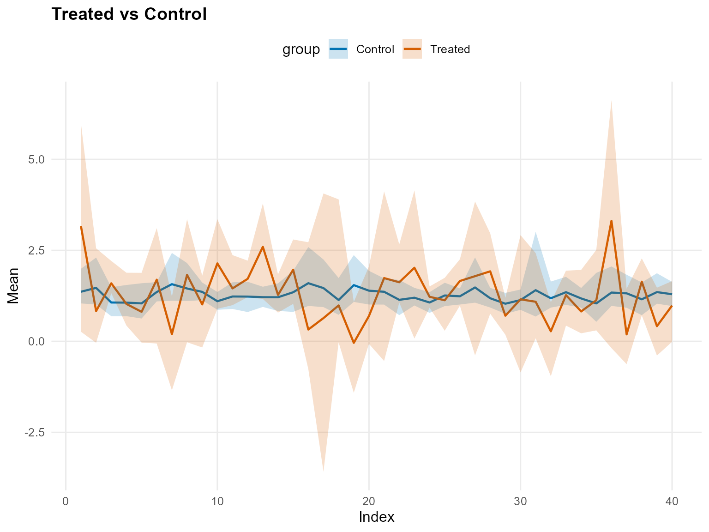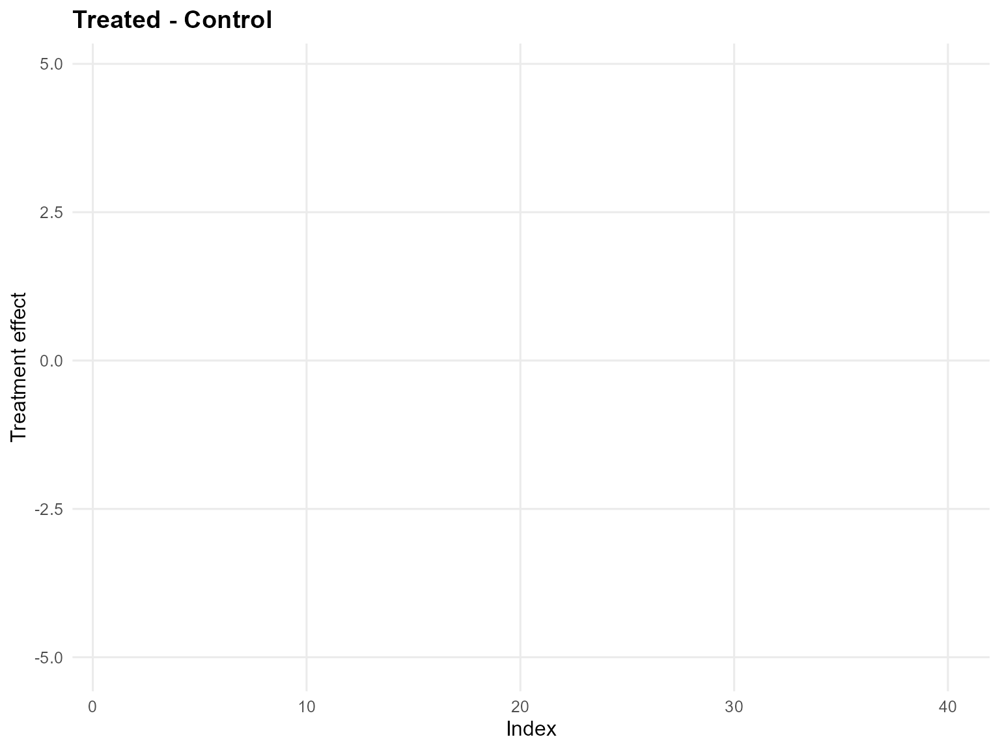

``` r
qte_bulk <- qte(fit_sb_bulk, probs = c(0.25, 0.5, 0.75), newdata = x_eval, interval = "credible")
head(qte_bulk)
```

    $fit
                 [,1]         [,2]        [,3]
     [1,]  0.42600275  1.359060347  2.62211756
     [2,] -0.15349066 -0.503076940 -0.93967990
     [3,]  0.65309806  0.565135054  0.42970688
     [4,]  0.24084354  0.001837627 -0.30865549
     [5,]  0.05191413 -0.263902204 -0.74332688
     [6,]  0.19621237  0.211203180  0.36718424
     [7,] -1.04868295 -1.336539410 -1.71861599
     [8,] -0.01768504  0.177462593  0.57162618
     [9,] -0.21389153 -0.394484455 -0.48930927
    [10,]  0.60149527  0.817599865  1.27916046
    [11,]  0.37103740  0.246506425  0.11758101
    [12,]  0.59383743  0.504896775  0.41861669
    [13,]  0.59916959  1.038704341  1.82130204
    [14,]  0.31799574  0.122473289 -0.11897541
    [15,]  0.68055311  0.646596035  0.59325774
    [16,] -0.75533491 -1.204818898 -1.76424439
    [17,] -0.79340253 -0.967478396 -1.18852469
    [18,] -0.04632071 -0.108718134 -0.16668203
    [19,] -1.20584861 -1.615482425 -2.08733512
    [20,] -0.51383089 -0.661693563 -0.86370728
    [21,]  0.21004303  0.251073260  0.40260879
    [22,]  0.66086996  0.546829258  0.37600042
    [23,]  0.27904586  0.581469019  1.14776435
    [24,]  0.27805080  0.177509121  0.06001938
    [25,] -0.17861519 -0.160287545 -0.11768062
    [26,]  0.31627780  0.308316243  0.45942863
    [27,] -0.15658483  0.126720518  0.57987305
    [28,]  0.32073050  0.519260053  0.99619781
    [29,] -0.15798969 -0.376852397 -0.64185708
    [30,] -0.07476915 -0.079500419 -0.07497236
    [31,]  0.32117307 -0.105960047 -0.72925052
    [32,] -0.74451837 -0.950404324 -1.19637898
    [33,]  0.17692350 -0.049093543 -0.27300428
    [34,] -0.21269123 -0.354934636 -0.49256330
    [35,]  0.42998656  0.145744268 -0.26945791
    [36,]  0.32346733  1.497788050  3.04414944
    [37,] -0.86267176 -1.156463843 -1.46429325
    [38,]  0.64706920  0.530851250  0.35207153
    [39,] -0.73146878 -0.918521619 -1.14838451
    [40,]  0.00854487 -0.285362453 -0.65026647

    $lower
                 [,1]        [,2]        [,3]
     [1,] -1.36430606 -1.12383668 -0.93450398
     [2,] -0.90211380 -1.40248686 -2.06419095
     [3,]  0.28936696  0.10806342 -0.17324122
     [4,] -0.39691450 -0.76203289 -1.16304994
     [5,] -0.77076897 -1.18572562 -1.72449874
     [6,] -1.38846770 -1.52793006 -1.54869625
     [7,] -2.73835944 -2.90186841 -3.11621440
     [8,] -1.58263206 -1.41960009 -1.33199631
     [9,] -1.51927565 -1.59408296 -1.77497276
    [10,] -0.30604566 -0.27550720 -0.18708445
    [11,] -0.13883776 -0.35360929 -0.59481597
    [12,]  0.11239265 -0.09551353 -0.33323624
    [13,] -0.26570294 -0.21098782 -0.08732507
    [14,] -0.16531446 -0.48648543 -0.77184434
    [15,] -0.13049044 -0.30942373 -0.53792091
    [16,] -1.63164106 -2.14248952 -3.09330032
    [17,] -5.40273917 -5.72048668 -6.10422810
    [18,] -1.03544749 -1.44338460 -1.82578870
    [19,] -2.76947742 -3.08007217 -3.47884083
    [20,] -1.18133058 -1.38408427 -1.91214650
    [21,] -1.93486013 -2.09701575 -2.21137048
    [22,]  0.10035850 -0.08359957 -0.30045908
    [23,] -1.34970747 -1.19087243 -1.14335622
    [24,] -0.05967226 -0.24194352 -0.38847521
    [25,] -1.01674781 -0.96351637 -0.90512142
    [26,] -0.29361069 -0.36557961 -0.39669213
    [27,] -2.18662741 -1.91286050 -1.80190840
    [28,] -0.62276217 -0.51298518 -0.42547339
    [29,] -0.81142960 -0.99673231 -1.34919122
    [30,] -2.17679703 -2.25458751 -2.27125375
    [31,] -0.69553941 -1.15340119 -1.85899780
    [32,] -2.26378948 -2.37873258 -2.51239421
    [33,] -0.70545209 -0.96210385 -1.25803703
    [34,] -0.74634638 -1.01730464 -1.45457798
    [35,] -0.44847628 -0.82721161 -1.33249976
    [36,] -1.83167282 -1.44132732 -1.21607604
    [37,] -1.54289673 -1.87510242 -2.58473268
    [38,] -0.30213237 -0.50455951 -0.81857629
    [39,] -1.59033471 -1.69751398 -2.16018572
    [40,] -1.17459778 -1.51433643 -1.99036632

    $upper
                 [,1]        [,2]        [,3]
     [1,]  1.40725911  3.54462203  6.29870325
     [2,]  1.68286500  1.31690807  0.70429836
     [3,]  1.30833898  1.16071354  0.94763599
     [4,]  0.97440813  0.75547302  0.47762910
     [5,]  1.01538937  0.76380062  0.44551529
     [6,]  1.10322525  1.66605923  2.38807598
     [7,] -0.07846244  0.09905640  0.29108534
     [8,]  0.71920128  1.24168113  2.38002060
     [9,]  0.45246458  0.34719658  0.33093308
    [10,]  1.15562518  1.92214984  3.05044649
    [11,]  1.36398243  1.22626376  0.88743507
    [12,]  1.06655681  1.18403621  1.38362648
    [13,]  1.03115517  2.04473150  3.47043188
    [14,]  0.82016333  0.63644810  0.40516963
    [15,]  1.32824146  1.73119250  2.11216010
    [16,]  1.76947282  1.46884014  0.90343134
    [17,]  1.64314874  2.50127190  3.68262418
    [18,]  3.05514501  3.08438727  2.84415046
    [19,] -0.24136774 -0.27682428 -0.23378219
    [20,]  0.91380555  0.93399533  0.89335139
    [21,]  1.47434667  2.50873469  3.88870380
    [22,]  1.82336871  1.65108780  1.33866300
    [23,]  1.25200644  2.35445427  3.89168969
    [24,]  0.59099033  0.56231981  0.44473801
    [25,]  0.49583928  0.68433874  0.75563924
    [26,]  0.74015520  0.81896916  1.30935374
    [27,]  0.72351785  1.41261740  2.85055433
    [28,]  0.82083579  1.23993829  2.16539765
    [29,]  0.47652978  0.35627572  0.07021536
    [30,]  1.07331182  1.54633789  2.36673174
    [31,]  1.52783851  1.19935458  0.72733627
    [32,]  0.16612969  0.08604516 -0.17435638
    [33,]  0.82375962  0.69653176  0.61422677
    [34,]  0.98809922  0.87959518  0.62549677
    [35,]  1.71611615  1.42575726  1.03151969
    [36,]  1.54536524  3.95276030  7.20152277
    [37,]  0.39673158  0.33209096  0.23471176
    [38,]  1.28414284  1.41828649  1.43814082
    [39,]  0.34160315  0.42339566  0.48911038
    [40,]  0.80864418  0.67116101  0.36720187

    $grid
    [1] 0.25 0.50 0.75

    $trt
    $fit
           estimate index id        lower     upper
    1    0.97438425  0.25  1 -0.830091602 1.8891941
    2    0.41646510  0.25  2 -0.402160389 2.2369017
    3    1.09312885  0.25  3  0.834338963 1.7520012
    4    0.66103501  0.25  4  0.122682311 1.4760257
    5    0.43865107  0.25  5 -0.296150589 1.5150030
    6    0.76104579  0.25  6 -0.816953892 1.4909426
    7   -0.42621252  0.25  7 -2.182594965 0.4464672
    8    0.57518637  0.25  8 -1.040722625 1.2403668
    9    0.34731643  0.25  9 -0.980980366 0.9360184
    10   1.04988906  0.25 10  0.186938258 1.4704764
    11   0.88820598  0.25 11  0.447660760 1.8810107
    12   1.10277106  0.25 12  0.727331484 1.4112297
    13   1.10416379  0.25 13  0.305444035 1.4148182
    14   0.81160844  0.25 14  0.390977952 1.3156024
    15   1.23215061  0.25 15  0.518699373 1.6065091
    16  -0.13296772  0.25 16 -1.165640960 2.3789840
    17  -0.25970945  0.25 17 -4.868159177 1.9593698
    18   0.42856809  0.25 18 -0.477593373 3.5619950
    19  -0.59618524  0.25 19 -2.200471222 0.3205553
    20   0.05493354  0.25 20 -0.670365373 1.4178556
    21   0.77177998  0.25 21 -1.371915162 1.8162954
    22   1.12426751  0.25 22  0.643500200 2.2563072
    23   0.74896264  0.25 23 -0.849638753 1.6045808
    24   0.71654703  0.25 24  0.479308705 0.9609313
    25   0.33080070  0.25 25 -0.519903731 0.9625917
    26   0.83570967  0.25 26  0.281511910 1.1720200
    27   0.43778763  0.25 27 -1.627570482 1.2096482
    28   0.80240120  0.25 28 -0.106682316 1.2005741
    29   0.26207017  0.25 29 -0.314994486 0.8130703
    30   0.36301566  0.25 30 -1.654984743 1.4033620
    31   0.77329309  0.25 31 -0.144379569 2.0603496
    32  -0.28267978  0.25 32 -1.788807357 0.5395641
    33   0.72974994  0.25 33 -0.179305241 1.1633310
    34   0.28049593  0.25 34 -0.235110999 1.5112944
    35   0.80561538  0.25 35  0.042177577 2.1712653
    36   0.83688326  0.25 36 -1.346953345 2.1476675
    37  -0.33161413  0.25 37 -1.083400906 0.9130850
    38   1.11670260  0.25 38  0.195187188 1.5357718
    39  -0.18684048  0.25 39 -1.098996815 0.7909077
    40   0.52589427  0.25 40 -0.627364282 1.1335632
    41   2.51608573  0.50  1  0.059203231 4.8646905
    42   0.68262583  0.50  2 -0.203389243 2.5264811
    43   1.46298140  0.50  3  1.218316381 2.1046656
    44   0.87544583  0.50  4  0.289076439 1.7330103
    45   0.55209737  0.50  5 -0.216300808 1.6727211
    46   1.42064316  0.50  6 -0.406743239 2.6564174
    47  -0.01454407  0.50  7 -1.816911384 1.0961699
    48   1.41710224  0.50  8 -0.306098922 2.5528984
    49   0.80708367  0.50  9 -0.523997821 1.5275728
    50   1.78650749  0.50 10  0.769282190 2.7136451
    51   1.31115664  0.50 11  0.861161270 2.2808237
    52   1.54953616  0.50 12  1.120405238 2.0110598
    53   2.11652705  0.50 13  0.988749210 3.0680644
    54   1.14612316  0.50 14  0.670903546 1.7437610
    55   1.77107133  0.50 15  0.916630010 2.4198367
    56   0.08712595  0.50 16 -1.039215479 2.6561732
    57   0.22920168  0.50 17 -4.465055453 3.5497700
    58   0.84934220  0.50 18 -0.155216713 4.1185163
    59  -0.31205979  0.50 19 -1.919620691 0.7855547
    60   0.52880478  0.50 20 -0.309731937 1.9154635
    61   1.45686412  0.50 21 -0.959398331 3.3922939
    62   1.49330672  0.50 22  0.960657212 2.5990044
    63   1.61416407  0.50 23 -0.197095216 3.2389980
    64   1.09142074  0.50 24  0.826214089 1.3351149
    65   0.90994375  0.50 25  0.051243133 1.5582477
    66   1.40935111  0.50 26  0.764453358 1.8392356
    67   1.36773641  0.50 27 -0.854263963 2.8845682
    68   1.55318175  0.50 28  0.572188708 2.3141029
    69   0.50173245  0.50 29 -0.045935463 1.0782098
    70   0.87837772  0.50 30 -1.200031475 2.4043639
    71   0.88623493  0.50 31 -0.086932011 2.2347692
    72   0.04072583  0.50 32 -1.458422421 0.9280840
    73   1.10412211  0.50 33  0.156884131 1.7328160
    74   0.68058023  0.50 34  0.072042521 1.8866939
    75   0.94217082  0.50 35  0.148413390 2.3415182
    76   2.58992435  0.50 36 -0.465077468 5.4213852
    77  -0.03025684  0.50 37 -0.852544462 1.2871693
    78   1.49069334  0.50 38  0.468813149 2.0089990
    79   0.23486707  0.50 39 -0.696671125 1.3287495
    80   0.80245454  0.50 40 -0.366936759 1.5352254
    81   4.59851784  0.75  1  1.034552776 8.3672959
    82   1.07406421  0.75  2  0.058452602 2.9553633
    83   1.94537249  0.75  3  1.660006410 2.5709476
    84   1.20813543  0.75  4  0.537958564 2.0918141
    85   0.73674970  0.75  5 -0.096548479 1.9004289
    86   2.31119114  0.75  6  0.231545974 4.3072310
    87   0.54133859  0.75  7 -1.321878240 1.9525425
    88   2.65603275  0.75  8  0.629347661 4.6183151
    89   1.47397866  0.75  9  0.060234368 2.3741937
    90   2.88600787  0.75 10  1.490875431 4.5413606
    91   1.86357509  0.75 11  1.374236344 2.8123300
    92   2.15686459  0.75 12  1.586864414 2.7626861
    93   3.57196424  0.75 13  1.775144263 5.0958272
    94   1.59885499  0.75 14  1.084722163 2.2847312
    95   2.48068798  0.75 15  1.425381673 3.5915048
    96   0.43821371  0.75 16 -0.871228887 3.0276635
    97   0.97843434  0.75 17 -3.836011170 5.7748823
    98   1.43346359  0.75 18  0.293646573 4.6590683
    99   0.14210968  0.75 19 -1.514189773 1.5138101
    100  1.12594880  0.75 20  0.211510751 2.6448775
    101  2.36303089  0.75 21 -0.286273196 5.5675728
    102  1.96721014  0.75 22  1.379698335 3.0491686
    103  2.90587178  0.75 23  0.609851448 5.5216372
    104  1.58796196  0.75 24  1.307442713 1.8356061
    105  1.69769509  0.75 25  0.854551897 2.4027384
    106  2.22967429  0.75 26  1.435200466 2.9552433
    107  2.71680418  0.75 27  0.147449284 5.2576478
    108  2.71733291  0.75 28  1.319667299 3.9703616
    109  0.87976034  0.75 29  0.282937968 1.4301922
    110  1.61928552  0.75 30 -0.544687100 3.9226645
    111  1.06458180  0.75 31  0.010629640 2.4660724
    112  0.53672451  0.75 32 -0.965228108 1.4487283
    113  1.64150849  0.75 33  0.655536881 2.4676728
    114  1.22266716  0.75 34  0.527135887 2.3319209
    115  1.15938163  0.75 35  0.318610474 2.5777097
    116  4.95368026  0.75 36  0.669941870 9.5486952
    117  0.45047349  0.75 37 -0.575514591 1.8385182
    118  2.00670086  0.75 38  0.918039468 2.8096163
    119  0.80956721  0.75 39 -0.159742208 2.0027860
    120  1.20315950  0.75 40 -0.004495804 2.0749230

    $lower
    NULL

    $upper
    NULL

    $type
    [1] "quantile"

    $grid
    [1] 0.25 0.50 0.75

    $draws
    , , 1

                  [,1]         [,2]      [,3]       [,4]         [,5]         [,6]
      [1,]  1.68783745  0.399613052 0.8474267 0.46881427  0.414515377  1.346817040
      [2,]  1.44315584  0.402713954 0.8411887 0.47339898  0.417602330  1.265238305
      [3,]  1.86632961  0.402475915 0.8599430 0.46827333  0.411428958  1.407432206
      [4,]  1.73126208  0.403694523 0.8560312 0.47007972  0.412654671  1.364544089
      [5,]  1.62466492  0.264093185 0.8341823 0.43561560  0.376068690  1.260077335
      [6,]  1.53051481  0.265892186 0.8302919 0.43647355  0.376348376  1.232547359
      [7,]  1.50792978  0.266992811 0.8285939 0.43869955  0.378204403  1.219714630
      [8,]  1.52465731  0.267959056 0.8350371 0.44044308  0.379037513  1.232687244
      [9,]  1.67093778  0.263121563 0.8288167 0.43595610  0.377566651  1.291966126
     [10,]  1.58642013  0.310357395 0.8399136 0.45429252  0.388845973  1.359137611
     [11,]  1.55026480  0.272738802 1.0209110 0.66440480  0.743598282  1.457520043
     [12,]  1.80819744  0.333077288 1.0512734 0.68071450  0.752706541  1.700441545
     [13,]  1.76736461  0.319906785 1.0138516 0.63956021  0.712111105  1.645146734
     [14,]  1.83015589  0.367690968 1.0809432 0.66715706  0.719599650  1.685772771
     [15,]  1.84649315  0.385910359 1.0001250 0.63578727  0.696968337  1.558435801
     [16,]  2.46857827  0.381787717 1.0295443 0.63603912  0.696521328  1.756706335
     [17,]  1.72539914  0.423451012 0.9962333 0.68176992  0.742642020  1.504021490
     [18,]  1.67543960  0.375403422 0.9882053 0.67233933  0.737475095  1.418927668
     [19,]  1.33677776  0.324677420 0.9614756 0.66653658  0.734997369  1.206362176
     [20,]  1.55256721  0.338530846 1.0109315 0.68380162  0.743327781  1.308036466
     [21,]  1.42103405  0.351027346 1.0094376 0.70896908  0.771695342  1.264536158
     [22,]  1.46366645  0.380580963 0.9710918 0.66137025  0.678513908  1.238199070
     [23,]  1.42876754  0.231901122 0.9526691 0.62422593  0.639366109  1.166486829
     [24,]  1.09286389  0.146873745 1.1354468 0.83060291  0.979063350  1.089217782
     [25,]  1.07579025  0.090538647 1.0922024 0.77363162  0.893556795  1.039953901
     [26,]  1.16530971  0.087911415 1.0694554 0.76066853  0.885587676  1.052167751
     [27,]  1.38604773  0.109259442 1.0053559 0.71930290  0.850620862  1.025146584
     [28,]  1.55531948  0.010847943 0.9957701 0.56670083  0.534552947  1.120426439
     [29,]  1.96068069  0.034636224 1.0033632 0.55693664  0.500099229  1.199070215
     [30,]  1.85562422  0.035094041 0.9825563 0.55194889  0.500618330  1.162757853
     [31,]  1.78180545  0.033716823 1.0133284 0.55746757  0.503901600  1.170572640
     [32,]  1.44950683 -0.001273387 1.0035064 0.49222940  0.362195349  1.144650321
     [33,]  1.62078147 -0.015460330 1.0061286 0.48610161  0.361534575  1.176815386
     [34,]  1.69710004  0.234097141 1.0394829 0.55032679  0.427943802  1.341913135
     [35,]  1.54516929  0.235333443 1.0388335 0.55218137  0.428805079  1.310982451
     [36,]  2.14586875  0.235290537 1.0665834 0.55319485  0.425895359  1.451091088
     [37,]  1.58075735  0.205028393 1.0545511 0.54261260  0.422720541  1.345197575
     [38,]  1.65901614  0.204906845 1.0833071 0.54512072  0.422389045  1.386804116
     [39,]  1.36044137  0.298210876 1.1102887 0.58021391  0.406271739  1.313326774
     [40,]  1.57574396  0.324524464 1.1203580 0.58261876  0.407687832  1.396424371
     [41,]  1.41982478  0.351981113 1.1129952 0.59060607  0.406946376  1.337146201
     [42,]  1.17018402  0.358501936 1.0878121 0.59606605  0.411944793  1.247197053
     [43,]  1.51671988  0.347552588 1.1111073 0.58702133  0.405316873  1.355860398
     [44,]  1.50791893  0.355255137 1.1222730 0.59332346  0.410232771  1.382767411
     [45,]  1.49622632  0.357151654 1.1216771 0.59113599  0.395500884  1.356484454
     [46,]  1.35977372  0.374125512 1.1776819 0.60249795  0.394926275  1.377650477
     [47,]  1.63922370  0.358963884 1.2176169 0.59532810  0.389051851  1.476487027
     [48,]  1.62090443  0.359995628 1.1784879 0.59581928  0.389250410  1.395826892
     [49,]  1.38073830  0.321725076 1.1340579 0.56636281  0.375002299  1.345613050
     [50,]  1.40807531  0.319559268 1.1344113 0.56470969  0.374197005  1.353958227
     [51,]  1.53960893  0.312813622 1.1508393 0.55968407  0.371675207  1.399063400
     [52,]  1.41573175  0.326938738 1.1484707 0.55580033  0.366688277  1.346454393
     [53,]  1.52008816  0.328706299 1.1372549 0.54612835  0.359857606  1.349758147
     [54,]  1.71102214  0.310441639 1.1247046 0.53828381  0.358475293  1.373540978
     [55,]  1.73274366  0.309747386 1.1232109 0.53779528  0.358241636  1.364100969
     [56,]  1.60387041  0.310424681 1.1338081 0.53629366  0.354731541  1.348445087
     [57,]  1.73625273  0.306449304 1.1299699 0.53347669  0.353438164  1.350746962
     [58,]  1.84995031  0.302951131 1.1276098 0.53099416  0.352297162  1.372778461
     [59,]  1.68901317  0.307821040 1.1168623 0.53442568  0.353903074  1.324812960
     [60,]  1.63052112  0.309576640 1.1193459 0.53567543  0.354473283  1.316281960
     [61,]  1.41276442  0.315917893 1.1216242 0.54017324  0.356546088  1.282993691
     [62,]  1.68885210  0.306258249 1.1199473 0.53237853  0.351654941  1.327270962
     [63,]  1.72564422  0.305202024 1.1230550 0.53162601  0.351306968  1.329208816
     [64,]  1.56066674  0.309942220 1.1180137 0.53494595  0.352841895  1.291247273
     [65,]  1.60715509  0.308617575 1.1176177 0.53401128  0.352415365  1.299367378
     [66,]  1.33376989  0.339270488 1.1050706 0.51985716  0.339259823  1.272258373
     [67,]  1.90988101  0.328131502 1.0948306 0.51175186  0.336328557  1.330522885
     [68,]  1.98781734  0.326086216 1.0932481 0.51049443  0.335792595  1.340959763
     [69,]  2.28111573  0.318085056 1.0867365 0.50557338  0.333698186  1.408172990
     [70,]  1.51103425  0.276387878 1.0284307 0.47992919  0.322777678  1.267861122
     [71,]  1.46175498  0.284512025 1.0241132 0.48828788  0.330836018  1.271608391
     [72,]  1.29273571  0.292646850 1.0310442 0.49336893  0.333114365  1.250406296
     [73,]  1.32400272  0.289712494 1.0309051 0.49154652  0.332293854  1.260300671
     [74,]  1.53131534  0.323251853 1.0300685 0.49752476  0.340834094  1.273565119
     [75,]  1.30325806  0.330546431 1.0208189 0.50596525  0.350077371  1.233842935
     [76,]  1.21502769  0.338719147 1.0293802 0.51113293  0.352522710  1.245512902
     [77,]  1.23983896  0.373625816 1.0560722 0.52199456  0.352739788  1.340888973
     [78,]  1.24915218  0.255915273 1.0241826 0.49604494  0.340884945  1.224933117
     [79,]  1.19786374  0.005191341 0.9861538 0.43328798  0.276251252  1.060540180
     [80,]  1.21390824  0.002468160 0.9823552 0.43116216  0.275291675  1.055688020
     [81,]  1.19611173  0.005514817 0.9866030 0.43354049  0.276365236  1.061106112
     [82,]  1.15349130  0.002442475 0.9815053 0.43114166  0.275282621  1.051712278
     [83,]  1.22911169  0.034854927 0.8821591 0.33773595  0.126463369  1.010260778
     [84,]  1.20646378 -0.035734993 0.8725683 0.32057678  0.108356763  0.960805414
     [85,]  1.11057620  0.026445361 0.9217161 0.34230093  0.107781927  0.909353565
     [86,]  1.16753626 -0.027851729 0.8794066 0.32392673  0.107379363  0.930087151
     [87,]  1.20904693 -0.035080858 0.8740499 0.32147647  0.106311737  0.913988032
     [88,]  1.15177489 -0.016265538 0.8937684 0.33392814  0.111803570  0.929799471
     [89,]  1.17184174  0.008943407 0.9174842 0.34168092  0.109576125  0.903866009
     [90,]  1.22368834  0.001472609 0.9090355 0.33618797  0.107303322  0.894017435
     [91,]  1.25438858 -0.003167220 0.9041460 0.33280015  0.105892364  0.888151862
     [92,]  1.22890267  0.128212863 0.9319843 0.37007958  0.140246619  0.985786173
     [93,]  1.22892983  0.128208228 0.9319797 0.37007620  0.140245206  0.985782806
     [94,]  1.18615350  0.136636734 0.9401340 0.37622451  0.142815070  0.991623236
     [95,]  1.27758404  0.120078317 0.9495406 0.38726164  0.169098391  1.002270204
     [96,]  1.30218005  0.115499915 0.9448891 0.38391483  0.167701698  0.997275318
     [97,]  1.36734550  0.141460747 0.9829942 0.40302243  0.175599858  1.046643303
     [98,]  1.44268742  0.132078904 0.9735303 0.39615754  0.172738369  1.037452235
     [99,]  1.44507068  0.131870141 0.9733224 0.39600472  0.172674729  1.037255864
    [100,]  1.19497376  0.144335049 1.0741210 0.45591752  0.204126535  1.056949983
    [101,]  1.23720133  0.135474977 1.0720944 0.44562249  0.196470455  1.064229825
    [102,]  1.25673346  0.131086339 1.0689264 0.44160610  0.194638488  1.059153072
    [103,]  1.34582097  0.139168007 1.0102419 0.39509653  0.134655640  1.028564490
    [104,]  1.34273327  0.140205479 1.0052681 0.39773082  0.138088359  1.015081044
    [105,]  1.27680569  0.066240548 0.9979553 0.38140019  0.119484782  0.960168480
    [106,]  1.23879392  0.069986263 1.0041313 0.38470093  0.120947432  0.964532463
    [107,]  1.26947229  0.067025963 1.0007379 0.38210033  0.119790278  0.964697953
    [108,]  1.09075707  0.010726704 0.8992265 0.33243654  0.097804406  0.835059003
    [109,]  1.02188945 -0.404439415 0.8260713 0.22570910 -0.009754233  0.477641783
    [110,]  1.01240230 -0.399641465 0.8345121 0.22994216 -0.007880565  0.489473855
    [111,]  1.06396294 -0.391801490 0.8490956 0.23686133 -0.004818943  0.508820490
    [112,]  1.17285576 -0.009580637 0.9003555 0.32911217  0.092941667  0.824890782
    [113,]  1.08186001 -0.317481732 0.8534365 0.25233279  0.013670992  0.564200128
    [114,]  1.05145918 -0.319091102 0.8515338 0.25091447  0.013042530  0.560222902
    [115,]  1.06972385 -0.315443135 0.8587605 0.25413595  0.014467137  0.569205446
    [116,]  1.12196071 -0.313890299 0.8627084 0.25550967  0.015073550  0.573073751
    [117,]  1.15246239 -0.324377798 0.8512189 0.25129664  0.015407033  0.584031407
    [118,]  1.18202630 -0.313625324 0.8709230 0.26102468  0.019816962  0.612290547
    [119,]  1.19230219 -0.322370656 0.8546849 0.25254023  0.016096584  0.587763637
    [120,]  1.39620328 -0.408821729 0.8640394 0.02012968 -0.464327679  0.794917766
    [121,]  1.29021275 -0.416277168 0.8885162 0.02342281 -0.458497138  0.783790999
    [122,]  1.03884584 -0.541335238 0.9445422 0.09915211 -0.299500147  0.636568295
    [123,]  1.25696141 -0.502083075 0.9275677 0.05818558 -0.405615115  0.716784503
    [124,]  1.19732279 -0.462824054 0.8863776 0.13529574 -0.155787326  0.799692318
    [125,]  1.16526221 -0.302209887 0.9812158 0.21029108 -0.163994196  0.743370835
    [126,]  1.22917377 -0.295413039 1.0038044 0.21621348 -0.163275239  0.781300232
    [127,]  1.12927787 -0.365388392 1.0522049 0.23412397 -0.139529739  0.745239562
    [128,]  1.25197132 -0.342781670 0.9586102 0.14345540 -0.277069357  0.722845714
    [129,]  1.17911439 -0.348140133 0.9427338 0.13719296 -0.279834730  0.705485775
    [130,]  1.20330558 -0.297811856 0.9530803 0.15064395 -0.266619746  0.750581634
    [131,]  1.18906315 -0.294701862 0.9618003 0.15439293 -0.264872074  0.760775533
    [132,]  1.18542020 -0.283781736 0.9367707 0.13039911 -0.303588923  0.758293573
    [133,]  1.19465202 -0.335272476 0.9471649 0.12442480 -0.314371264  0.728353699
    [134,]  1.36820915 -0.355901174 0.9085535 0.12098839 -0.292448447  0.742113800
    [135,]  1.37105049 -0.355799893 0.9088306 0.12110578 -0.292393333  0.742475743
    [136,]  1.32856164 -0.273273015 0.9170834 0.14000776 -0.271723447  0.807398372
    [137,]  1.28218344 -0.270350971 0.9248888 0.14339445 -0.270133365  0.817779361
    [138,]  1.31371888 -0.314450329 0.9035076 0.12513600 -0.265241460  0.848924988
    [139,]  1.29832583 -0.245165271 0.8706021 0.23535401 -0.027404816  0.734537885
    [140,]  1.27317457 -0.241226880 0.8822530 0.23815985 -0.029468209  0.693977956
    [141,]  1.14925004 -0.219003417 0.9125076 0.24739412 -0.031818686  0.655165786
    [142,]  1.07863330 -0.070425346 1.0039752 0.32298423  0.069438177  0.864036180
    [143,]  1.09999456 -0.083454873 0.9899139 0.31874241  0.067767053  0.827477357
    [144,]  1.07358431  0.017039597 0.9785539 0.33294783  0.089453387  0.889431294
    [145,]  1.25003823 -0.157269346 0.9628112 0.16396081 -0.175181506  1.061937230
    [146,]  1.21328805 -0.186370848 0.9295067 0.14852422 -0.181143458  0.983347977
    [147,]  1.18100589 -0.185155988 0.9322864 0.14992037 -0.180607324  0.985137212
    [148,]  1.23188830 -0.166157016 0.9699525 0.18517500 -0.132492575  1.064161523
    [149,]  1.34644709 -0.201595067 0.9374600 0.17625117 -0.115412461  1.068327699
    [150,]  1.32713957 -0.177363650 0.9468322 0.18729636 -0.108840228  1.103753000
    [151,]  1.02321839  0.130752976 0.9468933 0.71014057  0.938424119  0.877765874
    [152,]  1.21382782  0.118502265 0.8690456 0.66966742  0.909988868  0.825445165
    [153,]  0.97408572  0.146939230 0.8426742 0.70855471  0.948285145  0.721465965
    [154,]  0.72567249  0.151591938 0.8252253 0.61991146  0.742735046  0.611798016
    [155,]  0.50085566  0.168794223 0.9197075 0.69425291  0.840799179  0.578771088
    [156,]  0.45713996  0.253933561 0.9429195 0.74104777  0.878264493  0.617758000
    [157,]  0.32353991  0.390637799 0.9575007 0.88825370  1.152718927  0.493004435
    [158,] -0.51391310  0.447306502 1.3123358 1.34993430  1.765896469  0.391760131
    [159,] -0.49589604  0.461874803 1.3316208 1.36483331  1.775838703  0.407787151
    [160,] -0.62071298  0.747037027 1.4875408 1.47563531  1.720893295  0.310577378
    [161,] -0.51703405  0.874672379 1.5207880 1.51819374  1.758317510  0.431106565
    [162,] -0.44196540  0.757278926 1.4585159 1.47637884  1.749104854  0.424691711
    [163,] -0.26651790  0.794878249 1.2843672 1.28605695  1.452729143  0.355964635
    [164,] -0.24071702  0.804943685 1.2865555 1.29131340  1.456808886  0.370428232
    [165,] -0.35791808  0.733465905 1.2982367 1.28080721  1.445199271  0.276510691
    [166,] -0.29536594  0.745088450 1.2457964 1.26160899  1.433821266  0.282112894
    [167,] -0.28437402  0.830568006 1.3295777 1.28864810  1.407250298  0.283038654
    [168,] -0.62501577  1.122831440 1.6105355 1.52901768  1.540105325  0.185043291
    [169,] -0.67588326  0.994437709 1.5503981 1.48492456  1.487258257  0.040409308
    [170,] -0.52315103  1.050657061 1.5236510 1.40256704  1.259682584  0.025498015
    [171,] -0.12520130  0.991793174 1.6501076 1.19301910  0.758029332  0.414619156
    [172,]  0.13439619  0.793725099 1.3041074 0.83895757  0.273239602  0.165476031
    [173,] -0.18672267  1.112320021 1.2972253 1.02674834  0.466501480 -0.250008828
    [174,] -0.28135826  0.872753152 1.0215445 0.78860242  0.168664821 -0.572242399
    [175,] -0.49869982  0.531819413 0.9887649 0.71128435  0.092878048 -0.899895842
    [176,] -0.40061013  0.568719270 0.9520597 0.69316103  0.104468391 -0.809349580
    [177,] -0.68914352  0.644143706 1.1911512 0.91204801  0.350245235 -0.823833984
    [178,] -0.95818944  0.341613959 1.3079260 1.01400334  0.564014418 -0.982534121
    [179,] -1.10060319  0.330152074 1.4272099 1.21026376  0.913428521 -0.965744969
    [180,] -0.85295267  0.405009760 1.4963553 1.25962729  0.941511488 -0.862379416
    [181,] -1.15840713  0.250854310 1.5256511 1.25580443  0.977534213 -0.912154069
    [182,] -0.74765742  0.060864661 1.5959704 0.95415479  0.337727448 -0.629075610
    [183,] -0.80482411  0.143411253 1.7064492 1.17220514  0.697595412 -0.629099579
    [184,] -1.01154139  0.587355752 1.6417332 1.36306035  1.039219511 -0.702004275
    [185,] -0.54206108  0.885879513 1.6905779 1.41293859  1.107054063 -0.281671852
    [186,] -0.49809119  1.014950780 1.8148732 1.41431726  0.892834343 -0.286935340
    [187,] -0.40766032  1.246997131 1.8269869 1.41144854  0.738485702 -0.364681922
    [188,] -0.33528234  0.949002390 1.7693220 1.23636339  0.501191964 -0.397761447
    [189,] -0.93853696  0.893223965 1.8062814 1.55723856  1.166826780 -0.778167181
    [190,] -0.76003411  0.869619878 1.7280729 1.50380125  1.163560632 -0.587615153
    [191,] -0.45523585  0.992723043 1.7804627 1.41626555  0.961349337 -0.196594246
    [192,] -0.19891948  0.891975907 1.7808091 1.38295704  0.927667242 -0.136102963
    [193,] -0.16356365  1.092725895 1.7328573 1.37896480  1.023758758  0.146448474
    [194,]  0.18319382  0.937997044 1.2563823 1.21214409  1.246986530  0.347026464
    [195,]  0.50514900  1.230526512 1.1372129 0.99676622  0.731968421  0.417300252
    [196,]  0.48034084  1.454470582 1.2918204 1.23422636  1.074313055  0.543657484
    [197,]  0.81563310  1.759362559 1.2029273 1.13137509  0.793993379  0.575690524
    [198,]  0.98347658  1.581061188 1.0994983 1.05007974  0.810758438  0.677636993
    [199,]  1.04904563  1.568017355 1.0668709 1.02709887  0.791152186  0.651440660
    [200,]  0.76637915  1.531921582 1.1723415 1.10624925  0.879109672  0.709304317
    [201,]  0.71369449  1.801314655 1.3163701 1.20281954  0.844468590  0.746776455
    [202,]  0.89142358  1.686210673 1.2771194 1.10528092  0.717205145  0.850424326
    [203,]  1.24414041  1.746683029 0.9957678 0.82605539  0.291889319  0.816321460
    [204,]  1.06534631  1.677913372 1.0281700 0.84016446  0.195388473  0.540085275
    [205,]  0.86050970  1.640237194 0.9429732 0.95577021  0.502256421  0.318832811
    [206,]  0.59161748  1.931596402 1.1031844 1.08259338  0.473253494  0.150008059
    [207,]  0.74355687  2.045481004 1.1533172 1.11203298  0.476197227  0.324487069
    [208,]  0.68218331  1.970263075 1.1741974 1.12982379  0.506768644  0.275231874
    [209,]  0.51917395  2.171048174 1.3034044 1.23254258  0.490765315  0.174196729
    [210,]  0.19182998  2.168355867 1.3879960 1.30950697  0.588877591  0.189728448
    [211,]  0.07184649  2.237225304 1.3611658 1.43054319  0.859632161  0.097540304
    [212,]  0.07298015  2.307498649 1.3568499 1.44006113  0.873662161  0.141245880
    [213,]  1.13269615  2.282991857 1.0783892 1.23799558  0.689396393  0.007482435
    [214,]  0.91593035  2.359173064 1.1424607 1.30831742  0.730271416 -0.079325900
    [215,]  0.69386295  2.156502083 1.2040703 1.20225631  0.500118923 -0.081828882
    [216,]  0.35557339  2.163465687 1.3138341 1.27901224  0.449486090 -0.419762734
    [217,]  0.49424632  2.179322123 1.3111374 1.34124126  0.603073020 -0.424016252
    [218,]  0.53035049  2.236544043 1.2783895 1.37300615  0.708707099 -0.421649941
    [219,]  0.33288411  2.265470502 1.2077057 1.43571089  0.881928874 -0.586387669
    [220,]  0.52394002  2.284176908 1.1771371 1.41828229  0.867669027 -0.595670477
                    [,7]        [,8]         [,9]       [,10]     [,11]     [,12]
      [1,]  4.123533e-01  1.00164668  0.835679785  1.42794597 0.6550095 1.0482080
      [2,]  4.156296e-01  0.95519899  0.821479587  1.32669063 0.6555418 1.0238275
      [3,]  3.985131e-01  1.03323650  0.837405561  1.51069182 0.6653535 1.0771985
      [4,]  3.997547e-01  1.00830532  0.830192245  1.45522508 0.6648447 1.0637517
      [5,]  2.591412e-01  0.92464359  0.731806889  1.42077168 0.5971885 0.9936522
      [6,]  2.607723e-01  0.90937990  0.726739379  1.37877891 0.5981321 0.9857269
      [7,]  2.639562e-01  0.89913033  0.725880592  1.36542797 0.5961156 0.9780328
      [8,]  2.666132e-01  0.91096102  0.733467633  1.37975726 0.6007169 0.9867751
      [9,]  2.707689e-01  0.95008117  0.750656627  1.44197767 0.5888963 0.9900548
     [10,]  3.726337e-01  1.02606410  0.845439097  1.37685215 0.6399609 1.0375428
     [11,]  1.287374e-01  0.88511442  0.812907769  1.46270595 0.6426486 1.1897910
     [12,]  2.660766e-01  1.05633116  0.954281719  1.53380024 0.7108389 1.2990979
     [13,]  2.449534e-01  1.10501231  0.945581851  1.47750684 0.7173787 1.2737870
     [14,]  1.747259e-01  1.08811038  0.914517284  1.52324106 0.7957516 1.3678957
     [15,]  2.888751e-01  1.20035052  0.935935127  1.41512975 0.7920461 1.2588575
     [16,]  2.717051e-01  1.35001219  0.970955910  1.56685834 0.8163999 1.3429774
     [17,]  3.859101e-01  1.13914956  0.942527530  1.34994708 0.7708373 1.2177484
     [18,]  2.879292e-01  1.05260678  0.865608717  1.35267229 0.7312149 1.1767428
     [19,]  1.821147e-01  0.87856504  0.760276811  1.24871686 0.6767860 1.0712752
     [20,]  2.032385e-01  0.96946399  0.809340337  1.37039451 0.7174284 1.1393278
     [21,]  2.314876e-01  0.90997774  0.801499585  1.32233685 0.7040670 1.1161854
     [22,]  3.174323e-01  0.96058769  0.840014448  1.28877106 0.7254471 1.0791213
     [23,]  1.576268e-01  0.90595286  0.747571195  1.28608741 0.6606127 1.0215714
     [24,] -1.497170e-01  0.68990308  0.649282549  1.24855948 0.6612985 1.1343690
     [25,] -1.652042e-01  0.68936518  0.618300911  1.22288465 0.6311160 1.0801822
     [26,] -1.600542e-01  0.69222378  0.610059378  1.24245163 0.6122702 1.0612511
     [27,] -8.312596e-03  0.80914821  0.634945854  1.21319238 0.6142776 1.0061683
     [28,] -1.495045e-01  0.87223178  0.648495361  1.29804107 0.6174259 1.0444887
     [29,] -1.001035e-01  1.01273732  0.703367068  1.40795064 0.6549372 1.0735456
     [30,] -9.629427e-02  0.96830651  0.680584276  1.36355453 0.6347375 1.0491184
     [31,] -9.194877e-02  0.86030105  0.654066249  1.37207849 0.6232189 1.0769695
     [32,] -1.306265e-01  0.82405988  0.641418625  1.32207996 0.6232443 1.0773318
     [33,] -1.312532e-01  0.85020072  0.648193704  1.36261031 0.6209375 1.0890549
     [34,]  1.740083e-01  0.95556982  0.806048627  1.36032328 0.7315212 1.2075531
     [35,]  1.758724e-01  0.92500556  0.801350591  1.33563239 0.7286112 1.1963194
     [36,]  1.580394e-01  1.04890227  0.833384062  1.45493584 0.7553825 1.2538310
     [37,]  3.265698e-02  0.92392258  0.809310544  1.34830719 0.7333434 1.2223642
     [38,]  2.770724e-02  0.97115067  0.841848446  1.39904990 0.7604792 1.2568976
     [39,] -4.764667e-03  0.93560188  0.826540274  1.33699266 0.8135821 1.2578840
     [40,]  5.833787e-02  0.99901488  0.869081945  1.38089919 0.8382035 1.3023936
     [41,]  9.615739e-03  0.93968353  0.818278367  1.32025997 0.8426508 1.2893638
     [42,]  3.711227e-02  0.87949138  0.801738032  1.23933432 0.8166237 1.2283858
     [43,]  2.614959e-03  0.94744838  0.812868312  1.33297380 0.8407213 1.2983165
     [44,]  3.259296e-02  0.97457832  0.823494571  1.36305550 0.8527202 1.3189978
     [45,]  2.566263e-02  0.95305346  0.829274969  1.33741996 0.8521265 1.3027725
     [46,]  3.055518e-02  1.00462031  0.896870662  1.38559571 0.9106803 1.3382913
     [47,]  3.426256e-03  1.09423057  0.930272480  1.49155951 0.9538058 1.4109591
     [48,]  4.362745e-03  1.11605342  0.936093679  1.40917521 0.9436178 1.3274003
     [49,] -6.455724e-02  1.07525135  0.873964341  1.33601822 0.9004457 1.2859591
     [50,] -6.845359e-02  1.07866040  0.870673087  1.34310864 0.8997206 1.2916311
     [51,] -8.067099e-02  1.11436896  0.867546190  1.39245489 0.9108197 1.3262983
     [52,] -2.853051e-02  1.11455981  0.892383946  1.34967425 0.9343774 1.3179060
     [53,] -3.618175e-03  1.13664561  0.896733586  1.35114903 0.9374681 1.3206832
     [54,]  6.895515e-03  1.15180318  0.898099952  1.36812253 0.9132797 1.3198738
     [55,]  5.471250e-03  1.14067894  0.896611018  1.35584585 0.9111394 1.3118524
     [56,]  2.630222e-03  1.09788338  0.903777277  1.34829702 0.9203929 1.3163939
     [57,] -5.449103e-03  1.08905781  0.889745160  1.36094830 0.9118123 1.3136169
     [58,] -1.257676e-02  1.10409220  0.884992198  1.37591509 0.9084030 1.3212509
     [59,] -2.538078e-03  1.05591133  0.874618706  1.32916846 0.8978777 1.2893748
     [60,]  1.022603e-03  1.05224626  0.878476160  1.32488719 0.9009728 1.2877320
     [61,]  1.397213e-02  1.03058383  0.884067047  1.30122527 0.9047649 1.2737537
     [62,] -7.745189e-03  1.06059543  0.878118241  1.33397078 0.9021315 1.2932348
     [63,] -9.945891e-03  1.05907616  0.873903579  1.33490902 0.9079794 1.3026855
     [64,] -2.289885e-04  1.02719088  0.868825127  1.30243839 0.9039672 1.2819569
     [65,] -2.927021e-03  1.03239722  0.867942127  1.30810926 0.9031792 1.2850777
     [66,]  1.459775e-01  1.09335415  0.942181720  1.30217174 0.9448481 1.2718565
     [67,]  1.166807e-01  1.15673054  0.931372798  1.34239471 0.9336096 1.2924440
     [68,]  1.120681e-01  1.16939800  0.929369098  1.34944036 0.9316786 1.2955903
     [69,]  9.404422e-02  1.26123173  0.921295659  1.40228314 0.9237013 1.3201323
     [70,]  6.310483e-05  1.07941239  0.821391847  1.27104106 0.8449057 1.2364478
     [71,]  2.748965e-02  1.08427924  0.820269342  1.25805663 0.8373414 1.2336046
     [72,]  4.606463e-02  1.06169275  0.833873537  1.24351546 0.8476157 1.2275853
     [73,]  3.937294e-02  1.04337406  0.827011923  1.25200071 0.8435439 1.2360545
     [74,]  6.646723e-02  1.04811619  0.833670889  1.26403760 0.8501554 1.2463765
     [75,]  9.360720e-02  1.00347864  0.821589862  1.22619151 0.8346515 1.2223254
     [76,]  1.123802e-01  1.01881885  0.845369428  1.22099249 0.8496352 1.2314206
     [77,]  6.486616e-02  1.11220639  0.848905636  1.21993674 0.9105981 1.2984305
     [78,] -1.778595e-01  0.98764621  0.631294738  1.22841285 0.7912235 1.2241114
     [79,] -4.416986e-01  0.88094561  0.426124193  1.21354318 0.6579618 1.0967851
     [80,] -4.469674e-01  0.87501372  0.419735585  1.21604933 0.6524360 1.0932945
     [81,] -4.410727e-01  0.88162250  0.426883045  1.21325764 0.6586175 1.0971951
     [82,] -4.470171e-01  0.86275900  0.419673225  1.19638123 0.6522224 1.0907624
     [83,] -3.249686e-01  0.90463429  0.448007050  1.16766625 0.6505912 1.0110177
     [84,] -3.984055e-01  0.87459318  0.391742463  1.16234985 0.6147010 0.9742525
     [85,] -4.705059e-01  0.81319696  0.353088095  1.11871655 0.7206227 1.0211426
     [86,] -4.295341e-01  0.83314075  0.369566186  1.13742622 0.6307615 0.9751882
     [87,] -4.428240e-01  0.81768049  0.355632341  1.14704546 0.6198787 0.9658658
     [88,] -4.093582e-01  0.81873226  0.394927882  1.15401333 0.6487633 0.9795699
     [89,] -4.631488e-01  0.80099241  0.357404015  1.16096797 0.6955114 1.0055699
     [90,] -4.738527e-01  0.79547607  0.343385637  1.16883702 0.6830064 0.9992723
     [91,] -4.805022e-01  0.79151693  0.334722971  1.17231047 0.6756414 0.9955308
     [92,] -3.381916e-01  0.85522840  0.451267577  1.17417352 0.7505364 1.0650123
     [93,] -3.381982e-01  0.85522778  0.451259187  1.17417696 0.7505301 1.0650099
     [94,] -3.260838e-01  0.85625379  0.466428271  1.16837036 0.7617331 1.0692403
     [95,] -3.652954e-01  0.86459686  0.442922301  1.20239698 0.7470173 1.0795223
     [96,] -3.718777e-01  0.86082155  0.434409261  1.20399738 0.7406771 1.0769171
     [97,] -3.346768e-01  0.93206384  0.483092597  1.25980935 0.7899298 1.1166945
     [98,] -3.481609e-01  0.92935696  0.465697833  1.26627301 0.7773430 1.1118066
     [99,] -3.484608e-01  0.92935720  0.465309433  1.26651859 0.7770628 1.1117174
    [100,] -4.551494e-01  0.71575616  0.428633245  1.28246387 0.7962363 1.1871401
    [101,] -4.678194e-01  0.71930223  0.420552775  1.30234206 0.7937972 1.1948899
    [102,] -4.730862e-01  0.70829807  0.412204765  1.30904321 0.7890142 1.1964168
    [103,] -4.148618e-01  0.80005339  0.421985493  1.29525883 0.7857637 1.1450625
    [104,] -4.117110e-01  0.78269504  0.416599966  1.28635128 0.7783758 1.1364993
    [105,] -4.892539e-01  0.74231843  0.359336491  1.27138183 0.7442979 1.0971079
    [106,] -4.844868e-01  0.74894963  0.366406658  1.26335374 0.7522767 1.1025718
    [107,] -4.882585e-01  0.74943885  0.360841298  1.26880102 0.7483758 1.1032692
    [108,] -5.599119e-01  0.54376663  0.254279364  1.11582722 0.6293752 0.9953941
    [109,] -1.000170e+00  0.22773848 -0.092960528  1.07867301 0.3992367 0.7548495
    [110,] -9.940640e-01  0.24704213 -0.083877636  1.08362153 0.4096195 0.7644297
    [111,] -9.840860e-01  0.27858504 -0.069035955  1.10315456 0.4268095 0.7821429
    [112,] -5.808034e-01  0.54007836  0.240498348  1.12725193 0.6242841 0.9921689
    [113,] -9.065089e-01  0.31666615 -0.013020765  1.10548978 0.4589300 0.8178040
    [114,] -9.085571e-01  0.31018799 -0.016067428  1.10518760 0.4553699 0.8144288
    [115,] -9.039144e-01  0.32485639 -0.009161542  1.12004358 0.4633283 0.8220829
    [116,] -9.019380e-01  0.33111901 -0.006221903  1.13526781 0.4669110 0.8262866
    [117,] -8.907149e-01  0.34484227  0.001339408  1.14310666 0.4462415 0.8142849
    [118,] -8.758599e-01  0.39075759  0.023000384  1.16788721 0.4697740 0.8367943
    [119,] -8.882258e-01  0.35031588  0.004340410  1.16462961 0.4492294 0.8178686
    [120,] -9.703392e-01  0.62561580  0.073329132  1.29744315 0.5458199 0.9507809
    [121,] -9.895204e-01  0.55339719  0.057752308  1.28052797 0.5646819 0.9756051
    [122,] -1.239186e+00  0.15555732 -0.114638907  1.26740255 0.4357361 0.9399708
    [123,] -1.214077e+00  0.35926531 -0.057272040  1.28106622 0.4848975 0.9712579
    [124,] -9.462176e-01  0.33258148  0.057671918  1.26292988 0.4013632 0.9346602
    [125,] -1.066685e+00  0.29285002  0.006544141  1.25704962 0.5486243 1.0229289
    [126,] -1.059127e+00  0.34618464  0.027004457  1.29564675 0.5743136 1.0516092
    [127,] -1.170107e+00  0.18086615 -0.042655617  1.34512945 0.5355242 1.0659005
    [128,] -1.042469e+00  0.29890727 -0.006733306  1.38376772 0.5309946 0.9914940
    [129,] -1.048977e+00  0.27641337 -0.018370749  1.31140953 0.5172752 0.9749250
    [130,] -9.955603e-01  0.31669232  0.024417393  1.31951237 0.5464754 1.0062111
    [131,] -9.918578e-01  0.32976718  0.031206709  1.30715608 0.5545102 1.0152817
    [132,] -9.558454e-01  0.36739706  0.043450305  1.29047564 0.5578578 0.9984477
    [133,] -1.009803e+00  0.35011026  0.008968355  1.30941713 0.5431175 0.9834435
    [134,] -1.001812e+00  0.41382580  0.022124170  1.35280830 0.5044426 0.9461261
    [135,] -1.001661e+00  0.41433704  0.022374185  1.35324161 0.5047018 0.9464348
    [136,] -9.152211e-01  0.46656139  0.087231711  1.35155031 0.5456716 0.9897247
    [137,] -9.108676e-01  0.48129226  0.094444819  1.35051319 0.5531466 0.9980757
    [138,] -8.631300e-01  0.52332688  0.122998939  1.34027785 0.5194254 0.9794310
    [139,] -7.647944e-01  0.42253636  0.105339536  1.28632585 0.4736487 0.8866246
    [140,] -7.903193e-01  0.37334994  0.078700681  1.26536098 0.4885258 0.8899700
    [141,] -8.175637e-01  0.32705963  0.053610488  1.22434252 0.5389911 0.9189711
    [142,] -7.068575e-01  0.46280626  0.189960073  1.22931213 0.6561206 1.0889607
    [143,] -7.208997e-01  0.41888555  0.167984807  1.18156658 0.6352452 1.0494549
    [144,] -6.100818e-01  0.48705807  0.243713199  1.19021307 0.6716656 1.0825000
    [145,] -6.479658e-01  0.63252155  0.297170313  1.26265297 0.6406426 1.1446707
    [146,] -6.794335e-01  0.52211233  0.244972778  1.26118766 0.5832389 1.0877230
    [147,] -6.781767e-01  0.52772485  0.247464095  1.24974533 0.5867802 1.0837803
    [148,] -6.850136e-01  0.59004061  0.286048922  1.27384905 0.6299412 1.1445680
    [149,] -6.191652e-01  0.57375703  0.311591794  1.34047540 0.5761280 1.1193893
    [150,] -5.907601e-01  0.62733173  0.345056871  1.31711139 0.6042558 1.1419463
    [151,] -2.190665e-01  0.39999167  0.376253788  1.07539216 0.5287436 0.9680805
    [152,] -1.744984e-01  0.63665852  0.384267673  1.04616395 0.5195557 0.8818219
    [153,] -8.467678e-02  0.47178743  0.383010067  0.91712969 0.4636732 0.7988881
    [154,] -1.197722e-01  0.32748621  0.313569506  0.89561229 0.5146743 0.7656337
    [155,] -2.562578e-01  0.17349011  0.248923805  0.86473451 0.5750069 0.8446158
    [156,] -1.913599e-01  0.20442150  0.302925582  0.83971490 0.6219214 0.8796377
    [157,] -1.515634e-01  0.11608356  0.258492433  0.74338986 0.6535863 0.8476099
    [158,] -6.672489e-01 -0.57178149  0.047635994  0.65014375 0.6626200 1.0548337
    [159,] -6.590657e-01 -0.55656444  0.060966642  0.67183133 0.6838541 1.0752798
    [160,] -9.363903e-01 -0.61716599 -0.051471593  0.62875715 0.9455130 1.2470327
    [161,] -8.055527e-01 -0.49364521  0.062771707  0.68169426 1.0353850 1.3284266
    [162,] -8.048392e-01 -0.49086749  0.051973251  0.71135557 0.9347224 1.2556455
    [163,] -5.905454e-01 -0.28274600  0.093610832  0.62218696 0.9137844 1.1055683
    [164,] -5.800514e-01 -0.26241867  0.106535482  0.63963458 0.9266656 1.1176213
    [165,] -6.542249e-01 -0.36604640  0.029100389  0.57746078 0.8703266 1.0643541
    [166,] -6.253638e-01 -0.31134534  0.045746892  0.58254422 0.8718526 1.0450159
    [167,] -6.036986e-01 -0.25656431  0.064976187  0.59650043 0.9866415 1.1062816
    [168,] -9.835178e-01 -0.48380430 -0.082860743  0.53966532 1.2694049 1.3587916
    [169,] -1.199757e+00 -0.58789701 -0.226856477  0.55294903 1.1860985 1.2590768
    [170,] -1.035188e+00 -0.46279995 -0.177884992  0.56263100 1.2165396 1.2110453
    [171,] -1.200328e+00 -0.19539352 -0.052165642  0.84254061 1.3866605 1.5347526
    [172,] -1.025445e+00  0.01749808 -0.119320889  0.75086906 1.2200865 1.1494535
    [173,] -1.011922e+00 -0.11725222 -0.276221209  0.49230791 1.3515236 0.9925908
    [174,] -1.146130e+00 -0.22374714 -0.496132321  0.31714086 1.1320516 0.6727406
    [175,] -1.512034e+00 -0.51432331 -0.795478354  0.25197957 0.9555894 0.4521250
    [176,] -1.354532e+00 -0.40324076 -0.697260397  0.25735948 0.9584642 0.4611371
    [177,] -1.682114e+00 -0.66790063 -0.809469411  0.27384462 1.0664483 0.6585023
    [178,] -2.161667e+00 -1.04209902 -1.068169797  0.29222738 0.9226697 0.6434886
    [179,] -2.231427e+00 -1.21040224 -1.085625983  0.32418450 0.8871966 0.7024342
    [180,] -2.112476e+00 -1.01101980 -0.976219975  0.44977870 0.9879618 0.7806985
    [181,] -2.424632e+00 -1.31597178 -1.133808995  0.37784321 0.8815295 0.8023745
    [182,] -2.695265e+00 -1.07946604 -1.101362392  0.64956316 0.9884703 1.0330552
    [183,] -2.632615e+00 -1.08803070 -1.065191254  0.65984824 1.0375679 1.0750786
    [184,] -2.153087e+00 -1.06368891 -0.907286386  0.45767173 1.1454513 1.0118993
    [185,] -1.767226e+00 -0.63695640 -0.565111229  0.59588811 1.3309241 1.2542797
    [186,] -2.024725e+00 -0.63215142 -0.642043786  0.62683673 1.5063246 1.4042864
    [187,] -2.001169e+00 -0.47860749 -0.642627552  0.57056996 1.6913061 1.4362191
    [188,] -2.201530e+00 -0.52529455 -0.749196493  0.63751030 1.5602574 1.3618843
    [189,] -2.346832e+00 -1.03920134 -0.985287386  0.42635390 1.3784904 1.1596704
    [190,] -2.123511e+00 -0.80887242 -0.833366583  0.40374610 1.3377641 1.1593928
    [191,] -1.940384e+00 -0.51746551 -0.581761563  0.55731056 1.4757046 1.4048132
    [192,] -2.042572e+00 -0.42193736 -0.599648682  0.66701502 1.4644044 1.4211708
    [193,] -1.547181e+00 -0.18465888 -0.277798030  0.70000990 1.5538472 1.5252170
    [194,] -4.096582e-01  0.20450663  0.183780678  0.63731309 1.1083937 1.0830749
    [195,] -1.125294e-01  0.63707104  0.344079518  0.60360652 1.3365397 1.0978224
    [196,]  1.712520e-02  0.67539512  0.469902719  0.64755024 1.4663731 1.2575811
    [197,]  3.365348e-01  1.12706070  0.625518801  0.59239726 1.6762232 1.2505851
    [198,]  5.108536e-01  1.21077126  0.716343495  0.65978541 1.5141388 1.1609504
    [199,]  5.498645e-01  1.26887055  0.718545429  0.64385652 1.4930172 1.1180597
    [200,]  3.615610e-01  0.98335494  0.668281642  0.68556822 1.4852486 1.2333896
    [201,]  2.970848e-01  1.01140709  0.690133141  0.67161214 1.7080576 1.4221146
    [202,]  3.217256e-01  1.10869728  0.734300441  0.75046989 1.6580965 1.4114745
    [203,]  7.454009e-01  1.47085657  0.871700554  0.69270118 1.6520712 1.1988121
    [204,]  3.900142e-01  1.26248785  0.614502424  0.59149458 1.6267580 1.1092625
    [205,]  4.743679e-01  1.06351864  0.530952155  0.44676163 1.4712328 0.8976158
    [206,]  1.952619e-01  0.93899601  0.383424631  0.33379519 1.7240232 1.0360315
    [207,]  3.483540e-01  1.08741546  0.529559879  0.40286168 1.8049481 1.1571317
    [208,]  2.637405e-01  0.97833368  0.475352401  0.41545985 1.7260204 1.1327029
    [209,]  7.485988e-02  0.91482000  0.385791827  0.35104894 1.8907192 1.2465652
    [210,] -9.401608e-02  0.66041244  0.323208110  0.37300399 1.9034232 1.3326228
    [211,]  1.900157e-03  0.58308462  0.308807669  0.27775873 1.8734182 1.2520671
    [212,]  7.541186e-02  0.61763543  0.357722199  0.25893531 1.9066098 1.2781564
    [213,]  7.677532e-01  1.50321588  0.541745312  0.14951127 1.8335203 0.9626452
    [214,]  5.553128e-01  1.21730564  0.458219931  0.15254658 1.8845128 1.0232423
    [215,]  9.359839e-02  0.99162927  0.285613127  0.25896489 1.8656078 1.0833206
    [216,] -3.285867e-01  0.73954801 -0.001870550  0.17527226 1.9226212 1.0669376
    [217,] -3.530107e-01  0.74864282 -0.010921789  0.19983226 1.8771400 1.0564116
    [218,] -2.250413e-01  0.78605768  0.023950603  0.14263928 1.9209760 1.0071951
    [219,] -1.680164e-01  0.67316743 -0.038256788 -0.02234856 1.8299427 0.8780738
    [220,] -8.120742e-02  0.79711072 -0.017327100 -0.03950465 1.8448750 0.8405151
               [,13]     [,14]     [,15]        [,16]       [,17]        [,18]
      [1,] 1.3024625 0.7136248 1.2502355  0.163160007  1.98964847 -0.077411409
      [2,] 1.2074299 0.7128524 1.2009016  0.165423140  1.79664641 -0.070693501
      [3,] 1.3939368 0.7194948 1.3053175  0.163898746  2.00294229 -0.071631208
      [4,] 1.3390932 0.7185522 1.2779559  0.164841048  1.92039224 -0.068550844
      [5,] 1.2865113 0.6444984 1.1814101  0.002636828  1.78162633 -0.081224202
      [6,] 1.2509947 0.6441595 1.1672722  0.003804986  1.70255916 -0.078049463
      [7,] 1.2320576 0.6442053 1.1522188  0.004672437  1.70421281 -0.077339515
      [8,] 1.2459060 0.6485505 1.1628515  0.004936997  1.72270988 -0.077234035
      [9,] 1.2970893 0.6431831 1.1782269  0.002829912  1.90233421 -0.083841460
     [10,] 1.2652356 0.6944954 1.2366905  0.032565820  2.00924302 -0.074431402
     [11,] 1.2385996 0.8178775 1.4227964 -0.194748860  2.25609230 -0.410260287
     [12,] 1.3513936 0.8849692 1.6132113 -0.155312134  2.69912221 -0.408300069
     [13,] 1.3611555 0.8601567 1.5741274 -0.171330189  2.35570604 -0.410364563
     [14,] 1.4606154 0.9114807 1.7415635 -0.143528681  1.92590388 -0.346838898
     [15,] 1.4379714 0.8685117 1.5473780 -0.105886515  1.74459770 -0.275843672
     [16,] 1.6909314 0.8868653 1.7293054 -0.114317148  1.84746809 -0.290333452
     [17,] 1.3269725 0.8783228 1.4729683 -0.042927844  1.86054488 -0.229403209
     [18,] 1.3049168 0.8433637 1.4085038 -0.085368135  1.74700670 -0.236854313
     [19,] 1.1377323 0.7932541 1.2263754 -0.129084962  1.52966825 -0.234895375
     [20,] 1.2726727 0.8288331 1.3166319 -0.122104769  1.62766945 -0.221403421
     [21,] 1.1910050 0.8319360 1.2749497 -0.101803579  1.65917211 -0.205027044
     [22,] 1.1871858 0.8174540 1.2194791 -0.023117736  1.60860077 -0.114507840
     [23,] 1.1689785 0.7446401 1.1409691 -0.195429708  1.52141737 -0.130474656
     [24,] 1.0586627 0.8519678 1.2513352 -0.477530047  1.39939711 -0.464523407
     [25,] 1.0495977 0.7967141 1.1785260 -0.505031249  1.25314442 -0.403387125
     [26,] 1.0574374 0.7771844 1.1700669 -0.503641097  1.30978135 -0.399300605
     [27,] 1.1146380 0.7378611 1.1057214 -0.455088534  1.18705243 -0.289340593
     [28,] 1.1899019 0.7139633 1.1936579 -0.677640793  1.34611427 -0.411498004
     [29,] 1.3690904 0.7261038 1.2575039 -0.636872160  1.38431126 -0.362979926
     [30,] 1.3120417 0.7097873 1.2321185 -0.636877641  1.34746764 -0.361368305
     [31,] 1.2684848 0.7183049 1.2468861 -0.635367158  1.40306351 -0.358435511
     [32,] 1.1784028 0.7058622 1.2484427 -0.730538628  1.34771134 -0.397832845
     [33,] 1.2367616 0.7039396 1.2719036 -0.743524398  1.38525599 -0.421747720
     [34,] 1.2702040 0.8322924 1.4541004 -0.438796148  1.57639465 -0.389851765
     [35,] 1.2183885 0.8319385 1.4259886 -0.438540297  1.56888305 -0.389391730
     [36,] 1.4677742 0.8520768 1.5480119 -0.451048804  1.63013315 -0.411882744
     [37,] 1.2212374 0.8434161 1.4676977 -0.496361055  1.62232756 -0.498526569
     [38,] 1.2716218 0.8650306 1.4966782 -0.498101184  1.67672210 -0.501618585
     [39,] 1.1964574 0.9008123 1.4694083 -0.409320546  1.49639581 -0.348991469
     [40,] 1.2761884 0.9214416 1.5491800 -0.385446107  1.56767071 -0.351308013
     [41,] 1.2373093 0.9173228 1.5487724 -0.361833285  1.31821365 -0.282300263
     [42,] 1.1096824 0.9010874 1.4308020 -0.350549656  1.30286466 -0.262949906
     [43,] 1.2730529 0.9140627 1.5773539 -0.364705808  1.31065592 -0.287233134
     [44,] 1.3014555 0.9224695 1.5901976 -0.352400601  1.32287320 -0.266193137
     [45,] 1.2682326 0.9246861 1.5767110 -0.363833421  1.33020415 -0.272262305
     [46,] 1.2608584 0.9748117 1.5491057 -0.364493224  1.40677006 -0.267993832
     [47,] 1.3996886 0.9980754 1.6486201 -0.382248271  1.43514084 -0.280856719
     [48,] 1.3559885 0.9847314 1.5991014 -0.381867347  1.40726004 -0.280195871
     [49,] 1.2595787 0.9450208 1.4950881 -0.409901040  1.34124313 -0.328830256
     [50,] 1.2719554 0.9436935 1.5127353 -0.411485911  1.33780366 -0.331579778
     [51,] 1.3367937 0.9478820 1.5724897 -0.416455423  1.33625040 -0.340201158
     [52,] 1.3032403 0.9511105 1.5055989 -0.396715505  1.27073397 -0.301320179
     [53,] 1.3307574 0.9422343 1.5165071 -0.387807602  1.23237540 -0.281984886
     [54,] 1.3600635 0.9275207 1.5359614 -0.400363663  1.29493515 -0.316148053
     [55,] 1.3477264 0.9267870 1.5332370 -0.400905223  1.29887490 -0.317080107
     [56,] 1.3039277 0.9340691 1.5113180 -0.405457513  1.30884652 -0.317880504
     [57,] 1.3351086 0.9277674 1.5326656 -0.408491261  1.29033175 -0.323179383
     [58,] 1.3772467 0.9240371 1.5599618 -0.411167660  1.29017807 -0.327854102
     [59,] 1.3037891 0.9212048 1.5165024 -0.407398185  1.26587649 -0.321270168
     [60,] 1.2872387 0.9238197 1.5032341 -0.406061166  1.26842396 -0.318934871
     [61,] 1.2338803 0.9290946 1.4557471 -0.401198681  1.26683967 -0.310441837
     [62,] 1.3069984 0.9229364 1.5171531 -0.410983114  1.26688047 -0.324182848
     [63,] 1.3208257 0.9240177 1.5282960 -0.411804497  1.22052477 -0.325627725
     [64,] 1.2628832 0.9239016 1.4881158 -0.408177787  1.20442605 -0.319248060
     [65,] 1.2758214 0.9228523 1.4984615 -0.409184793  1.20572221 -0.321019462
     [66,] 1.2456036 0.9255818 1.4061106 -0.358090307  1.21851793 -0.216745083
     [67,] 1.3603813 0.9126391 1.4820622 -0.366307086  1.21727355 -0.238310360
     [68,] 1.3861390 0.9105059 1.4943747 -0.368005069  1.21677463 -0.241373096
     [69,] 1.5273910 0.9014800 1.5561161 -0.374639939  1.21768771 -0.253340733
     [70,] 1.2624262 0.8466190 1.4247051 -0.409235989  1.12433520 -0.315743310
     [71,] 1.2498037 0.8461391 1.4239074 -0.391689113  1.14013228 -0.299859509
     [72,] 1.2115628 0.8548518 1.3961580 -0.384667604  1.14784725 -0.287583285
     [73,] 1.2131305 0.8523878 1.4137501 -0.387197095  1.15202041 -0.292005782
     [74,] 1.2458658 0.8658054 1.4468546 -0.347542195  1.15829370 -0.298508568
     [75,] 1.1834042 0.8612840 1.4058138 -0.328497357  1.15812329 -0.283224574
     [76,] 1.1684091 0.8719276 1.4014889 -0.321190100  1.18454059 -0.270884250
     [77,] 1.2065805 0.9007592 1.5085594 -0.294562992  1.03937546 -0.190243384
     [78,] 1.2087729 0.8109129 1.4434755 -0.408728826  0.84475643 -0.229391230
     [79,] 1.1718146 0.6664902 1.2868368 -0.691520015  0.60598353 -0.249771693
     [80,] 1.1794323 0.6627919 1.2859787 -0.693836969  0.60120019 -0.255660270
     [81,] 1.1709597 0.6669294 1.2869366 -0.691244793  0.60655172 -0.249072211
     [82,] 1.1428970 0.6627284 1.2788068 -0.693858822  0.60115500 -0.255715810
     [83,] 1.1744914 0.6063589 1.1974932 -0.578529769  0.49979530 -0.124676381
     [84,] 1.1596892 0.5664561 1.1490118 -0.658413524  0.43331357 -0.128420293
     [85,] 1.1438680 0.6129786 1.1896810 -0.614394019  0.21572154  0.086323714
     [86,] 1.1402661 0.5717330 1.1449109 -0.654142030  0.35577093 -0.084525499
     [87,] 1.1662063 0.5646917 1.1368640 -0.660801526  0.34588430 -0.089687706
     [88,] 1.1413296 0.5866436 1.1325740 -0.644602591  0.37223607 -0.054262246
     [89,] 1.1934616 0.6033404 1.1681920 -0.628405765  0.24639185  0.054708306
     [90,] 1.2284686 0.5940478 1.1684682 -0.634563325  0.23985247  0.036500417
     [91,] 1.2474198 0.5884705 1.1681439 -0.638388532  0.23579007  0.025262576
     [92,] 1.2353907 0.6685693 1.2506197 -0.492884267  0.36121285  0.056961460
     [93,] 1.2354081 0.6685640 1.2506216 -0.492888098  0.36120878  0.056950261
     [94,] 1.2070621 0.6780842 1.2474962 -0.485919097  0.36860989  0.077258673
     [95,] 1.2554332 0.6776704 1.2675589 -0.517117954  0.37882363  0.026948413
     [96,] 1.2719741 0.6723921 1.2693302 -0.520904561  0.37480222  0.015907885
     [97,] 1.3308735 0.7054873 1.3055280 -0.499504173  0.39752960  0.079179405
     [98,] 1.3760728 0.6946538 1.3100460 -0.507261112  0.38929167  0.056620492
     [99,] 1.3774732 0.6944114 1.3102100 -0.507433616  0.38910847  0.056116636
    [100,] 1.2508607 0.7556367 1.3802935 -0.531171636  0.36794331 -0.064896332
    [101,] 1.2903910 0.7493165 1.3999899 -0.541177746  0.35988875 -0.084817006
    [102,] 1.3148307 0.7437935 1.4101848 -0.544239879  0.35494550 -0.093617659
    [103,] 1.3617569 0.7058866 1.3515284 -0.498445213  0.29556160  0.003696110
    [104,] 1.3573666 0.7027146 1.3424317 -0.494309137  0.29516188  0.007999432
    [105,] 1.3071482 0.6632692 1.2822195 -0.579113698  0.22445847  0.009205412
    [106,] 1.2894750 0.6686334 1.2853129 -0.576339829  0.22830841  0.017573007
    [107,] 1.3106146 0.6648304 1.2936049 -0.578534488  0.22526237  0.010991742
    [108,] 1.1403399 0.5830753 1.1878848 -0.620227705  0.16739494 -0.114507972
    [109,] 1.0785922 0.3392391 0.8622171 -1.086930015 -0.23102112 -0.158776346
    [110,] 1.0711515 0.3462483 0.8721878 -1.083376879 -0.22608961 -0.148077045
    [111,] 1.1081802 0.3577234 0.8930853 -1.077570964 -0.21803138 -0.130591993
    [112,] 1.1911690 0.5740064 1.1886728 -0.644218943  0.14811341 -0.110228062
    [113,] 1.1239604 0.3963600 0.9466337 -0.991794988 -0.14710664 -0.135014446
    [114,] 1.1074001 0.3940053 0.9426967 -0.992986811 -0.14876082 -0.138605835
    [115,] 1.1265188 0.3993419 0.9506378 -0.990285299 -0.14501129 -0.130467518
    [116,] 1.1633075 0.4016331 0.9554893 -0.989135341 -0.14341523 -0.126999652
    [117,] 1.1591857 0.3928732 0.9419108 -0.995675340 -0.10499031 -0.162476491
    [118,] 1.1856190 0.4089051 0.9653603 -0.987654147 -0.09159501 -0.139069066
    [119,] 1.1929446 0.3950717 0.9465857 -0.993843305 -0.10274237 -0.159939651
    [120,] 1.3872872 0.3876537 1.1656796 -1.207180489 -0.20106500 -0.227535597
    [121,] 1.3513028 0.3974760 1.1955157 -1.224176463 -0.18749706 -0.219547813
    [122,] 1.2010221 0.3740922 1.1351760 -1.427418708 -0.14771754 -0.433309718
    [123,] 1.3038052 0.3892632 1.1871152 -1.402881897 -0.24230795 -0.395715217
    [124,] 1.2149561 0.3956645 1.1426671 -1.254831001  0.31510432 -0.566721908
    [125,] 1.2335893 0.4895981 1.2263785 -1.119728848 -0.18338286 -0.321084669
    [126,] 1.2816137 0.5054021 1.2572003 -1.117267787 -0.17204527 -0.307020816
    [127,] 1.2649726 0.4950982 1.2767298 -1.215249544 -0.18709217 -0.388792907
    [128,] 1.3732420 0.4392419 1.2020266 -1.113717049 -0.24572499 -0.276637696
    [129,] 1.2840893 0.4292870 1.1795503 -1.117145025 -0.25431190 -0.287797043
    [130,] 1.3002500 0.4595984 1.2216636 -1.060835874 -0.20557227 -0.281531105
    [131,] 1.2777704 0.4654779 1.2299895 -1.058928381 -0.20045781 -0.275109182
    [132,] 1.2674353 0.4530470 1.2139276 -1.026781380 -0.22291506 -0.239675229
    [133,] 1.2795011 0.4318576 1.1857970 -1.087795707 -0.26829798 -0.229977022
    [134,] 1.3596100 0.4121935 1.1447409 -1.113727935 -0.17553275 -0.277712154
    [135,] 1.3611070 0.4123809 1.1451547 -1.113661271 -0.17531133 -0.277498017
    [136,] 1.3444169 0.4576971 1.2056742 -1.019673978 -0.09901049 -0.274088514
    [137,] 1.3275172 0.4631045 1.2147033 -1.017750654 -0.09262251 -0.267910505
    [138,] 1.3240120 0.4416159 1.1957051 -1.054800027  0.06993617 -0.328932670
    [139,] 1.2512143 0.4362346 1.0506819 -0.886987007  0.10527782 -0.244380024
    [140,] 1.2631063 0.4391142 1.0504381 -0.886226309  0.01787138 -0.207928737
    [141,] 1.2633667 0.4590126 1.0841678 -0.874466901 -0.08637891 -0.123310046
    [142,] 1.1903828 0.5913478 1.3001951 -0.749273962  0.11916065 -0.185917963
    [143,] 1.1882441 0.5768202 1.2082363 -0.757984769  0.10727012 -0.191219967
    [144,] 1.1836165 0.6203218 1.2745864 -0.639125565  0.19871482 -0.187218104
    [145,] 1.2421241 0.5726875 1.3968175 -0.910687129  0.45914915 -0.425812947
    [146,] 1.2405447 0.5344294 1.3293067 -0.929777024  0.43303194 -0.456097248
    [147,] 1.2132137 0.5367293 1.3065283 -0.929049633  0.43415663 -0.452533244
    [148,] 1.2559057 0.5837986 1.3857946 -0.944894643  0.48936293 -0.489418580
    [149,] 1.3417362 0.5592142 1.3962722 -0.966347975  0.67606159 -0.544462585
    [150,] 1.3273549 0.5812517 1.4212474 -0.946420108  0.69612278 -0.527095711
    [151,] 1.0128790 0.6760079 1.1229028 -0.336872297  0.99643209 -0.276781163
    [152,] 1.1074637 0.6238757 1.0125704 -0.327999790  0.93001978 -0.145681916
    [153,] 0.8651339 0.6174958 0.8726006 -0.257752646  0.97657321 -0.071834236
    [154,] 0.8418828 0.5733413 0.8219180 -0.197604681  0.68338027  0.127765671
    [155,] 0.7866204 0.6325756 0.9142091 -0.254828945  0.67312721  0.180196404
    [156,] 0.7366311 0.6847753 0.9529119 -0.165044735  0.69867702  0.233921852
    [157,] 0.6747432 0.7208622 0.8901275  0.065319180  0.49964020  0.389175466
    [158,] 0.1614553 0.9686622 1.0679246 -0.131694185  0.43304033  0.214895264
    [159,] 0.1847894 0.9864097 1.0889161 -0.121331825  0.43880079  0.235324209
    [160,] 0.2646848 1.1514081 1.2866925  0.100029190 -0.65456808  0.583551856
    [161,] 0.3526057 1.2346489 1.3893016  0.237141291 -0.54493973  0.641573462
    [162,] 0.3386366 1.1661934 1.3006558  0.127268669 -0.43218085  0.493390251
    [163,] 0.4065812 1.0439855 1.1348639  0.320461645 -0.62798483  0.696930631
    [164,] 0.4302124 1.0543590 1.1500391  0.329223965 -0.62085884  0.708407425
    [165,] 0.3310886 1.0049636 1.0751198  0.258987030 -0.68804663  0.689916327
    [166,] 0.3682696 0.9970434 1.0549936  0.281666995 -0.69281970  0.718912825
    [167,] 0.4484966 1.0477879 1.1150462  0.374453618 -0.78871448  0.961357878
    [168,] 0.4147076 1.2865499 1.3950327  0.531361813 -1.71180835  1.299652038
    [169,] 0.4257943 1.2010840 1.2580692  0.376024589 -2.02953501  1.255577958
    [170,] 0.4559102 1.1603867 1.1879550  0.551617879 -2.26187627  1.442597037
    [171,] 0.8257758 1.2631068 1.6782702  0.231494458 -2.19662701  1.177809710
    [172,] 0.9079988 0.9378717 1.1991875  0.254008198 -2.49066878  1.456535781
    [173,] 0.7589364 0.9620923 0.9088472  0.792578196 -3.50657837  2.212348065
    [174,] 0.6360586 0.6874318 0.5149617  0.643530847 -3.92552931  2.193596108
    [175,] 0.4896794 0.4824126 0.1998635  0.264630338 -4.27562350  2.282350366
    [176,] 0.5249385 0.4936235 0.2273136  0.329614888 -4.02398962  2.240419859
    [177,] 0.4405172 0.6594385 0.4496794  0.242718277 -4.29313226  2.201833462
    [178,] 0.2822418 0.6111048 0.4011711 -0.243677638 -4.35194352  1.956019476
    [179,] 0.1680329 0.6882669 0.4456340 -0.308328809 -4.10126365  1.791240075
    [180,] 0.3529369 0.7588249 0.5228305 -0.226209314 -4.03831787  1.931241516
    [181,] 0.1539187 0.7335326 0.5800518 -0.520732903 -4.02675125  1.598873181
    [182,] 0.5305302 0.7370307 0.9511646 -0.972172600 -4.13535307  1.361084059
    [183,] 0.4968284 0.8276748 0.9564435 -0.866769437 -4.04808406  1.463558663
    [184,] 0.3555719 0.9395849 0.8367480 -0.144593534 -3.94919309  1.892951735
    [185,] 0.6276757 1.1322274 1.2004081  0.177813800 -3.52222601  1.780633639
    [186,] 0.7280213 1.2302394 1.3897296  0.199121163 -4.20612977  1.977740414
    [187,] 0.8553272 1.2909483 1.4129895  0.488208853 -4.87848740  2.403124873
    [188,] 0.8900131 1.1475540 1.3420133  0.103178392 -4.82914810  2.201945511
    [189,] 0.4558504 1.1088237 0.9938523  0.138911708 -4.85674377  2.241406148
    [190,] 0.4643866 1.0877399 1.0495302  0.131391424 -4.43866842  2.054783601
    [191,] 0.6839252 1.2223528 1.4287905  0.161478353 -4.02114625  1.845803689
    [192,] 0.8510577 1.1944079 1.4650465  0.015988472 -4.03303123  1.791543600
    [193,] 0.9199515 1.3008383 1.6298034  0.294163439 -3.19472994  1.694530871
    [194,] 0.7260090 1.0272790 1.1021941  0.573341875 -1.15408621  1.241685803
    [195,] 0.9890978 1.0341810 1.1710321  1.016386838 -1.76514008  1.711572700
    [196,] 1.0047363 1.2218980 1.3438253  1.246548077 -1.60739075  1.781322247
    [197,] 1.2362168 1.2489448 1.3527946  1.713199387 -2.11529284  2.270902399
    [198,] 1.2364629 1.1518921 1.2598363  1.565270952 -1.48396339  1.961369552
    [199,] 1.2472398 1.1219155 1.2002687  1.581427725 -1.51763960  1.985556025
    [200,] 1.1354701 1.1945207 1.3606093  1.437291103 -1.41604055  1.819350757
    [201,] 1.2044926 1.3695688 1.5893626  1.666376105 -1.95515380  2.057395511
    [202,] 1.2762942 1.3178693 1.5945894  1.519620619 -1.69947642  1.937615938
    [203,] 1.4285069 1.1554487 1.3555935  1.816248034 -1.81989698  2.226299151
    [204,] 1.3281223 1.0951015 1.1978560  1.718110777 -2.58376593  2.414708167
    [205,] 1.0966914 1.0130466 0.8736574  1.807618574 -2.37616981  2.410717389
    [206,] 1.0915719 1.1654126 1.0163939  2.059796112 -3.40253302  2.941341527
    [207,] 1.1886967 1.2637423 1.1829112  2.155354407 -3.24447073  2.894990239
    [208,] 1.1092842 1.2426026 1.1314679  2.084551618 -3.26590995  2.808364115
    [209,] 1.1213919 1.3654817 1.2470431  2.257593389 -4.00874793  3.178383281
    [210,] 1.0443297 1.4225047 1.3670955  2.194323849 -3.82032727  3.105613987
    [211,] 0.9267139 1.4195127 1.2476030  2.366821292 -3.79360399  3.224372586
    [212,] 0.9215531 1.4504785 1.2889207  2.450954347 -3.74218843  3.281379730
    [213,] 1.2105030 1.2421665 0.8584720  2.637000136 -4.08429562  3.437301995
    [214,] 1.1466817 1.3130968 0.9100776  2.673192640 -4.32139240  3.654105947
    [215,] 1.1411620 1.2713299 1.0050155  2.301720551 -4.41371784  3.460188130
    [216,] 1.0696667 1.2802067 0.9228365  2.244316975 -5.42644961  3.738374199
    [217,] 1.0910048 1.2879347 0.9064619  2.294356754 -5.42247527  3.732614477
    [218,] 1.0967304 1.2786441 0.8371254  2.389988419 -5.19234879  3.818673773
    [219,] 0.9166421 1.2342695 0.6559607  2.512605864 -5.25052697  3.852295057
    [220,] 0.9415750 1.2124269 0.6083652  2.556510467 -5.21958938  3.912807089
                 [,19]        [,20]       [,21]     [,22]        [,23]     [,24]
      [1,]  0.30703505  0.311591276  1.64212190 0.6551516  1.601470030 0.7459495
      [2,]  0.31092389  0.318300903  1.49698308 0.6575164  1.444647383 0.7436626
      [3,]  0.29656693  0.307114224  1.73820418 0.6675169  1.701530241 0.7454543
      [4,]  0.29807917  0.309857482  1.66427650 0.6678894  1.619043170 0.7437954
      [5,]  0.14689156  0.214832215  1.53673744 0.6293692  1.557552082 0.7235039
      [6,]  0.14839450  0.218109433  1.48620865 0.6302423  1.493271436 0.7202276
      [7,]  0.15107712  0.219852024  1.47119618 0.6287994  1.480549134 0.7215926
      [8,]  0.15237881  0.221905405  1.48583256 0.6328983  1.496853088 0.7274142
      [9,]  0.15311066  0.217771279  1.58565352 0.6171775  1.607395344 0.7279930
     [10,]  0.22373942  0.286282149  1.63848545 0.6430698  1.542806179 0.7443053
     [11,]  0.02747097  0.004079049  1.85185882 0.7498490  1.591246635 0.8619961
     [12,]  0.11985800  0.087465686  2.22753214 0.7851030  1.727265466 0.8864286
     [13,]  0.07774647  0.098253053  2.06016666 0.7732878  1.644146806 0.8423719
     [14,]  0.03846094  0.107612703  2.10420722 0.8655483  1.594011997 0.8603882
     [15,]  0.09867804  0.232450628  1.83961931 0.8231253  1.526279143 0.8147710
     [16,]  0.08463816  0.215731025  2.12014937 0.8440398  1.724157776 0.8257792
     [17,]  0.20976938  0.280213547  1.79051625 0.8115555  1.480486477 0.8406769
     [18,]  0.13877984  0.213549740  1.69383033 0.7943795  1.463945676 0.8310268
     [19,]  0.06472641  0.145845999  1.42550025 0.7658305  1.306226818 0.8213744
     [20,]  0.07773363  0.169003151  1.54921249 0.8048728  1.447255107 0.8618128
     [21,]  0.11583568  0.178578766  1.50372405 0.7991007  1.394867852 0.8746189
     [22,]  0.18455159  0.269914574  1.44768284 0.7859952  1.372772336 0.8602709
     [23,]  0.01857974  0.161955143  1.36405118 0.7491424  1.358849152 0.8407094
     [24,] -0.23111568 -0.165190248  1.36150604 0.8780315  1.170985375 0.9462175
     [25,] -0.26113522 -0.150891595  1.24826591 0.8398484  1.145691416 0.9154528
     [26,] -0.25938367 -0.144502985  1.29374554 0.8153219  1.195399910 0.8976996
     [27,] -0.17961471  0.027284834  1.20239852 0.7758972  1.204507705 0.8503221
     [28,] -0.40837948 -0.050433344  1.33759945 0.7638049  1.335051051 0.8124548
     [29,] -0.36702976  0.001179154  1.44172850 0.7790842  1.487872878 0.8287157
     [30,] -0.36504127  0.005058969  1.40467679 0.7604236  1.432745744 0.8097556
     [31,] -0.36229401  0.006323143  1.41859354 0.7712661  1.413162965 0.8209098
     [32,] -0.45159938 -0.003670924  1.38047299 0.7690634  1.328553402 0.7957311
     [33,] -0.44818354 -0.014298856  1.42550747 0.7642757  1.383400601 0.7981246
     [34,] -0.13403693  0.176855966  1.62304922 0.8292143  1.406620426 0.8327485
     [35,] -0.13350097  0.178591389  1.58236128 0.8281515  1.369127311 0.8344417
     [36,] -0.15591747  0.167577110  1.76498332 0.8515896  1.546853931 0.8527487
     [37,] -0.23508738  0.040921625  1.63931800 0.8365607  1.376661298 0.8326348
     [38,] -0.23826402  0.035871103  1.67848267 0.8609262  1.432683171 0.8524748
     [39,] -0.28377646  0.083619416  1.54932044 0.9312066  1.333234904 0.8590422
     [40,] -0.24208946  0.123927466  1.65459629 0.9449642  1.393695106 0.8609096
     [41,] -0.27552067  0.139145522  1.57290394 0.9574733  1.286252575 0.8433663
     [42,] -0.25791023  0.165759554  1.45882960 0.9323956  1.205036438 0.8386449
     [43,] -0.28000384  0.131319948  1.60003543 0.9561136  1.298697253 0.8374729
     [44,] -0.26079902  0.158311477  1.62419450 0.9670519  1.331341926 0.8454352
     [45,] -0.27234494  0.159139932  1.59794015 0.9658667  1.303022039 0.8526279
     [46,] -0.27347907  0.173268557  1.59564186 1.0180090  1.356264444 0.9006636
     [47,] -0.29468946  0.147950352  1.70643364 1.0566832  1.467565742 0.9095648
     [48,] -0.29409508  0.149005909  1.61361349 1.0309523  1.410579098 0.9081177
     [49,] -0.33783786  0.072495489  1.52859068 0.9908533  1.341642906 0.8520230
     [50,] -0.34031084  0.068169969  1.54237079 0.9909267  1.347871364 0.8492024
     [51,] -0.34806509  0.054606899  1.60055834 1.0048590  1.396861103 0.8437086
     [52,] -0.31961059  0.115354957  1.50332490 1.0189932  1.327576886 0.8430386
     [53,] -0.30765183  0.145419406  1.50383033 1.0143345  1.326020314 0.8293948
     [54,] -0.30028931  0.129535486  1.55326462 0.9906683  1.358284531 0.8211058
     [55,] -0.30117818  0.127997450  1.55247773 0.9891334  1.347982710 0.8202328
     [56,] -0.30879256  0.132114862  1.52125057 0.9985574  1.326552234 0.8262285
     [57,] -0.31377035  0.123310635  1.54748541 0.9934054  1.338377674 0.8202273
     [58,] -0.31816180  0.115543760  1.58466486 0.9903924  1.357746664 0.8150584
     [59,] -0.31197683  0.126479621  1.52690918 0.9828568  1.304891122 0.8193611
     [60,] -0.30978304  0.130359961  1.50942440 0.9854497  1.298960131 0.8222380
     [61,] -0.30180465  0.144468606  1.45084994 0.9890467  1.270819025 0.8309084
     [62,] -0.31792613  0.124233346  1.52626761 0.9860654  1.308775196 0.8196231
     [63,] -0.31927366  0.121825470  1.53483405 0.9911197  1.297654450 0.8182132
     [64,] -0.31332384  0.132454685  1.47959603 0.9886674  1.259490331 0.8227466
     [65,] -0.31497589  0.129502645  1.49399666 0.9878939  1.266582040 0.8210003
     [66,] -0.23861804  0.301884308  1.39047561 0.9927258  1.276120967 0.8139227
     [67,] -0.25447524  0.267970276  1.48070866 0.9809315  1.331918541 0.7947738
     [68,] -0.25722154  0.262875212  1.49699338 0.9790673  1.342381561 0.7919965
     [69,] -0.26795271  0.242952924  1.57914259 0.9711909  1.417946545 0.7807783
     [70,] -0.32390798  0.139094526  1.41005832 0.9124410  1.256101561 0.7217326
     [71,] -0.29522022  0.153644627  1.41402432 0.9070651  1.249463540 0.7246425
     [72,] -0.28385612  0.173781886  1.38209054 0.9150297  1.228645314 0.7355067
     [73,] -0.28795003  0.166517381  1.40196031 0.9131997  1.232351878 0.7318281
     [74,] -0.25365096  0.178524949  1.43192000 0.9165807  1.247320841 0.7287544
     [75,] -0.22246397  0.190226924  1.38534177 0.9062596  1.206532391 0.7292008
     [76,] -0.21062861  0.210176299  1.38605667 0.9159587  1.202220072 0.7400789
     [77,] -0.24265061  0.229753621  1.48125497 0.9673808  1.195629285 0.7465612
     [78,] -0.39776540  0.020156870  1.38394897 0.9118377  1.178683099 0.7076461
     [79,] -0.66958599 -0.156989749  1.21269116 0.8388176  1.146780496 0.6709267
     [80,] -0.67286541 -0.163814458  1.20957015 0.8346387  1.147918967 0.6664318
     [81,] -0.66919644 -0.156179068  1.21305426 0.8393128  1.146651309 0.6714604
     [82,] -0.67289634 -0.163878828  1.20473116 0.8341567  1.128060833 0.6663386
     [83,] -0.57235468 -0.035978847  1.12459684 0.7767391  1.116313484 0.6011184
     [84,] -0.64876917 -0.084129092  1.07067117 0.7573712  1.105821260 0.5922324
     [85,] -0.69636507 -0.055999288  0.98432456 0.8652688  0.975332040 0.6002052
     [86,] -0.66904352 -0.089148514  1.03187789 0.7766533  1.055938471 0.5906963
     [87,] -0.67744132 -0.102912984  1.01736474 0.7697924  1.059212567 0.5858750
     [88,] -0.65658075 -0.059837694  1.02858918 0.7909628  1.064374174 0.6101361
     [89,] -0.69155434 -0.062300781  0.98626278 0.8447469  1.015855043 0.6068972
     [90,] -0.69815496 -0.078786577  0.97787212 0.8353967  1.015366050 0.5963211
     [91,] -0.70225540 -0.089027787  0.97292344 0.8299687  1.014344511 0.5899670
     [92,] -0.56125914  0.017829438  1.07830828 0.8744103  1.036128518 0.6202719
     [93,] -0.56126325  0.017819194  1.07830560 0.8744054  1.036128474 0.6202657
     [94,] -0.55379280  0.036443470  1.08298838 0.8830661  1.036202786 0.6315354
     [95,] -0.58298214 -0.011511250  1.10575945 0.8806809  1.071443378 0.6313012
     [96,] -0.58704120 -0.021645751  1.10137410 0.8760631  1.067797176 0.6249661
     [97,] -0.56410097  0.035637772  1.14337824 0.9174645  1.132822016 0.6628870
     [98,] -0.57241606  0.014882106  1.13499592 0.9081699  1.128844717 0.6499074
     [99,] -0.57260097  0.014420418  1.13481565 0.9079683  1.128803043 0.6496170
    [100,] -0.63656041 -0.124156629  1.19080835 0.9852345  1.088310263 0.7126929
    [101,] -0.64761707 -0.138577283  1.19898117 0.9841964  1.097612090 0.7025079
    [102,] -0.65097822 -0.146629520  1.19375441 0.9824264  1.090420665 0.6953894
    [103,] -0.61027518 -0.067687427  1.13204332 0.9481328  1.101476345 0.6566969
    [104,] -0.60570155 -0.067270141  1.11924409 0.9427080  1.088195973 0.6548517
    [105,] -0.68708473 -0.115690375  1.05837814 0.9249616  1.075104747 0.6491956
    [106,] -0.68405958 -0.108327189  1.06113445 0.9328677  1.068937456 0.6553338
    [107,] -0.68645305 -0.114152870  1.06176839 0.9297452  1.071017362 0.6505781
    [108,] -0.73192313 -0.224826837  0.94824120 0.8233427  0.897935674 0.5551084
    [109,] -1.18199761 -0.526320640  0.56500200 0.6945359  0.802642275 0.4865605
    [110,] -1.17812260 -0.516888898  0.57532165 0.7033823  0.817487919 0.4946926
    [111,] -1.17179075 -0.501477189  0.59219011 0.7193448  0.846745359 0.5080507
    [112,] -0.75477625 -0.235816343  0.93548236 0.8232153  0.909595576 0.5564337
    [113,] -1.08961438 -0.454714843  0.65438870 0.7336034  0.847600488 0.5114477
    [114,] -1.09091417 -0.457878519  0.65092439 0.7306262  0.841061569 0.5087514
    [115,] -1.08796794 -0.450707398  0.65875950 0.7380458  0.854475902 0.5150128
    [116,] -1.08671381 -0.447654854  0.66212201 0.7422053  0.865916097 0.5177942
    [117,] -1.07914179 -0.450980220  0.68127716 0.7181232  0.904412597 0.5168705
    [118,] -1.06969364 -0.429019642  0.70637405 0.7388059  0.943888707 0.5359937
    [119,] -1.07719608 -0.448045639  0.68473447 0.7211498  0.913316962 0.5190660
    [120,] -1.29795594 -0.439961843  0.87911992 0.7666799  1.079227692 0.4599747
    [121,] -1.30012625 -0.463202227  0.87021969 0.7975877  1.018839893 0.4676523
    [122,] -1.48679862 -0.744065319  0.79731995 0.7787550  0.898589844 0.4906865
    [123,] -1.51670537 -0.666290467  0.85242445 0.7887706  1.008644707 0.4727475
    [124,] -1.16574188 -0.615127617  1.00323117 0.6704972  1.071388066 0.5187527
    [125,] -1.29464146 -0.584278838  0.88418528 0.8582336  0.958305119 0.5330536
    [126,] -1.29168203 -0.569425714  0.91986108 0.8813011  1.014609958 0.5513514
    [127,] -1.38627462 -0.680633536  0.91423859 0.8930948  0.989359118 0.5731803
    [128,] -1.28066179 -0.555770622  0.84829692 0.8324634  1.003829738 0.5143768
    [129,] -1.28483207 -0.565764583  0.83164581 0.8182047  0.972677966 0.5016754
    [130,] -1.23043701 -0.528707681  0.87981414 0.8353472  0.988556955 0.5112034
    [131,] -1.22808315 -0.522968062  0.88962706 0.8435641  1.003369552 0.5186991
    [132,] -1.19918369 -0.485205408  0.87406605 0.8304366  1.004363360 0.5022894
    [133,] -1.25704637 -0.514974819  0.83938852 0.8309107  1.026114375 0.5107750
    [134,] -1.25902221 -0.518944546  0.86423800 0.7771772  1.116284625 0.5011804
    [135,] -1.25892751 -0.518728487  0.86458704 0.7774282  1.117162836 0.5014291
    [136,] -1.16902268 -0.462496272  0.93516831 0.7980306  1.118803096 0.5092210
    [137,] -1.16629062 -0.456262793  0.94513497 0.8051471  1.124332502 0.5163965
    [138,] -1.11972820 -0.451231909  0.99295783 0.7560432  1.169254345 0.5221807
    [139,] -0.95113542 -0.403119788  0.86940149 0.7177708  1.106443555 0.5398593
    [140,] -0.96781105 -0.411989097  0.81416098 0.7438841  1.027248610 0.5358409
    [141,] -0.98570851 -0.409890972  0.75180569 0.8110459  0.892387095 0.5322442
    [142,] -0.86164290 -0.354693869  0.99157785 0.9093512  0.975762708 0.5914092
    [143,] -0.87016714 -0.372772173  0.94652365 0.8963540  0.952917506 0.5851047
    [144,] -0.75601488 -0.300186136  1.01960903 0.8982936  0.944271313 0.5778047
    [145,] -0.86891448 -0.370520267  1.24266945 0.8353593  1.134128856 0.5525042
    [146,] -0.88775909 -0.416686419  1.17074913 0.7922235  1.082671689 0.5242723
    [147,] -0.88702017 -0.414256436  1.17027089 0.7953000  1.080970584 0.5272464
    [148,] -0.89943576 -0.414874832  1.25723935 0.8333941  1.103843717 0.5543471
    [149,] -0.83044674 -0.404727726  1.28926859 0.7676552  1.141670150 0.5591507
    [150,] -0.81085361 -0.371128406  1.31838311 0.7844664  1.136960831 0.5708396
    [151,] -0.18109500 -0.186673712  1.09089297 0.7437897  0.924185480 0.7356469
    [152,] -0.17511699 -0.082702479  0.99119950 0.6888345  0.942297450 0.6881565
    [153,] -0.08531242 -0.024043558  0.90441190 0.6439759  0.841552412 0.7060043
    [154,] -0.10556000 -0.006385699  0.72961840 0.7010338  0.710442541 0.6653881
    [155,] -0.21255646 -0.107493611  0.71490166 0.8263355  0.582200941 0.6960766
    [156,] -0.15411916 -0.037895710  0.75171579 0.8597370  0.575710837 0.7261625
    [157,] -0.03196398  0.010501573  0.57948471 0.9153201  0.427444030 0.7460916
    [158,] -0.44125270 -0.429015763  0.62915607 1.1763333  0.123671558 0.9782109
    [159,] -0.43414339 -0.416283621  0.64356684 1.1984057  0.140532684 0.9954975
    [160,] -0.73981512 -0.392473220  0.41544546 1.4953613 -0.118597629 1.0000961
    [161,] -0.61180232 -0.284088302  0.53728632 1.5396701 -0.053468240 1.0439153
    [162,] -0.61849379 -0.329021121  0.55293922 1.4160403  0.033582871 1.0364536
    [163,] -0.44716949 -0.107149763  0.39163958 1.3171612  0.025598695 0.8966993
    [164,] -0.43908016 -0.092811874  0.40438670 1.3189238  0.043903903 0.9064269
    [165,] -0.50634403 -0.159938476  0.31147897 1.3470688 -0.025563435 0.8779785
    [166,] -0.48707787 -0.118891304  0.30707836 1.2731938 -0.008380453 0.8721894
    [167,] -0.47092640 -0.034335262  0.27212014 1.4452901 -0.038357602 0.8911873
    [168,] -0.84159700 -0.118833966  0.09844244 1.8660999 -0.361288566 0.9684252
    [169,] -1.07116779 -0.215683980 -0.08223992 1.7793140 -0.411462245 0.9526486
    [170,] -0.94291048 -0.069356423 -0.15574247 1.8119366 -0.321180925 0.9027515
    [171,] -1.26681272 -0.161205200  0.28658891 1.9497546 -0.073687866 0.8903589
    [172,] -1.16444821  0.054138056 -0.09935862 1.6631613 -0.033131702 0.6778567
    [173,] -1.08102151  0.299296034 -0.71636111 1.8346192 -0.417822557 0.6641587
    [174,] -1.24341376  0.243886730 -1.11985237 1.5220986 -0.572369905 0.4722875
    [175,] -1.61278464 -0.004590343 -1.47278601 1.5104154 -0.694428047 0.4151200
    [176,] -1.45368806  0.074554620 -1.36473515 1.4654970 -0.633481035 0.4113864
    [177,] -1.74520895 -0.138212437 -1.34583465 1.7054543 -0.785370928 0.5209005
    [178,] -2.19731163 -0.541523942 -1.43195489 1.7169866 -0.868809032 0.5813846
    [179,] -2.20332990 -0.674052192 -1.34177542 1.7557420 -0.851789401 0.6984784
    [180,] -2.11276909 -0.531986116 -1.25804959 1.8308113 -0.702019984 0.7752477
    [181,] -2.40112269 -0.853075126 -1.22898224 1.8109536 -0.847261720 0.7390273
    [182,] -2.85653731 -0.993579184 -0.92051806 1.8956011 -0.612680036 0.6760044
    [183,] -2.75075665 -0.938678964 -0.91938575 1.9767442 -0.622532909 0.8039124
    [184,] -2.12669756 -0.570320989 -1.05044720 2.0043833 -0.796419711 0.8291857
    [185,] -1.75910865 -0.329820102 -0.60009019 2.0689097 -0.552537297 0.8795757
    [186,] -2.09529709 -0.365093146 -0.66867125 2.3014925 -0.627810283 0.8630119
    [187,] -2.11928013 -0.152165128 -0.88180242 2.4427935 -0.752436209 0.8234050
    [188,] -2.37321690 -0.335525259 -0.88492036 2.3425240 -0.670234255 0.7622872
    [189,] -2.33314658 -0.517959888 -1.24352257 2.3084792 -0.956606915 0.8597013
    [190,] -2.15605919 -0.439790032 -1.01232832 2.1903986 -0.870501910 0.8339173
    [191,] -2.04073120 -0.352951478 -0.55580335 2.2494737 -0.660763063 0.8442411
    [192,] -2.16406581 -0.414269964 -0.49207732 2.2107369 -0.545025494 0.8496146
    [193,] -1.62201392 -0.145320486 -0.15810779 2.1483978 -0.418213083 0.8982031
    [194,] -0.38762288  0.279312531  0.19957079 1.4443566  0.067653652 0.8576727
    [195,] -0.20376005  0.707262650  0.09118240 1.5346602  0.062417489 0.7238798
    [196,] -0.02273569  0.803918694  0.23732558 1.6813042  0.078644363 0.8663586
    [197,]  0.19844122  1.244137754  0.09921724 1.7695586  0.053734966 0.7807080
    [198,]  0.37690619  1.229717677  0.27631574 1.5515521  0.258991239 0.7805222
    [199,]  0.39519125  1.271530652  0.22960682 1.5175093  0.258479497 0.7607806
    [200,]  0.27665051  1.052859086  0.37252740 1.5781356  0.235526484 0.8245210
    [201,]  0.19002103  1.140588199  0.33949427 1.8379399  0.095754664 0.8515863
    [202,]  0.17245638  1.107014189  0.49398007 1.7585083  0.244372176 0.8317660
    [203,]  0.52440441  1.487270094  0.32791336 1.5885246  0.344891214 0.6679165
    [204,]  0.14095380  1.343909694 -0.01423794 1.6721862  0.123927473 0.6131903
    [205,]  0.32926946  1.312377563 -0.21640895 1.5486547  0.043636201 0.6200873
    [206,]  0.04319964  1.352942159 -0.50946518 1.8809197 -0.293253430 0.6171806
    [207,]  0.17915161  1.436383717 -0.32470081 1.9368001 -0.199066458 0.6579491
    [208,]  0.09707420  1.369029922 -0.36724010 1.9015199 -0.205115928 0.6760921
    [209,] -0.10102506  1.397377162 -0.56054056 2.1278943 -0.432382856 0.6862188
    [210,] -0.20040085  1.269236810 -0.44473221 2.1349921 -0.481062633 0.7480481
    [211,] -0.02810963  1.318710419 -0.54109254 2.1123671 -0.559931497 0.7706563
    [212,]  0.05177083  1.360415922 -0.49483022 2.1426295 -0.568873418 0.7672242
    [213,]  0.47753298  1.851398921 -0.89674413 1.9452763 -0.428379286 0.5983586
    [214,]  0.36421815  1.720769654 -0.98378685 2.0580829 -0.502849634 0.6273626
    [215,] -0.09401467  1.460911723 -0.92492114 2.0957092 -0.499930064 0.6159859
    [216,] -0.52107724  1.353809170 -1.37841137 2.2798005 -0.797861570 0.6166736
    [217,] -0.49207261  1.321204987 -1.38720606 2.2369374 -0.763929387 0.6314898
    [218,] -0.35315801  1.374941624 -1.36193023 2.2624898 -0.733755150 0.6261141
    [219,] -0.23859704  1.394125466 -1.54470382 2.1796536 -0.894162147 0.5974580
    [220,] -0.18656208  1.462034378 -1.56778259 2.1856299 -0.854910348 0.5753024
                 [,25]      [,26]       [,27]        [,28]        [,29]       [,30]
      [1,]  0.60963149 0.94519484  1.10653651  1.154204094  0.545967201  1.41431909
      [2,]  0.60634767 0.91994998  1.03887515  1.092111301  0.550735035  1.33501413
      [3,]  0.60336845 0.96879992  1.14400405  1.198377447  0.532990268  1.42918676
      [4,]  0.60132771 0.95491731  1.10857245  1.164911906  0.534814939  1.39132722
      [5,]  0.55682251 0.89623599  1.02292497  1.128316402  0.510567061  1.35151810
      [6,]  0.55443248 0.88734487  0.99866480  1.102636134  0.510037265  1.31322464
      [7,]  0.55493758 0.88007349  0.98901928  1.093205607  0.513889424  1.31286382
      [8,]  0.56166460 0.88961139  1.00239952  1.106194970  0.516868681  1.32733561
      [9,]  0.56878121 0.90033680  1.06672969  1.150188677  0.518262330  1.40797507
     [10,]  0.61806893 0.94543548  1.13752934  1.137756681  0.539290314  1.39826326
     [11,]  0.41188016 0.92349245  0.99408904  1.082873239  0.716923522  1.51455006
     [12,]  0.47501966 1.02292227  1.18417237  1.154020193  0.733621589  1.59912506
     [13,]  0.49685696 1.03354136  1.21785850  1.154039651  0.667553916  1.47938729
     [14,]  0.46374702 1.07874034  1.14350355  1.148323738  0.650130241  1.33083939
     [15,]  0.59113063 1.07713677  1.27680289  1.176520285  0.617454687  1.24659863
     [16,]  0.59664445 1.15435062  1.44796618  1.286039669  0.614771368  1.29968700
     [17,]  0.60375301 1.02744084  1.23395389  1.123278638  0.688224665  1.28548594
     [18,]  0.56247555 0.98260823  1.14350791  1.105926668  0.678942872  1.26817016
     [19,]  0.52708061 0.88859586  0.94906051  1.019087275  0.678303416  1.20852715
     [20,]  0.57469652 0.96023871  1.05224086  1.120938125  0.698753203  1.29330865
     [21,]  0.56448471 0.92555016  0.99303909  1.074297236  0.738499748  1.30310172
     [22,]  0.64958724 0.94671541  1.04001249  1.091494866  0.699577866  1.28401020
     [23,]  0.60576524 0.90252044  0.98953158  1.077285160  0.672162437  1.26583869
     [24,]  0.37314584 0.84995222  0.71814872  0.944061742  0.834380325  1.15417846
     [25,]  0.40001348 0.83406862  0.71798618  0.942030415  0.789517044  1.11880090
     [26,]  0.40078796 0.81759845  0.73702367  0.946718876  0.778224676  1.15087004
     [27,]  0.55352506 0.83561774  0.86369592  1.000145660  0.731441229  1.10563201
     [28,]  0.54631925 0.86673026  0.96198483  1.064866632  0.559265077  1.19452627
     [29,]  0.63082549 0.93711624  1.12369364  1.180407345  0.558468546  1.24346292
     [30,]  0.60830647 0.90319796  1.07393828  1.134164351  0.554206533  1.20667678
     [31,]  0.54474561 0.87746120  0.94998360  1.083425567  0.558067156  1.23307731
     [32,]  0.52713855 0.86421931  0.89566269  1.038038778  0.481022967  1.19137830
     [33,]  0.53125024 0.87872548  0.92965771  1.069216489  0.484412556  1.21635309
     [34,]  0.59929371 0.96248783  1.03063017  1.092025369  0.533263090  1.25274499
     [35,]  0.59604730 0.94967100  0.99300740  1.069772530  0.535487077  1.24888180
     [36,]  0.62338493 1.00869663  1.15708921  1.165682354  0.532160412  1.29838085
     [37,]  0.53800668 0.95729776  0.98585874  1.058866177  0.512510169  1.26441208
     [38,]  0.56103936 0.99993796  1.03616101  1.110882439  0.513113904  1.31317903
     [39,]  0.57080499 0.99312269  0.98208643  1.070451075  0.468509598  1.22410672
     [40,]  0.58866056 1.03291670  1.05034888  1.107977414  0.469418344  1.24011994
     [41,]  0.54707359 1.00167285  0.96489352  1.042716229  0.449364088  1.10677795
     [42,]  0.54908359 0.95273252  0.90511002  0.985244142  0.460790765  1.08988598
     [43,]  0.53749785 1.00489107  0.97200278  1.047206282  0.445313563  1.09967534
     [44,]  0.55035257 1.02614027  0.99979884  1.073046184  0.456480307  1.11188928
     [45,]  0.56420900 1.01379914  0.97800111  1.056172986  0.451066757  1.11967182
     [46,]  0.63143820 1.07438599  1.03314089  1.123193780  0.455859857  1.19860580
     [47,]  0.64116022 1.14997647  1.12532730  1.215295704  0.445851107  1.23583339
     [48,]  0.65593199 1.12569681  1.15777312  1.205359090  0.446372611  1.22134907
     [49,]  0.54688463 1.07991138  1.11449216  1.142523948  0.410641605  1.14478546
     [50,]  0.54058555 1.08207302  1.11775537  1.145424880  0.408622051  1.14169596
     [51,]  0.52126813 1.11161752  1.15436448  1.182952476  0.402297585  1.14322971
     [52,]  0.60161990 1.12091080  1.13667691  1.172796566  0.399074831  1.11991265
     [53,]  0.63754143 1.13081842  1.15518092  1.183373084  0.388439942  1.09822662
     [54,]  0.63162395 1.12887403  1.17995173  1.195445520  0.390646024  1.12995679
     [55,]  0.62945063 1.12069992  1.17063037  1.185571011  0.390018517  1.12985143
     [56,]  0.64327791 1.11572388  1.12013130  1.167173761  0.386504472  1.13953126
     [57,]  0.63016364 1.10878833  1.11301364  1.170065966  0.382965568  1.13245931
     [58,]  0.61939647 1.11349935  1.13039260  1.179135408  0.379843662  1.12845919
     [59,]  0.62826053 1.07908586  1.07909185  1.135632055  0.384234618  1.11331898
     [60,]  0.63401962 1.07977596  1.07454231  1.134801580  0.385795205  1.11719792
     [61,]  0.65089206 1.07094376  1.05049268  1.120130109  0.391465690  1.12135354
     [62,]  0.63050914 1.08477336  1.08304039  1.141318363  0.380889429  1.11598272
     [63,]  0.62671754 1.09035008  1.07219343  1.138380302  0.379927043  1.09953262
     [64,]  0.63500300 1.07030105  1.03741388  1.111494692  0.384157997  1.09026643
     [65,]  0.63169745 1.07240355  1.04335025  1.115058717  0.382981063  1.08997692
     [66,]  0.82038318 1.11653197  1.10880555  1.168430685  0.368724974  1.11008496
     [67,]  0.79231527 1.13444376  1.18444466  1.202561533  0.357957506  1.09564175
     [68,]  0.78772874 1.13735822  1.20057373  1.208609282  0.356361668  1.09330757
     [69,]  0.76715918 1.16309205  1.31516592  1.258022658  0.350125145  1.08357207
     [70,]  0.62540192 1.05329720  1.10177199  1.119940509  0.317608574  0.98318636
     [71,]  0.62549226 1.04639371  1.10966836  1.110805625  0.330995376  0.98465769
     [72,]  0.65028869 1.04430906  1.08241791  1.100506024  0.337517398  0.99781834
     [73,]  0.63763042 1.04068614  1.06220671  1.093633284  0.335168723  0.99550589
     [74,]  0.62822403 1.04164529  1.07068872  1.100228871  0.337122194  0.98926657
     [75,]  0.62014488 1.01166759  1.02433907  1.064159634  0.351192344  0.98326456
     [76,]  0.64641962 1.02651582  1.03624741  1.066962792  0.357893150  0.99950335
     [77,]  0.63816687 1.08367687  1.11292762  1.074956888  0.345975679  0.91794566
     [78,]  0.46969483 0.98094837  0.99390959  1.048998973  0.320938837  0.84852868
     [79,]  0.38307691 0.88054480  0.89900715  1.019601786  0.275975333  0.80027391
     [80,]  0.37250201 0.87396490  0.89381928  1.018320307  0.273398691  0.79344007
     [81,]  0.38433249 0.88131402  0.89959595  1.019747589  0.276281403  0.80108390
     [82,]  0.37236680 0.87048683  0.87875836  1.000875471  0.273374366  0.79315033
     [83,]  0.46898362 0.87026931  0.91952675  1.006770325  0.189920192  0.72800907
     [84,]  0.44848833 0.84345806  0.89237402  0.997672036  0.177995874  0.71664964
     [85,]  0.40787828 0.86727075  0.75476524  0.939302380  0.152123907  0.54405704
     [86,]  0.42583050 0.83401982  0.83165489  0.965442047  0.169392979  0.66280183
     [87,]  0.41078229 0.82116515  0.81614764  0.967529230  0.166953466  0.65522976
     [88,]  0.46436333 0.84251900  0.81725775  0.976551312  0.181102998  0.68938583
     [89,]  0.42470928 0.85750499  0.75876366  0.967894517  0.161980097  0.58493232
     [90,]  0.40235033 0.84830356  0.74941621  0.970085372  0.156356419  0.57200178
     [91,]  0.38870470 0.84265272  0.74320528  0.970459183  0.152865291  0.56410418
     [92,]  0.45550947 0.90047522  0.81005941  0.986989133  0.181868435  0.60401670
     [93,]  0.45549680 0.90047146  0.81005686  0.986990260  0.181864939  0.60400894
     [94,]  0.47795735 0.90694092  0.81429543  0.985102634  0.188222314  0.61803106
     [95,]  0.43504573 0.90332721  0.82673420  1.006431715  0.196889088  0.61447069
     [96,]  0.42127942 0.89831265  0.81970261  1.004902586  0.193432233  0.60645285
     [97,]  0.50239321 0.95821714  0.89789950  1.072305568  0.212974897  0.65214106
     [98,]  0.47494901 0.94983661  0.88880610  1.073540262  0.205893117  0.63573903
     [99,]  0.47432647 0.94967018  0.88862968  1.073650289  0.205735619  0.63537328
    [100,]  0.29161570 0.91749359  0.62496924  0.975100742  0.235270867  0.66678750
    [101,]  0.27693283 0.92189722  0.62375648  0.983353596  0.223530116  0.65568220
    [102,]  0.26457017 0.91794007  0.60835804  0.979399078  0.219462673  0.64636083
    [103,]  0.35412980 0.93218623  0.71851413  1.026896048  0.178781191  0.60582194
    [104,]  0.34813594 0.92036380  0.69939817  1.015531431  0.182550805  0.60192041
    [105,]  0.33090236 0.89168500  0.66088211  1.002392478  0.171629503  0.59317563
    [106,]  0.34200319 0.89826634  0.67021665  1.000589126  0.174974274  0.60064432
    [107,]  0.33332621 0.89748308  0.66576974  1.002859251  0.172328010  0.59472465
    [108,]  0.16396217 0.74312264  0.44433023  0.820460100  0.122049925  0.48078483
    [109,]  0.00344772 0.53697131  0.13294310  0.738888669  0.043838398  0.38824459
    [110,]  0.01790948 0.55113128  0.15266099  0.753514699  0.048123177  0.39796699
    [111,]  0.04154037 0.57524332  0.18488054  0.784411781  0.055124619  0.41385387
    [112,]  0.16408196 0.74468948  0.43956241  0.836758759  0.120360455  0.48172702
    [113,]  0.05499611 0.59866266  0.22115441  0.782597828  0.065027587  0.41993410
    [114,]  0.05014521 0.59352358  0.21454046  0.774316465  0.063590353  0.41667328
    [115,]  0.06114073 0.60451208  0.22953229  0.788937850  0.066848160  0.42406593
    [116,]  0.06582127 0.61015422  0.23591394  0.803375167  0.068234915  0.42721488
    [117,]  0.07386774 0.60326686  0.27043014  0.817267679  0.073995191  0.46149911
    [118,]  0.10816611 0.63687086  0.31831528  0.859458471  0.084318044  0.48593167
    [119,]  0.07778952 0.60748382  0.27609269  0.825889679  0.075239328  0.46424817
    [120,]  0.15891522 0.78280665  0.54021330  0.998209432 -0.197272600  0.44049802
    [121,]  0.11413258 0.78166919  0.42990535  0.956511117 -0.188522520  0.41579952
    [122,] -0.13946515 0.59850527  0.02326057  0.782819079 -0.119987286  0.42064382
    [123,] -0.03442929 0.67944133  0.25317570  0.898884520 -0.193947653  0.41711579
    [124,] -0.02864692 0.64080602  0.27439193  0.868615538  0.023817942  0.65406237
    [125,] -0.05912143 0.68214348  0.16422768  0.830976822 -0.063529691  0.42410759
    [126,] -0.02858392 0.72353745  0.21783629  0.887668769 -0.058196451  0.44925908
    [127,] -0.13822355 0.66796269  0.03940065  0.814705627 -0.039454999  0.47006607
    [128,] -0.03188076 0.68807478  0.17267496  0.863411741 -0.110110590  0.43018754
    [129,] -0.04913617 0.66823809  0.14959531  0.834326575 -0.116724505  0.41378184
    [130,] -0.02829269 0.69573999  0.18911465  0.848843977 -0.106659389  0.42657569
    [131,] -0.01827732 0.70731400  0.20252277  0.864573232 -0.102713576  0.43623925
    [132,]  0.01239791 0.71622448  0.24317644  0.876768686 -0.124100850  0.42121387
    [133,]  0.01304610 0.71207342  0.22764558  0.900031009 -0.125509367  0.43122830
    [134,]  0.04752234 0.70291068  0.33514822  0.952256476 -0.110541513  0.49778722
    [135,]  0.04790754 0.70331752  0.33569835  0.952955633 -0.110405061  0.49815714
    [136,]  0.07095886 0.73665080  0.38560949  0.955508620 -0.097802118  0.50793442
    [137,]  0.08207223 0.74817542  0.40147734  0.967340480 -0.093865376  0.51860702
    [138,]  0.11537524 0.75403198  0.46872041  0.999627234 -0.060663798  0.60478780
    [139,]  0.11078023 0.66908432  0.37820015  0.922664659  0.075580295  0.60267597
    [140,]  0.08588170 0.66100571  0.29858461  0.888427079  0.063263587  0.53211938
    [141,]  0.05575866 0.66990516  0.20212684  0.831529231  0.043399079  0.42236866
    [142,]  0.08002207 0.79215881  0.32223511  0.889970543  0.099469051  0.49364469
    [143,]  0.06224359 0.76756339  0.28006345  0.889028363  0.096333106  0.48511255
    [144,]  0.09121189 0.78938830  0.34921577  0.866496404  0.104411997  0.48225848
    [145,]  0.11986242 0.87006761  0.52389343  0.989041755  0.003580551  0.62498503
    [146,]  0.06212200 0.79559345  0.41689415  0.934239028 -0.009517105  0.59137747
    [147,]  0.06653370 0.79939792  0.42244026  0.935032165 -0.008196704  0.59460321
    [148,]  0.06774624 0.84512741  0.47709866  0.946028071  0.021100248  0.62513634
    [149,]  0.08761758 0.81396656  0.49081322  0.946541384  0.069278212  0.71112720
    [150,]  0.11655613 0.84316182  0.54431422  0.953407641  0.079383297  0.72482203
    [151,]  0.13145884 0.65119519  0.35195635  0.729284881  0.696514410  0.84502385
    [152,]  0.27539332 0.67796385  0.61309096  0.826470732  0.663102288  0.79515863
    [153,]  0.29654056 0.57103215  0.48900367  0.706663393  0.719813565  0.82866518
    [154,]  0.25037650 0.56903314  0.27068281  0.637901668  0.604443255  0.67779763
    [155,]  0.12403949 0.54824499  0.06330777  0.531428325  0.632719535  0.62174896
    [156,]  0.15640464 0.57141678  0.09308560  0.518933831  0.669308494  0.64231884
    [157,]  0.13226085 0.52815483 -0.02725269  0.435097577  0.775558489  0.53034846
    [158,] -0.34183420 0.31168168 -0.78408397  0.034683005  1.062153070  0.52308190
    [159,] -0.32699910 0.33139546 -0.77085805  0.053745003  1.073732532  0.53533874
    [160,] -0.40674466 0.41300417 -0.96803671 -0.015262231  0.858820884  0.05107654
    [161,] -0.32726747 0.50666995 -0.84882208  0.054424854  0.896426434  0.09807584
    [162,] -0.31527084 0.46829432 -0.80030290  0.087277647  0.924305750  0.19864976
    [163,] -0.13696919 0.49064822 -0.57012310  0.157464005  0.746675827  0.06975022
    [164,] -0.11951160 0.50789565 -0.55011231  0.177746759  0.754549805  0.08170434
    [165,] -0.18044680 0.42894808 -0.64998629  0.105426443  0.735123549  0.04246374
    [166,] -0.13650869 0.44927829 -0.59231825  0.137886864  0.730973762  0.04179264
    [167,] -0.08243931 0.51564885 -0.57536455  0.171238827  0.706936853 -0.02070535
    [168,] -0.28048763 0.55565225 -0.95976965  0.003560634  0.604630960 -0.44832232
    [169,] -0.32443284 0.51379139 -1.08554635 -0.004860105  0.554725502 -0.53767442
    [170,] -0.19410217 0.53115467 -0.91091943  0.078749152  0.434846168 -0.56967673
    [171,] -0.20288839 0.77480995 -0.67918272  0.277831384  0.145386583 -0.53583159
    [172,]  0.05853334 0.72538107 -0.39913459  0.412229632 -0.094357112 -0.64529827
    [173,]  0.13912541 0.65269694 -0.61438969  0.277027818 -0.109768389 -1.10110670
    [174,]  0.11549625 0.48017646 -0.70359163  0.189631415 -0.317813377 -1.31058364
    [175,] -0.02332950 0.28576869 -0.99041244  0.084691525 -0.374131050 -1.40118313
    [176,]  0.04414089 0.32393137 -0.85793528  0.128364545 -0.339135593 -1.32239141
    [177,] -0.18699367 0.30220599 -1.20360932 -0.014049564 -0.278151155 -1.43305541
    [178,] -0.46787984 0.13596002 -1.59231021 -0.162114671 -0.179777083 -1.39603859
    [179,] -0.57547238 0.07876347 -1.74515306 -0.226290213  0.040047435 -1.24021072
    [180,] -0.40657282 0.20911757 -1.53242993 -0.056524236  0.094651156 -1.14818657
    [181,] -0.70974741 0.06382814 -1.86549605 -0.268850116  0.060896012 -1.20217160
    [182,] -0.72181709 0.26549607 -1.65947264 -0.062638122 -0.311878870 -1.22141151
    [183,] -0.69297782 0.28115975 -1.67237627 -0.070856904 -0.081510003 -1.13328138
    [184,] -0.52799206 0.28190114 -1.66588713 -0.139095784  0.108331967 -1.20733521
    [185,] -0.35875438 0.52462065 -1.21709638  0.050487653  0.161364482 -1.05398068
    [186,] -0.41736208 0.59883019 -1.27105775  0.051969693 -0.082800699 -1.34027052
    [187,] -0.28855033 0.69944241 -1.17658998  0.100306379 -0.262138702 -1.65599959
    [188,] -0.35338510 0.64815075 -1.19778017  0.129416682 -0.370776579 -1.59725211
    [189,] -0.56135906 0.35519253 -1.71630360 -0.162070044 -0.001778954 -1.58536837
    [190,] -0.51096400 0.39359156 -1.43561559 -0.145809582  0.039608842 -1.45434707
    [191,] -0.43977386 0.59455444 -1.14131279 -0.003085294 -0.044072496 -1.32001350
    [192,] -0.43022827 0.64521742 -1.04258014  0.094900044 -0.062883831 -1.28203071
    [193,] -0.25301370 0.79261436 -0.81880062  0.182421624  0.126183533 -0.98338643
    [194,]  0.19913130 0.69179234 -0.11743152  0.377511811  0.611708494 -0.10528539
    [195,]  0.50320743 0.90518684  0.27408350  0.550069322  0.273944004 -0.41189952
    [196,]  0.53705688 0.98858902  0.28995328  0.564062643  0.479483917 -0.32818103
    [197,]  0.84733763 1.17576351  0.71024382  0.720616487  0.270428838 -0.58444942
    [198,]  0.91460352 1.15239652  0.88974547  0.805574445  0.389470401 -0.28147232
    [199,]  0.95736511 1.14951626  0.96898241  0.825775140  0.372558462 -0.29951390
    [200,]  0.76401590 1.10237406  0.64448198  0.721537526  0.435998777 -0.24228004
    [201,]  0.75814408 1.20934562  0.59190562  0.701845408  0.314090704 -0.51524097
    [202,]  0.77988442 1.23148034  0.73288353  0.777004609  0.279696674 -0.38915417
    [203,]  1.13631496 1.31681926  1.18029745  0.975110124  0.078059102 -0.46459153
    [204,]  1.00029945 1.20153753  0.93531984  0.849416349 -0.109096140 -0.80943597
    [205,]  0.96775152 1.02346813  0.79384807  0.730741131  0.079665210 -0.73677854
    [206,]  0.86704438 1.05855991  0.50872076  0.592353028 -0.113461898 -1.22963685
    [207,]  0.94802867 1.16867584  0.67568836  0.678188865 -0.095052654 -1.16885138
    [208,]  0.91096706 1.11938417  0.60194907  0.662490957 -0.071462654 -1.15135363
    [209,]  0.85248295 1.15798884  0.41976619  0.581636971 -0.206242725 -1.50176274
    [210,]  0.68801425 1.11838785  0.08456969  0.466775277 -0.126883196 -1.42783763
    [211,]  0.69080268 1.04867769  0.01791762  0.394461482  0.021772924 -1.42400703
    [212,]  0.70202672 1.06611577  0.04958794  0.386902389  0.024631303 -1.42931714
    [213,]  1.28377195 1.17504563  1.26818674  0.742196929 -0.117584006 -1.56010187
    [214,]  1.19075295 1.13440916  0.92951093  0.711148226 -0.131519350 -1.65386307
    [215,]  0.96732049 1.09919026  0.55752313  0.630614182 -0.260015285 -1.65156315
    [216,]  0.85793397 1.02631443  0.15686985  0.503828773 -0.412818472 -2.04979809
    [217,]  0.85040775 1.02372093  0.16683557  0.537509776 -0.346461048 -2.04245851
    [218,]  0.86685502 1.00341587  0.26078407  0.507068624 -0.275582305 -1.96326760
    [219,]  0.83636402 0.88499114  0.15588056  0.377407585 -0.199154037 -2.03266789
    [220,]  0.91164878 0.88776635  0.35380835  0.423966313 -0.212367298 -2.02671480
                 [,31]       [,32]       [,33]       [,34]       [,35]       [,36]
      [1,]  0.57205728  0.55290825  0.93654990  0.31741552  0.38698620  1.96895170
      [2,]  0.57314553  0.55631732  0.92214050  0.32467518  0.39028141  1.60918229
      [3,]  0.57371560  0.52490850  0.94859100  0.31495518  0.38787809  2.17455011
      [4,]  0.57409570  0.52626234  0.94102088  0.31794512  0.38923060  1.98888056
      [5,]  0.44938676  0.47765448  0.83119278  0.26592222  0.37093511  1.88295890
      [6,]  0.44949527  0.47590065  0.82694270  0.26861887  0.37154315  1.73783466
      [7,]  0.45075839  0.48125488  0.82429284  0.27059114  0.37314854  1.71869874
      [8,]  0.45148516  0.48541706  0.83124699  0.27256977  0.37395502  1.73754188
      [9,]  0.44936508  0.49556318  0.83874199  0.26670256  0.37054447  1.94630232
     [10,]  0.47082462  0.54406605  0.92574206  0.30413454  0.37733155  1.75347934
     [11,]  0.83238236  0.53064069  1.05254670  0.15802980  0.70688706  1.70750144
     [12,]  0.85838292  0.57764397  1.18926134  0.19357488  0.71146059  1.90496617
     [13,]  0.83002887  0.50076312  1.16455713  0.18203220  0.67890457  1.82233952
     [14,]  0.85482815  0.41039294  1.20150718  0.20735963  0.70238945  1.73349413
     [15,]  0.83059631  0.42350927  1.13399874  0.26058119  0.67763841  1.82040187
     [16,]  0.83277496  0.41273628  1.18532421  0.24878933  0.67800159  2.36058567
     [17,]  0.86538876  0.53458821  1.12629677  0.30966386  0.71573269  1.75591587
     [18,]  0.84973376  0.50575938  1.06088656  0.28013033  0.71310252  1.75680489
     [19,]  0.83036137  0.48703026  0.95158453  0.25937766  0.71350108  1.44846312
     [20,]  0.83927314  0.51080941  1.00123155  0.28085381  0.72353035  1.70106584
     [21,]  0.85533381  0.56386837  0.99309061  0.29901759  0.74711760  1.57093462
     [22,]  0.76994866  0.58103071  0.97622864  0.35078960  0.66084957  1.64155757
     [23,]  0.64106667  0.52553625  0.87542869  0.29198866  0.64091935  1.64092309
     [24,]  0.96087227  0.48799311  0.93677426  0.12745084  0.96894933  1.18858863
     [25,]  0.83494068  0.46914703  0.87211291  0.13387664  0.89563508  1.17092078
     [26,]  0.82748688  0.46480305  0.85578010  0.13259241  0.88618438  1.35340315
     [27,]  0.80042278  0.47201693  0.81382330  0.20336324  0.85011018  1.72651849
     [28,]  0.56783620  0.29122774  0.83299012  0.10825117  0.60464141  1.84746238
     [29,]  0.53402017  0.32117370  0.85207561  0.14845973  0.57297055  2.33803969
     [30,]  0.53293123  0.32222224  0.83067191  0.14941405  0.57171362  2.20878115
     [31,]  0.53805951  0.32054949  0.84464195  0.14482932  0.57698984  2.11795511
     [32,]  0.43547735  0.24904844  0.84006214  0.11774859  0.46930265  1.65411814
     [33,]  0.42455796  0.25690972  0.84626558  0.10846074  0.45973983  1.88061627
     [34,]  0.64073852  0.36045662  1.03490587  0.21219414  0.49362035  1.84263063
     [35,]  0.64171992  0.36277185  1.02903713  0.21412750  0.49472069  1.65995789
     [36,]  0.64328351  0.34909591  1.06492531  0.20498148  0.49345874  2.38463741
     [37,]  0.64355534  0.28402852  1.05638349  0.12665013  0.49031019  1.68073317
     [38,]  0.64541838  0.28076829  1.08775197  0.12366260  0.49079453  1.77422014
     [39,]  0.71054845  0.18642791  1.08447093  0.17576285  0.54392621  1.40129472
     [40,]  0.71898458  0.19916485  1.12719087  0.18879961  0.54345333  1.59092671
     [41,]  0.72732053  0.13013464  1.10176846  0.20872152  0.55365013  1.35557491
     [42,]  0.72872879  0.15093052  1.06662010  0.22743977  0.55790280  1.16989143
     [43,]  0.72554871  0.12474488  1.10273094  0.20234060  0.55164903  1.42952298
     [44,]  0.72813995  0.14697523  1.11729210  0.22079681  0.55592165  1.44995286
     [45,]  0.71959623  0.13762417  1.11066964  0.22192753  0.54636538  1.41015706
     [46,]  0.72579183  0.13815491  1.16216891  0.23497960  0.54936813  1.34598574
     [47,]  0.71601881  0.12168718  1.21082115  0.21745579  0.54475674  1.56728341
     [48,]  0.71593414  0.12240029  1.16438240  0.21833620  0.54498653  1.55313428
     [49,]  0.70213529  0.06992509  1.13758803  0.15877221  0.52863123  1.39747139
     [50,]  0.70136604  0.06695843  1.13878095  0.15540458  0.52771079  1.41503624
     [51,]  0.69919079  0.05765620  1.15786414  0.14484574  0.52487487  1.50880922
     [52,]  0.69486298  0.07169409  1.15273312  0.17535461  0.51960906  1.39319079
     [53,]  0.68849917  0.07003854  1.14834443  0.18493607  0.51207599  1.46060616
     [54,]  0.68291264  0.08802137  1.14524018  0.16916558  0.50637226  1.68844770
     [55,]  0.68270699  0.08700717  1.14256259  0.16803390  0.50611263  1.71302815
     [56,]  0.68077865  0.08049343  1.14979303  0.16947196  0.50360039  1.55393587
     [57,]  0.67951013  0.07478984  1.13770399  0.16301125  0.50213452  1.70297438
     [58,]  0.67840139  0.06975807  1.13885040  0.15731175  0.50084149  1.83163665
     [59,]  0.67987852  0.07684487  1.11704695  0.16533538  0.50265129  1.64952516
     [60,]  0.68044448  0.07935853  1.11845846  0.16818314  0.50329913  1.58345856
     [61,]  0.68244578  0.08850024  1.11482249  0.17853641  0.50564652  1.36206015
     [62,]  0.67838124  0.07105500  1.12052706  0.16293157  0.50077592  1.64280725
     [63,]  0.67806625  0.06950785  1.12322350  0.16116745  0.50038248  1.68429126
     [64,]  0.67950301  0.07633901  1.11081950  0.16895643  0.50212225  1.49855782
     [65,]  0.67908972  0.07444224  1.11176037  0.16679293  0.50163688  1.55069939
     [66,]  0.66743148  0.10312503  1.12236707  0.24200065  0.48761852  1.33086249
     [67,]  0.66666773  0.08409972  1.12585292  0.21858550  0.48367651  1.94353739
     [68,]  0.66613725  0.08125741  1.12608328  0.21511905  0.48306090  2.03340123
     [69,]  0.66405408  0.07015108  1.13081231  0.20157238  0.48065408  2.37158647
     [70,]  0.65320213  0.01223962  1.06002022  0.13094101  0.46810693  1.49114300
     [71,]  0.65878047  0.03770141  1.06069734  0.14402970  0.47497732  1.46104886
     [72,]  0.66097139  0.04935851  1.06385548  0.15780355  0.47753463  1.29879571
     [73,]  0.66019518  0.04515905  1.06566300  0.15284047  0.47661543  1.32035190
     [74,]  0.69351253  0.05037687  1.07972846  0.15710762  0.47979255  1.52220767
     [75,]  0.69955854  0.07741768  1.06541210  0.16872938  0.48733434  1.30814941
     [76,]  0.70187227  0.08943852  1.08291872  0.18244368  0.49001158  1.21886825
     [77,]  0.71108770  0.03530562  1.13018730  0.20601740  0.49896149  1.17701095
     [78,]  0.68139707 -0.03218056  0.98627656  0.11269017  0.48972700  1.22748154
     [79,]  0.46248202 -0.12372789  0.76103626  0.01676101  0.45719734  1.19483972
     [80,]  0.46168295 -0.12777302  0.75694618  0.01142657  0.45601686  1.21675998
     [81,]  0.46257693 -0.12324738  0.76152187  0.01739467  0.45733756  1.19249376
     [82,]  0.46167538 -0.12781118  0.75685014  0.01137625  0.45600558  1.14073433
     [83,]  0.32339182 -0.12286460  0.70153211  0.07430151  0.31419900  1.23576297
     [84,]  0.26120208 -0.14756584  0.63832804  0.04880510  0.30533165  1.21616171
     [85,]  0.27806484 -0.23975012  0.65550239  0.09211564  0.32569144  1.05265687
     [86,]  0.26342991 -0.17724659  0.63361140  0.05320313  0.30934017  1.16227487
     [87,]  0.26151815 -0.18228975  0.62340196  0.04569241  0.30825452  1.21563988
     [88,]  0.26689235 -0.16016596  0.64790014  0.07771515  0.31512676  1.17085617
     [89,]  0.27373041 -0.21877928  0.64653464  0.08987445  0.32427115  1.14702574
     [90,]  0.27155051 -0.22646375  0.63704435  0.07639910  0.32103937  1.20129544
     [91,]  0.27020091 -0.23123751  0.63134707  0.06803937  0.31904360  1.23391661
     [92,]  0.37960397 -0.17670958  0.75038644  0.13136202  0.33883554  1.19060886
     [93,]  0.37960262 -0.17671437  0.75038135  0.13135368  0.33883354  1.19063577
     [94,]  0.38205012 -0.16801724  0.75952953  0.14651725  0.34246519  1.14848232
     [95,]  0.40642978 -0.17992635  0.76007834  0.11574551  0.36612301  1.26671370
     [96,]  0.40510124 -0.18465193  0.75483118  0.10747960  0.36415012  1.28953900
     [97,]  0.41268376 -0.15794482  0.78853077  0.15429931  0.37538741  1.35720621
     [98,]  0.40995796 -0.16762527  0.77779060  0.13737227  0.37134095  1.42927577
     [99,]  0.40989730 -0.16784055  0.77755005  0.13699551  0.37125090  1.43160393
    [100,]  0.46283006 -0.20100924  0.82779242  0.08854128  0.43508171  1.14275396
    [101,]  0.45709743 -0.21504983  0.82462172  0.07383698  0.42620935  1.17459076
    [102,]  0.45537538 -0.21973211  0.81901930  0.06639266  0.42364075  1.17987303
    [103,]  0.39770619 -0.21784809  0.77703994  0.10502859  0.36265817  1.29324147
    [104,]  0.39976616 -0.21283796  0.77135163  0.10660941  0.36606676  1.29235666
    [105,]  0.33352138 -0.23771385  0.70669475  0.08280746  0.35796224  1.24345215
    [106,]  0.33487731 -0.23365434  0.71197642  0.08942665  0.36003484  1.19488420
    [107,]  0.33380936 -0.23686619  0.70837340  0.08419342  0.35839924  1.21862656
    [108,]  0.31343747 -0.29788352  0.62559055 -0.01532394  0.32725320  1.03185609
    [109,] -0.04626103 -0.45445221  0.24505538 -0.18176461  0.27167219  1.04003140
    [110,] -0.04452483 -0.44925226  0.25215803 -0.17328322  0.27432791  1.02368976
    [111,] -0.04168783 -0.44075539  0.26376399 -0.15942440  0.27866546  1.05712067
    [112,]  0.29431563 -0.30339968  0.60891315 -0.01932156  0.32580049  1.10362099
    [113,]  0.02563735 -0.41683724  0.32867271 -0.13757799  0.28617767  1.06599702
    [114,]  0.02505498 -0.41858145  0.32629019 -0.14042289  0.28529230  1.03696729
    [115,]  0.02637505 -0.41462783  0.33169034 -0.13397434  0.28731422  1.05910633
    [116,]  0.02693697 -0.41294489  0.33398963 -0.13122937  0.28817693  1.12073133
    [117,]  0.02340907 -0.39630242  0.33132090 -0.13783145  0.28371975  1.17842657
    [118,]  0.02731271 -0.38331505  0.34785058 -0.11825566  0.28973240  1.20287184
    [119,]  0.02458331 -0.39461300  0.33385805 -0.13543373  0.28446705  1.22988013
    [120,] -0.33347226 -0.63008362  0.39727728 -0.19731612 -0.09413747  1.36394985
    [121,] -0.34667640 -0.63023750  0.40381231 -0.20525451 -0.09876442  1.20781367
    [122,] -0.21484867 -0.68433455  0.34779418 -0.36196845  0.05083181  1.00253170
    [123,] -0.25278557 -0.74261720  0.38025065 -0.33070927 -0.01102661  1.24029046
    [124,] -0.11695975 -0.41811183  0.44393733 -0.30445644  0.07331485  1.19241192
    [125,]  0.03165993 -0.62883590  0.47603197 -0.24367805  0.19676168  1.14723365
    [126,]  0.03310169 -0.62301510  0.49396083 -0.23020361  0.19900491  1.21281370
    [127,]  0.01733684 -0.64957972  0.46391322 -0.28912355  0.23279171  1.08813032
    [128,] -0.12020164 -0.62788117  0.41383155 -0.22939703  0.09341815  1.22764893
    [129,] -0.12244107 -0.63509299  0.40381813 -0.23955101  0.08944977  1.15044235
    [130,] -0.07901068 -0.61559665  0.45053705 -0.21864142  0.09654108  1.16500426
    [131,] -0.07758021 -0.61137847  0.45644915 -0.21274974  0.09898785  1.14856758
    [132,] -0.11296474 -0.60841598  0.44592447 -0.19404429  0.06188158  1.13821187
    [133,] -0.15987385 -0.62047318  0.40470247 -0.20368700  0.06011111  1.15994132
    [134,] -0.14439933 -0.59030374  0.39630419 -0.21541726  0.06765332  1.38228321
    [135,] -0.14435773 -0.59013716  0.39649972 -0.21520921  0.06772531  1.38327950
    [136,] -0.07162459 -0.56221390  0.46965507 -0.18644121  0.07728510  1.34309036
    [137,] -0.07042458 -0.55740789  0.47529646 -0.18043860  0.07936188  1.27079958
    [138,] -0.11479720 -0.48268516  0.47288587 -0.18679735  0.04402411  1.26820328
    [139,]  0.05606232 -0.33879561  0.43027946 -0.12395703  0.22406962  1.33524392
    [140,]  0.05768185 -0.37006789  0.42017531 -0.12333430  0.22907915  1.31253437
    [141,]  0.06595409 -0.41633977  0.42248161 -0.11189679  0.24058113  1.09146614
    [142,]  0.26979412 -0.37216084  0.61726417 -0.08382303  0.31594530  0.99522116
    [143,]  0.26545156 -0.37770626  0.59627782 -0.09463308  0.31426078  1.05919686
    [144,]  0.35340293 -0.34575597  0.67627155 -0.06268143  0.31877578  1.00416933
    [145,]  0.06973581 -0.38106106  0.70784848 -0.16760389  0.04050691  1.18412511
    [146,]  0.05997975 -0.39866447  0.66055923 -0.20164157  0.03250233  1.17070839
    [147,]  0.06043161 -0.39731566  0.66266270 -0.19910303  0.03338723  1.15305817
    [148,]  0.11204946 -0.38963486  0.72498206 -0.19835502  0.07853058  1.16753446
    [149,]  0.07829187 -0.29515039  0.71799086 -0.19873379  0.05151168  1.27931865
    [150,]  0.08805831 -0.28022034  0.74730582 -0.17651657  0.05869859  1.22963311
    [151,]  0.87783278  0.31523974  0.73182290  0.07750748  0.87491314  0.96251530
    [152,]  0.83225614  0.30775684  0.66972561  0.11833912  0.84112858  1.18409129
    [153,]  0.85702320  0.39788291  0.64359626  0.17473628  0.87810279  1.04837881
    [154,]  0.63242849  0.31738893  0.54647845  0.21689719  0.72965705  0.69111864
    [155,]  0.74645398  0.25469964  0.57853247  0.17759734  0.84649604  0.36593353
    [156,]  0.80234074  0.29225025  0.63564296  0.23207264  0.89255323  0.30991018
    [157,]  1.06604630  0.34924660  0.60843476  0.30964012  1.14737039  0.13306279
    [158,]  1.76428934  0.20164526  0.76340873  0.15941861  1.84806120 -0.76435898
    [159,]  1.77601632  0.21055319  0.77901591  0.17486246  1.86182705 -0.74875720
    [160,]  2.05193208 -0.26340806  0.83857639  0.25244390  2.06265273 -1.06101075
    [161,]  2.14859724 -0.20641051  0.95786821  0.32628284  2.08527630 -0.98529513
    [162,]  2.05271535 -0.14053594  0.90175630  0.28358259  2.02749602 -0.82111627
    [163,]  1.78224246 -0.14879158  0.78394435  0.37899102  1.75920785 -0.61442710
    [164,]  1.78878543 -0.13995389  0.79513857  0.39232853  1.75903659 -0.58806689
    [165,]  1.74618560 -0.17047628  0.71562683  0.34664436  1.78002263 -0.68585866
    [166,]  1.72780358 -0.16255606  0.71511191  0.37078552  1.73786122 -0.61357641
    [167,]  1.73759718 -0.19234520  0.73661314  0.44560634  1.77221295 -0.66653087
    [168,]  2.18340999 -0.63978302  0.85078929  0.48744856  2.16339071 -1.22898384
    [169,]  2.04955765 -0.76103921  0.71249225  0.45641836  2.13572540 -1.26576236
    [170,]  1.89698626 -0.76191203  0.64642117  0.53340529  2.00427918 -1.00871664
    [171,]  1.64022958 -1.08443546  0.88465263  0.38961500  1.62684247 -0.73655777
    [172,]  0.97913599 -1.05506933  0.51222790  0.47473935  1.13786843 -0.31683830
    [173,]  1.24336748 -1.17085280  0.32094801  0.75388415  1.48046862 -0.67406143
    [174,]  0.81840236 -1.30550774 -0.02849649  0.68497747  1.20485931 -0.69331047
    [175,]  0.52689918 -1.42972453 -0.35636729  0.55344194  1.18514748 -0.82271686
    [176,]  0.53589757 -1.32196505 -0.29269495  0.57972542  1.13323073 -0.72114031
    [177,]  0.89871952 -1.52286771 -0.18366541  0.50867731  1.47943543 -1.12497236
    [178,]  0.94448432 -1.63390909 -0.31140517  0.29184195  1.70676414 -1.36863070
    [179,]  1.22780375 -1.50655827 -0.24696722  0.25094836  2.00219812 -1.46818312
    [180,]  1.25422282 -1.42339358 -0.17448610  0.36365638  2.03489832 -1.18482424
    [181,]  1.31023854 -1.59201207 -0.18846696  0.13494669  2.08039965 -1.55354345
    [182,]  0.85094151 -1.98690750 -0.08572024 -0.04511182  1.59448582 -1.23206590
    [183,]  1.08970189 -1.82172442 -0.04045242  0.04945424  1.91453474 -1.32299416
    [184,]  1.53294485 -1.52304140  0.05946403  0.34232482  2.14909404 -1.54012757
    [185,]  1.79054572 -1.38134259  0.40529502  0.44261648  2.15078977 -1.14753917
    [186,]  1.85608251 -1.79100561  0.44747126  0.44111220  2.17892120 -1.15348081
    [187,]  1.89351385 -2.01261201  0.43946991  0.60302908  2.18274292 -1.13107901
    [188,]  1.54287180 -2.09989611  0.30495611  0.44541629  1.94827968 -1.00430206
    [189,]  1.94253359 -1.87187963  0.11367725  0.44385911  2.50497507 -1.53770266
    [190,]  1.85400171 -1.73584665  0.19279640  0.42306644  2.41789366 -1.44216988
    [191,]  1.85504908 -1.74943665  0.49166651  0.40211039  2.20142501 -1.22473084
    [192,]  1.76196112 -1.78637771  0.46705991  0.36076870  2.16841472 -0.98186463
    [193,]  1.83236899 -1.38212063  0.73722505  0.47674441  2.03359224 -1.03246512
    [194,]  1.53357156 -0.21345489  0.70648758  0.61616444  1.66783920 -0.25328908
    [195,]  1.24567400 -0.39465938  0.73123936  0.85549211  1.30902366 -0.02865261
    [196,]  1.63410221 -0.25665080  0.92814448  0.96890794  1.61967880 -0.11204961
    [197,]  1.51719297 -0.36353313  0.95016891  1.21992600  1.45145848  0.13395666
    [198,]  1.34304916 -0.08923324  0.93441176  1.16390531  1.30609071  0.41787687
    [199,]  1.30704813 -0.09351651  0.89910499  1.17462987  1.28359610  0.49633522
    [200,]  1.42443212 -0.10040313  0.98936937  1.08625711  1.37686955  0.19355939
    [201,]  1.66621398 -0.36029164  1.13021176  1.18138336  1.50880179 -0.01295096
    [202,]  1.50102335 -0.33393688  1.13175804  1.11789592  1.35562497  0.21608633
    [203,]  1.06209831 -0.23287398  0.99188168  1.30942837  0.91600045  0.68696796
    [204,]  1.05258955 -0.59886252  0.78491088  1.26647192  1.03329952  0.49202501
    [205,]  1.21872543 -0.36973971  0.63088259  1.28968973  1.24643840  0.43597040
    [206,]  1.49453211 -0.81209642  0.65335552  1.38457428  1.47431226 -0.02946927
    [207,]  1.58594192 -0.76461601  0.80787666  1.43559892  1.47210943  0.08594061
    [208,]  1.56463198 -0.77169570  0.76244898  1.41152024  1.51039420  0.05606097
    [209,]  1.77685338 -1.08889815  0.79655298  1.48408468  1.68596617 -0.25640767
    [210,]  1.87846326 -1.08207596  0.85893542  1.42934916  1.77188579 -0.61355739
    [211,]  2.06725678 -0.93079272  0.81960823  1.49530507  1.97444323 -0.71017859
    [212,]  2.13323768 -0.91396784  0.87660453  1.51231808  1.97644665 -0.73048306
    [213,]  1.84702516 -0.82232667  0.63561249  1.66985292  1.76218709  0.64691424
    [214,]  2.04758997 -0.90039530  0.67422299  1.66432621  1.84406934  0.51281469
    [215,]  1.80384164 -1.12783309  0.61993207  1.50105245  1.69283956  0.12086822
    [216,]  1.85029500 -1.50704373  0.44123634  1.51016290  1.87433531 -0.27726144
    [217,]  1.98532877 -1.46766095  0.44026235  1.50386117  1.98534210 -0.11671953
    [218,]  2.05243229 -1.34578193  0.42978932  1.53172171  2.04366178  0.02344659
    [219,]  2.17437073 -1.26779684  0.34554976  1.55486842  2.17384445 -0.14020110
    [220,]  2.15926583 -1.24393400  0.32089026  1.58721094  2.16179260  0.17342409
                  [,37]      [,38]         [,39]         [,40]
      [1,]  0.162561344 1.18297694  0.3086769998  0.9340008916
      [2,]  0.168189577 1.15093577  0.3150447275  0.9237128147
      [3,]  0.156013270 1.21106486  0.2983017796  0.9337655462
      [4,]  0.158332799 1.19428942  0.3008947771  0.9286814964
      [5,]  0.066604605 1.13333839  0.2113782148  0.8172434909
      [6,]  0.068764202 1.12063392  0.2138403491  0.8125769871
      [7,]  0.070895251 1.11529534  0.2166095756  0.8141445925
      [8,]  0.071771158 1.12469019  0.2187378611  0.8200330222
      [9,]  0.069553652 1.13999993  0.2178523684  0.8324327625
     [10,]  0.111233476 1.17420051  0.2825933134  0.9168482595
     [11,] -0.115375852 1.45728859  0.0356609498  1.1505628814
     [12,] -0.070563160 1.55978343  0.1100441270  1.2699269797
     [13,] -0.100734389 1.48903777  0.0938002554  1.2075147565
     [14,] -0.105171471 1.55572618  0.0684836837  1.1969304150
     [15,] -0.049650449 1.39337900  0.1671933568  1.1149779739
     [16,] -0.063035956 1.46600982  0.1491463708  1.1396736674
     [17,]  0.043983603 1.37997823  0.2508396487  1.1515212625
     [18,]  0.003961448 1.35168080  0.1922000758  1.0986739848
     [19,] -0.035343591 1.25923735  0.1345502254  1.0188444541
     [20,] -0.022516548 1.32670433  0.1553953200  1.0565250084
     [21,]  0.013629227 1.31848711  0.1828977664  1.0706035783
     [22,]  0.083436559 1.23813366  0.2624979672  1.0242053143
     [23,] -0.017503850 1.18827038  0.1606331234  0.9145548671
     [24,] -0.273770293 1.40747090 -0.1245119114  1.0597067034
     [25,] -0.270238741 1.32149760 -0.1152186218  0.9728348248
     [26,] -0.268319308 1.31915893 -0.1110207574  0.9649831809
     [27,] -0.186837723 1.23305839  0.0269410789  0.9065392831
     [28,] -0.405211917 1.27380267 -0.1086276607  0.8755912121
     [29,] -0.363332293 1.28295715 -0.0605604714  0.8705005038
     [30,] -0.361398287 1.26431095 -0.0567528675  0.8551712765
     [31,] -0.358654128 1.31045540 -0.0531503626  0.8783045995
     [32,] -0.443246152 1.30584712 -0.0898839117  0.8506008830
     [33,] -0.446575545 1.31848807 -0.0952577622  0.8571788917
     [34,] -0.255299405 1.42082177  0.1000352362  1.0567677769
     [35,] -0.254850598 1.41468597  0.1017738867  1.0568707496
     [36,] -0.276792706 1.45966406  0.0794067613  1.0767447083
     [37,] -0.354015967 1.44760797 -0.0406208044  1.0813716277
     [38,] -0.357084577 1.48011434 -0.0453348665  1.1037052021
     [39,] -0.353860483 1.45941378 -0.0426928538  1.0695180321
     [40,] -0.332550248 1.49353938 -0.0089084912  1.1002222209
     [41,] -0.339737382 1.46742893 -0.0260039399  1.0644646224
     [42,] -0.322491603 1.42015151  0.0002481763  1.0524472895
     [43,] -0.344127715 1.47206786 -0.0327001560  1.0607412279
     [44,] -0.325320567 1.48925365 -0.0041766916  1.0679563191
     [45,] -0.336344381 1.47796236 -0.0107205880  1.0701306011
     [46,] -0.336983048 1.52158403 -0.0056690371  1.1147231127
     [47,] -0.353840341 1.58184266 -0.0283292336  1.1268095617
     [48,] -0.353257679 1.48000615 -0.0274329631  1.1099612320
     [49,] -0.396138072 1.44087837 -0.0933930549  1.0749250647
     [50,] -0.398562295 1.44574173 -0.0971220774  1.0734443221
     [51,] -0.406163669 1.47667249 -0.1088147722  1.0751456024
     [52,] -0.377774683 1.44783059 -0.0614495123  1.0624164145
     [53,] -0.365643431 1.43940847 -0.0397255065  1.0466858498
     [54,] -0.367891668 1.44295733 -0.0408698684  1.0480637483
     [55,] -0.368746458 1.43858414 -0.0422022870  1.0481523771
     [56,] -0.375435489 1.44903284 -0.0443788540  1.0535394575
     [57,] -0.380229387 1.44800838 -0.0519424753  1.0467689184
     [58,] -0.384458605 1.45360227 -0.0586151685  1.0437602319
     [59,] -0.378502119 1.42684084 -0.0492172612  1.0395955687
     [60,] -0.376389376 1.42586251 -0.0458838588  1.0418838418
     [61,] -0.368705726 1.41482802 -0.0337609022  1.0459125009
     [62,] -0.383933107 1.42968197 -0.0538638857  1.0401252553
     [63,] -0.385231762 1.43340006 -0.0559248116  1.0379695924
     [64,] -0.379497722 1.41593216 -0.0468250650  1.0359687645
     [65,] -0.381089857 1.41849042 -0.0493517355  1.0353058098
     [66,] -0.305957252 1.38893904  0.0818321357  1.0199696002
     [67,] -0.322654791 1.40241902  0.0535914176  1.0111075582
     [68,] -0.325309627 1.40434047  0.0493153049  1.0094289835
     [69,] -0.335683398 1.41965980  0.0326063799  1.0023312407
     [70,] -0.389775114 1.35468113 -0.0545185408  0.9561783912
     [71,] -0.363413899 1.35364958 -0.0301283296  0.9606368309
     [72,] -0.352462087 1.34975902 -0.0129339813  0.9676284681
     [73,] -0.356407466 1.36055776 -0.0191282450  0.9664784212
     [74,] -0.339122105 1.37207489 -0.0065478566  0.9916629754
     [75,] -0.310681480 1.35628441  0.0173921466  0.9920827714
     [76,] -0.299314546 1.36205441  0.0347377996  1.0024794318
     [77,] -0.305760871 1.39838547  0.0188015977  0.9995554657
     [78,] -0.413142795 1.34919628 -0.1466204587  0.9017070276
     [79,] -0.576299776 1.23984867 -0.3122411072  0.6814892072
     [80,] -0.580137132 1.23736273 -0.3180167607  0.6788550153
     [81,] -0.575843951 1.24014162 -0.3115550395  0.6818021011
     [82,] -0.580173326 1.23575559 -0.3180712359  0.6788269904
     [83,] -0.477946155 1.08928343 -0.2062048537  0.5735360258
     [84,] -0.523155450 1.05780243 -0.2514352240  0.5115755328
     [85,] -0.538431064 1.06732296 -0.2847300965  0.4940371849
     [86,] -0.533178652 1.05325001 -0.2693310367  0.5017801746
     [87,] -0.540292508 1.04681171 -0.2801523527  0.4957965258
     [88,] -0.516854551 1.05979151 -0.2449549523  0.5122101902
     [89,] -0.534688847 1.06350170 -0.2774425735  0.4956280066
     [90,] -0.543368202 1.05767008 -0.2902914622  0.4898662201
     [91,] -0.548760002 1.05431037 -0.2982734648  0.4863182886
     [92,] -0.458298826 1.11538750 -0.2013501064  0.6005805989
     [93,] -0.458304227 1.11538479 -0.2013581014  0.6005771246
     [94,] -0.448481109 1.12020257 -0.1868159900  0.6068853884
     [95,] -0.480752173 1.14513487 -0.2268240606  0.6201748756
     [96,] -0.486089563 1.14217667 -0.2347255159  0.6166920506
     [97,] -0.455924765 1.17185755 -0.1900696475  0.6367458099
     [98,] -0.466858516 1.16578060 -0.2062559361  0.6295980135
     [99,] -0.467101668 1.16565191 -0.2066158976  0.6294387609
    [100,] -0.531196356 1.27589479 -0.3120781272  0.6762018034
    [101,] -0.545237430 1.27847143 -0.3272520706  0.6696689023
    [102,] -0.549640777 1.27688910 -0.3336880592  0.6653015348
    [103,] -0.501087431 1.18868280 -0.2714708971  0.6059203301
    [104,] -0.495382557 1.18277339 -0.2678641227  0.6051426272
    [105,] -0.542323106 1.15055436 -0.3140659728  0.5402537158
    [106,] -0.538293885 1.15441846 -0.3081938483  0.5436763746
    [107,] -0.541481767 1.15313434 -0.3128398187  0.5409949471
    [108,] -0.602043826 1.06923108 -0.4011020314  0.4892819834
    [109,] -0.875483104 0.86865347 -0.6817905581  0.1238061502
    [110,] -0.870321948 0.87621570 -0.6742687679  0.1282147280
    [111,] -0.861888485 0.88957794 -0.6619779684  0.1354184580
    [112,] -0.614154534 1.06319633 -0.4121287242  0.4715299351
    [113,] -0.815365021 0.91969948 -0.6169164770  0.2006215004
    [114,] -0.817096221 0.91773647 -0.6194395009  0.1991427372
    [115,] -0.813172101 0.92356367 -0.6137205494  0.2024946577
    [116,] -0.811501714 0.92629901 -0.6112861537  0.2039214753
    [117,] -0.808515534 0.92373490 -0.6052886929  0.2079203116
    [118,] -0.796269564 0.94066129 -0.5873632355  0.2184495934
    [119,] -0.806654505 0.92678001 -0.6028194473  0.2097984534
    [120,] -1.013897548 0.96886908 -0.6860016654  0.1189563682
    [121,] -1.025100943 0.99004417 -0.7080572955  0.1282132810
    [122,] -1.211819953 1.08082728 -0.9379499346  0.1793351048
    [123,] -1.215946839 1.06980691 -0.9003981835  0.1517178842
    [124,] -1.003205436 1.10119508 -0.7429529402  0.3405731578
    [125,] -1.038274370 1.12962678 -0.7923328312  0.2829709412
    [126,] -1.033950273 1.15078636 -0.7824843442  0.2921117341
    [127,] -1.110186177 1.20605797 -0.8750331583  0.2794314482
    [128,] -1.008521035 1.06948346 -0.7612220860  0.1867236405
    [129,] -1.014164620 1.05524584 -0.7695327638  0.1800628465
    [130,] -0.980846906 1.08093121 -0.7351062422  0.2246295158
    [131,] -0.977631439 1.08867005 -0.7303382395  0.2286214076
    [132,] -0.948620506 1.05208319 -0.6976065757  0.2034768511
    [133,] -0.979621976 1.04109938 -0.7263835916  0.1607434790
    [134,] -0.985369618 1.02023414 -0.7207842279  0.1730579553
    [135,] -0.985246751 1.02049405 -0.7205987748  0.1731917966
    [136,] -0.932326935 1.05590619 -0.6677988356  0.2447975386
    [137,] -0.928782132 1.06297399 -0.6624483760  0.2486589592
    [138,] -0.909308580 1.05975030 -0.6345788989  0.2713030129
    [139,] -0.749385421 0.99502182 -0.5410885137  0.2993353625
    [140,] -0.759718513 0.98849033 -0.5588463686  0.2843259116
    [141,] -0.769511989 0.99065082 -0.5771864832  0.2701954196
    [142,] -0.723034090 1.16408710 -0.5296058057  0.4674611475
    [143,] -0.731190247 1.12551300 -0.5424319981  0.4556287139
    [144,] -0.664255554 1.15996072 -0.4749831408  0.5372932163
    [145,] -0.823533901 1.22354780 -0.5495349169  0.5413521820
    [146,] -0.844903181 1.18297693 -0.5829641953  0.5146633320
    [147,] -0.843707724 1.18200664 -0.5811220992  0.5158874466
    [148,] -0.858381614 1.24988252 -0.5889012982  0.5732960565
    [149,] -0.820824959 1.24474210 -0.5474416458  0.6069141838
    [150,] -0.800662422 1.25814927 -0.5205320964  0.6263750819
    [151,] -0.212150447 1.20302264 -0.1708057444  0.8800329828
    [152,] -0.182920515 1.09693316 -0.1084179182  0.8131569273
    [153,] -0.080986251 1.06037265 -0.0151984204  0.8294458091
    [154,] -0.054370073 0.92403989 -0.0164850665  0.6394030154
    [155,] -0.150636399 1.02210987 -0.1335692447  0.6884527003
    [156,] -0.088096909 1.05533996 -0.0717393597  0.7364982674
    [157,]  0.056793250 1.00725775 -0.0101941844  0.7364441156
    [158,] -0.259113601 1.47771981 -0.4207309740  1.0684266995
    [159,] -0.249407604 1.49444982 -0.4100575658  1.0801826672
    [160,] -0.367600426 1.54860841 -0.5467989738  0.9458625937
    [161,] -0.277267156 1.61136943 -0.4500283700  1.0535421435
    [162,] -0.291417253 1.57275178 -0.4544838477  1.0323935158
    [163,] -0.121405965 1.30093239 -0.2629550956  0.8186257780
    [164,] -0.111481165 1.30968877 -0.2508111902  0.8267697550
    [165,] -0.157543505 1.27352244 -0.3065563692  0.7614261392
    [166,] -0.133503143 1.24331120 -0.2749583317  0.7548617149
    [167,] -0.091732256 1.25087772 -0.2325684699  0.7315013850
    [168,] -0.277699573 1.45453585 -0.4624797843  0.7177368034
    [169,] -0.396191186 1.36238147 -0.5820294508  0.5510495785
    [170,] -0.252300645 1.21710574 -0.4295007322  0.3957398929
    [171,] -0.613911292 1.48976373 -0.6321457482  0.4779646660
    [172,] -0.443360490 0.94250169 -0.4229738369 -0.0005007156
    [173,] -0.148995168 0.64679847 -0.2516244986 -0.2873117673
    [174,] -0.213631775 0.26253024 -0.3137652125 -0.6882560516
    [175,] -0.430516777 0.08049259 -0.5424426524 -0.9975947656
    [176,] -0.344421262 0.08781053 -0.4460015673 -0.9102033157
    [177,] -0.559935981 0.35918899 -0.6967494749 -0.7867787769
    [178,] -0.909621160 0.50015216 -1.0649757694 -0.8122453266
    [179,] -0.933993870 0.68320412 -1.1342205232 -0.6287654844
    [180,] -0.832326578 0.73650547 -1.0084428091 -0.5788015894
    [181,] -1.130461527 0.85599440 -1.3150719177 -0.5368161195
    [182,] -1.564500945 1.01425892 -1.5752489264 -0.6193174264
    [183,] -1.436721735 1.10694231 -1.4950308561 -0.5107517648
    [184,] -0.909423436 0.98450515 -1.0920505730 -0.3449332306
    [185,] -0.716438807 1.17985154 -0.8661634393 -0.0287911064
    [186,] -0.914210780 1.24489941 -1.0277962819 -0.1555050393
    [187,] -0.825955988 1.12722950 -0.9327548416 -0.3242147155
    [188,] -1.053796134 1.07779175 -1.1052815098 -0.4645041087
    [189,] -0.947567963 1.03767765 -1.1664983186 -0.4360791573
    [190,] -0.883005454 1.04430375 -1.0652494414 -0.3443671476
    [191,] -0.917809392 1.26555394 -1.0138152669 -0.0962305378
    [192,] -1.008982753 1.27738709 -1.0856297594 -0.1442408492
    [193,] -0.703447391 1.38167955 -0.7709684737  0.2064845005
    [194,]  0.072922124 1.07287996 -0.0130154336  0.5370814099
    [195,]  0.307651729 0.79909959  0.2774237104  0.2776043882
    [196,]  0.454326057 0.99859688  0.3817643841  0.5213618881
    [197,]  0.718687867 0.76452082  0.6886639743  0.3336473577
    [198,]  0.780293314 0.74615102  0.7730756287  0.4214537796
    [199,]  0.801805341 0.69702073  0.8070414650  0.3820629138
    [200,]  0.680502570 0.87718938  0.6418368165  0.5079614093
    [201,]  0.668496420 0.97662751  0.6264993923  0.5192816786
    [202,]  0.600368496 0.99120708  0.6053272013  0.5361966413
    [203,]  0.931727418 0.57084987  0.9793555653  0.2634315918
    [204,]  0.739424472 0.45023379  0.7680252779 -0.0264580810
    [205,]  0.914099923 0.31661437  0.8512422752 -0.0332953043
    [206,]  0.818589496 0.34117591  0.7196501046 -0.1779474146
    [207,]  0.897043863 0.43983569  0.8180895697 -0.0463337951
    [208,]  0.844883482 0.44923380  0.7625151425 -0.0732488165
    [209,]  0.784690614 0.48188915  0.6788406467 -0.1670053232
    [210,]  0.696703089 0.64984136  0.5456138722 -0.0400588280
    [211,]  0.867867800 0.58988647  0.6427980548 -0.0130398394
    [212,]  0.911963263 0.61035836  0.6846637812  0.0444407947
    [213,]  1.261286303 0.14581816  1.2024904569 -0.2857059687
    [214,]  1.222409694 0.21077528  1.1050213355 -0.2384425676
    [215,]  0.853201416 0.29614567  0.7541807596 -0.3308335512
    [216,]  0.687079409 0.22342222  0.5525026801 -0.6258155839
    [217,]  0.718010747 0.21575060  0.5446512567 -0.5968156208
    [218,]  0.803707190 0.18108367  0.6162260081 -0.5601964805
    [219,]  0.914777659 0.07632057  0.6699074767 -0.5818586589
    [220,]  0.953607216 0.03489205  0.7313289308 -0.6047126588

    , , 2

                  [,1]          [,2]     [,3]      [,4]        [,5]        [,6]
      [1,]  3.96039095  0.5281946199 1.261771 0.6588586  0.52294761  2.30622945
      [2,]  3.70428072  0.5373270596 1.251508 0.6717082  0.53276413  2.19041394
      [3,]  4.01616367  0.5315514751 1.291078 0.6559867  0.51550521  2.35724913
      [4,]  3.90289881  0.5354807030 1.285800 0.6615163  0.51958544  2.30584243
      [5,]  3.77940439  0.3999103728 1.262810 0.6295906  0.48470464  2.16169616
      [6,]  3.65965640  0.4046313635 1.257800 0.6335318  0.48754207  2.11457246
      [7,]  3.65484718  0.4063998984 1.256191 0.6366710  0.49016204  2.10976788
      [8,]  3.65964736  0.4081302216 1.263166 0.6393531  0.49131189  2.11500061
      [9,]  3.79037770  0.3982961085 1.259165 0.6296366  0.48639478  2.17480245
     [10,]  3.98007801  0.4817420511 1.281786 0.6652717  0.50991307  2.44971628
     [11,]  3.86259485  0.4415148698 1.471093 0.8666234  0.85786160  2.60693572
     [12,]  4.52753811  0.5408042671 1.521027 0.8921629  0.87188754  3.25060836
     [13,]  5.29565871  0.5229948810 1.481006 0.8282875  0.80429069  3.38538687
     [14,]  4.67916705  0.6011719291 1.595448 0.8716136  0.81424422  3.23868449
     [15,]  5.42911331  0.6340367189 1.452056 0.8207728  0.77597674  3.03748512
     [16,]  5.88698038  0.6226393587 1.483248 0.8130499  0.77052743  3.24979137
     [17,]  4.32843173  0.6946014285 1.432170 0.8972703  0.85563757  2.70118655
     [18,]  4.06240626  0.6135241769 1.414249 0.8795528  0.84554741  2.44183736
     [19,]  3.50304069  0.5264984052 1.348856 0.8654935  0.84118537  2.01507863
     [20,]  3.81305158  0.5434606032 1.415035 0.8864010  0.84989548  2.15303166
     [21,]  3.33187252  0.5638124516 1.412490 0.9288235  0.89932015  2.03650072
     [22,]  3.52050104  0.5910568474 1.338076 0.8780414  0.80538635  2.05733307
     [23,]  3.46522860  0.4510441495 1.319132 0.8423497  0.76621542  1.93212028
     [24,]  3.12117327  0.3774916593 1.504082 1.0453679  1.10215688  1.94980015
     [25,]  3.14407109  0.3320167718 1.462653 0.9985286  1.02266075  1.87596051
     [26,]  3.29632790  0.3218874301 1.449020 0.9766039  1.00859040  1.90689246
     [27,]  4.05347390  0.3556310033 1.347043 0.9122043  0.95024816  1.82842821
     [28,]  4.19725216  0.2541289394 1.336840 0.7598940  0.63699161  1.94254265
     [29,]  4.51713873  0.2757286952 1.376344 0.7535946  0.60488503  2.09956172
     [30,]  4.45260695  0.2733441822 1.363981 0.7468546  0.60548729  2.07655858
     [31,]  4.40899819  0.2667559778 1.389614 0.7591366  0.61158412  2.06029153
     [32,]  4.25882027  0.2389959542 1.384482 0.7012740  0.47625063  2.03350349
     [33,]  4.36000155  0.2233038902 1.387304 0.6928860  0.47323925  2.07268219
     [34,]  4.58142772  0.4713764492 1.427810 0.7602954  0.54253226  2.38163648
     [35,]  4.47825474  0.4738654998 1.422724 0.7647732  0.54538958  2.34184407
     [36,]  4.83408099  0.4712597552 1.446120 0.7603765  0.53644100  2.47910897
     [37,]  3.99368957  0.4482306186 1.416820 0.7585194  0.53989513  2.27576917
     [38,]  4.04208114  0.4546733129 1.443395 0.7646807  0.53868036  2.29584873
     [39,]  3.82725817  0.5488312976 1.464483 0.8074480  0.52856907  2.19099638
     [40,]  4.10892855  0.5886180387 1.488358 0.8091681  0.52929878  2.37801265
     [41,]  3.81580529  0.6230813962 1.502777 0.8208608  0.52839599  2.29805115
     [42,]  3.56434461  0.6293517820 1.471187 0.8339093  0.54206977  2.18675349
     [43,]  3.88075159  0.6153399646 1.504737 0.8132297  0.52431544  2.32679872
     [44,]  3.93483029  0.6269380121 1.534336 0.8230919  0.53199360  2.35099089
     [45,]  3.94481329  0.6278449886 1.518876 0.8224890  0.51826062  2.35766709
     [46,]  3.88510552  0.6720808131 1.557723 0.8519450  0.52027998  2.32056508
     [47,]  4.02901013  0.6516527255 1.593736 0.8279583  0.50232986  2.37748055
     [48,]  4.02014020  0.6567983034 1.520450 0.8283437  0.50283304  2.37356544
     [49,]  3.57441162  0.6164591102 1.459177 0.7943560  0.48599963  2.17741171
     [50,]  3.61148699  0.6112535590 1.461767 0.7902180  0.48388994  2.19372760
     [51,]  3.72859695  0.5965905506 1.485364 0.7785089  0.47739483  2.24526467
     [52,]  3.77902741  0.6286343540 1.476271 0.7765555  0.47078744  2.16949684
     [53,]  3.98620510  0.6298526721 1.465108 0.7577097  0.45772087  2.17969148
     [54,]  4.18230761  0.5937444768 1.450727 0.7410473  0.45396998  2.23965608
     [55,]  4.19585990  0.5920847945 1.448391 0.7398780  0.45337467  2.24498627
     [56,]  4.20837483  0.5974203441 1.459734 0.7403087  0.44851476  2.23515312
     [57,]  4.28853133  0.5869579812 1.457717 0.7330593  0.44517774  2.26641124
     [58,]  4.35970399  0.5782267634 1.457955 0.7267721  0.44227392  2.29416600
     [59,]  4.25958817  0.5889703969 1.437231 0.7351525  0.44637035  2.25512446
     [60,]  4.22428151  0.5935226725 1.438941 0.7383931  0.44784337  2.24135615
     [61,]  4.09673300  0.6092516375 1.436548 0.7500163  0.45327996  2.19161685
     [62,]  4.30425976  0.5869905025 1.441069 0.7319657  0.44252681  2.26534541
     [63,]  4.32660785  0.5849318976 1.446875 0.7300986  0.44163021  2.27402469
     [64,]  4.22824051  0.5959022592 1.435993 0.7383748  0.44561157  2.23582199
     [65,]  4.25547453  0.5926291821 1.436591 0.7359776  0.44449773  2.24639880
     [66,]  4.56630384  0.6536525353 1.406969 0.7143007  0.42218075  2.10300092
     [67,]  4.89238488  0.6195253230 1.402016 0.6914570  0.41292966  2.21408242
     [68,]  4.93828725  0.6143923551 1.401187 0.6882398  0.41155448  2.22936948
     [69,]  5.11906808  0.5943914276 1.404187 0.6758406  0.40627596  2.28957570
     [70,]  4.25769528  0.5519779502 1.334740 0.6498121  0.39522045  2.00271631
     [71,]  4.02902208  0.5661825659 1.329904 0.6647028  0.40991725  1.95226499
     [72,]  3.86083562  0.5875148045 1.336975 0.6782565  0.41602670  1.89538247
     [73,]  3.92112506  0.5796391234 1.340571 0.6733830  0.41380404  1.91576676
     [74,]  4.08420038  0.6006918251 1.336773 0.6721639  0.41911449  1.99968859
     [75,]  3.75515629  0.6358075708 1.338805 0.7022957  0.44314624  1.91522596
     [76,]  3.60129872  0.6590245000 1.350334 0.7165987  0.44993520  1.86240020
     [77,]  3.33914460  0.7308749972 1.397120 0.7391453  0.45100936  1.83686753
     [78,]  3.00821909  0.4954156008 1.357775 0.6829914  0.42529191  1.63146115
     [79,]  2.85102404  0.2483772854 1.327475 0.6231146  0.36194401  1.49187506
     [80,]  2.90494286  0.2409294316 1.321869 0.6173066  0.35931953  1.49368537
     [81,]  2.84464710  0.2492683381 1.328130 0.6238094  0.36225800  1.49166807
     [82,]  2.67533502  0.2515102125 1.326343 0.6255548  0.36304804  1.47471832
     [83,]  2.90094853  0.2742575542 1.224647 0.5245306  0.21083417  1.46080750
     [84,]  2.83717518  0.2064483445 1.217954 0.5095371  0.19370016  1.42096454
     [85,]  2.41254099  0.3286054091 1.288313 0.5525029  0.19299158  1.34646108
     [86,]  2.71732133  0.2211478059 1.222953 0.5154596  0.19159652  1.37643381
     [87,]  2.72018105  0.2056937826 1.218717 0.5094956  0.18904721  1.37670728
     [88,]  2.70289020  0.2426426337 1.242075 0.5338744  0.19993731  1.35285339
     [89,]  2.53357460  0.2876500540 1.281062 0.5460502  0.19451543  1.33328238
     [90,]  2.64797405  0.2673979649 1.270815 0.5312547  0.18831811  1.33878100
     [91,]  2.72016206  0.2551682581 1.263285 0.5223772  0.18456389  1.33866214
     [92,]  2.65085943  0.3988579312 1.293649 0.5691459  0.22305932  1.41379710
     [93,]  2.65093066  0.3988456921 1.293642 0.5691369  0.22305548  1.41379979
     [94,]  2.52273446  0.4213837767 1.305517 0.5857722  0.23017707  1.40922479
     [95,]  2.63700214  0.3896202657 1.313376 0.5856863  0.25157786  1.44301073
     [96,]  2.70792199  0.3776358733 1.306130 0.5768293  0.24781919  1.44347226
     [97,]  2.94415557  0.4118461433 1.349615 0.6020953  0.25826776  1.49247823
     [98,]  3.08226180  0.3913852706 1.339104 0.5869689  0.25186019  1.49945632
     [99,]  3.08556624  0.3908650258 1.338818 0.5865849  0.25169833  1.49964697
    [100,]  2.30703751  0.3978032338 1.487542 0.6914307  0.31333711  1.51502584
    [101,]  2.44608948  0.3781002667 1.487954 0.6694315  0.29761008  1.53819924
    [102,]  2.50824787  0.3671784638 1.486590 0.6594365  0.29294006  1.54295979
    [103,]  2.72389027  0.3713399037 1.411450 0.5984579  0.22293180  1.50075657
    [104,]  2.68766810  0.3716727925 1.404545 0.6019063  0.22860862  1.48655154
    [105,]  2.59331088  0.3039137113 1.396685 0.5909157  0.21236751  1.42522253
    [106,]  2.53868593  0.3134820793 1.407217 0.5993056  0.21610645  1.41906223
    [107,]  2.58185879  0.3060011624 1.403798 0.5927326  0.21314411  1.43145488
    [108,]  2.12195063  0.2286224330 1.278903 0.5245577  0.18290671  1.29280956
    [109,]  1.96314472 -0.1891164022 1.198379 0.4156014  0.07433188  0.98984648
    [110,]  1.89205828 -0.1763101612 1.215046 0.4268789  0.07933289  1.01278321
    [111,]  1.87139750 -0.1689705115 1.227711 0.4333734  0.08219919  1.04307339
    [112,]  2.13891609  0.1999990504 1.265631 0.5138954  0.17478592  1.30264226
    [113,]  1.96888450 -0.1037275644 1.225275 0.4408583  0.09714451  1.07674541
    [114,]  1.98147908 -0.1079207413 1.224610 0.4371826  0.09550717  1.06392480
    [115,]  2.07661396 -0.1064603191 1.231159 0.4384967  0.09607767  1.06815550
    [116,]  2.05987166 -0.1024879054 1.239786 0.4420371  0.09762903  1.08290643
    [117,]  2.12862050 -0.1222041382 1.220081 0.4341973  0.09832482  1.10203798
    [118,]  2.06964257 -0.1148202324 1.228406 0.4408708  0.10135318  1.11686544
    [119,]  2.21438099 -0.1377609524 1.200170 0.4195640  0.09181086  1.06765063
    [120,]  2.49862695 -0.2061990076 1.223015 0.1966761 -0.38428464  1.29437021
    [121,]  2.26907213 -0.1972362691 1.272608 0.2128341 -0.37520253  1.26689973
    [122,]  1.80045884 -0.3869594497 1.304804 0.2675322 -0.22546285  1.01036286
    [123,]  2.22234483 -0.3401357324 1.256171 0.2179496 -0.33358603  1.14719061
    [124,]  2.11891672 -0.3106191733 1.238538 0.3003737 -0.08108184  1.23785840
    [125,]  2.16720638 -0.1377536872 1.341037 0.3886561 -0.08327549  1.22253632
    [126,]  2.20090973 -0.1245694377 1.375851 0.4001901 -0.08179620  1.28245034
    [127,]  1.92539305 -0.2002837132 1.463520 0.4331512 -0.04674859  1.27476860
    [128,]  2.12754990 -0.1817824220 1.406953 0.3375338 -0.18659527  1.25039831
    [129,]  2.05354877 -0.1901162003 1.361113 0.3276847 -0.19103263  1.21690231
    [130,]  2.06528690 -0.1387470248 1.373845 0.3423905 -0.17723271  1.26333743
    [131,]  1.99973938 -0.1306784275 1.388296 0.3521169 -0.17269854  1.28174296
    [132,]  2.06195079 -0.1195604853 1.361018 0.3265833 -0.21212891  1.27961060
    [133,]  2.02436749 -0.1847164502 1.339398 0.3057601 -0.22983730  1.21202166
    [134,]  2.34638419 -0.2160850020 1.267776 0.2830371 -0.21636502  1.23687544
    [135,]  2.34425552 -0.2158365980 1.268486 0.2833250 -0.21622984  1.23823403
    [136,]  2.43261872 -0.1366756825 1.269602 0.2983258 -0.19739160  1.27555546
    [137,]  2.37092210 -0.1295444531 1.287613 0.3065910 -0.19351102  1.29020695
    [138,]  2.32175441 -0.1664028766 1.274560 0.2954332 -0.18526795  1.34980000
    [139,]  2.24050476 -0.1019868048 1.231372 0.4000501  0.04993853  1.23540998
    [140,]  2.11763086 -0.0957841638 1.243331 0.4040565  0.04568908  1.16113092
    [141,]  1.97245487 -0.0577802794 1.289564 0.4183661  0.04039725  1.08602493
    [142,]  2.10526414  0.0923943751 1.380922 0.4910968  0.13491605  1.30339080
    [143,]  2.05577710  0.0680511712 1.323343 0.4827182  0.13161817  1.19772680
    [144,]  2.22614114  0.1740809234 1.339353 0.4979542  0.15284655  1.27429691
    [145,]  2.36777209  0.0073095939 1.315404 0.3368872 -0.10874562  1.48748526
    [146,]  2.28321331 -0.0485729053 1.280362 0.3068858 -0.12033137  1.36339555
    [147,]  2.25830152 -0.0454635324 1.276670 0.3104591 -0.11895916  1.34578275
    [148,]  2.42292583  0.0007122878 1.319267 0.3524613 -0.06820792  1.46053451
    [149,]  2.33649708 -0.0428075157 1.291218 0.3399931 -0.04760746  1.46414343
    [150,]  2.34687465  0.0025451194 1.303158 0.3612896 -0.03513767  1.51003567
    [151,]  1.93195887  0.3601606761 1.311062 0.8967933  1.01660480  1.40520312
    [152,]  2.54336864  0.3586404973 1.210566 0.8274516  0.96981520  1.35519861
    [153,]  1.86847729  0.4113443420 1.162641 0.8990098  1.04027354  1.18372193
    [154,]  1.38128169  0.4485528432 1.237840 0.8684686  0.86569806  1.08824120
    [155,]  1.23880179  0.4954214455 1.340168 0.9467140  0.95662224  1.01095963
    [156,]  1.13598959  0.6552744282 1.400630 1.0350006  1.02667249  1.08299124
    [157,]  1.08662966  0.7711726351 1.404733 1.1563953  1.27472652  1.00431215
    [158,]  0.16474071  0.8771654550 1.704448 1.6689733  1.96130071  0.80306313
    [159,]  0.14730597  0.8717701174 1.708877 1.6718106  1.96477901  0.80162544
    [160,]  0.10512615  1.0868842940 1.854188 1.7363979  1.88109974  0.73083439
    [161,]  0.23719911  1.2234694990 1.890379 1.7824391  1.92328293  0.86648364
    [162,]  0.38579262  1.0838945048 1.802807 1.7292660  1.91836348  0.88963589
    [163,]  0.53443705  1.0980566409 1.628363 1.5332583  1.61158460  0.80345639
    [164,]  0.59437309  1.1229108132 1.628914 1.5454343  1.62188716  0.83765232
    [165,]  0.38948824  1.0394456187 1.684807 1.5455706  1.60980843  0.69980103
    [166,]  0.51107066  1.0573898434 1.579136 1.5052715  1.59087316  0.71481732
    [167,]  0.47496295  1.1948644992 1.748365 1.5710361  1.56917283  0.70437902
    [168,]  0.12772697  1.4887671718 2.019583 1.8073020  1.69982791  0.60693404
    [169,]  0.10952541  1.3429619260 1.947660 1.7454998  1.64276097  0.47812474
    [170,]  0.19593468  1.3071967997 1.916962 1.6697103  1.44341281  0.47165404
    [171,]  0.62712833  1.2601932883 2.055120 1.4725447  0.95025556  0.88139605
    [172,]  0.85735688  1.0482848577 1.703543 1.1089797  0.45886363  0.60961418
    [173,]  0.54866764  1.3712482172 1.702293 1.3013960  0.65531416  0.20175878
    [174,]  0.41337898  1.1154459401 1.344035 1.0410687  0.34702602 -0.14544525
    [175,]  0.14650419  0.7795633446 1.365381 0.9755821  0.28031346 -0.49669161
    [176,]  0.24546545  0.8261315610 1.318690 0.9490924  0.27829219 -0.42193971
    [177,] -0.03237619  0.9058158357 1.562285 1.1722106  0.52694561 -0.43001296
    [178,] -0.23694130  0.6277819996 1.661490 1.2638285  0.72830792 -0.56982767
    [179,] -0.31596915  0.6105313416 1.782071 1.4634418  1.08544104 -0.52477033
    [180,]  0.03005211  0.7114682557 1.864092 1.5242301  1.11765384 -0.38994714
    [181,] -0.33644579  0.5361268771 1.871251 1.5021248  1.14149958 -0.47238174
    [182,]  0.09142289  0.3520785908 1.946907 1.2056103  0.50510772 -0.18014416
    [183,]  0.12437188  0.5305737276 2.081191 1.4483969  0.87836442 -0.07751301
    [184,] -0.24895500  0.9101141972 2.018560 1.6312022  1.20577212 -0.28579191
    [185,]  0.47452088  1.1986745325 2.069688 1.6550385  1.24525063  0.25619132
    [186,]  0.58096422  1.2836953528 2.158426 1.6370564  1.02859776  0.26361599
    [187,]  0.77352445  1.5325542959 2.164105 1.6377137  0.87370282  0.20902378
    [188,]  0.80415214  1.2246123275 2.102203 1.4547664  0.63163191  0.15567532
    [189,]  0.17123604  1.1718073755 2.151476 1.7783106  1.29687107 -0.23987431
    [190,]  0.51159614  1.2566158383 2.080637 1.7391359  1.30239266  0.12509223
    [191,]  0.77062111  1.3657519194 2.123621 1.6433854  1.09520702  0.49056018
    [192,]  1.18127707  1.2514101279 2.120913 1.5961333  1.04274752  0.61661377
    [193,]  0.96202079  1.5354337181 2.106894 1.6172366  1.14515110  0.80240581
    [194,]  1.21720143  1.4224279772 1.642269 1.4814281  1.39789527  0.97380616
    [195,]  1.51271870  1.7618465469 1.573243 1.2915395  0.90236966  1.13077151
    [196,]  1.46640641  1.9685641328 1.714480 1.5227959  1.24256712  1.24410750
    [197,]  1.79598771  2.2921649050 1.599380 1.4010139  0.94663971  1.28469889
    [198,]  1.90997609  2.1262290888 1.506258 1.3298504  0.96999376  1.40718699
    [199,]  1.96267005  2.1082218496 1.452412 1.2933145  0.93998868  1.36089765
    [200,]  1.63415185  2.0582735631 1.599022 1.4054433  1.06045902  1.44366995
    [201,]  1.54147934  2.3215802495 1.751032 1.5095306  1.03036244  1.48880871
    [202,]  1.75803558  2.1961295089 1.701392 1.4066203  0.90379149  1.60790538
    [203,]  2.03350346  2.2538228240 1.436836 1.1318941  0.47954938  1.57939780
    [204,]  1.88555282  2.1366876571 1.447957 1.1391119  0.39065660  1.37491002
    [205,]  1.68889971  2.0306662943 1.343736 1.2370455  0.69378536  1.13622272
    [206,]  1.55840934  2.3066005894 1.475729 1.3430352  0.64977186  0.91496714
    [207,]  1.59018879  2.4060986169 1.526701 1.3738576  0.65370668  1.09123808
    [208,]  1.36345660  2.3406723053 1.556774 1.4094081  0.69822643  1.05716632
    [209,]  1.27803964  2.5302509394 1.670317 1.5044561  0.67723883  0.94470636
    [210,]  1.09534767  2.5232153724 1.786044 1.6217763  0.82894748  0.98073055
    [211,]  1.01685895  2.5815338366 1.762227 1.7265069  1.07899922  0.90698114
    [212,]  0.96960715  2.6432992279 1.741840 1.7205440  1.08156727  0.90814585
    [213,]  2.11388579  2.6991972721 1.367914 1.4428847  0.80513625  0.77605573
    [214,]  1.84912626  2.6976120697 1.406920 1.4921501  0.83513513  0.50573399
    [215,]  1.57962162  2.4667640035 1.491134 1.4031558  0.62204997  0.50015784
    [216,]  1.27305725  2.4719343312 1.610010 1.4982596  0.58982304  0.15655438
    [217,]  1.33654058  2.4498832508 1.608714 1.5382909  0.71598457  0.18049842
    [218,]  1.59493529  2.4951968891 1.561752 1.5520442  0.81549088  0.18973470
    [219,]  1.39776135  2.5208837008 1.477638 1.6082800  0.98255900  0.01629534
    [220,]  1.55296637  2.5294358272 1.421904 1.5733965  0.95526743 -0.02352852
                   [,7]        [,8]         [,9]     [,10]     [,11]     [,12]
      [1,]  0.677250456  1.76517927  1.287600981 2.6897206 0.9767518 1.5514507
      [2,]  0.686261162  1.68065824  1.265665007 2.5331926 0.9765272 1.5134313
      [3,]  0.654398421  1.81393426  1.296625766 2.7698137 1.0002621 1.6071668
      [4,]  0.658617371  1.77543263  1.286817677 2.6998066 0.9996585 1.5885009
      [5,]  0.523554216  1.66091549  1.182328658 2.6521931 0.9327527 1.5070177
      [6,]  0.527208036  1.62935106  1.174384571 2.5828841 0.9339800 1.4939378
      [7,]  0.531659595  1.62369946  1.173506778 2.5783291 0.9317846 1.4884170
      [8,]  0.536159905  1.63089415  1.181328703 2.5833282 0.9378692 1.4955054
      [9,]  0.540760479  1.67711119  1.200403676 2.6623065 0.9249835 1.5077681
     [10,]  0.704684338  1.87486525  1.363050819 2.5883499 1.0101980 1.6145575
     [11,]  0.476483962  1.68139229  1.330503925 2.7256644 1.0122644 1.8013263
     [12,]  0.683643364  2.10974605  1.591666332 2.8553365 1.1287309 2.0288753
     [13,]  0.650795703  2.32129707  1.587679506 2.9567720 1.1488779 2.0492141
     [14,]  0.543997128  2.24723562  1.537798005 2.8966634 1.2948326 2.2262498
     [15,]  0.717036010  2.68603497  1.583434378 2.7003607 1.2926457 2.0122381
     [16,]  0.695652390  2.92141856  1.642676037 2.8906557 1.3285574 2.1100880
     [17,]  0.869845541  2.39568171  1.592023373 2.4111085 1.2486927 1.8691205
     [18,]  0.718955159  2.13970746  1.445462361 2.4005512 1.1760944 1.7712345
     [19,]  0.556676151  1.68850056  1.214554313 2.2558765 1.0497463 1.5687365
     [20,]  0.583806397  1.85150384  1.291125383 2.4249079 1.1102129 1.6575901
     [21,]  0.625542443  1.69832816  1.277917250 2.2872421 1.0880385 1.6089425
     [22,]  0.707629921  1.80592204  1.271185566 2.3216763 1.0750326 1.5533314
     [23,]  0.569000240  1.69923948  1.181000401 2.3156674 1.0138806 1.4737940
     [24,]  0.285217596  1.34650896  1.045480722 2.3400305 1.0334746 1.6094526
     [25,]  0.287350509  1.35390433  1.021439838 2.3216427 1.0163330 1.5387042
     [26,]  0.288830712  1.44157943  1.027632517 2.3580472 0.9908176 1.5437903
     [27,]  0.477843659  1.92351996  1.083276685 2.2427505 1.0011622 1.4314467
     [28,]  0.389671061  2.00850315  1.102033229 2.3455903 0.9807530 1.5065768
     [29,]  0.434390595  2.20038625  1.183138177 2.5407916 1.0366442 1.5900518
     [30,]  0.431307088  2.16273932  1.159688556 2.5125630 1.0180956 1.5772158
     [31,]  0.396678720  2.13812135  1.144996277 2.4925284 1.0161200 1.5759363
     [32,]  0.368367971  2.05375213  1.121874622 2.4419745 1.0156438 1.5821127
     [33,]  0.365153374  2.10984427  1.137964434 2.4875633 1.0165020 1.5941428
     [34,]  0.614945768  2.41799209  1.364312619 2.5020693 1.1565869 1.7679240
     [35,]  0.614928105  2.35844008  1.344134027 2.4560297 1.1455137 1.7475552
     [36,]  0.614858421  2.56382497  1.407245617 2.6149637 1.1788237 1.8184281
     [37,]  0.538033290  2.05974586  1.270726790 2.3849545 1.1033065 1.7300391
     [38,]  0.550419837  2.08745689  1.299166704 2.4083036 1.1293913 1.7446808
     [39,]  0.541412191  1.97920084  1.260268557 2.3035010 1.1715058 1.7427950
     [40,]  0.621447698  2.21088396  1.355986058 2.3691829 1.2265652 1.8256582
     [41,]  0.534937354  2.12253208  1.297677076 2.3089035 1.2711329 1.8681271
     [42,]  0.562420518  1.96917860  1.250933742 2.1872063 1.2276560 1.8001257
     [43,]  0.519972774  2.16213970  1.304208810 2.3403516 1.2781069 1.8852018
     [44,]  0.539491005  2.19512676  1.343077728 2.3679854 1.3105819 1.9085717
     [45,]  0.546746814  2.20079988  1.320120824 2.3731674 1.2930522 1.9056306
     [46,]  0.602473361  2.14367691  1.346529664 2.3314935 1.3127897 1.8862006
     [47,]  0.546190698  2.22608303  1.388839202 2.4020669 1.3508569 1.9243358
     [48,]  0.552641585  2.22071862  1.358288436 2.3975314 1.3120873 1.9104734
     [49,]  0.472156257  1.95114915  1.307408338 2.1827149 1.2530761 1.7870975
     [50,]  0.461989770  1.97357149  1.309103762 2.2005821 1.2559687 1.7972506
     [51,]  0.430646422  2.04439761  1.332616327 2.2570223 1.2800200 1.8297661
     [52,]  0.536098233  2.09009481  1.325810933 2.1699530 1.3083984 1.7652401
     [53,]  0.576366900  2.22864186  1.334282874 2.1779046 1.3218780 1.7567720
     [54,]  0.587599677  2.31204067  1.346830930 2.2333668 1.2990508 1.7566028
     [55,]  0.584164403  2.32021604  1.346534037 2.2391499 1.2950358 1.7578512
     [56,]  0.587151524  2.29592825  1.334187482 2.2267877 1.2956849 1.7507059
     [57,]  0.565934732  2.34370437  1.324759526 2.2606725 1.2890545 1.7665474
     [58,]  0.548293399  2.38612580  1.331145779 2.2907596 1.2915350 1.7821461
     [59,]  0.570224555  2.32645322  1.301789067 2.2484372 1.2667343 1.7588108
     [60,]  0.579203303  2.30540920  1.300631756 2.2335119 1.2675022 1.7511465
     [61,]  0.609832341  2.22938576  1.288868759 2.1795930 1.2616408 1.7233205
     [62,]  0.562852057  2.33758530  1.303967699 2.2586897 1.2713294 1.7632261
     [63,]  0.556350696  2.35082879  1.302089279 2.2680943 1.2824884 1.7686546
     [64,]  0.576438058  2.29253623  1.283143891 2.2266993 1.2686439 1.7465393
     [65,]  0.570327386  2.30867513  1.286020002 2.2381599 1.2699052 1.7524873
     [66,]  0.816216771  2.54082176  1.329802978 2.0724090 1.2950291 1.6365827
     [67,]  0.757297111  2.73900580  1.356239758 2.1891166 1.3037171 1.6874568
     [68,]  0.747914797  2.76666870  1.360390515 2.2055811 1.3049445 1.6948713
     [69,]  0.708772750  2.87561563  1.395988959 2.2704278 1.3228474 1.7313322
     [70,]  0.616168631  2.35651237  1.268846039 1.9620998 1.2278744 1.5939127
     [71,]  0.663283887  2.28436074  1.281495882 1.9113637 1.2256694 1.5804351
     [72,]  0.705813996  2.18039582  1.276898181 1.8519506 1.2285014 1.5624398
     [73,]  0.686519474  2.21766390  1.273427139 1.8732620 1.2263358 1.5733503
     [74,]  0.681808822  2.33761412  1.278671818 1.9282783 1.2283375 1.6008169
     [75,]  0.760950576  2.20404996  1.275191443 1.8425770 1.2222700 1.5698174
     [76,]  0.810911789  2.10621667  1.293319588 1.7898861 1.2385148 1.5638417
     [77,]  0.765393366  2.01697132  1.383876223 1.7533469 1.3539684 1.6549021
     [78,]  0.285593246  1.62003217  1.143602937 1.7821529 1.2174868 1.5543137
     [79,]  0.028818765  1.46888534  0.978215561 1.7463758 1.1146801 1.4489083
     [80,]  0.014408295  1.48527252  0.964134509 1.7657383 1.1055848 1.4468922
     [81,]  0.030542823  1.46704328  0.979869805 1.7441404 1.1157407 1.4491414
     [82,]  0.034880814  1.41032065  0.981547526 1.6871004 1.1136937 1.4418507
     [83,]  0.138284785  1.54625706  0.972690439 1.7182982 1.0861022 1.3741055
     [84,]  0.070194500  1.49956393  0.929147723 1.7041715 1.0587527 1.3438727
     [85,] -0.068048585  1.40659796  0.859334413 1.6363826 1.1960705 1.4047520
     [86,]  0.008619821  1.45255381  0.884229768 1.6838092 1.0723886 1.3398966
     [87,] -0.019614650  1.47876566  0.857197779 1.7191829 1.0595398 1.3368858
     [88,]  0.046503823  1.43684350  0.894282304 1.7125856 1.0776479 1.3367731
     [89,] -0.062975623  1.42030742  0.839198230 1.7175283 1.1492645 1.3830495
     [90,] -0.092166934  1.46971393  0.813551338 1.7589312 1.1402735 1.3834335
     [91,] -0.109864779  1.49503575  0.797436397 1.7791071 1.1326731 1.3809814
     [92,]  0.051961677  1.51844207  0.909988019 1.7536530 1.1976421 1.4417638
     [93,]  0.051943553  1.51846810  0.909975185 1.7536716 1.1976367 1.4417632
     [94,]  0.085475994  1.47511981  0.932349183 1.7219895 1.2069479 1.4428777
     [95,]  0.023291935  1.52876619  0.915448818 1.7831064 1.1971964 1.4598150
     [96,]  0.005573620  1.55153906  0.900110876 1.7998717 1.1913309 1.4586770
     [97,]  0.054778054  1.65216385  0.955822287 1.8778410 1.2425719 1.5021435
     [98,]  0.024577798  1.71760683  0.930846567 1.9228913 1.2361788 1.5042808
     [99,]  0.023815001  1.71931992  0.930171734 1.9240744 1.2359998 1.5043367
    [100,] -0.149286298  1.31413783  0.880481318 1.9344533 1.2420591 1.6106861
    [101,] -0.177115091  1.34551085  0.864802148 1.9926328 1.2441281 1.6296248
    [102,] -0.190545497  1.35801453  0.847929056 2.0236706 1.2435071 1.6374668
    [103,] -0.120425255  1.47812997  0.855449972 1.9926487 1.2383436 1.5660173
    [104,] -0.116693122  1.46972176  0.844847210 1.9838492 1.2294565 1.5552061
    [105,] -0.186538897  1.39539936  0.800031048 1.9431672 1.1959622 1.5099174
    [106,] -0.174351773  1.37565236  0.814218565 1.9161078 1.2103834 1.5152850
    [107,] -0.184008654  1.39852030  0.805239355 1.9365956 1.2101026 1.5212019
    [108,] -0.282555634  1.20190340  0.664443325 1.7101905 1.0693485 1.3931316
    [109,] -0.726127660  1.02806639  0.314657301 1.6778779 0.8570354 1.1683876
    [110,] -0.709829092  1.03590565  0.338890970 1.6593763 0.8789062 1.1850571
    [111,] -0.700487882  1.09321055  0.352792184 1.6544153 0.9003533 1.2143127
    [112,] -0.314064902  1.27587247  0.636765873 1.7160723 1.0639224 1.3915043
    [113,] -0.634462859  1.10898707  0.391617312 1.6811716 0.9148988 1.2372789
    [114,] -0.639799537  1.06957380  0.383674090 1.6891374 0.9042888 1.2297516
    [115,] -0.637940850  1.08104120  0.386440270 1.7256651 0.9087882 1.2357095
    [116,] -0.632885139  1.13059617  0.393975673 1.7296226 0.9221238 1.2468860
    [117,] -0.611403924  1.15071331  0.408615301 1.7412191 0.8846960 1.2267416
    [118,] -0.601202764  1.16549744  0.423486709 1.7225841 0.8992878 1.2361826
    [119,] -0.633180139  1.11224412  0.376237829 1.7701412 0.8520390 1.2043606
    [120,] -0.689562273  1.36135745  0.478053692 1.8799524 0.9740503 1.3507233
    [121,] -0.743383452  1.25168922  0.440367769 1.8501852 1.0261850 1.3944802
    [122,] -1.069172770  0.75003007  0.169311131 1.8185466 0.8151327 1.2975577
    [123,] -0.982643331  1.08543011  0.282911578 1.8372664 0.8610064 1.3168533
    [124,] -0.748078883  1.00055127  0.386257014 1.8697383 0.7779486 1.3050706
    [125,] -0.852598057  1.01472310  0.361577829 1.9315709 0.9513104 1.3972190
    [126,] -0.837894434  1.10183805  0.401078470 1.9446792 0.9975127 1.4393790
    [127,] -0.973545372  0.87426382  0.317778461 1.9826065 0.9603741 1.4937385
    [128,] -0.850795325  0.97575093  0.344738355 2.0572592 0.9467562 1.4622595
    [129,] -0.860844754  0.93885889  0.326605607 1.9809063 0.9241029 1.4110026
    [130,] -0.806189312  0.98290689  0.371666092 1.9800921 0.9558221 1.4419834
    [131,] -0.796583430  1.01339892  0.389280359 1.9296914 0.9763632 1.4521205
    [132,] -0.760194324  1.04368623  0.401228895 1.9315442 0.9779096 1.4350322
    [133,] -0.830549594  0.97571384  0.337578949 1.9238440 0.9303867 1.3902505
    [134,] -0.793499200  1.10804368  0.367262436 1.9552139 0.8617286 1.3338434
    [135,] -0.793129102  1.11013083  0.367875625 1.9541652 0.8623933 1.3350903
    [136,] -0.711704559  1.11134965  0.424423811 1.9858192 0.8939388 1.3598300
    [137,] -0.701079729  1.11139349  0.442026506 1.9484929 0.9119017 1.3769563
    [138,] -0.640840939  1.19129377  0.487515144 1.8975081 0.8950402 1.3783409
    [139,] -0.549816048  1.11734650  0.457868480 1.8567154 0.8368260 1.2792907
    [140,] -0.597515491  1.04641905  0.407246831 1.8419142 0.8613324 1.2800995
    [141,] -0.649320674  0.95719381  0.357416231 1.8207452 0.9466256 1.3263694
    [142,] -0.540278407  1.06744392  0.513483386 1.8707101 1.0799180 1.4783406
    [143,] -0.566478594  1.04708312  0.472240248 1.8722929 1.0451543 1.3794878
    [144,] -0.446446096  1.06903149  0.559289124 1.9114024 1.0761094 1.4383901
    [145,] -0.476476040  1.25711523  0.627935660 1.9847726 1.0761469 1.4947028
    [146,] -0.536875147  1.11379986  0.527555224 1.9939687 0.9786909 1.4212899
    [147,] -0.533658356  1.09785899  0.533930956 1.9766722 0.9803552 1.4033723
    [148,] -0.510482512  1.19737753  0.617878210 2.0176246 1.0494811 1.4988767
    [149,] -0.450076897  1.17979172  0.612521048 1.9954332 0.9722761 1.4805625
    [150,] -0.397028872  1.24059741  0.675603057 1.9635559 1.0227012 1.5113576
    [151,]  0.037874771  1.17214828  0.796594257 1.6352789 1.0154672 1.4051051
    [152,]  0.141809031  1.42955931  0.827069567 1.6027745 1.0135208 1.3044644
    [153,]  0.307452901  1.26009374  0.825887812 1.4019482 0.9188534 1.1635661
    [154,]  0.157842296  1.02805740  0.712243882 1.3894286 1.0355715 1.2243745
    [155,] -0.020664130  0.82927859  0.609241361 1.3810930 1.1325364 1.3120735
    [156,]  0.101082173  0.87896518  0.712100925 1.3587629 1.2081838 1.3840704
    [157,]  0.118637068  0.85086103  0.674694064 1.2853669 1.2451730 1.3655822
    [158,] -0.346164342  0.03204233  0.444620345 1.1595572 1.2238435 1.4867385
    [159,] -0.355023307  0.01507441  0.439416962 1.1590249 1.2199563 1.4893856
    [160,] -0.634604337 -0.01945289  0.330346916 1.1429698 1.3951645 1.6338125
    [161,] -0.491961122  0.12744981  0.459518322 1.1932805 1.4747571 1.7113021
    [162,] -0.456752192  0.16684315  0.474313938 1.2284031 1.3393305 1.6140546
    [163,] -0.264337916  0.34910755  0.495291473 1.1383429 1.3098542 1.4734090
    [164,] -0.238917051  0.39825171  0.526506640 1.1564013 1.3326470 1.4951365
    [165,] -0.333344644  0.23095146  0.414835376 1.1258118 1.3190158 1.4747355
    [166,] -0.277374303  0.33686932  0.449725099 1.0984611 1.2717425 1.4062105
    [167,] -0.279987460  0.38046826  0.459641779 1.1502946 1.5069515 1.5514571
    [168,] -0.657818641  0.15234114  0.312009582 1.0837987 1.7845539 1.8001003
    [169,] -0.868139479  0.07173731  0.179616986 1.0628993 1.6476770 1.6616565
    [170,] -0.735666295  0.07457544  0.201085906 1.1381663 1.6119052 1.6192266
    [171,] -0.886958962  0.36682570  0.344325760 1.4424483 1.7966058 1.9555201
    [172,] -0.728696208  0.55387349  0.258229805 1.3342240 1.6167256 1.5585386
    [173,] -0.710075250  0.42833708  0.107815065 1.0861143 1.7543770 1.4090150
    [174,] -0.860968106  0.29168579 -0.133322803 0.8544866 1.4607600 1.0421540
    [175,] -1.226882387 -0.02411038 -0.442853502 0.7837700 1.3295579 0.8305405
    [176,] -1.068883741  0.09822938 -0.350035296 0.7703265 1.3417093 0.8318897
    [177,] -1.391738637 -0.15813178 -0.456498168 0.7953002 1.4558219 1.0353815
    [178,] -1.825117999 -0.46415247 -0.686468171 0.8051301 1.3280823 1.0195379
    [179,] -1.862949184 -0.59645126 -0.678809443 0.8672020 1.2868382 1.0813550
    [180,] -1.696039005 -0.31636882 -0.531037406 1.0303797 1.4204096 1.1795468
    [181,] -2.036983840 -0.66934305 -0.719402560 0.9183300 1.2844853 1.1737048
    [182,] -2.299543178 -0.41937001 -0.678325127 1.2011327 1.3996347 1.4118233
    [183,] -2.130673843 -0.29474799 -0.548527482 1.2296585 1.5281404 1.5257079
    [184,] -1.807840914 -0.44099649 -0.512394033 0.9977619 1.6022725 1.4141861
    [185,] -1.387036596  0.13757246 -0.104838823 1.2299048 1.8018923 1.7055631
    [186,] -1.615919594  0.15138778 -0.173312865 1.2638284 1.9153843 1.8134529
    [187,] -1.551757504  0.38374200 -0.143699445 1.2306601 2.1015104 1.8429284
    [188,] -1.767996060  0.30658827 -0.267895439 1.2735584 1.9683083 1.7613746
    [189,] -1.932089907 -0.22562043 -0.516217227 1.0630467 1.8039079 1.5707918
    [190,] -1.534906562  0.22722472 -0.219313073 1.0437363 1.8364742 1.6492727
    [191,] -1.372881856  0.48148377  0.010277067 1.1734255 1.9548637 1.8730492
    [192,] -1.507775680  0.65875724  0.006804475 1.3273841 1.9458194 1.9038757
    [193,] -1.083146626  0.78190054  0.273596605 1.2978522 2.1139121 2.0317766
    [194,]  0.110187852  1.14129437  0.750459629 1.2127770 1.6846272 1.5876792
    [195,]  0.444398469  1.57110928  0.964062866 1.2047706 1.9395863 1.6875247
    [196,]  0.568038902  1.58188362  1.080727960 1.2375393 2.0558828 1.8269489
    [197,]  0.937206077  2.04261887  1.254350838 1.1497064 2.2598418 1.8084975
    [198,]  1.135158179  2.09415701  1.364793181 1.2338129 2.0975695 1.7295319
    [199,]  1.194528829  2.15774144  1.362233888 1.2018258 2.0695298 1.6601850
    [200,]  0.922660594  1.79589185  1.293594745 1.2605549 2.0578676 1.8183482
    [201,]  0.868495113  1.77504804  1.321260151 1.2581497 2.2749387 2.0097575
    [202,]  0.921077876  1.92132617  1.385540272 1.3442358 2.2073700 1.9862500
    [203,]  1.337767565  2.23331036  1.516271203 1.2934572 2.2005167 1.7934184
    [204,]  1.065887060  2.02723469  1.314974544 1.2289731 2.1172716 1.6820126
    [205,]  1.123568626  1.79450942  1.204504402 1.0984286 1.9125223 1.4421256
    [206,]  0.805816188  1.74525583  1.019113980 0.9431407 2.1558835 1.5487273
    [207,]  0.958753962  1.78705217  1.163738233 1.0142173 2.2163445 1.6655209
    [208,]  0.913924423  1.57907508  1.133167662 1.0428636 2.1215312 1.6212474
    [209,]  0.710496589  1.53223092  1.032660362 0.9676570 2.2896616 1.7123859
    [210,]  0.448293669  1.39670089  0.945170876 1.0068503 2.2942953 1.8545117
    [211,]  0.520203009  1.34197731  0.925802310 0.9266801 2.2685361 1.7930946
    [212,]  0.566659243  1.33522262  0.942205111 0.8741702 2.3055959 1.7937742
    [213,]  1.723427061  2.46385761  1.299331763 0.7507874 2.2776419 1.3897061
    [214,]  1.231555580  2.09051378  1.031201013 0.7214939 2.3059671 1.3635927
    [215,]  0.678910236  1.74058233  0.828540756 0.8255436 2.2719710 1.4458763
    [216,]  0.288928529  1.44052744  0.557250656 0.7580643 2.3137576 1.4297233
    [217,]  0.172705355  1.40004401  0.529154414 0.8445729 2.2683772 1.4279908
    [218,]  0.329790629  1.58863654  0.568125898 0.7683373 2.2837024 1.3805475
    [219,]  0.409406952  1.47210991  0.510234827 0.5950320 2.1829443 1.2375242
    [220,]  0.526399907  1.61090811  0.521704608 0.5421911 2.1841797 1.1673138
               [,13]     [,14]     [,15]       [,16]        [,17]         [,18]
      [1,] 2.5344521 1.0145591 1.9105183  0.23168482  3.772129154  0.0620322478
      [2,] 2.3791798 1.0156493 1.8371979  0.23843285  3.562281584  0.0784681481
      [3,] 2.6428196 1.0275138 1.9957923  0.23164851  3.535941313  0.0687816531
      [4,] 2.5722915 1.0278039 1.9609598  0.23452122  3.453246946  0.0759944211
      [5,] 2.4942613 0.9552543 1.8342032  0.07445862  3.276291861  0.0657339424
      [6,] 2.4244549 0.9559524 1.8072232  0.07779419  3.189963809  0.0731148756
      [7,] 2.4196662 0.9560518 1.8002195  0.07922203  3.187215782  0.0747559214
      [8,] 2.4240783 0.9616889 1.8059463  0.07966763  3.193076953  0.0753683480
      [9,] 2.5027821 0.9542140 1.8379431  0.07459630  3.301642738  0.0606560041
     [10,] 2.5382500 1.0420844 2.0349330  0.12926908  3.800225591  0.0804231016
     [11,] 2.4939391 1.1638903 2.3030482 -0.09864976  4.182350176 -0.2518005649
     [12,] 2.7811681 1.2794545 2.7635387 -0.03183274  5.323119782 -0.2510665169
     [13,] 3.1226644 1.2498617 2.8912324 -0.05606731  4.716119970 -0.2494046598
     [14,] 3.2054250 1.3395744 3.1588759 -0.01188606  3.155307511 -0.1467357130
     [15,] 3.3832855 1.2683558 2.7737630  0.05541734  2.774177632 -0.0261953310
     [16,] 3.6617692 1.2872381 2.9435222  0.03558249  2.905061170 -0.0566828649
     [17,] 2.7741272 1.2787934 2.4020486  0.15869849  2.994442608  0.0450099536
     [18,] 2.6734477 1.2139746 2.2120465  0.08655454  2.716967054  0.0323497692
     [19,] 2.3938331 1.1092160 1.8918934  0.01635786  2.267466811  0.0472572676
     [20,] 2.5977421 1.1577819 1.9982287  0.02188251  2.401911629  0.0590666355
     [21,] 2.3259305 1.1630742 1.8919743  0.05644695  2.471225562  0.0855262388
     [22,] 2.4372676 1.1228969 1.8619803  0.13190461  2.407259728  0.1725358533
     [23,] 2.4006282 1.0543318 1.7394940 -0.03993005  2.274577024  0.1560352983
     [24,] 2.2138378 1.1566925 1.9085460 -0.31863965  2.452004780 -0.1664523432
     [25,] 2.2206825 1.1122868 1.8079003 -0.33941912  2.336525674 -0.0927473697
     [26,] 2.2985183 1.0905401 1.8183409 -0.33919457  2.347962146 -0.0900077025
     [27,] 2.5260854 1.0394401 1.6443539 -0.25233875  2.066881332  0.1012854188
     [28,] 2.6742056 1.0053797 1.8039450 -0.47625424  1.999078392 -0.0240660804
     [29,] 2.9058405 1.0314820 1.9081181 -0.44433943  2.145914184  0.0092159141
     [30,] 2.8665372 1.0168807 1.8934930 -0.44113288  2.124749095  0.0142299970
     [31,] 2.8398377 1.0340802 1.8825865 -0.43733186  2.131470721  0.0077953226
     [32,] 2.7757266 1.0246889 1.9045362 -0.51916502  2.052055035 -0.0145268805
     [33,] 2.8317708 1.0233595 1.9215932 -0.53748014  2.108141404 -0.0416432470
     [34,] 2.9399532 1.1691580 2.1908579 -0.21480904  2.422089332 -0.0082115376
     [35,] 2.8775078 1.1656879 2.1636140 -0.21082710  2.390401426 -0.0017478316
     [36,] 3.0928716 1.1810512 2.2576951 -0.23759897  2.502805742 -0.0349364537
     [37,] 2.6616996 1.1565287 2.1564364 -0.30066207  2.380894185 -0.1511918560
     [38,] 2.6918891 1.1818455 2.1706794 -0.30517562  2.406807611 -0.1588582497
     [39,] 2.5998828 1.2115956 2.1609384 -0.20628384  2.130854981  0.0102803121
     [40,] 2.7367787 1.2523953 2.2901200 -0.16623923  2.303179922  0.0006685162
     [41,] 2.7389658 1.2617621 2.3514246 -0.12252257  1.885561144  0.1135173125
     [42,] 2.5729613 1.2388560 2.2653481 -0.09246937  1.841349478  0.1489876239
     [43,] 2.7818408 1.2610087 2.3736561 -0.13006690  1.887638976  0.1009164157
     [44,] 2.8175415 1.2863794 2.3923717 -0.11104108  1.932488666  0.1213446837
     [45,] 2.8267257 1.2736342 2.4013316 -0.12169538  1.905150891  0.1246179741
     [46,] 2.7831330 1.3173365 2.3786756 -0.11737344  1.955010582  0.1554728446
     [47,] 2.8779643 1.3431207 2.4212812 -0.15934067  2.002198406  0.1054113861
     [48,] 2.8721178 1.2956568 2.4182400 -0.15837137  1.892368112  0.1074944623
     [49,] 2.5783207 1.2564266 2.2658929 -0.19149942  1.838181748  0.0500507322
     [50,] 2.6027585 1.2565093 2.2785650 -0.19565325  1.840052467  0.0428471204
     [51,] 2.6799502 1.2721300 2.3185924 -0.20846516  1.866204972  0.0206307671
     [52,] 2.6509511 1.2801570 2.2277195 -0.16809226  1.687269867  0.0990413750
     [53,] 2.7346028 1.2733103 2.2110211 -0.15375118  1.638265150  0.1308791168
     [54,] 2.7822039 1.2554140 2.2113684 -0.17927767  1.764064217  0.0643523171
     [55,] 2.7905291 1.2548434 2.2151905 -0.18065853  1.770047882  0.0619759388
     [56,] 2.7921689 1.2643491 2.2158705 -0.18547641  1.746498576  0.0663463336
     [57,] 2.8412993 1.2539462 2.2384255 -0.19330381  1.751841601  0.0526751814
     [58,] 2.8849231 1.2509544 2.2584526 -0.20011531  1.767974298  0.0407783584
     [59,] 2.8235591 1.2354374 2.2302813 -0.19049682  1.736855731  0.0575683313
     [60,] 2.8019186 1.2386465 2.2203465 -0.18704313  1.729617440  0.0636012843
     [61,] 2.7237403 1.2414700 2.1844560 -0.17428839  1.702043605  0.0858712798
     [62,] 2.8479749 1.2383972 2.2414545 -0.19648062  1.730324172  0.0531350761
     [63,] 2.8616581 1.2428653 2.2477360 -0.19859718  1.721965685  0.0494176824
     [64,] 2.8014304 1.2362361 2.2200872 -0.18918634  1.694037254  0.0659645764
     [65,] 2.8181051 1.2357147 2.2277421 -0.19181650  1.701269075  0.0613391349
     [66,] 2.8268936 1.2403949 2.0489315 -0.09538967  1.588257304  0.2570523711
     [67,] 3.0142867 1.2278033 2.1249621 -0.12362874  1.625406788  0.1994072022
     [68,] 3.0406458 1.2256536 2.1353044 -0.12798548  1.631206517  0.1915510544
     [69,] 3.1444579 1.2200716 2.1760371 -0.14470723  1.671835456  0.1613892328
     [70,] 2.6498209 1.1577341 1.9820031 -0.17972897  1.535884558  0.0982206305
     [71,] 2.5300013 1.1605053 1.9352896 -0.14798302  1.566260294  0.1262153748
     [72,] 2.4329649 1.1727318 1.8974753 -0.12915380  1.555325882  0.1591189687
     [73,] 2.4677494 1.1712301 1.9111617 -0.13600671  1.569618093  0.1471240901
     [74,] 2.5634539 1.1729893 1.9773616 -0.10630526  1.582299171  0.1232365987
     [75,] 2.3855710 1.1830435 1.9078368 -0.05037277  1.593295781  0.1863832349
     [76,] 2.2963348 1.2036240 1.8736465 -0.03008412  1.605992999  0.2205894944
     [77,] 2.2904212 1.2756780 1.9319389  0.02369633  1.535127453  0.3798398692
     [78,] 2.1908720 1.1262621 1.7737721 -0.20492325  1.253788492  0.2883955818
     [79,] 2.0868783 0.9932553 1.6149180 -0.48461026  1.031477107  0.2759194302
     [80,] 2.1221740 0.9839278 1.6177097 -0.49094725  1.018749187  0.2598590305
     [81,] 2.0827041 0.9943650 1.6145961 -0.48385210  1.032995264  0.2778400720
     [82,] 1.9719010 0.9966600 1.6004315 -0.48194447  1.036708070  0.2826274953
     [83,] 2.1031782 0.9247232 1.5463979 -0.37481058  0.918119063  0.3894682145
     [84,] 2.0612677 0.8897490 1.5027576 -0.45234623  0.857474398  0.3914365668
     [85,] 2.0879765 0.9706050 1.5641688 -0.36556460  0.436761076  0.7549038754
     [86,] 2.0690865 0.8957747 1.4974471 -0.44454559  0.706841123  0.4682226265
     [87,] 2.0798073 0.8805261 1.5008122 -0.45863689  0.685577864  0.4536272557
     [88,] 2.0627882 0.9129563 1.4789921 -0.42663013  0.736101848  0.5139026085
     [89,] 2.1271346 0.9395590 1.5392900 -0.39820024  0.490856943  0.6812333552
     [90,] 2.2127844 0.9200522 1.5515810 -0.41499307  0.473027653  0.6477628397
     [91,] 2.2661111 0.9081884 1.5553422 -0.42517402  0.462219561  0.6267697252
     [92,] 2.2103114 0.9938298 1.6284386 -0.26842501  0.599381152  0.6732816479
     [93,] 2.2103637 0.9938192 1.6284444 -0.26843544  0.599370138  0.6732618182
     [94,] 2.1172822 1.0127636 1.6184456 -0.24911328  0.619726679  0.7080845888
     [95,] 2.2073903 1.0039230 1.6484975 -0.29357736  0.616225664  0.6418356517
     [96,] 2.2590051 0.9930014 1.6541449 -0.30377025  0.605400680  0.6217642962
     [97,] 2.4339183 1.0336506 1.6987365 -0.27546412  0.635461970  0.6945820812
     [98,] 2.5373923 1.0155246 1.7148124 -0.29283775  0.617010996  0.6618347078
     [99,] 2.5398703 1.0150444 1.7152409 -0.29327656  0.616544971  0.6609513257
    [100,] 2.1874043 1.1092337 1.8324779 -0.35106812  0.651702243  0.4355366002
    [101,] 2.2978404 1.0980138 1.8725708 -0.37216423  0.632729852  0.3957914795
    [102,] 2.3495022 1.0884970 1.8904431 -0.37997257  0.620123387  0.3766621961
    [103,] 2.4422191 1.0365080 1.7938814 -0.32904945  0.535815489  0.5111043665
    [104,] 2.4175903 1.0301585 1.7797047 -0.32264620  0.533418696  0.5163076681
    [105,] 2.3463303 0.9982459 1.7068115 -0.40297198  0.468931544  0.5287051861
    [106,] 2.3021627 1.0104292 1.7048010 -0.39588062  0.478773883  0.5504378633
    [107,] 2.3370905 1.0036763 1.7183736 -0.40149970  0.470974972  0.5358211151
    [108,] 1.9690143 0.8958980 1.5859071 -0.45884154  0.391388291  0.3685396026
    [109,] 1.8776473 0.6526784 1.2843946 -0.92747194 -0.009703846  0.3207069662
    [110,] 1.8255918 0.6708866 1.2983302 -0.91798825  0.003458902  0.3483375624
    [111,] 1.8176867 0.6823686 1.3436712 -0.91255285  0.011002876  0.3644795106
    [112,] 1.9922612 0.8775253 1.5972558 -0.48901101  0.363531779  0.3560281225
    [113,] 1.8833148 0.7078119 1.3837494 -0.83349873  0.072598116  0.3404923492
    [114,] 1.8868881 0.7016645 1.3737360 -0.83660400  0.068288207  0.3307215976
    [115,] 1.9570203 0.7039650 1.3805633 -0.83552248  0.069789285  0.3343575428
    [116,] 1.9536083 0.7102585 1.3900026 -0.83258070  0.073872285  0.3442478773
    [117,] 1.9428288 0.6939672 1.3682661 -0.84485666  0.146875052  0.2774983421
    [118,] 1.9049903 0.7048300 1.3747099 -0.83934837  0.156073828  0.2935131045
    [119,] 2.0007903 0.6702457 1.3519304 -0.85612709  0.127242034  0.2419018515
    [120,] 2.2186574 0.6833555 1.5730233 -1.05506346  0.050841848  0.1938391875
    [121,] 2.2000660 0.7137283 1.6145856 -1.06701302  0.001682572  0.2424504362
    [122,] 1.9298802 0.6279353 1.4842449 -1.32102294 -0.012382318 -0.0041558780
    [123,] 2.0640472 0.6423123 1.5191278 -1.28196004 -0.033624510  0.0103733067
    [124,] 1.9621963 0.6588446 1.5035798 -1.15271631  0.537012252 -0.2206244606
    [125,] 2.1048657 0.7737613 1.5941076 -1.00939471  0.056386952  0.0528703642
    [126,] 2.1287021 0.8040305 1.6344321 -1.00455292  0.078332927  0.0801940890
    [127,] 2.0006817 0.8071574 1.6864915 -1.11398375  0.084426936 -0.0478631881
    [128,] 2.1345607 0.7436126 1.6933062 -1.01496930  0.019042624  0.0558145972
    [129,] 2.0722728 0.7279874 1.6163154 -1.02022216  0.005562731  0.0385112949
    [130,] 2.0781788 0.7602581 1.6538986 -0.96327458  0.056014136  0.0469266478
    [131,] 2.0239173 0.7755180 1.6495223 -0.95832577  0.069283162  0.0635878213
    [132,] 2.0624408 0.7619300 1.6327601 -0.92590416  0.047018481  0.0957493325
    [133,] 2.0383754 0.7163340 1.5806992 -0.99544000 -0.020715998  0.0805911041
    [134,] 2.1037117 0.6709223 1.5463636 -1.02169929  0.130124319  0.0178978250
    [135,] 2.1022262 0.6713828 1.5485715 -1.02153578  0.130667364  0.0184230210
    [136,] 2.1643382 0.7104455 1.5767623 -0.92976401  0.199609752  0.0147159689
    [137,] 2.1168052 0.7236398 1.5906004 -0.92507015  0.215199584  0.0297933662
    [138,] 2.0417988 0.7132186 1.6067449 -0.95645940  0.390304409 -0.0133877019
    [139,] 1.9589838 0.6988915 1.4648952 -0.79188061  0.415109793  0.0607855969
    [140,] 1.9743909 0.7023684 1.4584009 -0.79112519  0.254566883  0.1248878831
    [141,] 2.0500199 0.7345326 1.5135484 -0.77127060  0.063376699  0.2726954596
    [142,] 2.1577433 0.8823375 1.6959741 -0.65140687  0.273372954  0.2091564465
    [143,] 2.1331205 0.8545041 1.5824881 -0.66763808  0.251135573  0.1979551838
    [144,] 2.2465406 0.9015187 1.6760394 -0.54366704  0.343391954  0.2261631371
    [145,] 2.3097655 0.8689403 1.7598987 -0.81064682  0.610770445  0.0074096900
    [146,] 2.2709280 0.7952753 1.6767562 -0.84727120  0.560602130 -0.0518429048
    [147,] 2.2482455 0.8010579 1.6622048 -0.84540948  0.563480717 -0.0427210160
    [148,] 2.3524481 0.8757554 1.8169928 -0.84265588  0.642701263 -0.0744310904
    [149,] 2.2524514 0.8263477 1.7712407 -0.86331665  0.819405147 -0.1433647568
    [150,] 2.2363536 0.8680117 1.8105767 -0.82620687  0.857007322 -0.1088985824
    [151,] 1.7745312 1.0104861 1.5962530 -0.18133821  1.214821358  0.1517002039
    [152,] 2.0365925 0.9297938 1.4728235 -0.14059455  1.114006392  0.3911053981
    [153,] 1.5209635 0.9186029 1.2390469 -0.01116102  1.199725046  0.5277644527
    [154,] 1.4261019 0.9443630 1.2967336  0.03412378  0.847170188  0.7290364787
    [155,] 1.4527973 1.0153999 1.3984346 -0.00577162  0.771229079  0.8862451942
    [156,] 1.3668785 1.1128722 1.4816317  0.16183376  0.819209989  0.9537487555
    [157,] 1.3305373 1.1489514 1.4408490  0.35067748  0.616924215  1.0635141292
    [158,] 0.8841519 1.3812422 1.4999471  0.25796642  0.559712486  1.0244192298
    [159,] 0.8736145 1.3820598 1.5033754  0.24798739  0.560748579  1.0036571569
    [160,] 0.9583840 1.4989651 1.6829583  0.39698601 -0.492827303  1.1452619822
    [161,] 1.0394795 1.5812400 1.7812920  0.54570139 -0.376871827  1.1957832398
    [162,] 1.0254203 1.4956419 1.6659852  0.42060500 -0.197706978  0.9935044300
    [163,] 1.0472248 1.3693328 1.5130833  0.59272832 -0.406470721  1.1250909147
    [164,] 1.0727477 1.3918032 1.5419965  0.61390889 -0.389208454  1.1318701076
    [165,] 1.0223107 1.3517951 1.4950658  0.53089305 -0.472980860  1.2055403367
    [166,] 1.0284411 1.3202219 1.4252632  0.57495407 -0.478708176  1.1611003174
    [167,] 1.1974393 1.4282357 1.5703929  0.70256727 -0.636861750  1.6012186692
    [168,] 1.1548843 1.6645032 1.8489672  0.86202785 -1.559400179  1.9348779257
    [169,] 1.0872355 1.5492439 1.6734409  0.70862803 -1.873436325  1.8799259121
    [170,] 1.0999513 1.4952818 1.6095800  0.76404510 -1.934464066  1.8128445236
    [171,] 1.4926178 1.6130067 2.1077780  0.45374273 -1.854077954  1.5682278211
    [172,] 1.5527472 1.2736544 1.6188312  0.46413079 -2.165492979  1.8339095076
    [173,] 1.4183751 1.3036339 1.3365575  1.00631025 -3.175816682  2.5786088297
    [174,] 1.1697581 1.0017221 0.9068070  0.84538529 -3.613049745  2.5480498246
    [175,] 1.0775114 0.8005987 0.5825688  0.47475874 -3.977679828  2.6343760365
    [176,] 1.1191915 0.8079951 0.6011544  0.55342596 -3.775424687  2.6301320632
    [177,] 1.0446087 0.9790115 0.8297060  0.47023314 -4.040453883  2.5852670706
    [178,] 0.9165588 0.9333178 0.7850843  0.01951347 -4.095933966  2.3952196163
    [179,] 0.8254620 1.0125018 0.8316003 -0.04789756 -3.775850404  2.2017747547
    [180,] 1.0776397 1.1025642 0.9274870  0.06681987 -3.698560007  2.3879271609
    [181,] 0.8286280 1.0535124 0.9567396 -0.24796127 -3.710481357  2.0504161346
    [182,] 1.2187300 1.0636736 1.3353796 -0.69371996 -3.812496233  1.8245068730
    [183,] 1.2514529 1.2164524 1.4405612 -0.48771840 -3.679346206  1.9683456500
    [184,] 1.0542019 1.2880179 1.2427692  0.15587327 -3.743298640  2.4283968534
    [185,] 1.4608165 1.4939447 1.6876722  0.44810325 -3.228422763  2.2307888113
    [186,] 1.5292093 1.5581977 1.8279310  0.43603560 -3.779064535  2.3443841306
    [187,] 1.6542413 1.6276640 1.8418393  0.74750519 -4.444794331  2.7809386931
    [188,] 1.6709353 1.4734497 1.7661526  0.35331387 -4.410777338  2.5826909577
    [189,] 1.2912751 1.4376913 1.4352851  0.38976505 -4.483386944  2.6434106931
    [190,] 1.3547743 1.4811884 1.6213956  0.49584869 -3.927340844  2.4573349379
    [191,] 1.5326218 1.6012193 1.9695965  0.51286915 -3.528150657  2.2433282029
    [192,] 1.7144849 1.5770097 2.0298802  0.33136900 -3.547172220  2.1596642543
    [193,] 1.7846560 1.7186473 2.2168574  0.68417637 -2.941320478  2.2236342370
    [194,] 1.5474923 1.4624152 1.6633004  1.03342315 -0.883359003  1.8372406315
    [195,] 1.8055053 1.5206817 1.8660144  1.51203938 -1.439246723  2.2030008635
    [196,] 1.8016981 1.6936625 2.0141033  1.72791861 -1.284953581  2.2972695004
    [197,] 2.0141244 1.7117462 2.0202536  2.23006679 -1.796567696  2.8040495066
    [198,] 1.9843586 1.6274136 1.9370097  2.09618944 -1.151217129  2.4814127019
    [199,] 1.9908362 1.5787676 1.8441397  2.12159686 -1.199742672  2.5505438186
    [200,] 1.8436633 1.6811495 2.0620089  1.91916094 -1.050465078  2.2823460088
    [201,] 1.8845825 1.8604380 2.2911888  2.13846498 -1.581084671  2.5498205573
    [202,] 1.9699439 1.8015520 2.2750454  1.99424801 -1.255997230  2.3594191969
    [203,] 2.1032659 1.6496039 2.0593771  2.27938685 -1.374237178  2.6738539142
    [204,] 1.9698069 1.5701295 1.8758457  2.14574714 -1.919812259  2.8100073117
    [205,] 1.7292279 1.4511657 1.5230497  2.16484490 -1.601185955  2.7729735486
    [206,] 1.7611483 1.5764010 1.6315974  2.40549607 -2.688429271  3.2878314539
    [207,] 1.7912419 1.6720511 1.7904478  2.48594300 -2.526368355  3.2569784308
    [208,] 1.6137947 1.6606351 1.6766985  2.44056005 -2.506930655  3.1933358623
    [209,] 1.6312389 1.7664829 1.7653944  2.60211596 -3.269527865  3.5588593304
    [210,] 1.6137959 1.8564210 1.9809592  2.50700462 -2.968935552  3.4277615682
    [211,] 1.5467803 1.8505292 1.8994688  2.65824161 -2.963464753  3.5309955389
    [212,] 1.5254246 1.8601187 1.9098781  2.73240366 -2.955359169  3.5639225576
    [213,] 1.8862857 1.6027577 1.3577530  3.12966615 -3.520238390  4.0231245427
    [214,] 1.8195648 1.6033184 1.2798032  3.06922762 -3.903043992  4.2079732116
    [215,] 1.7882406 1.5761615 1.4033901  2.62591520 -3.959161807  3.9093002610
    [216,] 1.6426696 1.5930957 1.3139766  2.57331609 -4.956280482  4.2423305990
    [217,] 1.6591686 1.5863043 1.3198950  2.56089810 -4.995295247  4.2103067841
    [218,] 1.7713297 1.5684527 1.2583613  2.65388703 -4.653261536  4.2048231510
    [219,] 1.5570311 1.5152851 1.0608772  2.77784695 -4.732862364  4.2530701925
    [220,] 1.6058196 1.4723774 0.9705732  2.82190101 -4.703844032  4.3062567352
                  [,19]        [,20]       [,21]     [,22]        [,23]     [,24]
      [1,]  0.482677051  0.569723910  3.02373183 0.9588433  3.306557959 1.1542240
      [2,]  0.494368535  0.582618078  2.86098181 0.9626620  3.100573731 1.1510340
      [3,]  0.462708730  0.562898095  3.05032181 0.9838657  3.322860190 1.1600476
      [4,]  0.467688361  0.568648104  2.97902987 0.9850928  3.233187796 1.1586134
      [5,]  0.321042430  0.479057985  2.80927507 0.9477173  3.152976308 1.1384405
      [6,]  0.325631662  0.484806847  2.73664147 0.9496560  3.060262891 1.1346920
      [7,]  0.329713032  0.487476479  2.73284232 0.9480738  3.055990921 1.1360656
      [8,]  0.331979245  0.491566707  2.73672054 0.9536039  3.060583337 1.1430331
      [9,]  0.330565370  0.483756311  2.81944552 0.9352223  3.164199057 1.1433091
     [10,]  0.453382677  0.594003753  3.22463216 0.9808310  3.168064309 1.1719591
     [11,]  0.259848351  0.332288019  3.54398778 1.0862175  3.244254769 1.2887016
     [12,]  0.408851716  0.456642688  4.46401937 1.1454056  3.551448067 1.3287631
     [13,]  0.344488356  0.469582552  4.60577975 1.1391596  3.691855845 1.2666351
     [14,]  0.274290044  0.483524828  4.13853800 1.3030175  3.216540517 1.2930332
     [15,]  0.376513351  0.667791107  3.64057998 1.2322126  3.175839709 1.2172688
     [16,]  0.347800806  0.651228582  3.88427170 1.2551994  3.422074786 1.2274264
     [17,]  0.553448256  0.745403091  3.21107191 1.2031285  2.874069818 1.2581338
     [18,]  0.438250998  0.644765130  2.89435193 1.1702221  2.798819268 1.2399115
     [19,]  0.323793623  0.538291980  2.40140293 1.0997085  2.545980516 1.1969418
     [20,]  0.336206993  0.570596587  2.55072244 1.1535870  2.750698640 1.2540110
     [21,]  0.398271183  0.584169683  2.42168985 1.1437644  2.587750522 1.2752522
     [22,]  0.465609510  0.667601262  2.42362333 1.1014006  2.670705439 1.2292772
     [23,]  0.304142266  0.578766769  2.28919555 1.0658099  2.643134527 1.2114879
     [24,]  0.062454167  0.301198236  2.42632961 1.2078085  2.557570514 1.3008461
     [25,]  0.045060143  0.331781304  2.32343081 1.1807271  2.548138288 1.2766260
     [26,]  0.043875984  0.329909385  2.34159379 1.1508127  2.610949130 1.2639612
     [27,]  0.176624417  0.546446708  2.11211109 1.1002065  2.651190023 1.2015228
     [28,] -0.043834039  0.480510246  2.23668520 1.0704209  2.729320801 1.1613655
     [29,] -0.016956221  0.542456861  2.40060827 1.1045624  2.971504336 1.1953733
     [30,] -0.009504079  0.529328652  2.37825180 1.0905710  2.933784683 1.1776838
     [31,] -0.005206261  0.472460659  2.36174690 1.1067025  2.907645790 1.2008339
     [32,] -0.069578041  0.454989776  2.33947587 1.1084109  2.814641392 1.1780913
     [33,] -0.075365057  0.449624200  2.38375025 1.1038615  2.881328219 1.1818044
     [34,]  0.237321596  0.612411649  2.71864059 1.1802492  2.963013785 1.2202386
     [35,]  0.243690545  0.609680085  2.67816815 1.1752709  2.902137380 1.2195305
     [36,]  0.216346027  0.615729272  2.81776169 1.1949393  3.112091099 1.2335740
     [37,]  0.121597188  0.531609297  2.65867677 1.1587665  2.749717902 1.2068772
     [38,]  0.113850994  0.552794581  2.67964618 1.1835980  2.779823072 1.2372489
     [39,]  0.086823581  0.595014852  2.53334995 1.2476006  2.597936251 1.2403659
     [40,]  0.156218319  0.640866232  2.74036888 1.2772722  2.720386722 1.2520795
     [41,]  0.097787828  0.626251550  2.58923200 1.3270454  2.483812411 1.2267385
     [42,]  0.143918141  0.630396069  2.47647445 1.2950992  2.334078917 1.2142476
     [43,]  0.086041334  0.615111908  2.61835509 1.3299952  2.522488832 1.2208660
     [44,]  0.115066004  0.634397277  2.64273206 1.3581363  2.554905757 1.2442459
     [45,]  0.105237810  0.636805749  2.65018787 1.3433552  2.560348337 1.2371442
     [46,]  0.112097062  0.707963062  2.61490411 1.3751755  2.504448008 1.3010987
     [47,]  0.053127572  0.701977165  2.67213544 1.4088231  2.589652102 1.3196836
     [48,]  0.054640108  0.731228333  2.66817340 1.3549498  2.584408122 1.2871355
     [49,]  0.002948279  0.657310422  2.46922256 1.3006362  2.321172548 1.2344397
     [50,] -0.003533207  0.647578165  2.48577114 1.3028626  2.343068193 1.2319671
     [51,] -0.023524460  0.619524785  2.53804314 1.3244892  2.412230216 1.2410787
     [52,]  0.035233184  0.733302009  2.42596420 1.3468657  2.345428057 1.2395139
     [53,]  0.054130833  0.777667387  2.40912891 1.3481373  2.386897210 1.2222595
     [54,]  0.062584429  0.746832184  2.49202795 1.3189951  2.517004521 1.2109490
     [55,]  0.060317976  0.744460076  2.49730963 1.3159167  2.524504321 1.2112597
     [56,]  0.052153559  0.752158933  2.49068156 1.3258673  2.502044325 1.2227925
     [57,]  0.039310321  0.729882444  2.52171176 1.3206526  2.545869210 1.2133141
     [58,]  0.028133977  0.714086283  2.54926413 1.3196124  2.584782257 1.2060664
     [59,]  0.043915961  0.722910174  2.51050727 1.3005497  2.530044781 1.1975356
     [60,]  0.049582790  0.731453350  2.49683935 1.3028970  2.510741168 1.2026589
     [61,]  0.070510701  0.754663183  2.44746275 1.3025586  2.441005102 1.2122361
     [62,]  0.033977156  0.722049028  2.52217927 1.3049450  2.540168713 1.1995424
     [63,]  0.030504748  0.718842953  2.53080282 1.3156198  2.552316498 1.1983265
     [64,]  0.045943212  0.729796748  2.49284541 1.3066095  2.498846811 1.1965044
     [65,]  0.041628391  0.725072978  2.50335432 1.3066472  2.513650452 1.1946878
     [66,]  0.186269158  0.950342306  2.27382320 1.3042002  2.407563523 1.2004914
     [67,]  0.138029697  0.915189872  2.37851470 1.2972738  2.566109636 1.1715024
     [68,]  0.130983228  0.909250646  2.39286643 1.2960880  2.588415802 1.1670920
     [69,]  0.103937644  0.884702443  2.44938892 1.2968866  2.676265881 1.1494959
     [70,]  0.047294006  0.786592976  2.18007432 1.2280469  2.257683681 1.0864466
     [71,]  0.099210040  0.811361526  2.12747708 1.2226806  2.199835705 1.0912990
     [72,]  0.129683450  0.843634157  2.07414886 1.2315086  2.115997399 1.1111339
     [73,]  0.118591441  0.822003748  2.09326741 1.2315281  2.146048511 1.1064259
     [74,]  0.136771669  0.807075607  2.17672449 1.2292564  2.228128288 1.0932613
     [75,]  0.227935884  0.853385103  2.09224217 1.2301588  2.120767730 1.1174278
     [76,]  0.260823869  0.894208355  2.04270575 1.2449191  2.041888619 1.1393320
     [77,]  0.201681384  0.972731569  1.96703062 1.3338471  1.869296772 1.1566310
     [78,] -0.109299015  0.617991800  1.75515903 1.2598837  1.823651295 1.0910171
     [79,] -0.376725935  0.452066499  1.59444978 1.2002352  1.747075305 1.0619254
     [80,] -0.385695320  0.433518576  1.59676506 1.1929879  1.772042660 1.0516704
     [81,] -0.375652844  0.454283119  1.59418430 1.2010843  1.744196026 1.0631380
     [82,] -0.372952785  0.459753578  1.57950110 1.1999968  1.671126111 1.0650149
     [83,] -0.284010559  0.557419783  1.53331168 1.1301536  1.746933419 0.9818659
     [84,] -0.357101544  0.517738163  1.48908254 1.1151866  1.720699932 0.9770086
     [85,] -0.448446895  0.567557303  1.36727552 1.2735150  1.486827764 0.9857216
     [86,] -0.397173778  0.504309222  1.43296476 1.1394413  1.648242100 0.9683360
     [87,] -0.414986387  0.473917692  1.43011567 1.1318891  1.683396376 0.9579665
     [88,] -0.373762726  0.542223678  1.40809520 1.1541615  1.668361874 0.9939470
     [89,] -0.444784627  0.531150324  1.36121957 1.2399611  1.579422458 0.9854951
     [90,] -0.462785765  0.493656051  1.36199647 1.2305370  1.619499189 0.9645797
     [91,] -0.473699279  0.470601818  1.35979233 1.2231636  1.638772961 0.9517221
     [92,] -0.320648971  0.588866923  1.44764988 1.2668542  1.627935499 0.9915501
     [93,] -0.320660159  0.588846530  1.44765067 1.2668481  1.627953727 0.9915379
     [94,] -0.299947289  0.624786688  1.44630067 1.2776213  1.597351895 1.0133532
     [95,] -0.343356614  0.566741463  1.48810738 1.2727834  1.668535135 1.0065094
     [96,] -0.354283051  0.544483021  1.48634518 1.2667325  1.682957273 0.9933647
     [97,] -0.323940094  0.614010725  1.52924765 1.3127805  1.760291062 1.0399131
     [98,] -0.342564011  0.576765384  1.53050272 1.3050238  1.802766856 1.0179942
     [99,] -0.343034402  0.575779814  1.53053490 1.3048103  1.803909188 1.0174142
    [100,] -0.438806336  0.337165258  1.61282607 1.4043616  1.699441353 1.1237849
    [101,] -0.462099288  0.304686030  1.63526536 1.4067747  1.742207169 1.1061270
    [102,] -0.470670126  0.284599879  1.63753138 1.4082444  1.762073117 1.0933330
    [103,] -0.425587030  0.389061906  1.55479586 1.3635498  1.777551374 1.0424853
    [104,] -0.418488179  0.386895783  1.53963081 1.3564249  1.770440077 1.0382660
    [105,] -0.494986860  0.350756757  1.47648664 1.3374938  1.723188446 1.0397202
    [106,] -0.487253115  0.369146924  1.46836786 1.3531662  1.691827839 1.0519785
    [107,] -0.493381210  0.355013603  1.47962255 1.3509263  1.710990714 1.0430725
    [108,] -0.555917470  0.203473476  1.35469006 1.2206473  1.500333438 0.9191186
    [109,] -1.008094703 -0.103041772  1.01524260 1.0944290  1.438109292 0.8473118
    [110,] -0.997751905 -0.077867451  1.03820175 1.1115257  1.428166418 0.8670005
    [111,] -0.991824130 -0.063439275  1.06275917 1.1296054  1.446602409 0.8792686
    [112,] -0.585508490  0.176169412  1.35427490 1.2122983  1.522996067 0.9072676
    [113,] -0.916978540 -0.034520008  1.10492360 1.1331852  1.464404168 0.8697486
    [114,] -0.920365107 -0.042762900  1.09517644 1.1272685  1.455055903 0.8638313
    [115,] -0.919185615 -0.039892012  1.09842450 1.1332087  1.480653981 0.8672641
    [116,] -0.915977346 -0.032083085  1.10901287 1.1453503  1.505568969 0.8756586
    [117,] -0.901492758 -0.038065900  1.14284200 1.1030812  1.553735886 0.8741818
    [118,] -0.895004555 -0.022985201  1.15647964 1.1137386  1.544367127 0.8863075
    [119,] -0.914980419 -0.071003495  1.11160017 1.0785188  1.566904529 0.8469546
    [120,] -1.119143921 -0.031919952  1.32818391 1.1405517  1.685877840 0.8050099
    [121,] -1.142695460 -0.071624390  1.29673945 1.2151557  1.564882167 0.8197999
    [122,] -1.378858044 -0.443914875  1.11746327 1.1544340  1.437569040 0.8135451
    [123,] -1.370692652 -0.311220882  1.22684022 1.1285063  1.561188323 0.7953920
    [124,] -1.041130723 -0.308086261  1.38315345 1.0284906  1.618886182 0.8526314
    [125,] -1.160000067 -0.252523021  1.31991569 1.2211037  1.597845943 0.8933500
    [126,] -1.154175189 -0.223748488  1.37501566 1.2584885  1.645721257 0.9275283
    [127,] -1.261311935 -0.375926230  1.41430983 1.3006149  1.653006870 0.9701544
    [128,] -1.158806382 -0.258640051  1.35636386 1.2520240  1.790309001 0.9023948
    [129,] -1.165228588 -0.274125076  1.32189821 1.2186245  1.668430487 0.8820382
    [130,] -1.110045699 -0.235147155  1.37033558 1.2379995  1.681182558 0.8941026
    [131,] -1.103938825 -0.220256235  1.38445424 1.2564691  1.622757696 0.9134198
    [132,] -1.074761461 -0.183148811  1.37372233 1.2405905  1.606491559 0.8936986
    [133,] -1.143084046 -0.237205896  1.30403257 1.2101431  1.585966853 0.8729017
    [134,] -1.128296111 -0.220680330  1.34032374 1.1121200  1.737500228 0.8442165
    [135,] -1.128063857 -0.220150419  1.34177193 1.1128195  1.737813411 0.8448311
    [136,] -1.041306156 -0.171098677  1.38303579 1.1243013  1.749807431 0.8444249
    [137,] -1.034638560 -0.155885912  1.39636260 1.1414930  1.712043785 0.8618436
    [138,] -0.980155166 -0.133278779  1.47037469 1.1065373  1.705752714 0.8818180
    [139,] -0.816152669 -0.095623504  1.35109638 1.0548701  1.720139550 0.8876313
    [140,] -0.847279346 -0.113725624  1.24964598 1.0958666  1.647749112 0.8778234
    [141,] -0.881225210 -0.114136094  1.13258988 1.2066318  1.482041719 0.8666722
    [142,] -0.762662722 -0.052626502  1.38992114 1.3004974  1.486996713 0.9388686
    [143,] -0.778558953 -0.086702437  1.26021606 1.2592170  1.441430487 0.9249702
    [144,] -0.659514158  0.003584535  1.35737483 1.2713360  1.505868378 0.9231628
    [145,] -0.767781955 -0.052169323  1.62185394 1.2110119  1.641675530 0.9157675
    [146,] -0.803945712 -0.141060626  1.50112068 1.1584757  1.618182666 0.8613009
    [147,] -0.802054486 -0.134841206  1.48325660 1.1527116  1.601971668 0.8687541
    [148,] -0.796344037 -0.097711308  1.60825697 1.2010257  1.664719518 0.9033453
    [149,] -0.726431606 -0.105642553  1.63453442 1.1418935  1.709846367 0.8835770
    [150,] -0.689926644 -0.042217750  1.67414653 1.1721649  1.696822582 0.9058892
    [151,] -0.021546818  0.213775813  1.55809345 1.1610348  1.504842868 1.0827240
    [152,]  0.012924263  0.417847922  1.43467021 1.0912738  1.547374006 1.0081272
    [153,]  0.178296725  0.526566635  1.28165601 1.0146756  1.403843476 1.0396070
    [154,]  0.088570958  0.440143084  1.13385028 1.1736191  1.262220446 1.0498238
    [155,] -0.048988232  0.327756864  1.06007285 1.3302359  1.098751132 1.0664919
    [156,]  0.060115834  0.460258084  1.12971466 1.4045186  1.082233862 1.1234991
    [157,]  0.154791853  0.489992229  0.99896359 1.4408724  0.982218208 1.1354346
    [158,] -0.184915751  0.086476288  0.95942840 1.6465033  0.597661873 1.3692736
    [159,] -0.190957059  0.071527363  0.96099542 1.6485509  0.593141041 1.3705919
    [160,] -0.506180640  0.056646556  0.77145305 1.9147171  0.388275544 1.3532126
    [161,] -0.369028305  0.182600555  0.90632737 1.9656060  0.473205484 1.3999863
    [162,] -0.347723641  0.143549001  0.96247029 1.7929551  0.625584344 1.3914675
    [163,] -0.195709558  0.338526294  0.78716242 1.6950280  0.593926251 1.2461028
    [164,] -0.176113657  0.373210706  0.81771761 1.6866022  0.636924253 1.2629616
    [165,] -0.255325201  0.273970252  0.68373704 1.7536040  0.512091974 1.2443343
    [166,] -0.217477764  0.353246854  0.68058473 1.6462136  0.549722523 1.2175336
    [167,] -0.221532973  0.454907656  0.61940798 1.9176058  0.471845857 1.2697280
    [168,] -0.590514050  0.369326166  0.44672934 2.3308331  0.141870506 1.3408618
    [169,] -0.817218884  0.283563649  0.27987193 2.2704240  0.110255394 1.2994453
    [170,] -0.703210203  0.294361944  0.27528772 2.1904557  0.262910294 1.2805743
    [171,] -1.016030671  0.219328519  0.73754576 2.3325353  0.537406891 1.2855774
    [172,] -0.927114439  0.417475030  0.32905726 2.0470683  0.557133698 1.0605328
    [173,] -0.839610819  0.668874415 -0.28058589 2.2169707  0.182582459 1.0534044
    [174,] -1.015346507  0.592998991 -0.70816366 1.8649734 -0.005150948 0.8333035
    [175,] -1.380153499  0.343608136 -1.08687796 1.8752359 -0.159138932 0.7781637
    [176,] -1.223358911  0.438381019 -1.00699285 1.8350915 -0.123248286 0.7617843
    [177,] -1.511068147  0.231634835 -0.98217217 2.0681592 -0.266694463 0.8770966
    [178,] -1.929269974 -0.121961406 -1.05990367 2.0803985 -0.339727685 0.9273699
    [179,] -1.908955695 -0.241149006 -0.93422724 2.1063214 -0.266791238 1.0578360
    [180,] -1.783052928 -0.041196300 -0.82928141 2.1913253 -0.066878158 1.1552690
    [181,] -2.094200295 -0.396214342 -0.82985544 2.1613519 -0.256028195 1.0927825
    [182,] -2.543222659 -0.527203375 -0.51307866 2.2472569 -0.009132909 1.0371275
    [183,] -2.351662577 -0.373567568 -0.41823631 2.3682686  0.008492133 1.1867540
    [184,] -1.855444690 -0.101498374 -0.69322777 2.4017219 -0.261477655 1.1963010
    [185,] -1.478914534  0.153443059 -0.11441699 2.4515328  0.115591064 1.2517340
    [186,] -1.792136922  0.095854464 -0.14592307 2.6321727  0.105015176 1.2227902
    [187,] -1.788988346  0.356166166 -0.34687671 2.7693649  0.021469549 1.1933502
    [188,] -2.054594271  0.154846770 -0.36889350 2.6683359  0.076329533 1.1192355
    [189,] -2.028977251 -0.031190801 -0.74837719 2.6500878 -0.231436616 1.2177729
    [190,] -1.720449282  0.172810085 -0.34177211 2.5589715 -0.099351107 1.2026164
    [191,] -1.620738658  0.237685857  0.09071227 2.6133789  0.082740650 1.1998519
    [192,] -1.787443498  0.163649150  0.22075610 2.5716610  0.262542662 1.2056825
    [193,] -1.290332960  0.452663139  0.41278713 2.6001343  0.215726116 1.2541938
    [194,]  0.003912263  0.925188031  0.74157264 1.8944715  0.683002958 1.2330892
    [195,]  0.223444960  1.357320560  0.73287957 2.0297650  0.692202324 1.1223332
    [196,]  0.399916466  1.436525086  0.87145074 2.1717463  0.701633443 1.2574893
    [197,]  0.656017232  1.896058732  0.73027753 2.2373877  0.655816488 1.1472243
    [198,]  0.854148087  1.883227377  0.93391316 2.0218970  0.886647025 1.1606761
    [199,]  0.886216751  1.932861062  0.86221834 1.9740298  0.882892804 1.1271288
    [200,]  0.715362317  1.639100636  1.07582073 2.0604538  0.851326677 1.2185654
    [201,]  0.638561546  1.703785468  1.05924312 2.3209445  0.726085865 1.2552061
    [202,]  0.642051388  1.702460599  1.24123638 2.2156364  0.905976306 1.2362821
    [203,]  0.994805078  2.047199234  1.08363215 2.0524291  1.006975294 1.0775793
    [204,]  0.677081496  1.896234715  0.84411950 2.0737434  0.888288819 1.0329231
    [205,]  0.849062021  1.808807341  0.62833131 1.9097061  0.844836932 1.0312437
    [206,]  0.524214003  1.856762798  0.26935423 2.2276295  0.448178477 0.9980397
    [207,]  0.662552522  1.896215432  0.45846954 2.2741596  0.546468364 1.0406401
    [208,]  0.615085716  1.835875071  0.44733162 2.2327593  0.572404719 1.0794171
    [209,]  0.403599320  1.857625757  0.23292779 2.4610219  0.325231190 1.0791634
    [210,]  0.250312098  1.713925757  0.41813640 2.4899795  0.250277888 1.1759159
    [211,]  0.393074546  1.749462886  0.34421412 2.4681838  0.183388851 1.1900783
    [212,]  0.450978476  1.770383548  0.34428634 2.5027659  0.135666473 1.1645272
    [213,]  1.190657546  2.545540934 -0.23239920 2.2573044  0.412313837 0.9355302
    [214,]  0.871637159  2.362808638 -0.48658670 2.3631665  0.261537360 0.9393625
    [215,]  0.341226498  1.980030690 -0.39880201 2.4124092  0.225129532 0.9412631
    [216,] -0.053361785  1.843689422 -0.86180325 2.5977555 -0.051260021 0.9629381
    [217,] -0.119411145  1.747801145 -0.84352320 2.5658804  0.048433543 0.9740583
    [218,]  0.042431202  1.831438692 -0.79256912 2.5485543  0.089118183 0.9475347
    [219,]  0.169360499  1.853340648 -0.99372046 2.4563098 -0.071974195 0.9108493
    [220,]  0.237158441  1.959144921 -1.05383911 2.4351036 -0.041947610 0.8634876
                 [,25]     [,26]       [,27]     [,28]        [,29]       [,30]
      [1,]  1.07891701 1.5188849  2.06867808 2.1040730  0.832226266  2.48644762
      [2,]  1.06793185 1.4732344  1.95249798 1.9937023  0.845701700  2.36775916
      [3,]  1.08194567 1.5700803  2.09747410 2.1641944  0.809199563  2.46027988
      [4,]  1.07709402 1.5480490  2.04659773 2.1142865  0.815206025  2.41068488
      [5,]  1.03060893 1.4766937  1.92377090 2.0610405  0.793576438  2.35854011
      [6,]  1.02497441 1.4599355  1.87784862 2.0149870  0.795601578  2.30758694
      [7,]  1.02534822 1.4547416  1.87317629 2.0102106  0.800616075  2.30605019
      [8,]  1.03340629 1.4624276  1.87971437 2.0169206  0.804985307  2.31404657
      [9,]  1.04352286 1.4828537  1.94323168 2.0738677  0.802901669  2.38490364
     [10,]  1.11910211 1.5786397  2.16882216 2.0803931  0.842404397  2.39737754
     [11,]  0.91916731 1.5568123  1.95360440 2.0100026  1.009868252  2.55852673
     [12,]  1.02218656 1.7628838  2.47317276 2.1725638  1.035492023  2.72917650
     [13,]  1.04667350 1.8305850  2.69990366 2.2770106  0.930831965  2.55474358
     [14,]  1.00950465 1.9243705  2.40667899 2.2109814  0.895522264  2.16341100
     [15,]  1.20866648 1.9510107  2.94482178 2.3393627  0.843220308  2.00478755
     [16,]  1.23925303 2.0710889  3.20773813 2.5163515  0.830862473  2.08060865
     [17,]  1.24101471 1.8054510  2.68025686 2.1465554  0.961113926  2.06853947
     [18,]  1.17356637 1.7028693  2.39407259 2.0955166  0.944051466  2.02898366
     [19,]  1.05089238 1.4742721  1.89030469 1.8875566  0.936754500  1.87627503
     [20,]  1.13246980 1.5865315  2.07637521 2.0537677  0.962256034  2.00027992
     [21,]  1.11679162 1.5149152  1.90952162 1.9319171  1.027664167  2.02038542
     [22,]  1.14852038 1.5142370  2.04822104 2.0015767  0.985950033  1.96552439
     [23,]  1.11121149 1.4496966  1.94469073 1.9760617  0.959908600  1.94125680
     [24,]  0.88926210 1.3526142  1.55783548 1.7926647  1.094769257  2.01608558
     [25,]  0.91361849 1.3364797  1.57228574 1.8061329  1.059907340  1.97647004
     [26,]  0.92018044 1.3604780  1.67879892 1.8724683  1.044651571  1.99850419
     [27,]  1.12725459 1.4262882  2.28863973 2.0693422  0.976756983  1.84182928
     [28,]  1.12570827 1.4913658  2.35359735 2.1394694  0.822027200  1.82728495
     [29,]  1.24094315 1.6263320  2.56477575 2.3387796  0.824939804  1.96230950
     [30,]  1.20959004 1.6040798  2.52119335 2.3052179  0.816765012  1.94034018
     [31,]  1.14928343 1.5906445  2.49257555 2.2825494  0.828886298  1.94440611
     [32,]  1.10479530 1.5594023  2.37909096 2.2022773  0.761503962  1.88336185
     [33,]  1.12527572 1.5864868  2.44887030 2.2542876  0.761696187  1.92251017
     [34,]  1.22295068 1.7490604  2.76861292 2.3221416  0.813449655  1.97892044
     [35,]  1.19801309 1.7148521  2.69947132 2.2694783  0.819522235  1.95493149
     [36,]  1.26978981 1.8332227  2.93792907 2.4511487  0.811157973  2.03817806
     [37,]  1.06069694 1.6116803  2.33550174 2.0861054  0.803371151  1.90848994
     [38,]  1.09737105 1.6303536  2.36747537 2.1115736  0.809001546  1.93984953
     [39,]  1.07589476 1.5939157  2.20838214 2.0027332  0.778948420  1.80569208
     [40,]  1.13147323 1.7002709  2.47107179 2.1009002  0.776211526  1.86233277
     [41,]  1.07498476 1.7174015  2.25588961 2.0210313  0.737431780  1.66675548
     [42,]  1.03442735 1.6219269  2.08630466 1.8876684  0.761431219  1.62164790
     [43,]  1.07714963 1.7420300  2.29968937 2.0555302  0.727676186  1.66950968
     [44,]  1.12005372 1.7697563  2.33616208 2.0857004  0.741535671  1.71399557
     [45,]  1.09525699 1.7677845  2.34106325 2.0892189  0.740656000  1.68812094
     [46,]  1.14211636 1.7329356  2.27377911 2.0365096  0.764897858  1.73841503
     [47,]  1.18973700 1.7862393  2.36569269 2.1124908  0.729110234  1.79052774
     [48,]  1.21647162 1.7772418  2.35976944 2.1075702  0.730569654  1.71148052
     [49,]  1.15251528 1.6107545  2.06211652 1.8730732  0.688595047  1.63166185
     [50,]  1.15159136 1.6238063  2.08687500 1.8924752  0.683351836  1.63383121
     [51,]  1.17332089 1.6677615  2.16507979 1.9540501  0.667378512  1.66483303
     [52,]  1.21263311 1.6396730  2.22877095 1.9317049  0.667495565  1.57191195
     [53,]  1.24342674 1.6717119  2.39339583 1.9992141  0.646399993  1.54535054
     [54,]  1.24977285 1.6891525  2.53401852 2.0692044  0.647002837  1.59778976
     [55,]  1.25129578 1.6923130  2.54327225 2.0759634  0.645439269  1.60067013
     [56,]  1.22492319 1.6752039  2.50931961 2.0513288  0.643047823  1.59364290
     [57,]  1.21949171 1.7012690  2.56328029 2.0907534  0.633925165  1.59827520
     [58,]  1.22268639 1.7255314  2.61119312 2.1257597  0.625990964  1.60645315
     [59,]  1.18962818 1.6906676  2.54379600 2.0765175  0.637013587  1.57445450
     [60,]  1.19096760 1.6786959  2.52002786 2.0591520  0.641055843  1.57239253
     [61,]  1.18419729 1.6357564  2.43416328 1.9964181  0.655844232  1.55758964
     [62,]  1.19214133 1.6955492  2.55321996 2.0834859  0.631574799  1.57477036
     [63,]  1.18997428 1.7032606  2.56816221 2.0944035  0.629068629  1.56160454
     [64,]  1.17140890 1.6696345  2.50239241 2.0463485  0.639805547  1.53952188
     [65,]  1.17314205 1.6788388  2.52060147 2.0596530  0.636761689  1.54343761
     [66,]  1.30947745 1.6419575  2.82559048 2.0691304  0.615558651  1.51708555
     [67,]  1.34009292 1.7407934  3.05172691 2.2187439  0.586010551  1.53608832
     [68,]  1.34523912 1.7549946  3.08335230 2.2397992  0.581919474  1.53915317
     [69,]  1.39032638 1.8126567  3.20790499 2.3227232  0.566197945  1.56983965
     [70,]  1.23285186 1.5637333  2.61444437 1.9278326  0.533262449  1.44703084
     [71,]  1.24486163 1.5425695  2.54571623 1.8820687  0.557321429  1.45440339
     [72,]  1.23892811 1.5075093  2.42631268 1.8040923  0.574775208  1.45137163
     [73,]  1.22375987 1.5169980  2.46911501 1.8315433  0.568445500  1.45825830
     [74,]  1.22811192 1.5605399  2.60165211 1.9080277  0.561163292  1.46073706
     [75,]  1.23185676 1.5105283  2.46297995 1.8161090  0.606105454  1.46718810
     [76,]  1.23770638 1.4875768  2.35004376 1.7438996  0.624681095  1.47182198
     [77,]  1.27227412 1.5571176  2.14261605 1.6868586  0.603324185  1.40814321
     [78,]  1.16971213 1.4520339  1.69808795 1.6576248  0.547569332  1.35179682
     [79,]  1.12135614 1.3759350  1.52696147 1.5968722  0.506065432  1.31966820
     [80,]  1.11519794 1.3776191  1.55004405 1.6174535  0.499020319  1.31313219
     [81,]  1.12205688 1.3757429  1.52436936 1.5945317  0.506908281  1.32042085
     [82,]  1.10592607 1.3550237  1.45253561 1.5319262  0.509028159  1.31552804
     [83,]  1.14066618 1.3733039  1.61847352 1.6336160  0.416418791  1.24524314
     [84,]  1.12692823 1.3499747  1.56560781 1.6109660  0.407108756  1.23815192
     [85,]  1.06233542 1.3690479  1.35125086 1.5152721  0.357789238  0.97682637
     [86,]  1.08529076 1.3334052  1.48322665 1.5794290  0.389815454  1.15279959
     [87,]  1.08668607 1.3462033  1.51064941 1.6174168  0.383758838  1.14471792
     [88,]  1.09800968 1.3342154  1.46944625 1.6032506  0.411687253  1.17574565
     [89,]  1.06209268 1.3697723  1.38359115 1.5914673  0.371958658  1.02656475
     [90,]  1.05914354 1.3864375  1.43245914 1.6412166  0.356658208  1.00471959
     [91,]  1.05348845 1.3917646  1.45746491 1.6664646  0.347411382  0.99085769
     [92,]  1.09283116 1.4252014  1.47794720 1.6438329  0.386532631  1.03700313
     [93,]  1.09282750 1.4252079  1.47797282 1.6438565  0.386523177  1.03699049
     [94,]  1.09897724 1.4141964  1.43556272 1.6043252  0.404003364  1.05914265
     [95,]  1.10568820 1.4385665  1.49924700 1.6646183  0.400886070  1.06701449
     [96,]  1.09847828 1.4436241  1.52020544 1.6854379  0.391610028  1.05083061
     [97,]  1.16694854 1.5044886  1.61854124 1.7794657  0.417461010  1.10543617
     [98,]  1.16148970 1.5231504  1.68198044 1.8376961  0.401642273  1.07855029
     [99,]  1.16133060 1.5236623  1.68366794 1.8392257  0.401242406  1.07783410
    [100,]  0.91566754 1.4443292  1.25252726 1.6103378  0.472976670  1.15860159
    [101,]  0.89808929 1.4666552  1.27581108 1.6524559  0.447917527  1.13964986
    [102,]  0.88147400 1.4765160  1.27993217 1.6757310  0.437568149  1.12009113
    [103,]  0.99052468 1.4944896  1.40979087 1.7493349  0.384040285  1.06686339
    [104,]  0.98493215 1.4855672  1.40243677 1.7455600  0.389525359  1.05891899
    [105,]  0.97171116 1.4394143  1.33496078 1.6958832  0.384010634  1.05958879
    [106,]  0.97992432 1.4365946  1.31093353 1.6688436  0.392545535  1.06840502
    [107,]  0.97638778 1.4476759  1.33316356 1.6895270  0.385783700  1.05892760
    [108,]  0.79021094 1.2823769  1.14020931 1.4614949  0.316654847  0.91493159
    [109,]  0.64706000 1.1278802  0.96921705 1.4267324  0.236126217  0.82033372
    [110,]  0.67956449 1.1393347  0.98330256 1.4094007  0.247560983  0.84439877
    [111,]  0.70308155 1.1759523  1.03584547 1.4266768  0.254115505  0.85920546
    [112,]  0.78441194 1.3056027  1.20948501 1.4971142  0.307516641  0.90070239
    [113,]  0.69209725 1.1872396  1.04681646 1.4438129  0.255913940  0.84874036
    [114,]  0.67704763 1.1686397  1.00966956 1.4262642  0.252170669  0.84098805
    [115,]  0.68269178 1.1789905  1.01994552 1.4555828  0.253476790  0.84446411
    [116,]  0.70016093 1.2072315  1.06709584 1.4934095  0.257026039  0.85371257
    [117,]  0.71544110 1.1964850  1.11894913 1.5100278  0.268090152  0.91718365
    [118,]  0.73751897 1.2076507  1.13565753 1.5026973  0.275178708  0.93252366
    [119,]  0.66561323 1.1682769  1.07564392 1.5188698  0.252472692  0.88242725
    [120,]  0.78002884 1.3418030  1.31739192 1.6409782 -0.010595591  0.88136732
    [121,]  0.69452085 1.3335262  1.15257602 1.5524988 -0.008230332  0.80198985
    [122,]  0.35691703 1.0989935  0.61729719 1.3755415  0.043701165  0.76809320
    [123,]  0.54833650 1.2081992  1.02398355 1.5106048 -0.020087751  0.83383617
    [124,]  0.49325383 1.1640825  0.96998171 1.4550120  0.200047439  1.07491914
    [125,]  0.50478927 1.2298119  0.92243184 1.4945363  0.126884922  0.89133897
    [126,]  0.56366943 1.2883382  1.01706052 1.5485372  0.137312209  0.93917983
    [127,]  0.39347634 1.2554694  0.75113407 1.5137800  0.170021979  0.98273532
    [128,]  0.48659845 1.2857530  0.86678903 1.6589494  0.094157613  0.93045359
    [129,]  0.45975646 1.2368206  0.83044757 1.5402657  0.083768761  0.90462048
    [130,]  0.48395152 1.2660442  0.87428004 1.5542628  0.095154518  0.92064846
    [131,]  0.50993578 1.2790609  0.90820777 1.5102993  0.105391571  0.94546365
    [132,]  0.53726106 1.2781050  0.94488813 1.4948066  0.082211216  0.92644362
    [133,]  0.49753802 1.2348408  0.87446163 1.4735028  0.065331629  0.89843088
    [134,]  0.57922823 1.2392002  1.08385104 1.5792036  0.077826684  1.00731721
    [135,]  0.58017687 1.2408540  1.08600574 1.5799875  0.078161348  1.00825167
    [136,]  0.59029195 1.2433993  1.08300862 1.5655555  0.086229477  1.00570211
    [137,]  0.61700595 1.2549265  1.07853737 1.5363786  0.095837070  1.02951666
    [138,]  0.67910392 1.2824880  1.17521771 1.5243658  0.137624567  1.12499335
    [139,]  0.65658340 1.2053943  1.12669919 1.5223932  0.267347346  1.11776027
    [140,]  0.60850827 1.1960114  1.00518133 1.5116604  0.243752856  0.98886599
    [141,]  0.54693066 1.2063025  0.82429679 1.4479442  0.205419716  0.78552142
    [142,]  0.59692817 1.2787723  0.96185794 1.4184286  0.256063846  0.87510178
    [143,]  0.56287953 1.2314084  0.92483208 1.3995713  0.249742360  0.85616591
    [144,]  0.61972815 1.2612438  0.97159031 1.4617228  0.259175726  0.86086168
    [145,]  0.67418655 1.3393810  1.19462139 1.5177572  0.165772572  1.02209850
    [146,]  0.56251149 1.2606123  1.03010634 1.4995827  0.140252011  0.95708009
    [147,]  0.57378505 1.2429909  1.02864744 1.4826776  0.143631510  0.96522713
    [148,]  0.60815156 1.3153437  1.13159799 1.5310121  0.177321105  1.00805252
    [149,]  0.58393417 1.3065809  1.10678342 1.5510848  0.224683353  1.06290889
    [150,]  0.63968285 1.3380073  1.17215364 1.5422113  0.244205430  1.08456932
    [151,]  0.72648520 1.2385383  1.13597360 1.3569613  0.873155787  1.22832838
    [152,]  0.96642374 1.2880930  1.42220364 1.4856208  0.815010626  1.15694932
    [153,]  1.01276776 1.1447386  1.30198901 1.3354033  0.919332648  1.21381794
    [154,]  0.83370640 1.1495873  0.95072209 1.2420018  0.820961738  1.03112272
    [155,]  0.66247430 1.1362694  0.65029658 1.1556707  0.822215135  0.89393425
    [156,]  0.72532734 1.1653565  0.70890893 1.1198999  0.891340502  0.93392150
    [157,]  0.70358681 1.1529835  0.63534554 1.0801795  0.974175255  0.82256600
    [158,]  0.21812483 0.8854827 -0.23633195 0.6374392  1.322214177  0.81681070
    [159,]  0.20368423 0.8787948 -0.25275862 0.6274557  1.323825544  0.81723248
    [160,]  0.11674509 0.9454667 -0.40337238 0.5817584  1.097488254  0.36913016
    [161,]  0.21670060 1.0466164 -0.26206866 0.6736792  1.143610738  0.42856841
    [162,]  0.25652830 1.0098392 -0.15184255 0.7409746  1.192138579  0.59025787
    [163,]  0.40561545 1.0013026  0.05192013 0.7774529  0.997378338  0.44133062
    [164,]  0.44764751 1.0335860  0.10039502 0.8166572  1.015602008  0.47023815
    [165,]  0.34253011 0.9427317 -0.06082416 0.7025482  0.985351298  0.40071596
    [166,]  0.42807102 0.9655847  0.05032716 0.7619561  0.980127135  0.40422075
    [167,]  0.47675372 1.0751229  0.02497041 0.7900966  0.945507925  0.29052131
    [168,]  0.27274349 1.1108994 -0.36051793 0.6134885  0.839549897 -0.14163055
    [169,]  0.24406080 1.0421289 -0.46486547 0.6212596  0.791586621 -0.22255446
    [170,]  0.27714117 1.0118018 -0.36002494 0.6577172  0.714801618 -0.13173160
    [171,]  0.29014136 1.2772227 -0.10281938 0.8835479  0.438284898 -0.07763947
    [172,]  0.53325990 1.2079867  0.15095924 0.9976626  0.188984496 -0.20238428
    [173,]  0.62200683 1.1436651 -0.05484632 0.8725383  0.178440472 -0.65058432
    [174,]  0.57160064 0.9331169 -0.17497579 0.7487752 -0.045534626 -0.88496289
    [175,]  0.42303220 0.7313893 -0.48868746 0.6214551 -0.098089479 -0.99089202
    [176,]  0.49946475 0.7719666 -0.35165616 0.6622344 -0.081737459 -0.94980983
    [177,]  0.27586523 0.7576556 -0.68895191 0.5286552 -0.016493402 -1.05430807
    [178,]  0.03738712 0.6141864 -1.00564110 0.4044036  0.071665878 -1.02528695
    [179,] -0.04097553 0.5705455 -1.10431488 0.3760358  0.311749748 -0.81601944
    [180,]  0.19506688 0.7460132 -0.80429140 0.6077825  0.379692534 -0.69866277
    [181,] -0.14969995 0.5636075 -1.18769482 0.3495321  0.326232054 -0.78372406
    [182,] -0.15010554 0.7756840 -0.96755486 0.5686231 -0.041016682 -0.79424897
    [183,] -0.06201798 0.8701346 -0.85661061 0.5994366  0.201198507 -0.69812744
    [184,]  0.02555242 0.8035378 -1.05034958 0.4698183  0.361153031 -0.85481845
    [185,]  0.24040612 1.1218694 -0.43215479 0.7611284  0.402358705 -0.63632543
    [186,]  0.18365467 1.1646500 -0.43098026 0.7721215  0.169543090 -0.84942282
    [187,]  0.36950931 1.2980768 -0.24810158 0.8728286 -0.004646974 -1.15006045
    [188,]  0.28142539 1.2266846 -0.30209512 0.8746431 -0.122381994 -1.10918772
    [189,]  0.06655767 0.9346413 -0.85167030 0.5761296  0.242557498 -1.11868218
    [190,]  0.18812530 1.0675971 -0.34102955 0.6320009  0.293794319 -0.96358235
    [191,]  0.23425188 1.2430110 -0.08596955 0.7467953  0.200999996 -0.84684355
    [192,]  0.25417445 1.3341040  0.08983085 0.9025330  0.163568787 -0.80157041
    [193,]  0.38869168 1.4797509  0.10984060 0.9060898  0.334087944 -0.63434020
    [194,]  0.86748151 1.3644420  0.79180177 1.0839851  0.851360425  0.25863411
    [195,]  1.15698564 1.6021514  1.19409340 1.2500242  0.531286690 -0.02598102
    [196,]  1.17944626 1.6623581  1.19448292 1.2509172  0.734002291  0.05364470
    [197,]  1.49463445 1.8446758  1.64933559 1.3945423  0.505740901 -0.22651440
    [198,]  1.56473490 1.8191762  1.80843071 1.4838939  0.635079005  0.09220871
    [199,]  1.60828151 1.8032046  1.88225512 1.4951330  0.608357737  0.06328847
    [200,]  1.35366754 1.7404096  1.48194444 1.3597034  0.698989614  0.14815021
    [201,]  1.34015885 1.8324807  1.40205810 1.3392085  0.583354874 -0.11573950
    [202,]  1.39213131 1.8660097  1.59821860 1.4355786  0.557289809  0.04340621
    [203,]  1.70661033 1.9400493  1.95971991 1.6049515  0.357064552 -0.02990417
    [204,]  1.59655879 1.8139387  1.78963329 1.5161381  0.198691048 -0.27641589
    [205,]  1.53335579 1.6163343  1.63054063 1.4026521  0.394871224 -0.15420729
    [206,]  1.44938356 1.6499588  1.43780119 1.2681208  0.176991349 -0.69283043
    [207,]  1.48918825 1.7268484  1.51229050 1.3322523  0.197026972 -0.62903910
    [208,]  1.45539892 1.6297880  1.35305693 1.2934710  0.240373463 -0.58272824
    [209,]  1.40293955 1.6585909  1.23392902 1.2247104  0.097475103 -0.94794092
    [210,]  1.22038276 1.6609061  0.89912176 1.1047264  0.222376046 -0.82977971
    [211,]  1.21659838 1.6105611  0.84345673 1.0439263  0.351498600 -0.83457265
    [212,]  1.19983682 1.6025668  0.83174095 1.0027915  0.337154244 -0.87063469
    [213,]  1.98323795 1.7753517  2.32173122 1.5019289  0.120886989 -1.07397306
    [214,]  1.82867332 1.6477780  1.83472000 1.3892642  0.089169985 -1.20787240
    [215,]  1.55107770 1.6007953  1.43157234 1.2846820 -0.024182150 -1.19136519
    [216,]  1.44238108 1.5165557  1.10592381 1.1785170 -0.149420533 -1.55944719
    [217,]  1.39132708 1.5000158  1.09938890 1.2155485 -0.112612683 -1.55205802
    [218,]  1.44841384 1.5323544  1.28784966 1.2427726 -0.046298124 -1.44608737
    [219,]  1.42606330 1.4047982  1.21326033 1.1275125  0.022092484 -1.52848349
    [220,]  1.51978793 1.4042173  1.37959430 1.1629816 -0.008459297 -1.53950816
                  [,31]        [,32]        [,33]        [,34]      [,35]
      [1,]  0.643169328  0.924427409  1.327769638  0.568352214 0.49436959
      [2,]  0.648353507  0.934345594  1.308723805  0.583370625 0.50429736
      [3,]  0.644614065  0.878810734  1.351225939  0.563699047 0.49396378
      [4,]  0.646818063  0.883807109  1.342266032  0.570300852 0.49818694
      [5,]  0.523758471  0.838128649  1.226592388  0.521985854 0.48150386
      [6,]  0.525679827  0.837516680  1.220911907  0.527520417 0.48474441
      [7,]  0.527417578  0.844094892  1.218533970  0.530478488 0.48705571
      [8,]  0.528378470  0.850076128  1.225541706  0.534175399 0.48820737
      [9,]  0.523521270  0.860195028  1.234592817  0.523007527 0.48066563
     [10,]  0.564523284  0.941367940  1.392474086  0.586627594 0.49619519
     [11,]  0.920823663  0.923809813  1.532813691  0.444352359 0.81923936
     [12,]  0.965952144  0.999054324  1.801249994  0.499810797 0.82515578
     [13,]  0.919540569  0.877398760  1.783547108  0.481865199 0.77218369
     [14,]  0.961485565  0.727195719  1.848969514  0.520778616 0.81076600
     [15,]  0.920485333  0.751262092  1.728416523  0.605728757 0.76904357
     [16,]  0.917796617  0.728771109  1.790656589  0.586844907 0.76407905
     [17,]  0.980875874  0.931058690  1.690395955  0.684009820 0.83482503
     [18,]  0.951141018  0.883382533  1.555540271  0.636984087 0.82916452
     [19,]  0.917133122  0.845886617  1.338701724  0.597734575 0.82958300
     [20,]  0.926833776  0.877087105  1.406145829  0.626994046 0.84053483
     [21,]  0.955480904  0.959719851  1.391371697  0.654375708 0.88165220
     [22,]  0.868329485  0.974524565  1.340801797  0.702234516 0.79432356
     [23,]  0.740875711  0.924796169  1.232253430  0.651031946 0.77429641
     [24,]  1.060340117  0.835236161  1.291703759  0.519181770 1.10264942
     [25,]  0.939874741  0.827680732  1.222351339  0.538698827 1.03567318
     [26,]  0.926954312  0.827287094  1.217795685  0.524767582 1.01893160
     [27,]  0.881830388  0.837786299  1.160354546  0.618794597 0.95880854
     [28,]  0.648733533  0.723022803  1.180748017  0.527642889 0.71320126
     [29,]  0.616996966  0.754083518  1.230746212  0.570455392 0.68419446
     [30,]  0.615928017  0.744398713  1.216868948  0.559253711 0.68277360
     [31,]  0.623768203  0.735836278  1.230782564  0.532501485 0.69170921
     [32,]  0.525622798  0.675505951  1.228103671  0.507225096 0.59000484
     [33,]  0.513206062  0.679671519  1.236639218  0.499198451 0.57835877
     [34,]  0.734282642  0.781458184  1.484251981  0.596899286 0.61423263
     [35,]  0.736548587  0.787874921  1.470543137  0.599525001 0.61733114
     [36,]  0.734089114  0.779109470  1.516132168  0.598925156 0.61059258
     [37,]  0.740005086  0.729169895  1.448895574  0.535430698 0.61427074
     [38,]  0.742270797  0.737453292  1.469013088  0.549124960 0.61453024
     [39,]  0.811274863  0.669738536  1.455565220  0.604582028 0.67346272
     [40,]  0.825124459  0.683460646  1.543721102  0.619962474 0.67080117
     [41,]  0.841351836  0.560854057  1.539824290  0.626415745 0.68952978
     [42,]  0.848279583  0.600972395  1.492413830  0.639270494 0.70192473
     [43,]  0.837491855  0.546865727  1.549076040  0.614594167 0.68482529
     [44,]  0.842481806  0.569701206  1.578948818  0.630893555 0.69173288
     [45,]  0.834619257  0.570232836  1.563473517  0.635887787 0.68350052
     [46,]  0.846858596  0.596037491  1.570773439  0.698042778 0.69229259
     [47,]  0.827422347  0.538528820  1.604905596  0.673442149 0.67471395
     [48,]  0.826992046  0.540641399  1.553309566  0.684186606 0.67522999
     [49,]  0.811081885  0.478701956  1.484068357  0.618445397 0.65593557
     [50,]  0.809092466  0.470933211  1.488975795  0.610194126 0.65353494
     [51,]  0.803513824  0.446981353  1.513145892  0.585816675 0.64628895
     [52,]  0.798140912  0.481152702  1.488341393  0.649802915 0.63955112
     [53,]  0.785967389  0.475136499  1.484792706  0.663446594 0.62511345
     [54,]  0.774723419  0.502023078  1.486458002  0.629909027 0.61343672
     [55,]  0.774204359  0.499448397  1.484497795  0.627261100 0.61277792
     [56,]  0.772143968  0.494044102  1.483383737  0.636152195 0.60989355
     [57,]  0.768874288  0.479330057  1.480017870  0.619654562 0.60611215
     [58,]  0.766055709  0.466530561  1.487736726  0.605527539 0.60282206
     [59,]  0.769830886  0.484511648  1.464666731  0.622796083 0.60743130
     [60,]  0.771285254  0.491007852  1.461878084  0.630092259 0.60910475
     [61,]  0.776518981  0.514910100  1.447645472  0.655051781 0.61525726
     [62,]  0.767340027  0.474997642  1.467032907  0.619905559 0.60428610
     [63,]  0.766524520  0.470945191  1.470998985  0.616032568 0.60327410
     [64,]  0.770256486  0.488429486  1.454341397  0.633078004 0.60778062
     [65,]  0.769180332  0.483512687  1.457548350  0.627935787 0.60651417
     [66,]  0.749621134  0.542725094  1.421931284  0.768221978 0.58286877
     [67,]  0.742610132  0.490280844  1.444198564  0.709891140 0.57166925
     [68,]  0.741249846  0.482995197  1.447413077  0.701532678 0.57008985
     [69,]  0.736006730  0.455005549  1.473861288  0.668441338 0.56402426
     [70,]  0.724990099  0.396383223  1.376993192  0.597074300 0.55131752
     [71,]  0.735087132  0.442235507  1.381832633  0.619421495 0.56377006
     [72,]  0.740956905  0.473433297  1.377323623  0.654395978 0.57062571
     [73,]  0.738851836  0.462077767  1.383101022  0.641016530 0.56813695
     [74,]  0.769025655  0.450775368  1.397478123  0.626253936 0.56768869
     [75,]  0.786674251  0.534585189  1.387755488  0.682858718 0.58922207
     [76,]  0.793079270  0.567863879  1.402465722  0.718838320 0.59665310
     [77,]  0.811665347  0.466077254  1.512871279  0.768931250 0.61478656
     [78,]  0.751682759  0.323638547  1.314679090  0.581123222 0.59357029
     [79,]  0.533842638  0.237512692  1.117307924  0.492824216 0.56262351
     [80,]  0.531657179  0.226449129  1.107951087  0.478310223 0.55939523
     [81,]  0.534104104  0.238836326  1.118414718  0.494559443 0.56300974
     [82,]  0.534761970  0.242166733  1.120050985  0.498863642 0.56398142
     [83,]  0.393649652  0.232793559  1.047928754  0.540287872 0.41798873
     [84,]  0.332271084  0.212195403  0.992597984  0.520510631 0.41031797
     [85,]  0.365472531  0.034293761  1.018495855  0.600707629 0.45047010
     [86,]  0.336425316  0.153694882  0.979351465  0.525891534 0.41783660
     [87,]  0.332304758  0.142033207  0.958908074  0.507787179 0.41509964
     [88,]  0.342924320  0.185843990  0.986684128  0.563737361 0.42871348
     [89,]  0.355121485  0.068506724  0.985098662  0.578785803 0.44483953
     [90,]  0.349182663  0.047551195  0.966924323  0.546419562 0.43604993
     [91,]  0.345592947  0.034846919  0.955683740  0.526825250 0.43075126
     [92,]  0.458904640  0.103395057  1.073478862  0.606082256 0.45636603
     [93,]  0.458900978  0.103382038  1.073469938  0.606063550 0.45636061
     [94,]  0.465678028  0.127478748  1.089253134  0.639648876 0.46639110
     [95,]  0.485399709  0.099046453  1.086960849  0.592704118 0.48317699
     [96,]  0.481824822  0.086325979  1.077191650  0.573323450 0.47787999
     [97,]  0.491862510  0.121651201  1.117226230  0.632471920 0.49275644
     [98,]  0.485762682  0.099969375  1.101387301  0.599653610 0.48371770
     [99,]  0.485608381  0.099421746  1.100962647  0.598799338 0.48348901
    [100,]  0.565400553  0.073298971  1.179784962  0.513496516 0.58785666
    [101,]  0.553348967  0.043387200  1.175221377  0.481903471 0.56932179
    [102,]  0.548957850  0.031447522  1.166745920  0.464005074 0.56279808
    [103,]  0.480415491  0.030933468  1.108910424  0.513712337 0.48888739
    [104,]  0.483617151  0.038387893  1.098901752  0.514067124 0.49425964
    [105,]  0.419572198  0.020066629  1.042921246  0.500953126 0.48950252
    [106,]  0.423037844  0.030444714  1.053445034  0.517305556 0.49479803
    [107,]  0.420304601  0.022221287  1.049124569  0.504848677 0.49061726
    [108,]  0.392288457 -0.061697536  0.941425461  0.369356285 0.44779372
    [109,]  0.031656163 -0.221087970  0.563549664  0.198829296 0.39075362
    [110,]  0.036290254 -0.207208735  0.582376280  0.221425844 0.39783939
    [111,]  0.038946275 -0.199254120  0.593469721  0.234413127 0.40190030
    [112,]  0.370152509 -0.076255451  0.916958523  0.350983009 0.44171343
    [113,]  0.102986808 -0.185173292  0.644869295  0.240224874 0.40440375
    [114,]  0.101469465 -0.189717802  0.638618801  0.232799352 0.40210445
    [115,]  0.101998015 -0.188135016  0.640800495  0.235398157 0.40292561
    [116,]  0.103435535 -0.183829766  0.646831209  0.242460289 0.40513575
    [117,]  0.096807329 -0.152106950  0.642020013  0.230235773 0.39677815
    [118,]  0.099488020 -0.143188299  0.653329571  0.243675087 0.40090480
    [119,]  0.091605058 -0.171632151  0.617627395  0.200662340 0.38770813
    [120,] -0.260399274 -0.392968922  0.707321688  0.160468415 0.01431425
    [121,] -0.263130837 -0.425087341  0.722609757  0.153260315 0.02339373
    [122,] -0.153328781 -0.508904804  0.578829480 -0.057736930 0.16371033
    [123,] -0.194908111 -0.523448904  0.630603113 -0.004637467 0.08803159
    [124,] -0.055966350 -0.213500661  0.707401777 -0.006991191 0.17756672
    [125,]  0.097562825 -0.407755112  0.760662966  0.077730860 0.30940491
    [126,]  0.100400980 -0.396356834  0.795138850  0.103861824 0.31383411
    [127,]  0.093278689 -0.425643096  0.777764699  0.023656285 0.36268684
    [128,] -0.046148132 -0.409512863  0.719891005  0.075605342 0.22008339
    [129,] -0.049756092 -0.420760198  0.704213529  0.059814819 0.21377419
    [130,] -0.005846930 -0.399852055  0.752905727  0.082696327 0.22168442
    [131,] -0.002135683 -0.388908365  0.768244508  0.097981749 0.22803235
    [132,] -0.037549545 -0.387358196  0.757783973  0.114794048 0.18973146
    [133,] -0.090634221 -0.416415008  0.690879711  0.081334843 0.17844302
    [134,] -0.086980467 -0.360341758  0.666237326  0.071800136 0.16702472
    [135,] -0.086878454 -0.359933197  0.666717080  0.072310420 0.16720127
    [136,] -0.015527622 -0.337546091  0.733351095  0.094163887 0.17436878
    [137,] -0.012599011 -0.325817036  0.747111384  0.108813215 0.17943715
    [138,] -0.054537971 -0.238974141  0.755940847  0.118064783 0.14832694
    [139,]  0.114339742 -0.103099770  0.704031821  0.170878711 0.32494202
    [140,]  0.116894308 -0.161358037  0.683910953  0.170073360 0.33336412
    [141,]  0.130969190 -0.247675110  0.684364480  0.186561145 0.35262593
    [142,]  0.331363727 -0.210050729  0.900556538  0.218177567 0.42136021
    [143,]  0.323221711 -0.220776957  0.860513964  0.197323424 0.41788062
    [144,]  0.410895647 -0.184033986  0.943313153  0.242468739 0.42183139
    [145,]  0.129988033 -0.211576797  0.990316546  0.152192771 0.14850894
    [146,]  0.111232551 -0.245673292  0.899578394  0.086297532 0.13287491
    [147,]  0.112389057 -0.242221088  0.904712661  0.092794799 0.13513979
    [148,]  0.172635234 -0.224436541  1.008159891  0.113772624 0.18220669
    [149,]  0.139503516 -0.130117855  0.971757462  0.098608190 0.15726715
    [150,]  0.157763805 -0.101715297  1.025865669  0.141227063 0.17111901
    [151,]  0.962577942  0.518017284  1.088259964  0.434477824 0.98989033
    [152,]  0.898125131  0.511169985  0.996893696  0.515532212 0.93047831
    [153,]  0.943751305  0.677145836  0.949767640  0.619864460 0.99846188
    [154,]  0.765729924  0.542770953  0.900104321  0.639170439 0.91102273
    [155,]  0.891556130  0.430696610  0.923789533  0.600782121 1.03904507
    [156,]  0.995759556  0.501563061  1.031294356  0.704818016 1.12572830
    [157,]  1.234470787  0.535222784  1.019225973  0.759083324 1.34785200
    [158,]  1.999060455  0.448454337  1.138153190  0.662238751 2.11689475
    [159,]  2.002815181  0.446329038  1.138536941  0.653074823 2.12180627
    [160,]  2.228364580 -0.020879788  1.183743097  0.680166797 2.27331044
    [161,]  2.328832586  0.045605219  1.309315384  0.769929232 2.30029430
    [162,]  2.218993474  0.154406071  1.256681956  0.724399299 2.22854100
    [163,]  1.941093735  0.125931297  1.125509347  0.790319134 1.95130041
    [164,]  1.955184653  0.147339859  1.152573887  0.819680358 1.95509431
    [165,]  1.912947084  0.102446205  1.051202444  0.752901205 1.98837895
    [166,]  1.883574803  0.120239024  1.050293221  0.796651331 1.92646525
    [167,]  1.921865724  0.054220714  1.089231340  0.901666687 1.99831493
    [168,]  2.367846052 -0.395859136  1.204303609  0.938859127 2.38512660
    [169,]  2.226948075 -0.513792353  1.065520400  0.900771179 2.35041249
    [170,]  2.061912945 -0.456924771  0.984525656  0.889550173 2.21682425
    [171,]  1.812798653 -0.765348098  1.238341720  0.762227176 1.84939495
    [172,]  1.143342758 -0.747811243  0.848386682  0.833352213 1.35359170
    [173,]  1.410394017 -0.858316618  0.662881751  1.118652550 1.69982639
    [174,]  0.975704476 -1.010246310  0.294529339  1.024266066 1.39916946
    [175,]  0.691396686 -1.132479915 -0.042863395  0.899406564 1.40147354
    [176,]  0.695368328 -1.043995824  0.012394632  0.934728389 1.34134921
    [177,]  1.060829267 -1.240298439  0.126473020  0.869555155 1.69086497
    [178,]  1.103496382 -1.343758892  0.009866104  0.675915330 1.90216329
    [179,]  1.384288631 -1.177356505  0.084306778  0.642568433 2.19622792
    [180,]  1.415044612 -1.066716767  0.176980212  0.797124852 2.23438836
    [181,]  1.459942567 -1.259992861  0.138701963  0.538448860 2.26617744
    [182,]  1.003763525 -1.647973338  0.248262622  0.366794078 1.78418204
    [183,]  1.286304004 -1.461919006  0.382941925  0.515343519 2.11916963
    [184,]  1.701733079 -1.240329641  0.392724263  0.773273853 2.36077696
    [185,]  1.937059694 -1.090177047  0.789962465  0.859333362 2.32206585
    [186,]  1.983093221 -1.454557775  0.813900827  0.829191493 2.33049268
    [187,]  2.020444179 -1.658042938  0.817600012  1.020836562 2.33384139
    [188,]  1.665345776 -1.757853908  0.669732031  0.848475817 2.09431333
    [189,]  2.066450243 -1.544771849  0.474163302  0.849483616 2.65444452
    [190,]  2.018278959 -1.371946794  0.678809597  0.877693452 2.56997686
    [191,]  2.013435184 -1.398583238  0.960200711  0.840456063 2.34846386
    [192,]  1.904094725 -1.464706706  0.955790078  0.786371507 2.29951101
    [193,]  2.011078869 -1.129451189  1.226252953  0.936865992 2.19333987
    [194,]  1.744764958  0.079679051  1.198263804  1.118344203 1.85851505
    [195,]  1.503422496 -0.088328368  1.304201599  1.358833866 1.52089660
    [196,]  1.886840483  0.046431483  1.487347616  1.458768144 1.82702763
    [197,]  1.762023376 -0.067859485  1.514221965  1.707617676 1.63939711
    [198,]  1.597990513  0.219446993  1.516576728  1.659052977 1.50117035
    [199,]  1.545653957  0.213457058  1.459758413  1.667928675 1.46587466
    [200,]  1.712729163  0.205101061  1.588964085  1.547292285 1.59491382
    [201,]  1.961827794 -0.047687779  1.736796455  1.636588558 1.73294112
    [202,]  1.783211348  0.002099141  1.738055731  1.585083496 1.57163458
    [203,]  1.348067168  0.104813728  1.608486258  1.763671922 1.13562730
    [204,]  1.317674558 -0.191155525  1.413231065  1.706681362 1.24015049
    [205,]  1.448701320  0.066028758  1.213596857  1.690585425 1.43806608
    [206,]  1.706933111 -0.410559962  1.196482394  1.777070667 1.65135743
    [207,]  1.799553885 -0.360831146  1.351455581  1.808356581 1.65056955
    [208,]  1.794013001 -0.340215900  1.321966227  1.804638666 1.70285109
    [209,]  1.999919016 -0.668651467  1.340392644  1.866005033 1.87315654
    [210,]  2.156680948 -0.655872332  1.449779082  1.793572093 2.00278981
    [211,]  2.326452909 -0.529566118  1.411925442  1.845899469 2.18765912
    [212,]  2.378562423 -0.533674009  1.436429198  1.849750386 2.17930848
    [213,]  1.990781335 -0.380657247  1.131491808  2.130914758 1.88017062
    [214,]  2.155797310 -0.513142570  1.039847255  2.092826430 1.95457145
    [215,]  1.929179800 -0.757845310  1.000044724  1.889393945 1.82101579
    [216,]  1.986445810 -1.096867573  0.825390014  1.901268178 2.01892474
    [217,]  2.095523905 -1.112376909  0.817648318  1.852975608 2.10845713
    [218,]  2.152920262 -0.971075911  0.799508159  1.883709587 2.15177098
    [219,]  2.269636953 -0.894193228  0.706666570  1.903913443 2.27599176
    [220,]  2.240563837 -0.870756442  0.652248753  1.943956267 2.25008479
                  [,36]        [,37]     [,38]       [,39]        [,40]
      [1,]  4.942694284  0.330109427 1.7426873  0.57025040  1.287236397
      [2,]  4.614745453  0.344609430 1.6975213  0.58401309  1.277605005
      [3,]  4.902460485  0.316562919 1.7895904  0.55272362  1.286586090
      [4,]  4.760530327  0.322702640 1.7683370  0.55887913  1.282530278
      [5,]  4.660931746  0.234678598 1.6976842  0.47420593  1.170321122
      [6,]  4.510740754  0.240345799 1.6801237  0.47925915  1.165983028
      [7,]  4.504751037  0.243830285 1.6763491  0.48336936  1.167528325
      [8,]  4.510741308  0.245537368 1.6835000  0.48732275  1.174048561
      [9,]  4.674604513  0.239203889 1.7044684  0.48394163  1.185702957
     [10,]  4.623256114  0.314182639 1.7906861  0.59069088  1.332576896
     [11,]  4.471536006  0.089603526 2.1324667  0.35684415  1.573200777
     [12,]  4.880955744  0.162122854 2.3359474  0.47071629  1.792809694
     [13,]  5.554065996  0.115894903 2.2730069  0.44510558  1.698319383
     [14,]  4.402447518  0.102805759 2.3555579  0.40321057  1.666141418
     [15,]  5.310552832  0.198838034 2.0267715  0.55580884  1.523381328
     [16,]  5.771752916  0.170075346 2.1002899  0.52916529  1.545941536
     [17,]  4.480649464  0.348514046 1.9537782  0.68582480  1.579750793
     [18,]  4.382415547  0.282706707 1.8849850  0.59556262  1.478399795
     [19,]  4.003626222  0.226301733 1.7264981  0.50864670  1.326854972
     [20,]  4.366633187  0.237967193 1.8070771  0.53494811  1.375382345
     [21,]  3.891611011  0.297076937 1.7904284  0.57579461  1.400165162
     [22,]  4.114461577  0.365011847 1.6882431  0.65324036  1.327843348
     [23,]  4.101729311  0.266095037 1.6233124  0.56412633  1.221637323
     [24,]  3.699471447  0.018889051 1.9310044  0.30854553  1.366975011
     [25,]  3.751329943  0.034669446 1.8278069  0.33320325  1.272144127
     [26,]  3.947871689  0.033536029 1.8255045  0.33088342  1.267485254
     [27,]  5.034333022  0.171351955 1.6163047  0.51155032  1.173868153
     [28,]  5.120959239 -0.041344656 1.6701210  0.41125648  1.142474822
     [29,]  5.485173579 -0.013812341 1.7250653  0.45626336  1.153837953
     [30,]  5.405877651 -0.006785180 1.7161284  0.45133865  1.141635697
     [31,]  5.352193357 -0.003984299 1.7261565  0.41646623  1.172869104
     [32,]  5.125803991 -0.064378227 1.7296866  0.38705035  1.149421478
     [33,]  5.255511300 -0.076169657 1.7409757  0.38106705  1.155827633
     [34,]  5.325278133  0.118527257 1.8741417  0.54533288  1.379373348
     [35,]  5.200709331  0.125195598 1.8618079  0.54766202  1.377230483
     [36,]  5.630326173  0.091242270 1.9070327  0.54417127  1.390618719
     [37,]  4.564263382 -0.009129777 1.8756218  0.45311768  1.387086053
     [38,]  4.622092933 -0.016893698 1.8930342  0.46087052  1.411889146
     [39,]  4.325750618  0.004133921 1.8658961  0.48227123  1.377717900
     [40,]  4.537419735  0.037141729 1.9252275  0.52512537  1.433144081
     [41,]  3.942423470  0.025718067 1.9217110  0.48156465  1.385949799
     [42,]  3.664994428  0.070756577 1.8731344  0.51094183  1.370346391
     [43,]  4.014076773  0.014202932 1.9316072  0.46659801  1.382756362
     [44,]  4.073740187  0.042405772 1.9599964  0.48638863  1.404352261
     [45,]  4.081447874  0.033256502 1.9470520  0.49362664  1.394457539
     [46,]  3.995723111  0.040979293 1.9523282  0.54714703  1.443208245
     [47,]  4.156736462 -0.012880721 1.9893557  0.49202884  1.458371619
     [48,]  4.146993612 -0.011397800 1.9354812  0.49754709  1.402477229
     [49,]  3.657399302 -0.062070521 1.8415905  0.42026237  1.373025786
     [50,]  3.698123393 -0.068424224 1.8490757  0.41053121  1.372145836
     [51,]  3.826758549 -0.088021350 1.8751125  0.38054107  1.382839141
     [52,]  3.917918359 -0.029527262 1.8051498  0.47700923  1.355736713
     [53,]  4.176713802 -0.010270227 1.7813481  0.51196250  1.334022293
     [54,]  4.502790622 -0.018932927 1.7886074  0.50281317  1.337137685
     [55,]  4.518225235 -0.021112468 1.7881393  0.49948471  1.339059610
     [56,]  4.500603889 -0.027823582 1.7862758  0.50360154  1.348747228
     [57,]  4.591314900 -0.040192357 1.7943514  0.48406754  1.335977907
     [58,]  4.671859133 -0.050955821 1.8044564  0.46723029  1.333372095
     [59,]  4.558560678 -0.035756806 1.7848588  0.48985267  1.319157074
     [60,]  4.518605063 -0.030299325 1.7802047  0.49841723  1.322006599
     [61,]  4.374261751 -0.010144455 1.7618491  0.52900247  1.324376487
     [62,]  4.593537245 -0.044792204 1.7871631  0.48293198  1.320283487
     [63,]  4.618750822 -0.048138611 1.7909602  0.47757182  1.316856620
     [64,]  4.507770753 -0.033259650 1.7743578  0.49929863  1.310058535
     [65,]  4.538496742 -0.037418065 1.7783734  0.49303414  1.309809785
     [66,]  5.007653984  0.104780758 1.6636639  0.72936554  1.290202583
     [67,]  5.382488422  0.056778284 1.6890913  0.65971915  1.278960793
     [68,]  5.435415769  0.049966428 1.6927896  0.64950279  1.276921775
     [69,]  5.643863583  0.023821590 1.7182500  0.60889659  1.271089280
     [70,]  4.650664907 -0.030935671 1.6286131  0.52138553  1.217992229
     [71,]  4.453026233  0.016706935 1.6239212  0.56390096  1.228594537
     [72,]  4.256477462  0.046075544 1.6155062  0.60744349  1.239684501
     [73,]  4.326933877  0.035386454 1.6279175  0.59019472  1.240576540
     [74,]  4.503851522  0.037146521 1.6435135  0.57799163  1.252049772
     [75,]  4.188668730  0.121951206 1.6295576  0.66258675  1.267704630
     [76,]  4.006158341  0.153511030 1.6310866  0.70794353  1.289642539
     [77,]  3.476062978  0.143996112 1.6873797  0.69320520  1.313979893
     [78,]  3.433997268 -0.075598431 1.6144048  0.36136636  1.131060609
     [79,]  3.332979063 -0.233614230 1.5192136  0.20353579  0.916476136
     [80,]  3.399156194 -0.244109614 1.5159954  0.18774028  0.909343582
     [81,]  3.325152338 -0.232358570 1.5195891  0.20542552  0.917328851
     [82,]  3.117347578 -0.229199138 1.5174399  0.21017946  0.919445956
     [83,]  3.386612789 -0.140544882 1.3794103  0.30130455  0.804503479
     [84,]  3.334570056 -0.181865211 1.3526372  0.26204469  0.745530614
     [85,]  2.428174068 -0.209984687 1.3641232  0.19966342  0.712332587
     [86,]  3.092663659 -0.202149028 1.3412195  0.22600653  0.725727804
     [87,]  3.115436080 -0.217812292 1.3343524  0.20211015  0.712648868
     [88,]  3.082041518 -0.171414926 1.3462147  0.27046164  0.743201296
     [89,]  2.669951601 -0.210203955 1.3540883  0.20214073  0.709180626
     [90,]  2.798205821 -0.233874162 1.3460115  0.16738449  0.693908273
     [91,]  2.879137523 -0.248224663 1.3400727  0.14632424  0.684773097
     [92,]  2.762601476 -0.141915264 1.4013806  0.26526510  0.807047939
     [93,]  2.762681327 -0.141929974 1.4013759  0.26524396  0.807039074
     [94,]  2.618952761 -0.114698150 1.4096076  0.30403620  0.823287806
     [95,]  2.746041084 -0.165661483 1.4337912  0.23904136  0.827090472
     [96,]  2.825555044 -0.180028901 1.4284717  0.21797743  0.818111062
     [97,]  3.090402561 -0.140130176 1.4632730  0.27681024  0.844493287
     [98,]  3.245235123 -0.164619167 1.4556553  0.24090956  0.829155967
     [99,]  3.248939771 -0.165237697 1.4554486  0.23999966  0.828764355
    [100,]  2.261530489 -0.272507398 1.6337241  0.06140002  0.925985504
    [101,]  2.393375745 -0.302195996 1.6404007  0.02797648  0.911281048
    [102,]  2.460106874 -0.313424401 1.6401022  0.01156642  0.900732461
    [103,]  2.765278627 -0.254775412 1.5245470  0.09143096  0.819941884
    [104,]  2.743492998 -0.246031183 1.5153753  0.09552428  0.817175164
    [105,]  2.663245093 -0.286466015 1.4842627  0.05881205  0.758121281
    [106,]  2.602920282 -0.276165362 1.4898000  0.07382031  0.766624919
    [107,]  2.650598039 -0.284327433 1.4896034  0.06193109  0.760124003
    [108,]  2.142636686 -0.367620110 1.3847817 -0.05945652  0.689262586
    [109,]  2.089354448 -0.643860074 1.1826793 -0.34422672  0.321654386
    [110,]  2.009787275 -0.630084396 1.2000179 -0.32415026  0.333421088
    [111,]  1.963845327 -0.622189133 1.2186167 -0.31264382  0.340165494
    [112,]  2.165720405 -0.388705100 1.3696627 -0.08356219  0.664014050
    [113,]  2.063320331 -0.585429597 1.2384099 -0.28181213  0.397027353
    [114,]  2.087305437 -0.589940199 1.2360033 -0.28838581  0.393174497
    [115,]  2.194413040 -0.588369222 1.2400391 -0.28609629  0.394516713
    [116,]  2.170387271 -0.584096096 1.2450792 -0.27986871  0.398167480
    [117,]  2.325501910 -0.578260361 1.2406593 -0.26824482  0.405897077
    [118,]  2.254604243 -0.569850846 1.2486548 -0.25593510  0.413127554
    [119,]  2.425372943 -0.596402886 1.2221974 -0.29505646  0.390576099
    [120,]  2.622154528 -0.787099851 1.2811302 -0.35375586  0.316174418
    [121,]  2.214352351 -0.813663679 1.3185479 -0.40268809  0.323779351
    [122,]  1.876429817 -1.046400765 1.3602074 -0.70025207  0.322719338
    [123,]  2.447742880 -1.016349687 1.3341406 -0.60772145  0.311422859
    [124,]  2.322116810 -0.832787923 1.3917040 -0.49003217  0.512232617
    [125,]  2.298932279 -0.854139562 1.4363937 -0.51905389  0.468447697
    [126,]  2.321466088 -0.845645511 1.4694932 -0.49990340  0.486130853
    [127,]  1.972373822 -0.939482131 1.5701962 -0.62190743  0.491354671
    [128,]  2.194957220 -0.842061650 1.4742540 -0.51439048  0.393377262
    [129,]  2.127636168 -0.850781456 1.4334156 -0.52726268  0.382897446
    [130,]  2.125433252 -0.816387543 1.4596987 -0.49124034  0.428800179
    [131,]  2.055618441 -0.808045307 1.4720698 -0.47887019  0.439156779
    [132,]  2.120046638 -0.779533413 1.4397824 -0.44683100  0.413960612
    [133,]  2.102731114 -0.824020870 1.4008607 -0.49564889  0.353966099
    [134,]  2.663297707 -0.815755234 1.3494177 -0.46477138  0.357822133
    [135,]  2.660720111 -0.815453890 1.3503323 -0.46431653  0.358150394
    [136,]  2.737446649 -0.766617403 1.3749627 -0.41767990  0.425308082
    [137,]  2.662829624 -0.757966336 1.3916181 -0.40462214  0.434731850
    [138,]  2.633551467 -0.728227925 1.3995442 -0.36160100  0.464782115
    [139,]  2.600362860 -0.574260149 1.3282131 -0.27708832  0.486451310
    [140,]  2.361961817 -0.594148180 1.3111425 -0.31102421  0.458004068
    [141,]  1.990189003 -0.614123191 1.3114870 -0.34755653  0.430099642
    [142,]  2.026111901 -0.575090468 1.4927881 -0.30169802  0.633198031
    [143,]  2.013242097 -0.590510025 1.3967251 -0.32592778  0.611012271
    [144,]  2.176891534 -0.515965783 1.4504309 -0.24605083  0.693256735
    [145,]  2.330802879 -0.668126572 1.5227188 -0.30961440  0.704813430
    [146,]  2.314878907 -0.709306135 1.4616938 -0.37402073  0.653511368
    [147,]  2.287066098 -0.706246425 1.4516445 -0.36930598  0.656644301
    [148,]  2.345681300 -0.704181557 1.5373102 -0.35060961  0.737782305
    [149,]  2.332675493 -0.665641085 1.5308550 -0.31666441  0.759813635
    [150,]  2.297903593 -0.627746512 1.5497728 -0.26592756  0.796374914
    [151,]  1.873273779 -0.007141005 1.5287062  0.13606043  1.095878542
    [152,]  2.607773361  0.059855479 1.3794451  0.26345079  0.992812031
    [153,]  2.121850049  0.247619347 1.3111885  0.43544151  1.022949641
    [154,]  1.348888455  0.210287932 1.2751982  0.33213294  0.864915867
    [155,]  1.095097150  0.092401820 1.3619276  0.18216747  0.891291421
    [156,]  0.973480534  0.209895998 1.4339241  0.29913965  0.981619513
    [157,]  0.897352177  0.318282745 1.3947551  0.33356767  0.976907468
    [158,] -0.135371641  0.093986697 1.7946316 -0.01486755  1.321876238
    [159,] -0.153493012  0.085509249 1.8007601 -0.02547598  1.324310273
    [160,] -0.357571331 -0.064267114 1.8570509 -0.18214310  1.187558160
    [161,] -0.254337882  0.037932243 1.9220332 -0.07110753  1.303063774
    [162,]  0.028395079  0.040449273 1.8758322 -0.05186547  1.298872367
    [163,]  0.204989752  0.187109767 1.6097616  0.11454284  1.071952057
    [164,]  0.268835493  0.211150372 1.6273322  0.14396033  1.091586757
    [165,]  0.083321497  0.149918237 1.6060643  0.06447871  1.008442124
    [166,]  0.223044526  0.197067792 1.5381584  0.12601632  0.999354079
    [167,]  0.068584217  0.235256083 1.5871663  0.15980710  0.970114689
    [168,] -0.504901087  0.048047084 1.7875922 -0.07144331  0.956755568
    [169,] -0.512738961 -0.066477506 1.6740255 -0.18374286  0.795029709
    [170,] -0.231689982  0.023032876 1.5872100 -0.09588281  0.672934620
    [171,]  0.076392230 -0.325848610 1.8749319 -0.28310407  0.767974478
    [172,]  0.469349036 -0.167882934 1.3144960 -0.08930882  0.275333101
    [173,]  0.125631064  0.131214552 1.0252205  0.08777223 -0.006739667
    [174,]  0.062180791  0.051089972 0.6178245  0.00687211 -0.423191954
    [175,] -0.119223682 -0.159159040 0.4252446 -0.22041217 -0.736824547
    [176,] -0.028689047 -0.068906198 0.4110715 -0.11862980 -0.667184842
    [177,] -0.421061889 -0.279861487 0.6877994 -0.36396011 -0.539738651
    [178,] -0.602677233 -0.599076262 0.8119425 -0.69271324 -0.564631966
    [179,] -0.602836360 -0.605285644 1.0049977 -0.73784094 -0.364327627
    [180,] -0.204179769 -0.463792404 1.0665256 -0.56192266 -0.303496787
    [181,] -0.640692390 -0.787404670 1.1632003 -0.89942037 -0.280543548
    [182,] -0.300202919 -1.214299253 1.3278158 -1.15094062 -0.357707474
    [183,] -0.371069967 -1.024462728 1.4664756 -0.99534664 -0.188043109
    [184,] -0.749470138 -0.575052881 1.3028284 -0.69229277 -0.102299677
    [185,] -0.102731331 -0.399439774 1.5391034 -0.45709102  0.244066072
    [186,]  0.043464792 -0.595842063 1.5876539 -0.61200498  0.123499557
    [187,]  0.188350393 -0.478753237 1.4681230 -0.47714525 -0.041691456
    [188,]  0.268512104 -0.718860002 1.4073422 -0.66576853 -0.191962352
    [189,] -0.312654096 -0.618642387 1.3674600 -0.73627125 -0.171033377
    [190,] -0.162117246 -0.478423522 1.4249228 -0.53311402  0.008549960
    [191,]  0.009429692 -0.527732423 1.6315267 -0.50075782  0.244033877
    [192,]  0.389090252 -0.655955245 1.6585622 -0.59925753  0.193772980
    [193,] -0.040377012 -0.353801334 1.7511792 -0.30942340  0.516485073
    [194,]  0.687415582  0.483315873 1.4441696  0.50265562  0.865984123
    [195,]  0.862392851  0.729070390 1.2452963  0.80389449  0.671180125
    [196,]  0.769481809  0.870662245 1.4351029  0.90169837  0.910294376
    [197,]  1.023183236  1.151629563 1.1737725  1.23207292  0.714442524
    [198,]  1.326466831  1.229185706 1.1712909  1.33334025  0.818706271
    [199,]  1.414872771  1.260566613 1.0941875  1.37858777  0.760116653
    [200,]  1.005766745  1.088824561 1.3531718  1.14662974  0.945731910
    [201,]  0.816413764  1.083023059 1.4659659  1.13576467  0.967625467
    [202,]  1.095968976  1.025887892 1.4745539  1.13394178  0.993829398
    [203,]  1.487375156  1.352617013 1.0666278  1.49348131  0.724224736
    [204,]  1.431492173  1.188199474 0.9531750  1.32367546  0.471160771
    [205,]  1.398118756  1.335148320 0.7945343  1.37339867  0.442662843
    [206,]  1.027209526  1.219533863 0.7818607  1.22681051  0.260659172
    [207,]  1.107123695  1.292811091 0.8829490  1.31266983  0.394727050
    [208,]  1.036815817  1.275680425 0.9123706  1.29378854  0.392434153
    [209,]  0.806180300  1.205629935 0.9329007  1.20223103  0.286557150
    [210,]  0.271144767  1.073319733 1.1962385  1.00677202  0.487325623
    [211,]  0.198082097  1.220132009 1.1409610  1.08367429  0.502886247
    [212,]  0.130391911  1.245385723 1.1322723  1.10199265  0.533444928
    [213,]  1.820297728  1.830385195 0.4432156  1.91393101  0.052007372
    [214,]  1.633891441  1.664856293 0.4631707  1.65897412  0.017767843
    [215,]  1.267755979  1.255538110 0.5878586  1.26545770 -0.049660543
    [216,]  1.000886881  1.126298028 0.5222239  1.10198234 -0.334729189
    [217,]  1.134438297  1.084435550 0.5264986  1.03250606 -0.327981445
    [218,]  1.366858212  1.155352434 0.4750495  1.09685728 -0.288245711
    [219,]  1.242131759  1.280933633 0.3535794  1.16989658 -0.321473551
    [220,]  1.434413154  1.330923116 0.2749248  1.24654040 -0.369297401

    , , 3

                 [,1]         [,2]     [,3]      [,4]         [,5]       [,6]
      [1,]  6.7670055  0.723252918 1.817044 0.9421769  0.702662830 3.66670544
      [2,]  6.5718724  0.748933575 1.800054 0.9758084  0.740532169 3.57151519
      [3,]  6.7222162  0.722298646 1.870518 0.9306678  0.679414800 3.67935036
      [4,]  6.6341261  0.733332572 1.863046 0.9454755  0.693540706 3.63598874
      [5,]  6.5234369  0.612514065 1.838242 0.9209304  0.665699654 3.48775806
      [6,]  6.4316664  0.625329253 1.831378 0.9315879  0.677248440 3.44285615
      [7,]  6.4280322  0.629681550 1.829907 0.9380536  0.684662958 3.44098601
      [8,]  6.4316664  0.634758849 1.836591 0.9443344  0.688212659 3.44287561
      [9,]  6.5318286  0.608497823 1.836338 0.9201033  0.669275709 3.49220327
     [10,]  7.0726544  0.743888536 1.875126 0.9858559  0.727263222 4.09595052
     [11,]  6.9198711  0.697645994 2.074807 1.1588534  1.039723456 4.24747285
     [12,]  7.9397929  0.837851357 2.153296 1.1929221  1.056290622 5.29753672
     [13,]  9.5567747  0.822456440 2.108300 1.1041439  0.955909802 5.69550216
     [14,]  8.2154535  0.928017948 2.291440 1.1612782  0.961659658 5.28699808
     [15,]  9.7161039  0.980319546 2.057095 1.0902531  0.905830433 5.04651847
     [16,] 10.0690887  0.955968667 2.091863 1.0651166  0.883849598 5.21227531
     [17,]  7.6188459  1.065876467 2.015051 1.2005238  1.029093312 4.36129784
     [18,]  7.1270734  0.945191068 1.983417 1.1718443  1.010812520 3.88944159
     [19,]  6.3208427  0.809358434 1.879830 1.1443556  1.011662905 3.24195889
     [20,]  6.6530180  0.832472794 1.958346 1.1717780  1.018343151 3.38751393
     [21,]  5.8483961  0.861216356 1.954182 1.2341339  1.097124113 3.18386430
     [22,]  6.0124461  0.868133952 1.880125 1.1667382  1.004324205 3.20888006
     [23,]  5.9538575  0.751108959 1.857328 1.1346884  0.965994757 3.08199991
     [24,]  5.6231470  0.726623110 2.057294 1.3273948  1.280815197 3.10600293
     [25,]  5.7527004  0.707675520 2.028087 1.2969031  1.216481050 3.08145053
     [26,]  5.9377258  0.666266689 2.020551 1.2631046  1.188606787 3.10090976
     [27,]  7.2694774  0.704951725 1.821293 1.1785980  1.101085234 2.99243747
     [28,]  7.3952796  0.583884239 1.827802 1.0275154  0.805563391 3.10004434
     [29,]  7.6575925  0.603316348 1.903932 1.0205127  0.767148501 3.27509013
     [30,]  7.6065703  0.590493975 1.896912 1.0089197  0.765702288 3.25714388
     [31,]  7.5725411  0.575228818 1.901103 1.0415957  0.785406343 3.24440613
     [32,]  7.4772768  0.559973540 1.894785 1.0011986  0.677322144 3.23767602
     [33,]  7.5566922  0.543428860 1.898381 0.9884633  0.664102069 3.26890087
     [34,]  7.9018017  0.782021745 1.948368 1.0571945  0.738613512 3.66287654
     [35,]  7.8058847  0.785533443 1.937450 1.0693565  0.752977059 3.62586421
     [36,]  8.1377226  0.773979744 1.975316 1.0511906  0.717651168 3.75391334
     [37,]  6.9887686  0.768173501 1.928095 1.0778166  0.747207096 3.51851888
     [38,]  7.0273956  0.794090812 1.941894 1.1010170  0.744168281 3.53454643
     [39,]  6.8478899  0.874547335 1.958279 1.1591606  0.765769166 3.44434072
     [40,]  7.2413922  0.928738385 1.997344 1.1550190  0.751488777 3.72861342
     [41,]  6.7693333  0.965041126 2.057293 1.1570920  0.749016049 3.60553584
     [42,]  6.5718999  0.964776536 2.019714 1.1812310  0.809466060 3.51813452
     [43,]  6.8209745  0.955980145 2.065289 1.1402908  0.732860567 3.62839675
     [44,]  6.9205702  0.982961353 2.100981 1.1577723  0.745940432 3.67248651
     [45,]  6.9305532  0.967917348 2.086577 1.1552999  0.738727817 3.67941620
     [46,]  6.9594345  1.033615373 2.086343 1.2463692  0.777284792 3.67348765
     [47,]  6.8899190  1.029919040 2.084686 1.2081219  0.707131922 3.63648217
     [48,]  6.8830471  1.024960100 2.046448 1.1891004  0.709240538 3.63345804
     [49,]  6.3504732  1.021093489 1.941229 1.1697036  0.699453353 3.39908577
     [50,]  6.3795491  1.014028355 1.946744 1.1588635  0.689680423 3.41188137
     [51,]  6.4719752  1.008428647 1.966156 1.1379112  0.662573823 3.45255573
     [52,]  6.6937569  1.086262576 1.909499 1.1663978  0.669664077 3.38055939
     [53,]  7.0043477  1.090821765 1.886069 1.1289903  0.639083239 3.37909840
     [54,]  7.2542256  1.035451517 1.868869 1.0861506  0.622376278 3.44785883
     [55,]  7.2649665  1.036543699 1.868466 1.0843552  0.620042444 3.45208327
     [56,]  7.3878631  1.054101288 1.868873 1.1068633  0.622502823 3.47503819
     [57,]  7.4511049  1.020328244 1.874202 1.0794257  0.608410526 3.49970020
     [58,]  7.5075534  1.001345293 1.880327 1.0572770  0.597070615 3.52171308
     [59,]  7.4282282  1.003380289 1.863179 1.0794900  0.613267742 3.49077914
     [60,]  7.4003846  1.014231125 1.860748 1.0915865  0.619528999 3.47992115
     [61,]  7.3003861  1.041191604 1.849121 1.1324318  0.645052667 3.44092534
     [62,]  7.5189640  1.005046908 1.865480 1.0779599  0.607869434 3.51383302
     [63,]  7.5366046  1.009252902 1.870082 1.0725826  0.604117221 3.52068408
     [64,]  7.4591640  1.019816615 1.857497 1.0967952  0.621470306 3.49060866
     [65,]  7.4805504  1.014037744 1.860013 1.0886473  0.616407253 3.49891444
     [66,]  8.2351962  1.132116508 1.754847 1.1258772  0.608937407 3.32486793
     [67,]  8.4868147  1.067098760 1.766292 1.0167106  0.554004829 3.41115087
     [68,]  8.5226284  1.056722880 1.768008 1.0038917  0.548095322 3.42307804
     [69,]  8.6646850  1.014933486 1.791015 0.9578389  0.527605112 3.47038779
     [70,]  7.6860220  0.999852458 1.701481 0.9647157  0.532225129 3.14445941
     [71,]  7.2556982  1.025127233 1.696789 0.9868074  0.557310737 3.04634684
     [72,]  7.1221746  1.074451167 1.696641 1.0448767  0.587147175 3.00107000
     [73,]  7.1698630  1.053953868 1.704533 1.0243112  0.575498711 3.01724078
     [74,]  7.3035288  1.027863882 1.705781 0.9858024  0.562263167 3.09133089
     [75,]  6.9854842  1.097033665 1.722529 1.0705170  0.623652916 3.03274280
     [76,]  6.8595302  1.158517832 1.727178 1.1323301  0.658245900 2.98916766
     [77,]  6.4169836  1.364464705 1.793137 1.1933530  0.668528604 2.89534888
     [78,]  5.6122871  0.948670289 1.756746 1.0380228  0.587436625 2.34504071
     [79,]  5.4624756  0.727963102 1.730219 0.9950213  0.531455206 2.11856461
     [80,]  5.5068220  0.694300710 1.727558 0.9694058  0.519396387 2.13172952
     [81,]  5.4572426  0.732161088 1.730525 0.9982056  0.532965371 2.11701803
     [82,]  5.2779308  0.783504792 1.727199 1.0371203  0.551687910 2.06451650
     [83,]  5.4848314  0.739449928 1.659731 0.8869143  0.377326575 2.08207214
     [84,]  5.4264572  0.689657429 1.654495 0.8842648  0.366048900 2.02088772
     [85,]  4.6659044  0.911745226 1.740287 0.9671795  0.368815629 1.89509335
     [86,]  5.1914935  0.708124137 1.656135 0.8876787  0.359879168 1.96151381
     [87,]  5.1650176  0.665364561 1.673804 0.8656245  0.350404844 1.96810647
     [88,]  5.2122936  0.752154333 1.689875 0.9361616  0.388803252 1.95797876
     [89,]  4.8307454  0.796065493 1.746491 0.9322457  0.365806100 1.90028886
     [90,]  4.9248586  0.729865837 1.747330 0.8770150  0.337740488 1.92936981
     [91,]  4.9846990  0.691511137 1.740960 0.8465584  0.322971510 1.94184293
     [92,]  4.9371272  0.863463113 1.767200 0.9301130  0.381848711 2.01169084
     [93,]  4.9371858  0.863428068 1.767194 0.9300805  0.381831519 2.01170460
     [94,]  4.8322600  0.927464865 1.776442 0.9929261  0.417726575 1.98778303
     [95,]  4.9215046  0.853120128 1.792669 0.9458186  0.408605004 2.03218031
     [96,]  4.9800916  0.818193736 1.786260 0.9142634  0.392884489 2.04418082
     [97,]  5.2806168  0.853845626 1.825294 0.9426259  0.404794165 2.12042537
     [98,]  5.4191506  0.800216147 1.822626 0.8955703  0.382312671 2.15784227
     [99,]  5.4218948  0.798811680 1.822472 0.8943904  0.381770391 2.15861121
    [100,]  4.1924054  0.817180651 2.025867 1.0845246  0.506675020 2.17889079
    [101,]  4.3738103  0.770100891 2.035350 1.0330942  0.468455331 2.23376608
    [102,]  4.4253947  0.740125088 2.040969 1.0041458  0.452657315 2.25307636
    [103,]  4.7579869  0.737997887 1.940200 0.9220668  0.365693273 2.17018004
    [104,]  4.6653212  0.731521021 1.934582 0.9212431  0.372154593 2.14962678
    [105,]  4.5807556  0.686052658 1.914914 0.9283843  0.364618963 2.06565486
    [106,]  4.5354645  0.717154294 1.924471 0.9552167  0.377427230 2.04940120
    [107,]  4.5712426  0.695426781 1.925364 0.9347978  0.367215632 2.06369846
    [108,]  3.9764894  0.598376279 1.788356 0.8493017  0.328359616 1.86812959
    [109,]  3.8076755  0.173280928 1.693235 0.7321908  0.215850615 1.58531646
    [110,]  3.7459784  0.218312605 1.712312 0.7704043  0.233450767 1.59098634
    [111,]  3.6302250  0.233037664 1.714591 0.7834971  0.239186944 1.66720905
    [112,]  3.9086470  0.546057045 1.750500 0.8165827  0.310068076 1.88521622
    [113,]  3.7340899  0.258969225 1.713712 0.7582288  0.238784577 1.69509741
    [114,]  3.7540872  0.244571172 1.720911 0.7462831  0.233169166 1.66269405
    [115,]  3.8593239  0.231300160 1.729112 0.7352559  0.227983388 1.67165389
    [116,]  3.8399130  0.244191358 1.735873 0.7470851  0.233012768 1.69588011
    [117,]  3.9682006  0.210109674 1.708046 0.7340689  0.234617255 1.71782423
    [118,]  3.7889428  0.216645515 1.686771 0.7397036  0.237297906 1.68862421
    [119,]  3.9118811  0.141555210 1.660311 0.6720822  0.206367147 1.66727973
    [120,]  4.2539477  0.117009761 1.693077 0.4782526 -0.256605835 1.87148539
    [121,]  3.8397083  0.148643482 1.744205 0.5119062 -0.243674946 1.80440260
    [122,]  3.1385771 -0.149212992 1.760651 0.5268443 -0.111441695 1.50509570
    [123,]  3.8617227 -0.084064260 1.665160 0.4705672 -0.219693496 1.64510823
    [124,]  3.6779573 -0.070752384 1.661556 0.5605151  0.036650029 1.71700850
    [125,]  3.9329583  0.124850231 1.812267 0.6733852  0.045616256 1.77277897
    [126,]  4.0389778  0.160581500 1.844221 0.7070392  0.054198524 1.83340825
    [127,]  3.5605591  0.075065894 1.960920 0.7650228  0.107985075 1.85493121
    [128,]  3.7181283  0.078379404 2.003747 0.6511490 -0.040396430 1.96772525
    [129,]  3.6732482  0.063817927 1.890390 0.6337735 -0.048333468 1.83897012
    [130,]  3.6858199  0.118855230 1.901690 0.6529016 -0.032472231 1.87651809
    [131,]  3.6388302  0.145366223 1.893495 0.6848597 -0.017574287 1.83943601
    [132,]  3.7079061  0.152956336 1.852982 0.6521357 -0.060355676 1.82901146
    [133,]  3.4887395  0.053598261 1.786544 0.5927921 -0.096028737 1.72289258
    [134,]  4.0313004  0.002460115 1.699602 0.5363300 -0.097439842 1.80033842
    [135,]  4.0295736  0.003233995 1.700549 0.5372271 -0.097018722 1.80522932
    [136,]  4.1086483  0.070780130 1.693967 0.5387670 -0.084500868 1.79355557
    [137,]  4.0585684  0.092571087 1.713943 0.5640221 -0.072642935 1.78480459
    [138,]  4.0328376  0.082500267 1.694508 0.5817278 -0.050813356 1.86179045
    [139,]  3.9384141  0.127384633 1.657084 0.6638200  0.173842326 1.82993021
    [140,]  3.7042566  0.132668674 1.668320 0.6644907  0.163741691 1.74970745
    [141,]  3.4119717  0.185541888 1.741089 0.6762848  0.149387404 1.65303852
    [142,]  3.7109493  0.356657346 1.814902 0.7639168  0.241189316 1.78458335
    [143,]  3.6125313  0.310967377 1.767108 0.7455754  0.233993437 1.65998920
    [144,]  3.9547354  0.425193772 1.818868 0.7617553  0.254214418 1.81038901
    [145,]  4.1111760  0.287020219 1.763529 0.6307841  0.004165692 1.96071015
    [146,]  3.9064533  0.172827114 1.740040 0.5613252 -0.022624563 1.81466644
    [147,]  3.8854488  0.182779400 1.732909 0.5727626 -0.018232485 1.79743042
    [148,]  4.1907101  0.271495046 1.803110 0.6239183  0.036108305 2.02171531
    [149,]  3.8311633  0.195091613 1.743318 0.5853096  0.053979545 1.95960703
    [150,]  3.8732278  0.277066758 1.752163 0.6267650  0.077324607 2.03319382
    [151,]  3.7074736  0.729715969 1.751375 1.1770496  1.140494721 1.99807176
    [152,]  4.7179245  0.736278241 1.606576 1.0718947  1.063679386 1.94032200
    [153,]  3.5832537  0.829199857 1.534089 1.1911302  1.185213814 1.68708950
    [154,]  2.5137616  0.932847033 1.674151 1.2540787  1.066435208 1.61305487
    [155,]  2.2082239  0.993864771 1.858766 1.3150207  1.133642174 1.54876898
    [156,]  2.0305473  1.260925194 1.927446 1.4715091  1.260308470 1.64342883
    [157,]  2.0555616  1.358682649 1.919343 1.5574136  1.472206857 1.57907478
    [158,]  1.0729790  1.518345750 2.247847 2.0848379  2.250678645 1.38264168
    [159,]  1.0211182  1.473324740 2.216965 2.0643180  2.238063101 1.34999595
    [160,]  1.0494015  1.549497396 2.375338 2.0776121  2.104926086 1.30503752
    [161,]  1.1308244  1.677536420 2.419792 2.1242005  2.152983552 1.42557015
    [162,]  1.2582531  1.511997789 2.301955 2.0541525  2.156680533 1.47747896
    [163,]  1.3400802  1.491768408 2.114993 1.8564980  1.838046684 1.37740326
    [164,]  1.3796875  1.554619061 2.099616 1.8788747  1.865923828 1.45568660
    [165,]  1.4715819  1.484672846 2.188866 1.9278574  1.849448353 1.31608923
    [166,]  1.4185971  1.473831008 2.045396 1.8271774  1.815879177 1.32308541
    [167,]  1.5913674  1.733884769 2.309654 1.9871822  1.809829394 1.33059100
    [168,]  1.2189167  2.017403334 2.562473 2.2069211  1.931647797 1.21939836
    [169,]  1.0838459  1.792382207 2.484355 2.0892277  1.856314445 1.07985309
    [170,]  1.2040781  1.666748869 2.450419 2.0435524  1.701141402 1.09751072
    [171,]  1.6971929  1.654793630 2.596483 1.8828822  1.233259668 1.56647387
    [172,]  1.8464059  1.409877165 2.254862 1.4925312  0.722565294 1.24046503
    [173,]  1.6261480  1.753314750 2.265225 1.7064178  0.934009023 0.86858377
    [174,]  1.2729442  1.460568787 1.776097 1.3775144  0.611716598 0.48838424
    [175,]  1.0800754  1.138034872 1.903824 1.3579924  0.551522156 0.08672268
    [176,]  1.1618150  1.191229359 1.832850 1.3120770  0.524833484 0.12753930
    [177,]  0.9170772  1.284099483 2.071591 1.5481673  0.782391943 0.13931318
    [178,]  0.7912759  1.035745016 2.142433 1.6197830  0.962526025 0.01853005
    [179,]  0.8333457  1.021224088 2.271773 1.8338219  1.337400577 0.12115976
    [180,]  1.3430967  1.167733703 2.356462 1.9177909  1.379901543 0.31342903
    [181,]  0.8603664  0.951497195 2.353699 1.8606774  1.380240907 0.16794770
    [182,]  1.3427991  0.787153338 2.436361 1.5812536  0.755174518 0.49056122
    [183,]  1.4368294  1.080423209 2.566936 1.8404251  1.135093914 0.70585417
    [184,]  0.8277009  1.365769020 2.504753 2.0089990  1.440919466 0.30183880
    [185,]  1.8372283  1.655136112 2.556145 2.0076191  1.447089357 1.04169140
    [186,]  1.9736405  1.664009580 2.601110 1.9518882  1.220828437 1.04311114
    [187,]  2.0385282  1.962329779 2.596118 1.9783003  1.078497384 1.07723609
    [188,]  2.0638494  1.621978769 2.531380 1.7693504  0.819931544 0.95440728
    [189,]  1.6535663  1.576101717 2.608779 2.0981139  1.485792161 0.54213892
    [190,]  1.9891244  1.822910242 2.546825 2.0815365  1.506328855 1.16985599
    [191,]  2.2101393  1.888113755 2.574577 1.9612088  1.283508816 1.45193891
    [192,]  2.4717181  1.780781071 2.556732 1.9080102  1.213863922 1.69023913
    [193,]  2.2787376  2.151338746 2.581654 1.9463540  1.316437529 1.69677502
    [194,]  2.3250454  2.118222481 2.128584 1.8678491  1.620487809 1.82454634
    [195,]  2.5587570  2.459967136 2.151984 1.7180153  1.154094566 2.09716560
    [196,]  2.5457070  2.610298869 2.242983 1.9017971  1.470731189 2.11164262
    [197,]  2.8711578  2.939165131 2.092926 1.7530326  1.149551901 2.15313232
    [198,]  2.9463898  2.787487736 2.013066 1.7077457  1.193739912 2.27978399
    [199,]  3.1052403  2.761707525 1.927146 1.6448855  1.145539819 2.19290592
    [200,]  2.5694239  2.695353027 2.114501 1.7956571  1.311639064 2.29193919
    [201,]  2.4848540  2.952547804 2.275274 1.9158858  1.294270193 2.32756403
    [202,]  2.7349811  2.811706667 2.212220 1.8109763  1.169234253 2.45881776
    [203,]  3.0893844  2.865704143 1.980833 1.5563692  0.749493192 2.43455597
    [204,]  2.9059312  2.698564939 1.976124 1.5842360  0.699866998 2.29265833
    [205,]  2.5759469  2.520264101 1.879776 1.6776853  1.023359424 2.09404286
    [206,]  2.4921543  2.773739072 1.960008 1.7131314  0.909891426 1.92159891
    [207,]  2.4271123  2.844752184 2.025817 1.7688284  0.934787925 2.07039787
    [208,]  2.1917170  2.792293868 2.056048 1.8863347  1.040915944 1.87410136
    [209,]  2.0696589  2.961600487 2.133306 1.9411458  0.990932117 1.78609117
    [210,]  1.9267880  2.957910700 2.259970 2.0941541  1.238246914 2.09397423
    [211,]  1.9066089  3.002169418 2.240726 2.1615623  1.442589884 2.05005694
    [212,]  1.8553049  3.048931694 2.201160 2.1046734  1.390817919 1.93185115
    [213,]  3.8609788  3.209177893 1.751652 1.7477293  0.988592575 1.81487446
    [214,]  3.4517873  3.096825557 1.742814 1.7443464  0.989956542 1.27774233
    [215,]  2.9001570  2.841497448 1.847739 1.6735511  0.794383223 1.26178824
    [216,]  2.2351818  2.843683348 1.991820 1.8162207  0.812905707 1.01013682
    [217,]  2.4750781  2.768883019 1.983905 1.8309279  0.906207752 1.09181342
    [218,]  2.8892873  2.806250389 1.924541 1.7915991  0.971083190 1.06789313
    [219,]  2.7024544  2.831918771 1.825969 1.8478855  1.135025714 0.91416872
    [220,]  3.1856163  2.829727512 1.739773 1.7847302  1.080113988 0.78434316
                  [,7]      [,8]        [,9]    [,10]    [,11]    [,12]    [,13]
      [1,]  1.04029959 2.9353396  1.90765660 4.489657 1.403116 2.272135 4.288581
      [2,]  1.05813135 2.8519693  1.87639845 4.364045 1.400079 2.224558 4.166382
      [3,]  1.00809627 2.9574089  1.92005898 4.529512 1.448383 2.347676 4.380294
      [4,]  1.01762214 2.9195926  1.90715568 4.471932 1.447146 2.325786 4.323572
      [5,]  0.89555698 2.7912377  1.79409706 4.429700 1.380247 2.233418 4.250946
      [6,]  0.90181743 2.7530627  1.78263379 4.369776 1.381482 2.214583 4.191877
      [7,]  0.90905217 2.7511025  1.78177345 4.367384 1.379169 2.211691 4.189530
      [8,]  0.91758089 2.7532689  1.78827245 4.369782 1.386409 2.215508 4.191876
      [9,]  0.92432582 2.7963709  1.80855082 4.435234 1.373449 2.236159 4.256361
     [10,]  1.15829263 3.2439225  2.08463004 4.421838 1.504677 2.453145 4.448058
     [11,]  0.95021040 3.0112373  2.05106987 4.552795 1.505852 2.668726 4.384359
     [12,]  1.23116512 3.7941167  2.51621375 4.717190 1.693722 3.060231 4.816852
     [13,]  1.18960011 4.3063751  2.52778397 5.045524 1.735528 3.160262 5.581414
     [14,]  1.04275345 4.0503712  2.42786031 4.801040 1.984941 3.420301 5.554579
     [15,]  1.28270910 4.9412405  2.52674094 4.552081 1.988821 3.080902 5.994784
     [16,]  1.25881765 5.1277280  2.60175778 4.705775 2.035640 3.170876 6.209865
     [17,]  1.50958879 4.3159007  2.52623789 3.947655 1.905446 2.779223 4.815712
     [18,]  1.28990120 3.8360743  2.26075848 3.911401 1.781583 2.596643 4.617517
     [19,]  1.02907937 3.1528040  1.86200643 3.774099 1.560248 2.306327 4.244878
     [20,]  1.07420842 3.3285734  1.96000587 3.953574 1.638695 2.399518 4.463122
     [21,]  1.12821490 3.0429016  1.93662672 3.717280 1.601712 2.311234 4.005886
     [22,]  1.15679252 3.1804336  1.95188153 3.747648 1.581675 2.284539 4.103151
     [23,]  1.04764890 3.0713060  1.82972464 3.739741 1.503913 2.197048 4.064295
     [24,]  0.74695994 2.7248003  1.71625504 3.771742 1.489418 2.345722 3.886426
     [25,]  0.75952783 2.7911446  1.70554121 3.814386 1.482647 2.300397 3.964571
     [26,]  0.76377217 2.9019431  1.73687136 3.835302 1.482268 2.298076 4.048146
     [27,]  0.97320986 3.7456888  1.85540811 3.670363 1.511163 2.091369 4.467668
     [28,]  0.94391643 3.8204866  1.85057279 3.765224 1.520697 2.182629 4.604936
     [29,]  1.02000220 3.9732223  1.96341567 3.984421 1.606573 2.289161 4.828581
     [30,]  0.99389348 3.9432017  1.94947984 3.962403 1.596242 2.279504 4.797549
     [31,]  0.91182273 3.9239916  1.94056576 3.946760 1.592057 2.271981 4.776715
     [32,]  0.87899496 3.8706178  1.89846506 3.921236 1.584361 2.282069 4.746225
     [33,]  0.88301945 3.9144253  1.92118268 3.956902 1.587260 2.291625 4.788943
     [34,]  1.16475294 4.3345307  2.24969968 3.987352 1.776000 2.508578 4.949609
     [35,]  1.15322776 4.2791668  2.22319916 3.944443 1.757825 2.487033 4.891556
     [36,]  1.16905596 4.4707055  2.31487788 4.092895 1.820045 2.561623 5.092401
     [37,]  1.03452537 3.7748529  2.08025923 3.829837 1.675030 2.469476 4.530209
     [38,]  1.07042183 3.7969724  2.09144060 3.848472 1.684612 2.479073 4.554306
     [39,]  1.05127492 3.7089404  2.02817493 3.760662 1.731438 2.484179 4.484333
     [40,]  1.15776378 4.0556858  2.21910391 3.829297 1.828926 2.605978 4.662851
     [41,]  1.04611816 3.9237467  2.14171723 3.741607 1.958466 2.696182 4.688769
     [42,]  1.03998003 3.8033416  2.08095932 3.645828 1.909908 2.640590 4.558431
     [43,]  1.03589450 3.9552402  2.15759056 3.766659 1.971079 2.710723 4.722861
     [44,]  1.07767265 4.0159788  2.18962259 3.814975 1.998560 2.738871 4.788610
     [45,]  1.05249163 4.0216590  2.18891110 3.821580 1.998130 2.744408 4.797794
     [46,]  1.12380347 4.0029856  2.15843900 3.812912 1.980645 2.735640 4.809544
     [47,]  1.12829552 3.9563183  2.13113480 3.780630 1.960753 2.711720 4.763701
     [48,]  1.17678036 3.9521623  2.12838131 3.777318 1.956831 2.709796 4.759172
     [49,]  1.17354456 3.6300695  1.96770980 3.520642 1.827603 2.561093 4.408132
     [50,]  1.16437187 3.6476542  1.97642447 3.534656 1.834613 2.569212 4.427297
     [51,]  1.15779124 3.7035521  2.00430772 3.579201 1.857106 2.595019 4.488218
     [52,]  1.20952066 3.8639936  2.00409692 3.493264 1.841046 2.512634 4.526649
     [53,]  1.22726739 4.0744457  2.04212060 3.486188 1.856908 2.483805 4.641096
     [54,]  1.23719110 4.1651639  2.08841753 3.544288 1.820789 2.466259 4.669283
     [55,]  1.25243562 4.1716432  2.09144651 3.548871 1.822044 2.468758 4.675882
     [56,]  1.22385710 4.1910160  2.07095766 3.570865 1.815539 2.476045 4.740973
     [57,]  1.18866696 4.2287103  2.08833624 3.597600 1.826848 2.490583 4.779736
     [58,]  1.18004957 4.2623557  2.10385669 3.621463 1.838055 2.503559 4.814335
     [59,]  1.15723380 4.2150750  2.08204379 3.587929 1.821019 2.485324 4.765715
     [60,]  1.16458198 4.1984793  2.07438829 3.576159 1.815546 2.478923 4.748648
     [61,]  1.17514650 4.1388766  2.04689449 3.533886 1.795611 2.455936 4.687356
     [62,]  1.15491393 4.2426218  2.08053591 3.611503 1.824069 2.495858 4.816252
     [63,]  1.13971319 4.2530756  2.08532530 3.618927 1.828330 2.499890 4.827053
     [64,]  1.13253548 4.2071843  2.06429681 3.586338 1.812459 2.482191 4.779638
     [65,]  1.13053989 4.2198579  2.07010393 3.595338 1.816675 2.487079 4.792732
     [66,]  1.32115876 4.7518667  2.08310487 3.388388 1.781508 2.296874 4.933728
     [67,]  1.31453180 4.9051762  2.14821261 3.478397 1.825026 2.345348 5.078362
     [68,]  1.31316199 4.9267591  2.15712325 3.491243 1.831176 2.351995 5.098928
     [69,]  1.32849253 5.0123691  2.19248566 3.542197 1.860529 2.378360 5.180503
     [70,]  1.23923395 4.4225813  1.94972308 3.191162 1.700748 2.196787 4.618512
     [71,]  1.30250534 4.2789394  1.94857016 3.090716 1.691318 2.153002 4.391656
     [72,]  1.31631929 4.1964014  1.91466683 3.041858 1.676272 2.127706 4.314618
     [73,]  1.29196751 4.2258801  1.92642326 3.059307 1.680779 2.136813 4.342132
     [74,]  1.27235828 4.3276507  1.98887142 3.105250 1.707526 2.182588 4.420869
     [75,]  1.35800657 4.2581161  2.02430205 3.047739 1.716602 2.161566 4.259135
     [76,]  1.39605034 4.1780258  1.98990920 3.000616 1.707020 2.137156 4.186082
     [77,]  1.54538255 4.0414373  1.96768957 2.932586 1.853182 2.205162 4.203109
     [78,]  1.10202464 3.1468586  1.66180482 2.914919 1.682271 1.992401 3.895620
     [79,]  0.92863191 2.9357311  1.54963035 2.876075 1.598175 1.869313 3.796457
     [80,]  0.87532530 2.9621089  1.54399112 2.895579 1.595259 1.873058 3.825488
     [81,]  0.93494255 2.9326184  1.55027279 2.873774 1.598509 1.868880 3.793031
     [82,]  0.99983976 2.8259615  1.54247306 2.794911 1.588574 1.849852 3.675645
     [83,]  0.96629420 3.0130520  1.54889379 2.808509 1.590926 1.820567 3.794529
     [84,]  0.93399229 2.9435106  1.51836256 2.790554 1.568140 1.789702 3.756003
     [85,]  0.72437228 2.7334018  1.42985127 2.661819 1.739927 1.887905 3.824420
     [86,]  0.82265919 2.8495112  1.45885500 2.760309 1.580588 1.791055 3.761515
     [87,]  0.75881389 2.8131585  1.46066158 2.767250 1.596804 1.809554 3.755419
     [88,]  0.84019343 2.8549517  1.43298804 2.776344 1.583811 1.793979 3.779920
     [89,]  0.66686338 2.7477535  1.37869436 2.732866 1.691500 1.868119 3.848511
     [90,]  0.57800552 2.8066938  1.37294615 2.778226 1.705632 1.885757 3.919121
     [91,]  0.52342009 2.8441666  1.36211462 2.806858 1.706095 1.889605 3.964018
     [92,]  0.71871575 2.8721194  1.44607398 2.768706 1.754979 1.940742 3.923461
     [93,]  0.71867020 2.8721561  1.44606731 2.768734 1.754981 1.940747 3.923505
     [94,]  0.79774089 2.8064504  1.45733973 2.718656 1.751334 1.931847 3.844782
     [95,]  0.71739771 2.8504378  1.47481688 2.778063 1.760445 1.962397 3.917290
     [96,]  0.66265295 2.8871225  1.46445470 2.805926 1.761928 1.966921 3.961246
     [97,]  0.71279055 3.0753162  1.50617839 2.949568 1.815231 2.018657 4.186722
     [98,]  0.62738163 3.1620718  1.49724484 3.016061 1.831070 2.038713 4.290660
     [99,]  0.62514743 3.1637903  1.49691048 3.017379 1.831370 2.039118 4.292719
    [100,]  0.39084622 2.3204496  1.42187931 3.082037 1.809031 2.207510 3.762460
    [101,]  0.31370369 2.3970025  1.41185232 3.168732 1.825184 2.246885 3.905483
    [102,]  0.26844364 2.4279806  1.39798205 3.200864 1.834716 2.262544 3.948513
    [103,]  0.35513361 2.6445712  1.40641327 3.142314 1.824084 2.145584 4.086324
    [104,]  0.35065745 2.6205295  1.39712074 3.112732 1.817913 2.131503 4.019283
    [105,]  0.30939473 2.5320008  1.35471683 3.076998 1.767368 2.071968 3.955994
    [106,]  0.35061729 2.5045069  1.36049683 3.050708 1.777505 2.067775 3.919310
    [107,]  0.31798034 2.5262268  1.36462087 3.071476 1.785182 2.078324 3.948289
    [108,]  0.19151624 2.1656689  1.23722360 2.726326 1.632196 1.918104 3.466569
    [109,] -0.26487625 1.9002422  0.96685462 2.699163 1.461633 1.694750 3.357448
    [110,] -0.20750700 1.8596542  1.01943657 2.663415 1.478050 1.705661 3.307477
    [111,] -0.18881531 1.8829851  1.06906765 2.596496 1.528914 1.748327 3.213723
    [112,]  0.12687664 2.1418096  1.24025402 2.690958 1.646711 1.910923 3.413173
    [113,] -0.17282289 1.9394028  1.05018220 2.642925 1.529420 1.770630 3.292519
    [114,] -0.19113491 1.8993886  1.01798001 2.654514 1.499212 1.760225 3.308716
    [115,] -0.20804567 1.9515183  1.00132624 2.715492 1.501857 1.769829 3.393952
    [116,] -0.19165943 1.9832143  1.03495099 2.704276 1.541744 1.779486 3.378230
    [117,] -0.15229611 2.0100293  1.05973144 2.728910 1.492745 1.751590 3.359211
    [118,] -0.14326522 1.9352355  1.06681115 2.627135 1.480339 1.726131 3.219127
    [119,] -0.24729351 1.9697496  0.93522228 2.696733 1.412916 1.705626 3.315152
    [120,] -0.24168738 2.2135738  1.10557529 2.822330 1.551828 1.849914 3.575101
    [121,] -0.35471717 2.0252492  1.03528155 2.802048 1.606077 1.894138 3.542473
    [122,] -0.80734355 1.4290608  0.60659668 2.732111 1.353732 1.744785 3.130430
    [123,] -0.61670014 1.8166746  0.82046565 2.780193 1.405541 1.735728 3.344393
    [124,] -0.43582280 1.6827647  0.90261042 2.872346 1.322986 1.740153 3.237339
    [125,] -0.51074301 1.7955822  0.92670621 3.067578 1.473128 1.896732 3.549479
    [126,] -0.46864076 1.8656772  1.01914126 3.112244 1.538336 1.933138 3.629109
    [127,] -0.64573423 1.6903569  0.91849465 3.171550 1.547881 2.005899 3.414511
    [128,] -0.54106565 1.9133357  0.91268722 3.179441 1.602807 2.059307 3.504900
    [129,] -0.55852932 1.7527690  0.88060389 3.147036 1.507168 1.952796 3.466375
    [130,] -0.49950688 1.7875448  0.93349781 3.144349 1.540444 1.979687 3.472737
    [131,] -0.46794482 1.7145942  0.99048648 3.110249 1.557328 1.961044 3.432338
    [132,] -0.43552139 1.7209150  0.99351820 3.119036 1.540452 1.939013 3.474862
    [133,] -0.54681020 1.6049039  0.85742009 2.984610 1.449141 1.845053 3.297089
    [134,] -0.46788849 1.8052526  0.90622395 3.011099 1.375106 1.794262 3.400307
    [135,] -0.46673548 1.8085643  0.90819911 3.010008 1.377913 1.797107 3.398976
    [136,] -0.40261581 1.8228751  0.93290869 3.043429 1.360992 1.796828 3.455771
    [137,] -0.37014943 1.7959329  0.98006397 3.011792 1.388905 1.806969 3.417183
    [138,] -0.26711996 1.8051912  1.08690078 2.964276 1.422722 1.831364 3.355152
    [139,] -0.20542134 1.7849362  1.01878410 2.899896 1.340416 1.752710 3.260061
    [140,] -0.29467070 1.7457181  0.92241255 2.863807 1.370532 1.748018 3.264443
    [141,] -0.39540390 1.6667132  0.81570083 2.815997 1.476539 1.814400 3.352189
    [142,] -0.26991369 1.7163532  1.02809239 2.949100 1.543247 1.952204 3.598490
    [143,] -0.31888849 1.6245867  0.95395246 2.942511 1.465079 1.884163 3.543600
    [144,] -0.18478702 1.8670814  1.03896296 3.060276 1.544067 1.989320 3.791617
    [145,] -0.18502007 1.9503854  1.18181468 3.143490 1.514898 2.005244 3.868080
    [146,] -0.30782651 1.7705906  0.98039503 3.120999 1.419498 1.914011 3.748904
    [147,] -0.29753040 1.7592340  0.99828499 3.106415 1.400469 1.906861 3.729780
    [148,] -0.22726674 2.0120494  1.13810931 3.165943 1.514810 2.077670 3.917316
    [149,] -0.19674490 1.8973854  1.05842979 2.997382 1.449335 1.968490 3.585918
    [150,] -0.10141568 2.0054289  1.15832147 2.960524 1.508586 2.016680 3.580983
    [151,]  0.45229124 1.9982408  1.35929879 2.660071 1.527469 1.933579 3.258442
    [152,]  0.63939485 2.6911208  1.40634729 2.571726 1.543526 1.784263 3.684757
    [153,]  0.92651421 2.2510560  1.41306438 2.194488 1.427669 1.577404 2.802522
    [154,]  0.61193226 1.6479692  1.30479205 2.145924 1.550038 1.693643 2.544733
    [155,]  0.34015618 1.5326500  1.15027913 2.134798 1.732538 1.854485 2.604063
    [156,]  0.56268901 1.5340032  1.29685825 2.023815 1.829759 1.951230 2.408468
    [157,]  0.55860668 1.5220455  1.28579482 1.990783 1.859603 1.938340 2.495929
    [158,]  0.16177678 0.9581271  1.06536074 1.714007 1.829275 2.006401 1.573662
    [159,]  0.11352316 0.8821202  1.01791575 1.675712 1.787801 1.976313 1.513376
    [160,] -0.18815593 0.8506107  0.89228766 1.734378 1.954763 2.151462 1.697871
    [161,] -0.01928746 1.0020348  1.04479838 1.777827 2.039156 2.238174 1.773239
    [162,]  0.08756484 1.0780161  1.11180483 1.803795 1.836647 2.102417 1.707621
    [163,]  0.22795712 1.1390950  1.07467586 1.746154 1.833379 1.965862 1.824194
    [164,]  0.30738092 1.2226492  1.15744798 1.735305 1.833786 1.971633 1.788203
    [165,]  0.13386620 1.1001452  0.97647616 1.878165 1.924471 2.041264 1.900472
    [166,]  0.24770130 1.2079410  1.04794200 1.692158 1.790779 1.874523 1.778406
    [167,]  0.20121014 1.3263585  1.04630602 1.934934 2.194268 2.174421 2.129943
    [168,] -0.18493806 1.0757963  0.88531715 1.845509 2.464294 2.403499 2.100095
    [169,] -0.38240672 0.9648924  0.76697195 1.679589 2.302585 2.215937 1.942703
    [170,] -0.31548855 0.8284144  0.73271775 1.932498 2.153172 2.181702 1.968936
    [171,] -0.42560016 1.1939337  0.92805405 2.231338 2.354006 2.521810 2.297335
    [172,] -0.30712831 1.3152485  0.79458637 2.120894 2.164053 2.127049 2.346206
    [173,] -0.26453826 1.2335619  0.67466770 1.924828 2.323030 2.011303 2.265574
    [174,] -0.43730284 1.0415959  0.40568059 1.411864 1.882735 1.480618 1.804338
    [175,] -0.81428389 0.6852007  0.06737520 1.551743 1.868203 1.377955 1.914213
    [176,] -0.66373679 0.8094847  0.14244803 1.496718 1.882386 1.357596 1.946421
    [177,] -0.97195781 0.5788140  0.05377362 1.545613 2.008028 1.578799 1.892268
    [178,] -1.34533072 0.3597729 -0.14231117 1.532486 1.898583 1.553733 1.799375
    [179,] -1.32321139 0.3028508 -0.08291339 1.656877 1.864274 1.634366 1.766959
    [180,] -1.07603102 0.7178555  0.13176831 1.850950 2.034644 1.762849 1.990650
    [181,] -1.47254992 0.2721792 -0.11600706 1.696723 1.865935 1.711696 1.777250
    [182,] -1.70833365 0.5668161 -0.04630576 1.980549 2.000165 1.965100 2.100488
    [183,] -1.41781365 0.8318767  0.18524229 1.984729 2.187335 2.133446 2.142956
    [184,] -1.32040476 0.4381537  0.04513595 1.736348 2.204911 1.962020 1.930162
    [185,] -0.83176108 1.2678572  0.56739978 2.043352 2.400952 2.290006 2.333661
    [186,] -1.03708206 1.2603170  0.49037485 2.074804 2.441439 2.341965 2.410371
    [187,] -0.87109556 1.6436089  0.61195855 2.018058 2.615106 2.356886 2.468189
    [188,] -1.14215839 1.4913415  0.42689808 2.037994 2.487142 2.272980 2.532307
    [189,] -1.32956600 0.9557498  0.16523287 1.906799 2.368665 2.129631 2.220955
    [190,] -0.67018348 1.6827840  0.68277925 1.867462 2.486782 2.298042 2.320786
    [191,] -0.57453681 1.8300104  0.84309392 1.961426 2.574755 2.481459 2.529020
    [192,] -0.71245682 2.0519785  0.90841495 2.086234 2.546681 2.505691 2.674368
    [193,] -0.42801186 2.0782950  1.05174236 2.009057 2.807382 2.665033 2.775853
    [194,]  0.87879933 2.3163639  1.57847299 1.897791 2.385157 2.202985 2.416354
    [195,]  1.26445504 2.5939968  1.83934983 1.991242 2.666845 2.431808 2.696634
    [196,]  1.31060428 2.6118703  1.86240514 1.956571 2.787552 2.525326 2.757122
    [197,]  1.71696009 3.1070428  2.03849150 1.841761 2.967189 2.478263 2.937492
    [198,]  1.95321481 3.1250877  2.16264060 1.916877 2.793883 2.405319 2.878802
    [199,]  1.99973203 3.2906565  2.13080481 1.852157 2.772040 2.304320 2.941643
    [200,]  1.66065453 2.7217380  2.04892130 1.919885 2.754200 2.508784 2.701615
    [201,]  1.59666354 2.7221952  2.05991539 1.917823 2.984516 2.702000 2.772903
    [202,]  1.71829081 2.8610057  2.16093470 2.008218 2.872932 2.658420 2.833486
    [203,]  2.08050902 3.2320920  2.27125148 1.967535 2.864399 2.479005 2.996267
    [204,]  1.95179941 2.9599960  2.14069284 1.928444 2.703968 2.341941 2.779721
    [205,]  1.96621994 2.6007964  2.02339967 1.837405 2.428669 2.104313 2.417700
    [206,]  1.65733840 2.5981378  1.86122603 1.716392 2.674022 2.184728 2.495282
    [207,]  1.77458163 2.5621528  1.96948705 1.776735 2.702139 2.293277 2.462418
    [208,]  1.83218816 2.3399983  1.90737331 1.714039 2.594279 2.167121 2.288702
    [209,]  1.63747620 2.2925302  1.81567273 1.660305 2.775273 2.235337 2.324694
    [210,]  1.36760241 2.1314577  1.89642494 1.785466 2.762811 2.447253 2.186786
    [211,]  1.37532384 2.1068104  1.86058486 1.743750 2.741563 2.407495 2.144092
    [212,]  1.29469090 2.0807120  1.75898040 1.640925 2.788328 2.386805 2.149772
    [213,]  2.83614684 4.0506168  2.21516295 1.513986 2.839156 1.925055 2.905629
    [214,]  2.02061998 3.4283643  1.71412508 1.408462 2.816807 1.782661 2.833355
    [215,]  1.44071923 2.8171622  1.50687279 1.485589 2.770491 1.887597 2.726980
    [216,]  1.18116564 2.2896976  1.31864021 1.452782 2.787835 1.891118 2.445631
    [217,]  1.00261725 2.2490589  1.28163030 1.529567 2.743567 1.885394 2.595472
    [218,]  1.09050684 2.5393448  1.30387944 1.532735 2.728329 1.867198 2.655140
    [219,]  1.22438923 2.4322486  1.27216609 1.358700 2.622690 1.705951 2.435699
    [220,]  1.32367238 2.7679838  1.24135313 1.268308 2.602664 1.595779 2.550036
              [,14]    [,15]        [,16]       [,17]      [,18]       [,19]
      [1,] 1.415067 2.877104  0.347700247  6.10709041 0.29748253  0.74584723
      [2,] 1.417247 2.808658  0.374858329  5.94457265 0.35263159  0.77779031
      [3,] 1.440924 2.972903  0.339688576  5.58732988 0.29168666  0.70792451
      [4,] 1.442557 2.940748  0.349697369  5.52029491 0.31291400  0.72194384
      [5,] 1.372736 2.803006  0.201096881  5.34629209 0.31143644  0.59167668
      [6,] 1.374565 2.770895  0.214307751  5.27645294 0.33325761  0.60365406
      [7,] 1.374728 2.768978  0.219669147  5.27369834 0.33902025  0.61318993
      [8,] 1.382172 2.770790  0.221813801  5.27650440 0.34295727  0.61956383
      [9,] 1.371912 2.806450  0.201235159  5.35298964 0.29581279  0.61420430
     [10,] 1.505563 3.239109  0.309576369  6.41497156 0.34479065  0.81176391
     [11,] 1.624194 3.519745  0.084211486  6.78160215 0.03820532  0.62946786
     [12,] 1.806516 4.275096  0.181394572  8.63478266 0.02246767  0.82963246
     [13,] 1.768756 4.617905  0.168621032  7.82811325 0.05375114  0.75875924
     [14,] 1.912831 4.958504  0.210466576  4.89806637 0.17415320  0.63644599
     [15,] 1.801148 4.382789  0.330640729  4.26575854 0.35825628  0.79426210
     [16,] 1.822494 4.515602  0.271816528  4.39179960 0.29056729  0.73219306
     [17,] 1.813342 3.656430  0.469678208  4.60842133 0.44370334  1.03372017
     [18,] 1.707865 3.310336  0.358797010  4.09294478 0.42383920  0.86878510
     [19,] 1.525860 2.830529  0.273800966  3.39435796 0.45876226  0.71691924
     [20,] 1.589240 2.941904  0.266985427  3.53649587 0.47015483  0.72716176
     [21,] 1.597537 2.757231  0.320728006  3.66591411 0.50478789  0.81233113
     [22,] 1.530091 2.731252  0.385817537  3.64187772 0.57176188  0.86313625
     [23,] 1.453590 2.607291  0.223822990  3.50085348 0.55723350  0.73136637
     [24,] 1.554059 2.781360 -0.030131172  3.69625455 0.36278456  0.50167168
     [25,] 1.516261 2.717852 -0.029721897  3.63381605 0.46320372  0.50849647
     [26,] 1.506262 2.711011 -0.048042603  3.61815585 0.42434832  0.49114885
     [27,] 1.431382 2.431625  0.106175833  3.16909962 0.67826905  0.62593935
     [28,] 1.396993 2.588916 -0.109941272  3.08347602 0.50142834  0.51221885
     [29,] 1.448996 2.717168 -0.119070161  3.27695897 0.53869215  0.52353279
     [30,] 1.440293 2.706023 -0.103028183  3.26098966 0.52559492  0.52103670
     [31,] 1.455010 2.697257 -0.099352286  3.24875312 0.45396390  0.47868502
     [32,] 1.446239 2.732437 -0.115081376  3.15653802 0.44329483  0.45342718
     [33,] 1.446318 2.744131 -0.156156129  3.21836311 0.42013908  0.43819208
     [34,] 1.618719 3.070740  0.133673005  3.65040405 0.44865939  0.69174367
     [35,] 1.610576 3.045319  0.150170075  3.61450794 0.45807350  0.70140058
     [36,] 1.636062 3.133267  0.096825556  3.73873512 0.43194055  0.67207430
     [37,] 1.581379 3.037608  0.054002649  3.62196434 0.36258021  0.64979999
     [38,] 1.599023 3.048972  0.039738106  3.63812352 0.38273260  0.67065053
     [39,] 1.622748 3.049616  0.187243057  3.30992231 0.52573793  0.69466830
     [40,] 1.696481 3.245270  0.228405647  3.62573468 0.50714128  0.75347128
     [41,] 1.741723 3.362523  0.283623095  2.79603310 0.59160682  0.65376132
     [42,] 1.710781 3.294934  0.353823781  2.72854606 0.61212358  0.70976765
     [43,] 1.746952 3.380202  0.258244681  2.81323302 0.57271291  0.62545380
     [44,] 1.782976 3.414297  0.276467420  2.85661355 0.59679728  0.64495351
     [45,] 1.764128 3.423460  0.281560874  2.84472547 0.59329290  0.65266121
     [46,] 1.772033 3.429454  0.362807617  2.79899765 0.69561558  0.76443076
     [47,] 1.772317 3.399111  0.242544312  2.77471445 0.67433770  0.66244239
     [48,] 1.721353 3.396763  0.248254477  2.75845186 0.73231266  0.68196065
     [49,] 1.646500 3.214732  0.229123345  2.57840342 0.70286536  0.65527355
     [50,] 1.649733 3.224670  0.209799473  2.58811029 0.68414607  0.62647006
     [51,] 1.667690 3.256261  0.155956418  2.61936664 0.63501311  0.54485831
     [52,] 1.656790 3.144897  0.268840004  2.49697848 0.82045215  0.70819135
     [53,] 1.650596 3.101795  0.280102333  2.44627687 0.85642200  0.71870654
     [54,] 1.632183 3.077748  0.210682537  2.72301484 0.72373294  0.69880368
     [55,] 1.632647 3.080778  0.205239387  2.72643934 0.71720668  0.69136997
     [56,] 1.634659 3.110537  0.222651153  2.68032557 0.75663111  0.71595599
     [57,] 1.629267 3.128332  0.189585987  2.69977863 0.70794690  0.66296928
     [58,] 1.631501 3.144216  0.162988860  2.71714209 0.66670529  0.62143484
     [59,] 1.612141 3.121895  0.200999514  2.69274181 0.71089965  0.67330264
     [60,] 1.612370 3.114060  0.215665256  2.68417718 0.73208977  0.69490412
     [61,] 1.606953 3.085922  0.275348968  2.65341782 0.80074438  0.77011026
     [62,] 1.613818 3.145035  0.193819284  2.68004730 0.71064094  0.66315875
     [63,] 1.619379 3.149993  0.185000348  2.68538082 0.70505508  0.64804554
     [64,] 1.608282 3.128226  0.225987118  2.66196726 0.75234179  0.69667013
     [65,] 1.609485 3.134238  0.214051151  2.66843327 0.73755709  0.68196049
     [66,] 1.576634 2.875574  0.493907632  2.36365655 1.07019142  0.98493433
     [67,] 1.579078 2.934828  0.323191715  2.42681380 0.93889274  0.83285090
     [68,] 1.579266 2.942897  0.304508075  2.43538088 0.91794934  0.80940415
     [69,] 1.596275 2.974904  0.239643603  2.46936495 0.83137799  0.71770958
     [70,] 1.521117 2.754400  0.254206898  2.23540315 0.83259399  0.73002852
     [71,] 1.530714 2.665599  0.306072150  2.27300996 0.86548952  0.80833260
     [72,] 1.536920 2.635369  0.397301416  2.23877221 0.95435483  0.90901294
     [73,] 1.539666 2.646166  0.361509313  2.25114113 0.91105800  0.86615890
     [74,] 1.538400 2.706169  0.333988076  2.31931542 0.83913031  0.80759198
     [75,] 1.564709 2.642927  0.484552623  2.39991669 0.96909548  0.97163345
     [76,] 1.583538 2.614257  0.584468880  2.36465637 1.04094166  1.06638137
     [77,] 1.714234 2.692345  0.723813245  2.02332480 1.19263434  1.11772263
     [78,] 1.559136 2.310069  0.186597243  1.75120700 1.10234608  0.44478195
     [79,] 1.471648 2.097440 -0.075305331  1.62304469 1.10803257  0.20260216
     [80,] 1.457077 2.106324 -0.104425190  1.60809374 1.08043203  0.16138725
     [81,] 1.473334 2.096399 -0.071658495  1.62475209 1.11118346  0.20776362
     [82,] 1.487827 2.061360 -0.026445605  1.64074881 1.12994912  0.27174917
     [83,] 1.400121 2.020748  0.027226153  1.52830591 1.12637721  0.28485655
     [84,] 1.379849 1.967455 -0.036160849  1.49685483 1.13382758  0.23186541
     [85,] 1.461397 2.103160  0.147778739  0.88729565 1.47011741  0.06323873
     [86,] 1.369503 1.976755 -0.025652413  1.29989626 1.18474540  0.14612967
     [87,] 1.356563 1.986780 -0.064205404  1.26212509 1.18745752  0.09702798
     [88,] 1.371242 1.972314  0.040551905  1.29291878 1.23783450  0.23131192
     [89,] 1.401101 2.062526  0.065935966  0.95509313 1.39135100  0.05333408
     [90,] 1.378912 2.088498 -0.009891293  0.89017299 1.38252886 -0.02831331
     [91,] 1.360835 2.099791 -0.049929168  0.85313947 1.36758748 -0.07135289
     [92,] 1.443851 2.172038  0.160845247  1.02034451 1.40061440  0.14081580
     [93,] 1.443837 2.172050  0.160799509  1.02031073 1.40060135  0.14076605
     [94,] 1.469269 2.150594  0.254640263  1.08190183 1.42265641  0.24354087
     [95,] 1.460485 2.192902  0.131102286  1.06156416 1.37758940  0.11321010
     [96,] 1.444306 2.204889  0.088965026  1.01954271 1.36319599  0.06742443
     [97,] 1.478817 2.274776  0.121150930  1.05315493 1.41789704  0.10193542
     [98,] 1.456683 2.308623  0.060567968  0.99124147 1.40458015  0.03650458
     [99,] 1.456022 2.309310  0.059102492  0.98971799 1.40409847  0.03492709
    [100,] 1.575472 2.532460 -0.031955175  1.14377013 1.09862694 -0.08831972
    [101,] 1.563353 2.599261 -0.086506047  1.08887570 1.04968660 -0.14851425
    [102,] 1.553894 2.619433 -0.112963976  1.04642566 1.02930077 -0.17757684
    [103,] 1.490873 2.452378 -0.055074780  0.92344325 1.18850299 -0.12685821
    [104,] 1.482112 2.424162 -0.050402516  0.91059302 1.19723506 -0.12156342
    [105,] 1.455118 2.342212 -0.114211241  0.86928757 1.20579883 -0.18006281
    [106,] 1.476794 2.328830 -0.089904008  0.90164388 1.25426805 -0.15355015
    [107,] 1.471529 2.341558 -0.109285327  0.87605821 1.23845493 -0.17469467
    [108,] 1.359178 2.150140 -0.182981305  0.77419292 1.07677261 -0.25506771
    [109,] 1.134895 1.829680 -0.659082164  0.36280345 1.07264040 -0.71539229
    [110,] 1.176643 1.829743 -0.625700543  0.40913494 1.11652433 -0.67898673
    [111,] 1.212669 1.883176 -0.614824351  0.42423038 1.13285629 -0.66712530
    [112,] 1.336613 2.139517 -0.232438808  0.71963074 1.06650569 -0.30569418
    [113,] 1.200335 1.927868 -0.564882859  0.44541921 1.07281119 -0.62402956
    [114,] 1.181715 1.914613 -0.575538128  0.43063040 1.03245646 -0.63565006
    [115,] 1.170654 1.930062 -0.585378044  0.41697325 1.02383036 -0.64638134
    [116,] 1.193604 1.930725 -0.575843332  0.43020680 1.08359797 -0.63598291
    [117,] 1.168580 1.898262 -0.596953630  0.56087009 0.97883121 -0.60948826
    [118,] 1.172000 1.863429 -0.592077248  0.56901359 0.98607019 -0.60374438
    [119,] 1.080403 1.863663 -0.647761072  0.47521074 0.84420707 -0.66954650
    [120,] 1.142523 2.083613 -0.812417509  0.45266522 0.85406141 -0.83391607
    [121,] 1.196714 2.158559 -0.818841730  0.30040950 0.95434631 -0.89410202
    [122,] 1.017562 1.913283 -1.157168113  0.19604071 0.65470200 -1.21262415
    [123,] 1.040096 1.929628 -1.090758141  0.29634617 0.65212418 -1.13981704
    [124,] 1.068782 1.960330 -0.991788994  0.88671727 0.32478720 -0.84475018
    [125,] 1.207195 2.166899 -0.833212990  0.43925176 0.64833383 -0.94500448
    [126,] 1.268232 2.201689 -0.816423228  0.49623319 0.72226084 -0.92466580
    [127,] 1.309262 2.276710 -0.945100016  0.53724680 0.52061541 -1.05290824
    [128,] 1.235243 2.262805 -0.855400876  0.44688577 0.59303026 -0.96189785
    [129,] 1.200319 2.201604 -0.864473455  0.42316426 0.56262516 -0.97303361
    [130,] 1.238218 2.238171 -0.805276057  0.47964800 0.57863129 -0.91507443
    [131,] 1.282424 2.216044 -0.789015727  0.52324605 0.63327356 -0.89500907
    [132,] 1.262119 2.213327 -0.758503529  0.49495948 0.65184970 -0.86828910
    [133,] 1.160385 2.083735 -0.849250412  0.37118083 0.57188080 -0.96269341
    [134,] 1.072932 2.007268 -0.877850321  0.60789351 0.47968475 -0.92395959
    [135,] 1.074505 2.010324 -0.877340944  0.60958531 0.48131736 -0.92323603
    [136,] 1.089496 2.042332 -0.793214149  0.65313622 0.45306691 -0.84733797
    [137,] 1.127385 2.037866 -0.778871084  0.70077289 0.49883521 -0.82696374
    [138,] 1.161470 2.061690 -0.791125301  0.92877984 0.51556190 -0.74549955
    [139,] 1.113255 1.950115 -0.639520446  0.91145558 0.54366865 -0.59991072
    [140,] 1.108818 1.939531 -0.641745960  0.62635420 0.64249756 -0.65795525
    [141,] 1.144135 2.025802 -0.615524045  0.28939178 0.85261605 -0.72353628
    [142,] 1.318296 2.259269 -0.492564566  0.52366581 0.83261904 -0.60201384
    [143,] 1.241920 2.181829 -0.522781330  0.48179681 0.82188272 -0.63167957
    [144,] 1.292092 2.312622 -0.391025565  0.57473536 0.87028281 -0.50520616
    [145,] 1.322585 2.381847 -0.640623027  0.86845883 0.73355633 -0.59590186
    [146,] 1.195573 2.242895 -0.714709051  0.76556921 0.59702670 -0.66928272
    [147,] 1.198760 2.235464 -0.708750170  0.77478279 0.62548857 -0.66322940
    [148,] 1.288662 2.486653 -0.676750626  0.89152602 0.59760874 -0.62905466
    [149,] 1.206861 2.319707 -0.708952756  1.03415305 0.45730152 -0.57059375
    [150,] 1.269576 2.392432 -0.642774243  1.10193355 0.52896260 -0.50540494
    [151,] 1.431729 2.234622  0.069528310  1.54800179 0.81442272  0.23579416
    [152,] 1.352519 2.011364  0.154308528  1.39980620 1.05349913  0.30882814
    [153,] 1.335378 1.657800  0.379004565  1.54475183 1.22425953  0.59538200
    [154,] 1.431950 1.785727  0.413168515  1.11486457 1.32087735  0.40611655
    [155,] 1.503909 1.984624  0.375668713  0.92146608 1.60071483  0.20152250
    [156,] 1.657396 2.080351  0.677629727  1.00937371 1.68279156  0.39833995
    [157,] 1.673772 2.085515  0.815099909  0.80786830 1.71399212  0.45890679
    [158,] 1.882251 2.021541  0.874175845  0.76009293 1.81072133  0.22059758
    [159,] 1.855022 1.992329  0.817013964  0.74866949 1.73019091  0.18380678
    [160,] 1.935537 2.218696  0.835800438 -0.25355538 1.80264064 -0.16055245
    [161,] 2.014379 2.330629  1.008156425 -0.12354460 1.85060017 -0.00309724
    [162,] 1.899221 2.173104  0.877164140  0.16894885 1.51876590  0.07569009
    [163,] 1.779604 2.024419  0.994911878 -0.07217199 1.72392428  0.18378150
    [164,] 1.812168 2.034268  1.058815883 -0.01822929 1.69841356  0.24501381
    [165,] 1.850383 2.077526  0.926795797 -0.15983889 1.81991612  0.11016545
    [166,] 1.732082 1.901295  1.010162488 -0.15563780 1.83272351  0.18931833
    [167,] 1.982954 2.208965  1.190275856 -0.41113217 2.34403442  0.14919117
    [168,] 2.201604 2.469501  1.342087385 -1.33811971 2.71324244 -0.22596828
    [169,] 2.009019 2.244263  1.173389503 -1.64479252 2.74056901 -0.44525007
    [170,] 1.962804 2.190110  1.062040660 -1.47515996 2.30176941 -0.36695114
    [171,] 2.118393 2.672712  0.780948775 -1.34975807 2.10573428 -0.64681531
    [172,] 1.749706 2.197057  0.762635637 -1.70354093 2.33990930 -0.58995276
    [173,] 1.806203 1.957423  1.321786222 -2.68759941 3.05155619 -0.48327913
    [174,] 1.406583 1.378638  1.144450535 -3.14879941 2.99522769 -0.67650739
    [175,] 1.260984 1.136307  0.778802951 -3.54657177 3.09070261 -1.04354908
    [176,] 1.253867 1.131368  0.870866203 -3.42287504 3.13256072 -0.89667382
    [177,] 1.440870 1.378762  0.799139304 -3.67517017 3.07859632 -1.17258322
    [178,] 1.392516 1.331793  0.394720893 -3.73096463 2.95424540 -1.54714756
    [179,] 1.487210 1.396478  0.333576500 -3.29919214 2.71538861 -1.47776274
    [180,] 1.613606 1.525160  0.503093501 -3.19271483 2.93981385 -1.29215824
    [181,] 1.519277 1.503898  0.149207225 -3.24997733 2.65662978 -1.64730668
    [182,] 1.551403 1.894959 -0.277710593 -3.33014682 2.46778020 -2.07512931
    [183,] 1.766991 2.085960  0.050612729 -3.15566194 2.61098180 -1.78486617
    [184,] 1.777702 1.799978  0.580088243 -3.45260593 3.09058913 -1.47247550
    [185,] 2.012393 2.297569  0.842867255 -2.79931625 2.78950285 -1.06968447
    [186,] 2.016248 2.379878  0.771488599 -3.17437229 2.81314673 -1.36288493
    [187,] 2.113512 2.367933  1.140222695 -3.78793851 3.26172655 -1.28874037
    [188,] 1.933629 2.295894  0.714402799 -3.80682832 3.06919941 -1.59463903
    [189,] 1.909318 2.030922  0.754196263 -3.94098611 3.16155662 -1.58708979
    [190,] 2.042854 2.359797  1.031259132 -3.17614568 2.98079551 -1.08049150
    [191,] 2.120998 2.660556  1.007181573 -2.83461888 2.76116522 -1.02990545
    [192,] 2.108154 2.721193  0.800376086 -2.82463032 2.62918615 -1.22735221
    [193,] 2.266229 2.966092  1.234770664 -2.58355119 2.88903194 -0.82205818
    [194,] 2.048003 2.331997  1.712777577 -0.48307278 2.58438544  0.58281982
    [195,] 2.176417 2.710255  2.193447214 -0.95739408 2.82223082  0.85488703
    [196,] 2.285453 2.833465  2.337726444 -0.84503464 2.96073783  0.97519284
    [197,] 2.283934 2.810478  2.860909933 -1.37251871 3.46443459  1.26252745
    [198,] 2.217796 2.726657  2.747855094 -0.68186034 3.13634520  1.51544016
    [199,] 2.138415 2.601931  2.777125692 -0.75803701 3.25540649  1.54655346
    [200,] 2.270351 2.893919  2.511279833 -0.53837436 2.85962244  1.31834742
    [201,] 2.451101 3.128347  2.711488390 -1.04664142 3.15582467  1.25801885
    [202,] 2.385343 3.082595  2.581069506 -0.62238584 2.89158151  1.30281680
    [203,] 2.251228 2.865114  2.845771108 -0.73280152 3.22665534  1.64408160
    [204,] 2.164032 2.631559  2.680166684 -0.86770563 3.27865003  1.48820683
    [205,] 2.030104 2.274165  2.615766856 -0.26319844 3.17643020  1.65428858
    [206,] 2.111573 2.371931  2.839008703 -1.63569306 3.68260656  1.22761452
    [207,] 2.207195 2.512359  2.885490152 -1.38887639 3.63839163  1.40099001
    [208,] 2.195852 2.255636  2.890891132 -1.14833097 3.58568439  1.51200846
    [209,] 2.265460 2.333731  3.026296733 -2.02592164 3.94716192  1.24241429
    [210,] 2.399560 2.652984  2.911477302 -1.51638535 3.75228115  1.01894673
    [211,] 2.390093 2.606873  3.028900100 -1.58549771 3.84430619  1.09181033
    [212,] 2.363074 2.603252  3.079845557 -1.78333122 3.86982396  1.04524749
    [213,] 2.071501 1.974842  3.733534249 -2.62563455 4.67238854  2.24436166
    [214,] 1.966252 1.732604  3.531407884 -3.28438804 4.83582710  1.56724487
    [215,] 1.955588 1.885894  3.016270734 -3.31642512 4.43021732  0.95081092
    [216,] 2.000356 1.814781  2.966974234 -4.20761354 4.79264462  0.68531103
    [217,] 1.969552 1.828399  2.870061581 -4.27438882 4.71707814  0.50786698
    [218,] 1.943304 1.825818  2.962854442 -3.86241470 4.64434600  0.61878364
    [219,] 1.883407 1.606104  3.094390939 -3.94540169 4.71090328  0.78579959
    [220,] 1.812638 1.457328  3.141511753 -3.96769388 4.76327124  0.83815413
                [,20]       [,21]    [,22]     [,23]    [,24]     [,25]    [,26]
      [1,] 0.92454262  4.81900437 1.361958 5.5811453 1.696343 1.7126469 2.365552
      [2,] 0.94679534  4.69414024 1.366080 5.4229401 1.689843 1.6903526 2.307283
      [3,] 0.91665010  4.77321362 1.407960 5.4938541 1.714860 1.7278921 2.427609
      [4,] 0.92768520  4.71707026 1.409947 5.4231006 1.713106 1.7191275 2.401181
      [5,] 0.84881312  4.55300160 1.373959 5.3518466 1.692811 1.6685324 2.318211
      [6,] 0.85817876  4.49452234 1.377128 5.2781411 1.687939 1.6588166 2.293919
      [7,] 0.86258349  4.49220363 1.375344 5.2752212 1.689302 1.6589351 2.291394
      [8,] 0.87071075  4.49452269 1.382539 5.2781416 1.697232 1.6665806 2.295008
      [9,] 0.85662170  4.55836251 1.360828 5.3585919 1.697832 1.6800626 2.322968
     [10,] 1.01473065  5.41158436 1.431098 5.5277441 1.741779 1.7973510 2.526573
     [11,] 0.77994102  5.70870521 1.533754 5.5814710 1.857274 1.5868685 2.504623
     [12,] 0.94331289  7.19430080 1.625902 6.0253289 1.919524 1.7577014 2.877814
     [13,] 0.96121536  7.65934419 1.626220 6.4683693 1.831894 1.7982220 3.068346
     [14,] 0.98148867  6.65470108 1.892150 5.4639966 1.870910 1.7504313 3.190120
     [15,] 1.23755266  5.92660103 1.780111 5.5148875 1.753253 2.0877821 3.293430
     [16,] 1.22512190  6.11489140 1.806972 5.7080072 1.764091 2.1452297 3.407851
     [17,] 1.35850431  5.07322567 1.726771 4.8705596 1.815241 2.1472617 2.968970
     [18,] 1.21148489  4.50828312 1.672147 4.7153922 1.785652 2.0292938 2.769433
     [19,] 1.01466331  3.74855764 1.547079 4.3986048 1.693018 1.7834433 2.441048
     [20,] 1.06975547  3.90751966 1.615399 4.6171685 1.768842 1.8989773 2.563580
     [21,] 1.08739395  3.68946371 1.599532 4.3421845 1.802283 1.8707874 2.425768
     [22,] 1.11152538  3.68310385 1.539424 4.4123816 1.725019 1.9286147 2.478214
     [23,] 1.03689212  3.54699869 1.497492 4.3824930 1.705199 1.8758075 2.405571
     [24,] 0.82419278  3.69087888 1.624247 4.3062559 1.810873 1.5731771 2.306188
     [25,] 0.85599439  3.64188602 1.607565 4.3713677 1.798599 1.6396536 2.326364
     [26,] 0.84154598  3.63692495 1.591014 4.4276463 1.797615 1.7063267 2.364088
     [27,] 1.09022690  3.27550548 1.518935 4.5321940 1.678799 2.1925948 2.488090
     [28,] 1.02049605  3.39357656 1.500629 4.5998108 1.632485 2.1606141 2.559614
     [29,] 1.10585006  3.59015400 1.564129 4.8538786 1.700849 2.2793799 2.702516
     [30,] 1.08043759  3.57291471 1.556472 4.8242565 1.690597 2.2594351 2.685127
     [31,] 1.00831687  3.56002507 1.562538 4.8038595 1.708893 2.2470414 2.673447
     [32,] 0.97778625  3.55838090 1.563755 4.7437673 1.684957 2.1749579 2.653773
     [33,] 0.98160869  3.59448203 1.559835 4.7974094 1.691257 2.2035269 2.675753
     [34,] 1.19414301  4.02135293 1.652727 4.9221971 1.736499 2.3632105 2.889786
     [35,] 1.17800193  3.98372079 1.642507 4.8656013 1.730290 2.3285619 2.856750
     [36,] 1.21615965  4.11391425 1.675885 5.0614020 1.750620 2.4484240 2.971043
     [37,] 1.01885336  3.95652680 1.608596 4.6130044 1.697685 2.0324603 2.688188
     [38,] 1.04935916  3.97326496 1.622650 4.6370349 1.723275 2.0464205 2.702101
     [39,] 1.06356936  3.84227202 1.688378 4.4771194 1.714816 1.9913429 2.675635
     [40,] 1.15587737  4.15934030 1.738381 4.6308817 1.748038 2.1129824 2.829206
     [41,] 1.15066114  3.91368721 1.861908 4.2427897 1.729682 2.0486758 2.875785
     [42,] 1.12216371  3.82515174 1.824925 4.1252077 1.704841 1.9750160 2.798211
     [43,] 1.15163283  3.93684476 1.870455 4.2735447 1.729286 2.0679351 2.896075
     [44,] 1.20111325  3.98150665 1.901497 4.3328592 1.774722 2.1061460 2.935208
     [45,] 1.16949680  3.98908916 1.891501 4.3385128 1.746558 2.1045935 2.940072
     [46,] 1.19722721  3.98712731 1.886317 4.3200594 1.786197 2.0615773 2.923626
     [47,] 1.20471894  3.94909846 1.880119 4.2792255 1.797963 2.0344153 2.893427
     [48,] 1.23775416  3.94603120 1.855702 4.2751672 1.717463 2.0315400 2.890753
     [49,] 1.20899864  3.70831695 1.755771 3.9606427 1.651368 1.8396716 2.683564
     [50,] 1.20601225  3.72129500 1.760989 3.9778142 1.652248 1.8498152 2.694876
     [51,] 1.22088353  3.76254935 1.779465 4.0323987 1.674316 1.8833511 2.730833
     [52,] 1.29667067  3.62853261 1.758348 3.9961626 1.656836 1.9634082 2.723639
     [53,] 1.33891289  3.58071874 1.755557 4.0415918 1.641645 2.0771183 2.766908
     [54,] 1.32492761  3.68923458 1.716534 4.2169950 1.634597 2.1248733 2.771286
     [55,] 1.33392734  3.69342057 1.714648 4.2229390 1.638104 2.1287426 2.775084
     [56,] 1.30291712  3.72152575 1.716888 4.2404025 1.643468 2.0938540 2.780393
     [57,] 1.28420489  3.74600793 1.718842 4.2749794 1.638923 2.1159697 2.802442
     [58,] 1.28208815  3.76786030 1.723541 4.3058422 1.637213 2.1357150 2.822122
     [59,] 1.25502011  3.73715192 1.705417 4.2624718 1.614087 2.1079641 2.794466
     [60,] 1.25888441  3.72637311 1.703964 4.2472486 1.617167 2.0982248 2.784759
     [61,] 1.26004913  3.68766164 1.694617 4.1925752 1.617649 2.0632478 2.749895
     [62,] 1.25436499  3.76265043 1.708817 4.2875905 1.615727 2.1018413 2.807644
     [63,] 1.25676646  3.76945750 1.717368 4.2971795 1.616394 2.1079249 2.813752
     [64,] 1.24471753  3.73957519 1.705281 4.2550850 1.605688 2.0812144 2.786938
     [65,] 1.24454960  3.74782765 1.707218 4.2667100 1.605760 2.0885905 2.794343
     [66,] 1.43066607  3.42093021 1.652931 4.1904544 1.593902 2.3508876 2.791291
     [67,] 1.44678802  3.50234044 1.663291 4.3128156 1.581058 2.4385018 2.871793
     [68,] 1.44923646  3.51353785 1.664798 4.3302191 1.578951 2.4508636 2.883072
     [69,] 1.48369939  3.55795295 1.687416 4.3992513 1.585527 2.4998972 2.927812
     [70,] 1.35634893  3.25196652 1.599046 3.9236719 1.518529 2.1621587 2.619591
     [71,] 1.39754817  3.15071986 1.594792 3.8084287 1.527249 2.1784278 2.556172
     [72,] 1.39892220  3.10837680 1.596065 3.7418632 1.541769 2.1295050 2.512829
     [73,] 1.37965825  3.12349977 1.599900 3.7656373 1.543014 2.1469106 2.528309
     [74,] 1.37879986  3.19763920 1.601593 3.8330590 1.530011 2.2043966 2.586126
     [75,] 1.44543067  3.13292034 1.616478 3.7776222 1.572495 2.2757157 2.562487
     [76,] 1.45892952  3.09234306 1.624942 3.7130194 1.590754 2.2261766 2.520204
     [77,] 1.60556665  2.92898291 1.750501 3.4086094 1.625652 2.1586790 2.556708
     [78,] 1.35350330  2.40008811 1.674437 3.2196545 1.574746 1.9065204 2.231231
     [79,] 1.27418932  2.15970706 1.627434 3.1387229 1.557496 1.8133063 2.092903
     [80,] 1.25647426  2.17111093 1.622782 3.1625877 1.547662 1.8271652 2.108410
     [81,] 1.27619464  2.15836836 1.627970 3.1359068 1.558626 1.8117081 2.091078
     [82,] 1.27920878  2.11332089 1.625795 3.0394109 1.565223 1.7518505 2.028788
     [83,] 1.29227239  2.08315989 1.580082 3.1047571 1.491928 1.8977454 2.098860
     [84,] 1.27248234  2.02202244 1.568917 3.0732545 1.491080 1.8678749 2.056861
     [85,] 1.28806886  1.82396582 1.767377 2.5242427 1.484896 1.7652840 2.142361
     [86,] 1.23383265  1.94159753 1.592566 2.9193377 1.465334 1.8249552 2.061592
     [87,] 1.22453023  1.95112712 1.607255 2.9180371 1.470356 1.8535111 2.068392
     [88,] 1.21748857  1.93154299 1.615083 2.9348758 1.500984 1.8516769 2.073750
     [89,] 1.19549686  1.83612498 1.736526 2.6598659 1.484905 1.8041479 2.134037
     [90,] 1.17979853  1.85683434 1.741957 2.7088572 1.466282 1.8440464 2.174285
     [91,] 1.16209295  1.86338373 1.737740 2.7399055 1.449343 1.8614802 2.196261
     [92,] 1.24516191  1.94442448 1.772969 2.7164275 1.492157 1.8693667 2.216395
     [93,] 1.24514910  1.94443304 1.772966 2.7164579 1.492142 1.8693839 2.216417
     [94,] 1.26665236  1.92963955 1.778017 2.6620719 1.518168 1.8398821 2.178125
     [95,] 1.25258217  1.98189157 1.782493 2.7174792 1.521453 1.8744203 2.218653
     [96,] 1.23573207  1.98809732 1.779365 2.7477267 1.503521 1.8887159 2.239576
     [97,] 1.28324399  2.04275153 1.823109 2.9034687 1.541806 1.9892768 2.354379
     [98,] 1.26336546  2.06672029 1.827751 2.9754517 1.517282 2.0395225 2.410040
     [99,] 1.26271241  2.06721479 1.827781 2.9768779 1.516544 2.0405695 2.411157
    [100,] 0.98332525  2.21342019 1.953070 2.7984960 1.651910 1.5833447 2.234447
    [101,] 0.93856499  2.26460572 1.965836 2.8773788 1.633745 1.5857564 2.288443
    [102,] 0.90662096  2.28092197 1.974669 2.9093680 1.621201 1.5893755 2.312269
    [103,] 1.02319344  2.13658571 1.911922 2.9277603 1.563189 1.7374141 2.333820
    [104,] 1.01879334  2.11577103 1.906238 2.9044976 1.558648 1.7463145 2.320094
    [105,] 1.00013943  2.03183234 1.874497 2.8562404 1.558224 1.6998903 2.257912
    [106,] 1.02730527  2.01571678 1.891438 2.8294146 1.572264 1.6864923 2.238284
    [107,] 1.01781430  2.02917097 1.894346 2.8506045 1.563951 1.6984313 2.254609
    [108,] 0.87192483  1.86502157 1.751000 2.4984760 1.438844 1.4947019 1.996753
    [109,] 0.60365767  1.54864279 1.626517 2.4085781 1.358520 1.4520114 1.833785
    [110,] 0.67983057  1.56518185 1.644590 2.3722761 1.391725 1.4439709 1.816911
    [111,] 0.71487362  1.64322661 1.664644 2.3067269 1.402977 1.4784814 1.836904
    [112,] 0.84340824  1.87397205 1.732181 2.4594610 1.403708 1.5406412 1.996388
    [113,] 0.67225352  1.67069827 1.664563 2.3645304 1.379893 1.4722837 1.869018
    [114,] 0.64100302  1.64740114 1.657354 2.3753853 1.373648 1.4188463 1.845970
    [115,] 0.61818227  1.65014182 1.663562 2.4371983 1.370883 1.4325400 1.875892
    [116,] 0.64759049  1.66278406 1.684044 2.4264942 1.394073 1.5122110 1.901824
    [117,] 0.63892266  1.70249309 1.625879 2.5326120 1.392339 1.5287864 1.885191
    [118,] 0.65154201  1.67817008 1.609117 2.4261130 1.385839 1.5042552 1.837444
    [119,] 0.49927776  1.65341947 1.565482 2.4988710 1.315280 1.4442819 1.843701
    [120,] 0.61766790  1.85414248 1.641527 2.6405272 1.311876 1.5448900 1.996534
    [121,] 0.54638848  1.78053939 1.731609 2.4349470 1.324962 1.4194670 1.974179
    [122,] 0.01833186  1.55238647 1.645394 2.2130036 1.290170 1.0769180 1.668248
    [123,] 0.25021572  1.65813875 1.583203 2.5034452 1.272200 1.3544328 1.786689
    [124,] 0.17579453  1.81956545 1.501992 2.6122285 1.319715 1.2324537 1.730577
    [125,] 0.27722448  1.82552699 1.681357 2.6987711 1.392561 1.3052114 1.886172
    [126,] 0.35320473  1.88133820 1.726406 2.7370522 1.448859 1.3915545 1.930427
    [127,] 0.13224251  1.95097550 1.795237 2.6751484 1.538850 1.2450302 1.885169
    [128,] 0.22149903  2.02718982 1.859868 2.7301691 1.523210 1.3224672 2.039132
    [129,] 0.19452051  1.90792805 1.743000 2.6978122 1.447964 1.2491632 1.908735
    [130,] 0.24026808  1.94699056 1.762436 2.7029976 1.466389 1.2817966 1.932164
    [131,] 0.28919520  1.91108229 1.768402 2.6700221 1.493665 1.3118224 1.887021
    [132,] 0.31809857  1.89701000 1.735770 2.6945125 1.461422 1.3030380 1.885072
    [133,] 0.20247373  1.78926585 1.662987 2.5513024 1.388165 1.2013069 1.780392
    [134,] 0.24553307  1.87611083 1.552612 2.8131088 1.334790 1.3011243 1.812688
    [135,] 0.24718398  1.88123571 1.554409 2.8119539 1.336385 1.3042018 1.814749
    [136,] 0.27145536  1.88186120 1.541183 2.8598675 1.315041 1.2426418 1.815156
    [137,] 0.31792853  1.87423168 1.568870 2.8263763 1.348373 1.2393075 1.798883
    [138,] 0.40123995  1.96464738 1.558065 2.8191437 1.374801 1.2940912 1.796749
    [139,] 0.39694963  1.94476934 1.480368 2.7710199 1.370540 1.3138915 1.760765
    [140,] 0.35476720  1.81845552 1.525375 2.5898613 1.346554 1.3033480 1.765277
    [141,] 0.33222423  1.65629784 1.675875 2.3149172 1.317788 1.2147581 1.801908
    [142,] 0.43763262  1.84350990 1.742671 2.4232191 1.404243 1.2086777 1.888116
    [143,] 0.37196557  1.69420599 1.685412 2.3942712 1.338236 1.2325299 1.834857
    [144,] 0.48927401  1.83093531 1.761179 2.5426243 1.371338 1.2402979 1.988157
    [145,] 0.48888343  2.05470010 1.657636 2.6812551 1.384931 1.3258671 2.012852
    [146,] 0.30178746  1.90537927 1.611137 2.6167295 1.324354 1.2292672 1.908970
    [147,] 0.32169416  1.88368559 1.603347 2.6037155 1.327066 1.2209647 1.899370
    [148,] 0.41695515  2.10633340 1.694784 2.7128618 1.361537 1.2718417 2.061385
    [149,] 0.34245269  2.07728398 1.601946 2.6165563 1.316795 1.2305635 1.949863
    [150,] 0.45963844  2.14298025 1.631714 2.6222092 1.337432 1.2730144 2.002995
    [151,] 0.84864545  2.10858422 1.616847 2.4495296 1.481111 1.3528085 1.907210
    [152,] 1.11642784  1.95222715 1.538216 2.5439358 1.409705 1.6490163 2.032693
    [153,] 1.27690750  1.72269422 1.432894 2.2573606 1.448238 1.6985949 1.752447
    [154,] 1.12918419  1.62835162 1.648899 1.8589717 1.495390 1.4336691 1.703631
    [155,] 0.98739686  1.52718263 1.976310 1.6559411 1.517639 1.3327740 1.770023
    [156,] 1.14900631  1.63928971 2.032662 1.6212100 1.616700 1.3420027 1.794622
    [157,] 1.19513022  1.53541922 2.077939 1.5312918 1.610021 1.3496617 1.788236
    [158,] 0.89792162  1.43620494 2.305307 1.2361044 1.838904 1.0604892 1.527199
    [159,] 0.82151769  1.41137662 2.261114 1.2004607 1.813322 0.9957823 1.488179
    [160,] 0.71970933  1.27580935 2.524184 1.0861260 1.789814 0.8771837 1.545528
    [161,] 0.87756783  1.41010784 2.587013 1.1645796 1.831961 0.9918833 1.620295
    [162,] 0.87051837  1.52016570 2.350352 1.3415231 1.812392 1.0642102 1.556074
    [163,] 0.97374818  1.33590273 2.244016 1.2844494 1.675594 1.1075482 1.564621
    [164,] 1.05707647  1.41671506 2.220543 1.3355695 1.696455 1.1709383 1.593304
    [165,] 0.90575183  1.22575359 2.263190 1.2947520 1.772138 1.1039239 1.677555
    [166,] 1.03418151  1.23138356 2.181028 1.2957981 1.651082 1.1821537 1.553314
    [167,] 1.18198818  1.13564839 2.507228 1.2301190 1.826525 1.3071073 1.877208
    [168,] 1.07803077  0.95240276 2.930838 0.8723936 1.875565 1.0758334 1.895018
    [169,] 0.97224754  0.80404321 2.910919 0.8468504 1.744737 1.0028902 1.671352
    [170,] 0.80459521  0.87994898 2.688934 1.0822434 1.809053 0.9381999 1.682497
    [171,] 0.77956954  1.40101135 2.827485 1.4342996 1.861917 1.0159403 1.985668
    [172,] 0.93363694  0.93767097 2.557261 1.3947834 1.603569 1.2075478 1.882652
    [173,] 1.21437647  0.36263551 2.715894 1.0687435 1.626596 1.3346048 1.859665
    [174,] 1.10492173 -0.09651846 2.320318 0.8219762 1.283517 1.2059604 1.456618
    [175,] 0.84743212 -0.52849031 2.370747 0.6153949 1.303432 1.0688923 1.376090
    [176,] 0.95441062 -0.49959258 2.328339 0.6004353 1.258737 1.1452679 1.407323
    [177,] 0.76630340 -0.45644463 2.532685 0.4831286 1.391839 0.9449956 1.415822
    [178,] 0.47617042 -0.52950436 2.550753 0.4145351 1.420357 0.7576999 1.295768
    [179,] 0.39295820 -0.33725950 2.560871 0.5901014 1.583682 0.7419439 1.290742
    [180,] 0.68951132 -0.19091409 2.640466 0.8787457 1.719637 1.0908074 1.542060
    [181,] 0.26899671 -0.24870782 2.628152 0.6048360 1.607586 0.6657558 1.291099
    [182,] 0.16956395  0.09563743 2.710837 0.8925663 1.576288 0.7040338 1.535726
    [183,] 0.42900788  0.29349990 2.861896 0.9046739 1.729158 0.8340755 1.697748
    [184,] 0.56041027 -0.18888642 2.905725 0.4937819 1.712844 0.8070754 1.535711
    [185,] 0.85925929  0.59492001 2.937668 1.0912846 1.791418 1.1154362 1.942585
    [186,] 0.74852150  0.59424897 3.058433 1.1424784 1.730117 1.0346353 1.933322
    [187,] 1.12597823  0.46330221 3.188744 1.1905333 1.744731 1.3636773 2.068161
    [188,] 0.86272934  0.37602927 3.088178 1.1522313 1.630441 1.1972455 1.982142
    [189,] 0.67596871 -0.02904585 3.091281 0.8220051 1.734047 0.9786019 1.745957
    [190,] 1.07233990  0.64332925 3.038929 1.0312477 1.734284 1.2115809 1.968261
    [191,] 1.06828289  0.99998295 3.089470 1.1266982 1.694697 1.1807755 2.085716
    [192,] 1.02267080  1.27429059 3.031684 1.4291617 1.715821 1.2661835 2.169700
    [193,] 1.29645570  1.21375859 3.179775 1.1078730 1.737986 1.2931438 2.315644
    [194,] 1.86617259  1.51503212 2.452058 1.5505656 1.755996 1.8220519 2.177910
    [195,] 2.18773385  1.66409731 2.642723 1.5963905 1.692104 2.0050988 2.428819
    [196,] 2.20131980  1.70592011 2.786273 1.5200638 1.765224 1.9576261 2.463633
    [197,] 2.66131293  1.55733383 2.805867 1.4443380 1.623743 2.2482572 2.621949
    [198,] 2.63845878  1.80935973 2.587493 1.6929313 1.663570 2.2944382 2.579013
    [199,] 2.71592835  1.68493109 2.527965 1.6543807 1.600021 2.3447471 2.567696
    [200,] 2.32263519  1.95566035 2.648207 1.6204415 1.719011 2.0251599 2.478809
    [201,] 2.36593850  1.96313092 2.916452 1.5076595 1.771287 1.9797196 2.567499
    [202,] 2.38388310  2.15045873 2.771107 1.7078432 1.758845 2.0732221 2.591952
    [203,] 2.71254007  2.02889776 2.606193 1.7868910 1.622918 2.3536258 2.664903
    [204,] 2.53316457  1.96191979 2.557257 1.7794180 1.621627 2.2405115 2.494041
    [205,] 2.38144114  1.84484509 2.343321 1.7748206 1.637092 2.1355731 2.248436
    [206,] 2.44663981  1.40186450 2.649265 1.4681957 1.535199 2.0954589 2.310071
    [207,] 2.43027039  1.65228632 2.677025 1.5613759 1.606260 2.0607488 2.329725
    [208,] 2.36609958  1.61323077 2.626006 1.5221849 1.713776 2.0093459 2.176860
    [209,] 2.38686278  1.42111859 2.856902 1.3649046 1.678344 1.9650185 2.209701
    [210,] 2.24188188  1.83191662 2.913369 1.4281104 1.808529 1.8616920 2.239256
    [211,] 2.26179060  1.76960632 2.893849 1.3684223 1.802228 1.8526040 2.208325
    [212,] 2.25714025  1.57352162 2.933019 1.1692370 1.708054 1.7941282 2.191940
    [213,] 3.48602130  0.81923073 2.637942 1.5457632 1.434233 2.8639389 2.467903
    [214,] 3.19487902  0.24840694 2.723837 1.2675416 1.366327 2.7053896 2.294583
    [215,] 2.65068500  0.34474279 2.791652 1.1766618 1.373834 2.2772795 2.224217
    [216,] 2.46562875 -0.03929133 2.970456 1.0318740 1.452376 2.0987171 2.093581
    [217,] 2.29990792  0.07381986 2.944141 1.1723555 1.464233 1.9902477 2.060018
    [218,] 2.42205630  0.04267390 2.890971 1.2063914 1.382357 2.1203875 2.138515
    [219,] 2.45615089 -0.15557729 2.789380 1.0838798 1.348609 2.0942788 1.987010
    [220,] 2.61317504 -0.32026091 2.736905 1.0410303 1.257581 2.2783468 1.995700
                 [,27]    [,28]     [,29]       [,30]        [,31]         [,32]
      [1,]  3.50803273 3.548014 1.2359211  4.05875870  0.757583573  1.4281940921
      [2,]  3.40675652 3.445754 1.2658457  3.94737313  0.778124262  1.4470553090
      [3,]  3.47694320 3.572502 1.1991528  3.92483848  0.753704525  1.3646073425
      [4,]  3.43146846 3.525962 1.2137599  3.87679008  0.761757306  1.3757295997
      [5,]  3.30090924 3.470635 1.1982006  3.82182760  0.646655294  1.3360738357
      [6,]  3.25393960 3.422664 1.2036809  3.77187129  0.654832780  1.3354960109
      [7,]  3.25195900 3.420593 1.2121749  3.76995332  0.659629612  1.3449668882
      [8,]  3.25403245 3.422798 1.2205231  3.77271476  0.662412469  1.3547278575
      [9,]  3.30594994 3.475650 1.2125090  3.82911553  0.645558439  1.3668771605
     [10,]  3.82621257 3.566674 1.2805427  3.92026177  0.724851103  1.4881928406
     [11,]  3.57302381 3.482631 1.4217945  4.10530757  1.053974316  1.4624759696
     [12,]  4.48124326 3.747484 1.4556495  4.37578565  1.122918889  1.5692631194
     [13,]  5.04282343 4.060168 1.3075407  4.15807947  1.056114822  1.3985089629
     [14,]  4.37036752 3.833780 1.2450786  3.35819929  1.116282957  1.1760948235
     [15,]  5.44335102 4.152523 1.1741248  3.09437007  1.055395951  1.2172723122
     [16,]  5.64962448 4.304696 1.1400764  3.18196187  1.041003255  1.1723500287
     [17,]  4.85436421 3.715394 1.3438399  3.18521910  1.147424561  1.4717431128
     [18,]  4.32487472 3.605557 1.3165248  3.10734171  1.098264224  1.4014738036
     [19,]  3.56655155 3.368569 1.2944371  2.91576958  1.045805398  1.3216681226
     [20,]  3.76599651 3.545754 1.3292674  3.05106806  1.056660913  1.3687394635
     [21,]  3.46551670 3.324306 1.4231115  3.08980865  1.102161801  1.4817429976
     [22,]  3.61764849 3.413852 1.3560737  3.08823500  1.012721092  1.4502419753
     [23,]  3.51196720 3.386409 1.3330564  3.06039252  0.892363514  1.4083243169
     [24,]  3.13358944 3.210731 1.4213354  3.15784780  1.207629825  1.2407316695
     [25,]  3.21521333 3.284654 1.3979897  3.16690388  1.103267726  1.2439745484
     [26,]  3.34953873 3.356107 1.3830120  3.17186288  1.075220037  1.2545958341
     [27,]  4.41299307 3.718433 1.2953785  2.93047151  1.005687556  1.2852002285
     [28,]  4.46607649 3.779335 1.1752553  2.89015790  0.772581413  1.2365212732
     [29,]  4.62566602 3.971471 1.1790167  3.06502915  0.738118752  1.2791445418
     [30,]  4.59094915 3.944933 1.1633704  3.04869073  0.734887039  1.2551934644
     [31,]  4.56861782 3.927242 1.2005272  3.03672482  0.754762329  1.2511026972
     [32,]  4.49116965 3.875369 1.1541205  2.96586633  0.672325725  1.2038472032
     [33,]  4.54666543 3.916132 1.1488237  3.00791502  0.655001471  1.2074770727
     [34,]  4.99376893 4.018129 1.2019518  3.09205486  0.876687221  1.3083058275
     [35,]  4.92948991 3.969135 1.2170021  3.05898563  0.884919587  1.3155523856
     [36,]  5.15187181 4.138637 1.1943613  3.17353944  0.870674275  1.3002008411
     [37,]  4.31443233 3.662175 1.2216768  3.00543588  0.898362655  1.2724914781
     [38,]  4.33995428 3.682501 1.2516610  3.02006921  0.905245704  1.3158245352
     [39,]  4.20419610 3.592183 1.2552342  2.84116049  0.988911250  1.2817022195
     [40,]  4.59628975 3.712884 1.2416450  2.92667851  1.003844333  1.2997239338
     [41,]  4.24774794 3.592922 1.1651415  2.56955383  1.025139459  1.1259098911
     [42,]  4.11459892 3.487838 1.2060198  2.50291864  1.048916028  1.1610233910
     [43,]  4.28257473 3.620408 1.1419517  2.58659650  1.013799077  1.1004122020
     [44,]  4.34974202 3.673418 1.1608880  2.62864687  1.022284468  1.1261186529
     [45,]  4.35464524 3.678349 1.1631986  2.61979692  1.017323207  1.1256620047
     [46,]  4.32678514 3.656566 1.2735294  2.58389418  1.068640546  1.2502345534
     [47,]  4.27617889 3.620116 1.2081824  2.56537144  1.022611076  1.2007534903
     [48,]  4.27158993 3.616494 1.2019464  2.55231591  1.016303299  1.2156908346
     [49,]  3.91594239 3.335795 1.1785674  2.37399501  1.009883318  1.1887804870
     [50,]  3.93535903 3.351120 1.1618373  2.38362944  1.002089722  1.1673496677
     [51,]  3.99708022 3.399834 1.1198218  2.41475438  0.982860194  1.1108503087
     [52,]  4.19714644 3.432060 1.1512764  2.33112629  0.992346974  1.1778410099
     [53,]  4.44939715 3.524802 1.1040337  2.30871513  0.964791265  1.1486452022
     [54,]  4.63157608 3.601616 1.0847278  2.44826240  0.935585995  1.1625152975
     [55,]  4.63891012 3.606975 1.0825696  2.45154895  0.933813013  1.1682934666
     [56,]  4.64972412 3.615167 1.1059475  2.42113581  0.940946698  1.1844321709
     [57,]  4.69229796 3.646273 1.0715242  2.43991800  0.927224140  1.1436233275
     [58,]  4.73029864 3.674037 1.0433325  2.45668386  0.916364977  1.1106863776
     [59,]  4.67689760 3.635021 1.0735487  2.43312200  0.930453420  1.1293645274
     [60,]  4.65815354 3.621326 1.0886773  2.42485217  0.936502246  1.1464935810
     [61,]  4.59083536 3.572142 1.1401281  2.39515183  0.959926364  1.1927408664
     [62,]  4.70261691 3.653954 1.0693502  2.42754472  0.927596461  1.1241030547
     [63,]  4.71441170 3.662572 1.0591034  2.43270902  0.924436210  1.1023457134
     [64,]  4.66263384 3.624740 1.0890628  2.41003339  0.939754008  1.1218997713
     [65,]  4.67693309 3.635188 1.0791259  2.41629555  0.935093515  1.1131375172
     [66,]  5.35334980 3.752047 1.1379746  2.21434682  0.933213709  1.2725608572
     [67,]  5.52818373 3.867505 1.0000937  2.27559351  0.882075373  1.1612437664
     [68,]  5.55285830 3.883933 0.9837070  2.28427261  0.876284835  1.1433876648
     [69,]  5.65073119 3.949094 0.9249086  2.31902193  0.856051308  1.0690290751
     [70,]  4.97646100 3.500182 0.9348717  2.08596794  0.860106885  1.0649684748
     [71,]  4.83648684 3.406408 0.9716544  2.09878340  0.876733189  1.1245357784
     [72,]  4.74169212 3.343306 1.0458994  2.06718569  0.904860574  1.1991315885
     [73,]  4.77554838 3.365843 1.0193984  2.07922412  0.894173759  1.1720469049
     [74,]  4.88720620 3.429231 0.9647538  2.11427550  0.906424449  1.1126327216
     [75,]  4.83413994 3.393262 1.0835783  2.16479852  0.954309116  1.2550404498
     [76,]  4.74168577 3.331730 1.1602878  2.13246826  0.986339931  1.3220551017
     [77,]  4.38873830 3.222725 1.1458362  1.93474584  1.033668855  1.2685101570
     [78,]  3.41801482 3.060029 0.9792697  1.87195642  0.886650979  0.9931391492
     [79,]  3.20876806 2.985333 0.9576065  1.83204667  0.674995235  0.9408867419
     [80,]  3.23819838 3.009579 0.9264440  1.83563199  0.664955394  0.8945687340
     [81,]  3.20529515 2.982472 0.9614779  1.83163567  0.676252525  0.9465465098
     [82,]  3.08629557 2.884434 1.0086731  1.81026965  0.691839703  1.0121216284
     [83,]  3.29129216 2.995005 0.8565985  1.79956354  0.532264680  0.9078141058
     [84,]  3.22121206 2.965148 0.8620056  1.78904190  0.475777912  0.9088760815
     [85,]  2.67225224 2.763696 0.7748494  1.47844043  0.545717558  0.5944612468
     [86,]  3.03280029 2.908893 0.8212004  1.68286492  0.482247573  0.7936563515
     [87,]  2.99440949 2.909185 0.7970883  1.70990819  0.470304147  0.7546139532
     [88,]  3.03916658 2.925795 0.8810836  1.71909672  0.505543768  0.8631318691
     [89,]  2.75104431 2.843456 0.7806341  1.54087783  0.518820942  0.6302920649
     [90,]  2.81210787 2.898735 0.7185391  1.53555509  0.492103300  0.5455795299
     [91,]  2.85093243 2.933861 0.6848951  1.52525131  0.478054506  0.4989527268
     [92,]  2.87447456 2.900141 0.7673000  1.56023640  0.610218324  0.6255991290
     [93,]  2.87451259 2.900175 0.7672629  1.56022786  0.610202203  0.6255492339
     [94,]  2.80643669 2.838600 0.8403393  1.57471248  0.643636900  0.7213756966
     [95,]  2.85061298 2.892523 0.7823442  1.62777919  0.634947617  0.6252515330
     [96,]  2.88862127 2.926884 0.7461251  1.61332917  0.620202578  0.5744929947
     [97,]  3.08360142 3.103268 0.7754805  1.65370809  0.631722013  0.6143369479
     [98,]  3.17348442 3.184610 0.7224906  1.63644749  0.610510469  0.5403054719
     [99,]  3.17526494 3.186222 0.7211912  1.63588892  0.609996651  0.5384976867
    [100,]  2.22976898 2.756027 0.8848896  1.73280992  0.745882004  0.5576694613
    [101,]  2.30105301 2.832036 0.8223348  1.72178869  0.715281077  0.4796296495
    [102,]  2.33230531 2.865238 0.7889064  1.70491017  0.700619172  0.4393465908
    [103,]  2.57949139 2.988083 0.7145044  1.64763705  0.614005392  0.4330615194
    [104,]  2.56083754 2.968786 0.7164605  1.64272244  0.616443066  0.4365956515
    [105,]  2.47297585 2.920496 0.7304827  1.63343279  0.560509014  0.4424073734
    [106,]  2.44489059 2.891772 0.7584671  1.61599714  0.572367223  0.4775535608
    [107,]  2.46707581 2.914462 0.7361243  1.61451430  0.562989262  0.4495454410
    [108,]  2.09885123 2.537360 0.6482260  1.48152289  0.527002746  0.3419428913
    [109,]  1.84784888 2.459495 0.5590057  1.39087130  0.162797967  0.1716945444
    [110,]  1.80545231 2.420408 0.5987310  1.41874737  0.179108248  0.2205411622
    [111,]  1.83207461 2.350420 0.6117430  1.43296529  0.184425673  0.2364575220
    [112,]  2.07812597 2.496882 0.6161109  1.45273499  0.495490662  0.2992152874
    [113,]  1.88488453 2.408744 0.5791151  1.41740263  0.234239920  0.2079384971
    [114,]  1.84058168 2.419866 0.5664867  1.41078550  0.229033742  0.1923454987
    [115,]  1.89268602 2.486171 0.5548372  1.41158648  0.224226913  0.1779466808
    [116,]  1.93007104 2.475375 0.5664782  1.43536902  0.228886812  0.1919010121
    [117,]  2.00097567 2.510324 0.5869318  1.51194962  0.217452893  0.2492803472
    [118,]  1.92255915 2.400865 0.5931343  1.49539339  0.219825946  0.2571754770
    [119,]  1.96036130 2.475188 0.5205932  1.44507241  0.193009575  0.1657400909
    [120,]  2.19124439 2.617120 0.2871771  1.46872770 -0.143838595 -0.0147409051
    [121,]  1.90179329 2.497069 0.2764627  1.33961228 -0.131206970 -0.1011419218
    [122,]  1.33285714 2.222127 0.2957896  1.27791617 -0.058585071 -0.2387341955
    [123,]  1.78274292 2.454019 0.2548199  1.37531281 -0.103392151 -0.1768995487
    [124,]  1.66551719 2.385780 0.4777731  1.53579853  0.040155995  0.1089556479
    [125,]  1.74452344 2.571944 0.4309387  1.50778519  0.202796670 -0.0547329572
    [126,]  1.82106352 2.605250 0.4636280  1.57089359  0.212728606 -0.0180469435
    [127,]  1.64218099 2.433412 0.5193721  1.66393624  0.219929003 -0.0521778313
    [128,]  1.86490324 2.532924 0.4242386  1.71313612  0.073516382 -0.0566472592
    [129,]  1.70028325 2.491918 0.4059482  1.60027092  0.067043918 -0.0763414171
    [130,]  1.73576739 2.496268 0.4219879  1.62069948  0.112640279 -0.0504580771
    [131,]  1.65720704 2.463539 0.4556237  1.60587096  0.124834325 -0.0145003899
    [132,]  1.65629980 2.498078 0.4245756  1.57351244  0.087598133 -0.0205240381
    [133,]  1.54565570 2.362122 0.3674133  1.49960289  0.018964992 -0.0934118932
    [134,]  1.81432532 2.535605 0.3722629  1.59965214  0.002770319 -0.0008907173
    [135,]  1.81722734 2.534524 0.3733055  1.60131366  0.003088131  0.0003821176
    [136,]  1.84384927 2.578534 0.3657256  1.57729006  0.069669078  0.0036658753
    [137,]  1.81517720 2.547172 0.3950835  1.57158824  0.078618056  0.0395064499
    [138,]  1.83490924 2.521540 0.4709919  1.61557464  0.046772191  0.1707623101
    [139,]  1.82991244 2.481989 0.5745465  1.71207389  0.207699988  0.2744842093
    [140,]  1.74223364 2.421476 0.5272437  1.57173860  0.209901719  0.1664710915
    [141,]  1.56316681 2.351542 0.4499411  1.29181261  0.229091662  0.0068780089
    [142,]  1.55910670 2.422433 0.5102235  1.39244735  0.431293725  0.0530606258
    [143,]  1.47896929 2.395804 0.4957097  1.29059161  0.415847081  0.0308345896
    [144,]  1.70286080 2.576554 0.5066482  1.35653163  0.502828461  0.0745650686
    [145,]  1.82513044 2.639248 0.4414265  1.55465316  0.232389886  0.0764706832
    [146,]  1.65646299 2.577866 0.3808861  1.47479349  0.193580452  0.0001377070
    [147,]  1.63735239 2.563845 0.3917030  1.47795078  0.197282122  0.0111873055
    [148,]  1.87069137 2.655670 0.4308244  1.52186974  0.270949202  0.0436346799
    [149,]  1.80605618 2.530472 0.4575148  1.53123860  0.231212201  0.1171376560
    [150,]  1.90646537 2.535138 0.4957053  1.52977092  0.264126981  0.1706644281
    [151,]  1.93577086 2.333837 1.1444857  1.66477773  1.098201363  0.8436787843
    [152,]  2.68722826 2.652741 1.0514578  1.59182195  1.001675193  0.8306957027
    [153,]  2.35247728 2.315631 1.2269673  1.66118303  1.080764526  1.1144627982
    [154,]  1.57681618 1.965567 1.1688539  1.49139974  0.983627790  0.9109256310
    [155,]  1.37535482 1.869600 1.1105031  1.29070172  1.113469807  0.7002266543
    [156,]  1.35317246 1.788563 1.2361358  1.35585912  1.300366752  0.8314354102
    [157,]  1.33273313 1.747486 1.2912550  1.26078239  1.506982690  0.8377513047
    [158,]  0.62963789 1.336454 1.7030580  1.26052856  2.344932248  0.8387240661
    [159,]  0.54553898 1.295500 1.6825772  1.23455141  2.329367652  0.8095531371
    [160,]  0.43192041 1.286280 1.4365985  0.83811967  2.469566837  0.3379046121
    [161,]  0.62079581 1.342839 1.4934329  0.92245288  2.572185879  0.4254605786
    [162,]  0.84443285 1.395027 1.5762082  1.18493891  2.442515166  0.6155683205
    [163,]  0.93633570 1.421917 1.3575169  0.99316482  2.158600278  0.5404360011
    [164,]  1.03965839 1.445561 1.4024156  1.06999401  2.193118775  0.6070264950
    [165,]  0.79701269 1.561670 1.3496838  0.92234148  2.155405714  0.4998292256
    [166,]  0.99312002 1.455177 1.3432954  0.94816610  2.098283997  0.5468903405
    [167,]  0.91736046 1.693050 1.3001355  0.75316075  2.195209762  0.4207417597
    [168,]  0.50953187 1.492412 1.1806194  0.30365334  2.634794107 -0.0417075654
    [169,]  0.44276937 1.326947 1.1271121  0.23899695  2.462210055 -0.1516402846
    [170,]  0.41278713 1.468076 1.1075296  0.48263156  2.293090902 -0.0290790869
    [171,]  0.74573102 1.752262 0.8695055  0.59693652  2.066697160 -0.2955698375
    [172,]  0.93242229 1.814441 0.5915059  0.42682928  1.376617353 -0.3113135001
    [173,]  0.77106143 1.741346 0.6038481  0.01440445  1.656921544 -0.3970009108
    [174,]  0.61020744 1.372287 0.3589417 -0.25261889  1.206634167 -0.5715769173
    [175,]  0.23728090 1.397966 0.3013274 -0.39722342  0.929415487 -0.7023833575
    [176,]  0.36641988 1.419280 0.2833407 -0.42136238  0.921552107 -0.6497408856
    [177,]  0.05506099 1.313081 0.3617713 -0.50677314  1.295181986 -0.8318030420
    [178,] -0.16928076 1.211946 0.4301250 -0.49674035  1.330183193 -0.9301183642
    [179,] -0.16562899 1.258194 0.7097334 -0.19467326  1.613497359 -0.6951488965
    [180,]  0.27979054 1.590750 0.8040736 -0.02939366  1.654480223 -0.5356819812
    [181,] -0.20078396 1.249718 0.7125740 -0.17444451  1.677917833 -0.7765570797
    [182,]  0.06617306 1.508853 0.3636525 -0.15606643  1.232080152 -1.1416043385
    [183,]  0.30194591 1.546082 0.6027033 -0.08011853  1.565518244 -0.9509206457
    [184,] -0.18130099 1.328165 0.7180992 -0.35711659  1.940018232 -0.8411821760
    [185,]  0.71427049 1.763732 0.7543364 -0.02633018  2.150980025 -0.6649229678
    [186,]  0.75850590 1.767210 0.5268429 -0.15441940  2.162886827 -0.9781729546
    [187,]  1.15676480 1.893073 0.3853407 -0.38378334  2.212496751 -1.1210254506
    [188,]  0.99067159 1.854175 0.2361939 -0.40463082  1.842108886 -1.2640907822
    [189,]  0.40444113 1.615321 0.5975216 -0.44069542  2.246373417 -1.0695601494
    [190,]  1.25714243 1.692459 0.6672185 -0.24259622  2.259360998 -0.8373387935
    [191,]  1.38976853 1.748099 0.5457606 -0.18120190  2.236035064 -0.9050129229
    [192,]  1.70585744 1.910925 0.5003348 -0.08705716  2.114793864 -0.9863358750
    [193,]  1.41750011 1.851358 0.6276036 -0.14154872  2.261308750 -0.7727266828
    [194,]  2.04771599 1.971748 1.2051830  0.79659392  2.053787471  0.5130944020
    [195,]  2.29291489 2.114739 0.9116352  0.54461895  1.880094800  0.3645997031
    [196,]  2.23299089 2.060438 1.0801623  0.57455279  2.222201610  0.4599278183
    [197,]  2.67922834 2.174463 0.8187334  0.24970148  2.082840918  0.3255200509
    [198,]  2.79187192 2.228784 0.9805583  0.61922785  1.948445039  0.6547324568
    [199,]  2.93037898 2.233561 0.9344772  0.56724891  1.866678668  0.6396739739
    [200,]  2.37782634 2.064117 1.0641570  0.69456710  2.096984200  0.6327346501
    [201,]  2.26039961 2.020140 0.9659404  0.45485238  2.364309208  0.3987856616
    [202,]  2.50302106 2.140677 0.9524149  0.66083630  2.170440326  0.4820928167
    [203,]  2.88599671 2.291810 0.7581689  0.59541067  1.752085766  0.5905634001
    [204,]  2.69984430 2.197417 0.6858811  0.56768656  1.726139432  0.4547134436
    [205,]  2.46074963 2.060079 0.9363636  0.84723592  1.829227437  0.8148967481
    [206,]  2.35732101 1.995993 0.6051390  0.09853295  2.014597049  0.1813867420
    [207,]  2.30451620 1.984032 0.6596153  0.22603648  2.130589817  0.2787674578
    [208,]  2.06975128 1.869344 0.7984765  0.43510099  2.198257204  0.4321304478
    [209,]  1.95072067 1.818667 0.6084126 -0.01623426  2.367606214  0.0383387652
    [210,]  1.89916775 1.821380 0.8181326  0.19056039  2.606760917  0.0712690563
    [211,]  1.87134928 1.790191 0.8986501  0.14384290  2.732408588  0.1364390387
    [212,]  1.78532223 1.714875 0.8025661 -0.03844469  2.727619529  0.0327957648
    [213,]  3.94351318 2.265170 0.4990779 -0.30296494  2.211547021  0.3198311739
    [214,]  3.22503468 2.152557 0.4154654 -0.54833890  2.305133235  0.0595271638
    [215,]  2.49301250 2.007336 0.3092677 -0.54065090  2.100697980 -0.2346871068
    [216,]  1.94357423 1.847326 0.2698762 -0.77864408  2.193627164 -0.4437295599
    [217,]  1.86449318 1.849641 0.2819676 -0.72446112  2.270065498 -0.5128017211
    [218,]  2.26254069 1.975869 0.2899563 -0.68737837  2.292023141 -0.4213781293
    [219,]  2.16916237 1.827687 0.3585685 -0.76152862  2.408021082 -0.3258751399
    [220,]  2.61322266 1.906695 0.2825736 -0.84409280  2.354253653 -0.3381007061
               [,33]     [,34]     [,35]      [,36]       [,37]     [,38]
      [1,] 1.8584577 0.9212769 0.6718813  8.5364500  0.59162570 2.5370614
      [2,] 1.8332189 0.9500894 0.7088482  8.2865901  0.63305689 2.4840822
      [3,] 1.8942073 0.9133313 0.6604452  8.2928853  0.56001188 2.5909630
      [4,] 1.8833120 0.9270210 0.6745731  8.1825176  0.57728244 2.5671699
      [5,] 1.7603237 0.8868877 0.6641272  8.0990020  0.50267829 2.4883026
      [6,] 1.7524686 0.8971135 0.6762823  7.9840232  0.51799434 2.4662498
      [7,] 1.7504906 0.9022957 0.6827322  7.9794699  0.52709488 2.4640981
      [8,] 1.7565629 0.9100408 0.6862993  7.9840232  0.53277612 2.4678793
      [9,] 1.7678052 0.8882211 0.6612315  8.1095159  0.51383492 2.4932295
     [10,] 2.0372360 0.9855704 0.7027451  8.2788955  0.64595090 2.6739611
     [11,] 2.1948858 0.8505464 0.9936256  8.0854343  0.43361138 3.0578896
     [12,] 2.6641931 0.9241028 0.9978860  8.6517669  0.52645957 3.3954975
     [13,] 2.6612697 0.9026162 0.9204079 10.1306800  0.48150794 3.3479350
     [14,] 2.7544311 0.9518962 0.9738639  7.8573731  0.43482780 3.4374961
     [15,] 2.5608480 1.0737287 0.9129297  9.6287626  0.58952658 2.8852935
     [16,] 2.6273925 1.0451202 0.8926051  9.9843180  0.52062843 2.9553550
     [17,] 2.4707580 1.1860029 1.0125326  7.9904135  0.78797094 2.7259731
     [18,] 2.2307899 1.1179564 1.0017547  7.7798060  0.69218921 2.6000724
     [19,] 1.8809032 1.0305718 1.0070405  7.3031293  0.62831129 2.3797986
     [20,] 1.9593245 1.0771087 1.0183287  7.6920898  0.63604368 2.4638626
     [21,] 1.9338773 1.1138122 1.0826198  6.8985119  0.71718311 2.4348617
     [22,] 1.8964324 1.1147016 0.9942709  7.0919915  0.77054716 2.3533269
     [23,] 1.7610930 1.0718466 0.9745672  7.0752969  0.68859985 2.2821293
     [24,] 1.8581985 0.9802823 1.3015167  6.6889842  0.49147102 2.6077551
     [25,] 1.7930118 1.0073723 1.2504376  6.8682814  0.52696301 2.5327719
     [26,] 1.7963065 0.9811620 1.2151647  7.1138433  0.49847545 2.5105781
     [27,] 1.6794393 1.0994991 1.1251726  9.0122555  0.65405488 2.1551919
     [28,] 1.7104621 1.0024219 0.8816049  9.0766468  0.51098014 2.2112157
     [29,] 1.7943627 1.0593380 0.8485128  9.3512095  0.52308702 2.2953665
     [30,] 1.7860786 1.0364705 0.8440615  9.2885445  0.51960266 2.2890498
     [31,] 1.7825504 0.9999945 0.8689524  9.2466530  0.47497272 2.2845802
     [32,] 1.7754337 0.9760177 0.7887048  9.0878647  0.45045106 2.2890407
     [33,] 1.7855642 0.9721435 0.7699258  9.1907773  0.43149865 2.2994743
     [34,] 2.1015038 1.0751657 0.8096162  9.3342252  0.59110568 2.4627110
     [35,] 2.0835982 1.0727063 0.8227076  9.2184171  0.60400521 2.4464423
     [36,] 2.1456602 1.0711500 0.7959716  9.6190709  0.56901769 2.5036188
     [37,] 2.0501202 0.9947311 0.8258225  8.1434832  0.52931502 2.4860145
     [38,] 2.0585013 1.0310285 0.8286680  8.1896438  0.54350248 2.4944205
     [39,] 2.0408936 1.0667517 0.9135902  7.9355068  0.60886689 2.4658585
     [40,] 2.1920920 1.1021675 0.8954105  8.1902540  0.62642527 2.5525607
     [41,] 2.2133592 1.0997097 0.9215549  7.2009625  0.58045488 2.5703441
     [42,] 2.1667338 1.0926766 0.9657801  6.9831401  0.64106641 2.5259237
     [43,] 2.2254952 1.0904132 0.9056643  7.2579366  0.55117956 2.5818018
     [44,] 2.2513104 1.1305610 0.9162365  7.3678175  0.57103329 2.6082697
     [45,] 2.2514773 1.1069663 0.9143399  7.3755252  0.57976561 2.6080653
     [46,] 2.2342271 1.1798895 0.9713859  7.3726077  0.69414873 2.5967703
     [47,] 2.2110990 1.1873772 0.9073799  7.2991975  0.58746060 2.5794048
     [48,] 2.2079719 1.2016632 0.9080604  7.2916493  0.60553409 2.5743280
     [49,] 2.0837131 1.1728489 0.8965970  6.7066629  0.57787318 2.4552296
     [50,] 2.0904924 1.1661418 0.8861354  6.7386003  0.54945175 2.4617317
     [51,] 2.1120570 1.1709069 0.8580291  6.8401224  0.46918382 2.4824009
     [52,] 2.0568088 1.2473042 0.8678316  7.1456514  0.63308716 2.3734326
     [53,] 2.0429110 1.2631649 0.8341227  7.5401054  0.64532013 2.3191594
     [54,] 2.0476200 1.2303371 0.8019881  8.0013768  0.59518442 2.3241388
     [55,] 2.0497310 1.2374833 0.7994852  8.0136095  0.58713965 2.3260504
     [56,] 2.0427200 1.2371414 0.8069298  8.0987475  0.61482369 2.3249707
     [57,] 2.0550221 1.2132401 0.7910036  8.1703166  0.56338775 2.3360792
     [58,] 2.0660787 1.1982069 0.7781846  8.2341979  0.52204900 2.3460058
     [59,] 2.0505109 1.1831274 0.7961506  8.1444277  0.57785003 2.3320459
     [60,] 2.0450578 1.1932892 0.8032432  8.1129178  0.60005762 2.3271497
     [61,] 2.0254695 1.2127747 0.8318212  7.9997521  0.68367397 2.3095635
     [62,] 2.0530574 1.1847551 0.7922649  8.2204332  0.56804806 2.3368609
     [63,] 2.0564830 1.1861837 0.7881060  8.2403358  0.55449282 2.3399391
     [64,] 2.0414511 1.1859182 0.8074418  8.1529657  0.61122050 2.3264271
     [65,] 2.0455994 1.1818413 0.8017507  8.1770943  0.59453961 2.3301577
     [66,] 1.9173605 1.3278388 0.7971319  9.2380395  0.93852114 2.0921989
     [67,] 1.9603806 1.2900828 0.7336644  9.5270155  0.74501564 2.1259144
     [68,] 1.9661184 1.2837169 0.7268866  9.5683102  0.71866812 2.1305293
     [69,] 1.9899051 1.2663181 0.7033541  9.7321074  0.62201342 2.1502820
     [70,] 1.8369182 1.2135245 0.7085640  8.6036682  0.64003181 2.0265450
     [71,] 1.8270377 1.2417687 0.7291258  8.2238364  0.71366420 2.0089336
     [72,] 1.8087369 1.2746375 0.7624566  8.0677960  0.82945505 1.9937059
     [73,] 1.8166099 1.2538083 0.7495215  8.1235264  0.78249814 2.0025552
     [74,] 1.8630835 1.2247738 0.7283243  8.2660749  0.70847471 2.0314309
     [75,] 1.8709923 1.2984291 0.7866194  8.0205790  0.89462540 2.0292547
     [76,] 1.8561947 1.3365668 0.8242971  7.8711686  0.99625222 2.0174513
     [77,] 1.9556175 1.4378198 0.8705544  6.9358062  1.05767388 2.0649742
     [78,] 1.7139229 1.2796759 0.7929435  6.6300937  0.57189595 1.9538230
     [79,] 1.5749563 1.2368970 0.7710604  6.5381378  0.44399014 1.8647579
     [80,] 1.5655096 1.2125506 0.7562559  6.5925662  0.39591347 1.8636625
     [81,] 1.5760429 1.2396814 0.7729138  6.5317150  0.45000305 1.8648846
     [82,] 1.5822467 1.2591690 0.7958852  6.3116371  0.52418208 1.8617977
     [83,] 1.5160987 1.2226141 0.6225355  6.5579351  0.52092819 1.7592079
     [84,] 1.4798575 1.2167320 0.6220339  6.5125190  0.50314761 1.7375006
     [85,] 1.4936227 1.2748289 0.7066347  4.8634671  0.46204281 1.7472971
     [86,] 1.4483346 1.1961800 0.6340224  6.0493404  0.45450827 1.7179842
     [87,] 1.4361351 1.1827004 0.6226620  6.0531782  0.40638748 1.7268300
     [88,] 1.4216688 1.2168963 0.6702429  6.0865163  0.54154339 1.7240812
     [89,] 1.4251735 1.2124670 0.6854522  5.2453382  0.42950141 1.7396419
     [90,] 1.4107812 1.1818227 0.6467334  5.3508497  0.33154379 1.7374408
     [91,] 1.3968568 1.1568549 0.6263230  5.4179374  0.27784192 1.7305741
     [92,] 1.5001268 1.2310205 0.6796643  5.3257648  0.44997091 1.7877980
     [93,] 1.5001172 1.2309996 0.6796409  5.3258305  0.44991409 1.7877930
     [94,] 1.5165353 1.2666644 0.7279104  5.2081970  0.55864643 1.7964271
     [95,] 1.5237043 1.2381577 0.7040838  5.3072322  0.42689197 1.8259691
     [96,] 1.5121759 1.2134585 0.6825059  5.3729148  0.37043614 1.8197290
     [97,] 1.5454435 1.2587082 0.6995843  5.7098372  0.41521705 1.8515790
     [98,] 1.5317735 1.2230437 0.6684234  5.8651491  0.33239099 1.8473512
     [99,] 1.5313371 1.2219781 0.6676665  5.8682257  0.33035974 1.8471728
    [100,] 1.6294460 1.1151434 0.8551363  4.2989255  0.18555410 2.1091994
    [101,] 1.6292740 1.0686897 0.8092588  4.4632141  0.10851145 2.1256582
    [102,] 1.6234966 1.0390633 0.7877993  4.5186017  0.07049824 2.1306097
    [103,] 1.5513940 1.0981380 0.6925233  4.9987747  0.14352079 1.9739450
    [104,] 1.5393538 1.0953477 0.6971074  4.9275051  0.14934540 1.9630743
    [105,] 1.4871155 1.0966470 0.7045670  4.8580704  0.13290819 1.9246361
    [106,] 1.4998316 1.1270976 0.7225942  4.8080534  0.16812852 1.9280583
    [107,] 1.5025786 1.1109135 0.7083497  4.8475648  0.14007832 1.9316622
    [108,] 1.3938686 0.9720170 0.6534614  4.1907519  0.03307625 1.8157100
    [109,] 1.0639650 0.8217116 0.5906204  4.1314055 -0.25400678 1.6019760
    [110,] 1.1092812 0.8810433 0.6154028  4.0632707 -0.20551784 1.6283781
    [111,] 1.1539540 0.9103749 0.6234503  3.9354389 -0.18971948 1.6602269
    [112,] 1.3833289 0.9410793 0.6329014  4.1229745 -0.01601816 1.7849318
    [113,] 1.1576496 0.8622705 0.6045686  4.0256123 -0.19524789 1.6713645
    [114,] 1.1351568 0.8347766 0.5968367  4.0476962 -0.21072535 1.6743767
    [115,] 1.1212781 0.8177417 0.5896207  4.1639139 -0.22501846 1.6756882
    [116,] 1.1440057 0.8481300 0.5968214  4.1424775 -0.21116868 1.6747858
    [117,] 1.1372666 0.8288360 0.5825110  4.4190492 -0.19978632 1.6684496
    [118,] 1.1423738 0.8384366 0.5861256  4.2154846 -0.19234154 1.6527668
    [119,] 1.0429391 0.7079343 0.5438855  4.3548094 -0.27829008 1.6220508
    [120,] 1.1885684 0.7285048 0.1873081  4.5896348 -0.42532876 1.6981670
    [121,] 1.2118780 0.7178313 0.2162893  3.8609909 -0.47979051 1.7316894
    [122,] 0.9343700 0.4107849 0.3375489  3.3959944 -0.79164692 1.7344136
    [123,] 1.0251981 0.5109239 0.2446626  4.4018051 -0.70074626 1.6692356
    [124,] 1.1175887 0.4617789 0.3418619  4.1263209 -0.56421899 1.7487642
    [125,] 1.2015279 0.5907969 0.4892691  4.3423552 -0.56011281 1.8435679
    [126,] 1.2711108 0.6608261 0.5054802  4.4364600 -0.53135053 1.8771955
    [127,] 1.2898591 0.5452746 0.5793141  3.8279415 -0.65479430 2.0203957
    [128,] 1.2143780 0.5684646 0.4247642  4.0149102 -0.57307668 2.0165054
    [129,] 1.1824315 0.5408488 0.4135548  3.9641651 -0.58823540 1.9129867
    [130,] 1.2364861 0.5706762 0.4243510  3.9625224 -0.55004895 1.9364672
    [131,] 1.2813666 0.6208827 0.4452086  3.9093981 -0.52263887 1.9305015
    [132,] 1.2663889 0.6272410 0.4018918  3.9750537 -0.49894197 1.8904745
    [133,] 1.1406828 0.5324755 0.3657502  3.7578040 -0.57772032 1.8128739
    [134,] 1.0871025 0.5207131 0.3223510  4.7010802 -0.55063286 1.7588577
    [135,] 1.0887268 0.5223048 0.3229010  4.6989918 -0.54969405 1.7612434
    [136,] 1.1284199 0.5202567 0.3218136  4.7644675 -0.51494773 1.7660457
    [137,] 1.1667578 0.5648787 0.3373011  4.7038999 -0.48851259 1.7889428
    [138,] 1.2251590 0.6299465 0.3236848  4.7082513 -0.42378807 1.8175861
    [139,] 1.1398395 0.6423558 0.4865348  4.6591258 -0.29371001 1.7648049
    [140,] 1.0960477 0.6306218 0.4971486  4.2273154 -0.33408006 1.7243117
    [141,] 1.0784186 0.6367692 0.5217106  3.5500859 -0.37960636 1.7213642
    [142,] 1.3326235 0.7078085 0.5924527  3.7275873 -0.33497191 1.8881241
    [143,] 1.2259136 0.6654218 0.5840180  3.6901481 -0.36495133 1.7797609
    [144,] 1.3096534 0.7295303 0.5866207  4.0474894 -0.27884531 1.8484234
    [145,] 1.4358584 0.6955904 0.3320641  4.2174271 -0.40400358 1.8903423
    [146,] 1.2705418 0.5489248 0.2941436  4.1271479 -0.49144230 1.8240777
    [147,] 1.2703514 0.5697127 0.3013929  4.1036974 -0.48164897 1.8146813
    [148,] 1.4029267 0.6201846 0.3504444  4.2276481 -0.45395748 1.9494251
    [149,] 1.3345479 0.5440455 0.3157124  3.9582580 -0.43314107 1.9063047
    [150,] 1.4125675 0.6257858 0.3426606  3.9268745 -0.36389521 1.9355373
    [151,] 1.5440332 0.9804312 1.1669740  3.6676655  0.32352567 1.9416704
    [152,] 1.4530256 1.0865430 1.0699546  4.8804814  0.44188743 1.7338461
    [153,] 1.3820390 1.2374582 1.1860109  4.0666980  0.76727472 1.6255017
    [154,] 1.4103604 1.2391586 1.2011965  2.4649570  0.64316168 1.6768258
    [155,] 1.4122630 1.2043881 1.3247822  1.9169151  0.46462300 1.7727350
    [156,] 1.5792931 1.3147002 1.4841439  1.7135325  0.67988851 1.9121959
    [157,] 1.5710206 1.3657374 1.6594213  1.6347447  0.74383956 1.8546154
    [158,] 1.6519463 1.3714035 2.4779386  0.8288377  0.65253645 2.2130400
    [159,] 1.6241655 1.3235720 2.4628552  0.7516461  0.60161661 2.1949697
    [160,] 1.6360667 1.2594353 2.5540074  0.6757302  0.38446647 2.2707721
    [161,] 1.7497233 1.3418823 2.5839329  0.8054640  0.51298824 2.3407689
    [162,] 1.6969890 1.2923017 2.4926460  1.1014870  0.55930936 2.2825078
    [163,] 1.5634915 1.2998843 2.2067647  1.1510809  0.65181243 2.0129557
    [164,] 1.6290835 1.3489328 2.2156871  1.1989402  0.72539213 2.0329169
    [165,] 1.5396391 1.3438394 2.2851070  1.2029075  0.59759141 2.0809679
    [166,] 1.5065470 1.3363805 2.1779644  1.2786187  0.69501135 1.9222317
    [167,] 1.6128466 1.5758864 2.3284297  1.1610299  0.72132520 2.0796326
    [168,] 1.7168051 1.5918576 2.7004598  0.5463900  0.52099663 2.2611204
    [169,] 1.5248786 1.4428800 2.6306952  0.5820073  0.41603101 2.0871291
    [170,] 1.4586871 1.3888929 2.5135109  0.8583320  0.40927937 2.1032601
    [171,] 1.7571751 1.3105070 2.1758618  1.2702380  0.09825338 2.4183901
    [172,] 1.3258823 1.3426944 1.6600177  1.5758028  0.22346667 1.8411876
    [173,] 1.1675761 1.6565239 2.0229097  1.3050934  0.54481513 1.5825980
    [174,] 0.7720008 1.4659238 1.6544761  1.1006011  0.44438022 1.0884023
    [175,] 0.4107594 1.3999806 1.7143781  0.8986920  0.23348063 0.9240805
    [176,] 0.4451155 1.4382226 1.6364351  0.9534423  0.32186790 0.8695644
    [177,] 0.5748237 1.3912279 1.9953588  0.5965441  0.12502734 1.1628098
    [178,] 0.4678731 1.2234445 2.1795271  0.4892724 -0.15636088 1.2562565
    [179,] 0.5695497 1.2161911 2.4781279  0.6647048 -0.12380096 1.4760586
    [180,] 0.7002574 1.4424044 2.5303621  1.2556338  0.08489610 1.5567670
    [181,] 0.6150755 1.1259645 2.5363540  0.6884622 -0.28789755 1.6100229
    [182,] 0.7472343 0.9821822 2.0675086  1.0919263 -0.69109653 1.7942550
    [183,] 0.9842467 1.1769908 2.4093330  0.9808372 -0.43896939 1.9704564
    [184,] 0.8632377 1.3815743 2.6580249  0.3668220 -0.10297078 1.7492475
    [185,] 1.3515165 1.4675572 2.5708315  1.4170277  0.06354473 2.0470401
    [186,] 1.3325825 1.3785572 2.5442441  1.7075676 -0.14505591 2.0601147
    [187,] 1.3888830 1.6504658 2.5604072  1.8499516  0.04710748 1.9551556
    [188,] 1.1959746 1.4295880 2.3043263  1.8585561 -0.23535502 1.8669741
    [189,] 0.9977997 1.4378434 2.8698057  1.4235927 -0.14078985 1.8391574
    [190,] 1.3909911 1.5411759 2.7899294  1.5666375  0.11595083 1.9647205
    [191,] 1.6161881 1.4549224 2.5536524  1.6589958  0.02101644 2.1299798
    [192,] 1.6684210 1.4145424 2.4895347  1.9991766 -0.13095280 2.1706476
    [193,] 1.8933459 1.5824547 2.4116542  1.3529523  0.13983698 2.2226499
    [194,] 1.8832184 1.8409606 2.1314514  1.9232629  1.09004522 1.9273353
    [195,] 2.0967851 2.0294592 1.8282158  1.9932590  1.34748911 1.8787756
    [196,] 2.1935693 2.0671223 2.0998679  1.8382462  1.42761552 1.9976773
    [197,] 2.2171523 2.2973092 1.8853524  2.0517452  1.71303412 1.7058366
    [198,] 2.2463755 2.2512985 1.7668373  2.2443871  1.82124680 1.7381302
    [199,] 2.1493098 2.2543733 1.7086885  2.3348698  1.84283567 1.6140727
    [200,] 2.3132504 2.0992742 1.8821103  1.8839798  1.62464200 1.9504237
    [201,] 2.4621347 2.1739386 2.0358568  1.6475940  1.61512241 2.0912193
    [202,] 2.4642628 2.1412398 1.8661934  1.9658882  1.60024985 2.0827124
    [203,] 2.3540689 2.3018883 1.4465352  2.3038969  1.89709553 1.7305147
    [204,] 2.1997331 2.2284374 1.5560260  2.2728337  1.80082520 1.6754276
    [205,] 2.0088709 2.1676138 1.7460423  2.2059587  1.89880651 1.5607622
    [206,] 1.9397168 2.2517295 1.9032378  1.9985655  1.76491916 1.4228129
    [207,] 2.1038190 2.2473226 1.9229976  1.9128438  1.81625005 1.5709023
    [208,] 2.0399103 2.2691398 2.0412804  1.7080794  1.92824955 1.6643989
    [209,] 2.0251983 2.3167532 2.1814919  1.5545537  1.83374621 1.6349062
    [210,] 2.2837046 2.2338695 2.3524869  1.5116328  1.68882504 2.0141232
    [211,] 2.2466468 2.2695828 2.4979921  1.4809821  1.77618510 1.9631675
    [212,] 2.1771287 2.2559569 2.4551701  1.3203297  1.72325967 1.8554004
    [213,] 1.8366164 2.6954928 2.0546526  3.4049648  2.52971835 0.9125737
    [214,] 1.5227327 2.6285841 2.1059528  3.2671817  2.20151111 0.8327435
    [215,] 1.4979313 2.3714191 1.9939140  2.5247191  1.76046005 0.9951823
    [216,] 1.3800691 2.3802376 2.2303717  1.9189994  1.69105407 0.9864430
    [217,] 1.3775390 2.2825818 2.2921776  2.1040480  1.56922111 1.0351651
    [218,] 1.3236907 2.3212833 2.2917649  2.7344041  1.58119954 0.9038978
    [219,] 1.2354383 2.3415454 2.4145679  2.6035551  1.73578799 0.7732696
    [220,] 1.1168413 2.3877349 2.3688243  3.3533626  1.79283527 0.6170292
                   [,39]       [,40]
      [1,]  0.9355255058  1.75598706
      [2,]  0.9620555709  1.74526902
      [3,]  0.9094140981  1.75709415
      [4,]  0.9225027084  1.75363705
      [5,]  0.8489724326  1.64191062
      [6,]  0.8579182245  1.63736361
      [7,]  0.8650789982  1.63897524
      [8,]  0.8733287093  1.64639442
      [9,]  0.8657762155  1.65812434
     [10,]  1.0226914282  1.88747327
     [11,]  0.8107706298  2.13512829
     [12,]  0.9602122630  2.49862745
     [13,]  0.9300943795  2.35369956
     [14,]  0.8664588800  2.29097976
     [15,]  1.0776227952  2.06296861
     [16,]  1.0407683693  2.08573884
     [17,]  1.2624226555  2.14790320
     [18,]  1.1342745030  1.98151206
     [19,]  0.9833353056  1.73144703
     [20,]  1.0268877103  1.79269360
     [21,]  1.0795893968  1.83178558
     [22,]  1.1061018025  1.73436661
     [23,]  1.0358964503  1.61779713
     [24,]  0.8043123792  1.81304565
     [25,]  0.8329618027  1.72007801
     [26,]  0.8238359047  1.71254233
     [27,]  1.0250172455  1.54115299
     [28,]  0.9632701558  1.49895534
     [29,]  1.0346783686  1.53790926
     [30,]  1.0085310468  1.53086506
     [31,]  0.9325084542  1.55989312
     [32,]  0.9008789212  1.53995380
     [33,]  0.9013924774  1.54708375
     [34,]  1.0754978437  1.80151157
     [35,]  1.0688073864  1.79623002
     [36,]  1.0706569082  1.81439432
     [37,]  0.9619564235  1.79792973
     [38,]  1.0004396058  1.81746192
     [39,]  1.0071135307  1.77576817
     [40,]  1.0687389976  1.87135700
     [41,]  0.9994968642  1.81567840
     [42,]  0.9984168693  1.79345906
     [43,]  0.9868973217  1.81607157
     [44,]  1.0261177738  1.85400935
     [45,]  1.0047202257  1.82985513
     [46,]  1.0871884555  1.85947957
     [47,]  1.0903054567  1.86388309
     [48,]  1.1414363854  1.77655418
     [49,]  1.1243114481  1.72912597
     [50,]  1.1137907682  1.73055408
     [51,]  1.1039078204  1.74621061
     [52,]  1.1849503373  1.69626018
     [53,]  1.2056556492  1.66924721
     [54,]  1.1956945535  1.67892316
     [55,]  1.2082625349  1.68260442
     [56,]  1.1914335151  1.68641455
     [57,]  1.1605312625  1.67621292
     [58,]  1.1457925914  1.67761941
     [59,]  1.1285316452  1.65964300
     [60,]  1.1387672085  1.66026394
     [61,]  1.1575791398  1.65625149
     [62,]  1.1275591074  1.65915499
     [63,]  1.1185610471  1.65701118
     [64,]  1.1167210753  1.64700995
     [65,]  1.1129046340  1.64808220
     [66,]  1.3108317156  1.59186478
     [67,]  1.2854520240  1.58971693
     [68,]  1.2810202927  1.58908251
     [69,]  1.2773695688  1.60018908
     [70,]  1.2073103605  1.53922010
     [71,]  1.2576437854  1.56034170
     [72,]  1.2830337028  1.56906800
     [73,]  1.2562998706  1.57559298
     [74,]  1.2295419666  1.57568495
     [75,]  1.3160513965  1.60947139
     [76,]  1.3550360508  1.63595208
     [77,]  1.4619462684  1.74966992
     [78,]  1.1835108210  1.51283913
     [79,]  1.1008232865  1.34660323
     [80,]  1.0635995480  1.32264607
     [81,]  1.1050783913  1.34947932
     [82,]  1.1399307063  1.38256384
     [83,]  1.1079830181  1.22533694
     [84,]  1.0941215236  1.18496717
     [85,]  1.0039936837  1.12728273
     [86,]  1.0247383659  1.13931855
     [87,]  0.9881061206  1.10684199
     [88,]  1.0320414769  1.15431283
     [89,]  0.9289222534  1.08714646
     [90,]  0.8713840635  1.04084167
     [91,]  0.8314735656  1.01375353
     [92,]  0.9539956859  1.15348365
     [93,]  0.9539631186  1.15345922
     [94,]  1.0092491356  1.19820975
     [95,]  0.9646395166  1.18167708
     [96,]  0.9244946965  1.15521976
     [97,]  0.9738564109  1.18305614
     [98,]  0.9104446266  1.14266878
     [99,]  0.9086424684  1.14161275
    [100,]  0.6904857921  1.31434464
    [101,]  0.6127887062  1.28284175
    [102,]  0.5637632783  1.25750575
    [103,]  0.6639728393  1.15180149
    [104,]  0.6598201548  1.14194860
    [105,]  0.6554568269  1.10196651
    [106,]  0.6962910178  1.12436599
    [107,]  0.6663489141  1.10907757
    [108,]  0.5196575673  1.02315313
    [109,]  0.2238765251  0.65392504
    [110,]  0.2942673679  0.69477931
    [111,]  0.3173936424  0.70895943
    [112,]  0.4589530969  0.97932913
    [113,]  0.2867252262  0.72979777
    [114,]  0.2641360664  0.71662337
    [115,]  0.2433826552  0.70457169
    [116,]  0.2636191245  0.71653236
    [117,]  0.2857429924  0.73108936
    [118,]  0.2966315990  0.73740410
    [119,]  0.1705915175  0.66405724
    [120,]  0.1762162916  0.63074083
    [121,]  0.0795097053  0.63258464
    [122,] -0.3341854237  0.54353822
    [123,] -0.1449403842  0.56394852
    [124,] -0.0914425071  0.78272532
    [125,] -0.0826816496  0.76459422
    [126,] -0.0282543140  0.80987021
    [127,] -0.1997626907  0.84477008
    [128,] -0.1155304784  0.72731288
    [129,] -0.1379505060  0.70883613
    [130,] -0.0963044698  0.75944454
    [131,] -0.0556598643  0.79346936
    [132,] -0.0306816766  0.76324620
    [133,] -0.1304195797  0.65981741
    [134,] -0.0646005189  0.64662477
    [135,] -0.0631834929  0.64764749
    [136,] -0.0378142969  0.69945000
    [137,]  0.0020864169  0.72823852
    [138,]  0.0973400420  0.79004091
    [139,]  0.1458390879  0.78619531
    [140,]  0.0782402341  0.73079150
    [141,] -0.0009929919  0.67142517
    [142,]  0.0682056579  0.90210379
    [143,]  0.0212028184  0.85945616
    [144,]  0.1200198520  0.94200344
    [145,]  0.0981432330  0.98259874
    [146,] -0.0383111615  0.87659087
    [147,] -0.0232204781  0.88660052
    [148,]  0.0360719569  1.00443942
    [149,]  0.0290913146  0.98865926
    [150,]  0.1225718959  1.05448370
    [151,]  0.6305489797  1.41622300
    [152,]  0.8436318984  1.27029417
    [153,]  1.1251434601  1.32097452
    [154,]  0.9002243431  1.22914748
    [155,]  0.6656806938  1.20005244
    [156,]  0.8772383751  1.36304036
    [157,]  0.8899353231  1.35969310
    [158,]  0.6271218825  1.70142658
    [159,]  0.5671596156  1.68193556
    [160,]  0.3573084477  1.53258139
    [161,]  0.4999731295  1.65459098
    [162,]  0.5775085914  1.68208297
    [163,]  0.6821264228  1.43709318
    [164,]  0.7702150996  1.49406102
    [165,]  0.6047164959  1.36810291
    [166,]  0.7292749645  1.36096614
    [167,]  0.7430743575  1.32480922
    [168,]  0.4963001045  1.30377762
    [169,]  0.3991304892  1.14380533
    [170,]  0.3721268786  1.06179059
    [171,]  0.2307746150  1.19492963
    [172,]  0.3847031978  0.66718880
    [173,]  0.5887351588  0.40739580
    [174,]  0.4832281685 -0.02938673
    [175,]  0.2455481796 -0.35950443
    [176,]  0.3456947522 -0.32250197
    [177,]  0.1171358066 -0.18260586
    [178,] -0.1620127058 -0.21163231
    [179,] -0.1572327096  0.02301522
    [180,]  0.1028744945  0.10638808
    [181,] -0.2942119373  0.09260152
    [182,] -0.5170223172  0.03313884
    [183,] -0.2856913650  0.27027015
    [184,] -0.1278934988  0.24026325
    [185,]  0.1403688139  0.64258035
    [186,] -0.0232757822  0.51854907
    [187,]  0.2129045522  0.38620804
    [188,] -0.0312991632  0.20147175
    [189,] -0.1112511590  0.21401664
    [190,]  0.2486500887  0.52702252
    [191,]  0.2209963667  0.72270525
    [192,]  0.1240475871  0.69642769
    [193,]  0.3421965127  0.95395076
    [194,]  1.2646815393  1.34999538
    [195,]  1.5652982190  1.25169482
    [196,]  1.5845381803  1.43530993
    [197,]  1.9170051953  1.21970980
    [198,]  2.0325986929  1.37291810
    [199,]  2.0647804658  1.27759244
    [200,]  1.7809168883  1.53996467
    [201,]  1.7490405444  1.58924808
    [202,]  1.8056149862  1.62761417
    [203,]  2.1132996930  1.37720067
    [204,]  2.0032753698  1.24738919
    [205,]  2.0022451816  1.25109663
    [206,]  1.8775621959  0.90686397
    [207,]  1.9069390125  1.09226840
    [208,]  1.9627657980  1.22064959
    [209,]  1.8721524641  1.04766537
    [210,]  1.7305151344  1.38477361
    [211,]  1.7577157908  1.35748748
    [212,]  1.6874549701  1.26055666
    [213,]  2.7079143810  0.58752923
    [214,]  2.3147534077  0.39643417
    [215,]  1.8672898075  0.34782601
    [216,]  1.7376771827  0.12863222
    [217,]  1.5959019823  0.12563487
    [218,]  1.6416931943  0.11068189
    [219,]  1.7380972610  0.07460546
    [220,]  1.8297840518 -0.03327937


    attr(,"class")
    [1] "mixgpd_predict"

    $con
    $fit
         estimate index id     lower     upper
    1   0.5483815  0.25  1 0.3835459 0.9469835
    2   0.5699558  0.25  2 0.3796516 0.8792622
    3   0.4400308  0.25  3 0.2161320 0.6639890
    4   0.4201915  0.25  4 0.2076328 0.6166847
    5   0.3867369  0.25  5 0.1496573 0.6004709
    6   0.5648334  0.25  6 0.3595516 0.6934610
    7   0.6224704  0.25  7 0.3807027 1.0282082
    8   0.5928714  0.25  8 0.4157042 1.0034081
    9   0.5612080  0.25  9 0.4339476 0.6725068
    10  0.4483938  0.25 10 0.2754487 0.5952440
    11  0.5171686  0.25 11 0.3147215 0.7134780
    12  0.5089336  0.25 12 0.2516761 0.7427531
    13  0.5049942  0.25 13 0.3199728 0.6443920
    14  0.4936127  0.25 14 0.2839616 0.6940222
    15  0.5515975  0.25 15 0.2489313 0.8157960
    16  0.6223672  0.25 16 0.3848707 0.9526413
    17  0.5336931  0.25 17 0.1818896 0.9133886
    18  0.4748888  0.25 18 0.2863973 0.7350438
    19  0.6096634  0.25 19 0.3733877 1.0032494
    20  0.5687644  0.25 20 0.4069466 0.8069386
    21  0.5617370  0.25 21 0.3192045 0.7473096
    22  0.4633976  0.25 22 0.2327876 0.7151337
    23  0.4699168  0.25 23 0.3021066 0.6046257
    24  0.4384962  0.25 24 0.2651430 0.5811380
    25  0.5094159  0.25 25 0.3758900 0.7041990
    26  0.5194319  0.25 26 0.3551233 0.6401038
    27  0.5943725  0.25 27 0.3917974 1.1026111
    28  0.4816707  0.25 28 0.3464623 0.6024409
    29  0.4200599  0.25 29 0.2327548 0.5712198
    30  0.4377848  0.25 30 0.2233411 0.5871055
    31  0.4521200  0.25 31 0.1746996 0.7048563
    32  0.4618386  0.25 32 0.3149184 0.6356436
    33  0.5528264  0.25 33 0.3288790 0.7372219
    34  0.4931872  0.25 34 0.3742324 0.6079575
    35  0.3756288  0.25 35 0.1402722 0.5962855
    36  0.5134159  0.25 36 0.3152268 0.9494772
    37  0.5310576  0.25 37 0.3643150 0.7234944
    38  0.4696334  0.25 38 0.1940460 0.7013028
    39  0.5446283  0.25 39 0.3875653 0.7831149
    40  0.5173494  0.25 40 0.2826799 0.7001265
    41  1.1570254  0.50  1 0.8395836 1.7814843
    42  1.1857028  0.50  2 0.8636623 1.7194531
    43  0.8978463  0.50  3 0.5509918 1.1927196
    44  0.8736082  0.50  4 0.5124484 1.1648655
    45  0.8159996  0.50  5 0.3559385 1.1719707
    46  1.2094400  0.50  6 0.9487230 1.4269482
    47  1.3219953  0.50  7 0.8481556 2.1373810
    48  1.2396396  0.50  8 0.9138969 1.8571459
    49  1.2015681  0.50  9 1.0154172 1.4533883
    50  0.9689076  0.50 10 0.6992180 1.2185907
    51  1.0646502  0.50 11 0.7941509 1.3601894
    52  1.0446394  0.50 12 0.6613770 1.3593645
    53  1.0778227  0.50 13 0.8308708 1.3335375
    54  1.0236499  0.50 14 0.7315223 1.2824770
    55  1.1244753  0.50 15 0.6593787 1.4950148
    56  1.2919449  0.50 16 0.8134270 2.0422635
    57  1.1966801  0.50 17 0.4499881 2.0806398
    58  0.9580603  0.50 18 0.6318739 1.4968418
    59  1.3034226  0.50 19 0.8383963 2.1975010
    60  1.1904983  0.50 20 0.8936744 1.6705142
    61  1.2057909  0.50 21 0.8712419 1.4878441
    62  0.9464775  0.50 22 0.6078579 1.2594703
    63  1.0326951  0.50 23 0.7150433 1.2586496
    64  0.9139116  0.50 24 0.6573655 1.1413423
    65  1.0702313  0.50 25 0.8190315 1.4835196
    66  1.1010349  0.50 26 0.9101204 1.3011403
    67  1.2410159  0.50 27 0.8429188 2.0773552
    68  1.0339217  0.50 28 0.8462895 1.2796963
    69  0.8785848  0.50 29 0.5563057 1.1756764
    70  0.9578781  0.50 30 0.5252556 1.2542065
    71  0.9921950  0.50 31 0.4681742 1.3584581
    72  0.9911301  0.50 32 0.7071422 1.4783171
    73  1.1532157  0.50 33 0.8646183 1.4259174
    74  1.0355149  0.50 34 0.8221649 1.2692839
    75  0.7964266  0.50 35 0.3390854 1.1289140
    76  1.0921363  0.50 36 0.6871094 1.8461841
    77  1.1262070  0.50 37 0.7835400 1.6181544
    78  0.9598421  0.50 38 0.5180396 1.3113029
    79  1.1533887  0.50 39 0.8280173 1.6560202
    80  1.0878170  0.50 40 0.7624501 1.4317773
    81  1.9764003  0.75  1 1.4844592 2.6546636
    82  2.0137441  0.75  2 1.4943292 2.7370002
    83  1.5156656  0.75  3 1.1391745 2.1479258
    84  1.5167909  0.75  4 1.0624486 2.1683597
    85  1.4800766  0.75  5 0.8880890 2.2193998
    86  1.9440069  0.75  6 1.6871236 2.2564665
    87  2.2599546  0.75  7 1.5806306 3.2532318
    88  2.0844066  0.75  8 1.5704473 2.8133058
    89  1.9632879  0.75  9 1.7115194 2.3424022
    90  1.6068474  0.75 10 1.3870590 1.8295521
    91  1.7459941  0.75 11 1.3498536 2.2477176
    92  1.7382479  0.75 12 1.2947543 2.3550630
    93  1.7506622  0.75 13 1.4403320 2.0569672
    94  1.7178304  0.75 14 1.3413362 2.3203401
    95  1.8874302  0.75 15 1.2897029 2.6152831
    96  2.2024581  0.75 16 1.4144897 3.3244566
    97  2.1669590  0.75 17 1.2441706 3.4149039
    98  1.6001456  0.75 18 1.0705613 2.2629467
    99  2.2294448  0.75 19 1.5503958 3.3046648
    100 1.9896561  0.75 20 1.5641815 2.6587900
    101 1.9604221  0.75 21 1.6852287 2.3354316
    102 1.5912097  0.75 22 1.1194612 2.3050277
    103 1.7581074  0.75 23 1.4941979 2.0356396
    104 1.5279426  0.75 24 1.2489729 1.8564827
    105 1.8153757  0.75 25 1.4022589 2.3024609
    106 1.7702457  0.75 26 1.5318352 2.0615685
    107 2.1369311  0.75 27 1.5298079 3.1005697
    108 1.7211351  0.75 28 1.4521960 2.0210465
    109 1.5216174  0.75 29 1.2046251 1.9211744
    110 1.6942579  0.75 30 1.3115063 2.0389904
    111 1.7938323  0.75 31 1.0963253 2.7585168
    112 1.7331035  0.75 32 1.3551536 2.4340305
    113 1.9145128  0.75 33 1.5354568 2.4554051
    114 1.7152305  0.75 34 1.3582850 2.0843252
    115 1.4288395  0.75 35 0.8837099 2.2116822
    116 1.9095308  0.75 36 1.3632266 2.7002302
    117 1.9147667  0.75 37 1.4346446 2.5175303
    118 1.6546293  0.75 38 1.2132211 2.3793434
    119 1.9579517  0.75 39 1.5089994 2.5783830
    120 1.8534260  0.75 40 1.5188855 2.4684552

    $lower
    NULL

    $upper
    NULL

    $type
    [1] "quantile"

    $grid
    [1] 0.25 0.50 0.75

    $draws
    , , 1

                [,1]      [,2]      [,3]      [,4]      [,5]      [,6]      [,7]
      [1,] 0.5640900 0.6842833 0.4282988 0.4586035 0.4607803 0.6350996 0.7998206
      [2,] 0.5293366 0.7165369 0.4287789 0.4940649 0.5236074 0.6084301 0.8580556
      [3,] 0.5137521 0.7069702 0.4163913 0.4833052 0.5224416 0.5907096 0.8443740
      [4,] 0.4780631 0.6551812 0.3873426 0.4444024 0.4549805 0.5492573 0.7846677
      [5,] 0.5079139 0.7003799 0.4117124 0.4771245 0.4824658 0.5839055 0.8355086
      [6,] 0.4968150 0.6776348 0.4010866 0.4487737 0.3949487 0.5649148 0.7948872
      [7,] 0.4365074 0.5910873 0.3540823 0.3883048 0.3287761 0.4991809 0.7024061
      [8,] 0.4336839 0.6311715 0.3461016 0.4038957 0.4244835 0.5200292 0.7558038
      [9,] 0.4348760 0.6259988 0.3444105 0.3895949 0.3658552 0.5177139 0.7499137
     [10,] 0.3450751 0.3856005 0.3223137 0.3532187 0.3379046 0.3401476 0.4423131
     [11,] 0.3274866 0.3664515 0.3071762 0.3404078 0.3406601 0.3230493 0.4200267
     [12,] 0.3797313 0.4078714 0.3364781 0.3730337 0.3797938 0.3552501 0.4806355
     [13,] 0.3835449 0.4967804 0.3086831 0.3551915 0.3795270 0.4133508 0.5998462
     [14,] 0.2761576 0.6606500 0.3529985 0.3874431 0.3444856 0.3308391 0.4151134
     [15,] 0.3343439 0.7262782 0.3274839 0.3599647 0.2979743 0.3388304 0.5165383
     [16,] 0.4234180 1.0005810 0.3884268 0.4343015 0.3601031 0.4677105 0.7422424
     [17,] 0.4241601 0.9978945 0.3890809 0.4348542 0.3604407 0.4685166 0.7433277
     [18,] 0.4525109 1.0178850 0.4143993 0.4627875 0.3834491 0.4995576 0.7916158
     [19,] 0.4138916 0.9534433 0.3799454 0.4250263 0.3527490 0.4570564 0.7237907
     [20,] 0.4232324 0.9782639 0.3882962 0.4343886 0.3605007 0.4673899 0.7402082
     [21,] 0.5557536 0.8406615 0.4049256 0.3527359 0.2330474 0.5643707 0.6111116
     [22,] 0.5662796 0.8585462 0.4124183 0.3592819 0.2374049 0.5751609 0.6228960
     [23,] 0.5877297 0.8784081 0.4244280 0.3701965 0.2452453 0.5981391 0.6500829
     [24,] 0.7625437 0.5862109 0.2920433 0.2678017 0.2071685 0.6270685 0.8822670
     [25,] 0.8192631 0.6077691 0.3138814 0.2878421 0.2227841 0.6729132 0.9400434
     [26,] 0.7594004 0.5865259 0.2909708 0.2668374 0.2064226 0.6240301 0.8813683
     [27,] 0.8227717 0.6063353 0.3168675 0.2906921 0.2249963 0.6783969 0.9434318
     [28,] 0.7493420 0.5671534 0.2877427 0.2638816 0.2041224 0.6169902 0.8645648
     [29,] 0.7763765 0.5872483 0.2991807 0.2744126 0.2123227 0.6417126 0.8914892
     [30,] 0.7471839 0.5699099 0.2878893 0.2639722 0.2042126 0.6167165 0.8592966
     [31,] 0.9261230 0.6053544 0.2406884 0.2206663 0.1528395 0.5888265 1.0900460
     [32,] 0.8803391 0.4713219 0.2252333 0.2059186 0.1516667 0.5250791 0.9511239
     [33,] 0.9441486 0.5058388 0.2431640 0.2224102 0.1639025 0.5674057 1.0218719
     [34,] 0.8923861 0.4839180 0.2289591 0.2093655 0.1542106 0.5343300 0.9630548
     [35,] 0.9193175 0.5165325 0.2460587 0.2240475 0.1601925 0.5529470 0.9922941
     [36,] 0.9564513 0.5355885 0.2544804 0.2317982 0.1659391 0.5731564 1.0339410
     [37,] 1.0509810 0.4920663 0.2544354 0.2059147 0.1312488 0.6151041 0.9215601
     [38,] 1.0094468 0.5536491 0.2752397 0.2199906 0.1333881 0.6047856 0.8723357
     [39,] 0.9495485 0.4365357 0.2294886 0.1851071 0.1170979 0.5398546 0.8095091
     [40,] 1.0125560 0.4671735 0.2453066 0.1979693 0.1256138 0.5795148 0.8675294
     [41,] 0.9980345 0.4558201 0.2400793 0.1936997 0.1227865 0.5665999 0.8479536
     [42,] 0.7043882 0.5220770 0.2258586 0.2458794 0.2090296 0.4369233 1.0408530
     [43,] 0.6701943 0.4430152 0.2277618 0.2439577 0.2071993 0.3822639 0.8635582
     [44,] 0.6581344 0.4396583 0.2224215 0.2381828 0.2017768 0.3734093 0.8650117
     [45,] 0.6316375 0.4224782 0.2140329 0.2290566 0.1937918 0.3581140 0.8307002
     [46,] 0.6789817 0.4542696 0.2291690 0.2455401 0.2082196 0.3856877 0.8975535
     [47,] 0.7168538 0.4786095 0.2413033 0.2587478 0.2197781 0.4077962 0.9466429
     [48,] 0.6427333 0.4293373 0.2182811 0.2336540 0.1978611 0.3656103 0.8465917
     [49,] 0.6935075 0.4495965 0.2300916 0.2416365 0.2009807 0.3920449 0.8824097
     [50,] 0.6198087 0.5022810 0.2020520 0.2455583 0.2368569 0.3907335 1.0752783
     [51,] 0.6454702 0.4608767 0.1912952 0.2348504 0.2356304 0.3984348 1.1254742
     [52,] 0.4258947 0.3384308 0.2141875 0.2637186 0.3191950 0.3755484 0.7100237
     [53,] 0.4645095 0.3916715 0.2406383 0.3065725 0.3821153 0.4143972 0.8262870
     [54,] 0.6348327 0.4208321 0.1782766 0.2274245 0.2399664 0.3782544 1.1395815
     [55,] 0.4147203 0.3729270 0.2704797 0.3433138 0.4542706 0.4308210 0.7151461
     [56,] 0.4548389 0.4813303 0.2728871 0.3548508 0.4697040 0.5288770 0.9373143
     [57,] 0.4048047 0.5473486 0.2848919 0.3650640 0.4507305 0.4972108 0.8446760
     [58,] 0.4053581 0.5348149 0.2786752 0.3513160 0.4268351 0.4997516 0.8286978
     [59,] 0.4901451 0.5441985 0.2279544 0.2874319 0.3147115 0.4653675 1.0157944
     [60,] 0.4743908 0.5426921 0.2204640 0.2781972 0.3043518 0.4507789 0.9935533
     [61,] 0.4247607 0.4228864 0.2132714 0.2630495 0.2876394 0.3611406 0.7571624
     [62,] 0.5584190 0.3588800 0.2196512 0.2060651 0.1766470 0.4353065 0.6062436
     [63,] 0.7787119 0.5128755 0.3173824 0.2980724 0.2568199 0.6237150 0.8484064
     [64,] 0.7903276 0.5218208 0.3261494 0.3063332 0.2638968 0.6396903 0.8660968
     [65,] 0.7218865 0.5428078 0.3196719 0.3270374 0.3041784 0.5975260 0.9170742
     [66,] 0.7545699 0.5690291 0.3325091 0.3401983 0.3163012 0.6223539 0.9590039
     [67,] 0.7153110 0.5899191 0.3371158 0.3424119 0.3095069 0.5981604 0.9034960
     [68,] 0.6439490 0.4617655 0.3247353 0.3229903 0.2918009 0.4852318 0.7004389
     [69,] 0.6049865 0.4335473 0.3050085 0.3033317 0.2741740 0.4554554 0.6575417
     [70,] 0.5482735 0.4208045 0.3286102 0.3267409 0.3094660 0.4630092 0.5892273
     [71,] 0.5599138 0.4270142 0.3354788 0.3335910 0.3159376 0.4727411 0.6017869
     [72,] 0.5876049 0.4512448 0.3517410 0.3498540 0.3313650 0.4960317 0.6318878
     [73,] 0.5295423 0.4068691 0.3172215 0.3154120 0.2988784 0.4468021 0.5687950
     [74,] 0.5598137 0.4268915 0.3354459 0.3335424 0.3159415 0.4723371 0.6016294
     [75,] 0.5489653 0.5950424 0.4306319 0.4164340 0.3528849 0.4927164 0.5769473
     [76,] 0.5986324 0.6928427 0.4493089 0.4402038 0.3732653 0.5714244 0.6905173
     [77,] 0.4756134 0.6676832 0.5443382 0.5339371 0.5086697 0.5995231 0.5339915
     [78,] 0.4637053 0.6508086 0.5314578 0.5201021 0.4954961 0.5861314 0.5202595
     [79,] 0.4487701 0.6237747 0.5154671 0.5010529 0.4755341 0.5690062 0.5025588
     [80,] 0.4007437 0.6034119 0.5488875 0.5246055 0.5108876 0.5838985 0.4435322
     [81,] 0.3925599 0.5890500 0.5418032 0.5017654 0.4630916 0.5725681 0.4343162
     [82,] 0.4106255 0.6629087 0.5486752 0.5174291 0.4823818 0.6320737 0.4928154
     [83,] 0.4247671 0.6801577 0.5636348 0.5266306 0.4847101 0.6536950 0.5099740
     [84,] 0.4341894 0.6900921 0.5650712 0.5222075 0.4733349 0.6648298 0.5216405
     [85,] 0.4078349 0.6549132 0.5369327 0.5030664 0.4655782 0.6245939 0.4896267
     [86,] 0.4348695 0.6198895 0.5225096 0.4561804 0.3937437 0.6570027 0.5181644
     [87,] 0.4253104 0.6197143 0.4828577 0.4291600 0.3614932 0.6091688 0.5105443
     [88,] 0.4334509 0.6116167 0.4873159 0.4263299 0.3507532 0.6218691 0.5204134
     [89,] 0.4253104 0.6113264 0.4828209 0.4339051 0.3712059 0.6100935 0.5107983
     [90,] 0.4309116 0.5365421 0.4575460 0.4016295 0.3712796 0.6189086 0.5180113
     [91,] 0.4301532 0.4761532 0.3908096 0.3328235 0.2814249 0.6126190 0.5172897
     [92,] 0.4321583 0.4665232 0.4076015 0.3458494 0.2978861 0.6158407 0.5196067
     [93,] 0.4423320 0.4628166 0.4077950 0.3416125 0.2892625 0.6289096 0.5319342
     [94,] 0.4273129 0.4783694 0.4136399 0.3563996 0.3116627 0.6097968 0.5137324
     [95,] 0.4245657 0.4812827 0.4147169 0.3591455 0.3158006 0.6062604 0.5104029
     [96,] 0.4378000 0.4655930 0.4135033 0.3510272 0.3045058 0.6232101 0.5264094
     [97,] 0.4412514 0.4620531 0.4122997 0.3478497 0.2997420 0.6275715 0.5305893
     [98,] 0.4081208 0.4986305 0.4243963 0.3800457 0.3474140 0.5847626 0.4904498
     [99,] 0.4353377 0.5178267 0.4374820 0.3782521 0.3362557 0.6258758 0.5236063
    [100,] 0.4309116 0.5093903 0.4336721 0.3695861 0.3245277 0.6202545 0.5182738
    [101,] 0.4134846 0.5215742 0.4367031 0.3837233 0.3467198 0.5954082 0.4970780
    [102,] 0.4125765 0.5298359 0.4412278 0.3787435 0.3293511 0.6035095 0.4929622
    [103,] 0.4006724 0.4727348 0.4515132 0.3262887 0.2199012 0.5784435 0.4566953
    [104,] 0.4540174 0.4114243 0.4162818 0.2992175 0.2072317 0.6245241 0.5307118
    [105,] 0.4376185 0.3996250 0.4115227 0.3080243 0.2393904 0.6015316 0.5103912
    [106,] 0.5831447 0.4062265 0.4136647 0.2769965 0.1765793 0.6808380 0.4802461
    [107,] 0.6097243 0.3914819 0.3948124 0.2532527 0.1478392 0.7060015 0.5029579
    [108,] 0.5744765 0.4094661 0.3903746 0.2672802 0.1774526 0.6679525 0.4724473
    [109,] 0.6097243 0.3330604 0.3843205 0.2423486 0.1529952 0.6921541 0.4933682
    [110,] 0.3976693 0.4067377 0.3732589 0.3381193 0.3250256 0.5078063 0.5774284
    [111,] 0.4143516 0.3742692 0.3708922 0.3132994 0.2792000 0.5266198 0.5961055
    [112,] 0.4012216 0.3982934 0.4261209 0.3505903 0.2897743 0.5659583 0.5870715
    [113,] 0.4050550 0.4526283 0.4573013 0.4198263 0.4186126 0.5743854 0.5915826
    [114,] 0.3933245 0.4657307 0.4497237 0.4265552 0.4354058 0.5555410 0.5735182
    [115,] 0.3889931 0.5768848 0.4707529 0.4730381 0.4530704 0.5489244 0.5647983
    [116,] 0.4114513 0.5742357 0.5323870 0.4964134 0.4574779 0.6261352 0.5100724
    [117,] 0.3878479 0.5535633 0.5082723 0.4908544 0.4899299 0.5935848 0.4818770
    [118,] 0.5119310 0.5333210 0.5264882 0.4427041 0.3836070 0.6909138 0.4611201
    [119,] 0.4649704 0.4365617 0.5110112 0.4240775 0.3678405 0.5842862 0.3631029
    [120,] 0.4501985 0.4240577 0.4995117 0.4227407 0.3800687 0.5671735 0.3502462
    [121,] 0.4628290 0.4405854 0.5060556 0.4316943 0.3917511 0.5815178 0.3615261
    [122,] 0.5919632 0.5377932 0.5547293 0.4809947 0.4301413 0.6753844 0.4818171
    [123,] 0.5257556 0.5312998 0.5744890 0.5175570 0.4978257 0.6607183 0.4570980
    [124,] 0.5228913 0.5318495 0.5863262 0.5242912 0.5064938 0.6634864 0.4537288
    [125,] 0.5663423 0.5559693 0.5822047 0.5178409 0.4856366 0.6795626 0.4974839
    [126,] 0.5783200 0.5680062 0.5949963 0.5288153 0.4956816 0.6946434 0.5077979
    [127,] 0.5462893 0.5359843 0.5614026 0.4996960 0.4690022 0.6546071 0.4803587
    [128,] 0.5051700 0.4951919 0.5184264 0.4625658 0.4349135 0.6032132 0.4454006
    [129,] 0.4283731 0.4057545 0.4632867 0.4196513 0.4023103 0.4833482 0.3678555
    [130,] 0.4832873 0.4593344 0.5245808 0.4737812 0.4534894 0.5492438 0.4137599
    [131,] 0.5960567 0.5136391 0.4999659 0.4522718 0.4037940 0.5727357 0.5153961
    [132,] 0.6318255 0.5657575 0.5422270 0.5008898 0.4559203 0.6138352 0.5682030
    [133,] 0.6047037 0.5213330 0.5285233 0.4857354 0.4421654 0.5696167 0.5233214
    [134,] 0.6252688 0.5394815 0.5469440 0.5023505 0.4569392 0.5900603 0.5407577
    [135,] 0.6206055 0.5521631 0.5973484 0.5471179 0.5095693 0.6209663 0.5309552
    [136,] 0.6201223 0.5517221 0.5962948 0.5465971 0.5092329 0.6204682 0.5305485
    [137,] 0.6279378 0.5587980 0.5940927 0.5514400 0.5149307 0.6286840 0.5371114
    [138,] 0.5853847 0.5200968 0.5595062 0.5157544 0.4810612 0.5839124 0.5013785
    [139,] 0.6411811 0.5248112 0.5473898 0.5089330 0.4872198 0.6359057 0.5711613
    [140,] 0.5388981 0.6504903 0.5459041 0.4924808 0.3983652 0.5250779 0.4855527
    [141,] 0.4911691 0.7667435 0.6838695 0.6250493 0.5588354 0.6717757 0.4897542
    [142,] 0.4955442 0.6920658 0.5308921 0.4863179 0.4049841 0.5670504 0.5003055
    [143,] 0.4244274 0.6526846 0.5644065 0.5138771 0.4373710 0.5640387 0.4268786
    [144,] 0.4206421 0.6461684 0.5595198 0.5090713 0.4328555 0.5583394 0.4232628
    [145,] 0.4277173 0.6517338 0.5662540 0.5105254 0.4304545 0.5695888 0.4300111
    [146,] 0.4149104 0.6246960 0.5420474 0.4902563 0.4226609 0.5524073 0.4178229
    [147,] 0.5178876 0.5484664 0.5110902 0.4723182 0.4500257 0.6514955 0.5264260
    [148,] 0.5615238 0.5572930 0.5955203 0.4454147 0.3429093 0.7072572 0.3903453
    [149,] 0.5485586 0.7011893 0.6243447 0.5199395 0.4458501 0.8065159 0.4968601
    [150,] 0.5268428 0.7128430 0.6558796 0.5428146 0.4732435 0.8299138 0.4753154
    [151,] 0.4133053 0.7108715 0.5902288 0.6516162 0.7624090 0.6845253 0.6475738
    [152,] 0.4761947 0.7286306 0.5374245 0.5648003 0.5698120 0.6669742 0.7492074
    [153,] 0.3835469 0.8800349 0.6943631 0.6588483 0.6085454 0.6686964 0.5887064
    [154,] 0.4006124 0.7368292 0.6031238 0.6063146 0.5710717 0.4971177 0.5221694
    [155,] 0.4612192 0.7735772 0.6746772 0.6403508 0.5988916 0.6080123 0.5119577
    [156,] 0.4428514 0.7522915 0.6578222 0.6160974 0.5601245 0.5860545 0.4925973
    [157,] 0.4317782 0.7376391 0.6695685 0.6172160 0.5579220 0.5877804 0.4727054
    [158,] 0.3961585 0.7788300 0.7027187 0.6353512 0.5507075 0.5610437 0.4298566
    [159,] 0.4913833 0.6255023 0.5825329 0.5507661 0.5105949 0.5873446 0.5522072
    [160,] 0.4884445 0.6350417 0.5764290 0.5486137 0.5107910 0.5838105 0.5482136
    [161,] 0.4627397 0.6819325 0.6017959 0.5793962 0.5464828 0.6022232 0.5407835
    [162,] 0.5455304 0.6569835 0.6304061 0.5443573 0.4764155 0.6883901 0.5377308
    [163,] 0.4838421 0.6123669 0.5704183 0.5060262 0.4495085 0.6106816 0.4851544
    [164,] 0.5234653 0.6237594 0.6051223 0.5205388 0.4525185 0.6599267 0.5182149
    [165,] 0.5124444 0.6227717 0.6022662 0.5277694 0.4679756 0.6449873 0.5073905
    [166,] 0.4070683 0.6122585 0.5064176 0.5550168 0.6147350 0.5459788 0.6011412
    [167,] 0.4892500 0.6817044 0.5883849 0.5945240 0.6036518 0.6405596 0.5955285
    [168,] 0.4756343 0.6364784 0.5640191 0.5754984 0.6002607 0.6259093 0.5927803
    [169,] 0.5694615 0.6327350 0.5250346 0.5000552 0.4618269 0.6196652 0.5962478
    [170,] 0.6154739 0.6397898 0.5726126 0.4991846 0.4238933 0.6514390 0.6097412
    [171,] 0.6395842 0.7042930 0.5967559 0.5369821 0.4643333 0.6886127 0.6583692
    [172,] 0.6106486 0.6895543 0.5743671 0.5226823 0.4530118 0.6579016 0.6301007
    [173,] 0.5742250 0.6191683 0.5600999 0.5108521 0.4494460 0.5906845 0.5480129
    [174,] 0.6296730 0.6230849 0.5754319 0.5034024 0.4342157 0.6533626 0.6063065
    [175,] 0.5493291 0.5707128 0.5298721 0.4776385 0.4216455 0.5681659 0.5264517
    [176,] 0.6132881 0.5807325 0.5182239 0.4729224 0.4075805 0.5787621 0.5749286
    [177,] 0.6049399 0.5797814 0.4978527 0.4465777 0.3742205 0.5649559 0.5476499
    [178,] 0.7536403 0.7521757 0.6709635 0.6011645 0.5202493 0.7603659 0.6814650
    [179,] 0.6281532 0.5588868 0.5256093 0.4728389 0.4186830 0.5903175 0.5191326
    [180,] 0.6129869 0.5834291 0.5260870 0.4640872 0.4032162 0.6089079 0.5335716
    [181,] 0.5141518 0.5135960 0.4751886 0.4852699 0.4956404 0.4871321 0.5207778
    [182,] 0.5686506 0.6639875 0.5326508 0.5501903 0.5559485 0.5760365 0.6567733
    [183,] 0.4611945 0.4891569 0.4157216 0.4137499 0.4115326 0.4490011 0.5081331
    [184,] 0.4811382 0.5547362 0.4466408 0.4620749 0.4762041 0.4749106 0.5717889
    [185,] 0.4911626 0.5269794 0.4228593 0.4404331 0.4342286 0.4591407 0.5093100
    [186,] 0.4905165 0.5617072 0.4135160 0.4381877 0.4338177 0.4798865 0.5463882
    [187,] 0.5752103 0.6642236 0.4743959 0.5070528 0.5008779 0.5658762 0.6308772
    [188,] 0.4934574 0.5779515 0.4326918 0.4636165 0.4643266 0.4971746 0.4804839
    [189,] 0.4691959 0.5558084 0.4494442 0.4718709 0.4791288 0.5017031 0.4336500
    [190,] 0.4394580 0.5244254 0.4223378 0.4464710 0.4544394 0.4662425 0.4389266
    [191,] 0.4574891 0.5512009 0.4389091 0.4656561 0.4740681 0.4877435 0.4741166
    [192,] 0.4794405 0.5983423 0.4701142 0.4969141 0.5011578 0.5171729 0.4859938
    [193,] 0.4550556 0.5705804 0.4451989 0.4718110 0.4758061 0.4904789 0.5134519
    [194,] 0.5008437 0.5520964 0.4452741 0.4762790 0.4985874 0.5324976 0.5249076
    [195,] 0.6103432 0.6817865 0.5376145 0.5737825 0.6006612 0.6637049 0.5938013
    [196,] 0.6133503 0.6860640 0.5401335 0.5766468 0.6036610 0.6670543 0.6867535
    [197,] 0.6528249 0.5900977 0.5465395 0.5290058 0.5104233 0.6574179 0.5908964
    [198,] 0.6587200 0.6178174 0.5692278 0.5642759 0.5619129 0.6766648 0.5990236
    [199,] 0.5395698 0.5010657 0.4695717 0.4669554 0.4655130 0.5453347 0.5218495
    [200,] 0.5515768 0.6123504 0.5313389 0.5198476 0.4860905 0.5630206 0.5384649
    [201,] 0.5768953 0.6399583 0.5156716 0.5153044 0.4757662 0.5582181 0.5687844
    [202,] 0.5160964 0.5842321 0.5193508 0.5174256 0.4931411 0.5258963 0.4920711
    [203,] 0.5157843 0.5837770 0.5189600 0.5170423 0.4927608 0.5255219 0.5068095
    [204,] 0.5052337 0.5828564 0.5044321 0.5045140 0.4807501 0.5212163 0.4782413
    [205,] 0.5243184 0.5473911 0.5822430 0.5172983 0.4728497 0.6041028 0.3378844
    [206,] 0.5423709 0.5375156 0.5330175 0.4708557 0.4100553 0.5806305 0.4113404
    [207,] 0.5252542 0.4962519 0.5146708 0.4529971 0.3943203 0.5405244 0.4098706
    [208,] 0.4143567 0.4918211 0.5416594 0.5223517 0.5233354 0.4990487 0.3719785
    [209,] 0.4520781 0.5541281 0.5989295 0.5783798 0.5829461 0.5668207 0.4150636
    [210,] 0.6510950 0.6464940 0.4686222 0.4617851 0.4126502 0.5877765 0.6586611
    [211,] 0.7029365 0.5389240 0.4226930 0.4084400 0.3762561 0.6138941 0.6968032
    [212,] 0.7268926 0.4846852 0.4057086 0.3861995 0.3486431 0.5604169 0.6435761
    [213,] 0.7340998 0.5196095 0.4027544 0.3861830 0.3487386 0.5920984 0.6733364
    [214,] 0.7144558 0.5102104 0.3887734 0.3737664 0.3378974 0.5794894 0.6651344
    [215,] 0.7453746 0.5282556 0.4013068 0.3856072 0.3483556 0.5922513 0.6587686
    [216,] 0.6638692 0.5921752 0.3856933 0.4222750 0.4231211 0.5469935 0.7529620
    [217,] 0.6460121 0.5887884 0.3997050 0.4352184 0.4439004 0.5584763 0.7597713
    [218,] 0.5452303 0.5660834 0.4442383 0.4813539 0.5127186 0.5608523 0.5577495
    [219,] 0.5404459 0.5608180 0.4386163 0.4752816 0.5065192 0.5560609 0.6525793
    [220,] 0.6159800 0.5900889 0.4182113 0.4540845 0.4646398 0.5564770 0.7086581
                [,8]      [,9]     [,10]     [,11]     [,12]     [,13]     [,14]
      [1,] 0.6553613 0.6560716 0.4350319 0.5358709 0.5254923 0.4944350 0.5362726
      [2,] 0.6380769 0.6635234 0.4183764 0.5334342 0.5084739 0.4664113 0.5443073
      [3,] 0.6200454 0.6462680 0.4060878 0.5188848 0.4936486 0.4527557 0.5297453
      [4,] 0.5769012 0.6007535 0.3781387 0.4827813 0.4591557 0.4215453 0.4918775
      [5,] 0.6130256 0.6389297 0.4015127 0.5130887 0.4880557 0.4476508 0.5237729
      [6,] 0.5990919 0.6165402 0.3921287 0.5016934 0.4756086 0.4381420 0.5073969
      [7,] 0.5264736 0.5438949 0.3469606 0.4420165 0.4194441 0.3859089 0.4454479
      [8,] 0.5382826 0.5665961 0.3339275 0.4443244 0.4252090 0.3779904 0.4555834
      [9,] 0.5394417 0.5638024 0.3343638 0.4446692 0.4238557 0.3790451 0.4516887
     [10,] 0.3681010 0.3751062 0.3222687 0.3409020 0.3211155 0.3269329 0.3445952
     [11,] 0.3492555 0.3563486 0.3063188 0.3239248 0.3053913 0.3105147 0.3282838
     [12,] 0.4037774 0.3991174 0.3425381 0.3618306 0.3327796 0.3546240 0.3597535
     [13,] 0.4521931 0.4594232 0.3059953 0.3775494 0.3521241 0.3397828 0.3797029
     [14,] 0.3746758 0.3734307 0.2596730 0.4839010 0.3975497 0.3258234 0.4320059
     [15,] 0.4646766 0.4120634 0.2603467 0.5115005 0.3810632 0.3648637 0.4241672
     [16,] 0.6255935 0.5640747 0.3045683 0.6563328 0.4944430 0.4460493 0.5487088
     [17,] 0.6266316 0.5649732 0.3050950 0.6570415 0.4952548 0.4468167 0.5494415
     [18,] 0.6680395 0.6018202 0.3251406 0.6968121 0.5271678 0.4762841 0.5833887
     [19,] 0.6111525 0.5509150 0.2978474 0.6406872 0.4833571 0.4361511 0.5361245
     [20,] 0.6248874 0.5633215 0.3044527 0.6550153 0.4941230 0.4458639 0.5480773
     [21,] 0.7281772 0.5724377 0.3633894 0.6903406 0.5728542 0.5708993 0.5444718
     [22,] 0.7419895 0.5833961 0.3701843 0.7030871 0.5837121 0.5815718 0.5548102
     [23,] 0.7702659 0.6063582 0.3822122 0.7220596 0.6024683 0.6005518 0.5723553
     [24,] 0.8694254 0.6532937 0.3776164 0.4806893 0.4269616 0.5545814 0.4083950
     [25,] 0.9270316 0.6995262 0.4061237 0.5134849 0.4584884 0.5960981 0.4380047
     [26,] 0.8650889 0.6508524 0.3762225 0.4785447 0.4250481 0.5524186 0.4067803
     [27,] 0.9145330 0.7044879 0.4100177 0.5152813 0.4626458 0.6006033 0.4423739
     [28,] 0.8446269 0.6421786 0.3720031 0.4715448 0.4204164 0.5458565 0.4022233
     [29,] 0.8663670 0.6666641 0.3869313 0.4892258 0.4373393 0.5669422 0.4183339
     [30,] 0.8381499 0.6411231 0.3722301 0.4710966 0.4204445 0.5453583 0.4021860
     [31,] 1.0581372 0.6867046 0.3514205 0.4775658 0.3653518 0.6069540 0.3629593
     [32,] 0.9366065 0.6058062 0.3538655 0.3976631 0.3168272 0.5591445 0.3131891
     [33,] 0.9975262 0.6536017 0.3823352 0.4286518 0.3424087 0.6029420 0.3384088
     [34,] 0.9483504 0.6166651 0.3597805 0.4055588 0.3223108 0.5692616 0.3187154
     [35,] 0.9788043 0.6389873 0.3724256 0.4340727 0.3431400 0.5948897 0.3396464
     [36,] 1.0248947 0.6625799 0.3857973 0.4492537 0.3552133 0.6161140 0.3515908
     [37,] 1.0609490 0.6536763 0.4118471 0.4543278 0.3740787 0.6793965 0.3440178
     [38,] 1.0524565 0.6453751 0.4110808 0.5068540 0.4038460 0.7010572 0.3721400
     [39,] 0.9630182 0.5750719 0.3685750 0.4064592 0.3331607 0.6077068 0.3065374
     [40,] 1.0250195 0.6170043 0.3953005 0.4349075 0.3568332 0.6509845 0.3282835
     [41,] 1.0087298 0.6032735 0.3864725 0.4253202 0.3490140 0.6371055 0.3210580
     [42,] 0.8236507 0.5778342 0.3068913 0.3858141 0.2850158 0.4633899 0.3163532
     [43,] 0.7351990 0.5092455 0.3143296 0.3611107 0.2645553 0.4551485 0.2941692
     [44,] 0.7266330 0.4991267 0.3071847 0.3538745 0.2583376 0.4461037 0.2874818
     [45,] 0.6978017 0.4789200 0.2949520 0.3402878 0.2482974 0.4284776 0.2763054
     [46,] 0.7488277 0.5153519 0.3170256 0.3646756 0.2663995 0.4602010 0.2964532
     [47,] 0.7890449 0.5444901 0.3347213 0.3842289 0.2809153 0.4856304 0.3126059
     [48,] 0.7064563 0.4881547 0.3011782 0.3460795 0.2532291 0.4368209 0.2816802
     [49,] 0.7560870 0.5161342 0.3219376 0.3667872 0.2698434 0.4697961 0.2965659
     [50,] 0.7438565 0.5505440 0.2799192 0.3420415 0.2454881 0.4026766 0.2903655
     [51,] 0.7528626 0.5595859 0.2822022 0.3159580 0.2329091 0.3957050 0.2750977
     [52,] 0.4597733 0.4447610 0.2766168 0.2562731 0.2422945 0.2956371 0.2702352
     [53,] 0.5106406 0.5025226 0.3048153 0.2878266 0.2687870 0.3232369 0.3061436
     [54,] 0.7217564 0.5475322 0.2743919 0.2875281 0.2110341 0.3750981 0.2553117
     [55,] 0.4435522 0.4860021 0.3194183 0.2870767 0.2955245 0.3077204 0.3281264
     [56,] 0.5331189 0.5936070 0.3156193 0.3247717 0.3363551 0.3229992 0.3729504
     [57,] 0.5055521 0.5606047 0.2938604 0.3593470 0.3553821 0.3172347 0.3949937
     [58,] 0.5050057 0.5558039 0.2897945 0.3543665 0.3538487 0.3159489 0.3886404
     [59,] 0.6254820 0.5777786 0.2679886 0.3462463 0.2995559 0.3426923 0.3409311
     [60,] 0.6091888 0.5616221 0.2591615 0.3401417 0.2906705 0.3318473 0.3317491
     [61,] 0.5031196 0.4541457 0.2558635 0.2963743 0.2502709 0.3095624 0.2864831
     [62,] 0.5835478 0.4544075 0.3042735 0.3136028 0.2906611 0.3979985 0.2808007
     [63,] 0.8125280 0.6450800 0.4338014 0.4480318 0.4205338 0.5611510 0.4052675
     [64,] 0.8197337 0.6602570 0.4456883 0.4567120 0.4317212 0.5722366 0.4159448
     [65,] 0.7779210 0.6532090 0.4175982 0.4443791 0.4077944 0.5250258 0.4140068
     [66,] 0.8158868 0.6814731 0.4342190 0.4648244 0.4246810 0.5480982 0.4313423
     [67,] 0.7900962 0.6566378 0.4208431 0.4793062 0.4296453 0.5411892 0.4368992
     [68,] 0.6636049 0.5374447 0.4130104 0.4194439 0.3723635 0.5049895 0.3795398
     [69,] 0.6234258 0.5045153 0.3881215 0.3940479 0.3494622 0.4744751 0.3562073
     [70,] 0.5578327 0.4878495 0.3962041 0.3907104 0.3702585 0.4511526 0.3712393
     [71,] 0.5699153 0.4981437 0.4044714 0.3976779 0.3774530 0.4608198 0.3785595
     [72,] 0.5985854 0.5229836 0.4242645 0.4189190 0.3949616 0.4837272 0.3968589
     [73,] 0.5389997 0.4709068 0.3827108 0.3778455 0.3566070 0.4358941 0.3578853
     [74,] 0.5695235 0.4978303 0.4044804 0.3977698 0.3769464 0.4606901 0.3781474
     [75,] 0.6060360 0.5238546 0.4349437 0.5422066 0.4792197 0.5328556 0.4834566
     [76,] 0.6910739 0.6048270 0.4487887 0.5941972 0.5308386 0.5673274 0.5354551
     [77,] 0.5317869 0.5636003 0.4780735 0.5945268 0.6127839 0.5072331 0.5979646
     [78,] 0.5186226 0.5495770 0.4661644 0.5820054 0.6022282 0.4950152 0.5842387
     [79,] 0.5019692 0.5317340 0.4512805 0.5652883 0.5889645 0.4793944 0.5664633
     [80,] 0.4413061 0.5147655 0.4655296 0.5585028 0.6142774 0.4537678 0.5824769
     [81,] 0.4322035 0.5042867 0.4561489 0.5500852 0.6119138 0.4445216 0.5729744
     [82,] 0.4706140 0.5545760 0.4547636 0.5835756 0.6520783 0.4555944 0.6109824
     [83,] 0.4869690 0.5736481 0.4702274 0.6016553 0.6698947 0.4712568 0.6265071
     [84,] 0.4981473 0.5846690 0.4780117 0.6104181 0.6773949 0.4806667 0.6321096
     [85,] 0.4676509 0.5491413 0.4493444 0.5760142 0.6423731 0.4515395 0.6010559
     [86,] 0.4978741 0.5781590 0.4798716 0.5749044 0.6264964 0.4819067 0.5738411
     [87,] 0.4900363 0.5496997 0.4420049 0.5535915 0.5846437 0.4599463 0.5442645
     [88,] 0.4995131 0.5605382 0.4503619 0.5609808 0.5925934 0.4687383 0.5469451
     [89,] 0.4900511 0.5503896 0.4420014 0.5532249 0.5836857 0.4599467 0.5439467
     [90,] 0.4965620 0.5583023 0.4477518 0.5216706 0.5593798 0.4659945 0.5125091
     [91,] 0.4956863 0.5569165 0.4469351 0.5012031 0.4757716 0.4651777 0.4429295
     [92,] 0.4980167 0.5588517 0.4490061 0.4992557 0.4902586 0.4673429 0.4515405
     [93,] 0.5098410 0.5714802 0.4594335 0.5030969 0.4907148 0.4783293 0.4508830
     [94,] 0.4923852 0.5528914 0.4440375 0.5019623 0.4968062 0.4621105 0.4593633
     [95,] 0.4891923 0.5494798 0.4412207 0.5017142 0.4979391 0.4591439 0.4609386
     [96,] 0.5045737 0.5657401 0.4547879 0.5024198 0.4959289 0.4734353 0.4561258
     [97,] 0.5085851 0.5699901 0.4583253 0.5026483 0.4946523 0.4771624 0.4542950
     [98,] 0.4700794 0.5288697 0.4243537 0.4997766 0.5077236 0.4413854 0.4729613
     [99,] 0.5017119 0.5648796 0.4522874 0.5261898 0.5445018 0.4707763 0.4974587
    [100,] 0.4965678 0.5596566 0.4477580 0.5250533 0.5417467 0.4659967 0.4930051
    [101,] 0.4763134 0.5370930 0.4298703 0.5189321 0.5410624 0.4471776 0.4967381
    [102,] 0.4859860 0.5457881 0.4397671 0.5395216 0.5486770 0.4667211 0.5012877
    [103,] 0.4627134 0.5206799 0.4439919 0.5427843 0.5667410 0.4624797 0.4927158
    [104,] 0.4923325 0.5584400 0.4661270 0.4794193 0.5260567 0.4594113 0.4542432
    [105,] 0.4740073 0.5374656 0.4500309 0.4613682 0.5137433 0.4430636 0.4452471
    [106,] 0.5875173 0.5571221 0.5010206 0.4924871 0.5505713 0.5551218 0.4467522
    [107,] 0.6150394 0.5794947 0.5226532 0.4875229 0.5345012 0.5800885 0.4293096
    [108,] 0.5785330 0.5474096 0.4936290 0.4803026 0.5259413 0.5469447 0.4300696
    [109,] 0.6126193 0.5628900 0.5210712 0.4432591 0.5143003 0.5778565 0.4013936
    [110,] 0.4608972 0.5093600 0.3880076 0.4052985 0.4268863 0.3908041 0.4026369
    [111,] 0.4804078 0.5250103 0.4034276 0.4028835 0.4277937 0.4068888 0.3922098
    [112,] 0.4608650 0.5495136 0.4286095 0.4438129 0.4871705 0.4094738 0.4442883
    [113,] 0.4654552 0.5587466 0.4324973 0.4641128 0.5290869 0.4133242 0.4999914
    [114,] 0.4520907 0.5417102 0.4173448 0.4586466 0.5172648 0.4001848 0.4960771
    [115,] 0.4469585 0.5353888 0.4128493 0.4886632 0.5278328 0.3958233 0.5308819
    [116,] 0.4520804 0.5534065 0.4703083 0.5233792 0.6101781 0.4348097 0.5761549
    [117,] 0.4255628 0.5240845 0.4469582 0.4965089 0.5799760 0.4112292 0.5503887
    [118,] 0.5228127 0.5595417 0.5128798 0.5414175 0.6454873 0.5165848 0.5617362
    [119,] 0.4438313 0.4725320 0.5038137 0.4857410 0.5785698 0.4859451 0.5044760
    [120,] 0.4291518 0.4578888 0.4897489 0.4715133 0.5632210 0.4712535 0.4923763
    [121,] 0.4417067 0.4706257 0.5015835 0.4839684 0.5740025 0.4838140 0.5034182
    [122,] 0.5753159 0.5721417 0.5763803 0.5736712 0.6377757 0.5926589 0.5723944
    [123,] 0.5147338 0.5509972 0.5623741 0.5586511 0.6493284 0.5458599 0.5841761
    [124,] 0.5114590 0.5513537 0.5652488 0.5605386 0.6601422 0.5453272 0.5894869
    [125,] 0.5581027 0.5769695 0.5759053 0.5794930 0.6640568 0.5757441 0.5951230
    [126,] 0.5700599 0.5894673 0.5878253 0.5921170 0.6789662 0.5881818 0.6081793
    [127,] 0.5382590 0.5562332 0.5559295 0.5585472 0.6396206 0.5552346 0.5735036
    [128,] 0.4977274 0.5138602 0.5138116 0.5157812 0.5894060 0.5130945 0.5293160
    [129,] 0.4112571 0.4241640 0.4584226 0.4383157 0.4910399 0.4433222 0.4502506
    [130,] 0.4641667 0.4799175 0.5181138 0.4962248 0.5579473 0.5008577 0.5103873
    [131,] 0.5836073 0.5386672 0.5357212 0.5373038 0.5458662 0.5762919 0.5122026
    [132,] 0.6252298 0.5850605 0.5731319 0.5811228 0.5871317 0.6124524 0.5581024
    [133,] 0.5866145 0.5454187 0.5617444 0.5519239 0.5551271 0.5919508 0.5285819
    [134,] 0.6065842 0.5643367 0.5808794 0.5711607 0.5750993 0.6122655 0.5472318
    [135,] 0.5963361 0.5776867 0.6163192 0.5939771 0.6207553 0.6241664 0.5847516
    [136,] 0.5958695 0.5772271 0.6160124 0.5935008 0.6201677 0.6236739 0.5842654
    [137,] 0.6033978 0.5846449 0.6235844 0.6004233 0.6252162 0.6315474 0.5908766
    [138,] 0.5624084 0.5442558 0.5810248 0.5592932 0.5823995 0.5883739 0.5502624
    [139,] 0.6130012 0.5925186 0.5974339 0.5519164 0.5850109 0.6052075 0.5518472
    [140,] 0.5785614 0.5188875 0.5013781 0.6470911 0.5933400 0.5921981 0.5710134
    [141,] 0.5456980 0.5878473 0.5493566 0.7298331 0.7839494 0.5794721 0.7242551
    [142,] 0.5604127 0.5373006 0.4628818 0.6421071 0.6214390 0.5443366 0.5892502
    [143,] 0.4731009 0.5018439 0.4634301 0.6189154 0.6440492 0.4956707 0.6019469
    [144,] 0.4689212 0.4972606 0.4591747 0.6131731 0.6371085 0.4911734 0.5956902
    [145,] 0.4767340 0.5057988 0.4672066 0.6221013 0.6459624 0.4995809 0.6016466
    [146,] 0.4625943 0.4906514 0.4527823 0.5988018 0.6186311 0.4843644 0.5773664
    [147,] 0.5330897 0.5723252 0.5187365 0.5365982 0.5861096 0.5157694 0.5458916
    [148,] 0.5528618 0.5347310 0.5693570 0.6322360 0.7367901 0.6213385 0.6027687
    [149,] 0.5978318 0.6337354 0.5553387 0.6898538 0.7903626 0.6034484 0.6840501
    [150,] 0.5702400 0.6324218 0.5709403 0.7019047 0.8372088 0.5958107 0.7133914
    [151,] 0.4840841 0.6411009 0.4880251 0.5747651 0.6570674 0.4362850 0.6612054
    [152,] 0.5673353 0.6691452 0.4712305 0.5846866 0.6169915 0.4679866 0.6282389
    [153,] 0.4934541 0.6355900 0.4919188 0.7440521 0.7896880 0.4833163 0.7627993
    [154,] 0.4810049 0.5263214 0.4602467 0.6543287 0.6113321 0.4838005 0.6350928
    [155,] 0.5354054 0.5809715 0.5410466 0.7205038 0.7240667 0.5684995 0.7002228
    [156,] 0.5144610 0.5604170 0.5215930 0.7057126 0.7067208 0.5469492 0.6846462
    [157,] 0.4961163 0.5538193 0.5327628 0.7035535 0.7160062 0.5441045 0.6871690
    [158,] 0.4770364 0.5304452 0.5172343 0.7573107 0.7481482 0.5483803 0.7134629
    [159,] 0.5381589 0.5719545 0.5200181 0.6083787 0.6225302 0.5317944 0.6041193
    [160,] 0.5349387 0.5680795 0.5169230 0.6056346 0.6186228 0.5286097 0.6013997
    [161,] 0.5226580 0.5751398 0.5057355 0.6345252 0.6585613 0.5170278 0.6392727
    [162,] 0.5898400 0.6146879 0.5759935 0.6694671 0.7238626 0.6046437 0.6543416
    [163,] 0.5252197 0.5494817 0.5076405 0.6088059 0.6524283 0.5344588 0.5986195
    [164,] 0.5675897 0.5897124 0.5491658 0.6413630 0.6928967 0.5783417 0.6253351
    [165,] 0.5548728 0.5780787 0.5387824 0.6358859 0.6858393 0.5666606 0.6242281
    [166,] 0.4764031 0.5574926 0.4329236 0.5225451 0.5423837 0.4226571 0.5591829
    [167,] 0.5541973 0.6100463 0.5117096 0.6177217 0.6492145 0.5238875 0.6356758
    [168,] 0.5418975 0.6004710 0.4996118 0.5787069 0.6168825 0.5096345 0.6057531
    [169,] 0.6248618 0.5995380 0.5155717 0.5959023 0.5915397 0.5785596 0.5704408
    [170,] 0.6622317 0.6282327 0.5719774 0.6471671 0.6441086 0.6333468 0.5984195
    [171,] 0.6949268 0.6673759 0.5816202 0.6866248 0.6805275 0.6513629 0.6427925
    [172,] 0.6636128 0.6383590 0.5560526 0.6626090 0.6535709 0.6221456 0.6215505
    [173,] 0.6046459 0.5733313 0.5472086 0.6191001 0.6063403 0.5972747 0.5781393
    [174,] 0.6679102 0.6296100 0.5928236 0.6402896 0.6368750 0.6516080 0.5915392
    [175,] 0.5806347 0.5498695 0.5222242 0.5812116 0.5757685 0.5706885 0.5430469
    [176,] 0.6467166 0.5747003 0.5298490 0.5893602 0.5675881 0.6128875 0.5421405
    [177,] 0.6309417 0.5539772 0.5172794 0.5769626 0.5534893 0.6029527 0.5246255
    [178,] 0.7804056 0.7183045 0.6804005 0.7450296 0.7528713 0.7655522 0.7036826
    [179,] 0.6025324 0.5458367 0.5657000 0.5467264 0.5610438 0.6263346 0.5257296
    [180,] 0.6264148 0.5637089 0.5418466 0.5759975 0.5891885 0.6183037 0.5429760
    [181,] 0.5262861 0.5016244 0.4869470 0.4829903 0.4672041 0.5021829 0.4762434
    [182,] 0.6104908 0.6006281 0.5283158 0.5771770 0.5538206 0.5600420 0.5690867
    [183,] 0.4896858 0.4720273 0.4232356 0.4405665 0.4237901 0.4441219 0.4324837
    [184,] 0.5233906 0.5143480 0.4443269 0.4754550 0.4486566 0.4628543 0.4719326
    [185,] 0.5196890 0.4904314 0.4310357 0.4704651 0.4340612 0.4692694 0.4531290
    [186,] 0.5345185 0.5109793 0.4171933 0.4780817 0.4408972 0.4623558 0.4619928
    [187,] 0.6357152 0.6103884 0.4799031 0.5613643 0.5146715 0.5373911 0.5414888
    [188,] 0.5354709 0.5309058 0.4298053 0.4967506 0.4618785 0.4698559 0.4855956
    [189,] 0.5021654 0.5141566 0.4352657 0.4890062 0.4763249 0.4577885 0.4907142
    [190,] 0.4747541 0.4833097 0.4089887 0.4603160 0.4444310 0.4297162 0.4598766
    [191,] 0.4983102 0.5074543 0.4249213 0.4813247 0.4638085 0.4467373 0.4799619
    [192,] 0.5248454 0.5364408 0.4479669 0.5198498 0.4999737 0.4744291 0.5162735
    [193,] 0.4937148 0.5099038 0.4237460 0.4938050 0.4739485 0.4500189 0.4901683
    [194,] 0.5109700 0.5460646 0.4501591 0.4817093 0.4755925 0.4666264 0.4908272
    [195,] 0.6000166 0.6668614 0.5424492 0.5882419 0.5872134 0.5650156 0.6020279
    [196,] 0.6278411 0.6755482 0.5450493 0.5914025 0.5901499 0.5673968 0.6050703
    [197,] 0.6186586 0.6279682 0.5833174 0.5783522 0.5926801 0.6081799 0.5742055
    [198,] 0.6189759 0.6506242 0.5994848 0.5942130 0.6109657 0.6142266 0.5993704
    [199,] 0.5076045 0.5315107 0.4949380 0.4864292 0.4958120 0.5046596 0.4888671
    [200,] 0.5555309 0.5579224 0.5180568 0.5819059 0.5655097 0.5565170 0.5590815
    [201,] 0.5714096 0.5764107 0.5122669 0.5917594 0.5503844 0.5680641 0.5566604
    [202,] 0.4882811 0.5265579 0.4995086 0.5571649 0.5397996 0.5256999 0.5403934
    [203,] 0.5015471 0.5279457 0.4991364 0.5568332 0.5393762 0.5264586 0.5399906
    [204,] 0.4655713 0.5188621 0.4842913 0.5485140 0.5310968 0.5131131 0.5321455
    [205,] 0.4206194 0.5047025 0.5630662 0.5826345 0.6353877 0.5579822 0.5778289
    [206,] 0.4845895 0.5146386 0.5344333 0.5658056 0.5900993 0.5657468 0.5411430
    [207,] 0.4838888 0.4859096 0.5180156 0.5359465 0.5562831 0.5468667 0.5108865
    [208,] 0.3869111 0.4520411 0.4865191 0.5051932 0.5503064 0.4601119 0.5259700
    [209,] 0.4253861 0.5071682 0.5333664 0.5607092 0.6190185 0.5026632 0.5891289
    [210,] 0.6326848 0.6194126 0.5092893 0.5887237 0.5285608 0.6060373 0.5325737
    [211,] 0.6681939 0.6269508 0.5208081 0.5128116 0.4864881 0.6017359 0.4777516
    [212,] 0.6445592 0.5860228 0.5171745 0.4839574 0.4430889 0.5992729 0.4378475
    [213,] 0.6584441 0.6138985 0.5104864 0.4969225 0.4572923 0.6000123 0.4511368
    [214,] 0.6508216 0.6001431 0.4929088 0.4832377 0.4446062 0.5811818 0.4388385
    [215,] 0.6684012 0.6058285 0.5082710 0.4985711 0.4598873 0.5961788 0.4536072
    [216,] 0.6514839 0.6118041 0.4597545 0.4860443 0.4259153 0.5281210 0.4578352
    [217,] 0.6628780 0.6065453 0.4712825 0.4828906 0.4366016 0.5285972 0.4647682
    [218,] 0.5345162 0.5589363 0.4681947 0.4830360 0.4779879 0.4858994 0.4960609
    [219,] 0.5621477 0.5725995 0.4642270 0.4788063 0.4722533 0.4811842 0.4904566
    [220,] 0.6170773 0.5914962 0.4691994 0.4865726 0.4518613 0.5200165 0.4780679
               [,15]     [,16]     [,17]     [,18]     [,19]     [,20]     [,21]
      [1,] 0.5807477 0.7775391 0.7299894 0.4636143 0.8090461 0.6513068 0.6454299
      [2,] 0.5447300 0.8446916 0.7581860 0.4937905 0.8905316 0.6831308 0.6136897
      [3,] 0.5286503 0.8500213 0.7378997 0.4855863 0.8870246 0.6687371 0.5955565
      [4,] 0.4916638 0.7889803 0.6830707 0.4527452 0.8226435 0.6222374 0.5535197
      [5,] 0.5226340 0.8468759 0.6861486 0.4808963 0.8778937 0.6616763 0.5883374
      [6,] 0.5094223 0.8125084 0.5484467 0.4709314 0.8104011 0.6448708 0.5595330
      [7,] 0.4492096 0.7069964 0.5319136 0.4143757 0.7175435 0.5665933 0.4974932
      [8,] 0.4654865 0.7710283 0.6425858 0.3985296 0.7977660 0.5796042 0.5276478
      [9,] 0.4640528 0.7636995 0.5935862 0.3996227 0.7828569 0.5797750 0.5205130
     [10,] 0.3113730 0.4391262 0.3927723 0.3797356 0.4616220 0.4036888 0.3345663
     [11,] 0.2958018 0.4171807 0.3844074 0.3610098 0.4392839 0.3832823 0.3183140
     [12,] 0.3193124 0.4742358 0.4108509 0.4229140 0.4974323 0.4434495 0.3440901
     [13,] 0.3674069 0.6040255 0.5017120 0.3790059 0.6273736 0.4909883 0.4096518
     [14,] 0.4206389 0.7587416 0.1347954 0.6045271 0.4265372 0.4831571 0.2823799
     [15,] 0.3990633 0.9241563 0.1251183 0.7415088 0.5141416 0.6016966 0.2712847
     [16,] 0.5451816 1.2826893 0.1829042 0.8483227 0.7424921 0.8006680 0.3809264
     [17,] 0.5460768 1.2765814 0.1832547 0.8463094 0.7434572 0.8014176 0.3815992
     [18,] 0.5805594 1.2933157 0.1966086 0.9005959 0.7908664 0.8512747 0.4072305
     [19,] 0.5326839 1.1936199 0.1784189 0.8265916 0.7234103 0.7788975 0.3722337
     [20,] 0.5446308 1.2272706 0.1828214 0.8444060 0.7398666 0.7963118 0.3807265
     [21,] 0.6913517 0.9209583 0.1674345 0.6995927 0.5382908 0.7186714 0.4690331
     [22,] 0.7049864 0.9402286 0.1709474 0.7075411 0.5487241 0.7322522 0.4780294
     [23,] 0.7279578 0.9638719 0.1810466 0.7184671 0.5730298 0.7573702 0.4984738
     [24,] 0.5059644 0.7137726 0.5583318 0.4333703 0.7794332 0.7188021 0.5880616
     [25,] 0.5415431 0.7297370 0.6018785 0.4612397 0.8318209 0.7626425 0.6323221
     [26,] 0.5023877 0.7230900 0.5562079 0.4331218 0.7791833 0.7179558 0.5854470
     [27,] 0.5453660 0.7193552 0.6078835 0.4583489 0.8408898 0.7551039 0.6385949
     [28,] 0.4973918 0.6810009 0.5497779 0.4225864 0.7670037 0.6982090 0.5791823
     [29,] 0.5179399 0.6929916 0.5726027 0.4308607 0.7941778 0.7145812 0.6028289
     [30,] 0.4979510 0.6789686 0.5496804 0.4173685 0.7639372 0.6919678 0.5790593
     [31,] 0.4234564 0.8315309 0.4535082 0.5337799 0.9275377 0.8851694 0.5001445
     [32,] 0.3519018 0.6546202 0.5273777 0.4487476 0.8088289 0.7586989 0.4632663
     [33,] 0.3803222 0.6981157 0.5713293 0.4791501 0.8721432 0.8106005 0.5012542
     [34,] 0.3581957 0.6750633 0.5364822 0.4626510 0.8215541 0.7747713 0.4712619
     [35,] 0.3810962 0.7121084 0.5217243 0.5000124 0.8463191 0.8070140 0.4824757
     [36,] 0.3945914 0.7415037 0.5423538 0.5178093 0.8790003 0.8408131 0.5003692
     [37,] 0.4352152 0.6249130 0.5080370 0.4691366 0.7365636 0.7814821 0.5424542
     [38,] 0.4716929 0.6909347 0.3634035 0.5502006 0.6923538 0.8096688 0.5115823
     [39,] 0.3853530 0.5540728 0.4316600 0.4276787 0.6420060 0.6985292 0.4730739
     [40,] 0.4128997 0.5928237 0.4668786 0.4561590 0.6893931 0.7468694 0.5085359
     [41,] 0.4038250 0.5766212 0.4552504 0.4429490 0.6732597 0.7292394 0.4968808
     [42,] 0.2916641 0.8087591 0.4938131 0.5297595 0.9686236 0.8068554 0.3721230
     [43,] 0.2579212 0.6444324 0.4179423 0.5181729 0.8009242 0.7137096 0.3201887
     [44,] 0.2517165 0.6646404 0.4062576 0.5212094 0.7992550 0.7168038 0.3120332
     [45,] 0.2418494 0.6384032 0.3879578 0.5054933 0.7672740 0.6894748 0.2989023
     [46,] 0.2596260 0.6982339 0.4209796 0.5550354 0.8294378 0.7450388 0.3225938
     [47,] 0.2738856 0.7342828 0.4474523 0.5816759 0.8757916 0.7839326 0.3415871
     [48,] 0.2466001 0.6572322 0.3972847 0.5236482 0.7835454 0.7021295 0.3055270
     [49,] 0.2650465 0.6817938 0.4182265 0.5498432 0.8076031 0.7381656 0.3286078
     [50,] 0.2399211 0.8554108 0.5377619 0.5254128 1.0520082 0.7999676 0.3371121
     [51,] 0.2268328 0.7979619 0.6743237 0.4645204 1.1060488 0.7828388 0.3543487
     [52,] 0.2412899 0.4693577 0.9040467 0.2560762 0.7481233 0.4592701 0.3940347
     [53,] 0.2644521 0.5565387 1.0315535 0.2950412 0.8847124 0.5278560 0.4334775
     [54,] 0.1996469 0.7442467 0.7619732 0.4096121 1.1434875 0.7482469 0.3394345
     [55,] 0.2948906 0.4782078 1.1566276 0.2490769 0.7866473 0.4512627 0.4776804
     [56,] 0.3599703 0.6417477 1.4518714 0.2502347 1.0369894 0.5402774 0.5953531
     [57,] 0.3860737 0.7165293 0.9465616 0.2947891 0.9297003 0.5450645 0.5317889
     [58,] 0.3892188 0.6924854 0.9356695 0.2807300 0.9045823 0.5330196 0.5361262
     [59,] 0.3210760 0.8249163 0.7640071 0.3522626 1.0575380 0.6646012 0.4542165
     [60,] 0.3126792 0.8177651 0.7388390 0.3440697 1.0345774 0.6508592 0.4391851
     [61,] 0.2515078 0.6232557 0.5800009 0.3457301 0.7831046 0.5433884 0.3460569
     [62,] 0.3251426 0.4365060 0.5242619 0.2846055 0.5471176 0.4788099 0.4250846
     [63,] 0.4719874 0.6156781 0.7550107 0.3971391 0.7694263 0.6689957 0.6135543
     [64,] 0.4840138 0.6257382 0.7757580 0.3980153 0.7881370 0.6784362 0.6304464
     [65,] 0.4426536 0.6903381 0.7921610 0.4182358 0.8707956 0.6977838 0.5849991
     [66,] 0.4613017 0.7245883 0.8236582 0.4409521 0.9090275 0.7319669 0.6086420
     [67,] 0.4676459 0.7447846 0.6816680 0.4696120 0.8534820 0.7259843 0.5723389
     [68,] 0.3813040 0.5662522 0.5419774 0.4423876 0.6563664 0.6129555 0.4570352
     [69,] 0.3577008 0.5316409 0.5093184 0.4181321 0.6161018 0.5758645 0.4290297
     [70,] 0.3828925 0.4817026 0.5494368 0.3780619 0.5638408 0.5129541 0.4551885
     [71,] 0.3889377 0.4917503 0.5609010 0.3986578 0.5758528 0.5243615 0.4648280
     [72,] 0.4045620 0.5185062 0.5883529 0.4238140 0.6046487 0.5510847 0.4876517
     [73,] 0.3669424 0.4662907 0.5307272 0.3816505 0.5442435 0.4960455 0.4393180
     [74,] 0.3876337 0.4914938 0.5609197 0.4014234 0.5757454 0.5240721 0.4646497
     [75,] 0.4948289 0.6674573 0.3246723 0.6202239 0.5462494 0.6163492 0.4449254
     [76,] 0.5636429 0.7999177 0.3815722 0.6373031 0.6564995 0.6988926 0.5214825
     [77,] 0.6592542 0.6439623 0.4656080 0.4963161 0.5348095 0.5324392 0.6071990
     [78,] 0.6555790 0.6268077 0.4539457 0.4835404 0.5210110 0.5188388 0.5935195
     [79,] 0.6515900 0.6004246 0.4394235 0.4644267 0.5029241 0.5008801 0.5759853
     [80,] 0.6724444 0.5403453 0.4845180 0.4087595 0.4557046 0.4389225 0.6213180
     [81,] 0.6812373 0.5272692 0.4747521 0.3998622 0.4461236 0.4298232 0.6095958
     [82,] 0.7464238 0.6042966 0.5299240 0.3993847 0.5078846 0.4660705 0.6783332
     [83,] 0.7639171 0.6239485 0.5479421 0.4129032 0.5254822 0.4822689 0.7013594
     [84,] 0.7748911 0.6365970 0.5556505 0.4211743 0.5369222 0.4934099 0.7120360
     [85,] 0.7380050 0.5990094 0.5223292 0.3959558 0.5040630 0.4631686 0.6691528
     [86,] 0.7050321 0.5990752 0.5546158 0.4086665 0.5298276 0.4898274 0.7015407
     [87,] 0.6586800 0.6075127 0.4967026 0.4127159 0.5183111 0.4853756 0.6373716
     [88,] 0.6669705 0.6080923 0.5061056 0.4195431 0.5276580 0.4946991 0.6513048
     [89,] 0.6547199 0.6031632 0.4967153 0.4134126 0.5186607 0.4856583 0.6388959
     [90,] 0.6192364 0.5735371 0.5031766 0.3885938 0.5270379 0.4916189 0.6492334
     [91,] 0.4914098 0.5563482 0.5022981 0.4155915 0.5261937 0.4921924 0.6349291
     [92,] 0.5107119 0.5417307 0.5046136 0.4107316 0.5281570 0.4940272 0.6413651
     [93,] 0.5080406 0.5465723 0.5163489 0.4184942 0.5404880 0.5056177 0.6542377
     [94,] 0.5208363 0.5447690 0.4990243 0.4078436 0.5223043 0.4885101 0.6356052
     [95,] 0.5232958 0.5443945 0.4958554 0.4058754 0.5189784 0.4853792 0.6321379
     [96,] 0.5165272 0.5408451 0.5111212 0.4136338 0.5348451 0.5003361 0.6491458
     [97,] 0.5138007 0.5410433 0.5151025 0.4159733 0.5390116 0.5042559 0.6534146
     [98,] 0.5432256 0.5384596 0.4768859 0.3929158 0.4989608 0.4665519 0.6111140
     [99,] 0.5964388 0.5676457 0.5082823 0.4063956 0.5328128 0.4979215 0.6557284
    [100,] 0.5916372 0.5662100 0.5031766 0.4060148 0.5277068 0.4931338 0.6499726
    [101,] 0.5960445 0.5593702 0.4830737 0.3946898 0.5062323 0.4730613 0.6240724
    [102,] 0.6005761 0.5818369 0.4178454 0.4335432 0.5003473 0.4957090 0.6181935
    [103,] 0.6367227 0.4939732 0.3842467 0.4248880 0.4628330 0.4742037 0.5906378
    [104,] 0.5904567 0.4346905 0.6730598 0.3412613 0.5413249 0.4649009 0.6824465
    [105,] 0.5788775 0.4113856 0.6486016 0.3227709 0.5197282 0.4470364 0.6576474
    [106,] 0.6493326 0.3867111 0.5657092 0.3230846 0.4338951 0.4548518 0.7267641
    [107,] 0.6256008 0.3832057 0.5922437 0.3266058 0.4526611 0.4743241 0.7522394
    [108,] 0.6199570 0.3876758 0.5570557 0.3204638 0.4262718 0.4475352 0.7116095
    [109,] 0.6090160 0.3153157 0.5922437 0.2763497 0.4357339 0.4546530 0.7445531
    [110,] 0.4563264 0.4650969 0.6007826 0.3434599 0.5970814 0.4793257 0.5324331
    [111,] 0.4575028 0.4359948 0.6260950 0.3384748 0.6090959 0.4922176 0.5531606
    [112,] 0.5231754 0.4524312 0.6976317 0.3492492 0.6231563 0.4869867 0.6123204
    [113,] 0.5806879 0.4421155 0.7042945 0.2905512 0.6274255 0.4841418 0.6207279
    [114,] 0.5656414 0.4592136 0.6782913 0.2973620 0.6106748 0.4731040 0.5992458
    [115,] 0.5716850 0.5717683 0.6668448 0.3773238 0.6021004 0.4759746 0.5915612
    [116,] 0.6872032 0.5113354 0.7120504 0.3294581 0.5324775 0.4353142 0.6960176
    [117,] 0.6525614 0.4982076 0.6773389 0.3126417 0.5070605 0.4105475 0.6608104
    [118,] 0.7670923 0.4356429 0.6489618 0.3057159 0.4401174 0.4205406 0.7611229
    [119,] 0.6573026 0.3380463 0.5434754 0.2989287 0.3454726 0.3575773 0.6391867
    [120,] 0.6395491 0.3249296 0.5283735 0.2883777 0.3332050 0.3450492 0.6211743
    [121,] 0.6503183 0.3414766 0.5411837 0.2978909 0.3445325 0.3559792 0.6353128
    [122,] 0.7078024 0.4548211 0.6020327 0.4065807 0.4520796 0.4772360 0.7153309
    [123,] 0.7267889 0.4447405 0.6304082 0.3859981 0.4459786 0.4441369 0.7213027
    [124,] 0.7469934 0.4418103 0.6348649 0.3819176 0.4435049 0.4403860 0.7255476
    [125,] 0.7524219 0.4822484 0.6323430 0.4253619 0.4808084 0.4857856 0.7336697
    [126,] 0.7696669 0.4922398 0.6357601 0.4336050 0.4906646 0.4957866 0.7490884
    [127,] 0.7244149 0.4656595 0.6075283 0.4116759 0.4644433 0.4691823 0.7069881
    [128,] 0.6666277 0.4317991 0.5615051 0.3837407 0.4310376 0.4352907 0.6510802
    [129,] 0.5295698 0.3570819 0.4589828 0.3556190 0.3590326 0.3720016 0.5144620
    [130,] 0.6033172 0.4018789 0.5202480 0.3969357 0.4034730 0.4179257 0.5855739
    [131,] 0.5809532 0.4935910 0.4939690 0.4941116 0.4869382 0.5251271 0.5712537
    [132,] 0.6200676 0.5502328 0.5420110 0.5412535 0.5424120 0.5741093 0.6119094
    [133,] 0.5754595 0.5044427 0.5005445 0.5311565 0.4989760 0.5407593 0.5645575
    [134,] 0.5966510 0.5213126 0.5145357 0.5480407 0.5155028 0.5586452 0.5850032
    [135,] 0.6469152 0.5142225 0.5565835 0.5411519 0.5115198 0.5483340 0.6303742
    [136,] 0.6463066 0.5138271 0.5632298 0.5407560 0.5111302 0.5479170 0.6301592
    [137,] 0.6512402 0.5202062 0.5706244 0.5469893 0.5174166 0.5546459 0.6386460
    [138,] 0.6051819 0.4854724 0.5304073 0.5123568 0.4831888 0.5180087 0.5925040
    [139,] 0.6155710 0.5023269 0.6879752 0.4829524 0.5509622 0.5468973 0.6617798
    [140,] 0.6291182 0.6307665 0.2633036 0.6966830 0.4572361 0.5823863 0.4724400
    [141,] 0.8938814 0.6585592 0.3932264 0.5727563 0.4835375 0.5413486 0.6775181
    [142,] 0.6942154 0.6608929 0.3031434 0.5922771 0.4794849 0.5589730 0.5336851
    [143,] 0.7155995 0.5718348 0.3250046 0.5002688 0.4205680 0.4717867 0.5566244
    [144,] 0.7054587 0.5668492 0.3212056 0.4960668 0.4170199 0.4677581 0.5496995
    [145,] 0.7159600 0.5752160 0.3306113 0.5039001 0.4236024 0.4752769 0.5665044
    [146,] 0.6815369 0.5575779 0.3206154 0.4893935 0.4117457 0.4616462 0.5513014
    [147,] 0.6315747 0.5104411 0.6827362 0.3938867 0.5226728 0.4828108 0.7044308
    [148,] 0.8650996 0.4304196 0.3967332 0.4053825 0.3520298 0.4356452 0.7453435
    [149,] 0.9141276 0.5819040 0.5244964 0.4154651 0.4703388 0.5024711 0.8642081
    [150,] 1.0005969 0.5618850 0.5556489 0.3953061 0.4554406 0.4785987 0.9109841
    [151,] 0.7149839 0.7075233 0.9218408 0.4049806 0.7223874 0.5250705 0.7754110
    [152,] 0.6721985 0.7935086 0.8230413 0.4711350 0.8061238 0.6151282 0.7117353
    [153,] 0.8818368 0.8878222 0.4726277 0.6030922 0.6445643 0.5934722 0.6860021
    [154,] 0.6194484 0.7696330 0.3106148 0.6872964 0.5488905 0.5880113 0.4616104
    [155,] 0.7760002 0.7484859 0.3631612 0.6675774 0.5210045 0.5899744 0.5854950
    [156,] 0.7581712 0.7166803 0.3511722 0.6404088 0.5013964 0.5685414 0.5645369
    [157,] 0.7675383 0.6902264 0.3573696 0.6320468 0.4844960 0.5491021 0.5726936
    [158,] 0.8042984 0.7294508 0.2610846 0.7278983 0.4388703 0.5563777 0.5241171
    [159,] 0.6575963 0.6216081 0.4820965 0.5526220 0.5594419 0.5615322 0.5863728
    [160,] 0.6544639 0.6295157 0.4792925 0.5539195 0.5550258 0.5577825 0.5828498
    [161,] 0.7123156 0.6555313 0.4654405 0.5459748 0.5516907 0.5518290 0.6060197
    [162,] 0.8118860 0.6052792 0.4829008 0.5249475 0.5243795 0.5621682 0.6982977
    [163,] 0.7315700 0.5606607 0.4306964 0.4825699 0.4757817 0.5068867 0.6183928
    [164,] 0.7764827 0.5763815 0.4649228 0.5052644 0.5041325 0.5400012 0.6692256
    [165,] 0.7675545 0.5686512 0.4540832 0.4988296 0.4948052 0.5299819 0.6533538
    [166,] 0.5678418 0.6525055 0.6065374 0.4606994 0.6463651 0.5328896 0.5671058
    [167,] 0.6982038 0.6803452 0.5570298 0.5232558 0.6121442 0.5723182 0.6585429
    [168,] 0.6556460 0.6546252 0.5505466 0.4887919 0.6128583 0.5619459 0.6433963
    [169,] 0.6333249 0.6549343 0.4546589 0.5520823 0.5767397 0.6049216 0.6036224
    [170,] 0.6984911 0.6571477 0.4568838 0.6079368 0.5813564 0.6384637 0.6284190
    [171,] 0.7389689 0.7209907 0.5108950 0.6339196 0.6356484 0.6759921 0.6690181
    [172,] 0.7091049 0.7017328 0.4890731 0.6153309 0.6097254 0.6478478 0.6392281
    [173,] 0.6432809 0.6167720 0.4153624 0.6059514 0.5257187 0.5908550 0.5673465
    [174,] 0.6799142 0.6447371 0.4611856 0.6193838 0.5779953 0.6413531 0.6295182
    [175,] 0.6129058 0.5748947 0.4001302 0.5639856 0.5033725 0.5626884 0.5462485
    [176,] 0.6000468 0.5921130 0.3803137 0.5783652 0.5414162 0.6028922 0.5393134
    [177,] 0.5924802 0.5859691 0.3570029 0.5652422 0.5100959 0.5835525 0.5264875
    [178,] 0.8193336 0.7313101 0.5080908 0.6597083 0.6426436 0.7104589 0.7324945
    [179,] 0.5909647 0.5681607 0.4093043 0.5247888 0.4962960 0.5357917 0.5842943
    [180,] 0.6397148 0.5857170 0.4212502 0.5237079 0.5082955 0.5505980 0.5891695
    [181,] 0.4564220 0.5665654 0.5037056 0.5307716 0.5289938 0.5163054 0.4728173
    [182,] 0.5605062 0.7337129 0.5583285 0.5961009 0.6731880 0.6240870 0.5595190
    [183,] 0.4201469 0.5459578 0.4776948 0.4482964 0.5158343 0.4782245 0.4356334
    [184,] 0.4353071 0.6437089 0.5434166 0.4962094 0.5960764 0.5293352 0.4579742
    [185,] 0.4308673 0.5841158 0.4400740 0.4931544 0.5165021 0.4981349 0.4346879
    [186,] 0.4489533 0.6312082 0.4702314 0.5001076 0.5567378 0.5216558 0.4588926
    [187,] 0.5279760 0.7420914 0.5565630 0.5327378 0.6441814 0.5876553 0.5424138
    [188,] 0.4725514 0.6150568 0.4977447 0.4282969 0.4886532 0.4633139 0.4822405
    [189,] 0.4922137 0.5617479 0.5102830 0.3848207 0.4417738 0.4172605 0.4986121
    [190,] 0.4571953 0.5477096 0.4720465 0.3922270 0.4552778 0.4176554 0.4619513
    [191,] 0.4784301 0.5858046 0.4952306 0.4107087 0.4955528 0.4479897 0.4841800
    [192,] 0.5185019 0.6311879 0.4938165 0.4260494 0.5118002 0.4623844 0.5099566
    [193,] 0.4914308 0.6080593 0.4669756 0.4489866 0.5397210 0.4763796 0.4828756
    [194,] 0.4917378 0.5937856 0.6489151 0.4172906 0.5676851 0.4648690 0.5443388
    [195,] 0.6154171 0.7312712 0.8106818 0.5133813 0.6516470 0.5549332 0.6829311
    [196,] 0.6186783 0.7402681 0.8150606 0.5397599 0.7329327 0.6103345 0.6866561
    [197,] 0.6267007 0.5903437 0.7126625 0.5143295 0.5977241 0.5566078 0.6759788
    [198,] 0.6408097 0.6241006 0.7711325 0.5270261 0.6221259 0.5661386 0.6996274
    [199,] 0.5148687 0.5088441 0.6200580 0.4528667 0.5342257 0.4831633 0.5612217
    [200,] 0.5918659 0.6170941 0.4441903 0.5719320 0.5396131 0.5512492 0.5463684
    [201,] 0.5685395 0.6755660 0.4339443 0.6361846 0.5812697 0.6120526 0.5278764
    [202,] 0.5561658 0.5904830 0.4248584 0.5790499 0.5127540 0.5389544 0.5110112
    [203,] 0.5556976 0.5900496 0.4244498 0.5788437 0.5202454 0.5440421 0.5105496
    [204,] 0.5505107 0.5923534 0.4251221 0.5647817 0.5069087 0.5340683 0.5082006
    [205,] 0.7009188 0.4674838 0.4719304 0.4706977 0.3551854 0.4310915 0.6338978
    [206,] 0.6487124 0.4865691 0.4223101 0.5011297 0.4092380 0.4838806 0.5861590
    [207,] 0.6024320 0.4471396 0.3857567 0.4881228 0.3938878 0.4655805 0.5403462
    [208,] 0.5800426 0.4364973 0.4355483 0.4488042 0.3892539 0.4121259 0.5233407
    [209,] 0.6608662 0.4873649 0.5053499 0.4758974 0.4360301 0.4508827 0.6006410
    [210,] 0.5519383 0.7187916 0.4897127 0.6393150 0.6588854 0.6882954 0.5474503
    [211,] 0.5127176 0.5981837 0.6810941 0.5059507 0.6760166 0.6460371 0.6037374
    [212,] 0.4509885 0.5503303 0.6079786 0.5244773 0.6255371 0.6220605 0.5368980
    [213,] 0.4775611 0.5949590 0.6459435 0.5178065 0.6621107 0.6389986 0.5716689
    [214,] 0.4664968 0.5863309 0.6345822 0.5007094 0.6506581 0.6238576 0.5603335
    [215,] 0.4835469 0.6059095 0.6555462 0.5136369 0.6451675 0.6283254 0.5776116
    [216,] 0.4278934 0.7506024 0.7015734 0.5512950 0.7717212 0.6769543 0.5285219
    [217,] 0.4411050 0.7260234 0.7383539 0.5305883 0.7650679 0.6587393 0.5574781
    [218,] 0.4929044 0.6320349 0.7509422 0.4698483 0.5928616 0.5106682 0.5808831
    [219,] 0.4872774 0.6274787 0.7440135 0.4676514 0.6762887 0.5581436 0.5749888
    [220,] 0.4575621 0.7059270 0.7094146 0.5221745 0.7277452 0.6119789 0.5570307
               [,22]     [,23]     [,24]     [,25]     [,26]     [,27]     [,28]
      [1,] 0.4586447 0.4923199 0.4460400 0.5487712 0.5397490 0.6668623 0.4880838
      [2,] 0.4579651 0.4779443 0.4597149 0.5625512 0.5275468 0.6539647 0.4775162
      [3,] 0.4450764 0.4638971 0.4469417 0.5477958 0.5124914 0.6354655 0.4637221
      [4,] 0.4141379 0.4316979 0.4154159 0.5098895 0.4769581 0.5911791 0.4317139
      [5,] 0.4401135 0.4586009 0.4417921 0.5417051 0.5067099 0.6282556 0.4584942
      [6,] 0.4306062 0.4459155 0.4261929 0.5289359 0.4951841 0.6132473 0.4482100
      [7,] 0.3802931 0.3945103 0.3762464 0.4652811 0.4363937 0.5390644 0.3949402
      [8,] 0.3740437 0.3854954 0.3702142 0.4596067 0.4362179 0.5505330 0.3841640
      [9,] 0.3741697 0.3855807 0.3666413 0.4603691 0.4368354 0.5515726 0.3850176
     [10,] 0.3254680 0.3433218 0.3442068 0.3813077 0.3419501 0.3789483 0.3459679
     [11,] 0.3096221 0.3262358 0.3282860 0.3621476 0.3247922 0.3595062 0.3286413
     [12,] 0.3417227 0.3682313 0.3632557 0.4198397 0.3659574 0.4174415 0.3760620
     [13,] 0.3283710 0.3464790 0.3330713 0.4129516 0.3755864 0.4649971 0.3505901
     [14,] 0.4618595 0.2273178 0.3156257 0.3513443 0.3768976 0.3262176 0.2898468
     [15,] 0.4526582 0.2412598 0.3049464 0.4240026 0.4094230 0.4113134 0.3246047
     [16,] 0.5521554 0.2922999 0.3613380 0.5265598 0.5218039 0.5528784 0.3903396
     [17,] 0.5529098 0.2928133 0.3619420 0.5274080 0.5226576 0.5538290 0.3910125
     [18,] 0.5879865 0.3123781 0.3856478 0.5622561 0.5568750 0.5908129 0.4168770
     [19,] 0.5401054 0.2857389 0.3534115 0.5146741 0.5100672 0.5402575 0.3816639
     [20,] 0.5520395 0.2921852 0.3612226 0.5261418 0.5214369 0.5524619 0.3901834
     [21,] 0.5766532 0.3407037 0.3442387 0.5178440 0.5932518 0.6312388 0.4454696
     [22,] 0.5868784 0.3471686 0.3506590 0.5275931 0.6043871 0.6432596 0.4538459
     [23,] 0.6016106 0.3601420 0.3617405 0.5460112 0.6245628 0.6693816 0.4692894
     [24,] 0.3468265 0.4802565 0.3109325 0.5961576 0.5388639 0.9068960 0.5070873
     [25,] 0.3723199 0.5168281 0.3343551 0.6401089 0.5783219 0.9703681 0.5454049
     [26,] 0.3454771 0.4784664 0.3097881 0.5941620 0.5366652 0.9030691 0.5052070
     [27,] 0.3756385 0.5218124 0.3375660 0.6441639 0.5820708 0.9653770 0.5504253
     [28,] 0.3415919 0.4730494 0.3063229 0.5862410 0.5299225 0.8859953 0.4994374
     [29,] 0.3550187 0.4921814 0.3185890 0.6074422 0.5502170 0.9116957 0.5192826
     [30,] 0.3415599 0.4732366 0.3064794 0.5845051 0.5292503 0.8798226 0.4993953
     [31,] 0.3099440 0.4850140 0.2727692 0.7265167 0.5593463 1.1397505 0.5569782
     [32,] 0.2656965 0.5019720 0.2660542 0.6727981 0.4957639 1.0427790 0.5401030
     [33,] 0.2867728 0.5426091 0.2874280 0.7239170 0.5348329 1.1123621 0.5831522
     [34,] 0.2702431 0.5104649 0.2705007 0.6850001 0.5049037 1.0481067 0.5494490
     [35,] 0.2962143 0.5212685 0.2830300 0.7108922 0.5294382 1.0764361 0.5694197
     [36,] 0.3061693 0.5403742 0.2930702 0.7373647 0.5483667 1.1289193 0.5898870
     [37,] 0.3076799 0.5702940 0.2804662 0.7156726 0.5718501 1.1546897 0.6159296
     [38,] 0.3512527 0.5299150 0.2886349 0.7150259 0.5977018 1.1046129 0.6105826
     [39,] 0.2779953 0.5054941 0.2513558 0.6387796 0.5091596 1.0492633 0.5495904
     [40,] 0.2967972 0.5429561 0.2693611 0.6842345 0.5456143 1.1161891 0.5893740
     [41,] 0.2905438 0.5306285 0.2634104 0.6692632 0.5336554 1.1003985 0.5763948
     [42,] 0.2695372 0.4318352 0.2765158 0.6725600 0.4469091 0.9216499 0.4830693
     [43,] 0.2647467 0.4288473 0.2794923 0.6480276 0.4217764 0.8244754 0.4822800
     [44,] 0.2590188 0.4194191 0.2729672 0.6391742 0.4131186 0.8156838 0.4726261
     [45,] 0.2494598 0.4022528 0.2622545 0.6141998 0.3967904 0.7832530 0.4537507
     [46,] 0.2666783 0.4332275 0.2815857 0.6605816 0.4261713 0.8412175 0.4877880
     [47,] 0.2804891 0.4580584 0.2970827 0.6968014 0.4497253 0.8865602 0.5150646
     [48,] 0.2539924 0.4109577 0.2676878 0.6249914 0.4043500 0.7935550 0.4629753
     [49,] 0.2679518 0.4391442 0.2806721 0.6593363 0.4309067 0.8473727 0.4933963
     [50,] 0.2312701 0.4073027 0.2687566 0.6540794 0.4016544 0.8466935 0.4468695
     [51,] 0.2092156 0.4324770 0.2648129 0.6587781 0.3909311 0.8847671 0.4528285
     [52,] 0.1995293 0.3883417 0.2776706 0.4245528 0.3105894 0.5384173 0.3470089
     [53,] 0.2243616 0.4294657 0.3155435 0.4810782 0.3453210 0.5995733 0.3850470
     [54,] 0.1882558 0.4387950 0.2589164 0.6526908 0.3692394 0.8709297 0.4477383
     [55,] 0.2401438 0.4293008 0.3412897 0.4265395 0.3377502 0.5154929 0.3662271
     [56,] 0.2525359 0.4424696 0.3434139 0.4592819 0.3756745 0.6153895 0.3753553
     [57,] 0.2870565 0.3777151 0.3338932 0.4329153 0.3783218 0.5490867 0.3478804
     [58,] 0.2815136 0.3731679 0.3244303 0.4236174 0.3752484 0.5478121 0.3429510
     [59,] 0.2470984 0.3737310 0.2829910 0.5117417 0.3855539 0.6948712 0.3728821
     [60,] 0.2415800 0.3614127 0.2736668 0.4965069 0.3743804 0.6749562 0.3606974
     [61,] 0.2247877 0.3426031 0.2655078 0.4541886 0.3306929 0.5601844 0.3441540
     [62,] 0.2344649 0.3963696 0.2478947 0.4391419 0.3747770 0.6349184 0.3902053
     [63,] 0.3381370 0.5615643 0.3556504 0.6140759 0.5320934 0.8824431 0.5499215
     [64,] 0.3464483 0.5768858 0.3654426 0.6262468 0.5437214 0.8928301 0.5634844
     [65,] 0.3383449 0.5452439 0.3693680 0.6262400 0.5179912 0.8526022 0.5363696
     [66,] 0.3529023 0.5669935 0.3841251 0.6545664 0.5406833 0.8931879 0.5587239
     [67,] 0.3693301 0.5292893 0.3784754 0.6351914 0.5374288 0.8446047 0.5395546
     [68,] 0.3430893 0.5004160 0.3655279 0.5827623 0.4771269 0.7113545 0.5134372
     [69,] 0.3222097 0.4702436 0.3434214 0.5475137 0.4480788 0.6681613 0.4823793
     [70,] 0.3351418 0.4633509 0.3597244 0.4959634 0.4358162 0.5918177 0.4582338
     [71,] 0.3407440 0.4730252 0.3672548 0.5066324 0.4449613 0.6044572 0.4678819
     [72,] 0.3577611 0.4961903 0.3852640 0.5317738 0.4672413 0.6345454 0.4909215
     [73,] 0.3232642 0.4475625 0.3474200 0.4791343 0.4208999 0.5715396 0.4425770
     [74,] 0.3412510 0.4730369 0.3672512 0.5065423 0.4446731 0.6042582 0.4678570
     [75,] 0.4908305 0.4390766 0.4215202 0.5466086 0.5283819 0.5842764 0.4960787
     [76,] 0.5196284 0.4636352 0.4392681 0.5887612 0.5793843 0.6651442 0.5218765
     [77,] 0.5818340 0.4528367 0.4982738 0.4672039 0.5478659 0.4993305 0.4658149
     [78,] 0.5702426 0.4414995 0.4858056 0.4553957 0.5349847 0.4867370 0.4541557
     [79,] 0.5553852 0.4273721 0.4702239 0.4405330 0.5185670 0.4709520 0.4395915
     [80,] 0.5563783 0.4224518 0.4982899 0.3933361 0.5049317 0.4089624 0.4157506
     [81,] 0.5525421 0.4139309 0.4880134 0.3852925 0.4948496 0.4005398 0.4073161
     [82,] 0.5708392 0.4210190 0.4914415 0.3987498 0.5208853 0.4351030 0.4129282
     [83,] 0.5839322 0.4353446 0.5074961 0.4125035 0.5387932 0.4502005 0.4270610
     [84,] 0.5847815 0.4432514 0.5135997 0.4216759 0.5489543 0.4607227 0.4355681
     [85,] 0.5588234 0.4166524 0.4838788 0.3960435 0.5156610 0.4325591 0.4092847
     [86,] 0.5260939 0.4445567 0.4963222 0.4223955 0.5458750 0.4605747 0.4369300
     [87,] 0.5034370 0.4168745 0.4581512 0.4133081 0.5167869 0.4556076 0.4172786
     [88,] 0.5055471 0.4247612 0.4652555 0.4212480 0.5269432 0.4643900 0.4252192
     [89,] 0.5022817 0.4168745 0.4592642 0.4133365 0.5170734 0.4556081 0.4172789
     [90,] 0.4259654 0.4223011 0.4626515 0.4187934 0.5230580 0.4616507 0.4227423
     [91,] 0.3709517 0.4215663 0.4442877 0.4180903 0.5225985 0.4608325 0.4220030
     [92,] 0.3789754 0.4235089 0.4504338 0.4200409 0.5243993 0.4629956 0.4239587
     [93,] 0.3749954 0.4333655 0.4575518 0.4299435 0.5361723 0.4739710 0.4338821
     [94,] 0.3893042 0.4188145 0.4485707 0.4153245 0.5188316 0.4577683 0.4192326
     [95,] 0.3920143 0.4161530 0.4468882 0.4126506 0.5156446 0.4548047 0.4165530
     [96,] 0.3819638 0.4289747 0.4557553 0.4255320 0.5308405 0.4690818 0.4294616
     [97,] 0.3788444 0.4323186 0.4578299 0.4288914 0.5348027 0.4728052 0.4328281
     [98,] 0.4115997 0.4002206 0.4369703 0.3966434 0.4963774 0.4370639 0.4005128
     [99,] 0.4115323 0.4265892 0.4615057 0.4231355 0.5295754 0.4664255 0.4270599
    [100,] 0.4030319 0.4223011 0.4609107 0.4188283 0.5248607 0.4616507 0.4227428
    [101,] 0.4170871 0.4054172 0.4474756 0.4018648 0.5038508 0.4428504 0.4057446
    [102,] 0.4229434 0.3985494 0.4569478 0.4115693 0.5289101 0.4401846 0.4135350
    [103,] 0.4307757 0.3953709 0.4581926 0.4031569 0.5180105 0.4167436 0.4118013
    [104,] 0.3722897 0.4657582 0.4536098 0.4232348 0.5036080 0.4795039 0.4376271
    [105,] 0.3688892 0.4494390 0.4393085 0.4079895 0.4851799 0.4616932 0.4222262
    [106,] 0.3895613 0.5067780 0.4128923 0.4369134 0.5456658 0.5676263 0.4843787
    [107,] 0.3689283 0.5294054 0.4126352 0.4568343 0.5663149 0.5942163 0.5060619
    [108,] 0.3778759 0.4993987 0.3974169 0.4303640 0.5361907 0.5589547 0.4772990
    [109,] 0.3426459 0.5293994 0.3958597 0.4530625 0.5488662 0.5938668 0.5051005
    [110,] 0.3436400 0.4036636 0.4044291 0.4257025 0.4368544 0.4584868 0.3948988
    [111,] 0.3309085 0.4200272 0.4098302 0.4423219 0.4517343 0.4781237 0.4108929
    [112,] 0.3725124 0.4344259 0.4606909 0.4309593 0.4708526 0.4543143 0.4132488
    [113,] 0.4104212 0.4384315 0.4728820 0.4343428 0.4763644 0.4587720 0.4170733
    [114,] 0.4114619 0.4240375 0.4611756 0.4210211 0.4621394 0.4457599 0.4033117
    [115,] 0.4740092 0.4193855 0.4616672 0.4161618 0.4585914 0.4406904 0.3988958
    [116,] 0.5240459 0.4588661 0.4971515 0.3934302 0.4943610 0.4368498 0.4179280
    [117,] 0.4992839 0.4351506 0.4754343 0.3709882 0.4680027 0.4109879 0.3954137
    [118,] 0.5278923 0.5012657 0.4722077 0.4006156 0.5370545 0.5004886 0.4594725
    [119,] 0.4987559 0.4778003 0.4587499 0.3693552 0.4856961 0.4257367 0.4394006
    [120,] 0.4863412 0.4639276 0.4473553 0.3572689 0.4710761 0.4115073 0.4261324
    [121,] 0.4964259 0.4757597 0.4570354 0.3676363 0.4835777 0.4236768 0.4374757
    [122,] 0.5608909 0.5653037 0.5144478 0.4805105 0.5823746 0.5585808 0.5383910
    [123,] 0.5674894 0.5401452 0.5280547 0.4459071 0.5541092 0.4978897 0.5032027
    [124,] 0.5743509 0.5406727 0.5327140 0.4428805 0.5548062 0.4940776 0.5024224
    [125,] 0.5799075 0.5607173 0.5346037 0.4834638 0.5789545 0.5429231 0.5314769
    [126,] 0.5925639 0.5715998 0.5459521 0.4933424 0.5915250 0.5544223 0.5426035
    [127,] 0.5589311 0.5410850 0.5159144 0.4670672 0.5581566 0.5238092 0.5129690
    [128,] 0.5160824 0.5005129 0.4773885 0.4335702 0.5156044 0.4847606 0.4749515
    [129,] 0.4525785 0.4400217 0.4319780 0.3834723 0.4387455 0.4031531 0.4205804
    [130,] 0.5125167 0.4966291 0.4876568 0.4303605 0.4962509 0.4543767 0.4738309
    [131,] 0.5158459 0.5412148 0.4850907 0.5270543 0.5522540 0.5783153 0.5443115
    [132,] 0.5588069 0.5798997 0.5293957 0.5715687 0.5935173 0.6203520 0.5837584
    [133,] 0.5394951 0.5627609 0.5166746 0.5506394 0.5657765 0.5830020 0.5676329
    [134,] 0.5583798 0.5819189 0.5342661 0.5687314 0.5853548 0.6026751 0.5867614
    [135,] 0.5974248 0.6047583 0.5739810 0.5649163 0.6029176 0.5896558 0.5981871
    [136,] 0.5968556 0.6044792 0.5735135 0.5644895 0.6024382 0.5891985 0.5977290
    [137,] 0.5946631 0.6121400 0.5800181 0.5713771 0.6100962 0.5965777 0.6051937
    [138,] 0.5595079 0.5705058 0.5412308 0.5338756 0.5680919 0.5564000 0.5645289
    [139,] 0.5343775 0.6207145 0.5463237 0.5651309 0.5848337 0.6231110 0.5924780
    [140,] 0.6413224 0.4524728 0.4872344 0.5326321 0.5836103 0.5306720 0.5226011
    [141,] 0.7640531 0.4730325 0.5716709 0.4788017 0.6257249 0.4889196 0.5021496
    [142,] 0.6255021 0.4213461 0.4642776 0.4831674 0.5675137 0.5092593 0.4728126
    [143,] 0.6382582 0.4024060 0.4798472 0.4161564 0.5331515 0.4252550 0.4308047
    [144,] 0.6324061 0.3987640 0.4755379 0.4126013 0.5283030 0.4215461 0.4269724
    [145,] 0.6356467 0.4055831 0.4835970 0.4192465 0.5373537 0.4284788 0.4341366
    [146,] 0.5975116 0.3932602 0.4688565 0.4072187 0.5209331 0.4159306 0.4211708
    [147,] 0.5037215 0.5197721 0.4995971 0.4609998 0.5400797 0.5237101 0.4871846
    [148,] 0.6324039 0.5005743 0.4807166 0.4227298 0.6033956 0.5003208 0.5017271
    [149,] 0.6622148 0.5023589 0.5201188 0.4425163 0.6422067 0.5382032 0.4964585
    [150,] 0.6868943 0.5061938 0.5409006 0.4253795 0.6428172 0.5104918 0.4900040
    [151,] 0.5645012 0.4868592 0.5821513 0.4522770 0.5324183 0.4742346 0.4429310
    [152,] 0.5447266 0.4950372 0.5423867 0.5185376 0.5523102 0.5633999 0.4750017
    [153,] 0.7422588 0.4198503 0.6157125 0.4668315 0.6042050 0.4356193 0.4451431
    [154,] 0.6712829 0.4002959 0.5502062 0.4987065 0.5456231 0.4347645 0.4575730
    [155,] 0.7279704 0.4583600 0.5965717 0.5093195 0.6228290 0.4723102 0.5076616
    [156,] 0.7190461 0.4414845 0.5774846 0.4901693 0.6011632 0.4534767 0.4886079
    [157,] 0.7201999 0.4447096 0.5890447 0.4793904 0.5994932 0.4357870 0.4868787
    [158,] 0.7829455 0.3992515 0.5908123 0.4651773 0.6120563 0.3964848 0.4683851
    [159,] 0.6016674 0.4899873 0.5511664 0.5156945 0.5692750 0.5116011 0.5075251
    [160,] 0.5997661 0.4870967 0.5449922 0.5122481 0.5655543 0.5085739 0.5045122
    [161,] 0.6383854 0.4651816 0.5509047 0.4906150 0.5698572 0.4873517 0.4840806
    [162,] 0.6536216 0.5246118 0.5684018 0.5193746 0.6350711 0.5456611 0.5418405
    [163,] 0.6022927 0.4639378 0.5096333 0.4631821 0.5646819 0.4865095 0.4796860
    [164,] 0.6287095 0.5015968 0.5439520 0.4988071 0.6084217 0.5256977 0.5184378
    [165,] 0.6300109 0.4917315 0.5382160 0.4892803 0.5967265 0.5139578 0.5083743
    [166,] 0.5067329 0.4336521 0.5075819 0.4663035 0.4902246 0.4665278 0.4302030
    [167,] 0.6059934 0.4890508 0.5550796 0.5071839 0.5789148 0.5262080 0.4962330
    [168,] 0.5537819 0.4781456 0.5454080 0.4997780 0.5634261 0.5151353 0.4856634
    [169,] 0.5473210 0.5034887 0.5075111 0.5461262 0.5927131 0.5945448 0.5323734
    [170,] 0.5960441 0.5506325 0.5518672 0.5915822 0.6414738 0.6285619 0.5846548
    [171,] 0.6335781 0.5674297 0.5703137 0.6137633 0.6679686 0.6623789 0.5999588
    [172,] 0.6152594 0.5424086 0.5473368 0.5867817 0.6385896 0.6325628 0.5733859
    [173,] 0.5941065 0.5220693 0.5330966 0.5564865 0.5982880 0.5749655 0.5548843
    [174,] 0.5871315 0.5681027 0.5640094 0.6065084 0.6510833 0.6351551 0.6035150
    [175,] 0.5529727 0.4988493 0.5070442 0.5320020 0.5719034 0.5520128 0.5300024
    [176,] 0.5553420 0.5222829 0.5023108 0.5884367 0.5973426 0.6256698 0.5709300
    [177,] 0.5400409 0.5085153 0.4789053 0.5654247 0.5807435 0.6083509 0.5552053
    [178,] 0.7108095 0.6581075 0.6338798 0.6914304 0.7455247 0.7510198 0.7020513
    [179,] 0.5319779 0.5475346 0.5084157 0.5507783 0.5736776 0.6035089 0.5831484
    [180,] 0.5519895 0.5299319 0.4980150 0.5501135 0.5921257 0.6128041 0.5674842
    [181,] 0.4735090 0.5009836 0.4933721 0.5293136 0.4993207 0.5390645 0.5179655
    [182,] 0.5506469 0.5399727 0.5424173 0.5893949 0.5734271 0.6130564 0.5653611
    [183,] 0.4197219 0.4409718 0.4290883 0.4734251 0.4526652 0.4978680 0.4568143
    [184,] 0.4519739 0.4682112 0.4669518 0.5131404 0.4829855 0.5355631 0.4875583
    [185,] 0.4446941 0.4498001 0.4392208 0.4924801 0.4729628 0.5284580 0.4757414
    [186,] 0.4415218 0.4416509 0.4305756 0.4942427 0.4760994 0.5427538 0.4667790
    [187,] 0.5112540 0.5124988 0.4959709 0.5674552 0.5577853 0.6420779 0.5405144
    [188,] 0.4612242 0.4522084 0.4496329 0.4652474 0.4893741 0.5413393 0.4741508
    [189,] 0.4677252 0.4475821 0.4563211 0.4284372 0.4799413 0.5066951 0.4593147
    [190,] 0.4401381 0.4196716 0.4298763 0.4194619 0.4503065 0.4767010 0.4319400
    [191,] 0.4580853 0.4365947 0.4468170 0.4484474 0.4692860 0.4979275 0.4485386
    [192,] 0.4960615 0.4548966 0.4733330 0.4627314 0.5005680 0.5211095 0.4719531
    [193,] 0.4707183 0.4306715 0.4486277 0.4531054 0.4749877 0.4928469 0.4477371
    [194,] 0.4512920 0.4826603 0.4658081 0.4609336 0.4876132 0.5289512 0.4774973
    [195,] 0.5462204 0.5852878 0.5602223 0.5288712 0.5937374 0.6099998 0.5746133
    [196,] 0.5487752 0.5881470 0.5628383 0.5756403 0.5966297 0.6495390 0.5773910
    [197,] 0.5489375 0.6138500 0.5521012 0.5591289 0.6001900 0.6378499 0.5991527
    [198,] 0.5662337 0.6330161 0.5796600 0.5643414 0.6137663 0.6397649 0.6129964
    [199,] 0.4662553 0.5205792 0.4799360 0.4842535 0.5029825 0.5291079 0.5068490
    [200,] 0.5655900 0.5090354 0.5157045 0.5253287 0.5611070 0.5505580 0.5338756
    [201,] 0.5606591 0.5150438 0.5121210 0.5522598 0.5729848 0.5588594 0.5514854
    [202,] 0.5491770 0.4883372 0.5066621 0.4939431 0.5333748 0.4757608 0.5130212
    [203,] 0.5487745 0.4879702 0.5063028 0.5033712 0.5339436 0.4892119 0.5129202
    [204,] 0.5362522 0.4763978 0.4924922 0.4871437 0.5236692 0.4361718 0.5003830
    [205,] 0.5966544 0.5254678 0.5280287 0.4160101 0.5539572 0.3811035 0.5169566
    [206,] 0.5603522 0.5111729 0.4917337 0.4621527 0.5527437 0.4338622 0.5206525
    [207,] 0.5374635 0.4914763 0.4753231 0.4618824 0.5274457 0.4419965 0.5033237
    [208,] 0.5398493 0.4458053 0.5001245 0.4063579 0.4744903 0.3548398 0.4422802
    [209,] 0.5968079 0.4894691 0.5505064 0.4386869 0.5247282 0.3875563 0.4808874
    [210,] 0.5193026 0.5465236 0.4824243 0.6067456 0.5973858 0.5835101 0.5848564
    [211,] 0.4355421 0.6042607 0.4590333 0.6088619 0.5730902 0.6413104 0.5984142
    [212,] 0.4143730 0.5979066 0.4467420 0.6046280 0.5517876 0.6509982 0.6012537
    [213,] 0.4163870 0.5975373 0.4432777 0.6024540 0.5627399 0.6640082 0.5991461
    [214,] 0.4027544 0.5789750 0.4285345 0.5878401 0.5467947 0.6611342 0.5802209
    [215,] 0.4162415 0.5968804 0.4412964 0.6074963 0.5580408 0.7094421 0.5976359
    [216,] 0.4019409 0.5531688 0.4441047 0.6140644 0.5249677 0.6941541 0.5590395
    [217,] 0.4100733 0.5582780 0.4553905 0.6131798 0.5209984 0.7240509 0.5575843
    [218,] 0.4429844 0.5213773 0.4780985 0.5191408 0.4974035 0.6008548 0.5058470
    [219,] 0.4376133 0.5169119 0.4722005 0.5284289 0.4958313 0.5993301 0.5015892
    [220,] 0.4290174 0.5411425 0.4643455 0.5856324 0.5140399 0.6827773 0.5434293
               [,29]     [,30]     [,31]     [,32]     [,33]     [,34]     [,35]
      [1,] 0.4651034 0.4843046 0.5908421 0.5517173 0.6350439 0.5338152 0.4208046
      [2,] 0.5089890 0.4951605 0.6434989 0.6068995 0.6309730 0.5633579 0.4679337
      [3,] 0.4980923 0.4808504 0.6449220 0.5958510 0.6138103 0.5512849 0.4609509
      [4,] 0.4585675 0.4470064 0.5670668 0.5520937 0.5699133 0.5127971 0.4109185
      [5,] 0.4861125 0.4733325 0.6316317 0.5842539 0.6067238 0.5454520 0.4521328
      [6,] 0.4338434 0.4379331 0.5510557 0.5263151 0.5827662 0.5314385 0.4105463
      [7,] 0.3848517 0.3968956 0.4476548 0.4753565 0.5122905 0.4673654 0.3402667
      [8,] 0.4120738 0.3989689 0.5592587 0.5007576 0.5433608 0.4646225 0.3800293
      [9,] 0.3890382 0.3900501 0.5116103 0.4845804 0.5367907 0.4642367 0.3495326
     [10,] 0.3644046 0.3569190 0.3638385 0.4109145 0.3475306 0.3832796 0.3373953
     [11,] 0.3524773 0.3414639 0.3597505 0.3946141 0.3306301 0.3643995 0.3289546
     [12,] 0.3891583 0.3780926 0.3810373 0.4390094 0.3598120 0.4155578 0.3664105
     [13,] 0.3680589 0.3552703 0.4454173 0.4395102 0.4258489 0.4118399 0.3403348
     [14,] 0.2775831 0.1903594 0.5762857 0.2472841 0.4206201 0.4341086 0.4139051
     [15,] 0.2608348 0.1852691 0.5090965 0.2612267 0.4165044 0.4934456 0.3613030
     [16,] 0.3111562 0.2233869 0.6832918 0.3255274 0.5790048 0.6132452 0.4240386
     [17,] 0.3116567 0.2237821 0.6814080 0.3260752 0.5798531 0.6139023 0.4243597
     [18,] 0.3322213 0.2388653 0.6825181 0.3479762 0.6154191 0.6532514 0.4515394
     [19,] 0.3043188 0.2183305 0.6628962 0.3181674 0.5651717 0.5989629 0.4158284
     [20,] 0.3110848 0.2232997 0.6794382 0.3253705 0.5779268 0.6121770 0.4249301
     [21,] 0.2401024 0.2189356 0.4942317 0.2457164 0.6149113 0.5381778 0.3057750
     [22,] 0.2446281 0.2231419 0.5052744 0.2504668 0.6269389 0.5481599 0.3113556
     [23,] 0.2531822 0.2320774 0.5194914 0.2607466 0.6498278 0.5654113 0.3199678
     [24,] 0.2727412 0.3650188 0.3073388 0.4084530 0.5366851 0.4768744 0.1998051
     [25,] 0.2934625 0.3929867 0.3253018 0.4397985 0.5737112 0.5111253 0.2145444
     [26,] 0.2717325 0.3636523 0.3073058 0.4069546 0.5339744 0.4755495 0.1990922
     [27,] 0.2963110 0.3968116 0.3350292 0.4441705 0.5794133 0.5150066 0.2166181
     [28,] 0.2686675 0.3595132 0.3051378 0.4023074 0.5281346 0.4690781 0.1969217
     [29,] 0.2795236 0.3741630 0.3182576 0.4187282 0.5496843 0.4862618 0.2046578
     [30,] 0.2688087 0.3597014 0.3058126 0.4024082 0.5283675 0.4679063 0.1970226
     [31,] 0.2288767 0.3231037 0.2328544 0.4078749 0.4788095 0.5322562 0.1505861
     [32,] 0.2370411 0.3602726 0.1889132 0.4300087 0.4042283 0.4709053 0.1414124
     [33,] 0.2562708 0.3896963 0.2043252 0.4651630 0.4368822 0.5076329 0.1524800
     [34,] 0.2410351 0.3663786 0.1923844 0.4373289 0.4115799 0.4799499 0.1437173
     [35,] 0.2446375 0.3643292 0.2123063 0.4400672 0.4318861 0.5049670 0.1592268
     [36,] 0.2536681 0.3781456 0.2196175 0.4565839 0.4474816 0.5230080 0.1644259
     [37,] 0.2181232 0.3662402 0.1857917 0.3883898 0.4523100 0.4815958 0.1392405
     [38,] 0.2103937 0.3199833 0.2076347 0.3443574 0.4711331 0.5100935 0.1523786
     [39,] 0.1936572 0.3223395 0.1653610 0.3408911 0.3980897 0.4304010 0.1265929
     [40,] 0.2082396 0.3472299 0.1767535 0.3671544 0.4270762 0.4610367 0.1347528
     [41,] 0.2034191 0.3390071 0.1728414 0.3584753 0.4174995 0.4505008 0.1320294
     [42,] 0.2797131 0.3433403 0.2459508 0.5042482 0.3757534 0.5189458 0.1907216
     [43,] 0.2813305 0.3431728 0.2167331 0.4876091 0.3261517 0.4984133 0.1936477
     [44,] 0.2743379 0.3346371 0.2117317 0.4768762 0.3185090 0.4911228 0.1890024
     [45,] 0.2631832 0.3205180 0.2036583 0.4571699 0.3057120 0.4721614 0.1820898
     [46,] 0.2833162 0.3459958 0.2182985 0.4928282 0.3287639 0.5077034 0.1945920
     [47,] 0.2994549 0.3664207 0.2299599 0.5213738 0.3472508 0.5353890 0.2046036
     [48,] 0.2688625 0.3277149 0.2075340 0.4671627 0.3118155 0.4810876 0.1855937
     [49,] 0.2774088 0.3456731 0.2130449 0.4817030 0.3307161 0.5025697 0.1898238
     [50,] 0.3066289 0.3585465 0.2436255 0.5623598 0.3422277 0.5162912 0.1914585
     [51,] 0.3167375 0.3962388 0.2242342 0.6157445 0.3340749 0.4975304 0.1789106
     [52,] 0.3655718 0.4436834 0.2751989 0.5719117 0.3290063 0.3533446 0.2283086
     [53,] 0.4268966 0.5015736 0.3260243 0.6696918 0.3694875 0.4067079 0.2697767
     [54,] 0.3282783 0.4196119 0.2071154 0.6720021 0.3099567 0.4843076 0.1726360
     [55,] 0.4719672 0.5389596 0.3835192 0.6696631 0.3949003 0.3784798 0.3187273
     [56,] 0.4782852 0.5505277 0.4723372 0.7161555 0.4929557 0.4101509 0.3183397
     [57,] 0.4279119 0.4369889 0.5306151 0.5814654 0.5017207 0.4188994 0.3397061
     [58,] 0.4098859 0.4262000 0.5130464 0.5588117 0.5000260 0.4063961 0.3230541
     [59,] 0.3432846 0.3764482 0.3778968 0.5535506 0.4401440 0.4479970 0.2409298
     [60,] 0.3320052 0.3641439 0.3721876 0.5353601 0.4286399 0.4365033 0.2331767
     [61,] 0.3199639 0.3482242 0.2971018 0.4906978 0.3381834 0.3971913 0.2278592
     [62,] 0.2389501 0.3356325 0.2050168 0.3599269 0.3570643 0.3396984 0.1561009
     [63,] 0.3430894 0.4790566 0.3024281 0.5104460 0.5153554 0.4797540 0.2273098
     [64,] 0.3524962 0.4921401 0.3109189 0.5244700 0.5286745 0.4902684 0.2336095
     [65,] 0.3822007 0.4925707 0.3449103 0.5717986 0.5143276 0.5089347 0.2601205
     [66,] 0.3973672 0.5120391 0.3592757 0.5945798 0.5359990 0.5317703 0.2705457
     [67,] 0.3784240 0.4643674 0.3712574 0.5427865 0.5314074 0.5324912 0.2769204
     [68,] 0.3632406 0.4425558 0.2996576 0.4975456 0.4251465 0.4854870 0.2692107
     [69,] 0.3413978 0.4160645 0.2809134 0.4675392 0.3988807 0.4560543 0.2528680
     [70,] 0.3641747 0.4335195 0.3157055 0.4629118 0.4150538 0.4296311 0.2838417
     [71,] 0.3717575 0.4425039 0.3208287 0.4725792 0.4233220 0.4389717 0.2897745
     [72,] 0.3899109 0.4640178 0.3323125 0.4957283 0.4435884 0.4610391 0.3035781
     [73,] 0.3517984 0.4188570 0.3015250 0.4471345 0.3999269 0.4152375 0.2739131
     [74,] 0.3717685 0.4425186 0.3199352 0.4725928 0.4224596 0.4388342 0.2897511
     [75,] 0.3730256 0.3663539 0.4410525 0.4019005 0.4977302 0.5369848 0.3860955
     [76,] 0.3901966 0.3848580 0.5069840 0.4325781 0.5795623 0.5796532 0.4006247
     [77,] 0.4631534 0.4311595 0.6786645 0.4275477 0.6416789 0.5071749 0.5372546
     [78,] 0.4515404 0.4204335 0.6576886 0.4168217 0.6280788 0.4942618 0.5226065
     [79,] 0.4368257 0.4070774 0.6176695 0.4033676 0.6109198 0.4771215 0.4988967
     [80,] 0.4735924 0.4304183 0.5843753 0.4011574 0.6340873 0.4477809 0.4894145
     [81,] 0.4612167 0.4218020 0.5393845 0.3930226 0.6254029 0.4384158 0.4423574
     [82,] 0.4665636 0.4272243 0.6039830 0.4064600 0.6940846 0.4550857 0.4586459
     [83,] 0.4812550 0.4416509 0.5918822 0.4202797 0.7134497 0.4706043 0.4549060
     [84,] 0.4855663 0.4485026 0.5866853 0.4277855 0.7241131 0.4797814 0.4366882
     [85,] 0.4582508 0.4217825 0.5986447 0.4021253 0.6854930 0.4508455 0.4399952
     [86,] 0.4615765 0.4498871 0.4607999 0.4270141 0.6680369 0.4711561 0.3546142
     [87,] 0.4232113 0.4102820 0.4497446 0.4001885 0.6292060 0.4568208 0.3377101
     [88,] 0.4285114 0.4179853 0.4047952 0.4077906 0.6346531 0.4650109 0.3249005
     [89,] 0.4268590 0.4102853 0.4354492 0.4005631 0.6276904 0.4575330 0.3463087
     [90,] 0.4398723 0.4155853 0.3295937 0.4062025 0.6221705 0.4602841 0.2760308
     [91,] 0.4219588 0.4148594 0.2817449 0.4054789 0.5404405 0.4629828 0.2194537
     [92,] 0.4282406 0.4167605 0.2720235 0.4073316 0.5493183 0.4632827 0.2241379
     [93,] 0.4355348 0.4263831 0.2187759 0.4167863 0.5514112 0.4732554 0.2011665
     [94,] 0.4260787 0.4121772 0.2988471 0.4028267 0.5549088 0.4587611 0.2427907
     [95,] 0.4243268 0.4095787 0.3133631 0.4002736 0.5555353 0.4560990 0.2505292
     [96,] 0.4337952 0.4220965 0.2447781 0.4125682 0.5548901 0.4684723 0.2196560
     [97,] 0.4360016 0.4253610 0.2265675 0.4157756 0.5541655 0.4717644 0.2105877
     [98,] 0.4142336 0.3940233 0.4003023 0.3849835 0.5611908 0.4397979 0.3016050
     [99,] 0.4386821 0.4197720 0.2748283 0.4103519 0.6105004 0.4674132 0.2439450
    [100,] 0.4378839 0.4155855 0.2821445 0.4062796 0.6090384 0.4646548 0.2335434
    [101,] 0.4241504 0.3990991 0.3723049 0.3900410 0.6028072 0.4469432 0.2822195
    [102,] 0.4200126 0.3803601 0.3126086 0.3744172 0.6070476 0.4704190 0.2558278
    [103,] 0.4072388 0.3781366 0.2201179 0.3652766 0.6006086 0.4613763 0.1876695
    [104,] 0.4384929 0.4861448 0.1594618 0.4618121 0.5829862 0.4379550 0.1509789
    [105,] 0.4263244 0.4692853 0.2348745 0.4452987 0.5661333 0.4201980 0.1983801
    [106,] 0.3452472 0.4437548 0.1700130 0.3624075 0.5818657 0.4010725 0.1534538
    [107,] 0.3417908 0.4633938 0.1092105 0.3782057 0.5702739 0.4119597 0.1171466
    [108,] 0.3299258 0.4373212 0.1918895 0.3566721 0.5604602 0.3934368 0.1657532
    [109,] 0.3284264 0.4633248 0.1136798 0.3742155 0.5396271 0.3828588 0.1220601
    [110,] 0.4237362 0.4366149 0.3485226 0.4828848 0.4795726 0.4246174 0.2823040
    [111,] 0.4239866 0.4540412 0.2660318 0.4991553 0.4767736 0.4303175 0.2301426
    [112,] 0.4860144 0.4902734 0.1917876 0.5265357 0.5398219 0.4523405 0.2086328
    [113,] 0.5113931 0.4947497 0.3334608 0.5313246 0.6007423 0.4464666 0.3041021
    [114,] 0.5009469 0.4779410 0.3815394 0.5144914 0.5874060 0.4389216 0.3309144
    [115,] 0.4809031 0.4697630 0.5452662 0.4955523 0.5973600 0.4512108 0.4144881
    [116,] 0.4937265 0.5069602 0.5556385 0.4710744 0.6609092 0.4308946 0.4305167
    [117,] 0.4827975 0.4827463 0.5865370 0.4508280 0.6287337 0.4096471 0.4544134
    [118,] 0.4246459 0.4869241 0.4686025 0.3956928 0.6689502 0.4020661 0.3757808
    [119,] 0.4110495 0.4680600 0.4062109 0.3678912 0.5629877 0.3703894 0.3681537
    [120,] 0.4029842 0.4553132 0.4325282 0.3570262 0.5478767 0.3585589 0.3902302
    [121,] 0.4132079 0.4660320 0.4426988 0.3670489 0.5606136 0.3694014 0.3945232
    [122,] 0.4574654 0.5266882 0.5115723 0.4368480 0.6397563 0.4642919 0.4444695
    [123,] 0.4923702 0.5352959 0.5840228 0.4509292 0.6476883 0.4511948 0.5044934
    [124,] 0.4970704 0.5381315 0.5959771 0.4518551 0.6528861 0.4499956 0.5163572
    [125,] 0.4921971 0.5418324 0.5808151 0.4669295 0.6615338 0.4795193 0.4975970
    [126,] 0.5021653 0.5501258 0.5935622 0.4761068 0.6763128 0.4893498 0.5080385
    [127,] 0.4754267 0.5228042 0.5596527 0.4513562 0.6370910 0.4632058 0.4803233
    [128,] 0.4409454 0.4841190 0.5164559 0.4195301 0.5870881 0.4298976 0.4449995
    [129,] 0.4056676 0.4343336 0.4360650 0.3788648 0.4731721 0.3824098 0.4142219
    [130,] 0.4567240 0.4899189 0.4951385 0.4249650 0.5378653 0.4296069 0.4673786
    [131,] 0.4421565 0.4907845 0.4436087 0.4581517 0.5412872 0.4980357 0.4195815
    [132,] 0.4907082 0.5338357 0.4987025 0.5077484 0.5870342 0.5456893 0.4697744
    [133,] 0.4783300 0.5192447 0.4625907 0.4893368 0.5426267 0.5249450 0.4593435
    [134,] 0.4941483 0.5357362 0.4792259 0.5053086 0.5621948 0.5422936 0.4749651
    [135,] 0.5351351 0.5732963 0.5319529 0.5249663 0.5989126 0.5493907 0.5291133
    [136,] 0.5349610 0.5747835 0.5314954 0.5246108 0.5984182 0.5489730 0.5281912
    [137,] 0.5416314 0.5821328 0.5361336 0.5309839 0.6062454 0.5557000 0.5251525
    [138,] 0.5054460 0.5426307 0.5001571 0.4962890 0.5630272 0.5190205 0.4983734
    [139,] 0.5296915 0.6050884 0.4933414 0.5552437 0.5908662 0.5282825 0.4770060
    [140,] 0.3986410 0.3662889 0.5338213 0.3730342 0.5576781 0.5582590 0.4807672
    [141,] 0.4876712 0.4301127 0.8410170 0.4026107 0.7576427 0.5462257 0.6500872
    [142,] 0.3868100 0.3521940 0.5931364 0.3585334 0.6142844 0.5208097 0.4747699
    [143,] 0.4078357 0.3622740 0.6081925 0.3456521 0.6255916 0.4710904 0.5068438
    [144,] 0.4041806 0.3589986 0.5946215 0.3427216 0.6177770 0.4670141 0.5027334
    [145,] 0.4113965 0.3654805 0.5568811 0.3482701 0.6277347 0.4745693 0.4851961
    [146,] 0.4005933 0.3544317 0.5205654 0.3384666 0.6077118 0.4607150 0.4547685
    [147,] 0.4840406 0.5246722 0.4446438 0.4769782 0.6200375 0.4639561 0.4070358
    [148,] 0.3608288 0.4093222 0.4899322 0.3119788 0.6834933 0.4249420 0.4029954
    [149,] 0.4274232 0.4446455 0.6288544 0.3692441 0.8040462 0.4729610 0.4801440
    [150,] 0.4482795 0.4620788 0.6893842 0.3728111 0.8483194 0.4646431 0.4993091
    [151,] 0.6661562 0.5916045 0.8096630 0.6223789 0.7517823 0.5225178 0.6450391
    [152,] 0.5882153 0.5551819 0.6502580 0.6234478 0.7195357 0.5627425 0.4984502
    [153,] 0.5878975 0.4480258 0.7622095 0.4903450 0.8210160 0.6032939 0.5857350
    [154,] 0.5191705 0.3904046 0.6981301 0.4492953 0.6052508 0.5962646 0.5919351
    [155,] 0.5350777 0.4337382 0.7503091 0.4388617 0.7016848 0.6017759 0.6361153
    [156,] 0.5160530 0.4188720 0.7109420 0.4235711 0.6830798 0.5808011 0.5937622
    [157,] 0.5265602 0.4288980 0.6942266 0.4256811 0.6853861 0.5748513 0.5827596
    [158,] 0.4976223 0.3668934 0.6943623 0.3689016 0.6898144 0.5931499 0.6136360
    [159,] 0.5264943 0.4848373 0.5469231 0.4968837 0.6274661 0.5538819 0.5053205
    [160,] 0.5178716 0.4819889 0.5833083 0.4919429 0.6243140 0.5495827 0.5166921
    [161,] 0.5197414 0.4613720 0.6727703 0.4713452 0.6685183 0.5466207 0.5646678
    [162,] 0.4992561 0.4887406 0.5824803 0.4565558 0.7128209 0.5470913 0.4910900
    [163,] 0.4512615 0.4325374 0.5677613 0.4090701 0.6453342 0.4947583 0.4714747
    [164,] 0.4767823 0.4669482 0.5473386 0.4378663 0.6799896 0.5243686 0.4699342
    [165,] 0.4745822 0.4580219 0.5767690 0.4307054 0.6735413 0.5175571 0.4907371
    [166,] 0.5561480 0.4831718 0.6591512 0.5469190 0.6004531 0.5142942 0.5586403
    [167,] 0.5472359 0.4937157 0.7127639 0.5102419 0.6813104 0.5541401 0.5985685
    [168,] 0.5461164 0.4866531 0.6647270 0.5093477 0.6587085 0.5421830 0.5696375
    [169,] 0.4659780 0.4554234 0.5373265 0.4606086 0.6189609 0.5525129 0.4683284
    [170,] 0.4932231 0.4965536 0.4521346 0.4917944 0.6474011 0.5905307 0.4271732
    [171,] 0.5154858 0.5124392 0.5258758 0.5168458 0.6954776 0.6207636 0.4641080
    [172,] 0.4960062 0.4905539 0.5224371 0.4953161 0.6688706 0.5968013 0.4573604
    [173,] 0.4808926 0.4727948 0.4940101 0.4654778 0.5982187 0.5645645 0.4713507
    [174,] 0.5069890 0.5128091 0.4397890 0.5054481 0.6345720 0.5991895 0.4311360
    [175,] 0.4579656 0.4522638 0.4478553 0.4458598 0.5682984 0.5340600 0.4371737
    [176,] 0.4448806 0.4480312 0.4725102 0.4631833 0.5646162 0.5592397 0.4365178
    [177,] 0.4155401 0.4277590 0.4541510 0.4325655 0.5496202 0.5359063 0.4085731
    [178,] 0.5555223 0.5699468 0.6495065 0.5568483 0.7490822 0.6646236 0.5606583
    [179,] 0.4510013 0.4727634 0.5020398 0.4582486 0.5483261 0.5155400 0.4499531
    [180,] 0.4330702 0.4577862 0.5101856 0.4455647 0.5779266 0.5168214 0.4341016
    [181,] 0.4987692 0.5041290 0.5046181 0.5241746 0.4741871 0.5092180 0.4895849
    [182,] 0.5417194 0.5340554 0.6379279 0.5710584 0.5889685 0.5848434 0.5499918
    [183,] 0.4185946 0.4418543 0.4630636 0.4494462 0.4486508 0.4477039 0.4055337
    [184,] 0.4634658 0.4858861 0.5460944 0.4936574 0.4858443 0.4938010 0.4616444
    [185,] 0.4365682 0.4318619 0.4690191 0.4638251 0.4628587 0.4772567 0.4341086
    [186,] 0.4313072 0.4242836 0.4958570 0.4646258 0.4877911 0.4847752 0.4284296
    [187,] 0.5004181 0.4896453 0.5760681 0.5432238 0.5775047 0.5543105 0.4892333
    [188,] 0.4576601 0.4397756 0.5289365 0.4734195 0.5130739 0.4696327 0.4542568
    [189,] 0.4615489 0.4464340 0.5443145 0.4520000 0.5197729 0.4362671 0.4719306
    [190,] 0.4380801 0.4183543 0.5085100 0.4388028 0.4838631 0.4299154 0.4468487
    [191,] 0.4579917 0.4353800 0.5307290 0.4697491 0.5060785 0.4627021 0.4645594
    [192,] 0.4795063 0.4489526 0.5763216 0.4857586 0.5428304 0.4864050 0.4974104
    [193,] 0.4551767 0.4245683 0.5480519 0.4698784 0.5153818 0.4787639 0.4721205
    [194,] 0.4942188 0.4962343 0.5337170 0.5374462 0.5331439 0.4777165 0.4664910
    [195,] 0.5937282 0.6020290 0.6599195 0.6333132 0.6639458 0.5707462 0.5580547
    [196,] 0.5971003 0.6049853 0.6633157 0.6546101 0.6673977 0.5919826 0.5606660
    [197,] 0.5427516 0.5955483 0.5384476 0.5804583 0.6231674 0.5524773 0.5003543
    [198,] 0.5848562 0.6307232 0.5850020 0.6223968 0.6489154 0.5718702 0.5406779
    [199,] 0.4850974 0.5189317 0.4737041 0.5170240 0.5229083 0.4819463 0.4500289
    [200,] 0.4859686 0.4728492 0.5577234 0.4832874 0.5750686 0.5461241 0.5114157
    [201,] 0.4848529 0.4689909 0.5503772 0.5056898 0.5702601 0.5830902 0.4989720
    [202,] 0.4850787 0.4614288 0.5567224 0.4795918 0.5453467 0.5376796 0.5165814
    [203,] 0.4847166 0.4610699 0.5562514 0.4792392 0.5449388 0.5386087 0.5161952
    [204,] 0.4720691 0.4492395 0.5523109 0.4708002 0.5419359 0.5283973 0.5014439
    [205,] 0.4711511 0.4888972 0.5529240 0.4215968 0.6080575 0.4699950 0.5115042
    [206,] 0.4296354 0.4546765 0.4883885 0.4098068 0.5712275 0.4840213 0.4500034
    [207,] 0.4147563 0.4375826 0.4528660 0.3919377 0.5283118 0.4658102 0.4358072
    [208,] 0.4814341 0.4536211 0.5814645 0.4193461 0.5286876 0.4460196 0.5491106
    [209,] 0.5315894 0.5019476 0.6632459 0.4612140 0.6022267 0.4858260 0.6074214
    [210,] 0.4546494 0.4794381 0.4750084 0.5236632 0.5679634 0.5994199 0.4176012
    [211,] 0.4520236 0.5495982 0.3851441 0.5671253 0.5407415 0.5451891 0.3490875
    [212,] 0.4353944 0.5341393 0.3164468 0.5502916 0.4789787 0.5354477 0.3310363
    [213,] 0.4330308 0.5324944 0.3367483 0.5553803 0.5098955 0.5403750 0.3277162
    [214,] 0.4193865 0.5159245 0.3290022 0.5401066 0.4994602 0.5245703 0.3165353
    [215,] 0.4316187 0.5315758 0.3418062 0.5557550 0.5162176 0.5350596 0.3265183
    [216,] 0.4782624 0.5311832 0.4201554 0.6261741 0.5113089 0.5685589 0.3759811
    [217,] 0.4943057 0.5489082 0.4512436 0.6377521 0.5156050 0.5547333 0.3970731
    [218,] 0.5210669 0.5430009 0.5314979 0.5981743 0.5463134 0.5019799 0.4631514
    [219,] 0.5149763 0.5384043 0.5263746 0.5930481 0.5422189 0.5085222 0.4583528
    [220,] 0.4992013 0.5331885 0.4809115 0.6169125 0.5239360 0.5421467 0.4228701
               [,36]     [,37]     [,38]     [,39]     [,40]
      [1,] 0.5174277 0.6416610 0.4880164 0.6467938 0.6265037
      [2,] 0.4956749 0.7063100 0.4784167 0.6936770 0.6456186
      [3,] 0.4811103 0.7004119 0.4643070 0.6810306 0.6294110
      [4,] 0.4477304 0.6507209 0.4313248 0.6333411 0.5812347
      [5,] 0.4756483 0.6942703 0.4587596 0.6739992 0.6184696
      [6,] 0.4649857 0.6623465 0.4382309 0.6507579 0.5586874
      [7,] 0.4084171 0.5827505 0.3858360 0.5730645 0.4919148
      [8,] 0.3960436 0.6053325 0.3967163 0.5879813 0.5529353
      [9,] 0.3971235 0.5999949 0.3880628 0.5860346 0.5277938
     [10,] 0.3585348 0.4355108 0.3152147 0.4196750 0.3581654
     [11,] 0.3403280 0.4144757 0.3022553 0.3987765 0.3451299
     [12,] 0.3993716 0.4738764 0.3234713 0.4587918 0.3696183
     [13,] 0.3690655 0.5153102 0.3299800 0.5004173 0.4332133
     [14,] 0.2123804 0.4367169 0.3242461 0.4093774 0.3481351
     [15,] 0.2626311 0.5225410 0.2831829 0.4986141 0.3221000
     [16,] 0.3152926 0.6867497 0.3593814 0.6586515 0.4457948
     [17,] 0.3158502 0.6874000 0.3600000 0.6595268 0.4465053
     [18,] 0.3370837 0.7308480 0.3836224 0.7022668 0.4749833
     [19,] 0.3081719 0.6690977 0.3514146 0.6425904 0.4354899
     [20,] 0.3151672 0.6839356 0.3592347 0.6569186 0.4453231
     [21,] 0.3892478 0.5068370 0.3980352 0.5468333 0.4188101
     [22,] 0.3966623 0.5164963 0.4055161 0.5572439 0.4268756
     [23,] 0.4119906 0.5357121 0.4192997 0.5783505 0.4440653
     [24,] 0.6862687 0.5814447 0.3252224 0.6574616 0.4374734
     [25,] 0.7383844 0.6217964 0.3498520 0.7032401 0.4701302
     [26,] 0.6837134 0.5808163 0.3239809 0.6562233 0.4358003
     [27,] 0.7450692 0.6274755 0.3532516 0.7071320 0.4756527
     [28,] 0.6758380 0.5719498 0.3203765 0.6455898 0.4312022
     [29,] 0.7025747 0.5920387 0.3333093 0.6672768 0.4489054
     [30,] 0.6756199 0.5696840 0.3204565 0.6425038 0.4311695
     [31,] 0.8717262 0.6948687 0.2414986 0.8024055 0.3514239
     [32,] 0.9098264 0.6169113 0.2252140 0.7157752 0.3181318
     [33,] 0.9793300 0.6648750 0.2435054 0.7700387 0.3443916
     [34,] 0.9216810 0.6282069 0.2290145 0.7283867 0.3236604
     [35,] 0.9438561 0.6521075 0.2411048 0.7547077 0.3334277
     [36,] 0.9801987 0.6764086 0.2496955 0.7837037 0.3457836
     [37,] 1.0521754 0.5716382 0.2569909 0.7014256 0.3282602
     [38,] 0.9531825 0.5706526 0.2672109 0.6935716 0.3229077
     [39,] 0.9453819 0.5053083 0.2286553 0.6209936 0.2870206
     [40,] 1.0103817 0.5420687 0.2451101 0.6656667 0.3086553
     [41,] 0.9939044 0.5292048 0.2396736 0.6502788 0.3015065
     [42,] 0.7580053 0.7503798 0.2076685 0.7974279 0.3180554
     [43,] 0.7601087 0.6755790 0.1967429 0.7174438 0.2769605
     [44,] 0.7467811 0.6740894 0.1916061 0.7146263 0.2697613
     [45,] 0.7165875 0.6480718 0.1840455 0.6868871 0.2585810
     [46,] 0.7709040 0.7016602 0.1976881 0.7419404 0.2787526
     [47,] 0.8142813 0.7402193 0.2086250 0.7824641 0.2949236
     [48,] 0.7302059 0.6631791 0.1878853 0.7007538 0.2641940
     [49,] 0.7836465 0.6844062 0.1994985 0.7303627 0.2774978
     [50,] 0.6970655 0.8121731 0.1864504 0.8249384 0.3137072
     [51,] 0.7589121 0.8185643 0.1822472 0.8371715 0.3197081
     [52,] 0.4972990 0.5388956 0.2398240 0.5335653 0.3787835
     [53,] 0.5462194 0.6351409 0.2674128 0.6192319 0.4320562
     [54,] 0.7850338 0.8294569 0.1687224 0.8388996 0.3093950
     [55,] 0.4788114 0.5647777 0.3189072 0.5434894 0.4902141
     [56,] 0.4875484 0.6610261 0.3511802 0.6387391 0.6034113
     [57,] 0.3966754 0.6295997 0.3506000 0.6009574 0.5683957
     [58,] 0.3930077 0.6070802 0.3471052 0.5847105 0.5613457
     [59,] 0.4923553 0.7153668 0.2570439 0.7069525 0.4494982
     [60,] 0.4761623 0.6976581 0.2484624 0.6888510 0.4350302
     [61,] 0.4573215 0.5919651 0.2206487 0.5819648 0.3471622
     [62,] 0.5615780 0.4200938 0.2426555 0.4693751 0.3194121
     [63,] 0.7806446 0.5903226 0.3540578 0.6576027 0.4640897
     [64,] 0.7977496 0.6042804 0.3639047 0.6717113 0.4770251
     [65,] 0.7417080 0.6644743 0.3494471 0.7098324 0.4842280
     [66,] 0.7730793 0.6939067 0.3635132 0.7419860 0.5038376
     [67,] 0.7089356 0.6727021 0.3601131 0.7158557 0.4843660
     [68,] 0.6788243 0.5753405 0.3208213 0.6104687 0.3910898
     [69,] 0.6379239 0.5402202 0.3012292 0.5732645 0.3670411
     [70,] 0.5691787 0.4934926 0.3392262 0.5179372 0.3992764
     [71,] 0.5810759 0.5040349 0.3463736 0.5290175 0.4077376
     [72,] 0.6095381 0.5292002 0.3626419 0.5554225 0.4275928
     [73,] 0.5497929 0.4765057 0.3271974 0.5001515 0.3852100
     [74,] 0.5810872 0.5039199 0.3462899 0.5288787 0.4075329
     [75,] 0.5013736 0.5429212 0.4065136 0.5582886 0.4258779
     [76,] 0.5254997 0.6105611 0.4450192 0.6292981 0.4954902
     [77,] 0.4021146 0.4951865 0.5968111 0.4965538 0.6129224
     [78,] 0.3920334 0.4824512 0.5841036 0.4838436 0.5977556
     [79,] 0.3794782 0.4654605 0.5684581 0.4673608 0.5786255
     [80,] 0.3327378 0.4210671 0.6178749 0.4166807 0.6284557
     [81,] 0.3260223 0.4121740 0.6171684 0.4080635 0.6147864
     [82,] 0.3294732 0.4430005 0.6494880 0.4394454 0.6789327
     [83,] 0.3406908 0.4582661 0.6632113 0.4546711 0.6957441
     [84,] 0.3484145 0.4681227 0.6661912 0.4648388 0.7040916
     [85,] 0.3274942 0.4396187 0.6375919 0.4364429 0.6693446
     [86,] 0.3495557 0.4618036 0.6014423 0.4624875 0.6377471
     [87,] 0.3447782 0.4532495 0.5447281 0.4542129 0.5866376
     [88,] 0.3513046 0.4614524 0.5501740 0.4629543 0.5880379
     [89,] 0.3447782 0.4538162 0.5449143 0.4545054 0.5870191
     [90,] 0.3492688 0.4602802 0.5356233 0.4607428 0.6082107
     [91,] 0.3486608 0.4605817 0.3969267 0.4603934 0.5009858
     [92,] 0.3502683 0.4620265 0.4273539 0.4623942 0.5189782
     [93,] 0.3584248 0.4726872 0.4240588 0.4732991 0.5202223
     [94,] 0.3463836 0.4569869 0.4374807 0.4571981 0.5255519
     [95,] 0.3441811 0.4541152 0.4400296 0.4542530 0.5265197
     [96,] 0.3547914 0.4677479 0.4357842 0.4684010 0.5271045
     [97,] 0.3575585 0.4713407 0.4329919 0.4720974 0.5260559
     [98,] 0.3309967 0.4367856 0.4623958 0.4365949 0.5363443
     [99,] 0.3528173 0.4658532 0.4954283 0.4659067 0.5845380
    [100,] 0.3492688 0.4617765 0.4897447 0.4612575 0.5827304
    [101,] 0.3352970 0.4431990 0.4967365 0.4424927 0.5778522
    [102,] 0.3231505 0.4529677 0.4912806 0.4503760 0.5670805
    [103,] 0.3206888 0.4322392 0.5059342 0.4299612 0.5413565
    [104,] 0.3998016 0.4538063 0.4895395 0.4601881 0.5609749
    [105,] 0.3858083 0.4353848 0.4903812 0.4428414 0.5518112
    [106,] 0.4938400 0.3712646 0.4966064 0.4168060 0.5116893
    [107,] 0.5158149 0.3852327 0.4670408 0.4354358 0.4932086
    [108,] 0.4866734 0.3646902 0.4594446 0.4101137 0.4846318
    [109,] 0.5158149 0.3639756 0.4785580 0.4234429 0.4808787
    [110,] 0.3675162 0.4927653 0.4231941 0.4923874 0.4881982
    [111,] 0.3823748 0.5006156 0.4217978 0.5071768 0.4804450
    [112,] 0.3660489 0.5139580 0.4945516 0.5043913 0.5565189
    [113,] 0.3694217 0.5057496 0.5586077 0.5042314 0.6494520
    [114,] 0.3575518 0.4968572 0.5457183 0.4910962 0.6353303
    [115,] 0.3537161 0.4979417 0.5511303 0.4862269 0.6327076
    [116,] 0.3528120 0.4382665 0.6483379 0.4382456 0.6880757
    [117,] 0.3323817 0.4189245 0.6183750 0.4146451 0.6604892
    [118,] 0.4241935 0.3684254 0.6503193 0.3977192 0.6401408
    [119,] 0.4066326 0.3186241 0.5987283 0.3426246 0.5464283
    [120,] 0.3936345 0.3073105 0.5873161 0.3307479 0.5347900
    [121,] 0.4047484 0.3181871 0.5854949 0.3412649 0.5445348
    [122,] 0.5298072 0.4199686 0.6213484 0.4522994 0.6046784
    [123,] 0.4689213 0.4150839 0.6627329 0.4323787 0.6400620
    [124,] 0.4650852 0.4123565 0.6895577 0.4292307 0.6472648
    [125,] 0.5110107 0.4491077 0.6787148 0.4698480 0.6433706
    [126,] 0.5209720 0.4580351 0.6940800 0.4793681 0.6576087
    [127,] 0.4935227 0.4342866 0.6545141 0.4540430 0.6198001
    [128,] 0.4577361 0.4040316 0.6030256 0.4217770 0.5713989
    [129,] 0.4054943 0.3545574 0.5116147 0.3655742 0.4690125
    [130,] 0.4553162 0.3969715 0.5816811 0.4100328 0.5329578
    [131,] 0.5707033 0.4781699 0.5165921 0.5030182 0.5004551
    [132,] 0.6071465 0.5306489 0.5587172 0.5532755 0.5493432
    [133,] 0.5916572 0.5025097 0.5320094 0.5230857 0.5089798
    [134,] 0.6113153 0.5187643 0.5507262 0.5402050 0.5273179
    [135,] 0.6034106 0.5163478 0.6155435 0.5345852 0.5758172
    [136,] 0.6029631 0.5159635 0.6146461 0.5341828 0.5754086
    [137,] 0.6103465 0.5221649 0.6161408 0.5406760 0.5830193
    [138,] 0.5701466 0.4883998 0.5767340 0.5053223 0.5414237
    [139,] 0.6381606 0.5240911 0.5868864 0.5470229 0.5846012
    [140,] 0.4668906 0.4955365 0.5076581 0.5092110 0.4581375
    [141,] 0.3918271 0.4803062 0.7511690 0.4838242 0.6825419
    [142,] 0.4044897 0.4780489 0.5436691 0.4891591 0.5166592
    [143,] 0.3411572 0.4184745 0.5783279 0.4215495 0.5451107
    [144,] 0.3382271 0.4149986 0.5716622 0.4180058 0.5365507
    [145,] 0.3437038 0.4214618 0.5858551 0.4246225 0.5497238
    [146,] 0.3337905 0.4097381 0.5679361 0.4126477 0.5404251
    [147,] 0.4667217 0.4629497 0.5621686 0.4758012 0.6094037
    [148,] 0.4403359 0.3427019 0.7019448 0.3781827 0.5794658
    [149,] 0.4077325 0.4143775 0.7611555 0.4424869 0.7259581
    [150,] 0.3881248 0.4008066 0.8204725 0.4251733 0.7750996
    [151,] 0.3645330 0.5894682 0.7187142 0.5518905 0.8461250
    [152,] 0.4290629 0.6587360 0.6320671 0.6310352 0.7524216
    [153,] 0.2943302 0.5982662 0.7813843 0.5539689 0.7905000
    [154,] 0.3430690 0.5777628 0.5757807 0.5429147 0.5655714
    [155,] 0.3679786 0.5434197 0.6901579 0.5279143 0.6420950
    [156,] 0.3530798 0.5223696 0.6715711 0.5082161 0.6231636
    [157,] 0.3443943 0.5095547 0.6905045 0.4936484 0.6318801
    [158,] 0.2924524 0.4929786 0.6963053 0.4730139 0.6022297
    [159,] 0.4410243 0.5447528 0.6112399 0.5394215 0.6050138
    [160,] 0.4384370 0.5405565 0.6062347 0.5352308 0.6002694
    [161,] 0.3974931 0.5303373 0.6480496 0.5222549 0.6417724
    [162,] 0.4570272 0.5040147 0.7005933 0.5191111 0.6563081
    [163,] 0.4056280 0.4575751 0.6305365 0.4678066 0.5950646
    [164,] 0.4382788 0.4835770 0.6700414 0.4989994 0.6245705
    [165,] 0.4298498 0.4760701 0.6646808 0.4899290 0.6212148
    [166,] 0.3735448 0.5734100 0.5613665 0.5445714 0.6392885
    [167,] 0.4233094 0.5632498 0.6499676 0.5534449 0.6788722
    [168,] 0.4128925 0.5609040 0.6298009 0.5492632 0.6713804
    [169,] 0.4986252 0.5468037 0.5506842 0.5610591 0.5694239
    [170,] 0.5489167 0.5677806 0.5908792 0.5892407 0.5765322
    [171,] 0.5633731 0.6082176 0.6243682 0.6260203 0.6279639
    [172,] 0.5381069 0.5844190 0.5991583 0.5996558 0.6039493
    [173,] 0.5214698 0.5326615 0.5606305 0.5466931 0.5372018
    [174,] 0.5675007 0.5742808 0.5895614 0.5957824 0.5712262
    [175,] 0.4976213 0.5063270 0.5353429 0.5221349 0.5123461
    [176,] 0.5664577 0.5412444 0.5037093 0.5663767 0.4947926
    [177,] 0.5557016 0.5125010 0.4862948 0.5398343 0.4714312
    [178,] 0.6797651 0.6315336 0.6900029 0.6631430 0.6640890
    [179,] 0.5720448 0.4962634 0.5355241 0.5141834 0.5033581
    [180,] 0.5535254 0.4962075 0.5424612 0.5178588 0.5163769
    [181,] 0.5278510 0.5266865 0.4582532 0.5194543 0.4744200
    [182,] 0.5579784 0.6266784 0.5302851 0.6153708 0.5796198
    [183,] 0.4674219 0.4737849 0.4072471 0.4729622 0.4451240
    [184,] 0.4937675 0.5376789 0.4339318 0.5258410 0.4930739
    [185,] 0.4926177 0.4873632 0.4005943 0.4839560 0.4464642
    [186,] 0.4818454 0.5097589 0.4028530 0.5043808 0.4704404
    [187,] 0.5615762 0.5657485 0.4664918 0.5645868 0.5555232
    [188,] 0.4839534 0.4275924 0.4279943 0.4347247 0.5017355
    [189,] 0.4538236 0.3867250 0.4576306 0.3933788 0.5167117
    [190,] 0.4268305 0.4020549 0.4265966 0.3996789 0.4806230
    [191,] 0.4431973 0.4288718 0.4454136 0.4262819 0.5027750
    [192,] 0.4579603 0.4421993 0.4766998 0.4370818 0.5330296
    [193,] 0.4343535 0.4830379 0.4508834 0.4685376 0.5056224
    [194,] 0.4963219 0.4866902 0.4667474 0.4692702 0.5482901
    [195,] 0.5969399 0.5676238 0.5765320 0.5406916 0.6826251
    [196,] 0.5997532 0.6346507 0.5795330 0.6141935 0.6862306
    [197,] 0.6407117 0.5476502 0.5786229 0.5510742 0.6120315
    [198,] 0.6511395 0.5676517 0.6055218 0.5608054 0.6514595
    [199,] 0.5383961 0.4933718 0.4914829 0.4903538 0.5250766
    [200,] 0.5180221 0.5309613 0.5295885 0.5274775 0.5344301
    [201,] 0.5514514 0.5821616 0.4984206 0.5700678 0.5225488
    [202,] 0.4957728 0.5243201 0.5130000 0.5071113 0.5166137
    [203,] 0.4954329 0.5283135 0.5125621 0.5160886 0.5161681
    [204,] 0.4840962 0.5196032 0.5025183 0.5010571 0.5131460
    [205,] 0.4814747 0.3897734 0.6289415 0.3823056 0.5681331
    [206,] 0.5068949 0.4292436 0.5599127 0.4360049 0.5147608
    [207,] 0.4893012 0.4144953 0.5302727 0.4298747 0.4760398
    [208,] 0.3889371 0.4075294 0.5785532 0.3983694 0.5327594
    [209,] 0.4173289 0.4456532 0.6529576 0.4357077 0.6096379
    [210,] 0.6396305 0.6313598 0.4555208 0.6379537 0.5054455
    [211,] 0.7396618 0.6027037 0.4368987 0.6318501 0.5065047
    [212,] 0.7629561 0.5796466 0.3915751 0.6047771 0.4393387
    [213,] 0.7595958 0.5940433 0.4001092 0.6162916 0.4660239
    [214,] 0.7361490 0.5793554 0.3879330 0.6024766 0.4561529
    [215,] 0.7580356 0.5843041 0.4017326 0.6066941 0.4717423
    [216,] 0.6906710 0.6791120 0.3777717 0.6720219 0.4974041
    [217,] 0.6685907 0.6647050 0.4024691 0.6656280 0.5117764
    [218,] 0.5510252 0.5418792 0.4719481 0.5221295 0.5717553
    [219,] 0.5464709 0.5816913 0.4664761 0.5731420 0.5658376
    [220,] 0.6279665 0.6356410 0.4228915 0.6287882 0.5282849

    , , 2

                [,1]      [,2]      [,3]      [,4]      [,5]      [,6]      [,7]
      [1,] 1.2251856 1.3834223 0.9082105 0.9307978 0.8725581 1.3597057 1.6705471
      [2,] 1.1450226 1.3466572 0.8919255 0.9444835 0.9216493 1.2764350 1.6584050
      [3,] 1.1121033 1.4126123 0.8871426 0.9813039 0.9775164 1.2711242 1.7276523
      [4,] 1.0051205 1.2767540 0.7818103 0.8460095 0.8097880 1.1367989 1.5771149
      [5,] 1.0951079 1.4602384 0.8689628 0.9461506 0.8334760 1.2411056 1.7240516
      [6,] 1.0430602 1.2871318 0.7915144 0.8205458 0.7092828 1.1102228 1.5003076
      [7,] 1.2069127 1.2798319 0.8212214 0.7988499 0.6458333 1.1851846 1.5616065
      [8,] 1.2299479 1.5716511 0.9160358 0.9781033 0.8799025 1.3651931 1.9368465
      [9,] 1.1812557 1.4339631 0.8096200 0.8402360 0.7389806 1.2423698 1.7735549
     [10,] 0.9749411 1.0350992 0.7767604 0.7877879 0.6912775 0.9261404 1.2186508
     [11,] 0.9121037 1.0077136 0.7598829 0.7933809 0.7221943 0.8954371 1.1687926
     [12,] 1.0908435 1.1341747 0.8573894 0.8743093 0.7978658 1.0150351 1.3459614
     [13,] 1.0578709 1.3450557 0.8271966 0.9213982 0.9001073 1.1361797 1.6334329
     [14,] 0.7424746 1.6962397 0.9166237 0.9852068 0.8545719 0.8890031 1.1202794
     [15,] 0.9056948 1.7498312 0.8558257 0.9127419 0.7439096 0.9182173 1.3891238
     [16,] 0.9885312 1.8499809 0.8721612 0.9367224 0.7839572 1.0849739 1.6937520
     [17,] 0.9903100 1.8339447 0.8706067 0.9320868 0.7802163 1.0853498 1.6906015
     [18,] 1.0820416 1.7862957 0.9370334 0.9842896 0.8268349 1.1645675 1.8002101
     [19,] 0.9576576 1.7404557 0.8579137 0.9329388 0.7850664 1.0488085 1.6107480
     [20,] 0.9862418 1.7840145 0.8818532 0.9556091 0.8045437 1.0797341 1.6571838
     [21,] 1.2805995 1.5655184 0.9021850 0.7897004 0.5361074 1.2790292 1.4046132
     [22,] 1.3112533 1.5885823 0.9194423 0.8061777 0.5495053 1.3097482 1.4393733
     [23,] 1.3697596 1.6000724 0.9464733 0.8322780 0.5733370 1.3633066 1.5083097
     [24,] 1.6615545 1.1846351 0.6598011 0.6044815 0.4716276 1.3687931 1.8727173
     [25,] 1.7437339 1.1597572 0.7414391 0.6750918 0.5345308 1.4361977 1.9129713
     [26,] 1.6552403 1.2037986 0.6755881 0.6210367 0.4851788 1.3653070 1.9275342
     [27,] 1.6264459 1.1418628 0.7532302 0.6938345 0.5474473 1.4282573 1.8744487
     [28,] 1.5560647 1.1161704 0.6668849 0.6131535 0.4785766 1.3408060 1.7932091
     [29,] 1.5621999 1.1508122 0.7015809 0.6455797 0.5049784 1.3981200 1.8037640
     [30,] 1.5481420 1.1551523 0.6671607 0.6135495 0.4788545 1.3612124 1.7900581
     [31,] 1.7926413 1.1841017 0.5577848 0.5128208 0.3576514 1.2976795 2.1319068
     [32,] 1.7675948 1.0246707 0.5213280 0.4784234 0.3543888 1.1916045 2.0233857
     [33,] 1.8179811 1.0813085 0.5777468 0.5305870 0.3940818 1.2833005 2.1171708
     [34,] 1.6305239 1.0636436 0.5338486 0.4899567 0.3624848 1.1915294 1.8885316
     [35,] 1.6382108 1.0977960 0.5619746 0.5148076 0.3761580 1.2175332 1.9052828
     [36,] 1.8268606 1.1883916 0.5896136 0.5402988 0.3950650 1.3066625 2.1210260
     [37,] 1.7691530 1.0629550 0.5843438 0.4750626 0.3102391 1.3287530 1.8240307
     [38,] 1.7233780 1.1582098 0.6375783 0.5121115 0.3180498 1.3153299 1.7612659
     [39,] 1.9246627 1.0754082 0.5747253 0.4659583 0.3032239 1.3466624 1.9162987
     [40,] 1.9594123 1.1575556 0.6330442 0.5136720 0.3350647 1.4388829 2.0115768
     [41,] 2.0070962 1.1095794 0.6128842 0.4965768 0.3240112 1.4255014 1.9733292
     [42,] 1.6683098 1.2328501 0.5747321 0.6277818 0.5456763 1.1474160 2.2387843
     [43,] 1.4757190 0.9799177 0.5907493 0.6305689 0.5501526 1.0167752 1.7002876
     [44,] 1.5200392 1.0386953 0.5714167 0.6143902 0.5327851 1.0025465 1.8374409
     [45,] 1.4710561 0.9898266 0.5400111 0.5815731 0.5033657 0.9474663 1.7701566
     [46,] 1.4727761 1.0820473 0.5963242 0.6444925 0.5596821 1.0250617 1.9294291
     [47,] 1.5013572 1.1248775 0.6447306 0.6966522 0.6080064 1.0893999 1.9676532
     [48,] 1.4592001 1.0307205 0.5519519 0.5959056 0.5183365 0.9501119 1.9186150
     [49,] 1.5039509 1.1321949 0.6307488 0.6688341 0.5711966 1.0743509 1.9868845
     [50,] 1.4238834 1.2259968 0.5501232 0.6665422 0.6410443 1.0343247 2.1982957
     [51,] 1.4553478 1.1555934 0.5192914 0.6359722 0.6351890 1.0482852 2.2516028
     [52,] 1.0564516 0.8770053 0.5595493 0.6874070 0.8272945 0.9685509 1.6949034
     [53,] 1.1880403 1.0446102 0.6579224 0.8327585 1.0328149 1.1191033 1.9765170
     [54,] 1.3918413 1.0494894 0.4818711 0.6121239 0.6443339 1.0014422 2.2853680
     [55,] 1.0319674 0.9275403 0.7247616 0.8953571 1.1684944 1.0912583 1.6507649
     [56,] 1.1718677 1.1238591 0.7323979 0.9357255 1.2333608 1.3269390 2.0603543
     [57,] 1.0556993 1.2236812 0.7502726 0.9467802 1.1751159 1.2617097 1.9494558
     [58,] 1.0387469 1.1854733 0.7241328 0.9003131 1.1020242 1.2417610 1.8885854
     [59,] 1.2112706 1.2320255 0.5836110 0.7263513 0.8045829 1.1401267 2.2667825
     [60,] 1.1749477 1.1652071 0.5688437 0.7159665 0.7810794 1.1327503 2.1423339
     [61,] 1.0646924 1.0396243 0.5525570 0.6803301 0.7410801 0.9322649 1.7901275
     [62,] 1.3168709 0.9083617 0.5655006 0.5320047 0.4529982 1.0929532 1.5160580
     [63,] 1.5290074 1.1047514 0.7058109 0.6654739 0.5716389 1.3186957 1.8024663
     [64,] 1.4938623 1.0848526 0.7050257 0.6662601 0.5739571 1.3033493 1.7561118
     [65,] 1.4025772 1.1214101 0.6907524 0.7086241 0.6601332 1.2362122 1.8371242
     [66,] 1.4476103 1.1738278 0.7299745 0.7489287 0.6963958 1.2937103 1.9149157
     [67,] 1.4047110 1.2086123 0.7349750 0.7487256 0.6767330 1.2546325 1.8386837
     [68,] 1.3421407 0.9681866 0.7091828 0.7081850 0.6390786 1.0607440 1.5228062
     [69,] 1.3220036 0.9526658 0.6966652 0.6954232 0.6273761 1.0423314 1.4965847
     [70,] 1.2242146 0.9333256 0.7484930 0.7480265 0.7081410 1.0599282 1.3529394
     [71,] 1.2687613 0.9290016 0.7571676 0.7621252 0.7276801 1.0709955 1.3912298
     [72,] 1.3566320 0.9996465 0.7768807 0.7925761 0.7661173 1.1124293 1.4879180
     [73,] 1.1964358 0.9085701 0.7032219 0.7067174 0.6725962 1.0008284 1.2973448
     [74,] 1.2520264 0.9295967 0.7513440 0.7563986 0.7252946 1.0494188 1.3816014
     [75,] 1.1082203 1.1118957 0.8382000 0.8280649 0.7166787 0.9853871 1.1812245
     [76,] 1.2028844 1.2432087 0.8668679 0.8704085 0.7613070 1.1173475 1.4081023
     [77,] 0.9697854 1.2825056 1.0224431 1.0418638 1.0221717 1.1470128 1.1050804
     [78,] 0.9434034 1.2506657 1.0081403 1.0091580 0.9814905 1.1339188 1.0670302
     [79,] 0.9498085 1.2222559 1.0226696 0.9836813 0.9386277 1.1592112 1.0610398
     [80,] 0.8543464 1.1855022 0.9926404 0.9692879 0.9444647 1.1845475 0.9514424
     [81,] 0.8306043 1.1565274 0.9919241 0.9293105 0.8730050 1.1776455 0.9244933
     [82,] 0.8637593 1.2828671 1.0117174 0.9596563 0.9064656 1.2827252 1.0409435
     [83,] 0.9044262 1.3032046 1.0219691 0.9643624 0.9030321 1.3222865 1.0889150
     [84,] 0.9307148 1.3147854 1.0102264 0.9508311 0.8845414 1.3447482 1.1199189
     [85,] 0.8546128 1.2675359 0.9868361 0.9370673 0.8859859 1.2656450 1.0298330
     [86,] 0.9336766 1.1752148 0.9212620 0.8576252 0.7977921 1.2466714 1.0904871
     [87,] 0.8892269 1.1956748 0.8769008 0.8254520 0.7560508 1.1844983 1.0629490
     [88,] 0.9120626 1.1564516 0.8736982 0.8143798 0.7392893 1.1933352 1.0837019
     [89,] 0.8892375 1.1615269 0.8737950 0.8270621 0.7609033 1.1740240 1.0612311
     [90,] 0.9049074 1.0335034 0.8178953 0.7804829 0.7582433 1.2104395 1.0879905
     [91,] 0.9027973 0.9636921 0.7557043 0.7292876 0.7010181 1.1357919 1.0854536
     [92,] 0.9084413 0.9548234 0.7657170 0.7340183 0.7055002 1.1415011 1.0887150
     [93,] 0.9374986 0.9392263 0.7589479 0.7227865 0.6910866 1.1559975 1.1209976
     [94,] 0.8948467 0.9733845 0.7787857 0.7483776 0.7200406 1.1417981 1.0738617
     [95,] 0.8872064 0.9797432 0.7824464 0.7530878 0.7253540 1.1388874 1.0653080
     [96,] 0.9244665 0.9483095 0.7701325 0.7352235 0.7061589 1.1533056 1.1054528
     [97,] 0.9343781 0.9405562 0.7658408 0.7296204 0.6998595 1.1564391 1.1162045
     [98,] 0.8424363 1.0192886 0.8091089 0.7854349 0.7619240 1.1203610 1.0139689
     [99,] 0.9174462 0.9876116 0.7939162 0.7568698 0.7284064 1.2014131 1.1026127
    [100,] 0.9049291 0.9663900 0.7755711 0.7397390 0.7131381 1.1930441 1.0905737
    [101,] 0.8568624 1.0062273 0.7983263 0.7702880 0.7469113 1.1643633 1.0342692
    [102,] 0.8652944 1.0277482 0.8056447 0.7680957 0.7231816 1.1650947 1.0356227
    [103,] 0.8677910 0.9511457 0.8095257 0.7140150 0.6553552 1.1959895 1.0147551
    [104,] 0.9835930 0.8223623 0.7490747 0.6587251 0.6492871 1.2553102 1.1604747
    [105,] 0.9370905 0.8335063 0.7536235 0.6825371 0.6867426 1.2100875 1.1025417
    [106,] 1.2359215 0.8292317 0.7575845 0.5819187 0.4604277 1.3408174 1.0491596
    [107,] 1.3085501 0.8195363 0.7404739 0.5639300 0.4370503 1.3468880 1.0984805
    [108,] 1.2119478 0.8542013 0.7508167 0.5881961 0.4697934 1.3124838 1.0269492
    [109,] 1.2895317 0.7722990 0.7280834 0.5559078 0.4396377 1.2845494 1.0451572
    [110,] 0.8408478 0.9566960 0.7234239 0.7552133 0.8206391 1.0204264 1.1930384
    [111,] 0.8855338 0.9117536 0.7113131 0.7211001 0.7744492 1.0422933 1.2239318
    [112,] 0.8734624 0.8848735 0.7772531 0.7464973 0.7960951 1.1423164 1.2431969
    [113,] 0.8845351 0.9322607 0.8522821 0.8292643 0.8857195 1.2029485 1.2275688
    [114,] 0.8384398 0.9484993 0.8464182 0.8416106 0.9101710 1.1516749 1.1783543
    [115,] 0.8256194 1.1132790 0.9058764 0.9016017 0.9324504 1.1426698 1.1724254
    [116,] 0.9326915 1.1202273 0.9940995 0.9090027 0.8702314 1.3060431 1.1370688
    [117,] 0.8661141 1.1093177 0.9570050 0.9167062 0.9239946 1.2277244 1.0747178
    [118,] 1.1367343 1.0470161 0.9753757 0.8108649 0.7039502 1.4058426 1.0484834
    [119,] 1.0388567 0.8918846 0.9521252 0.7802149 0.6758146 1.2180799 0.8486323
    [120,] 0.9967674 0.8741193 0.9574493 0.7912629 0.6970029 1.1811200 0.8119011
    [121,] 1.0322321 0.9311920 0.9269528 0.8022970 0.7150228 1.1947707 0.8479332
    [122,] 1.2194478 1.0788159 0.9982883 0.9158802 0.8362713 1.3039995 1.0302985
    [123,] 1.1130076 1.0968199 1.0398476 0.9888697 0.9505510 1.3137538 0.9603598
    [124,] 1.0951308 1.1116832 1.1193770 1.0329038 0.9820539 1.3045249 0.9586425
    [125,] 1.1704018 1.1706831 1.1407125 1.0550869 0.9880089 1.3735569 1.0278630
    [126,] 1.1841288 1.2090527 1.1882780 1.0904589 1.0124926 1.3840571 1.0572687
    [127,] 1.0972516 1.0896441 1.1258442 1.0007534 0.9289935 1.3213384 0.9548000
    [128,] 1.2108307 1.2146719 1.2246694 1.1086530 1.0289131 1.4324069 1.0619912
    [129,] 0.9998078 0.9666797 1.0920868 0.9842194 0.9355790 1.1609277 0.8484014
    [130,] 1.0709897 1.0378118 1.1661492 1.0546533 1.0021716 1.2411782 0.9093360
    [131,] 1.3184210 1.1862171 1.1361775 1.0316750 0.9160841 1.3009098 1.1603566
    [132,] 1.3304006 1.2363905 1.1653227 1.0811129 0.9793160 1.3211592 1.2143664
    [133,] 1.2776145 1.1354115 1.1373305 1.0452340 0.9463076 1.2408279 1.1130023
    [134,] 1.2981730 1.1422945 1.1119875 1.0403373 0.9352620 1.2380491 1.1199024
    [135,] 1.2688275 1.1469082 1.1846830 1.1090665 1.0179111 1.2772654 1.0795666
    [136,] 1.2708235 1.1453697 1.1581892 1.0995504 1.0195124 1.2893200 1.0784362
    [137,] 1.2930793 1.1581610 1.0893094 1.0729059 1.0208595 1.3097378 1.0972504
    [138,] 1.1760260 1.0574838 1.0709283 1.0266638 0.9619276 1.2001329 0.9978039
    [139,] 1.3301719 1.1279826 1.1263392 1.0783806 1.0299808 1.3402287 1.1999055
    [140,] 1.1646770 1.4071857 1.1402141 1.0589483 0.8593074 1.1597196 1.0255072
    [141,] 0.9877458 1.5275084 1.2876098 1.2213707 1.0959120 1.3361541 0.9626882
    [142,] 1.0794761 1.3742338 1.0890529 0.9992071 0.8361002 1.1740046 1.0634487
    [143,] 0.9222210 1.3424104 1.0902276 1.0109823 0.8572783 1.1695001 0.9005904
    [144,] 0.9111547 1.3199097 1.0849553 1.0025615 0.8501172 1.1514856 0.8898129
    [145,] 0.9321475 1.3017884 1.0854658 0.9926938 0.8435982 1.1914319 0.9096067
    [146,] 0.8948182 1.2371867 1.0426157 0.9593179 0.8367635 1.1690218 0.8746969
    [147,] 1.1512749 1.1029158 0.9559831 0.9194517 0.8908192 1.2871047 1.1385888
    [148,] 1.2324767 1.1377489 1.1475763 0.9259444 0.7338547 1.4217022 0.8314531
    [149,] 1.2317123 1.3509975 1.1540941 1.0212034 0.8954272 1.5124061 1.0925779
    [150,] 1.1937121 1.4104900 1.1865169 1.0486842 0.9339555 1.5973109 1.0539112
    [151,] 0.9596424 1.3926319 1.0807886 1.1917010 1.3698653 1.3790383 1.4394073
    [152,] 1.0994681 1.4168261 1.0443108 1.0520958 1.0779760 1.4141221 1.6100746
    [153,] 0.9230392 1.5961955 1.1896076 1.1653149 1.1379941 1.4116323 1.3244607
    [154,] 0.9236571 1.4153058 1.1414387 1.1169032 1.0729431 1.1232397 1.1443882
    [155,] 1.1330068 1.4841579 1.1930831 1.1658197 1.1124464 1.3054558 1.2045717
    [156,] 1.0754193 1.4479521 1.1923179 1.1152809 1.0156900 1.2926708 1.1424061
    [157,] 1.0502814 1.4164488 1.1804877 1.1032566 1.0048751 1.2825646 1.0996543
    [158,] 0.9435213 1.4155129 1.2063346 1.1157982 0.9829630 1.1949272 0.9755485
    [159,] 1.1333783 1.1914924 1.0895658 1.0187959 0.9555988 1.2512533 1.1855903
    [160,] 1.1192161 1.2329082 1.0776714 1.0264635 0.9660042 1.2265886 1.1655780
    [161,] 1.0537665 1.3101444 1.1515677 1.0935786 1.0401043 1.2828365 1.1406187
    [162,] 1.2601062 1.2401071 1.1364941 1.0163515 0.9164307 1.3780223 1.1409034
    [163,] 1.0863773 1.1961030 1.0925812 0.9805619 0.8842547 1.2808035 1.0243184
    [164,] 1.2055046 1.1903746 1.1136197 0.9862171 0.8831411 1.3273602 1.0866824
    [165,] 1.1745888 1.1947895 1.1357793 1.0115287 0.9176938 1.3267239 1.0644140
    [166,] 1.0501610 1.2592433 1.0630282 1.1323162 1.2447445 1.2395468 1.3408115
    [167,] 1.0457738 1.2691451 1.0989555 1.1170433 1.1464262 1.2310868 1.1898624
    [168,] 0.9940537 1.1783761 1.0234439 1.0577207 1.1161291 1.1951381 1.1640647
    [169,] 1.1623425 1.1984048 0.9581964 0.9260959 0.8562920 1.1933619 1.1952399
    [170,] 1.2756839 1.2213498 1.0096688 0.9089067 0.7903916 1.2982830 1.2483945
    [171,] 1.2879071 1.2716983 1.0527782 0.9538268 0.8330760 1.3287667 1.2775783
    [172,] 1.2093308 1.2592163 1.0242147 0.9342287 0.8139532 1.2687692 1.2163525
    [173,] 1.1696201 1.2199047 1.0329427 0.9484700 0.8326206 1.2011569 1.1322885
    [174,] 1.3178423 1.2184055 1.0281584 0.9347079 0.8198601 1.2968447 1.2517420
    [175,] 1.1350677 1.1429708 0.9831066 0.8993535 0.7938911 1.1611613 1.0934504
    [176,] 1.2231405 1.1722726 1.0163885 0.9360687 0.8273175 1.1821181 1.1267245
    [177,] 1.1924132 1.1761664 0.9792186 0.8866361 0.7583115 1.1582528 1.0798462
    [178,] 1.3745074 1.3978506 1.2044964 1.0960517 0.9660091 1.4126732 1.2419071
    [179,] 1.1904101 1.1726788 1.0145077 0.9507917 0.8638852 1.1393669 1.0371470
    [180,] 1.1937775 1.1602560 1.0152862 0.9192215 0.8150681 1.1689575 1.0142935
    [181,] 1.0448965 1.1001276 0.9452676 0.9768289 1.0084434 1.0213132 1.0643521
    [182,] 1.1383781 1.3524983 1.0247797 1.0735147 1.1029265 1.1873852 1.3088830
    [183,] 0.9929853 1.0866042 0.8611007 0.8716920 0.8921146 1.0330320 1.0983508
    [184,] 1.0192561 1.1987911 0.9078350 0.9540505 1.0141965 1.0648909 1.1964789
    [185,] 1.0592429 1.1754878 0.9107516 0.9433030 0.9491550 1.0699382 1.0866020
    [186,] 1.0485538 1.2333316 0.8857553 0.9298662 0.9351758 1.0994661 1.1594869
    [187,] 1.1670054 1.3782515 0.9816604 1.0347735 1.0417765 1.2379079 1.2104614
    [188,] 1.0526450 1.2665834 0.9478683 0.9950169 1.0128464 1.1648839 1.0140923
    [189,] 1.0277041 1.2232914 0.9561647 0.9846730 1.0035202 1.1638711 0.9713820
    [190,] 0.9781647 1.1803796 0.9132544 0.9505676 0.9714489 1.1070309 0.9714802
    [191,] 1.0283929 1.2569293 0.9613001 1.0073377 1.0283172 1.1681413 0.9778244
    [192,] 1.0787898 1.3581122 1.0307673 1.0758203 1.0892420 1.2347915 0.9773468
    [193,] 0.9935791 1.2695264 0.9578400 1.0042007 1.0157368 1.1453485 1.0468972
    [194,] 1.0556416 1.2469164 0.9712945 1.0263811 1.0774003 1.2396968 1.0573823
    [195,] 1.1247527 1.4306007 1.1026263 1.1643688 1.2220762 1.3981131 1.1405397
    [196,] 1.1279428 1.4446231 1.1078119 1.1732586 1.2315050 1.3908642 1.2418857
    [197,] 1.1565763 1.2625044 1.1261286 1.0854331 1.0522037 1.3785795 1.0947443
    [198,] 1.1431961 1.3472372 1.1864612 1.1707342 1.1654131 1.4084500 1.0874261
    [199,] 0.9933547 1.1675402 1.0353347 1.0226018 1.0165204 1.2361563 1.0320215
    [200,] 1.0358682 1.3203520 1.0979270 1.0683498 0.9975029 1.2229897 1.0568048
    [201,] 0.9927772 1.3761228 1.0969217 1.0883555 1.0192422 1.2173293 1.0598063
    [202,] 0.8999639 1.3141824 1.1473972 1.1356219 1.0964100 1.1765821 0.9563235
    [203,] 0.9170749 1.3129224 1.1470412 1.1347782 1.0954003 1.1935394 0.9903542
    [204,] 0.8737825 1.2738847 1.0996150 1.0899121 1.0519095 1.1240120 0.9530192
    [205,] 0.9060798 1.2368654 1.2209058 1.0792542 0.9668238 1.2229525 0.7742416
    [206,] 0.9547344 1.1913981 1.1444469 1.0053735 0.8785359 1.2441033 0.8728036
    [207,] 0.9576437 1.0955841 1.0977901 0.9601634 0.8385067 1.1922689 0.8749629
    [208,] 0.7962218 1.1019225 1.1694709 1.1185785 1.1201993 1.1214084 0.7945351
    [209,] 0.8087881 1.1349421 1.1830049 1.1343772 1.1395953 1.1551991 0.8211515
    [210,] 1.0410119 1.2847819 0.9344417 0.9055819 0.7968402 1.1584779 1.1795466
    [211,] 1.1643368 1.0988190 0.8629431 0.8185593 0.7407913 1.2366421 1.2783347
    [212,] 1.1866405 1.0387700 0.8267547 0.7784763 0.6919648 1.1724603 1.2049377
    [213,] 1.2298003 1.1220804 0.8320653 0.7888285 0.7012515 1.2382637 1.2921867
    [214,] 1.2659471 1.1150486 0.8125865 0.7719556 0.6865454 1.2255570 1.3228950
    [215,] 1.2577524 1.1620242 0.8439545 0.8025426 0.7138106 1.2133103 1.2978577
    [216,] 1.1975767 1.2820752 0.8075814 0.8704012 0.8581367 1.1451145 1.5310661
    [217,] 1.2892523 1.2796551 0.8300729 0.8947531 0.8975444 1.1486027 1.5230303
    [218,] 1.1250790 1.2106709 0.9084030 0.9751182 1.0320846 1.1102677 1.2386443
    [219,] 1.1162274 1.1992217 0.8942835 0.9608577 1.0158694 1.1658633 1.3186086
    [220,] 1.2055195 1.2177821 0.8292896 0.8938731 0.9093231 1.1128981 1.4275288
                [,8]      [,9]     [,10]     [,11]     [,12]     [,13]     [,14]
      [1,] 1.4159618 1.3907116 0.9381943 1.1355576 1.1177988 1.0686653 1.1206330
      [2,] 1.3483952 1.3442376 0.8981085 1.0916642 1.0625981 1.0025901 1.0913277
      [3,] 1.3351945 1.3674030 0.8738926 1.1004255 1.0574649 0.9755827 1.1127775
      [4,] 1.2072427 1.2288121 0.7862796 0.9863476 0.9383953 0.8811698 0.9828589
      [5,] 1.3204914 1.3482626 0.8578466 1.0973777 1.0391055 0.9612765 1.0993826
      [6,] 1.2392681 1.1981070 0.8010816 1.0203977 0.9453276 0.9193487 0.9793555
      [7,] 1.3893790 1.2652716 0.8933001 1.0838668 0.9886460 1.0544024 0.9968360
      [8,] 1.5089689 1.4880608 0.9265195 1.2074276 1.1199349 1.0643502 1.1681709
      [9,] 1.4209993 1.3516663 0.8530827 1.1041360 1.0085256 1.0185156 1.0420843
     [10,] 1.0429730 1.0168118 0.8339772 0.9153735 0.8384672 0.9058840 0.8751183
     [11,] 0.9778316 0.9824410 0.7957130 0.8800491 0.8216453 0.8514681 0.8674565
     [12,] 1.1686991 1.1146322 0.9057887 1.0017841 0.9231769 0.9989914 0.9622656
     [13,] 1.2471031 1.2556570 0.8302555 1.0272904 0.9588282 0.9296996 1.0253687
     [14,] 1.0056608 1.0011477 0.6854943 1.2650791 1.0476579 0.8639940 1.1299655
     [15,] 1.2515506 1.1071180 0.6948253 1.3119878 1.0063865 0.9754919 1.0999094
     [16,] 1.4380020 1.2893548 0.7040730 1.3664022 1.1016856 1.0266100 1.1821732
     [17,] 1.4371133 1.2874852 0.7053574 1.3577520 1.0982855 1.0270644 1.1760833
     [18,] 1.5454597 1.3691518 0.7713216 1.3908026 1.1452039 1.1160075 1.2111553
     [19,] 1.3784300 1.2401267 0.6837354 1.3215118 1.0727551 0.9958818 1.1529736
     [20,] 1.4169431 1.2750584 0.7042847 1.3525448 1.1019559 1.0243292 1.1820960
     [21,] 1.6103611 1.2923113 0.8381738 1.3451808 1.2051803 1.2692091 1.1459144
     [22,] 1.6432598 1.3225214 0.8590613 1.3623948 1.2271818 1.2929750 1.1668544
     [23,] 1.6982718 1.3748689 0.8962723 1.3779859 1.2536137 1.3321223 1.1921993
     [24,] 1.8078474 1.4129497 0.8591803 1.0226377 0.9402193 1.2223362 0.8966315
     [25,] 1.8258559 1.4693215 0.9701308 1.0527678 1.0008759 1.3021036 0.9511750
     [26,] 1.7927944 1.4288220 0.8801552 1.0256096 0.9434285 1.2262506 0.9091751
     [27,] 1.6740883 1.4547382 0.9790482 1.0267184 1.0063379 1.2450171 0.9668403
     [28,] 1.6354254 1.3742550 0.8671698 0.9796239 0.9324749 1.1745018 0.8938568
     [29,] 1.6291700 1.4153692 0.9101478 1.0116983 0.9794004 1.1975013 0.9368707
     [30,] 1.6400036 1.3872544 0.8661549 0.9970661 0.9456647 1.1738508 0.9045648
     [31,] 1.9186487 1.4518962 0.8173992 0.9934779 0.8289838 1.2655561 0.8196719
     [32,] 1.8366362 1.3459713 0.8203468 0.8800153 0.7313909 1.2037379 0.7224095
     [33,] 1.8757022 1.4342459 0.9035818 0.9384254 0.8001699 1.2658890 0.7901808
     [34,] 1.7097897 1.3283272 0.8387281 0.9113734 0.7521593 1.1994889 0.7433190
     [35,] 1.7183885 1.3525167 0.8665430 0.9448369 0.7852888 1.2210945 0.7763569
     [36,] 1.9331733 1.4679337 0.9111993 1.0096958 0.8272793 1.3248938 0.8183322
     [37,] 1.8066727 1.3830573 0.9554808 0.9870519 0.8569517 1.3348179 0.7904105
     [38,] 1.7859146 1.3715849 0.9601061 1.0676285 0.9207627 1.3522877 0.8534311
     [39,] 1.9761388 1.4159103 0.9442794 0.9975691 0.8430283 1.4019077 0.7762878
     [40,] 2.0161238 1.5066981 1.0311381 1.0727596 0.9215435 1.4620627 0.8504032
     [41,] 2.0290150 1.4814527 1.0077058 1.0393498 0.8955983 1.4662585 0.8226491
     [42,] 1.8198339 1.4337751 0.8069623 0.9572441 0.7364124 1.1716353 0.8095938
     [43,] 1.4847172 1.2202366 0.8410707 0.8738652 0.6952758 1.1187603 0.7571619
     [44,] 1.5687803 1.2566702 0.8155004 0.8823664 0.6753025 1.1231185 0.7453601
     [45,] 1.5149439 1.1991710 0.7701255 0.8406976 0.6379086 1.0757882 0.7056003
     [46,] 1.5508573 1.2826760 0.8467384 0.8943050 0.6988373 1.1041793 0.7718996
     [47,] 1.5764240 1.3364324 0.9095069 0.9363047 0.7506676 1.1425920 0.8253547
     [48,] 1.5574960 1.2133412 0.7829463 0.8412898 0.6456488 1.0547032 0.7139159
     [49,] 1.5967787 1.3248758 0.8958824 0.9392310 0.7414594 1.1456185 0.8097787
     [50,] 1.5965114 1.3590585 0.7535089 0.8934229 0.6710403 1.0289140 0.7844288
     [51,] 1.6080587 1.3725629 0.7565124 0.8365239 0.6365164 1.0141266 0.7446640
     [52,] 1.1319396 1.1241030 0.7152891 0.6713128 0.6386057 0.7610597 0.7086914
     [53,] 1.2889412 1.3124357 0.8236569 0.7813676 0.7410919 0.8623741 0.8365435
     [54,] 1.5326781 1.3361102 0.7288614 0.7477654 0.5762439 0.9289317 0.6878558
     [55,] 1.0784387 1.1921346 0.8487956 0.7367931 0.7790265 0.7943109 0.8483773
     [56,] 1.2910154 1.4393916 0.8481796 0.8207167 0.8792502 0.8517256 0.9569395
     [57,] 1.2423889 1.3815566 0.7777040 0.8791889 0.9095244 0.8285226 0.9918538
     [58,] 1.2157829 1.3452506 0.7578510 0.8524443 0.8887143 0.8112802 0.9599885
     [59,] 1.4634910 1.3734678 0.6903264 0.8288599 0.7446858 0.8562802 0.8345056
     [60,] 1.3908473 1.3444794 0.6642021 0.8129079 0.7453706 0.8364989 0.8353898
     [61,] 1.2226409 1.1415350 0.6581379 0.7513861 0.6526341 0.7892586 0.7406777
     [62,] 1.3736101 1.1403562 0.7766840 0.7864970 0.7456631 0.9744008 0.7232389
     [63,] 1.6081976 1.3701943 0.9536694 0.9515259 0.9176017 1.1504262 0.8914386
     [64,] 1.5661944 1.3466735 0.9476885 0.9369260 0.9101977 1.1286967 0.8838902
     [65,] 1.5083087 1.3355595 0.8928436 0.9161536 0.8663391 1.0578479 0.8796360
     [66,] 1.5536255 1.3962641 0.9428309 0.9588505 0.9130255 1.1022518 0.9278620
     [67,] 1.5293906 1.3588170 0.9110365 0.9824585 0.9188600 1.0943447 0.9347945
     [68,] 1.3726477 1.1652533 0.8986757 0.8646191 0.8086231 1.0427563 0.8231301
     [69,] 1.3519033 1.1455175 0.8828824 0.8513817 0.7949920 1.0273012 0.8092179
     [70,] 1.2409312 1.1132625 0.9013647 0.8494051 0.8385529 0.9915482 0.8414706
     [71,] 1.2803999 1.1358007 0.9255785 0.8499452 0.8263611 1.0244956 0.8392743
     [72,] 1.3767373 1.2033856 0.9758057 0.9073317 0.8411401 1.0950168 0.8693096
     [73,] 1.2197142 1.0657237 0.8604050 0.8322998 0.7774558 0.9788109 0.7922468
     [74,] 1.2659408 1.1205159 0.9180826 0.8520683 0.8157234 1.0149342 0.8305730
     [75,] 1.2090002 1.0551988 0.8780903 0.9948290 0.9017098 1.0409670 0.9237194
     [76,] 1.3519663 1.1994267 0.9086400 1.0581432 0.9679097 1.0938755 0.9954426
     [77,] 1.0773200 1.1273607 0.9584862 1.1114012 1.1032122 1.0018155 1.1176446
     [78,] 1.0490759 1.0975686 0.9365488 1.0979917 1.1020911 0.9858100 1.0995505
     [79,] 1.0537347 1.0966532 0.9471277 1.1047450 1.1378459 1.0024336 1.1003824
     [80,] 0.9449017 1.0807552 0.9752017 1.0778487 1.1104534 0.9622820 1.0836915
     [81,] 0.9191794 1.0556068 0.9550643 1.0739743 1.1294353 0.9387375 1.0741492
     [82,] 0.9942218 1.1509338 0.9481403 1.1334714 1.1949765 0.9568344 1.1389549
     [83,] 1.0408699 1.1960630 0.9905872 1.1559010 1.2053852 1.0012289 1.1505467
     [84,] 1.0714508 1.2206746 1.0098000 1.1618726 1.2079070 1.0269641 1.1510032
     [85,] 0.9841051 1.1346048 0.9320825 1.1145570 1.1799516 0.9444139 1.1216780
     [86,] 1.0610732 1.1486676 0.9862967 1.0551989 1.0954718 1.0152919 1.0382238
     [87,] 1.0249527 1.1049298 0.9042384 1.0450819 1.0562963 0.9548140 1.0110924
     [88,] 1.0506294 1.1170922 0.9237502 1.0397769 1.0454593 0.9781583 0.9964174
     [89,] 1.0249450 1.0995765 0.9024333 1.0333146 1.0412980 0.9540553 0.9990444
     [90,] 1.0437235 1.1286209 0.9192918 0.9415524 0.9804250 0.9682138 0.9353053
     [91,] 1.0440942 1.1035958 0.9101744 0.9003481 0.8925642 0.9710824 0.8616609
     [92,] 1.0494061 1.1020577 0.9164887 0.8962570 0.8987319 0.9748271 0.8647931
     [93,] 1.0821291 1.1236948 0.9397717 0.8948696 0.8880523 1.0032290 0.8551097
     [94,] 1.0340372 1.0956209 0.9062097 0.9082760 0.9145324 0.9615136 0.8802899
     [95,] 1.0253620 1.0902136 0.8999340 0.9106745 0.9195092 0.9538754 0.8849623
     [96,] 1.0671709 1.1138290 0.9300346 0.8989642 0.9003358 0.9902215 0.8661139
     [97,] 1.0782527 1.1200111 0.9376658 0.8959155 0.8945725 0.9997357 0.8605709
     [98,] 0.9741164 1.0551129 0.8616269 0.9257721 0.9542686 0.9080795 0.9168575
     [99,] 1.0604100 1.1344032 0.9280970 0.9301193 0.9459037 0.9846778 0.9040016
    [100,] 1.0467994 1.1275382 0.9208569 0.9102149 0.9253618 0.9741183 0.8832419
    [101,] 0.9913660 1.0859131 0.8782902 0.9242859 0.9524896 0.9244290 0.9105224
    [102,] 1.0227535 1.0976855 0.9010821 0.9506023 0.9582683 0.9720880 0.9172518
    [103,] 1.0172194 1.0973613 0.9268714 0.9596672 0.9826983 0.9876443 0.8964523
    [104,] 1.0829348 1.1534671 0.9696579 0.8644820 0.9184591 0.9843917 0.8294967
    [105,] 1.0306943 1.1034971 0.9271404 0.8474816 0.9164228 0.9380644 0.8328552
    [106,] 1.2584666 1.1509753 1.0228851 0.9185094 0.9849904 1.1568657 0.8392789
    [107,] 1.3219237 1.1741262 1.0511075 0.9138051 0.9669729 1.2023524 0.8246952
    [108,] 1.2330495 1.1266097 0.9949108 0.9217438 0.9839860 1.1319608 0.8435198
    [109,] 1.2687447 1.1043367 1.0142070 0.8582450 0.9436693 1.1473439 0.7968957
    [110,] 0.9748380 1.0270645 0.7867948 0.8139792 0.8303698 0.8105280 0.8271740
    [111,] 1.0186934 1.0460390 0.8198721 0.8026103 0.8188327 0.8474957 0.8038296
    [112,] 1.0107833 1.1158414 0.8941493 0.8462317 0.8900312 0.8768969 0.8493805
    [113,] 1.0171448 1.1433669 0.9039153 0.8833207 0.9966933 0.8839664 0.9426829
    [114,] 0.9656060 1.1020225 0.8640159 0.8770001 0.9822915 0.8424261 0.9402212
    [115,] 0.9531778 1.1020896 0.8497129 0.9756170 1.0523185 0.8334661 1.0267345
    [116,] 1.0325490 1.1733255 0.9718443 1.0563093 1.1873247 0.9522623 1.0985252
    [117,] 0.9605088 1.1091457 0.9111070 1.0091071 1.1303429 0.8873081 1.0647374
    [118,] 1.1728980 1.1860459 1.0534243 1.0763468 1.2108103 1.1138048 1.0617842
    [119,] 1.0115480 1.0210650 1.0360173 0.9881752 1.1135685 1.0523573 0.9733132
    [120,] 0.9692152 0.9833070 1.0025672 0.9674044 1.1096374 1.0116394 0.9680655
    [121,] 1.0064944 1.0197458 1.0152612 0.9894817 1.0755805 1.0420210 0.9717237
    [122,] 1.1996912 1.1738516 1.1083760 1.0923839 1.1363711 1.1739277 1.0711474
    [123,] 1.0955943 1.1493919 1.1014653 1.1041137 1.1733712 1.1193806 1.1198404
    [124,] 1.0864122 1.1431152 1.1025346 1.1394324 1.2496330 1.1100044 1.1694313
    [125,] 1.1656362 1.2061196 1.1353337 1.1957492 1.2983204 1.1700738 1.2162178
    [126,] 1.1963721 1.2348153 1.1409319 1.2463211 1.3559277 1.1997184 1.2644411
    [127,] 1.0872157 1.1287651 1.0958680 1.1372128 1.2935840 1.1178829 1.1678817
    [128,] 1.2092272 1.2537027 1.1803338 1.2635752 1.4008499 1.2294354 1.2912810
    [129,] 0.9647843 1.0069001 1.0598096 1.0439895 1.1796933 1.0410661 1.0776178
    [130,] 1.0347614 1.0802410 1.1301385 1.1202577 1.2602076 1.1147334 1.1555328
    [131,] 1.3205868 1.2328523 1.1685101 1.2365212 1.2559328 1.2834862 1.1848357
    [132,] 1.3419738 1.2673745 1.1897829 1.2655417 1.2774317 1.2969505 1.2198434
    [133,] 1.2577614 1.1814524 1.1709823 1.1999672 1.2160636 1.2569161 1.1552909
    [134,] 1.2688248 1.1893095 1.1602263 1.2066345 1.1998350 1.2712573 1.1550461
    [135,] 1.2252364 1.1952760 1.2091918 1.2313414 1.2642085 1.2764774 1.2087690
    [136,] 1.2241502 1.1953350 1.2187143 1.2238828 1.2452148 1.2746162 1.1990675
    [137,] 1.2452893 1.2155157 1.2184541 1.1980271 1.1962972 1.2763968 1.1740253
    [138,] 1.1317591 1.1051328 1.1454808 1.1219057 1.1462599 1.1763922 1.1079877
    [139,] 1.2975939 1.2651910 1.1836380 1.1788445 1.2232173 1.2461318 1.1812006
    [140,] 1.2468700 1.1273973 1.0740152 1.3845764 1.2641268 1.2713271 1.2345754
    [141,] 1.0930250 1.1830505 1.0960448 1.4369811 1.4557541 1.1664880 1.4036213
    [142,] 1.2026928 1.1377911 1.0106644 1.2871177 1.2148329 1.1711740 1.1768241
    [143,] 1.0219787 1.0769687 0.9988178 1.2726993 1.2228325 1.0814375 1.1848021
    [144,] 1.0096597 1.0623234 0.9892675 1.2575359 1.2101973 1.0688191 1.1704928
    [145,] 1.0328824 1.0874468 1.0196856 1.2534883 1.2154317 1.0945853 1.1663538
    [146,] 0.9920364 1.0509214 0.9846678 1.1887511 1.1760888 1.0511100 1.1231740
    [147,] 1.1753637 1.2190675 1.1204017 1.0641154 1.0662713 1.1424161 1.0395724
    [148,] 1.2024331 1.1567316 1.2340418 1.2328914 1.3203932 1.3294356 1.1761355
    [149,] 1.3159166 1.3307320 1.1980898 1.2884567 1.3578115 1.2983361 1.2591954
    [150,] 1.2757787 1.3530442 1.2236457 1.3285267 1.4365785 1.2974562 1.3171088
    [151,] 1.1071725 1.3608097 1.0747641 1.1343666 1.1926662 0.9969351 1.2246598
    [152,] 1.2876515 1.4040564 1.0665714 1.1833093 1.2156416 1.0765673 1.1956992
    [153,] 1.1653914 1.3503880 1.1327527 1.3533835 1.3607697 1.1432183 1.3260294
    [154,] 1.0910916 1.1462803 1.0373417 1.2602140 1.2283746 1.0999117 1.2134886
    [155,] 1.2571744 1.2684430 1.1808078 1.3225608 1.3044614 1.2598719 1.2823341
    [156,] 1.2160039 1.2351047 1.1518640 1.3338829 1.3319184 1.2407888 1.2788993
    [157,] 1.1795557 1.2163469 1.1608594 1.3177326 1.3150762 1.2335688 1.2624591
    [158,] 1.1062674 1.1330168 1.1129605 1.3446760 1.3111596 1.2117366 1.2598602
    [159,] 1.2022177 1.2005696 1.1469937 1.1651853 1.1837531 1.1881497 1.1327575
    [160,] 1.1819614 1.1789310 1.1165087 1.1710189 1.1769569 1.1646707 1.1362746
    [161,] 1.1563685 1.2003100 1.1137163 1.2339083 1.2748424 1.1519412 1.2178502
    [162,] 1.2823817 1.2448507 1.2218650 1.2287242 1.2896276 1.2923830 1.1925478
    [163,] 1.1458705 1.1459001 1.1047928 1.1785289 1.2440367 1.1673737 1.1491237
    [164,] 1.2308126 1.1937885 1.1879932 1.1935149 1.2553467 1.2536532 1.1555573
    [165,] 1.2062448 1.1854088 1.1791094 1.2002502 1.2758776 1.2375519 1.1739455
    [166,] 1.1484303 1.2346588 1.0675695 1.0990302 1.1342587 1.0518316 1.1478486
    [167,] 1.1279356 1.1897987 1.0650777 1.1444963 1.1791100 1.0804049 1.1712936
    [168,] 1.0816263 1.1527347 1.0191931 1.0512563 1.0994064 1.0217181 1.0967505
    [169,] 1.2411390 1.1667541 1.0106821 1.0978804 1.0779574 1.1287507 1.0553113
    [170,] 1.3636403 1.2379079 1.1265173 1.1777282 1.1563655 1.2715331 1.0878975
    [171,] 1.3820397 1.2743766 1.1479520 1.2264357 1.2020522 1.2951748 1.1365808
    [172,] 1.3065470 1.2207799 1.0825761 1.2030327 1.1720344 1.2229379 1.1132236
    [173,] 1.2429537 1.1573348 1.0697845 1.1837468 1.1505847 1.1934063 1.0984557
    [174,] 1.3776567 1.2463481 1.1722872 1.1854541 1.1535237 1.3063902 1.0955098
    [175,] 1.2025069 1.1119264 1.0320924 1.1153684 1.0945228 1.1503199 1.0397347
    [176,] 1.2405502 1.1363781 1.0640633 1.1364069 1.1286941 1.1965436 1.0758198
    [177,] 1.2185192 1.1040965 1.0262332 1.1295255 1.1133699 1.1682964 1.0526176
    [178,] 1.3842568 1.3104265 1.2424978 1.3384114 1.3706006 1.3537223 1.2863050
    [179,] 1.1121925 1.0703481 1.0964627 1.0851348 1.1021987 1.1296834 1.0598010
    [180,] 1.1420900 1.0715741 1.0784282 1.1072124 1.1352735 1.1679390 1.0628605
    [181,] 1.0215043 1.0141555 0.9833583 0.9825301 0.9738947 1.0014671 0.9860617
    [182,] 1.1758231 1.1953224 1.0452507 1.1315874 1.1170405 1.0868256 1.1375782
    [183,] 1.0229327 1.0171249 0.9025938 0.9314682 0.9400658 0.9425098 0.9381780
    [184,] 1.0571657 1.0722626 0.9384469 0.9820902 0.9765145 0.9680696 0.9988509
    [185,] 1.0488941 1.0579139 0.9288475 1.0097699 0.9912836 0.9934463 1.0065092
    [186,] 1.0768070 1.0927090 0.8917581 1.0204817 0.9971858 0.9730588 1.0165715
    [187,] 1.1675371 1.2142243 0.9831235 1.1363019 1.1137245 1.0802548 1.1377082
    [188,] 1.0304708 1.1255462 0.9263429 1.0666460 1.0645370 0.9941051 1.0837446
    [189,] 0.9899646 1.0898141 0.9293445 1.0447368 1.0732612 0.9780565 1.0749669
    [190,] 0.9695918 1.0609947 0.8850085 1.0054467 1.0214026 0.9358719 1.0294693
    [191,] 1.0129575 1.1326237 0.9293943 1.0693567 1.0766754 0.9846075 1.0898525
    [192,] 1.0218893 1.1758297 0.9820687 1.1479329 1.1574822 1.0431566 1.1692697
    [193,] 0.9690163 1.1160591 0.9120641 1.0710688 1.0747073 0.9591846 1.0883076
    [194,] 0.9594238 1.1602985 0.9808556 1.0552660 1.0931899 0.9888622 1.1029842
    [195,] 1.0390922 1.2753944 1.1118717 1.2044409 1.2501482 1.0934335 1.2586130
    [196,] 1.0828067 1.3074356 1.1121984 1.2138095 1.2555254 1.0802793 1.2669805
    [197,] 1.0636194 1.2388202 1.1840117 1.1944111 1.2670624 1.1279064 1.2135500
    [198,] 1.0435626 1.2617492 1.2188858 1.2470877 1.3221585 1.1317812 1.2826063
    [199,] 0.9244307 1.1367611 1.0727372 1.0892909 1.1468640 0.9876079 1.1160034
    [200,] 1.0136163 1.1536658 1.0650003 1.2164752 1.2179209 1.0606510 1.1902300
    [201,] 1.0099371 1.1688307 1.0676475 1.2513932 1.2146712 1.0690914 1.2071232
    [202,] 0.8883156 1.1004221 1.0767672 1.2275545 1.2407630 0.9957338 1.2212483
    [203,] 0.9091175 1.1232251 1.0802141 1.2278377 1.2409775 1.0117131 1.2208850
    [204,] 0.8964020 1.0678729 1.0367015 1.1835762 1.1946697 0.9872650 1.1768044
    [205,] 0.8789441 1.0414380 1.1637677 1.2676343 1.3761569 1.0633509 1.2537882
    [206,] 0.9699315 1.0875551 1.1326901 1.2261006 1.3073616 1.1063181 1.1896567
    [207,] 0.9694140 1.0541429 1.0982292 1.1558220 1.2288158 1.0989725 1.1180165
    [208,] 0.7795755 0.9925217 1.0489169 1.1077291 1.2339282 0.9485676 1.1654410
    [209,] 0.8022655 1.0193164 1.0554887 1.1272787 1.2625401 0.9594549 1.1909429
    [210,] 1.1285843 1.1764689 1.0004619 1.1722171 1.0701487 1.1037025 1.0646666
    [211,] 1.2075191 1.2265837 1.0429554 1.0465885 1.0094039 1.1273250 0.9783735
    [212,] 1.1887832 1.1758153 1.0248416 1.0084640 0.9460566 1.1126203 0.9219223
    [213,] 1.2612702 1.2313633 1.0239403 1.0474730 0.9871624 1.1222898 0.9607830
    [214,] 1.3041564 1.2216508 0.9991312 1.0307886 0.9721345 1.1125826 0.9461635
    [215,] 1.2717077 1.2098921 1.0226790 1.0677846 1.0091228 1.1205973 0.9831993
    [216,] 1.2864030 1.2446485 0.9258157 1.0372403 0.9355923 1.0342477 0.9852745
    [217,] 1.2955271 1.2324147 0.9615281 1.0302768 0.9489276 1.0499700 0.9956983
    [218,] 1.0385257 1.0859369 0.9563160 1.0019739 1.0155067 0.9450282 1.0398874
    [219,] 1.1113793 1.1714812 0.9448276 1.0023281 1.0089924 0.9624917 1.0327562
    [220,] 1.1994483 1.1722865 0.9282494 0.9849911 0.9343396 0.9898686 0.9757193
               [,15]     [,16]     [,17]     [,18]     [,19]     [,20]     [,21]
      [1,] 1.2369971 1.5459525 1.5257576 0.9735706 1.6443437 1.3799624 1.3789057
      [2,] 1.1480121 1.5318939 1.5066364 0.9731129 1.6489685 1.3620762 1.2905236
      [3,] 1.1375618 1.6275813 1.5491067 1.0017500 1.7421433 1.3981402 1.2843242
      [4,] 1.0103427 1.5103548 1.3565641 0.9185633 1.5996137 1.2733485 1.1411820
      [5,] 1.1167033 1.7327870 1.2464812 1.0238936 1.7288458 1.4123009 1.2269579
      [6,] 1.0152197 1.5086121 1.0330755 0.9810484 1.4745478 1.2911274 1.0685730
      [7,] 1.0621963 1.4888902 1.0874130 1.0809985 1.4925502 1.3809467 1.1284687
      [8,] 1.2107170 1.8983447 1.3969501 1.1100596 1.9304872 1.5851938 1.3224208
      [9,] 1.1010709 1.7440357 1.2563659 1.0546833 1.7629794 1.4592043 1.1973456
     [10,] 0.8383425 1.1939545 0.9524520 1.0181453 1.2345878 1.1144717 0.8902942
     [11,] 0.8150542 1.1530279 0.9915078 0.9599415 1.2059576 1.0588472 0.8774656
     [12,] 0.9196491 1.3133521 1.0599636 1.0991865 1.3525552 1.2327267 0.9786132
     [13,] 1.0070644 1.6277086 1.3186436 1.0199548 1.6833945 1.3408045 1.1249868
     [14,] 1.1141409 1.9548963 0.3892662 1.5178446 1.1496098 1.2847016 0.7639066
     [15,] 1.0603598 2.1676165 0.3682476 1.7072783 1.3749602 1.5697273 0.7426094
     [16,] 1.2114617 2.3131264 0.4501365 1.5463548 1.6811036 1.7248979 0.8937426
     [17,] 1.2072959 2.2921559 0.4512375 1.5332313 1.6765455 1.7153738 0.8951218
     [18,] 1.2362913 2.2377782 0.4954265 1.5964352 1.7728806 1.7880985 0.9698504
     [19,] 1.1720109 2.1213101 0.4360245 1.4871973 1.5974393 1.6217220 0.8656110
     [20,] 1.2052576 2.1725439 0.4498539 1.5055678 1.6433945 1.6600888 0.8918004
     [21,] 1.3917360 1.7462835 0.4141058 1.2721829 1.2456157 1.5238298 1.0888594
     [22,] 1.4175743 1.7723030 0.4253844 1.2727907 1.2772648 1.5505842 1.1170198
     [23,] 1.4418729 1.7893174 0.4547466 1.2742505 1.3415118 1.5884986 1.1736159
     [24,] 1.0850922 1.4213095 1.2957871 0.9076923 1.6820899 1.4946569 1.3114168
     [25,] 1.1222520 1.3706657 1.4738247 0.9267170 1.7403484 1.5059118 1.4071558
     [26,] 1.0654028 1.4828372 1.3314777 0.9359317 1.7488798 1.5248360 1.3161426
     [27,] 1.1166668 1.3277789 1.5052786 0.8715613 1.7637876 1.4209068 1.4311994
     [28,] 1.0571460 1.3125518 1.3137307 0.8422581 1.6586300 1.3808897 1.3128807
     [29,] 1.1166056 1.3172506 1.3870473 0.8303853 1.6891660 1.3756128 1.3810432
     [30,] 1.0894799 1.3391354 1.3135769 0.8323371 1.6564123 1.3814773 1.3267040
     [31,] 0.9379675 1.5454238 1.0852926 0.9946726 1.9268548 1.6454195 1.1562053
     [32,] 0.8071725 1.3720973 1.2547772 0.9185123 1.7987128 1.5505829 1.0795329
     [33,] 0.8766422 1.4257155 1.3960066 0.9514099 1.9175385 1.6013511 1.1827152
     [34,] 0.8309717 1.4007022 1.2746568 0.9716009 1.7293064 1.5100932 1.0904536
     [35,] 0.8648455 1.4306848 1.2855919 1.0017222 1.7539243 1.5282436 1.1166140
     [36,] 0.9147524 1.5796993 1.3549112 1.0923307 1.9211231 1.7021862 1.1842773
     [37,] 0.9811019 1.3053665 1.2627236 0.9520265 1.5964090 1.4997944 1.2404551
     [38,] 1.0481295 1.3953643 0.9409183 1.0521473 1.5306750 1.5237215 1.1909614
     [39,] 0.9711559 1.3456623 1.1979093 0.9933132 1.6150876 1.5963167 1.2234590
     [40,] 1.0547379 1.4353991 1.3242396 1.0511247 1.7318388 1.6644944 1.3270912
     [41,] 1.0306450 1.3682831 1.2853786 0.9868364 1.6817032 1.6226094 1.3064870
     [42,] 0.7578209 1.7354565 1.3801820 1.1164227 2.1584050 1.7268524 1.0034486
     [43,] 0.6830270 1.2615308 1.2077650 0.9648032 1.6451173 1.3741382 0.8860317
     [44,] 0.6621386 1.3876809 1.1676554 0.9922133 1.7728152 1.4635918 0.8583178
     [45,] 0.6251037 1.3297607 1.0990335 0.9691273 1.7041866 1.4140484 0.8090483
     [46,] 0.6838899 1.5022349 1.2247834 1.0964642 1.8953918 1.5330012 0.8934266
     [47,] 0.7347142 1.5361654 1.3331465 1.1131960 1.9459945 1.5586852 0.9649078
     [48,] 0.6314996 1.4886165 1.1296083 1.1092393 1.8482719 1.5414136 0.8237825
     [49,] 0.7299793 1.5760053 1.2835036 1.1690892 1.9474436 1.5946062 0.9496258
     [50,] 0.6598683 1.8038749 1.4382739 1.1658336 2.2328736 1.6759607 0.9131523
     [51,] 0.6242989 1.7397408 1.7456619 1.0883603 2.2930378 1.6600370 0.9521202
     [52,] 0.6400833 1.1791588 2.1735995 0.6551480 1.7942112 1.1348285 1.0192511
     [53,] 0.7352987 1.4107355 2.5404011 0.7490789 2.1162177 1.3161745 1.1779064
     [54,] 0.5517537 1.6288078 1.9778949 0.8968031 2.3535268 1.5680764 0.9175243
     [55,] 0.7780228 1.1554196 2.5351451 0.6192814 1.8011160 1.0871365 1.2159408
     [56,] 0.9251680 1.4339838 3.1224238 0.6159022 2.2456896 1.2793891 1.5002140
     [57,] 0.9674891 1.5433479 2.4379935 0.6942911 2.1236144 1.2867729 1.3708467
     [58,] 0.9531458 1.4891303 2.3764153 0.6584527 2.0481112 1.2420645 1.3545662
     [59,] 0.7851523 1.8066262 1.9367103 0.8302770 2.3565089 1.5250710 1.1385296
     [60,] 0.7931754 1.6563530 1.8908524 0.7586717 2.2409993 1.4319416 1.1284712
     [61,] 0.6589357 1.4784638 1.4913207 0.8266981 1.8598459 1.3005397 0.9003104
     [62,] 0.8240233 1.1116693 1.3409494 0.7084218 1.3938761 1.1851248 1.0856080
     [63,] 1.0093298 1.3393843 1.6746404 0.8427957 1.6756979 1.4062130 1.3287561
     [64,] 1.0020567 1.3069289 1.6755824 0.8167977 1.6430720 1.3659355 1.3184629
     [65,] 0.9315316 1.4203579 1.7062876 0.8525964 1.7828766 1.3978166 1.2395264
     [66,] 0.9780495 1.4897900 1.7998189 0.8898339 1.8696775 1.4560643 1.3036192
     [67,] 0.9868778 1.5241664 1.4881639 0.9384369 1.7812010 1.4520567 1.2341869
     [68,] 0.8275333 1.1960944 1.1854435 0.8497241 1.4387360 1.2752027 1.0073659
     [69,] 0.8137399 1.1765767 1.1637542 0.8364769 1.4131870 1.2553069 0.9890178
     [70,] 0.8651017 1.0856057 1.2557033 0.7758188 1.2994324 1.1449325 1.0483915
     [71,] 0.8299161 1.1081573 1.2917531 0.8446152 1.3357804 1.1842300 1.0663839
     [72,] 0.8309621 1.2027384 1.3792532 0.9622013 1.4276436 1.2798233 1.0972066
     [73,] 0.7822557 1.0640464 1.1980874 0.8595605 1.2424668 1.1272791 0.9847100
     [74,] 0.8167986 1.1066297 1.2907260 0.8702954 1.3285602 1.1774365 1.0443976
     [75,] 0.9081844 1.3000505 0.6608752 1.1181886 1.1208849 1.2236994 0.9029595
     [76,] 0.9920742 1.4994422 0.7817485 1.1353056 1.3453476 1.3603865 1.0451879
     [77,] 1.1451354 1.3078765 0.9582275 0.9969317 1.1082130 1.0881384 1.1546762
     [78,] 1.1587454 1.2631809 0.9252689 0.9657093 1.0691894 1.0532546 1.1438867
     [79,] 1.2227635 1.2319372 0.9268161 0.9420111 1.0605624 1.0438118 1.1770781
     [80,] 1.1816435 1.1355247 1.0251391 0.8556389 0.9755592 0.9377033 1.2321439
     [81,] 1.2247176 1.0972635 0.9967513 0.8299890 0.9467274 0.9116996 1.2340903
     [82,] 1.3218743 1.2428083 1.1059352 0.8289168 1.0691968 0.9820169 1.3482959
     [83,] 1.3250146 1.2848219 1.1565753 0.8613875 1.1170692 1.0261196 1.3821683
     [84,] 1.3343288 1.3084271 1.1805619 0.8736798 1.1464295 1.0537717 1.4040676
     [85,] 1.3166189 1.2258687 1.0860764 0.8140420 1.0562849 0.9710790 1.3326929
     [86,] 1.2083113 1.1939643 1.1598374 0.8176420 1.1010987 1.0162437 1.2926473
     [87,] 1.1708329 1.2249906 1.0232350 0.8353473 1.0716700 1.0040017 1.2088065
     [88,] 1.1486565 1.2030470 1.0493833 0.8481929 1.0857090 1.0225695 1.2148626
     [89,] 1.1445389 1.1980499 1.0259995 0.8370487 1.0675264 1.0024271 1.1967414
     [90,] 1.0743908 1.1107564 1.0498449 0.7477411 1.1017563 1.0120847 1.2656641
     [91,] 0.9867333 1.0508000 1.0458949 0.8100565 1.0930384 1.0200836 1.1451956
     [92,] 0.9862970 1.0299848 1.0528085 0.7923145 1.0942833 1.0170268 1.1616819
     [93,] 0.9621924 1.0338476 1.0858290 0.8046035 1.1243706 1.0434830 1.1739121
     [94,] 1.0052568 1.0412193 1.0373351 0.7918722 1.0811848 1.0057712 1.1644279
     [95,] 1.0134709 1.0423831 1.0286261 0.7893541 1.0732743 0.9987853 1.1624021
     [96,] 0.9783208 1.0276780 1.0711117 0.7948501 1.1093087 1.0292878 1.1760340
     [97,] 0.9689239 1.0256593 1.0823722 0.7974108 1.1190567 1.0376643 1.1782180
     [98,] 1.0672864 1.0431994 0.9774777 0.7693289 1.0248183 0.9550235 1.1518351
     [99,] 1.0282146 1.0653095 1.0641617 0.7792820 1.1118684 1.0290225 1.2412976
    [100,] 1.0113127 1.0434637 1.0498980 0.7693270 1.1020837 1.0213926 1.2319119
    [101,] 1.0570258 1.0500360 0.9945012 0.7590310 1.0481844 0.9748017 1.2062514
    [102,] 1.0532557 1.0858053 0.8705195 0.8181517 1.0432726 1.0200765 1.1859678
    [103,] 1.0834082 0.9534326 0.8513296 0.7877509 1.0088762 1.0110081 1.2197423
    [104,] 1.0086667 0.8505567 1.4560939 0.6545351 1.1443068 0.9922437 1.3376291
    [105,] 1.0135489 0.8352880 1.3883928 0.6242979 1.0888004 0.9419799 1.2981474
    [106,] 1.1366948 0.8034716 1.2165199 0.6454346 0.9463054 0.9680390 1.4046466
    [107,] 1.1103037 0.8081438 1.2831296 0.6564499 0.9825014 1.0037240 1.4004758
    [108,] 1.1472192 0.8192664 1.1897986 0.6462415 0.9258032 0.9497644 1.3692203
    [109,] 1.0949854 0.7301239 1.2727008 0.5834006 0.9239766 0.9335643 1.3574476
    [110,] 0.8846061 1.0618640 1.2582196 0.7065552 1.2195541 0.9815998 1.0654443
    [111,] 0.8694479 1.0217870 1.3147804 0.7002884 1.2342869 1.0014921 1.0880152
    [112,] 0.9432848 0.9786463 1.4934929 0.7003158 1.2742237 1.0147388 1.2184474
    [113,] 1.0924250 0.9522614 1.5296541 0.6101140 1.2614446 0.9767563 1.3103415
    [114,] 1.0736802 0.9690736 1.4375452 0.6187810 1.2227832 0.9504782 1.2497053
    [115,] 1.1573968 1.1275997 1.3857627 0.7371680 1.2289267 0.9796346 1.2254392
    [116,] 1.3438482 1.0550815 1.4729358 0.7070611 1.1550293 0.9712974 1.4222434
    [117,] 1.2724774 1.0588473 1.3845075 0.6857979 1.1095822 0.9188491 1.3379237
    [118,] 1.3982373 0.9377891 1.3463963 0.6825454 0.9911905 0.9509271 1.5124528
    [119,] 1.2511409 0.7628037 1.1283580 0.6700457 0.7996853 0.8262399 1.3027913
    [120,] 1.2533462 0.7320810 1.0867862 0.6402474 0.7654992 0.7898441 1.2693821
    [121,] 1.1851199 0.7999039 1.1203418 0.6873110 0.8023582 0.8289751 1.2629644
    [122,] 1.2203639 0.9750233 1.2547781 0.8439084 0.9696858 1.0078676 1.3565211
    [123,] 1.2555348 0.9317713 1.3038068 0.7874645 0.9269154 0.9316411 1.3895689
    [124,] 1.3524187 0.9315914 1.2875028 0.7860766 0.9264317 0.9292326 1.3731715
    [125,] 1.4151695 0.9963693 1.3258281 0.8490583 0.9878438 0.9994204 1.4378416
    [126,] 1.4861338 1.0258402 1.2090167 0.8737370 1.0162027 1.0288443 1.4078313
    [127,] 1.4465730 0.9252924 1.1812042 0.7908753 0.9178491 0.9291821 1.3827505
    [128,] 1.5401835 1.0292425 1.2627232 0.8766271 1.0203345 1.0331282 1.4638233
    [129,] 1.2795689 0.8260663 1.0535324 0.7881656 0.8242630 0.8527677 1.2162422
    [130,] 1.3623879 0.8855514 1.1245317 0.8430269 0.8832612 0.9137341 1.2934776
    [131,] 1.3377983 1.1143750 1.0798235 1.0823503 1.0929542 1.1773375 1.2738314
    [132,] 1.3521230 1.1791404 1.1227461 1.1296551 1.1563471 1.2225472 1.2952360
    [133,] 1.2733445 1.0753455 1.0554652 1.1023978 1.0580687 1.1456245 1.2214472
    [134,] 1.2473669 1.0817251 1.0203988 1.1089177 1.0644585 1.1527480 1.1908946
    [135,] 1.3156447 1.0475308 1.0676031 1.0751264 1.0370258 1.1108432 1.2480125
    [136,] 1.2925840 1.0464028 1.1698924 1.0738767 1.0359422 1.1096515 1.2916678
    [137,] 1.2385272 1.0644629 1.2010543 1.0819639 1.0539649 1.1286511 1.3322441
    [138,] 1.1845300 0.9680180 1.0891304 0.9943784 0.9587056 1.0269833 1.2243370
    [139,] 1.2757443 1.0572448 1.4399385 0.9873466 1.1542902 1.1443418 1.3608979
    [140,] 1.3341928 1.3404053 0.5859487 1.4663392 0.9603812 1.2373581 1.0572701
    [141,] 1.5848423 1.3023697 0.8027599 1.1225730 0.9468375 1.0685968 1.3216530
    [142,] 1.2898125 1.3706135 0.6733235 1.2381183 1.0141700 1.1840457 1.1025926
    [143,] 1.3059813 1.2079728 0.7018011 1.0522021 0.8823872 1.0005071 1.1130468
    [144,] 1.2909362 1.1918564 0.6899855 1.0400061 0.8716867 0.9886029 1.0943245
    [145,] 1.2962154 1.2041171 0.7293611 1.0592117 0.8907404 1.0098245 1.1523734
    [146,] 1.2668302 1.1513833 0.7066099 1.0099352 0.8572957 0.9702150 1.1556702
    [147,] 1.1055338 1.0835229 1.4610917 0.8334037 1.1244429 1.0427844 1.3112039
    [148,] 1.4499255 0.9121845 0.8885313 0.8479230 0.7434246 0.9308760 1.4649892
    [149,] 1.5093101 1.2360641 1.1526140 0.8934930 1.0257515 1.0998102 1.5592762
    [150,] 1.6240443 1.2177589 1.2273134 0.8525396 1.0005946 1.0585418 1.6738818
    [151,] 1.2465711 1.5060282 1.9062926 0.8782071 1.5846585 1.1664263 1.4770085
    [152,] 1.3156039 1.6282696 1.6791128 0.9960933 1.6955692 1.3298325 1.4742050
    [153,] 1.4704683 1.7633465 1.0865936 1.2108393 1.4132213 1.3023585 1.4332431
    [154,] 1.2850363 1.5524652 0.6930060 1.2862527 1.1861455 1.2415859 1.0568904
    [155,] 1.3742357 1.5830320 0.8085840 1.2913582 1.2065293 1.3076150 1.2782924
    [156,] 1.4299913 1.4872897 0.7657834 1.2361284 1.1377383 1.2575775 1.2548999
    [157,] 1.4072185 1.4383847 0.7790955 1.2242143 1.1003818 1.2230191 1.2550078
    [158,] 1.3887898 1.4289236 0.5462086 1.3437441 0.9702369 1.1915050 1.1297773
    [159,] 1.2439226 1.2367018 1.0883751 1.0821502 1.1788806 1.1758809 1.2625692
    [160,] 1.2417557 1.2772222 1.0657031 1.1076398 1.1614114 1.1657164 1.2341253
    [161,] 1.3708061 1.3084775 1.0344632 1.0839655 1.1441878 1.1459830 1.3035759
    [162,] 1.4022556 1.2075645 1.1074704 1.0265027 1.0987148 1.1513102 1.4138978
    [163,] 1.3643973 1.1344085 0.9517311 0.9659911 0.9920029 1.0526329 1.3116959
    [164,] 1.3629794 1.1523963 1.0536908 0.9976392 1.0449467 1.1038578 1.3602001
    [165,] 1.3884514 1.1366148 1.0260101 0.9826943 1.0266160 1.0840068 1.3637014
    [166,] 1.1733989 1.3814549 1.4619535 0.9976873 1.4130663 1.1819583 1.2948527
    [167,] 1.2301263 1.3069569 1.1737984 1.0136163 1.2166733 1.1277775 1.2691047
    [168,] 1.1448316 1.2316309 1.1366581 0.9191960 1.1957224 1.0757028 1.2525329
    [169,] 1.1424305 1.2640216 0.9230823 1.0323778 1.1521624 1.1737708 1.1833965
    [170,] 1.2439310 1.2961179 0.9745791 1.1236852 1.1815088 1.2528689 1.2809606
    [171,] 1.2868279 1.3438194 0.9998965 1.1737631 1.2182308 1.2923680 1.3060265
    [172,] 1.2581310 1.3163386 0.9405804 1.1500381 1.1640131 1.2417495 1.2404467
    [173,] 1.2244405 1.2462991 0.8644169 1.1511647 1.0802898 1.1855854 1.1663158
    [174,] 1.2206855 1.2964050 0.9852046 1.1694015 1.1862971 1.2720780 1.2791367
    [175,] 1.1658927 1.1752375 0.8453845 1.0794187 1.0405658 1.1314074 1.1358654
    [176,] 1.2048648 1.1884196 0.8500597 1.0647382 1.0753707 1.1429868 1.1493315
    [177,] 1.2098137 1.1738244 0.7903687 1.0464793 1.0163221 1.1166061 1.1192080
    [178,] 1.5030501 1.3546077 1.0121014 1.1591584 1.1829260 1.2632574 1.4045747
    [179,] 1.1706677 1.1788576 0.9252644 1.0063209 1.0106235 1.0477613 1.1579646
    [180,] 1.2319871 1.1457365 0.8781032 0.9928325 0.9776191 1.0402161 1.1750548
    [181,] 0.9890395 1.1925301 1.1132162 1.0019917 1.0973196 1.0263847 1.0373967
    [182,] 1.1702802 1.4765731 1.2397991 1.0868281 1.3552706 1.2054147 1.1993328
    [183,] 0.9834356 1.1902655 1.1604592 0.8636193 1.1314505 0.9927624 1.0523225
    [184,] 1.0046381 1.3641292 1.2327300 0.9410108 1.2661068 1.0690098 1.0830850
    [185,] 1.0323884 1.2706315 1.1089196 0.9447985 1.1235565 1.0245287 1.0688930
    [186,] 1.0596790 1.3508264 1.1551642 0.9496448 1.1983047 1.0694152 1.1050526
    [187,] 1.1837268 1.4895577 1.2828037 0.9702486 1.2617505 1.1078925 1.2338713
    [188,] 1.1319257 1.2952346 1.2285735 0.8297158 1.0520175 0.9425980 1.1741612
    [189,] 1.1496334 1.2174690 1.2292398 0.7849637 1.0043718 0.8984627 1.1878587
    [190,] 1.0912170 1.2077023 1.1647191 0.7857041 1.0162863 0.8942446 1.1260728
    [191,] 1.1507326 1.2977349 1.2293062 0.7994992 1.0412789 0.9082081 1.1880032
    [192,] 1.2405883 1.3876838 1.2321675 0.8262970 1.0514331 0.9195117 1.2480270
    [193,] 1.1513593 1.3224264 1.1420561 0.8602571 1.1226348 0.9597859 1.1576630
    [194,] 1.1693279 1.3059939 1.5429357 0.8011353 1.1572363 0.9357913 1.3038413
    [195,] 1.3436052 1.4997690 1.7685252 0.9406558 1.2420600 1.0480368 1.4908048
    [196,] 1.3501864 1.5297488 1.7785787 0.9899978 1.3582629 1.1256828 1.4845719
    [197,] 1.3735639 1.2448117 1.5899494 0.9461724 1.1537127 1.0392585 1.4721016
    [198,] 1.4233317 1.3435283 1.7153189 0.9920274 1.1728538 1.0521893 1.5155292
    [199,] 1.2287310 1.1705195 1.4830680 0.8992921 1.1168596 0.9704009 1.3236809
    [200,] 1.3079972 1.3181955 1.0355700 1.0837224 1.1028441 1.0686992 1.2301785
    [201,] 1.2911060 1.4173694 1.0443780 1.2150502 1.1260603 1.1803759 1.2185759
    [202,] 1.3180083 1.2942733 1.0709644 1.1387423 1.0442632 1.0784226 1.2211106
    [203,] 1.3178292 1.2930780 1.0697877 1.1385169 1.0769628 1.0978859 1.2287492
    [204,] 1.2710750 1.2586191 1.0367942 1.0953138 1.0274601 1.0636187 1.1565040
    [205,] 1.5421283 1.0787547 1.0996938 0.9872865 0.7971974 0.9329553 1.2930649
    [206,] 1.4634919 1.0666092 1.0162535 0.9947363 0.8790770 1.0065855 1.2829659
    [207,] 1.3574598 0.9757848 0.9310470 0.9607557 0.8620466 0.9791506 1.2206268
    [208,] 1.3304507 0.9672755 1.0495030 0.8908022 0.8540173 0.8791065 1.1998812
    [209,] 1.3720071 0.9944264 1.0891743 0.8863043 0.8807152 0.8931585 1.2395320
    [210,] 1.1329871 1.4040546 0.9524941 1.2264155 1.2115864 1.2895492 1.1026679
    [211,] 1.0794565 1.1943137 1.3486051 0.9877408 1.2839379 1.2508025 1.2334932
    [212,] 0.9944037 1.1533974 1.2459822 1.0137773 1.2108736 1.1979184 1.1462678
    [213,] 1.0609396 1.2570344 1.3375076 1.0127413 1.2891418 1.2428032 1.2236688
    [214,] 1.0501799 1.2526539 1.3283162 0.9883348 1.2943861 1.2380460 1.2122266
    [215,] 1.0921770 1.3032757 1.3832796 1.0204531 1.2765097 1.2412283 1.2010021
    [216,] 0.9750043 1.5824695 1.4673424 1.0909873 1.5538214 1.3595120 1.1164701
    [217,] 0.9920175 1.5406699 1.5484913 1.0560471 1.5437045 1.3372750 1.1519138
    [218,] 1.0794259 1.3279565 1.6040883 0.8993974 1.2651990 1.0376851 1.1979985
    [219,] 1.0740458 1.3201621 1.5861460 0.9004374 1.3720116 1.1292678 1.2266288
    [220,] 0.9753997 1.4298532 1.4742127 0.9826101 1.4510300 1.2147896 1.1386411
               [,22]     [,23]     [,24]     [,25]     [,26]     [,27]     [,28]
      [1,] 0.9686830 1.0656643 0.9432461 1.1782668 1.1584975 1.4434930 1.0534953
      [2,] 0.9409428 1.0246512 0.9392390 1.1640872 1.1071759 1.3848710 1.0165502
      [3,] 0.9435192 1.0017147 0.9464348 1.1677004 1.0989658 1.3701179 0.9974452
      [4,] 0.8375508 0.9022784 0.8362855 1.0575128 0.9890057 1.2389460 0.9003416
      [5,] 0.9376662 0.9807269 0.9207905 1.1603125 1.0865122 1.3531548 0.9832003
      [6,] 0.8752281 0.9016242 0.8217389 1.0802432 1.0134551 1.2622089 0.9260004
      [7,] 0.9173322 1.0100764 0.8546253 1.1959183 1.1098342 1.4183202 1.0453157
      [8,] 1.0094389 1.0724391 0.9741907 1.2843758 1.2056472 1.5445212 1.0776662
      [9,] 0.9129635 0.9833234 0.8536232 1.1955779 1.1131520 1.4516783 1.0121590
     [10,] 0.8331498 0.9072298 0.8199646 1.0391256 0.9304876 1.0733351 0.9361528
     [11,] 0.8091182 0.8684980 0.8030760 0.9859355 0.8877977 1.0073169 0.8866425
     [12,] 0.9118177 0.9859820 0.8948864 1.1382766 1.0197148 1.2036068 1.0206533
     [13,] 0.8854460 0.9463548 0.8875104 1.1269768 1.0266319 1.2836535 0.9569738
     [14,] 1.1833220 0.6086589 0.8268981 0.9354807 0.9998273 0.8807817 0.7700591
     [15,] 1.1471474 0.6527369 0.8034137 1.1307434 1.0888437 1.1155646 0.8697859
     [16,] 1.1483587 0.6829529 0.8221618 1.2029651 1.1799372 1.2870968 0.9030431
     [17,] 1.1414500 0.6843964 0.8216166 1.2017599 1.1776139 1.2883144 0.9040685
     [18,] 1.1842061 0.7489162 0.8916488 1.3002260 1.2554278 1.4003656 0.9868641
     [19,] 1.1382204 0.6624988 0.8040828 1.1609554 1.1415986 1.2411157 0.8765013
     [20,] 1.1649224 0.6825948 0.8268379 1.1915554 1.1721041 1.2772719 0.9021136
     [21,] 1.1327240 0.7940706 0.7885106 1.1754538 1.2883091 1.4475934 1.0242652
     [22,] 1.1445472 0.8146383 0.8071695 1.2010552 1.3119787 1.4819654 1.0484570
     [23,] 1.1567604 0.8549662 0.8393755 1.2463947 1.3471360 1.5484393 1.0921408
     [24,] 0.7635921 1.0943884 0.7059244 1.3076874 1.1741803 1.9213311 1.1390816
     [25,] 0.8194606 1.2251842 0.7954965 1.3838254 1.2344577 1.9665136 1.2451212
     [26,] 0.7736490 1.1194970 0.7243612 1.3338285 1.1802577 1.9189371 1.1597589
     [27,] 0.8211113 1.2319995 0.8094733 1.3356935 1.2009193 1.8218394 1.2248520
     [28,] 0.7578413 1.1012057 0.7141627 1.2594197 1.1339780 1.7651146 1.1262277
     [29,] 0.7911033 1.1506782 0.7512049 1.2705040 1.1657408 1.7565361 1.1582952
     [30,] 0.7637469 1.0984693 0.7139221 1.2489631 1.1421731 1.7584368 1.1203278
     [31,] 0.6960059 1.1221441 0.6350928 1.4697299 1.1826948 2.1011860 1.2248131
     [32,] 0.6072431 1.1548012 0.6186007 1.4284079 1.0940600 2.0534098 1.2001408
     [33,] 0.6638280 1.2573242 0.6851851 1.4950014 1.1633419 2.0998795 1.2798507
     [34,] 0.6272726 1.1566108 0.6333393 1.3868573 1.1056964 1.8574580 1.1933247
     [35,] 0.6640534 1.1795816 0.6587504 1.4049439 1.1324558 1.8625811 1.2158625
     [36,] 0.6978775 1.2545915 0.6917677 1.5439352 1.2196406 2.0990201 1.3093022
     [37,] 0.6930098 1.2682666 0.6561125 1.4122067 1.2045417 1.9433831 1.2867294
     [38,] 0.7879574 1.2086985 0.6804348 1.4074076 1.2371041 1.8845689 1.2795257
     [39,] 0.6850059 1.2777406 0.6438855 1.4859633 1.2365920 2.1284701 1.3272787
     [40,] 0.7499495 1.3691151 0.7096247 1.5539450 1.3131229 2.1670434 1.4015963
     [41,] 0.7241591 1.3608064 0.6868900 1.5319730 1.2928833 2.1917804 1.3938816
     [42,] 0.6717849 1.1422486 0.7183948 1.5365745 1.1265246 1.9997409 1.2231953
     [43,] 0.6649108 1.1371518 0.7370514 1.3402384 1.0383226 1.6279764 1.1771208
     [44,] 0.6513189 1.1186959 0.7162885 1.3863064 1.0467806 1.7205480 1.1823454
     [45,] 0.6175152 1.0614024 0.6773200 1.3446456 0.9987563 1.6651246 1.1358458
     [46,] 0.6708449 1.1451416 0.7483648 1.4333533 1.0529555 1.7112651 1.1912254
     [47,] 0.7150298 1.2095732 0.8074310 1.4629837 1.0981457 1.7361686 1.2347432
     [48,] 0.6218905 1.0655932 0.6917003 1.4173907 0.9943629 1.7285531 1.1336548
     [49,] 0.7084455 1.1868966 0.7842480 1.4776686 1.0965421 1.7526685 1.2284657
     [50,] 0.6298520 1.0724150 0.7254627 1.4744166 1.0326777 1.7655529 1.1343954
     [51,] 0.5715955 1.1234787 0.7124644 1.4808186 1.0099853 1.8056371 1.1432676
     [52,] 0.5270667 0.9896451 0.7200111 1.0552433 0.8019482 1.2999610 0.8843415
     [53,] 0.6172065 1.1366804 0.8531875 1.2110544 0.9246217 1.4771138 1.0117920
     [54,] 0.5091563 1.1192305 0.6910384 1.4056970 0.9354516 1.7698189 1.0860126
     [55,] 0.6342185 1.1018808 0.8957077 1.0441922 0.8615822 1.2341570 0.9347211
     [56,] 0.6610812 1.1762919 0.9161569 1.1596223 0.9661724 1.4823479 0.9910128
     [57,] 0.7256377 0.9988045 0.8791805 1.1009476 0.9633969 1.3687550 0.9142468
     [58,] 0.7002136 0.9747555 0.8437080 1.0612934 0.9384110 1.3388403 0.8886383
     [59,] 0.6085374 0.9588274 0.7240725 1.2408284 0.9438857 1.6357061 0.9409477
     [60,] 0.6101154 0.9259661 0.7029794 1.1984501 0.9273756 1.5622576 0.9174420
     [61,] 0.5813841 0.8802910 0.6844864 1.1202938 0.8418999 1.3577611 0.8778664
     [62,] 0.6011513 1.0079374 0.6358295 1.0922381 0.9348845 1.4987383 0.9792615
     [63,] 0.7382384 1.2198549 0.7897363 1.2930222 1.1200205 1.7469979 1.1663504
     [64,] 0.7310672 1.2057350 0.7891134 1.2604928 1.1011477 1.6992619 1.1448257
     [65,] 0.7157346 1.1496290 0.7960143 1.2610177 1.0599088 1.6454373 1.1012256
     [66,] 0.7545066 1.2110609 0.8411566 1.3169857 1.1084281 1.6950270 1.1546246
     [67,] 0.7817511 1.1374835 0.8241065 1.2905903 1.1041101 1.6431246 1.1235314
     [68,] 0.7178444 1.0900943 0.7985563 1.2227960 1.0055496 1.4962941 1.0925940
     [69,] 0.7066700 1.0708170 0.7842567 1.2037304 0.9898376 1.4730469 1.0751737
     [70,] 0.7320234 1.0563993 0.8210502 1.1109611 0.9708093 1.3334253 1.0309294
     [71,] 0.7239734 1.0864941 0.8412214 1.1535204 0.9891611 1.3771691 1.0656583
     [72,] 0.7571270 1.1538596 0.8839989 1.2383995 1.0504076 1.4751601 1.1357983
     [73,] 0.7017440 1.0091832 0.7810728 1.0855732 0.9434138 1.2961714 0.9988951
     [74,] 0.7306119 1.0786300 0.8351689 1.1447610 0.9790998 1.3613397 1.0555783
     [75,] 0.8841956 0.8924951 0.8482657 1.1007174 1.0268834 1.1851173 0.9991843
     [76,] 0.9158162 0.9471723 0.8844651 1.1809230 1.1022917 1.3392642 1.0505174
     [77,] 1.0555935 0.9254163 0.9914867 0.9579036 1.0669033 1.0246835 0.9464183
     [78,] 1.0472161 0.8969634 0.9641642 0.9270874 1.0488827 0.9934767 0.9197048
     [79,] 1.0594805 0.9008532 0.9625101 0.9253393 1.0607687 0.9960986 0.9243518
     [80,] 1.0061888 0.8944613 0.9824796 0.8384551 1.0460462 0.8756952 0.8823635
     [81,] 1.0105735 0.8699649 0.9606850 0.8153408 1.0302862 0.8513362 0.8585254
     [82,] 1.0460878 0.8800092 0.9720777 0.8390455 1.0785734 0.9188175 0.8656007
     [83,] 1.0528026 0.9211514 0.9971966 0.8782731 1.1199843 0.9621865 0.9060537
     [84,] 1.0437192 0.9441657 0.9954300 0.9031833 1.1393997 0.9911857 0.9299298
     [85,] 1.0254455 0.8675135 0.9475699 0.8299107 1.0615960 0.9099484 0.8545500
     [86,] 0.9458401 0.9451791 0.9166333 0.8954041 1.0745773 0.9897243 0.9265936
     [87,] 0.9304923 0.8654802 0.8652963 0.8605582 1.0328216 0.9552067 0.8670964
     [88,] 0.9212555 0.8874507 0.8705519 0.8817282 1.0481869 0.9798166 0.8887286
     [89,] 0.9233288 0.8654987 0.8661689 0.8608540 1.0291036 0.9553692 0.8670173
     [90,] 0.8139539 0.8811929 0.8649770 0.8764159 1.0272078 0.9726459 0.8826705
     [91,] 0.7826364 0.8792083 0.8197509 0.8773111 1.0166191 0.9707035 0.8822000
     [92,] 0.7819380 0.8845959 0.8301558 0.8819080 1.0140432 0.9767231 0.8871587
     [93,] 0.7651774 0.9125294 0.8383796 0.9094796 1.0314831 1.0080065 0.9148224
     [94,] 0.7973171 0.8715010 0.8339281 0.8689844 1.0100505 0.9620771 0.8741706
     [95,] 0.8033538 0.8641371 0.8329233 0.8616968 1.0058441 0.9538451 0.8668491
     [96,] 0.7769865 0.8999924 0.8404961 0.8969068 1.0239225 0.9939595 0.9023323
     [97,] 0.7698738 0.9095121 0.8415423 0.9062613 1.0286014 1.0046254 0.9117318
     [98,] 0.8426784 0.8209096 0.8282640 0.8187204 0.9779561 0.9055830 0.8237063
     [99,] 0.7965140 0.8933976 0.8556673 0.8903362 1.0383175 0.9864668 0.8957684
    [100,] 0.7844287 0.8814576 0.8443043 0.8792483 1.0317804 0.9730075 0.8844236
    [101,] 0.8247043 0.8349483 0.8362175 0.8329986 1.0008684 0.9211633 0.8379462
    [102,] 0.8435780 0.8305815 0.8441111 0.8621955 1.0321241 0.9267333 0.8635248
    [103,] 0.8280764 0.8411987 0.8428883 0.8684134 1.0590154 0.9187817 0.8766132
    [104,] 0.7065163 0.9922007 0.8306217 0.9127447 1.0313987 1.0545844 0.9335358
    [105,] 0.7179902 0.9459691 0.8132764 0.8689717 0.9872124 1.0040336 0.8897810
    [106,] 0.7492940 1.0612900 0.7844371 0.9260989 1.0979202 1.2199462 1.0138166
    [107,] 0.7321772 1.1181518 0.7792874 0.9740325 1.1148936 1.2906213 1.0641465
    [108,] 0.7600431 1.0394692 0.7641729 0.9073169 1.0759973 1.1958057 0.9926892
    [109,] 0.7114858 1.0977033 0.7475630 0.9371318 1.0463929 1.2625278 1.0300209
    [110,] 0.7155730 0.8362421 0.7789826 0.8773929 0.8767141 0.9761950 0.8140776
    [111,] 0.6920661 0.8782182 0.7798570 0.9128818 0.8970002 1.0250283 0.8518309
    [112,] 0.7234465 0.9262955 0.8602396 0.9194766 0.9591060 1.0005844 0.8796199
    [113,] 0.7817331 0.9372791 0.9039726 0.9120301 0.9714301 1.0109825 0.8857544
    [114,] 0.7872356 0.8904580 0.8880346 0.8740644 0.9385142 0.9566420 0.8443300
    [115,] 0.9129739 0.8716501 0.8981343 0.8638810 0.9508196 0.9400188 0.8305304
    [116,] 0.9919749 0.9762773 0.9564907 0.8804787 1.0512317 1.0051430 0.9088530
    [117,] 0.9567027 0.9120562 0.9223587 0.8239382 0.9880761 0.9338048 0.8484552
    [118,] 0.9838898 1.0604603 0.9182103 0.8972181 1.1277716 1.1325377 0.9918011
    [119,] 0.9422111 1.0126188 0.8951497 0.8333386 1.0332639 0.9775136 0.9509460
    [120,] 0.9458030 0.9743063 0.8813877 0.7983763 0.9974478 0.9366340 0.9137308
    [121,] 0.9324801 1.0035768 0.8913378 0.8309503 1.0256757 0.9721797 0.9447006
    [122,] 1.0072479 1.1414013 0.9926707 0.9995004 1.1495580 1.1719036 1.0923944
    [123,] 1.0402121 1.1097134 1.0285814 0.9272718 1.1289921 1.0592416 1.0402077
    [124,] 1.1301552 1.0906176 1.0501806 0.9236501 1.1309220 1.0516395 1.0304227
    [125,] 1.1675186 1.1393328 1.0782788 0.9886728 1.1903258 1.1307638 1.0863866
    [126,] 1.2315841 1.1264128 1.1034857 1.0156491 1.2263765 1.1573727 1.1057349
    [127,] 1.1360777 1.0703840 1.0296470 0.9212565 1.1307696 1.0525292 1.0230967
    [128,] 1.2559775 1.1636098 1.1315799 1.0232139 1.2509304 1.1700510 1.1292034
    [129,] 1.0780134 1.0171977 1.0080736 0.8740781 1.0387019 0.9389045 0.9744642
    [130,] 1.1556107 1.0868166 1.0785097 0.9361867 1.1135414 1.0066199 1.0433948
    [131,] 1.1879550 1.1805053 1.0926645 1.1731976 1.2545076 1.3009506 1.2082314
    [132,] 1.2170619 1.2039061 1.1289458 1.2088307 1.2775674 1.3244433 1.2310363
    [133,] 1.1733213 1.1738235 1.1012044 1.1598471 1.2190000 1.2432193 1.1971934
    [134,] 1.1722486 1.1788075 1.0922186 1.1687594 1.2273556 1.2547995 1.2094800
    [135,] 1.2290531 1.2061137 1.1499440 1.1402817 1.2422671 1.2060077 1.2138201
    [136,] 1.1991120 1.2271712 1.1480060 1.1392384 1.2397558 1.2051324 1.2155914
    [137,] 1.1042309 1.2548707 1.1369495 1.1583327 1.2436514 1.2262753 1.2318235
    [138,] 1.0788147 1.1466822 1.0755195 1.0547978 1.1454420 1.1145634 1.1270949
    [139,] 1.1303448 1.2598489 1.1382731 1.1768515 1.2345031 1.3134228 1.2261006
    [140,] 1.3257997 0.9827865 1.0476840 1.1322427 1.2618765 1.1380702 1.1244290
    [141,] 1.4405570 0.9546191 1.1323675 0.9454832 1.2547415 0.9741373 1.0073309
    [142,] 1.2305276 0.9242920 0.9870541 1.0324210 1.1931357 1.0981097 1.0250374
    [143,] 1.2354364 0.8774148 0.9918518 0.8835198 1.1436554 0.9129801 0.9331125
    [144,] 1.2265590 0.8671016 0.9832304 0.8731222 1.1299759 0.9020968 0.9220863
    [145,] 1.2014743 0.8897791 1.0003320 0.8926511 1.1533341 0.9226382 0.9438134
    [146,] 1.1304704 0.8548789 0.9699263 0.8577222 1.1091898 0.8861239 0.9065697
    [147,] 0.9480175 1.1540564 1.0087983 1.0018355 1.1461015 1.1519969 1.0766034
    [148,] 1.1704618 1.1061440 1.0273017 0.9079242 1.2632518 1.0880495 1.0975084
    [149,] 1.1870180 1.1163134 1.0744066 0.9777941 1.3086109 1.2021504 1.0997944
    [150,] 1.2233356 1.1302061 1.0980533 0.9461447 1.3293565 1.1513147 1.0916604
    [151,] 1.0429888 1.1008898 1.1441191 1.0167570 1.1417058 1.0878615 1.0034300
    [152,] 1.0540989 1.1231721 1.0790934 1.1500721 1.2061278 1.2818385 1.0761745
    [153,] 1.2543257 0.9905821 1.1530903 1.0696885 1.2894723 1.0358423 1.0430085
    [154,] 1.2099618 0.9082096 1.0919047 1.0857425 1.1762854 0.9913756 1.0281128
    [155,] 1.2486257 1.0722441 1.1549426 1.1624256 1.2819789 1.1512434 1.1580369
    [156,] 1.2626304 1.0203524 1.1272420 1.1172691 1.2757869 1.0970566 1.1188899
    [157,] 1.2480221 1.0254900 1.1232687 1.0972988 1.2645914 1.0585335 1.1137910
    [158,] 1.3085445 0.9017843 1.1100610 1.0417692 1.2460990 0.9444562 1.0520210
    [159,] 1.1003802 1.1118656 1.0804328 1.1181814 1.1909901 1.1584183 1.1293443
    [160,] 1.1129627 1.0903002 1.0575101 1.0958375 1.1709756 1.1397751 1.1044891
    [161,] 1.1964643 1.0442797 1.0919058 1.0522490 1.1961064 1.0897657 1.0692761
    [162,] 1.1630170 1.1857116 1.0854042 1.1051960 1.2581426 1.2267342 1.1799386
    [163,] 1.1326410 1.0325519 1.0191973 0.9891694 1.1689508 1.0742472 1.0494258
    [164,] 1.1387962 1.1374285 1.0556312 1.0626069 1.2189424 1.1739437 1.1384511
    [165,] 1.1590786 1.1143607 1.0658844 1.0436499 1.2135913 1.1458488 1.1205129
    [166,] 1.0424548 1.0950648 1.0974481 1.0929341 1.1149045 1.1495704 1.0587571
    [167,] 1.1075691 1.0388237 1.0807249 1.0347267 1.1285544 1.0950120 1.0350093
    [168,] 1.0022697 0.9948492 1.0339934 0.9945267 1.0669138 1.0544984 0.9909296
    [169,] 1.0024712 1.0104561 0.9546950 1.0782459 1.1226362 1.2088665 1.0563809
    [170,] 1.0599824 1.1119911 1.0032642 1.1741433 1.2335717 1.3153007 1.1690689
    [171,] 1.1063262 1.1279019 1.0439297 1.2028248 1.2722364 1.3272060 1.1901256
    [172,] 1.0906086 1.0600650 1.0059977 1.1396774 1.2208753 1.2485718 1.1214134
    [173,] 1.1019276 1.0368225 1.0016998 1.1056275 1.1816776 1.1870276 1.0990210
    [174,] 1.0697632 1.1606112 1.0350711 1.2106184 1.2501228 1.3357924 1.2138201
    [175,] 1.0376559 1.0037013 0.9569998 1.0632829 1.1297738 1.1538951 1.0606599
    [176,] 1.0733863 1.0533175 0.9817907 1.1057969 1.1528725 1.2190203 1.1141039
    [177,] 1.0581803 1.0116790 0.9339273 1.0632466 1.1277259 1.1858190 1.0742478
    [178,] 1.2767377 1.2180985 1.1358235 1.2046616 1.3254759 1.3470604 1.2503414
    [179,] 1.0524060 1.1013162 0.9762072 1.0143994 1.0795250 1.1090015 1.0778933
    [180,] 1.0692164 1.0541428 0.9544289 1.0035408 1.1044281 1.1223944 1.0741060
    [181,] 0.9564499 1.0166131 0.9573978 0.9893347 0.9853288 1.0389489 1.0044831
    [182,] 1.0677381 1.0855799 1.0277277 1.0869754 1.1071545 1.1791831 1.0746225
    [183,] 0.8744095 0.9522643 0.8675572 0.9241818 0.9472855 1.0409693 0.9442330
    [184,] 0.9237622 0.9982597 0.9207664 0.9718532 0.9855693 1.0755998 0.9842814
    [185,] 0.9513958 0.9793670 0.9175935 0.9437559 0.9971438 1.0584672 0.9822497
    [186,] 0.9393338 0.9528254 0.8958306 0.9532567 1.0005358 1.0803602 0.9589743
    [187,] 1.0442841 1.0544884 0.9920891 0.9900061 1.1111980 1.1758735 1.0578757
    [188,] 0.9957868 0.9802208 0.9539699 0.8561003 1.0395239 1.0163345 0.9735241
    [189,] 0.9919928 0.9723800 0.9453742 0.8215049 1.0163103 0.9771000 0.9493641
    [190,] 0.9498311 0.9252835 0.9106788 0.8132627 0.9802168 0.9609375 0.9164210
    [191,] 1.0030296 0.9724284 0.9641741 0.8270615 1.0411222 0.9981860 0.9666697
    [192,] 1.0858323 1.0153376 1.0207153 0.8307888 1.0975161 0.9989256 1.0084020
    [193,] 1.0102243 0.9430873 0.9528171 0.8488348 1.0213667 0.9491943 0.9343574
    [194,] 0.9830189 1.0662350 0.9980069 0.8451844 1.0403466 0.9490442 0.9803522
    [195,] 1.1187864 1.2066730 1.1244568 0.9187122 1.1639950 1.0077627 1.0646823
    [196,] 1.1253308 1.2058896 1.1303687 0.9821929 1.1692746 1.0654887 1.0723795
    [197,] 1.1315902 1.2494550 1.1152795 0.9540892 1.1744753 1.0434684 1.0944728
    [198,] 1.1877948 1.2755374 1.1746835 0.9459640 1.1984026 1.0156891 1.0987507
    [199,] 1.0344403 1.1362139 1.0391903 0.8753149 1.0605643 0.9080501 0.9858511
    [200,] 1.1720445 1.0658364 1.0530056 0.9436950 1.1299928 0.9707997 1.0198606
    [201,] 1.1832748 1.0811655 1.0680796 0.9633991 1.1637408 0.9324485 1.0177084
    [202,] 1.2056004 1.0662931 1.0951350 0.8776665 1.1111551 0.8173388 0.9591408
    [203,] 1.2046739 1.0665797 1.0976039 0.8965596 1.1253353 0.8347326 0.9757631
    [204,] 1.1577969 1.0232418 1.0532116 0.8935231 1.0826598 0.8353031 0.9535648
    [205,] 1.2717487 1.1116892 1.0936291 0.8193754 1.1359539 0.7895745 0.9729845
    [206,] 1.2024728 1.0895032 1.0434329 0.8870157 1.1586480 0.8731446 1.0061277
    [207,] 1.1451738 1.0524411 1.0048451 0.9032702 1.1224856 0.8769268 1.0071452
    [208,] 1.1660212 0.9740394 1.0702447 0.7917253 1.0280292 0.6976728 0.9069122
    [209,] 1.1816293 0.9819486 1.0807834 0.8026623 1.0448427 0.7208180 0.9143183
    [210,] 1.0393678 1.0618604 0.9434994 1.0476082 1.1588631 1.0901381 1.0492286
    [211,] 0.8955139 1.1864986 0.9163125 1.0784736 1.1427478 1.2196253 1.0916691
    [212,] 0.8594229 1.1750770 0.8879781 1.0617054 1.1105232 1.2323970 1.0891339
    [213,] 0.8751537 1.1834842 0.8924553 1.0870689 1.1382648 1.3105003 1.0933477
    [214,] 0.8569447 1.1605301 0.8717459 1.1008611 1.1199181 1.3610720 1.0840799
    [215,] 0.8917671 1.1848393 0.8985312 1.1060184 1.1256640 1.3074832 1.1007739
    [216,] 0.8580724 1.1046308 0.8973799 1.1631567 1.0755426 1.3282351 1.0576712
    [217,] 0.8748381 1.1407045 0.9101919 1.1747014 1.0643216 1.3495547 1.0908859
    [218,] 0.9182215 1.0712152 0.9486589 0.9492225 0.9692871 1.0770640 0.9937591
    [219,] 0.9059068 1.0596518 0.9395180 1.0115726 1.0096629 1.1515192 0.9957375
    [220,] 0.8621946 1.0772675 0.9000184 1.0933630 1.0091892 1.2566802 1.0358461
               [,29]     [,30]     [,31]     [,32]     [,33]     [,34]     [,35]
      [1,] 0.9538988 1.0398046 1.0886207 1.1501720 1.3264527 1.1243075 0.8180868
      [2,] 0.9779481 1.0353648 1.1116817 1.1732985 1.2685935 1.1173020 0.8536243
      [3,] 1.0157559 1.0320431 1.1814287 1.2201239 1.2938687 1.1476547 0.8976180
      [4,] 0.8808886 0.9175564 1.0004143 1.0921579 1.1451372 1.0388315 0.7437649
      [5,] 0.9225125 0.9584997 1.1270415 1.1367117 1.2645260 1.1580249 0.8423567
      [6,] 0.7874643 0.8280613 0.9502600 0.9687773 1.1079898 1.0564911 0.7250221
      [7,] 0.7882098 0.8941322 0.8467209 1.0076081 1.1305066 1.1167840 0.6643907
      [8,] 0.9850050 1.0377384 1.1263788 1.2531088 1.3490597 1.2643887 0.8511121
      [9,] 0.8342941 0.8991072 1.0140335 1.0859636 1.2218323 1.1457805 0.7145097
     [10,] 0.7956182 0.8477250 0.8116640 0.9745571 0.9168279 1.0049362 0.6925596
     [11,] 0.7995132 0.8362756 0.8762464 0.9725102 0.9047879 0.9693696 0.7019611
     [12,] 0.8766932 0.9247745 0.9332914 1.0507583 1.0076024 1.0880596 0.7907963
     [13,] 0.9369807 0.9473567 1.1305879 1.1474286 1.1602606 1.1118973 0.8444250
     [14,] 0.7286489 0.5120502 1.3646600 0.6650839 1.1182868 1.1415619 0.9814334
     [15,] 0.6881965 0.5043077 1.1837224 0.7066995 1.1053761 1.2737129 0.8695426
     [16,] 0.7133614 0.5247041 1.2643381 0.7606730 1.2839958 1.3213828 0.8698962
     [17,] 0.7132083 0.5258652 1.2533509 0.7616166 1.2790229 1.3143700 0.8641188
     [18,] 0.7761331 0.5757839 1.1951267 0.8317128 1.3134336 1.3849954 0.9103287
     [19,] 0.6968386 0.5089592 1.2523057 0.7381875 1.2374397 1.2749093 0.8919686
     [20,] 0.7167859 0.5245135 1.2841185 0.7599871 1.2722602 1.3028692 0.9121228
     [21,] 0.5573507 0.5142837 0.9898649 0.5790459 1.3165032 1.1644854 0.6779394
     [22,] 0.5717154 0.5277831 1.0114431 0.5942518 1.3451416 1.1845096 0.6909168
     [23,] 0.5986637 0.5554985 1.0272372 0.6258614 1.3818941 1.2147151 0.7110717
     [24,] 0.6238034 0.8395782 0.6661301 0.9370929 1.1564755 1.0406800 0.4488307
     [25,] 0.7091239 0.9572584 0.6907071 1.0564030 1.1981817 1.0969921 0.5061944
     [26,] 0.6412343 0.8625471 0.6877741 0.9644927 1.1591222 1.0678144 0.4613202
     [27,] 0.7227639 0.9726065 0.7550035 1.0806361 1.2140743 1.0852716 0.5188987
     [28,] 0.6319885 0.8499184 0.6895200 0.9498482 1.1412983 1.0170644 0.4553450
     [29,] 0.6665599 0.8965179 0.7341339 0.9991196 1.1987380 1.0385825 0.4799963
     [30,] 0.6321581 0.8500945 0.7030590 0.9486351 1.1668172 1.0157567 0.4556205
     [31,] 0.5373118 0.7622438 0.5389428 0.9588315 1.0606474 1.1210328 0.3464838
     [32,] 0.5553602 0.8467448 0.4440960 1.0082658 0.9286747 1.0422955 0.3247009
     [33,] 0.6172765 0.9402952 0.4914937 1.1151848 1.0086968 1.1114346 0.3604464
     [34,] 0.5680593 0.8646034 0.4564874 1.0236506 0.9490915 1.0601656 0.3321472
     [35,] 0.5836513 0.8802852 0.4857316 1.0448903 0.9808565 1.0892716 0.3546023
     [36,] 0.6133148 0.9257100 0.5100269 1.1022896 1.0415548 1.1711454 0.3717054
     [37,] 0.5246853 0.8891564 0.4265907 0.9363070 1.0289120 1.0518697 0.3095006
     [38,] 0.5111561 0.7901505 0.4810912 0.8451967 1.0673327 1.0978440 0.3431500
     [39,] 0.5122059 0.8644761 0.4141392 0.9106490 1.0153492 1.0652198 0.3049201
     [40,] 0.5664784 0.9542901 0.4563200 1.0030001 1.1047278 1.1450076 0.3354078
     [41,] 0.5477977 0.9257527 0.4402833 0.9716652 1.0749435 1.1047868 0.3245691
     [42,] 0.7418723 0.9344048 0.6231541 1.3068074 0.9764237 1.2276861 0.4745304
     [43,] 0.7571167 0.9510239 0.5516961 1.2328259 0.8560043 1.0888790 0.4896920
     [44,] 0.7355033 0.9212457 0.5430998 1.2373003 0.8445483 1.1218824 0.4750617
     [45,] 0.6950546 0.8688634 0.5134786 1.1819347 0.7981129 1.0821215 0.4498674
     [46,] 0.7727102 0.9644337 0.5700604 1.3168016 0.8711112 1.1863742 0.4985799
     [47,] 0.8381203 1.0450604 0.6162081 1.3959618 0.9310993 1.2248029 0.5399609
     [48,] 0.7142280 0.8906292 0.5264103 1.2222383 0.8052188 1.1411344 0.4622586
     [49,] 0.7988257 1.0118849 0.5874247 1.3433366 0.9148654 1.2314491 0.5128457
     [50,] 0.8244749 0.9596085 0.6723912 1.4395610 0.9178372 1.2488581 0.5206471
     [51,] 0.8474788 1.0508409 0.6197842 1.5342405 0.8962993 1.2188102 0.4850189
     [52,] 0.9409757 1.1308948 0.7286300 1.4206819 0.8587438 0.8997889 0.5951767
     [53,] 1.1408355 1.3283717 0.8993184 1.6829971 1.0078784 1.0540245 0.7349476
     [54,] 0.8723790 1.1060208 0.5728238 1.6192935 0.8350058 1.1357972 0.4659838
     [55,] 1.2058346 1.3697991 0.9821951 1.5961078 1.0048688 0.9387599 0.8413479
     [56,] 1.2629255 1.4598198 1.1605035 1.7936326 1.2206870 1.0305974 0.8451573
     [57,] 1.1252234 1.1528107 1.2512193 1.5133822 1.2307617 1.0407816 0.8827329
     [58,] 1.0657827 1.1115618 1.1989066 1.4387778 1.2025613 0.9966848 0.8305435
     [59,] 0.8801624 0.9688781 0.8986740 1.3943331 1.0562106 1.0766621 0.6118541
     [60,] 0.8496392 0.9287634 0.9214295 1.3640016 1.0565052 1.0447322 0.6003675
     [61,] 0.8217538 0.8913917 0.7730155 1.2510333 0.8729330 0.9873572 0.5890374
     [62,] 0.6100686 0.8539978 0.5413162 0.9208485 0.9115422 0.8619605 0.4024222
     [63,] 0.7614639 1.0605237 0.6838310 1.1320938 1.1171354 1.0382492 0.5075404
     [64,] 0.7641075 1.0630029 0.6837394 1.1306092 1.1061167 1.0187347 0.5093204
     [65,] 0.8265277 1.0621702 0.7530389 1.2242495 1.0807224 1.0511086 0.5654593
     [66,] 0.8722735 1.1208674 0.7966725 1.2936118 1.1357508 1.1045538 0.5969381
     [67,] 0.8251937 1.0103180 0.8165626 1.1802026 1.1257063 1.1052906 0.6066440
     [68,] 0.7935054 0.9644732 0.6655310 1.0881466 0.9300404 1.0211986 0.5906364
     [69,] 0.7790191 0.9468882 0.6534610 1.0683243 0.9139513 1.0050066 0.5798706
     [70,] 0.8311927 0.9869806 0.7305284 1.0581279 0.9494160 0.9590164 0.6501288
     [71,] 0.8546407 1.0151667 0.7163426 1.0884321 0.9452072 0.9903737 0.6622318
     [72,] 0.9082720 1.0824465 0.7173039 1.1620317 0.9738992 1.0642993 0.6801657
     [73,] 0.7922861 0.9417136 0.6619913 1.0097835 0.8872840 0.9397316 0.6098320
     [74,] 0.8525075 1.0136895 0.7076166 1.0862008 0.9279789 0.9853488 0.6587704
     [75,] 0.7577793 0.7426582 0.8395412 0.8183316 0.9677449 1.0591603 0.7643611
     [76,] 0.7973274 0.7853401 0.9323192 0.8862866 1.0873740 1.1294244 0.7905590
     [77,] 0.9448103 0.8835150 1.2425583 0.8799257 1.1931129 1.0256455 1.0366180
     [78,] 0.9116788 0.8535701 1.2048570 0.8492676 1.1784954 0.9933435 0.9981453
     [79,] 0.9011520 0.8551808 1.1475805 0.8468114 1.1909224 0.9805647 0.9503422
     [80,] 0.9511751 0.9068557 1.1068032 0.8481860 1.1940070 0.9389390 0.8976569
     [81,] 0.9084793 0.8821014 1.0697016 0.8232267 1.1917064 0.9122093 0.8481830
     [82,] 0.9223839 0.8888583 1.1895604 0.8472587 1.3010510 0.9436101 0.8737898
     [83,] 0.9466391 0.9297296 1.1613446 0.8854937 1.3168128 0.9809963 0.8610964
     [84,] 0.9442526 0.9494522 1.1466717 0.9049948 1.3290705 0.9976809 0.8372878
     [85,] 0.8978650 0.8737956 1.1898707 0.8339930 1.2890505 0.9279558 0.8575138
     [86,] 0.8651071 0.9387628 1.0517935 0.8808866 1.1977191 0.9380223 0.7670628
     [87,] 0.8055769 0.8429808 1.0566960 0.8180273 1.1614025 0.9191991 0.7535398
     [88,] 0.8087627 0.8632122 1.0157688 0.8354096 1.1382915 0.9313027 0.7357164
     [89,] 0.8116613 0.8437345 1.0461968 0.8202965 1.1369962 0.9189099 0.7570575
     [90,] 0.8540721 0.8629078 1.0112777 0.8450010 1.1134050 0.9098569 0.7149110
     [91,] 0.8061324 0.8588260 1.0136517 0.8420718 0.9929548 0.9174861 0.7103599
     [92,] 0.8183827 0.8646132 1.0059807 0.8468879 0.9976786 0.9119398 0.7055438
     [93,] 0.8300766 0.8910698 0.9674502 0.8726427 0.9907935 0.9297484 0.6797461
     [94,] 0.8191276 0.8522263 1.0245638 0.8349202 1.0136830 0.9073033 0.7188018
     [95,] 0.8169346 0.8452216 1.0351680 0.8281198 1.0179130 0.9029990 0.7260502
     [96,] 0.8309132 0.8793267 0.9845357 0.8610533 1.0016067 0.9204480 0.6921945
     [97,] 0.8334887 0.8883252 0.9715136 0.8697740 0.9965829 0.9253363 0.6833550
     [98,] 0.8053121 0.8039163 1.0997328 0.7879290 1.0475965 0.8743794 0.7705759
     [99,] 0.8447935 0.8740717 0.9938947 0.8561878 1.0638961 0.9229506 0.7006378
    [100,] 0.8363435 0.8631894 1.0107471 0.8462244 1.0409165 0.9165569 0.7084873
    [101,] 0.8192475 0.8181729 1.0784639 0.8023622 1.0607610 0.8883308 0.7552391
    [102,] 0.8093574 0.7885793 1.0751064 0.7785048 1.0584526 0.9227416 0.7468479
    [103,] 0.7670184 0.7994581 1.0046129 0.7800270 1.0591442 0.9085769 0.7173617
    [104,] 0.8115133 1.0236709 0.8415367 0.9712501 1.0281197 0.8671147 0.6212581
    [105,] 0.7978500 0.9771929 0.8944421 0.9263079 1.0207491 0.8291084 0.6585881
    [106,] 0.6710387 0.9243547 0.6416881 0.7645958 1.0628264 0.8158826 0.4730510
    [107,] 0.6658982 0.9688294 0.5948593 0.7996015 1.0484328 0.8313492 0.4421387
    [108,] 0.6497262 0.9028059 0.6573416 0.7465204 1.0634436 0.8019441 0.4841990
    [109,] 0.6419943 0.9530744 0.5949680 0.7741582 1.0113993 0.7665384 0.4430414
    [110,] 0.8252129 0.8902344 1.0188458 0.9698836 0.9555307 0.8504868 0.7518052
    [111,] 0.8191256 0.9295672 0.9574340 0.9981401 0.9375598 0.8560860 0.7083253
    [112,] 0.9058322 1.0280397 0.9689894 1.0792372 1.0045121 0.8967073 0.7188461
    [113,] 0.9765621 1.0433726 0.9700629 1.0897257 1.1361512 0.8725663 0.7488413
    [114,] 0.9625564 0.9937873 1.0227815 1.0479707 1.1181486 0.8593174 0.7833676
    [115,] 0.9321855 0.9532727 1.1136880 0.9960263 1.1833995 0.8990091 0.8404028
    [116,] 0.9349298 1.0287151 1.0497401 0.9710980 1.2943642 0.9011589 0.8042742
    [117,] 0.9277252 0.9707275 1.1102578 0.9318144 1.2413097 0.8657339 0.8470887
    [118,] 0.8191386 0.9937304 0.8625409 0.8349871 1.2817854 0.8603519 0.6739403
    [119,] 0.7943595 0.9559326 0.7539140 0.7786755 1.1157665 0.8008663 0.6606961
    [120,] 0.7826735 0.9232093 0.7940330 0.7495758 1.1003083 0.7706611 0.6962237
    [121,] 0.8064386 0.9478657 0.7965289 0.7801686 1.1012805 0.8114179 0.6981674
    [122,] 0.9148716 1.0644621 0.9374223 0.9051364 1.2024821 0.9588812 0.8210063
    [123,] 0.9724982 1.0834821 1.0764500 0.9086210 1.2519391 0.9274221 0.9238042
    [124,] 0.9792087 1.0693449 1.1783172 0.9090263 1.2846610 0.9278384 1.0008832
    [125,] 0.9997950 1.1008878 1.2111841 0.9474907 1.3491947 0.9818868 1.0082556
    [126,] 1.0133565 1.0640333 1.2609910 0.9643835 1.3915205 1.0112218 1.0466072
    [127,] 0.9380378 1.0207698 1.1450627 0.8816428 1.3028548 0.9151282 0.9577765
    [128,] 1.0351538 1.1031991 1.2749913 0.9768445 1.4309022 1.0169717 1.0617819
    [129,] 0.9353338 0.9914701 1.0542180 0.8600198 1.1464858 0.8764130 0.9689313
    [130,] 1.0010821 1.0583931 1.1322530 0.9206987 1.2289858 0.9390052 1.0382284
    [131,] 0.9902581 1.0675068 1.0450537 1.0141726 1.2608861 1.1150509 0.9572630
    [132,] 1.0411835 1.1028084 1.1079061 1.0679311 1.2908845 1.1603289 1.0144362
    [133,] 1.0127221 1.0774712 1.0253935 1.0255879 1.1988897 1.1109241 0.9878825
    [134,] 1.0043331 1.0598814 1.0278885 1.0306941 1.1975542 1.1180456 0.9782966
    [135,] 1.0652215 1.1092741 1.1134713 1.0523805 1.2482172 1.1124285 1.0640657
    [136,] 1.0754733 1.1560479 1.1020335 1.0557159 1.2466658 1.1110247 1.0428256
    [137,] 1.0933789 1.1950557 1.0711038 1.0746627 1.2486142 1.1263309 0.9830279
    [138,] 1.0080312 1.0907804 1.0221200 0.9782913 1.1559448 1.0283787 0.9778066
    [139,] 1.1093371 1.2325670 1.0762403 1.1545519 1.2740174 1.1043069 1.0110411
    [140,] 0.8577272 0.7972718 1.1668084 0.7857816 1.2260374 1.1901441 1.0242367
    [141,] 0.9708598 0.8662631 1.5575775 0.7906661 1.4686551 1.0833949 1.2383417
    [142,] 0.8252159 0.7729207 1.1203536 0.7609561 1.2157100 1.1002972 0.9548798
    [143,] 0.8427623 0.7793419 1.1569580 0.7259313 1.2277691 1.0017856 0.9632272
    [144,] 0.8342255 0.7705695 1.1428519 0.7173395 1.2073931 0.9899129 0.9593765
    [145,] 0.8536962 0.7972026 1.0994215 0.7346443 1.2196828 1.0084614 0.9266681
    [146,] 0.8372128 0.7693593 1.0918751 0.7076315 1.1931460 0.9679629 0.8977788
    [147,] 0.9951443 1.1434790 0.9151371 1.0292299 1.1605779 0.9949365 0.8050552
    [148,] 0.7852736 0.9057085 0.9683135 0.6636211 1.3090724 0.9098348 0.8230483
    [149,] 0.9059403 0.9754830 1.1806234 0.7945203 1.4336138 1.0192842 0.9209818
    [150,] 0.9405677 1.0169302 1.2840033 0.8064223 1.5348695 1.0062448 0.9431517
    [151,] 1.2969581 1.2789188 1.4615545 1.3419267 1.3825356 1.1217109 1.1550711
    [152,] 1.1226477 1.1988324 1.2466369 1.2870543 1.3706593 1.1750201 0.9489916
    [153,] 1.1032431 1.0182166 1.4765418 1.0595073 1.4496818 1.2345191 1.1091024
    [154,] 1.0255849 0.8672110 1.2994378 0.9561992 1.2383061 1.1948060 1.0873083
    [155,] 1.0734289 0.9754870 1.3516032 0.9782415 1.3464143 1.2410889 1.1248218
    [156,] 1.0154820 0.9273057 1.2761974 0.9248725 1.3523176 1.1952221 1.0473276
    [157,] 1.0150680 0.9448737 1.2510209 0.9246024 1.3327071 1.1810752 1.0334644
    [158,] 0.9544334 0.7907591 1.2512905 0.7879010 1.2799219 1.1780840 1.0808502
    [159,] 1.0267047 1.0720360 1.0353617 1.0471417 1.2072244 1.1153756 0.9362178
    [160,] 0.9998767 1.0408309 1.1036366 1.0146476 1.2020393 1.1079798 0.9691322
    [161,] 1.0201558 1.0082211 1.2623600 0.9777144 1.2967288 1.1032516 1.0609638
    [162,] 0.9745272 1.0803810 1.1113218 0.9607486 1.3048198 1.0833102 0.9349855
    [163,] 0.9066291 0.9470566 1.1091883 0.8573301 1.2508599 1.0052370 0.9207554
    [164,] 0.9395942 1.0354230 1.0694101 0.9183870 1.2565075 1.0448241 0.9098187
    [165,] 0.9508286 1.0193552 1.1186067 0.9083360 1.2728432 1.0368599 0.9492679
    [166,] 1.1805559 1.1722573 1.3237406 1.2334319 1.2342939 1.1192379 1.1297590
    [167,] 1.0782378 1.0373543 1.3156481 1.0388186 1.2443352 1.0832621 1.1163675
    [168,] 1.0581439 1.0036670 1.2385203 1.0218827 1.1858778 1.0271961 1.0488757
    [169,] 0.8858596 0.8988271 1.0261684 0.9033151 1.1497037 1.0529171 0.8619341
    [170,] 0.8991237 0.9849314 0.9360918 0.9593590 1.1940814 1.1135650 0.8081183
    [171,] 0.9387771 1.0021039 0.9831568 0.9893666 1.2401301 1.1590173 0.8444611
    [172,] 0.9024216 0.9431130 0.9811328 0.9373201 1.2093568 1.1204040 0.8354487
    [173,] 0.8973196 0.9226701 0.9799008 0.9054561 1.1649074 1.0945648 0.8732213
    [174,] 0.9378767 1.0297272 0.9274351 0.9967912 1.1866546 1.1450456 0.8309046
    [175,] 0.8604231 0.8934225 0.9248315 0.8747517 1.1084786 1.0387870 0.8284725
    [176,] 0.8785414 0.9128617 1.0109452 0.9071169 1.1434066 1.0571559 0.8743215
    [177,] 0.8162272 0.8601299 0.9733347 0.8412653 1.1281482 1.0190057 0.8193519
    [178,] 1.0077732 1.0649816 1.2504274 1.0072982 1.3901488 1.1753211 1.0324332
    [179,] 0.8889285 0.9748447 1.0954254 0.8919453 1.1171906 0.9959721 0.9190953
    [180,] 0.8416167 0.9187900 1.0562926 0.8415942 1.1316452 0.9792566 0.8769193
    [181,] 0.9683981 1.0192422 1.1121247 0.9939975 1.0115903 0.9924081 0.9904438
    [182,] 1.0362555 1.0759453 1.3339530 1.0806190 1.2170968 1.1096438 1.0748988
    [183,] 0.8606419 0.9623317 1.0666300 0.9111877 1.0191062 0.9090244 0.8581324
    [184,] 0.9331071 1.0243656 1.2232432 0.9786388 1.0736111 0.9796119 0.9622002
    [185,] 0.9118087 0.9591138 1.1022965 0.9280984 1.0769262 0.9644162 0.9294351
    [186,] 0.8953894 0.9319988 1.1403676 0.9292649 1.1168720 0.9770232 0.9057296
    [187,] 0.9911906 1.0281073 1.2631763 0.9934874 1.2578973 1.0354199 1.0017946
    [188,] 0.9518135 0.9750486 1.2292150 0.8936506 1.1956550 0.9194213 0.9761326
    [189,] 0.9336420 0.9744143 1.2246676 0.8645819 1.1901412 0.8797107 0.9754206
    [190,] 0.9134883 0.9270323 1.1655423 0.8651658 1.1351774 0.8753355 0.9377222
    [191,] 0.9751956 0.9744631 1.2277837 0.9080479 1.2012172 0.9189317 0.9882121
    [192,] 1.0195487 1.0074132 1.3295639 0.9257486 1.2827423 0.9489811 1.0613739
    [193,] 0.9650696 0.9351735 1.2367778 0.9628716 1.1920634 0.9538275 0.9884949
    [194,] 1.0516772 1.0998072 1.2255458 1.0439524 1.2428950 0.9463063 0.9905593
    [195,] 1.1738808 1.2504914 1.4043999 1.0906558 1.4215737 1.0619067 1.1219758
    [196,] 1.1919632 1.2575679 1.4139150 1.1783526 1.4298475 1.1121412 1.1294459
    [197,] 1.0986409 1.2462430 1.1713197 1.0884297 1.3526719 1.0487749 1.0147985
    [198,] 1.1773011 1.3199650 1.2835889 1.1088657 1.4209641 1.0856810 1.1092662
    [199,] 1.0504815 1.1572622 1.1095017 1.0717649 1.2337114 0.9909413 0.9679897
    [200,] 0.9932703 0.9942997 1.2103376 0.9798319 1.2653889 1.0707958 1.0343701
    [201,] 1.0163169 1.0046653 1.2369761 1.0074810 1.2770561 1.1540364 1.0500879
    [202,] 1.0549902 1.0288594 1.3016851 0.9853794 1.2761460 1.1018360 1.1283261
    [203,] 1.0564638 1.0278260 1.3003291 1.0010433 1.2775380 1.1109525 1.1272267
    [204,] 1.0137120 0.9864292 1.2575708 0.9546644 1.2327025 1.0726071 1.0805927
    [205,] 0.9719325 1.0558668 1.2006235 0.8503646 1.3404161 0.9865543 1.0384934
    [206,] 0.9132517 0.9911014 1.1012560 0.8448554 1.2891175 1.0027157 0.9489169
    [207,] 0.8767233 0.9470363 1.0178725 0.8269741 1.1935003 0.9681129 0.9114759
    [208,] 1.0279998 0.9938876 1.3018461 0.8901581 1.2116691 0.9392438 1.1610978
    [209,] 1.0402977 1.0052188 1.3465465 0.9014347 1.2508731 0.9479021 1.1761792
    [210,] 0.8722696 0.9229969 0.9589015 0.9729082 1.1448789 1.1506802 0.8175785
    [211,] 0.8841470 1.0793927 0.8015317 1.0629137 1.1149869 1.0708994 0.6988654
    [212,] 0.8498716 1.0462639 0.7096798 1.0419279 1.0345790 1.0546297 0.6611185
    [213,] 0.8559957 1.0566067 0.7600027 1.0543666 1.1097016 1.0734358 0.6633429
    [214,] 0.8370056 1.0338494 0.7528047 1.0380538 1.1003695 1.0535249 0.6476388
    [215,] 0.8627715 1.0748627 0.7863728 1.0388677 1.1387366 1.0707294 0.6737909
    [216,] 0.9434451 1.0681869 0.9377729 1.1448070 1.1217349 1.1383242 0.7685659
    [217,] 0.9620183 1.1091748 1.0043793 1.1916707 1.1199226 1.1165896 0.8128978
    [218,] 1.0183289 1.1089923 1.1434844 1.1148859 1.1547204 0.9689112 0.9288356
    [219,] 1.0098424 1.0970891 1.1302132 1.1424821 1.1688920 1.0114704 0.9162846
    [220,] 0.9604473 1.0570468 1.0098100 1.1670588 1.0906529 1.0493440 0.8234280
               [,36]     [,37]     [,38]     [,39]     [,40]
      [1,] 1.1244702 1.3252691 1.0334047 1.3626145 1.2768316
      [2,] 1.0737951 1.3368114 1.0007289 1.3617560 1.2524507
      [3,] 1.0411147 1.4037416 0.9953150 1.4088923 1.2966458
      [4,] 0.9413129 1.2870864 0.8664148 1.2839794 1.1253361
      [5,] 1.0245524 1.4273481 0.9459838 1.4183459 1.1931739
      [6,] 0.9735758 1.2475796 0.8276132 1.2634003 1.0080930
      [7,] 1.1357617 1.2821529 0.8396441 1.3331248 0.9985591
      [8,] 1.1255144 1.5741459 0.9793480 1.5765940 1.2462111
      [9,] 1.0855511 1.4108914 0.8596166 1.4296508 1.1183548
     [10,] 1.0010221 1.1376807 0.7538374 1.1301012 0.8728144
     [11,] 0.9372131 1.1096940 0.7644596 1.0875286 0.9012710
     [12,] 1.1112223 1.2349291 0.8528670 1.2367131 0.9759590
     [13,] 1.0161563 1.3807570 0.8893672 1.3577030 1.1545593
     [14,] 0.5734366 1.1611981 0.8543069 1.0935850 0.9294947
     [15,] 0.7140316 1.3632540 0.7532478 1.3212081 0.8635322
     [16,] 0.7395747 1.5071127 0.8236335 1.4781558 1.0193606
     [17,] 0.7412468 1.4999908 0.8235187 1.4735515 1.0177764
     [18,] 0.8116555 1.5788008 0.8807410 1.5664684 1.0682520
     [19,] 0.7171585 1.4338585 0.8026281 1.4095708 0.9884375
     [20,] 0.7390110 1.4679406 0.8260171 1.4452806 1.0169603
     [21,] 0.9093827 1.1458871 0.9026392 1.2385689 0.9618273
     [22,] 0.9329953 1.1718822 0.9239355 1.2667002 0.9865471
     [23,] 0.9804200 1.2172097 0.9586663 1.3167014 1.0312834
     [24,] 1.5453660 1.2651141 0.7380562 1.4204109 0.9814298
     [25,] 1.6890832 1.3230121 0.8237768 1.4761499 1.0616902
     [26,] 1.5704848 1.3137517 0.7527765 1.4630457 1.0013040
     [27,] 1.6271127 1.3273323 0.8427667 1.4482121 1.1084156
     [28,] 1.5096218 1.2435985 0.7471788 1.3716149 0.9979359
     [29,] 1.5286393 1.2642267 0.7883992 1.3845168 1.0535761
     [30,] 1.4891323 1.2380409 0.7490644 1.3651769 1.0048116
     [31,] 1.8103350 1.4486565 0.5660796 1.6147376 0.8245633
     [32,] 1.8786191 1.3663952 0.5276652 1.5419828 0.7505297
     [33,] 1.9469503 1.4554634 0.5859496 1.6221889 0.8308177
     [34,] 1.6954413 1.3524566 0.5400828 1.4941531 0.7675256
     [35,] 1.7009566 1.3785326 0.5635083 1.5148637 0.7923226
     [36,] 1.8889590 1.4981285 0.5917143 1.6664146 0.8338885
     [37,] 1.8017525 1.2516734 0.6035929 1.4450542 0.7853382
     [38,] 1.7129578 1.2520919 0.6327194 1.4330012 0.7796302
     [39,] 1.9471197 1.2661210 0.5879594 1.4991792 0.7578836
     [40,] 1.9853803 1.3610092 0.6489075 1.5858097 0.8360176
     [41,] 2.0424590 1.3126869 0.6283327 1.5443035 0.8095243
     [42,] 1.7778647 1.6788305 0.5435792 1.7624443 0.8492671
     [43,] 1.6206451 1.3694734 0.5254930 1.4345805 0.7560214
     [44,] 1.6536913 1.4468396 0.5065204 1.5164796 0.7340409
     [45,] 1.6120174 1.3968080 0.4780147 1.4653967 0.6923038
     [46,] 1.6331477 1.5726229 0.5300434 1.6111237 0.7674973
     [47,] 1.6596133 1.6119928 0.5754883 1.6451993 0.8317221
     [48,] 1.6304568 1.5397333 0.4907032 1.5943182 0.7080098
     [49,] 1.6534395 1.6237291 0.5646704 1.6633539 0.8049032
     [50,] 1.5675526 1.7787145 0.5112961 1.7741727 0.8538670
     [51,] 1.6346791 1.7877053 0.4979579 1.7895414 0.8658892
     [52,] 1.2080032 1.3253687 0.6286673 1.3062196 0.9845037
     [53,] 1.3518149 1.5626269 0.7349020 1.5231481 1.1739853
     [54,] 1.6085625 1.7604455 0.4600337 1.7542297 0.8393225
     [55,] 1.1808259 1.3375229 0.8552936 1.2913235 1.2386863
     [56,] 1.2787220 1.5612253 0.9398648 1.5165496 1.5013298
     [57,] 1.0472439 1.5119705 0.9246997 1.4557418 1.4321993
     [58,] 1.0243071 1.4447362 0.9024842 1.3991826 1.3916159
     [59,] 1.2455567 1.6644813 0.6628959 1.6479145 1.1129822
     [60,] 1.2066213 1.5964733 0.6435014 1.5763639 1.1135263
     [61,] 1.1516174 1.4321891 0.5745058 1.4063107 0.9024178
     [62,] 1.3619499 1.0726855 0.6272929 1.1834465 0.8278766
     [63,] 1.5753542 1.2908838 0.7909106 1.4124901 1.0350473
     [64,] 1.5346373 1.2668014 0.7920868 1.3790761 1.0329085
     [65,] 1.4597899 1.3723600 0.7604316 1.4423323 1.0459090
     [66,] 1.5150034 1.4437529 0.8029931 1.5103216 1.1049100
     [67,] 1.4338993 1.4073622 0.7902806 1.4714802 1.0591808
     [68,] 1.4419775 1.2432526 0.7065363 1.3092494 0.8642324
     [69,] 1.4192602 1.2221437 0.6935857 1.2875633 0.8483739
     [70,] 1.2860607 1.1267940 0.7800235 1.1780747 0.9217534
     [71,] 1.3324855 1.1611470 0.7895463 1.2150478 0.9387871
     [72,] 1.4238974 1.2435549 0.7869371 1.3019985 0.9682445
     [73,] 1.2410221 1.0848582 0.7194486 1.1376965 0.8656760
     [74,] 1.3222544 1.1543948 0.7764810 1.2065672 0.9238867
     [75,] 1.0197612 1.1037655 0.8049873 1.1333705 0.8622855
     [76,] 1.0748191 1.2367621 0.8676226 1.2709962 0.9902783
     [77,] 0.8277458 1.0219371 1.0813570 1.0233545 1.1742970
     [78,] 0.7997594 0.9859835 1.0756147 0.9883546 1.1474855
     [79,] 0.8015740 0.9745084 1.1112800 0.9807983 1.1443130
     [80,] 0.7049718 0.8973712 1.0739435 0.8901047 1.1747080
     [81,] 0.6854750 0.8700857 1.0883057 0.8647637 1.1530957
     [82,] 0.6889159 0.9296125 1.1424079 0.9254557 1.2557479
     [83,] 0.7211753 0.9706167 1.1433232 0.9677335 1.2667923
     [84,] 0.7425614 0.9943129 1.1382620 0.9939406 1.2745567
     [85,] 0.6821491 0.9174954 1.1280843 0.9148149 1.2431651
     [86,] 0.7463788 0.9521735 1.0355985 0.9662513 1.1459130
     [87,] 0.7167502 0.9324722 0.9728333 0.9412260 1.0834176
     [88,] 0.7350466 0.9472609 0.9601268 0.9605500 1.0581571
     [89,] 0.7167502 0.9318664 0.9634082 0.9410997 1.0649825
     [90,] 0.7293022 0.9512605 0.9410906 0.9607317 1.1056915
     [91,] 0.7275931 0.9519723 0.8466339 0.9625505 0.9571643
     [92,] 0.7321181 0.9514779 0.8526719 0.9647404 0.9695741
     [93,] 0.7554147 0.9768343 0.8347884 0.9928726 0.9634651
     [94,] 0.7212189 0.9407567 0.8691858 0.9518932 0.9852611
     [95,] 0.7150934 0.9341244 0.8756745 0.9444412 0.9892451
     [96,] 0.7449663 0.9638346 0.8511890 0.9792382 0.9776389
     [97,] 0.7529129 0.9719370 0.8437917 0.9885659 0.9729599
     [98,] 0.6791999 0.8931053 0.9200902 0.8995444 1.0195532
     [99,] 0.7393376 0.9631007 0.8930765 0.9753796 1.0424332
    [100,] 0.7293022 0.9557834 0.8756375 0.9657230 1.0195361
    [101,] 0.6907657 0.9116258 0.9119915 0.9170154 1.0366201
    [102,] 0.6737359 0.9340112 0.8955347 0.9400133 1.0134604
    [103,] 0.6824260 0.9070976 0.8989762 0.9312748 0.9760863
    [104,] 0.8516946 0.9402252 0.8705132 0.9889129 1.0038906
    [105,] 0.8120139 0.8942750 0.8871946 0.9396209 1.0087880
    [106,] 1.0338854 0.7920914 0.8895480 0.8950598 0.9482518
    [107,] 1.0959363 0.8191189 0.8613394 0.9343584 0.9285611
    [108,] 1.0142165 0.7758030 0.8834216 0.8762808 0.9401223
    [109,] 1.0945650 0.7619906 0.8704182 0.8828945 0.9133056
    [110,] 0.7627591 1.0020146 0.8124244 1.0073464 0.9800383
    [111,] 0.8031452 1.0125011 0.7958781 1.0321830 0.9545419
    [112,] 0.7816438 1.0435135 0.8804563 1.0543859 1.0334271
    [113,] 0.7914712 1.0052213 1.0387467 1.0270919 1.2199576
    [114,] 0.7517773 0.9853013 1.0252024 0.9944790 1.2020884
    [115,] 0.7405526 1.0021543 1.0645609 0.9954908 1.2291384
    [116,] 0.8043915 0.9413224 1.1949500 0.9658964 1.3045924
    [117,] 0.7465449 0.9114890 1.1467816 0.9169436 1.2708653
    [118,] 0.9490827 0.8239237 1.1650992 0.8966674 1.2128148
    [119,] 0.9121227 0.7250635 1.0904161 0.7857023 1.0581694
    [120,] 0.8752267 0.6939182 1.1075390 0.7517620 1.0500719
    [121,] 0.9066651 0.7326406 1.0350017 0.7875271 1.0473957
    [122,] 1.0934079 0.8888537 1.0920064 0.9553125 1.1596527
    [123,] 0.9841299 0.8505670 1.1548282 0.8967351 1.2436128
    [124,] 0.9742681 0.8496945 1.2470183 0.8949962 1.2650074
    [125,] 1.0457988 0.9081545 1.2731278 0.9590191 1.3135232
    [126,] 1.0510827 0.9341243 1.3042035 0.9863743 1.3284266
    [127,] 0.9733656 0.8449378 1.2796275 0.8919338 1.2563160
    [128,] 1.0736388 0.9377633 1.3530753 0.9908427 1.3720447
    [129,] 0.9230613 0.7985740 1.1974655 0.8309708 1.1288628
    [130,] 0.9878054 0.8548819 1.2708565 0.8899784 1.2078790
    [131,] 1.2414735 1.0584770 1.1722827 1.1206536 1.1642857
    [132,] 1.2588537 1.1178122 1.1981539 1.1716588 1.2044254
    [133,] 1.2273832 1.0523223 1.1540248 1.1018394 1.1226338
    [134,] 1.2494914 1.0586573 1.0870587 1.1087550 1.1064922
    [135,] 1.2148377 1.0347432 1.1697758 1.0773436 1.1753561
    [136,] 1.2183298 1.0336660 1.1650023 1.0762341 1.1899549
    [137,] 1.2402443 1.0513769 1.1360081 1.0947791 1.2101548
    [138,] 1.1285817 0.9574870 1.1122199 0.9964775 1.1161669
    [139,] 1.3073319 1.0848191 1.1851675 1.1388177 1.2589617
    [140,] 0.9956661 1.0388418 1.0859904 1.0742030 1.0163208
    [141,] 0.7755654 0.9365432 1.3463138 0.9486487 1.3299396
    [142,] 0.8741778 1.0061935 1.0757195 1.0362560 1.0480376
    [143,] 0.7266867 0.8738153 1.0717540 0.8866907 1.0664817
    [144,] 0.7181128 0.8635297 1.0654690 0.8762389 1.0484376
    [145,] 0.7342059 0.8818153 1.0812092 0.8954222 1.0719205
    [146,] 0.7052709 0.8482521 1.0737707 0.8609472 1.0730883
    [147,] 1.0224222 0.9884689 1.0043792 1.0241706 1.1421737
    [148,] 0.9534579 0.7182296 1.2571919 0.8020279 1.1780969
    [149,] 0.9144726 0.8988325 1.2951239 0.9690163 1.3458886
    [150,] 0.8768942 0.8745045 1.3763224 0.9374197 1.4458359
    [151,] 0.8384968 1.2880859 1.2235090 1.2212958 1.5057847
    [152,] 0.9817007 1.3857062 1.1744359 1.3541929 1.3732778
    [153,] 0.7024856 1.2844585 1.2844614 1.2248647 1.3827606
    [154,] 0.7831992 1.2067460 1.1604703 1.1585154 1.1568871
    [155,] 0.9215012 1.2158594 1.2413664 1.2016111 1.2639820
    [156,] 0.8683548 1.1441055 1.2539059 1.1423274 1.2406690
    [157,] 0.8478790 1.1175348 1.2366843 1.1131596 1.2275244
    [158,] 0.7092303 1.0511041 1.2133038 1.0389196 1.1369214
    [159,] 1.0104159 1.1251373 1.1429361 1.1384057 1.1576058
    [160,] 1.0007767 1.1144127 1.1262807 1.1210367 1.1423467
    [161,] 0.8967219 1.0859360 1.2358017 1.0884866 1.2359920
    [162,] 1.0629921 1.0363616 1.2396298 1.0815903 1.2213012
    [163,] 0.9040326 0.9433796 1.1968880 0.9776881 1.1643338
    [164,] 1.0113499 0.9906802 1.2078194 1.0347580 1.1712208
    [165,] 0.9832557 0.9755096 1.2396029 1.0165795 1.1945832
    [166,] 0.9588638 1.2551872 1.1575316 1.2155633 1.2968266
    [167,] 0.9047979 1.1172091 1.1830774 1.1055602 1.2571309
    [168,] 0.8576250 1.0844959 1.1270728 1.0715120 1.2303559
    [169,] 1.0102429 1.0707895 1.0081246 1.1061940 1.0795330
    [170,] 1.1143661 1.1127269 1.0517955 1.1679915 1.0734962
    [171,] 1.1295602 1.1551511 1.0961070 1.2046890 1.1220650
    [172,] 1.0608784 1.1080941 1.0621910 1.1500563 1.0875017
    [173,] 1.0414021 1.0579157 1.0493416 1.0959832 1.0451173
    [174,] 1.1672530 1.1390809 1.0558477 1.1920411 1.0768668
    [175,] 1.0072254 1.0113610 1.0085197 1.0515147 1.0020994
    [176,] 1.1041589 1.0377555 1.0399430 1.0801777 1.0363799
    [177,] 1.0667714 0.9840731 1.0064554 1.0337126 0.9943342
    [178,] 1.2293243 1.1298913 1.2845444 1.1802772 1.2607961
    [179,] 1.1344582 0.9755387 1.0645684 0.9976272 1.0477187
    [180,] 1.0665209 0.9423976 1.0732837 0.9738005 1.0324818
    [181,] 1.0308216 1.0480214 0.9654334 1.0229753 1.0142577
    [182,] 1.0897231 1.2149015 1.0838918 1.1855534 1.2082896
    [183,] 0.9691356 0.9948011 0.9218396 0.9817951 1.0191804
    [184,] 1.0080099 1.1033355 0.9636504 1.0635573 1.0926777
    [185,] 1.0241593 1.0143544 0.9447156 0.9938650 1.0586384
    [186,] 0.9928245 1.0538055 0.9394891 1.0339490 1.0940905
    [187,] 1.1033586 1.0917564 1.0413771 1.0688661 1.2330759
    [188,] 0.9933431 0.9136865 1.0162601 0.9023439 1.1904937
    [189,] 0.9613699 0.8732959 1.0407141 0.8647895 1.1900518
    [190,] 0.9158216 0.8803745 0.9886651 0.8637117 1.1345406
    [191,] 0.9614168 0.8890858 1.0412064 0.8647219 1.1995313
    [192,] 0.9967139 0.8993727 1.1119887 0.8675430 1.2682742
    [193,] 0.9269405 0.9716189 1.0317103 0.9318786 1.1784380
    [194,] 1.0703592 0.9744203 1.0808686 0.9277987 1.2834090
    [195,] 1.1840686 1.0712838 1.2369947 1.0154733 1.4670607
    [196,] 1.2067091 1.1690572 1.2441425 1.1045302 1.4764053
    [197,] 1.2554595 1.0310699 1.2495738 1.0054128 1.3408160
    [198,] 1.2600799 1.0574841 1.3177261 1.0090778 1.4313108
    [199,] 1.1245706 1.0029574 1.1414071 0.9555203 1.2430131
    [200,] 1.0685415 1.0418576 1.1478183 1.0072797 1.1868079
    [201,] 1.0957601 1.1208910 1.1278029 1.0561873 1.1946950
    [202,] 1.0304452 1.0511513 1.2049812 0.9710053 1.2309256
    [203,] 1.0310939 1.0709233 1.2041904 0.9965077 1.2317958
    [204,] 0.9896523 1.0356111 1.1575453 0.9705062 1.1878197
    [205,] 1.0238626 0.8328330 1.3503038 0.8113913 1.2420676
    [206,] 1.0284259 0.8875350 1.2517745 0.8871727 1.1749312
    [207,] 1.0126857 0.8670791 1.1806720 0.8889772 1.0890304
    [208,] 0.8302342 0.8602641 1.2986173 0.8253451 1.2232728
    [209,] 0.8282029 0.8734557 1.3287349 0.8407822 1.2647320
    [210,] 1.1336106 1.1775535 0.9272679 1.1484797 1.0150332
    [211,] 1.2192499 1.1559584 0.9098248 1.1739494 1.0379883
    [212,] 1.3404476 1.1156173 0.8375019 1.1203557 0.9462565
    [213,] 1.3424395 1.1520715 0.8660786 1.1619657 1.0119624
    [214,] 1.3366269 1.1415206 0.8509012 1.1674644 1.0027949
    [215,] 1.4856715 1.1458780 0.8855565 1.1657033 1.0385461
    [216,] 1.3753065 1.3424064 0.8318062 1.3243273 1.0802315
    [217,] 1.3381960 1.3271152 0.8693189 1.3193368 1.0900556
    [218,] 1.1118136 1.0716224 1.0085231 1.0588565 1.1950666
    [219,] 1.1000199 1.1581556 0.9941311 1.1372636 1.2057808
    [220,] 1.2275204 1.2360278 0.8789945 1.2260460 1.0928010

    , , 3

               [,1]     [,2]     [,3]     [,4]      [,5]     [,6]     [,7]     [,8]
      [1,] 2.426194 2.073442 1.481786 1.400903 1.2516385 2.228086 2.635899 2.556546
      [2,] 2.143953 1.981599 1.413716 1.385993 1.3110518 2.050166 2.499407 2.293268
      [3,] 2.302441 2.098050 1.502349 1.466457 1.3760388 2.183184 2.656982 2.456932
      [4,] 1.954741 1.951343 1.261697 1.282992 1.2180786 1.898967 2.491766 2.180207
      [5,] 2.320379 2.247087 1.449132 1.404668 1.2101154 2.067008 2.668111 2.545884
      [6,] 1.867479 1.924109 1.232841 1.227589 1.1236133 1.731374 2.277708 2.085590
      [7,] 2.205961 1.945076 1.288873 1.230412 1.0601949 1.877698 2.417329 2.356797
      [8,] 2.494587 2.365688 1.494061 1.494117 1.3208030 2.155524 3.003903 2.733642
      [9,] 2.163220 2.244044 1.292177 1.318849 1.1940383 1.998833 2.846492 2.465317
     [10,] 2.021978 1.878158 1.246244 1.242198 1.1072293 1.721142 2.359823 2.199877
     [11,] 2.048949 2.030838 1.276571 1.295817 1.1725153 1.847393 2.498549 2.275203
     [12,] 2.159617 2.073860 1.383278 1.372997 1.2332019 1.934255 2.570725 2.376552
     [13,] 2.401480 2.470808 1.523779 1.544749 1.4072680 2.252050 3.095967 2.715117
     [14,] 2.033186 2.806944 1.628826 1.647207 1.4103216 2.069646 2.685902 2.481451
     [15,] 2.169471 2.728679 1.525283 1.527514 1.2603126 1.976993 2.788951 2.597900
     [16,] 2.093182 2.743476 1.422494 1.459205 1.2648588 2.017944 2.980503 2.579493
     [17,] 2.075649 2.728386 1.410919 1.447334 1.2537549 1.999958 2.952795 2.556236
     [18,] 2.296760 2.640699 1.475304 1.486397 1.2948953 2.051988 3.042386 2.663821
     [19,] 1.941862 2.669452 1.467901 1.502719 1.3329019 1.932060 2.726749 2.374261
     [20,] 2.012948 2.692413 1.496802 1.526828 1.3562607 1.999924 2.813444 2.440096
     [21,] 2.330164 2.401991 1.467943 1.341507 1.0872361 2.188318 2.579666 2.622012
     [22,] 2.368643 2.410114 1.479554 1.357849 1.1164677 2.229780 2.639895 2.654931
     [23,] 2.427751 2.403949 1.497220 1.380047 1.1597991 2.275873 2.719151 2.695575
     [24,] 2.644078 1.869738 1.223616 1.128953 0.9630314 2.219392 2.987294 2.801456
     [25,] 2.560973 1.752976 1.259697 1.166006 1.0522374 2.154368 2.859692 2.660978
     [26,] 2.544006 1.886548 1.230898 1.182276 1.0556695 2.149855 3.072874 2.724250
     [27,] 2.322194 1.722923 1.302606 1.275105 1.2834125 2.124099 2.776125 2.427322
     [28,] 2.317222 1.740155 1.221040 1.173386 1.0737076 2.087579 2.760632 2.460978
     [29,] 2.302946 1.777579 1.299463 1.261990 1.2149622 2.175938 2.750203 2.436885
     [30,] 2.365201 1.835063 1.273501 1.223109 1.1063305 2.207928 2.823925 2.520474
     [31,] 2.663975 1.845037 1.091464 1.039334 0.8403672 2.050851 3.249384 2.977873
     [32,] 2.684471 1.694055 1.068212 1.023884 0.8382418 2.018777 3.214588 2.824027
     [33,] 2.674418 1.735115 1.183690 1.173697 1.1311130 2.092845 3.256713 2.799190
     [34,] 2.400619 1.683586 1.100279 1.061619 0.8920238 1.837423 2.802625 2.575518
     [35,] 2.375155 1.698933 1.135370 1.106232 0.9736614 1.844253 2.788711 2.549349
     [36,] 2.644372 1.983966 1.312093 1.300427 1.2250798 2.129226 3.201239 2.835112
     [37,] 2.615572 1.664426 1.169872 1.067931 0.8907270 1.956618 2.661394 2.691660
     [38,] 2.466321 1.749150 1.220053 1.125866 0.9846759 1.932854 2.565744 2.610823
     [39,] 2.848990 1.957193 1.328126 1.220461 1.0184148 2.260462 3.087594 2.968419
     [40,] 2.825374 2.032714 1.439071 1.389668 1.3744825 2.315297 3.135438 2.951701
     [41,] 2.889366 1.942934 1.384042 1.272386 1.1693312 2.339387 3.106304 2.982386
     [42,] 2.512921 2.059710 1.349913 1.377737 1.3457903 2.135219 3.401680 2.727839
     [43,] 2.047282 1.507027 1.236286 1.216194 1.2106090 1.711096 2.464831 2.095405
     [44,] 2.131513 1.646577 1.260581 1.252909 1.2456508 1.831077 2.659970 2.221449
     [45,] 2.078853 1.572514 1.200978 1.192725 1.1699534 1.745597 2.583279 2.161647
     [46,] 2.020173 1.670299 1.199523 1.309743 1.4041880 1.702830 2.709570 2.152229
     [47,] 2.021054 1.689706 1.234268 1.349702 1.4653859 1.732177 2.712051 2.149688
     [48,] 2.239669 1.809347 1.209898 1.319953 1.3602356 1.789752 3.017961 2.407033
     [49,] 2.106427 1.826596 1.299814 1.435890 1.5594360 1.795426 2.877859 2.265855
     [50,] 2.072233 1.933713 1.222477 1.397987 1.5082938 1.776525 3.207735 2.324948
     [51,] 2.111394 1.874239 1.195791 1.372246 1.4957150 1.787642 3.300645 2.347296
     [52,] 1.822065 1.683271 1.250218 1.459925 1.7374324 1.812229 2.834622 1.957382
     [53,] 1.970478 1.931140 1.440879 1.683092 2.0265977 2.060257 3.111644 2.136428
     [54,] 2.142787 1.827462 1.163471 1.368539 1.5748783 1.853885 3.532295 2.381447
     [55,] 1.725394 1.637098 1.356694 1.585512 1.9719838 1.850018 2.659605 1.812439
     [56,] 1.865445 1.780747 1.348594 1.602030 2.0256015 2.045436 3.029680 1.992970
     [57,] 1.794525 1.920168 1.359382 1.616013 1.9973512 2.013388 2.948550 1.970044
     [58,] 1.753183 1.893933 1.308720 1.552189 1.9096722 1.981763 2.902649 1.938616
     [59,] 2.080860 2.084095 1.115950 1.336364 1.5183520 1.936843 3.667192 2.430858
     [60,] 1.837957 1.848774 1.100593 1.293993 1.5179576 1.775486 3.261586 2.122362
     [61,] 1.770109 1.764119 1.143437 1.332629 1.5169959 1.652432 2.827748 1.992135
     [62,] 2.055986 1.630837 1.143380 1.156027 1.0973720 1.798642 2.580055 2.194566
     [63,] 2.290115 1.810339 1.237305 1.254701 1.2051629 1.996861 2.824046 2.446879
     [64,] 2.291464 1.792917 1.230527 1.234735 1.1761189 2.014957 2.774938 2.438932
     [65,] 2.156516 1.841967 1.214567 1.283429 1.3005764 1.940190 2.884634 2.355434
     [66,] 2.115650 1.845255 1.254675 1.341050 1.4060608 1.928058 2.862958 2.310293
     [67,] 2.082765 1.902543 1.261172 1.339023 1.3632481 1.908877 2.804579 2.301931
     [68,] 2.048530 1.562361 1.209798 1.280565 1.3309670 1.774753 2.588183 2.121647
     [69,] 2.059450 1.572169 1.217074 1.289112 1.3413662 1.785343 2.604923 2.133520
     [70,] 1.971013 1.554942 1.268398 1.347159 1.4541652 1.810278 2.475253 2.023727
     [71,] 2.045758 1.516898 1.223148 1.305339 1.4046021 1.745926 2.534563 2.076496
     [72,] 2.151854 1.608283 1.193696 1.281952 1.3311591 1.738859 2.697591 2.212615
     [73,] 2.058638 1.547729 1.159093 1.221302 1.2337043 1.678230 2.462505 2.110190
     [74,] 1.996249 1.524336 1.205227 1.275761 1.3380343 1.684199 2.463763 2.045055
     [75,] 1.799438 1.688956 1.251144 1.296547 1.2617735 1.564518 2.125719 1.917991
     [76,] 1.883786 1.859327 1.272762 1.333028 1.3132778 1.690357 2.382075 2.055195
     [77,] 1.626331 1.989859 1.496977 1.589765 1.6343761 1.729948 2.059225 1.791557
     [78,] 1.615506 1.955342 1.495223 1.551986 1.5618581 1.732829 1.959593 1.765495
     [79,] 1.701877 1.931300 1.534548 1.518653 1.4739628 1.808526 1.939291 1.813462
     [80,] 1.760736 1.878910 1.489946 1.492453 1.4767739 1.831065 1.935127 1.841598
     [81,] 1.720685 1.845946 1.499555 1.461157 1.4237230 1.860956 1.830079 1.809080
     [82,] 1.743127 2.026138 1.535231 1.511026 1.4778687 1.986176 1.988457 1.899715
     [83,] 1.890554 2.032174 1.526827 1.500729 1.4606356 2.005593 2.108490 2.004857
     [84,] 1.953469 2.038295 1.506844 1.481006 1.4373518 2.021875 2.166594 2.052701
     [85,] 1.692114 2.013914 1.518457 1.496097 1.4665522 1.971409 1.938246 1.854307
     [86,] 1.806582 1.881750 1.438229 1.412736 1.3873702 1.862298 1.940194 1.863647
     [87,] 1.694880 1.945361 1.415499 1.394828 1.3480602 1.831351 1.919708 1.844146
     [88,] 1.750972 1.877442 1.400652 1.377053 1.3304055 1.796557 1.904544 1.860610
     [89,] 1.684323 1.891619 1.412148 1.393291 1.3482457 1.787505 1.872962 1.814664
     [90,] 1.773862 1.800013 1.379365 1.366078 1.3392140 1.850133 2.024345 1.882990
     [91,] 1.796813 1.792294 1.375347 1.361336 1.3311100 1.716817 1.955338 1.889289
     [92,] 1.800375 1.786599 1.371541 1.357530 1.3275344 1.719097 1.939971 1.867418
     [93,] 1.894393 1.758768 1.351141 1.337316 1.3077890 1.723569 2.001706 1.921800
     [94,] 1.757464 1.800519 1.382474 1.368409 1.3381899 1.734059 1.922230 1.850677
     [95,] 1.731986 1.808306 1.388310 1.374192 1.3438389 1.735666 1.906691 1.836406
     [96,] 1.848088 1.771201 1.361148 1.347273 1.3179383 1.729989 1.964526 1.889181
     [97,] 1.878090 1.761708 1.354069 1.340240 1.3110743 1.727585 1.981295 1.904010
     [98,] 1.582153 1.856032 1.424406 1.409954 1.3789482 1.747037 1.801094 1.737249
     [99,] 1.830936 1.779276 1.368210 1.354343 1.3256295 1.788093 1.990945 1.902336
    [100,] 1.798980 1.789871 1.373562 1.359494 1.3296160 1.747470 1.960899 1.876477
    [101,] 1.634790 1.839991 1.411566 1.397128 1.3662718 1.754697 1.858221 1.784638
    [102,] 1.714721 1.903161 1.426479 1.401280 1.3308486 1.738013 1.878448 1.836265
    [103,] 1.821399 1.835464 1.402803 1.371474 1.3007999 1.818155 1.835226 1.938365
    [104,] 2.033041 1.541921 1.269082 1.262700 1.3029494 1.871815 1.978456 2.004830
    [105,] 1.849518 1.579927 1.295858 1.293322 1.3346762 1.839367 1.871729 1.872465
    [106,] 2.314514 1.482841 1.271612 1.050644 0.8766076 2.052186 1.904350 2.229392
    [107,] 2.436249 1.457663 1.250498 1.028163 0.8528708 2.064833 1.982585 2.310170
    [108,] 2.244072 1.509208 1.286939 1.063366 0.8857022 2.072207 1.867260 2.193415
    [109,] 2.247355 1.443754 1.246061 1.025976 0.8534794 2.001420 1.813769 2.121549
    [110,] 1.556726 1.787342 1.237912 1.384524 1.5306243 1.670122 2.029688 1.714696
    [111,] 1.674910 1.741034 1.212795 1.349450 1.4914263 1.676857 2.063460 1.786820
    [112,] 1.823730 1.653205 1.268081 1.386325 1.5858838 1.797259 2.138856 1.902819
    [113,] 1.787690 1.661304 1.356760 1.420416 1.5953034 1.948625 2.039627 1.815235
    [114,] 1.645067 1.675504 1.360462 1.441599 1.6259899 1.894159 1.975355 1.728201
    [115,] 1.586971 1.807405 1.437517 1.487782 1.6431521 1.939354 2.026873 1.744111
    [116,] 1.908787 1.780093 1.529186 1.442048 1.4510145 2.183546 2.070296 1.981783
    [117,] 1.693437 1.800761 1.500682 1.473601 1.5204732 2.059575 1.988692 1.815034
    [118,] 2.104716 1.627501 1.449463 1.255930 1.1253412 2.173837 1.959847 2.082574
    [119,] 1.982870 1.412752 1.418152 1.210689 1.0811444 1.953971 1.668371 1.886812
    [120,] 1.863559 1.403939 1.448911 1.235603 1.1103499 1.926612 1.557599 1.779084
    [121,] 1.931909 1.470574 1.386258 1.237365 1.1261914 1.875853 1.707506 1.875443
    [122,] 2.033838 1.656349 1.515092 1.405759 1.3247254 1.992746 1.945693 2.010638
    [123,] 1.936264 1.734551 1.576356 1.514461 1.5048563 2.000870 1.888389 1.944902
    [124,] 1.807528 1.812321 1.658664 1.608685 1.5840072 1.975123 1.823846 1.847516
    [125,] 1.922806 1.943422 1.664168 1.644105 1.6177628 2.046834 2.019710 1.995627
    [126,] 1.859751 2.125076 1.735678 1.719180 1.6367052 2.015916 2.027651 2.002425
    [127,] 1.818315 2.002886 1.723847 1.676035 1.5837244 2.005723 1.811290 1.918258
    [128,] 2.032366 2.364603 1.851313 1.881429 1.8102745 2.146709 2.336120 2.219992
    [129,] 1.822638 1.994297 1.785855 1.775117 1.7133263 1.917354 1.825160 1.899165
    [130,] 1.874564 2.032704 1.849357 1.824729 1.7609211 1.984852 1.855610 1.942908
    [131,] 2.078149 2.210791 1.761790 1.778880 1.6627086 1.972404 2.269795 2.216637
    [132,] 2.092932 2.214569 1.794267 1.805485 1.6952872 2.005486 2.261165 2.221648
    [133,] 2.053748 2.116426 1.781156 1.778748 1.6649216 1.945119 2.131870 2.151531
    [134,] 2.111915 2.111640 1.680785 1.677931 1.5281453 1.896508 2.170209 2.220599
    [135,] 2.114013 2.138026 1.779757 1.767510 1.6274236 1.955549 2.102529 2.202709
    [136,] 2.181139 2.084949 1.739733 1.736359 1.6375711 2.011775 2.135206 2.240316
    [137,] 2.239155 2.012266 1.661343 1.662689 1.6254964 2.080396 2.226554 2.281480
    [138,] 2.064779 1.894764 1.700367 1.683783 1.6471933 2.002878 1.851269 2.054950
    [139,] 2.088254 2.116718 1.703610 1.772566 1.7739624 2.055457 2.341550 2.215242
    [140,] 2.035015 2.403260 1.731079 1.703997 1.4894289 1.920505 2.072258 2.260837
    [141,] 1.758743 2.438462 1.996792 1.898406 1.7328585 2.072773 1.775189 1.953892
    [142,] 1.866306 2.146515 1.647664 1.564075 1.3528732 1.825246 1.956156 2.031666
    [143,] 1.789118 2.159136 1.729221 1.619795 1.4157461 1.862680 1.774221 1.943949
    [144,] 1.756956 2.124348 1.732604 1.615883 1.4123548 1.840422 1.728696 1.904243
    [145,] 1.848384 2.076146 1.721362 1.598335 1.4023634 1.883353 1.790997 1.968096
    [146,] 1.760364 2.023729 1.723891 1.588625 1.4100042 1.888806 1.695327 1.883276
    [147,] 2.114957 1.779304 1.499815 1.477795 1.4675317 1.932022 2.232288 2.107566
    [148,] 2.143015 1.849080 1.753185 1.506495 1.3041965 2.132505 1.734956 2.098746
    [149,] 2.114115 2.147668 1.769386 1.611464 1.4778752 2.281671 2.133685 2.180832
    [150,] 2.123350 2.233558 1.817309 1.647741 1.5198787 2.367767 2.177813 2.215792
    [151,] 1.877857 2.181380 1.618142 1.839638 2.1548313 2.041514 2.662347 2.020999
    [152,] 2.121708 2.233814 1.561045 1.666172 1.7967808 2.103642 2.723138 2.239232
    [153,] 2.047648 2.465237 1.743137 1.855743 1.9301910 2.047383 2.435028 2.141376
    [154,] 1.904250 2.217428 1.676907 1.734733 1.7158276 1.881971 2.167300 1.982356
    [155,] 1.985682 2.288774 1.714344 1.759060 1.7328335 1.970779 2.382691 2.098838
    [156,] 2.048240 2.245803 1.734094 1.695915 1.5787622 2.043801 2.227608 2.143720
    [157,] 2.044245 2.199867 1.723169 1.685605 1.5710841 2.011470 2.187467 2.122418
    [158,] 1.901337 2.190456 1.767654 1.708602 1.5358904 1.856958 1.892060 1.960820
    [159,] 2.005364 1.868192 1.613151 1.581363 1.5270907 1.885587 2.041775 1.999078
    [160,] 1.893935 1.946281 1.611014 1.605870 1.5526550 1.831037 1.985221 1.929317
    [161,] 1.871155 2.061993 1.728823 1.715775 1.6748022 1.932062 1.927735 1.906697
    [162,] 1.992034 1.942204 1.684329 1.589545 1.4804492 1.977036 1.909092 1.974998
    [163,] 1.886822 1.935525 1.689734 1.584835 1.4655851 1.946752 1.785445 1.889489
    [164,] 1.955170 1.896129 1.670955 1.564038 1.4469786 1.934316 1.826460 1.923459
    [165,] 1.930828 1.904091 1.709409 1.604279 1.5024417 1.954409 1.792757 1.895314
    [166,] 1.810127 2.074887 1.664583 1.838654 2.0473589 1.890161 2.198412 1.860824
    [167,] 1.714619 1.997237 1.661167 1.737282 1.8129470 1.831976 1.946100 1.767776
    [168,] 1.681083 1.884402 1.564830 1.651422 1.7569947 1.784467 1.904559 1.703045
    [169,] 1.878937 1.945536 1.500099 1.476626 1.3909788 1.834974 1.979681 1.941666
    [170,] 2.159153 1.965312 1.531462 1.439986 1.2775328 1.936530 2.052704 2.146428
    [171,] 2.228781 1.975220 1.568818 1.477180 1.3152113 1.972550 2.107603 2.203682
    [172,] 2.136468 1.981832 1.555826 1.464339 1.2942653 1.939772 2.046688 2.159559
    [173,] 2.106966 2.017665 1.624324 1.530574 1.3563285 1.950369 2.009347 2.145394
    [174,] 2.286386 1.993884 1.585376 1.500124 1.3389645 1.989251 2.169778 2.254114
    [175,] 2.014292 1.910148 1.560761 1.466434 1.3051028 1.870936 1.902688 2.031772
    [176,] 1.998082 1.979706 1.677534 1.588810 1.4612263 1.949935 1.890790 1.978105
    [177,] 1.969272 2.020077 1.636112 1.514999 1.3322253 1.952344 1.839112 1.985631
    [178,] 2.109167 2.275773 1.893648 1.769788 1.6061187 2.230425 2.011762 2.136667
    [179,] 1.768110 2.049442 1.661511 1.641095 1.5796065 1.829471 1.769988 1.767058
    [180,] 1.856676 1.986362 1.670510 1.573606 1.4463623 1.876229 1.696552 1.804383
    [181,] 1.695924 1.964968 1.592780 1.682216 1.7597732 1.697199 1.811312 1.654996
    [182,] 1.831810 2.437779 1.698488 1.826253 1.9092602 1.994845 2.233980 1.911463
    [183,] 1.754478 2.017678 1.475507 1.529406 1.5907391 1.816203 1.932079 1.715293
    [184,] 1.754628 2.200515 1.531170 1.647258 1.7780978 1.834947 2.060451 1.734022
    [185,] 1.719743 2.241391 1.654883 1.734036 1.7883119 1.897745 1.886964 1.705512
    [186,] 1.713176 2.296064 1.600207 1.687245 1.7237572 1.930302 2.025328 1.778166
    [187,] 1.753901 2.457906 1.725684 1.824530 1.8943957 2.064540 2.087409 1.818242
    [188,] 1.628677 2.344660 1.783027 1.817690 1.8811533 2.110063 1.844052 1.637275
    [189,] 1.599958 2.242444 1.743874 1.757455 1.8112211 2.063825 1.807472 1.615623
    [190,] 1.584957 2.214030 1.697474 1.741952 1.8096491 2.017361 1.780675 1.588570
    [191,] 1.608790 2.455537 1.870802 1.926614 2.0157243 2.158341 1.739016 1.564732
    [192,] 1.587827 2.661776 2.006755 2.072445 2.1877531 2.205936 1.705563 1.548384
    [193,] 1.474427 2.427969 1.809576 1.900483 1.9631270 2.046875 1.793377 1.579499
    [194,] 1.486767 2.453877 1.870799 1.988296 2.1575848 2.084866 1.834003 1.565432
    [195,] 1.579126 2.727706 2.031041 2.164380 2.3354067 2.171858 2.006956 1.715448
    [196,] 1.575488 2.804264 2.016562 2.204218 2.3917607 2.137959 2.023739 1.717194
    [197,] 1.624021 2.560317 2.054247 2.106354 2.1406311 2.114503 1.733155 1.661560
    [198,] 1.549087 2.906960 2.180967 2.331768 2.4773094 2.104622 1.712279 1.597946
    [199,] 1.410268 2.623524 2.026174 2.176519 2.2814772 1.944622 1.636730 1.464347
    [200,] 1.591888 2.549687 1.987725 2.010756 1.9126548 1.971984 1.728846 1.706065
    [201,] 1.569013 2.757757 2.090342 2.133586 2.0268216 1.897840 1.742596 1.699353
    [202,] 1.481632 2.738350 2.177824 2.285282 2.2480324 1.819724 1.606086 1.575991
    [203,] 1.482371 2.735508 2.202306 2.298926 2.2558609 1.854399 1.624551 1.577168
    [204,] 1.525250 2.518863 2.087125 2.124494 2.0737620 1.820228 1.657238 1.627963
    [205,] 1.629001 2.571155 2.235250 2.095382 1.8944556 1.969156 1.422039 1.640800
    [206,] 1.710576 2.379874 2.174318 1.959668 1.7244767 2.055808 1.530201 1.730849
    [207,] 1.704435 2.130290 2.083948 1.833933 1.6051080 2.016406 1.522727 1.702080
    [208,] 1.343016 2.186596 2.234120 2.171960 2.1782642 1.850082 1.371343 1.374778
    [209,] 1.299898 2.094378 2.118755 2.049318 2.0575665 1.823870 1.350232 1.342251
    [210,] 1.815452 2.338074 1.698833 1.637435 1.4308201 1.822805 1.910426 1.952179
    [211,] 2.084208 2.023235 1.587873 1.495489 1.3426412 1.982934 2.076797 2.105284
    [212,] 2.112062 1.934758 1.506363 1.412702 1.2471597 1.926106 2.050004 2.122938
    [213,] 2.212995 2.099653 1.525821 1.441872 1.2733711 2.034185 2.254043 2.278921
    [214,] 2.281402 2.076074 1.483118 1.404323 1.2406950 2.055399 2.353162 2.364669
    [215,] 2.235995 2.219594 1.559462 1.494168 1.3246914 2.012318 2.307015 2.317133
    [216,] 2.056115 2.392019 1.472125 1.585557 1.5559453 1.967049 2.721209 2.288443
    [217,] 1.990370 2.391887 1.470290 1.598421 1.5907586 1.945877 2.619441 2.194644
    [218,] 1.747296 2.203031 1.555758 1.702045 1.8138995 1.922863 2.271548 1.906657
    [219,] 1.763952 2.195000 1.556752 1.687895 1.7818447 1.978059 2.292711 1.919964
    [220,] 1.903500 2.136663 1.412329 1.535414 1.5704345 1.887751 2.498878 2.102932
               [,9]    [,10]    [,11]    [,12]    [,13]    [,14]    [,15]    [,16]
      [1,] 2.245426 1.721251 1.855090 1.803075 2.034416 1.744400 1.975269 2.303990
      [2,] 2.088151 1.583222 1.720253 1.686414 1.819859 1.656883 1.831761 2.243652
      [3,] 2.223695 1.690607 1.832631 1.792614 1.949822 1.758930 1.946129 2.370030
      [4,] 2.002462 1.410758 1.624081 1.531173 1.658185 1.545268 1.655441 2.282276
      [5,] 2.193250 1.601941 1.947379 1.752132 2.017193 1.751253 1.888114 2.589504
      [6,] 1.850059 1.331187 1.631899 1.474784 1.639841 1.491179 1.582420 2.236610
      [7,] 1.986860 1.500260 1.722699 1.551905 1.878624 1.540146 1.664236 2.252117
      [8,] 2.357811 1.705428 2.005874 1.776794 2.119393 1.814322 1.879034 2.843025
      [9,] 2.178302 1.442260 1.796354 1.606756 1.819775 1.645192 1.744443 2.731762
     [10,] 1.881218 1.412732 1.636019 1.446230 1.735692 1.474395 1.512688 2.234888
     [11,] 1.998543 1.418138 1.713592 1.538743 1.754463 1.568438 1.643593 2.397468
     [12,] 2.068122 1.527136 1.788978 1.631575 1.855101 1.642372 1.740509 2.433881
     [13,] 2.422453 1.664683 2.026792 1.854863 2.040313 1.883632 2.003504 2.953563
     [14,] 2.248254 1.561104 2.243388 1.959068 1.982291 2.011709 2.117732 3.294954
     [15,] 2.213864 1.532783 2.172417 1.821648 2.008688 1.885568 1.944053 3.351149
     [16,] 2.255609 1.434345 2.043190 1.754877 1.872462 1.821064 1.908802 3.484212
     [17,] 2.235197 1.422492 2.028111 1.740621 1.856260 1.806615 1.893500 3.467355
     [18,] 2.288579 1.584537 2.024936 1.746135 1.976679 1.805394 1.862846 3.360432
     [19,] 2.135158 1.429061 1.996169 1.743186 1.803540 1.805931 1.877522 3.375074
     [20,] 2.197426 1.478264 2.027839 1.783473 1.846529 1.841456 1.927244 3.379497
     [21,] 2.213574 1.620070 2.014110 1.847325 2.044524 1.775564 2.092795 2.690104
     [22,] 2.253644 1.645748 2.022606 1.865718 2.061452 1.793863 2.112933 2.702439
     [23,] 2.300272 1.691554 2.023079 1.879051 2.086733 1.807742 2.122293 2.702190
     [24,] 2.283017 1.601748 1.629797 1.555264 1.983204 1.493250 1.732097 2.245036
     [25,] 2.206692 1.650608 1.566236 1.523949 1.937531 1.463093 1.667917 2.090639
     [26,] 2.274155 1.590593 1.605403 1.514568 1.917495 1.492263 1.651478 2.327550
     [27,] 2.163710 1.635629 1.511617 1.527268 1.795295 1.492190 1.651821 2.030561
     [28,] 2.133553 1.547939 1.500938 1.487501 1.774927 1.447941 1.631655 2.071871
     [29,] 2.183770 1.608608 1.543786 1.574787 1.791248 1.527141 1.732685 2.064348
     [30,] 2.225535 1.589795 1.578829 1.586104 1.827942 1.536149 1.760491 2.141397
     [31,] 2.239346 1.486451 1.525687 1.383330 1.890357 1.372157 1.504440 2.488471
     [32,] 2.219627 1.514210 1.458084 1.333502 1.878030 1.331470 1.422445 2.209832
     [33,] 2.281685 1.606501 1.501216 1.413014 1.903588 1.416819 1.491563 2.233115
     [34,] 2.007506 1.436187 1.448890 1.326405 1.744833 1.329043 1.405082 2.139995
     [35,] 2.010828 1.451663 1.463834 1.348022 1.746134 1.352623 1.423868 2.147659
     [36,] 2.325371 1.656701 1.694255 1.556613 1.996187 1.568615 1.646303 2.502715
     [37,] 2.039829 1.527461 1.507531 1.426000 1.871279 1.375895 1.544870 1.996577
     [38,] 2.015865 1.527317 1.572049 1.470559 1.877532 1.424909 1.591574 2.083300
     [39,] 2.366039 1.735071 1.748805 1.640891 2.135120 1.589124 1.784794 2.356836
     [40,] 2.421037 1.798005 1.804710 1.719585 2.154020 1.682933 1.853684 2.429949
     [41,] 2.411772 1.817059 1.759109 1.695733 2.182149 1.625069 1.848560 2.317289
     [42,] 2.373393 1.687517 1.692514 1.575902 1.946793 1.612259 1.646976 2.720114
     [43,] 1.837728 1.530202 1.374456 1.340914 1.647159 1.337927 1.366660 1.903868
     [44,] 1.967532 1.553477 1.449841 1.412219 1.701021 1.413025 1.463348 2.080436
     [45,] 1.891330 1.502385 1.391289 1.337159 1.652241 1.343967 1.373551 2.009417
     [46,] 1.933735 1.452176 1.397943 1.293351 1.590233 1.373761 1.286690 2.177009
     [47,] 1.953766 1.478261 1.416738 1.325515 1.601628 1.404743 1.320777 2.183928
     [48,] 2.084731 1.506280 1.495683 1.329020 1.724716 1.424076 1.319661 2.423978
     [49,] 2.052368 1.525730 1.514342 1.393200 1.677389 1.489483 1.383694 2.371885
     [50,] 2.109689 1.444120 1.498109 1.335604 1.617520 1.465729 1.323681 2.685404
     [51,] 2.125697 1.444401 1.457151 1.308633 1.609431 1.436387 1.294942 2.611509
     [52,] 2.012958 1.444372 1.345809 1.349843 1.437158 1.452236 1.355453 2.134738
     [53,] 2.253296 1.608118 1.523062 1.568715 1.575485 1.674230 1.598358 2.413863
     [54,] 2.192471 1.434719 1.382327 1.296306 1.552665 1.419413 1.298682 2.611780
     [55,] 1.988018 1.518359 1.329802 1.417891 1.402511 1.510331 1.421058 1.994510
     [56,] 2.192695 1.564784 1.364881 1.475073 1.455787 1.572821 1.513332 2.231197
     [57,] 2.165693 1.515483 1.430255 1.507490 1.443840 1.613743 1.561157 2.405261
     [58,] 2.125438 1.459484 1.397308 1.472631 1.404035 1.571858 1.538776 2.371745
     [59,] 2.292200 1.361075 1.439448 1.320478 1.525176 1.459430 1.364759 3.017692
     [60,] 2.047919 1.311037 1.285954 1.246433 1.368898 1.352238 1.279981 2.712788
     [61,] 1.911139 1.325614 1.325614 1.246347 1.392123 1.360092 1.247743 2.433207
     [62,] 1.926078 1.423810 1.368577 1.326698 1.583325 1.338956 1.396521 2.046432
     [63,] 2.123751 1.530845 1.514544 1.464376 1.744444 1.472740 1.561538 2.245203
     [64,] 2.118369 1.526881 1.513604 1.474785 1.746371 1.471154 1.585491 2.183039
     [65,] 2.108856 1.474244 1.489716 1.427894 1.657115 1.467487 1.506852 2.331884
     [66,] 2.097966 1.497961 1.489197 1.440448 1.642212 1.487091 1.506520 2.345215
     [67,] 2.079373 1.481052 1.529922 1.456758 1.651157 1.503864 1.528978 2.406620
     [68,] 1.929394 1.499220 1.351813 1.323493 1.589385 1.362925 1.342714 1.960146
     [69,] 1.941162 1.507625 1.359672 1.331308 1.597948 1.371301 1.350586 1.972889
     [70,] 1.920630 1.530449 1.360158 1.377297 1.564788 1.408589 1.404202 1.877840
     [71,] 1.910543 1.544596 1.339218 1.299513 1.604900 1.350541 1.293033 1.893728
     [72,] 1.969404 1.538268 1.398839 1.282048 1.682725 1.355743 1.264404 2.071391
     [73,] 1.867486 1.473784 1.366127 1.260049 1.627819 1.316082 1.257817 1.930605
     [74,] 1.856699 1.493819 1.348081 1.281675 1.588003 1.333663 1.275658 1.898650
     [75,] 1.722138 1.412332 1.478754 1.338963 1.567034 1.390583 1.349948 2.034182
     [76,] 1.862274 1.436526 1.556450 1.411806 1.611891 1.465808 1.461213 2.259329
     [77,] 1.813948 1.483636 1.670904 1.622332 1.549608 1.669616 1.703955 2.228161
     [78,] 1.782340 1.484560 1.667873 1.634765 1.556357 1.660276 1.728883 2.142113
     [79,] 1.802356 1.566974 1.696558 1.696689 1.641841 1.678685 1.806648 2.077826
     [80,] 1.833849 1.575150 1.652552 1.672582 1.668218 1.651818 1.809278 2.009497
     [81,] 1.809186 1.600825 1.661892 1.702448 1.698910 1.651629 1.853301 1.917999
     [82,] 1.925537 1.607108 1.748583 1.810629 1.723179 1.753763 2.033404 2.113521
     [83,] 1.969950 1.645463 1.754930 1.797451 1.783758 1.746402 2.005543 2.166130
     [84,] 1.990614 1.636814 1.751941 1.788777 1.794522 1.738080 1.994952 2.189559
     [85,] 1.895030 1.561187 1.730698 1.805469 1.678485 1.743655 2.038553 2.077307
     [86,] 1.806914 1.516285 1.628977 1.703745 1.649869 1.641122 1.926064 1.960391
     [87,] 1.796281 1.451039 1.654890 1.698120 1.617681 1.641200 1.933655 2.056080
     [88,] 1.766227 1.463364 1.626948 1.671096 1.635829 1.612364 1.903631 1.966662
     [89,] 1.754009 1.440250 1.630765 1.685171 1.599482 1.626212 1.925542 1.968528
     [90,] 1.823577 1.479796 1.542210 1.654536 1.600164 1.586352 1.905097 1.807299
     [91,] 1.723318 1.445025 1.528223 1.652240 1.618737 1.579582 1.907078 1.721174
     [92,] 1.715462 1.454593 1.523460 1.647105 1.606601 1.574811 1.901082 1.705999
     [93,] 1.736151 1.478474 1.503913 1.621346 1.638438 1.550763 1.871084 1.698457
     [94,] 1.723576 1.455611 1.536657 1.659780 1.602618 1.587192 1.915619 1.723659
     [95,] 1.720621 1.450728 1.542731 1.666953 1.595140 1.593984 1.923934 1.728097
     [96,] 1.729663 1.474991 1.513907 1.632916 1.623581 1.561923 1.884362 1.699566
     [97,] 1.732149 1.479958 1.506479 1.624190 1.631093 1.553662 1.874238 1.693513
     [98,] 1.697388 1.419114 1.580371 1.710945 1.541225 1.635755 1.974851 1.751236
     [99,] 1.775575 1.483392 1.525467 1.640220 1.626842 1.570183 1.891651 1.726677
    [100,] 1.736150 1.455732 1.523506 1.650260 1.600787 1.577539 1.904807 1.696121
    [101,] 1.716393 1.426311 1.564613 1.696292 1.556316 1.621431 1.958023 1.729981
    [102,] 1.720164 1.442208 1.611061 1.709533 1.598271 1.636516 1.977305 1.787212
    [103,] 1.738543 1.540182 1.575469 1.664896 1.728142 1.591127 1.916156 1.683493
    [104,] 1.785361 1.569066 1.374034 1.514776 1.714706 1.439538 1.726159 1.464352
    [105,] 1.731527 1.511106 1.387865 1.546616 1.623321 1.472087 1.767775 1.487566
    [106,] 1.853365 1.648977 1.497023 1.662756 1.919372 1.436398 2.023898 1.361015
    [107,] 1.884374 1.670833 1.491235 1.628568 1.963457 1.412171 1.967053 1.377204
    [108,] 1.856286 1.622116 1.525844 1.684090 1.899709 1.457197 2.044943 1.402387
    [109,] 1.777744 1.592926 1.460186 1.623479 1.830112 1.403412 1.966553 1.310725
    [110,] 1.707952 1.325568 1.401085 1.422191 1.404916 1.471396 1.533675 1.945579
    [111,] 1.716818 1.365617 1.375793 1.393129 1.460660 1.436524 1.498607 1.898178
    [112,] 1.806881 1.521568 1.380307 1.441215 1.595250 1.453617 1.547939 1.740425
    [113,] 1.855357 1.559691 1.421989 1.563839 1.562573 1.529066 1.695657 1.714905
    [114,] 1.809417 1.502391 1.422244 1.558043 1.495911 1.534614 1.686362 1.725119
    [115,] 1.863190 1.472673 1.568678 1.680379 1.513426 1.642775 1.844766 1.863428
    [116,] 2.003907 1.674002 1.671125 1.835978 1.756725 1.712568 2.057364 1.736780
    [117,] 1.918461 1.563039 1.628244 1.776651 1.613405 1.694221 1.976382 1.788153
    [118,] 1.952728 1.697259 1.624324 1.785597 1.853071 1.605366 2.045728 1.546190
    [119,] 1.750056 1.678153 1.514654 1.654934 1.788454 1.484674 1.832211 1.308575
    [120,] 1.693102 1.653567 1.510595 1.679152 1.728469 1.499558 1.865001 1.262784
    [121,] 1.743714 1.608828 1.511844 1.598986 1.731899 1.475682 1.752873 1.427867
    [122,] 1.899610 1.694435 1.639114 1.739800 1.803605 1.622519 1.937270 1.668587
    [123,] 1.924605 1.687320 1.660070 1.788519 1.750152 1.684755 2.006063 1.728076
    [124,] 1.870815 1.680579 1.736859 1.846482 1.724316 1.762726 2.030962 1.740528
    [125,] 1.991911 1.705994 1.808308 1.869087 1.793029 1.817034 2.027716 1.924459
    [126,] 1.985034 1.683975 1.947625 1.942468 1.823629 1.911049 2.089295 2.098132
    [127,] 1.926784 1.674256 1.903443 1.934937 1.796441 1.882633 2.087209 1.788315
    [128,] 2.183081 1.795154 2.117628 2.056385 1.971017 2.064984 2.177973 2.442906
    [129,] 1.900445 1.732263 1.919214 1.903905 1.824422 1.891213 1.981266 1.831769
    [130,] 1.949113 1.798343 1.968621 1.972369 1.879627 1.946055 2.062547 1.856590
    [131,] 2.070957 1.775873 2.037113 1.897968 1.987757 1.928353 1.950866 2.347777
    [132,] 2.088687 1.810553 2.053285 1.929956 2.007762 1.953118 1.986978 2.323759
    [133,] 2.018606 1.804083 2.007730 1.890760 1.983062 1.908918 1.932873 2.160888
    [134,] 2.016310 1.754137 1.984870 1.803525 1.998812 1.836347 1.836757 2.179079
    [135,] 2.044943 1.825377 2.043882 1.892408 2.037967 1.913920 1.931368 2.096485
    [136,] 2.093235 1.845472 1.978774 1.862587 2.036725 1.879602 1.905884 2.081061
    [137,] 2.150087 1.830398 1.864841 1.807056 1.989349 1.813229 1.867636 2.100336
    [138,] 1.990022 1.812305 1.836173 1.819335 1.918356 1.804952 1.886040 1.794093
    [139,] 2.144072 1.788217 1.918711 1.851952 1.913075 1.887906 1.918000 2.133113
    [140,] 2.039166 1.676412 2.146538 1.916005 2.006487 1.939320 2.004914 2.584668
    [141,] 2.001050 1.727038 2.218102 2.279589 1.903215 2.155213 2.607735 2.332702
    [142,] 1.859040 1.615194 1.966897 1.851418 1.860835 1.808931 2.021795 2.274868
    [143,] 1.852852 1.624797 1.997188 1.966992 1.862789 1.876472 2.221634 2.185040
    [144,] 1.818567 1.618671 1.982133 1.969389 1.844980 1.868334 2.233088 2.130971
    [145,] 1.858170 1.676858 1.956741 1.955322 1.893996 1.852664 2.209261 2.094979
    [146,] 1.826370 1.658223 1.912919 1.974862 1.834034 1.846324 2.252845 1.989421
    [147,] 1.967481 1.710863 1.649723 1.693871 1.845730 1.636580 1.879602 1.975521
    [148,] 1.946991 1.888742 1.901409 2.109807 2.032528 1.825022 2.600844 1.745207
    [149,] 2.104002 1.828617 2.001333 2.252450 1.978885 1.975604 2.846258 2.150514
    [150,] 2.181745 1.839667 2.032952 2.307822 1.990010 2.037094 2.919476 2.231713
    [151,] 2.151123 1.656914 1.733626 1.788515 1.677461 1.863891 1.903030 2.565496
    [152,] 2.192664 1.734534 1.813980 1.790535 1.878058 1.822903 1.903168 2.679527
    [153,] 2.094776 1.746579 1.989322 1.959388 1.902775 1.991964 2.110324 2.799586
    [154,] 1.926713 1.712554 1.892904 1.807163 1.836890 1.834300 1.875416 2.543542
    [155,] 2.046199 1.748465 1.949026 1.866652 1.873277 1.895331 1.944571 2.636698
    [156,] 2.045298 1.784470 1.988236 1.933041 1.944490 1.909230 2.051257 2.445201
    [157,] 2.014540 1.770540 1.963684 1.909444 1.933843 1.886115 2.021440 2.382178
    [158,] 1.848360 1.725786 2.000719 1.904063 1.887137 1.882042 2.001078 2.276243
    [159,] 1.886820 1.753796 1.756292 1.737979 1.859245 1.712742 1.803856 2.006610
    [160,] 1.843307 1.679067 1.780468 1.737368 1.796581 1.729637 1.805623 2.112175
    [161,] 1.884432 1.731591 1.876435 1.886237 1.824370 1.857003 1.995992 2.134298
    [162,] 1.888701 1.772797 1.839776 1.878891 1.884092 1.798013 2.022977 1.971417
    [163,] 1.832701 1.722815 1.839116 1.895348 1.829399 1.802592 2.062027 1.905830
    [164,] 1.836139 1.758757 1.813394 1.857324 1.862945 1.769888 2.002036 1.901386
    [165,] 1.838137 1.775695 1.828279 1.891883 1.858716 1.800567 2.038615 1.875891
    [166,] 1.947622 1.684199 1.749800 1.756831 1.688150 1.826707 1.799056 2.307440
    [167,] 1.834092 1.640563 1.754727 1.779218 1.656555 1.796285 1.871820 2.101061
    [168,] 1.779211 1.584710 1.641175 1.686702 1.570060 1.703204 1.782343 1.975392
    [169,] 1.839476 1.586440 1.749504 1.704117 1.733158 1.675781 1.846726 2.056683
    [170,] 1.914145 1.739141 1.812980 1.747059 1.949868 1.691068 1.877277 2.114140
    [171,] 1.960761 1.804157 1.843191 1.768540 2.014138 1.717485 1.875425 2.147376
    [172,] 1.927289 1.747949 1.844182 1.763446 1.972037 1.712248 1.880553 2.135070
    [173,] 1.935294 1.778072 1.897512 1.809399 1.992215 1.761859 1.910762 2.141980
    [174,] 1.995276 1.837987 1.860458 1.770298 2.045503 1.728547 1.862644 2.191906
    [175,] 1.840172 1.708464 1.804091 1.738739 1.894446 1.685491 1.844326 2.008309
    [176,] 1.881027 1.786696 1.856150 1.852375 1.901279 1.791087 1.970351 2.017069
    [177,] 1.861186 1.721435 1.881493 1.867561 1.884162 1.783777 2.032294 2.024463
    [178,] 2.085622 1.930578 2.112733 2.159782 2.052011 2.055199 2.366162 2.226512
    [179,] 1.769511 1.686761 1.811842 1.814436 1.724216 1.787265 1.933971 2.107649
    [180,] 1.759334 1.736543 1.829472 1.855584 1.805471 1.778818 2.001340 1.982386
    [181,] 1.701972 1.627023 1.680728 1.663079 1.619973 1.701276 1.706225 2.138820
    [182,] 2.011336 1.692166 1.920065 1.900045 1.738111 1.952117 2.026882 2.696560
    [183,] 1.765331 1.586058 1.635159 1.668201 1.612844 1.665498 1.797370 2.224154
    [184,] 1.822078 1.612191 1.700653 1.712499 1.631704 1.745858 1.828126 2.518730
    [185,] 1.823752 1.640558 1.816824 1.849649 1.642492 1.862491 1.989107 2.385731
    [186,] 1.884327 1.579792 1.826147 1.837251 1.626928 1.857615 1.998853 2.478029
    [187,] 1.936448 1.658932 1.919334 2.000559 1.663160 2.003957 2.200913 2.567295
    [188,] 1.849774 1.696147 1.899705 2.063562 1.624546 2.017939 2.277829 2.277421
    [189,] 1.807473 1.663899 1.840297 2.020858 1.590514 1.957594 2.246426 2.160812
    [190,] 1.789650 1.628988 1.804612 1.954222 1.563837 1.915762 2.154270 2.192567
    [191,] 1.846377 1.746166 1.956736 2.157780 1.621721 2.111632 2.387913 2.385062
    [192,] 1.865138 1.790178 2.057263 2.316839 1.628271 2.256020 2.603550 2.531034
    [193,] 1.851041 1.631635 1.926091 2.067332 1.514729 2.060608 2.276121 2.432553
    [194,] 1.861531 1.692473 1.905445 2.125665 1.506487 2.111700 2.356444 2.442281
    [195,] 1.962369 1.756300 2.101498 2.308811 1.593837 2.302504 2.568240 2.714228
    [196,] 1.997996 1.690935 2.125197 2.286842 1.570101 2.323598 2.535648 2.846977
    [197,] 1.900504 1.737832 2.109916 2.314879 1.618664 2.274555 2.585690 2.451148
    [198,] 1.895142 1.735254 2.230700 2.434754 1.591381 2.439091 2.725196 2.767140
    [199,] 1.789855 1.609071 2.061928 2.232032 1.444961 2.260427 2.464988 2.560434
    [200,] 1.846675 1.645428 2.143367 2.214487 1.616584 2.203316 2.430218 2.512636
    [201,] 1.829849 1.622835 2.384433 2.319057 1.607068 2.347157 2.519769 2.807375
    [202,] 1.741599 1.586605 2.382137 2.358214 1.531798 2.417278 2.565832 2.668371
    [203,] 1.775640 1.605893 2.405684 2.391436 1.538734 2.443214 2.602078 2.665377
    [204,] 1.759387 1.621023 2.251635 2.256173 1.573904 2.275097 2.435192 2.459466
    [205,] 1.739088 1.741080 2.398775 2.492765 1.713444 2.383373 2.812473 2.264025
    [206,] 1.838691 1.777212 2.363435 2.487518 1.782945 2.316739 2.819693 2.121141
    [207,] 1.824609 1.789295 2.211210 2.351581 1.783683 2.156466 2.622113 1.888500
    [208,] 1.680053 1.679730 2.160774 2.383205 1.507970 2.283934 2.606622 1.910962
    [209,] 1.648862 1.638304 2.052206 2.283660 1.466639 2.174128 2.509094 1.832055
    [210,] 1.844018 1.590602 2.123345 1.952468 1.690194 1.938664 2.083998 2.534815
    [211,] 1.967667 1.655601 1.923985 1.867779 1.761972 1.803452 2.012088 2.178549
    [212,] 1.894411 1.621006 1.850907 1.756575 1.754352 1.703583 1.871773 2.128389
    [213,] 2.009516 1.632157 1.928479 1.839778 1.815428 1.784583 2.003078 2.330428
    [214,] 2.046687 1.625906 1.888741 1.802928 1.862857 1.748819 1.972602 2.310255
    [215,] 2.019432 1.608067 1.969245 1.880118 1.833786 1.842843 2.067670 2.459375
    [216,] 2.131191 1.525930 1.896943 1.731544 1.718953 1.816202 1.836431 2.906646
    [217,] 2.102454 1.581603 1.859953 1.701171 1.727099 1.794387 1.801481 2.859132
    [218,] 1.952528 1.515560 1.715542 1.735309 1.548387 1.796258 1.869754 2.381938
    [219,] 1.999938 1.555974 1.778728 1.790601 1.584520 1.837966 1.938423 2.401311
    [220,] 2.006885 1.512885 1.686001 1.606414 1.621210 1.680296 1.695281 2.487706
              [,17]    [,18]    [,19]    [,20]    [,21]    [,22]    [,23]    [,24]
      [1,] 2.321371 1.651466 2.493339 2.286597 2.207076 1.570991 1.964001 1.533480
      [2,] 2.239322 1.529546 2.426129 2.122750 2.048179 1.479441 1.791923 1.464404
      [3,] 2.371493 1.636000 2.567527 2.265554 2.177022 1.573703 1.916371 1.557491
      [4,] 2.089453 1.535312 2.439676 2.102440 1.868973 1.357917 1.631137 1.342509
      [5,] 1.842516 2.018138 2.546345 2.434425 1.942420 1.654157 1.784102 1.481612
      [6,] 1.652634 1.685869 2.214898 2.041002 1.640445 1.396107 1.478469 1.266162
      [7,] 1.731792 1.790653 2.287560 2.200312 1.768379 1.446450 1.695857 1.340901
      [8,] 2.095892 2.170286 2.903685 2.670511 2.023560 1.676319 1.948754 1.586011
      [9,] 2.008902 1.835420 2.781425 2.420473 1.900541 1.468949 1.670069 1.367925
     [10,] 1.621056 1.795809 2.266387 2.145300 1.603716 1.388362 1.594200 1.318552
     [11,] 1.777260 1.788971 2.421737 2.230470 1.746865 1.434956 1.619064 1.348564
     [12,] 1.834007 1.846555 2.470915 2.297256 1.836010 1.527501 1.715609 1.438487
     [13,] 2.250334 2.018005 3.018282 2.659754 2.159832 1.695925 1.902511 1.593265
     [14,] 1.240450 2.443860 2.625388 2.657725 1.875237 1.950274 1.588824 1.589541
     [15,] 1.226135 2.563955 2.674947 2.753205 1.745606 1.849260 1.608254 1.514618
     [16,] 1.292686 2.279008 2.899434 2.705031 1.830341 1.695003 1.547500 1.438183
     [17,] 1.300531 2.267209 2.872427 2.682451 1.814499 1.682987 1.535842 1.425640
     [18,] 2.042224 2.280366 2.938613 2.719368 1.888771 1.698878 1.771370 1.519046
     [19,] 1.124954 2.227970 2.676410 2.512613 1.757011 1.711261 1.479969 1.463706
     [20,] 1.292948 2.223902 2.760181 2.558057 1.837388 1.736082 1.553712 1.495419
     [21,] 1.212541 1.920110 2.373681 2.396750 2.064820 1.680690 1.739897 1.450470
     [22,] 1.576026 1.909946 2.438653 2.420304 2.121127 1.684609 1.794442 1.471535
     [23,] 2.458296 1.891239 2.524442 2.444726 2.189294 1.683348 1.881935 1.506354
     [24,] 2.635245 1.438553 2.743769 2.349268 2.199935 1.276694 1.988085 1.334981
     [25,] 2.845509 1.377025 2.649230 2.231649 2.166569 1.258164 2.026084 1.386103
     [26,] 2.756650 1.481402 2.892297 2.377929 2.130979 1.266214 1.977039 1.369672
     [27,] 3.306855 1.276501 2.677941 2.091187 2.214239 1.251827 1.993759 1.448140
     [28,] 2.870331 1.279546 2.627147 2.106461 2.142469 1.216047 1.901163 1.345398
     [29,] 3.166771 1.256786 2.644608 2.086058 2.276703 1.273263 1.955611 1.422508
     [30,] 2.951733 1.297167 2.693913 2.155103 2.281635 1.281785 1.946183 1.388488
     [31,] 2.484099 1.530124 2.976128 2.548745 1.988422 1.151848 1.914853 1.243527
     [32,] 2.776293 1.442075 2.997240 2.423467 1.975291 1.104738 1.999647 1.253925
     [33,] 3.230917 1.450345 3.087791 2.429418 2.093404 1.170917 2.086054 1.382033
     [34,] 2.294274 1.462911 2.612910 2.238692 1.782462 1.149393 1.775561 1.243935
     [35,] 2.313198 1.474706 2.611867 2.232366 1.794249 1.175472 1.780281 1.273151
     [36,] 2.671805 1.704827 3.030217 2.558181 2.070997 1.357551 2.037872 1.469146
     [37,] 2.312521 1.411936 2.434867 2.176935 1.916307 1.210651 1.858012 1.276614
     [38,] 2.089873 1.515501 2.361306 2.192322 1.872257 1.281160 1.801922 1.304511
     [39,] 2.640365 1.644351 2.845603 2.518235 2.208553 1.390923 2.121881 1.453402
     [40,] 2.817464 1.681466 2.935357 2.546663 2.285187 1.471084 2.170354 1.565395
     [41,] 2.867616 1.582457 2.872877 2.507128 2.322679 1.405236 2.214205 1.513571
     [42,] 2.926858 1.728501 3.342086 2.630039 2.110462 1.362244 2.069552 1.532736
     [43,] 2.384059 1.424627 2.410193 1.995698 1.726791 1.182576 1.798104 1.372719
     [44,] 2.547603 1.459849 2.614286 2.116139 1.850528 1.224011 1.846634 1.401790
     [45,] 2.415823 1.437102 2.529328 2.062405 1.747569 1.170993 1.791057 1.346511
     [46,] 2.525313 1.539156 2.714165 2.148521 1.694012 1.168085 1.765661 1.397007
     [47,] 2.593368 1.536877 2.726340 2.146724 1.735928 1.193206 1.787200 1.429995
     [48,] 2.548350 1.727782 2.990572 2.406420 1.734281 1.214294 1.870480 1.429668
     [49,] 2.615538 1.678581 2.901085 2.293038 1.776024 1.280391 1.837841 1.496895
     [50,] 2.653017 1.720451 3.268192 2.452661 1.735389 1.226494 1.783477 1.444283
     [51,] 2.853319 1.642918 3.360396 2.439621 1.760489 1.183395 1.818244 1.433181
     [52,] 3.491481 1.246329 3.006345 1.989338 1.921968 1.153970 1.793149 1.480825
     [53,] 3.838373 1.333744 3.323509 2.187002 2.205266 1.320219 1.972859 1.673980
     [54,] 3.330266 1.473402 3.627393 2.463612 1.886747 1.096811 1.880807 1.431128
     [55,] 3.727936 1.120115 2.879054 1.840526 2.028001 1.189788 1.835237 1.580558
     [56,] 4.270942 1.060817 3.283837 1.991424 2.268485 1.163381 1.955770 1.611738
     [57,] 3.729304 1.155572 3.190565 2.022483 2.195282 1.223124 1.853667 1.588746
     [58,] 3.659378 1.113068 3.132619 1.978886 2.161767 1.185296 1.793394 1.527104
     [59,] 3.258454 1.457353 3.805923 2.539203 1.956708 1.094577 1.792987 1.373596
     [60,] 3.092213 1.237829 3.397139 2.216012 1.844709 1.018867 1.680989 1.326564
     [61,] 2.592149 1.408813 2.934141 2.123077 1.677677 1.094232 1.630765 1.352546
     [62,] 2.478400 1.285751 2.500036 2.028224 1.820532 1.110495 1.737096 1.294646
     [63,] 2.685762 1.398738 2.724581 2.223226 2.013868 1.218827 1.876694 1.394602
     [64,] 2.699381 1.360724 2.665579 2.182147 2.039790 1.218466 1.872494 1.379199
     [65,] 2.727803 1.411889 2.836606 2.228874 1.961372 1.201264 1.818226 1.386119
     [66,] 2.742816 1.415155 2.838526 2.215197 1.959630 1.217877 1.826602 1.429905
     [67,] 2.548808 1.490564 2.772322 2.233304 1.918346 1.253964 1.780976 1.417973
     [68,] 2.548832 1.347216 2.560354 2.016666 1.815195 1.129371 1.838547 1.402074
     [69,] 2.569204 1.355700 2.578010 2.028635 1.826576 1.135929 1.849025 1.410768
     [70,] 2.720390 1.258550 2.473320 1.916510 1.889911 1.166074 1.847000 1.451471
     [71,] 2.717058 1.345139 2.526387 1.980552 1.786344 1.131282 1.885609 1.440789
     [72,] 2.619500 1.540248 2.682146 2.149858 1.719859 1.154079 1.897090 1.426901
     [73,] 2.352283 1.473524 2.411256 2.019666 1.657147 1.135960 1.795153 1.357720
     [74,] 2.496880 1.399957 2.446541 1.967829 1.693576 1.146320 1.801605 1.398373
     [75,] 1.364809 1.659964 2.074853 1.939986 1.499853 1.302805 1.568121 1.360078
     [76,] 1.671114 1.672285 2.349443 2.075747 1.633577 1.339171 1.627283 1.390296
     [77,] 1.803259 1.643653 2.101385 1.883575 1.719712 1.557399 1.556472 1.536482
     [78,] 1.723661 1.596295 1.984348 1.821490 1.726846 1.560748 1.537347 1.511758
     [79,] 1.754168 1.549779 1.943118 1.803734 1.818098 1.591009 1.606277 1.522246
     [80,] 1.936434 1.494595 1.949638 1.790496 1.850489 1.540782 1.679976 1.502133
     [81,] 1.863118 1.439275 1.831753 1.721677 1.887672 1.554629 1.668545 1.481741
     [82,] 1.987772 1.446230 1.998839 1.813218 2.027654 1.614997 1.674850 1.507522
     [83,] 2.060180 1.493085 2.104757 1.899225 2.036712 1.602533 1.758859 1.519749
     [84,] 2.098401 1.487152 2.153175 1.931921 2.051836 1.586115 1.776991 1.503419
     [85,] 1.949545 1.398763 1.948625 1.767313 2.020274 1.604870 1.623728 1.474529
     [86,] 1.907804 1.345803 1.920513 1.736026 1.903681 1.517421 1.638250 1.397827
     [87,] 1.727916 1.413427 1.900848 1.762730 1.842003 1.532055 1.539183 1.356997
     [88,] 1.727948 1.426452 1.866415 1.757600 1.804755 1.512121 1.569948 1.351288
     [89,] 1.709882 1.415241 1.847152 1.731599 1.801525 1.526014 1.530550 1.354532
     [90,] 2.086954 1.209147 2.015569 1.722419 1.918835 1.491595 1.649859 1.344868
     [91,] 1.967186 1.286642 1.910311 1.718384 1.748737 1.493093 1.636974 1.297928
     [92,] 1.998075 1.259051 1.897561 1.691435 1.757436 1.488413 1.644403 1.304837
     [93,] 2.086706 1.271388 1.950464 1.728046 1.756509 1.464998 1.704584 1.307098
     [94,] 1.962161 1.267892 1.886836 1.688453 1.773821 1.499805 1.620926 1.317305
     [95,] 1.938830 1.266823 1.874249 1.680337 1.776788 1.506302 1.604535 1.318922
     [96,] 2.057058 1.259917 1.919932 1.702465 1.768786 1.475397 1.679164 1.315347
     [97,] 2.085957 1.260210 1.933358 1.710491 1.765014 1.467487 1.697525 1.313094
     [98,] 1.800890 1.251202 1.786738 1.617538 1.799637 1.546104 1.500692 1.331728
     [99,] 2.090419 1.241434 1.954367 1.715760 1.836193 1.481182 1.677351 1.331898
    [100,] 2.055466 1.208411 1.921371 1.683065 1.795761 1.491305 1.654886 1.300184
    [101,] 1.877862 1.212914 1.838135 1.635954 1.809137 1.532923 1.545999 1.313463
    [102,] 1.732098 1.301352 1.842414 1.686426 1.760923 1.601002 1.571493 1.317850
    [103,] 1.786567 1.253655 1.718271 1.661580 1.845478 1.567223 1.668642 1.303391
    [104,] 2.559089 1.040355 1.855707 1.629693 1.971030 1.285125 1.855857 1.283721
    [105,] 2.437694 1.014184 1.777271 1.549044 1.952978 1.315926 1.737615 1.281239
    [106,] 2.229561 1.071525 1.684844 1.673647 2.129043 1.336391 1.907052 1.240780
    [107,] 2.296571 1.099899 1.743401 1.729280 2.130017 1.304868 1.972022 1.244492
    [108,] 2.139864 1.091639 1.660079 1.663543 2.148669 1.352442 1.847760 1.244014
    [109,] 2.205283 1.005300 1.599417 1.575456 2.093163 1.301381 1.848300 1.211914
    [110,] 2.158460 1.213499 2.061383 1.663472 1.726030 1.281645 1.487797 1.289325
    [111,] 2.231375 1.202102 2.067645 1.682566 1.729042 1.250545 1.568561 1.277818
    [112,] 2.561544 1.169289 2.112275 1.722876 1.877805 1.259502 1.763269 1.356322
    [113,] 2.875244 1.056378 2.058904 1.599747 2.124772 1.298471 1.774243 1.439987
    [114,] 2.684400 1.069689 2.012177 1.568831 2.060924 1.313252 1.667881 1.429488
    [115,] 2.489381 1.196390 2.080776 1.662070 2.070638 1.439410 1.577957 1.453652
    [116,] 2.727880 1.174426 2.035300 1.716860 2.346970 1.519146 1.813420 1.521392
    [117,] 2.530577 1.175937 2.010367 1.657986 2.212619 1.496641 1.662040 1.494783
    [118,] 2.534667 1.135725 1.839685 1.673708 2.314814 1.455039 1.865870 1.427867
    [119,] 2.188802 1.120595 1.554109 1.513302 2.062998 1.397218 1.807047 1.398470
    [120,] 2.061743 1.074476 1.457279 1.429148 2.049170 1.423444 1.734329 1.401296
    [121,] 2.124634 1.235614 1.607311 1.575934 1.953752 1.383515 1.753399 1.392082
    [122,] 2.330426 1.409656 1.857283 1.768628 2.075858 1.519679 1.863936 1.529316
    [123,] 2.423626 1.403495 1.827265 1.745958 2.106866 1.560571 1.843170 1.589025
    [124,] 2.179239 1.442546 1.781905 1.703235 2.072669 1.669424 1.745943 1.629090
    [125,] 2.292968 1.554173 1.973420 1.865067 2.115879 1.698399 1.812354 1.662287
    [126,] 1.832484 1.740810 1.994372 1.953786 2.031349 1.846940 1.707387 1.685119
    [127,] 1.823983 1.499338 1.750223 1.756392 2.029196 1.821250 1.688500 1.658329
    [128,] 1.967424 2.015235 2.318368 2.233480 2.124366 1.987569 1.843952 1.828024
    [129,] 1.743411 1.698202 1.787882 1.821691 1.905290 1.869959 1.731541 1.744750
    [130,] 1.818764 1.722820 1.816064 1.852314 1.989982 1.924396 1.791894 1.799894
    [131,] 1.706468 2.162435 2.219643 2.251390 1.883741 1.905798 1.836943 1.771020
    [132,] 1.761626 2.140394 2.210941 2.240610 1.929035 1.928073 1.868118 1.800671
    [133,] 1.694999 2.095553 2.069669 2.149519 1.866145 1.902768 1.848720 1.784410
    [134,] 1.601992 2.143400 2.088304 2.202303 1.782139 1.832239 1.828648 1.709707
    [135,] 1.658927 2.092962 2.030697 2.147874 1.860452 1.918361 1.873283 1.788986
    [136,] 1.918455 2.026119 2.058136 2.146634 1.943063 1.826788 1.954881 1.787051
    [137,] 2.314219 1.854798 2.147727 2.160545 2.066673 1.688793 2.033172 1.745036
    [138,] 2.037610 1.748776 1.776718 1.888857 2.005625 1.718397 1.940194 1.744090
    [139,] 2.231426 1.874400 2.290351 2.175370 2.053417 1.757758 1.922079 1.772775
    [140,] 1.207990 2.434220 1.949234 2.335673 1.755869 1.998181 1.682405 1.676935
    [141,] 1.417119 1.997954 1.744244 1.944128 2.037156 2.220497 1.623699 1.784284
    [142,] 1.248282 2.040206 1.880290 2.045846 1.712511 1.859462 1.591795 1.567642
    [143,] 1.249855 1.965851 1.724071 1.920973 1.782378 1.937771 1.576655 1.589463
    [144,] 1.220092 1.939000 1.678870 1.879564 1.768408 1.938973 1.558425 1.583200
    [145,] 1.359590 1.902150 1.733466 1.911239 1.814667 1.909431 1.650986 1.597314
    [146,] 1.398800 1.754578 1.647834 1.809159 1.850459 1.912073 1.624922 1.576895
    [147,] 2.301716 1.576215 2.211218 1.976031 1.987654 1.497117 1.922090 1.572140
    [148,] 1.841334 1.559270 1.571158 1.800114 2.184984 1.842632 1.937633 1.652866
    [149,] 2.119069 1.605118 2.053005 1.994277 2.385745 1.901878 1.915564 1.680056
    [150,] 2.254333 1.543299 2.106223 2.004202 2.491235 1.933896 1.926490 1.696317
    [151,] 2.842641 1.573392 2.863600 2.121924 2.146772 1.590191 1.856384 1.724055
    [152,] 2.499868 1.704165 2.833038 2.258648 2.132891 1.599492 1.927116 1.647179
    [153,] 1.970748 1.921584 2.519736 2.208936 2.033846 1.896118 1.837721 1.699158
    [154,] 1.690438 2.011319 2.227801 2.078431 1.853757 1.807065 1.751852 1.659924
    [155,] 2.016426 1.999888 2.446479 2.193454 1.944295 1.838270 1.832455 1.715908
    [156,] 1.896972 1.930687 2.208618 2.125917 2.020326 1.873387 1.848720 1.694578
    [157,] 1.861441 1.908803 2.164676 2.093625 1.982864 1.862592 1.837408 1.679395
    [158,] 1.489668 2.075862 1.854500 1.974544 1.796756 2.000535 1.715355 1.657980
    [159,] 1.931843 1.715843 2.019729 1.926160 1.883637 1.655508 1.852874 1.631550
    [160,] 1.747726 1.795615 1.980203 1.920382 1.813323 1.687460 1.742463 1.606808
    [161,] 1.782336 1.750248 1.934123 1.876332 1.940756 1.815919 1.753864 1.675388
    [162,] 1.890115 1.645125 1.866444 1.844158 1.998210 1.760289 1.834319 1.631206
    [163,] 1.751169 1.599211 1.740111 1.760954 1.970101 1.782245 1.745223 1.603450
    [164,] 1.805928 1.616682 1.779723 1.786887 1.953369 1.746308 1.804726 1.608418
    [165,] 1.831050 1.590785 1.753599 1.755592 1.986498 1.776098 1.806935 1.637397
    [166,] 2.258477 1.680199 2.325680 1.942829 1.939968 1.667184 1.797646 1.729832
    [167,] 1.954624 1.632315 2.008976 1.807750 1.866368 1.701755 1.695324 1.662378
    [168,] 2.122508 1.475798 1.968830 1.712503 1.850271 1.588153 1.688872 1.589688
    [169,] 1.728009 1.655368 1.937823 1.880483 1.815615 1.615632 1.692040 1.504232
    [170,] 1.804349 1.779978 1.960677 1.997736 1.902885 1.652702 1.867733 1.528011
    [171,] 1.856526 1.852995 2.016999 2.059019 1.937752 1.677643 1.938514 1.581386
    [172,] 1.705241 1.849935 1.953642 2.029525 1.893715 1.683678 1.846113 1.550663
    [173,] 1.630035 1.915322 1.918176 2.034228 1.895125 1.749512 1.837422 1.609804
    [174,] 1.957002 1.912261 2.073767 2.114991 1.951323 1.688242 1.996088 1.613783
    [175,] 1.607780 1.792881 1.816390 1.914328 1.834586 1.673974 1.770045 1.541709
    [176,] 1.701912 1.724579 1.839602 1.867868 1.948172 1.758434 1.832814 1.638624
    [177,] 1.533264 1.711296 1.757777 1.853812 1.931886 1.765414 1.755500 1.566177
    [178,] 1.883008 1.823063 1.948249 1.998670 2.257287 2.016380 1.956032 1.793568
    [179,] 1.774405 1.678596 1.777328 1.753841 1.845820 1.755504 1.720975 1.603313
    [180,] 1.633876 1.648356 1.666466 1.720702 1.897149 1.773075 1.746254 1.576356
    [181,] 1.793375 1.683397 1.890517 1.733985 1.726616 1.640302 1.677910 1.587957
    [182,] 2.052225 1.791144 2.353462 2.028047 2.030420 1.802965 1.766189 1.682399
    [183,] 1.947644 1.461305 2.020280 1.722358 1.888137 1.527337 1.675162 1.461423
    [184,] 1.940437 1.572764 2.210602 1.820865 1.897578 1.594703 1.685131 1.520954
    [185,] 1.958694 1.601523 1.977897 1.759949 1.967562 1.746821 1.696218 1.595338
    [186,] 1.960442 1.607473 2.105499 1.841737 1.988188 1.709537 1.653007 1.558876
    [187,] 2.156788 1.579792 2.138016 1.859480 2.179648 1.838783 1.722583 1.636325
    [188,] 2.247071 1.403214 1.893663 1.648206 2.278258 1.861373 1.708923 1.649037
    [189,] 2.208778 1.358959 1.848767 1.612867 2.237696 1.810547 1.676230 1.606893
    [190,] 2.185304 1.351905 1.834117 1.592905 2.175720 1.761868 1.655757 1.590261
    [191,] 2.303033 1.346742 1.806004 1.564363 2.360372 1.947174 1.736426 1.710975
    [192,] 2.317757 1.382783 1.785911 1.563956 2.433696 2.109913 1.746735 1.776159
    [193,] 2.251333 1.436352 1.893663 1.633006 2.207691 1.900660 1.623899 1.697245
    [194,] 2.418325 1.333841 1.944558 1.586426 2.309026 1.904236 1.680281 1.749810
    [195,] 2.359141 1.521844 2.081442 1.731362 2.370560 2.109508 1.708330 1.856056
    [196,] 2.352580 1.608209 2.147906 1.784269 2.297295 2.122425 1.677589 1.860817
    [197,] 2.247079 1.547955 1.823335 1.640282 2.276282 2.158494 1.697320 1.845085
    [198,] 2.199778 1.647914 1.826527 1.643459 2.258959 2.358597 1.670267 1.902441
    [199,] 2.184525 1.576840 1.798629 1.564875 2.092687 2.149849 1.559328 1.818171
    [200,] 1.969273 1.793184 1.804869 1.739513 2.045445 2.167617 1.575282 1.794742
    [201,] 2.194919 2.258236 1.801877 1.899042 1.915934 2.331983 1.530211 1.843081
    [202,] 2.174144 2.184259 1.703361 1.767719 1.854920 2.442530 1.482703 1.856869
    [203,] 2.193249 2.189862 1.750050 1.800608 1.893981 2.449960 1.499571 1.887905
    [204,] 1.933690 2.032177 1.730404 1.784335 1.830557 2.260179 1.501672 1.850724
    [205,] 1.936977 1.933429 1.414765 1.628212 2.007258 2.502774 1.570778 1.854121
    [206,] 1.817417 1.873969 1.537393 1.754682 2.069254 2.351868 1.607219 1.862427
    [207,] 1.790648 1.774047 1.547036 1.749864 2.025096 2.191477 1.615986 1.847680
    [208,] 1.902974 1.674305 1.495649 1.564017 1.922118 2.275235 1.489337 1.925192
    [209,] 1.895468 1.562936 1.468583 1.514048 1.902828 2.145519 1.459368 1.851174
    [210,] 1.716239 2.186832 1.910674 2.056432 1.754681 1.896818 1.529272 1.659612
    [211,] 2.081094 1.780926 2.067902 2.060372 1.962900 1.654736 1.724871 1.638296
    [212,] 2.020788 1.788001 1.960918 1.938926 1.914617 1.578895 1.709564 1.576041
    [213,] 2.078755 1.791259 2.133019 2.050525 2.021574 1.618989 1.760128 1.585807
    [214,] 2.098128 1.742041 2.203706 2.095097 2.035749 1.577986 1.804626 1.545973
    [215,] 2.029461 1.821172 2.172379 2.086293 1.971740 1.680069 1.772482 1.568574
    [216,] 2.222375 1.930280 2.699473 2.326918 1.906537 1.590170 1.710068 1.566737
    [217,] 2.467662 1.893059 2.645825 2.301059 1.911574 1.601764 1.819705 1.551690
    [218,] 2.500447 1.515772 2.314994 1.867289 2.002969 1.632516 1.683919 1.537760
    [219,] 2.572425 1.552138 2.359470 1.934980 2.054129 1.617588 1.738118 1.583319
    [220,] 2.490717 1.642702 2.501025 2.076663 1.892615 1.489083 1.743101 1.497172
              [,25]    [,26]    [,27]    [,28]    [,29]    [,30]     [,31]    [,32]
      [1,] 2.094115 1.999433 2.641026 1.959848 1.456526 1.754347 1.5326601 1.811900
      [2,] 1.913701 1.827763 2.370382 1.773811 1.443454 1.661671 1.5721538 1.759932
      [3,] 2.049036 1.951939 2.540897 1.899783 1.528680 1.769804 1.6453395 1.869128
      [4,] 1.848480 1.709981 2.252320 1.642950 1.343498 1.516303 1.4939629 1.702611
      [5,] 2.146416 1.999380 2.577892 1.913574 1.358645 1.499622 1.5845104 1.700665
      [6,] 1.780183 1.659719 2.112098 1.574728 1.200193 1.283744 1.4339771 1.482612
      [7,] 1.989589 1.819530 2.410405 1.796309 1.232870 1.422847 1.3366380 1.575921
      [8,] 2.368017 2.099689 2.811447 2.071352 1.515575 1.684935 1.6480996 1.964669
      [9,] 2.055235 1.859271 2.527881 1.765428 1.325871 1.456734 1.5880378 1.739523
     [10,] 1.925442 1.709644 2.256963 1.697015 1.261764 1.385651 1.3007717 1.598769
     [11,] 1.958531 1.772295 2.326376 1.709800 1.308074 1.425288 1.4548021 1.665068
     [12,] 2.034414 1.856421 2.433208 1.801659 1.378882 1.511664 1.4984272 1.718073
     [13,] 2.282716 2.092384 2.784372 1.985135 1.550481 1.694723 1.8051838 1.973458
     [14,] 2.138005 2.097411 2.356958 1.828771 1.424337 1.318456 2.0823971 1.583127
     [15,] 2.226504 2.068496 2.521129 1.867925 1.336294 1.286315 1.8335801 1.566421
     [16,] 2.135646 1.976376 2.541190 1.760919 1.328418 1.273334 1.8763565 1.611752
     [17,] 2.116292 1.959363 2.518321 1.745493 1.316140 1.265490 1.8659399 1.597274
     [18,] 2.244294 2.018538 2.697088 1.907394 1.424111 1.539207 1.7856126 1.786209
     [19,] 2.010711 1.906878 2.321244 1.697444 1.355411 1.215099 1.9013616 1.551065
     [20,] 2.052488 1.948816 2.399099 1.743731 1.390952 1.305219 1.9265844 1.612253
     [21,] 2.041461 2.034351 2.590430 1.870949 1.248034 1.353422 1.5374320 1.437323
     [22,] 2.068442 2.054199 2.637437 1.897636 1.293100 1.468553 1.5576047 1.529546
     [23,] 2.109589 2.076069 2.703589 1.942555 1.365407 1.650094 1.5648066 1.677739
     [24,] 2.138862 1.898904 3.007438 1.943567 1.268161 1.716959 1.1283413 1.813012
     [25,] 2.086706 1.844658 2.876466 1.933994 1.373548 1.857867 1.0982489 1.902982
     [26,] 2.156331 1.861309 2.940648 1.925071 1.357970 1.782494 1.1830605 1.940655
     [27,] 1.963396 1.762134 2.629055 1.839500 1.544845 1.990046 1.2645539 2.060543
     [28,] 1.936505 1.739653 2.646229 1.789974 1.353844 1.779693 1.2008186 1.877828
     [29,] 1.926751 1.776720 2.614834 1.809429 1.472313 1.904633 1.3256816 1.969215
     [30,] 1.968387 1.811241 2.698408 1.828468 1.384704 1.814190 1.3095550 1.906829
     [31,] 2.209820 1.805892 3.212826 1.894154 1.193001 1.639248 1.0183519 1.872619
     [32,] 2.239702 1.776274 3.148543 1.937459 1.239856 1.769558 0.9482928 2.012091
     [33,] 2.265931 1.819722 3.123841 1.984774 1.467779 1.973374 1.0945849 2.203008
     [34,] 2.028554 1.673990 2.829471 1.765289 1.231539 1.602729 1.0133005 1.790949
     [35,] 2.024415 1.681162 2.792487 1.767736 1.275183 1.622913 1.0680621 1.808221
     [36,] 2.320326 1.936705 3.074849 2.025218 1.493682 1.862400 1.2848354 2.091063
     [37,] 2.022200 1.752902 2.929160 1.835397 1.215311 1.636257 1.0074378 1.710519
     [38,] 2.000205 1.773566 2.744878 1.815292 1.235319 1.577195 1.0994196 1.650104
     [39,] 2.325664 2.022140 3.194135 2.101647 1.381297 1.856027 1.1694662 1.962733
     [40,] 2.353120 2.063790 3.169629 2.134904 1.573884 1.969071 1.4155338 2.093375
     [41,] 2.343148 2.059113 3.212819 2.153958 1.481943 1.985521 1.2321613 2.047557
     [42,] 2.351179 1.928534 2.968623 2.023822 1.629324 1.986897 1.4030996 2.299485
     [43,] 1.903724 1.583646 2.287210 1.724541 1.453652 1.775154 1.1160674 1.917982
     [44,] 1.978210 1.659557 2.417622 1.772270 1.487363 1.815798 1.2167490 1.992180
     [45,] 1.931352 1.600737 2.359450 1.725091 1.423595 1.748332 1.1256103 1.926521
     [46,] 1.990119 1.586522 2.356702 1.715802 1.576964 1.797992 1.2887508 2.099001
     [47,] 1.992725 1.603346 2.350485 1.728546 1.621326 1.836480 1.3443920 2.128883
     [48,] 2.206079 1.706142 2.641262 1.855876 1.589748 1.840566 1.2712723 2.215692
     [49,] 2.106163 1.688266 2.468713 1.804438 1.691327 1.871149 1.4620403 2.219807
     [50,] 2.152547 1.664666 2.552780 1.763886 1.665225 1.822917 1.4557309 2.295760
     [51,] 2.165890 1.650159 2.619187 1.773727 1.677092 1.876880 1.4077391 2.370425
     [52,] 1.845479 1.526045 2.189409 1.617994 1.833972 2.046524 1.5707461 2.428394
     [53,] 2.005777 1.703050 2.371426 1.766733 2.076141 2.275129 1.8960120 2.682809
     [54,] 2.186677 1.618160 2.723201 1.761791 1.761758 2.030664 1.4320972 2.569193
     [55,] 1.750004 1.507651 2.025856 1.598682 1.997216 2.191634 1.7365442 2.499574
     [56,] 1.847115 1.584617 2.243485 1.670720 2.076689 2.344219 1.8404244 2.677456
     [57,] 1.814681 1.593428 2.168406 1.623865 1.999412 2.181217 1.9493047 2.508638
     [58,] 1.760354 1.554381 2.130517 1.571261 1.916322 2.101780 1.8984331 2.418689
     [59,] 2.119886 1.639695 2.698249 1.694019 1.677129 1.909027 1.5461269 2.439130
     [60,] 1.861008 1.473105 2.361450 1.535937 1.635395 1.858163 1.4558883 2.256698
     [61,] 1.850234 1.473325 2.179640 1.543089 1.617269 1.770021 1.4401352 2.129220
     [62,] 1.849354 1.573716 2.372518 1.647069 1.374200 1.726713 1.1645702 1.852475
     [63,] 2.014709 1.733735 2.638162 1.790787 1.480093 1.844980 1.2934129 1.988736
     [64,] 1.986015 1.733202 2.627288 1.781489 1.450006 1.827659 1.2802569 1.950578
     [65,] 1.990565 1.685292 2.550168 1.733280 1.519846 1.826772 1.3657402 2.046238
     [66,] 1.981252 1.678631 2.499911 1.730767 1.595007 1.875278 1.4228754 2.090858
     [67,] 1.971740 1.691025 2.455196 1.716653 1.544858 1.794443 1.4423600 2.005999
     [68,] 1.918886 1.576261 2.335443 1.715499 1.564779 1.885330 1.2296800 2.073425
     [69,] 1.929824 1.585185 2.348520 1.724936 1.575825 1.897760 1.2386924 2.087746
     [70,] 1.844462 1.571560 2.221165 1.691630 1.642187 1.949281 1.3276814 2.089307
     [71,] 1.932508 1.575042 2.294353 1.753531 1.638555 1.965844 1.1990817 2.146001
     [72,] 2.069602 1.635621 2.433933 1.827271 1.600446 1.909994 1.1581975 2.184051
     [73,] 1.947336 1.579190 2.300038 1.740276 1.477942 1.767788 1.1227366 1.969041
     [74,] 1.901724 1.556261 2.240298 1.712858 1.556700 1.839064 1.1791221 2.035682
     [75,] 1.789765 1.556062 1.986773 1.605503 1.383911 1.452333 1.2859483 1.601226
     [76,] 1.864013 1.628213 2.136497 1.649140 1.438574 1.537422 1.3953784 1.725964
     [77,] 1.680080 1.638516 1.791688 1.560787 1.597917 1.574830 1.8621327 1.688605
     [78,] 1.629512 1.633416 1.750215 1.542661 1.534472 1.526494 1.8293555 1.592225
     [79,] 1.635264 1.683395 1.795069 1.594981 1.491038 1.556831 1.7838219 1.557594
     [80,] 1.661607 1.685222 1.821152 1.642816 1.503922 1.637664 1.8738860 1.637421
     [81,] 1.600954 1.697926 1.752853 1.629839 1.433638 1.595406 1.8816133 1.537109
     [82,] 1.623306 1.761868 1.833650 1.634947 1.461482 1.607091 2.1213399 1.567592
     [83,] 1.726090 1.795034 1.978343 1.715675 1.477543 1.667203 2.0754036 1.643767
     [84,] 1.758885 1.801167 2.047984 1.731412 1.461362 1.671343 2.0429765 1.659099
     [85,] 1.573288 1.729763 1.783813 1.584438 1.425278 1.557420 2.1260389 1.516866
     [86,] 1.599392 1.650862 1.869949 1.589712 1.348977 1.536053 2.0163042 1.501025
     [87,] 1.560648 1.645481 1.796515 1.529936 1.286134 1.422611 1.9996563 1.416747
     [88,] 1.590937 1.636018 1.838030 1.558021 1.279887 1.441401 1.9739814 1.430880
     [89,] 1.552743 1.620591 1.778885 1.520978 1.289779 1.421424 1.9994152 1.417295
     [90,] 1.606142 1.590257 1.889161 1.578031 1.366475 1.604388 1.9818265 1.595686
     [91,] 1.641358 1.550495 1.900585 1.600491 1.292798 1.546762 1.9841895 1.562735
     [92,] 1.630078 1.543002 1.895911 1.595236 1.306791 1.566311 1.9779511 1.572333
     [93,] 1.690807 1.556051 1.984607 1.644791 1.318872 1.620076 1.9467365 1.636926
     [94,] 1.607671 1.553008 1.857475 1.578740 1.316554 1.547885 1.9930766 1.548702
     [95,] 1.591610 1.551973 1.833540 1.565585 1.315695 1.533811 2.0017283 1.532142
     [96,] 1.657447 1.553546 1.937441 1.621212 1.326563 1.603114 1.9605518 1.609816
     [97,] 1.675240 1.553992 1.964901 1.635393 1.327167 1.619400 1.9500177 1.629681
     [98,] 1.487808 1.542373 1.687680 1.478446 1.314492 1.446799 2.0547098 1.431433
     [99,] 1.645334 1.579482 1.932381 1.612866 1.347748 1.612315 1.9681179 1.611206
    [100,] 1.622133 1.542801 1.902416 1.590879 1.312077 1.589781 1.9818264 1.586900
    [101,] 1.523873 1.538235 1.745392 1.509506 1.307715 1.492569 2.0372001 1.476951
    [102,] 1.585192 1.564825 1.810519 1.554785 1.291927 1.476262 2.0982110 1.471674
    [103,] 1.632457 1.627467 1.902746 1.647015 1.209524 1.528766 2.0339038 1.445452
    [104,] 1.678826 1.586535 2.108836 1.705530 1.281653 1.775938 1.7304623 1.659489
    [105,] 1.564780 1.539378 1.936582 1.599027 1.281547 1.690858 1.7734047 1.576458
    [106,] 1.694924 1.728711 2.291070 1.792355 1.085337 1.643745 1.2755144 1.398097
    [107,] 1.775005 1.753435 2.414947 1.853195 1.089319 1.687907 1.2373887 1.454567
    [108,] 1.651608 1.737331 2.224727 1.749525 1.078056 1.582070 1.2883123 1.348668
    [109,] 1.619307 1.661169 2.216647 1.716312 1.060054 1.606337 1.2373887 1.354498
    [110,] 1.523845 1.451692 1.765583 1.424038 1.387662 1.523438 1.9343033 1.632430
    [111,] 1.581219 1.465094 1.868138 1.488471 1.368930 1.578982 1.8838895 1.665235
    [112,] 1.689335 1.556379 1.999819 1.635099 1.452807 1.791872 1.9922970 1.819482
    [113,] 1.578481 1.576004 1.912889 1.591135 1.568244 1.882892 1.9796799 1.846618
    [114,] 1.519487 1.540877 1.792858 1.517218 1.559492 1.791703 2.0044609 1.786999
    [115,] 1.518966 1.611528 1.757257 1.487607 1.531323 1.648815 2.0239605 1.690233
    [116,] 1.633471 1.781972 2.008321 1.680980 1.505661 1.802421 1.8080599 1.695649
    [117,] 1.531201 1.688173 1.812975 1.551892 1.523129 1.700631 1.8781722 1.658152
    [118,] 1.642963 1.787829 2.126440 1.737143 1.322398 1.733324 1.4401268 1.530316
    [119,] 1.559256 1.681209 1.918036 1.688779 1.287997 1.682621 1.2423433 1.445553
    [120,] 1.467810 1.644404 1.789008 1.616490 1.283650 1.627216 1.2785859 1.373419
    [121,] 1.587902 1.654463 1.905988 1.663161 1.317237 1.648711 1.2636133 1.477743
    [122,] 1.754681 1.762990 2.069237 1.773010 1.498804 1.795659 1.4545423 1.683617
    [123,] 1.714772 1.757386 1.977555 1.740782 1.614564 1.845820 1.6236233 1.723409
    [124,] 1.649378 1.760637 1.852651 1.679546 1.611677 1.738970 1.7771923 1.654013
    [125,] 1.778709 1.839169 2.014000 1.759250 1.661218 1.793749 1.8386139 1.771026
    [126,] 1.801000 1.893325 1.966111 1.743359 1.617369 1.618419 1.9893560 1.666827
    [127,] 1.679542 1.857032 1.872417 1.701583 1.572673 1.602740 1.9400826 1.571097
    [128,] 2.030947 2.056862 2.192837 1.908026 1.784246 1.749717 2.1715693 1.885300
    [129,] 1.772545 1.868523 1.862803 1.767149 1.689940 1.668266 1.9495348 1.686313
    [130,] 1.809600 1.920956 1.905435 1.817745 1.739708 1.731148 1.9984522 1.727076
    [131,] 2.097753 2.007504 2.208157 1.944842 1.706272 1.690657 1.9093451 1.850349
    [132,] 2.099332 2.026963 2.212193 1.963807 1.737957 1.731316 1.9333401 1.870759
    [133,] 2.051228 1.986182 2.140784 1.941534 1.715251 1.714331 1.8632755 1.824844
    [134,] 2.101154 1.980522 2.214333 1.955993 1.626716 1.647531 1.7211033 1.799589
    [135,] 2.086979 2.026670 2.182809 1.987975 1.702951 1.710955 1.8220788 1.828099
    [136,] 2.106851 2.019941 2.247746 2.017979 1.750019 1.827258 1.7645901 1.923403
    [137,] 2.115540 1.978128 2.332093 2.014095 1.783502 1.972718 1.6919463 2.039623
    [138,] 1.911238 1.910431 2.049032 1.917346 1.749342 1.891060 1.7173443 1.798329
    [139,] 2.069971 1.958311 2.260870 1.926409 1.824400 1.886113 1.9134904 2.044286
    [140,] 2.075920 2.035305 2.159192 1.887993 1.516557 1.435416 1.8975323 1.547858
    [141,] 1.718002 2.013358 1.782388 1.735054 1.611773 1.474286 2.4279080 1.439151
    [142,] 1.831062 1.870299 1.952184 1.734073 1.393790 1.372844 1.7870715 1.423625
    [143,] 1.722238 1.882060 1.805130 1.709364 1.402234 1.361983 2.0397790 1.375040
    [144,] 1.689070 1.861545 1.764750 1.688299 1.391621 1.347636 2.0488098 1.348883
    [145,] 1.746213 1.882703 1.846027 1.752361 1.420834 1.443831 2.0239285 1.414084
    [146,] 1.651158 1.834476 1.744051 1.692666 1.420706 1.454962 2.0645716 1.367216
    [147,] 1.928181 1.789816 2.192457 1.868327 1.614802 1.858008 1.6343432 1.924310
    [148,] 1.777032 1.951674 2.067379 1.902327 1.466253 1.736967 1.5941608 1.408913
    [149,] 1.851149 1.988656 2.167654 1.876464 1.574540 1.779625 2.0187282 1.634918
    [150,] 1.832037 2.023951 2.187744 1.869853 1.588382 1.798542 2.1482965 1.659071
    [151,] 1.905503 1.784254 2.107196 1.754519 1.978998 1.998415 2.5380184 2.280204
    [152,] 2.014264 1.897213 2.311799 1.872682 1.748857 1.878723 2.1879649 2.087391
    [153,] 1.941653 1.928504 2.147880 1.840123 1.689509 1.712288 2.9137398 1.835150
    [154,] 1.860247 1.843223 1.962802 1.776412 1.627043 1.633416 2.1128439 1.724901
    [155,] 1.961437 1.908310 2.109484 1.842215 1.708943 1.756498 2.0928876 1.882920
    [156,] 1.926703 1.955093 2.128356 1.863826 1.602098 1.711063 2.0090211 1.722177
    [157,] 1.913533 1.934263 2.112451 1.855469 1.584854 1.692001 2.0004745 1.704606
    [158,] 1.813325 1.878610 1.906365 1.780481 1.503128 1.539562 2.0950874 1.515191
    [159,] 1.860171 1.813810 2.031828 1.830396 1.596087 1.755495 1.7295354 1.757021
    [160,] 1.802355 1.783271 1.932056 1.751551 1.561242 1.636575 1.8023274 1.666815
    [161,] 1.749597 1.835315 1.882045 1.747805 1.611810 1.655696 2.0614984 1.635071
    [162,] 1.768094 1.850360 1.973835 1.799656 1.528418 1.704404 1.8237651 1.609898
    [163,] 1.673844 1.814431 1.859882 1.722821 1.480363 1.612457 1.8621071 1.499015
    [164,] 1.724107 1.819381 1.915826 1.772375 1.493066 1.667324 1.7944448 1.552583
    [165,] 1.699510 1.824756 1.881679 1.765459 1.526984 1.685795 1.8479140 1.555724
    [166,] 1.804516 1.750810 1.904543 1.727854 1.885975 1.869187 2.2663743 2.010372
    [167,] 1.687683 1.714812 1.773136 1.654023 1.713545 1.715816 2.1014037 1.758602
    [168,] 1.618116 1.625074 1.738205 1.596044 1.680734 1.751921 2.0212336 1.764583
    [169,] 1.746794 1.740269 1.950705 1.689148 1.454387 1.574853 1.6851759 1.578139
    [170,] 1.887901 1.863006 2.162977 1.864056 1.403567 1.653746 1.6068622 1.585295
    [171,] 1.963076 1.914088 2.226262 1.936220 1.461534 1.723032 1.6015033 1.659149
    [172,] 1.907818 1.890266 2.152325 1.874296 1.418316 1.626749 1.6138217 1.579009
    [173,] 1.913073 1.923721 2.117433 1.885872 1.469460 1.624046 1.6364312 1.578982
    [174,] 2.023609 1.941522 2.289896 1.984719 1.504970 1.792121 1.5832464 1.726653
    [175,] 1.810752 1.828163 2.014448 1.797248 1.410998 1.576148 1.5791326 1.513369
    [176,] 1.784855 1.858797 1.964729 1.817662 1.521820 1.669996 1.7825736 1.581575
    [177,] 1.735312 1.853484 1.946145 1.763756 1.403823 1.551344 1.7421837 1.452878
    [178,] 1.865784 2.058303 2.086787 1.921940 1.636994 1.800444 2.1075339 1.647909
    [179,] 1.624904 1.736840 1.734226 1.660566 1.531381 1.657625 2.0281706 1.527750
    [180,] 1.610605 1.771853 1.761018 1.691141 1.434239 1.590263 1.8931576 1.414792
    [181,] 1.600754 1.627595 1.654300 1.602624 1.615836 1.648810 2.0564231 1.623499
    [182,] 1.746540 1.820099 1.890466 1.696334 1.714068 1.728167 2.4866900 1.760527
    [183,] 1.526611 1.611380 1.717875 1.552691 1.471290 1.597571 2.0455525 1.539346
    [184,] 1.573973 1.646080 1.729347 1.573881 1.569932 1.613333 2.3236566 1.634021
    [185,] 1.544088 1.699642 1.676936 1.575365 1.584703 1.651146 2.2530375 1.546014
    [186,] 1.581567 1.713248 1.749643 1.559802 1.553460 1.602523 2.2327922 1.567244
    [187,] 1.624356 1.762024 1.812475 1.575663 1.627596 1.683011 2.4388410 1.611489
    [188,] 1.450023 1.730167 1.606332 1.503172 1.593759 1.720525 2.4924658 1.481679
    [189,] 1.428085 1.688722 1.588163 1.474313 1.552934 1.686880 2.4191503 1.462854
    [190,] 1.405935 1.660445 1.561789 1.457151 1.562940 1.666604 2.3123969 1.451295
    [191,] 1.374015 1.737588 1.527025 1.488842 1.665144 1.766764 2.5611766 1.436248
    [192,] 1.359261 1.767661 1.496880 1.489237 1.718344 1.794730 2.9089911 1.420708
    [193,] 1.413120 1.695738 1.546149 1.440652 1.714257 1.723998 2.4780519 1.519374
    [194,] 1.398933 1.682520 1.578994 1.452523 1.809564 1.839834 2.6152436 1.595520
    [195,] 1.528836 1.798409 1.744170 1.525492 1.877396 1.844505 2.8926228 1.671115
    [196,] 1.538497 1.801586 1.738905 1.528999 1.925565 1.828310 2.9414107 1.718617
    [197,] 1.470714 1.798269 1.666659 1.546088 1.829230 1.812810 2.5373280 1.575839
    [198,] 1.438099 1.806440 1.595407 1.517125 1.885475 1.797272 3.1700205 1.565112
    [199,] 1.344793 1.674097 1.459581 1.406559 1.868879 1.751738 2.6681078 1.567587
    [200,] 1.530103 1.790521 1.656298 1.525248 1.738882 1.663600 2.3927065 1.507050
    [201,] 1.547736 1.853373 1.656475 1.502896 1.733421 1.686541 2.5324275 1.448190
    [202,] 1.460218 1.765149 1.529443 1.451900 1.776225 1.671509 2.7613039 1.424580
    [203,] 1.463400 1.791016 1.530211 1.456701 1.815026 1.696506 2.7554364 1.447709
    [204,] 1.503051 1.780451 1.579965 1.492482 1.775766 1.653586 2.5315112 1.455211
    [205,] 1.410575 1.870765 1.565339 1.533360 1.643583 1.663172 2.4837067 1.288607
    [206,] 1.489906 1.955411 1.654480 1.592927 1.638779 1.660837 2.2176124 1.321418
    [207,] 1.501596 1.942143 1.626905 1.605640 1.629950 1.667900 1.9934655 1.355878
    [208,] 1.304276 1.755589 1.310406 1.408231 1.835801 1.697646 2.5827040 1.382740
    [209,] 1.264774 1.708009 1.276575 1.367323 1.771154 1.668367 2.4753530 1.352706
    [210,] 1.710012 1.850016 1.932345 1.589406 1.531709 1.602794 1.7574876 1.426739
    [211,] 1.782225 1.880403 2.188619 1.707016 1.568097 1.739638 1.4890222 1.584314
    [212,] 1.805443 1.814757 2.217063 1.711865 1.499820 1.689848 1.3456042 1.558476
    [213,] 1.878982 1.874146 2.375833 1.760253 1.512508 1.703560 1.4470182 1.613546
    [214,] 1.933303 1.879210 2.463877 1.805111 1.475139 1.694254 1.4265293 1.648633
    [215,] 1.896036 1.870248 2.414609 1.772457 1.489149 1.649068 1.5331509 1.625315
    [216,] 1.989340 1.846321 2.407461 1.727434 1.610017 1.668416 1.7795891 1.888938
    [217,] 1.949261 1.819042 2.271906 1.746227 1.604605 1.848914 1.9174369 1.899393
    [218,] 1.692509 1.649477 1.970507 1.573650 1.626531 1.831419 2.1229059 1.842102
    [219,] 1.707312 1.715151 1.981618 1.603002 1.676946 1.851437 2.0822025 1.857150
    [220,] 1.843444 1.699162 2.193048 1.652581 1.590041 1.804257 1.8181538 1.864559
              [,33]    [,34]     [,35]    [,36]    [,37]    [,38]    [,39]    [,40]
      [1,] 2.039740 1.840464 1.1891953 2.341453 2.076699 1.620614 2.216600 1.889932
      [2,] 1.920256 1.727919 1.2222866 2.067091 2.000059 1.556250 2.088260 1.831726
      [3,] 2.037509 1.842126 1.2874025 2.223969 2.124217 1.649357 2.225233 1.936159
      [4,] 1.799377 1.688323 1.1142681 1.872609 2.007018 1.365766 2.073309 1.704635
      [5,] 1.971188 1.963352 1.2095666 2.184184 2.201184 1.467273 2.303378 1.741123
      [6,] 1.676910 1.658242 1.0831410 1.754022 1.888979 1.255314 1.950628 1.520845
      [7,] 1.742395 1.767044 1.0374797 2.130040 1.980946 1.301254 2.093502 1.542823
      [8,] 2.041149 2.137790 1.2761541 2.437683 2.490913 1.497032 2.580177 1.845002
      [9,] 1.919750 1.878381 1.1249150 2.043394 2.263699 1.349910 2.335114 1.749755
     [10,] 1.624311 1.745540 1.0813363 1.976602 1.997726 1.224456 2.069120 1.458154
     [11,] 1.768273 1.797262 1.1239687 1.963537 2.091096 1.308811 2.155440 1.605525
     [12,] 1.838358 1.856865 1.2068126 2.073196 2.135323 1.414664 2.214358 1.666770
     [13,] 2.165638 2.099357 1.3452829 2.270991 2.499373 1.606682 2.576400 1.991173
     [14,] 2.185347 2.172013 1.5177798 1.707844 2.381637 1.623742 2.400932 1.872670
     [15,] 2.034704 2.183279 1.3739111 1.920429 2.431436 1.459713 2.477056 1.691536
     [16,] 2.057840 2.067711 1.3019781 1.803934 2.444793 1.438295 2.487429 1.775672
     [17,] 2.040500 2.050598 1.2923304 1.793326 2.423145 1.426137 2.464895 1.759638
     [18,] 2.018596 2.102737 1.3255546 2.203258 2.480384 1.457132 2.545141 1.762481
     [19,] 2.001882 1.991849 1.3831527 1.653479 2.293698 1.463993 2.315137 1.750779
     [20,] 2.056302 2.020726 1.4010530 1.751014 2.337889 1.505390 2.366058 1.807364
     [21,] 2.077651 1.859683 1.1392187 2.042039 2.009651 1.545745 2.165196 1.753523
     [22,] 2.108163 1.876004 1.1497956 2.110550 2.045133 1.571898 2.202314 1.798927
     [23,] 2.132668 1.896064 1.1663245 2.225211 2.090958 1.600638 2.251157 1.848738
     [24,] 1.871879 1.714554 0.8808707 2.619732 2.088443 1.348843 2.305881 1.705922
     [25,] 1.806825 1.672405 0.9373395 2.602059 2.030265 1.378211 2.229774 1.699292
     [26,] 1.841734 1.758189 0.9425795 2.570378 2.204399 1.336565 2.380771 1.727698
     [27,] 1.830701 1.631437 1.0789227 2.383634 2.022250 1.467575 2.158145 1.852299
     [28,] 1.797119 1.599264 0.9511136 2.335527 1.978757 1.372934 2.130654 1.753845
     [29,] 1.895417 1.616178 1.0495212 2.308254 1.985666 1.496504 2.125862 1.897351
     [30,] 1.920952 1.644022 0.9872733 2.346739 2.020569 1.460054 2.174464 1.871715
     [31,] 1.714925 1.729730 0.7715972 2.681850 2.240282 1.158911 2.458465 1.561323
     [32,] 1.652655 1.726061 0.7436084 2.850594 2.271346 1.127499 2.472212 1.535228
     [33,] 1.737949 1.776879 0.9351675 2.856024 2.338560 1.280673 2.515510 1.704525
     [34,] 1.584491 1.646372 0.8043589 2.470845 2.067901 1.145795 2.221595 1.474461
     [35,] 1.601763 1.656834 0.8775797 2.440779 2.073144 1.184996 2.219012 1.504463
     [36,] 1.859302 1.918115 1.0853180 2.716860 2.406523 1.377979 2.560929 1.753084
     [37,] 1.657891 1.616007 0.8241167 2.618234 1.935934 1.250370 2.127380 1.517113
     [38,] 1.684201 1.649443 0.9160216 2.392281 1.927769 1.288022 2.100267 1.524425
     [39,] 1.924546 1.876155 0.9410614 2.866225 2.258869 1.420831 2.472102 1.747858
     [40,] 2.009373 1.936949 1.2054055 2.845740 2.335883 1.555223 2.522726 1.897133
     [41,] 1.980605 1.875414 1.0134000 2.921021 2.260323 1.522390 2.479380 1.847668
     [42,] 1.902852 1.986000 1.1394246 2.629330 2.618296 1.450225 2.705953 1.872951
     [43,] 1.506519 1.604446 1.0445501 2.214463 2.006853 1.315974 2.077163 1.526468
     [44,] 1.625977 1.674064 1.0644293 2.271257 2.125364 1.369250 2.197785 1.641390
     [45,] 1.538448 1.624121 1.0049488 2.229806 2.065142 1.272698 2.138993 1.538530
     [46,] 1.545882 1.725201 1.1706350 2.198279 2.237105 1.245860 2.262585 1.607313
     [47,] 1.580224 1.737343 1.2192399 2.194799 2.245493 1.294403 2.266412 1.659020
     [48,] 1.606021 1.881939 1.1446155 2.442144 2.469591 1.222255 2.512227 1.615250
     [49,] 1.659481 1.855083 1.3162567 2.276442 2.398865 1.341208 2.410091 1.725996
     [50,] 1.656416 1.903784 1.2524035 2.236486 2.610629 1.249059 2.590104 1.713106
     [51,] 1.640608 1.881673 1.2171946 2.321434 2.629396 1.231091 2.617894 1.718487
     [52,] 1.684310 1.661710 1.3511485 2.006911 2.292462 1.397772 2.244327 1.920216
     [53,] 1.949536 1.837439 1.5873495 2.137140 2.533958 1.657331 2.465715 2.232413
     [54,] 1.674650 1.849162 1.2084200 2.425510 2.741812 1.286266 2.723361 1.830896
     [55,] 1.742249 1.613352 1.5255390 1.910221 2.197491 1.562214 2.125144 2.072404
     [56,] 1.904925 1.670954 1.4997000 2.050649 2.374798 1.626069 2.308423 2.280486
     [57,] 1.934046 1.693786 1.5292005 1.914858 2.355586 1.620034 2.277778 2.248905
     [58,] 1.903048 1.639784 1.4595830 1.855395 2.287377 1.572755 2.219041 2.201021
     [59,] 1.792016 1.852068 1.1571483 2.209927 2.759988 1.256208 2.729882 1.908501
     [60,] 1.642101 1.635360 1.1621663 1.972845 2.429429 1.268152 2.397105 1.806659
     [61,] 1.557903 1.671632 1.2219771 1.902731 2.318499 1.240813 2.272178 1.679190
     [62,] 1.592401 1.560689 0.9504774 2.126047 1.983467 1.274205 2.077097 1.598591
     [63,] 1.767459 1.698786 1.0386721 2.328949 2.151141 1.389563 2.261316 1.756985
     [64,] 1.778051 1.669766 1.0157541 2.318998 2.094775 1.390878 2.214543 1.758175
     [65,] 1.751607 1.711350 1.0917342 2.218646 2.223691 1.357406 2.296839 1.772124
     [66,] 1.755748 1.722407 1.1712047 2.186075 2.241078 1.403758 2.295430 1.805736
     [67,] 1.761276 1.738333 1.1706932 2.115187 2.222331 1.393302 2.275027 1.775198
     [68,] 1.569246 1.627745 1.1244893 2.231472 2.091807 1.319089 2.147603 1.641845
     [69,] 1.579052 1.637444 1.1324610 2.243242 2.105312 1.327572 2.160862 1.653237
     [70,] 1.620519 1.595836 1.2115073 2.136270 2.020028 1.413032 2.062553 1.737408
     [71,] 1.532751 1.643975 1.1511481 2.269517 2.090018 1.297420 2.135118 1.631602
     [72,] 1.525567 1.757079 1.0997192 2.382578 2.241278 1.205048 2.286679 1.568285
     [73,] 1.479389 1.660470 1.0493077 2.244599 2.050549 1.176155 2.113565 1.495263
     [74,] 1.494704 1.633585 1.1295954 2.189315 2.047181 1.247489 2.091907 1.553036
     [75,] 1.486234 1.648205 1.1865767 1.830984 1.898841 1.234840 1.926698 1.431297
     [76,] 1.613597 1.713503 1.2076360 1.899138 2.039480 1.289696 2.067639 1.555995
     [77,] 1.785453 1.702830 1.5598880 1.564833 1.888552 1.565148 1.861712 1.772306
     [78,] 1.781411 1.654152 1.5133700 1.518285 1.791559 1.573564 1.779632 1.749739
     [79,] 1.818959 1.629115 1.4527039 1.587177 1.739690 1.636786 1.751169 1.762800
     [80,] 1.813261 1.627213 1.4587579 1.573078 1.742351 1.645436 1.758198 1.784472
     [81,] 1.823694 1.574231 1.4489677 1.457358 1.639511 1.667604 1.668840 1.771050
     [82,] 1.986619 1.620883 1.4874550 1.417589 1.719342 1.771312 1.747297 1.931272
     [83,] 1.980077 1.667485 1.4600222 1.606161 1.804451 1.745384 1.844707 1.920413
     [84,] 1.982571 1.671141 1.4348762 1.737057 1.831887 1.725614 1.880989 1.917047
     [85,] 1.982796 1.578391 1.4852121 1.374910 1.670365 1.769001 1.698309 1.926250
     [86,] 1.861024 1.514345 1.4135623 1.685306 1.640175 1.677337 1.690446 1.808988
     [87,] 1.857023 1.526700 1.3957198 1.426777 1.638017 1.642720 1.678395 1.767041
     [88,] 1.812833 1.523637 1.3780805 1.508729 1.633474 1.620788 1.684062 1.729893
     [89,] 1.826976 1.514485 1.3958519 1.426190 1.616636 1.640194 1.657128 1.748020
     [90,] 1.801915 1.466138 1.3824324 1.488058 1.674518 1.624681 1.730203 1.765887
     [91,] 1.776471 1.464544 1.3840565 1.481533 1.649571 1.624895 1.719420 1.714365
     [92,] 1.771194 1.450508 1.3797243 1.503513 1.634433 1.619810 1.703701 1.710169
     [93,] 1.744541 1.470607 1.3580469 1.631673 1.677697 1.594355 1.755765 1.685938
     [94,] 1.785270 1.456716 1.3902298 1.451285 1.627119 1.632171 1.689784 1.724303
     [95,] 1.792862 1.453586 1.3962383 1.423661 1.617058 1.639231 1.676830 1.731435
     [96,] 1.757134 1.460820 1.3676439 1.570868 1.652138 1.605664 1.724890 1.698974
     [97,] 1.747910 1.463535 1.3603281 1.616372 1.662749 1.597070 1.738818 1.690350
     [98,] 1.839659 1.427714 1.4330340 1.281076 1.545899 1.682476 1.588238 1.775988
     [99,] 1.769659 1.468928 1.3729049 1.540137 1.663141 1.612130 1.732497 1.717528
    [100,] 1.774491 1.433259 1.3824153 1.489730 1.632589 1.622968 1.705028 1.714253
    [101,] 1.823551 1.418623 1.4208725 1.323921 1.571767 1.668169 1.624618 1.760216
    [102,] 1.800904 1.458258 1.4497454 1.364833 1.605644 1.644370 1.665146 1.689233
    [103,] 1.746228 1.415968 1.4256090 1.444497 1.496643 1.602974 1.625907 1.631414
    [104,] 1.684294 1.356982 1.2489360 1.840200 1.525401 1.547069 1.677129 1.715922
    [105,] 1.717659 1.315783 1.2792601 1.635507 1.459531 1.584440 1.586122 1.754748
    [106,] 1.765066 1.346633 0.9133064 2.041294 1.395758 1.558827 1.608507 1.585287
    [107,] 1.738836 1.376308 0.8868479 2.274283 1.444166 1.517866 1.673397 1.560672
    [108,] 1.792523 1.349421 0.9222189 1.959450 1.378271 1.575196 1.578418 1.606860
    [109,] 1.726470 1.276448 0.8868851 2.135779 1.316164 1.519414 1.524382 1.555672
    [110,] 1.665883 1.429847 1.4025305 1.435296 1.696252 1.410702 1.710968 1.737840
    [111,] 1.629232 1.427977 1.3666853 1.578157 1.701604 1.377732 1.739156 1.696010
    [112,] 1.658772 1.464987 1.4462692 1.696093 1.737168 1.469935 1.809518 1.764935
    [113,] 1.793079 1.417810 1.4398473 1.709285 1.647783 1.622661 1.700340 1.929842
    [114,] 1.781598 1.406402 1.4742777 1.522908 1.625063 1.619796 1.658788 1.919028
    [115,] 1.906347 1.482108 1.4925733 1.443531 1.678159 1.688563 1.696439 1.989545
    [116,] 2.035451 1.507932 1.3509591 1.732073 1.629348 1.825381 1.722821 2.055426
    [117,] 1.987925 1.484447 1.4036941 1.501230 1.624650 1.785422 1.669293 2.041474
    [118,] 1.937309 1.434955 1.0825594 1.928219 1.487387 1.726246 1.637845 1.866542
    [119,] 1.717595 1.359725 1.0600376 1.869979 1.346766 1.617717 1.483362 1.655357
    [120,] 1.723099 1.313565 1.0952148 1.724897 1.272431 1.661631 1.394755 1.667232
    [121,] 1.679846 1.419099 1.0890302 1.837518 1.426030 1.556968 1.540988 1.624799
    [122,] 1.828768 1.593167 1.2593306 1.993901 1.655407 1.708692 1.755186 1.790169
    [123,] 1.885340 1.620968 1.4003860 1.864360 1.645597 1.822679 1.726330 1.901203
    [124,] 1.926772 1.617483 1.5432854 1.716070 1.614001 1.863762 1.675696 1.921389
    [125,] 1.996064 1.727719 1.5579379 1.840811 1.774909 1.846496 1.838317 1.981478
    [126,] 2.045696 1.815680 1.6618884 1.707476 1.837259 1.862296 1.878846 1.955600
    [127,] 2.027769 1.684217 1.6161699 1.652559 1.602698 1.860544 1.681106 1.940816
    [128,] 2.193450 2.047041 1.8213983 1.889613 2.138139 1.940863 2.161143 2.098020
    [129,] 1.955646 1.793726 1.7489562 1.720360 1.720168 1.841705 1.768046 1.888194
    [130,] 2.016491 1.829553 1.7972397 1.768282 1.746953 1.928303 1.798255 1.952445
    [131,] 1.987436 2.059372 1.7031812 2.014090 2.142582 1.737632 2.173498 1.856447
    [132,] 2.016002 2.062489 1.7311845 2.026514 2.131633 1.781635 2.166083 1.892687
    [133,] 1.951845 2.010756 1.7105609 2.003691 2.033917 1.752322 2.077195 1.832446
    [134,] 1.880061 2.028474 1.5728565 2.069986 2.056353 1.622156 2.114756 1.720580
    [135,] 1.951424 2.041196 1.6799334 2.055966 2.010443 1.744908 2.069993 1.804650
    [136,] 1.959430 2.023211 1.6231188 2.156222 2.021027 1.744303 2.089217 1.858111
    [137,] 1.964928 1.971253 1.5208526 2.258559 2.070981 1.728292 2.141084 1.930951
    [138,] 1.921778 1.838522 1.5786988 2.032265 1.761945 1.771835 1.836326 1.893676
    [139,] 2.019093 1.992421 1.6858005 2.068270 2.118976 1.784887 2.173405 1.995176
    [140,] 1.986425 2.099756 1.6146840 1.844457 2.052473 1.651388 2.102649 1.740273
    [141,] 2.253713 1.901234 1.9122356 1.428092 1.716706 2.200308 1.739722 2.052550
    [142,] 1.882019 1.839404 1.4838084 1.674576 1.831325 1.640260 1.873892 1.646960
    [143,] 1.959459 1.806519 1.5959167 1.481554 1.696878 1.858012 1.731635 1.743585
    [144,] 1.946677 1.779311 1.6001449 1.447760 1.658568 1.867996 1.692654 1.733828
    [145,] 1.943161 1.785405 1.5753883 1.526632 1.698360 1.850382 1.742724 1.741536
    [146,] 1.949892 1.704910 1.5913773 1.407698 1.607697 1.885921 1.648663 1.764232
    [147,] 1.822143 1.754203 1.3558272 2.146339 1.950831 1.719347 2.003812 1.824329
    [148,] 2.025486 1.670662 1.3482753 1.968556 1.495487 2.014071 1.647323 1.837721
    [149,] 2.299496 1.775102 1.4739567 1.926424 1.799164 2.153183 1.894849 2.093673
    [150,] 2.377577 1.771794 1.5159714 1.898662 1.804202 2.273328 1.898828 2.220760
    [151,] 2.089734 1.881415 1.8764821 1.883269 2.346996 1.892732 2.252547 2.301374
    [152,] 2.058991 1.916016 1.6060010 2.090319 2.343710 1.725217 2.306011 2.101660
    [153,] 2.129875 1.946198 2.0294315 2.012338 2.216110 1.889033 2.164018 2.075857
    [154,] 1.901314 1.893334 1.7795411 1.827568 2.077004 1.701689 2.021373 1.817189
    [155,] 1.994362 1.961371 1.7253203 1.956455 2.202293 1.760165 2.159157 1.923178
    [156,] 2.036473 1.898545 1.6434042 1.959721 2.016232 1.804207 2.037129 1.909459
    [157,] 2.002045 1.877474 1.6550871 1.972413 1.985159 1.781854 2.009066 1.875328
    [158,] 1.901015 1.843390 1.7564794 1.805779 1.828788 1.749375 1.842596 1.723905
    [159,] 1.810656 1.763885 1.5190581 2.009491 1.879323 1.668888 1.908508 1.752750
    [160,] 1.808633 1.768810 1.5665980 1.857609 1.871785 1.653985 1.875344 1.733719
    [161,] 1.953319 1.764452 1.7124000 1.780501 1.815922 1.822249 1.816835 1.882840
    [162,] 1.929121 1.704286 1.5177412 1.940056 1.734230 1.801895 1.782800 1.828576
    [163,] 1.931062 1.647792 1.5313181 1.773374 1.630477 1.819820 1.678988 1.818569
    [164,] 1.890760 1.664265 1.4974762 1.901644 1.668962 1.782535 1.719789 1.784464
    [165,] 1.921153 1.657084 1.5490719 1.866358 1.645160 1.833006 1.692157 1.828869
    [166,] 1.933420 1.826789 1.8851269 1.838687 2.086169 1.778305 2.006533 2.034912
    [167,] 1.894779 1.721302 1.7546013 1.691398 1.848619 1.771108 1.812287 1.913766
    [168,] 1.818506 1.622253 1.6645244 1.686754 1.776522 1.700612 1.746363 1.870972
    [169,] 1.814769 1.682610 1.3854898 1.819494 1.778459 1.572212 1.818615 1.702978
    [170,] 1.832274 1.751384 1.3246239 2.102910 1.822500 1.582554 1.899101 1.660964
    [171,] 1.847253 1.815030 1.3491952 2.182649 1.893208 1.608426 1.968055 1.687330
    [172,] 1.838715 1.789951 1.3477727 1.987931 1.842855 1.593423 1.916589 1.663756
    [173,] 1.868235 1.828180 1.4165694 1.953215 1.841685 1.640455 1.910030 1.690304
    [174,] 1.852390 1.861286 1.3668124 2.293013 1.951795 1.609799 2.028770 1.695482
    [175,] 1.790475 1.725659 1.3631830 1.884093 1.738294 1.590275 1.804625 1.628321
    [176,] 1.909895 1.731836 1.5055771 1.956021 1.736695 1.753378 1.785915 1.790767
    [177,] 1.926667 1.689547 1.4154370 1.877760 1.660301 1.721561 1.728394 1.743779
    [178,] 2.230949 1.854941 1.6868981 2.003961 1.817318 2.049460 1.878460 2.072985
    [179,] 1.881303 1.661952 1.6352090 1.795782 1.677636 1.750391 1.675932 1.799644
    [180,] 1.884831 1.624056 1.5360665 1.834517 1.587639 1.772663 1.615603 1.756056
    [181,] 1.750320 1.666785 1.7367432 1.766006 1.780259 1.648991 1.717374 1.756464
    [182,] 2.116401 1.845718 1.8553628 1.833791 2.059270 1.842717 1.982487 2.106020
    [183,] 1.839076 1.559608 1.5240225 1.782522 1.739043 1.637176 1.695597 1.836043
    [184,] 1.906581 1.652547 1.6857084 1.781924 1.894695 1.684380 1.803777 1.926957
    [185,] 2.013579 1.651786 1.7655471 1.768613 1.759668 1.813370 1.703996 1.998170
    [186,] 2.051538 1.676105 1.6799051 1.725420 1.827310 1.769778 1.782010 2.020444
    [187,] 2.226072 1.682901 1.8409011 1.767433 1.846072 1.952515 1.825838 2.221067
    [188,] 2.259152 1.537429 1.8599620 1.582059 1.639388 2.048746 1.621602 2.270611
    [189,] 2.196467 1.500914 1.7997803 1.554969 1.599066 2.024768 1.588411 2.206682
    [190,] 2.141768 1.494899 1.7632902 1.553271 1.583590 1.944541 1.565509 2.161639
    [191,] 2.355362 1.508756 1.9623536 1.581445 1.555632 2.154910 1.529893 2.387094
    [192,] 2.492855 1.531564 2.1837379 1.561699 1.548994 2.357612 1.512485 2.529356
    [193,] 2.275338 1.577645 1.9069227 1.430424 1.639796 2.052362 1.587748 2.301900
    [194,] 2.352823 1.548542 2.0126529 1.470594 1.637069 2.211870 1.583450 2.475781
    [195,] 2.527628 1.679779 2.2135229 1.513434 1.765008 2.389401 1.725174 2.613535
    [196,] 2.536901 1.748086 2.2531411 1.531609 1.841291 2.355876 1.757760 2.627661
    [197,] 2.459302 1.660162 2.0959120 1.570399 1.629539 2.386524 1.575808 2.487786
    [198,] 2.573829 1.699868 2.5198874 1.521013 1.650413 2.528136 1.567163 2.605667
    [199,] 2.388321 1.635964 2.2096478 1.395665 1.627045 2.330040 1.507103 2.460358
    [200,] 2.317918 1.738712 1.9767188 1.457528 1.692573 2.169817 1.627907 2.238584
    [201,] 2.395613 1.926838 2.0881887 1.442317 1.799357 2.197358 1.678719 2.222666
    [202,] 2.405367 1.862224 2.3239866 1.360765 1.722104 2.304170 1.571170 2.274587
    [203,] 2.452360 1.893791 2.3205774 1.361773 1.762944 2.340218 1.594420 2.329976
    [204,] 2.305250 1.852710 2.1257442 1.395536 1.738689 2.209026 1.612351 2.193622
    [205,] 2.417066 1.723233 2.0712303 1.428743 1.449774 2.414007 1.409711 2.183208
    [206,] 2.458160 1.786851 1.8565518 1.510762 1.549415 2.381214 1.511096 2.213245
    [207,] 2.302966 1.770398 1.7327638 1.523497 1.564419 2.267281 1.531841 2.102689
    [208,] 2.356014 1.715226 2.2490598 1.233034 1.528204 2.471576 1.396943 2.322270
    [209,] 2.274961 1.641687 2.1156803 1.206063 1.477907 2.377276 1.361622 2.256076
    [210,] 2.076250 1.929413 1.4776708 1.698240 1.886373 1.702992 1.805473 1.839463
    [211,] 2.053457 1.854834 1.2763766 2.068865 1.909882 1.688994 1.872033 1.904458
    [212,] 1.927096 1.776718 1.1949163 2.124139 1.804576 1.558095 1.827076 1.762202
    [213,] 2.067644 1.813894 1.2081169 2.179460 1.889393 1.620589 1.942324 1.887178
    [214,] 2.039491 1.796870 1.1739873 2.233816 1.912397 1.584760 2.004919 1.860144
    [215,] 2.101990 1.815418 1.2566650 2.190175 1.910991 1.667235 1.976894 1.914034
    [216,] 2.055036 1.957173 1.4053643 2.051010 2.281759 1.545607 2.276519 1.959666
    [217,] 1.993023 1.929451 1.4807750 2.124990 2.266262 1.542447 2.238144 1.904813
    [218,] 1.951036 1.636982 1.6676901 1.902751 1.907743 1.732787 1.915370 1.991362
    [219,] 2.074651 1.722702 1.6274386 1.913300 1.971175 1.753226 1.944280 2.107177
    [220,] 1.876018 1.756218 1.4293822 2.004315 2.082212 1.517335 2.093604 1.868960


    attr(,"class")
    [1] "mixgpd_predict"

``` r
plot(qte_bulk)
```

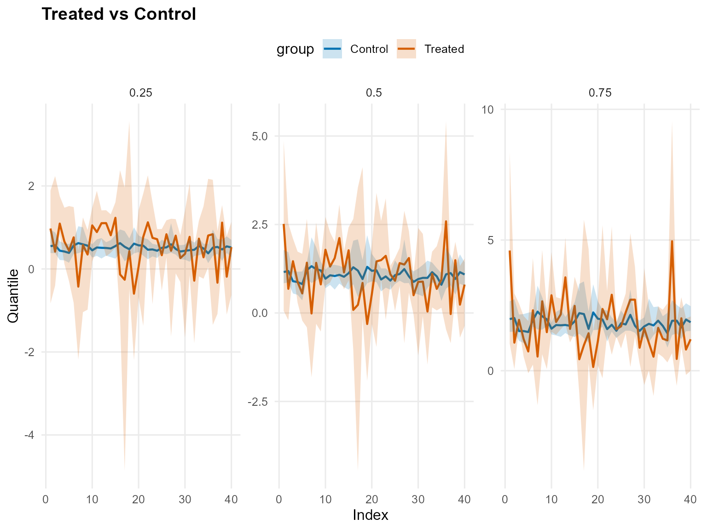
