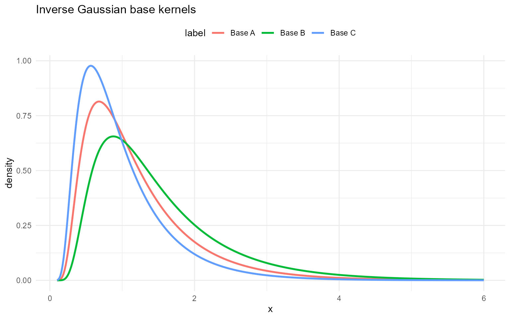
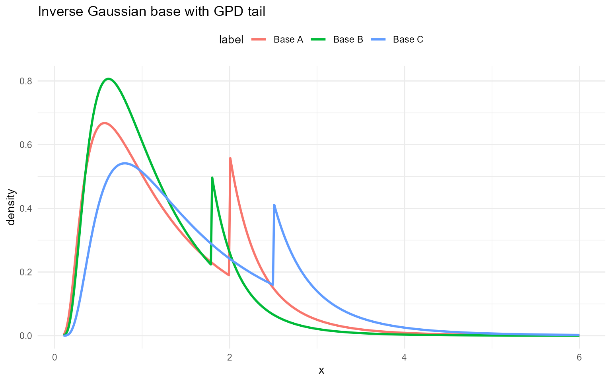

# Inverse Gaussian (base kernel)

## Inverse Gaussian (base kernel)

### Inverse Gaussian base kernel

This section documents the same inverse Gaussian density as above, but
for a **single** component rather than a mixture:
``` math
f(y\mid \mu,\lambda)
=
\left(\frac{\lambda}{2\pi y^3}\right)^{1/2}
\exp\!\left(-\frac{\lambda (y-\mu)^2}{2\mu^2 y}\right),
\quad y>0.
```

**Parameter mapping (math $`\rightarrow`$ code):** $`\mu\to`$`mean`,
$`\lambda\to`$`shape`.

### Inverse Gaussian base with GPD tail

The `dInvGaussGpd`, `pInvGaussGpd`, `qInvGaussGpd`, and `rInvGaussGpd`
functions splice the base inverse Gaussian below $`u`$ with a GPD tail
above $`u`$.

**Tail mapping (math $`\rightarrow`$ code):** $`u\to`$`threshold`,
$`\sigma\to`$`tail_scale`, $`\xi\to`$`tail_shape`.

### Without GPD

``` r

grid <- seq(0.1, 6, length.out = 400)
ig_base_sets <- list(
  list(label = "Base A", mean = 1.2, shape = 3.0),
  list(label = "Base B", mean = 1.5, shape = 4.0),
  list(label = "Base C", mean = 1.0, shape = 2.5)
)

example <- ig_base_sets[[1]]
```

``` r

dInvGauss(1, mean = example$mean, shape = example$shape)
```

    [1] 0.663

``` r

dInvGauss(1, mean = example$mean, shape = example$shape, log = TRUE)
```

    [1] -0.411

``` r

pInvGauss(1, mean = example$mean, shape = example$shape)
```

    [1] 0.497

``` r

pInvGauss(1, mean = example$mean, shape = example$shape, lower.tail = FALSE)
```

    [1] 0.503

``` r

pInvGauss(1, mean = example$mean, shape = example$shape, log.p = TRUE)
```

    [1] -0.698

``` r

q_vec(qInvGauss, c(0.25, 0.5, 0.75), mean = example$mean,
      shape = example$shape)
```

    [1] 0.673 1.004 1.509

``` r

q_vec(qInvGauss, c(0.25, 0.5, 0.75), mean = example$mean,
      shape = example$shape, lower.tail = FALSE)
```

    [1] 1.509 1.004 0.673

``` r

q_vec(qInvGauss, c(log(0.25), log(0.5), log(0.75)), mean = example$mean,
      shape = example$shape, log.p = TRUE)
```

    [1] 0.673 1.004 1.509

``` r

draw_many(rInvGauss, list(mean = example$mean, shape = example$shape))
```

    [1] 0.810 2.719 0.455 0.469 1.631

``` r

df_ig_base <- do.call(rbind, lapply(ig_base_sets, function(ps) {
  data.frame(x = grid, density = density_curve(grid, dInvGauss, list(mean = ps$mean, shape = ps$shape)), label = ps$label)
}))

ggplot(df_ig_base, aes(x = x, y = density, color = label)) +
  geom_line(linewidth = 1) +
  labs(title = "Inverse Gaussian base kernels", x = "x", y = "density") +
  theme_minimal() + theme(legend.position = "top")
```



### With GPD tail

``` r

ig_base_gpd_sets <- list(
  list(label = "Base A", mean = 1.5, shape = 2, threshold = 2.0, tail_scale = 0.4, tail_shape = 0.2),
  list(label = "Base B", mean = 1.2, shape = 2.5, threshold = 1.8, tail_scale = 0.35, tail_shape = 0.18),
  list(label = "Base C", mean = 1.8, shape = 3, threshold = 2.5, tail_scale = 0.5, tail_shape = 0.22)
)
example <- ig_base_gpd_sets[[1]]
```

``` r

dInvGaussGpd(2, mean = example$mean, shape = example$shape,
             threshold = example$threshold, tail_scale = example$tail_scale,
             tail_shape = example$tail_shape)
```

    [1] 0.57

``` r

dInvGaussGpd(2, mean = example$mean, shape = example$shape,
             threshold = example$threshold, tail_scale = example$tail_scale,
             tail_shape = example$tail_shape, log = TRUE)
```

    [1] -0.561

``` r

pInvGaussGpd(2, mean = example$mean, shape = example$shape,
             threshold = example$threshold, tail_scale = example$tail_scale,
             tail_shape = example$tail_shape)
```

    [1] 0.772

``` r

pInvGaussGpd(2, mean = example$mean, shape = example$shape,
             threshold = example$threshold, tail_scale = example$tail_scale,
             tail_shape = example$tail_shape, lower.tail = FALSE)
```

    [1] 0.228

``` r

pInvGaussGpd(2, mean = example$mean, shape = example$shape,
             threshold = example$threshold, tail_scale = example$tail_scale,
             tail_shape = example$tail_shape, log.p = TRUE)
```

    [1] -0.259

``` r

q_vec(qInvGaussGpd, c(0.25, 0.5, 0.75), mean = example$mean,
      shape = example$shape, threshold = example$threshold,
      tail_scale = example$tail_scale, tail_shape = example$tail_shape)
```

    [1] 0.656 1.101 1.890

``` r

q_vec(qInvGaussGpd, c(0.25, 0.5, 0.75), mean = example$mean,
      shape = example$shape, threshold = example$threshold,
      tail_scale = example$tail_scale, tail_shape = example$tail_shape,
      lower.tail = FALSE)
```

    [1] 1.890 1.101 0.656

``` r

q_vec(qInvGaussGpd, c(log(0.25), log(0.5), log(0.75)), mean = example$mean,
      shape = example$shape, threshold = example$threshold,
      tail_scale = example$tail_scale, tail_shape = example$tail_shape,
      log.p = TRUE)
```

    [1] 0.656 1.101 1.890

``` r

draw_many(rInvGaussGpd, example)
```

    [1] 0.916 3.452 1.072 8.245 1.443

``` r

df_ig_base_gpd <- do.call(rbind, lapply(ig_base_gpd_sets, function(ps) {
  data.frame(x = grid, density = density_curve(grid, dInvGaussGpd, list(mean = ps$mean, shape = ps$shape, threshold = ps$threshold, tail_scale = ps$tail_scale, tail_shape = ps$tail_shape)), label = ps$label)
}))

ggplot(df_ig_base_gpd, aes(x = x, y = density, color = label)) +
  geom_line(linewidth = 1) +
  labs(title = "Inverse Gaussian base with GPD tail", x = "x", y = "density") +
  theme_minimal() + theme(legend.position = "top")
```


