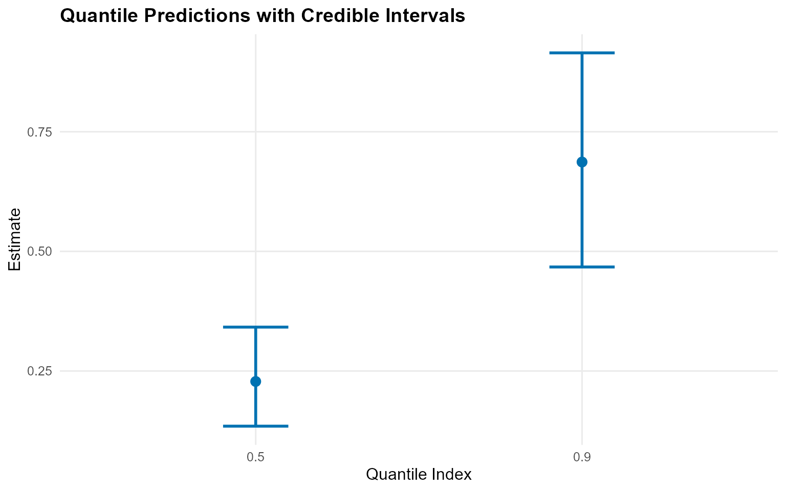
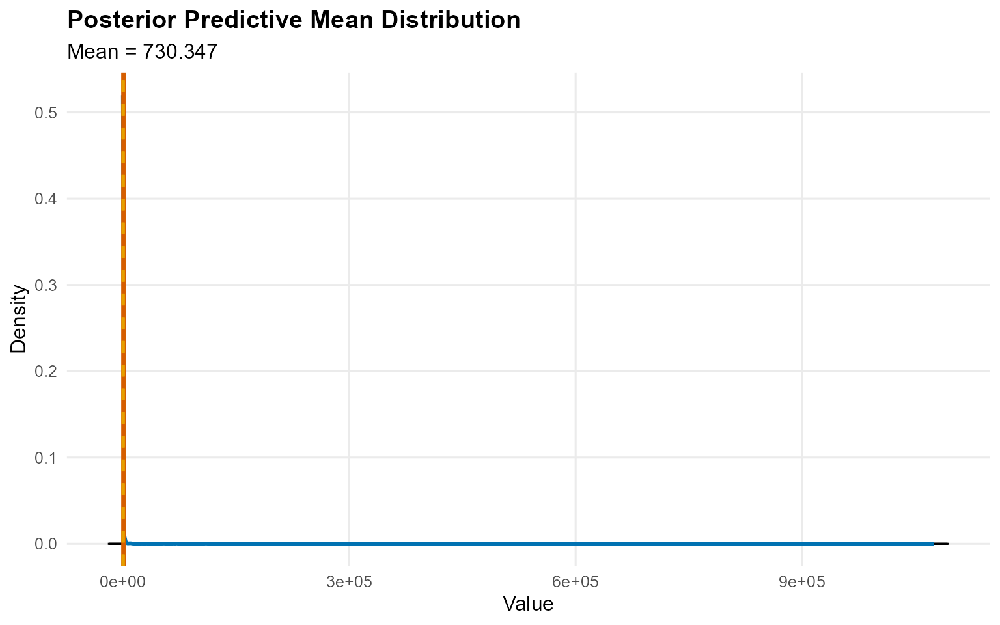
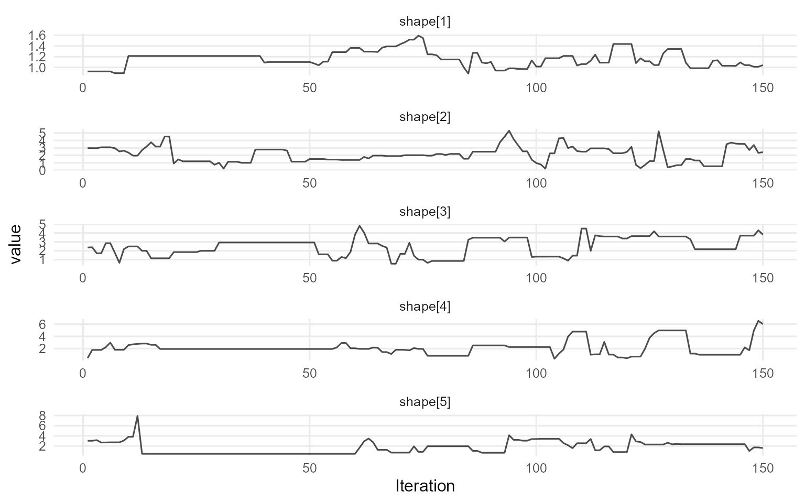

# Workflow 0: Start Here

## Theory (brief)

The DP mixture models the bulk density as \$f(y)=\\int
K(y;\\theta)\\,dG(\\theta)\$ with \$G \\sim \\mathrm{DP}(\\alpha,
G_0)\$. This gives a flexible, data-driven mixture representation while
keeping inference in a Bayesian framework.

## Getting Started

This vignette gives a minimal, fully working workflow for an
**unconditional** model and a **conditional** model. Everything uses
short MCMC runs so the vignette renders quickly.

------------------------------------------------------------------------

### Unconditional Model (CRP, bulk-only)

``` r
data("nc_pos200_k3")
y <- nc_pos200_k3$y
```

``` r
bundle_uncond <- build_nimble_bundle(
  y = y,
  backend = "crp",
  kernel = "gamma",
  GPD = FALSE,
  components = 5,
  mcmc = mcmc
)
```

``` r
fit_uncond <- load_or_fit("v00-start-here-fit_uncond", quiet_mcmc(run_mcmc_bundle_manual(bundle_uncond, show_progress = FALSE)))
summary(fit_uncond)
```

    MixGPD summary | backend: Chinese Restaurant Process | kernel: Gamma Distribution | GPD tail: FALSE | epsilon: 0.025
    n = 200 | components = 5
    Summary
    Initial components: 5 | Components after truncation: 1

    WAIC: 963.248
    lppd: -456.908 | pWAIC: 24.716

    Summary table
    <table class="table" style="width: auto !important; margin-left: auto; margin-right: auto;">
     <thead>
      <tr>
       <th style="text-align:center;"> parameter </th>
       <th style="text-align:center;"> mean </th>
       <th style="text-align:center;"> sd </th>
       <th style="text-align:center;"> q0.025 </th>
       <th style="text-align:center;"> q0.500 </th>
       <th style="text-align:center;"> q0.975 </th>
       <th style="text-align:center;"> ess </th>
      </tr>
     </thead>
    <tbody>
      <tr>
       <td style="text-align:center;"> weights[1] </td>
       <td style="text-align:center;"> 0.883 </td>
       <td style="text-align:center;"> 0.138 </td>
       <td style="text-align:center;"> 0.474 </td>
       <td style="text-align:center;"> 0.917 </td>
       <td style="text-align:center;"> 1 </td>
       <td style="text-align:center;"> 8.469 </td>
      </tr>
      <tr>
       <td style="text-align:center;"> alpha </td>
       <td style="text-align:center;"> 0.457 </td>
       <td style="text-align:center;"> 0.398 </td>
       <td style="text-align:center;"> 0.022 </td>
       <td style="text-align:center;"> 0.354 </td>
       <td style="text-align:center;"> 1.503 </td>
       <td style="text-align:center;"> 42.38 </td>
      </tr>
      <tr>
       <td style="text-align:center;"> shape[1] </td>
       <td style="text-align:center;"> 1.161 </td>
       <td style="text-align:center;"> 0.151 </td>
       <td style="text-align:center;"> 0.915 </td>
       <td style="text-align:center;"> 1.159 </td>
       <td style="text-align:center;"> 1.483 </td>
       <td style="text-align:center;"> 14.106 </td>
      </tr>
      <tr>
       <td style="text-align:center;"> scale[1] </td>
       <td style="text-align:center;"> 0.265 </td>
       <td style="text-align:center;"> 0.037 </td>
       <td style="text-align:center;"> 0.204 </td>
       <td style="text-align:center;"> 0.266 </td>
       <td style="text-align:center;"> 0.338 </td>
       <td style="text-align:center;"> 25.996 </td>
      </tr>
    </tbody>
    </table>

``` r
pred_q <- predict(fit_uncond, type = "quantile", index = c(0.5, 0.9), interval = "credible")
head(pred_q$fit)
```

      estimate index lower upper
    1    0.228   0.5 0.135 0.342
    2    0.687   0.9 0.467 0.915

``` r
plot(pred_q)
```



------------------------------------------------------------------------

### Conditional Model (SB, bulk-only)

``` r
data("nc_posX100_p3_k2")
yc <- nc_posX100_p3_k2$y
X <- as.matrix(nc_posX100_p3_k2$X)
```

``` r
bundle_cond <- build_nimble_bundle(
  y = yc,
  X = X,
  backend = "sb",
  kernel = "lognormal",
  GPD = FALSE,
  components = 5,
  mcmc = mcmc
)
```

``` r
fit_cond <- load_or_fit("v00-start-here-fit_cond", quiet_mcmc(run_mcmc_bundle_manual(bundle_cond, show_progress = FALSE)))
summary(fit_cond)
```

    MixGPD summary | backend: Stick-Breaking Process | kernel: Lognormal Distribution | GPD tail: FALSE | epsilon: 0.025
    n = 100 | components = 5
    Summary
    Initial components: 5 | Components after truncation: 3

    WAIC: 509.609
    lppd: -220.586 | pWAIC: 34.218

    Summary table
    <table class="table" style="width: auto !important; margin-left: auto; margin-right: auto;">
     <thead>
      <tr>
       <th style="text-align:center;"> parameter </th>
       <th style="text-align:center;"> mean </th>
       <th style="text-align:center;"> sd </th>
       <th style="text-align:center;"> q0.025 </th>
       <th style="text-align:center;"> q0.500 </th>
       <th style="text-align:center;"> q0.975 </th>
       <th style="text-align:center;"> ess </th>
      </tr>
     </thead>
    <tbody>
      <tr>
       <td style="text-align:center;"> weights[1] </td>
       <td style="text-align:center;"> 0.432 </td>
       <td style="text-align:center;"> 0.073 </td>
       <td style="text-align:center;"> 0.297 </td>
       <td style="text-align:center;"> 0.43 </td>
       <td style="text-align:center;"> 0.563 </td>
       <td style="text-align:center;"> 20.008 </td>
      </tr>
      <tr>
       <td style="text-align:center;"> weights[2] </td>
       <td style="text-align:center;"> 0.298 </td>
       <td style="text-align:center;"> 0.064 </td>
       <td style="text-align:center;"> 0.177 </td>
       <td style="text-align:center;"> 0.31 </td>
       <td style="text-align:center;"> 0.4 </td>
       <td style="text-align:center;"> 12.128 </td>
      </tr>
      <tr>
       <td style="text-align:center;"> weights[3] </td>
       <td style="text-align:center;"> 0.159 </td>
       <td style="text-align:center;"> 0.054 </td>
       <td style="text-align:center;"> 0.06 </td>
       <td style="text-align:center;"> 0.16 </td>
       <td style="text-align:center;"> 0.263 </td>
       <td style="text-align:center;"> 19.977 </td>
      </tr>
      <tr>
       <td style="text-align:center;"> alpha </td>
       <td style="text-align:center;"> 1.609 </td>
       <td style="text-align:center;"> 0.883 </td>
       <td style="text-align:center;"> 0.552 </td>
       <td style="text-align:center;"> 1.409 </td>
       <td style="text-align:center;"> 3.673 </td>
       <td style="text-align:center;"> 23.402 </td>
      </tr>
      <tr>
       <td style="text-align:center;"> beta_meanlog[1, 1] </td>
       <td style="text-align:center;"> -0.089 </td>
       <td style="text-align:center;"> 0.261 </td>
       <td style="text-align:center;"> -0.641 </td>
       <td style="text-align:center;"> -0.13 </td>
       <td style="text-align:center;"> 0.493 </td>
       <td style="text-align:center;"> 24.612 </td>
      </tr>
      <tr>
       <td style="text-align:center;"> beta_meanlog[2, 1] </td>
       <td style="text-align:center;"> 0.15 </td>
       <td style="text-align:center;"> 0.271 </td>
       <td style="text-align:center;"> -0.404 </td>
       <td style="text-align:center;"> 0.153 </td>
       <td style="text-align:center;"> 0.554 </td>
       <td style="text-align:center;"> 14.485 </td>
      </tr>
      <tr>
       <td style="text-align:center;"> beta_meanlog[3, 1] </td>
       <td style="text-align:center;"> -0.302 </td>
       <td style="text-align:center;"> 1.288 </td>
       <td style="text-align:center;"> -3.537 </td>
       <td style="text-align:center;"> -0.193 </td>
       <td style="text-align:center;"> 1.91 </td>
       <td style="text-align:center;"> 7.21 </td>
      </tr>
      <tr>
       <td style="text-align:center;"> beta_meanlog[4, 1] </td>
       <td style="text-align:center;"> 0.149 </td>
       <td style="text-align:center;"> 1.197 </td>
       <td style="text-align:center;"> -2.431 </td>
       <td style="text-align:center;"> 0.514 </td>
       <td style="text-align:center;"> 1.794 </td>
       <td style="text-align:center;"> 14.772 </td>
      </tr>
      <tr>
       <td style="text-align:center;"> beta_meanlog[5, 1] </td>
       <td style="text-align:center;"> 0.5 </td>
       <td style="text-align:center;"> 0.617 </td>
       <td style="text-align:center;"> -0.809 </td>
       <td style="text-align:center;"> 0.611 </td>
       <td style="text-align:center;"> 1.458 </td>
       <td style="text-align:center;"> 10.102 </td>
      </tr>
      <tr>
       <td style="text-align:center;"> beta_meanlog[1, 2] </td>
       <td style="text-align:center;"> 0.698 </td>
       <td style="text-align:center;"> 0.775 </td>
       <td style="text-align:center;"> -0.752 </td>
       <td style="text-align:center;"> 0.533 </td>
       <td style="text-align:center;"> 2.26 </td>
       <td style="text-align:center;"> 9.533 </td>
      </tr>
      <tr>
       <td style="text-align:center;"> beta_meanlog[2, 2] </td>
       <td style="text-align:center;"> -1.014 </td>
       <td style="text-align:center;"> 0.373 </td>
       <td style="text-align:center;"> -1.782 </td>
       <td style="text-align:center;"> -1.023 </td>
       <td style="text-align:center;"> -0.337 </td>
       <td style="text-align:center;"> 12.472 </td>
      </tr>
      <tr>
       <td style="text-align:center;"> beta_meanlog[3, 2] </td>
       <td style="text-align:center;"> 0.531 </td>
       <td style="text-align:center;"> 1.862 </td>
       <td style="text-align:center;"> -2.809 </td>
       <td style="text-align:center;"> 0.718 </td>
       <td style="text-align:center;"> 4.688 </td>
       <td style="text-align:center;"> 17.038 </td>
      </tr>
      <tr>
       <td style="text-align:center;"> beta_meanlog[4, 2] </td>
       <td style="text-align:center;"> -0.536 </td>
       <td style="text-align:center;"> 1.666 </td>
       <td style="text-align:center;"> -3.483 </td>
       <td style="text-align:center;"> -0.785 </td>
       <td style="text-align:center;"> 2.86 </td>
       <td style="text-align:center;"> 6.288 </td>
      </tr>
      <tr>
       <td style="text-align:center;"> beta_meanlog[5, 2] </td>
       <td style="text-align:center;"> 0.878 </td>
       <td style="text-align:center;"> 1.02 </td>
       <td style="text-align:center;"> -1.31 </td>
       <td style="text-align:center;"> 1.159 </td>
       <td style="text-align:center;"> 2.59 </td>
       <td style="text-align:center;"> 4.981 </td>
      </tr>
      <tr>
       <td style="text-align:center;"> beta_meanlog[1, 3] </td>
       <td style="text-align:center;"> 0.12 </td>
       <td style="text-align:center;"> 0.377 </td>
       <td style="text-align:center;"> -0.73 </td>
       <td style="text-align:center;"> 0.209 </td>
       <td style="text-align:center;"> 0.737 </td>
       <td style="text-align:center;"> 21.374 </td>
      </tr>
      <tr>
       <td style="text-align:center;"> beta_meanlog[2, 3] </td>
       <td style="text-align:center;"> -0.139 </td>
       <td style="text-align:center;"> 0.324 </td>
       <td style="text-align:center;"> -0.683 </td>
       <td style="text-align:center;"> -0.184 </td>
       <td style="text-align:center;"> 0.444 </td>
       <td style="text-align:center;"> 11.118 </td>
      </tr>
      <tr>
       <td style="text-align:center;"> beta_meanlog[3, 3] </td>
       <td style="text-align:center;"> 0.171 </td>
       <td style="text-align:center;"> 0.98 </td>
       <td style="text-align:center;"> -1.645 </td>
       <td style="text-align:center;"> 0.257 </td>
       <td style="text-align:center;"> 2.249 </td>
       <td style="text-align:center;"> 24.319 </td>
      </tr>
      <tr>
       <td style="text-align:center;"> beta_meanlog[4, 3] </td>
       <td style="text-align:center;"> -0.108 </td>
       <td style="text-align:center;"> 1.353 </td>
       <td style="text-align:center;"> -3.217 </td>
       <td style="text-align:center;"> -0.042 </td>
       <td style="text-align:center;"> 2.262 </td>
       <td style="text-align:center;"> 13.235 </td>
      </tr>
      <tr>
       <td style="text-align:center;"> beta_meanlog[5, 3] </td>
       <td style="text-align:center;"> 0.322 </td>
       <td style="text-align:center;"> 0.458 </td>
       <td style="text-align:center;"> -0.736 </td>
       <td style="text-align:center;"> 0.316 </td>
       <td style="text-align:center;"> 1.343 </td>
       <td style="text-align:center;"> 12.508 </td>
      </tr>
      <tr>
       <td style="text-align:center;"> sdlog[1] </td>
       <td style="text-align:center;"> 1.076 </td>
       <td style="text-align:center;"> 0.44 </td>
       <td style="text-align:center;"> 0.511 </td>
       <td style="text-align:center;"> 1.002 </td>
       <td style="text-align:center;"> 2.048 </td>
       <td style="text-align:center;"> 50.89 </td>
      </tr>
      <tr>
       <td style="text-align:center;"> sdlog[2] </td>
       <td style="text-align:center;"> 1.246 </td>
       <td style="text-align:center;"> 0.567 </td>
       <td style="text-align:center;"> 0.459 </td>
       <td style="text-align:center;"> 1.147 </td>
       <td style="text-align:center;"> 2.495 </td>
       <td style="text-align:center;"> 26.925 </td>
      </tr>
      <tr>
       <td style="text-align:center;"> sdlog[3] </td>
       <td style="text-align:center;"> 1.757 </td>
       <td style="text-align:center;"> 1.185 </td>
       <td style="text-align:center;"> 0.464 </td>
       <td style="text-align:center;"> 1.432 </td>
       <td style="text-align:center;"> 4.916 </td>
       <td style="text-align:center;"> 106.303 </td>
      </tr>
    </tbody>
    </table>

``` r
x_new <- X[1:20, , drop = FALSE]
pred_mean <- predict(fit_cond, x = x_new, type = "mean", interval = "credible", nsim_mean = 200)
head(pred_mean$fit)
```

      estimate lower upper
    1      105  1.10  79.8
    2     7223  1.19 430.8
    3      184  1.07 482.5
    4       52  0.97 341.5
    5      115  1.11 267.8
    6      497  1.13 405.8

``` r
plot(pred_mean)
```



------------------------------------------------------------------------

### Useful S3 Methods

``` r
params(fit_uncond)
```

    Posterior mean parameters

    $alpha
    [1] "0.457"

    $w
    [1] "0.883"

    $shape
    [1] "1.161"

    $scale
    [1] "0.265"

``` r
plot(fit_uncond, params = "shape", family = "traceplot")
```

    === traceplot ===



------------------------------------------------------------------------

### Next Steps

- `vignette 1`: package overview and terminology
- `vignette 5`: full three-phase workflow (spec ? bundle ? MCMC)
- `vignette 6-13`: unconditional/conditional models with and without GPD
- `vignette 14-19`: causal workflows
