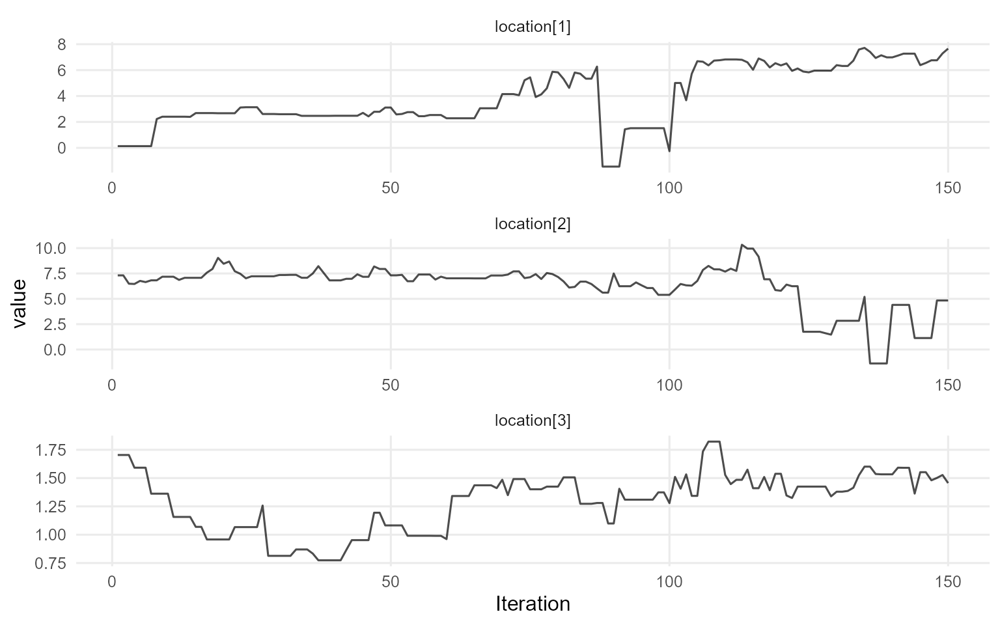
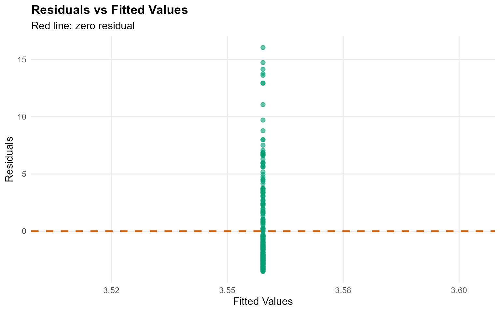
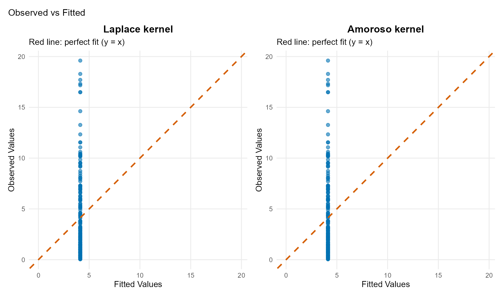

# Workflow 6: Unconditional DPmix with CRP Backend

## Theory (brief)

An unconditional DP mixture models exchangeable outcomes via
\$f(y)=\\int K(y;\\theta)\\,dG(\\theta)\$ with \$G \\sim
\\mathrm{DP}(\\alpha, G_0)\$. The CRP backend implements this using
cluster allocations.

## Unconditional DPmix: Chinese Restaurant Process (CRP)

**Goal**: Estimate density of univariate outcome $`y`$ using
**nonparametric Dirichlet Process mixture** with **Chinese Restaurant
Process** backend.

**Model**: $`y_i | G \sim \int K(y_i; \theta) dG(\theta)`$ where
$`G \sim \text{DP}(\alpha, G_0)`$

**Backend**: CRP with **truncation at max components**

------------------------------------------------------------------------

### Data Setup

``` r
data(nc_pos200_k3)
y_mixed <- nc_pos200_k3$y

paste("Sample size:", length(y_mixed))
```

    [1] "Sample size: 200"

``` r
paste("Mean:", mean(y_mixed))
```

    [1] "Mean: 4.21476750434594"

``` r
paste("SD:", sd(y_mixed))
```

    [1] "SD: 4.10835046697183"

``` r
paste("Range:", paste(range(y_mixed), collapse = " to "))
```

    [1] "Range: 0.0403111680208858 to 19.6013451514889"

``` r
df_data <- data.frame(y = y_mixed)
p_raw <- ggplot(df_data, aes(x = y)) +
  geom_histogram(aes(y = after_stat(density)), bins = 30, alpha = 0.6, fill = "steelblue",color = "black") +
  geom_density(color = "red", linewidth = 1) +
  labs(title = "Raw Data: Mixed Gamma Distribution", x = "y", y = "Density") +
  theme_minimal()

print(p_raw)
```


------------------------------------------------------------------------

### Model Specification & Bundle

We’ll use the `build_nimble_bundle` function directly which handles both
specification and bundle creation.

``` r
bundle_crp <- build_nimble_bundle(
  y = y_mixed,
  kernel = "laplace",
  backend = "crp",
  GPD = FALSE,
  components = 3,
  alpha_random = TRUE,
  mcmc = mcmc
)
```

------------------------------------------------------------------------

#### Building MCMC bundle

``` r
bundle_crp <- build_nimble_bundle(
  y_mixed,
  kernel = "laplace",
  backend = "crp",
  GPD = FALSE,
  components = 3,
  alpha_random = TRUE,
  mcmc = mcmc
)
```

#### Summary of MCMC Bundle

``` r
summary(bundle_crp)
```

    DPmixGPD bundle summary
    <table class="table" style="width: auto !important; margin-left: auto; margin-right: auto;">
     <thead>
      <tr>
       <th style="text-align:center;"> Field </th>
       <th style="text-align:center;"> Value </th>
      </tr>
     </thead>
    <tbody>
      <tr>
       <td style="text-align:center;"> Backend </td>
       <td style="text-align:center;"> Chinese Restaurant Process </td>
      </tr>
      <tr>
       <td style="text-align:center;"> Kernel </td>
       <td style="text-align:center;"> Laplace Distribution </td>
      </tr>
      <tr>
       <td style="text-align:center;"> Components </td>
       <td style="text-align:center;"> 3 </td>
      </tr>
      <tr>
       <td style="text-align:center;"> N </td>
       <td style="text-align:center;"> 200 </td>
      </tr>
      <tr>
       <td style="text-align:center;"> X </td>
       <td style="text-align:center;"> NO </td>
      </tr>
      <tr>
       <td style="text-align:center;"> GPD </td>
       <td style="text-align:center;"> FALSE </td>
      </tr>
      <tr>
       <td style="text-align:center;"> Epsilon </td>
       <td style="text-align:center;"> 0.025 </td>
      </tr>
    </tbody>
    </table>
    Parameter specification
    <table class="table" style="width: auto !important; margin-left: auto; margin-right: auto;">
     <thead>
      <tr>
       <th style="text-align:center;"> block </th>
       <th style="text-align:center;"> parameter </th>
       <th style="text-align:center;"> mode </th>
       <th style="text-align:center;"> level </th>
       <th style="text-align:center;"> prior </th>
       <th style="text-align:center;"> link </th>
       <th style="text-align:center;"> notes </th>
      </tr>
     </thead>
    <tbody>
      <tr>
       <td style="text-align:center;"> meta </td>
       <td style="text-align:center;"> backend </td>
       <td style="text-align:center;"> info </td>
       <td style="text-align:center;"> model </td>
       <td style="text-align:center;"> crp </td>
       <td style="text-align:center;">  </td>
       <td style="text-align:center;">  </td>
      </tr>
      <tr>
       <td style="text-align:center;"> meta </td>
       <td style="text-align:center;"> kernel </td>
       <td style="text-align:center;"> info </td>
       <td style="text-align:center;"> model </td>
       <td style="text-align:center;"> laplace </td>
       <td style="text-align:center;">  </td>
       <td style="text-align:center;">  </td>
      </tr>
      <tr>
       <td style="text-align:center;"> meta </td>
       <td style="text-align:center;"> components </td>
       <td style="text-align:center;"> info </td>
       <td style="text-align:center;"> model </td>
       <td style="text-align:center;"> 3 </td>
       <td style="text-align:center;">  </td>
       <td style="text-align:center;">  </td>
      </tr>
      <tr>
       <td style="text-align:center;"> meta </td>
       <td style="text-align:center;"> N </td>
       <td style="text-align:center;"> info </td>
       <td style="text-align:center;"> model </td>
       <td style="text-align:center;"> 200 </td>
       <td style="text-align:center;">  </td>
       <td style="text-align:center;">  </td>
      </tr>
      <tr>
       <td style="text-align:center;"> meta </td>
       <td style="text-align:center;"> P </td>
       <td style="text-align:center;"> info </td>
       <td style="text-align:center;"> model </td>
       <td style="text-align:center;"> 0 </td>
       <td style="text-align:center;">  </td>
       <td style="text-align:center;">  </td>
      </tr>
      <tr>
       <td style="text-align:center;"> concentration </td>
       <td style="text-align:center;"> alpha </td>
       <td style="text-align:center;"> dist </td>
       <td style="text-align:center;"> scalar </td>
       <td style="text-align:center;"> gamma(shape=1, rate=1) </td>
       <td style="text-align:center;">  </td>
       <td style="text-align:center;"> stochastic concentration </td>
      </tr>
      <tr>
       <td style="text-align:center;"> bulk </td>
       <td style="text-align:center;"> location </td>
       <td style="text-align:center;"> dist </td>
       <td style="text-align:center;"> component (1:3) </td>
       <td style="text-align:center;"> normal(mean=0, sd=5) </td>
       <td style="text-align:center;">  </td>
       <td style="text-align:center;"> iid across components </td>
      </tr>
      <tr>
       <td style="text-align:center;"> bulk </td>
       <td style="text-align:center;"> scale </td>
       <td style="text-align:center;"> dist </td>
       <td style="text-align:center;"> component (1:3) </td>
       <td style="text-align:center;"> gamma(shape=2, rate=1) </td>
       <td style="text-align:center;">  </td>
       <td style="text-align:center;"> iid across components </td>
      </tr>
    </tbody>
    </table>
    Monitors
      n = 4 
      alpha, z[1:200], location[1:3], scale[1:3]

#### Running MCMC

``` r
fit_crp <- load_or_fit("v06-unconditional-DPmix-CRP-fit_crp", run_mcmc_bundle_manual(bundle_crp))
```

#### Summary of Fitted MCMC model

``` r
summary(fit_crp)
```

    MixGPD summary | backend: Chinese Restaurant Process | kernel: Laplace Distribution | GPD tail: FALSE | epsilon: 0.025
    n = 200 | components = 3
    Summary
    Initial components: 3 | Components after truncation: 2

    WAIC: 930.316
    lppd: -376.708 | pWAIC: 88.45

    Summary table
    <table class="table" style="width: auto !important; margin-left: auto; margin-right: auto;">
     <thead>
      <tr>
       <th style="text-align:center;"> parameter </th>
       <th style="text-align:center;"> mean </th>
       <th style="text-align:center;"> sd </th>
       <th style="text-align:center;"> q0.025 </th>
       <th style="text-align:center;"> q0.500 </th>
       <th style="text-align:center;"> q0.975 </th>
       <th style="text-align:center;"> ess </th>
      </tr>
     </thead>
    <tbody>
      <tr>
       <td style="text-align:center;"> weights[1] </td>
       <td style="text-align:center;"> 0.493 </td>
       <td style="text-align:center;"> 0.082 </td>
       <td style="text-align:center;"> 0.364 </td>
       <td style="text-align:center;"> 0.51 </td>
       <td style="text-align:center;"> 0.62 </td>
       <td style="text-align:center;"> 2.803 </td>
      </tr>
      <tr>
       <td style="text-align:center;"> weights[2] </td>
       <td style="text-align:center;"> 0.382 </td>
       <td style="text-align:center;"> 0.07 </td>
       <td style="text-align:center;"> 0.238 </td>
       <td style="text-align:center;"> 0.38 </td>
       <td style="text-align:center;"> 0.49 </td>
       <td style="text-align:center;"> 13.673 </td>
      </tr>
      <tr>
       <td style="text-align:center;"> alpha </td>
       <td style="text-align:center;"> 0.463 </td>
       <td style="text-align:center;"> 0.284 </td>
       <td style="text-align:center;"> 0.09 </td>
       <td style="text-align:center;"> 0.41 </td>
       <td style="text-align:center;"> 1.13 </td>
       <td style="text-align:center;"> 291.26 </td>
      </tr>
      <tr>
       <td style="text-align:center;"> location[1] </td>
       <td style="text-align:center;"> 3.237 </td>
       <td style="text-align:center;"> 2.572 </td>
       <td style="text-align:center;"> 1.094 </td>
       <td style="text-align:center;"> 1.535 </td>
       <td style="text-align:center;"> 7.395 </td>
       <td style="text-align:center;"> 20.702 </td>
      </tr>
      <tr>
       <td style="text-align:center;"> location[2] </td>
       <td style="text-align:center;"> 5.12 </td>
       <td style="text-align:center;"> 2.644 </td>
       <td style="text-align:center;"> 0.868 </td>
       <td style="text-align:center;"> 6.463 </td>
       <td style="text-align:center;"> 7.943 </td>
       <td style="text-align:center;"> 27.292 </td>
      </tr>
      <tr>
       <td style="text-align:center;"> scale[1] </td>
       <td style="text-align:center;"> 0.888 </td>
       <td style="text-align:center;"> 0.421 </td>
       <td style="text-align:center;"> 0.277 </td>
       <td style="text-align:center;"> 1.044 </td>
       <td style="text-align:center;"> 1.531 </td>
       <td style="text-align:center;"> 34.308 </td>
      </tr>
      <tr>
       <td style="text-align:center;"> scale[2] </td>
       <td style="text-align:center;"> 0.732 </td>
       <td style="text-align:center;"> 0.624 </td>
       <td style="text-align:center;"> 0.261 </td>
       <td style="text-align:center;"> 0.35 </td>
       <td style="text-align:center;"> 2.124 </td>
       <td style="text-align:center;"> 15.309 </td>
      </tr>
    </tbody>
    </table>

``` r
params_crp <- params(fit_crp)
params_crp
```

    Posterior mean parameters

    $alpha
    [1] "0.463"

    $w
    [1] "0.493" "0.382"

    $location
    [1] "3.237" "5.12" 

    $scale
    [1] "0.888" "0.732"

------------------------------------------------------------------------

### MCMC Diagnostics Plots

``` r
plot(fit_crp, params = "location", family = "traceplot")
```

    === traceplot ===



``` r
plot(fit_crp, params = "scale", family = "caterpillar")
```

    === caterpillar ===


------------------------------------------------------------------------

### Posterior Predictions

#### Predictive Density

``` r
y_grid <- seq(0, max(y_mixed) * 1.2, length.out = 200)
pred_density <- predict(fit_crp, y = y_grid, type = "density")
plot(pred_density)
```


#### Quantile Predictions

``` r
quantiles_pred <- predict(fit_crp, type = "quantile", 
                          index = c(0.05, 0.25, 0.5, 0.75, 0.95),
                          interval = "credible")

quantiles_pred$fit %>%
  kbl(caption = "Posterior Predictive Quantiles with Credible Intervals",
      align = "c", digits = 3) %>%
  kable_styling(bootstrap_options = "striped", full_width = FALSE, position = "center")
```

| estimate | index | lower  | upper |
|:--------:|:-----:|:------:|:-----:|
|  -0.65   | 0.05  | -2.293 | 1.12  |
|   1.42   | 0.25  | 0.964  | 2.66  |
|   4.30   | 0.50  | 2.175  | 6.86  |
|   6.82   | 0.75  | 5.424  | 8.01  |
|   7.40   | 0.95  | 5.995  | 8.56  |

Posterior Predictive Quantiles with Credible Intervals

``` r
plot(quantiles_pred)
```


------------------------------------------------------------------------

### Varying Truncation Level (components)

``` r
# Demonstrate with one value
bundle_components <- build_nimble_bundle(
  y = y_mixed,
  kernel = "laplace",
  backend = "crp",
  components = 5,
  mcmc = mcmc
)
fit_components <- load_or_fit("v06-unconditional-DPmix-CRP-fit_components", run_mcmc_bundle_manual(bundle_components))
```

    ===== Monitors =====
    thin = 1: alpha, location, scale, z
    ===== Samplers =====
    CRP_concentration sampler (1)
      - alpha
    CRP_cluster_wrapper sampler (10)
      - scale[]  (5 elements)
      - location[]  (5 elements)
    CRP sampler (1)
      - z[1:200] 

      [Warning] CRP_sampler: This MCMC is not for a proper model. The MCMC attempted to use more components than the number of cluster parameters. Please increase the number of cluster parameters.

``` r
summary(fit_components)
```

    MixGPD summary | backend: Chinese Restaurant Process | kernel: Laplace Distribution | GPD tail: FALSE | epsilon: 0.025
    n = 200 | components = 5
    Summary
    Initial components: 5 | Components after truncation: 3

    WAIC: 887.981
    lppd: -320.298 | pWAIC: 123.693

    Summary table
    <table class="table" style="width: auto !important; margin-left: auto; margin-right: auto;">
     <thead>
      <tr>
       <th style="text-align:center;"> parameter </th>
       <th style="text-align:center;"> mean </th>
       <th style="text-align:center;"> sd </th>
       <th style="text-align:center;"> q0.025 </th>
       <th style="text-align:center;"> q0.500 </th>
       <th style="text-align:center;"> q0.975 </th>
       <th style="text-align:center;"> ess </th>
      </tr>
     </thead>
    <tbody>
      <tr>
       <td style="text-align:center;"> weights[1] </td>
       <td style="text-align:center;"> 0.394 </td>
       <td style="text-align:center;"> 0.051 </td>
       <td style="text-align:center;"> 0.307 </td>
       <td style="text-align:center;"> 0.395 </td>
       <td style="text-align:center;"> 0.515 </td>
       <td style="text-align:center;"> 22.736 </td>
      </tr>
      <tr>
       <td style="text-align:center;"> weights[2] </td>
       <td style="text-align:center;"> 0.295 </td>
       <td style="text-align:center;"> 0.056 </td>
       <td style="text-align:center;"> 0.199 </td>
       <td style="text-align:center;"> 0.295 </td>
       <td style="text-align:center;"> 0.39 </td>
       <td style="text-align:center;"> 10.172 </td>
      </tr>
      <tr>
       <td style="text-align:center;"> weights[3] </td>
       <td style="text-align:center;"> 0.217 </td>
       <td style="text-align:center;"> 0.038 </td>
       <td style="text-align:center;"> 0.154 </td>
       <td style="text-align:center;"> 0.215 </td>
       <td style="text-align:center;"> 0.29 </td>
       <td style="text-align:center;"> 46.436 </td>
      </tr>
      <tr>
       <td style="text-align:center;"> alpha </td>
       <td style="text-align:center;"> 0.703 </td>
       <td style="text-align:center;"> 0.37 </td>
       <td style="text-align:center;"> 0.171 </td>
       <td style="text-align:center;"> 0.613 </td>
       <td style="text-align:center;"> 1.613 </td>
       <td style="text-align:center;"> 150 </td>
      </tr>
      <tr>
       <td style="text-align:center;"> location[1] </td>
       <td style="text-align:center;"> 3.657 </td>
       <td style="text-align:center;"> 2.465 </td>
       <td style="text-align:center;"> 0.808 </td>
       <td style="text-align:center;"> 2.289 </td>
       <td style="text-align:center;"> 7.659 </td>
       <td style="text-align:center;"> 10.694 </td>
      </tr>
      <tr>
       <td style="text-align:center;"> location[2] </td>
       <td style="text-align:center;"> 4.068 </td>
       <td style="text-align:center;"> 2.928 </td>
       <td style="text-align:center;"> 0.655 </td>
       <td style="text-align:center;"> 2.45 </td>
       <td style="text-align:center;"> 9.09 </td>
       <td style="text-align:center;"> 18.434 </td>
      </tr>
      <tr>
       <td style="text-align:center;"> location[3] </td>
       <td style="text-align:center;"> 3.007 </td>
       <td style="text-align:center;"> 3.433 </td>
       <td style="text-align:center;"> 0.592 </td>
       <td style="text-align:center;"> 0.81 </td>
       <td style="text-align:center;"> 10.372 </td>
       <td style="text-align:center;"> 8.343 </td>
      </tr>
      <tr>
       <td style="text-align:center;"> scale[1] </td>
       <td style="text-align:center;"> 0.965 </td>
       <td style="text-align:center;"> 0.523 </td>
       <td style="text-align:center;"> 0.28 </td>
       <td style="text-align:center;"> 1.015 </td>
       <td style="text-align:center;"> 2.006 </td>
       <td style="text-align:center;"> 14.348 </td>
      </tr>
      <tr>
       <td style="text-align:center;"> scale[2] </td>
       <td style="text-align:center;"> 1.177 </td>
       <td style="text-align:center;"> 0.851 </td>
       <td style="text-align:center;"> 0.294 </td>
       <td style="text-align:center;"> 1.076 </td>
       <td style="text-align:center;"> 2.994 </td>
       <td style="text-align:center;"> 16.202 </td>
      </tr>
      <tr>
       <td style="text-align:center;"> scale[3] </td>
       <td style="text-align:center;"> 1.833 </td>
       <td style="text-align:center;"> 1.073 </td>
       <td style="text-align:center;"> 0.284 </td>
       <td style="text-align:center;"> 1.999 </td>
       <td style="text-align:center;"> 3.578 </td>
       <td style="text-align:center;"> 17.734 </td>
      </tr>
    </tbody>
    </table>

------------------------------------------------------------------------

### Residual Analysis

``` r
Fit <- fitted(fit_components)

kableExtra::kbl(head(Fit), caption = "Fitted Values, Residuals and Credible Interval", 
                digits = 3, align = "c") %>%
  kable_styling(bootstrap_options = "striped", full_width = FALSE, position = "center")
```

| fit | lower | upper | residuals | mean | mean_lower | mean_upper | median | median_lower | median_upper |
|:--:|:--:|:--:|:--:|:--:|:--:|:--:|:--:|:--:|:--:|
| 3.56 | 2.38 | 4.55 | -2.912 | 3.56 | 2.38 | 4.55 | 3.13 | 2.35 | 4.47 |
| 3.56 | 2.38 | 4.55 | -0.685 | 3.56 | 2.38 | 4.55 | 3.13 | 2.35 | 4.47 |
| 3.56 | 2.38 | 4.55 | 6.285 | 3.56 | 2.38 | 4.55 | 3.13 | 2.35 | 4.47 |
| 3.56 | 2.38 | 4.55 | -0.374 | 3.56 | 2.38 | 4.55 | 3.13 | 2.35 | 4.47 |
| 3.56 | 2.38 | 4.55 | 3.738 | 3.56 | 2.38 | 4.55 | 3.13 | 2.35 | 4.47 |
| 3.56 | 2.38 | 4.55 | 3.530 | 3.56 | 2.38 | 4.55 | 3.13 | 2.35 | 4.47 |

Fitted Values, Residuals and Credible Interval

``` r
fit.plots <- plot(Fit)
fit.plots$residual_plot
```



------------------------------------------------------------------------

### Model Comparison: Different Kernels

#### Laplace Kernel (Current)

``` r
bundle_laplace <- build_nimble_bundle(
  y = y_mixed,
  kernel = "laplace",
  backend = "crp",
  components = 5,
  mcmc = mcmc
)
fit_laplace <- load_or_fit("v06-unconditional-DPmix-CRP-fit_laplace", run_mcmc_bundle_manual(bundle_laplace))
```

    ===== Monitors =====
    thin = 1: alpha, location, scale, z
    ===== Samplers =====
    CRP_concentration sampler (1)
      - alpha
    CRP_cluster_wrapper sampler (10)
      - scale[]  (5 elements)
      - location[]  (5 elements)
    CRP sampler (1)
      - z[1:200] 

      [Warning] CRP_sampler: This MCMC is not for a proper model. The MCMC attempted to use more components than the number of cluster parameters. Please increase the number of cluster parameters.

``` r
summary(fit_laplace)
```

    MixGPD summary | backend: Chinese Restaurant Process | kernel: Laplace Distribution | GPD tail: FALSE | epsilon: 0.025
    n = 200 | components = 5
    Summary
    Initial components: 5 | Components after truncation: 3

    WAIC: 896.756
    lppd: -312.429 | pWAIC: 135.948

    Summary table
    <table class="table" style="width: auto !important; margin-left: auto; margin-right: auto;">
     <thead>
      <tr>
       <th style="text-align:center;"> parameter </th>
       <th style="text-align:center;"> mean </th>
       <th style="text-align:center;"> sd </th>
       <th style="text-align:center;"> q0.025 </th>
       <th style="text-align:center;"> q0.500 </th>
       <th style="text-align:center;"> q0.975 </th>
       <th style="text-align:center;"> ess </th>
      </tr>
     </thead>
    <tbody>
      <tr>
       <td style="text-align:center;"> weights[1] </td>
       <td style="text-align:center;"> 0.415 </td>
       <td style="text-align:center;"> 0.038 </td>
       <td style="text-align:center;"> 0.35 </td>
       <td style="text-align:center;"> 0.41 </td>
       <td style="text-align:center;"> 0.49 </td>
       <td style="text-align:center;"> 29.262 </td>
      </tr>
      <tr>
       <td style="text-align:center;"> weights[2] </td>
       <td style="text-align:center;"> 0.286 </td>
       <td style="text-align:center;"> 0.063 </td>
       <td style="text-align:center;"> 0.194 </td>
       <td style="text-align:center;"> 0.275 </td>
       <td style="text-align:center;"> 0.41 </td>
       <td style="text-align:center;"> 19.433 </td>
      </tr>
      <tr>
       <td style="text-align:center;"> weights[3] </td>
       <td style="text-align:center;"> 0.18 </td>
       <td style="text-align:center;"> 0.04 </td>
       <td style="text-align:center;"> 0.104 </td>
       <td style="text-align:center;"> 0.18 </td>
       <td style="text-align:center;"> 0.251 </td>
       <td style="text-align:center;"> 30.176 </td>
      </tr>
      <tr>
       <td style="text-align:center;"> alpha </td>
       <td style="text-align:center;"> 0.755 </td>
       <td style="text-align:center;"> 0.376 </td>
       <td style="text-align:center;"> 0.189 </td>
       <td style="text-align:center;"> 0.712 </td>
       <td style="text-align:center;"> 1.606 </td>
       <td style="text-align:center;"> 150 </td>
      </tr>
      <tr>
       <td style="text-align:center;"> location[1] </td>
       <td style="text-align:center;"> 6.514 </td>
       <td style="text-align:center;"> 1.346 </td>
       <td style="text-align:center;"> 2.232 </td>
       <td style="text-align:center;"> 6.936 </td>
       <td style="text-align:center;"> 7.589 </td>
       <td style="text-align:center;"> 61.16 </td>
      </tr>
      <tr>
       <td style="text-align:center;"> location[2] </td>
       <td style="text-align:center;"> 2.223 </td>
       <td style="text-align:center;"> 1.631 </td>
       <td style="text-align:center;"> 0.577 </td>
       <td style="text-align:center;"> 1.714 </td>
       <td style="text-align:center;"> 7.555 </td>
       <td style="text-align:center;"> 45.299 </td>
      </tr>
      <tr>
       <td style="text-align:center;"> location[3] </td>
       <td style="text-align:center;"> 1.37 </td>
       <td style="text-align:center;"> 0.907 </td>
       <td style="text-align:center;"> 0.493 </td>
       <td style="text-align:center;"> 0.891 </td>
       <td style="text-align:center;"> 2.973 </td>
       <td style="text-align:center;"> 53.128 </td>
      </tr>
      <tr>
       <td style="text-align:center;"> scale[1] </td>
       <td style="text-align:center;"> 0.39 </td>
       <td style="text-align:center;"> 0.224 </td>
       <td style="text-align:center;"> 0.263 </td>
       <td style="text-align:center;"> 0.33 </td>
       <td style="text-align:center;"> 1.123 </td>
       <td style="text-align:center;"> 33.621 </td>
      </tr>
      <tr>
       <td style="text-align:center;"> scale[2] </td>
       <td style="text-align:center;"> 1.573 </td>
       <td style="text-align:center;"> 0.669 </td>
       <td style="text-align:center;"> 0.32 </td>
       <td style="text-align:center;"> 1.457 </td>
       <td style="text-align:center;"> 2.991 </td>
       <td style="text-align:center;"> 34.794 </td>
      </tr>
      <tr>
       <td style="text-align:center;"> scale[3] </td>
       <td style="text-align:center;"> 2.425 </td>
       <td style="text-align:center;"> 0.943 </td>
       <td style="text-align:center;"> 0.991 </td>
       <td style="text-align:center;"> 2.371 </td>
       <td style="text-align:center;"> 4.59 </td>
       <td style="text-align:center;"> 64.012 </td>
      </tr>
    </tbody>
    </table>

#### Amoroso Kernel (Alternative)

``` r
bundle_amoroso <- build_nimble_bundle(
  y = y_mixed,
  kernel = "amoroso",
  backend = "crp",
  components = 5,
  mcmc = mcmc
)
fit_amoroso <- load_or_fit("v06-unconditional-DPmix-CRP-fit_amoroso", run_mcmc_bundle_manual(bundle_amoroso))
```

    ===== Monitors =====
    thin = 1: alpha, loc, scale, shape1, shape2, z
    ===== Samplers =====
    CRP_concentration sampler (1)
      - alpha
    CRP_cluster_wrapper sampler (20)
      - loc[]  (5 elements)
      - scale[]  (5 elements)
      - shape1[]  (5 elements)
      - shape2[]  (5 elements)
    CRP sampler (1)
      - z[1:200] 

      [Warning] CRP_sampler: This MCMC is not for a proper model. The MCMC attempted to use more components than the number of cluster parameters. Please increase the number of cluster parameters.

``` r
summary(fit_amoroso)
```

    MixGPD summary | backend: Chinese Restaurant Process | kernel: Amoroso Distribution | GPD tail: FALSE | epsilon: 0.025
    n = 200 | components = 5
    Summary
    Initial components: 5 | Components after truncation: 1

    WAIC: 955.64
    lppd: -445.666 | pWAIC: 32.154

    Summary table
    <table class="table" style="width: auto !important; margin-left: auto; margin-right: auto;">
     <thead>
      <tr>
       <th style="text-align:center;"> parameter </th>
       <th style="text-align:center;"> mean </th>
       <th style="text-align:center;"> sd </th>
       <th style="text-align:center;"> q0.025 </th>
       <th style="text-align:center;"> q0.500 </th>
       <th style="text-align:center;"> q0.975 </th>
       <th style="text-align:center;"> ess </th>
      </tr>
     </thead>
    <tbody>
      <tr>
       <td style="text-align:center;"> weights[1] </td>
       <td style="text-align:center;"> 0.869 </td>
       <td style="text-align:center;"> 0.164 </td>
       <td style="text-align:center;"> 0.527 </td>
       <td style="text-align:center;"> 0.968 </td>
       <td style="text-align:center;"> 1 </td>
       <td style="text-align:center;"> 4.063 </td>
      </tr>
      <tr>
       <td style="text-align:center;"> alpha </td>
       <td style="text-align:center;"> 0.346 </td>
       <td style="text-align:center;"> 0.344 </td>
       <td style="text-align:center;"> 0.014 </td>
       <td style="text-align:center;"> 0.212 </td>
       <td style="text-align:center;"> 1.273 </td>
       <td style="text-align:center;"> 56.418 </td>
      </tr>
      <tr>
       <td style="text-align:center;"> loc[1] </td>
       <td style="text-align:center;"> 0.038 </td>
       <td style="text-align:center;"> 0.186 </td>
       <td style="text-align:center;"> -0.086 </td>
       <td style="text-align:center;"> 0.008 </td>
       <td style="text-align:center;"> 0.681 </td>
       <td style="text-align:center;"> 11.853 </td>
      </tr>
      <tr>
       <td style="text-align:center;"> scale[1] </td>
       <td style="text-align:center;"> 1.577 </td>
       <td style="text-align:center;"> 0.675 </td>
       <td style="text-align:center;"> 0.907 </td>
       <td style="text-align:center;"> 1.287 </td>
       <td style="text-align:center;"> 3.683 </td>
       <td style="text-align:center;"> 6.43 </td>
      </tr>
      <tr>
       <td style="text-align:center;"> shape1[1] </td>
       <td style="text-align:center;"> 1.847 </td>
       <td style="text-align:center;"> 0.325 </td>
       <td style="text-align:center;"> 1.102 </td>
       <td style="text-align:center;"> 1.941 </td>
       <td style="text-align:center;"> 2.289 </td>
       <td style="text-align:center;"> 2.79 </td>
      </tr>
      <tr>
       <td style="text-align:center;"> shape2[1] </td>
       <td style="text-align:center;"> 0.717 </td>
       <td style="text-align:center;"> 0.09 </td>
       <td style="text-align:center;"> 0.61 </td>
       <td style="text-align:center;"> 0.709 </td>
       <td style="text-align:center;"> 0.924 </td>
       <td style="text-align:center;"> 7.017 </td>
      </tr>
    </tbody>
    </table>

#### Model Comparison via Predictions

``` r
# Compare fitted values using S3 plot method
fitted_laplace <- fitted(fit_laplace)
fitted_amoroso <- fitted(fit_amoroso)
# Plot diagnostics for both models
g.plot <- plot(fitted_laplace)
l.plot <- plot(fitted_amoroso)
```

``` r
p_gamma <- g.plot$observed_fitted_plot +
  ggtitle("Laplace kernel") +
  theme(plot.title = element_text(hjust = 0.5))

p_lognormal <- l.plot$observed_fitted_plot +
  ggtitle("Amoroso kernel") +
  theme(plot.title = element_text(hjust = 0.5))

p_gamma + p_lognormal +
  plot_layout(ncol = 2) +
  plot_annotation(
    title = "Observed vs Fitted"
  ) +
  theme(plot.title = element_text(hjust = 0.5))
```



### Key Takeaways

- **CRP Backend**: Flexible component allocation, ideal for unknown
  mixture complexity
- **components Parameter**: Higher components allows more components but
  increases computation
- **Kernel Choice**: Gamma suitable for positive, skewed data
- **Diagnostics**: Check convergence (Rhat, ESS) and posterior
  predictive fit
- **Next**: Compare with **Stick-Breaking (SB)** backend in vignette 5
