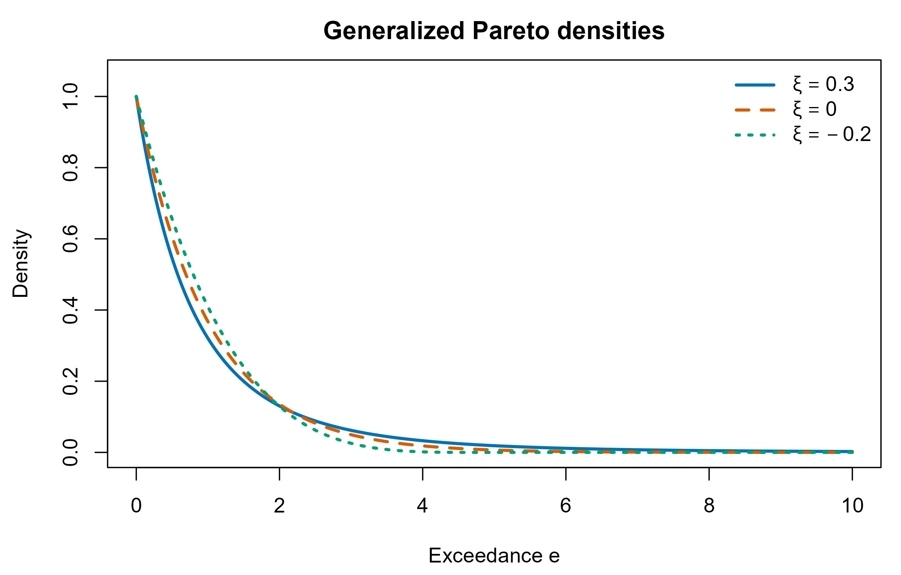
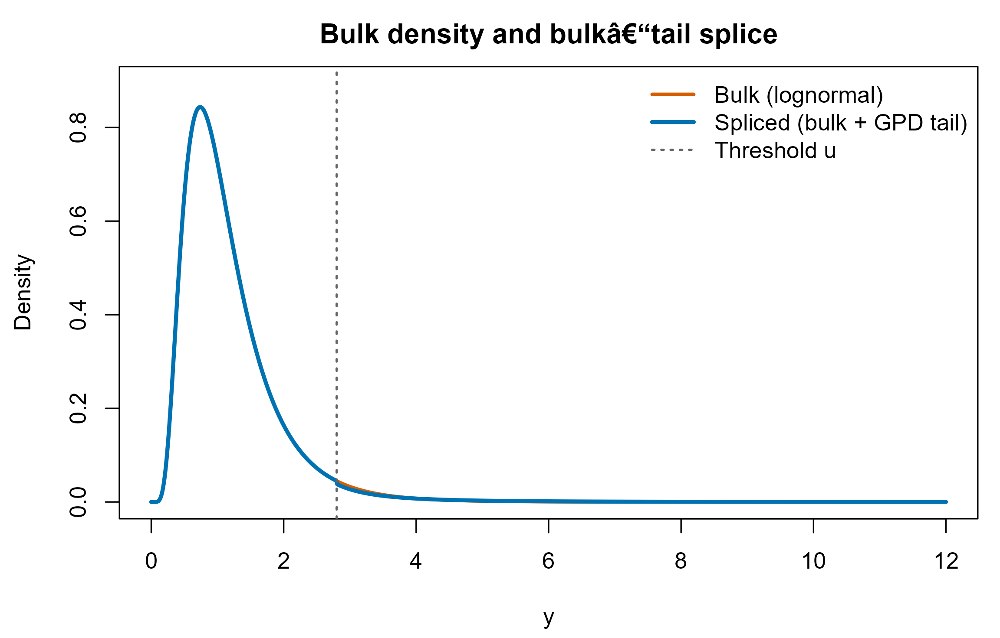

# CausalMixGPD: An Introduction

CausalMixGPD is an R package for Bayesian modeling of outcomes whose
central distribution can be complex while the upper tail may be heavy
and scientifically consequential. In many applications, the modeling
challenge is not only to fit the bulk well, but also to obtain stable
inference for extreme quantiles and exceedance probabilities.
CausalMixGPD addresses this by combining a Dirichlet process mixture
(DPM) model for the bulk with an optional peaks-over-threshold
generalized Pareto distribution (GPD) tail in a single coherent
likelihood, so uncertainty is propagated from fitting through to
tail-relevant summaries.

There is a mature R ecosystem supporting Bayesian nonparametric mixture
modeling and DP-based regression. The package
[dirichletprocess](https://doi.org/10.32614/CRAN.package.dirichletprocess)
provides Dirichlet process objects that can be used as building blocks
for density estimation, clustering, and mixture modeling, including
stick-breaking representations and user-facing routines that hide most
of the MCMC mechanics . For regression-type uses of DP mixtures,
[PReMiuM](https://doi.org/10.32614/CRAN.package.PReMiuM) implements
profile regression models that link responses to covariates through
cluster membership under a Dirichlet process mixture, supports multiple
response types, and provides prediction and post-processing tools . More
broadly, [BNPmix](https://doi.org/10.32614/CRAN.package.BNPmix)
implements Pitman-Yor and dependent DP mixture models for density
estimation, clustering, and regression, offering a closely related BNP
toolkit beyond the standard DP . Additional Bayesian non/semi-parametric
regression frameworks that include DP mixture components are available
in [BNSP](https://doi.org/10.32614/CRAN.package.BNSP) , while
[bayesm](https://doi.org/10.32614/CRAN.package.bayesm) includes DP-prior
density estimation and DP-based hierarchical models in applied
econometric settings . Finally, for penalized regression settings,
[RcppDPR](https://doi.org/10.32614/CRAN.package.RcppDPR) provides a
Dirichlet process regression implementation with both fitting and
prediction utilities . These packages are highly effective for learning
flexible bulk structure and covariate-driven heterogeneity via mixture
modeling.

In parallel, the extreme-value modeling ecosystem in R provides
well-established tools for peaks-over-threshold inference. The
[ismev](https://doi.org/10.32614/CRAN.package.ismev) package implements
classical extreme-value methods and diagnostics, including GPD fitting
across thresholds and model-checking tools that align closely with
standard EVT practice . The
[texmex](https://doi.org/10.32614/CRAN.package.texmex) package extends
this direction by supporting likelihood-based and Bayesian fitting of
GPD/GEV models, including covariate effects on tail parameters, which is
useful when tail risk varies across subpopulations . For Bayesian
extreme-value analysis specifically,
[evdbayes](https://doi.org/10.32614/CRAN.package.evdbayes) and
[revdbayes](https://doi.org/10.32614/CRAN.package.revdbayes) provide
posterior simulation tools for common EVT models and predictive
summaries for extremes . These EVT-focused packages are natural choices
when the scientific question is primarily about the tail, while the bulk
is treated parametrically or as a secondary modeling target.

CausalMixGPD is designed to connect these two perspectives in a single
Bayesian model: it uses a DPM to learn the bulk flexibly, and when GPD =
TRUE it uses an explicit bulk–tail splice so that exceedances are
governed by a GPD tail rather than by the incidental tail behavior of
the bulk kernel. The implementation is built on
[NIMBLE](https://doi.org/10.32614/CRAN.package.nimble) , which provides
a programmable system for compiling Bayesian models and running MCMC,
including dedicated machinery for BNP mixture representations such as
CRP and stick-breaking formulations . In addition to one-sample
modeling, CausalMixGPD exposes the same distributional modeling strategy
within a two-arm causal interface so that causal estimands—both
mean-scale and quantile-scale, including extreme quantiles—can be
derived from arm-specific posterior predictive distributions.

At the central part of the data this package employs Dirichlet process
mixtures, which is a standard Bayesian nonparametric tool for flexible
density estimation and regression, especially when the bulk distribution
is skewed, clustered, multimodal, or otherwise poorly described by a
single parametric family ([Ferguson 1973](#ref-ferguson1973); [Escobar
and West 1995](#ref-escobar1995); [Neal 2000](#ref-neal2000)). However,
when inference targets lie far in the upper tail—very high quantiles,
tail probabilities, or return-level type summaries—purely bulk-driven
models can be fragile because tail extrapolation is dominated by kernel
choice and by how the mixture prior behaves where there are few
observations.

For tail estimation this package uses the peaks-over-threshold
framework. This framework suggests exceedances above a sufficiently high
threshold converge to a GPD under broad conditions ([Balkema and Haan
1974](#ref-balkema1974); [Pickands 1975](#ref-pickands1975)), with
applied guidance in ([Davison and Smith 1990](#ref-davison1990); [Coles
2001](#ref-coles2001)). Bulk–tail splicing combines these viewpoints
so that the bulk is modeled flexibly while tail extrapolation uses POT
theory. Bayesian approaches with a similar bulk–tail spirit appear,
for example, in Bayesian analysis with threshold estimation and
predictive summaries ([Behrens et al. 2004](#ref-behrens2004)) and in
semiparametric Bayesian density estimation for extremes ([Nascimento et
al. 2012](#ref-doNascimento2012)), while smooth-transition perspectives
motivate alternatives to a fixed hard threshold ([Frigessi et al.
2002](#ref-frigessi2002)).

CausalMixGPD operationalizes these ideas in software with an emphasis on
NIMBLE-based model specification and MCMC execution
([**devalpine2017nimble?**](#ref-devalpine2017nimble)). Concretely,
CausalMixGPD generates NIMBLE models for Dirichlet process mixtures
using either (i) a Chinese restaurant process (CRP) representation or
(ii) a truncated stick-breaking (SB) representation, and then relies on
NIMBLE’s MCMC engine and BNP samplers. The primary NIMBLE references
that document these components are the [Bayesian nonparametrics chapter
of the NIMBLE manual](https://r-nimble.org/manual/cha-bnp.html), the
[`dCRP`
documentation](https://rdrr.io/cran/nimble/man/ChineseRestaurantProcess.html),
the [`stick_breaking`
documentation](https://rdrr.io/cran/nimble/man/StickBreakingFunction.html),
the [BNP density estimation
example](https://r-nimble.org/examples/bnp_density.html), and the
[sampler notes for CRP-specific MCMC
behavior](https://rdrr.io/cran/nimble/man/samplers.html).

## Dirichlet process mixtures: model and computational representations

### The DPM model

A Dirichlet process mixture defines a flexible density by mixing a
kernel (k()) over a random mixing distribution (G). For independent
observations (y_1,,y_n), \[ y_i \_i k(y_i \_i), \_i G G, G (, G_0),\]
where (G_0) is a base measure and (\>0) is the concentration parameter
([Ferguson 1973](#ref-ferguson1973)). Marginally, this implies a mixture
model with a potentially unbounded number of components. Under
Sethuraman’s constructive representation ([Sethuraman
1994](#ref-sethuraman1994)), \[ f\_{}(y) ;=; \_{j=1}^{} w_j,k(y_j),\]
where (\_j G_0) and ({w_j}) are stick-breaking weights. For posterior
computation, it is common to introduce allocation indicators (z_i) and
to work either with a partition representation (CRP) or an explicit
weight representation (stick-breaking).

CausalMixGPD supports both representations because they provide
different computational trade-offs and because NIMBLE provides dedicated
support for each.

### CRP formulation (partition view) and NIMBLE implementation

The CRP formulation works directly with the induced partition
distribution from a DP prior ([Blackwell and MacQueen
1973](#ref-blackwell1973); [Neal 2000](#ref-neal2000)). After
introducing allocations (z_i) with (y_i z_i k(y_i \_{z_i})), the DP
prior implies the predictive rule \[ (z_i = k z\_{1:(i-1)}) = , (z_i =
z\_{1:(i-1)}) = ,\] where (n_k) is the number of observations already
assigned to cluster (k). This representation highlights the
self-reinforcing clustering behavior of the DP: existing clusters tend
to be reused, but new clusters are created with probability proportional
to (). The parameter () therefore governs the expected granularity of
the mixture fit, with larger () encouraging more clusters a priori.

In NIMBLE, the CRP is implemented via the `dCRP` distribution, where the
allocation vector itself is a stochastic node. A schematic NIMBLE
specification for a DPM density model takes the following form.

``` r

# NIMBLE schematic (CRP representation)
z[1:n] ~ dCRP(conc = alpha, size = n)            # CRP prior on allocations (size typically set to n)
for(j in 1:n) theta[j] ~ G0(...)                 # component parameters, up to n potential clusters
for(i in 1:n) y[i] ~ dKERNEL(theta = theta[z[i]], ...)
alpha ~ prior_for_alpha(...)
```

The “size� argument supplies an upper bound for the cluster labels
that can appear in `z`; using `size = n` is the standard choice for (n)
observations. Although the DP mixture is infinite-dimensional in
principle, the realized partition uses only finitely many clusters for
finite (n), and the posterior number of occupied clusters is learned
from the data.

From the MCMC standpoint, NIMBLE recognizes CRP nodes and assigns
specialized samplers that update the allocation vector sequentially. The
`samplers` documentation notes that CRP sampling is designed
specifically for Dirichlet process mixture models and that NIMBLE may
choose between different internal strategies depending on conjugacy and
model structure. The practical implication for CausalMixGPD is that
`backend = "crp"` uses an allocation-based formulation that avoids an
explicit truncation level while still benefiting from a sampler tailored
to CRP structure.

### Stick-breaking formulation (weights view) and NIMBLE implementation

The stick-breaking representation constructs the mixture weights
explicitly ([Sethuraman 1994](#ref-sethuraman1994)). One draws break
proportions (v_j) and defines weights via \[ v_j (1,), w_1 = v_1, w_j =
v_j *{\<j}(1 - v*),j.\] For computation, one commonly truncates the
infinite mixture to a finite level (L), which yields a blocked
approximation and a finite categorical allocation model ([Ishwaran and
James 2001](#ref-ishwaran2001)): \[ z_i (w_1,,w_L), y_i z_i k(y_i
\_{z_i}).\] The approximation quality depends on (L): larger (L)
increases flexibility but raises computational cost.

NIMBLE supports this formulation through the deterministic
`stick_breaking` function, which maps a vector of break proportions into
a simplex of weights. A schematic NIMBLE specification is:

``` r

# NIMBLE schematic (truncated stick-breaking representation)
for(j in 1:(L-1)) v[j] ~ dbeta(1, alpha)
w[1:L] <- stick_breaking(v[1:(L-1)])             # simplex weights summing to one

for(j in 1:L) theta[j] ~ G0(...)
for(i in 1:n) {
  z[i] ~ dcat(w[1:L])
  y[i] ~ dKERNEL(theta = theta[z[i]], ...)
}
alpha ~ prior_for_alpha(...)
```

In CausalMixGPD, `backend = "sb"` uses this representation and exposes
`components = L` as the truncation level. In applications, (L) is
typically chosen to be larger than the posterior expected number of
occupied components so that truncation is not a substantive modeling
constraint but rather a computational device.

## Generalized Pareto tails: peaks over threshold

### Definition and interpretation

Let (u) be a threshold and define exceedances (e = y-u) for observations
with (y\>u). The generalized Pareto distribution has CDF \[ G(e,) ;=;
1 - (1 + ,)^{-1/}, e , \>0,\] with the () limit corresponding to an
exponential tail. The density (for ()) is \[ g(e,) ;=; (1 + ,)^{-1/- 1},
e ,\] with the support restriction (1+e/\>0) when (\<0). The shape
parameter () controls tail heaviness: larger () produces heavier tails,
while negative () implies a finite upper endpoint.

The justification for using a GPD to model exceedances above a high
threshold is provided by POT limit theory ([Balkema and Haan
1974](#ref-balkema1974); [Pickands 1975](#ref-pickands1975)), with
practical modeling discussion in ([Davison and Smith
1990](#ref-davison1990); [Coles 2001](#ref-coles2001)).

### GPD density illustration

The following plot visualizes how the shape parameter changes tail
behavior. We set (u=0) for simplicity so that the horizontal axis is the
exceedance scale.

``` r

dgpd_simple <- function(e, sigma, xi) {
  stopifnot(all(e >= 0), sigma > 0)
  if (abs(xi) < 1e-10) return((1 / sigma) * exp(-e / sigma))
  ok <- (1 + xi * e / sigma) > 0
  out <- numeric(length(e))
  out[!ok] <- 0
  out[ok] <- (1 / sigma) * (1 + xi * e[ok] / sigma)^(-1/xi - 1)
  out
}

cols <- c("#0072B2", "#D55E00", "#009E73")

e <- seq(0, 10, length.out = 600)
y1 <- dgpd_simple(e, sigma = 1, xi = 0.30)
y2 <- dgpd_simple(e, sigma = 1, xi = 0.00)
y3 <- dgpd_simple(e, sigma = 1, xi = -0.20)

ylim <- c(0, max(y1, y2, y3) * 1.06)

op <- par(mar = c(4.3, 4.3, 2.4, 0.8))
plot(e, y1, type = "l", lwd = 2.4, col = cols[1], ylim = ylim,
     xlab = "Exceedance e", ylab = "Density",
     main = "Generalized Pareto densities")
lines(e, y2, lwd = 2.4, col = cols[2], lty = 2)
lines(e, y3, lwd = 2.4, col = cols[3], lty = 3)
legend("topright",
       legend = c(expression(xi==0.30), expression(xi==0.00), expression(xi==-0.20)),
       col = cols, lty = c(1, 2, 3), lwd = 2.4, bty = "n")
```



``` r

par(op)
```

## Splicing the bulk and the tail into one proper distribution

### Spliced CDF and density

Let (F\_{}) and (f\_{}) denote the bulk CDF and density. A standard
bulk–tail splice defines a full-distribution CDF by \[ F(y)= \] which
is continuous at (u) and has the correct total mass. Differentiation
yields the spliced density \[ f(y)= \] The factor (1-F\_{}(u)) ensures
that the tail density integrates to the bulk survival probability at the
threshold, so the overall density integrates to one. CausalMixGPD uses a
DPM for (f\_{}) and a GPD for (g), and supports fixed thresholds, random
thresholds with priors, and covariate-dependent thresholds in
conditional settings. In the causal interface, the splice can be fit
separately in each treatment arm so that both bulk structure and tail
heaviness can differ across arms.

### Spliced density illustration

The next plot illustrates the splice by comparing a lognormal bulk
density to the corresponding spliced density. The two curves coincide
below (u) by construction; the distinction appears above the threshold
where the GPD tail alters extrapolation.

``` r

Fbulk <- function(y, mu, sd) plnorm(y, meanlog = mu, sdlog = sd)
fbulk <- function(y, mu, sd) dlnorm(y, meanlog = mu, sdlog = sd)

u <- 2.8
mu <- 0.0
sd <- 0.55
sigma_t <- 0.8
xi_t <- 0.45   # heavier tail to make the splice visually distinct

fsplice <- function(y) {
  y <- pmax(y, 0)
  out <- numeric(length(y))
  idx_bulk <- y <= u
  idx_tail <- y > u
  out[idx_bulk] <- fbulk(y[idx_bulk], mu = mu, sd = sd)
  out[idx_tail] <- (1 - Fbulk(u, mu = mu, sd = sd)) *
    dgpd_simple(y[idx_tail] - u, sigma = sigma_t, xi = xi_t)
  out
}

y <- seq(0, 12, length.out = 800)
bulk <- fbulk(y, mu = mu, sd = sd)
spliced <- fsplice(y)

ylim <- c(0, max(bulk, spliced) * 1.06)

op <- par(mar = c(4.3, 4.3, 2.4, 0.8))
plot(y, bulk, type = "l", lwd = 2.4, col = cols[2], ylim = ylim,
     xlab = "y", ylab = "Density",
     main = "Bulk density and bulk–tail splice")
lines(y, spliced, lwd = 2.8, col = cols[1])
abline(v = u, col = "grey40", lty = 3, lwd = 1.6)
legend("topright",
       legend = c("Bulk (lognormal)", "Spliced (bulk + GPD tail)", "Threshold u"),
       col = c(cols[2], cols[1], "grey40"),
       lty = c(1, 1, 3),
       lwd = c(2.4, 2.8, 1.6),
       bty = "n")
```



``` r

par(op)
```

## Kernels included in CausalMixGPD

CausalMixGPD provides a menu of parametric kernels for the bulk
(central) distribution. The kernels are chosen to cover both real-valued
outcomes and strictly positive outcomes. In the Dirichlet process
mixture (DPM) bulk, these kernels are mixed to flexibly represent
skewness, multimodality, and other departures from a single parametric
shape. When the GPD tail is enabled, the kernel choice should usually be
guided by how well it represents the bulk, because tail extrapolation
beyond the threshold is driven primarily by the GPD component rather
than by the bulk kernel.

Table @ref(tab:kernels-table) summarizes the kernels currently available
in the package, along with their supports and parameterizations.

| Kernel | Support | Parameters | Constraints | GPD tail allowed |
|:---|:---|:---|:---|:---|
| normal | R | mean, sd | mean ∈ R; sd \> 0 | Yes |
| laplace | R | location, scale | location ∈ R; scale \> 0 | Yes |
| cauchy | R | location, scale | location ∈ R; scale \> 0 | No |
| gamma | (0, ∞) | shape, scale | shape \> 0; scale \> 0 | Yes |
| lognormal | (0, ∞) | meanlog, sdlog | meanlog ∈ R; sdlog \> 0 | Yes |
| invgauss | (0, ∞) | mean, shape | mean \> 0; shape \> 0 | Yes |
| amoroso | (loc, ∞) | loc, scale, shape1, shape2 | loc ∈ R; scale \> 0; shape1 \> 0; shape2 \> 0 | Yes |

Bulk kernels available in CausalMixGPD, their supports, and parameter
constraints. {.table}

For a detailed discussion of how these kernels are used in one-arm and
conditional models—including posterior computation for densities and
quantiles and posterior predictive inference—see the next vignette.

## References

    ::contentReference[oaicite:0]{index=0}

Balkema, August A., and Laurens de Haan. 1974. “Residual Life Time at
Great Age.” *The Annals of Probability* 2 (5): 792–804.
<https://doi.org/10.1214/aop/1176996548>.

Behrens, Cibele N., Hedibert F. Lopes, and Dani Gamerman. 2004.
“Bayesian Analysis of Extreme Events with Threshold Estimation.”
*Statistical Modelling* 4 (3): 227–44.
<https://doi.org/10.1191/1471082x04st075oa>.

Blackwell, David, and James B. MacQueen. 1973. “Ferguson Distributions
via pólya Urn Schemes.” *The Annals of Statistics* 1 (2): 353–55.
<https://doi.org/10.1214/aos/1176342372>.

Coles, Stuart. 2001. *An Introduction to Statistical Modeling of Extreme
Values*. Springer. <https://doi.org/10.1007/978-1-4471-3675-0>.

Davison, Anthony C., and Richard L. Smith. 1990. “Models for Exceedances
over High Thresholds.” *Journal of the Royal Statistical Society: Series
B (Methodological)* 52 (3): 393–442.
<https://doi.org/10.1111/j.2517-6161.1990.tb01796.x>.

Escobar, Michael D., and Mike West. 1995. “Bayesian Density Estimation
and Inference Using Mixtures.” *Journal of the American Statistical
Association* 90 (430): 577–88.
<https://doi.org/10.1080/01621459.1995.10476550>.

Ferguson, Thomas S. 1973. “A Bayesian Analysis of Some Nonparametric
Problems.” *The Annals of Statistics* 1 (2): 209–30.
<https://doi.org/10.1214/aos/1176342360>.

Frigessi, Arnoldo, Ola Haug, and Håvard Rue. 2002. “A Dynamic Mixture
Model for Unsupervised Tail Estimation Without Threshold Selection.”
*Extremes* 5 (3): 219–35. <https://doi.org/10.1023/A:1024072610684>.

Ishwaran, Hemant, and Lancelot F. James. 2001. “Gibbs Sampling Methods
for Stick-Breaking Priors.” *Journal of the American Statistical
Association* 96 (453): 161–73.
<https://doi.org/10.1198/016214501750332758>.

Nascimento, Fernando Ferraz do, Dani Gamerman, and Hedibert Freitas
Lopes. 2012. “A Semiparametric Bayesian Approach to Extreme Value
Estimation.” *Statistics and Computing* 22 (2): 661–75.
<https://doi.org/10.1007/s11222-011-9270-z>.

Neal, Radford M. 2000. “Markov Chain Sampling Methods for Dirichlet
Process Mixture Models.” *Journal of Computational and Graphical
Statistics* 9 (2): 249–65.
<https://doi.org/10.1080/10618600.2000.10474879>.

Pickands, James. 1975. “Statistical Inference Using Extreme Order
Statistics.” *The Annals of Statistics* 3 (1): 119–31.
<https://doi.org/10.1214/aos/1176343003>.

Sethuraman, Jayaram. 1994. “A Constructive Definition of Dirichlet
Priors.” *Statistica Sinica* 4 (2): 639–50.
