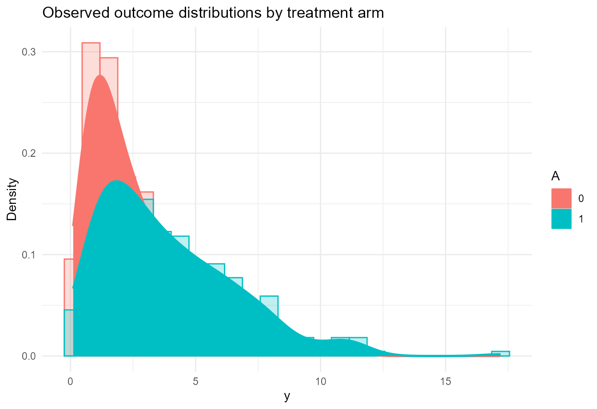

# Causal Inference with CausalMixGPD

## Introduction

`CausalMixGPD` extends its one-arm modeling framework to causal analyses
by fitting treatment-specific outcome distributions and then computing
causal contrasts as posterior functionals of those fitted distributions.
This is a distribution-first approach: rather than modeling only an
average treatment effect, the package models the treated and control
outcome laws and derives means, quantiles, restricted means, survival
summaries, and their contrasts from the resulting posterior object
([Rubin 1974](#ref-Rubin1974); [Rosenbaum and Rubin
1983](#ref-RosenbaumRubin1983); [Imbens and Rubin
2015](#ref-ImbensRubin2015)).

The software article emphasizes that this design is particularly useful
when the outcome is skewed or heavy-tailed. In those cases, mean-only
summaries can miss treatment-effect heterogeneity across the outcome
scale, while direct modeling of treatment-specific distributions allows
quantile treatment effects and upper-tail contrasts to be reported
coherently.

This vignette develops the causal workflow in four steps. We first
define the potential-outcomes notation and the causal estimands returned
by the package. We then describe how the spliced DPM-GPD model is used
arm by arm. Next, we work through the main causal interface using a
bundled simulated dataset. Finally, we summarize the main customization
options for propensity score augmentation, arm-specific model choices,
posterior effect summaries, and prediction.

## Notation and short theory background

### Potential outcomes and arm-specific distributions

Let $`A \in \{0,1\}`$ denote a binary treatment indicator, with
$`A = 1`$ for treatment and $`A = 0`$ for control. Let $`Y(1)`$ and
$`Y(0)`$ be the potential outcomes, and let $`X`$ denote the
pre-treatment covariates. The observed outcome is

``` math
Y = A Y(1) + (1-A)Y(0).
```

For each treatment arm $`a \in \{0,1\}`$, define the arm-specific
conditional CDF and density by

``` math
F_a(y \mid x) = \Pr\{Y(a) \le y \mid X = x\}, \qquad
f_a(y \mid x) = \frac{\partial}{\partial y} F_a(y \mid x).
```

The package models these arm-specific conditional distributions
directly. Once they are available, all reported causal estimands are
computed from them.

### Identification assumptions

The causal workflow follows the standard potential-outcomes framework
under consistency, no interference, conditional ignorability, and
overlap ([Rubin 1974](#ref-Rubin1974); [Rosenbaum and Rubin
1983](#ref-RosenbaumRubin1983); [Imbens and Rubin
2015](#ref-ImbensRubin2015)). Under these assumptions,

``` math
F_a(y \mid x) = \Pr(Y \le y \mid A=a, X=x), \qquad a \in \{0,1\}.
```

That identification step matters because it justifies fitting
arm-specific outcome models to the observed data and then interpreting
posterior contrasts as causal quantities.

### Propensity score augmentation

In observational settings, the package can estimate a propensity score

``` math
\rho(x) = \Pr(A=1 \mid X=x)
```

and append a summary of it to the outcome model covariates. If
$`\widehat\rho(x)`$ is the estimated score, the augmented predictor used
by the outcome model is typically of the form

``` math
r(x) = (x^\top, \psi\{\widehat\rho(x)\})^\top,
```

where $`\psi(\cdot)`$ is either the identity map on the probability
scale or the logit transformation, depending on the setting. This is the
package’s default strategy for incorporating design information into the
arm-specific outcome regressions.

### Spliced outcome model within each arm

Within each arm, `CausalMixGPD` uses the same spliced model described in
the one-arm workflow. For arm $`a`$, the conditional distribution
combines a DPM bulk and an optional GPD tail:

``` math
f_a(y \mid x) =
\begin{cases}
f_{a,\mathrm{DP}}(y \mid x; \Theta_a), & y \le u_a(x), \\
\{1-p_{u_a}(x;\Theta_a)\} f_{a,\mathrm{GPD}}(y \mid x; \Phi_a), & y > u_a(x),
\end{cases}
```

where
$`p_{u_a}(x;\Theta_a) = F_{a,\mathrm{DP}}(u_a(x) \mid x; \Theta_a)`$.
The main modeling choice in the causal workflow is therefore not the
contrast itself but the quality of the two fitted conditional outcome
distributions.

### Causal estimands reported by the package

Once the arm-specific distributions are fitted, the package returns
several causal functionals.

The conditional mean in arm $`a`$ is

``` math
\mu_a(x) = E\{Y(a) \mid X=x\},
```

and the conditional quantile is

``` math
Q_a(\tau \mid x) = \inf\{y : F_a(y \mid x) \ge \tau\}.
```

From these, the package constructs conditional and standardized
estimands. The main ones are

``` math
\mathrm{CATE}(x) = \mu_1(x) - \mu_0(x),
```

``` math
\mathrm{CQTE}(\tau \mid x) = Q_1(\tau \mid x) - Q_0(\tau \mid x),
```

``` math
\mathrm{ATE} = E\{\mu_1(X) - \mu_0(X)\},
```

and

``` math
\mathrm{QTE}(\tau) = Q^m_1(\tau) - Q^m_0(\tau),
```

where the superscript $`m`$ indicates standardization over the empirical
covariate distribution in the full sample. The package also provides ATT
and QTT analogues standardized over the treated covariate distribution.

These definitions explain the structure of the causal API. Functions
such as
[`ate()`](https://arnabaich96.github.io/CausalMixGPD/pkgdown/reference/ate.md),
[`qte()`](https://arnabaich96.github.io/CausalMixGPD/pkgdown/reference/qte.md),
[`cate()`](https://arnabaich96.github.io/CausalMixGPD/pkgdown/reference/cate.md),
and
[`cqte()`](https://arnabaich96.github.io/CausalMixGPD/pkgdown/reference/cqte.md)
are not fitting new models. They are post-processing a fitted causal
object to summarize different posterior functionals.

## Function map for the causal workflow

The most important exported functions in this vignette are:

- [`dpmgpd.causal()`](https://arnabaich96.github.io/CausalMixGPD/pkgdown/reference/dpmgpd.causal.md)
  for spliced arm-specific outcome modeling.
- [`dpmix.causal()`](https://arnabaich96.github.io/CausalMixGPD/pkgdown/reference/dpmix.causal.md)
  for the bulk-only causal analogue.
- [`ate()`](https://arnabaich96.github.io/CausalMixGPD/pkgdown/reference/ate.md)
  and
  [`att()`](https://arnabaich96.github.io/CausalMixGPD/pkgdown/reference/att.md)
  for mean or restricted-mean treatment contrasts.
- [`qte()`](https://arnabaich96.github.io/CausalMixGPD/pkgdown/reference/qte.md)
  and
  [`qtt()`](https://arnabaich96.github.io/CausalMixGPD/pkgdown/reference/qtt.md)
  for marginal quantile contrasts.
- [`cate()`](https://arnabaich96.github.io/CausalMixGPD/pkgdown/reference/cate.md)
  and
  [`cqte()`](https://arnabaich96.github.io/CausalMixGPD/pkgdown/reference/cqte.md)
  for profile-specific conditional contrasts.
- [`predict()`](https://rdrr.io/r/stats/predict.html) for arm-wise
  predictive summaries and contrast-based summaries at new covariate
  profiles.
- [`summary()`](https://rdrr.io/r/base/summary.html) and
  [`plot()`](https://rdrr.io/r/graphics/plot.default.html) for
  effect-object summaries and visualization.

## Package setup

``` r

library(CausalMixGPD)
library(ggplot2)
```

``` r

mcmc_vig <- list(
  niter = 1200,
  nburnin = 300,
  thin = 2,
  nchains = 2,
  seed = 2026
)
```

## Data

We use the bundled causal dataset `causal_pos500_p3_k2`, which contains
a positive outcome `y`, a binary treatment indicator `A`, and a
predictor matrix `X`.

``` r

data("causal_pos500_p3_k2", package = "CausalMixGPD")
causal_dat <- data.frame(
  y = causal_pos500_p3_k2$y,
  A = causal_pos500_p3_k2$A,
  causal_pos500_p3_k2$X
)

str(causal_dat)
#> 'data.frame':    500 obs. of  5 variables:
#>  $ y : num  4.306 1.053 0.712 2.658 1.163 ...
#>  $ A : int  1 1 0 0 0 1 1 1 1 0 ...
#>  $ x1: num  -0.00378 0.52316 0.96922 0.2559 0.52141 ...
#>  $ x2: num  -0.6949 -0.0319 0.5585 -0.395 -0.7697 ...
#>  $ x3: num  -1.588 2.201 0.719 1.774 0.365 ...
summary(causal_dat)
#>        y                 A               x1                 x2          
#>  Min.   : 0.1087   Min.   :0.000   Min.   :-3.32287   Min.   :-0.99592  
#>  1st Qu.: 1.3737   1st Qu.:0.000   1st Qu.:-0.66115   1st Qu.:-0.54574  
#>  Median : 2.6414   Median :1.000   Median : 0.07650   Median :-0.09628  
#>  Mean   : 3.3667   Mean   :0.618   Mean   : 0.01061   Mean   :-0.04422  
#>  3rd Qu.: 4.7344   3rd Qu.:1.000   3rd Qu.: 0.66247   3rd Qu.: 0.46395  
#>  Max.   :17.2006   Max.   :1.000   Max.   : 2.83896   Max.   : 0.99651  
#>        x3          
#>  Min.   :-2.98427  
#>  1st Qu.:-0.65955  
#>  Median : 0.01209  
#>  Mean   : 0.02806  
#>  3rd Qu.: 0.68340  
#>  Max.   : 3.62360
```

A quick empirical comparison between the observed outcome distributions
by treatment arm gives a sense of the modeling problem.

``` r

ggplot(causal_dat, aes(x = y, colour = factor(A), fill = factor(A))) +
  geom_histogram(aes(y = after_stat(density)), bins = 25,
                 alpha = 0.25, position = "identity") +
  geom_density(linewidth = 0.9) +
  labs(
    x = "y",
    y = "Density",
    colour = "A",
    fill = "A",
    title = "Observed outcome distributions by treatment arm"
  ) +
  theme_minimal()
```



Even in a simulated benchmark, the treated and control distributions can
differ in ways that are not well summarized by a single average shift.
That is exactly where the distributional causal framework is useful.

## Fitting a causal spliced model

The high-level causal wrapper is
[`dpmgpd.causal()`](https://arnabaich96.github.io/CausalMixGPD/pkgdown/reference/dpmgpd.causal.md).
It fits treatment-specific outcome models and, when requested, a
propensity score stage. The software article presents this as the direct
causal extension of the one-arm workflow.

To keep vignette building stable, the numerical outputs shown below are
read from small precomputed files shipped in `inst/extdata/`. The code
chunks remain fully runnable and display the same tables and graphics
shipped with the package.

``` r

causal_call <- quote(
  dpmgpd.causal(
    formula = y ~ x1 + x2 + x3,
    data = causal_dat,
    treat = "A",
    backend = "sb",
    kernel = "gamma",
    components = 5,
    PS = "logit",
    ps_scale = "logit",
    ps_summary = "mean",
    mcmc_outcome = mcmc_vig,
    mcmc_ps = mcmc_vig
  )
)

causal_call
#> dpmgpd.causal(formula = y ~ x1 + x2 + x3, data = causal_dat, 
#>     treat = "A", backend = "sb", kernel = "gamma", components = 5, 
#>     PS = "logit", ps_scale = "logit", ps_summary = "mean", mcmc_outcome = mcmc_vig, 
#>     mcmc_ps = mcmc_vig)
```

The printed call shows the structure of the fitted model we want:
arm-specific spliced outcome distributions, a gamma bulk kernel, and a
logistic propensity score stage summarized on the logit scale.

## Standardized causal summaries

### Average treatment effect

The standardized ATE contrasts the arm-specific means after averaging
over the empirical covariate distribution.

``` r

ate_tab <- read.csv(.pkg_extdata("causal_ate.csv"))
knitr::kable(ate_tab, format = "html", digits = 4)
```

| estimand |  estimate |     lower |  upper |
|:---------|----------:|----------:|-------:|
| ATE      | -240.3653 | -222.5154 | 0.1209 |

This table is intentionally simple. In the package,
[`ate()`](https://arnabaich96.github.io/CausalMixGPD/pkgdown/reference/ate.md)
returns an effect object with summary and plotting methods. The key
interpretation point is that the reported effect is built from the
arm-specific fitted distributions, not from a stand-alone regression
coefficient.

### Quantile treatment effects

Quantile treatment effects are often more informative than a single
average contrast in skewed or heavy-tailed settings.

``` r

qte_tab <- read.csv(.pkg_extdata("causal_qte.csv"))
knitr::kable(qte_tab, format = "html", digits = 4)
```

| prob | estimate |   lower |  upper |
|-----:|---------:|--------:|-------:|
| 0.50 |  -0.0447 | -1.0870 | 1.4699 |
| 0.90 |   0.0476 | -3.0921 | 3.6900 |
| 0.95 |   0.2909 | -3.8436 | 4.8933 |

``` r

plot(
  qte_tab$prob,
  qte_tab$estimate,
  type = "b",
  pch = 19,
  xlab = "Quantile level",
  ylab = "Estimated QTE",
  ylim = range(c(qte_tab$lower, qte_tab$upper)),
  main = "Quantile treatment effect curve"
)
segments(qte_tab$prob, qte_tab$lower, qte_tab$prob, qte_tab$upper, lwd = 1.2)
abline(h = 0, lty = 2, col = "grey50")
```


The QTE display shows how the treatment effect varies with the quantile
level. This is one of the main scientific motivations for fitting
treatment-specific distributions directly rather than relying on
mean-only summaries.

## Conditional causal summaries at representative profiles

The conditional functions
[`cate()`](https://arnabaich96.github.io/CausalMixGPD/pkgdown/reference/cate.md)
and
[`cqte()`](https://arnabaich96.github.io/CausalMixGPD/pkgdown/reference/cqte.md)
evaluate treatment contrasts at user-supplied covariate profiles. A
common strategy is to build representative profiles from empirical
quartiles of the predictors.

``` r

qs <- c(0.25, 0.50, 0.75)
Xgrid <- expand.grid(lapply(causal_dat[, c("x1", "x2", "x3")], quantile, probs = qs))
head(Xgrid)
#>            x1          x2         x3
#> 1 -0.66114531 -0.54573642 -0.6595519
#> 2  0.07649836 -0.54573642 -0.6595519
#> 3  0.66247098 -0.54573642 -0.6595519
#> 4 -0.66114531 -0.09628321 -0.6595519
#> 5  0.07649836 -0.09628321 -0.6595519
#> 6  0.66247098 -0.09628321 -0.6595519
```

To illustrate the profile-specific summaries in a lightweight vignette,
we reuse the package’s shipped conditional quantile summaries.

``` r

cond_q <- read.csv(.pkg_extdata("conditional_quantiles.csv"))
knitr::kable(cond_q, format = "html", digits = 4)
```

| estimate | index |  id |   lower |    upper |
|---------:|------:|----:|--------:|---------:|
|   1.4411 |  0.50 |   1 |  1.2335 |   1.6327 |
|   1.8302 |  0.50 |   2 |  1.2346 |   2.3465 |
|  42.4650 |  0.90 |   1 | 13.1888 | 129.6083 |
|  50.5770 |  0.90 |   2 | 14.9305 | 144.2923 |
| 134.7847 |  0.95 |   1 | 25.1334 | 478.7875 |
| 156.0091 |  0.95 |   2 | 28.9078 | 518.2162 |

The columns have the following meaning.

- `id` indexes the covariate profile.
- `index` is the quantile level $`\tau`$.
- `estimate` is the posterior point estimate of the arm-contrast
  quantile summary.
- `lower` and `upper` are the corresponding interval bounds.

In a full causal fit,
[`cqte()`](https://arnabaich96.github.io/CausalMixGPD/pkgdown/reference/cqte.md)
would return an effect object that can be plotted profile by profile.
The important conceptual point is that these conditional quantile
contrasts are produced by evaluating the fitted treated and control
quantile functions at the same covariate profile and differencing the
results.

## Predictive interpretation

The causal workflow also supports direct prediction. After fitting the
causal object, [`predict()`](https://rdrr.io/r/stats/predict.html) can
be used to obtain arm-specific densities, survival probabilities,
quantiles, means, or restricted means at new covariate profiles. For
mean and quantile-type outputs, the treated-minus-control contrast is
often the quantity of interest; for density and survival outputs, users
frequently inspect the arm-specific predictions themselves.

The predictive logic is the same as in the one-arm case. First, the
model builds arm-specific conditional distributions. Second, desired
posterior functionals are evaluated from those distributions. Third,
contrasts are formed draw by draw and then summarized.

## Analysis summary

The causal analysis in `CausalMixGPD` is best understood as a structured
post-processing layer on top of two fitted conditional outcome models.
The ATE summarizes a standardized mean contrast, but the QTE and CQTE
summaries reveal whether treatment effects differ across the outcome
scale or across covariate profiles. In heavy-tailed problems, this
distinction is often substantive rather than cosmetic. Two interventions
may have similar average effects while behaving quite differently in the
upper tail.

The package’s causal interface is especially useful in that situation
because the same fitted object supports several scientifically relevant
views of the treatment effect. Mean, restricted-mean, quantile, and
conditional contrasts all remain tied to the same posterior predictive
mechanism.

## Customization options for causal models

The package appendix lists the full causal customization surface; the
most practically important arguments are summarized here.

### Outcome-model controls

`kernel`, `backend`, `GPD`, `components`, and `param_specs` can each be
supplied either as a single shared value or as arm-specific values of
length two. This allows the treated and control outcome models to differ
in kernel family, backend, truncation size, and prior structure.

[`dpmgpd.causal()`](https://arnabaich96.github.io/CausalMixGPD/pkgdown/reference/dpmgpd.causal.md)
activates the spliced tail, while
[`dpmix.causal()`](https://arnabaich96.github.io/CausalMixGPD/pkgdown/reference/dpmix.causal.md)
fits the bulk-only causal analogue.

### Propensity score controls

`PS` selects the propensity score model. Common values are `"logit"`,
`"probit"`, `"naive"`, and `FALSE`.

`ps_scale` controls whether the propensity score enters the outcome
model on the probability scale or the logit scale.

`ps_summary` selects the posterior summary of the propensity score
appended to the outcome regressors, typically `"mean"` or `"median"`.

`ps_prior`, `ps_clamp`, and `include_intercept` provide additional
control over propensity score estimation and numerical stability.

### MCMC controls

The causal workflow separates iteration controls for the propensity
score stage and the outcome stage through `mcmc_ps` and `mcmc_outcome`.

`parallel_arms`, `workers`, and related runtime arguments can be used
when the treated and control models are fitted in parallel.

### Effect and prediction controls

[`ate()`](https://arnabaich96.github.io/CausalMixGPD/pkgdown/reference/ate.md),
[`att()`](https://arnabaich96.github.io/CausalMixGPD/pkgdown/reference/att.md),
[`cate()`](https://arnabaich96.github.io/CausalMixGPD/pkgdown/reference/cate.md),
and related functions accept `type = "mean"` or `"rmean"` when the
target is mean-based.

[`qte()`](https://arnabaich96.github.io/CausalMixGPD/pkgdown/reference/qte.md),
[`qtt()`](https://arnabaich96.github.io/CausalMixGPD/pkgdown/reference/qtt.md),
and
[`cqte()`](https://arnabaich96.github.io/CausalMixGPD/pkgdown/reference/cqte.md)
use the argument `probs` to specify the quantile levels.

Effect intervals are controlled by `interval` and `level`, just as in
the one-arm workflow.

[`predict()`](https://rdrr.io/r/stats/predict.html) supports the same
distributional output types as the one-arm interface, now interpreted in
an arm-specific or contrast-based manner depending on the chosen output.

## Session information

``` r

sessionInfo()
#> R version 4.5.3 (2026-03-11 ucrt)
#> Platform: x86_64-w64-mingw32/x64
#> Running under: Windows 11 x64 (build 26200)
#> 
#> Matrix products: default
#>   LAPACK version 3.12.1
#> 
#> locale:
#> [1] LC_COLLATE=English_United States.utf8 
#> [2] LC_CTYPE=English_United States.utf8   
#> [3] LC_MONETARY=English_United States.utf8
#> [4] LC_NUMERIC=C                          
#> [5] LC_TIME=English_United States.utf8    
#> 
#> time zone: America/New_York
#> tzcode source: internal
#> 
#> attached base packages:
#> [1] stats     graphics  grDevices datasets  utils     methods   base     
#> 
#> other attached packages:
#> [1] ggplot2_4.0.2      CausalMixGPD_0.4.0 nimble_1.4.1      
#> 
#> loaded via a namespace (and not attached):
#>  [1] gtable_0.3.6        jsonlite_2.0.0      dplyr_1.2.0        
#>  [4] compiler_4.5.3      renv_1.1.7          tidyselect_1.2.1   
#>  [7] parallel_4.5.3      jquerylib_0.1.4     systemfonts_1.3.2  
#> [10] scales_1.4.0        textshaping_1.0.5   yaml_2.3.12        
#> [13] fastmap_1.2.0       lattice_0.22-9      coda_0.19-4.1      
#> [16] R6_2.6.1            labeling_0.4.3      generics_0.1.4     
#> [19] igraph_2.2.2        knitr_1.51          htmlwidgets_1.6.4  
#> [22] tibble_3.3.1        desc_1.4.3          pillar_1.11.1      
#> [25] RColorBrewer_1.1-3  bslib_0.10.0        rlang_1.1.7        
#> [28] cachem_1.1.0        xfun_0.57           S7_0.2.1           
#> [31] fs_2.0.1            sass_0.4.10         otel_0.2.0         
#> [34] cli_3.6.5           withr_3.0.2         pkgdown_2.2.0      
#> [37] magrittr_2.0.4      digest_0.6.39       grid_4.5.3         
#> [40] rstudioapi_0.18.0   lifecycle_1.0.5     vctrs_0.7.2        
#> [43] evaluate_1.0.5      pracma_2.4.6        glue_1.8.0         
#> [46] farver_2.1.2        numDeriv_2016.8-1.1 ragg_1.5.0         
#> [49] rmarkdown_2.31      tools_4.5.3         pkgconfig_2.0.3    
#> [52] htmltools_0.5.9
```

Imbens, Guido W., and Donald B. Rubin. 2015. *Causal Inference for
Statistics, Social, and Biomedical Sciences: An Introduction*. Cambridge
University Press.

Rosenbaum, Paul R., and Donald B. Rubin. 1983. “The Central Role of the
Propensity Score in Observational Studies for Causal Effects.”
*Biometrika* 70 (1): 41–55. <https://doi.org/10.1093/biomet/70.1.41>.

Rubin, Donald B. 1974. “Estimating Causal Effects of Treatments in
Randomized and Nonrandomized Studies.” *Journal of Educational
Psychology* 66 (5): 688–701. <https://doi.org/10.1037/h0037350>.
