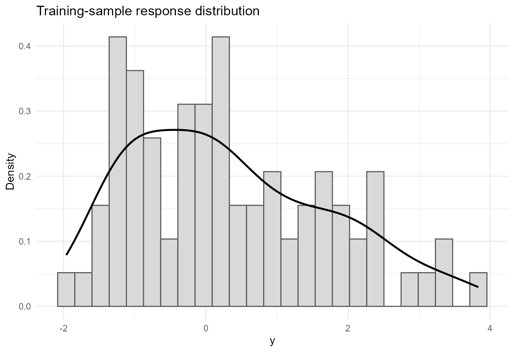
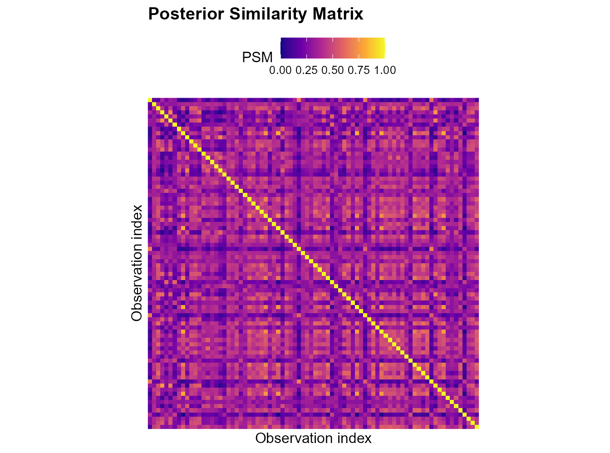
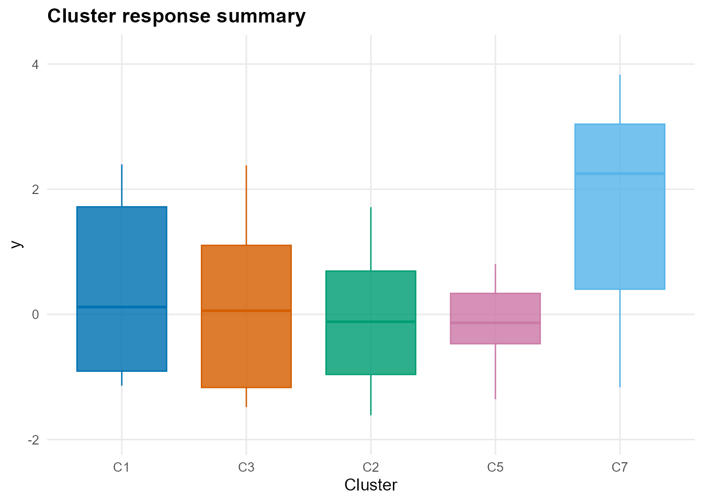
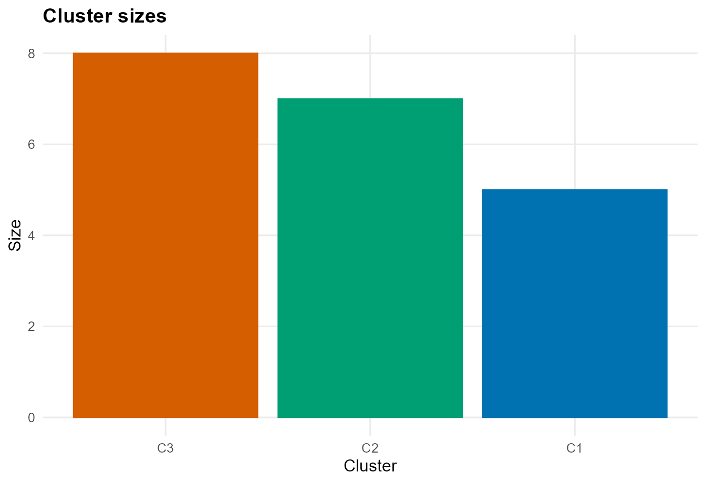

# Predictor-Dependent Clustering with CausalMixGPD

## Introduction

The clustering interface in `CausalMixGPD` uses the same Bayesian
nonparametric mixture machinery as the density and causal workflows, but
the inferential focus changes. Instead of treating the fitted
distribution only as a prediction engine, the clustering workflow treats
the latent partition induced by the mixture model as a primary object of
interest. The output is therefore organized around label-invariant
partition summaries such as the posterior similarity matrix (PSM),
representative cluster labels, cluster sizes, and membership scores
([Binder 1978](#ref-Binder1978); [Dahl 2006](#ref-Dahl2006)).

This clustering functionality is important because Dirichlet process
mixtures do more than estimate smooth densities. Their latent allocation
variables induce random partitions, so they can be used for subgroup
discovery while still allowing flexible within-cluster outcome models.
The software article presents clustering as one of the three main
capabilities of the package, alongside one-arm modeling and causal
inference.

This vignette gives a complete introduction to the clustering workflow.
We first define the latent-partition notation and the three forms of
predictor dependence supported by the package. We then fit a clustering
model to a bundled dataset, extract label-invariant summaries, and
predict cluster labels for new observations. We close with a reference
section describing the main clustering-specific customization options.

## Notation and short theory background

### Mixture models and latent cluster labels

Let $`Y`$ denote the response and let $`X`$ denote the predictor vector.
In a mixture model, the conditional density can be written abstractly as

``` math
f(y \mid x) = \sum_{j=1}^{\infty} w_j(x) k(y \mid x, \theta_j),
```

where the weights may or may not depend on predictors and the
component-specific parameters may or may not depend on predictors.
Introduce a latent allocation variable $`z_i`$ for observation $`i`$,
with $`z_i = j`$ meaning that observation $`i`$ is assigned to component
$`j`$. Then the conditional response model can be written as

``` math
y_i \mid z_i, x_i, \{\theta_j\} \sim k(\cdot \mid x_i, \theta_{z_i}).
```

The collection $`\Pi = \{z_1, \ldots, z_n\}`$ determines a random
partition of the observations. In Bayesian nonparametric clustering, the
posterior distribution of this partition is the central inferential
object.

### Why labels are not directly interpretable

Mixture component labels are not identifiable across MCMC draws. One
posterior draw may label a cluster as component 1 while another labels
the same substantive group as component 4. Because of this
label-switching phenomenon, cluster summaries should not be based on raw
component labels alone.

Instead, the package reports label-invariant summaries. The most
important one is the posterior similarity matrix, whose $`(i,\ell)`$
entry is

``` math
S_{i\ell} = \Pr(z_i = z_\ell \mid \text{data}).
```

This is estimated by averaging co-clustering indicators over retained
posterior draws. A representative hard partition is then obtained using
Dahl’s least-squares criterion ([Dahl 2006](#ref-Dahl2006)).

### Predictor dependence in clustering

The package supports three distinct clustering modes, each corresponding
to a different way in which predictors can affect the mixture model.

#### Weight dependence

In the weight-dependent mode,

``` math
f(y \mid x) = \sum_{j=1}^{\infty} w_j(x) k(y \mid \theta_j).
```

Here the cluster-specific kernel parameters are shared, but the
prevalence of the clusters changes with predictors. This is useful when
the goal is to let covariates modify which latent groups are more likely
without changing the within-group model form.

#### Parameter dependence

In the parameter-dependent mode,

``` math
f(y \mid x) = \sum_{j=1}^{\infty} w_j k(y \mid x, \theta_j).
```

The weights are global, but each cluster has its own predictor-response
relationship. This is useful when clusters represent different
regression regimes.

#### Weight and parameter dependence

In the most flexible mode,

``` math
f(y \mid x) = \sum_{j=1}^{\infty} w_j(x) k(y \mid x, \theta_j).
```

Here both cluster prevalence and within-cluster behavior can vary with
predictors.

### Main clustering summaries returned by the package

The clustering wrappers produce fitted objects whose predictions are
cluster-focused rather than density-focused.

- `predict(type = "psm")` returns the posterior similarity matrix.
- `predict(type = "label")` returns representative labels and, when
  available, cluster membership scores.
- [`summary()`](https://rdrr.io/r/base/summary.html) reports cluster
  sizes and profile summaries.
- [`plot()`](https://rdrr.io/r/graphics/plot.default.html) can display
  the PSM, cluster sizes, cluster certainty, and representative-cluster
  summaries.

These summaries allow the user to distinguish between strong clustering
structure and uncertain partitions. In many applications, the PSM is
more informative than a single hard partition because it shows which
observations cluster together consistently and which do not.

## Function map for the clustering workflow

The main exported functions used in this vignette are:

- [`dpmix.cluster()`](https://arnabaich96.github.io/CausalMixGPD/pkgdown/reference/dpmix.cluster.md)
  for bulk-only clustering.
- [`dpmgpd.cluster()`](https://arnabaich96.github.io/CausalMixGPD/pkgdown/reference/dpmgpd.cluster.md)
  for clustering with an active GPD tail.
- [`predict()`](https://rdrr.io/r/stats/predict.html) with
  `type = "psm"` or `type = "label"`.
- [`summary()`](https://rdrr.io/r/base/summary.html) for cluster sizes
  and profiles.
- [`plot()`](https://rdrr.io/r/graphics/plot.default.html) for PSM
  heatmaps and cluster-summary graphics.

## Package setup

``` r

library(CausalMixGPD)
library(ggplot2)
```

``` r

mcmc_vig <- list(
  niter = 1200,
  nburnin = 300,
  thin = 2,
  nchains = 2,
  seed = 2026
)
```

## Data

We use the bundled dataset `nc_realX100_p3_k2`, which contains a
real-valued response and three predictors.

``` r

data("nc_realX100_p3_k2", package = "CausalMixGPD")
dat_cl <- data.frame(
  y = nc_realX100_p3_k2$y,
  nc_realX100_p3_k2$X
)

str(dat_cl)
#> 'data.frame':    100 obs. of  4 variables:
#>  $ y : num  -3.0407 0.5019 -0.0738 1.3292 -1.3555 ...
#>  $ x1: num  0.497 -1.494 -0.555 -0.215 -1.2 ...
#>  $ x2: num  -0.8024 0.236 0.0475 0.8879 -0.9009 ...
#>  $ x3: num  1.666 -1.227 0.554 1.05 -0.44 ...
summary(dat_cl)
#>        y                 x1                 x2                 x3         
#>  Min.   :-3.0407   Min.   :-2.77986   Min.   :-0.97590   Min.   :-2.5106  
#>  1st Qu.:-0.8364   1st Qu.:-0.55528   1st Qu.:-0.50593   1st Qu.:-0.6084  
#>  Median : 0.2194   Median : 0.04472   Median : 0.07785   Median : 0.2405  
#>  Mean   : 0.4271   Mean   : 0.03418   Mean   :-0.03291   Mean   : 0.1370  
#>  3rd Qu.: 1.4260   3rd Qu.: 0.59791   3rd Qu.: 0.44391   3rd Qu.: 0.8039  
#>  Max.   : 3.8331   Max.   : 2.68653   Max.   : 0.99555   Max.   : 2.9609
```

For illustration, we form a simple train/test split so that we can show
both training-cluster summaries and out-of-sample label prediction.

``` r

clust_out <- readRDS(.pkg_extdata("clustering_outputs.rds"))
train_dat <- clust_out$train_dat
test_dat <- clust_out$test_dat

nrow(train_dat)
#> [1] 80
nrow(test_dat)
#> [1] 20
```

A quick visualization of the response helps motivate the use of a
flexible mixture model.

``` r

ggplot(train_dat, aes(x = y)) +
  geom_histogram(aes(y = after_stat(density)), bins = 25,
                 fill = "grey85", colour = "grey35") +
  geom_density(linewidth = 0.9) +
  labs(x = "y", y = "Density", title = "Training-sample response distribution") +
  theme_minimal()
```



## Fitting a clustering model

The bulk-only clustering wrapper is
[`dpmix.cluster()`](https://arnabaich96.github.io/CausalMixGPD/pkgdown/reference/dpmix.cluster.md).
It uses the same general mixture machinery as the one-arm interface, but
returns a clustering-oriented fitted object.

``` r

fit_cluster <- clust_out$fit_cluster
```

The choice `type = "both"` requests dependence in both the mixing
weights and the component-specific parameters. In practice, this is the
most flexible clustering specification because it allows both cluster
prevalence and cluster-specific regression behavior to vary with
covariates.

## Posterior similarity matrix

The first label-invariant summary is the PSM.

``` r

z_train_psm <- clust_out$psm_obj
z_train_psm
#> Cluster PSM
#> n         : 80 
#> components: 8 
#> draw_index: 124
```

``` r

plot(z_train_psm, type = "summary")
```



The block structure in the PSM is the main diagnostic for cluster
separation. Darker within-block regions indicate pairs of observations
that co-cluster consistently across posterior draws, while diffuse or
weak block boundaries indicate uncertainty about the partition.

## Representative training partition

The next step is to extract representative cluster labels for the
training sample.

``` r

z_train_lab <- clust_out$train_lab
z_train_lab
#> Cluster labels (train)
#> n         : 80 
#> components: 8 
#> sizes     : 1:17, 3:15, 2:14, 5:11, 7:11, 6:7, 4:3, 8:2
```

``` r

plot(z_train_lab, type = "summary")
```



The representative partition provides a single interpretable clustering
summary on the response scale. It is convenient for reporting, but it
should be read together with the PSM because the latter conveys the
posterior uncertainty in the clustering structure.

## Predicting labels for new observations

A distinctive feature of the package is that it also supports cluster
prediction for new observations.

``` r

z_test <- clust_out$test_lab
z_test
#> Cluster labels (newdata)
#> n         : 20 
#> components: 8 
#> sizes     : 3:8, 2:7, 1:5
```

``` r

clust_out$cluster_profiles
#>   cluster n    y_mean     y_sd    x1_mean     x1_sd      x2_mean     x2_sd
#> 1      C3 8 0.3647947 1.788025  0.7937694 0.3171469  0.138712164 0.4022500
#> 2      C2 7 0.5136280 1.420225 -0.5704476 0.4665936 -0.103106058 0.5569255
#> 3      C1 5 1.7266609 1.766122 -0.4420492 0.8613412  0.006034279 0.6154273
#>      x3_mean     x3_sd certainty_mean certainty_sd
#> 1  0.6107905 1.2048713      0.2412648   0.02468364
#> 2 -1.3820866 0.5893378      0.2418536   0.02644034
#> 3  0.6799718 0.7494218      0.3146114   0.09348034
```

``` r

plot(z_test, type = "sizes")
```



This prediction step maps new observations into the space of the
representative training clusters. That is useful in applications where
the discovered subgroup structure needs to be carried forward to new
units without refitting the entire model.

## Analysis summary

The clustering workflow in `CausalMixGPD` is most informative when the
user interprets it as a posterior partition analysis rather than as a
hard unsupervised classification algorithm. The PSM shows which
observations reliably belong together, the representative labels provide
a convenient summary partition, and the test-set predictions extend that
partition to new observations.

The three predictor-dependence modes are scientifically meaningful
rather than cosmetic. Weight dependence is useful when covariates mainly
affect subgroup prevalence. Parameter dependence is useful when clusters
correspond to different regression surfaces. The combined mode is
appropriate when both mechanisms are plausible. In all three cases, the
package reports label-invariant summaries so that posterior uncertainty
about the partition is not hidden behind arbitrary component labels.

## Customization options for clustering models

The software appendix gives a compact map of the clustering-specific
controls; the most important ones are summarized here.

### Clustering mode

`type = "weights"` places predictor dependence in the mixing weights.

`type = "param"` places predictor dependence in the component-specific
kernel parameters.

`type = "both"` allows both forms of dependence simultaneously.

### Wrapper choice

[`dpmix.cluster()`](https://arnabaich96.github.io/CausalMixGPD/pkgdown/reference/dpmix.cluster.md)
fits the bulk-only clustering model.

[`dpmgpd.cluster()`](https://arnabaich96.github.io/CausalMixGPD/pkgdown/reference/dpmgpd.cluster.md)
adds an active GPD tail and should be considered when tail behavior is
part of the clustering problem.

### Kernel, backend, and truncation

`kernel` selects the bulk family, subject to the support of the
response.

`components` controls the truncation size. In clustering problems,
under-truncation can hide meaningful subgroup structure, so this
argument deserves explicit attention.

The package handles some backend details internally based on the
clustering mode, but users still choose the scientific dependence
structure through `type`.

### Monitoring and output controls

`monitor`, `monitor_latent`, and `monitor_v` control how much posterior
state is retained.

`predict(type = "psm")` and `predict(type = "label")` determine whether
the user wants a matrix-valued co-clustering summary or representative
labels.

`return_scores = TRUE` can be used when membership scores or certainty
summaries are needed.

[`summary()`](https://rdrr.io/r/base/summary.html) reports cluster sizes
and within-cluster profiles, while
[`plot()`](https://rdrr.io/r/graphics/plot.default.html) supports PSM
heatmaps and label-summary graphics such as cluster sizes and certainty.

## Session information

``` r

sessionInfo()
#> R version 4.5.3 (2026-03-11 ucrt)
#> Platform: x86_64-w64-mingw32/x64
#> Running under: Windows 11 x64 (build 26200)
#> 
#> Matrix products: default
#>   LAPACK version 3.12.1
#> 
#> locale:
#> [1] LC_COLLATE=English_United States.utf8 
#> [2] LC_CTYPE=English_United States.utf8   
#> [3] LC_MONETARY=English_United States.utf8
#> [4] LC_NUMERIC=C                          
#> [5] LC_TIME=English_United States.utf8    
#> 
#> time zone: America/New_York
#> tzcode source: internal
#> 
#> attached base packages:
#> [1] stats     graphics  grDevices datasets  utils     methods   base     
#> 
#> other attached packages:
#> [1] ggplot2_4.0.2      CausalMixGPD_0.4.0 nimble_1.4.1      
#> 
#> loaded via a namespace (and not attached):
#>  [1] gtable_0.3.6        jsonlite_2.0.0      dplyr_1.2.0        
#>  [4] compiler_4.5.3      renv_1.1.7          tidyselect_1.2.1   
#>  [7] parallel_4.5.3      jquerylib_0.1.4     systemfonts_1.3.2  
#> [10] scales_1.4.0        textshaping_1.0.5   yaml_2.3.12        
#> [13] fastmap_1.2.0       lattice_0.22-9      coda_0.19-4.1      
#> [16] R6_2.6.1            labeling_0.4.3      generics_0.1.4     
#> [19] igraph_2.2.2        knitr_1.51          htmlwidgets_1.6.4  
#> [22] tibble_3.3.1        desc_1.4.3          pillar_1.11.1      
#> [25] RColorBrewer_1.1-3  bslib_0.10.0        rlang_1.1.7        
#> [28] cachem_1.1.0        xfun_0.57           S7_0.2.1           
#> [31] fs_2.0.1            sass_0.4.10         otel_0.2.0         
#> [34] viridisLite_0.4.3   cli_3.6.5           withr_3.0.2        
#> [37] pkgdown_2.2.0       magrittr_2.0.4      digest_0.6.39      
#> [40] grid_4.5.3          rstudioapi_0.18.0   lifecycle_1.0.5    
#> [43] vctrs_0.7.2         evaluate_1.0.5      pracma_2.4.6       
#> [46] glue_1.8.0          farver_2.1.2        numDeriv_2016.8-1.1
#> [49] ragg_1.5.0          rmarkdown_2.31      tools_4.5.3        
#> [52] pkgconfig_2.0.3     htmltools_0.5.9
```

Binder, David A. 1978. “Bayesian Cluster Analysis.” *Biometrika* 65 (1):
31–38. <https://doi.org/10.1093/biomet/65.1.31>.

Dahl, David B. 2006. *Model-Based Clustering for Expression Data via a
Dirichlet Process Mixture Model*. Cambridge University Press.
