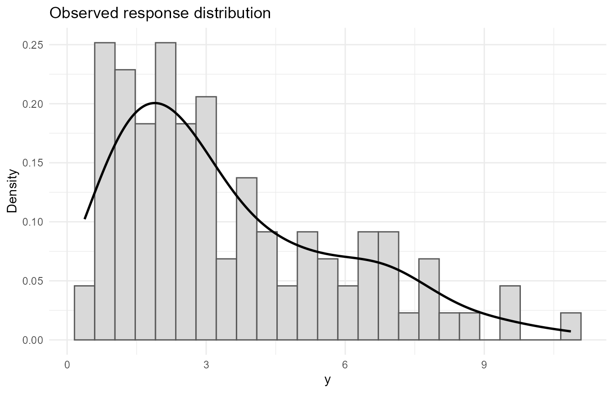
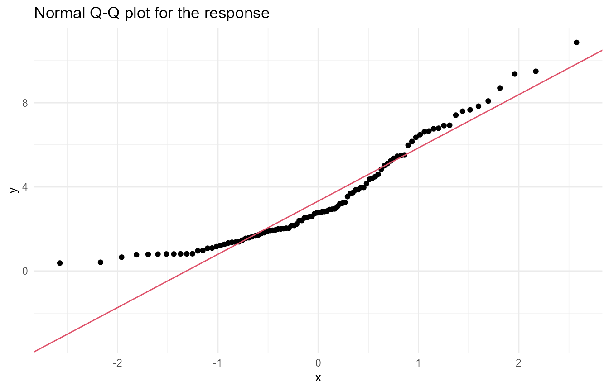
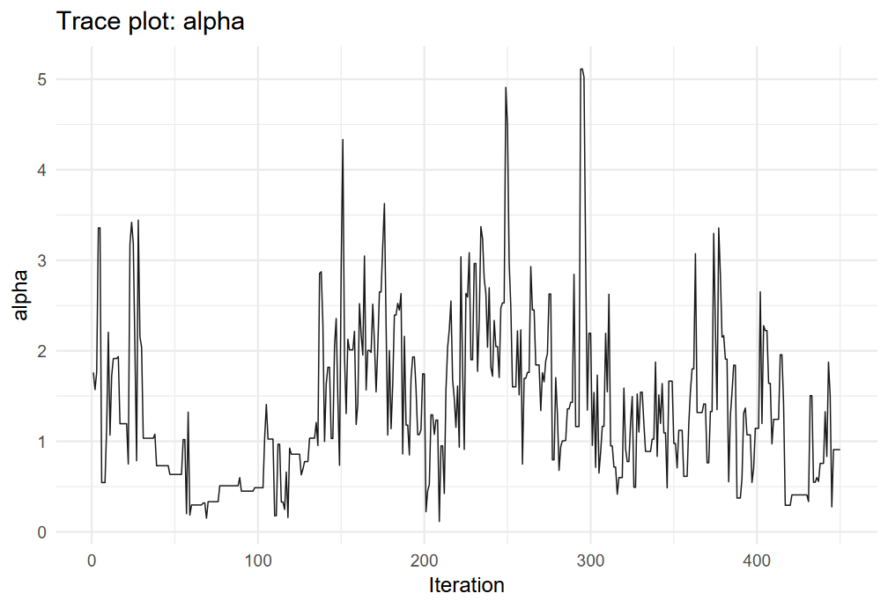
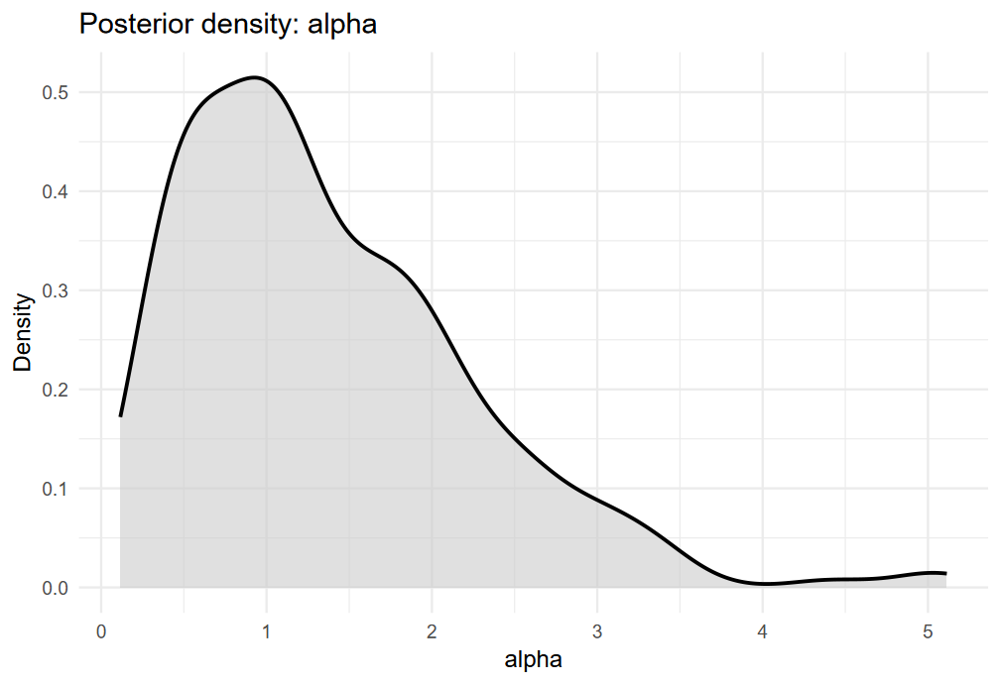
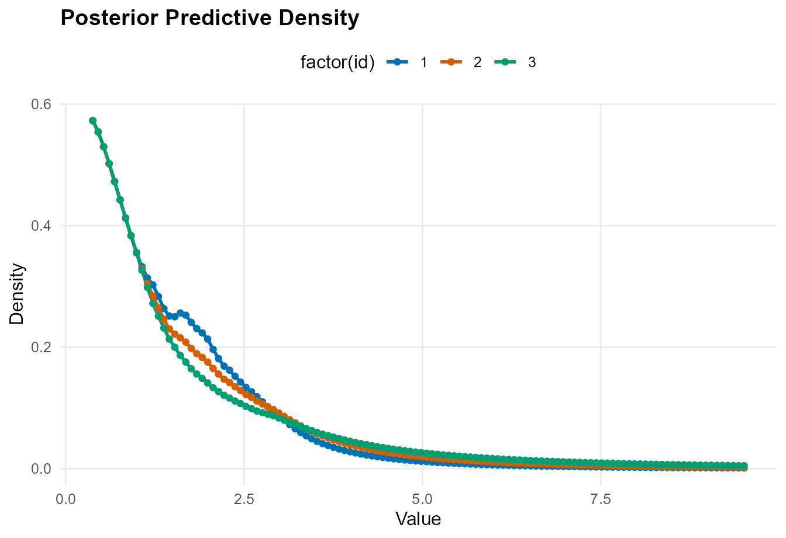
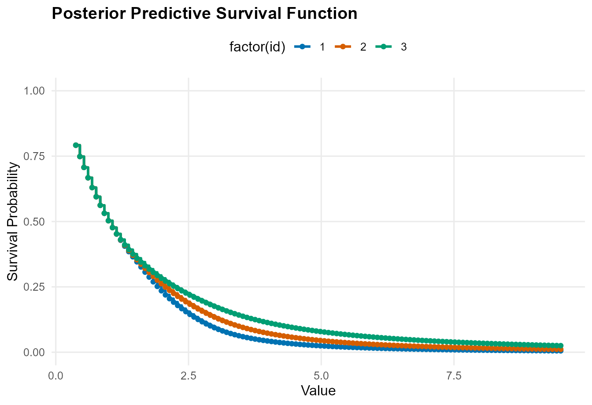
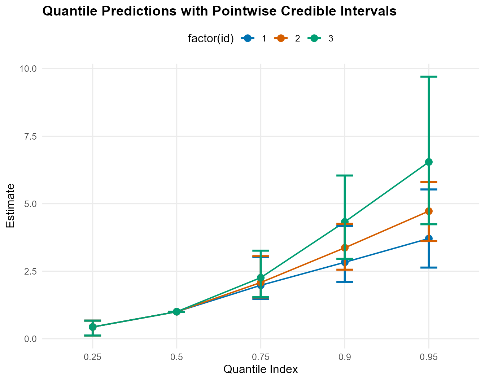
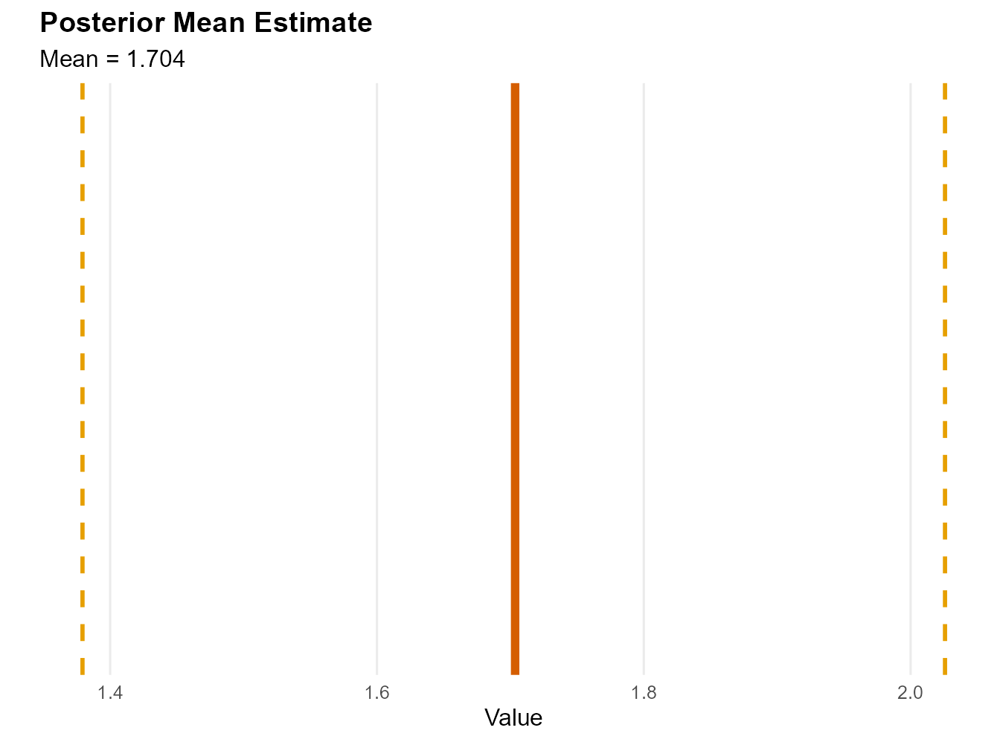
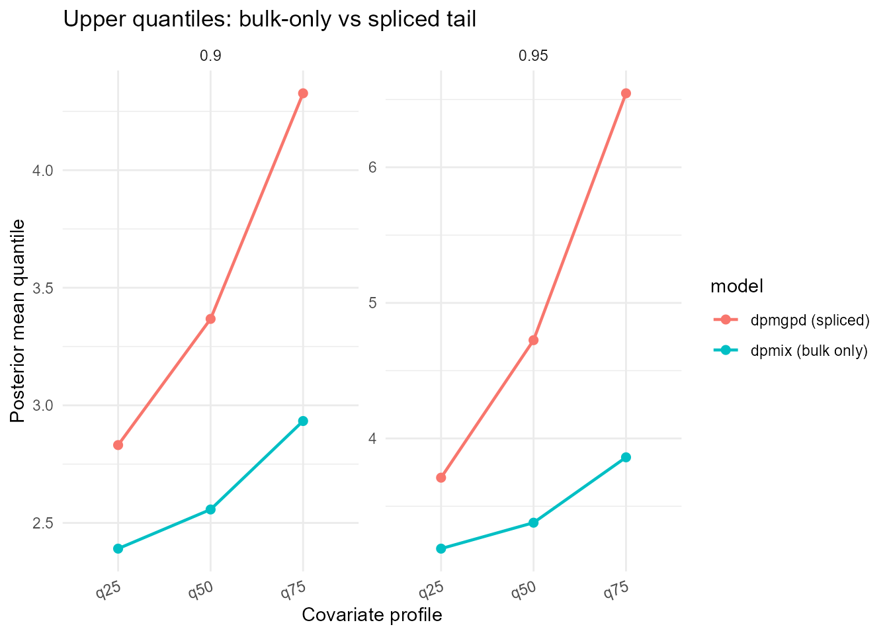

# One-Arm Modeling with CausalMixGPD

## Introduction

`CausalMixGPD` is built for settings in which the response distribution
cannot be summarized adequately by a single parametric family. In many
applications the central part of the distribution is heterogeneous,
skewed, or multimodal, while the upper tail is sparse and may require
principled extrapolation. The package addresses this by combining a
Dirichlet process mixture (DPM) model for the bulk with an optional
generalized Pareto distribution (GPD) tail in a single Bayesian workflow
([Escobar and West 1995](#ref-EscobarWest1995); [Balkema and Haan
1974](#ref-BalkemaDeHaan1974); [Pickands 1975](#ref-Pickands1975);
[Coles 2001](#ref-Coles2001)).

The one-arm workflow is the basic building block of the package. A
conditional outcome distribution is fitted first, and posterior
summaries such as densities, survival functions, quantiles, means, and
restricted means are then obtained from that fitted distribution through
common extractor and prediction methods. The software paper presents
this as the core modeling pipeline on which the causal and clustering
extensions are built.

This vignette gives a complete introduction to that workflow using a
bundled simulated dataset. The emphasis is on four tasks. First, we set
up the notation and the spliced model carefully. Second, we explain how
the main one-arm functions are related to the statistical objects they
return. Third, we work through the package interface with runnable code.
Fourth, we summarize the main customization options that control
kernels, backends, priors, monitoring, and prediction output.

## Notation and statistical background

### Conditional distribution as the inferential target

Let $`Y`$ denote the response and let $`X \in \mathbb{R}^p`$ denote a
predictor vector. For a fixed covariate value $`x`$, the conditional
cumulative distribution function and conditional density are

``` math
F(y \mid x) = \Pr(Y \le y \mid X = x), \qquad
f(y \mid x) = \frac{\partial}{\partial y} F(y \mid x),
```

and the conditional quantile function is

``` math
Q(\tau \mid x) = \inf\{y : F(y \mid x) \ge \tau\}, \qquad 0 < \tau < 1.
```

In `CausalMixGPD`, this conditional distribution is the primary object
of inference. Scalar summaries such as means or upper quantiles are
derived from the fitted distribution rather than modeled separately.
That design is important because it keeps different summaries internally
coherent and avoids issues such as quantile crossing that can arise when
quantiles are estimated one at a time.

### Bulk model: Dirichlet process mixtures

Below a tail threshold, the package uses a DPM regression model. If
$`k(\cdot \mid x; \theta)`$ denotes a chosen kernel family, the bulk
conditional density can be written as

``` math
f_{\mathrm{DP}}(y \mid x) = \int k(y \mid x; \theta) \, dH(\theta)
= \sum_{j=1}^{\infty} w_j k(y \mid x; \theta_j),
```

where $`H`$ is a random mixing distribution with a Dirichlet process
prior, the weights satisfy $`w_j \ge 0`$ and $`\sum_j w_j = 1`$, and the
kernel parameters may be constant or covariate-dependent ([Ferguson
1973](#ref-Ferguson1973); [Sethuraman 1994](#ref-Sethuraman1994); [Neal
2000](#ref-Neal2000)). This mixture representation is useful because it
can adapt to multimodality, asymmetry, varying local spread, and latent
subgroup structure without requiring the user to pre-specify a small
number of components.

From the software perspective, the bulk model is controlled mainly
through the arguments `kernel`, `backend`, `components`, and
`param_specs`. The `kernel` argument selects the family $`k(\cdot)`$,
the `backend` argument chooses the latent DPM representation,
`components` controls the truncation size used internally, and
`param_specs` determines which parameters are fixed, prior-driven, or
regressed on predictors.

### Tail model: generalized Pareto exceedances

When the upper tail requires explicit modeling, the package replaces the
part of the density above a threshold $`u(x)`$ by a GPD component. For
exceedances over the threshold, define

``` math
Z = Y - u(x) \quad \text{given } Y > u(x).
```

Under the peaks-over-threshold framework, the conditional excess
distribution is approximated by a GPD when the threshold is sufficiently
high ([Balkema and Haan 1974](#ref-BalkemaDeHaan1974); [Pickands
1975](#ref-Pickands1975); [Coles 2001](#ref-Coles2001)). For
$`y > u(x)`$, with scale parameter $`\sigma(x) > 0`$ and shape parameter
$`\xi`$, the GPD cumulative distribution function is

``` math
F_{\mathrm{GPD}}(y \mid u(x), \sigma(x), \xi)
=
\begin{cases}
1 - \left(1 + \xi \frac{y-u(x)}{\sigma(x)}\right)^{-1/\xi}, & \xi \ne 0, \\
1 - \exp\left(-\frac{y-u(x)}{\sigma(x)}\right), & \xi = 0.
\end{cases}
```

The support is $`y \ge u(x)`$ when $`\xi \ge 0`$, and
$`u(x) \le y \le u(x) - \sigma(x)/\xi`$ when $`\xi < 0`$. The shape
parameter controls the tail regime: negative values imply a finite upper
endpoint, $`\xi = 0`$ gives an exponential-type tail, and positive
values correspond to heavy tails.

### Spliced bulk-tail construction

The key statistical idea in the package is the spliced model. Let
$`F_{\mathrm{DP}}(\cdot \mid x; \Theta)`$ and
$`f_{\mathrm{DP}}(\cdot \mid x; \Theta)`$ denote the bulk CDF and
density, and let $`\Phi`$ collect the tail parameters. Write

``` math
p_u(x; \Theta) = F_{\mathrm{DP}}(u(x) \mid x; \Theta)
```

for the bulk probability mass below the threshold. Then the spliced
conditional CDF is

``` math
F(y \mid x; \Theta, \Phi) =
\begin{cases}
F_{\mathrm{DP}}(y \mid x; \Theta), & y \le u(x), \\
p_u(x; \Theta) + \{1 - p_u(x; \Theta)\} F_{\mathrm{GPD}}(y \mid x; \Phi), & y > u(x),
\end{cases}
```

and the corresponding conditional density is

``` math
f(y \mid x; \Theta, \Phi) =
\begin{cases}
f_{\mathrm{DP}}(y \mid x; \Theta), & y \le u(x), \\
\{1 - p_u(x; \Theta)\} f_{\mathrm{GPD}}(y \mid x; \Phi), & y > u(x).
\end{cases}
```

This formulation preserves the flexibility of the mixture in the central
region while forcing the tail to obey an EVT-motivated form. The splice
is continuous at $`u(x)`$ by construction, and the tail density is
normalized by the bulk survival at the threshold.

The quantile function follows the same two-part logic. For quantile
levels below the threshold mass, the package inverts the bulk CDF. For
levels above the threshold mass, the probability index is rescaled to
the exceedance scale:

``` math
\widetilde\tau(x; \Theta) = \frac{\tau - p_u(x; \Theta)}{1 - p_u(x; \Theta)}.
```

Then the upper-tail quantiles are obtained from the GPD quantile
function evaluated at $`\widetilde\tau(x; \Theta)`$. This distinction
explains why upper quantile predictions are one of the main places where
a spliced fit can differ meaningfully from a bulk-only fit.

### Means, restricted means, and existence conditions

When the kernel mean exists and the tail satisfies $`\xi < 1`$, the
conditional mean of the spliced model is finite. In that case the
one-arm interface can report ordinary means through
`predict(type = "mean")`. When the tail is too heavy for a finite mean
or when the user prefers a bounded summary, the package provides
restricted means through `predict(type = "rmean")`, which returns

``` math
E\{\min(Y, c) \mid X = x\}
```

for a user-supplied cutoff $`c`$. Restricted means are often easier to
interpret in heavy-tailed settings because they remain finite and are
less dominated by a few very large posterior draws. The software paper
emphasizes this distinction explicitly in the one-arm prediction
section.

## Function map for the one-arm workflow

The main exported functions used in this vignette are listed below.

- [`dpmgpd()`](https://arnabaich96.github.io/CausalMixGPD/pkgdown/reference/dpmgpd.md)
  fits a one-arm spliced DPM-GPD model.
- [`dpmix()`](https://arnabaich96.github.io/CausalMixGPD/pkgdown/reference/dpmix.md)
  fits the corresponding bulk-only DPM model.
- [`summary()`](https://rdrr.io/r/base/summary.html) reports posterior
  summaries from a fitted object.
- [`params()`](https://arnabaich96.github.io/CausalMixGPD/pkgdown/reference/params.md)
  extracts parameter summaries in a more direct programmatic form.
- [`plot()`](https://rdrr.io/r/graphics/plot.default.html) provides
  diagnostic or summary graphics for fitted and predicted objects.
- [`predict()`](https://rdrr.io/r/stats/predict.html) returns posterior
  summaries for densities, survival functions, quantiles, means,
  restricted means, medians, samples, and fitted values.

These are not separate modeling frameworks. They are different ways of
interrogating the same posterior distribution after fitting a one-arm
model.

## Package setup

``` r

library(CausalMixGPD)
library(ggplot2)
```

For a vignette, it is reasonable to use modest MCMC settings so the code
remains runnable on ordinary hardware. In a substantive analysis, longer
runs and sensitivity checks are recommended.

``` r

mcmc_vig <- list(
  niter = 1200,
  nburnin = 300,
  thin = 2,
  nchains = 2,
  seed = 2026
)
```

## Data

We use the bundled dataset `nc_posX100_p3_k2`, which contains a positive
response and three predictors. It is convenient for illustrating both
the bulk-only and spliced workflows.

``` r

data("nc_posX100_p3_k2", package = "CausalMixGPD")
onearm_dat <- data.frame(
  y = nc_posX100_p3_k2$y,
  nc_posX100_p3_k2$X
)

str(onearm_dat)
#> 'data.frame':    100 obs. of  4 variables:
#>  $ y : num  2.85 1.33 2.4 3.54 1.27 ...
#>  $ x1: num  0.474 -0.244 -0.934 0.834 0.75 ...
#>  $ x2: num  -0.897 0.847 0.725 0.306 -0.233 ...
#>  $ x3: num  -0.961 0.203 -1.216 -0.875 -1.098 ...
summary(onearm_dat)
#>        y                 x1                 x2                 x3            
#>  Min.   : 0.3772   Min.   :-2.76601   Min.   :-0.96953   Min.   :-2.8004095  
#>  1st Qu.: 1.6188   1st Qu.:-0.59851   1st Qu.:-0.57152   1st Qu.:-0.7224762  
#>  Median : 2.7759   Median : 0.02875   Median :-0.01659   Median : 0.0004348  
#>  Mean   : 3.4537   Mean   : 0.01124   Mean   :-0.03174   Mean   :-0.0205483  
#>  3rd Qu.: 5.0332   3rd Qu.: 0.69727   3rd Qu.: 0.41547   3rd Qu.: 0.5516025  
#>  Max.   :10.8674   Max.   : 2.24294   Max.   : 0.97564   Max.   : 2.9970559
```

A quick visual check helps motivate flexible modeling.

``` r

p1 <- ggplot(onearm_dat, aes(x = y)) +
  geom_histogram(aes(y = after_stat(density)), bins = 25,
                 fill = "grey85", colour = "grey35") +
  geom_density(linewidth = 0.9) +
  labs(x = "y", y = "Density",
       title = "Observed response distribution") +
  theme_minimal()

p2 <- ggplot(onearm_dat, aes(sample = y)) +
  stat_qq() +
  stat_qq_line(colour = 2) +
  labs(title = "Normal Q-Q plot for the response") +
  theme_minimal()

p1
```



``` r

p2
```



The response is positive and the empirical distribution is skewed. That
makes the dataset a natural candidate for positive-support kernels such
as `gamma`, `lognormal`, or `invgauss`. If the scientific question
involves high quantiles or tail probabilities, a spliced GPD tail can
also be justified.

## Fitting a spliced one-arm model

We begin with
[`dpmgpd()`](https://arnabaich96.github.io/CausalMixGPD/pkgdown/reference/dpmgpd.md),
which fits the bulk mixture together with an active GPD tail. The
article presents this as the main one-arm interface for the spliced
workflow, with the formula describing the conditional outcome model and
the backend selecting the latent DPM representation.

To keep vignette build time predictable, outputs from this vignette are
**loaded from** `inst/extdata/one_arm_outputs.rds` (created by
`data-raw/build_vignette_fits.R`). This contains only the
prediction/summary objects needed to render the figures and tables,
rather than the full fitted MCMC objects.

``` r

one_arm_out <- readRDS(.pkg_extdata("one_arm_outputs.rds"))
```

A fitted one-arm object supports posterior summaries and diagnostic
plots. To avoid storing the full fit, we include static diagnostics
generated offline.

``` r

cat(paste(readLines(.pkg_extdata("one_arm_fit_summary.txt")), collapse = "\n"))
#> MixGPD summary | backend: Stick-Breaking Process | kernel: Lognormal Distribution | GPD tail: TRUE | epsilon: 0.025
#> n = 100 | components = 5
#> Summary
#> Initial components: 5 | Components after truncation: 1
#> 
#> Summary table
#>           parameter   mean    sd q0.025 q0.500 q0.975
#>          weights[1]  0.614 0.203  0.295  0.586      1
#>               alpha  1.129 0.867    0.1  0.961  3.329
#>  beta_tail_scale[1]  0.518  0.19  0.146  0.511  0.883
#>  beta_tail_scale[2]  0.017  0.28 -0.528  0.022  0.548
#>  beta_tail_scale[3]  0.206 0.223 -0.252  0.212  0.628
#>   beta_threshold[1] -0.308 0.155 -0.602 -0.307 -0.006
#>   beta_threshold[2] -0.034 0.213 -0.441 -0.037  0.396
#>   beta_threshold[3]  -0.09 0.268 -0.553 -0.106   0.41
#>             sdlog_u  0.893 0.289  0.275  0.913  1.465
#>          tail_shape  0.422 0.107  0.208  0.421  0.649
#>            sdlog[1]  1.344 0.639  0.592  1.178  3.152
#>   beta_meanlog[1,1]      0     0      0      0      0
#>   beta_meanlog[1,2]      0     0      0      0      0
#>   beta_meanlog[1,3]      0     0      0      0      0
```





The exact parameter names stored by the object depend on the chosen
kernel and backend, but the general interpretation is stable. The
concentration parameter controls the effective complexity of the
mixture, while the monitored bulk and tail parameters determine the
conditional distribution used for all later prediction tasks. Use
`params(fit_spliced)` when you need the posterior draws as a matrix for
custom summaries.

## Posterior prediction from the spliced model

### Conditional density and survival summaries

The package article notes that density and survival summaries are
returned by evaluating the corresponding functional draw by draw and
then summarizing over retained MCMC draws. We illustrate that at three
representative predictor profiles formed from empirical quartiles.

``` r

x_new <- one_arm_out$x_new
x_new
#>              x1          x2            x3
#> q25 -0.59851252 -0.57151934 -0.7224762264
#> q50  0.02874559 -0.01658997  0.0004347721
#> q75  0.69727001  0.41546653  0.5516024827
```

``` r

pred_dens <- one_arm_out$pred_dens
plot(pred_dens, type = "density", facet = "covariate")
```



``` r

pred_surv <- one_arm_out$pred_surv
plot(pred_surv)
```



These summaries show how the fitted conditional distribution changes
across covariate profiles. In practice, that helps determine whether
predictors act mostly through a location shift, through dispersion, or
through upper-tail behavior.

### Quantiles, means, and restricted means

The one-arm workflow is especially useful when the scientific target is
not just the density itself but one or more functionals of the
conditional distribution. The article highlights quantiles and mean-type
summaries as central examples, with restricted means remaining available
even when the ordinary mean is unstable or undefined under a heavy tail.

``` r

pred_quant <- one_arm_out$pred_quant
```

``` r

plot(pred_quant)
```



``` r

pred_mean <- one_arm_out$pred_mean
```

``` r

plot(pred_mean)
```



``` r

cutoff_val <- one_arm_out$cutoff_val
```

``` r

knitr::kable(
  one_arm_out$pred_rmean_fit_df,
  format = "html",
  row.names = FALSE,
  digits = 4
)
```

|  id | estimate |  lower |  upper |
|----:|---------:|-------:|-------:|
|   1 |   2.1259 | 1.4484 | 2.7973 |
|   2 |   2.2705 | 1.6675 | 3.0495 |
|   3 |   2.4575 | 1.6781 | 3.1427 |

The restricted mean is often a good complement to upper-tail quantiles.
It preserves the original response scale, is always finite for finite
cutoffs, and gives a more stable summary when a few extreme draws can
dominate the ordinary mean.

## Comparing bulk-only and spliced fits

The package also provides a bulk-only wrapper,
[`dpmix()`](https://arnabaich96.github.io/CausalMixGPD/pkgdown/reference/dpmix.md),
which removes the GPD tail while leaving the general predictive
interface intact. The article presents this as the natural special case
obtained when the tail component is switched off.

``` r

cat("Bulk-only fit computed offline; see quantile comparison below.\n")
#> Bulk-only fit computed offline; see quantile comparison below.
```

``` r

quant_bulk_fit_df <- one_arm_out$quant_bulk_fit_df
quant_spliced_fit_df <- one_arm_out$quant_spliced_fit_df
```

``` r

qb <- quant_bulk_fit_df
qb$model <- "dpmix (bulk only)"
qs <- quant_spliced_fit_df
qs$model <- "dpmgpd (spliced)"
qc <- rbind(qb, qs)
qc$profile <- rownames(x_new)[as.integer(qc$id)]
ggplot(qc, aes(x = profile, y = estimate, colour = model, group = model)) +
  geom_line(linewidth = 0.8) +
  geom_point(size = 2) +
  facet_wrap(~index, scales = "free_y", ncol = 2) +
  labs(
    x = "Covariate profile",
    y = "Posterior mean quantile",
    title = "Upper quantiles: bulk-only vs spliced tail"
  ) +
  theme_minimal() +
  theme(axis.text.x = element_text(angle = 20, hjust = 1))
```



This comparison is one of the most revealing diagnostics in a
heavy-tailed application. Bulk-only and spliced models can look very
similar in the center of the distribution, yet their upper-tail quantile
predictions can differ materially because only the spliced model imposes
an explicit EVT-based tail form.

## Analysis summary

The one-arm workflow is easiest to interpret if the fitted conditional
distribution is treated as the scientific object of interest. In this
example, the positive-support mixture captures the main structure of the
response across covariate profiles, while the optional GPD tail modifies
the way upper-tail mass is extrapolated. The density and survival
summaries show the global shape of the fitted conditional distribution,
the quantile summaries highlight profile-specific location and tail
changes, and the restricted mean gives a robust bounded summary on the
original response scale.

From a practical modeling standpoint, the most important takeaway is
that
[`dpmix()`](https://arnabaich96.github.io/CausalMixGPD/pkgdown/reference/dpmix.md)
and
[`dpmgpd()`](https://arnabaich96.github.io/CausalMixGPD/pkgdown/reference/dpmgpd.md)
are not competing prediction APIs. They are two related model classes
that feed the same summary interface. The decision between them should
be driven by the scientific role of the upper tail. If the target is
mainly bulk prediction, a bulk-only mixture may be adequate. If
inference on extreme upper quantiles, tail probabilities, or
heavy-tail-sensitive means matters, the spliced formulation is usually
preferable.

## Customization options for one-arm models

This section collects the main arguments that users typically customize
in one-arm analyses. The package appendix provides the same controls in
compact reference form.

### Model specification options

`kernel` selects the bulk family. Positive-support choices include
`"gamma"`, `"lognormal"`, and `"invgauss"`; real-line kernels include
`"normal"`, `"laplace"`, `"cauchy"`, and `"amoroso"`. The support of the
response should guide this choice.

`backend` determines how the DPM is represented internally. The main
options are `"sb"` for stick-breaking and `"crp"` for a Chinese
restaurant process representation.

`components` controls the truncation size used for the finite
approximation to the infinite mixture.

`GPD` is implicit in the wrapper choice:
[`dpmgpd()`](https://arnabaich96.github.io/CausalMixGPD/pkgdown/reference/dpmgpd.md)
activates the spliced tail, whereas
[`dpmix()`](https://arnabaich96.github.io/CausalMixGPD/pkgdown/reference/dpmix.md)
fits the bulk-only model.

### Parameter and prior customization

`param_specs` is the central argument for advanced model control. Each
kernel or tail parameter can be assigned one of three modes: a fixed
value, a prior-driven random value, or a covariate-linked regression
structure. This is the main route for changing whether a threshold,
scale, or kernel parameter is held constant or allowed to vary with
predictors.

`alpha_random` controls whether the DPM concentration parameter is
treated as random under its prior or fixed.

`epsilon` controls downstream truncation and summary behavior for very
small mixture components.

### MCMC and monitoring options

`mcmc` contains the iteration controls `niter`, `nburnin`, `thin`,
`nchains`, and `seed`.

`monitor` chooses how much of the posterior state is retained. The usual
values are `"core"` and `"full"`.

`monitor_latent = TRUE` requests latent allocation labels in the
retained output, and `monitor_v = TRUE` stores stick-breaking fractions
for SB fits.

### Prediction options

[`predict()`](https://rdrr.io/r/stats/predict.html) supports
`type = "density"`, `"survival"`, `"quantile"`, `"mean"`, `"rmean"`,
`"median"`, `"sample"`, and `"fit"`.

For density and survival summaries, the argument `y` supplies the
evaluation grid.

For quantile summaries, the argument `index` supplies the probability
levels.

For restricted means, the argument `cutoff` defines the truncation point
and `nsim_mean` can control Monte Carlo evaluation when applicable.

`interval` can be set to `"credible"`, `"hpd"`, or `NULL`, and `level`
controls the posterior interval coverage level.

## Session information

``` r

sessionInfo()
#> R version 4.5.2 (2025-10-31 ucrt)
#> Platform: x86_64-w64-mingw32/x64
#> Running under: Windows 11 x64 (build 26200)
#> 
#> Matrix products: default
#>   LAPACK version 3.12.1
#> 
#> locale:
#> [1] LC_COLLATE=English_United States.utf8 
#> [2] LC_CTYPE=English_United States.utf8   
#> [3] LC_MONETARY=English_United States.utf8
#> [4] LC_NUMERIC=C                          
#> [5] LC_TIME=English_United States.utf8    
#> 
#> time zone: America/New_York
#> tzcode source: internal
#> 
#> attached base packages:
#> [1] stats     graphics  grDevices datasets  utils     methods   base     
#> 
#> other attached packages:
#> [1] ggplot2_4.0.2      CausalMixGPD_0.5.0 nimble_1.4.1      
#> 
#> loaded via a namespace (and not attached):
#>  [1] gtable_0.3.6        jsonlite_2.0.0      dplyr_1.2.0        
#>  [4] compiler_4.5.2      renv_1.1.7          tidyselect_1.2.1   
#>  [7] parallel_4.5.2      jquerylib_0.1.4     systemfonts_1.3.2  
#> [10] scales_1.4.0        textshaping_1.0.5   yaml_2.3.12        
#> [13] fastmap_1.2.0       lattice_0.22-9      coda_0.19-4.1      
#> [16] R6_2.6.1            labeling_0.4.3      generics_0.1.4     
#> [19] igraph_2.2.2        knitr_1.51          htmlwidgets_1.6.4  
#> [22] tibble_3.3.1        desc_1.4.3          pillar_1.11.1      
#> [25] bslib_0.10.0        RColorBrewer_1.1-3  rlang_1.1.7        
#> [28] cachem_1.1.0        xfun_0.57           S7_0.2.1           
#> [31] fs_2.0.1            sass_0.4.10         otel_0.2.0         
#> [34] cli_3.6.5           withr_3.0.2         pkgdown_2.2.0      
#> [37] magrittr_2.0.4      digest_0.6.39       grid_4.5.2         
#> [40] lifecycle_1.0.5     vctrs_0.7.2         evaluate_1.0.5     
#> [43] pracma_2.4.6        glue_1.8.0          farver_2.1.2       
#> [46] numDeriv_2016.8-1.1 ragg_1.5.0          rmarkdown_2.31     
#> [49] tools_4.5.2         pkgconfig_2.0.3     htmltools_0.5.9
```

Balkema, August A., and Laurens de Haan. 1974. “Residual Life Time at
Great Age.” *The Annals of Probability* 2 (5): 792–804.
<https://doi.org/10.1214/aop/1176996548>.

Coles, Stuart. 2001. *An Introduction to Statistical Modeling of Extreme
Values*. Springer. <https://doi.org/10.1007/978-1-4471-3675-0>.

Escobar, Michael D., and Mike West. 1995. “Bayesian Density Estimation
and Inference Using Mixtures.” *Journal of the American Statistical
Association* 90 (430): 577–88.
<https://doi.org/10.1080/01621459.1995.10476550>.

Ferguson, Thomas S. 1973. “A Bayesian Analysis of Some Nonparametric
Problems.” *The Annals of Statistics* 1 (2): 209–30.
<https://doi.org/10.1214/aos/1176342360>.

Neal, Radford M. 2000. “Markov Chain Sampling Methods for Dirichlet
Process Mixture Models.” *Journal of Computational and Graphical
Statistics* 9 (2): 249–65.
<https://doi.org/10.1080/10618600.2000.10474879>.

Pickands, James. 1975. “Statistical Inference Using Extreme Order
Statistics.” *The Annals of Statistics* 3 (1): 119–31.
<https://doi.org/10.1214/aos/1176343003>.

Sethuraman, Jayaram. 1994. “A Constructive Definition of Dirichlet
Priors.” *Statistica Sinica* 4 (2): 639–50.
