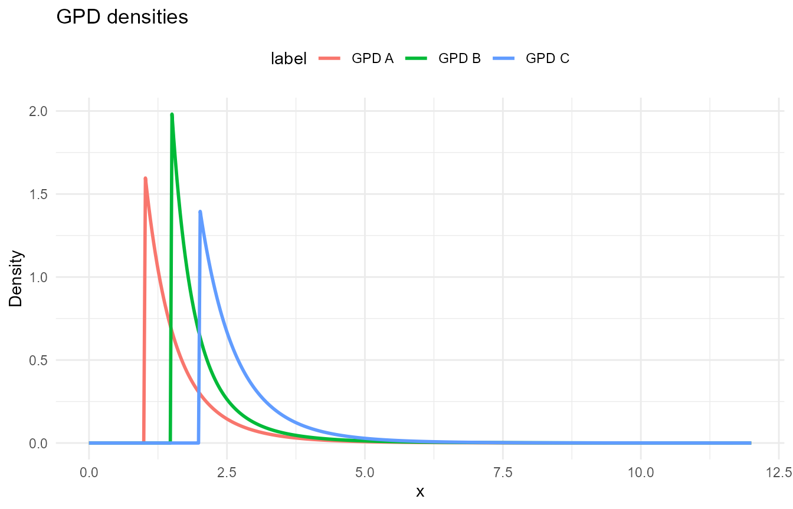
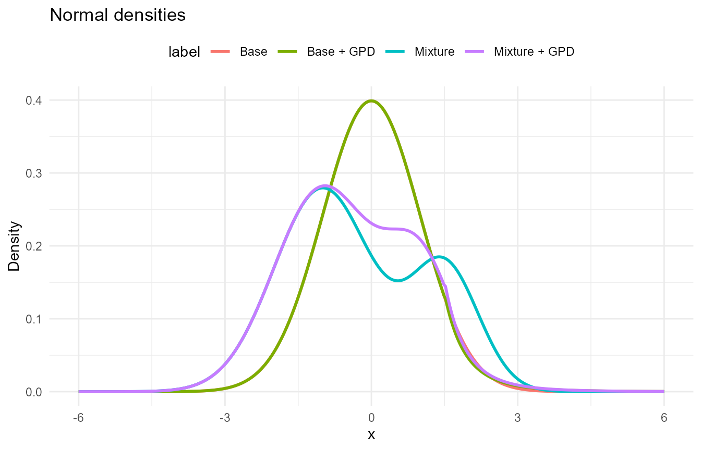
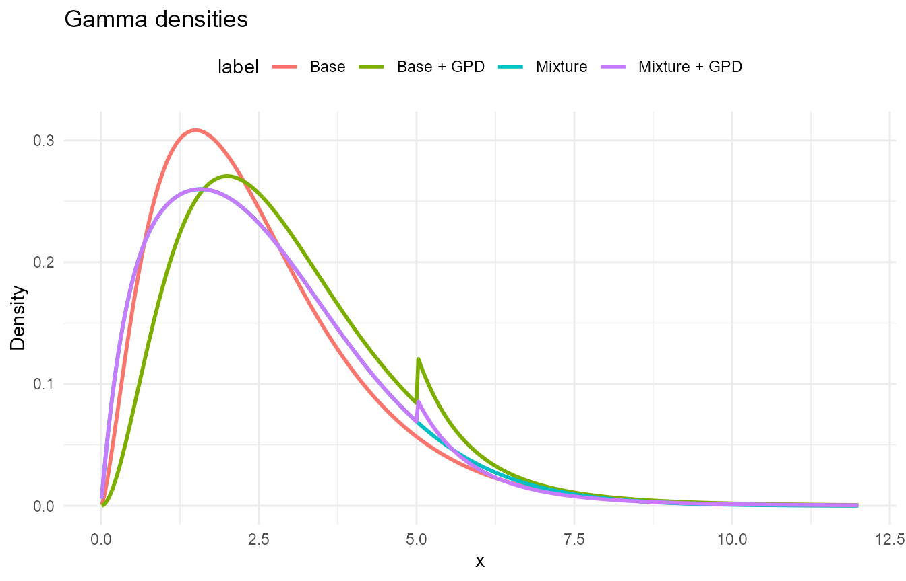
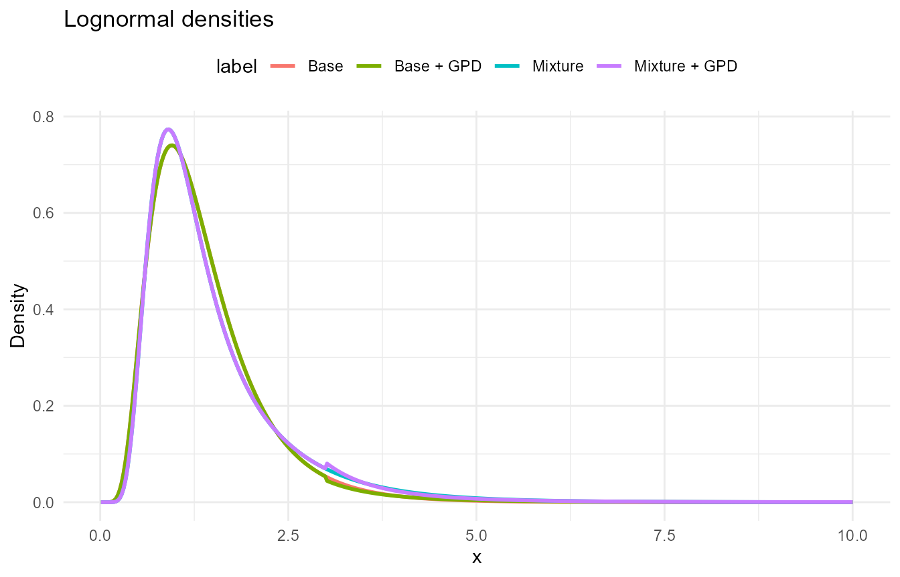
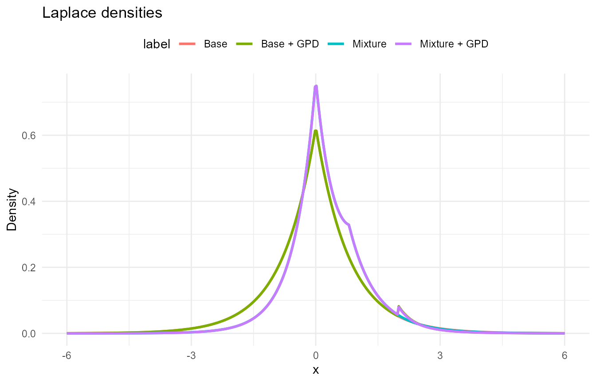
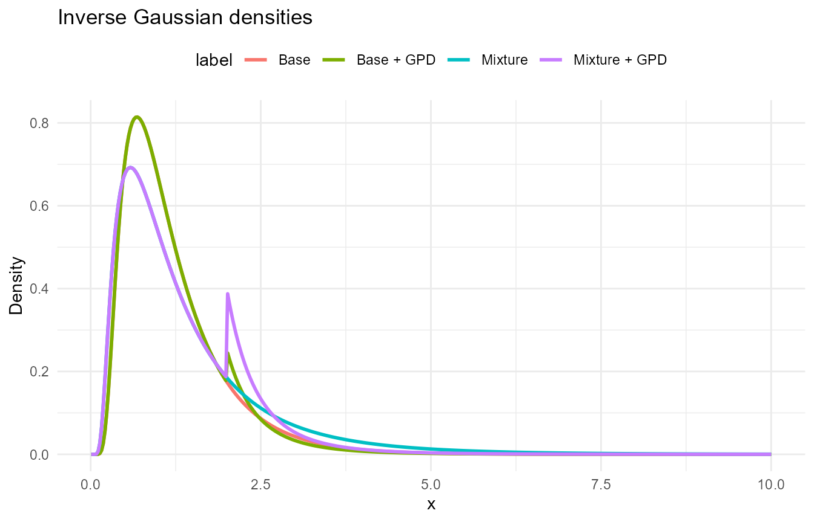
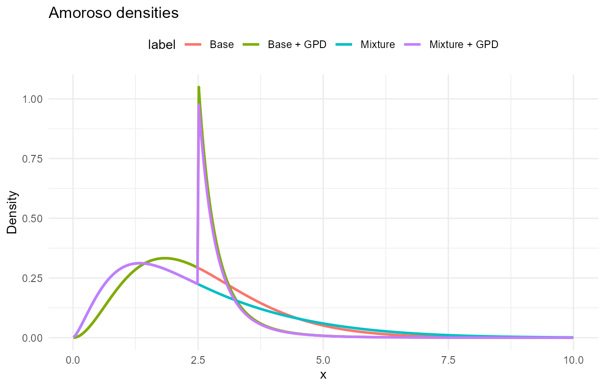
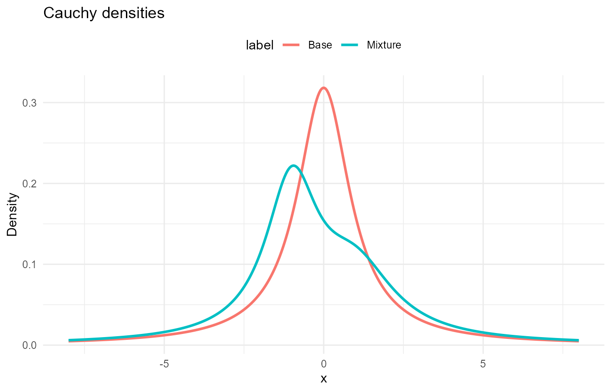

# Available Distributions

## Overview

DPmixGPD supports multiple bulk kernels for mixture components and can
optionally splice a Generalized Pareto Distribution (GPD) tail beyond a
threshold.

All examples below use **vectorized R wrappers** (lowercase) only.

The `d*`, `p*`, `q*`, `r*` prefixes mean:

- `d*`: density (PDF); supports `log` where available.
- `p*`: distribution (CDF); supports `lower.tail` and `log.p`.
- `q*`: quantile; supports `lower.tail` and `log.p`.
- `r*`: random generation; supports `n`.

GPD variants add `threshold`, `tail_scale`, and `tail_shape`.

See **Complete Function Reference** at the end for the full `d/p/q/r`
sets (R + NIMBLE) and Rd links.

## Generalized Pareto (GPD)

**Functions**

- Base: `dgpd`, `pgpd`, `qgpd`, `rgpd`

``` r

sets <- list(
  list(label = "GPD A", fn = dgpd, params = list(threshold = 1.0, scale = 0.6, shape = 0.15)),
  list(label = "GPD B", fn = dgpd, params = list(threshold = 1.5, scale = 0.5, shape = 0.25)),
  list(label = "GPD C", fn = dgpd, params = list(threshold = 2.0, scale = 0.7, shape = 0.10))
)

param_table("GPD parameter sets", sets)
```

| Label |                 Parameters                 |
|:-----:|:------------------------------------------:|
| GPD A |  threshold = 1, scale = 0.6, shape = 0.15  |
| GPD B | threshold = 1.5, scale = 0.5, shape = 0.25 |
| GPD C |  threshold = 2, scale = 0.7, shape = 0.1   |

GPD parameter sets {.table .table .table-striped .table-hover
style="width: auto !important; margin-left: auto; margin-right: auto;"}

``` r

variants <- list(
  list(label = "GPD A", d = dgpd, p = pgpd, q = qgpd, r = rgpd,
       params = list(threshold = 1.0, scale = 0.6, shape = 0.15)),
  list(label = "GPD B", d = dgpd, p = pgpd, q = qgpd, r = rgpd,
       params = list(threshold = 1.5, scale = 0.5, shape = 0.25)),
  list(label = "GPD C", d = dgpd, p = pgpd, q = qgpd, r = rgpd,
       params = list(threshold = 2.0, scale = 0.7, shape = 0.10))
)

demo_table("GPD function demo (x = 2.0, p = 0.8, n = 3)", variants, x = 2.0)
```

| Variant | d(x)  | p(x)  | q(p) |        r(n)         |
|:-------:|:-----:|:-----:|:----:|:-------------------:|
|  GPD A  | 0.301 | 0.774 | 2.09 | 1.189, 1.289, 1.544 |
|  GPD B  | 0.655 | 0.590 | 2.49 | 3.134, 1.616, 3.042 |
|  GPD C  | 1.429 | 0.000 | 3.22 |  4.35, 2.799, 2.73  |

GPD function demo (x = 2.0, p = 0.8, n = 3) {.table .table
.table-striped .table-hover
style="width: auto !important; margin-left: auto; margin-right: auto;"}



## Normal

**Functions**

- Base: `dnorm`, `pnorm`, `qnorm`, `rnorm`
- Base + GPD: `dnormgpd`, `pnormgpd`, `qnormgpd`, `rnormgpd`
- Mixture: `dnormmix`, `pnormmix`, `qnormmix`, `rnormmix`
- Mixture + GPD: `dnormmixgpd`, `pnormmixgpd`, `qnormmixgpd`,
  `rnormmixgpd`

``` r

sets <- list(
  list(label = "Base", fn = dnorm, params = list(mean = 0, sd = 1)),
  list(label = "Base + GPD", fn = dnormgpd,
       params = list(mean = 0, sd = 1, threshold = 1.5, tail_scale = 0.5, tail_shape = 0.2)),
  list(label = "Mixture", fn = dnormmix,
       params = list(w = c(0.7, 0.3), mean = c(-1, 1.5), sd = c(1.0, 0.7))),
  list(label = "Mixture + GPD", fn = dnormmixgpd,
       params = list(w = c(0.7, 0.3), mean = c(-1, 1), sd = c(1.0, 0.7),
                     threshold = 1.5, tail_scale = 0.5, tail_shape = 0.2))
)

param_table("Normal parameter sets", sets)
```

| Label | Parameters |
|:--:|:--:|
| Base | mean = 0, sd = 1 |
| Base + GPD | mean = 0, sd = 1, threshold = 1.5, tail_scale = 0.5, tail_shape = 0.2 |
| Mixture | w = (0.7, 0.3), mean = (-1, 1.5), sd = (1, 0.7) |
| Mixture + GPD | w = (0.7, 0.3), mean = (-1, 1), sd = (1, 0.7), threshold = 1.5, tail_scale = 0.5, tail_shape = 0.2 |

Normal parameter sets {.table .table .table-striped .table-hover
style="width: auto !important; margin-left: auto; margin-right: auto;"}

``` r

variants <- list(
  list(label = "Base", d = dnorm, p = pnorm, q = qnorm, r = rnorm,
       params = list(mean = 0, sd = 1)),
  list(label = "Base + GPD", d = dnormgpd, p = pnormgpd, q = qnormgpd, r = rnormgpd,
       params = list(mean = 0, sd = 1, threshold = 1.5, tail_scale = 0.5, tail_shape = 0.2)),
  list(label = "Mixture", d = dnormmix, p = pnormmix, q = qnormmix, r = rnormmix,
       params = list(w = c(0.7, 0.3), mean = c(-1, 1.5), sd = c(1.0, 0.7))),
  list(label = "Mixture + GPD", d = dnormmixgpd, p = pnormmixgpd, q = qnormmixgpd, r = rnormmixgpd,
       params = list(w = c(0.7, 0.3), mean = c(-1, 1), sd = c(1.0, 0.7),
                     threshold = 1.5, tail_scale = 0.5, tail_shape = 0.2))
)

demo_table("Normal function demo (x = 0.5, p = 0.8, n = 3)", variants, x = 0.5)
```

|    Variant    | d(x)  | p(x)  | q(p)  |         r(n)          |
|:-------------:|:-----:|:-----:|:-----:|:---------------------:|
|     Base      | 0.352 | 0.691 | 0.842 | -1.54, -0.929, -0.295 |
|  Base + GPD   | 0.352 | 0.691 | 0.842 |  0.576, 0.764, 0.39   |
|    Mixture    | 0.152 | 0.676 | 1.252 | -1.289, 0.125, -0.748 |
| Mixture + GPD | 0.223 | 0.724 | 0.841 |  1.305, 0.843, 1.093  |

Normal function demo (x = 0.5, p = 0.8, n = 3) {.table .table
.table-striped .table-hover
style="width: auto !important; margin-left: auto; margin-right: auto;"}



## Gamma

**Functions**

- Base: `dgamma`, `pgamma`, `qgamma`, `rgamma`
- Base + GPD: `dgammagpd`, `pgammagpd`, `qgammagpd`, `rgammagpd`
- Mixture: `dgammamix`, `pgammamix`, `qgammamix`, `rgammamix`
- Mixture + GPD: `dgammamixgpd`, `pgammamixgpd`, `qgammamixgpd`,
  `rgammamixgpd`

``` r

sets <- list(
  list(label = "Base", fn = dgamma, params = list(shape = 2.5, scale = 1.0)),
  list(label = "Base + GPD", fn = dgammagpd,
       params = list(shape = 3, scale = 1.0, threshold = 5.0, tail_scale = 1.0, tail_shape = 0.2)),
  list(label = "Mixture", fn = dgammamix,
       params = list(w = c(0.6, 0.4), shape = c(2, 5), scale = c(1.0, 0.7))),
  list(label = "Mixture + GPD", fn = dgammamixgpd,
       params = list(w = c(0.6, 0.4), shape = c(2, 5), scale = c(1.0, 0.7),
                     threshold = 5.0, tail_scale = 1.0, tail_shape = 0.2))
)

param_table("Gamma parameter sets", sets)
```

| Label | Parameters |
|:--:|:--:|
| Base | shape = 2.5, scale = 1 |
| Base + GPD | shape = 3, scale = 1, threshold = 5, tail_scale = 1, tail_shape = 0.2 |
| Mixture | w = (0.6, 0.4), shape = (2, 5), scale = (1, 0.7) |
| Mixture + GPD | w = (0.6, 0.4), shape = (2, 5), scale = (1, 0.7), threshold = 5, tail_scale = 1, tail_shape = 0.2 |

Gamma parameter sets {.table .table .table-striped .table-hover
style="width: auto !important; margin-left: auto; margin-right: auto;"}

``` r

variants <- list(
  list(label = "Base", d = dgamma, p = pgamma, q = qgamma, r = rgamma,
       params = list(shape = 2.5, scale = 1.0)),
  list(label = "Base + GPD", d = dgammagpd, p = pgammagpd, q = qgammagpd, r = rgammagpd,
       params = list(shape = 3, scale = 1.0, threshold = 5.0, tail_scale = 1.0, tail_shape = 0.2)),
  list(label = "Mixture", d = dgammamix, p = pgammamix, q = qgammamix, r = rgammamix,
       params = list(w = c(0.6, 0.4), shape = c(2, 5), scale = c(1.0, 0.7))),
  list(label = "Mixture + GPD", d = dgammamixgpd, p = pgammamixgpd, q = qgammamixgpd, r = rgammamixgpd,
       params = list(w = c(0.6, 0.4), shape = c(2, 5), scale = c(1.0, 0.7),
                     threshold = 5.0, tail_scale = 1.0, tail_shape = 0.2))
)

demo_table("Gamma function demo (x = 3.0, p = 0.8, n = 3)", variants, x = 3.0)
```

|    Variant    | d(x)  | p(x)  | q(p) |        r(n)         |
|:-------------:|:-----:|:-----:|:----:|:-------------------:|
|     Base      | 0.195 | 0.694 | 3.64 | 3.299, 1.92, 1.921  |
|  Base + GPD   | 0.224 | 0.577 | 4.28 | 0.715, 3.204, 5.36  |
|    Mixture    | 0.200 | 0.651 | 3.89 | 1.016, 2.522, 2.564 |
| Mixture + GPD | 0.200 | 0.651 | 3.89 |  3.4, 6.301, 0.997  |

Gamma function demo (x = 3.0, p = 0.8, n = 3) {.table .table
.table-striped .table-hover
style="width: auto !important; margin-left: auto; margin-right: auto;"}



## Lognormal

**Functions**

- Base: `dlnorm`, `plnorm`, `qlnorm`, `rlnorm`
- Base + GPD: `dlognormalgpd`, `plognormalgpd`, `qlognormalgpd`,
  `rlognormalgpd`
- Mixture: `dlognormalmix`, `plognormalmix`, `qlognormalmix`,
  `rlognormalmix`
- Mixture + GPD: `dlognormalmixgpd`, `plognormalmixgpd`,
  `qlognormalmixgpd`, `rlognormalmixgpd`

``` r

sets <- list(
  list(label = "Base", fn = dlnorm, params = list(meanlog = 0.2, sdlog = 0.5)),
  list(label = "Base + GPD", fn = dlognormalgpd,
       params = list(meanlog = 0.2, sdlog = 0.5, threshold = 3.0, tail_scale = 0.8, tail_shape = 0.2)),
  list(label = "Mixture", fn = dlognormalmix,
       params = list(w = c(0.6, 0.4), meanlog = c(0, 0.6), sdlog = c(0.4, 0.5))),
  list(label = "Mixture + GPD", fn = dlognormalmixgpd,
       params = list(w = c(0.6, 0.4), meanlog = c(0, 0.6), sdlog = c(0.4, 0.5),
                     threshold = 3.0, tail_scale = 0.8, tail_shape = 0.2))
)

param_table("Lognormal parameter sets", sets)
```

| Label | Parameters |
|:--:|:--:|
| Base | meanlog = 0.2, sdlog = 0.5 |
| Base + GPD | meanlog = 0.2, sdlog = 0.5, threshold = 3, tail_scale = 0.8, tail_shape = 0.2 |
| Mixture | w = (0.6, 0.4), meanlog = (0, 0.6), sdlog = (0.4, 0.5) |
| Mixture + GPD | w = (0.6, 0.4), meanlog = (0, 0.6), sdlog = (0.4, 0.5), threshold = 3, tail_scale = 0.8, tail_shape = 0.2 |

Lognormal parameter sets {.table .table .table-striped .table-hover
style="width: auto !important; margin-left: auto; margin-right: auto;"}

``` r

variants <- list(
  list(label = "Base", d = dlnorm, p = plnorm, q = qlnorm, r = rlnorm,
       params = list(meanlog = 0.2, sdlog = 0.5)),
  list(label = "Base + GPD", d = dlognormalgpd, p = plognormalgpd, q = qlognormalgpd, r = rlognormalgpd,
       params = list(meanlog = 0.2, sdlog = 0.5, threshold = 3.0, tail_scale = 0.8, tail_shape = 0.2)),
  list(label = "Mixture", d = dlognormalmix, p = plognormalmix, q = qlognormalmix, r = rlognormalmix,
       params = list(w = c(0.6, 0.4), meanlog = c(0, 0.6), sdlog = c(0.4, 0.5))),
  list(label = "Mixture + GPD", d = dlognormalmixgpd, p = plognormalmixgpd,
       q = qlognormalmixgpd, r = rlognormalmixgpd,
       params = list(w = c(0.6, 0.4), meanlog = c(0, 0.6), sdlog = c(0.4, 0.5),
                     threshold = 3.0, tail_scale = 0.8, tail_shape = 0.2))
)

demo_table("Lognormal function demo (x = 1.2, p = 0.8, n = 3)", variants, x = 1.2)
```

|    Variant    | d(x)  | p(x)  | q(p) |        r(n)         |
|:-------------:|:-----:|:-----:|:----:|:-------------------:|
|     Base      | 0.664 | 0.486 | 1.86 | 1.613, 0.866, 0.857 |
|  Base + GPD   | 0.664 | 0.486 | 1.86 | 2.178, 1.155, 1.395 |
|    Mixture    | 0.637 | 0.486 | 1.98 | 0.783, 1.224, 1.774 |
| Mixture + GPD | 0.637 | 0.486 | 1.98 | 4.204, 0.659, 0.947 |

Lognormal function demo (x = 1.2, p = 0.8, n = 3) {.table .table
.table-striped .table-hover
style="width: auto !important; margin-left: auto; margin-right: auto;"}



## Laplace

**Functions**

- Base: `ddexp`, `pdexp`, `qdexp`, `rdexp`
- Base + GPD: `dlaplacegpd`, `plaplacegpd`, `qlaplacegpd`, `rlaplacegpd`
- Mixture: `dlaplacemix`, `plaplacemix`, `qlaplacemix`, `rlaplacemix`
- Mixture + GPD: `dlaplacemixgpd`, `plaplacemixgpd`, `qlaplacemixgpd`,
  `rlaplacemixgpd`

``` r

sets <- list(
  list(label = "Base", fn = nimble::ddexp, params = list(location = 0, scale = 0.8)),
  list(label = "Base + GPD", fn = dlaplacegpd,
       params = list(location = 0, scale = 0.8, threshold = 2.0, tail_scale = 0.5, tail_shape = 0.2)),
  list(label = "Mixture", fn = dlaplacemix,
       params = list(w = c(0.7, 0.3), location = c(0, 0.8), scale = c(0.5, 0.8))),
  list(label = "Mixture + GPD", fn = dlaplacemixgpd,
       params = list(w = c(0.7, 0.3), location = c(0, 0.8), scale = c(0.5, 0.8),
                     threshold = 2.0, tail_scale = 0.5, tail_shape = 0.2))
)

param_table("Laplace parameter sets", sets)
```

| Label | Parameters |
|:--:|:--:|
| Base | location = 0, scale = 0.8 |
| Base + GPD | location = 0, scale = 0.8, threshold = 2, tail_scale = 0.5, tail_shape = 0.2 |
| Mixture | w = (0.7, 0.3), location = (0, 0.8), scale = (0.5, 0.8) |
| Mixture + GPD | w = (0.7, 0.3), location = (0, 0.8), scale = (0.5, 0.8), threshold = 2, tail_scale = 0.5, tail_shape = 0.2 |

Laplace parameter sets {.table .table .table-striped .table-hover
style="width: auto !important; margin-left: auto; margin-right: auto;"}

``` r

variants <- list(
  list(label = "Base", d = nimble::ddexp, p = nimble::pdexp, q = nimble::qdexp, r = nimble::rdexp,
       params = list(location = 0, scale = 0.8)),
  list(label = "Base + GPD", d = dlaplacegpd, p = plaplacegpd, q = qlaplacegpd, r = rlaplacegpd,
       params = list(location = 0, scale = 0.8, threshold = 2.0, tail_scale = 0.5, tail_shape = 0.2)),
  list(label = "Mixture", d = dlaplacemix, p = plaplacemix, q = qlaplacemix, r = rlaplacemix,
       params = list(w = c(0.7, 0.3), location = c(0, 0.8), scale = c(0.5, 0.8))),
  list(label = "Mixture + GPD", d = dlaplacemixgpd, p = plaplacemixgpd,
       q = qlaplacemixgpd, r = rlaplacemixgpd,
       params = list(w = c(0.7, 0.3), location = c(0, 0.8), scale = c(0.5, 0.8),
                     threshold = 2.0, tail_scale = 0.5, tail_shape = 0.2))
)

demo_table("Laplace function demo (x = 0.5, p = 0.8, n = 3)", variants, x = 0.5)
```

|    Variant    | d(x)  | p(x)  | q(p)  |         r(n)          |
|:-------------:|:-----:|:-----:|:-----:|:---------------------:|
|     Base      | 0.335 | 0.732 | 0.733 | 0.651, -0.018, -1.428 |
|  Base + GPD   | 0.335 | 0.732 | 0.733 | -0.228, 0.097, 0.012  |
|    Mixture    | 0.386 | 0.674 | 0.866 | 0.783, -0.247, 0.115  |
| Mixture + GPD | 0.386 | 0.674 | 0.866 |   -0, -0.402, 0.617   |

Laplace function demo (x = 0.5, p = 0.8, n = 3) {.table .table
.table-striped .table-hover
style="width: auto !important; margin-left: auto; margin-right: auto;"}



## Inverse Gaussian

**Functions**

- Base: `dinvgauss`, `pinvgauss`, `qinvgauss`, `rinvgauss`
- Base + GPD: `dinvgaussgpd`, `pinvgaussgpd`, `qinvgaussgpd`,
  `rinvgaussgpd`
- Mixture: `dinvgaussmix`, `pinvgaussmix`, `qinvgaussmix`,
  `rinvgaussmix`
- Mixture + GPD: `dinvgaussmixgpd`, `pinvgaussmixgpd`,
  `qinvgaussmixgpd`, `rinvgaussmixgpd`

``` r

sets <- list(
  list(label = "Base", fn = dinvgauss, params = list(mean = 1.2, shape = 3.0)),
  list(label = "Base + GPD", fn = dinvgaussgpd,
       params = list(mean = 1.2, shape = 3.0, threshold = 2.0, tail_scale = 0.5, tail_shape = 0.2)),
  list(label = "Mixture", fn = dinvgaussmix,
       params = list(w = c(0.6, 0.4), mean = c(1.0, 2.0), shape = c(2.0, 4.0))),
  list(label = "Mixture + GPD", fn = dinvgaussmixgpd,
       params = list(w = c(0.6, 0.4), mean = c(1.0, 2.0), shape = c(2.0, 4.0),
                     threshold = 2.0, tail_scale = 0.5, tail_shape = 0.2))
)

param_table("Inverse Gaussian parameter sets", sets)
```

| Label | Parameters |
|:--:|:--:|
| Base | mean = 1.2, shape = 3 |
| Base + GPD | mean = 1.2, shape = 3, threshold = 2, tail_scale = 0.5, tail_shape = 0.2 |
| Mixture | w = (0.6, 0.4), mean = (1, 2), shape = (2, 4) |
| Mixture + GPD | w = (0.6, 0.4), mean = (1, 2), shape = (2, 4), threshold = 2, tail_scale = 0.5, tail_shape = 0.2 |

Inverse Gaussian parameter sets {.table .table .table-striped
.table-hover
style="width: auto !important; margin-left: auto; margin-right: auto;"}

``` r

variants <- list(
  list(label = "Base", d = dinvgauss, p = pinvgauss, q = qinvgauss, r = rinvgauss,
       params = list(mean = 1.2, shape = 3.0)),
  list(label = "Base + GPD", d = dinvgaussgpd, p = pinvgaussgpd, q = qinvgaussgpd, r = rinvgaussgpd,
       params = list(mean = 1.2, shape = 3.0, threshold = 2.0, tail_scale = 0.5, tail_shape = 0.2)),
  list(label = "Mixture", d = dinvgaussmix, p = pinvgaussmix, q = qinvgaussmix, r = rinvgaussmix,
       params = list(w = c(0.6, 0.4), mean = c(1.0, 2.0), shape = c(2.0, 4.0))),
  list(label = "Mixture + GPD", d = dinvgaussmixgpd, p = pinvgaussmixgpd,
       q = qinvgaussmixgpd, r = rinvgaussmixgpd,
       params = list(w = c(0.6, 0.4), mean = c(1.0, 2.0), shape = c(2.0, 4.0),
                     threshold = 2.0, tail_scale = 0.5, tail_shape = 0.2))
)

demo_table("Inverse Gaussian function demo (x = 1.5, p = 0.8, n = 3)", variants, x = 1.5)
```

|    Variant    | d(x)  | p(x)  | q(p) |        r(n)         |
|:-------------:|:-----:|:-----:|:----:|:-------------------:|
|     Base      | 0.353 | 0.747 | 1.67 | 1.045, 1.743, 0.645 |
|  Base + GPD   | 0.353 | 0.747 | 1.67 | 2.604, 0.539, 2.376 |
|    Mixture    | 0.316 | 0.678 | 2.00 | 3.693, 1.838, 0.372 |
| Mixture + GPD | 0.316 | 0.678 | 2.00 | 1.433, 0.649, 1.582 |

Inverse Gaussian function demo (x = 1.5, p = 0.8, n = 3) {.table .table
.table-striped .table-hover
style="width: auto !important; margin-left: auto; margin-right: auto;"}



## Amoroso

**Functions**

- Base: `damoroso`, `pamoroso`, `qamoroso`, `ramoroso`
- Base + GPD: `damorosogpd`, `pamorosogpd`, `qamorosogpd`, `ramorosogpd`
- Mixture: `damorosomix`, `pamorosomix`, `qamorosomix`, `ramorosomix`
- Mixture + GPD: `damorosomixgpd`, `pamorosomixgpd`, `qamorosomixgpd`,
  `ramorosomixgpd`

``` r

sets <- list(
  list(label = "Base", fn = damoroso,
       params = list(loc = 0, scale = 1.2, shape1 = 2.5, shape2 = 1.2)),
  list(label = "Base + GPD", fn = damorosogpd,
       params = list(loc = 0, scale = 1.2, shape1 = 2.5, shape2 = 1.2,
                     threshold = 2.5, tail_scale = 0.4, tail_shape = 0.2)),
  list(label = "Mixture", fn = damorosomix,
       params = list(w = c(0.6, 0.4), loc = c(0, 0), scale = c(1.0, 1.5),
                     shape1 = c(2, 3), shape2 = c(1.2, 1.2))),
  list(label = "Mixture + GPD", fn = damorosomixgpd,
       params = list(w = c(0.6, 0.4), loc = c(0, 0), scale = c(1.0, 1.5),
                     shape1 = c(2, 3), shape2 = c(1.2, 1.2),
                     threshold = 2.5, tail_scale = 0.4, tail_shape = 0.2))
)

param_table("Amoroso parameter sets", sets)
```

| Label | Parameters |
|:--:|:--:|
| Base | loc = 0, scale = 1.2, shape1 = 2.5, shape2 = 1.2 |
| Base + GPD | loc = 0, scale = 1.2, shape1 = 2.5, shape2 = 1.2, threshold = 2.5, tail_scale = 0.4, tail_shape = 0.2 |
| Mixture | w = (0.6, 0.4), loc = (0, 0), scale = (1, 1.5), shape1 = (2, 3), shape2 = (1.2, 1.2) |
| Mixture + GPD | w = (0.6, 0.4), loc = (0, 0), scale = (1, 1.5), shape1 = (2, 3), shape2 = (1.2, 1.2), threshold = 2.5, tail_scale = 0.4, tail_shape = 0.2 |

Amoroso parameter sets {.table .table .table-striped .table-hover
style="width: auto !important; margin-left: auto; margin-right: auto;"}

``` r

variants <- list(
  list(label = "Base", d = damoroso, p = pamoroso, q = qamoroso, r = ramoroso,
       params = list(loc = 0, scale = 1.2, shape1 = 2.5, shape2 = 1.2)),
  list(label = "Base + GPD", d = damorosogpd, p = pamorosogpd, q = qamorosogpd, r = ramorosogpd,
       params = list(loc = 0, scale = 1.2, shape1 = 2.5, shape2 = 1.2,
                     threshold = 2.5, tail_scale = 0.4, tail_shape = 0.2)),
  list(label = "Mixture", d = damorosomix, p = pamorosomix, q = qamorosomix, r = ramorosomix,
       params = list(w = c(0.6, 0.4), loc = c(0, 0), scale = c(1.0, 1.5),
                     shape1 = c(2, 3), shape2 = c(1.2, 1.2))),
  list(label = "Mixture + GPD", d = damorosomixgpd, p = pamorosomixgpd,
       q = qamorosomixgpd, r = ramorosomixgpd,
       params = list(w = c(0.6, 0.4), loc = c(0, 0), scale = c(1.0, 1.5),
                     shape1 = c(2, 3), shape2 = c(1.2, 1.2),
                     threshold = 2.5, tail_scale = 0.4, tail_shape = 0.2))
)

demo_table("Amoroso function demo (x = 1.8, p = 0.8, n = 3)", variants, x = 1.8)
```

|    Variant    | d(x)  | p(x)  | q(p) |        r(n)         |
|:-------------:|:-----:|:-----:|:----:|:-------------------:|
|     Base      | 0.333 | 0.339 | 3.53 | 1.002, 3.323, 4.955 |
|  Base + GPD   | 0.333 | 0.339 | 2.84 | 2.653, 4.192, 2.673 |
|    Mixture    | 0.291 | 0.412 | 3.71 | 0.767, 1.564, 3.452 |
| Mixture + GPD | 0.291 | 0.412 | 2.81 | 1.346, 2.678, 1.888 |

Amoroso function demo (x = 1.8, p = 0.8, n = 3) {.table .table
.table-striped .table-hover
style="width: auto !important; margin-left: auto; margin-right: auto;"}



## Cauchy

**Functions**

- Base: `dcauchy_vec`, `pcauchy_vec`, `qcauchy_vec`, `rcauchy_vec`
- Mixture: `dcauchymix`, `pcauchymix`, `qcauchymix`, `rcauchymix`

``` r

sets <- list(
  list(label = "Base", fn = dcauchy_vec, params = list(location = 0, scale = 1.0)),
  list(label = "Mixture", fn = dcauchymix,
       params = list(w = c(0.6, 0.4), location = c(-1, 1), scale = c(1.0, 1.5)))
)

param_table("Cauchy parameter sets", sets)
```

|  Label  |                      Parameters                      |
|:-------:|:----------------------------------------------------:|
|  Base   |               location = 0, scale = 1                |
| Mixture | w = (0.6, 0.4), location = (-1, 1), scale = (1, 1.5) |

Cauchy parameter sets {.table .table .table-striped .table-hover
style="width: auto !important; margin-left: auto; margin-right: auto;"}

``` r

variants <- list(
  list(label = "Base", d = dcauchy_vec, p = pcauchy_vec, q = qcauchy_vec, r = rcauchy_vec,
       params = list(location = 0, scale = 1.0)),
  list(label = "Mixture", d = dcauchymix, p = pcauchymix, q = qcauchymix, r = rcauchymix,
       params = list(w = c(0.6, 0.4), location = c(-1, 1), scale = c(1.0, 1.5)))
)

demo_table("Cauchy function demo (x = 0.5, p = 0.8, n = 3)", variants, x = 0.5)
```

| Variant | d(x)  | p(x)  | q(p) |         r(n)          |
|:-------:|:-----:|:-----:|:----:|:---------------------:|
|  Base   | 0.255 | 0.648 | 1.38 |  -0.36, 0.678, 0.677  |
| Mixture | 0.135 | 0.647 | 1.84 | -1.225, -1.696, 2.457 |

Cauchy function demo (x = 0.5, p = 0.8, n = 3) {.table .table
.table-striped .table-hover
style="width: auto !important; margin-left: auto; margin-right: auto;"}



## Complete Function Reference

| Distribution | Variant | Rd page | NIMBLE call | R call | Vector params | Scalar params |
|:--:|:--:|:--:|:--:|:--:|:--:|:--:|
| GPD | Standalone | [gpd](https://arnabaich96.github.io/DPmixGPD/pkgdown/reference/gpd.md) | dGpd / pGpd / qGpd / rGpd | dgpd / pgpd / qgpd / rgpd |  | threshold, scale, shape |
| Normal | Base | stats::Normal | dnorm / pnorm / qnorm / rnorm | dnorm / pnorm / qnorm / rnorm |  | mean, sd |
|  | Base + GPD | [normal_gpd](https://arnabaich96.github.io/DPmixGPD/pkgdown/reference/normal_gpd.md) | dNormGpd / pNormGpd / qNormGpd / rNormGpd | dnormgpd / pnormgpd / qnormgpd / rnormgpd |  | mean, sd, threshold, tail_scale, tail_shape |
|  | Mixture | [normal_mix](https://arnabaich96.github.io/DPmixGPD/pkgdown/reference/normal_mix.md) | dNormMix / pNormMix / qNormMix / rNormMix | dnormmix / pnormmix / qnormmix / rnormmix | w, mean, sd |  |
|  | Mixture + GPD | [normal_mixgpd](https://arnabaich96.github.io/DPmixGPD/pkgdown/reference/normal_mixgpd.md) | dNormMixGpd / pNormMixGpd / qNormMixGpd / rNormMixGpd | dnormmixgpd / pnormmixgpd / qnormmixgpd / rnormmixgpd | w, mean, sd | threshold, tail_scale, tail_shape |
| Gamma | Base | stats::GammaDist | dgamma / pgamma / qgamma / rgamma | dgamma / pgamma / qgamma / rgamma |  | shape, scale |
|  | Base + GPD | [gamma_gpd](https://arnabaich96.github.io/DPmixGPD/pkgdown/reference/gamma_gpd.md) | dGammaGpd / pGammaGpd / qGammaGpd / rGammaGpd | dgammagpd / pgammagpd / qgammagpd / rgammagpd |  | shape, scale, threshold, tail_scale, tail_shape |
|  | Mixture | [gamma_mix](https://arnabaich96.github.io/DPmixGPD/pkgdown/reference/gamma_mix.md) | dGammaMix / pGammaMix / qGammaMix / rGammaMix | dgammamix / pgammamix / qgammamix / rgammamix | w, shape, scale |  |
|  | Mixture + GPD | [gamma_mixgpd](https://arnabaich96.github.io/DPmixGPD/pkgdown/reference/gamma_mixgpd.md) | dGammaMixGpd / pGammaMixGpd / qGammaMixGpd / rGammaMixGpd | dgammamixgpd / pgammamixgpd / qgammamixgpd / rgammamixgpd | w, shape, scale | threshold, tail_scale, tail_shape |
| Lognormal | Base | stats::Lognormal | dlnorm / plnorm / qlnorm / rlnorm | dlnorm / plnorm / qlnorm / rlnorm |  | meanlog, sdlog |
|  | Base + GPD | [lognormal_gpd](https://arnabaich96.github.io/DPmixGPD/pkgdown/reference/lognormal_gpd.md) | dLognormalGpd / pLognormalGpd / qLognormalGpd / rLognormalGpd | dlognormalgpd / plognormalgpd / qlognormalgpd / rlognormalgpd |  | meanlog, sdlog, threshold, tail_scale, tail_shape |
|  | Mixture | [lognormal_mix](https://arnabaich96.github.io/DPmixGPD/pkgdown/reference/lognormal_mix.md) | dLognormalMix / pLognormalMix / qLognormalMix / rLognormalMix | dlognormalmix / plognormalmix / qlognormalmix / rlognormalmix | w, meanlog, sdlog |  |
|  | Mixture + GPD | [lognormal_mixgpd](https://arnabaich96.github.io/DPmixGPD/pkgdown/reference/lognormal_mixgpd.md) | dLognormalMixGpd / pLognormalMixGpd / qLognormalMixGpd / rLognormalMixGpd | dlognormalmixgpd / plognormalmixgpd / qlognormalmixgpd / rlognormalmixgpd | w, meanlog, sdlog | threshold, tail_scale, tail_shape |
| Laplace | Base | nimble::ddexp | ddexp / pdexp / qdexp / rdexp | ddexp / pdexp / qdexp / rdexp |  | location, scale |
|  | Base + GPD | [laplace_gpd](https://arnabaich96.github.io/DPmixGPD/pkgdown/reference/laplace_gpd.md) | dLaplaceGpd / pLaplaceGpd / qLaplaceGpd / rLaplaceGpd | dlaplacegpd / plaplacegpd / qlaplacegpd / rlaplacegpd |  | location, scale, threshold, tail_scale, tail_shape |
|  | Mixture | [laplace_mix](https://arnabaich96.github.io/DPmixGPD/pkgdown/reference/laplace_mix.md) | dLaplaceMix / pLaplaceMix / qLaplaceMix / rLaplaceMix | dlaplacemix / plaplacemix / qlaplacemix / rlaplacemix | w, location, scale |  |
|  | Mixture + GPD | [laplace_MixGpd](https://arnabaich96.github.io/DPmixGPD/pkgdown/reference/laplace_MixGpd.md) | dLaplaceMixGpd / pLaplaceMixGpd / qLaplaceMixGpd / rLaplaceMixGpd | dlaplacemixgpd / plaplacemixgpd / qlaplacemixgpd / rlaplacemixgpd | w, location, scale | threshold, tail_scale, tail_shape |
| Inverse Gaussian | Base | [InvGauss](https://arnabaich96.github.io/DPmixGPD/pkgdown/reference/InvGauss.md) | dInvGauss / pInvGauss / qInvGauss / rInvGauss | dinvgauss / pinvgauss / qinvgauss / rinvgauss |  | mean, shape |
|  | Base + GPD | [InvGauss_gpd](https://arnabaich96.github.io/DPmixGPD/pkgdown/reference/InvGauss_gpd.md) | dInvGaussGpd / pInvGaussGpd / qInvGaussGpd / rInvGaussGpd | dinvgaussgpd / pinvgaussgpd / qinvgaussgpd / rinvgaussgpd |  | mean, shape, threshold, tail_scale, tail_shape |
|  | Mixture | [InvGauss_mix](https://arnabaich96.github.io/DPmixGPD/pkgdown/reference/InvGauss_mix.md) | dInvGaussMix / pInvGaussMix / qInvGaussMix / rInvGaussMix | dinvgaussmix / pinvgaussmix / qinvgaussmix / rinvgaussmix | w, mean, shape |  |
|  | Mixture + GPD | [InvGauss_mixgpd](https://arnabaich96.github.io/DPmixGPD/pkgdown/reference/InvGauss_mixgpd.md) | dInvGaussMixGpd / pInvGaussMixGpd / qInvGaussMixGpd / rInvGaussMixGpd | dinvgaussmixgpd / pinvgaussmixgpd / qinvgaussmixgpd / rinvgaussmixgpd | w, mean, shape | threshold, tail_scale, tail_shape |
| Amoroso | Base | [amoroso](https://arnabaich96.github.io/DPmixGPD/pkgdown/reference/amoroso.md) | dAmoroso / pAmoroso / qAmoroso / rAmoroso | damoroso / pamoroso / qamoroso / ramoroso |  | loc, scale, shape1, shape2 |
|  | Base + GPD | [amoroso_gpd](https://arnabaich96.github.io/DPmixGPD/pkgdown/reference/amoroso_gpd.md) | dAmorosoGpd / pAmorosoGpd / qAmorosoGpd / rAmorosoGpd | damorosogpd / pamorosogpd / qamorosogpd / ramorosogpd |  | loc, scale, shape1, shape2, threshold, tail_scale, tail_shape |
|  | Mixture | [amoroso_mix](https://arnabaich96.github.io/DPmixGPD/pkgdown/reference/amoroso_mix.md) | dAmorosoMix / pAmorosoMix / qAmorosoMix / rAmorosoMix | damorosomix / pamorosomix / qamorosomix / ramorosomix | w, loc, scale, shape1, shape2 |  |
|  | Mixture + GPD | [amoroso_mixgpd](https://arnabaich96.github.io/DPmixGPD/pkgdown/reference/amoroso_mixgpd.md) | dAmorosoMixGpd / pAmorosoMixGpd / qAmorosoMixGpd / rAmorosoMixGpd | damorosomixgpd / pamorosomixgpd / qamorosomixgpd / ramorosomixgpd | w, loc, scale, shape1, shape2 | threshold, tail_scale, tail_shape |
| Cauchy | Base | [cauchy](https://arnabaich96.github.io/DPmixGPD/pkgdown/reference/cauchy.md) | dCauchy / pCauchy / qCauchy / rCauchy | dcauchy_vec / pcauchy_vec / qcauchy_vec / rcauchy_vec |  | location, scale |
|  | Mixture | [cauchy_mix](https://arnabaich96.github.io/DPmixGPD/pkgdown/reference/cauchy_mix.md) | dCauchyMix / pCauchyMix / qCauchyMix / rCauchyMix | dcauchymix / pcauchymix / qcauchymix / rcauchymix | w, location, scale |  |

Complete distribution reference {.table .table .table-striped
.table-hover
style="width: auto !important; margin-left: auto; margin-right: auto;"}

## NIMBLE vs R functions

- **NIMBLE (CamelCase)**: scalar functions intended for model code.
- **R (lowercase)**: vectorized wrappers intended for analysis and
  plotting.
- The same parameter names are used; R versions vectorize over the first
  argument.
