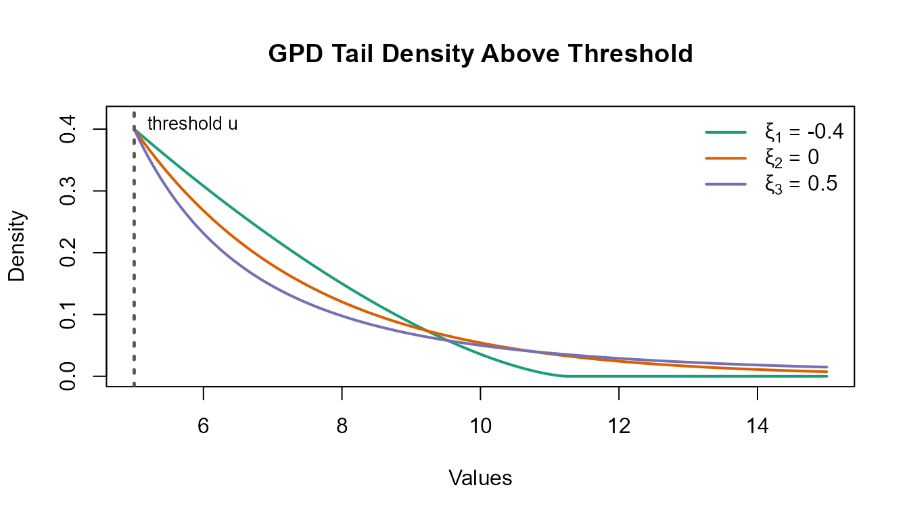
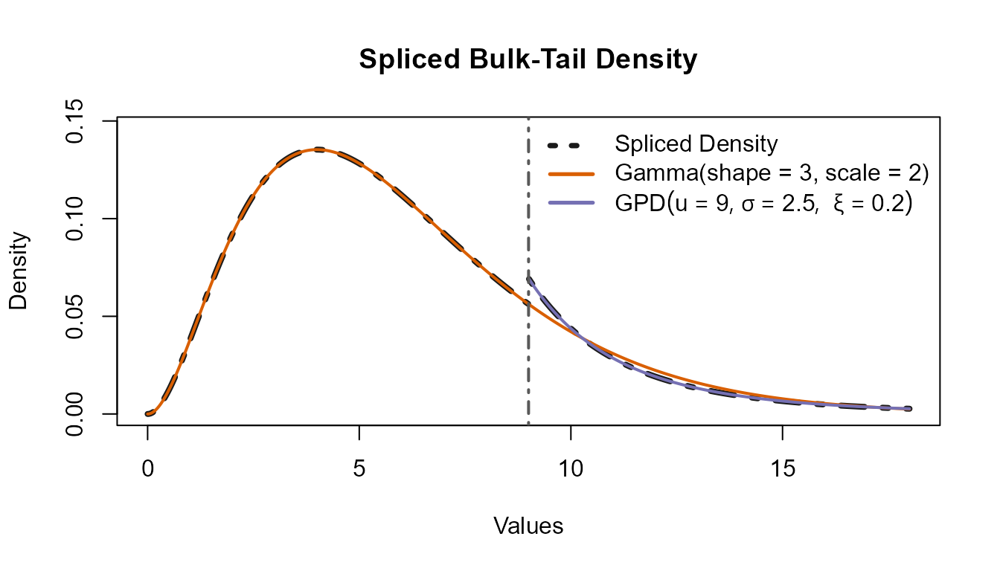
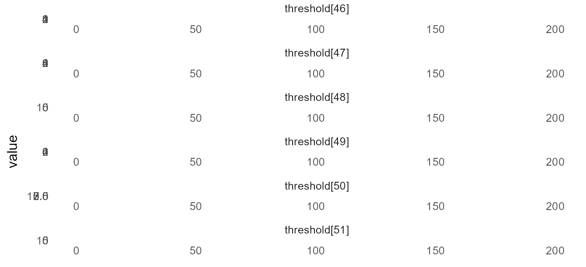
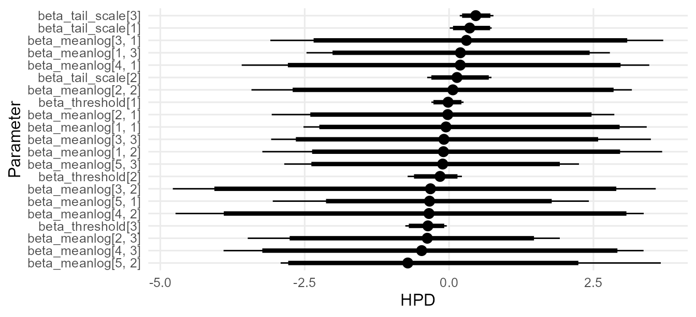
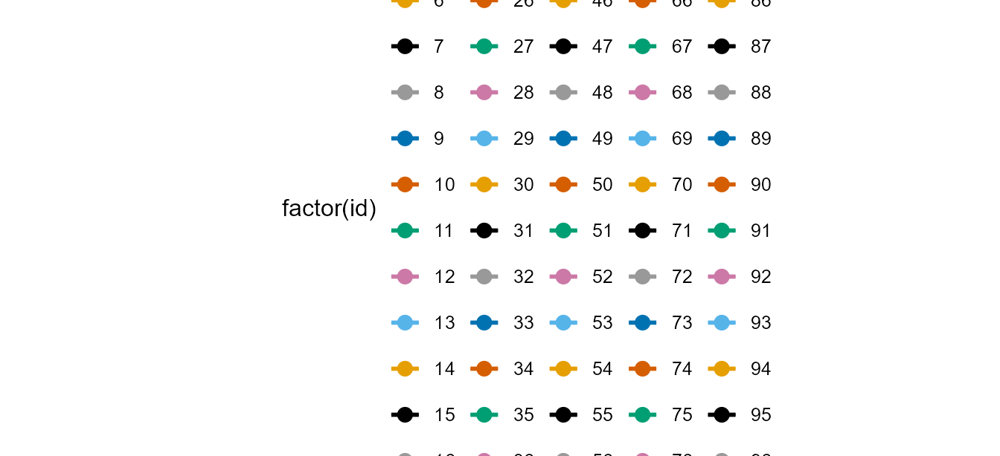
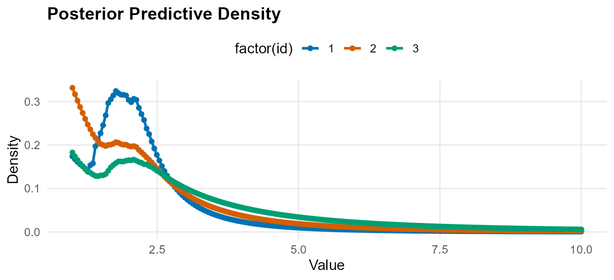
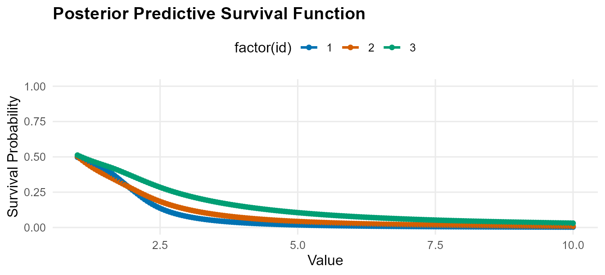
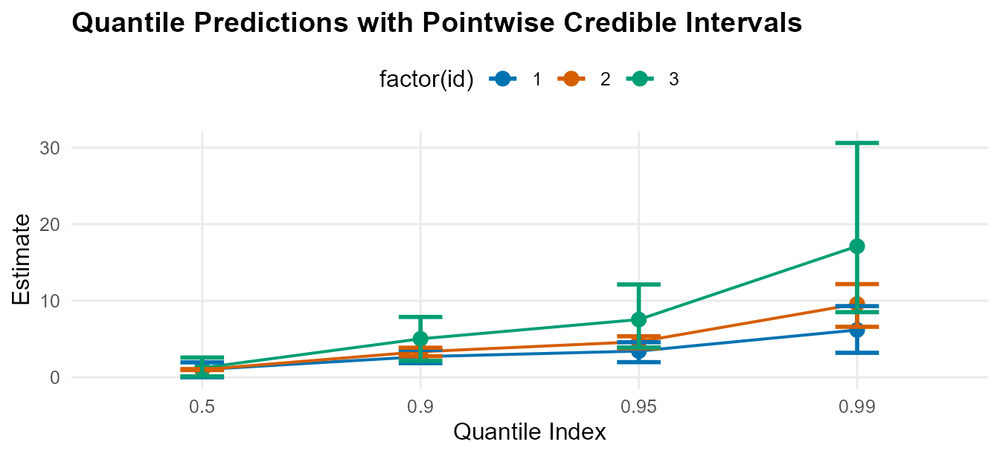

# CausalMixGPD: Bayesian Conditional Dirichlet Process Mixtures with Generalized Pareto Tails and Causal Extensions

Abstract

Heavy-tailed outcomes arise in many scientific domains where rare events
dominate risk, cost, or policy decisions. Classical parametric models
often fit the center of the distribution at the expense of tail
misspecification, while purely nonparametric methods typically lack
principled extrapolation in regions with sparse data. Extreme value
theory (EVT) provides asymptotic justification for generalized Pareto
distributions (GPDs) for threshold exceedances, whereas Bayesian
nonparametric Dirichlet process mixtures (DPMs) provide flexible
modeling for heterogeneous bulk behavior. This article introduces
CausalMixGPD, an R package implementing a Bayesian semiparametric
framework that combines conditional DPMs for the bulk distribution with
covariate-dependent GPD tails for exceedances, with posterior predictive
inference for densities, distribution functions, quantiles, survival
probabilities, and tail risks. The framework is conditional by
construction; unconditional models arise as a special case when
covariates are omitted. The package supports both Chinese restaurant
process (CRP) and stick-breaking (SB) representations of the Dirichlet
process, multiple kernel families for bulk modeling, and an extension to
causal inference via treatment-specific conditional distributions that
enable inference on distributional and tail-sensitive causal estimands.

Causal inference is often summarized through average effects, but many
applications require distributional comparisons between treatment
regimes. In clinical trials, investigators may want to understand how a
treatment changes outcomes across the outcome scale, including effects
among individuals in the upper tail where events are rare but
consequences can be substantial. This shift from mean-based to
distribution-based causal questions makes causal analysis tightly linked
to how well we can estimate (and predict) outcome distributions under
competing treatment assignments.

A growing ecosystem supports Bayesian causal inference through flexible
outcome modeling and posterior uncertainty quantification. For example,
implements Bayesian Causal Forests for binary treatments and continuous
outcomes, providing posterior inference for both average and
heterogeneous treatment effects . The package builds causal estimators
around Bayesian additive regression trees, using BART as a regression
engine for treatment-response modeling and causal effect estimation .
Complementing tree-based approaches, implements a Bayesian
model-averaging strategy for causal effect estimation with support for
binary or continuous exposures and outcomes . A recurring practical
difficulty in quantile-based causal reporting is quantile crossing
issue, i.e., when two quantile curves for different indices cross each
other. To avoid that issue this package directly estimates outcome
densities and derives quantiles as functionals of the posterior
predictive distribution.

Density estimation and conditional density estimation in are well
supported by Bayesian nonparametric mixture modeling software based on
Dirichlet process (DP) ideas. For example, provides a flexible interface
for specifying DP mixture models and fitting them by posterior
simulation, yielding posterior inference for mixture weights, component
allocations, and predictive densities under user-chosen kernels . The
package offers a broad suite of Bayesian semi- and nonparametric models
in , including DP-based formulations for marginal and conditional
densities, regression functions, and model-based predictive
distributions . More recently, emphasizes practical Bayesian
nonparametric mixture approaches, providing posterior inference for
clustering structure and density/regression estimation under DP and
Pitman–Yor-type mixture specifications . However, DP mixture models are
suitable for modeling the bulk of the distribution but do not explicitly
model tail behavior, which can lead to poor estimation and prediction in
the tails when data are sparse or a heavy tail is present.

Bayesian implementations of Extreme Value Theory (EVT) is available in
when posterior uncertainty quantification for tail quantitites are
required. For example, provides Bayesian inference for standard
extreme-value models via posterior simulation, enabling posterior and
posterior-predictive summaries for extreme-event quantities . For
peaks-over-threshold (POT) approaches, the package implements a focused
collection of tools for GPD modeling and threshold-based tail analysis .
Finally, for extreme quantile estimation and rare-event tail summaries,
provides a published software implementation targeted specifically at
extreme-quantile estimation .

This article introduces , an package that connects Bayesian
nonparametric bulk modeling with extreme-value tail modeling, while also
supporting robust causal analyses. The package provides two
complementary capabilities:

Taken together, offers a coherent workflow for density estimation,
prediction, and distributional causal reporting when tail behavior is
scientifically central. % According to a document from 2026, and the
accompanying CausalMixGPD article draft, this section summarizes the
core preliminaries.

This chapter treats conditional outcome distributions as the fundamental
inferential object. All summaries reported later are functionals of
estimated conditional distributions, including conditional quantiles,
tail probabilities, and distributional causal contrasts.

Let the outcome–covariate pair be defined by
``` math
\begin{equation}
(Y,X) \in \mathbb{R}\times \mathbb{R}^p .
\end{equation}
```
For a fixed covariate value $`x`$, the conditional cumulative
distribution function (CDF) and density are
``` math
\begin{equation}
F(y\mid x)=\Pr(Y\le y\mid X=x),
\qquad
f(y\mid x)=\frac{\partial}{\partial y}F(y\mid x),
\end{equation}
```
and the conditional quantile function is defined by
``` math
\begin{equation}
Q(\tau\mid x)=\inf\Bigl\{y\in\mathbb{R}:\,F(y\mid x)\ge \tau\Bigr\},
\qquad 0<\tau<1.
\end{equation}
```

We model the bulk conditional density of $`Y`$ given $`X=x`$ using a
Dirichlet process mixture (DPM) regression. Let
$`k(\cdot\mid x;\theta)`$ be a user-chosen kernel family indexed by
parameter $`\theta`$. The hierarchical specification is
``` math
\begin{equation}
Y \mid X=x,\theta \sim k(\cdot\mid x;\theta),
\qquad
\theta \mid H \sim H,
\qquad
H \mid \kappa,H_0 \sim \mathrm{DP}(\kappa,H_0),
\label{eq:dpm_hier}
\end{equation}
```
where $`H`$ is an unknown mixing distribution on the kernel-parameter
space, $`H_0`$ is a base measure, and $`\kappa>0`$ is a concentration
parameter .

Marginalizing $`H`$ yields an (almost surely) discrete mixing
distribution and an infinite mixture representation:
``` math
\begin{equation}
f_{\mathrm{DP}}(y\mid x)
=
\int k(y\mid x;\theta)\,dH(\theta)
=
\sum_{j=1}^{\infty} w_j\,k(y\mid x;\theta_j),
\qquad
w_j\ge 0,
\qquad
\sum_{j=1}^{\infty} w_j=1.
\label{eq:dpm_mixture}
\end{equation}
```

A constructive representation for the weights is given by Sethuraman’s
stick-breaking construction :
``` math
\begin{equation}
w_1=V_1,
\qquad
w_j=V_j\prod_{\ell<j}(1-V_\ell),
\qquad
V_j \stackrel{\mathrm{iid}}{\sim}\mathrm{Beta}(1,\kappa),
\qquad
\theta_j \stackrel{\mathrm{iid}}{\sim} H_0.
\label{eq:sb}
\end{equation}
```
An alternative marginal representation is obtained by integrating out
$`H`$, which induces the Blackwell–MacQueen P'olya urn predictive scheme
(often described via the Chinese restaurant process) :
``` math
\begin{equation}
\theta_{\text{new}} \mid \theta_{1:n}
\sim
\frac{\kappa}{\kappa+n}H_0(\cdot)
+
\frac{1}{\kappa+n}\sum_{m=1}^{n}\delta_{\theta_m}(\cdot).
\label{eq:crp}
\end{equation}
```
Both stick-breaking (blocked/truncated) and allocation-based
representations are widely used for posterior simulation in DPM models .

Extreme value theory provides a canonical approximation for exceedances
above a high threshold. Let $`u(x)`$ be a (possibly covariate-dependent)
high threshold and define the exceedance
``` math
\begin{equation}
Z = Y-u(x),
\end{equation}
```
considered conditionally on the event $`Y>u(x)`$. The conditional excess
distribution function is
``` math
\begin{equation}
F_u(z\mid x)=\Pr\!\bigl(Y-u(x) \le z \mid Y>u(x),X=x\bigr),
\qquad z\ge 0.
\label{eq:cedf}
\end{equation}
```
Under broad regularity conditions, $`F_u(\cdot)`$ is well-approximated
by a generalized Pareto distribution (GPD) for sufficiently large $`u`$
.

With scale parameter $`\sigma(x)>0`$ and shape parameter
$`\xi\in\mathbb{R}`$, the tail CDF for $`Y\mid\{Y>u(x),X=x\}`$ is
``` math
\begin{equation}
F_{\mathrm{GPD}}(y\mid u(x),\sigma(x),\xi,x)=
\begin{cases}
1-\left(1+\xi\dfrac{y-u(x)}{\sigma(x)}\right)^{-1/\xi}, & \xi\neq 0,\\[8pt]
1-\exp\!\left(-\dfrac{y-u(x)}{\sigma(x)}\right), & \xi=0,
\end{cases}
\qquad y>u(x),
\label{eq:gpd_cdf}
\end{equation}
```
with support $`y\ge u(x)`$ when $`\xi\ge 0`$, and
$`u(x)\le y\le u(x)-\sigma(x)/\xi`$ when $`\xi<0`$. The corresponding
density is
``` math
\begin{equation}
f_{\mathrm{GPD}}(y\mid u(x),\sigma(x),\xi,x)=
\begin{cases}
\dfrac{1}{\sigma(x)}\left(1+\xi\dfrac{y-u(x)}{\sigma(x)}\right)^{-1/\xi-1}, & \xi\neq 0,\\[10pt]
\dfrac{1}{\sigma(x)}\exp\!\left(-\dfrac{y-u(x)}{\sigma(x)}\right), & \xi=0.
\end{cases}
\label{eq:gpd_pdf}
\end{equation}
```
The associated GPD quantile function is
``` math
\begin{equation}
Q_{\mathrm{GPD}}(\tau\mid u(x),\sigma(x),\xi,x)=
\begin{cases}
u(x)-\sigma(x)\log(1-\tau), & \xi=0,\\[6pt]
u(x)+\dfrac{\sigma(x)}{\xi}\Bigl((1-\tau)^{-\xi}-1\Bigr), & \xi\neq 0,
\end{cases}
\qquad 0<\tau<1.
\label{eq:gpd_quantile}
\end{equation}
```



Dirichlet process mixture (DPM) regression models provide a highly
flexible representation of the of the conditional distribution
$`Y\mid X=x`$, accommodating multimodality, skewness, and heterogeneous
dispersion through mixture components. However, in the far upper
tail—where data are intrinsically sparse—pure mixture-based
extrapolation can be unstable and may not reflect the regular variation
behavior typically assumed in extreme value theory (EVT). Conversely,
EVT provides an asymptotically justified parametric description of
threshold exceedances via the generalized Pareto distribution (GPD), but
it is not intended to model the full distribution. We therefore adopt a
(bulk–tail) construction that retains the DPM fit below a high threshold
and replaces the upper tail by a GPD component .

To make the splicing and downstream functionals explicit, we collect the
unknown bulk regression parameters into $`\Theta`$ and the tail
parameters into $`\Phi`$. Specifically, the bulk model in can be written
as
``` math
\begin{equation}
f_{\mathrm{DP}}(y\mid x;\Theta)
=
\sum_{j=1}^{\infty} w_j \, k\!\left(y\mid x;\theta_j(x)\right),
\qquad
\Theta=\{\beta_j\}_{j\ge 1},
\label{eq:bulk_theta}
\end{equation}
```
where $`\beta_j`$ denotes component-specific regression/shape
coefficients and $`\theta_j(x)`$ denotes the kernel parameter vector
induced at covariate value $`x`$ through the corresponding coefficients
in $`\Theta`$. Mixture weights $`\{w_j\}`$ are generated by the DP
backend (SB or CRP representation) and are suppressed in this compact
notation.

For the tail block, let
``` math
\begin{equation}
\Phi=\{\beta_u,\beta_\sigma,\xi\},
\label{eq:phi_def}
\end{equation}
```
where $`u(x)`$ and $`\sigma(x)`$ are induced by covariates and
tail-regression coefficients, and $`\xi`$ is the tail shape parameter.
Thus, $`\Theta`$ and $`\Phi`$ are global parameter collections, while
$`x`$ enters through these mappings. The package allows users to control
which kernel and tail parameters vary with covariates (e.g., via
link-based regression for selected parameters) and which are treated as
fixed or purely a priori parameters (Section~).

Let
``` math
\begin{equation}
p_u(x;\Theta)=F_{\mathrm{DP}}(u(x)\mid x;\Theta)
\label{eq:pu_theta}
\end{equation}
```
denote the bulk probability mass below the threshold under the DPM fit.
The spliced conditional CDF is
``` math
\begin{equation}
F(y\mid x;\Theta,\Phi)=
\begin{cases}
F_{\mathrm{DP}}(y\mid x;\Theta), & y \le u(x),\\[6pt]
p_u(x;\Theta)
+
\bigl\{1-p_u(x;\Theta)\bigr\}\,
F_{\mathrm{GPD}}\!\bigl(y\mid x;\Phi\bigr),
& y>u(x),
\end{cases}
\label{eq:splice_cdf}
\end{equation}
```
where $`F_{\mathrm{GPD}}(\cdot)`$ is the GPD CDF on the exceedance
region (Section~). The construction is continuous at $`u(x)`$ and yields
a proper distribution: the bulk contributes mass $`p_u(x;\Theta)`$ and
the tail contributes the remaining mass $`1-p_u(x;\Theta)`$.

Differentiating yields the spliced density
``` math
\begin{equation}
f(y\mid x;\Theta,\Phi)=
\begin{cases}
f_{\mathrm{DP}}(y\mid x;\Theta), & y \le u(x),\\[8pt]
\bigl\{1-p_u(x;\Theta)\bigr\}\,
f_{\mathrm{GPD}}\!\bigl(y\mid x;\Phi\bigr),
& y>u(x),
\end{cases}
\label{eq:splice_pdf}
\end{equation}
```
so the tail density is a GPD density, with scaling ensuring
normalization of $`f(\cdot\mid x;\Theta,\Phi)`$.

For $`y>u(x)`$, the conditional survival function decomposes as
``` math
\begin{equation}
\Pr(Y>y\mid X=x;\Theta,\Phi)
=
\bigl\{1-p_u(x;\Theta)\bigr\}
\Bigl[1-F_{\mathrm{GPD}}\!\bigl(y\mid x;\Phi\bigr)\Bigr].
\label{eq:splice_tailprob}
\end{equation}
```
Quantiles follow by inversion of . For $`\tau\in(0,1)`$,
``` math
\begin{equation}
Q(\tau\mid x;\Theta,\Phi)=
\begin{cases}
Q_{\mathrm{DP}}(\tau\mid x;\Theta), & \tau \le p_u(x;\Theta),\\[8pt]
Q_{\mathrm{GPD}}\!\bigl(\tilde{\tau}(x;\Theta)\mid x;\Phi\bigr), & \tau>p_u(x;\Theta),
\end{cases}
\label{eq:splice_quantile_case}
\end{equation}
```
where the tail-rescaled probability level is
``` math
\begin{equation}
\tilde{\tau}(x;\Theta)=\dfrac{\tau-p_u(x;\Theta)}{1-p_u(x;\Theta)}\in(0,1),
\label{eq:tau_tilde}
\end{equation}
```
and $`Q_{\mathrm{GPD}}`$ is given in . Thus, upper quantiles are
determined jointly by the bulk exceedance probability
$`1-p_u(x;\Theta)`$ and the conditional exceedance distribution governed
by $`\Phi`$.



This spliced conditional distribution is the central predictive object
used throughout the package. In the causal extension (Section~), the
same construction is applied separately to treatment-specific
conditional distributions $`F_a(\cdot\mid x)`$, enabling causal
contrasts based on densities, quantiles, and tail risks rather than only
mean-scale effects.

We use the potential outcomes framework . Let $`A`$ denote a binary
treatment indicator, let $`X`$ denote observed pre-treatment covariates,
and let $`Y`$ denote the observed outcome. Each unit has two potential
outcomes, $`Y(1)`$ and $`Y(0)`$, and the observed outcome satisfies
``` math
\begin{equation}
Y = A\,Y(1) + \bigl(1-A\bigr)\,Y(0).
\label{eq:po_observed}
\end{equation}
```

The treatment-specific conditional distribution functions are the
fundamental inferential objects:
``` math
\begin{equation}
F_a(y\mid x)=\Pr\{Y(a)\le y \mid X=x\},\qquad a\in\{0,1\}.
\label{eq:po_cond_cdf}
\end{equation}
```
In this package, the corresponding conditional densities are
``` math
\begin{equation}
f_a(y\mid x)=\frac{\partial}{\partial y}F_a(y\mid x)
\label{eq:po_cond_pdf}
\end{equation}
```
where $`f_a(y \mid x)`$ assumes the spliced DPM structure in~.
Conditional quantiles are defined by inversion of the conditional CDF:
``` math
\begin{equation}
Q_a(\tau\mid x)=\inf\{y:\,F_a(y\mid x)\ge \tau\},\qquad \tau\in(0,1).
\label{eq:po_cond_quantile}
\end{equation}
```
Conditional means are functionals of the conditional density:
``` math
\begin{equation}
\mu_a(x)=\mathrm{E}\{Y(a)\mid X=x\}=\int y\, f_a(y\mid x)\,dy.
\label{eq:po_cond_mean}
\end{equation}
```

Marginal (standardized) distributions are obtained by averaging
conditional distributions over a covariate distribution. The package
reports population-standardized and treated-standardized functionals:
``` math
\begin{equation}
F_a^{\mathrm{m}}(y)=\mathrm{E}\bigl\{F_a(y\mid X)\bigr\},
\qquad
F_a^{\mathrm{t}}(y)=\mathrm{E}\bigl\{F_a(y\mid X)\mid A=1\bigr\}.
\label{eq:marginal_cdf_defs}
\end{equation}
```
The corresponding marginal quantiles are
``` math
\begin{equation}
Q_a^{\mathrm{m}}(\tau)=\inf\{y:\,F_a^{\mathrm{m}}(y)\ge \tau\},
\qquad
Q_a^{\mathrm{t}}(\tau)=\inf\{y:\,F_a^{\mathrm{t}}(y)\ge \tau\}.
\label{eq:marginal_quantile_defs}
\end{equation}
```
Marginal means are
``` math
\begin{equation}
\mu_a^{\mathrm{m}}=\mathrm{E}\bigl\{\mu_a(X)\bigr\},
\qquad
\mu_a^{\mathrm{t}}=\mathrm{E}\bigl\{\mu_a(X)\mid A=1\bigr\}.
\label{eq:marginal_mean_defs}
\end{equation}
```

Identification of these quantities depends on the study design. In
randomized experiments, randomization together with positivity implies
exchangeability between treatment assignment and potential outcomes . In
observational studies, we rely on the following conditions :

Under these conditions, the treatment-specific conditional distributions
are identified from the observed data:
``` math
\begin{equation}
F_a(y\mid x)=\Pr(Y\le y\mid A=a,X=x),\qquad a\in\{0,1\}.
\label{eq:identification_cdf}
\end{equation}
```

In observational settings, we use the propensity score (PS) to support
the design stage . The PS is the treatment assignment probability given
covariates:
``` math
\begin{equation}
\rho(x)=\Pr(A=1\mid X=x).
\label{eq:ps_def}
\end{equation}
```
A key property of the true propensity score is that conditioning on it
balances covariates across treatment groups:
``` math
\begin{equation}
A\ \perp\ X\ \mid\ \rho(X).
\label{eq:ps_balance}
\end{equation}
```
With estimated scores this balancing property is approximate in finite
samples. Following the two-stage strategy described in the thesis, we
first estimate $`\rho(x)`$ using only $`(A,X)`$ and then augment the
outcome model covariates with the estimated score :
``` math
\begin{equation}
\widehat{\rho}(x)\approx \rho(x),
\qquad
r(x)=\bigl(x^{\mathsf{T}},\widehat{\rho}(x)\bigr)^{\mathsf{T}}.
\label{eq:augmented_covariate}
\end{equation}
```
The conditional outcome distributions are then modeled separately within
each treatment arm as functions of the augmented predictor $`r(x)`$, and
causal contrasts are computed as functionals of the estimated
treatment-specific distributions.

The package reports the following causal estimands:

This section established the main probabilistic and causal building
blocks used in the remainder of the work. We first defined conditional
distributional targets and introduced a Dirichlet process mixture model
to flexibly estimate bulk conditional outcome densities. We then
reviewed generalized Pareto modeling for threshold exceedances and
constructed a spliced DPM–GPD conditional distribution that preserves
the estimated bulk while enabling principled tail extrapolation.
Finally, we introduced the potential outcomes framework and the
treatment-effect estimands reported in the package, showing how marginal
and conditional effects can be obtained as functionals of
treatment-specific conditional distributions (with propensity-score
augmentation supporting confounding adjustment in observational
studies). Subsequent chapters build on these preliminaries to specify
the full hierarchical model, posterior computation, and empirical
evaluation of tail-aware distributional causal effects.

This section describes the main workflow provided by for one-arm
conditional modeling and prediction when a generalized Pareto tail is
spliced above a covariate-dependent threshold. The causal extension
reuses the same modeling, estimation, and prediction machinery after
introducing treatment-specific outcome models and a propensity score
component; we defer those additions to the causal section.

Let the observed data be
``` math
  \mathcal{D}=\{(y_i,x_i)\}_{i=1}^n,
```

``` r

# Reload package example data and build a modeling data frame
data("nc_posX100_p3_k2", package = "CausalMixGPD")
dat <- data.frame(y = nc_posX100_p3_k2$y, nc_posX100_p3_k2$X)
```

with $`x_i\in\mathbb{R}^p`$ denoting the covariate vector (including an
intercept if desired). The target conditional distribution
$`F(\cdot\mid x)`$ and its spliced DPM–GPD construction are defined in
Section~, with the spliced CDF and density given in –. Posterior
computation in approximates the bulk DPM by a finite truncation with
$`J`$ mixture components,
``` math
  f_{\mathrm{DP}}(y\mid x;\Theta)\;\approx\;\sum_{j=1}^{J} w_j\,k(y\mid x;\theta_j),
  \qquad j=1,\ldots,J,
```
where $`j`$ indexes mixture components, $`w_j\ge 0`$, and
$`\sum_{j=1}^J w_j=1`$. Kernel parameters can be constant or
covariate-dependent through link specifications of the form
``` math
\begin{equation}
  g\!\left(\psi_j(x)\right)=x^\top \beta_{j,\psi},
  \label{eq:overview-link}
\end{equation}
```
where $`g(\cdot)`$ enforces parameter support (e.g., positive scale
parameters).

``` r

fit <- dpmgpd(
  formula = y ~ x1 + x2 + x3,
  data = dat,
  backend = "sb",
  kernel = "lognormal",
  components = 5,
  mcmc = mcmc_fixed
)
```

For the spliced model, let $`u(x)`$ be the threshold, $`\sigma(x)>0`$
the tail scale, and $`\xi\in\mathbb{R}`$ the tail shape (as in
Section~). Define $`\delta_i=\mathbf{1}\{y_i>u(x_i)\}`$. Using the
spliced density with the truncated bulk mixture, the likelihood is
``` math
\begin{equation}
  L(\Theta,\Phi;\mathcal{D})
  =\prod_{i=1}^n f(y_i\mid x_i;\Theta,\Phi),
  \label{eq:overview-lik}
\end{equation}
```
where $`\Theta`$ collects the truncation-level bulk parameters
$`\{w_j,\theta_j\}_{j=1}^J`$, and $`\Phi`$ collects the tail parameters
governing $`u(x)`$, $`\sigma(x)`$, and $`\xi`$. Equivalently, the
log-likelihood can be written as
``` math
\begin{align}
  \log L(\Theta,\Phi;\mathcal{D})
  \;=&\;\sum_{i=1}^n (1-\delta_i)\,\log f_{\mathrm{DP}}(y_i\mid x_i;\Theta)
  \nonumber\\
  &\;+\;\sum_{i=1}^n \delta_i
  \Bigl[
    \log\!\bigl\{1-F_{\mathrm{DP}}(u(x_i)\mid x_i;\Theta)\bigr\}
    +\log f_{\mathrm{GPD}}\!\bigl(y_i\mid x_i;\Phi\bigr)
  \Bigr],
  \label{eq:overview-loglik}
\end{align}
```
where $`f_{\mathrm{GPD}}`$ is given in and
$`F_{\mathrm{DP}}(\cdot\mid x)`$ is the bulk mixture CDF induced by the
truncated mixture.

Priors follow the decomposition implied by and . Under the
stick-breaking (SB) backend, the truncation-level weights are generated
through Beta stick breaks (Section~, ), which are represented in using
the Beta distribution in model code (see ). Under the Chinese restaurant
process (CRP) backend, the allocation-based representation is
implemented using the CRP distribution in (see ), matching the
predictive representation in . Kernel parameters and tail parameters are
assigned weakly informative priors, with regression coefficients
$`\beta_{j,\psi}`$ arising through the link representation . The same
link construction is used for covariate-dependent $`u(x)`$ and
$`\sigma(x)`$ when those are modeled as functions of $`x`$.

Posterior simulation targets
$`p(\Theta,\Phi\mid \mathcal{D}) \propto L(\Theta,\Phi;\mathcal{D})\,p(\Theta,\Phi)`$
using the likelihood and the prior structure implied by the SB or CRP
representation (Section~, –). Given a model specification, runs MCMC
through under the chosen backend; SB uses Beta stick breaks in model
code (see ) and CRP uses the CRP distribution for allocations (see ).
Users control the number of iterations, burn-in, thinning, and number of
chains through the argument in the wrappers.

Convergence checking is supported through standard multi-chain
diagnostics and trace-based visualizations. The model object supports
for posterior summaries, for diagnostic plots (trace, running mean,
autocorrelation, and multi-chain diagnostics such as $`\widehat{R}`$
when multiple chains are used), and as a lightweight extractor returning
posterior mean parameters reshaped to natural dimensions. Interval
summaries used by can be chosen as equal-tailed credible intervals or
HPD intervals as described in Section~ . Diagnostic plotting relies on
established MCMC diagnostic tooling .

``` r

# Posterior summaries 
summary(fit)
```

    MixGPD summary | backend: Stick-Breaking Process | kernel: Lognormal Distribution | GPD tail: TRUE | epsilon: 0.025
    n = 100 | components = 5
    Summary
    Initial components: 5 | Components after truncation: 3

    WAIC: 533.418
    lppd: -190.186 | pWAIC: 76.523

    Summary table
              parameter   mean    sd q0.025 q0.500 q0.975     ess
             weights[1]   0.46 0.117   0.27   0.45   0.72  11.627
             weights[2]  0.254 0.061   0.12  0.255   0.36  39.269
             weights[3]  0.165  0.05   0.08   0.16   0.26  38.227
                  alpha   1.86 0.968  0.487  1.698  4.099  12.727
     beta_meanlog[1, 1]  0.183 1.477 -2.521 -0.054  3.423   20.74
     beta_meanlog[2, 1] -0.009 1.399 -3.071 -0.023  2.862  33.912
     beta_meanlog[3, 1]  0.387  1.74 -3.095  0.301  3.709  43.663
     beta_meanlog[4, 1]  0.197  1.78 -3.591  0.193  3.467  54.846
     beta_meanlog[5, 1] -0.334 1.201 -3.053 -0.338  2.421  27.182
     beta_meanlog[1, 2]  0.047 1.695 -3.234 -0.097   3.69  56.754
     beta_meanlog[2, 2]  0.028 1.595 -3.422  0.066  3.166  51.988
     beta_meanlog[3, 2] -0.393 2.104 -4.784 -0.322  3.579  25.438
     beta_meanlog[4, 2] -0.348 2.033 -4.737 -0.348  3.371   44.29
     beta_meanlog[5, 2] -0.492 1.505 -2.917 -0.715  3.667  48.203
     beta_meanlog[1, 3]  0.234 1.263 -2.468  0.197  2.785   42.38
     beta_meanlog[2, 3] -0.474 1.227 -3.486 -0.377  1.918  25.851
     beta_meanlog[3, 3]  0.092 1.584 -3.081 -0.089  3.495  18.206
     beta_meanlog[4, 3]  -0.29 1.817 -3.905 -0.475  3.368  60.839
     beta_meanlog[5, 3] -0.094 1.216 -2.854 -0.111   2.25  59.107
     beta_tail_scale[1]  0.377 0.204  0.012  0.357  0.738  30.053
     beta_tail_scale[2]  0.162 0.302 -0.379  0.137  0.734  51.036
     beta_tail_scale[3]  0.458 0.153  0.185  0.462  0.769   72.09
      beta_threshold[1] -0.023 0.147 -0.306 -0.017  0.251  26.686
      beta_threshold[2] -0.178 0.234 -0.717 -0.156  0.222   10.31
      beta_threshold[3] -0.372 0.184 -0.757 -0.366  -0.04   13.39
                sdlog_u  0.869 0.185  0.489  0.863  1.257    9.34
             tail_shape  0.393 0.095  0.209  0.406  0.583  49.001
               sdlog[1]  1.464 0.785  0.351   1.33  3.499  36.647
               sdlog[2]   2.05 1.297  0.423  1.587  5.209  35.647
               sdlog[3]  2.041 1.248   0.48  1.791   5.04 101.774

``` r

# Extract posterior mean parameters in natural shapes
params(fit)
```

    Posterior mean parameters

    $alpha
    [1] 1.86

    $w
    [1] 0.46  0.254 0.165

    $beta_meanlog
          x1     x2     x3    
    comp1 0.183  0.047  0.234 
    comp2 -0.009 0.028  -0.474
    comp3 0.387  -0.393 0.092 
    comp4 0.197  -0.348 -0.29 
    comp5 -0.334 -0.492 -0.094

    $sdlog
    [1] 1.464 2.05  2.041

    $beta_threshold
    [1] -0.023 -0.178 -0.372

    $sdlog_u
    [1] 0.869

    $beta_tail_scale
    [1] 0.377 0.162 0.458

    $tail_shape
    [1] 0.393

``` r

# MCMC diagnostics: trace, running mean, autocorrelation, and multi-chain diagnostics
plot(fit, family = "traceplot", param = "threshold")
```

    
[1m
[22mScale for 
[32mcolour
[39m is already present.
    Adding another scale for 
[32mcolour
[39m, which will replace the existing
    scale.


    === traceplot ===



``` r

plot(fit, family = "caterpillar", param = "beta")
```

    Warning: 
[1m
[22mUsing `size` aesthetic for lines was deprecated in ggplot2 3.4.0.
    
[36mℹ
[39m Please use `linewidth` instead.
    
[36mℹ
[39m The deprecated feature was likely used in the 
[34mggmcmc
[39m package.
      Please report the issue at
      
[3m
[34m<https://github.com/xfim/ggmcmc/issues/>
[39m
[23m.
    
[90mThis warning is displayed once per session.
[39m
    
[90mCall `lifecycle::last_lifecycle_warnings()` to see where this warning
[39m
    
[90mwas generated.
[39m


    === caterpillar ===



Setting removes the splicing step so that
$`f(y\mid x;\Theta)\equiv f_{\mathrm{DP}}(y\mid x;\Theta)`$, and
$`L(\Theta,\Phi;\mathcal{D})`$ reduces to the bulk-mixture likelihood in
$`\Theta`$. All estimation and prediction targets described below remain
available, with tail-specific terms omitted. The wrapper fits this
bulk-only model, while fits the augmented (spliced) model.

The estimands reported by are functionals of the estimated conditional
distribution $`F(\cdot\mid x)`$ from Section~. In this article we focus
on four conditional functionals: density $`f(y\mid x)`$, survival
$`S(y\mid x)=1-F(y\mid x)`$, quantiles $`Q(\tau\mid x)`$, and mean-type
summaries.

Let $`(\Theta^{(s)},\Phi^{(s)})_{s=1}^S`$ denote post-burn-in draws from
the posterior. For density, survival, and quantiles, evaluates the
corresponding draw-wise functional using the spliced formulas – (with
the truncated bulk mixture), and then summarizes across draws.
Specifically, for a generic scalar functional $`T(\Theta,\Phi;x)`$
(e.g., $`f(y_0\mid x)`$ or $`Q(\tau\mid x)`$),
``` math
  \widehat{T}(x)=\frac{1}{S}\sum_{s=1}^S T(\Theta^{(s)},\Phi^{(s)};x),
```
and uncertainty is summarized either by equal-tailed credible intervals
(posterior quantiles) or by highest posterior density (HPD) intervals
(shortest intervals covering the target posterior mass). Equal-tailed
intervals and general Bayesian posterior summaries follow standard
practice ; HPD intervals are computed from the MCMC draws using
established implementations .

Mean-type summaries are handled differently in the package. For and ,
uses posterior predictive Monte Carlo within each posterior draw rather
than direct plug-in evaluation. For a fixed covariate value $`x`$,
within draw $`s`$ the package generates
``` math
  y_{1}^{(s)},\ldots,y_{M}^{(s)} \;\sim\; f(\cdot\mid x;\Theta^{(s)},\Phi^{(s)}),
```
and computes
``` math
  \mu^{(s)}(x)=\frac{1}{M}\sum_{m=1}^M y_{m}^{(s)},
  \qquad
  \mu_{c}^{(s)}(x)=\frac{1}{M}\sum_{m=1}^M \min\{y_{m}^{(s)},c\},
```
corresponding to the conditional mean and the restricted mean at cutoff
$`c`$, respectively. Posterior summaries and intervals are then formed
from $`\{\mu^{(s)}(x)\}_{s=1}^S`$ or $`\{\mu_c^{(s)}(x)\}_{s=1}^S`$.
Under the spliced model, the conditional mean is infinite when
$`\xi\ge 1`$; accordingly, flags as infinite when there is posterior
mass with $`\xi\ge 1`$, while remains finite by construction.

Using the same fitted model from Section~, we now compute posterior
summaries on the original training covariates (default behavior of when
is not supplied).

``` r

# Posterior functionals from the same fitted model and data set
q_grid <- c(0.25, 0.50, 0.75)
est_quant <- predict(fit, type = "quantile", index = q_grid,
                     interval = "hpd", level = 0.95)


plot(est_quant)
```



For a new covariate value $`x^\star`$, prediction is based on the
posterior predictive distribution
``` math
  p(y^\star\mid x^\star,\mathcal{D})
  =\int f(y^\star\mid x^\star;\Theta,\Phi)\,p(\Theta,\Phi\mid \mathcal{D})\,d\Theta\,d\Phi.
```
The method returns posterior summaries for the same functional targets
as in Section~. For and , the user supplies a grid of $`y`$ values and
the method returns pointwise posterior means with interval bounds
computed draw-by-draw. For , the user supplies quantile indices $`\tau`$
and the method returns posterior summaries of $`Q(\tau\mid x^\star)`$
computed using the spliced quantile representation in . For and ,
prediction uses posterior predictive Monte Carlo as described above,
with $`x`$ replaced by $`x^\star`$ and with user-controlled $`M`$
through .

``` r

# New profiles from coordinate-wise quartiles (25%, 50%, 75%) of covariates
q_levels <- c(0.25, 0.50, 0.75)
x_new <- as.data.frame(lapply(
  dat[, c("x1", "x2", "x3")],
  quantile,
  probs = q_levels,
  na.rm = TRUE
))
rownames(x_new) <- c("q25", "q50", "q75")

# Density / survival on a y-grid'

y_grid <- seq(1, 10, length.out = 200)

pdens <-  predict(fit, newdata = x_new, y = y_grid, type = "density",
          interval = "credible", level = 0.95)

head(as.data.frame(pdens$fit), 5)
```

      id        y   density      lower     upper
    1  1 1.000000 0.1737123 0.02990607 0.3616488
    2  1 1.045226 0.1672169 0.03025095 0.3525184
    3  1 1.090452 0.1611403 0.03086577 0.3371248
    4  1 1.135678 0.1554363 0.03165092 0.3206042
    5  1 1.180905 0.1510845 0.03046477 0.3092109

``` r

plot(pdens)
```



``` r

# Survival function on the same y-grid
psurv <-  predict(fit, newdata = x_new, y = y_grid, type = "survival",
          interval = "credible", level = 0.95)
head(as.data.frame(psurv$fit), 5)
```

      id        y  survival     lower     upper
    1  1 1.000000 0.4972511 0.1784838 0.8072759
    2  1 1.045226 0.4895434 0.1755278 0.8016826
    3  1 1.090452 0.4821197 0.1727356 0.7926217
    4  1 1.135678 0.4749622 0.1700882 0.7875261
    5  1 1.180905 0.4680470 0.1675699 0.7835322

``` r

plot(psurv)
```



``` r

# Quantiles at selected indices
p_grid <- c(0.50, 0.90, 0.95, 0.99)
pquant <-  predict(fit, newdata = x_new, type = "quantile", index = p_grid,
          interval = "hpd", level = 0.95)
 head(as.data.frame(pquant$fit), 5)
```

      id index estimate       lower    upper
    1  1  0.50 1.009702 0.007511686 1.949263
    2  1  0.90 2.696279 1.846158152 3.588812
    3  1  0.95 3.428332 1.979865536 4.579482
    4  1  0.99 6.183331 3.200827399 9.297415
    5  2  0.50 1.008598 0.949744433 1.076012

``` r

plot(pquant)
```



This package extends the one-arm conditional mixture regression
framework to two-arm causal studies by fitting an outcome model under
treatment and under control, optionally augmenting the outcome
covariates with a propensity score (PS) summary. Throughout this section
we write the model in its default form (bulk mixture + GPD tail), using
the same conditional distributional building blocks introduced earlier
(so we do not restate the spliced density; see and the corresponding
conditional functionals defined in the previous sections).

Let
``` math
  \mathcal{D}=\{(y_i,a_i,\boldsymbol{x}_i)\}_{i=1}^n,
  \qquad a_i\in\{0,1\},
```
where $`a_i=1`$ denotes treatment and $`a_i=0`$ denotes control. The
causal interface consists of two pieces.

First, when PS augmentation is enabled, a binary regression model is
used for the treatment mechanism
``` math
\begin{align}
  a_i \mid \boldsymbol{x}_i, \boldsymbol{\gamma}
  &\sim \mathrm{Bernoulli}\big(e_{\boldsymbol{\gamma}}(\boldsymbol{x}_i)\big),
  \label{eq:overview_ps_part1}\\
  h\!\left(e_{\boldsymbol{\gamma}}(\boldsymbol{x}_i)\right)
  &= \gamma_0 + \boldsymbol{x}_i^\top\boldsymbol{\gamma},
  \qquad h\in\{\text{logit},\text{probit}\},
  \label{eq:overview_ps_part2}
\end{align}
```
which is consistent with the definition and balancing property in –. The
package also supports a option, in which $`e(\boldsymbol{x})`$ is taken
to be constant (no covariate dependence).

Second, the outcome model is fit separately within each arm. Denote by
$`F_a(\,\cdot\mid\boldsymbol{r})`$ the fitted conditional outcome
distribution under arm $`a\in\{0,1\}`$, where $`\boldsymbol{r}`$ is the
covariate vector used by the outcome model. With PS augmentation, the
package constructs an covariate vector
``` math
\begin{equation}
  \boldsymbol{r}(\boldsymbol{x})
  =
  \Big(1,\ \boldsymbol{x}^\top,\ \psi\big(\widehat e(\boldsymbol{x})\big)\Big)^\top,
  \label{eq:overview_augmented_covariate}
\end{equation}
```
where $`\widehat e(\boldsymbol{x})`$ is a posterior summary of the PS
(posterior mean or median, controlled by ), and $`\psi(\cdot)`$ is
either $`\psi(p)=\text{logit}(p)`$ or $`\psi(p)=p`$ (controlled by ).
When PS augmentation is disabled,
$`\boldsymbol{r}(\boldsymbol{x})=(1,\boldsymbol{x}^\top)^\top`$.

Within each arm, the conditional density $`f_a(y\mid \boldsymbol{r})`$
follows the same mixture regression + optional GPD tail specification
described in the one-arm section (kernel choice, link structure
$`g(\cdot)`$ for covariate-dependent parameters, and either or backend
for the DP mixture). Let $`\boldsymbol{\Theta}_a`$ collect the
arm-specific mixture and tail parameters. The arm-wise likelihood
contributions are
``` math
  L_a(\boldsymbol{\Theta}_a;\mathcal{D})
  =
  \prod_{i:\,a_i=a} f_a\!\left(y_i \mid \boldsymbol{r}(\boldsymbol{x}_i); \boldsymbol{\Theta}_a\right),
  \qquad a\in\{0,1\},
```
with $`f_a(\cdot\mid\cdot)`$ given by the spliced construction already
defined (bulk mixture below threshold and GPD exceedances above
threshold). Practically, the implementation uses a two-stage workflow:
(i) fit the PS model using –, then (ii) compute
$`\widehat e(\boldsymbol{x}_i)`$ and build
$`\boldsymbol{r}(\boldsymbol{x}_i)`$ in before fitting the two
arm-specific outcome models.

For the PS regression coefficients, the default prior is independent
Normal,
``` math
  \gamma_0 \sim \mathcal{N}(m_0,s_0^2),
  \qquad
  \gamma_k \sim \mathcal{N}(m_0,s_0^2),
```
with defaults controlled by .

For each arm’s outcome model, priors follow the same structure as the
one-arm case: a DP mixture prior (with either truncated stick-breaking
or CRP allocation, implemented in ) and kernel-/tail-specific priors on
the bulk and GPD parameters. Since the causal fit is simply a pair of
one-arm fits (treated and control), all customization options for
kernels, links, and tail inclusion apply arm-wise.

The causal fit runs MCMC in two stages, each with its own iteration
controls.

1.  PS stage: posterior simulation for $`\boldsymbol{\gamma}`$ in –
    using settings. The PS posterior draws are summarized to obtain
    $`\widehat e(\boldsymbol{x}_i)`$, which is optionally transformed
    via and appended to the outcome covariates as in .

2.  Outcome stage: arm-specific posterior simulation for
    $`\boldsymbol{\Theta}_0`$ and $`\boldsymbol{\Theta}_1`$ using
    settings, with either or backend.

For routine convergence checks, users can inspect trace plots and
autocorrelation for monitored parameters and (when running multiple
chains) compare between-chain and within-chain mixing. The package
stores MCMC samples in the fitted object, and standard diagnostics can
be applied after converting samples to objects (e.g., effective sample
size, Geweke diagnostics, and HPD intervals via ; see the reference at
the end of this message). Posterior parameter summaries can be extracted
via the exported method, which returns arm-specific parameter tables for
causal fits.

All reported causal quantities are computed as functionals of the fitted
arm-specific conditional distributions. Let $`T_a(\boldsymbol{x})`$
denote any conditional functional under arm $`a`$ (density, survival,
quantile, or mean/restricted mean), computed from
$`F_a(\cdot\mid\boldsymbol{r}(\boldsymbol{x}))`$ using the same
definitions as in the one-arm case. The corresponding conditional causal
contrast is
``` math
  \Delta_T(\boldsymbol{x}) = T_1(\boldsymbol{x}) - T_0(\boldsymbol{x}).
```
The package computes $`\Delta_T(\boldsymbol{x})`$ from posterior
samples, then summarizes $`\Delta_T(\boldsymbol{x})`$ by a posterior
mean/median and uncertainty intervals. Equal-tailed credible intervals
are formed by posterior quantiles, while HPD intervals are computed
using .

The main causal estimators provided by the package are:

1.  Conditional effects at covariate profiles. For a user-supplied set
    of covariate rows $`\{\boldsymbol{x}^\star_m\}_{m=1}^M`$,
    ``` math
      \mathrm{CATE}(\boldsymbol{x}^\star_m)=\mu_1(\boldsymbol{x}^\star_m)-\mu_0(\boldsymbol{x}^\star_m),
      \qquad
      \mathrm{CQTE}(\tau\mid \boldsymbol{x}^\star_m)
      =
      Q_1(\tau\mid \boldsymbol{x}^\star_m)-Q_0(\tau\mid \boldsymbol{x}^\star_m),
    ```
    where
    $`\mu_a(\boldsymbol{x})=\mathbb{E}(Y\mid A=a,\boldsymbol{X}=\boldsymbol{x})`$
    and $`Q_a(\tau\mid\boldsymbol{x})`$ is the conditional quantile
    function. In heavy-tailed settings, $`\mu_a(\boldsymbol{x})`$ can be
    unstable when the implied tail shape yields infinite mean; the
    package therefore supports both and for (restricted) mean-based
    effects, with restricted means computed as
    $`\mathbb{E}[\min\{Y,c\}\mid A=a,\boldsymbol{X}=\boldsymbol{x}]`$ at
    user-specified cutoff $`c`$.

2.  Marginal (standardized) summaries. The package reports marginal ATE
    and marginal QTE-style summaries by empirical standardization over
    covariate profiles:
    ``` math
    \begin{align}
      \mathrm{ATE}
      &= \frac{1}{n}\sum_{i=1}^n \Big\{\mu_1(\boldsymbol{x}_i)-\mu_0(\boldsymbol{x}_i)\Big\},
      \label{eq:overview_ate_standardized}\\
      \mathrm{QTE}(\tau)
      &= Q_1^{\mathrm{m}}(\tau)-Q_0^{\mathrm{m}}(\tau),\qquad
      Q_a^{\mathrm{m}}(\tau)=\inf\{y:\,F_a^{\mathrm{m}}(y)\ge \tau\},\quad
      F_a^{\mathrm{m}}(y)=\frac{1}{n}\sum_{i=1}^n F_a(y\mid \boldsymbol{x}_i).
      \label{eq:overview_qte_standardized}
    \end{align}
    ```
    Treated-standardized analogues (ATT, QTT) are obtained by replacing
    the full-sample covariate empirical distribution with the
    treated-subsample empirical distribution $`\{i:a_i=1\}`$. In the
    current implementation, and aggregate draw-wise conditional mean
    contrasts across rows, while and compute draw-wise arm-specific
    marginal quantiles and then contrast them.

Prediction in the causal setup proceeds by producing arm-specific
predictive summaries at new covariates and then differencing when
required. For new covariates $`\boldsymbol{x}^\star`$, the package first
predicts the PS (if enabled), forms
$`\boldsymbol{r}(\boldsymbol{x}^\star)`$ via , and then evaluates the
desired distributional functional under both arms. For and , returns
treated-minus-control summaries and stores arm-specific predictions as
attributes; for , , and , it returns arm-specific summaries directly.

A recommended way to build an interpretable prediction grid is to use
coordinate-wise empirical quartiles. Let $`q_{k,p}`$ be the $`p`$th
sample quantile of covariate $`x_k`$ for $`p\in\{0.25,0.5,0.75\}`$. The
grid
``` math
  \mathcal{X}_\star = \prod_{k=1}^p \{q_{k,0.25},q_{k,0.5},q_{k,0.75}\}
```
yields $`3^p`$ representative covariate profiles at which
$`\mathrm{CATE}`$, $`\mathrm{CQTE}`$, survival contrasts, and other
predictive contrasts can be reported.

The following example uses the formula interface and the high-level
wrapper, fitting the augmented spliced model by default.

``` r

# Load causal data
data("causal_pos500_p3_k2", package = "CausalMixGPD")
dat <- causal_pos500_p3_k2
df  <- data.frame(y = dat$y, A = dat$A, dat$X)


cfit <- dpmgpd(
  formula = y ~ x1 + x2 + x3,
  data = df,
  treat = df$A,
  backend = "sb",
  kernel = "lognormal",
  components = 5,
  PS = "logit",
  ps_scale = "logit",
  ps_summary = "mean",
  mcmc_outcome = mcmc_fixed,
  mcmc_ps = mcmc_fixed
)
```

``` r

ate_hat <- ate(cfit, level = 0.90, interval = "credible")
```

``` r

ate_hat
```

    ATE (Average Treatment Effect)
      Prediction points: 1
      Conditional (covariates): NO
      Propensity score used: NO
      Posterior mean draws: 200
      Credible interval: credible (90%)

    ATE estimates (treated - control):
     id estimate    lower upper
      1  -65.253 -272.621 1.549

``` r

qte_hat <- qte(cfit, probs = c(0.50, 0.90, 0.95), level = 0.90, interval = "hpd")
```

``` r

qte_hat
```

    QTE (Quantile Treatment Effect)
      Prediction points: 1
      Quantile grid: 0.5, 0.9, 0.95
      Conditional (covariates): NO
      Propensity score used: NO
      Credible interval: hpd

    QTE estimates (treated - control):
     id index estimate  lower  upper
      1   0.5   -0.858 -1.154 -0.566
      1   0.9   -0.349 -2.487  1.478
      1  0.95   -3.672 -12.67  2.357

``` r

# Ensure data frame is available when model fit is loaded from cache
if (!exists("df") || !is.data.frame(df)) {
  data("causal_pos500_p3_k2", package = "CausalMixGPD")
  dat <- causal_pos500_p3_k2
  df  <- data.frame(y = dat$y, A = dat$A, dat$X)
}
# Prediction on a coordinate-wise quartile grid
qs    <- c(0.25, 0.50, 0.75)
Xgrid <- expand.grid(lapply(df[c("x1","x2","x3")], quantile, probs = qs))

pred_q <- predict(cfit, newdata = Xgrid, type = "quantile", index = c(0.50, 0.90))
plot(pred_q)


pred_s <-  predict(cfit, newdata = Xgrid, type = "survival", y = sample(df$y, nrow(Xgrid)) + 1,
                   interval = "credible", level = 0.90)
plot(pred_s)
```

To run the same two-arm regression without a GPD tail, use the bulk-only
wrapper (or set at bundle construction). All causal estimand and
prediction functions (, , , , and ) operate the same way, now
interpreting $`F_a(\cdot\mid\boldsymbol{x})`$ as the bulk mixture
distribution.

This application demonstrates model-based clustering from a Dirichlet
process (DP) mixture regression, using the Chinese restaurant process
(CRP) backend and the bulk-only likelihood (no GPD tail). Clusters are
inferred from posterior draws of the latent membership indicators and
summarized using a posterior similarity matrix (PSM), which is invariant
to label switching.

We use the housing data (), treating each census tract as an
observational unit. Let
``` math
  \mathcal{D}=\{(y_i,\boldsymbol{x}_i)\}_{i=1}^n,
```
where $`y_i`$ is the per-capita crime rate for tract $`i`$ and
$`\boldsymbol{x}_i`$ is a vector of tract characteristics. The goal is
twofold: (i) flexibly model the conditional distribution of a positive,
right-skewed outcome and (ii) identify latent groups of tracts with
distinct regression patterns.

We fit a DP mixture of lognormal regressions. Conditional on a latent
membership $`z_i\in\{1,2,\ldots\}`$, the outcome follows the bulk kernel
introduced earlier:
``` math
\begin{align}
  y_i \mid z_i=k,\boldsymbol{x}_i
  &\sim \mathrm{Lognormal}\!\left(\mu_{ik},\sigma_k\right), \label{eq:app_clust_kernel}\\
  \mu_{ik}
  &= g\!\left(\boldsymbol{x}_i^\top \boldsymbol{\beta}_k\right),
  \qquad g(\eta)=\eta, \label{eq:app_clust_link}
\end{align}
```
where $`\boldsymbol{\beta}_k`$ are component-specific regression
coefficients and $`\sigma_k>0`$ is the component-specific log-scale
standard deviation. The DP prior induces a random partition through the
CRP representation,
``` math
  (z_1,\ldots,z_n)\mid \alpha \sim \mathrm{CRP}(\alpha),
```
with $`\alpha>0`$ controlling the expected number of occupied clusters.
In , the CRP backend represents up to clusters in a finite NIMBLE model;
the realized number of occupied clusters is then monitored and checked
against this upper bound.

Posterior simulation is carried out by MCMC. We run two chains and
assess convergence using standard diagnostics (trace plots,
autocorrelation, effective sample sizes, and $`\widehat{R}`$ when
applicable), along with a mixture-specific diagnostic: the posterior
distribution of the number of occupied clusters.

A key practical point for this analysis is that we explicitly request
link-mode for so the CRP model is a rather than a purely unconditional
mixture. This is done via in the wrapper call below.

``` r

library(MASS)
data("Boston", package = "MASS")

dat <- Boston
stopifnot(all(dat$crim > 0))

# High-level summaries
summary(fit_clust)
```

    MixGPD summary | backend: Chinese Restaurant Process | kernel: Lognormal Distribution | GPD tail: FALSE | epsilon: 0.025
    n = 506 | components = 3
    Summary
    Initial components: 3 | Components after truncation: 2

    WAIC: 779.665
    lppd: -259.673 | pWAIC: 130.16

    Summary table
      parameter   mean    sd q0.025 q0.500 q0.975    ess
     weights[1]  0.565 0.084  0.381  0.585  0.684 11.394
     weights[2]  0.286 0.039  0.203  0.294  0.348 16.833
          alpha  0.411 0.239  0.077  0.362  0.974    400
     meanlog[1] -2.205 0.296 -2.667 -2.245 -1.383 10.751
     meanlog[2]  1.556  1.15 -2.635  1.993  2.289 29.365
       sdlog[1]   0.98 0.231  0.622   0.95  1.496 21.156
       sdlog[2]  1.229 0.416  0.311  1.274  2.014  62.58

Clustering is driven by posterior draws of the membership vector
$`z=(z_1,\ldots,z_n)`$. We summarize uncertainty in the partition using
the posterior similarity matrix
``` math
  \pi_{ii'}=\Pr(z_i=z_{i'}\mid\mathcal{D}),
  \qquad
  \widehat{\pi}_{ii'}=\frac{1}{S}\sum_{s=1}^S \mathbb{I}\{z_i^{(s)}=z_{i'}^{(s)}\},
```
where $`\{z^{(s)}\}_{s=1}^S`$ are post-burn-in draws. Because
$`\widehat{\pi}_{ii'}`$ is invariant to label switching, it provides a
stable basis for cluster visualization (heatmaps) and for selecting a
representative hard partition.

In practice, we (i) compute $`\widehat{\pi}_{ii'}`$ from the stored MCMC
draws, (ii) select a representative partition from the posterior sample
using a least-squares rule against the PSM, and (iii) interpret clusters
by comparing outcome and covariate profiles across the resulting groups.

``` r

cluster_psm <- cache_or_run(
  file.path(derived_cache_dir, "cluster_psm.rds"),
  {
    smp <- fit_clust$mcmc$samples
    if (is.null(smp) && !is.null(fit_clust$samples)) smp <- fit_clust$samples

    zmat_list <- vector("list", 0)
    for (i in seq_along(smp)) {
      M <- as.matrix(smp[[i]])
      z_cols <- grep("^z\\[[0-9]+\\]$", colnames(M))
      if (length(z_cols) > 0) {
        # Sort z columns numerically by extracting the index i in z[i]
        z_colnames <- colnames(M)[z_cols]
        z_indices <- as.integer(sub("^z\\[([0-9]+)\\]$", "\\1", z_colnames))
        z_cols <- z_cols[order(z_indices)]
        zmat_list[[length(zmat_list) + 1]] <- M[, z_cols, drop = FALSE]
      }
    }

    if (length(zmat_list) > 0) {
      zmat <- do.call(rbind, zmat_list)
      n_occupied <- apply(zmat, 1, function(z) length(unique(as.integer(z))))
      
      # Diagnostic: check if n_occupied piles up at upper bound (K)
      K_max <- max(n_occupied)
      n_at_max <- sum(n_occupied == K_max)
      prop_at_max <- n_at_max / length(n_occupied)
      if (prop_at_max > 0.1) {
        message(sprintf(
          "Warning: %.1f%% of iterations hit K=%d components. Consider increasing K.",
          100 * prop_at_max, K_max
        ))
      }
      
      set.seed(1)
      S_keep <- min(400, nrow(zmat))
      keep <- sample(seq_len(nrow(zmat)), S_keep)
      Zk <- zmat[keep, , drop = FALSE]
      n <- ncol(Zk)
      PSM <- matrix(0, n, n)
      for (s in seq_len(nrow(Zk))) {
        z <- as.integer(Zk[s, ])
        PSM <- PSM + (outer(z, z, "==") * 1.0)
      }
      PSM <- PSM / nrow(Zk)
      ssq <- numeric(nrow(Zk))
      for (s in seq_len(nrow(Zk))) {
        z <- as.integer(Zk[s, ])
        A <- outer(z, z, "==") * 1.0
        ssq[s] <- sum((A - PSM)^2)
      }
      s_star <- which.min(ssq)
      z_hat <- as.integer(Zk[s_star, ])
      if (length(z_hat) == nrow(dat)) {
        cluster <- match(z_hat, unique(z_hat))
      } else {
        cluster <- rep(1L, nrow(dat))
      }
    } else {
      n_occupied <- numeric(0)
      cluster <- rep(1L, nrow(dat))
    }

    list(cluster = cluster, n_occupied = n_occupied)
  }
)

if (is.null(cluster_psm)) {
  dat$cluster <- factor(rep(1L, nrow(dat)))
} else {
  dat$cluster <- factor(cluster_psm$cluster)
  if (length(cluster_psm$n_occupied) > 0) {
    summary(cluster_psm$n_occupied)
    max(cluster_psm$n_occupied)
  }
}

table(dat$cluster)
```


      1 
    506 

Given the representative clustering, we compare outcome and covariate
profiles across clusters. Because the fitted model is a mixture
regression, clusters reflect differences in both the typical outcome
level and the component-specific regression behavior.

``` r

# Outcome summaries by cluster
cluster_outcome <- cache_or_run(
  file.path(derived_cache_dir, "cluster_outcome.rds"),
  {
    out <- aggregate(
      crim ~ cluster, data = dat,
      FUN = function(v) c(median = median(v), q25 = quantile(v, 0.25), q75 = quantile(v, 0.75))
    )
    do.call(data.frame, out)
  }
)
cluster_outcome
```

    NULL

``` r

# Covariate means by cluster (illustrative subset)
cluster_covars <- cache_or_run(
  file.path(derived_cache_dir, "cluster_covars.rds"),
  aggregate(
    cbind(rm, lstat, nox, ptratio, tax, rad) ~ cluster,
    data = dat,
    FUN = mean
  )
)
cluster_covars
```

    NULL

``` r

# Fitted conditional summaries at observed X (posterior intervals supported)
fit_med <- cache_or_run(
  file.path(derived_cache_dir, "cluster_fit_med.rds"),
  fitted(fit_clust, type = "quantile", p = 0.50, level = 0.95, interval = "credible")
)
fit_hi <- cache_or_run(
  file.path(derived_cache_dir, "cluster_fit_hi.rds"),
  fitted(fit_clust, type = "quantile", p = 0.90, level = 0.95, interval = "credible")
)
# Print small previews to avoid LaTeX dimension errors
print("fit_med (first 5 rows)")
```

    [1] "fit_med (first 5 rows)"

``` r

if (!is.null(fit_med)) print(head(fit_med$fit, 5))
print("fit_hi (first 5 rows)")
```

    [1] "fit_hi (first 5 rows)"

``` r

if (!is.null(fit_hi)) print(head(fit_hi$fit, 5))

# Attach fitted summaries for downstream plots
if (!is.null(fit_med)) dat$fit_q50 <- fit_med$fit
if (!is.null(fit_hi)) dat$fit_q90 <- fit_hi$fit
```

For prediction at new covariate profiles, we use the same interface as
in the methods section. In this clustering application, prediction is
mainly used to visualize how fitted conditional quantiles vary across
covariate patterns and to compare those patterns across the inferred
clusters.

``` r

# Coordinate-wise quartile grid for continuous covariates; fix binary indicator chas
qs <- c(0.25, 0.50, 0.75)
Xgrid <- expand.grid(
  lstat   = quantile(dat$lstat, qs),
  rm      = quantile(dat$rm, qs),
  nox     = quantile(dat$nox, qs),
  ptratio = quantile(dat$ptratio, qs),
  tax     = quantile(dat$tax, qs),
  rad     = quantile(dat$rad, qs)
)
Xgrid$chas <- 0

pred_q <- cache_or_run(
  file.path(derived_cache_dir, "cluster_pred_q.rds"),
  predict(
    fit_clust,
    newdata = Xgrid,
    type = "quantile",
    index = c(0.50, 0.90, 0.95),
    level = 0.95,
    interval = "credible"
  )
)

if (!is.null(pred_q)) pred_q
```

## References
