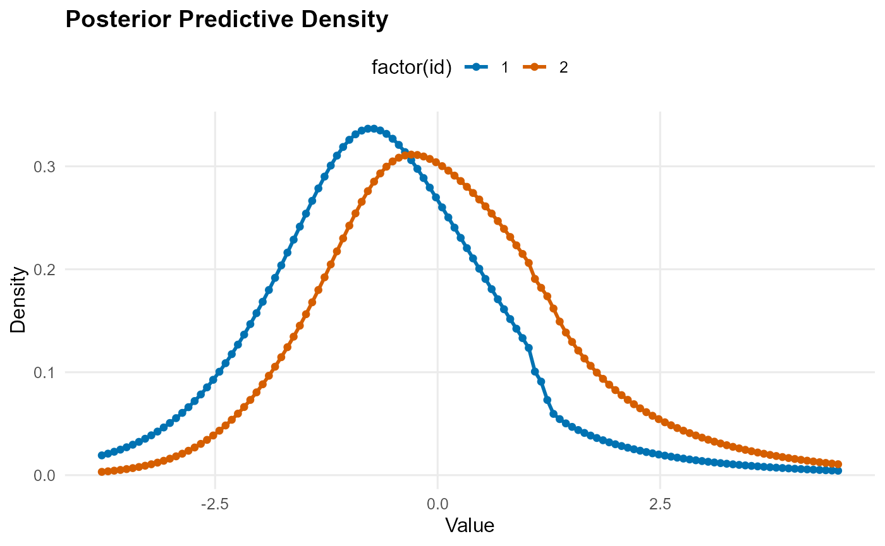
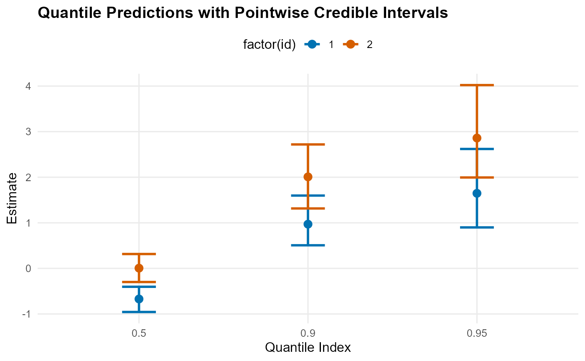

# Conditional DP Mixture Models

DPmixGPD supports conditional (covariate-dependent) density estimation
by allowing one or more *kernel parameters*—and, optionally, selected
*tail parameters*—to vary with a design matrix $`X`$. The goal is to
estimate an entire conditional distribution
$`F(y \mid \boldsymbol{x})`$, not just a mean curve.

This vignette focuses on how covariates enter the model, how to control
that behavior via `param_specs`, and how to generate conditional
predictions. For the bulk–tail spliced likelihood, GPD density/CDF
definitions, and the overall “bulk + GPD tail� construction, see the
*Model fundamentals* vignette in this package (we will refer to it
rather than repeating the full splice derivation here).

### Conditional mixture model

Let $`y_i \in \mathbb{R}`$ be an outcome and
$`\boldsymbol{x}_i \in \mathbb{R}^p`$ a covariate vector. Under a
truncated stick-breaking (SB) Dirichlet process mixture, DPmixGPD uses
``` math
  y_i \mid z_i=j,\boldsymbol{x}_i \sim k\!\left(y_i \mid \boldsymbol{\theta}_j(\boldsymbol{x}_i)\right), \qquad
  z_i \sim \mathrm{Categorical}(w_1,\dots,w_J),
```
with stick-breaking weights
``` math
  v_j \sim \mathrm{Beta}(1,\alpha),\quad
  w_1=v_1,\quad
  w_j=v_j\prod_{\ell<j}(1-v_\ell)\ (j\ge 2),\quad
  \alpha \sim \text{(prior)}.
```
This is the same DPM idea as in classic DP mixtures, but applied to
conditional distributions; see, e.g., (**escobar1995?**;
**muller1996?**). The key difference from the unconditional vignette is
that $`\boldsymbol{\theta}_j(\boldsymbol{x})`$ may depend on
$`\boldsymbol{x}`$.

DPmixGPD implements covariate dependence through *per-parameter modes*:

- `mode = "dist"`: parameter is random (drawn from a prior) but does
  **not** depend on $`X`$.
- `mode = "fixed"`: parameter is fixed at a constant value.
- `mode = "link"`: parameter depends on $`X`$ through a GLM-style link,
  with component-specific regression coefficients.

This is set separately for each bulk parameter (kernel parameter), and
for selected tail parameters when `GPD = TRUE`.

### A practical note about the design matrix $`X`$

DPmixGPD treats the matrix you pass as `X` as the design matrix used in
linear predictors. It does **not** automatically add an intercept
column. In practice you will almost always want
[`model.matrix()`](https://rdrr.io/r/stats/model.matrix.html) so an
intercept is included and factor coding is handled correctly.

A recommended workflow is:

1.  Build $`X`$ using
    [`model.matrix()`](https://rdrr.io/r/stats/model.matrix.html)
    (includes intercept by default).
2.  Standardize/center continuous covariates (especially if you do not
    include an intercept).
3.  Keep the same column names and ordering for prediction.
    [`predict()`](https://rdrr.io/r/stats/predict.html) will validate
    them.

``` r

library(DPmixGPD)

# Example covariates
set.seed(1)
N <- 200
dat <- data.frame(
  x1 = rnorm(N),
  x2 = rbinom(N, 1, 0.5)
)

# Recommended: model.matrix() gives an intercept and consistent column names
X <- model.matrix(~ x1 + x2, dat)

# (Optional) scale continuous columns but keep intercept untouched
X[, "x1"] <- scale(X[, "x1"])
```

### Which parameters can depend on $`X`$?

Kernel-specific parameter names are stored in the kernel registry. You
can inspect them:

``` r

init_kernel_registry()
reg <- get_kernel_registry()

# Names of available kernels
names(reg)
```

    ## [1] "normal"    "lognormal" "invgauss"  "gamma"     "laplace"   "amoroso"  
    ## [7] "cauchy"

``` r

# Bulk parameters for a specific kernel
reg$normal$bulk_params
```

    ## [1] "mean" "sd"

``` r

reg$gamma$bulk_params
```

    ## [1] "shape" "scale"

``` r

# Defaults for covariate behavior (when X is present)
reg$normal$defaults_X
```

    ## $mean
    ## $mean$mode
    ## [1] "link"
    ## 
    ## $mean$link
    ## [1] "identity"
    ## 
    ## 
    ## $sd
    ## $sd$mode
    ## [1] "dist"

``` r

reg$gamma$defaults_X
```

    ## $shape
    ## $shape$mode
    ## [1] "dist"
    ## 
    ## 
    ## $scale
    ## $scale$mode
    ## [1] "link"
    ## 
    ## $scale$link
    ## [1] "exp"

The registry is the authoritative source for (i) valid kernel names,
(ii) bulk parameter names, and (iii) each kernel’s default covariate
behavior.

### Link-mode parameters: general form

If a bulk parameter $`\vartheta`$ is assigned `mode = "link"`, DPmixGPD
uses a linear predictor and link function:
``` math
  \eta_{\vartheta,ij} = \boldsymbol{x}_i^\top \boldsymbol{\beta}_{\vartheta,j},\qquad
  \vartheta_{ij} = g_\vartheta(\eta_{\vartheta,ij}).
```
Here $`\boldsymbol{\beta}_{\vartheta,j}`$ is component-specific (indexed
by mixture component $`j`$), so different mixture components can
represent different conditional regimes.

Supported link functions include:

- `"identity"`: $`\vartheta = \eta`$
- `"exp"`: $`\vartheta = \exp(\eta)`$ (useful for positive parameters)
- `"softplus"`: $`\vartheta = \log(1+\exp(\eta))`$ (also enforces
  positivity)
- `"power"`: $`\vartheta = \eta^{\kappa}`$ (requires
  `link_power = kappa`; use with care if $`\eta`$ can be negative)

The best default for strictly-positive parameters is typically `"exp"`
or `"softplus"`.

### Tail parameters under GPD

When `GPD = TRUE`, DPmixGPD uses a GPD tail above a threshold (see the
*Model fundamentals* vignette for the splice and GPD density). For
conditional variants, the following tail parameters can depend on $`X`$:

- `gpd$threshold`: `fixed`, `dist`, or `link`
- `gpd$tail_scale`: `fixed`, `dist`, or `link`
- `gpd$tail_shape`: `fixed` or `dist` (no `link` mode)

Two distinct “link� behaviors exist for the threshold:

- Deterministic link: $`u_i = g(\boldsymbol{x}_i^\top \beta_u)`$
- Stochastic link via `link_dist = list(dist="lognormal", ...)`:
  $`u_i \sim \mathrm{LogNormal}(\mu_i,\sigma_u)`$ with
  $`\mu_i=\boldsymbol{x}_i^\top\beta_u`$

This mirrors common nonstationary threshold modeling ideas in extremes
(**davison1990?**; **chavezdemoulin2005?**), but placed inside the full
Bayesian mixture framework (Behrens et al. 2004; **donascimento2012?**).

### Controlling covariate dependence with `param_specs`

[`build_nimble_bundle()`](https://arnabaich96.github.io/DPmixGPD/pkgdown/reference/build_nimble_bundle.md)
accepts `param_specs` to override defaults. The structure is:

``` r
param_specs <- list(
  bulk = list(
    <bulk_param_1> = list(mode = "dist"/"fixed"/"link", ...),
    <bulk_param_2> = list(mode = "dist"/"fixed"/"link", ...),
    ...
  ),
  gpd = list(
    threshold  = list(mode = "dist"/"fixed"/"link", ...),
    tail_scale = list(mode = "dist"/"fixed"/"link", ...),
    tail_shape = list(mode = "dist"/"fixed", ...),
    # optionally: sdlog_u if using lognormal threshold link_dist
    sdlog_u    = list(mode = "dist", dist = "invgamma", args = list(shape = 2, scale = 1))
  )
)
```

In `mode = "link"` you may specify:

- `link`: one of `"identity"`, `"exp"`, `"softplus"`, `"power"`
- `link_power`: numeric, only for `"power"`
- `beta_prior`: a list describing priors for regression coefficients,
  e.g. `list(dist="normal", args=list(mean=0, sd=2))`

In `mode = "dist"` you specify:

- `dist`: e.g., `"normal"`, `"gamma"`, `"invgamma"`, etc. (used
  internally in NIMBLE code generation)
- `args`: named list of distribution parameters

### Backend note: SB vs CRP with covariates

DPmixGPD supports two backends:

- `backend = "sb"`: truncated stick-breaking mixture (default for
  covariate-dependent parameters)
- `backend = "crp"`: finite CRP representation

For conditional models, the SB backend is recommended. Internally, the
CRP backend avoids default link-mode bulk parameters because
deterministic, cluster-indexed covariate nodes can interfere with
NIMBLE’s CRP samplers. If you want covariate links on bulk parameters,
you should generally use `backend = "sb"`.

### Worked example: conditional normal kernel with a GPD tail

We simulate data where the conditional mean depends on $`X`$, fit a
conditional model, then generate conditional predictions.

``` r

# Simulate a simple signal + heavy-tailed noise
set.seed(2)
beta <- c(-0.3, 0.8, -0.6)   # coefficients for (Intercept, x1, x2)
mu <- drop(X %*% beta)
y <- mu + rt(N, df = 3)     # heavy-tailed noise

mcmc <- list(niter = 400, nburnin = 100, thin = 2, nchains = 1, seed = 1)

bundle <- build_nimble_bundle(
  y = y,
  X = X,
  backend = "sb",
  kernel = "normal",
  GPD = TRUE,
  components = 6,
  mcmc = mcmc
)

fit <- run_mcmc_bundle_manual(bundle, show_progress = FALSE, quiet = TRUE)
```

    ## Defining model

    ##   [Note] Registering 'dNormGpd' as a distribution based on its use in BUGS code. If you make changes to the nimbleFunctions for the distribution, you must call 'deregisterDistributions' before using the distribution in BUGS code for those changes to take effect.

    ## Building model

    ## Setting data and initial values

    ## Checking model sizes and dimensions

    ##   [Note] This model is not fully initialized. This is not an error.
    ##          To see which variables are not initialized, use model$initializeInfo().
    ##          For more information on model initialization, see help(modelInitialization).

    ## Checking model calculations

    ## Compiling
    ##   [Note] This may take a minute.
    ##   [Note] Use 'showCompilerOutput = TRUE' to see C++ compilation details.
    ## Compiling
    ##   [Note] This may take a minute.
    ##   [Note] Use 'showCompilerOutput = TRUE' to see C++ compilation details.

    ##   [Warning] To calculate WAIC, set 'WAIC = TRUE', in addition to having enabled WAIC in building the MCMC.

    ## running chain 1...

    ## Compiling
    ##   [Note] This may take a minute.
    ##   [Note] Use 'showCompilerOutput = TRUE' to see C++ compilation details.

    ## Calculating WAIC.

A quick summary of the fitted object:

``` r

print(fit)
```

    ## MixGPD fit | backend: Stick-Breaking Process | kernel: Normal Distribution | GPD tail: TRUE
    ## n = 200 | components = 6 | epsilon = 0.025
    ## MCMC: niter=400, nburnin=100, thin=2, nchains=1 
    ## Fit
    ## Use summary() for posterior summaries; plot() for diagnostics; predict() for predictions.

### Conditional prediction

For conditional models,
[`predict()`](https://rdrr.io/r/stats/predict.html) uses `x` for the
prediction design matrix $`X_{\text{pred}}`$. For `type = "density"` or
`"survival"`, you must also provide `y` as the grid of outcome values
where the function is evaluated.

``` r

# Prediction points: two covariate profiles
newdat <- data.frame(x1 = c(-1, 1), x2 = c(0, 1))
Xpred <- model.matrix(~ x1 + x2, newdat)
Xpred[, "x1"] <- scale(Xpred[, "x1"])  # apply same scaling convention

ygrid <- seq(quantile(y, 0.01), quantile(y, 0.99), length.out = 120)

dens_pred <- predict(fit, x = Xpred, y = ygrid, type = "density", cred.level = 0.95)
q_pred <- predict(fit, x = Xpred, type = "quantile", index = c(0.5, 0.9, 0.95), cred.level = 0.95)
```

The returned objects contain point estimates and uncertainty summaries.
For example:

``` r

# Quantile predictions for each covariate profile
q_pred$fit
```

    ##   estimate index id  lower  upper
    ## 1 -0.67096  0.50  1 -0.956 -0.403
    ## 2  0.00531  0.50  2 -0.299  0.315
    ## 3  0.97010  0.90  1  0.507  1.598
    ## 4  2.00828  0.90  2  1.315  2.720
    ## 5  1.64707  0.95  1  0.899  2.620
    ## 6  2.85975  0.95  2  1.995  4.021

You can also plot prediction objects directly:

``` r

plot(dens_pred)
```



``` r

plot(q_pred)
```



(Plots are enabled in this vignette build; for faster local iteration
you can temporarily set this chunk to `eval=FALSE`.)

### What to tune in practice

1.  Decide which parameters should depend on $`X`$. A good start is to
    link a location parameter (e.g., `mean` or `meanlog`) and keep
    scale/shape parameters in `dist` mode, then add complexity if
    diagnostics warrant it.

2.  Use links consistent with support: `"exp"`/`"softplus"` for strictly
    positive parameters.

3.  Prefer `backend = "sb"` for covariate links. Use `backend = "crp"`
    mainly for unconditional models or when you intentionally keep bulk
    parameters in `dist` mode.

4.  Increase `components`, `niter`, and `nburnin` for real analyses. The
    small values in this vignette are chosen only to keep examples
    quick.

### References

Behrens, Cibele N., Hedibert F. Lopes, and Dani Gamerman. 2004.
“Bayesian Analysis of Extreme Events with Threshold Estimation.”
*Statistical Modelling* 4 (3): 227–44.
<https://doi.org/10.1191/1471082x04st075oa>.
