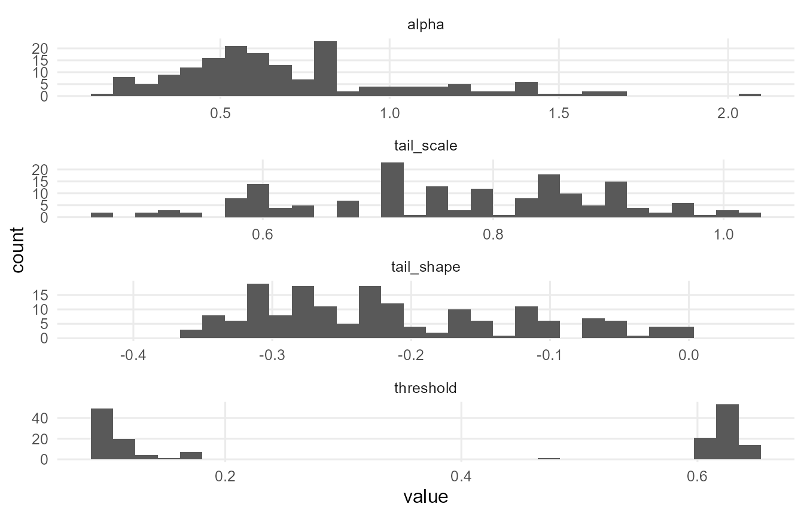
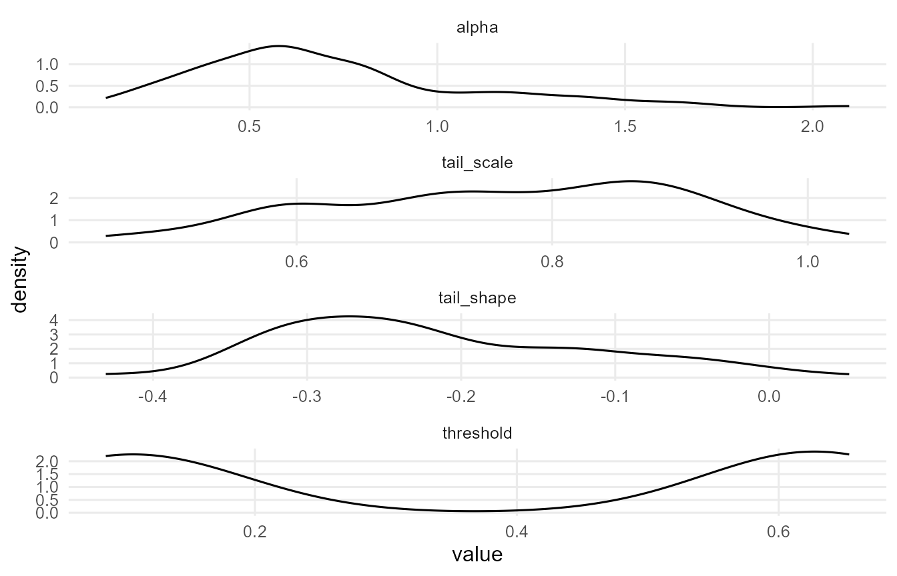
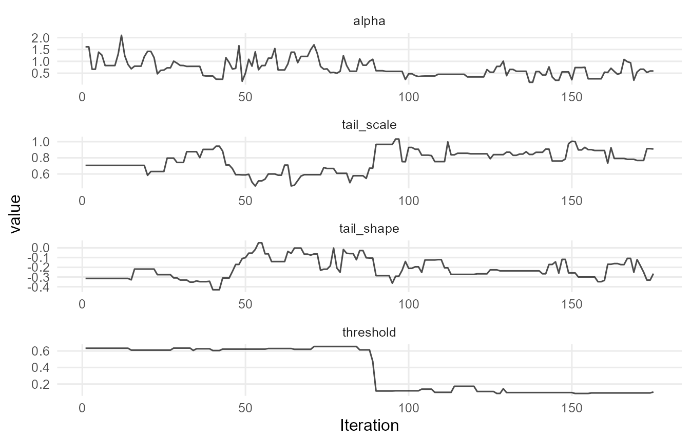
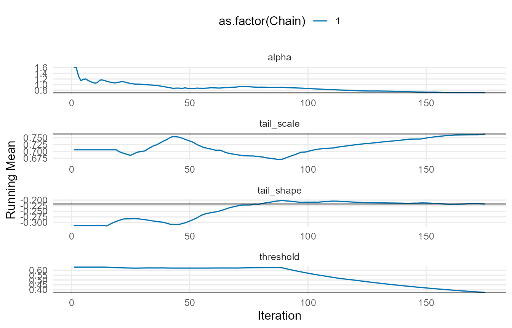
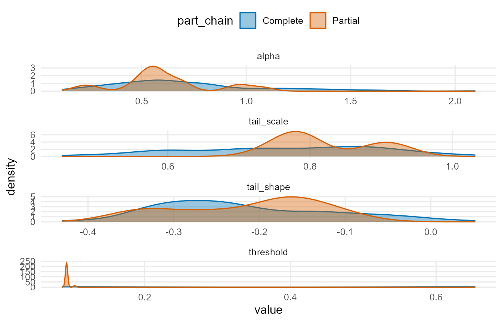
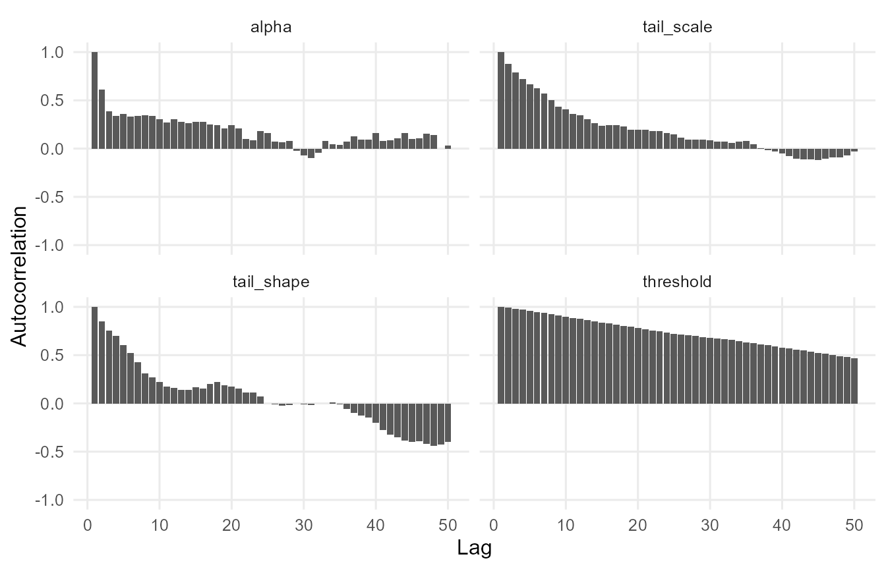
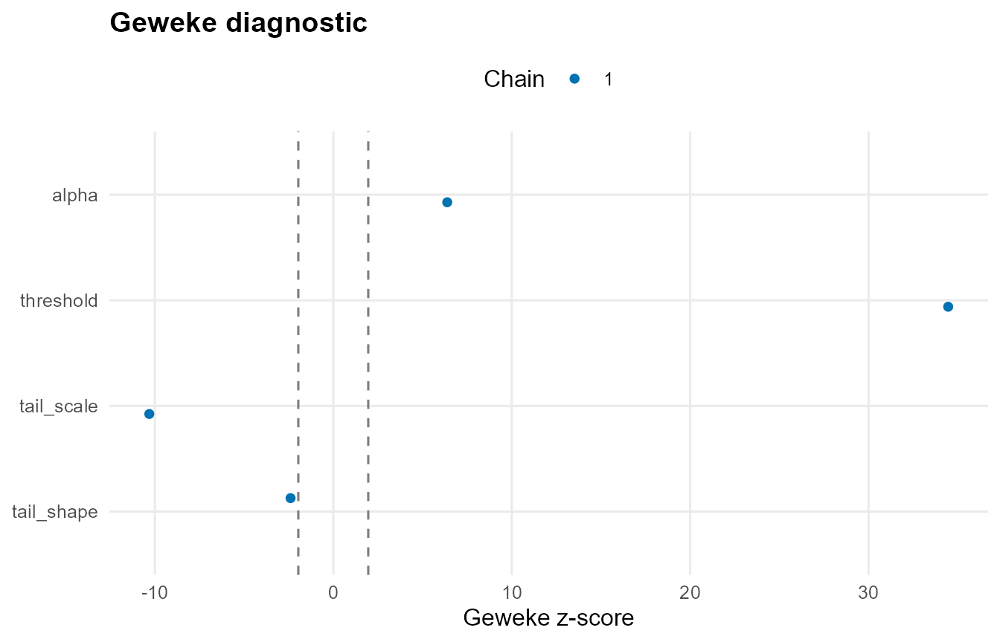
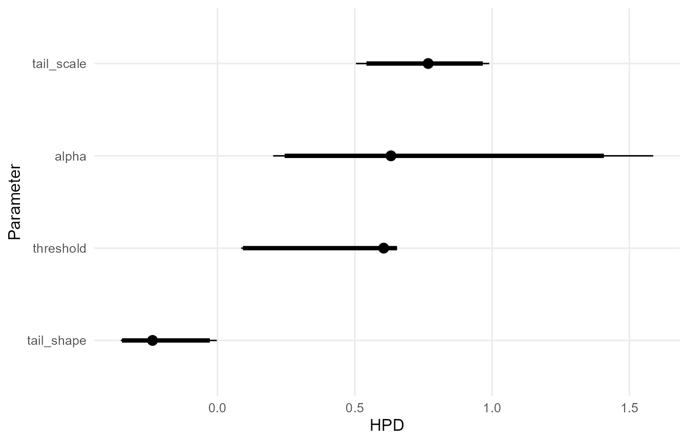
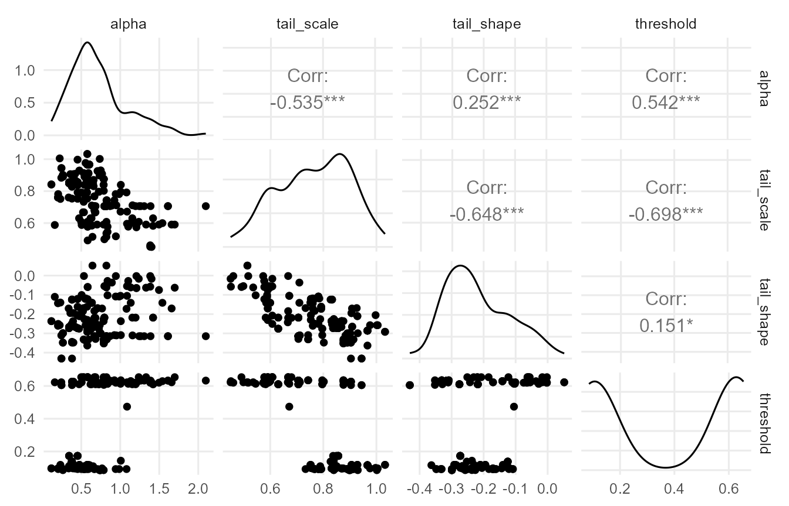

# DPmixGPD: Unconditional bulk–tail density estimation

``` r

library(DPmixGPD)
set.seed(1)
```

This vignette shows how to fit the *unconditional* DPmixGPD model,
i.e. without covariates ($`X=\mathrm{NULL}`$). The unconditional case is
the simplest entry point for two reasons:

1.  It isolates the central design choice: which kernel family is an
    appropriate *bulk* model for your outcome support and shape.
2.  It makes clear how the bulk (DPM) and tail (GPD) are estimated
    *jointly* rather than via a two-stage procedure.

All mathematical definitions of the Dirichlet process mixture prior, the
GPD tail density/CDF, and the spliced bulk–tail density are developed
in the vignette **“DPmixGPD: Model specification and posterior
computation�**. This vignette treats those definitions as *fixed* and
focuses on: model configuration, prior control, and posterior summaries
in the unconditional setting.

## What “unconditional� means in DPmixGPD

With no covariates, the bulk model is an ordinary Dirichlet process
mixture:
``` math
f_{\mathrm{DPM}}(y) \;=\; \sum_{j=1}^{\infty} w_j \, k(y\mid \Theta_j),
```
with DP stick-breaking weights $`w_j`$([Sethuraman
1994](#ref-sethuraman1994)) and blocked Gibbs truncation at
$`J=\texttt{components}`$([Ishwaran and James 2001](#ref-ishwaran2001)).
In practice, DPmixGPD uses a finite representation for both SB and CRP
backends, controlled by the single argument `components`.

If `GPD=TRUE`, DPmixGPD fits the (upper) tail using a generalized Pareto
exceedance model and couples it to the bulk via a proper bulk–tail
splice (see the “Model specification…� vignette for the full
density/CDF). This joint construction is in the same spirit as Bayesian
semiparametric bulk–tail models that avoid fixing a hard threshold and
instead estimate bulk and tail together ([Frigessi et al.
2002](#ref-frigessi2002); [Nascimento et al.
2012](#ref-doNascimento2012); [Behrens et al. 2004](#ref-behrens2004)).

## Choosing a kernel (bulk family)

A good kernel choice is driven by *support* first and *shape* second:

- If your outcome is supported on $`\mathbb{R}`$: Normal / Laplace /
  Cauchy kernels are natural.
- If your outcome is supported on $`\mathbb{R}_+`$: Gamma / Lognormal /
  Inverse-Gaussian / Amoroso kernels are typically appropriate.
- If your data are heavy-tailed already in the bulk, a more flexible
  positive-support kernel (e.g., Lognormal, Amoroso) may absorb
  structure that a lighter kernel would push into the tail, which can
  affect tail stability.

DPmixGPD ships a registry describing which kernels support which
features.

``` r
kernel_support_table()
             kernel gpd covariates sb crp
normal       normal   ✔          ✔  ✔   ✔
lognormal lognormal   ✔          ✔  ✔   ✔
invgauss   invgauss   ✔          ✔  ✔   ✔
gamma         gamma   ✔          ✔  ✔   ✔
laplace     laplace   ✔          ✔  ✔   ✔
amoroso     amoroso   ✔          ✔  ✔   ✔
cauchy       cauchy  ❌          ✔  ✔   ✔
```

## SB vs CRP backends

DPmixGPD supports `backend="sb"` (stick-breaking) and `backend="crp"`
(Chinese restaurant process). Both correspond to the same DP prior but
expose different computational representations ([Neal
2000](#ref-neal2000)).

Practical guidance in the unconditional case:

- Start with `backend="sb"` if you want a stable finite representation
  with an explicit truncation level $`J`$.
- Use `backend="crp"` if you prefer a partition-driven representation
  (often convenient conceptually for clustering), noting that the finite
  NIMBLE model still uses `components` as a maximum representable number
  of clusters.

## Enabling/disabling the GPD tail

The decision `GPD=TRUE/FALSE` is not cosmetic; it changes the likelihood
and the posterior targets.

- `GPD=FALSE` fits a pure DPM density on the full support. This is
  appropriate if you mainly want flexible density estimation without
  explicit extreme extrapolation.
- `GPD=TRUE` fits the joint bulk–tail model where exceedances beyond a
  threshold are modeled by a GPD and the total density remains proper by
  splicing. This is appropriate if you want stable *extreme quantiles*
  or *tail probabilities* beyond the observed bulk.

Even in the unconditional case, the tail inference is coupled to the
bulk via the survival mass at the threshold
$`S_{\mathrm{DPM}}(u)=1-F_{\mathrm{DPM}}(u)`$. This is exactly why the
model tends to be more stable than “fit the bulk, then fit a tail�
pipelines when the exceedance sample size is small.

## Model building in code

### Minimal build: bulk only

``` r
y <- abs(rnorm(120)) + 0.1

bundle <- build_nimble_bundle(
  y = y,
  X = NULL,
  backend = "sb",
  kernel = "lognormal",
  GPD = FALSE,
  components = 6,
  mcmc = list(niter = 400, nburnin = 100, thin = 2, nchains = 1, seed = 1)
)

bundle
DPmixGPD bundle
<table class="table" style="width: auto !important; margin-left: auto; margin-right: auto;">
 <thead>
  <tr>
   <th style="text-align:center;"> Field </th>
   <th style="text-align:center;"> Value </th>
  </tr>
 </thead>
<tbody>
  <tr>
   <td style="text-align:center;"> Backend </td>
   <td style="text-align:center;"> Stick-Breaking Process </td>
  </tr>
  <tr>
   <td style="text-align:center;"> Kernel </td>
   <td style="text-align:center;"> Lognormal Distribution </td>
  </tr>
  <tr>
   <td style="text-align:center;"> Components </td>
   <td style="text-align:center;"> 6 </td>
  </tr>
  <tr>
   <td style="text-align:center;"> N </td>
   <td style="text-align:center;"> 120 </td>
  </tr>
  <tr>
   <td style="text-align:center;"> X </td>
   <td style="text-align:center;"> NO </td>
  </tr>
  <tr>
   <td style="text-align:center;"> GPD </td>
   <td style="text-align:center;"> FALSE </td>
  </tr>
  <tr>
   <td style="text-align:center;"> Epsilon </td>
   <td style="text-align:center;"> 0.025 </td>
  </tr>
</tbody>
</table>
  contains  : code, constants, data, dimensions, inits, monitors
summary(bundle)
DPmixGPD bundle summary
<table class="table" style="width: auto !important; margin-left: auto; margin-right: auto;">
 <thead>
  <tr>
   <th style="text-align:center;"> Field </th>
   <th style="text-align:center;"> Value </th>
  </tr>
 </thead>
<tbody>
  <tr>
   <td style="text-align:center;"> Backend </td>
   <td style="text-align:center;"> Stick-Breaking Process </td>
  </tr>
  <tr>
   <td style="text-align:center;"> Kernel </td>
   <td style="text-align:center;"> Lognormal Distribution </td>
  </tr>
  <tr>
   <td style="text-align:center;"> Components </td>
   <td style="text-align:center;"> 6 </td>
  </tr>
  <tr>
   <td style="text-align:center;"> N </td>
   <td style="text-align:center;"> 120 </td>
  </tr>
  <tr>
   <td style="text-align:center;"> X </td>
   <td style="text-align:center;"> NO </td>
  </tr>
  <tr>
   <td style="text-align:center;"> GPD </td>
   <td style="text-align:center;"> FALSE </td>
  </tr>
  <tr>
   <td style="text-align:center;"> Epsilon </td>
   <td style="text-align:center;"> 0.025 </td>
  </tr>
</tbody>
</table>
Parameter specification
<table class="table" style="width: auto !important; margin-left: auto; margin-right: auto;">
 <thead>
  <tr>
   <th style="text-align:center;"> block </th>
   <th style="text-align:center;"> parameter </th>
   <th style="text-align:center;"> mode </th>
   <th style="text-align:center;"> level </th>
   <th style="text-align:center;"> prior </th>
   <th style="text-align:center;"> link </th>
   <th style="text-align:center;"> notes </th>
  </tr>
 </thead>
<tbody>
  <tr>
   <td style="text-align:center;"> meta </td>
   <td style="text-align:center;"> backend </td>
   <td style="text-align:center;"> info </td>
   <td style="text-align:center;"> model </td>
   <td style="text-align:center;"> sb </td>
   <td style="text-align:center;">  </td>
   <td style="text-align:center;">  </td>
  </tr>
  <tr>
   <td style="text-align:center;"> meta </td>
   <td style="text-align:center;"> kernel </td>
   <td style="text-align:center;"> info </td>
   <td style="text-align:center;"> model </td>
   <td style="text-align:center;"> lognormal </td>
   <td style="text-align:center;">  </td>
   <td style="text-align:center;">  </td>
  </tr>
  <tr>
   <td style="text-align:center;"> meta </td>
   <td style="text-align:center;"> components </td>
   <td style="text-align:center;"> info </td>
   <td style="text-align:center;"> model </td>
   <td style="text-align:center;"> 6 </td>
   <td style="text-align:center;">  </td>
   <td style="text-align:center;">  </td>
  </tr>
  <tr>
   <td style="text-align:center;"> meta </td>
   <td style="text-align:center;"> N </td>
   <td style="text-align:center;"> info </td>
   <td style="text-align:center;"> model </td>
   <td style="text-align:center;"> 120 </td>
   <td style="text-align:center;">  </td>
   <td style="text-align:center;">  </td>
  </tr>
  <tr>
   <td style="text-align:center;"> meta </td>
   <td style="text-align:center;"> P </td>
   <td style="text-align:center;"> info </td>
   <td style="text-align:center;"> model </td>
   <td style="text-align:center;"> 0 </td>
   <td style="text-align:center;">  </td>
   <td style="text-align:center;">  </td>
  </tr>
  <tr>
   <td style="text-align:center;"> concentration </td>
   <td style="text-align:center;"> alpha </td>
   <td style="text-align:center;"> dist </td>
   <td style="text-align:center;"> scalar </td>
   <td style="text-align:center;"> gamma(shape=1, rate=1) </td>
   <td style="text-align:center;">  </td>
   <td style="text-align:center;"> stochastic concentration </td>
  </tr>
  <tr>
   <td style="text-align:center;"> bulk </td>
   <td style="text-align:center;"> meanlog </td>
   <td style="text-align:center;"> dist </td>
   <td style="text-align:center;"> component (1:6) </td>
   <td style="text-align:center;"> normal(mean=0, sd=5) </td>
   <td style="text-align:center;">  </td>
   <td style="text-align:center;"> iid across components </td>
  </tr>
  <tr>
   <td style="text-align:center;"> bulk </td>
   <td style="text-align:center;"> sdlog </td>
   <td style="text-align:center;"> dist </td>
   <td style="text-align:center;"> component (1:6) </td>
   <td style="text-align:center;"> gamma(shape=2, rate=1) </td>
   <td style="text-align:center;">  </td>
   <td style="text-align:center;"> iid across components </td>
  </tr>
</tbody>
</table>
Monitors
  n = 5 
  alpha, w[1:6], z[1:120], meanlog[1:6], sdlog[1:6]
```

### Minimal build: bulk + GPD tail

``` r

bundle_gpd <- build_nimble_bundle(
  y = y,
  X = NULL,
  backend = "sb",
  kernel = "lognormal",
  GPD = TRUE,
  components = 6,
  mcmc = list(niter = 500, nburnin = 150, thin = 2, nchains = 1, seed = 1)
)
```

### Run posterior sampling

``` r
fit <- run_mcmc_bundle_manual(bundle_gpd, show_progress = FALSE)
===== Monitors =====
thin = 1: alpha, meanlog, sdlog, tail_scale, tail_shape, threshold, w, z
===== Samplers =====
RW sampler (21)
  - alpha
  - meanlog[]  (6 elements)
  - sdlog[]  (6 elements)
  - threshold
  - tail_scale
  - tail_shape
  - v[]  (5 elements)
categorical sampler (120)
  - z[]  (120 elements)
fit
MixGPD fit | backend: Stick-Breaking Process | kernel: Lognormal Distribution | GPD tail: TRUE
n = 120 | components = 6 | epsilon = 0.025
MCMC: niter=500, nburnin=150, thin=2, nchains=1 
Fit
Use summary() for posterior summaries; plot() for diagnostics; predict() for predictions.
summary(fit)
MixGPD summary | backend: Stick-Breaking Process | kernel: Lognormal Distribution | GPD tail: TRUE | epsilon: 0.025
n = 120 | components = 6
Summary
Initial components: 6 | Components after truncation: 1

WAIC: 139.624
lppd: -51.237 | pWAIC: 18.575

Summary table
<table class="table" style="width: auto !important; margin-left: auto; margin-right: auto;">
 <thead>
  <tr>
   <th style="text-align:center;"> parameter </th>
   <th style="text-align:center;"> mean </th>
   <th style="text-align:center;"> sd </th>
   <th style="text-align:center;"> q0.025 </th>
   <th style="text-align:center;"> q0.500 </th>
   <th style="text-align:center;"> q0.975 </th>
   <th style="text-align:center;"> ess </th>
  </tr>
 </thead>
<tbody>
  <tr>
   <td style="text-align:center;"> weights[1] </td>
   <td style="text-align:center;"> 0.733 </td>
   <td style="text-align:center;"> 0.159 </td>
   <td style="text-align:center;"> 0.481 </td>
   <td style="text-align:center;"> 0.75 </td>
   <td style="text-align:center;"> 1 </td>
   <td style="text-align:center;"> 2.976 </td>
  </tr>
  <tr>
   <td style="text-align:center;"> alpha </td>
   <td style="text-align:center;"> 0.707 </td>
   <td style="text-align:center;"> 0.358 </td>
   <td style="text-align:center;"> 0.203 </td>
   <td style="text-align:center;"> 0.632 </td>
   <td style="text-align:center;"> 1.587 </td>
   <td style="text-align:center;"> 23.067 </td>
  </tr>
  <tr>
   <td style="text-align:center;"> tail_scale </td>
   <td style="text-align:center;"> 0.764 </td>
   <td style="text-align:center;"> 0.135 </td>
   <td style="text-align:center;"> 0.504 </td>
   <td style="text-align:center;"> 0.767 </td>
   <td style="text-align:center;"> 0.99 </td>
   <td style="text-align:center;"> 11.59 </td>
  </tr>
  <tr>
   <td style="text-align:center;"> tail_shape </td>
   <td style="text-align:center;"> -0.217 </td>
   <td style="text-align:center;"> 0.102 </td>
   <td style="text-align:center;"> -0.352 </td>
   <td style="text-align:center;"> -0.237 </td>
   <td style="text-align:center;"> -0.003 </td>
   <td style="text-align:center;"> 14.968 </td>
  </tr>
  <tr>
   <td style="text-align:center;"> threshold </td>
   <td style="text-align:center;"> 0.372 </td>
   <td style="text-align:center;"> 0.261 </td>
   <td style="text-align:center;"> 0.086 </td>
   <td style="text-align:center;"> 0.605 </td>
   <td style="text-align:center;"> 0.654 </td>
   <td style="text-align:center;"> 1.606 </td>
  </tr>
  <tr>
   <td style="text-align:center;"> meanlog[1] </td>
   <td style="text-align:center;"> 0.335 </td>
   <td style="text-align:center;"> 1.884 </td>
   <td style="text-align:center;"> -1.055 </td>
   <td style="text-align:center;"> -0.678 </td>
   <td style="text-align:center;"> 4.954 </td>
   <td style="text-align:center;"> 2.927 </td>
  </tr>
  <tr>
   <td style="text-align:center;"> sdlog[1] </td>
   <td style="text-align:center;"> 0.902 </td>
   <td style="text-align:center;"> 0.517 </td>
   <td style="text-align:center;"> 0.468 </td>
   <td style="text-align:center;"> 0.77 </td>
   <td style="text-align:center;"> 1.819 </td>
   <td style="text-align:center;"> 41.323 </td>
  </tr>
</tbody>
</table>
```

The returned object is a `mixgpd_fit`, which stores posterior draws, the
compiled spec, and the settings needed for downstream summaries and
plotting.

## Prior control via `param_specs`

DPmixGPD uses a single structured object `param_specs` to control
whether each parameter is:

- `mode="fixed"`: treated as constant,
- `mode="dist"`: assigned a prior and sampled,
- `mode="link"`: made covariate-dependent via a link function (only
  relevant when `X` is provided; see the conditional vignette).

The expected structure is:

``` r

param_specs <- list(
  bulk = list(
    # kernel-specific parameters go here
  ),
  gpd = list(
    threshold  = list(mode = "fixed", value = 1.0),
    tail_scale = list(mode = "dist", dist = "gamma", args = list(shape = 2, rate = 1)),
    tail_shape = list(mode = "dist", dist = "normal", args = list(mean = 0, sd = 0.25))
  ),
  concentration = list(mode = "dist", dist = "gamma", args = list(shape = 2, rate = 1))
)
```

### Example: treat tail parameters as random, but fix the threshold

Fixing $`u`$ can be useful for sensitivity analysis. A common pragmatic
choice is to set $`u`$ to a high empirical quantile and let
$`(\sigma,\xi)`$ be learned from exceedances. (When $`u`$ is random,
DPmixGPD will propagate threshold uncertainty automatically.)

``` r

u0 <- as.numeric(stats::quantile(y, 0.90))

param_specs <- list(
  gpd = list(
    threshold  = list(mode = "fixed", value = u0),
    tail_scale = list(mode = "dist",  dist = "gamma",  args = list(shape = 2, rate = 1)),
    tail_shape = list(mode = "dist",  dist = "normal", args = list(mean = 0, sd = 0.25))
  ),
  concentration = list(
    mode = "dist", dist = "gamma", args = list(shape = 2, rate = 1)
  )
)

bundle_gpd <- build_nimble_bundle(
  y = y,
  X = NULL,
  backend = "sb",
  kernel = "lognormal",
  GPD = TRUE,
  components = 6,
  param_specs = param_specs
)
```

### Example: fully stochastic threshold, with a weakly informative prior

DPmixGPD supports stochastic thresholds under `gpd$threshold` when
`GPD=TRUE`. In the conditional model the threshold can be linked to
covariates; in the unconditional model it is scalar.

``` r

param_specs2 <- list(
  gpd = list(
    threshold  = list(mode = "dist", dist = "lognormal", args = list(meanlog = log(median(y)), sdlog = 0.4)),
    tail_scale = list(mode = "dist", dist = "gamma",     args = list(shape = 2, rate = 1)),
    tail_shape = list(mode = "dist", dist = "normal",    args = list(mean = 0, sd = 0.25))
  )
)
```

## Posterior summaries: density, CDF, and quantiles

The core inferential objects are functionals of the full spliced
distribution $`F(y)`$ (defined in the “Model specification…�
vignette). Given posterior draws
$`\{\Theta^{(s)},\Phi^{(s)}\}_{s=1}^S`$, DPmixGPD computes summaries by:

1.  evaluating the functional under each draw, and
2.  aggregating across draws (posterior mean, median, and credible
    intervals).

### Quantiles under the splice (conceptual formula)

Let $`u^{(s)}`$ be the threshold in draw $`s`$, and let
$`p_u^{(s)} = F_{\mathrm{DPM}}^{(s)}(u^{(s)})`$. For a target level
$`\tau`$:

- If $`\tau \le p_u^{(s)}`$, then the quantile is in the bulk:
  $`Q^{(s)}(\tau)=Q_{\mathrm{DPM}}^{(s)}(\tau)`$.
- If $`\tau > p_u^{(s)}`$, then it is in the tail. Writing
  $`q = (\tau - p_u^{(s)})/(1-p_u^{(s)})`$, the tail quantile is
  ``` math
  Q^{(s)}(\tau) = u^{(s)} + Q_{\mathrm{GPD}}^{(s)}(q),
  ```
  where $`Q_{\mathrm{GPD}}^{(s)}(\cdot)`$ is the GPD quantile function
  for exceedances.

DPmixGPD implements these calculations using the posterior samples, so
you do not need to code them manually unless you are building custom
functionals.

### Practical API

``` r

# Posterior predictive density/survival at a grid:
grid <- seq(min(y), max(y) * 1.5, length.out = 200)

dhat <- predict(fit, y = grid, type = "density")
shat <- predict(fit, y = grid, type = "survival")

# Posterior quantiles:
qs <- predict(fit, type = "quantile", p = c(0.90, 0.95, 0.99))

# Posterior predictive mean:
mhat <- predict(fit, type = "mean", cred.level = 0.90)
```

The exact `type` names and available options are documented in the
function reference for `predict.mixgpd_fit`. Use
[`?predict.mixgpd_fit`](https://arnabaich96.github.io/DPmixGPD/pkgdown/reference/predict.mixgpd_fit.md)
after installation.

## Diagnostics (what to check)

Posterior computation for mixture models is sensitive to:

- truncation level `components` (SB) or maximum clusters (CRP),
- mixing of allocations $`\{z_i\}`$,
- tail identifiability when the exceedance sample is small.

In practice, you should:

1.  run multiple chains if feasible,
2.  inspect trace plots for key tail parameters $`(u,\sigma,\xi)`$ when
    `GPD=TRUE`,
3.  check stability of extreme quantiles (e.g., 0.95/0.99) across chains
    and across small perturbations of priors.

DPmixGPD prints a compact summary and supports standard MCMC diagnostics
tooling.

``` r
summary(fit)
MixGPD summary | backend: Stick-Breaking Process | kernel: Lognormal Distribution | GPD tail: TRUE | epsilon: 0.025
n = 120 | components = 6
Summary
Initial components: 6 | Components after truncation: 1

WAIC: 139.624
lppd: -51.237 | pWAIC: 18.575

Summary table
<table class="table" style="width: auto !important; margin-left: auto; margin-right: auto;">
 <thead>
  <tr>
   <th style="text-align:center;"> parameter </th>
   <th style="text-align:center;"> mean </th>
   <th style="text-align:center;"> sd </th>
   <th style="text-align:center;"> q0.025 </th>
   <th style="text-align:center;"> q0.500 </th>
   <th style="text-align:center;"> q0.975 </th>
   <th style="text-align:center;"> ess </th>
  </tr>
 </thead>
<tbody>
  <tr>
   <td style="text-align:center;"> weights[1] </td>
   <td style="text-align:center;"> 0.733 </td>
   <td style="text-align:center;"> 0.159 </td>
   <td style="text-align:center;"> 0.481 </td>
   <td style="text-align:center;"> 0.75 </td>
   <td style="text-align:center;"> 1 </td>
   <td style="text-align:center;"> 2.976 </td>
  </tr>
  <tr>
   <td style="text-align:center;"> alpha </td>
   <td style="text-align:center;"> 0.707 </td>
   <td style="text-align:center;"> 0.358 </td>
   <td style="text-align:center;"> 0.203 </td>
   <td style="text-align:center;"> 0.632 </td>
   <td style="text-align:center;"> 1.587 </td>
   <td style="text-align:center;"> 23.067 </td>
  </tr>
  <tr>
   <td style="text-align:center;"> tail_scale </td>
   <td style="text-align:center;"> 0.764 </td>
   <td style="text-align:center;"> 0.135 </td>
   <td style="text-align:center;"> 0.504 </td>
   <td style="text-align:center;"> 0.767 </td>
   <td style="text-align:center;"> 0.99 </td>
   <td style="text-align:center;"> 11.59 </td>
  </tr>
  <tr>
   <td style="text-align:center;"> tail_shape </td>
   <td style="text-align:center;"> -0.217 </td>
   <td style="text-align:center;"> 0.102 </td>
   <td style="text-align:center;"> -0.352 </td>
   <td style="text-align:center;"> -0.237 </td>
   <td style="text-align:center;"> -0.003 </td>
   <td style="text-align:center;"> 14.968 </td>
  </tr>
  <tr>
   <td style="text-align:center;"> threshold </td>
   <td style="text-align:center;"> 0.372 </td>
   <td style="text-align:center;"> 0.261 </td>
   <td style="text-align:center;"> 0.086 </td>
   <td style="text-align:center;"> 0.605 </td>
   <td style="text-align:center;"> 0.654 </td>
   <td style="text-align:center;"> 1.606 </td>
  </tr>
  <tr>
   <td style="text-align:center;"> meanlog[1] </td>
   <td style="text-align:center;"> 0.335 </td>
   <td style="text-align:center;"> 1.884 </td>
   <td style="text-align:center;"> -1.055 </td>
   <td style="text-align:center;"> -0.678 </td>
   <td style="text-align:center;"> 4.954 </td>
   <td style="text-align:center;"> 2.927 </td>
  </tr>
  <tr>
   <td style="text-align:center;"> sdlog[1] </td>
   <td style="text-align:center;"> 0.902 </td>
   <td style="text-align:center;"> 0.517 </td>
   <td style="text-align:center;"> 0.468 </td>
   <td style="text-align:center;"> 0.77 </td>
   <td style="text-align:center;"> 1.819 </td>
   <td style="text-align:center;"> 41.323 </td>
  </tr>
</tbody>
</table>
plot(fit)

=== histogram ===
```




    === density ===




    === traceplot ===




    === running ===




    === compare_partial ===




    === autocorrelation ===




    === geweke ===




    === caterpillar ===




    === pairs ===



## Low-level density utilities (optional)

DPmixGPD exports both CamelCase and lower-case
density/CDF/quantile/random-generation helpers for kernels and their
mix/splice variants. As a practical rule:

- the CamelCase forms (e.g., `dNormMixGpd`) are intended for NIMBLE
  model code and internal use,
- the lower-case forms (e.g., `dnormmixgpd`) are convenient for direct
  use in R scripts.

This separation makes it easier to validate pieces of the model outside
MCMC (e.g., checking a GPD tail density shape) without rebuilding a full
bundle.

## References

Behrens, Cibele N., Hedibert F. Lopes, and Dani Gamerman. 2004.
“Bayesian Analysis of Extreme Events with Threshold Estimation.”
*Statistical Modelling* 4 (3): 227–44.
<https://doi.org/10.1191/1471082x04st075oa>.

Frigessi, Arnoldo, Ola Haug, and Håvard Rue. 2002. “A Dynamic Mixture
Model for Unsupervised Tail Estimation Without Threshold Selection.”
*Extremes* 5 (3): 219–35. <https://doi.org/10.1023/A:1024072610684>.

Ishwaran, Hemant, and Lancelot F. James. 2001. “Gibbs Sampling Methods
for Stick-Breaking Priors.” *Journal of the American Statistical
Association* 96 (453): 161–73.
<https://doi.org/10.1198/016214501750332758>.

Nascimento, Fernando Ferraz do, Dani Gamerman, and Hedibert Freitas
Lopes. 2012. “A Semiparametric Bayesian Approach to Extreme Value
Estimation.” *Statistics and Computing* 22 (2): 661–75.
<https://doi.org/10.1007/s11222-011-9270-z>.

Neal, Radford M. 2000. “Markov Chain Sampling Methods for Dirichlet
Process Mixture Models.” *Journal of Computational and Graphical
Statistics* 9 (2): 249–65.
<https://doi.org/10.1080/10618600.2000.10474879>.

Sethuraman, Jayaram. 1994. “A Constructive Definition of Dirichlet
Priors.” *Statistica Sinica* 4 (2): 639–50.
