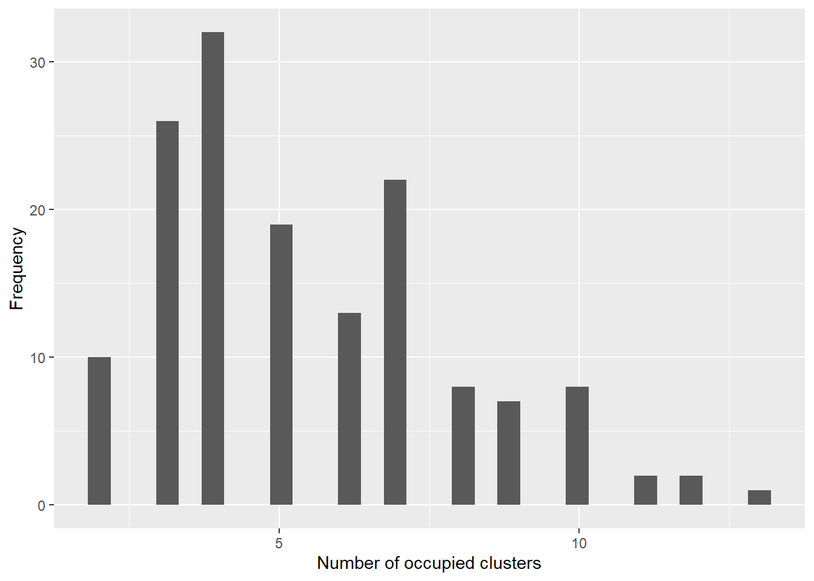
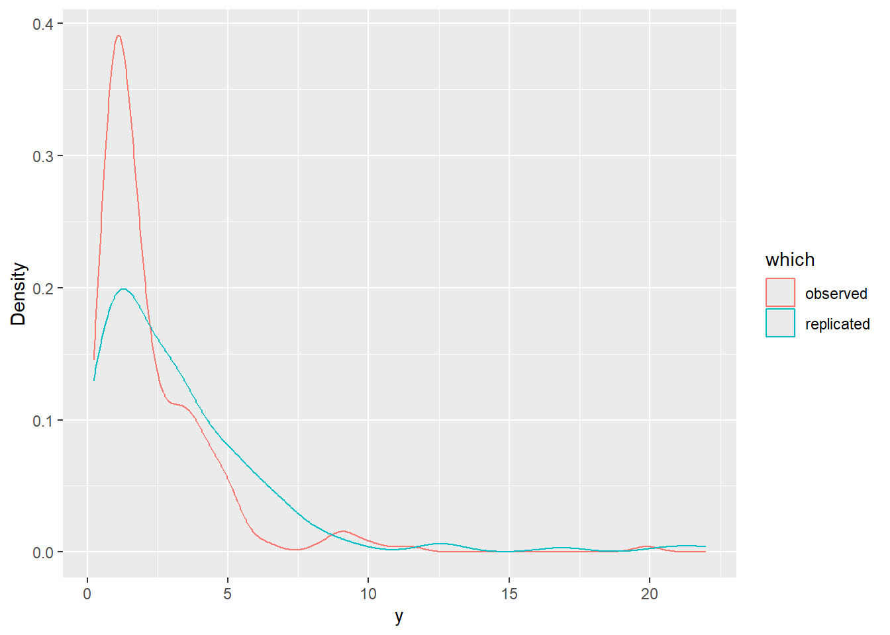

::: callout-warning
## Advanced users only
This vignette is a code-oriented prototype. It assumes familiarity with NIMBLE model code and with validating custom Bayesian nonparametric models.
:::

# Objective

The package currently provides bulk-only mixtures (`d*Mix`) and bulk-tail spliced distributions (`d*Gpd`, `d*MixGpd`) as NIMBLE `nimbleFunction`s. However, it does not yet expose a "scalar-atom DPM with an embedded GPD tail" as a one-line high-level interface.

The goal here is to show how to write that model directly in `nimbleCode{}` for the **CRP backend**, while reusing the **exported** spliced distributions (e.g., `dGammaGpd`, `dLognormalGpd`, `dInvGaussGpd`, `dNormGpd`, etc.). No ones/zeros trick is required because the likelihood is written using these distributions directly.

# Model specification

Let \(y_1,\dots,y_N\) be observations. Under a CRP DPM:

- Cluster allocations follow a Chinese restaurant process:
  \[
    z[1{:}N] \sim \mathrm{CRP}(\alpha),
  \]
  implemented in NIMBLE as `z[1:N] ~ dCRP(conc = alpha, size = N)`.

- Each cluster \(k\) has a *scalar* atom \(\theta_k\). The atom is the only cluster-specific kernel parameter; all other kernel parameters are fixed or global.

- Conditional on allocation, the observation likelihood uses a **GPD-spliced kernel distribution** exported by the package. For a positive-support outcome, a convenient choice is Gamma+GPD:
  \[
    y_i \mid z_i=k \sim \mathrm{GammaGpd}(\text{shape}=a,\ \text{scale}=\theta_k,\ u,\ \sigma_{\text{tail}},\ \xi),
  \]
  where the Gamma is used below the threshold \(u\), and exceedances use the GPD tail via `dGpd` inside `dGammaGpd`.

This construction is "GPD-in-DPM" in the sense that the **tail is part of the per-observation distribution** (not a separate post-processing step), while the mixture is induced by the CRP allocations.

# A concrete working template (Gamma bulk, scalar scale atom)

The template below uses:

- scalar atom: `scale_k = theta[k] > 0`
- fixed bulk shape: `shape0` (constant)
- tail parameters: `threshold`, `tail_scale`, `tail_shape` (constants or global parameters)

You can substitute a different exported spliced distribution by changing the likelihood line (for example, `dLognormalGpd`, `dInvGaussGpd`, `dNormGpd`, etc.).


::: {.cell}

```{.r .cell-code}
library(CausalMixGPD)
```

::: {.cell-output .cell-output-stderr}

```
Registered S3 methods overwritten by 'CausalMixGPD':
  method                     from    
  fitted.mixgpd_fit          DPmixGPD
  plot.mixgpd_fit            DPmixGPD
  plot.mixgpd_fitted         DPmixGPD
  plot.mixgpd_predict        DPmixGPD
  predict.mixgpd_fit         DPmixGPD
  print.mixgpd_fit           DPmixGPD
  print.mixgpd_fit_plots     DPmixGPD
  print.mixgpd_fitted_plots  DPmixGPD
  print.mixgpd_params        DPmixGPD
  print.mixgpd_params_pair   DPmixGPD
  print.mixgpd_predict_plots DPmixGPD
  print.mixgpd_summary       DPmixGPD
  residuals.mixgpd_fit       DPmixGPD
  summary.mixgpd_fit         DPmixGPD
```


:::

::: {.cell-output .cell-output-stderr}

```

Attaching package: 'CausalMixGPD'
```


:::

::: {.cell-output .cell-output-stderr}

```
The following objects are masked from 'package:DPmixGPD':

    ate, ate_rmean, build_causal_bundle, build_nimble_bundle,
    causal_alt_pos500_p3_k3, causal_alt_pos500_p5_k4_tail,
    causal_alt_real500_p4_k2, causal_pos500_p3_k2, check_glue_validity,
    damoroso, dAmoroso, damorosogpd, dAmorosoGpd, damorosomix,
    dAmorosoMix, damorosomixgpd, dAmorosoMixGpd, dCauchy, dcauchy_vec,
    dcauchymix, dCauchyMix, dgammagpd, dGammaGpd, dgammamix, dGammaMix,
    dgammamixgpd, dGammaMixGpd, dgpd, dGpd, dinvgauss, dInvGauss,
    dinvgaussgpd, dInvGaussGpd, dinvgaussmix, dInvGaussMix,
    dinvgaussmixgpd, dInvGaussMixGpd, dlaplacegpd, dLaplaceGpd,
    dlaplacemix, dLaplaceMix, dlaplacemixgpd, dLaplaceMixGpd,
    dlognormalgpd, dLognormalGpd, dlognormalmix, dLognormalMix,
    dlognormalmixgpd, dLognormalMixGpd, dnormgpd, dNormGpd, dnormmix,
    dNormMix, dnormmixgpd, dNormMixGpd, get_kernel_registry,
    get_tail_registry, init_kernel_registry, kernel_support_table,
    pamoroso, pAmoroso, pamorosogpd, pAmorosoGpd, pamorosomix,
    pAmorosoMix, pamorosomixgpd, pAmorosoMixGpd, params, pCauchy,
    pcauchy_vec, pcauchymix, pCauchyMix, pgammagpd, pGammaGpd,
    pgammamix, pGammaMix, pgammamixgpd, pGammaMixGpd, pgpd, pGpd,
    pinvgauss, pInvGauss, pinvgaussgpd, pInvGaussGpd, pinvgaussmix,
    pInvGaussMix, pinvgaussmixgpd, pInvGaussMixGpd, plaplacegpd,
    pLaplaceGpd, plaplacemix, pLaplaceMix, plaplacemixgpd,
    pLaplaceMixGpd, plognormalgpd, pLognormalGpd, plognormalmix,
    pLognormalMix, plognormalmixgpd, pLognormalMixGpd, pnormgpd,
    pNormGpd, pnormmix, pNormMix, pnormmixgpd, pNormMixGpd, qamoroso,
    qAmoroso, qamorosogpd, qAmorosoGpd, qamorosomix, qAmorosoMix,
    qamorosomixgpd, qAmorosoMixGpd, qCauchy, qcauchy_vec, qcauchymix,
    qCauchyMix, qgammagpd, qGammaGpd, qgammamix, qGammaMix,
    qgammamixgpd, qGammaMixGpd, qgpd, qGpd, qinvgauss, qInvGauss,
    qinvgaussgpd, qInvGaussGpd, qinvgaussmix, qInvGaussMix,
    qinvgaussmixgpd, qInvGaussMixGpd, qlaplacegpd, qLaplaceGpd,
    qlaplacemix, qLaplaceMix, qlaplacemixgpd, qLaplaceMixGpd,
    qlognormalgpd, qLognormalGpd, qlognormalmix, qLognormalMix,
    qlognormalmixgpd, qLognormalMixGpd, qnormgpd, qNormGpd, qnormmix,
    qNormMix, qnormmixgpd, qNormMixGpd, qte, ramoroso, rAmoroso,
    ramorosogpd, rAmorosoGpd, ramorosomix, rAmorosoMix, ramorosomixgpd,
    rAmorosoMixGpd, rCauchy, rcauchy_vec, rcauchymix, rCauchyMix,
    rgammagpd, rGammaGpd, rgammamix, rGammaMix, rgammamixgpd,
    rGammaMixGpd, rgpd, rGpd, rinvgauss, rInvGauss, rinvgaussgpd,
    rInvGaussGpd, rinvgaussmix, rInvGaussMix, rinvgaussmixgpd,
    rInvGaussMixGpd, rlaplacegpd, rLaplaceGpd, rlaplacemix,
    rLaplaceMix, rlaplacemixgpd, rLaplaceMixGpd, rlognormalgpd,
    rLognormalGpd, rlognormalmix, rLognormalMix, rlognormalmixgpd,
    rLognormalMixGpd, rnormgpd, rNormGpd, rnormmix, rNormMix,
    rnormmixgpd, rNormMixGpd, run_mcmc_bundle_manual, run_mcmc_causal,
    sim_bulk_tail, sim_causal_qte, sim_survival_tail
```


:::

```{.r .cell-code}
library(nimble)

# Data shipped with the package (positive-support, tail-designed)
data("nc_pos_tail200_k4")
y <- nc_pos_tail200_k4$y
N <- length(y)

# Use the dataset's generating tail settings (keeps the example coherent)
threshold  <- nc_pos_tail200_k4$truth$threshold
tail_scale <- nc_pos_tail200_k4$truth$tail_params$scale
tail_shape <- nc_pos_tail200_k4$truth$tail_params$shape


# Choose a truncation level for the finite representation of clusters
components <- 25

# Fixed bulk shape (example)
shape0 <- 2.0


code <- nimbleCode({
  # Concentration
  alpha ~ dgamma(1, 1)

  # Scalar atoms (cluster-specific). Here: positive scale parameters.
  for (k in 1:components) {
    theta[k] ~ dgamma(a0, b0)
  }

  # CRP memberships (native NIMBLE BNP distribution)
  z[1:N] ~ dCRP(conc = alpha, size = N)

  # Likelihood: exported spliced kernel distribution
  for (i in 1:N) {
    y[i] ~ dGammaGpd(shape = shape0,
                     scale = theta[z[i]],
                     threshold = threshold,
                     tail_scale = tail_scale,
                     tail_shape = tail_shape)
  }
})

constants <- list(
  N = N, components = components,
  a0 = 2, b0 = 2,
  shape0 = shape0,
  threshold = threshold,
  tail_scale = tail_scale,
  tail_shape = tail_shape
)

data <- list(y = y)

inits <- list(
  alpha = 1,
  theta = rgamma(components, 2, 2),
  z = sample.int(5, N, replace = TRUE)
)

m <- nimbleModel(code, constants = constants, data = data, inits = inits, check = TRUE)
```

::: {.cell-output .cell-output-stderr}

```
Defining model
```


:::

::: {.cell-output .cell-output-stderr}

```
  [Note] Registering 'dGammaGpd' as a distribution based on its use in BUGS code. If you make changes to the nimbleFunctions for the distribution, you must call 'deregisterDistributions' before using the distribution in BUGS code for those changes to take effect.
```


:::

::: {.cell-output .cell-output-stderr}

```
Building model
```


:::

::: {.cell-output .cell-output-stderr}

```
Setting data and initial values
```


:::

::: {.cell-output .cell-output-stderr}

```
Running calculate on model
  [Note] Any error reports that follow may simply reflect missing values in model variables.
```


:::

::: {.cell-output .cell-output-stderr}

```
Checking model sizes and dimensions
```


:::

::: {.cell-output .cell-output-stderr}

```
Checking model calculations
```


:::

```{.r .cell-code}
cm <- compileNimble(m)
```

::: {.cell-output .cell-output-stderr}

```
Compiling
  [Note] This may take a minute.
  [Note] Use 'showCompilerOutput = TRUE' to see C++ compilation details.
```


:::

```{.r .cell-code}
conf <- configureMCMC(m, monitors = c("alpha", "theta", "z"))
```

::: {.cell-output .cell-output-stdout}

```
===== Monitors =====
thin = 1: alpha, theta, z
===== Samplers =====
CRP_concentration sampler (1)
  - alpha
CRP_cluster_wrapper sampler (25)
  - theta[]  (25 elements)
CRP sampler (1)
  - z[1:200] 
```


:::

```{.r .cell-code}
mcmc <- buildMCMC(conf)
```

::: {.cell-output .cell-output-stderr}

```
  [Warning] sampler_CRP: The number of clusters based on the cluster parameters
            is less than the number of potential clusters. The MCMC is not
            strictly valid if it ever proposes more components than cluster
            parameters exist; NIMBLE will warn you if this occurs.
```


:::

```{.r .cell-code}
cmcmc <- compileNimble(mcmc, project = m)
```

::: {.cell-output .cell-output-stderr}

```
Compiling
  [Note] This may take a minute.
  [Note] Use 'showCompilerOutput = TRUE' to see C++ compilation details.
```


:::

```{.r .cell-code}
samps <- runMCMC(cmcmc, niter = 600, nburnin = 300, thin = 2, setSeed = 1)
```

::: {.cell-output .cell-output-stderr}

```
running chain 1...
```


:::

::: {.cell-output .cell-output-stdout}

```
|-------------|-------------|-------------|-------------|
|-------------------------------------------------------|
```


:::
:::


# Posterior analysis

This section sketches a minimal posterior workflow after `runMCMC()` returns `samps`. The object returned by `runMCMC()` is typically a matrix with one row per retained iteration and one column per monitored node.

## Basic parameter summaries


::: {.cell}

```{.r .cell-code}
# Posterior summary for alpha
alpha_draws <- samps[, "alpha"]
summary(alpha_draws)
```

::: {.cell-output .cell-output-stdout}

```
   Min. 1st Qu.  Median    Mean 3rd Qu.    Max. 
0.01619 0.53013 0.86315 1.13366 1.36927 5.52937 
```


:::

```{.r .cell-code}
# Posterior summaries for the scalar atoms theta[k]
theta_cols  <- grep("^theta\\[", colnames(samps), value = TRUE)
theta_draws <- samps[, theta_cols, drop = FALSE]

theta_summary <- t(apply(theta_draws, 2, function(x) {
  c(mean = mean(x), sd = sd(x),
    q025 = unname(quantile(x, 0.025)),
    q50  = unname(quantile(x, 0.50)),
    q975 = unname(quantile(x, 0.975)))
}))

kableExtra::kbl(theta_summary, digits = 3, caption = "Posterior summaries of scalar atoms (theta[k])") |>
  kableExtra::kable_styling(full_width = FALSE)
```

::: {.cell-output-display}
`````{=html}
<table class="table" style="width: auto !important; margin-left: auto; margin-right: auto;">
<caption>Posterior summaries of scalar atoms (theta[k])</caption>
 <thead>
  <tr>
   <th style="text-align:left;">   </th>
   <th style="text-align:right;"> mean </th>
   <th style="text-align:right;"> sd </th>
   <th style="text-align:right;"> q025 </th>
   <th style="text-align:right;"> q50 </th>
   <th style="text-align:right;"> q975 </th>
  </tr>
 </thead>
<tbody>
  <tr>
   <td style="text-align:left;"> theta[1] </td>
   <td style="text-align:right;"> 1.182 </td>
   <td style="text-align:right;"> 0.692 </td>
   <td style="text-align:right;"> 0.317 </td>
   <td style="text-align:right;"> 1.034 </td>
   <td style="text-align:right;"> 2.948 </td>
  </tr>
  <tr>
   <td style="text-align:left;"> theta[2] </td>
   <td style="text-align:right;"> 1.109 </td>
   <td style="text-align:right;"> 0.676 </td>
   <td style="text-align:right;"> 0.293 </td>
   <td style="text-align:right;"> 0.895 </td>
   <td style="text-align:right;"> 2.937 </td>
  </tr>
  <tr>
   <td style="text-align:left;"> theta[3] </td>
   <td style="text-align:right;"> 1.435 </td>
   <td style="text-align:right;"> 0.733 </td>
   <td style="text-align:right;"> 0.257 </td>
   <td style="text-align:right;"> 1.373 </td>
   <td style="text-align:right;"> 2.839 </td>
  </tr>
  <tr>
   <td style="text-align:left;"> theta[4] </td>
   <td style="text-align:right;"> 0.992 </td>
   <td style="text-align:right;"> 0.479 </td>
   <td style="text-align:right;"> 0.320 </td>
   <td style="text-align:right;"> 0.875 </td>
   <td style="text-align:right;"> 2.889 </td>
  </tr>
  <tr>
   <td style="text-align:left;"> theta[5] </td>
   <td style="text-align:right;"> 0.826 </td>
   <td style="text-align:right;"> 0.513 </td>
   <td style="text-align:right;"> 0.357 </td>
   <td style="text-align:right;"> 0.593 </td>
   <td style="text-align:right;"> 2.282 </td>
  </tr>
  <tr>
   <td style="text-align:left;"> theta[6] </td>
   <td style="text-align:right;"> 1.391 </td>
   <td style="text-align:right;"> 0.635 </td>
   <td style="text-align:right;"> 0.398 </td>
   <td style="text-align:right;"> 1.286 </td>
   <td style="text-align:right;"> 2.953 </td>
  </tr>
  <tr>
   <td style="text-align:left;"> theta[7] </td>
   <td style="text-align:right;"> 0.976 </td>
   <td style="text-align:right;"> 0.293 </td>
   <td style="text-align:right;"> 0.705 </td>
   <td style="text-align:right;"> 0.862 </td>
   <td style="text-align:right;"> 1.724 </td>
  </tr>
  <tr>
   <td style="text-align:left;"> theta[8] </td>
   <td style="text-align:right;"> 0.982 </td>
   <td style="text-align:right;"> 0.604 </td>
   <td style="text-align:right;"> 0.434 </td>
   <td style="text-align:right;"> 0.768 </td>
   <td style="text-align:right;"> 2.273 </td>
  </tr>
  <tr>
   <td style="text-align:left;"> theta[9] </td>
   <td style="text-align:right;"> 1.533 </td>
   <td style="text-align:right;"> 0.933 </td>
   <td style="text-align:right;"> 0.587 </td>
   <td style="text-align:right;"> 1.073 </td>
   <td style="text-align:right;"> 2.763 </td>
  </tr>
  <tr>
   <td style="text-align:left;"> theta[10] </td>
   <td style="text-align:right;"> 1.218 </td>
   <td style="text-align:right;"> 0.507 </td>
   <td style="text-align:right;"> 0.524 </td>
   <td style="text-align:right;"> 1.020 </td>
   <td style="text-align:right;"> 2.341 </td>
  </tr>
  <tr>
   <td style="text-align:left;"> theta[11] </td>
   <td style="text-align:right;"> 0.936 </td>
   <td style="text-align:right;"> 0.497 </td>
   <td style="text-align:right;"> 0.230 </td>
   <td style="text-align:right;"> 0.925 </td>
   <td style="text-align:right;"> 2.146 </td>
  </tr>
  <tr>
   <td style="text-align:left;"> theta[12] </td>
   <td style="text-align:right;"> 1.108 </td>
   <td style="text-align:right;"> 0.317 </td>
   <td style="text-align:right;"> 0.402 </td>
   <td style="text-align:right;"> 0.983 </td>
   <td style="text-align:right;"> 1.425 </td>
  </tr>
  <tr>
   <td style="text-align:left;"> theta[13] </td>
   <td style="text-align:right;"> 0.934 </td>
   <td style="text-align:right;"> 0.458 </td>
   <td style="text-align:right;"> 0.516 </td>
   <td style="text-align:right;"> 0.763 </td>
   <td style="text-align:right;"> 2.012 </td>
  </tr>
  <tr>
   <td style="text-align:left;"> theta[14] </td>
   <td style="text-align:right;"> 0.859 </td>
   <td style="text-align:right;"> 0.348 </td>
   <td style="text-align:right;"> 0.349 </td>
   <td style="text-align:right;"> 0.726 </td>
   <td style="text-align:right;"> 1.287 </td>
  </tr>
  <tr>
   <td style="text-align:left;"> theta[15] </td>
   <td style="text-align:right;"> 1.443 </td>
   <td style="text-align:right;"> 0.343 </td>
   <td style="text-align:right;"> 0.462 </td>
   <td style="text-align:right;"> 1.374 </td>
   <td style="text-align:right;"> 1.719 </td>
  </tr>
  <tr>
   <td style="text-align:left;"> theta[16] </td>
   <td style="text-align:right;"> 0.625 </td>
   <td style="text-align:right;"> 0.558 </td>
   <td style="text-align:right;"> 0.077 </td>
   <td style="text-align:right;"> 0.526 </td>
   <td style="text-align:right;"> 1.133 </td>
  </tr>
  <tr>
   <td style="text-align:left;"> theta[17] </td>
   <td style="text-align:right;"> 0.483 </td>
   <td style="text-align:right;"> 0.086 </td>
   <td style="text-align:right;"> 0.458 </td>
   <td style="text-align:right;"> 0.472 </td>
   <td style="text-align:right;"> 0.901 </td>
  </tr>
  <tr>
   <td style="text-align:left;"> theta[18] </td>
   <td style="text-align:right;"> 1.079 </td>
   <td style="text-align:right;"> 0.179 </td>
   <td style="text-align:right;"> 0.908 </td>
   <td style="text-align:right;"> 1.249 </td>
   <td style="text-align:right;"> 1.249 </td>
  </tr>
  <tr>
   <td style="text-align:left;"> theta[19] </td>
   <td style="text-align:right;"> 1.697 </td>
   <td style="text-align:right;"> 0.509 </td>
   <td style="text-align:right;"> 1.163 </td>
   <td style="text-align:right;"> 2.182 </td>
   <td style="text-align:right;"> 2.182 </td>
  </tr>
  <tr>
   <td style="text-align:left;"> theta[20] </td>
   <td style="text-align:right;"> 0.594 </td>
   <td style="text-align:right;"> 0.000 </td>
   <td style="text-align:right;"> 0.594 </td>
   <td style="text-align:right;"> 0.594 </td>
   <td style="text-align:right;"> 0.594 </td>
  </tr>
  <tr>
   <td style="text-align:left;"> theta[21] </td>
   <td style="text-align:right;"> 1.175 </td>
   <td style="text-align:right;"> 0.000 </td>
   <td style="text-align:right;"> 1.175 </td>
   <td style="text-align:right;"> 1.175 </td>
   <td style="text-align:right;"> 1.175 </td>
  </tr>
  <tr>
   <td style="text-align:left;"> theta[22] </td>
   <td style="text-align:right;"> 1.014 </td>
   <td style="text-align:right;"> 0.000 </td>
   <td style="text-align:right;"> 1.014 </td>
   <td style="text-align:right;"> 1.014 </td>
   <td style="text-align:right;"> 1.014 </td>
  </tr>
  <tr>
   <td style="text-align:left;"> theta[23] </td>
   <td style="text-align:right;"> 0.164 </td>
   <td style="text-align:right;"> 0.000 </td>
   <td style="text-align:right;"> 0.164 </td>
   <td style="text-align:right;"> 0.164 </td>
   <td style="text-align:right;"> 0.164 </td>
  </tr>
  <tr>
   <td style="text-align:left;"> theta[24] </td>
   <td style="text-align:right;"> 0.981 </td>
   <td style="text-align:right;"> 0.000 </td>
   <td style="text-align:right;"> 0.981 </td>
   <td style="text-align:right;"> 0.981 </td>
   <td style="text-align:right;"> 0.981 </td>
  </tr>
  <tr>
   <td style="text-align:left;"> theta[25] </td>
   <td style="text-align:right;"> 0.657 </td>
   <td style="text-align:right;"> 0.000 </td>
   <td style="text-align:right;"> 0.657 </td>
   <td style="text-align:right;"> 0.657 </td>
   <td style="text-align:right;"> 0.657 </td>
  </tr>
</tbody>
</table>

`````
:::
:::


## Posterior clustering diagnostics

A practical summary of the induced partition is the posterior distribution of the number of occupied clusters,
\[
  K^{(m)} = \left|\left\{ z^{(m)}_1,\dots,z^{(m)}_N \right\}\right|,
\]
computed for each retained iteration \(m\).


::: {.cell}

```{.r .cell-code}
z_cols  <- grep("^z\\[", colnames(samps), value = TRUE)
z_draws <- samps[, z_cols, drop = FALSE]

K_occ <- apply(z_draws, 1, function(zrow) length(unique(as.integer(zrow))))

summary(K_occ)
```

::: {.cell-output .cell-output-stdout}

```
   Min. 1st Qu.  Median    Mean 3rd Qu.    Max. 
   2.00    4.00    5.00    6.08    7.00   19.00 
```


:::

```{.r .cell-code}
dfK <- data.frame(K = K_occ)
ggplot2::ggplot(dfK, ggplot2::aes(x = K)) +
  ggplot2::geom_histogram(bins = 30) +
  ggplot2::labs(x = "Number of occupied clusters", y = "Frequency")
```

::: {.cell-output-display}
{width=672}
:::
:::


If you monitor `z`, this can be memory-heavy for large \(N\). For posterior diagnostics only, consider monitoring `z` for a subsample of observations, or derive `K_occ` inside NIMBLE using deterministic nodes (advanced).

## Posterior predictive checks

A simple posterior predictive check is to generate replicated outcomes \(y^{rep}\) from the fitted model and compare distributional features.

For the CRP mixture, one convenient approximation is to sample a cluster label for a new observation using empirical cluster frequencies from the current iteration (ignoring the "new cluster" probability). This yields a practical in-sample predictive check and is typically sufficient for early debugging.


::: {.cell}

```{.r .cell-code}
# Extract theta and z at each iteration
theta_mat <- theta_draws
z_mat     <- z_draws

# One posterior predictive draw per iteration (increase B if needed)
M <- nrow(samps)
y_rep <- numeric(M)

for (m in 1:M) {
  z_m <- as.integer(z_mat[m, ])
  # empirical cluster weights
  tab <- table(z_m)
  labs <- as.integer(names(tab))
  w <- as.numeric(tab) / sum(tab)

  k_new <- sample(labs, size = 1, prob = w)
  scale_new <- theta_mat[m, sprintf("theta[%d]", k_new)]

  y_rep[m] <- rGammaGpd(
    1,
    shape = shape0,
    scale = scale_new,
    threshold = threshold,
    tail_scale = tail_scale,
    tail_shape = tail_shape
  )
}

# Compare observed vs replicated summaries
quantile(y, probs = c(0.5, 0.9, 0.95, 0.99))
```

::: {.cell-output .cell-output-stdout}

```
      50%       90%       95%       99% 
 1.522206  4.596914  5.318649 10.261557 
```


:::

```{.r .cell-code}
quantile(y_rep, probs = c(0.5, 0.9, 0.95, 0.99))
```

::: {.cell-output .cell-output-stdout}

```
      50%       90%       95%       99% 
 2.079223  5.548767  7.279167 10.491116 
```


:::

```{.r .cell-code}
dfppc <- data.frame(value = c(y, y_rep),
                    which = rep(c("observed", "replicated"), c(length(y), length(y_rep))))

ggplot2::ggplot(dfppc, ggplot2::aes(x = value, colour = which)) +
  ggplot2::geom_density() +
  ggplot2::labs(x = "y", y = "Density")
```

::: {.cell-output-display}
{width=672}
:::
:::


## Tail summaries from the posterior

Two basic tail summaries are:

- exceedance probability \( \Pr(Y > u) \),
- extreme quantiles (e.g., \(q_{0.99}\)).

With posterior predictive draws `y_rep`, you can estimate both directly:


::: {.cell}

```{.r .cell-code}
mean(y_rep > threshold)                      # posterior predictive exceedance rate
```

::: {.cell-output .cell-output-stdout}

```
[1] 0.36
```


:::

```{.r .cell-code}
quantile(y_rep, probs = c(0.95, 0.99, 0.995))
```

::: {.cell-output .cell-output-stdout}

```
      95%       99%     99.5% 
 7.279167 10.491116 12.046157 
```


:::
:::


For more precise quantiles (and to reduce Monte Carlo error), increase the number of predictive draws per iteration or compute the predictive CDF as a mixture of `p*Gpd` terms and solve for the quantile (more expensive; recommended only after the baseline model is stable).

# How to adapt this template

1. Select the appropriate spliced distribution for the support of your outcome:

- Positive support: `dGammaGpd`, `dLognormalGpd`, `dInvGaussGpd`, `dAmorosoGpd`, etc.
- Real line: `dNormGpd` or a suitable real-line kernel if available.

2. Identify a single kernel parameter to serve as the scalar atom \(\theta_k\), and fix or globalize the remaining kernel parameters.

3. Decide whether `threshold`, `tail_scale`, and `tail_shape` are fixed constants, global parameters with priors, or covariate-linked (the last option is more involved and should be introduced only after the baseline model is stable).

# Minimal validation requirements

Before applying the model to real data:

- Perform simulation recovery under the same kernel and tail settings.
- Check posterior predictive exceedance rates above `threshold`.
- Check sensitivity to the chosen `threshold` and priors on `alpha` and tail parameters.


