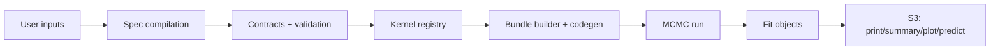

Welcome. This section documents the internal architecture of **DPmixGPD** and provides contributor recipes for extending kernels, tails, and workflows.







## How the system fits together

## Start here

- Architecture overview: [developers/architecture.qmd](developers/architecture.qmd)
- Tools and builds: [developers/tools.qmd](developers/tools.qmd) and [developers/site-build.qmd](developers/site-build.qmd)
- Add a kernel: [developers/add-kernel.qmd](developers/add-kernel.qmd)
- Causal internals: [developers/causal-internals.qmd](developers/causal-internals.qmd)
- Testing strategy: [developers/testing.qmd](developers/testing.qmd)
- Conventions: [developers/conventions.qmd](developers/conventions.qmd)
- Releasing: [developers/releasing.qmd](developers/releasing.qmd)
