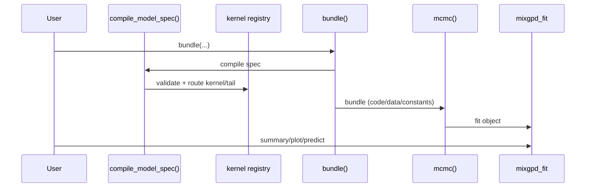
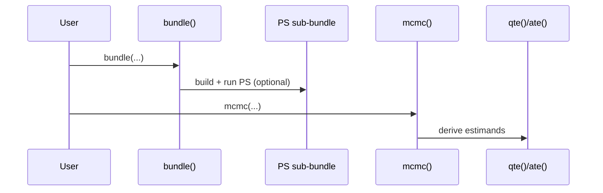

This page is the contributor mental model: what depends on what, and where to make changes safely.

## Layers

1. **Spec layer**: compiles user inputs into a normalized internal specification.
2. **Contracts**: enforce legal configurations and guard invariants early.
3. **Registry**: routes kernel/tail choices to concrete implementations.
4. **Bundle + codegen**: builds Nimble model code, constants/data, monitors, inits.
5. **MCMC**: runs the sampler, returning fit objects with standardized slots.
6. **S3 surface**: predict/plot/summary that should never need to know implementation details.

## Call flow (non-causal)

## Call flow (causal)

